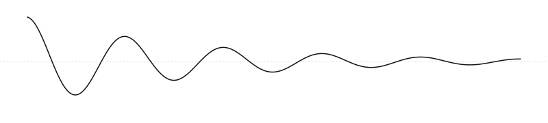

<!-- Copyright (c) 2025-2026 Bob Jansen <bobjansen@pm.me> -->
<!-- SPDX-License-Identifier: CC-BY-NC-4.0 -->
<!-- See LICENSE for full terms. Commercial licensing available. -->

<p align="center">
  <picture>
    <source media="(prefers-color-scheme: dark)" srcset="docs/assets/hero-dark.svg">
    
  </picture>
</p>

# Evenwicht

Quantitative Methods from Foundations to Frontiers.

A from-scratch TypeScript library and 48-chapter textbook covering calculus, linear algebra, probability, optimisation, differential equations, time series, operator algebra and fractional calculus; with applications across finance, machine learning, physics and 21 further domains.

Accompanied by a **48-chapter documentation suite** (~276,000 words, 287 diagrams) serving as both an educational resource and implementation specification.

> **Note**: This project is under active development. The documentation has been written as the implementation specification; the TypeScript library is being built from these specs. Formulas and numerical outputs have been verified against SciPy and NumPy (74 checks, all passing). If you find an error, please open an issue.

## Vision

Calculus, linear algebra, discrete-time systems, statistics and fractional operators represented as composable algebraic transformations; with applications spanning finance, ML, physics, biology, chemistry and engineering.

```typescript
const x = variable('x');
const f = mul(exp(x), sin(x));

// Symbolic differentiation
const df = simplify(differentiate(f, 'x'));

// Evaluate symbolically derived result
const symbolic = evaluate(df, { x: 1.0 });

// Compare against numeric approximation
const numeric = differentiateNumeric(
  t => Math.exp(t) * Math.sin(t),
  1.0,
  { method: 'central', h: 1e-5 }
);
```

## Design Principles

- **Algebra-first**: operators are first-class values that compose, add, and scale
- **Symbolic + numeric**: separate but interoperable representations
- **Educational**: readable code over clever code, documented math behind every module
- **From scratch**: no external math libraries — every algorithm is implemented and understood
- **TypeScript strict**: full type safety, pure functions where practical

## Documentation

48 chapters across 9 parts, each following a 14-section template:

| Part | Chapters | Topics |
|------|----------|--------|
| I: Foundations | 1–2 | Expressions, Special Functions |
| II: Calculus | 3–7 | Limits, Derivatives, Integrals, Series, Multivariate |
| III: Linear Algebra | 8–10 | Vectors, Matrices, Eigenvalues |
| IV: Optimization | 11–12 | Unconstrained, Constrained, LP |
| V: Probability & Statistics | 13–17 | Probability, Distributions, Descriptive, Inference, Regression |
| VI: Dynamic Systems | 18–19 | Difference Equations, ODEs |
| VII: Discrete & Time Series | 20–22 | Discrete Operators, Time Series, Transforms |
| VIII: Operator Theory | 23–24 | Operator Algebra, Fractional Calculus |
| IX: Applications | 25–48 | Finance, ML, Trading, Info Theory, Control, Epidemiology, Networks, Energy, Equilibrium, Chemistry, Pharmacokinetics, Game Theory, Cryptography, Climate, Mechanics, Signal Processing, Orbital Mechanics, Robotics, Fluids, Circuits, Geology, Cosmology, Optics, Genetics |

Each chapter includes: historical context, "why this chapter matters", notation, core theory with numbered definitions/theorems/proofs, formulas, algorithms, numerical considerations, implementation notes with TypeScript API, worked examples, connections, exercises, references, and glossary.

**289 Mermaid diagrams** across 11 types: flowcharts, mindmaps, timelines, XY charts, state diagrams, quadrant charts, sankey diagrams, class diagrams, and more.

## Scope

### In scope (301 items planned for implementation)

**Core Mathematics**
- Expression AST with evaluation, printing, simplification, symbolic differentiation
- Partial derivatives, gradients, Hessians
- Numerical differentiation and integration (trapezoid, Simpson)
- Dense vectors, matrices, determinant, inverse, Gaussian elimination, power iteration
- Gradient descent, Newton's method, Lagrange multipliers, simplex LP
- Difference equations, ODEs (Euler, RK4), stability analysis
- Sequences, shift/difference operators, discrete convolution
- Operator algebra (composition, addition, scaling)
- Fractional derivatives (Grünwald-Letnikov)
- DFT, FFT, spectral analysis

**Statistics & Econometrics**
- Descriptive statistics, covariance/correlation matrices
- Probability distributions (Normal, Binomial, Poisson, Uniform, t, Chi-squared, F)
- Hypothesis testing (z, t, F, chi-square, ANOVA)
- Simple and multiple OLS regression with diagnostics

**Time Series**
- ACF/PACF, exponential smoothing, AR/MA/ARMA, forecasting

**Applications** (24 domains using the core math)
- Financial mathematics, machine learning, quantitative trading
- Information theory, control systems, epidemiology
- Network analysis, energy systems, equilibrium analysis
- Chemical kinetics, pharmacokinetics, game theory
- Cryptography, climate modeling, classical mechanics
- Signal processing, orbital mechanics, robotics
- Fluid dynamics, circuit analysis, geology, cosmology
- Optics/acoustics, population genetics

### Deferred (169 items documented but not in v0.x)

See individual chapter implementation checklists for details.

### Not in scope

- String parser for expressions
- Symbolic integration
- PDEs
- GPU/WASM optimization
- Bayesian inference
- Complex numbers (real-valued first)

## Architecture

```
src/
  core/         — special functions (Gamma, erf, Beta), factorial
  expr/         — symbolic expression AST, evaluation, differentiation
  numeric/      — numerical derivative and integration methods
  linear/       — vectors, matrices, determinant, inverse, solving, eigenvalues
  optimization/ — unconstrained, constrained, linear programming
  dynamics/     — difference equations, ODEs, stability analysis
  financial/    — compound interest, PV/NPV/IRR, annuities
  discrete/     — sequences, shift, difference, convolution
  stats/        — descriptive stats, distributions, regression, ANOVA, diagnostics
  timeseries/   — ACF/PACF, smoothing, ARMA, forecasting
  transforms/   — DFT, FFT, spectral analysis
  operators/    — composable operator algebra layer
  fractional/   — fractional calculus (Grünwald-Letnikov)
  index.ts      — public API exports

docs/
  domains/      — 48 textbook-level chapters (Parts I–IX)
  TEMPLATE.md   — canonical 14-section chapter structure
  INDEX.md      — full chapter listing, dependency graph, reading paths
  plan.md       — 22-week implementation roadmap
  scope.md      — boundaries and design decisions
  STYLE-GUIDE.md — diagram styling conventions

scripts/
  validate-docs.sh         — 14-check structural validator
  add-license-headers.sh   — SPDX license header management
  verify-numerics.py       — 74 worked example verifications (scipy)
  verify-cross-references.py — 346 chapter cross-reference checks
  verify-references.py     — 489 bibliography URL and format checks
  verify-math.py           — 25,993 LaTeX math block validation
  verify-spelling.py       — spell check with 712-term math dictionary
  verify-glossary.py       — glossary coverage checker
  verify-diagrams.py       — 289 Mermaid diagram syntax validation
  verify-exercises.py      — exercise difficulty balance checker
  verify-api-consistency.py — API doc section standardization
  report-wordcount.py      — per-chapter word count report
  split-api-docs.py        — domain/API separation tool

build/pdf/
  build.sh                 — PDF build pipeline (mmdc + pandoc + lualatex)
  template/                — LaTeX template and chapter styling
  tools/                   — diagram captions, bibliography, stat tables, notation index
```

## Verification

```bash
npm run verify          # run all checks
npm run verify:numerics # 74 worked examples vs scipy
npm run verify:math     # 25,993 LaTeX math blocks
npm run verify:refs     # 489 bibliography entries (URLs + format)
npm run verify:spelling # spell check with math dictionary
npm run verify:glossary # glossary coverage
npm run verify:diagrams # 289 Mermaid diagrams
npm run report:wordcount # per-chapter word counts
```

## Engineering Constraints

- Pure TypeScript, strict mode
- No external math dependencies
- Dense data structures only
- Real numbers first
- Formulas constructed via API (no string parsing in v0.x)
- Unit tests for every rule and algorithm

## Getting Started

```bash
npm install
npm test
npm run build
```

## Building the PDF

```bash
# Prerequisites
brew install pandoc
pip3 install Pillow
npm install -g @mermaid-js/mermaid-cli
brew install --cask basictex
export PATH="/usr/local/texlive/2026basic/bin/universal-darwin:$PATH"
sudo tlmgr install collection-latexrecommended fontspec

# Build
./build/pdf/build.sh
# Output: dist/evenwicht.pdf
```

## License

- **Source code**: [AGPL-3.0](https://www.gnu.org/licenses/agpl-3.0.html) — free to use, modify, and distribute; derivative works and SaaS use must also be AGPL-3.0 with source available.
- **Documentation**: [CC BY-NC 4.0](https://creativecommons.org/licenses/by-nc/4.0/) — free to share and adapt for non-commercial use with attribution.
- **Commercial use**: A separate license is available for proprietary/commercial use of either code or documentation. Contact bobjansen@pm.me.

See [LICENSE](LICENSE) for full terms.
