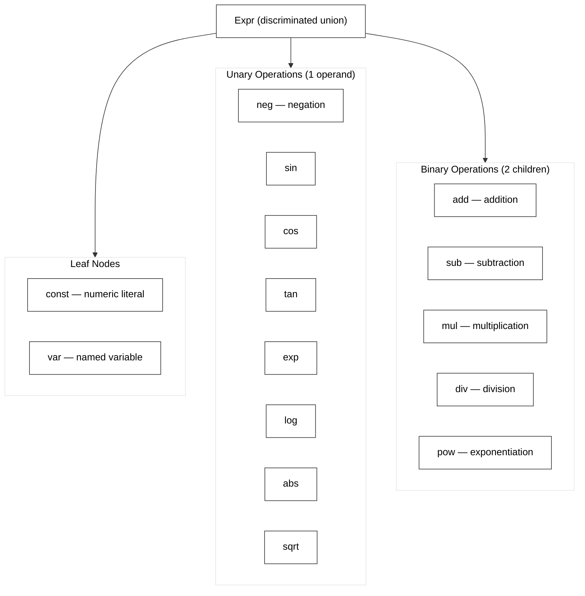
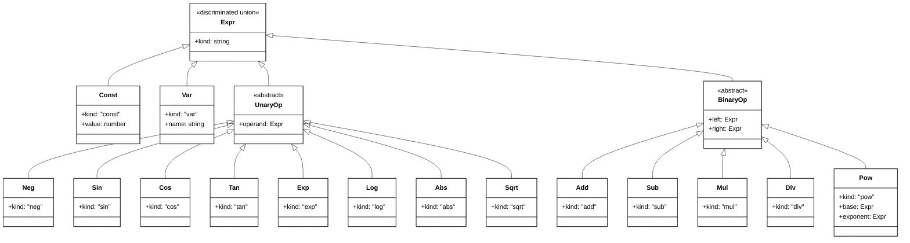

<!-- Copyright (c) 2025-2026 Bob Jansen <bobjansen@pm.me> -->
<!-- SPDX-License-Identifier: CC-BY-NC-4.0 -->
<!-- See LICENSE for full terms. Commercial licensing available. -->
# Mathematical Expressions & Functions — API Reference

This is the API reference for the TypeScript implementation of Mathematical Expressions & Functions. For the mathematical theory, see the corresponding chapter in the main text.

### Module Structure

- `src/expr/types.ts` — `Expr` discriminated union type definition
- `src/expr/constructors.ts` — factory functions for building expression trees
- `src/expr/evaluate.ts` — recursive tree evaluator, `toString`/`print`
- `src/expr/differentiate.ts` — symbolic differentiation
- `src/expr/simplify.ts` — algebraic simplification rules

### Data Representation

The expression system lives in `src/expr/`. The central type is `Expr`, a discriminated union with a `kind` field that determines the variant.

The `Expr` type definition supports 15 expression kinds:

```typescript
type Expr =
  | { kind: 'const'; value: number }
  | { kind: 'var'; name: string }
  | { kind: 'add'; left: Expr; right: Expr }
  | { kind: 'sub'; left: Expr; right: Expr }
  | { kind: 'mul'; left: Expr; right: Expr }
  | { kind: 'div'; left: Expr; right: Expr }
  | { kind: 'pow'; base: Expr; exponent: Expr }
  | { kind: 'neg'; operand: Expr }
  | { kind: 'sin'; operand: Expr }
  | { kind: 'cos'; operand: Expr }
  | { kind: 'tan'; operand: Expr }
  | { kind: 'exp'; operand: Expr }
  | { kind: 'log'; operand: Expr }
  | { kind: 'abs'; operand: Expr }
  | { kind: 'sqrt'; operand: Expr };
```

Each variant carries exactly the data needed: constants carry a `number`, variables carry a `string` name, binary operations carry `left` and `right` child expressions, unary operations carry a single `operand` (the `pow` kind uses `base` and `exponent` for clarity).



*Figure 1: Expression type hierarchy showing the discriminated union structure with leaf, unary and binary variants.*



*Figure 2: Class diagram view of the Expr type hierarchy showing inheritance relationships.*

### Constructor Functions

Expressions are built using factory functions rather than object literals, keeping the construction concise and type-safe:

```typescript
import {
  constant, variable, add, sub, mul, div, pow,
  neg, sin, cos, tan, exp, log, abs, sqrt
} from 'evenwicht/expr';

const x = variable('x');
const expr = add(pow(x, constant(2)), mul(constant(2), x));
// Represents: x^2 + 2x
```

Each constructor returns a value of type `Expr` with the appropriate `kind` tag. The constructors perform no validation beyond what TypeScript's type system enforces; invalid trees (e.g., trees that will produce domain errors on evaluation) are permitted at construction time and detected at evaluation time.

### Evaluation

The `evaluate` function takes an `Expr` and an environment object and returns a `number`:

```typescript
import { evaluate } from 'evenwicht/expr';

const result: number = evaluate(expr, { x: 3 });
```

The environment is a plain object with string keys and number values. The function uses a `switch` on `expr.kind` to dispatch to the correct case, matching Algorithm 1.23 directly.

### String Conversion

The `toString` function (also aliased as `print`) converts an expression tree to a human-readable string:

```typescript
import { toString } from 'evenwicht/expr';

const s: string = toString(expr);
// "(x^2 + (2 * x))"
```

### Browser vs Node

The expression module is pure computation with no I/O, filesystem, or platform-specific dependencies. It runs identically in Node.js and in browsers. All mathematical operations use the built-in `Math` object, which is part of the ECMAScript standard and available in all JavaScript environments.

### API Preview

```typescript
// Core expression type — src/expr/types.ts
type Expr =
  | { kind: 'const'; value: number }
  | { kind: 'var'; name: string }
  | { kind: 'add'; left: Expr; right: Expr }
  | { kind: 'sub'; left: Expr; right: Expr }
  | { kind: 'mul'; left: Expr; right: Expr }
  | { kind: 'div'; left: Expr; right: Expr }
  | { kind: 'pow'; base: Expr; exponent: Expr }
  | { kind: 'neg'; operand: Expr }
  | { kind: 'sin'; operand: Expr }
  | { kind: 'cos'; operand: Expr }
  | { kind: 'tan'; operand: Expr }
  | { kind: 'exp'; operand: Expr }
  | { kind: 'log'; operand: Expr }
  | { kind: 'abs'; operand: Expr }
  | { kind: 'sqrt'; operand: Expr };
```

```typescript
// Constructor functions — src/expr/constructors.ts
function constant(value: number): Expr;
function variable(name: string): Expr;
function add(left: Expr, right: Expr): Expr;
function sub(left: Expr, right: Expr): Expr;
function mul(left: Expr, right: Expr): Expr;
function div(left: Expr, right: Expr): Expr;
function pow(base: Expr, exponent: Expr): Expr;
function neg(operand: Expr): Expr;
function sin(operand: Expr): Expr;
function cos(operand: Expr): Expr;
function tan(operand: Expr): Expr;
function exp(operand: Expr): Expr;
function log(operand: Expr): Expr;
function abs(operand: Expr): Expr;
function sqrt(operand: Expr): Expr;

// Evaluation and printing — src/expr/evaluate.ts
/** Evaluate an expression tree given an environment mapping variable names to values. */
function evaluate(expr: Expr, env: Record<string, number>): number;

/** Convert an expression tree to a fully parenthesized string. */
function toString(expr: Expr): string;
```

### Error Handling

- **Undefined variable**: `evaluate` throws an `Error` if the expression contains a variable name not present in the environment.
- **Division by zero**: returns `Infinity`, `-Infinity`, or `NaN` following IEEE 754 rules (e.g., $1/0 = \texttt{Infinity}$, $0/0 = \texttt{NaN}$).
- **Domain violations**: `Math.log(-1)` returns `NaN`, `Math.sqrt(-1)` returns `NaN`. The library does not throw on these cases; it propagates the `NaN` value.

### Dependencies

- No external module dependencies; the expression module is the foundation of the symbolic system
- Used by: `src/expr/taylor.ts`, `src/expr/partial.ts`, `src/operators/` and all chapters that perform symbolic computation

### Usage Examples

```typescript
import { constant, variable, add, mul, pow, sin } from 'evenwicht/expr';
import { evaluate, toString } from 'evenwicht/expr';

// Build x^2 + 2x
const x = variable('x');
const f = add(pow(x, constant(2)), mul(constant(2), x));

// Evaluate at x = 3
const result = evaluate(f, { x: 3 });  // 15

// Print
const str = toString(f);  // "(x^2 + (2 * x))"

// Multivariate: sin(x) * y
const y = variable('y');
const g = mul(sin(x), y);
evaluate(g, { x: Math.PI / 2, y: 5 });  // 5.0
```

### Connections

This chapter is used by every subsequent chapter. The expression system defined here is the input to symbolic differentiation (Chapter 4), partial derivatives (Chapter 7), simplification (Chapter 4) and the operator algebra layer (Chapter 23). The function families introduced here reappear throughout calculus (Chapters 3–6), optimisation (Chapters 11–12) and probability (Chapter 13).

- **Differential Calculus** (Chapter 4): Expressions are the input to symbolic differentiation. The `differentiate` function takes an `Expr` and a variable name and returns a new `Expr` representing the derivative. Every differentiation rule (product rule, chain rule, etc.) is a recursive transformation of the expression tree.
- **Multivariate Calculus** (Chapter 7): Extending from single-variable to multi-variable expressions requires no change to the `Expr` type; an expression can contain multiple variable names (e.g., `add(variable('x'), variable('y'))`). Partial differentiation differentiates with respect to one variable while treating others as constants.
- **Operator Algebra** (Chapter 23): In the operator algebra layer, the derivative operator $D$ transforms one expression into another. Operators compose, add and scale, forming an algebra over the space of expressions. The expression tree is the ground representation on which all operators act.
- **Simplification** (Chapter 4): The `simplify` function reduces expression trees by applying algebraic identities (e.g., $x + 0 \to x$, $x \cdot 1 \to x$). Simplification is necessary for keeping derivative outputs readable, as raw symbolic differentiation produces many trivially reducible terms.


### What Is Implemented vs. Documented Only

- [x] `Expr` discriminated union type with 15 kinds
- [x] Constructor functions for all 15 kinds
- [x] Recursive evaluation with environment
- [x] String conversion (fully parenthesised)
- [ ] Simplification rules (see Chapter 4, `src/expr/simplify.ts`)
- [ ] Symbolic differentiation (see Chapter 4, `src/expr/differentiate.ts`)
### Numerical Considerations

The expression system itself performs exact structural operations (tree construction, pattern matching, simplification), so the classical numerical pitfalls of iterative algorithms do not arise here. Numerical issues surface only during evaluation, where IEEE 754 double-precision arithmetic governs every computation.

**IEEE 754 propagation.** The `evaluate` function inherits JavaScript's floating-point semantics verbatim. Division by zero produces `Infinity` or `-Infinity` (never an exception), `0/0` produces `NaN`, and domain violations such as `Math.log(-1)` or `Math.sqrt(-1)` silently return `NaN`. Because the evaluator propagates these sentinel values through the tree rather than throwing, a single `NaN` in a subexpression poisons the entire result. Callers must check for `NaN` and `Infinity` in outputs whenever the input domain is not guaranteed. The machine epsilon for IEEE 754 double precision is

$$\varepsilon_{\text{mach}} = 2^{-52} \approx 2.22 \times 10^{-16}$$

which bounds the relative rounding error of every individual arithmetic operation. Compound expressions accumulate rounding errors that depend on the expression structure and the condition number of the computation.

**Catastrophic cancellation in subtraction.** Subtracting nearly equal quantities is the most common source of precision loss. For example, evaluating `sub(add(constant(1e16), constant(1)), constant(1e16))` returns `0` rather than the exact answer `1`, because `1e16 + 1` rounds to `1e16` in double precision (only 16 significant digits are available). This issue propagates into derivatives (Chapter 4), where finite-difference formulas subtract nearby function values, and into series summation (Chapter 6), where alternating terms can cancel catastrophically. The expression tree structure does not protect against cancellation; it is an evaluation-time phenomenon.

**Overflow and underflow.** Double-precision values span roughly $[5 \times 10^{-324},\, 1.8 \times 10^{308}]$. Expressions involving `pow` or `exp` can easily exceed this range. For instance, `evaluate(exp(constant(710)), {})` returns `Infinity` because $e^{710} > 10^{308}$. The `pow` node is particularly dangerous: `pow(constant(10), constant(400))` overflows, while `pow(constant(10), constant(-400))` underflows to `0`. Working in log-space (Chapter 2) is the standard mitigation when intermediate values risk exceeding the representable range.

### Implementation Context

The expression system is the foundation on which all symbolic computation in the library rests, so its design decisions propagate everywhere.

**Key design decisions.** Use a discriminated union with a `kind` tag for `Expr`, not a class hierarchy. A `switch` on `kind` is exhaustively checked by TypeScript, so adding a new expression kind causes compile errors at every unhandled location; classes with `instanceof` checks fail silently. Factory functions (`constant`, `variable`, `add`, ...) keep construction concise and hide the object-literal syntax from callers.

**Immutability.** Expression trees are immutable values. Differentiation and simplification return new trees rather than mutating in place. This avoids aliasing bugs when the same subexpression appears in multiple places (common after CSE or user-level variable reuse) and makes the tree safe to share across threads in a future WebWorker build.

**Evaluation dispatch.** The recursive `evaluate` function mirrors Algorithm 1.23 directly: one `switch` case per `kind`. Tail-call optimisation is not available in V8, so deeply nested expressions (depth > ~10 000) will blow the call stack. An iterative evaluator using an explicit stack is a future option but not needed for the expression depths encountered in practice.

**Expression swell.** Symbolic differentiation (Chapter 4) can cause the output tree to be exponentially larger than the input. Always apply `simplify` after `differentiate` to collapse trivially reducible subexpressions (`x * 0 -> 0`, `x + 0 -> x`, etc.).

**Testing strategy.** Round-trip tests: build an expression, evaluate it and compare against a hand-computed value. Property tests: `evaluate(add(a, b), env)` equals `evaluate(a, env) + evaluate(b, env)` for random environments. String-conversion round-trip: `toString` output should re-parse to an equivalent tree (when a parser is available).

