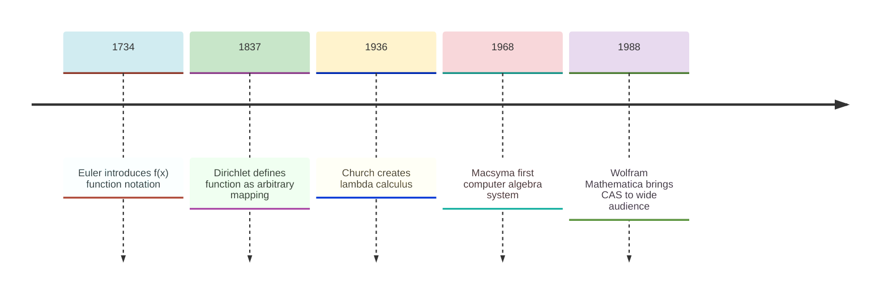
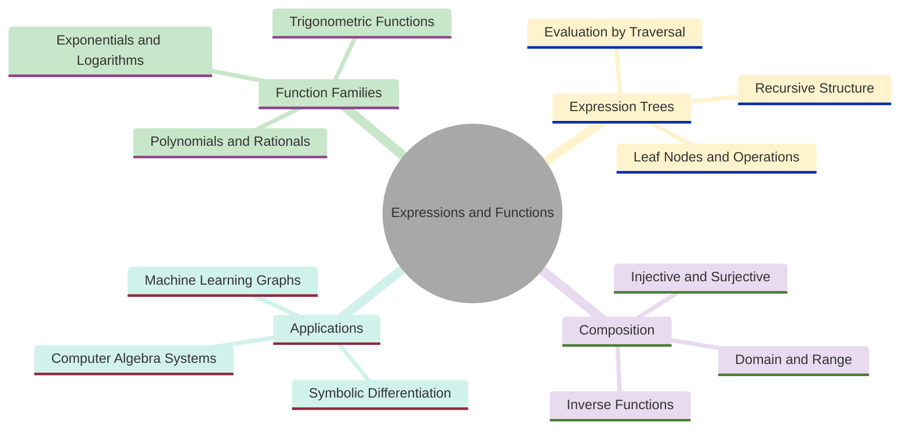
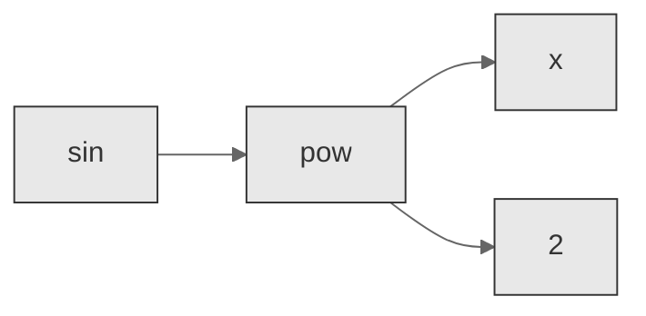
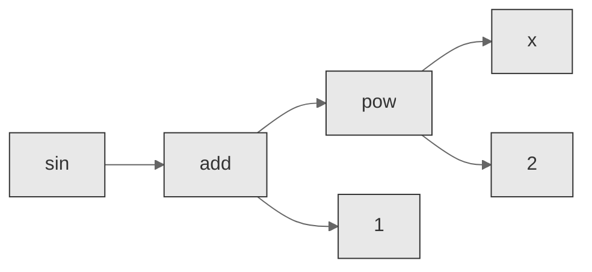
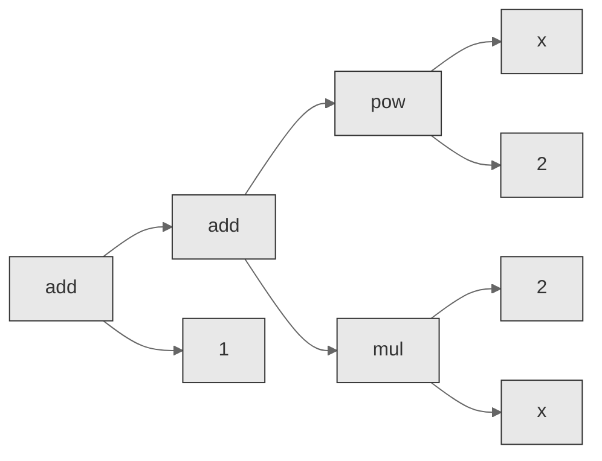
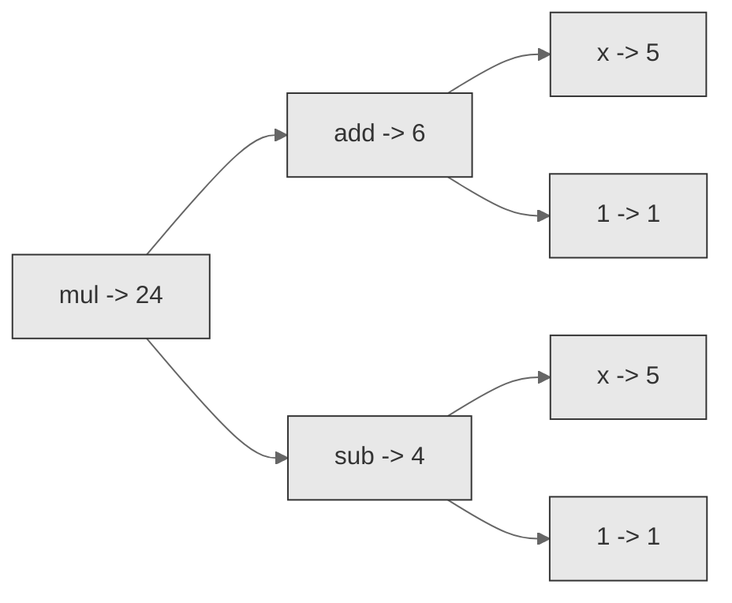
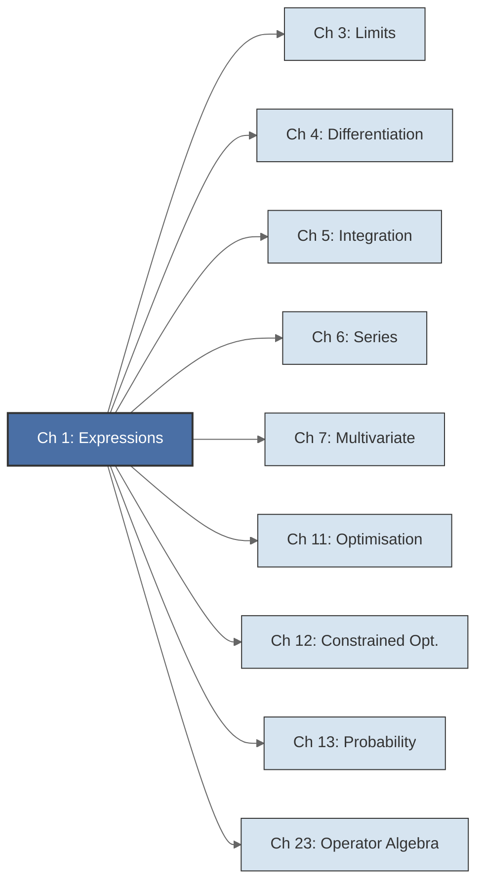

<!-- Copyright (c) 2025-2026 Bob Jansen <bobjansen@pm.me> -->
<!-- SPDX-License-Identifier: CC-BY-NC-4.0 -->
<!-- See LICENSE for full terms. Commercial licensing available. -->

# Chapter 1: Mathematical Expressions & Functions


**Part I**: Foundations

> Every computation in Evenwicht begins with an expression: a structured representation of a mathematical formula that can be evaluated, differentiated, simplified and composed.

**Prerequisites**: None. This is the first chapter.

**Learning Objectives**: After this chapter, the reader will be able to:
1. State the formal set-theoretic definition of a function and classify functions as injective, surjective or bijective.
2. Identify the domain, codomain and range of polynomial, rational, trigonometric, exponential, logarithmic, absolute value and square root functions.
3. Construct composite and inverse functions and verify their properties.
4. Describe the recursive structure of expression trees and explain how they formalise mathematical notation into structured data.
5. Build, evaluate and print expressions using the Evenwicht `Expr` type and its constructor functions.
6. Explain how Euler's formula-based view of functions evolved into Dirichlet's mapping-based definition and the modern set-theoretic formalisation.
7. Trace the historical lineage from Leibniz's vision of symbolic computation through lambda calculus to modern computer algebra systems.

**Connections**: This chapter is used by every subsequent chapter. The expression system defined here is the input to symbolic differentiation ([Chapter 4](04-differential-calculus.md)), partial derivatives ([Chapter 7](07-multivariate-calculus.md)), simplification ([Chapter 4](04-differential-calculus.md)) and the operator algebra layer ([Chapter 23](23-operator-algebra.md)). The function families introduced here reappear throughout calculus ([Chapter 3](03-limits-continuity.md), [Chapter 4](04-differential-calculus.md), [Chapter 5](05-integral-calculus.md), [Chapter 6](06-series-approximation.md)), optimisation ([Chapter 11](11-unconstrained-optimization.md), [Chapter 12](12-constrained-optimization.md)) and probability ([Chapter 13](13-probability-theory.md)).

---

## Historical Context

**Key Milestones in Mathematical Expressions**



*Figure 1.1: Key milestones in the development of mathematical expressions and function notation.*

**Euler and the function concept (1734).** The concept of a function underwent several centuries of refinement. In the early eighteenth century, Leonhard Euler treated a function as any analytic expression involving a variable quantity: a formula built from arithmetic operations, powers, roots, exponentials, logarithms and trigonometric operations applied to a variable $x$. Under this view, $\sin(x^2 + 1)$ was a function because one could write it as a formula. A table of arbitrary value assignments was not. Euler introduced the notation $f(x)$ around 1734. It became the standard shorthand for "the value of $f$ at the argument $x$" and remains so today.

**Dirichlet's mapping-based definition (1837).** The limitations of Euler's formula-based view became apparent in the study of vibrating strings and heat conduction. In 1837, Peter Gustav Lejeune Dirichlet proposed a broader definition: a function is any rule that assigns to each element of one set exactly one element of another set, with no requirement that the rule be expressible as a formula. This mapping-based definition freed mathematics from its dependence on notation. It also admitted pathological examples (continuous but nowhere-differentiable functions, space-filling curves) that sharpened the understanding of continuity, differentiability and convergence.

**Bourbaki and set-theoretic formalisation (1954).** The Bourbaki group supplied the set-theoretic formalisation in the twentieth century. A function $f: A \to B$ is defined as a subset of the Cartesian product $A \times B$ satisfying a uniqueness condition: for every $a \in A$, there exists exactly one $b \in B$ such that $(a, b) \in f$. This definition, stated purely in terms of sets and ordered pairs, provided the rigorous foundation on which modern analysis, algebra and topology rest. It is the definition adopted in this chapter.

**Leibniz and the notation of calculus (1684).** Mathematical notation itself became an object of study alongside the evolving function concept. Gottfried Wilhelm Leibniz developed the $\frac{dy}{dx}$ notation for derivatives and the $\int$ symbol for integration in the 1670s and 1680s. Leibniz valued notation as a tool for thought. His *calculus ratiocinator* was an early vision of symbolic computation, in which the manipulation of symbols according to formal rules could replace chains of reasoning. This vision connects directly to the modern expression tree: a formula represented not as a string of characters but as a structured object that a machine can traverse, transform and evaluate.

**From lambda calculus to computer algebra (1936).** The connection between formulas and data structures crystallised in the twentieth century. Alonzo Church's lambda calculus (1936) showed that functions themselves could serve as the primitive objects of a formal system, with function application and abstraction as the only operations. This influenced the design of programming languages (Lisp, ML, Haskell) and of computer algebra systems (CAS). The first practical CAS, Macsyma (1968), represented formulas as tree structures in Lisp and transformed them by pattern-matching rules; Evenwicht follows the same approach. Wolfram's Mathematica (1988) and open-source successors such as SymPy brought symbolic computation to a wide audience. The central insight behind all these systems is that a mathematical expression is a tree. Leaf nodes are constants and variables; internal nodes are operations. Evaluation proceeds recursively from leaves to root.

---

## Why This Chapter Matters

**Expressions and Functions**



*Figure 1.2: Conceptual map of expression and function topics covered in this chapter.*

Mathematical expressions and functions are the atomic units of every quantitative discipline. Every model in finance, every loss function in machine learning and every equation of motion in physics is an expression built from the ingredients defined here. These ingredients are constants, variables, arithmetic operations and elementary functions composed into trees. A practitioner who cannot construct, evaluate and reason about these expressions cannot engage with any of the mathematics that follows.

The expression tree formalism transforms mathematics from something written on paper into something a machine can manipulate. The recursive structure of `Expr` (leaves are constants and variables, internal nodes are operations) is identical to the abstract syntax tree (AST) used by compilers, interpreters and computer algebra systems. This structure is prerequisite to symbolic differentiation ([Chapter 4](04-differential-calculus.md)), where the derivative of an expression is computed by a recursive tree transformation. It is equally prerequisite to automatic differentiation in frameworks such as PyTorch and JAX. In those frameworks, computational graphs are generalised expression trees and backpropagation is the chain rule traversed in reverse. Without the ability to represent formulas as structured data, none of these capabilities exist.

Each function family catalogued here (polynomials, exponentials, logarithms, trigonometric functions) appears for a reason, not by arbitrary choice. They arise because they model the phenomena practitioners encounter daily. Exponential functions describe compound interest, radioactive decay and population growth. Logarithms appear in information theory (entropy), signal processing (decibels) and the pH scale. Trigonometric functions underlie every oscillatory phenomenon, from alternating current to seasonal economic cycles. The domain restrictions, identities and composition rules for these functions form the vocabulary a practitioner must command before computing a derivative, evaluating an integral or training a model.

---

## Notation & Conventions

| Symbol | Meaning |
|--------|---------|
| $f, g, h$ | Functions, typically $\mathbb{R} \to \mathbb{R}$ unless stated otherwise |
| $x, y, z$ | Real-valued variables |
| $a, b, c$ | Real constants or set elements, depending on context |
| $A, B$ | Sets (domain and codomain of a function) |
| $D_f$ | Domain of the function $f$ |
| $R_f$ | Range (image) of the function $f$ |
| $f \circ g$ | Composition of $f$ and $g$: $(f \circ g)(x) = f(g(x))$ |
| $f^{-1}$ | Inverse function of $f$ (when it exists) |
| $:=$ | "is defined as" |
| $\mathbb{R}$ | The set of real numbers |
| $\mathbb{Z}$ | The set of integers |
| $\mathbb{N}$ | The set of natural numbers (including 0) |
| $\mathbb{Q}$ | The set of rational numbers |
| $\mathrm{id}_A$ | The identity function on $A$: $\mathrm{id}_A(x) = x$ for all $x \in A$ |
| $e$ | Euler's number, $e \approx 2.71828$; the base of the natural exponential |
| $n$ | Degree of a polynomial or a positive integer index |
| $k$ | Summation index |
| $a_k$ | Coefficient of $x^k$ in a polynomial |
| $p, q, r$ | Polynomial, rational or other named functions, depending on context |
| $E, E_1, E_2$ | Expression trees |
| $\pi$ | The ratio of a circle's circumference to its diameter, $\pi \approx 3.14159$ |
| $\theta$ | An angle, measured in radians |
| $\mathrm{eval}$ | Evaluation function: $\mathrm{eval}(E, \mathrm{env})$ returns the value of expression $E$ |
| $\mathrm{env}$ | An environment: a mapping from variable names to real numbers |

All functions are real-valued on real domains unless stated otherwise. Logarithm written as $\ln$ denotes the natural logarithm; in Evenwicht code, `log` refers to $\ln$.

---

## Core Theory

### Functions

**Definition 1.1** (Function). Let $A$ and $B$ be non-empty sets. A *function* $f: A \to B$ is a subset $f \subseteq A \times B$ such that for every $a \in A$, there exists exactly one $b \in B$ with $(a, b) \in f$. The element $b$ is called the *value* of $f$ at $a$, written $f(a) = b$.

In prose: a function is a rule that assigns to each input exactly one output. The requirement "exactly one" distinguishes functions from general relations (which may assign zero or multiple outputs to a single input).

**Definition 1.2** (Domain, Codomain, Range). Let $f: A \to B$ be a function.

- The *domain* of $f$ is $D_f := A$, the set of all valid inputs.
- The *codomain* of $f$ is $B$, the set in which all outputs are declared to lie.
- The *range* (or *image*) of $f$ is $R_f := \{f(a) \mid a \in A\} \subseteq B$, the set of values actually attained.

The distinction between codomain and range is important. A function $f: \mathbb{R} \to \mathbb{R}$ defined by $f(x) = x^2$ has codomain $\mathbb{R}$ but range $[0, \infty)$. Whether the codomain equals the range determines surjectivity.

**Definition 1.3** (Injective, Surjective, Bijective). Let $f: A \to B$ be a function.

- $f$ is *injective* (one-to-one) if for all $a_1, a_2 \in A$, $f(a_1) = f(a_2)$ implies $a_1 = a_2$. Distinct inputs produce distinct outputs.
- $f$ is *surjective* (onto) if for every $b \in B$, there exists some $a \in A$ with $f(a) = b$. Every element of the codomain is hit. Equivalently, $R_f = B$.
- $f$ is *bijective* if it is both injective and surjective. A bijection establishes a one-to-one correspondence between $A$ and $B$.

**Example 1.4**. The function $f: \mathbb{R} \to \mathbb{R}$ defined by $f(x) = x^2$ is neither injective (since $f(-2) = f(2) = 4$) nor surjective (since $-1$ is not in the range). Restricting the domain to $[0, \infty)$ and the codomain to $[0, \infty)$ makes it bijective.

**Definition 1.5** (Composition). Let $g: A \to B$ and $f: B \to C$ be functions. The *composition* of $f$ and $g$, written $f \circ g$, is the function $f \circ g: A \to C$ defined by:

$$
(f \circ g)(x) := f(g(x)) \quad \text{for all } x \in A
$$

The domain of $f \circ g$ requires that the range of $g$ be contained in the domain of $f$: $R_g \subseteq D_f$.

!!! note "Composition reads right-to-left"
    The notation $f \circ g$ means "first apply $g$, then apply $f$." The rightmost function acts first. This convention matches the order of evaluation: in $f(g(x))$, the argument $x$ enters $g$ before the result passes to $f$.

**Theorem 1.6** (Composition is associative). Let $h: A \to B$, $g: B \to C$ and $f: C \to D$ be functions. Then:

$$
f \circ (g \circ h) = (f \circ g) \circ h
$$

That is, function composition is associative.

??? note "Proof"

    *Proof.* Let $x \in A$ be arbitrary. Then:

    $$(f \circ (g \circ h))(x) = f((g \circ h)(x)) = f(g(h(x)))$$

    and

    $$((f \circ g) \circ h)(x) = (f \circ g)(h(x)) = f(g(h(x)))$$

    Since both expressions equal $f(g(h(x)))$ for every $x \in A$, the two functions are equal.

    $\square$

**Remark 1.7**. Composition is associative but generally not commutative. For instance, if $f(x) = x^2$ and $g(x) = x + 1$, then $(f \circ g)(x) = (x+1)^2$ while $(g \circ f)(x) = x^2 + 1$. These are distinct functions.

**Definition 1.8** (Inverse function). Let $f: A \to B$ be a bijection. The *inverse function* $f^{-1}: B \to A$ is the unique function satisfying:

$$\begin{aligned}
f^{-1}(f(a)) &= a \quad \text{for all } a \in A \\
f(f^{-1}(b)) &= b \quad \text{for all } b \in B
\end{aligned}$$

Equivalently, $f^{-1} \circ f = \mathrm{id}_A$ and $f \circ f^{-1} = \mathrm{id}_B$. The inverse exists if and only if $f$ is bijective. Injectivity guarantees that $f^{-1}$ is well-defined (each output came from exactly one input) and surjectivity guarantees that $f^{-1}$ is defined on all of $B$.

### Function Families

**Definition 1.9** (Polynomial function). A *polynomial function* of degree $n$ is a function $p: \mathbb{R} \to \mathbb{R}$ of the form:

$$p(x) = a_n x^n + a_{n-1} x^{n-1} + \cdots + a_1 x + a_0 = \sum_{k=0}^{n} a_k x^k$$

where $a_0, a_1, \ldots, a_n \in \mathbb{R}$ are the *coefficients*, $a_n \neq 0$ is the *leading coefficient* and $n \geq 0$ is the *degree*. The domain of every polynomial is $\mathbb{R}$.

**Example 1.10**. The function $p(x) = 3x^4 - 2x^2 + 5$ is a polynomial of degree 4 with leading coefficient 3. The function $q(x) = 7$ is a polynomial of degree 0 (a constant).

**Definition 1.11** (Rational function). A *rational function* is a function $r: D_r \to \mathbb{R}$ of the form:

$$r(x) = \frac{p(x)}{q(x)}$$

where $p$ and $q$ are polynomial functions and $q$ is not the zero polynomial. The domain is $D_r = \{x \in \mathbb{R} \mid q(x) \neq 0\}$. Points where $q(x) = 0$ are excluded from the domain and may correspond to vertical asymptotes or removable discontinuities.

**Example 1.12**. The function $r(x) = \frac{x^2 - 1}{x - 1}$ has domain $\mathbb{R} \setminus \{1\}$. Since $x^2 - 1 = (x-1)(x+1)$, the function simplifies to $r(x) = x + 1$ for $x \neq 1$ and the discontinuity at $x = 1$ is removable.

**Definition 1.13** (Exponential function). The *exponential function* with base $a > 0$, $a \neq 1$, is the function $f: \mathbb{R} \to (0, \infty)$ defined by $f(x) = a^x$. The standard case is the *natural exponential function* $\exp(x) = e^x$, where $e \approx 2.71828$ is Euler's number. Key properties:

- $e^{x+y} = e^x \cdot e^y$ (the exponential converts addition to multiplication)
- $e^0 = 1$
- $e^{-x} = 1/e^x$
- $(e^x)^r = e^{rx}$ for all $r \in \mathbb{R}$
- $\exp$ is strictly increasing, with range $(0, \infty)$
- $\exp$ is its own derivative: $\frac{d}{dx} e^x = e^x$ (see [Chapter 4](04-differential-calculus.md))

The domain of $\exp$ is all of $\mathbb{R}$. The function is bijective from $\mathbb{R}$ to $(0, \infty)$.

**Definition 1.14** (Logarithmic function). The *natural logarithm* $\ln: (0, \infty) \to \mathbb{R}$ is the inverse of the natural exponential function. That is, $\ln(x) = y$ if and only if $e^y = x$. Key properties:

- $\ln(xy) = \ln x + \ln y$ for $x, y > 0$ (the logarithm converts multiplication to addition)
- $\ln(x/y) = \ln x - \ln y$ for $x, y > 0$
- $\ln(x^r) = r \ln x$ for $x > 0$ and $r \in \mathbb{R}$
- $\ln(1) = 0$ and $\ln(e) = 1$
- $\ln$ is strictly increasing on $(0, \infty)$

The domain of $\ln$ is $(0, \infty)$. The range is $\mathbb{R}$. In Evenwicht, `log` refers to the natural logarithm $\ln$.

**Definition 1.15** (Trigonometric functions). The *sine*, *cosine* and *tangent* functions are defined via the unit circle. For an angle $\theta$ measured in radians, the point on the unit circle at angle $\theta$ from the positive $x$-axis has coordinates $(\cos\theta, \sin\theta)$. The tangent is defined as $\tan\theta = \sin\theta / \cos\theta$ where $\cos\theta \neq 0$. A rigorous analytic definition uses either the power series $\sin x = \sum_{n=0}^\infty \frac{(-1)^n x^{2n+1}}{(2n+1)!}$ or the differential equation $y'' = -y$ with initial conditions; the unit circle description is the geometric interpretation.

Domains and ranges:

- $\sin: \mathbb{R} \to [-1, 1]$, periodic with period $2\pi$
- $\cos: \mathbb{R} \to [-1, 1]$, periodic with period $2\pi$
- $\tan: \mathbb{R} \setminus \left\{(2k+1)\tfrac{\pi}{2} \mid k \in \mathbb{Z}\right\} \to \mathbb{R}$, periodic with period $\pi$

Key identities:

- Pythagorean identity: $\sin^2 x + \cos^2 x = 1$
- Angle addition: $\sin(x + y) = \sin x \cos y + \cos x \sin y$
- Angle addition: $\cos(x + y) = \cos x \cos y - \sin x \sin y$
- Double angle: $\sin(2x) = 2 \sin x \cos x$
- Double angle: $\cos(2x) = \cos^2 x - \sin^2 x$

**Definition 1.16** (Absolute value). The *absolute value* function $|\cdot|: \mathbb{R} \to [0, \infty)$ is defined by:

$$\lvert x \rvert := \begin{cases} x & \text{if } x \geq 0 \\ -x & \text{if } x < 0 \end{cases}$$

The absolute value measures the distance from $x$ to the origin on the real line. Key properties:

- $|x| \geq 0$ for all $x$, with equality if and only if $x = 0$ (positive definiteness)
- $|xy| = |x| \cdot |y|$ (multiplicativity)
- $|x + y| \leq |x| + |y|$ (triangle inequality)

The triangle inequality is fundamental in analysis and numerical computation. It provides the basic tool for bounding errors.

**Definition 1.17** (Square root). The *principal square root* function $\sqrt{\cdot}: [0, \infty) \to [0, \infty)$ is defined by:

$$\sqrt{x} := x^{1/2}$$

That is, $\sqrt{x}$ is the unique non-negative real number $y$ such that $y^2 = x$. Key properties:

- $\sqrt{xy} = \sqrt{x} \cdot \sqrt{y}$ for $x, y \geq 0$
- $\sqrt{x^2} = |x|$ for all $x \in \mathbb{R}$
- $(\sqrt{x})^2 = x$ for $x \geq 0$

The domain restriction to $[0, \infty)$ is necessary: in the real numbers, $\sqrt{x}$ is undefined for $x < 0$.

### Expression Trees

**Definition 1.18** (Expression tree). An *expression* is defined recursively by the following grammar:

1. A constant $c \in \mathbb{R}$ is an expression.
2. A variable $x$ (represented by a name string) is an expression.
3. If $E_1$ and $E_2$ are expressions, then $(E_1 + E_2)$, $(E_1 - E_2)$, $(E_1 \cdot E_2)$, $(E_1 / E_2)$ and $E_1^{E_2}$ are expressions.
4. If $E$ is an expression, then $-E$, $\sin(E)$, $\cos(E)$, $\tan(E)$, $\exp(E)$, $\ln(E)$, $|E|$ and $\sqrt{E}$ are expressions.

Nothing else is an expression. Every expression corresponds to a rooted tree in which leaf nodes are constants or variables, and internal nodes are operations. Binary operations ($+, -, \cdot, /, \hat{}$) have two children; unary operations ($-, \sin, \cos, \tan, \exp, \ln, |\cdot|, \sqrt{\cdot}$) have one child.

**Remark 1.19** (Expression trees as directed trees). An expression tree is a finite, rooted, ordered tree. Each node carries a *kind* label drawn from the set $\{\texttt{const}, \texttt{var}, \texttt{add}, \texttt{sub}, \texttt{mul}, \texttt{div}, \texttt{pow}, \texttt{neg}, \texttt{sin}, \texttt{cos}, \texttt{tan}, \texttt{exp}, \texttt{log}, \texttt{abs}, \texttt{sqrt}\}$. The *depth* of a tree is the number of edges on its longest root-to-leaf path (a single node has depth 0). The *size* of a tree is the total number of nodes. Evaluation proceeds in post-order: a node cannot be evaluated until all of its children have been evaluated. Expression trees are always trees (not general directed acyclic graphs), meaning that common subexpressions are not shared; each occurrence of a variable or subexpression is a distinct node. The trade-offs between this design and a DAG representation are explored in Exercise 1.8.

**Example 1.20**. The expression $\sin(x^2)$ has the following tree structure:

**Expression Tree for sin(x^2)**



*Figure 1.3: Expression tree for sin(x^2) showing the recursive structure of nodes.*

A more complex composed expression like $\sin(x^2 + 1)$ nests multiple operations. The following block diagram shows how the outer `sin` block wraps an inner `add` block, which in turn contains a `pow` node and a constant leaf:

**Expression Tree for sin(x^2 + 1)**



*Figure 1.4: Expression tree for sin(x^2 + 1) with nested addition and power nodes.*

The root node has kind `sin` with one child: an `add` node. The `add` node has two children: a `pow` node and a `const` node (representing $1$). The `pow` node has two children: a `var` node (representing $x$) and a `const` node (representing $2$). The tree has depth 3 (three edges from root to deepest leaf) and size 6 (six nodes).

**Definition 1.21** (Evaluation). Let $E$ be an expression and let $\mathrm{env}: \mathrm{Names} \to \mathbb{R}$ be an *environment* mapping variable names to real numbers. The *evaluation* of $E$ under $\mathrm{env}$, written $\mathrm{eval}(E, \mathrm{env})$, is defined recursively:

- $\mathrm{eval}(c, \mathrm{env}) = c$ for a constant $c$
- $\mathrm{eval}(x, \mathrm{env}) = \mathrm{env}(x)$ for a variable $x$
- $\mathrm{eval}(E_1 + E_2, \mathrm{env}) = \mathrm{eval}(E_1, \mathrm{env}) + \mathrm{eval}(E_2, \mathrm{env})$
- $\mathrm{eval}(E_1 - E_2, \mathrm{env}) = \mathrm{eval}(E_1, \mathrm{env}) - \mathrm{eval}(E_2, \mathrm{env})$
- $\mathrm{eval}(E_1 \cdot E_2, \mathrm{env}) = \mathrm{eval}(E_1, \mathrm{env}) \cdot \mathrm{eval}(E_2, \mathrm{env})$
- $\mathrm{eval}(E_1 / E_2, \mathrm{env}) = \mathrm{eval}(E_1, \mathrm{env}) \;/\; \mathrm{eval}(E_2, \mathrm{env})$
- $\mathrm{eval}(E_1^{E_2}, \mathrm{env}) = \mathrm{eval}(E_1, \mathrm{env})^{\mathrm{eval}(E_2, \mathrm{env})}$
- $\mathrm{eval}(-E, \mathrm{env}) = -\mathrm{eval}(E, \mathrm{env})$
- $\mathrm{eval}(\sin(E), \mathrm{env}) = \sin(\mathrm{eval}(E, \mathrm{env}))$

and analogously for $\cos$, $\tan$, $\exp$, $\ln$, $|\cdot|$ and $\sqrt{\cdot}$.

**Theorem 1.22** (Well-definedness of evaluation). Let $E$ be an expression and $\mathrm{env}$ an environment. If every variable appearing in $E$ has an assigned value in $\mathrm{env}$, and no subexpression evaluation results in division by zero, $\ln$ of a non-positive number or $\sqrt{\cdot}$ of a negative number, then $\mathrm{eval}(E, \mathrm{env})$ is a well-defined real number.

!!! abstract "Key Result"

    **Theorem 1.22** (Well-definedness of evaluation). Recursive evaluation of an expression tree produces a unique real number whenever all variables are bound and no operation leaves its domain, guaranteeing that the `Expr` representation is sound for symbolic and numerical computation.

??? note "Proof"

    *Proof.* By structural induction on $E$.

    **Base cases.** If $E$ is a constant $c$, then $\mathrm{eval}(c, \mathrm{env}) = c \in \mathbb{R}$, which is well-defined. If $E$ is a variable $x$, then by hypothesis $x \in \mathrm{dom}(\mathrm{env})$, so $\mathrm{eval}(x, \mathrm{env}) = \mathrm{env}(x) \in \mathbb{R}$, which is well-defined.

    **Inductive step (binary operations).** Suppose $E = \mathrm{op}(E_1, E_2)$ where $\mathrm{op} \in \{+, -, \cdot, /, \hat{}\}$. By the induction hypothesis, $v_1 = \mathrm{eval}(E_1, \mathrm{env})$ and $v_2 = \mathrm{eval}(E_2, \mathrm{env})$ are well-defined real numbers.

    For $+$, $-$ and $\cdot$, the result $\mathrm{op}(v_1, v_2)$ is a well-defined real number by closure of $\mathbb{R}$ under these operations.

    For division, the hypothesis excludes $v_2 = 0$, so $v_1 / v_2$ is well-defined. For exponentiation, $v_1^{v_2}$ is well-defined under the standard conventions (the hypothesis excludes cases such as $0^0$ or negative base with non-integer exponent where the real-valued power is undefined).

    **Inductive step (unary operations).** Suppose $E = f(E_1)$ where $f \in \{-, \sin, \cos, \tan, \exp, \ln, |\cdot|, \sqrt{\cdot}\}$. By the induction hypothesis, $v = \mathrm{eval}(E_1, \mathrm{env})$ is a well-defined real number.

    Negation, $\sin$, $\cos$, $\exp$ and $|\cdot|$ are defined for all $v \in \mathbb{R}$, so $f(v)$ is well-defined.

    For $\tan$, the hypothesis excludes $v = (2k+1)\pi/2$. For $\ln$, the hypothesis excludes $v \leq 0$. For $\sqrt{\cdot}$, the hypothesis excludes $v < 0$. In each case $f(v)$ is a well-defined real number.

    Since the expression tree is finite, the structural induction covers all nodes and the recursion terminates, so $\mathrm{eval}(E, \mathrm{env})$ is a well-defined real number.

    The theorem guarantees well-definedness only when these domain conditions are satisfied. Evaluation will fail if the environment is missing a variable (violating the hypothesis on $\mathrm{dom}(\mathrm{env})$) or if a function is applied outside its domain (e.g., $\ln(0)$, $\sqrt{-1}$ or $1/0$).

    $\square$

---

## Formulas & Identities

This section collects the key identities for the function families defined above, for reference.

### Exponential Laws

**F1.1** Exponential addition law, for all $x, y \in \mathbb{R}$.

$$e^{x+y} = e^x \cdot e^y$$

**F1.2** Exponential subtraction law, for all $x, y \in \mathbb{R}$.

$$e^{x-y} = e^x / e^y$$

**F1.3** Exponential power law, for all $x, r \in \mathbb{R}$.

$$(e^x)^r = e^{rx}$$

**F1.4** Exponential at zero.

$$e^0 = 1$$

### Logarithm Laws

**F1.5** Logarithm of a product, for $x, y > 0$.

$$\ln(xy) = \ln x + \ln y$$

**F1.6** Logarithm of a quotient, for $x, y > 0$.

$$\ln(x/y) = \ln x - \ln y$$

**F1.7** Logarithm of a power, for $x > 0$, $r \in \mathbb{R}$.

$$\ln(x^r) = r \ln x$$

**F1.8** Logarithm base values.

$$\ln(1) = 0, \qquad \ln(e) = 1$$

### Trigonometric Identities

**F1.9** Pythagorean identity.

$$\sin^2 x + \cos^2 x = 1$$

**F1.10** Sine addition formula.

$$\sin(x + y) = \sin x \cos y + \cos x \sin y$$

**F1.11** Cosine addition formula.

$$\cos(x + y) = \cos x \cos y - \sin x \sin y$$

**F1.12** Double angle formula for sine.

$$\sin(2x) = 2\sin x \cos x$$

**F1.13** Double angle formula for cosine.

$$\cos(2x) = \cos^2 x - \sin^2 x = 2\cos^2 x - 1 = 1 - 2\sin^2 x$$

**F1.14** Tangent addition formula, provided $\tan x \tan y \neq 1$.

$$\tan(x + y) = \frac{\tan x + \tan y}{1 - \tan x \tan y}$$

**F1.15** Periodicity.

$$\sin(x + 2\pi) = \sin x, \qquad \cos(x + 2\pi) = \cos x, \qquad \tan(x + \pi) = \tan x$$

### Absolute Value Properties

**F1.16** Positive definiteness.

$$|x| \geq 0, \quad \text{with } |x| = 0 \iff x = 0$$

**F1.17** Multiplicativity.

$$|xy| = |x| \cdot |y|$$

**F1.18** Triangle inequality.

$$|x + y| \leq |x| + |y|$$

### Composition Identities

**F1.19** Exponential of logarithm, for $x > 0$.

$$e^{\ln x} = x$$

**F1.20** Logarithm of exponential, for all $x \in \mathbb{R}$.

$$\ln(e^x) = x$$

!!! info "Exp and ln as inverse functions"
    Identities F1.19 and F1.20 express that $\exp$ and $\ln$ are inverses. Composing them in either order yields the identity: $e^{\ln x} = x$ for $x > 0$ and $\ln(e^x) = x$ for all $x \in \mathbb{R}$. The asymmetry in domains reflects the range restriction of $\ln$.

---

## Algorithms

### Algorithm 1.23: Recursive Evaluation of an Expression Tree

**Input**: Expression tree $E$, environment $\mathrm{env}$: a map from variable names to real numbers.

**Output**: A real number (the value of $E$ under $\mathrm{env}$).

```
function evaluate(E, env):
    match E.kind:
        case const(c):    return c
        case var(name):   return env[name]    // throws if name not in env
        case add(L, R):   return evaluate(L, env) + evaluate(R, env)
        case sub(L, R):   return evaluate(L, env) - evaluate(R, env)
        case mul(L, R):   return evaluate(L, env) * evaluate(R, env)
        case div(L, R):   return evaluate(L, env) / evaluate(R, env)
        case pow(L, R):   return evaluate(L, env) ^ evaluate(R, env)
        case neg(A):      return -evaluate(A, env)
        case sin(A):      return sin(evaluate(A, env))
        case cos(A):      return cos(evaluate(A, env))
        case tan(A):      return tan(evaluate(A, env))
        case exp(A):      return exp(evaluate(A, env))
        case log(A):      return ln(evaluate(A, env))
        case abs(A):      return |evaluate(A, env)|
        case sqrt(A):     return sqrt(evaluate(A, env))
```

**Complexity**: $O(n)$ where $n$ is the number of nodes in the expression tree. Each node is visited exactly once. Space complexity is $O(d)$ where $d$ is the depth of the tree (due to the call stack).

**Correctness**: The algorithm implements the recursive definition from Definition 1.21 directly. Termination is guaranteed because the tree is finite and each recursive call operates on a strict subtree.

### Algorithm 1.24: Pretty-Printing an Expression Tree

**Input**: Expression tree $E$.

**Output**: A human-readable string representation.

```
function toString(E):
    match E.kind:
        case const(c):    return formatNumber(c)
        case var(name):   return name
        case add(L, R):   return "(" + toString(L) + " + " + toString(R) + ")"
        case sub(L, R):   return "(" + toString(L) + " - " + toString(R) + ")"
        case mul(L, R):   return "(" + toString(L) + " * " + toString(R) + ")"
        case div(L, R):   return "(" + toString(L) + " / " + toString(R) + ")"
        case pow(L, R):   return "(" + toString(L) + "^" + toString(R) + ")"
        case neg(A):      return "(-" + toString(A) + ")"
        case sin(A):      return "sin(" + toString(A) + ")"
        case cos(A):      return "cos(" + toString(A) + ")"
        case tan(A):      return "tan(" + toString(A) + ")"
        case exp(A):      return "exp(" + toString(A) + ")"
        case log(A):      return "log(" + toString(A) + ")"
        case abs(A):      return "abs(" + toString(A) + ")"
        case sqrt(A):     return "sqrt(" + toString(A) + ")"
```

**Complexity**: $O(n)$ time, where $n$ is the size of the tree. The output string length is also $O(n)$ (each node contributes a bounded number of characters).

**Remark**. The fully-parenthesised output avoids ambiguity without requiring precedence logic. A production-quality printer can omit unnecessary parentheses by tracking the precedence of each operator and only wrapping lower-precedence subexpressions; see [Chapter 23](23-operator-algebra.md) for the algebraic structure that would inform such a design.

---

## Numerical Considerations

### IEEE 754 Double Precision

All numbers in JavaScript are IEEE 754 double-precision floating-point values. The key parameters are:

- **Significand**: 52 bits, giving approximately 15–16 decimal digits of precision.
- **Exponent**: 11 bits, giving a range from approximately $5 \times 10^{-324}$ (smallest positive subnormal) to $1.8 \times 10^{308}$ (largest finite value).
- **Machine epsilon**: $\varepsilon_{\mathrm{mach}} = 2^{-52} \approx 2.22 \times 10^{-16}$. This is the smallest value such that $1 + \varepsilon_{\mathrm{mach}} > 1$ in floating-point arithmetic. It represents the relative precision of a single arithmetic operation. (Some sources define machine epsilon as $2^{-53}$; this text follows the IEEE 754 convention.)

### Special Values

IEEE 754 defines several special values that arise during expression evaluation:

- **NaN** (Not a Number): produced by $0/0$, $\sqrt{-1}$ (in real mode), $\infty - \infty$ and other indeterminate forms. NaN propagates: any arithmetic operation involving NaN produces NaN.
- **$\infty$** and **$-\infty$**: produced by $1/0$ and $-1/0$ respectively, or by overflow (e.g., $e^{710}$). Arithmetic on infinities follows IEEE 754 rules: $\infty + 1 = \infty$, $\infty \cdot (-1) = -\infty$, $\infty / \infty = \text{NaN}$.
- **$-0$**: negative zero is distinct from positive zero under IEEE 754 but compares equal in standard equality tests. It arises from operations like $-1 \cdot 0$ or $1 / (-\infty)$.

### Catastrophic Cancellation

Subtracting two nearly equal floating-point numbers causes *catastrophic cancellation*: the leading digits cancel, and the result retains only the trailing (least reliable) digits. For example, computing $f(x) = \sqrt{x^2 + 1} - x$ for large $x$ loses nearly all precision. The algebraically equivalent form $f(x) = 1 / (\sqrt{x^2 + 1} + x)$, obtained by multiplying numerator and denominator by the conjugate, avoids the cancellation.

!!! warning "Cancellation in expression tree evaluation"
    The tree structure faithfully represents the mathematical formula, but the evaluation order dictated by the tree can produce cancellation. Evenwicht evaluates expressions as-is; algebraic rearrangement for numerical stability is the responsibility of the user or a future simplification pass.

### Overflow and Underflow in `exp`

The exponential function grows extremely rapidly. $e^{709} \approx 8.2 \times 10^{307}$ is near the double-precision maximum, while $e^{710}$ overflows to $\infty$. For negative arguments, $e^{-745}$ underflows to $0$.

!!! warning "Safe argument range for exp"
    Any expression involving $\exp(E)$ where $E$ evaluates to a value outside approximately $[-745, 709]$ will produce an overflow ($\infty$) or underflow ($0$). Guard exponential arguments against extreme values before evaluation.

### Loss of Significance in Trigonometric Functions

For very large arguments (e.g., $\sin(10^{15})$), trigonometric functions lose precision because the argument reduction step $x \bmod 2\pi$ amplifies rounding errors. The relative error in the reduced argument can be much larger than machine epsilon when $|x|$ is large. For arguments of moderate size (say $|x| < 10^6$), the standard $\sin$ and $\cos$ implementations provide full double-precision accuracy.

---

## Worked Examples

### Example 1.25: Build and Evaluate $f(x) = x^2 + 2x + 1$ at $x = 3$

**Problem**: Construct the expression $f(x) = x^2 + 2x + 1$ as an expression tree and evaluate it at $x = 3$.

**Solution** (mathematical):

$$f(3) = 3^2 + 2(3) + 1 = 9 + 6 + 1 = 16$$

Note that $x^2 + 2x + 1 = (x + 1)^2$, so $f(3) = 4^2 = 16$ provides a check.

The expression tree for $x^2 + 2x + 1$ has the following structure:

**Expression Tree for x^2 + 2x + 1**



*Figure 1.5: Expression tree for x^2 + 2x + 1 decomposed into addition, power and multiplication nodes.*

Evaluation proceeds bottom-up: the leaves $x$ evaluate to 3 and the constants to their literal values, then `pow(3, 2) = 9`, `mul(2, 3) = 6`, `add(9, 6) = 15` and finally `add(15, 1) = 16`.

The following diagram illustrates the bottom-up evaluation order for the expression $(x+1) \cdot (x-1)$ at $x = 5$. Each node shows its computed value, proceeding from leaves to root:

**Bottom-Up Evaluation of (x+1)(x-1) at x = 5**



*Figure 1.6: Bottom-up evaluation of (x+1)(x-1) at x=5 showing computed values at each node.*

Leaf nodes are evaluated first by looking up $x=5$ in the environment and reading constant values. Internal nodes compute their results once both children are available. The root node produces the final result: $(5+1) \times (5-1) = 6 \times 4 = 24$.

### Example 1.26: Build and Evaluate $f(x) = e^x \cdot \sin(x)$ at $x = \pi/4$

**Problem**: Construct $f(x) = e^x \sin(x)$ and evaluate at $x = \pi/4$.

**Solution** (mathematical):

$$f(\pi/4) = e^{\pi/4} \cdot \sin(\pi/4) = e^{\pi/4} \cdot \frac{\sqrt{2}}{2}$$

Numerically: $e^{\pi/4} \approx 2.19328$ and $\sin(\pi/4) = \sqrt{2}/2 \approx 0.70711$, so

$$f(\pi/4) \approx 2.19328 \times 0.70711 \approx 1.55088.$$

### Example 1.27: Build and Evaluate $\ln(\sin(x^2) + 1)$ at $x = 1$

**Problem**: Construct the composite expression $g(x) = \ln(\sin(x^2) + 1)$ and evaluate at $x = 1$.

**Solution** (mathematical):

**Step 1.** Compute the innermost subexpression:

$$x^2 = 1^2 = 1.$$

**Step 2.** Apply the sine function:

$$\sin(1) \approx 0.84147.$$

**Step 3.** Add the constant:

$$\sin(1) + 1 \approx 1.84147.$$

**Step 4.** Apply the logarithm:

$$\ln(1.84147) \approx 0.61056.$$

This expression involves three levels of composition: power, then sine, then a sum with a constant, then logarithm. Each layer corresponds to a level in the expression tree.

### Example 1.28: Expression Tree Structure of $\sin(x^2)$

**Problem**: Show the internal representation of $\sin(x^2)$ as an expression tree.

**Solution**: The expression $\sin(x^2)$ corresponds directly to the tree diagram from Example 1.20. The outermost node is `sin`, its single child is `pow` and the children of `pow` are the variable $x$ and the constant $2$. The mathematical notation $\sin(x^2)$ maps to the tree in inside-out order: the innermost function argument forms the deepest subtree and each successive operation wraps it as a parent node.

---

## Connections

**Chapter Dependencies**



*Figure 1.7: Chapter 1 dependency graph showing downstream chapters that build on expressions.*

### Within This Book

- **Differential Calculus** ([Chapter 4](04-differential-calculus.md)): Expressions are the input to symbolic differentiation. The `differentiate` function takes an `Expr` and a variable name and returns a new `Expr` representing the derivative. Every differentiation rule (product rule, chain rule, etc.) is a recursive transformation of the expression tree.
- **Multivariate Calculus** ([Chapter 7](07-multivariate-calculus.md)): The `Expr` type supports multiple variable names without modification. Partial differentiation differentiates with respect to one variable while treating others as constants.
- **Operator Algebra** ([Chapter 23](23-operator-algebra.md)): In the operator algebra layer, the derivative operator $D$ transforms one expression into another. Operators compose, add and scale, forming an algebra over the space of expressions. The expression tree is the ground representation on which all operators act.
- **Simplification** ([Chapter 4](04-differential-calculus.md)): The `simplify` function reduces expression trees by applying algebraic identities (e.g., $x + 0 \to x$, $x \cdot 1 \to x$). Raw symbolic differentiation produces many trivially reducible terms; simplification keeps the output readable. Simplification rules are discussed in §7 of [Chapter 4](04-differential-calculus.md).
- **Limits & Continuity** ([Chapter 3](03-limits-continuity.md)): The function families introduced here (polynomials, exponentials, trigonometric functions) are the objects on which limits and continuity are studied. Every elementary function representable as an `Expr` is continuous wherever it is defined.
- **Integral Calculus** ([Chapter 5](05-integral-calculus.md)): Expressions are the integrands of definite and indefinite integrals. The antiderivative of an expression is itself an expression, and the Fundamental Theorem of Calculus connects differentiation of expressions to integration.
- **Series & Approximation** ([Chapter 6](06-series-approximation.md)): Taylor series represent functions as infinite sums of expression terms. The power series for $\exp$, $\sin$, $\cos$ and $\ln$ are built from the elementary expressions defined here.
- **Unconstrained Optimisation** ([Chapter 11](11-unconstrained-optimization.md)): Expressions define the objective functions whose critical points are found by setting derivatives to zero. Every optimisation problem begins with an expression to be minimised or maximised.
- **Constrained Optimisation** ([Chapter 12](12-constrained-optimization.md)): The Lagrangian combines an objective expression with constraint expressions, and the Karush–Kuhn–Tucker conditions are formulated in terms of derivatives of these expressions.
- **Probability Theory** ([Chapter 13](13-probability-theory.md)): Probability mass functions, density functions and moment generating functions are all expressions built from the function families catalogued here.

### Applications

- **Symbolic computation in CAS**: The expression tree design in Evenwicht follows the same approach used by Macsyma, Mathematica, Maple and SymPy. Formulas as trees, transformations as recursive functions over those trees.
- **Automatic differentiation in machine learning**: Modern machine-learning frameworks (PyTorch, JAX, TensorFlow) build computational graphs that are generalised expression trees. Backpropagation is the chain rule applied to these graphs. Understanding expression trees and recursive evaluation is prerequisite to understanding automatic differentiation.
- **Compiler design**: The `Expr` type is an abstract syntax tree (AST), the same data structure used by compilers and interpreters to represent programmes. The evaluation algorithm is a tree-walking interpreter. The connection between mathematical expressions and programming language expressions is deep and intentional.

### The Operator View

An expression can be viewed as an element of a free algebra generated by constants and variables under the operations $\{+, -, \cdot, /, \hat{}, \neg, \sin, \cos, \tan, \exp, \ln, |\cdot|, \sqrt{\cdot}\}$. Functions that transform expressions (differentiation, simplification, substitution) are operators on this algebra. [Chapter 23](23-operator-algebra.md) develops this perspective, treating $D$, $L$ and matrix multiplication as instances of a single operator abstraction.

---

## Summary

- A function is a subset of a Cartesian product assigning exactly one output to each input, classified as injective, surjective or bijective according to how it maps between domain and codomain.
- Polynomial, exponential, logarithmic and trigonometric function families each carry characteristic domain restrictions and algebraic identities that govern their composition and inversion.
- An expression tree is a recursive data structure whose leaf nodes are constants or variables and whose internal nodes are operations, evaluated bottom-up via post-order traversal.
- Composition of functions is associative but not commutative, and an inverse exists if and only if the function is bijective.
- IEEE 754 double-precision arithmetic introduces catastrophic cancellation, overflow and loss of significance that constrain the numerical evaluation of expression trees.

---

## Exercises

### Routine

**Exercise 1.1**. Determine the domain and range of the following functions. For the range, use the intermediate value theorem (Theorem 3.12, [Chapter 3](03-limits-continuity.md)) and the behaviour at endpoints.
- (a) $f(x) = \frac{1}{x^2 - 4}$
- (b) $g(x) = \sqrt{9 - x^2}$
- (c) $h(x) = \ln(x - 3)$

**Exercise 1.2**. Let $f(x) = 2x + 1$ and $g(x) = x^2$. Compute $(f \circ g)(x)$ and $(g \circ f)(x)$. Verify that $f \circ g \neq g \circ f$.

**Exercise 1.3**. Write the expression tree (as nested constructor calls) for each of the following expressions:
- (a) $3x^2 - 7x + 2$
- (b) $\frac{\sin(x)}{x}$
- (c) $e^{-x^2/2}$

### Intermediate

**Exercise 1.4**. Prove that the composition of two injective functions is injective. That is, if $f: B \to C$ and $g: A \to B$ are both injective, then $f \circ g: A \to C$ is injective.

**Exercise 1.5**. Prove that the composition of two surjective functions is surjective.

**Exercise 1.6**. Consider the expression $E = (x + 1) \cdot (x - 1)$. Draw the expression tree, count its nodes and determine its depth. Then evaluate $E$ at $x = 5$ by tracing the recursive evaluation algorithm step by step, showing the value computed at each node.

### Challenging

**Exercise 1.7**. Prove that the set of expressions defined in Definition 1.18 is the smallest set closed under the formation rules. That is, show that if $S$ is any set satisfying all four closure rules, then every expression belongs to $S$. (Hint: use structural induction.)

**Exercise 1.8**. The expression tree as defined in Definition 1.18 does not share common subexpressions. Consider the expression $(x + 1)^2 + (x + 1)^3$. The subexpression $x + 1$ appears twice as distinct subtrees. Discuss the trade-offs between tree and DAG (directed acyclic graph) representations for expressions: what operations become easier with sharing, and what operations become harder? How does sharing affect the complexity of evaluation and differentiation?

---

## References

### Textbooks

[1] Abelson, H. and Sussman, G. J. *Structure and Interpretation of Computer Programs*, 2nd ed. MIT Press, 1996. Section 2.3.2 develops symbolic differentiation as a case study in recursive data structures; the direct ancestor of the approach used in Evenwicht.

[2] Aho, A. V., Lam, M. S., Sethi, R., and Ullman, J. D. *Compilers: Principles, Techniques, and Tools*, 2nd ed. Pearson, 2006. Chapter 5 covers intermediate code generation and syntax-directed translation, including expression trees as abstract syntax trees.

[3] Knuth, D. E. *The Art of Computer Programming, Volume 1: Fundamental Algorithms*, 3rd ed. Addison-Wesley, 1997. Section 2.3 covers tree structures and their traversals.

[4] Spivak, M. *Calculus*, 4th ed. Publish or Perish, 2008. Chapters 1–3 develop the function concept with full rigour. A thorough treatment of real-valued functions with complete proofs.

[5] Stewart, J. *Calculus: Early Transcendentals*, 9th ed. Cengage, 2020. Chapter 1 covers functions and their representations. A standard reference for function families and their properties.

### Historical

[6] Church, A. "An Unsolvable Problem of Elementary Number Theory." *American Journal of Mathematics* 58 (1936): 345–363. Introduces the lambda calculus, the theoretical foundation for treating functions as data.

[7] Dirichlet, P. G. L. "Ueber die Darstellung ganz willkuerlicher Functionen durch Sinus- und Cosinusreihen." *Repertorium der Physik* 1 (1837): 152–174. The paper that introduced the modern mapping-based definition of function. (His earlier 1829 paper in *Crelle's Journal* 4: 157–169 addressed Fourier series convergence but used a narrower function concept.)

[8] Euler, L. "De infinitis curvis eiusdem generis." *Commentarii Academiae Scientiarum Petropolitanae* 7 (1734/1740): 174–189. Contains early uses of the $f(x)$ notation for functions.

[9] Leibniz, G. W. "Nova Methodus pro Maximis et Minimis." *Acta Eruditorum* (1684): 467–473. First published account of the differential calculus, introducing the $dy/dx$ notation.

[10] Bourbaki, N. *Éléments de mathématique: Théorie des ensembles*. Hermann, 1954. Provides the set-theoretic definition of function as a subset of a Cartesian product.

### Online Resources

[11] NIST DLMF, Chapter 4: Elementary Functions. https://dlmf.nist.gov/4

[12] Wolfram MathWorld: Function. https://mathworld.wolfram.com/Function.html

---

## Glossary

- **Absolute value**: The function $|x|$ returning the non-negative magnitude of $x$, defined as $x$ when $x \geq 0$ and $-x$ when $x < 0$.

- **Abstract syntax tree (AST)**: A tree representation of the syntactic structure of an expression, where internal nodes are operators and leaves are operands; the `Expr` type in Evenwicht is an AST.

- **Bijective**: A function that is both injective and surjective; establishes a one-to-one correspondence between domain and codomain.

- **Catastrophic cancellation**: Loss of precision when subtracting two nearly equal floating-point numbers, leaving only unreliable trailing digits in the result.

- **Codomain**: The set $B$ in a function $f: A \to B$, in which outputs are declared to lie (possibly larger than the set of values actually attained).

- **Composition**: The operation $(f \circ g)(x) = f(g(x))$ that chains two functions, applying $g$ first and $f$ second.

- **Domain**: The set $A$ in a function $f: A \to B$; the set of all valid inputs.

- **Environment**: A mapping from variable names to real numbers used in expression evaluation, denoted $\mathrm{env}$.

- **Evaluation**: The process of computing the numerical value of an expression tree given an environment that assigns values to all variables.

- **Exponential function**: The function $f(x) = e^x$ (or more generally $a^x$), mapping $\mathbb{R} \to (0, \infty)$ and converting addition to multiplication via $e^{x+y} = e^x \cdot e^y$.

- **Expression**: A recursively defined mathematical formula represented as a rooted tree. See *expression tree*.

- **Expression tree**: A rooted tree representing a mathematical expression, where leaf nodes are constants or variables and internal nodes are arithmetic or function operations.

- **Function**: A relation $f \subseteq A \times B$ such that each element of $A$ is paired with exactly one element of $B$.

- **Injective**: A function where distinct inputs always produce distinct outputs. Also called "one-to-one."

- **Inverse function**: For a bijection $f: A \to B$, the function $f^{-1}: B \to A$ satisfying $f^{-1}(f(a)) = a$ and $f(f^{-1}(b)) = b$.

- **Machine epsilon**: The smallest floating-point number $\varepsilon_{\mathrm{mach}}$ such that $1 + \varepsilon_{\mathrm{mach}} > 1$; for IEEE 754 double precision, $\varepsilon_{\mathrm{mach}} = 2^{-52} \approx 2.22 \times 10^{-16}$.

- **Natural logarithm**: The function $\ln: (0, \infty) \to \mathbb{R}$, inverse of the exponential. Converts multiplication to addition: $\ln(xy) = \ln x + \ln y$.

- **Polynomial function**: A function of the form $p(x) = a_n x^n + \cdots + a_0$. The *degree* is $n$ (the highest power with nonzero coefficient).

- **Range**: The set of values actually attained by a function: $R_f = \{f(a) \mid a \in A\}$. Also called the "image."

- **Rational function**: A ratio of two polynomial functions $r(x) = p(x)/q(x)$, defined wherever $q(x) \neq 0$.

- **Square root**: The function $\sqrt{x} = x^{1/2}$ for $x \geq 0$, returning the unique non-negative $y$ with $y^2 = x$.

- **Surjective**: A function where every element of the codomain is the image of at least one element of the domain. Also called "onto."

- **Trigonometric functions**: The functions $\sin$, $\cos$ and $\tan$, defined via the unit circle. Periodic with periods $2\pi$ (sine, cosine) and $\pi$ (tangent).

---
