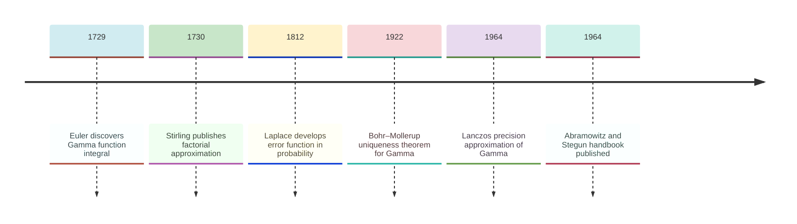
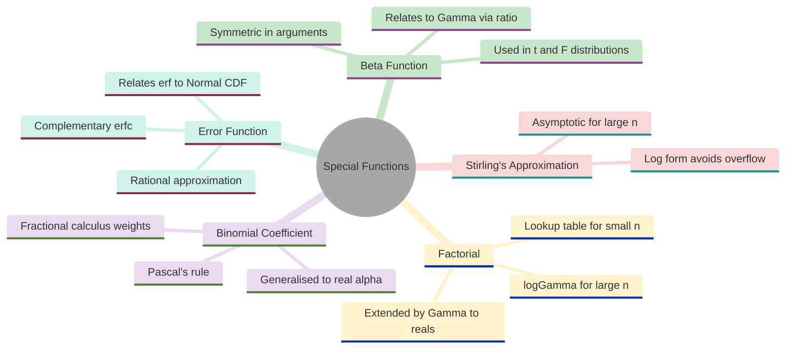
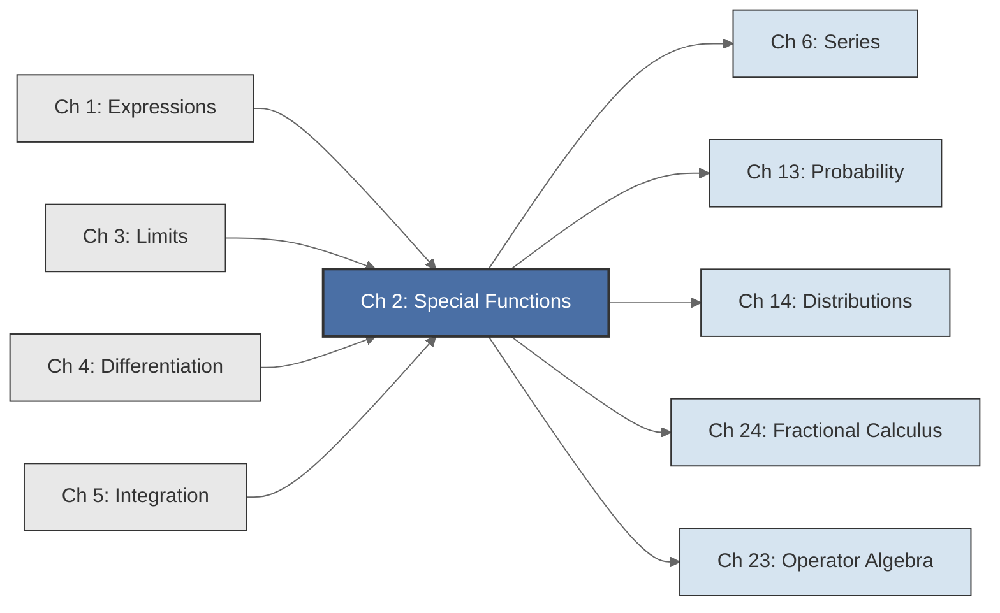

<!-- Copyright (c) 2025-2026 Bob Jansen <bobjansen@pm.me> -->
<!-- SPDX-License-Identifier: CC-BY-NC-4.0 -->
<!-- See LICENSE for full terms. Commercial licensing available. -->
# Chapter 2: Special Functions


**Part I**: Foundations

> The mathematical functions that bridge elementary calculus and advanced applications: Gamma, Beta, error function and their computational approximations.

**Prerequisites**: [Chapter 1](01-expressions.md) (Expressions & Functions); familiarity with limits and integrals at the conceptual level (formal treatment comes in [Chapter 3](03-limits-continuity.md), [Chapter 4](04-differential-calculus.md), [Chapter 5](05-integral-calculus.md)).

**Learning Objectives**: After this chapter, the reader will be able to:
1. Understand the Gamma function as the continuous extension of the factorial to real arguments and state its defining properties.
2. Compute the Gamma, Beta and error functions numerically using standard approximation algorithms (Lanczos, rational approximation).
3. Derive and apply the relationships between these functions: the Beta-Gamma relation, the erf-to-normal cumulative distribution function (CDF) bridge and the generalised binomial coefficient via Gamma.
4. Identify where special functions appear in probability theory, statistical distributions and fractional calculus.
5. Handle the numerical pitfalls (overflow, cancellation, precision loss) that arise when evaluating these functions in IEEE 754 double-precision arithmetic.
6. State Stirling's approximation and explain when and why log-space computation is necessary for large arguments.

**Connections**: This chapter is used by [Chapter 14](14-distributions.md) (Probability Distributions), [Chapter 24](24-fractional-calculus.md) (Fractional Calculus), [Chapter 6](06-series-approximation.md) (Series & Approximation), [Chapter 13](13-probability-theory.md) (Probability Theory) and [Chapter 23](23-operator-algebra.md) (Operator Algebra). It builds on [Chapter 1](01-expressions.md) (Expressions & Functions). Prerequisites include familiarity with [Chapter 3](03-limits-continuity.md) (Limits & Continuity), [Chapter 4](04-differential-calculus.md) (Differential Calculus) and [Chapter 5](05-integral-calculus.md) (Integral Calculus).

---

## Historical Context

**Key Milestones in Special Functions**



*Figure 2.1: Key milestones in the development of special functions.*

The special functions treated in this chapter (Gamma, Beta, error function) share a common origin. They are all definite integrals that cannot be expressed in terms of elementary functions, yet arise so frequently that they earned their own names, notation and tables of values. Their history spans three centuries and touches nearly every branch of applied mathematics.

**Euler and the interpolation of factorials (1729–1730).** Leonhard Euler posed the question in a letter to Christian Goldbach, dated 13 October 1729. The factorial function $n! = 1 \cdot 2 \cdot 3 \cdots n$ is defined only for positive integers. Is there a smooth function that agrees with $n!$ at the integers and gives sensible values in between? Euler's answer was an infinite product representation that, after reformulation, became the integral $\int_0^\infty t^{z-1} e^{-t}\,dt$. This integral converges for all real $z > 0$ and satisfies $\Gamma(n+1) = n!$ for every positive integer $n$. It was the first major special function: a function defined by an integral rather than by a finite algebraic formula. Euler also discovered the integral representation of the Beta function, $\int_0^1 t^{a-1}(1-t)^{b-1}\,dt$ and showed its connection to the factorial interpolation problem.

**Legendre's contributions (1811).** Adrien-Marie Legendre gave the function its modern name and notation in his 1811 *Exercices de calcul intégral*. Writing $\Gamma(z)$ for Euler's integral (with the convention that shifts the argument by one relative to the factorial), Legendre systematised the theory and proved the duplication formula $\Gamma(z)\Gamma(z+\tfrac{1}{2}) = \frac{\sqrt{\pi}}{2^{2z-1}}\Gamma(2z)$. This formula relates the Gamma function at two arguments differing by $\tfrac{1}{2}$. It is necessary for simplifying expressions involving half-integer arguments, which appear throughout probability theory and physics.

**Gauss and the multiplication formula (1812).** Carl Friedrich Gauss generalised Legendre's result to the multiplication formula for $\Gamma(z)\Gamma(z+\tfrac{1}{n})\cdots\Gamma(z+\tfrac{n-1}{n})$, connecting the Gamma function to his work on hypergeometric functions. Gauss also gave the first rigorous proof that $\Gamma$ has no zeros and established its log-convexity on $(0,\infty)$. The Bohr–Mollerup theorem (1922) later confirmed that $\Gamma$ is the unique log-convex function satisfying $\Gamma(z+1)=z\Gamma(z)$ and $\Gamma(1)=1$.

**The error function and probability (1812).** The error function erf has a separate lineage rooted in probability theory. Gauss, analysing measurement errors in astronomical observations, arrived at the normal (Gaussian) distribution with density proportional to $e^{-t^2}$. The integral $\int_0^x e^{-t^2}\,dt$ has no closed form but appears in every calculation involving normal probabilities. Pierre-Simon Laplace (1812) independently developed the same integral in his work on probability. The normalisation constant $2/\sqrt{\pi}$ was chosen so that $\operatorname{erf}(\infty) = 1$, yielding the relationship $\Phi(x) = \tfrac{1}{2}[1 + \operatorname{erf}(x/\sqrt{2})]$ between erf and the standard normal cumulative distribution function (CDF).

**Stirling's approximation (1730).** James Stirling published his asymptotic formula $n! \approx \sqrt{2\pi n}(n/e)^n$ in 1730, the same era as Euler's factorial work. Abraham de Moivre had obtained a closely related result around 1730. Its importance is practical: for large $n$, computing $n!$ directly overflows any finite arithmetic, but the logarithmic form of Stirling's approximation remains numerically tractable. Every modern computation involving log-likelihoods, binomial coefficients for large arguments or asymptotic expansions of the Gamma function relies on Stirling's result or its refinements.

**Modern computation (1964).** For nearly two centuries, evaluating $\Gamma(z)$ at non-integer arguments required consulting printed tables or summing series. Cornelius Lanczos changed this with his 1964 paper "A Precision Approximation of the Gamma Function," which provided a rational approximation achieving 15 digits of precision with a fixed number of terms. The Lanczos approximation and the closely related method of John L. Spouge (1994) made the Gamma function a routine computational primitive. The error function received similar treatment through the rational approximations tabulated in Abramowitz and Stegun's *Handbook of Mathematical Functions* (1964), which remains the standard reference for computational formulas.

**A tightly linked family.** The Gamma function, the Beta function, the error function, the binomial coefficient and Stirling's approximation all trace back to a handful of definite integrals involving exponentials and powers. They form a tightly linked family; understanding any one of them illuminates the others.

---

## Why This Chapter Matters

**Special Functions**



*Figure 2.2: Conceptual map of special functions and their relationships covered in this chapter.*

The Gamma, Beta, error function and binomial coefficients are the computational core of probability, statistics and quantitative finance. Every $p$-value a data scientist computes, every risk model an actuary evaluates and every option a quant prices bottoms out in one of these functions. The normal CDF,

$$
\Phi(x) = \tfrac{1}{2}\bigl[1 + \operatorname{erf}(x/\sqrt{2})\bigr],
$$

is invoked billions of times daily across trading systems, clinical trial analyses and A/B testing platforms. The Beta function normalises the probability density functions (PDFs) of the $t$-distribution, $F$-distribution and chi-squared distribution. Every analysis of variance table, every regression $t$-test and every confidence interval in applied statistics depends on the Beta-Gamma relation (Theorem 2.10). Without the Lanczos approximation for $\Gamma(z)$ or the rational approximation for $\operatorname{erf}(x)$, these computations would be impractically slow.

Practical importance extends to domains where the connection is less obvious. In cryptography, security parameters for lattice-based schemes involve binomial coefficients for astronomically large $n$, computable only through Stirling's approximation or log-Gamma. In Bayesian machine learning, the marginal likelihood of a model with a Gamma prior requires evaluating $\Gamma(\alpha)$ as part of the normalising constant. In fractional calculus ([Chapter 24](24-fractional-calculus.md)), the Grünwald–Letnikov fractional derivative uses generalised binomial coefficients $\binom{\alpha}{k}$ as its weights; these reduce to ratios of Gamma values. The generalised binomial coefficient for $\alpha = 0.5$, computed in Example 2.34, is the actual coefficient used to approximate a half-order derivative in signal processing and control theory.

Numerical pitfalls in this chapter matter equally. The Gamma function overflows double-precision arithmetic for arguments above roughly 171.6. Naive implementations of distribution PDFs will silently return $\infty$ and corrupt downstream calculations. The solution is to work in log-space via $\ln\Gamma$ and exponentiate only at the final step; this pattern recurs throughout computational statistics. A practitioner who understands log-Gamma, the Beta-Gamma relation and Stirling's approximation can implement any standard probability distribution from scratch. Such a practitioner can also diagnose numerical failures in existing implementations and extend the machinery to non-standard distributions.

---

## Notation & Conventions

| Symbol | Meaning |
|--------|---------|
| $\Gamma(z)$ | Gamma function: $\int_0^\infty t^{z-1}e^{-t}\,dt$ for $z > 0$ |
| $\ln\Gamma(z)$ | Log-Gamma: the natural logarithm of $\Gamma(z)$ |
| $B(a,b)$ | Beta function: $\int_0^1 t^{a-1}(1-t)^{b-1}\,dt$ for $a,b > 0$ |
| $\operatorname{erf}(x)$ | Error function: $\frac{2}{\sqrt{\pi}}\int_0^x e^{-t^2}\,dt$ |
| $\operatorname{erfc}(x)$ | Complementary error function: $1 - \operatorname{erf}(x)$ |
| $n!$ | Factorial of $n \in \mathbb{N}$: $n \cdot (n-1) \cdots 2 \cdot 1$, with $0! = 1$ |
| $\binom{n}{k}$ | Binomial coefficient: $\frac{n!}{k!(n-k)!}$ for $0 \le k \le n$ |
| $\binom{\alpha}{k}$ | Generalised binomial coefficient for $\alpha \in \mathbb{R}$ |
| $(x)_n$ | Falling factorial (Pochhammer symbol): $x(x-1)\cdots(x-n+1)$ |
| $\Phi(x)$ | Standard normal CDF: $P(Z \le x)$ where $Z \sim N(0,1)$ |

All arguments are real unless stated otherwise. Complex-valued extensions of $\Gamma$ and erf exist but are outside the scope of this text.

---

## Core Theory

The following chart positions the special functions along two conceptual axes: from elementary to advanced, and from discrete to continuous.

**Special Functions by Complexity and Domain**


*Figure 2.3: Special functions positioned by complexity and domain type.*

### The Gamma Function

**Definition 2.1** (Gamma function). The *Gamma function* is defined by the improper integral ([Chapter 5](05-integral-calculus.md))

$$\Gamma(z) = \int_0^\infty t^{z-1} e^{-t} \, dt, \quad z > 0.$$

The integrand $t^{z-1}e^{-t}$ is a real-valued function of $t$ ([Chapter 1](01-expressions.md)), nonnegative on $(0,\infty)$. Near $t=0$, the factor $t^{z-1}$ is integrable when $z > 0$. Near $t=\infty$, the exponential decay of $e^{-t}$ dominates any polynomial growth of $t^{z-1}$. The integral therefore converges for all $z > 0$.

**Theorem 2.2** (Factorial property). For all $z > 0$,

$$\Gamma(z+1) = z \cdot \Gamma(z).$$

??? note "Proof"

    *Proof.* By definition,

    $$\Gamma(z+1) = \int_0^\infty t^{z} e^{-t}\,dt.$$

    Apply integration by parts with $u = t^z$ and $dv = e^{-t}\,dt$, so $du = z t^{z-1}\,dt$ and $v = -e^{-t}$:

    $$\Gamma(z+1) = \bigl[-t^z e^{-t}\bigr]_0^\infty + z\int_0^\infty t^{z-1} e^{-t}\,dt.$$

    The boundary term vanishes: at $t = 0$, $t^z e^{-t} = 0$ (since $z > 0$); as $t \to \infty$, $t^z e^{-t} \to 0$ because exponential decay dominates polynomial growth (a standard result, proved rigorously in [Chapter 3](03-limits-continuity.md)). The remaining integral is $\Gamma(z)$:

    $$\Gamma(z+1) = z\,\Gamma(z).$$

    $\square$

**Corollary 2.3** (Gamma extends factorial). For $n \in \mathbb{N}$,

$$\Gamma(n+1) = n!$$

??? note "Proof"

    *Proof.* By direct computation,

    $$\Gamma(1) = \int_0^\infty e^{-t}\,dt = 1 = 0!.$$

    By induction: if $\Gamma(n+1) = n!$, then by Theorem 2.2,

    $$\Gamma(n+2) = (n+1)\Gamma(n+1) = (n+1) \cdot n! = (n+1)!.$$

    $\square$

**Theorem 2.4** ($\Gamma(1/2) = \sqrt{\pi}$). The Gamma function at $z = 1/2$ equals $\sqrt{\pi}$.

??? note "Proof"

    *Proof.* By definition,

    $$\Gamma\!\left(\tfrac{1}{2}\right) = \int_0^\infty t^{-1/2} e^{-t}\,dt.$$

    Apply the substitution $t = u^2$, so $dt = 2u\,du$:

    $$\Gamma\!\left(\tfrac{1}{2}\right) = \int_0^\infty u^{-1}\,e^{-u^2}\,2u\,du = 2\int_0^\infty e^{-u^2}\,du.$$

    The integral $\int_0^\infty e^{-u^2}\,du = \tfrac{\sqrt{\pi}}{2}$ is the classical Gaussian integral. Substituting:

    $$\Gamma\!\left(\tfrac{1}{2}\right) = 2 \cdot \frac{\sqrt{\pi}}{2} = \sqrt{\pi}.$$

    $\square$

This result is not merely a curiosity. It connects the Gamma function to probability: the normal distribution's PDF involves $e^{-x^2/2}$, and the normalisation constant depends on exactly this integral.

**Theorem 2.5** (Euler's reflection formula). For $z \notin \mathbb{Z}$,

$$\Gamma(z)\,\Gamma(1-z) = \frac{\pi}{\sin(\pi z)}.$$

The proof requires contour integration techniques from complex analysis and is omitted here. The reflection formula is valuable for computing $\Gamma(z)$ when $z < 0.5$: rather than evaluating the integral directly for small arguments (where numerical issues arise), one computes $\Gamma(1-z)$ for $1-z > 0.5$ and then applies the formula.

**Theorem 2.6** (Legendre duplication formula). For $z > 0$,

$$\Gamma(z)\,\Gamma\!\left(z + \tfrac{1}{2}\right) = \frac{\sqrt{\pi}}{2^{2z-1}}\,\Gamma(2z).$$

??? note "Proof"

    *Proof omitted.* The proof requires the Beta function integral and a substitution argument; see Artin [3]. The formula can be verified at integer and half-integer arguments. For $z = 1$: $\Gamma(1)\Gamma(3/2) = 1 \cdot \tfrac{\sqrt{\pi}}{2} = \tfrac{\sqrt{\pi}}{2}$, and $\tfrac{\sqrt{\pi}}{2^{1}}\Gamma(2) = \tfrac{\sqrt{\pi}}{2} \cdot 1 = \tfrac{\sqrt{\pi}}{2}$.

    $\square$

**The Gamma Function on the Positive Real Line**

```mermaid
---
config:
  theme: base
  themeVariables:
    xyChart:
      plotColorPalette: "#2563eb, #dc2626, #16a34a, #9333ea, #ca8a04, #0891b2"
      backgroundColor: "#ffffff"
      titleColor: "#333333"
      xAxisLabelColor: "#333333"
      yAxisLabelColor: "#333333"
      xAxisTitleColor: "#333333"
      yAxisTitleColor: "#333333"
      xAxisLineColor: "#333333"
      yAxisLineColor: "#333333"
---
xychart-beta
    x-axis "x" [0.5, 1, 1.5, 2, 2.5, 3, 3.5, 4, 4.5, 5]
    y-axis "Γ(x)" 0 --> 25
    line [1.77, 1.0, 0.89, 1.0, 1.33, 2.0, 3.32, 6.0, 11.63, 24.0]
```

*Figure 2.4: The Gamma function on the positive real line showing rapid growth beyond x=3.*

**Remark 2.7** (Poles, zeros and log-convexity). The Gamma function, extended via the recurrence $\Gamma(z) = \Gamma(z+1)/z$, has simple poles at $z = 0, -1, -2, \ldots$ and is never zero. On the positive real line, $\Gamma$ is log-convex: $\ln\Gamma$ is a convex function. The Bohr–Mollerup theorem (1922) states that $\Gamma$ is the *unique* function satisfying $\Gamma(1) = 1$, $\Gamma(z+1) = z\Gamma(z)$ and log-convexity on $(0,\infty)$. This uniqueness result justifies calling $\Gamma$ "the" extension of factorial to real numbers.

**Definition 2.8** (Log-Gamma). The *log-Gamma function* is

$$\ln\Gamma(z), \quad z > 0.$$

Log-Gamma is computed directly (not as $\ln$ of $\Gamma$) because $\Gamma(z)$ overflows double-precision arithmetic for $z \gtrsim 171.6$, while $\ln\Gamma(z)$ remains representable for much larger arguments. In practice, every numerical library implements log-Gamma as the primary routine and derives $\Gamma$ from it as $e^{\ln\Gamma(z)}$ when needed.

### The Beta Function

**Definition 2.9** (Beta function). The *Beta function* is defined by

$$B(a, b) = \int_0^1 t^{a-1}(1-t)^{b-1}\,dt, \quad a, b > 0.$$

The integrand is a product of two power functions on $[0,1]$. The conditions $a > 0$ and $b > 0$ ensure integrability at both endpoints.

**Theorem 2.10** (Beta-Gamma relation). For $a, b > 0$,

$$B(a, b) = \frac{\Gamma(a)\,\Gamma(b)}{\Gamma(a+b)}.$$

!!! abstract "Key Result"

    **Theorem 2.10** (Beta-Gamma relation). The Beta function reduces to a ratio of Gamma values, making it computable in $O(1)$ via log-Gamma and providing the normalising constant for the $t$-, $F$- and chi-squared distributions.

??? note "Proof"

    *Proof sketch.* Write the product $\Gamma(a)\Gamma(b)$ as a double integral:

    $$\Gamma(a)\Gamma(b) = \int_0^\infty \int_0^\infty s^{a-1}t^{b-1}\,e^{-(s+t)}\,ds\,dt.$$

    Substitute $s = r u$ and $t = r(1-u)$ where $r = s + t \in (0,\infty)$ and $u = s/(s+t) \in (0,1)$. The Jacobian is $r$, and the integral separates:

    $$\Gamma(a)\Gamma(b) = \int_0^\infty r^{a+b-1}e^{-r}\,dr \cdot \int_0^1 u^{a-1}(1-u)^{b-1}\,du = \Gamma(a+b)\cdot B(a,b).$$

    Dividing both sides by $\Gamma(a+b)$ gives the result.

    $\square$

The Beta-Gamma relation is the primary tool for computing the Beta function numerically: computing $B(a,b)$ via its integral definition is less efficient and less stable than using log-Gamma.

**Theorem 2.11** (Symmetry). For $a, b > 0$,

$$B(a, b) = B(b, a).$$

??? note "Proof"

    *Proof.* In the integral $B(a,b) = \int_0^1 t^{a-1}(1-t)^{b-1}\,dt$, substitute $u = 1-t$, $du = -dt$:

    $$B(a,b) = \int_1^0 (1-u)^{a-1}u^{b-1}(-du) = \int_0^1 u^{b-1}(1-u)^{a-1}\,du = B(b,a).$$

    $\square$

**Theorem 2.12** (Recursive property). For $a > 1$,

$$B(a, b) = \frac{a-1}{a+b-1}\,B(a-1, b).$$

??? note "Proof"

    *Proof.* By the Beta-Gamma relation and $\Gamma(a) = (a-1)\Gamma(a-1)$:

    $$B(a,b) = \frac{\Gamma(a)\Gamma(b)}{\Gamma(a+b)} = \frac{(a-1)\Gamma(a-1)\Gamma(b)}{(a+b-1)\Gamma(a+b-1)} = \frac{a-1}{a+b-1}\,B(a-1,b).$$

    $\square$

**Remark 2.13** (Beta in probability). The Beta function appears directly in the probability density function of the Beta distribution, $f(x; a,b) = \frac{x^{a-1}(1-x)^{b-1}}{B(a,b)}$ for $x \in [0, 1]$. Through the Beta-Gamma relation, it also enters the PDFs of the Student's $t$-distribution, the $F$-distribution and the chi-squared distribution. Any probability calculation involving these distributions ultimately evaluates the Beta or Gamma function.

### The Error Function

**Definition 2.14** (Error function). The *error function* is

$$\operatorname{erf}(x) = \frac{2}{\sqrt{\pi}} \int_0^x e^{-t^2}\,dt.$$

The normalisation factor $2/\sqrt{\pi}$ is chosen so that $\operatorname{erf}(x) \to 1$ as $x \to \infty$, since $\int_0^\infty e^{-t^2}\,dt = \sqrt{\pi}/2$.

**Definition 2.15** (Complementary error function). The *complementary error function* is

$$\operatorname{erfc}(x) = 1 - \operatorname{erf}(x) = \frac{2}{\sqrt{\pi}} \int_x^\infty e^{-t^2}\,dt.$$

The complementary form is used when $x$ is large, where $\operatorname{erf}(x)$ is very close to 1 and computing $1 - \operatorname{erf}(x)$ directly would lose precision to catastrophic cancellation.

!!! info "When to use erfc instead of erf"

    For $x > 3$, $\operatorname{erf}(x)$ exceeds $0.99998$ and the subtraction $1 - \operatorname{erf}(x)$ loses at least four digits of precision. The complementary form $\operatorname{erfc}(x)$ should be computed directly from the approximation in Algorithm 2.27, avoiding this subtraction entirely.

**Theorem 2.16** (Relation to normal CDF). Let $\Phi(x) = P(Z \le x)$ denote the CDF of the standard normal distribution $Z \sim N(0,1)$. Then

$$\Phi(x) = \frac{1}{2}\left[1 + \operatorname{erf}\!\left(\frac{x}{\sqrt{2}}\right)\right].$$

??? note "Proof"

    *Proof.* By definition,

    $$\Phi(x) = \frac{1}{\sqrt{2\pi}}\int_{-\infty}^x e^{-u^2/2}\,du.$$

    Substitute $t = u/\sqrt{2}$, $du = \sqrt{2}\,dt$:

    $$\Phi(x) = \frac{1}{\sqrt{2\pi}}\int_{-\infty}^{x/\sqrt{2}} e^{-t^2}\sqrt{2}\,dt = \frac{1}{\sqrt{\pi}}\int_{-\infty}^{x/\sqrt{2}} e^{-t^2}\,dt.$$

    Split the integral at $0$ and use $\int_{-\infty}^0 e^{-t^2}\,dt = \sqrt{\pi}/2$:

    $$\Phi(x) = \frac{1}{\sqrt{\pi}}\left[\frac{\sqrt{\pi}}{2} + \int_0^{x/\sqrt{2}} e^{-t^2}\,dt\right] = \frac{1}{2} + \frac{1}{\sqrt{\pi}}\int_0^{x/\sqrt{2}} e^{-t^2}\,dt.$$

    The remaining integral is $\frac{\sqrt{\pi}}{2}\operatorname{erf}(x/\sqrt{2})$, so

    $$\Phi(x) = \frac{1}{2} + \frac{1}{2}\operatorname{erf}\!\left(\frac{x}{\sqrt{2}}\right) = \frac{1}{2}\left[1 + \operatorname{erf}\!\left(\frac{x}{\sqrt{2}}\right)\right].$$

    $\square$

This theorem is *the* reason the error function matters in applied work. Every computation of normal probabilities, $p$-values from $z$-tests or Black–Scholes option prices reduces to evaluating $\operatorname{erf}$.

**Properties of erf**:

- $\operatorname{erf}(0) = 0$, since the integral from $0$ to $0$ vanishes.
- $\operatorname{erf}(\infty) = 1$ and $\operatorname{erf}(-\infty) = -1$.
- $\operatorname{erf}(-x) = -\operatorname{erf}(x)$: erf is an odd function, because $e^{-t^2}$ is even.
- $\operatorname{erf}'(x) = \frac{2}{\sqrt{\pi}}e^{-x^2}$, by differentiating ([Chapter 4](04-differential-calculus.md)) the integral definition via the Fundamental Theorem of Calculus.

**The Error Function erf(x)**

```mermaid
---
config:
  theme: base
  themeVariables:
    xyChart:
      plotColorPalette: "#2563eb, #dc2626, #16a34a, #9333ea, #ca8a04, #0891b2"
      backgroundColor: "#ffffff"
      titleColor: "#333333"
      xAxisLabelColor: "#333333"
      yAxisLabelColor: "#333333"
      xAxisTitleColor: "#333333"
      yAxisTitleColor: "#333333"
      xAxisLineColor: "#333333"
      yAxisLineColor: "#333333"
---
xychart-beta
    x-axis "x" [-3, -2, -1, -0.5, 0, 0.5, 1, 2, 3]
    y-axis "erf(x)" -1.1 --> 1.1
    line [-1.0, -0.995, -0.843, -0.520, 0, 0.520, 0.843, 0.995, 1.0]
```

*Figure 2.5: The error function erf(x) showing its odd symmetry and asymptotic approach to plus or minus one.*

### Factorials, Binomial Coefficients and Generalisations

**Definition 2.17** (Factorial). For $n \in \mathbb{N}$, the *factorial* is

$$n! = n \cdot (n-1) \cdot (n-2) \cdots 2 \cdot 1, \quad \text{with } 0! = 1.$$

The convention $0! = 1$ is not arbitrary: it is required for the binomial coefficient formula to hold at the boundary $k = 0$ or $k = n$, and it follows from the empty product convention.

**Definition 2.18** (Binomial coefficient). For $n, k \in \mathbb{N}$ with $0 \le k \le n$,

$$\binom{n}{k} = \frac{n!}{k!\,(n-k)!}.$$

The binomial coefficient $\binom{n}{k}$ counts the number of ways to choose $k$ items from $n$ distinct items, without regard to order.

**Theorem 2.19** (Pascal's rule). For $n \ge 1$ and $1 \le k \le n$,

$$\binom{n}{k} = \binom{n-1}{k-1} + \binom{n-1}{k}.$$

??? note "Proof"

    *Proof.* Expand using Definition 2.18:

    $$\binom{n-1}{k-1} + \binom{n-1}{k} = \frac{(n-1)!}{(k-1)!(n-k)!} + \frac{(n-1)!}{k!(n-k-1)!}.$$

    Factor out $(n-1)!$ and find a common denominator $k!(n-k)!$:

    $$= \frac{(n-1)!\,k + (n-1)!(n-k)}{k!(n-k)!} = \frac{(n-1)!\,n}{k!(n-k)!} = \frac{n!}{k!(n-k)!} = \binom{n}{k}.$$

    $\square$

**Theorem 2.20** (Binomial theorem). For $x, y \in \mathbb{R}$ and $n \in \mathbb{N}$,

$$(x + y)^n = \sum_{k=0}^{n}\binom{n}{k}x^{n-k}y^k.$$

??? note "Proof"

    *Proof.* By induction on $n$. The base case $n=0$ is immediate: both sides equal $1$. Assume the result holds for $n-1$. Then

    $$(x+y)^n = (x+y)(x+y)^{n-1} = (x+y)\sum_{k=0}^{n-1}\binom{n-1}{k}x^{n-1-k}y^k.$$

    Expanding and re-indexing, then applying Pascal's rule (Theorem 2.19), yields the result for $n$.

    $\square$

**Definition 2.21** (Generalised binomial coefficient). For $\alpha \in \mathbb{R}$ and $k \in \mathbb{N}$,

$$\binom{\alpha}{k} = \frac{\alpha(\alpha-1)(\alpha-2)\cdots(\alpha-k+1)}{k!}.$$

Equivalently, using the Gamma function:

$$\binom{\alpha}{k} = \frac{\Gamma(\alpha+1)}{\Gamma(k+1)\,\Gamma(\alpha-k+1)}.$$

When $\alpha$ is a nonnegative integer and $k \le \alpha$, this reduces to the standard binomial coefficient. When $\alpha$ is not a nonnegative integer, the numerator is a product of $k$ terms that does not terminate and the generalised binomial coefficient can be nonzero for all $k$. This generalisation is necessary for the generalised binomial series ([Chapter 6](06-series-approximation.md)) and for the Grünwald–Letnikov fractional derivative ([Chapter 24](24-fractional-calculus.md)), where $\alpha$ is a real-valued derivative order.

**Definition 2.22** (Falling factorial / Pochhammer symbol). For $x \in \mathbb{R}$ and $n \in \mathbb{N}$,

$$(x)_n = x(x-1)(x-2)\cdots(x-n+1) = \frac{\Gamma(x+1)}{\Gamma(x-n+1)}.$$

The falling factorial $(x)_n$ is the numerator of the generalised binomial coefficient: $\binom{x}{n} = (x)_n / n!$. It appears in finite difference calculus, where it plays a role analogous to $x^n$ in continuous calculus.

### Stirling's Approximation

**Theorem 2.23** (Stirling's approximation). For large $n$,

$$n! \approx \sqrt{2\pi n}\left(\frac{n}{e}\right)^n.$$

More precisely, $n! = \sqrt{2\pi n}\,(n/e)^n\,(1 + O(1/n))$, meaning the ratio of $n!$ to the approximation tends to $1$ as $n \to \infty$.

??? note "Proof"

    *Proof omitted.* The derivation uses Laplace's method applied to the Gamma integral; see Exercise 2.7 for a guided derivation.

    $\square$

In logarithmic form:

$$\ln(n!) \approx n\ln n - n + \tfrac{1}{2}\ln(2\pi n).$$

The logarithmic form is the one used in computation. Direct computation of $n!$ overflows 64-bit floating point at $n = 171$, but $\ln(n!)$ via Stirling's approximation remains tractable for arbitrarily large $n$. Stirling's approximation is used routinely for computing log-likelihoods, approximating binomial coefficients and in asymptotic analysis throughout statistics and probability. The relative error for $n = 10$ is already below 1% and it improves as $O(1/n)$.

The following chart shows the ratio of Stirling's approximation to the actual factorial for $n = 1$ through $10$. As $n$ grows, the ratio approaches 1, confirming the asymptotic accuracy:

**Accuracy of Stirling's Approximation Relative to the Factorial**

```mermaid
---
config:
  theme: base
  themeVariables:
    xyChart:
      plotColorPalette: "#2563eb, #dc2626, #16a34a, #9333ea, #ca8a04, #0891b2"
      backgroundColor: "#ffffff"
      titleColor: "#333333"
      xAxisLabelColor: "#333333"
      yAxisLabelColor: "#333333"
      xAxisTitleColor: "#333333"
      yAxisTitleColor: "#333333"
      xAxisLineColor: "#333333"
      yAxisLineColor: "#333333"
---
xychart-beta
    x-axis "n" [1, 2, 3, 4, 5, 6, 7, 8, 9, 10]
    y-axis "Stirling / n!" 0.9 --> 1.01
    line [0.92, 0.96, 0.97, 0.98, 0.98, 0.99, 0.99, 0.99, 0.99, 0.99]
```

*Figure 2.6: Ratio of Stirling's approximation to the actual factorial converging toward one.*

At $n=1$, Stirling underestimates by about 8%. By $n=5$, the error is under 2% and by $n=10$ it is below 1%. This rapid convergence is why Stirling's approximation is reliable even for moderately sized arguments.

---

## Formulas & Identities

**F2.1** Factorial property, for $z > 0$.

$$\Gamma(z+1) = z\,\Gamma(z)$$

**F2.2** Gamma extends factorial, for $n \in \mathbb{N}$.

$$\Gamma(n+1) = n!$$

**F2.3** Half-integer value.

$$\Gamma(1/2) = \sqrt{\pi}$$

**F2.4** Reflection formula, for $z \notin \mathbb{Z}$.

$$\Gamma(z)\,\Gamma(1-z) = \frac{\pi}{\sin(\pi z)}$$

**F2.5** Duplication formula, for $z > 0$.

$$\Gamma(z)\,\Gamma\!\left(z+\tfrac{1}{2}\right) = \frac{\sqrt{\pi}}{2^{2z-1}}\,\Gamma(2z)$$

**F2.6** Beta-Gamma relation, for $a, b > 0$.

$$B(a,b) = \frac{\Gamma(a)\,\Gamma(b)}{\Gamma(a+b)}$$

**F2.7** Beta symmetry, for $a, b > 0$.

$$B(a,b) = B(b,a)$$

**F2.8** Error function to normal CDF.

$$\Phi(x) = \tfrac{1}{2}\!\left[1 + \operatorname{erf}\!\left(\frac{x}{\sqrt{2}}\right)\right]$$

**F2.9** Error function odd symmetry.

$$\operatorname{erf}(-x) = -\operatorname{erf}(x)$$

**F2.10** Stirling's approximation, for $n \in \mathbb{N}$, $n$ large.

$$n! \approx \sqrt{2\pi n}\left(\frac{n}{e}\right)^n$$

**F2.11** Generalised binomial via Gamma, for $\alpha \in \mathbb{R}$, $k \in \mathbb{N}$.

$$\binom{\alpha}{k} = \frac{\Gamma(\alpha+1)}{\Gamma(k+1)\,\Gamma(\alpha - k + 1)}$$

**F2.12** Pascal's rule, for $n \ge 1$ and $1 \le k \le n$.

$$\binom{n}{k} = \binom{n-1}{k-1} + \binom{n-1}{k}$$

**F2.13** Binomial theorem, for $n \in \mathbb{N}$.

$$(x+y)^n = \sum_{k=0}^{n}\binom{n}{k}x^{n-k}y^k$$

---

## Algorithms

### Algorithm 2.24: Lanczos Approximation for $\Gamma(z)$

**Input**: Real number $z > 0$ (for $z \le 0$, the reflection formula is applied internally).

**Output**: Approximation of $\Gamma(z)$ accurate to approximately 15 digits of precision.

The Lanczos approximation expresses the Gamma function in a form amenable to direct numerical evaluation. For a parameter $g$ and a set of precomputed coefficients $c_0, c_1, \ldots, c_N$, the approximation is:

$$\Gamma(z+1) = \sqrt{2\pi}\left(z + g + \tfrac{1}{2}\right)^{z+1/2}\,e^{-(z+g+1/2)}\,A_g(z)$$

where

$$A_g(z) = c_0 + \frac{c_1}{z+1} + \frac{c_2}{z+2} + \cdots + \frac{c_N}{z+N}.$$

Using $\Gamma(z) = \Gamma(z+1)/z$, the formula applies for $z > 0$. For $z < 0.5$, the reflection formula (F2.4) is applied first.

**Pseudocode** (with $g = 7$ and $N = 8$):

```
function gamma(z):
    if z < 0.5:
        return pi / (sin(pi * z) * gamma(1 - z))     // reflection formula

    z = z - 1
    coefficients = [
        0.99999999999980993,
        676.5203681218851,
       -1259.1392167224028,
        771.32342877765313,
       -176.61502916214059,
        12.507343278686905,
        -0.13857109526572012,
        9.9843695780195716e-6,
        1.5056327351493116e-7
    ]

    Ag = coefficients[0]
    for i = 1 to 8:
        Ag = Ag + coefficients[i] / (z + i)

    t = z + 7.5       // z + g + 0.5
    return sqrt(2 * pi) * t^(z + 0.5) * exp(-t) * Ag
```

**Accuracy**: Approximately 15 digits of precision across the real line; full double-precision accuracy.

**Complexity**: $O(1)$. The computation involves a fixed number of additions, multiplications and one evaluation each of $\sqrt{\cdot}$, exponentiation and $\exp$.

**Stability**: The formula is numerically stable for $z > 0.5$. The reflection formula handles $z < 0.5$ without loss of accuracy. The only concern is overflow: $\Gamma(z)$ exceeds the double-precision maximum for $z \gtrsim 171.6$, which is addressed by computing log-Gamma instead (Algorithm 2.25).

!!! tip "Lanczos parameter selection"

    The choice $g = 7$ with nine coefficients ($N = 8$) balances accuracy and simplicity. Increasing $g$ and $N$ beyond these values yields negligible improvement for IEEE 754 double precision. Decreasing $g$ below 5 degrades accuracy to fewer than ten digits of precision.

### Algorithm 2.25: Log-Gamma via Lanczos

**Input**: Real number $z > 0$ (for $z \le 0.5$, the reflection formula is applied internally).

**Output**: Value of $\ln\Gamma(z)$.

The same Lanczos formula, but computing $\ln\Gamma$ directly to avoid overflow.

**Pseudocode**:

```
function logGamma(z):
    if z < 0.5:
        return ln(pi / sin(pi * z)) - logGamma(1 - z)    // reflection

    z = z - 1
    // same coefficients as Algorithm 2.24
    Ag = coefficients[0]
    for i = 1 to 8:
        Ag = Ag + coefficients[i] / (z + i)

    t = z + 7.5
    return 0.5 * ln(2 * pi) + (z + 0.5) * ln(t) - t + ln(Ag)
```

**Accuracy**: Same as Algorithm 2.24. The logarithmic form avoids overflow for all representable arguments.

**Complexity**: $O(1)$.

### Algorithm 2.26: Beta Function via Log-Gamma

**Input**: Real numbers $a > 0$ and $b > 0$.

**Output**: Value of $B(a, b)$ (or $\ln B(a, b)$).

Computing the Beta function directly from its integral definition is both slower and less numerically stable than using the Beta-Gamma relation through log-Gamma.

**Pseudocode**:

```
function beta(a, b):
    return exp(logGamma(a) + logGamma(b) - logGamma(a + b))

function logBeta(a, b):
    return logGamma(a) + logGamma(b) - logGamma(a + b)
```

**Rationale**: For large $a$ or $b$, $\Gamma(a)$ and $\Gamma(b)$ may individually overflow, but $B(a,b) = \Gamma(a)\Gamma(b)/\Gamma(a+b)$ is often a moderate-sized number. By working in log-space, the intermediate values remain representable.

**Complexity**: $O(1)$ (three log-Gamma evaluations).

### Algorithm 2.27: Error Function Approximation

**Input**: Real number $x$.

**Output**: Approximation of $\operatorname{erf}(x)$ with maximum absolute error $\le 1.5 \times 10^{-7}$.

The error function is computed using a rational approximation from Abramowitz and Stegun (formula 7.1.26). For $x \ge 0$:

**Pseudocode**:

```
function erf(x):
    if x < 0:
        return -erf(-x)           // odd symmetry

    // Abramowitz & Stegun rational approximation
    p  = 0.3275911
    a1 = 0.254829592
    a2 = -0.284496736
    a3 = 1.421413741
    a4 = -1.453152027
    a5 = 1.061405429

    t = 1 / (1 + p * x)
    t2 = t * t
    t3 = t2 * t
    t4 = t3 * t
    t5 = t4 * t

    return 1 - (a1*t + a2*t2 + a3*t3 + a4*t4 + a5*t5) * exp(-x*x)
```

**Accuracy**: Maximum absolute error $\le 1.5 \times 10^{-7}$. For applications requiring full double precision, a higher-order rational approximation or a minimax polynomial can be used.

**Complexity**: $O(1)$. A fixed number of multiplications plus one call to `exp`.

**Stability**: The formula is stable for all $x \ge 0$. For very small $|x|$, the Taylor series $\operatorname{erf}(x) \approx \frac{2}{\sqrt{\pi}}(x - x^3/3 + x^5/10 - \cdots)$ avoids cancellation issues, though the rational approximation above is adequate for most purposes.

The complementary error function is computed as $\operatorname{erfc}(x) = 1 - \operatorname{erf}(x)$. For large $x$, where $\operatorname{erf}(x) \approx 1$, computing $\operatorname{erfc}$ directly from the approximation avoids the subtraction $1 - (\text{number near }1)$: the expression $(a_1 t + \cdots + a_5 t^5)e^{-x^2}$ already gives $\operatorname{erfc}(x)$ without cancellation.

### Algorithm 2.28: Binomial Coefficient

**Input**: Integers $n, k \in \mathbb{N}$ with $0 \le k \le n$ (integer version), or real $\alpha$ and integer $k \ge 0$ (generalised version).

**Output**: Binomial coefficient $\binom{n}{k}$ or generalised binomial coefficient $\binom{\alpha}{k}$.

**For integer arguments** ($n, k \in \mathbb{N}$, $0 \le k \le n$): use the multiplicative formula to avoid computing large factorials.

**Pseudocode**:

```
function binomial(n, k):
    if k < 0 or k > n:
        return 0
    if k = 0 or k = n:
        return 1
    k = min(k, n - k)         // exploit symmetry

    result = 1
    for i = 0 to k-1:
        result = result * (n - i) / (i + 1)
    return round(result)       // correct for floating-point drift
```

Each step computes $(n/1) \cdot ((n-1)/2) \cdot ((n-2)/3) \cdots$, keeping the intermediate result as close to an integer as possible. The final `round` corrects any accumulated floating-point error.

**For real $\alpha$** (generalised binomial coefficient): use log-Gamma.

```
function generalisedBinomial(alpha, k):
    if k = 0:
        return 1
    return exp(logGamma(alpha + 1) - logGamma(k + 1) - logGamma(alpha - k + 1))
```

The falling factorial product offers a second approach:

```
function generalisedBinomial(alpha, k):
    result = 1
    for i = 0 to k-1:
        result = result * (alpha - i) / (i + 1)
    return result
```

The product form is preferred when $k$ is small, as it avoids log-Gamma evaluations.

**Complexity**: $O(\min(k, n-k))$ for the integer version; $O(k)$ for the generalised version using the product form; $O(1)$ for the log-Gamma version.

### Algorithm 2.29: Factorial

**Input**: Nonnegative integer $n$.

**Output**: Value of $n!$ (or $\ln(n!)$ for large $n$).

**For small $n$** ($n \le 170$): use a precomputed lookup table.

The largest factorial representable as a 64-bit float is $170! \approx 7.257 \times 10^{306}$, which is slightly below the double-precision maximum of approximately $1.798 \times 10^{308}$. The factorial $171! \approx 1.241 \times 10^{309}$ overflows to $\infty$.

**Pseudocode**:

```
FACTORIAL_TABLE = [1, 1, 2, 6, 24, 120, 720, ..., 170!]

function factorial(n):
    if n is not a nonnegative integer:
        throw Error("factorial requires a nonnegative integer")
    if n <= 170:
        return FACTORIAL_TABLE[n]
    return +inf
```

For $\ln(n!)$ with large $n$: use log-Gamma, since $\ln(n!) = \ln\Gamma(n+1)$.

**Complexity**: $O(1)$ for the lookup; $O(1)$ for the log-Gamma path.

---

## Numerical Considerations

!!! warning "Gamma overflow above $z \approx 171.6$"

    The Gamma function grows extremely rapidly. $\Gamma(171.6\ldots)$ exceeds the double-precision maximum of approximately $1.798 \times 10^{308}$. Any computation that might produce large Gamma values should use log-Gamma (Algorithm 2.25) and exponentiate only at the final step, if at all. The general rule: if $z > 140$, use $\ln\Gamma$.

!!! warning "Always compute Gamma ratios in log-space"

    Expressions like $\Gamma(a)\Gamma(b)/\Gamma(a+b)$ should always be computed as $\exp(\ln\Gamma(a) + \ln\Gamma(b) - \ln\Gamma(a+b))$. Even when $a$ and $b$ are moderate (say, $a = b = 50$), $\Gamma(50) \approx 6.08 \times 10^{62}$ and $\Gamma(100) \approx 9.33 \times 10^{155}$, which are representable individually but whose ratio benefits from the log-space computation.

**Cancellation in erf for small $x$.** When $|x|$ is small, $\operatorname{erf}(x)$ is close to $0$ and the Abramowitz–Stegun approximation computes it as $1 - (\text{something close to }1)$. This subtractive cancellation can lose several digits. For $|x| < 0.5$, the Taylor series $\operatorname{erf}(x) = \frac{2}{\sqrt{\pi}}(x - x^3/3 + x^5/10 - x^7/42 + \cdots)$ converges rapidly and avoids cancellation entirely.

**Beta function for extreme parameters.** When $a$ or $b$ is large (e.g., hundreds), $B(a,b)$ is a very small positive number. Direct computation via $\Gamma(a)\Gamma(b)/\Gamma(a+b)$ overflows in the numerator even though the final result is small. The log-Gamma path (Algorithm 2.26) handles this correctly.

**Binomial coefficients for large $n$.** The value $\binom{100}{50} \approx 1.009 \times 10^{29}$ is representable as a double, but computing it as $100! / (50!)^2$ requires intermediate values that overflow. The multiplicative formula (Algorithm 2.28) avoids this by accumulating the product incrementally. For very large $n$ (thousands or more), the log-Gamma path $\binom{n}{k} = \exp(\ln\Gamma(n+1) - \ln\Gamma(k+1) - \ln\Gamma(n-k+1))$ is both simpler and more stable, returning a floating-point approximation.

**Factorial lookup table.** Precomputing $0!$ through $170!$ as `Float64` values requires 171 entries, consuming roughly 1.4 KB. This is negligible. The table should be computed once at module load time, not on each call.

**Precision of the Lanczos approximation.** With $g = 7$ and the standard nine-coefficient set, the Lanczos approximation achieves errors within 1–2 ULP (units in the last place) across most of the positive real line. The reflection formula introduces no additional error beyond one evaluation of $\sin(\pi z)$, which is well-conditioned away from integer arguments.

---

## Worked Examples

### Example 2.30: Computing $\Gamma(5)$, $\Gamma(0.5)$, $\Gamma(3.7)$

**Problem**: Evaluate the Gamma function at an integer, a half-integer and a non-trivial real argument.

**Solution (manual)**:

For $\Gamma(5)$: by Corollary 2.3, $\Gamma(5) = 4! = 24$.

For $\Gamma(0.5)$: by Theorem 2.4, $\Gamma(0.5) = \sqrt{\pi} \approx 1.7724538509$.

For $\Gamma(3.7)$: apply the recurrence

$$\Gamma(3.7) = 2.7 \cdot \Gamma(2.7) = 2.7 \cdot 1.7 \cdot \Gamma(1.7) = 2.7 \cdot 1.7 \cdot 0.7 \cdot \Gamma(0.7).$$

The value $\Gamma(0.7) \approx 1.2981$ (from tables or the Lanczos approximation), so

$$\Gamma(3.7) \approx 2.7 \times 1.7 \times 0.7 \times 1.2981 \approx 4.1707.$$

### Example 2.31: Computing $B(2, 3)$ Two Ways

**Problem**: Compute the Beta function $B(2, 3)$ both from the integral definition and via the Gamma function, verifying agreement.

**Solution (via Gamma)**:

$$B(2, 3) = \frac{\Gamma(2)\Gamma(3)}{\Gamma(5)} = \frac{1! \cdot 2!}{4!} = \frac{1 \cdot 2}{24} = \frac{1}{12} \approx 0.08333.$$

**Solution (via integral)**:

$$B(2, 3) = \int_0^1 t^{1}(1-t)^{2}\,dt = \int_0^1 (t - 2t^2 + t^3)\,dt = \left[\frac{t^2}{2} - \frac{2t^3}{3} + \frac{t^4}{4}\right]_0^1 = \frac{1}{2} - \frac{2}{3} + \frac{1}{4} = \frac{1}{12}.$$

Both methods agree: $B(2,3) = 1/12$.

### Example 2.32: Normal CDF at $x = 1.96$ via erf

**Problem**: Compute $\Phi(1.96)$, the standard normal CDF at $x = 1.96$.

**Solution**: By Theorem 2.16 (F2.8):

$$\Phi(1.96) = \frac{1}{2}\left[1 + \operatorname{erf}\!\left(\frac{1.96}{\sqrt{2}}\right)\right] = \frac{1}{2}\left[1 + \operatorname{erf}(1.38586\ldots)\right].$$

The value $\operatorname{erf}(1.3859) \approx 0.95000$, so

$$\Phi(1.96) \approx \tfrac{1}{2}(1 + 0.95) = 0.975.$$

This is the origin of the familiar rule: a 95% confidence interval uses $z = 1.96$.

### Example 2.33: Computing $\binom{100}{50}$ Without Overflow

**Problem**: Compute $\binom{100}{50}$ using the multiplicative formula.

**Solution**: Direct factorial computation fails because $100! \approx 9.33 \times 10^{157}$ and $50! \approx 3.04 \times 10^{64}$, but using the multiplicative formula:

$$\binom{100}{50} = \frac{100}{1} \cdot \frac{99}{2} \cdot \frac{98}{3} \cdots \frac{51}{50}$$

Each intermediate product remains manageable. The result is

$$\binom{100}{50} = 100891344545564193334812497256.$$

As a floating-point approximation:

$$\approx 1.00891 \times 10^{29}.$$

The floating-point result is accurate to about 16 digits. The exact integer has 30 digits and cannot be represented precisely in double-precision arithmetic, but the approximation is more than sufficient for probability calculations.

### Example 2.34: Generalised Binomial Coefficient $\binom{0.5}{3}$

**Problem**: Compute $\binom{0.5}{3}$, which appears in the Grünwald–Letnikov fractional derivative with $\alpha = 0.5$.

**Solution**: By Definition 2.21:

$$\binom{0.5}{3} = \frac{0.5 \cdot (0.5 - 1) \cdot (0.5 - 2)}{3!} = \frac{0.5 \cdot (-0.5) \cdot (-1.5)}{6} = \frac{0.375}{6} = 0.0625.$$

The alternating signs in the numerator are characteristic of generalised binomial coefficients with non-integer $\alpha$. In the Grünwald–Letnikov definition of the fractional derivative, the sum $\sum_{k=0}^{N}(-1)^k\binom{\alpha}{k}f(x - kh)$ produces a weighted combination of function values with these oscillating coefficients. Understanding their magnitude and sign is necessary for analysing convergence ([Chapter 24](24-fractional-calculus.md)).

---

## Connections

**Chapter Dependencies**



*Figure 2.7: Chapter 2 dependency graph showing prerequisite and forward connections.*

### Within This Book

- **[Chapter 14](14-distributions.md) (Probability Distributions)**: The normal distribution CDF is computed via erf (Theorem 2.16). The PDFs of the $t$-distribution, $F$-distribution and chi-squared distribution involve the Beta and Gamma functions. The binomial distribution probability mass function uses binomial coefficients. Every distribution in [Chapter 14](14-distributions.md) depends on the functions defined here.

- **[Chapter 24](24-fractional-calculus.md) (Fractional Calculus)**: The Grünwald–Letnikov fractional derivative uses generalised binomial coefficients (Definition 2.21) as its weights. The Riemann–Liouville fractional integral involves $\Gamma(\alpha)$ in its kernel. The fractional derivative of a power function $x^n$ is expressed as $\Gamma(n+1)/\Gamma(n+1-\alpha) \cdot x^{n-\alpha}$, directly linking the Gamma function to the meaning of "fractional differentiation."

- **[Chapter 6](06-series-approximation.md) (Series & Approximation)**: The generalised binomial series $(1+x)^\alpha = \sum_{k=0}^{\infty}\binom{\alpha}{k}x^k$ uses generalised binomial coefficients. Stirling's approximation connects to asymptotic series.

- **[Chapter 13](13-probability-theory.md) (Probability Theory)**: Binomial coefficients are the combinatorial foundation of discrete probability. The binomial distribution, multinomial coefficients and counting arguments throughout [Chapter 13](13-probability-theory.md) rely on the factorial and binomial coefficient defined here.

- **[Chapter 23](23-operator-algebra.md) (Operator Algebra)**: The Gamma function arises as the eigenvalue of the Mellin transform operator applied to the exponential function. The fractional derivative operator $D^\alpha$, when applied to $x^n$, produces the factor $\Gamma(n+1)/\Gamma(n-\alpha+1)$, linking special functions to the operator machinery developed in [Chapter 23](23-operator-algebra.md).

### Applications

- **Economics and finance**: The Black–Scholes option pricing formula involves $\Phi(d_1)$ and $\Phi(d_2)$, which are computed via erf. Risk measures (Value at Risk, Expected Shortfall) for normally distributed returns likewise reduce to normal CDF evaluations. Portfolio diversification analysis uses the chi-squared distribution, which depends on the Gamma function.

- **Machine learning and data science**: Hypothesis testing, $p$-value computation and model selection criteria all require distribution CDFs built on special functions. Regularisation techniques in Bayesian approaches use the Gamma distribution as a prior, whose normalising constant is $1/\Gamma(\alpha)$.

- **Signal processing and physics**: The error function appears in diffusion equations, heat conduction and the frequency response of Gaussian filters. The Gamma function enters through the volume of $n$-dimensional spheres and the normalisation of probability distributions over positive-definite matrices (Wishart distribution).

### The Operator View

From the perspective of operator algebra ([Chapter 23](23-operator-algebra.md)), the Gamma function arises as the eigenvalue of the Mellin transform operator applied to the exponential function: $\int_0^\infty t^{z-1}e^{-t}\,dt = \Gamma(z)$ is the Mellin transform of $e^{-t}$ evaluated at $z$. The fractional derivative operator $D^\alpha$, when applied to $x^n$, produces the factor $\Gamma(n+1)/\Gamma(n-\alpha+1)$, which is a ratio of Gamma values. In this sense, the special functions of this chapter are the "eigenvalues" of the operator machinery developed later in the text.

---

## Summary

- The Gamma function extends the factorial to real arguments via the integral $\Gamma(z) = \int_0^\infty t^{z-1}e^{-t}\,dt$ and is uniquely characterised by the Bohr–Mollerup theorem through log-convexity.
- The Beta-Gamma relation $B(a,b) = \Gamma(a)\Gamma(b)/\Gamma(a+b)$ reduces Beta function evaluation to three log-Gamma calls, avoiding direct numerical integration.
- The error function connects to the standard normal CDF through $\Phi(x) = \tfrac{1}{2}[1 + \operatorname{erf}(x/\sqrt{2})]$, making it the computational basis for all normal probability calculations.
- Stirling's approximation $n! \approx \sqrt{2\pi n}(n/e)^n$ and log-Gamma computation are necessary for avoiding overflow when working with large factorials or distribution parameters.
- Generalised binomial coefficients $\binom{\alpha}{k}$ for real $\alpha$ extend combinatorics to non-integer orders, providing the weights for fractional derivatives and the generalised binomial series.

---

## Exercises

### Routine

**Exercise 2.1**. Evaluate $\Gamma(7)$ and verify that it equals $6! = 720$.

**Exercise 2.2**. Compute $B(3, 4)$ using the Beta-Gamma relation. Verify: $B(3,4) = \Gamma(3)\Gamma(4)/\Gamma(7) = 2! \cdot 3! / 6! = 2 \cdot 6 / 720 = 1/60$.

**Exercise 2.3**. Compute $\binom{10}{3}$ using the multiplicative formula. Verify against $10!/(3!\cdot 7!)$.

### Intermediate

**Exercise 2.4**. Prove that $\Gamma(1/2) = \sqrt{\pi}$ by evaluating $\int_0^\infty t^{-1/2}e^{-t}\,dt$ with the substitution $t = u^2$ and using the Gaussian integral $\int_0^\infty e^{-u^2}\,du = \sqrt{\pi}/2$. (This repeats the proof of Theorem 2.4; the exercise is to carry it out independently.)

**Exercise 2.5**. Use the duplication formula (F2.5) with $z = 3$ to compute $\Gamma(3)\,\Gamma(3.5)$, and verify the result using the factorial property and $\Gamma(1/2) = \sqrt{\pi}$.

**Exercise 2.6**. Show that $\operatorname{erf}(x) \approx \frac{2x}{\sqrt{\pi}}$ for small $x$ by expanding $e^{-t^2} \approx 1$ in the integral definition. Compute the next correction term $-\frac{2x^3}{3\sqrt{\pi}}$ from the Taylor series.

### Challenging

**Exercise 2.7**. Derive Stirling's approximation by applying Laplace's method to the Gamma integral. Start with $\Gamma(n+1) = \int_0^\infty t^n e^{-t}\,dt$, substitute $t = n + \sqrt{n}\,s$ to centre the integrand at its maximum, expand the logarithm of the integrand to second order in $s$ and evaluate the resulting Gaussian integral.

**Exercise 2.8**. Prove the Beta-Gamma relation (Theorem 2.10) in full detail: write $\Gamma(a)\Gamma(b)$ as a double integral, apply the substitution $s = r u$, $t = r(1-u)$, compute the Jacobian and factor the resulting integral into $\Gamma(a+b) \cdot B(a,b)$.

---

## References

### Textbooks

[1] Abramowitz, M. and Stegun, I. A. *Handbook of Mathematical Functions*. National Bureau of Standards, Applied Mathematics Series 55, 1964. Standard reference for computational formulas, tables and approximations. Chapter 6 (Gamma function), Chapter 7 (Error function), Chapter 26 (Combinatorics).

[2] Andrews, G. E., Askey, R., and Roy, R. *Special Functions*. Cambridge University Press, 1999. Thorough treatment of Gamma, Beta, hypergeometric functions and their applications.

[3] Artin, E. *The Gamma Function*. Holt, Rinehart and Winston, 1964. A concise 39-page monograph covering the Gamma function's principal properties with minimal prerequisites.

[4] Press, W. H., Teukolsky, S. A., Vetterling, W. T., and Flannery, B. P. *Numerical Recipes: The Art of Scientific Computing*, 3rd ed. Cambridge University Press, 2007. Chapters 6 and 7 cover practical algorithms for special functions.

### Historical

[5] Euler, L. Letter to Christian Goldbach, 13 October 1729. Reprinted in Fuss, P. H. (ed.), *Correspondance mathématique et physique de quelques célèbres géomètres du XVIIIème siècle*, Vol. 1, St. Petersburg, 1843, pp. 3–7. Introduces the integral interpolation of the factorial.

[6] Legendre, A.-M. *Exercices de calcul intégral*, Vol. 1. Courcier, Paris, 1811. Introduces the $\Gamma$ notation and proves the duplication formula.

[7] Stirling, J. *Methodus Differentialis*. London, 1730. Contains the asymptotic formula for $n!$.

[8] Bohr, H. and Mollerup, J. *Laerebog i matematisk Analyse*, Vol. 3. Jul. Gjellerups Forlag, Copenhagen, 1922. States and proves the uniqueness theorem for $\Gamma$ via log-convexity.

[9] Gauss, C. F. "Disquisitiones generales circa seriem infinitam." *Commentationes societatis regiae scientiarum Gottingensis recentiores*, 2 (1812): 1–46. Contains the multiplication formula for the Gamma function and the proof of its log-convexity.

[10] Laplace, P.-S. *Théorie analytique des probabilités*. Courcier, Paris, 1812. Develops the error function integral for probability.

[11] Lanczos, C. "A Precision Approximation of the Gamma Function." *SIAM Journal on Numerical Analysis*, Series B, 1 (1964): 86–96. The original Lanczos approximation paper.

[12] Spouge, J. L. "Computation of the Gamma, Digamma, and Trigamma Functions." *SIAM Journal on Numerical Analysis* 31(3) (1994): 931–944. An alternative to Lanczos with tunable precision.

### Online Resources

[13] NIST Digital Library of Mathematical Functions (DLMF). Chapter 5: Gamma Function (https://dlmf.nist.gov/5). Chapter 7: Error Functions (https://dlmf.nist.gov/7). The modern successor to Abramowitz and Stegun, continuously updated.

---

## Glossary

- **Beta function** ($B$): A function of two positive real arguments defined by $\int_0^1 t^{a-1}(1-t)^{b-1}\,dt$, related to Gamma by $B(a,b) = \Gamma(a)\Gamma(b)/\Gamma(a+b)$.

- **Binomial coefficient** ($\binom{n}{k}$): The number of ways to choose $k$ items from $n$, equal to $n!/(k!(n-k)!)$.

- **Complementary error function** (erfc): $1 - \operatorname{erf}(x)$; preferred for large $x$ to avoid cancellation.

- **Error function** (erf): The integral $\frac{2}{\sqrt{\pi}}\int_0^x e^{-t^2}\,dt$, arising from the Gaussian distribution and used to compute normal probabilities.

- **Factorial** ($n!$): The product $n(n-1)\cdots 1$ for positive integers, with $0! = 1$, equal to $\Gamma(n+1)$.

- **Falling factorial** ($(x)_n$, Pochhammer symbol): The product $x(x-1)\cdots(x-n+1)$, equal to $\Gamma(x+1)/\Gamma(x-n+1)$.

- **Gamma function** ($\Gamma$): The continuous extension of the factorial function to real (and complex) arguments, defined by the integral $\int_0^\infty t^{z-1}e^{-t}\,dt$ for $z > 0$.

- **Generalised binomial coefficient** ($\binom{\alpha}{k}$): The extension of the binomial coefficient to real $\alpha$, defined as $\alpha(\alpha-1)\cdots(\alpha-k+1)/k!$.

- **Lanczos approximation**: A method for numerically evaluating the Gamma function to near full double-precision accuracy using a fixed set of precomputed coefficients.

- **Log-Gamma** ($\ln\Gamma$): The natural logarithm of the Gamma function, computed directly to avoid overflow for large arguments.

- **Stirling's approximation**: The asymptotic formula $n! \approx \sqrt{2\pi n}(n/e)^n$, necessary for computations involving large factorials.

---

## Appendix

### A. Lanczos Coefficients

The following table lists the nine Lanczos coefficients used in Algorithms 2.24 and 2.25, with parameter $g = 7$. These coefficients achieve approximately 15 digits of accuracy across the positive real line.

| Index $i$ | Coefficient $c_i$ |
|-----------|-------------------|
| 0 | $0.99999999999980993$ |
| 1 | $676.5203681218851$ |
| 2 | $-1259.1392167224028$ |
| 3 | $771.32342877765313$ |
| 4 | $-176.61502916214059$ |
| 5 | $12.507343278686905$ |
| 6 | $-0.13857109526572012$ |
| 7 | $9.9843695780195716 \times 10^{-6}$ |
| 8 | $1.5056327351493116 \times 10^{-7}$ |

### B. Factorial Overflow Boundary

The factorial function $n!$ is representable as an IEEE 754 double-precision value for $0 \le n \le 170$. The boundary values are:

- $170! \approx 7.257 \times 10^{306}$ (largest representable factorial)
- $171! \approx 1.241 \times 10^{309}$ (overflows to $\infty$)
- $\ln(170!) \approx 706.57$ (representable via $\ln\Gamma$)
- $\ln(10^6!) \approx 1.282 \times 10^7$ (representable via $\ln\Gamma$)

For any computation involving $n!$ with $n > 170$, use $\ln\Gamma(n + 1)$ instead of computing the factorial directly.
