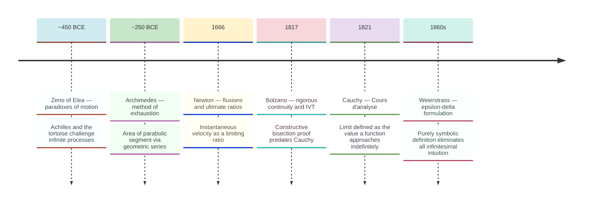
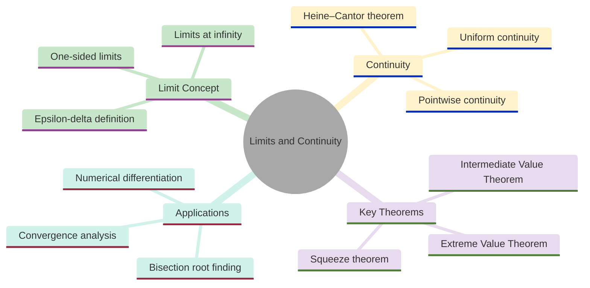
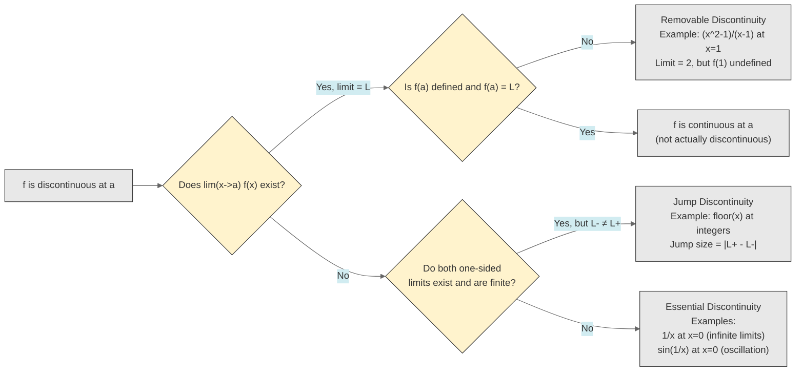
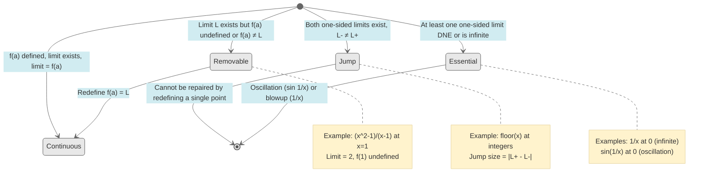
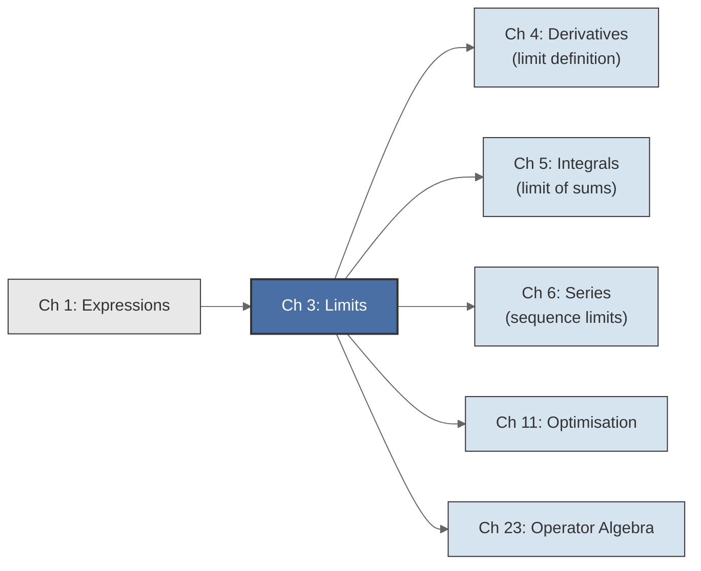

<!-- Copyright (c) 2025-2026 Bob Jansen <bobjansen@pm.me> -->
<!-- SPDX-License-Identifier: CC-BY-NC-4.0 -->
<!-- See LICENSE for full terms. Commercial licensing available. -->
# Chapter 3: Limits & Continuity


**Part II**: Calculus

> The rigorous foundation beneath derivatives and integrals: limits formalise the notion of "approaching," and continuity ensures that functions behave predictably under that approach.

**Prerequisites**: [Chapter 1](01-expressions.md) (Expressions & Functions); familiarity with real-valued functions, domains, ranges and the expression tree representation.

**Learning Objectives**: After this chapter, the reader will be able to:
1. State the epsilon-delta definition of a limit and apply it to verify specific limit claims.
2. Evaluate limits using the limit laws (sum, product, quotient, squeeze theorem) and recognise indeterminate forms.
3. Determine whether a function is continuous at a point or on an interval, and classify discontinuities by type.
4. State and apply the Intermediate Value Theorem (IVT) and the Extreme Value Theorem (EVT).
5. Distinguish between pointwise continuity and uniform continuity, and state the Heine–Cantor theorem.
6. Trace the historical development of the limit concept from Zeno's paradoxes through Newton and Leibniz to the Cauchy–Weierstrass formalisation.

**Connections**: This chapter is used by [Chapter 4](04-differential-calculus.md) (Differential Calculus), where the derivative is defined as a limit, [Chapter 5](05-integral-calculus.md) (Integral Calculus), where the Riemann integral is defined as a limit of sums, [Chapter 11](11-unconstrained-optimization.md) (Unconstrained Optimisation) and [Chapter 23](23-operator-algebra.md) (Operator Algebra). It builds on [Chapter 1](01-expressions.md) (Expressions & Functions). The IVT motivates the bisection root-finding algorithm, which appears in numerical methods throughout the text. Series convergence ([Chapter 6](06-series-approximation.md)) relies on limits of sequences.

---

## Historical Context

**Evolution of the Limit Concept**



*Figure 3.1: Key milestones in the evolution of the limit concept from antiquity to Weierstrass.*

Every derivative, every integral and every convergent series depends on a precise notion of one quantity "approaching" another. For over a century after the invention of calculus, no such precise notion existed.

**Zeno's paradoxes and the ancient roots (~450 BCE).** The philosophical tension underlying limits predates calculus by two millennia. Around 450 BCE, Zeno of Elea posed paradoxes that challenged the coherence of motion and infinite divisibility. In the paradox of Achilles and the tortoise, Achilles must complete an infinite sequence of diminishing steps to overtake the tortoise. The resolution came only with the modern theory of limits: the infinite sum $1/2 + 1/4 + 1/8 + \cdots$ converges to $1$ and the time to complete the tasks is finite because the partial sums have a limit.

**Newton and Leibniz (1660s–1680s).** Newton and Leibniz independently developed calculus in the 1660s–1680s. Both relied on intuitive notions of "infinitely small" quantities. Newton spoke of "fluxions" and "ultimate ratios"; Leibniz manipulated infinitesimals $dx$ and $dy$ algebraically. Both approaches yielded correct results but were logically suspect. Bishop George Berkeley attacked in *The Analyst* (1734): "And what are these same evanescent increments? They are neither finite quantities, nor quantities infinitely small, nor yet nothing. May we not call them the ghosts of departed quantities?" If $dx$ is zero, $dy/dx$ is undefined; if nonzero, discarding it introduces error. The resolution required a new concept: the limit.

**Cauchy's rigorous formulation (1821).** Augustin-Louis Cauchy, in his *Cours d'analyse*, first placed limits on rigorous footing. He defined the limit as the value a function "approaches indefinitely" as the variable approaches a given value. The formulation was verbal rather than symbolic, but it captured the necessary content: the deviation between $f(x)$ and $L$ can be made arbitrarily small by restricting $x$ to lie sufficiently close to $a$. Cauchy used this definition to prove the basic limit laws, give the first rigorous treatment of continuity and transform calculus into a deductive discipline.

**Weierstrass and the epsilon-delta definition (1860s).** Karl Weierstrass, lecturing in Berlin in the 1850s–1860s, refined Cauchy's definition into the purely symbolic $\varepsilon$-$\delta$ formulation standard today: for every $\varepsilon > 0$ there exists $\delta > 0$ such that $0 < |x - a| < \delta$ implies $|f(x) - L| < \varepsilon$. This eliminates all appeal to motion or intuition. The derivative is not a ratio of zeros but the limit of a ratio of nonzero quantities, where "limit" has a precise meaning.

**Bolzano and the intermediate value theorem (1817).** Bernard Bolzano proved the intermediate value theorem in 1817, four years before Cauchy's *Cours d'analyse*. Bolzano recognised that the theorem required a rigorous definition of continuity, not geometric intuition. His constructive proof used what is now called the bisection method. His contemporaries largely ignored the work, but his ideas (rigorous definitions, constructive proofs and the importance of completeness) became central to analysis.

**The resolution of the crisis in foundations (late nineteenth century).** The $\varepsilon$-$\delta$ framework, together with the Dedekind–Cantor construction of the real numbers, resolved the crisis in the foundations of calculus that had persisted since its invention. By the late nineteenth century, every result of calculus could be derived from the axioms of the real number system by purely logical arguments.

---

## Why This Chapter Matters

**Limits and Continuity**



*Figure 3.2: Conceptual map of limits and continuity topics covered in this chapter.*

Limits and continuity are the rigorous foundation without which derivatives, integrals and infinite series are logically incoherent. The epsilon-delta definition (Definition 3.1) resolved a crisis that had troubled mathematics for over a century after Newton and Leibniz: what does it mean for a quantity to "approach" a value? Every derivative in [Chapter 4](04-differential-calculus.md) is a limit of a difference quotient. Every integral in [Chapter 5](05-integral-calculus.md) is a limit of Riemann sums. Every convergent series in [Chapter 6](06-series-approximation.md) is a limit of partial sums. A practitioner who skips this chapter can memorise formulas but cannot diagnose why a numerical computation diverges or why a root-finding algorithm fails to converge.

The Intermediate Value Theorem (Theorem 3.12) and the bisection method (Algorithm 3.19) have immediate practical consequences. The IVT guarantees the existence of roots, equilibrium prices, break-even points and phase transitions; any situation where a continuous quantity crosses a threshold. The bisection method, derived from the IVT's constructive proof, converges under weaker assumptions than any other standard root-finding algorithm. It converges for any continuous function that changes sign, regardless of how badly behaved the function is. In quantitative finance, bisection is the standard fallback for computing implied volatility when Newton's method fails. In engineering, it locates zero-crossings in control systems. In economics, the existence of market equilibrium (where excess demand crosses zero) is an application of the IVT.

The numerical considerations of this chapter separate practitioners who can trust their numerical results from those who cannot. These considerations include the trade-off between truncation error and round-off error, the optimal step size for finite-difference approximations and the behaviour of catastrophic cancellation in difference quotients. The optimal step size $h^* \approx \sqrt{\varepsilon_{\mathrm{mach}}}$ for a forward difference and the superior $h^* \approx \varepsilon_{\mathrm{mach}}^{1/3}$ for a central difference are quantities every computational scientist should know. These results, rooted in the limit concept, determine the precision achievable by any numerical differentiation or gradient computation, including the gradients that drive machine learning.

---

## Notation & Conventions

| Symbol | Meaning |
|--------|---------|
| $\varepsilon$ | A positive real number representing a tolerance on the output side of a limit |
| $\delta$ | A positive real number representing a tolerance on the input side of a limit |
| $\lim_{x \to a} f(x) = L$ | The limit of $f(x)$ as $x$ approaches $a$ is $L$ |
| $\lim_{x \to a^+} f(x)$ | Right-hand (one-sided) limit: $x$ approaches $a$ from values greater than $a$ |
| $\lim_{x \to a^-} f(x)$ | Left-hand (one-sided) limit: $x$ approaches $a$ from values less than $a$ |
| $\lim_{x \to \infty} f(x)$ | Limit of $f(x)$ as $x$ increases without bound |
| $\lim_{x \to -\infty} f(x)$ | Limit of $f(x)$ as $x$ decreases without bound |
| $\infty$ | Infinity; not a real number, but a notational device indicating unbounded growth |
| $O(g(x))$ | Big-O notation: $f(x) = O(g(x))$ as $x \to a$ means $\lvert f(x) \rvert \le C\lvert g(x) \rvert$ for some constant $C$ and all $x$ sufficiently close to $a$ |
| $o(g(x))$ | Little-o notation: $f(x) = o(g(x))$ as $x \to a$ means $\lim_{x \to a} f(x)/g(x) = 0$; $f$ grows strictly slower than $g$ |
| $N$ | A real number bound used in the definition of limits at infinity |
| $M$ | A real number bound used in the definition of infinite limits |
| $c$ | A target value in the Intermediate Value Theorem, or a point in $(a,b)$ |
| $p$ | A root or fixed point; a point where $f(p) = c$ in the IVT |
| $\tau$ | Tolerance parameter for the bisection algorithm |
| $f \in C[a,b]$ | $f$ is continuous on the closed interval $[a,b]$ |
| $\lfloor x \rfloor$ | Floor function: the greatest integer less than or equal to $x$ |
| $[a,b]$ | Closed interval: $\{x \in \mathbb{R} : a \le x \le b\}$ |
| $(a,b)$ | Open interval: $\{x \in \mathbb{R} : a < x < b\}$ |

The notation $x \to a$ always means $x$ approaches $a$ through values in the domain of $f$ other than $a$ itself (the function need not be defined at $a$). The notation $x \to \infty$ means $x$ increases without bound through real values.

---

## Core Theory

### Limits of Functions

**Definition 3.1** (Limit of a function). Let $f$ be a real-valued function defined on an open interval containing $a$, except possibly at $a$ itself. The *limit of $f(x)$ as $x$ approaches $a$* is $L$, written

$$\lim_{x \to a} f(x) = L,$$

if for every $\varepsilon > 0$ there exists a $\delta > 0$ such that

$$0 < \lvert x - a \rvert < \delta \implies \lvert f(x) - L \rvert < \varepsilon.$$

In prose: no matter how tight a tolerance $\varepsilon$ is imposed on the output, there exists a corresponding input tolerance $\delta$ that guarantees $f(x)$ stays within $\varepsilon$ of $L$. The condition $0 < |x - a|$ excludes $x = a$: the limit concerns behaviour *near* $a$, not *at* $a$.

**Definition 3.2** (One-sided limits). Let $f$ be defined on an interval to the right of $a$ (respectively, to the left of $a$).

- The *right-hand limit* of $f$ at $a$ is $L$, written $\lim_{x \to a^+} f(x) = L$, if for every $\varepsilon > 0$ there exists $\delta > 0$ such that $0 < x - a < \delta$ implies $|f(x) - L| < \varepsilon$.

- The *left-hand limit* of $f$ at $a$ is $L$, written $\lim_{x \to a^-} f(x) = L$, if for every $\varepsilon > 0$ there exists $\delta > 0$ such that $0 < a - x < \delta$ implies $|f(x) - L| < \varepsilon$.

One-sided limits are necessary for functions that behave differently on each side of a point.

**Theorem 3.3** (Limit exists if and only if both one-sided limits exist and agree). Let $f$ be defined on an open interval containing $a$, except possibly at $a$ itself. Then

$$\lim_{x \to a} f(x) = L \quad \iff \quad \lim_{x \to a^-} f(x) = L \text{ and } \lim_{x \to a^+} f(x) = L.$$

??? note "Proof"

    *Proof.* ($\Rightarrow$) If $\lim_{x \to a} f(x) = L$, then for every $\varepsilon > 0$ there exists $\delta > 0$ such that $0 < |x - a| < \delta$ implies $|f(x) - L| < \varepsilon$. Since $0 < x - a < \delta$ implies $0 < |x - a| < \delta$, the same $\delta$ works for the right-hand limit. The argument for the left-hand limit is identical.

    ($\Leftarrow$) Suppose both one-sided limits equal $L$. For a given $\varepsilon > 0$, let $\delta_1 > 0$ satisfy the right-hand limit condition and $\delta_2 > 0$ satisfy the left-hand limit condition. Set $\delta = \min(\delta_1, \delta_2)$.

    If $0 < |x - a| < \delta$, then either $x > a$ (so $0 < x - a < \delta \le \delta_1$, giving $|f(x) - L| < \varepsilon$) or $x < a$ (so $0 < a - x < \delta \le \delta_2$, giving $|f(x) - L| < \varepsilon$). In either case, $|f(x) - L| < \varepsilon$.

    $\square$

**Theorem 3.4** (Limit laws). Let $\lim_{x \to a} f(x) = L$ and $\lim_{x \to a} g(x) = M$, where $L, M \in \mathbb{R}$. Then:

1. **Sum law**: $\lim_{x \to a} [f(x) + g(x)] = L + M$.
2. **Difference law**: $\lim_{x \to a} [f(x) - g(x)] = L - M$.
3. **Scalar multiple law**: $\lim_{x \to a} [c \cdot f(x)] = c \cdot L$ for any constant $c \in \mathbb{R}$.
4. **Product law**: $\lim_{x \to a} [f(x) \cdot g(x)] = L \cdot M$.
5. **Quotient law**: $\lim_{x \to a} [f(x) / g(x)] = L / M$, provided $M \neq 0$.
6. **Power law**: $\lim_{x \to a} [f(x)]^n = L^n$ for any positive integer $n$.

??? note "Proof"

    *Proof sketch (sum law).* Given $\varepsilon > 0$, use the triangle inequality:

    $$\lvert (f(x) + g(x)) - (L + M) \rvert \le \lvert f(x) - L \rvert + \lvert g(x) - M \rvert.$$

    Choose $\delta_1$ so that $|f(x) - L| < \varepsilon/2$ when $0 < |x - a| < \delta_1$, and $\delta_2$ so that $|g(x) - M| < \varepsilon/2$ when $0 < |x - a| < \delta_2$.

    Setting $\delta = \min(\delta_1, \delta_2)$ gives $|(f(x) + g(x)) - (L + M)| < \varepsilon$.

    $\square$

The product law uses the identity $f(x)g(x) - LM = f(x)(g(x) - M) + M(f(x) - L)$ and the boundedness of $f$ near $a$. The quotient law first establishes $|g(x)| > |M|/2$ near $a$, then bounds $|f(x)/g(x) - L/M|$.

**Theorem 3.5** (Squeeze theorem). Let $f$, $g$ and $h$ be functions defined on an open interval containing $a$, except possibly at $a$ itself. Suppose that

$$f(x) \le g(x) \le h(x)$$

for all $x$ in some open interval around $a$ (except possibly at $a$), and that

$$\lim_{x \to a} f(x) = \lim_{x \to a} h(x) = L.$$

Then $\lim_{x \to a} g(x) = L$.

??? note "Proof"

    *Proof.* Let $\varepsilon > 0$ be given.

    Since $\lim_{x \to a} f(x) = L$, there exists $\delta_1 > 0$ such that $0 < |x - a| < \delta_1$ implies $|f(x) - L| < \varepsilon$, which gives $L - \varepsilon < f(x)$.

    Since $\lim_{x \to a} h(x) = L$, there exists $\delta_2 > 0$ such that $0 < |x - a| < \delta_2$ implies $|h(x) - L| < \varepsilon$, which gives $h(x) < L + \varepsilon$.

    Let $\delta_3 > 0$ be small enough that the inequality $f(x) \le g(x) \le h(x)$ holds for $0 < |x - a| < \delta_3$. Set $\delta = \min(\delta_1, \delta_2, \delta_3)$. For $0 < |x - a| < \delta$:

    $$L - \varepsilon < f(x) \le g(x) \le h(x) < L + \varepsilon,$$

    so $|g(x) - L| < \varepsilon$. Since $\varepsilon$ was arbitrary, $\lim_{x \to a} g(x) = L$.

    $\square$

**Example 3.6** ($\lim_{x \to 0} \sin(x)/x = 1$). This limit is required for the proof that $\frac{d}{dx}\sin(x) = \cos(x)$.

??? note "Proof"

    *Proof via the squeeze theorem.* For $x \in (0, \pi/2)$, a geometric argument on the unit circle gives $\sin(x) \le x \le \tan(x)$. This follows from comparing the area of triangle $OAP$, circular sector $OAP$ and triangle $OAT$ on the unit circle; see [Spivak, *Calculus* §15] or [Abbott, *Understanding Analysis* §2.3]. Dividing by $\sin(x) > 0$:

    $$1 \le \frac{x}{\sin(x)} \le \frac{1}{\cos(x)}.$$

    Taking reciprocals (which reverses inequalities since all quantities are positive):

    $$\cos(x) \le \frac{\sin(x)}{x} \le 1.$$

    As $x \to 0^+$, $\cos(x) \to 1$ and $1 \to 1$. By the squeeze theorem, $\lim_{x \to 0^+} \frac{\sin(x)}{x} = 1$. Since $\sin(x)/x$ is an even function (because $\sin(-x)/(-x) = \sin(x)/x$), the left-hand limit also equals $1$. By Theorem 3.3, $\lim_{x \to 0} \frac{\sin(x)}{x} = 1$.

    $\square$

**The Function sin(x)/x Approaching 1 as x Approaches 0**

```mermaid
---
config:
  theme: base
  themeVariables:
    xyChart:
      plotColorPalette: "#2563eb, #dc2626, #16a34a, #9333ea, #ca8a04, #0891b2"
      backgroundColor: "#ffffff"
      titleColor: "#333333"
      xAxisLabelColor: "#333333"
      yAxisLabelColor: "#333333"
      xAxisTitleColor: "#333333"
      yAxisTitleColor: "#333333"
      xAxisLineColor: "#333333"
      yAxisLineColor: "#333333"
---
xychart-beta
    x-axis "x" [-3, -2, -1, -0.5, -0.1, 0.1, 0.5, 1, 2, 3]
    y-axis "sin(x)/x" 0 --> 1.05
    line [0.047, 0.455, 0.841, 0.959, 0.998, 0.998, 0.959, 0.841, 0.455, 0.047]
```

*Figure 3.3: The function sin(x)/x approaching 1 as x approaches 0 from both sides.*

### Limits at Infinity and Infinite Limits

**Definition 3.7** (Limit at infinity). Let $f$ be defined on an interval $(c, \infty)$ for some real number $c$. The *limit of $f(x)$ as $x$ approaches infinity* is $L$, written

$$\lim_{x \to \infty} f(x) = L,$$

if for every $\varepsilon > 0$ there exists a real number $N$ such that

$$x > N \implies \lvert f(x) - L \rvert < \varepsilon.$$

In prose: by going far enough along the positive real line, $f(x)$ can be made arbitrarily close to $L$. The analogous definition for $x \to -\infty$ replaces $x > N$ with $x < N$.

**Definition 3.8** (Infinite limit). Let $f$ be defined on an open interval containing $a$, except possibly at $a$ itself. The *limit of $f(x)$ as $x$ approaches $a$ is positive infinity*, written

$$\lim_{x \to a} f(x) = +\infty,$$

if for every real number $M > 0$ there exists $\delta > 0$ such that

$$0 < \lvert x - a \rvert < \delta \implies f(x) > M.$$

That is, $f(x)$ exceeds any prescribed bound when $x$ is sufficiently close to $a$. The definition for $\lim_{x \to a} f(x) = -\infty$ replaces $f(x) > M$ with $f(x) < -M$. Infinite limits indicate vertical asymptotes: the graph of $f$ rises or falls without bound near $x = a$.

### Continuity

**Definition 3.9** (Continuity at a point). A function $f$ is *continuous at $a$* if the following three conditions all hold:

1. $f(a)$ is defined (i.e., $a$ is in the domain of $f$).
2. $\lim_{x \to a} f(x)$ exists.
3. $\lim_{x \to a} f(x) = f(a)$.

Equivalently: for every $\varepsilon > 0$ there exists $\delta > 0$ such that $|x - a| < \delta$ implies $|f(x) - f(a)| < \varepsilon$. This single-condition formulation combines all three requirements above: $f(a)$ must be defined for $f(a)$ to appear, the limit must exist because the $\varepsilon$-$\delta$ bound is asserted and the limit must equal $f(a)$ because the bound is on $|f(x) - f(a)|$. Note the absence of $0 < |x - a|$: at $x = a$ the condition holds trivially.

**Definition 3.10** (Continuity on an interval). A function $f$ is *continuous on the closed interval $[a, b]$* if:

- $f$ is continuous at every point $c \in (a, b)$, and
- $f$ is right-continuous at $a$: $\lim_{x \to a^+} f(x) = f(a)$, and
- $f$ is left-continuous at $b$: $\lim_{x \to b^-} f(x) = f(b)$.

The one-sided conditions at endpoints are necessary because $f$ may not be defined outside $[a, b]$.

**Theorem 3.11** (Algebra of continuous functions). Let $f$ and $g$ be continuous at $a$, and let $c \in \mathbb{R}$. Then:

1. $f + g$ is continuous at $a$.
2. $f - g$ is continuous at $a$.
3. $c \cdot f$ is continuous at $a$.
4. $f \cdot g$ is continuous at $a$.
5. $f / g$ is continuous at $a$, provided $g(a) \neq 0$.
6. If $g$ is continuous at $a$ and $f$ is continuous at $g(a)$, then $f \circ g$ is continuous at $a$.

??? note "Proof"

    *Proof sketch.* Parts (1)–(5) follow directly from the limit laws (Theorem 3.4).

    For part (6): given $\varepsilon > 0$, continuity of $f$ at $g(a)$ provides $\eta > 0$ with $|y - g(a)| < \eta \Rightarrow |f(y) - f(g(a))| < \varepsilon$.

    Continuity of $g$ at $a$ provides $\delta > 0$ with $|x - a| < \delta \Rightarrow |g(x) - g(a)| < \eta$.

    Chaining: $|x - a| < \delta \Rightarrow |f(g(x)) - f(g(a))| < \varepsilon$.

    $\square$

**Remark**. Theorem 3.11 implies that all polynomials are continuous on $\mathbb{R}$, rational functions are continuous wherever their denominators are nonzero and trigonometric, exponential and logarithmic functions are continuous on their domains. Every elementary function representable as an `Expr` ([Chapter 1](01-expressions.md)) is continuous wherever it is defined.

### The Intermediate Value Theorem and Extreme Value Theorem

**Theorem 3.12** (Intermediate Value Theorem). Let $f$ be continuous on the closed interval $[a, b]$. If $c$ is any value between $f(a)$ and $f(b)$ (that is, $\min(f(a), f(b)) < c < \max(f(a), f(b))$), then there exists at least one point $p \in [a, b]$ such that $f(p) = c$.

!!! abstract "Key Result"

    **Theorem 3.12** (Intermediate Value Theorem). A continuous function on a closed interval attains every value between its endpoints, guaranteeing the existence of roots, equilibrium prices and phase transitions whenever a continuous quantity crosses a threshold.

The theorem also holds trivially for $c = f(a)$ or $c = f(b)$ (take $p = a$ or $p = b$). The interesting case is the strict interior.

??? note "Proof"

    *Proof sketch (bisection argument).* Assume $f(a) < c < f(b)$. Set $a_0 = a$, $b_0 = b$. At each step, let $m_n = (a_n + b_n)/2$. If $f(m_n) < c$, set $a_{n+1} = m_n$, $b_{n+1} = b_n$; otherwise set $a_{n+1} = a_n$, $b_{n+1} = m_n$.

    By construction $f(a_n) < c < f(b_n)$, the intervals are nested and their lengths $(b - a)/2^n \to 0$.

    By completeness of $\mathbb{R}$, there exists a unique $p = \lim a_n = \lim b_n$. Since $f(a_n) < c$ for all $n$, taking limits and using that limits preserve non-strict inequalities, $f(p) = \lim f(a_n) \le c$. By the same reasoning, since $f(b_n) > c$ for all $n$, $f(p) = \lim f(b_n) \ge c$. The two inequalities together give $f(p) = c$.

    $\square$

The IVT is an existence theorem. The bisection method used in the proof is itself a constructive algorithm for approximating $p$ (see Algorithm 3.19).

**Theorem 3.13** (Extreme Value Theorem). Let $f$ be continuous on the closed interval $[a, b]$. Then $f$ attains both a maximum and a minimum value on $[a, b]$. That is, there exist points $x_{\min}, x_{\max} \in [a, b]$ such that

$$f(x_{\min}) \le f(x) \le f(x_{\max}) \quad \text{for all } x \in [a, b].$$

The proof requires the Bolzano–Weierstrass theorem and the compactness of closed bounded intervals. The key idea: a maximising sequence $f(x_n) \to \sup f$ has a convergent subsequence $x_{n_k} \to x^*$, and continuity gives $f(x^*) = \sup f$.

**Remark**. Both the IVT and EVT require continuity on a *closed* bounded interval. The function $f(x) = 1/x$ on $(0, 1]$ is continuous but attains no maximum. The floor function $f(x) = \lfloor x \rfloor$ on $[0, 2]$ takes $0$ and $2$ but not $0.5$, violating the IVT conclusion because it is discontinuous.

### Types of Discontinuity

**Definition 3.14** (Types of discontinuity). A function $f$ is discontinuous at $a$ if it fails to be continuous at $a$. Discontinuities are classified into three types:

1. **Removable discontinuity**: The limit $\lim_{x \to a} f(x) = L$ exists, but either $f(a)$ is not defined or $f(a) \neq L$. The discontinuity can be "removed" by (re)defining $f(a) = L$.

2. **Jump discontinuity**: Both one-sided limits exist but are not equal: $\lim_{x \to a^-} f(x) = L^- \neq L^+ = \lim_{x \to a^+} f(x)$. The size of the jump is $|L^+ - L^-|$.

3. **Essential (infinite) discontinuity**: At least one of the one-sided limits does not exist or is infinite. For example, $f(x) = 1/x$ has an essential discontinuity at $x = 0$ (the left limit is $-\infty$ and the right limit is $+\infty$) and $f(x) = \sin(1/x)$ has an essential discontinuity at $x = 0$ (the limit does not exist because $f$ oscillates between $-1$ and $1$ without settling). Essential discontinuities further subdivide into infinite discontinuities (e.g., $1/x$ at $0$) and oscillatory discontinuities (e.g., $\sin(1/x)$ at $0$), though both are collectively called "essential" in most treatments.

The following flowchart summarises how to classify a discontinuity at a point $a$:

**Discontinuity Classification**



*Figure 3.4: Flowchart for classifying discontinuities as removable, jump or essential.*

**Discontinuity Type Transitions**



*Figure 3.5: State diagram showing transitions between continuity and discontinuity types.*

### Uniform Continuity

**Definition 3.15** (Uniform continuity). A function $f: D \to \mathbb{R}$ is *uniformly continuous* on $D$ if for every $\varepsilon > 0$ there exists $\delta > 0$ such that

$$\lvert x - y \rvert < \delta \implies \lvert f(x) - f(y) \rvert < \varepsilon \quad \text{for all } x, y \in D.$$

The distinction from pointwise continuity (Definition 3.9) is quantifier order. In pointwise continuity, $\delta$ may depend on both $\varepsilon$ and the point $a$. In uniform continuity, a single $\delta$ works for *all* pairs of points simultaneously.

For example, $f(x) = 1/x$ on $(0, 1)$ is continuous at every point but *not* uniformly continuous: for any $\delta \in (0, 2)$, the points $x = \delta/2$ and $y = \delta/4$ both lie in $(0, 1)$ and satisfy $|x - y| = \delta/4 < \delta$, yet $|1/x - 1/y| = |2/\delta - 4/\delta| = 2/\delta$. By choosing $\delta$ small enough (e.g., $\delta < 2/\varepsilon$), the difference $2/\delta$ exceeds any prescribed $\varepsilon$.

**Theorem 3.16** (Heine–Cantor theorem). If $f$ is continuous on a closed bounded interval $[a, b]$, then $f$ is uniformly continuous on $[a, b]$.

??? note "Proof"

    *Proof.* Suppose for contradiction that $f$ is continuous on $[a,b]$ but not uniformly continuous. Then there exists $\varepsilon_0 > 0$ and sequences $(x_n)$, $(y_n)$ in $[a,b]$ with $|x_n - y_n| < 1/n$ but $|f(x_n) - f(y_n)| \geq \varepsilon_0$ for all $n$.

    Since $[a,b]$ is closed and bounded, the Bolzano–Weierstrass theorem provides a convergent subsequence $x_{n_k} \to c \in [a,b]$. Because $|x_{n_k} - y_{n_k}| < 1/n_k \to 0$, it follows that $y_{n_k} \to c$ (by the triangle inequality: $|y_{n_k} - c| \le |y_{n_k} - x_{n_k}| + |x_{n_k} - c| \to 0$).

    By continuity of $f$ at $c$, $f(x_{n_k}) \to f(c)$ and $f(y_{n_k}) \to f(c)$. By the triangle inequality, $|f(x_{n_k}) - f(y_{n_k})| \le |f(x_{n_k}) - f(c)| + |f(c) - f(y_{n_k})| \to 0$. This contradicts $|f(x_{n_k}) - f(y_{n_k})| \geq \varepsilon_0 > 0$ for all $k$.

    $\square$

The Heine–Cantor theorem is the reason that many theoretical results require a closed bounded domain: on such domains, continuity automatically upgrades to the stronger property of uniform continuity, which gives uniform control over approximation errors.

!!! warning "Uniform continuity requires a closed bounded domain"
    A function that is continuous on an open or unbounded interval need not be uniformly continuous. The function $f(x) = 1/x$ on $(0,1)$ is continuous everywhere on its domain but not uniformly continuous: $\delta$ must shrink as $x$ approaches $0$. Proofs that assume uniform continuity must verify that the domain is closed and bounded.

### L'Hôpital's Rule (Preview)

**Theorem 3.17** (L'Hôpital's rule). If $f$ and $g$ are differentiable on an open interval containing $a$ (except possibly at $a$), $\lim_{x \to a} f(x) = 0$ and $\lim_{x \to a} g(x) = 0$ (or both limits are $\pm\infty$), and $g'(x) \neq 0$ near $a$, then

$$\lim_{x \to a} \frac{f(x)}{g(x)} = \lim_{x \to a} \frac{f'(x)}{g'(x)},$$

provided the limit on the right exists (or is $\pm\infty$). (Proof in [Chapter 4](04-differential-calculus.md).)

L'Hôpital's rule evaluates limits of *indeterminate forms*. The seven standard indeterminate forms are:

| Form | Example |
|------|---------|
| $0/0$ | $\lim_{x \to 0} \frac{\sin x}{x}$ |
| $\infty/\infty$ | $\lim_{x \to \infty} \frac{\ln x}{x}$ |
| $0 \cdot \infty$ | $\lim_{x \to 0^+} x \ln x$ (rewrite as $\frac{\ln x}{1/x}$) |
| $\infty - \infty$ | $\lim_{x \to 0} \left(\frac{1}{\sin x} - \frac{1}{x}\right)$ |
| $0^0$ | $\lim_{x \to 0^+} x^x$ (take logarithm: $x \ln x \to 0$, so $x^x \to 1$) |
| $1^\infty$ | $\lim_{x \to \infty} (1 + 1/x)^x$ (this equals $e$) |
| $\infty^0$ | $\lim_{x \to \infty} x^{1/x}$ (take logarithm: $\frac{\ln x}{x} \to 0$, so $x^{1/x} \to 1$) |

The proof requires the Mean Value Theorem ([Chapter 4](04-differential-calculus.md)). The remaining forms are converted to $0/0$ or $\infty/\infty$ by algebraic manipulation or by taking logarithms.

---

## Formulas & Identities

The following standard limits serve as a reference table. Each is stated with the approach direction and any conditions.

**F3.1** Standard limit for trigonometric differentiation. Proved in Example 3.6 via the squeeze theorem.

$$\lim_{x \to 0} \frac{\sin x}{x} = 1$$

**F3.2** One of the classical definitions of Euler's number $e \approx 2.71828$.

$$\lim_{n \to \infty} \left(1 + \frac{1}{n}\right)^n = e$$

This limit connects compound interest ([Chapter 25](25-financial-mathematics.md)) to the exponential function: compounding $n$ times per year at 100% annual interest, the balance approaches $e$ as $n \to \infty$.

The following chart shows $(1+1/n)^n$ approaching $e$ as $n$ increases:

**Convergence of (1+1/n)^n to Euler's Number e**

```mermaid
---
config:
  theme: base
  themeVariables:
    xyChart:
      plotColorPalette: "#2563eb, #dc2626, #16a34a, #9333ea, #ca8a04, #0891b2"
      backgroundColor: "#ffffff"
      titleColor: "#333333"
      xAxisLabelColor: "#333333"
      yAxisLabelColor: "#333333"
      xAxisTitleColor: "#333333"
      yAxisTitleColor: "#333333"
      xAxisLineColor: "#333333"
      yAxisLineColor: "#333333"
---
xychart-beta
    x-axis "n" [1, 2, 5, 10, 50, 100, 1000]
    y-axis "(1+1/n)ⁿ" 1.9 --> 2.75
    line [2.0, 2.25, 2.488, 2.594, 2.692, 2.705, 2.717]
```

*Figure 3.6: Convergence of (1+1/n)^n to Euler's number e as n increases.*

The sequence is monotonically increasing and bounded above by $e \approx 2.71828$. Even at $n=1000$, the value $2.717$ is within $0.001$ of the limit. The slow convergence illustrates why this definition of $e$, though conceptually natural, is not used for numerical computation.

**F3.3** Derivative of $e^x$ at $x = 0$, expressed as the limit definition. Also follows from the Taylor expansion $e^x = 1 + x + x^2/2 + \cdots$.

$$\lim_{x \to 0} \frac{e^x - 1}{x} = 1$$

**F3.4** Derivative of $\ln(1 + x)$ at $x = 0$.

$$\lim_{x \to 0} \frac{\ln(1 + x)}{x} = 1$$

**F3.5** Exponential growth dominates polynomial growth, for any fixed $n \in \mathbb{N}$.

$$\lim_{x \to \infty} \frac{x^n}{e^x} = 0$$

This can be proved by repeated application of L'Hôpital's rule: each differentiation reduces the exponent of the numerator by $1$ while the denominator remains $e^x$.

**F3.6** Logarithmic growth is eventually slower than any positive power of $x$, for any $p > 0$.

$$\lim_{x \to \infty} \frac{\ln x}{x^p} = 0$$

By L'Hôpital's rule: $\lim_{x \to \infty} \frac{\ln x}{x^p} = \lim_{x \to \infty} \frac{1/x}{p x^{p-1}} = \lim_{x \to \infty} \frac{1}{p x^p} = 0$.

!!! info "Verifying L'Hôpital's rule conditions before applying it"
    L'Hôpital's rule (Theorem 3.17) applies only when the limit produces an indeterminate form $0/0$ or $\infty/\infty$, and only when the limit of $f'(x)/g'(x)$ itself exists. Applying the rule to a non-indeterminate form (e.g., $1/0$) produces incorrect results. Each application of L'Hôpital's rule in F3.5 and F3.6 must be checked: the numerator and denominator must both approach $0$ or both approach $\pm\infty$ at each step.

---

## Algorithms

### Algorithm 3.18: Numerical Limit Evaluation by Successive Approximation

**Input**: Function $f: \mathbb{R} \to \mathbb{R}$, point $a$, direction (two-sided, left or right), number of steps $k$.

**Output**: Estimated limit value, or indication of non-convergence.

**Idea**: Evaluate $f$ at a sequence of points approaching $a$: $a \pm h$ for $h = 10^{-1}, 10^{-2}, 10^{-3}, \ldots, 10^{-k}$. If the sequence of values converges, the last value is an approximation of the limit.

```
function evaluateLimit(f, a, direction = 'both', k = 12):
    values = []
    for i = 1 to k:
        h = 10^(-i)
        if direction = 'right' or direction = 'both':
            val_right = f(a + h)
        if direction = 'left' or direction = 'both':
            val_left = f(a - h)

        if direction = 'both':
            if |val_right - val_left| > tolerance:
                return { converged: false, reason: 'one-sided limits disagree' }
            values.append((val_right + val_left) / 2)
        else if direction = 'right':
            values.append(val_right)
        else:
            values.append(val_left)

    // Check convergence: are the last few values stabilizing?
    if |values[k-1] - values[k-2]| < epsilon_mach * max(1, |values[k-1]|):
        return { converged: true, value: values[k-1] }
    else:
        return { converged: false, reason: 'values not stabilizing' }
```

**Complexity**: $O(k)$ function evaluations. With $k = 12$, this is $O(1)$ in practical terms.

**When this fails**: (1) If $f$ oscillates near $a$ (e.g., $\sin(1/x)$ as $x \to 0$), the values do not converge. (2) Cancellation at scales below machine epsilon masks the true behaviour. (3) If $a = \infty$, one must evaluate $f(10^i)$ for increasing $i$ instead.

### Algorithm 3.19: Bisection Method for Root-Finding

The bisection method is the simplest application of the Intermediate Value Theorem (Theorem 3.12). Given a continuous function $f$ and an interval $[a, b]$ where $f(a)$ and $f(b)$ have opposite signs, the IVT guarantees at least one root in $(a, b)$. The bisection method finds it by repeatedly halving the interval.

**Input**: Continuous function $f$, interval endpoints $a, b$ with $f(a) \cdot f(b) < 0$, tolerance $\tau > 0$.

**Output**: Approximate root $p$ with $|p - p^*| < \tau$, where $p^*$ is a true root.

```
function bisect(f, a, b, tolerance):
    if f(a) * f(b) >= 0:
        throw Error("f(a) and f(b) must have opposite signs")

    maxIterations = ceil(log2((b - a) / tolerance))

    for i = 1 to maxIterations:
        m = a + (b - a) / 2

        if |f(m)| < epsilon_mach:
            return m        // root found (exact equality is unreliable in floating-point)

        if f(a) * f(m) < 0:
            b = m           // root is in [a, m]
        else:
            a = m           // root is in [m, b]

    return (a + b) / 2      // midpoint of final interval
```

**Complexity**: $O(\log_2((b - a)/\tau))$ function evaluations. Each iteration halves the interval length, so after $n$ iterations the interval has length $(b - a)/2^n$. To achieve tolerance $\tau$, the number of iterations is $n = \lceil \log_2((b - a) / \tau) \rceil$.

**Convergence**: The bisection method has *linear convergence*: it gains approximately one binary digit of accuracy per iteration (equivalently, approximately $\log_{10} 2 \approx 0.301$ decimal digits per iteration). To achieve $10^{-10}$ accuracy from an initial interval of length $1$ requires $\lceil 10 / \log_{10} 2 \rceil \approx 34$ iterations.

**Guarantees**: Bisection is *guaranteed* to converge provided $f$ is continuous and $f(a) \cdot f(b) < 0$. The trade-off is speed: reliable but slow.

---

## Numerical Considerations

### Limits and Floating-Point Arithmetic

The mathematical definition of a limit involves quantities approaching zero. In IEEE 754 double-precision arithmetic, this idealisation collides with the discrete nature of floating-point numbers. Machine epsilon is $\varepsilon_{\mathrm{mach}} \approx 2.22 \times 10^{-16}$. It is impossible to literally compute $\lim_{h \to 0} f(h)$: eventually $h$ becomes so small that $a + h$ rounds to $a$, or the evaluation of $f$ at $a + h$ suffers from catastrophic cancellation.

### Optimal Step Sizes for Numerical Limit Approximation

When computing $\lim_{h \to 0} \frac{f(a + h) - f(a)}{h}$ (which is the derivative, previewing [Chapter 4](04-differential-calculus.md)), two error sources compete:

1. **Truncation error**: The finite-$h$ approximation differs from the true limit by $O(h)$ for a forward difference or $O(h^2)$ for a central difference.
2. **Round-off error**: Evaluating $f(a + h) - f(a)$ incurs cancellation error of order $\varepsilon_{\mathrm{mach}} |f(a)| / h$.

Balancing these for a forward difference gives an optimal step size $h^* \approx \sqrt{\varepsilon_{\mathrm{mach}}} \approx 1.5 \times 10^{-8}$. For a central difference, $h^* \approx \varepsilon_{\mathrm{mach}}^{1/3} \approx 6 \times 10^{-6}$. The complete derivation of these optimal step sizes, including the exact formulas accounting for function-dependent constants, appears in [Chapter 4](04-differential-calculus.md), §7.

For the general successive-approximation limit evaluation (Algorithm 3.18), the sequence $h = 10^{-1}, 10^{-2}, \ldots$ crosses the useful range at about $h = 10^{-8}$; values of $h$ much smaller than this introduce more round-off error than they remove truncation error. Algorithm 3.18 stops at $k = 12$ steps by default, using the convergence of the sequence as the termination criterion rather than pushing $h$ to impractical smallness.

### Cancellation in Difference Quotients

The expression $(f(x + h) - f(x)) / h$ is the prototypical instance of *subtractive cancellation*. When $f(x + h)$ and $f(x)$ are nearly equal, their difference loses leading digits and dividing by $h$ amplifies the remaining noise. This is the central numerical difficulty of differentiation ([Chapter 4](04-differential-calculus.md)) and is present in any numerical limit evaluation.

!!! warning "Catastrophic cancellation in difference quotients"
    Reducing $h$ below $\sqrt{\varepsilon_{\mathrm{mach}}} \approx 1.5 \times 10^{-8}$ in a forward difference quotient makes the result *less* accurate, not more. At $h = 10^{-15}$, the numerator $f(a+h) - f(a)$ retains at most one or two correct digits. Always use the optimal step sizes from this section rather than choosing $h$ "as small as possible."

### Bisection: Guaranteed Convergence but Slow

The bisection method requires only the sign of $f$, so it is immune to scaling issues and never diverges. It converges at one bit per iteration regardless of the function's behaviour. The trade-off is speed: $10^{-10}$ accuracy from a unit interval requires about 34 iterations, whereas Newton's method achieves the same in 5–6 iterations (but requires the derivative and can diverge). For reliability, bisection is the natural first-choice root-finder.

!!! tip "Midpoint overflow avoidance"
    The midpoint computation $m = (a + b) / 2$ can overflow when $a$ and $b$ are both large. Write $m = a + (b - a) / 2$ instead. This produces the same result in exact arithmetic but avoids the intermediate sum $a + b$.

---

## Worked Examples

### Example 3.20: Numerical Evaluation of $\lim_{x \to 0} \sin(x)/x$

**Problem**: Verify numerically that $\lim_{x \to 0} \frac{\sin(x)}{x} = 1$.

**Solution** (mathematical): This limit is proved analytically in Example 3.6 using the squeeze theorem. The numerical approach evaluates the expression at points approaching $0$:

| $h$ | $\sin(h)/h$ |
|-----|-------------|
| $10^{-1}$ | $0.99833416646828$ |
| $10^{-2}$ | $0.99998333341667$ |
| $10^{-4}$ | $0.99999999833333$ |
| $10^{-8}$ | $1.00000000000000$ |

The values converge rapidly to $1$, confirming the analytical result.

### Example 3.21: Finding a Root of $x^3 - x - 1 = 0$ by Bisection

**Problem**: Find a real root of $f(x) = x^3 - x - 1$ on the interval $[1, 2]$.

**Solution** (mathematical): Evaluate $f$ at the endpoints: $f(1) = 1 - 1 - 1 = -1 < 0$ and $f(2) = 8 - 2 - 1 = 5 > 0$. Since $f$ is continuous (it is a polynomial) and changes sign on $[1, 2]$, the IVT guarantees a root in $(1, 2)$.

Bisection halves the interval at each step. After 34 iterations, the root is approximately $p \approx 1.3247179572$.

**Verification**: $1.3247179572^3 - 1.3247179572 - 1 \approx -5.6 \times 10^{-11}$, which is within the requested tolerance.

### Example 3.22: Removable Discontinuity of $(x^2 - 1)/(x - 1)$ at $x = 1$

**Problem**: Analyse the function $f(x) = \frac{x^2 - 1}{x - 1}$ at $x = 1$. Classify the discontinuity and find the limit.

**Solution**: The function is undefined at $x = 1$ because the denominator vanishes. For $x \neq 1$:

$$f(x) = \frac{x^2 - 1}{x - 1} = \frac{(x - 1)(x + 1)}{x - 1} = x + 1.$$

The limit is therefore $\lim_{x \to 1} f(x) = \lim_{x \to 1} (x + 1) = 2$. Since $f(1)$ is undefined but the limit exists, this is a *removable discontinuity* (Definition 3.14, type 1). Defining $f(1) = 2$ removes the discontinuity, making $f$ continuous everywhere.

### Example 3.23: A Jump Discontinuity

**Problem**: Show that $g(x) = \lfloor x \rfloor$ (the floor function) has a jump discontinuity at every integer.

**Solution**: At any integer $n$, the left-hand limit is $\lim_{x \to n^-} \lfloor x \rfloor = n - 1$ (since for $x$ slightly less than $n$, the floor is $n - 1$). The right-hand limit is $\lim_{x \to n^+} \lfloor x \rfloor = n$ (since for $x$ slightly greater than $n$, the floor is $n$). The one-sided limits exist but differ: $n - 1 \neq n$. This is a jump discontinuity with jump size $1$.

---

## Connections

**Chapter Dependencies**



*Figure 3.7: Chapter 3 dependency graph showing prerequisite and forward connections.*

### Within This Book

- **Differential Calculus** ([Chapter 4](04-differential-calculus.md)): The derivative is *defined* as a limit: $f'(a) = \lim_{h \to 0} \frac{f(a+h) - f(a)}{h}$. Every theorem about derivatives ultimately rests on the limit laws from this chapter. The proof that differentiability implies continuity is a direct application of the limit definition. L'Hôpital's rule, stated here as Theorem 3.17, is proved in [Chapter 4](04-differential-calculus.md) using the Mean Value Theorem.

- **Integral Calculus** ([Chapter 5](05-integral-calculus.md)): The Riemann integral is defined as the limit of Riemann sums: $\int_a^b f(x)\,dx = \lim_{\|P\| \to 0} \sum f(x_i^*) \Delta x_i$. The Fundamental Theorem of Calculus connects this limit to antidifferentiation, linking [Chapter 4](04-differential-calculus.md) and [Chapter 5](05-integral-calculus.md).

- **Series & Approximation** ([Chapter 6](06-series-approximation.md)): An infinite series $\sum_{n=1}^\infty a_n$ converges if and only if its sequence of partial sums $S_N = \sum_{n=1}^N a_n$ has a limit as $N \to \infty$. Every convergence test (ratio, root, comparison) is a criterion for the existence of this limit.

- **Unconstrained Optimisation** ([Chapter 11](11-unconstrained-optimization.md)): The IVT motivates root-finding algorithms (bisection, Newton's method). The EVT guarantees that a continuous function on a closed bounded set has a maximum and minimum, which is the theoretical foundation for optimisation on compact domains.

- **Operator Algebra** ([Chapter 23](23-operator-algebra.md)): The limit operation $\lim_{h \to 0}$ mediates between algebraic manipulation of expressions and analytical extraction of derivatives. The derivative operator $D$ composes forming the difference quotient with taking the limit, making limits the mechanism through which operators act on function spaces.

### Applications

- **Economics**: Marginal cost is the derivative of total cost; it is a limit. Consumer surplus is a definite integral; it is a limit of sums. The existence of equilibrium (where supply equals demand) follows from the IVT: if excess demand is positive at one price and negative at another, continuity guarantees an equilibrium price between them.

- **Machine learning**: Gradients are limits. The convergence of gradient descent depends on the continuity and smoothness of the loss function. The universal approximation theorem guarantees that continuous functions can be approximated by neural networks.

- **Numerical methods**: The bisection algorithm is the simplest root-finder that guarantees convergence. Numerical integration ([Chapter 5](05-integral-calculus.md)) and differentiation ([Chapter 4](04-differential-calculus.md)) both involve taking limits of discrete approximations. Balancing truncation error against round-off error requires the concepts from this chapter.

### The Operator View

From the perspective of operator algebra ([Chapter 23](23-operator-algebra.md)), the limit operation $\lim_{h \to 0}$ is a functional mapping a family of functions (parametrised by $h$) to a value. The derivative operator $D$ composes forming the difference quotient with taking the limit: $Df(a) = \lim_{h \to 0} \frac{f(a+h) - f(a)}{h}$. Limits thus mediate between algebraic manipulation of expressions and analytical extraction of derivatives.

---

## Summary

- The epsilon-delta definition formalises limits by requiring that for every output tolerance $\varepsilon > 0$ there exists an input tolerance $\delta > 0$ guaranteeing $|f(x) - L| < \varepsilon$.
- Continuity at a point requires the limit to exist, the function to be defined and the two values to agree; discontinuities are classified as removable, jump or essential.
- The Intermediate Value Theorem guarantees that a continuous function on a closed interval attains every value between its endpoints, providing the theoretical basis for the bisection root-finding algorithm.
- The Extreme Value Theorem ensures that a continuous function on a closed bounded interval attains its maximum and minimum, underpinning optimisation on compact domains.
- The Heine–Cantor theorem upgrades pointwise continuity to uniform continuity on closed bounded intervals, giving uniform control over approximation errors.

---

## Exercises

### Routine

**Exercise 3.1**. Use the $\varepsilon$-$\delta$ definition to prove that $\lim_{x \to 3} (2x + 1) = 7$. (Hint: given $\varepsilon > 0$, find $\delta$ in terms of $\varepsilon$ such that $|x - 3| < \delta$ implies $|(2x + 1) - 7| < \varepsilon$.)

**Exercise 3.2**. Evaluate the following limits using the limit laws (Theorem 3.4):
- (a) $\lim_{x \to 2} (x^2 + 3x - 1)$
- (b) $\lim_{x \to 1} \frac{x^2 + x}{x + 1}$
- (c) $\lim_{x \to 0} \frac{\sin(3x)}{x}$ (Hint: write as $3 \cdot \frac{\sin(3x)}{3x}$ and use F3.1.)

**Exercise 3.3**. For each function, determine whether it is continuous at $x = 2$. If not, classify the discontinuity.
- (a) $f(x) = \frac{x^2 - 4}{x - 2}$
- (b) $g(x) = \begin{cases} x + 1 & \text{if } x < 2 \\ 5 & \text{if } x = 2 \\ x + 1 & \text{if } x > 2 \end{cases}$
- (c) $h(x) = \begin{cases} x + 1 & \text{if } x \le 2 \\ x^2 & \text{if } x > 2 \end{cases}$

### Intermediate

**Exercise 3.4**. Use the squeeze theorem to evaluate $\lim_{x \to 0} x^2 \sin(1/x)$. (Hint: $-1 \le \sin(1/x) \le 1$, so $-x^2 \le x^2 \sin(1/x) \le x^2$.)

**Exercise 3.5**. Prove that if $f$ is continuous at $a$ and $f(a) > 0$, then there exists an interval $(a - \delta, a + \delta)$ on which $f(x) > 0$. (This is the "sign preservation" property of continuous functions.)

**Exercise 3.6**. Apply the bisection method to find a root of $e^x - 3x = 0$ on the interval $[0, 1]$. Verify that $f(0) = 1 > 0$ and $f(1) = e - 3 \approx -0.282 < 0$. Compute the first four bisection steps and report the midpoint at each step.

### Challenging

**Exercise 3.7**. Prove that $f(x) = x^2$ is uniformly continuous on $[0, 1]$ by explicitly constructing $\delta$ in terms of $\varepsilon$. Then show that $f(x) = x^2$ is *not* uniformly continuous on $\mathbb{R}$ by showing that for $\varepsilon = 1$, no single $\delta$ works for all pairs $(x, y)$. (Hint: for the second part, consider $x = n$ and $y = n + \delta/2$ for large $n$.)

**Exercise 3.8**. The function $f(x) = \sin(1/x)$ has an essential discontinuity at $x = 0$ because the limit does not exist. Prove this rigorously: show that for any proposed limit $L$, there exists $\varepsilon > 0$ such that for every $\delta > 0$, there exists $x$ with $0 < |x| < \delta$ and $|f(x) - L| \ge \varepsilon$. (Hint: $\sin(1/x)$ takes every value in $[-1, 1]$ in every neighbourhood of $0$.)

---

## References

### Textbooks

[1] Abbott, S. *Understanding Analysis*, 2nd ed. Springer, 2015. Chapters 2–4 cover limits of sequences and functions, continuity and the topology of the real line. Includes exercises that develop proof-writing skills.

[2] Rudin, W. *Principles of Mathematical Analysis*, 3rd ed. McGraw-Hill, 1976. Chapters 2–4 cover metric spaces, numerical sequences and series and continuity. Standard graduate-level reference; terse and self-contained.

[3] Spivak, M. *Calculus*, 4th ed. Publish or Perish, 2008. Chapters 5–8 give a rigorous treatment of limits, continuity and the least upper bound property with full proofs. Standard undergraduate reference for rigorous single-variable analysis.

### Historical

[4] Cauchy, A.-L. *Cours d'analyse de l'École Royale Polytechnique*, Première Partie: Analyse algébrique. L'Imprimerie Royale, Paris, 1821. First rigorous treatment of limits and continuity. Available in English translation by Bradley and Sandifer (Springer, 2009).

[5] Berkeley, G. *The Analyst; or, A Discourse Addressed to an Infidel Mathematician*. London, 1734. Critique of the logical foundations of Newton's and Leibniz's calculus; the "ghosts of departed quantities" passage is quoted in Section 1.

[6] Bolzano, B. *Rein analytischer Beweis des Lehrsatzes, dass zwischen je zwey Werthen, die ein entgegengesetztes Resultat gewähren, wenigstens eine reelle Wurzel der Gleichung liege*. Prague, 1817. Purely analytic proof of the intermediate value theorem; contains one of the earliest correct definitions of continuity.

[7] Grabiner, J. V. *The Origins of Cauchy's Rigorous Calculus*. MIT Press, 1981. Covers the transition from informal infinitesimal methods to the epsilon-delta framework, including the contributions of Cauchy, Bolzano and Weierstrass.

[8] Newton, I. *De Analysi per Aequationes Numero Terminorum Infinitas*. Written 1669, first published 1711. Newton's earliest systematic account of the method of fluxions and ultimate ratios, where limits appear implicitly as "last ratios" of vanishing quantities.

### Online Resources

[9] NIST Digital Library of Mathematical Functions (DLMF), Chapter 1: Algebraic and Analytic Methods. https://dlmf.nist.gov/1

[10] Wolfram MathWorld: Limit. https://mathworld.wolfram.com/Limit.html

---

## Glossary

- **Continuity (at a point)**: A function $f$ is continuous at $a$ if $\lim_{x \to a} f(x) = f(a)$; equivalently, for every $\varepsilon > 0$ there exists $\delta > 0$ such that $|x - a| < \delta$ implies $|f(x) - f(a)| < \varepsilon$.

- **Difference law**: The limit law stating $\lim_{x \to a}[f(x) - g(x)] = L - M$ when $\lim_{x \to a} f(x) = L$ and $\lim_{x \to a} g(x) = M$.

- **Epsilon-delta definition**: The rigorous formulation of a limit due to Weierstrass: $\lim_{x \to a} f(x) = L$ means for every $\varepsilon > 0$ there exists $\delta > 0$ such that $0 < |x - a| < \delta$ implies $|f(x) - L| < \varepsilon$.

- **Essential discontinuity**: A discontinuity at which at least one one-sided limit fails to exist or is infinite. Also called an "infinite discontinuity" when the function blows up.

- **Extreme Value Theorem (EVT)**: A continuous function on a closed bounded interval $[a, b]$ attains both a maximum and a minimum value on that interval.

- **Heine–Cantor theorem**: A continuous function on a closed bounded interval is uniformly continuous. Extends pointwise continuity to uniform continuity automatically on compact sets.

- **Indeterminate form**: An expression such as $0/0$, $\infty/\infty$, $0 \cdot \infty$, $\infty - \infty$, $0^0$, $1^\infty$ or $\infty^0$ whose limit cannot be determined from the form alone. L'Hôpital's rule resolves the $0/0$ and $\infty/\infty$ cases.

- **Infinite limit**: The value of $f(x)$ grows without bound as $x$ approaches $a$: for every $M > 0$ there exists $\delta > 0$ such that $0 < |x - a| < \delta$ implies $f(x) > M$.

- **Intermediate Value Theorem (IVT)**: If $f$ is continuous on $[a, b]$ and $c$ is between $f(a)$ and $f(b)$, then there exists $p \in [a, b]$ with $f(p) = c$.

- **Jump discontinuity**: A discontinuity at which both one-sided limits exist but are not equal.

- **L'Hôpital's rule**: For indeterminate forms $0/0$ or $\infty/\infty$: $\lim f(x)/g(x) = \lim f'(x)/g'(x)$ if the latter limit exists. Requires differentiability ([Chapter 4](04-differential-calculus.md)).

- **Limit**: The value that $f(x)$ approaches as $x$ approaches a given point $a$. Formally defined by the $\varepsilon$-$\delta$ condition (Definition 3.1).

- **Limit at infinity**: The value $f(x)$ approaches as $x \to \infty$: for every $\varepsilon > 0$ there exists $N$ such that $x > N$ implies $|f(x) - L| < \varepsilon$.

- **One-sided limit**: A limit in which $x$ approaches $a$ from only one direction: from the right ($x \to a^+$) or from the left ($x \to a^-$).

- **Power law**: If $\lim_{x \to a} f(x) = L$ and $n$ is a positive integer, then $\lim_{x \to a} [f(x)]^n = L^n$. More generally, if $L > 0$ and $r$ is any real number, then $\lim_{x \to a} [f(x)]^r = L^r$.

- **Product law**: The limit law stating $\lim_{x \to a}[f(x) \cdot g(x)] = L \cdot M$ when $\lim_{x \to a} f(x) = L$ and $\lim_{x \to a} g(x) = M$.

- **Quotient law**: The limit law stating $\lim_{x \to a}[f(x)/g(x)] = L/M$ when $\lim_{x \to a} f(x) = L$ and $\lim_{x \to a} g(x) = M \neq 0$.

- **Removable discontinuity**: A discontinuity at which the limit exists but either the function is undefined or the function value differs from the limit. Can be "fixed" by redefining $f(a)$ to equal the limit.

- **Scalar multiple law**: The limit law stating $\lim_{x \to a}[c \cdot f(x)] = c \cdot L$ when $\lim_{x \to a} f(x) = L$ and $c \in \mathbb{R}$ is a constant.

- **Squeeze theorem**: If $f(x) \le g(x) \le h(x)$ near $a$ and $\lim f = \lim h = L$, then $\lim g = L$.

- **Sum law**: The limit law stating $\lim_{x \to a}[f(x) + g(x)] = L + M$ when $\lim_{x \to a} f(x) = L$ and $\lim_{x \to a} g(x) = M$.

- **Uniform continuity**: A strengthened form of continuity where the $\delta$ in the continuity condition depends only on $\varepsilon$, not on the point. A single $\delta$ works for all points in the domain simultaneously.

---
