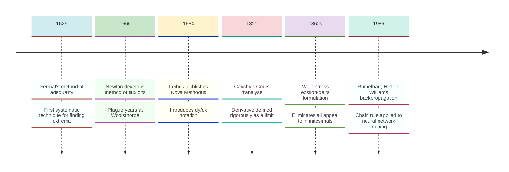
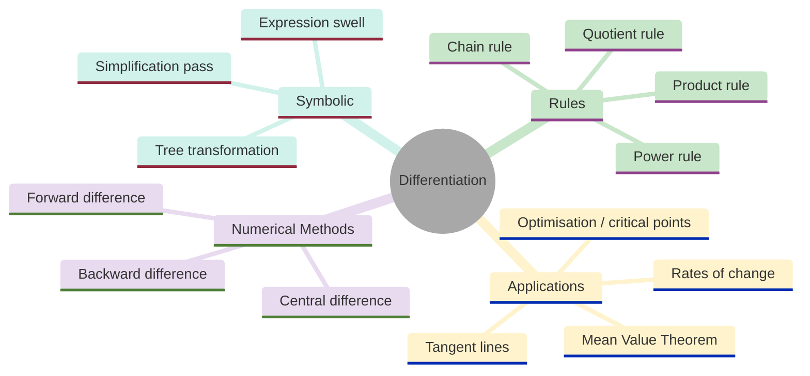
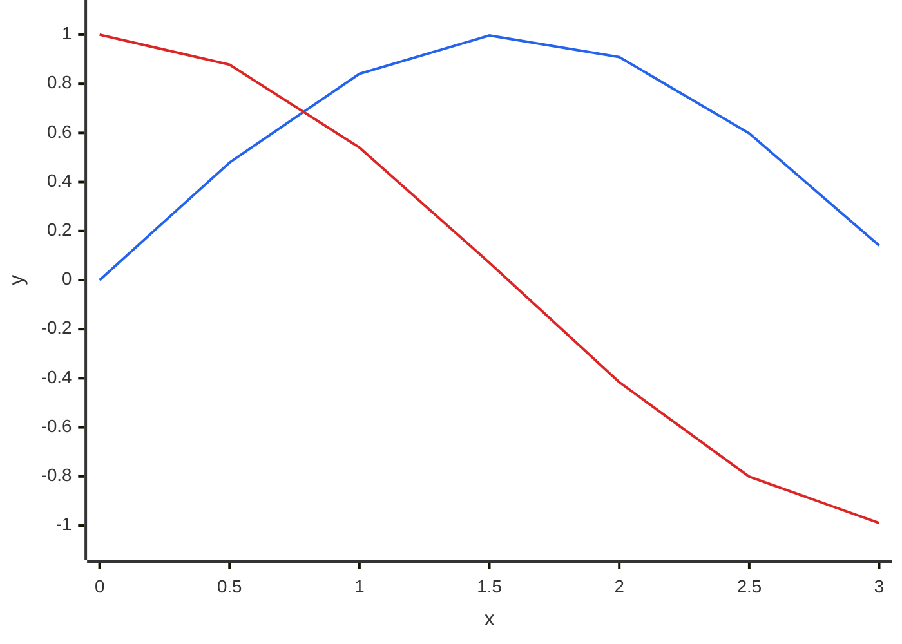
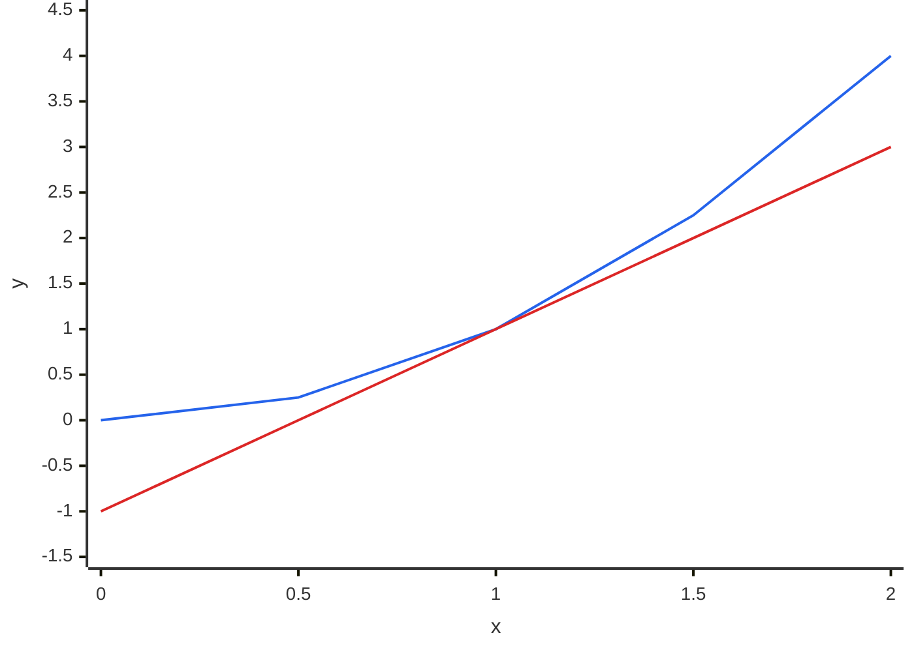
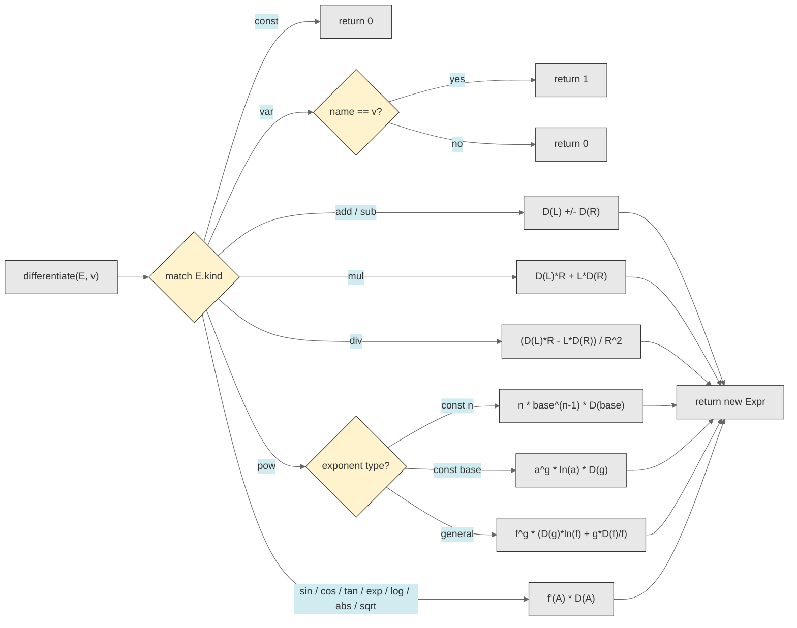
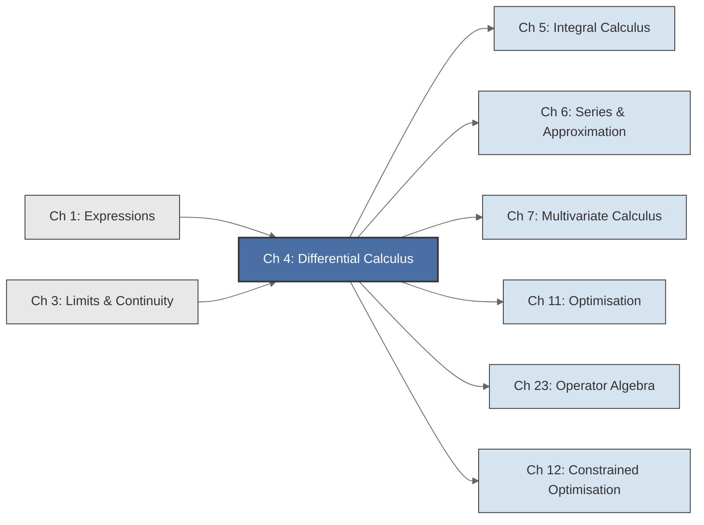

<!-- Copyright (c) 2025-2026 Bob Jansen <bobjansen@pm.me> -->
<!-- SPDX-License-Identifier: CC-BY-NC-4.0 -->
<!-- See LICENSE for full terms. Commercial licensing available. -->
# Chapter 4: Differential Calculus


**Part II**: Calculus

> Symbolic differentiation is the first major computational feature of Evenwicht: a recursive tree transformation that turns expressions into their derivatives. This chapter develops the theory from first principles and specifies every rule the implementation must handle.

**Prerequisites**: [Chapter 1](01-expressions.md) (Expressions & Functions); the `Expr` type, constructor functions and recursive evaluation. [Chapter 3](03-limits-continuity.md) (Limits & Continuity); the epsilon-delta definition of a limit and the properties of limits used in proofs throughout this chapter.

**Learning Objectives**: After this chapter, the reader will be able to:
1. Define the derivative of a function at a point using the limit of a difference quotient and determine when that limit exists.
2. State and prove the fundamental differentiation rules (constant, power, sum, product, quotient, chain) and derive the derivatives of all elementary functions (exponential, logarithmic, trigonometric, absolute value, square root).
3. Implement symbolic differentiation as a recursive tree transformation on the `Expr` type, dispatching on `expr.kind` and applying the appropriate rule at each node.
4. Compute numerical approximations to derivatives using forward, central and backward finite differences and analyse the tradeoff between truncation error and round-off error.
5. State and apply the Mean Value Theorem and L'Hôpital's rule for evaluating indeterminate forms.
6. Explain how the chain rule underlies backpropagation in neural networks and relate symbolic differentiation to automatic differentiation.

**Connections**: This chapter is used by [Chapter 5](05-integral-calculus.md) (Integral Calculus, via the Fundamental Theorem of Calculus), [Chapter 6](06-series-approximation.md) (Taylor series require higher-order derivatives), [Chapter 7](07-multivariate-calculus.md) (partial derivatives extend single-variable differentiation), [Chapter 11](11-unconstrained-optimization.md) (optimisation uses critical points where $f'=0$), [Chapter 12](12-constrained-optimization.md) (Constrained Optimisation; Lagrange multipliers require derivatives of the objective and constraints) and [Chapter 23](23-operator-algebra.md) (the derivative as a linear operator). It builds on [Chapter 1](01-expressions.md) (Expressions) and [Chapter 3](03-limits-continuity.md) (Limits).

---

## Historical Context

**Historical Development of the Derivative**



*Figure 4.1: Key milestones in the historical development of the derivative.*

Differential calculus arose from a concrete problem: given the position of a moving body as a function of time, find its instantaneous velocity. By the mid-seventeenth century, Pierre de Fermat [8], René Descartes and Isaac Barrow possessed techniques for finding tangent lines to curves. These methods were ad hoc, tied to specific curve families and lacked a unifying framework. The transformation from a collection of tricks into a coherent theory occurred independently in England and on the Continent, producing one of the most contentious episodes in the history of mathematics.

**Newton's fluxions (1666).** Isaac Newton developed his "method of fluxions" during the plague years of 1665–1666, when Cambridge University closed and Newton retreated to his family estate at Woolsthorpe. Newton conceived of variables as *flowing quantities* (fluents) and their rates of change as *fluxions*. For a fluent $x$ changing with time, Newton wrote its fluxion as $\dot{x}$, a velocity: the instantaneous rate at which $x$ changes. The method was powerful and general. Newton used it to differentiate polynomials, rational functions and power series, to solve what are now called differential equations and to compute areas under curves (the inverse problem of fluxions, i.e. integration). Newton was reluctant to publish. His full account of fluxions did not appear in print until *De Analysi* (written 1669, circulated privately, published 1711) and *Methodus Fluxionum* (written 1671, published posthumously in 1736). The delay had fateful consequences.

**Leibniz's differentials (1675–1684).** Gottfried Wilhelm Leibniz, working independently in Paris and Hanover, developed his own version of the calculus between 1673 and 1676. Leibniz's approach rested on *infinitesimals*: he treated $dx$ as an infinitely small increment in $x$ and $dy$ as the corresponding infinitely small change in $y = f(x)$. The derivative was the ratio $dy/dx$. Leibniz published his results in 1684 in *Acta Eruditorum*, under the title "Nova Methodus pro Maximis et Minimis" ("A New Method for Maxima and Minima"). This was the first published account of the differential calculus. It introduced the notation $\frac{dy}{dx}$ and the integral sign $\int$ that remain standard today.

**The priority dispute.** Newton's supporters accused Leibniz of plagiarism, claiming he had seen Newton's unpublished manuscripts during a visit to London in 1676. Leibniz's supporters counterclaimed priority based on publication date. A committee of the Royal Society, effectively appointed by Newton (who was president), found in Newton's favour in 1713. Modern scholarship is clear: the two men developed the calculus independently, arriving at equivalent results through different conceptual pathways. The mathematical community, particularly on the Continent, adopted Leibniz's notation, which proved superior for manipulation. Writing $\frac{d}{dx}[f(g(x))] = \frac{df}{dg} \cdot \frac{dg}{dx}$ makes the chain rule resemble cancellation of fractions. The resemblance is not a rigorous proof, but it is useful for calculation. Newton's dot notation survives mainly in physics and mechanics, where $\dot{x}$ denotes a time derivative.

**Cauchy and Weierstrass: the rigorous foundation (1820s–1870s).** For a century and a half after Newton and Leibniz, the calculus rested on an uneasy foundation. What exactly was an infinitesimal? Was $dx$ a real number? If so, dividing by zero was illegitimate; if not, what justified the algebraic manipulations? Bishop Berkeley's 1734 critique *The Analyst* [6] pointed out that fluxionists divided by a quantity and then set it to zero: "the ghosts of departed quantities." Augustin-Louis Cauchy, in his *Cours d'analyse* (1821) and *Résumé des leçons* (1823), replaced infinitesimals with limits: the derivative of $f$ at $a$ is $\lim_{h \to 0} \frac{f(a+h) - f(a)}{h}$, where the limit is understood in terms of convergence. Karl Weierstrass completed the programme in the 1860s and 1870s by providing the $\varepsilon$-$\delta$ definition of a limit [13], eliminating all appeals to intuition about "infinitely small" quantities. Definition 4.1 below is Cauchy and Weierstrass's formulation.

**The chain rule's late formalisation.** The chain rule $\frac{d}{dx}[f(g(x))] = f'(g(x)) \cdot g'(x)$ is used intuitively in every calculus course, and Leibniz's notation makes it appear obvious. A fully rigorous proof resisted easy formulation. The "obvious" proof, writing $\frac{\Delta y}{\Delta x} = \frac{\Delta y}{\Delta u} \cdot \frac{\Delta u}{\Delta x}$ and taking limits, fails when $\Delta u = 0$ (which can happen even when $\Delta x \neq 0$). A correct proof requires either a careful reparametrisation argument (as in Theorem 4.12 below) or the linear approximation viewpoint. This subtlety was not fully clarified until the early twentieth century.

**Modern: automatic differentiation and backpropagation.** Differentiation rules are local; each rule transforms one node in an expression tree without needing global information. This makes symbolic differentiation naturally recursive and algorithmically tractable. Computer algebra systems (Macsyma, Mathematica, SymPy) exploit this property. So does machine learning. The backpropagation algorithm, introduced to the neural network community by Rumelhart, Hinton and Williams in 1986 (building on earlier work by Werbos, 1974), is the chain rule applied to computational graphs in reverse (reverse-mode automatic differentiation). Every gradient computation in modern deep learning, from training a small logistic regression to optimising a large language model, is an application of the chain rule. Leibniz's notation, Cauchy's limit definition and the recursive structure of expression trees converge in the modern practice of machine learning.

---

## Why This Chapter Matters

**Differentiation**



*Figure 4.2: Conceptual map of differentiation topics covered in this chapter.*

The derivative, defined as a limit of a difference quotient (Definition 4.1) and computed symbolically by the recursive tree transformation of Algorithm 4.29, is the single most used operation in Evenwicht and in applied mathematics generally. It drives every optimisation algorithm, every sensitivity analysis and every rate-of-change computation in quantitative practice.

Backpropagation, the algorithm that trains every modern neural network, is the chain rule (Theorem 4.12) applied in reverse to a computational graph. Each layer of a neural network composes an affine transformation with a nonlinear activation. The gradient of the loss function with respect to millions of parameters is computed by chaining these local derivatives together. The recursive structure of Algorithm 4.29, where the derivative of $\sin(A)$ becomes $\cos(A) \cdot D(A)$ and the derivative of a product becomes $f'g + fg'$, mirrors the forward-mode automatic differentiation that Evenwicht implements symbolically. Understanding these rules at the algorithmic level, not merely the formula level, distinguishes a practitioner who can diagnose gradient computations from one who applies them without understanding their derivation.

Elementary function derivatives catalogued in Section 4 form the reference table for applied calculus. The Greeks in options pricing (Delta, Gamma, Theta, Vega) are partial derivatives of the Black–Scholes formula with respect to the underlying price, time and volatility. Marginal cost, marginal revenue and elasticity in economics are all derivatives. The sensitivity of a bridge's deflection to load, of a rocket's trajectory to thrust, of a drug's concentration to dosage: every "what happens if one changes this slightly?" question is a derivative question. The Mean Value Theorem (Theorem 4.25) connects local derivative information to global function behaviour. L'Hôpital's rule (Theorem 4.26) resolves the indeterminate forms that arise in asymptotic analysis, limit evaluation and the study of numerical stability.

---

## Notation & Conventions

| Symbol | Meaning |
|--------|---------|
| $f'(a)$ | The derivative of $f$ at the point $a$ (Lagrange notation) |
| $f'(x)$ | The derivative function: $x \mapsto f'(x)$ |
| $\frac{df}{dx}$ or $\frac{dy}{dx}$ | Leibniz notation for the derivative |
| $Df$ | Operator notation: the derivative operator applied to $f$ |
| $\dot{x}$ | Newton notation for time derivative (used in physics; not used in this text) |
| $f''(x)$, $f'''(x)$ | Second and third derivatives |
| $f^{(n)}(x)$ | The $n$-th derivative of $f$ at $x$ |
| $\frac{d^n f}{dx^n}$ | Leibniz notation for the $n$-th derivative |
| $D^n f$ | Operator notation for the $n$-th derivative |
| $h$ | An increment in the independent variable (used in the difference quotient) |
| $\varepsilon$ | Machine epsilon ($\approx 2.22 \times 10^{-16}$ for Float64) in Section 6 |
| $\sec x$ | Secant function: $\sec x = 1/\cos x$ |
| $\operatorname{sign}(x)$ | Sign function: $+1$ for $x > 0$, $-1$ for $x < 0$, undefined at $0$ |
| $C^n[a,b]$ | The class of functions having $n$ continuous derivatives on $[a,b]$ |
| $C^\infty$ | Smooth functions: all derivatives exist and are continuous |
| $O(\cdot)$ | Big-O notation for asymptotic order of error terms |

A note on $\frac{dy}{dx}$: Leibniz notation is sometimes treated as a ratio of differentials and sometimes as a single indivisible symbol denoting the derivative. In rigorous usage, $\frac{dy}{dx}$ is a single symbol; it does not represent division of $dy$ by $dx$. The "fraction-like" behaviour is not a coincidence. The chain rule, substitution in integrals and separation of variables in differential equations all work as if $\frac{dy}{dx}$ were a ratio. This is one of the great virtues of Leibniz's notation: it encodes correct computational rules in a form that invites correct manipulation.

---

## Core Theory

### The Derivative

**Definition 4.1** (Derivative at a point). Let $f: D \to \mathbb{R}$ be a function defined on an open interval $D \subseteq \mathbb{R}$, and let $a \in D$. The *derivative* of $f$ at $a$ is

$$f'(a) := \lim_{h \to 0} \frac{f(a + h) - f(a)}{h},$$

provided this limit exists (and is finite). If the limit exists, $f$ is said to be *differentiable* at $a$.

The expression $\frac{f(a+h) - f(a)}{h}$ is called the *difference quotient*. Geometrically, it is the slope of the secant line through the points $(a, f(a))$ and $(a+h, f(a+h))$. As $h \to 0$, this secant line approaches the tangent line to the graph of $f$ at the point $(a, f(a))$ and the derivative $f'(a)$ is the slope of that tangent line.

**Theorem 4.2** (Differentiable implies continuous). If $f$ is differentiable at $a$, then $f$ is continuous at $a$.

??? note "Proof"

    *Proof.* Suppose $f'(a)$ exists. Write

    $$f(a + h) - f(a) = \frac{f(a+h) - f(a)}{h} \cdot h.$$

    Taking the limit as $h \to 0$:

    $$\lim_{h \to 0} [f(a+h) - f(a)] = \lim_{h \to 0} \frac{f(a+h) - f(a)}{h} \cdot \lim_{h \to 0} h = f'(a) \cdot 0 = 0.$$

    The product rule for limits is applicable because both limits exist. It follows that $\lim_{h \to 0} f(a+h) = f(a)$, which is the definition of continuity at $a$.

    $\square$

**Remark 4.3** (Continuous does not imply differentiable). The converse of Theorem 4.2 is false. The function $f(x) = |x|$ is continuous at $x = 0$ but not differentiable there: the left-hand limit of the difference quotient is $-1$ and the right-hand limit is $+1$, so the two-sided limit does not exist. More strikingly, Karl Weierstrass constructed in 1872 a function that is continuous everywhere on $\mathbb{R}$ but differentiable nowhere: the Weierstrass function $W(x) = \sum_{n=0}^{\infty} a^n \cos(b^n \pi x)$ with $0 < a < 1$, $b$ a positive odd integer and $ab > 1 + \frac{3}{2}\pi$. Such pathological examples demonstrate that differentiability is a strictly stronger condition than continuity.

**Definition 4.4** (The derivative as a function). Let $f: D \to \mathbb{R}$ and suppose $f$ is differentiable at every point in an open set $U \subseteq D$. The *derivative function* $f': U \to \mathbb{R}$ is defined by

$$f'(x) := \lim_{h \to 0} \frac{f(x + h) - f(x)}{h}$$

for each $x \in U$. When the domain of differentiability is clear from context, the derivative function is written as $f'$.

**Definition 4.5** (Higher-order derivatives). The *second derivative* of $f$ is the derivative of $f'$, written $f'' = (f')'$. More generally, for $n \geq 1$, the *$n$-th derivative* of $f$ is defined recursively:

$$f^{(1)} := f', \qquad f^{(n)} := (f^{(n-1)})', \quad n \geq 2.$$

By convention, $f^{(0)} = f$. Alternative notations include $\frac{d^n f}{dx^n}$ (Leibniz) and $D^n f$ (operator). For small $n$, prime notation is common: $f', f'', f'''$. For $n \geq 4$, the notation $f^{(n)}$ avoids a proliferation of primes.

A function possessing $n$ continuous derivatives on an interval is said to belong to the class $C^n$ on that interval. A function in $C^\infty$ is called *smooth*: it has derivatives of all orders.

**Theorem 4.6** (Linearity of differentiation). The derivative operator $D$ is a linear operator. That is, if $f$ and $g$ are differentiable at $x$ and $a, b \in \mathbb{R}$, then $af + bg$ is differentiable at $x$ and

$$D(af + bg)(x) = a \cdot Df(x) + b \cdot Dg(x),$$

or equivalently, $(af + bg)'(x) = af'(x) + bg'(x)$.

??? note "Proof"

    *Proof.* By definition,

    $$(af + bg)'(x) = \lim_{h \to 0} \frac{(af + bg)(x+h) - (af + bg)(x)}{h}.$$

    Expanding the numerator:

    $$= \lim_{h \to 0} \frac{a[f(x+h) - f(x)] + b[g(x+h) - g(x)]}{h} = a \lim_{h \to 0} \frac{f(x+h) - f(x)}{h} + b \lim_{h \to 0} \frac{g(x+h) - g(x)}{h}$$

    by the linearity of limits (both limits exist by hypothesis). This equals $af'(x) + bg'(x)$.

    $\square$

### Differentiation Rules

The following theorems constitute the complete set of differentiation rules. Each rule corresponds to a case in the symbolic differentiation algorithm (Algorithm 4.29).

**Theorem 4.7** (Constant rule). Let $c \in \mathbb{R}$ be a constant. Then $\frac{d}{dx}[c] = 0$.

??? note "Proof"

    *Proof.* The function $f(x) = c$ satisfies $f(x+h) = c$ for all $h$, so

    $$f'(x) = \lim_{h \to 0} \frac{c - c}{h} = \lim_{h \to 0} 0 = 0.$$

    $\square$

**Theorem 4.8** (Power rule). For $n \in \mathbb{R}$ and $x > 0$ (or $x \neq 0$ when $n$ is a positive integer),

$$\frac{d}{dx}[x^n] = n x^{n-1}.$$

For integer $n \ge 1$, the formula holds for all $x \neq 0$ (treating $x^{n-1}$ as the standard power). For real $n$, the condition $x > 0$ is necessary because $x^n = e^{n\ln x}$ is only defined via this representation for $x > 0$.

??? note "Proof"

    *Proof (for $n$ a positive integer).* Apply the binomial theorem to $(x+h)^n$:

    $$(x+h)^n = x^n + n x^{n-1} h + \binom{n}{2} x^{n-2} h^2 + \cdots + h^n.$$

    Then

    $$\frac{(x+h)^n - x^n}{h} = n x^{n-1} + \binom{n}{2} x^{n-2} h + \cdots + h^{n-1}.$$

    As $h \to 0$, all terms containing $h$ vanish, leaving $nx^{n-1}$.

    For real $n$, write $x^n = e^{n \ln x}$ (valid for $x > 0$) and apply the chain rule (Theorem 4.12, stated below) together with the exponential derivative (Theorem 4.14, also below):

    $$\frac{d}{dx}[x^n] = \frac{d}{dx}[e^{n \ln x}] = e^{n \ln x} \cdot \frac{n}{x} = x^n \cdot \frac{n}{x} = n x^{n-1}.$$

    $\square$

**Theorem 4.9** (Sum and difference rule). If $f$ and $g$ are differentiable at $x$, then

$$(f \pm g)'(x) = f'(x) \pm g'(x).$$

??? note "Proof"

    *Proof.* This is an immediate consequence of Theorem 4.6 (linearity) with $a = 1$ and $b = \pm 1$.

    $\square$

**Theorem 4.10** (Product rule). If $f$ and $g$ are differentiable at $x$, then $fg$ is differentiable at $x$ and

$$(fg)'(x) = f'(x) g(x) + f(x) g'(x).$$

??? note "Proof"

    *Proof.* From the definition:

    $$(fg)'(x) = \lim_{h \to 0} \frac{f(x+h)g(x+h) - f(x)g(x)}{h}.$$

    Add and subtract $f(x+h)g(x)$ in the numerator:

    $$= \lim_{h \to 0} \frac{f(x+h)g(x+h) - f(x+h)g(x) + f(x+h)g(x) - f(x)g(x)}{h}$$

    $$= \lim_{h \to 0} \left[ f(x+h) \cdot \frac{g(x+h) - g(x)}{h} + g(x) \cdot \frac{f(x+h) - f(x)}{h} \right].$$

    Since $f$ is differentiable at $x$, it is continuous there (Theorem 4.2), so $\lim_{h \to 0} f(x+h) = f(x)$. Applying the product and sum rules for limits:

    $$= f(x) \cdot g'(x) + g(x) \cdot f'(x) = f'(x) g(x) + f(x) g'(x).$$

    $\square$

**Theorem 4.11** (Quotient rule). If $f$ and $g$ are differentiable at $x$ and $g(x) \neq 0$, then $f/g$ is differentiable at $x$ and

$$\left(\frac{f}{g}\right)'(x) = \frac{f'(x) g(x) - f(x) g'(x)}{[g(x)]^2}.$$

??? note "Proof"

    *Proof.* Write $f/g = f \cdot (1/g)$. It suffices to show that $(1/g)'(x) = -g'(x)/[g(x)]^2$ and then apply the product rule.

    For $1/g$:

    $$\left(\frac{1}{g}\right)'(x) = \lim_{h \to 0} \frac{\frac{1}{g(x+h)} - \frac{1}{g(x)}}{h} = \lim_{h \to 0} \frac{g(x) - g(x+h)}{h \cdot g(x+h) \cdot g(x)}.$$

    Since $g$ is continuous at $x$ (being differentiable), $g(x+h) \to g(x) \neq 0$, so

    $$= \frac{-g'(x)}{[g(x)]^2}.$$

    Applying the product rule to $f \cdot (1/g)$:

    $$\left(\frac{f}{g}\right)' = f' \cdot \frac{1}{g} + f \cdot \left(-\frac{g'}{g^2}\right) = \frac{f'}{g} - \frac{fg'}{g^2} = \frac{f'g - fg'}{g^2}.$$

    $\square$

**Theorem 4.12** (Chain rule). Let $g$ be differentiable at $x$ and let $f$ be differentiable at $g(x)$. Then the composite function $f \circ g$ is differentiable at $x$ and

$$\frac{d}{dx}[f(g(x))] = f'(g(x)) \cdot g'(x).$$

This rule governs the differentiation of every composite expression and is the mathematical foundation of backpropagation in machine learning.

!!! abstract "Key Result"

    **Theorem 4.12** (Chain rule). The derivative of a composition is the product of the outer and inner derivatives, enabling recursive differentiation of arbitrarily nested expressions and serving as the mathematical basis of backpropagation.

??? note "Proof"

    *Proof.* Define the auxiliary function

    $$\phi(k) := \begin{cases} \frac{f(g(x) + k) - f(g(x))}{k} & \text{if } k \neq 0, \\ f'(g(x)) & \text{if } k = 0. \end{cases}$$

    Since $f$ is differentiable at $g(x)$, the function $\phi$ is continuous at $k = 0$: $\lim_{k \to 0} \phi(k) = f'(g(x)) = \phi(0)$. For all $k$, including $k = 0$, the identity

    $$f(g(x) + k) - f(g(x)) = \phi(k) \cdot k$$

    holds (when $k = 0$, both sides are zero).

    Now set $k = g(x+h) - g(x)$. Then $k \to 0$ as $h \to 0$ (since $g$ is continuous at $x$ by Theorem 4.2), and

    $$\frac{f(g(x+h)) - f(g(x))}{h} = \frac{\phi(k) \cdot k}{h} = \phi(g(x+h) - g(x)) \cdot \frac{g(x+h) - g(x)}{h}.$$

    Taking the limit as $h \to 0$:

    $$\lim_{h \to 0} \frac{f(g(x+h)) - f(g(x))}{h} = \phi(0) \cdot g'(x) = f'(g(x)) \cdot g'(x).$$

    The key step is the introduction of $\phi$, which avoids the problem of dividing by $k = g(x+h) - g(x)$ when $k$ might be zero. The "obvious" proof that writes $\frac{\Delta y}{\Delta x} = \frac{\Delta y}{\Delta u} \cdot \frac{\Delta u}{\Delta x}$ fails precisely when $\Delta u = 0$.

    $\square$

**Theorem 4.13** (Inverse function theorem for derivatives). Let $f$ be a bijection from an interval $I$ to an interval $J$, and suppose $f$ is differentiable at $x_0 \in I$ with $f'(x_0) \neq 0$. Let $y_0 = f(x_0)$. Then $f^{-1}$ is differentiable at $y_0$ and

$$(f^{-1})'(y_0) = \frac{1}{f'(f^{-1}(y_0))} = \frac{1}{f'(x_0)}.$$

??? note "Proof"

    *Proof sketch.* Since $f(f^{-1}(y)) = y$ for all $y \in J$, differentiate both sides with respect to $y$ using the chain rule:

    $$f'(f^{-1}(y)) \cdot (f^{-1})'(y) = 1.$$

    Solving for $(f^{-1})'(y)$ gives $(f^{-1})'(y) = 1 / f'(f^{-1}(y))$. The condition $f'(x_0) \neq 0$ ensures the denominator is nonzero.

    A rigorous proof verifies that $f^{-1}$ is indeed differentiable (using the continuity of $f^{-1}$, which follows from $f$ being a continuous bijection on an interval).

    $\square$

### Derivatives of Elementary Functions

Each result below corresponds to a specific case in the symbolic differentiation algorithm.

**Theorem 4.14** (Derivative of the exponential). The function $f(x) = e^x$ satisfies

$$\frac{d}{dx}[e^x] = e^x.$$

??? note "Proof"

    *Proof.* From the definition:

    $$\frac{d}{dx}[e^x] = \lim_{h \to 0} \frac{e^{x+h} - e^x}{h} = e^x \lim_{h \to 0} \frac{e^h - 1}{h}.$$

    The factoring $e^{x+h} = e^x \cdot e^h$ uses the exponential law from [Chapter 1](01-expressions.md) (F1.1). The remaining limit is a fundamental limit:

    $$\lim_{h \to 0} \frac{e^h - 1}{h} = 1.$$

    This can be established from the power series $e^h = 1 + h + h^2/2! + \cdots$, which gives $\frac{e^h - 1}{h} = 1 + h/2! + h^2/3! + \cdots \to 1$ as $h \to 0$. The derivative is therefore $\frac{d}{dx}[e^x] = e^x \cdot 1 = e^x$.

    $\square$

The exponential is the unique function (up to scalar multiples) that equals its own derivative. This property makes it the fundamental solution to the differential equation $y' = y$.

**Theorem 4.15** (Derivative of the natural logarithm). For $x > 0$,

$$\frac{d}{dx}[\ln x] = \frac{1}{x}.$$

??? note "Proof"

    *Proof.* The natural logarithm is the inverse of the exponential: $\ln = \exp^{-1}$. Applying Theorem 4.13 with $f = \exp$ and $y = x$:

    $$(\ln)'(x) = \frac{1}{\exp'(\ln(x))} = \frac{1}{e^{\ln x}} = \frac{1}{x}.$$

    The condition $f'(x_0) \neq 0$ is satisfied because $e^t > 0$ for all $t$.

    $\square$

**Theorem 4.16** (Derivative of a general exponential). For $a > 0$ with $a \neq 1$,

$$\frac{d}{dx}[a^x] = a^x \ln a.$$

??? note "Proof"

    *Proof.* Write $a^x = e^{x \ln a}$. By the chain rule (Theorem 4.12) with outer function $e^u$ and inner function $u = x \ln a$:

    $$\frac{d}{dx}[a^x] = e^{x \ln a} \cdot \ln a = a^x \ln a.$$

    $\square$

**Theorem 4.17** (Derivative of a general logarithm). For $a > 0$, $a \neq 1$ and $x > 0$,

$$\frac{d}{dx}[\log_a x] = \frac{1}{x \ln a}.$$

??? note "Proof"

    *Proof.* The change-of-base identity gives $\log_a x = \frac{\ln x}{\ln a}$. Since $\ln a$ is a constant:

    $$\frac{d}{dx}[\log_a x] = \frac{1}{\ln a} \cdot \frac{d}{dx}[\ln x] = \frac{1}{\ln a} \cdot \frac{1}{x} = \frac{1}{x \ln a}.$$

    $\square$

**Theorem 4.18** (Derivative of sine). For all $x \in \mathbb{R}$,

$$\frac{d}{dx}[\sin x] = \cos x.$$

??? note "Proof"

    *Proof.* From the definition:

    $$\frac{d}{dx}[\sin x] = \lim_{h \to 0} \frac{\sin(x+h) - \sin x}{h}.$$

    Apply the sine addition formula $\sin(x+h) = \sin x \cos h + \cos x \sin h$:

    $$= \lim_{h \to 0} \frac{\sin x \cos h + \cos x \sin h - \sin x}{h} = \lim_{h \to 0} \left[ \sin x \cdot \frac{\cos h - 1}{h} + \cos x \cdot \frac{\sin h}{h} \right].$$

    Two fundamental limits are needed:

    $$\lim_{h \to 0} \frac{\sin h}{h} = 1, \qquad \lim_{h \to 0} \frac{\cos h - 1}{h} = 0.$$

    The first limit is established geometrically (by the squeeze theorem applied to the unit circle) or from the power series $\sin h = h - h^3/3! + \cdots$.

    The second follows from the first:

    $$\frac{\cos h - 1}{h} = \frac{(\cos h - 1)(\cos h + 1)}{h(\cos h + 1)} = \frac{-\sin^2 h}{h(\cos h + 1)} = -\frac{\sin h}{h} \cdot \frac{\sin h}{\cos h + 1} \to -1 \cdot 0 = 0.$$

    Substituting:

    $$\frac{d}{dx}[\sin x] = \sin x \cdot 0 + \cos x \cdot 1 = \cos x.$$

    $\square$

**Theorem 4.19** (Derivative of cosine). For all $x \in \mathbb{R}$,

$$\frac{d}{dx}[\cos x] = -\sin x.$$

??? note "Proof"

    *Proof.* Write $\cos x = \sin(x + \pi/2)$. By the chain rule with outer function $\sin$ and inner function $u = x + \pi/2$:

    $$\frac{d}{dx}[\cos x] = \cos(x + \pi/2) \cdot 1 = -\sin x,$$

    using the identity $\cos(x + \pi/2) = -\sin x$. One can also apply the same limit argument as in Theorem 4.18 using the cosine addition formula.

    $\square$

**Sine and Cosine Functions on [0, 3]**



*Figure 4.3: Sine and cosine functions plotted on the interval [0, 3].*

The following chart illustrates the tangent line approximation: for $f(x) = x^2$ at $x=1$, the tangent line $y = 2x - 1$ closely approximates the curve near the point of tangency but diverges further away:

**Tangent Line Approximation to f(x) = x^2 at x = 1**



*Figure 4.4: Tangent line approximation to f(x) = x^2 at x = 1 showing local accuracy.*

At $x=1$ the curve and tangent line agree exactly (both equal 1). At $x=0.5$ the tangent gives 0 while the curve gives 0.25, a small discrepancy. By $x=2$ the gap has grown to $4 - 3 = 1$. The derivative provides only a *local* linear approximation: it is most accurate near the point of tangency.

**Theorem 4.20** (Derivative of tangent). For $x \neq (2k+1)\pi/2$ (where $k \in \mathbb{Z}$),

$$\frac{d}{dx}[\tan x] = \sec^2 x = \frac{1}{\cos^2 x},$$

where $\sec x = 1/\cos x$.

??? note "Proof"

    *Proof.* Write $\tan x = \sin x / \cos x$ and apply the quotient rule (Theorem 4.11):

    $$\frac{d}{dx}[\tan x] = \frac{\cos x \cdot \cos x - \sin x \cdot (-\sin x)}{\cos^2 x} = \frac{\cos^2 x + \sin^2 x}{\cos^2 x} = \frac{1}{\cos^2 x}.$$

    $\square$

**Theorem 4.21** (Derivative of absolute value). For $x \neq 0$,

$$\frac{d}{dx}[\lvert x \rvert] = \frac{x}{\lvert x \rvert} = \operatorname{sign}(x),$$

where $\operatorname{sign}(x) = +1$ for $x > 0$ and $\operatorname{sign}(x) = -1$ for $x < 0$.

At $x = 0$, the derivative does not exist: the left-hand derivative is $-1$ and the right-hand derivative is $+1$.

??? note "Proof"

    *Proof.* For $x > 0$, $|x| = x$, so $\frac{d}{dx}|x| = 1 = x/|x|$.

    For $x < 0$, $|x| = -x$, so $\frac{d}{dx}|x| = -1 = x/|x|$.

    At $x = 0$, the left-hand difference quotient $\lim_{h \to 0^-} \frac{|h|}{h} = \lim_{h \to 0^-} \frac{-h}{h} = -1$ differs from the right-hand limit $+1$, so the two-sided limit does not exist.

    $\square$

**Theorem 4.22** (Derivative of the square root). For $x > 0$,

$$\frac{d}{dx}[\sqrt{x}] = \frac{1}{2\sqrt{x}}.$$

??? note "Proof"

    *Proof.* Since $\sqrt{x} = x^{1/2}$, the power rule (Theorem 4.8) with $n = 1/2$ gives

    $$\frac{d}{dx}[x^{1/2}] = \frac{1}{2} x^{-1/2} = \frac{1}{2\sqrt{x}}.$$

    $\square$

**Theorem 4.23** (Logarithmic differentiation). Let $f(x) > 0$ and $g(x)$ be differentiable functions. Then

$$\frac{d}{dx}[f(x)^{g(x)}] = f(x)^{g(x)} \left[ g'(x) \ln f(x) + g(x) \frac{f'(x)}{f(x)} \right].$$

??? note "Proof"

    *Proof.* Write $f(x)^{g(x)} = e^{g(x) \ln f(x)}$. Apply the chain rule with outer function $e^u$ and inner function $u = g(x) \ln f(x)$:

    $$\frac{d}{dx}\left[e^{g(x) \ln f(x)}\right] = e^{g(x) \ln f(x)} \cdot \frac{d}{dx}[g(x) \ln f(x)].$$

    By the product rule on $g(x) \ln f(x)$:

    $$\frac{d}{dx}[g(x) \ln f(x)] = g'(x) \ln f(x) + g(x) \cdot \frac{f'(x)}{f(x)}.$$

    Substituting $e^{g(x) \ln f(x)} = f(x)^{g(x)}$ gives the result.

    $\square$

This formula unifies the power rule ($g$ constant, $f(x) = x$), the exponential derivative ($f$ constant, $g(x) = x$) and the general case where both base and exponent vary.

### The Mean Value Theorem and Consequences

**Theorem 4.24** (Rolle's theorem). Let $f$ be continuous on $[a, b]$ and differentiable on $(a, b)$, and suppose $f(a) = f(b)$. Then there exists at least one point $c \in (a, b)$ such that $f'(c) = 0$.

??? note "Proof"

    *Proof.* By the Extreme Value Theorem ([Chapter 3](03-limits-continuity.md)), $f$ attains its maximum value $M$ and minimum value $m$ on $[a, b]$. If $M = m$, then $f$ is constant on $[a, b]$, so $f'(c) = 0$ for every $c \in (a, b)$.

    If $M \neq m$, then at least one of $M$ and $m$ differs from $f(a) = f(b)$. Suppose $M > f(a)$; the case $m < f(a)$ is handled by the identical argument with minimum replacing maximum.

    Then $f$ attains $M$ at some interior point $c \in (a, b)$ (since $f(a) < M$ and $f(b) = f(a) < M$, the maximum is not attained at the endpoints).

    At an interior maximum, the left-hand derivative is $\geq 0$ and the right-hand derivative is $\leq 0$. Since $f$ is differentiable at $c$, these must be equal, so $f'(c) = 0$.

    $\square$

**Theorem 4.25** (Mean Value Theorem). Let $f$ be continuous on $[a, b]$ and differentiable on $(a, b)$. Then there exists at least one point $c \in (a, b)$ such that

$$f'(c) = \frac{f(b) - f(a)}{b - a}.$$

??? note "Proof"

    *Proof.* Define the auxiliary function

    $$g(x) = f(x) - \left[ f(a) + \frac{f(b) - f(a)}{b - a}(x - a) \right].$$

    This is $f$ minus the secant line through $(a, f(a))$ and $(b, f(b))$. Then $g$ is continuous on $[a, b]$, differentiable on $(a, b)$ and $g(a) = g(b) = 0$. By Rolle's theorem (Theorem 4.24), there exists $c \in (a, b)$ with $g'(c) = 0$. Computing:

    $$g'(x) = f'(x) - \frac{f(b) - f(a)}{b - a},$$

    so $g'(c) = 0$ gives $f'(c) = \frac{f(b) - f(a)}{b - a}$.

    $\square$

The Mean Value Theorem states that the average rate of change of $f$ over $[a, b]$ is achieved as an instantaneous rate of change at some interior point. It is the principal tool for converting local information (derivatives) into global information (function values), and it underlies many results in analysis and optimisation.

**Theorem 4.26** (L'Hôpital's rule). Let $f$ and $g$ be differentiable on an open interval containing $a$ (except possibly at $a$ itself), with $g'(x) \neq 0$ near $a$. If

$$\lim_{x \to a} f(x) = \lim_{x \to a} g(x) = 0 \quad \text{(or both } \pm\infty\text{)},$$

and the limit $\lim_{x \to a} \frac{f'(x)}{g'(x)}$ exists (or is $\pm\infty$), then

$$\lim_{x \to a} \frac{f(x)}{g(x)} = \lim_{x \to a} \frac{f'(x)}{g'(x)}.$$

This rule also holds for $a = \pm\infty$ (one-sided limits at infinity) and for one-sided limits at finite points. The condition $g'(x) \neq 0$ near $a$ prevents the denominator of $f'/g'$ from vanishing. L'Hôpital's rule can be applied repeatedly when the result yields another indeterminate form, provided the hypotheses are verified at each step.

??? note "Proof"

    *Proof sketch.* The $0/0$ case follows from the Cauchy Mean Value Theorem (a generalisation of Theorem 4.25): there exists $c$ between $x$ and $a$ with

    $$\frac{f(x) - f(a)}{g(x) - g(a)} = \frac{f'(c)}{g'(c)}.$$

    Since $f(a) = g(a) = 0$, this gives $\frac{f(x)}{g(x)} = \frac{f'(c)}{g'(c)}$.

    As $x \to a$, $c \to a$ as well, so $\frac{f(x)}{g(x)} \to \lim_{c \to a} \frac{f'(c)}{g'(c)}$. The $\infty/\infty$ case requires a more delicate argument.

    $\square$

### Implicit Differentiation

**Remark 4.27** (Implicit differentiation). Not every relationship between $x$ and $y$ is given by an explicit formula $y = f(x)$. An equation of the form $F(x, y) = 0$ defines $y$ *implicitly* as a function of $x$ (possibly on a restricted domain). To find $dy/dx$, differentiate both sides of $F(x, y) = 0$ with respect to $x$, treating $y$ as a function of $x$ and applying the chain rule wherever $y$ appears.

**Example 4.28** (Unit circle). The equation $x^2 + y^2 = 1$ defines the unit circle. Differentiating both sides with respect to $x$:

$$2x + 2y \frac{dy}{dx} = 0, \qquad \text{so} \qquad \frac{dy}{dx} = -\frac{x}{y}.$$

This is valid wherever $y \neq 0$, i.e., at all points on the circle except $(\pm 1, 0)$. At those points the circle has a vertical tangent and $dy/dx$ is undefined.

Implicit differentiation extends to more complex relations. For $F(x, y) = 0$ where $F$ has continuous partial derivatives and $\frac{\partial F}{\partial y} \neq 0$, the Implicit Function Theorem ([Chapter 7](07-multivariate-calculus.md)) guarantees that $y$ is locally a differentiable function of $x$, and

$$\frac{dy}{dx} = -\frac{\partial F / \partial x}{\partial F / \partial y},$$

where $\partial F/\partial x$ denotes the partial derivative with respect to $x$, defined formally in [Chapter 7](07-multivariate-calculus.md).

---

## Formulas & Identities

This section collects all derivative rules for quick reference. Each formula is labelled for cross-referencing from the algorithm specification and worked examples.

### Basic Rules

**F4.1** Constant rule, for any constant $c \in \mathbb{R}$.

$$\frac{d}{dx}[c] = 0$$

**F4.2** Power rule, for $n \in \mathbb{R}$, $x > 0$ (or $x \neq 0$ when $n$ is a positive integer).

$$\frac{d}{dx}[x^n] = n x^{n-1}$$

!!! warning "Domain restriction for non-integer exponents"

    For real (non-integer) $n$, the power rule requires $x > 0$ because $x^n$ is defined as $e^{n \ln x}$. Applying $\frac{d}{dx}[x^{1/2}]$ at $x = 0$ or $\frac{d}{dx}[x^{\pi}]$ at $x < 0$ is undefined.

**F4.3** Sum/Difference rule.

$$\frac{d}{dx}[f \pm g] = f' \pm g'$$

**F4.4** Product rule.

$$\frac{d}{dx}[f \cdot g] = f' g + f g'$$

**F4.5** Quotient rule, where $g \neq 0$.

$$\frac{d}{dx}\!\left[\frac{f}{g}\right] = \frac{f'g - fg'}{g^2}$$

**F4.6** Chain rule.

$$\frac{d}{dx}[f(g(x))] = f'(g(x)) \cdot g'(x)$$

### Elementary Function Derivatives

**F4.7** Exponential.

$$\frac{d}{dx}[e^x] = e^x$$

**F4.8** Natural logarithm, for $x > 0$.

$$\frac{d}{dx}[\ln x] = \frac{1}{x}$$

**F4.9** General exponential, for $a > 0$.

$$\frac{d}{dx}[a^x] = a^x \ln a$$

**F4.10** General logarithm, for $a > 0$, $a \neq 1$, $x > 0$.

$$\frac{d}{dx}[\log_a x] = \frac{1}{x \ln a}$$

**F4.11** Sine.

$$\frac{d}{dx}[\sin x] = \cos x$$

**F4.12** Cosine.

$$\frac{d}{dx}[\cos x] = -\sin x$$

**F4.13** Tangent, where $\cos x \neq 0$.

$$\frac{d}{dx}[\tan x] = \frac{1}{\cos^2 x}$$

**F4.14** Absolute value, for $x \neq 0$. Not differentiable at $x = 0$.

$$\frac{d}{dx}[|x|] = \frac{x}{|x|}$$

**F4.15** Square root, for $x > 0$.

$$\frac{d}{dx}[\sqrt{x}] = \frac{1}{2\sqrt{x}}$$

### Logarithmic Differentiation

**F4.16** General power-with-function, for $f(x) > 0$.

$$\frac{d}{dx}[f(x)^{g(x)}] = f(x)^{g(x)}\left[g'(x) \ln f(x) + g(x) \frac{f'(x)}{f(x)}\right]$$

---

## Algorithms

### Algorithm 4.29: Symbolic Differentiation (Recursive Tree Transformation)

This is the core algorithm of Evenwicht. Given an expression tree and a variable name, it returns a new expression tree representing the derivative with respect to that variable. The algorithm dispatches on the `kind` field of the root node and applies the appropriate differentiation rule recursively.

**Input**: Expression tree $E$, variable name $v$ (a string).

**Output**: Expression tree $E'$ representing $\frac{d}{dv}[E]$.

In the pseudocode below, `D(E)` is shorthand for `differentiate(E, v)`, the recursive call with the same variable. Constructor functions (`constant`, `add`, `mul`, etc.) build new expression tree nodes.

```
function differentiate(E, v):
    match E.kind:

        case const(c):
            // F4.1: d/dx[c] = 0
            return constant(0)

        case var(name):
            // d/dx[x] = 1 if name == v, else 0
            if name == v:
                return constant(1)
            else:
                return constant(0)

        case add(L, R):
            // F4.3: d/dx[L + R] = D(L) + D(R)
            return add(D(L), D(R))

        case sub(L, R):
            // F4.3: d/dx[L - R] = D(L) - D(R)
            return sub(D(L), D(R))

        case mul(L, R):
            // F4.4: d/dx[L * R] = D(L)*R + L*D(R)
            return add(mul(D(L), R), mul(L, D(R)))

        case div(L, R):
            // F4.5: d/dx[L / R] = (D(L)*R - L*D(R)) / R^2
            return div(
                sub(mul(D(L), R), mul(L, D(R))),
                pow(R, constant(2))
            )

        case pow(base, exponent):
            // General case: base and exponent may both depend on v.
            // F4.16: d/dx[f^g] = f^g * (g' * ln(f) + g * f'/f)
            // Special cases handled for efficiency:
            //   - If exponent is constant n: power rule with chain
            //     d/dx[f^n] = n * f^(n-1) * D(f)
            //   - If base is constant a: exponential rule with chain
            //     d/dx[a^g] = a^g * ln(a) * D(g)
            if exponent is a constant n:
                // Power rule: n * base^(n-1) * D(base)
                return mul(mul(constant(n), pow(base, constant(n - 1))), D(base))
            else if base is a constant a:
                // Exponential rule: a^g * ln(a) * D(g)
                // log(base) means ln(base) per Chapter 1 convention
                return mul(mul(pow(base, exponent), log(base)), D(exponent))
            else:
                // General case via logarithmic differentiation
                return mul(
                    pow(base, exponent),
                    add(
                        mul(D(exponent), log(base)),
                        mul(exponent, div(D(base), base))
                    )
                )

        case neg(A):
            // d/dx[-A] = -D(A)
            return neg(D(A))

        case sin(A):
            // F4.11 + chain rule: d/dx[sin(A)] = cos(A) * D(A)
            return mul(cos(A), D(A))

        case cos(A):
            // F4.12 + chain rule: d/dx[cos(A)] = -sin(A) * D(A)
            return mul(neg(sin(A)), D(A))

        case tan(A):
            // F4.13 + chain rule: d/dx[tan(A)] = D(A) / cos^2(A)
            return div(D(A), pow(cos(A), constant(2)))

        case exp(A):
            // F4.7 + chain rule: d/dx[exp(A)] = exp(A) * D(A)
            return mul(exp(A), D(A))

        case log(A):
            // F4.8 + chain rule: d/dx[log(A)] = D(A) / A
            return div(D(A), A)

        case abs(A):
            // F4.14 + chain rule: d/dx[|A|] = (A / |A|) * D(A)
            return mul(div(A, abs(A)), D(A))

        case sqrt(A):
            // F4.15 + chain rule: d/dx[sqrt(A)] = D(A) / (2 * sqrt(A))
            return div(D(A), mul(constant(2), sqrt(A)))
```

**Complexity**: $O(n)$ time per node in the input tree, but the output tree can be much larger than the input tree (see Section 6 on expression swell). Each node in the input generates a bounded number of nodes in the output (the product rule produces the largest expansion: a single `mul` node generates an `add` with two `mul` children). In the worst case (deeply nested products), the output tree size is $O(n \cdot 2^d)$ where $d$ is the depth, but for chains of compositions it is $O(n)$. In practice, simplification (applied after differentiation) reduces the output considerably.

**Correctness**: Each case directly implements the corresponding formula from Section 4. The chain rule is embedded in every unary function case: the derivative of $f(A)$ is always $f'(A) \cdot D(A)$, where $D(A)$ is the recursive call that differentiates the inner expression. The algorithm terminates because each recursive call operates on a strict subtree.

**Symbolic Differentiation Dispatch**



*Figure 4.5: Flowchart showing the symbolic differentiation dispatch by expression kind.*

### Algorithm 4.30: Forward Difference

**Input**: Function $f: \mathbb{R} \to \mathbb{R}$, evaluation point $x \in \mathbb{R}$, step size $h > 0$.

**Output**: Approximation of $f'(x)$.

$$f'(x) \approx \frac{f(x + h) - f(x)}{h}$$

```
function forward_difference(f, x, h):
    // Evaluate function at x and x + h
    f0 = f(x)
    f1 = f(x + h)
    // First-order finite difference quotient
    return (f1 - f0) / h
```

**Complexity**: 2 function evaluations.

**Convergence**: The error is $O(h)$ (first-order accurate). By Taylor expansion, $f(x+h) = f(x) + f'(x)h + \frac{1}{2}f''(x)h^2 + \cdots$, so $\frac{f(x+h) - f(x)}{h} = f'(x) + \frac{1}{2}f''(x)h + \cdots$ and the truncation error is $\frac{1}{2}f''(\xi)h$ for some $\xi$ between $x$ and $x+h$.

### Algorithm 4.31: Central Difference

**Input**: Function $f: \mathbb{R} \to \mathbb{R}$, evaluation point $x \in \mathbb{R}$, step size $h > 0$.

**Output**: Approximation of $f'(x)$.

$$f'(x) \approx \frac{f(x + h) - f(x - h)}{2h}$$

```
function central_difference(f, x, h):
    // Evaluate function at symmetric points
    f_plus = f(x + h)
    f_minus = f(x - h)
    // Second-order finite difference quotient
    return (f_plus - f_minus) / (2 * h)
```

**Complexity**: 2 function evaluations.

**Convergence**: The error is $O(h^2)$ (second-order accurate). By Taylor expansion, $f(x+h) = f(x) + f'(x)h + \frac{1}{2}f''(x)h^2 + \frac{1}{6}f'''(x)h^3 + \cdots$ and $f(x-h) = f(x) - f'(x)h + \frac{1}{2}f''(x)h^2 - \frac{1}{6}f'''(x)h^3 + \cdots$. Subtracting eliminates the even-order terms: $\frac{f(x+h) - f(x-h)}{2h} = f'(x) + \frac{1}{6}f'''(x)h^2 + \cdots$. The truncation error is $\frac{1}{6}f'''(\xi)h^2$. Central differences are preferred over forward differences when the extra function evaluation is acceptable, because the $O(h^2)$ error allows a much larger step size for the same accuracy, which in turn reduces round-off error.

### Algorithm 4.32: Backward Difference

**Input**: Function $f: \mathbb{R} \to \mathbb{R}$, evaluation point $x \in \mathbb{R}$, step size $h > 0$.

**Output**: Approximation of $f'(x)$.

$$f'(x) \approx \frac{f(x) - f(x - h)}{h}$$

```
function backward_difference(f, x, h):
    // Evaluate function at x and x - h
    f0 = f(x)
    f_minus = f(x - h)
    // First-order finite difference quotient using past value
    return (f0 - f_minus) / h
```

**Complexity**: 2 function evaluations.

**Convergence**: The error is $O(h)$ (first-order accurate), with truncation error $-\frac{1}{2}f''(\xi)h$ for some $\xi$ between $x-h$ and $x$. The backward difference is mathematically equivalent to the forward difference (with the same error order) but evaluates $f$ to the left of $x$ rather than to the right. It is primarily useful at boundary points where only past values are available (e.g., in time series or causal systems).

---

## Numerical Considerations

### Truncation Error vs. Round-off Error

Finite difference approximations involve two competing sources of error:

1. **Truncation error**: The error from approximating a limit by a finite difference. This decreases as $h \to 0$. For the forward difference it is $O(h)$; for the central difference it is $O(h^2)$.

2. **Round-off error**: The error from floating-point arithmetic. When $h$ is small, $f(x+h)$ and $f(x)$ are nearly equal and their subtraction suffers from catastrophic cancellation (see [Chapter 1](01-expressions.md), Section 6). The round-off error is approximately $\varepsilon |f(x)| / h$, where $\varepsilon \approx 2.22 \times 10^{-16}$ is machine epsilon for IEEE 754 double precision.

As $h$ decreases from a large value, the total error initially decreases (truncation error dominates) but eventually increases (round-off error dominates). There is an optimal $h$ that minimises the total error.

!!! warning "Catastrophic cancellation in finite differences"

    Choosing $h$ too small is worse than choosing it too large. At $h = 10^{-15}$ the subtraction $f(x+h) - f(x)$ loses nearly all significant digits; the computed derivative can be off by orders of magnitude. Always use the optimal step sizes given below rather than "as small as possible."

### Optimal Step Size

**Forward difference.** The total error is approximately $\frac{1}{2}|f''|h + \varepsilon|f|/h$. Minimising over $h$ (set the derivative with respect to $h$ to zero) gives

$$h^* \approx \sqrt{\frac{2\varepsilon\lvert f \rvert}{\lvert f'' \rvert}} \approx \sqrt{\varepsilon} \approx 1.5 \times 10^{-8}.$$

At this optimal step size, the total error is approximately $\sqrt{\varepsilon} \approx 1.5 \times 10^{-8}$, so forward differences can achieve at most about 8 correct digits.

**Central difference.** The total error is approximately $\frac{1}{6}|f'''|h^2 + \varepsilon|f|/h$. Minimising gives

$$h^* \approx \left(\frac{3\varepsilon\lvert f \rvert}{\lvert f''' \rvert}\right)^{1/3} \approx \varepsilon^{1/3} \approx 6 \times 10^{-6}.$$

At this optimal step size, the total error is approximately $\varepsilon^{2/3} \approx 4 \times 10^{-11}$, achieving about 10–11 correct digits. This is a substantial improvement over forward differences.

!!! tip "Practical step size defaults"

    For general-purpose numerical differentiation in double precision, use $h \approx 6 \times 10^{-6}$ with central differences. This yields roughly 10 correct digits for most smooth functions with moderate higher derivatives and is the default in many numerical libraries.

### Automatic Differentiation

The truncation-versus-round-off tradeoff is inherent to finite differences. Automatic differentiation avoids it entirely by computing exact derivatives (to machine precision) through the systematic application of the chain rule to elementary operations. Forward-mode automatic differentiation propagates derivative information alongside function values using dual numbers; reverse-mode automatic differentiation (backpropagation) propagates derivative information backward through a computational graph.

Evenwicht does not implement automatic differentiation in the current version. The library provides two complementary approaches:

- **Symbolic differentiation** (Algorithm 4.29) produces exact derivative expressions but can suffer from expression swell.
- **Numerical differentiation** (Algorithms 4.30–4.32) works on opaque functions but is limited by the truncation/round-off tradeoff.

### Expression Swell

Symbolic differentiation can produce output expressions much larger than the input. Consider differentiating a product of $n$ functions: $(f_1 f_2 \cdots f_n)' = f_1' f_2 \cdots f_n + f_1 f_2' \cdots f_n + \cdots + f_1 f_2 \cdots f_n'$, which has $n$ terms each of size roughly $n$. Nested compositions can cause exponential growth in expression size. A simplification step mitigates this by applying algebraic identities ($0 \cdot x = 0$, $1 \cdot x = x$, constant folding, etc.) to collapse trivially reducible subexpressions. These rules are the same identities referenced in [Chapter 1](01-expressions.md), §9. Full simplification is an unbounded problem (equivalent to deciding algebraic identities); in practice only shallow simplification is feasible.

!!! info "Expression swell in practice"

    Differentiating a product of $n$ distinct terms produces $O(n^2)$ nodes before simplification. Differentiating a chain of $d$ nested compositions produces $O(d)$ nodes, because each chain rule application adds only a constant factor. Products are the expensive case; compositions are cheap.

---

## Worked Examples

### Example 4.33: Derivative of $x^2$, the Simplest Case

**Problem**: Compute $\frac{d}{dx}[x^2]$ symbolically. Show the tree transformation step by step.

**Solution** (mathematical):

By the power rule (F4.2), $\frac{d}{dx}[x^2] = 2x$.

**Tree transformation**: The input expression tree is:

```
  pow
  / \
 x   2
```

Algorithm 4.29 matches the `pow` case. The exponent is `constant(2)`, so the power rule applies:

```
differentiate(pow(x, 2), 'x')
= mul(mul(constant(2), pow(x, constant(2-1))), differentiate(x, 'x'))
= mul(mul(constant(2), pow(x, constant(1))), constant(1))
```

The unsimplified output tree is:

```
       mul
      /   \
    mul     1
   /   \
  2    pow
       / \
      x   1
```

After simplification ($x^1 \to x$, $E \cdot 1 \to E$):

```
  mul
  / \
 2   x
```

This represents $2x$.

### Example 4.34: Product Rule, $\frac{d}{dx}[e^x \sin x]$

**Problem**: Compute $\frac{d}{dx}[e^x \sin x]$.

**Solution** (mathematical):

By the product rule (F4.4):

$$\frac{d}{dx}[e^x \sin x] = e^x \sin x + e^x \cos x = e^x(\sin x + \cos x).$$

**Tree transformation**: The input is `mul(exp(x), sin(x))`. The `mul` case of Algorithm 4.29 applies the product rule:

```
differentiate(mul(exp(x), sin(x)), 'x')
= add(
    mul(differentiate(exp(x), 'x'), sin(x)),
    mul(exp(x), differentiate(sin(x), 'x'))
  )
```

The recursive calls yield:
- `differentiate(exp(x), 'x')` = `mul(exp(x), constant(1))` $\to$ after simplification: `exp(x)`
- `differentiate(sin(x), 'x')` = `mul(cos(x), constant(1))` $\to$ after simplification: `cos(x)`

After simplification:

```
add(mul(exp(x), sin(x)), mul(exp(x), cos(x)))
```

This represents $e^x \sin x + e^x \cos x$.

### Example 4.35: Chain Rule, $\frac{d}{dx}[\sin(x^2)]$

**Problem**: Compute $\frac{d}{dx}[\sin(x^2)]$.

**Solution** (mathematical):

By the chain rule (F4.6), with outer function $\sin u$ and inner function $u = x^2$:

$$\frac{d}{dx}[\sin(x^2)] = \cos(x^2) \cdot 2x = 2x \cos(x^2).$$

**Tree transformation**: The input is `sin(pow(x, constant(2)))`. The `sin` case yields:

```
differentiate(sin(pow(x, 2)), 'x')
= mul(cos(pow(x, 2)), differentiate(pow(x, 2), 'x'))
```

The inner recursive call produces `mul(constant(2), x)` (after simplification, as in Example 4.33). The full result:

```
mul(cos(pow(x, constant(2))), mul(constant(2), x))
```

This represents $\cos(x^2) \cdot 2x$.

### Example 4.36: Chain Rule Nested, $\frac{d}{dx}[\ln(x^2 + 1)]$

**Problem**: Compute $\frac{d}{dx}[\ln(x^2 + 1)]$.

**Solution** (mathematical):

By the chain rule (F4.6) with outer function $\ln u$ and inner function $u = x^2 + 1$:

$$\frac{d}{dx}[\ln(x^2 + 1)] = \frac{1}{x^2 + 1} \cdot 2x = \frac{2x}{x^2 + 1}.$$

**Tree transformation**: The input is `log(add(pow(x, constant(2)), constant(1)))`. The `log` case of Algorithm 4.29 yields:

```
differentiate(log(add(pow(x, 2), 1)), 'x')
= div(differentiate(add(pow(x, 2), 1), 'x'), add(pow(x, 2), 1))
```

The inner derivative of `add(pow(x, 2), 1)` decomposes into `add(differentiate(pow(x, 2), 'x'), differentiate(1, 'x'))`, which yields `add(mul(constant(2), x), constant(0))` and simplifies to `mul(constant(2), x)`. The full simplified result:

```
div(mul(constant(2), x), add(pow(x, constant(2)), constant(1)))
```

This represents $\frac{2x}{x^2 + 1}$.

### Example 4.37: Symbolic vs. Numerical Comparison

**Problem**: Compute $\frac{d}{dx}[\sin(x^2)]$ at $x = 1$ using both symbolic and numerical methods, and compare.

**Solution**:

From Example 4.35, the symbolic derivative at $x = 1$ gives $2 \cos(1) \approx 1.08060$.

The following table compares the numerical methods at $x = 1$ with the exact value $2\cos(1) \approx 1.08060$:

| Method | $h$ | Approximation | Absolute Error |
|--------|-----|---------------|----------------|
| Symbolic | N/A | $1.08060$ | $0$ (exact) |
| Central difference | $10^{-5}$ | $1.08060$ | $\approx 10^{-11}$ |
| Forward difference | $10^{-8}$ | $1.08060$ | $\approx 10^{-8}$ |

Symbolic differentiation gives the exact mathematical answer (limited only by floating-point evaluation), central differences achieve about 10–12 correct digits and forward differences achieve about 7–8 correct digits. Exercise 4.7 asks the reader to construct a full table of forward difference values and identify the optimal $h$.

---

## Connections

**Chapter Dependencies**



*Figure 4.6: Chapter 4 dependency graph showing prerequisite and forward connections.*

### Within This Book

- **Integral Calculus** ([Chapter 5](05-integral-calculus.md)): The Fundamental Theorem of Calculus establishes that differentiation and integration are inverse operations. If $F'(x) = f(x)$, then $\int_a^b f(x)\,dx = F(b) - F(a)$. The symbolic differentiation algorithm from this chapter is the verification mechanism: to check a proposed antiderivative $F$, differentiate it and confirm that the result matches $f$.

- **Series & Approximation** ([Chapter 6](06-series-approximation.md)): Taylor series require higher-order derivatives: $f(x) = \sum_{n=0}^{\infty} \frac{f^{(n)}(a)}{n!}(x-a)^n$. The symbolic differentiation function can be applied repeatedly to compute $f^{(n)}$, and the `simplify` function keeps the intermediate expressions manageable.

- **Multivariate Calculus** ([Chapter 7](07-multivariate-calculus.md)): Partial derivatives extend the single-variable derivative to functions of several variables. The `differentiate` function already supports this: for an expression containing variables $x$ and $y$, calling `differentiate(expr, 'x')` differentiates with respect to $x$ while treating $y$ as a constant (since variables not matching the differentiation variable return 0 in the `var` case). Gradients, Jacobians and Hessians are built from repeated application of `differentiate` with different variable names.

- **Unconstrained Optimisation** ([Chapter 11](11-unconstrained-optimization.md)): Finding local minima and maxima requires solving $f'(x) = 0$ (first-order necessary condition) and checking $f''(x)$ (second-order sufficient condition). Gradient descent uses $\nabla f$, the vector of partial derivatives, as the direction of steepest descent.

- **Constrained Optimisation** ([Chapter 12](12-constrained-optimization.md)): Lagrange multipliers require the partial derivatives of both the objective function and the constraint functions. The optimality condition $\nabla f = \lambda \nabla g$ is a system of equations built from derivatives; the shadow-price interpretation of $\lambda$ is itself a derivative of the optimal value with respect to a constraint bound.

- **Operator Algebra** ([Chapter 23](23-operator-algebra.md)): The derivative $D$ is a linear operator (Theorem 4.6). It composes with itself ($D^2$ gives the second derivative), with the shift operator ($DL$ differentiates a lagged expression) and with matrix operators. [Chapter 23](23-operator-algebra.md) develops this perspective, treating $D$ as an element of an operator algebra alongside shift, integration and matrix multiplication.

### Applications

- **Machine learning and backpropagation**: The chain rule (Theorem 4.12) is the mathematical basis of gradient computation in neural networks. Backpropagation applies the chain rule in reverse through a computational graph, computing the gradient of a loss function with respect to all parameters in a single backward pass. The recursive structure of Algorithm 4.29 mirrors forward-mode automatic differentiation; reverse mode (not implemented in Evenwicht) traverses the graph from output to input.

- **Economics**: Derivatives appear throughout economic theory under different names. The *marginal cost* is the derivative of the cost function; the *marginal utility* is the derivative of the utility function; *elasticity* is a normalised derivative measuring the percentage change in one variable per percentage change in another: $\varepsilon = \frac{d(\ln y)}{d(\ln x)} = \frac{x}{y} \cdot \frac{dy}{dx}$. The Lagrange multiplier in constrained optimisation ([Chapter 12](12-constrained-optimization.md)) is the *shadow price*: the derivative of the objective function value with respect to a constraint bound.

- **Physics and engineering**: Velocity is the derivative of position; acceleration is the derivative of velocity (second derivative of position). Newton's second law $F = ma$ relates force to the second derivative of position. Signal processing uses derivatives to detect edges (rapid changes) in signals.

- **Finance**: The "Greeks" in options pricing (Delta $\partial V / \partial S$, Gamma $\partial^2 V / \partial S^2$, Theta $\partial V / \partial t$, Vega $\partial V / \partial \sigma$) are partial derivatives of the option value with respect to different parameters. Numerical differentiation via central differences is a standard method for computing Greeks when closed-form derivatives are unavailable.

### The Operator View

Differentiation is a linear operator $D: C^1 \to C^0$ that maps once-differentiable functions to continuous functions. It satisfies:

- **Linearity**: $D(af + bg) = aDf + bDg$ (Theorem 4.6).
- **Product rule**: $D(fg) = (Df)g + f(Dg)$. This is a Leibniz rule (a derivation in the algebraic sense).
- **Composition**: $D^n = D \circ D \circ \cdots \circ D$ gives the $n$-th derivative. The operator polynomial $p(D) = a_n D^n + \cdots + a_1 D + a_0$ defines a linear ordinary differential equation: $p(D)y = 0$ is $a_n y^{(n)} + \cdots + a_1 y' + a_0 y = 0$.

This perspective is developed fully in [Chapter 23](23-operator-algebra.md) (Operator Algebra), where $D$ takes its place alongside the shift operator $L$, matrix operators and fractional operators in a unified algebraic framework.

---

## Summary

- The derivative $f'(a) = \lim_{h \to 0}(f(a+h) - f(a))/h$ measures instantaneous rate of change; differentiability implies continuity but not conversely.
- The chain rule, product rule and quotient rule reduce derivatives of composed expressions to derivatives of simpler parts, and together with the power rule they form the complete basis for symbolic differentiation.
- Symbolic differentiation is a recursive tree transformation on expression nodes, dispatching on node kind and applying the corresponding rule at each step.
- Numerical differentiation via forward and central finite differences introduces a truncation-versus-round-off tradeoff with optimal step sizes $h^* \approx \sqrt{\varepsilon_{\mathrm{mach}}}$ and $h^* \approx \varepsilon_{\mathrm{mach}}^{1/3}$ respectively.
- The Mean Value Theorem guarantees the existence of a point where the instantaneous rate equals the average rate, and L'Hôpital's rule resolves indeterminate forms $0/0$ and $\infty/\infty$ via derivatives.

---

## Exercises

### Routine

**Exercise 4.1**. Compute $\frac{d}{dx}[5x^3 - 2x + 7]$ using the power rule and sum rule.

**Exercise 4.2**. Compute $\frac{d}{dx}[x^2 e^x]$ using the product rule. Verify by evaluating both the original function and the derivative at $x = 1$.

**Exercise 4.3**. Compute $\frac{d}{dx}[\cos(3x)]$ using the chain rule. Draw the expression tree before and after differentiation.

### Intermediate

**Exercise 4.4**. Derive the derivative $\frac{d}{dx}\!\left[\frac{e^x}{x^2 + 1}\right]$ using the quotient rule. Simplify the result and evaluate at $x = 0$.

**Exercise 4.5**. Use implicit differentiation to find $\frac{dy}{dx}$ for the ellipse $\frac{x^2}{4} + \frac{y^2}{9} = 1$. What is the slope of the tangent line at $(1, \frac{3\sqrt{3}}{2})$?

**Exercise 4.6**. Prove that the $n$-th derivative of $e^{ax}$ is $a^n e^{ax}$, using mathematical induction and the chain rule.

### Challenging

**Exercise 4.7**. Estimate $\frac{d}{dx}[\sin(x)]$ at $x = 1$ using forward differences with $h = 10^{-1}, 10^{-3}, 10^{-5}, 10^{-8}, 10^{-12}, 10^{-15}$. Plot or tabulate the absolute error $|f'_{\mathrm{approx}} - \cos(1)|$ against $h$ and identify the optimal $h$. Explain why the error increases for very small $h$.

**Exercise 4.8**. Consider the function $f(x) = x^x$ for $x > 0$. Use logarithmic differentiation (Theorem 4.23) to derive $f'(x) = x^x(\ln x + 1)$. Verify this using Algorithm 4.29 by tracing the `pow` case when both base and exponent are `variable('x')`.

---

## References

### Textbooks

[1] Abelson, H. and Sussman, G. J. *Structure and Interpretation of Computer Programs*, 2nd ed. MIT Press, 1996. Section 2.3.2 presents symbolic differentiation as a case study in recursive data structures.

[2] Griewank, A. and Walther, A. *Evaluating Derivatives: Principles and Techniques of Algorithmic Differentiation*, 2nd ed. SIAM, 2008. The thorough reference on automatic differentiation, covering forward mode, reverse mode (backpropagation) and their complexity.

[3] Rudin, W. *Principles of Mathematical Analysis*, 3rd ed. McGraw-Hill, 1976. Chapter 5 gives a concise, rigorous treatment of differentiation.

[4] Spivak, M. *Calculus*, 4th ed. Publish or Perish, 2008. Rigorous proofs of all differentiation rules, including the careful chain rule proof via the auxiliary function technique.

[5] Stewart, J. *Calculus: Early Transcendentals*, 9th ed. Cengage, 2020. Chapters 2–4 cover limits, derivatives and applications of differentiation with extensive examples.

### Historical

[6] Berkeley, G. *The Analyst; or, A Discourse Addressed to an Infidel Mathematician*. Dublin, 1734. A pointed critique of the logical foundations of Newton's fluxions and Leibniz's infinitesimals, famously describing them as "the ghosts of departed quantities."

[7] Cauchy, A.-L. *Résumé des leçons données à l'École Royale Polytechnique sur le calcul infinitésimal*. Paris, 1823. The first rigorous definition of the derivative as a limit.

[8] Fermat, P. de. *Varia Opera Mathematica*. Toulouse, 1679 (published posthumously; methods developed c. 1629). Contains Fermat's method of adequality for finding maxima, minima and tangent lines, a precursor to the differential calculus.

[9] Leibniz, G. W. "Nova Methodus pro Maximis et Minimis, itemque Tangentibus, quae nec Fractas nec Irrationales Quantitates moratur, et singulare pro illis Calculi genus." *Acta Eruditorum*, 1684. The first published paper on the differential calculus, introducing $dy/dx$ notation.

[10] Leibniz, G. W. *Sämtliche Schriften und Briefe*, Series VII: Mathematische Schriften, Vol. 5. Akademie Verlag, 1675 manuscripts. Leibniz's working manuscripts from October–November 1675 document his independent invention of the differential and integral calculus, including the first use of the integral sign.

[11] Newton, I. *De Analysi per Aequationes Numero Terminorum Infinitas*. Written 1669, first published 1711. Newton's first systematic account of the method of fluxions.

[12] Newton, I. *Methodus Fluxionum et Serierum Infinitarum*. Written 1671, published 1736. Composed during 1665–1666, this treatise contains Newton's full development of the method of fluxions, including differentiation of polynomials, power series and the solution of differential equations.

[13] Bottazzini, U. *The Higher Calculus: A History of Real and Complex Analysis from Euler to Weierstrass*. Springer, 1986. A secondary source documenting Weierstrass's epsilon-delta formalization of limits and derivatives, developed in his Berlin lectures during the 1860s.

[14] Rumelhart, D. E., Hinton, G. E. and Williams, R. J. "Learning representations by back-propagating errors." *Nature* 323 (1986): 533–536. The paper that popularised backpropagation as the chain rule applied to neural network computational graphs.

[15] Werbos, P. J. *Beyond Regression: New Tools for Prediction and Analysis in the Behavioral Sciences*. PhD thesis, Harvard University, 1974. The earliest known application of the chain rule to gradient computation in networks, predating Rumelhart et al. by over a decade.

### Online Resources

[16] NIST DLMF, Chapter 1: Algebraic and Analytic Methods. https://dlmf.nist.gov/1

[17] Wolfram MathWorld: Derivative. https://mathworld.wolfram.com/Derivative.html

---

## Glossary

- **Chain rule**: The rule for differentiating composite functions: $\frac{d}{dx}[f(g(x))] = f'(g(x)) \cdot g'(x)$.

- **Derivative**: The instantaneous rate of change of a function at a point: $f'(a) = \lim_{h \to 0} \frac{f(a+h) - f(a)}{h}$.

- **Difference quotient**: The expression $\frac{f(a+h) - f(a)}{h}$, representing the slope of the secant line through $(a, f(a))$ and $(a+h, f(a+h))$. Its limit as $h \to 0$ is the derivative.

- **Differentiable**: A function $f$ is differentiable at $a$ if $f'(a)$ exists (the limit in the derivative definition converges to a finite value).

- **Expression swell**: The phenomenon where symbolic derivatives are much larger (in tree size) than the original expression, caused by the product rule and chain rule expanding each node into multiple nodes.

- **Finite difference**: An approximation to a derivative using function values at nearby points. Forward: $\frac{f(x+h)-f(x)}{h}$. Central: $\frac{f(x+h)-f(x-h)}{2h}$. Backward: $\frac{f(x)-f(x-h)}{h}$.

- **Higher-order derivative**: The $n$-th derivative $f^{(n)}$, obtained by differentiating $n$ times.

- **Implicit differentiation**: A technique for finding $dy/dx$ when $y$ is defined implicitly by an equation $F(x,y) = 0$, by differentiating both sides with respect to $x$ and solving for $dy/dx$.

- **Inverse function theorem (for derivatives)**: If $f$ is a differentiable bijection with $f'(x_0) \neq 0$, then $(f^{-1})'(y_0) = 1/f'(x_0)$ where $y_0 = f(x_0)$.

- **L'Hôpital's rule**: A method for evaluating limits of indeterminate forms $0/0$ or $\infty/\infty$ by differentiating numerator and denominator separately.

- **Linearity of differentiation**: The property that $D(af + bg) = aDf + bDg$ for constants $a, b$ and differentiable functions $f, g$.

- **Logarithmic differentiation**: A technique for differentiating $f(x)^{g(x)}$ by writing it as $e^{g(x) \ln f(x)}$ and applying the chain rule and product rule.

- **Mean Value Theorem**: If $f$ is continuous on $[a,b]$ and differentiable on $(a,b)$, then there exists $c \in (a,b)$ with $f'(c) = \frac{f(b)-f(a)}{b-a}$.

- **Power rule**: The rule $\frac{d}{dx}[x^n] = nx^{n-1}$ for differentiating power functions.

- **Product rule**: The rule for differentiating a product: $(fg)' = f'g + fg'$.

- **Quotient rule**: The rule for differentiating a quotient: $(f/g)' = (f'g - fg')/g^2$.

- **Rolle's theorem**: If $f$ is continuous on $[a,b]$, differentiable on $(a,b)$ and $f(a) = f(b)$, then there exists $c \in (a,b)$ with $f'(c) = 0$. A special case of the Mean Value Theorem.

---
