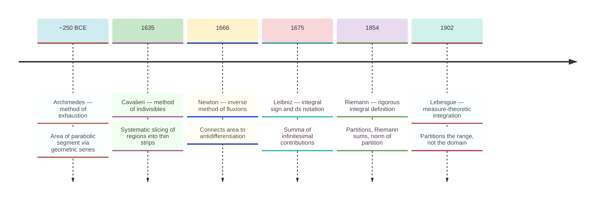
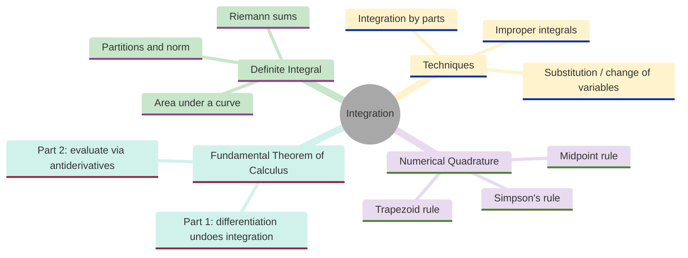
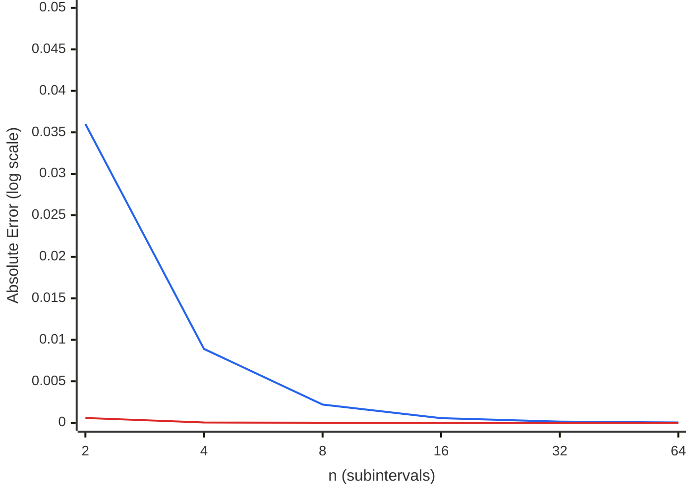
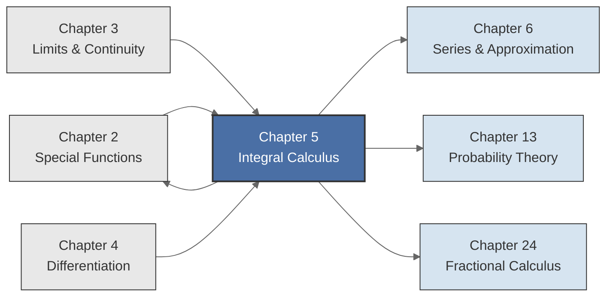

<!-- Copyright (c) 2025-2026 Bob Jansen <bobjansen@pm.me> -->
<!-- SPDX-License-Identifier: CC-BY-NC-4.0 -->
<!-- See LICENSE for full terms. Commercial licensing available. -->
# Chapter 5: Integral Calculus


**Part II**: Calculus

> Integration reverses differentiation, computes areas and accumulated quantities and connects local rates of change to global totals. The Fundamental Theorem of Calculus makes this connection precise.

**Prerequisites**: [Chapter 2](02-special-functions.md) (Special Functions); the Gamma function and Beta function appear in integral applications. [Chapter 3](03-limits-continuity.md) (Limits & Continuity); the definition of limit and the extreme value theorem are used in the definition and properties of the Riemann integral. [Chapter 4](04-differential-calculus.md) (Differentiation); the chain rule, product rule and Mean Value Theorem are required for the proofs of the Fundamental Theorem, substitution and integration by parts.

**Learning Objectives**: After this chapter, the reader will be able to:

1. Define the Riemann integral in terms of partitions, Riemann sums and the norm of a partition.
2. State and prove the two parts of the Fundamental Theorem of Calculus.
3. Apply the substitution rule and integration by parts to evaluate integrals.
4. Classify and evaluate improper integrals of Type I and Type II.
5. Implement and compare the midpoint, trapezoid and Simpson numerical quadrature rules and state their error bounds.
6. Compute antiderivatives of elementary functions and verify results by differentiation.

**Connections**: This chapter is used by [Chapter 6](06-series-approximation.md) (Series & Approximation; term-by-term integration of power series), [Chapter 13](13-probability-theory.md) (Probability Theory; expected value as an integral), [Chapter 2](02-special-functions.md) (Special Functions; the Gamma and Beta functions are defined as integrals) and [Chapter 24](24-fractional-calculus.md) (Fractional Calculus; the Riemann–Liouville fractional integral generalises the Cauchy formula for iterated integration).

---

## Historical Context

**Historical Development of Integration**



*Figure 5.1: Timeline of key milestones in the development of integration from Archimedes to Lebesgue.*

Computing areas bounded by curves is among the oldest problems in mathematics. Its resolution required two millennia of development, from Archimedes's geometric arguments to Riemann's analytic definition (for a thorough historical account, see Edwards [5]). The story illustrates why a modern library still needs both symbolic and numerical tools for integration.

**Archimedes and the method of exhaustion (~250 BCE).** Around 250 BCE, Archimedes of Syracuse determined the area of a parabolic segment (the region bounded by a parabola and a chord) by inscribing a sequence of triangles that together exhaust the region. He showed that this area equals $\tfrac{4}{3}$ times the area of the inscribed triangle with the same base and height. The argument proceeds by constructing smaller triangles in each remaining region and summing the geometric series $1 + \tfrac{1}{4} + \tfrac{1}{16} + \cdots = \tfrac{4}{3}$. In modern language, this is the evaluation of a definite integral via a limit of partial sums.

**Archimedes on circles, spheres and paraboloids (~250 BCE).** Archimedes also computed the area of a circle, the surface area and volume of a sphere and the volume of a paraboloid of revolution. In each case he filled the region with polygonal or polyhedral approximations and passed to a limit. The method of exhaustion demanded a separate geometric construction for every new curve. There was no general-purpose algorithm.

**Cavalieri's method of indivisibles (1635).** Bonaventura Cavalieri, a student of Galileo, proposed a less rigorous but more flexible approach in his *Geometria indivisibilibus continuorum* (1635). Cavalieri treated a planar region as composed of infinitely many parallel line segments ("indivisibles") and compared areas by comparing these collections of lines. The logical foundations were questionable; what is the "sum" of infinitely many lines? The method produced correct results efficiently and influenced the next generation of mathematicians, including Torricelli, Wallis and Pascal. The insight was computational: instead of a bespoke geometric argument for each curve, one could slice a region into thin strips and sum their contributions.

**Newton, Leibniz and the link to antidifferentiation (1660s–1680s).** The decisive step came independently from Isaac Newton and Gottfried Wilhelm Leibniz in the 1660s–1680s. Both recognised that computing the area under a curve $f(x)$ from $a$ to $b$ is intimately related to finding a function $F$ whose derivative is $f$. Newton, working with power series and what he called "fluents" and "fluxions," formulated this connection in his unpublished manuscripts of 1666. Leibniz, arriving at the same result through his study of sums and differences of sequences beginning around 1675, published the first account of the calculus in 1684 (differentiation) and 1686 (integration).

**Leibniz's integral notation (1675).** Leibniz introduced the integral sign $\int$, an elongated letter S standing for *summa* (Latin for "sum") and the differential notation $dx$, emphasising that integration is the summation of infinitesimal contributions $f(x)\,dx$. This notation remains standard and is the one adopted throughout this text. The Fundamental Theorem of Calculus, the statement that differentiation and integration are inverse operations, is the central result of the subject. Its discovery by Newton and Leibniz marks the beginning of modern analysis.

**Riemann's rigorous integral definition (1854).** For nearly two centuries after Newton and Leibniz, the integral was understood intuitively as "the area under a curve" without a precise definition. Bernhard Riemann, in his 1854 Habilitationsschrift [6], supplied the missing rigour. He defined the integral in terms of partitions of the interval $[a,b]$ into subintervals, sums $\sum f(c_i)\,\Delta x_i$ over those subintervals and a limit as the partition becomes arbitrarily fine. This definition made it possible to state and prove theorems about integration: which functions are integrable, how the integral interacts with limits and series. It replaced geometric intuition with analytic proof. Riemann's definition is the one presented in this chapter (see also Wolfram MathWorld [10] for a concise summary).

**Lebesgue and measure-theoretic integration (1902).** Henri Lebesgue, in his doctoral thesis [7], introduced a more general definition of the integral based on measure theory. The Lebesgue integral partitions the *range* of $f$ rather than its domain, allowing the integration of a wider class of functions and providing superior convergence theorems (the dominated convergence theorem and the monotone convergence theorem). The Lebesgue integral is necessary for modern probability theory and functional analysis but requires measure-theoretic machinery beyond the scope of this text. For the continuous and piecewise-continuous functions encountered in Evenwicht's applied domains (optimisation, probability densities, signal processing), the Riemann integral suffices.

**Numerical quadrature and Newton–Cotes formulas (1722–1743).** Practical methods for approximating integrals numerically have a long history alongside the theoretical development. The trapezoidal rule was known to Newton. Thomas Simpson published his eponymous rule in 1743 [8]; Roger Cotes had discovered it earlier, publishing it posthumously in 1722. The Newton–Cotes family of quadrature formulas approximates the integrand by interpolating polynomials on equally spaced nodes, providing a systematic hierarchy of increasingly accurate methods. The trapezoid rule uses linear interpolation (degree 1), Simpson's rule uses quadratic interpolation (degree 2) and higher-order rules use cubic or quartic interpolation. For most practical purposes, Simpson's rule provides a good balance of simplicity and accuracy. It is the default quadrature method in Evenwicht.

---

## Why This Chapter Matters

**Integration**



*Figure 5.2: Mindmap organises the main topics of integral calculus.*

Integration computes totals from rates, areas from curves and probabilities from densities. Differentiation answers "how fast is it changing?"; integration answers "how much has accumulated?" Revenue is the integral of income over time. Energy is the integral of power. Probability is the integral of a density function. The entire apparatus of continuous probability, from the expected value of a random variable to the normalising constant of a distribution, reduces to evaluating definite integrals.

The Fundamental Theorem of Calculus (FTC Parts 1 and 2, Theorems 5.9 and 5.10) transforms an impossibly hard computational problem (taking limits of Riemann sums) into a tractable one (finding antiderivatives). Before the FTC, computing $\int_0^\pi \sin(x)\,dx$ required a laborious summation argument. After the FTC, one recognises that $-\cos(x)$ is an antiderivative of $\sin(x)$ and evaluates $-\cos(\pi) + \cos(0) = 2$. This reduction from $O(n)$ work (summing $n$ rectangles) to $O(1)$ work (evaluating an antiderivative at two points) is a large algorithmic speedup. Most integrals arising in applications do not have closed-form antiderivatives; this is why the numerical quadrature methods of this chapter (midpoint, trapezoid, Simpson) are necessary.

Simpson's rule, with its $O(h^4)$ error convergence, is the default numerical integrator in Evenwicht. It achieves near-machine-precision accuracy for smooth functions with a modest number of function evaluations. Example 5.22 computes $\pi$ to approximately 8–9 correct decimal places using only 100 subintervals. In quantitative finance, numerical integration computes option prices, expected shortfall and the present value of continuous income streams. In Bayesian statistics, the marginal likelihood $p(D) = \int p(D|\theta)\,p(\theta)\,d\theta$, the integral that drives model comparison, is evaluated numerically because closed-form solutions are the exception.

In physics and engineering, work, charge, flux and energy are all integrals. The special functions of [Chapter 2](02-special-functions.md) (Gamma, Beta, erf) are themselves defined as definite integrals and their proofs (the factorial property via integration by parts, the Beta–Gamma relation via a double integral substitution) rely directly on the techniques developed here.

---

## Notation & Conventions

| Symbol | Meaning |
|--------|---------|
| $\int_a^b f(x)\,dx$ | Definite integral of $f$ from $a$ to $b$ |
| $\int f(x)\,dx$ | Indefinite integral (antiderivative family) of $f$ |
| $F(x)$ | An antiderivative of $f$: a function satisfying $F'(x) = f(x)$ |
| $[F(x)]_a^b$ | Evaluation notation: $F(b) - F(a)$ |
| $P = \{x_0, x_1, \ldots, x_n\}$ | A partition of $[a,b]$ |
| $\Delta x_i$ | Width of the $i$-th subinterval: $x_i - x_{i-1}$ |
| $c_i$ | A sample point in $[x_{i-1}, x_i]$ |
| $\lVert P \rVert$ | Norm (mesh) of partition $P$: $\max_i \Delta x_i$ |
| $S(f, P, c)$ | Riemann sum: $\sum_{i=1}^n f(c_i)\,\Delta x_i$ |
| $C$ | An arbitrary constant of integration |
| $h$ | Step size in numerical quadrature: $(b-a)/n$ |
| $n$ | Number of subintervals |
| $\varepsilon$ | A positive tolerance in the definition of the Riemann integral |
| $\delta$ | A positive bound on the partition norm ensuring the Riemann sum is within $\varepsilon$ of the integral |

All functions are assumed real-valued on real intervals unless stated otherwise. The variable of integration ($x$, $t$, $u$) is a dummy variable: $\int_a^b f(x)\,dx = \int_a^b f(t)\,dt$.

---

## Core Theory

### Partitions and Riemann Sums

**Definition 5.1** (Partition). A *partition* $P$ of a closed interval $[a, b]$ is a finite set of points

$$P = \{x_0, x_1, x_2, \ldots, x_n\}$$

satisfying $a = x_0 < x_1 < x_2 < \cdots < x_n = b$. The partition divides $[a, b]$ into $n$ *subintervals* $[x_{i-1}, x_i]$ for $i = 1, 2, \ldots, n$. The *width* of the $i$-th subinterval is $\Delta x_i = x_i - x_{i-1}$. The *norm* (or *mesh*) of $P$ is the maximum subinterval width:

$$\lVert P \rVert = \max_{1 \le i \le n} \Delta x_i.$$

A partition is *uniform* (or *equispaced*) if all subintervals have equal width: $\Delta x_i = (b - a)/n$ for all $i$. In this case, $\lVert P \rVert = (b - a)/n$.

**Definition 5.2** (Riemann sum). Let $f: [a, b] \to \mathbb{R}$ be a bounded function, let $P = \{x_0, x_1, \ldots, x_n\}$ be a partition of $[a, b]$ and let $c = (c_1, c_2, \ldots, c_n)$ be a *tagged* selection of sample points with $c_i \in [x_{i-1}, x_i]$ for each $i$. The *Riemann sum* of $f$ with respect to $P$ and $c$ is

$$S(f, P, c) = \sum_{i=1}^{n} f(c_i)\,\Delta x_i.$$

Geometrically, the Riemann sum is the total signed area of $n$ rectangles, where the $i$-th rectangle has base $\Delta x_i$ and height $f(c_i)$. When $f(c_i) > 0$, the rectangle contributes positive area; when $f(c_i) < 0$, the contribution is negative. The choice of sample points (left endpoints, right endpoints, midpoints or any other selection) affects the value of the Riemann sum for a given partition. As the norm shrinks to zero, all choices converge to the same limit (when it exists).

### The Riemann Integral

**Definition 5.3** (Riemann integral). A bounded function $f: [a, b] \to \mathbb{R}$ is *Riemann integrable* on $[a, b]$ if there exists a number $L \in \mathbb{R}$ such that for every $\varepsilon > 0$ there exists $\delta > 0$ such that for every partition $P$ of $[a, b]$ with $\lVert P \rVert < \delta$ and every choice of sample points $c$,

$$\lvert S(f, P, c) - L \rvert < \varepsilon.$$

The number $L$, when it exists, is unique and is called the *Riemann integral* (or *definite integral*) of $f$ on $[a, b]$, written

$$L = \int_a^b f(x)\,dx.$$

The uniqueness of $L$ follows from the standard argument: if $L_1$ and $L_2$ both satisfy the definition, then $|L_1 - L_2| \le |L_1 - S| + |S - L_2| < 2\varepsilon$ for any $\varepsilon > 0$, so $L_1 = L_2$.

**Theorem 5.4** (Continuous functions are integrable). If $f: [a, b] \to \mathbb{R}$ is continuous on the closed interval $[a, b]$, then $f$ is Riemann integrable on $[a, b]$.

??? note "Proof"

    *Proof sketch.* The proof relies on the uniform continuity of $f$ on the compact interval $[a,b]$ (a consequence of the Heine–Cantor theorem).

    Since $f$ is uniformly continuous, for any $\varepsilon > 0$ there exists $\delta > 0$ such that $|f(s) - f(t)| < \varepsilon/(b-a)$ whenever $|s - t| < \delta$.

    For any partition $P$ with $\lVert P \rVert < \delta$, the difference between the upper and lower Darboux sums is bounded by $\varepsilon$, which implies the Riemann integral exists. The full proof is available in any analysis textbook (see Apostol [1] or Spivak [3]).

    $\square$

### Properties of the Integral

**Theorem 5.5** (Linearity). If $f$ and $g$ are Riemann integrable on $[a, b]$ and $\alpha, \beta \in \mathbb{R}$, then $\alpha f + \beta g$ is Riemann integrable on $[a, b]$ and

$$\int_a^b [\alpha\, f(x) + \beta\, g(x)]\,dx = \alpha \int_a^b f(x)\,dx + \beta \int_a^b g(x)\,dx.$$

??? note "Proof"

    *Proof sketch.* For any partition $P$ and sample points $c$,

    $$S(\alpha f + \beta g, P, c) = \sum_{i=1}^n [\alpha\, f(c_i) + \beta\, g(c_i)]\,\Delta x_i$$

    $$= \alpha \sum_{i=1}^n f(c_i)\,\Delta x_i + \beta \sum_{i=1}^n g(c_i)\,\Delta x_i = \alpha\, S(f, P, c) + \beta\, S(g, P, c).$$

    As $\lVert P \rVert \to 0$, $S(f, P, c) \to \int_a^b f$ and $S(g, P, c) \to \int_a^b g$, so $S(\alpha f + \beta g, P, c) \to \alpha \int_a^b f + \beta \int_a^b g$.

    $\square$

**Theorem 5.6** (Monotonicity). If $f$ and $g$ are Riemann integrable on $[a, b]$ and $f(x) \le g(x)$ for all $x \in [a, b]$, then

$$\int_a^b f(x)\,dx \le \int_a^b g(x)\,dx.$$

??? note "Proof"

    *Proof sketch.* The function $g - f$ is nonnegative on $[a,b]$. Every Riemann sum of $g - f$ is nonnegative (since each term $[g(c_i) - f(c_i)]\,\Delta x_i \ge 0$), so the limit $\int_a^b (g - f)\,dx \ge 0$.

    By linearity, this gives $\int_a^b g\,dx - \int_a^b f\,dx \ge 0$.

    $\square$

**Theorem 5.7** (Additivity over intervals). If $f$ is Riemann integrable on $[a, c]$ and $a < b < c$, then

$$\int_a^c f(x)\,dx = \int_a^b f(x)\,dx + \int_b^c f(x)\,dx.$$

??? note "Proof"

    *Proof sketch.* For any partition $P$ of $[a, c]$ that includes $b$ as a partition point, the Riemann sum over $[a, c]$ splits naturally as the sum of the Riemann sums over $[a, b]$ and $[b, c]$.

    For partitions that do not include $b$, one can insert $b$ as an additional point (refining the partition does not change the limit) and then split. Passing to the limit as $\lVert P \rVert \to 0$ gives the result.

    $\square$

### Antiderivatives and the Fundamental Theorem

**Definition 5.8** (Antiderivative). A function $F: [a, b] \to \mathbb{R}$ is an *antiderivative* (or *primitive*) of $f: [a, b] \to \mathbb{R}$ if $F'(x) = f(x)$ for all $x \in (a, b)$.

If $F$ and $G$ are both antiderivatives of $f$ on $[a, b]$, then $(F - G)'(x) = f(x) - f(x) = 0$ for all $x \in (a, b)$. By the Mean Value Theorem ([Chapter 4](04-differential-calculus.md), Theorem 4.25), a function with zero derivative on an interval is constant, so $F(x) - G(x) = C$ for some constant $C \in \mathbb{R}$. Any two antiderivatives of the same function therefore differ by a constant. The family of all antiderivatives of $f$ is written $\int f(x)\,dx = F(x) + C$, where $C$ is an arbitrary constant.

**Theorem 5.9** (Fundamental Theorem of Calculus, Part 1). Let $f: [a, b] \to \mathbb{R}$ be continuous on $[a, b]$. Define

$$F(x) = \int_a^x f(t)\,dt, \quad x \in [a, b].$$

Then $F$ is continuous on $[a, b]$, differentiable on $(a, b)$, and

$$F'(x) = f(x) \quad \text{for all } x \in (a, b).$$

That is, the function defined by "integrating $f$ from $a$ to $x$" is an antiderivative of $f$.

??? note "Proof"

    *Proof.* Let $x \in (a, b)$ and let $h \neq 0$ be small enough that $x + h \in [a, b]$. By additivity (Theorem 5.7),

    $$F(x + h) - F(x) = \int_a^{x+h} f(t)\,dt - \int_a^x f(t)\,dt = \int_x^{x+h} f(t)\,dt.$$

    It follows that

    $$\frac{F(x+h) - F(x)}{h} = \frac{1}{h}\int_x^{x+h} f(t)\,dt.$$

    Since $f$ is continuous on the closed interval between $x$ and $x + h$, the extreme value theorem guarantees that $f$ attains a minimum value $m_h$ and a maximum value $M_h$ on this interval. By monotonicity (Theorem 5.6),

    $$m_h \le \frac{1}{h}\int_x^{x+h} f(t)\,dt \le M_h \quad \text{(assuming } h > 0\text{; the case } h < 0 \text{ is analogous)}.$$

    As $h \to 0$, both $m_h$ and $M_h$ converge to $f(x)$ by the continuity of $f$. By the squeeze theorem ([Chapter 3](03-limits-continuity.md)),

    $$F'(x) = \lim_{h \to 0}\frac{F(x+h) - F(x)}{h} = f(x).$$

    $\square$

**Theorem 5.10** (Fundamental Theorem of Calculus, Part 2). Let $f: [a, b] \to \mathbb{R}$ be continuous on $[a, b]$ and let $F$ be any antiderivative of $f$ on $[a, b]$. Then

$$\int_a^b f(x)\,dx = F(b) - F(a).$$

!!! abstract "Key Result"

    **Theorem 5.10** (Fundamental Theorem of Calculus, Part 2). A definite integral can be evaluated by finding any antiderivative and computing a simple difference, reducing an $O(n)$ Riemann-sum computation to $O(1)$ and linking integration to differentiation.

??? note "Proof"

    *Proof.* By Theorem 5.9, the function $G(x) = \int_a^x f(t)\,dt$ is an antiderivative of $f$. Since $F$ is also an antiderivative of $f$, Definition 5.8 implies that $F(x) - G(x) = C$ for some constant $C$.

    Evaluating at $x = a$: $F(a) - G(a) = C$. Since $G(a) = \int_a^a f(t)\,dt = 0$, it follows that $C = F(a)$.

    Evaluating at $x = b$: $F(b) - G(b) = C = F(a)$, so $G(b) = F(b) - F(a)$.

    Since $G(b) = \int_a^b f(t)\,dt$, the result follows:

    $$\int_a^b f(x)\,dx = F(b) - F(a).$$

    $\square$

**Remark 5.11** (The importance of the FTC). The Fundamental Theorem of Calculus connects two problems that appear entirely unrelated: finding the area under a curve (integration) and finding the rate of change of a function (differentiation). Part 1 says that integration followed by differentiation recovers the original function. Part 2 says that the definite integral can be evaluated by finding any antiderivative and computing a simple difference. Before the FTC, every integral had to be computed by a laborious limit of Riemann sums. After the FTC, evaluation reduces to the (often much easier) problem of finding an antiderivative. This is why antiderivative tables (Formulas & Identities) are so central to the practice of integration.

### Integration Techniques

**Theorem 5.12** (Substitution / Change of variables). Let $g: [a, b] \to \mathbb{R}$ be a function with a continuous derivative on $[a, b]$ and let $f$ be continuous on the range of $g$. Then

$$\int_a^b f(g(x))\,g'(x)\,dx = \int_{g(a)}^{g(b)} f(u)\,du.$$

??? note "Proof"

    *Proof.* Let $F$ be an antiderivative of $f$, so that $F' = f$. Define $H(x) = F(g(x))$. By the chain rule ([Chapter 4](04-differential-calculus.md)),

    $$H'(x) = F'(g(x)) \cdot g'(x) = f(g(x)) \cdot g'(x).$$

    The function $H$ is therefore an antiderivative of $f(g(x))\,g'(x)$. By FTC Part 2:

    $$\int_a^b f(g(x))\,g'(x)\,dx = H(b) - H(a) = F(g(b)) - F(g(a)).$$

    Applying FTC Part 2 again, now to the right-hand side:

    $$\int_{g(a)}^{g(b)} f(u)\,du = F(g(b)) - F(g(a)).$$

    The two expressions are equal.

    $\square$

The substitution rule is the "reverse chain rule": wherever the chain rule produces a factor of $g'(x)$ during differentiation, the substitution rule absorbs it during integration. In practice, one sets $u = g(x)$, computes $du = g'(x)\,dx$ and rewrites the integral entirely in terms of $u$.

**Theorem 5.13** (Integration by parts). Let $u$ and $v$ be functions with continuous derivatives on $[a, b]$. Then

$$\int_a^b u(x)\,v'(x)\,dx = \bigl[u(x)\,v(x)\bigr]_a^b - \int_a^b u'(x)\,v(x)\,dx.$$

In the compact notation $\int u\,dv = uv - \int v\,du$, where $dv = v'(x)\,dx$ and $du = u'(x)\,dx$.

??? note "Proof"

    *Proof.* The product rule ([Chapter 4](04-differential-calculus.md)) gives

    $$\frac{d}{dx}[u(x)\,v(x)] = u'(x)\,v(x) + u(x)\,v'(x).$$

    Integrating both sides from $a$ to $b$ and applying the FTC:

    $$u(b)\,v(b) - u(a)\,v(a) = \int_a^b u'(x)\,v(x)\,dx + \int_a^b u(x)\,v'(x)\,dx.$$

    Rearranging:

    $$\int_a^b u(x)\,v'(x)\,dx = \bigl[u(x)\,v(x)\bigr]_a^b - \int_a^b u'(x)\,v(x)\,dx.$$

    $\square$

Integration by parts is the "reverse product rule." It is used when the integrand is a product of two functions and one of them becomes simpler upon differentiation. The choice of which factor to call $u$ (to be differentiated) and which to call $dv$ (to be integrated) is guided by the LIATE heuristic: Logarithmic, Inverse trigonometric, Algebraic, Trigonometric, Exponential. Choose $u$ from earlier in the list.

### Improper Integrals

**Definition 5.14** (Improper integrals). The Riemann integral $\int_a^b f(x)\,dx$ as defined in Definition 5.3 requires $[a,b]$ to be a finite closed interval and $f$ to be bounded. An *improper integral* extends the definition to two cases where these requirements fail.

*Type I (infinite interval).* If $f$ is integrable on $[a, R]$ for every $R > a$, then

$$\int_a^\infty f(x)\,dx = \lim_{R \to \infty} \int_a^R f(x)\,dx,$$

provided the limit exists. The integrals $\int_{-\infty}^b f(x)\,dx$ and $\int_{-\infty}^\infty f(x)\,dx$ are defined analogously (split at any finite point and require both halves to converge).

*Type II (unbounded integrand).* If $f$ has an unbounded discontinuity at $x = a$ but is integrable on $[a + \varepsilon, b]$ for every $\varepsilon > 0$, then

$$\int_a^b f(x)\,dx = \lim_{\varepsilon \to 0^+} \int_{a+\varepsilon}^b f(x)\,dx,$$

provided the limit exists. The case of a singularity at $x = b$ or at an interior point is handled analogously.

In both cases, if the limit exists and is finite, the improper integral is said to *converge*. Otherwise it *diverges*.

!!! warning "Convergence must be established before evaluation"
    Applying the Fundamental Theorem of Calculus to an improper integral without first verifying convergence can produce nonsensical results. For instance, $\int_{-1}^{1} x^{-2}\,dx$ diverges (the integrand has a non-integrable singularity at $x = 0$), yet a careless antiderivative evaluation gives $[-x^{-1}]_{-1}^1 = -1 - 1 = -2$, a finite but meaningless answer.

**Example 5.15** (Improper integrals).

*Type I.*

$$\int_0^\infty e^{-x}\,dx = \lim_{R \to \infty}\int_0^R e^{-x}\,dx = \lim_{R \to \infty}\bigl[-e^{-x}\bigr]_0^R = \lim_{R \to \infty}(1 - e^{-R}) = 1.$$

*Type II.*

$$\int_0^1 x^{-1/2}\,dx = \lim_{\varepsilon \to 0^+}\int_\varepsilon^1 x^{-1/2}\,dx = \lim_{\varepsilon \to 0^+}\bigl[2x^{1/2}\bigr]_\varepsilon^1 = \lim_{\varepsilon \to 0^+}(2 - 2\sqrt{\varepsilon}) = 2.$$

The integrand $x^{-1/2}$ is unbounded as $x \to 0^+$, yet the area under the curve is finite. This is possible because $x^{-1/2}$ approaches infinity slowly enough that the narrowing subintervals near $x = 0$ compensate.

**Remark 5.16** (The Gaussian integral). The integral

$$\int_{-\infty}^{\infty} e^{-x^2}\,dx = \sqrt{\pi}$$

appears throughout probability, statistics and physics. It cannot be evaluated by finding an elementary antiderivative; $e^{-x^2}$ has no antiderivative expressible in terms of elementary functions. The standard proof squares the integral, converts to polar coordinates and evaluates the resulting radial integral. The result connects directly to $\Gamma(1/2) = \sqrt{\pi}$ ([Chapter 2](02-special-functions.md), Theorem 2.4): setting $t = x^2$ in $\int_0^\infty e^{-x^2}\,dx = \sqrt{\pi}/2$ yields $\int_0^\infty t^{-1/2}e^{-t}\,dt = \sqrt{\pi} = \Gamma(1/2)$. The Gaussian integral is also the normalisation constant for the normal distribution: the probability density $\frac{1}{\sqrt{2\pi}}e^{-x^2/2}$ integrates to $1$ precisely because of this identity.

---

## Formulas & Identities

### Standard Antiderivatives

The following table lists antiderivatives for the most commonly encountered functions. In each entry, $C$ denotes an arbitrary constant and $n, a$ are real parameters subject to the stated restrictions.

**F5.1**

$$\int x^n\,dx = \frac{x^{n+1}}{n+1} + C, \quad n \neq -1$$

**F5.2**

$$\int e^x\,dx = e^x + C$$

**F5.3**

$$\int \frac{1}{x}\,dx = \ln\lvert x \rvert + C, \quad x \neq 0$$

**F5.4**

$$\int \sin x\,dx = -\cos x + C$$

**F5.5**

$$\int \cos x\,dx = \sin x + C$$

**F5.6**

$$\int \tan x\,dx = -\ln\lvert\cos x\rvert + C$$

**F5.7**

$$\int \sec^2 x\,dx = \tan x + C$$

**F5.8**

$$\int \frac{1}{1 + x^2}\,dx = \arctan x + C$$

**F5.9**

$$\int \frac{1}{\sqrt{1 - x^2}}\,dx = \arcsin x + C, \quad \lvert x \rvert < 1$$

**F5.10**

$$\int a^x\,dx = \frac{a^x}{\ln a} + C, \quad a > 0,\; a \neq 1$$

**F5.11**

$$\int \ln x\,dx = x\ln x - x + C, \quad x > 0$$

**F5.12**

$$\int \sqrt{x}\,dx = \frac{2}{3}x^{3/2} + C, \quad x \ge 0$$

Each of these can be verified by differentiating the right-hand side and confirming that it equals the integrand. For instance, F5.11 follows from integration by parts with $u = \ln x$ and $dv = dx$: $\int \ln x\,dx = x\ln x - \int x \cdot (1/x)\,dx = x\ln x - x + C$.

!!! info "Differentiation as a verification tool"
    Integration is harder than differentiation: there is no universal algorithm for antiderivatives, but differentiation is purely mechanical. Differentiating a candidate antiderivative and checking that the result equals the original integrand is the standard correctness check. Every formula above passes this test; the verify script `verify/ch05_integrals.py` confirms each one symbolically.

---

## Algorithms

### Algorithm 5.17: Rectangle (Midpoint) Rule

The midpoint rule approximates the integral by evaluating the function at the centre of each subinterval.

**Input**: Function $f$, interval $[a, b]$, number of subintervals $n$.

**Output**: Approximation $M_n \approx \int_a^b f(x)\,dx$.

```
function midpoint(f, a, b, n):
    h = (b - a) / n
    sum = 0
    for i = 0 to n-1:
        x_mid = a + (i + 0.5) * h
        sum = sum + f(x_mid)
    return h * sum
```

**Derivation.** On each subinterval $[x_{i-1}, x_i]$ of width $h$, the integrand is approximated by the constant $f(\bar{x}_i)$ where $\bar{x}_i = (x_{i-1} + x_i)/2$ is the midpoint. The contribution from the $i$-th subinterval is $f(\bar{x}_i) \cdot h$ and the total is $M_n = h\sum_{i=1}^n f(\bar{x}_i)$.

**Complexity**: Time $O(n)$ function evaluations. Space $O(1)$; only a running sum is stored.

**Error.** If $f$ has a continuous second derivative on $[a, b]$, then

$$\left|\int_a^b f(x)\,dx - M_n\right| \le \frac{(b-a)^3}{24n^2}\,\max_{x \in [a,b]}\lvert f''(x) \rvert.$$

The error is $O(h^2)$ where $h = (b-a)/n$. Despite its simplicity, the midpoint rule is often more accurate than the trapezoid rule for the same $n$ because the constant in the error bound is smaller by a factor of $2$.

### Algorithm 5.18: Trapezoid Rule

The trapezoid rule approximates the integrand by piecewise-linear interpolation.

**Input**: Function $f$, interval $[a, b]$, number of subintervals $n$.

**Output**: Approximation $T_n \approx \int_a^b f(x)\,dx$.

```
function trapezoid(f, a, b, n):
    h = (b - a) / n
    sum = 0.5 * f(a) + 0.5 * f(b)
    for i = 1 to n-1:
        sum = sum + f(a + i * h)
    return h * sum
```

**Derivation.** On each subinterval $[x_{i-1}, x_i]$, the function $f$ is approximated by the linear function interpolating $(x_{i-1}, f(x_{i-1}))$ and $(x_i, f(x_i))$. The area under this linear approximation is the area of a trapezoid:

$$\frac{f(x_{i-1}) + f(x_i)}{2}\,\Delta x_i.$$

Summing over all subintervals with uniform spacing $h$:

$$T_n = h\left[\frac{f(x_0)}{2} + f(x_1) + f(x_2) + \cdots + f(x_{n-1}) + \frac{f(x_n)}{2}\right].$$

The endpoint values receive half-weight because they are shared between adjacent trapezoids.

**Error.** If $f$ has a continuous second derivative on $[a, b]$, then

$$\left|\int_a^b f(x)\,dx - T_n\right| \le \frac{(b-a)^3}{12n^2}\,\max_{x \in [a,b]}\lvert f''(x) \rvert.$$

The error is $O(h^2)$, the same order as the midpoint rule but with a constant twice as large.

**Complexity**: Time $O(n)$ function evaluations ($n + 1$ evaluations, to be precise). Space $O(1)$.

The following chart visualises the trapezoid rule applied to $f(x) = \sin(x)$ on $[0, \pi]$ with $n=4$ subintervals. The sample points and their function values are shown, and the piecewise-linear interpolation between these points forms the trapezoids whose total area approximates the integral:

**Trapezoid Rule Applied to sin(x) on [0, pi] with n=4**

```mermaid
---
config:
  theme: base
  themeVariables:
    xyChart:
      plotColorPalette: "#2563eb, #dc2626, #16a34a, #9333ea, #ca8a04, #0891b2"
      backgroundColor: "#ffffff"
      titleColor: "#333333"
      xAxisLabelColor: "#333333"
      yAxisLabelColor: "#333333"
      xAxisTitleColor: "#333333"
      yAxisTitleColor: "#333333"
      xAxisLineColor: "#333333"
      yAxisLineColor: "#333333"
---
xychart-beta
    x-axis "x" [0, 0.785, 1.571, 2.356, 3.14]
    y-axis "sin(x)" 0 --> 1.1
    line [0, 0.707, 1.0, 0.707, 0]
```

*Figure 5.3: Trapezoid rule approximates the integral of sin(x) using piecewise-linear interpolation.*

The five sample points are at $x = 0, \pi/4, \pi/2, 3\pi/4, \pi$, with values $0, 0.707, 1.0, 0.707, 0$. The trapezoid rule computes the area under the piecewise-linear curve connecting these points: $T_4 = \frac{h}{2}[f(x_0) + 2f(x_1) + 2f(x_2) + 2f(x_3) + f(x_4)] = \frac{\pi/4}{2}(0 + 2 \times 0.707 + 2 \times 1.0 + 2 \times 0.707 + 0) \approx 1.896$, compared to the exact value of 2.

### Algorithm 5.19: Simpson's Rule

Simpson's rule approximates the integrand by piecewise-quadratic interpolation. It requires an *even* number of subintervals.

**Input**: Function $f$, interval $[a, b]$, number of subintervals $n$ (must be even).

**Output**: Approximation $S_n \approx \int_a^b f(x)\,dx$.

```
function simpson(f, a, b, n):
    if n is odd:
        n = n + 1                    // ensure even
    h = (b - a) / n
    sum = f(a) + f(b)
    for i = 1 to n-1:
        if i is odd:
            sum = sum + 4 * f(a + i * h)
        else:
            sum = sum + 2 * f(a + i * h)
    return (h / 3) * sum
```

**Derivation.** On each pair of consecutive subintervals $[x_{2k}, x_{2k+2}]$, the function is approximated by the unique quadratic (parabola) passing through the three points $(x_{2k}, f(x_{2k}))$, $(x_{2k+1}, f(x_{2k+1}))$ and $(x_{2k+2}, f(x_{2k+2}))$. Integrating this quadratic over $[x_{2k}, x_{2k+2}]$ gives

$$\frac{h}{3}\bigl[f(x_{2k}) + 4f(x_{2k+1}) + f(x_{2k+2})\bigr].$$

The factor of $4$ on the midpoint and $1$ on the endpoints arise from the exact integration of the Lagrange interpolating polynomial. Summing over all $n/2$ pairs of subintervals and collecting terms gives the $1, 4, 2, 4, 2, \ldots, 4, 1$ weighting pattern.

**Error.** If $f$ has a continuous fourth derivative on $[a, b]$, then

$$\left|\int_a^b f(x)\,dx - S_n\right| \le \frac{(b-a)^5}{180n^4}\,\max_{x \in [a,b]}\lvert f^{(4)}(x) \rvert.$$

The error is $O(h^4)$, two orders better than the trapezoid and midpoint rules. This improvement comes at no extra cost; Simpson's rule uses the same function evaluation points as the trapezoid rule (plus midpoints). For any function whose fourth derivative is bounded, Simpson's rule converges much faster as $n$ increases.

**Comparison.** For the same number $n$ of function evaluations, the relative accuracy of the three methods is:

| Method | Error order | Exact for polynomials of degree $\le$ |
|--------|-------------|-------------------------------------|
| Midpoint | $O(h^2)$ | 1 |
| Trapezoid | $O(h^2)$ | 1 |
| Simpson | $O(h^4)$ | 3 |

Simpson's rule is exact for all polynomials of degree $\le 3$ (not just degree $\le 2$, as one might expect from quadratic interpolation). This is because the $O(h^3)$ error term happens to vanish by symmetry.

**Complexity**: All three methods require $O(n)$ time and $O(1)$ space. The arithmetic overhead per evaluation is negligible. For a given accuracy target, Simpson's rule typically requires far fewer evaluations, making it the default choice.

!!! warning "Simpson's rule requires an even number of subintervals"
    Passing an odd $n$ to Simpson's rule produces an incorrect result because the 1-4-2-4-...-4-1 weighting pattern requires pairs of subintervals. Implementations should either reject odd $n$ or silently increment to $n+1$.

---

## Numerical Considerations

**Error bounds for the trapezoid rule.** The error bound

$$\lvert E_T \rvert \le \frac{(b-a)^3}{12n^2}\,\max_{x \in [a,b]}\lvert f''(x) \rvert$$

requires knowledge of $\max|f''|$, which is generally not available in closed form. In practice, one estimates $\max|f''|$ by evaluating $f''$ at a dense set of points (if a derivative is available, symbolically or via finite differences) or by running the trapezoid rule at $n$ and $2n$ subintervals and using the difference $|T_{2n} - T_n|$ as an estimate of the error in $T_n$. Since the error is $O(1/n^2)$, doubling $n$ reduces the error by approximately a factor of $4$, so $|T_n - \int f| \approx \tfrac{4}{3}|T_{2n} - T_n|$ (Richardson extrapolation).

**Error bounds for Simpson's rule.** The bound

$$\lvert E_S \rvert \le \frac{(b-a)^5}{180n^4}\,\max_{x \in [a,b]}\lvert f^{(4)}(x) \rvert$$

shows that Simpson's rule converges as $O(1/n^4)$. For a smooth function like $\sin(x)$ on $[0, \pi]$, where all derivatives are bounded by $1$, the bound gives $|E_S| \le \pi^5/(180 \cdot n^4) \approx 1.7/n^4$. With $n = 10$, the predicted error bound is $\approx 1.7 \times 10^{-4}$; the actual error ($\approx 1.1 \times 10^{-4}$) is smaller, as expected from a conservative bound.

**Practical step size selection.** For a target absolute error tolerance $\varepsilon$:

- *Trapezoid rule*: choose $n \ge \sqrt{(b-a)^3 \max\lvert f''\rvert / (12\varepsilon)}$.
- *Simpson's rule*: choose $n \ge \bigl((b-a)^5 \max\lvert f^{(4)}\rvert / (180\varepsilon)\bigr)^{1/4}$.

When the required derivatives are not known, an adaptive approach doubles $n$ until $|Q_{2n} - Q_n|$ falls below $\varepsilon$ (where $Q$ denotes the quadrature approximation). In practice a fixed $n$ is often used by default; adaptive refinement is a more advanced technique.

!!! tip "Practical error estimation via Richardson extrapolation"
    Run the quadrature at $n$ and $2n$ subintervals. For the trapezoid rule the error ratio is $\approx 4$, so the error in $T_n$ is approximately $\tfrac{4}{3}|T_{2n} - T_n|$. For Simpson's rule the ratio is $\approx 16$, giving error $\approx \tfrac{16}{15}|S_{2n} - S_n|$. This avoids the need to estimate $\max|f''|$ or $\max|f^{(4)}|$.

**Oscillatory integrands.** When the integrand oscillates rapidly (e.g., $\sin(100x)$ on $[0, 2\pi]$), a uniform grid may fail to sample the oscillations adequately unless $n$ is large enough that $h$ is small relative to the oscillation period. Specifically, one needs $h \ll 2\pi/\omega$ where $\omega$ is the angular frequency. For highly oscillatory integrands, specialised methods (Filon, Levin or steepest-descent deformations) outperform uniform Newton–Cotes formulas, but these are outside the scope of this text.

**Improper integrals numerically.** A Type I improper integral $\int_a^\infty f(x)\,dx$ cannot be computed directly on an infinite interval. The standard strategy is truncation: choose a cutoff $R$ such that $\int_R^\infty |f(x)|\,dx$ is negligible (below the desired tolerance), and then compute $\int_a^R f(x)\,dx$ by a standard quadrature rule. For exponentially decaying integrands like $e^{-x}$ or $e^{-x^2}$, the tail contribution decreases extremely rapidly and a moderate $R$ suffices. For algebraically decaying integrands like $1/x^2$, the tail $\int_R^\infty x^{-2}\,dx = 1/R$ decreases only polynomially and a larger $R$ (or a change of variables such as $t = 1/x$) may be needed.

For Type II improper integrals with a singularity at an endpoint, one can exclude a small interval $[a, a+\varepsilon]$ around the singularity and apply quadrature to the remaining interval. The substitution $x = a + t^p$ for an appropriate power $p$ can also regularise the integrand.

---

## Worked Examples

### Example 5.20: $\int_0^\pi \sin(x)\,dx = 2$; Exact vs. Numeric

**Problem**: Compute $\int_0^\pi \sin(x)\,dx$ exactly and verify with Simpson's rule.

**Solution (exact)**: The antiderivative of $\sin(x)$ is $-\cos(x)$ (F5.4). By FTC Part 2:

$$\int_0^\pi \sin(x)\,dx = \bigl[-\cos(x)\bigr]_0^\pi = -\cos(\pi) - (-\cos(0)) = -(-1) + 1 = 2.$$

**Solution (numeric, Simpson with $n = 10$)**: With $a = 0$, $b = \pi$, $n = 10$ and $h = \pi/10 \approx 0.31416$, Simpson's rule computes

$$S_{10} = \frac{h}{3}\bigl[f(x_0) + 4f(x_1) + 2f(x_2) + 4f(x_3) + \cdots + 4f(x_9) + f(x_{10})\bigr].$$

Evaluating: $S_{10} \approx 2.0001095173$. The error is approximately $1.1 \times 10^{-4}$, consistent with the $O(h^4)$ error bound. Since $f^{(4)}(x) = \sin(x)$ and $\max|\sin(x)| = 1$ on $[0, \pi]$:

$$\lvert E_S \rvert \le \frac{\pi^5}{180 \cdot 10^4} \approx 1.7 \times 10^{-4}.$$

The actual error is smaller than this conservative bound.

### Example 5.21: $\int_0^1 e^x\,dx = e - 1$; Trapezoid vs. Simpson

**Problem**: Compare the accuracy of the trapezoid rule and Simpson's rule for $\int_0^1 e^x\,dx$ at various values of $n$.

**Solution (exact)**:

$$\int_0^1 e^x\,dx = [e^x]_0^1 = e - 1 \approx 1.71828182845905.$$

**Comparison table**:

| $n$ | Trapezoid error | Simpson error |
|-----|----------------|---------------|
| 4 | $8.9 \times 10^{-3}$ | $3.7 \times 10^{-5}$ |
| 8 | $2.2 \times 10^{-3}$ | $2.3 \times 10^{-6}$ |
| 16 | $5.6 \times 10^{-4}$ | $1.5 \times 10^{-7}$ |
| 32 | $1.4 \times 10^{-4}$ | $9.1 \times 10^{-9}$ |
| 64 | $3.5 \times 10^{-5}$ | $5.7 \times 10^{-10}$ |

Each doubling of $n$ reduces the trapezoid error by a factor of $\approx 4$ (consistent with $O(1/n^2)$) and the Simpson error by a factor of $\approx 16$ (consistent with $O(1/n^4)$). At $n = 64$, the trapezoid rule still has about 4.5 digits of accuracy, while Simpson's rule achieves over 9 digits of accuracy. The gap spans 5 orders of magnitude.

**Convergence Comparison of Trapezoid and Simpson Quadrature Rules**



*Figure 5.4: Convergence rates of trapezoid and Simpson rules show Simpson converges faster.*

### Example 5.22: $\int_0^1 \frac{4}{1+x^2}\,dx = \pi$; Computing $\pi$

**Problem**: Compute $\pi$ by evaluating $\int_0^1 \frac{4}{1+x^2}\,dx$.

**Solution (exact)**: By F5.8, $\int \frac{1}{1+x^2}\,dx = \arctan(x) + C$. FTC Part 2 then gives

$$\int_0^1 \frac{4}{1+x^2}\,dx = 4\bigl[\arctan(x)\bigr]_0^1 = 4\bigl[\arctan(1) - \arctan(0)\bigr] = 4\left[\frac{\pi}{4} - 0\right] = \pi.$$

This is a standard method for computing $\pi$: the integrand $4/(1+x^2)$ is smooth, bounded between $2$ and $4$ on $[0,1]$ and integrates exactly to $\pi$. It is well-suited to numerical quadrature.

With Simpson's rule at $n = 100$, the result agrees with $\pi$ to approximately 8–9 correct decimal places (the theoretical error bound is of order $10^{-9}$). Higher values of $n$ or adaptive quadrature are needed for full double-precision accuracy.

### Example 5.23: Integration by Parts; $\int x\,e^x\,dx$

**Problem**: Evaluate $\int x\,e^x\,dx$ using integration by parts.

**Solution**: Set $u = x$ (algebraic, simplifies upon differentiation) and $dv = e^x\,dx$ (exponential, easy to integrate). Then $du = dx$ and $v = e^x$. Applying Theorem 5.13:

$$\int x\,e^x\,dx = x\,e^x - \int e^x\,dx = x\,e^x - e^x + C = e^x(x - 1) + C.$$

**Verification**: Differentiate $F(x) = e^x(x - 1)$:

$$F'(x) = e^x(x - 1) + e^x \cdot 1 = e^x(x - 1 + 1) = x\,e^x. \quad \checkmark$$

**Exact evaluation**:

$$\int_0^1 x\,e^x\,dx = [e^x(x-1)]_0^1 = e^1(1-1) - e^0(0-1) = 0 - (-1) = 1.$$

---

## Connections

**Chapter Dependencies**



*Figure 5.5: Dependency graph shows chapters feeding into and building upon integral calculus.*

### Within This Book

- **[Chapter 4](04-differential-calculus.md) (Differentiation)**: The Fundamental Theorem of Calculus is the link between [Chapter 4](04-differential-calculus.md) and this chapter. Differentiation and integration are inverse operations: the FTC Part 1 says $\frac{d}{dx}\int_a^x f(t)\,dt = f(x)$, and Part 2 says $\int_a^b F'(x)\,dx = F(b) - F(a)$. The proofs of the substitution rule and integration by parts rely directly on the chain rule and product rule from [Chapter 4](04-differential-calculus.md).

- **[Chapter 6](06-series-approximation.md) (Series & Approximation)**: Power series can be integrated term by term within their radius of convergence: $\int \sum a_n x^n\,dx = \sum \frac{a_n}{n+1}x^{n+1} + C$. This provides a method for finding antiderivatives of functions defined by series (e.g., $\int e^{-x^2}\,dx$ expressed as a power series) and is the basis for Taylor series derivations of special function values.

- **[Chapter 13](13-probability-theory.md) (Probability Theory)**: The expected value of a continuous random variable $X$ with density $f$ is $\mathbb{E}[X] = \int_{-\infty}^{\infty} x\,f(x)\,dx$, a direct application of the improper integral. Every probability computation involving a continuous distribution (cumulative distribution function evaluation, moment computation, convolution) reduces to integration. The numerical quadrature methods of this chapter provide the computational basis.

- **[Chapter 2](02-special-functions.md) (Special Functions)**: The Gamma function $\Gamma(z) = \int_0^\infty t^{z-1}e^{-t}\,dt$ and the Beta function $B(a,b) = \int_0^1 t^{a-1}(1-t)^{b-1}\,dt$ are both definite (improper) integrals (see NIST DLMF [9] for extensive tabulations). The proof of the factorial property $\Gamma(z+1) = z\Gamma(z)$ uses integration by parts (Theorem 5.13 of this chapter). The error function $\operatorname{erf}(x) = \frac{2}{\sqrt{\pi}}\int_0^x e^{-t^2}\,dt$ is defined as an integral, and its derivative $\operatorname{erf}'(x) = \frac{2}{\sqrt{\pi}}e^{-x^2}$ follows from FTC Part 1.

- **[Chapter 24](24-fractional-calculus.md) (Fractional Calculus)**: The Riemann–Liouville fractional integral of order $\alpha > 0$ is

$$I^\alpha f(x) = \frac{1}{\Gamma(\alpha)}\int_a^x (x - t)^{\alpha - 1}f(t)\,dt,$$

a direct generalisation of Cauchy's formula for $n$-fold iterated integration. When $\alpha$ is a positive integer $n$, this reduces to the ordinary $n$-th iterated integral of $f$. The transition from integer to non-integer $\alpha$, the central idea of fractional calculus, rests on the Riemann integral and the Gamma function.

### Applications

- **Economics and finance**: The present value of a continuous income stream $c(t)$ discounted at rate $r$ is $PV = \int_0^T c(t)\,e^{-rt}\,dt$. Option pricing in the Black–Scholes framework involves integrating the payoff function against the risk-neutral density (a Gaussian). Consumer and producer surplus in microeconomics are definite integrals between supply and demand curves.

- **Machine learning and data science**: The evidence (marginal likelihood) in Bayesian inference is $p(D) = \int p(D|\theta)\,p(\theta)\,d\theta$, an integral over the parameter space. Kernel density estimation evaluates integrals of kernel functions. The entropy of a continuous distribution is $H = -\int f(x)\ln f(x)\,dx$.

- **Physics and engineering**: Work done by a force $F(x)$ along a path is $W = \int_a^b F(x)\,dx$. The charge stored on a capacitor, the energy in a signal and the probability current in quantum mechanics are all expressed as integrals.

---

## Summary

- The Riemann integral is defined as the limit of Riemann sums over increasingly fine partitions, and every continuous function on a closed interval is Riemann integrable.
- The Fundamental Theorem of Calculus establishes that differentiation and integration are inverse operations: $\frac{d}{dx}\int_a^x f(t)\,dt = f(x)$ and $\int_a^b F'(x)\,dx = F(b) - F(a)$.
- Substitution and integration by parts are the two principal techniques for evaluating integrals analytically, each reducing a given integral to a simpler form.
- Improper integrals extend the Riemann integral to unbounded intervals and unbounded integrands, with convergence determined by limit analysis.
- The midpoint, trapezoid and Simpson quadrature rules approximate definite integrals numerically, with error bounds of order $O(h^2)$, $O(h^2)$ and $O(h^4)$ respectively.

---

## Exercises

### Routine

**Exercise 5.1.** Evaluate $\int_1^3 (2x + 1)\,dx$ using the FTC. Verify by computing the Riemann sum with $n = 4$ equal subintervals and right endpoints.

**Exercise 5.2.** Evaluate $\int_0^{\pi/2} \cos(x)\,dx$ exactly. Then compute the Simpson approximation with $n = 4$ and compare.

**Exercise 5.3.** Find the antiderivative of $f(x) = 3x^2 - 4x + 7$ and verify by differentiation.

### Intermediate

**Exercise 5.4.** Use the substitution $u = x^2 + 1$ to evaluate $\int_0^2 \frac{2x}{x^2 + 1}\,dx$.

**Exercise 5.5.** Use integration by parts to evaluate $\int_0^1 x\,\cos(x)\,dx$. Verify numerically with Simpson's rule at $n = 20$.

**Exercise 5.6.** Determine whether the improper integral $\int_1^\infty \frac{1}{x^p}\,dx$ converges or diverges, as a function of the parameter $p > 0$. For which values of $p$ does it converge and what is its value?

### Challenging

**Exercise 5.7.** Prove that Simpson's rule is exact for all polynomials of degree $\le 3$. (Hint: by linearity, it suffices to verify for $f(x) = 1$, $f(x) = x$, $f(x) = x^2$ and $f(x) = x^3$ on an arbitrary interval $[a, b]$ with $n = 2$ subintervals.)

**Exercise 5.8.** Implement a function that computes $\pi$ to 10 correct decimal places using the integral $\int_0^1 \frac{4}{1+x^2}\,dx$ and Simpson's rule. Determine the minimum $n$ required, both from the theoretical error bound and by experiment. Note that the theoretical bound uses a conservative estimate for $\max|f^{(4)}|$; the tighter bound using the actual maximum on $[0,1]$ gives a smaller required $n$ and the experimental convergence will reflect this. Compare the theoretical prediction with the observed convergence rate.

---

## References

### Textbooks

[1] Apostol, T. M. *Calculus, Volume 1*, 2nd ed. Wiley, 1967. Chapters 1–10 develop the Riemann integral with full rigour, including the Darboux approach and the equivalence of upper/lower sums to Riemann sums. The standard reference for a rigorous yet accessible treatment.

[2] Press, W. H., Teukolsky, S. A., Vetterling, W. T., and Flannery, B. P. *Numerical Recipes: The Art of Scientific Computing*, 3rd ed. Cambridge University Press, 2007. Chapter 4 covers numerical integration (quadrature), including Newton–Cotes formulas, Gaussian quadrature, adaptive methods and improper integrals.

[3] Spivak, M. *Calculus*, 4th ed. Publish or Perish, 2008. Chapters 13–19 treat the Riemann integral at the undergraduate level with full proofs of the FTC and integration techniques.

[4] Stewart, J. *Calculus: Early Transcendentals*, 9th ed. Cengage, 2020. Chapters 5–7 cover integration techniques, applications and numerical methods with many worked examples.

### Historical

[5] Edwards, C. H. *The Historical Development of the Calculus*. Springer, 1979. A thorough account of the development of calculus from Archimedes through Riemann, covering the contributions of Cavalieri, Newton, Leibniz, Euler, Cauchy and others.

[6] Riemann, B. "Ueber die Darstellbarkeit einer Function durch eine trigonometrische Reihe." *Abhandlungen der Koeniglichen Gesellschaft der Wissenschaften zu Goettingen* 13 (1854/1868): 87–132. The Habilitationsschrift in which Riemann defined the integral that bears his name.

[7] Lebesgue, H. "Intégrale, longueur, aire." *Annali di Matematica Pura ed Applicata* 7 (1902): 231–359. The doctoral thesis introducing measure-theoretic integration.

[8] Simpson, T. *Mathematical Dissertations on a Variety of Physical and Analytical Subjects*. Nourse, 1743. Contains the quadrature rule now bearing his name, though Cotes had published an equivalent formula posthumously in 1722.

### Online Resources

[9] NIST Digital Library of Mathematical Functions (DLMF). https://dlmf.nist.gov/. The modern successor to Abramowitz and Stegun, with extensive coverage of special functions defined as integrals.

[10] Wolfram MathWorld: Riemann Integral. https://mathworld.wolfram.com/RiemannIntegral.html

---

## Glossary

- **Antiderivative** (primitive): A function $F$ satisfying $F'(x) = f(x)$; any two antiderivatives of the same function differ by a constant.

- **Convergence** (of an improper integral): An improper integral converges if the defining limit exists and is finite.

- **Darboux sums**: The upper and lower sums $U(f, P) = \sum M_i\,\Delta x_i$ and $L(f, P) = \sum m_i\,\Delta x_i$, where $M_i$ and $m_i$ are the supremum and infimum of $f$ on each subinterval; a function is Riemann integrable if and only if these converge to the same limit.

- **Definite integral**: The number $\int_a^b f(x)\,dx$, defined as the limit of Riemann sums, representing the net signed area between the graph of $f$ and the $x$-axis.

- **Fundamental Theorem of Calculus (FTC)**: The two-part theorem connecting differentiation and integration: Part 1 states $\frac{d}{dx}\int_a^x f(t)\,dt = f(x)$; Part 2 states $\int_a^b f(x)\,dx = F(b) - F(a)$ where $F' = f$.

- **Improper integral**: An integral where the interval is infinite (Type I) or the integrand is unbounded (Type II), defined as a limit of proper integrals.

- **Indefinite integral**: The family of all antiderivatives of $f$, written $\int f(x)\,dx = F(x) + C$.

- **Integration by parts**: The technique $\int u\,dv = uv - \int v\,du$, derived from the product rule.

- **LIATE heuristic**: A mnemonic (Logarithmic, Inverse trigonometric, Algebraic, Trigonometric, Exponential) for choosing the $u$ factor in integration by parts by selecting from earlier in the list.

- **Midpoint rule**: A numerical quadrature rule that approximates the integral using function values at subinterval midpoints, with error $O(h^2)$.

- **Newton–Cotes formulas**: A family of numerical quadrature rules based on polynomial interpolation at equally spaced nodes, of which the trapezoid rule and Simpson's rule are the first two members.

- **Norm** (of a partition): The maximum subinterval width $\lVert P \rVert = \max_i \Delta x_i$; the Riemann integral exists when Riemann sums converge as $\lVert P \rVert \to 0$.

- **Partition**: A finite ordered set of points $a = x_0 < x_1 < \cdots < x_n = b$ dividing $[a,b]$ into subintervals.

- **Quadrature**: The numerical approximation of a definite integral, a term originating from the ancient Greek problem of constructing a square with the same area as a given figure.

- **Riemann integrable**: A function for which the limit of Riemann sums exists and is independent of the choice of sample points.

- **Riemann sum**: The approximation $S(f, P, c) = \sum f(c_i)\,\Delta x_i$ of an integral using a partition and sample points.

- **Simpson's rule**: A numerical quadrature rule based on piecewise-quadratic interpolation with error $O(h^4)$, requiring an even number of subintervals.

- **Substitution** (change of variables): The technique $\int f(g(x))\,g'(x)\,dx = \int f(u)\,du$ with $u = g(x)$, derived from the chain rule.

- **Trapezoid rule**: A numerical quadrature rule based on piecewise-linear interpolation. Error $O(h^2)$.

---
