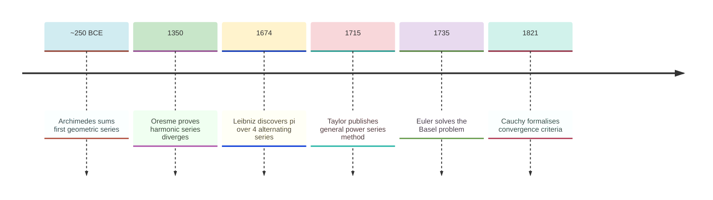
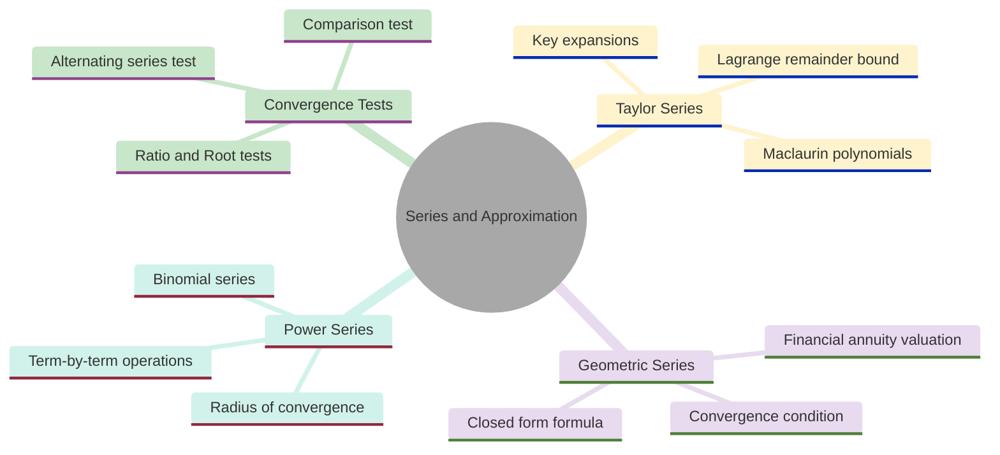
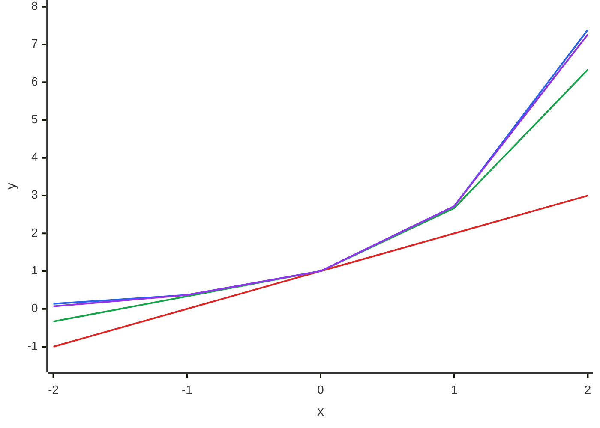
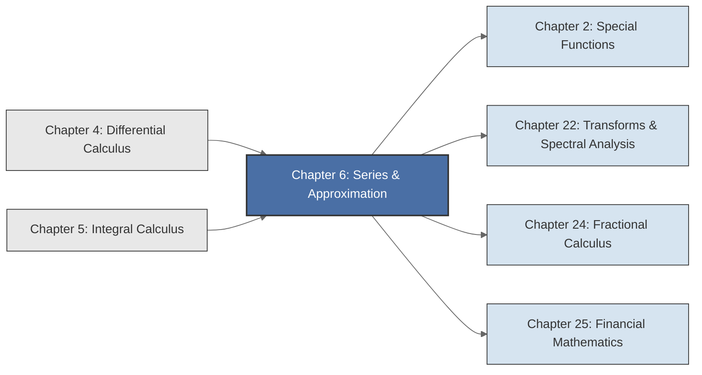

<!-- Copyright (c) 2025-2026 Bob Jansen <bobjansen@pm.me> -->
<!-- SPDX-License-Identifier: CC-BY-NC-4.0 -->
<!-- See LICENSE for full terms. Commercial licensing available. -->
# Chapter 6: Series & Approximation

**Part II**: Calculus

> Infinite series connect exact mathematics to practical computation: every numerical evaluation of $e^x$, $\sin x$ or $\ln(1+x)$ ultimately rests on truncating an infinite sum.

**Prerequisites**: [Chapter 4](04-differential-calculus.md) (Differential Calculus); symbolic and numerical differentiation, the chain rule, higher-order derivatives. [Chapter 5](05-integral-calculus.md) (Integral Calculus); the definite integral, the Fundamental Theorem of Calculus, improper integrals.

**Learning Objectives**: After this chapter, the reader will be able to:

1. Determine whether an infinite series converges or diverges using the divergence test, comparison test, ratio test, root test, integral test and alternating series test.
2. Compute Taylor and Maclaurin polynomials for elementary functions and bound the approximation error using the Lagrange remainder.
3. Sum geometric series in closed form and recognise geometric series structure in financial mathematics (annuities, present value).
4. Determine the radius of convergence of a power series.
5. Identify the standard Taylor expansions of $e^x$, $\sin x$, $\cos x$, $\ln(1+x)$, $1/(1-x)$ and $(1+x)^\alpha$ and apply them in approximation problems.
6. Distinguish between absolute and conditional convergence and state the implications for rearrangement of series terms.

**Connections**: This chapter builds on [Chapter 4](04-differential-calculus.md) (Differentiation) and [Chapter 5](05-integral-calculus.md) (Integration). It is used by [Chapter 25](25-financial-mathematics.md) (Financial Mathematics; geometric series for annuity valuation), [Chapter 2](02-special-functions.md) (Special Functions; Stirling's approximation as an asymptotic series), [Chapter 22](22-transforms.md) (Transforms & Spectral Analysis; Fourier series as a generalisation of power series) and [Chapter 24](24-fractional-calculus.md) (Fractional Calculus; binomial series for fractional powers).

---

## Historical Context

**Key Milestones in Series and Approximation**



*Figure 6.1: Timeline of key milestones in the development of infinite series.*

**Archimedes and the first geometric series.** Archimedes computed the area of a parabolic segment in the third century BCE by inscribing triangles of diminishing size. His argument amounted to evaluating the geometric series $1 + \tfrac{1}{4} + \tfrac{1}{16} + \cdots = \tfrac{4}{3}$, though he expressed the result in the language of exhaustion rather than infinite sums. The geometric series was the first infinite series to be summed exactly. It remains the most widely used: its closed-form expression appears in compound interest calculations, signal processing and probability theory.

**Oresme and the divergence of the harmonic series (1350).** For over a millennium after Archimedes, infinite sums received little systematic attention. Nicole Oresme, around 1350, proved that the harmonic series $1 + \tfrac{1}{2} + \tfrac{1}{3} + \tfrac{1}{4} + \cdots$ diverges. Oresme grouped the terms as follows: the first block is $\tfrac{1}{2} \geq \tfrac{1}{2}$; the second block is $\tfrac{1}{3} + \tfrac{1}{4} \geq \tfrac{1}{2}$; then $\tfrac{1}{5} + \tfrac{1}{6} + \tfrac{1}{7} + \tfrac{1}{8} \geq \tfrac{1}{2}$ and so on, producing infinitely many blocks each summing to at least $\tfrac{1}{2}$. This result is a permanent warning: the condition $a_n \to 0$ is necessary but not sufficient for convergence.

**Leibniz and the alternating series for pi (1674).** The seventeenth century brought rapid development of series methods by Newton, Leibniz and their contemporaries. In 1674, Gottfried Wilhelm Leibniz discovered the alternating series $1 - \tfrac{1}{3} + \tfrac{1}{5} - \tfrac{1}{7} + \cdots = \tfrac{\pi}{4}$, connecting infinite sums to the geometry of the circle. This series converges slowly; hundreds of terms yield only a few decimal places of $\pi$. Its theoretical importance is that it demonstrated transcendental constants could be captured by simple arithmetic patterns. The convergence criterion bearing Leibniz's name (the alternating series test) emerged from this investigation.

**Taylor and Maclaurin series (1715).** Brook Taylor published his general method for expanding functions as power series in 1715, expressing any sufficiently smooth function $f$ as $f(a) + f'(a)(x-a) + \tfrac{f''(a)}{2!}(x-a)^2 + \cdots$. Colin Maclaurin popularised the special case $a = 0$ in his 1742 treatise, though the expansion was already implicit in Taylor's work. Taylor and Maclaurin series became the principal computational tool of eighteenth-century analysis: to evaluate a function at a point, expand it as a polynomial and truncate.

**Euler and the Basel problem (1735).** Leonhard Euler exploited series extensively. His 1735 solution to the Basel problem, showing that $\sum_{n=1}^\infty 1/n^2 = \pi^2/6$, established a deep connection between infinite series and number theory and was a precursor to the Riemann zeta function. Euler freely manipulated series that later generations would consider dubious, assigning values to divergent sums and rearranging conditionally convergent ones. His formal methods produced correct results far more often than they should have, but the absence of rigorous convergence criteria made his arguments unreliable in general.

**Cauchy and Abel: rigorous convergence theory (1821).** Augustin-Louis Cauchy laid the rigorous foundation of series theory in his 1821 *Cours d'analyse*; Niels Henrik Abel refined it. Cauchy formalised convergence as the existence of a limit of partial sums, introduced the Cauchy criterion (a series converges if and only if its partial sums form a Cauchy sequence) and proved the comparison, ratio and root tests. Abel contributed the theory of power series, proving that a power series converges absolutely inside its radius of convergence and diverges outside it. Together, Cauchy and Abel transformed series from a collection of ad hoc tricks into a coherent theory with clear criteria for when manipulations are valid.

**Truncated Taylor series in modern computation.** In modern computation, truncated Taylor series underlie the implementation of every elementary function in hardware and software. When a processor evaluates $\sin(0.3)$, it computes a polynomial approximation derived from the Taylor series, with coefficients chosen to minimise error over a specific interval. Asymptotic expansions, series that diverge but whose partial sums approximate a function to arbitrary precision for large arguments, are central to numerical analysis, statistical mechanics and the evaluation of special functions. The interplay between exact infinite sums and finite truncations is the practical heart of this chapter.

---

## Why This Chapter Matters

**Series and Approximation**



*Figure 6.2: Mindmap organises the core topics of series and approximation theory.*

Every numerical computation of $e^x$, $\sin(x)$, $\cos(x)$ or $\ln(1+x)$, whether performed by a pocket calculator, a central processing unit's floating-point unit or a machine learning framework, rests on truncating a Taylor series. When a graphics processing unit evaluates the softmax function during inference on a large language model, it computes exponentials via polynomial approximations derived from the Maclaurin series $e^x = \sum x^n/n!$. When a financial library prices a bond using duration and convexity, it applies the first- and second-order Taylor approximation of the price-yield relationship. The Taylor polynomial replaces a complicated function with a simple polynomial accurate near a point. The Lagrange remainder (Theorem 6.26) states exactly how many terms are needed for a given accuracy.

The geometric series $\sum ar^n = a/(1-r)$ is the mathematical core of financial valuation. Every fixed-payment instrument (annuity, bond, mortgage, perpetuity) has a present value that is a finite or infinite geometric sum. Example 6.42 derives the standard annuity formula directly from the geometric series partial sum (F6.17), showing that the 12,462 present value of a 20-year annuity is a direct consequence of summing discounted payments. The connection extends to macroeconomics (the fiscal multiplier is a geometric series) and to signal processing (the $z$-transform of a discrete-time system is a geometric series in $z^{-1}$). A practitioner who understands the geometric series formula and its convergence condition $|r| < 1$ has immediate access to all these applications.

The convergence tests (ratio, root, comparison, integral, alternating series) are the diagnostic tools for determining whether a series computation produces a meaningful result or diverges. The divergence of the harmonic series ($\sum 1/n = \infty$ despite $1/n \to 0$) is the permanent warning that intuition about "terms getting small" is insufficient. In numerical computation, the practical consequences of convergence theory appear in overflow prevention (computing Taylor terms via the recurrence $c_{n+1} = c_n \cdot x/(n+1)$ to avoid separate factorial overflow), argument reduction (reducing $\cos(20)$ via periodicity before applying the Maclaurin series) and the Riemann rearrangement theorem's warning that reordering a conditionally convergent series changes its sum, a trap that affects floating-point summation in any programming language.

---

## Notation & Conventions

| Symbol | Meaning |
|--------|---------|
| $\{a_n\}$ | A sequence: a function $a: \mathbb{N} \to \mathbb{R}$, written $a_1, a_2, a_3, \ldots$ |
| $\sum_{n=1}^{\infty} a_n$ | The infinite series with terms $a_n$; the limit of partial sums if it exists |
| $S_N$ | The $N$th partial sum: $S_N = \sum_{n=1}^{N} a_n$ |
| $R_N$ | The $N$th remainder: $R_N = \sum_{n=N+1}^{\infty} a_n = S - S_N$ where $S$ is the sum |
| $r$ | Common ratio of a geometric series |
| $R$ | Radius of convergence of a power series |
| $T_n(x)$ | The $n$th-degree Taylor polynomial of a function centred at $a$ |
| $f^{(k)}(a)$ | The $k$th derivative of $f$ evaluated at $a$ |
| $k!$ | Factorial: $k! = k(k-1)(k-2) \cdots 1$, with $0! = 1$ |
| $\binom{\alpha}{n}$ | Generalised binomial coefficient: $\frac{\alpha(\alpha-1)\cdots(\alpha-n+1)}{n!}$ |
| $c_n$ | Coefficient of a power series: the series is $\sum c_n (x - a)^n$ |
| $\varepsilon$ | A small positive tolerance for convergence detection |
| $\lvert \cdot \rvert$ | Absolute value |
| $\limsup$ | Limit superior of a sequence |

Summation indices start at $n = 0$ or $n = 1$ depending on the series; the starting index is always stated explicitly. All functions are real-valued unless stated otherwise. The notation $a_n \to L$ means $\lim_{n \to \infty} a_n = L$.

---

## Core Theory

### Sequences

**Definition 6.1** (Sequence). A *sequence* is a function $a: \mathbb{N} \to \mathbb{R}$. The value $a(n)$ is written $a_n$ and called the $n$th *term*. The sequence itself is denoted $\{a_n\}$ or $\{a_n\}_{n=1}^{\infty}$.

In prose: a sequence is an ordered list of real numbers indexed by the natural numbers. Each natural number $n$ is assigned exactly one real number $a_n$. Examples include $a_n = 1/n$ (the harmonic sequence), $a_n = (-1)^n/n$ (an alternating sequence) and $a_n = (1 + 1/n)^n$ (which converges to $e$).

**Definition 6.2** (Convergence of a sequence). A sequence $\{a_n\}$ *converges* to a limit $L \in \mathbb{R}$ if for every $\varepsilon > 0$ there exists $N \in \mathbb{N}$ such that

$$n > N \implies |a_n - L| < \varepsilon.$$

The notation is $a_n \to L$ or $\lim_{n \to \infty} a_n = L$. A sequence that does not converge is said to *diverge*.

The definition states that $a_n$ can be made arbitrarily close to $L$ by taking $n$ sufficiently large. The choice of $N$ depends on $\varepsilon$: a tighter tolerance (smaller $\varepsilon$) generally requires a larger $N$.

**Example 6.3**. The sequence $a_n = 1/n$ converges to $0$. Given $\varepsilon > 0$, choose $N = \lceil 1/\varepsilon \rceil$. Then for $n > N$, $|1/n - 0| = 1/n < 1/N \leq \varepsilon$.

**Theorem 6.4** (Monotone convergence theorem). Every bounded monotone sequence converges.

More precisely: if $\{a_n\}$ is non-decreasing ($a_n \leq a_{n+1}$ for all $n$) and bounded above, then $\{a_n\}$ converges to $\sup\{a_n : n \in \mathbb{N}\}$. A non-increasing sequence bounded below similarly converges to its infimum.

This theorem is stated without proof. It relies on the completeness of $\mathbb{R}$ (every non-empty bounded subset has a supremum).

**Remark 6.5**. The monotone convergence theorem is the tool most often used to establish that a sequence converges when finding the limit directly is difficult. The strategy is: (i) show the sequence is monotone, (ii) show it is bounded, (iii) conclude it converges and (iv) find the limit by passing to the limit in the recurrence relation.

### Series

**Definition 6.6** (Series). Let $\{a_n\}$ be a sequence. The *series* $\sum_{n=1}^{\infty} a_n$ is defined as the limit of the sequence of partial sums:

$$\sum_{n=1}^{\infty} a_n := \lim_{N \to \infty} S_N, \quad \text{where } S_N = \sum_{n=1}^{N} a_n.$$

The series *converges* if this limit exists and is finite; otherwise it *diverges*. When the series converges, its *sum* is the value of this limit.

A series is not a sum in the elementary sense; it is the limit of a sequence of finite sums. The distinction matters: the partial sums $S_N$ are always well-defined, but the infinite series may or may not have a finite limit.

**Theorem 6.7** (Divergence test). If $\sum_{n=1}^{\infty} a_n$ converges, then $a_n \to 0$.

Equivalently: if $a_n \not\to 0$, then $\sum_{n=1}^{\infty} a_n$ diverges.

??? note "Proof"

    *Proof.* Suppose $\sum_{n=1}^{\infty} a_n$ converges to $S$. Then $S_N \to S$ and $S_{N-1} \to S$. Since $a_N = S_N - S_{N-1}$, it follows that $a_N \to S - S = 0$.

    $\square$

**Remark 6.8** (The converse is false). The condition $a_n \to 0$ does not imply convergence. The harmonic series $\sum 1/n$ has $a_n = 1/n \to 0$, yet it diverges. This is the standard cautionary example in series theory.

**Definition 6.9** (Geometric series). A *geometric series* is a series of the form

$$\sum_{n=0}^{\infty} ar^n = a + ar + ar^2 + ar^3 + \cdots$$

where $a \neq 0$ is the first term and $r$ is the *common ratio*.

**Theorem 6.10** (Sum of a geometric series). The geometric series $\sum_{n=0}^{\infty} ar^n$ converges if and only if $|r| < 1$, and in that case

$$\sum_{n=0}^{\infty} ar^n = \frac{a}{1 - r}.$$

??? note "Proof"

    *Proof.* The $N$th partial sum (with $N+1$ terms, from $n = 0$ to $n = N$) is

    $$S_N = \sum_{n=0}^{N} ar^n = a \cdot \frac{1 - r^{N+1}}{1 - r}, \quad r \neq 1.$$

    This identity is verified by multiplying both sides by $(1 - r)$:

    $$(1 - r) \sum_{n=0}^{N} ar^n = a \sum_{n=0}^{N} r^n - a \sum_{n=0}^{N} r^{n+1} = a(1 + r + \cdots + r^N) - a(r + r^2 + \cdots + r^{N+1})$$

    which telescopes to $a(1 - r^{N+1})$.

    Now consider the limit as $N \to \infty$. If $|r| < 1$, then $r^{N+1} \to 0$, so

    $$S_N \to \frac{a(1 - 0)}{1 - r} = \frac{a}{1 - r}.$$

    If $|r| \geq 1$, then $|r^{N+1}|$ does not tend to $0$ (it equals $1$ for all $N$ when $|r| = 1$ and grows without bound when $|r| > 1$), so $S_N$ does not converge. If $r = 1$, $S_N = a(N+1) \to \pm\infty$.

    $\square$

**Example 6.11**. The series $\sum_{n=0}^{\infty} (1/2)^n = 1 + 1/2 + 1/4 + 1/8 + \cdots$ is geometric with $a = 1$ and $r = 1/2$. Its sum is $1/(1 - 1/2) = 2$.

The following chart shows the partial sums $S_n = 1 + \frac{1}{2} + \frac{1}{4} + \cdots + \frac{1}{2^n}$ approaching the limiting value of 2:

**Partial Sums of the Geometric Series 1 + 1/2 + 1/4 + ... Approaching 2**

```mermaid
---
config:
  theme: base
  themeVariables:
    xyChart:
      plotColorPalette: "#2563eb, #dc2626, #16a34a, #9333ea, #ca8a04, #0891b2"
      backgroundColor: "#ffffff"
      titleColor: "#333333"
      xAxisLabelColor: "#333333"
      yAxisLabelColor: "#333333"
      xAxisTitleColor: "#333333"
      yAxisTitleColor: "#333333"
      xAxisLineColor: "#333333"
      yAxisLineColor: "#333333"
---
xychart-beta
    x-axis "n (number of terms minus 1)" [0, 1, 2, 3, 4, 5, 6, 7, 8, 9]
    y-axis "Sₙ" 0.9 --> 2.05
    line [1, 1.5, 1.75, 1.875, 1.9375, 1.96875, 1.984, 1.992, 1.996, 1.998]
```

*Figure 6.3: Partial sums of the geometric series converge exponentially toward 2.*

Each additional term halves the remaining gap to 2. After 10 terms ($n=9$), $S_9 = 1.998$ and the gap is only $0.002 = 1/2^9$. The exponential convergence of the geometric series (each term reduces the remainder by a constant factor) is what makes it the "ideal" convergent series.

**Theorem 6.12** (Comparison test). Let $0 \leq a_n \leq b_n$ for all $n$ (or for all $n$ sufficiently large).

- If $\sum b_n$ converges, then $\sum a_n$ converges.
- If $\sum a_n$ diverges, then $\sum b_n$ diverges.

??? note "Proof"

    *Proof sketch.* The partial sums of $\sum a_n$ form a non-decreasing sequence (since $a_n \geq 0$). If $\sum b_n$ converges, then

    $$S_N^{(a)} = \sum_{n=1}^{N} a_n \leq \sum_{n=1}^{N} b_n \leq \sum_{n=1}^{\infty} b_n,$$

    so $\{S_N^{(a)}\}$ is bounded above.

    By the monotone convergence theorem (Theorem 6.4), a non-decreasing sequence that is bounded above must converge, so $\sum a_n$ converges.

    The second statement follows by contraposition: if $\sum b_n$ diverges, then $\sum a_n$ cannot converge (otherwise the first part would imply $\sum b_n$ converges).

    $\square$

**Theorem 6.13** (Ratio test). Let $\{a_n\}$ be a sequence with $a_n \neq 0$ for all $n$, and suppose

$$L = \lim_{n \to \infty} \left|\frac{a_{n+1}}{a_n}\right|$$

exists (or equals $+\infty$). Then:

- If $L < 1$, the series $\sum a_n$ converges absolutely.
- If $L > 1$ (including $L = +\infty$), the series $\sum a_n$ diverges.
- If $L = 1$, the test is inconclusive.

??? note "Proof"

    *Proof sketch.* Suppose $L < 1$. Choose $r$ with $L < r < 1$. For sufficiently large $n$, $|a_{n+1}| < r|a_n|$, so by induction $|a_n| < Cr^n$ for some constant $C$. The series $\sum Cr^n$ is a convergent geometric series, and comparison (Theorem 6.12) gives absolute convergence of $\sum a_n$.

    If $L > 1$, then $|a_{n+1}/a_n| > 1$ eventually, so the terms $|a_n|$ are eventually increasing. In particular, $a_n \not\to 0$, and the series diverges by the divergence test (Theorem 6.7).

    $\square$

**Remark 6.14**. The ratio test is particularly effective for series involving factorials and exponentials, such as $\sum x^n / n!$, where the ratio $|a_{n+1}/a_n| = |x|/(n+1) \to 0 < 1$ for every fixed $x$.

**Theorem 6.15** (Root test). Let $\{a_n\}$ be a sequence and suppose

$$L = \lim_{n \to \infty} |a_n|^{1/n}$$

exists (or equals $+\infty$). Then:

- If $L < 1$, the series $\sum a_n$ converges absolutely.
- If $L > 1$ (including $L = +\infty$), the series diverges.
- If $L = 1$, the test is inconclusive.

This theorem is stated without proof. The argument parallels the ratio test: if $L < 1$ then $|a_n| < r^n$ for some $r < 1$ and all sufficiently large $n$, giving comparison with a convergent geometric series.

!!! info "Choosing between the ratio test and the root test"

    Both tests yield the same conclusion whenever both limits exist. The root test applies more broadly: it gives a definite answer whenever $\limsup |a_n|^{1/n}$ exists, even when the ratio $|a_{n+1}/a_n|$ oscillates and has no limit.

The root test and the ratio test give the same conclusion whenever both limits exist. The root test is sometimes applicable when the ratio test is not (e.g., when the ratio does not have a limit but the root does).

**Theorem 6.16** (Integral test). Let $f: [1, \infty) \to \mathbb{R}$ be positive, continuous and decreasing. Then the series $\sum_{n=1}^{\infty} f(n)$ converges if and only if the improper integral ([Chapter 5](05-integral-calculus.md)) $\int_1^{\infty} f(x)\,dx$ converges.

This theorem is stated without proof. The argument compares the sum $\sum f(n)$ with the integral $\int f(x)\,dx$ via upper and lower Riemann sums, since $f$ is decreasing.

The integral test converts a question about discrete sums into a question about integrals, which are often easier to evaluate. It does not give the value of the series, only whether it converges.

**Example 6.17** (The $p$-series). The series $\sum_{n=1}^{\infty} 1/n^p$ converges if $p > 1$ and diverges if $p \leq 1$. Apply the integral test with $f(x) = x^{-p}$: the integral $\int_1^{\infty} x^{-p}\,dx$ converges if and only if $p > 1$. The case $p = 1$ is the divergent harmonic series.

**Theorem 6.18** (Alternating series test / Leibniz test). Let $\{a_n\}$ be a sequence of positive real numbers satisfying:

1. $a_n$ is eventually decreasing: $a_{n+1} \leq a_n$ for all sufficiently large $n$.
2. $a_n \to 0$ as $n \to \infty$.

Then the alternating series $\sum_{n=1}^{\infty} (-1)^{n+1} a_n = a_1 - a_2 + a_3 - a_4 + \cdots$ converges.

If $S$ denotes the sum and $S_N$ the $N$th partial sum, the error satisfies

$$|S - S_N| \leq a_{N+1}.$$

??? note "Proof"

    *Proof sketch.* Consider the even partial sums $S_{2k}$. Since

    $$S_{2k} = S_{2k-2} + (a_{2k-1} - a_{2k})$$

    and $a_{2k-1} \geq a_{2k}$ by the decreasing hypothesis, the sequence $\{S_{2k}\}$ is non-decreasing.

    Grouping consecutive pairs shows

    $$S_{2k} = a_1 - (a_2 - a_3) - (a_4 - a_5) - \cdots - (a_{2k-2} - a_{2k-1}) - a_{2k} \leq a_1,$$

    so $\{S_{2k}\}$ is bounded above. By the monotone convergence theorem, $S_{2k} \to S$ for some $S$.

    For the odd partial sums, $S_{2k+1} = S_{2k} + a_{2k+1} \to S + 0 = S$ since $a_n \to 0$. It follows that $S_N \to S$ and the series converges.

    For the error bound: the partial sums alternate above and below the limit, so $|S - S_N| \leq |S_{N+1} - S_N| = a_{N+1}$.

    $\square$

**Example 6.19**. The alternating harmonic series $\sum_{n=1}^{\infty} (-1)^{n+1}/n = 1 - 1/2 + 1/3 - 1/4 + \cdots$ converges by the Leibniz test (with $a_n = 1/n$, which is decreasing and tends to $0$). Its sum is $\ln 2$.

**Definition 6.20** (Absolute and conditional convergence). A series $\sum a_n$ *converges absolutely* if $\sum |a_n|$ converges. A series that converges but does not converge absolutely is said to *converge conditionally*.

**Theorem 6.21**. Absolute convergence implies convergence. That is, if $\sum |a_n|$ converges, then $\sum a_n$ converges.

??? note "Proof"

    *Proof.* Observe that $0 \leq a_n + |a_n| \leq 2|a_n|$. Since $\sum |a_n|$ converges by hypothesis, the comparison test (Theorem 6.12) shows that $\sum (a_n + |a_n|)$ also converges.

    The series $\sum a_n = \sum (a_n + |a_n|) - \sum |a_n|$ therefore converges as the difference of two convergent series.

    $\square$

**Remark 6.22**. The alternating harmonic series converges conditionally: $\sum (-1)^{n+1}/n$ converges, but $\sum 1/n$ diverges. Conditionally convergent series have a surprising property: by rearranging their terms, the sum can be made to equal any real number, or made to diverge. This is the Riemann rearrangement theorem and it has practical consequences for numerical computation (see Section 7).

### Power Series and Taylor Series

**Definition 6.23** (Power series). A *power series* centred at $a$ is a series of the form

$$\sum_{n=0}^{\infty} c_n (x - a)^n = c_0 + c_1(x - a) + c_2(x - a)^2 + \cdots$$

where $c_0, c_1, c_2, \ldots$ are real constants called the *coefficients* and $a$ is the *centre*. The series defines a function of $x$ on its interval of convergence.

**Theorem 6.24** (Radius of convergence). Every power series $\sum c_n (x - a)^n$ has a *radius of convergence* $R$ with $0 \leq R \leq \infty$ such that:

- The series converges absolutely for $|x - a| < R$.
- The series diverges for $|x - a| > R$.
- At $|x - a| = R$ (the boundary), convergence must be checked case by case.

The radius $R$ can be computed by

$$\frac{1}{R} = \limsup_{n \to \infty} |c_n|^{1/n}$$

or, when the limit exists, by the ratio formula

$$\frac{1}{R} = \lim_{n \to \infty} \left|\frac{c_{n+1}}{c_n}\right|.$$

This theorem is stated without proof. The existence of $R$ follows from the Cauchy–Hadamard formula and the root test applied to the power series terms $c_n(x-a)^n$.

The *interval of convergence* is the set of all $x$ for which the series converges, which is $(a - R, a + R)$ together with whichever endpoints yield convergence.

**Definition 6.25** (Taylor polynomial). Let $f$ be a function with derivatives of all orders up to $n$ at the point $a$. The *$n$th-degree Taylor polynomial* of $f$ centred at $a$ is

$$T_n(x) = \sum_{k=0}^{n} \frac{f^{(k)}(a)}{k!}(x - a)^k = f(a) + f'(a)(x - a) + \frac{f''(a)}{2!}(x - a)^2 + \cdots + \frac{f^{(n)}(a)}{n!}(x - a)^n.$$

The Taylor polynomial is the unique polynomial of degree at most $n$ that matches $f$ and its first $n$ derivatives at $x = a$. It provides the best local polynomial approximation to $f$ near $a$.

**Theorem 6.26** (Taylor's theorem with Lagrange remainder). Let $f$ be $(n+1)$ times differentiable on an interval containing $a$ and $x$. Then

$$f(x) = T_n(x) + R_n(x)$$

where $T_n(x)$ is the $n$th-degree Taylor polynomial and the remainder $R_n(x)$ satisfies

$$R_n(x) = \frac{f^{(n+1)}(c)}{(n+1)!}(x - a)^{n+1}$$

for some $c$ between $a$ and $x$.

!!! abstract "Key Result"

    **Theorem 6.26** (Taylor's theorem with Lagrange remainder). Any sufficiently smooth function equals its Taylor polynomial plus a quantifiable error term, providing the rigorous basis for truncating infinite series and determining exactly how many terms are needed for a given accuracy.

??? note "Proof"

    *Proof sketch.* Define the auxiliary function

    $$F(t) = f(t) - T_n(t) - \frac{f(x) - T_n(x)}{(x - a)^{n+1}}(t - a)^{n+1}.$$

    Then $F$ vanishes at $t = a$ and $t = x$. By the definition of the Taylor polynomial, the first $n$ derivatives of $f - T_n$ vanish at $t = a$, so $F^{(k)}(a) = 0$ for $k = 0, 1, \ldots, n$ as well.

    Repeated application of Rolle's theorem then yields a point $c$ between $a$ and $x$ where $F^{(n+1)}(c) = 0$.

    Computing $F^{(n+1)}(c)$ explicitly and solving for $f(x) - T_n(x)$ gives the stated formula for the remainder.

    $\square$

**Remark 6.27**. The Lagrange remainder provides a concrete error bound: if $|f^{(n+1)}(t)| \leq M$ for all $t$ between $a$ and $x$, then $|R_n(x)| \leq M|x - a|^{n+1}/(n+1)!$. This bound is the primary tool for determining how many terms of a Taylor series are needed to achieve a desired accuracy.

**Definition 6.28** (Maclaurin series). A *Maclaurin series* is a Taylor series centred at $a = 0$:

$$f(x) = \sum_{n=0}^{\infty} \frac{f^{(n)}(0)}{n!} x^n.$$

The term "Maclaurin series" is used for convenience; it is a special case of the Taylor series.

### Key Taylor Expansions

The following expansions are the workhorses of analysis and numerical computation. Each is derived by computing the derivatives of $f$ at $a = 0$ and substituting into the Maclaurin formula.

**Example 6.29** (Exponential function). The Maclaurin series of $e^x$ is

$$e^x = \sum_{n=0}^{\infty} \frac{x^n}{n!} = 1 + x + \frac{x^2}{2!} + \frac{x^3}{3!} + \cdots$$

*Derivation.* Since $f(x) = e^x$ satisfies $f^{(n)}(x) = e^x$ for all $n$, it follows that $f^{(n)}(0) = 1$ for every $n$. The Taylor polynomial is then $T_n(x) = \sum_{k=0}^{n} x^k/k!$. The Lagrange remainder is $R_n(x) = e^c x^{n+1}/(n+1)!$ for some $c$ between $0$ and $x$. For any fixed $x$, $|R_n(x)| \leq e^{|x|} |x|^{n+1}/(n+1)! \to 0$ as $n \to \infty$ (since $n!$ grows faster than any exponential). The series therefore converges to $e^x$ for all $x \in \mathbb{R}$ and the radius of convergence is $R = \infty$.

**Example 6.30** (Sine function). The Maclaurin series of $\sin x$ is

$$\sin x = \sum_{n=0}^{\infty} \frac{(-1)^n x^{2n+1}}{(2n+1)!} = x - \frac{x^3}{3!} + \frac{x^5}{5!} - \frac{x^7}{7!} + \cdots$$

*Derivation.* The derivatives of $\sin x$ cycle with period 4: $\sin x, \cos x, -\sin x, -\cos x, \sin x, \ldots$ At $x = 0$: $\sin(0) = 0$, $\cos(0) = 1$, $-\sin(0) = 0$, $-\cos(0) = -1$ and so on. The even-order derivatives vanish and the odd-order derivatives alternate between $1$ and $-1$. Since all derivatives are bounded by $1$ in absolute value, the Lagrange remainder satisfies $|R_n(x)| \leq |x|^{n+1}/(n+1)! \to 0$, giving $R = \infty$.

**Example 6.31** (Cosine function). The Maclaurin series of $\cos x$ is

$$\cos x = \sum_{n=0}^{\infty} \frac{(-1)^n x^{2n}}{(2n)!} = 1 - \frac{x^2}{2!} + \frac{x^4}{4!} - \frac{x^6}{6!} + \cdots$$

*Derivation.* By the same derivative-cycling argument as for $\sin x$. The even-order derivatives at $0$ alternate between $1$ and $-1$, and the odd-order derivatives vanish. The radius of convergence is $R = \infty$.

**Example 6.32** (Natural logarithm). The Maclaurin series of $\ln(1 + x)$ is

$$\ln(1 + x) = \sum_{n=1}^{\infty} \frac{(-1)^{n+1} x^n}{n} = x - \frac{x^2}{2} + \frac{x^3}{3} - \frac{x^4}{4} + \cdots$$

valid for $-1 < x \leq 1$, so $R = 1$.

*Derivation.* The derivatives of $\ln(1+x)$ are $f'(x) = (1+x)^{-1}$, $f''(x) = -(1+x)^{-2}$, $f'''(x) = 2(1+x)^{-3}$ and in general $f^{(n)}(x) = (-1)^{n+1}(n-1)!(1+x)^{-n}$ for $n \geq 1$. At $x = 0$: $f^{(n)}(0) = (-1)^{n+1}(n-1)!$, giving the coefficient $f^{(n)}(0)/n! = (-1)^{n+1}/n$. The ratio test gives $|c_{n+1}/c_n| = n/(n+1) \to 1$, confirming $R = 1$. The series converges at $x = 1$ (alternating harmonic series, by the Leibniz test) and diverges at $x = -1$ (harmonic series).

**Example 6.33** (Geometric series). The Maclaurin series of $1/(1-x)$ is

$$\frac{1}{1-x} = \sum_{n=0}^{\infty} x^n = 1 + x + x^2 + x^3 + \cdots$$

valid for $|x| < 1$, so $R = 1$. This is the geometric series with $a = 1$ and $r = x$.

**Example 6.34** (Binomial series). For any $\alpha \in \mathbb{R}$, the Maclaurin series of $(1+x)^\alpha$ is

$$(1+x)^\alpha = \sum_{n=0}^{\infty} \binom{\alpha}{n} x^n = 1 + \alpha x + \frac{\alpha(\alpha-1)}{2!}x^2 + \frac{\alpha(\alpha-1)(\alpha-2)}{3!}x^3 + \cdots$$

where $\binom{\alpha}{n} = \frac{\alpha(\alpha-1)(\alpha-2)\cdots(\alpha-n+1)}{n!}$ is the generalised binomial coefficient. The radius of convergence is $R = 1$ for non-integer $\alpha$. When $\alpha$ is a non-negative integer, the series terminates after $\alpha + 1$ terms and is exactly the binomial theorem.

**Remark 6.35**. The binomial series for $\alpha = 1/2$ gives

$$\sqrt{1 + x} = 1 + \frac{1}{2}x - \frac{1}{8}x^2 + \frac{1}{16}x^3 - \cdots$$

and for $\alpha = -1$ it recovers the geometric series $1/(1+x) = 1 - x + x^2 - x^3 + \cdots$. The binomial series for non-integer $\alpha$ is used by [Chapter 24](24-fractional-calculus.md) (Fractional Calculus) for computing fractional powers.

---

## Formulas & Identities

### Convergence Tests Summary

**F6.1** (Divergence test)

$$a_n \not\to 0 \implies \sum a_n \text{ diverges.} \quad a_n \to 0 \implies \text{no conclusion.}$$

**F6.2** (Geometric series)

$$\sum_{n=0}^{\infty} ar^n = \frac{a}{1 - r} \text{ for } |r| < 1; \text{ diverges for } |r| \geq 1.$$

**F6.3** (Comparison)

$$0 \leq a_n \leq b_n \text{ and } \sum b_n \text{ converges} \implies \sum a_n \text{ converges.}$$

**F6.4** (Ratio test)

$$L = \lim_{n\to\infty} \left|\frac{a_{n+1}}{a_n}\right|: \quad L < 1 \Rightarrow \text{converges absolutely;} \quad L > 1 \Rightarrow \text{diverges;} \quad L = 1 \Rightarrow \text{inconclusive.}$$

**F6.5** (Root test)

$$L = \lim_{n\to\infty} |a_n|^{1/n}: \quad \text{same conclusions as the ratio test.}$$

**F6.6** (Integral test)

$$\sum f(n) \text{ and } \int_1^{\infty} f(x)\,dx \text{ converge or diverge together, for } f \text{ positive, decreasing, continuous.}$$

**F6.7** (Alternating series)

$$a_n > 0,\; a_n \text{ decreasing},\; a_n \to 0 \implies \sum (-1)^{n+1} a_n \text{ converges with } |R_N| \leq a_{N+1}.$$

**F6.8** (Absolute convergence)

$$\sum |a_n| \text{ converges} \implies \sum a_n \text{ converges.}$$

### Key Taylor Series

**F6.9**

$$e^x = \sum_{n=0}^{\infty} \frac{x^n}{n!}, \quad R = \infty$$

**F6.10**

$$\sin x = \sum_{n=0}^{\infty} \frac{(-1)^n x^{2n+1}}{(2n+1)!}, \quad R = \infty$$

**F6.11**

$$\cos x = \sum_{n=0}^{\infty} \frac{(-1)^n x^{2n}}{(2n)!}, \quad R = \infty$$

**F6.12**

$$\ln(1 + x) = \sum_{n=1}^{\infty} \frac{(-1)^{n+1} x^n}{n}, \quad R = 1$$

**F6.13**

$$\frac{1}{1 - x} = \sum_{n=0}^{\infty} x^n, \quad R = 1$$

**F6.14**

$$(1 + x)^\alpha = \sum_{n=0}^{\infty} \binom{\alpha}{n} x^n, \quad R = 1 \text{ (non-integer } \alpha\text{)}$$

### Taylor Remainder

**F6.15** (Lagrange form)

$$R_n(x) = \frac{f^{(n+1)}(c)}{(n+1)!}(x - a)^{n+1}$$

for some $c$ between $a$ and $x$.

**F6.16** (Error bound) If $|f^{(n+1)}(t)| \leq M$ for all $t$ between $a$ and $x$, then

$$|R_n(x)| \leq \frac{M|x - a|^{n+1}}{(n+1)!}.$$

### Finite Geometric Sums

**F6.17**

$$\sum_{n=0}^{N} ar^n = a \cdot \frac{1 - r^{N+1}}{1 - r}$$

for $r \neq 1$.

**Convergence Test Classification**


*Figure 6.4: Quadrant chart classifies convergence tests by ease of application and power.*

---

## Algorithms

### Algorithm 6.36: Taylor Polynomial via Symbolic Differentiation

**Input**: An expression `f` (of type `Expr`), a variable name $v$, a centre $a \in \mathbb{R}$ and an order $n \in \mathbb{N}$.

**Output**: An expression representing the $n$th-degree Taylor polynomial $T_n(x) = \sum_{k=0}^{n} \frac{f^{(k)}(a)}{k!}(x - a)^k$.

```
function taylorPolynomial(f, v, a, n):
    result := const(0)
    currentDerivative := f
    factorial := 1

    for k = 0 to n:
        if k > 0:
            factorial := factorial * k
        // Evaluate the kth derivative at the center
        coeff := evaluate(currentDerivative, {v: a}) / factorial
        // Build the term: coeff * (x - a)^k
        term := mul(const(coeff), pow(sub(var(v), const(a)), const(k)))
        result := add(result, term)
        // Differentiate for the next iteration
        if k < n:
            currentDerivative := simplify(differentiate(currentDerivative, v))

    return simplify(result)
```

**Complexity**: $O(n \cdot D(f))$ where $D(f)$ is the cost of differentiating and simplifying $f$ once. Each differentiation can increase the expression size, so $D(f)$ grows with $k$. For elementary functions, the growth is moderate. For deeply nested compositions, the expression tree can grow exponentially with $k$ without aggressive simplification.

**Correctness**: The algorithm directly implements Definition 6.25. It computes $f^{(k)}$ by repeatedly applying the symbolic differentiation routine from [Chapter 4](04-differential-calculus.md). Each coefficient $f^{(k)}(a)/k!$ is evaluated numerically and embedded as a constant in the output polynomial.

**Remark**. This algorithm produces a polynomial `Expr` whose coefficients are floating-point numbers. An alternative approach retains the coefficients symbolically (as expressions involving $f^{(k)}(a)$), but this is more complex and not needed for most numerical applications.

### Algorithm 6.37: Numerical Series Summation with Convergence Detection

**Input**: A function $a: \mathbb{N} \to \mathbb{R}$ giving the terms of the series, a tolerance $\varepsilon > 0$ and a maximum number of terms $N_{\max}$.

**Output**: An approximate sum $S$ and the number of terms used.

```
function sumSeries(term, epsilon, maxTerms):
    S := 0
    for n = 1 to maxTerms:
        t := term(n)
        S := S + t
        if |t| < epsilon:
            return { sum: S, terms: n, converged: true }
    return { sum: S, terms: maxTerms, converged: false }
```

**Complexity**: $O(N)$ where $N$ is the number of terms summed. Each iteration performs one function evaluation and one addition.

!!! warning "Small terms do not guarantee convergence"

    The stopping criterion $|a_n| < \varepsilon$ is necessary but not sufficient. The harmonic series has $a_n \to 0$ yet diverges. For non-alternating series, compare successive partial sums instead.

**Convergence criterion**: The algorithm stops when $|a_n| < \varepsilon$, which is a necessary but not sufficient condition for the partial sums to have converged. For alternating series satisfying the hypotheses of Theorem 6.18, this criterion guarantees $|S - S_N| \leq |a_{N+1}|$. For general series, a more reliable criterion compares successive partial sums: $|S_n - S_{n-1}| < \varepsilon$.

**Remark**. For series with terms that decrease very slowly (e.g., $1/n^{1.01}$), this algorithm may exhaust $N_{\max}$ before achieving the desired tolerance. In such cases, the caller should be informed that convergence was not detected within the allotted number of terms.

### Algorithm 6.38: Geometric Series Sum (Closed Form)

**Input**: First term $a \in \mathbb{R}$, common ratio $r \in \mathbb{R}$.

**Output**: The sum $S = a/(1 - r)$ if $|r| < 1$; an error or indication of divergence otherwise.

```
function geometricSum(a, r):
    if |r| >= 1:
        error("Geometric series diverges: |r| >= 1")
    return a / (1 - r)
```

**Complexity**: $O(1)$.

**Correctness**: Immediate from Theorem 6.10.

---

## Numerical Considerations

### Catastrophic Cancellation in Alternating Series

!!! warning "Large-argument Taylor series lose all precision"

    Computing $\cos(20)$ directly from the Maclaurin series requires summing terms exceeding $10^{14}$ in magnitude to produce a result bounded by $1$. The intermediate cancellation destroys all correct digits. Always apply argument reduction before evaluating trigonometric series.

Alternating series such as $\sum (-1)^n x^{2n}/(2n)!$ (the cosine series) involve subtracting terms of similar magnitude. For large $|x|$, the individual terms $x^{2n}/(2n)!$ can be enormous even though the sum is bounded by $1$. For instance, computing $\cos(20)$ via the Maclaurin series requires summing terms that exceed $10^{14}$ in magnitude, yet the result is a number between $-1$ and $1$. The intermediate cancellation destroys precision. The standard mitigation is *argument reduction*: use the periodicity $\cos(x + 2\pi) = \cos(x)$ to reduce $x$ to the range $[-\pi, \pi]$ before applying the series. This is exactly what hardware implementations of trigonometric functions do.

### Absolute vs Relative Tolerance

When deciding to stop summing, the choice between absolute tolerance ($|a_n| < \varepsilon$) and relative tolerance ($|a_n / S_n| < \varepsilon$) matters. Absolute tolerance works well when the sum is of order $1$, but fails when the sum is very large (tolerance is too tight) or very small (tolerance is too loose). Relative tolerance adapts to the scale of the sum but fails when $S_n$ is near zero (division by a small number amplifies noise). A reliable stopping criterion combines both: stop when $|a_n| < \varepsilon_{\mathrm{abs}}$ or $|a_n| < \varepsilon_{\mathrm{rel}} \cdot |S_n|$.

### Rearrangement of Conditionally Convergent Series

The Riemann rearrangement theorem states that a conditionally convergent series can be rearranged to converge to any real number, or to diverge. This is not merely a theoretical curiosity: in floating-point arithmetic, the order of summation affects the result. Summing the alternating harmonic series in the standard order gives approximately $\ln 2 \approx 0.6931$. Summing all positive terms first, then all negative terms, gives $+\infty - \infty$, which is undefined. Even less dramatic reorderings can shift the computed sum by several digits.

The practical lesson: never rearrange terms of a conditionally convergent series for performance reasons (e.g., grouping positive and negative terms separately to reduce branch mispredictions). Always sum in the natural order. For absolutely convergent series, rearrangement is safe.

### Overflow in Factorial Terms

The Taylor series for $e^x$ involves terms $x^n / n!$. For moderate $n$ and large $x$, both numerator and denominator overflow IEEE 754 double precision individually, even though their ratio is well within range. For example, $20^{50} \approx 1.1 \times 10^{65}$ and $50! \approx 3.0 \times 10^{64}$, both representable, but $100^{100}$ and $100!$ both overflow.

!!! tip "Compute Taylor terms via recurrence, not via separate powers and factorials"

    Set $c_0 = 1$ and use $c_{n+1} = c_n \cdot x/(n+1)$. This avoids computing $x^n$ and $n!$ separately, both of which overflow long before their ratio does.

The standard technique is to compute terms via the recurrence $c_{n+1} = c_n \cdot x / (n+1)$ rather than computing $x^n$ and $n!$ separately. Starting from $c_0 = 1$, each step multiplies the previous term by $x/(n+1)$. This keeps intermediate values within a reasonable range and avoids computing factorials at all. When even the terms themselves overflow, working in log-space is necessary: compute $\ln |c_n| = n \ln |x| - \ln(n!)$ using log-Gamma and only exponentiate to convert back to the real line.

### When to Use Series vs Closed Form

Whenever a closed-form expression exists (as for the geometric series), it should be preferred over numerical summation. Closed forms are exact (up to floating-point representation), require $O(1)$ computation and avoid accumulation of round-off error. Numerical series summation is a last resort, used when no closed form is available or when the function is defined only procedurally.

---

## Worked Examples

### Example 6.39: Taylor Polynomial of $e^x$ to Order 5

**Problem**: Compute the 5th-degree Taylor polynomial of $e^x$ centred at $a = 0$, evaluate it at $x = 1$ and compare to the true value $e$.

**Solution** (mathematical):

Since $f(x) = e^x$ has $f^{(k)}(0) = 1$ for all $k$, the Taylor polynomial is

$$T_5(x) = \sum_{k=0}^{5} \frac{x^k}{k!} = 1 + x + \frac{x^2}{2} + \frac{x^3}{6} + \frac{x^4}{24} + \frac{x^5}{120}.$$

At $x = 1$:

$$T_5(1) = 1 + 1 + \frac{1}{2} + \frac{1}{6} + \frac{1}{24} + \frac{1}{120} = \frac{120 + 120 + 60 + 20 + 5 + 1}{120} = \frac{326}{120} \approx 2.71\overline{6}.$$

The true value is $e \approx 2.71828$. The absolute error is approximately $0.00161$.

The Lagrange remainder bound gives $|R_5(1)| \leq e^1 \cdot 1^6 / 6! = e/720 \approx 0.00378$, which bounds the actual error of $0.00161$.

**Taylor Polynomial Approximations of the Exponential Function**



*Figure 6.5: Taylor polynomials of increasing order approximate the exponential function more closely.*

### Example 6.40: Taylor Polynomial of $\sin(x)$ to Order 7

**Problem**: Compute the 7th-degree Taylor polynomial of $\sin(x)$ centred at $0$ and compare it to $\sin(x)$ at $x = 0.5$, $x = 1.0$ and $x = 2.0$.

**Solution** (mathematical):

$$T_7(x) = x - \frac{x^3}{6} + \frac{x^5}{120} - \frac{x^7}{5040}.$$

Evaluating:

| $x$ | $T_7(x)$ | $\sin(x)$ | Absolute error |
|-----|-----------|------------|----------------|
| $0.5$ | $0.479425533$ | $0.479425539$ | $6 \times 10^{-9}$ |
| $1.0$ | $0.841468254$ | $0.841470985$ | $2.7 \times 10^{-6}$ |
| $2.0$ | $0.907937$ | $0.909297$ | $1.4 \times 10^{-3}$ |

The accuracy degrades as $|x|$ increases, as expected: the Lagrange bound is $|R_7(x)| \leq |x|^9 / 9!$ (since $T_7 = T_8$ for sine, the effective remainder is of order 9). At $x = 2$, this gives $2^9/362880 \approx 0.0014$, which is consistent with the actual error of approximately $0.0014$.

### Example 6.41: Summing the Geometric Series $1 + \tfrac{1}{2} + \tfrac{1}{4} + \cdots$

**Problem**: Verify that the geometric series $\sum_{n=0}^{\infty} (1/2)^n$ sums to $2$, using both the closed-form formula and numerical summation.

**Solution** (mathematical):

This is a geometric series with $a = 1$ and $r = 1/2$. By Theorem 6.10:

$$\sum_{n=0}^{\infty} \left(\frac{1}{2}\right)^n = \frac{1}{1 - 1/2} = 2.$$

### Example 6.42: Present Value of an Annuity as a Geometric Series

**Problem**: An annuity pays $C = 1000$ at the end of each year for $N = 20$ years. The annual discount rate is $r = 0.05$ (5%). Compute the present value.

**Solution** (mathematical):

The present value of each payment $C$ received at time $k$ is $C/(1+r)^k$. The total present value is

$$PV = \sum_{k=1}^{N} \frac{C}{(1+r)^k} = C \sum_{k=1}^{N} \left(\frac{1}{1+r}\right)^k.$$

Let $\rho = 1/(1+r) = 1/1.05 \approx 0.95238$. Then the sum is a finite geometric series (F6.17):

$$\sum_{k=1}^{N} \rho^k = \rho \cdot \frac{1 - \rho^N}{1 - \rho} = \frac{1}{1+r} \cdot \frac{1 - (1+r)^{-N}}{1 - (1+r)^{-1}} = \frac{1 - (1+r)^{-N}}{r}.$$

The standard annuity present value formula is therefore

$$PV = C \cdot \frac{1 - (1+r)^{-N}}{r}.$$

Substituting $C = 1000$, $r = 0.05$, $N = 20$:

$$PV = 1000 \cdot \frac{1 - (1.05)^{-20}}{0.05} = 1000 \cdot \frac{1 - 0.37689}{0.05} = 1000 \cdot 12.4622 = 12462.21.$$

This example illustrates how the geometric series formula eliminates the need to sum 20 terms individually. The connection between geometric series and financial mathematics ([Chapter 25](25-financial-mathematics.md)) is direct: every fixed-payment instrument (annuity, bond, mortgage) has a present value that is a finite geometric sum.

---

## Connections

**Chapter Dependencies**



*Figure 6.6: Dependency graph shows chapters feeding into and building upon series and approximation.*

### Within This Book

- **Differential Calculus** ([Chapter 4](04-differential-calculus.md)): Taylor polynomials are built from repeated differentiation. The Taylor polynomial $T_n(x) = \sum f^{(k)}(a)(x-a)^k / k!$ requires computing $f^{(k)}$ for $k = 0, 1, \ldots, n$. The symbolic differentiation engine of [Chapter 4](04-differential-calculus.md) provides this capability.
- **Integral Calculus** ([Chapter 5](05-integral-calculus.md)): The integral test (Theorem 6.16) converts convergence questions about series into convergence questions about improper integrals. The Fundamental Theorem of Calculus, developed in [Chapter 5](05-integral-calculus.md), is the theoretical link.
- **Special Functions** ([Chapter 2](02-special-functions.md)): Stirling's approximation $n! \approx \sqrt{2\pi n}(n/e)^n$ is an asymptotic series. The Lanczos approximation of $\Gamma(z)$ is a carefully constructed rational approximation related to series expansions. The error function is defined by an integral whose numerical evaluation often uses a truncated series.
- **Transforms & Spectral Analysis** ([Chapter 22](22-transforms.md)): Fourier series express periodic functions as sums of sines and cosines, generalising the idea of power series to orthogonal function bases. The convergence theory of Fourier series parallels that of power series but with important differences (Gibbs phenomenon, $L^2$ convergence vs pointwise convergence).
- **Fractional Calculus** ([Chapter 24](24-fractional-calculus.md)): The binomial series (Example 6.34) for $(1+x)^\alpha$ with non-integer $\alpha$ provides the expansion used in the Grünwald–Letnikov definition of fractional derivatives. The generalised binomial coefficients $\binom{\alpha}{n}$ are the weights in the fractional finite-difference approximation.
- **Financial Mathematics** ([Chapter 25](25-financial-mathematics.md)): Annuity and perpetuity formulas are direct applications of finite and infinite geometric series. Present value, bond pricing and amortisation schedules all rest on the geometric series formula $\sum ar^k = a/(1-r)$.

### Applications

- **Machine learning**: Truncated Taylor series approximate loss functions and activation functions. The softmax function involves $e^x$, which is computed via its Taylor series in hardware.
- **Signal processing**: Polynomial approximations of filters, windowing functions and transfer functions rely on Taylor and Fourier series.
- **Quantitative finance**: Option pricing models (Black–Scholes) use series expansions of the normal cumulative distribution function. Bond duration and convexity are first- and second-order Taylor approximations of bond price as a function of yield.
- **Cryptography**: Modular arithmetic involving large factorials and binomial coefficients uses asymptotic series (Stirling) to avoid overflow.

### The Operator View

The Taylor expansion can be written in operator notation as $f(x) = e^{(x-a)D} f(a)$, where $D = d/dx$ is the differentiation operator and the operator exponential $e^{hD}$ is defined by its power series $\sum (hD)^n / n!$. This formal identity (the *shift operator* as an exponential of the derivative) underlies the connection between Taylor series, the shift operator and difference equations.

---

## Summary

- An infinite series converges if and only if its sequence of partial sums has a finite limit; the divergence, ratio, root, comparison, integral and alternating series tests provide practical convergence criteria.
- Taylor's theorem approximates a smooth function by its $n$th-degree polynomial with a Lagrange remainder that quantifies the approximation error.
- A geometric series $\sum ar^n$ converges to $a/(1-r)$ when $|r| < 1$, providing the closed-form foundation for annuity valuation and present-value calculations.
- Every power series has a radius of convergence $R$ within which it converges absolutely and outside which it diverges, determined by the Cauchy–Hadamard formula or the ratio test.
- Absolute convergence implies convergence and permits unrestricted rearrangement of terms, whereas conditionally convergent series can be rearranged to sum to any prescribed value.

---

## Exercises

### Routine

**Exercise 6.1**. Determine whether each series converges or diverges. State which test is used.

- (a) $\sum_{n=1}^{\infty} \frac{1}{n^3}$
- (b) $\sum_{n=1}^{\infty} \frac{n}{n+1}$
- (c) $\sum_{n=0}^{\infty} \frac{3^n}{4^n}$
- (d) $\sum_{n=1}^{\infty} \frac{(-1)^n}{n^2}$

**Exercise 6.2**. Compute the Maclaurin polynomial $T_4(x)$ for $f(x) = e^{-x^2}$. Evaluate $T_4(0.5)$ and compare to the true value $e^{-0.25}$.

**Exercise 6.3**. A perpetuity pays $C = 500$ per year forever, with discount rate $r = 0.04$. Express the present value as an infinite geometric series and compute it in closed form.

### Intermediate

**Exercise 6.4**. Use the ratio test to show that the series $\sum_{n=0}^{\infty} x^n/n!$ converges for every $x \in \mathbb{R}$. What does this say about the radius of convergence of the exponential series?

**Exercise 6.5**. Prove that the series $\sum_{n=1}^{\infty} 1/(n \cdot 2^n)$ converges. Find its sum. (Hint: start with the geometric series $\sum x^n$ and integrate term by term.)

**Exercise 6.6**. The alternating series $\sum_{n=0}^{\infty} (-1)^n / (2n+1) = 1 - 1/3 + 1/5 - 1/7 + \cdots$ equals $\pi/4$ (the Leibniz formula). How many terms are needed so that the partial sum approximates $\pi/4$ with error less than $10^{-3}$? Less than $10^{-6}$?

### Challenging

**Exercise 6.7**. The Riemann rearrangement theorem states that a conditionally convergent series can be rearranged to sum to any real number. Outline how this is done for the alternating harmonic series: describe an algorithm that rearranges the terms so that the partial sums converge to a given target $T$.

**Exercise 6.8**. The Taylor series of $\ln(1+x)$ has radius of convergence $R = 1$. Suppose one needs to compute $\ln(3)$. Since $3 = 1 + 2$ and $x = 2$ is outside the radius, the series $\sum (-1)^{n+1} 2^n/n$ diverges. Describe two strategies for computing $\ln(3)$ using convergent series. (Hint: one approach uses $\ln(3) = \ln(1 + 2/1) \neq \ln(1 + x)$ with $x = 2$. Try rewriting as $\ln(3/2) + \ln(2)$, or use the identity $\ln((1+y)/(1-y)) = 2\sum y^{2k+1}/(2k+1)$.)

---

## References

### Textbooks

[1] Apostol, T. M. *Calculus, Volume 1*, 2nd ed. Wiley, 1967. Chapters 10–11 cover sequences, series and power series with full proofs. A rigorous undergraduate reference.

[2] Hardy, G. H. *Divergent Series*. Oxford University Press, 1949 (reprinted by AMS Chelsea, 2000). A thorough treatment of summability methods for series that diverge in the classical sense. Advanced but historically important for understanding Euler's formal manipulations.

[3] Knopp, K. *Theory and Application of Infinite Series*, 4th ed. Dover, 1990 (reprint of 1954 edition). A thorough classical treatment of infinite series, covering convergence tests, power series and asymptotic expansions.

[4] Stewart, J. *Calculus: Early Transcendentals*, 9th ed. Cengage, 2020. Chapters 11–12 cover sequences, series and Taylor polynomials at the standard calculus level. Widely used as a first exposure.

### Historical

[5] Euler, L. "De summis serierum reciprocarum." *Commentarii academiae scientiarum Petropolitanae* 7 (1740): 123–134. Euler's solution to the Basel problem.

[6] Taylor, B. *Methodus Incrementorum Directa et Inversa*. London, 1715. The original publication of Taylor's theorem.

[7] Cauchy, A.-L. *Cours d'analyse de l'École royale polytechnique*. Paris, 1821. First systematic treatment of convergence criteria for infinite series.

[8] Maclaurin, C. *A Treatise of Fluxions*. Edinburgh, 1742. Popularised the special case $a = 0$ of Taylor's expansion.

[9] Katz, V. J. *A History of Mathematics: An Introduction*, 3rd ed. Addison-Wesley, 2009. Covers Oresme's divergence proof, Leibniz's alternating series and Abel's contributions to power series theory.

### Online Resources

[10] NIST DLMF, Chapter 2: Asymptotic Approximations. https://dlmf.nist.gov/2

[11] Wolfram MathWorld: Convergence Tests. https://mathworld.wolfram.com/ConvergenceTests.html

[12] Wolfram MathWorld: Taylor Series. https://mathworld.wolfram.com/TaylorSeries.html

---

## Glossary

- **Absolute convergence**: A series $\sum a_n$ converges absolutely if $\sum |a_n|$ converges, which implies convergence and permits rearrangement of terms.

- **Alternating series**: A series whose terms alternate in sign, typically of the form $\sum (-1)^n a_n$ with $a_n > 0$.

- **Alternating series test** (Leibniz test): A convergence test stating that $\sum (-1)^{n+1} a_n$ converges if $a_n > 0$, $a_n$ is eventually decreasing and $a_n \to 0$.

- **Binomial series**: The Taylor expansion of $(1+x)^\alpha$ for general real $\alpha$, valid for $|x| < 1$.

- **Comparison test**: A convergence test: if $0 \leq a_n \leq b_n$ and $\sum b_n$ converges, then $\sum a_n$ converges.

- **Conditional convergence**: A series that converges but does not converge absolutely. Such series are sensitive to rearrangement of terms.

- **Convergence (of a sequence)**: A sequence $\{a_n\}$ converges to $L$ if $a_n$ can be made arbitrarily close to $L$ by taking $n$ sufficiently large.

- **Convergence (of a series)**: A series $\sum a_n$ converges if the sequence of partial sums $\{S_N\}$ converges.

- **Divergence test**: If $a_n \not\to 0$, then $\sum a_n$ diverges. The converse is false.

- **Geometric series**: A series of the form $\sum ar^n$. Converges to $a/(1-r)$ when $|r| < 1$.

- **Harmonic series**: The series $\sum 1/n$, which diverges despite its terms tending to zero. The canonical example showing that $a_n \to 0$ does not imply convergence.

- **Integral test**: A convergence test: $\sum f(n)$ converges if and only if $\int_1^\infty f(x)\,dx$ converges, for $f$ positive, continuous and decreasing.

- **Lagrange remainder**: The error term in Taylor's theorem: $R_n(x) = f^{(n+1)}(c)(x-a)^{n+1}/(n+1)!$ for some $c$ between $a$ and $x$.

- **Maclaurin series**: A Taylor series centred at $a = 0$.

- **Monotone convergence theorem**: The theorem that every bounded monotone sequence converges; a non-decreasing sequence bounded above converges to its supremum and a non-increasing sequence bounded below converges to its infimum.

- **$p$-series**: The series $\sum 1/n^p$, which converges if $p > 1$ and diverges if $p \leq 1$.

- **Partial sum**: The finite sum $S_N = \sum_{n=1}^{N} a_n$. The series converges if and only if the sequence $\{S_N\}$ converges.

- **Power series**: A series of the form $\sum c_n (x-a)^n$, defining a function of $x$ within its radius of convergence.

- **Radius of convergence**: The value $R$ such that a power series converges absolutely for $|x-a| < R$ and diverges for $|x-a| > R$.

- **Ratio test**: A convergence test using $L = \lim |a_{n+1}/a_n|$: $L < 1$ implies absolute convergence, $L > 1$ implies divergence, $L = 1$ is inconclusive.

- **Remainder**: The difference $R_N = S - S_N$ between the true sum of a series and its $N$th partial sum.

- **Root test**: A convergence test using $L = \lim |a_n|^{1/n}$: $L < 1$ implies absolute convergence, $L > 1$ implies divergence, $L = 1$ is inconclusive.

- **Sequence**: A function from $\mathbb{N}$ to $\mathbb{R}$, written $\{a_n\}$.

- **Series**: The limit of the partial sums of a sequence: $\sum a_n = \lim_{N \to \infty} S_N$.

- **Taylor polynomial**: The polynomial $T_n(x) = \sum_{k=0}^{n} f^{(k)}(a)(x-a)^k / k!$ that best approximates $f$ near $a$ among polynomials of degree at most $n$.

- **Taylor series**: The infinite series $\sum_{k=0}^{\infty} f^{(k)}(a)(x-a)^k / k!$. Converges to $f(x)$ within the radius of convergence if the remainder tends to zero.

---
