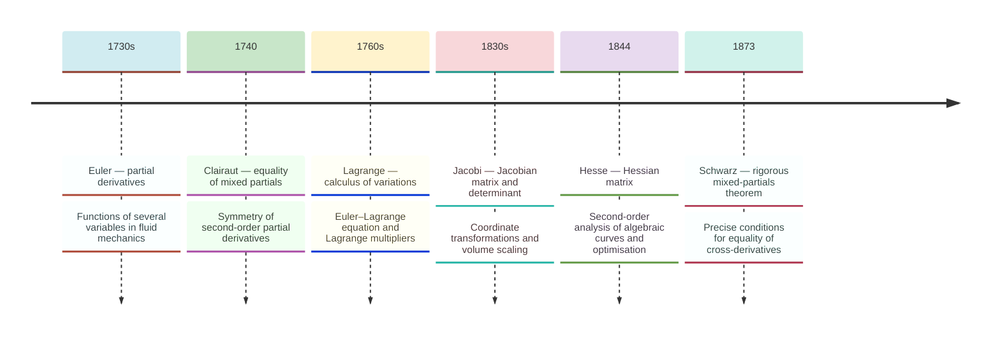
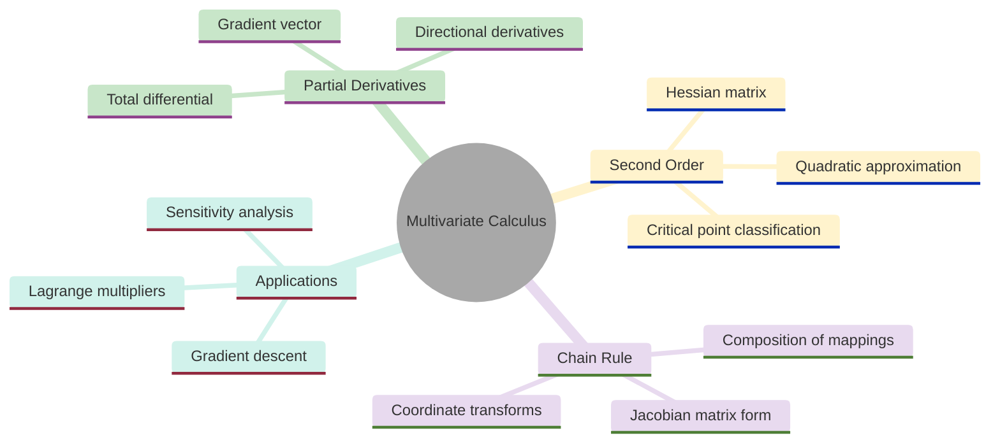
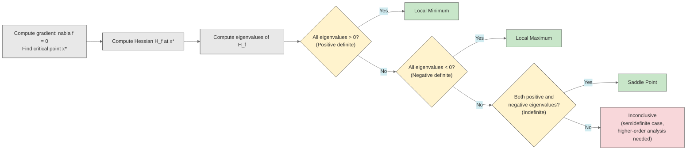
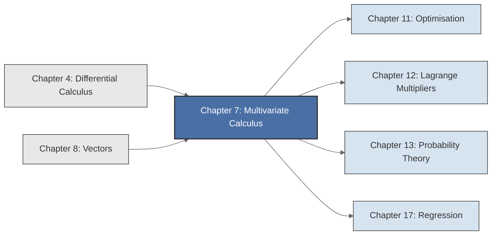

<!-- Copyright (c) 2025-2026 Bob Jansen <bobjansen@pm.me> -->
<!-- SPDX-License-Identifier: CC-BY-NC-4.0 -->
<!-- See LICENSE for full terms. Commercial licensing available. -->

# Chapter 7: Multivariate Calculus


**Part II**: Calculus

> When a quantity depends on several independent variables, its rate of change is no longer a single number but a structured object: a vector, a matrix, a tensor. Multivariate calculus provides the language for describing how functions of many variables change and that language is the foundation of modern optimisation, machine learning and economic analysis.

**Prerequisites**: [Chapter 4](04-differential-calculus.md) (Differential Calculus); familiarity with single-variable differentiation rules, the chain rule and the `differentiate()` function in Evenwicht. [Chapter 8](08-vectors.md) (Vectors); the gradient is a vector and the Hessian is a matrix; readers proceeding in chapter order can take these concepts on faith and revisit [Chapter 8](08-vectors.md) for the formal definitions.

**Learning Objectives**: After this chapter, the reader will be able to:

1. Compute partial derivatives of functions of several variables, treating all other variables as constants.
2. Construct gradient vectors and Hessian matrices from a given function.
3. Apply the multivariate chain rule to composite functions of several variables.
4. Compute directional derivatives and interpret their geometric meaning.
5. Describe the relationship between gradients and level curves and apply Euler's theorem for homogeneous functions.
6. Implement symbolic and numerical gradient and Hessian computations using the Evenwicht API.

**Connections**: This chapter is used by [Chapter 11](11-unconstrained-optimization.md) (Optimisation; gradient descent, Newton's method, second-order conditions via the Hessian), [Chapter 12](12-constrained-optimization.md) (Lagrange Multipliers; constrained optimisation using gradient conditions, where $\lambda \in \mathbb{R}$ is the Lagrange multiplier) and [Chapter 17](17-regression.md) (Regression; the normal equations arise from setting the gradient of the sum of squared errors to zero). The Jacobian matrix introduced here reappears in change-of-variable formulas throughout probability theory ([Chapter 13](13-probability-theory.md)).

---

## Historical Context

**Development of Multivariate Calculus**



*Figure 7.1: Timeline of key milestones in the development of multivariate calculus from Euler to Schwarz.*

**From single-variable to several-variable calculus.** The calculus of functions of a single variable, as Newton and Leibniz developed it in the late seventeenth century, sufficed for many problems in mechanics. The physical world, however, rarely depends on a single quantity. Temperature varies with three spatial coordinates and time. The pressure of a gas depends on volume and temperature. A firm's profit depends on the quantities of every good it produces. Extending the differential calculus to functions of several variables occupied the eighteenth and nineteenth centuries and produced some of the most widely used mathematical machinery in science and engineering.

**Euler and partial derivatives (1730s).** Leonhard Euler [8] was among the first to work systematically with partial derivatives, beginning in the 1730s. In his studies of fluid mechanics and the vibrating string, Euler encountered functions of two or more independent variables. He needed to express how such a function changes when one variable shifts while the others remain fixed. His notation for this operation, holding certain variables constant while differentiating with respect to another, was the conceptual birth of the partial derivative. Euler applied these ideas to the equations of fluid flow (the Euler equations), to the calculus of variations and to the theory of surfaces. He established partial differentiation as a central tool of mathematical physics.

**Lagrange and the calculus of variations (1760s).** Joseph-Louis Lagrange [11] extended the reach of multivariate calculus through his work on the calculus of variations in the 1760s. Lagrange sought functions that minimise or maximise integral quantities: the path of least time, the surface of least area. His methods required differentiating functionals (functions of functions) with respect to parameters. His formulation of the Euler–Lagrange equation, the central result of variational calculus, relies on partial derivatives. Lagrange also introduced the method of Lagrange multipliers for constrained optimisation, expressing the optimality condition as a system of equations involving partial derivatives. This technique remains standard in economics, engineering and machine learning ([Chapter 12](12-constrained-optimization.md)).

**Clairaut, Schwarz and the equality of mixed partials (1740–1873).** A subtle question arose early: if $f(x,y)$ is a function of two variables, one can differentiate first with respect to $x$ then $y$, or in the reverse order. Must the results agree? Alexis Clairaut [7] stated the equality of mixed partial derivatives in 1740, but his argument lacked rigour. Hermann Amandus Schwarz [12] provided precise conditions in 1873. The Clairaut–Schwarz theorem states that if the mixed partial derivatives are continuous, they are equal: $\frac{\partial^2 f}{\partial x \partial y} = \frac{\partial^2 f}{\partial y \partial x}$. This symmetry is not a mere technical convenience; it is the reason the Hessian matrix of a smooth function is symmetric, a property exploited throughout optimisation theory.

**Jacobi and the Jacobian matrix (1830s).** Carl Gustav Jacob Jacobi [10], in the 1830s and 1840s, introduced the Jacobian matrix and its determinant for coordinate transformations. The Jacobian determinant measures how a mapping stretches or compresses volumes and appears in every change-of-variable formula for multiple integrals.

**Hesse and the Hessian matrix (1844).** Ludwig Otto Hesse [9] introduced the Hessian matrix in 1844 in his work on algebraic curves. The Hessian found its principal application in optimisation: its eigenvalues at a critical point determine whether the point is a minimum, maximum or saddle point. This is the theoretical foundation of Newton's method.

**Gradient descent and modern applications.** In modern applications, multivariate calculus is ubiquitous. Gradient descent on a loss function $L(\theta_1, \ldots, \theta_n)$ with millions of parameters is the workhorse of model training in machine learning. In economics, marginal products are partial derivatives and the Cobb–Douglas function $f(K,L) = AK^\alpha L^\beta$ is analysed entirely through them. In statistics, the maximum-likelihood estimator is found by setting $\nabla \ell = \mathbf{0}$ and checking the Hessian for negative definiteness. The tools of this chapter are the daily working language of quantitative science.

---

## Why This Chapter Matters

**Multivariate Calculus**



*Figure 7.2: Mindmap organises the main topics of multivariate calculus.*

A firm's profit depends on prices, costs and quantities of every product. A neural network's loss depends on millions of parameters simultaneously. The temperature at a point in a room depends on three spatial coordinates and time. Single-variable calculus cannot describe any of these situations. Multivariate calculus (partial derivatives, gradients, Hessians, Jacobians) provides the language and the computational tools.

The gradient $\nabla f$ is the central object in this chapter. It is the engine of modern optimisation. Gradient descent updates parameters by $\mathbf{x}_{k+1} = \mathbf{x}_k - \alpha \nabla f(\mathbf{x}_k)$. This algorithm trains every neural network, fits every logistic regression and solves every smooth unconstrained optimisation problem encountered in practice. The gradient points in the direction of steepest ascent; moving opposite to it decreases the function value. This follows from the directional derivative formula $D_\mathbf{u} f = \nabla f \cdot \mathbf{u}$, which is maximised when $\mathbf{u}$ aligns with $\nabla f$. Without the gradient, there is no gradient descent; without gradient descent, there is no modern machine learning.

The Hessian matrix $H_f$ provides the second-order analysis that gradient-based methods alone cannot. At a critical point where $\nabla f = \mathbf{0}$, the Hessian's eigenvalues determine whether the point is a local minimum (all positive), a local maximum (all negative) or a saddle point (mixed signs). This classification is the foundation of Newton's method for optimisation ([Chapter 11](11-unconstrained-optimization.md)), the second-order optimality conditions in constrained problems ([Chapter 12](12-constrained-optimization.md)) and the statistical inference on maximum-likelihood estimators where the inverse Hessian approximates the covariance of parameter estimates.

In economics, the Hessian of a utility function determines whether a consumer's preferences are convex (diminishing marginal utility). In finance, the Hessian of a portfolio's variance with respect to asset weights determines the curvature of the efficient frontier.

The Jacobian matrix generalises the derivative to vector-valued functions. It appears in every change-of-variable formula in probability (transforming random variables), in Newton's method for systems of nonlinear equations and in the sensitivity analysis of any model with vector-valued inputs and outputs.

---

## Notation & Conventions

| Symbol | Meaning |
|--------|---------|
| $\frac{\partial f}{\partial x_i}$, $f_{x_i}$ | Partial derivative of $f$ with respect to $x_i$ |
| $\nabla f$ | Gradient of $f$: the vector of all partial derivatives |
| $H_f$, $\nabla^2 f$ | Hessian matrix of $f$: the matrix of all second partial derivatives |
| $J_F$, $J_\mathbf{F}$ | Jacobian matrix of a vector-valued function $\mathbf{F}$ |
| $D_\mathbf{u} f$ | Directional derivative of $f$ in the direction of unit vector $\mathbf{u}$ |
| $\mathbf{x}$, $\mathbf{a}$, $\mathbf{h}$ | Vectors in $\mathbb{R}^n$ (bold lowercase) |
| $\mathbf{u}$ | A unit vector ($\lVert\mathbf{u}\rVert = 1$) |
| $\lVert\mathbf{v}\rVert$ | Euclidean norm of $\mathbf{v}$: $\sqrt{v_1^2 + \cdots + v_n^2}$ |
| $\mathbf{v} \cdot \mathbf{w}$ | Dot product of $\mathbf{v}$ and $\mathbf{w}$: $\sum_{i} v_i w_i$ |
| $\mathbf{h}^T$ | Transpose of $\mathbf{h}$ (row vector when $\mathbf{h}$ is a column vector) |
| $C^k$ | The class of functions whose partial derivatives up to order $k$ exist and are continuous |
| $df$ | Total differential of $f$ |
| $o(\lVert\mathbf{h}\rVert)$ | Little-o: a remainder term satisfying $o(\lVert\mathbf{h}\rVert)/\lVert\mathbf{h}\rVert \to 0$ as $\lVert\mathbf{h}\rVert \to 0$ |
| $L_c$ | Level set of $f$ at value $c$: $\{\mathbf{x} : f(\mathbf{x}) = c\}$ |

Subscript notation for partial derivatives ($f_x$, $f_{xy}$) is used when brevity is needed. The Leibniz notation $\frac{\partial f}{\partial x}$ is preferred in formal definitions and when the variable of differentiation must be unambiguous. Throughout this chapter, functions are assumed to be sufficiently smooth ($C^2$ or better) unless stated otherwise.

---

## Core Theory

**Definition 7.1** (Function of several variables). A *function of $n$ variables* is a function $f: D \to \mathbb{R}$, where $D \subseteq \mathbb{R}^n$ is the *domain* of $f$. For each point $\mathbf{x} = (x_1, x_2, \ldots, x_n) \in D$, the function assigns a single real value $f(\mathbf{x}) = f(x_1, x_2, \ldots, x_n)$.

The case $n = 1$ reduces to ordinary single-variable calculus. The case $n = 2$ admits geometric visualisation: the graph of $f(x,y)$ is a surface in $\mathbb{R}^3$. For $n \geq 3$, direct visualisation is not possible, but the algebraic and analytic machinery extends without modification.

**Definition 7.2** (Partial derivative). Let $f: D \to \mathbb{R}$ be a function of $n$ variables, with $D \subseteq \mathbb{R}^n$. The *partial derivative of $f$ with respect to $x_i$* at a point $\mathbf{a} = (a_1, \ldots, a_n)$ is defined as

$$\frac{\partial f}{\partial x_i}(\mathbf{a}) = \lim_{h \to 0} \frac{f(a_1, \ldots, a_i + h, \ldots, a_n) - f(a_1, \ldots, a_i, \ldots, a_n)}{h},$$

provided this limit exists. The partial derivative is computed by differentiating $f$ with respect to $x_i$ while treating all other variables $x_j$ ($j \neq i$) as constants.

Computing a partial derivative is single-variable differentiation. All the rules from [Chapter 4](04-differential-calculus.md) (product rule, chain rule, quotient rule) apply unchanged, with every variable except $x_i$ treated as a constant.

**Example 7.3**. Let $f(x,y) = x^2 y + 3xy^2$. To compute $\frac{\partial f}{\partial x}$, treat $y$ as a constant and differentiate with respect to $x$:

$$\frac{\partial f}{\partial x} = 2xy + 3y^2.$$

To compute $\frac{\partial f}{\partial y}$, treat $x$ as a constant and differentiate with respect to $y$:

$$\frac{\partial f}{\partial y} = x^2 + 6xy.$$

**Definition 7.4** (Gradient). Let $f: D \to \mathbb{R}$ be a differentiable function of $n$ variables. The *gradient* of $f$ at a point $\mathbf{a}$ is a vector ([Chapter 8](08-vectors.md)) collecting all partial derivatives:

$$\nabla f(\mathbf{a}) = \left(\frac{\partial f}{\partial x_1}(\mathbf{a}),\; \frac{\partial f}{\partial x_2}(\mathbf{a}),\; \ldots,\; \frac{\partial f}{\partial x_n}(\mathbf{a})\right).$$

The gradient $\nabla f(\mathbf{a})$ is a vector in $\mathbb{R}^n$. It encodes all the first-order information about the rate of change of $f$ at $\mathbf{a}$. The symbol $\nabla$ (nabla) was introduced by William Rowan Hamilton and Peter Guthrie Tait in the 1860s.

**Definition 7.5** (Directional derivative). Let $f: D \to \mathbb{R}$ be defined on an open set $D \subseteq \mathbb{R}^n$, let $\mathbf{a} \in D$ and let $\mathbf{u} \in \mathbb{R}^n$ be a unit vector. The *directional derivative* of $f$ at $\mathbf{a}$ in the direction $\mathbf{u}$ is

$$D_\mathbf{u} f(\mathbf{a}) = \lim_{t \to 0} \frac{f(\mathbf{a} + t\mathbf{u}) - f(\mathbf{a})}{t},$$

provided this limit exists. If $f$ is differentiable at $\mathbf{a}$, then

$$D_\mathbf{u} f(\mathbf{a}) = \nabla f(\mathbf{a}) \cdot \mathbf{u} = \sum_{i=1}^{n} \frac{\partial f}{\partial x_i}(\mathbf{a})\, u_i.$$

The directional derivative measures the rate of change of $f$ along the line $\mathbf{a} + t\mathbf{u}$. The standard partial derivative $\frac{\partial f}{\partial x_i}$ is the special case where $\mathbf{u} = \mathbf{e}_i$, the $i$-th standard basis vector.

**Theorem 7.6** (The gradient points in the direction of steepest ascent). Let $f: D \to \mathbb{R}$ be differentiable at $\mathbf{a} \in D$, and suppose $\nabla f(\mathbf{a}) \neq \mathbf{0}$. Among all unit vectors $\mathbf{u} \in \mathbb{R}^n$, the directional derivative $D_\mathbf{u} f(\mathbf{a})$ is maximised when $\mathbf{u}$ points in the direction of $\nabla f(\mathbf{a})$ and the maximum value equals $\lVert\nabla f(\mathbf{a})\rVert$.

!!! abstract "Key Result"

    **Theorem 7.6** (Steepest ascent). The gradient points in the direction of greatest increase and its magnitude equals the maximum rate of change, providing the theoretical justification for gradient descent as the optimal local strategy for minimising a function.

??? note "Proof"

    *Proof.* Since $f$ is differentiable at $\mathbf{a}$, by Definition 7.5 the directional derivative satisfies $D_\mathbf{u} f(\mathbf{a}) = \nabla f(\mathbf{a}) \cdot \mathbf{u}$. Applying the Cauchy–Schwarz inequality to this dot product:

    $$\nabla f(\mathbf{a}) \cdot \mathbf{u} \leq \lVert\nabla f(\mathbf{a})\rVert \cdot \lVert\mathbf{u}\rVert = \lVert\nabla f(\mathbf{a})\rVert,$$

    since $\lVert\mathbf{u}\rVert = 1$. Equality holds if and only if $\mathbf{u} = \nabla f(\mathbf{a}) / \lVert\nabla f(\mathbf{a})\rVert$.

    The directional derivative is therefore maximised when $\mathbf{u}$ points in the gradient direction, and the maximum value equals $\lVert\nabla f(\mathbf{a})\rVert$.

    $\square$

This theorem is the theoretical justification for gradient descent: to decrease $f$ as rapidly as possible, one moves in the direction $-\nabla f$.

**Theorem 7.7** (Clairaut–Schwarz theorem on equality of mixed partials). Let $f: D \to \mathbb{R}$ be defined on an open set $D \subseteq \mathbb{R}^n$, and suppose the second-order mixed partial derivatives $\frac{\partial^2 f}{\partial x_i \partial x_j}$ and $\frac{\partial^2 f}{\partial x_j \partial x_i}$ both exist and are continuous on $D$. Then

$$\frac{\partial^2 f}{\partial x_i \partial x_j} = \frac{\partial^2 f}{\partial x_j \partial x_i} \quad \text{on } D.$$

??? note "Proof"

    *Proof sketch.* Fix a point $(a,b)$ in the domain and consider the second-order difference quotient

    $$\Phi(h,k) = f(a+h, b+k) - f(a+h, b) - f(a, b+k) + f(a, b).$$

    Define $g(x) = f(x, b+k) - f(x, b)$, so that $\Phi(h,k) = g(a+h) - g(a)$. By the mean value theorem applied to $g$, there exists $\xi$ between $a$ and $a+h$ such that

    $$\Phi(h,k) = h\, g'(\xi) = h[f_x(\xi, b+k) - f_x(\xi, b)].$$

    Applying the mean value theorem again to $f_x(\xi, \cdot)$, there exists $\eta$ between $b$ and $b+k$ such that

    $$\Phi(h,k) = hk\, f_{xy}(\xi, \eta).$$

    By interchanging the order of differentiation (defining $g(y) = f(a+h,y) - f(a,y)$ instead), the same argument yields $\Phi(h,k) = hk\, f_{yx}(\xi', \eta')$ for some intermediate points $\xi', \eta'$.

    Dividing both expressions by $hk$ and taking the limit as $h, k \to 0$, the continuity of $f_{xy}$ and $f_{yx}$ ensures that $f_{xy}(a,b) = f_{yx}(a,b)$.

    $\square$

The Clairaut–Schwarz theorem guarantees that the order of differentiation does not matter for $C^2$ functions. This has the immediate and important consequence that the Hessian matrix is symmetric.

**Definition 7.8** (Hessian matrix). Let $f: D \to \mathbb{R}$ be a twice-differentiable function of $n$ variables. The *Hessian matrix* of $f$ at a point $\mathbf{a}$ is the $n \times n$ matrix of second partial derivatives:

$$H_f(\mathbf{a}) = \begin{pmatrix} \frac{\partial^2 f}{\partial x_1^2} & \frac{\partial^2 f}{\partial x_1 \partial x_2} & \cdots & \frac{\partial^2 f}{\partial x_1 \partial x_n} \\ \frac{\partial^2 f}{\partial x_2 \partial x_1} & \frac{\partial^2 f}{\partial x_2^2} & \cdots & \frac{\partial^2 f}{\partial x_2 \partial x_n} \\ \vdots & \vdots & \ddots & \vdots \\ \frac{\partial^2 f}{\partial x_n \partial x_1} & \frac{\partial^2 f}{\partial x_n \partial x_2} & \cdots & \frac{\partial^2 f}{\partial x_n^2} \end{pmatrix}$$

That is, $[H_f(\mathbf{a})]_{ij} = \frac{\partial^2 f}{\partial x_i \partial x_j}(\mathbf{a})$. By the Clairaut–Schwarz theorem (Theorem 7.7), $H_f$ is a symmetric matrix for $C^2$ functions: $[H_f]_{ij} = [H_f]_{ji}$.

The Hessian encodes curvature information. At a critical point, all-positive eigenvalues indicate a local minimum, all-negative a local maximum and mixed signs a saddle point. This classification is developed in [Chapter 11](11-unconstrained-optimization.md).

**Critical Point Classification via the Hessian**



*Figure 7.3: Flowchart shows how Hessian eigenvalues classify critical points.*

**Definition 7.9** (Jacobian matrix). Let $\mathbf{F}: D \to \mathbb{R}^m$ be a function from $D \subseteq \mathbb{R}^n$ to $\mathbb{R}^m$, written in components as $\mathbf{F}(\mathbf{x}) = (F_1(\mathbf{x}), F_2(\mathbf{x}), \ldots, F_m(\mathbf{x}))$. The *Jacobian matrix* of $\mathbf{F}$ at a point $\mathbf{a}$ is the $m \times n$ matrix

$$J_\mathbf{F}(\mathbf{a}) = \begin{pmatrix} \frac{\partial F_1}{\partial x_1} & \frac{\partial F_1}{\partial x_2} & \cdots & \frac{\partial F_1}{\partial x_n} \\ \frac{\partial F_2}{\partial x_1} & \frac{\partial F_2}{\partial x_2} & \cdots & \frac{\partial F_2}{\partial x_n} \\ \vdots & \vdots & \ddots & \vdots \\ \frac{\partial F_m}{\partial x_1} & \frac{\partial F_m}{\partial x_2} & \cdots & \frac{\partial F_m}{\partial x_n} \end{pmatrix}$$

That is, $[J_\mathbf{F}(\mathbf{a})]_{ij} = \frac{\partial F_i}{\partial x_j}(\mathbf{a})$. Each row is the gradient of one component function $F_i$.

The Jacobian generalises the derivative to vector-valued functions. For $m = 1$, the Jacobian is the gradient transposed. For $\mathbf{F}: \mathbb{R}^n \to \mathbb{R}^n$, the determinant $\det(J_\mathbf{F})$ (the *Jacobian determinant*) measures the local volume scaling factor and appears in change-of-variables formulas for multiple integrals.

!!! info "Sign of the Jacobian determinant"

    A positive Jacobian determinant means the mapping $\mathbf{F}$ preserves orientation; a negative determinant means it reverses orientation. In probability, the absolute value $\lvert\det J_\mathbf{F}\rvert$ appears in the change-of-variables density formula because densities are non-negative by definition.

**Theorem 7.10** (Multivariate chain rule). Let $f: \mathbb{R}^n \to \mathbb{R}$ be differentiable, and let $\mathbf{g}: \mathbb{R} \to \mathbb{R}^n$ be a differentiable path, with components $\mathbf{g}(t) = (g_1(t), g_2(t), \ldots, g_n(t))$. Define the composite $z(t) = f(\mathbf{g}(t))$. Then

$$\frac{dz}{dt} = \sum_{i=1}^{n} \frac{\partial f}{\partial x_i} \cdot \frac{dg_i}{dt} = \nabla f(\mathbf{g}(t)) \cdot \mathbf{g}'(t).$$

More generally, if $\mathbf{g}: \mathbb{R}^k \to \mathbb{R}^n$ is a differentiable mapping (so $\mathbf{g}$ depends on $k$ variables $t_1, \ldots, t_k$) and $z = f \circ \mathbf{g}$, then

$$\frac{\partial z}{\partial t_j} = \sum_{i=1}^{n} \frac{\partial f}{\partial x_i} \cdot \frac{\partial g_i}{\partial t_j},$$

which in matrix form is $J_{f \circ \mathbf{g}} = J_f \cdot J_\mathbf{g}$, the product of the Jacobian matrices.

??? note "Proof"

    *Proof.* For the single-parameter case, write

    $$z(t+h) - z(t) = f(\mathbf{g}(t+h)) - f(\mathbf{g}(t)).$$

    Since $f$ is differentiable, the first-order expansion around $\mathbf{g}(t)$ gives

    $$f(\mathbf{g}(t) + \Delta\mathbf{g}) - f(\mathbf{g}(t)) = \nabla f(\mathbf{g}(t)) \cdot \Delta\mathbf{g} + o(\lVert\Delta\mathbf{g}\rVert),$$

    where $\Delta\mathbf{g} = \mathbf{g}(t+h) - \mathbf{g}(t)$ and $o(\lVert\Delta\mathbf{g}\rVert)$ denotes a remainder satisfying $o(\lVert\Delta\mathbf{g}\rVert)/\lVert\Delta\mathbf{g}\rVert \to 0$ as $\lVert\Delta\mathbf{g}\rVert \to 0$.

    Since each $g_i$ is differentiable, $\Delta g_i = g_i'(t)h + o(h)$, so $\Delta\mathbf{g} = \mathbf{g}'(t)h + o(h)$ and $\lVert\Delta\mathbf{g}\rVert = O(h)$. Substituting into the expansion:

    $$z(t+h) - z(t) = \nabla f(\mathbf{g}(t)) \cdot \mathbf{g}'(t)\,h + o(h).$$

    Dividing by $h$ and taking $h \to 0$ yields $\frac{dz}{dt} = \nabla f(\mathbf{g}(t)) \cdot \mathbf{g}'(t)$.

    $\square$

**Definition 7.11** (Level curves and level surfaces). Let $f: \mathbb{R}^n \to \mathbb{R}$. For a constant $c \in \mathbb{R}$, the *level set* of $f$ at value $c$ is

$$L_c = \{\mathbf{x} \in \mathbb{R}^n : f(\mathbf{x}) = c\}.$$

When $n = 2$, the level set is a *level curve* (a curve in the plane). When $n = 3$, it is a *level surface* (a surface in three-dimensional space). In general, a level set of a function of $n$ variables is an $(n-1)$-dimensional surface (a *hypersurface*).

The gradient is perpendicular to level curves. If $\mathbf{r}(t)$ lies on $L_c$, then $f(\mathbf{r}(t)) = c$ for all $t$ and differentiating by the chain rule gives $\nabla f \cdot \mathbf{r}'(t) = 0$. Since $\mathbf{r}'(t)$ is tangent to the level set, $\nabla f$ is orthogonal to it. This fact is exploited in constrained optimisation ([Chapter 12](12-constrained-optimization.md)): at a constrained optimum, $\nabla f$ and $\nabla g$ must be parallel.

For the function $f(x,y) = x^2 + y^2$, the gradient at any point $(x,y)$ is $\nabla f = (2x, 2y)$, which points radially outward. Its magnitude $\lVert\nabla f\rVert = 2\sqrt{x^2+y^2}$ increases with distance from the origin. The following chart shows how the gradient magnitude grows linearly with the distance $r = \sqrt{x^2+y^2}$ from the origin:

**Gradient Magnitude of f(x,y) = x^2 + y^2 as a Function of Radial Distance**

```mermaid
---
config:
  theme: base
  themeVariables:
    xyChart:
      plotColorPalette: "#2563eb, #dc2626, #16a34a, #9333ea, #ca8a04, #0891b2"
      backgroundColor: "#ffffff"
      titleColor: "#333333"
      xAxisLabelColor: "#333333"
      yAxisLabelColor: "#333333"
      xAxisTitleColor: "#333333"
      yAxisTitleColor: "#333333"
      xAxisLineColor: "#333333"
      yAxisLineColor: "#333333"
---
xychart-beta
    x-axis "r = √(x² + y²)" [0, 0.5, 1, 1.5, 2, 2.5, 3, 3.5, 4]
    y-axis "‖∇f‖ = 2r" 0 --> 8.5
    line [0, 1, 2, 3, 4, 5, 6, 7, 8]
```

*Figure 7.4: Gradient magnitude grows linearly with radial distance for the paraboloid.*

The level curves of $f(x,y) = x^2 + y^2$ are concentric circles centred at the origin. The gradient is perpendicular to these circles (pointing radially); its magnitude increases with distance from the origin, reflecting that the surface $z = x^2 + y^2$ steepens with distance.

**Definition 7.12** (Homogeneous function). A function $f: \mathbb{R}^n \to \mathbb{R}$ is *homogeneous of degree $k$* if for all $t > 0$ and all $\mathbf{x}$ in the domain of $f$,

$$f(t\mathbf{x}) = t^k f(\mathbf{x}).$$

Homogeneous functions arise naturally in economics (production functions, demand functions) and in dimensional analysis in physics. The degree $k$ describes the scaling behaviour of $f$: doubling all inputs multiplies the output by $2^k$.

**Theorem 7.13** (Euler's theorem for homogeneous functions). Let $f: \mathbb{R}^n \to \mathbb{R}$ be differentiable and homogeneous of degree $k$. Then

$$\sum_{i=1}^{n} x_i \frac{\partial f}{\partial x_i}(\mathbf{x}) = k \cdot f(\mathbf{x}).$$

Equivalently, $\mathbf{x} \cdot \nabla f(\mathbf{x}) = k f(\mathbf{x})$.

??? note "Proof"

    *Proof.* By the definition of homogeneity, $f(t\mathbf{x}) = t^k f(\mathbf{x})$ for all $t > 0$. Differentiate both sides with respect to $t$:

    $$\frac{d}{dt}f(t\mathbf{x}) = k t^{k-1} f(\mathbf{x}).$$

    The left side, by the chain rule, is

    $$\frac{d}{dt}f(tx_1, tx_2, \ldots, tx_n) = \sum_{i=1}^{n} \frac{\partial f}{\partial (tx_i)}(t\mathbf{x}) \cdot x_i = \sum_{i=1}^{n} x_i \frac{\partial f}{\partial x_i}(t\mathbf{x}).$$

    Setting $t = 1$:

    $$\sum_{i=1}^{n} x_i \frac{\partial f}{\partial x_i}(\mathbf{x}) = k \cdot f(\mathbf{x}).$$

    $\square$

**Remark 7.14** (Cobb–Douglas production function). The Cobb–Douglas function $f(K,L) = AK^\alpha L^\beta$, where $K$ is capital, $L$ is labour, $A > 0$ is a technology parameter and $\alpha, \beta > 0$, is homogeneous of degree $\alpha + \beta$. To verify: $f(tK, tL) = A(tK)^\alpha(tL)^\beta = At^{\alpha+\beta}K^\alpha L^\beta = t^{\alpha+\beta}f(K,L)$. By Euler's theorem,

$$K \frac{\partial f}{\partial K} + L \frac{\partial f}{\partial L} = (\alpha + \beta) f(K,L).$$

The economic interpretation of this identity relates factor payments to output:

- If $\alpha + \beta = 1$ (*constant returns to scale*): doubling all inputs doubles output. Factor payments exactly exhaust total output.
- If $\alpha + \beta > 1$ (*increasing returns to scale*): doubling all inputs more than doubles output.
- If $\alpha + \beta < 1$ (*decreasing returns to scale*): doubling all inputs less than doubles output.

**Definition 7.15** (Total differential). Let $f: \mathbb{R}^n \to \mathbb{R}$ be differentiable at $\mathbf{a}$. The *total differential* of $f$ at $\mathbf{a}$ is the linear map $df_\mathbf{a}: \mathbb{R}^n \to \mathbb{R}$ defined by

$$df = \frac{\partial f}{\partial x_1}\,dx_1 + \frac{\partial f}{\partial x_2}\,dx_2 + \cdots + \frac{\partial f}{\partial x_n}\,dx_n.$$

The total differential provides a linear approximation of the change in $f$: if $\mathbf{x}$ changes from $\mathbf{a}$ to $\mathbf{a} + \Delta\mathbf{x}$, then

$$\Delta f = f(\mathbf{a} + \Delta\mathbf{x}) - f(\mathbf{a}) \approx df = \nabla f(\mathbf{a}) \cdot \Delta\mathbf{x}.$$

The approximation is first-order accurate: the error is $o(\lVert\Delta\mathbf{x}\rVert)$. The total differential is the multivariate generalisation of the single-variable approximation $\Delta y \approx f'(a)\,\Delta x$.

**Theorem 7.16** (Multivariate Taylor expansion to second order). Let $f: \mathbb{R}^n \to \mathbb{R}$ be $C^2$ (twice continuously differentiable) in a neighborhood of $\mathbf{a}$. Then for $\mathbf{h} \in \mathbb{R}^n$ with $\lVert\mathbf{h}\rVert$ sufficiently small,

$$f(\mathbf{a} + \mathbf{h}) = f(\mathbf{a}) + \nabla f(\mathbf{a}) \cdot \mathbf{h} + \frac{1}{2}\,\mathbf{h}^T H_f(\mathbf{a})\,\mathbf{h} + o(\lVert\mathbf{h}\rVert^2).$$

*Stated without proof.* The result follows from applying the single-variable Taylor theorem to $\phi(t) = f(\mathbf{a} + t\mathbf{h})$ and expanding derivatives using the chain rule and the definition of the Hessian.

The term $\nabla f(\mathbf{a}) \cdot \mathbf{h}$ is the linear contribution and $\frac{1}{2}\mathbf{h}^T H_f(\mathbf{a})\mathbf{h}$ is the quadratic contribution. At a critical point ($\nabla f = \mathbf{0}$), the local behaviour is dominated by the quadratic form, whose character is determined by the Hessian eigenvalues. This expansion is the foundation of Newton's method: approximate $f$ by its second-order Taylor polynomial and minimise that quadratic, giving the update $\mathbf{x}_{k+1} = \mathbf{x}_k - H_f(\mathbf{x}_k)^{-1}\nabla f(\mathbf{x}_k)$.

---

## Formulas & Identities

### Gradient Rules

**F7.1** (Linearity)

$$\nabla(\alpha f + \beta g) = \alpha\,\nabla f + \beta\,\nabla g \text{ for constants } \alpha, \beta.$$

**F7.2** (Product rule)

$$\nabla(fg) = f\,\nabla g + g\,\nabla f.$$

**F7.3** (Quotient rule)

$$\nabla\!\left(\frac{f}{g}\right) = \frac{g\,\nabla f - f\,\nabla g}{g^2}, \text{ where } g \neq 0.$$

**F7.4** (Chain rule for scalar composition) If $h = \phi(f(\mathbf{x}))$ where $\phi: \mathbb{R} \to \mathbb{R}$, then

$$\nabla h = \phi'(f(\mathbf{x}))\,\nabla f(\mathbf{x}).$$

**F7.5** (Power)

$$\nabla(f^k) = k f^{k-1}\,\nabla f \text{ for differentiable } f \text{ and constant } k.$$

### Hessian Identities

**F7.6** (Linearity)

$$H_{\alpha f + \beta g} = \alpha\,H_f + \beta\,H_g.$$

**F7.7** (Symmetry)

$$[H_f]_{ij} = [H_f]_{ji} \quad \text{for } f \in C^2 \text{ (Clairaut–Schwarz).}$$

### Directional Derivative

!!! warning "The direction vector must be a unit vector"

    Formula F7.8 requires $\lVert\mathbf{u}\rVert = 1$. If $\mathbf{u}$ is not normalised, the dot product $\nabla f \cdot \mathbf{u}$ gives the rate of change scaled by $\lVert\mathbf{u}\rVert$, not the directional derivative. Normalise first: $\mathbf{u} \leftarrow \mathbf{u}/\lVert\mathbf{u}\rVert$.

**F7.8**

$$D_\mathbf{u} f(\mathbf{a}) = \nabla f(\mathbf{a}) \cdot \mathbf{u} \quad \text{for unit vector } \mathbf{u}.$$

**F7.9**

$$\max_{\lVert\mathbf{u}\rVert=1} D_\mathbf{u} f = \lVert\nabla f\rVert, \text{ attained at } \mathbf{u} = \nabla f / \lVert\nabla f\rVert.$$

### Euler's Theorem

**F7.10** If $f$ is homogeneous of degree $k$:

$$\sum_{i} x_i \frac{\partial f}{\partial x_i} = k f.$$

### Total Differential

**F7.11**

$$df = \sum_{i=1}^{n} \frac{\partial f}{\partial x_i}\,dx_i = \nabla f \cdot d\mathbf{x}.$$

### Taylor Expansion

**F7.12**

$$f(\mathbf{a} + \mathbf{h}) \approx f(\mathbf{a}) + \nabla f(\mathbf{a}) \cdot \mathbf{h} + \frac{1}{2}\,\mathbf{h}^T H_f(\mathbf{a})\,\mathbf{h}.$$

### Chain Rule (Jacobian Form)

**F7.13**

$$J_{f \circ \mathbf{g}} = J_f \cdot J_\mathbf{g} \quad \text{(matrix multiplication of Jacobians).}$$

---

## Algorithms

### Algorithm 7.17: Symbolic Partial Derivative

Computing the partial derivative of an expression $E$ with respect to a variable $x_i$ is identical to single-variable symbolic differentiation ([Chapter 4](04-differential-calculus.md)), because variables other than $x_i$ are treated as constants and naturally produce zero when differentiated.

**Input**: Expression $E$ (an `Expr`), variable name $v$ (a string).

**Output**: Expression representing $\frac{\partial E}{\partial v}$.

```
function partialDerivative(E, v):
    return differentiate(E, v)    // reuse single-variable differentiate from Ch 4
```

**Correctness**: In `differentiate`, a variable node returns 1 if it matches $v$ and 0 otherwise. This is the "treat other variables as constants" rule.

**Complexity**: $O(n)$ where $n$ is the number of nodes in the expression tree.

### Algorithm 7.18: Symbolic Gradient

**Input**: Expression $E$, list of variable names $[v_1, v_2, \ldots, v_n]$.

**Output**: Array of expressions $[\frac{\partial E}{\partial v_1}, \ldots, \frac{\partial E}{\partial v_n}]$.

```
function gradient(E, variables):
    result = []
    for each v in variables:
        result.push(partialDerivative(E, v))
    return result
```

**Complexity**: $O(n \cdot s)$ where $n$ is the number of variables and $s$ is the size of the expression tree. Each partial derivative traversal is $O(s)$, and there are $n$ of them.

### Algorithm 7.19: Symbolic Hessian

**Input**: Expression $E$, list of variable names $[v_1, v_2, \ldots, v_n]$.

**Output**: $n \times n$ array of expressions, where entry $(i,j)$ is $\frac{\partial^2 E}{\partial v_i \partial v_j}$.

```
function hessian(E, variables):
    n = variables.length
    grad = gradient(E, variables)          // first derivatives
    H = new n x n array
    for i = 0 to n-1:
        for j = i to n-1:                  // exploit symmetry
            H[i][j] = partialDerivative(grad[i], variables[j])
            H[j][i] = H[i][j]             // Clairaut–Schwarz
    return H
```

**Complexity**: $O(n^2 \cdot s')$ where $s'$ is the typical size of a first-derivative expression. Since $s'$ can be larger than $s$ (expression swell), the cost grows with both the number of variables and the complexity of the expression.

!!! tip "Exploit Hessian symmetry to halve computation"

    By the Clairaut–Schwarz theorem, only $n(n+1)/2$ of the $n^2$ entries need to be computed. The algorithm above computes only the upper triangle and copies to the lower triangle, halving the number of symbolic differentiations.

### Algorithm 7.20: Numerical Gradient via Central Differences

**Input**: Function handle $f: \mathbb{R}^n \to \mathbb{R}$, point $\mathbf{a} \in \mathbb{R}^n$, step size $h > 0$.

**Output**: Approximate gradient vector $\hat{\nabla}f(\mathbf{a}) \in \mathbb{R}^n$.

```
function numericalGradient(f, a, h):
    n = a.length
    grad = new array of length n
    for i = 0 to n-1:
        a_plus = copy(a);   a_plus[i] += h
        a_minus = copy(a);  a_minus[i] -= h
        grad[i] = (f(a_plus) - f(a_minus)) / (2 * h)
    return grad
```

**Accuracy**: The central difference formula has truncation error $O(h^2)$, compared to $O(h)$ for the forward difference $(f(\mathbf{a} + h\mathbf{e}_i) - f(\mathbf{a}))/h$. The optimal step size balances truncation error ($\propto h^2$) against round-off error ($\propto \varepsilon_{\mathrm{mach}} / h$), giving $h_{\mathrm{opt}} \approx \varepsilon_{\mathrm{mach}}^{1/3} \approx 6 \times 10^{-6}$ for double precision.

**Complexity**: $O(n)$ function evaluations (two per component, or $2n$ total).

### Algorithm 7.21: Numerical Hessian via Central Differences

**Input**: Function handle $f: \mathbb{R}^n \to \mathbb{R}$, point $\mathbf{a} \in \mathbb{R}^n$, step size $h > 0$.

**Output**: Approximate Hessian matrix $\hat{H}_f(\mathbf{a}) \in \mathbb{R}^{n \times n}$.

```
function numericalHessian(f, a, h):
    n = a.length
    H = new n x n array
    f0 = f(a)
    for i = 0 to n-1:
        // Diagonal entries: second derivative via central difference
        a_pp = copy(a);  a_pp[i] += h
        a_mm = copy(a);  a_mm[i] -= h
        H[i][i] = (f(a_pp) - 2*f0 + f(a_mm)) / (h * h)

        // Off-diagonal entries: mixed partials
        for j = i+1 to n-1:
            a_pq = copy(a);  a_pq[i] += h;  a_pq[j] += h
            a_pm = copy(a);  a_pm[i] += h;  a_pm[j] -= h
            a_mp = copy(a);  a_mp[i] -= h;  a_mp[j] += h
            a_mm = copy(a);  a_mm[i] -= h;  a_mm[j] -= h
            H[i][j] = (f(a_pq) - f(a_pm) - f(a_mp) + f(a_mm)) / (4 * h * h)
            H[j][i] = H[i][j]
    return H
```

**Accuracy**: The diagonal formula $\frac{f(a+h) - 2f(a) + f(a-h)}{h^2}$ and the off-diagonal formula $\frac{f(a+h_i+h_j) - f(a+h_i-h_j) - f(a-h_i+h_j) + f(a-h_i-h_j)}{4h^2}$ both have truncation error $O(h^2)$.

**Complexity**: $O(n^2)$ function evaluations. Symmetry halves the off-diagonal work, giving $n + 2\binom{n}{2} = n^2$ evaluations plus one evaluation at $\mathbf{a}$.

---

## Numerical Considerations

!!! warning "Do not reuse the gradient step size for Hessians"

    The optimal step size for second derivatives ($h_{\mathrm{opt}} \approx \varepsilon_{\mathrm{mach}}^{1/4} \approx 1.2 \times 10^{-4}$) is roughly 20 times larger than the optimal step size for first derivatives ($\approx \varepsilon_{\mathrm{mach}}^{1/3} \approx 6 \times 10^{-6}$). Using the smaller gradient step size for Hessian entries produces results dominated by round-off noise.

**Step size for numerical second derivatives.** The optimal step size for second derivatives is larger than for first derivatives. For a second derivative formula with truncation error $O(h^2)$ and round-off amplification $O(\varepsilon_{\mathrm{mach}} / h^2)$, balancing these gives $h_{\mathrm{opt}} \approx \varepsilon_{\mathrm{mach}}^{1/4} \approx 1.2 \times 10^{-4}$ for double precision. Using the smaller step size optimal for first derivatives ($\approx 6 \times 10^{-6}$) produces Hessian entries corrupted by round-off noise. This is a common source of error in practice.

**Cost of numerical Hessians.** For a function of $n$ variables, the numerical Hessian requires $O(n^2)$ function evaluations. When $n$ is large (e.g., neural network parameters with $n$ in the millions), computing the full Hessian is infeasible. This motivates Hessian-free methods (conjugate gradient, limited-memory Broyden–Fletcher–Goldfarb–Shanno (L-BFGS)) that use only gradient information or Hessian-vector products, at $O(n)$ cost per iteration.

**Numerical Hessian accuracy.** Numerical Hessians computed via finite differences are inherently less accurate than numerical gradients, because second-order differences amplify round-off errors more aggressively. For smooth, well-behaved functions, 6–8 correct digits are typical. For ill-conditioned functions (rapidly varying second derivatives, near-singular Hessians), the accuracy can degrade to fewer than three digits. Symbolic computation of the Hessian, when feasible, avoids these issues entirely.

**Expression swell in symbolic computation.** Each differentiation step can increase the expression tree size. The Hessian produces $n(n+1)/2$ unique expressions, each potentially larger than the original. Simplification after each differentiation step is necessary but has non-trivial cost.

**Gradient of sums.** For $L(\theta) = \sum_{i=1}^{N} \ell_i(\theta)$, linearity gives $\nabla L = \sum_{i} \nabla \ell_i$. Approximating this sum over a random subset of terms is the mathematical basis of stochastic gradient descent.

---

## Worked Examples

### Example 7.22: Partial Derivatives of $f(x,y) = x^2 y + \sin(xy)$

**Problem**: Compute both partial derivatives of $f(x,y) = x^2 y + \sin(xy)$.

**Solution (manual)**:

For $\frac{\partial f}{\partial x}$, treat $y$ as a constant. The derivative of $x^2 y$ with respect to $x$ is $2xy$. For $\sin(xy)$, apply the chain rule: the outer function is $\sin$, the inner function is $xy$, so the derivative is $\cos(xy) \cdot y$. Therefore:

$$\frac{\partial f}{\partial x} = 2xy + y\cos(xy).$$

For $\frac{\partial f}{\partial y}$, treat $x$ as a constant. The derivative of $x^2 y$ with respect to $y$ is $x^2$. For $\sin(xy)$, the chain rule gives $\cos(xy) \cdot x$. Therefore:

$$\frac{\partial f}{\partial y} = x^2 + x\cos(xy).$$

**Verification of Clairaut–Schwarz**: Compute $\frac{\partial^2 f}{\partial y \partial x}$ by differentiating $\frac{\partial f}{\partial x} = 2xy + y\cos(xy)$ with respect to $y$:

$$\frac{\partial^2 f}{\partial y \partial x} = 2x + \cos(xy) + y(-\sin(xy))\cdot x = 2x + \cos(xy) - xy\sin(xy).$$

Compute $\frac{\partial^2 f}{\partial x \partial y}$ by differentiating $\frac{\partial f}{\partial y} = x^2 + x\cos(xy)$ with respect to $x$:

$$\frac{\partial^2 f}{\partial x \partial y} = 2x + \cos(xy) + x(-\sin(xy))\cdot y = 2x + \cos(xy) - xy\sin(xy).$$

The mixed partials agree, as guaranteed by the Clairaut–Schwarz theorem.

### Example 7.23: Gradient and Hessian of $f(x,y) = x^2 + y^2$

**Problem**: Compute the gradient and Hessian of the simple quadratic $f(x,y) = x^2 + y^2$. Evaluate both at the point $(3, 4)$.

**Solution (manual)**:

The gradient is:

$$\nabla f = \left(\frac{\partial f}{\partial x},\; \frac{\partial f}{\partial y}\right) = (2x,\; 2y).$$

At $(3,4)$: $\nabla f(3,4) = (6, 8)$. The magnitude is $\lVert\nabla f\rVert = \sqrt{36 + 64} = 10$, so the function is increasing most rapidly in the direction $(6/10, 8/10) = (0.6, 0.8)$, at a rate of 10 per unit distance.

The Hessian is:

$$H_f = \begin{pmatrix} \frac{\partial^2 f}{\partial x^2} & \frac{\partial^2 f}{\partial x \partial y} \\ \frac{\partial^2 f}{\partial y \partial x} & \frac{\partial^2 f}{\partial y^2} \end{pmatrix} = \begin{pmatrix} 2 & 0 \\ 0 & 2 \end{pmatrix}.$$

The Hessian is constant (independent of $x,y$), symmetric and positive definite (both eigenvalues equal 2). This confirms that $f$ is strictly convex and has a unique global minimum at the origin (where $\nabla f = \mathbf{0}$).

### Example 7.24: Euler's Theorem on the Cobb–Douglas Function

**Problem**: Verify Euler's theorem (Theorem 7.13) on the Cobb–Douglas function $f(K,L) = K^{0.3}L^{0.7}$.

**Solution (manual)**:

The function is homogeneous of degree $0.3 + 0.7 = 1$ (constant returns to scale). Euler's theorem predicts:

$$K\frac{\partial f}{\partial K} + L\frac{\partial f}{\partial L} = 1 \cdot f(K,L).$$

Compute the partial derivatives:

$$\frac{\partial f}{\partial K} = 0.3\,K^{-0.7}L^{0.7}, \qquad \frac{\partial f}{\partial L} = 0.7\,K^{0.3}L^{-0.3}.$$

Then:

$$K \cdot 0.3\,K^{-0.7}L^{0.7} + L \cdot 0.7\,K^{0.3}L^{-0.3} = 0.3\,K^{0.3}L^{0.7} + 0.7\,K^{0.3}L^{0.7} = K^{0.3}L^{0.7} = f(K,L).$$

The identity holds. The economic interpretation: if the exponents sum to 1, the marginal products of capital and labour, each weighted by the respective input quantity, exactly account for total output. This is the Euler product exhaustion theorem in economics.

**Numerical verification at $(K,L) = (100, 200)$**:

$$f(100, 200) = 100^{0.3} \cdot 200^{0.7} \approx 3.9811 \cdot 40.8057 \approx 162.450$$

$$\begin{aligned}
K \cdot f_K + L \cdot f_L &= 100 \cdot (0.3 \cdot 100^{-0.7} \cdot 200^{0.7}) + 200 \cdot (0.7 \cdot 100^{0.3} \cdot 200^{-0.3}) \\
&= 100 \cdot 0.4873 + 200 \cdot 0.5686 \approx 48.73 + 113.72 \approx 162.45.
\end{aligned}$$

The values agree (up to rounding).

### Example 7.25: Multivariate Chain Rule

**Problem**: Let $f(x,y) = xy$, $x(t) = \cos(t)$, $y(t) = \sin(t)$. Compute $\frac{dz}{dt}$ where $z(t) = f(x(t), y(t)) = \cos(t)\sin(t)$.

**Solution (manual)**:

By the multivariate chain rule (Theorem 7.10):

$$\frac{dz}{dt} = \frac{\partial f}{\partial x}\frac{dx}{dt} + \frac{\partial f}{\partial y}\frac{dy}{dt} = y \cdot (-\sin t) + x \cdot (\cos t).$$

Substituting $x = \cos t$ and $y = \sin t$:

$$\frac{dz}{dt} = \sin(t)(-\sin t) + \cos(t)(\cos t) = -\sin^2 t + \cos^2 t = \cos(2t).$$

**Direct verification**: $z(t) = \cos(t)\sin(t) = \frac{1}{2}\sin(2t)$, so $\frac{dz}{dt} = \frac{1}{2} \cdot 2\cos(2t) = \cos(2t)$. Both methods agree.

**Numerical verification at $t = \pi/6$**:

$$\cos(2\pi/6) = \cos(\pi/3) = 0.5$$

### Example 7.26: Total Differential as a Linear Approximation

**Problem**: Let $f(x,y) = x^2 + xy$. Compute the total differential $df$ and use it to approximate the change in $f$ when moving from the point $(2, 3)$ to $(2.01, 2.98)$.

**Solution (manual)**:

The partial derivatives are:

$$\frac{\partial f}{\partial x} = 2x + y, \qquad \frac{\partial f}{\partial y} = x.$$

At the point $(2, 3)$: $f_x(2,3) = 2(2) + 3 = 7$ and $f_y(2,3) = 2$.

By Definition 7.15, the total differential is:

$$df = \frac{\partial f}{\partial x}\,dx + \frac{\partial f}{\partial y}\,dy = 7\,dx + 2\,dy.$$

With $dx = 0.01$ and $dy = -0.02$:

$$df = 7(0.01) + 2(-0.02) = 0.07 - 0.04 = 0.03.$$

**Verification**: The exact values are

$$f(2, 3) = 4 + 6 = 10$$

$$f(2.01, 2.98) = (2.01)^2 + (2.01)(2.98) = 4.0401 + 5.9898 = 10.0299.$$

The exact change is $\Delta f = 0.0299$ and the linear approximation gives $df = 0.03$, an error of $0.0001$, consistent with the $O(\lVert\Delta\mathbf{x}\rVert^2)$ remainder term.

---

## Connections

**Chapter Dependencies**



*Figure 7.5: Dependency graph shows chapters feeding into and building upon multivariate calculus.*

### Within This Book

- **[Chapter 11](11-unconstrained-optimization.md) (Optimisation)**: The first-order necessary condition for a local minimum of $f$ is $\nabla f(\mathbf{x}^*) = \mathbf{0}$ (the critical point condition). The second-order sufficient condition checks the Hessian: if $H_f(\mathbf{x}^*)$ is positive definite, $\mathbf{x}^*$ is a local minimum. Gradient descent uses $\mathbf{x}_{k+1} = \mathbf{x}_k - \alpha\,\nabla f(\mathbf{x}_k)$; Newton's method uses $\mathbf{x}_{k+1} = \mathbf{x}_k - H_f(\mathbf{x}_k)^{-1}\nabla f(\mathbf{x}_k)$. Both algorithms are direct applications of the gradient and Hessian.

- **[Chapter 12](12-constrained-optimization.md) (Lagrange Multipliers)**: To minimise $f(\mathbf{x})$ subject to a constraint $g(\mathbf{x}) = 0$, the Lagrange condition requires $\nabla f = \lambda \nabla g$ for some scalar $\lambda \in \mathbb{R}$ (the Lagrange multiplier). This is a system of equations involving the gradients of $f$ and $g$. The geometric interpretation (Section 3, Definition 7.11) explains why: at a constrained optimum, the gradient of $f$ must be perpendicular to the constraint surface and $\nabla g$ is already perpendicular to it.

- **[Chapter 17](17-regression.md) (Regression)**: Ordinary least squares minimises the sum of squared errors $S(\beta) = \sum_{i=1}^{N}(y_i - \mathbf{x}_i^T\beta)^2$. Setting $\nabla_\beta S = \mathbf{0}$ yields the normal equations $X^T X \beta = X^T \mathbf{y}$. The Hessian of $S$ with respect to $\beta$ is $2X^T X$, which is positive semidefinite, confirming that the normal equations give a minimum (not a maximum or saddle point).

- **[Chapter 13](13-probability-theory.md) (Probability Theory)**: Multivariate distributions are functions of several random variables whose joint densities, marginals and conditionals require partial differentiation. The covariance matrix is defined through expectations of products of partial-derivative-related quantities. The gradient of the log-likelihood $\nabla_\theta \ln L(\theta)$ (the score function) is the central object in maximum-likelihood estimation, and the Hessian of $\ln L$ yields the Fisher information matrix.

### Applications

- **Machine learning**: Training a neural network means minimising $L(\theta)$ via gradient descent: $\theta \leftarrow \theta - \alpha\,\nabla L$, where backpropagation computes $\nabla L$ by the chain rule applied through the layers. Second-order methods use Hessian approximations (Kronecker-factored approximate curvature (K-FAC), natural gradient) for faster convergence.

- **Economics**: Marginal products ($\frac{\partial f}{\partial K}$, $\frac{\partial f}{\partial L}$) govern profit maximisation and the elasticity of substitution involves second partial derivatives. Euler's theorem (Theorem 7.13) links factor payments to output under constant returns to scale.

- **Statistics**: Maximum likelihood sets $\nabla_\theta \ell = \mathbf{0}$. The observed Fisher information is $-H_\ell(\hat\theta)$, whose inverse gives the covariance matrix of $\hat\theta$. This connects point estimation to inferential uncertainty.

---

## Summary

- A partial derivative holds all variables but one fixed and differentiates with respect to the remaining variable, extending single-variable calculus to functions of several variables.
- The gradient $\nabla f$ collects all partial derivatives into a vector that points in the direction of steepest ascent, with magnitude equal to the maximum directional derivative.
- The Hessian matrix of second partial derivatives determines the local curvature of a function and is symmetric when mixed partials are continuous, by the Clairaut–Schwarz theorem.
- The multivariate chain rule expresses the derivative of a composite function as $dz/dt = \nabla f \cdot \mathbf{g}'(t)$, and the Jacobian matrix generalises this to vector-valued mappings.
- Euler's theorem for homogeneous functions of degree $k$ states $\sum x_i \partial f/\partial x_i = kf$, linking partial derivatives directly to the function's scaling behaviour.

---

## Exercises

### Routine

**Exercise 7.1**. Compute all first-order partial derivatives of $f(x,y,z) = x^2 y z + e^{xz} - \ln(y)$.

**Exercise 7.2**. Let $f(x,y) = 3x^2 - 2xy + y^3$. Compute the gradient $\nabla f$ and evaluate it at the point $(1, -1)$.

**Exercise 7.3**. Compute the Hessian matrix of $f(x,y) = x^3 + x^2 y - 2y^2$ and verify that it is symmetric.

### Intermediate

**Exercise 7.4**. Let $f(x,y) = e^{x^2 + y^2}$. Compute the gradient and show that $\nabla f$ at any point $(x,y)$ points radially outward from the origin (i.e., $\nabla f$ is a positive scalar multiple of $(x,y)$). What does this imply about the level curves of $f$?

**Exercise 7.5**. Verify Euler's theorem for the function $f(x,y) = x^{2/3}y^{1/3}$ by computing both sides of the identity $x f_x + y f_y = kf$ and confirming they are equal (where $k$ is the degree of homogeneity).

**Exercise 7.6**. Use the multivariate chain rule to compute $\frac{dw}{dt}$ where $w = x^2 + y^2 + z^2$, $x = e^t$, $y = e^{-t}$, $z = t$. Verify your answer by substituting and differentiating directly.

### Challenging

**Exercise 7.7**. Let $f(x,y) = x^4 + y^4 - 4xy + 1$. Find all critical points (where $\nabla f = \mathbf{0}$) and classify each as a local minimum, local maximum or saddle point using the Hessian. (Hint: the critical points are $(0,0)$, $(1,1)$ and $(-1,-1)$.)

**Exercise 7.8**. Let $f: \mathbb{R}^n \to \mathbb{R}$ be a quadratic form $f(\mathbf{x}) = \frac{1}{2}\mathbf{x}^T A \mathbf{x} + \mathbf{b}^T \mathbf{x} + c$, where $A$ is a symmetric $n \times n$ matrix, $\mathbf{b} \in \mathbb{R}^n$ and $c \in \mathbb{R}$. Prove that $\nabla f(\mathbf{x}) = A\mathbf{x} + \mathbf{b}$ and $H_f(\mathbf{x}) = A$ (constant Hessian). Conclude that if $A$ is positive definite, the unique minimiser is $\mathbf{x}^* = -A^{-1}\mathbf{b}$.

---

## References

### Textbooks

[1] Boyd, S. and Vandenberghe, L. *Convex Optimization*. Cambridge University Press, 2004. A modern treatment of optimisation that makes extensive use of gradients and Hessians. Available freely at https://web.stanford.edu/~boyd/cvxbook/.

[2] Chiang, A. C. and Wainwright, K. *Fundamental Methods of Mathematical Economics*, 4th ed. McGraw-Hill, 2005. A standard text for mathematical economics covering multivariate calculus with economic applications, including the Cobb–Douglas function and Lagrange multipliers.

[3] Marsden, J. E. and Tromba, A. J. *Vector Calculus*, 6th ed. W.H. Freeman, 2011. The standard undergraduate reference for multivariate calculus, with thorough treatment of partial derivatives, gradient and the chain rule.

[4] Nocedal, J. and Wright, S. J. *Numerical Optimization*, 2nd ed. Springer, 2006. Detailed treatment of gradient descent, Newton's method and quasi-Newton methods, all of which rely on the tools of this chapter.

[5] Simon, C. P. and Blume, L. *Mathematics for Economists*. W.W. Norton, 1994. A thorough treatment of multivariate calculus, linear algebra and optimisation with a focus on economic applications. Chapters 14–21 cover the material of this chapter in detail.

[6] Stewart, J. *Multivariable Calculus*, 9th ed. Cengage, 2020. Chapters 14–16 cover partial derivatives, gradients, directional derivatives and multiple integrals with extensive worked examples.

### Historical

[7] Clairaut, A. C. *Théorie de la figure de la Terre*. Paris: David fils, 1743. Contains Clairaut's statement of the symmetry of mixed partial derivatives, the earliest formulation of the theorem later made rigorous by Schwarz.

[8] Euler, L. *Institutiones Calculi Differentialis*. Saint Petersburg: Academiae Imperialis Scientiarum, 1755. A systematic treatment of the differential calculus including partial derivatives of functions of several variables.

[9] Hesse, L. O. "Ueber die Elimination der Variabeln aus drei algebraischen Gleichungen vom zweiten Grade mit zwei Variabeln." *Journal für die reine und angewandte Mathematik* 28 (1844): 68–96. The original introduction of the Hessian determinant.

[10] Jacobi, C. G. J. "De Determinantibus Functionalibus." *Journal für die reine und angewandte Mathematik* 22 (1841): 319–359. The systematic development of the Jacobian determinant and its role in coordinate transformations.

[11] Lagrange, J.-L. *Mécanique analytique*. Paris: Desaint, 1788. The text that recast mechanics in terms of the calculus of variations, Lagrange multipliers and systems of partial derivatives.

[12] Schwarz, H. A. "Communication." *Archives des Sciences Physiques et Naturelles* 48 (1873): 33–44. The proof of the symmetry of mixed partial derivatives under continuity conditions.

### Online Resources

[13] 3Blue1Brown, "Gradient descent" (YouTube, series on neural networks). Visual introduction to gradients in machine learning.

[14] Khan Academy, "Multivariable calculus" (khanacademy.org). Thorough coverage of partial derivatives, gradients and the chain rule with interactive exercises.

[15] MIT OpenCourseWare, 18.02 Multivariable Calculus (ocw.mit.edu). Full lecture notes, problem sets and exams from the standard MIT undergraduate course.

---

## Glossary

- **Central difference**: The numerical approximation $f'(a) \approx \frac{f(a+h) - f(a-h)}{2h}$, with truncation error $O(h^2)$, used for computing numerical gradients and Hessians.

- **Chain rule (multivariate)**: The rule $\frac{dz}{dt} = \nabla f \cdot \mathbf{g}'(t)$ for the derivative of a composite function $z = f(\mathbf{g}(t))$.

- **Clairaut–Schwarz theorem**: The theorem stating that mixed partial derivatives are equal ($f_{xy} = f_{yx}$) when both are continuous.

- **Cobb–Douglas function**: The production function $f(K,L) = AK^\alpha L^\beta$, homogeneous of degree $\alpha + \beta$, widely used in economics.

- **Critical point**: A point $\mathbf{x}^*$ at which $\nabla f(\mathbf{x}^*) = \mathbf{0}$. At a critical point, the function has zero rate of change in every direction; it may be a local minimum, maximum or saddle point.

- **Directional derivative** ($D_\mathbf{u} f$): The rate of change of $f$ in the direction of a unit vector $\mathbf{u}$. Equals $\nabla f \cdot \mathbf{u}$ for differentiable functions.

- **Euler's theorem** (for homogeneous functions): The identity $\sum_i x_i \frac{\partial f}{\partial x_i} = kf$ for functions homogeneous of degree $k$.

- **Expression swell**: The growth in expression tree size that occurs when symbolic differentiation is applied repeatedly, particularly when computing higher-order derivatives of complex expressions.

- **Gradient** ($\nabla f$): The vector of all first-order partial derivatives of a scalar-valued function. Points in the direction of steepest ascent.

- **Hessian matrix** ($H_f$, $\nabla^2 f$): The matrix of all second-order partial derivatives of a scalar-valued function. Symmetric for $C^2$ functions. Its eigenvalues characterise local curvature.

- **Homogeneous function**: A function satisfying $f(t\mathbf{x}) = t^k f(\mathbf{x})$ for all $t > 0$, where $k$ is the degree of homogeneity.

- **Jacobian matrix** ($J_\mathbf{F}$): The matrix of first-order partial derivatives of a vector-valued function $\mathbf{F}: \mathbb{R}^n \to \mathbb{R}^m$. Generalises the derivative to mappings between vector spaces.

- **Level curve** (level set, contour): The set $\{(x,y) : f(x,y) = c\}$ for a constant $c$. The gradient is perpendicular to level curves.

- **Partial derivative** ($\frac{\partial f}{\partial x_i}$): The derivative of a function of several variables with respect to one variable, treating all other variables as constants.

- **Taylor expansion (multivariate)**: The second-order approximation $f(\mathbf{a}+\mathbf{h}) \approx f(\mathbf{a}) + \nabla f(\mathbf{a}) \cdot \mathbf{h} + \frac{1}{2}\mathbf{h}^T H_f(\mathbf{a})\mathbf{h}$, expressing a smooth function near a point via its gradient and Hessian.

- **Total differential** ($df$): The linear approximation $df = \nabla f \cdot d\mathbf{x}$ to the change in $f$ resulting from an infinitesimal change in the input.

---
