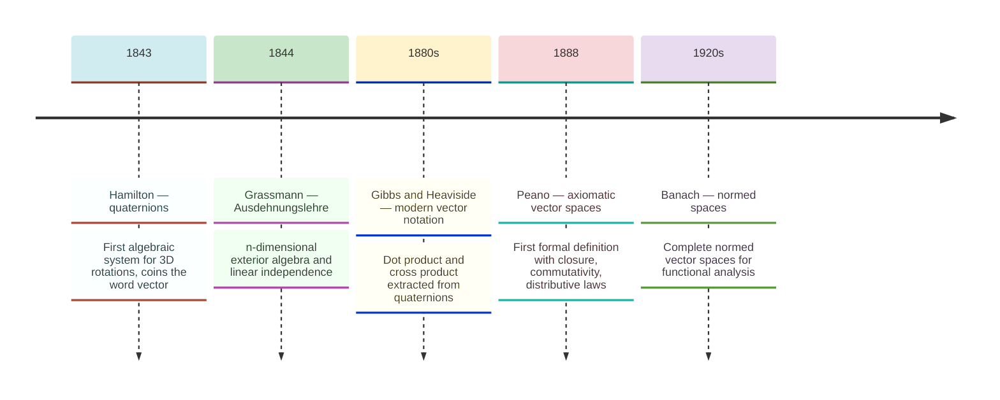
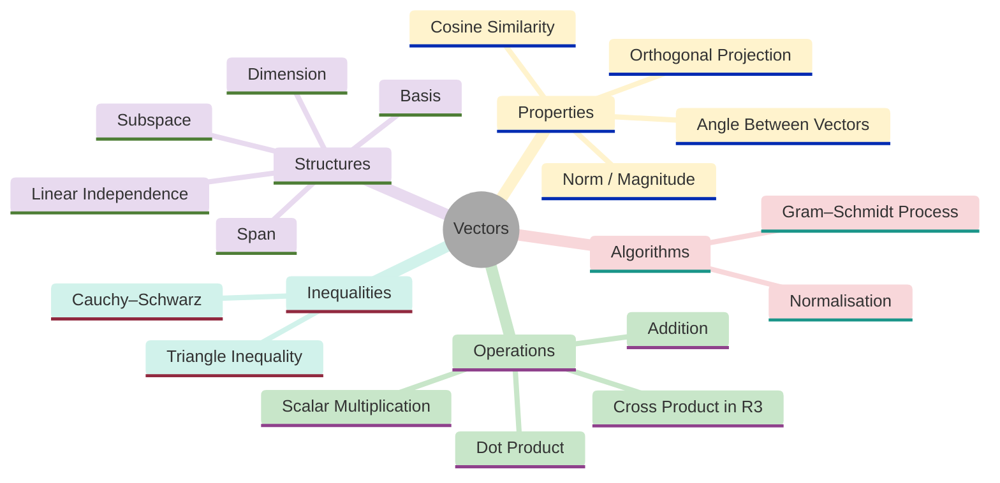
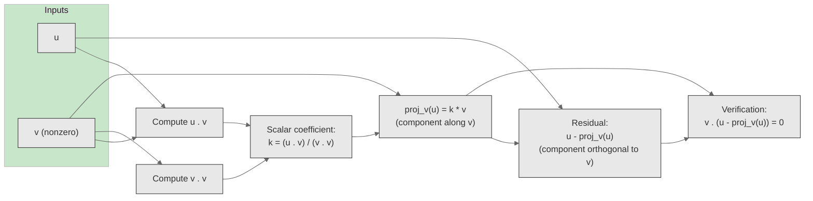
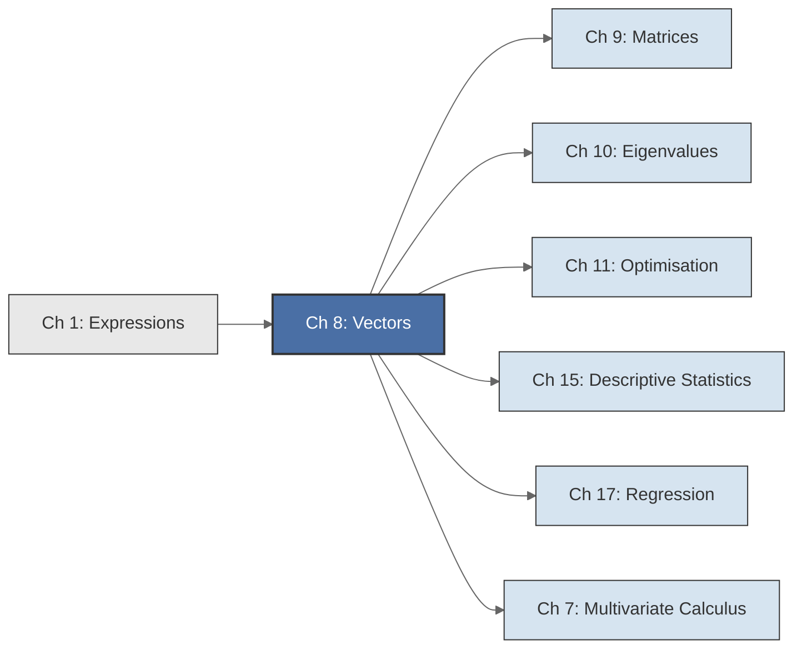

<!-- Copyright (c) 2025-2026 Bob Jansen <bobjansen@pm.me> -->
<!-- SPDX-License-Identifier: CC-BY-NC-4.0 -->
<!-- See LICENSE for full terms. Commercial licensing available. -->
# Chapter 8: Vectors & Vector Spaces


**Part III**: Linear Algebra

> Vectors encode directions, magnitudes, data points, model parameters, portfolio weights and quantum states. The axioms governing their arithmetic apply uniformly across all these domains.

**Prerequisites**: [Chapter 1](01-expressions.md) (Expressions); familiarity with the Evenwicht expression system is helpful for understanding how vector operations are represented and composed, though the mathematical content of this chapter is self-contained.

**Learning Objectives**: After this chapter, the reader will be able to:

1. Perform vector addition and scalar multiplication in $\mathbb{R}^n$ and verify the vector space axioms.
2. Compute dot products, Euclidean norms, angles between vectors and orthogonal projections.
3. Determine whether a set of vectors is linearly independent and whether it forms a basis for a given subspace.
4. State the abstract vector space axioms and recognise examples beyond $\mathbb{R}^n$.
5. Prove and apply the Cauchy–Schwarz inequality and the triangle inequality.
6. Implement vector arithmetic, dot products, norms and projections using the Evenwicht API.

**Connections**: This chapter is used by [Chapter 9](09-matrices.md) (Matrices; a matrix is a linear map between vector spaces), [Chapter 10](10-eigenvalues.md) (Eigenvalues; eigenvectors are special vectors left invariant in direction by a linear map), [Chapter 11](11-unconstrained-optimization.md) (Optimisation; the gradient is a vector, gradient descent moves along vectors), [Chapter 15](15-descriptive-statistics.md) (Descriptive Statistics; covariance as an inner product on the space of random variables) and [Chapter 17](17-regression.md) (Regression; data columns as vectors, the normal equations as a projection). The dot product and norm defined here already appeared informally in [Chapter 7](07-multivariate-calculus.md) (Multivariate Calculus), where the gradient $\nabla f$ and directional derivative $D_\mathbf{u}f = \nabla f \cdot \mathbf{u}$ rely on vector operations; this chapter provides the formal foundations.

---

## Historical Context

**Development of Vector Algebra**



*Figure 8.1: Timeline of key milestones in the development of vector algebra from Hamilton to Banach.*

**Directed quantities and the search for an algebra.** The notion of a directed quantity, something with both magnitude and direction, is ancient. The algebraic formalism for manipulating such quantities is a product of the nineteenth century. Vectors became a standard mathematical tool through competing visions, protracted debates and eventual synthesis.

**Hamilton and the quaternions (1843).** William Rowan Hamilton spent over a decade searching for a way to multiply "triplets" of numbers, extending the algebraic success of complex numbers to three dimensions. On 16 October 1843, while walking along the Royal Canal in Dublin, Hamilton realised that the extension required not three but four components. He carved the fundamental relations $i^2 = j^2 = k^2 = ijk = -1$ into the stone of Brougham Bridge. The resulting system, the *quaternions*, was the first non-commutative algebra and the first rigorous algebraic framework for rotations in three-dimensional space.

Hamilton devoted the remaining 22 years of his life to quaternions, convinced they were the natural language of physics. Within every quaternion $q = a + bi + cj + dk$ there is a scalar part $a$ and a "vector part" $bi + cj + dk$. Hamilton coined the word *vector* (from the Latin *vehere*, to carry) for this directed component.

**Grassmann's Ausdehnungslehre (1844).** Hermann Grassmann published his *Ausdehnungslehre* ("Theory of Extension") in 1844, almost simultaneously and entirely independently. Grassmann's work was more abstract than Hamilton's. He defined operations on arbitrary collections of "extensive quantities" in any number of dimensions and introduced what are now called the exterior product and the concept of linear independence. The *Ausdehnungslehre* was ahead of its time; its philosophical style and lack of concrete examples made it nearly impenetrable to contemporaries. Grassmann's $n$-dimensional vector spaces and exterior algebras were rediscovered and formalised by others long after his death.

**Gibbs, Heaviside and modern vector notation (1880s).** The modern vector notation used in physics and engineering owes more to Josiah Willard Gibbs and Oliver Heaviside than to Hamilton or Grassmann. In the 1880s and 1890s, Gibbs (at Yale) and Heaviside (working independently in England) extracted from quaternions the operations physicists needed: the dot product and the cross product. They discarded the quaternion multiplication rule and the scalar part, retaining only the "vector part" and equipping it with two distinct products. Gibbs distributed his *Elements of Vector Analysis* as an unpublished pamphlet to his students in 1881–1884. Heaviside developed the same notation in his work on electromagnetism. A fierce priority and philosophical dispute with Hamilton's followers (the "quaternionists") followed, but the Gibbs–Heaviside notation won in practice because of its directness and utility.

**Peano, Banach and the axiomatic framework (1888–1920s).** The axiomatic approach to vector spaces originated with Giuseppe Peano, who in his 1888 *Calcolo geometrico* gave the first formal definition of a vector space (which he called a "linear system") over the reals. He listed closure, commutativity, associativity and the distributive laws as axioms. Peano's axiomatisation was refined and generalised throughout the early twentieth century. Stefan Banach's [6] 1920s work on complete normed vector spaces (now called Banach spaces) and the parallel development by David Hilbert [11] and John von Neumann of inner product spaces (Hilbert spaces) gave the theory the generality needed for functional analysis, quantum mechanics and modern probability theory.

**Vectors as the universal language of quantitative science.** In the twenty-first century, vectors are ubiquitous. In machine learning, a data point is a vector in $\mathbb{R}^n$, a trained model's parameters form a vector in $\mathbb{R}^p$ where $p$ can exceed a billion and word embeddings map vocabulary items to dense vectors where geometric proximity encodes semantic similarity. In finance, a portfolio is a vector of asset weights and the covariance matrix ([Chapter 15](15-descriptive-statistics.md)) measures how asset returns co-move in the vector space of random variables. In physics, state vectors in Hilbert spaces underpin quantum mechanics. The universality of vector spaces, the same axioms, the same theorems, the same algorithms, makes linear algebra the common language of quantitative science.

---

## Why This Chapter Matters

**Vector**



*Figure 8.2: Mindmap organises the core concepts of vectors and vector spaces.*

A data point in machine learning is a vector in $\mathbb{R}^n$. A trained model's parameters, the weights and biases of a neural network, form a vector that may have billions of components. A financial portfolio is a vector of asset weights. A quantum state is a vector in a Hilbert space. The word embeddings that power large language models map each token to a dense vector where geometric proximity (measured by the dot product or cosine similarity) encodes semantic similarity. The operations defined in this chapter (addition, scalar multiplication, dot product, norm, projection) are the primitives from which all of linear algebra, optimisation and statistical analysis are built.

The dot product and the Cauchy–Schwarz inequality underpin many applications. The dot product $\mathbf{u} \cdot \mathbf{v} = \sum u_i v_i$ computes cosine similarity between two vectors (after normalisation). This is the standard measure of document similarity in information retrieval, the attention mechanism in transformer architectures and the correlation between two mean-centred random variables (the Pearson correlation coefficient viewed as a dot product on the space of centred random variables). The Cauchy–Schwarz inequality $|\mathbf{u} \cdot \mathbf{v}| \le \|\mathbf{u}\|\|\mathbf{v}\|$ guarantees that the cosine of the angle between two vectors lies in $[-1, 1]$. It provides the triangle inequality for the Euclidean norm and is the foundation of every error bound in approximation theory.

Linear independence and basis, defined formally in this chapter, determine whether a dataset's features carry redundant information (collinearity in regression), whether a system of equations has a unique solution and whether a set of financial assets provides genuine diversification. The Gram–Schmidt process converts any linearly independent set into an orthonormal basis. This is the algorithmic core of the QR factorisation used in numerical linear algebra. Orthogonal projection, projecting $\mathbf{u}$ onto $\mathbf{v}$ via $\operatorname{proj}_\mathbf{v}(\mathbf{u}) = \frac{\mathbf{u} \cdot \mathbf{v}}{\mathbf{v} \cdot \mathbf{v}}\mathbf{v}$, is the geometric operation behind least-squares regression (projecting the observation vector onto the column space of the design matrix), signal denoising (projecting onto a subspace of clean signals) and the decomposition of variance in analysis of variance.

---

## Notation & Conventions

| Symbol | Meaning |
|--------|---------|
| $\mathbf{v}, \mathbf{u}, \mathbf{w}$ | Vectors (boldface lowercase) |
| $v_i$ | The $i$-th component of $\mathbf{v}$ (1-indexed in mathematics, 0-indexed in code) |
| $\mathbf{e}_i$ | The $i$-th standard basis vector: all zeros except a 1 in position $i$ |
| $\mathbf{0}$ | The zero vector $(0, 0, \ldots, 0)$ |
| $\langle \mathbf{u}, \mathbf{v} \rangle$ or $\mathbf{u} \cdot \mathbf{v}$ | Dot product (inner product) of $\mathbf{u}$ and $\mathbf{v}$ |
| $\lVert\mathbf{v}\rVert$ | Euclidean norm of $\mathbf{v}$: $\sqrt{\mathbf{v} \cdot \mathbf{v}}$ |
| $\operatorname{span}\{\mathbf{v}_1, \ldots, \mathbf{v}_k\}$ | The set of all linear combinations of $\mathbf{v}_1, \ldots, \mathbf{v}_k$ |
| $\dim(V)$ | Dimension of the vector space $V$ |
| $\operatorname{proj}_{\mathbf{v}}(\mathbf{u})$ | Orthogonal projection of $\mathbf{u}$ onto $\mathbf{v}$ |
| $\mathbf{u} \perp \mathbf{v}$ | $\mathbf{u}$ is orthogonal to $\mathbf{v}$: $\mathbf{u} \cdot \mathbf{v} = 0$ |
| $c, \alpha, \beta$ | Scalars (real numbers) |
| $V, W$ | Vector spaces |
| $n$ | Dimension of $\mathbb{R}^n$ or length of a vector |
| $\mathbf{u} \times \mathbf{v}$ | Cross product of $\mathbf{u}$ and $\mathbf{v}$ (defined only in $\mathbb{R}^3$) |
| $\delta_{ij}$ | Kronecker delta: $1$ if $i = j$, $0$ if $i \neq j$ |

Throughout this chapter, vectors are treated as column vectors. When a row vector is needed (e.g., for a transpose), this is stated explicitly. Components are 1-indexed in mathematical exposition ($v_1, v_2, \ldots, v_n$) and 0-indexed in implementation (`v[0], v[1], ..., v[n-1]`).

---

## Core Theory

### Concrete Vectors in $\mathbb{R}^n$

**Definition 8.1** (Vector in $\mathbb{R}^n$). A *vector* in $\mathbb{R}^n$ is an ordered $n$-tuple of real numbers ([Chapter 1](01-expressions.md)):

$$\mathbf{v} = \begin{pmatrix} v_1 \\ v_2 \\ \vdots \\ v_n \end{pmatrix} \in \mathbb{R}^n.$$

The number $v_i$ is the $i$-th *component* (or *entry*, or *coordinate*) of $\mathbf{v}$ and $n$ is the *dimension* of the ambient space. A vector in $\mathbb{R}^2$ is a pair, a vector in $\mathbb{R}^3$ is a triple and a vector in $\mathbb{R}^{1000}$ is a list of a thousand real numbers.

The convention in this text is to write vectors as columns. In inline prose, a column vector may be written as $(v_1, v_2, \ldots, v_n)^T$ for compactness, where the superscript $T$ denotes the transpose.

**Definition 8.2** (Vector addition). Let $\mathbf{u}, \mathbf{v} \in \mathbb{R}^n$. The *sum* $\mathbf{u} + \mathbf{v}$ is the vector obtained by adding corresponding components:

$$(\mathbf{u} + \mathbf{v})_i = u_i + v_i, \quad i = 1, 2, \ldots, n.$$

Geometrically, vector addition corresponds to the parallelogram law: placing the tail of $\mathbf{v}$ at the head of $\mathbf{u}$ gives the endpoint of $\mathbf{u} + \mathbf{v}$.

**Definition 8.3** (Scalar multiplication). Let $c \in \mathbb{R}$ and $\mathbf{v} \in \mathbb{R}^n$. The *scalar multiple* $c\mathbf{v}$ is the vector obtained by multiplying every component by $c$:

$$(c\mathbf{v})_i = c \cdot v_i, \quad i = 1, 2, \ldots, n.$$

Geometrically, scalar multiplication scales the length of $\mathbf{v}$ by $|c|$ and reverses its direction when $c < 0$.

**Theorem 8.4** ($\mathbb{R}^n$ is a vector space). The set $\mathbb{R}^n$, equipped with component-wise addition (Definition 8.2) and scalar multiplication (Definition 8.3), satisfies the following ten axioms. A set $V$ with operations $+$ and $\cdot$ satisfying all ten is called a *vector space* over $\mathbb{R}$.

For all $\mathbf{u}, \mathbf{v}, \mathbf{w} \in \mathbb{R}^n$ and all $c, d \in \mathbb{R}$:

1. **Closure under addition**: $\mathbf{u} + \mathbf{v} \in \mathbb{R}^n$.
2. **Closure under scalar multiplication**: $c\mathbf{v} \in \mathbb{R}^n$.
3. **Commutativity of addition**: $\mathbf{u} + \mathbf{v} = \mathbf{v} + \mathbf{u}$.
4. **Associativity of addition**: $(\mathbf{u} + \mathbf{v}) + \mathbf{w} = \mathbf{u} + (\mathbf{v} + \mathbf{w})$.
5. **Additive identity**: There exists a vector $\mathbf{0} = (0, 0, \ldots, 0)^T$ such that $\mathbf{v} + \mathbf{0} = \mathbf{v}$.
6. **Additive inverse**: For every $\mathbf{v}$, there exists $-\mathbf{v}$ such that $\mathbf{v} + (-\mathbf{v}) = \mathbf{0}$.
7. **Distributivity over vector addition**: $c(\mathbf{u} + \mathbf{v}) = c\mathbf{u} + c\mathbf{v}$.
8. **Distributivity over scalar addition**: $(c + d)\mathbf{v} = c\mathbf{v} + d\mathbf{v}$.
9. **Associativity of scalar multiplication**: $c(d\mathbf{v}) = (cd)\mathbf{v}$.
10. **Scalar multiplication identity**: $1 \cdot \mathbf{v} = \mathbf{v}$.

??? note "Proof"

    *Proof sketch.* Each axiom reduces to the corresponding property of real numbers applied component-wise.

    For example, commutativity of addition: $(\mathbf{u} + \mathbf{v})_i = u_i + v_i = v_i + u_i = (\mathbf{v} + \mathbf{u})_i$ for every $i$, by commutativity of real addition.

    The zero vector $\mathbf{0}$ has every component equal to $0$, so $(\mathbf{v} + \mathbf{0})_i = v_i + 0 = v_i$. The additive inverse of $\mathbf{v}$ is $-\mathbf{v} = (-v_1, -v_2, \ldots, -v_n)^T$.

    The remaining axioms follow similarly from the field axioms of $\mathbb{R}$.

    $\square$

Some references list only eight axioms by folding the closure properties (items 1–2) into the definitions of the operations. The numbering is a matter of convention; the content is universal.

### Dot Product and Geometry

**Definition 8.5** (Dot product / inner product). Let $\mathbf{u}, \mathbf{v} \in \mathbb{R}^n$. The *dot product* (also called the *Euclidean inner product* or *standard inner product*) of $\mathbf{u}$ and $\mathbf{v}$ is the scalar

$$\mathbf{u} \cdot \mathbf{v} = \langle \mathbf{u}, \mathbf{v} \rangle = \sum_{i=1}^{n} u_i v_i = u_1 v_1 + u_2 v_2 + \cdots + u_n v_n.$$

The dot product satisfies three fundamental properties:

- *Commutativity*: $\mathbf{u} \cdot \mathbf{v} = \mathbf{v} \cdot \mathbf{u}$.
- *Linearity in each argument*: $(\alpha \mathbf{u} + \beta \mathbf{w}) \cdot \mathbf{v} = \alpha(\mathbf{u} \cdot \mathbf{v}) + \beta(\mathbf{w} \cdot \mathbf{v})$.
- *Positive definiteness*: $\mathbf{v} \cdot \mathbf{v} \geq 0$, with equality if and only if $\mathbf{v} = \mathbf{0}$.

Any function $\langle \cdot, \cdot \rangle : V \times V \to \mathbb{R}$ satisfying these three properties on a vector space $V$ is called an *inner product*, and $(V, \langle \cdot, \cdot \rangle)$ is an *inner product space*.

**Definition 8.6** (Euclidean norm). Let $\mathbf{v} \in \mathbb{R}^n$. The *Euclidean norm* (or *2-norm*, or *norm*) of $\mathbf{v}$ is

$$\lVert\mathbf{v}\rVert = \sqrt{\mathbf{v} \cdot \mathbf{v}} = \sqrt{\sum_{i=1}^{n} v_i^2} = \sqrt{v_1^2 + v_2^2 + \cdots + v_n^2}.$$

The norm measures the "length" or "magnitude" of $\mathbf{v}$. In $\mathbb{R}^2$ and $\mathbb{R}^3$, it coincides with the geometric length via the Pythagorean theorem. A vector with $\lVert\mathbf{v}\rVert = 1$ is called a *unit vector*.

**Theorem 8.7** (Cauchy–Schwarz inequality). For all $\mathbf{u}, \mathbf{v} \in \mathbb{R}^n$,

$$\lvert\mathbf{u} \cdot \mathbf{v}\rvert \leq \lVert\mathbf{u}\rVert \cdot \lVert\mathbf{v}\rVert.$$

Equality holds if and only if $\mathbf{u}$ and $\mathbf{v}$ are linearly dependent (i.e., one is a scalar multiple of the other, or one is the zero vector).

!!! abstract "Key Result"

    **Theorem 8.7** (Cauchy–Schwarz inequality). The dot product is bounded by the product of norms, with equality only for collinear vectors. This inequality underpins the triangle inequality, the definition of angle between vectors and the proof that the gradient maximises the directional derivative.

??? note "Proof"

    *Proof.* If $\mathbf{v} = \mathbf{0}$, both sides are zero and the inequality holds trivially. Assume $\mathbf{v} \neq \mathbf{0}$ and consider the function

    $$q(t) = \lVert\mathbf{u} - t\mathbf{v}\rVert^2 = (\mathbf{u} - t\mathbf{v}) \cdot (\mathbf{u} - t\mathbf{v}).$$

    Expanding by linearity of the dot product:

    $$q(t) = \mathbf{u} \cdot \mathbf{u} - 2t(\mathbf{u} \cdot \mathbf{v}) + t^2(\mathbf{v} \cdot \mathbf{v}) = \lVert\mathbf{u}\rVert^2 - 2t(\mathbf{u} \cdot \mathbf{v}) + t^2\lVert\mathbf{v}\rVert^2.$$

    Since $q(t) = \lVert\mathbf{u} - t\mathbf{v}\rVert^2 \geq 0$ for all $t \in \mathbb{R}$, this quadratic in $t$ is non-negative everywhere. Minimising over $t$ by setting $q'(t) = 0$ gives $t^* = \frac{\mathbf{u} \cdot \mathbf{v}}{\lVert\mathbf{v}\rVert^2}$. Substituting:

    $$0 \leq q(t^*) = \lVert\mathbf{u}\rVert^2 - \frac{(\mathbf{u} \cdot \mathbf{v})^2}{\lVert\mathbf{v}\rVert^2}.$$

    Rearranging:

    $$(\mathbf{u} \cdot \mathbf{v})^2 \leq \lVert\mathbf{u}\rVert^2 \cdot \lVert\mathbf{v}\rVert^2.$$

    Taking square roots of both sides (both sides are non-negative) gives $|\mathbf{u} \cdot \mathbf{v}| \leq \lVert\mathbf{u}\rVert \cdot \lVert\mathbf{v}\rVert$.

    Equality holds if and only if $q(t^*) = 0$, i.e., $\lVert\mathbf{u} - t^*\mathbf{v}\rVert^2 = 0$, which means $\mathbf{u} = t^*\mathbf{v}$. Equality therefore holds precisely when $\mathbf{u}$ is a scalar multiple of $\mathbf{v}$.

    $\square$

The following chart visualises the Cauchy–Schwarz inequality. For two unit vectors $\mathbf{u}$ and $\mathbf{v}$ at angle $\theta$, the absolute value of their dot product $|\mathbf{u} \cdot \mathbf{v}| = |\cos\theta|$ is always at most $\lVert\mathbf{u}\rVert\cdot\lVert\mathbf{v}\rVert = 1$. The chart shows $\cos\theta$ across the full range of angles:

**Dot Product of Unit Vectors as a Function of Angle Between Them**

```mermaid
---
config:
  theme: base
  themeVariables:
    xyChart:
      plotColorPalette: "#2563eb, #dc2626, #16a34a, #9333ea, #ca8a04, #0891b2"
      backgroundColor: "#ffffff"
      titleColor: "#333333"
      xAxisLabelColor: "#333333"
      yAxisLabelColor: "#333333"
      xAxisTitleColor: "#333333"
      yAxisTitleColor: "#333333"
      xAxisLineColor: "#333333"
      yAxisLineColor: "#333333"
---
xychart-beta
    x-axis "angle (degrees)" [0, 30, 60, 90, 120, 150, 180]
    y-axis "cos(θ) = u · v" -1.1 --> 1.1
    line [1.0, 0.866, 0.5, 0, -0.5, -0.866, -1.0]
```

*Figure 8.3: Dot product of unit vectors varies as cosine of the angle between them.*

At $\theta = 0°$ (parallel vectors), $\mathbf{u} \cdot \mathbf{v} = 1 = \lVert\mathbf{u}\rVert\cdot\lVert\mathbf{v}\rVert$ and equality holds in Cauchy–Schwarz. At $\theta = 90°$ (orthogonal), the dot product is 0. At $\theta = 180°$ (antiparallel), $\mathbf{u} \cdot \mathbf{v} = -1$ and $|\mathbf{u} \cdot \mathbf{v}| = 1 = \lVert\mathbf{u}\rVert\cdot\lVert\mathbf{v}\rVert$, so equality holds again. For all intermediate angles, $|\cos\theta| < 1$, demonstrating the strict inequality.

**Theorem 8.8** (Triangle inequality). For all $\mathbf{u}, \mathbf{v} \in \mathbb{R}^n$,

$$\lVert\mathbf{u} + \mathbf{v}\rVert \leq \lVert\mathbf{u}\rVert + \lVert\mathbf{v}\rVert.$$

??? note "Proof"

    *Proof.* Squaring both sides (both are non-negative):

    $$\lVert\mathbf{u} + \mathbf{v}\rVert^2 = (\mathbf{u} + \mathbf{v}) \cdot (\mathbf{u} + \mathbf{v}) = \lVert\mathbf{u}\rVert^2 + 2(\mathbf{u} \cdot \mathbf{v}) + \lVert\mathbf{v}\rVert^2.$$

    By the Cauchy–Schwarz inequality (Theorem 8.7), $\mathbf{u} \cdot \mathbf{v} \leq |\mathbf{u} \cdot \mathbf{v}| \leq \lVert\mathbf{u}\rVert \cdot \lVert\mathbf{v}\rVert$. Therefore:

    $$\lVert\mathbf{u} + \mathbf{v}\rVert^2 \leq \lVert\mathbf{u}\rVert^2 + 2\lVert\mathbf{u}\rVert\cdot\lVert\mathbf{v}\rVert + \lVert\mathbf{v}\rVert^2 = (\lVert\mathbf{u}\rVert + \lVert\mathbf{v}\rVert)^2.$$

    Taking square roots: $\lVert\mathbf{u} + \mathbf{v}\rVert \leq \lVert\mathbf{u}\rVert + \lVert\mathbf{v}\rVert$.

    $\square$

The triangle inequality says that the direct path from the origin to $\mathbf{u} + \mathbf{v}$ is never longer than the path that goes first to $\mathbf{u}$ and then to $\mathbf{u} + \mathbf{v}$. It is the formal statement that "the shortest distance between two points is a straight line" in $\mathbb{R}^n$.

**Definition 8.9** (Angle between vectors). Let $\mathbf{u}, \mathbf{v} \in \mathbb{R}^n$ be nonzero vectors. The *angle* $\theta$ between $\mathbf{u}$ and $\mathbf{v}$ is defined by

$$\cos \theta = \frac{\mathbf{u} \cdot \mathbf{v}}{\lVert\mathbf{u}\rVert \cdot \lVert\mathbf{v}\rVert}, \quad \theta \in [0, \pi].$$

This definition is well-posed because the Cauchy–Schwarz inequality guarantees that the right-hand side lies in $[-1, 1]$, the range of cosine on $[0, \pi]$. In $\mathbb{R}^2$ and $\mathbb{R}^3$, this formula agrees with the geometric angle. In $\mathbb{R}^n$ for $n > 3$, it provides a meaningful generalisation: $\theta = 0$ means the vectors point in the same direction, $\theta = \pi$ means opposite directions and $\theta = \pi/2$ means orthogonality.

**Remark 8.10** (Cosine similarity). The *cosine similarity* of two nonzero vectors $\mathbf{u}, \mathbf{v} \in \mathbb{R}^n$ is the quantity

$$\operatorname{sim}(\mathbf{u}, \mathbf{v}) = \frac{\mathbf{u} \cdot \mathbf{v}}{\lVert\mathbf{u}\rVert \cdot \lVert\mathbf{v}\rVert} = \cos\theta,$$

where $\theta$ is the angle between the vectors (Definition 8.9). Cosine similarity ranges over $[-1, 1]$: the value $1$ indicates identical direction, $0$ indicates orthogonality and $-1$ indicates opposite direction. It is the standard similarity measure in information retrieval (comparing document or word-embedding vectors) and in transformer attention mechanisms.

**Definition 8.11** (Orthogonality). Two vectors $\mathbf{u}, \mathbf{v} \in \mathbb{R}^n$ are *orthogonal* (written $\mathbf{u} \perp \mathbf{v}$) if $\mathbf{u} \cdot \mathbf{v} = 0$.

Orthogonality is the generalisation of perpendicularity to arbitrary dimensions. By convention, the zero vector is orthogonal to every vector.

**Definition 8.12** (Projection). Let $\mathbf{u}, \mathbf{v} \in \mathbb{R}^n$ with $\mathbf{v} \neq \mathbf{0}$. The *orthogonal projection* of $\mathbf{u}$ onto $\mathbf{v}$ is the vector

$$\operatorname{proj}_{\mathbf{v}}(\mathbf{u}) = \frac{\mathbf{u} \cdot \mathbf{v}}{\mathbf{v} \cdot \mathbf{v}} \, \mathbf{v}.$$

The scalar $\frac{\mathbf{u} \cdot \mathbf{v}}{\mathbf{v} \cdot \mathbf{v}}$ is called the *scalar projection coefficient*. The projection $\operatorname{proj}_{\mathbf{v}}(\mathbf{u})$ is the unique vector along $\mathbf{v}$ such that $\mathbf{u} - \operatorname{proj}_{\mathbf{v}}(\mathbf{u})$ is orthogonal to $\mathbf{v}$. To verify:

$$\left(\mathbf{u} - \operatorname{proj}_{\mathbf{v}}(\mathbf{u})\right) \cdot \mathbf{v} = \mathbf{u} \cdot \mathbf{v} - \frac{\mathbf{u} \cdot \mathbf{v}}{\mathbf{v} \cdot \mathbf{v}}(\mathbf{v} \cdot \mathbf{v}) = \mathbf{u} \cdot \mathbf{v} - \mathbf{u} \cdot \mathbf{v} = 0.$$

Geometrically, $\operatorname{proj}_{\mathbf{v}}(\mathbf{u})$ is the "shadow" of $\mathbf{u}$ onto the line through $\mathbf{v}$. This decomposition, $\mathbf{u} = \operatorname{proj}_{\mathbf{v}}(\mathbf{u}) + (\mathbf{u} - \operatorname{proj}_{\mathbf{v}}(\mathbf{u}))$, splits $\mathbf{u}$ into a component along $\mathbf{v}$ and a component orthogonal to $\mathbf{v}$. It reappears in regression ([Chapter 17](17-regression.md)), where the fitted values are the projection of the response vector onto the column space of the design matrix.

**Vector Projection Decomposition**



*Figure 8.4: Flowchart decomposes vector projection into parallel and orthogonal components.*

### Cross Product in $\mathbb{R}^3$

**Definition 8.13** (Cross product). Let $\mathbf{u} = (u_1, u_2, u_3)^T$ and $\mathbf{v} = (v_1, v_2, v_3)^T$ be vectors in $\mathbb{R}^3$. The *cross product* $\mathbf{u} \times \mathbf{v}$ is the vector in $\mathbb{R}^3$ defined by the determinant expansion

$$\mathbf{u} \times \mathbf{v} = \begin{vmatrix} \mathbf{e}_1 & \mathbf{e}_2 & \mathbf{e}_3 \\ u_1 & u_2 & u_3 \\ v_1 & v_2 & v_3 \end{vmatrix} = \begin{pmatrix} u_2 v_3 - u_3 v_2 \\ u_3 v_1 - u_1 v_3 \\ u_1 v_2 - u_2 v_1 \end{pmatrix}.$$

The cross product satisfies the following key properties:

- *Anticommutativity*: $\mathbf{u} \times \mathbf{v} = -(\mathbf{v} \times \mathbf{u})$.
- *Orthogonality*: $(\mathbf{u} \times \mathbf{v}) \cdot \mathbf{u} = 0$ and $(\mathbf{u} \times \mathbf{v}) \cdot \mathbf{v} = 0$; the cross product is orthogonal to both factors.
- *Magnitude*: $\lVert\mathbf{u} \times \mathbf{v}\rVert = \lVert\mathbf{u}\rVert\,\lVert\mathbf{v}\rVert\sin\theta$, where $\theta \in [0, \pi]$ is the angle between $\mathbf{u}$ and $\mathbf{v}$. This magnitude equals the area of the parallelogram spanned by $\mathbf{u}$ and $\mathbf{v}$.
- *Zero when parallel*: $\mathbf{u} \times \mathbf{v} = \mathbf{0}$ if and only if $\mathbf{u}$ and $\mathbf{v}$ are linearly dependent (parallel or antiparallel).

!!! note "The cross product exists only in three and seven dimensions"

    A bilinear product $\mathbb{R}^n \times \mathbb{R}^n \to \mathbb{R}^n$ that is orthogonal to both inputs and has magnitude $\lVert\mathbf{u}\rVert\,\lVert\mathbf{v}\rVert\sin\theta$ exists only for $n = 3$ and $n = 7$. The $n = 7$ case arises from the octonion algebra and is rarely used in practice.

The cross product is defined only in $\mathbb{R}^3$ (and $\mathbb{R}^7$ via the octonions, though that generalisation is rarely used). It arises in physics as the torque $\boldsymbol{\tau} = \mathbf{r} \times \mathbf{F}$, angular momentum $\mathbf{L} = \mathbf{r} \times \mathbf{p}$ and in computing normal vectors to surfaces.

### Linear Independence and Basis

**Definition 8.14** (Linear combination). Let $\mathbf{v}_1, \mathbf{v}_2, \ldots, \mathbf{v}_k \in \mathbb{R}^n$ be vectors and let $c_1, c_2, \ldots, c_k \in \mathbb{R}$ be scalars. The vector

$$c_1 \mathbf{v}_1 + c_2 \mathbf{v}_2 + \cdots + c_k \mathbf{v}_k$$

is a *linear combination* of $\mathbf{v}_1, \ldots, \mathbf{v}_k$ with *coefficients* $c_1, \ldots, c_k$.

**Definition 8.15** (Span). The *span* of a set of vectors $\{\mathbf{v}_1, \ldots, \mathbf{v}_k\}$ is the set of all linear combinations of those vectors:

$$\operatorname{span}\{\mathbf{v}_1, \ldots, \mathbf{v}_k\} = \{c_1 \mathbf{v}_1 + c_2 \mathbf{v}_2 + \cdots + c_k \mathbf{v}_k : c_1, \ldots, c_k \in \mathbb{R}\}.$$

The span is always a subspace of $\mathbb{R}^n$: it contains $\mathbf{0}$ (set all $c_i = 0$) and is closed under addition and scalar multiplication. In $\mathbb{R}^3$, a single nonzero vector spans a line through the origin; two linearly independent vectors span a plane through the origin.

**Definition 8.16** (Linear independence). A set of vectors $\{\mathbf{v}_1, \mathbf{v}_2, \ldots, \mathbf{v}_k\}$ is *linearly independent* if the only solution to

$$c_1 \mathbf{v}_1 + c_2 \mathbf{v}_2 + \cdots + c_k \mathbf{v}_k = \mathbf{0}$$

is $c_1 = c_2 = \cdots = c_k = 0$ (the trivial solution). If a nontrivial solution exists, the set is *linearly dependent*.

Linear dependence means that at least one vector in the set can be written as a linear combination of the others; it is "redundant." Linear independence means that no vector in the set is redundant; each one contributes a genuinely new direction.

**Definition 8.17** (Basis). A set $\mathcal{B} = \{\mathbf{v}_1, \ldots, \mathbf{v}_k\}$ is a *basis* for a vector space $V$ if:

1. $\mathcal{B}$ spans $V$: every vector in $V$ is a linear combination of $\mathbf{v}_1, \ldots, \mathbf{v}_k$.
2. $\mathcal{B}$ is linearly independent.

The *standard basis* for $\mathbb{R}^n$ is $\{\mathbf{e}_1, \mathbf{e}_2, \ldots, \mathbf{e}_n\}$, where $\mathbf{e}_i$ has a 1 in position $i$ and 0 elsewhere. Every vector $\mathbf{v} = (v_1, \ldots, v_n)^T$ can be written uniquely as $\mathbf{v} = v_1 \mathbf{e}_1 + v_2 \mathbf{e}_2 + \cdots + v_n \mathbf{e}_n$.

**Theorem 8.18** (Dimension). Every basis for a finite-dimensional vector space $V$ has the same number of elements. This number is called the *dimension* of $V$, written $\dim(V)$.

??? note "Proof"

    *Proof sketch.* Suppose $\mathcal{B}_1 = \{\mathbf{u}_1, \ldots, \mathbf{u}_m\}$ and $\mathcal{B}_2 = \{\mathbf{w}_1, \ldots, \mathbf{w}_p\}$ are both bases for $V$.

    Since $\mathcal{B}_1$ spans $V$ and $\mathcal{B}_2$ is linearly independent, the Steinitz exchange lemma guarantees $p \leq m$. By symmetry (swapping the roles of $\mathcal{B}_1$ and $\mathcal{B}_2$), $m \leq p$.

    It follows that $m = p$.

    $\square$

The dimension of $\mathbb{R}^n$ is $n$ (the standard basis has $n$ elements). This theorem ensures that dimension is an intrinsic property of the space, not an artefact of which basis is chosen.

**Definition 8.19** (Subspace). A *subspace* of a vector space $V$ is a nonempty subset $W \subseteq V$ that is closed under addition and scalar multiplication: for all $\mathbf{u}, \mathbf{v} \in W$ and $c \in \mathbb{R}$, both $\mathbf{u} + \mathbf{v} \in W$ and $c\mathbf{u} \in W$.

Every subspace contains $\mathbf{0}$ (take $c = 0$). The subspaces of $\mathbb{R}^3$ are: $\{\mathbf{0}\}$ (dimension 0), all lines through the origin (dimension 1), all planes through the origin (dimension 2) and $\mathbb{R}^3$ itself (dimension 3). A set that does not pass through the origin (e.g., a plane $x + y + z = 1$) is *not* a subspace.

### Orthogonality and Orthonormal Bases

**Definition 8.20** (Orthogonal set). A set of vectors $\{\mathbf{v}_1, \ldots, \mathbf{v}_k\}$ is *orthogonal* if every pair of distinct vectors is orthogonal: $\mathbf{v}_i \cdot \mathbf{v}_j = 0$ for all $i \neq j$.

**Definition 8.21** (Orthonormal set and orthonormal basis). A set of vectors $\{\mathbf{v}_1, \ldots, \mathbf{v}_k\}$ is *orthonormal* if it is orthogonal and every vector has unit norm: $\lVert\mathbf{v}_i\rVert = 1$ for all $i$. Equivalently, $\mathbf{v}_i \cdot \mathbf{v}_j = \delta_{ij}$, where $\delta_{ij}$ is the Kronecker delta (1 if $i = j$, 0 otherwise). An orthonormal set that is also a basis is an *orthonormal basis*.

The standard basis $\{\mathbf{e}_1, \ldots, \mathbf{e}_n\}$ is orthonormal. Orthonormal bases simplify many computations: if $\{\mathbf{q}_1, \ldots, \mathbf{q}_n\}$ is an orthonormal basis, then the coefficients of any vector $\mathbf{v}$ in this basis are the dot products $c_i = \mathbf{v} \cdot \mathbf{q}_i$, with no system of equations to solve.

**Theorem 8.22** (Gram–Schmidt process). Let $\{\mathbf{v}_1, \mathbf{v}_2, \ldots, \mathbf{v}_k\}$ be a linearly independent set of vectors in $\mathbb{R}^n$. The Gram–Schmidt process produces an orthonormal set $\{\mathbf{q}_1, \mathbf{q}_2, \ldots, \mathbf{q}_k\}$ that spans the same subspace.

The algorithm proceeds as follows:

1. $\mathbf{w}_1 = \mathbf{v}_1$, $\quad \mathbf{q}_1 = \mathbf{w}_1 / \lVert\mathbf{w}_1\rVert$.
2. For $j = 2, 3, \ldots, k$:

$$\mathbf{w}_j = \mathbf{v}_j - \sum_{i=1}^{j-1} (\mathbf{v}_j \cdot \mathbf{q}_i)\,\mathbf{q}_i, \qquad \mathbf{q}_j = \frac{\mathbf{w}_j}{\lVert\mathbf{w}_j\rVert}.$$

Each $\mathbf{w}_j$ is formed by subtracting from $\mathbf{v}_j$ its projections onto $\mathbf{q}_1, \ldots, \mathbf{q}_{j-1}$, leaving only the component orthogonal to the previously constructed vectors. The linear independence of the original set guarantees that $\mathbf{w}_j \neq \mathbf{0}$ at every step, so the normalisation is well-defined.

??? note "Proof"

    *Proof sketch.* Proceed by induction on $j$. The base case $j = 1$ is immediate: $\mathbf{q}_1 = \mathbf{v}_1 / \lVert\mathbf{v}_1\rVert$ is a unit vector spanning the same one-dimensional subspace.

    For the inductive step, assume $\{\mathbf{q}_1, \ldots, \mathbf{q}_{j-1}\}$ is orthonormal and spans the same subspace as $\{\mathbf{v}_1, \ldots, \mathbf{v}_{j-1}\}$. The vector

    $$\mathbf{w}_j = \mathbf{v}_j - \sum_{i=1}^{j-1}(\mathbf{v}_j \cdot \mathbf{q}_i)\mathbf{q}_i$$

    satisfies $\mathbf{w}_j \cdot \mathbf{q}_m = \mathbf{v}_j \cdot \mathbf{q}_m - (\mathbf{v}_j \cdot \mathbf{q}_m)(\mathbf{q}_m \cdot \mathbf{q}_m) = 0$ for each $m < j$ (using orthonormality).

    Since the original vectors are linearly independent, $\mathbf{v}_j \notin \operatorname{span}\{\mathbf{v}_1, \ldots, \mathbf{v}_{j-1}\}$, so $\mathbf{w}_j \neq \mathbf{0}$ and $\mathbf{q}_j = \mathbf{w}_j / \lVert\mathbf{w}_j\rVert$ is well-defined with $\lVert\mathbf{q}_j\rVert = 1$.

    The span is preserved because each $\mathbf{q}_j$ is a linear combination of $\mathbf{v}_1, \ldots, \mathbf{v}_j$ and vice versa.

    $\square$

**Remark 8.23** (Abstract vector spaces). The ten axioms in Theorem 8.4 define a vector space abstractly; there is no requirement that elements be $n$-tuples of numbers. The set $C[a,b]$ of continuous real-valued functions on $[a,b]$ is a vector space under pointwise addition and scalar multiplication. The set of polynomials of degree at most $n$ is a vector space of dimension $n + 1$. The set of $m \times n$ matrices is a vector space of dimension $mn$. In each case, the same axioms hold and theorems proved from the axioms (Cauchy–Schwarz, Gram–Schmidt, dimension) apply universally.

This abstraction is what gives linear algebra its broad applicability. When a data scientist says "the data lives in a 784-dimensional space" (handwritten digit images of 28 $\times$ 28 pixels), or a quantum physicist says "the state lies in a Hilbert space," they are invoking the same axiomatic framework.

---

## Formulas & Identities

### Dot Product Properties

**F8.1** (Commutativity)

$$\mathbf{u} \cdot \mathbf{v} = \mathbf{v} \cdot \mathbf{u}.$$

**F8.2** (Linearity)

$$(\alpha\mathbf{u} + \beta\mathbf{w}) \cdot \mathbf{v} = \alpha(\mathbf{u} \cdot \mathbf{v}) + \beta(\mathbf{w} \cdot \mathbf{v}).$$

**F8.3** (Positive definiteness)

$$\mathbf{v} \cdot \mathbf{v} \geq 0, \quad \text{with } \mathbf{v} \cdot \mathbf{v} = 0 \text{ iff } \mathbf{v} = \mathbf{0}.$$

### Norm Properties

**F8.4** (Non-negativity)

$$\lVert\mathbf{v}\rVert \geq 0, \quad \text{with } \lVert\mathbf{v}\rVert = 0 \text{ iff } \mathbf{v} = \mathbf{0}.$$

**F8.5** (Homogeneity)

$$\lVert c\mathbf{v}\rVert = |c| \cdot \lVert\mathbf{v}\rVert \quad \text{for any scalar } c.$$

**F8.6** (Triangle inequality)

$$\lVert\mathbf{u} + \mathbf{v}\rVert \leq \lVert\mathbf{u}\rVert + \lVert\mathbf{v}\rVert.$$

### Fundamental Inequalities

**F8.7** (Cauchy–Schwarz)

$$|\mathbf{u} \cdot \mathbf{v}| \leq \lVert\mathbf{u}\rVert \cdot \lVert\mathbf{v}\rVert.$$

**F8.8** (Reverse triangle inequality)

$$\lvert \lVert\mathbf{u}\rVert - \lVert\mathbf{v}\rVert \rvert \leq \lVert\mathbf{u} - \mathbf{v}\rVert.$$

### Projection

**F8.9** (Projection formula)

$$\operatorname{proj}_{\mathbf{v}}(\mathbf{u}) = \frac{\mathbf{u} \cdot \mathbf{v}}{\mathbf{v} \cdot \mathbf{v}}\,\mathbf{v}.$$

**F8.10** (Scalar projection)

$$\text{Signed length of the projection} = \frac{\mathbf{u} \cdot \mathbf{v}}{\lVert\mathbf{v}\rVert}.$$

### Parallelogram Law

**F8.11** (Parallelogram law)

$$\lVert\mathbf{u} + \mathbf{v}\rVert^2 + \lVert\mathbf{u} - \mathbf{v}\rVert^2 = 2\lVert\mathbf{u}\rVert^2 + 2\lVert\mathbf{v}\rVert^2.$$

This identity holds in any inner product space. It states that the sum of the squares of the diagonals of a parallelogram equals the sum of the squares of its four sides. To verify: expand both norms using the dot product and observe that the cross terms $+2(\mathbf{u}\cdot\mathbf{v})$ and $-2(\mathbf{u}\cdot\mathbf{v})$ cancel when added.

### Polarisation Identity

**F8.12** (Polarisation identity)

$$\mathbf{u} \cdot \mathbf{v} = \frac{1}{4}\left(\lVert\mathbf{u} + \mathbf{v}\rVert^2 - \lVert\mathbf{u} - \mathbf{v}\rVert^2\right).$$

This identity recovers the inner product from the norm, showing that the two concepts are equivalent in real vector spaces.

### Pythagorean Theorem

**F8.13** (Pythagorean theorem)

$$\mathbf{u} \perp \mathbf{v} \implies \lVert\mathbf{u} + \mathbf{v}\rVert^2 = \lVert\mathbf{u}\rVert^2 + \lVert\mathbf{v}\rVert^2.$$

---

## Algorithms

### Algorithm 8.24: Vector Addition

**Input**: Vectors $\mathbf{u}, \mathbf{v} \in \mathbb{R}^n$ (as contiguous double-precision arrays of length $n$).

**Output**: Vector $\mathbf{u} + \mathbf{v} \in \mathbb{R}^n$.

```
function vectorAdd(u, v):
    require u.length == v.length
    n = u.length
    result = new array of length n
    for i = 0 to n-1:
        result[i] = u[i] + v[i]
    return result
```

**Complexity**: $O(n)$ time, $O(n)$ space.

**Numerical notes**: Each addition involves at most one rounding error of magnitude $\leq \varepsilon_{\text{mach}} |u_i + v_i|$. No stability concerns.

### Algorithm 8.25: Scalar Multiplication

**Input**: Scalar $c \in \mathbb{R}$, vector $\mathbf{v} \in \mathbb{R}^n$.

**Output**: Vector $c\mathbf{v} \in \mathbb{R}^n$.

```
function vectorScale(c, v):
    n = v.length
    result = new array of length n
    for i = 0 to n-1:
        result[i] = c * v[i]
    return result
```

**Complexity**: $O(n)$ time, $O(n)$ space.

### Algorithm 8.26: Dot Product

**Input**: Vectors $\mathbf{u}, \mathbf{v} \in \mathbb{R}^n$.

**Output**: Scalar $\mathbf{u} \cdot \mathbf{v}$.

```
function dot(u, v):
    require u.length == v.length
    n = u.length
    sum = 0
    for i = 0 to n-1:
        sum = sum + u[i] * v[i]
    return sum
```

**Complexity**: $O(n)$ time, $O(1)$ auxiliary space.

**Numerical notes**: The naive summation accumulates rounding errors; the worst-case error is $O(n\varepsilon_{\text{mach}})$ times the sum of $|u_i v_i|$. For most practical vectors this is acceptable. For high-accuracy requirements, Kahan compensated summation reduces the error to $O(\varepsilon_{\text{mach}})$ independent of $n$, at the cost of roughly $4\times$ the arithmetic.

### Algorithm 8.27: Euclidean Norm

**Input**: Vector $\mathbf{v} \in \mathbb{R}^n$.

**Output**: Scalar $\lVert\mathbf{v}\rVert$.

```
function norm(v):
    n = v.length
    if n == 0: return 0
    // Scaled computation to avoid overflow/underflow
    maxVal = 0
    for i = 0 to n-1:
        if abs(v[i]) > maxVal:
            maxVal = abs(v[i])
    if maxVal == 0: return 0
    sum = 0
    for i = 0 to n-1:
        t = v[i] / maxVal
        sum = sum + t * t
    return maxVal * sqrt(sum)
```

**Complexity**: $O(n)$ time (two passes), $O(1)$ auxiliary space.

**Numerical stability**: The naive formula $\sqrt{\sum v_i^2}$ can overflow to $\infty$ even when the true norm is representable. For example, if $v_i = 10^{200}$ for two components, then $v_i^2 = 10^{400}$ overflows (the maximum double is approximately $1.8 \times 10^{308}$), but $\lVert\mathbf{v}\rVert = 10^{200}\sqrt{2} \approx 1.41 \times 10^{200}$ is perfectly representable. The scaled algorithm above divides by the maximum absolute component before squaring, avoiding overflow. Standard implementations of the hypot function use a similar technique internally.

### Algorithm 8.28: Projection

**Input**: Vectors $\mathbf{u}, \mathbf{v} \in \mathbb{R}^n$ with $\mathbf{v} \neq \mathbf{0}$.

**Output**: Vector $\operatorname{proj}_{\mathbf{v}}(\mathbf{u})$.

```
function projection(u, v):
    require u.length == v.length
    uv = dot(u, v)       // one dot product: O(n)
    vv = dot(v, v)       // one dot product: O(n)
    require vv != 0       // v must be nonzero
    scale = uv / vv
    return vectorScale(scale, v)  // O(n)
```

**Complexity**: $O(n)$ time (two dot products plus one scalar multiplication), $O(n)$ space.

---

## Numerical Considerations

### Overflow in Norm Computation

!!! warning "Overflow and underflow in naive norm computation"

    The naive formula $\sqrt{\sum v_i^2}$ overflows when any $v_i^2$ exceeds approximately $1.8 \times 10^{308}$ and underflows to zero when all $v_i^2$ fall below approximately $5 \times 10^{-324}$. In both cases the true norm may be perfectly representable. Always scale by the maximum absolute component before squaring (Algorithm 8.27).

As noted in Algorithm 8.27, the naive norm computation $\sqrt{\sum v_i^2}$ can overflow even when the answer is representable. The same issue arises in reverse: if all components are very small (e.g., $v_i = 10^{-200}$), then $v_i^2 = 10^{-400}$ underflows to 0 (the minimum positive double is approximately $5 \times 10^{-324}$) and the computed norm is incorrectly zero. The scaled algorithm (divide by the maximum absolute component) handles both overflow and underflow.

### Near-Zero Dot Products and Numerical Orthogonality

Two vectors may be "nearly orthogonal" in exact arithmetic but yield a small nonzero dot product due to floating-point rounding, or conversely, may not be exactly orthogonal but have a dot product that rounds to zero. When testing for orthogonality in code, a tolerance check is more appropriate than an exact zero comparison:

$$\lvert\mathbf{u} \cdot \mathbf{v}\rvert < \varepsilon \cdot \lVert\mathbf{u}\rVert \cdot \lVert\mathbf{v}\rVert$$

for some small $\varepsilon$ (e.g., $\varepsilon = 10^{-12}$). This relative test is scale-invariant: multiplying both vectors by a constant does not change whether they pass the test.

!!! tip "Testing orthogonality in floating-point arithmetic"

    Never compare a dot product to exact zero. Use the relative test $\lvert\mathbf{u} \cdot \mathbf{v}\rvert < \varepsilon \,\lVert\mathbf{u}\rVert\,\lVert\mathbf{v}\rVert$ with $\varepsilon \approx 10^{-12}$ for double precision. This threshold tolerates rounding while rejecting genuinely non-orthogonal vectors.

### Catastrophic Cancellation in Vector Subtraction

!!! warning "Catastrophic cancellation in near-equal subtraction"

    Subtracting two nearly equal vectors loses most correct digits. If $\mathbf{u}$ and $\mathbf{v}$ agree to 15 decimal places, the difference $\mathbf{u} - \mathbf{v}$ may retain only one or two correct digits. The norm of such a difference is correspondingly unreliable.

Subtracting two nearly equal vectors $\mathbf{u} \approx \mathbf{v}$ can result in catastrophic cancellation: the leading digits cancel, and the result is dominated by rounding errors in the trailing digits. For example, if $\mathbf{u} = (1.000000000000001, 2.000000000000003)^T$ and $\mathbf{v} = (1.000000000000000, 2.000000000000001)^T$, the difference $\mathbf{u} - \mathbf{v}$ has at most 1–2 correct digits. The norm of this difference is correspondingly inaccurate. This phenomenon is unavoidable in floating-point arithmetic; awareness of it is necessary when interpreting results that involve small differences of large quantities.

### Accumulation Errors in Gram–Schmidt

The classical Gram–Schmidt process (Theorem 8.22) is numerically unstable: rounding errors cause the computed vectors to lose orthogonality progressively, especially when the input vectors are nearly linearly dependent. The *modified Gram–Schmidt* algorithm addresses this by recomputing projections against the already-orthogonalised vectors at each step rather than the original vectors. In exact arithmetic the two algorithms are equivalent; in floating-point arithmetic, modified Gram–Schmidt maintains substantially better orthogonality. Full implementation is deferred to the matrix decomposition chapter ([Chapter 9](09-matrices.md)).

---

## Worked Examples

### Example 8.29: Vector Addition and Scalar Multiplication in $\mathbb{R}^3$

**Problem**: Let $\mathbf{u} = (1, 2, 3)^T$ and $\mathbf{v} = (4, -1, 2)^T$. Compute $\mathbf{u} + \mathbf{v}$, $3\mathbf{u}$ and $2\mathbf{u} - \mathbf{v}$.

**Solution (manual)**:

Vector addition is component-wise:

$$\mathbf{u} + \mathbf{v} = \begin{pmatrix} 1 + 4 \\ 2 + (-1) \\ 3 + 2 \end{pmatrix} = \begin{pmatrix} 5 \\ 1 \\ 5 \end{pmatrix}.$$

Scalar multiplication scales every component:

$$3\mathbf{u} = \begin{pmatrix} 3 \cdot 1 \\ 3 \cdot 2 \\ 3 \cdot 3 \end{pmatrix} = \begin{pmatrix} 3 \\ 6 \\ 9 \end{pmatrix}.$$

The expression $2\mathbf{u} - \mathbf{v}$ combines both operations:

$$2\mathbf{u} - \mathbf{v} = \begin{pmatrix} 2 \cdot 1 - 4 \\ 2 \cdot 2 - (-1) \\ 2 \cdot 3 - 2 \end{pmatrix} = \begin{pmatrix} -2 \\ 5 \\ 4 \end{pmatrix}.$$

### Example 8.30: Dot Product, Norm and Angle Between Two Vectors

**Problem**: Let $\mathbf{u} = (1, 2, 3)^T$ and $\mathbf{v} = (4, -1, 2)^T$. Compute $\mathbf{u} \cdot \mathbf{v}$, $\lVert\mathbf{u}\rVert$, $\lVert\mathbf{v}\rVert$ and the angle $\theta$ between them.

**Solution (manual)**:

The dot product:

$$\mathbf{u} \cdot \mathbf{v} = 1 \cdot 4 + 2 \cdot (-1) + 3 \cdot 2 = 4 - 2 + 6 = 8.$$

The norms:

$$\lVert\mathbf{u}\rVert = \sqrt{1^2 + 2^2 + 3^2} = \sqrt{1 + 4 + 9} = \sqrt{14} \approx 3.7417.$$

$$\lVert\mathbf{v}\rVert = \sqrt{4^2 + (-1)^2 + 2^2} = \sqrt{16 + 1 + 4} = \sqrt{21} \approx 4.5826.$$

The angle:

$$\cos \theta = \frac{\mathbf{u} \cdot \mathbf{v}}{\lVert\mathbf{u}\rVert \cdot \lVert\mathbf{v}\rVert} = \frac{8}{\sqrt{14} \cdot \sqrt{21}} = \frac{8}{\sqrt{294}} \approx \frac{8}{17.1464} \approx 0.4666.$$

$$\theta = \arccos(0.4666) \approx 1.0854 \text{ radians} \approx 62.19°.$$

The vectors are neither parallel nor orthogonal; they meet at an acute angle of approximately $62°$.

### Example 8.31: Projection with Geometric Interpretation

**Problem**: Let $\mathbf{u} = (3, 4)^T$ and $\mathbf{v} = (1, 0)^T$. Compute $\operatorname{proj}_{\mathbf{v}}(\mathbf{u})$ and verify orthogonality of the residual.

**Solution (manual)**:

The projection formula gives:

$$\operatorname{proj}_{\mathbf{v}}(\mathbf{u}) = \frac{\mathbf{u} \cdot \mathbf{v}}{\mathbf{v} \cdot \mathbf{v}} \, \mathbf{v} = \frac{3 \cdot 1 + 4 \cdot 0}{1 \cdot 1 + 0 \cdot 0} \begin{pmatrix} 1 \\ 0 \end{pmatrix} = \frac{3}{1} \begin{pmatrix} 1 \\ 0 \end{pmatrix} = \begin{pmatrix} 3 \\ 0 \end{pmatrix}.$$

The residual is:

$$\mathbf{u} - \operatorname{proj}_{\mathbf{v}}(\mathbf{u}) = \begin{pmatrix} 3 \\ 4 \end{pmatrix} - \begin{pmatrix} 3 \\ 0 \end{pmatrix} = \begin{pmatrix} 0 \\ 4 \end{pmatrix}.$$

Verification of orthogonality:

$$\mathbf{v} \cdot (\mathbf{u} - \operatorname{proj}_{\mathbf{v}}(\mathbf{u})) = \begin{pmatrix} 1 \\ 0 \end{pmatrix} \cdot \begin{pmatrix} 0 \\ 4 \end{pmatrix} = 0. \quad \checkmark$$

Geometric interpretation: the vector $\mathbf{v} = (1, 0)^T$ points along the $x$-axis. Projecting $\mathbf{u} = (3, 4)^T$ onto this direction extracts the $x$-component. The residual $(0, 4)^T$ is purely vertical; it is the component of $\mathbf{u}$ orthogonal to $\mathbf{v}$.

Now consider a less trivial direction. Let $\mathbf{v} = (1, 1)^T$:

$$\operatorname{proj}_{\mathbf{v}}(\mathbf{u}) = \frac{3 \cdot 1 + 4 \cdot 1}{1^2 + 1^2} \begin{pmatrix} 1 \\ 1 \end{pmatrix} = \frac{7}{2} \begin{pmatrix} 1 \\ 1 \end{pmatrix} = \begin{pmatrix} 3.5 \\ 3.5 \end{pmatrix}.$$

The residual $(3 - 3.5, 4 - 3.5)^T = (-0.5, 0.5)^T$ is orthogonal to $(1, 1)^T$: $(-0.5)(1) + (0.5)(1) = 0$. The projection lies along the line $y = x$, and the residual is perpendicular to it.

### Example 8.32: Checking Linear Independence in $\mathbb{R}^3$

**Problem**: Determine whether the set $\{\mathbf{v}_1, \mathbf{v}_2, \mathbf{v}_3\}$ is linearly independent, where:

$$\mathbf{v}_1 = \begin{pmatrix} 1 \\ 0 \\ 2 \end{pmatrix}, \quad \mathbf{v}_2 = \begin{pmatrix} 0 \\ 1 \\ 1 \end{pmatrix}, \quad \mathbf{v}_3 = \begin{pmatrix} 1 \\ 1 \\ 3 \end{pmatrix}.$$

**Solution (manual)**:

The vectors are linearly independent if and only if $c_1 \mathbf{v}_1 + c_2 \mathbf{v}_2 + c_3 \mathbf{v}_3 = \mathbf{0}$ implies $c_1 = c_2 = c_3 = 0$. Writing out the system:

$$c_1 \begin{pmatrix} 1 \\ 0 \\ 2 \end{pmatrix} + c_2 \begin{pmatrix} 0 \\ 1 \\ 1 \end{pmatrix} + c_3 \begin{pmatrix} 1 \\ 1 \\ 3 \end{pmatrix} = \begin{pmatrix} 0 \\ 0 \\ 0 \end{pmatrix}.$$

This gives the system:

$$c_1 + c_3 = 0, \quad c_2 + c_3 = 0, \quad 2c_1 + c_2 + 3c_3 = 0.$$

From the first equation, $c_1 = -c_3$. From the second, $c_2 = -c_3$. Substituting into the third: $2(-c_3) + (-c_3) + 3c_3 = -2c_3 - c_3 + 3c_3 = 0$. This is satisfied for any $c_3$. Taking $c_3 = 1$ gives $c_1 = -1$, $c_2 = -1$: a nontrivial solution.

The vectors are **linearly dependent**. Indeed, $\mathbf{v}_3 = \mathbf{v}_1 + \mathbf{v}_2$:

$$\begin{pmatrix} 1 \\ 0 \\ 2 \end{pmatrix} + \begin{pmatrix} 0 \\ 1 \\ 1 \end{pmatrix} = \begin{pmatrix} 1 \\ 1 \\ 3 \end{pmatrix} = \mathbf{v}_3.$$

Geometrically, $\mathbf{v}_3$ lies in $\operatorname{span}\{\mathbf{v}_1, \mathbf{v}_2\}$ and contributes no new direction. The set $\{\mathbf{v}_1, \mathbf{v}_2\}$ is linearly independent (neither is a scalar multiple of the other) and spans a two-dimensional plane in $\mathbb{R}^3$. Adding $\mathbf{v}_3$ does not increase the dimension of the span.

In general, linear independence for a set of $k$ vectors in $\mathbb{R}^n$ is determined by row-reducing the $n \times k$ matrix whose columns are the vectors and checking whether every column has a pivot. This matrix-based approach is developed in [Chapter 9](09-matrices.md).

---

## Connections

**Chapter Dependencies**



*Figure 8.5: Dependency graph shows chapters feeding into and building upon vectors.*

### Within This Book

- **[Chapter 9](09-matrices.md) (Matrices)**: A matrix is a linear map between vector spaces. Matrix-vector multiplication $A\mathbf{v}$ transforms a vector $\mathbf{v} \in \mathbb{R}^n$ into a vector $A\mathbf{v} \in \mathbb{R}^m$. The columns of $A$ determine the image of the standard basis vectors, and the column space of $A$ is a subspace of $\mathbb{R}^m$. The concepts of span, linear independence, basis and dimension defined in this chapter are the language used to analyse matrices.

- **[Chapter 10](10-eigenvalues.md) (Eigenvalues)**: An eigenvector $\mathbf{v}$ of a matrix $A$ satisfies $A\mathbf{v} = \lambda\mathbf{v}$; it is a vector whose direction is unchanged by the linear map. Finding eigenvectors reduces to solving a system of linear equations in the vector space framework. Eigenvectors corresponding to distinct eigenvalues of a symmetric matrix are orthogonal (using the inner product from this chapter).

- **[Chapter 7](07-multivariate-calculus.md) (Multivariate Calculus)**: The gradient $\nabla f(\mathbf{a})$ is a vector in $\mathbb{R}^n$. The directional derivative $D_\mathbf{u}f = \nabla f \cdot \mathbf{u}$ is a dot product. The Cauchy–Schwarz inequality proves that $|D_\mathbf{u}f| \leq \lVert\nabla f\rVert$, with equality when $\mathbf{u}$ is the unit vector in the gradient direction. This is the theoretical basis of gradient descent.

- **[Chapter 15](15-descriptive-statistics.md) (Descriptive Statistics)**: A data set with $n$ observations of a variable can be viewed as a vector in $\mathbb{R}^n$. The sample covariance between two variables is the dot product of their centred data vectors (divided by $n-1$). The correlation coefficient is the cosine of the angle between centred data vectors; a direct application of Definition 8.9.

- **[Chapter 17](17-regression.md) (Regression)**: Ordinary least squares fits a linear model by projecting the response vector $\mathbf{y}$ onto the column space of the design matrix $X$. The residual vector $\mathbf{e} = \mathbf{y} - X\hat{\boldsymbol{\beta}}$ is orthogonal to the column space; this is exactly the projection and orthogonality framework from this chapter, applied in $\mathbb{R}^n$ where $n$ is the number of observations.

- **[Chapter 11](11-unconstrained-optimization.md) (Unconstrained Optimisation)** uses gradient vectors and the inner product structure defined in this chapter.

### Applications

- **Machine learning**: Feature vectors represent data points; model weights form a parameter vector; training optimises a loss function via gradient descent in parameter space. Word embeddings (Word2Vec, GloVe) map words to vectors where cosine similarity (Definition 8.9) captures semantic relatedness. Attention mechanisms in transformers compute scaled dot products of query and key vectors.

- **Finance**: A portfolio with $n$ assets is described by a weight vector $\mathbf{w} = (w_1, \ldots, w_n)^T$ where $w_i$ is the fraction of wealth allocated to asset $i$. The portfolio return is $\mathbf{w} \cdot \mathbf{r}$ (dot product of weights and returns). Mean-variance optimisation (Markowitz) operates in this vector space.

- **Physics**: State vectors in quantum mechanics live in a complex Hilbert space. The Born rule computes probabilities via the squared norm of inner products. Classical mechanics uses configuration-space vectors; forces are vectors; the equations of motion are vector equations.

---

## Summary

- A vector space over $\mathbb{R}$ satisfies ten axioms governing addition and scalar multiplication, with $\mathbb{R}^n$ as the principal concrete example.
- The Cauchy–Schwarz inequality $|\mathbf{u} \cdot \mathbf{v}| \leq \lVert\mathbf{u}\rVert\,\lVert\mathbf{v}\rVert$ bounds the dot product and provides the foundation for defining angles between vectors and proving the triangle inequality.
- A basis is a linearly independent spanning set; every finite-dimensional vector space has a unique dimension equal to the number of vectors in any basis.
- Orthogonal projection of $\mathbf{u}$ onto $\mathbf{v}$ decomposes $\mathbf{u}$ into a component parallel to $\mathbf{v}$ and an orthogonal remainder, enabling least-squares approximation.
- An orthonormal basis simplifies coordinate computation to dot products, and the Gram–Schmidt process converts any basis into an orthonormal one.

---

## Exercises

### Routine

**Exercise 8.1**. Let $\mathbf{u} = (2, -1, 3)^T$ and $\mathbf{v} = (-1, 4, 2)^T$. Compute $\mathbf{u} + \mathbf{v}$, $\mathbf{u} - \mathbf{v}$, $3\mathbf{u} + 2\mathbf{v}$ and $\lVert\mathbf{u}\rVert$.

**Exercise 8.2**. Compute the dot product $\mathbf{u} \cdot \mathbf{v}$ and the angle between $\mathbf{u} = (1, 1, 1, 1)^T$ and $\mathbf{v} = (1, -1, 1, -1)^T$. Are these vectors orthogonal?

**Exercise 8.3**. Find the projection of $\mathbf{u} = (2, 3, 1)^T$ onto $\mathbf{v} = (1, 1, 1)^T$ and verify that the residual $\mathbf{u} - \operatorname{proj}_{\mathbf{v}}(\mathbf{u})$ is orthogonal to $\mathbf{v}$.

### Intermediate

**Exercise 8.4**. Let $\mathbf{u} = (1, 2, -1)^T$, $\mathbf{v} = (3, 0, 1)^T$. Verify the parallelogram law (F8.11) numerically: check that $\lVert\mathbf{u} + \mathbf{v}\rVert^2 + \lVert\mathbf{u} - \mathbf{v}\rVert^2 = 2\lVert\mathbf{u}\rVert^2 + 2\lVert\mathbf{v}\rVert^2$.

**Exercise 8.5**. Determine whether the set $\{(1, 0, 1)^T, (0, 1, 1)^T, (1, 1, 0)^T\}$ is linearly independent. If so, verify that it forms a basis for $\mathbb{R}^3$.

**Exercise 8.6**. Apply two steps of the Gram–Schmidt process to the vectors $\mathbf{v}_1 = (1, 1, 0)^T$ and $\mathbf{v}_2 = (1, 0, 1)^T$ to produce an orthonormal set $\{\mathbf{q}_1, \mathbf{q}_2\}$. Verify that $\mathbf{q}_1 \cdot \mathbf{q}_2 = 0$ and $\lVert\mathbf{q}_1\rVert = \lVert\mathbf{q}_2\rVert = 1$.

### Challenging

**Exercise 8.7**. Prove the Cauchy–Schwarz inequality by a method different from the proof in Theorem 8.7. *Hint*: Use that for any vectors $\mathbf{u}, \mathbf{v}$ with $\lVert\mathbf{u}\rVert = \lVert\mathbf{v}\rVert = 1$, the expression $\lVert\mathbf{u} - (\mathbf{u} \cdot \mathbf{v})\mathbf{v}\rVert^2 \geq 0$. First reduce to the unit-vector case, then expand.

**Exercise 8.8**. Prove that an orthogonal set of nonzero vectors is linearly independent. *Hint*: Suppose $c_1\mathbf{v}_1 + c_2\mathbf{v}_2 + \cdots + c_k\mathbf{v}_k = \mathbf{0}$. Take the dot product of both sides with $\mathbf{v}_j$ for an arbitrary $j$ and use orthogonality ($\mathbf{v}_i \cdot \mathbf{v}_j = 0$ for $i \neq j$) to conclude that $c_j = 0$.

---

## References

### Textbooks

[1] Axler, S. *Linear Algebra Done Right*, 4th ed. Springer, 2024. A proof-oriented treatment that emphasises linear maps over determinants. Particularly strong on inner product spaces and the spectral theorem. Available as open access.

[2] Halmos, P. R. *Finite-Dimensional Vector Spaces*. Springer, 1987 (reprint of 1958 edition). A concise introduction to abstract vector spaces from the perspective of functional analysis. Suitable for readers with stronger mathematical backgrounds.

[3] Lang, S. *Linear Algebra*, 3rd ed. Springer, 1987. A streamlined, algebraically focused treatment. Compact and well-suited as a second reference after an introductory text.

[4] Lay, D. C., Lay, S. R., and McDonald, J. J. *Linear Algebra and Its Applications*, 6th ed. Pearson, 2021. A popular applied introduction emphasising computational techniques, with extensive examples from engineering and data science.

[5] Strang, G. *Introduction to Linear Algebra*, 6th ed. Wellesley-Cambridge Press, 2023. The most widely used undergraduate linear algebra text worldwide. Chapters 1–4 cover vectors, linear independence, orthogonality and projections with geometric insight.

### Historical

[6] Banach, S. *Théorie des opérations linéaires*. Warsaw: Monografje Matematyczne, 1932. The original monograph on normed vector spaces and what are now called Banach spaces.

[7] Crowe, M. J. *A History of Vector Analysis*. University of Notre Dame Press, 1967 (Dover reprint, 1985). Covers the development of vector algebra from Hamilton through Gibbs and Heaviside.

[8] Grassmann, H. *Die lineale Ausdehnungslehre, ein neuer Zweig der Mathematik*. Otto Wigand, Leipzig, 1844. Grassmann's abstract formulation of vector spaces and exterior algebra.

[9] Hamilton, W. R. "On Quaternions; or on a New System of Imaginaries in Algebra." *Philosophical Magazine* 25 (1844): 489–495. Hamilton's announcement of the quaternion algebra.

[10] Peano, G. *Calcolo geometrico secondo l'Ausdehnungslehre di H. Grassmann*. Turin: Bocca, 1888. Contains the first formal axiomatic definition of a vector space over the reals.

[11] Hilbert, D. *Grundzüge einer allgemeinen Theorie der linearen Integralgleichungen*. Leipzig: Teubner, 1912. Collects Hilbert's six papers on integral equations, introducing the inner product spaces now known as Hilbert spaces.

### Online Resources

[12] 3Blue1Brown, "Essence of linear algebra" (YouTube). Visually intuitive introduction to vectors, dot products and linear transformations.

[13] MIT OpenCourseWare, 18.06 Linear Algebra (ocw.mit.edu). Gilbert Strang's full lecture series, problem sets and exams covering all topics in this chapter.

[14] Khan Academy, "Linear algebra" (khanacademy.org). Step-by-step coverage of vectors, linear independence, basis and orthogonality with interactive exercises.

---

## Glossary

- **Additive identity**: The vector space axiom requiring a zero vector $\mathbf{0}$ such that $\mathbf{v} + \mathbf{0} = \mathbf{v}$ for every vector $\mathbf{v}$.

- **Additive inverse**: The vector space axiom requiring that for every $\mathbf{v}$ there exists $-\mathbf{v}$ such that $\mathbf{v} + (-\mathbf{v}) = \mathbf{0}$.

- **Angle between vectors**: The unique $\theta \in [0, \pi]$ satisfying $\cos\theta = \frac{\mathbf{u} \cdot \mathbf{v}}{\lVert\mathbf{u}\rVert\,\lVert\mathbf{v}\rVert}$ for nonzero vectors $\mathbf{u}$ and $\mathbf{v}$.

- **Associativity of addition**: The vector space axiom stating $(\mathbf{u} + \mathbf{v}) + \mathbf{w} = \mathbf{u} + (\mathbf{v} + \mathbf{w})$ for all vectors.

- **Associativity of scalar multiplication**: The vector space axiom stating $c(d\mathbf{v}) = (cd)\mathbf{v}$ for all scalars $c, d$ and vectors $\mathbf{v}$.

- **Basis**: A linearly independent set that spans the entire vector space. Every vector in the space can be written uniquely as a linear combination of basis vectors.

- **Cauchy–Schwarz inequality**: The fundamental inequality $|\mathbf{u} \cdot \mathbf{v}| \leq \lVert\mathbf{u}\rVert \cdot \lVert\mathbf{v}\rVert$, with equality if and only if the vectors are linearly dependent.

- **Closure under addition**: The vector space axiom requiring that $\mathbf{u} + \mathbf{v} \in V$ for all $\mathbf{u}, \mathbf{v} \in V$.

- **Closure under scalar multiplication**: The vector space axiom requiring that $c\mathbf{v} \in V$ for all scalars $c \in \mathbb{R}$ and vectors $\mathbf{v} \in V$.

- **Commutativity of addition**: The vector space axiom stating $\mathbf{u} + \mathbf{v} = \mathbf{v} + \mathbf{u}$ for all vectors.

- **Cosine similarity**: The quantity $\frac{\mathbf{u} \cdot \mathbf{v}}{\lVert\mathbf{u}\rVert\,\lVert\mathbf{v}\rVert}$ for nonzero vectors, ranging over $[-1, 1]$; the standard similarity measure in information retrieval and transformer attention mechanisms.

- **Cross product** ($\mathbf{u} \times \mathbf{v}$): A vector in $\mathbb{R}^3$ perpendicular to both $\mathbf{u}$ and $\mathbf{v}$, with magnitude $\lVert\mathbf{u}\rVert\lVert\mathbf{v}\rVert\sin\theta$ equal to the area of the parallelogram spanned by $\mathbf{u}$ and $\mathbf{v}$.

- **Dimension** ($\dim(V)$): The number of vectors in any basis for $V$. All bases for a finite-dimensional space have the same cardinality.

- **Distributivity over scalar addition**: The vector space axiom stating $(c + d)\mathbf{v} = c\mathbf{v} + d\mathbf{v}$ for all scalars $c, d$ and vectors $\mathbf{v}$.

- **Distributivity over vector addition**: The vector space axiom stating $c(\mathbf{u} + \mathbf{v}) = c\mathbf{u} + c\mathbf{v}$ for all scalars $c$ and vectors $\mathbf{u}, \mathbf{v}$.

- **Dot product** ($\mathbf{u} \cdot \mathbf{v}$, $\langle \mathbf{u}, \mathbf{v} \rangle$): The scalar $\sum_i u_i v_i$. More generally, any bilinear, symmetric, positive-definite form on a vector space (an *inner product*).

- **Gram–Schmidt process**: An algorithm that converts a linearly independent set of vectors into an orthonormal set spanning the same subspace, by iteratively subtracting projections onto previously computed orthonormal vectors.

- **Inner product**: A bilinear, symmetric, positive-definite function $\langle \cdot, \cdot \rangle : V \times V \to \mathbb{R}$ on a vector space $V$; the dot product is the standard inner product on $\mathbb{R}^n$.

- **Linear combination**: A sum $c_1 \mathbf{v}_1 + c_2 \mathbf{v}_2 + \cdots + c_k \mathbf{v}_k$ of vectors scaled by coefficients $c_1, \ldots, c_k \in \mathbb{R}$.

- **Linear independence**: A set of vectors $\{\mathbf{v}_1, \ldots, \mathbf{v}_k\}$ is linearly independent if no nontrivial linear combination equals the zero vector. Equivalently, no vector in the set is a linear combination of the others.

- **Norm** ($\lVert\mathbf{v}\rVert$): The "length" of a vector, defined as $\sqrt{\mathbf{v} \cdot \mathbf{v}}$ for the Euclidean norm. Satisfies non-negativity, homogeneity and the triangle inequality.

- **Orthogonal**: Two vectors are orthogonal if their dot product is zero. The generalisation of perpendicularity to arbitrary dimensions.

- **Orthogonal set**: A set of vectors in which every pair of distinct vectors is orthogonal.

- **Orthonormal basis**: A basis consisting of mutually orthogonal unit vectors; coordinates are computed by dot products.

- **Projection** ($\operatorname{proj}_{\mathbf{v}}(\mathbf{u})$): The component of $\mathbf{u}$ in the direction of $\mathbf{v}$, given by $\frac{\mathbf{u} \cdot \mathbf{v}}{\mathbf{v} \cdot \mathbf{v}} \mathbf{v}$. The residual $\mathbf{u} - \operatorname{proj}_{\mathbf{v}}(\mathbf{u})$ is orthogonal to $\mathbf{v}$.

- **Scalar multiplication identity**: The vector space axiom stating $1 \cdot \mathbf{v} = \mathbf{v}$ for every vector $\mathbf{v}$.

- **Span** ($\operatorname{span}\{\mathbf{v}_1, \ldots, \mathbf{v}_k\}$): The set of all linear combinations of the given vectors. Always a subspace.

- **Subspace**: A nonempty subset of a vector space that is itself a vector space under the same operations. Must contain $\mathbf{0}$ and be closed under addition and scalar multiplication.

- **Triangle inequality**: The inequality $\lVert\mathbf{u} + \mathbf{v}\rVert \leq \lVert\mathbf{u}\rVert + \lVert\mathbf{v}\rVert$ satisfied by any norm, expressing that the direct path is never longer than a detour.

- **Unit vector**: A vector $\mathbf{v}$ with $\lVert\mathbf{v}\rVert = 1$. Any nonzero vector can be normalised to a unit vector by dividing by its norm.

- **Vector**: An ordered $n$-tuple of real numbers $(v_1, v_2, \ldots, v_n)^T \in \mathbb{R}^n$. More abstractly, an element of a vector space.

- **Vector space**: A set $V$ equipped with addition and scalar multiplication satisfying the ten axioms of Theorem 8.4; also called a *linear space*.

---
