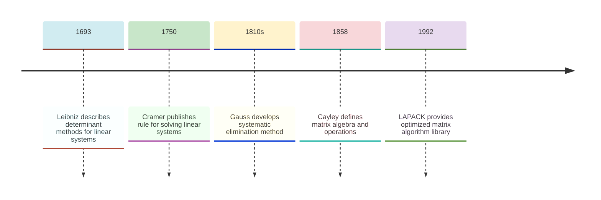
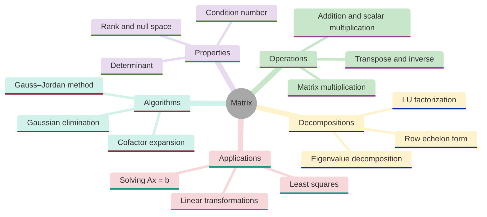
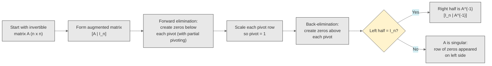
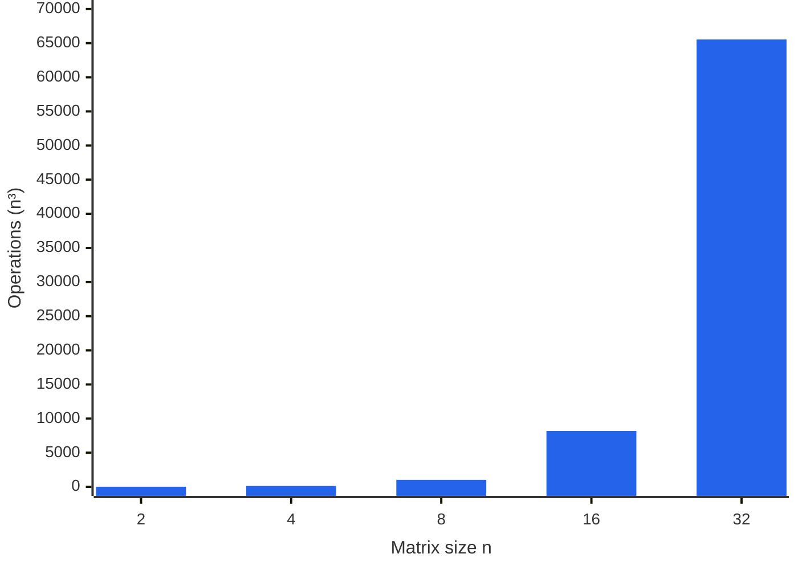
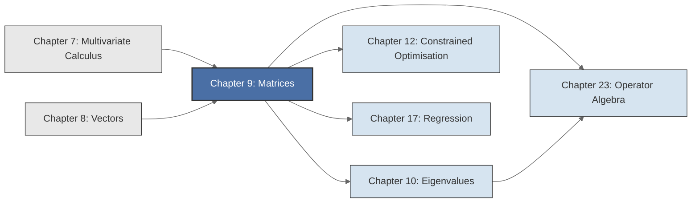

<!-- Copyright (c) 2025-2026 Bob Jansen <bobjansen@pm.me> -->
<!-- SPDX-License-Identifier: CC-BY-NC-4.0 -->
<!-- See LICENSE for full terms. Commercial licensing available. -->
# Chapter 9: Matrices & Linear Transformations

**Part III**: Linear Algebra

> A matrix is a linear transformation made concrete: a machine that takes a vector as input and produces a vector as output, whose every algebraic property reflects a geometric fact about that transformation. Linear algebra, the study of such transformations, is the single most widely used branch of mathematics in modern computation.

**Prerequisites**: [Chapter 7](07-multivariate-calculus.md) (Multivariate Calculus); Jacobian matrices and gradient computations. [Chapter 8](08-vectors.md) (Vectors); familiarity with vector addition, scalar multiplication, the dot product and the notion of $\mathbb{R}^n$ as a vector space.

**Learning Objectives**: After this chapter, the reader will be able to:

1. Perform matrix addition, scalar multiplication and matrix multiplication and state when each operation is defined.
2. Interpret a matrix as a linear transformation between finite-dimensional vector spaces.
3. Reduce a matrix to row echelon form via Gaussian elimination and solve systems of linear equations.
4. Compute determinants using cofactor expansion and row reduction.
5. Compute the inverse of a matrix using the Gauss–Jordan method and the $2 \times 2$ formula.
6. Implement matrix operations, system-solving, determinant computation and matrix inversion using the Evenwicht API.

**Connections**: This chapter is used by [Chapter 10](10-eigenvalues.md) (Eigenvalues; the characteristic polynomial $\det(A - \lambda I) = 0$ requires both determinants and matrix arithmetic), [Chapter 12](12-constrained-optimization.md) (Constrained Optimisation; the simplex method operates on augmented matrices via row operations), [Chapter 17](17-regression.md) (Regression; the ordinary least squares estimator is $\hat{\boldsymbol{\beta}} = (X^T X)^{-1} X^T \mathbf{y}$) and [Chapter 23](23-operator-algebra.md) (Operator Algebra; matrices are the canonical representation of linear operators on finite-dimensional spaces). The rank and null space concepts introduced here reappear throughout the linear algebra chapters.

---

## Historical Context

**Key Milestones in Matrix Theory**



*Figure 9.1: Key milestones in the development of matrix theory from Leibniz to LAPACK.*

**Origins in determinants and linear systems (1693–1858).** Matrix theory grew from two independent lines of inquiry: the solution of linear systems and the study of determinants. Over two centuries these threads merged into a single algebraic discipline treating rectangular arrays of numbers as objects that can be added, multiplied and inverted. Gottfried Wilhelm Leibniz, in a 1693 letter to Guillaume de l'Hôpital, described a method for testing whether a system of linear equations has a solution. His procedure amounted to computing what are now recognised as determinants of the coefficient matrix.

**Independent discovery in Japan (1683).** Seki Takakazu developed similar elimination techniques in Japan in 1683. Neither Leibniz nor Seki used the word "determinant" or any matrix notation; the algebraic structures were present without the vocabulary. The discovery was independent on two continents.

**Cramer's rule and the determinant ratio (1750).** Gabriel Cramer published his *Introduction à l'analyse des lignes courbes algébriques* in 1750. The treatise stated the rule now bearing his name: each unknown in a system of $n$ linear equations in $n$ unknowns equals a ratio of two determinants. Cramer's rule requires computing $n + 1$ determinants, each costing $O(n!)$ by naive expansion. Its value is theoretical, not algorithmic.

**Gaussian elimination (1810s).** Carl Friedrich Gauss developed Gaussian elimination in the 1810s while fitting astronomical orbits by least squares. He reduced a system of linear equations to triangular form by eliminating variables one at a time. Forward elimination followed by back-substitution remains the basis of all practical linear-system solvers. Camille Jordan later extended the procedure to reduced row echelon form, yielding the Gauss–Jordan method for computing matrix inverses.

**Matrices as algebraic objects (1850–1858).** James Joseph Sylvester coined the word "matrix" in 1850. He treated a rectangular array as a "mother" (Latin: *matrix*) from which determinants could be extracted. Arthur Cayley, Sylvester's collaborator, published "A Memoir on the Theory of Matrices" in 1858. Cayley defined matrix addition, scalar multiplication and matrix multiplication, established their algebraic rules and proved the Cayley–Hamilton theorem: every square matrix satisfies its own characteristic equation. Matrices were, for the first time, treated as algebraic objects rather than shorthand for systems of equations.

**Rigorous foundations (1878).** Georg Frobenius placed matrix theory on a rigorous algebraic footing in the late nineteenth century. He studied rank, elementary divisors and the relation between matrices and bilinear forms. He also proved the dimension theorem for the null space that now forms part of the rank–nullity theorem. Camille Jordan developed the Jordan normal form, a canonical representation that reveals a matrix's eigenvalue structure.

**Modern computational significance (twentieth century).** Matrices became the computational substrate of twentieth-century science and engineering. In computer graphics, every rotation, scaling and projection is a matrix multiplication. In machine learning, a neural network composes affine transformations $\mathbf{x} \mapsto W\mathbf{x} + \mathbf{b}$, where $W$ is a weight matrix. Wassily Leontief's input-output model represents an economy as the linear system $\mathbf{x} = A\mathbf{x} + \mathbf{d}$, where $A$ encodes inter-industry flows. In quantum mechanics, observables are Hermitian matrices and states are vectors.

**LAPACK and fast matrix multiplication (1992).** The Linear Algebra PACKage (LAPACK) library, first released in 1992, provided optimised matrix algorithms that remain the foundation of numerical linear algebra software. The $O(n^3)$ cost of multiplication, inversion and determinant computation is a principal bottleneck of scientific computing. Reducing it (Strassen's algorithm, fast matrix multiplication) remains an active research area.

---

## Why This Chapter Matters

**Matrix**



*Figure 9.2: Mind map of matrix concepts spanning operations, decompositions, properties, algorithms and applications.*

Every layer of a neural network applies the affine map $\mathbf{x} \mapsto W\mathbf{x} + \mathbf{b}$, where $W$ is a weight matrix. The ordinary least squares estimator is $\hat{\boldsymbol{\beta}} = (X^TX)^{-1}X^T\mathbf{y}$; it requires matrix multiplication, transposition and inversion. Google's PageRank algorithm computes the dominant eigenvector of a matrix derived from the web's link structure. Leontief's input-output model represents an economy as the linear system $(I - A)\mathbf{x} = \mathbf{d}$, where $A$ encodes inter-industry dependencies. Each of these computations depends on matrix arithmetic.

Gaussian elimination (Algorithm 9.27) solves systems of linear equations in $O(n^3)$ operations, computes determinants, finds inverses and determines rank. A system with $n = 10{,}000$ unknowns requires roughly $10^{12}$ operations and finishes in seconds on current hardware. At $n = 10^6$, common in scientific computing, sparse methods or iterative solvers become necessary. The condition number $\kappa(A) = \|A\|\|A^{-1}\|$ measures sensitivity to round-off error. A small condition number yields reliable results; a large one corrupts them. This quantity appears in the error analysis of every matrix computation.

The determinant is expensive to compute for large matrices but carries irreplaceable theoretical weight. It determines whether a system has a unique solution ($\det(A) \neq 0$), measures how a linear transformation scales volumes (the Jacobian determinant in change-of-variable formulae) and yields the characteristic polynomial $\det(A - \lambda I) = 0$ whose roots are the eigenvalues ([Chapter 10](10-eigenvalues.md)). The rank–nullity theorem connects the dimension of the solution space of $A\mathbf{x} = \mathbf{0}$ to the rank of $A$. It provides the framework for analysing underdetermined systems (more unknowns than equations, as in compressed sensing) and overdetermined systems (more equations than unknowns, as in least-squares regression).

---

## Notation & Conventions

| Symbol | Meaning |
|--------|---------|
| $A$, $B$, $M$ | Matrices (uppercase roman letters) |
| $a_{ij}$ | The entry in row $i$, column $j$ of $A$ |
| $A_{m \times n}$ | A matrix $A$ with $m$ rows and $n$ columns |
| $A^T$ | Transpose of $A$: $(A^T)_{ij} = a_{ji}$ |
| $A^{-1}$ | Inverse of $A$ (when it exists) |
| $\det(A)$, $\lvert A \rvert$ | Determinant of the square matrix $A$ |
| $I_n$ | The $n \times n$ identity matrix |
| $O$ | The zero matrix (dimensions inferred from context) |
| $\mathbf{x}$, $\mathbf{b}$ | Column vectors (bold lowercase) |
| $\operatorname{tr}(A)$ | Trace of $A$: $\sum_{i} a_{ii}$ |
| $\operatorname{rank}(A)$ | Rank of $A$: the number of pivot columns |
| $\ker(A)$ | Null space (kernel) of $A$: $\{\mathbf{x} : A\mathbf{x} = \mathbf{0}\}$ |
| $\operatorname{col}(A)$ | Column space (image) of $A$: $\{A\mathbf{x} : \mathbf{x} \in \mathbb{R}^n\}$ |
| $M_{ij}$ | The $(i,j)$ minor: the determinant of the submatrix obtained by deleting row $i$ and column $j$ |
| $C_{ij}$ | The $(i,j)$ cofactor: $(-1)^{i+j} M_{ij}$ |
| $\kappa(A)$ | Condition number of $A$: $\lVert A \rVert \cdot \lVert A^{-1} \rVert$ |
| $\operatorname{diag}(d_1, \ldots, d_n)$ | Diagonal matrix with entries $d_1, \ldots, d_n$ on the main diagonal |
| $[A \mid \mathbf{b}]$ | Augmented matrix: $A$ with column $\mathbf{b}$ appended |

Matrices are indexed starting at row 1, column 1 in mathematical exposition. In implementation, arrays are zero-indexed. Vectors are column vectors unless stated otherwise; $\mathbf{x}^T$ denotes a row vector.

---

## Core Theory

### Matrix Fundamentals

**Definition 9.1** (Matrix). An $m \times n$ *matrix* $A$ over $\mathbb{R}$ is a rectangular array of real numbers arranged in $m$ rows and $n$ columns:

$$A = \begin{pmatrix} a_{11} & a_{12} & \cdots & a_{1n} \\ a_{21} & a_{22} & \cdots & a_{2n} \\ \vdots & \vdots & \ddots & \vdots \\ a_{m1} & a_{m2} & \cdots & a_{mn} \end{pmatrix}.$$

The real number $a_{ij}$ is the *entry* in row $i$ and column $j$. The set of all $m \times n$ real matrices is denoted $\mathbb{R}^{m \times n}$. When $m = n$, the matrix is called *square* of order $n$.

A matrix with $m = 1$ is a *row vector*; a matrix with $n = 1$ is a *column vector* ([Chapter 8](08-vectors.md)). A column vector with $m$ entries is identified with an element of $\mathbb{R}^m$.

**Definition 9.2** (Matrix addition). Let $A, B \in \mathbb{R}^{m \times n}$. The *sum* $A + B$ is the $m \times n$ matrix defined by

$$(A + B)_{ij} = a_{ij} + b_{ij} \quad \text{for all } 1 \leq i \leq m,\; 1 \leq j \leq n.$$

Matrix addition requires that $A$ and $B$ have the same dimensions. Addition is performed entry by entry.

**Definition 9.3** (Scalar multiplication). Let $c \in \mathbb{R}$ and $A \in \mathbb{R}^{m \times n}$. The *scalar multiple* $cA$ is the $m \times n$ matrix defined by

$$(cA)_{ij} = c \cdot a_{ij} \quad \text{for all } 1 \leq i \leq m,\; 1 \leq j \leq n.$$

**Definition 9.4** (Matrix multiplication). Let $A \in \mathbb{R}^{m \times n}$ and $B \in \mathbb{R}^{n \times p}$. The *product* $AB$ is the $m \times p$ matrix defined by

$$(AB)_{ij} = \sum_{k=1}^{n} a_{ik} b_{kj} \quad \text{for all } 1 \leq i \leq m,\; 1 \leq j \leq p.$$

The entry $(AB)_{ij}$ is the dot product of the $i$-th row of $A$ with the $j$-th column of $B$. The product $AB$ is defined only when the number of columns of $A$ equals the number of rows of $B$. The resulting matrix has as many rows as $A$ and as many columns as $B$.

Matrix multiplication is *not commutative* in general. Even when both $AB$ and $BA$ are defined (e.g., when $A$ and $B$ are both $n \times n$), it is typically the case that $AB \neq BA$. For example, with

$$A = \begin{pmatrix} 1 & 2 \\ 0 & 1 \end{pmatrix}, \quad B = \begin{pmatrix} 0 & 1 \\ 1 & 0 \end{pmatrix},$$

one computes $AB = \begin{pmatrix} 2 & 1 \\ 1 & 0 \end{pmatrix}$ while $BA = \begin{pmatrix} 0 & 1 \\ 1 & 2 \end{pmatrix}$. Non-commutativity is a fundamental feature of matrix algebra, not an exception.

**Theorem 9.5** (Properties of matrix multiplication). Let $A$, $B$, $C$ be matrices of compatible dimensions and let $c \in \mathbb{R}$. Then:

1. *Associativity*: $(AB)C = A(BC)$.
2. *Left distributivity*: $A(B + C) = AB + AC$.
3. *Right distributivity*: $(A + B)C = AC + BC$.
4. *Scalar compatibility*: $c(AB) = (cA)B = A(cB)$.
5. *Identity*: $I_m A = A$ and $A I_n = A$ for $A \in \mathbb{R}^{m \times n}$.
6. *Non-commutativity*: In general, $AB \neq BA$.

??? note "Proof"

    *Proof of associativity.* Let $A \in \mathbb{R}^{m \times n}$, $B \in \mathbb{R}^{n \times p}$, $C \in \mathbb{R}^{p \times q}$. Both $(AB)C$ and $A(BC)$ are $m \times q$ matrices. For the $(i,j)$ entry:

    $$((AB)C)_{ij} = \sum_{\ell=1}^{p} (AB)_{i\ell}\, c_{\ell j} = \sum_{\ell=1}^{p} \left(\sum_{k=1}^{n} a_{ik} b_{k\ell}\right) c_{\ell j} = \sum_{k=1}^{n} \sum_{\ell=1}^{p} a_{ik} b_{k\ell} c_{\ell j}.$$

    $$(A(BC))_{ij} = \sum_{k=1}^{n} a_{ik} (BC)_{kj} = \sum_{k=1}^{n} a_{ik} \left(\sum_{\ell=1}^{p} b_{k\ell} c_{\ell j}\right) = \sum_{k=1}^{n} \sum_{\ell=1}^{p} a_{ik} b_{k\ell} c_{\ell j}.$$

    The double sums are identical, so $((AB)C)_{ij} = (A(BC))_{ij}$ for all $i, j$.

    $\square$

**Definition 9.6** (Transpose). Let $A \in \mathbb{R}^{m \times n}$. The *transpose* $A^T$ is the $n \times m$ matrix defined by

$$(A^T)_{ij} = a_{ji} \quad \text{for all } 1 \leq i \leq n,\; 1 \leq j \leq m.$$

The transpose reflects the matrix across its main diagonal: rows become columns and columns become rows.

*Properties of the transpose:*

1. $(A^T)^T = A$.
2. $(A + B)^T = A^T + B^T$.
3. $(cA)^T = cA^T$.
4. $(AB)^T = B^T A^T$ (the order reverses).

??? note "Proof"

    *Proof that $(AB)^T = B^T A^T$.* Compare the $(i,j)$ entries of both sides.

    The $(i,j)$ entry of $(AB)^T$ is

    $$[(AB)^T]_{ij} = (AB)_{ji} = \sum_{k} a_{jk} b_{ki}.$$

    The $(i,j)$ entry of $B^T A^T$ is

    $$[B^T A^T]_{ij} = \sum_{k} (B^T)_{ik}(A^T)_{kj} = \sum_{k} b_{ki} a_{jk}.$$

    These sums are identical (multiplication of real numbers commutes), so $[(AB)^T]_{ij} = [B^T A^T]_{ij}$ for all $i, j$.

    $\square$

**Definition 9.7** (Special matrices). The following matrices arise frequently:

- *Identity matrix*: The $n \times n$ matrix $I_n$ with $(I_n)_{ij} = 1$ if $i = j$ and $(I_n)_{ij} = 0$ if $i \neq j$. It satisfies $I_n A = A$ and $A I_n = A$ for any conformable $A$.
- *Zero matrix*: The $m \times n$ matrix $O$ with all entries zero. It satisfies $A + O = A$ and $AO = O$ and $OA = O$.
- *Diagonal matrix*: A square matrix $D$ with $d_{ij} = 0$ for $i \neq j$. Often written $\operatorname{diag}(d_1, d_2, \ldots, d_n)$.
- *Upper triangular matrix*: A square matrix $U$ with $u_{ij} = 0$ for $i > j$ (all entries below the main diagonal are zero).
- *Lower triangular matrix*: A square matrix $L$ with $\ell_{ij} = 0$ for $i < j$ (all entries above the main diagonal are zero).
- *Symmetric matrix*: A square matrix $A$ with $A = A^T$, i.e., $a_{ij} = a_{ji}$ for all $i, j$. Symmetric matrices arise naturally as Hessians of smooth functions ([Chapter 7](07-multivariate-calculus.md)), covariance matrices in statistics and adjacency matrices of undirected graphs.
- *Orthogonal matrix*: A square matrix $Q$ satisfying $Q^T Q = Q Q^T = I$. Equivalently, $Q^{-1} = Q^T$. Orthogonal matrices preserve lengths and angles: $\|Q\mathbf{x}\| = \|\mathbf{x}\|$ for all $\mathbf{x}$. They represent rotations and reflections.

**Remark 9.8** (Matrix as linear transformation). A matrix $A \in \mathbb{R}^{m \times n}$ defines a function $T_A: \mathbb{R}^n \to \mathbb{R}^m$ by $T_A(\mathbf{x}) = A\mathbf{x}$. This function is *linear*: $T_A(c_1 \mathbf{x}_1 + c_2 \mathbf{x}_2) = c_1 T_A(\mathbf{x}_1) + c_2 T_A(\mathbf{x}_2)$ for all scalars $c_1, c_2$ and vectors $\mathbf{x}_1, \mathbf{x}_2$.

Every linear transformation $T: \mathbb{R}^n \to \mathbb{R}^m$ can be represented, conversely, as multiplication by some $m \times n$ matrix. The $j$-th column of this matrix is $T(\mathbf{e}_j)$, where $\mathbf{e}_j$ is the $j$-th standard basis vector. This is because any $\mathbf{x} = \sum_j x_j \mathbf{e}_j$ and by linearity, $T(\mathbf{x}) = \sum_j x_j T(\mathbf{e}_j)$.

This correspondence between matrices and linear transformations is *the* fundamental idea of linear algebra. Matrix multiplication corresponds to function composition: if $T_A(\mathbf{x}) = A\mathbf{x}$ and $T_B(\mathbf{x}) = B\mathbf{x}$, then $T_A(T_B(\mathbf{x})) = A(B\mathbf{x}) = (AB)\mathbf{x} = T_{AB}(\mathbf{x})$. The matrix of the composition is the product of the matrices. This explains why matrix multiplication is defined the way it is and why it is not commutative: function composition is not commutative.

### Systems of Linear Equations

**Definition 9.9** (System of linear equations). A *system of $m$ linear equations in $n$ unknowns* is a collection of equations

$$\begin{aligned}
a_{11}x_1 + a_{12}x_2 + \cdots + a_{1n}x_n &= b_1, \\
a_{21}x_1 + a_{22}x_2 + \cdots + a_{2n}x_n &= b_2, \\
\vdots \\
a_{m1}x_1 + a_{m2}x_2 + \cdots + a_{mn}x_n &= b_m,
\end{aligned}$$

which can be written in matrix form as $A\mathbf{x} = \mathbf{b}$, where $A \in \mathbb{R}^{m \times n}$ is the *coefficient matrix*, $\mathbf{x} \in \mathbb{R}^n$ is the vector of unknowns and $\mathbf{b} \in \mathbb{R}^m$ is the *right-hand side*. The *augmented matrix* is the $m \times (n+1)$ matrix $[A \mid \mathbf{b}]$, obtained by appending $\mathbf{b}$ as an additional column.

A system is *homogeneous* if $\mathbf{b} = \mathbf{0}$, and *inhomogeneous* otherwise. A homogeneous system always has at least the *trivial solution* $\mathbf{x} = \mathbf{0}$.

**Definition 9.10** (Elementary row operations). The following three operations on the rows of a matrix are called *elementary row operations*:

1. *Row swap*: Interchange two rows ($R_i \leftrightarrow R_j$).
2. *Row scaling*: Multiply a row by a nonzero scalar ($R_i \leftarrow cR_i$, $c \neq 0$).
3. *Row replacement*: Add a scalar multiple of one row to another ($R_i \leftarrow R_i + cR_j$).

Each elementary row operation is reversible: a swap is its own inverse, scaling by $c$ is reversed by scaling by $1/c$ and adding $cR_j$ to $R_i$ is reversed by adding $-cR_j$ to $R_i$. Elementary row operations therefore preserve the solution set of a linear system: if $[A \mid \mathbf{b}]$ is transformed to $[A' \mid \mathbf{b}']$ by a sequence of elementary row operations, then $A\mathbf{x} = \mathbf{b}$ and $A'\mathbf{x} = \mathbf{b}'$ have exactly the same solutions.

**Definition 9.11** (Row echelon form). A matrix is in *row echelon form* (REF) if:

1. All rows consisting entirely of zeros are at the bottom.
2. The first nonzero entry (called the *pivot* or *leading entry*) in each nonzero row is strictly to the right of the pivot in the row above it.
3. All entries below each pivot are zero.

A matrix is in *reduced row echelon form* (RREF) if, in addition:

4. Each pivot is equal to 1.
5. Each pivot is the only nonzero entry in its column.

Every matrix can be brought to REF by a finite sequence of elementary row operations (this is Gaussian elimination). RREF is obtained by continuing with back-elimination (Gauss–Jordan elimination). The RREF of a matrix is unique; the REF is not unique; the pivot positions, however, are the same for all REFs of a given matrix.

**Gaussian Elimination Steps**

```mermaid
%%{init: {"theme": "base", "themeVariables": {"primaryColor": "#e8e8e8", "primaryTextColor": "#333333", "primaryBorderColor": "#555555", "lineColor": "#666666", "secondaryColor": "#d1ecf1", "tertiaryColor": "#c8e6c9"}}}%%
flowchart LR
    A["Form augmented matrix<br/>[A | b]"] --> B["Select pivot column<br/>(leftmost non-zero column)"]
    B --> C["Partial pivoting:<br/>swap rows to place largest<br/>absolute value in pivot position"]
    C --> D["Eliminate entries<br/>below the pivot using<br/>row replacement operations"]
    D --> E{"More columns<br/>to process?"}
    E -- Yes --> B
    E -- No --> F["Matrix is now in<br/>Row Echelon Form (REF)"]
    F --> G["Back-substitution:<br/>solve for variables<br/>from bottom row upward"]
    G --> H["Solution x"]
    style A fill:#e8e8e8,stroke:#333333
    style B fill:#e8e8e8,stroke:#333333
    style C fill:#e8e8e8,stroke:#333333
    style D fill:#e8e8e8,stroke:#333333
    style E fill:#fff3cd,stroke:#333333
    style F fill:#e8e8e8,stroke:#333333
    style G fill:#e8e8e8,stroke:#333333
    style H fill:#e8e8e8,stroke:#333333
```



*Figure 9.3: Steps of Gaussian elimination from augmented matrix formation to solution via back-substitution.*

**Theorem 9.12** (Gaussian elimination). Every matrix $A \in \mathbb{R}^{m \times n}$ can be reduced to row echelon form by a finite sequence of elementary row operations. The system $A\mathbf{x} = \mathbf{b}$ is then solved by back-substitution: starting from the last equation (which involves the fewest unknowns), each variable is expressed in terms of previously determined variables.

??? note "Proof"

    *Proof sketch.* The algorithm proceeds column by column. In the first column, find a nonzero entry (the pivot); if none exists, move to the next column. Swap the pivot row to the top position, then use row replacement operations to eliminate all entries below the pivot.

    Repeat the procedure for the submatrix below and to the right of the current pivot. Each step either identifies a new pivot (and eliminates entries below it) or advances to the next column without a pivot.

    Since there are at most $\min(m, n)$ pivot positions and finitely many columns, the process terminates in a finite number of steps, producing a matrix in row echelon form.

    $\square$

**Definition 9.13** (Rank). The *rank* of a matrix $A$, denoted $\operatorname{rank}(A)$, is the number of nonzero rows in any row echelon form of $A$. Equivalently, $\operatorname{rank}(A)$ is the number of pivot positions, the dimension of the column space of $A$ and the dimension of the row space of $A$.

The rank satisfies $0 \leq \operatorname{rank}(A) \leq \min(m, n)$. A matrix $A \in \mathbb{R}^{n \times n}$ with $\operatorname{rank}(A) = n$ is said to have *full rank*.

**Theorem 9.14** (Rank and solvability; Rouché–Capelli theorem). The system $A\mathbf{x} = \mathbf{b}$ has a solution if and only if

$$\operatorname{rank}(A) = \operatorname{rank}([A \mid \mathbf{b}]).$$

When solutions exist, the solution is unique if and only if $\operatorname{rank}(A) = n$ (the number of unknowns). If $\operatorname{rank}(A) < n$, the solution set is an affine subspace of $\mathbb{R}^n$ with dimension $n - \operatorname{rank}(A)$.

??? note "Proof"

    *Proof sketch.* Reduce the augmented matrix $[A \mid \mathbf{b}]$ to row echelon form.

    If $\operatorname{rank}([A \mid \mathbf{b}]) > \operatorname{rank}(A)$, then the extra pivot must appear in the appended column. This means there is a row of the form $(0\; 0\; \cdots\; 0 \mid c)$ with $c \neq 0$, which corresponds to the contradictory equation $0 = c$. No solution therefore exists.

    If $\operatorname{rank}([A \mid \mathbf{b}]) = \operatorname{rank}(A)$, the system is consistent. The unknowns corresponding to pivot columns are determined (basic variables); the remaining $n - \operatorname{rank}(A)$ unknowns are free parameters, producing an $(n - \operatorname{rank}(A))$-dimensional family of solutions.

    $\square$

**Definition 9.15** (Null space / kernel). The *null space* (or *kernel*) of a matrix $A \in \mathbb{R}^{m \times n}$ is

$$\ker(A) = \{\mathbf{x} \in \mathbb{R}^n : A\mathbf{x} = \mathbf{0}\}.$$

The null space is a subspace of $\mathbb{R}^n$. Its dimension, called the *nullity* of $A$, equals the number of free variables in the homogeneous system $A\mathbf{x} = \mathbf{0}$, which is $n - \operatorname{rank}(A)$.

**Definition 9.16** (Column space / image). The *column space* (or *image*) of a matrix $A \in \mathbb{R}^{m \times n}$ is

$$\operatorname{col}(A) = \{A\mathbf{x} : \mathbf{x} \in \mathbb{R}^n\} = \operatorname{span}\{\mathbf{a}_1, \mathbf{a}_2, \ldots, \mathbf{a}_n\},$$

where $\mathbf{a}_1, \ldots, \mathbf{a}_n$ are the columns of $A$. The column space is a subspace of $\mathbb{R}^m$ of dimension $\operatorname{rank}(A)$. A vector $\mathbf{b}$ lies in $\operatorname{col}(A)$ if and only if the system $A\mathbf{x} = \mathbf{b}$ has a solution.

**Theorem 9.17** (Rank–nullity theorem). Let $A \in \mathbb{R}^{m \times n}$. Then

$$\dim(\ker(A)) + \operatorname{rank}(A) = n.$$

In words: the nullity plus the rank equals the number of columns.

!!! abstract "Key Result"

    **Theorem 9.17** (Rank--nullity theorem). The dimension of the null space and the rank of a matrix always sum to the number of columns, providing the fundamental accounting identity that determines when a linear system has a unique solution, infinitely many solutions or none.

??? note "Proof"

    *Proof sketch.* Reduce $A$ to row echelon form. The $n$ columns partition into $r = \operatorname{rank}(A)$ pivot columns and $n - r$ free columns.

    Each free column corresponds to one free variable in the homogeneous system $A\mathbf{x} = \mathbf{0}$. Setting that free variable to 1 and all others to 0 yields one independent solution vector in $\ker(A)$, giving $n - r$ such vectors in total.

    Conversely, every element of $\ker(A)$ is a linear combination of these $n - r$ vectors (since the basic variables are fully determined by the free variables). It follows that $\dim(\ker(A)) = n - r$.

    $\square$

The rank–nullity theorem expresses a fundamental conservation law: the "information" in $n$ input dimensions is split between the $r$ dimensions that produce nonzero output (the rank) and the $n - r$ dimensions that are annihilated (the null space).

### Determinants

**Definition 9.18** (Determinant of a $2 \times 2$ matrix). For a $2 \times 2$ matrix

$$A = \begin{pmatrix} a & b \\ c & d \end{pmatrix},$$

the *determinant* is

$$\det(A) = ad - bc.$$

*Geometric interpretation*: The absolute value $|\det(A)|$ equals the area of the parallelogram spanned by the column vectors $(a, c)^T$ and $(b, d)^T$. The sign of $\det(A)$ indicates the orientation: positive if the columns are positively oriented, negative otherwise. A determinant of zero means the columns are parallel; the parallelogram has collapsed to a line and the matrix is singular.

**Definition 9.19** (Determinant of an $n \times n$ matrix via cofactor expansion). Let $A$ be an $n \times n$ matrix. The *$(i,j)$ minor* $M_{ij}$ is the determinant of the $(n-1) \times (n-1)$ submatrix obtained by deleting row $i$ and column $j$. The *$(i,j)$ cofactor* is $C_{ij} = (-1)^{i+j} M_{ij}$. The determinant is defined recursively by expansion along the first row:

$$\det(A) = \sum_{j=1}^{n} a_{1j}\, C_{1j} = \sum_{j=1}^{n} (-1)^{1+j}\, a_{1j}\, M_{1j}.$$

This expansion can equivalently be performed along any row or any column, and the result is always the same. For the base case, $\det((a)) = a$ for a $1 \times 1$ matrix.

!!! note "Alternating sign pattern in cofactor expansion"

    The sign factor $(-1)^{i+j}$ produces a checkerboard pattern: $+, -, +, -, \ldots$ along the first row. A common error is omitting this alternation and summing all terms with a positive sign.

For a $3 \times 3$ matrix, the cofactor expansion along the first row gives:

$$\det\begin{pmatrix} a_{11} & a_{12} & a_{13} \\ a_{21} & a_{22} & a_{23} \\ a_{31} & a_{32} & a_{33} \end{pmatrix} = a_{11}(a_{22}a_{33} - a_{23}a_{32}) - a_{12}(a_{21}a_{33} - a_{23}a_{31}) + a_{13}(a_{21}a_{32} - a_{22}a_{31}).$$

**Theorem 9.20** (Properties of determinants). Let $A, B \in \mathbb{R}^{n \times n}$ and $c \in \mathbb{R}$. Then:

1. *Multiplicativity*: $\det(AB) = \det(A)\det(B)$.
2. *Transpose invariance*: $\det(A^T) = \det(A)$.
3. *Scaling*: $\det(cA) = c^n \det(A)$.
4. *Singularity*: $\det(A) = 0$ if and only if $A$ is singular (not invertible).
5. *Row swap*: Swapping two rows of $A$ multiplies the determinant by $-1$.
6. *Row addition*: Adding a scalar multiple of one row to another does not change the determinant.
7. *Row scaling*: Multiplying a row by $c$ multiplies the determinant by $c$.
8. *Triangular matrices*: If $A$ is upper or lower triangular, $\det(A) = \prod_{i=1}^n a_{ii}$ (the product of the diagonal entries).

??? note "Proof"

    *Proof of multiplicativity for the $2 \times 2$ case.* Let $A = \begin{pmatrix} a & b \\ c & d \end{pmatrix}$ and $B = \begin{pmatrix} e & f \\ g & h \end{pmatrix}$. Compute the product directly:

    $$AB = \begin{pmatrix} ae + bg & af + bh \\ ce + dg & cf + dh \end{pmatrix}.$$

    Taking the determinant of $AB$:

    $$\det(AB) = (ae+bg)(cf+dh) - (af+bh)(ce+dg).$$

    Expanding all products:

    $$\det(AB) = aecf + aedh + bgcf + bgdh - afce - afdg - bhce - bhdg.$$

    Note that $aecf = afce$ (since multiplication of real numbers commutes), so $aecf - afce = 0$. By the same reasoning, $bgdh = bhdg$, so $bgdh - bhdg = 0$. The surviving terms are:

    $$\det(AB) = aedh + bgcf - afdg - bhce.$$

    Now expand $\det(A)\det(B) = (ad - bc)(eh - fg)$:

    $$(ad - bc)(eh - fg) = adeh - adfg - bceh + bcfg.$$

    Matching term by term: $aedh = adeh$, $bgcf = bcfg$, $-afdg = -adfg$ and $-bhce = -bceh$. The equality follows:

    $$\det(AB) = aedh + bgcf - afdg - bhce = adeh + bcfg - adfg - bceh = (ad-bc)(eh-fg) = \det(A)\det(B).$$

    The general proof proceeds by expressing each elementary row operation as multiplication by an elementary matrix and using properties 5–7.

    $\square$

**Theorem 9.21** (Determinant via row reduction). The determinant of an $n \times n$ matrix $A$ can be computed as follows: reduce $A$ to an upper triangular matrix $U$ using only row swaps and row replacement operations (no row scaling). Then

$$\det(A) = (-1)^s \prod_{i=1}^{n} u_{ii},$$

where $s$ is the number of row swaps performed and $u_{ii}$ are the diagonal entries of $U$.

??? note "Proof"

    *Proof.* Row replacement operations do not change the determinant (Theorem 9.20, property 6). Each row swap multiplies the determinant by $-1$ (property 5). After $s$ row swaps and any number of row replacements, the determinant of the resulting matrix $U$ therefore satisfies

    $$\det(U) = (-1)^s \det(A).$$

    Since $U$ is upper triangular, its determinant is the product of its diagonal entries (property 8):

    $$\det(U) = \prod_{i=1}^{n} u_{ii}.$$

    Combining these two facts:

    $$\det(A) = (-1)^s \prod_i u_{ii}.$$

    $\square$

This method requires $O(n^3)$ arithmetic operations, compared to $O(n!)$ for cofactor expansion. For $n = 20$, $n! \approx 2.4 \times 10^{18}$ while $n^3 = 8000$. Row reduction is the only practical method for computing determinants of large matrices.

### Matrix Inverse

**Definition 9.22** (Inverse). Let $A \in \mathbb{R}^{n \times n}$ be a square matrix. A matrix $A^{-1} \in \mathbb{R}^{n \times n}$ is the *inverse* of $A$ if

$$AA^{-1} = A^{-1}A = I_n.$$

A matrix that has an inverse is called *invertible* (or *nonsingular*). A matrix that does not have an inverse is called *singular*. The inverse exists if and only if $\det(A) \neq 0$, which is equivalent to $\operatorname{rank}(A) = n$.

When the inverse exists, it is unique. If both $B$ and $C$ satisfy $AB = I$ and $CA = I$, then $C = C(AB) = (CA)B = B$.

**Theorem 9.23** ($2 \times 2$ inverse formula). Let $A = \begin{pmatrix} a & b \\ c & d \end{pmatrix}$ with $\det(A) = ad - bc \neq 0$. Then

$$A^{-1} = \frac{1}{ad - bc} \begin{pmatrix} d & -b \\ -c & a \end{pmatrix}.$$

??? note "Proof"

    *Proof.* Direct multiplication:

    $$A \cdot \frac{1}{ad-bc}\begin{pmatrix} d & -b \\ -c & a \end{pmatrix} = \frac{1}{ad-bc}\begin{pmatrix} ad - bc & -ab + ab \\ cd - cd & -bc + ad \end{pmatrix} = \begin{pmatrix} 1 & 0 \\ 0 & 1 \end{pmatrix}.$$

    $\square$

**Theorem 9.24** (Computing the inverse via Gauss–Jordan elimination). Let $A \in \mathbb{R}^{n \times n}$ be invertible. Form the augmented matrix $[A \mid I_n]$ and apply elementary row operations to reduce the left half to the identity. The right half then becomes $A^{-1}$:

$$[A \mid I_n] \xrightarrow{\text{row operations}} [I_n \mid A^{-1}].$$

If $A$ is singular, the reduction process will produce a row of zeros on the left side, at which point the algorithm terminates with the conclusion that $A$ is not invertible.

??? note "Proof"

    *Proof sketch.* Each elementary row operation is equivalent to left-multiplication by an elementary matrix $E_i$. Suppose a sequence of such operations reduces $A$ to the identity: $E_k \cdots E_2 E_1 A = I$.

    Then by definition $A^{-1} = E_k \cdots E_2 E_1$.

    Applying the same operations to $I$ simultaneously gives $E_k \cdots E_2 E_1 I = A^{-1}$. The augmented matrix $[A \mid I]$ performs both computations in a single pass, yielding $[I \mid A^{-1}]$ upon completion.

    $\square$

**Matrix Inverse via Gauss–Jordan Elimination**



*Figure 9.4: Gauss–Jordan elimination procedure for computing the inverse of a matrix.*

**Theorem 9.25** (Properties of the inverse). Let $A$ and $B$ be invertible $n \times n$ matrices and $c \neq 0$ a scalar. Then:

1. $(A^{-1})^{-1} = A$.
2. $(AB)^{-1} = B^{-1}A^{-1}$ (the order reverses, as with transposes).
3. $(A^T)^{-1} = (A^{-1})^T$.
4. $(cA)^{-1} = \frac{1}{c} A^{-1}$.
5. $\det(A^{-1}) = 1 / \det(A)$.

??? note "Proof"

    *Proof of property 2.* $(AB)(B^{-1}A^{-1}) = A(BB^{-1})A^{-1} = AIA^{-1} = AA^{-1} = I$. The matrix $B^{-1}A^{-1}$ is therefore the inverse of $AB$.

    $\square$

The reversal of order in $(AB)^{-1} = B^{-1}A^{-1}$ has a natural interpretation: if $A$ and $B$ represent sequential transformations (first $B$, then $A$, giving $AB$), then to undo them one must undo $A$ first and then undo $B$.

**Remark 9.26** (Cramer's rule). For the system $A\mathbf{x} = \mathbf{b}$ with $A \in \mathbb{R}^{n \times n}$ invertible, each component of the solution is

$$x_i = \frac{\det(A_i)}{\det(A)},$$

where $A_i$ is the matrix formed by replacing the $i$-th column of $A$ with $\mathbf{b}$. Cramer's rule provides a closed-form expression for each unknown and is useful in theoretical arguments (e.g., proving that solutions depend continuously on parameters). It requires computing $n + 1$ determinants, each of cost $O(n^3)$, for a total cost of $O(n^4)$; or $O(n \cdot n!)$ if determinants are computed by cofactor expansion. Gaussian elimination solves the same system in $O(n^3)$. Cramer's rule is included here for its theoretical value and historical importance, but it is never used in practice for systems larger than $3 \times 3$.

---

## Formulas & Identities

### Matrix Algebra Identities

**F9.1** (Associativity of addition)

$$(A + B) + C = A + (B + C).$$

**F9.2** (Commutativity of addition)

$$A + B = B + A.$$

**F9.3** (Associativity of multiplication)

$$(AB)C = A(BC).$$

**F9.4** (Distributivity)

$$A(B + C) = AB + AC \quad \text{and} \quad (A + B)C = AC + BC.$$

**F9.5** (Transpose of product)

$$(AB)^T = B^T A^T.$$

**F9.6** (Transpose involution)

$$(A^T)^T = A.$$

**F9.7** (Transpose of sum)

$$(A + B)^T = A^T + B^T.$$

### Inverse Identities

**F9.8** (Inverse of product)

$$(AB)^{-1} = B^{-1}A^{-1}.$$

**F9.9** (Inverse-transpose commutativity)

$$(A^T)^{-1} = (A^{-1})^T.$$

**F9.10** (Scalar inverse)

$$(cA)^{-1} = \frac{1}{c}A^{-1}, \quad c \neq 0.$$

**F9.11** (Inverse involution)

$$(A^{-1})^{-1} = A.$$

### Determinant Identities

**F9.12** (Multiplicativity)

$$\det(AB) = \det(A)\det(B).$$

**F9.13** (Transpose invariance)

$$\det(A^T) = \det(A).$$

**F9.14** (Inverse)

$$\det(A^{-1}) = 1/\det(A).$$

**F9.15** (Scalar)

$$\det(cA) = c^n \det(A), \quad A \in \mathbb{R}^{n \times n}.$$

**F9.16** (Identity)

$$\det(I_n) = 1.$$

### Trace Properties

The *trace* of a square matrix $A$, denoted $\operatorname{tr}(A)$, is the sum of its diagonal entries:

$$\operatorname{tr}(A) = \sum_{i=1}^n a_{ii}.$$

**F9.17** (Linearity)

$$\operatorname{tr}(A + B) = \operatorname{tr}(A) + \operatorname{tr}(B) \quad \text{and} \quad \operatorname{tr}(cA) = c \cdot \operatorname{tr}(A).$$

**F9.18** (Cyclic property)

$$\operatorname{tr}(AB) = \operatorname{tr}(BA).$$

Note that $AB$ need not equal $BA$.

**F9.19** (Transpose)

$$\operatorname{tr}(A^T) = \operatorname{tr}(A).$$

**F9.20** (Identity)

$$\operatorname{tr}(I_n) = n.$$

The cyclic property $\operatorname{tr}(AB) = \operatorname{tr}(BA)$ generalises: $\operatorname{tr}(ABC) = \operatorname{tr}(BCA) = \operatorname{tr}(CAB)$, though in general $\operatorname{tr}(ABC) \neq \operatorname{tr}(ACB)$ (permuting factors that are not cyclic rotations of each other does not preserve the trace).

### Block Multiplication

If matrices $A$ and $B$ are partitioned into blocks of compatible dimensions, the product $AB$ can be computed by treating the blocks as entries and performing matrix multiplication at the block level:

$$\begin{pmatrix} A_{11} & A_{12} \\ A_{21} & A_{22} \end{pmatrix} \begin{pmatrix} B_{11} & B_{12} \\ B_{21} & B_{22} \end{pmatrix} = \begin{pmatrix} A_{11}B_{11} + A_{12}B_{21} & A_{11}B_{12} + A_{12}B_{22} \\ A_{21}B_{11} + A_{22}B_{21} & A_{21}B_{12} + A_{22}B_{22} \end{pmatrix}.$$

Block multiplication is conceptually important and is the basis of cache-efficient matrix multiplication implementations.

---

## Algorithms

### Algorithm 9.27: Matrix Multiplication

**Input**: Matrix $A \in \mathbb{R}^{m \times n}$, matrix $B \in \mathbb{R}^{n \times p}$.

**Output**: Matrix $C = AB \in \mathbb{R}^{m \times p}$.

```
function matrixMultiply(A, B):
    let m = A.rows, n = A.cols, p = B.cols
    assert B.rows == n, "Dimension mismatch"
    let C = new Matrix(m, p)     // initialised to zeros

    for i = 0 to m-1:
        for j = 0 to p-1:
            sum = 0
            for k = 0 to n-1:
                sum += A[i][k] * B[k][j]
            C[i][j] = sum

    return C
```

**Complexity**: Time $O(mnp)$; space $O(mp)$ for the output matrix. For square $n \times n$ matrices, this is $O(n^3)$ time and $O(n^2)$ space. Strassen's algorithm achieves $O(n^{2.807})$ time but is rarely faster in practice for matrices smaller than about $n = 500$ due to overhead.

**Matrix Multiplication Operations vs Size**



*Figure 9.5: Cubic growth of matrix multiplication operations as matrix size increases.*

The number of scalar multiplications required for an $n \times n$ matrix multiply grows as $n^3$: doubling the matrix size increases the operation count eightfold.

### Algorithm 9.28: Gaussian Elimination with Partial Pivoting

**Input**: Matrix $A \in \mathbb{R}^{m \times n}$, vector $\mathbf{b} \in \mathbb{R}^m$.

**Output**: Solution $\mathbf{x}$ to $A\mathbf{x} = \mathbf{b}$, or indication that no unique solution exists.

```
function solve(A, b):
    let m = A.rows, n = A.cols
    // Form augmented matrix [A | b]
    let Aug = augment(A, b)
    let pivotRow = 0

    // Forward elimination
    for col = 0 to n-1:
        // Partial pivoting: find row with largest absolute value in this column
        maxVal = |Aug[pivotRow][col]|
        maxRow = pivotRow
        for row = pivotRow+1 to m-1:
            if |Aug[row][col]| > maxVal:
                maxVal = |Aug[row][col]|
                maxRow = row

        if maxVal < EPSILON:
            continue         // skip this column (zero pivot)

        // Swap rows
        swap(Aug[pivotRow], Aug[maxRow])

        // Eliminate entries below the pivot
        pivot = Aug[pivotRow][col]
        for row = pivotRow+1 to m-1:
            factor = Aug[row][col] / pivot
            for j = col to n:
                Aug[row][j] -= factor * Aug[pivotRow][j]

        pivotRow += 1

    // Back-substitution (assuming unique solution: pivotRow == n)
    let x = new Array(n)
    for i = n-1 down to 0:
        x[i] = Aug[i][n]      // right-hand side
        for j = i+1 to n-1:
            x[i] -= Aug[i][j] * x[j]
        x[i] /= Aug[i][i]

    return x
```

**Complexity**: Time: forward elimination $O(n^3/3)$, back-substitution $O(n^2)$; total $O(n^3)$. Space: $O(mn)$ for the augmented matrix (in-place on input).

**Partial pivoting** selects the largest (in absolute value) available entry in each column as the pivot. Without it, dividing by a very small pivot amplifies round-off errors.

### Algorithm 9.29: Determinant via Row Reduction

**Input**: Square matrix $A \in \mathbb{R}^{n \times n}$.

**Output**: $\det(A)$.

```
function determinant(A):
    let U = copy(A)
    let n = U.rows
    let sign = 1            // tracks row swap parity

    for col = 0 to n-1:
        // Partial pivoting
        maxRow = col
        for row = col+1 to n-1:
            if |U[row][col]| > |U[maxRow][col]|:
                maxRow = row

        if |U[col][col]| < EPSILON after potential swap:
            return 0        // singular matrix

        if maxRow != col:
            swap(U[col], U[maxRow])
            sign *= -1

        // Eliminate below pivot
        for row = col+1 to n-1:
            factor = U[row][col] / U[col][col]
            for j = col+1 to n-1:
                U[row][j] -= factor * U[col][j]
            U[row][col] = 0

    // Product of diagonal entries, adjusted for sign
    det = sign
    for i = 0 to n-1:
        det *= U[i][i]

    return det
```

**Complexity**: Time $O(n^3)$; space $O(n^2)$ (in-place on a copy of $A$). The same as a single Gaussian elimination pass.

### Algorithm 9.30: Matrix Inverse via Gauss–Jordan Elimination

**Input**: Invertible matrix $A \in \mathbb{R}^{n \times n}$.

**Output**: $A^{-1}$.

```
function inverse(A):
    let n = A.rows
    assert A.rows == A.cols, "Matrix must be square"
    let Aug = augment(A, identity(n))    // [A | I]

    // Forward elimination with partial pivoting
    for col = 0 to n-1:
        // Find pivot
        maxRow = col
        for row = col+1 to n-1:
            if |Aug[row][col]| > |Aug[maxRow][col]|:
                maxRow = row

        if |Aug[maxRow][col]| < EPSILON:
            throw "Matrix is singular"

        swap(Aug[col], Aug[maxRow])

        // Scale pivot row to make pivot = 1
        pivot = Aug[col][col]
        for j = 0 to 2n-1:
            Aug[col][j] /= pivot

        // Eliminate all other entries in this column
        for row = 0 to n-1:
            if row == col: continue
            factor = Aug[row][col]
            for j = 0 to 2n-1:
                Aug[row][j] -= factor * Aug[col][j]

    // Right half of Aug is now A^{-1}
    return extractRight(Aug, n)
```

**Complexity**: Time $O(n^3)$; space $O(n^2)$ for the augmented matrix $[A \mid I_n]$.

### Algorithm 9.31: Matrix-Vector Product

**Input**: Matrix $A \in \mathbb{R}^{m \times n}$, vector $\mathbf{v} \in \mathbb{R}^n$.

**Output**: Vector $\mathbf{w} = A\mathbf{v} \in \mathbb{R}^m$.

```
function matrixVectorProduct(A, v):
    let m = A.rows, n = A.cols
    assert v.length == n, "Dimension mismatch"
    let w = new Array(m)

    for i = 0 to m-1:
        sum = 0
        for j = 0 to n-1:
            sum += A[i][j] * v[j]
        w[i] = sum

    return w
```

**Complexity**: Time $O(mn)$; space $O(m)$ for the output vector.

---

## Numerical Considerations

!!! warning "Catastrophic cancellation without pivoting"

    Gaussian elimination without pivoting can produce wildly inaccurate results. Consider the system with coefficient matrix $\begin{pmatrix} 10^{-20} & 1 \\ 1 & 1 \end{pmatrix}$ and right-hand side $(1, 2)^T$. The first pivot is $10^{-20}$ and the elimination multiplier is $10^{20}$, producing catastrophic cancellation in floating-point arithmetic. Swapping the two rows before elimination places the larger entry $1$ in the pivot position and produces an accurate solution. Partial pivoting (always choosing the largest available entry in the pivot column) is the standard remedy and is implemented in all production-quality solvers.

**Condition number.** The *condition number* of a matrix $A$ is

$$\kappa(A) = \|A\| \cdot \|A^{-1}\|,$$

where $\|\cdot\|$ is a matrix norm (typically the 2-norm or the Frobenius norm). The condition number measures the sensitivity of the solution $\mathbf{x}$ to perturbations in $A$ or $\mathbf{b}$. Specifically, a relative perturbation of size $\varepsilon$ in $\mathbf{b}$ can cause a relative perturbation of size up to $\kappa(A) \cdot \varepsilon$ in $\mathbf{x}$.

A matrix with $\kappa(A) \approx 1$ is *well-conditioned*: small perturbations in the input cause small perturbations in the output. A matrix with $\kappa(A) \gg 1$ is *ill-conditioned*: the solution is unreliable in floating-point arithmetic.

!!! warning "Digit loss from ill-conditioning"

    When $\kappa(A) \approx 10^k$, roughly $k$ digits of accuracy are lost in the solution. For double-precision arithmetic (about 16 significant digits), a condition number of $10^{12}$ leaves only about four reliable digits.

!!! tip "Solve the system; do not compute the inverse"

    Computing $A^{-1}$ and then multiplying $A^{-1}\mathbf{b}$ requires $O(n^3)$ operations for the inverse and $O(n^2)$ for the multiplication. This is roughly the same asymptotic cost as Gaussian elimination, but with a larger constant and greater round-off accumulation. Solve $A\mathbf{x} = \mathbf{b}$ directly by elimination. The matrix inverse is needed only when the inverse itself is the desired output (e.g., in the formula $\hat{\boldsymbol{\beta}} = (X^T X)^{-1} X^T \mathbf{y}$, where $(X^T X)^{-1}$ has statistical meaning as a covariance matrix).

**Row-major vs. column-major storage.** In row-major order, the entries of a matrix are stored row by row in a contiguous array: the entry $a_{ij}$ is at index $i \cdot n + j$ (for zero-based indexing). In column-major order, entries are stored column by column: $a_{ij}$ is at index $j \cdot m + i$.

The choice affects cache performance: accessing consecutive entries in a row is fast in row-major storage but slow in column-major storage (and vice versa for columns). Evenwicht uses row-major storage with a contiguous double-precision array, so the inner loop of matrix-vector multiplication (iterating over columns in a fixed row) accesses contiguous memory.

**Contiguous double-precision storage.** Storing matrix entries as 64-bit IEEE 754 doubles in a contiguous block of memory avoids the overhead of individually boxed numbers. For matrix operations, which involve tight loops over large amounts of numerical data, contiguous storage provides measurable speedups due to better memory locality and reduced allocation pressure.

---

## Worked Examples

### Example 9.32: $2 \times 2$ Matrix Multiplication

**Problem**: Compute the product $AB$ where

$$A = \begin{pmatrix} 1 & 3 \\ 2 & 5 \end{pmatrix}, \quad B = \begin{pmatrix} 4 & 1 \\ 0 & 2 \end{pmatrix}.$$

**Solution (manual)**:

$$\begin{aligned}
(AB)_{11} &= 1 \cdot 4 + 3 \cdot 0 = 4, \quad (AB)_{12} = 1 \cdot 1 + 3 \cdot 2 = 7, \\
(AB)_{21} &= 2 \cdot 4 + 5 \cdot 0 = 8, \quad (AB)_{22} = 2 \cdot 1 + 5 \cdot 2 = 12.
\end{aligned}$$

$$AB = \begin{pmatrix} 4 & 7 \\ 8 & 12 \end{pmatrix}.$$

### Example 9.33: Solving a $3 \times 3$ System via Gaussian Elimination

**Problem**: Solve the system

$$\begin{aligned} 2x_1 + x_2 - x_3 &= 8, \\ -3x_1 - x_2 + 2x_3 &= -11, \\ -2x_1 + x_2 + 2x_3 &= -3. \end{aligned}$$

**Solution (manual)**:

Write the augmented matrix and perform forward elimination:

$$\left(\begin{array}{ccc|c} 2 & 1 & -1 & 8 \\ -3 & -1 & 2 & -11 \\ -2 & 1 & 2 & -3 \end{array}\right).$$

**Step 1**: Eliminate $x_1$ from rows 2 and 3. Add $\frac{3}{2} R_1$ to $R_2$ and add $R_1$ to $R_3$:

$$R_2 \leftarrow R_2 + \tfrac{3}{2}R_1: \quad \left(\begin{array}{ccc|c} 2 & 1 & -1 & 8 \\ 0 & 1/2 & 1/2 & 1 \\ -2 & 1 & 2 & -3 \end{array}\right).$$

$$R_3 \leftarrow R_3 + R_1: \quad \left(\begin{array}{ccc|c} 2 & 1 & -1 & 8 \\ 0 & 1/2 & 1/2 & 1 \\ 0 & 2 & 1 & 5 \end{array}\right).$$

**Step 2**: Eliminate $x_2$ from row 3. Subtract $4 R_2$ from $R_3$:

$$R_3 \leftarrow R_3 - 4R_2: \quad \left(\begin{array}{ccc|c} 2 & 1 & -1 & 8 \\ 0 & 1/2 & 1/2 & 1 \\ 0 & 0 & -1 & 1 \end{array}\right).$$

**Step 3**: Back-substitution.

From row 3:

$$-x_3 = 1 \implies x_3 = -1.$$

From row 2:

$$\frac{1}{2}x_2 + \frac{1}{2}(-1) = 1 \implies \frac{1}{2}x_2 = \frac{3}{2} \implies x_2 = 3.$$

From row 1:

$$2x_1 + 3 - (-1) = 8 \implies 2x_1 = 4 \implies x_1 = 2.$$

The solution is $\mathbf{x} = (2, 3, -1)^T$.

**Verification**:

$$2(2) + 3 - (-1) = 8, \quad -3(2) - 3 + 2(-1) = -11, \quad -2(2) + 3 + 2(-1) = -3. \quad \checkmark$$

### Example 9.34: Determinant of a $3 \times 3$ Matrix via Row Reduction

**Problem**: Compute $\det(A)$ where

$$A = \begin{pmatrix} 1 & 2 & 3 \\ 4 & 5 & 6 \\ 7 & 8 & 0 \end{pmatrix}.$$

**Solution (manual)**:

Reduce $A$ to upper triangular form.

**Step 1**: Eliminate below position $(1,1)$. Apply $R_2 \leftarrow R_2 - 4R_1$ and $R_3 \leftarrow R_3 - 7R_1$:

$$\begin{pmatrix} 1 & 2 & 3 \\ 0 & -3 & -6 \\ 0 & -6 & -21 \end{pmatrix}.$$

**Step 2**: Eliminate below position $(2,2)$. Apply $R_3 \leftarrow R_3 - 2R_2$:

$$U = \begin{pmatrix} 1 & 2 & 3 \\ 0 & -3 & -6 \\ 0 & 0 & -9 \end{pmatrix}.$$

No row swaps were performed ($s = 0$), so

$$\det(A) = (-1)^0 \cdot 1 \cdot (-3) \cdot (-9) = 27.$$

**Verification via cofactor expansion** (along row 1):

$$\det(A) = 1(5 \cdot 0 - 6 \cdot 8) - 2(4 \cdot 0 - 6 \cdot 7) + 3(4 \cdot 8 - 5 \cdot 7) = 1(-48) - 2(-42) + 3(-3) = -48 + 84 - 9 = 27.$$

Both methods agree.

### Example 9.35: $2 \times 2$ Inverse Using the Formula

**Problem**: Compute $A^{-1}$ for $A = \begin{pmatrix} 4 & 7 \\ 2 & 6 \end{pmatrix}$.

**Solution (manual)**:

First compute the determinant:

$$\det(A) = 4 \cdot 6 - 7 \cdot 2 = 24 - 14 = 10.$$

Since $\det(A) \neq 0$, the inverse exists. By Theorem 9.23:

$$A^{-1} = \frac{1}{10} \begin{pmatrix} 6 & -7 \\ -2 & 4 \end{pmatrix} = \begin{pmatrix} 0.6 & -0.7 \\ -0.2 & 0.4 \end{pmatrix}.$$

### Example 9.36: Verifying $A \cdot A^{-1} = I$

**Problem**: Verify that the product of $A$ and $A^{-1}$ from Example 9.35 equals the identity matrix.

**Solution (manual)**:

$$A \cdot A^{-1} = \begin{pmatrix} 4 & 7 \\ 2 & 6 \end{pmatrix} \begin{pmatrix} 0.6 & -0.7 \\ -0.2 & 0.4 \end{pmatrix}.$$

$$\begin{aligned}
(AA^{-1})_{11} &= 4(0.6) + 7(-0.2) = 2.4 - 1.4 = 1, \\
(AA^{-1})_{12} &= 4(-0.7) + 7(0.4) = -2.8 + 2.8 = 0, \\
(AA^{-1})_{21} &= 2(0.6) + 6(-0.2) = 1.2 - 1.2 = 0, \\
(AA^{-1})_{22} &= 2(-0.7) + 6(0.4) = -1.4 + 2.4 = 1.
\end{aligned}$$

$$AA^{-1} = \begin{pmatrix} 1 & 0 \\ 0 & 1 \end{pmatrix} = I_2. \quad \checkmark$$

In floating-point arithmetic, the product $AA^{-1}$ may differ from $I$ by small round-off errors (on the order of $10^{-15}$ for well-conditioned matrices). The comparison uses a tolerance rather than exact equality.

---

## Connections

**Chapter Dependencies**



*Figure 9.6: Chapter dependency graph showing how matrices connect to prerequisite and dependent chapters.*

### Within This Book

- **[Chapter 8](08-vectors.md) (Vectors)**: Matrices act on vectors via the matrix-vector product $A\mathbf{x}$, which computes a linear combination of the columns of $A$ with the entries of $\mathbf{x}$ as coefficients. The dot product from [Chapter 8](08-vectors.md) appears as the basic operation in matrix multiplication: each entry $(AB)_{ij}$ is a dot product of a row of $A$ and a column of $B$.

- **[Chapter 10](10-eigenvalues.md) (Eigenvalues)**: The eigenvalues of a matrix $A$ are the roots of the characteristic polynomial $\det(A - \lambda I) = 0$. Computing this polynomial requires both matrix subtraction and the determinant. The eigenvectors are the nonzero solutions of $(A - \lambda I)\mathbf{x} = \mathbf{0}$, a homogeneous linear system solved by Gaussian elimination. The null space of $A - \lambda I$ is the eigenspace.

- **[Chapter 12](12-constrained-optimization.md) (Constrained Optimisation)**: Linear programming solves optimisation problems of the form $\max\,\mathbf{c}^T\mathbf{x}$ subject to $A\mathbf{x} \leq \mathbf{b}$. The simplex method operates directly on the augmented matrix $[A \mid \mathbf{b}]$ using pivot operations that are row reduction steps. The linear programming feasibility and optimality conditions are expressed in terms of the rank of constraint matrices.

- **[Chapter 17](17-regression.md) (Regression)**: The ordinary least squares estimator is $\hat{\boldsymbol{\beta}} = (X^T X)^{-1} X^T \mathbf{y}$. This formula involves matrix transposition, matrix multiplication and matrix inversion. The matrix $X^T X$ is the Gram matrix of the design matrix; its condition number determines the numerical reliability of the regression. When $X^T X$ is nearly singular (multicollinearity), the estimates are unreliable.

- **[Chapter 23](23-operator-algebra.md) (Operator Algebra)**: A matrix $A \in \mathbb{R}^{m \times n}$ is the finite-dimensional representation of a linear operator. The algebra of matrices (addition, multiplication, inversion) is the concrete realisation of the abstract algebra of linear operators. Determinants, traces and eigenvalues are operator invariants; they do not depend on the choice of basis.

### Applications

- **Computer graphics**: Every geometric transformation (rotation, scaling, translation via homogeneous coordinates, projection) is a matrix multiplication. A sequence of transformations is composed by multiplying the corresponding matrices. Graphics processing unit hardware is optimised for $4 \times 4$ matrix multiplication.

- **Machine learning**: A neural network layer computes $\mathbf{y} = \sigma(W\mathbf{x} + \mathbf{b})$, where $W$ is a weight matrix, $\mathbf{b}$ is a bias vector and $\sigma$ is an activation function. Training adjusts $W$ and $\mathbf{b}$ to minimise a loss function. The forward pass is a sequence of matrix-vector products; the backward pass (backpropagation) computes gradients for each weight matrix.

- **Economics (Leontief input-output model)**: An economy with $n$ industries is described by an $n \times n$ matrix $A$ where $a_{ij}$ is the amount of good $i$ needed to produce one unit of good $j$. If $\mathbf{d}$ is the external demand vector, the production vector $\mathbf{x}$ satisfies $\mathbf{x} = A\mathbf{x} + \mathbf{d}$, so $\mathbf{x} = (I - A)^{-1}\mathbf{d}$. The matrix $(I - A)^{-1}$ is the Leontief inverse and its entries quantify the total (direct and indirect) production required to meet demand.

- **Quantum mechanics**: The state of a quantum system is a vector in a Hilbert space, and observables are represented by Hermitian matrices. Measurement outcomes are eigenvalues; the probability of each outcome is determined by the corresponding eigenvector. Time evolution is governed by unitary matrices.

---

## Summary

- Matrix multiplication represents composition of linear transformations and satisfies associativity but not commutativity; the product $AB$ is defined only when the column count of $A$ matches the row count of $B$.
- Gaussian elimination reduces a matrix to row echelon form in $O(n^3)$ operations, enabling the solution of linear systems, rank computation and determinant evaluation.
- The determinant $\det(A)$ is nonzero if and only if $A$ is invertible, and it satisfies the multiplicative property $\det(AB) = \det(A)\det(B)$.
- The rank–nullity theorem states $\operatorname{rank}(A) + \dim(\ker(A)) = n$ for an $m \times n$ matrix, linking the column space dimension to the null space dimension.
- The matrix inverse $A^{-1}$ exists precisely when $\det(A) \neq 0$ and can be computed via the Gauss–Jordan method or the adjugate formula for small matrices.

---

## Exercises

### Routine

**Exercise 9.1**. Compute the product $AB$ where

$$A = \begin{pmatrix} 2 & 0 & -1 \\ 3 & 1 & 4 \end{pmatrix}, \quad B = \begin{pmatrix} 1 & 5 \\ -2 & 3 \\ 0 & 7 \end{pmatrix}.$$

Verify the answer using the Evenwicht `matrixMultiply` function.

**Exercise 9.2**. Let $A = \begin{pmatrix} 1 & 2 \\ 3 & 4 \end{pmatrix}$. Compute $A^T$, $\det(A)$ and $A^{-1}$ using the $2 \times 2$ formula (Theorem 9.23). Verify that $AA^{-1} = I_2$.

**Exercise 9.3**. Solve the following system by Gaussian elimination:

$$\begin{aligned} x + 2y + z &= 6, \\ 2x - y + 3z &= 3, \\ 3x + y + 2z &= 7. \end{aligned}$$

Write out the augmented matrix and each elimination step. Verify the solution by substitution.

### Intermediate

**Exercise 9.4**. Compute the determinant of

$$A = \begin{pmatrix} 2 & 1 & 3 & 0 \\ 1 & 0 & 2 & 1 \\ 0 & 3 & 1 & 2 \\ 1 & 2 & 0 & 3 \end{pmatrix}$$

using row reduction. Track all row swaps and verify by computing $\det(A)$ with cofactor expansion along any row or column.

**Exercise 9.5**. Let $A$ and $B$ be $n \times n$ invertible matrices. Prove that $(AB)^{-1} = B^{-1}A^{-1}$ directly from the definition of the inverse (i.e., by showing that $(AB)(B^{-1}A^{-1}) = I$ and $(B^{-1}A^{-1})(AB) = I$). Note that for square invertible matrices it suffices to verify one product equals $I$; verifying both confirms that $B^{-1}A^{-1}$ is the two-sided inverse.

**Exercise 9.6**. Let $A$ be an $n \times n$ matrix and $\mathbf{v}$ a vector in $\ker(A)$, $\mathbf{v} \neq \mathbf{0}$. Show that $A$ is singular. (Hint: what would happen if $A^{-1}$ existed? Apply it to both sides of $A\mathbf{v} = \mathbf{0}$.)

### Challenging

**Exercise 9.7**. Prove that $(AB)^T = B^T A^T$ for arbitrary matrices $A \in \mathbb{R}^{m \times n}$ and $B \in \mathbb{R}^{n \times p}$. (Use the entry-by-entry approach: show that the $(i,j)$ entry of $(AB)^T$ equals the $(i,j)$ entry of $B^T A^T$ for all valid $i, j$.)

**Exercise 9.8**. Prove the multiplicative property of determinants, $\det(AB) = \det(A)\det(B)$, for the special case of $2 \times 2$ matrices. (Write $A = \begin{pmatrix} a & b \\ c & d \end{pmatrix}$, $B = \begin{pmatrix} e & f \\ g & h \end{pmatrix}$, compute $AB$ explicitly, expand $\det(AB)$ and show it factors as $(ad - bc)(eh - fg)$.)

---

## References

### Textbooks

[1] Axler, S. *Linear Algebra Done Right*, 4th ed. Springer, 2024. A rigorous treatment that emphasises linear maps over matrices and develops the theory in a coordinate-free manner. Provides the theoretical depth complementing the computational focus of this chapter.

[2] Golub, G. H. and Van Loan, C. F. *Matrix Computations*, 4th ed. Johns Hopkins University Press, 2013. Standard reference for numerical linear algebra. Covers Gaussian elimination, pivoting strategies, condition numbers and the computational cost of matrix operations.

[3] Horn, R. A. and Johnson, C. R. *Matrix Analysis*, 2nd ed. Cambridge University Press, 2012. A thorough graduate-level reference for matrix theory, including detailed treatments of determinants, eigenvalues, norms and matrix decompositions.

[4] Strang, G. *Introduction to Linear Algebra*, 6th ed. Wellesley-Cambridge Press, 2023. The most widely used undergraduate linear algebra textbook, known for its geometric intuition and clear exposition of matrix factorisations. Chapters 1–5 cover the material of this chapter.

[5] Strang, G. *Linear Algebra and Its Applications*, 4th ed. Cengage, 2006. A more advanced treatment that emphasises the interplay between matrices and their applications in engineering, statistics and economics.

[6] Trefethen, L. N. and Bau, D. *Numerical Linear Algebra*. SIAM, 1997. An accessible introduction to the numerical aspects of linear algebra, including conditioning, stability and the practical implementation of matrix algorithms.

### Historical

[7] Cayley, A. "A Memoir on the Theory of Matrices." *Philosophical Transactions of the Royal Society of London* 148 (1858): 17–37. First systematic treatment of matrix algebra; Cayley defined matrix operations and proved the Cayley–Hamilton theorem.

[8] Cramer, G. *Introduction à l'analyse des lignes courbes algébriques*. Geneva, 1750. Contains the first published statement of Cramer's rule for solving systems of linear equations.

[9] Leibniz, G. W. Letter to l'Hôpital, 28 April 1693. Describes methods for testing consistency of linear systems using determinant-like computations. Reprinted in Leibniz's *Mathematische Schriften*, vol. 2, ed. C. I. Gerhardt, 1850.

[10] Seki, T. *Kai Fukudai no Hō* (Method of Solving Concealed Problems), 1683. Develops elimination techniques for systems of equations independently of European work.

[11] Gauss, C. F. *Theoria motus corporum coelestium*. Hamburg, 1809. Introduces systematic elimination for solving normal equations arising from least-squares fitting of astronomical orbits.

[12] Sylvester, J. J. "Additions to the Articles 'On a New Class of Theorems' and 'On Pascal's Theorem'." *Philosophical Magazine* 37 (1850): 363–370. Introduces the word "matrix" for a rectangular array of numbers.

[13] Frobenius, G. "Über lineare Substitutionen und bilineare Formen." *Journal für die reine und angewandte Mathematik* 84 (1878): 1–63. Places matrix theory on a rigorous algebraic footing; studies rank and elementary divisors.

[14] Anderson, E. et al. *LAPACK Users' Guide*, 3rd ed. SIAM, 1999. Documents the Linear Algebra PACKage (LAPACK) first released in 1992; provides optimised routines for matrix factorisation, eigenvalue computation and linear system solving.

### Online Resources

[15] NIST Digital Library of Mathematical Functions, Chapter 1: Algebraic and Analytic Methods. https://dlmf.nist.gov/1

[16] Wolfram MathWorld: Matrix. https://mathworld.wolfram.com/Matrix.html

[17] MIT OpenCourseWare 18.06: Linear Algebra (Gilbert Strang). Full video lectures, problem sets and solutions. https://ocw.mit.edu/courses/18-06-linear-algebra-spring-2010/

---

## Glossary

- **Augmented matrix** ($[A \mid \mathbf{b}]$): The matrix formed by appending the right-hand side $\mathbf{b}$ as an additional column to the coefficient matrix $A$.

- **Cofactor** ($C_{ij}$): The signed minor $(-1)^{i+j} M_{ij}$.

- **Column space** (image, $\operatorname{col}(A)$): The set of all vectors of the form $A\mathbf{x}$, a subspace of $\mathbb{R}^m$ of dimension $\operatorname{rank}(A)$.

- **Condition number** ($\kappa(A)$): The quantity $\|A\| \cdot \|A^{-1}\|$ measuring the sensitivity of the linear system $A\mathbf{x} = \mathbf{b}$ to perturbations.

- **Cramer's rule**: A formula expressing each component of the solution to $A\mathbf{x} = \mathbf{b}$ as a ratio of determinants: $x_i = \det(A_i)/\det(A)$.

- **Determinant** ($\det(A)$): A scalar value associated with a square matrix that equals zero if and only if the matrix is singular.

- **Diagonal matrix**: A matrix whose off-diagonal entries are all zero.

- **Elementary row operation**: One of three operations (row swap, row scaling, row replacement) that preserve the solution set of a linear system and form the basis of Gaussian elimination.

- **Gaussian elimination**: The algorithm that reduces a matrix to row echelon form by elementary row operations.

- **Identity matrix** ($I_n$): The $n \times n$ matrix with ones on the diagonal and zeros elsewhere.

- **Inverse** ($A^{-1}$): The unique matrix such that $AA^{-1} = A^{-1}A = I$, existing if and only if $\det(A) \neq 0$.

- **Linear transformation**: A function $T: \mathbb{R}^n \to \mathbb{R}^m$ satisfying $T(c_1 \mathbf{x}_1 + c_2 \mathbf{x}_2) = c_1 T(\mathbf{x}_1) + c_2 T(\mathbf{x}_2)$.

- **Matrix**: A rectangular array of real numbers with $m$ rows and $n$ columns, representing a linear transformation from $\mathbb{R}^n$ to $\mathbb{R}^m$.

- **Minor** ($M_{ij}$): The determinant of the submatrix obtained by deleting row $i$ and column $j$ from a square matrix.

- **Null space** (kernel, $\ker(A)$): The set of all vectors $\mathbf{x}$ satisfying $A\mathbf{x} = \mathbf{0}$, a subspace of $\mathbb{R}^n$ of dimension $n - \operatorname{rank}(A)$.

- **Nullity**: The dimension of the null space of a matrix; equals $n - \operatorname{rank}(A)$ for $A \in \mathbb{R}^{m \times n}$.

- **Orthogonal matrix**: A square matrix $Q$ with $Q^T Q = I$, equivalently $Q^{-1} = Q^T$.

- **Pivot**: The first nonzero entry in a row during Gaussian elimination.

- **Rank**: The number of pivot positions in any row echelon form of a matrix.

- **Reduced row echelon form** (RREF): Row echelon form with the additional conditions that each leading entry is 1 and is the only nonzero entry in its column.

- **Row echelon form** (REF): A matrix form in which all zero rows are at the bottom, each leading entry is to the right of the leading entry above and all entries below each leading entry are zero.

- **Singular matrix**: A square matrix with determinant zero; not invertible.

- **Symmetric matrix**: A square matrix satisfying $A = A^T$.

- **Trace** ($\operatorname{tr}(A)$): The sum of the diagonal entries of a square matrix.

- **Transpose** ($A^T$): The matrix obtained by reflecting $A$ across its main diagonal: $(A^T)_{ij} = a_{ji}$.

- **Triangular matrix**: A square matrix that is either upper triangular ($u_{ij} = 0$ for $i > j$) or lower triangular ($\ell_{ij} = 0$ for $i < j$).

---
