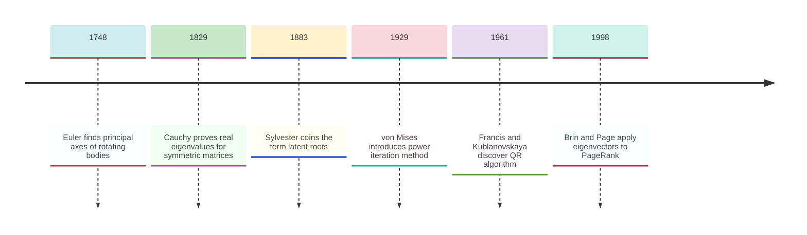
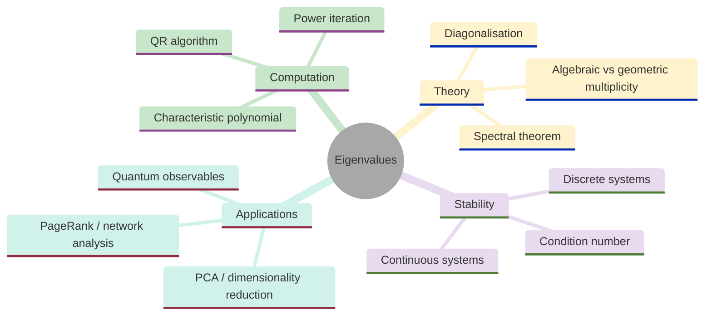
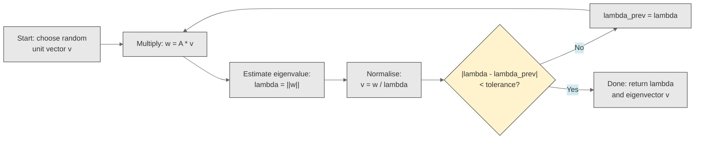
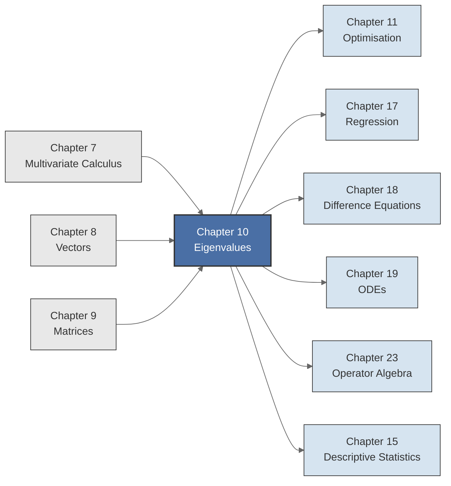

<!-- Copyright (c) 2025-2026 Bob Jansen <bobjansen@pm.me> -->
<!-- SPDX-License-Identifier: CC-BY-NC-4.0 -->
<!-- See LICENSE for full terms. Commercial licensing available. -->
# Chapter 10: Eigenvalues & Eigenvectors


**Part III**: Linear Algebra

> An eigenvector is a direction that a linear transformation merely stretches or compresses without rotating; the stretching factor is the eigenvalue. This simple geometric idea is one of the most powerful organising principles in mathematics, with applications spanning quantum mechanics, data science, economic stability analysis and web page ranking.

**Prerequisites**: [Chapter 7](07-multivariate-calculus.md) (Multivariate Calculus); Hessian matrix eigenvalues for critical point classification. [Chapter 8](08-vectors.md) (Vectors); familiarity with vector spaces, linear independence, dot product and norms. [Chapter 9](09-matrices.md) (Matrices); matrix multiplication, determinants, matrix inverse and solving linear systems $A\mathbf{x} = \mathbf{b}$. The characteristic polynomial requires computing determinants; diagonalisation requires matrix inverse.

**Learning Objectives**: After this chapter, the reader will be able to:

1. State and solve the eigenvalue equation $A\mathbf{v} = \lambda\mathbf{v}$ for a given matrix $A$.
2. Compute characteristic polynomials and extract eigenvalues as their roots.
3. Determine the algebraic and geometric multiplicity of each eigenvalue.
4. Diagonalise a matrix when possible and explain when diagonalisation fails.
5. Apply the power iteration algorithm to approximate the dominant eigenvalue numerically.
6. State and interpret the spectral theorem for real symmetric matrices.

**Connections**: This chapter is used by [Chapter 18](18-difference-equations.md) (Difference Equations; stability of a discrete dynamical system $\mathbf{x}_{k+1} = A\mathbf{x}_k$ depends on whether $|\lambda| < 1$ for all eigenvalues), [Chapter 19](19-odes.md) (Ordinary Differential Equations; stability of $\dot{\mathbf{x}} = A\mathbf{x}$ depends on whether $\operatorname{Re}(\lambda) < 0$), [Chapter 11](11-unconstrained-optimization.md) (Optimisation; a critical point is a local minimum if and only if all Hessian eigenvalues are positive), [Chapter 17](17-regression.md) (Regression; principal component analysis uses the eigenvectors of the covariance matrix), [Chapter 15](15-descriptive-statistics.md) (Descriptive Statistics; covariance matrix eigendecomposition) and [Chapter 23](23-operator-algebra.md) (Operator Algebra; eigenvalues of linear operators on function spaces).

---

## Historical Context

**Key Milestones in Eigenvalue Theory**



*Figure 10.1: Key milestones in eigenvalue theory from Euler's principal axes to PageRank.*

**Principal axes and the eigenvalue concept (1748).** The eigenvalue concept predated its name by more than a century. Leonhard Euler, in his 1748 work on rigid-body rotation, sought the *principal axes* of a solid rotating about a fixed point. These are directions that remain fixed under the rotation. In modern terms, the principal axes are the eigenvectors of the inertia tensor; the moments of inertia about them are the eigenvalues. Euler's formulation required solving a cubic characteristic equation, though he lacked the general terminology.

**The spectral theorem for symmetric matrices (1829).** Augustin-Louis Cauchy proved in 1829 that every real symmetric matrix has real eigenvalues. The result, now part of the spectral theorem, was motivated by the geometry of quadratic surfaces (ellipsoids, hyperboloids) and had immediate consequences for mechanics and physics. It established that symmetric matrices possess algebraic structure that simplifies analysis in statistics, optimisation and physics.

**Latent roots and matrix vocabulary (1883).** James Joseph Sylvester coined the term *latent roots* in 1883, in his paper "On the Equation to the Secular Inequalities in the Planetary Theory" published in the *Philosophical Magazine*. The word "latent" expressed the idea that these roots lie hidden within the matrix, extracted by the characteristic equation. Sylvester also introduced much of the vocabulary of matrix algebra, including the term "matrix" itself.

**From eigenvalues to spectral theory (1904).** The modern terminology comes from the German word *eigen*, meaning "own" or "characteristic." David Hilbert used *Eigenwert* (eigenvalue) in his 1904 work on integral equations, extending the concept from finite-dimensional matrices to infinite-dimensional operators. Hilbert's *spectral theory* took its name from the analogy between the eigenvalues of a self-adjoint operator and spectral lines of light. Through the work of von Neumann and Dirac, spectral theory became central to quantum mechanics. Observable quantities (position, momentum, energy) are represented by self-adjoint operators; the possible measurement outcomes are the eigenvalues.

**Numerical algorithms for eigenvalue computation (1929).** Richard von Mises introduced *power iteration* in 1929. The method repeatedly multiplies a vector by the matrix; the result converges to the dominant eigenvector. Its convergence rate depends on the ratio of the two largest eigenvalues in magnitude. John G.F. Francis in England and Vera Kublanovskaya in the Soviet Union independently discovered the *QR algorithm* in 1961. The method reduces a matrix to upper triangular form through a sequence of orthogonal transformations, computing all eigenvalues simultaneously. It remains the standard method for dense eigenvalue problems and is the engine behind `numpy.linalg.eig` and MATLAB's `eig`.

**Modern applications across disciplines (1947–1998).** Eigenvalue analysis pervades quantitative disciplines. In data science, principal component analysis (PCA) computes the eigenvectors of the covariance matrix to find directions of greatest variance. Brin and Page introduced PageRank in 1998, ranking web pages by the dominant eigenvector of a modified adjacency matrix. Paul Samuelson's 1947 stability analysis of market equilibria reduced to checking whether all eigenvalues of the Jacobian of the excess demand system have negative real parts. In cryptography, the security of lattice-based schemes depends on problems related to eigenvalue computation.

---

## Why This Chapter Matters

**Eigenvalues**



*Figure 10.2: Mind map of eigenvalue concepts covering computation, theory and applications.*

The eigenvalue decomposition determines the stability of a linear dynamical system. If any eigenvalue has positive real part, the system is unstable. This single test connects matrix algebra to control theory, economics and physics.

Hessian eigenvalues at a critical point classify it. All positive: local minimum. All negative: local maximum. Mixed signs: saddle point. [Chapter 11](11-unconstrained-optimization.md) uses this second-order test to classify critical points; Newton's method relies on it for quadratic convergence. The condition number $\kappa = \lambda_{\max}/\lambda_{\min}$ of the Hessian governs the convergence rate of gradient descent. A large condition number produces elongated level curves and slow, zigzagging convergence. A condition number near 1 produces nearly circular level curves and rapid convergence.

Principal component analysis (PCA) computes the eigenvectors of the covariance matrix to find directions of greatest variance in a dataset. PageRank ranks web pages by the dominant eigenvector of a modified adjacency matrix, applying power iteration (Algorithm 10.22 of this chapter) directly. The stability of a discrete dynamical system $\mathbf{x}_{k+1} = A\mathbf{x}_k$ depends on whether all eigenvalues satisfy $|\lambda| < 1$; this condition governs models of economic dynamics, population growth and Markov chains. In quantum mechanics, the observable values of a physical quantity are the eigenvalues of the corresponding operator. The spectral theorem for symmetric matrices (Theorem 10.18) guarantees these values are real.

The spectral theorem states that every real symmetric matrix is orthogonally diagonalisable with real eigenvalues. It guarantees well-behaved decompositions for covariance matrices, Hessians of smooth functions and adjacency matrices of undirected graphs. The QR algorithm computes all eigenvalues in $O(n^3)$ operations and is the engine behind every `eig` function in MATLAB, NumPy and R.

---

## Notation & Conventions

| Symbol | Meaning |
|--------|---------|
| $\lambda$ | An eigenvalue (scalar) |
| $\mathbf{v}$, $\mathbf{w}$ | Eigenvectors (nonzero column vectors) |
| $A$, $B$ | Square matrices ($n \times n$) |
| $I$ | The $n \times n$ identity matrix |
| $p(\lambda)$ | Characteristic polynomial: $p(\lambda) = \det(A - \lambda I)$ |
| $\sigma(A)$ | The spectrum of $A$: the set of all eigenvalues |
| $E_\lambda$ | The eigenspace for eigenvalue $\lambda$: $E_\lambda = \ker(A - \lambda I)$ |
| $P$ | Matrix whose columns are eigenvectors |
| $D$ | Diagonal matrix with eigenvalues on the diagonal |
| $Q$ | Orthogonal matrix ($Q^T Q = I$) |
| $\operatorname{tr}(A)$ | Trace of $A$: sum of diagonal entries |
| $\det(A)$ | Determinant of $A$ |
| $\ker(M)$ | Null space (kernel) of $M$: $\{\mathbf{x} : M\mathbf{x} = \mathbf{0}\}$ |
| $A^T$ | Transpose of $A$ |
| $\mu$ | A shift parameter (scalar) |
| $\varepsilon$ | Convergence tolerance |
| $\operatorname{diag}(\lambda_1, \ldots, \lambda_n)$ | Diagonal matrix with entries $\lambda_1, \ldots, \lambda_n$ on the main diagonal |

Throughout this chapter, all matrices are real unless stated otherwise. Complex eigenvalues are mentioned where they arise naturally (e.g., rotation matrices) but are not developed in full generality.

---

## Core Theory

### The Eigenvalue Problem

**Definition 10.1** (Eigenvalue and eigenvector). Let $A$ be an $n \times n$ matrix. A scalar $\lambda$ is an *eigenvalue* of $A$ if there exists a nonzero vector ([Chapter 8](08-vectors.md)) $\mathbf{v} \in \mathbb{R}^n$ such that

$$A\mathbf{v} = \lambda\mathbf{v}.$$

The nonzero vector $\mathbf{v}$ is called an *eigenvector* of $A$ corresponding to the eigenvalue $\lambda$. The set of all eigenvalues of $A$ is the *spectrum* of $A$, denoted $\sigma(A)$.

Excluding $\mathbf{v} = \mathbf{0}$ is necessary: $A\mathbf{0} = \lambda\mathbf{0}$ holds trivially for every $\lambda$, so the zero vector is excluded by convention. Note also that if $\mathbf{v}$ is an eigenvector for $\lambda$, then so is $\alpha\mathbf{v}$ for any nonzero scalar $\alpha$. Eigenvectors are therefore determined only up to scalar multiples and one often normalises them to have unit length.

**Remark 10.2** (Geometric interpretation). The equation $A\mathbf{v} = \lambda\mathbf{v}$ says that the linear transformation defined by $A$ maps $\mathbf{v}$ to a scalar multiple of itself. Geometrically, an eigenvector is a direction that $A$ does not rotate; it only stretches or compresses. The eigenvalue $\lambda$ is the stretching factor:

- If $\lambda > 0$: $\mathbf{v}$ retains its direction. If additionally $|\lambda| > 1$, the vector is stretched; if $0 < \lambda < 1$, it is compressed.
- If $\lambda < 0$: $\mathbf{v}$ is reversed (flipped through the origin). The magnitude is scaled by $|\lambda|$.
- If $\lambda = 1$: $\mathbf{v}$ is a fixed direction; it is unchanged by $A$.
- If $\lambda = 0$: $\mathbf{v}$ is mapped to the zero vector. This means $A\mathbf{v} = \mathbf{0}$, so $\mathbf{v}$ lies in the null space of $A$ and $A$ is singular.

This geometric picture is the key intuition: eigenanalysis decomposes a linear transformation into its action along "natural" directions.

**Theorem 10.3** (Eigenvalue equation). Let $A$ be an $n \times n$ matrix and $\lambda$ a scalar. The following are equivalent:

1. $\lambda$ is an eigenvalue of $A$ (i.e., $A\mathbf{v} = \lambda\mathbf{v}$ for some $\mathbf{v} \neq \mathbf{0}$).
2. $(A - \lambda I)\mathbf{v} = \mathbf{0}$ has a nontrivial solution.
3. $A - \lambda I$ is singular.
4. $\det(A - \lambda I) = 0$.

??? note "Proof"

    *Proof.* The equivalence of (1) and (2) is immediate: $A\mathbf{v} = \lambda\mathbf{v}$ if and only if $A\mathbf{v} - \lambda I\mathbf{v} = \mathbf{0}$, which is $(A - \lambda I)\mathbf{v} = \mathbf{0}$.

    Statement (2) asserts that some nonzero vector $\mathbf{v}$ lies in $\ker(A - \lambda I)$. This kernel is nonempty (beyond the zero vector) if and only if $A - \lambda I$ is singular, which is statement (3).

    A square matrix is singular if and only if its determinant is zero ([Chapter 9](09-matrices.md)); (3) holds, therefore, if and only if $\det(A - \lambda I) = 0$, which is statement (4).

    $\square$

The practical consequence of Theorem 10.3 is that finding eigenvalues reduces to solving the equation $\det(A - \lambda I) = 0$, which is a polynomial equation in $\lambda$.

**Definition 10.4** (Characteristic polynomial). Let $A$ be an $n \times n$ matrix. The *characteristic polynomial* of $A$ is

$$p(\lambda) = \det(A - \lambda I).$$

This is a polynomial of degree $n$ in $\lambda$. Its roots (real or complex) are the eigenvalues of $A$.

For a $2 \times 2$ matrix $A = \begin{pmatrix} a & b \\ c & d \end{pmatrix}$, the characteristic polynomial is

$$p(\lambda) = \det\begin{pmatrix} a - \lambda & b \\ c & d - \lambda \end{pmatrix} = (a - \lambda)(d - \lambda) - bc = \lambda^2 - (a+d)\lambda + (ad - bc).$$

This equals $\lambda^2 - \operatorname{tr}(A)\lambda + \det(A)$, a formula that recurs throughout this chapter.

**Theorem 10.5** (Eigenvalues are roots of the characteristic polynomial). Let $A$ be an $n \times n$ matrix with characteristic polynomial $p(\lambda) = \det(A - \lambda I)$. A scalar $\lambda_0$ is an eigenvalue of $A$ if and only if $p(\lambda_0) = 0$.

??? note "Proof"

    *Proof.* This is an immediate restatement of the equivalence (1) $\Leftrightarrow$ (4) in Theorem 10.3.

    $\square$

By the fundamental theorem of algebra, the characteristic polynomial of an $n \times n$ matrix has exactly $n$ roots (counted with multiplicity) in the complex numbers. Some or all of these roots may be real. A real matrix can have complex eigenvalues, but they always occur in conjugate pairs (since the characteristic polynomial has real coefficients).

**Example 10.6** (Symmetric $2 \times 2$ matrix). Find the eigenvalues and eigenvectors of

$$A = \begin{pmatrix} 2 & 1 \\ 1 & 2 \end{pmatrix}.$$

*Solution.* The characteristic polynomial is

$$p(\lambda) = \det\begin{pmatrix} 2-\lambda & 1 \\ 1 & 2-\lambda \end{pmatrix} = (2-\lambda)^2 - 1 = \lambda^2 - 4\lambda + 3 = (\lambda - 1)(\lambda - 3).$$

The eigenvalues are $\lambda_1 = 1$ and $\lambda_2 = 3$.

For $\lambda_1 = 1$: solve $(A - I)\mathbf{v} = \mathbf{0}$:

$$\begin{pmatrix} 1 & 1 \\ 1 & 1 \end{pmatrix}\mathbf{v} = \mathbf{0}.$$

This gives $v_1 + v_2 = 0$, so

$$\mathbf{v}_1 = \begin{pmatrix} 1 \\ -1 \end{pmatrix}$$

(or any scalar multiple).

For $\lambda_2 = 3$: solve $(A - 3I)\mathbf{v} = \mathbf{0}$:

$$\begin{pmatrix} -1 & 1 \\ 1 & -1 \end{pmatrix}\mathbf{v} = \mathbf{0}.$$

This gives $-v_1 + v_2 = 0$, so

$$\mathbf{v}_2 = \begin{pmatrix} 1 \\ 1 \end{pmatrix}$$

(or any scalar multiple).

Note that $\mathbf{v}_1 \cdot \mathbf{v}_2 = 1 \cdot 1 + (-1) \cdot 1 = 0$: the eigenvectors are orthogonal. This is not a coincidence; it is guaranteed by the spectral theorem (Theorem 10.18) because $A$ is symmetric.

**Example 10.7** (Rotation matrix). Find the eigenvalues of

$$A = \begin{pmatrix} 0 & -1 \\ 1 & 0 \end{pmatrix}.$$

*Solution.* This matrix represents rotation by $90°$ counterclockwise. The characteristic polynomial is

$$p(\lambda) = \det\begin{pmatrix} -\lambda & -1 \\ 1 & -\lambda \end{pmatrix} = \lambda^2 + 1.$$

The equation $\lambda^2 + 1 = 0$ has no real solutions. The eigenvalues are $\lambda = \pm i$, where $i = \sqrt{-1}$.

Geometrically, this is expected: a $90°$ rotation has no direction that it merely stretches; every direction is rotated. The absence of real eigenvalues is a hallmark of pure rotations. Complex eigenvalues arise naturally from rotational behaviour, but their full treatment requires complex vector spaces, which are beyond the scope of this chapter.

### Algebraic and Geometric Multiplicity

**Definition 10.8** (Algebraic multiplicity). Let $\lambda_0$ be an eigenvalue of $A$ with characteristic polynomial $p(\lambda)$. The *algebraic multiplicity* of $\lambda_0$ is its multiplicity as a root of $p(\lambda)$. That is, it is the largest integer $m$ such that $(\lambda - \lambda_0)^m$ divides $p(\lambda)$.

**Definition 10.9** (Geometric multiplicity). Let $\lambda_0$ be an eigenvalue of $A$. The *eigenspace* for $\lambda_0$ is $E_{\lambda_0} = \ker(A - \lambda_0 I) = \{\mathbf{v} \in \mathbb{R}^n : A\mathbf{v} = \lambda_0\mathbf{v}\}$. The *geometric multiplicity* of $\lambda_0$ is $\dim(E_{\lambda_0})$, the dimension of the eigenspace.

The algebraic multiplicity counts how many times $\lambda_0$ appears as a root; the geometric multiplicity counts how many linearly independent eigenvectors correspond to $\lambda_0$. These two quantities can differ, and the gap between them has important structural consequences.

**Theorem 10.10** (Geometric multiplicity is bounded by algebraic multiplicity). For any eigenvalue $\lambda_0$ of a matrix $A$, the geometric multiplicity is at most the algebraic multiplicity:

$$1 \leq \dim(E_{\lambda_0}) \leq m_{\lambda_0},$$

where $m_{\lambda_0}$ is the algebraic multiplicity.

??? note "Proof"

    *Proof sketch.* The lower bound holds because $\lambda_0$ is an eigenvalue, so there exists at least one eigenvector, hence $\dim(E_{\lambda_0}) \geq 1$.

    For the upper bound, suppose the geometric multiplicity is $k$ and let $\mathbf{v}_1, \ldots, \mathbf{v}_k$ be a basis for $E_{\lambda_0}$. Extend this to a full basis $\mathbf{v}_1, \ldots, \mathbf{v}_k, \mathbf{w}_{k+1}, \ldots, \mathbf{w}_n$ for $\mathbb{R}^n$.

    In this new basis, the matrix representation of $A$ has $\lambda_0 I_k$ as its upper-left $k \times k$ block (since each $\mathbf{v}_i$ is mapped to $\lambda_0\mathbf{v}_i$). Expanding the determinant $\det(A - \lambda I)$ in this basis reveals that $(\lambda - \lambda_0)^k$ divides the characteristic polynomial, so the characteristic polynomial factors as $(\lambda - \lambda_0)^k \cdot q(\lambda)$ for some polynomial $q$.

    This shows that the algebraic multiplicity $m_{\lambda_0} \geq k$.

    $\square$

### Properties of Eigenvalues

**Theorem 10.11** (Trace and determinant). Let $A$ be an $n \times n$ matrix with eigenvalues $\lambda_1, \lambda_2, \ldots, \lambda_n$ (counted with algebraic multiplicity, possibly complex). Then:

$$\operatorname{tr}(A) = \lambda_1 + \lambda_2 + \cdots + \lambda_n, \qquad \det(A) = \lambda_1 \cdot \lambda_2 \cdots \lambda_n.$$

??? note "Proof"

    *Proof sketch.* The characteristic polynomial, when expanded, takes the form

    $$p(\lambda) = \det(A - \lambda I) = (-1)^n[\lambda^n - \operatorname{tr}(A)\lambda^{n-1} + \cdots + (-1)^n\det(A)].$$

    Since the eigenvalues $\lambda_1, \ldots, \lambda_n$ are the roots of $p(\lambda)$, the factorisation $p(\lambda) = (-1)^n(\lambda - \lambda_1)(\lambda - \lambda_2)\cdots(\lambda - \lambda_n)$ holds.

    By Vieta's formulas for a monic polynomial, the sum of the roots equals the negative of the coefficient of $\lambda^{n-1}$, and the product of the roots equals the constant term times $(-1)^n$. Matching these with the coefficients of the expanded characteristic polynomial yields:

    $$\operatorname{tr}(A) = \lambda_1 + \lambda_2 + \cdots + \lambda_n, \qquad \det(A) = \lambda_1 \cdot \lambda_2 \cdots \lambda_n.$$

    For the $2 \times 2$ case, these identities follow directly from $p(\lambda) = \lambda^2 - \operatorname{tr}(A)\lambda + \det(A)$ and Vieta's formulas: $\lambda_1 + \lambda_2 = \operatorname{tr}(A)$ and $\lambda_1\lambda_2 = \det(A)$.

    $\square$

!!! tip "Quick consistency check"
    After computing eigenvalues, verify that their sum equals $\operatorname{tr}(A)$ and their product equals $\det(A)$. If a $3 \times 3$ matrix has trace 6 and the computed eigenvalues are 1, 2 and 4, something is wrong: $1 + 2 + 4 = 7 \neq 6$.

**Theorem 10.12** (Eigenvalues of special matrices). Let $A$ be an $n \times n$ matrix.

1. *Triangular matrices*: If $A$ is upper triangular, lower triangular or diagonal, then its eigenvalues are the diagonal entries $a_{11}, a_{22}, \ldots, a_{nn}$.
2. *Transpose*: $A$ and $A^T$ have the same eigenvalues (though generally different eigenvectors).
3. *Inverse*: If $A$ is invertible with eigenvalue $\lambda \neq 0$, then $A^{-1}$ has eigenvalue $1/\lambda$ with the same eigenvector.
4. *Matrix powers*: If $\lambda$ is an eigenvalue of $A$ with eigenvector $\mathbf{v}$, then $\lambda^k$ is an eigenvalue of $A^k$ with the same eigenvector $\mathbf{v}$.
5. *Shift*: If $\lambda$ is an eigenvalue of $A$, then $\lambda + \mu$ is an eigenvalue of $A + \mu I$ for any scalar $\mu$.

??? note "Proof"

    *Proof.*

    **(a) Triangular matrices.** For a triangular matrix, $A - \lambda I$ is also triangular, with diagonal entries $a_{ii} - \lambda$. The determinant of a triangular matrix is the product of its diagonal entries:

    $$\det(A - \lambda I) = \prod_{i=1}^n (a_{ii} - \lambda).$$

    This is zero if and only if $\lambda = a_{ii}$ for some $i$.

    **(b) Transpose.** The characteristic polynomials of $A$ and $A^T$ are equal: $\det(A^T - \lambda I) = \det((A - \lambda I)^T) = \det(A - \lambda I)$, using $(A^T - \lambda I) = (A - \lambda I)^T$ (since $I^T = I$) and that the determinant of a matrix equals the determinant of its transpose.

    **(c) Inverse.** If $A\mathbf{v} = \lambda\mathbf{v}$ and $\lambda \neq 0$, multiply both sides on the left by $A^{-1}$:

    $$A^{-1}(A\mathbf{v}) = A^{-1}(\lambda\mathbf{v}) \implies \mathbf{v} = \lambda A^{-1}\mathbf{v} \implies A^{-1}\mathbf{v} = \tfrac{1}{\lambda}\mathbf{v}.$$

    **(d) Matrix powers.** By induction on $k$. The base case $k = 1$ is the definition of eigenvector. For the inductive step, assume $A^k\mathbf{v} = \lambda^k\mathbf{v}$. Then:

    $$A^{k+1}\mathbf{v} = A(A^k\mathbf{v}) = A(\lambda^k\mathbf{v}) = \lambda^k(A\mathbf{v}) = \lambda^k \cdot \lambda\mathbf{v} = \lambda^{k+1}\mathbf{v}.$$

    **(e) Shift.** If $A\mathbf{v} = \lambda\mathbf{v}$, then $(A + \mu I)\mathbf{v} = A\mathbf{v} + \mu\mathbf{v} = \lambda\mathbf{v} + \mu\mathbf{v} = (\lambda + \mu)\mathbf{v}$.

    $\square$

**Theorem 10.13** (Eigenvectors for distinct eigenvalues are linearly independent). Let $A$ be an $n \times n$ matrix with distinct eigenvalues $\lambda_1, \lambda_2, \ldots, \lambda_k$ (where $k \leq n$), and let $\mathbf{v}_1, \mathbf{v}_2, \ldots, \mathbf{v}_k$ be corresponding eigenvectors. Then $\mathbf{v}_1, \ldots, \mathbf{v}_k$ are linearly independent.

??? note "Proof"

    *Proof.* By induction on $k$. The base case $k = 1$ is trivial: a single nonzero vector is linearly independent.

    For the inductive step, assume the result holds for any $k-1$ eigenvectors corresponding to distinct eigenvalues. Suppose for contradiction that $\mathbf{v}_1, \ldots, \mathbf{v}_k$ are linearly dependent. Then there exist scalars $c_1, \ldots, c_k$, not all zero, such that

    $$c_1\mathbf{v}_1 + c_2\mathbf{v}_2 + \cdots + c_k\mathbf{v}_k = \mathbf{0}. \qquad (*)$$

    Multiplying both sides of $(*)$ on the left by $A$ and using $A\mathbf{v}_i = \lambda_i\mathbf{v}_i$:

    $$c_1\lambda_1\mathbf{v}_1 + c_2\lambda_2\mathbf{v}_2 + \cdots + c_k\lambda_k\mathbf{v}_k = \mathbf{0}. \qquad (**)$$

    Now multiply $(*)$ by $\lambda_k$ and subtract from $(**)$:

    $$c_1(\lambda_1 - \lambda_k)\mathbf{v}_1 + c_2(\lambda_2 - \lambda_k)\mathbf{v}_2 + \cdots + c_{k-1}(\lambda_{k-1} - \lambda_k)\mathbf{v}_{k-1} = \mathbf{0}.$$

    By the induction hypothesis, $\mathbf{v}_1, \ldots, \mathbf{v}_{k-1}$ are linearly independent. Since the eigenvalues are distinct, $\lambda_i - \lambda_k \neq 0$ for $i < k$, so each coefficient $c_i(\lambda_i - \lambda_k)$ must be zero. This forces $c_i = 0$ for $i = 1, \ldots, k-1$.

    Substituting back into $(*)$ then gives $c_k\mathbf{v}_k = \mathbf{0}$, and since $\mathbf{v}_k \neq \mathbf{0}$, it follows that $c_k = 0$. All coefficients are zero, contradicting the assumption of linear dependence.

    $\square$

### Diagonalisation

**Definition 10.14** (Diagonalisable). An $n \times n$ matrix $A$ is *diagonalisable* if there exists an invertible matrix $P$ and a diagonal matrix $D$ such that

$$A = PDP^{-1}.$$

Equivalently, $D = P^{-1}AP$. The columns of $P$ are eigenvectors of $A$ and the diagonal entries of $D$ are the corresponding eigenvalues.

To see why, write $P = [\mathbf{v}_1 \mid \mathbf{v}_2 \mid \cdots \mid \mathbf{v}_n]$ and $D = \operatorname{diag}(\lambda_1, \ldots, \lambda_n)$. Then $AP = PD$ reads, column by column, $A\mathbf{v}_i = \lambda_i\mathbf{v}_i$ for each $i$. So $A = PDP^{-1}$ if and only if $A$ has $n$ linearly independent eigenvectors (to form an invertible $P$).

**Theorem 10.15** (Diagonalisation criterion). An $n \times n$ matrix $A$ is diagonalisable if and only if $A$ has $n$ linearly independent eigenvectors.

A sufficient (but not necessary) condition is that $A$ has $n$ distinct eigenvalues: by Theorem 10.13, the eigenvectors are then automatically linearly independent.

A matrix with repeated eigenvalues may or may not be diagonalisable, depending on whether the geometric multiplicity of each eigenvalue equals its algebraic multiplicity.

??? note "Proof"

    *Proof.* ($\Rightarrow$) If $A = PDP^{-1}$, then $AP = PD$. Reading this column by column, $A\mathbf{v}_i = \lambda_i\mathbf{v}_i$ where $\mathbf{v}_i$ is the $i$-th column of $P$ and $\lambda_i$ is the $i$-th diagonal entry of $D$. So the columns of $P$ are $n$ eigenvectors of $A$. Since $P$ is invertible, they are linearly independent.

    ($\Leftarrow$) If $A$ has $n$ linearly independent eigenvectors $\mathbf{v}_1, \ldots, \mathbf{v}_n$ with eigenvalues $\lambda_1, \ldots, \lambda_n$, form

    $$P = [\mathbf{v}_1 \mid \cdots \mid \mathbf{v}_n] \quad \text{and} \quad D = \operatorname{diag}(\lambda_1, \ldots, \lambda_n).$$

    Then $AP = PD$ holds column by column (since $A\mathbf{v}_i = \lambda_i\mathbf{v}_i$). Since $P$ is invertible (its columns are linearly independent), right-multiplying by $P^{-1}$ yields $A = PDP^{-1}$.

    $\square$

**Diagonalisation Process**

```mermaid
%%{init: {"theme": "base", "themeVariables": {"primaryColor": "#e8e8e8", "primaryTextColor": "#333333", "primaryBorderColor": "#555555", "lineColor": "#666666", "secondaryColor": "#d1ecf1", "tertiaryColor": "#c8e6c9"}}}%%
flowchart LR
    A["Start with n x n<br/>matrix A"] --> B["Compute characteristic<br/>polynomial det(A - lambda I) = 0"]
    B --> C["Find eigenvalues<br/>lambda_1, ..., lambda_n<br/>(roots of char. poly.)"]
    C --> D["For each lambda_i, solve<br/>(A - lambda_i I)v = 0<br/>to find eigenvectors"]
    D --> E{"n linearly independent<br/>eigenvectors found?"}
    E -- No --> F["A is defective:<br/>not diagonalisable"]
    E -- Yes --> G["Form P = [v_1 | v_2 | ... | v_n]<br/>columns are eigenvectors"]
    G --> H["Form D = diag(lambda_1, ..., lambda_n)<br/>eigenvalues on diagonal"]
    H --> I["Verify: A = P D P^{-1}<br/>equivalently A P = P D"]
    style A fill:#e8e8e8,stroke:#333333
    style B fill:#e8e8e8,stroke:#333333
    style C fill:#e8e8e8,stroke:#333333
    style D fill:#e8e8e8,stroke:#333333
    style E fill:#fff3cd,stroke:#333333
    style F fill:#e8e8e8,stroke:#333333
    style G fill:#e8e8e8,stroke:#333333
    style H fill:#e8e8e8,stroke:#333333
    style I fill:#e8e8e8,stroke:#333333
```



*Figure 10.3: Flowchart of the diagonalisation process from matrix to verified decomposition.*

**Remark 10.16** (Power of diagonalisation). If $A = PDP^{-1}$, then

$$A^k = PD^kP^{-1},$$

where $D^k = \operatorname{diag}(\lambda_1^k, \ldots, \lambda_n^k)$. Computing $A^k$ directly requires $k-1$ matrix multiplications, each costing $O(n^3)$, for a total of $O(kn^3)$. With diagonalisation, the cost is one diagonalisation (the dominant step), after which any power $A^k$ requires only computing scalar powers $\lambda_i^k$ and two matrix multiplications, in $O(n^3)$ regardless of $k$.

This is the reason diagonalisation is central to the study of difference equations ([Chapter 18](18-difference-equations.md)). A linear recurrence $\mathbf{x}_{k+1} = A\mathbf{x}_k$ has the closed-form solution $\mathbf{x}_k = A^k\mathbf{x}_0 = PD^kP^{-1}\mathbf{x}_0$. The long-term behaviour is governed by the largest $|\lambda_i|$: if $|\lambda_i| < 1$ for all $i$, then $D^k \to 0$ and the system decays to equilibrium. If any $|\lambda_i| > 1$, the system grows without bound. This eigenvalue criterion for stability is one of the most widely applied results in applied mathematics.

**Remark 10.17** (Not all matrices are diagonalisable). Consider the matrix

$$A = \begin{pmatrix} 1 & 1 \\ 0 & 1 \end{pmatrix}.$$

The characteristic polynomial is $p(\lambda) = (1-\lambda)^2$, so $\lambda = 1$ is the only eigenvalue, with algebraic multiplicity 2. The eigenspace is $\ker(A - I) = \ker\begin{pmatrix} 0 & 1 \\ 0 & 0 \end{pmatrix} = \operatorname{span}\left\{\begin{pmatrix} 1 \\ 0 \end{pmatrix}\right\}$, which has dimension 1. The geometric multiplicity (1) is strictly less than the algebraic multiplicity (2), so $A$ has only one linearly independent eigenvector and is not diagonalisable.

Such matrices are called *defective*. Their analysis requires the Jordan normal form, which replaces the diagonal matrix $D$ with a nearly diagonal matrix containing ones on the superdiagonal within each Jordan block. The Jordan form exists for every square matrix but is beyond the scope of this chapter.

### The Spectral Theorem for Symmetric Matrices

**Theorem 10.18** (Spectral theorem for real symmetric matrices). Let $A$ be a real $n \times n$ symmetric matrix ($A = A^T$). Then:

1. All eigenvalues of $A$ are real.
2. Eigenvectors corresponding to distinct eigenvalues are orthogonal.
3. $A$ is *orthogonally diagonalisable*: there exists an orthogonal matrix $Q$ (i.e., $Q^TQ = QQ^T = I$) and a real diagonal matrix $D$ such that $A = QDQ^T$. The columns of $Q$ are orthonormal eigenvectors of $A$.

!!! abstract "Key Result"

    **Theorem 10.18** (Spectral theorem). Every real symmetric matrix has real eigenvalues and an orthonormal basis of eigenvectors, yielding the decomposition $A = QDQ^T$ that underpins principal component analysis, quadratic form classification and the second-order optimality conditions.

??? note "Proof"

    *Proof of (1).* Suppose $A\mathbf{v} = \lambda\mathbf{v}$ where $\mathbf{v} \neq \mathbf{0}$ and $\lambda, \mathbf{v}$ are possibly complex. Take the conjugate transpose of both sides:

    $$\bar{\mathbf{v}}^T A^T = \bar\lambda\, \bar{\mathbf{v}}^T.$$

    Since $A$ is real and symmetric, $A^T = A$, so $\bar{\mathbf{v}}^T A = \bar\lambda\, \bar{\mathbf{v}}^T$. Now multiply the original equation on the left by $\bar{\mathbf{v}}^T$:

    $$\bar{\mathbf{v}}^T A \mathbf{v} = \lambda\, \bar{\mathbf{v}}^T \mathbf{v}.$$

    From the conjugate equation, $\bar{\mathbf{v}}^T A \mathbf{v} = \bar\lambda\, \bar{\mathbf{v}}^T \mathbf{v}$. It follows that $\lambda\, \bar{\mathbf{v}}^T\mathbf{v} = \bar\lambda\, \bar{\mathbf{v}}^T\mathbf{v}$.

    Since $\bar{\mathbf{v}}^T\mathbf{v} = \sum_i |\mathbf{v}_i|^2 > 0$ (because $\mathbf{v} \neq \mathbf{0}$), dividing by this quantity gives $\lambda = \bar\lambda$, which means $\lambda$ is real.

    $\square$

??? note "Proof"

    *Proof of (2).* Let $\lambda_1 \neq \lambda_2$ be eigenvalues with eigenvectors $\mathbf{v}_1, \mathbf{v}_2$. Compute the dot product $\mathbf{v}_1 \cdot \mathbf{v}_2$ in two ways using the eigenvalue equations.

    Starting from the left eigenvector perspective:

    $$\lambda_1(\mathbf{v}_1 \cdot \mathbf{v}_2) = (\lambda_1\mathbf{v}_1) \cdot \mathbf{v}_2 = (A\mathbf{v}_1) \cdot \mathbf{v}_2 = \mathbf{v}_1 \cdot (A^T\mathbf{v}_2) = \mathbf{v}_1 \cdot (A\mathbf{v}_2) = \mathbf{v}_1 \cdot (\lambda_2\mathbf{v}_2) = \lambda_2(\mathbf{v}_1 \cdot \mathbf{v}_2).$$

    The step $(A\mathbf{v}_1) \cdot \mathbf{v}_2 = \mathbf{v}_1 \cdot (A^T\mathbf{v}_2)$ uses the identity $(A\mathbf{u}) \cdot \mathbf{w} = \mathbf{u} \cdot (A^T\mathbf{w})$, and then $A^T = A$ by symmetry.

    Rearranging: $(\lambda_1 - \lambda_2)(\mathbf{v}_1 \cdot \mathbf{v}_2) = 0$. Since $\lambda_1 \neq \lambda_2$, it follows that $\mathbf{v}_1 \cdot \mathbf{v}_2 = 0$.

    $\square$

Property (3) follows from (1) and (2) together with the Gram–Schmidt process: for each eigenvalue with geometric multiplicity greater than 1, one can orthonormalise the eigenvectors within that eigenspace. The full proof that every real symmetric matrix has a complete set of $n$ orthonormal eigenvectors uses that the eigenspace decomposition of a symmetric matrix accounts for all $n$ dimensions (i.e., geometric multiplicity equals algebraic multiplicity for every eigenvalue), which is stated without proof.

**Remark 10.19** (Significance of the spectral theorem). The spectral theorem is the reason symmetric matrices occupy a privileged place in applied mathematics. Three consequences deserve emphasis:

1. *Guaranteed diagonalisability.* Unlike general matrices, which may be defective, symmetric matrices always diagonalise. No such pathological cases exist.

2. *Real eigenvalues.* The eigenvalues are always real, so questions about sign (positive, negative, zero) are well-posed. This property is necessary for definiteness tests in optimisation.

3. *Orthogonal eigenvectors.* The eigenvectors form an orthonormal basis for $\mathbb{R}^n$. This means the diagonalisation $A = QDQ^T$ involves no matrix inversion (since $Q^{-1} = Q^T$ for orthogonal $Q$), which is both numerically stable and computationally efficient.

These properties explain why symmetric matrices appear everywhere: the Hessian matrix of a $C^2$ function ([Chapter 7](07-multivariate-calculus.md)) is symmetric, the covariance matrix in statistics ([Chapter 15](15-descriptive-statistics.md)) is symmetric and positive semidefinite, the adjacency matrix of an undirected graph is symmetric and the Laplacian matrix used in spectral clustering is symmetric.

### Matrix Exponential

**Definition 10.20** (Matrix exponential). For an $n \times n$ matrix $A$ and a scalar $t$, the *matrix exponential* is defined by the power series

$$e^{At} = \sum_{k=0}^{\infty} \frac{(At)^k}{k!} = I + At + \frac{(At)^2}{2!} + \frac{(At)^3}{3!} + \cdots.$$

This series converges for every square matrix $A$ and every $t \in \mathbb{R}$.

If $A$ is diagonalisable with $A = PDP^{-1}$, the matrix exponential simplifies to

$$e^{At} = P e^{Dt} P^{-1},$$

where $e^{Dt} = \operatorname{diag}(e^{\lambda_1 t}, e^{\lambda_2 t}, \ldots, e^{\lambda_n t})$ is computed by exponentiating each diagonal entry separately.

The matrix exponential is the fundamental object in the theory of linear ordinary differential equations: the system $\dot{\mathbf{x}} = A\mathbf{x}$ with initial condition $\mathbf{x}(0) = \mathbf{x}_0$ has the unique solution $\mathbf{x}(t) = e^{At}\mathbf{x}_0$ ([Chapter 19](19-odes.md)). The stability of the system is determined by the eigenvalues of $A$: if $\operatorname{Re}(\lambda_i) < 0$ for all $i$, then $e^{\lambda_i t} \to 0$ as $t \to \infty$ and the system is asymptotically stable.

The matrix exponential is documented here for theoretical completeness but is not implemented in the current version of Evenwicht.

---

## Formulas & Identities

### Characteristic Polynomial

**F10.1** ($2 \times 2$ case) For $A = \begin{pmatrix} a & b \\ c & d \end{pmatrix}$:

$$p(\lambda) = \lambda^2 - (a+d)\lambda + (ad - bc) = \lambda^2 - \operatorname{tr}(A)\lambda + \det(A).$$

**F10.2** (General case)

$$p(\lambda) = \det(A - \lambda I),$$

a polynomial of degree $n$.

### Trace and Determinant

**F10.3** (Eigenvalue sum equals trace)

$$\operatorname{tr}(A) = \sum_{i=1}^n \lambda_i.$$

**F10.4** (Eigenvalue product equals determinant)

$$\det(A) = \prod_{i=1}^n \lambda_i.$$

### Diagonalisation

**F10.5** (Matrix powers via diagonalisation)

$$A = PDP^{-1} \implies A^k = PD^kP^{-1}, \quad D^k = \operatorname{diag}(\lambda_1^k, \ldots, \lambda_n^k).$$

**F10.6** (Spectral decomposition of symmetric matrices)

$$A = QDQ^T,$$

where $Q$ is orthogonal and $D$ is real diagonal.

### Eigenvalue Transformations

**F10.7** (Inverse eigenvalues)

$$\sigma(A^{-1}) = \{1/\lambda : \lambda \in \sigma(A)\},$$

when $A$ is invertible.

**F10.8** (Shift)

$$\sigma(A + \mu I) = \{\lambda + \mu : \lambda \in \sigma(A)\}.$$

**F10.9** (Powers)

$$\sigma(A^k) = \{\lambda^k : \lambda \in \sigma(A)\}.$$

### Spectral Theorem Consequences

**F10.10** (Real eigenvalues) Symmetric $A$:

$$\lambda_i \in \mathbb{R} \quad \text{for all } i.$$

**F10.11** (Orthogonal eigenvectors) Symmetric $A$: eigenvectors for distinct eigenvalues are orthogonal.

**F10.12** (Positive definiteness) A symmetric matrix $A$ is positive definite if and only if all its eigenvalues are positive:

$$A \text{ positive definite} \quad \Leftrightarrow \quad A = A^T \text{ and } \lambda_i > 0 \text{ for all } i.$$

**F10.13** (Positive semidefiniteness)

$$A \text{ positive semidefinite} \quad \Leftrightarrow \quad A = A^T \text{ and } \lambda_i \geq 0 \text{ for all } i.$$

---

## Algorithms

### Algorithm 10.21: Characteristic Polynomial for Small Matrices

**For $2 \times 2$ matrices** (direct formula):

**Input**: Matrix $A = \begin{pmatrix} a & b \\ c & d \end{pmatrix}$.

**Output**: Coefficients $(1, -(a+d), ad-bc)$ of $p(\lambda) = \lambda^2 + c_1\lambda + c_0$.

```
function characteristicPolynomial2x2(A):
    trace = A[0][0] + A[1][1]
    det   = A[0][0] * A[1][1] - A[0][1] * A[1][0]
    return [1, -trace, det]    // coefficients of lambda^2, lambda^1, lambda^0
```

**Complexity**: $O(1)$ for the $2 \times 2$ case.

The eigenvalues are then $\lambda = \frac{\operatorname{tr}(A) \pm \sqrt{\operatorname{tr}(A)^2 - 4\det(A)}}{2}$.

**For $3 \times 3$ matrices**: Expand $\det(A - \lambda I)$ using cofactor expansion along the first row, collecting terms by powers of $\lambda$.

**For larger matrices**: Direct computation of the characteristic polynomial via determinant expansion is $O(n!)$ and numerically unstable. For $n > 4$, iterative numerical methods (Algorithm 10.22, 10.23) are strongly preferred. The Faddeev–LeVerrier algorithm computes characteristic polynomial coefficients in $O(n^4)$ using traces of matrix powers, but the resulting polynomial root-finding step is itself ill-conditioned.

!!! warning "Characteristic polynomial is numerically unstable for $n > 4$"
    Never compute eigenvalues by finding roots of the characteristic polynomial for matrices larger than $4 \times 4$. The polynomial coefficients amplify rounding errors and small perturbations in coefficients can produce large eigenvalue shifts. Use iterative methods (power iteration, inverse iteration, QR) instead.

### Algorithm 10.22: Power Iteration

Power iteration is the simplest algorithm for finding the dominant eigenvalue (the eigenvalue largest in absolute value) and its corresponding eigenvector.

**Input**: Matrix $A$ ($n \times n$), optional tolerance $\varepsilon > 0$, optional maximum number of iterations $N$.

**Output**: Approximate dominant eigenvalue $\lambda$ and corresponding unit eigenvector $\mathbf{v}$.

```
function powerIteration(A, tolerance = 1e-10, maxIterations = 1000):
    n = A.rows
    v = randomUnitVector(n)          // step 1: random initial vector, normalised
    lambda_prev = 0

    for k = 1 to maxIterations:
        w = A * v                    // step 2: multiply by A
        lambda = norm(w)             // step 3: estimate eigenvalue as ||w||
        if lambda == 0:
            throw "zero eigenvalue or starting vector in null space"
        v = w / lambda               // step 4: normalise

        if |lambda - lambda_prev| < tolerance:
            return { eigenvalue: lambda, eigenvector: v }
        lambda_prev = lambda

    throw "did not converge within maxIterations"
```

**Correctness.** Write the initial vector in the eigenbasis: $\mathbf{v}_0 = c_1\mathbf{u}_1 + c_2\mathbf{u}_2 + \cdots + c_n\mathbf{u}_n$, where $A\mathbf{u}_i = \lambda_i\mathbf{u}_i$ and $|\lambda_1| > |\lambda_2| \geq \cdots \geq |\lambda_n|$. After $k$ multiplications by $A$:

$$A^k\mathbf{v}_0 = c_1\lambda_1^k\mathbf{u}_1 + c_2\lambda_2^k\mathbf{u}_2 + \cdots + c_n\lambda_n^k\mathbf{u}_n = \lambda_1^k\left[c_1\mathbf{u}_1 + c_2\left(\frac{\lambda_2}{\lambda_1}\right)^k\mathbf{u}_2 + \cdots\right].$$

Since $|\lambda_2/\lambda_1| < 1$, the terms involving $\lambda_2, \ldots, \lambda_n$ decay geometrically and $A^k\mathbf{v}_0 \to c_1\lambda_1^k\mathbf{u}_1$. After normalisation, the iterate converges to $\pm\mathbf{u}_1$.

**Complexity**: $O(n^2)$ per iteration (one matrix-vector multiplication and one normalisation).

**Convergence rate**: $|\lambda_2/\lambda_1|$ per iteration. If $|\lambda_2| \approx |\lambda_1|$, convergence is slow.

**When it fails**:
- If $|\lambda_1| = |\lambda_2|$ (e.g., eigenvalues $+3$ and $-3$), the iterates oscillate without converging.
- If the initial vector $\mathbf{v}_0$ has $c_1 = 0$ (i.e., $\mathbf{v}_0$ is orthogonal to $\mathbf{u}_1$), the method converges to a different eigenvector. In exact arithmetic this is a problem, but in floating-point arithmetic, round-off errors almost always introduce a small component along $\mathbf{u}_1$, so the method typically recovers.

**Note on sign**: The algorithm as stated uses $\|\mathbf{w}\|$ as the eigenvalue estimate, which gives $|\lambda_1|$. To recover the sign, one can instead use the Rayleigh quotient $\lambda = \mathbf{v}^T A \mathbf{v} / (\mathbf{v}^T \mathbf{v})$, which converges to $\lambda_1$ including sign.

**Power Iteration Algorithm**



*Figure 10.4: Iterative steps of the power iteration algorithm for dominant eigenvalue computation.*

**Eigenvalue Convergence During Power Iteration**

The following chart illustrates how the eigenvalue estimate converges to the dominant eigenvalue over successive iterations. The convergence rate is geometric with ratio $|\lambda_2/\lambda_1|$.

```mermaid
---
config:
  theme: base
  themeVariables:
    xyChart:
      plotColorPalette: "#2563eb, #dc2626, #16a34a, #9333ea, #ca8a04, #0891b2"
      backgroundColor: "#ffffff"
      titleColor: "#333333"
      xAxisLabelColor: "#333333"
      yAxisLabelColor: "#333333"
      xAxisTitleColor: "#333333"
      yAxisTitleColor: "#333333"
      xAxisLineColor: "#333333"
      yAxisLineColor: "#333333"
---
xychart-beta
    x-axis "Iteration" [1, 2, 3, 4, 5, 6, 7, 8, 9, 10]
    y-axis "Eigenvalue Estimate" 2.0 --> 3.6
    line [2.45, 2.83, 3.10, 3.25, 3.34, 3.38, 3.40, 3.41, 3.414, 3.414]
```

*Figure 10.5: Convergence of the eigenvalue estimate toward the dominant eigenvalue over iterations.*

### Algorithm 10.23: Inverse Iteration

Inverse iteration finds the eigenvalue of $A$ closest to a given shift $\mu$.

**Input**: Matrix $A$ ($n \times n$), shift $\mu$, optional tolerance $\varepsilon$, optional maximum iterations $N$.

**Output**: Eigenvalue of $A$ closest to $\mu$ and its eigenvector.

```
function inverseIteration(A, mu, tolerance = 1e-10, maxIterations = 1000):
    B = A - mu * I                   // shifted matrix
    n = A.rows
    v = randomUnitVector(n)
    lambda_prev = 0

    for k = 1 to maxIterations:
        w = solve(B, v)              // solve (A - mu*I) w = v
        lambda_inv = norm(w)
        v = w / lambda_inv

        lambda = mu + 1.0 / lambda_inv
        if |lambda - lambda_prev| < tolerance:
            return { eigenvalue: lambda, eigenvector: v }
        lambda_prev = lambda

    throw "did not converge within maxIterations"
```

**Complexity**: $O(n^3)$ per iteration, dominated by solving the linear system $(A - \mu I)\mathbf{w} = \mathbf{v}$.

**Why it works**: The eigenvalues of $(A - \mu I)^{-1}$ are $1/(\lambda_i - \mu)$. The largest of these corresponds to the eigenvalue $\lambda_i$ closest to $\mu$. Power iteration on $(A - \mu I)^{-1}$ therefore converges to that eigenvector, and the eigenvalue is recovered as $\mu + 1/\lambda_{\mathrm{inv}}$.

Inverse iteration is particularly useful when a good approximation $\mu$ to an eigenvalue is already known (e.g., from the characteristic polynomial for small matrices, or from a previous less-accurate computation). The convergence rate is $|(\lambda_j - \mu)/(\lambda_i - \mu)|$ where $\lambda_j$ is the second-closest eigenvalue to $\mu$ and this ratio can be very small when $\mu$ is close to $\lambda_i$.

**Remark on the QR algorithm.** The QR algorithm is the standard industrial method for computing all eigenvalues of a dense matrix. It was discovered independently by John G.F. Francis (1961) and Vera Kublanovskaya (1961). The algorithm performs a sequence of QR factorisations: at each step, factor $A_k = Q_kR_k$ and form $A_{k+1} = R_kQ_k$. The matrices $A_k$ converge to upper triangular form and the diagonal entries converge to the eigenvalues. With shifts and deflation, the cost is $O(n^3)$ for all $n$ eigenvalues.

The QR algorithm is documented here but not implemented in Evenwicht v0.x. For production eigenvalue computation, established libraries such as LAPACK should be used.

---

## Numerical Considerations

**Do not find eigenvalues via the characteristic polynomial for $n > 4$.** Computing the characteristic polynomial and then finding its roots is the textbook method but a poor numerical method. For $n$ even moderately large, the characteristic polynomial coefficients can be enormous and polynomial root-finding is ill-conditioned: small perturbations in the coefficients can cause large changes in the roots. The Wilkinson polynomial (degree 20, roots at $1, 2, \ldots, 20$) demonstrates this sensitivity. Iterative methods (power iteration, inverse iteration, QR) work directly with the matrix and avoid this instability.

**Power iteration finds only one eigenvalue.** Power iteration converges to the dominant eigenvalue. To find additional eigenvalues, one can use *deflation*: after finding $\lambda_1$ and $\mathbf{v}_1$, form $A_2 = A - \lambda_1\mathbf{v}_1\mathbf{w}_1^T$ (where $\mathbf{w}_1$ is a left eigenvector or is chosen to make $\mathbf{w}_1^T\mathbf{v}_1 = 1$) and apply power iteration to $A_2$ to find $\lambda_2$. Deflation, however, accumulates errors: each successive eigenvalue is computed from a matrix that carries the numerical errors of all previous deflations. For this reason, deflation is suitable only when a few eigenvalues are needed.

**Convergence depends on the eigenvalue gap.** The convergence rate of power iteration is $|\lambda_2/\lambda_1|$ per step. If the two largest eigenvalues are close in magnitude (a small "eigenvalue gap"), convergence is slow. Accelerations such as the Rayleigh quotient iteration (which uses the Rayleigh quotient as a shift in inverse iteration, achieving cubic convergence for symmetric matrices) can improve performance by orders of magnitude in such cases.

**Conditioning of the eigenvalue problem.** The sensitivity of eigenvalues to perturbations in $A$ depends on the matrix structure:
- *Symmetric matrices*: Eigenvalues are well-conditioned. The Weyl bound guarantees that if $\|\Delta A\| \leq \varepsilon$, then each eigenvalue shifts by at most $\varepsilon$. This is as good as one can hope for.
- *Non-symmetric matrices*: Eigenvalues can be extremely sensitive. The condition number of an eigenvalue $\lambda$ is $1/|\mathbf{y}^T\mathbf{x}|$, where $\mathbf{x}$ and $\mathbf{y}$ are the right and left eigenvectors. If these are nearly orthogonal, the eigenvalue is ill-conditioned. Defective matrices (geometric multiplicity $<$ algebraic multiplicity) represent the worst case: the eigenvalue is infinitely sensitive to perturbations.

!!! warning "Defective matrices have infinite eigenvalue sensitivity"
    For a defective matrix, arbitrarily small perturbations can split a repeated eigenvalue into distinct eigenvalues at distances proportional to $\varepsilon^{1/m}$, where $m$ is the size of the Jordan block. A $2 \times 2$ Jordan block perturbed by $\varepsilon$ produces eigenvalue shifts of order $\sqrt{\varepsilon}$, not $\varepsilon$.

**Eigenvalues of nearly-singular matrices.** A matrix with a small eigenvalue is nearly singular ($\det(A) = \prod\lambda_i$ is small). A nearly-singular matrix, conversely, has an eigenvalue near zero. These eigenvalues are often well-conditioned in absolute terms but poorly conditioned in relative terms, which matters when testing for positive definiteness (Example 10.24).

---

## Worked Examples

### Example 10.24: Eigenvalues and Eigenvectors of a $2 \times 2$ Matrix

**Problem**: Find the eigenvalues and eigenvectors of $A = \begin{pmatrix} 4 & 2 \\ 1 & 3 \end{pmatrix}$.

**Solution (manual)**:

Step 1: Compute the characteristic polynomial.

$$p(\lambda) = \det(A - \lambda I) = \det\begin{pmatrix} 4-\lambda & 2 \\ 1 & 3-\lambda \end{pmatrix} = (4-\lambda)(3-\lambda) - 2 = \lambda^2 - 7\lambda + 10 = (\lambda - 2)(\lambda - 5).$$

The eigenvalues are $\lambda_1 = 2$ and $\lambda_2 = 5$.

Consistency check:

$$\operatorname{tr}(A) = 4 + 3 = 7 = 2 + 5 = \lambda_1 + \lambda_2, \qquad \det(A) = 12 - 2 = 10 = 2 \cdot 5 = \lambda_1\lambda_2.$$

Both agree.

Step 2: Find eigenvectors.

For $\lambda_1 = 2$: Solve $(A - 2I)\mathbf{v} = \mathbf{0}$:

$$\begin{pmatrix} 2 & 2 \\ 1 & 1 \end{pmatrix}\mathbf{v} = \mathbf{0} \implies 2v_1 + 2v_2 = 0 \implies v_1 = -v_2.$$

So $\mathbf{v}_1 = \begin{pmatrix} -1 \\ 1 \end{pmatrix}$ (or any nonzero scalar multiple).

For $\lambda_2 = 5$: Solve $(A - 5I)\mathbf{v} = \mathbf{0}$:

$$\begin{pmatrix} -1 & 2 \\ 1 & -2 \end{pmatrix}\mathbf{v} = \mathbf{0} \implies -v_1 + 2v_2 = 0 \implies v_1 = 2v_2.$$

So $\mathbf{v}_2 = \begin{pmatrix} 2 \\ 1 \end{pmatrix}$ (or any nonzero scalar multiple).

Step 3: Verify.

$$A\mathbf{v}_1 = \begin{pmatrix} 4 & 2 \\ 1 & 3 \end{pmatrix}\begin{pmatrix} -1 \\ 1 \end{pmatrix} = \begin{pmatrix} -2 \\ 2 \end{pmatrix} = 2\begin{pmatrix} -1 \\ 1 \end{pmatrix} = \lambda_1\mathbf{v}_1. \quad \checkmark$$

$$A\mathbf{v}_2 = \begin{pmatrix} 4 & 2 \\ 1 & 3 \end{pmatrix}\begin{pmatrix} 2 \\ 1 \end{pmatrix} = \begin{pmatrix} 10 \\ 5 \end{pmatrix} = 5\begin{pmatrix} 2 \\ 1 \end{pmatrix} = \lambda_2\mathbf{v}_2. \quad \checkmark$$

### Example 10.25: Diagonalise a Symmetric Matrix

**Problem**: Diagonalise the symmetric matrix $A = \begin{pmatrix} 5 & 2 \\ 2 & 2 \end{pmatrix}$ and verify that $A = PDP^{-1}$.

**Solution (manual)**:

Step 1: Characteristic polynomial.

$$p(\lambda) = \lambda^2 - 7\lambda + 6 = (\lambda - 1)(\lambda - 6).$$

Eigenvalues: $\lambda_1 = 1$, $\lambda_2 = 6$.

Step 2: Eigenvectors.

For $\lambda_1 = 1$: $(A - I)\mathbf{v} = \mathbf{0}$ gives

$$\begin{pmatrix} 4 & 2 \\ 2 & 1 \end{pmatrix}\mathbf{v} = \mathbf{0} \implies 4v_1 + 2v_2 = 0 \implies v_2 = -2v_1 \implies \mathbf{v}_1 = \begin{pmatrix} 1 \\ -2 \end{pmatrix}.$$

For $\lambda_2 = 6$: $(A - 6I)\mathbf{v} = \mathbf{0}$ gives

$$\begin{pmatrix} -1 & 2 \\ 2 & -4 \end{pmatrix}\mathbf{v} = \mathbf{0} \implies -v_1 + 2v_2 = 0 \implies v_1 = 2v_2 \implies \mathbf{v}_2 = \begin{pmatrix} 2 \\ 1 \end{pmatrix}.$$

Orthogonality check:

$$\mathbf{v}_1 \cdot \mathbf{v}_2 = 1 \cdot 2 + (-2) \cdot 1 = 0.$$

The eigenvectors are orthogonal, as guaranteed by the spectral theorem.

Step 3: Form $P$ and $D$.

$$P = \begin{pmatrix} 1 & 2 \\ -2 & 1 \end{pmatrix}, \quad D = \begin{pmatrix} 1 & 0 \\ 0 & 6 \end{pmatrix}.$$

Step 4: Verify $PDP^{-1} = A$.

$$\det(P) = 1 \cdot 1 - 2 \cdot (-2) = 5, \qquad P^{-1} = \frac{1}{5}\begin{pmatrix} 1 & -2 \\ 2 & 1 \end{pmatrix}.$$

$$PDP^{-1} = \begin{pmatrix} 1 & 2 \\ -2 & 1 \end{pmatrix}\begin{pmatrix} 1 & 0 \\ 0 & 6 \end{pmatrix}\frac{1}{5}\begin{pmatrix} 1 & -2 \\ 2 & 1 \end{pmatrix}.$$

$$PD = \begin{pmatrix} 1 & 12 \\ -2 & 6 \end{pmatrix}.$$

$$PDP^{-1} = \frac{1}{5}\begin{pmatrix} 1 & 12 \\ -2 & 6 \end{pmatrix}\begin{pmatrix} 1 & -2 \\ 2 & 1 \end{pmatrix} = \frac{1}{5}\begin{pmatrix} 25 & 10 \\ 10 & 10 \end{pmatrix} = \begin{pmatrix} 5 & 2 \\ 2 & 2 \end{pmatrix} = A.$$

The diagonalisation is verified.

For the orthogonal diagonalisation $A = QDQ^T$, normalise the eigenvectors:

$$\hat{\mathbf{v}}_1 = \frac{1}{\sqrt{5}}\begin{pmatrix} 1 \\ -2 \end{pmatrix}, \qquad \hat{\mathbf{v}}_2 = \frac{1}{\sqrt{5}}\begin{pmatrix} 2 \\ 1 \end{pmatrix}, \qquad Q = \frac{1}{\sqrt{5}}\begin{pmatrix} 1 & 2 \\ -2 & 1 \end{pmatrix},$$

and $A = QDQ^T$.

### Example 10.26: Power Iteration on a $3 \times 3$ Matrix

**Problem**: Use power iteration to find the dominant eigenvalue of

$$A = \begin{pmatrix} 2 & -1 & 0 \\ -1 & 2 & -1 \\ 0 & -1 & 2 \end{pmatrix}.$$

**Solution (manual)**:

This is a symmetric tridiagonal matrix. Its exact eigenvalues (which can be derived from Chebyshev polynomials) are $\lambda_1 = 2 - \sqrt{2} \approx 0.586$, $\lambda_2 = 2$, $\lambda_3 = 2 + \sqrt{2} \approx 3.414$. The dominant eigenvalue is $\lambda_3 = 2 + \sqrt{2}$.

Start with $\mathbf{v}_0 = \frac{1}{\sqrt{3}}(1, 1, 1)^T$.

Iteration 1:

$$\mathbf{w} = A\mathbf{v}_0 = \frac{1}{\sqrt{3}}(1, 0, 1)^T, \qquad \|\mathbf{w}\| = \sqrt{2/3} \approx 0.8165, \qquad \mathbf{v}_1 = \frac{\mathbf{w}}{\|\mathbf{w}\|} = \frac{1}{\sqrt{2}}(1, 0, 1)^T.$$

Iteration 2:

$$\mathbf{w} = A\mathbf{v}_1 = \frac{1}{\sqrt{2}}(2, -2, 2)^T, \qquad \|\mathbf{w}\| = \frac{1}{\sqrt{2}}\sqrt{4+4+4} = \sqrt{6} \approx 2.449, \qquad \mathbf{v}_2 = \frac{\mathbf{w}}{\|\mathbf{w}\|} = \frac{1}{\sqrt{3}}(1, -1, 1)^T.$$

The eigenvalue estimate after iteration 2 is $\|\mathbf{w}\| = \sqrt{6} \approx 2.449$, which already moves toward the true value $2 + \sqrt{2} \approx 3.414$. The convergence ratio is $|\lambda_2/\lambda_3| = 2/(2+\sqrt{2}) \approx 0.586$, so convergence is moderately fast. After approximately 10–15 iterations, power iteration converges to $\lambda_3 \approx 3.414$ to 10 digits of accuracy.

The key observation is that the convergence of power iteration is geometric with ratio $|\lambda_2/\lambda_3| \approx 0.586$, meaning roughly one digit of accuracy is gained every two iterations.

### Example 10.27: Positive Definiteness via Eigenvalues

**Problem**: Determine whether the matrix

$$H = \begin{pmatrix} 6 & 2 \\ 2 & 3 \end{pmatrix}$$

is positive definite. Interpret the result for optimisation.

**Solution (manual)**:

A symmetric matrix is positive definite if and only if all its eigenvalues are strictly positive (formula F10.12).

The characteristic polynomial is:

$$p(\lambda) = \lambda^2 - 9\lambda + 14 = (\lambda - 2)(\lambda - 7).$$

The eigenvalues are $\lambda_1 = 2 > 0$ and $\lambda_2 = 7 > 0$. Since both eigenvalues are positive, $H$ is positive definite.

**Interpretation**: If $H$ is the Hessian matrix of a function $f(x,y)$ at a critical point (where $\nabla f = \mathbf{0}$), then positive definiteness guarantees that the critical point is a strict local minimum ([Chapter 11](11-unconstrained-optimization.md)). The eigenvalues give the curvatures along the principal directions: the function curves upward with curvature 2 in the direction $\mathbf{v}_1$ and curvature 7 in the direction $\mathbf{v}_2$. The condition number of the Hessian is $\lambda_{\max}/\lambda_{\min} = 7/2 = 3.5$, which measures how elongated the level sets are near the minimum. This ratio determines the convergence rate of gradient descent.

??? note "Alternative: Sylvester's criterion"
    Positive definiteness can also be verified without computing eigenvalues. Sylvester's criterion checks that all leading principal minors are positive: $a_{11} = 6 > 0$ and $\det(H) = 14 > 0$, confirming $H$ is positive definite. For small matrices this is faster than eigenvalue computation; for large matrices the eigenvalue approach is more informative since it also reveals the condition number.

---

## Connections

**Chapter Dependencies**



*Figure 10.6: Chapter dependency graph showing eigenvalues connecting to downstream chapters.*

### Within This Book

- **[Chapter 18](18-difference-equations.md) (Difference Equations)**: The discrete dynamical system $\mathbf{x}_{k+1} = A\mathbf{x}_k$ has the solution $\mathbf{x}_k = A^k\mathbf{x}_0$. If $A = PDP^{-1}$, then $\mathbf{x}_k = PD^kP^{-1}\mathbf{x}_0$ and the long-term behaviour is determined by the eigenvalues. The system is stable (all solutions decay to $\mathbf{0}$) if and only if $|\lambda_i| < 1$ for every eigenvalue. If any $|\lambda_i| > 1$, solutions grow without bound. The eigenvalue criterion is the fundamental stability test for linear recurrences, including autoregressive moving-average models in time series and the Solow growth model in economics.

- **[Chapter 19](19-odes.md) (Ordinary Differential Equations)**: The continuous system $\dot{\mathbf{x}} = A\mathbf{x}$ has the solution $\mathbf{x}(t) = e^{At}\mathbf{x}_0$. When $A = PDP^{-1}$, the solution decomposes as $\mathbf{x}(t) = \sum_i c_i e^{\lambda_i t}\mathbf{v}_i$. The system is asymptotically stable if and only if $\operatorname{Re}(\lambda_i) < 0$ for all eigenvalues. This criterion is the continuous-time analogue of the discrete stability condition and is the basis of Lyapunov's stability theory.

- **[Chapter 11](11-unconstrained-optimization.md) (Optimisation)**: The second-order sufficient conditions for a local minimum of $f$ at a critical point $\mathbf{x}^*$ require the Hessian $H_f(\mathbf{x}^*)$ to be positive definite, which by the spectral theorem means all eigenvalues are positive. The eigenvalues of the Hessian also determine the convergence rate of gradient descent: the condition number $\kappa = \lambda_{\max}/\lambda_{\min}$ governs how many iterations are needed.

- **[Chapter 17](17-regression.md) (Regression)**: Principal component analysis (PCA) computes the eigenvectors of the covariance matrix $\Sigma = \frac{1}{n}X^TX$. The eigenvector corresponding to the largest eigenvalue is the direction of greatest variance in the data. The eigenvalues give the variance explained by each principal component. While PCA itself is out of scope for this chapter, the eigenvalue computation is the mathematical core.

- **[Chapter 23](23-operator-algebra.md) (Operator Algebra)**: The eigenvalue concept extends to linear operators on infinite-dimensional function spaces. The differential operator $D = d/dx$ has eigenfunction $e^{\lambda x}$ (since $De^{\lambda x} = \lambda e^{\lambda x}$), and the Sturm–Liouville eigenvalue problem is the infinite-dimensional analogue of $A\mathbf{v} = \lambda\mathbf{v}$.

- **[Chapter 15](15-descriptive-statistics.md) (Descriptive Statistics)**: Principal component analysis uses the eigendecomposition of the covariance matrix to identify orthogonal directions of maximum variance in multivariate data.

### Applications

- **Google PageRank**: The rank vector of web pages is the dominant eigenvector (with eigenvalue 1) of a modified adjacency matrix of the web graph, computed via power iteration. The original 1998 algorithm by Brin and Page is a direct application of the theory in this chapter.

- **Markov chains**: A stochastic matrix $P$ (nonnegative entries, rows summing to 1) always has eigenvalue 1. The corresponding eigenvector (normalised to sum to 1) is the stationary distribution: the long-run probability of being in each state.

- **Quantum mechanics**: Observable quantities are represented by self-adjoint (Hermitian) operators on a Hilbert space. The possible measurement outcomes are the eigenvalues, and the probability of each outcome is determined by the projection onto the corresponding eigenspace. The spectral theorem (in its infinite-dimensional generalisation) is the mathematical foundation of quantum measurement theory.

- **Structural engineering**: The natural frequencies of a vibrating structure are the square roots of the eigenvalues of $M^{-1}K$, where $M$ is the mass matrix and $K$ is the stiffness matrix. Resonance occurs when an external forcing frequency matches a natural frequency.

---

## Summary

- An eigenvalue $\lambda$ and eigenvector $\mathbf{v}$ satisfy $A\mathbf{v} = \lambda\mathbf{v}$; eigenvalues are the roots of the characteristic polynomial $\det(A - \lambda I) = 0$.
- The spectral theorem for real symmetric matrices guarantees real eigenvalues and an orthonormal basis of eigenvectors, yielding the decomposition $A = Q\Lambda Q^T$.
- A matrix is diagonalisable if and only if it possesses $n$ linearly independent eigenvectors, which occurs whenever all eigenvalues are distinct.
- The trace equals the sum of eigenvalues and the determinant equals their product, providing quick checks on eigenvalue computations.
- Power iteration approximates the dominant eigenvalue by repeatedly multiplying a vector by the matrix and normalising, converging at a rate proportional to $|\lambda_2/\lambda_1|$.

---

## Exercises

### Routine

**Exercise 10.1**. Compute the eigenvalues and eigenvectors of $A = \begin{pmatrix} 3 & 0 \\ 0 & 7 \end{pmatrix}$. What general rule does this illustrate for diagonal matrices?

**Exercise 10.2**. Find the eigenvalues of $B = \begin{pmatrix} 1 & 4 \\ 2 & 3 \end{pmatrix}$. Verify that $\operatorname{tr}(B) = \lambda_1 + \lambda_2$ and $\det(B) = \lambda_1\lambda_2$.

**Exercise 10.3**. The matrix $C = \begin{pmatrix} 3 & 1 \\ 0 & 3 \end{pmatrix}$ is upper triangular. What are its eigenvalues? Find the eigenspace for each eigenvalue and determine whether $C$ is diagonalisable.

### Intermediate

**Exercise 10.4**. Let $A = \begin{pmatrix} 1 & 2 \\ 2 & 4 \end{pmatrix}$. Compute its eigenvalues. One eigenvalue is zero; what does this imply about $\det(A)$ and the invertibility of $A$? Find the eigenvectors and verify that the eigenvectors for distinct eigenvalues are orthogonal (as guaranteed by the spectral theorem, since $A$ is symmetric).

**Exercise 10.5**. Diagonalise $M = \begin{pmatrix} 0 & 1 \\ 1 & 0 \end{pmatrix}$. Write $M = PDP^{-1}$ explicitly and use this to compute $M^{10}$.

**Exercise 10.6**. Let $A$ be a $3 \times 3$ matrix with eigenvalues $\lambda_1 = 2$, $\lambda_2 = -1$, $\lambda_3 = 3$. Without computing $A$ explicitly, determine: (a) $\operatorname{tr}(A)$, (b) $\det(A)$, (c) the eigenvalues of $A^2$, (d) the eigenvalues of $A^{-1}$, (e) the eigenvalues of $A + 4I$.

### Challenging

**Exercise 10.7**. Prove that eigenvectors corresponding to distinct eigenvalues of any square matrix are linearly independent. (That is, reproduce the proof of Theorem 10.13 for the case of three distinct eigenvalues $\lambda_1, \lambda_2, \lambda_3$ from scratch, without referencing the general induction argument.)

**Exercise 10.8**. Let $A = \begin{pmatrix} a & b \\ c & d \end{pmatrix}$ be a general $2 \times 2$ matrix with characteristic polynomial $p(\lambda) = \lambda^2 - \operatorname{tr}(A)\lambda + \det(A)$. Prove directly (by expanding $p(\lambda) = (\lambda - \lambda_1)(\lambda - \lambda_2)$ and comparing coefficients) that $\operatorname{tr}(A) = \lambda_1 + \lambda_2$ and $\det(A) = \lambda_1\lambda_2$. Then state why this result generalises to $n \times n$ matrices via Vieta's formulas.

---

## References

### Textbooks

[1] Axler, S. *Linear Algebra Done Right*, 4th ed. Springer, 2024. Develops linear algebra through operators rather than determinants. Chapters 5 and 7 cover eigenvalue theory and the spectral theorem.

[2] Golub, G. H. and Van Loan, C. F. *Matrix Computations*, 4th ed. Johns Hopkins University Press, 2013. The standard reference for matrix algorithms. Chapters 7–8 provide detailed analysis of eigenvalue algorithms with convergence proofs and implementation guidance.

[3] Horn, R. A. and Johnson, C. R. *Matrix Analysis*, 2nd ed. Cambridge University Press, 2012. A rigorous graduate-level treatment of eigenvalue theory, including perturbation theory and the Jordan normal form.

[4] Strang, G. *Introduction to Linear Algebra*, 6th ed. Wellesley-Cambridge Press, 2023. The standard undergraduate text for linear algebra. Chapters 6–7 cover eigenvalues, diagonalisation and the spectral theorem with geometric insight and computational examples.

[5] Trefethen, L. N. and Bau, D. *Numerical Linear Algebra*. SIAM, 1997. A thorough introduction to numerical eigenvalue algorithms, including power iteration, inverse iteration and the QR algorithm. Lectures 24–30 cover the material of the Algorithms and Numerical Considerations sections of this chapter.

### Historical

[6] Brin, S. and Page, L. "The Anatomy of a Large-Scale Hypertextual Web Search Engine." *Computer Networks and ISDN Systems* 30(1–7) (1998): 107–117. The original PageRank paper, which applies the dominant eigenvector of a modified web graph adjacency matrix to rank web pages.

[7] Francis, J. G. F. "The QR Transformation; A Unitary Analogue to the LR Transformation." *The Computer Journal* 4(3) (1961): 265–271. The original paper introducing the QR algorithm for eigenvalue computation.

[8] Von Mises, R. and Pollaczek-Geiringer, H. "Praktische Verfahren der Gleichungsauflösung." *Zeitschrift für Angewandte Mathematik und Mechanik* 9 (1929): 152–164. The paper introducing the power iteration method.

[9] Euler, L. *Introductio in analysin infinitorum*, vol. 2. Lausanne: Bousquet, 1748. Contains Euler's treatment of principal axes and the rotation of rigid bodies about a fixed point.

[10] Cauchy, A.-L. "Sur l'equation a l'aide de laquelle on determine les inegalites seculaires des mouvements des planetes." *Exercices de mathematiques* 4 (1829): 140–160. Proves that real symmetric matrices have real eigenvalues.

[11] Sylvester, J. J. "On the Equation to the Secular Inequalities in the Planetary Theory." *Philosophical Magazine* 16(5) (1883): 267–269. Introduces the term "latent roots" and related matrix vocabulary.

[12] Hilbert, D. "Grundzuge einer allgemeinen Theorie der linearen Integralgleichungen (Erste Mitteilung)." *Nachrichten von der Gesellschaft der Wissenschaften zu Gottingen* (1904): 49–91. Extends eigenvalue theory from matrices to integral operators and introduces the term *Eigenwert*.

[13] Von Neumann, J. *Mathematische Grundlagen der Quantenmechanik*. Berlin: Springer, 1932. Provides the rigorous spectral-theoretic foundation for quantum mechanics using self-adjoint operators on Hilbert spaces.

[14] Dirac, P. A. M. *The Principles of Quantum Mechanics*, 4th ed. Oxford: Clarendon Press, 1958. First published 1930. Uses the spectral theory of self-adjoint operators to represent observable quantities in quantum mechanics.

[15] Samuelson, P. A. *Foundations of Economic Analysis*. Cambridge, MA: Harvard University Press, 1947. Formalises the eigenvalue stability conditions for market equilibria.

### Online Resources

[16] Wolfram MathWorld: Eigenvalue. https://mathworld.wolfram.com/Eigenvalue.html

[17] NIST Digital Library of Mathematical Functions, Chapter 1: Algebraic and Analytic Methods. https://dlmf.nist.gov/1

[18] MIT OpenCourseWare 18.06: Linear Algebra (Gilbert Strang). Lectures 21–22 develop eigenvalues and diagonalisation. https://ocw.mit.edu/courses/18-06-linear-algebra-spring-2010/

---

## Glossary

- **Algebraic multiplicity**: The multiplicity of an eigenvalue as a root of the characteristic polynomial.

- **Characteristic polynomial** ($p(\lambda) = \det(A - \lambda I)$): A polynomial of degree $n$ whose roots are the eigenvalues of the $n \times n$ matrix $A$.

- **Condition number** (of eigenvalue problem): A measure of eigenvalue sensitivity to perturbations in the matrix entries.

- **Defective**: A matrix that lacks a complete set of linearly independent eigenvectors, meaning its geometric multiplicity is strictly less than its algebraic multiplicity for at least one eigenvalue.

- **Diagonalisable**: A matrix $A$ that can be written as $A = PDP^{-1}$ for some invertible $P$ and diagonal $D$.

- **Diagonalisation process**: The procedure of computing eigenvalues from the characteristic polynomial and forming $A = PDP^{-1}$ from $n$ linearly independent eigenvectors.

- **Dominant eigenvalue**: The eigenvalue with the largest absolute value.

- **Eigenspace** ($E_\lambda = \ker(A - \lambda I)$): The subspace of all eigenvectors corresponding to eigenvalue $\lambda$, together with the zero vector.

- **Eigenvalue** ($\lambda$): A scalar such that $A\mathbf{v} = \lambda\mathbf{v}$ for some nonzero vector $\mathbf{v}$.

- **Eigenvector** ($\mathbf{v}$): A nonzero vector satisfying $A\mathbf{v} = \lambda\mathbf{v}$.

- **Geometric multiplicity**: The dimension of the eigenspace $E_\lambda = \ker(A - \lambda I)$.

- **Inverse iteration**: An iterative algorithm that applies power iteration to $(A - \mu I)^{-1}$ to find the eigenvalue of $A$ closest to a given shift $\mu$.

- **Matrix exponential** ($e^{At}$): The matrix power series $\sum_{k=0}^{\infty}(At)^k/k!$, used to solve the linear ordinary differential equation $\dot{\mathbf{x}} = A\mathbf{x}$.

- **Orthogonal diagonalisation**: The decomposition $A = QDQ^T$ where $Q$ is orthogonal and $D$ is diagonal, guaranteed to exist for every real symmetric matrix.

- **Positive definite**: A symmetric matrix all of whose eigenvalues are strictly positive, equivalently $\mathbf{x}^TA\mathbf{x} > 0$ for all $\mathbf{x} \neq \mathbf{0}$.

- **Positive semidefinite**: A symmetric matrix all of whose eigenvalues are nonnegative, equivalently $\mathbf{x}^TA\mathbf{x} \geq 0$ for all $\mathbf{x}$.

- **Power iteration**: An iterative algorithm that repeatedly multiplies a vector by $A$ and normalises, converging to the dominant eigenvector.

- **QR algorithm**: The standard industrial method for computing all eigenvalues of a dense matrix via iterated QR factorisations in $O(n^3)$ operations.

- **Rayleigh quotient**: For a vector $\mathbf{v} \neq \mathbf{0}$, the scalar $R(\mathbf{v}) = \mathbf{v}^TA\mathbf{v}/(\mathbf{v}^T\mathbf{v})$, which equals $\lambda$ when $\mathbf{v}$ is an eigenvector.

- **Spectral theorem**: The theorem that every real symmetric matrix has real eigenvalues, orthogonal eigenvectors and is orthogonally diagonalisable as $A = QDQ^T$.

- **Spectrum** ($\sigma(A)$): The set of all eigenvalues of $A$.

---
