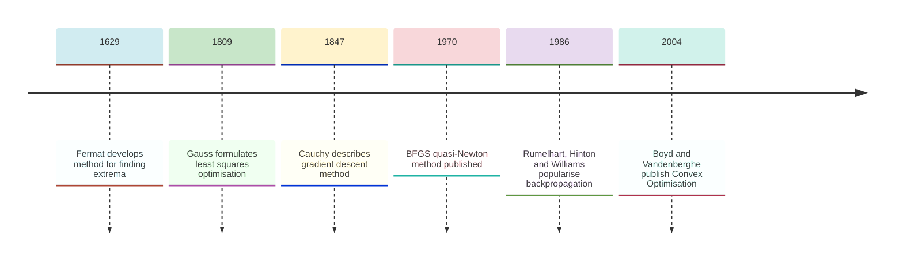
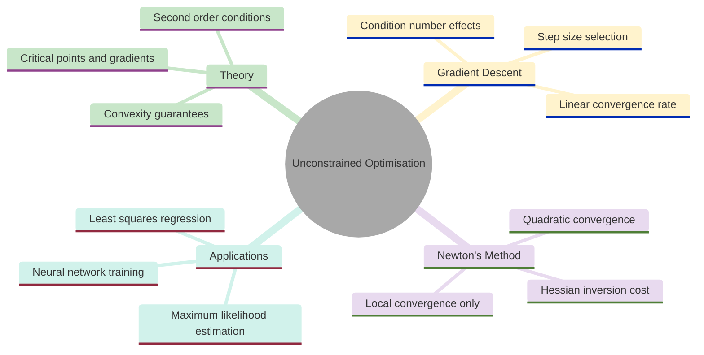
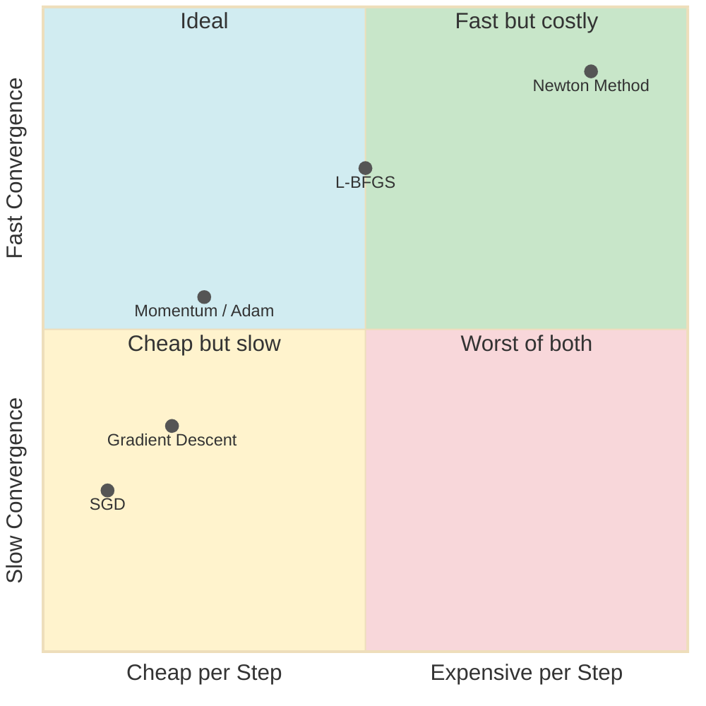
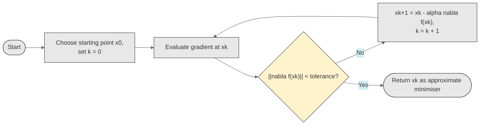
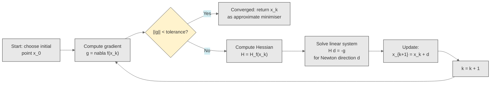
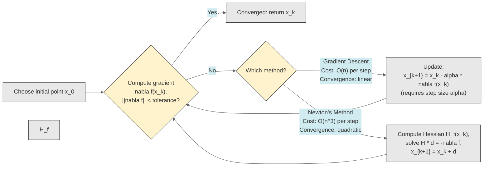
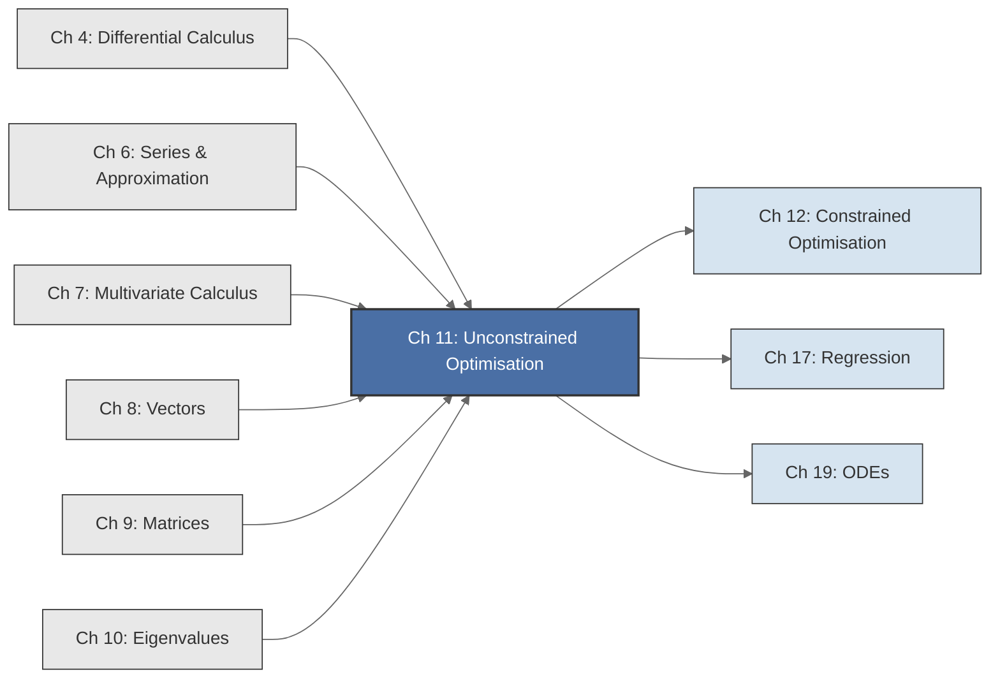

<!-- Copyright (c) 2025-2026 Bob Jansen <bobjansen@pm.me> -->
<!-- SPDX-License-Identifier: CC-BY-NC-4.0 -->
<!-- See LICENSE for full terms. Commercial licensing available. -->
# Chapter 11: Unconstrained Optimisation


**Part IV**: Optimisation

> When the objective is a differentiable function with no constraints on its domain, the optimisation problem reduces to a question about derivatives: where does the function stop increasing? The passage from "find where the derivative vanishes" to "descend along the gradient until convergence" is the passage from classical analysis to the algorithmic optimisation that trains every modern neural network.

**Prerequisites**: [Chapter 4](04-differential-calculus.md) (Differential Calculus); the derivative, critical points and the second derivative test for single-variable functions. [Chapter 6](06-series-approximation.md) (Series & Approximation); Taylor expansion for convergence analysis of Newton's method. [Chapter 7](07-multivariate-calculus.md) (Multivariate Calculus); partial derivatives, the gradient $\nabla f$, the Hessian $H_f$ and Taylor expansion in several variables. [Chapter 8](08-vectors.md) (Vectors); vector arithmetic, norms and inner products. [Chapter 9](09-matrices.md) (Matrices); matrix-vector multiplication, solving linear systems $A\mathbf{x} = \mathbf{b}$ and matrix inversion. [Chapter 10](10-eigenvalues.md) (Eigenvalues); eigenvalues of symmetric matrices and the connection between positive definiteness and eigenvalue signs.

**Learning Objectives**: After this chapter, the reader will be able to:

1. Classify critical points of single-variable and multivariate functions using first- and second-order conditions.
2. Determine whether a function is convex by examining its Hessian and explain why convexity guarantees that every local minimum is a global minimum.
3. Implement gradient descent for minimising a differentiable function and select appropriate step sizes.
4. Implement Newton's method for optimisation and compare its quadratic convergence to the linear convergence of gradient descent.
5. Analyse the tradeoffs between gradient descent and Newton's method in terms of per-iteration cost, convergence rate and sensitivity to problem structure.
6. Recognise convex optimisation problems in applied settings and explain how convexity simplifies the algorithmic structure.

**Connections**: This chapter is used by [Chapter 12](12-constrained-optimization.md) (Constrained Optimisation; Lagrange multipliers extend the unconstrained first-order conditions by incorporating constraints), [Chapter 17](17-regression.md) (Regression; ordinary least squares minimises the sum of squared errors, a convex unconstrained problem whose normal equations arise from setting $\nabla f = \mathbf{0}$) and [Chapter 19](19-odes.md) (Ordinary Differential Equations; gradient flow $\dot{\mathbf{x}} = -\nabla f(\mathbf{x})$ is the continuous-time limit of gradient descent). It builds on [Chapter 4](04-differential-calculus.md) (single-variable derivatives), [Chapter 7](07-multivariate-calculus.md) (gradient, Hessian), [Chapter 8](08-vectors.md) (vectors), [Chapter 9](09-matrices.md) (matrices, linear systems) and [Chapter 10](10-eigenvalues.md) (eigenvalues for definiteness tests).

---

## Historical Context

**Key Milestones in Unconstrained Optimisation**



*Figure 11.1: Key milestones in unconstrained optimisation from Fermat to modern convex theory.*

**Fermat and the first method of extrema (1629).** Pierre de Fermat developed the first systematic method for locating extrema around 1629. His technique, described in letters and published posthumously in *Methodus ad Disquirendam Maximam et Minimam* (1679) [8], replaced $x$ by $x + e$, divided by $e$ and set $e$ to zero. In modern notation, Fermat computed $\frac{f(x+e) - f(x)}{e}$ and set the result equal to zero. Once the limit is taken rigorously, this yields the condition $f'(x) = 0$.

He applied the method to problems such as maximising the product of distances from a point to two endpoints of a segment. Fermat lacked the concept of a derivative, but his insight that extrema occur where the rate of change vanishes remains the foundation of optimisation theory.

**The calculus of variations (18th century).** Leonhard Euler and Joseph-Louis Lagrange extended optimisation throughout the eighteenth century from finite-dimensional functions to *functionals*, mappings from function spaces to the reals. Their calculus of variations sought functions that minimise or maximise integral quantities: the shortest path, the brachistochrone, the catenary. The Euler–Lagrange equation, a differential equation whose solutions are the critical points of the functional, was the principal result. Lagrange also introduced the method of multipliers for constraints in his 1788 *Mécanique Analytique* [9]; [Chapter 12](12-constrained-optimization.md) treats this subject.

**Gradient descent and Newton's method (1847).** Augustin-Louis Cauchy presented the first explicit description of gradient descent to the French Academy of Sciences in 1847. He proposed moving from the current point in the direction opposite to the gradient, taking a step, recomputing the gradient and repeating. He called it the "method of steepest descent" and observed that each step decreases the function value. His algorithm is recognisable as the gradient descent used in every modern machine learning library.

Newton's method, originally conceived for finding roots of $g(x) = 0$, extends to optimisation by applying root-finding to $f'(x) = 0$. In the multivariate setting, the update $\mathbf{x}_{k+1} = \mathbf{x}_k - [H_f(\mathbf{x}_k)]^{-1}\nabla f(\mathbf{x}_k)$ minimises the local quadratic approximation to $f$. The method converges quadratically near a minimum but requires computing and inverting the Hessian at each step.

**Least squares and applied optimisation (1809).** Carl Friedrich Gauss formulated and solved the first large-scale applied optimisation problem in his 1809 *Theoria Motus Corporum Coelestium*. He fitted an orbit to astronomical observations by minimising the sum of squared errors. The method of least squares, developed by Gauss and independently by Adrien-Marie Legendre [10], yields the normal equations $X^TX\boldsymbol{\beta} = X^T\mathbf{y}$. Least squares remains the foundation of regression analysis ([Chapter 17](17-regression.md)).

**Backpropagation and quasi-Newton methods (1970–1986).** Rumelhart, Hinton and Williams introduced backpropagation to the neural network community in 1986. The algorithm computes gradients of a loss function with respect to millions of parameters via the chain rule applied in reverse. Stochastic gradient descent (SGD) approximates the full gradient using a random subset of training data, making optimisation feasible at scale. Quasi-Newton methods such as BFGS (Broyden–Fletcher–Goldfarb–Shanno, 1970) and its limited-memory variant L-BFGS approximate the Hessian from gradient information alone. They converge faster than gradient descent without the $O(n^3)$ cost of Newton's method.

**Convex optimisation as a unifying framework (2004).** Boyd and Vandenberghe's 2004 textbook *Convex Optimization* established that convex problems admit efficient algorithms with guaranteed global convergence. Many practical problems (least squares, logistic regression, support vector machines, linear programming) are convex; recognising this transformed optimisation from an art into a systematic discipline.

---

## Why This Chapter Matters

**Unconstrained Optimisation**



*Figure 11.2: Mind map of unconstrained optimisation covering theory, algorithms and applications.*

Every trained neural network is a local minimum of a loss function. Training it means minimising cross-entropy loss over millions of weights. Fitting a regression model means minimising the sum of squared residuals. Calibrating a financial model means minimising the discrepancy between model prices and market prices. Maximum likelihood estimation means minimising the negative log-likelihood. Gradient descent and Newton's method, the two algorithms of this chapter, are the starting points for every practical optimisation method.

The gradient descent update $\mathbf{x}_{k+1} = \mathbf{x}_k - \alpha \nabla f(\mathbf{x}_k)$ is the basis of all large-scale machine learning optimisation. Every training run of a deep learning model applies a variant (SGD, Adam, AdaGrad) to a non-convex loss function. Image classifiers and large language models alike optimise millions or billions of parameters this way. The per-iteration cost is $O(n)$, making it the only viable option when $n$ is large. Gradient descent converges linearly: each iteration reduces the error by a constant factor determined by the condition number $\kappa$ of the Hessian. For ill-conditioned problems ($\kappa \gg 1$), this can mean millions of iterations. The condition number explains why gradient descent is slow on elongated, elliptical level curves.

Newton's method converges quadratically; the number of correct digits doubles per iteration. It minimises the local quadratic approximation $f(\mathbf{x}_k) + \nabla f^T \mathbf{h} + \frac{1}{2}\mathbf{h}^T H_f \mathbf{h}$ at each step. Inverting the $n \times n$ Hessian costs $O(n^3)$ operations, which is prohibitive for large $n$ but feasible when $n$ is in the hundreds or thousands. Quasi-Newton methods such as L-BFGS approximate the Hessian from gradient history, achieving superlinear convergence at a cost between gradient descent and Newton's method. Convexity guarantees that every local minimum is a global minimum. When the objective is convex, any descent method finds the global optimum.

---

## Notation & Conventions

| Symbol | Meaning |
|--------|---------|
| $f, g$ | Real-valued objective functions |
| $f'(x)$, $f''(x)$ | First and second derivatives (single variable) |
| $\nabla f(\mathbf{x})$ | Gradient of $f$ at $\mathbf{x}$: the vector of partial derivatives |
| $H_f(\mathbf{x})$, $\nabla^2 f(\mathbf{x})$ | Hessian matrix of $f$ at $\mathbf{x}$: the matrix of second partial derivatives |
| $\mathbf{x}^*$ | An optimal point (minimiser or maximiser) |
| $f^*$ | The optimal value: $f(\mathbf{x}^*)$ |
| $\alpha$, $\eta$ | Step size (also called learning rate in machine learning) |
| $\varepsilon$ | Convergence tolerance |
| $k$ | Iteration counter |
| $\mathbf{x}_k$ | The iterate at step $k$ |
| $\succeq 0$, $\succ 0$ | Positive semidefinite, positive definite (for symmetric matrices) |
| $\preceq 0$, $\prec 0$ | Negative semidefinite, negative definite |
| $\lVert\mathbf{v}\rVert$ | Euclidean norm: $\sqrt{v_1^2 + \cdots + v_n^2}$ |
| $O(\cdot)$ | Big-O asymptotic notation |
| $C^k$ | Class of functions with $k$ continuous derivatives |
| $\lambda_i$ | Eigenvalue of the Hessian ([Chapter 10](10-eigenvalues.md)) |
| $L$ | Lipschitz constant of the gradient ($L$-smoothness) |
| $\mu$ | Strong convexity parameter |
| $\kappa$ | Condition number: $\kappa = L/\mu$ |
| $\rho$ | Convergence factor per iteration |

Throughout this chapter, "minimum" means "local minimum" unless explicitly qualified as "global." The term "minimiser" refers to a point $\mathbf{x}^*$ at which the minimum is achieved. Optimisation problems are stated as minimisation problems; a maximisation problem for $f$ is equivalent to minimising $-f$.

---

## Core Theory

**Optimisation Methods: Cost vs Convergence Speed**



*Figure 11.3: Quadrant chart comparing optimisation algorithms by per-step cost and convergence speed.*

**Gradient Descent Iteration Flow**

The following state diagram traces the flow of a gradient descent iteration. Starting from an initial point, the algorithm enters a loop: compute the gradient, check whether the step is small enough to declare convergence and, if not, update the position and repeat:



*Figure 11.4: Flowchart of a single gradient descent iteration with convergence check.*

### Single-Variable Optimisation

The theory of optimisation begins with functions of one variable, where the key ideas appear without the notational complexity of multiple dimensions.

**Definition 11.1** (Local minimum and maximum). Let $f: D \to \mathbb{R}$ be defined on an open set $D \subseteq \mathbb{R}$. The function $f$ has a *local minimum* at $x^*$ if there exists $\delta > 0$ such that $f(x^*) \leq f(x)$ for all $x \in D$ with $|x - x^*| < \delta$. If the inequality is strict ($f(x^*) < f(x)$ for $x \neq x^*$), the minimum is *strict*. The function $f$ has a *global minimum* at $x^*$ if $f(x^*) \leq f(x)$ for all $x \in D$. Local and global maxima are defined analogously with the inequalities reversed.

A local minimum is the lowest point in a neighbourhood; a global minimum is the lowest point in the entire domain. Every global minimum is a local minimum, but the converse is false: a function can have many local minima that are not global. The central challenge of nonconvex optimisation is distinguishing the two.

**Theorem 11.2** (First-order necessary condition; single variable). Let $f: (a,b) \to \mathbb{R}$ be differentiable ([Chapter 4](04-differential-calculus.md)) at an interior point $x^* \in (a,b)$. If $f$ has a local extremum (minimum or maximum) at $x^*$, then $f'(x^*) = 0$.

??? note "Proof"

    *Proof.* Suppose $f$ has a local minimum at $x^*$. Then there exists $\delta > 0$ such that $f(x^*) \leq f(x)$ for all $x$ with $|x - x^*| < \delta$. For $0 < h < \delta$:

    $$\frac{f(x^* + h) - f(x^*)}{h} \geq 0,$$

    since the numerator is nonnegative and $h > 0$. Taking the limit as $h \to 0^+$ gives $f'(x^*) \geq 0$. For $-\delta < h < 0$:

    $$\frac{f(x^* + h) - f(x^*)}{h} \leq 0,$$

    since the numerator is nonnegative and $h < 0$. Taking the limit as $h \to 0^-$ gives $f'(x^*) \leq 0$. Since the derivative exists (the two one-sided limits agree), $f'(x^*) = 0$. The argument for a local maximum is identical, with inequalities reversed.

    $\square$

!!! note "Necessary versus sufficient"

    The condition $f'(x^*) = 0$ is necessary but not sufficient for an extremum. The function $f(x) = x^3$ has $f'(0) = 0$ but no extremum at $x = 0$; the point is an inflection. A vanishing derivative identifies candidates only.

The condition $f'(x^*) = 0$ is *necessary* but not *sufficient*: the function $f(x) = x^3$ has $f'(0) = 0$ but no extremum at $x = 0$. A point where the derivative vanishes may be a minimum, a maximum or neither.

**Definition 11.3** (Critical point). A point $x^*$ in the domain of $f$ is a *critical point* of $f$ if $f'(x^*) = 0$ or $f'(x^*)$ does not exist. By Theorem 11.2, every interior extremum of a differentiable function is a critical point. The converse is false.

**Theorem 11.4** (Second derivative test; single variable). Let $f$ be twice differentiable at a critical point $c$ (so $f'(c) = 0$).

1. If $f''(c) > 0$, then $f$ has a strict local minimum at $c$.
2. If $f''(c) < 0$, then $f$ has a strict local maximum at $c$.
3. If $f''(c) = 0$, the test is inconclusive.

??? note "Proof"

    *Proof sketch.* By Taylor's theorem ([Chapter 6](06-series-approximation.md)), for $h$ sufficiently small:

    $$f(c + h) = f(c) + f'(c)h + \frac{1}{2}f''(c)h^2 + o(h^2) = f(c) + \frac{1}{2}f''(c)h^2 + o(h^2).$$

    The term $f'(c)h$ vanishes because $f'(c) = 0$.

    If $f''(c) > 0$, then for $|h|$ sufficiently small, the term $\frac{1}{2}f''(c)h^2$ dominates the remainder $o(h^2)$, so $f(c+h) > f(c)$ and $c$ is a strict local minimum.

    If $f''(c) < 0$, then $f(c+h) < f(c)$ and $c$ is a strict local maximum.

    If $f''(c) = 0$, the sign of $f(c+h) - f(c)$ depends on higher-order terms: consider $f(x) = x^4$ (minimum at 0) versus $f(x) = -x^4$ (maximum at 0) versus $f(x) = x^3$ (inflection point at 0), all with $f''(0) = 0$.

    $\square$

### Multivariate Optimisation

The single-variable theory generalises to functions of several variables by replacing the derivative with the gradient vector ([Chapter 8](08-vectors.md)) and the second derivative with the Hessian matrix ([Chapter 9](09-matrices.md)).

**Theorem 11.5** (First-order necessary condition; multivariate). Let $f: U \to \mathbb{R}$ be differentiable on an open set $U \subseteq \mathbb{R}^n$. If $f$ has a local extremum at $\mathbf{x}^* \in U$, then $\nabla f(\mathbf{x}^*) = \mathbf{0}$.

??? note "Proof"

    *Proof.* Let $\mathbf{e}_i$ be the $i$-th standard basis vector. Define the single-variable function $g_i(t) = f(\mathbf{x}^* + t\mathbf{e}_i)$. Since $f$ has a local extremum at $\mathbf{x}^*$, the function $g_i$ has a local extremum at $t = 0$. By Theorem 11.2, $g_i'(0) = 0$.

    But $g_i'(0) = \frac{\partial f}{\partial x_i}(\mathbf{x}^*)$ (the definition of the partial derivative). Since this holds for every $i = 1, \ldots, n$, every component of $\nabla f(\mathbf{x}^*)$ is zero, so $\nabla f(\mathbf{x}^*) = \mathbf{0}$.

    $\square$

In fact, the argument works along any direction: for any unit vector $\mathbf{u}$, the function $g(t) = f(\mathbf{x}^* + t\mathbf{u})$ has a local extremum at $t = 0$, so $g'(0) = \nabla f(\mathbf{x}^*) \cdot \mathbf{u} = 0$. Since this holds for all $\mathbf{u}$, the gradient must be the zero vector.

A point $\mathbf{x}^*$ where $\nabla f(\mathbf{x}^*) = \mathbf{0}$ is called a *critical point* (or *stationary point*) of $f$. As in the single-variable case, the condition $\nabla f = \mathbf{0}$ is necessary for an extremum but not sufficient: the function $f(x,y) = x^2 - y^2$ has $\nabla f(0,0) = \mathbf{0}$ but no extremum at the origin (it is a saddle point).

To classify critical points, one examines the Hessian matrix.

**Definition 11.6** (Positive definite, negative definite and indefinite matrices). Let $H$ be a real symmetric $n \times n$ matrix.

- $H$ is *positive definite* ($H \succ 0$) if $\mathbf{v}^T H \mathbf{v} > 0$ for all $\mathbf{v} \neq \mathbf{0}$.
- $H$ is *positive semidefinite* ($H \succeq 0$) if $\mathbf{v}^T H \mathbf{v} \geq 0$ for all $\mathbf{v}$.
- $H$ is *negative definite* ($H \prec 0$) if $\mathbf{v}^T H \mathbf{v} < 0$ for all $\mathbf{v} \neq \mathbf{0}$.
- $H$ is *negative semidefinite* ($H \preceq 0$) if $\mathbf{v}^T H \mathbf{v} \leq 0$ for all $\mathbf{v}$.
- $H$ is *indefinite* if $\mathbf{v}^T H \mathbf{v}$ takes both positive and negative values for different choices of $\mathbf{v}$.

The quadratic form $\mathbf{v}^T H \mathbf{v}$ measures the curvature of $f$ in the direction $\mathbf{v}$ at a critical point. Positive definite means the function curves upward in every direction; negative definite means it curves downward in every direction; indefinite means it curves upward in some directions and downward in others.

**Theorem 11.7** (Definiteness and eigenvalues). Let $H$ be a real symmetric $n \times n$ matrix with eigenvalues $\lambda_1, \ldots, \lambda_n$.

1. $H \succ 0$ if and only if $\lambda_i > 0$ for all $i$.
2. $H \prec 0$ if and only if $\lambda_i < 0$ for all $i$.
3. $H \succeq 0$ if and only if $\lambda_i \geq 0$ for all $i$.
4. $H$ is indefinite if and only if it has both a positive and a negative eigenvalue.

??? note "Proof"

    *Proof sketch.* By the spectral theorem ([Chapter 10](10-eigenvalues.md), Theorem 10.18), $H$ is orthogonally diagonalisable:

    $$H = Q D Q^T$$

    where $Q$ is orthogonal and $D = \operatorname{diag}(\lambda_1, \ldots, \lambda_n)$. For any $\mathbf{v} \neq \mathbf{0}$, let $\mathbf{w} = Q^T\mathbf{v}$ (so $\mathbf{w} \neq \mathbf{0}$ since $Q$ is invertible). Then

    $$\mathbf{v}^T H \mathbf{v} = \mathbf{v}^T Q D Q^T \mathbf{v} = \mathbf{w}^T D \mathbf{w} = \sum_{i=1}^n \lambda_i w_i^2.$$

    This sum is positive for all $\mathbf{w} \neq \mathbf{0}$ if and only if every $\lambda_i > 0$: the forward direction holds because each $\lambda_i w_i^2 > 0$; the converse follows by choosing $\mathbf{w} = \mathbf{e}_i$ (which gives $\mathbf{v}^T H \mathbf{v} = \lambda_i$, so $\lambda_i > 0$).

    The other cases are analogous.

    $\square$

**Theorem 11.8** (Second-order sufficient conditions; multivariate). Let $f: U \to \mathbb{R}$ be $C^2$ on an open set $U \subseteq \mathbb{R}^n$. Let $\mathbf{x}^* \in U$ satisfy $\nabla f(\mathbf{x}^*) = \mathbf{0}$.

1. If $H_f(\mathbf{x}^*) \succ 0$, then $\mathbf{x}^*$ is a strict local minimum of $f$.
2. If $H_f(\mathbf{x}^*) \prec 0$, then $\mathbf{x}^*$ is a strict local maximum of $f$.
3. If $H_f(\mathbf{x}^*)$ is indefinite, then $\mathbf{x}^*$ is a saddle point (neither a local minimum nor a local maximum).

??? note "Proof"

    *Proof.* By the multivariate Taylor expansion ([Chapter 7](07-multivariate-calculus.md)), for $\mathbf{h}$ sufficiently small:

    $$f(\mathbf{x}^* + \mathbf{h}) = f(\mathbf{x}^*) + \nabla f(\mathbf{x}^*)^T\mathbf{h} + \frac{1}{2}\mathbf{h}^T H_f(\mathbf{x}^*)\mathbf{h} + o(\|\mathbf{h}\|^2).$$

    Since $\nabla f(\mathbf{x}^*) = \mathbf{0}$, this reduces to

    $$f(\mathbf{x}^* + \mathbf{h}) - f(\mathbf{x}^*) = \frac{1}{2}\mathbf{h}^T H_f(\mathbf{x}^*)\mathbf{h} + o(\|\mathbf{h}\|^2).$$

    For case (1): if $H_f(\mathbf{x}^*) \succ 0$, let $\lambda_{\min}$ be its smallest eigenvalue (positive by Theorem 11.7). Then

    $$\mathbf{h}^T H_f(\mathbf{x}^*)\mathbf{h} \geq \lambda_{\min}\|\mathbf{h}\|^2 > 0$$

    for all $\mathbf{h} \neq \mathbf{0}$. For $\|\mathbf{h}\|$ sufficiently small, the $\frac{1}{2}\lambda_{\min}\|\mathbf{h}\|^2$ term dominates the remainder $o(\|\mathbf{h}\|^2)$, so $f(\mathbf{x}^* + \mathbf{h}) > f(\mathbf{x}^*)$.

    For case (3): if $H_f(\mathbf{x}^*)$ is indefinite, there exist unit vectors $\mathbf{u}$ and $\mathbf{w}$ with $\mathbf{u}^T H \mathbf{u} > 0$ and $\mathbf{w}^T H \mathbf{w} < 0$.

    Along $\mathbf{h} = t\mathbf{u}$, the function increases; along $\mathbf{h} = t\mathbf{w}$, it decreases. The point $\mathbf{x}^*$ is hence neither a local minimum nor a local maximum.

    $\square$

**Remark 11.9** (The $2 \times 2$ case and the discriminant test). For a function $f(x,y)$ at a critical point $(x_0, y_0)$, the Hessian is

$$H_f = \begin{pmatrix} f_{xx} & f_{xy} \\ f_{yx} & f_{yy} \end{pmatrix}.$$

By Clairaut's theorem ([Chapter 7](07-multivariate-calculus.md)), $f_{xy} = f_{yx}$ when the mixed partials are continuous, so $H_f$ is symmetric. The eigenvalues of a $2 \times 2$ symmetric matrix are both positive if and only if the trace is positive and the determinant is positive (by Vieta's formulas for the characteristic polynomial $\lambda^2 - \operatorname{tr}(H)\lambda + \det(H) = 0$). Since $\operatorname{tr}(H) = f_{xx} + f_{yy}$ and $\det(H) = f_{xx}f_{yy} - f_{xy}^2$, the conditions become:

- *Local minimum*: $f_{xx} > 0$ and $f_{xx}f_{yy} - f_{xy}^2 > 0$.
- *Local maximum*: $f_{xx} < 0$ and $f_{xx}f_{yy} - f_{xy}^2 > 0$.
- *Saddle point*: $f_{xx}f_{yy} - f_{xy}^2 < 0$.

The quantity $D = f_{xx}f_{yy} - f_{xy}^2 = \det(H_f)$ is the *discriminant* familiar from multivariable calculus courses. This is not a separate test; it is a computational shortcut for checking the definiteness of a $2 \times 2$ Hessian.

### Convexity

Convexity provides the strongest structural guarantee in optimisation: convex functions have no local minima that are not also global. This single property separates "easy" optimisation problems from "hard" ones.

**Definition 11.10** (Convex set). A set $C \subseteq \mathbb{R}^n$ is *convex* if for all $\mathbf{x}, \mathbf{y} \in C$ and all $t \in [0,1]$:

$$t\mathbf{x} + (1-t)\mathbf{y} \in C.$$

Geometrically, a set is convex if the line segment connecting any two points in the set lies entirely within the set. Examples: intervals, half-spaces, balls, polyhedra. Non-examples: a set shaped like a crescent, the union of two disjoint intervals.

**Definition 11.11** (Convex function). Let $C \subseteq \mathbb{R}^n$ be a convex set. A function $f: C \to \mathbb{R}$ is *convex* if for all $\mathbf{x}, \mathbf{y} \in C$ and all $t \in [0,1]$:

$$f(t\mathbf{x} + (1-t)\mathbf{y}) \leq t f(\mathbf{x}) + (1-t)f(\mathbf{y}).$$

The function $f$ is *strictly convex* if the inequality is strict whenever $\mathbf{x} \neq \mathbf{y}$ and $0 < t < 1$. A function $f$ is *(strictly) concave* if $-f$ is (strictly) convex.

Geometrically, the graph of a convex function lies below every chord: the function value at a weighted average of two points is at most the weighted average of the function values. For a single-variable function, this means the graph "cups upward."

**Theorem 11.12** (Convexity and the Hessian). Let $f: U \to \mathbb{R}$ be $C^2$ on an open convex set $U \subseteq \mathbb{R}^n$.

1. $f$ is convex on $U$ if and only if $H_f(\mathbf{x}) \succeq 0$ for all $\mathbf{x} \in U$.
2. If $H_f(\mathbf{x}) \succ 0$ for all $\mathbf{x} \in U$, then $f$ is strictly convex on $U$.

??? note "Proof"

    *Proof sketch.* For the single-variable case ($n = 1$): $f$ is convex if and only if $f''(x) \geq 0$ for all $x$. One direction: if $f$ is convex, then for any $x$ and small $h$,

    $$f(x) = f\left(\frac{1}{2}(x+h) + \frac{1}{2}(x-h)\right) \leq \frac{1}{2}f(x+h) + \frac{1}{2}f(x-h),$$

    which rearranges to $f(x+h) + f(x-h) - 2f(x) \geq 0$. Dividing by $h^2$ and taking $h \to 0$ gives $f''(x) \geq 0$.

    The other direction: if $f'' \geq 0$ everywhere, then $f'$ is nondecreasing and the mean value theorem applied to the convexity inequality yields the result.

    For the multivariate case: restrict $f$ to any line through $U$, parametrised as $g(t) = f(\mathbf{x} + t\mathbf{d})$. Since $U$ is convex by hypothesis, the line $\{\mathbf{x} + t\mathbf{d} : t \in [0,1]\}$ lies in $U$ for any $\mathbf{x}, \mathbf{x}+\mathbf{d} \in U$. Then

    $$g''(t) = \mathbf{d}^T H_f(\mathbf{x} + t\mathbf{d}) \mathbf{d}.$$

    The function $f$ is convex if and only if $g$ is convex for every choice of $\mathbf{x}$ and $\mathbf{d}$, which holds if and only if $g''(t) \geq 0$ for all $t$, which holds if and only if

    $$\mathbf{d}^T H_f(\mathbf{z}) \mathbf{d} \geq 0 \quad \text{for all } \mathbf{z} \in U \text{ and all } \mathbf{d},$$

    which is the definition of $H_f(\mathbf{z}) \succeq 0$.

    $\square$

**Theorem 11.13** (Convex functions: local minimum = global minimum). Let $f: C \to \mathbb{R}$ be convex on a convex set $C$. If $\mathbf{x}^*$ is a local minimum of $f$, then $\mathbf{x}^*$ is a global minimum of $f$. If $f$ is strictly convex, the global minimum is unique (if it exists).

!!! abstract "Key Result"

    **Theorem 11.13** (Local minimum equals global minimum for convex functions). Convexity eliminates the distinction between local and global optima, ensuring that gradient descent and any other local search method will find the global minimiser when it exists.

??? note "Proof"

    *Proof.* Suppose $\mathbf{x}^*$ is a local minimum, so there exists $\delta > 0$ with $f(\mathbf{x}^*) \leq f(\mathbf{x})$ for all $\mathbf{x}$ with $\|\mathbf{x} - \mathbf{x}^*\| < \delta$.

    Let $\mathbf{y}$ be any other point in $C$. For small $t > 0$, the point $\mathbf{z} = (1-t)\mathbf{x}^* + t\mathbf{y}$ lies within the $\delta$-neighbourhood of $\mathbf{x}^*$, since

    $$\|\mathbf{z} - \mathbf{x}^*\| = t\|\mathbf{y} - \mathbf{x}^*\| < \delta$$

    for $t$ small enough. By local minimality, $f(\mathbf{x}^*) \leq f(\mathbf{z})$. By convexity:

    $$f(\mathbf{z}) = f((1-t)\mathbf{x}^* + t\mathbf{y}) \leq (1-t)f(\mathbf{x}^*) + tf(\mathbf{y}).$$

    Combining: $f(\mathbf{x}^*) \leq (1-t)f(\mathbf{x}^*) + tf(\mathbf{y})$, which simplifies to $tf(\mathbf{x}^*) \leq tf(\mathbf{y})$. Since $t > 0$, divide by $t$: $f(\mathbf{x}^*) \leq f(\mathbf{y})$. Since $\mathbf{y}$ was arbitrary, $\mathbf{x}^*$ is a global minimum.

    For uniqueness under strict convexity: suppose $\mathbf{x}^*$ and $\mathbf{y}^*$ are both global minima with $\mathbf{x}^* \neq \mathbf{y}^*$. Then $f(\mathbf{x}^*) = f(\mathbf{y}^*) = f^*$. By strict convexity with $t = 1/2$:

    $$f\left(\frac{\mathbf{x}^* + \mathbf{y}^*}{2}\right) < \frac{1}{2}f(\mathbf{x}^*) + \frac{1}{2}f(\mathbf{y}^*) = f^*,$$

    contradicting the assumption that $f^*$ is the minimum value.

    $\square$

**Remark 11.14**. Theorem 11.13 is the reason convex optimisation is "easy"; any algorithm that finds a local minimum has found the global minimum, so there is no danger of getting trapped in suboptimal local minima. Least squares (minimising $\|A\mathbf{x} - \mathbf{b}\|^2$) is convex because the Hessian is $2A^TA \succeq 0$. Logistic regression's negative log-likelihood is convex. The mean squared error and cross-entropy loss functions used in machine learning are convex in the predictions (though not necessarily in the model parameters for nonlinear models like neural networks). In nonconvex optimisation (such as training deep neural networks), gradient descent may converge to different local minima depending on the starting point and guaranteeing global optimality is generally NP-hard.

### Optimisation Algorithms

**Definition 11.15** (Gradient descent). Let $f: \mathbb{R}^n \to \mathbb{R}$ be differentiable. *Gradient descent* is the iterative algorithm

$$\mathbf{x}_{k+1} = \mathbf{x}_k - \alpha \nabla f(\mathbf{x}_k),$$

where $\alpha > 0$ is the *step size* (or *learning rate*). Starting from an initial guess $\mathbf{x}_0$, the algorithm repeatedly moves in the direction of steepest descent $-\nabla f(\mathbf{x}_k)$.

The negative gradient $-\nabla f(\mathbf{x}_k)$ is the direction of steepest decrease of $f$ at $\mathbf{x}_k$. To see this, recall that the directional derivative of $f$ in the direction of a unit vector $\mathbf{u}$ is $D_\mathbf{u}f = \nabla f \cdot \mathbf{u}$, which is minimised when $\mathbf{u}$ points opposite to $\nabla f$ (by the Cauchy–Schwarz inequality). Gradient descent moves in this optimal direction at each step, scaled by $\alpha$.

**Theorem 11.16** (Gradient descent convergence). Convergence of gradient descent depends on the structure of $f$.

(a) *$L$-smooth convex functions*. A function $f$ is $L$-smooth if $\nabla f$ is Lipschitz continuous with constant $L$: $\|\nabla f(\mathbf{x}) - \nabla f(\mathbf{y})\| \leq L\|\mathbf{x} - \mathbf{y}\|$ for all $\mathbf{x}, \mathbf{y}$. Equivalently, $H_f(\mathbf{x}) \preceq LI$ everywhere. For an $L$-smooth convex function with step size $\alpha = 1/L$, gradient descent satisfies

$$f(\mathbf{x}_k) - f^* \leq \frac{L\|\mathbf{x}_0 - \mathbf{x}^*\|^2}{2k},$$

a convergence rate of $O(1/k)$. To achieve $f(\mathbf{x}_k) - f^* \leq \varepsilon$, one needs $O(1/\varepsilon)$ iterations.

(b) *$\mu$-strongly convex, $L$-smooth functions*. A function $f$ is $\mu$-strongly convex if $H_f(\mathbf{x}) \succeq \mu I$ for all $\mathbf{x}$, with $\mu > 0$. For such functions, gradient descent with step size $\alpha = 1/L$ achieves *linear convergence*:

$$f(\mathbf{x}_k) - f^* \leq \left(\frac{L - \mu}{L + \mu}\right)^k (f(\mathbf{x}_0) - f^*).$$

The ratio $\kappa = L/\mu$ is the *condition number* of the problem. The convergence factor per iteration is $\rho = \frac{\kappa - 1}{\kappa + 1} < 1$. Smaller $\kappa$ (meaning the function is "well-conditioned") gives faster convergence. For a quadratic $f(\mathbf{x}) = \frac{1}{2}\mathbf{x}^T A \mathbf{x} - \mathbf{b}^T\mathbf{x}$, the condition number is $\kappa = \lambda_{\max}(A)/\lambda_{\min}(A)$, the condition number of the Hessian from [Chapter 10](10-eigenvalues.md).

These results are stated without proof; see Nocedal and Wright [3], Chapters 2–3, or Boyd and Vandenberghe [2], Section 9.3.

**Newton's Method for Optimisation**



*Figure 11.5: Flowchart of Newton's method showing gradient and Hessian computation at each step.*

**Definition 11.17** (Newton's method for optimisation). Let $f: \mathbb{R}^n \to \mathbb{R}$ be twice differentiable. *Newton's method* for minimising $f$ is the iterative algorithm

$$\mathbf{x}_{k+1} = \mathbf{x}_k - [H_f(\mathbf{x}_k)]^{-1}\nabla f(\mathbf{x}_k).$$

**Derivation.** At iterate $\mathbf{x}_k$, approximate $f$ by its second-order Taylor expansion:

$$q(\mathbf{x}) = f(\mathbf{x}_k) + \nabla f(\mathbf{x}_k)^T(\mathbf{x} - \mathbf{x}_k) + \frac{1}{2}(\mathbf{x} - \mathbf{x}_k)^T H_f(\mathbf{x}_k)(\mathbf{x} - \mathbf{x}_k).$$

This is a quadratic function in $\mathbf{x}$. Setting $\nabla q = \mathbf{0}$ gives

$$\nabla f(\mathbf{x}_k) + H_f(\mathbf{x}_k)(\mathbf{x} - \mathbf{x}_k) = \mathbf{0},$$

and solving for $\mathbf{x}$ yields $\mathbf{x} = \mathbf{x}_k - [H_f(\mathbf{x}_k)]^{-1}\nabla f(\mathbf{x}_k)$. Newton's method minimises the local quadratic model at each step.

**Theorem 11.18** (Newton's method: quadratic convergence). Suppose $f$ is $C^2$, $\mathbf{x}^*$ is a local minimum with $H_f(\mathbf{x}^*) \succ 0$ and $H_f$ is Lipschitz continuous near $\mathbf{x}^*$. Then there exists a neighbourhood of $\mathbf{x}^*$ such that if $\mathbf{x}_0$ lies in this neighbourhood, Newton's method converges quadratically:

$$\|\mathbf{x}_{k+1} - \mathbf{x}^*\| \leq C\|\mathbf{x}_k - \mathbf{x}^*\|^2$$

for some constant $C > 0$.

*Stated without proof; see Nocedal and Wright [3], their Theorem 11.5.*

This means the number of correct digits roughly doubles at each iteration. If $\|\mathbf{x}_k - \mathbf{x}^*\| \approx 10^{-3}$, then $\|\mathbf{x}_{k+1} - \mathbf{x}^*\| \approx 10^{-6}$ and $\|\mathbf{x}_{k+2} - \mathbf{x}^*\| \approx 10^{-12}$. Quadratic convergence is dramatically faster than the linear convergence of gradient descent.

The result is *local*: if $\mathbf{x}_0$ is far from $\mathbf{x}^*$, Newton's method may diverge or oscillate. In practice, Newton's method is often combined with a line search or trust region strategy to ensure global convergence.

**Remark 11.19** (Newton vs. gradient descent: tradeoffs). The fundamental tradeoff is per-iteration cost versus convergence speed.

| Property | Gradient descent | Newton's method |
|----------|-----------------|-----------------|
| Per-iteration cost | $O(n)$ (one gradient evaluation) | $O(n^3)$ (Hessian inversion or linear solve) |
| Convergence rate (strongly convex) | Linear: $O(\rho^k)$, $\rho < 1$ | Quadratic: $O(c^{2^k})$ (locally) |
| Step size tuning | Required ($\alpha$ must be chosen) | Not required (natural step size) |
| Sensitivity to conditioning | Slow for large $\kappa = L/\mu$ | Affine invariant (independent of $\kappa$) |
| Memory | $O(n)$ (store gradient) | $O(n^2)$ (store Hessian) |

For small $n$ (dozens of variables), Newton's method is typically preferred: the Hessian is cheap to compute and invert, so quadratic convergence reaches high accuracy in a few iterations. For large $n$ (machine learning with millions or billions of parameters), gradient descent (or its stochastic variant SGD) is the only feasible option: storing an $n \times n$ Hessian is impossible, let alone inverting it.

**Gradient Descent vs Newton's Method**



*Figure 11.6: Side-by-side comparison of gradient descent and Newton's method update paths.*

*Quasi-Newton methods* bridge the gap. The BFGS (Broyden–Fletcher–Goldfarb–Shanno) method maintains an approximation to the inverse Hessian, updated at each step using only gradient information, at a cost of $O(n^2)$ per iteration. The limited-memory variant L-BFGS uses $O(mn)$ storage for a rank-$m$ approximation (typically $m \approx 10$), making it suitable for moderately large problems. These methods achieve *superlinear* convergence, faster than gradient descent but slower than Newton. Quasi-Newton methods are documented here for completeness but are not implemented in Evenwicht.

**Remark 11.20** (Line search). Instead of using a fixed step size $\alpha$, one can choose $\alpha_k$ at each iteration to approximately minimise $\phi(\alpha) = f(\mathbf{x}_k - \alpha \nabla f(\mathbf{x}_k))$ along the search direction. A full minimisation (exact line search) is expensive; in practice, inexact line search conditions are used.

The *Armijo condition* (sufficient decrease) requires

$$f(\mathbf{x}_k - \alpha \nabla f(\mathbf{x}_k)) \leq f(\mathbf{x}_k) - c_1 \alpha \|\nabla f(\mathbf{x}_k)\|^2$$

for a parameter $c_1 \in (0,1)$ (typically $c_1 = 10^{-4}$). This ensures that the step achieves a sufficient reduction in $f$.

The *Wolfe conditions* add a curvature condition to prevent the step from being too small:

$$\nabla f(\mathbf{x}_k - \alpha \nabla f(\mathbf{x}_k))^T(-\nabla f(\mathbf{x}_k)) \geq c_2 (-\nabla f(\mathbf{x}_k))^T(-\nabla f(\mathbf{x}_k))$$

for $c_2 \in (c_1, 1)$ (typically $c_2 = 0.9$). A step satisfying both Wolfe conditions is guaranteed to exist for smooth functions bounded below. Line search is documented here but not implemented in Evenwicht; the implementation uses a fixed step size for gradient descent.

---

## Formulas & Identities

### First-Order Conditions

**F11.1** (Single variable, necessary for local extremum)

$$f'(x^*) = 0.$$

**F11.2** (Multivariate, necessary for local extremum)

$$\nabla f(\mathbf{x}^*) = \mathbf{0}.$$

### Second-Order Conditions

**F11.3** (Single variable, sufficient for strict local minimum)

$$f'(c) = 0 \text{ and } f''(c) > 0 \;\Rightarrow\; \text{strict local minimum}.$$

**F11.4** (Single variable, sufficient for strict local maximum)

$$f'(c) = 0 \text{ and } f''(c) < 0 \;\Rightarrow\; \text{strict local maximum}.$$

**F11.5** (Multivariate, sufficient for strict local minimum)

$$\nabla f(\mathbf{x}^*) = \mathbf{0} \text{ and } H_f(\mathbf{x}^*) \succ 0 \;\Rightarrow\; \text{strict local minimum}.$$

**F11.6** (Multivariate, sufficient for strict local maximum)

$$\nabla f(\mathbf{x}^*) = \mathbf{0} \text{ and } H_f(\mathbf{x}^*) \prec 0 \;\Rightarrow\; \text{strict local maximum}.$$

**F11.7** (Saddle point test)

$$H_f(\mathbf{x}^*) \text{ indefinite} \;\Rightarrow\; \text{saddle point}.$$

### Convexity Characterisations

**F11.8** (Convexity characterisations)

| Condition | Interpretation |
|-----------|----------------|
| $f(t\mathbf{x} + (1-t)\mathbf{y}) \leq tf(\mathbf{x}) + (1-t)f(\mathbf{y})$ | Definition of convexity |
| $f(\mathbf{y}) \geq f(\mathbf{x}) + \nabla f(\mathbf{x})^T(\mathbf{y} - \mathbf{x})$ for all $\mathbf{x}, \mathbf{y}$ | First-order characterisation (graph lies above tangent) |
| $H_f(\mathbf{x}) \succeq 0$ for all $\mathbf{x}$ | Second-order characterisation (for $C^2$ functions) |

### Algorithm Updates

**F11.9** (Gradient descent update)

$$\mathbf{x}_{k+1} = \mathbf{x}_k - \alpha \nabla f(\mathbf{x}_k).$$

**F11.10** (Newton's method, multivariate)

$$\mathbf{x}_{k+1} = \mathbf{x}_k - [H_f(\mathbf{x}_k)]^{-1} \nabla f(\mathbf{x}_k).$$

**F11.11** (Newton's method, single variable)

$$x_{k+1} = x_k - \frac{f'(x_k)}{f''(x_k)}.$$

### Convergence Rates Comparison

**F11.12** (Convergence rates comparison)

| Method | Rate | Error after $k$ steps | Cost per step |
|--------|------|----------------------|---------------|
| Gradient descent (convex) | $O(1/k)$ | $\sim 1/k$ | $O(n)$ |
| Gradient descent (strongly convex) | Linear $O(\rho^k)$ | $\sim \rho^k$, $\rho = \frac{\kappa-1}{\kappa+1}$ | $O(n)$ |
| Newton's method (local) | Quadratic | $\sim c^{2^k}$ | $O(n^3)$ |

---

## Algorithms

### Algorithm 11.21: Gradient Descent

**Input**: Gradient function $\nabla f: \mathbb{R}^n \to \mathbb{R}^n$, initial point $\mathbf{x}_0 \in \mathbb{R}^n$, step size $\alpha > 0$, tolerance $\varepsilon > 0$, maximum iterations $N$.

**Output**: Approximate minimiser $\mathbf{x}^*$.

```
function gradientDescent(gradient, x0, alpha, tolerance, maxIterations):
    x = copy(x0)

    for k = 1 to maxIterations:
        g = gradient(x)
        gradNorm = norm(g)

        if gradNorm < tolerance:
            return { x: x, iterations: k, converged: true }

        x = x - alpha * g

    return { x: x, iterations: maxIterations, converged: false }
```

**Stopping criterion**: The algorithm terminates when $\|\nabla f(\mathbf{x}_k)\| < \varepsilon$. This is the standard criterion: at a minimum, $\nabla f = \mathbf{0}$, so a small gradient norm indicates proximity to a critical point. An alternative criterion is $|f(\mathbf{x}_{k+1}) - f(\mathbf{x}_k)| < \varepsilon$, which tests for stagnation in the function value.

**Gradient Descent Convergence**

The following chart shows the typical convergence behaviour of gradient descent on a smooth convex function. The objective value $f(x)$ decreases rapidly in early iterations and then flattens as the iterate approaches the minimum.

```mermaid
---
config:
  theme: base
  themeVariables:
    xyChart:
      plotColorPalette: "#2563eb, #dc2626, #16a34a, #9333ea, #ca8a04, #0891b2"
      backgroundColor: "#ffffff"
      titleColor: "#333333"
      xAxisLabelColor: "#333333"
      yAxisLabelColor: "#333333"
      xAxisTitleColor: "#333333"
      yAxisTitleColor: "#333333"
      xAxisLineColor: "#333333"
      yAxisLineColor: "#333333"
---
xychart-beta
    x-axis "Iteration" [1, 2, 3, 4, 5, 6, 7, 8, 9, 10]
    y-axis "f(x)" 0 --> 11
    line [10, 6, 3.5, 2, 1.2, 0.7, 0.4, 0.25, 0.15, 0.1]
```

*Figure 11.7: Typical gradient descent convergence showing rapid early decrease then flattening.*

**Complexity**: $O(n)$ time per iteration for the gradient evaluation and vector update, assuming the gradient is provided analytically. $O(n)$ space to store the iterate and gradient. The total number of iterations depends on the problem structure (see Theorem 11.16).

### Algorithm 11.22: Newton's Method for Optimisation (Multivariate)

**Input**: Gradient function $\nabla f: \mathbb{R}^n \to \mathbb{R}^n$, Hessian function $H_f: \mathbb{R}^n \to \mathbb{R}^{n \times n}$, initial point $\mathbf{x}_0 \in \mathbb{R}^n$, tolerance $\varepsilon > 0$, maximum iterations $N$.

**Output**: Approximate minimiser $\mathbf{x}^*$.

```
function newtonsMethod(gradient, hessian, x0, tolerance, maxIterations):
    x = copy(x0)

    for k = 1 to maxIterations:
        g = gradient(x)
        gradNorm = norm(g)

        if gradNorm < tolerance:
            return { x: x, iterations: k, converged: true }

        H = hessian(x)
        d = solve(H, -g)           // solve H * d = -g for d
        x = x + d

    return { x: x, iterations: maxIterations, converged: false }
```

**Key step**: Rather than computing $H^{-1}$ explicitly (which is numerically inferior and wasteful), the algorithm solves the linear system $H_f(\mathbf{x}_k) \mathbf{d} = -\nabla f(\mathbf{x}_k)$ for the Newton direction $\mathbf{d}$. This is equivalent to $\mathbf{d} = -[H_f(\mathbf{x}_k)]^{-1}\nabla f(\mathbf{x}_k)$ but is computed via LU decomposition or Cholesky factorisation (if $H \succ 0$) at a cost of $O(n^3)$.

**Complexity**: $O(n^3)$ time per iteration, dominated by solving the linear system. $O(n^2)$ space to store the Hessian matrix. Total iterations are typically very small (under 10) near a minimum due to quadratic convergence.

### Algorithm 11.23: Newton's Method for Single-Variable Optimisation

**Input**: First derivative $f': \mathbb{R} \to \mathbb{R}$, second derivative $f'': \mathbb{R} \to \mathbb{R}$, initial point $x_0 \in \mathbb{R}$, tolerance $\varepsilon > 0$, maximum iterations $N$.

**Output**: Approximate minimiser $x^*$.

```
function newtonsMethod1D(fPrime, fDoublePrime, x0, tolerance, maxIterations):
    x = x0

    for k = 1 to maxIterations:
        g = fPrime(x)

        if |g| < tolerance:
            return { x: x, iterations: k, converged: true }

        h = fDoublePrime(x)
        x = x - g / h

    return { x: x, iterations: maxIterations, converged: false }
```

**Complexity**: $O(1)$ time per iteration (two function evaluations and one division). $O(1)$ space.

This is the scalar specialisation of Algorithm 11.22. The Hessian reduces to the scalar $f''(x)$, and "solving the linear system" reduces to dividing by $f''(x)$. The update $x_{k+1} = x_k - f'(x_k)/f''(x_k)$ is Newton's root-finding method applied to the equation $f'(x) = 0$.

---

## Numerical Considerations

!!! warning "Step size too large causes divergence"

    For the quadratic $f(x) = \frac{1}{2}Lx^2$, the gradient descent update is $x_{k+1} = (1 - \alpha L)x_k$, which diverges when $\alpha > 2/L$. Always verify that $\alpha < 2/L$ when the Lipschitz constant $L$ is known; if $L$ is unknown, monitor the objective value and reduce $\alpha$ whenever $f(\mathbf{x}_{k+1}) > f(\mathbf{x}_k)$.

**Step size selection for gradient descent.** The step size $\alpha$ controls the tradeoff between speed and stability. If $\alpha$ is too large, the iterates overshoot the minimum and the algorithm diverges. If $\alpha$ is too small, convergence is slow. The theoretically optimal constant step size for an $L$-smooth convex function is $\alpha = 1/L$, but $L$ is rarely known in practice. Common heuristics include starting with a small $\alpha$ and increasing it if the function value decreases, or using the Barzilai–Borwein step size $\alpha_k = \|\Delta\mathbf{x}\|^2 / (\Delta\mathbf{x}^T \Delta\mathbf{g})$ where $\Delta\mathbf{x} = \mathbf{x}_k - \mathbf{x}_{k-1}$ and $\Delta\mathbf{g} = \nabla f(\mathbf{x}_k) - \nabla f(\mathbf{x}_{k-1})$.

!!! warning "Indefinite Hessian makes Newton's method ascend"

    If $H_f(\mathbf{x}_k)$ is indefinite or negative definite, the Newton direction $\mathbf{d} = -H^{-1}\nabla f$ may point uphill. The algorithm can diverge or converge to a saddle point. Always check that $H \succ 0$ before taking a pure Newton step; if not, use the modified Newton regularisation $H + \mu I$.

**Newton's method requires a positive definite Hessian.** The Newton direction $\mathbf{d} = -H^{-1}\nabla f$ is a descent direction (i.e., $\nabla f^T \mathbf{d} < 0$) if and only if $H \succ 0$. The standard fix is *modified Newton's method*: replace $H$ by $H + \mu I$ where $\mu > 0$ is chosen large enough to make $H + \mu I \succ 0$. This is equivalent to adding a Tikhonov regularisation term and interpolates between Newton's method ($\mu = 0$) and gradient descent ($\mu \to \infty$, since $(H + \mu I)^{-1} \approx \frac{1}{\mu}I$).

**Convergence detection.** The standard stopping criterion is $\|\nabla f(\mathbf{x}_k)\| < \varepsilon$. This directly tests the necessary condition for optimality. Supplementary checks include:

- *Function value change*: $|f(\mathbf{x}_{k+1}) - f(\mathbf{x}_k)| < \varepsilon_f$. Useful when the gradient is expensive to compute or when the function has a flat region near the minimum.
- *Iterate change*: $\|\mathbf{x}_{k+1} - \mathbf{x}_k\| < \varepsilon_x$. Useful as a safeguard against stagnation.

!!! tip "Practical convergence tolerance"

    Set $\varepsilon$ in the range $10^{-8}$ to $10^{-10}$ for IEEE 754 double precision. Tolerances below $\sqrt{\varepsilon_{\text{mach}}} \approx 10^{-8}$ risk false non-convergence because round-off noise in the gradient exceeds the tolerance.

In floating-point arithmetic, a tolerance of $\varepsilon = 10^{-8}$ to $10^{-10}$ is typical. Setting $\varepsilon$ smaller than $\sqrt{\varepsilon_{\text{mach}}} \approx 10^{-8}$ (where $\varepsilon_{\text{mach}} \approx 2.22 \times 10^{-16}$ for Float64) risks termination difficulties due to round-off noise in the gradient computation.

**Numerical gradient and Hessian.** If an analytical gradient is unavailable, it can be approximated using finite differences ([Chapter 7](07-multivariate-calculus.md)). The central difference formula $\frac{\partial f}{\partial x_i} \approx \frac{f(\mathbf{x} + h\mathbf{e}_i) - f(\mathbf{x} - h\mathbf{e}_i)}{2h}$ has $O(h^2)$ truncation error and requires $2n$ function evaluations. The Hessian can be approximated by the second-order formula

$$\frac{\partial^2 f}{\partial x_i \partial x_j} \approx \frac{f(\mathbf{x} + h\mathbf{e}_i + h\mathbf{e}_j) - f(\mathbf{x} + h\mathbf{e}_i - h\mathbf{e}_j) - f(\mathbf{x} - h\mathbf{e}_i + h\mathbf{e}_j) + f(\mathbf{x} - h\mathbf{e}_i - h\mathbf{e}_j)}{4h^2},$$

requiring $O(n^2)$ function evaluations. The optimal step size for central differences is $h \approx \varepsilon_{\text{mach}}^{1/3} \approx 6 \times 10^{-6}$ for the gradient and $h \approx \varepsilon_{\text{mach}}^{1/4} \approx 1.2 \times 10^{-4}$ for the Hessian, balancing truncation and round-off errors.

**Starting point sensitivity.** For nonconvex functions, the basin of attraction (the set of starting points from which gradient descent converges to a particular local minimum) depends on the structure of $f$. Different starting points may lead to different local minima. There is no general-purpose remedy; common strategies include multi-start (running from several random initial points and keeping the best result) and global optimisation methods (simulated annealing, genetic algorithms), which are outside the scope of this chapter. For convex functions, every starting point converges to the same global minimum, which is one of the chief practical advantages of convexity.

---

## Worked Examples

### Example 11.24: Single-Variable Minimisation

**Problem**: Minimise $f(x) = x^2 - 4x + 5$.

**Solution (manual)**:

Step 1: Find critical points. Compute $f'(x) = 2x - 4$. Set $f'(x) = 0$: $2x - 4 = 0$, so $x^* = 2$.

Step 2: Apply the second derivative test. Compute $f''(x) = 2 > 0$ for all $x$. Since $f''(2) = 2 > 0$, the critical point $x^* = 2$ is a strict local minimum (Theorem 11.4).

Step 3: Verify this is a global minimum. Since $f''(x) = 2 > 0$ everywhere, $f$ is strictly convex (Theorem 11.12). By Theorem 11.13, the local minimum is the unique global minimum.

Step 4: Compute the optimal value.

$$f(2) = 4 - 8 + 5 = 1.$$

**Expected output**: The minimiser is $x^* = 2$ and the minimum value is $f^* = 1$.

### Example 11.25: Multivariate Minimisation with the Hessian Test

**Problem**: Minimise $f(x,y) = x^2 + 2y^2 - 2xy - 2x$.

**Solution (manual)**:

Step 1: Compute the gradient.

$$\nabla f = \begin{pmatrix} \frac{\partial f}{\partial x} \\ \frac{\partial f}{\partial y} \end{pmatrix} = \begin{pmatrix} 2x - 2y - 2 \\ 4y - 2x \end{pmatrix}.$$

Step 2: Set $\nabla f = \mathbf{0}$ and solve.

$$\begin{aligned}
2x - 2y - 2 &= 0 \quad \Rightarrow \quad x - y = 1 \\
4y - 2x &= 0 \quad \Rightarrow \quad x = 2y
\end{aligned}$$

Substituting: $2y - y = 1$, so $y = 1$ and $x = 2$. The critical point is $(x^*, y^*) = (2, 1)$.

Step 3: Compute the Hessian.

$$H_f = \begin{pmatrix} f_{xx} & f_{xy} \\ f_{yx} & f_{yy} \end{pmatrix} = \begin{pmatrix} 2 & -2 \\ -2 & 4 \end{pmatrix}.$$

Note that the Hessian is constant (independent of $x, y$) because $f$ is a quadratic function.

Step 4: Check positive definiteness.

$$f_{xx} = 2 > 0 \qquad \text{and} \qquad \det(H_f) = 2 \cdot 4 - (-2)^2 = 8 - 4 = 4 > 0.$$

By Remark 11.9 (or Sylvester's criterion), $H_f \succ 0$. The eigenvalues of $H_f$, alternatively, are the roots of $\lambda^2 - 6\lambda + 4 = 0$: $\lambda = 3 \pm \sqrt{5} \approx 0.764$ and $\approx 5.236$, both positive.

Step 5: Conclusion. By Theorem 11.8, $(2, 1)$ is a strict local minimum. Since $H_f \succ 0$ everywhere (it is constant), $f$ is strictly convex (Theorem 11.12), so $(2, 1)$ is the unique global minimum.

Step 6: Optimal value.

$$f(2, 1) = 4 + 2 - 4 - 4 = -2.$$

**Expected output**: The minimiser is $(x^*, y^*) = (2, 1)$ with $f^* = -2$. Newton's method converges in exactly one iteration because $f$ is quadratic; the quadratic Taylor approximation is exact, so the first Newton step lands directly on the minimum.

### Example 11.26: Gradient Descent on a Quadratic

**Problem**: Minimise $f(x,y) = x^2 + y^2$ starting from $(5, 3)$ using gradient descent with step size $\alpha = 0.1$. Trace the first few iterates.

**Solution (manual)**:

The gradient is $\nabla f = (2x, 2y)$. The update rule is

$$\begin{pmatrix} x_{k+1} \\ y_{k+1} \end{pmatrix} = \begin{pmatrix} x_k \\ y_k \end{pmatrix} - 0.1 \begin{pmatrix} 2x_k \\ 2y_k \end{pmatrix} = \begin{pmatrix} 0.8 x_k \\ 0.8 y_k \end{pmatrix}.$$

So each iterate shrinks by a factor of $0.8$:

| $k$ | $x_k$ | $y_k$ | $f(x_k, y_k)$ | $\lVert\nabla f\rVert$ |
|-----|--------|--------|----------------|-----------------|
| 0 | 5.000 | 3.000 | 34.000 | 11.662 |
| 1 | 4.000 | 2.400 | 21.760 | 9.329 |
| 2 | 3.200 | 1.920 | 13.926 | 7.464 |
| 3 | 2.560 | 1.536 | 8.913 | 5.971 |
| 5 | 1.638 | 0.983 | 3.650 | 3.821 |
| 10 | 0.537 | 0.322 | 0.392 | 1.253 |
| 20 | 0.058 | 0.03459 | 0.004519 | 0.135 |
| 50 | 0.000 | 0.000 | 0.000 | 0.000 |

*(Selected iterations; rows 4, 6–9 and 11–19, 21–49 omitted.)*

Each iterate is $(5 \cdot 0.8^k, 3 \cdot 0.8^k)$, converging to $(0, 0)$. The convergence is *linear* with rate $\rho = 0.8$: the error decreases by a constant factor at each step. The Hessian is $H = 2I$ with $\lambda_{\min} = \lambda_{\max} = 2$, so the condition number is $\kappa = 1$.

With step size $\alpha = 0.1$, the actual convergence factor per iteration is $|1 - \alpha\lambda| = |1 - 0.1 \times 2| = 0.8$, matching the observed factor. The formula $\rho = (\kappa - 1)/(\kappa + 1) = 0$ applies at the optimal step size $\alpha = 1/L = 0.5$, not at the conservative $\alpha = 0.1$ used here. Using the optimal step size would give one-step convergence for this perfectly conditioned problem.

**Expected output**: The minimiser is $(0, 0)$ with $f^* = 0$.

### Example 11.27: Newton's Method with Quadratic Convergence

**Problem**: Minimise $f(x) = x^4 - 3x^2 + 2$ using Newton's method. Show quadratic convergence near the minimum at $x^* = \sqrt{3/2} \approx 1.2247$.

**Solution (manual)**:

Step 1: Derivatives.

$$f'(x) = 4x^3 - 6x, \qquad f''(x) = 12x^2 - 6.$$

Setting $f'(x) = 0$: $4x^3 - 6x = 0 \Rightarrow 2x(2x^2 - 3) = 0$, giving $x = 0$ or $x = \pm\sqrt{3/2}$.

Step 2: Classify critical points.

$$f''(0) = -6 < 0 \;\text{(local maximum)}, \qquad f''(\sqrt{3/2}) = 12 \cdot \tfrac{3}{2} - 6 = 12 > 0 \;\text{(local minimum)}.$$

By symmetry, $f''(-\sqrt{3/2}) = 12 > 0$: also a local minimum.

Step 3: Newton's method starting from $x_0 = 2.0$. The update is

$$x_{k+1} = x_k - \frac{f'(x_k)}{f''(x_k)} = x_k - \frac{4x_k^3 - 6x_k}{12x_k^2 - 6}.$$

| $k$ | $x_k$ | $f'(x_k)$ | $f''(x_k)$ | $\lVert x_k - x^* \rVert$ |
|-----|--------|-----------|-----------|-----------------|
| 0 | 2.000000 | 20.000 | 42.000 | $7.75 \times 10^{-1}$ |
| 1 | 1.523810 | 5.001 | 21.866 | $2.99 \times 10^{-1}$ |
| 2 | 1.295094 | 0.912 | 14.098 | $7.04 \times 10^{-2}$ |
| 3 | 1.230028 | 0.064 | 12.710 | $5.28 \times 10^{-3}$ |
| 4 | 1.224917 | 0.000 | 12.002 | $3.38 \times 10^{-5}$ |
| 5 | 1.224745 | 0.000 | 12.000 | $< 10^{-8}$ |

The error sequence $0.775, 0.299, 0.070, 0.00528, 0.0000338, <10^{-8}$ demonstrates the hallmark of quadratic convergence: once the iterates are close to $x^*$, the number of correct digits roughly doubles at each step. In the final iterations, the error drops from $10^{-4}$ to below $10^{-8}$ in a single step.

**Expected output**: The minimiser is $x^* = \sqrt{3/2} \approx 1.22474$ with $f^* = 2 - 9/4 = -1/4 = -0.25$. Convergence is reached in approximately 5–6 Newton iterations.

---

## Connections

**Chapter Dependencies**



*Figure 11.8: Chapter dependency graph for unconstrained optimisation and its connections.*

### Within This Book

- **[Chapter 4](04-differential-calculus.md) (Differential Calculus)**: The first-order necessary condition $f'(x^*) = 0$ is the starting point of optimisation theory. Every tool in this chapter (the second derivative test, gradient descent, Newton's method) rests on the ability to compute derivatives. Newton's method for optimisation (Algorithm 11.22) is Newton's root-finding method from [Chapter 4](04-differential-calculus.md) applied to the equation $f'(x) = 0$.

- **[Chapter 7](07-multivariate-calculus.md) (Multivariate Calculus)**: The gradient $\nabla f$ and Hessian $H_f$ are the multivariate generalisations of $f'$ and $f''$ that power multivariate optimisation. The directional derivative $D_\mathbf{u}f = \nabla f \cdot \mathbf{u}$ explains why the negative gradient is the direction of steepest descent. The multivariate Taylor expansion $f(\mathbf{x}^* + \mathbf{h}) \approx f(\mathbf{x}^*) + \frac{1}{2}\mathbf{h}^TH\mathbf{h}$ is the foundation of the second-order sufficient conditions and the derivation of Newton's method.

- **[Chapter 10](10-eigenvalues.md) (Eigenvalues)**: Positive definiteness of the Hessian, the key condition for a local minimum, is equivalent to all eigenvalues being positive (Theorem 11.7). The eigenvalues of the Hessian determine the curvature of $f$ along the principal directions and the condition number $\kappa = \lambda_{\max}/\lambda_{\min}$ governs the convergence rate of gradient descent. Ill-conditioned Hessians (large $\kappa$) produce elongated, narrow level curves that cause gradient descent to zigzag, converging slowly.

- **[Chapter 12](12-constrained-optimization.md) (Constrained Optimisation)**: When the domain of optimisation is restricted by equality or inequality constraints, the unconstrained first-order condition $\nabla f = \mathbf{0}$ is replaced by the Lagrangian conditions. The theory of constrained optimisation builds directly on the unconstrained theory: one finds the stationary points of the Lagrangian $\mathcal{L}(\mathbf{x}, \boldsymbol{\lambda}) = f(\mathbf{x}) + \boldsymbol{\lambda}^T\mathbf{g}(\mathbf{x})$ over the enlarged $(\mathbf{x}, \boldsymbol{\lambda})$ space, which correspond to the constrained extrema.

- **[Chapter 17](17-regression.md) (Regression)**: Ordinary least squares regression minimises the sum of squared errors $\text{SSE}(\boldsymbol{\beta}) = \|\mathbf{y} - X\boldsymbol{\beta}\|^2$, a convex quadratic function. Setting $\nabla \text{SSE} = \mathbf{0}$ yields the normal equations $X^TX\boldsymbol{\beta} = X^T\mathbf{y}$, which is an application of Theorem 11.5. The Hessian is $2X^TX \succeq 0$, confirming convexity and guaranteeing that the least squares solution is a global minimum.

- **[Chapter 19](19-odes.md) (Ordinary Differential Equations)** connects through gradient flow, where continuous-time optimisation trajectories satisfy $\dot{x} = -\nabla f(x)$.

### Applications

- **Machine learning**: Stochastic gradient descent (SGD) and its variants (Adam, AdaGrad, RMSProp) are the standard training algorithms for neural networks. SGD approximates the full gradient with a gradient computed on a random mini-batch of data, trading accuracy per step for dramatically lower cost per step. The theory of this chapter (convergence rates, the role of the condition number, the convexity guarantee) provides the analytical framework, even though the loss surfaces of deep networks are nonconvex.

- **Economics**: Firms maximise profit functions $\pi(q_1, \ldots, q_n)$ and consumers maximise utility functions $U(x_1, \ldots, x_n)$ subject to budget constraints. The first-order conditions $\nabla U = \lambda \nabla g$ (where $g$ is the budget constraint) are the Lagrangian conditions of [Chapter 12](12-constrained-optimization.md), which reduce to unconstrained conditions in the absence of constraints. The second-order conditions ensure that a critical point of the profit function is indeed a maximum rather than a saddle point.

- **Scientific computing**: Newton's method is the standard algorithm for solving nonlinear systems of equations, which arise in implicit time-stepping for differential equations, circuit simulation and structural analysis. The quadratic convergence guarantee makes Newton's method practical for high-precision computation.

---

## Summary

- A necessary condition for a local extremum of a differentiable function is $\nabla f(\mathbf{x}^*) = \mathbf{0}$; the second-order test classifies critical points via the definiteness of the Hessian.
- A function is convex if and only if its Hessian is positive semidefinite everywhere, and convexity guarantees that every local minimum is a global minimum.
- Gradient descent updates $\mathbf{x}_{k+1} = \mathbf{x}_k - \alpha\nabla f(\mathbf{x}_k)$ and converges linearly for smooth convex functions, with the rate governed by the condition number of the Hessian.
- Newton's method uses the Hessian to achieve quadratic convergence near a minimum but requires solving an $n \times n$ linear system at each iteration.

---

## Exercises

### Routine

**Exercise 11.1**. Find all critical points of $f(x) = x^3 - 12x + 1$ and classify each as a local minimum, local maximum or neither using the second derivative test.

**Exercise 11.2**. Determine whether $f(x,y) = 3x^2 + 2y^2 + 2xy - 4x - 6y + 10$ has a local minimum, local maximum or saddle point at its critical point. Compute the Hessian and verify positive definiteness using both eigenvalues and the discriminant test.

**Exercise 11.3**. Show that $f(x) = e^x - x$ is strictly convex on $\mathbb{R}$. Find its unique global minimum.

### Intermediate

**Exercise 11.4**. Run gradient descent on $f(x,y) = 4x^2 + y^2$ starting from $(10, 10)$ with step size $\alpha = 0.1$. Compute the first 5 iterates by hand. What is the condition number $\kappa$ of the Hessian? How does it affect the convergence rate compared to Example 11.26?

**Exercise 11.5**. Apply Newton's method to minimise $f(x) = \ln(1 + e^x) + \frac{1}{2}(x - 3)^2$. This function arises in regularised logistic regression. Verify that $f$ is strictly convex by checking $f''(x) > 0$ for all $x$. Compute three Newton iterates starting from $x_0 = 0$.

**Exercise 11.6**. The Rosenbrock function $f(x,y) = (1 - x)^2 + 100(y - x^2)^2$ is a standard test for optimisation algorithms. Compute the gradient and Hessian. Show that $(1,1)$ is the unique critical point and that the Hessian at $(1,1)$ is positive definite. What is the condition number $\kappa$ at $(1,1)$, and what does it predict about the convergence of gradient descent?

### Challenging

**Exercise 11.7**. Prove that if $f: \mathbb{R}^n \to \mathbb{R}$ is convex and differentiable, then $f(\mathbf{y}) \geq f(\mathbf{x}) + \nabla f(\mathbf{x})^T(\mathbf{y} - \mathbf{x})$ for all $\mathbf{x}, \mathbf{y}$. (This is the first-order characterisation of convexity: the graph of $f$ lies above every tangent hyperplane.) Use this to give a second proof that any critical point of a convex function is a global minimum.

**Exercise 11.8**. Consider gradient descent on the quadratic $f(\mathbf{x}) = \frac{1}{2}\mathbf{x}^TA\mathbf{x}$ where $A$ is a $2 \times 2$ symmetric positive definite matrix with eigenvalues $\lambda_1$ and $\lambda_2$ ($\lambda_1 < \lambda_2$). Show that with step size $\alpha = 2/(\lambda_1 + \lambda_2)$, the convergence factor is $\rho = \frac{\kappa - 1}{\kappa + 1}$ where $\kappa = \lambda_2/\lambda_1$. Deduce that gradient descent converges in one step when $\kappa = 1$ (i.e., $A = cI$ for some $c > 0$) and convergence degrades as $\kappa$ increases.

---

## References

### Textbooks

[1] Bertsekas, D. P. *Nonlinear Programming*, 3rd ed. Athena Scientific, 2016. Covers both convex and nonconvex optimisation with careful attention to optimality conditions, constraint qualifications and duality. Chapters 1–2 cover the unconstrained theory of this chapter.

[2] Boyd, S. and Vandenberghe, L. *Convex Optimization*. Cambridge University Press, 2004. A thorough treatment of convex optimisation theory and algorithms. Chapter 2 covers convex sets and functions; Chapter 3 covers convexity-preserving operations; Chapter 9 covers unconstrained minimisation (gradient descent, Newton's method, self-concordance). Freely available at [https://web.stanford.edu/~boyd/cvxbook/](https://web.stanford.edu/~boyd/cvxbook/).

[3] Nocedal, J. and Wright, S. J. *Numerical Optimization*, 2nd ed. Springer, 2006. The standard reference for optimisation algorithms. Chapters 2–3 cover gradient descent and line search methods; Chapter 6 covers quasi-Newton methods; Chapter 7 covers Newton's method with modifications. The convergence proofs for Theorems 3.16 and 3.18 can be found here.

### Historical

[4] Broyden, C. G. "The Convergence of a Class of Double-Rank Minimization Algorithms." *Journal of the Institute of Mathematics and Its Applications* 6 (1970): 76–90. One of the four independent papers introducing the BFGS quasi-Newton update.

[5] Cauchy, A. "Méthode générale pour la résolution des systèmes d'équations simultanées." *Comptes Rendus de l'Académie des Sciences* 25 (1847): 536–538. The paper in which Cauchy first described the method of steepest descent (gradient descent).

[6] Gauss, C. F. *Theoria Motus Corporum Coelestium*. Perthes et Besser, Hamburg, 1809. The first systematic treatment of the method of least squares, in which Gauss formulated the optimisation problem that became ordinary least squares regression.

[7] Rumelhart, D. E., Hinton, G. E., and Williams, R. J. "Learning Representations by Back-Propagating Errors." *Nature* 323 (1986): 533–536. The paper that popularised backpropagation for training neural networks, which is the chain rule applied to computational graphs combined with gradient descent.

[8] Fermat, P. de. *Methodus ad Disquirendam Maximam et Minimam*. Published posthumously in *Varia Opera Mathematica*, Toulouse, 1679. Contains Fermat's method for finding extrema, developed around 1629.

[9] Lagrange, J.-L. *Mécanique Analytique*. Desaint, Paris, 1788. Introduces the method of multipliers for constrained optimisation and develops the calculus of variations together with earlier work by Euler.

[10] Legendre, A.-M. "Nouvelles méthodes pour la détermination des orbites des comètes." Firmin-Didot, Paris, 1805. Contains an early independent formulation of the method of least squares.

### Online Resources

[11] Boyd, S. and Vandenberghe, L. *Convex Optimization* (free online edition). https://web.stanford.edu/~boyd/cvxbook/

[12] Stanford EE364a: Convex Optimization I (Boyd). Course materials, problem sets and lecture videos. https://web.stanford.edu/class/ee364a/

[13] NEOS Optimization Guide: Algorithms for unconstrained optimisation. https://neos-guide.org/guide/algorithms/

---

## Glossary

- **Condition number** ($\kappa = \lambda_{\max}/\lambda_{\min}$): For a positive definite Hessian, the ratio of the largest to the smallest eigenvalue.

- **Convergence rate**: The asymptotic speed at which iterates approach the solution; linear convergence reduces the error by a constant factor per step, quadratic convergence doubles the number of correct digits per step.

- **Convex function**: A function $f$ satisfying $f(t\mathbf{x} + (1-t)\mathbf{y}) \leq tf(\mathbf{x}) + (1-t)f(\mathbf{y})$ for all $\mathbf{x}$, $\mathbf{y}$ and $t \in [0,1]$.

- **Convex set**: A set $C \subseteq \mathbb{R}^n$ such that for all $\mathbf{x}, \mathbf{y} \in C$ and all $t \in [0,1]$, the point $t\mathbf{x} + (1-t)\mathbf{y}$ lies in $C$.

- **Critical point** (stationary point): A point $\mathbf{x}^*$ where $\nabla f(\mathbf{x}^*) = \mathbf{0}$ (or, in the single-variable case, $f'(x^*) = 0$).

- **Derivation**: The process of obtaining an algorithm or formula from first principles.

- **Global minimum**: A point $\mathbf{x}^*$ such that $f(\mathbf{x}^*) \leq f(\mathbf{x})$ for all $\mathbf{x}$ in the domain of $f$.

- **Gradient descent**: An iterative algorithm that updates $\mathbf{x}_{k+1} = \mathbf{x}_k - \alpha\nabla f(\mathbf{x}_k)$, converging at a linear rate for strongly convex functions.

- **Hessian matrix** ($H_f(\mathbf{x})$, $\nabla^2 f(\mathbf{x})$): The $n \times n$ matrix of second partial derivatives of $f$.

- **Indefinite**: A symmetric matrix for which $\mathbf{v}^TH\mathbf{v}$ takes both positive and negative values for different choices of $\mathbf{v}$, equivalently one that has both positive and negative eigenvalues.

- **$L$-smooth**: A function whose gradient is Lipschitz continuous with constant $L$, equivalently one whose Hessian eigenvalues are bounded above by $L$.

- **Line search**: A strategy for choosing the step size $\alpha_k$ at each iteration by approximately minimising $f$ along the search direction.

- **Local minimum**: A point $\mathbf{x}^*$ such that $f(\mathbf{x}^*) \leq f(\mathbf{x})$ for all $\mathbf{x}$ in some neighbourhood of $\mathbf{x}^*$.

- **Negative definite** ($H \prec 0$): A symmetric matrix satisfying $\mathbf{v}^TH\mathbf{v} < 0$ for all $\mathbf{v} \neq \mathbf{0}$.

- **Negative semidefinite** ($H \preceq 0$): A symmetric matrix satisfying $\mathbf{v}^TH\mathbf{v} \leq 0$ for all $\mathbf{v}$.

- **Newton's method** (for optimisation): An iterative algorithm that updates $\mathbf{x}_{k+1} = \mathbf{x}_k - [H_f(\mathbf{x}_k)]^{-1}\nabla f(\mathbf{x}_k)$, converging quadratically near a local minimum at $O(n^3)$ per iteration.

- **Positive definite** ($H \succ 0$): A symmetric matrix satisfying $\mathbf{v}^TH\mathbf{v} > 0$ for all $\mathbf{v} \neq \mathbf{0}$.

- **Positive semidefinite** ($H \succeq 0$): A symmetric matrix satisfying $\mathbf{v}^TH\mathbf{v} \geq 0$ for all $\mathbf{v}$.

- **Saddle point**: A critical point that is neither a local minimum nor a local maximum.

- **Step size** (learning rate, $\alpha$): The scalar controlling the length of each gradient descent step.

- **Strongly convex**: A function $f$ with $H_f(\mathbf{x}) \succeq \mu I$ for all $\mathbf{x}$ and some $\mu > 0$.

---
