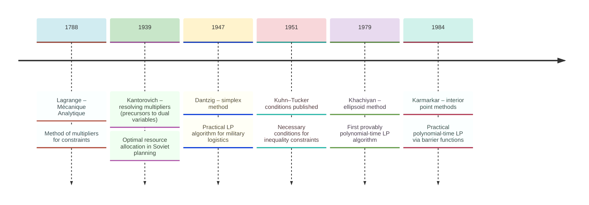
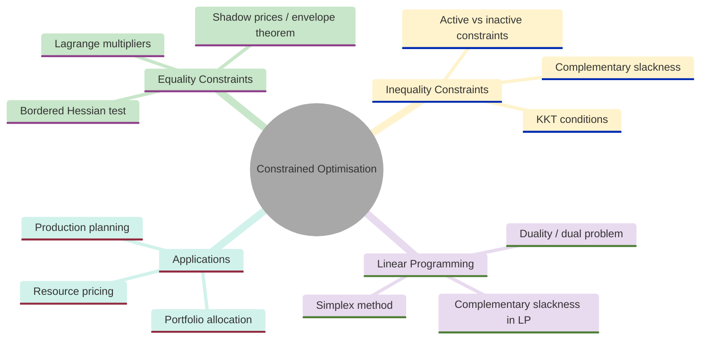
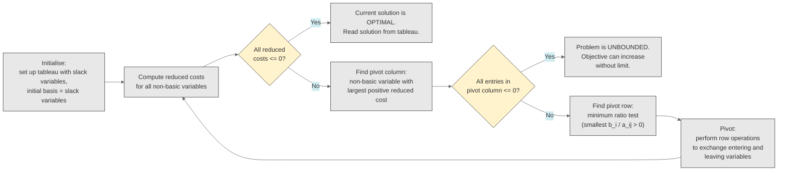
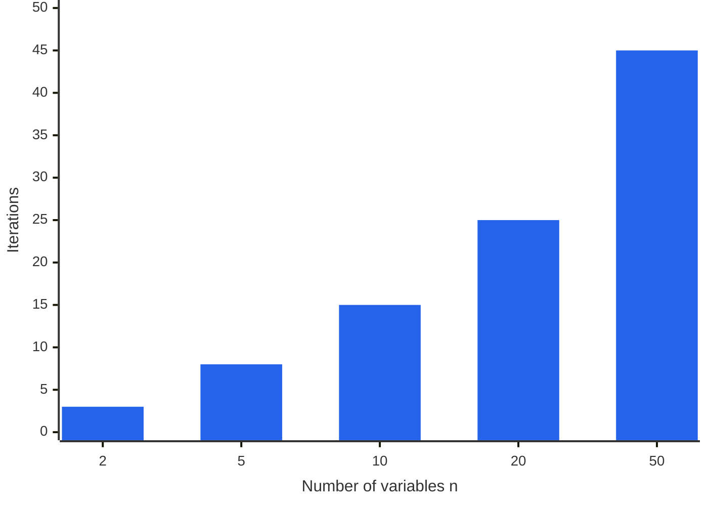
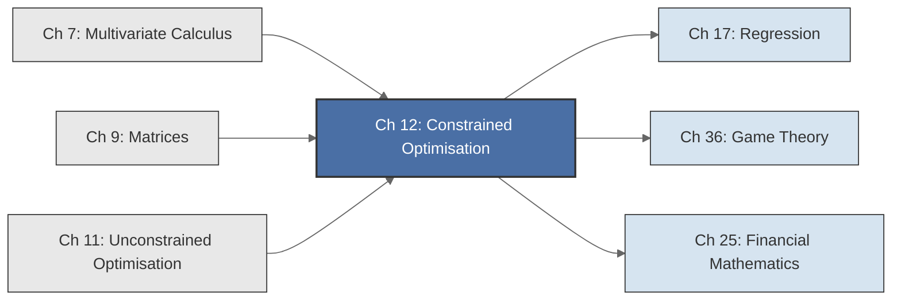

<!-- Copyright (c) 2025-2026 Bob Jansen <bobjansen@pm.me> -->
<!-- SPDX-License-Identifier: CC-BY-NC-4.0 -->
<!-- See LICENSE for full terms. Commercial licensing available. -->
# Chapter 12: Constrained Optimisation & Linear Programming


**Part IV**: Optimisation

> The mathematics of constrained optimisation transforms problems with side conditions into systems of equations that reveal not only the optimum but also the *value* of each constraint, information that is often more useful than the optimum itself. Linear programming, the special case where both objective and constraints are linear, admits an efficient algorithmic theory and a duality that connects the problem of allocating resources to the problem of pricing them.

**Prerequisites**: [Chapter 7](07-multivariate-calculus.md) (Multivariate Calculus); familiarity with gradients, partial derivatives and the Hessian matrix. [Chapter 9](09-matrices.md) (Matrices); matrix multiplication, transpose, determinants and solving linear systems $A\mathbf{x} = \mathbf{b}$. [Chapter 11](11-unconstrained-optimization.md) (Unconstrained Optimisation); gradient descent, Newton's method and second-order conditions for local extrema.

**Learning Objectives**: After this chapter, the reader will be able to:

1. Formulate constrained optimisation problems and write down the Lagrangian.
2. Solve equality-constrained optimisation problems using the method of Lagrange multipliers.
3. Interpret the Lagrange multiplier as a shadow price: the marginal value of relaxing a constraint.
4. State and apply the bordered Hessian test for classifying constrained extrema.
5. Formulate a linear programme (LP) in standard form and convert between equivalent forms.
6. Solve small linear programmes using the simplex method (tableau form).
7. Construct the dual of a linear programme and state the weak and strong duality theorems.
8. Apply complementary slackness to extract economic insight from LP solutions.

**Connections**: This chapter is used by [Chapter 17](17-regression.md) (Regression; constrained estimation, restricted least squares, hypothesis testing as constrained optimisation). The Lagrange multiplier method extends the unconstrained theory of [Chapter 11](11-unconstrained-optimization.md) to problems with side conditions. The LP duality theory connects to game theory (minimax theorems via von Neumann) and to the broader framework of convex optimisation. Shadow prices and the envelope theorem are standard tools in microeconomic analysis, operations research and resource allocation.

---

## Historical Context

**Key Milestones in Constrained Optimisation**



*Figure 12.1: Key milestones in constrained optimisation from Lagrange to interior point methods.*

**Lagrange multipliers and the method of constraints (1788).** Lagrange multipliers and linear programming arose from different motivations, separated by a century and a half. Both converge on a single idea: the value of a constraint. Joseph-Louis Lagrange introduced the method of multipliers in his 1788 *Mécanique Analytique*. He sought equations of motion for mechanical systems subject to geometric constraints: a bead on a wire, a pendulum of fixed length, a rigid body whose points maintain fixed distances.

Rather than eliminating variables, Lagrange adjoined the constraints to the objective via auxiliary variables on equal footing with the physical coordinates. Adding $\lambda \cdot g(\mathbf{x})$ to the function being optimised produced a unified method that handled any number of constraints without explicit elimination. The auxiliary variables, now called *Lagrange multipliers*, carry physical meaning: they represent the forces of constraint. Analytical mechanics and the calculus of variations adopted the method rapidly.

**Shadow prices and the economic interpretation (1947).** Paul Samuelson gave the multiplier its economic interpretation in his 1947 *Foundations of Economic Analysis*. He showed that the Lagrange multiplier in a utility-maximisation problem equals the marginal utility of income: the rate at which maximum achievable utility increases per additional euro of budget. The multiplier measures the marginal value of relaxing the constraint, the concept now called a *shadow price*. The *envelope theorem* formalises this: the derivative of the optimal value with respect to a constraint parameter equals the multiplier. Shadow prices appear in cost-benefit analysis, mechanism design and general equilibrium theory.

**Inequality constraints and the KKT conditions (1951).** Harold Kuhn and Albert Tucker published the generalisation to inequality constraints in 1951. The Karush–Kuhn–Tucker (KKT) conditions (William Karush had derived them independently in his 1939 master's thesis) provide necessary conditions for optimality when constraints take the form $g_i(\mathbf{x}) \leq 0$. Complementary slackness, a consequence of the KKT conditions, states that a multiplier is nonzero only when its constraint is binding.

**Origins of linear programming (1939).** Linear programming began in the Soviet Union. In 1939 Leonid Kantorovich, a Leningrad mathematician, was asked by a plywood trust to improve machine allocation across production tasks. He formulated the problem as the maximisation of a linear objective subject to linear constraints and developed a solution method based on *resolving multipliers*, a precursor to the simplex method.

His monograph *Mathematical Methods of the Organisation and Planning of Production* appeared in a small print run and received little attention. The Soviet planning establishment was hostile to the implication that mathematical optimisation could improve upon central planning. Kantorovich's work remained largely unknown in the West until the 1950s. He shared the 1975 Nobel Prize in Economics with Tjalling Koopmans.

**The simplex method (1947).** George Dantzig invented the *simplex method* in 1947 while computing optimal allocations of aircraft, personnel and supplies for the U.S. Air Force. He formulated the problems as linear programmes and devised an algorithm that moves along the edges of the feasible polyhedron from vertex to vertex, improving the objective at each step. The method solved problems with hundreds of variables and constraints in seconds.

**LP duality (1947).** John von Neumann, learning of Dantzig's work in 1947, recognised a connection to his own theory of two-person zero-sum games. He conjectured and later proved with others that every linear programme has a *dual* whose optimal value equals that of the original. This duality theorem unifies optimisation and pricing: dual variables are the shadow prices of primal constraints. The minimax theorem, which von Neumann had proved in 1928, is a consequence of LP duality.

**Polynomial-time algorithms (1972).** Victor Klee and George Minty constructed in 1972 a family of linear programmes on which the simplex method visits every vertex before finding the optimum, requiring exponentially many steps. In practice, the method almost always terminates in $O(m)$ pivots, where $m$ is the number of constraints; Spielman and Teng proved this polynomial bound in their 2004 smoothed-complexity analysis.

**The ellipsoid method and interior point revolution (1979–1984).** Leonid Khachiyan showed in 1979 that the *ellipsoid method* solves any LP in polynomial time. The result settled a long-standing open question but proved impractical: the ellipsoid method is far slower than the simplex method on typical problems. Narendra Karmarkar introduced *interior point methods* in 1984. These methods traverse the interior of the feasible polyhedron rather than its edges and are competitive with the simplex method on large problems.

**Modern applications (twentieth century).** Linear programming underpins supply chain optimisation, airline scheduling, portfolio construction, network flow algorithms and the pricing of financial derivatives. The LP relaxation of integer programmes is the basis of combinatorial optimisation.

---

## Why This Chapter Matters

**Constrained Optimisation**



*Figure 12.2: Mind map of constrained optimisation spanning equality constraints, inequality constraints, LP and applications.*

A portfolio must sum to 100% of capital. A structural design must not exceed a maximum stress. A production plan must respect resource availability. Optimisation in practice is almost always subject to constraints. Lagrange multipliers handle equality constraints; the simplex method handles linear programmes. Both transform constrained problems into tractable systems of equations.

Augmenting the objective with $\lambda \cdot g(\mathbf{x})$ converts a constrained problem into an equivalent system of stationarity equations over an enlarged variable space. The multiplier $\lambda$ at the optimum is the shadow price: the marginal value of relaxing the constraint by one unit. In a utility-maximisation problem, the multiplier on the budget constraint equals the marginal utility of income. In portfolio optimisation, the multiplier on the constraint that weights sum to 1 is the cost of capital. In manufacturing, the multiplier on a resource constraint gives the value of one additional unit of that resource.

The envelope theorem formalises this: the sensitivity of the optimal value to any parameter equals the corresponding partial derivative of the Lagrangian. This result underpins cost-benefit analysis, mechanism design and general equilibrium theory.

Linear programming combines a rich theoretical structure (duality, complementary slackness, the geometry of polyhedra) with practical efficiency. The simplex method, despite worst-case exponential complexity, solves problems with thousands of variables and constraints in fractions of a second. LP models assign crews to flights, route shipments to minimise cost and construct portfolios subject to risk and regulatory constraints.

LP duality states that every minimisation problem has a companion maximisation problem with the same optimal value. Dual variables are shadow prices; complementary slackness states that only binding constraints carry nonzero prices; the strong duality theorem guarantees consistency between primal and dual perspectives. These ideas extend to semidefinite programming, conic optimisation and the broader convex optimisation theory used in machine learning, signal processing and operations research.

---

## Notation & Conventions

| Symbol | Meaning |
|--------|---------|
| $f(\mathbf{x})$ | Objective function to be minimised or maximised |
| $g_i(\mathbf{x})$ | The $i$-th constraint function |
| $\mathcal{L}(\mathbf{x}, \boldsymbol{\lambda})$ | The Lagrangian function |
| $\lambda_i$ | Lagrange multiplier for the $i$-th constraint |
| $\boldsymbol{\lambda}$ | Vector of Lagrange multipliers $(\lambda_1, \ldots, \lambda_m)$ |
| $\mathbf{x}^*$ | Optimal solution (primal) |
| $\boldsymbol{\lambda}^*$ | Optimal multipliers |
| $f^*$ | Optimal value of the objective: $f^* = f(\mathbf{x}^*)$ |
| $\nabla f$ | Gradient of $f$ ([Chapter 7](07-multivariate-calculus.md)) |
| $\nabla_\mathbf{x} \mathcal{L}$ | Gradient of $\mathcal{L}$ with respect to $\mathbf{x}$ only |
| $\bar{H}$ | Bordered Hessian matrix |
| $\mathbf{c}$ | Objective coefficients of a linear programme (vector in $\mathbb{R}^n$) |
| $A$ | Constraint matrix of a linear programme ($m \times n$) |
| $\mathbf{b}$ | Right-hand side of LP constraints (vector in $\mathbb{R}^m$) |
| $\mathbf{x}$ | Decision variables of a linear programme (vector in $\mathbb{R}^n$) |
| $\mathbf{s}$ | Slack variables |
| $\mathbf{y}$ | Dual variables |
| $z$ | Objective value of a linear programme: $z = \mathbf{c}^T\mathbf{x}$ |
| $z^*$ | Optimal objective value |
| $B$ | Basis (set of basic variable indices in the simplex method) |
| $\mathcal{F}$ | Feasible set (feasible region) of a linear programme |
| $\boldsymbol{\theta}$ | Parameter vector (in the envelope theorem) |

Throughout this chapter, the Lagrangian uses the *addition* convention: $\mathcal{L}(\mathbf{x}, \boldsymbol{\lambda}) = f(\mathbf{x}) + \sum_i \lambda_i g_i(\mathbf{x})$, where each constraint is written in the form $g_i(\mathbf{x}) = 0$. This convention is standard in economics and most optimisation textbooks. The alternative convention with a minus sign ($f - \sum \lambda_i g_i$) appears in some physics texts; the two are equivalent up to the sign of $\lambda$.

---

## Core Theory

### Equality-Constrained Optimisation (Lagrange Multipliers)

**Definition 12.1** (Equality-constrained optimisation problem). Let $f: \mathbb{R}^n \to \mathbb{R}$ be the *objective function* and let $g_1, \ldots, g_m: \mathbb{R}^n \to \mathbb{R}$ be *constraint functions*, with $m < n$. The equality-constrained optimisation problem is

$$\min_{\mathbf{x}} \; f(\mathbf{x}) \quad \text{subject to} \quad g_i(\mathbf{x}) = 0, \quad i = 1, \ldots, m.$$

Equivalently, the problem seeks to minimise $f$ over the *constraint surface* $S = \{\mathbf{x} \in \mathbb{R}^n : g_1(\mathbf{x}) = 0, \ldots, g_m(\mathbf{x}) = 0\}$. The condition $m < n$ ensures that the constraints do not (generically) reduce the feasible set to a single point or the empty set. Maximisation problems are handled identically: maximising $f$ is equivalent to minimising $-f$.

**Definition 12.2** (The Lagrangian). The *Lagrangian* for the equality-constrained problem of Definition 12.1 is the function $\mathcal{L}: \mathbb{R}^n \times \mathbb{R}^m \to \mathbb{R}$ defined by

$$\mathcal{L}(\mathbf{x}, \boldsymbol{\lambda}) = f(\mathbf{x}) + \sum_{i=1}^{m} \lambda_i \, g_i(\mathbf{x}),$$

where $\boldsymbol{\lambda} = (\lambda_1, \ldots, \lambda_m)$ is a vector of *Lagrange multipliers*, one for each constraint. The Lagrangian augments the objective with a weighted sum of the constraint violations, treating the multipliers as free variables.

The key insight is that finding the stationary points of $\mathcal{L}$ over the enlarged space $(\mathbf{x}, \boldsymbol{\lambda}) \in \mathbb{R}^{n+m}$ yields precisely the constrained extrema together with their multipliers. Setting the partial derivatives ([Chapter 7](07-multivariate-calculus.md)) $\partial \mathcal{L}/\partial \lambda_i = 0$ recovers the constraints $g_i(\mathbf{x}) = 0$, while setting $\partial \mathcal{L}/\partial x_j = 0$ imposes the optimality condition on the objective.

**Theorem 12.3** (Lagrange necessary conditions). Let $f, g_1, \ldots, g_m$ be continuously differentiable functions from $\mathbb{R}^n$ to $\mathbb{R}$, with $m < n$. Suppose $\mathbf{x}^*$ is a local extremum (minimum or maximum) of $f$ subject to $g_i(\mathbf{x}) = 0$ for $i = 1, \ldots, m$ and suppose the *constraint qualification* holds: the gradient vectors $\nabla g_1(\mathbf{x}^*), \ldots, \nabla g_m(\mathbf{x}^*)$ are linearly independent. Then there exist multipliers $\lambda_1^*, \ldots, \lambda_m^* \in \mathbb{R}$ such that

$$\nabla_\mathbf{x}\mathcal{L}(\mathbf{x}^*, \boldsymbol{\lambda}^*) = \nabla f(\mathbf{x}^*) + \sum_{i=1}^{m} \lambda_i^* \nabla g_i(\mathbf{x}^*) = \mathbf{0}$$

and

$$g_i(\mathbf{x}^*) = 0 \quad \text{for } i = 1, \ldots, m.$$

Together, these constitute $n + m$ equations in $n + m$ unknowns $(\mathbf{x}^*, \boldsymbol{\lambda}^*)$.

??? note "Proof"

    *Proof sketch.* The constraint surface $S = \{\mathbf{x} : g_i(\mathbf{x}) = 0, \, i = 1, \ldots, m\}$ is, by the implicit function theorem (given the constraint qualification), a smooth manifold of dimension $n - m$ near $\mathbf{x}^*$.

    At a constrained extremum, $f$ has zero rate of change along every direction tangent to $S$. The tangent space to $S$ at $\mathbf{x}^*$ is

    $$T_{\mathbf{x}^*} S = \{\mathbf{v} \in \mathbb{R}^n : \nabla g_i(\mathbf{x}^*) \cdot \mathbf{v} = 0 \text{ for all } i\}.$$

    The condition that $\nabla f(\mathbf{x}^*) \cdot \mathbf{v} = 0$ for every $\mathbf{v} \in T_{\mathbf{x}^*} S$ means $\nabla f(\mathbf{x}^*)$ is orthogonal to $T_{\mathbf{x}^*} S$.

    The orthogonal complement of $T_{\mathbf{x}^*} S$ is $\operatorname{span}\{\nabla g_1(\mathbf{x}^*), \ldots, \nabla g_m(\mathbf{x}^*)\}$ (since these gradients are the normal vectors to the level surfaces of the $g_i$).

    The gradient $\nabla f(\mathbf{x}^*)$ must therefore be a linear combination of the constraint gradients:

    $$\nabla f(\mathbf{x}^*) = -\sum_{i=1}^{m} \lambda_i^* \nabla g_i(\mathbf{x}^*),$$

    which rearranges to $\nabla f(\mathbf{x}^*) + \sum_i \lambda_i^* \nabla g_i(\mathbf{x}^*) = \mathbf{0}$.

    $\square$

**Remark 12.4** (Geometric intuition). The Lagrange conditions have a vivid geometric interpretation. At a constrained optimum, the level curve of $f$ passing through $\mathbf{x}^*$ is *tangent* to the constraint surface. If the level curve and the constraint surface were not tangent, one could slide along the constraint surface and move to a better level curve of $f$, contradicting optimality. Tangency means the normal to the level curve of $f$ (which is $\nabla f$) is parallel to the normal to the constraint surface (which is a linear combination of the $\nabla g_i$). The multipliers $\lambda_i^*$ are the coefficients in this linear combination.

In two dimensions with one constraint, the picture is especially clear: the constraint $g(x,y) = 0$ defines a curve and the objective $f(x,y) = c$ defines a family of level curves. At the optimum, a level curve of $f$ is tangent to the constraint curve, so $\nabla f$ and $\nabla g$ point in the same (or opposite) direction. The multiplier $\lambda^*$ is the ratio $\|\nabla f\| / \|\nabla g\|$ (with appropriate sign).

**Theorem 12.5** (Interpretation of the Lagrange multiplier as shadow price). Under the conditions of Theorem 12.3, consider the family of problems parametrised by $\mathbf{b} = (b_1, \ldots, b_m)$:

$$f^*(\mathbf{b}) = \min_\mathbf{x} f(\mathbf{x}) \quad \text{subject to} \quad g_i(\mathbf{x}) = b_i, \; i = 1, \ldots, m.$$

The original problem corresponds to $\mathbf{b} = \mathbf{0}$. If $f^*(\mathbf{b})$ is differentiable at $\mathbf{b} = \mathbf{0}$, then

$$\lambda_i^* = -\frac{\partial f^*}{\partial b_i}\bigg|_{\mathbf{b} = \mathbf{0}}.$$

For a maximisation problem (maximising $f$ subject to $g_i(\mathbf{x}) = b_i$), the sign convention yields $\lambda_i^* = \partial f^*/\partial b_i$.

The multiplier $\lambda_i^*$ measures the rate at which the optimal value changes when the $i$-th constraint is perturbed; it is the *shadow price* of the $i$-th constraint. A large multiplier indicates a "tight" or "valuable" constraint: relaxing it slightly produces a large improvement in the objective. A zero multiplier indicates a constraint that is, at the margin, non-binding in its effect on the optimal value.

??? note "Proof"

    *Proof sketch.* Define $h(\mathbf{b}) = (\mathbf{x}^*(\mathbf{b}), \boldsymbol{\lambda}^*(\mathbf{b}))$ as the solution to the Lagrange conditions parametrised by $\mathbf{b}$.

    By the implicit function theorem, $h$ is differentiable in a neighbourhood of $\mathbf{b} = \mathbf{0}$ (given the constraint qualification and regularity conditions). Then

    $$f^*(\mathbf{b}) = f(\mathbf{x}^*(\mathbf{b})) = \mathcal{L}(\mathbf{x}^*(\mathbf{b}), \boldsymbol{\lambda}^*(\mathbf{b})) - \sum_i \lambda_i^*(\mathbf{b})(g_i(\mathbf{x}^*(\mathbf{b})) - b_i).$$

    Since $g_i(\mathbf{x}^*(\mathbf{b})) = b_i$ on the constraint surface,

    $$f^*(\mathbf{b}) = \mathcal{L}(\mathbf{x}^*(\mathbf{b}), \boldsymbol{\lambda}^*(\mathbf{b})).$$

    Differentiating with respect to $b_i$ and using that $\nabla_\mathbf{x}\mathcal{L} = \mathbf{0}$ at the optimum (so the indirect effect through $\mathbf{x}^*$ vanishes by the envelope theorem), one obtains $\partial f^*/\partial b_i = -\lambda_i^*$.

    $\square$

**Example 12.6** (Maximising a product on a line). Maximise $f(x, y) = xy$ subject to $g(x, y) = x + y - 10 = 0$.

*Solution.* Form the Lagrangian:

$$\mathcal{L}(x, y, \lambda) = xy + \lambda(x + y - 10).$$

The first-order conditions are:

$$\frac{\partial \mathcal{L}}{\partial x} = y + \lambda = 0, \qquad \frac{\partial \mathcal{L}}{\partial y} = x + \lambda = 0, \qquad \frac{\partial \mathcal{L}}{\partial \lambda} = x + y - 10 = 0.$$

From the first two equations, $y = -\lambda$ and $x = -\lambda$, so $x = y$. Substituting into the constraint: $2x = 10$, hence $x = y = 5$ and $\lambda = -5$. The optimal value is $f^* = 5 \cdot 5 = 25$.

*Interpreting the multiplier.* If the constraint were relaxed to $x + y = 10 + \varepsilon$, the optimal value becomes $f^*(\varepsilon) = (10 + \varepsilon)^2/4$ (by the same calculation with $10 + \varepsilon$ replacing $10$). Then $df^*/d\varepsilon|_{\varepsilon=0} = (10)/2 = 5$.

Under the addition convention $\mathcal{L} = f + \lambda g$, the multiplier at the optimum satisfies $\lambda^* = -df^*/db$ for minimisation and $\lambda^* = df^*/db$ for maximisation, where $b$ is the right-hand side of the constraint. Here $\lambda^* = -5$ and $df^*/db = 5$, confirming $\lambda^* = -df^*/db$ (note that this is a maximisation problem but the constraint is written as $g = x + y - 10 = 0$, so increasing $b$ from 0 means increasing the sum $x + y$ from 10 to $10 + \varepsilon$).

**Lagrange Multiplier Method Steps**

```mermaid
%%{init: {"theme": "base", "themeVariables": {"primaryColor": "#e8e8e8", "primaryTextColor": "#333333", "primaryBorderColor": "#555555", "lineColor": "#666666", "secondaryColor": "#d1ecf1", "tertiaryColor": "#c8e6c9"}}}%%
flowchart LR
    A["Problem: optimise f(x)<br/>subject to g_i(x) = 0"] --> B["Form the Lagrangian:<br/>L(x, lambda) = f(x) + sum lambda_i g_i(x)"]
    B --> C["Compute partial derivatives:<br/>dL/dx_j = 0 for all j<br/>dL/dlambda_i = 0 for all i"]
    C --> D["Solve the system of<br/>n + m equations in<br/>n + m unknowns (x*, lambda*)"]
    D --> E["Classify each candidate<br/>using the bordered Hessian"]
    E --> F{"det(bordered H) > 0?"}
    F -- Yes --> G["Constrained maximum"]
    F -- No --> H{"det(bordered H) < 0?"}
    H -- Yes --> I["Constrained minimum"]
    H -- No --> J["Inconclusive:<br/>higher-order analysis needed"]
    G --> K["Interpret lambda*_i as<br/>shadow price of constraint i"]
    I --> K
    style A fill:#e8e8e8,stroke:#333333
    style B fill:#e8e8e8,stroke:#333333
    style C fill:#e8e8e8,stroke:#333333
    style D fill:#e8e8e8,stroke:#333333
    style E fill:#e8e8e8,stroke:#333333
    style F fill:#fff3cd,stroke:#333333
    style G fill:#e8e8e8,stroke:#333333
    style H fill:#fff3cd,stroke:#333333
    style I fill:#e8e8e8,stroke:#333333
    style J fill:#e8e8e8,stroke:#333333
    style K fill:#e8e8e8,stroke:#333333
```



*Figure 12.3: Steps of the Lagrange multiplier method from problem formulation to shadow price interpretation.*

**Theorem 12.7** (Second-order conditions; bordered Hessian). Consider the problem of optimising $f(x_1, \ldots, x_n)$ subject to $m$ equality constraints $g_i(\mathbf{x}) = 0$. Let $(\mathbf{x}^*, \boldsymbol{\lambda}^*)$ satisfy the first-order conditions of Theorem 12.3. Define the *bordered Hessian* as the $(n + m) \times (n + m)$ matrix ([Chapter 9](09-matrices.md))

$$\bar{H} = \begin{pmatrix} \mathbf{0}_{m \times m} & G \\ G^T & L \end{pmatrix},$$

where $G$ is the $m \times n$ matrix with rows $\nabla g_i(\mathbf{x}^*)^T$ and $L$ is the $n \times n$ Hessian of the Lagrangian $\nabla^2_\mathbf{x}\mathcal{L}(\mathbf{x}^*, \boldsymbol{\lambda}^*)$.

For the important special case $n = 2$, $m = 1$ (two variables, one constraint), the bordered Hessian is the $3 \times 3$ matrix

$$\bar{H} = \begin{pmatrix} 0 & g_x & g_y \\ g_x & \mathcal{L}_{xx} & \mathcal{L}_{xy} \\ g_y & \mathcal{L}_{yx} & \mathcal{L}_{yy} \end{pmatrix},$$

where all partial derivatives are evaluated at $(\mathbf{x}^*, \lambda^*)$. The classification is:

- If $\det(\bar{H}) > 0$, then $\mathbf{x}^*$ is a constrained *maximum*.
- If $\det(\bar{H}) < 0$, then $\mathbf{x}^*$ is a constrained *minimum*.

For the general case, one examines the signs of the last $n - m$ leading principal minors of $\bar{H}$ (starting from the $(2m+1) \times (2m+1)$ minor). If these minors alternate in sign starting with $(-1)^{m+1}$, the point is a constrained maximum; if they all have sign $(-1)^m$, it is a constrained minimum (proof omitted; see Chiang and Wainwright [3], Chapter 12).

!!! note "Bordered Hessian sign convention"

    This sign criterion applies to the bordered Hessian as defined above, with the zero block in the upper-left. Other orderings (zero block lower-right) reverse the sign criterion. When in doubt, verify against a known example (such as Example 12.24 or Example 12.25 below) before applying to new problems.

**Remark 12.8** (The envelope theorem). Theorem 12.5 is a special case of a more general result. Let $f^*(\boldsymbol{\theta})$ denote the optimal value of $\min_\mathbf{x} F(\mathbf{x}, \boldsymbol{\theta})$ subject to $G_i(\mathbf{x}, \boldsymbol{\theta}) = 0$, where $\boldsymbol{\theta}$ is a vector of parameters. The *envelope theorem* states:

$$\frac{df^*}{d\theta_j} = \frac{\partial \mathcal{L}}{\partial \theta_j}\bigg|_{\mathbf{x} = \mathbf{x}^*(\boldsymbol{\theta}), \, \boldsymbol{\lambda} = \boldsymbol{\lambda}^*(\boldsymbol{\theta})}.$$

The optimal value's sensitivity to a parameter is found by differentiating the Lagrangian *directly* with respect to that parameter, evaluating at the optimum, *without* accounting for how $\mathbf{x}^*$ varies with $\boldsymbol{\theta}$. The indirect effect through $\mathbf{x}^*$ vanishes because $\nabla_\mathbf{x}\mathcal{L} = \mathbf{0}$ at the optimum.

This result is central to economics. When the parameter $\theta_j$ is a price, a tax rate or a budget level, the envelope theorem gives the marginal effect on welfare without requiring full re-optimisation. For example, in consumer theory, the envelope theorem applied to the expenditure minimisation problem yields Shephard's lemma: the derivative of the minimum expenditure with respect to a good's price equals the compensated demand for that good.

### Linear Programming

**Definition 12.9** (Linear programme; standard form). A *linear programme* (LP) in standard form is

$$\max \; z = \mathbf{c}^T\mathbf{x} \quad \text{subject to} \quad A\mathbf{x} \leq \mathbf{b}, \;\; \mathbf{x} \geq \mathbf{0},$$

where $\mathbf{c} \in \mathbb{R}^n$ is the vector of *objective coefficients*, $A \in \mathbb{R}^{m \times n}$ is the *constraint matrix*, $\mathbf{b} \in \mathbb{R}^m$ is the *right-hand side* vector (assumed $\mathbf{b} \geq \mathbf{0}$) and $\mathbf{x} \in \mathbb{R}^n$ is the vector of *decision variables*.

Each constraint $\sum_{j=1}^n a_{ij} x_j \leq b_i$ represents a resource limitation: the $i$-th resource, of which $b_i$ units are available, is consumed at rate $a_{ij}$ per unit of activity $j$. The objective $\mathbf{c}^T\mathbf{x} = \sum_j c_j x_j$ is the total value (profit, revenue, utility) of the activities.

Any LP can be converted to standard form. A minimisation problem $\min \mathbf{c}^T\mathbf{x}$ becomes $\max (-\mathbf{c})^T\mathbf{x}$. A constraint $\sum a_{ij}x_j \geq b_i$ becomes $\sum (-a_{ij})x_j \leq -b_i$. An equality constraint $\sum a_{ij}x_j = b_i$ splits into two inequalities. A free variable $x_j$ (not sign-restricted) is replaced by $x_j = x_j^+ - x_j^-$ with $x_j^+, x_j^- \geq 0$.

**Definition 12.10** (Feasible region). The *feasible region* (or feasible set) of the LP in Definition 12.9 is

$$\mathcal{F} = \{\mathbf{x} \in \mathbb{R}^n : A\mathbf{x} \leq \mathbf{b}, \; \mathbf{x} \geq \mathbf{0}\}.$$

This set is the intersection of finitely many half-spaces ($m$ constraints $A\mathbf{x} \leq \mathbf{b}$ and $n$ nonnegativity constraints $\mathbf{x} \geq \mathbf{0}$), and is therefore a *convex polyhedron*. A convex polyhedron is bounded if and only if it is a polytope. The feasible region may be empty (infeasible LP), bounded or unbounded.

**Definition 12.11** (Vertex / extreme point / basic feasible solution). A point $\mathbf{x} \in \mathcal{F}$ is a *vertex* (equivalently, *extreme point*, *basic feasible solution*) of the feasible region if it cannot be expressed as a strict convex combination of two other distinct points in $\mathcal{F}$: there do not exist $\mathbf{u}, \mathbf{v} \in \mathcal{F}$ with $\mathbf{u} \neq \mathbf{v}$ and $\theta \in (0, 1)$ such that $\mathbf{x} = \theta\mathbf{u} + (1 - \theta)\mathbf{v}$.

Equivalently, a vertex is a point at which $n$ linearly independent constraints are active (hold with equality). In two dimensions, a vertex is a "corner" of the feasible polygon.

**Theorem 12.12** (Fundamental theorem of linear programming). If a linear programme in standard form has a finite optimal value, then there exists an optimal solution at a vertex of the feasible region.

??? note "Proof"

    *Proof sketch.* The objective $z = \mathbf{c}^T\mathbf{x}$ is a linear function on the convex polyhedron $\mathcal{F}$. A linear function on a convex set attains its maximum (if finite) at an extreme point.

    To see this, suppose $\mathbf{x}^*$ is an optimal solution that is not a vertex. Then $\mathbf{x}^* = \theta\mathbf{u} + (1-\theta)\mathbf{v}$ for some $\mathbf{u}, \mathbf{v} \in \mathcal{F}$ with $\theta \in (0,1)$. By linearity,

    $$z^* = \mathbf{c}^T\mathbf{x}^* = \theta\,\mathbf{c}^T\mathbf{u} + (1-\theta)\,\mathbf{c}^T\mathbf{v}.$$

    Since $z^*$ is optimal, both $\mathbf{c}^T\mathbf{u} \leq z^*$ and $\mathbf{c}^T\mathbf{v} \leq z^*$. The convex combination equals $z^*$ only if $\mathbf{c}^T\mathbf{u} = \mathbf{c}^T\mathbf{v} = z^*$; both $\mathbf{u}$ and $\mathbf{v}$ are then also optimal.

    Repeating this argument (decomposing any non-vertex optimal solution) eventually reaches a vertex, since the polyhedron has finitely many vertices.

    $\square$

This theorem is the foundation of the simplex method: since the optimum occurs at a vertex, one need only search the (finite) set of vertices rather than the entire feasible region.

**Definition 12.13** (Slack variables). To convert the inequality constraints $A\mathbf{x} \leq \mathbf{b}$ to equalities, introduce *slack variables* $\mathbf{s} = (s_1, \ldots, s_m)^T \geq \mathbf{0}$:

$$A\mathbf{x} + \mathbf{s} = \mathbf{b}, \qquad \mathbf{x} \geq \mathbf{0}, \quad \mathbf{s} \geq \mathbf{0}.$$

Each slack variable $s_i = b_i - \sum_j a_{ij}x_j$ represents the unused amount of resource $i$. The augmented system has $m$ equations in $n + m$ variables. The LP in equality form is:

$$\max \; \mathbf{c}^T\mathbf{x} \quad \text{subject to} \quad [A \mid I_m]\begin{pmatrix}\mathbf{x}\\\mathbf{s}\end{pmatrix} = \mathbf{b}, \quad \mathbf{x} \geq \mathbf{0}, \quad \mathbf{s} \geq \mathbf{0}.$$

**Definition 12.14** (Basis and basic feasible solution). A *basis* $B$ is a set of $m$ indices chosen from $\{1, \ldots, n+m\}$ such that the corresponding $m$ columns of the augmented matrix $[A \mid I_m]$ are linearly independent. The variables indexed by $B$ are *basic variables*; the remaining variables are *non-basic*. A *basic solution* is obtained by setting all non-basic variables to zero and solving the resulting $m \times m$ system for the basic variables. A basic solution is *feasible* if all basic variables are nonnegative.

The basic feasible solutions of the LP in equality form correspond exactly to the vertices of the feasible region $\mathcal{F}$ of the original LP. There are at most $\binom{n+m}{m}$ possible bases, so the number of vertices is finite.

**Theorem 12.15** (The simplex method; overview). The simplex method is an iterative algorithm that solves a linear programme by moving from one basic feasible solution (vertex) to an adjacent one, improving the objective value at each step, until an optimal vertex is found or unboundedness is detected.

At each iteration, the algorithm maintains a basis $B$ and the corresponding basic feasible solution. The steps are:

1. *Compute reduced costs.* For each non-basic variable $x_j$, the reduced cost $\bar{c}_j = c_j - \mathbf{c}_B^T A_B^{-1}\mathbf{a}_j$ measures the rate of improvement of the objective per unit increase in $x_j$.

2. *Optimality test.* If all reduced costs $\bar{c}_j \leq 0$, the current solution is optimal: no non-basic variable can be increased to improve the objective. Stop.

3. *Choose entering variable.* Select a non-basic variable $x_j$ with $\bar{c}_j > 0$ to enter the basis. Dantzig's rule: choose the variable with the largest reduced cost.

4. *Choose leaving variable (minimum ratio test).* Increase $x_j$ from zero. The basic variables change linearly with $x_j$. The *pivot row* is determined by the minimum ratio $\min_i\{b_i'/a_{ij}' : a_{ij}' > 0\}$, where $\mathbf{b}' = A_B^{-1}\mathbf{b}$ and $\mathbf{a}_j' = A_B^{-1}\mathbf{a}_j$. The basic variable in this row leaves the basis.

5. *Unboundedness test.* If all entries $a_{ij}' \leq 0$ for the entering column, then $x_j$ can increase without bound and so can the objective. The LP is unbounded. Stop.

6. *Pivot.* Perform elementary row operations to exchange the entering and leaving variables, producing the new basis. Return to step 1.

**The Simplex Method**



*Figure 12.4: Flowchart of the simplex method iterating through pivot operations until optimality.*

**Remark 12.16** (Simplex complexity). The Klee–Minty cube (1972) is a family of LPs in $n$ variables for which the simplex method with Dantzig's pivot rule visits all $2^n$ vertices, demonstrating exponential worst-case complexity. The average-case behaviour is much better. Borgwardt (1982) proved that the expected number of pivot steps under a probabilistic model of inputs is polynomial. Spielman and Teng (2004) introduced *smoothed analysis*, showing that the simplex method runs in polynomial expected time on any input subject to small random perturbations. In practice, the simplex method typically requires $O(m)$ pivots, where each pivot costs $O(mn)$ operations, giving an observed average-case complexity of $O(m^2 n)$.

### LP Duality

**Definition 12.17** (Dual linear programme). Given the *primal* LP

$$\max \; \mathbf{c}^T\mathbf{x} \quad \text{subject to} \quad A\mathbf{x} \leq \mathbf{b}, \;\; \mathbf{x} \geq \mathbf{0},$$

the *dual* LP is

$$\min \; \mathbf{b}^T\mathbf{y} \quad \text{subject to} \quad A^T\mathbf{y} \geq \mathbf{c}, \;\; \mathbf{y} \geq \mathbf{0}.$$

The primal has $n$ decision variables and $m$ constraints (excluding nonnegativity); the dual has $m$ decision variables and $n$ constraints. Each primal constraint corresponds to a dual variable, and each primal variable corresponds to a dual constraint. The primal objective coefficients become the dual constraint right-hand sides and vice versa. The dual of the dual is the primal.

**Theorem 12.18** (Weak duality). If $\mathbf{x}$ is feasible for the primal and $\mathbf{y}$ is feasible for the dual, then

$$\mathbf{c}^T\mathbf{x} \leq \mathbf{b}^T\mathbf{y}.$$

Every dual feasible solution provides an upper bound on the primal optimal value and every primal feasible solution provides a lower bound on the dual optimal value.

??? note "Proof"

    *Proof.* Since $\mathbf{x} \geq \mathbf{0}$ and $A^T\mathbf{y} \geq \mathbf{c}$, it follows that

    $$\mathbf{c}^T\mathbf{x} \leq (A^T\mathbf{y})^T\mathbf{x} = \mathbf{y}^T A\mathbf{x}.$$

    Since $\mathbf{y} \geq \mathbf{0}$ and $A\mathbf{x} \leq \mathbf{b}$, it follows that

    $$\mathbf{y}^T A\mathbf{x} \leq \mathbf{y}^T\mathbf{b} = \mathbf{b}^T\mathbf{y}.$$

    Combining: $\mathbf{c}^T\mathbf{x} \leq \mathbf{b}^T\mathbf{y}$.

    $\square$

Weak duality has an important corollary: if one finds a primal feasible $\mathbf{x}$ and a dual feasible $\mathbf{y}$ with $\mathbf{c}^T\mathbf{x} = \mathbf{b}^T\mathbf{y}$, then both are optimal for their respective problems. This provides a certificate of optimality.

**Theorem 12.19** (Strong duality). If the primal LP has a finite optimal solution $\mathbf{x}^*$, then the dual also has a finite optimal solution $\mathbf{y}^*$ and the optimal values are equal:

$$\mathbf{c}^T\mathbf{x}^* = \mathbf{b}^T\mathbf{y}^*.$$

!!! abstract "Key Result"

    **Theorem 12.19** (Strong duality). The optimal values of a linear programme and its dual coincide, meaning that every LP can be solved or certified optimal by examining its dual, and the dual variables provide exact shadow prices for the constraints.

Stated without proof (see Bertsimas and Tsitsiklis [1], Chapter 4). The proof is constructive: the simplex method, when it terminates with an optimal primal solution, produces the optimal dual solution as a byproduct (from the reduced costs of the slack variables). A full proof requires the development of the simplex method in detail.

**Theorem 12.20** (Complementary slackness). Let $\mathbf{x}^*$ and $\mathbf{y}^*$ be optimal solutions to the primal and dual LPs, respectively. Then for each primal constraint $i$:

$$y_i^* \cdot \left(b_i - \sum_{j=1}^{n} a_{ij} x_j^*\right) = 0.$$

And for each dual constraint $j$:

$$x_j^* \cdot \left(\sum_{i=1}^{m} a_{ij} y_i^* - c_j\right) = 0.$$

In words: at optimality, for each constraint, either the constraint is *tight* (binding, holds with equality) or the corresponding dual variable is zero. A resource that is not fully consumed has zero shadow price; a variable that does not hit its dual constraint with equality is zero at the optimum.

??? note "Proof"

    *Proof.* The proof follows from strong duality. The gap $\mathbf{b}^T\mathbf{y}^* - \mathbf{c}^T\mathbf{x}^*$ is the sum of nonnegative terms (from the weak duality proof chain). Strong duality forces this sum to zero, which requires each term to be zero individually.

    $\square$

**Remark 12.21** (Economic interpretation of duality). The dual variables $\mathbf{y}^*$ are the *shadow prices* of the primal constraints: the Lagrange multipliers of the primal LP. The dual variable $y_i^*$ equals the marginal increase in the optimal objective value per unit increase in $b_i$ (the $i$-th resource's availability). This connects LP duality directly to the Lagrange multiplier theory of Part A.

Complementary slackness captures an economic principle: a resource commands a positive price ($y_i^* > 0$) only if it is fully used ($s_i^* = b_i - \sum_j a_{ij}x_j^* = 0$). If a resource is in surplus ($s_i^* > 0$), its shadow price is zero ($y_i^* = 0$). This is the pricing analogue of supply and demand: abundant resources are free; scarce resources are valuable.

---

## Formulas & Identities

**F12.1** (Lagrangian).

$$\mathcal{L}(\mathbf{x}, \boldsymbol{\lambda}) = f(\mathbf{x}) + \sum_{i=1}^{m} \lambda_i \, g_i(\mathbf{x}).$$

**F12.2** (Lagrange first-order conditions).

$$\frac{\partial f}{\partial x_j} + \sum_{i=1}^{m} \lambda_i \frac{\partial g_i}{\partial x_j} = 0, \quad j = 1, \ldots, n; \qquad g_i(\mathbf{x}) = 0, \quad i = 1, \ldots, m.$$

**F12.3** (Shadow price formula).

$$\lambda_i^* = -\frac{\partial f^*}{\partial b_i} \quad (\text{minimisation}); \qquad \lambda_i^* = \frac{\partial f^*}{\partial b_i} \quad (\text{maximisation}).$$

!!! warning "Shadow price sign depends on the problem type"

    The sign of the shadow price formula differs between minimisation and maximisation problems (and also depends on whether the Lagrangian uses the $+\lambda g$ or $-\lambda g$ convention). Mixing these conventions is the most common source of sign errors in applied work. Always verify against a known example.

**F12.4** (Bordered Hessian, $n=2$, $m=1$).

$$\bar{H} = \begin{pmatrix} 0 & g_x & g_y \\ g_x & \mathcal{L}_{xx} & \mathcal{L}_{xy} \\ g_y & \mathcal{L}_{yx} & \mathcal{L}_{yy} \end{pmatrix}; \qquad \det(\bar{H}) > 0 \Rightarrow \text{max}; \quad \det(\bar{H}) < 0 \Rightarrow \text{min}.$$

**F12.5** (LP standard form).

$$\max \; \mathbf{c}^T\mathbf{x} \quad \text{s.t.} \quad A\mathbf{x} \leq \mathbf{b}, \; \mathbf{x} \geq \mathbf{0}.$$

**F12.6** (Dual construction).

$$\text{Primal: } \max \; \mathbf{c}^T\mathbf{x}, \; A\mathbf{x} \leq \mathbf{b}, \; \mathbf{x} \geq 0 \quad \longleftrightarrow \quad \text{Dual: } \min \; \mathbf{b}^T\mathbf{y}, \; A^T\mathbf{y} \geq \mathbf{c}, \; \mathbf{y} \geq 0.$$

**F12.7** (Weak duality). For primal feasible $\mathbf{x}$ and dual feasible $\mathbf{y}$:

$$\mathbf{c}^T\mathbf{x} \leq \mathbf{b}^T\mathbf{y}.$$

**F12.8** (Strong duality). If both primal and dual are feasible:

$$\mathbf{c}^T\mathbf{x}^* = \mathbf{b}^T\mathbf{y}^*.$$

**F12.9** (Complementary slackness).

$$y_i^*(b_i - \mathbf{a}_i^T\mathbf{x}^*) = 0 \;\text{ for all } i; \qquad x_j^*(\mathbf{a}^{(j)T}\mathbf{y}^* - c_j) = 0 \;\text{ for all } j.$$

**F12.10** (Reduced cost).

$$\bar{c}_j = c_j - \mathbf{c}_B^T A_B^{-1}\mathbf{a}_j.$$

---

## Algorithms

### Algorithm 12.22: Lagrange Multiplier Method

**Input**: Objective $f(\mathbf{x})$, constraint functions $g_1(\mathbf{x}), \ldots, g_m(\mathbf{x})$, initial guess $\mathbf{x}_0$ (for numerical case).

**Output**: Constrained extremum $\mathbf{x}^*$, multipliers $\boldsymbol{\lambda}^*$, optimal value $f^*$.

```
function lagrangeMultiplierMethod(f, constraints, x0):
    n = dimension of x
    m = number of constraints

    // Step 1: Form the Lagrangian
    L(x, lambda) = f(x) + sum_{i=1}^{m} lambda_i * g_i(x)

    // Step 2: Set up the system of n + m equations
    // Equations 1..n:  dL/dx_j = df/dx_j + sum_i lambda_i * dg_i/dx_j = 0
    // Equations n+1..n+m:  g_i(x) = 0

    // Step 3: Solve the system
    //   For small, symbolic problems: solve analytically
    //   For numerical problems: use Newton's method on the KKT system
    //     F(x, lambda) = [ grad_x L;  g_1(x); ...; g_m(x) ] = 0
    //     Iterate: (x, lambda) <- (x, lambda) - J_F^{-1} * F(x, lambda)
    //     where J_F is the (n+m) x (n+m) Jacobian of F

    (x_star, lambda_star) = newtonSolve(F, (x0, zeros(m)))

    // Step 4: Classify using bordered Hessian (for 2-variable / 1-constraint)
    //   Compute bordered Hessian H_bar
    //   If det(H_bar) > 0: constrained maximum
    //   If det(H_bar) < 0: constrained minimum
    //   Otherwise: inconclusive (higher-order analysis needed)

    f_star = f(x_star)
    return { x: x_star, multipliers: lambda_star, value: f_star }
```

**Complexity**: The system of equations is generally nonlinear, so solving it requires an iterative method. Newton's method on the $(n+m)$-dimensional KKT system converges quadratically near a solution ([Chapter 11](11-unconstrained-optimization.md)). Each Newton step requires solving an $(n+m) \times (n+m)$ linear system, costing $O((n+m)^3)$ operations. The total cost depends on the number of Newton iterations needed for convergence.

### Algorithm 12.23: The Simplex Method (Tableau Form)

**Input**: Objective coefficients $\mathbf{c} \in \mathbb{R}^n$, constraint matrix $A \in \mathbb{R}^{m \times n}$, right-hand side $\mathbf{b} \in \mathbb{R}^m$ (with $\mathbf{b} \geq \mathbf{0}$).

**Output**: Optimal solution $\mathbf{x}^*$, optimal value $z^*$ and status (optimal / unbounded / infeasible).

```
function simplexTableau(c, A, b):
    m = number of rows of A
    n = number of columns of A

    // Step 1: Set up initial tableau with slack variables
    // The tableau is an (m+1) x (n+m+1) matrix:
    //
    //   | A   I  | b |      (constraint rows)
    //   | -c' 0  | 0 |      (objective row)
    //
    // Columns 1..n are original variables; n+1..n+m are slacks.
    // Initial basis: slack variables s_1, ..., s_m (columns n+1..n+m).

    T = zeros(m+1, n+m+1)
    T[1..m, 1..n] = A
    T[1..m, n+1..n+m] = I_m
    T[1..m, n+m+1] = b
    T[m+1, 1..n] = -c'

    basis = [n+1, n+2, ..., n+m]   // indices of basic variables

    // Step 2: Iterate
    while true:
        // Step 2a: Pivot column -- find most positive entry in objective row
        pivotCol = argmax_{j=1..n+m} T[m+1, j]

        // Optimality test: if all entries in objective row <= 0, we are optimal
        if T[m+1, pivotCol] <= 0:
            break  // optimal

        // Step 2b: Pivot row -- minimum ratio test
        ratios = []
        for i = 1 to m:
            if T[i, pivotCol] > 0:
                ratios.append( (T[i, n+m+1] / T[i, pivotCol], i) )

        // Unboundedness test
        if ratios is empty:
            return { x: null, value: +infinity, status: 'unbounded' }

        pivotRow = row index with smallest ratio

        // Step 2c: Pivot -- elementary row operations
        pivotElement = T[pivotRow, pivotCol]
        T[pivotRow, :] = T[pivotRow, :] / pivotElement

        for i = 1 to m+1:
            if i != pivotRow:
                T[i, :] = T[i, :] - T[i, pivotCol] * T[pivotRow, :]

        // Update basis
        basis[pivotRow] = pivotCol

    // Step 3: Read solution
    x = zeros(n)
    for i = 1 to m:
        if basis[i] <= n:
            x[basis[i]] = T[i, n+m+1]

    z_star = T[m+1, n+m+1]

    return { x: x, value: z_star, status: 'optimal' }
```

**Detecting infeasibility**: If $\mathbf{b}$ has negative entries, the initial tableau does not provide a basic feasible solution. The standard remedy is the *two-phase method*: Phase I introduces artificial variables and minimises their sum to find a basic feasible solution (or certifies infeasibility); Phase II applies the simplex method to the original objective starting from the Phase I basis.

!!! tip "Preventing cycling with Bland's rule"

    Degenerate LPs can cause the simplex method to cycle through the same sequence of bases without improving the objective. Bland's rule (1977) prevents cycling: always choose the lowest-indexed eligible variable to enter the basis and the lowest-indexed eligible variable to leave. The rule adds negligible overhead and guarantees finite termination.

**Complexity**: Each pivot step performs $O(mn)$ arithmetic operations (one row division and $m$ row subtractions, each of length $n + m + 1$). The number of pivot steps is at most $\binom{n+m}{m}$ (the number of possible bases) but in practice averages $O(m)$. The average-case total complexity is therefore $O(m^2 n)$.

**Simplex Iterations vs Problem Size**



*Figure 12.5: Growth of simplex iterations as the number of decision variables increases.*

In practice, the simplex method typically requires several iterations that grow much more slowly than the worst-case exponential bound, roughly proportional to the number of constraints.

---

## Numerical Considerations

**Nonlinearity of the Lagrange system.** The system of $n + m$ equations arising from the Lagrange conditions is, in general, nonlinear (because $f$ and the $g_i$ are typically nonlinear). There is no closed-form solution except in special cases (quadratic objective with linear constraints, for instance). Numerical solution requires an iterative method, typically Newton's method applied to the combined system of gradient and constraint equations (the KKT system). Convergence of Newton's method depends on the quality of the initial guess and the conditioning of the Jacobian matrix. If the Jacobian is ill-conditioned near the solution (for example, if the constraint gradients are nearly parallel), convergence degrades and the multiplier estimates become unreliable.

**Multiple stationary points.** The Lagrange conditions are necessary but not sufficient. The system may produce multiple stationary points, including saddle points of the Lagrangian. Each candidate must be classified using the bordered Hessian (Theorem 12.7) or, for complex problems, by evaluating the objective at each candidate. In numerical practice, running the solver from multiple initial guesses is advisable to locate all stationary points.

!!! warning "Constraint qualification failure"

    When the constraint qualification fails (that is, when the gradients $\nabla g_1(\mathbf{x}^*), \ldots, \nabla g_m(\mathbf{x}^*)$ are linearly dependent) the Lagrange necessary conditions (Theorem 12.3) may not hold at a constrained extremum. Verify that the constraint gradients are linearly independent at every candidate point before relying on the Lagrange multiplier method. If they are dependent, the multipliers may not exist or may not be unique; use direct substitution or boundary analysis instead.

**Degeneracy and cycling in the simplex method.** A basic feasible solution is *degenerate* if one or more basic variables equal zero. Degeneracy causes the simplex method to take zero-length steps (the objective does not improve), and in rare cases can cause *cycling*: the algorithm revisits the same basis indefinitely without terminating. Bland's rule (1977) prevents cycling by always choosing the lowest-indexed eligible variable to enter or leave the basis. More sophisticated anti-cycling strategies include lexicographic pivoting and perturbation methods. Degeneracy is common in practice (especially in network flow problems) but cycling is extremely rare.

!!! warning "Small pivot elements amplify rounding errors"

    Each pivot step involves division by $T[\text{pivotRow}, \text{pivotCol}]$. If this element is close to zero, the resulting row operations amplify rounding errors across the entire tableau. Scale the constraint matrix before solving so that entries are of comparable magnitude. Monitor the magnitude of the pivot element and select an alternative pivot candidate when the natural choice falls below approximately $10^{-8}$.

**Floating-point feasibility.** Due to accumulated rounding errors, a solution that is mathematically feasible may violate constraints by a small amount ($10^{-12}$, say). Practical LP solvers maintain a feasibility tolerance (typically $10^{-8}$) and treat a constraint as satisfied if its violation is below this threshold. The optimality test likewise checks whether reduced costs are negative within tolerance rather than exactly.

**Scaling.** Poorly scaled LPs (those in which the entries of $A$, $\mathbf{b}$ and $\mathbf{c}$ span many orders of magnitude) cause numerical difficulties for both simplex and interior point methods. Equilibration scaling (dividing each row by its $\ell_\infty$ norm and each column by its $\ell_\infty$ norm) is a standard preprocessing step.

---

## Worked Examples

### Example 12.24: Maximise a Product on a Line (Lagrange)

**Problem**: Maximise $f(x, y) = xy$ subject to $x + y = 10$.

**Solution (manual)**:

Step 1: Write the constraint as $g(x, y) = x + y - 10 = 0$.

Step 2: Form the Lagrangian:

$$\mathcal{L}(x, y, \lambda) = xy + \lambda(x + y - 10).$$

Step 3: Compute the first-order conditions:

$$\frac{\partial \mathcal{L}}{\partial x} = y + \lambda = 0 \quad \Rightarrow \quad \lambda = -y,$$

$$\frac{\partial \mathcal{L}}{\partial y} = x + \lambda = 0 \quad \Rightarrow \quad \lambda = -x,$$

$$\frac{\partial \mathcal{L}}{\partial \lambda} = x + y - 10 = 0.$$

Step 4: From the first two equations, $x = y$. Substituting into the constraint: $2x = 10$, so $x = y = 5$. Then $\lambda = -5$.

Step 5: Verify second-order condition. The bordered Hessian is:

$$\bar{H} = \begin{pmatrix} 0 & 1 & 1 \\ 1 & 0 & 1 \\ 1 & 1 & 0 \end{pmatrix}.$$

Here $g_x = g_y = 1$, $\mathcal{L}_{xx} = \mathcal{L}_{yy} = 0$ and $\mathcal{L}_{xy} = 1$. The determinant is:

$$\det(\bar{H}) = 0(0 \cdot 0 - 1 \cdot 1) - 1(1 \cdot 0 - 1 \cdot 1) + 1(1 \cdot 1 - 0 \cdot 1) = 0 - (-1) + 1 = 2 > 0.$$

Since $\det(\bar{H}) > 0$, this is a constrained maximum.

Step 6: Optimal value:

$$f^* = 5 \times 5 = 25, \qquad \lambda^* = -5.$$

Shadow price interpretation: increasing the right-hand side from 10 to $10 + \varepsilon$ increases the maximum by approximately $5\varepsilon$.

### Example 12.25: Constrained Distance Minimisation (Lagrange)

**Problem**: Minimise $f(x, y) = x^2 + y^2$ subject to $x + y = 1$.

**Solution (manual)**:

Step 1: The constraint is $g(x, y) = x + y - 1 = 0$. Geometrically, this asks for the point on the line $x + y = 1$ closest to the origin.

Step 2: Lagrangian:

$$\mathcal{L}(x, y, \lambda) = x^2 + y^2 + \lambda(x + y - 1).$$

Step 3: First-order conditions:

$$\frac{\partial \mathcal{L}}{\partial x} = 2x + \lambda = 0, \qquad \frac{\partial \mathcal{L}}{\partial y} = 2y + \lambda = 0, \qquad x + y - 1 = 0.$$

From the first two: $2x = 2y$, so $x = y$. Substituting into the constraint: $2x = 1$, hence $x = y = 1/2$ and $\lambda = -1$.

Step 4: Second-order condition. The bordered Hessian is:

$$\bar{H} = \begin{pmatrix} 0 & 1 & 1 \\ 1 & 2 & 0 \\ 1 & 0 & 2 \end{pmatrix}.$$

$$\det(\bar{H}) = 0(4 - 0) - 1(2 - 0) + 1(0 - 2) = -4 < 0.$$

Since $\det(\bar{H}) < 0$, this is a constrained minimum.

Step 5: Optimal value:

$$f^* = (1/2)^2 + (1/2)^2 = 1/2.$$

The minimum distance from the origin to the line $x + y = 1$ is $\sqrt{1/2} = 1/\sqrt{2}$, which agrees with the formula $d = |0 + 0 - 1|/\sqrt{1^2 + 1^2} = 1/\sqrt{2}$.

### Example 12.26: Simplex Method (Full Tableau Walkthrough)

**Problem**: Maximise $z = 3x_1 + 2x_2$ subject to $x_1 + x_2 \leq 4$, $x_1 + 3x_2 \leq 6$, $x_1, x_2 \geq 0$.

**Solution (manual)**:

Step 1: Introduce slack variables $s_1, s_2 \geq 0$:

$$x_1 + x_2 + s_1 = 4, \qquad x_1 + 3x_2 + s_2 = 6, \qquad z = 3x_1 + 2x_2.$$

Step 2: Set up the initial tableau. The objective row stores $z - \mathbf{c}^T\mathbf{x} = 0$, written as $-3x_1 - 2x_2 + z = 0$. The algorithm terminates when all entries in the objective row (for the decision and slack variables) are nonnegative, meaning no non-basic variable can increase $z$. The initial basis is $\{s_1, s_2\}$.

$$\begin{array}{c|cccc|c}
 & x_1 & x_2 & s_1 & s_2 & \text{RHS} \\ \hline
s_1 & 1 & 1 & 1 & 0 & 4 \\
s_2 & 1 & 3 & 0 & 1 & 6 \\ \hline
z   & -3 & -2 & 0 & 0 & 0
\end{array}$$

The objective row has negative entries $-3$ and $-2$, so the current solution ($x_1 = x_2 = 0$, $z = 0$) is not optimal.

**Iteration 1**: Pivot column: $x_1$ (most negative entry in objective row, $-3$). Minimum ratio test: $4/1 = 4$ (row 1), $6/1 = 6$ (row 2). Pivot row: row 1 (ratio 4). Pivot element: $1$.

Pivot: Row 1 is already normalised. $R_2 \leftarrow R_2 - R_1$; $R_z \leftarrow R_z + 3 R_1$.

$$\begin{array}{c|cccc|c}
 & x_1 & x_2 & s_1 & s_2 & \text{RHS} \\ \hline
x_1 & 1 & 1 & 1 & 0 & 4 \\
s_2 & 0 & 2 & -1 & 1 & 2 \\ \hline
z   & 0 & 1 & 3 & 0 & 12
\end{array}$$

Current solution: $x_1 = 4$, $x_2 = 0$, $s_1 = 0$, $s_2 = 2$, $z = 12$.

**Optimality check**: All entries in the objective row are nonnegative ($0, 1, 3, 0$). No non-basic variable can improve the objective. The algorithm terminates.

**Final solution**: $x_1^* = 4$, $x_2^* = 0$, $z^* = 12$.

**Verification**: $z = 3(4) + 2(0) = 12$. The constraints: $4 + 0 = 4 \leq 4$ (tight, $s_1 = 0$); $4 + 0 = 4 \leq 6$ (slack $s_2 = 2$). A vertex enumeration confirms optimality: at $(0, 0)$, $z = 0$; at $(4, 0)$, $z = 12$; at $(3, 1)$, $z = 11$; at $(0, 2)$, $z = 6$. The maximum is indeed $z^* = 12$ at $(4, 0)$.

The simplex method found the optimum in one pivot. The vertex $(4, 0)$ lies at the intersection of $x_2 = 0$ and $x_1 + x_2 = 4$. The first constraint is tight ($s_1 = 0$); the second has slack $s_2 = 6 - 4 = 2$.

### Example 12.27: LP Duality Verification

**Problem**: Construct the dual of the LP from Example 12.26 and verify strong duality.

**Solution (manual)**:

The primal is:

$$\max \; 3x_1 + 2x_2 \quad \text{s.t.} \quad x_1 + x_2 \leq 4, \;\; x_1 + 3x_2 \leq 6, \;\; x_1, x_2 \geq 0.$$

By Definition 12.17, the dual is:

$$\min \; 4y_1 + 6y_2 \quad \text{s.t.} \quad y_1 + y_2 \geq 3, \;\; y_1 + 3y_2 \geq 2, \;\; y_1, y_2 \geq 0.$$

Step 1: Solve the dual. The dual feasible region is defined by $y_1 + y_2 \geq 3$, $y_1 + 3y_2 \geq 2$, $y_1, y_2 \geq 0$. The dual objective $4y_1 + 6y_2$ is to be minimised.

The dual is a minimisation LP. Its vertices include:
- $(3, 0)$: Check feasibility: $3 + 0 = 3 \geq 3$ (tight), $3 + 0 = 3 \geq 2$ (satisfied). Dual value: $4(3) + 6(0) = 12$.
- $(0, 3)$: Check: $0 + 3 = 3 \geq 3$ (tight), $0 + 9 = 9 \geq 2$ (satisfied). Dual value: $0 + 18 = 18$.
- Intersection of $y_1 + y_2 = 3$ and $y_1 + 3y_2 = 2$: Subtracting, $2y_2 = -1$, so $y_2 = -1/2 < 0$. This violates $y_2 \geq 0$, so this vertex is infeasible.

The minimum dual value at the feasible vertices is $12$, achieved at $(y_1^*, y_2^*) = (3, 0)$.

Step 2: Verify strong duality. The primal optimal value is $z^* = 12$ (Example 12.26), and the dual optimal value is $4(3) + 6(0) = 12$. Indeed $\mathbf{c}^T\mathbf{x}^* = \mathbf{b}^T\mathbf{y}^*$, confirming strong duality.

Step 3: Verify complementary slackness.

Primal constraints:
- Constraint 1: $x_1 + x_2 = 4 + 0 = 4 = b_1$. Tight (slack $= 0$). Dual variable $y_1^* = 3 \neq 0$. Product $= 0$. Consistent.
- Constraint 2: $x_1 + 3x_2 = 4 + 0 = 4 < 6 = b_2$. Slack $= 2 > 0$. Dual variable $y_2^* = 0$. Product $= 0$. Consistent.

Dual constraints:
- Constraint 1: $y_1 + y_2 = 3 + 0 = 3 = c_1$. Tight. Primal variable $x_1^* = 4 \neq 0$. Product $= 0$. Consistent.
- Constraint 2: $y_1 + 3y_2 = 3 + 0 = 3 > 2 = c_2$. Slack $> 0$. Primal variable $x_2^* = 0$. Product $= 0$. Consistent.

All complementary slackness conditions are satisfied. The shadow price of the first resource is $y_1^* = 3$: one additional unit of resource 1 (increasing $b_1$ from 4 to 5) would increase the optimal objective by approximately 3. The shadow price of the second resource is $y_2^* = 0$: this resource is in surplus and additional units have no marginal value.

### Example 12.28: Three-Variable Lagrange Problem

**Problem**: Minimise $f(x, y, z) = x^2 + y^2 + z^2$ subject to $x + y + z = 1$.

**Solution (manual)**:

Step 1: Lagrangian:

$$\mathcal{L} = x^2 + y^2 + z^2 + \lambda(x + y + z - 1).$$

Step 2: First-order conditions:

$$2x + \lambda = 0, \qquad 2y + \lambda = 0, \qquad 2z + \lambda = 0, \qquad x + y + z = 1.$$

Step 3: From the first three equations, $x = y = z = -\lambda/2$. Substituting into the constraint: $3(-\lambda/2) = 1$, so $\lambda = -2/3$ and $x = y = z = 1/3$.

Step 4: Optimal value:

$$f^* = 3 \cdot (1/3)^2 = 1/3.$$

Geometric interpretation: the point on the plane $x + y + z = 1$ closest to the origin is the centroid $(\tfrac{1}{3}, \tfrac{1}{3}, \tfrac{1}{3})$, at distance $\sqrt{1/3} = 1/\sqrt{3}$. The multiplier $\lambda = -2/3$ is the rate of change of the minimum squared distance with respect to the constraint's right-hand side. If the plane shifts to $x + y + z = 1 + \varepsilon$, the new minimum is $f^*(1 + \varepsilon) \approx 1/3 + (2/3)\varepsilon$ (since $\partial f^*/\partial b = -\lambda = 2/3$).

---

## Connections

**Chapter Dependencies**



*Figure 12.6: Chapter dependency graph for constrained optimisation and its connections.*

### Within This Book

- **[Chapter 11](11-unconstrained-optimization.md) (Unconstrained Optimisation)**: The Lagrange multiplier method is the constrained extension of the first-order and second-order conditions from [Chapter 11](11-unconstrained-optimization.md). In unconstrained optimisation, one sets $\nabla f = \mathbf{0}$; in constrained optimisation, the condition becomes $\nabla f = -\sum \lambda_i \nabla g_i$. The gradient of $f$ need not be zero, but must be a linear combination of the constraint gradients. The bordered Hessian extends the Hessian test to the constrained setting. Newton's method for solving the Lagrange system is the same Newton's method used for unconstrained minimisation ([Chapter 11](11-unconstrained-optimization.md)), applied to the augmented KKT system.

- **[Chapter 17](17-regression.md) (Regression)**: Restricted least squares (minimising $\|\mathbf{y} - X\boldsymbol{\beta}\|^2$ subject to $R\boldsymbol{\beta} = \mathbf{r}$) is a direct application of the Lagrange multiplier method with a quadratic objective and linear constraints. The resulting estimator is $\hat{\boldsymbol{\beta}}_R = \hat{\boldsymbol{\beta}} - (X^TX)^{-1}R^T[R(X^TX)^{-1}R^T]^{-1}(R\hat{\boldsymbol{\beta}} - \mathbf{r})$, and the Lagrange multiplier is used to construct the $F$-test for the hypothesis $R\boldsymbol{\beta} = \mathbf{r}$.

- **[Chapter 25](25-financial-mathematics.md) (Financial Mathematics)**: Mean-variance portfolio optimisation minimises portfolio variance subject to a target return and budget constraint, a quadratic programme solved via Lagrange multipliers.

- **[Chapter 36](36-game-theory.md) (Game Theory)**: Nash equilibrium computation for finite games and the minimax theorem for zero-sum games use linear programming and LP duality.

### Applications

- **Microeconomics (utility maximisation)**: The consumer's problem is to maximise $u(x_1, \ldots, x_n)$ subject to $\sum p_i x_i = I$ (budget constraint). The Lagrange multiplier $\lambda^*$ is the *marginal utility of income*: the rate at which the consumer's maximum utility increases per additional euro. The first-order conditions yield the equilibrium condition $\text{MU}_i / p_i = \lambda^*$ for all goods; the marginal utility per euro must be equal across all goods consumed.

- **Microeconomics (cost minimisation)**: The firm's problem is to minimise $\sum w_i x_i$ subject to $f(x_1, \ldots, x_n) = q$ (produce output $q$). The multiplier $\lambda^*$ is the *marginal cost* of production. The first-order conditions yield $w_i / \text{MP}_i = \lambda^*$; the cost of the last unit of each input, per unit of marginal product, must be equal.

- **Operations research (transportation and assignment)**: Standard LP formulations. The transportation problem minimises shipping cost subject to supply and demand constraints. The assignment problem (a special case) assigns workers to jobs at minimum cost. Both have totally unimodular constraint matrices, guaranteeing integer solutions from the LP relaxation.

- **Portfolio optimisation**: The mean-variance portfolio problem (Markowitz, 1952) minimises portfolio variance subject to a target expected return and a budget constraint. This is a quadratic programme (quadratic objective, linear constraints) whose Lagrange conditions yield the efficient frontier.

- **Game theory**: Von Neumann's minimax theorem for two-person zero-sum games can be proved via LP duality. A player's optimal mixed strategy is the solution to a linear programme, and the value of the game is the common optimal value of the primal and dual.

- **Network flows**: Maximum flow and minimum-cost flow problems are LPs with special structure. The max-flow min-cut theorem is a consequence of LP duality applied to the flow LP.

---

## Summary

- The Lagrangian $\mathcal{L}(\mathbf{x}, \boldsymbol{\lambda}) = f(\mathbf{x}) + \sum \lambda_i g_i(\mathbf{x})$ incorporates constraints into the objective, and the first-order conditions $\nabla_\mathbf{x}\mathcal{L} = \mathbf{0}$ yield the Lagrange multiplier equations.
- Each Lagrange multiplier $\lambda_i$ is a shadow price measuring the marginal change in the optimal value per unit relaxation of the corresponding constraint.
- The bordered Hessian test classifies constrained critical points as maxima or minima by examining the signs of leading principal minors of an augmented matrix.
- A linear programme attains its optimum at a vertex of the feasible region (if finite), and the simplex method moves between adjacent vertices improving the objective at each step.
- Strong duality equates the primal and dual optimal values, and complementary slackness links binding constraints to nonzero dual variables.

---

## Exercises

### Routine

**Exercise 12.1**. Find the maximum and minimum values of $f(x, y) = x + 2y$ subject to $x^2 + y^2 = 5$. Classify each critical point.

**Exercise 12.2**. Convert the following LP to standard form: minimise $2x_1 - 3x_2$ subject to $x_1 + x_2 \geq 2$, $-x_1 + x_2 \leq 3$, $x_1 \geq 0$, $x_2$ unrestricted.

**Exercise 12.3**. Solve the LP $\max\; 5x_1 + 4x_2$ subject to $x_1 + x_2 \leq 5$, $2x_1 + x_2 \leq 8$, $x_1, x_2 \geq 0$ using the simplex method in tableau form. Write out each tableau.

### Intermediate

**Exercise 12.4**. Find the point on the plane $2x + y - z = 5$ closest to the origin by minimising $x^2 + y^2 + z^2$ subject to $2x + y - z = 5$. Verify that the distance matches the formula $d = |ax_0 + by_0 + cz_0 - d|/\sqrt{a^2 + b^2 + c^2}$.

**Exercise 12.5**. A firm produces two goods using two resources. Profit per unit is $\text{€}(5, 4)$. Resource requirements are $A = \begin{pmatrix} 1 & 2 \\ 3 & 2 \end{pmatrix}$ and resource availability is $\mathbf{b} = (14, 18)^T$. Formulate this as an LP, solve it, construct the dual and interpret the dual variables as shadow prices. If an additional unit of resource 1 costs $\text{€}3$, should the firm purchase it?

**Exercise 12.6**. Consider the LP $\max\; x_1 - x_2$ subject to $x_1 - x_2 \leq 1$, $-x_1 + x_2 \leq 1$, $x_1, x_2 \geq 0$. Show that the feasible region is unbounded but the LP has a finite optimal solution.

### Challenging

**Exercise 12.7**. Prove the weak duality theorem (Theorem 12.18) from scratch: if $\mathbf{x}$ is primal feasible and $\mathbf{y}$ is dual feasible, then $\mathbf{c}^T\mathbf{x} \leq \mathbf{b}^T\mathbf{y}$. State precisely which feasibility conditions are used.

**Exercise 12.8**. Use Lagrange multipliers to find the maximum of $f(x, y, z) = xyz$ subject to $x + y + z = 12$ and $x + y - z = 0$. This is a two-constraint problem, so there are two multipliers $\lambda_1, \lambda_2$. Solve the system and verify the answer by substituting the constraints to reduce to an unconstrained problem. Verify this is a maximum using the bordered Hessian or by direct comparison with boundary values.

---

## References

### Textbooks

[1] Bertsimas, D. and Tsitsiklis, J. N. *Introduction to Linear Optimization*. Athena Scientific, 1997. A rigorous and thorough introduction to LP, the simplex method, duality and sensitivity analysis. Chapters 1–5 cover the material of Part B of this chapter.

[2] Boyd, S. and Vandenberghe, L. *Convex Optimization*. Cambridge University Press, 2004. The modern reference for convex optimisation, including LP as a special case. Chapters 4–5 develop duality theory in a unified convex framework. Available freely at the authors' website.

[3] Chiang, A. C. and Wainwright, K. *Fundamental Methods of Mathematical Economics*, 4th ed. McGraw-Hill, 2005. An accessible introduction to optimisation methods for economists. Chapters 12–13 cover Lagrange multipliers with extensive economic applications; Chapter 19 covers linear programming.

[4] Luenberger, D. G. and Ye, Y. *Linear and Nonlinear Programming*, 4th ed. Springer, 2016. A thorough treatment of both constrained optimisation (Lagrange multipliers, KKT conditions) and linear programming (simplex, duality, interior point methods). Chapters 11–14 develop the theory in full generality.

### Historical

[5] Dantzig, G. B. *Linear Programming and Extensions*. Princeton University Press, 1963. Monograph by the inventor of the simplex method. Part I develops the theory; Part II covers applications and extensions.

[6] Karmarkar, N. "A New Polynomial-Time Algorithm for Linear Programming." *Combinatorica* 4(4) (1984): 373–395. The paper introducing interior point methods for LP, which are both theoretically polynomial and practically efficient.

[7] Khachiyan, L. G. "A Polynomial Algorithm in Linear Programming." *Soviet Mathematics Doklady* 20(1) (1979): 191–194. The first proof that LP can be solved in polynomial time, via the ellipsoid method.

[8] Klee, V. and Minty, G. "How Good is the Simplex Algorithm?" In *Inequalities III*, ed. O. Shisha, 159–175. Academic Press, 1972. The paper constructing exponential worst-case examples for the simplex method.

[9] Kantorovich, L. V. *Mathematical Methods of the Organisation and Planning of Production*. Leningrad University Press, 1939. Reprinted in *Management Science* 6(4) (1960): 366–422. Introduces resolving multipliers for optimal resource allocation, a precursor to LP duality.

[10] Lagrange, J.-L. *Mécanique Analytique*. La Veuve Desaint, Paris, 1788. The first systematic treatment of the method of multipliers for constrained mechanical systems.

[11] Samuelson, P. A. *Foundations of Economic Analysis*. Harvard University Press, 1947. Introduced the economic interpretation of Lagrange multipliers as shadow prices and developed the envelope theorem for economics.

### Online Resources

[12] Vanderbei, R. J. *Linear Programming: Foundations and Extensions*, 4th ed. (free online edition). https://vanderbei.princeton.edu/LPbook/

[13] NEOS Optimization Guide: Linear Programming. https://neos-guide.org/guide/types/lp/

[14] COIN-OR Foundation. Open-source solvers and libraries for LP, MIP and nonlinear constrained optimisation. https://www.coin-or.org/

---

## Glossary

- **Basic feasible solution** (BFS): A feasible point of an LP at which $n$ linearly independent constraints are active, corresponding to a vertex of the feasible polyhedron.

- **Bland's rule**: A pivot selection rule that prevents cycling in the simplex method by always choosing the lowest-indexed eligible entering and leaving variables.

- **Bordered Hessian** ($\bar{H}$): A matrix combining the constraint gradients and the Hessian of the Lagrangian, used to classify constrained critical points as maxima, minima or neither.

- **Complementary slackness**: The condition that at optimality, for each constraint, either the constraint is tight or its corresponding dual variable is zero.

- **Constraint qualification**: A regularity condition ensuring the Lagrange necessary conditions hold, most commonly requiring the constraint gradients to be linearly independent at the optimum.

- **Degeneracy**: A basic feasible solution in which one or more basic variables equal zero.

- **Dual** (of an LP): A companion linear programme constructed from the primal by transposing the roles of objective coefficients and constraint right-hand sides.

- **Envelope theorem**: The result that $df^*/d\theta = \partial \mathcal{L}/\partial \theta |_{\text{optimum}}$: the sensitivity of the optimal value to a parameter equals the direct partial derivative of the Lagrangian with respect to that parameter, evaluated at the optimum.

- **Feasible region** ($\mathcal{F}$): The set of all points satisfying the constraints of an optimisation problem.

- **Interior point method**: A class of polynomial-time algorithms for linear programming that traverse the interior of the feasible polyhedron.

- **KKT conditions** (Karush–Kuhn–Tucker): The first-order necessary conditions for a constrained optimum in the general case with both equality and inequality constraints.

- **Lagrange multiplier** ($\lambda_i$): An auxiliary variable introduced for each constraint in the Lagrangian, equal at the optimum to the sensitivity of the optimal value to perturbations of that constraint.

- **Lagrangian** ($\mathcal{L}(\mathbf{x}, \boldsymbol{\lambda})$): The augmented objective function $f(\mathbf{x}) + \sum_i \lambda_i g_i(\mathbf{x})$ whose stationary points yield the solutions to the constrained optimisation problem.

- **Linear programme** (LP): An optimisation problem with a linear objective function and linear inequality (or equality) constraints.

- **Pivot**: A single step of the simplex method in which one variable enters the basis and another leaves.

- **Reduced cost** ($\bar{c}_j$): The rate of change of the objective value per unit increase in a non-basic variable $x_j$.

- **Shadow price**: The marginal value of relaxing a constraint by one unit.

- **Simplex method**: An algorithm for solving LPs by moving from vertex to vertex of the feasible polyhedron along edges that improve the objective, until an optimal vertex is reached or unboundedness is detected.

- **Slack variable** ($s_i$): A nonnegative variable introduced to convert an inequality constraint $\sum a_{ij}x_j \leq b_i$ into an equality $\sum a_{ij}x_j + s_i = b_i$.

- **Strong duality**: The theorem that the primal and dual optimal values are equal: $\mathbf{c}^T\mathbf{x}^* = \mathbf{b}^T\mathbf{y}^*$, when both problems are feasible.

- **Weak duality**: The theorem that any dual feasible solution provides an upper bound on the primal optimal value: $\mathbf{c}^T\mathbf{x} \leq \mathbf{b}^T\mathbf{y}$ for all feasible $\mathbf{x}, \mathbf{y}$.

---

## Appendix

### A. Standard Form Conversions for Linear Programmes

The simplex method requires a linear programme in standard form. The following table summarises the standard conversions used to transform an arbitrary LP into this form.

| Original form | Conversion | Standard form equivalent |
|---------------|------------|--------------------------|
| Minimise $\mathbf{c}^T\mathbf{x}$ | Negate: maximise $-\mathbf{c}^T\mathbf{x}$ | Negate the objective |
| $\sum a_{ij}x_j \ge b_i$ | Multiply by $-1$: $\sum (-a_{ij})x_j \le -b_i$ | Reverse inequality |
| $\sum a_{ij}x_j = b_i$ | Replace with two inequalities: $\le b_i$ and $\ge b_i$ | Split equality |
| $x_j$ unrestricted | Replace $x_j = x_j^+ - x_j^-$ with $x_j^+, x_j^- \ge 0$ | Split into nonnegative parts |
| $\sum a_{ij}x_j \le b_i$ | Add slack: $\sum a_{ij}x_j + s_i = b_i$, $s_i \ge 0$ | Introduce slack variable |

### B. Duality Correspondence

For a primal LP in standard form $\max\;\mathbf{c}^T\mathbf{x}$ subject to $A\mathbf{x} \le \mathbf{b}$, $\mathbf{x} \ge \mathbf{0}$, the dual is $\min\;\mathbf{b}^T\mathbf{y}$ subject to $A^T\mathbf{y} \ge \mathbf{c}$, $\mathbf{y} \ge \mathbf{0}$. The correspondence is:

| Primal | Dual |
|--------|------|
| $n$ decision variables | $m$ dual variables |
| $m$ constraints ($\le$) | $m$ variables ($\ge 0$) |
| Objective coefficients $\mathbf{c}$ | RHS of dual constraints |
| RHS $\mathbf{b}$ | Dual objective coefficients |
| $i$-th constraint binding | $y_i > 0$ possible |
| $i$-th constraint slack | $y_i = 0$ (complementary slackness) |
