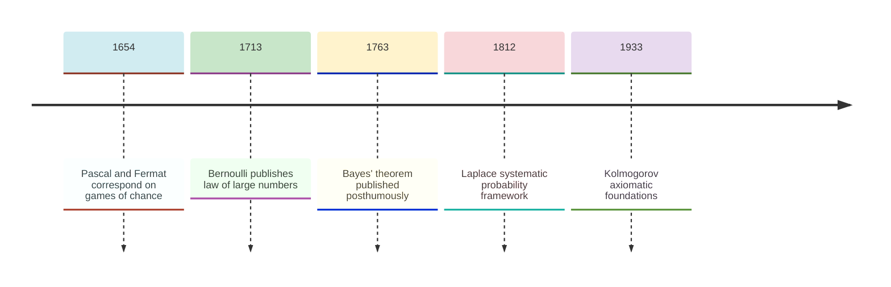
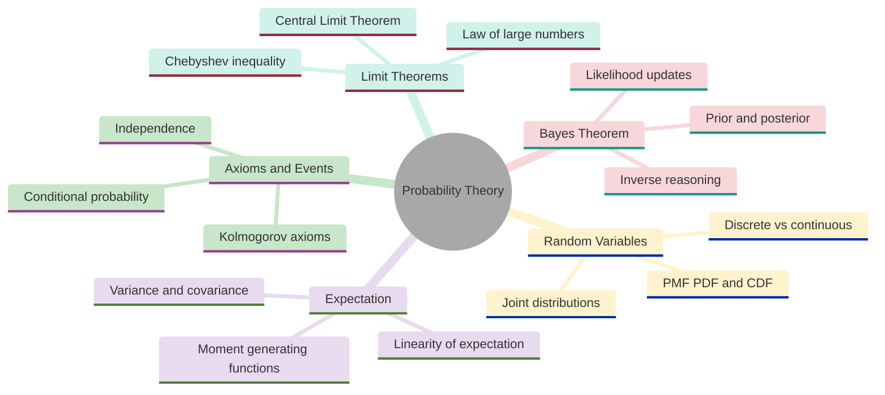
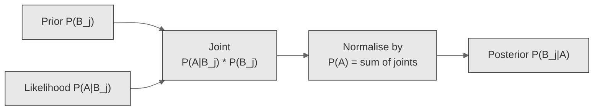
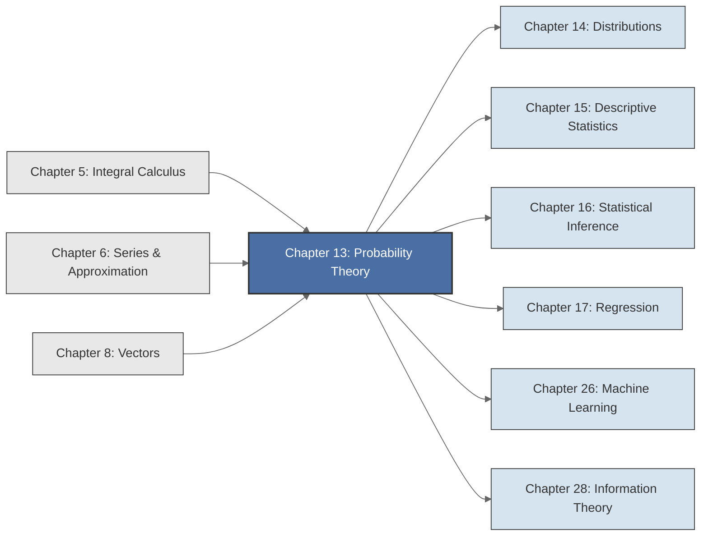

<!-- Copyright (c) 2025-2026 Bob Jansen <bobjansen@pm.me> -->
<!-- SPDX-License-Identifier: CC-BY-NC-4.0 -->
<!-- See LICENSE for full terms. Commercial licensing available. -->
# Chapter 13: Probability Theory


**Part V**: Probability & Statistics

> Probability theory assigns precise numerical values to uncertain outcomes. This chapter develops the Kolmogorov axioms, random variables, expectation and the limit theorems that underpin all of statistics.

**Prerequisites**: [Chapter 5](05-integral-calculus.md) (Integral Calculus), where integration is required for defining continuous probability distributions and computing expected values via $\int x f(x)\,dx$. [Chapter 6](06-series-approximation.md) (Series & Approximation), where convergence of series is needed for discrete distributions with countably many outcomes and power series techniques appear in moment generating functions.

**Learning Objectives**: After this chapter, the reader will be able to:

1. State the Kolmogorov axioms and derive basic consequences (complement rule, inclusion-exclusion).
2. Compute conditional probabilities and apply Bayes' theorem to update beliefs given evidence.
3. Define random variables (discrete and continuous) and their associated PMFs, PDFs and CDFs.
4. Compute expected value and variance and apply linearity of expectation.
5. Derive and apply the moment generating function for common distributions.
6. Distinguish between pairwise independence and mutual independence.
7. State the weak law of large numbers and the Central Limit Theorem and explain their significance.

**Connections**: This chapter provides the theoretical foundation for the remainder of Part V. [Chapter 14](14-distributions.md) (Distributions) catalogues specific probability distributions and their properties. [Chapter 15](15-descriptive-statistics.md) (Descriptive Statistics) applies the expectation and variance formulas developed here to empirical data. [Chapter 16](16-statistical-inference.md) (Statistical Inference) uses conditional probability and Bayes' theorem to construct estimators and hypothesis tests. [Chapter 17](17-regression.md) (Regression) models the conditional expectation $\mathbb{E}[Y \mid X]$ and requires distributional assumptions on error terms.

[Chapter 8](08-vectors.md) (Vectors) provides the inner product and norm structure used to prove that the correlation coefficient is bounded between $-1$ and $1$. [Chapter 26](26-machine-learning.md) (Machine Learning) uses Bayesian inference, linearity of expectation and the bias-variance decomposition. [Chapter 28](28-information-theory.md) (Information Theory) defines entropy and mutual information using the probability framework established here.

---

## Historical Context

**Key Milestones in Probability Theory**



*Figure 13.1: Timeline of key milestones in the development of probability theory.*

**Cardano and the first quantification of chance (1564).** Gerolamo Cardano composed *Liber de Ludo Aleae* (The Book on Games of Chance) around 1564; it remained unpublished until 1663. Cardano enumerated the outcomes of dice throws and recognised that the ratio of favourable cases to total cases measures the likelihood of an event. His treatment was informal and contained errors, but it was the first systematic attempt to quantify uncertainty.

**Pascal, Fermat and the birth of probability (1654).** Antoine Gombaud (the Chevalier de Méré), a French nobleman, posed two gambling problems to Blaise Pascal in 1654. The first concerned the expected number of dice throws needed to observe a double six. The second, the "problem of points", asked how to divide the stakes of an interrupted game fairly. Pascal corresponded with Pierre de Fermat over that summer; together they developed the combinatorial methods that solved both problems. Christiaan Huygens published *De Ratiociniis in Ludo Aleae* (1657), the first printed textbook on probability, formalising many ideas from the Pascal–Fermat exchange.

**Bernoulli and the law of large numbers (1713).** Jakob Bernoulli's *Ars Conjectandi*, published posthumously in 1713, elevated probability from gambling calculations to a branch of mathematics. Bernoulli proved the first limit theorem: the *law of large numbers*, which states that the relative frequency of an event converges to its probability as the number of trials increases. He also argued that probabilistic reasoning applies to civil, moral and economic affairs.

**Bayes, Laplace and inverse probability (1763–1812).** Thomas Bayes, an English Presbyterian minister, addressed the inverse problem: given observed data, what can one infer about the underlying probability? His *Essay towards solving a Problem in the Doctrine of Chances*, published posthumously in 1763 by Richard Price, established the theorem bearing his name. Pierre-Simon Laplace independently derived the same result. In his *Théorie analytique des probabilités* (1812), Laplace developed a thorough framework for statistical reasoning and applied it to astronomy, demography and jurisprudence. His "classical" definition treated probability as the ratio of favourable to equally possible cases; it dominated the subject for a century.

**Kolmogorov and the axiomatic foundations (1933).** Andrei Nikolaevich Kolmogorov laid the modern axiomatic foundation in his 1933 monograph *Grundbegriffe der Wahrscheinlichkeitsrechnung*. He identified probability with a measure on a sigma-algebra of events, borrowing the apparatus of Lebesgue measure theory. Three axioms (nonnegativity, normalisation, countable additivity) unified discrete and continuous probability, resolved paradoxes and placed the subject on the same footing as other branches of pure mathematics.

**The modern synthesis (1930s onwards).** Kolmogorov's axiomatisation is philosophically neutral: it specifies the mathematical properties a probability measure must satisfy without prescribing interpretation. Two schools persist. The *frequentist* interpretation, associated with Richard von Mises and Jerzy Neyman, identifies probability with the limiting relative frequency in a sequence of identical experiments. The *Bayesian* interpretation, revived by Bruno de Finetti, Harold Jeffreys and Leonard Savage, treats probability as a measure of rational belief updated via Bayes' theorem. The mathematical theory is identical in both cases; the disagreement concerns the meaning of probability statements about non-repeatable events.

**Contemporary applications (late twentieth century onwards).** In machine learning, Bayesian inference underpins generative models, Gaussian processes and variational autoencoders. In finance, stochastic processes model asset prices; risk measures (Value at Risk, expected shortfall) are defined through probability distributions. In cryptography, information-theoretic security relies on probability bounds. Randomness extraction uses entropy measures derived from probability theory.

---

## Why This Chapter Matters

**Probability Theory**



*Figure 13.2: Core topics and subtopics of probability theory.*

The Kolmogorov axioms (Definition 13.4) provide the only rigorous way to assign numbers to uncertain outcomes. Without them, the hypothesis tests and confidence intervals of [Chapter 16](16-statistical-inference.md) lack a foundation. Every later result in this book, from regression coefficients in [Chapter 17](17-regression.md) to gradient-descent convergence guarantees, rests on the axioms and definitions of this chapter.

Bayes' theorem (Theorem 13.8) is the basis of naive Bayes classifiers, Bayesian neural networks, variational autoencoders and posterior-inference algorithms generally. The law of iterated expectation (Theorem 13.25) is the theoretical basis of the evidence lower bound (ELBO) used in variational inference. Linearity of expectation (Theorem 13.15) makes the bias-variance decomposition possible. The moment generating function (Definition 13.19) is the tool that proves the Central Limit Theorem, which explains why stochastic gradient descent iterates are approximately normal for large batch sizes.

In finance, portfolio expected return is computed via linearity of expectation; portfolio variance follows from the covariance expansion (Theorem 13.22). Value at Risk (VaR) is a quantile of a loss distribution; expected shortfall is a conditional expectation. Both are defined using the CDF (Definition 13.13) and the expectation machinery of this chapter. On-chain risk models for decentralised finance (DeFi) protocols, liquidation probability calculations and maximal extractable value auction analysis all reduce to computing conditional probabilities and expectations. In cryptography, information-theoretic security proofs (one-time pads, randomness extractors, commitment schemes) are stated as probability bounds. The independence definition (Definition 13.9) is the formal condition that separates secure from insecure constructions.

The Central Limit Theorem (Theorem 13.29) and the law of large numbers (Theorem 13.28) explain why averaging works, why Monte Carlo simulation converges and why sample means from A/B tests have approximate normal distributions regardless of the underlying metric. Chebyshev's inequality (Theorem 13.27) provides distribution-free concentration bounds that underpin probably approximately correct learning theory. The numerical algorithms of this chapter (Welford's online variance, log-probability arithmetic, Bayesian posterior computation) appear in every production data pipeline that handles streaming data, extreme-scale counts or probabilistic inference under resource constraints.

---

## Notation & Conventions

| Symbol | Meaning |
|--------|---------|
| $\Omega$ | Sample space: the set of all possible outcomes |
| $\omega$ | A single outcome: an element of $\Omega$ |
| $\mathcal{F}$ | Sigma-algebra: the collection of events |
| $P$ | Probability measure: $P: \mathcal{F} \to [0,1]$ |
| $A, B, C$ | Events (subsets of $\Omega$) |
| $A^c$ | Complement of event $A$: $\Omega \setminus A$ |
| $X, Y, Z$ | Random variables: functions $\Omega \to \mathbb{R}$ |
| $p(x)$ or $p_X(x)$ | Probability mass function (PMF) of a discrete random variable |
| $f(x)$ or $f_X(x)$ | Probability density function (PDF) of a continuous random variable |
| $F(x)$ or $F_X(x)$ | Cumulative distribution function (CDF): $P(X \leq x)$ |
| $\mathbb{E}[X]$ | Expected value (expectation, mean) of $X$ |
| $\mu$ or $\mu_X$ | Mean of $X$: $\mu = \mathbb{E}[X]$ |
| $\operatorname{Var}(X)$ or $\sigma^2$ | Variance of $X$ |
| $\sigma$ or $\sigma_X$ | Standard deviation of $X$: $\sigma = \sqrt{\operatorname{Var}(X)}$ |
| $\operatorname{Cov}(X,Y)$ | Covariance of $X$ and $Y$ |
| $\rho(X,Y)$ or $\rho_{XY}$ | Correlation coefficient of $X$ and $Y$ |
| $M_X(t)$ | Moment generating function of $X$: $\mathbb{E}[e^{tX}]$ |
| $P(A \mid B)$ | Conditional probability of $A$ given $B$ |
| $\mathbb{E}[X \mid Y]$ | Conditional expectation of $X$ given $Y$ |
| $\bar{X}_n$ | Sample mean: $\frac{1}{n}\sum_{i=1}^n X_i$ |
| $\stackrel{P}{\to}$ | Convergence in probability |
| $\stackrel{d}{\to}$ | Convergence in distribution |

All sums are taken over the support of the random variable unless otherwise noted. The notation $X \sim \mathrm{Dist}(\theta)$ means "$X$ has distribution Dist with parameter(s) $\theta$."

---

## Core Theory

### Foundations

**Definition 13.1** (Sample space). The *sample space* $\Omega$ is the set of all possible outcomes of a random experiment. Each element $\omega \in \Omega$ is called an *outcome* or *sample point*.

The sample space may be finite (e.g., $\Omega = \{H, T\}$ for a coin flip), countably infinite (e.g., $\Omega = \{1, 2, 3, \ldots\}$ for the number of trials until the first success) or uncountable (e.g., $\Omega = [0, \infty)$ for the lifetime of a lightbulb).

**Definition 13.2** (Event). An *event* is a subset $A \subseteq \Omega$. The event $A$ *occurs* if the realised outcome $\omega$ belongs to $A$. The event $\Omega$ is the *certain event* (it always occurs); the event $\varnothing$ is the *impossible event* (it never occurs). Two events $A$ and $B$ are *mutually exclusive* (or *disjoint*) if $A \cap B = \varnothing$.

**Definition 13.3** (Sigma-algebra). A *sigma-algebra* (or $\sigma$-algebra) $\mathcal{F}$ on $\Omega$ is a collection of subsets of $\Omega$ satisfying:

1. $\Omega \in \mathcal{F}$.
2. If $A \in \mathcal{F}$, then $A^c \in \mathcal{F}$ (closure under complementation).
3. If $A_1, A_2, \ldots \in \mathcal{F}$, then $\bigcup_{i=1}^{\infty} A_i \in \mathcal{F}$ (closure under countable union).

The sigma-algebra specifies which subsets of $\Omega$ are "measurable"; that is, which subsets can be assigned a probability. For finite or countably infinite sample spaces, one typically takes $\mathcal{F} = 2^\Omega$ (the power set). For uncountable spaces like $\mathbb{R}$, the standard choice is the Borel sigma-algebra, generated by all open intervals. The technicalities of sigma-algebras need not cause concern at this stage; their role is to ensure mathematical consistency in the presence of uncountable sample spaces.

**Definition 13.4** (Probability measure; Kolmogorov axioms). A *probability measure* is a function $P: \mathcal{F} \to \mathbb{R}$ satisfying:

1. **Non-negativity**: $P(A) \geq 0$ for every $A \in \mathcal{F}$.
2. **Normalisation**: $P(\Omega) = 1$.
3. **Countable additivity** ($\sigma$-additivity): For any countable collection of pairwise disjoint events $A_1, A_2, \ldots \in \mathcal{F}$,

$$P\left(\bigcup_{i=1}^{\infty} A_i\right) = \sum_{i=1}^{\infty} P(A_i).$$

The triple $(\Omega, \mathcal{F}, P)$ is called a *probability space*.

**Theorem 13.5** (Basic consequences of the axioms). Let $(\Omega, \mathcal{F}, P)$ be a probability space. Then:

(a) $P(\varnothing) = 0$.

(b) $P(A^c) = 1 - P(A)$ for any $A \in \mathcal{F}$.

(c) If $A \subseteq B$, then $P(A) \leq P(B)$ (monotonicity).

(d) $P(A \cup B) = P(A) + P(B) - P(A \cap B)$ (inclusion-exclusion for two events).

??? note "Proof"

    *Proof.* (a) Write $\Omega = \Omega \cup \varnothing \cup \varnothing \cup \cdots$ (a countable union of disjoint sets). By Axiom 3,

    $$P(\Omega) = P(\Omega) + P(\varnothing) + P(\varnothing) + \cdots.$$

    Since $P(\Omega) = 1$ is finite, the infinite sum of non-negative terms $P(\varnothing)$ must be zero, so $P(\varnothing) = 0$.

    (b) Since $A$ and $A^c$ are disjoint and $A \cup A^c = \Omega$, Axiom 3 gives $P(A) + P(A^c) = P(\Omega) = 1$.

    (c) Write $B = A \cup (B \setminus A)$, a disjoint union. Then $P(B) = P(A) + P(B \setminus A) \geq P(A)$ by Axiom 1.

    (d) Write $A \cup B = A \cup (B \setminus A)$, which is a disjoint union. Then

    $$P(A \cup B) = P(A) + P(B \setminus A).$$

    Now $B = (A \cap B) \cup (B \setminus A)$ is also a disjoint union, so $P(B) = P(A \cap B) + P(B \setminus A)$, giving $P(B \setminus A) = P(B) - P(A \cap B)$.

    Substituting: $P(A \cup B) = P(A) + P(B) - P(A \cap B)$.

    $\square$

**Definition 13.6** (Conditional probability). Let $A, B \in \mathcal{F}$ with $P(B) > 0$. The *conditional probability* of $A$ given $B$ is

$$P(A \mid B) = \frac{P(A \cap B)}{P(B)}.$$

Conditional probability represents the updated probability of $A$ when it is known that $B$ has occurred. The conditioning restricts the sample space from $\Omega$ to $B$, and $P(\cdot \mid B)$ is itself a probability measure on $(\Omega, \mathcal{F})$.

**Theorem 13.7** (Law of total probability). Let $B_1, B_2, \ldots, B_k$ be a partition of $\Omega$ (that is, the $B_i$ are pairwise disjoint, $\bigcup_i B_i = \Omega$ and $P(B_i) > 0$ for all $i$). Then for any event $A$,

$$P(A) = \sum_{i=1}^{k} P(A \mid B_i)\,P(B_i).$$

??? note "Proof"

    *Proof.* Since the $B_i$ partition $\Omega$, the events $A \cap B_1, A \cap B_2, \ldots, A \cap B_k$ are pairwise disjoint and their union is $A$. By countable additivity,

    $$P(A) = \sum_{i=1}^{k} P(A \cap B_i) = \sum_{i=1}^{k} P(A \mid B_i)\,P(B_i),$$

    where the last equality applies Definition 13.6: $P(A \cap B_i) = P(A \mid B_i)\,P(B_i)$.

    $\square$

**Theorem 13.8** (Bayes' theorem). Let $B_1, B_2, \ldots, B_k$ be a partition of $\Omega$ with $P(B_i) > 0$ for all $i$, and let $A$ be an event with $P(A) > 0$. Then for each $j$,

$$P(B_j \mid A) = \frac{P(A \mid B_j)\,P(B_j)}{\sum_{i=1}^{k} P(A \mid B_i)\,P(B_i)}.$$

??? note "Proof"

    *Proof.* By Definition 13.6, $P(B_j \mid A) = P(A \cap B_j)/P(A)$. The numerator is $P(A \cap B_j) = P(A \mid B_j)\,P(B_j)$ (again by Definition 13.6). The denominator is $P(A) = \sum_i P(A \mid B_i)\,P(B_i)$ by the law of total probability (Theorem 13.7).

    $\square$

Bayes' theorem inverts the direction of conditioning. In applications, the $B_j$ represent competing hypotheses (or causes), $P(B_j)$ is the *prior probability* of hypothesis $B_j$ before observing data, $P(A \mid B_j)$ is the *likelihood* of the observed data $A$ under hypothesis $B_j$ and $P(B_j \mid A)$ is the *posterior probability*, the updated belief after observing the evidence. The denominator $P(A)$ is a normalising constant ensuring the posteriors sum to one.

**Bayesian Posterior Computation via Bayes' Theorem**



*Figure 13.3: Flowchart showing how prior and likelihood combine to produce posterior probabilities.*

**Definition 13.9** (Independence). Two events $A$ and $B$ are *independent* if

$$P(A \cap B) = P(A)\,P(B).$$

Equivalently (when $P(B) > 0$), $A$ and $B$ are independent if and only if $P(A \mid B) = P(A)$; knowing that $B$ occurred does not change the probability of $A$. Independence is a symmetric relation: if $A$ is independent of $B$, then $B$ is independent of $A$.

Events $A_1, \ldots, A_n$ are *mutually independent* if for every subset $S \subseteq \{1, \ldots, n\}$ with $|S| \geq 2$,

$$P\left(\bigcap_{i \in S} A_i\right) = \prod_{i \in S} P(A_i).$$

Pairwise independence (every pair is independent) does not imply mutual independence.

!!! warning "Pairwise independence does not imply mutual independence"

    Three events $A$, $B$ and $C$ can satisfy $P(A \cap B) = P(A)P(B)$, $P(A \cap C) = P(A)P(C)$ and $P(B \cap C) = P(B)P(C)$ yet fail $P(A \cap B \cap C) = P(A)P(B)P(C)$. Checking only pairwise products is insufficient; mutual independence requires the product rule for every sub-collection of size two or larger.

### Random Variables

**Definition 13.10** (Random variable). A *random variable* is a function $X: \Omega \to \mathbb{R}$ that assigns a numerical value to each outcome. Formally, $X$ must be *measurable*: for every Borel set $B \subseteq \mathbb{R}$, the preimage $X^{-1}(B) = \{\omega \in \Omega : X(\omega) \in B\}$ belongs to $\mathcal{F}$. This ensures that events of the form $\{X \leq x\}$, $\{a < X \leq b\}$ and so forth are assigned probabilities.

Random variables map the abstract sample space $\Omega$ to numerical quantities amenable to algebraic manipulation. The distribution of a random variable captures all probabilistic information about its values without reference to the underlying sample space.

**Definition 13.11** (Discrete random variable and PMF). A random variable $X$ is *discrete* if it takes values in a countable set $\{x_1, x_2, \ldots\}$. The *probability mass function* (PMF) of $X$ is the function $p: \mathbb{R} \to [0,1]$ defined by

$$p(x) = P(X = x).$$

The PMF satisfies $p(x) \geq 0$ for all $x$, $p(x) = 0$ for $x$ not in the support and $\sum_x p(x) = 1$ (the sum over all values in the support).

**Definition 13.12** (Continuous random variable and PDF). A random variable $X$ is *continuous* if there exists a non-negative function $f: \mathbb{R} \to [0, \infty)$ such that for every interval $[a, b]$,

$$P(a \leq X \leq b) = \int_a^b f(x)\,dx.$$

The function $f$ is the *probability density function* (PDF) of $X$. It satisfies $f(x) \geq 0$ and $\int_{-\infty}^{\infty} f(x)\,dx = 1$. Note that $f(x)$ is not itself a probability; it is a density. In particular, $f(x)$ may exceed 1. For any single point $x_0$, $P(X = x_0) = \int_{x_0}^{x_0} f(x)\,dx = 0$.

**Definition 13.13** (Cumulative distribution function). The *cumulative distribution function* (CDF) of a random variable $X$ is

$$F(x) = P(X \leq x), \quad x \in \mathbb{R}.$$

Every CDF satisfies:

1. $F$ is non-decreasing: if $a < b$, then $F(a) \leq F(b)$.
2. $F$ is right-continuous: $\lim_{h \to 0^+} F(x + h) = F(x)$.
3. $\lim_{x \to -\infty} F(x) = 0$ and $\lim_{x \to +\infty} F(x) = 1$.

For a discrete random variable with PMF $p$, $F(x) = \sum_{x_i \leq x} p(x_i)$ (a step function). For a continuous random variable with PDF $f$, $F(x) = \int_{-\infty}^x f(t)\,dt$ and wherever $f$ is continuous, $F'(x) = f(x)$.

### Expectation and Moments

**Definition 13.14** (Expected value). The *expected value* (or *expectation*, or *mean*) of a random variable $X$ is

$$\mathbb{E}[X] = \begin{cases} \displaystyle\sum_x x \cdot p(x) & \text{if } X \text{ is discrete}, \\[6pt] \displaystyle\int_{-\infty}^{\infty} x \cdot f(x)\,dx & \text{if } X \text{ is continuous}, \end{cases}$$

provided the sum or integral converges absolutely. (Integration is developed in [Chapter 5](05-integral-calculus.md); convergence of series in [Chapter 6](06-series-approximation.md).) The expected value is the "centre of mass" of the distribution; the long-run average of $X$ over infinitely many independent repetitions of the experiment.

More generally, for any function $g: \mathbb{R} \to \mathbb{R}$,

$$\mathbb{E}[g(X)] = \begin{cases} \displaystyle\sum_x g(x) \cdot p(x) & \text{(discrete)}, \\[6pt] \displaystyle\int_{-\infty}^{\infty} g(x) \cdot f(x)\,dx & \text{(continuous)}. \end{cases}$$

This is sometimes called the *law of the unconscious statistician* (LOTUS).

**Theorem 13.15** (Linearity of expectation). For any random variables $X$ and $Y$ (defined on the same probability space) and any constants $a, b \in \mathbb{R}$,

$$\mathbb{E}[aX + bY] = a\,\mathbb{E}[X] + b\,\mathbb{E}[Y].$$

This holds regardless of whether $X$ and $Y$ are independent.

??? note "Proof"

    *Proof (discrete case).* Let $X$ and $Y$ have joint PMF $p(x,y)$. Then

    $$\mathbb{E}[aX + bY] = \sum_x \sum_y (ax + by)\,p(x,y) = a\sum_x \sum_y x\,p(x,y) + b\sum_x \sum_y y\,p(x,y).$$

    Now $\sum_y p(x,y) = p_X(x)$ (the marginal PMF of $X$), so $\sum_x \sum_y x\,p(x,y) = \sum_x x\,p_X(x) = \mathbb{E}[X]$. The same argument applies to the second term, giving $\mathbb{E}[aX + bY] = a\mathbb{E}[X] + b\mathbb{E}[Y]$.

    $\square$

Linearity of expectation is one of the most powerful tools in probability. It allows the computation of $\mathbb{E}[X]$ by decomposing $X$ into simpler components, even when those components are dependent.

**Definition 13.16** (Variance and standard deviation). The *variance* of a random variable $X$ with mean $\mu = \mathbb{E}[X]$ is

$$\operatorname{Var}(X) = \mathbb{E}[(X - \mu)^2] = \mathbb{E}[X^2] - (\mathbb{E}[X])^2.$$

The *standard deviation* is $\sigma_X = \sqrt{\operatorname{Var}(X)}$.

Variance measures the spread of the distribution around its mean.

??? note "Derivation"

    The alternative formula $\mathbb{E}[X^2] - (\mathbb{E}[X])^2$ follows from expanding the square: $\mathbb{E}[(X - \mu)^2] = \mathbb{E}[X^2 - 2\mu X + \mu^2] = \mathbb{E}[X^2] - 2\mu \mathbb{E}[X] + \mu^2 = \mathbb{E}[X^2] - \mu^2$.

    $\square$

**Theorem 13.17** (Variance properties). For constants $a, b \in \mathbb{R}$ and random variables $X, Y$:

(a) $\operatorname{Var}(aX + b) = a^2 \operatorname{Var}(X)$.

(b) If $X$ and $Y$ are independent, then $\operatorname{Var}(X + Y) = \operatorname{Var}(X) + \operatorname{Var}(Y)$.

??? note "Proof"

    *Proof.* (a) Let $\mu = \mathbb{E}[X]$. Then $\mathbb{E}[aX + b] = a\mu + b$. So

    $$\operatorname{Var}(aX + b) = \mathbb{E}[(aX + b - a\mu - b)^2] = \mathbb{E}[(a(X - \mu))^2] = a^2 \mathbb{E}[(X - \mu)^2] = a^2\operatorname{Var}(X).$$

    (b) When $X$ and $Y$ are independent, $\mathbb{E}[XY] = \mathbb{E}[X]\,\mathbb{E}[Y]$ (this follows from the factorisation of the joint PMF/PDF). Expanding and subtracting:

    $$\begin{aligned}
    \operatorname{Var}(X + Y) &= \mathbb{E}[(X+Y)^2] - (\mathbb{E}[X+Y])^2 \\
    &= \bigl(\mathbb{E}[X^2] + 2\mathbb{E}[XY] + \mathbb{E}[Y^2]\bigr) - \bigl((\mathbb{E}[X])^2 + 2\mathbb{E}[X]\mathbb{E}[Y] + (\mathbb{E}[Y])^2\bigr) \\
    &= \bigl(\mathbb{E}[X^2] - (\mathbb{E}[X])^2\bigr) + \bigl(\mathbb{E}[Y^2] - (\mathbb{E}[Y])^2\bigr) + 2\bigl(\mathbb{E}[XY] - \mathbb{E}[X]\mathbb{E}[Y]\bigr).
    \end{aligned}$$

    The first two terms are $\operatorname{Var}(X)$ and $\operatorname{Var}(Y)$. By independence, $\mathbb{E}[XY] = \mathbb{E}[X]\mathbb{E}[Y]$, so the last term vanishes.

    $\square$

**Definition 13.18** (Higher moments, skewness and kurtosis). The $n$-th *moment* of $X$ is $\mathbb{E}[X^n]$. The $n$-th *central moment* is $\mathbb{E}[(X - \mu)^n]$. Two particularly important standardised central moments are:

- **Skewness**: $\gamma_1 = \dfrac{\mathbb{E}[(X - \mu)^3]}{\sigma^3}$. Measures asymmetry of the distribution. Positive skewness indicates a longer right tail; negative skewness indicates a longer left tail.

- **Kurtosis**: $\kappa = \dfrac{\mathbb{E}[(X - \mu)^4]}{\sigma^4}$. Measures the heaviness of tails relative to the centre. The *excess kurtosis* is $\kappa - 3$, normalised so that the normal distribution has excess kurtosis zero.

**Definition 13.19** (Moment generating function). The *moment generating function* (MGF) of a random variable $X$ is

$$M_X(t) = \mathbb{E}[e^{tX}],$$

defined for all $t$ in a neighbourhood of zero for which the expectation is finite. Its utility lies in the identity

$$M_X^{(n)}(0) = \mathbb{E}[X^n],$$

where $M_X^{(n)}$ denotes the $n$-th derivative. The moments of $X$ are obtained by differentiating the MGF and evaluating at $t = 0$. If two random variables have the same MGF in a neighbourhood of zero, they have the same distribution (uniqueness theorem). The MGF is useful in theoretical proofs (e.g., proving the Central Limit Theorem) but is often numerically inconvenient because $\mathbb{E}[e^{tX}]$ may not exist for all $t$.

### Covariance and Correlation

**Definition 13.20** (Covariance). The *covariance* of random variables $X$ and $Y$ is

$$\operatorname{Cov}(X, Y) = \mathbb{E}[(X - \mu_X)(Y - \mu_Y)] = \mathbb{E}[XY] - \mathbb{E}[X]\,\mathbb{E}[Y].$$

Covariance measures the degree of linear co-movement between $X$ and $Y$. If $\operatorname{Cov}(X,Y) > 0$, then $X$ and $Y$ tend to deviate from their means in the same direction; if $\operatorname{Cov}(X,Y) < 0$, they tend to deviate in opposite directions. Note that $\operatorname{Cov}(X, X) = \operatorname{Var}(X)$.

**Definition 13.21** (Correlation coefficient). The *Pearson correlation coefficient* of $X$ and $Y$ is

$$\rho(X, Y) = \frac{\operatorname{Cov}(X, Y)}{\sigma_X \, \sigma_Y},$$

defined when both standard deviations are positive. The correlation is a dimensionless measure of linear association satisfying $-1 \leq \rho \leq 1$. The extreme values $\rho = \pm 1$ hold if and only if $Y$ is an affine function of $X$ (i.e., $Y = aX + b$ with probability 1, where the sign of $a$ determines the sign of $\rho$). A correlation of $\rho = 0$ means $X$ and $Y$ are *uncorrelated*. Independence implies uncorrelatedness, but the converse is false in general: there exist dependent random variables with zero correlation.

!!! info "Zero correlation does not imply independence"

    Correlation measures only *linear* dependence. Two random variables can have $\rho = 0$ yet be completely determined by one another (see Example 13.37, where $Y = X^2$ gives $\rho(X, Y) = 0$). Relying on correlation alone to assess dependence can be misleading; non-linear relationships are invisible to this measure.

**Theorem 13.22** (Variance of a sum; general case). For any random variables $X$ and $Y$,

$$\operatorname{Var}(X + Y) = \operatorname{Var}(X) + \operatorname{Var}(Y) + 2\operatorname{Cov}(X, Y).$$

More generally, for random variables $X_1, \ldots, X_n$,

$$\operatorname{Var}\left(\sum_{i=1}^n X_i\right) = \sum_{i=1}^n \operatorname{Var}(X_i) + 2\sum_{i < j} \operatorname{Cov}(X_i, X_j).$$

??? note "Proof"

    *Proof.* Let $\mu_X = \mathbb{E}[X]$, $\mu_Y = \mathbb{E}[Y]$. Then

    $$\operatorname{Var}(X + Y) = \mathbb{E}[((X + Y) - (\mu_X + \mu_Y))^2] = \mathbb{E}[((X - \mu_X) + (Y - \mu_Y))^2].$$

    Expanding the square:

    $$= \mathbb{E}[(X - \mu_X)^2] + 2\mathbb{E}[(X - \mu_X)(Y - \mu_Y)] + \mathbb{E}[(Y - \mu_Y)^2] = \operatorname{Var}(X) + 2\operatorname{Cov}(X,Y) + \operatorname{Var}(Y).$$

    $\square$

### Joint Distributions

**Definition 13.23** (Joint distribution). The *joint distribution* of random variables $X$ and $Y$ is specified by:

- **Discrete case**: the joint PMF $p(x, y) = P(X = x, Y = y)$, satisfying $\sum_x \sum_y p(x,y) = 1$.
- **Continuous case**: the joint PDF $f(x, y)$, satisfying $f(x,y) \geq 0$ and $\int_{-\infty}^{\infty}\int_{-\infty}^{\infty} f(x,y)\,dx\,dy = 1$.

The *marginal distributions* are obtained by summing or integrating out one variable:

$$p_X(x) = \sum_y p(x, y), \qquad f_X(x) = \int_{-\infty}^{\infty} f(x, y)\,dy.$$

**Definition 13.24** (Conditional distribution and conditional expectation). The *conditional distribution* of $Y$ given $X = x$ is defined by:

- **Discrete**: $p(y \mid x) = P(Y = y \mid X = x) = p(x, y) / p_X(x)$ for $p_X(x) > 0$.
- **Continuous**: $f(y \mid x) = f(x, y) / f_X(x)$ for $f_X(x) > 0$.

The *conditional expectation* of $Y$ given $X = x$ is

$$\mathbb{E}[Y \mid X = x] = \begin{cases} \sum_y y \cdot p(y \mid x) & \text{(discrete)}, \\ \int_{-\infty}^{\infty} y \cdot f(y \mid x)\,dy & \text{(continuous)}. \end{cases}$$

Viewed as a function of $x$, the conditional expectation $g(x) = \mathbb{E}[Y \mid X = x]$ defines a new random variable $\mathbb{E}[Y \mid X] = g(X)$.

**Theorem 13.25** (Law of iterated expectation / tower property). For any random variables $X$ and $Y$ (with finite expectations),

$$\mathbb{E}[Y] = \mathbb{E}\!\left[\mathbb{E}[Y \mid X]\right].$$

That is, the overall mean of $Y$ can be computed by first conditioning on $X$ and then averaging the conditional mean over the distribution of $X$.

??? note "Proof"

    *Proof sketch (discrete case).* Let $g(x) = \mathbb{E}[Y \mid X = x] = \sum_y y\,p(y \mid x)$. Then

    $$\mathbb{E}[\mathbb{E}[Y \mid X]] = \sum_x g(x)\,p_X(x) = \sum_x \left(\sum_y y\,p(y \mid x)\right) p_X(x) = \sum_x \sum_y y\,p(y \mid x)\,p_X(x).$$

    Since $p(y \mid x)\,p_X(x) = p(x, y)$, this equals $\sum_x \sum_y y\,p(x,y) = \sum_y y \sum_x p(x,y) = \sum_y y\,p_Y(y) = \mathbb{E}[Y]$.

    $\square$

### Limit Theorems

The limit theorems of probability theory describe the behaviour of sums of random variables as the number of terms grows without bound. They explain why averaging reduces noise, why sample statistics converge to population parameters and why the normal distribution occupies a central role in statistics.

**Lemma 13.26** (Markov's inequality). Let $Y$ be a non-negative random variable with finite mean. Then for any $a > 0$,

$$P(Y \geq a) \leq \frac{\mathbb{E}[Y]}{a}.$$

??? note "Proof"

    *Proof.* Write $\mathbb{E}[Y] = \mathbb{E}[Y \mathbf{1}_{Y \geq a}] + \mathbb{E}[Y \mathbf{1}_{Y < a}] \geq \mathbb{E}[Y \mathbf{1}_{Y \geq a}] \geq a\,P(Y \geq a)$, where the last inequality uses $Y \geq a$ on the event $\{Y \geq a\}$. Dividing by $a > 0$ gives the result.

    $\square$

**Theorem 13.27** (Chebyshev's inequality). For any random variable $X$ with finite mean $\mu$ and finite variance $\sigma^2$, and for any $k > 0$,

$$P(\lvert X - \mu \rvert \geq k\sigma) \leq \frac{1}{k^2}.$$

??? note "Proof"

    *Proof.* Let $Y = (X - \mu)^2$. Then $Y \geq 0$ and $\mathbb{E}[Y] = \sigma^2$. By Markov's inequality (for non-negative random variables, $P(Y \geq a) \leq \mathbb{E}[Y]/a$ for $a > 0$), applied with $a = k^2\sigma^2$:

    $$P(\lvert X - \mu \rvert \geq k\sigma) = P((X - \mu)^2 \geq k^2\sigma^2) \leq \frac{\mathbb{E}[(X-\mu)^2]}{k^2\sigma^2} = \frac{\sigma^2}{k^2\sigma^2} = \frac{1}{k^2}.$$

    $\square$

Chebyshev's inequality is crude but universal: it applies to any distribution with finite variance. For example, at least 75% of the distribution lies within 2 standard deviations of the mean ($k = 2$, bound $= 1/4$) and at least 89% lies within 3 standard deviations ($k = 3$, bound $\approx 0.11$). These bounds are often far from tight for specific distributions, but they suffice for proving limit theorems.

**Theorem 13.28** (Weak law of large numbers). Let $X_1, X_2, \ldots$ be independent and identically distributed (iid) random variables with finite mean $\mu$ and finite variance $\sigma^2$. Let $\bar{X}_n = \frac{1}{n}\sum_{i=1}^n X_i$ be the sample mean. Then for every $\varepsilon > 0$,

$$\lim_{n \to \infty} P(\lvert \bar{X}_n - \mu \rvert \geq \varepsilon) = 0.$$

That is, $\bar{X}_n \stackrel{P}{\to} \mu$ (the sample mean converges to the population mean in probability).

!!! note

    The proof below uses Chebyshev's inequality and therefore requires finite variance. The result holds under weaker conditions (finite mean suffices), but the proof is more involved.

??? note "Proof"

    *Proof.* By linearity of expectation, $\mathbb{E}[\bar{X}_n] = \mu$. Since the $X_i$ are independent, $\operatorname{Var}(\bar{X}_n) = \operatorname{Var}\left(\frac{1}{n}\sum X_i\right) = \frac{1}{n^2}\sum \operatorname{Var}(X_i) = \frac{n\sigma^2}{n^2} = \frac{\sigma^2}{n}$.

    Apply Chebyshev's inequality to $\bar{X}_n$: for any $\varepsilon > 0$,

    $$P(\lvert \bar{X}_n - \mu \rvert \geq \varepsilon) \leq \frac{\operatorname{Var}(\bar{X}_n)}{\varepsilon^2} = \frac{\sigma^2}{n\varepsilon^2}.$$

    As $n \to \infty$, the right-hand side tends to zero.

    $\square$

**Law of Large Numbers: Sample Mean Approaching mu**

The following chart illustrates the law of large numbers for a distribution with true mean $\mu = 1.0$. As the sample size $n$ increases, the sample mean $\bar{X}_n$ converges to the population mean.

```mermaid
---
config:
  theme: base
  themeVariables:
    xyChart:
      plotColorPalette: "#2563eb, #dc2626, #16a34a, #9333ea, #ca8a04, #0891b2"
      backgroundColor: "#ffffff"
      titleColor: "#333333"
      xAxisLabelColor: "#333333"
      yAxisLabelColor: "#333333"
      xAxisTitleColor: "#333333"
      yAxisTitleColor: "#333333"
      xAxisLineColor: "#333333"
      yAxisLineColor: "#333333"
---
xychart-beta
    x-axis "Sample size n" [1, 5, 10, 50, 100, 500, 1000]
    y-axis "Sample mean" 0 --> 3.5
    line [3.2, 2.4, 1.8, 1.05, 0.98, 1.01, 1.001]
```

*Figure 13.4: Sample mean converges to the true mean as sample size increases.*

The law of large numbers is the mathematical justification for the frequentist interpretation of probability: if probability is "what the long-run frequency approaches," the law confirms that this limit exists and equals the theoretical probability. It also underpins Monte Carlo methods: an intractable expectation $\mathbb{E}[g(X)]$ can be approximated by the average of $g(X_1), \ldots, g(X_n)$ for large $n$.

**Theorem 13.29** (Central Limit Theorem; CLT). Let $X_1, X_2, \ldots$ be iid random variables with finite mean $\mu$ and finite variance $\sigma^2 > 0$. Then the standardised sample mean converges in distribution to the standard normal:

$$\frac{\bar{X}_n - \mu}{\sigma/\sqrt{n}} = \frac{\sqrt{n}(\bar{X}_n - \mu)}{\sigma} \stackrel{d}{\to} N(0, 1) \quad \text{as } n \to \infty.$$

Equivalently, for any fixed $z \in \mathbb{R}$,

$$\lim_{n \to \infty} P\left(\frac{\bar{X}_n - \mu}{\sigma/\sqrt{n}} \leq z\right) = \Phi(z),$$

where $\Phi$ is the CDF of the standard normal distribution.

!!! abstract "Key Result"

    **Theorem 13.29** (Central Limit Theorem). The standardised sample mean of any iid sequence with finite variance converges in distribution to the standard normal, regardless of the underlying distribution. This universality explains why the normal distribution dominates applied statistics and underpins confidence intervals, hypothesis tests and Monte Carlo methods.

The Central Limit Theorem is the most important theorem in statistics. It states that the distribution of a sample mean (or equivalently, a sum) of iid random variables approaches a normal distribution regardless of the shape of the underlying distribution, provided only that the variance is finite. This universality explains why the normal distribution arises so frequently in practice: any quantity that results from the aggregation of many small, independent contributions will be approximately normally distributed. Measurement errors, test scores, heights within a population and daily portfolio returns all exhibit approximate normality because they arise as sums or averages of many contributing factors.

The rate of convergence depends on the shape of the underlying distribution. For symmetric distributions with light tails, the normal approximation is excellent even for $n$ as small as 5. For highly skewed or heavy-tailed distributions, larger $n$ may be needed (often $n \geq 30$ is cited as a rough guideline).

*Stated without proof.* The proof proceeds via moment generating functions (or, more generally, characteristic functions). The MGF of $\bar{X}_n$, after standardisation, is shown to converge pointwise to $e^{t^2/2}$, which is the MGF of the standard normal. The full proof is deferred to more advanced texts (see Billingsley, Section 27).

---

## Formulas & Identities

**F13.1** (Kolmogorov axioms).

$$P(A) \geq 0, \qquad P(\Omega) = 1, \qquad P\!\left(\bigcup_{i=1}^\infty A_i\right) = \sum_{i=1}^\infty P(A_i) \;\text{ (disjoint)}.$$

**F13.2** (Complement rule).

$$P(A^c) = 1 - P(A).$$

**F13.3** (Inclusion-exclusion, two events).

$$P(A \cup B) = P(A) + P(B) - P(A \cap B).$$

**F13.4** (General inclusion-exclusion).

$$P\!\left(\bigcup_{i=1}^n A_i\right) = \sum_i P(A_i) - \sum_{i < j} P(A_i \cap A_j) + \sum_{i < j < k} P(A_i \cap A_j \cap A_k) - \cdots + (-1)^{n+1} P(A_1 \cap \cdots \cap A_n).$$

**F13.5** (Conditional probability).

$$P(A \mid B) = \frac{P(A \cap B)}{P(B)}.$$

**F13.6** (Bayes' theorem).

$$P(B_j \mid A) = \frac{P(A \mid B_j)\,P(B_j)}{\sum_i P(A \mid B_i)\,P(B_i)}.$$

**F13.7** (Linearity of expectation).

$$\mathbb{E}[aX + bY] = a\mathbb{E}[X] + b\mathbb{E}[Y].$$

**F13.8** (LOTUS).

$$\mathbb{E}[g(X)] = \sum_x g(x)\,p(x) \quad \text{or} \quad \int g(x)\,f(x)\,dx.$$

**F13.9** (Variance).

$$\operatorname{Var}(X) = \mathbb{E}[(X - \mu)^2] = \mathbb{E}[X^2] - (\mathbb{E}[X])^2.$$

**F13.10** (Variance under affine transformation).

$$\operatorname{Var}(aX + b) = a^2\operatorname{Var}(X).$$

**F13.11** (Variance of a sum).

$$\operatorname{Var}(X + Y) = \operatorname{Var}(X) + \operatorname{Var}(Y) + 2\operatorname{Cov}(X, Y).$$

**F13.12** (Covariance).

$$\operatorname{Cov}(X, Y) = \mathbb{E}[XY] - \mathbb{E}[X]\,\mathbb{E}[Y].$$

**F13.13** (Correlation coefficient).

$$\rho(X, Y) = \frac{\operatorname{Cov}(X, Y)}{\sigma_X\,\sigma_Y}, \qquad -1 \leq \rho \leq 1.$$

**F13.14** (Chebyshev's inequality).

$$P(\lvert X - \mu \rvert \geq k\sigma) \leq \frac{1}{k^2}.$$

**F13.15** (Law of iterated expectation).

$$\mathbb{E}[Y] = \mathbb{E}[\mathbb{E}[Y \mid X]].$$

---

## Algorithms

**Algorithm 13.30** (Bayes' theorem computation). Given a partition $\{B_1, \ldots, B_k\}$ with prior probabilities $P(B_i)$ and likelihoods $P(A \mid B_i)$, compute the posterior probabilities $P(B_j \mid A)$.

```
function bayes_posterior(priors, likelihoods, k):
    // Input: priors P(B_1), ..., P(B_k); likelihoods P(A|B_1), ..., P(A|B_k)
    // Output: posteriors P(B_1|A), ..., P(B_k|A)

    total ← 0
    for i ← 1 to k:
        joint[i] ← likelihoods[i] * priors[i]
        total ← total + joint[i]

    for i ← 1 to k:
        posterior[i] ← joint[i] / total

    return posterior
```

*Complexity*: $O(k)$ time, $O(k)$ space, where $k$ is the number of hypotheses.

**Algorithm 13.31** (Expected value of a discrete random variable). Given a finite list of value-probability pairs $(x_i, p_i)$, compute $\mathbb{E}[X] = \sum_i x_i p_i$.

```
function expected_value(x, p, n):
    // Input: values x[1], ..., x[n]; probabilities p[1], ..., p[n]
    // Output: expected value E[X]

    E ← 0
    for i ← 1 to n:
        E ← E + x[i] * p[i]

    return E
```

*Complexity*: $O(n)$ time, $O(1)$ space. A numerically improved version would use compensated summation (Kahan's algorithm) when $n$ is large and the terms vary in magnitude.

**Algorithm 13.32** (Two-pass variance computation; numerically stable). The naive formula $\operatorname{Var}(X) = \mathbb{E}[X^2] - (\mathbb{E}[X])^2$ suffers from catastrophic cancellation when $\mathbb{E}[X^2]$ and $(\mathbb{E}[X])^2$ are both large and nearly equal. The two-pass algorithm avoids this.

```
function two_pass_variance(x, p, n):
    // Input: values x[1], ..., x[n]; probabilities p[1], ..., p[n]
    // Output: variance Var(X)

    // Pass 1: compute mean
    mu ← 0
    for i ← 1 to n:
        mu ← mu + x[i] * p[i]

    // Pass 2: compute variance from deviations
    var ← 0
    for i ← 1 to n:
        var ← var + p[i] * (x[i] - mu)^2

    return var
```

*Complexity*: $O(n)$ time, $O(1)$ space, two passes. The subtraction $x_i - \mu$ produces values near zero, avoiding the large-magnitude cancellation of the naive formula.

---

## Numerical Considerations

!!! warning "Catastrophic cancellation in the naive variance formula"

    The identity $\operatorname{Var}(X) = \mathbb{E}[X^2] - (\mathbb{E}[X])^2$ subtracts two nearly equal large numbers when the mean is large relative to the spread. In IEEE 754 double precision this can lose all significant digits of the variance. Use the two-pass algorithm (Algorithm 13.32) or Welford's online algorithm instead.

**Catastrophic cancellation in the variance formula.** The identity $\operatorname{Var}(X) = \mathbb{E}[X^2] - (\mathbb{E}[X])^2$ is algebraically exact but numerically dangerous. A random variable taking values near $10^6$ with small spread has $\mathbb{E}[X^2] \approx 10^{12}$ and $(\mathbb{E}[X])^2 \approx 10^{12}$. Their difference (the variance) may be on the order of 1. IEEE 754 double precision provides roughly 15 significant digits. The subtraction $10^{12} - 10^{12}$ loses all significant digits of the variance. The two-pass algorithm of Algorithm 13.32 avoids this by computing deviations from the mean and squaring those.

**Welford's online algorithm.** When data arrives one observation at a time and storing all values is impractical, Welford's algorithm (1962) computes the running mean and variance in a single pass:

$$M_1 = x_1, \quad M_k = M_{k-1} + \frac{x_k - M_{k-1}}{k},$$

$$S_1 = 0, \quad S_k = S_{k-1} + (x_k - M_{k-1})(x_k - M_k).$$

The sample variance after $n$ observations is $S_n / (n-1)$ (or $S_n / n$ for a finite population). The algorithm uses $O(1)$ space. It maintains stability by updating deviations relative to the running mean.

**Probability sums and floating-point arithmetic.** A PMF must satisfy $\sum_i p(x_i) = 1$. In floating-point arithmetic, a sum of many probabilities may not equal exactly 1.0. Implementations should: (a) never test $\sum p_i == 1.0$ with exact equality; (b) when normalising (as in Algorithm 13.30), divide by the computed sum rather than assuming it equals 1; (c) use compensated summation (Kahan or Neumaier) when summing many small probabilities.

!!! tip "Use log-probabilities for products of many small values"

    When multiplying many probabilities (e.g., in naive Bayes classifiers or hidden Markov models), the product underflows to zero in double precision. Working in log space converts products to sums and avoids this. The log-sum-exp trick recovers the sum in probability space when needed.

**Log-probabilities.** When probabilities are very small, working in log space prevents underflow. Products become sums. The log-sum-exp trick computes $\log\!\left(\sum_i e^{a_i}\right)$ stably by subtracting $\max_i a_i$ before exponentiating.

---

## Worked Examples

### Example 13.33: Bayes' theorem (medical testing)

A disease affects 1% of a population. A diagnostic test has 95% sensitivity (true positive rate: $P(\text{positive} \mid \text{disease}) = 0.95$) and 90% specificity (true negative rate: $P(\text{negative} \mid \text{no disease}) = 0.90$). A patient tests positive. What is the probability that the patient actually has the disease?

*Solution.* Let $D$ = "has disease" and $T^+$ = "tests positive." The given information is:

- $P(D) = 0.01$, so $P(D^c) = 0.99$.
- $P(T^+ \mid D) = 0.95$ (sensitivity).
- $P(T^+ \mid D^c) = 1 - 0.90 = 0.10$ (false positive rate = 1 - specificity).

By the law of total probability:

$$P(T^+) = P(T^+ \mid D)\,P(D) + P(T^+ \mid D^c)\,P(D^c) = (0.95)(0.01) + (0.10)(0.99) = 0.0095 + 0.0990 = 0.1085.$$

By Bayes' theorem:

$$P(D \mid T^+) = \frac{P(T^+ \mid D)\,P(D)}{P(T^+)} = \frac{(0.95)(0.01)}{0.1085} = \frac{0.0095}{0.1085} \approx 0.0876.$$

Despite the test's high sensitivity and specificity, the posterior probability of disease given a positive test is only about 8.8%. The low prior prevalence (1%) means most positive results are false positives. A positive test does not mean "has disease" when the base rate is low.

!!! note "The base rate fallacy"

    Ignoring the prior probability $P(D)$ and interpreting a positive test as near-certain evidence of disease is the *base rate fallacy*. When the condition is rare, even a highly accurate test produces more false positives than true positives. The posterior depends on the prior; the test result alone is insufficient.

### Example 13.34: Expected value and variance of a discrete distribution

Let $X$ be the outcome of rolling a fair six-sided die. Compute $\mathbb{E}[X]$ and $\operatorname{Var}(X)$.

*Solution.* The PMF is $p(x) = 1/6$ for $x \in \{1, 2, 3, 4, 5, 6\}$.

$$\mathbb{E}[X] = \sum_{x=1}^6 x \cdot \frac{1}{6} = \frac{1+2+3+4+5+6}{6} = \frac{21}{6} = 3.5.$$

$$\mathbb{E}[X^2] = \sum_{x=1}^6 x^2 \cdot \frac{1}{6} = \frac{1+4+9+16+25+36}{6} = \frac{91}{6} \approx 15.167.$$

$$\operatorname{Var}(X) = \mathbb{E}[X^2] - (\mathbb{E}[X])^2 = \frac{91}{6} - \left(\frac{7}{2}\right)^2 = \frac{91}{6} - \frac{49}{4} = \frac{182 - 147}{12} = \frac{35}{12} \approx 2.917.$$

The standard deviation is $\sigma = \sqrt{35/12} \approx 1.708$.

### Example 13.35: Verifying the variance formula

Let $X$ be a random variable with PMF $p(1) = 0.3$, $p(2) = 0.5$, $p(4) = 0.2$. Verify that $\mathbb{E}[X^2] - (\mathbb{E}[X])^2 = \mathbb{E}[(X - \mu)^2]$.

*Solution.* First compute the mean:

$$\mu = \mathbb{E}[X] = 1(0.3) + 2(0.5) + 4(0.2) = 0.3 + 1.0 + 0.8 = 2.1.$$

Compute $\mathbb{E}[X^2]$:

$$\mathbb{E}[X^2] = 1^2(0.3) + 2^2(0.5) + 4^2(0.2) = 0.3 + 2.0 + 3.2 = 5.5.$$

Using the shortcut formula:

$$\operatorname{Var}(X) = 5.5 - (2.1)^2 = 5.5 - 4.41 = 1.09.$$

Using the definition directly:

$$\begin{aligned}
\mathbb{E}[(X - \mu)^2] &= (1 - 2.1)^2(0.3) + (2 - 2.1)^2(0.5) + (4 - 2.1)^2(0.2) \\
&= (-1.1)^2(0.3) + (-0.1)^2(0.5) + (1.9)^2(0.2) \\
&= 1.21(0.3) + 0.01(0.5) + 3.61(0.2) \\
&= 0.363 + 0.005 + 0.722 = 1.09.
\end{aligned}$$

Both formulas agree, as they must. The two-pass algorithm (Algorithm 13.32) computes the second version, avoiding the potential cancellation inherent in the first.

### Example 13.36: Central Limit Theorem illustration

Let $X_1, X_2, \ldots, X_n$ be iid draws from the uniform distribution on $[0, 1]$, which has $\mu = 1/2$ and $\sigma^2 = 1/12$. By the CLT, for large $n$:

$$\bar{X}_n = \frac{1}{n}\sum_{i=1}^n X_i \;\approx\; N\!\left(\frac{1}{2},\; \frac{1}{12n}\right).$$

For $n = 12$: $\mathbb{E}[\bar{X}_{12}] = 0.5$, $\operatorname{Var}(\bar{X}_{12}) = 1/144$, $\sigma_{\bar{X}_{12}} = 1/12 \approx 0.0833$.

A sum of 12 uniform random variables, $S_{12} = \sum_{i=1}^{12} X_i$, has mean 6 and variance 1. The quantity $S_{12} - 6$ is therefore approximately $N(0, 1)$. This classical approximation was historically used to generate pseudo-normal random numbers before more efficient methods (Box–Muller, ziggurat) became standard.

Conceptual verification in code:

For $m = 30$ and $n = 10000$, the histogram of the resulting means closely resembles the PDF of $N(0.5, 1/360)$, with standard deviation $\approx 0.0527$.

### Example 13.37: Independence vs. uncorrelatedness

Let $X$ be uniformly distributed on $\{-1, 0, 1\}$ with equal probabilities $1/3$ each, and let $Y = X^2$. Then:

$$\mathbb{E}[X] = \frac{-1 + 0 + 1}{3} = 0, \qquad \mathbb{E}[Y] = \mathbb{E}[X^2] = \frac{1 + 0 + 1}{3} = \frac{2}{3}.$$

$$\mathbb{E}[XY] = \mathbb{E}[X \cdot X^2] = \mathbb{E}[X^3] = \frac{(-1)^3 + 0^3 + 1^3}{3} = 0.$$

The covariance is therefore

$$\operatorname{Cov}(X, Y) = \mathbb{E}[XY] - \mathbb{E}[X]\mathbb{E}[Y] = 0 - 0 \cdot \frac{2}{3} = 0, \qquad \rho(X, Y) = 0.$$

Yet $X$ and $Y$ are *not* independent: $P(Y = 1 \mid X = 0) = 0$, but $P(Y = 1) = 2/3 \neq 0$. Knowing $X = 0$ changes the distribution of $Y$ entirely. This example demonstrates that zero correlation does not imply independence; correlation captures only *linear* dependence.

---

## Connections

**Chapter Dependencies**



*Figure 13.5: Dependency graph showing prerequisite and downstream chapters for probability theory.*

### Within This Book

- **[Chapter 8](08-vectors.md) (Vectors)** provides the inner product and norm structure used in [Chapter 15](15-descriptive-statistics.md) to prove that the correlation coefficient is bounded between $-1$ and $1$ (via the Cauchy–Schwarz inequality).

- **[Chapter 14](14-distributions.md) (Distributions)** catalogues named distributions (Bernoulli, binomial, Poisson, uniform, exponential, normal, gamma) and derives their moments using the PMF, PDF, CDF and MGF definitions established here.

- **[Chapter 15](15-descriptive-statistics.md) (Descriptive Statistics)** uses $\bar{X}_n$ and $S^2$ as empirical counterparts of $\mathbb{E}[X]$ and $\operatorname{Var}(X)$. The law of large numbers (Theorem 13.28) guarantees convergence of these sample quantities to their population targets.

- **[Chapter 16](16-statistical-inference.md) (Statistical Inference)** uses Bayes' theorem (Theorem 13.8) for posterior computation, the law of large numbers (Theorem 13.28) for estimator consistency and the CLT (Theorem 13.29) for constructing $z$-intervals and $z$-tests.

- **[Chapter 17](17-regression.md) (Regression)** models $\mathbb{E}[Y \mid X = x] = \beta_0 + \beta_1 x$ (a special case of Definition 13.24) and requires the variance and distributional assumptions of this chapter for inference on the error term $\varepsilon$.

- **[Chapter 26](26-machine-learning.md) (Machine Learning)** uses Bayesian inference, linearity of expectation and the bias-variance decomposition, all of which rest on the probabilistic foundations established here.

- **[Chapter 28](28-information-theory.md) (Information Theory)** defines entropy and divergence measures using the probability framework of this chapter; Shannon entropy is an expectation of $-\log p(x)$ over the distribution $p$.

### Applications

- **Machine learning**: Bayesian learning treats model parameters as random variables with prior distributions, and computes posterior distributions given training data via Bayes' theorem. Generative models (variational autoencoders, diffusion models) are specified as joint distributions over observed and latent variables; the evidence lower bound (ELBO) is expressed using conditional expectations. The bias-variance decomposition of prediction error uses $\mathbb{E}[\cdot]$ and $\operatorname{Var}(\cdot)$ applied to the prediction as a random variable over training sets.

- **Finance**: The expected return of a portfolio is $\mathbb{E}[R_p] = \sum_i w_i \mathbb{E}[R_i]$ (linearity of expectation). Portfolio variance involves the covariance matrix: $\operatorname{Var}(R_p) = \sum_i \sum_j w_i w_j \operatorname{Cov}(R_i, R_j)$ (Theorem 13.22 generalised). Value at Risk (VaR) is a quantile of the portfolio loss distribution (the inverse CDF). The Black–Scholes formula for options pricing is derived under probability measures using conditional expectations and the machinery of stochastic calculus; an extension of this chapter's theory to continuous time.

- **Cryptography**: Information-theoretic security (one-time pad, Shannon's theorem) requires that the ciphertext and plaintext be independent random variables. Entropy $H(X) = -\sum_x p(x)\log p(x)$ quantifies the uncertainty of a random variable and connects probability to information theory. Randomness extraction (producing nearly uniform bits from a weak source of randomness) is formalised using the total variation distance between probability measures.

---

## Summary

- The Kolmogorov axioms (non-negativity, normalisation and countable additivity) provide the rigorous foundation for assigning probabilities, from which complement rules, inclusion-exclusion and conditional probability follow.
- Bayes' theorem inverts conditional probabilities via $P(B_j \mid A) = P(A \mid B_j)P(B_j) / P(A)$, enabling the systematic updating of beliefs given observed evidence.
- Expectation is linear regardless of dependence: $\mathbb{E}[aX + bY] = a\mathbb{E}[X] + b\mathbb{E}[Y]$; variance satisfies $\operatorname{Var}(X) = \mathbb{E}[X^2] - (\mathbb{E}[X])^2$.
- The law of large numbers guarantees that sample averages converge to the population mean, and the Central Limit Theorem establishes that standardised sums converge in distribution to the standard normal.
- Independence of events requires $P(A \cap B) = P(A)P(B)$; mutual independence is strictly stronger than pairwise independence.

---

## Exercises

### Routine

**Exercise 13.1.** A fair coin is flipped three times. Let $A$ = "at least two heads" and $B$ = "the first flip is heads." (a) Compute $P(A)$, $P(B)$ and $P(A \cap B)$. (b) Are $A$ and $B$ independent? (c) Compute $P(A \mid B)$.

**Exercise 13.2.** A box contains 5 red balls and 3 blue balls. Two balls are drawn without replacement. Let $X$ be the number of red balls drawn. Find the PMF of $X$, compute $\mathbb{E}[X]$ and $\operatorname{Var}(X)$.

**Exercise 13.3.** Let $X_1, \ldots, X_{100}$ be iid with $\mu = 50$ and $\sigma = 10$. Using the CLT, approximate $P(\bar{X}_{100} > 52)$. Using Chebyshev's inequality, find an upper bound for $P(|\bar{X}_{100} - 50| \geq 2)$ and compare.

### Intermediate

**Exercise 13.4.** Let $X$ be a continuous random variable with PDF $f(x) = 2x$ for $0 \leq x \leq 1$ and $f(x) = 0$ otherwise. (a) Verify that $\int f(x)\,dx = 1$. (b) Compute the CDF $F(x)$. (c) Compute $\mathbb{E}[X]$ and $\operatorname{Var}(X)$.

**Exercise 13.5.** (Bayes' theorem application.) Three machines produce items. Machine A produces 50% of output with 2% defect rate; Machine B produces 30% with 3% defect rate; Machine C produces 20% with 5% defect rate. An item is selected at random and found to be defective. What is the probability it was produced by each machine?

**Exercise 13.6.** Let $X$ and $Y$ be jointly distributed with $\mathbb{E}[X] = 3$, $\mathbb{E}[Y] = 5$, $\operatorname{Var}(X) = 4$, $\operatorname{Var}(Y) = 9$ and $\operatorname{Cov}(X, Y) = -2$. Compute $\mathbb{E}[2X - 3Y + 7]$ and $\operatorname{Var}(2X - 3Y + 7)$.

### Challenging

**Exercise 13.7.** Prove that if $X$ and $Y$ are independent random variables with finite variances, then $\operatorname{Cov}(X, Y) = 0$. Give an example showing that the converse is false. (Example 13.37 may be used.)

**Exercise 13.8.** Prove the general inclusion-exclusion formula: for events $A_1, \ldots, A_n$,

$$P\!\left(\bigcup_{i=1}^n A_i\right) = \sum_{k=1}^n (-1)^{k+1} \sum_{|S|=k} P\!\left(\bigcap_{i \in S} A_i\right).$$

*Hint*: Use induction on $n$, applying Theorem 13.5(d) in the inductive step.

---

## References

### Textbooks

[1] Billingsley, P. *Probability and Measure*, 3rd ed. Wiley, 1995. A rigorous measure-theoretic treatment of probability, including careful proofs of the law of large numbers and Central Limit Theorem.

[2] DeGroot, M.H. and Schervish, M.J. *Probability and Statistics*, 4th ed. Pearson, 2012. A thorough treatment bridging probability and statistical inference, suitable for advanced undergraduates.

[3] Feller, W. *An Introduction to Probability Theory and Its Applications*, Volume I, 3rd ed. Wiley, 1968. Thorough treatment of discrete probability with many examples and combinatorial methods.

[4] Feller, W. *An Introduction to Probability Theory and Its Applications*, Volume II, 2nd ed. Wiley, 1971. Continuation treating continuous distributions, characteristic functions and limit theorems.

[5] Ross, S.M. *A First Course in Probability*, 10th ed. Pearson, 2019. An accessible undergraduate text covering all topics of this chapter with many worked examples.

### Historical

[6] Kolmogorov, A.N. *Grundbegriffe der Wahrscheinlichkeitsrechnung*. Springer, 1933. [English translation: *Foundations of the Theory of Probability*, Chelsea, 1956.] The axiomatic foundation of probability theory.

[7] Cardano, G. *Liber de Ludo Aleae* (The Book on Games of Chance). Written c. 1564, published posthumously 1663. First systematic attempt to quantify chance by enumerating outcomes of dice throws.

[8] Pascal, B. and Fermat, P. de. Correspondence on games of chance, 1654. The exchange that founded probability theory; the letters were later published in Fermat's *Varia Opera Mathematica* (1679).

[9] Huygens, C. *De Ratiociniis in Ludo Aleae*. 1657. First printed textbook on probability, formalising many ideas from the Pascal–Fermat correspondence.

[10] Bernoulli, J. *Ars Conjectandi*. Published posthumously, Basel, 1713. Contains the first proof of the law of large numbers and extends probability to civil and economic reasoning.

[11] Bayes, T. "An Essay towards Solving a Problem in the Doctrine of Chances." *Philosophical Transactions of the Royal Society* 53 (1763): 370–418. Published posthumously by Richard Price; establishes the theorem for inverse probability.

[12] Laplace, P.-S. *Théorie analytique des probabilités*. Courcier, Paris, 1812. Systematic framework for probability and its application to astronomy, demography and jurisprudence.

[13] Welford, B.P. "Note on a Method for Calculating Corrected Sums of Squares and Products." *Technometrics* 4(3) (1962): 419–420. The numerically stable one-pass variance algorithm.

### Online Resources

[14] NIST Digital Library of Mathematical Functions (DLMF). https://dlmf.nist.gov/

---

## Glossary

- **Bayes' theorem**: $P(B_j \mid A) = P(A \mid B_j)P(B_j) / \sum_i P(A \mid B_i)P(B_i)$; inverts the direction of conditioning.
- **CDF (cumulative distribution function)**: $F(x) = P(X \leq x)$; non-decreasing, right-continuous, limits 0 and 1.
- **Central Limit Theorem**: Standardised sample mean converges in distribution to $N(0,1)$.
- **Chebyshev's inequality**: $P(\lvert X - \mu \rvert \geq k\sigma) \leq 1/k^2$; a distribution-free tail bound.
- **Conditional distribution (continuous case)**: $f(y \mid x) = f(x,y)/f_X(x)$; the conditional density obtained by dividing the joint PDF by the marginal PDF.
- **Conditional distribution (discrete case)**: $p(y \mid x) = P(Y = y \mid X = x) = p(x,y)/p_X(x)$; the conditional PMF obtained by dividing the joint PMF by the marginal PMF.
- **Conditional expectation**: $\mathbb{E}[Y \mid X = x]$; the expected value of $Y$ restricted to a given value of $X$.
- **Conditional probability**: $P(A \mid B) = P(A \cap B)/P(B)$; the probability of $A$ restricted to the case that $B$ occurred.
- **Correlation ($\rho$)**: Normalised covariance: $\operatorname{Cov}(X,Y)/(\sigma_X \sigma_Y) \in [-1, 1]$.
- **Countable additivity**: The Kolmogorov axiom requiring $P(\bigcup_{i=1}^{\infty} A_i) = \sum_{i=1}^{\infty} P(A_i)$ for pairwise disjoint events; also called $\sigma$-additivity.
- **Covariance**: $\operatorname{Cov}(X,Y) = \mathbb{E}[(X-\mu_X)(Y-\mu_Y)]$; measures linear co-movement.
- **Event**: A subset of the sample space; it "occurs" when the outcome belongs to it.
- **Expected value ($\mathbb{E}[X]$)**: The probability-weighted average of a random variable's values.
- **Independence**: Events $A, B$ are independent if $P(A \cap B) = P(A)P(B)$.
- **Joint distribution**: The combined distribution of two or more random variables, given by a joint PMF or PDF.
- **Joint distribution (continuous case)**: The specification of a joint distribution via a joint PDF $f(x,y) \geq 0$ satisfying $\iint f(x,y)\,dx\,dy = 1$.
- **Joint distribution (discrete case)**: The specification of a joint distribution via a joint PMF $p(x,y) = P(X = x, Y = y)$ satisfying $\sum_x \sum_y p(x,y) = 1$.
- **Kurtosis**: Fourth standardised central moment; measures tail heaviness.
- **Law of large numbers**: Sample mean converges to population mean as sample size grows.
- **Law of total probability**: $P(A) = \sum_i P(A \mid B_i)P(B_i)$ for a partition $\{B_i\}$ of $\Omega$.
- **Likelihood**: $P(\text{data} \mid \text{hypothesis})$; probability of the observed data under a given hypothesis.
- **LOTUS**: Law of the unconscious statistician: $\mathbb{E}[g(X)] = \sum g(x)p(x)$ or $\int g(x)f(x)\,dx$.
- **Moment generating function**: $M_X(t) = \mathbb{E}[e^{tX}]$; encodes all moments of $X$.
- **Mutual independence**: Events $A_1, \ldots, A_n$ satisfying the product rule for every sub-collection of size $\geq 2$.
- **Non-negativity**: The Kolmogorov axiom requiring $P(A) \geq 0$ for every event $A \in \mathcal{F}$.
- **Normalisation**: The Kolmogorov axiom requiring $P(\Omega) = 1$.
- **PDF (probability density function)**: For a continuous random variable, $f(x)$ such that $P(a \leq X \leq b) = \int_a^b f(x)\,dx$.
- **PMF (probability mass function)**: For a discrete random variable, $p(x) = P(X = x)$.
- **Posterior probability**: Updated probability of a hypothesis after observing evidence (via Bayes' theorem).
- **Prior probability**: Initial probability of a hypothesis before observing evidence.
- **Probability flow via total probability**: The decomposition $P(A) = \sum_i P(A \mid B_i)P(B_i)$, distributing total probability across a partition of events.
- **Probability measure ($P$)**: A function from $\mathcal{F}$ to $[0,1]$ satisfying the Kolmogorov axioms.
- **Probability space**: The triple $(\Omega, \mathcal{F}, P)$ consisting of sample space, sigma-algebra and probability measure.
- **Random variable**: A measurable function $X: \Omega \to \mathbb{R}$ assigning a number to each outcome.
- **Sample space ($\Omega$)**: The set of all possible outcomes of a random experiment.
- **Sigma-algebra ($\mathcal{F}$)**: A collection of subsets of $\Omega$ closed under complement and countable union, containing $\Omega$.
- **Skewness**: Third standardised central moment; measures asymmetry.
- **Standard deviation ($\sigma$)**: $\sqrt{\operatorname{Var}(X)}$; spread measured in the same units as $X$.
- **Variance**: $\mathbb{E}[(X - \mu)^2]$, also written $\operatorname{Var}(X)$; measures spread of the distribution around the mean.

---
