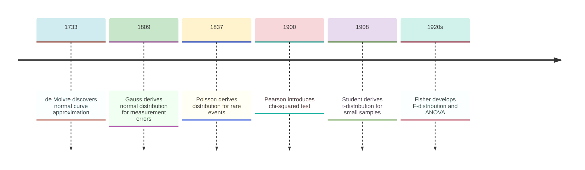
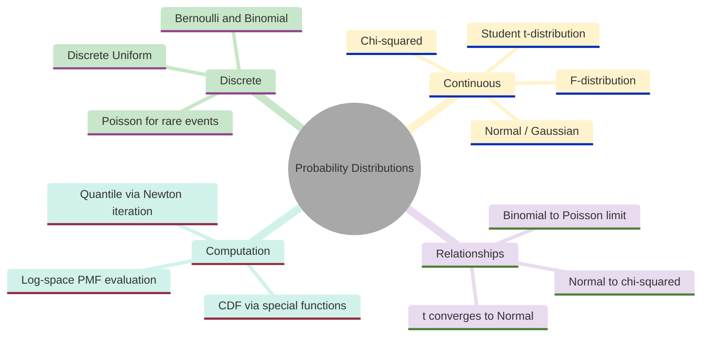
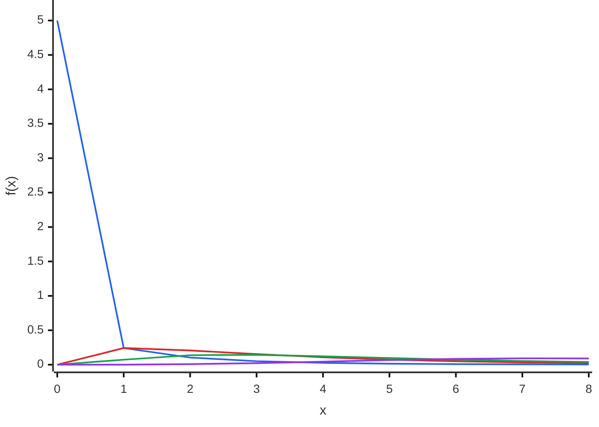
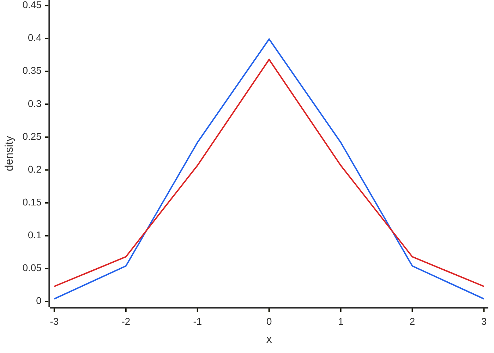
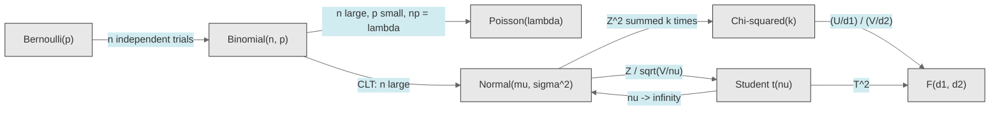
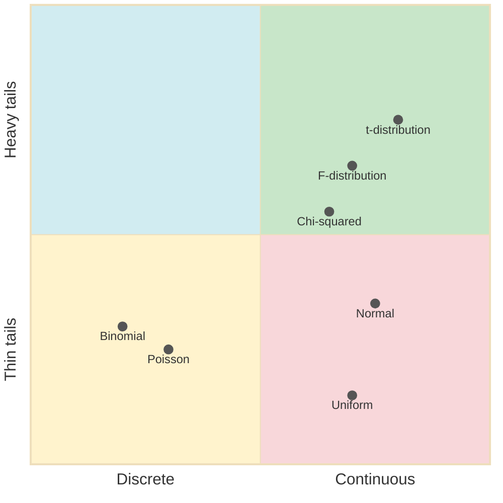
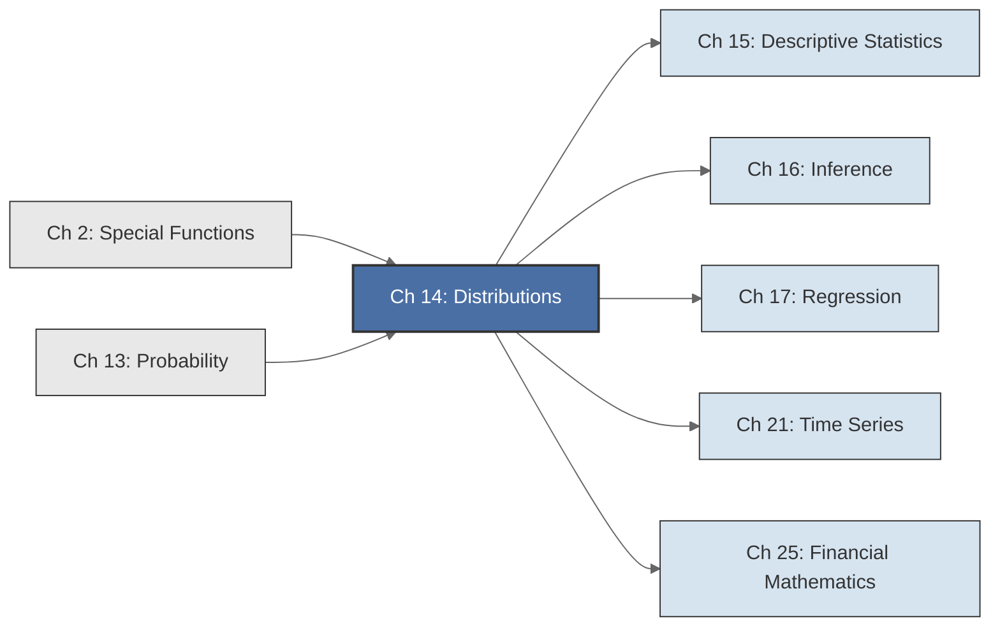

<!-- Copyright (c) 2025-2026 Bob Jansen <bobjansen@pm.me> -->
<!-- SPDX-License-Identifier: CC-BY-NC-4.0 -->
<!-- See LICENSE for full terms. Commercial licensing available. -->
# Chapter 14: Probability Distributions


**Part V**: Probability & Statistics

> Each named distribution encodes a specific generative mechanism and carries a complete description of the resulting uncertainty. This chapter catalogues the standard discrete and continuous distributions, derives their properties and develops the algorithms for evaluating their CDFs and quantile functions.

**Prerequisites**: [Chapter 2](02-special-functions.md) (Special Functions), where the Gamma function, Beta function and error function appear throughout this chapter as components of distribution formulas. [Chapter 13](13-probability-theory.md) (Probability Theory), where random variables, expectation, variance, independence, the law of large numbers and the central limit theorem are developed.

**Learning Objectives**: After this chapter, the reader will be able to:

1. State the PMF, PDF, CDF and quantile function for all standard distributions (Bernoulli, Binomial, Poisson, Uniform, Normal, Chi-squared, Student's t, F).
2. Compute distribution parameters (mean, variance) from the defining formulas.
3. Understand and apply the relationships between distributions (Binomial to Poisson limit, Normal to Chi-squared, Chi-squared and Normal to t, etc.).
4. Derive the normal approximation to the binomial and state the conditions under which it is valid.
5. Implement numerical PDF, CDF and quantile evaluation, handling overflow, underflow and precision issues.
6. Evaluate log-space PMF and PDF computations to avoid numerical overflow for extreme parameter values.
7. Select the appropriate distribution for a given modelling situation.

**Connections**: This chapter is used by [Chapter 15](15-descriptive-statistics.md) (Descriptive Statistics; sampling distributions), [Chapter 16](16-statistical-inference.md) (Inference, where test statistics follow these distributions), [Chapter 17](17-regression.md) (Regression, where residuals follow normal distributions and F-tests compare nested models), [Chapter 21](21-time-series.md) (Time Series, where residual distributions and hypothesis tests appear) and [Chapter 25](25-financial-mathematics.md) (Financial Mathematics; asset return distributions and option pricing). It builds on [Chapter 2](02-special-functions.md) (Special Functions) and [Chapter 13](13-probability-theory.md) (Probability Theory).

---

## Historical Context

**Key Milestones in Probability Distributions**



*Figure 14.1: Timeline of key milestones in the development of probability distributions.*

The standard probability distributions emerged over three centuries. Each solved a specific problem. Only gradually did they coalesce into the systematic family that modern statistics treats as given. Applied questions in gambling, astronomy, quality control and brewing drove the development of abstract theory.

**De Moivre and the normal curve (1733).** Abraham de Moivre, a French Huguenot mathematician living in London, sought a practical approximation to the binomial distribution for large $n$. Computing $\binom{n}{k}p^k(1-p)^{n-k}$ by hand for $n$ in the hundreds was prohibitively slow. In 1733 de Moivre circulated *Approximatio ad Summam Terminorum Binomii*, a pamphlet showing that as $n$ grows the binomial shape approaches a smooth bell curve. He derived the limiting density $\frac{1}{\sqrt{2\pi n p(1-p)}} \exp\!\bigl(-\frac{(k-np)^2}{2np(1-p)}\bigr)$. This was the first appearance of the normal distribution, though de Moivre viewed it purely as a computational shortcut.

**Gauss and least squares (1809).** Carl Friedrich Gauss published *Theoria Motus Corporum Coelestium* in 1809, determining the orbit of Ceres from a handful of noisy observations. He assumed that measurement errors have density proportional to $e^{-x^2/(2\sigma^2)}$ and showed that this assumption makes the method of least squares optimal for combining observations. The distribution became known as the "Gaussian", though Gauss credited Laplace with independent discovery. The association between the normal distribution and measurement error persists: residuals in statistical models are still routinely assumed normal.

**Poisson and rare events (1837).** Siméon Denis Poisson published *Recherches sur la probabilité des jugements en matière criminelle et en matière civile* in 1837. He showed that when $n$ is large and $p$ is small, the binomial distribution approaches $P(X=k) = e^{-\lambda}\lambda^k/k!$ where $\lambda = np$. The Poisson distribution models events that occur rarely but independently: radioactive decays, typographical errors, traffic accidents, server requests. Ladislaus Bortkiewicz published *Das Gesetz der kleinen Zahlen* (The Law of Small Numbers) in 1898, applying the distribution to deaths from horse kicks in the Prussian army and showing that seemingly random calamities follow predictable statistical patterns.

**Student and the t-distribution (1908).** William Sealy Gosset worked as a chemist at the Guinness brewery in Dublin. With small samples of barley yields or temperature readings, estimating the population standard deviation from the sample itself introduces additional uncertainty. Gosset derived the distribution of $(\bar{X} - \mu)/(s/\sqrt{n})$ and showed it has heavier tails than the normal. Guinness forbade employees from publishing under their own names, so Gosset used the pseudonym "Student." The t-distribution became the foundation of small-sample inference.

**Pearson and chi-squared (1900).** Karl Pearson introduced the chi-squared goodness-of-fit test in his 1900 paper. He showed that $\sum (O_i - E_i)^2/E_i$ follows a chi-squared distribution under the null hypothesis, providing the first general-purpose test for whether observed data fit a hypothesised model.

**Fisher and the analysis of variance (1920s).** Ronald Aylmer Fisher developed the analysis of variance (ANOVA) at Rothamsted Experimental Station to test whether group means in agricultural trials differ. The test statistic is a ratio of variance estimates; Fisher showed it follows a specific distribution under the null hypothesis. George Snedecor later named this the F-distribution. Fisher also formalised the chi-squared distribution's role in goodness-of-fit testing, building on Pearson's work.

**The modern synthesis (mid-twentieth century).** By the mid-twentieth century, the relationships between these distributions were understood as a coherent system. The chi-squared is a sum of squared normals; the t is a normal divided by a chi-squared; the F is a ratio of chi-squareds. Every test statistic, confidence interval and $p$-value in classical statistics reduces to evaluating the CDF of one of these distributions.

**The core six distributions (twentieth century).** The normal, chi-squared, t, F, binomial and Poisson distributions suffice for most applications. This economy reflects the structural relationships (Remark 14.19) connecting them into a single family. The chi-squared is built from normals; the t from a normal and a chi-squared; the F from two chi-squareds. Understanding the normal distribution and degrees of freedom gives the rest by algebraic combination. The practical challenge is computation: evaluating the CDFs of the t, chi-squared and F distributions, whose CDFs involve incomplete gamma and beta functions with no elementary closed form. The algorithms section of this chapter addresses that problem.

---

## Why This Chapter Matters

**Probability Distributions**



*Figure 14.2: Core topics and subtopics of probability distributions.*

Every hypothesis test, confidence interval and Bayesian posterior computation in [Chapter 16](16-statistical-inference.md) and [Chapter 17](17-regression.md) reduces to evaluating the CDF or quantile function of a distribution defined here. Without accurate implementations of the normal CDF (Algorithm 14.22), the chi-squared CDF via the incomplete gamma function (Algorithm 14.24) and the Student's t CDF via the incomplete beta function (Algorithm 14.25), no $p$-value can be computed and no confidence interval can be constructed. These distributions are the runtime dependencies of statistical inference.

The binomial distribution (Definition 14.2) models conversion counts in A/B tests. The Poisson distribution (Definition 14.4) models rare events such as page errors or fraud incidents. The normal approximation to the binomial (Remark 14.19, relationship 4) justifies the z-test that powers every experimentation platform. The chi-squared distribution (Definition 14.13) underlies goodness-of-fit tests for categorical data and the test of independence for detecting feature associations. The F-distribution (Definition 14.17) powers ANOVA and the overall significance test in regression. Model comparison via likelihood ratio tests produces chi-squared statistics; cross-validation error analysis relies on the approximate normality that the Central Limit Theorem (CLT) provides when applied to the distributions catalogued here.

In finance, the normal distribution (Definition 14.8) underpins Black–Scholes option pricing and mean-variance portfolio optimisation, but its thin tails understate extreme risk. The Student's t-distribution (Definition 14.15), with heavier tails and the convergence property of Theorem 14.16, fits asset return distributions better and supports more reliable risk measures. Value-at-Risk and expected shortfall calculations require the quantile function (Definition 14.20) of whichever distributional model is assumed for losses. In crypto markets, where volatility is extreme and return distributions are leptokurtic, choosing between a normal and a t-distribution for tail risk determines whether a position remains solvent.

The algorithms of this chapter present the core computational challenges for numerical software: evaluating the incomplete beta and incomplete gamma functions accurately, handling overflow via log-space computation (Algorithm 14.26 for binomial PMF, Algorithm 14.27 for Poisson PMF) and inverting CDFs via Newton–Raphson iteration for quantile computation (Remark 14.21). The distribution relationship diagram (Remark 14.19) shows which special function is needed for each test statistic. The convergence relationships (t to normal as $\nu \to \infty$; chi-squared to normal for large $k$) indicate when cheaper approximations are safe for production use.

---

## Notation & Conventions

| Symbol | Meaning |
|--------|---------|
| $X \sim D(\theta)$ | Random variable $X$ follows distribution $D$ with parameters $\theta$ |
| $p(x)$ or $P(X=x)$ | Probability mass function (PMF) for discrete distributions |
| $f(x)$ | Probability density function (PDF) for continuous distributions |
| $F(x)$ | Cumulative distribution function (CDF): $P(X \le x)$ |
| $Q(p)$ | Quantile function (inverse CDF): $\inf\{x : F(x) \ge p\}$ |
| $\mathbb{E}[X] = \mu$ | Expected value (mean) of $X$ |
| $\operatorname{Var}(X) = \sigma^2$ | Variance of $X$ |
| $M_X(t)$ | Moment generating function of $X$: $\mathbb{E}[e^{tX}]$ |
| $B(a,b)$ | Beta function: $\Gamma(a)\Gamma(b)/\Gamma(a+b)$ ([Chapter 2](02-special-functions.md)) |
| $I_x(a,b)$ | Regularised incomplete beta function: $B(x;\,a,b)/B(a,b)$ |
| $\operatorname{erf}(x)$ | Error function ([Chapter 2](02-special-functions.md)) |
| $\Phi(x)$ | Standard normal CDF: $P(Z \le x)$ where $Z \sim N(0,1)$ |
| $\binom{n}{k}$ | Binomial coefficient: $n!/(k!(n-k)!)$ |
| $\nu$, $k$, $d_1$, $d_2$ | Degrees-of-freedom parameters |

All distributions in this chapter are univariate. Multivariate extensions (multivariate normal, Wishart) are outside scope. Parameters satisfy their natural constraints ($p \in [0,1]$, $\sigma > 0$, $\lambda > 0$, degrees of freedom positive integers) unless stated otherwise.

---

## Core Theory

### Discrete Distributions

**Definition 14.1** (Bernoulli distribution). A random variable $X$ follows the *Bernoulli distribution* with parameter $p \in [0,1]$, written $X \sim \mathrm{Bernoulli}(p)$, if

$$P(X = 1) = p, \quad P(X = 0) = 1 - p.$$

The Bernoulli distribution models a single trial with two outcomes: success (1) with probability $p$ and failure (0) with probability $1-p$. It is the simplest nontrivial probability distribution.

The mean and variance are:

$$\mathbb{E}[X] = p, \quad \operatorname{Var}(X) = p(1-p).$$

The variance is maximised at $p = 1/2$ (maximum uncertainty) and equals zero at $p = 0$ or $p = 1$ (certain outcome). The moment generating function is $M_X(t) = (1-p) + pe^t$.

**Definition 14.2** (Binomial distribution). A random variable $X$ follows the *Binomial distribution* with parameters $n \in \mathbb{N}$ and $p \in [0,1]$, written $X \sim \mathrm{Binomial}(n, p)$, if its PMF is

$$P(X = k) = \binom{n}{k} p^k (1-p)^{n-k}, \quad k = 0, 1, \ldots, n.$$

The Binomial distribution counts the number of successes in $n$ independent Bernoulli$(p)$ trials. The PMF assigns probability to each possible count $k$ as the number of ways to choose which $k$ trials succeed, times the probability of that particular outcome.

The mean and variance are:

$$\mathbb{E}[X] = np, \quad \operatorname{Var}(X) = np(1-p).$$

The CDF has no closed-form expression in terms of elementary functions; it is the regularised incomplete beta function (see the Glossary): $F(k) = I_{1-p}(n-k, k+1)$.

**Theorem 14.3** (Additivity of independent Binomials). If $X_1 \sim \mathrm{Binomial}(n_1, p)$ and $X_2 \sim \mathrm{Binomial}(n_2, p)$ are independent with the same success probability $p$, then

$$X_1 + X_2 \sim \mathrm{Binomial}(n_1 + n_2, p).$$

This follows directly from the interpretation: $X_1 + X_2$ counts the total successes in $n_1 + n_2$ independent trials, each with probability $p$.

**Definition 14.4** (Poisson distribution). A random variable $X$ follows the *Poisson distribution* with parameter $\lambda > 0$, written $X \sim \mathrm{Poisson}(\lambda)$, if its PMF is

$$P(X = k) = \frac{e^{-\lambda}\lambda^k}{k!}, \quad k = 0, 1, 2, \ldots$$

The Poisson distribution models the count of events occurring independently at a constant average rate $\lambda$ per unit interval. The support is all nonnegative integers.

Mean and variance are both equal to $\lambda$:

$$\mathbb{E}[X] = \lambda, \quad \operatorname{Var}(X) = \lambda.$$

This equality of mean and variance is a characteristic property: it provides a quick diagnostic for whether data is consistent with a Poisson model. If the observed variance substantially exceeds the mean (overdispersion), the Poisson assumption is violated.

!!! tip "Quick overdispersion check"
    For count data, compute the ratio $s^2 / \bar{x}$ where $s^2$ is the sample variance and $\bar{x}$ is the sample mean. A ratio near 1 is consistent with Poisson; a ratio substantially above 1 indicates overdispersion and suggests a negative binomial or other model.

**Theorem 14.5** (Poisson as limit of Binomial). Let $X_n \sim \mathrm{Binomial}(n, p_n)$ where $p_n = \lambda/n$ for a fixed $\lambda > 0$. Then as $n \to \infty$,

$$P(X_n = k) \to \frac{e^{-\lambda}\lambda^k}{k!} \quad \text{for each fixed } k = 0, 1, 2, \ldots$$

??? note "Proof"

    *Proof sketch.* Write the binomial PMF:

    $$P(X_n = k) = \binom{n}{k}\left(\frac{\lambda}{n}\right)^k\left(1 - \frac{\lambda}{n}\right)^{n-k}.$$

    The binomial coefficient contributes $\binom{n}{k} = \frac{n(n-1)\cdots(n-k+1)}{k!}$. For fixed $k$ and $n \to \infty$:

    $$\frac{n(n-1)\cdots(n-k+1)}{n^k} \to 1.$$

    Also $(1 - \lambda/n)^n \to e^{-\lambda}$ and $(1 - \lambda/n)^{-k} \to 1$. Combining:

    $$P(X_n = k) \to \frac{\lambda^k}{k!} \cdot e^{-\lambda}.$$

    $\square$

This result is called the "law of rare events": when the number of opportunities is large but the probability of each individual event is small, the count of events is approximately Poisson. Applications include modelling insurance claims, mutations per gene and photon arrivals.

**Definition 14.6** (Discrete Uniform distribution). A random variable $X$ follows the *Discrete Uniform distribution* on $\{a, a+1, \ldots, b\}$, written $X \sim \mathrm{DiscreteUniform}(a, b)$, with $a, b \in \mathbb{Z}$ and $a \le b$, if its PMF is

$$P(X = k) = \frac{1}{b - a + 1}, \quad k = a, a+1, \ldots, b.$$

Every value in the range is equally likely. The mean and variance are:

$$\mathbb{E}[X] = \frac{a + b}{2}, \quad \operatorname{Var}(X) = \frac{(b - a + 1)^2 - 1}{12}.$$

The discrete uniform distribution models situations of complete ignorance among finitely many outcomes: rolling a fair die ($a=1$, $b=6$), selecting a random index or choosing a random bit ($a=0$, $b=1$, which reduces to Bernoulli$(1/2)$).

### Continuous Distributions

**Definition 14.7** (Continuous Uniform distribution). A random variable $X$ follows the *Continuous Uniform distribution* on $[a, b]$, written $X \sim \mathrm{Uniform}(a, b)$ with $a < b$, if its PDF and CDF are

$$f(x) = \frac{1}{b - a} \quad \text{for } x \in [a, b], \qquad F(x) = \frac{x - a}{b - a} \quad \text{for } x \in [a, b].$$

The PDF is zero outside $[a, b]$; $F(x) = 0$ for $x < a$ and $F(x) = 1$ for $x > b$. The mean and variance are:

$$\mathbb{E}[X] = \frac{a + b}{2}, \quad \operatorname{Var}(X) = \frac{(b - a)^2}{12}.$$

The quantile function is $Q(p) = a + p(b - a)$ for $p \in [0, 1]$. The continuous uniform is the basis of pseudorandom number generation: if $U \sim \mathrm{Uniform}(0,1)$, then $F^{-1}(U) \sim F$ for any continuous CDF $F$ (the inverse transform method).

**Definition 14.8** (Normal / Gaussian distribution). A random variable $X$ follows the *Normal distribution* (or *Gaussian distribution*) with mean $\mu \in \mathbb{R}$ and variance $\sigma^2 > 0$, written $X \sim N(\mu, \sigma^2)$, if its PDF is

$$f(x) = \frac{1}{\sigma\sqrt{2\pi}}\exp\left(-\frac{(x - \mu)^2}{2\sigma^2}\right), \quad x \in \mathbb{R}.$$

The CDF has no closed-form expression in terms of elementary functions but is expressed in terms of the standard normal CDF:

$$F(x) = \Phi\!\left(\frac{x - \mu}{\sigma}\right),$$

where $\Phi$ is defined below. The mean and variance are:

$$\mathbb{E}[X] = \mu, \quad \operatorname{Var}(X) = \sigma^2.$$

The normal distribution is symmetric about $\mu$, with inflection points at $\mu \pm \sigma$. Its moment generating function is $M_X(t) = \exp(\mu t + \sigma^2 t^2/2)$.

**Definition 14.9** (Standard Normal distribution). The *standard normal distribution* is the special case $Z \sim N(0, 1)$. Its CDF $\Phi$ and quantile function $\Phi^{-1}$ are:

$$\Phi(z) = \frac{1}{2}\left[1 + \operatorname{erf}\!\left(\frac{z}{\sqrt{2}}\right)\right],$$

$$\Phi^{-1}(p) = \sqrt{2}\,\operatorname{erf}^{-1}(2p - 1).$$

The connection to the error function ([Chapter 2](02-special-functions.md)) is fundamental: all normal probability computations reduce to evaluating erf or its inverse.

**Standard Normal PDF: N(0,1)**

```mermaid
---
config:
  theme: base
  themeVariables:
    xyChart:
      plotColorPalette: "#2563eb, #dc2626, #16a34a, #9333ea, #ca8a04, #0891b2"
      backgroundColor: "#ffffff"
      titleColor: "#333333"
      xAxisLabelColor: "#333333"
      yAxisLabelColor: "#333333"
      xAxisTitleColor: "#333333"
      yAxisTitleColor: "#333333"
      xAxisLineColor: "#333333"
      yAxisLineColor: "#333333"
---
xychart-beta
    x-axis "z" [-3, -2.5, -2, -1.5, -1, -0.5, 0, 0.5, 1, 1.5, 2, 2.5, 3]
    y-axis "f(z)" 0 --> 0.45
    line [0.004, 0.018, 0.054, 0.130, 0.242, 0.352, 0.399, 0.352, 0.242, 0.130, 0.054, 0.018, 0.004]
```

*Figure 14.3: Bell-shaped probability density function of the standard normal distribution.*

**Theorem 14.10** (Properties of the Normal distribution). Let $X \sim N(\mu, \sigma^2)$.

(a) *Standardisation*: The random variable $Z = (X - \mu)/\sigma$ satisfies $Z \sim N(0, 1)$.

(b) *Linear transformation*: For constants $a \ne 0$ and $b$, the random variable $Y = aX + b$ satisfies $Y \sim N(a\mu + b,\; a^2\sigma^2)$.

(c) *Sum of independent normals*: If $X \sim N(\mu_X, \sigma_X^2)$ and $Y \sim N(\mu_Y, \sigma_Y^2)$ are independent, then $X + Y \sim N(\mu_X + \mu_Y,\; \sigma_X^2 + \sigma_Y^2)$.

!!! abstract "Key Result"

    **Theorem 14.10** (Properties of the Normal distribution). The normal family is closed under standardisation, linear transformation and independent summation, making it the tractable workhorse of statistical inference, risk modelling and option pricing.

??? note "Proof"

    *Proof of (a).* The PDF of $Z = (X - \mu)/\sigma$ follows by change of variables. If $f_X(x) = \frac{1}{\sigma\sqrt{2\pi}}e^{-(x-\mu)^2/(2\sigma^2)}$, then the substitution $x = \sigma z + \mu$ gives $dx/dz = \sigma$, so the Jacobian $|dx/dz| = \sigma$ contributes a factor of $\sigma$:

    $$f_Z(z) = f_X(\sigma z + \mu) \cdot |\sigma| = \frac{1}{\sigma\sqrt{2\pi}}e^{-z^2/2} \cdot \sigma = \frac{1}{\sqrt{2\pi}}e^{-z^2/2},$$

    which is the standard normal PDF.

    *Proof of (b).* Let $Y = aX + b$ with $a \neq 0$. The CDF of $Y$ is

    $$F_Y(y) = P(aX + b \leq y) = P\!\left(X \leq \frac{y - b}{a}\right) = \Phi\!\left(\frac{(y-b)/a - \mu}{\sigma}\right) = \Phi\!\left(\frac{y - (a\mu + b)}{|a|\sigma}\right).$$

    (For $a < 0$ the inequality flips, but the normal CDF's symmetry gives the same result.) Differentiating with respect to $y$:

    $$f_Y(y) = \frac{1}{|a|\sigma\sqrt{2\pi}}\exp\!\left(-\frac{(y - (a\mu + b))^2}{2a^2\sigma^2}\right),$$

    which is the PDF of $N(a\mu + b,\; a^2\sigma^2)$.

    *Proof of (c).* The moment generating function of $X + Y$ is

    $$M_{X+Y}(t) = M_X(t)M_Y(t) = e^{\mu_X t + \sigma_X^2 t^2/2} \cdot e^{\mu_Y t + \sigma_Y^2 t^2/2} = e^{(\mu_X+\mu_Y)t + (\sigma_X^2+\sigma_Y^2)t^2/2},$$

    which is the MGF of $N(\mu_X+\mu_Y, \sigma_X^2+\sigma_Y^2)$. Since the MGF uniquely determines the distribution, the result follows.

    $\square$

**Remark 14.11** (The 68–95–99.7 rule). For $X \sim N(\mu, \sigma^2)$:

$$\begin{aligned}
P(\lvert X - \mu \rvert < \sigma) &= 2\Phi(1) - 1 \approx 0.6827, \\
P(\lvert X - \mu \rvert < 2\sigma) &= 2\Phi(2) - 1 \approx 0.9545, \\
P(\lvert X - \mu \rvert < 3\sigma) &= 2\Phi(3) - 1 \approx 0.9973.
\end{aligned}$$

These approximations are necessary for quick estimation: roughly two-thirds of the probability mass lies within one standard deviation of the mean, 95% within two standard deviations and 99.7% within three. An observation more than three standard deviations from the mean is extremely rare under normality; this principle underlies statistical process control, outlier detection and the "six sigma" methodology.

**Remark 14.12** (Why the Normal distribution is ubiquitous). The Central Limit Theorem ([Chapter 13](13-probability-theory.md), Theorem 13.29) states that the sum (or average) of many independent random variables, regardless of their individual distributions, is approximately normally distributed. This is why the normal distribution appears in contexts far removed from its original derivation: measurement errors (sums of many small perturbations), financial returns (aggregation of many trades), test scores (sums of many item responses) and heights in a population (determined by many genetic and environmental factors). The normal distribution is not a model chosen for convenience; it is a mathematical consequence of aggregation.

**Definition 14.13** (Chi-squared distribution). A random variable $X$ follows the *Chi-squared distribution* with $k$ degrees of freedom, written $X \sim \chi^2(k)$ where $k \in \mathbb{N}$, if it is defined as the sum of $k$ independent squared standard normals:

$$X = Z_1^2 + Z_2^2 + \cdots + Z_k^2, \quad Z_i \sim N(0,1) \text{ independently.}$$

The PDF is:

$$f(x) = \frac{x^{k/2-1}\,e^{-x/2}}{2^{k/2}\,\Gamma(k/2)}, \quad x > 0.$$

The support is $(0, \infty)$. The mean and variance are:

$$\mathbb{E}[X] = k, \quad \operatorname{Var}(X) = 2k.$$

For $k = 1$, the chi-squared distribution is the distribution of a single squared standard normal. For $k = 2$, it reduces to an exponential distribution with rate $1/2$. The CDF is the regularised lower incomplete gamma function: $F(x) = \gamma(k/2,\; x/2) / \Gamma(k/2)$, where $\gamma$ denotes the lower incomplete gamma function.

**Remark 14.14** (Chi-squared as Gamma). The chi-squared distribution is a special case of the Gamma distribution: $\chi^2(k) = \mathrm{Gamma}(k/2, 2)$, where $\mathrm{Gamma}(\alpha, \beta)$ has PDF $f(x) = x^{\alpha-1}e^{-x/\beta}/(\beta^\alpha \Gamma(\alpha))$. This connection to the Gamma function ([Chapter 2](02-special-functions.md)) is necessary for computation: evaluating the chi-squared CDF reduces to evaluating the incomplete gamma function.

The chi-squared distribution is also additive: if $X_1 \sim \chi^2(k_1)$ and $X_2 \sim \chi^2(k_2)$ are independent, then $X_1 + X_2 \sim \chi^2(k_1 + k_2)$. This follows from the definition as a sum of squared normals, or equivalently from the additivity of the Gamma distribution's shape parameter. In statistical practice, this additivity underlies the decomposition of sums of squares in ANOVA: the total chi-squared statistic splits into independent components, each with its own degrees of freedom.

Skewness is $\sqrt{8/k}$, decreasing as $k$ increases. For large $k$, the chi-squared distribution is well approximated by a normal: $\chi^2(k) \approx N(k, 2k)$. A more accurate approximation is the Wilson–Hilferty transform: $(X/k)^{1/3} \approx N(1 - 2/(9k),\; 2/(9k))$.

**Chi-Squared PDFs for Different Degrees of Freedom**

The following chart shows how the chi-squared PDF shape changes with the degrees of freedom parameter $k$. For $k = 1$, the distribution is strongly right-skewed with a spike near zero; the density actually diverges to $+\infty$ as $x \to 0^+$, so the displayed value at $x = 0$ is a truncated approximation. As $k$ increases, the distribution becomes more symmetric and bell-shaped.



*Figure 14.4: Chi-squared PDFs showing decreasing skewness as degrees of freedom increase.*

**Definition 14.15** (Student's t-distribution). A random variable $T$ follows *Student's t-distribution* with $\nu$ degrees of freedom, written $T \sim t(\nu)$ where $\nu > 0$, if it is defined as

$$T = \frac{Z}{\sqrt{V/\nu}},$$

where $Z \sim N(0,1)$ and $V \sim \chi^2(\nu)$ are independent. The PDF is:

$$f(t) = \frac{\Gamma\left(\frac{\nu+1}{2}\right)}{\sqrt{\nu\pi}\,\Gamma\left(\frac{\nu}{2}\right)}\left(1 + \frac{t^2}{\nu}\right)^{-(\nu+1)/2}, \quad t \in \mathbb{R}.$$

The distribution is symmetric about zero with heavier tails than the normal. The mean and variance are:

$$\mathbb{E}[T] = 0 \quad (\text{for } \nu > 1), \quad \operatorname{Var}(T) = \frac{\nu}{\nu - 2} \quad (\text{for } \nu > 2).$$

For $\nu \le 1$, the mean does not exist (the Cauchy distribution is $t(1)$). For $\nu \le 2$, the variance is infinite. The CDF is expressed in terms of the regularised incomplete beta function.

**Theorem 14.16** (Convergence of t to Normal). As $\nu \to \infty$, the $t(\nu)$ distribution converges to $N(0,1)$:

$$\lim_{\nu \to \infty} f_{t(\nu)}(t) = \frac{1}{\sqrt{2\pi}} e^{-t^2/2} \quad \text{for all } t \in \mathbb{R}.$$

??? note "Proof"

    *Proof sketch.* Since $V = \sum_{i=1}^\nu Z_i^2$ where $Z_i \sim N(0,1)$ are independent and identically distributed (i.i.d.) with mean $1$, the weak law of large numbers gives $V/\nu \xrightarrow{P} 1$ as $\nu \to \infty$ (since $\mathbb{E}[V/\nu] = 1$ and $\operatorname{Var}(V/\nu) = 2/\nu \to 0$). It follows that

    $$T = Z/\sqrt{V/\nu} \to Z/\sqrt{1} = Z \sim N(0,1).$$

    More precisely, use the PDF: as $\nu \to \infty$, $(1 + t^2/\nu)^{-(\nu+1)/2} \to e^{-t^2/2}$ and the normalising constant $\Gamma((\nu+1)/2)/(\sqrt{\nu\pi}\,\Gamma(\nu/2)) \to 1/\sqrt{2\pi}$ by Stirling's approximation.

    $\square$

For $\nu \ge 30$, the $t(\nu)$ distribution is very close to $N(0,1)$: the critical values differ by less than 5% at the 5% significance level. This is why large-sample $t$-tests and $z$-tests give nearly identical results.

**Student t-Distribution with 3 Degrees of Freedom vs Standard Normal**



*Figure 14.5: Student t-distribution with 3 degrees of freedom exhibits heavier tails than the standard normal.*

**Definition 14.17** (F-distribution). A random variable $X$ follows the *F-distribution* with $d_1$ and $d_2$ degrees of freedom, written $X \sim F(d_1, d_2)$ where $d_1, d_2 \in \mathbb{N}$, if it is defined as

$$X = \frac{U/d_1}{V/d_2},$$

where $U \sim \chi^2(d_1)$ and $V \sim \chi^2(d_2)$ are independent. The PDF is:

$$f(x) = \frac{1}{B(d_1/2,\; d_2/2)} \left(\frac{d_1}{d_2}\right)^{d_1/2} \frac{x^{d_1/2-1}}{\left(1 + \frac{d_1 x}{d_2}\right)^{(d_1+d_2)/2}}, \quad x > 0.$$

The mean and variance are:

$$\mathbb{E}[X] = \frac{d_2}{d_2 - 2} \quad (\text{for } d_2 > 2), \qquad \operatorname{Var}(X) = \frac{2d_2^2(d_1 + d_2 - 2)}{d_1(d_2 - 2)^2(d_2 - 4)} \quad (\text{for } d_2 > 4).$$

The F-distribution is supported on $(0, \infty)$ and is positively skewed. As $d_2 \to \infty$, the distribution $d_1 \cdot F(d_1, d_2)$ converges to $\chi^2(d_1)$, since the denominator $V/d_2 \to 1$ by the law of large numbers. As both $d_1, d_2 \to \infty$, the F-distribution converges to a point mass at 1 (since both numerator and denominator converge to 1).

In practice, the F-distribution arises in comparing variances (the F-test) and in testing multiple restrictions simultaneously (ANOVA, nested model comparisons in regression). In the analysis of variance, the F-statistic is computed as the ratio of the between-group mean square to the within-group mean square; under the null hypothesis of equal means, this ratio follows $F(g-1, n-g)$ where $g$ is the number of groups and $n$ is the total sample size.

**Remark 14.18** (Relationship between t and F). If $T \sim t(\nu)$, then $T^2 \sim F(1, \nu)$. This follows directly from the definitions: $T^2 = Z^2/(V/\nu) = (Z^2/1)/(V/\nu)$ and $Z^2 \sim \chi^2(1)$, so $T^2$ is a ratio of independent chi-squared variables divided by their respective degrees of freedom, which is exactly the F-distribution with $d_1 = 1$ and $d_2 = \nu$. The F-distribution thus generalises the squared t: where a t-test tests one restriction, an F-test can test $d_1$ restrictions simultaneously.

### Relationships Between Distributions

**Remark 14.19** (Distribution relationship diagram). The standard distributions form a connected family through the following relationships:

1. $\mathrm{Bernoulli}(p) = \mathrm{Binomial}(1, p)$.
2. If $X_1, \ldots, X_n \sim \mathrm{Bernoulli}(p)$ independently, then $\sum X_i \sim \mathrm{Binomial}(n, p)$.
3. $\mathrm{Binomial}(n, \lambda/n) \to \mathrm{Poisson}(\lambda)$ as $n \to \infty$ (Theorem 14.5).
4. $\mathrm{Binomial}(n, p) \approx N(np, np(1-p))$ for large $n$ (de Moivre–Laplace CLT).
5. If $Z_1, \ldots, Z_k \sim N(0,1)$ independently, then $\sum Z_i^2 \sim \chi^2(k)$.
6. If $Z \sim N(0,1)$ and $V \sim \chi^2(\nu)$ independently, then $Z/\sqrt{V/\nu} \sim t(\nu)$.
7. If $U \sim \chi^2(d_1)$ and $V \sim \chi^2(d_2)$ independently, then $(U/d_1)/(V/d_2) \sim F(d_1, d_2)$.
8. If $T \sim t(\nu)$, then $T^2 \sim F(1, \nu)$.
9. $t(\nu) \to N(0,1)$ as $\nu \to \infty$ (Theorem 14.16).
10. $\chi^2(k) = \mathrm{Gamma}(k/2, 2)$.

These relationships are not merely theoretical curiosities. They dictate which distribution to use in which inferential situation and explain why the same small set of distributions appears throughout all of statistics. In particular, relationships 5–7 explain the entire machinery of classical hypothesis testing: the sample variance involves a chi-squared, the standardised sample mean involves a t and comparing two variances involves an F.

**Distribution Relationships**



*Figure 14.6: Relationships between standard probability distributions through limits and transformations.*

**Distribution Classification**



*Figure 14.7: Classification of distributions by type (discrete vs continuous) and tail weight.*

The quadrant chart above positions the standard distributions along two axes: discrete-to-continuous (left to right) and thin-tailed to heavy-tailed (bottom to top). The Binomial and Poisson distributions occupy the discrete, thin-tailed region. The Uniform and Normal distributions sit in the continuous, thin-tailed zone. The t-distribution, Chi-squared and F-distribution are continuous with progressively heavier tails, reflecting their construction from squared and ratio-form Normal random variables. The tail weight of the Chi-squared and F-distribution depends on degrees of freedom; the placement shown corresponds to small degrees of freedom where tail behaviour is heaviest.

### Quantile Functions

**Definition 14.20** (Quantile function). For a distribution with CDF $F$, the *quantile function* (or *inverse CDF*) is defined as

$$Q(p) = F^{-1}(p) = \inf\{x \in \mathbb{R} : F(x) \ge p\}, \quad p \in (0, 1).$$

For continuous distributions with strictly increasing CDF, $Q(p)$ is the unique value $x$ satisfying $F(x) = p$. For discrete distributions, $Q(p)$ returns the smallest value $x$ whose CDF reaches or exceeds $p$.

The quantile function is necessary for constructing confidence intervals and critical values: the $100(1-\alpha)\%$ confidence interval for a normal mean uses $z_{\alpha/2} = \Phi^{-1}(1 - \alpha/2)$; the critical value for a t-test uses $t_{\alpha/2, \nu} = Q_{t(\nu)}(1 - \alpha/2)$.

**Remark 14.21** (Computing quantiles). For the normal distribution, the quantile function is $\Phi^{-1}(p) = \sqrt{2}\,\operatorname{erf}^{-1}(2p-1)$, which requires inverting the error function. Rational approximation methods (such as the algorithm of Beasley, Springer and Moro) provide direct high-accuracy computation.

For the t, chi-squared and F distributions, no simple closed-form inverse exists. The standard approach is Newton–Raphson iteration on $F(x) - p = 0$, using the PDF $f(x)$ as the derivative:

$$x_{n+1} = x_n - \frac{F(x_n) - p}{f(x_n)}.$$

With a good initial approximation (e.g., using the normal quantile as a starting point for the t-distribution), convergence is typically achieved in 3–5 iterations to full double-precision accuracy.

---

## Formulas & Identities

The following table provides a complete reference for the distributions defined in the Core Theory.

| Distribution | PMF / PDF | CDF | $\mathbb{E}[X]$ | $\operatorname{Var}(X)$ | MGF |
|---|---|---|---|---|---|
| $\mathrm{Bernoulli}(p)$ | $p^x(1-p)^{1-x}$, $x\in\{0,1\}$ | $F(0)=1-p$, $F(1)=1$ | $p$ | $p(1-p)$ | $(1-p)+pe^t$ |
| $\mathrm{Binomial}(n,p)$ | $\binom{n}{k}p^k(1-p)^{n-k}$ | $I_{1-p}(n-k, k+1)$ | $np$ | $np(1-p)$ | $((1-p)+pe^t)^n$ |
| $\mathrm{Poisson}(\lambda)$ | $e^{-\lambda}\lambda^k/k!$ | $1 - P(\lfloor k\rfloor+1,\;\lambda)$ | $\lambda$ | $\lambda$ | $e^{\lambda(e^t-1)}$ |
| $\mathrm{Uniform}(a,b)$ | $1/(b-a)$ | $(x-a)/(b-a)$ | $(a+b)/2$ | $(b-a)^2/12$ | $(e^{tb}-e^{ta})/(t(b-a))$ |
| $N(\mu,\sigma^2)$ | $(2\pi\sigma^2)^{-1/2}e^{-(x-\mu)^2/(2\sigma^2)}$ | $\Phi((x-\mu)/\sigma)$ | $\mu$ | $\sigma^2$ | $e^{\mu t+\sigma^2 t^2/2}$ |
| $\chi^2(k)$ | $x^{k/2-1}e^{-x/2}/(2^{k/2}\Gamma(k/2))$ | $\gamma(k/2, x/2)/\Gamma(k/2)$ | $k$ | $2k$ | $(1-2t)^{-k/2}$ |
| $t(\nu)$ | $\frac{\Gamma((\nu+1)/2)}{\sqrt{\nu\pi}\Gamma(\nu/2)}(1+t^2/\nu)^{-(\nu+1)/2}$ | via $I_x(a,b)$ | $0$ | $\nu/(\nu-2)$ | does not exist (undefined for $t \neq 0$) |
| $F(d_1,d_2)$ | see Def. 14.17 | via $I_x(a,b)$ | $d_2/(d_2-2)$ | complex | does not exist for all $t$ |

**F14.1** (Normal CDF via erf).

$$\Phi(x) = \tfrac{1}{2}\bigl[1 + \operatorname{erf}(x/\sqrt{2})\bigr].$$

**F14.2** (Normal CDF symmetry).

$$\Phi(-x) = 1 - \Phi(x).$$

**F14.3** (Chi-squared CDF via regularised incomplete gamma).

$$F_{\chi^2(k)}(x) = P(k/2,\; x/2).$$

**F14.4** (Student's t CDF via incomplete beta).

$$F_{t(\nu)}(t) = 1 - \tfrac{1}{2}\,I_{x}(\nu/2,\; 1/2), \quad x = \frac{\nu}{\nu + t^2}, \quad t > 0.$$

**F14.5** (F-distribution variance).

$$\operatorname{Var}(F(d_1,d_2)) = \frac{2d_2^2(d_1+d_2-2)}{d_1(d_2-2)^2(d_2-4)}, \quad d_2 > 4.$$

---

## Algorithms

**Algorithm 14.22** (Normal CDF via erf). Given $x$, $\mu$, $\sigma^2$:

1. Compute the standardised value: $z \gets (x - \mu)/\sigma$.
2. Return $\Phi(z) = \tfrac{1}{2}[1 + \operatorname{erf}(z/\sqrt{2})]$.

```
function normalCDF(x, mu, sigma):
    z = (x - mu) / sigma              // standardise
    return 0.5 * (1 + erf(z / sqrt(2)))
```

This requires an accurate implementation of erf ([Chapter 2](02-special-functions.md), Algorithm 2.27). Time complexity: $O(1)$. Space complexity: $O(1)$. Accuracy: limited only by the erf implementation (typically 15–16 correct digits with rational approximation).

**Algorithm 14.23** (Normal quantile / inverse CDF). Given $p \in (0,1)$:

*Method A (via inverse erf)*: Return $\Phi^{-1}(p) = \sqrt{2}\,\operatorname{erf}^{-1}(2p - 1)$.

*Method B (rational approximation)*: The Beasley–Springer–Moro algorithm uses piecewise rational approximations for three regions:

1. Central region ($0.08 < p < 0.92$): Compute $r = p - 0.5$. Use a rational function $a(r)/b(r)$ with pre-computed coefficients.
2. Intermediate tails ($0.0027 < p \le 0.08$ or $0.92 \le p < 0.9973$): Compute $r = \sqrt{-2\ln(\min(p, 1-p))}$. Use a different rational approximation.
3. Extreme tails ($p \le 0.0027$ or $p \ge 0.9973$): Use a third set of coefficients for the deep tails.

```
function normalQuantile(p):
    // Method A: via inverse erf
    return sqrt(2) * erfInverse(2 * p - 1)

function normalQuantileBSM(p):
    // Method B: Beasley-Springer-Moro rational approximation
    if 0.08 < p < 0.92:                       // central region
        r = p - 0.5
        return rationalApproxCentral(r)
    else:
        q = min(p, 1 - p)
        r = sqrt(-2 * ln(q))
        if q > 0.0027:                         // intermediate tails
            x = rationalApproxIntermediate(r)
        else:                                   // extreme tails
            x = rationalApproxExtreme(r)
        if p < 0.5:
            return -x
        return x
```

The result is accurate to approximately $1.15 \times 10^{-9}$ absolute error across the entire range. For higher accuracy, one Newton–Raphson refinement step using $\Phi$ and its derivative $\phi$ gives full double-precision accuracy. Time complexity: $O(1)$. Space complexity: $O(1)$.

**Algorithm 14.24** (Chi-squared CDF via regularised incomplete gamma). Given $x > 0$ and degrees of freedom $k$:

1. Compute $a \gets k/2$ and $z \gets x/2$.
2. Return the regularised lower incomplete gamma function $P(a, z) = \gamma(a, z)/\Gamma(a)$.

```
function chiSquaredCDF(x, k):
    a = k / 2
    z = x / 2
    if z < a + 1:
        return gammaSeries(a, z)           // series expansion
    else:
        return 1 - gammaContinuedFrac(a, z) // continued fraction for Q(a,z)
```

The regularised incomplete gamma can be evaluated by series expansion for $z < a + 1$:

$$P(a, z) = e^{-z}z^a \sum_{n=0}^{\infty} \frac{z^n}{\Gamma(a + n + 1)},$$

and by the continued fraction representation for $z \ge a + 1$:

$$Q(a, z) = 1 - P(a, z) = \frac{e^{-z}z^a}{\Gamma(a)} \cdot \cfrac{1}{z+1-a-\cfrac{1(1-a)}{z+3-a-\cfrac{2(2-a)}{z+5-a-\cdots}}}$$

The series converges rapidly for $z < a + 1$; the continued fraction converges rapidly for $z \ge a + 1$. Both achieve double-precision accuracy in at most $\max(100, a)$ terms. Time complexity: $O(a)$ in the worst case. Space complexity: $O(1)$.

**Algorithm 14.25** (Student's t CDF via regularised incomplete beta). Given $t \in \mathbb{R}$ and degrees of freedom $\nu$:

1. Compute $x \gets \nu/(\nu + t^2)$.
2. Compute $I_x(\nu/2, 1/2)$, the regularised incomplete beta function.
3. If $t \ge 0$: return $1 - \tfrac{1}{2}I_x(\nu/2, 1/2)$.
4. If $t < 0$: return $\tfrac{1}{2}I_x(\nu/2, 1/2)$.

```
function studentTCDF(t, nu):
    x = nu / (nu + t * t)                     // transform to beta variable
    Ix = regularisedIncompleteBeta(x, nu / 2, 0.5)
    if t >= 0:
        return 1 - 0.5 * Ix
    else:
        return 0.5 * Ix
```

The regularised incomplete beta function $I_x(a,b) = B(x; a, b)/B(a, b)$ can be evaluated via a continued fraction expansion (Lentz's algorithm) that converges rapidly for $x < (a+1)/(a+b+2)$; for $x \ge (a+1)/(a+b+2)$, use the symmetry relation $I_x(a,b) = 1 - I_{1-x}(b,a)$. Time complexity: $O(\nu)$ in the worst case. Space complexity: $O(1)$.

!!! tip "Convergence regime selection for special functions"
    For both the incomplete gamma (Algorithm 14.24) and incomplete beta (Algorithm 14.25), the continued fraction and series representations each converge rapidly in complementary parameter regions. Always check the crossover condition ($z$ vs $a + 1$ for gamma; $x$ vs $(a+1)/(a+b+2)$ for beta) before choosing the evaluation method. Using the wrong branch can require hundreds of terms instead of tens.

**Algorithm 14.26** (Binomial PMF in log-space). Given $n$, $k$, $p$ with $n$ potentially large:

1. Compute in log-space: $\ln P(X=k) = \ln\Gamma(n+1) - \ln\Gamma(k+1) - \ln\Gamma(n-k+1) + k\ln p + (n-k)\ln(1-p)$.
2. Return $\exp(\ln P(X=k))$.

```
function binomialPMFLogSpace(n, k, p):
    logProb = lnGamma(n + 1) - lnGamma(k + 1) - lnGamma(n - k + 1)
    logProb = logProb + k * ln(p) + (n - k) * ln(1 - p)
    return exp(logProb)
```

Direct computation of $\binom{n}{k}$ overflows for $n \gtrsim 170$ in double precision. Working in log-space avoids this entirely. The log-Gamma function ([Chapter 2](02-special-functions.md)) is the key primitive: it is accurate and efficient for all positive arguments. Time complexity: $O(1)$. Space complexity: $O(1)$.

**Algorithm 14.27** (Poisson PMF via recurrence). Given $\lambda > 0$ and target value $k$:

1. Initialise: $P(0) \gets e^{-\lambda}$.
2. For $j = 1, 2, \ldots, k$: compute $P(j) \gets P(j-1) \cdot \lambda / j$.
3. Return $P(k)$.

```
function poissonPMF(lambda, k):
    p = exp(-lambda)                       // P(X = 0)
    for j = 1 to k:
        p = p * lambda / j                 // recurrence: P(j) = P(j-1) * lambda / j
    return p
```

This avoids computing $k!$ and $\lambda^k$ separately (both of which overflow for moderate $k$ and $\lambda$). The recurrence is numerically stable because each ratio $\lambda/j$ is well-conditioned. Time complexity: $O(k)$. Space complexity: $O(1)$. For very large $\lambda$ where even $e^{-\lambda}$ underflows, use the log-space version: $\ln P(k) = -\lambda + k\ln\lambda - \ln\Gamma(k+1)$.

---

## Numerical Considerations

!!! warning "Catastrophic cancellation in complementary normal CDF"
    Computing $1 - \Phi(z)$ by first evaluating $\Phi(z)$ and subtracting from 1 loses all meaningful digits when $\Phi(z) \approx 1$ (i.e. for $z > 5$). Use the complementary form $\tfrac{1}{2}\operatorname{erfc}(z/\sqrt{2})$ directly to retain full precision.

**Normal CDF.** The erf-based computation (Algorithm 14.22) is accurate and fast. For $|z| > 8$, $\Phi(z)$ is within machine epsilon of 0 or 1. Use the complementary error function to avoid the cancellation described above.

!!! warning "Factorial overflow for large binomial coefficients"
    For $n > 170$, the value $n!$ exceeds the IEEE 754 double-precision maximum ($\approx 1.8 \times 10^{308}$). Direct computation of $\binom{n}{k}p^k(1-p)^{n-k}$ produces `Inf` or `NaN`. Always use the log-Gamma representation (Algorithm 14.26) for $n > 100$.

**Binomial PMF for large n.** The log-Gamma approach handles $n$ up to billions. Intermediate products such as $p^k$ can underflow when $p$ is small and $k$ is large; log-space computation handles this uniformly.

**Poisson PMF.** The recurrence (Algorithm 14.27) is efficient and stable. For the CDF, summing PMF values from $k=0$ upward is accurate because terms first increase then decrease, with the mode near $k \approx \lambda$. For the upper tail, sum downward from the target value; adding many tiny terms to a large accumulator causes precision loss.

**Chi-squared, t and F CDFs.** These depend on the incomplete gamma and incomplete beta functions.

- The incomplete gamma series converges slowly for $z \gg a$. Switch to the continued fraction in that regime.
- The incomplete beta continued fraction converges slowly near the crossover point. Use the symmetry relation to stay in the fast-convergence regime.
- For $\nu > 1000$, the t-distribution is well approximated by the normal. The chi-squared is well approximated by $N(k, 2k)$. These serve as both fast alternatives and initial guesses for Newton–Raphson quantile computation.

**Quantile computation.** Newton–Raphson iteration (Remark 14.21) converges quadratically when initialised near the true quantile.

- For $t(\nu)$: start from $\Phi^{-1}(p)$ and refine.
- For $\chi^2(k)$: use the Wilson–Hilferty normal approximation: $Q_{\chi^2}(p) \approx k\bigl(1 - 2/(9k) + \Phi^{-1}(p)\sqrt{2/(9k)}\bigr)^3$.
- For $F(d_1, d_2)$: transform to a beta variable and invert.

**Tail probabilities.** For extreme quantiles ($p = 10^{-15}$), standard CDF evaluation may return exactly 0 or 1. Use log-scale computations or asymptotic tail expansions. For the normal: $1 - \Phi(z) \sim \phi(z)/z$ for large $z$ (Mills' ratio). For chi-squared with large $k$: use the normal approximation.

!!! info "IEEE 754 double-precision limits for tail probabilities"
    The smallest positive normal (non-subnormal) IEEE 754 double is $\approx 2.2 \times 10^{-308}$. For the standard normal, $\Phi(-37.5) \approx 10^{-308}$; beyond this threshold, tail probabilities underflow to zero. Subnormal doubles extend the range to $\approx 5 \times 10^{-324}$ but with reduced precision. Log-probability representations avoid these limits entirely.

---

## Worked Examples

### Example 14.28: Normal probability

Let $X \sim N(100, 225)$ (mean 100, standard deviation 15). Compute $P(X < 120)$.

*Solution.* Standardise: $z = (120 - 100)/15 = 20/15 = 4/3 \approx 1.3333$. Then:

$$P(X < 120) = \Phi(4/3) = \frac{1}{2}\left[1 + \operatorname{erf}\!\left(\frac{4/3}{\sqrt{2}}\right)\right] = \frac{1}{2}\left[1 + \operatorname{erf}(0.9428)\right].$$

Using $\operatorname{erf}(0.9428) \approx 0.8176$:

$$P(X < 120) \approx \frac{1}{2}(1 + 0.8176) = 0.9088.$$

Interpretation: approximately 91% of the population lies below 120 when the mean is 100 and the standard deviation is 15.

### Example 14.29: Binomial upper tail

Let $X \sim \mathrm{Binomial}(10, 0.5)$. Compute $P(X \ge 7)$.

*Solution.* $P(X \ge 7) = P(X=7) + P(X=8) + P(X=9) + P(X=10)$.

Using $P(X=k) = \binom{10}{k}(0.5)^{10}$:

- $P(X=7) = \binom{10}{7}/1024 = 120/1024$
- $P(X=8) = \binom{10}{8}/1024 = 45/1024$
- $P(X=9) = \binom{10}{9}/1024 = 10/1024$
- $P(X=10) = \binom{10}{10}/1024 = 1/1024$

Sum: $(120 + 45 + 10 + 1)/1024 = 176/1024 = 11/64 \approx 0.1719$.

Interpretation: there is about a 17% chance of getting 7 or more heads in 10 fair coin flips.

### Example 14.30: Poisson probability

Let $X \sim \mathrm{Poisson}(2.5)$. Compute $P(X = 3)$.

*Solution.* Using the PMF directly:

$$P(X = 3) = \frac{e^{-2.5} \cdot 2.5^3}{3!} = \frac{e^{-2.5} \cdot 15.625}{6}.$$

Compute: $e^{-2.5} \approx 0.08208$. Then:

$$P(X=3) \approx 0.08208 \times 15.625 / 6 \approx 0.2138.$$

The recurrence (Algorithm 14.27) produces the same result:
- $P(0) = e^{-2.5} \approx 0.08208$
- $P(1) = P(0) \cdot 2.5/1 = 0.2052$
- $P(2) = P(1) \cdot 2.5/2 = 0.2565$
- $P(3) = P(2) \cdot 2.5/3 = 0.2138$

Both methods agree: $P(X=3) \approx 0.2138$.

### Example 14.31: t-distribution critical value

Find the critical value $t_{0.025}$ for $\nu = 10$ degrees of freedom; that is, find $c$ such that $P(T > c) = 0.025$ where $T \sim t(10)$.

*Solution.* The critical value is $Q_{t(10)}(0.975)$ (the 97.5th percentile, since the upper tail probability is 0.025).

Initialise Newton–Raphson with the normal quantile: $\Phi^{-1}(0.975) = 1.960$.

Iteration 1: Evaluate $F_{t(10)}(1.960)$. The t-distribution CDF at 1.960 with 10 df gives approximately 0.9611 (less than 0.975 because the t has heavier tails). Newton step:

$$x_1 = 1.960 - \frac{0.9611 - 0.975}{f_{t(10)}(1.960)} \approx 1.960 - \frac{-0.0139}{0.0580} \approx 1.960 + 0.240 = 2.200.$$

Iteration 2: $F_{t(10)}(2.200) \approx 0.9738$. Newton step adjusts to approximately 2.228.

Iteration 3: $F_{t(10)}(2.228) \approx 0.9750$. Converged.

The critical value is $t_{0.025, 10} \approx 2.228$. Compare to the normal critical value of 1.960; the t-distribution's heavier tails require a larger critical value to achieve the same tail probability.

### Example 14.32: t converging to Normal

Demonstrate numerically that $t(\nu) \to N(0,1)$ by comparing the 97.5th percentile for increasing $\nu$:

| $\nu$ | $Q_{t(\nu)}(0.975)$ | $\Phi^{-1}(0.975) = 1.960$ | Relative difference |
|--------|---------------------|------|-----|
| 5 | 2.571 | 1.960 | 31.2% |
| 10 | 2.228 | 1.960 | 13.7% |
| 30 | 2.042 | 1.960 | 4.2% |
| 100 | 1.984 | 1.960 | 1.2% |
| 1000 | 1.962 | 1.960 | 0.1% |

The convergence is clear: by $\nu = 30$, the difference is already modest; by $\nu = 100$, it is negligible for most practical purposes. This validates the common rule of thumb that for samples of size $n > 30$, the t-distribution and normal distribution yield nearly identical inferences.

### Example 14.33: Standard Normal CDF at 1.96

Compute $\Phi(1.96)$.

*Solution.* Using Definition 14.9:

$$\Phi(1.96) = \frac{1}{2}\left[1 + \operatorname{erf}\!\left(\frac{1.96}{\sqrt{2}}\right)\right] = \frac{1}{2}\left[1 + \operatorname{erf}(1.3859)\right].$$

Using $\operatorname{erf}(1.3859) \approx 0.95000$:

$$\Phi(1.96) \approx \frac{1}{2}(1 + 0.95000) = 0.97500.$$

This value is the basis for the 95% confidence interval: $P(-1.96 < Z < 1.96) = 2\Phi(1.96) - 1 \approx 0.950$.

### Example 14.34: Binomial PMF at the mode

Let $X \sim \mathrm{Binomial}(10, 0.5)$. Compute $P(X = 5)$.

*Solution.* Using the PMF directly:

$$P(X = 5) = \binom{10}{5}(0.5)^5(0.5)^5 = \binom{10}{5}(0.5)^{10} = \frac{252}{1024} \approx 0.2461.$$

This is the maximum of the PMF (the mode), since $np = 5$ is an integer. By symmetry of $p = 0.5$, the distribution is symmetric about $k = 5$.

---

## Connections

**Chapter Dependencies**



*Figure 14.8: Dependency graph showing prerequisite and downstream chapters for distributions.*

### Within This Book

- **[Chapter 2](02-special-functions.md) (Special Functions)** supplies the Gamma function, Beta function and error function. The chi-squared PDF requires $\Gamma(k/2)$; the t-distribution PDF requires $\Gamma((\nu+1)/2)/\Gamma(\nu/2)$; the F-distribution PDF requires $B(d_1/2, d_2/2)$; the normal CDF requires erf.

- **[Chapter 13](13-probability-theory.md) (Probability Theory)** provides the definitions (random variable, CDF, expectation, variance) and theorems (law of large numbers, central limit theorem) on which this chapter rests.

- **[Chapter 16](16-statistical-inference.md) (Statistical Inference)** uses the t, chi-squared and F distributions as null distributions for test statistics. Confidence intervals are constructed by inverting the quantile functions defined here.

- **[Chapter 17](17-regression.md) (Regression)** assumes $N(0, \sigma^2)$ residuals. The t-test on individual coefficients uses the t-distribution; the overall F-test uses the F-distribution.

- **[Chapter 15](15-descriptive-statistics.md) (Descriptive Statistics)** requires the sampling distributions defined here. The sample mean of normal data follows a normal distribution; the sample variance follows a scaled chi-squared.

- **[Chapter 21](21-time-series.md) (Time Series)** uses the chi-squared distribution for the Ljung–Box test statistic and the normal distribution for residual diagnostics.

- **[Chapter 25](25-financial-mathematics.md) (Financial Mathematics)** models asset returns as normal (or Student's t for heavy tails). Value-at-Risk computation requires the normal or t quantile function. The F-test appears in Chow tests for structural breaks.

### Applications

- **Cryptography and security**: The binomial distribution models the number of correct guesses in a brute-force attack; Poisson models packet arrivals in network security monitoring.
- **Machine learning**: Model comparison via likelihood ratio tests uses chi-squared distributions. Cross-validation error is approximately normally distributed by the CLT.
- **Finance and economics** ([Chapter 25](25-financial-mathematics.md)): Asset returns are often modelled as normal (or Student's t for heavy tails). Value-at-Risk computation requires the normal or t quantile. The F-test appears in Chow tests for structural breaks.
- **Data science**: A/B testing uses the normal or binomial distribution depending on the metric. Count data (page views, clicks) is modelled as Poisson.

---

## Summary

- The Bernoulli, Binomial and Poisson distributions model count data; the Poisson arises as the limiting case of the Binomial when $n$ is large and $p$ is small with $np = \lambda$ held fixed.
- The normal distribution $N(\mu, \sigma^2)$ is characterised by its bell-shaped density and the property that linear combinations of independent normals are again normal.
- The chi-squared, Student's $t$ and $F$ distributions arise from sums of squared normals, ratios of normals to chi-squared variables and ratios of chi-squared variables respectively, forming the basis for all classical hypothesis tests.
- Quantile functions invert CDFs to convert probability levels into critical values, and numerical evaluation in log-space avoids overflow for extreme parameters.
- The relationships between distributions (Binomial-to-Poisson, Binomial-to-Normal, $t$-to-Normal as $\nu \to \infty$) guide the choice of approximation in applied settings.

---

## Exercises

### Routine

**Exercise 14.1**. Let $X \sim \mathrm{Binomial}(20, 0.3)$. Compute $\mathbb{E}[X]$, $\operatorname{Var}(X)$ and $P(X = 6)$ (the latter in log-space).

**Exercise 14.2**. Let $X \sim N(50, 100)$. Compute $P(30 < X < 70)$ using the erf function.

**Exercise 14.3**. Verify that the Poisson PMF sums to 1: show that $\sum_{k=0}^{\infty} e^{-\lambda}\lambda^k/k! = 1$ by recognising the Taylor series of $e^\lambda$.

### Intermediate

**Exercise 14.4**. Prove that if $X \sim \mathrm{Poisson}(\lambda_1)$ and $Y \sim \mathrm{Poisson}(\lambda_2)$ are independent, then $X + Y \sim \mathrm{Poisson}(\lambda_1 + \lambda_2)$. (Hint: use moment generating functions.)

**Exercise 14.5**. Let $X_1, \ldots, X_{25}$ be i.i.d. $N(0, 1)$. What is the distribution of $S = \sum X_i^2$? Compute $P(S > 37.65)$ and identify this as the chi-squared critical value at the 5% level with 25 degrees of freedom.

**Exercise 14.6**. Derive the variance formula $\operatorname{Var}(T) = \nu/(\nu-2)$ for $T \sim t(\nu)$ with $\nu > 2$, starting from $T = Z/\sqrt{V/\nu}$ and using independence.

### Challenging

**Exercise 14.7**. Prove the de Moivre–Laplace theorem: if $X \sim \mathrm{Binomial}(n, p)$, then $(X - np)/\sqrt{np(1-p)} \to N(0,1)$ in distribution as $n \to \infty$. (Outline: use Stirling's approximation on the binomial coefficient and show the PMF converges pointwise to the normal PDF.)

**Exercise 14.8**. Show that $F(d_1, d_2)^{-1} \sim F(d_2, d_1)$. That is, if $W \sim F(d_1, d_2)$, then $1/W \sim F(d_2, d_1)$. Derive this directly from the definition as a ratio of chi-squared variables.

---

## References

### Textbooks

[1] Casella, G. and Berger, R.L. *Statistical Inference*, 2nd ed. Duxbury/Thomson Learning, 2002. Graduate-level treatment of distributional theory, sufficiency and the relationships between distributions.

[2] DeGroot, M.H. and Schervish, M.J. *Probability and Statistics*, 4th ed. Pearson, 2012. Thorough undergraduate text covering all distributions in this chapter with applications.

[3] Johnson, N.L., Kemp, A.W., and Kotz, S. *Univariate Discrete Distributions*, 3rd ed. Wiley, 2005. The companion volume for discrete distributions.

[4] Johnson, N.L., Kotz, S., and Balakrishnan, N. *Continuous Univariate Distributions*, Vols. 1–2, 2nd ed. Wiley, 1994–1995. Encyclopedic reference for continuous distributions: formulas, properties, characterisations and computational methods.

### Historical

[5] de Moivre, A. "Approximatio ad Summam Terminorum Binomii $(a+b)^n$ in Seriem expansi." Supplementum to *Miscellanea Analytica*, 1733. First derivation of the normal curve as an approximation to the binomial distribution.

[6] Gauss, C.F. *Theoria Motus Corporum Coelestium*. Perthes and Besser, 1809. Derives the normal distribution from least-squares estimation of planetary orbits.

[7] Poisson, S.D. *Recherches sur la probabilité des jugements en matière criminelle et en matière civile*. Bachelier, 1837. Introduces the Poisson distribution as a limit of the binomial.

[8] Bortkiewicz, L. *Das Gesetz der kleinen Zahlen*. Teubner, 1898. Applies the Poisson distribution to rare events including deaths from horse kicks in the Prussian army.

[9] Pearson, K. "On the Criterion that a Given System of Deviations..." *Philosophical Magazine*, Series 5, 50(302) (1900): 157–175. The original chi-squared test paper.

[10] Student (Gosset, W.S.). "The Probable Error of a Mean." *Biometrika* 6(1) (1908): 1–25. The original derivation of the t-distribution.

[11] Fisher, R.A. "On the Mathematical Foundations of Theoretical Statistics." *Philosophical Transactions of the Royal Society A* 222 (1922): 309–368. Introduces maximum likelihood estimation and derives distributions of test statistics.

### Online Resources

[12] Abramowitz, M. and Stegun, I.A. *Handbook of Mathematical Functions*. NBS Applied Mathematics Series 55, 1964. Chapter 26 (Probability Functions).

[13] NIST Digital Library of Mathematical Functions (DLMF). Chapters 8 (Incomplete Gamma), 26 (Combinatorics). https://dlmf.nist.gov/

---

## Glossary

- **Critical value**: The quantile $Q(1-\alpha)$ or $Q(1-\alpha/2)$ of a test statistic's null distribution, used to determine whether to reject a hypothesis at significance level $\alpha$.

- **Cumulative distribution function (CDF)**: The non-decreasing, right-continuous function $F(x) = P(X \le x)$, with limits 0 and 1 at $-\infty$ and $+\infty$.

- **Degrees of freedom**: A positive integer parameter that determines the shape of chi-squared, t and F distributions, representing the number of independent pieces of information in a statistic.

- **Distribution classification**: An organisation of probability distributions by type (discrete vs continuous) and tail weight (thin vs heavy).

- **Moment generating function (MGF)**: $M(t) = \mathbb{E}[e^{tX}]$; uniquely determines the distribution and generates moments via $\mathbb{E}[X^n] = M^{(n)}(0)$.

- **Overdispersion**: The condition $\operatorname{Var}(X) > \mathbb{E}[X]$ for count data, indicating that the Poisson model is inadequate.

- **Probability density function (PDF)**: For a continuous random variable $X$, the function $f(x)$ such that $P(a \le X \le b) = \int_a^b f(x)\,dx$; the derivative of the CDF.

- **Probability mass function (PMF)**: For a discrete random variable $X$, the function $p(x) = P(X = x)$ giving the probability of each value.

- **Quantile function**: The generalised inverse of the CDF: $Q(p) = \inf\{x : F(x) \ge p\}$, equal to $F^{-1}$ when the CDF is strictly increasing.

- **Regularised incomplete beta function**: $I_x(a,b) = B(x;a,b)/B(a,b)$ where $B(x;a,b) = \int_0^x t^{a-1}(1-t)^{b-1}\,dt$; used to compute the CDF of the t and F distributions.

- **Regularised incomplete gamma**: The function $P(a,z) = \gamma(a,z)/\Gamma(a)$ where $\gamma(a,z) = \int_0^z t^{a-1}e^{-t}\,dt$; used to compute the CDF of the chi-squared distribution.

- **Support**: The set of values where a distribution assigns positive probability (discrete) or positive density (continuous).

---
