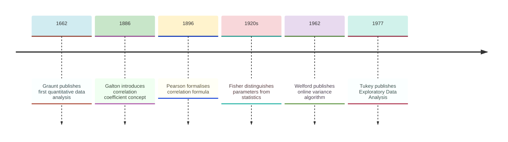
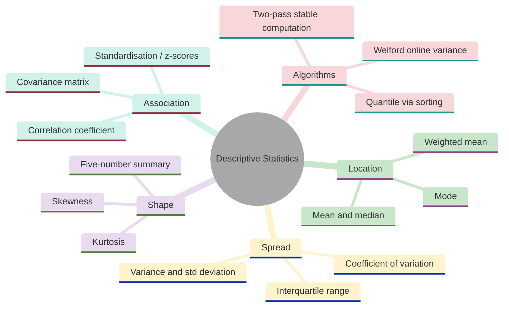
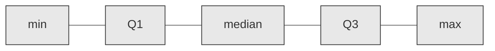
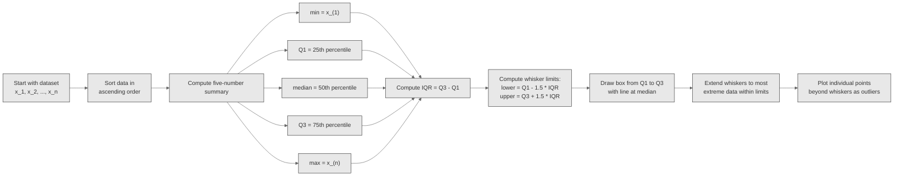
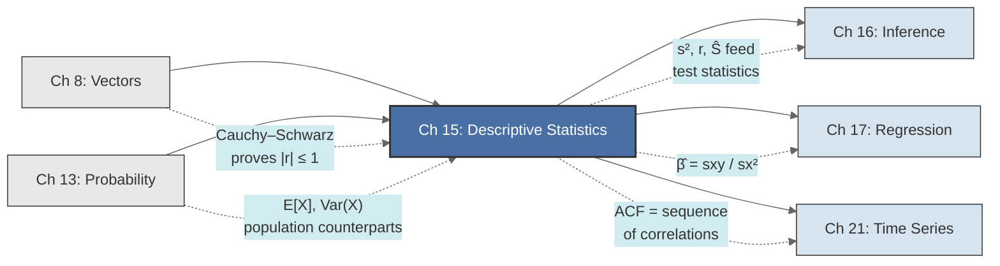

<!-- Copyright (c) 2025-2026 Bob Jansen <bobjansen@pm.me> -->
<!-- SPDX-License-Identifier: CC-BY-NC-4.0 -->
<!-- See LICENSE for full terms. Commercial licensing available. -->

# Chapter 15: Descriptive Statistics


**Part V**: Probability & Statistics

> Descriptive statistics summarises a dataset by a few well-chosen numbers (means, variances, correlations) from which all of statistical reasoning is built. This chapter develops the theory and numerically stable algorithms for computing these quantities.

**Prerequisites**: [Chapter 8](08-vectors.md) (Vectors), where data as vectors in $\mathbb{R}^n$, inner products, norms and the Cauchy–Schwarz inequality are developed. [Chapter 13](13-probability-theory.md) (Probability), where expectation, variance and covariance are defined as the population-level concepts that descriptive statistics estimate from finite samples.

**Learning Objectives**: After this chapter, the reader will be able to:

1. Compute all standard measures of location (mean, median, mode), spread (variance, standard deviation, interquartile range) and shape (skewness, kurtosis) for a dataset.
2. Distinguish between population parameters and sample statistics and explain the rationale for Bessel's correction.
3. Construct and interpret covariance matrices and correlation matrices for multivariate data.
4. Implement numerically stable algorithms for variance computation (two-pass and Welford's online algorithm) and explain why the naive textbook formula is dangerous.
5. Compute quantiles, construct a five-number summary and interpret box plots.
6. Apply weighted statistics and standardisation (z-scores) in practical settings.

**Connections**: This chapter is used by [Chapter 16](16-statistical-inference.md) (Inference, where test statistics are functions of descriptive statistics and confidence intervals are built from the sample mean and sample variance), [Chapter 17](17-regression.md) (Regression, where the regression coefficients are ratios of covariances to variances and the $R^2$ statistic is the square of the sample correlation) and [Chapter 21](21-time-series.md) (Time Series, where the autocorrelation function is a sequence of sample correlations at successive lags). The Cauchy–Schwarz inequality from [Chapter 8](08-vectors.md) provides the proof that the correlation coefficient is bounded between $-1$ and $1$. The expectation and variance developed in [Chapter 13](13-probability-theory.md) are the population quantities that the sample mean and sample variance estimate.

---

## Historical Context

**Key Milestones in Descriptive Statistics**



*Figure 15.1: Timeline of key milestones in the development of descriptive statistics.*

**Graunt and political arithmetic (1662).** Governments counted people and levied taxes for centuries, but the idea that patterns in aggregated data could reveal laws of nature required a conceptual shift. John Graunt published *Natural and Political Observations Made upon the Bills of Mortality* in 1662. Working with London's weekly death records, originally compiled to warn of plague outbreaks, Graunt tabulated ratios and drew inferences about population structure, sex ratios at birth, urban versus rural mortality and the regularity of causes of death.

**Graunt's demographic estimates (1662).** He estimated London's population at 384,000. He constructed what is now recognised as the first life table. He called his method "political arithmetic", a term his friend William Petty later popularised. The insight was that summary numbers (totals, averages, proportions) computed from raw data reveal truths invisible in any individual record.

**Galton and the correlation coefficient (1886).** Francis Galton's 1886 paper "Regression towards Mediocrity in Hereditary Stature" introduced two ideas that pervade modern statistics. He demonstrated *regression to the mean*: children of exceptionally tall parents tend to be tall, but less exceptionally so. He quantified the strength of the parent–offspring height relationship by a single number, the *correlation coefficient* (initially his "index of co-relation"). Galton collected data from 205 parental pairs, tabulating mid-parent height against offspring height. His data table, published in the *Journal of the Anthropological Institute*, remains one of the earliest bivariate datasets in the statistical literature. Galton also invented the quincunx, a device showing how the normal distribution arises from many small random deflections.

**Pearson and the formalisation of correlation (1896).** Karl Pearson, who founded the first university statistics department at University College London in 1911, placed the correlation coefficient on a firm mathematical footing. His 1896 paper "Mathematical Contributions to the Theory of Evolution. III. Regression, Heredity, and Panmixia", published in the *Philosophical Transactions of the Royal Society*, established the formula $r = \frac{\sum(x_i - \bar{x})(y_i - \bar{y})}{\sqrt{\sum(x_i - \bar{x})^2 \sum(y_i - \bar{y})^2}}$ and proved its basic properties. Pearson also developed the method of moments, the chi-squared test and the system of frequency curves.

**Fisher and the population–sample distinction (1920s).** Ronald Fisher, in a series of papers in the 1920s, resolved the distinction between a *population parameter* (a fixed but unknown quantity characterising a probability distribution) and a *sample statistic* (a number computed from observed data that estimates the parameter). He introduced *degrees of freedom*, showed why dividing by $n-1$ rather than $n$ yields an unbiased estimator of the population variance and developed the theory of *sufficient statistics*. These ideas laid the foundations for the estimation and hypothesis-testing framework that [Chapter 16](16-statistical-inference.md) develops.

**Welford and numerically stable variance (1962).** B.P. Welford published a short note in *Technometrics* in 1962, presenting a one-pass algorithm for computing the sum of squared deviations from the mean. The naive textbook formula $\sum x_i^2 - n\bar{x}^2$ suffers catastrophic cancellation when the mean is large relative to the spread. Welford's recurrence maintains a running sum of squared deviations that is updated with each new observation, avoiding the subtraction of nearly equal large numbers. The algorithm remains the standard for streaming variance computation in production data pipelines.

**Tukey and exploratory data analysis (1977).** John Tukey published *Exploratory Data Analysis* in 1977. Tukey argued that statisticians had focused too narrowly on confirmatory methods (hypothesis tests, confidence intervals) and had neglected the preliminary step of examining data. He introduced the box plot (based on the five-number summary) and the stem-and-leaf display. His emphasis on robustness, using the median and interquartile range (IQR) rather than the mean and standard deviation when outliers may be present, remains standard practice in modern data science.

---

## Why This Chapter Matters

**Descriptive Statistics**



*Figure 15.2: Core topics and subtopics of descriptive statistics.*

The numerically stable algorithms developed here distinguish correctly implemented software from textbook pseudocode that fails on real data. The naive variance formula $\mathbb{E}[X^2] - (\mathbb{E}[X])^2$ suffers catastrophic cancellation when the mean is large relative to the spread (Section 7). This is not a theoretical curiosity; it has corrupted results in financial risk systems, sensor pipelines and machine learning feature engineering. Welford's online algorithm (Algorithm 15.23) and the two-pass approach (Algorithm 15.22) are the correct implementations. They maintain running deviations of similar magnitude rather than accumulating and subtracting large sums.

Every feature engineering pipeline begins with the quantities defined in this chapter: means, variances, z-scores (Remark 15.19), quantiles (Definition 15.12) and correlation matrices (Definition 15.18). Feature standardisation (subtracting the mean and dividing by the standard deviation) is required by support vector machines, k-nearest neighbours, principal component analysis and gradient-based optimisation of neural networks. The sample covariance matrix (Definition 15.17) is the input to principal component analysis and to Gaussian discriminant analysis. Skewness and kurtosis (Definitions 15.10 and 15.11) detect non-normality: a leptokurtic distribution signals heavy tails that invalidate normal-theory confidence intervals; high skewness warns that the mean does not represent typical values.

The correlation matrix is the foundation of Markowitz portfolio optimisation. The portfolio variance formula $\operatorname{Var}(R_p) = \sum_i \sum_j w_i w_j \operatorname{Cov}(R_i, R_j)$ (Theorem 13.22 in [Chapter 13](13-probability-theory.md), operationalised here as Algorithm 15.25) determines optimal asset allocation. The coefficient of variation (Definition 15.9) compares return variability across assets denominated in different currencies. Excess kurtosis measures whether return tails are heavier than Gaussian; it is a direct input to Value-at-Risk models. In crypto markets, where tokens exhibit extreme kurtosis and non-stationary variance, streaming computation via Welford's algorithm is necessary for real-time risk dashboards that cannot re-scan the full history on each tick.

The regression coefficient $\hat{\beta} = s_{xy}/s_x^2$ (previewed in the Connections section) is a ratio of descriptive statistics. The $R^2 = r_{xy}^2$ of [Chapter 17](17-regression.md) is the square of the Pearson correlation coefficient computed here. The autocorrelation function of [Chapter 21](21-time-series.md) is a sequence of sample correlations at successive lags. Descriptive statistics is the computational substrate on which inference, regression and time series analysis are built.

---

## Notation & Conventions

| Symbol | Meaning |
|--------|---------|
| $x_1, x_2, \ldots, x_n$ | A sample of $n$ observations (real numbers) |
| $n$ | Sample size |
| $\bar{x}$ | Sample mean: $\bar{x} = \frac{1}{n}\sum_{i=1}^{n} x_i$ |
| $\tilde{x}$ | Sample median |
| $s^2$ | Sample variance (with Bessel's correction): $\frac{1}{n-1}\sum(x_i - \bar{x})^2$ |
| $s$ | Sample standard deviation: $s = \sqrt{s^2}$ |
| $\mu$ | Population mean (unknown parameter) |
| $\sigma^2$ | Population variance (unknown parameter) |
| $x_{(i)}$ | The $i$-th order statistic: $x_{(1)} \leq x_{(2)} \leq \cdots \leq x_{(n)}$ |
| $Q_1, Q_2, Q_3$ | First, second (median) and third quartiles |
| $Q(p)$ | The $p$-th sample quantile (interpolated) |
| $\text{IQR}$ | Interquartile range: $Q_3 - Q_1$ |
| $g_1$ | Sample skewness |
| $g_2$ | Sample kurtosis |
| $r$ or $r_{xy}$ | Pearson sample correlation coefficient |
| $s_{xy}$ | Sample covariance of $x$ and $y$ |
| $S$ | Covariance matrix (for multivariate data) |
| $R$ | Correlation matrix |
| $z_i$ | Standardised value (z-score): $z_i = (x_i - \bar{x})/s$ |
| $w_i$ | Weight associated with observation $i$ |

Summations run from $i = 1$ to $n$ unless stated otherwise. The sample consists of real-valued observations. Components are 1-indexed in mathematical exposition and 0-indexed in implementation.

---

## Core Theory

### Measures of Location

**Definition 15.1** (Sample mean). Let $x_1, x_2, \ldots, x_n$ be a sample of $n$ observations. The *sample mean* is

$$\bar{x} = \frac{1}{n} \sum_{i=1}^{n} x_i.$$

The sample mean is an unbiased estimator of the population mean $\mu$ ([Chapter 13](13-probability-theory.md)): if $x_1, \ldots, x_n$ are independent draws from a distribution with mean $\mu$, then $\mathbb{E}[\bar{x}] = \mu$. The mean minimises the sum of squared deviations: $\bar{x} = \arg\min_{c} \sum_{i=1}^{n}(x_i - c)^2$, which follows immediately by differentiating with respect to $c$ and setting the result to zero. This least-squares property makes the mean the natural centre of mass of the data.

**Definition 15.2** (Median). Let $x_{(1)} \leq x_{(2)} \leq \cdots \leq x_{(n)}$ be the order statistics of the sample. The *sample median* is

$$\tilde{x} = \begin{cases} x_{((n+1)/2)} & \text{if } n \text{ is odd,} \\ \frac{1}{2}\bigl(x_{(n/2)} + x_{(n/2+1)}\bigr) & \text{if } n \text{ is even.} \end{cases}$$

The median minimises the sum of absolute deviations: $\tilde{x} = \arg\min_{c} \sum_{i=1}^{n}|x_i - c|$. Unlike the mean, the median has a *breakdown point* of 50\%: up to half the observations can be moved to $\pm\infty$ without changing the median, whereas a single extreme observation can make the mean arbitrarily large. This robustness to outliers makes the median preferable to the mean when the data may contain contamination or heavy tails.

**Definition 15.3** (Mode). The *mode* of a sample is the value that occurs with the greatest frequency. For continuous data (where exact ties are rare), the mode is typically defined via a histogram or kernel density estimate as the location of the highest peak. The mode can be undefined (if all values are distinct) or non-unique (bimodal or multimodal distributions).

**Remark 15.4** (Relationship between mean and median). For symmetric distributions (where the density satisfies $f(\mu + t) = f(\mu - t)$ for all $t$), the mean and median coincide. For right-skewed distributions (a long right tail), the mean exceeds the median because extreme large values pull the mean upward without affecting the median. For left-skewed distributions, by contrast, the mean is less than the median. The gap $\bar{x} - \tilde{x}$ provides an informal measure of skewness, though the formal definition (Definition 15.10) is more precise.

### Measures of Spread

**Definition 15.5** (Sample variance). Let $x_1, \ldots, x_n$ be a sample with sample mean $\bar{x}$. The *sample variance* is

$$s^2 = \frac{1}{n-1} \sum_{i=1}^{n} (x_i - \bar{x})^2.$$

The divisor $n - 1$ (rather than $n$) is known as *Bessel's correction*. It ensures that $s^2$ is an unbiased estimator of the population variance $\sigma^2$.

??? note "Proof"

    *Proof sketch (unbiasedness).* Let $x_1, \ldots, x_n$ be i.i.d. with mean $\mu$ and variance $\sigma^2$. Then

    $$\sum_{i=1}^{n}(x_i - \bar{x})^2 = \sum_{i=1}^{n}(x_i - \mu)^2 - n(\bar{x} - \mu)^2.$$

    Taking expectations:

    $$\begin{aligned}
    \mathbb{E}\left[\sum(x_i - \mu)^2\right] &= n\sigma^2, \\
    \mathbb{E}\left[n(\bar{x} - \mu)^2\right] &= n \cdot \operatorname{Var}(\bar{x}) = n \cdot \sigma^2/n = \sigma^2.
    \end{aligned}$$

    It follows that $\mathbb{E}\left[\sum(x_i - \bar{x})^2\right] = n\sigma^2 - \sigma^2 = (n-1)\sigma^2$. Dividing by $n-1$ gives $\mathbb{E}[s^2] = \sigma^2$.

    $\square$

The factor $n - 1$ can also be understood as the number of *degrees of freedom*: the $n$ deviations $x_i - \bar{x}$ are subject to the constraint $\sum(x_i - \bar{x}) = 0$, so only $n - 1$ of them are free to vary independently.

**Definition 15.6** (Sample standard deviation). The *sample standard deviation* is

$$s = \sqrt{s^2} = \sqrt{\frac{1}{n-1}\sum_{i=1}^{n}(x_i - \bar{x})^2}.$$

The standard deviation is measured in the same units as the data and has a more intuitive interpretation as a "typical deviation from the mean". Note that while $s^2$ is an unbiased estimator of $\sigma^2$, the standard deviation $s$ is *not* an unbiased estimator of $\sigma$ (because the square root is a concave function, Jensen's inequality gives $\mathbb{E}[s] \leq \sigma$), though the bias is small for moderate sample sizes.

**Definition 15.7** (Range). The *range* of a sample is

$$\text{Range} = x_{(n)} - x_{(1)} = \max(x_1, \ldots, x_n) - \min(x_1, \ldots, x_n).$$

The range is the simplest measure of spread but the least informative: it uses only the two most extreme observations and is therefore highly sensitive to outliers. Its sampling distribution is difficult to characterise for most parent distributions.

**Definition 15.8** (Interquartile range). The *interquartile range* is

$$\text{IQR} = Q_3 - Q_1,$$

where $Q_1$ and $Q_3$ are the first and third quartiles (see Definition 15.12). The IQR measures the spread of the middle 50\% of the data. Like the median, the IQR is robust to outliers: it has a breakdown point of 25\% (to a good approximation; the exact breakdown point depends on the quartile definition used), since up to a quarter of the observations can be moved to extreme values without affecting either $Q_1$ or $Q_3$.

**Definition 15.9** (Coefficient of variation). The *coefficient of variation* is

$$\text{CV} = \frac{s}{\bar{x}},$$

defined when $\bar{x} \neq 0$. The CV is meaningful only when $\bar{x} > 0$; for data with a non-positive mean, relative variability must be assessed differently. The CV is dimensionless and measures the relative variability of the data as a fraction of the mean. It is useful for comparing the variability of quantities measured on different scales (e.g., comparing the variability of stock returns denominated in different currencies) or for assessing whether the standard deviation is "large" relative to the level of the data.

### Measures of Shape

**Definition 15.10** (Sample skewness). The *sample skewness* is

$$g_1 = \frac{1}{n} \sum_{i=1}^{n} \left(\frac{x_i - \bar{x}}{s}\right)^3.$$

Skewness measures the asymmetry of the distribution of the data about its mean. The standardisation by $s$ makes $g_1$ dimensionless. If $g_1 > 0$, the distribution has a longer right tail (right-skewed or positively skewed): there are more extreme values above the mean than below. If $g_1 < 0$, the distribution is left-skewed (negatively skewed). If $g_1 = 0$, the data is symmetric about the mean. Examples: income distributions are typically right-skewed ($g_1 > 0$); the distribution of ages at death in developed countries is left-skewed ($g_1 < 0$).

**Right-Skewed Distribution (Positive Skewness)**

```mermaid
---
config:
  theme: base
  themeVariables:
    xyChart:
      plotColorPalette: "#2563eb, #dc2626, #16a34a, #9333ea, #ca8a04, #0891b2"
      backgroundColor: "#ffffff"
      titleColor: "#333333"
      xAxisLabelColor: "#333333"
      yAxisLabelColor: "#333333"
      xAxisTitleColor: "#333333"
      yAxisTitleColor: "#333333"
      xAxisLineColor: "#333333"
      yAxisLineColor: "#333333"
---
xychart-beta
    x-axis "x" [0, 1, 2, 3, 4, 5, 6, 7, 8]
    y-axis "density" 0 --> 0.40
    line [0.05, 0.25, 0.35, 0.20, 0.08, 0.04, 0.02, 0.008, 0.002]
```

*Figure 15.3: Density curve of a right-skewed distribution with a long positive tail.*

**Definition 15.11** (Sample kurtosis). The *sample kurtosis* is

$$g_2 = \frac{1}{n} \sum_{i=1}^{n} \left(\frac{x_i - \bar{x}}{s}\right)^4.$$

The *excess kurtosis* is $g_2 - 3$. The reference value 3 is the kurtosis of the normal distribution: any distribution with kurtosis greater than 3 (positive excess kurtosis) has heavier tails than the normal and is called *leptokurtic*; a distribution with kurtosis less than 3 (negative excess kurtosis) has lighter tails and is called *platykurtic*; a distribution with kurtosis equal to 3 is *mesokurtic*.

Kurtosis is sometimes described as measuring "peakedness", but this is misleading: it is more accurately understood as measuring the propensity of the distribution to produce outliers. A leptokurtic distribution concentrates probability both near the centre and in the tails, at the expense of the "shoulders". Financial return distributions are typically leptokurtic, which has direct implications for risk management.

### Quantiles and Order Statistics

**Definition 15.12** (Quantiles and percentiles). Let $0 < p < 1$. The $p$-th *quantile* (or *$100p$-th percentile*) of a sample is a value $Q(p)$ such that (approximately) a fraction $p$ of the data falls at or below $Q(p)$. The precise definition requires an interpolation convention for finite samples. The most common convention (used, for example, by NumPy's default `quantile` function) defines:

$$Q(p) = x_{(j)} + (x_{(j+1)} - x_{(j)}) \cdot g,$$

where $j = \lfloor (n-1)p \rfloor + 1$ and $g = (n-1)p - \lfloor (n-1)p \rfloor$ are the integer and fractional parts arising from the index $(n-1)p + 1$ into the sorted data. For $p = 1$, the formula reduces to $Q(1) = x_{(n)}$ (since $g = 0$ and the $x_{(j+1)}$ term vanishes).

Special cases:
- *Quartiles*: $Q_1 = Q(0.25)$, $Q_2 = Q(0.5) = \tilde{x}$ (the median), $Q_3 = Q(0.75)$.
- *Deciles*: $Q(0.1), Q(0.2), \ldots, Q(0.9)$.
- *Percentiles*: $Q(0.01), Q(0.02), \ldots, Q(0.99)$.

**Definition 15.13** (Five-number summary). The *five-number summary* of a dataset is the ordered quintuple

$$\{\min, \; Q_1, \; \tilde{x}, \; Q_3, \; \max\} = \{x_{(1)}, \; Q_1, \; Q_2, \; Q_3, \; x_{(n)}\}.$$

The five-number summary is the foundation of the *box plot* (also called a box-and-whisker plot), introduced by Tukey. In a box plot, the box extends from $Q_1$ to $Q_3$ (spanning the IQR), a line inside the box marks the median and whiskers extend to the most extreme observations within $1.5 \cdot \text{IQR}$ of the box. Observations beyond the whiskers are plotted individually as potential outliers. The box plot provides an immediate visual summary of location, spread, skewness (via asymmetry of the box and whiskers) and the presence of outliers.

**Five-Number Summary Structure**



*Figure 15.4: Five ordered positions of the five-number summary from minimum to maximum.*

The block diagram above displays the five-number summary as a sequence of five ordered positions. Data flows from the minimum through the first quartile, the median, the third quartile and the maximum. Together these five values partition the dataset into four groups of roughly equal size, providing a compact summary of location, spread and symmetry.

**Five-Number Summary to Box Plot Construction**



*Figure 15.5: Steps for constructing a box plot from a dataset using the five-number summary.*

### Measures of Association

**Definition 15.14** (Sample covariance). Let $(x_1, y_1), (x_2, y_2), \ldots, (x_n, y_n)$ be paired observations of two variables. The *sample covariance* is

$$s_{xy} = \frac{1}{n-1} \sum_{i=1}^{n} (x_i - \bar{x})(y_i - \bar{y}).$$

The sample covariance is an unbiased estimator of the population covariance $\operatorname{Cov}(X, Y) = \mathbb{E}[(X - \mu_X)(Y - \mu_Y)]$. The proof is analogous to that of Definition 15.5 and uses the same degree-of-freedom argument. When $s_{xy} > 0$, the variables tend to deviate from their means in the same direction (positive association); when $s_{xy} < 0$, they tend to deviate in opposite directions (negative association). The magnitude of $s_{xy}$ depends on the scales of $x$ and $y$, making direct interpretation of its size difficult without standardisation.

**Definition 15.15** (Pearson sample correlation coefficient). The *Pearson sample correlation coefficient* is

$$r_{xy} = \frac{s_{xy}}{s_x \cdot s_y} = \frac{\sum_{i=1}^{n}(x_i - \bar{x})(y_i - \bar{y})}{\sqrt{\sum_{i=1}^{n}(x_i - \bar{x})^2} \cdot \sqrt{\sum_{i=1}^{n}(y_i - \bar{y})^2}}.$$

!!! warning "Correlation measures linear association only"

    A correlation of $r = 0$ does not imply independence. Two variables can have a strong nonlinear relationship (e.g., $y = x^2$) with $r = 0$. Always plot the data before interpreting the correlation.

The correlation is dimensionless and measures the strength and direction of the *linear* relationship between $x$ and $y$:
- $r = 1$: perfect positive linear relationship ($y = a + bx$ with $b > 0$).
- $r = -1$: perfect negative linear relationship ($y = a + bx$ with $b < 0$).
- $r = 0$: no linear relationship (but possibly a strong nonlinear one).

**Theorem 15.16** (Correlation bounds). For any sample $(x_1, y_1), \ldots, (x_n, y_n)$ with $s_x > 0$ and $s_y > 0$,

$$-1 \leq r_{xy} \leq 1.$$

Equality $|r_{xy}| = 1$ holds if and only if there exist constants $a, b$ with $b \neq 0$ such that $y_i = a + bx_i$ for all $i$.

!!! abstract "Key Result"

    **Theorem 15.16** (Correlation bounds). The Pearson correlation coefficient lies in $[-1, 1]$ with equality if and only if the data are perfectly collinear, providing a standardised, unit-free measure of the strength and direction of linear association.

??? note "Proof"

    *Proof.* Define vectors $\mathbf{u} = (x_1 - \bar{x}, \ldots, x_n - \bar{x})$ and $\mathbf{v} = (y_1 - \bar{y}, \ldots, y_n - \bar{y})$ in $\mathbb{R}^n$. Then

    $$r_{xy} = \frac{\mathbf{u} \cdot \mathbf{v}}{\|\mathbf{u}\| \cdot \|\mathbf{v}\|} = \cos\theta,$$

    where $\theta$ is the angle between $\mathbf{u}$ and $\mathbf{v}$ in $\mathbb{R}^n$ ([Chapter 8](08-vectors.md), Definition 8.9).

    The Cauchy–Schwarz inequality ([Chapter 8](08-vectors.md), Theorem 8.7) states

    $$|\mathbf{u} \cdot \mathbf{v}| \leq \|\mathbf{u}\| \cdot \|\mathbf{v}\|,$$

    with equality if and only if $\mathbf{v} = c\mathbf{u}$ for some scalar $c$.

    Dividing by $\|\mathbf{u}\|\cdot\|\mathbf{v}\|$ gives $|r_{xy}| \leq 1$.

    Equality holds iff $y_i - \bar{y} = c(x_i - \bar{x})$ for all $i$, i.e., $y_i = (\bar{y} - c\bar{x}) + cx_i$, which is a perfect linear relationship with slope $b = c$ and intercept $a = \bar{y} - c\bar{x}$.

    $\square$

**Definition 15.17** (Covariance matrix). Let $\mathbf{x}_1, \mathbf{x}_2, \ldots, \mathbf{x}_n \in \mathbb{R}^p$ be $n$ observations of $p$ variables. Denote the $j$-th variable's observations as $x_{1j}, x_{2j}, \ldots, x_{nj}$ with sample mean $\bar{x}_j$. The *sample covariance matrix* is the $p \times p$ matrix $S$ with entries

$$S_{jk} = \frac{1}{n-1} \sum_{i=1}^{n} (x_{ij} - \bar{x}_j)(x_{ik} - \bar{x}_k).$$

The covariance matrix is symmetric ($S_{jk} = S_{kj}$) and positive semidefinite: for any vector $\mathbf{a} \in \mathbb{R}^p$,

$$\mathbf{a}^T S \mathbf{a} = \frac{1}{n-1} \sum_{i=1}^{n}\left(\sum_{j=1}^{p} a_j(x_{ij} - \bar{x}_j)\right)^2 \geq 0.$$

The covariance matrix $S$ is positive definite (strictly $> 0$ for all $\mathbf{a} \neq \mathbf{0}$) if and only if $n > p$ and the data matrix has full column rank.

**Definition 15.18** (Correlation matrix). The *sample correlation matrix* is the $p \times p$ matrix $R$ with entries

$$R_{jk} = \frac{S_{jk}}{\sqrt{S_{jj}} \cdot \sqrt{S_{kk}}} = \frac{s_{x_j x_k}}{s_{x_j} \cdot s_{x_k}}.$$

Equivalently, $R = D^{-1} S D^{-1}$, where $D = \operatorname{diag}(s_{x_1}, s_{x_2}, \ldots, s_{x_p})$ is the diagonal matrix of standard deviations. The diagonal entries of $R$ are all 1 (the correlation of a variable with itself is always 1) and the off-diagonal entries satisfy $|R_{jk}| \leq 1$ by Theorem 15.16. The correlation matrix is also symmetric and positive semidefinite.

**Remark 15.19** (Standardisation and z-scores). The *z-score* or *standardised value* of observation $x_i$ is

$$z_i = \frac{x_i - \bar{x}}{s}.$$

Standardisation transforms the data to have sample mean $0$ and sample standard deviation $1$. It is useful for comparing variables measured on different scales: if heights are in centimetres and weights in kilograms, comparing raw deviations is meaningless, but comparing z-scores is sensible (both express "number of standard deviations from the mean"). The correlation coefficient is equivalently the average product of paired z-scores:

$$r_{xy} = \frac{1}{n-1}\sum_{i=1}^{n} z_{x,i} \cdot z_{y,i},$$

where $z_{x,i} = (x_i - \bar{x})/s_x$ and $z_{y,i} = (y_i - \bar{y})/s_y$.

### Weighted Statistics

**Definition 15.20** (Weighted mean). Let $x_1, \ldots, x_n$ be observations with associated non-negative weights $w_1, \ldots, w_n$ (not all zero). The *weighted mean* is

$$\bar{x}_w = \frac{\sum_{i=1}^{n} w_i x_i}{\sum_{i=1}^{n} w_i}.$$

The ordinary (unweighted) mean is the special case $w_i = 1$ for all $i$. Weighted means arise in diverse contexts: in survey sampling (where weights correct for unequal selection probabilities), portfolio theory (where asset weights represent capital allocation) and the method of weighted least squares (where weights reflect heterogeneous measurement precision).

**Definition 15.21** (Weighted variance). The *weighted sample variance* (using frequency weights) is

$$s_w^2 = \frac{\sum_{i=1}^{n} w_i (x_i - \bar{x}_w)^2}{\sum_{i=1}^{n} w_i - 1}.$$

The denominator $\sum w_i - 1$ generalises Bessel's correction to the weighted setting (for integer frequency weights, $\sum w_i$ equals the effective sample size). An alternative formulation, appropriate when weights represent *reliability* or *importance* rather than frequencies, uses the denominator $\left(1 - \frac{\sum w_i^2}{(\sum w_i)^2}\right)\sum w_i$, which reduces to $n - 1$ when all weights are equal.

---

## Formulas & Identities

The following identities consolidate the definitions above and introduce equivalent single-pass reformulations.

**F15.1** (Computational formula for variance).

$$s^2 = \frac{1}{n-1}\left(\sum_{i=1}^{n} x_i^2 - n\bar{x}^2\right) = \frac{n\sum x_i^2 - \left(\sum x_i\right)^2}{n(n-1)}.$$

This "one-pass" formula requires accumulating only $\sum x_i$ and $\sum x_i^2$, but it is numerically unstable (see Numerical Considerations).

**F15.2** (Shift invariance and scale equivariance). The mean is shift-equivariant: if $y_i = x_i + c$, then $\bar{y} = \bar{x} + c$. The variance is shift-invariant: $s_y^2 = s_x^2$. For a scale transformation $y_i = ax_i$:

$$\bar{y} = a\bar{x}, \qquad s_y^2 = a^2 s_x^2.$$

**F15.3** (Covariance from products).

$$s_{xy} = \frac{1}{n-1}\left(\sum_{i=1}^{n} x_i y_i - n\bar{x}\bar{y}\right).$$

**F15.4** (Correlation from covariance and standard deviations).

$$r_{xy} = \frac{s_{xy}}{s_x \cdot s_y}.$$

**F15.5** (Covariance matrix properties). For $S$ the $p \times p$ sample covariance matrix:

$$S = S^T, \qquad \mathbf{a}^T S \mathbf{a} \geq 0 \;\;\forall\, \mathbf{a} \in \mathbb{R}^p, \qquad \operatorname{tr}(S) = \sum_{j=1}^{p} s_{x_j}^2.$$

The eigenvalues of $S$ are non-negative. $\det(S) = 0$ if and only if the variables are linearly dependent in the sample.

**F15.6** (Correlation matrix from covariance matrix). If $D = \operatorname{diag}(s_{x_1}, \ldots, s_{x_p})$, then

$$R = D^{-1} S D^{-1}.$$

---

## Algorithms

**Algorithm 15.22** (Two-pass variance). The most straightforward numerically stable approach.

```
Input: x[0], x[1], ..., x[n-1]
Output: sample variance s²

// Pass 1: compute mean
sum ← 0
for i ← 0 to n-1:
    sum ← sum + x[i]
mean ← sum / n

// Pass 2: compute sum of squared deviations
ss ← 0
for i ← 0 to n-1:
    d ← x[i] - mean
    ss ← ss + d * d

s² ← ss / (n - 1)
```

*Complexity*: $O(n)$ time, $O(1)$ additional space, two passes over the data. The subtraction $x_i - \bar{x}$ involves quantities of similar magnitude, avoiding the catastrophic cancellation inherent in the one-pass formula (Numerical Considerations).

**Algorithm 15.23** (Welford's online algorithm). A single-pass algorithm that maintains a running mean and running sum of squared deviations, due to Welford (1962).

```
Input: x[0], x[1], ..., x[n-1] (arriving sequentially)
Output: sample mean and variance after all observations

mean ← 0
M2 ← 0
count ← 0

for i ← 0 to n-1:
    count ← count + 1
    delta ← x[i] - mean
    mean ← mean + delta / count
    delta2 ← x[i] - mean      // note: uses updated mean
    M2 ← M2 + delta * delta2

if count < 2:
    s² ← undefined
else:
    s² ← M2 / (count - 1)
```

*Correctness*: At each step, `mean` equals the sample mean of the observations seen so far and `M2` equals $\sum_{j=1}^{k}(x_j - \bar{x}_k)^2$ where $k$ is the current count and $\bar{x}_k$ is the running mean. The key identity is:

$$\sum_{j=1}^{k}(x_j - \bar{x}_k)^2 = \sum_{j=1}^{k-1}(x_j - \bar{x}_{k-1})^2 + (x_k - \bar{x}_k)(x_k - \bar{x}_{k-1}),$$

which is exactly the update `M2 ← M2 + delta * delta2` since `delta` = $x_k - \bar{x}_{k-1}$ and `delta2` = $x_k - \bar{x}_k$.

*Complexity*: $O(n)$ time, $O(1)$ additional space, single pass. Ideal for streaming data where the observations arrive one at a time and cannot be stored.

!!! tip "When to choose Welford over two-pass"

    Use Welford's algorithm when data arrives as a stream and cannot be stored or re-read. Use the two-pass algorithm when the full dataset is available in memory; the two-pass approach is marginally simpler to implement and equally stable.

**Algorithm 15.24** (Quantile computation via sorting). The standard algorithm for computing arbitrary quantiles.

```
Input: x[0], ..., x[n-1]; quantile level p ∈ (0,1)
Output: Q(p)

// Step 1: Sort the data
sort x in ascending order → x_{(0)}, x_{(1)}, ..., x_{(n-1)}

// Step 2: Compute index (linear interpolation method)
h ← (n - 1) * p
j ← floor(h)
g ← h - j

// Step 3: Interpolate (guard boundary)
if j >= n-1:
    return x_{(n-1)}
Q(p) ← (1 - g) * x_{(j)} + g * x_{(j+1)}
```

*Complexity*: $O(n \log n)$ dominated by the sorting step. For a single quantile, selection algorithms (e.g., Quickselect) achieve $O(n)$ expected time without a full sort. The five-number summary requires five quantile computations and can be computed in $O(n \log n)$ total with a single sort.

**Algorithm 15.25** (Covariance matrix computation). Compute the $p \times p$ covariance matrix from $n$ observations of $p$ variables.

```
Input: data matrix X (n × p), where X[i][j] = x_{ij}
Output: covariance matrix S (p × p)

// Step 1: Compute column means
for j ← 0 to p-1:
    mean[j] ← (1/n) * Σ_{i=0}^{n-1} X[i][j]

// Step 2: Center the data
for i ← 0 to n-1:
    for j ← 0 to p-1:
        X[i][j] ← X[i][j] - mean[j]

// Step 3: Compute S = (1/(n-1)) * X^T X
for j ← 0 to p-1:
    for k ← j to p-1:
        sum ← 0
        for i ← 0 to n-1:
            sum ← sum + X[i][j] * X[i][k]
        S[j][k] ← sum / (n - 1)
        S[k][j] ← S[j][k]         // exploit symmetry
```

*Complexity*: $O(np^2)$ time, or $O(np)$ per column pair. When $n \gg p$ (more observations than variables), this is dominated by the inner loop over observations. When $p$ is large, the matrix multiplication $X^T X$ can be accelerated using Basic Linear Algebra Subprograms routines.

**Algorithm 15.26** (Correlation matrix from covariance matrix). Given the covariance matrix $S$, the correlation matrix $R$ is obtained by normalising each entry.

```
Input: covariance matrix S (p × p)
Output: correlation matrix R (p × p)

// Step 1: Extract standard deviations
for j ← 0 to p-1:
    d[j] ← sqrt(S[j][j])

// Step 2: Normalize
for j ← 0 to p-1:
    for k ← 0 to p-1:
        if d[j] > 0 and d[k] > 0:
            R[j][k] ← S[j][k] / (d[j] * d[k])
        else:
            R[j][k] ← 0    // undefined if std = 0
```

*Complexity*: $O(p^2)$ time, dominated by the double loop. This is negligible compared to the $O(np^2)$ cost of computing $S$ in Algorithm 15.25.

---

## Numerical Considerations

### Catastrophic Cancellation in Variance

!!! warning "Never use the naive variance formula in production code"

    The formula $s^2 = \frac{1}{n-1}(\sum x_i^2 - n\bar{x}^2)$ can return zero or negative values for data with a large mean relative to its spread. Use Algorithm 15.22 (two-pass) or Algorithm 15.23 (Welford) instead.

The formula $s^2 = \frac{1}{n-1}\left(\sum x_i^2 - n\bar{x}^2\right)$ subtracts two large positive quantities. When the mean is large relative to the spread, both terms are nearly equal. The subtraction loses precision.

For $\{10^9 + 1, 10^9 + 2, 10^9 + 3\}$ the true variance is 1. Both $\sum x_i^2$ and $n\bar{x}^2$ are approximately $3 \times 10^{18}$. Each requires roughly 60 bits to represent exactly. IEEE 754 double precision provides 53. The subtraction loses all digits of the variance and may produce a negative result.

The two-pass algorithm (Algorithm 15.22) computes $\sum(x_i - \bar{x})^2$ instead. The deviations are of order $s$, not $\bar{x}$. Welford's algorithm (Algorithm 15.23) achieves the same stability in a single pass.

### Welford's Algorithm: Why It Works

Welford's algorithm never accumulates $\sum x_i^2$ separately from $n\bar{x}^2$. It maintains $M_2 = \sum(x_i - \bar{x}_k)^2$ directly, updating it with the product `delta * delta2`. Here `delta` = $x_k - \bar{x}_{k-1}$ and `delta2` = $x_k - \bar{x}_k$. Both are of similar magnitude, avoiding the large-number subtraction of the textbook formula.

### Positive Semidefiniteness of Computed Covariance Matrices

A true covariance matrix is positive semidefinite. Rounding errors can produce a computed matrix $\hat{S}$ with small negative eigenvalues. Cholesky decomposition then fails. Remedies:
- Add a small multiple of the identity: $\hat{S} + \epsilon I$.
- Compute the eigendecomposition and set negative eigenvalues to zero.
- Use the two-pass centred algorithm rather than the one-pass product formula.

### Division by Near-Zero Standard Deviation

The correlation $r_{xy} = s_{xy}/(s_x \cdot s_y)$ divides by $s_x$ and $s_y$. When a variable has near-zero variance, the correlation is numerically undefined. If $s_x < \epsilon$ for a suitable tolerance, report the correlation as NaN rather than allowing overflow.

!!! info "Practical tolerance for near-zero standard deviation"

    A common choice is $\epsilon = n \cdot \epsilon_{\text{mach}} \cdot |\bar{x}|$, where $\epsilon_{\text{mach}} \approx 2.2 \times 10^{-16}$ for IEEE 754 double precision. This scales the threshold to the magnitude of the data and the sample size.

---

## Worked Examples

### Example 15.27: Computing Mean, Variance and Standard Deviation

Consider the dataset $x = \{4, 7, 13, 2, 9\}$ with $n = 5$.

**Mean:**

$$\bar{x} = \frac{4 + 7 + 13 + 2 + 9}{5} = \frac{35}{5} = 7.$$

**Variance:**

$$\begin{aligned}
s^2 &= \frac{1}{5-1}\left[(4-7)^2 + (7-7)^2 + (13-7)^2 + (2-7)^2 + (9-7)^2\right] \\
&= \frac{1}{4}[9 + 0 + 36 + 25 + 4] = \frac{74}{4} = 18.5.
\end{aligned}$$

**Standard deviation:**

$$s = \sqrt{18.5} \approx 4.301.$$

**Interpretation:** The data is centred at $7$ with observations typically deviating about $4.3$ units from the mean.

### Example 15.28: Skewness and Kurtosis

Consider two datasets:
- Dataset A: $\{1, 2, 3, 4, 5, 6, 7, 8, 9, 10\}$ (uniform spacing, symmetric).
- Dataset B: $\{1, 1, 2, 2, 3, 3, 4, 5, 10, 50\}$ (right-skewed).

**Dataset A:** $\bar{x} = 5.5$, $s \approx 3.028$.

$$g_1 = \frac{1}{10}\sum\left(\frac{x_i - 5.5}{3.028}\right)^3 = 0.$$

By symmetry, the cube of a positive deviation cancels the cube of the corresponding negative deviation.

$$g_2 = \frac{1}{10}\sum\left(\frac{x_i - 5.5}{3.028}\right)^4 \approx 1.438.$$

Excess kurtosis:

$$1.438 - 3 = -1.562 \quad \text{(platykurtic; the uniform distribution has lighter tails than the normal).}$$

**Dataset B:** $\bar{x} = 8.1$, $s \approx 14.955$.

$$g_1 \approx 2.15 > 0 \quad \text{(strongly right-skewed)}.$$

$$g_2 \approx 6.18, \quad \text{excess kurtosis} \approx 3.18 \quad \text{(strongly leptokurtic)}.$$

**Interpretation:** The extreme value $50$ in Dataset B creates a long right tail, pulling both skewness and kurtosis upward. In financial applications, such heavy-tailed behaviour signals higher-than-normal probability of extreme events.

### Example 15.29: Covariance and Correlation

Consider paired observations of study hours ($x$) and exam scores ($y$):

| $i$ | $x_i$ | $y_i$ |
|-----|--------|--------|
| 1 | 2 | 65 |
| 2 | 4 | 73 |
| 3 | 5 | 80 |
| 4 | 7 | 82 |
| 5 | 8 | 90 |

**Means:**

$$\bar{x} = 26/5 = 5.2, \quad \bar{y} = 390/5 = 78.$$

**Covariance:**

$$\begin{aligned}
s_{xy} &= \frac{1}{4}\left[(2-5.2)(65-78) + (4-5.2)(73-78) + (5-5.2)(80-78) + (7-5.2)(82-78) + (8-5.2)(90-78)\right] \\
&= \frac{1}{4}[(-3.2)(-13) + (-1.2)(-5) + (-0.2)(2) + (1.8)(4) + (2.8)(12)] \\
&= \frac{1}{4}[41.6 + 6.0 - 0.4 + 7.2 + 33.6] = \frac{88.0}{4} = 22.0.
\end{aligned}$$

**Standard deviations:**

$$\begin{aligned}
s_x &= \sqrt{\frac{1}{4}\left[(2-5.2)^2 + \cdots + (8-5.2)^2\right]} = \sqrt{5.7} \approx 2.387, \\
s_y &= \sqrt{\frac{1}{4}\left[(65-78)^2 + \cdots + (90-78)^2\right]} = \sqrt{89.5} \approx 9.460.
\end{aligned}$$

**Correlation:**

$$r_{xy} = \frac{22.0}{2.387 \times 9.460} \approx \frac{22.0}{22.59} \approx 0.974.$$

**Interpretation:** The correlation $r \approx 0.974$ indicates a strong positive linear relationship: more study hours are associated with higher exam scores and the relationship is nearly perfectly linear.

### Example 15.30: Numerical Instability of the Textbook Formula

Consider $x = \{10^8 + 1, \; 10^8 + 2, \; 10^8 + 3\}$. The true mean is $10^8 + 2$ and the true variance is $1$.

**Textbook formula.**

$$\begin{aligned}
\sum x_i^2 &= (10^8+1)^2 + (10^8+2)^2 + (10^8+3)^2 = 3 \times 10^{16} + 12 \times 10^8 + 14. \\
n\bar{x}^2 &= 3(10^8+2)^2 = 3 \times 10^{16} + 12 \times 10^8 + 12. \\
\sum x_i^2 - n\bar{x}^2 &= 2, \quad s^2 = 2/(3-1) = 1. \quad \checkmark
\end{aligned}$$

In exact arithmetic this works. In IEEE 754 double precision (53-bit mantissa), the value $3 \times 10^{16} + 12 \times 10^8 + 14$ requires about 55 bits of precision. Rounding to 53 bits introduces an error of order $10^2$, completely swamping the true result of $2$. A typical floating-point implementation returns a nonsensical value (often $0$ or even a small negative number).

**Two-pass algorithm:**
- Pass 1: $\bar{x} = 10^8 + 2$.
- Pass 2: deviations are $-1, 0, 1$; sum of squares $= 2$; $s^2 = 1$. $\checkmark$

**Welford's algorithm:**
- $k=1$: mean $= 10^8+1$, $M_2 = 0$.
- $k=2$: delta $= 1$, mean $= 10^8+1.5$, delta2 $= 0.5$, $M_2 = 0.5$.
- $k=3$: delta $= 1.5$, mean $= 10^8+2$, delta2 $= 1$, $M_2 = 0.5 + 1.5 = 2$.
- $s^2 = 2/(3-1) = 1$. $\checkmark$

Both stable algorithms produce the correct result because they never form the difference of nearly equal large numbers.

---

## Connections

**Chapter Dependencies**



*Figure 15.6: Dependency graph showing prerequisite and downstream chapters for descriptive statistics.*

### Within This Book

- **[Chapter 13](13-probability-theory.md) (Probability)** defines the population quantities $\mu$, $\sigma^2$ and $\rho_{XY}$ that $\bar{x}$, $s^2$ and $r_{xy}$ estimate.

- **[Chapter 16](16-statistical-inference.md) (Inference)** builds test statistics from descriptive statistics. The $t$-statistic uses $\bar{x}$ and $s$; the $F$-statistic uses $s_1^2$ and $s_2^2$; confidence intervals use $\bar{x} \pm t_{\alpha/2} \cdot s/\sqrt{n}$.

- **[Chapter 17](17-regression.md) (Regression)** uses $\hat{\beta} = s_{xy}/s_x^2$ (ratio of sample covariance to sample variance), $R^2 = r_{xy}^2$ (squared sample correlation) and the covariance matrix $S_{XX}$ for the multiple regression coefficient vector.

- **[Chapter 21](21-time-series.md) (Time Series)** uses the sample autocovariance $\hat{\gamma}(k)$ and the autocorrelation function $r_k = \hat{\gamma}(k)/\hat{\gamma}(0)$ at successive lags.

### Applications

- **Data science and exploratory analysis**: Summary statistics (mean, median, standard deviation, percentiles) and correlation matrices are the first step in every data analysis pipeline. Outlier detection relies on z-scores and interquartile ranges computed from the formulas of this chapter.
- **Finance**: Portfolio risk assessment uses the sample covariance matrix to estimate diversification benefits. Sharpe ratios, drawdown statistics and return distributions are all descriptive statistics applied to asset price data.
- **Quality control**: Control charts (Shewhart, cumulative sum) monitor process means and variances over time, using the sample statistics defined here to detect shifts in manufacturing processes.

---

## Summary

- The sample mean, median and mode summarise location; the sample variance, standard deviation and interquartile range quantify spread; skewness and kurtosis describe distributional shape.
- Bessel's correction (dividing by $n - 1$ rather than $n$) makes the sample variance an unbiased estimator of the population variance.
- The sample covariance matrix and correlation matrix capture pairwise linear associations among multiple variables, with the Cauchy-Schwarz inequality bounding $|r_{xy}| \leq 1$.
- Welford's online algorithm computes variance in a single pass with $O(1)$ storage, avoiding the catastrophic cancellation that afflicts the naive two-formula approach.
- Quantiles, the five-number summary and box plots provide a non-parametric description of distributional shape that is robust to outliers.

---

## Exercises

### Routine

**Exercise 15.1.** Let $x = \{3, 7, 7, 2, 9, 14, 5\}$. Compute the sample mean, median, variance, standard deviation and IQR. Verify that the median is more robust than the mean by recomputing both after replacing $14$ with $140$.

**Exercise 15.2.** Let $\mathbf{X}$ be a $100 \times 3$ data matrix (100 observations of 3 variables). Compute the $3 \times 3$ covariance matrix $S$ and correlation matrix $R$. Verify that $R = D^{-1}SD^{-1}$ where $D = \operatorname{diag}(s_1, s_2, s_3)$. Check that all eigenvalues of $S$ are non-negative and that all diagonal entries of $R$ equal $1$.

**Exercise 15.3.** Derive Bessel's correction from first principles. Starting from $\mathbb{E}[\sum(x_i - \bar{x})^2]$, use the identity $x_i - \bar{x} = (x_i - \mu) - (\bar{x} - \mu)$ to show that $\mathbb{E}[\sum(x_i - \bar{x})^2] = (n-1)\sigma^2$.

### Intermediate

**Exercise 15.4.** Prove that the sample mean minimises the sum of squared deviations: show that $\frac{d}{dc}\sum_{i=1}^{n}(x_i - c)^2 = 0$ implies $c = \bar{x}$, and verify the second derivative condition.

**Exercise 15.5.** A portfolio consists of two assets with returns $x$ (mean 8\%, std 12\%) and $y$ (mean 5\%, std 7\%) and correlation $r_{xy} = 0.3$. Compute the portfolio return and standard deviation for weights $(0.6, 0.4)$. Use the identity $\operatorname{Var}(aX + bY) = a^2\operatorname{Var}(X) + b^2\operatorname{Var}(Y) + 2ab\operatorname{Cov}(X,Y)$ where $\operatorname{Cov}(X,Y) = r_{xy}\cdot s_x \cdot s_y$.

**Exercise 15.6.** Show that the correlation coefficient is invariant under affine transformations: if $u_i = a + bx_i$ and $v_i = c + dy_i$ with $bd > 0$, prove that $r_{uv} = r_{xy}$.

**Exercise 15.7.** Implement Welford's algorithm and verify it on the dataset $\{10^9 + 1, 10^9 + 2, \ldots, 10^9 + 100\}$. Compare the result to the textbook formula $(\sum x_i^2 - n\bar{x}^2)/(n-1)$ computed in double precision. Report the relative error of each.

### Challenging

**Exercise 15.8.** The excess kurtosis of the normal distribution is $0$, while the excess kurtosis of the $t$-distribution with $\nu$ degrees of freedom is $6/(\nu - 4)$ for $\nu > 4$. Simulate 10,000 draws from a $t_5$ distribution and compute the sample excess kurtosis. Compare to the theoretical value $6/(5-4) = 6$. Repeat for $\nu = 10, 30, 100$ and observe convergence to the normal.

---

## References

### Textbooks

[1] Freedman, D., Pisani, R., and Purves, R. *Statistics*, 4th ed. W.W. Norton, 2007. A conceptually clear introductory text emphasising understanding over formula manipulation.

[2] Knuth, D.E. *The Art of Computer Programming*, Vol. 2: Seminumerical Algorithms, 3rd ed. Addison-Wesley, 1997. Section 4.2.2 discusses Welford's algorithm and its relation to running averages.

[3] Rice, J.A. *Mathematical Statistics and Data Analysis*, 3rd ed. Cengage, 2006. A rigorous undergraduate text connecting descriptive statistics to probability theory and inference.

[4] Tukey, J.W. *Exploratory Data Analysis*, 1st ed. Addison-Wesley, 1977. The first systematic treatment of exploratory data analysis, introducing box plots, stem-and-leaf displays and the philosophy of letting data suggest hypotheses.

### Historical

[5] Chan, T.F., Golub, G.H., and LeVeque, R.J. "Algorithms for Computing the Sample Variance: Analysis and Recommendations." *The American Statistician* 37(3) (1983): 242–247. A thorough comparison of variance computation algorithms with attention to numerical stability.

[6] Graunt, J. *Natural and Political Observations Made upon the Bills of Mortality*. 1662. Reprinted in various history-of-statistics anthologies.

[7] Pearson, K. "Mathematical Contributions to the Theory of Evolution. III. Regression, Heredity, and Panmixia." *Philosophical Transactions of the Royal Society of London A* 187 (1896): 253–318.

[8] Welford, B.P. "Note on a Method for Calculating Corrected Sums of Squares and Products." *Technometrics* 4(3) (1962): 419–420. The original one-page note introducing the online variance algorithm.

[9] Galton, F. "Regression towards Mediocrity in Hereditary Stature." *Journal of the Anthropological Institute of Great Britain and Ireland* 15 (1886): 246–263. The paper introducing regression to the mean and the correlation concept.

[10] Fisher, R.A. "On the Mathematical Foundations of Theoretical Statistics." *Philosophical Transactions of the Royal Society of London A* 222 (1922): 309–368. The paper establishing the population–sample distinction, sufficient statistics and degrees of freedom.

### Online Resources

[11] NIST/SEMATECH e-Handbook of Statistical Methods. https://www.itl.nist.gov/div898/handbook/

---

## Glossary

- **Bessel's correction**: Division by $n-1$ instead of $n$ in the sample variance formula, yielding an unbiased estimator of $\sigma^2$.
- **Box plot**: A graphical display based on the five-number summary, showing median, IQR, whiskers and outliers.
- **Coefficient of variation (CV)**: The ratio $s/\bar{x}$; a dimensionless measure of relative variability.
- **Correlation coefficient**: Pearson's $r$: the standardised covariance, measuring linear association on a $[-1, 1]$ scale.
- **Correlation matrix**: A $p \times p$ matrix $R$ whose $(j,k)$ entry is the correlation between variables $j$ and $k$; diagonal entries are 1.
- **Covariance**: A measure of the joint variability of two variables: $s_{xy} = \frac{1}{n-1}\sum(x_i - \bar{x})(y_i - \bar{y})$.
- **Covariance matrix**: A $p \times p$ symmetric positive semidefinite matrix $S$ whose entries are pairwise covariances.
- **Degrees of freedom**: The number of independent pieces of information in a statistic; for the sample variance, $n - 1$.
- **Excess kurtosis**: Kurtosis minus 3; measures deviation from the normal distribution's tail weight.
- **Five-number summary**: $\{\min, Q_1, \text{median}, Q_3, \max\}$: a compact description of a distribution's shape.
- **Interquartile range (IQR)**: $Q_3 - Q_1$: a robust measure of spread covering the middle 50% of data.
- **Kurtosis**: The fourth standardised moment; measures tail heaviness relative to the normal distribution.
- **Leptokurtic**: A distribution with positive excess kurtosis (heavier tails than normal).
- **Mean**: The arithmetic average $\bar{x} = \frac{1}{n}\sum x_i$; the centre of mass of the data.
- **Median**: The middle value of sorted data; minimises the sum of absolute deviations.
- **Mesokurtic**: A distribution with excess kurtosis equal to zero (same tail weight as the normal).
- **Mode**: The most frequently occurring value in a dataset.
- **Order statistics**: The data sorted in ascending order: $x_{(1)} \leq x_{(2)} \leq \cdots \leq x_{(n)}$.
- **Platykurtic**: A distribution with negative excess kurtosis (lighter tails than normal).
- **Quantile**: The $p$-th quantile $Q(p)$ is the value below which a fraction $p$ of the data falls.
- **Range**: $\max - \min$: the simplest measure of spread.
- **Skewness**: The third standardised moment; measures asymmetry of the distribution.
- **Standard deviation**: $s = \sqrt{s^2}$: the square root of the variance, in the same units as the data.
- **Standardisation (z-score)**: The transformation $z_i = (x_i - \bar{x})/s$, mapping data to mean 0 and std 1.
- **Variance**: The average squared deviation from the mean: $s^2 = \frac{1}{n-1}\sum(x_i - \bar{x})^2$.
- **Weighted mean**: $\bar{x}_w = \sum w_i x_i / \sum w_i$: a generalisation of the mean with non-uniform weights.
- **Weighted variance**: The weighted analogue of the sample variance, using a generalised Bessel correction for the denominator.
- **Welford's algorithm**: A single-pass, numerically stable algorithm for computing the running mean and variance.

---
