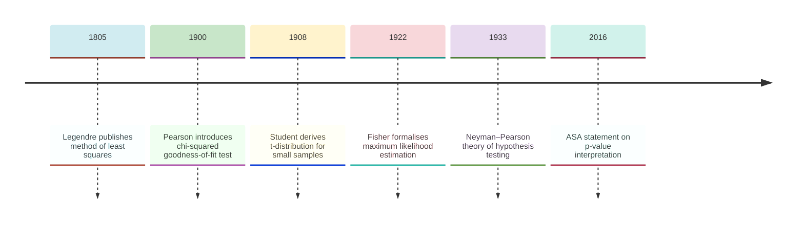
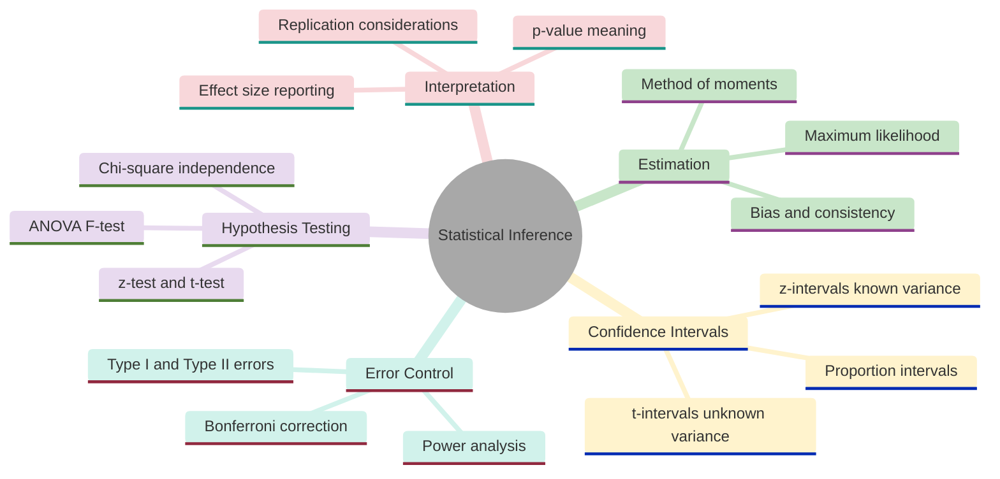
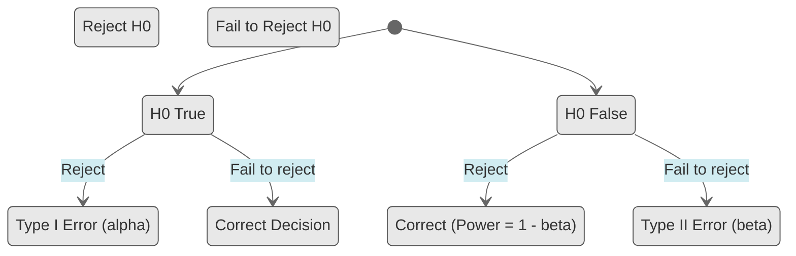
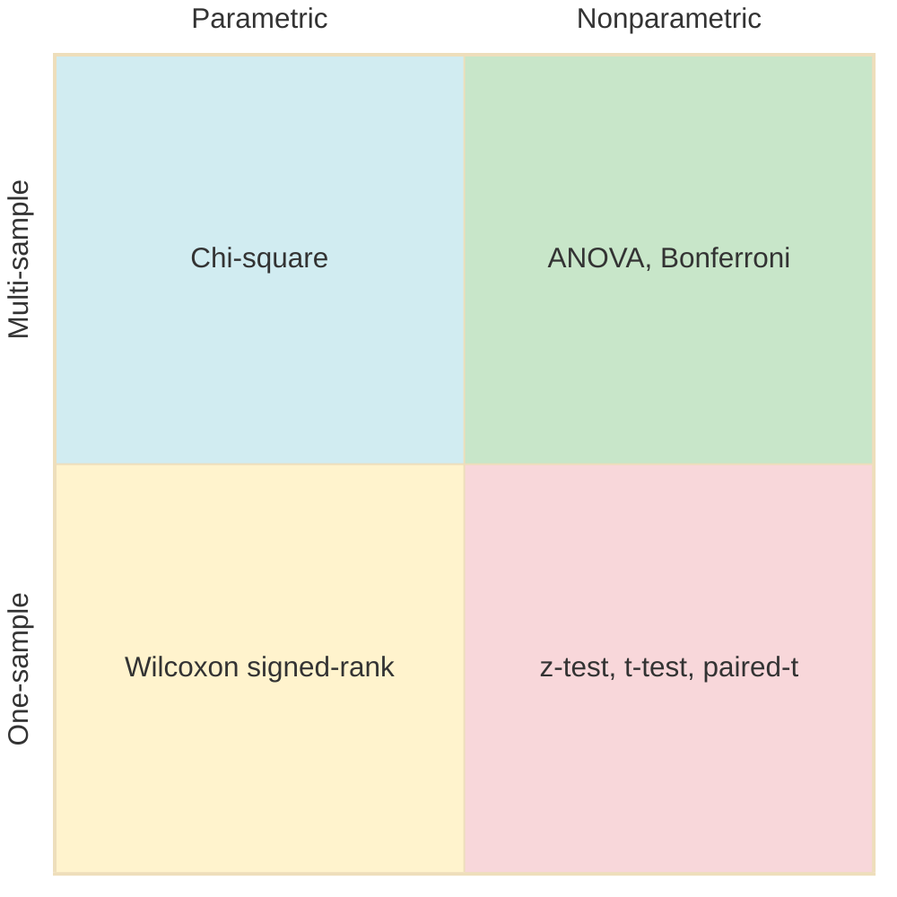
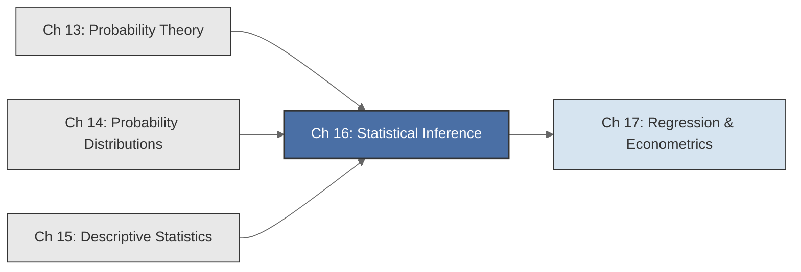

<!-- Copyright (c) 2025-2026 Bob Jansen <bobjansen@pm.me> -->
<!-- SPDX-License-Identifier: CC-BY-NC-4.0 -->
<!-- See LICENSE for full terms. Commercial licensing available. -->
# Chapter 16: Statistical Inference


**Part V**: Probability & Statistics

> Statistical inference draws conclusions about populations from samples, converting observed numbers into statements with quantified uncertainty. It transforms descriptive statistics into scientific knowledge.

**Prerequisites**: [Chapter 13](13-probability-theory.md) (Probability), covering probability axioms, conditional probability, Bayes' theorem and the law of large numbers. [Chapter 14](14-distributions.md) (Distributions), covering the Normal, $t$, $\chi^2$ and $F$ distributions, their probability density functions (PDFs), CDFs and quantile functions. [Chapter 15](15-descriptive-statistics.md) (Descriptive Statistics), covering sample mean, sample variance, order statistics and the empirical distribution function.

**Learning Objectives**: After this chapter, the reader will be able to:

1. Construct point estimators and evaluate their bias, consistency and efficiency.
2. Derive maximum likelihood estimators for parametric families and apply the method of moments.
3. Build confidence intervals for means, differences of means and proportions and interpret them correctly.
4. Formulate null and alternative hypotheses and compute test statistics and p-values for z-tests, t-tests, F-tests, chi-square tests and analysis of variance (ANOVA).
5. Classify errors as Type I or Type II, compute power and understand the trade-offs in test design.
6. Apply the Bonferroni correction for multiple testing and articulate the limitations of p-value-based inference.

**Connections**: This chapter is used by [Chapter 17](17-regression.md) (Regression), which employs t-tests for individual coefficients, F-tests for overall model significance and confidence intervals for predictions. The distributions introduced in [Chapter 14](14-distributions.md) serve as the reference distributions for all tests in this chapter. The descriptive statistics of [Chapter 15](15-descriptive-statistics.md) supply the summary quantities (sample means, variances, counts) that form the inputs to every inferential procedure.

---

## Historical Context

**Key Milestones in Statistical Inference**



*Figure 16.1: Timeline of key milestones in the development of statistical inference.*

**Legendre, Gauss and least squares (1805–1809).** Adrien-Marie Legendre published the method of least squares in 1805, proposing that the best-fitting curve minimises the sum of squared residuals. Carl Friedrich Gauss, in his 1809 *Theoria Motus Corporum Coelestium*, proved that if observational errors follow a Normal distribution then the least-squares estimate coincides with the most probable value of the unknown parameter. Gauss also derived the Normal distribution as the error law that makes the arithmetic mean the maximum likelihood estimator, though the concept of maximum likelihood was not formalised until much later. This connection between a distributional assumption and an optimal estimation procedure was the seed of modern parametric inference.

**Pearson and the chi-squared test (1900).** Karl Pearson introduced the chi-squared goodness-of-fit test in his 1900 paper. His test statistic, $\sum (O_i - E_i)^2/E_i$, has an approximate $\chi^2$ distribution under the null hypothesis, providing the first general-purpose test for whether observed data fit a hypothesised model. The test and its variants (independence, homogeneity) remain among the most widely used procedures in applied statistics.

**Student and small-sample inference (1908).** William Sealy Gosset, publishing under the pseudonym "Student" in 1908, derived the distribution of $(X - \mu)/(s/\sqrt{n})$ when sampling from a Normal population with unknown variance. The *t-distribution* has heavier tails than the Normal and enabled valid inference from small samples. Gosset faced precisely this situation in quality-control work at the Guinness Brewery in Dublin. Fisher later provided the exact distribution theory for many small-sample procedures.

**Fisher and maximum likelihood estimation (1922).** Ronald Aylmer Fisher formalised estimation theory between 1920 and 1935, introducing sufficiency, consistency, efficiency and maximum likelihood estimation. His 1922 paper "On the Mathematical Foundations of Theoretical Statistics" set the programme: given a parametric model $f(x|\theta)$, find the estimator $\hat{\theta}$ that extracts the most information from the data. The maximum likelihood principle (choose the parameter value that makes the observed data most probable) provided a universal recipe for estimators with desirable large-sample properties. Fisher also defined a *sufficient statistic*: a function of the data containing all information about $\theta$.

**Fisher's *Statistical Methods for Research Workers* (1925).** This textbook brought statistical methods to working scientists. It introduced the *significance test* and ANOVA, a method for decomposing total variability into components attributable to different sources. ANOVA generalised the two-sample t-test to any number of groups. The underlying F-distribution, named by George Snedecor, arises as the ratio of two independent chi-squared variables divided by their degrees of freedom.

**Neyman–Pearson theory of hypothesis testing (1933).** Jerzy Neyman and Egon Pearson, in papers published between 1928 and 1933, proposed a different framework from Fisher's significance tests. They treated hypothesis testing as a *decision procedure*: one pre-specifies a significance level $\alpha$, constructs a rejection region and either rejects or fails to reject the null hypothesis. A *Type I error* (rejecting a true null) occurs with probability $\alpha$; a *Type II error* (failing to reject a false null) occurs with probability $\beta$. The *power* $1 - \beta$ measures the test's ability to detect departures from the null.

**The Neyman–Pearson lemma (1933).** The lemma identified the most powerful test for simple hypotheses; the likelihood ratio test is optimal. The Fisher and Neyman–Pearson frameworks are distinct: one measures evidence, the other makes decisions. Textbooks conflated them during the mid-twentieth century. The resulting confusion persists at the heart of the replication crisis in the social and biomedical sciences.

**The ASA statement and the replication crisis (2016).** The American Statistical Association's 2016 statement on $p$-values warned against common misinterpretations: a $p$-value is not the probability that the null hypothesis is true; it does not measure effect size; statistical significance does not imply practical importance. The replication crisis, in which many published findings in psychology, medicine and other fields failed to replicate, has been attributed partly to mechanical application of $\alpha = 0.05$ without attention to effect sizes, power and the multiplicity of tests. These debates have reinvigorated interest in Bayesian methods, pre-registration and meta-analysis, but the classical frequentist procedures of this chapter remain the standard language of empirical research.

---

## Why This Chapter Matters

**Statistical Inference**



*Figure 16.2: Core topics and subtopics of statistical inference.*

The confidence interval (Definition 16.9) and the hypothesis test (Definitions 16.14–16.17) convert descriptive summaries into scientific claims with quantified uncertainty. Without them, a sample mean cannot be compared to a hypothesised value, a portfolio return estimate carries no error bound and an observed change in a system metric cannot be distinguished from noise.

Maximum likelihood estimation (Definition 16.5 and Theorem 16.7) is the theoretical foundation of logistic regression, neural network training (cross-entropy loss is negative log-likelihood) and generative model fitting. The asymptotic normality of the MLE (Theorem 16.7, property 2) justifies the standard errors reported by statistical software and the Wald confidence intervals used to assess coefficient significance. The Fisher information and Cramér–Rao bound (Definition 16.4) explain why some parameters are inherently harder to estimate than others and why more data helps. This connects directly to sample complexity in learning theory. The Bonferroni correction (Remark 16.27) is necessary in hyperparameter search, feature selection and genomics, where testing thousands of hypotheses inflates false discovery rates unless explicitly controlled.

The two-sample t-test (Definition 16.23), pooled or Welch, compares treatment and control in A/B tests. The ANOVA F-test (Definition 16.25) extends this to multi-arm experiments. The chi-square test of independence (Definition 16.26) detects associations in contingency tables arising whenever a categorical feature (user segment, device type, geographic region) is cross-tabulated against a binary outcome (conversion, churn). Power (Definition 16.18) and the trade-off between Type I and Type II errors govern experiment design. An underpowered test wastes engineering effort by failing to detect real effects. Relying on $p < 0.05$ without regard to effect size leads to the replication failures documented in the Historical Context.

The t-test on regression coefficients (operationalised in [Chapter 17](17-regression.md) via Theorem 16.11) determines whether a factor has statistically significant predictive power for asset returns. The F-test (Definition 16.25) determines whether a pricing model explains more variance than chance. In crypto markets, where data is noisy and sample sizes for novel tokens are small, the distinction between the t-distribution and the normal distribution (Theorem 14.16 in [Chapter 14](14-distributions.md)) separates valid from invalid inference. The heavier tails of the t capture the extra uncertainty from estimating volatility with limited history.

---

## Notation & Conventions

| Symbol | Meaning |
|--------|---------|
| $\theta$ | A population parameter (scalar or vector) |
| $\hat{\theta}$, $\hat{\theta}_n$ | An estimator of $\theta$ based on $n$ observations |
| $X_1, \ldots, X_n$ | A random sample (i.i.d. random variables) |
| $x_1, \ldots, x_n$ | Observed values (realisations of the random sample) |
| $\bar{X}$, $\bar{x}$ | Sample mean (random variable and observed value) |
| $S^2$, $s^2$ | Sample variance (random variable and observed value), using $n-1$ denominator |
| $H_0$ | Null hypothesis |
| $H_1$ (or $H_a$) | Alternative hypothesis |
| $\alpha$ | Significance level (probability of Type I error) |
| $\beta$ | Probability of Type II error |
| $1 - \beta$ | Power of a test |
| $p$ | p-value |
| $T$ | Test statistic (generic) |
| $\text{df}$ | Degrees of freedom |
| $z_{\alpha/2}$ | Upper $\alpha/2$ quantile of the standard Normal distribution |
| $t_{\alpha/2, \nu}$ | Upper $\alpha/2$ quantile of the $t$-distribution with $\nu$ degrees of freedom |
| $F_{\alpha, \nu_1, \nu_2}$ | Upper $\alpha$ quantile of the $F$-distribution with $(\nu_1, \nu_2)$ df |
| $\chi^2_{\alpha, \nu}$ | Upper $\alpha$ quantile of the chi-squared distribution with $\nu$ df |
| $L(\theta \mid x)$ | Likelihood function: $L(\theta \mid x) = f(x \mid \theta)$ viewed as a function of $\theta$ |
| $\ell(\theta)$ | Log-likelihood: $\ell(\theta) = \log L(\theta \mid x)$ |
| CI | Confidence interval |
| $I(\theta)$ | Fisher information for a single observation: $\mathbb{E}\!\left[-\frac{\partial^2}{\partial\theta^2}\log f(X\mid\theta)\right]$ |
| $\operatorname{SE}$ | Standard error of an estimator |
| $\Phi(z)$ | CDF of the standard Normal distribution |
| $\stackrel{P}{\to}$ | Convergence in probability |
| $\stackrel{d}{\to}$ | Convergence in distribution |

All tests in this chapter are two-sided unless stated otherwise. Significance level $\alpha$ and confidence level $1 - \alpha$ are complementary: a $(1 - \alpha)$ confidence interval inverts a test at level $\alpha$. The term "degrees of freedom" is abbreviated df throughout.

### Inference Workflow

```mermaid
%%{init: {"theme": "base", "themeVariables": {"primaryColor": "#e8e8e8", "primaryTextColor": "#333333", "primaryBorderColor": "#555555", "lineColor": "#666666", "secondaryColor": "#d1ecf1", "tertiaryColor": "#c8e6c9"}}}%%
flowchart LR
    A["Observed Data<br/>x&#8321;, ..., x&#8345;"] --> B["Compute Point Estimate<br/>(MLE or Method of Moments)"]
    B --> C{"Hypothesis Test<br/>or CI?"}
    C -->|CI| D["Choose Pivot<br/>(z or t)"]
    D --> E["Construct Confidence Interval<br/>&theta;&#770; &plusmn; q &sdot; SE"]
    C -->|Test| F["State H&#8320; and H&#8321;"]
    F --> G["Compute Test Statistic<br/>(z, t, F, &chi;&sup2;)"]
    G --> H["Compute p-value from<br/>Reference Distribution"]
    H --> I{"p &lt; &alpha;?"}
    I -->|Yes| J["Reject H&#8320;"]
    I -->|No| K["Fail to Reject H&#8320;"]
    J --> L["Report Effect Size<br/>and Confidence Interval"]
    K --> L
    E --> L
    style A fill:#e8e8e8,stroke:#333333
    style B fill:#e8e8e8,stroke:#333333
    style C fill:#fff3cd,stroke:#333333
    style D fill:#e8e8e8,stroke:#333333
    style E fill:#e8e8e8,stroke:#333333
    style F fill:#e8e8e8,stroke:#333333
    style G fill:#e8e8e8,stroke:#333333
    style H fill:#e8e8e8,stroke:#333333
    style I fill:#fff3cd,stroke:#333333
    style J fill:#e8e8e8,stroke:#333333
    style K fill:#e8e8e8,stroke:#333333
    style L fill:#e8e8e8,stroke:#333333
```



*Figure 16.3: Workflow for statistical inference from data through estimation to reporting.*

---

## Core Theory

### Estimation

**Definition 16.1** (Estimator). Let $X_1, \ldots, X_n$ be a random sample ([Chapter 13](13-probability-theory.md)) from a distribution with unknown parameter $\theta$. An *estimator* of $\theta$ is a function of the sample data:

$$\hat{\theta} = g(X_1, X_2, \ldots, X_n).$$

An estimator is a random variable (since it depends on the random sample). Its realised value $g(x_1, \ldots, x_n)$ for observed data is called an *estimate*.

**Definition 16.2** (Bias). The *bias* of an estimator $\hat{\theta}$ is

$$\operatorname{Bias}(\hat{\theta}) = \mathbb{E}[\hat{\theta}] - \theta.$$

An estimator is *unbiased* if $\operatorname{Bias}(\hat{\theta}) = 0$ for all $\theta$, i.e., $\mathbb{E}[\hat{\theta}] = \theta$. The sample mean $\bar{X}$ is unbiased for $\mu$; the sample variance $S^2 = \frac{1}{n-1}\sum_{i=1}^n (X_i - \bar{X})^2$ ([Chapter 15](15-descriptive-statistics.md)) is unbiased for $\sigma^2$.

**Definition 16.3** (Consistency). An estimator $\hat{\theta}_n$ is *consistent* for $\theta$ if $\hat{\theta}_n \stackrel{P}{\to} \theta$ as $n \to \infty$. That is, for every $\varepsilon > 0$,

$$\lim_{n \to \infty} P(\lvert \hat{\theta}_n - \theta \rvert > \varepsilon) = 0.$$

A sufficient condition for consistency is that $\operatorname{Bias}(\hat{\theta}_n) \to 0$ and $\operatorname{Var}(\hat{\theta}_n) \to 0$ as $n \to \infty$.

**Definition 16.4** (Efficiency). Among all unbiased estimators of $\theta$, the *most efficient* estimator has the smallest variance. The Cramér–Rao lower bound states that for any unbiased estimator $\hat{\theta}$,

$$\operatorname{Var}(\hat{\theta}) \geq \frac{1}{n \, I(\theta)},$$

where $I(\theta) = \mathbb{E}\left[-\frac{\partial^2}{\partial \theta^2} \log f(X \mid \theta)\right]$ is the Fisher information for a single observation. An unbiased estimator that achieves this bound is called *efficient* or a *minimum-variance unbiased estimator* (MVUE).

**Definition 16.5** (Maximum Likelihood Estimation). Given observed data $x_1, \ldots, x_n$ from a parametric family $f(x \mid \theta)$, the *likelihood function* is

$$L(\theta \mid x_1, \ldots, x_n) = \prod_{i=1}^n f(x_i \mid \theta),$$

and the *log-likelihood* is

$$\ell(\theta) = \sum_{i=1}^n \log f(x_i \mid \theta).$$

The *maximum likelihood estimator* (MLE) is

$$\hat{\theta}_{\text{MLE}} = \arg\max_\theta \, L(\theta \mid x) = \arg\max_\theta \, \ell(\theta).$$

The MLE is found by solving the *score equation* $\frac{\partial \ell}{\partial \theta} = 0$ (and verifying that the solution is a maximum).

**Example 16.6** (MLE for the Normal distribution). Let $X_1, \ldots, X_n \sim N(\mu, \sigma^2)$. The log-likelihood is

$$\ell(\mu, \sigma^2) = -\frac{n}{2}\log(2\pi) - \frac{n}{2}\log(\sigma^2) - \frac{1}{2\sigma^2}\sum_{i=1}^n (x_i - \mu)^2.$$

Setting $\frac{\partial \ell}{\partial \mu} = 0$ yields $\hat{\mu}_{\text{MLE}} = \bar{x}$. Setting $\frac{\partial \ell}{\partial \sigma^2} = 0$ yields

$$\hat{\sigma}^2_{\text{MLE}} = \frac{1}{n}\sum_{i=1}^n (x_i - \bar{x})^2.$$

Note that the MLE for the variance uses divisor $n$ rather than $n-1$, so it is biased: $\mathbb{E}[\hat{\sigma}^2_{\text{MLE}}] = \frac{n-1}{n}\sigma^2$. The bias vanishes as $n \to \infty$, so the MLE is consistent.

**Theorem 16.7** (Properties of MLE). Under regularity conditions (the parameter space is open, the support of $f$ does not depend on $\theta$, the likelihood is sufficiently smooth), the maximum likelihood estimator satisfies:

1. *Consistency*: $\hat{\theta}_{\text{MLE}} \stackrel{P}{\to} \theta_0$ (the true parameter value).
2. *Asymptotic normality*: $\sqrt{n}(\hat{\theta}_{\text{MLE}} - \theta_0) \stackrel{d}{\to} N\!\left(0,\, [I(\theta_0)]^{-1}\right)$.
3. *Asymptotic efficiency*: Among all consistent and asymptotically normal estimators, the MLE achieves the smallest asymptotic variance (the Cramér–Rao bound).
4. *Invariance*: If $\hat{\theta}$ is the MLE of $\theta$, then $g(\hat{\theta})$ is the MLE of $g(\theta)$ for any function $g$.

For a vector parameter $\theta \in \mathbb{R}^p$, the Fisher information is a $p \times p$ matrix and the asymptotic covariance is $[I(\theta_0)]^{-1}$.

!!! abstract "Key Result"

    **Theorem 16.7** (Properties of MLE). The maximum likelihood estimator is consistent, asymptotically normal and asymptotically efficient, achieving the Cramer--Rao lower bound. It is the default estimation method in applied statistics because no other estimator can do better in large samples.

These properties are stated without proof. The proofs rely on Taylor expansion of the log-likelihood around the true parameter value and the law of large numbers applied to the score function.

**Definition 16.8** (Method of Moments). The *method of moments* estimates parameters by equating population moments with sample moments. Define the $k$-th population moment $\mu_k' = \mathbb{E}[X^k]$ and the $k$-th sample moment $m_k' = \frac{1}{n}\sum_{i=1}^n x_i^k$. If the distribution has $p$ parameters $\theta_1, \ldots, \theta_p$, solve the system

$$\mu_k'(\theta_1, \ldots, \theta_p) = m_k', \quad k = 1, \ldots, p.$$

For a $N(\mu, \sigma^2)$ population: $\mu_1' = \mu$ and $\mu_2' - (\mu_1')^2 = \sigma^2$, giving method-of-moments estimators $\hat{\mu} = \bar{x}$ and $\hat{\sigma}^2 = m_2' - \bar{x}^2 = \frac{1}{n}\sum (x_i - \bar{x})^2$. The method of moments is simpler than MLE but generally less efficient.

### Confidence Intervals

**Definition 16.9** (Confidence Interval). A *confidence interval* at level $1 - \alpha$ for a parameter $\theta$ is a random interval $[L(X), U(X)]$, constructed from the sample, such that

$$P(L(X) \leq \theta \leq U(X)) = 1 - \alpha.$$

The probability is taken over the distribution of the sample $X_1, \ldots, X_n$, with $\theta$ treated as a fixed unknown constant. The probability statement is about the *endpoints* $L$ and $U$ (which are functions of the random sample), not about $\theta$.

**Theorem 16.10** (CI for the Mean, Known Variance). Let $X_1, \ldots, X_n \sim N(\mu, \sigma^2)$ with $\sigma^2$ known. The standardised sample mean

$$Z = \frac{\bar{X} - \mu}{\sigma / \sqrt{n}} \sim N(0, 1).$$

A $100(1-\alpha)\%$ confidence interval for $\mu$ is

$$\bar{x} \pm z_{\alpha/2} \cdot \frac{\sigma}{\sqrt{n}},$$

where $z_{\alpha/2}$ is the upper $\alpha/2$ quantile of the standard Normal (e.g., $z_{0.025} = 1.96$).

??? note "Proof"

    *Proof sketch.* The event $-z_{\alpha/2} \leq Z \leq z_{\alpha/2}$ has probability $1 - \alpha$ by definition of the quantile. Substituting $Z = (\bar{X} - \mu)/(\sigma/\sqrt{n})$:

    $$-z_{\alpha/2} \leq \frac{\bar{X} - \mu}{\sigma/\sqrt{n}} \leq z_{\alpha/2}.$$

    Multiplying through by $\sigma/\sqrt{n}$ and rearranging gives:

    $$\bar{X} - z_{\alpha/2}\frac{\sigma}{\sqrt{n}} \leq \mu \leq \bar{X} + z_{\alpha/2}\frac{\sigma}{\sqrt{n}}.$$

    The event on the right occurs with probability $1 - \alpha$, completing the construction.

    $\square$

**Theorem 16.11** (CI for the Mean, Unknown Variance). Let $X_1, \ldots, X_n \sim N(\mu, \sigma^2)$ with $\sigma^2$ unknown. The statistic

$$T = \frac{\bar{X} - \mu}{S / \sqrt{n}} \sim t(n-1),$$

where $S = \sqrt{\frac{1}{n-1}\sum_{i=1}^n (X_i - \bar{X})^2}$. A $100(1-\alpha)\%$ confidence interval for $\mu$ is

$$\bar{x} \pm t_{\alpha/2, n-1} \cdot \frac{s}{\sqrt{n}}.$$

The $t$-distribution has heavier tails than the Normal, so the interval is wider, reflecting the additional uncertainty from estimating $\sigma$.

??? note "Proof"

    *Proof sketch.* The derivation mirrors Theorem 16.10: one shows that

    $$(n-1)S^2/\sigma^2 \sim \chi^2(n-1),$$

    that $\bar{X}$ and $S^2$ are independent (a property specific to Normal samples; this follows from Cochran's theorem; see Casella and Berger [1], Theorem 5.3.1) and that the ratio of a standard Normal to the square root of an independent $\chi^2$ divided by its degrees of freedom follows a $t$-distribution.

    The algebra of rearranging the pivotal quantity $T$ into a bound on $\mu$ is identical to the z-case.

    $\square$

**Remark 16.12** (Correct Interpretation of Confidence Intervals). The statement "a 95% confidence interval for $\mu$ is $[2.1, 3.7]$" means: the procedure that generated this interval will produce intervals containing the true $\mu$ in 95% of repetitions. It does *not* mean "there is a 95% probability that $\mu$ lies between 2.1 and 3.7." The parameter $\mu$ is a fixed (though unknown) number; it is either in the interval or it is not. The randomness is in the interval endpoints, not in $\mu$. This is the frequentist interpretation. The Bayesian analogue, a credible interval, does assign a probability to $\mu$ being in the interval, but requires a prior distribution on $\mu$.

**Definition 16.13** (CI for a Proportion). Let $X_1, \ldots, X_n \sim \mathrm{Bernoulli}(p)$, so $\hat{p} = \bar{X}$ is the sample proportion. For large $n$, by the central limit theorem, $\hat{p} \approx N(p, p(1-p)/n)$. The *Wald interval* for $p$ is

$$\hat{p} \pm z_{\alpha/2}\sqrt{\frac{\hat{p}(1-\hat{p})}{n}}.$$

This interval has well-known deficiencies for small $n$ or extreme $p$ (coverage can be far below $1-\alpha$). The Agresti–Coull interval, which adds two successes and two failures before computing the interval, provides better coverage.

!!! warning "Wald interval coverage failure"
    The Wald interval for a proportion can have actual coverage well below the nominal $1 - \alpha$ when $n$ is small or $p$ is near 0 or 1. For $n < 40$ or $\hat{p} < 0.1$, use the Agresti–Coull interval or the Wilson score interval instead.

### Hypothesis Testing

**Hypothesis Testing Procedure**

```mermaid
%%{init: {"theme": "base", "themeVariables": {"primaryColor": "#e8e8e8", "primaryTextColor": "#333333", "primaryBorderColor": "#555555", "lineColor": "#666666", "secondaryColor": "#d1ecf1", "tertiaryColor": "#c8e6c9"}}}%%
flowchart LR
    A["State hypotheses:<br/>H_0 (null) and H_1 (alternative)"] --> B["Choose significance<br/>level alpha<br/>(e.g., 0.05)"]
    B --> C["Select appropriate test<br/>(z, t, F, chi-squared)<br/>based on data and assumptions"]
    C --> D["Compute test statistic<br/>from sample data"]
    D --> E["Find p-value from<br/>reference distribution<br/>under H_0"]
    E --> F{"p-value < alpha?"}
    F -- Yes --> G["Reject H_0:<br/>evidence supports H_1"]
    F -- No --> H["Fail to reject H_0:<br/>insufficient evidence<br/>against H_0"]
    G --> I["Report: effect size,<br/>confidence interval<br/>and practical significance"]
    H --> I
    style A fill:#e8e8e8,stroke:#333333
    style B fill:#e8e8e8,stroke:#333333
    style C fill:#e8e8e8,stroke:#333333
    style D fill:#e8e8e8,stroke:#333333
    style E fill:#e8e8e8,stroke:#333333
    style F fill:#fff3cd,stroke:#333333
    style G fill:#e8e8e8,stroke:#333333
    style H fill:#e8e8e8,stroke:#333333
    style I fill:#e8e8e8,stroke:#333333
```



*Figure 16.4: Step-by-step procedure for conducting a hypothesis test.*

**Definition 16.14** (Null and Alternative Hypotheses). A *hypothesis* is a statement about a population parameter. The *null hypothesis* $H_0$ specifies a default or baseline value:

- Two-sided: $H_0: \theta = \theta_0$ versus $H_1: \theta \neq \theta_0$.
- One-sided (right): $H_0: \theta \leq \theta_0$ versus $H_1: \theta > \theta_0$.
- One-sided (left): $H_0: \theta \geq \theta_0$ versus $H_1: \theta < \theta_0$.

The null hypothesis is assumed true unless the data provide sufficient evidence to reject it. The burden of proof lies on the alternative.

**Definition 16.15** (Test Statistic). A *test statistic* is a function $T = T(X_1, \ldots, X_n)$ that measures the discrepancy between the data and what the null hypothesis predicts. The distribution of $T$ under $H_0$ is known (at least approximately), enabling computation of p-values and critical values.

**Definition 16.16** (p-value). The *p-value* is the probability, computed under $H_0$, of observing a test statistic as extreme as or more extreme than the value actually observed:

$$\begin{aligned}
p &= P_{H_0}(T \geq t_{\text{obs}}) \quad \text{(one-sided, right-tail)}, \\
p &= 2 \cdot P_{H_0}(T \geq |t_{\text{obs}}|) \quad \text{(two-sided, symmetric distribution)}.
\end{aligned}$$

A small p-value indicates that the observed data are unlikely under $H_0$ and thus constitute evidence against $H_0$. The p-value is *not* the probability that $H_0$ is true.

**Definition 16.17** (Significance Level). The *significance level* $\alpha$ is a pre-specified threshold. The decision rule is:

- Reject $H_0$ if $p < \alpha$.
- Fail to reject $H_0$ if $p \geq \alpha$.

Common choices: $\alpha = 0.05$ (95% confidence), $\alpha = 0.01$ (99%), $\alpha = 0.10$ (90%).

**Definition 16.18** (Type I and Type II Errors).

| | $H_0$ true | $H_0$ false |
|---|---|---|
| Reject $H_0$ | Type I error (prob $\alpha$) | Correct decision (power $= 1-\beta$) |
| Fail to reject $H_0$ | Correct decision | Type II error (prob $\beta$) |

- *Type I error*: Rejecting $H_0$ when it is true. The probability of a Type I error is $\alpha$, the significance level.
- *Type II error*: Failing to reject $H_0$ when it is false. The probability is $\beta$, which depends on the true value of $\theta$, the sample size $n$ and the significance level $\alpha$.
- *Power*: $1 - \beta$, the probability of correctly rejecting a false $H_0$. Power increases with sample size, effect size and significance level.

There is a fundamental trade-off: decreasing $\alpha$ (requiring stronger evidence to reject) increases $\beta$ (making it harder to detect a true effect) and vice versa. The only way to simultaneously reduce both $\alpha$ and $\beta$ is to increase the sample size.

**Power Curve: Power vs True Effect Size**

```mermaid
---
config:
  theme: base
  themeVariables:
    xyChart:
      plotColorPalette: "#2563eb, #555555, #888888"
      backgroundColor: "#ffffff"
      titleColor: "#333333"
      xAxisLabelColor: "#333333"
      yAxisLabelColor: "#333333"
      xAxisTitleColor: "#333333"
      yAxisTitleColor: "#333333"
      xAxisLineColor: "#333333"
      yAxisLineColor: "#333333"
---
xychart-beta
    x-axis "True effect size" [0, 0.5, 1, 1.5, 2, 2.5, 3]
    y-axis "Power (1 − β)" 0 --> 1.0
    line [0.05, 0.17, 0.52, 0.80, 0.94, 0.99, 1.0]
```

*Figure 16.5: Power increases from alpha toward one as the true effect size grows.*

**Hypothesis Testing Decision Outcomes**



*Figure 16.6: Four possible outcomes of a hypothesis test mapped from truth to decision.*

The state diagram above traces the four possible outcomes of a hypothesis test. Starting from the true state of nature (H0 True or H0 False), each path leads to a decision (Reject or Fail to Reject) and a corresponding outcome. Two paths are errors: rejecting a true null (Type I, controlled at rate alpha) and failing to reject a false null (Type II, occurring at rate beta). The remaining two paths are correct decisions, with the probability of correctly rejecting a false null called the power of the test.

**Classification of Statistical Tests**



*Figure 16.7: Statistical tests classified by parametric assumptions and number of samples.*

The quadrant chart above classifies common statistical tests along two dimensions: whether the test assumes a parametric distribution (left) versus a nonparametric approach (right) and whether the test involves one sample (bottom) versus multiple samples (top). Parametric one-sample tests include the z-test, t-test and paired-t test. Parametric multi-sample tests include ANOVA and the Bonferroni-adjusted comparisons. Nonparametric multi-sample tests include the chi-square test of independence.

**Remark 16.19** (The Logic of Hypothesis Testing). A hypothesis test does *not* prove $H_0$. It either rejects $H_0$ (concluding the data are inconsistent with it) or fails to reject it (concluding the data do not provide sufficient evidence against it). "Absence of evidence is not evidence of absence": a failure to reject $H_0$ may indicate that $H_0$ is true, or that the sample size was too small to detect a real effect (low power). Reporting confidence intervals alongside p-values is strongly recommended, as intervals convey both the direction and magnitude of the effect.

**Remark 16.20** (Practical significance vs statistical significance). A statistically significant result (small $p$-value) is not necessarily a practically significant result. With a large enough sample, even a trivially small effect can produce a significant $p$-value. A practically important effect, by contrast, may fail to reach significance if the sample is too small. Always report effect sizes (mean differences, confidence interval widths, $R^2$ values) alongside $p$-values. A study reporting "$p = 0.03$" without stating the magnitude of the observed effect conveys almost no useful information.

!!! info "Reporting checklist for hypothesis tests"
    Every test result should include: (1) the test statistic and its degrees of freedom; (2) the p-value; (3) a point estimate and confidence interval for the parameter of interest; (4) an effect-size measure (Cohen's $d$, $\eta^2$, odds ratio or similar). Omitting any of these reduces the interpretability of the finding.

### Specific Tests

**Definition 16.21** (z-test for a Population Mean). When the population variance $\sigma^2$ is known and the sample comes from a Normal distribution (or $n$ is large enough for the central limit theorem), the test statistic for $H_0: \mu = \mu_0$ is

$$Z = \frac{\bar{X} - \mu_0}{\sigma / \sqrt{n}}.$$

Under $H_0$, $Z \sim N(0, 1)$. For a two-sided alternative $H_1: \mu \neq \mu_0$, reject at level $\alpha$ if $|Z| > z_{\alpha/2}$.

**Definition 16.22** (One-Sample t-test). When $\sigma^2$ is unknown, the test statistic for $H_0: \mu = \mu_0$ is

$$T = \frac{\bar{X} - \mu_0}{S / \sqrt{n}},$$

where $S$ is the sample standard deviation. Under $H_0$ and the assumption of Normal data, $T \sim t(n-1)$. For a two-sided alternative, reject at level $\alpha$ if $|T| > t_{\alpha/2, n-1}$.

**Definition 16.23** (Two-Sample t-test; Independent Samples). Let $X_1, \ldots, X_{n_1} \sim N(\mu_1, \sigma_1^2)$ and $Y_1, \ldots, Y_{n_2} \sim N(\mu_2, \sigma_2^2)$ be independent samples. To test $H_0: \mu_1 = \mu_2$:

*Case 1: Equal variances (pooled t-test).* Assume $\sigma_1^2 = \sigma_2^2 = \sigma^2$. The pooled variance estimate is

$$S_p^2 = \frac{(n_1 - 1)S_1^2 + (n_2 - 1)S_2^2}{n_1 + n_2 - 2}.$$

The test statistic is

$$T = \frac{\bar{X}_1 - \bar{X}_2}{S_p \sqrt{\frac{1}{n_1} + \frac{1}{n_2}}} \sim t(n_1 + n_2 - 2) \quad \text{under } H_0.$$

*Case 2: Unequal variances (Welch's t-test).* Do not assume equal variances. The test statistic is

$$T = \frac{\bar{X}_1 - \bar{X}_2}{\sqrt{\frac{S_1^2}{n_1} + \frac{S_2^2}{n_2}}}.$$

Under $H_0$, $T$ is approximately $t(\nu)$ where the Welch–Satterthwaite degrees of freedom are

$$\nu = \frac{\left(\frac{S_1^2}{n_1} + \frac{S_2^2}{n_2}\right)^2}{\frac{(S_1^2/n_1)^2}{n_1 - 1} + \frac{(S_2^2/n_2)^2}{n_2 - 1}}.$$

Welch's test is generally preferred in practice because the equal-variance assumption is rarely verifiable and the Welch test is reliable under its violation.

**Definition 16.24** (Paired t-test). When data come in natural pairs $(X_i, Y_i)$, the same subject measured under two conditions, define the differences $D_i = X_i - Y_i$. The paired t-test is a one-sample t-test applied to the differences: $H_0: \mu_D = 0$, with test statistic

$$T = \frac{\bar{D}}{S_D / \sqrt{n}} \sim t(n-1) \quad \text{under } H_0,$$

where $\bar{D} = \frac{1}{n}\sum_{i=1}^n D_i$ and $S_D$ is the sample standard deviation of the differences.

**Definition 16.25** (One-Way Analysis of Variance). Let $k$ independent groups have sample sizes $n_1, \ldots, n_k$, with total sample size $n = n_1 + \cdots + n_k$. Let $X_{ij}$ denote the $j$-th observation in group $i$ and assume $X_{ij} \sim N(\mu_i, \sigma^2)$ (common variance). The hypothesis is $H_0: \mu_1 = \mu_2 = \cdots = \mu_k$ versus $H_1$: not all means are equal.

Define the *grand mean* $\bar{X}_{\cdot\cdot} = \frac{1}{n}\sum_{i=1}^k \sum_{j=1}^{n_i} X_{ij}$ and the *group means* $\bar{X}_{i\cdot} = \frac{1}{n_i}\sum_{j=1}^{n_i} X_{ij}$.

The *total sum of squares* decomposes as:

$$\operatorname{SST} = \operatorname{SSB} + \operatorname{SSW},$$

where

$$\operatorname{SST} = \sum_{i=1}^k \sum_{j=1}^{n_i} (X_{ij} - \bar{X}_{\cdot\cdot})^2, \quad \operatorname{SSB} = \sum_{i=1}^k n_i (\bar{X}_{i\cdot} - \bar{X}_{\cdot\cdot})^2, \quad \operatorname{SSW} = \sum_{i=1}^k \sum_{j=1}^{n_i} (X_{ij} - \bar{X}_{i\cdot})^2.$$

Here SSB (sum of squares *between* groups) measures variability due to differences among group means and SSW (sum of squares *within* groups) measures variability within each group.

??? note "Proof"

    *Proof of the decomposition.* Write $X_{ij} - \bar{X}_{\cdot\cdot} = (X_{ij} - \bar{X}_{i\cdot}) + (\bar{X}_{i\cdot} - \bar{X}_{\cdot\cdot})$. Squaring and summing:

    $$\sum_{i,j}(X_{ij} - \bar{X}_{\cdot\cdot})^2 = \sum_{i,j}(X_{ij} - \bar{X}_{i\cdot})^2 + \sum_{i,j}(\bar{X}_{i\cdot} - \bar{X}_{\cdot\cdot})^2 + 2\sum_{i,j}(X_{ij} - \bar{X}_{i\cdot})(\bar{X}_{i\cdot} - \bar{X}_{\cdot\cdot}).$$

    The cross-term vanishes because for each group $i$,

    $$\sum_{j=1}^{n_i}(X_{ij} - \bar{X}_{i\cdot}) = 0$$

    by definition of the group mean.

    In the second term, $(\bar{X}_{i\cdot} - \bar{X}_{\cdot\cdot})^2$ does not depend on $j$, so

    $$\sum_j (\bar{X}_{i\cdot} - \bar{X}_{\cdot\cdot})^2 = n_i(\bar{X}_{i\cdot} - \bar{X}_{\cdot\cdot})^2.$$

    The identity $\operatorname{SST} = \operatorname{SSW} + \operatorname{SSB}$ follows.

    $\square$

The *mean squares* are $\operatorname{MSB} = \operatorname{SSB}/(k-1)$ and $\operatorname{MSW} = \operatorname{SSW}/(n-k)$. The F-statistic is

$$F = \frac{\operatorname{MSB}}{\operatorname{MSW}} = \frac{\operatorname{SSB}/(k-1)}{\operatorname{SSW}/(n-k)}.$$

Under $H_0$ (all group means equal), $F \sim F(k-1, n-k)$. Reject $H_0$ at level $\alpha$ if $F > F_{\alpha, k-1, n-k}$. A significant F-test indicates that at least one pair of group means differs, but does not identify which pair. Post-hoc tests (Tukey HSD, Bonferroni-adjusted pairwise t-tests) are used to locate specific differences.

**Definition 16.26** (Chi-Square Test for Independence). Consider a two-way contingency table with $r$ rows and $c$ columns. Let $O_{ij}$ be the observed frequency in cell $(i, j)$, with row totals $R_i = \sum_j O_{ij}$, column totals $C_j = \sum_i O_{ij}$ and grand total $n = \sum_{i,j} O_{ij}$. The null hypothesis is that the row variable and column variable are independent.

Under independence, the expected frequency in cell $(i, j)$ is

$$E_{ij} = \frac{R_i \cdot C_j}{n}.$$

The test statistic is

$$\chi^2 = \sum_{i=1}^r \sum_{j=1}^c \frac{(O_{ij} - E_{ij})^2}{E_{ij}}.$$

Under $H_0$ and for sufficiently large expected frequencies (the standard guideline is $E_{ij} \geq 5$ for all cells; see Numerical Considerations), $\chi^2 \sim \chi^2((r-1)(c-1))$ approximately. Reject $H_0$ at level $\alpha$ if $\chi^2 > \chi^2_{\alpha, (r-1)(c-1)}$.

**Remark 16.27** (Bonferroni Correction for Multiple Testing). When performing $m$ simultaneous hypothesis tests, the probability of at least one Type I error (the *family-wise error rate*, FWER) can be much larger than $\alpha$. The Bonferroni correction controls FWER at level $\alpha$ by testing each individual hypothesis at level $\alpha/m$. That is, reject $H_{0,j}$ only if $p_j < \alpha/m$.

This follows from the union bound: $P(\text{at least one Type I error}) = P\left(\bigcup_{j=1}^m \{p_j < \alpha/m\}\right) \leq \sum_{j=1}^m P(p_j < \alpha/m) = m \cdot \frac{\alpha}{m} = \alpha$. The Bonferroni correction is conservative (the true FWER may be much less than $\alpha$), especially when the tests are positively correlated. Less conservative alternatives include the Holm–Bonferroni step-down procedure and the Benjamini–Hochberg procedure (which controls the false discovery rate rather than FWER).

---

## Formulas & Identities

### Confidence Interval Formulas

| Parameter | Conditions | $100(1-\alpha)\%$ CI |
|-----------|-----------|---------------------|
| Mean $\mu$ | $\sigma$ known | $\bar{x} \pm z_{\alpha/2} \cdot \sigma/\sqrt{n}$ |
| Mean $\mu$ | $\sigma$ unknown | $\bar{x} \pm t_{\alpha/2, n-1} \cdot s/\sqrt{n}$ |
| Difference $\mu_1 - \mu_2$ | $\sigma_1 = \sigma_2$ known | $(\bar{x}_1 - \bar{x}_2) \pm z_{\alpha/2} \cdot \sigma\sqrt{1/n_1 + 1/n_2}$ |
| Difference $\mu_1 - \mu_2$ | Equal unknown $\sigma$ | $(\bar{x}_1 - \bar{x}_2) \pm t_{\alpha/2, n_1+n_2-2} \cdot s_p\sqrt{1/n_1 + 1/n_2}$ |
| Proportion $p$ | Large $n$ | $\hat{p} \pm z_{\alpha/2}\sqrt{\hat{p}(1-\hat{p})/n}$ |

### Test Statistic Summary

| Test | Statistic | Null Distribution | Degrees of Freedom |
|------|-----------|-------------------|--------------------|
| z-test | $Z = (\bar{x} - \mu_0)/(\sigma/\sqrt{n})$ | $N(0,1)$ | n/a |
| One-sample t | $T = (\bar{x} - \mu_0)/(s/\sqrt{n})$ | $t(\nu)$ | $\nu = n - 1$ |
| Pooled two-sample t | $T = (\bar{x}_1 - \bar{x}_2)/(s_p\sqrt{1/n_1 + 1/n_2})$ | $t(\nu)$ | $\nu = n_1 + n_2 - 2$ |
| Welch t | $T = (\bar{x}_1 - \bar{x}_2)/\sqrt{s_1^2/n_1 + s_2^2/n_2}$ | $t(\nu)$ | Welch–Satterthwaite $\nu$ |
| Paired t | $T = \bar{d}/(s_d/\sqrt{n})$ | $t(\nu)$ | $\nu = n - 1$ |
| One-way ANOVA | $F = \operatorname{MSB}/\operatorname{MSW}$ | $F(\nu_1, \nu_2)$ | $\nu_1 = k-1$, $\nu_2 = n-k$ |
| Chi-square independence | $\chi^2 = \sum (O_{ij} - E_{ij})^2/E_{ij}$ | $\chi^2(\nu)$ | $\nu = (r-1)(c-1)$ |

**F16.1** (ANOVA decomposition).

$$\underbrace{\sum_{i=1}^k \sum_{j=1}^{n_i}(X_{ij} - \bar{X}_{\cdot\cdot})^2}_{\operatorname{SST}} = \underbrace{\sum_{i=1}^k n_i(\bar{X}_{i\cdot} - \bar{X}_{\cdot\cdot})^2}_{\operatorname{SSB}} + \underbrace{\sum_{i=1}^k \sum_{j=1}^{n_i}(X_{ij} - \bar{X}_{i\cdot})^2}_{\operatorname{SSW}}$$

**F16.2** (Expected frequencies, chi-square).

$$E_{ij} = \frac{(\text{row } i \text{ total}) \times (\text{column } j \text{ total})}{n}$$

**F16.3** (Welch–Satterthwaite degrees of freedom).

$$\nu = \frac{\left(\frac{s_1^2}{n_1} + \frac{s_2^2}{n_2}\right)^2}{\frac{(s_1^2/n_1)^2}{n_1 - 1} + \frac{(s_2^2/n_2)^2}{n_2 - 1}}$$

**F16.4** (Cramér–Rao lower bound).

$$\operatorname{Var}(\hat{\theta}) \geq \frac{1}{n \, I(\theta)}, \qquad I(\theta) = \mathbb{E}\left[-\frac{\partial^2 \log f(X \mid \theta)}{\partial \theta^2}\right]$$

---

## Algorithms

### Algorithm 16.28: z-test

**Input**: Sample data $x_1, \ldots, x_n$; hypothesised mean $\mu_0$; known population standard deviation $\sigma$; alternative type (two-sided, left, right); significance level $\alpha$.

**Output**: Test statistic $z$, p-value, decision, confidence interval.

```
function zTest(x, mu0, sigma, alternative, alpha):
    n ← length(x)
    xbar ← (1/n) * sum(x)
    z ← (xbar - mu0) / (sigma / sqrt(n))

    if alternative = "two-sided":
        p ← 2 * (1 - Phi(|z|))
    else if alternative = "greater":
        p ← 1 - Phi(z)
    else:  // "less"
        p ← Phi(z)

    margin ← quantile_z(1 - alpha/2) * sigma / sqrt(n)
    ci ← [xbar - margin, xbar + margin]
    reject ← (p < alpha)

    return { statistic: z, pValue: p, ci: ci, reject: reject }
```

**Complexity**: $O(n)$ time to compute the sample mean and the test statistic; $O(1)$ additional work for the p-value and confidence interval.

### Algorithm 16.29: One-Sample t-test

**Input**: Sample data $x_1, \ldots, x_n$; hypothesised mean $\mu_0$; alternative type; significance level $\alpha$.

**Output**: Test statistic $t$, degrees of freedom, p-value, confidence interval.

```
function tTestOneSample(x, mu0, alternative, alpha):
    n ← length(x)
    xbar ← (1/n) * sum(x)
    s ← sqrt((1/(n-1)) * sum((x_i - xbar)^2 for i = 1..n))
    df ← n - 1
    t ← (xbar - mu0) / (s / sqrt(n))

    if alternative = "two-sided":
        p ← 2 * (1 - CDF_t(|t|, df))
    else if alternative = "greater":
        p ← 1 - CDF_t(t, df)
    else:
        p ← CDF_t(t, df)

    margin ← quantile_t(1 - alpha/2, df) * s / sqrt(n)
    ci ← [xbar - margin, xbar + margin]
    reject ← (p < alpha)

    return { statistic: t, df: df, pValue: p, ci: ci, reject: reject }
```

**Complexity**: $O(n)$ time to compute the sample mean, sample variance and test statistic; $O(1)$ additional work for the p-value and confidence interval.

### Algorithm 16.30: Two-Sample t-test (Pooled and Welch)

**Input**: Samples $x_1, \ldots, x_{n_1}$ and $y_1, \ldots, y_{n_2}$; alternative type; significance level $\alpha$; variance assumption (equal or unequal).

**Output**: Test statistic $t$, degrees of freedom, p-value, confidence interval for $\mu_1 - \mu_2$.

```
function tTestTwoSample(x, y, alternative, alpha, equalVariance):
    n1 ← length(x);  n2 ← length(y)
    xbar1 ← mean(x);  xbar2 ← mean(y)
    s1sq ← variance(x);  s2sq ← variance(y)
    diff ← xbar1 - xbar2

    if equalVariance:
        sp_sq ← ((n1-1)*s1sq + (n2-1)*s2sq) / (n1 + n2 - 2)
        se ← sqrt(sp_sq * (1/n1 + 1/n2))
        df ← n1 + n2 - 2
    else:  // Welch
        se ← sqrt(s1sq/n1 + s2sq/n2)
        num ← (s1sq/n1 + s2sq/n2)^2
        denom ← (s1sq/n1)^2/(n1-1) + (s2sq/n2)^2/(n2-1)
        df ← num / denom

    t ← diff / se

    if alternative = "two-sided":
        p ← 2 * (1 - CDF_t(|t|, df))
    else if alternative = "greater":
        p ← 1 - CDF_t(t, df)
    else:
        p ← CDF_t(t, df)

    margin ← quantile_t(1 - alpha/2, df) * se
    ci ← [diff - margin, diff + margin]

    return { statistic: t, df: df, pValue: p, ci: ci }
```

**Complexity**: $O(n_1 + n_2)$ time to compute the sample means, variances and test statistic; $O(1)$ additional work for the degrees of freedom, p-value and confidence interval.

!!! tip "Default to Welch's t-test"
    The equal-variance assumption required by the pooled t-test is rarely verifiable in practice. Welch's t-test is reliable whether or not variances are equal and loses little power when they happen to be equal. Use `equalVariance = false` as the default.

### Algorithm 16.31: One-Way ANOVA

**Input**: $k$ groups, each an array of observations $\text{groups}[1], \ldots, \text{groups}[k]$; significance level $\alpha$.

**Output**: SSB, SSW, SST, F-statistic, degrees of freedom, p-value.

```
function oneWayAnova(groups, alpha):
    k ← length(groups)
    n ← sum(length(groups[i]) for i = 1..k)
    grandMean ← (1/n) * sum(sum(groups[i]) for i = 1..k)

    SSB ← 0
    SSW ← 0
    for i ← 1 to k:
        ni ← length(groups[i])
        groupMean ← mean(groups[i])
        SSB ← SSB + ni * (groupMean - grandMean)^2
        for j ← 1 to ni:
            SSW ← SSW + (groups[i][j] - groupMean)^2

    SST ← SSB + SSW
    df1 ← k - 1
    df2 ← n - k
    MSB ← SSB / df1
    MSW ← SSW / df2
    F ← MSB / MSW
    p ← 1 - CDF_F(F, df1, df2)
    reject ← (p < alpha)

    return { SSB, SSW, SST, F: F, df: [df1, df2], pValue: p, reject }
```

**Complexity**: $O(n)$ time where $n = \sum n_i$ is the total number of observations across all groups; the algorithm performs two passes over the data (one for the grand mean, one for the sums of squares).

### Algorithm 16.32: Chi-Square Test for Independence

**Input**: Contingency table $O$ (an $r \times c$ matrix of observed counts); significance level $\alpha$.

**Output**: Expected frequencies, $\chi^2$ statistic, degrees of freedom, p-value.

```
function chiSquareTest(O, alpha):
    r ← rows(O);  c ← cols(O)
    n ← sum(O)
    rowTotals ← [sum(O[i, :]) for i = 1..r]
    colTotals ← [sum(O[:, j]) for j = 1..c]

    E ← matrix(r, c)
    chiSq ← 0
    for i ← 1 to r:
        for j ← 1 to c:
            E[i,j] ← rowTotals[i] * colTotals[j] / n
            chiSq ← chiSq + (O[i,j] - E[i,j])^2 / E[i,j]

    df ← (r - 1) * (c - 1)
    p ← 1 - CDF_chisq(chiSq, df)
    reject ← (p < alpha)

    return { statistic: chiSq, expected: E, df: df, pValue: p, reject }
```

**Complexity**: $O(rc)$ time to compute the expected frequencies and the test statistic, where $r$ is the number of rows and $c$ is the number of columns in the contingency table.

### Algorithm 16.33: MLE for Normal Parameters

**Input**: Sample data $x_1, \ldots, x_n$.

**Output**: $\hat{\mu}_{\text{MLE}}$, $\hat{\sigma}^2_{\text{MLE}}$, log-likelihood at the MLE.

```
function mleNormal(x):
    n ← length(x)
    muHat ← (1/n) * sum(x)
    sigma2Hat ← (1/n) * sum((x_i - muHat)^2 for i = 1..n)

    logLik ← -(n/2)*log(2*pi) - (n/2)*log(sigma2Hat) - n/2

    return { mu: muHat, sigma2: sigma2Hat, logLikelihood: logLik }
```

**Complexity**: $O(n)$ time for a single pass over the data to compute the sample mean, followed by a second pass for the variance and log-likelihood.

---

## Numerical Considerations

**Cumulative distribution function (CDF) computation.** Every test requires evaluating a CDF (Normal, $t$, $F$ or $\chi^2$) to convert a test statistic into a p-value. [Chapter 14](14-distributions.md) provides these CDFs. The Normal CDF uses erfc or a rational approximation and achieves full double-precision accuracy. The $t$, $F$ and $\chi^2$ CDFs reduce to the regularised incomplete beta function $I_x(a, b)$:

- $F_{t(\nu)}(x) = 1 - \frac{1}{2}I_{\nu/(\nu + x^2)}(\nu/2, 1/2)$ for $x > 0$,
- $F_{\chi^2(\nu)}(x) = P(\nu/2,\; x/2) = \gamma(\nu/2,\; x/2)\,/\,\Gamma(\nu/2)$ (regularised lower incomplete gamma),
- $F_{F(\nu_1, \nu_2)}(x) = I_{\nu_1 x/(\nu_1 x + \nu_2)}(\nu_1/2, \nu_2/2)$.

**Very small p-values.** In genomics or particle physics, p-values can reach $10^{-50}$ or smaller. Direct computation of $1 - \Phi(z)$ for large $z$ loses precision. Compute the survival function $\bar{\Phi}(z)$ directly via the Mills ratio or log-scale representations. Use `log_sf` to obtain $\log(1 - F(x))$ without cancellation.

**ANOVA numerical stability.** A single-pass computation of SSW suffers from cancellation when group means are large relative to within-group spread. The two-pass algorithm (compute group means first, then accumulate squared deviations) is stable. Welford's algorithm achieves the same in one pass.

**Chi-square approximation.** The $\chi^2$ approximation (Definition 16.26) is accurate when all expected frequencies satisfy $E_{ij} \geq 5$. For small $E_{ij}$: (1) combine categories; (2) use Fisher's exact test for $2 \times 2$ tables; (3) use permutation-based p-values.

**Welch–Satterthwaite degrees of freedom.** The formula produces a non-integer $\nu$. Use the continuous $t$-distribution CDF (which accepts real-valued degrees of freedom via the beta distribution) rather than rounding.

**Overflow in likelihood.** For large $n$, $L(\theta) = \prod f(x_i \mid \theta)$ underflows to zero. Work with the log-likelihood $\ell(\theta) = \sum \log f(x_i \mid \theta)$.

!!! warning "Catastrophic cancellation in sum-of-squares computation"
    Computing $\sum x_i^2 - n\bar{x}^2$ in a single pass cancels leading digits when the mean is large relative to the spread. For ANOVA, this corrupts SSW and produces unreliable F-statistics. Use the two-pass algorithm or Welford's online algorithm to avoid this failure mode.

---

## Worked Examples

### Example 16.34: One-Sample t-test

**Problem.** A manufacturer claims that the mean weight of cereal boxes is $\mu_0 = 500$ grams. A quality inspector draws $n = 12$ boxes and records weights (in grams):

$$498, 502, 497, 501, 499, 495, 503, 498, 496, 500, 497, 499.$$

Test $H_0: \mu = 500$ versus $H_1: \mu \neq 500$ at $\alpha = 0.05$.

**Solution (manual).**

Step 1: Compute sample statistics.

$$\bar{x} = \frac{498 + 502 + \cdots + 499}{12} = \frac{5985}{12} = 498.75.$$

$$s^2 = \frac{1}{11}\sum_{i=1}^{12}(x_i - 498.75)^2 = \frac{1}{11}(0.5625 + 10.5625 + \cdots + 0.0625) = \frac{64.25}{11} \approx 5.841.$$

$$s \approx 2.417.$$

Step 2: Compute the test statistic.

$$t = \frac{498.75 - 500}{2.417 / \sqrt{12}} = \frac{-1.25}{0.6977} \approx -1.792.$$

Step 3: Compute the p-value. With $\text{df} = 11$ and a two-sided alternative:

$$p = 2 \cdot P(T_{11} \leq -1.792) \approx 2 \times 0.0505 = 0.101.$$

Step 4: Decision. Since $p = 0.101 > \alpha = 0.05$, the test fails to reject $H_0$. There is insufficient evidence to conclude that the mean weight differs from 500 grams.

Step 5: Confidence interval. $t_{0.025, 11} \approx 2.201$.

$$498.75 \pm 2.201 \times 0.6977 = 498.75 \pm 1.536 = [497.21, 500.29].$$

The interval contains 500, consistent with failing to reject $H_0$.

### Example 16.35: Two-Sample t-test

**Problem.** A researcher compares test scores of students taught by two methods. Method A ($n_1 = 10$): mean $\bar{x}_1 = 78.5$, standard deviation $s_1 = 6.2$. Method B ($n_2 = 12$): mean $\bar{x}_2 = 73.1$, standard deviation $s_2 = 7.8$. Test $H_0: \mu_1 = \mu_2$ versus $H_1: \mu_1 \neq \mu_2$ at $\alpha = 0.05$ using Welch's t-test.

**Solution (manual).**

Step 1: Standard error of the difference.

$$\operatorname{SE} = \sqrt{\frac{s_1^2}{n_1} + \frac{s_2^2}{n_2}} = \sqrt{\frac{38.44}{10} + \frac{60.84}{12}} = \sqrt{3.844 + 5.070} = \sqrt{8.914} \approx 2.986.$$

Step 2: Test statistic.

$$t = \frac{78.5 - 73.1}{2.986} = \frac{5.4}{2.986} \approx 1.808.$$

Step 3: Welch–Satterthwaite degrees of freedom.

$$\nu = \frac{(3.844 + 5.070)^2}{\frac{3.844^2}{9} + \frac{5.070^2}{11}} = \frac{8.914^2}{\frac{14.78}{9} + \frac{25.70}{11}} = \frac{79.46}{1.642 + 2.336} = \frac{79.46}{3.978} \approx 19.97.$$

Step 4: p-value. With $\nu \approx 20$ and $|t| = 1.808$:

$$p = 2 \cdot P(T_{20} > 1.808) \approx 2 \times 0.043 = 0.086.$$

Step 5: Decision. Since $p = 0.086 > 0.05$, the test fails to reject $H_0$. There is insufficient evidence at the 5% level to conclude that the two methods produce different mean scores.

Step 6: 95% CI for $\mu_1 - \mu_2$. With $t_{0.025, 20} \approx 2.086$:

$$5.4 \pm 2.086 \times 2.986 = 5.4 \pm 6.23 = [-0.83, 11.63].$$

The interval contains zero, consistent with the non-significant result.

### Example 16.36: One-Way ANOVA

**Problem.** Three fertilizer types are tested on plant growth (height in cm after 4 weeks):

- Fertilizer A: 21, 24, 22, 23, 20 ($n_1 = 5$)
- Fertilizer B: 25, 28, 27, 26, 29 ($n_2 = 5$)
- Fertilizer C: 22, 23, 24, 21, 22 ($n_3 = 5$)

Test whether the mean heights differ at $\alpha = 0.05$.

**Solution (manual).**

Step 1: Compute group means and grand mean.

$$\bar{x}_1 = 22.0, \quad \bar{x}_2 = 27.0, \quad \bar{x}_3 = 22.4, \quad \bar{x}_{\cdot\cdot} = \frac{110 + 135 + 112}{15} = \frac{357}{15} = 23.8.$$

Step 2: Compute SSB.

$$\begin{aligned}
\operatorname{SSB} &= 5(22.0 - 23.8)^2 + 5(27.0 - 23.8)^2 + 5(22.4 - 23.8)^2 \\
&= 5(3.24) + 5(10.24) + 5(1.96) = 16.2 + 51.2 + 9.8 = 77.2.
\end{aligned}$$

Step 3: Compute SSW.

$$\begin{aligned}
\operatorname{SSW}_A &= (21-22)^2 + (24-22)^2 + (22-22)^2 + (23-22)^2 + (20-22)^2 = 1 + 4 + 0 + 1 + 4 = 10. \\
\operatorname{SSW}_B &= (25-27)^2 + (28-27)^2 + (27-27)^2 + (26-27)^2 + (29-27)^2 = 4 + 1 + 0 + 1 + 4 = 10. \\
\operatorname{SSW}_C &= (22-22.4)^2 + (23-22.4)^2 + (24-22.4)^2 + (21-22.4)^2 + (22-22.4)^2 \\
&= 0.16 + 0.36 + 2.56 + 1.96 + 0.16 = 5.2. \\
\operatorname{SSW} &= 10 + 10 + 5.2 = 25.2.
\end{aligned}$$

Step 4: F-statistic.

$$\begin{aligned}
\operatorname{MSB} &= \frac{77.2}{3-1} = 38.6, \quad \operatorname{MSW} = \frac{25.2}{15-3} = 2.1. \\
F &= \frac{38.6}{2.1} \approx 18.38.
\end{aligned}$$

Step 5: p-value. With $(\text{df}_1, \text{df}_2) = (2, 12)$, $F_{0.05, 2, 12} \approx 3.89$. Since $18.38 \gg 3.89$, the p-value is extremely small ($p < 0.001$).

Step 6: Decision. Reject $H_0$. There is strong evidence that at least one fertilizer produces a different mean height. Post-hoc analysis would reveal that Fertilizer B is significantly better than both A and C.

### Example 16.37: Chi-Square Test for Independence

**Problem.** A survey asks 300 people about their preferred news source (Online, TV, Print) and their age group (Under 40, 40+). The observed contingency table:

|               | Online | TV  | Print |
|---------------|--------|-----|-------|
| Under 40      | 90     | 40  | 20    |
| 40 and over   | 50     | 60  | 40    |

Test whether news preference and age group are independent at $\alpha = 0.05$.

**Solution (manual).**

Step 1: Compute row and column totals.

Row totals: $R_1 = 150$, $R_2 = 150$. Column totals: $C_1 = 140$, $C_2 = 100$, $C_3 = 60$. Grand total: $n = 300$.

Step 2: Compute expected frequencies.

$$\begin{aligned}
E_{11} &= \frac{150 \times 140}{300} = 70, \quad E_{12} = \frac{150 \times 100}{300} = 50, \quad E_{13} = \frac{150 \times 60}{300} = 30. \\
E_{21} &= 70, \quad E_{22} = 50, \quad E_{23} = 30.
\end{aligned}$$

Step 3: Compute $\chi^2$.

$$\begin{aligned}
\chi^2 &= \frac{(90-70)^2}{70} + \frac{(40-50)^2}{50} + \frac{(20-30)^2}{30} + \frac{(50-70)^2}{70} + \frac{(60-50)^2}{50} + \frac{(40-30)^2}{30} \\
&= \frac{400}{70} + \frac{100}{50} + \frac{100}{30} + \frac{400}{70} + \frac{100}{50} + \frac{100}{30} \\
&= 5.714 + 2.000 + 3.333 + 5.714 + 2.000 + 3.333 = 22.095.
\end{aligned}$$

Step 4: Degrees of freedom.

$$(2-1)(3-1) = 2.$$

Step 5: p-value. $\chi^2_{0.05, 2} = 5.991$. Since $22.095 \gg 5.991$, the p-value is extremely small ($p < 0.001$).

Step 6: Decision. Reject $H_0$. Age group and news preference are significantly associated. Younger people prefer online sources; older people prefer TV and print.

### Example 16.38: MLE for Normal Parameters

**Problem.** Given the sample $x = \{3.2, 4.1, 3.8, 4.5, 3.9, 4.0, 3.7, 4.3\}$ ($n = 8$), compute the maximum likelihood estimates of $\mu$ and $\sigma^2$.

**Solution (manual).**

Step 1: MLE of $\mu$.

$$\hat{\mu} = \bar{x} = \frac{3.2 + 4.1 + 3.8 + 4.5 + 3.9 + 4.0 + 3.7 + 4.3}{8} = \frac{31.5}{8} = 3.9375.$$

Step 2: MLE of $\sigma^2$ (note: divisor is $n$, not $n-1$).

$$\hat{\sigma}^2 = \frac{1}{8}\sum_{i=1}^8 (x_i - 3.9375)^2.$$

Computing deviations:

$$(-0.7375)^2 + (0.1625)^2 + (-0.1375)^2 + (0.5625)^2 + (-0.0375)^2 + (0.0625)^2 + (-0.2375)^2 + (0.3625)^2$$

$$= 0.5439 + 0.0264 + 0.0189 + 0.3164 + 0.0014 + 0.0039 + 0.0564 + 0.1314 = 1.0987.$$

$$\hat{\sigma}^2 = \frac{1.0987}{8} \approx 0.1373.$$

Step 3: Log-likelihood at the MLE.

$$\ell(\hat{\mu}, \hat{\sigma}^2) = -\frac{8}{2}\log(2\pi) - \frac{8}{2}\log(0.1373) - \frac{8}{2} = -4\log(2\pi) - 4\log(0.1373) - 4.$$

$$\approx -4(1.8379) - 4(-1.9857) - 4 = -7.352 + 7.943 - 4 = -3.409.$$

The unbiased estimate of variance (using $n-1 = 7$) would be:

$$s^2 = 1.0987/7 \approx 0.1570.$$

---

## Connections

**Chapter Dependencies**



*Figure 16.8: Dependency graph showing prerequisite and downstream chapters for statistical inference.*

### Within This Book

- **[Chapter 13](13-probability-theory.md) (Probability)** supplies the law of large numbers (consistency of estimators), the central limit theorem (Normal approximation for z-tests and Wald intervals) and Bayes' theorem (Bayesian alternatives).

- **[Chapter 14](14-distributions.md) (Distributions)** provides the CDFs and quantile functions used to compute p-values and critical values: Normal for the z-test, $t$ for the t-test, $F$ for ANOVA, $\chi^2$ for goodness-of-fit.

- **[Chapter 15](15-descriptive-statistics.md) (Descriptive Statistics)** computes the sample means, sample variances and frequency counts that serve as inputs to every test statistic.

- **[Chapter 17](17-regression.md) (Regression)** uses the t-test (Definition 16.22) for individual coefficients, the F-test for overall significance and confidence intervals based on the $t$-distribution for predictions.

### Applications

- **Clinical trials and medicine**: Two-sample t-tests compare treatment and placebo arms. ANOVA compares multiple dosage levels. The Bonferroni correction controls family-wise error rates when a trial has several primary endpoints. Regulatory agencies (FDA, EMA) require pre-specified significance levels and power calculations in study protocols.

- **Technology and A/B testing**: Product teams use the two-sample t-test or the chi-square test to determine whether a design change affects a conversion rate or engagement metric. Welch's t-test handles unequal sample sizes common when traffic splits are asymmetric. Multiple-testing corrections apply when many metrics are evaluated simultaneously.

- **Genomics and bioinformatics**: Genome-wide association studies test thousands of genetic variants for association with a phenotype. The Bonferroni threshold of $\alpha/m$ with $m \approx 10^6$ yields significance thresholds near $5 \times 10^{-8}$. The Benjamini–Hochberg procedure controls the false discovery rate as a less conservative alternative.

- **Finance and economics**: The t-test on regression coefficients determines whether a factor has statistically significant predictive power for asset returns. The F-test determines whether a multi-factor pricing model explains more variance than chance. Confidence intervals bound portfolio return estimates and risk measures.

- **Scientific methodology**: The American Statistical Association's 2016 statement on p-values enumerated six principles, including: (1) p-values can indicate data incompatibility with a model but cannot measure the probability that the null is true; (2) scientific conclusions should not be based solely on whether a p-value passes a threshold; (3) p-values do not measure the size of an effect or the importance of a result. The replication crisis in psychology, medicine and other fields has been attributed partly to "p-hacking" (trying multiple analyses until one yields $p < 0.05$), low statistical power and publication bias.

---

## Summary

- Maximum likelihood estimation finds the parameter values that maximise $\prod f(x_i \mid \theta)$ and is asymptotically unbiased, efficient and normally distributed under regularity conditions.
- A confidence interval at level $1 - \alpha$ is a random interval that contains the true parameter with probability $1 - \alpha$ across repeated sampling; it quantifies estimation uncertainty.
- Hypothesis testing compares a test statistic to its null distribution, with the $p$-value measuring the probability of observing data at least as extreme as that observed under $H_0$.
- Type I error (rejecting a true $H_0$) is controlled at level $\alpha$; power ($1 - \beta$) measures the probability of correctly rejecting a false $H_0$, and the two trade off against each other.
- The Bonferroni correction adjusts significance thresholds for multiple comparisons by dividing $\alpha$ by the number of tests, controlling the family-wise error rate.

---

## Exercises

### Routine

**Exercise 16.1.** A sample of $n = 25$ observations from a Normal population has $\bar{x} = 14.2$ and $s = 3.1$. (a) Construct a 95% confidence interval for $\mu$. (b) Test $H_0: \mu = 15$ versus $H_1: \mu < 15$ at $\alpha = 0.05$. (c) Are the CI and hypothesis test conclusions consistent? Explain.

**Exercise 16.2.** Explain, in precise language, why the following statement is incorrect: "There is a 95% probability that the population mean lies within the 95% confidence interval." What is the correct interpretation?

### Intermediate

**Exercise 16.3.** Let $X_1, \ldots, X_n \sim \mathrm{Exponential}(\lambda)$, where the density is $f(x|\lambda) = \lambda e^{-\lambda x}$ for $x > 0$. (a) Derive the MLE $\hat{\lambda}_{\text{MLE}}$. (b) Show that $\hat{\lambda}_{\text{MLE}}$ is biased. (c) Find an unbiased estimator based on $\hat{\lambda}_{\text{MLE}}$.

**Exercise 16.4.** Two groups of patients receive different pain medications. Group 1 ($n_1 = 15$): $\bar{x}_1 = 4.8$, $s_1 = 1.2$. Group 2 ($n_2 = 18$): $\bar{x}_2 = 5.6$, $s_2 = 1.5$. (a) Perform Welch's t-test for $H_0: \mu_1 = \mu_2$ versus $H_1: \mu_1 \neq \mu_2$ at $\alpha = 0.05$. (b) Compute the Welch–Satterthwaite degrees of freedom. (c) Construct a 95% CI for $\mu_1 - \mu_2$.

**Exercise 16.5.** A researcher performs one-way ANOVA on 4 groups with $n_i = 8$ each ($n = 32$). She obtains SSB $= 120$ and SSW $= 280$. (a) Compute the F-statistic. (b) What are the degrees of freedom? (c) Is the result significant at $\alpha = 0.01$? (d) Compute $\eta^2 = \operatorname{SSB}/\operatorname{SST}$ as a measure of effect size.

**Exercise 16.6.** A geneticist observes the following genotype counts in a sample of $n = 100$ individuals:

|          | AA | Aa | aa | Total |
|----------|----|----|----|-------|
| Observed | 28 | 52 | 20 | 100   |

The allele frequency is estimated from the data: $\hat{p}_A = (2 \times 28 + 52)/(2 \times 100) = 108/200 = 0.54$. Under Hardy–Weinberg equilibrium with this estimated frequency, the expected counts are $E_{AA} = n \hat{p}_A^2 = 100(0.54)^2 = 29.16$, $E_{Aa} = 2n\hat{p}_A(1-\hat{p}_A) = 100 \times 2(0.54)(0.46) = 49.68$, $E_{aa} = n(1-\hat{p}_A)^2 = 100(0.46)^2 = 21.16$.

Perform a chi-square goodness-of-fit test at $\alpha = 0.05$ to determine whether the population is in Hardy–Weinberg equilibrium. State the degrees of freedom carefully (note: the allele frequency was estimated from the data, costing one df).

### Challenging

**Exercise 16.7.** Prove that the sample mean $\bar{X}$ is the MVUE for $\mu$ when sampling from $N(\mu, \sigma^2)$ by showing it attains the Cramér–Rao lower bound. Specifically, compute the Fisher information $I(\mu)$ and verify that $\operatorname{Var}(\bar{X}) = 1/(nI(\mu))$.

**Exercise 16.8.** A clinical trial tests a new drug versus placebo on 5 primary endpoints simultaneously. The individual p-values are $0.003$, $0.012$, $0.038$, $0.041$, $0.150$. (a) Apply the Bonferroni correction at the family-wise $\alpha = 0.05$ level. Which endpoints are significant? (b) Apply the Holm–Bonferroni step-down procedure. Which endpoints are significant? (c) Discuss why the Holm procedure is uniformly more powerful than the Bonferroni correction.

---

## References

### Textbooks

[1] Casella, G. and Berger, R.L. *Statistical Inference*, 2nd ed. Duxbury/Thomson Learning, 2002. A thorough graduate-level treatment of estimation and hypothesis testing. Chapters 7–9 cover point estimation, interval estimation and hypothesis testing with full mathematical rigour.

[2] Lehmann, E.L. and Romano, J.P. *Testing Statistical Hypotheses*, 3rd ed. Springer, 2005. A standard reference on the mathematical theory of hypothesis testing. Covers the Neyman–Pearson lemma, uniformly most powerful tests and the general decision-theoretic framework.

[3] Rice, J.A. *Mathematical Statistics and Data Analysis*, 3rd ed. Duxbury, 2007. An accessible undergraduate text balancing theory and applications. Chapters 8–12 cover estimation, confidence intervals and hypothesis tests with worked examples.

[4] Wasserman, L. *All of Statistics: A Concise Course in Statistical Inference*, 1st ed. Springer, 2004. A compact modern treatment aimed at students in machine learning and data science. Covers both frequentist and Bayesian inference in a streamlined presentation.

### Historical

[5] Cumming, G. "The New Statistics: Why and How." *Psychological Science* 25(1) (2014): 7–29. Argues for replacing dichotomous significance testing with effect sizes, confidence intervals and meta-analytic thinking.

[6] Fisher, R.A. "On the Mathematical Foundations of Theoretical Statistics." *Philosophical Transactions of the Royal Society A* 222 (1922): 309–368. Introduced maximum likelihood estimation, sufficiency, consistency and efficiency as the programme for parametric inference.

[7] Fisher, R.A. *Statistical Methods for Research Workers*, 1st ed. Oliver & Boyd, 1925. The book that brought statistical methods to working scientists. Introduced the concept of significance testing, the analysis of variance and the p-value as a measure of evidence.

[8] Gauss, C.F. *Theoria Motus Corporum Coelestium*. Perthes and Besser, 1809. Derived the Normal distribution as the error law for which the arithmetic mean is the most probable value and proved that least-squares estimation follows from this assumption.

[9] Legendre, A.-M. *Nouvelles méthodes pour la détermination des orbites des comètes*. Firmin Didot, 1805. The first published account of the method of least squares, proposing minimisation of the sum of squared residuals for orbit determination.

[10] Neyman, J. and Pearson, E.S. "On the Problem of the Most Efficient Tests of Statistical Hypotheses." *Philosophical Transactions of the Royal Society A* 231 (1933): 289–337. The first systematic treatment of the Neyman–Pearson theory, introducing Type I/II errors, power and the likelihood ratio principle.

[11] Pearson, K. "On the Criterion That a Given System of Deviations from the Probable in the Case of a Correlated System of Variables Is Such That It Can Be Reasonably Supposed to Have Arisen from Random Sampling." *Philosophical Magazine* 50(302) (1900): 157–175. The paper introducing the chi-squared goodness-of-fit test.

[12] Student (W.S. Gosset). "The Probable Error of a Mean." *Biometrika* 6(1) (1908): 1–25. The paper introducing the t-distribution for small-sample inference, derived from first principles using a geometric argument.

[13] Wasserstein, R.L. and Lazar, N.A. "The ASA Statement on p-Values: Context, Process, and Purpose." *The American Statistician* 70(2) (2016): 129–133. The American Statistical Association's formal statement on the proper use and interpretation of p-values, motivated by the replication crisis.

### Online Resources

[14] NIST/SEMATECH e-Handbook of Statistical Methods. https://www.itl.nist.gov/div898/handbook/

---

## Glossary

- **Alternative hypothesis** ($H_1$): The hypothesis that contradicts $H_0$; the claim for which the researcher seeks evidence.

- **Analysis of variance** (ANOVA): A method for testing equality of $k \geq 2$ group means by decomposing total variability into between-group and within-group components.

- **Bias**: The systematic error of an estimator: $\operatorname{Bias}(\hat{\theta}) = \mathbb{E}[\hat{\theta}] - \theta$.

- **Bonferroni correction**: A multiple-testing adjustment that uses significance level $\alpha/m$ for each of $m$ tests, controlling the family-wise error rate at $\alpha$.

- **Chi-square test**: A test based on the sum of squared standardised residuals $(O-E)^2/E$, used for goodness-of-fit and tests of independence.

- **Confidence interval** (CI): A random interval $[L, U]$ constructed so that $P(L \leq \theta \leq U) = 1 - \alpha$, where $1-\alpha$ is the long-run coverage probability of the procedure.

- **Consistency**: The property that an estimator converges in probability to the true parameter value as sample size grows without bound.

- **Cramér–Rao lower bound**: The minimum variance achievable by any unbiased estimator: $\operatorname{Var}(\hat{\theta}) \geq 1/(nI(\theta))$.

- **Efficiency**: The property of having minimum variance among unbiased estimators, attaining the Cramér–Rao lower bound.

- **Estimator** ($\hat{\theta}$): A function of sample data used to estimate an unknown population parameter.

- **F-test**: A test based on the ratio of two variance estimates, where MSB/MSW follows an $F$-distribution under $H_0$.

- **Fisher information** ($I(\theta)$): A measure of the information a single observation carries about $\theta$, determining the Cramér–Rao lower bound on estimator variance.

- **Likelihood function** ($L(\theta|x)$): The joint density of the observed data, viewed as a function of the parameter $\theta$ with data $x$ fixed.

- **Log-likelihood** ($\ell(\theta)$): The natural logarithm of the likelihood function, equivalent to $L$ for optimisation but computationally more convenient.

- **Maximum likelihood estimator** (MLE): The parameter value that maximises the likelihood function, consistent and asymptotically efficient under regularity conditions.

- **Method of moments**: An estimation technique that equates population moments to sample moments and solves for the unknown parameters.

- **Null hypothesis** ($H_0$): The default hypothesis assumed to be true unless the data provide sufficient evidence against it.

- **p-value**: The probability, under $H_0$, of observing a test statistic as extreme as or more extreme than the observed value.

- **Paired t-test**: A t-test applied to the differences within matched pairs, reducing a two-sample problem to a one-sample problem on the differences.

- **Power** ($1 - \beta$): The probability of correctly rejecting a false $H_0$, depending on effect size, sample size, significance level and variability.

- **Score equation**: The equation $\partial \ell / \partial \theta = 0$ obtained by setting the derivative of the log-likelihood to zero, whose solution yields the maximum likelihood estimator.

- **Significance level** ($\alpha$): The pre-specified maximum acceptable probability of a Type I error.

- **Sufficient statistic**: A function of the data that captures all the information the sample contains about the parameter $\theta$, so that the conditional distribution of the data given the statistic does not depend on $\theta$.

- **t-test**: A hypothesis test for a population mean (or difference of means) when the population variance is unknown, using Student's t-distribution.

- **Test statistic**: A function of the data whose distribution under $H_0$ is known, used to quantify evidence against the null.

- **Type I error**: Rejecting $H_0$ when it is in fact true (a false positive). Probability bounded by $\alpha$.

- **Type II error**: Failing to reject $H_0$ when it is in fact false (a false negative). Probability denoted $\beta$.

- **Welch's t-test**: A modification of the two-sample t-test that does not assume equal population variances, using the Welch–Satterthwaite approximation for degrees of freedom.

- **z-test**: A hypothesis test for a population mean when the population variance is known (or $n$ is large), using the standard Normal distribution.

---
