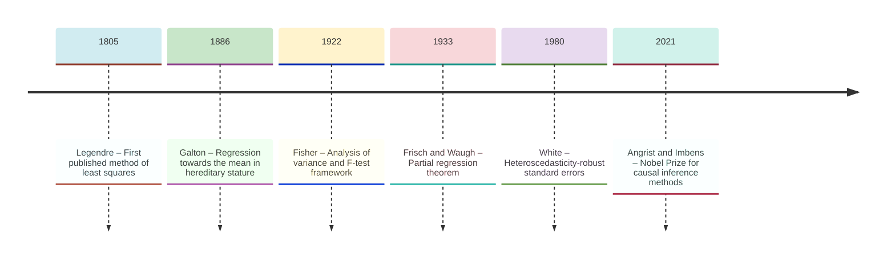
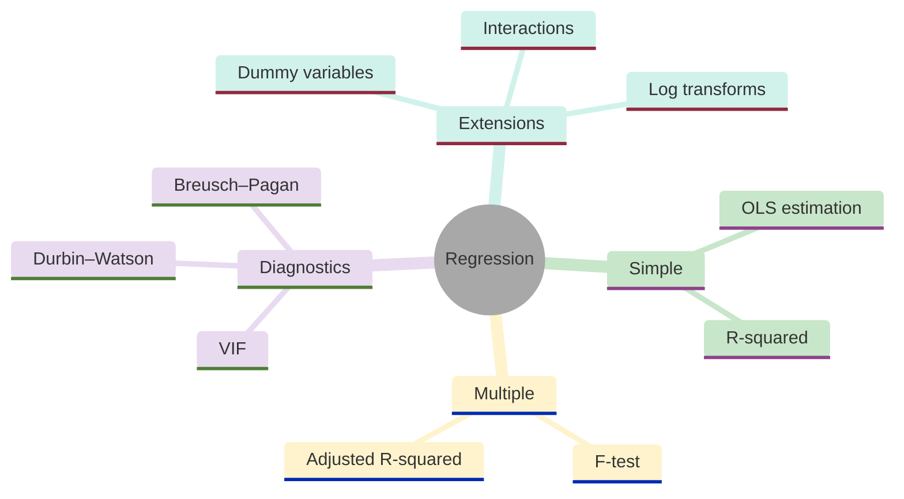
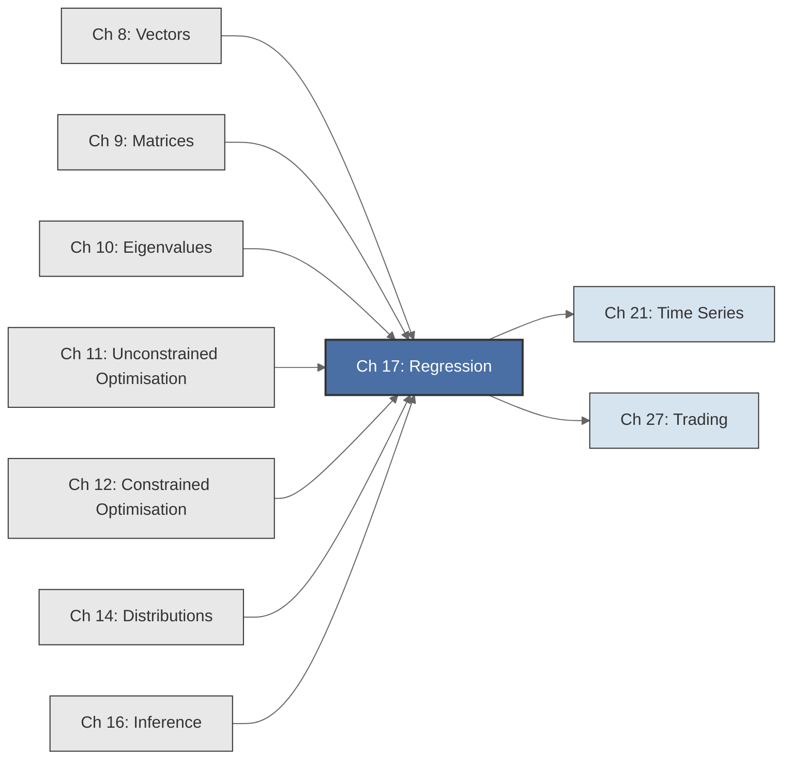

<!-- Copyright (c) 2025-2026 Bob Jansen <bobjansen@pm.me> -->
<!-- SPDX-License-Identifier: CC-BY-NC-4.0 -->
<!-- See LICENSE for full terms. Commercial licensing available. -->
# Chapter 17: Regression & Econometrics


**Part V**: Probability & Statistics

> Regression analysis projects observed data onto a linear subspace, decomposes variance into explained and unexplained components and tests hypotheses via ratios of quadratic forms. It is the most widely used method in empirical science.

**Prerequisites**: [Chapter 9](09-matrices.md) (Matrices): matrix multiplication, transpose, inverse and the formula $\hat{\boldsymbol{\beta}} = (X'X)^{-1}X'\mathbf{y}$. [Chapter 10](10-eigenvalues.md) (Eigenvalues): eigenvalue decomposition for understanding condition numbers, multicollinearity diagnostics and the connection to principal components. [Chapter 11](11-unconstrained-optimization.md) (Unconstrained Optimisation): first-order conditions for minimisation; the normal equations arise as $\nabla \text{SSE} = \mathbf{0}$. [Chapter 14](14-distributions.md) (Distributions): the $t$, $F$ and chi-squared distributions that underpin all regression inference. [Chapter 16](16-statistical-inference.md) (Inference): the hypothesis-testing framework, confidence intervals and the logic of $p$-values.

**Learning Objectives**: After this chapter, the reader will be able to:

1. Derive the ordinary least squares (OLS) estimator in both scalar and matrix form.
2. Interpret regression coefficients in simple and multiple regression, including log transformations and dummy variables.
3. Perform $t$-tests for individual coefficients and $F$-tests for joint significance and general linear restrictions.
4. State and prove (in sketch) the Gauss–Markov theorem: OLS is BLUE.
5. Diagnose violations of the classical assumptions (heteroscedasticity, multicollinearity, autocorrelation and omitted variable bias) and understand their consequences for OLS.
6. Apply heteroscedasticity-robust standard errors and interpret diagnostic statistics (Variance Inflation Factor (VIF), Durbin–Watson, Breusch–Pagan).

**Connections**: This chapter is used by [Chapter 21](21-time-series.md) (Time Series: regression on lagged variables, autoregressive models, cointegration). It builds on [Chapter 9](09-matrices.md) (the OLS estimator is a matrix formula requiring the inverse of the Gram matrix $X'X$), [Chapter 11](11-unconstrained-optimization.md) (OLS minimises a convex unconstrained objective; the normal equations are the first-order condition $\nabla f = \mathbf{0}$), [Chapter 12](12-constrained-optimization.md) (restricted estimation under linear constraints via Lagrange multipliers) and [Chapter 16](16-statistical-inference.md) ($t$-tests and $F$-tests are the inferential machinery). The geometric interpretation of OLS as orthogonal projection connects directly to the linear algebra of [Chapter 8](08-vectors.md) (inner products, orthogonality) and [Chapter 9](09-matrices.md) (column spaces, projections). In applied work, regression underpins demand estimation, production function estimation, returns to education and treatment effect analysis.

---

## Historical Context

**Key Milestones in Regression and Econometrics**



*Figure 17.1: Timeline of major developments in regression and econometrics from Legendre to Angrist and Imbens.*

**Legendre and the method of least squares (1805).** Two mathematicians claimed priority for the method of least squares; their dispute coloured early nineteenth-century mathematics. Adrien-Marie Legendre published the method in 1805 in his *Nouvelles méthodes pour la détermination des orbites des comètes*. He proposed minimising the sum of squared residuals as a criterion for fitting a line to astronomical observations. Legendre provided worked examples and argued that squaring errors penalises large deviations more heavily than minimising absolute deviations. The method allowed astronomers to combine multiple imprecise observations into a single best estimate of an orbit.

**Gauss and the normal justification (1809).** Carl Friedrich Gauss, in his 1809 *Theoria Motus Corporum Coelestium*, claimed to have used the method since 1795. Gauss provided a deeper justification: he showed that if errors follow a normal distribution, least squares yields the maximum-likelihood estimate. He also characterised the normal distribution axiomatically in this work. The priority dispute was never resolved and left lasting bitterness. The Gauss–Legendre least squares method became the standard technique for data reduction in astronomy, geodesy and all quantitative science.

**Galton and regression to the mean (1886).** The word "regression" entered statistics through Francis Galton's 1886 paper "Regression towards Mediocrity in Hereditary Stature." Galton collected height data on 928 adult children and their parents. He plotted average child height against parental midpoint height and observed that parents of above-average height tended to produce children who were above average but less extreme. The pattern held symmetrically for below-average parents. The slope of the fitted line was less than unity; children "regressed" toward the population mean. Galton named the fitted line the "regression line." The name persisted, though modern regression has nothing to do with mean-reversion. Galton also introduced the regression coefficient (the slope) and the correlation coefficient (the standardised slope).

**Pearson, Yule and multiple regression (1897–1900s).** Karl Pearson and George Udny Yule formalised regression as a general statistical method in the first decade of the twentieth century. Pearson developed the product-moment correlation coefficient and established its sampling distribution. Yule, in his 1897 paper on the causes of pauperism, applied multiple regression with several explanatory variables simultaneously. This was the first application of multiple regression to observational social science data. Yule also recognised spurious correlation and cautioned that regression coefficients need not imply causation.

**Fisher and inferential foundations (1920s).** Ronald Fisher, in the 1920s, placed regression on firm inferential foundations. He developed the analysis of variance decomposition and showed its connection to the $F$-test for overall regression significance. He established the exact sampling distributions of regression statistics under normality. His framework unified regression and experimental design: the $F$-test for nested models, the $t$-test for individual coefficients and the partitioning of total variation into explained and unexplained components all emerged from this work. Fisher also introduced maximum likelihood estimation as a general principle, of which OLS under normality is a special case.

**Frisch–Waugh–Lovell and partial regression (1933).** Ragnar Frisch and Frederick Waugh published in 1933 a result now known as the Frisch–Waugh–Lovell theorem. The theorem states that the OLS coefficient on $x_j$ in a multiple regression equals the coefficient from the simple regression of the residualised dependent variable on the residualised $x_j$, with both partialled out of the remaining regressors. Each coefficient measures the effect of one variable after removing the linear influence of all others. The Frisch–Waugh–Lovell theorem is the intellectual foundation of modern econometric identification.

**Gauss–Markov optimality (1900).** The Gauss–Markov theorem establishes that OLS is the Best Linear Unbiased Estimator (BLUE) under the classical assumptions. Gauss proved optimality under normality. Andrey Markov extended the result to finite second moments without distributional assumptions around 1900. Among all estimators that are linear in the observations and unbiased, OLS has the smallest variance. No distributional assumptions beyond finite variance are required.

**Causal inference and the credibility revolution (1994–2021).** Regression remains the default tool of empirical economics, though its interpretation has evolved. The causal inference movement, led by Joshua Angrist and Guido Imbens (Nobel Prize 2021), reframed regression as an approximation to a causal quantity rather than a curve-fitting exercise. Angrist and Imbens published their local average treatment effect framework in 1994. The debate over omitted variable bias, instrumental variables and regression discontinuity designs occupies the frontier of applied econometrics. In technology, regression underpins A/B testing, recommendation systems and forecasting. The method of least squares, now over two centuries old, shows no sign of retirement.

---

## Why This Chapter Matters

**Regression**



*Figure 17.2: Conceptual map of regression topics including estimation, diagnostics and extensions.*

Regression is the most widely deployed quantitative method in applied science, technology and finance. Fitting a line, training a linear model and estimating an elasticity all rely on the OLS estimator $\hat{\boldsymbol{\beta}} = (X'X)^{-1}X'\mathbf{y}$ (Theorem 17.6). The Gauss–Markov theorem (Theorem 17.18) justifies its optimality. The $t$-test on individual coefficients (Theorem 17.11) and the $F$-test for joint significance (Theorem 17.14) determine which features matter and which models are adequate. Without these tools, there is no principled way to estimate, test or predict from observed covariates.

Linear regression is not merely a baseline model; it is the interpretive core of empirical science. The coefficient of determination $R^2$ (Definition 17.12) is the standard measure of explained variance. Regularised regression (ridge, Least Absolute Shrinkage and Selection Operator (LASSO)) modifies the normal equations by adding a penalty to $(X'X)$. The condition number of $X'X$ determines when regularisation is needed (Section 7; Variance Inflation Factor (VIF) diagnostics in Algorithm 17.32).

OLS as orthogonal projection onto the column space of $X$ (Theorem 17.7) is the geometric idea behind principal component analysis (PCA) and Gram–Schmidt. Log transformations (Remark 17.21), interaction terms (Definition 17.20) and dummy variables (Definition 17.19) model nonlinear effects and categorical predictors. The method is more flexible than the phrase "linear model" suggests.

In finance, the Capital Asset Pricing Model is a regression: $R_i - R_f = \alpha + \beta(R_m - R_f) + \varepsilon$. The Fama–French factor models extend it to multiple regression. The significance of $\alpha$ (abnormal return) is tested with a $t$-test; overall model significance with an $F$-test. Heteroscedasticity (Definition 17.23) is pervasive in financial data because volatility clusters. Robust standard errors (Definition 17.23) are therefore necessary. The Durbin–Watson statistic (Definition 17.25) detects residual autocorrelation, which is ubiquitous in return series. In crypto markets, regression of on-chain metrics against token prices is the standard approach for fundamental analysis. The diagnostic tools of this chapter separate rigorous analysis from spurious correlation.

The algorithms of this chapter are production components that require attention to numerical conditioning. When $X'X$ is nearly singular, the normal equations amplify rounding errors. QR decomposition or singular value decomposition based solvers are then needed; this connects to the numerical linear algebra of [Chapter 9](09-matrices.md) and [Chapter 10](10-eigenvalues.md).

---

## Notation & Conventions

| Symbol | Meaning |
|--------|---------|
| $y_i$ | Observation $i$ of the dependent (response) variable |
| $\mathbf{y}$ | The $n \times 1$ vector of observations $(y_1, \ldots, y_n)'$ |
| $x_{ij}$ | Observation $i$ of the $j$-th explanatory (independent) variable |
| $X$ | The $n \times (p+1)$ design matrix (first column is all ones for the intercept) |
| $\boldsymbol{\beta}$ | The $(p+1) \times 1$ vector of true regression coefficients $(\beta_0, \beta_1, \ldots, \beta_p)'$ |
| $\hat{\boldsymbol{\beta}}$ | The OLS estimate of $\boldsymbol{\beta}$: $\hat{\boldsymbol{\beta}} = (X'X)^{-1}X'\mathbf{y}$ |
| $\varepsilon_i$ | The $i$-th error (disturbance): $\varepsilon_i = y_i - \mathbf{x}_i'\boldsymbol{\beta}$ |
| $\boldsymbol{\varepsilon}$ | The $n \times 1$ error vector |
| $e_i$ | The $i$-th residual: $e_i = y_i - \hat{y}_i$ |
| $\mathbf{e}$ | The $n \times 1$ residual vector: $\mathbf{e} = \mathbf{y} - X\hat{\boldsymbol{\beta}}$ |
| $\hat{y}_i$ | The $i$-th fitted value: $\hat{y}_i = \mathbf{x}_i'\hat{\boldsymbol{\beta}}$ |
| $\hat{\mathbf{y}}$ | The $n \times 1$ vector of fitted values: $\hat{\mathbf{y}} = X\hat{\boldsymbol{\beta}}$ |
| $H$ | The hat matrix: $H = X(X'X)^{-1}X'$ |
| $\text{SST}$ | Total sum of squares: $\sum(y_i - \bar{y})^2$ |
| $\text{SSR}$ | Regression (explained) sum of squares: $\sum(\hat{y}_i - \bar{y})^2$ |
| $\text{SSE}$ | Error (residual) sum of squares: $\sum e_i^2 = \mathbf{e}'\mathbf{e}$ |
| $R^2$ | Coefficient of determination: $R^2 = 1 - \text{SSE}/\text{SST}$ |
| $\bar{R}^2$ | Adjusted $R^2$: $\bar{R}^2 = 1 - (1 - R^2)\frac{n-1}{n-p-1}$ |
| $s^2$ | Residual variance estimate: $s^2 = \text{SSE}/(n-p-1)$ |
| $\operatorname{SE}(\hat{\beta}_j)$ | Standard error of $\hat{\beta}_j$ |
| $n$ | Number of observations |
| $p$ | Number of explanatory variables (excluding the intercept) |
| $\sigma^2$ | True (unknown) error variance: $\operatorname{Var}(\varepsilon_i)$ |

$X'$ denotes the transpose of $X$. Vectors are column vectors. The prime notation follows econometric convention. The design matrix $X$ includes a column of ones as its first column (for $\beta_0$) and has dimension $n \times (p+1)$.

---

## Core Theory

### Simple Linear Regression

The simplest regression model relates a dependent variable to a single explanatory variable through a linear equation plus noise.

**Definition 17.1** (Simple linear regression model). The *simple linear regression model* specifies that the observations $(x_i, y_i)$ for $i = 1, \ldots, n$ satisfy

$$y_i = \beta_0 + \beta_1 x_i + \varepsilon_i,$$

where $\beta_0$ is the *intercept* (the expected value of $y$ when $x = 0$), $\beta_1$ is the *slope* (the expected change in $y$ per unit change in $x$) and $\varepsilon_1, \ldots, \varepsilon_n$ are independent and identically distributed random variables with $\mathbb{E}[\varepsilon_i] = 0$ and $\operatorname{Var}(\varepsilon_i) = \sigma^2$. The values $x_1, \ldots, x_n$ are treated as fixed (non-random) or, equivalently, the analysis is conditional on the realised values of $x$.

The zero-mean assumption $\mathbb{E}[\varepsilon_i] = 0$ is without loss of generality when an intercept is included: any nonzero mean error is absorbed into $\beta_0$. The constant-variance assumption $\operatorname{Var}(\varepsilon_i) = \sigma^2$ for all $i$ is called *homoscedasticity*; its violation is called *heteroscedasticity*. The independence assumption means the error for one observation carries no information about the error for another.

**Theorem 17.2** (OLS estimators; simple regression). The ordinary least squares estimators of $\beta_0$ and $\beta_1$ are obtained by minimising ([Chapter 11](11-unconstrained-optimization.md)) the sum of squared errors

$$\text{SSE}(\beta_0, \beta_1) = \sum_{i=1}^{n}(y_i - \beta_0 - \beta_1 x_i)^2.$$

Setting the partial derivatives to zero yields the *normal equations*:

$$\frac{\partial \text{SSE}}{\partial \beta_0} = -2\sum_{i=1}^{n}(y_i - \beta_0 - \beta_1 x_i) = 0,$$

$$\frac{\partial \text{SSE}}{\partial \beta_1} = -2\sum_{i=1}^{n}x_i(y_i - \beta_0 - \beta_1 x_i) = 0.$$

The unique solutions are

$$\hat{\beta}_1 = \frac{\sum_{i=1}^{n}(x_i - \bar{x})(y_i - \bar{y})}{\sum_{i=1}^{n}(x_i - \bar{x})^2} = \frac{S_{xy}}{S_{xx}},$$

$$\hat{\beta}_0 = \bar{y} - \hat{\beta}_1 \bar{x},$$

where $\bar{x} = \frac{1}{n}\sum x_i$, $\bar{y} = \frac{1}{n}\sum y_i$, $S_{xy} = \sum(x_i - \bar{x})(y_i - \bar{y})$ and $S_{xx} = \sum(x_i - \bar{x})^2$.

??? note "Proof"

    *Proof.* The first normal equation gives $\sum y_i - n\beta_0 - \beta_1 \sum x_i = 0$, hence $\beta_0 = \bar{y} - \beta_1\bar{x}$.

    Substituting into the second normal equation:

    $$\sum x_i(y_i - \bar{y} + \beta_1\bar{x} - \beta_1 x_i) = 0.$$

    Rearranging: $\sum x_i(y_i - \bar{y}) = \beta_1 \sum x_i(x_i - \bar{x})$.

    Since $\sum x_i(y_i - \bar{y}) = \sum(x_i - \bar{x})(y_i - \bar{y})$ (because $\sum \bar{x}(y_i - \bar{y}) = \bar{x}\sum(y_i - \bar{y}) = 0$) and similarly $\sum x_i(x_i - \bar{x}) = \sum(x_i - \bar{x})^2$, the result follows.

    The solution is unique provided $S_{xx} > 0$, i.e., the $x_i$ are not all identical.

    $\square$

**Simple Regression: Actual vs Fitted**

```mermaid
---
config:
  theme: base
  themeVariables:
    xyChart:
      plotColorPalette: "#2563eb, #dc2626, #16a34a, #9333ea, #ca8a04, #0891b2"
      backgroundColor: "#ffffff"
      titleColor: "#333333"
      xAxisLabelColor: "#333333"
      yAxisLabelColor: "#333333"
      xAxisTitleColor: "#333333"
      yAxisTitleColor: "#333333"
      xAxisLineColor: "#333333"
      yAxisLineColor: "#333333"
---
xychart-beta
    x-axis "x" [1, 2, 3, 4, 5]
    y-axis "y" 0 --> 12
    line "Actual" [2.1, 3.9, 6.2, 7.8, 10.1]
    line "Fitted" [2.06, 4.08, 6.10, 8.12, 10.14]
```

*Figure 17.3: Actual observations compared with fitted values from a simple linear regression.*

**Theorem 17.3** (Properties of simple OLS estimators). Under the assumptions of Definition 17.1:

(a) $\hat{\beta}_1$ is unbiased: $\mathbb{E}[\hat{\beta}_1] = \beta_1$.

(b) $\operatorname{Var}(\hat{\beta}_1) = \sigma^2 / S_{xx}$.

(c) $\hat{\beta}_0$ is unbiased: $\mathbb{E}[\hat{\beta}_0] = \beta_0$.

(d) $\operatorname{Var}(\hat{\beta}_0) = \sigma^2\left(\frac{1}{n} + \frac{\bar{x}^2}{S_{xx}}\right)$.

(e) Under the additional assumption $\varepsilon_i \sim N(0, \sigma^2)$: $\hat{\beta}_1 \sim N\left(\beta_1, \, \sigma^2/S_{xx}\right)$.

??? note "Proof"

    *Proof of (a) and (b).* Write $\hat{\beta}_1 = \sum w_i y_i$ where $w_i = (x_i - \bar{x})/S_{xx}$.

    Then $\mathbb{E}[\hat{\beta}_1] = \sum w_i \mathbb{E}[y_i] = \sum w_i(\beta_0 + \beta_1 x_i) = \beta_0 \sum w_i + \beta_1 \sum w_i x_i$.

    Since $\sum w_i = \sum(x_i - \bar{x})/S_{xx} = 0$ and $\sum w_i x_i = \sum(x_i - \bar{x})x_i / S_{xx} = S_{xx}/S_{xx} = 1$, it follows that $\mathbb{E}[\hat{\beta}_1] = \beta_1$.

    For the variance: $\operatorname{Var}(\hat{\beta}_1) = \sum w_i^2 \operatorname{Var}(y_i) = \sigma^2 \sum w_i^2 = \sigma^2 \sum(x_i - \bar{x})^2/S_{xx}^2 = \sigma^2/S_{xx}$.

    $\square$

**Definition 17.4** (Residuals and fitted values). The *fitted values* are $\hat{y}_i = \hat{\beta}_0 + \hat{\beta}_1 x_i$ for $i = 1, \ldots, n$. The *residuals* are $e_i = y_i - \hat{y}_i$. The residuals satisfy two important identities:

$$\sum_{i=1}^{n} e_i = 0, \qquad \sum_{i=1}^{n} e_i x_i = 0.$$

These follow directly from the normal equations: the first states that the residuals have zero mean (the regression line passes through $(\bar{x}, \bar{y})$), and the second states that the residuals are uncorrelated with the explanatory variable.

### Multiple Linear Regression

When there are $p$ explanatory variables, matrix notation becomes necessary.

**Definition 17.5** (Multiple linear regression model). The *multiple linear regression model* specifies

$$\mathbf{y} = X\boldsymbol{\beta} + \boldsymbol{\varepsilon},$$

where $\mathbf{y}$ is $n \times 1$, $X$ is the $n \times (p+1)$ design matrix whose first column is $\mathbf{1}_n$ (a vector of ones for the intercept) and remaining columns contain the observed values of the $p$ explanatory variables, $\boldsymbol{\beta}$ is the $(p+1) \times 1$ parameter vector and $\boldsymbol{\varepsilon}$ is the $n \times 1$ error vector satisfying

$$\mathbb{E}[\boldsymbol{\varepsilon}] = \mathbf{0}, \qquad \operatorname{Var}(\boldsymbol{\varepsilon}) = \sigma^2 I_n.$$

The condition $\mathbb{E}[\boldsymbol{\varepsilon}] = \mathbf{0}$ (zero conditional mean) implies $\mathbb{E}[\mathbf{y} | X] = X\boldsymbol{\beta}$. The condition $\operatorname{Var}(\boldsymbol{\varepsilon}) = \sigma^2 I_n$ combines homoscedasticity (all diagonal entries equal $\sigma^2$) and no autocorrelation (all off-diagonal entries are zero).

**Theorem 17.6** (OLS estimator, matrix form). The OLS estimator minimises the sum of squared residuals:

$$\hat{\boldsymbol{\beta}} = \arg\min_{\boldsymbol{\beta}} \; (\mathbf{y} - X\boldsymbol{\beta})'(\mathbf{y} - X\boldsymbol{\beta}).$$

Expanding: $\text{SSE}(\boldsymbol{\beta}) = \mathbf{y}'\mathbf{y} - 2\boldsymbol{\beta}'X'\mathbf{y} + \boldsymbol{\beta}'X'X\boldsymbol{\beta}$. Taking the gradient with respect to $\boldsymbol{\beta}$ and setting it to zero:

$$\frac{\partial \text{SSE}}{\partial \boldsymbol{\beta}} = -2X'\mathbf{y} + 2X'X\boldsymbol{\beta} = \mathbf{0}.$$

This yields the *normal equations*:

$$X'X\hat{\boldsymbol{\beta}} = X'\mathbf{y}.$$

If $X'X$ is invertible (equivalently, $X$ has full column rank; no perfect multicollinearity), the unique solution is

$$\hat{\boldsymbol{\beta}} = (X'X)^{-1}X'\mathbf{y}.$$

??? note "Proof"

    *Proof.* The objective $\text{SSE}(\boldsymbol{\beta})$ is a convex quadratic in $\boldsymbol{\beta}$ (since $X'X$ is positive semidefinite, and positive definite under full column rank). Any stationary point is therefore a global minimum.

    Differentiating term by term:

    $$\frac{\partial(\mathbf{y}'\mathbf{y})}{\partial\boldsymbol{\beta}} = \mathbf{0}, \qquad \frac{\partial(2\boldsymbol{\beta}'X'\mathbf{y})}{\partial\boldsymbol{\beta}} = 2X'\mathbf{y}, \qquad \frac{\partial(\boldsymbol{\beta}'X'X\boldsymbol{\beta})}{\partial\boldsymbol{\beta}} = 2X'X\boldsymbol{\beta},$$

    using the standard matrix calculus identities from [Chapter 9](09-matrices.md).

    Setting $-2X'\mathbf{y} + 2X'X\boldsymbol{\beta} = \mathbf{0}$ and solving gives $\hat{\boldsymbol{\beta}} = (X'X)^{-1}X'\mathbf{y}$.

    $\square$

**Theorem 17.7** (Geometric interpretation: projection). The vector of fitted values is

$$\hat{\mathbf{y}} = X\hat{\boldsymbol{\beta}} = X(X'X)^{-1}X'\mathbf{y} = H\mathbf{y},$$

where $H = X(X'X)^{-1}X'$ is the *hat matrix* (or projection matrix). The hat matrix $H$ is the orthogonal projection onto the column space of $X$, denoted $\text{col}(X)$. The residual vector is

$$\mathbf{e} = \mathbf{y} - \hat{\mathbf{y}} = (I - H)\mathbf{y} = M\mathbf{y},$$

where $M = I - H$ is the *annihilator matrix*, which projects onto the orthogonal complement of $\text{col}(X)$.

??? note "Proof"

    *Proof.* That $H$ is a projection:

    $$H^2 = X(X'X)^{-1}X'X(X'X)^{-1}X' = X(X'X)^{-1}X' = H \quad \text{(idempotent)}.$$

    That $H$ is symmetric: $(H)' = (X(X'X)^{-1}X')' = X((X'X)^{-1})'X' = X(X'X)^{-1}X' = H$, since $(X'X)^{-1}$ is symmetric. An idempotent symmetric matrix is an orthogonal projection.

    Its column space is $\text{col}(X)$: for any $v \in \text{col}(X)$, write $v = Xc$, then $Hv = X(X'X)^{-1}X'Xc = Xc = v$.

    The residuals satisfy $X'\mathbf{e} = X'(I-H)\mathbf{y} = X'\mathbf{y} - X'H\mathbf{y} = X'\mathbf{y} - X'\mathbf{y} = \mathbf{0}$, confirming orthogonality.

    $\square$

**Remark 17.8** (Why "projection"?). OLS has a profound geometric interpretation: the fitted values $\hat{\mathbf{y}}$ are the point in the column space of $X$ that is closest to the observed data $\mathbf{y}$ in Euclidean distance. The residual vector $\mathbf{e}$ is orthogonal to every column of $X$. This is exactly the geometry of orthogonal projection studied in linear algebra ([Chapter 8](08-vectors.md), [Chapter 9](09-matrices.md)). One can derive OLS purely from the projection theorem without any calculus: among all vectors in a subspace, the closest point to an external point is the foot of the perpendicular. The normal equations $X'\mathbf{e} = \mathbf{0}$ are the algebraic statement of this perpendicularity.

**OLS Regression Workflow**

```mermaid
%%{init: {"theme": "base", "themeVariables": {"primaryColor": "#e8e8e8", "primaryTextColor": "#333333", "primaryBorderColor": "#555555", "lineColor": "#666666", "secondaryColor": "#d1ecf1", "tertiaryColor": "#c8e6c9"}}}%%
flowchart LR
    A["Specify model:<br/>y = X beta + epsilon"] --> B["Compute OLS estimate:<br/>beta_hat = (X'X)^{-1} X'y"]
    B --> C["Compute residuals:<br/>e = y - X beta_hat"]
    C --> D["Compute R^2 = 1 - SSE/SST<br/>and adjusted R^2"]
    D --> E["Compute standard errors:<br/>SE_j = s * sqrt([(X'X)^{-1}]_jj)"]
    E --> F["Perform t-tests:<br/>T_j = beta_hat_j / SE_j<br/>for each coefficient"]
    F --> G["Perform overall F-test:<br/>F = (SSR/p) / (SSE/(n-p-1))"]
    G --> H["Run diagnostics:<br/>residual plots, VIF,<br/>Durbin–Watson, Breusch–Pagan"]
    H --> I{"Assumptions<br/>satisfied?"}
    I -- Yes --> J["Report results:<br/>coefficients, SEs,<br/>p-values, R^2, F"]
    I -- No --> K["Apply remedies:<br/>robust SEs, WLS,<br/>transformations, etc."]
    K --> J
    style A fill:#e8e8e8,stroke:#333333
    style B fill:#e8e8e8,stroke:#333333
    style C fill:#e8e8e8,stroke:#333333
    style D fill:#e8e8e8,stroke:#333333
    style E fill:#e8e8e8,stroke:#333333
    style F fill:#e8e8e8,stroke:#333333
    style G fill:#e8e8e8,stroke:#333333
    style H fill:#e8e8e8,stroke:#333333
    style I fill:#fff3cd,stroke:#333333
    style J fill:#e8e8e8,stroke:#333333
    style K fill:#e8e8e8,stroke:#333333
```



*Figure 17.4: Workflow for OLS regression from model specification through diagnostics to reporting.*

### Inference

Statistical inference in regression requires estimating the unknown error variance and constructing test statistics.

**Definition 17.9** (Residual variance estimator). The unbiased estimator of $\sigma^2$ is

$$s^2 = \frac{\mathbf{e}'\mathbf{e}}{n - p - 1} = \frac{\text{SSE}}{n - p - 1}.$$

The denominator $n - p - 1$ equals the number of observations minus the number of estimated parameters (including the intercept). This is the *degrees of freedom* of the residual sum of squares. The divisor corrects for the downward bias that would result from dividing by $n$: fitting $p+1$ parameters reduces the residual sum of squares, and the correction restores unbiasedness. Under the projection interpretation: the rank of $M = I - H$ is $\operatorname{tr}(M) = n - (p+1)$, and $\mathbb{E}[\mathbf{e}'\mathbf{e}] = \mathbb{E}[\boldsymbol{\varepsilon}'M\boldsymbol{\varepsilon}] = \sigma^2 \operatorname{tr}(M) = \sigma^2(n - p - 1)$.

**Definition 17.10** (Standard errors of regression coefficients). The estimated covariance matrix of $\hat{\boldsymbol{\beta}}$ is

$$\widehat{\operatorname{Var}}(\hat{\boldsymbol{\beta}}) = s^2 (X'X)^{-1}.$$

The *standard error* of the $j$-th coefficient is

$$\operatorname{SE}(\hat{\beta}_j) = s \cdot \sqrt{[(X'X)^{-1}]_{jj}},$$

where $[(X'X)^{-1}]_{jj}$ denotes the $(j,j)$-th diagonal element of $(X'X)^{-1}$.

**Theorem 17.11** ($t$-test for individual coefficients). Under the assumption that $\boldsymbol{\varepsilon} \sim N(\mathbf{0}, \sigma^2 I)$, the statistic

$$T_j = \frac{\hat{\beta}_j - \beta_j^0}{\operatorname{SE}(\hat{\beta}_j)}$$

follows a $t$-distribution ([Chapter 14](14-distributions.md)) with $n - p - 1$ degrees of freedom under the null hypothesis ([Chapter 16](16-statistical-inference.md)) $H_0: \beta_j = \beta_j^0$. For the common test $H_0: \beta_j = 0$ (the $j$-th variable has no effect), the test statistic is $T_j = \hat{\beta}_j / \operatorname{SE}(\hat{\beta}_j)$. The null is rejected at significance level $\alpha$ if $|T_j| > t_{\alpha/2, \, n-p-1}$.

??? note "Proof"

    *Proof sketch.* Under normality, $\hat{\boldsymbol{\beta}} \sim N(\boldsymbol{\beta}, \sigma^2(X'X)^{-1})$, so

    $$\hat{\beta}_j \sim N(\beta_j, \;\sigma^2[(X'X)^{-1}]_{jj}).$$

    The standardised quantity $(\hat{\beta}_j - \beta_j)/(\sigma\sqrt{[(X'X)^{-1}]_{jj}})$ is standard normal.

    The residual sum of squares satisfies

    $$\text{SSE}/\sigma^2 \sim \chi^2(n-p-1),$$

    independent of $\hat{\boldsymbol{\beta}}$. This independence is a consequence of the projection: $\hat{\boldsymbol{\beta}}$ depends on $H\mathbf{y}$ while SSE depends on $M\mathbf{y}$, and $HM = 0$ implies independence under normality.

    The ratio of a standard normal to the square root of an independent $\chi^2$ divided by its degrees of freedom is $t$-distributed.

    $\square$

**Definition 17.12** (Coefficient of determination). The *coefficient of determination* is

$$R^2 = 1 - \frac{\text{SSE}}{\text{SST}} = \frac{\text{SSR}}{\text{SST}},$$

where $\text{SST} = \sum_{i=1}^{n}(y_i - \bar{y})^2$ (total sum of squares), $\text{SSR} = \sum_{i=1}^{n}(\hat{y}_i - \bar{y})^2$ (regression sum of squares) and $\text{SSE} + \text{SSR} = \text{SST}$. The decomposition $\text{SST} = \text{SSR} + \text{SSE}$ holds whenever the model includes an intercept. $R^2 \in [0, 1]$ represents the proportion of total variation in $y$ "explained" by the regression. In simple regression, $R^2 = r_{xy}^2$, the square of the sample correlation between $x$ and $y$.

**Definition 17.13** (Adjusted $R^2$). The *adjusted coefficient of determination* penalises for the number of regressors:

$$\bar{R}^2 = 1 - (1 - R^2)\frac{n - 1}{n - p - 1} = 1 - \frac{\text{SSE}/(n-p-1)}{\text{SST}/(n-1)} = 1 - \frac{s^2}{s_y^2},$$

where $s_y^2 = \text{SST}/(n-1)$ is the sample variance of $y$. Unlike $R^2$, the adjusted $R^2$ can decrease when a variable is added that does not sufficiently reduce SSE relative to the lost degree of freedom. This makes $\bar{R}^2$ a more reliable measure for model comparison.

**Theorem 17.14** ($F$-test for overall significance). Consider the null hypothesis $H_0: \beta_1 = \beta_2 = \cdots = \beta_p = 0$ (all slope coefficients are zero; only the intercept has explanatory power). Under $H_0$ and normality:

$$F = \frac{\text{SSR}/p}{\text{SSE}/(n - p - 1)} = \frac{R^2/p}{(1 - R^2)/(n - p - 1)} \sim F(p, \, n - p - 1).$$

Reject $H_0$ at level $\alpha$ if $F > F_{\alpha, \, p, \, n-p-1}$. The $F$-statistic is the ratio of explained variance per degree of freedom to unexplained variance per degree of freedom. A large $F$ indicates that the regressors collectively explain a significant portion of the variation in $y$.

??? note "Proof"

    *Proof sketch.* Under $H_0$,

    $$\text{SSR}/\sigma^2 \sim \chi^2(p) \qquad \text{and} \qquad \text{SSE}/\sigma^2 \sim \chi^2(n-p-1),$$

    and these are independent (they are quadratic forms in $\mathbf{y}$ with projection matrices $H - \frac{1}{n}\mathbf{1}\mathbf{1}'$ and $M$, which are orthogonal).

    The ratio of two independent $\chi^2$ variables, each divided by their degrees of freedom, is $F$-distributed.

    $\square$

**Remark 17.15** (Wald form). The *Wald form* of an $F$-test is an algebraically equivalent expression that computes the test statistic directly from the unrestricted estimates, avoiding re-estimation of the restricted model. It measures how far the unrestricted estimates deviate from the null hypothesis, scaled by their estimated covariance.

**Theorem 17.16** ($F$-test for general linear restrictions). Let $R$ be a $q \times (p+1)$ matrix of known constants and $\mathbf{r}$ a $q \times 1$ vector. Consider the null hypothesis $H_0: R\boldsymbol{\beta} = \mathbf{r}$ (imposing $q$ linear restrictions on the coefficient vector). The $F$-statistic is

$$F = \frac{(\text{SSE}_R - \text{SSE}_U)/q}{\text{SSE}_U/(n - p - 1)} \sim F(q, \, n - p - 1) \quad \text{under } H_0,$$

where $\text{SSE}_R$ is the residual sum of squares from the *restricted* model (estimated subject to $R\boldsymbol{\beta} = \mathbf{r}$) and $\text{SSE}_U$ is the residual sum of squares from the *unrestricted* model. An equivalent algebraic form, which avoids re-estimating the restricted model, is the *Wald form*:

$$F = \frac{(R\hat{\boldsymbol{\beta}} - \mathbf{r})'\left[R \, s^2(X'X)^{-1} R'\right]^{-1}(R\hat{\boldsymbol{\beta}} - \mathbf{r})}{q}.$$

*Special cases*: (1) The overall $F$-test (Theorem 17.14) uses $R = [0_{p \times 1} \mid I_p]$ and $\mathbf{r} = \mathbf{0}$. (2) Testing $H_0: \beta_j = 0$ individually uses $R$ as the row selecting the $j$-th element, giving $F = T_j^2$ (the square of the $t$-statistic). (3) Testing $H_0: \beta_1 = \beta_2$ uses $R = [0, 1, -1, 0, \ldots, 0]$ and $r = 0$.

### The Gauss–Markov Theorem

**Definition 17.17** (Classical linear model assumptions). The *classical linear model assumptions* are the conditions under which OLS possesses its optimality properties. They consist of (1) linearity of the data-generating process in parameters, (2) strict exogeneity (zero conditional mean of errors), (3) homoscedasticity and no autocorrelation ($\operatorname{Var}(\boldsymbol{\varepsilon}|X) = \sigma^2 I_n$) and (4) full column rank of the design matrix (no perfect multicollinearity). These are also known as the Gauss–Markov assumptions.

**Theorem 17.18** (Gauss–Markov). Under the *classical linear model assumptions*:

1. **Linearity**: $\mathbf{y} = X\boldsymbol{\beta} + \boldsymbol{\varepsilon}$ (the true data-generating process is linear in parameters).
2. **Strict exogeneity**: $\mathbb{E}[\boldsymbol{\varepsilon} | X] = \mathbf{0}$ (errors have zero conditional mean).
3. **Homoscedasticity and no autocorrelation**: $\operatorname{Var}(\boldsymbol{\varepsilon} | X) = \sigma^2 I_n$ (errors have constant variance and are uncorrelated).
4. **Full column rank**: $\operatorname{rank}(X) = p + 1$ (no perfect multicollinearity).

The OLS estimator $\hat{\boldsymbol{\beta}} = (X'X)^{-1}X'\mathbf{y}$ is *BLUE*: the **B**est **L**inear **U**nbiased **E**stimator of $\boldsymbol{\beta}$. "Best" means that for any other estimator $\tilde{\boldsymbol{\beta}} = C\mathbf{y}$ that is linear in $\mathbf{y}$ and unbiased for $\boldsymbol{\beta}$, the difference $\operatorname{Var}(\tilde{\boldsymbol{\beta}}) - \operatorname{Var}(\hat{\boldsymbol{\beta}})$ is positive semidefinite.

!!! abstract "Key Result"

    **Theorem 17.18** (Gauss--Markov). Under linearity, exogeneity, homoscedasticity and full rank, OLS is BLUE: no other linear unbiased estimator has smaller variance. This optimality guarantee is the theoretical justification for the dominance of least-squares regression in applied work.

??? note "Proof"

    *Proof sketch.* Let $\tilde{\boldsymbol{\beta}} = C\mathbf{y}$ be any linear unbiased estimator. Write $C = (X'X)^{-1}X' + D$ for some matrix $D$.

    Unbiasedness requires $\mathbb{E}[\tilde{\boldsymbol{\beta}}] = CX\boldsymbol{\beta} = \boldsymbol{\beta}$ for all $\boldsymbol{\beta}$, which demands $CX = I_{p+1}$, i.e.,

    $$((X'X)^{-1}X' + D)X = I_{p+1}.$$

    Since $(X'X)^{-1}X'X = I_{p+1}$, this reduces to $DX = 0$. Now compute:

    $$\operatorname{Var}(\tilde{\boldsymbol{\beta}}) = \sigma^2 CC' = \sigma^2[(X'X)^{-1}X' + D][(X'X)^{-1}X' + D]'.$$

    Expanding and using $DX = 0$ (which implies $D \cdot X(X'X)^{-1} = 0$, i.e., the cross terms vanish):

    $$\operatorname{Var}(\tilde{\boldsymbol{\beta}}) = \sigma^2(X'X)^{-1} + \sigma^2 DD' = \operatorname{Var}(\hat{\boldsymbol{\beta}}) + \sigma^2 DD'.$$

    Since $DD'$ is positive semidefinite (for any vector $\mathbf{a}$, $\mathbf{a}'DD'\mathbf{a} = \|D'\mathbf{a}\|^2 \geq 0$), it follows that

    $$\operatorname{Var}(\tilde{\boldsymbol{\beta}}) - \operatorname{Var}(\hat{\boldsymbol{\beta}}) \succeq 0.$$

    Equality holds only when $D = 0$, i.e., $\tilde{\boldsymbol{\beta}} = \hat{\boldsymbol{\beta}}$.

    $\square$

The Gauss–Markov theorem does *not* require normality. It states that OLS is optimal within the class of linear unbiased estimators under the four stated assumptions. If one drops the restriction to linear estimators, or if the errors are not homoscedastic, OLS may be dominated by other procedures.

!!! warning "BLUE does not mean best overall"

    The Gauss–Markov theorem restricts attention to *linear unbiased* estimators. Biased estimators such as ridge regression or shrinkage estimators can achieve lower mean squared error, especially when multicollinearity inflates the variance of OLS. Dropping the linearity restriction opens the door to maximum likelihood and Bayesian estimators that may dominate OLS under non-normal errors.

### Variables and Transformations

!!! warning "The dummy variable trap"

    Including all $k$ indicator dummies for a $k$-level categorical variable alongside an intercept column creates an exact linear dependence: the dummies sum to the intercept column. The matrix $X'X$ becomes singular and OLS has no unique solution. Always omit one reference category.

**Definition 17.19** (Dummy variables). A *dummy variable* (indicator variable) is a binary variable taking values 0 or 1 to encode membership in a category. If a categorical variable has $k$ levels, one represents it with $k - 1$ dummy variables in the regression. The omitted category is the *reference group*, and each included dummy's coefficient measures the difference relative to the reference group. Including all $k$ dummies alongside an intercept creates perfect multicollinearity (the dummies sum to the intercept column), known as the *dummy variable trap*.

**Definition 17.20** (Interaction terms). An *interaction term* is the product $x_1 \cdot x_2$ included as an additional regressor. In the model $y = \beta_0 + \beta_1 x_1 + \beta_2 x_2 + \beta_3 (x_1 \cdot x_2) + \varepsilon$, the marginal effect of $x_1$ on $y$ is $\partial \mathbb{E}[y]/\partial x_1 = \beta_1 + \beta_3 x_2$, which depends on the level of $x_2$. Interaction terms allow the effect of one variable to vary with the level of another.

**Remark 17.21** (Log transformations). Logarithmic transformations change the interpretation of coefficients:

- *Log-log model*: $\log y = \beta_0 + \beta_1 \log x + \varepsilon$. Here $\beta_1$ is the *elasticity*: a 1% increase in $x$ is associated with a $\beta_1$% change in $y$.
- *Semi-log (log-linear) model*: $\log y = \beta_0 + \beta_1 x + \varepsilon$. Here $\beta_1$ is approximately the *proportional change*: a one-unit increase in $x$ is associated with a $(100 \cdot \beta_1)$% change in $y$ (exact for small $\beta_1$, since $e^{\beta_1} - 1 \approx \beta_1$).
- *Linear-log model*: $y = \beta_0 + \beta_1 \log x + \varepsilon$. A 1% increase in $x$ is associated with a $\beta_1/100$ unit change in $y$.

These transformations are ubiquitous in economics, where elasticities are natural quantities of interest (e.g., price elasticity of demand, income elasticity).

### Diagnostics

**Definition 17.22** (Residual analysis). The primary diagnostic tool for regression is the *residual plot*: a scatterplot of residuals $e_i$ against fitted values $\hat{y}_i$ (or against individual predictors). Under correct model specification and satisfied assumptions, this plot should show no discernible pattern; the points should appear as a random scatter around zero with constant spread. Systematic patterns indicate:

- *Curvature*: the true relationship is nonlinear. The model is misspecified.
- *Funnel shape* (spread increasing or decreasing with $\hat{y}$): heteroscedasticity.
- *Clusters or outliers*: influential observations or unmodeled subgroups.

**Definition 17.23** (Heteroscedasticity). The error variance is *heteroscedastic* if $\operatorname{Var}(\varepsilon_i | X) = \sigma_i^2$ varies across observations. Consequences: (1) OLS remains unbiased and consistent, but is no longer efficient; it is no longer BLUE. (2) The conventional standard errors $s\sqrt{[(X'X)^{-1}]_{jj}}$ are *incorrect*: they may be too large or too small, leading to invalid confidence intervals and hypothesis tests. Detection: the *Breusch–Pagan test* regresses the squared residuals $e_i^2$ on the explanatory variables (or a subset) and tests whether the $R^2$ of this auxiliary regression is significantly different from zero. Under $H_0$ (homoscedasticity), $nR^2_{aux} \sim \chi^2(p)$ asymptotically. Remedies include using *heteroscedasticity-robust standard errors* (White, 1980) or weighted least squares.

**Definition 17.24** (Multicollinearity). *Multicollinearity* refers to high (but not perfect) linear correlation among the explanatory variables. Consequences: (1) OLS remains unbiased and BLUE, but the variances of the coefficient estimates become large, making individual coefficients imprecisely estimated and statistically insignificant even when the overall $F$-test is significant. (2) Coefficients become sensitive to small changes in the data or model specification. Detection: the *Variance Inflation Factor* for the $j$-th variable is

$$\text{VIF}_j = \frac{1}{1 - R_j^2},$$

where $R_j^2$ is the coefficient of determination from regressing $x_j$ on all other explanatory variables. $\text{VIF}_j = 1$ indicates no collinearity; values exceeding 10 are conventionally regarded as problematic. The VIF measures how much the variance of $\hat{\beta}_j$ is inflated relative to what it would be if $x_j$ were uncorrelated with the other predictors: $\operatorname{Var}(\hat{\beta}_j) = \sigma^2 \cdot \text{VIF}_j / S_{x_j x_j}$.

**Definition 17.25** (Autocorrelation of residuals). In time-series or panel data, the errors $\varepsilon_t$ may be correlated across observations: $\operatorname{Cov}(\varepsilon_t, \varepsilon_{t-k}) \neq 0$ for some $k > 0$. Consequences are similar to heteroscedasticity: OLS is still unbiased but inefficient, and the standard errors are incorrect. Detection: the *Durbin–Watson statistic* is

$$DW = \frac{\sum_{t=2}^{n}(e_t - e_{t-1})^2}{\sum_{t=1}^{n}e_t^2} \approx 2(1 - \hat{\rho}),$$

where $\hat{\rho} = \sum_{t=2}^{n} e_t e_{t-1} / \sum_{t=1}^{n} e_t^2$ is the first-order sample autocorrelation of the residuals. The approximation follows because $\sum(e_t - e_{t-1})^2 = \sum e_t^2 + \sum e_{t-1}^2 - 2\sum e_t e_{t-1} \approx 2\sum e_t^2 - 2\sum e_t e_{t-1}$. The Durbin–Watson statistic ranges from 0 to 4: $DW \approx 2$ indicates no autocorrelation, $DW \approx 0$ indicates strong positive autocorrelation and $DW \approx 4$ indicates strong negative autocorrelation.

**Remark 17.26** (Omitted variable bias). If the true model is $y = X\boldsymbol{\beta} + Z\boldsymbol{\gamma} + \boldsymbol{\varepsilon}$ but the researcher estimates the misspecified model $y = X\boldsymbol{\beta} + \boldsymbol{u}$ (omitting $Z$), then

$$\mathbb{E}[\hat{\boldsymbol{\beta}}_{short}] = \boldsymbol{\beta} + (X'X)^{-1}X'Z\boldsymbol{\gamma} = \boldsymbol{\beta} + \boldsymbol{\delta}\boldsymbol{\gamma},$$

where $\boldsymbol{\delta} = (X'X)^{-1}X'Z$ is the matrix of coefficients from regressing the columns of $Z$ on $X$. The bias is $\boldsymbol{\delta}\boldsymbol{\gamma}$: it equals the effect of the omitted variables ($\boldsymbol{\gamma}$) times the relationship between the omitted and included variables ($\boldsymbol{\delta}$). In the bivariate case: omitting $z$ from the regression of $y$ on $x$ and $z$ biases the coefficient on $x$ by $\hat{\beta}_{1,short} - \beta_1 = \gamma \cdot \delta$, where $\delta$ is the slope from regressing $z$ on $x$.

The direction of bias is determined by the signs of $\gamma$ (the effect of the omitted variable on $y$) and $\delta$ (the correlation between the omitted and included variables). This is the central concept of applied econometrics: it determines when an observational regression admits a causal interpretation (only when there are no omitted confounders, i.e., $\boldsymbol{\delta}\boldsymbol{\gamma} = \mathbf{0}$).

**Remark 17.27** (Classical assumptions: LINE). The classical assumptions for valid OLS inference are often summarised by the mnemonic LINE:

- **L**inearity: $\mathbb{E}[y | X] = X\boldsymbol{\beta}$. If violated (true relationship is nonlinear), OLS is biased and inconsistent. Remedy: add polynomial terms, use nonlinear models.
- **I**ndependence: The errors $\varepsilon_i$ are independent of each other. If violated (e.g., autocorrelation in time series), OLS is unbiased but standard errors are incorrect, leading to misleading inference. Remedy: Newey–West standard errors, generalised least squares.
- **N**ormality: $\varepsilon_i \sim N(0, \sigma^2)$. OLS remains BLUE (Gauss–Markov does not require normality), but the exact $t$- and $F$-distributions require normality or large $n$. For large $n$, the Central Limit Theorem ensures asymptotic normality of $\hat{\boldsymbol{\beta}}$ regardless.
- **E**qual variance (homoscedasticity): $\operatorname{Var}(\varepsilon_i) = \sigma^2$ for all $i$. If violated, OLS is still unbiased but no longer BLUE, and conventional standard errors are wrong. Remedy: heteroscedasticity-robust standard errors (White), weighted least squares.

No perfect multicollinearity is required for the existence of $(X'X)^{-1}$, and correct specification (no omitted variables) is required for unbiasedness.

---

## Formulas & Identities

**F17.1** (OLS estimator, matrix form).

$$\hat{\boldsymbol{\beta}} = (X'X)^{-1}X'\mathbf{y}$$

**F17.2** (Normal equations).

$$X'X\hat{\boldsymbol{\beta}} = X'\mathbf{y}$$

**F17.3** (Hat matrix and projection).

$$H = X(X'X)^{-1}X', \qquad \hat{\mathbf{y}} = H\mathbf{y}, \qquad \mathbf{e} = (I - H)\mathbf{y}$$

**F17.4** (Sum of squares decomposition).

$$\text{SST} = \text{SSR} + \text{SSE}, \qquad \sum(y_i - \bar{y})^2 = \sum(\hat{y}_i - \bar{y})^2 + \sum e_i^2$$

**F17.5** (Coefficient of determination).

$$R^2 = 1 - \frac{\text{SSE}}{\text{SST}} = \frac{\text{SSR}}{\text{SST}}$$

**F17.6** (Adjusted $R^2$).

$$\bar{R}^2 = 1 - (1 - R^2)\frac{n-1}{n-p-1}$$

**F17.7** (Residual variance estimator).

$$s^2 = \frac{\text{SSE}}{n - p - 1}$$

**F17.8** (Standard error of $\hat{\beta}_j$).

$$\operatorname{SE}(\hat{\beta}_j) = s\sqrt{[(X'X)^{-1}]_{jj}}$$

**F17.9** ($t$-statistic).

$$T_j = \frac{\hat{\beta}_j}{\operatorname{SE}(\hat{\beta}_j)} \sim t(n - p - 1) \quad \text{under } H_0: \beta_j = 0$$

**F17.10** ($F$-statistic, overall).

$$F = \frac{\text{SSR}/p}{\text{SSE}/(n-p-1)} \sim F(p, \, n-p-1) \quad \text{under } H_0$$

**F17.11** ($F$-statistic, nested models).

$$F = \frac{(\text{SSE}_R - \text{SSE}_U)/q}{\text{SSE}_U/(n-p-1)} \sim F(q, \, n-p-1) \quad \text{under } H_0$$

**F17.12** (Variance Inflation Factor).

$$\text{VIF}_j = \frac{1}{1 - R_j^2}$$

**F17.13** (Durbin–Watson statistic).

$$DW = \frac{\sum_{t=2}^{n}(e_t - e_{t-1})^2}{\sum_{t=1}^{n}e_t^2} \approx 2(1 - \hat{\rho})$$

**F17.14** (Omitted variable bias).

$$\operatorname{Bias}(\hat{\beta}_{short}) = (X'X)^{-1}X'Z\boldsymbol{\gamma}$$

**F17.15** (Simple regression slope).

$$\hat{\beta}_1 = \frac{\sum(x_i - \bar{x})(y_i - \bar{y})}{\sum(x_i - \bar{x})^2} = \frac{S_{xy}}{S_{xx}}$$

---

## Algorithms

**Algorithm 17.28** (OLS via normal equations).

```
function ols_normal_equations(X, y):
    // X is n x (p+1) design matrix, y is n x 1 response vector
    G = X' * X                              // (p+1) x (p+1), cost O(n*p^2)
    z = X' * y                              // (p+1) x 1, cost O(n*p)
    L = cholesky(G)                         // lower triangular factor, cost O(p^3)
    beta_hat = solve_triangular(L, z)       // forward/back substitution
    return beta_hat
```

Total cost: $O(np^2 + p^3)$; space complexity is $O(p^2)$ for storing $X'X$. The matrix $X'X$ is symmetric positive definite (under full rank), so Cholesky decomposition ($X'X = LL'$, then forward/back substitution) is the preferred solver. For large $p$, the $O(p^3)$ solve dominates; for large $n$ with moderate $p$, the $O(np^2)$ matrix product dominates.

!!! tip "Reuse the Cholesky factor"

    The Cholesky factor $L$ from Algorithm 17.28 can be reused in Algorithms 17.29–17.31. Computing $(X'X)^{-1}$ from $L$ costs $O(p^2)$ via back-substitution rather than $O(p^3)$ for a fresh inversion. Store $L$, not $(X'X)^{-1}$, as the primary output of the solve step.

**Algorithm 17.29** (Standard errors, $t$-statistics and $p$-values).

```
function ols_inference(X, y, beta_hat, L):
    // L is the Cholesky factor from Algorithm 17.28
    y_hat = X * beta_hat                    // fitted values
    e = y - y_hat                           // residuals
    SSE = dot(e, e)                         // sum of squared residuals
    s2 = SSE / (n - p - 1)                  // residual variance estimate
    V = s2 * cholesky_inverse(L)            // estimated covariance matrix
    for j = 0 to p:
        SE_j = sqrt(V[j, j])
        T_j = beta_hat[j] / SE_j
        p_j = 2 * (1 - cdf_t(abs(T_j), df = n - p - 1))
    return (SE, T, p_values)
```

**Complexity**: $O(np)$ time to compute fitted values and residuals, plus $O(p^3)$ to invert $X'X$ (or $O(p^2)$ if reusing the Cholesky factor from Algorithm 17.28); $O(p)$ for the standard errors, $t$-statistics and $p$-values. Space: $O(p^2)$ for storing $V$.

**Algorithm 17.30** ($F$-test for overall significance).

```
function f_test_overall(y, y_hat, y_bar, p, n):
    SSR = sum((y_hat[i] - y_bar)^2 for i = 1 to n)
    SSE = sum((y[i] - y_hat[i])^2 for i = 1 to n)
    F = (SSR / p) / (SSE / (n - p - 1))
    p_value = 1 - cdf_F(F, df1 = p, df2 = n - p - 1)
    return (F, p_value)
```

**Complexity**: $O(n)$ time to compute SSR and SSE from the fitted values; $O(1)$ for the $F$-statistic and $p$-value. Space: $O(n)$ for the fitted values vector.

**Algorithm 17.31** ($F$-test for general linear restrictions $R\boldsymbol{\beta} = \mathbf{r}$).

```
function f_test_linear_restriction(beta_hat, s2, XtX_inv, R, r, n, p, q):
    // R is q x (p+1), r is q x 1
    d = R * beta_hat - r                    // q x 1 deviation from H0
    W = R * (s2 * XtX_inv) * R'             // q x q
    u = solve(W, d)                         // solve W * u = d
    F = dot(d, u) / q                       // Wald F-statistic
    p_value = 1 - cdf_F(F, df1 = q, df2 = n - p - 1)
    return (F, p_value)
```

**Complexity**: $O(q^2 p)$ time to form $W = R(s^2(X'X)^{-1})R'$, plus $O(q^3)$ to solve the $q \times q$ system; $O(1)$ for the $F$-statistic and $p$-value. Space: $O(q^2)$ for storing $W$. Reusing $(X'X)^{-1}$ from Algorithm 17.29 avoids recomputation.

Equivalently, one can estimate the restricted model and compute $F = (\text{SSE}_R - \text{SSE}_U)/(q \cdot s^2)$.

**Algorithm 17.32** (Variance Inflation Factors).

```
function variance_inflation_factors(X, p):
    // X is n x (p+1) with intercept in column 0
    for j = 1 to p:
        X_j = column(X, j)                 // variable of interest
        X_neg_j = columns(X, except j)     // all others including intercept
        R_j_sq = ols_r_squared(X_neg_j, X_j)
        VIF[j] = 1 / (1 - R_j_sq)
    return VIF
```

This requires $p$ auxiliary regressions, each of cost $O(np^2)$, giving total cost $O(np^3)$. For moderate $p$, this is acceptable.

**Algorithm 17.33** (Durbin–Watson statistic).

```
function durbin_watson(e, n):
    // e is n x 1 residual vector, ordered by time
    numerator = sum((e[t] - e[t-1])^2 for t = 2 to n)
    denominator = sum(e[t]^2 for t = 1 to n)
    DW = numerator / denominator
    return DW
```

Cost: $O(n)$. Values near 2 indicate no first-order autocorrelation; values near 0 indicate positive autocorrelation; values near 4 indicate negative autocorrelation.

---

## Numerical Considerations

**Condition number of $X'X$.** The eigenvalues ([Chapter 10](10-eigenvalues.md)) yield $\kappa(X'X) = \lambda_{\max}/\lambda_{\min}$, which measures sensitivity of $\hat{\boldsymbol{\beta}}$ to perturbations. Large $\kappa$ means small changes in $\mathbf{y}$ or rounding errors produce large changes in $\hat{\boldsymbol{\beta}}$. Centering the columns of $X$ (subtracting column means) removes artificial correlation with the intercept column and often reduces $\kappa$ by orders of magnitude.

**QR decomposition vs. normal equations.** Writing $X = QR$ with $Q$ orthonormal and $R$ upper triangular, the OLS solution becomes $R\hat{\boldsymbol{\beta}} = Q'\mathbf{y}$. This avoids forming $X'X$, which squares the condition number: $\kappa(X'X) = \kappa(X)^2$. Production software uses QR. The current Evenwicht version uses Cholesky on $X'X$, which suffices for moderate condition numbers.

**$R^2$ inflation.** Unadjusted $R^2$ can only increase when variables are added, because SSE can only decrease with more regressors. Adjusted $R^2$ penalises the lost degree of freedom.

**Degrees of freedom accounting.** The $t$-test uses $n - p - 1$ degrees of freedom. The $F$-test for $q$ restrictions uses $(q, n - p - 1)$. Forgetting that the intercept consumes one degree of freedom produces incorrect critical values.

**Floating-point accumulation.** When $R^2 \approx 1$, SSE is the small difference of two large numbers. Compute SSE directly from the residuals ($\mathbf{e}'\mathbf{e}$) or use the two-pass algorithm.

!!! warning "Catastrophic cancellation in the one-pass SSE formula"

    Computing SSE as $\text{SST} - \text{SSR}$ when $R^2 \approx 1$ subtracts two nearly equal quantities and can lose most of its digits. In IEEE 754 double precision, if $R^2 = 0.999\,999$ then the relative error in SSE may exceed $10^{6}\epsilon_{\text{mach}}$. Always compute SSE directly from $\mathbf{e}'\mathbf{e}$ or use compensated summation.

---

## Worked Examples

### Example 17.34: Simple regression: study hours and exam scores

Suppose a dataset of $n = 8$ students records hours studied ($x$) and exam score ($y$):

| $i$ | $x_i$ | $y_i$ |
|-----|--------|--------|
| 1   | 2      | 55     |
| 2   | 3      | 60     |
| 3   | 4      | 62     |
| 4   | 5      | 67     |
| 5   | 5      | 70     |
| 6   | 6      | 72     |
| 7   | 7      | 75     |
| 8   | 8      | 80     |

Compute:

$$\bar{x} = 5, \qquad \bar{y} = 67.625.$$

Then

$$S_{xx} = \sum(x_i - 5)^2 = 9 + 4 + 1 + 0 + 0 + 1 + 4 + 9 = 28.$$

Each term of $S_{xy} = \sum(x_i - 5)(y_i - 67.625)$:

$$\begin{aligned}
(-3)(-12.625) &= 37.875, &\quad (-2)(-7.625) &= 15.25, \\
(-1)(-5.625) &= 5.625, &\quad (0)(-0.625) &= 0, \\
(0)(2.375) &= 0, &\quad (1)(4.375) &= 4.375, \\
(2)(7.375) &= 14.75, &\quad (3)(12.375) &= 37.125.
\end{aligned}$$

The sum is therefore

$$S_{xy} = 37.875 + 15.25 + 5.625 + 0 + 0 + 4.375 + 14.75 + 37.125 = 115.0.$$

The slope and intercept are hence

$$\hat{\beta}_1 = 115.0 / 28 \approx 4.107, \qquad \hat{\beta}_0 = 67.625 - 4.107 \times 5 = 47.089.$$

Interpretation: each additional hour of study is associated with approximately 4.1 additional points on the exam. The intercept (47.1) is the predicted score for zero hours of study (an extrapolation beyond the data range).

Compute $R^2$:

$$\text{SSR} = \hat{\beta}_1^2 \cdot S_{xx} = (4.107)^2 \times 28 \approx 472.3.$$

$$\text{SST} = \sum(y_i - \bar{y})^2 = 159.4 + 58.1 + 31.6 + 0.4 + 5.6 + 19.1 + 54.4 + 153.1 = 481.9.$$

$$R^2 = 472.3/481.9 \approx 0.980.$$

Approximately 98% of the variation in exam scores is explained by hours studied.

### Example 17.35: Multiple regression with two predictors and $F$-test

A researcher studies house prices ($y$, in thousands) as a function of square footage ($x_1$) and number of bedrooms ($x_2$) for $n = 20$ houses. After running OLS, the output shows:

$$\hat{y} = 12.4 + 0.138 \, x_1 + 8.7 \, x_2,$$

with $R^2 = 0.845$, $s^2 = 156.3$ and $n - p - 1 = 17$ degrees of freedom.

The $F$-statistic for overall significance:

$$F = \frac{R^2/p}{(1-R^2)/(n-p-1)} = \frac{0.845/2}{0.155/17} = \frac{0.4225}{0.00912} = 46.3.$$

Comparing to $F_{0.05, 2, 17} = 3.59$: since $46.3 \gg 3.59$, one rejects $H_0$ at the 5% level. The regressors jointly have significant explanatory power.

For individual coefficients, suppose $\operatorname{SE}(\hat{\beta}_1) = 0.021$ and $\operatorname{SE}(\hat{\beta}_2) = 3.1$. Then

$$T_1 = 0.138/0.021 = 6.57, \qquad T_2 = 8.7/3.1 = 2.81.$$

Both exceed $t_{0.025, 17} = 2.11$, so both are individually significant.

Interpretation: holding number of bedrooms constant, each additional square foot is associated with an increase of 0.138 (in the price units of thousands) in the estimated price. Holding square footage constant, each additional bedroom is associated with an increase of 8.7 (in thousands) in the estimated price.

### Example 17.36: Omitted variable bias

Consider the true model: wages $= \beta_0 + \beta_1 \cdot \text{education} + \beta_2 \cdot \text{ability} + \varepsilon$. Suppose $\beta_2 = 3.5$ (ability raises wages) and ability is positively correlated with education ($\delta = 0.6$ from regressing ability on education). If one estimates the "short" regression of wages on education only, the bias on the education coefficient is:

$$\operatorname{Bias} = \beta_2 \cdot \delta = 3.5 \times 0.6 = 2.1.$$

The short regression overestimates the return to education by 2.1 units because it attributes to education some of the effect that actually belongs to (correlated) ability. This is the well-known "ability bias" in returns-to-education regressions.

When ability is added to the regression, the coefficient on education drops by approximately 2.1; this is a signature of omitted variable bias. The direction of bias is predictable: since ability positively affects wages ($\beta_2 > 0$) and positively correlates with education ($\delta > 0$), the bias is positive (the short regression overestimates the effect of education).

### Example 17.37: Multicollinearity and VIF

A model includes three predictors: $x_1$ (GDP growth), $x_2$ (employment rate) and $x_3$ (consumer spending growth). After running auxiliary regressions:

$$\begin{aligned}
\text{Regress } x_1 \text{ on } x_2, x_3 &: \quad R_1^2 = 0.92 \;\Rightarrow\; \text{VIF}_1 = 1/(1-0.92) = 12.5. \\
\text{Regress } x_2 \text{ on } x_1, x_3 &: \quad R_2^2 = 0.88 \;\Rightarrow\; \text{VIF}_2 = 1/(1-0.88) = 8.3. \\
\text{Regress } x_3 \text{ on } x_1, x_2 &: \quad R_3^2 = 0.85 \;\Rightarrow\; \text{VIF}_3 = 1/(1-0.85) = 6.7.
\end{aligned}$$

$\text{VIF}_1 = 12.5 > 10$: GDP growth is nearly a linear combination of the other two variables. This explains why $\hat{\beta}_1$ has a large standard error and may appear statistically insignificant even if GDP growth truly affects the dependent variable. Remedies include dropping one of the collinear variables, combining them into a composite index or accepting the imprecision in individual coefficients while noting that the overall model fit (and the $F$-test) remains valid.

### Example 17.38: Testing a linear restriction $H_0: \beta_1 = \beta_2$

In the house price regression of Example 17.35, suppose one wishes to test whether the effect of an additional square foot ($\beta_1$, measuring price per square foot) equals the effect of an additional bedroom ($\beta_2$, measuring price per bedroom). (This is a contrived test for illustration.)

The restriction is $R\boldsymbol{\beta} = r$ with $R = [0, 1, -1]$ and $r = 0$ (i.e., $\beta_1 - \beta_2 = 0$). Using the Wald form:

$$d = R\hat{\boldsymbol{\beta}} - r = \hat{\beta}_1 - \hat{\beta}_2 = 0.138 - 8.7 = -8.562.$$

$$W = R \cdot s^2(X'X)^{-1} \cdot R' = s^2[((X'X)^{-1})_{11} - 2((X'X)^{-1})_{12} + ((X'X)^{-1})_{22}].$$

Suppose this evaluates to $W = 10.2$. Then:

$$F = \frac{d^2}{W \cdot q} = \frac{(-8.562)^2}{10.2 \times 1} = \frac{73.3}{10.2} = 7.18.$$

Comparing to $F_{0.05, 1, 17} = 4.45$: since $7.18 > 4.45$, one rejects $H_0: \beta_1 = \beta_2$ at the 5% level. The two effects are statistically distinguishable (which is unsurprising given their very different magnitudes and units).

---

## Connections

**Chapter Dependencies**



*Figure 17.5: Prerequisite and downstream dependencies for Chapter 17.*

### Within This Book

- **[Chapter 9](09-matrices.md) (Matrices)** provides the matrix operations (multiplication, transposition, inversion) required by $\hat{\boldsymbol{\beta}} = (X'X)^{-1}X'\mathbf{y}$ and the hat matrix $H = X(X'X)^{-1}X'$.

- **[Chapter 10](10-eigenvalues.md) (Eigenvalues)** supplies the condition number of $X'X$ and the eigendecomposition used for PCA-based remedies for multicollinearity.

- **[Chapter 11](11-unconstrained-optimization.md) (Unconstrained Optimisation)** provides the first-order condition $\nabla \text{SSE} = \mathbf{0}$ that yields the normal equations.

- **[Chapter 12](12-constrained-optimization.md) (Constrained Optimisation)** provides the Lagrange multiplier framework for restricted estimation under $R\boldsymbol{\beta} = \mathbf{r}$.

- **[Chapter 16](16-statistical-inference.md) (Inference)** provides the $t$-test and $F$-test framework applied to regression coefficients.

- **[Chapter 8](08-vectors.md) (Vectors)** provides inner products and orthogonality, which underpin the geometric interpretation of OLS as orthogonal projection onto the column space of $X$.

- **[Chapter 21](21-time-series.md) (Time Series)** uses regression on lagged variables for autoregressive models, the Durbin–Watson statistic for serial correlation and Engle–Granger regression for cointegration.

- **[Chapter 27](27-quantitative-trading.md) (Quantitative Trading)** uses regression for factor models, alpha estimation and cross-sectional return prediction.

### Applications

- **Economics**: Demand estimation (price on quantity), production functions (Cobb–Douglas: $\log Q = \beta_0 + \beta_1 \log K + \beta_2 \log L$), returns to education (Mincer equation) and treatment effects in randomised experiments are all regression applications. The omitted variable bias formula drives the entire identification debate in empirical economics.

- **Machine learning**: Ridge regression ($\ell_2$ penalty) and LASSO ($\ell_1$ penalty) extend OLS by adding regularisation to handle multicollinearity and perform variable selection. Linear regression is the foundation on which logistic regression, generalised linear models and neural networks are built.

---

## Summary

- The OLS estimator $\hat{\boldsymbol{\beta}} = (X^TX)^{-1}X^T\mathbf{y}$ minimises the sum of squared residuals and projects the response vector onto the column space of the design matrix.
- The Gauss-Markov theorem guarantees that OLS is the best linear unbiased estimator (BLUE) under the classical assumptions of linearity, exogeneity, homoscedasticity and no autocorrelation.
- Individual coefficients are tested with $t$-statistics and joint restrictions with $F$-statistics; the coefficient of determination $R^2$ measures the fraction of variance explained.
- Heteroscedasticity, multicollinearity and autocorrelation violate the classical assumptions and are diagnosed via residual plots, the Variance Inflation Factor and the Durbin-Watson statistic respectively.
- Dummy variables encode categorical predictors and interaction terms allow the marginal effect of one variable to depend on the level of another.

---

## Exercises

### Routine

**Exercise 17.1.** For the simple regression model $y_i = \beta_0 + \beta_1 x_i + \varepsilon_i$, prove that the regression line passes through the point $(\bar{x}, \bar{y})$, i.e., $\hat{\beta}_0 + \hat{\beta}_1 \bar{x} = \bar{y}$.

**Exercise 17.2.** Show that in simple regression, the coefficient of determination equals the square of the sample correlation coefficient: $R^2 = r_{xy}^2$, where $r_{xy} = S_{xy}/\sqrt{S_{xx} S_{yy}}$.

**Exercise 17.3.** Given a dataset with $p = 5$ predictors and VIF values $\{1.2, 2.1, 3.8, 11.4, 14.7\}$, identify which variables are problematic and propose two distinct strategies to address the multicollinearity.

### Intermediate

**Exercise 17.4.** Consider the model $y = \beta_0 + \beta_1 x_1 + \beta_2 x_2 + \varepsilon$ with $n = 50$ observations. The OLS results are $\hat{\beta}_1 = 2.3$, $\operatorname{SE}(\hat{\beta}_1) = 0.8$, $\hat{\beta}_2 = -1.1$, $\operatorname{SE}(\hat{\beta}_2) = 0.5$ and $s^2 = 4.2$. (a) Test $H_0: \beta_1 = 0$ at the 5% level. (b) Test $H_0: \beta_2 = 0$ at the 5% level. (c) Construct a 95% confidence interval for $\beta_1$.

**Exercise 17.5.** Derive the Gauss–Markov theorem for the simple regression case directly. Let $\tilde{\beta}_1 = \sum c_i y_i$ be any linear unbiased estimator of $\beta_1$. Show that unbiasedness requires $\sum c_i = 0$ and $\sum c_i x_i = 1$. Then minimise $\operatorname{Var}(\tilde{\beta}_1) = \sigma^2 \sum c_i^2$ subject to these constraints (using Lagrange multipliers from [Chapter 12](12-constrained-optimization.md)) and show that the optimal $c_i = (x_i - \bar{x})/S_{xx}$, which gives the OLS estimator.

**Exercise 17.6.** A researcher estimates $\log(\text{wage}) = 0.5 + 0.08 \cdot \text{education} + 0.02 \cdot \text{experience} + e$ using $n = 1000$ observations. (a) Interpret the coefficient on education. (b) If the researcher suspects that ability (unobserved) is positively correlated with both education and wages, determine the sign of the omitted variable bias on the education coefficient. (c) Would the bias cause the estimated return to education to be too high or too low?

### Challenging

**Exercise 17.7.** Prove that adding a variable to a regression can never decrease $R^2$ (even if the variable is pure noise). Then show that $\bar{R}^2$ can decrease. For the first part, the unrestricted model nests the restricted one. For the second, express $\bar{R}^2$ in terms of $s^2$ and show that $s^2$ can increase when a useless variable is added.

**Exercise 17.8.** A time-series regression of quarterly GDP growth on lagged inflation and lagged unemployment produces residuals with a Durbin–Watson statistic of $DW = 0.87$. (a) Estimate the first-order autocorrelation $\hat{\rho}$. (b) Interpret this value. (c) What are the consequences for the reported standard errors, and what remedy is appropriate?

---

## References

### Textbooks

[1] Angrist, J.D. and Pischke, J.-S. *Mostly Harmless Econometrics: An Empiricist's Companion*, 1st ed. Princeton University Press, 2009. The modern treatment of causal inference in regression; the standard reference on omitted variable bias, instrumental variables and the credibility revolution.

[2] Greene, W.H. *Econometric Analysis*, 8th ed. Pearson, 2018. A thorough graduate reference covering the full theory from OLS through GMM, panel data and limited dependent variables.

[3] Stock, J.H. and Watson, M.W. *Introduction to Econometrics*, 4th ed. Pearson, 2020. An accessible introduction emphasising applications in economics and policy analysis.

[4] Wooldridge, J.M. *Introductory Econometrics: A Modern Approach*, 7th ed. Cengage Learning, 2019. The standard first-course textbook in econometrics; especially clear on assumptions, interpretation and diagnostics.

### Historical

[5] Breusch, T.S. and Pagan, A.R. "A Simple Test for Heteroscedasticity and Random Coefficient Variation." *Econometrica* 47(5) (1979): 1287–1294.

[6] Durbin, J. and Watson, G.S. "Testing for Serial Correlation in Least Squares Regression, I." *Biometrika* 37(3/4) (1950): 409–428.

[7] Fisher, R.A. "On the Mathematical Foundations of Theoretical Statistics." *Philosophical Transactions of the Royal Society A* 222 (1922): 309–368. Introduces maximum likelihood, sufficiency and the analysis of variance framework.

[8] Frisch, R. and Waugh, F.V. "Partial Time Regressions as Compared with Individual Trends." *Econometrica* 1(4) (1933): 387–401. The original statement of the Frisch–Waugh–Lovell theorem on partialling out.

[9] Galton, F. "Regression towards Mediocrity in Hereditary Stature." *Journal of the Anthropological Institute of Great Britain and Ireland* 15 (1886): 246–263. The paper that gave regression its name.

[10] Gauss, C.F. *Theoria Motus Corporum Coelestium*. Perthes and Besser, 1809. Establishes least squares as maximum likelihood under normal errors.

[11] Legendre, A.-M. *Nouvelles méthodes pour la détermination des orbites des comètes*. Firmin Didot, 1805. The first published exposition of the method of least squares.

[12] Pearson, K. "Mathematical Contributions to the Theory of Evolution. III. Regression, Heredity and Panmixia." *Philosophical Transactions of the Royal Society A* 187 (1896): 253–318. Formalises the product-moment correlation coefficient and its sampling distribution.

[13] White, H. "A Heteroscedasticity-Consistent Covariance Matrix Estimator and a Direct Test for Heteroscedasticity." *Econometrica* 48(4) (1980): 817–838. The paper introducing robust standard errors.

[14] Yule, G.U. "On the Theory of Correlation." *Journal of the Royal Statistical Society* 60(4) (1897): 812–854. The first application of multiple regression to observational social science data.

[15] Angrist, J.D. and Imbens, G.W. "Identification and Estimation of Local Average Treatment Effects." *Econometrica* 62(2) (1994): 467–475. The paper establishing the local average treatment effect framework; cited by the Nobel Committee in awarding the 2021 Prize in Economic Sciences.

### Online Resources

[16] NIST/SEMATECH e-Handbook of Statistical Methods, Chapter 4: Process Modelling. https://www.itl.nist.gov/div898/handbook/

---

## Glossary

- **Adjusted $R^2$**: $R^2$ penalised for the number of regressors: $\bar{R}^2 = 1 - (1-R^2)(n-1)/(n-p-1)$.
- **Autocorrelation**: Correlation between error terms at different observations (typically time periods).
- **BLUE**: Best Linear Unbiased Estimator: minimum variance among all linear unbiased estimators.
- **Breusch–Pagan test**: A test for heteroscedasticity based on regressing squared residuals on the regressors.
- **Coefficient of determination**: $R^2$: proportion of variance in $y$ explained by the regression.
- **Design matrix**: The $n \times (p+1)$ matrix $X$ containing the values of all regressors (including intercept column).
- **Dummy variable**: A binary (0/1) variable encoding category membership.
- **Durbin–Watson statistic**: A test statistic for first-order autocorrelation in regression residuals.
- **Elasticity**: Percentage change in $y$ per percentage change in $x$; equals the slope in a log-log regression.
- **Exogeneity**: The condition $\mathbb{E}[\varepsilon \mid X] = 0$: errors have zero conditional mean given the regressors.
- **Fitted values**: The predicted values $\hat{y}_i = \mathbf{x}_i'\hat{\boldsymbol{\beta}}$.
- **Frisch–Waugh–Lovell theorem**: The partial regression coefficient equals the slope from regressing residualised $y$ on residualised $x$.
- **Full column rank**: The condition $\operatorname{rank}(X) = p + 1$ for the design matrix, ensuring no perfect multicollinearity and that $(X'X)^{-1}$ exists.
- **Gauss–Markov theorem**: Under the classical assumptions, OLS is BLUE.
- **Hat matrix**: $H = X(X'X)^{-1}X'$: the projection matrix mapping $\mathbf{y}$ to $\hat{\mathbf{y}}$.
- **Heteroscedasticity**: Non-constant error variance: $\operatorname{Var}(\varepsilon_i)$ depends on $i$.
- **Homoscedasticity**: Constant error variance: $\operatorname{Var}(\varepsilon_i) = \sigma^2$ for all $i$.
- **Interaction term**: A product of two regressors included to model effect modification.
- **Multicollinearity**: High linear correlation among explanatory variables.
- **Normal equations**: $X'X\hat{\boldsymbol{\beta}} = X'\mathbf{y}$: the system solved by OLS.
- **OLS**: Ordinary Least Squares: the estimator minimising $\sum e_i^2$.
- **Omitted variable bias**: Bias in OLS caused by excluding a relevant variable correlated with included variables.
- **Projection**: The geometric operation of mapping $\mathbf{y}$ to its closest point in $\text{col}(X)$.
- **Residuals**: $e_i = y_i - \hat{y}_i$: the observed minus fitted values.
- **Robust standard errors**: Standard errors valid under heteroscedasticity (White, 1980); also called sandwich estimators.
- **Standard error**: Estimated standard deviation of a coefficient estimate.
- **VIF**: Variance Inflation Factor: $1/(1-R_j^2)$, measures multicollinearity severity.

---
