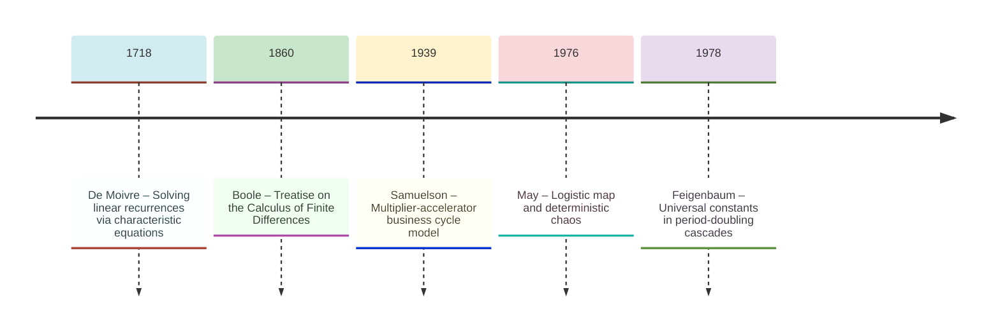
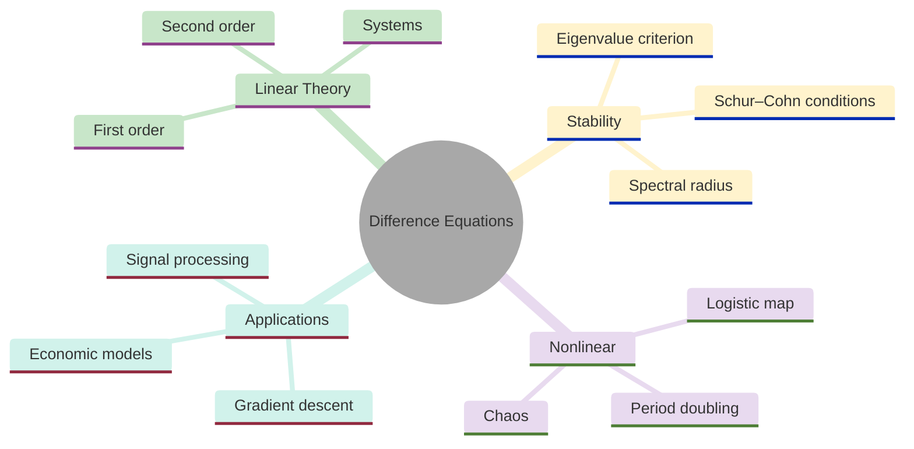
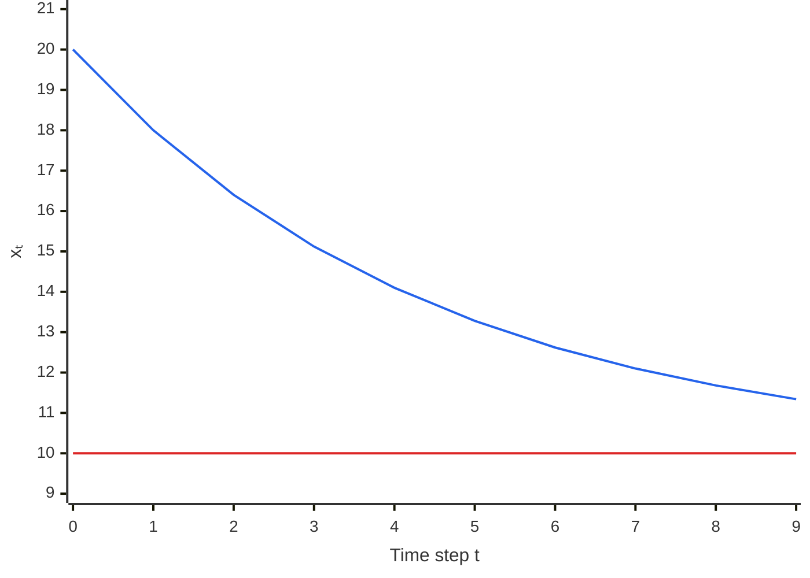
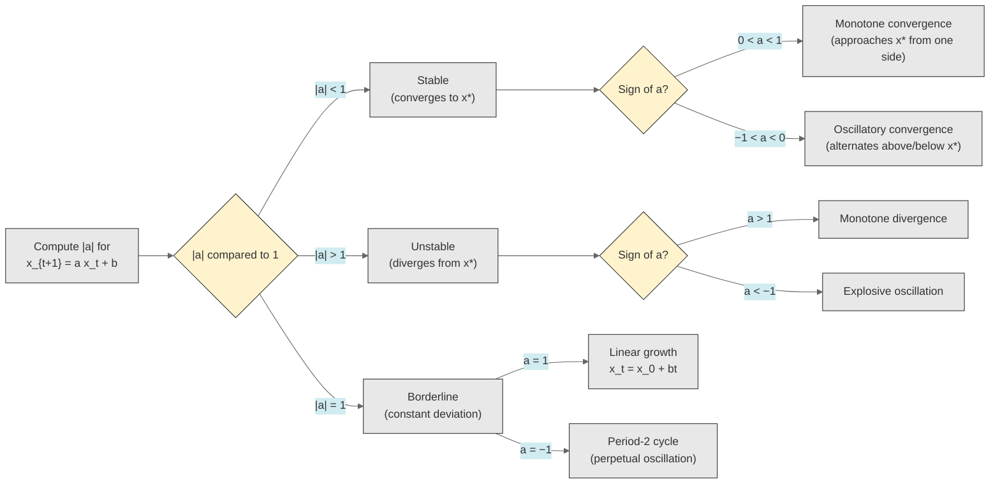
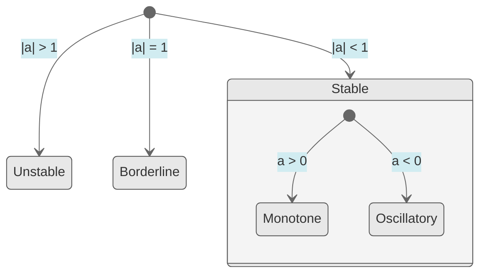
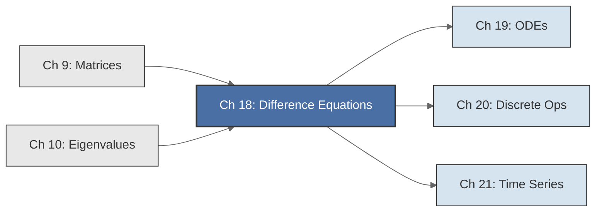

<!-- Copyright (c) 2025-2026 Bob Jansen <bobjansen@pm.me> -->
<!-- SPDX-License-Identifier: CC-BY-NC-4.0 -->
<!-- See LICENSE for full terms. Commercial licensing available. -->
# Chapter 18: Difference Equations & Dynamical Systems

**Part VI**: Dynamic Systems

> Difference equations describe systems that advance in discrete steps. A linear system converges if and only if every eigenvalue of its transition matrix lies strictly inside the unit circle; this chapter develops that stability theory from first principles.

**Prerequisites**: [Chapter 9](09-matrices.md) (Matrices); matrix multiplication, determinants, inverse, eigenvalue computation. [Chapter 10](10-eigenvalues.md) (Eigenvalues); the eigenvalue equation $A\mathbf{v} = \lambda\mathbf{v}$, diagonalisation, spectral radius.

**Learning Objectives**: After this chapter, the reader will be able to:

1. Solve first-order and second-order linear difference equations in closed form.
2. Classify fixed points and determine stability via eigenvalue conditions.
3. Formulate higher-order scalar equations as first-order vector systems.
4. Analyse the cobweb model, multiplier-accelerator model and other economic dynamical systems.
5. Describe the period-doubling route to chaos in nonlinear maps.
6. Implement forward simulation and analytical solution algorithms for discrete dynamical systems.

**Connections**: This chapter is used by [Chapter 19](19-odes.md) (Ordinary Differential Equations, the continuous analogue where stability requires $\operatorname{Re}(\lambda) < 0$ rather than $|\lambda| < 1$), [Chapter 20](20-discrete-operators.md) (Discrete Operators, where the shift operator $E$ and its algebra formalise difference equations) and [Chapter 21](21-time-series.md) (Time Series, where autoregressive moving average (ARMA) models are difference equations driven by white noise). It builds on [Chapter 9](09-matrices.md) (matrix systems $\mathbf{x}_{t+1} = A\mathbf{x}_t$) and [Chapter 10](10-eigenvalues.md) (eigenvalues of the transition matrix determine long-run behaviour).

---

## Historical Context

**Key Milestones in Difference Equations**



*Figure 18.1: Timeline of key developments in difference equations from de Moivre to Feigenbaum.*

**De Moivre and the characteristic equation (1718).** Abraham de Moivre, in his 1718 *Doctrine of Chances*, developed the method of solving linear recurrences by assuming solutions of the form $\lambda^t$ and finding $\lambda$ from a characteristic equation. His technique produced the first closed-form expression for the Fibonacci sequence $F_t = F_{t-1} + F_{t-2}$, yielding the formula involving powers of the golden ratio $\phi = (1 + \sqrt{5})/2$. The exponential ansatz reduces a recurrence to a polynomial equation. This remains the central technique of linear difference equation theory three centuries later.

**Euler and the theory of linear recurrences (1740s–1760s).** Leonhard Euler extended de Moivre's work in the mid-eighteenth century. He developed the theory of linear recurrences with constant coefficients systematically, recognising the analogy between difference equations and differential equations. He treated the shift operator as the discrete analogue of differentiation, solved higher-order recurrences with repeated and complex roots and demonstrated the superposition principle. Euler established that the general solution of an $n$-th order homogeneous linear recurrence is a linear combination of $n$ fundamental solutions, each determined by a root of the characteristic polynomial.

**Boole and the calculus of finite differences (1860).** Difference equations in the nineteenth century served interpolation theory, actuarial science and numerical analysis. George Boole's 1860 *Treatise on the Calculus of Finite Differences* and its successor by Charles Jordan gave systematic expositions of the operator method. They introduced the forward difference operator $\Delta$, the shift operator $E$ and their algebraic relationships. These tools formalised the passage between continuous and discrete analysis and laid the groundwork for modern combinatorics and numerical methods.

**Samuelson and the multiplier-accelerator model (1939).** Economic applications emerged in the twentieth century. Paul Samuelson's 1939 paper "Interactions between the Multiplier Analysis and the Principle of Acceleration" modelled the business cycle as a second-order linear difference equation. National income depended on consumption (a fraction of last period's income) and investment (proportional to the change in income). Samuelson showed that the system's behaviour (monotone convergence, damped oscillation, explosive oscillation or steady growth) depends entirely on the roots of the characteristic equation. A simple linear model could produce complex cyclical dynamics. The paper established difference equations as the natural language of discrete-time economic theory.

**Ezekiel and the cobweb model (1938).** Mordecai Ezekiel introduced the cobweb model in 1938. In agricultural markets where production decisions are made one period in advance based on current prices, the interplay of supply and demand curves generates a first-order difference equation in price. The model exhibits convergent, divergent and oscillatory price paths depending on the relative slopes of supply and demand.

**May, Feigenbaum and deterministic chaos (1976–1978).** The discovery of deterministic chaos altered the field. Edward Lorenz, working on weather prediction models in 1963, observed sensitive dependence on initial conditions in iterated maps derived from discretised differential equations. Robert May's 1976 paper "Simple Mathematical Models with Very Complicated Dynamics" demonstrated that the logistic map $x_{t+1} = rx_t(1 - x_t)$ exhibits stable fixed points, period-doubling cascades and chaos as the parameter $r$ increases. Published in *Nature*, the paper showed that apparent randomness in biological populations need not arise from external stochastic shocks; it can emerge from purely deterministic nonlinear feedback. Mitchell Feigenbaum in 1978 discovered universal constants in the period-doubling route to chaos shared by broad classes of maps.

**Modern applications.** Difference equations now pervade digital signal processing (filters are linear difference equations on discrete-time signals), control theory, population biology (Leslie matrix models), computational finance (binomial option pricing as a backward difference equation) and numerical analysis (discretising differential equations produces difference equations whose stability must be verified). The eigenvalue stability criterion (convergence if and only if the spectral radius is less than one) is the unifying theoretical tool across all these domains.

---

## Why This Chapter Matters

**Difference Equations**



*Figure 18.2: Conceptual map of difference equation topics including stability, nonlinear dynamics and applications.*

Every iterative algorithm is a difference equation. Gradient descent, Newton's method and the expectation-maximisation algorithm all advance in discrete steps. Whether they converge is a stability question answered by the eigenvalue conditions of this chapter. The spectral radius condition (Theorem 18.10) states that a linear system $\mathbf{x}_{t+1} = A\mathbf{x}_t + \mathbf{b}$ converges if and only if every eigenvalue of $A$ satisfies $|\lambda_i| < 1$. This single result governs fixed-point iterations, numerical ordinary differential equation solvers and autoregressive time series stationarity.

Difference equations clarify optimiser dynamics. Gradient descent with learning rate $\eta$ on a quadratic loss with Hessian $H$ is the linear system $\mathbf{w}_{t+1} = (I - \eta H)\mathbf{w}_t$. Convergence requires all eigenvalues of $(I - \eta H)$ to lie inside the unit circle, so $\eta < 2/\lambda_{\max}(H)$. This is a direct application of Theorem 18.10. Momentum methods (Polyak, Nesterov) are second-order difference equations. Their convergence rates follow from the characteristic equation (Theorem 18.5) and the Schur–Cohn conditions (Theorem 18.8). Recurrent neural networks propagate hidden states via $\mathbf{h}_{t+1} = \sigma(A\mathbf{h}_t + B\mathbf{x}_t)$. The exploding/vanishing gradient problem is the instability/damping dichotomy of linear difference equations. The spectral radius of the recurrence matrix determines which regime the network occupies.

In finance and economics, the cobweb model, the multiplier-accelerator model (Samuelson, 1939) and dynamic stochastic general equilibrium (DSGE) models are systems of difference equations. Their stability determines whether an economy converges to equilibrium or oscillates. The Schur–Cohn conditions (Theorem 18.8) appear directly in the Blanchard–Kahn conditions for rational expectations models. In crypto, automated market maker reserve dynamics and token emission schedules with feedback are discrete dynamical systems. Their long-run behaviour depends on eigenvalue conditions. The period-doubling route to chaos explains why simple feedback rules can shift abruptly from convergence to erratic oscillation.

The forward simulation algorithms of this chapter underlie discrete-event simulation and game physics engines. The closed-form solutions (Theorem 18.5 for distinct roots, Theorem 18.6 for complex roots) enable verification of simulation correctness. They also provide analytical formulas where brute-force iteration would be too slow or imprecise.

---

## Notation & Conventions

| Symbol | Meaning |
|--------|---------|
| $x_t$ | State variable at discrete time $t \in \{0, 1, 2, \ldots\}$ |
| $\mathbf{x}_t$ | State vector at time $t$ (bold for vector-valued systems) |
| $A$ | Transition matrix in the system $\mathbf{x}_{t+1} = A\mathbf{x}_t + \mathbf{b}$ |
| $\lambda$, $\lambda_1$, $\lambda_2$ | Eigenvalues of the transition matrix or roots of the characteristic equation |
| $x^*$ | Fixed point (equilibrium): the value satisfying $x^* = f(x^*)$ |
| $\mathbf{x}^*$ | Fixed-point vector: $\mathbf{x}^* = A\mathbf{x}^* + \mathbf{b}$ |
| $\rho(A)$ | Spectral radius: $\rho(A) = \max_i \lvert \lambda_i \rvert$ |
| $r$, $\theta$ | Modulus and argument of a complex eigenvalue $\lambda = re^{i\theta}$ |
| $E$ | Shift operator: $Ex_t = x_{t+1}$ |
| $\Delta$ | Forward difference operator: $\Delta x_t = x_{t+1} - x_t$ |
| $c_1$, $c_2$ | Constants determined by initial conditions |
| $a$, $b$ | Parameters in first-order equations $x_{t+1} = ax_t + b$ |
| $a_1$, $a_2$ | Coefficients in second-order equations $x_{t+2} + a_1 x_{t+1} + a_2 x_t = b$ |
| $D$ | Discriminant of the characteristic equation: $D = a_1^2 - 4a_2$ |

Subscripts denote time indices. $x_t$ is the state at time $t$, not a vector component (vector components use bold notation with explicit indices). Complex conjugates are $\bar{\lambda}$. The modulus is $|\lambda| = \sqrt{\operatorname{Re}(\lambda)^2 + \operatorname{Im}(\lambda)^2}$.

---

## Core Theory

### First-Order Linear Difference Equations

The simplest nontrivial difference equation relates the state at time $t+1$ linearly to the state at time $t$.

**Definition 18.1** (First-order linear difference equation). A *first-order linear difference equation with constant coefficients* is a recurrence of the form

$$x_{t+1} = ax_t + b,$$

where $a$ and $b$ are real constants and $x_0$ is a given initial condition. The constant $a$ is called the *coefficient* (or *multiplier*) and $b$ is the *forcing term* (or *input*). When $b = 0$, the equation is *homogeneous*; otherwise it is *nonhomogeneous* (or *affine*).

The solution proceeds by iteration. From the recurrence: $x_1 = ax_0 + b$, $x_2 = a(ax_0 + b) + b = a^2 x_0 + ab + b$, $x_3 = a^3 x_0 + a^2 b + ab + b$. The pattern yields, for $a \neq 1$:

$$x_t = a^t x_0 + b(1 + a + a^2 + \cdots + a^{t-1}) = a^t x_0 + b \cdot \frac{1 - a^t}{1 - a}.$$

Rearranging:

$$x_t = a^t\left(x_0 - \frac{b}{1-a}\right) + \frac{b}{1-a}.$$

For the special case $a = 1$: $x_t = x_0 + bt$ (arithmetic growth).

**Definition 18.2** (Fixed point / equilibrium). A *fixed point* (or *equilibrium*) of the difference equation $x_{t+1} = ax_t + b$ is a value $x^*$ satisfying $x^* = ax^* + b$. Solving:

$$x^* = \frac{b}{1-a}, \quad \text{provided } a \neq 1.$$

The fixed point is the state that, once reached, persists indefinitely. The general solution can be rewritten in terms of the fixed point as

$$x_t = a^t(x_0 - x^*) + x^* = x^* + a^t(x_0 - x^*).$$

This form reveals that the solution is the equilibrium plus an exponentially weighted deviation from equilibrium. The deviation $x_t - x^*$ evolves as a geometric sequence with ratio $a$.

**First-order autoregressive (AR(1)) convergence to equilibrium** ($a = 0.8$, $b = 2$, $x_0 = 20$, equilibrium $x^* = 10$):



*Figure 18.3: First-order difference equation converging monotonically toward its equilibrium.*

The upper line shows $x_t = 0.8^t(20 - 10) + 10$ converging monotonically toward the equilibrium $x^* = b/(1-a) = 2/0.2 = 10$ (lower line). Since $0 < a = 0.8 < 1$, convergence is monotone from above. Each step closes 20% of the remaining gap to equilibrium.

**Theorem 18.3** (Stability of first-order linear difference equations). Consider the equation $x_{t+1} = ax_t + b$ with fixed point $x^* = b/(1-a)$ for $a \neq 1$. Then:

(i) If $|a| < 1$, the fixed point is *globally asymptotically stable*: $x_t \to x^*$ as $t \to \infty$ for every initial condition $x_0$.

(ii) If $|a| > 1$, the fixed point is *unstable*: $|x_t - x^*| \to \infty$ as $t \to \infty$ for every $x_0 \neq x^*$.

(iii) If $|a| = 1$ (specifically $a = -1$), the orbit oscillates between two values without converging or diverging. If $a = 1$, no finite fixed point exists and $x_t$ grows linearly.

If $0 < a < 1$, convergence is *monotone* (from one side). If $-1 < a < 0$, convergence is *oscillatory* (alternating above and below $x^*$).

!!! abstract "Key Result"

    **Theorem 18.3** (Stability of first-order linear difference equations). The equilibrium is globally stable if and only if $|a| < 1$, providing a single-parameter criterion that governs convergence in economic models, population dynamics and iterative algorithms.

**Stability Classification for Difference Equations:**



*Figure 18.4: Flowchart classifying first-order difference equation stability by the coefficient a.*

??? note "Proof"

    *Proof.* The deviation from equilibrium satisfies $x_t - x^* = a^t(x_0 - x^*)$. Taking absolute values:

    $$\lvert x_t - x^* \rvert = \lvert a \rvert^t \,\lvert x_0 - x^* \rvert.$$

    If $|a| < 1$, then $|a|^t \to 0$ as $t \to \infty$, so $x_t \to x^*$.

    If $|a| > 1$, then $|a|^t \to \infty$, so the deviation grows without bound (provided $x_0 \neq x^*$).

    If $|a| = 1$, the deviation $|x_t - x^*| = |x_0 - x^*|$ remains constant; when $a = -1$, the sign alternates, producing a period-2 cycle.

    The monotone/oscillatory distinction follows from the sign of $a^t$: for $a > 0$, $a^t > 0$ for all $t$, so the deviation does not change sign; for $a < 0$, $a^t$ alternates in sign, so $x_t$ oscillates about $x^*$.

    $\square$

**Stability Classification of First-Order Difference Equations**



*Figure 18.5: State diagram summarising stability and convergence modes for first-order equations.*

The state diagram above summarises the stability classification for the first-order linear difference equation $x_{t+1} = ax_t + b$. When $|a| < 1$, the equilibrium is stable and the system converges; monotonically if $a > 0$, or with alternating oscillations if $a < 0$. When $|a| > 1$, the equilibrium is unstable and trajectories diverge. The borderline case $|a| = 1$ produces either linear growth ($a = 1$) or a perpetual period-2 cycle ($a = -1$).

### Second-Order Linear Difference Equations

Second-order equations arise naturally in economics (Samuelson's model), population biology (two-period life cycles) and signal processing (second-order digital filters).

**Definition 18.4** (Second-order linear difference equation). A *second-order linear difference equation with constant coefficients* has the form

$$x_{t+2} + a_1 x_{t+1} + a_2 x_t = b,$$

where $a_1$, $a_2$ and $b$ are real constants with $a_2 \neq 0$. The *characteristic equation* (or *auxiliary equation*) is the quadratic

$$\lambda^2 + a_1 \lambda + a_2 = 0.$$

The characteristic equation is obtained by substituting the trial solution $x_t = \lambda^t$ into the homogeneous equation $x_{t+2} + a_1 x_{t+1} + a_2 x_t = 0$, yielding $\lambda^{t+2} + a_1 \lambda^{t+1} + a_2 \lambda^t = 0$. Dividing by $\lambda^t$ (which is nonzero) produces the characteristic equation.

The roots of the characteristic equation are

$$\lambda_{1,2} = \frac{-a_1 \pm \sqrt{a_1^2 - 4a_2}}{2}.$$

Three cases arise depending on the discriminant $D = a_1^2 - 4a_2$.

**Theorem 18.5** (Solution for distinct real roots). If the characteristic equation $\lambda^2 + a_1\lambda + a_2 = 0$ has two distinct real roots $\lambda_1 \neq \lambda_2$, then the general solution of the homogeneous equation $x_{t+2} + a_1 x_{t+1} + a_2 x_t = 0$ is

$$x_t^{(h)} = c_1 \lambda_1^t + c_2 \lambda_2^t,$$

where $c_1$ and $c_2$ are constants determined by the initial conditions $x_0$ and $x_1$. The general solution of the nonhomogeneous equation $x_{t+2} + a_1 x_{t+1} + a_2 x_t = b$ is

$$x_t = c_1 \lambda_1^t + c_2 \lambda_2^t + x^*,$$

where $x^* = b/(1 + a_1 + a_2)$ is the particular (equilibrium) solution, provided $1 + a_1 + a_2 \neq 0$.

??? note "Proof"

    *Proof.* One verifies directly that $\lambda_1^t$ and $\lambda_2^t$ each satisfy the homogeneous recurrence (by construction from the characteristic equation). They are linearly independent as functions of $t$ because $\lambda_1 \neq \lambda_2$ implies that no constant multiple of one equals the other for all $t$. The homogeneous equation has a two-dimensional solution space (since specifying $x_0$ and $x_1$ determines the entire sequence), so every homogeneous solution is of the form $c_1\lambda_1^t + c_2\lambda_2^t$. For the particular solution, substitute $x_t = x^*$ (a constant) into the full equation: $x^* + a_1 x^* + a_2 x^* = b$, yielding $x^*(1 + a_1 + a_2) = b$.

    $\square$

Given initial conditions $x_0$ and $x_1$, the constants are determined by the system

$$c_1 + c_2 = x_0 - x^*, \quad c_1\lambda_1 + c_2\lambda_2 = x_1 - x^*.$$

**Theorem 18.6** (Solution for complex roots). If the discriminant $D = a_1^2 - 4a_2 < 0$, the characteristic equation has complex conjugate roots $\lambda_{1,2} = r e^{\pm i\theta}$, where

$$r = \sqrt{a_2}, \qquad \theta = \arccos\left(\frac{-a_1}{2\sqrt{a_2}}\right).$$

The general homogeneous solution is

$$x_t^{(h)} = r^t\bigl(c_1 \cos(\theta t) + c_2 \sin(\theta t)\bigr),$$

equivalently written as $x_t^{(h)} = C r^t \cos(\theta t - \phi)$, where $C$ and $\phi$ are amplitude and phase determined by initial conditions.

??? note "Proof"

    *Proof.* Write $\lambda_1 = re^{i\theta}$ and $\lambda_2 = re^{-i\theta} = \bar{\lambda}_1$. The general complex solution is

    $$c_1(re^{i\theta})^t + c_2(re^{-i\theta})^t = c_1 r^t e^{i\theta t} + c_2 r^t e^{-i\theta t}.$$

    For the solution to be real-valued (since the recurrence has real coefficients and real initial conditions), the condition $c_2 = \bar{c}_1$ must hold.

    Writing $c_1 = (A - iB)/2$ gives

    $$c_1 e^{i\theta t} + \bar{c}_1 e^{-i\theta t} = A\cos(\theta t) + B\sin(\theta t).$$

    The constants $A$ and $B$ are determined by the initial conditions $x_0$ and $x_1$, yielding the stated form.

    The modulus $r = |\lambda_1| = |\lambda_2| = \sqrt{a_2}$ follows from the identity $\lambda_1 \lambda_2 = a_2$ (Vieta's formula for the characteristic quadratic, noting the leading coefficient is 1 and the constant term is $a_2$).

    $\square$

The factor $r^t$ governs the *envelope* (amplitude growth or decay), while $\cos(\theta t)$ and $\sin(\theta t)$ produce oscillations with period $2\pi/\theta$ (measured in discrete time steps). When $r < 1$, the oscillations are damped; when $r > 1$, they are explosive; when $r = 1$, they have constant amplitude.

**Remark 18.7** (Repeated roots). When $D = 0$, the characteristic equation has a repeated root $\lambda_1 = \lambda_2 = -a_1/2$. The general homogeneous solution is $x_t^{(h)} = (c_1 + c_2 t)\lambda_1^t$. The factor $t$ appears because the solution space is still two-dimensional but the single root $\lambda_1^t$ provides only one independent solution; the second is $t\lambda_1^t$. To verify, substitute $x_t = t\lambda^t$ into $x_{t+2} + a_1 x_{t+1} + a_2 x_t = 0$:

$$(t+2)\lambda^{t+2} + a_1(t+1)\lambda^{t+1} + a_2 t\lambda^t = \lambda^t\bigl[(t+2)\lambda^2 + a_1(t+1)\lambda + a_2 t\bigr].$$

Expanding the bracket: $t(\lambda^2 + a_1\lambda + a_2) + (2\lambda^2 + a_1\lambda)$. The first group vanishes because $\lambda$ is a root of $\lambda^2 + a_1\lambda + a_2 = 0$. The second group equals $\lambda(2\lambda + a_1) = 0$ because $\lambda = -a_1/2$ implies $2\lambda + a_1 = 0$.

**Theorem 18.8** (Stability of second-order linear difference equations). The equilibrium $x^*$ of the equation $x_{t+2} + a_1 x_{t+1} + a_2 x_t = b$ is asymptotically stable if and only if both roots $\lambda_1, \lambda_2$ of the characteristic equation satisfy $|\lambda_i| < 1$. In terms of the coefficients, the necessary and sufficient conditions are the *Schur–Cohn conditions*:

(i) $1 + a_1 + a_2 > 0$,

(ii) $1 - a_1 + a_2 > 0$,

(iii) $|a_2| < 1$.

??? note "Proof"

    *Proof.* The deviation from equilibrium satisfies the homogeneous equation, whose general solution involves $\lambda_1^t$ and $\lambda_2^t$ (or $r^t\cos(\theta t)$ and $r^t\sin(\theta t)$ in the complex case). Convergence to zero requires $|\lambda_i| < 1$ for both roots.

    For the Schur–Cohn equivalence, define the characteristic polynomial $p(\lambda) = \lambda^2 + a_1\lambda + a_2$.

    Condition (i) states $p(1) = 1 + a_1 + a_2 > 0$. This ensures that neither root equals or exceeds 1 on the positive real axis: if $\lambda_1 \geq 1$ were a root, then $p(1) \leq 0$ since $p$ is a monic quadratic with a root at or beyond 1.

    Condition (ii) states $p(-1) = 1 - a_1 + a_2 > 0$. This ensures that neither root equals or exceeds 1 in magnitude on the negative real axis: if $\lambda_1 \leq -1$, then $p(-1) \leq 0$.

    Condition (iii) states $|a_2| = |\lambda_1\lambda_2| < 1$. By Vieta's formula, $\lambda_1\lambda_2 = a_2$, so this requires the product of moduli to be less than 1. Combined with conditions (i) and (ii), this forces each individual modulus below 1. For sufficiency, if any $|\lambda_i| \geq 1$, at least one of the three conditions is violated.

    $\square$

### Systems of First-Order Difference Equations

Higher-order scalar equations and multi-variable models are unified by the system form.

**Definition 18.9** (First-order linear system). A *first-order linear system of difference equations* is

$$\mathbf{x}_{t+1} = A\mathbf{x}_t + \mathbf{b},$$

where $A$ is an $n \times n$ real matrix ([Chapter 9](09-matrices.md)), $\mathbf{b}$ is an $n \times 1$ constant vector and $\mathbf{x}_t \in \mathbb{R}^n$ is the state vector at time $t$. The initial condition is $\mathbf{x}_0$.

Any $n$-th order scalar difference equation can be written as a first-order system of dimension $n$. For example, the second-order equation $x_{t+2} + a_1 x_{t+1} + a_2 x_t = b$ becomes

$$\begin{pmatrix} x_{t+1} \\ x_{t+2} \end{pmatrix} = \begin{pmatrix} 0 & 1 \\ -a_2 & -a_1 \end{pmatrix} \begin{pmatrix} x_t \\ x_{t+1} \end{pmatrix} + \begin{pmatrix} 0 \\ b \end{pmatrix},$$

with the *companion matrix* $A = \begin{pmatrix} 0 & 1 \\ -a_2 & -a_1 \end{pmatrix}$. The eigenvalues ([Chapter 10](10-eigenvalues.md)) of this companion matrix are precisely the roots of the characteristic equation $\lambda^2 + a_1\lambda + a_2 = 0$.

The fixed point of the system satisfies $\mathbf{x}^* = A\mathbf{x}^* + \mathbf{b}$, i.e., $(I - A)\mathbf{x}^* = \mathbf{b}$, which has a unique solution $\mathbf{x}^* = (I - A)^{-1}\mathbf{b}$ provided $I - A$ is invertible (equivalently, 1 is not an eigenvalue of $A$).

The homogeneous solution (with $\mathbf{b} = \mathbf{0}$) is $\mathbf{x}_t = A^t \mathbf{x}_0$. If $A$ is diagonalizable with $A = P\Lambda P^{-1}$ (where $\Lambda = \operatorname{diag}(\lambda_1, \ldots, \lambda_n)$), then $A^t = P\Lambda^t P^{-1}$, yielding an explicit closed-form solution. The general nonhomogeneous solution is

$$\mathbf{x}_t = A^t(\mathbf{x}_0 - \mathbf{x}^*) + \mathbf{x}^*.$$

**Theorem 18.10** (Stability of linear systems; spectral radius condition). The equilibrium $\mathbf{x}^*$ of the system $\mathbf{x}_{t+1} = A\mathbf{x}_t + \mathbf{b}$ is globally asymptotically stable if and only if the *spectral radius* of $A$ satisfies

$$\rho(A) = \max_{i} \lvert \lambda_i(A) \rvert < 1,$$

where $\lambda_1(A), \ldots, \lambda_n(A)$ are the eigenvalues of $A$ (counted with multiplicity, including complex eigenvalues). Equivalently, $A^t \to 0$ as $t \to \infty$ (the zero matrix) if and only if $\rho(A) < 1$.

??? note "Proof"

    *Proof.* The deviation $\mathbf{d}_t = \mathbf{x}_t - \mathbf{x}^*$ satisfies $\mathbf{d}_t = A^t\mathbf{d}_0$. It suffices to show $A^t \to 0$ iff $\rho(A) < 1$.

    ($\Rightarrow$) Suppose $A^t \to 0$. If $\lambda$ is an eigenvalue with eigenvector $\mathbf{v}$, then $A^t\mathbf{v} = \lambda^t\mathbf{v} \to \mathbf{0}$, hence $\lambda^t \to 0$, which requires $|\lambda| < 1$. This holds for all eigenvalues, so $\rho(A) < 1$.

    ($\Leftarrow$) Suppose $\rho(A) < 1$. By the Jordan normal form theorem, $A = PJP^{-1}$ where $J$ is block diagonal with Jordan blocks $J_k = \lambda_k I + N_k$ ($N_k$ nilpotent). Then

    $$J_k^t = \sum_{j=0}^{m_k-1} \binom{t}{j}\lambda_k^{t-j} N_k^j.$$

    Each term satisfies $|\binom{t}{j}\lambda_k^{t-j}| \leq t^{m_k-1}|\lambda_k|^{t-m_k+1}$. Since $|\lambda_k| < 1$, the exponential decay $|\lambda_k|^t$ dominates the polynomial growth $t^{m_k-1}$, so $J_k^t \to 0$.

    It follows that $A^t = PJ^tP^{-1} \to 0$.

    $\square$

**Remark 18.11** (Saddle-path dynamics). When some eigenvalues satisfy $|\lambda_i| < 1$ and others $|\lambda_j| > 1$, the equilibrium is a *saddle point*. The *stable manifold* (or *stable subspace*) consists of initial conditions from which the system converges to equilibrium; it is spanned by the eigenvectors associated with eigenvalues inside the unit circle. The *unstable manifold* consists of directions along which the system diverges. Saddle-path dynamics arise frequently in rational expectations models in economics, where forward-looking agents choose the initial state to lie on the stable manifold.

!!! warning "Defective matrices at the stability boundary"

    The spectral radius condition $\rho(A) < 1$ is necessary and sufficient for stability. When $\rho(A) = 1$ exactly, the system is marginally stable if $A$ is diagonalisable but unstable if $A$ has a Jordan block of size two or larger; the polynomial growth factor $t^{m-1}$ in $J_k^t$ produces unbounded orbits even when $|\lambda| = 1$. Confusing marginal stability with asymptotic stability is a common error in applied work.

### Worked Examples

**Example 18.12** (Samuelson multiplier-accelerator model). Samuelson (1939) modelled national income $Y_t$ as the sum of consumption $C_t$, investment $I_t$ and autonomous government spending $G$:

$$Y_t = C_t + I_t + G.$$

Consumption is a fraction of last period's income: $C_t = cY_{t-1}$ where $0 < c < 1$ is the marginal propensity to consume. Investment responds to the change in consumption: $I_t = v(C_t - C_{t-1}) = v(cY_{t-1} - cY_{t-2})$ where $v > 0$ is the accelerator coefficient. Substituting:

$$Y_t = cY_{t-1} + v(cY_{t-1} - cY_{t-2}) + G = c(1+v)Y_{t-1} - cvY_{t-2} + G.$$

This is a second-order linear difference equation. In standard form: $Y_t - c(1+v)Y_{t-1} + cvY_{t-2} = G$, or equivalently $Y_{t+2} - c(1+v)Y_{t+1} + cvY_t = G$. The characteristic equation is

$$\lambda^2 - c(1+v)\lambda + cv = 0.$$

The equilibrium income is $Y^* = G/(1 - c)$ (the Keynesian multiplier). Stability requires both roots to have modulus less than 1. By the Schur–Cohn conditions with $a_1 = -c(1+v)$ and $a_2 = cv$:

- Condition (i): $1 - c(1+v) + cv = 1 - c > 0$. Satisfied since $c < 1$.
- Condition (ii): $1 + c(1+v) + cv = 1 + c + 2cv > 0$. Always satisfied.
- Condition (iii): $|cv| < 1$, i.e., $cv < 1$.

The system is stable if and only if $cv < 1$. The discriminant $[c(1+v)]^2 - 4cv$ determines whether the path is oscillatory (complex roots when $[c(1+v)]^2 < 4cv$) or monotone. For typical values $c = 0.7$, $v = 0.9$: the discriminant is $[0.7 \times 1.9]^2 - 4 \times 0.63 = 1.33^2 - 2.52 = 1.7689 - 2.52 = -0.7511 < 0$, yielding damped oscillations; the business cycle emerges.

**Example 18.13** (Cobweb model). Consider a competitive agricultural market where supply depends on last period's price (due to a production lag) and demand depends on the current price:

$$Q_t^d = \alpha - \beta P_t, \qquad Q_t^s = -\gamma + \delta P_{t-1},$$

with $\alpha, \beta, \gamma, \delta > 0$. Market clearing $Q_t^d = Q_t^s$ yields

$$\alpha - \beta P_t = -\gamma + \delta P_{t-1} \implies P_t = \frac{\alpha + \gamma}{\beta} - \frac{\delta}{\beta}P_{t-1}.$$

This is a first-order linear difference equation with $a = -\delta/\beta$ and $b = (\alpha + \gamma)/\beta$. The fixed point is $P^* = (\alpha + \gamma)/(\beta + \delta)$. By Theorem 18.3:

- If $\delta < \beta$ (supply less elastic than demand): $|a| = \delta/\beta < 1$, stable with oscillations (since $a < 0$).
- If $\delta > \beta$ (supply more elastic): $|a| > 1$, explosively oscillating.
- If $\delta = \beta$: perpetual oscillation with constant amplitude.

The name "cobweb" comes from the characteristic cobweb-shaped diagram obtained by tracing the orbit on a supply-demand graph.

**Example 18.14** (Fibonacci sequence). The Fibonacci recurrence $F_{t+2} = F_{t+1} + F_t$ with $F_0 = 0$, $F_1 = 1$ has characteristic equation $\lambda^2 - \lambda - 1 = 0$ with roots $\lambda_1 = (1+\sqrt{5})/2 = \phi$ (the golden ratio) and $\lambda_2 = (1-\sqrt{5})/2 = -1/\phi$. The general solution is $F_t = c_1\phi^t + c_2(-1/\phi)^t$. Applying initial conditions: $c_1 + c_2 = 0$ and $c_1\phi + c_2(-1/\phi) = 1$, yielding $c_1 = 1/\sqrt{5}$ and $c_2 = -1/\sqrt{5}$. Thus:

$$F_t = \frac{\phi^t - (-1/\phi)^t}{\sqrt{5}} = \frac{1}{\sqrt{5}}\left[\left(\frac{1+\sqrt{5}}{2}\right)^t - \left(\frac{1-\sqrt{5}}{2}\right)^t\right].$$

Since $|\lambda_2| = 1/\phi \approx 0.618 < 1$, the second term vanishes exponentially and $F_t \approx \phi^t/\sqrt{5}$ for large $t$. The system is unstable ($|\lambda_1| = \phi > 1$), reflecting the exponential growth of Fibonacci numbers.

### Nonlinear Dynamics: The Logistic Map

**Remark 18.15** (Logistic map and chaos). The logistic map

$$x_{t+1} = rx_t(1 - x_t), \qquad x_t \in [0, 1], \quad r \in [0, 4],$$

is the canonical example of a nonlinear difference equation exhibiting the full spectrum of dynamical behaviour. Its fixed points are $x^* = 0$ and $x^* = (r-1)/r$ (for $r > 1$). Linearisation around $x^* = (r-1)/r$ gives the local multiplier $f'(x^*) = 2 - r$.

For $1 < r < 3$: $|2-r| < 1$, and the nonzero fixed point is stable.

For $r = 3$: the fixed point loses stability through a *period-doubling bifurcation*. A stable 2-cycle emerges.

For $3 < r < 3.449\ldots$: a stable period-2 orbit exists.

As $r$ increases, period-doubling continues: period-4 at $r \approx 3.449$, period-8 at $r \approx 3.544$, and so forth. The parameter values $r_n$ at which period $2^n$ becomes unstable converge geometrically, with the ratio $(r_n - r_{n-1})/(r_{n+1} - r_n) \to \delta \approx 4.6692$ (the first Feigenbaum constant), a universal constant shared by all smooth unimodal maps.

For $r > r_\infty \approx 3.5699$: the system enters a chaotic regime (interspersed with periodic windows). In the chaotic regime, the orbit is aperiodic, sensitive to initial conditions (nearby starting points diverge exponentially) and ergodic (the time average of any continuous function equals its space average under an invariant measure).

This progression from stability through period-doubling to chaos is documented here for completeness. The logistic map demonstrates that nonlinear difference equations can produce behaviour qualitatively different from their linear counterparts. Deterministic equations can generate apparent randomness.

---

## Formulas & Identities

The following summary collects the principal closed-form results derived in Section 4.

**F18.1** (First-order solution, $a \neq 1$).

$$x_t = a^t\!\left(x_0 - \frac{b}{1-a}\right) + \frac{b}{1-a}.$$

**F18.2** (First-order solution, $a = 1$).

$$x_t = x_0 + bt.$$

**F18.3** (Second-order solution, distinct real roots, $D > 0$).

$$x_t = c_1\lambda_1^t + c_2\lambda_2^t + x^*, \qquad \lambda_{1,2} = \frac{-a_1 \pm \sqrt{D}}{2}, \qquad x^* = \frac{b}{1+a_1+a_2}.$$

**F18.4** (Second-order solution, repeated root, $D = 0$).

$$x_t = (c_1 + c_2 t)\lambda^t + x^*, \qquad \lambda = -\frac{a_1}{2}.$$

**F18.5** (Second-order solution, complex conjugate roots, $D < 0$).

$$x_t = r^t\bigl(c_1\cos(\theta t) + c_2\sin(\theta t)\bigr) + x^*, \qquad r = \sqrt{a_2}, \quad \theta = \arccos\!\left(\frac{-a_1}{2\sqrt{a_2}}\right).$$

**F18.6** (System solution, diagonalisable $A$).

$$\mathbf{x}_t = A^t(\mathbf{x}_0 - \mathbf{x}^*) + \mathbf{x}^*, \qquad \mathbf{x}^* = (I - A)^{-1}\mathbf{b}.$$

**F18.7** (Spectral radius stability criterion).

$$\text{Stable} \iff \rho(A) = \max_i \lvert \lambda_i(A) \rvert < 1.$$

**F18.8** (Schur–Cohn conditions).

$$1 + a_1 + a_2 > 0, \qquad 1 - a_1 + a_2 > 0, \qquad \lvert a_2 \rvert < 1.$$

**F18.9** (Vieta's formulas).

$$\lambda_1 + \lambda_2 = -a_1, \qquad \lambda_1\lambda_2 = a_2.$$

!!! info "Discrete vs continuous stability boundary"

    For continuous-time systems $\dot{\mathbf{x}} = A\mathbf{x}$, stability requires all eigenvalues in the open left half-plane ($\operatorname{Re}(\lambda) < 0$). For discrete-time systems $\mathbf{x}_{t+1} = A\mathbf{x}_t$, stability requires all eigenvalues inside the open unit disc ($|\lambda| < 1$). The bilinear (Tustin) transformation $z = (1 + s)/(1 - s)$ maps the left half-plane to the unit disc. This relationship is developed further in [Chapter 19](19-odes.md).

---

## Algorithms

!!! tip "Analytical vs iterative: when to use each"

    Use the analytical closed-form solutions (Algorithms 18.17 and 18.18) when only $x_t$ at a specific $t$ is needed; they run in $O(1)$ time regardless of $t$. Use forward simulation (Algorithm 18.16) when the full trajectory is needed, when the system is nonlinear or when the transition matrix is nearly defective and diagonalisation is numerically unreliable.

### Algorithm 18.16: Forward Simulation

The most direct computational approach to difference equations is forward iteration: given an initial condition, apply the recurrence repeatedly.

**Input**: Recurrence function $f$, initial condition $x_0$ (or $\mathbf{x}_0$ for systems), number of steps $T$.

**Output**: Trajectory $(x_0, x_1, \ldots, x_T)$.

**Procedure**:
1. Set $t \leftarrow 0$.
2. While $t < T$:
   - Compute $x_{t+1} = f(x_t)$ (or $\mathbf{x}_{t+1} = A\mathbf{x}_t + \mathbf{b}$ for linear systems).
   - Increment $t$.
3. Return the stored trajectory.

```
function forwardSimulation(f, x0, T):
    trajectory = [x0]                      // store initial state
    x = x0
    for t = 1 to T:
        x = f(x)                           // apply recurrence
        trajectory.append(x)
    return trajectory

function forwardSimulationLinearSystem(A, b, x0, T):
    trajectory = [x0]                      // store initial state vector
    x = x0
    for t = 1 to T:
        x = A * x + b                      // matrix-vector multiply plus shift
        trajectory.append(x)
    return trajectory
```

**Complexity**: $O(T)$ for scalar equations, $O(Tn^2)$ for $n$-dimensional systems (due to matrix-vector multiplication at each step).

### Algorithm 18.17: Analytical Solution for First-Order Equations

**Input**: Coefficient $a$, forcing $b$, initial condition $x_0$, time $t$.

**Output**: $x_t$ computed in $O(1)$ (assuming $O(1)$ exponentiation).

**Procedure**:
1. If $a = 1$: return $x_0 + bt$.
2. Else: compute $x^* = b/(1-a)$ and return $a^t(x_0 - x^*) + x^*$.

```
function solveFirstOrder(a, b, x0, t):
    if a == 1:
        return x0 + b * t                 // arithmetic growth
    xStar = b / (1 - a)                   // fixed point
    return pow(a, t) * (x0 - xStar) + xStar
```

**Complexity**: $O(1)$ time (a constant number of arithmetic operations and one exponentiation, independent of $t$).

### Algorithm 18.18: Analytical Solution for Second-Order Equations

**Input**: Coefficients $a_1$, $a_2$, forcing $b$, initial conditions $x_0$, $x_1$, time $t$.

**Output**: $x_t$.

**Procedure**:
1. Compute the particular solution $x^* = b/(1 + a_1 + a_2)$ (if $1 + a_1 + a_2 \neq 0$).
2. Compute discriminant $D = a_1^2 - 4a_2$.
3. If $D > 0$ (distinct real roots):
   - $\lambda_1 = (-a_1 + \sqrt{D})/2$, $\lambda_2 = (-a_1 - \sqrt{D})/2$.
   - Solve $c_1 + c_2 = x_0 - x^*$, $c_1\lambda_1 + c_2\lambda_2 = x_1 - x^*$ for $c_1, c_2$.
   - Return $c_1\lambda_1^t + c_2\lambda_2^t + x^*$.
4. If $D = 0$ (repeated root):
   - $\lambda = -a_1/2$.
   - Solve the system: $c_1 = x_0 - x^*$ from the $t=0$ condition; $(c_1 + c_2)\lambda = x_1 - x^*$ from the $t=1$ condition (since $x_1 - x^* = (c_1 + c_2 \cdot 1)\lambda$); hence $c_2 = (x_1 - x^* - c_1\lambda)/\lambda$.
   - Return $(c_1 + c_2 t)\lambda^t + x^*$.
5. If $D < 0$ (complex roots):
   - $r = \sqrt{a_2}$, $\theta = \arccos(-a_1/(2r))$.
   - Solve $c_1 = x_0 - x^*$, $c_1 r\cos\theta + c_2 r\sin\theta = x_1 - x^*$ for $c_1, c_2$.
   - Return $r^t(c_1\cos(\theta t) + c_2\sin(\theta t)) + x^*$.

```
function solveSecondOrder(a1, a2, b, x0, x1, t):
    xStar = b / (1 + a1 + a2)             // particular solution
    D = a1 * a1 - 4 * a2                  // discriminant

    if D > 0:                              // distinct real roots
        lambda1 = (-a1 + sqrt(D)) / 2
        lambda2 = (-a1 - sqrt(D)) / 2
        c2 = (x1 - xStar - lambda1 * (x0 - xStar)) / (lambda2 - lambda1)
        c1 = (x0 - xStar) - c2
        return c1 * pow(lambda1, t) + c2 * pow(lambda2, t) + xStar

    else if D == 0:                        // repeated root
        lambda = -a1 / 2
        c1 = x0 - xStar
        c2 = (x1 - xStar - c1 * lambda) / lambda
        return (c1 + c2 * t) * pow(lambda, t) + xStar

    else:                                  // complex conjugate roots
        r = sqrt(a2)                       // modulus
        theta = arccos(-a1 / (2 * r))      // argument
        c1 = x0 - xStar
        c2 = (x1 - xStar - c1 * r * cos(theta)) / (r * sin(theta))
        return pow(r, t) * (c1 * cos(theta * t) + c2 * sin(theta * t)) + xStar
```

**Complexity**: $O(1)$ time (a constant number of arithmetic operations including discriminant computation, root-finding, coefficient solving and one exponentiation, independent of $t$).

---

## Numerical Considerations

**Floating-point exponentiation.** Computing $a^t$ via repeated multiplication accumulates round-off proportionally to $t$. Use the hardware exponentiation instruction (a single `pow` call) rather than a manual loop.

!!! warning "Catastrophic cancellation when $a \approx 1$"

    The closed-form expression $b(1 - a^t)/(1 - a)$ suffers severe cancellation when $a \approx 1$. Both $1 - a^t$ and $1 - a$ are near zero, and the quotient amplifies round-off. For $|1 - a| < 10^{-8}$, switch to the iterative sum $b\sum_{k=0}^{t-1}a^k$ or use compensated (Kahan) summation.

**Matrix powers.** Repeated multiplication $A^t$ costs $O(tn^3)$ with $O(t)$ round-off. Diagonalisation $A = P\Lambda P^{-1}$ gives $A^t = P\Lambda^t P^{-1}$ in $O(n^3)$ regardless of $t$; but an ill-conditioned $P$ amplifies round-off. For nearly defective matrices, forward iteration is more reliable.

**Stability of forward iteration.** For $\rho(A) < 1$, errors decay geometrically. For $\rho(A) > 1$, errors grow but the relative error stays bounded. Near the stability boundary ($\rho(A) \approx 1$), numerical drift can cause qualitatively incorrect long-run behaviour. Higher-precision arithmetic may be necessary.

**Discriminant near zero.** When $D = a_1^2 - 4a_2 \approx 0$, the distinct-root formula is ill-conditioned because $c_1$ and $c_2$ become large and nearly opposite. Detect $|D| < \epsilon$ and use the repeated-root formula as a stable fallback.

---

## Worked Examples

### Example 18.19: Radioactive decay, discrete model

A radioactive substance loses 12% of its mass each year. If the initial mass is $m_0 = 100$ grams, find the mass after $t$ years.

*Solution.* The discrete-time model is $m_{t+1} = 0.88 m_t$ (first-order with $a = 0.88$, $b = 0$). The closed-form solution is

$$m_t = 0.88^t \cdot 100.$$

Since $|a| = 0.88 < 1$, the system is stable with fixed point $m^* = 0$. After 10 years:

$$m_{10} = 0.88^{10} \cdot 100 \approx 27.85 \text{ grams}.$$

The half-life satisfies $0.88^{t_{1/2}} = 0.5$, giving

$$t_{1/2} = \frac{\ln(0.5)}{\ln(0.88)} \approx 5.42 \text{ years}.$$

### Example 18.20: Loan amortisation

A borrower takes a loan of $L_0 = 200{,}000$ at monthly interest rate $r = 0.005$ (6% annual) with fixed monthly payment $P = 1{,}199.10$. The outstanding balance evolves as

$$L_{t+1} = (1+r)L_t - P = 1.005 L_t - 1199.10.$$

The fixed point is

$$L^* = P/r = 1199.10/0.005 = 239{,}820.$$

Since $|a| = 1.005 > 1$, the fixed point is unstable in the forward direction, but the loan is designed so that $L_0 < L^*$: the initial balance is below the "unstable equilibrium," and the trajectory

$$L_t = 1.005^t(200000 - 239820) + 239820$$

decreases, reaching zero at $t = 360$ months (30 years). (The trajectory decreases because $L_0 = 200{,}000 < L^* = 239{,}820$ places the initial state below the unstable equilibrium; since $|a| > 1$, the distance from $L^*$ grows in magnitude, but the sign of the deviation is negative, so $L_t$ falls toward zero rather than rising.) The instability of the fixed point means that if the balance ever exceeded $L^*$, it would grow without bound; the payment would not cover the interest.

### Example 18.21: System form, predator-prey discrete model

A simplified discrete predator-prey model:

$$\begin{pmatrix} x_{t+1} \\ y_{t+1} \end{pmatrix} = \begin{pmatrix} 1.1 & -0.4 \\ 0.2 & 0.7 \end{pmatrix} \begin{pmatrix} x_t \\ y_t \end{pmatrix},$$

where $x_t$ is prey population and $y_t$ is predator population. The eigenvalues of $A$ satisfy $\lambda^2 - 1.8\lambda + 0.85 = 0$, giving

$$\lambda = (1.8 \pm \sqrt{3.24 - 3.4})/2 = 0.9 \pm 0.2i.$$

The modulus is

$$r = \sqrt{0.9^2 + 0.2^2} = \sqrt{0.85} \approx 0.922 < 1.$$

The spectral radius is less than 1, so the system is stable. The oscillation frequency is

$$\theta = \arctan(0.2/0.9) \approx 0.218 \text{ radians per time step},$$

corresponding to a period of approximately $2\pi/0.218 \approx 28.8$ steps.

### Example 18.22: Cobweb model with numerical values

Consider a market with demand $Q^d = 100 - 2P_t$ and supply $Q^s = -20 + 3P_{t-1}$. Market clearing yields

$$P_t = 60 - 1.5 P_{t-1}.$$

Here $a = -1.5$, $b = 60$ and the fixed point is

$$x^* = \frac{60}{1+1.5} = 24.$$

Since $|a| = 1.5 > 1$, the equilibrium price $P^* = 24$ is unstable. Starting from $P_0 = 20$:

$$\begin{aligned}
P_1 &= 60 - 1.5(20) = 30, \\
P_2 &= 60 - 1.5(30) = 15, \\
P_3 &= 60 - 1.5(15) = 37.5, \\
P_4 &= 60 - 1.5(37.5) = 3.75.
\end{aligned}$$

The oscillations grow in amplitude: an explosive cobweb. In practice, this signals that the linear model breaks down and price floors/ceilings or adaptive expectations must be introduced.

---

## Connections

**Chapter Dependencies**



*Figure 18.6: Prerequisite and downstream dependencies for Chapter 18.*

### Within This Book

- **[Chapter 9](09-matrices.md) (Matrices)** provides matrix-vector multiplication, diagonalisation and Jordan decomposition for the system $\mathbf{x}_{t+1} = A\mathbf{x}_t + \mathbf{b}$.

- **[Chapter 10](10-eigenvalues.md) (Eigenvalues)** supplies the spectral radius $\rho(A)$ that determines stability. Complex eigenvalues produce oscillations; real eigenvalues produce monotone dynamics.

- **[Chapter 19](19-odes.md) (Ordinary Differential Equations)** is the continuous analogue. Stability requires $\operatorname{Re}(\lambda) < 0$ rather than $|\lambda| < 1$. The discrete map with matrix $A$ corresponds to the continuous system with matrix $A - I$.

- **[Chapter 20](20-discrete-operators.md) (Discrete Operators)** provides the shift operator $E$ and difference operator $\Delta = E - I$ that formalise difference equations as operator equations.

- **[Chapter 21](21-time-series.md) (Time Series)** uses autoregressive moving average (ARMA) models, which are stochastic difference equations. Stationarity requires all roots of $\phi(z)$ to lie outside the unit circle; this is the spectral radius condition in reciprocal form.

### Applications

- **Economics**: The permanent income hypothesis, overlapping generations models, real business cycle models and New Keynesian DSGE models are all formulated as systems of difference equations (sometimes with rational expectations, requiring saddle-path stability). The Blanchard–Kahn conditions for determinacy of rational expectations equilibria are eigenvalue conditions on the system matrix.

- **Digital signal processing**: A causal linear time-invariant discrete-time filter with transfer function $H(z) = B(z)/A(z)$ implements a difference equation relating input and output sequences. Bounded-input bounded-output stability requires all poles of $H(z)$ (roots of $A(z)$) to lie inside the unit circle; the same spectral radius condition.

- **Population biology**: The Leslie matrix model represents a structured population with age classes. The state vector $\mathbf{n}_t$ counts individuals in each age class, and $\mathbf{n}_{t+1} = L\mathbf{n}_t$ where $L$ is the Leslie matrix encoding fertility and survival rates. The dominant eigenvalue of $L$ determines the long-run growth rate of the population.

- **Computational finance**: The binomial option pricing model (Cox-Ross-Rubinstein, 1979) formulates option valuation as a backward difference equation on a recombining tree. At each node, the option value is the discounted expected value under the risk-neutral measure, yielding a first-order linear difference equation solved by backward induction.

---

## Summary

- A first-order linear difference equation $x_{t+1} = ax_t + b$ has the closed-form solution $x_t = a^t(x_0 - x^*) + x^*$, converging to the fixed point $x^* = b/(1 - a)$ when $|a| < 1$.
- Second-order equations are solved via the characteristic equation $\lambda^2 + a_1\lambda + a_2 = 0$; real distinct roots yield exponential solutions and complex roots yield oscillatory solutions modulated by a decaying envelope.
- The spectral radius condition $\rho(A) < 1$ is necessary and sufficient for asymptotic stability of the linear system $\mathbf{x}_{t+1} = A\mathbf{x}_t + \mathbf{b}$.
- Higher-order scalar difference equations are equivalent to first-order vector systems via the companion matrix formulation.
- The logistic map $x_{t+1} = rx_t(1 - x_t)$ demonstrates that simple nonlinear difference equations can exhibit period-doubling cascades leading to deterministic chaos.

---

## Exercises

### Routine

**Exercise 18.1.** Solve the difference equation $x_{t+1} = 0.6x_t + 8$ with $x_0 = 5$. Find the fixed point, determine stability and compute $x_{10}$.

**Exercise 18.2.** A population grows according to $N_{t+1} = 1.03N_t - 150$ (births exceed deaths by 3%, but 150 individuals emigrate each period). Find the equilibrium population size and determine whether the population converges to or diverges from it. Starting from $N_0 = 6000$, find $N_t$ for general $t$.

**Exercise 18.3.** Solve the second-order equation $x_{t+2} - 5x_{t+1} + 6x_t = 12$ with $x_0 = 1$, $x_1 = 4$. Classify the stability of the equilibrium.

### Intermediate

**Exercise 18.4.** For the Samuelson model with $c = 0.7$ and $v = 0.9$: (a) write the characteristic equation, (b) determine whether the roots are real or complex, (c) classify the equilibrium as stable or unstable, (d) describe the qualitative behaviour (monotone/oscillatory, convergent/divergent).

**Exercise 18.5.** Prove that the second-order system $x_{t+2} - 2\cos(\theta)x_{t+1} + x_t = 0$ produces pure oscillations $x_t = c_1\cos(\theta t) + c_2\sin(\theta t)$ with constant amplitude. What is the spectral radius? Interpret physically.

**Exercise 18.6.** Consider the linear system

$$\mathbf{x}_{t+1} = \begin{pmatrix} 0.5 & 0.3 \\ 0.1 & 0.4 \end{pmatrix}\mathbf{x}_t + \begin{pmatrix} 2 \\ 1 \end{pmatrix}.$$

Find the equilibrium $\mathbf{x}^*$, compute the eigenvalues of $A$, verify the spectral radius condition and describe the qualitative convergence.

### Challenging

**Exercise 18.7.** Show that the Schur–Cohn conditions for second-order stability (Theorem 18.8) are equivalent to the geometric requirement that the point $(a_1, a_2)$ lies inside the triangle with vertices $(-2, 1)$, $(2, 1)$ and $(0, -1)$ in the $(a_1, a_2)$-plane. Sketch this stability triangle.

**Exercise 18.8.** For the logistic map $x_{t+1} = rx_t(1-x_t)$: (a) find all fixed points as a function of $r$, (b) determine the stability of each fixed point by computing $|f'(x^*)|$, (c) find the value of $r$ at which the nonzero fixed point loses stability and (d) verify numerically (by simulation) that a stable 2-cycle exists for $r = 3.2$.

---

## References

### Textbooks

[1] Elaydi, S.N. *An Introduction to Difference Equations*, 3rd ed. Springer, 2005. The standard graduate textbook covering linear and nonlinear theory, stability, bifurcation and chaos in discrete dynamical systems.

[2] Goldberg, S. *Introduction to Difference Equations*, 1st ed. Dover, 1986. An undergraduate-level treatment emphasising economic applications and explicit solution methods for linear equations.

[3] Luenberger, D.G. *Introduction to Dynamic Systems: Theory, Models, and Applications*, 1st ed. Wiley, 1979. A thorough treatment of both continuous and discrete linear systems from an engineering perspective.

### Historical

[4] Boole, G. *A Treatise on the Calculus of Finite Differences*, 1st ed. Macmillan, 1860. A systematic exposition of the forward difference operator, shift operator and their algebraic relationships.

[5] de Moivre, A. *The Doctrine of Chances*, 1st ed. W. Pearson, 1718. Introduced the method of solving linear recurrences via characteristic equations, producing the first closed-form Fibonacci expression.

[6] Euler, L. *Institutiones Calculi Differentialis*, Imperial Academy of Sciences, 1755. Extended de Moivre's recurrence methods to higher-order equations with repeated and complex roots and established the superposition principle for linear recurrences.

[7] Ezekiel, M. "The Cobweb Theorem." *Quarterly Journal of Economics* 52(2) (1938): 255–280. The original formulation of the cobweb model for agricultural price dynamics.

[8] Feigenbaum, M.J. "Quantitative Universality for a Class of Nonlinear Transformations." *Journal of Statistical Physics* 19(1) (1978): 25–52. Discovery of the universal constants governing period-doubling cascades.

[9] Lorenz, E.N. "Deterministic Nonperiodic Flow." *Journal of the Atmospheric Sciences* 20(2) (1963): 130–141. Identified sensitive dependence on initial conditions in deterministic systems.

[10] May, R.M. "Simple Mathematical Models with Very Complicated Dynamics." *Nature* 261 (1976): 459–467. Demonstrated chaos in the logistic map and introduced the period-doubling route to chaos to the broader scientific community.

[11] Samuelson, P.A. "Interactions between the Multiplier Analysis and the Principle of Acceleration." *Review of Economics and Statistics* 21(2) (1939): 75–78. The first systematic treatment of discrete-time macroeconomic dynamics using difference equations.

### Online Resources

[12] Wolfram MathWorld: Recurrence Relation. https://mathworld.wolfram.com/RecurrenceRelation.html

---

## Glossary

- **AR(1) convergence**: Geometric convergence of $x_{t+1} = ax_t + b$ to its fixed point $x^* = b/(1-a)$ when $|a| < 1$.
- **Asymptotically stable**: The property that all trajectories converge to the equilibrium as $t \to \infty$; equivalently, all eigenvalues of the system lie inside the unit circle.
- **Bifurcation**: A qualitative change in dynamical behaviour as a parameter varies continuously.
- **Chaos**: Aperiodic long-term behaviour in a deterministic system exhibiting sensitive dependence on initial conditions.
- **Characteristic equation**: The polynomial equation $\lambda^n + a_1\lambda^{n-1} + \cdots + a_n = 0$ whose roots determine the solution structure.
- **Cobweb model**: An economic model where supply depends on lagged price, generating oscillatory price dynamics.
- **Companion matrix**: The matrix whose eigenvalues are the roots of a given polynomial; converts scalar equations to system form.
- **Damped oscillation**: Oscillatory behaviour whose amplitude decreases over time ($r < 1$ with complex eigenvalues).
- **Difference equation**: A recurrence relation expressing $x_{t+1}$ (or higher shifts) as a function of earlier values.
- **Equilibrium**: A state $x^*$ satisfying $x^* = f(x^*)$; once reached, persists indefinitely. Also called a *fixed point*.
- **Explosive oscillation**: Oscillatory behaviour whose amplitude increases over time ($r > 1$ with complex eigenvalues).
- **Feigenbaum constant**: The universal ratio $\delta \approx 4.6692$ governing the spacing of period-doubling bifurcations.
- **Forward difference operator**: $\Delta x_t = x_{t+1} - x_t$; the discrete analogue of the derivative.
- **Geometric sum**: The finite sum $\sum_{k=0}^{t-1}a^k = (1 - a^t)/(1 - a)$ for $a \neq 1$; appears in the first-order solution.
- **Homogeneous equation**: A difference equation with zero forcing term ($b = 0$).
- **Logistic map**: The nonlinear recurrence $x_{t+1} = rx_t(1-x_t)$; canonical example of chaos in one dimension.
- **Multiplier-accelerator**: Samuelson's model relating national income to lagged consumption and investment changes.
- **Nonhomogeneous equation**: A difference equation with nonzero forcing term ($b \neq 0$); also called an affine equation.
- **Particular solution**: A specific solution of the nonhomogeneous equation (often the equilibrium for constant forcing).
- **Period-doubling**: A bifurcation in which a stable fixed point or cycle loses stability and a cycle of twice the period emerges.
- **Saddle point**: An equilibrium with some stable and some unstable directions (eigenvalues both inside and outside the unit circle).
- **Schur–Cohn conditions**: Necessary and sufficient coefficient conditions for all roots to lie inside the unit circle.
- **Shift operator**: $Ex_t = x_{t+1}$; the central operator of difference equation theory.
- **Spectral radius**: $\rho(A) = \max_i \lvert \lambda_i(A) \rvert$; the system is stable iff $\rho(A) < 1$.
- **Stability triangle**: The region in $(a_1, a_2)$-space satisfying the Schur–Cohn conditions for second-order equations.
- **Stable manifold**: The set of initial conditions from which trajectories converge to a saddle-point equilibrium.
- **Superposition principle**: The property that linear combinations of solutions to a linear homogeneous equation are also solutions.
- **Unit circle**: The set $\{z \in \mathbb{C} : \lvert z \rvert = 1\}$; the stability boundary for discrete-time systems.
- **Unstable manifold**: The set of initial conditions from which trajectories diverge from a saddle-point equilibrium; spanned by eigenvectors with eigenvalues outside the unit circle.

---
