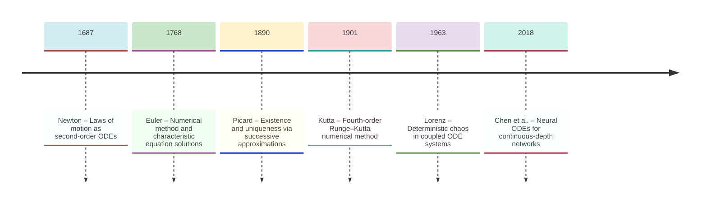
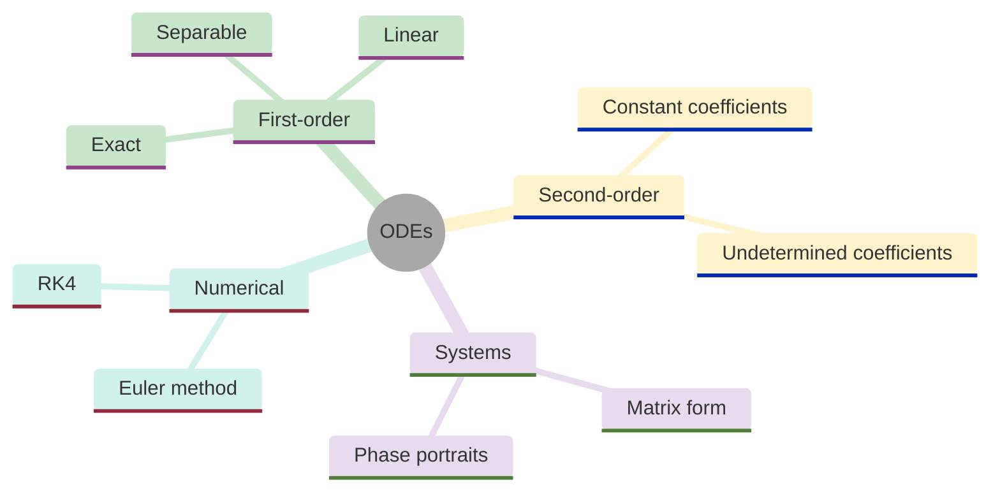
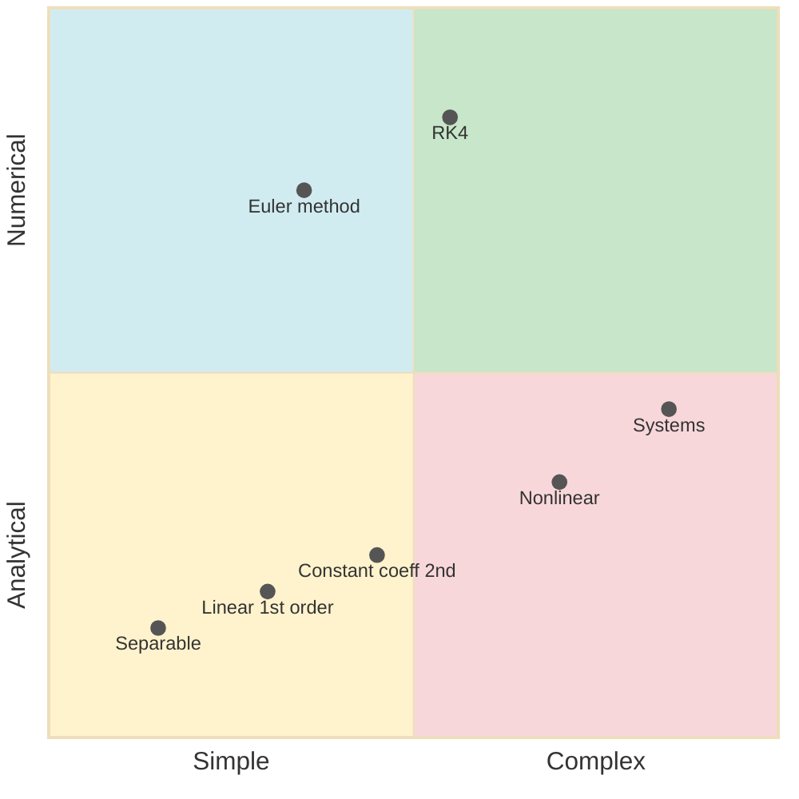
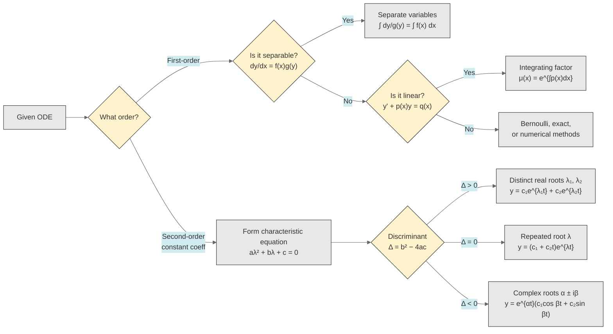
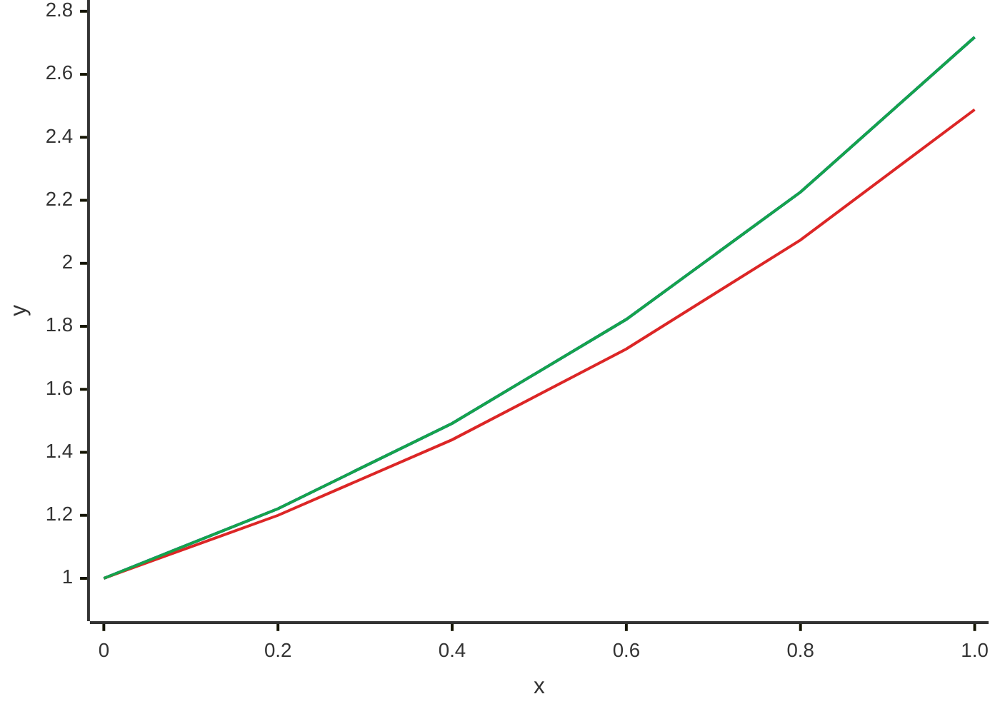
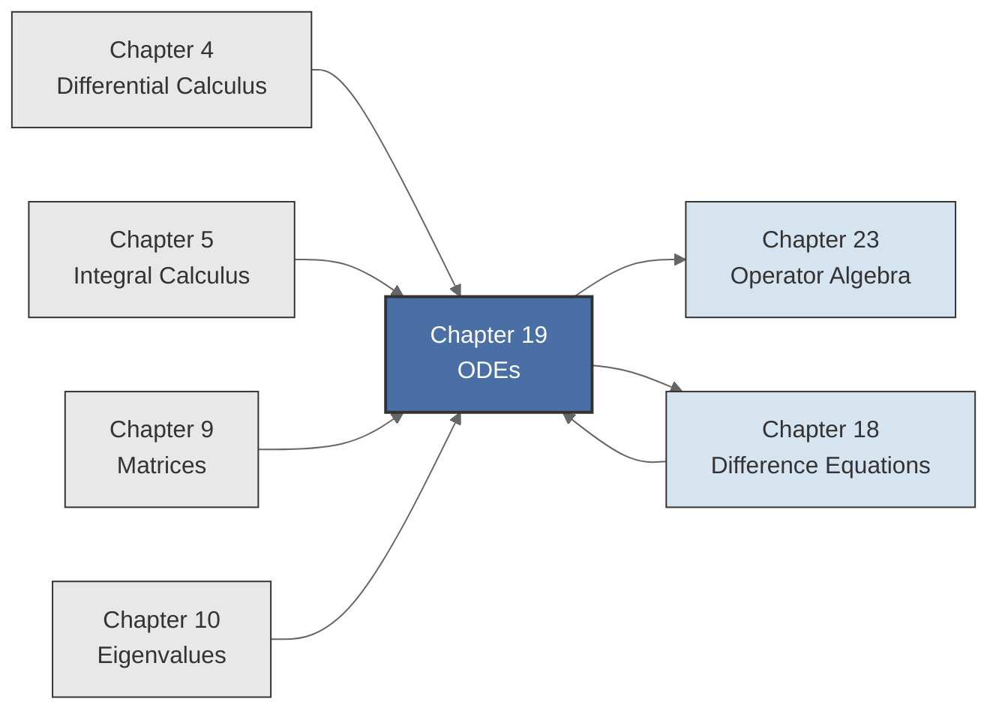

<!-- Copyright (c) 2025-2026 Bob Jansen <bobjansen@pm.me> -->
<!-- SPDX-License-Identifier: CC-BY-NC-4.0 -->
<!-- See LICENSE for full terms. Commercial licensing available. -->
# Chapter 19: Ordinary Differential Equations

**Part VI**: Dynamic Systems

> An ordinary differential equation relates a function to its derivatives, describing continuous change. This chapter develops analytical solutions for first- and second-order linear ODEs, stability analysis of equilibria and numerical integration via Euler's method and Runge–Kutta.

**Prerequisites**: [Chapter 4](04-differential-calculus.md) (Differential Calculus): derivatives, the chain rule and the product rule are used throughout. [Chapter 5](05-integral-calculus.md) (Integral Calculus): antiderivatives and definite integrals appear in every solution technique. [Chapter 9](09-matrices.md) (Matrices): matrix multiplication and systems of equations are required for systems of ODEs. [Chapter 10](10-eigenvalues.md) (Eigenvalues): the eigenvalue decomposition is the primary tool for analysing linear systems and their stability.

**Learning Objectives**: After this chapter, the reader will be able to:

1. Classify ordinary differential equations by order, linearity and autonomy.
2. Solve separable and first-order linear ODEs by standard techniques.
3. Solve second-order linear constant-coefficient ODEs via the characteristic equation.
4. Analyse the stability of equilibria for autonomous systems.
5. Implement Euler's method and the fourth-order Runge–Kutta method for numerical integration.
6. State the Picard–Lindelöf existence and uniqueness theorem and interpret its hypotheses.

**Connections**: This chapter extends [Chapter 18](18-difference-equations.md) (Difference Equations; the discrete analogue, where $x_{k+1} = f(x_k)$ replaces $\dot{x} = f(x)$, and stability requires $|\lambda| < 1$ rather than $\operatorname{Re}(\lambda) < 0$). [Chapter 23](23-operator-algebra.md) (Operator Algebra) generalises the differential operator $D = d/dt$ to abstract linear operators on function spaces, and the characteristic polynomial of a linear ODE becomes the minimal polynomial of an operator. [Chapter 10](10-eigenvalues.md) (Eigenvalues) provides the eigenvalue criteria used in the stability analysis of Section 4.

---

## Historical Context

**Key Milestones in Ordinary Differential Equations**



*Figure 19.1: Timeline of major developments in ODE theory from Newton to neural ODEs.*

**Newton, Leibniz and the birth of ODEs (1680s–1687).** Isaac Newton formulated his laws of motion in 1687 in the *Principia Mathematica*, though not in differential equation form. His second law, $F = ma$, is in modern notation the ODE $m\ddot{x} = F(x, \dot{x}, t)$: a second-order equation relating position, velocity and applied force. Newton solved specific instances (the Kepler problem, projectile motion, pendulum oscillation) using geometric methods that amounted to integrating differential equations without a symbolic calculus. His "method of fluxions" provided the conceptual framework.

**Leibniz and differential notation (1680s).** Gottfried Wilhelm Leibniz's notation $dy/dx$, introduced in the 1680s, proved more practical for developing general solution techniques. Leibniz's differential notation treats $dy$ and $dx$ as manipulable infinitesimals, enabling separation of variables ($g(y)\,dy = f(x)\,dx$) as a formal algebraic operation. The logical foundations of infinitesimals were not settled until Abraham Robinson's nonstandard analysis in the twentieth century, but the notation persists because it makes the mechanics of ODE-solving transparent.

**The Bernoullis and early ODE theory (18th century).** Jacob, Johann and Daniel Bernoulli contributed extensively to ODE theory in the early eighteenth century. Jacob Bernoulli studied the catenary (governed by a second-order ODE) and introduced the Bernoulli equation $y' + p(x)y = q(x)y^n$, solvable by a substitution reducing it to a first-order linear ODE. Johann Bernoulli posed the brachistochrone problem in 1696; its solution via the calculus of variations led to an ODE whose solutions are cycloids. Daniel Bernoulli's 1753 work on vibrating strings introduced superposition of solutions, anticipating Fourier analysis.

**Euler and numerical methods (1768).** Leonhard Euler, in his 1768 *Institutionum Calculi Integralis*, systematised the solution of differential equations and introduced the numerical method bearing his name. Euler's method approximates $y(x + h) \approx y(x) + hf(x, y(x))$. It is the simplest numerical integrator and remains the conceptual foundation for all more sophisticated schemes. Euler solved the second-order linear equation with constant coefficients by the characteristic equation method. His formula $e^{i\theta} = \cos\theta + i\sin\theta$ bridges complex roots of the characteristic polynomial and the trigonometric solutions of oscillatory ODEs.

**Cauchy, Picard and existence theory (1820s–1890s).** Augustin-Louis Cauchy and Émile Picard established the rigorous foundations of ODE theory in the nineteenth century. Cauchy proved the first existence theorem (circa 1820–1840), showing that under suitable conditions on $f$, the initial-value problem $y' = f(x,y)$, $y(x_0) = y_0$ has a solution. Picard (1890) and Ernst Lindelöf (1894) refined this into the Picard–Lindelöf theorem: if $f$ is Lipschitz continuous in $y$, the solution exists and is unique. Picard's proof is constructive: the successive approximations $y_{n+1}(x) = y_0 + \int_{x_0}^x f(t, y_n(t))\,dt$ converge to the solution.

**Runge, Kutta and multi-stage methods (1895–1901).** Carl Runge (1895) and Martin Wilhelm Kutta (1901) developed numerical methods that generalise Euler's approach by evaluating $f$ at multiple points within each step. The fourth-order Runge–Kutta method (RK4) achieves $O(h^5)$ local error and $O(h^4)$ global error using four function evaluations per step and remains widely used for non-stiff problems.

**Poincaré, Lorenz and qualitative dynamics (1880s–1963).** Henri Poincaré initiated the qualitative theory of differential equations in the 1880s, shifting attention from explicit formulas to the geometric structure of solution curves in phase space. His classification of equilibrium points (nodes, saddles, spirals, centres) and his observation that simple nonlinear ODEs can exhibit complex behaviour laid the groundwork for dynamical systems theory. Edward Lorenz's 1963 paper "Deterministic Nonperiodic Flow" demonstrated that three coupled ODEs modelling atmospheric convection exhibit sensitive dependence on initial conditions. The Lorenz system showed that deterministic equations can produce effectively unpredictable behaviour, transforming the understanding of weather forecasting, turbulence and nonlinear dynamics.

**Modern applications and neural ODEs (2018–present).** Ordinary differential equations remain central to science and engineering. Climate models couple hundreds of ODEs representing atmospheric, oceanic and ecological processes. The susceptible-infected-recovered (SIR) model ($dS/dt = -\beta SI$, $dI/dt = \beta SI - \gamma I$, $dR/dt = \gamma I$) guided public health responses during the COVID-19 pandemic. Chen et al. (2018) introduced neural ODEs, replacing discrete network layers with a continuous equation $dh/dt = f(h, t; \theta)$ and enabling memory-efficient training with continuous-depth architectures.

---

## Why This Chapter Matters

**ODEs**



*Figure 19.2: Conceptual map of ODE topics including analytical methods, systems and numerical schemes.*

Newton's second law is an ODE. Population growth, radioactive decay and capacitor charging are all first-order models solved in this chapter (Definitions 19.4 and 19.5). The second-order constant-coefficient ODE (Definition 19.8) with its characteristic equation (Theorem 19.9) models mechanical oscillations and resistor-inductor-capacitor (RLC) circuits. The Picard–Lindelöf theorem (Theorem 19.3) guarantees existence and uniqueness of solutions. Every numerical solver relies on this assurance.

ODEs appear in two contexts of growing importance for machine learning. Neural ODEs are continuous-depth residual networks where the hidden state evolves as $\dot{\mathbf{h}} = f_\theta(t, \mathbf{h})$. They require the numerical integrators of this chapter (Euler and RK4) for their forward pass. The adjoint method for backpropagation through an ODE solver reduces to solving another ODE backward in time. Stability analysis (Definition 19.7, Theorem 19.12) determines whether trained dynamics converge or diverge. Diffusion models for image generation rest on stochastic differential equations whose deterministic skeleton is an ODE. Sampling requires numerically integrating a probability flow ODE. The choice of integrator directly affects sample quality and cost.

In finance, the Black–Scholes partial differential equation for option pricing reduces to a diffusion equation after transformation. Its characteristic solutions are the exponentials and Gaussians of the constant-coefficient theory developed here. Interest rate models (Vasicek, Cox–Ingersoll–Ross) are mean-reverting ODEs with stochastic forcing. The stability classification (Theorem 19.12) determines whether a modelled variable returns to its long-run level after a shock or spirals away. This question bears on monetary policy analysis and on algorithmic stablecoin design in decentralised finance.

The Runge–Kutta algorithm is the standard simulation tool in engineering. Orbital mechanics, fluid dynamics and control system design all depend on numerically integrating systems of ODEs. The matrix exponential (Definition 19.13) provides the exact solution of linear systems $\dot{\mathbf{x}} = A\mathbf{x}$ and connects this chapter to [Chapter 23](23-operator-algebra.md). The relationship between step size and truncation error determines how to balance accuracy against computational cost.

---

## Notation & Conventions

| Symbol | Meaning |
|--------|---------|
| $t$ or $x$ | Independent variable (typically time $t$ for autonomous systems, $x$ for general ODEs) |
| $y$, $y(t)$, $y(x)$ | Unknown function (dependent variable) |
| $y'$, $\dot{y}$, $dy/dx$ | First derivative (prime notation, dot notation, Leibniz notation) |
| $y''$, $\ddot{y}$, $d^2y/dx^2$ | Second derivative |
| $y^{(n)}$ | $n$-th derivative |
| $f(t, y)$ | Right-hand side of $y' = f(t, y)$ |
| $\mathbf{x}(t)$ | State vector for a system: $\mathbf{x} = (x_1, x_2, \ldots, x_n)^T$ |
| $\dot{\mathbf{x}}$ | Time derivative of the state vector |
| $A$ | Coefficient matrix in a linear system $\dot{\mathbf{x}} = A\mathbf{x}$ |
| $\lambda$ | Eigenvalue of the characteristic equation or coefficient matrix |
| $h$ | Step size in numerical methods |
| $y_n$ | Numerical approximation to $y(t_n)$ at the $n$-th step |
| $\mu(x)$ | Integrating factor: $\mu(x) = e^{\int p(x)\,dx}$ |
| $y^*$ | Equilibrium point: $f(y^*) = 0$ |
| $a$, $b$, $c$ | Real coefficients in the second-order ODE $ay'' + by' + cy = 0$ |
| $\Delta$ | Discriminant of the characteristic equation: $\Delta = b^2 - 4ac$ |
| $\alpha$, $\beta$ | Real and imaginary parts of complex eigenvalues: $\lambda = \alpha \pm i\beta$ |
| $c_1$, $c_2$ | Constants determined by initial conditions |
| $p(x)$, $q(x)$ | Coefficient functions in the first-order linear ODE $y' + p(x)y = q(x)$ |
| $L$ | Lipschitz constant in the Picard–Lindelöf theorem |
| $e^{At}$ | Matrix exponential (fundamental solution of $\dot{\mathbf{x}} = A\mathbf{x}$) |

The dot notation $\dot{y}$ is used when the independent variable is time $t$; the prime notation $y'$ is used for the general variable $x$. Vectors are column vectors; boldface lowercase denotes vectors and uppercase denotes matrices. In the second-order constant-coefficient ODE $ay'' + by' + cy = 0$, the letters $a$, $b$, $c$ are reserved for the leading, damping and stiffness coefficients respectively.

---

## Core Theory

**ODE Solution Methods**



*Figure 19.3: ODE solution methods positioned by complexity and analytical versus numerical character.*

The quadrant chart above positions the primary ODE techniques along two axes: simple-to-complex (left to right) and analytical-to-numerical (bottom to top). Separable and linear first-order equations occupy the simple, analytical corner; they admit closed-form solutions via standard integration techniques. Constant-coefficient second-order equations are moderately complex but still analytically tractable via the characteristic equation. Nonlinear equations and systems push toward complexity, often requiring numerical methods. Euler's method and the fourth-order Runge–Kutta scheme (RK4) sit in the numerical half, with RK4 offering higher accuracy at greater computational cost.

### Classification

**Definition 19.1** (Ordinary Differential Equation). An *ordinary differential equation* (ODE) is an equation involving an unknown function $y$ of a single independent variable $x$ (or $t$), the function's derivatives ([Chapter 4](04-differential-calculus.md)) $y', y'', \ldots, y^{(n)}$ and possibly $x$ itself:

$$F(x, y, y', y'', \ldots, y^{(n)}) = 0.$$

The word "ordinary" distinguishes these from *partial* differential equations, which involve functions of multiple independent variables and their partial derivatives. This chapter treats only ordinary differential equations.

**Definition 19.2** (Order, Linearity and Autonomy).

- The *order* of an ODE is the highest derivative appearing in the equation. The equation $y'' + 3y' + 2y = 0$ has order 2; the equation $y' = xy$ has order 1.

- An ODE is *linear* if the unknown function and its derivatives appear only to the first power and are not multiplied together. The general $n$-th order linear ODE has the form

$$a_n(x)y^{(n)} + a_{n-1}(x)y^{(n-1)} + \cdots + a_1(x)y' + a_0(x)y = g(x).$$

If $g(x) = 0$, the equation is *homogeneous*; otherwise it is *nonhomogeneous* (or *inhomogeneous*). The equation $y'' + y = 0$ is linear and homogeneous; $y'' + y = \sin x$ is linear and nonhomogeneous; $y' = y^2$ is nonlinear.

- An ODE is *autonomous* if the independent variable does not appear explicitly. That is, the equation has the form $y' = f(y)$ (first-order) or more generally involves only $y$ and its derivatives but not $x$ or $t$ directly. The equation $y' = y^2 - 1$ is autonomous; the equation $y' = ty$ is not.

### Existence and Uniqueness

**Theorem 19.3** (Picard–Lindelöf Existence and Uniqueness). Let $f(t, y)$ be defined on an open rectangle $R = \{(t,y) : |t - t_0| < a, |y - y_0| < b\}$ and suppose:

1. $f$ is continuous on $R$.
2. $f$ satisfies a Lipschitz condition in $y$: there exists $L > 0$ such that $|f(t, y_1) - f(t, y_2)| \leq L|y_1 - y_2|$ for all $(t, y_1), (t, y_2) \in R$.

Then the initial-value problem

$$y' = f(t, y), \quad y(t_0) = y_0$$

has a unique solution $y(t)$ defined on some interval $|t - t_0| < \alpha$ (where $\alpha$ depends on $a$, $b$ and the bound on $f$).

This theorem is stated without proof. The Lipschitz condition (2) is the key hypothesis: it prevents the solution from "splitting" at a point.

!!! abstract "Key Result"

    **Theorem 19.3** (Picard--Lindelof). Under continuity and a Lipschitz condition, an initial-value problem has exactly one solution, guaranteeing that numerical ODE solvers approximate a well-defined trajectory rather than an arbitrary branch of a non-unique family.

!!! info "Non-uniqueness without the Lipschitz condition"
    The equation $y' = \sqrt{|y|}$ with $y(0) = 0$ has $f(y) = \sqrt{|y|}$, which is continuous but not Lipschitz at $y = 0$. The initial-value problem has infinitely many solutions, including $y(t) = 0$ and $y(t) = t^2/4$ for $t \geq 0$. Any numerical method applied to this problem produces one trajectory; without Lipschitz continuity, it is not clear which solution is being approximated.

The practical significance of Picard–Lindelöf is twofold: it guarantees that well-posed initial-value problems have exactly one solution (so numerical methods are approximating something definite), and it identifies the conditions under which this guarantee holds.

**ODE Classification and Solution Methods:**



*Figure 19.4: Decision flowchart for selecting an ODE solution method based on order and structure.*

### Separable Equations

**Definition 19.4** (Separable ODE). A first-order ODE is *separable* if it can be written in the form

$$\frac{dy}{dx} = f(x)g(y),$$

where the right-hand side factors as a product of a function of $x$ alone and a function of $y$ alone.

**Solution method.** Assuming $g(y) \neq 0$, separate variables:

$$\frac{1}{g(y)}\,dy = f(x)\,dx.$$

Integrate both sides:

$$\int \frac{1}{g(y)}\,dy = \int f(x)\,dx + C.$$

This produces an implicit relation between $x$ and $y$, which may or may not be solvable for $y$ explicitly.

**Example.** Solve $dy/dx = xy$ with $y(0) = 1$.

Separate: $dy/y = x\,dx$. Integrate: $\ln|y| = x^2/2 + C$. So $y = Ae^{x^2/2}$ where $A = \pm e^C$. Applying the initial condition $y(0) = 1$ gives $A = 1$, hence $y(x) = e^{x^2/2}$.

### First-Order Linear Equations

**Definition 19.5** (First-order linear ODE). A first-order linear ODE has the standard form

$$y' + p(x)y = q(x),$$

where $p(x)$ and $q(x)$ are given functions of $x$.

**Solution by integrating factor.** Define the *integrating factor*

$$\mu(x) = e^{\int p(x)\,dx}.$$

Multiply both sides of the ODE by $\mu(x)$:

$$\mu(x)y' + \mu(x)p(x)y = \mu(x)q(x).$$

The left-hand side is the derivative of the product $\mu(x)y$ (by the product rule, since $\mu'(x) = p(x)\mu(x)$):

$$\frac{d}{dx}[\mu(x)y] = \mu(x)q(x).$$

Integrate ([Chapter 5](05-integral-calculus.md)) both sides:

$$\mu(x)y = \int \mu(x)q(x)\,dx + C.$$

Solve for $y$:

$$y(x) = \frac{1}{\mu(x)}\left[\int \mu(x)q(x)\,dx + C\right].$$

**Example.** Solve $y' + 2y = e^{-x}$ with $y(0) = 3$.

Here $p(x) = 2$, $q(x) = e^{-x}$. The integrating factor is $\mu(x) = e^{2x}$. Multiply:

$$\frac{d}{dx}[e^{2x}y] = e^{2x} \cdot e^{-x} = e^x.$$

Integrate: $e^{2x}y = e^x + C$. So $y = e^{-x} + Ce^{-2x}$. Applying $y(0) = 3$: $3 = 1 + C$, hence $C = 2$ and $y(x) = e^{-x} + 2e^{-2x}$.

### Direction Fields and Slope Fields

**Definition 19.6** (Direction field). For the ODE $y' = f(x, y)$, the *direction field* (or *slope field*) is the assignment of the slope $f(x, y)$ to each point $(x, y)$ in the plane. Graphically, it is a grid of short line segments at representative points, each segment having slope $f(x, y)$.

The direction field provides a qualitative picture of all solutions simultaneously: each solution curve is tangent to the direction field at every point. By inspecting the direction field, one can determine the qualitative behaviour of solutions (growing, decaying, oscillating, converging to equilibria) without solving the equation analytically.

For autonomous equations $y' = f(y)$, the direction field depends only on $y$ (the slope is the same along horizontal lines), which simplifies the analysis considerably.

### Equilibria and Stability

**Definition 19.7** (Equilibrium and stability). For the autonomous first-order ODE $y' = f(y)$:

- A point $y^*$ is an *equilibrium* (or *fixed point* or *steady state*) if $f(y^*) = 0$. The constant function $y(t) = y^*$ is then a solution.

- An equilibrium $y^*$ is *stable* (or *Lyapunov stable*) if solutions starting near $y^*$ remain near $y^*$ for all future time.

- An equilibrium $y^*$ is *asymptotically stable* if it is stable and, in addition, solutions starting sufficiently near $y^*$ converge to $y^*$ as $t \to \infty$.

- An equilibrium $y^*$ is *unstable* if it is not stable: there exist solutions starting arbitrarily close to $y^*$ that move away from $y^*$.

**Stability criterion for scalar autonomous ODEs.** For the equation $y' = f(y)$ with $f$ differentiable:

- If $f'(y^*) < 0$, then $y^*$ is asymptotically stable.
- If $f'(y^*) > 0$, then $y^*$ is unstable.
- If $f'(y^*) = 0$, the test is inconclusive (higher-order terms determine stability).

The intuition is that $f'(y^*) < 0$ means the "restoring force" near $y^*$ pushes solutions back toward $y^*$: if $y$ is slightly above $y^*$, then $f(y) < 0$ (since $f$ is decreasing through zero at $y^*$), so $y$ decreases back toward $y^*$.

**Example.** The logistic equation $y' = ry(1 - y/K)$ has equilibria at $y^* = 0$ and $y^* = K$. Here $f(y) = ry(1 - y/K)$, so $f'(y) = r - 2ry/K$. At $y^* = 0$: $f'(0) = r > 0$ (unstable). At $y^* = K$: $f'(K) = -r < 0$ (asymptotically stable). The carrying capacity $K$ is the stable equilibrium to which all positive initial populations converge.

### Second-Order Linear Constant-Coefficient Equations

**Definition 19.8** (Second-order linear ODE with constant coefficients). The homogeneous second-order linear ODE with constant coefficients has the form

$$ay'' + by' + cy = 0,$$

where $a, b, c$ are real constants with $a \neq 0$. The *characteristic equation* is obtained by substituting the trial solution $y = e^{\lambda t}$ (which gives $y' = \lambda e^{\lambda t}$, $y'' = \lambda^2 e^{\lambda t}$):

$$a\lambda^2 + b\lambda + c = 0.$$

This is a quadratic in $\lambda$ whose roots determine the form of the general solution.

**Theorem 19.9** (Solutions of the characteristic equation). Let $\lambda_1, \lambda_2$ be the roots of the characteristic equation $a\lambda^2 + b\lambda + c = 0$, with discriminant $\Delta = b^2 - 4ac$.

**Case 1: Two distinct real roots** ($\Delta > 0$). The roots are $\lambda_1 \neq \lambda_2$, both real. The general solution is

$$y(t) = c_1 e^{\lambda_1 t} + c_2 e^{\lambda_2 t}.$$

**Case 2: One repeated real root** ($\Delta = 0$). The root is $\lambda = -b/(2a)$ with multiplicity 2. The general solution is

$$y(t) = (c_1 + c_2 t)e^{\lambda t}.$$

The factor $t$ in the second term arises because the standard Ansatz $e^{\lambda t}$ gives only one independent solution when $\lambda$ is repeated; multiplying by $t$ produces the second.

**Case 3: Complex conjugate roots** ($\Delta < 0$). The roots are $\lambda = \alpha \pm i\beta$ where $\alpha = -b/(2a)$ and $\beta = \sqrt{4ac - b^2}/(2a)$. The general solution is

$$y(t) = e^{\alpha t}(c_1 \cos\beta t + c_2 \sin\beta t).$$

The exponential factor $e^{\alpha t}$ governs growth or decay; the trigonometric factors produce oscillation with frequency $\beta$.

??? note "Proof"

    *Proof sketch.* In Case 1, $e^{\lambda_1 t}$ and $e^{\lambda_2 t}$ are linearly independent solutions; their Wronskian is

    $$(\lambda_2 - \lambda_1)e^{(\lambda_1+\lambda_2)t} \neq 0.$$

    The theory of second-order linear ODEs guarantees that the general solution is a linear combination of two independent solutions.

    In Case 2, direct substitution verifies that $te^{\lambda t}$ solves the equation when $\lambda$ is a double root.

    In Case 3, Euler's formula

    $$e^{(\alpha + i\beta)t} = e^{\alpha t}(\cos\beta t + i\sin\beta t)$$

    decomposes the complex exponential solutions into real and imaginary parts, each of which is a real solution.

    $\square$

**Example.** Solve $y'' - 3y' + 2y = 0$ with $y(0) = 1$, $y'(0) = 0$.

Characteristic equation: $\lambda^2 - 3\lambda + 2 = (\lambda - 1)(\lambda - 2) = 0$. Roots: $\lambda_1 = 1$, $\lambda_2 = 2$ (distinct real). General solution: $y(t) = c_1 e^t + c_2 e^{2t}$.

Apply initial conditions: $y(0) = c_1 + c_2 = 1$ and $y'(0) = c_1 + 2c_2 = 0$. Solving: $c_2 = -1$, $c_1 = 2$. Solution: $y(t) = 2e^t - e^{2t}$.

**Example.** Solve $y'' + 4y = 0$ (simple harmonic oscillator).

Characteristic equation: $\lambda^2 + 4 = 0$, so $\lambda = \pm 2i$ (complex roots with $\alpha = 0$, $\beta = 2$). General solution: $y(t) = c_1\cos 2t + c_2\sin 2t$. The solutions oscillate with period $\pi$ and constant amplitude (since $\alpha = 0$, there is no exponential growth or decay).

### Particular Solutions

**Definition 19.10** (Method of undetermined coefficients). For the nonhomogeneous equation $ay'' + by' + cy = g(t)$, the general solution is $y = y_h + y_p$, where $y_h$ is the general solution of the homogeneous equation and $y_p$ is any particular solution of the nonhomogeneous equation.

When $g(t)$ has a special form (polynomial, exponential, sine/cosine or products thereof), a particular solution can be found by *assuming* $y_p$ has the same form with unknown coefficients, substituting into the equation and solving for those coefficients.

Here $P_n(t)$ denotes a polynomial of degree $n$.

| Form of $g(t)$ | Trial $y_p$ |
|-----------------|-------------|
| $P_n(t)$ (polynomial of degree $n$) | $A_nt^n + A_{n-1}t^{n-1} + \cdots + A_0$ |
| $e^{\alpha t}$ | $Ae^{\alpha t}$ |
| $\cos\beta t$ or $\sin\beta t$ | $A\cos\beta t + B\sin\beta t$ |
| $e^{\alpha t}\cos\beta t$ or $e^{\alpha t}\sin\beta t$ | $e^{\alpha t}(A\cos\beta t + B\sin\beta t)$ |

If the trial form duplicates a solution of the homogeneous equation, multiply by $t$ (or $t^2$ if needed) to obtain an independent form.

**Example.** Solve $y'' + y = 3\cos 2t$.

Homogeneous solution: $y_h = c_1\cos t + c_2\sin t$ (since $\lambda = \pm i$).

Trial particular solution: $y_p = A\cos 2t + B\sin 2t$. Substituting: $-4A\cos 2t - 4B\sin 2t + A\cos 2t + B\sin 2t = 3\cos 2t$. So $-3A = 3$ and $-3B = 0$, giving $A = -1$, $B = 0$. The particular solution is therefore $y_p = -\cos 2t$ and the general solution is $y = c_1\cos t + c_2\sin t - \cos 2t$.

### Systems of Linear ODEs

**Definition 19.11** (Linear system). A system of first-order linear ODEs with constant coefficients has the form

$$\dot{\mathbf{x}} = A\mathbf{x},$$

where $\mathbf{x}(t) = (x_1(t), x_2(t), \ldots, x_n(t))^T$ is the state vector and $A$ is an $n \times n$ constant matrix ([Chapter 9](09-matrices.md)). Any single $n$-th order linear ODE can be converted to this form by introducing state variables $x_1 = y$, $x_2 = y'$, ..., $x_n = y^{(n-1)}$.

**Solution via eigenvalues.** Suppose $A$ has $n$ linearly independent eigenvectors $\mathbf{v}_1, \ldots, \mathbf{v}_n$ with corresponding eigenvalues ([Chapter 10](10-eigenvalues.md)) $\lambda_1, \ldots, \lambda_n$. Then $\mathbf{x}_i(t) = e^{\lambda_i t}\mathbf{v}_i$ is a solution for each $i$ (verify: $\dot{\mathbf{x}}_i = \lambda_i e^{\lambda_i t}\mathbf{v}_i = e^{\lambda_i t}A\mathbf{v}_i = A\mathbf{x}_i$). The general solution is

$$\mathbf{x}(t) = c_1 e^{\lambda_1 t}\mathbf{v}_1 + c_2 e^{\lambda_2 t}\mathbf{v}_2 + \cdots + c_n e^{\lambda_n t}\mathbf{v}_n.$$

The constants $c_1, \ldots, c_n$ are determined by the initial condition $\mathbf{x}(0) = \mathbf{x}_0$: solving $c_1\mathbf{v}_1 + \cdots + c_n\mathbf{v}_n = \mathbf{x}_0$.

If $A$ has complex eigenvalues $\alpha \pm i\beta$ with eigenvectors $\mathbf{v} = \mathbf{u} + i\mathbf{w}$, the corresponding real solutions are $e^{\alpha t}(\mathbf{u}\cos\beta t - \mathbf{w}\sin\beta t)$ and $e^{\alpha t}(\mathbf{u}\sin\beta t + \mathbf{w}\cos\beta t)$.

### System Stability and Phase Portraits

**Theorem 19.12** (Stability of linear systems). For the system $\dot{\mathbf{x}} = A\mathbf{x}$ with eigenvalues $\lambda_1, \ldots, \lambda_n$:

- The equilibrium $\mathbf{x}^* = \mathbf{0}$ is *asymptotically stable* if and only if $\operatorname{Re}(\lambda_i) < 0$ for all $i$.
- The equilibrium is *unstable* if $\operatorname{Re}(\lambda_i) > 0$ for any $i$.
- The case where all $\operatorname{Re}(\lambda_i) \leq 0$ with some $\operatorname{Re}(\lambda_i) = 0$ requires further analysis (the equilibrium is stable but not asymptotically stable for simple imaginary eigenvalues with diagonalizable blocks).

??? note "Proof"

    *Proof sketch.* The general solution is $\mathbf{x}(t) = \sum c_i e^{\lambda_i t}\mathbf{v}_i$. Each component

    $$e^{\lambda_i t} = e^{\operatorname{Re}(\lambda_i)t}\,e^{i\operatorname{Im}(\lambda_i)t}$$

    has magnitude $e^{\operatorname{Re}(\lambda_i)t}$.

    If all $\operatorname{Re}(\lambda_i) < 0$, then every component decays to zero: $\|\mathbf{x}(t)\| \to 0$ as $t \to \infty$.

    If any $\operatorname{Re}(\lambda_i) > 0$, the corresponding component grows without bound for generic initial conditions.

    $\square$

**Phase portrait classification for $2 \times 2$ systems.** For the system $\dot{\mathbf{x}} = A\mathbf{x}$ in $\mathbb{R}^2$, the nature of the equilibrium at the origin is determined by the eigenvalues $\lambda_1, \lambda_2$ of $A$:

| Eigenvalues | Phase portrait | Stability |
|-------------|---------------|-----------|
| $\lambda_1, \lambda_2$ real, both negative | Stable node | Asymptotically stable |
| $\lambda_1, \lambda_2$ real, both positive | Unstable node | Unstable |
| $\lambda_1 < 0 < \lambda_2$ (real, opposite signs) | Saddle point | Unstable |
| $\alpha \pm i\beta$ with $\alpha < 0$ | Stable spiral (focus) | Asymptotically stable |
| $\alpha \pm i\beta$ with $\alpha > 0$ | Unstable spiral | Unstable |
| $\pm i\beta$ (purely imaginary) | Centre | Stable (not asymptotically) |
| $\lambda_1 = \lambda_2 < 0$ (repeated) | Stable node or star | Asymptotically stable |

At a **stable node**, all trajectories approach the origin along the eigenvector directions, tangent to the "slow" eigenvector (corresponding to the eigenvalue with smaller magnitude). At a **saddle point**, trajectories approach along one eigenvector direction and recede along the other. At a **spiral** (focus), trajectories wind around the origin, decaying inward or expanding outward. At a **centre**, trajectories are closed ellipses: perpetual oscillation without decay or growth.

### Matrix Exponential

**Definition 19.13** (Matrix exponential). For an $n \times n$ matrix $A$, the *matrix exponential* is defined by the power series

$$e^{At} = I + At + \frac{(At)^2}{2!} + \frac{(At)^3}{3!} + \cdots = \sum_{k=0}^{\infty} \frac{(At)^k}{k!}.$$

The matrix exponential is the fundamental solution of $\dot{\mathbf{x}} = A\mathbf{x}$: the solution with initial condition $\mathbf{x}(0) = \mathbf{x}_0$ is $\mathbf{x}(t) = e^{At}\mathbf{x}_0$.

When $A$ is diagonalizable as $A = PDP^{-1}$ with $D = \operatorname{diag}(\lambda_1, \ldots, \lambda_n)$:

$$e^{At} = Pe^{Dt}P^{-1} = P\operatorname{diag}(e^{\lambda_1 t}, \ldots, e^{\lambda_n t})P^{-1}.$$

The matrix exponential is documented here but is not implemented in the current version of Evenwicht. For computation, the eigendecomposition-based formula above or the scaling-and-squaring algorithm (Higham, 2005) are standard approaches.

**Remark 19.14** (State-space models and Green's functions). The nonhomogeneous linear system $\dot{\mathbf{x}} = A\mathbf{x} + B\mathbf{u}(t)$ (the *state-space model* of control theory) has the solution

$$\mathbf{x}(t) = e^{At}\mathbf{x}_0 + \int_0^t e^{A(t-s)}B\mathbf{u}(s)\,ds.$$

The kernel $e^{A(t-s)}B$ is a matrix-valued Green's function (or impulse response). State-space models are central to control engineering, signal processing and economic dynamics. Their full treatment is beyond the scope of this chapter but is documented here for completeness and connection to [Chapter 23](23-operator-algebra.md) (Operator Algebra).

---

## Formulas & Identities

**F19.1** (Separable equation solution).

$$\int \frac{1}{g(y)}\,dy = \int f(x)\,dx + C \qquad \text{for } y' = f(x)g(y)$$

**F19.2** (Integrating factor).

$$\mu(x) = e^{\int p(x)\,dx}, \qquad y(x) = \frac{1}{\mu(x)}\left[\int \mu(x)q(x)\,dx + C\right]$$

**F19.3** (Characteristic equation, second-order).

$$a\lambda^2 + b\lambda + c = 0, \qquad \Delta = b^2 - 4ac$$

**F19.4** (Distinct real roots, $\Delta > 0$).

$$y(t) = c_1 e^{\lambda_1 t} + c_2 e^{\lambda_2 t}$$

**F19.5** (Repeated root, $\Delta = 0$).

$$y(t) = (c_1 + c_2 t)e^{\lambda t}, \qquad \lambda = -\frac{b}{2a}$$

**F19.6** (Complex roots, $\Delta < 0$).

$$y(t) = e^{\alpha t}(c_1 \cos\beta t + c_2 \sin\beta t), \qquad \alpha = -\frac{b}{2a}, \quad \beta = \frac{\sqrt{4ac - b^2}}{2a}$$

**F19.7** (Matrix exponential).

$$\mathbf{x}(t) = e^{At}\mathbf{x}_0, \qquad e^{At} = \sum_{k=0}^{\infty} \frac{(At)^k}{k!}$$

**F19.8** (Euler's method).

$$y_{n+1} = y_n + h\,f(t_n, y_n), \qquad \text{global error } O(h)$$

**F19.9** (RK4 update).

$$y_{n+1} = y_n + \frac{h}{6}(k_1 + 2k_2 + 2k_3 + k_4), \qquad \text{global error } O(h^4)$$

**F19.10** (Stability criterion).

$$\text{Asymptotically stable} \iff \operatorname{Re}(\lambda_i) < 0 \text{ for all eigenvalues } \lambda_i \text{ of } A$$

---

## Algorithms

### Algorithm 19.15: Euler's Method

Euler's method is the simplest numerical integrator for initial-value problems. It approximates the solution by stepping forward along the tangent line at each point.

**Input**: Right-hand side function $f(t, y)$, initial time $t_0$, initial value $y_0$, step size $h > 0$, number of steps $N$.

**Output**: Trajectory $\{(t_n, y_n)\}_{n=0}^{N}$ approximating the solution of $y' = f(t, y)$, $y(t_0) = y_0$ on $[t_0, t_0 + Nh]$.

```
function euler(f, t0, y0, h, N):
    t = t0
    y = y0
    trajectory = [(t, y)]

    for n = 1 to N:
        y = y + h * f(t, y)
        t = t + h
        trajectory.append((t, y))

    return trajectory
```

**Complexity**: $O(N)$ function evaluations of $f$ for a scalar ODE; $O(Nd)$ for a $d$-dimensional system, where each evaluation of $f$ costs $O(d)$.

**Error analysis.** The *local truncation error* (error in a single step, assuming the previous value is exact) is $O(h^2)$. By Taylor expansion,

$$y(t+h) = y(t) + hf(t,y) + \tfrac{h^2}{2}y''(\xi),$$

so the error in one step is $\tfrac{h^2}{2}y''(\xi)$. The *global error* (accumulated error over the full interval) is $O(h)$: there are $N = T/h$ steps, each contributing $O(h^2)$ error, so the total is $O(h^2) \cdot O(1/h) = O(h)$.

Euler's method is a *first-order* method: halving the step size halves the error. This is adequate for understanding and prototyping but too inaccurate for most production applications.

!!! warning "Euler stability constraint on stiff problems"
    For the test equation $y' = \lambda y$ with $\operatorname{Re}(\lambda) < 0$, Euler's method requires $|1 + h\lambda| < 1$. When $|\lambda|$ is large (stiff problems), this forces $h < 2/|\lambda|$. A system with $\lambda = -10^6$ restricts $h$ to below $2 \times 10^{-6}$, making explicit Euler impractical. Use implicit methods for stiff systems.

**Stability.** For the test equation $y' = \lambda y$ (with $\operatorname{Re}(\lambda) < 0$), Euler's method gives $y_{n+1} = (1 + h\lambda)y_n$. The method is stable (numerical solution decays) if and only if $|1 + h\lambda| < 1$. This defines the *stability region* of Euler's method: a disk of radius 1 centred at $-1$ in the complex $h\lambda$-plane. For stiff problems (large $|\lambda|$), the step size must be extremely small to maintain stability.

### Algorithm 19.16: Fourth-Order Runge–Kutta Method (RK4)

The classical fourth-order Runge–Kutta method achieves much higher accuracy by evaluating $f$ at four strategically chosen points within each step and combining them in a weighted average.

**Input**: Right-hand side function $f(t, y)$, initial time $t_0$, initial value $y_0$, step size $h > 0$, number of steps $N$.

**Output**: Trajectory $\{(t_n, y_n)\}_{n=0}^{N}$ approximating the solution of $y' = f(t, y)$, $y(t_0) = y_0$ on $[t_0, t_0 + Nh]$.

```
function rk4(f, t0, y0, h, N):
    t = t0
    y = y0
    trajectory = [(t, y)]

    for n = 1 to N:
        k1 = f(t, y)
        k2 = f(t + h/2, y + h/2 * k1)
        k3 = f(t + h/2, y + h/2 * k2)
        k4 = f(t + h, y + h * k3)

        y = y + (h / 6) * (k1 + 2*k2 + 2*k3 + k4)
        t = t + h
        trajectory.append((t, y))

    return trajectory
```

**Complexity**: $O(4N)$ function evaluations of $f$ for a scalar ODE (four evaluations per step); $O(Nd)$ for a $d$-dimensional system, where each evaluation of $f$ costs $O(d)$.

**Derivation intuition.** The four stages $k_1, k_2, k_3, k_4$ estimate the slope at the beginning, twice at the midpoint (using different estimates of the midpoint value) and at the end of the interval. The weighted average $\frac{1}{6}(k_1 + 2k_2 + 2k_3 + k_4)$ matches the Taylor expansion of the exact solution through the $h^4$ term.

**Error analysis.** The local truncation error is $O(h^5)$ and the global error is $O(h^4)$. RK4 is a *fourth-order* method: halving the step size reduces the error by a factor of 16. In practice, RK4 provides 4–5 digits of accuracy per digit of step-size reduction, making it far more efficient than Euler's method for comparable step sizes.

**Stability.** For the test equation $y' = \lambda y$, RK4 gives $y_{n+1} = R(h\lambda)y_n$ where $R(z) = 1 + z + z^2/2 + z^3/6 + z^4/24$ (the degree-4 Taylor polynomial of $e^z$). The stability region is the set $\{z \in \mathbb{C} : |R(z)| \leq 1\}$, which extends along the negative real axis to approximately $z = -2.78$. This is larger than Euler's stability region but still finite: for stiff problems, implicit methods (such as the backward Euler or implicit Runge–Kutta methods) are necessary.

!!! tip "Choosing between Euler and RK4"
    Use Euler's method only for pedagogical purposes or initial prototyping. For production-quality integration of non-stiff problems, RK4 with step size $h = 0.01$ typically matches the accuracy of Euler with $h = 10^{-5}$ at a fraction of the cost. If the problem is stiff (eigenvalues span several orders of magnitude), neither method suffices; use an implicit solver.

---

## Numerical Considerations

**Step-size selection.** In practice, fixed step sizes are rarely optimal. Adaptive step-size control estimates the local error (e.g., by comparing an RK4 step with two RK4 half-steps, or by using embedded Runge–Kutta pairs like Dormand–Prince) and adjusts $h$ to maintain the error within a prescribed tolerance. The Evenwicht implementation uses a fixed step size for simplicity; adaptive control is documented but not implemented.

**Stiff problems.** An ODE is *stiff* if it contains dynamics on widely separated time scales. Explicit methods (Euler, RK4) then require impractically small step sizes. Implicit methods (backward Euler, trapezoidal rule, singly diagonally implicit Runge–Kutta) are stable for all step sizes but require solving an algebraic equation at each step. Stiff solvers are beyond scope; see Hairer and Wanner (1996).

**System extension.** Both Euler and RK4 extend naturally to systems $\dot{\mathbf{x}} = \mathbf{f}(t, \mathbf{x})$ by replacing scalar operations with vector operations: $\mathbf{y}$ becomes a vector, and the $k_i$ are vectors computed component-wise.

!!! warning "Step-size floor from round-off"
    Reducing $h$ below $\sqrt{\epsilon_{\text{mach}}} \approx 10^{-8}$ for Euler or $\epsilon_{\text{mach}}^{1/5} \approx 6 \times 10^{-4}$ for RK4 causes round-off errors to dominate truncation errors. Further reduction worsens accuracy rather than improving it.

**Floating-point error accumulation.** Each step of a numerical method introduces a local truncation error and a round-off error. For Euler's method, the local truncation error is $O(h^2)$ per step, accumulating to $O(h)$ globally over $N = T/h$ steps. Reducing $h$ below $\sqrt{\epsilon_{\text{mach}}}$ (where $\epsilon_{\text{mach}} \approx 10^{-16}$ in double precision) causes round-off errors to dominate truncation errors, and further step-size reduction worsens accuracy.

**Stability regions.** The stability region of a numerical method is the set of values $h\lambda$ in the complex plane for which the method produces bounded solutions when applied to $y' = \lambda y$. For Euler's method, the stability region is the disk $|1 + h\lambda| < 1$ (centred at $-1$, radius 1). For RK4, the stability region extends to approximately $h\lambda = -2.78$ along the negative real axis. When $\operatorname{Re}(\lambda)$ is large and negative (stiff problems), explicit methods require prohibitively small step sizes to remain within their stability regions.

---

## Worked Examples

### Example 19.17: Exponential Growth via Separation of Variables

**Problem.** Solve $dy/dt = 2y$ with $y(0) = 3$ analytically, then verify numerically using RK4.

**Solution (analytical).** This is separable: $dy/y = 2\,dt$. Integrate:

$$\ln|y| = 2t + C, \qquad \text{so } y = Ae^{2t}.$$

Applying $y(0) = 3$: $A = 3$. The exact solution is

$$y(t) = 3e^{2t}.$$

**Solution (numerical verification).** The following chart compares Euler and RK4 on the simpler equation $dy/dx = y$, $y(0) = 1$ (exact solution $y = e^x$) to illustrate the accuracy difference between the two methods.

**Euler vs. RK4 Accuracy on $dy/dx = y$, $y(0) = 1$** (step size $h = 0.2$):



*Figure 19.5: Comparison of Euler and RK4 accuracy against the exact solution for exponential growth.*

The Euler method (lower line) accumulates visible error, undershooting the exact solution $e^x$ (top line) by 8.5% at $x = 1$. The RK4 method (overlapping the exact solution) matches to within plotting precision, illustrating the dramatic accuracy advantage of fourth-order over first-order methods.

The RK4 solution at $t = 2$ agrees with $3e^4 \approx 163.794$ to about 4 correct digits (absolute error $\approx 7 \times 10^{-3}$, relative error $\approx 5 \times 10^{-5}$). The error is larger here than for the decay example because the exponentially growing solution amplifies local errors. Using a smaller step size $h = 0.01$ would reduce the error by a factor of $10^4$.

### Example 19.18: Logistic Equation

**Problem.** Solve the logistic equation $dy/dt = y(1 - y)$ with $y(0) = 0.1$ analytically and numerically.

**Solution (analytical).** Separate variables: $\frac{dy}{y(1-y)} = dt$. Partial fractions: $\frac{1}{y(1-y)} = \frac{1}{y} + \frac{1}{1-y}$. Integrate:

$$\ln\lvert y \rvert - \ln\lvert 1-y \rvert = t + C \implies \ln\frac{y}{1-y} = t + C.$$

Exponentiate:

$$\frac{y}{1-y} = Ke^t, \qquad K = e^C.$$

Apply $y(0) = 0.1$: $K = 0.1/0.9 = 1/9$. Solve for $y$:

$$y(t) = \frac{e^t/9}{1 + e^t/9} = \frac{e^t}{9 + e^t} = \frac{1}{1 + 9e^{-t}}.$$

This is the logistic (sigmoid) curve, approaching $y = 1$ (the carrying capacity) as $t \to \infty$.

### Example 19.19: Damped Harmonic Oscillator as a System

**Problem.** Solve the damped oscillator $\ddot{x} + 0.5\dot{x} + 4x = 0$ with $x(0) = 1$, $\dot{x}(0) = 0$.

**Solution (analytical).** The characteristic equation is $\lambda^2 + 0.5\lambda + 4 = 0$. Discriminant: $0.25 - 16 = -15.75 < 0$. Complex roots:

$$\lambda = -0.25 \pm i\sqrt{15.75/4}, \qquad \alpha = -0.25, \quad \beta = \sqrt{3.9375} \approx 1.984.$$

The solution is

$$x(t) = e^{-0.25t}(c_1\cos 1.984t + c_2\sin 1.984t).$$

Applying $x(0) = 1$ gives $c_1 = 1$. Applying $\dot{x}(0) = 0$:

$$-0.25c_1 + 1.984c_2 = 0, \qquad \text{so } c_2 = 0.25/1.984 \approx 0.126.$$

**Solution (numerical as a system).** Write as $\dot{\mathbf{x}} = A\mathbf{x}$ with state $\mathbf{x} = (x, \dot{x})^T$:

$$\frac{d}{dt}\begin{pmatrix} x_1 \\ x_2 \end{pmatrix} = \begin{pmatrix} 0 & 1 \\ -4 & -0.5 \end{pmatrix}\begin{pmatrix} x_1 \\ x_2 \end{pmatrix}.$$

The eigenvalues of the coefficient matrix $A = \begin{pmatrix} 0 & 1 \\ -4 & -0.5 \end{pmatrix}$ are $\lambda = -0.25 \pm 1.984i$. Since $\operatorname{Re}(\lambda) = -0.25 < 0$, the equilibrium at the origin is asymptotically stable (a stable spiral in the phase portrait). The oscillation frequency is $1.984/(2\pi) \approx 0.316$ Hz and the decay envelope is $e^{-0.25t}$.

### Example 19.20: Euler vs. RK4 Accuracy Comparison

**Problem.** Solve $dy/dt = -y$ with $y(0) = 1$ (exact solution: $y = e^{-t}$) using both Euler and RK4 with step size $h = 0.1$ over $[0, 1]$. Compare the errors at $t = 1$.

**Solution.**

The exact Euler computation is

$$(1 - h)^N = (0.9)^{10} = 0.3486784401,$$

while $e^{-1} = 0.3678794\ldots$, giving an Euler error of $0.0192$. The RK4 error is approximately $3.3 \times 10^{-7}$ (consistent with $O(h^4)$ for this problem). RK4 is roughly 58 000 times more accurate than Euler for the same step size, illustrating why higher-order methods are preferred in practice despite requiring more function evaluations per step.

Reducing $h$ to $0.01$ (100 steps) gives Euler error $\approx 0.0018$ (reducing $h$ by a factor of 10 reduces the error by a factor of 10, confirming first-order convergence). RK4 with $h = 0.01$ gives error $\approx 3 \times 10^{-11}$ (reducing $h$ by a factor of 10 reduces the error by a factor of $10^4$, confirming fourth-order convergence).

---

## Connections

**Chapter Dependencies**



*Figure 19.6: Prerequisite and downstream dependencies for Chapter 19.*

### Within This Book

- **[Chapter 4](04-differential-calculus.md) (Differential Calculus)** provides the chain rule, product rule and Taylor expansion used in deriving solutions and analysing error.

- **[Chapter 5](05-integral-calculus.md) (Integral Calculus)** supplies the antiderivatives required by separation of variables and the integrating factor method.

- **[Chapter 9](09-matrices.md) (Matrices)** provides the matrix operations (multiplication, eigendecomposition, matrix exponential) required by systems $\dot{\mathbf{x}} = A\mathbf{x}$.

- **[Chapter 10](10-eigenvalues.md) (Eigenvalues)** determines stability: $\operatorname{Re}(\lambda_i) < 0$ for all eigenvalues of $A$ is necessary and sufficient for asymptotic stability.

- **[Chapter 18](18-difference-equations.md) (Difference Equations)** is the discrete analogue. Euler's method $x_{n+1} = x_n + hf(x_n)$ bridges the two. Stability requires $|\lambda| < 1$ instead of $\operatorname{Re}(\lambda) < 0$.

- **[Chapter 23](23-operator-algebra.md) (Operator Algebra)** treats $D = d/dt$ as a linear operator. The ODE $p(D)y = 0$ factors as a polynomial in $D$ with eigenfunctions $e^{\lambda t}$.

### Applications

- **Classical mechanics**: Newton's equations of motion $m\ddot{\mathbf{x}} = \mathbf{F}(\mathbf{x}, \dot{\mathbf{x}}, t)$ are second-order ODE systems. The harmonic oscillator, planetary orbits, coupled pendulums and rigid body dynamics are all ODE problems.

- **Electrical engineering**: Circuit analysis with capacitors and inductors yields ODEs. The RLC circuit satisfies $L\ddot{q} + R\dot{q} + q/C = V(t)$, which is a second-order linear ODE with constant coefficients (the same equation as the damped harmonic oscillator).

- **Epidemiology**: The SIR model $\dot{S} = -\beta SI$, $\dot{I} = \beta SI - \gamma I$, $\dot{R} = \gamma I$ is a nonlinear ODE system. Numerical integration (RK4) is the standard approach for predicting epidemic trajectories.

- **Machine learning**: Neural ODEs replace discrete residual layers $h_{k+1} = h_k + f(h_k, \theta)$ with the continuous dynamics $dh/dt = f(h, t; \theta)$. The forward pass uses an ODE solver (typically adaptive RK4/5), and backpropagation through the solver uses the adjoint method. This yields memory-efficient models with continuous depth.

- **Economics**: The Solow growth model $\dot{k} = sf(k) - \delta k$ describes capital accumulation; the Ramsey-Cass-Koopmans model is a system of ODEs for consumption and capital. Stability analysis (saddle-path dynamics) uses the eigenvalue techniques of Theorem 19.12.

---

## Summary

- An ordinary differential equation relates a function to its derivatives; the Picard-Lindelof theorem guarantees a unique local solution when $f(t, y)$ is Lipschitz continuous in $y$.
- Separable and first-order linear ODEs are solved by direct integration; second-order constant-coefficient equations are solved via the characteristic equation $a\lambda^2 + b\lambda + c = 0$.
- Equilibrium stability for the linear system $\dot{\mathbf{x}} = A\mathbf{x}$ is determined by the eigenvalues of $A$: asymptotically stable when all $\operatorname{Re}(\lambda_i) < 0$, unstable when any $\operatorname{Re}(\lambda_i) > 0$.
- Euler's method approximates the solution with first-order accuracy $O(h)$; the fourth-order Runge-Kutta method achieves $O(h^4)$ accuracy at the cost of four function evaluations per step.

---

## Exercises

### Routine

**Exercise 19.1.** Classify each equation by order, linearity and autonomy: (a) $y' = 3y + 1$, (b) $y'' + ty = 0$, (c) $y' = y^2 - y$, (d) $y''' + y' = \sin t$.

**Exercise 19.2.** Solve by separation of variables: $dy/dx = x/y$ with $y(0) = 2$. Verify the answer by differentiation.

**Exercise 19.3.** Solve the first-order linear ODE $y' - 3y = e^{2x}$ with $y(0) = 1$ using an integrating factor.

### Intermediate

**Exercise 19.4.** Solve $y'' + 6y' + 9y = 0$ with $y(0) = 2$, $y'(0) = -3$. Identify the case (distinct real roots, repeated root or complex roots) and state the general form of the solution before applying initial conditions.

**Exercise 19.5.** For the autonomous equation $y' = y(2 - y)(y - 1)$, find all equilibria. Determine the stability of each equilibrium using the derivative criterion. Sketch the phase line.

**Exercise 19.6.** Write the second-order equation $\ddot{x} + 2\dot{x} + 5x = 0$ as a first-order system $\dot{\mathbf{x}} = A\mathbf{x}$. Find the eigenvalues of $A$ and classify the equilibrium at the origin (node, saddle, spiral or centre). Determine the oscillation frequency and decay rate.

### Challenging

**Exercise 19.7.** Implement one step of Euler's method and one step of RK4 by hand for the problem $y' = t + y$, $y(0) = 1$, with $h = 0.1$. Compute $y_1$ (the approximation at $t = 0.1$) for each method. Compare with the exact solution $y(t) = 2e^t - t - 1$ evaluated at $t = 0.1$.

**Exercise 19.8.** Consider the linear system $\dot{\mathbf{x}} = A\mathbf{x}$ with $A = \begin{pmatrix} -1 & 2 \\ 0 & -3 \end{pmatrix}$. (a) Find the eigenvalues and eigenvectors of $A$. (b) Write the general solution $\mathbf{x}(t)$. (c) Determine the stability of the origin. (d) Find the specific solution with $\mathbf{x}(0) = (4, 2)^T$.

---

## References

### Textbooks

[1] Boyce, W.E. and DiPrima, R.C. *Elementary Differential Equations and Boundary Value Problems*, 12th ed. Wiley, 2021. The standard undergraduate ODE text, covering first- and second-order equations, series solutions, Laplace transforms and systems with extensive worked examples.

[2] Hairer, E., Nørsett, S.P., and Wanner, G. *Solving Ordinary Differential Equations I: Nonstiff Problems*, 2nd ed. Springer, 1993. The standard reference on numerical methods for ODEs, including Runge–Kutta methods, error estimation and adaptive step-size control. Chapter II develops RK4 and its variants rigorously.

[3] Strogatz, S.H. *Nonlinear Dynamics and Chaos: With Applications to Physics, Biology, Chemistry, and Engineering*, 2nd ed. CRC Press, 2015. A thorough introduction to qualitative theory, phase portraits, bifurcations and chaos; written for scientists rather than pure mathematicians. Chapters 2 and 5–6 cover the stability and phase portrait material of this chapter.

[4] Tenenbaum, M. and Pollard, H. *Ordinary Differential Equations*, 1st ed. Dover, 1985. A thorough and affordable reference with over 200 solved problems covering all standard solution techniques. Strong on integrating factors and special substitutions.

### Historical

[5] Chen, R.T.Q., Rubanova, Y., Bettencourt, J. and Duvenaud, D. "Neural Ordinary Differential Equations." *Advances in Neural Information Processing Systems* (2018). Introduces neural ODEs, which replace discrete residual layers with continuous dynamics and use adjoint methods for memory-efficient backpropagation.

[6] Hairer, E. and Wanner, G. *Solving Ordinary Differential Equations II: Stiff and Differential-Algebraic Problems*, 2nd ed. Springer, 1996. The companion volume covering implicit methods, backward differentiation formula (BDF) methods and the theory of stiffness.

[7] Higham, N.J. "The Scaling and Squaring Method for the Matrix Exponential Revisited." *SIAM Journal on Matrix Analysis and Applications* 26(4) (2005): 1179–1193. The standard algorithm for computing the matrix exponential numerically.

[8] Lorenz, E.N. "Deterministic Nonperiodic Flow." *Journal of the Atmospheric Sciences* 20(2) (1963): 130–141. Demonstrates deterministic chaos and sensitive dependence on initial conditions in a three-dimensional ODE system.

[9] Newton, I. *Philosophiae Naturalis Principia Mathematica*. Royal Society, 1687. Formulates the laws of motion as second-order differential equations in geometric form.

[10] Euler, L. *Institutionum Calculi Integralis*, vols. I–III. Imperial Academy of Sciences, St Petersburg, 1768–1770. Systematises solution methods for differential equations and introduces the numerical method bearing Euler's name.

[11] Picard, É. "Mémoire sur la théorie des équations aux dérivées partielles et la méthode des approximations successives." *Journal de Mathématiques Pures et Appliquées*, 4th ser., 6 (1890): 145–210. Establishes existence and uniqueness of ODE solutions via successive approximations.

[12] Poincaré, H. "Mémoire sur les courbes définies par une équation différentielle." *Journal de Mathématiques Pures et Appliquées*, 3rd ser., 7 (1881): 375–422. Introduces the qualitative theory of differential equations, including phase portraits and equilibrium classification.

[13] Lindelöf, E. "Sur l'application de la méthode des approximations successives aux équations différentielles ordinaires du premier ordre." *Comptes rendus hebdomadaires des séances de l'Académie des Sciences* 118 (1894): 454–457. Establishes the Lipschitz-based uniqueness condition that completes the Picard–Lindelöf existence and uniqueness theorem.

[14] Runge, C. "Über die numerische Auflösung von Differentialgleichungen." *Mathematische Annalen* 46(2) (1895): 167–178. Introduces multi-stage numerical methods for ODEs that generalise Euler's single-step approach.

[15] Kutta, M.W. "Beitrag zur näherungsweisen Integration totaler Differentialgleichungen." *Zeitschrift für Mathematik und Physik* 46 (1901): 435–453. Derives the classical fourth-order Runge–Kutta method (RK4) with four function evaluations per step.

### Online Resources

[16] Wolfram MathWorld: Ordinary Differential Equation. https://mathworld.wolfram.com/OrdinaryDifferentialEquation.html

---

## Glossary

- **Asymptotically stable**: An equilibrium to which nearby solutions converge as $t \to \infty$.

- **Autonomous ODE**: An ODE in which the independent variable does not appear explicitly: $y' = f(y)$ rather than $y' = f(t, y)$.

- **Centre**: An equilibrium with purely imaginary eigenvalues (closed trajectories, perpetual oscillation).

- **Characteristic equation**: The algebraic equation $a\lambda^2 + b\lambda + c = 0$ (or its higher-order generalisation) obtained by substituting $y = e^{\lambda t}$ into a linear constant-coefficient ODE.

- **Direction field** (slope field): A graphical representation of the ODE $y' = f(x, y)$ showing the slope at each point.

- **Equilibrium** ($y^*$): A constant solution of an autonomous ODE, where $f(y^*) = 0$.

- **Euler's method**: The first-order numerical integrator $y_{n+1} = y_n + hf(t_n, y_n)$ with global error $O(h)$.

- **Global error**: The accumulated error over the entire integration interval.

- **Homogeneous**: A linear ODE with zero right-hand side: $Ly = 0$ where $L$ is a linear differential operator.

- **Integrating factor** ($\mu(x) = e^{\int p(x)\,dx}$): A function that, when multiplied through a first-order linear ODE, converts the left-hand side into an exact derivative.

- **Linear ODE**: An ODE in which the unknown function and its derivatives appear only to the first power and are not multiplied together.

- **Lipschitz condition**: A bound $|f(t,y_1) - f(t,y_2)| \leq L|y_1 - y_2|$ on the rate of change of $f$ with respect to $y$. The key hypothesis of the Picard–Lindelöf theorem.

- **Local truncation error**: The error introduced in a single step, assuming the previous value is exact.

- **Matrix exponential** ($e^{At}$): The power series $\sum_{k=0}^\infty (At)^k/k!$, providing the exact solution $\mathbf{x}(t) = e^{At}\mathbf{x}_0$ of $\dot{\mathbf{x}} = A\mathbf{x}$.

- **Node**: An equilibrium where all eigenvalues are real and have the same sign (trajectories approach or recede without spiralling).

- **Nonhomogeneous ODE**: A linear ODE with a nonzero right-hand side: $Ly = g(x)$ with $g \neq 0$.

- **Order**: The highest derivative appearing in the ODE (first-order involves $y'$; second-order involves $y''$).

- **Ordinary differential equation (ODE)**: An equation relating a function of one variable to its derivatives.

- **Phase portrait**: A qualitative diagram showing representative solution trajectories in the state space of a system of ODEs.

- **Picard–Lindelöf**: The existence and uniqueness theorem for initial-value problems: if $f$ is continuous and Lipschitz in $y$, the solution of $y' = f(t,y)$, $y(t_0) = y_0$ exists and is unique (Theorem 19.3).

- **Runge–Kutta method (RK4)**: A fourth-order numerical integrator using four function evaluations per step, with global error $O(h^4)$.

- **Saddle point**: An equilibrium with eigenvalues of opposite sign (one attracting direction, one repelling direction).

- **Separable ODE**: A first-order ODE of the form $dy/dx = f(x)g(y)$, solvable by separating variables to different sides of the equation.

- **Spiral** (focus): An equilibrium with complex eigenvalues having nonzero real part (trajectories wind inward or outward).

- **Stability region**: The set of values $h\lambda$ (in the complex plane) for which a numerical method produces bounded solutions when applied to $y' = \lambda y$.

- **State-space model**: The formulation $\dot{\mathbf{x}} = A\mathbf{x} + B\mathbf{u}$ for a controlled linear system.

- **Stiff**: An ODE system with widely separated time scales, requiring implicit methods for efficient numerical solution.

- **Undetermined coefficients**: A method for finding particular solutions of nonhomogeneous linear ODEs by assuming a trial form matching $g(t)$ and solving for the unknown coefficients.

- **Wronskian**: The determinant $W(y_1, y_2) = y_1 y_2' - y_2 y_1'$ used to test whether two solutions of a second-order linear ODE are linearly independent ($W \neq 0$).

---
