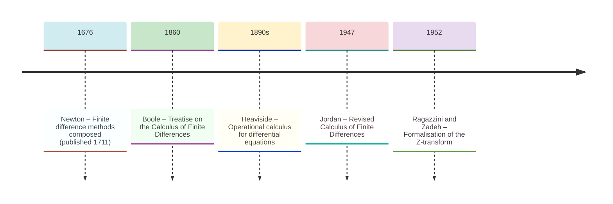
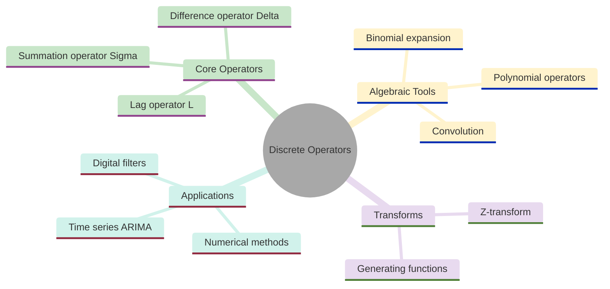
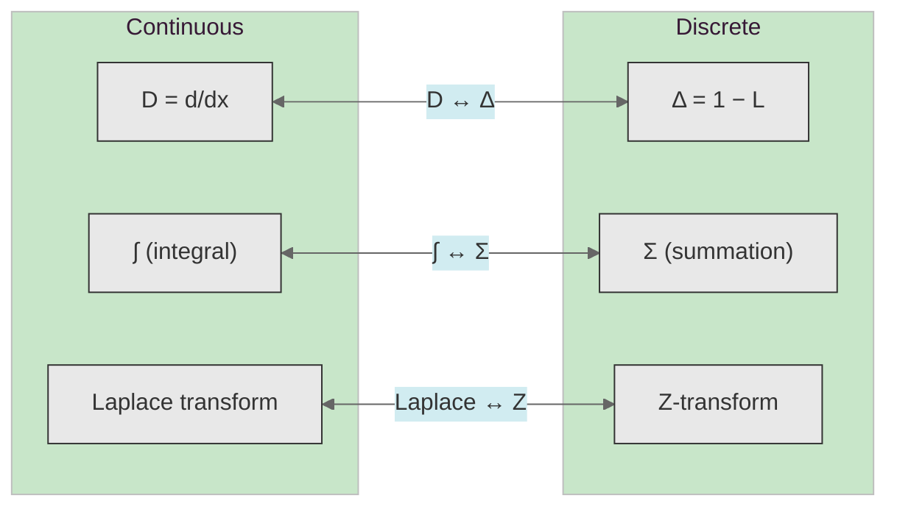
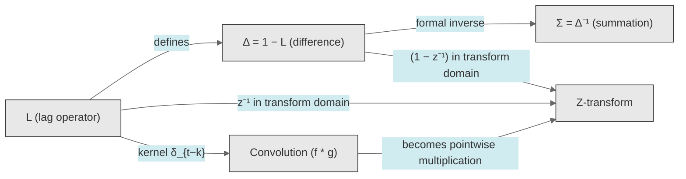
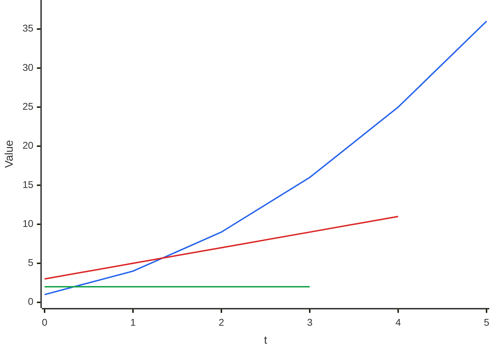
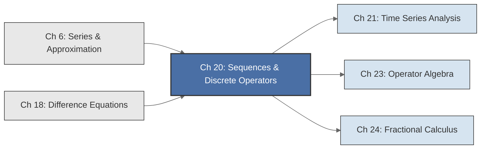

<!-- Copyright (c) 2025-2026 Bob Jansen <bobjansen@pm.me> -->
<!-- SPDX-License-Identifier: CC-BY-NC-4.0 -->
<!-- See LICENSE for full terms. Commercial licensing available. -->
# Chapter 20: Sequences & Discrete Operators


**Part VII**: Discrete & Time Series

> The shift operator $L$, the difference operator $\Delta = 1 - L$ and the summation operator $\Sigma$ form a discrete calculus whose algebraic structure mirrors continuous differentiation and integration. This chapter develops their theory and connects it to the $Z$-transform.

**Prerequisites**: [Chapter 6](06-series-approximation.md) (Series & Approximation): convergence of infinite sums, geometric series, power series and Taylor expansions. [Chapter 18](18-difference-equations.md) (Difference Equations): linear recurrences, characteristic roots and the homogeneous/particular solution framework.

**Learning Objectives**: After this chapter, the reader will be able to:

1. Represent sequences as functions from $\mathbb{Z}$ (or $\mathbb{N}$) to $\mathbb{R}$ and manipulate them using standard notational conventions.
2. Apply the shift (lag) operator $L$ and the difference operator $\Delta$ algebraically, including higher powers and polynomial expressions in $L$.
3. Expand $\Delta^n$ via the binomial theorem and compute higher-order differences efficiently.
4. Compute discrete convolutions directly and understand their connection to polynomial multiplication and generating functions.
5. State the definition of the $Z$-transform and use it to analyse shifted sequences.
6. Articulate the precise parallel between discrete operators ($\Delta$, $\Sigma$, $L$) and their continuous counterparts ($D$, $\int$, shift), laying the groundwork for [Chapter 23](23-operator-algebra.md) (Operator Algebra).

**Connections**: This chapter builds on [Chapter 6](06-series-approximation.md) (the geometric series and power series provide the generating-function viewpoint) and [Chapter 18](18-difference-equations.md) (difference equations are the primary application of the operators developed here). It is used by [Chapter 21](21-time-series.md) (Time Series; the lag operator $L$ is the central algebraic tool for autoregressive moving average (ARMA) models), [Chapter 23](23-operator-algebra.md) (Operator Algebra; the shift and difference operators become elements of an operator ring, and their formal power series connect discrete and continuous analysis) and [Chapter 24](24-fractional-calculus.md) (Fractional Calculus; the binomial expansion of $(1-L)^d$ for non-integer $d$ defines fractional differencing, the basis of autoregressive fractionally integrated moving average (ARFIMA) models).

---

## Historical Context

**Key Milestones in Discrete Operator Theory**



*Figure 20.1: Timeline of key developments in discrete operator theory from Newton to the Z-transform.*

**Newton and finite differences (1676–1711).** Isaac Newton developed the method of finite differences in the 1660s and 1670s as a tool for interpolation and numerical quadrature, before he formulated the fluxional calculus. His *Methodus Differentialis* (composed in 1676, published 1711) presented the forward difference table as a systematic device. Given function values $f(a), f(a+h), f(a+2h), \ldots$, one computes successive differences $\Delta f(a) = f(a+h) - f(a)$, $\Delta^2 f(a) = \Delta f(a+h) - \Delta f(a)$, and so on, arranging them in a triangular table. If $f$ is a polynomial of degree $n$, the $n$th differences are constant and all higher differences vanish. This observation provided a practical test for polynomial degree and a direct route to interpolation.

**Gregory–Newton interpolation (1670s).** James Gregory, working independently in Scotland during the same period, discovered the interpolation formula bearing his name jointly with Newton. The Gregory–Newton forward interpolation formula expresses a function value at a non-tabulated point in terms of the initial value and its successive forward differences:

$$f(a + sh) = \sum_{k=0}^{n} \binom{s}{k} \Delta^k f(a),$$

where $s$ need not be an integer. This formula is the discrete analogue of the Taylor expansion; in the limit $h \to 0$ with $sh = x - a$, it becomes Taylor's theorem. The formula was the principal tool of numerical computation for two centuries, used to construct logarithm, trigonometric and actuarial tables.

**Boole and operator algebra (1860).** George Boole systematised the subject in his 1860 treatise *A Treatise on the Calculus of Finite Differences*. He recognised the algebraic character of the difference operator: it obeys the same formal laws as the derivative, and many identities of infinitesimal calculus have exact finite-difference counterparts. He organised the subject around the operators $\Delta$ (difference), $E$ (shift, denoted $L^{-1}$ here) and $\Sigma$ (summation), treating them as algebraic objects that can be multiplied, inverted and composed. His operational approach, manipulating operators formally without reference to specific sequences, anticipated the functional-analytic methods of the twentieth century. Charles Jordan's 1947 *Calculus of Finite Differences* extended and modernised Boole's framework, adding applications to interpolation, numerical integration and probability.

**Heaviside and operational calculus (1890s).** Oliver Heaviside, in the 1890s, developed operational methods for differential equations arising in electrical engineering. He treated $D = d/dt$ as an algebraic symbol, factored operator polynomials and inverted operators via partial fractions. The technique was controversial among mathematicians but effective in practice. His methods apply equally to continuous and discrete operators. In the discrete case, the characteristic polynomial of a linear recurrence is a polynomial in the shift operator $L$, and the partial-fraction decomposition of $1/p(L)$ yields the impulse response of the corresponding digital filter.

**Ragazzini, Zadeh and the Z-transform (1952).** John Ragazzini and Lotfi Zadeh formalised the $Z$-transform in their 1952 paper "The Analysis of Sampled-Data Systems." The transform converts a sequence $\{x_t\}$ into a function of a complex variable $z$ via $X(z) = \sum_{t=0}^{\infty} x_t z^{-t}$, reducing difference equations to algebraic equations in $z$. The $Z$-transform became the standard tool of discrete-time control theory, digital signal processing and systems engineering. Its region of convergence determines stability and causality, just as the Laplace transform's region of convergence does for continuous systems.

**Modern applications.** Discrete operators now appear wherever computation meets time. Digital filters in audio and image processing are polynomials in the shift operator. Econometric lag operators express autoregressive and moving-average models compactly. The differencing operator $\Delta$ removes stochastic trends (unit roots) from time series, enabling stationary analysis. The extension of $(1-L)^d$ to fractional $d$ via the binomial series provides the fractional differencing operator that captures long-memory processes in finance, hydrology and network traffic.

---

## Why This Chapter Matters

**Discrete Operators**



*Figure 20.2: Conceptual map of discrete operator topics including core operators, transforms and applications.*

The lag operator $L$ (Definition 20.3) and the difference operator $\Delta = 1 - L$ (Definition 20.7) make time series analysis and digital signal processing compact and computable. They are not notational conveniences. Autoregressive integrated moving average (ARIMA) models can be written as polynomial equations $\phi(L)(1-L)^d X_t = \theta(L)\varepsilon_t$ and manipulated algebraically rather than expanded term-by-term because of this operator algebra. Without it, the procedures of [Chapter 21](21-time-series.md) would be intractable. The fractional differencing operator $(1-L)^d$ of [Chapter 24](24-fractional-calculus.md) could not even be defined.

Discrete convolution (Definition 20.16, Theorem 20.17) underlies convolutional neural networks and finite impulse response (FIR) filters. The connection between convolution and polynomial multiplication (Theorem 20.17) makes Fast Fourier Transform (FFT) based convolution ([Chapter 22](22-transforms.md)) possible, reducing $O(n^2)$ computation to $O(n \log n)$. The $Z$-transform (Definition 20.19) converts a difference equation into an algebraic equation in $z$. This enables closed-form analysis of digital filter stability and frequency response.

In finance and econometrics, the lag operator is the standard notation for autoregressive and moving average models. The autoregressive AR(p) model $\phi(L)X_t = \varepsilon_t$ is a polynomial in $L$. Its stationarity condition (all roots of $\phi(z) = 0$ outside the unit circle) is a statement about the $Z$-transform. The higher-order difference $\Delta^n$ (Theorem 20.11) is used for seasonal differencing in ARIMA models and for computing discrete returns from price series. In crypto, on-chain metrics are inherently discrete. The operators of this chapter provide the natural framework for lag analysis of gas prices and TVL changes.

The parallel between discrete operators ($\Delta$, $\Sigma$, $L$) and their continuous counterparts ($D$, $\int$, shift) is formalised in [Chapter 23](23-operator-algebra.md). This correspondence allows results for ordinary differential equations (ODEs) to be translated into results for difference equations. For practitioners who work with both continuous-time models and discrete-time data, the parallel unifies the two domains.

---

## Notation & Conventions

| Symbol | Meaning |
|--------|---------|
| $\{x_t\}$ | A sequence indexed by $t \in \mathbb{Z}$ (or $t \in \mathbb{N}$) |
| $x_t$ | The value of the sequence at index $t$ |
| $L$ | The lag (backshift) operator: $Lx_t = x_{t-1}$ |
| $L^k$ | The $k$th power of the lag operator: $L^k x_t = x_{t-k}$ |
| $L^{-1}$ | The forward shift operator: $L^{-1} x_t = x_{t+1}$ |
| $\Delta$ | The (backward) difference operator: $\Delta = 1 - L$ |
| $\Delta^n$ | The $n$th-order difference operator: $\Delta^n = (1-L)^n$ |
| $\Sigma$ | The summation operator (discrete indefinite integral) |
| $\binom{n}{k}$ | The binomial coefficient: $n! / (k!(n-k)!)$ |
| $(f * g)_t$ | Discrete convolution: $\sum_k f_k \, g_{t-k}$ |
| $X(z)$ | The $Z$-transform of $\{x_t\}$: $\sum_{t=0}^{\infty} x_t z^{-t}$ |
| $\delta_t$ | The Kronecker delta sequence: $\delta_0 = 1$, $\delta_t = 0$ for $t \neq 0$ |

Summations over $k$ range over all integers for which the summand is defined and nonzero. Sequences are real-valued. In signal processing, $z^{-1}$ plays the role of $L$.

---

## Core Theory

### Sequences

**Definition 20.1** (Sequence). A *sequence* is a function $a: \mathbb{Z} \to \mathbb{R}$ (a *bilateral* sequence) or $a: \mathbb{N}_0 \to \mathbb{R}$ (a *unilateral* sequence), where $\mathbb{N}_0 = \{0, 1, 2, \ldots\}$. The value $a(t)$ is written $x_t$ and the sequence is denoted $\{x_t\}$ or $\{x_t\}_{t \in \mathbb{Z}}$.

In time series and signal processing, the index $t$ is interpreted as discrete time. For bilateral sequences, the signal extends infinitely into both past and future. For unilateral sequences, the signal begins at $t = 0$ (causal signals). The choice between bilateral and unilateral sequences affects the domain of the $Z$-transform and the class of operators that can be applied.

**Example 20.2**. The geometric sequence $x_t = r^t$ for $t \in \mathbb{N}_0$ is the discrete analogue of the exponential function $e^{at}$. The constant sequence $x_t = c$ for all $t$ is the discrete analogue of a constant function. The unit impulse $\delta_t$ (Kronecker delta) plays the role of the Dirac delta in the continuous setting: it is the identity element for discrete convolution.

### The Shift Operator

**Definition 20.3** (Shift/lag operator). The *lag operator* (or *backshift operator*) $L$ acts on a sequence $\{x_t\}$ by

$$Lx_t = x_{t-1}.$$

Its $k$th power shifts back by $k$ steps:

$$L^k x_t = x_{t-k}, \quad k \in \mathbb{Z}.$$

In particular, the *forward shift operator* is $L^{-1}$:

$$L^{-1} x_t = x_{t+1}.$$

The operator $L$ is the fundamental element of all discrete-time linear systems. Every linear constant-coefficient difference equation ([Chapter 18](18-difference-equations.md)), every digital filter and every autoregressive moving average (ARMA) model is expressed as a polynomial (or rational function) in $L$.

**Remark 20.4** (Notation). In the signal processing literature, the shift operator is often denoted $z^{-1}$ (identifying the operator with its $Z$-transform representation). In econometrics, $L$ (for "lag") is standard. Some older texts use $E$ for the forward shift ($E = L^{-1}$). The choice is conventional; the algebra is identical.

**Theorem 20.5** (Linearity of $L$). The lag operator $L$ is linear: for all sequences $\{x_t\}$, $\{y_t\}$ and scalars $a, b \in \mathbb{R}$,

$$L(ax_t + by_t) = aLx_t + bLy_t.$$

??? note "Proof"

    *Proof.* By definition, $L(ax_t + by_t) = a x_{t-1} + b y_{t-1} = a(Lx_t) + b(Ly_t)$. The first equality holds because the sequence $\{ax_t + by_t\}$ has value $ax_{t-1} + by_{t-1}$ at index $t-1$. The second equality applies Definition 20.3 to each sequence individually.

    $\square$

**Remark 20.6**. More generally, any polynomial $p(L) = c_0 + c_1 L + c_2 L^2 + \cdots + c_n L^n$ is a linear operator on the space of sequences, since it is a linear combination of powers of a linear operator. Rational functions of $L$, such as $(1 - \phi L)^{-1}$, are also linear (when defined) and correspond to infinite-impulse-response filters.

### The Difference Operator

**Definition 20.7** (Difference operator). The *(backward) difference operator* $\Delta$ is defined by

$$\Delta = 1 - L,$$

so that

$$\Delta x_t = (1 - L) x_t = x_t - x_{t-1}.$$

This is the *first difference* of the sequence $\{x_t\}$. It measures the one-step change in the sequence value.

The difference operator is the discrete analogue of the derivative $D = d/dx$. Just as the derivative measures the instantaneous rate of change of a continuous function, the first difference measures the discrete rate of change of a sequence. The analogy is not merely suggestive: as the step size $h \to 0$, the finite difference $\Delta_h f(x) = f(x+h) - f(x)$ converges to $f'(x) \cdot h$, so $\Delta_h / h \to D$.

**Example 20.8**. If $x_t = t^2$, then $\Delta x_t = t^2 - (t-1)^2 = 2t - 1$. The first difference of a quadratic is linear, just as the derivative of a quadratic is linear.

**Example 20.9**. If $x_t = r^t$ (geometric sequence), then $\Delta x_t = r^t - r^{t-1} = r^{t-1}(r - 1)$. This is the discrete analogue of $(d/dx)e^{ax} = ae^{ax}$: the difference of a geometric sequence is proportional to a shifted geometric sequence.

**Definition 20.10** (Higher-order differences). The *$n$th-order difference operator* is defined by

$$\Delta^n = (1 - L)^n.$$

Expanding the right-hand side via the binomial theorem yields an explicit formula for $\Delta^n$ as a weighted sum of shifted values.

The second difference is

$$\Delta^2 = (1-L)^2 = 1 - 2L + L^2,$$

so $\Delta^2 x_t = x_t - 2x_{t-1} + x_{t-2}$. This measures the *change in the change*; the discrete analogue of the second derivative. It detects concavity: $\Delta^2 x_t > 0$ indicates that the sequence is accelerating (convex), while $\Delta^2 x_t < 0$ indicates deceleration (concave).

**Theorem 20.11** ($\Delta^n$ via binomial expansion). For any non-negative integer $n$ and sequence $\{x_t\}$,

$$\Delta^n x_t = \sum_{k=0}^{n} (-1)^k \binom{n}{k} x_{t-k}.$$

!!! abstract "Key Result"

    **Theorem 20.11** ($\Delta^n$ via binomial expansion). The $n$-th order difference is an alternating binomial-weighted sum of lagged values, unifying finite differences with the binomial theorem through the operator identity $\Delta^n = (1 - L)^n$ and forming the bridge to fractional differencing.

??? note "Proof"

    *Proof.* By definition, $\Delta^n = (1 - L)^n$. Applying the binomial theorem to the operator expression:

    $$(1 - L)^n = \sum_{k=0}^{n} \binom{n}{k} (-L)^k = \sum_{k=0}^{n} (-1)^k \binom{n}{k} L^k.$$

    Applying both sides to $x_t$:

    $$\Delta^n x_t = \sum_{k=0}^{n} (-1)^k \binom{n}{k} L^k x_t = \sum_{k=0}^{n} (-1)^k \binom{n}{k} x_{t-k}.$$

    The first equality uses the linearity of the operator sum; the second uses $L^k x_t = x_{t-k}$ (Definition 20.3).

    $\square$

**Example 20.12**. For $n = 3$: $\Delta^3 x_t = x_t - 3x_{t-1} + 3x_{t-2} - x_{t-3}$. The coefficients $1, -3, 3, -1$ are the binomial coefficients $\binom{3}{k}$ with alternating signs; the same pattern that appears in the expansion of $(1-x)^3 = 1 - 3x + 3x^2 - x^3$.

**Remark 20.13** (Forward differences). An alternative convention defines the *forward difference* $\Delta_f x_t = x_{t+1} - x_t = (L^{-1} - 1)x_t$. The forward and backward conventions are related by a time shift: $\Delta_f x_t = \Delta x_{t+1}$. This chapter uses the backward convention ($\Delta = 1 - L$), which is standard in econometrics and time series analysis. The forward convention is standard in classical finite differences and numerical analysis.

### Summation as Discrete Integration

**Definition 20.14** (Summation operator). The *summation operator* $\Sigma$ is the formal inverse of the difference operator $\Delta$. If $\Delta y_t = x_t$ (i.e., $y_t - y_{t-1} = x_t$), then

$$y_t = \Sigma x_t = \sum_{k=-\infty}^{t} x_k$$

(for bilateral sequences) or

$$y_t = \sum_{k=0}^{t} x_k$$

(for unilateral sequences beginning at $t = 0$), up to an additive constant.

The relation $\Sigma \circ \Delta = \mathrm{id}$ (modulo constants) is the discrete analogue of the Fundamental Theorem of Calculus: $\int_a^x f'(u)\,du = f(x) - f(a)$. In the discrete case, telescoping gives

$$\sum_{k=a+1}^{t} \Delta x_k = \sum_{k=a+1}^{t} (x_k - x_{k-1}) = x_t - x_a.$$

This is the *discrete Fundamental Theorem*: the sum of differences telescopes to the boundary values, just as the integral of a derivative recovers the function (up to constants).

**Example 20.15**. Since $\Delta(t^2) = 2t - 1$, it follows that $\sum_{k=1}^{n} (2k - 1) = n^2 - 0^2 = n^2$. This confirms the identity that the sum of the first $n$ odd numbers is $n^2$.

### Discrete Convolution

**Definition 20.16** (Discrete convolution). The *discrete convolution* of two sequences $\{f_t\}$ and $\{g_t\}$ is the sequence $\{(f * g)_t\}$ defined by

$$(f * g)_t = \sum_{k=-\infty}^{\infty} f_k \, g_{t-k}.$$

For unilateral (causal) sequences with $f_t = g_t = 0$ for $t < 0$, this reduces to

$$(f * g)_t = \sum_{k=0}^{t} f_k \, g_{t-k}.$$

Discrete convolution is the fundamental operation of linear time-invariant discrete systems. If a system has impulse response $\{h_t\}$ (the output when the input is the unit impulse $\delta_t$), then the output for an arbitrary input $\{x_t\}$ is the convolution $y_t = (h * x)_t = \sum_k h_k x_{t-k}$.

**Properties of discrete convolution**:

1. *Commutativity*: $f * g = g * f$. (Change of summation index $j = t - k$.)
2. *Associativity*: $(f * g) * h = f * (g * h)$.
3. *Distributivity*: $f * (g + h) = f * g + f * h$.
4. *Identity*: $f * \delta = f$, where $\delta$ is the Kronecker delta sequence.
5. *Shift*: If $g_t = \delta_{t-m}$ (a shifted impulse), then $(f * g)_t = f_{t-m}$ (convolution with a shifted impulse shifts the signal).

**Theorem 20.17** (Convolution and polynomial multiplication). Let $f(x) = \sum_{k=0}^{m} f_k x^k$ and $g(x) = \sum_{k=0}^{n} g_k x^k$ be polynomials with coefficient sequences $\{f_k\}$ and $\{g_k\}$. Then the coefficient sequence of the product $f(x) \cdot g(x)$ is the convolution of the coefficient sequences:

$$(f \cdot g)(x) = \sum_{t=0}^{m+n} c_t x^t, \quad \text{where } c_t = \sum_{k=0}^{t} f_k \, g_{t-k} = (f * g)_t.$$

??? note "Proof"

    *Proof.* The product $(f \cdot g)(x) = \left(\sum_{j=0}^m f_j x^j\right)\left(\sum_{i=0}^n g_i x^i\right)$. Expanding and collecting terms by total power $t = i + j$:

    $$\sum_{t=0}^{m+n} \left(\sum_{\substack{j+i=t \\ 0 \leq j \leq m \\ 0 \leq i \leq n}} f_j \, g_i\right) x^t = \sum_{t=0}^{m+n} \left(\sum_{k=0}^{t} f_k \, g_{t-k}\right) x^t,$$

    where the last step substitutes $k = j$ and notes that $f_k = 0$ for $k > m$ and $g_{t-k} = 0$ for $t - k > n$, so the inner sum can be written without restricting the limits. This is precisely the convolution $(f * g)_t$.

    $\square$

**Remark 20.18** (Generating functions). Theorem 20.17 extends beyond finite polynomials: if $F(x) = \sum_{t=0}^{\infty} f_t x^t$ and $G(x) = \sum_{t=0}^{\infty} g_t x^t$ are formal power series ([Chapter 6](06-series-approximation.md)), then $F(x) \cdot G(x)$ has coefficient sequence $(f * g)_t$. This is the *convolution theorem for generating functions*. It converts convolution in the sequence domain into multiplication in the generating-function domain; the fundamental reason that generating functions (and the $Z$-transform) are powerful tools for analysing discrete systems.

### The $Z$-Transform

**Definition 20.19** ($Z$-transform). The *$Z$-transform* of a sequence $\{x_t\}_{t=0}^{\infty}$ is the function of a complex variable $z$ defined by

$$X(z) = \mathcal{Z}\{x_t\} = \sum_{t=0}^{\infty} x_t \, z^{-t},$$

for all $z \in \mathbb{C}$ for which the series converges absolutely.

The $Z$-transform is the discrete analogue of the (one-sided) Laplace transform $\mathcal{L}\{f(t)\} = \int_0^{\infty} f(t) e^{-st} \, dt$. The substitution $z = e^{sT}$ (where $T$ is the sampling period) converts between the two; this correspondence underlies the design of digital filters from continuous prototypes. The region of convergence of $X(z)$ is the set of $z$ for which the defining series converges absolutely; for a causal sequence with $|x_t| \leq C r^t$, the ROC is $\{z : |z| > r\}$.

**Example 20.20**. The geometric sequence $x_t = a^t$ (for $t \geq 0$) has $Z$-transform

$$X(z) = \sum_{t=0}^{\infty} a^t z^{-t} = \sum_{t=0}^{\infty} (a/z)^t = \frac{1}{1 - az^{-1}} = \frac{z}{z - a},$$

valid for $|z| > |a|$.

**Theorem 20.21** ($Z$-transform of a shifted sequence). If $\mathcal{Z}\{x_t\} = X(z)$, then

$$\mathcal{Z}\{Lx_t\} = \mathcal{Z}\{x_{t-1}\} = z^{-1} X(z),$$

assuming $x_{-1} = 0$ (zero initial condition). More generally, $\mathcal{Z}\{L^k x_t\} = z^{-k} X(z)$ for $k \geq 0$.

??? note "Proof"

    *Proof.* By definition,

    $$\mathcal{Z}\{x_{t-1}\} = \sum_{t=0}^{\infty} x_{t-1} z^{-t}.$$

    Substituting $s = t - 1$ (so $t = s + 1$, and when $t = 0$ this gives $s = -1$):

    $$= \sum_{s=-1}^{\infty} x_s z^{-(s+1)} = z^{-1} \sum_{s=-1}^{\infty} x_s z^{-s} = z^{-1}\left(x_{-1} z^{1} + \sum_{s=0}^{\infty} x_s z^{-s}\right).$$

    Under the assumption $x_{-1} = 0$, this reduces to $z^{-1} X(z)$. The general case $L^k$ follows by induction.

    $\square$

**Remark 20.22** (Operational significance). Theorem 20.21 is the reason the $Z$-transform is useful: the shift operator $L$, which acts on sequences, becomes multiplication by $z^{-1}$ in the transform domain. A difference equation $y_t - \phi y_{t-1} = x_t$ becomes $(1 - \phi z^{-1})Y(z) = X(z)$, yielding $Y(z) = X(z)/(1 - \phi z^{-1})$. The system transfer function $H(z) = 1/(1 - \phi z^{-1})$ encodes the dynamics algebraically.

**Continuous-Discrete Operator Correspondence:**



*Figure 20.3: Correspondence between continuous calculus operators and their discrete counterparts.*

Each continuous operator has a discrete counterpart that obeys the same algebraic rules: differentiation maps to differencing, integration maps to summation and the Laplace transform maps to the Z-transform. The passage between columns is mediated by the limit $h \to 0$ (continuous from discrete) or by sampling (discrete from continuous).

**Remark 20.23** (The continuous-discrete correspondence). The following table summarises the structural parallel between continuous and discrete calculus. In the table, $D = d/dx$ denotes the formal differential operator. This correspondence connects directly to [Chapter 23](23-operator-algebra.md) (Operator Algebra), where both frameworks are unified under a single algebraic structure.

| Continuous | Discrete | Relation |
|-----------|----------|----------|
| $D = d/dx$ (derivative) | $\Delta = 1 - L$ (difference) | $D = \lim_{h\to 0} \Delta_h / h$ |
| $\int$ (integral) | $\Sigma$ (summation) | $\int = \lim_{h\to 0} h \cdot \Sigma$ |
| $e^{at}$ (exponential) | $a^t$ (geometric) | $e^{at} = \lim_{n\to\infty}(1 + at/n)^n$ |
| $e^{hD}$ (shift by $h$) | $L^{-1}$ (forward shift by 1) | $e^{hD}f(x) = f(x+h)$ |
| Laplace: $\int_0^\infty f(t)e^{-st}\,dt$ | $Z$: $\sum_{t=0}^\infty x_t z^{-t}$ | $z = e^{sT}$ |
| $\mathcal{L}\{f'(t)\} = sF(s) - f(0)$ | $\mathcal{Z}\{L^{-1}x_t\} = zX(z) - zx_0$ | Differentiation / shift |
| Taylor: $f(x) = \sum \frac{f^{(k)}(a)}{k!}(x-a)^k$ | Newton: $f(a+sh) = \sum \binom{s}{k}\Delta^k f(a)$ | Polynomial expansion |

The following diagram summarises how the core discrete operators relate to one another and to the $Z$-transform.

**Discrete Operator Relationships**



*Figure 20.4: Relationships among the lag, difference, summation and convolution operators via the Z-transform.*

**Differences Remove Polynomial Trends:**



*Figure 20.5: Higher-order differences reduce a quadratic sequence to a constant.*

The original quadratic sequence $x_t = (t+1)^2$ (top line) has linearly increasing first differences (middle line) and constant second differences (bottom line). This illustrates that the $n$-th difference operator $\Delta^n$ annihilates polynomials of degree less than $n$ and reduces a degree-$n$ polynomial to a constant, the discrete analogue: the $n$-th derivative of a degree-$n$ polynomial is a constant.

---

## Formulas & Identities

**F20.1** (Lag operator).

$$Lx_t = x_{t-1}, \qquad L^k x_t = x_{t-k}$$

**F20.2** (Difference operator).

$$\Delta = 1 - L, \qquad \Delta x_t = x_t - x_{t-1}$$

**F20.3** (Binomial expansion of $\Delta^n$).

$$\Delta^n x_t = \sum_{k=0}^{n} (-1)^k \binom{n}{k} x_{t-k}$$

**F20.4** (Discrete Fundamental Theorem).

$$\sum_{k=a+1}^{t} \Delta x_k = x_t - x_a$$

**F20.5** (Discrete convolution).

$$(f * g)_t = \sum_{k} f_k \, g_{t-k}$$

**F20.6** ($Z$-transform).

$$X(z) = \mathcal{Z}\{x_t\} = \sum_{t=0}^{\infty} x_t \, z^{-t}$$

**F20.7** ($Z$-transform of geometric sequence).

$$\mathcal{Z}\{a^t\} = \frac{z}{z - a}, \qquad |z| > |a|$$

**F20.8** (Shift property).

$$\mathcal{Z}\{Lx_t\} = z^{-1} X(z), \qquad \mathcal{Z}\{L^k x_t\} = z^{-k} X(z)$$

!!! warning "Zero initial conditions in F20.8"

    The shift property F20.8 assumes zero initial conditions ($x_{-1} = x_{-2} = \cdots = 0$). When initial conditions are nonzero, additional terms involving $x_{-1}, \ldots, x_{-k}$ appear. Applying F20.8 blindly to data with nonzero pre-sample values produces incorrect transfer functions.

**F20.9** (Discrete product rule).

$$\Delta(x_t \cdot y_t) = x_t \cdot \Delta y_t + y_{t-1} \cdot \Delta x_t$$

**F20.10** (Gregory–Newton forward interpolation).

$$f(a + sh) = \sum_{k=0}^{n} \binom{s}{k} \Delta^k f(a)$$

---

## Algorithms

### Algorithm 20.24: Shift

**Input**: A sequence $\{x_t\}_{t=0}^{N-1}$ (represented as an array of length $N$), a shift amount $k \in \mathbb{Z}$.

**Output**: The shifted sequence $\{y_t\}_{t=0}^{N-1}$ where $y_t = x_{t-k}$ (with zero-padding for indices outside the original range).

```
function shift(x, k):
    N := length(x)
    y := array of N zeros
    for t = 0 to N - 1:
        source := t - k
        if 0 <= source < N:
            y[t] := x[source]
        // else y[t] remains 0 (zero-padding)
    return y
```

**Complexity**: $O(N)$ time, $O(N)$ space.

**Correctness**: Directly implements $L^k x_t = x_{t-k}$ with boundary handling via zero-padding. Zero-padding is the standard convention for causal signals in signal processing; alternative boundary treatments (periodic extension, reflection) are used in specific applications.

### Algorithm 20.25: First and Second Difference

**Input**: A sequence $\{x_t\}_{t=0}^{N-1}$.

**Output**: The first difference $\{\Delta x_t\}_{t=1}^{N-1}$ (length $N-1$) or the second difference $\{\Delta^2 x_t\}_{t=2}^{N-1}$ (length $N-2$).

```
function firstDifference(x):
    N := length(x)
    d := array of (N - 1) elements
    for t = 1 to N - 1:
        d[t - 1] := x[t] - x[t - 1]
    return d

function secondDifference(x):
    N := length(x)
    d := array of (N - 2) elements
    for t = 2 to N - 1:
        d[t - 2] := x[t] - 2 * x[t - 1] + x[t - 2]
    return d
```

**Complexity**: $O(N)$ for each.

**Remark**: The second difference can be computed as `firstDifference(firstDifference(x))`, but the direct formula avoids allocating an intermediate array and reduces the number of passes to one.

### Algorithm 20.26: $n$th-Order Difference (Binomial Expansion)

**Input**: A sequence $\{x_t\}_{t=0}^{N-1}$, an order $n \geq 0$.

**Output**: The $n$th difference $\{\Delta^n x_t\}_{t=n}^{N-1}$ (length $N - n$).

```
function nthDifference(x, n):
    N := length(x)
    if n > N - 1: error("Order exceeds sequence length")
    
    // Precompute binomial coefficients with alternating signs
    coeffs := array of (n + 1) elements
    for k = 0 to n:
        coeffs[k] := (-1)^k * binomial(n, k)
    
    result := array of (N - n) elements
    for t = n to N - 1:
        sum := 0
        for k = 0 to n:
            sum := sum + coeffs[k] * x[t - k]
        result[t - n] := sum
    return result
```

**Complexity**: $O(n)$ for precomputing binomial coefficients (using the recurrence $\binom{n}{k+1} = \binom{n}{k} \cdot (n-k)/(k+1)$), then $O((N-n) \cdot n)$ for the main loop. Total: $O(Nn)$.

**Correctness**: Implements Theorem 20.11 directly.

### Algorithm 20.27: Discrete Convolution (Direct)

**Input**: Two sequences $\{f_t\}_{t=0}^{M-1}$ and $\{g_t\}_{t=0}^{N-1}$.

**Output**: The convolution $\{(f*g)_t\}_{t=0}^{M+N-2}$ (length $M + N - 1$).

```
function convolve(f, g):
    M := length(f)
    N := length(g)
    result := array of (M + N - 1) zeros
    for i = 0 to M - 1:
        for j = 0 to N - 1:
            result[i + j] := result[i + j] + f[i] * g[j]
    return result
```

**Complexity**: $O(MN)$ time, $O(M + N)$ space.

**Remark** (FFT-based convolution): For long sequences, the direct $O(MN)$ algorithm is slow. The convolution theorem states that convolution in the time domain corresponds to pointwise multiplication in the frequency domain. Using the Fast Fourier Transform (FFT): (1) compute $F = \text{FFT}(f)$ and $G = \text{FFT}(g)$ (both zero-padded to length $M + N - 1$), (2) compute $H = F \odot G$ pointwise, (3) compute $h = \text{IFFT}(H)$. The total cost is $O((M+N) \log(M+N))$. This is the standard approach in signal processing when $M$ and $N$ are large (typically $M + N > 64$).

!!! tip "When to switch from direct to FFT-based convolution"

    The crossover point depends on the implementation, but $M + N \approx 64$ is a common threshold. Below this, the overhead of the FFT (memory allocation, complex arithmetic, zero-padding) outweighs the asymptotic advantage. For very short filters ($M \leq 5$), direct convolution is almost always faster.

---

## Numerical Considerations

### Stability of Higher-Order Differences

Each application of $\Delta$ amplifies high-frequency components. Noise of magnitude $\varepsilon$ grows to order $2^n \varepsilon$ after $n$ differences. For $n = 20$ the amplification exceeds $10^6$. Differences above order 2 or 3 on empirical data require smoothing or regularisation.

!!! warning "Noise amplification in higher-order differences"

    Applying $\Delta^n$ to noisy data amplifies measurement error by a factor of $2^n$. For $n = 10$ the amplification is $1024\times$; for $n = 20$ it exceeds $10^6\times$. In practice, differences of order 4 or higher on empirical data are dominated by noise. Pre-smooth the data or use regularised differencing when $n > 3$.

### Floating-Point Considerations in Convolution

Direct convolution accumulates $\min(M, N)$ products per output sample. Kahan summation in the inner loop mitigates cancellation at minimal cost. For mixed-sign sequences the relative error can exceed the absolute error; analyse the output scale.

### Binomial Coefficients for Large $n$

For $n > 66$, $\binom{n}{k}$ overflows 64-bit integers. The recurrence $\binom{n}{k+1} = \binom{n}{k} \cdot (n-k)/(k+1)$ computes coefficients in floating point, avoiding large intermediates. Exact computation requires arbitrary-precision integers.

!!! info "Overflow threshold for binomial coefficients"

    The largest binomial coefficient representable as a 64-bit signed integer is $\binom{66}{33} \approx 7.22 \times 10^{18}$; the value $\binom{67}{33}$ exceeds $2^{63} - 1$. For Algorithm 20.26 with $n > 66$, use the multiplicative recurrence in IEEE 754 double precision (exact for $n \leq 1029$) or switch to arbitrary-precision arithmetic.

---

## Worked Examples

### Example 20.28: Computing the Second Difference of a Quadratic Sequence

**Problem**: Let $x_t = t^2$ for $t = 0, 1, 2, 3, 4, 5$. Compute $\Delta x_t$, $\Delta^2 x_t$ and $\Delta^3 x_t$. Verify that the third difference of a quadratic is zero.

**Solution** (mathematical):

The sequence values are $x = [0, 1, 4, 9, 16, 25]$.

First differences: $\Delta x_t = x_t - x_{t-1}$.

$$\Delta x = [1 - 0,\; 4 - 1,\; 9 - 4,\; 16 - 9,\; 25 - 16] = [1, 3, 5, 7, 9].$$

Second differences: $\Delta^2 x_t = \Delta x_t - \Delta x_{t-1}$.

$$\Delta^2 x = [3 - 1,\; 5 - 3,\; 7 - 5,\; 9 - 7] = [2, 2, 2, 2].$$

Third differences: $\Delta^3 x_t = \Delta^2 x_t - \Delta^2 x_{t-1}$.

$$\Delta^3 x = [2 - 2,\; 2 - 2,\; 2 - 2] = [0, 0, 0].$$

This confirms that $\Delta^n$ of a polynomial of degree $d$ is zero for $n > d$, the discrete analogue: the $(d+1)$th derivative of a degree-$d$ polynomial vanishes.

### Example 20.29: Convolution as Polynomial Multiplication

**Problem**: Compute the product of $p(x) = 1 + 2x + x^2$ and $q(x) = 3 + x$ by convolving their coefficient sequences. Verify algebraically.

**Solution** (mathematical):

Coefficient sequences: $f = [1, 2, 1]$ (coefficients of $p$), $g = [3, 1]$ (coefficients of $q$).

Convolution $(f * g)_t = \sum_{k=0}^{t} f_k g_{t-k}$:

- $t = 0$: $f_0 g_0 = 1 \cdot 3 = 3$.
- $t = 1$: $f_0 g_1 + f_1 g_0 = 1 \cdot 1 + 2 \cdot 3 = 7$.
- $t = 2$: $f_0 g_2 + f_1 g_1 + f_2 g_0 = 0 + 2 \cdot 1 + 1 \cdot 3 = 5$.
- $t = 3$: $f_1 g_2 + f_2 g_1 = 0 + 1 \cdot 1 = 1$.

Result: $[3, 7, 5, 1]$, representing $3 + 7x + 5x^2 + x^3$.

Verification:

$$(1 + 2x + x^2)(3 + x) = 3 + x + 6x + 2x^2 + 3x^2 + x^3 = 3 + 7x + 5x^2 + x^3.$$

Confirmed.

### Example 20.30: The Lag Operator in a First-Order Autoregressive Process

**Problem**: An AR(1) process satisfies $x_t = 0.8 \, x_{t-1} + \varepsilon_t$, where $\varepsilon_t$ is white noise. Express this using the lag operator $L$, solve for $x_t$ as an infinite moving average and verify numerically.

**Solution** (mathematical):

Rewrite:

$$(1 - 0.8L) x_t = \varepsilon_t.$$

Formally inverting:

$$x_t = (1 - 0.8L)^{-1} \varepsilon_t.$$

Expanding $(1 - 0.8L)^{-1}$ as a geometric series in the operator $L$ (valid when the system is stable, i.e., $|0.8| < 1$):

$$(1 - 0.8L)^{-1} = \sum_{k=0}^{\infty} (0.8)^k L^k.$$

Substitution gives:

$$x_t = \sum_{k=0}^{\infty} (0.8)^k \varepsilon_{t-k}.$$

The AR(1) process is represented as an infinite moving average (MA($\infty$)) with exponentially decaying weights. The impulse response is $h_k = (0.8)^k$: a shock $\varepsilon_{t-k}$ contributes $(0.8)^k$ to the current value $x_t$.

### Example 20.31: Binomial Expansion for Fractional Differencing (Preview)

**Problem**: The fractional difference operator $(1 - L)^d$ for $d = 0.4$ is defined via the binomial series. Compute the first 6 weights (the coefficients of $L^0, L^1, \ldots, L^5$) and apply them to the sequence $x = [100, 102, 101, 104, 103, 107]$.

**Solution** (mathematical):

The binomial expansion gives

$$(1 - L)^d = \sum_{k=0}^{\infty} \binom{d}{k} (-L)^k = \sum_{k=0}^{\infty} (-1)^k \binom{d}{k} L^k,$$

where

$$\binom{d}{k} = \frac{d(d-1)(d-2)\cdots(d-k+1)}{k!}.$$

For $d = 0.4$ and $k = 0, 1, \ldots, 5$:

$$\begin{aligned}
\binom{0.4}{0} &= 1 \\
\binom{0.4}{1} &= 0.4 \\
\binom{0.4}{2} &= \frac{0.4 \times (-0.6)}{2} = -0.12 \\
\binom{0.4}{3} &= \frac{0.4 \times (-0.6) \times (-1.6)}{6} = 0.064 \\
\binom{0.4}{4} &= \frac{0.4 \times (-0.6) \times (-1.6) \times (-2.6)}{24} = -0.04160 \\
\binom{0.4}{5} &= \frac{0.4 \times (-0.6) \times (-1.6) \times (-2.6) \times (-3.6)}{120} = 0.02995
\end{aligned}$$

The weights are $w_k = (-1)^k \binom{d}{k}$:

$$w = [1, -0.4, -0.12, -0.064, -0.04160, -0.02995, \ldots]$$

Applying to $x_5 = 107$ (using all 6 terms):

$$\begin{aligned}
\Delta^{0.4} x_5 &= \sum_{k=0}^{5} w_k \, x_{5-k} = 1(107) - 0.4(103) - 0.12(104) - 0.064(101) - 0.04160(102) - 0.02995(100) \\
&= 107 - 41.2 - 12.48 - 6.464 - 4.2432 - 2.995 = 39.618.
\end{aligned}$$

This is the fractionally differenced value at $t = 5$. The fractional difference preserves more of the original signal than a full first difference ($\Delta x_5 = 107 - 103 = 4$), making it useful for removing long-memory trends while retaining short-term structure. This technique is central to ARFIMA models ([Chapter 24](24-fractional-calculus.md)).

---

## Connections

**Chapter Dependencies**



*Figure 20.6: Prerequisite and downstream dependencies for Chapter 20.*

### Within This Book

- **[Chapter 6](06-series-approximation.md) (Series & Approximation)** provides the convergence theory for generating functions and the geometric series formula $1/(1-r) = \sum r^k$ that underlies operator inversions $(1 - \phi L)^{-1} = \sum \phi^k L^k$.

- **[Chapter 18](18-difference-equations.md) (Difference Equations)** uses polynomials in $L$ as its algebraic language. The characteristic equation is the operator polynomial evaluated at $z$.

- **[Chapter 21](21-time-series.md) (Time Series)** writes ARMA models as rational functions of $L$: $\phi(L) y_t = \theta(L) \varepsilon_t$.

- **[Chapter 23](23-operator-algebra.md) (Operator Algebra)** unifies $L$, $\Delta = 1 - L$ and $D$ in a single algebraic framework via the formal identity $L^{-1} = e^D$.

- **[Chapter 24](24-fractional-calculus.md) (Fractional Calculus)** extends $(1 - L)^d$ to non-integer $d$ via generalised binomial coefficients, defining the fractional differencing operator for ARFIMA models.

### Applications

- **Digital signal processing**: Finite impulse response (FIR) filters are finite convolutions; infinite impulse response filters are rational functions of $L$. The $Z$-transform is the tool for filter design, stability analysis and frequency response computation.
- **Econometrics**: The lag operator notation is universal in macroeconometrics. Unit root tests determine whether $\Delta x_t$ (or $\Delta^2 x_t$) is stationary. Granger causality tests are formulated as restrictions on lag polynomials.
- **Numerical analysis**: Finite difference methods for ODEs and partial differential equations (PDEs) discretise derivatives as differences. The accuracy of a finite-difference scheme depends on the order of the difference approximation (related to Theorem 20.11 and Taylor expansions).
- **Combinatorics and probability**: Generating functions convert combinatorial identities into algebraic identities. The convolution of probability mass functions gives the distribution of a sum of independent random variables.

---

## Summary

- The lag operator $L$ shifts a sequence by one time step ($Lx_t = x_{t-1}$) and is linear; the difference operator $\Delta = 1 - L$ is the discrete analogue of the derivative.
- The $n$th-order difference $\Delta^n$ expands via the binomial theorem as $\sum_{k=0}^{n}(-1)^k\binom{n}{k}x_{t-k}$, connecting higher-order differences to combinatorial weights.
- Discrete convolution of two sequences corresponds to polynomial multiplication of their generating functions, and the $Z$-transform converts convolution into pointwise multiplication.
- The summation operator $\Sigma$ inverts $\Delta$, paralleling the relationship between integration and differentiation in continuous calculus.
- The structural correspondence between $(\Delta, \Sigma, L)$ and $(D, \int, \text{shift})$ unifies discrete and continuous analysis under a common algebraic framework.

---

## Exercises

### Routine

**Exercise 20.1**. Let $x_t = 3t + 2$ for $t = 0, 1, \ldots, 5$. Compute $\Delta x_t$ and $\Delta^2 x_t$. Explain why $\Delta^2 = 0$ for any linear (affine) sequence.

**Exercise 20.2**. Compute the convolution of $f = [1, 1, 1]$ and $g = [1, -1]$. Interpret the result as polynomial multiplication: what are $f(x)$ and $g(x)$, and what is their product?

**Exercise 20.3**. Show that $L^j L^k = L^{j+k}$ for all integers $j, k$. (This states that the powers of $L$ form a group under composition.)

**Exercise 20.4**. Using Theorem 20.11, expand $\Delta^4 x_t$ as a weighted sum of $x_t, x_{t-1}, x_{t-2}, x_{t-3}, x_{t-4}$. Verify the coefficients sum to zero.

### Intermediate

**Exercise 20.5**. Prove that $\Delta(x_t \cdot y_t) = x_t \cdot \Delta y_t + y_{t-1} \cdot \Delta x_t$. This is the *discrete product rule* (Leibniz rule for differences). Compare to the continuous product rule $D(fg) = fDg + gDf$.

**Exercise 20.6**. The *summation by parts* formula states that $\sum_{t=a}^{b} f_t \Delta g_t = [f_t g_t]_a^{b+1} - \sum_{t=a}^{b} g_{t+1} \Delta f_t$. Derive this from the discrete product rule (Exercise 20.5). (This is the discrete analogue of integration by parts.)

**Exercise 20.7**. An MA(2) process is defined by $y_t = \varepsilon_t + 0.5\varepsilon_{t-1} - 0.3\varepsilon_{t-2}$. Express this using the lag operator as $y_t = \theta(L)\varepsilon_t$. Identify $\theta(L)$. Compute the autocovariance $\gamma(1) = \operatorname{Cov}(y_t, y_{t-1})$ assuming $\operatorname{Var}(\varepsilon_t) = \sigma^2$.

**Exercise 20.8**. Compute the $Z$-transform of the sequence $x_t = (-1)^t$ for $t \geq 0$. What is the region of convergence? Use Theorem 20.21 to find $\mathcal{Z}\{x_{t-1}\}$ (with $x_{-1} = 0$).

### Challenging

**Exercise 20.9**. The *Euler–Maclaurin formula* relates a discrete sum to a continuous integral plus correction terms involving differences. State the formula to second order: $\sum_{t=a}^{b} f(t) = \int_a^b f(x)\,dx + \tfrac{1}{2}(f(a) + f(b)) + \tfrac{1}{12}(f'(b) - f'(a)) - \cdots$. Use it to improve the estimate $\sum_{t=1}^{100} 1/t \approx \ln(100) + \gamma$ (where $\gamma$ is the Euler–Mascheroni constant, $\gamma \approx 0.5772$).

**Exercise 20.10**. Prove that the set of all sequences $\{x_t\}_{t \in \mathbb{Z}}$ forms a commutative ring under pointwise addition and convolution as multiplication. (A *ring* is an algebraic structure satisfying the axioms of addition and multiplication listed in the standard algebra references; here, verify the axioms directly.) What is the multiplicative identity? Which sequences have convolution inverses?

---

## References

### Textbooks

[1] Boole, G. *A Treatise on the Calculus of Finite Differences*, 1st ed. Macmillan, 1860; 4th ed. Chelsea Publishing, 1958 (reprint of 1880 edition). The historical source for the operational treatment of difference operators.

[2] Goldstine, H.H. *A History of Numerical Analysis from the 16th through the 19th Century*, 1st ed. Springer, 1977. Chapters on Newton's difference methods and the development of interpolation theory provide historical context for the operational approach.

[3] Hamilton, J.D. *Time Series Analysis*, 1st ed. Princeton University Press, 1994. Chapter 2 develops the lag operator algebra used throughout econometric time series analysis.

[4] Jordan, C. *Calculus of Finite Differences*, 2nd ed. Chelsea Publishing, 1947; 3rd ed. 1965 (reprint). Covers interpolation, summation, difference equations and operational methods in a unified framework.

[5] Oppenheim, A.V. and Schafer, R.W. *Discrete-Time Signal Processing*, 3rd ed. Pearson, 2010. The standard graduate reference for digital signal processing. Chapters 2–5 cover discrete-time signals, the $Z$-transform and LTI systems in depth.

### Historical

[6] Gregory, J. Letter to John Collins, 23 November 1670. First statement of the equal-interval interpolation formula later known jointly as the Gregory–Newton formula.

[7] Heaviside, O. *Electromagnetic Theory*, vols. I–III. The Electrician Publishing, 1893–1912. Develops operational methods for differential equations; treats $D = d/dt$ as an algebraic symbol and introduces partial-fraction decomposition of operator polynomials.

[8] Newton, I. *Methodus Differentialis*. London, 1711 (composed 1676). Systematic treatment of finite differences and interpolation.

[9] Ragazzini, J.R. and Zadeh, L.A. "The Analysis of Sampled-Data Systems." *Transactions of the AIEE* 71(II) (1952): 225–234. Formalised the $Z$-transform for discrete-time systems.

### Online Resources

[10] NIST DLMF, Chapter 26: Combinatorial Analysis (binomial coefficients). https://dlmf.nist.gov/26

[11] Wolfram MathWorld: Finite Differences. https://mathworld.wolfram.com/FiniteDifference.html

[12] Wolfram MathWorld: Z-Transform. https://mathworld.wolfram.com/Z-Transform.html

---

## Glossary

- **Bilateral sequence**: A sequence indexed by all integers $t \in \mathbb{Z}$, extending infinitely in both directions.

- **Causal sequence**: A sequence with $x_t = 0$ for $t < 0$. Corresponds to a system whose output depends only on present and past inputs.

- **Continuous-discrete correspondence**: The structural parallel between continuous operators ($D$, $\int$, Laplace) and discrete counterparts ($\Delta$, $\Sigma$, $Z$-transform).

- **Convolution (discrete)**: The operation $(f * g)_t = \sum_k f_k g_{t-k}$ that computes the output of a linear time-invariant system given its impulse response and input signal.

- **Difference operator ($\Delta$)**: The operator $\Delta = 1 - L$ that maps $x_t$ to $x_t - x_{t-1}$. The discrete analogue of differentiation.

- **Fractional difference**: The operator $(1-L)^d$ for non-integer $d$, defined via the binomial series. Used in long-memory time series models.

- **Generating function**: The formal power series $F(x) = \sum_{t=0}^{\infty} f_t x^t$ associated with a sequence $\{f_t\}$. Converts convolution to multiplication.

- **Higher-order differences**: The $n$th-order difference operator $\Delta^n = (1 - L)^n$, which expands via the binomial theorem as $\Delta^n x_t = \sum_{k=0}^{n} (-1)^k \binom{n}{k} x_{t-k}$.

- **Impulse response**: The output of a linear time-invariant system when the input is the unit impulse $\delta_t$. Characterises the system completely.

- **Kronecker delta ($\delta_t$)**: The sequence $\delta_0 = 1$, $\delta_t = 0$ for $t \neq 0$. The identity element for discrete convolution.

- **Lag operator ($L$)**: The operator $Lx_t = x_{t-1}$ that shifts a sequence back by one time step. Also called the backshift operator.

- **Region of convergence (ROC)**: The set of complex numbers $z$ for which the $Z$-transform series converges absolutely.

- **Sequence**: A function $a: \mathbb{Z} \to \mathbb{R}$ (bilateral) or $a: \mathbb{N}_0 \to \mathbb{R}$ (unilateral), written $\{x_t\}$, that assigns a real value to each integer (or non-negative integer) index.

- **Summation operator ($\Sigma$)**: The formal inverse of the difference operator. The discrete analogue of integration.

- **Unilateral sequence**: A sequence indexed by $t \in \mathbb{N}_0 = \{0, 1, 2, \ldots\}$.

- **$Z$-transform**: The map $\{x_t\} \mapsto X(z) = \sum_{t=0}^{\infty} x_t z^{-t}$ that converts a sequence to a function of a complex variable. The discrete analogue of the Laplace transform.

---
