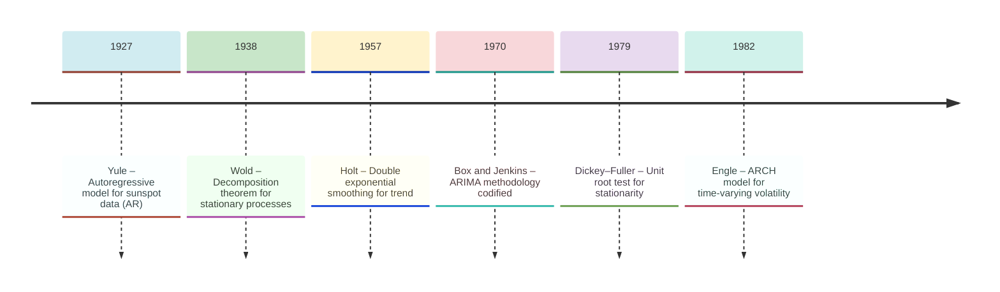
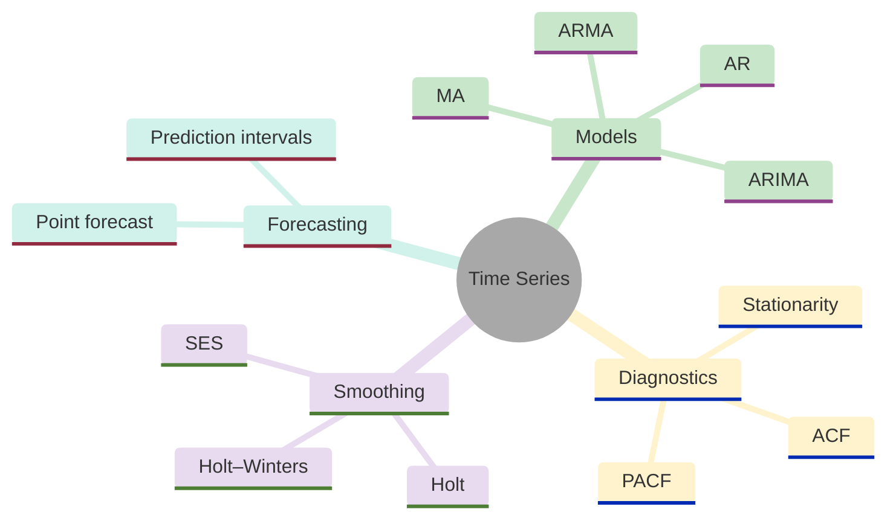
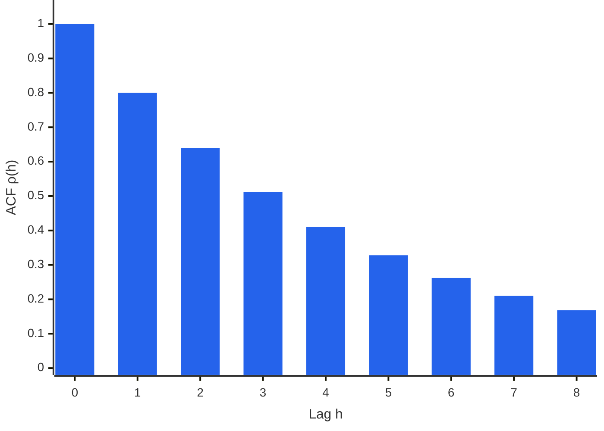
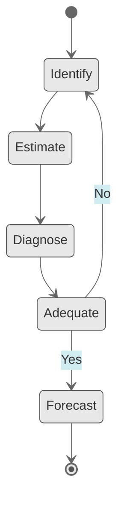
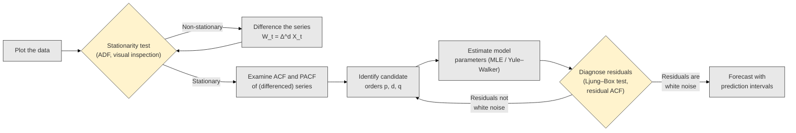
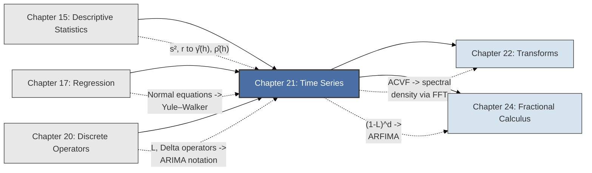

<!-- Copyright (c) 2025-2026 Bob Jansen <bobjansen@pm.me> -->
<!-- SPDX-License-Identifier: CC-BY-NC-4.0 -->
<!-- See LICENSE for full terms. Commercial licensing available. -->
# Chapter 21: Time Series Analysis


**Part VII**: Discrete & Time Series

> A time series is a sequence of observations ordered by time whose serial dependence carries information about the future. This chapter develops the autocovariance function, lag polynomial models (AR, MA, ARIMA) and exponential smoothing methods that exploit that dependence for forecasting with quantified uncertainty.

**Prerequisites**: [Chapter 15](15-descriptive-statistics.md) (Descriptive Statistics); sample mean, variance, covariance and the correlation coefficient as foundations for the autocovariance and autocorrelation functions. [Chapter 17](17-regression.md) (Regression); the ordinary least squares estimator, the normal equations and the interpretation of regression coefficients, which underpin the Yule–Walker equations and autoregressive estimation. [Chapter 20](20-discrete-operators.md) (Discrete Operators); the shift operator $L$, the difference operator $\Delta = 1 - L$ and their algebraic manipulation, which provide the compact notation for autoregressive moving average (ARMA) and ARIMA models.

**Learning Objectives**: After this chapter, the reader will be able to:

1. Define strict and weak stationarity and test whether a given process satisfies stationarity conditions.
2. Compute the sample autocorrelation function (ACF) and partial autocorrelation function (PACF) for an observed time series.
3. Fit autoregressive (AR), moving average (MA) and mixed ARMA models to stationary data.
4. Apply differencing to achieve stationarity and specify ARIMA models for non-stationary series.
5. Implement exponential smoothing methods (simple exponential smoothing, Holt, Holt–Winters) for forecasting with trend and seasonality.
6. Produce point forecasts and prediction intervals with quantified uncertainty.

**Connections**: This chapter is used by [Chapter 22](22-transforms.md) (Transforms; the spectral density is the Fourier transform of the autocovariance function; frequency-domain methods provide an alternative characterisation of ARMA processes). It builds on [Chapter 17](17-regression.md) (autoregressive models are regressions of a variable on its own lags; the Yule–Walker equations are regression normal equations applied to the autocorrelation structure) and [Chapter 20](20-discrete-operators.md) (the lag operator $L$ and difference operator $\Delta$ provide the algebraic framework for expressing ARIMA models compactly). [Chapter 24](24-fractional-calculus.md) (Fractional Calculus) extends the differencing operator to non-integer orders, yielding the ARFIMA class for long-memory processes.

---

## Historical Context

**Key Milestones in Time Series Analysis**



*Figure 21.1: Key milestones in time series analysis from Yule's AR model to Engle's ARCH.*

**Yule, Slutsky and the birth of stochastic models (1927).** George Udny Yule, in his 1927 paper "On a Method of Investigating Periodicities in Disturbed Series, with Special Reference to Wolfer's Sunspot Numbers," proposed that the quasi-periodic behaviour of sunspot counts could be explained by a stochastic difference equation rather than deterministic cycles. He modelled the sunspot series as a second-order autoregressive process: each observation depends linearly on the two preceding observations plus a random disturbance. This departed from the prevailing approach of fitting sums of sinusoids to periodic data. Yule demonstrated that a purely random mechanism, filtered through a simple linear recurrence, could generate series with apparent periodicity. He called the phenomenon "disturbed periodicity." The autoregressive model was born.

**Slutsky and the moving average process (1927).** Eugen Slutsky published "The Summation of Random Causes as the Source of Cyclic Processes" (1927 in Russian; English translation 1937). He demonstrated that moving average filtering of independent random variables produces smooth, wave-like behaviour resembling economic cycles. Slutsky's insight was that economic fluctuations attributed to structural causes might instead arise from the accumulation of small random shocks. The moving average process was established as the complement to Yule's autoregressive model.

**Wold's decomposition and the prediction problem (1938–1949).** Herman Wold's 1938 dissertation proved the Wold decomposition theorem: any stationary process with no deterministic component admits a representation as a (possibly infinite-order) moving average of white noise. This unified the AR and MA perspectives. An autoregressive process has an infinite MA representation (obtained by recursive substitution), and an invertible moving average process has an infinite AR representation. The class of linear processes is rich enough to represent all purely nondeterministic stationary processes.

**Wiener–Kolmogorov prediction theory (1941–1949).** Norbert Wiener (1949) and Andrey Kolmogorov (1941) solved the prediction problem independently. Wiener, working in the frequency domain, derived the optimal linear predictor and showed that the minimum mean-square prediction error equals $\exp\left(\frac{1}{2\pi}\int_{-\pi}^{\pi}\log f(\omega)\,d\omega\right)$, where $f(\omega)$ is the spectral density. Kolmogorov reached equivalent results using the geometry of Hilbert spaces. Their theory established that prediction accuracy depends on the smoothness of the spectral density; series with flat spectra (close to white noise) are harder to predict than those with concentrated spectral mass.

**Box–Jenkins methodology and exponential smoothing (1957–1970).** George Box began applying statistical methods to time series problems in the late 1950s, and together with Gwilym Jenkins codified the applied methodology in their 1970 textbook *Time Series Analysis: Forecasting and Control*. They proposed a three-stage iterative procedure: (1) model identification using the sample ACF and PACF to determine orders $p$, $d$ and $q$; (2) parameter estimation using maximum likelihood or conditional least squares; (3) diagnostic checking of fitted residuals. The ARIMA(p,d,q) framework combines autoregressive terms, differencing for non-stationarity and moving average terms. It remains widely used.

**Exponential smoothing and the ETS framework (1957–2008).** Exponential smoothing developed along a parallel track. Charles Holt proposed double exponential smoothing (incorporating a linear trend) in his 1957 Office of Naval Research report. Peter Winters extended the method to handle seasonal patterns in 1960. Hyndman et al. (2008) showed that exponential smoothing methods correspond to optimal forecasts from a class of state-space models (the Error–Trend–Seasonal (ETS) framework), unifying the smoothing and model-based approaches.

**Unit roots and conditional heteroscedasticity (1979–1982).** David Dickey and Wayne Fuller's 1979 paper introduced the unit root test. They showed that standard inference breaks down when a time series has a unit root (is integrated of order one), because ordinary least squares estimators converge at different rates and have non-normal limiting distributions. The Dickey–Fuller test and its augmented variant became diagnostic tools applied before fitting an ARMA model. Robert Engle's 1982 paper on autoregressive conditional heteroscedasticity (ARCH) extended time series analysis to model time-varying volatility in financial returns, launching financial econometrics.

**Modern extensions (1980–present).** Time series analysis has since expanded: vector autoregressions (Sims, 1980) for multivariate systems, cointegration (Engle and Granger, 1987) for non-stationary series with common trends, state-space models and the Kalman filter for structural representations and machine learning approaches (recurrent neural networks, transformers) that relax linearity assumptions. The core concepts (stationarity, autocorrelation, lag polynomials and the ARIMA framework) remain the foundation for all these extensions.

---

## Why This Chapter Matters

**Time Series**



*Figure 21.2: Overview of time series models, diagnostics, smoothing methods and forecasting.*

Stock prices, server request rates, temperature readings, network traffic, blockchain transaction volumes and user engagement metrics are all time series. The methods of this chapter (stationarity testing, ACF/PACF analysis, ARIMA modelling and exponential smoothing) form the standard set of methods for forecasting with quantified uncertainty. Without the stationarity concept (Definitions 21.2–21.3), there is no valid framework for fitting time-domain models. Without the Yule–Walker equations (Theorem 21.22) and the Durbin–Levinson recursion (Algorithm 21.28), AR parameter estimation is numerically unstable. Without prediction intervals (Definition 21.25), a forecast is a point guess with no indication of reliability.

Time series methods are both a standalone analysis method and a complement to deep learning for machine learning practitioners. The ACF and PACF (Algorithms 21.27 and 21.28) identify model order: whether an AR(2), an MA(1) or an ARIMA(1,1,1) is appropriate for a given series. These diagnostics remain necessary when using neural forecasters (long short-term memory networks, Transformers) because they reveal the autocorrelation structure the network must capture. They also provide a classical baseline that any complex model must beat to justify its cost.

The Wold decomposition guarantees that any stationary process can be represented as an MA($\infty$), justifying the moving-average layers in causal sequence models. ARIMA is the feature-engineering foundation for gradient-boosted tree models in forecasting competitions, where differenced series and lagged features from ACF analysis consistently improve performance.

In finance and crypto, the random walk model (Definition 21.8) is the mathematical formulation of the efficient market hypothesis. If prices follow $X_t = X_{t-1} + \varepsilon_t$, past prices contain no information about future returns and technical trading strategies are futile. Detecting departures from the random walk via unit root tests (connected to the stationarity conditions of Theorem 21.13) is the first step in identifying tradeable patterns.

ARIMA models serve volatility forecasting (often with generalised autoregressive conditional heteroscedasticity extensions), yield curve modelling and macroeconomic prediction. In decentralised finance, gas price forecasting, liquidity pool flow prediction and stablecoin peg deviation analysis are time series problems. The exponential smoothing methods (Algorithm 21.30) provide fast, interpretable and computationally lightweight solutions suitable for on-chain or near-real-time deployment.

The algorithms of this chapter (Yule–Walker estimation, Levinson–Durbin recursion and SES with parameter optimisation) are the core computational routines for production forecasting systems. Section 7 addresses Toeplitz structure exploitation, stable Levinson recursion and handling of near-unit-root processes. These numerical considerations determine whether a forecasting service produces reliable predictions or degenerates under edge cases. The multi-step forecasting algorithm (Algorithm 21.31) with its prediction interval construction connects statistical theory to user-facing uncertainty quantification.

---

## Notation & Conventions

| Symbol | Meaning |
|--------|---------|
| $\{X_t\}$ or $X_t$ | A stochastic process (time series) indexed by $t \in \mathbb{Z}$ |
| $t$ | Time index (integer-valued for discrete time) |
| $n$ or $T$ | Number of observed time points |
| $L$ | Lag (backshift) operator: $LX_t = X_{t-1}$ |
| $\Delta$ | Difference operator: $\Delta X_t = (1-L)X_t = X_t - X_{t-1}$ |
| $\mu$ | Process mean: $\mathbb{E}[X_t]$ (constant under stationarity) |
| $\gamma(h)$ | Autocovariance function at lag $h$: $\operatorname{Cov}(X_t, X_{t+h})$ |
| $\rho(h)$ | Autocorrelation function (ACF) at lag $h$: $\gamma(h)/\gamma(0)$ |
| $\alpha(h)$ or $\phi_{hh}$ | Partial autocorrelation function (PACF) at lag $h$ |
| $\varepsilon_t$ | White noise innovation at time $t$ |
| $\sigma^2$ | White noise variance: $\operatorname{Var}(\varepsilon_t)$ |
| $\phi_1, \ldots, \phi_p$ | Autoregressive coefficients |
| $\theta_1, \ldots, \theta_q$ | Moving average coefficients |
| $\phi(z)$ | AR characteristic polynomial: $1 - \phi_1 z - \cdots - \phi_p z^p$ |
| $\theta(z)$ | MA characteristic polynomial: $1 + \theta_1 z + \cdots + \theta_q z^q$ |
| $d$ | Order of differencing in ARIMA |
| $\alpha, \beta, \gamma$ | Smoothing parameters (exponential smoothing context) |
| $\hat{X}_{t+h \mid t}$ | Forecast of $X_{t+h}$ given information up to time $t$ |
| $\hat{y}_{t+h\mid t}$ | Smoothing forecast of $y_{t+h}$ given data up to time $t$ |
| $\ell_t$ | Level component (exponential smoothing) |
| $b_t$ | Trend component (Holt and Holt–Winters methods) |
| $s_t$ | Seasonal component (Holt–Winters method) |
| $m$ | Seasonal period (number of time steps per cycle) |
| $\hat{X}_t^{(h)}$ | Best linear predictor of $X_t$ based on $\{X_{t+1}, \ldots, X_{t+h-1}\}$ |
| $\hat{\gamma}(h)$ | Sample autocovariance at lag $h$ |
| $\hat{\rho}(h)$ | Sample autocorrelation at lag $h$ |
| $\mathbf{1}_A$ | Indicator function of event $A$: equals $1$ if $A$ holds, $0$ otherwise |

$\{X_t\}$ denotes a discrete-time stochastic process at integer time points. All processes are real-valued. $L$ satisfies $L^k X_t = X_{t-k}$; polynomials in $L$ act by this rule. When context is clear, $X_t$ denotes the entire process.

---

## Core Theory

### Stochastic Processes and Stationarity

**Definition 21.1** (Stochastic process). A *stochastic process* (or time series) is a collection of random variables $\{X_t : t \in \mathcal{T}\}$ defined on a common probability space $(\Omega, \mathcal{F}, P)$ and indexed by a set $\mathcal{T}$. In discrete time, $\mathcal{T} = \mathbb{Z}$ (or a subset thereof). For each fixed $\omega \in \Omega$, the function $t \mapsto X_t(\omega)$ is a *realisation* (or sample path) of the process. An observed time series $x_1, x_2, \ldots, x_n$ is interpreted as a single realisation of the process restricted to $t \in \{1, 2, \ldots, n\}$.

**Definition 21.2** (Strict stationarity). A stochastic process $\{X_t\}$ is *strictly stationary* if, for every $k \geq 1$, every collection of time indices $t_1, \ldots, t_k$ and every integer shift $h$, the joint distribution of $(X_{t_1+h}, X_{t_2+h}, \ldots, X_{t_k+h})$ equals the joint distribution of $(X_{t_1}, X_{t_2}, \ldots, X_{t_k})$. That is, all finite-dimensional distributions are invariant to translation in time.

Strict stationarity is a strong condition: it requires invariance of the entire probability structure, including all moments and tail behaviour, to time shifts. In practice, a weaker condition suffices.

**Definition 21.3** (Weak stationarity / covariance stationarity). A process $\{X_t\}$ is *weakly stationary* (or *covariance stationary*, or *second-order stationary*) if:

(i) $\mathbb{E}[X_t] = \mu$ for all $t$ (constant mean; see [Chapter 15](15-descriptive-statistics.md)),

(ii) $\operatorname{Var}(X_t) = \gamma(0) < \infty$ for all $t$ (finite constant variance),

(iii) $\operatorname{Cov}(X_t, X_{t+h}) = \gamma(h)$ depends only on the lag $h$, not on the time $t$.

Weak stationarity constrains only the first two moments. A strictly stationary process with finite second moments is always weakly stationary, but the converse holds only under additional distributional assumptions (e.g., if the process is Gaussian, weak stationarity implies strict stationarity because Gaussian distributions are fully characterised by their first two moments).

**Definition 21.4** (Autocovariance function). For a weakly stationary process $\{X_t\}$ with mean $\mu$, the *autocovariance function* (ACVF) is

$$\gamma(h) = \operatorname{Cov}(X_t, X_{t+h}) = \mathbb{E}[(X_t - \mu)(X_{t+h} - \mu)],$$

defined for $h \in \mathbb{Z}$. The autocovariance function satisfies three fundamental properties:

(a) $\gamma(0) = \operatorname{Var}(X_t) \geq 0$ (the variance).

(b) $\gamma(-h) = \gamma(h)$ for all $h$ (symmetry: covariance is symmetric in its arguments).

(c) $|\gamma(h)| \leq \gamma(0)$ for all $h$ (follows from the Cauchy–Schwarz inequality).

The function $\gamma(\cdot)$ must also be *positive semidefinite*: for any $n$, any times $t_1, \ldots, t_n$ and any real constants $a_1, \ldots, a_n$, the inequality $\sum_{i=1}^n \sum_{j=1}^n a_i a_j \gamma(t_i - t_j) \geq 0$ holds (because this sum equals $\operatorname{Var}(\sum a_i X_{t_i}) \geq 0$).

**Definition 21.5** (Autocorrelation function, ACF). The *autocorrelation function* of a weakly stationary process is

$$\rho(h) = \frac{\gamma(h)}{\gamma(0)} = \frac{\operatorname{Cov}(X_t, X_{t+h})}{\operatorname{Var}(X_t)}.$$

Properties: $\rho(0) = 1$, $\rho(-h) = \rho(h)$, $|\rho(h)| \leq 1$. The ACF provides a normalised measure of linear dependence at each lag: $\rho(h) = 1$ indicates perfect positive linear dependence, $\rho(h) = -1$ indicates perfect negative linear dependence and $\rho(h) = 0$ indicates no linear dependence at lag $h$.

**Definition 21.6** (Partial autocorrelation function; PACF). The *partial autocorrelation* at lag $h$, denoted $\phi_{hh}$, is the correlation between $X_t$ and $X_{t+h}$ after removing the linear effect of the intervening variables $X_{t+1}, X_{t+2}, \ldots, X_{t+h-1}$. Formally, $\phi_{11} = \rho(1)$, and for $h \geq 2$:

$$\phi_{hh} = \operatorname{Corr}(X_t - \hat{X}_t^{(h)}, \; X_{t+h} - \hat{X}_{t+h}^{(h)}),$$

where $\hat{X}_t^{(h)}$ and $\hat{X}_{t+h}^{(h)}$ are the best linear predictors of $X_t$ and $X_{t+h}$, respectively, based on $\{X_{t+1}, \ldots, X_{t+h-1}\}$. Equivalently, $\phi_{hh}$ is the last coefficient in the regression ([Chapter 17](17-regression.md)) of $X_t$ on $X_{t-1}, X_{t-2}, \ldots, X_{t-h}$:

$$X_t = \phi_{h1}X_{t-1} + \phi_{h2}X_{t-2} + \cdots + \phi_{hh}X_{t-h} + \text{error}.$$

The PACF isolates the "direct" dependence between $X_t$ and $X_{t+h}$ that is not mediated through intermediate lags.

**Definition 21.7** (White noise). A process $\{\varepsilon_t\}$ is *white noise*, written $\varepsilon_t \sim \operatorname{WN}(0, \sigma^2)$, if:

(i) $\mathbb{E}[\varepsilon_t] = 0$ for all $t$,

(ii) $\operatorname{Var}(\varepsilon_t) = \sigma^2$ for all $t$,

(iii) $\operatorname{Cov}(\varepsilon_t, \varepsilon_s) = 0$ for all $t \neq s$.

White noise is the fundamental component of all linear time series models: it represents the unpredictable innovation that drives the process. The autocovariance function of white noise is $\gamma(0) = \sigma^2$ and $\gamma(h) = 0$ for $h \neq 0$. The ACF satisfies $\rho(0) = 1$ and $\rho(h) = 0$ for $h \neq 0$. *Gaussian white noise* additionally requires $\varepsilon_t \sim N(0, \sigma^2)$, which implies strict stationarity and mutual independence (not merely zero correlation).

**Definition 21.8** (Random walk). The *random walk* process is defined by

$$X_t = X_{t-1} + \varepsilon_t, \quad t = 1, 2, \ldots,$$

where $\varepsilon_t \sim \operatorname{WN}(0, \sigma^2)$ and $X_0$ is a fixed initial value. By telescoping: $X_t = X_0 + \sum_{i=1}^t \varepsilon_i$. Then $\mathbb{E}[X_t] = X_0$ (constant) but $\operatorname{Var}(X_t) = t\sigma^2$ (grows without bound). The random walk is *not* stationary: its variance depends on $t$. In the lag operator notation, $(1 - L)X_t = \varepsilon_t$, so $\Delta X_t = \varepsilon_t$ is white noise. The random walk is the canonical example of a process that becomes stationary after first differencing; it is integrated of order one, written $I(1)$.

### Exponential Smoothing

**Definition 21.9** (Simple exponential smoothing; SES). Given observations $y_1, y_2, \ldots, y_n$, the *simple exponential smoothing* forecast is defined by the recursion

$$\hat{y}_{t+1|t} = \alpha y_t + (1-\alpha)\hat{y}_{t|t-1}, \quad t = 1, 2, \ldots,$$

where $\alpha \in (0,1)$ is the *smoothing parameter* and $\hat{y}_{1|0} = \ell_0$ is an initial level (typically set to $y_1$ or the mean of the first few observations). Expanding the recursion:

$$\hat{y}_{t+1|t} = \alpha \sum_{j=0}^{t-1}(1-\alpha)^j y_{t-j} + (1-\alpha)^t \ell_0.$$

As $t$ grows, the weight on $\ell_0$ vanishes exponentially, and the forecast becomes a weighted average of all past observations with geometrically decaying weights. Large $\alpha$ (close to 1) gives heavy weight to recent observations (responsive, noisy); small $\alpha$ (close to 0) gives nearly equal weight to many past observations (smooth, slow to adapt). SES is optimal for a local level model $y_t = \ell_t + \varepsilon_t$ with $\ell_t = \ell_{t-1} + \eta_t$.

**Definition 21.10** (Holt's linear method: double exponential smoothing). For series exhibiting a linear trend, *Holt's method* maintains two state equations:

$$\text{Level: } \ell_t = \alpha y_t + (1-\alpha)(\ell_{t-1} + b_{t-1}),$$

$$\text{Trend: } b_t = \beta(\ell_t - \ell_{t-1}) + (1-\beta)b_{t-1},$$

where $\alpha \in (0,1)$ controls level smoothing and $\beta \in (0,1)$ controls trend smoothing. The $h$-step-ahead forecast is

$$\hat{y}_{t+h|t} = \ell_t + h \cdot b_t.$$

The level equation is an exponentially weighted average of the current observation $y_t$ and the one-step-ahead forecast from the previous period $\ell_{t-1} + b_{t-1}$. The trend equation smooths the successive differences in levels.

**Definition 21.11** (Holt–Winters method; triple exponential smoothing). For series with both trend and seasonality of period $m$, the *Holt–Winters additive method* maintains three state equations:

$$\text{Level: } \ell_t = \alpha(y_t - s_{t-m}) + (1-\alpha)(\ell_{t-1} + b_{t-1}),$$

$$\text{Trend: } b_t = \beta(\ell_t - \ell_{t-1}) + (1-\beta)b_{t-1},$$

$$\text{Seasonality: } s_t = \gamma(y_t - \ell_t) + (1-\gamma)s_{t-m},$$

where $\alpha, \beta, \gamma \in (0,1)$ are smoothing parameters and $m$ is the seasonal period. The $h$-step-ahead forecast is

$$\hat{y}_{t+h|t} = \ell_t + h \cdot b_t + s_{t + h - m\left\lceil h/m \right\rceil}.$$

Here the seasonal index $t + h - m\lceil h/m \rceil$ selects the most recent estimate of the seasonal component for the appropriate season, cycling back into the range $\{t - m + 1, \ldots, t\}$.

The *multiplicative* variant replaces additive seasonal adjustments with multiplicative ones: the level equation uses $\alpha(y_t / s_{t-m})$ and the forecast multiplies by the seasonal factor. The multiplicative form is appropriate when the seasonal variation scales proportionally with the level of the series.

### Autoregressive and Moving Average Models

**Definition 21.12** (Autoregressive process of order $p$; AR($p$)). The *autoregressive process of order $p$* is defined by

$$X_t = \phi_1 X_{t-1} + \phi_2 X_{t-2} + \cdots + \phi_p X_{t-p} + \varepsilon_t,$$

where $\varepsilon_t \sim \operatorname{WN}(0, \sigma^2)$ and the process has zero mean (or the mean has been subtracted). Using the lag operator $L$ ([Chapter 20](20-discrete-operators.md)):

$$\phi(L)X_t = \varepsilon_t, \quad \text{where} \quad \phi(L) = 1 - \phi_1 L - \phi_2 L^2 - \cdots - \phi_p L^p.$$

The AR($p$) model expresses the current value as a linear combination of the $p$ most recent values plus an innovation. The polynomial $\phi(z) = 1 - \phi_1 z - \phi_2 z^2 - \cdots - \phi_p z^p$ is called the *AR characteristic polynomial*, and its roots determine the dynamic behaviour of the process.

**Theorem 21.13** (Stationarity condition for AR($p$)). The AR($p$) process $\phi(L)X_t = \varepsilon_t$ is stationary if and only if all roots of the characteristic equation $\phi(z) = 0$ lie strictly outside the unit circle in the complex plane, i.e., $|z_i| > 1$ for all roots $z_1, \ldots, z_p$.

!!! abstract "Key Result"

    **Theorem 21.13** (Stationarity condition for AR($p$)). An autoregressive process is stationary if and only if all roots of its characteristic polynomial lie outside the unit circle, reducing the question of whether a time-series model has stable, finite-variance behaviour to a simple root-location check.

??? note "Proof"

    *Proof sketch.* If all roots of $\phi(z) = 0$ lie outside the unit circle, then $\phi(z) \neq 0$ for $|z| \leq 1$, so $1/\phi(z)$ is analytic on the closed unit disk.

    The process admits the causal representation

    $$X_t = \phi(L)^{-1}\varepsilon_t = \sum_{j=0}^{\infty}\psi_j \varepsilon_{t-j}$$

    where the coefficients $\psi_j$ decay geometrically (since the $\psi_j$ are determined by the partial fraction expansion of $1/\phi(z)$ and each term decays as $|z_i|^{-j}$).

    The absolute summability $\sum|\psi_j| < \infty$ guarantees that $X_t$ is a well-defined stationary process with $\operatorname{Var}(X_t) = \sigma^2\sum\psi_j^2 < \infty$.

    Conversely, if some root lies on or inside the unit circle, the representation diverges and no stationary solution exists.

    $\square$

**Example 21.14.** For AR(1), $\phi(z) = 1 - \phi_1 z$, with root $z = 1/\phi_1$. Stationarity requires $|1/\phi_1| > 1$, i.e., $|\phi_1| < 1$.

**Theorem 21.15** (ACF and PACF of AR(1)). For the stationary AR(1) process $X_t = \phi X_{t-1} + \varepsilon_t$ with $|\phi| < 1$:

(a) The autocovariance function is $\gamma(h) = \sigma^2 \phi^h / (1 - \phi^2)$ for $h \geq 0$.

(b) The autocorrelation function is $\rho(h) = \phi^h$ for $h \geq 0$.

(c) The partial autocorrelation function satisfies $\phi_{11} = \phi$ and $\phi_{hh} = 0$ for $h \geq 2$.

??? note "Proof"

    *Proof.* (a) Multiply $X_t = \phi X_{t-1} + \varepsilon_t$ by $X_{t-h}$ and take expectations:

    $$\gamma(h) = \phi\gamma(h-1) \quad \text{for } h \geq 1$$

    (using that $\mathbb{E}[X_{t-h}\varepsilon_t] = 0$ for $h \geq 1$ by causality).

    Setting $h = 0$: $\gamma(0) = \phi^2 \gamma(0) + \sigma^2$, so $\gamma(0) = \sigma^2/(1-\phi^2)$.

    This first-order linear recurrence with initial condition $\gamma(0) = \sigma^2/(1-\phi^2)$ yields $\gamma(h) = \phi^h\gamma(0)$.

    (b) Dividing by $\gamma(0)$: $\rho(h) = \phi^h$. The ACF decays geometrically toward zero. If $\phi > 0$, the decay is monotone; if $\phi < 0$, the ACF alternates in sign.

    (c) Since AR(1) depends directly only on $X_{t-1}$, the regression of $X_t$ on $X_{t-1}, \ldots, X_{t-h}$ assigns zero coefficient to $X_{t-h}$ for $h \geq 2$ once the effect of $X_{t-1}$ is removed.

    The PACF therefore *cuts off* at lag 1: it is nonzero at lag 1 and exactly zero for all subsequent lags.

    $\square$

**ACF of AR(1) with $\phi = 0.8$** (geometric decay):



*Figure 21.3: Geometric decay of the autocorrelation function for an AR(1) process with coefficient 0.8.*

The ACF decays geometrically as $\rho(h) = \phi^h = 0.8^h$. At lag 5, the autocorrelation has fallen to 0.328; by lag 8, it is 0.168. This smooth exponential decay is the signature pattern of an AR(1) process with positive $\phi$.

**Remark 21.16.** The signature of an AR($p$) process is: ACF decays geometrically (exponential decay, possibly oscillating); PACF cuts off sharply after lag $p$.

**Definition 21.17** (Moving average process of order $q$; MA($q$)). The *moving average process of order $q$* is defined by

$$X_t = \varepsilon_t + \theta_1 \varepsilon_{t-1} + \theta_2 \varepsilon_{t-2} + \cdots + \theta_q \varepsilon_{t-q},$$

where $\varepsilon_t \sim \operatorname{WN}(0, \sigma^2)$. In lag operator notation:

$$X_t = \theta(L)\varepsilon_t, \quad \text{where} \quad \theta(L) = 1 + \theta_1 L + \theta_2 L^2 + \cdots + \theta_q L^q.$$

An MA($q$) process is *always* stationary for any values of $\theta_1, \ldots, \theta_q$, because it is a finite linear combination of white noise terms and $\mathbb{E}[X_t] = 0$, $\operatorname{Var}(X_t) = \sigma^2(1 + \theta_1^2 + \cdots + \theta_q^2) < \infty$ and $\operatorname{Cov}(X_t, X_{t+h})$ depends only on $h$.

**Theorem 21.18** (ACF and PACF of MA($q$)). For the MA($q$) process $X_t = \theta(L)\varepsilon_t$:

(a) The autocovariance function is

$$\gamma(h) = \begin{cases} \sigma^2 \sum_{j=0}^{q-h}\theta_j\theta_{j+h} & \text{for } 0 \leq h \leq q, \\ 0 & \text{for } h > q, \end{cases}$$

where $\theta_0 = 1$ by convention.

(b) The autocorrelation function $\rho(h) = \gamma(h)/\gamma(0)$ is nonzero for $h = 1, \ldots, q$ and exactly zero for $h > q$. The ACF *cuts off* after lag $q$.

(c) The partial autocorrelation function decays geometrically toward zero but does not cut off at any finite lag.

??? note "Proof"

    *Proof of (a).* For $0 \leq h \leq q$:

    $$\gamma(h) = \mathbb{E}[X_t X_{t+h}] = \mathbb{E}\left[\left(\sum_{i=0}^q \theta_i\varepsilon_{t-i}\right)\left(\sum_{j=0}^q \theta_j\varepsilon_{t+h-j}\right)\right].$$

    Since $\mathbb{E}[\varepsilon_s\varepsilon_r] = \sigma^2$ if $s = r$ and $0$ otherwise, the only nonzero terms occur when $t - i = t + h - j$, i.e., $j = i + h$. For this to have both $0 \leq i \leq q$ and $0 \leq j = i+h \leq q$, it is necessary that $0 \leq i \leq q - h$. The autocovariance is therefore

    $$\gamma(h) = \sigma^2\sum_{i=0}^{q-h}\theta_i\theta_{i+h}.$$

    For $h > q$: no pair of terms in $X_t$ and $X_{t+h}$ share a common $\varepsilon_s$, so $\gamma(h) = 0$.

    $\square$

**Remark 21.19.** The signature of an MA($q$) process is: ACF cuts off sharply after lag $q$; PACF decays geometrically.

This provides the key identification principle: AR processes have decaying ACF and sharp PACF cutoff; MA processes have sharp ACF cutoff and decaying PACF. This duality guides model selection in the Box–Jenkins methodology.

**Definition 21.20** (ARMA($p,q$) process). The *autoregressive moving average process of orders $p$ and $q$* satisfies

$$\phi(L)X_t = \theta(L)\varepsilon_t,$$

or equivalently,

$$X_t - \phi_1 X_{t-1} - \cdots - \phi_p X_{t-p} = \varepsilon_t + \theta_1\varepsilon_{t-1} + \cdots + \theta_q\varepsilon_{t-q}.$$

The ARMA($p,q$) process combines AR and MA components. It is stationary when all roots of $\phi(z) = 0$ lie outside the unit circle (same condition as pure AR). It is *invertible* (admitting an infinite AR representation) when all roots of $\theta(z) = 0$ lie outside the unit circle. Both the ACF and PACF of an ARMA process decay geometrically without sharp cutoffs, which is why mixed models are harder to identify from the correlogram alone.

!!! warning "Parameter redundancy in ARMA models"
    If the AR and MA characteristic polynomials share a common root, the model is over-parameterised: the shared factor cancels and the effective model has lower order. Fitting such a model leads to near-singular Hessians and unreliable confidence intervals. Always check that $\phi(z)$ and $\theta(z)$ have no common roots before interpreting parameter estimates.

**Definition 21.21** (ARIMA($p,d,q$) process). An *autoregressive integrated moving average process of orders $p$, $d$ and $q$* satisfies

$$\phi(L)(1-L)^d X_t = \theta(L)\varepsilon_t.$$

Here $(1-L)^d X_t = \Delta^d X_t$ is the $d$-th difference of $X_t$. The process $X_t$ is non-stationary (integrated of order $d$), but after $d$ differences, the resulting series $W_t = \Delta^d X_t$ is a stationary ARMA($p,q$) process. The most common case is $d = 1$: a random walk with ARMA-structured increments.

ARIMA models extend the Box–Jenkins framework to non-stationary data. The identification stage determines $d$ (typically 0, 1 or 2) by inspecting whether the series or its differences appear stationary, then identifies $p$ and $q$ from the ACF/PACF of the differenced series.

### Estimation

**Theorem 21.22** (Yule–Walker equations for AR($p$)). For a stationary AR($p$) process, the autocovariance function satisfies the system

$$\gamma(h) = \phi_1\gamma(h-1) + \phi_2\gamma(h-2) + \cdots + \phi_p\gamma(h-p) + \sigma^2 \mathbf{1}_{h=0},$$

for $h \geq 0$. Dividing by $\gamma(0)$ and writing the equations for $h = 1, 2, \ldots, p$ in matrix form:

$$\begin{pmatrix} 1 & \rho(1) & \rho(2) & \cdots & \rho(p-1) \\ \rho(1) & 1 & \rho(1) & \cdots & \rho(p-2) \\ \vdots & & \ddots & & \vdots \\ \rho(p-1) & \rho(p-2) & \cdots & \cdots & 1 \end{pmatrix} \begin{pmatrix} \phi_1 \\ \phi_2 \\ \vdots \\ \phi_p \end{pmatrix} = \begin{pmatrix} \rho(1) \\ \rho(2) \\ \vdots \\ \rho(p) \end{pmatrix},$$

which is compactly written as $R\boldsymbol{\phi} = \mathbf{r}$, where $R$ is the $p \times p$ Toeplitz autocorrelation matrix with $(i,j)$-entry $\rho(|i-j|)$, and $\mathbf{r} = (\rho(1), \ldots, \rho(p))'$.

??? note "Proof"

    *Proof.* Multiply the AR($p$) equation $X_t = \phi_1 X_{t-1} + \cdots + \phi_p X_{t-p} + \varepsilon_t$ by $X_{t-h}$ and take expectations on both sides.

    Since $\mathbb{E}[X_{t-h}\varepsilon_t] = 0$ for $h \geq 1$ (by causality: $X_{t-h}$ depends only on innovations up to time $t-h$, which are uncorrelated with $\varepsilon_t$), the innovation term vanishes and one obtains

    $$\gamma(h) = \sum_{k=1}^p \phi_k\gamma(h-k), \quad h \geq 1.$$

    Dividing each equation by $\gamma(0)$ replaces autocovariances with autocorrelations: $\rho(h) = \sum_{k=1}^p \phi_k \rho(h-k)$. Writing the equations for $h = 1, 2, \ldots, p$ in matrix form yields the Yule–Walker system $R\boldsymbol{\phi} = \mathbf{r}$.

    $\square$

The *sample Yule–Walker estimator* replaces population autocorrelations $\rho(h)$ with their sample counterparts $\hat{\rho}(h)$:

$$\hat{R}\hat{\boldsymbol{\phi}} = \hat{\mathbf{r}}.$$

Solving this Toeplitz system gives consistent estimators $\hat{\phi}_1, \ldots, \hat{\phi}_p$. The noise variance is estimated as $\hat{\sigma}^2 = \hat{\gamma}(0)(1 - \hat{\boldsymbol{\phi}}'\hat{\mathbf{r}})$.

**Box–Jenkins Iterative Modelling Process**



*Figure 21.4: The Box–Jenkins iterative cycle of identification, estimation, diagnosis and forecasting.*

The state diagram above depicts the Box–Jenkins iterative cycle: identify candidate model orders from the ACF/PACF, estimate model parameters, diagnose residuals for white noise behaviour and either proceed to forecasting (if the model is adequate) or return to the identification stage to modify the model.

**Remark 21.23** (Box–Jenkins methodology). The iterative model-building strategy consists of three stages:

1. *Identification*: Examine the sample ACF and PACF to determine candidate orders $(p, d, q)$. An ACF that decays slowly suggests non-stationarity ($d \geq 1$). After differencing, a sharp ACF cutoff at lag $q$ suggests MA($q$); a sharp PACF cutoff at lag $p$ suggests AR($p$); decay in both suggests ARMA.

2. *Estimation*: Given the identified model, estimate parameters by:
   - Yule–Walker equations (for AR models; closed-form, but less efficient than maximum likelihood).
   - Maximum likelihood estimation (MLE; for general ARMA; requires numerical optimisation and the innovation form of the likelihood via the Kalman filter or direct recursion).
   - Conditional least squares (an approximation that conditions on initial values).

3. *Diagnostic checking*: Verify that the residuals $\hat{\varepsilon}_t = X_t - \hat{X}_{t|t-1}$ behave like white noise. Check that the residual ACF has no significant spikes (Ljung–Box test). If diagnostics fail, return to the identification stage and modify the model.

**Box–Jenkins Methodology:**



*Figure 21.5: Flowchart of the Box–Jenkins methodology from data inspection to forecasting.*

The following table summarises the ACF/PACF patterns for model identification:

| Model | ACF pattern | PACF pattern |
|-------|-------------|--------------|
| AR($p$) | Decays exponentially (may oscillate) | Cuts off after lag $p$ |
| MA($q$) | Cuts off after lag $q$ | Decays exponentially (may oscillate) |
| ARMA($p,q$) | Decays exponentially after lag $q$ | Decays exponentially after lag $p$ |
| White noise | All values $\approx 0$ | All values $\approx 0$ |
| Random walk | Decays very slowly (near 1 for many lags) | Spike at lag 1, then $\approx 0$ |

### Forecasting

**Definition 21.24** (Minimum mean-square error forecast). The *optimal $h$-step-ahead forecast* of $X_{t+h}$ given information $\mathcal{F}_t = \{X_t, X_{t-1}, X_{t-2}, \ldots\}$ is

$$\hat{X}_{t+h|t} = \mathbb{E}[X_{t+h} \mid \mathcal{F}_t],$$

where the conditional expectation minimises the mean-square forecast error $\mathbb{E}[(X_{t+h} - g)^2 \mid \mathcal{F}_t]$ over all measurable functions $g$ of $\mathcal{F}_t$.

For an AR(1) process with $X_t = \phi X_{t-1} + \varepsilon_t$: the $h$-step forecast is $\hat{X}_{t+h|t} = \phi^h X_t$ (iterating the recursion and noting $\mathbb{E}[\varepsilon_{t+j}|\mathcal{F}_t] = 0$ for $j \geq 1$). As $h \to \infty$, the forecast converges to zero (the unconditional mean for a zero-mean process), reflecting the loss of predictive power over long horizons.

For a general causal ARMA process with MA($\infty$) representation $X_t = \sum_{j=0}^{\infty}\psi_j\varepsilon_{t-j}$ (where $\psi_0 = 1$), the $h$-step forecast is

$$\hat{X}_{t+h|t} = \sum_{j=h}^{\infty}\psi_j\varepsilon_{t+h-j} = \sum_{j=0}^{\infty}\psi_{j+h}\varepsilon_{t-j}.$$

The forecast error is $X_{t+h} - \hat{X}_{t+h|t} = \sum_{j=0}^{h-1}\psi_j\varepsilon_{t+h-j}$, with variance

$$\operatorname{Var}(X_{t+h} - \hat{X}_{t+h|t}) = \sigma^2\sum_{j=0}^{h-1}\psi_j^2.$$

**Definition 21.25** (Prediction interval). A $(1-\alpha)$-level *prediction interval* for $X_{t+h}$ is

$$\hat{X}_{t+h|t} \pm z_{\alpha/2}\cdot\sigma_h,$$

where $z_{\alpha/2}$ is the standard normal critical value, $\sigma_h^2 = \sigma^2\sum_{j=0}^{h-1}\psi_j^2$ is the $h$-step forecast error variance and $\alpha$ denotes the significance level (not the smoothing parameter of Definitions 21.9–21.11). Under the assumption of Gaussian innovations, this interval has exact coverage $(1-\alpha)$; for non-Gaussian innovations, it provides an approximate interval. As the forecast horizon $h$ increases, $\sigma_h^2$ increases (more terms in the sum) and the prediction interval widens, reflecting increasing uncertainty about the distant future.

For AR(1) with $\psi_j = \phi^j$: $\sigma_h^2 = \sigma^2\sum_{j=0}^{h-1}\phi^{2j} = \sigma^2(1 - \phi^{2h})/(1-\phi^2)$. As $h \to \infty$, $\sigma_h^2 \to \sigma^2/(1-\phi^2) = \gamma(0)$, the unconditional variance. The long-run prediction interval converges to the unconditional distribution of the process.

---

## Formulas & Identities

**F21.1** Autocovariance function.

$$\gamma(h) = \operatorname{Cov}(X_t, X_{t+h}) = \mathbb{E}[(X_t - \mu)(X_{t+h} - \mu)]$$

**F21.2** Autocorrelation function.

$$\rho(h) = \frac{\gamma(h)}{\gamma(0)}$$

**F21.3** SES recursion.

$$\hat{y}_{t+1|t} = \alpha y_t + (1-\alpha)\hat{y}_{t|t-1}$$

**F21.4** AR($p$) model in lag operator form.

$$\phi(L)X_t = \varepsilon_t, \qquad \phi(L) = 1 - \phi_1 L - \cdots - \phi_p L^p$$

**F21.5** AR(1) autocorrelation.

$$\rho(h) = \phi^h$$

**F21.6** MA($q$) autocovariance.

$$\gamma(h) = \begin{cases} \sigma^2 \sum_{j=0}^{q-h}\theta_j\theta_{j+h} & 0 \leq h \leq q, \\ 0 & h > q \end{cases}$$

**F21.7** ARIMA($p,d,q$) model.

$$\phi(L)(1-L)^d X_t = \theta(L)\varepsilon_t$$

**F21.8** Yule–Walker system.

$$R\boldsymbol{\phi} = \mathbf{r}$$

**F21.9** Forecast error variance.

$$\sigma_h^2 = \sigma^2\sum_{j=0}^{h-1}\psi_j^2$$

**F21.10** Prediction interval.

$$\hat{X}_{t+h|t} \pm z_{\alpha/2}\cdot\sigma_h$$

!!! info "Prediction intervals widen with horizon"
    The forecast error variance $\sigma_h^2 = \sigma^2\sum_{j=0}^{h-1}\psi_j^2$ is monotonically non-decreasing in the horizon $h$. For an AR(1) process it converges to the unconditional variance $\gamma(0) = \sigma^2/(1-\phi^2)$; for an integrated process it grows without bound. A prediction interval that does not widen with $h$ indicates a model error.

The following extended table supplements the identification guidance of Remark 21.23 with specific parameter effects:

| Model | Parameters | ACF behaviour | PACF behaviour |
|-------|-----------|--------------|---------------|
| AR(1), $\phi > 0$ | $\phi = 0.7$ | Positive, decays as $0.7^h$ | Spike at lag 1 ($= 0.7$), zero thereafter |
| AR(1), $\phi < 0$ | $\phi = -0.7$ | Alternates sign, decays as $(-0.7)^h$ | Spike at lag 1 ($= -0.7$), zero thereafter |
| AR(2) | $\phi_1 = 0.5, \phi_2 = 0.3$ | Decays (mixture of two exponentials) | Spikes at lags 1 and 2, zero thereafter |
| MA(1), $\theta > 0$ | $\theta = 0.8$ | Spike at lag 1, zero for $h \geq 2$ | Decays exponentially with alternating sign |
| MA(1), $\theta < 0$ | $\theta = -0.8$ | Negative spike at lag 1, zero for $h \geq 2$ | Decays exponentially (positive) |
| MA(2) | $\theta_1 = 0.5, \theta_2 = 0.3$ | Spikes at lags 1 and 2, zero for $h \geq 3$ | Decays (mixture of exponentials) |
| ARMA(1,1) | $\phi = 0.7, \theta = 0.5$ | Decays exponentially starting from lag 1 | Decays exponentially starting from lag 1 |

**Remark 21.26** (AR(2) Yule–Walker solution). For the AR(2) process $X_t = \phi_1 X_{t-1} + \phi_2 X_{t-2} + \varepsilon_t$, the Yule–Walker equations at lags 1 and 2 yield

$$\rho(1) = \frac{\phi_1}{1 - \phi_2}, \qquad \rho(2) = \phi_1 \rho(1) + \phi_2.$$

Higher-lag autocorrelations follow from the general recursion $\rho(h) = \phi_1 \rho(h-1) + \phi_2 \rho(h-2)$ for $h \geq 3$.

---

## Algorithms

**Algorithm 21.27** (Sample autocovariance and ACF). Compute the sample ACF from an observed series.

```
Input: x[0], ..., x[n-1]; maximum lag H
Output: γ̂[0], ..., γ̂[H]; ρ̂[0], ..., ρ̂[H]

// Step 1: Compute sample mean
x̄ ← (1/n) * Σ_{t=0}^{n-1} x[t]

// Step 2: Compute sample autocovariances
for h ← 0 to H:
    γ̂[h] ← (1/n) * Σ_{t=0}^{n-1-h} (x[t] - x̄)(x[t+h] - x̄)

// Step 3: Compute sample ACF
for h ← 0 to H:
    ρ̂[h] ← γ̂[h] / γ̂[0]
```

*Note*: The divisor is $n$ (not $n - h$) in Step 2, following the convention of Box and Jenkins. This ensures the sample autocovariance function is positive semidefinite (as a valid ACVF must be), whereas dividing by $n - h$ does not guarantee this property. The cost of this choice is a slight bias for large lags $h$ near $n$.

*Complexity*: $O(nH)$ time, $O(H)$ additional space.

**Algorithm 21.28** (Sample PACF via Durbin–Levinson recursion). Compute the PACF efficiently using the Levinson–Durbin algorithm.

```
Input: ρ̂[0], ..., ρ̂[H] (sample ACF values, ρ̂[0] = 1)
Output: φ̂_{11}, φ̂_{22}, ..., φ̂_{HH} (sample PACF values)

// Initialisation
φ̂_{11} ← ρ̂[1]
v[1] ← 1 - φ̂_{11}²      // prediction error variance ratio

// Recursion (h = 2, 3, ..., H)
for h ← 2 to H:
    // Compute numerator for φ̂_{hh}
    num ← ρ̂[h] - Σ_{j=1}^{h-1} φ̂_{h-1,j} * ρ̂[h-j]
    φ̂_{hh} ← num / v[h-1]

    // Update coefficients
    for j ← 1 to h-1:
        φ̂_{h,j} ← φ̂_{h-1,j} - φ̂_{hh} * φ̂_{h-1,h-j}

    // Update variance ratio
    v[h] ← v[h-1] * (1 - φ̂_{hh}²)
```

*Correctness*: The Durbin–Levinson recursion exploits the Toeplitz structure of the autocorrelation matrix to solve all nested Yule–Walker systems $R_k\boldsymbol{\phi}_k = \mathbf{r}_k$ for $k = 1, 2, \ldots, H$ simultaneously. The last coefficient $\phi_{hh}$ at each stage is the partial autocorrelation at lag $h$.

*Complexity*: $O(H^2)$ time, $O(H)$ space. This is superior to solving each Yule–Walker system independently ($O(H^3)$ total via direct matrix inversion).

**Algorithm 21.29** (Yule–Walker estimation for AR($p$)). Estimate AR parameters from sample autocorrelations.

```
Input: x[0], ..., x[n-1]; model order p
Output: φ̂[1], ..., φ̂[p]; σ̂²

// Step 1: Compute sample ACF
Compute ρ̂[0], ..., ρ̂[p] using Algorithm 21.27

// Step 2: Form Toeplitz system
R ← p×p matrix with R[i][j] = ρ̂[|i-j|]
r ← (ρ̂[1], ρ̂[2], ..., ρ̂[p])ᵀ

// Step 3: Solve R φ̂ = r
φ̂ ← R⁻¹ r    // Use Levinson–Durbin for O(p²) solution

// Step 4: Estimate noise variance
σ̂² ← γ̂[0] * (1 - φ̂ᵀ r)
```

*Complexity*: $O(np + p^2)$ time ($O(np)$ for ACF computation, $O(p^2)$ for Levinson–Durbin solve).

**Algorithm 21.30** (Simple exponential smoothing with parameter optimisation).

```
Input: y[0], ..., y[n-1]
Output: optimal α; forecasts ŷ[1], ..., ŷ[n]; one-step-ahead forecast ŷ[n]

// Objective: minimise sum of squared errors SSE(α) = Σ_{t=1}^{n-1} (y[t] - ŷ[t])²
// Search over α ∈ (0,1)

function computeSSE(α, y, n):
    ŷ[0] ← y[0]                    // initialise level
    sse ← 0
    for t ← 1 to n-1:
        ŷ[t] ← α * y[t-1] + (1-α) * ŷ[t-1]
        sse ← sse + (y[t] - ŷ[t])²
    return sse

// Optimise α (e.g., golden section search or Brent's method)
α* ← argmin_{α ∈ (0.001, 0.999)} computeSSE(α, y, n)

// Compute final forecasts with optimal α
Rerun with α* to obtain ŷ[n] = α* * y[n-1] + (1-α*) * ŷ[n-1]
```

*Complexity*: $O(n)$ per evaluation of `computeSSE`; total cost depends on the optimisation method (typically $O(n \log(1/\epsilon))$ for tolerance $\epsilon$).

!!! tip "Choosing the smoothing parameter"
    Values of $\alpha$ near 0.1–0.3 are common for stable series. For rapidly changing series, $\alpha$ near 0.5–0.8 is typical. When the optimal $\alpha$ converges to 0 or 1, the model is misspecified: $\alpha \to 0$ suggests the series is constant; $\alpha \to 1$ suggests a random walk (use differencing instead).

**Algorithm 21.31** (AR($p$) multi-step forecasting).

```
Input: x[0], ..., x[n-1]; AR coefficients φ̂[1], ..., φ̂[p]; horizon H
Output: forecasts x̂[n], x̂[n+1], ..., x̂[n+H-1]; forecast variances σ²[1], ..., σ²[H]

// Step 1: Point forecasts (iterative)
buffer ← [x[n-p], ..., x[n-1]]    // last p observations

for h ← 1 to H:
    x̂[n+h-1] ← Σ_{j=1}^{p} φ̂[j] * buffer[p-j]
    // Shift buffer: remove oldest, append forecast
    buffer ← [buffer[1], ..., buffer[p-1], x̂[n+h-1]]

// Step 2: MA(∞) coefficients for forecast error variance
ψ[0] ← 1
for j ← 1 to H-1:
    ψ[j] ← Σ_{k=1}^{min(j,p)} φ̂[k] * ψ[j-k]

// Step 3: Forecast error variances
for h ← 1 to H:
    σ²[h] ← σ̂² * Σ_{j=0}^{h-1} ψ[j]²
```

*Complexity*: $O(pH)$ for point forecasts, $O(pH)$ for MA coefficients, $O(H^2)$ for variances.

---

## Numerical Considerations

### Positive Semidefiniteness of the Sample ACVF

The sample autocovariance function computed with divisor $n$ (Algorithm 21.27) produces a positive semidefinite sequence, meaning the associated Toeplitz matrix $\hat{\Gamma}_k$ with entries $\hat{\gamma}(|i-j|)$ is positive semidefinite for all $k$. This is because $\hat{\gamma}(h) = (1/n)\mathbf{x}'S_h\mathbf{x}$ where $S_h$ is a shift matrix, and the Toeplitz matrix formed this way can be written as $(1/n)Z'Z$ for an appropriate matrix $Z$. If the divisor $n - |h|$ were used instead, the resulting matrix could have negative eigenvalues, causing the Yule–Walker system to produce inadmissible estimates (e.g., a model with roots inside the unit circle). For this reason, the $1/n$ convention is standard in the time series literature.

### Condition Number of the Autocorrelation Matrix

!!! warning "Ill-conditioning near a unit root"
    When the true autocorrelations decay slowly (as in near-unit-root processes), the Toeplitz autocorrelation matrix $R$ becomes ill-conditioned. Small estimation errors in $\hat{\rho}(h)$ are then amplified into large errors in the Yule–Walker estimates $\hat{\phi}_k$. Always use the Levinson–Durbin algorithm rather than direct matrix inversion in this setting.

The condition number $\kappa(R) = \lambda_{\max}/\lambda_{\min}$ grows as the dominant root of the AR polynomial approaches the unit circle. This is the time-series analogue of multicollinearity in regression: consecutive lags of a highly persistent series are nearly collinear. The Levinson–Durbin algorithm exploits the Toeplitz structure and avoids forming $(R)^{-1}$ explicitly.

### Overflow in the MA($\infty$) Representation

When computing the MA($\infty$) coefficients $\psi_j$ for forecast error variances, processes near the stationarity boundary ($|\phi| \approx 1$) produce coefficients that decay very slowly. Truncating the representation at a finite horizon $H$ is necessary but introduces approximation error. For AR(1) with $\phi = 0.99$, for the truncation error to be below $\epsilon = 10^{-4}$, one needs approximately $N \approx |\log \epsilon|/|\log \phi| \approx 9.2/0.01 \approx 920$ terms; in practice, truncation at $h = H$ (the forecast horizon) suffices for the partial sum $\sum_{j=0}^{h-1}\psi_j^2$.

### Numerical Optimisation for MA and ARMA Parameters

Unlike AR models (where Yule–Walker gives a closed-form estimator), MA and ARMA models require numerical optimisation of the likelihood function. The likelihood surface can be multimodal or have flat regions, especially when the model is overparameterised or when AR and MA roots are close to cancelling. In practice:
- Initialise from conditional least squares or method-of-moments estimates.
- Constrain parameters to the stationary and invertible region during optimisation.
- Use the innovations algorithm or Kalman filter for efficient likelihood evaluation.
- Check multiple starting points to guard against convergence to local optima.

---

## Worked Examples

### Example 21.32: Computing the Sample ACF

Consider the observed series $x = (2, 5, 4, 7, 6, 8, 9, 7, 10, 11)$ with $n = 10$.

**Mean:**

$$\bar{x} = (2 + 5 + 4 + 7 + 6 + 8 + 9 + 7 + 10 + 11)/10 = 69/10 = 6.9.$$

**Sample autocovariance at lag 0:**

$$\hat{\gamma}(0) = \frac{1}{10}\sum_{t=1}^{10}(x_t - 6.9)^2 = \frac{1}{10}[24.01 + 3.61 + 8.41 + 0.01 + 0.81 + 1.21 + 4.41 + 0.01 + 9.61 + 16.81] = \frac{68.9}{10} = 6.89.$$

**Sample autocovariance at lag 1:**

$$\begin{aligned}
\hat{\gamma}(1) &= \frac{1}{10}\sum_{t=1}^{9}(x_t - 6.9)(x_{t+1} - 6.9) \\
&= \frac{1}{10}[(-4.9)(-1.9) + (-1.9)(-2.9) + (-2.9)(0.1) + (0.1)(-0.9) \\
&\quad + (-0.9)(1.1) + (1.1)(2.1) + (2.1)(0.1) + (0.1)(3.1) + (3.1)(4.1)] \\
&= \frac{1}{10}[9.31 + 5.51 - 0.29 - 0.09 - 0.99 + 2.31 + 0.21 + 0.31 + 12.71] \\
&= \frac{28.99}{10} \approx 2.90.
\end{aligned}$$

**Sample ACF at lag 1:**

$$\hat{\rho}(1) = 2.90/6.89 \approx 0.421.$$

Under the null hypothesis that the true process is white noise, the approximate 95% confidence band for the sample ACF is $\pm 1.96/\sqrt{n} = \pm 1.96/\sqrt{10} \approx \pm 0.62$. Since $|\hat{\rho}(1)| = 0.421 < 0.62$, the lag-1 autocorrelation is not statistically significant at the 5% level for this short series.

### Example 21.33: Fitting an AR(1) Model via Yule–Walker

Suppose a series of $n = 100$ observations has sample autocorrelations $\hat{\rho}(1) = 0.72$ and $\hat{\gamma}(0) = 4.5$.

**Yule–Walker for AR(1):** The single equation is $\phi_1 = \rho(1)$, so $\hat{\phi}_1 = 0.72$.

**Noise variance:**

$$\hat{\sigma}^2 = \hat{\gamma}(0)(1 - \hat{\phi}_1\hat{\rho}(1)) = 4.5(1 - 0.72 \times 0.72) = 4.5(1 - 0.5184) = 4.5 \times 0.4816 = 2.167.$$

**Stationarity check:** The characteristic root is $z = 1/\hat{\phi}_1 = 1/0.72 \approx 1.389$, which lies outside the unit circle. The model is stationary.

**ACF of the fitted model:** $\hat{\rho}(h) = (0.72)^h$. At lag 5: $\hat{\rho}(5) = 0.72^5 \approx 0.193$.

**PACF:** $\hat{\phi}_{11} = 0.72$, $\hat{\phi}_{hh} = 0$ for $h \geq 2$. The sample PACF should show a significant spike at lag 1 and nothing thereafter, confirming the AR(1) specification.

### Example 21.34: MA(1) Identification from ACF

A series has sample ACF: $\hat{\rho}(1) = 0.45$, $\hat{\rho}(2) = 0.03$, $\hat{\rho}(3) = -0.02$, $\hat{\rho}(h) \approx 0$ for $h \geq 4$.

**Identification:** The ACF cuts off after lag 1 (only lag 1 is significant), suggesting an MA(1) model.

**Estimation:** For MA(1), $\rho(1) = \theta_1/(1 + \theta_1^2)$. Setting $0.45 = \theta/(1 + \theta^2)$ yields the quadratic $0.45\theta^2 - \theta + 0.45 = 0$, so

$$\theta = \frac{1 \pm \sqrt{1 - 4(0.45)(0.45)}}{2 \times 0.45} = \frac{1 \pm \sqrt{0.19}}{0.9}.$$

Two solutions:

$$\theta_1 \approx (1 + 0.436)/0.9 = 1.595, \qquad \theta_2 \approx (1 - 0.436)/0.9 = 0.627.$$

**Invertibility:** For the MA(1) to be invertible, the root of $\theta(z) = 1 + \theta z$ must lie outside the unit circle, requiring $|\theta| < 1$. Only $\theta_2 = 0.627$ satisfies this. The fitted model is $X_t = \varepsilon_t + 0.627\varepsilon_{t-1}$.

### Example 21.35: Forecasting with Holt's Method

A quarterly series of sales (in thousands) over 8 quarters: $y = (200, 215, 230, 248, 260, 278, 295, 310)$. The series shows a clear linear upward trend.

**Initialisation:** $\ell_0 = y_1 = 200$, $b_0 = y_2 - y_1 = 15$. The initial trend is estimated as the first period-to-period change. Alternative initialisations (e.g., the slope of a linear regression on the first few observations) may be used.

**Fit with $\alpha = 0.5$, $\beta = 0.3$:**

$t=1$:

$$\begin{aligned}
\ell_1 &= 0.5(200) + 0.5(200 + 15) = 100 + 107.5 = 207.5. \\
b_1 &= 0.3(207.5 - 200) + 0.7(15) = 2.25 + 10.5 = 12.75.
\end{aligned}$$

$t=2$:

$$\begin{aligned}
\ell_2 &= 0.5(215) + 0.5(207.5 + 12.75) = 107.5 + 110.125 = 217.625. \\
b_2 &= 0.3(217.625 - 207.5) + 0.7(12.75) = 3.0375 + 8.925 = 11.9625.
\end{aligned}$$

$t=3$:

$$\begin{aligned}
\ell_3 &= 0.5(230) + 0.5(217.625 + 11.9625) = 115 + 114.794 = 229.794. \\
b_3 &= 0.3(229.794 - 217.625) + 0.7(11.9625) = 3.651 + 8.374 = 12.025.
\end{aligned}$$

Continuing to $t = 8$ yields $\ell_8 \approx 308.6$, $b_8 \approx 15.4$.

**Forecasts:**

$$\begin{aligned}
\hat{y}_{9|8} &= \ell_8 + 1 \cdot b_8 \approx 308.6 + 15.4 = 324.0 \text{ thousand.} \\
\hat{y}_{10|8} &= \ell_8 + 2 \cdot b_8 \approx 308.6 + 30.8 = 339.4 \text{ thousand.}
\end{aligned}$$

The forecast projects the estimated trend linearly into the future. The further ahead, the less reliable the linear extrapolation.

### Example 21.36: ARIMA(1,1,0) for a Random Walk with Drift

Consider a financial time series $\{P_t\}$ (log prices) that appears non-stationary. The sample ACF of $P_t$ decays very slowly (values near 1 for many lags), suggesting a unit root. After first differencing, $\Delta P_t = P_t - P_{t-1}$ (log returns), the ACF shows a significant spike at lag 1 with $\hat{\rho}(1) = 0.35$ and no other significant lags in the PACF beyond lag 1.

**Model selection:** The differenced series $W_t = \Delta P_t$ is modelled as AR(1), giving an ARIMA(1,1,0) for the original series:

$$(1 - \phi L)(1 - L)P_t = c + \varepsilon_t.$$

**Estimation:** Yule–Walker on $\{W_t\}$: $\hat{\phi} = 0.35$, $\hat{\sigma}^2 = 0.0012$, mean of $W_t$: $\hat{c}(1 - \hat{\phi}) = \hat{\mu}_W$ where $\hat{\mu}_W = 0.0008$ (daily drift), so

$$\hat{c} = 0.0008/(1-0.35) \approx 0.00123.$$

**Forecasting:** Given current $W_n = 0.005$ (today's return) and $P_n = 4.605$ (today's log price):

$$\begin{aligned}
\hat{W}_{n+1|n} &= \hat{\mu}_W + \hat{\phi}(W_n - \hat{\mu}_W) = 0.0008 + 0.35(0.005 - 0.0008) = 0.0008 + 0.00147 = 0.00227. \\
\hat{P}_{n+1|n} &= P_n + \hat{W}_{n+1|n} = 4.605 + 0.00227 = 4.607.
\end{aligned}$$

95% prediction interval for $P_{n+1}$:

$$4.607 \pm 1.96\sqrt{0.0012} = 4.607 \pm 0.068 = (4.539, 4.675).$$

---

## Connections

**Chapter Dependencies**



*Figure 21.6: Chapter dependencies showing prerequisites and downstream connections for time series.*

### Within This Book

- **[Chapter 15](15-descriptive-statistics.md) (Descriptive Statistics)** provides the sample variance and Pearson correlation that generalise to $\hat{\gamma}(h)$ and $\hat{\rho}(h)$. The numerical stability considerations of [Chapter 15](15-descriptive-statistics.md) apply here with additional complications from serial dependence.

- **[Chapter 17](17-regression.md) (Regression)** supplies the normal equations framework. The Yule–Walker equations $R\boldsymbol{\phi} = \mathbf{r}$ are structurally identical to $X'X\hat{\boldsymbol{\beta}} = X'\mathbf{y}$, with the autocorrelation matrix $R$ replacing the Gram matrix.

- **[Chapter 20](20-discrete-operators.md) (Discrete Operators)** provides the lag operator $L$ and difference operator $\Delta = 1 - L$ that form the algebraic language of ARIMA models.

- **[Chapter 22](22-transforms.md) (Transforms)** provides the spectral density $f(\omega)$ as the Fourier transform of the autocovariance function.

- **[Chapter 24](24-fractional-calculus.md) (Fractional Calculus)** extends ARIMA to non-integer $d$ via the fractional difference $(1-L)^d$, giving ARFIMA models for long-memory processes.

### Applications

- **Economics and finance**: ARIMA models are used for macroeconomic forecasting (gross domestic product, inflation, unemployment). The random walk hypothesis in finance states that asset prices follow a random walk (ARIMA(0,1,0)), implying returns are unpredictable. ARCH and generalised ARCH (GARCH) models, which extend the ARMA framework to the conditional variance, are standard in financial risk management. Cointegration (Engle–Granger) applies when multiple non-stationary series share a common stochastic trend.
- **Signal processing**: Autoregressive spectral estimation recovers frequency content from short data records where the periodogram has poor resolution. Linear prediction (the signal processing name for AR modelling) underpins speech coding, adaptive noise cancellation and channel equalisation.
- **Climate science**: Temperature anomaly records, ice-core proxy series and sea-level measurements are analysed with ARIMA and fractionally differenced (ARFIMA) models to separate long-range dependence from deterministic trends. Seasonal ARIMA captures annual and sub-annual cycles in precipitation and wind-speed data.
- **Biomedical monitoring**: Electrocardiogram and electroencephalogram signals are modelled as AR processes for real-time anomaly detection. Exponential smoothing tracks patient physiological measurements (heart rate, blood oxygen) in intensive care units, triggering alerts when smoothed values breach clinical thresholds.

---

## Summary

- Weak stationarity requires a constant mean, constant variance and autocovariance that depends only on lag; it is the minimal condition for meaningful autocorrelation analysis.
- The autocorrelation function (ACF) and partial autocorrelation function (PACF) characterise the serial dependence structure and guide the selection of AR, MA and ARMA model orders.
- An AR($p$) process is stationary if and only if all roots of the characteristic polynomial $\phi(z) = 0$ lie strictly outside the unit circle; the Yule–Walker equations estimate its parameters from sample autocorrelations.
- ARIMA($p,d,q$) models handle non-stationary series by applying $d$ rounds of differencing before fitting an ARMA($p,q$) model to the stationary residuals.
- Exponential smoothing methods (SES, Holt, Holt–Winters) produce adaptive forecasts that weight recent observations more heavily, with separate equations for level, trend and seasonal components.

---

## Exercises

### Routine

**Exercise 21.1.** Let $\{X_t\}$ be defined by $X_t = 0.6X_{t-1} + \varepsilon_t$ where $\varepsilon_t \sim \operatorname{WN}(0, 4)$. (a) Verify that the process is stationary. (b) Compute $\gamma(0)$, $\gamma(1)$, $\gamma(2)$ and $\gamma(3)$. (c) Compute $\rho(1)$, $\rho(2)$, $\rho(3)$. (d) State the PACF values at lags 1, 2 and 3.

**Exercise 21.2.** Consider the MA(2) process $X_t = \varepsilon_t + 0.5\varepsilon_{t-1} - 0.3\varepsilon_{t-2}$ with $\sigma^2 = 1$. (a) Show that the process is stationary. (b) Compute $\gamma(0)$, $\gamma(1)$, $\gamma(2)$ and $\gamma(3)$. (c) Verify that $\rho(h) = 0$ for $h > 2$. (d) Check the invertibility condition.

**Exercise 21.3.** Implement simple exponential smoothing for the monthly series $y = (120, 125, 130, 128, 135, 140, 138, 145, 150, 148, 155, 160)$ with $\alpha = 0.3$, initialising $\hat{y}_{1|0} = y_1 = 120$. Compute all one-step-ahead forecasts $\hat{y}_{2|1}, \ldots, \hat{y}_{12|11}$ and the forecast for month 13. Compute the mean squared error of the in-sample one-step-ahead forecasts.

### Intermediate

**Exercise 21.4.** For the AR(2) process $X_t = 1.2X_{t-1} - 0.5X_{t-2} + \varepsilon_t$: (a) Find the characteristic polynomial $\phi(z)$. (b) Compute the roots of $\phi(z) = 0$. (c) Determine whether the process is stationary. (d) If stationary, compute $\rho(1)$ and $\rho(2)$ using the Yule–Walker equations.

**Exercise 21.5.** Given the following sample ACF from $n = 200$ observations: $\hat{\rho}(1) = 0.82$, $\hat{\rho}(2) = 0.71$, $\hat{\rho}(3) = 0.59$, $\hat{\rho}(4) = 0.50$, with the PACF: $\hat{\phi}_{11} = 0.82$, $\hat{\phi}_{22} = 0.08$, $\hat{\phi}_{33} = -0.04$, $\hat{\phi}_{44} = 0.02$. (a) Identify an appropriate model using the ACF/PACF patterns. (b) Estimate the model parameters using the Yule–Walker method. (c) Compute the approximate 95% confidence band for the ACF. (d) Are the PACF values at lags 2, 3, 4 significant?

**Exercise 21.6.** A time series has been modelled as ARIMA(0,1,1) with $\theta_1 = 0.4$ and $\sigma^2 = 2.5$. The current observation is $X_n = 50$ and the most recent innovation is $\hat{\varepsilon}_n = 1.2$ (the one-step-ahead residual from the fitted model: $\hat{\varepsilon}_n = X_n - \hat{X}_{n\mid n-1}$). (a) Compute the one-step-ahead forecast $\hat{X}_{n+1|n}$. (b) Compute the two-step-ahead forecast $\hat{X}_{n+2|n}$. (c) Compute the 95% prediction intervals for both forecasts.

### Challenging

**Exercise 21.7.** Prove that any MA($q$) process is stationary regardless of the parameter values $\theta_1, \ldots, \theta_q$. *Hint*: Show that $\mathbb{E}[X_t]$, $\operatorname{Var}(X_t)$ and $\operatorname{Cov}(X_t, X_{t+h})$ do not depend on $t$.

**Exercise 21.8.** Prove Theorem 21.13 for the AR(1) case: show that if $|\phi| \geq 1$, no stationary solution to $X_t = \phi X_{t-1} + \varepsilon_t$ exists, while if $|\phi| < 1$, the unique stationary solution is $X_t = \sum_{j=0}^{\infty}\phi^j\varepsilon_{t-j}$. Verify that this infinite sum converges in mean square and that the resulting process has constant mean and autocovariance depending only on the lag.

---

## References

### Textbooks

[1] Box, G.E.P., Jenkins, G.M., Reinsel, G.C. and Ljung, G.M. *Time Series Analysis: Forecasting and Control*, 5th ed. Wiley, 2015. The standard reference for the Box–Jenkins methodology; covers ARIMA modelling, model identification via ACF/PACF and diagnostic checking.

[2] Brockwell, P.J. and Davis, R.A. *Introduction to Time Series and Forecasting*, 3rd ed. Springer, 2016. A mathematically rigorous introduction balancing theory and applications; especially clear on stationarity conditions and the Wold decomposition.

[3] Hamilton, J.D. *Time Series Analysis*, 1st ed. Princeton University Press, 1994. A thorough graduate-level treatment covering univariate and multivariate models, spectral analysis, state-space representations and non-stationary time series with applications in economics.

[4] Hyndman, R.J., Koehler, A.B., Ord, J.K. and Snyder, R.D. *Forecasting with Exponential Smoothing: The State Space Approach*, 1st ed. Springer, 2008. The unified ETS framework connecting exponential smoothing to optimal state-space models.

### Historical

[5] Dickey, D.A. and Fuller, W.A. "Distribution of the Estimators for Autoregressive Time Series with a Unit Root." *Journal of the American Statistical Association* 74(366) (1979): 427–431. Introduces the unit root test and derives the non-standard limiting distributions of autoregressive estimators.

[6] Engle, R.F. "Autoregressive Conditional Heteroscedasticity with Estimates of the Variance of United Kingdom Inflation." *Econometrica* 50(4) (1982): 987–1007. The ARCH model for time-varying volatility.

[7] Slutsky, E. "The Summation of Random Causes as the Source of Cyclic Processes." *Econometrica* 5(2) (1937): 105–146. Originally published in Russian, 1927. The demonstration that moving average filtering of white noise produces cycle-like behaviour.

[8] Wold, H. *A Study in the Analysis of Stationary Time Series*. Almqvist and Wiksell, 1938. The decomposition theorem establishing that every stationary process has an MA($\infty$) representation.

[9] Wiener, N. *Extrapolation, Interpolation, and Smoothing of Stationary Time Series*. MIT Press, 1949. Derives the optimal linear predictor in the frequency domain and establishes the prediction error formula involving the spectral density.

[10] Winters, P.R. "Forecasting Sales by Exponentially Weighted Moving Averages." *Management Science* 6(3) (1960): 324–342. Extends Holt's method to additive and multiplicative seasonal patterns.

[11] Yule, G.U. "On a Method of Investigating Periodicities in Disturbed Series, with Special Reference to Wolfer's Sunspot Numbers." *Philosophical Transactions of the Royal Society of London A* 226 (1927): 267–298. The paper introducing autoregressive modelling.

[12] Holt, C.C. "Forecasting Seasonals and Trends by Exponentially Weighted Moving Averages." Office of Naval Research Memorandum No. 52, 1957. Reprinted in *International Journal of Forecasting* 20(1) (2004): 5–10. Introduces double exponential smoothing for series with a linear trend.

[13] Kolmogorov, A.N. "Stationary Sequences in Hilbert Space." *Bulletin of Moscow State University, Mathematics* 2(6) (1941): 1–40. Derives the optimal linear predictor using Hilbert space geometry; equivalent to Wiener's frequency-domain result.

### Online Resources

[14] Hyndman, R.J. and Athanasopoulos, G. *Forecasting: Principles and Practice*, 3rd ed. OTexts, 2021. https://otexts.com/fpp3

---

## Glossary

- **ACF (autocorrelation function)**: The function $\rho(h) = \gamma(h)/\gamma(0)$ measuring normalised linear dependence at lag $h$.
- **AR (autoregressive)**: A model where $X_t$ depends linearly on its own past values: $X_t = \sum \phi_k X_{t-k} + \varepsilon_t$.
- **ARFIMA**: Autoregressive Fractionally Integrated Moving Average: extends ARIMA to non-integer differencing order $d$, capturing long-memory processes.
- **ARIMA**: Autoregressive Integrated Moving Average: an ARMA model applied to a differenced series.
- **ARMA**: Autoregressive Moving Average: $\phi(L)X_t = \theta(L)\varepsilon_t$.
- **Autocovariance**: $\gamma(h) = \operatorname{Cov}(X_t, X_{t+h})$: the unnormalised measure of linear dependence at lag $h$.
- **Box–Jenkins**: The iterative methodology of identification, estimation and diagnostic checking for ARIMA models.
- **Causal**: A process representable as $X_t = \sum_{j=0}^{\infty}\psi_j\varepsilon_{t-j}$ with $\sum\lvert\psi_j\rvert < \infty$ (depends only on past and present innovations).
- **Characteristic polynomial**: $\phi(z) = 1 - \phi_1 z - \cdots - \phi_p z^p$; its roots determine stationarity.
- **Dickey–Fuller test**: A hypothesis test for the presence of a unit root in an autoregressive model; the augmented variant (ADF) accounts for higher-order serial correlation.
- **Differencing**: The operation $\Delta X_t = X_t - X_{t-1}$; used to transform non-stationary series to stationary ones.
- **ETS**: Error–Trend–Seasonal: a state-space framework that provides a statistical model underlying each exponential smoothing method.
- **Exponential smoothing**: A family of recursive forecasting methods with geometrically decaying weights on past observations.
- **Forecast error variance**: $\sigma_h^2 = \sigma^2\sum_{j=0}^{h-1}\psi_j^2$: uncertainty in the $h$-step-ahead forecast.
- **Holt–Winters**: Triple exponential smoothing handling level, trend and seasonality.
- **Innovation**: The unpredictable component $\varepsilon_t = X_t - \hat{X}_{t \mid t-1}$; equivalent to white noise in correctly specified models.
- **Integrated**: A process whose $d$-th difference is stationary; denoted $I(d)$.
- **Invertible**: An MA process that admits an AR($\infty$) representation; requires MA roots outside the unit circle.
- **Lag operator**: $L$: the operator satisfying $LX_t = X_{t-1}$.
- **Levinson–Durbin**: An $O(p^2)$ algorithm for solving Toeplitz systems, used to compute PACF and Yule–Walker estimates.
- **MA (moving average)**: A model where $X_t$ is a finite linear combination of current and past innovations.
- **PACF (partial autocorrelation)**: Correlation between $X_t$ and $X_{t+h}$ after removing linear dependence on intervening values.
- **Prediction interval**: A range for future observations: $\hat{X}_{t+h} \pm z_{\alpha/2}\sigma_h$.
- **Random walk**: $X_t = X_{t-1} + \varepsilon_t$: the simplest non-stationary process; $I(1)$.
- **Spectral density**: $f(\omega)$: the frequency-domain representation of a stationary process; forms a Fourier transform pair with the autocovariance function $\gamma(h)$.
- **Stationarity (strict)**: All finite-dimensional distributions invariant to time shifts.
- **Stationarity (weak)**: Constant mean, constant variance and autocovariance depending only on lag.
- **Toeplitz matrix**: A matrix with constant diagonals; the autocorrelation matrix $R$ has this structure.
- **Unit root**: A root of $\phi(z) = 0$ on the unit circle; implies non-stationarity.
- **White noise**: A process with zero mean, constant variance and zero autocovariance at all nonzero lags.
- **Wold decomposition**: Any stationary process equals a deterministic component plus an MA($\infty$) process.
- **Yule–Walker equations**: The linear system $R\boldsymbol{\phi} = \mathbf{r}$ relating AR parameters to autocorrelations.

---
