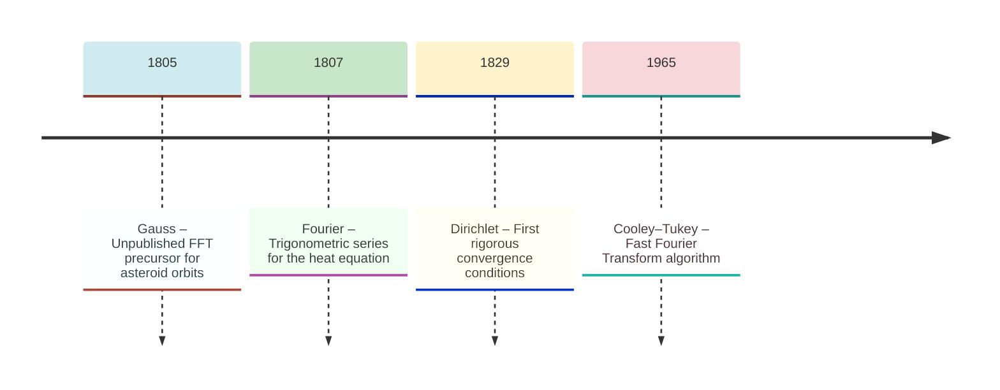
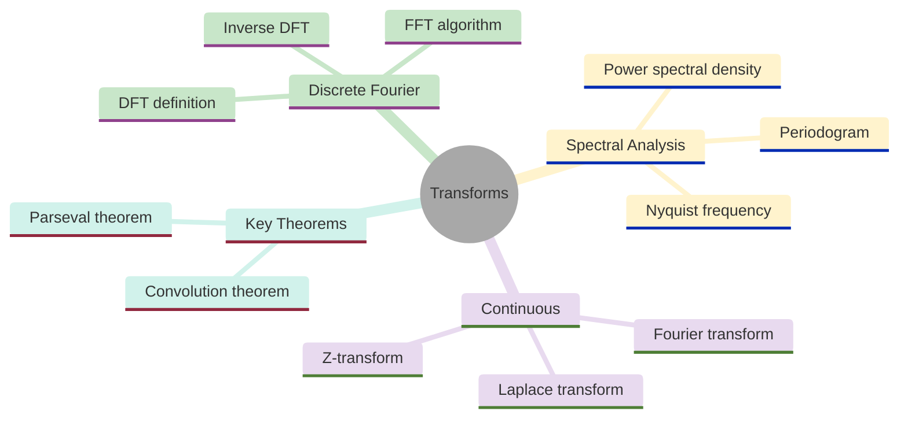
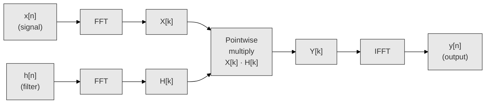
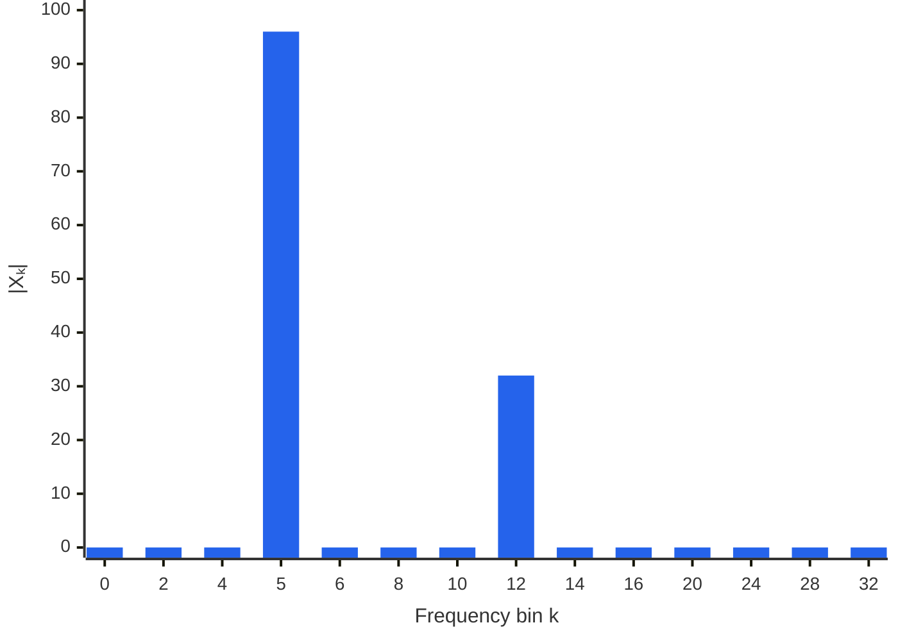
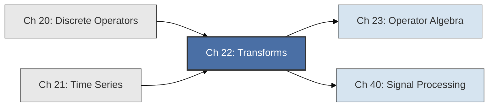

<!-- Copyright (c) 2025-2026 Bob Jansen <bobjansen@pm.me> -->
<!-- SPDX-License-Identifier: CC-BY-NC-4.0 -->
<!-- See LICENSE for full terms. Commercial licensing available. -->
# Chapter 22: Transforms & Spectral Analysis


**Part VII**: Discrete & Time Series

> The Discrete Fourier Transform decomposes a finite signal into frequency coefficients; the Fast Fourier Transform computes it in $O(N \log N)$. This chapter derives the DFT and FFT, proves the convolution theorem and introduces power spectral density, the Fourier transform and the Laplace transform.

**Prerequisites**: [Chapter 20](20-discrete-operators.md) (Discrete Operators): convolution of finite sequences, linear shift-invariant operators and the algebraic structure of discrete signals.

**Learning Objectives**: After this chapter, the reader will be able to:

1. Compute the DFT and inverse DFT of a finite sequence by direct application of the definition.
2. Decompose a DFT of size $N = 2M$ into two half-length DFTs using the Cooley–Tukey radix-2 algorithm, and explain why this reduces arithmetic complexity from $O(N^2)$ to $O(N \log N)$.
3. State and prove the convolution theorem: circular convolution in the time domain corresponds to pointwise multiplication in the frequency domain.
4. State and prove Parseval's theorem and interpret it as energy conservation between the time and frequency domains.
5. Compute and interpret the power spectral density (periodogram) of a sampled signal, identify the Nyquist frequency and explain the phenomenon of spectral leakage.
6. State the definitions of the continuous Fourier transform, the Laplace transform and the Z-transform, and describe the relationships among them.

**Connections**: This chapter is used by [Chapter 23](23-operator-algebra.md) (Operators: transforms as operator representations in function spaces, diagonalisation of convolution operators via the DFT) and [Chapter 40](40-signal-processing.md) (Signal Processing: FFT-based filtering and spectrum estimation). It builds on [Chapter 20](20-discrete-operators.md) (the DFT diagonalises circular convolution, giving the convolution theorem its algebraic meaning) and [Chapter 21](21-time-series.md) (the power spectral density is the Fourier transform of the autocovariance function, linking time-domain and frequency-domain descriptions of stochastic processes). The FFT algorithm exemplifies the divide-and-conquer strategy and connects to the factorisation of the DFT matrix into sparse butterfly stages, a theme that reappears in fast matrix–vector products and structured linear algebra.

---

## Historical Context

**Key Milestones in Transform Theory**



*Figure 22.1: Key milestones in transform theory from Gauss's FFT precursor to Cooley–Tukey.*

**Harmonic analysis and Fourier's trigonometric series (1753–1822).** The Pythagorean school observed that vibrating strings whose lengths stand in small integer ratios produce consonant intervals: the octave (2:1), the fifth (3:2), the fourth (4:3). This established an empirical link between harmonic ratios and perceived sound. Two millennia later, Daniel Bernoulli proposed in 1753 that the general motion of a vibrating string is a superposition of its fundamental modes, each oscillating as a pure sine wave at an integer multiple of the fundamental frequency. Euler and d'Alembert disagreed, insisting that the general solution to the wave equation need not be expressible as a trigonometric series, since initial conditions such as a plucked string with a sharp corner appeared to fall outside the class of functions representable by smooth sines and cosines.

**Fourier's trigonometric expansion of arbitrary functions (1807–1822).** Jean-Baptiste Joseph Fourier resolved the dispute. In his 1807 memoir submitted to the Institut de France, and later in his 1822 treatise *Théorie analytique de la chaleur*, he argued that any function on a finite interval, even one with discontinuities, can be expanded as an infinite sum of sines and cosines. His motivation was the heat equation: he sought solutions of the form $u(x,t) = \sum a_n \sin(n\pi x/L) \, e^{-n^2 \pi^2 \kappa t/L^2}$, where each term decays exponentially at a rate proportional to $n^2$. The initial temperature distribution $u(x,0) = f(x)$ determines the coefficients $a_n$ through what are now called the Fourier coefficients. The referees (Lagrange, Laplace and Legendre) were sceptical. Lagrange objected that Fourier had not proved convergence. The work nonetheless launched an entire branch of analysis.

**Convergence theory (1829–1966).** The question of convergence occupied the next century. Peter Gustav Lejeune Dirichlet provided in 1829 the first rigorous sufficient conditions: if $f$ is piecewise continuous with a finite number of extrema per period, its Fourier series converges pointwise to $f$ at every point of continuity and to the average of left and right limits at every jump.

**Riemann, Lebesgue and Carleson on convergence (1854–1966).** Bernhard Riemann, in his 1854 habilitation thesis, developed the Riemann integral partly to give precise meaning to Fourier coefficients of irregular functions. Lebesgue's integral (1902) and Carleson's theorem (1966, proving pointwise convergence almost everywhere for $L^2$ functions) represent further milestones. Fourier series theory drove the development of modern real analysis.

**Gauss and the computational prehistory of the FFT (1805).** The discrete Fourier transform has a separate computational history. Carl Friedrich Gauss wrote an unpublished manuscript in 1805 describing an algorithm for interpolating asteroid orbits that is, in modern terms, a radix-$N_1$ decimation-in-time FFT. His method predates Fourier's memoir. It was written in Latin, remained unpublished during his lifetime and was not recognised as an FFT until the historical analysis of Heideman, Johnson and Burrus in 1984. The idea was independently rediscovered multiple times over the intervening century and a half.

**Cooley–Tukey and the FFT revolution (1965).** James W. Cooley and John W. Tukey published "An Algorithm for the Machine Calculation of Complex Fourier Series" in *Mathematics of Computation* in 1965. They showed that a DFT of length $N = N_1 N_2$ decomposes into $N_1$ transforms of length $N_2$ (or vice versa), reducing the operation count from $O(N^2)$ to $O(N \log N)$ when applied recursively. The impact was immediate. Within a year, seismology, antenna design, medical imaging and spectrum analysis had adopted the FFT. Richard Garwin, the IBM physicist who prompted Cooley to develop the algorithm, later called it "the most important numerical algorithm of our lifetime."

**The Laplace and Z-transforms (1780s–1950s).** Pierre-Simon Laplace introduced the Laplace transform in the late eighteenth century; Oliver Heaviside systematised it in the 1890s for electrical circuit analysis. It converts ordinary differential equations into algebraic equations. Eliahu Jury, John Ragazzini and Lotfi Zadeh formalised its discrete-time analogue, the Z-transform, in the 1950s for sampled-data control systems. The Z-transform converts recursive relations into rational functions of a complex variable, enabling stability analysis and filter design. The DFT, the Fourier transform, the Laplace transform and the Z-transform all belong to one family: integral transforms that decompose signals into basis functions parametrised by a complex frequency variable.

**Modern applications of transform methods (1990s–present).** JPEG computes a block-wise Discrete Cosine Transform (a real-valued relative of the DFT). MP3 uses a modified DCT to exploit psychoacoustic masking. Magnetic resonance imaging (MRI) acquires data directly in the frequency domain (k-space) and reconstructs images via the inverse FFT. In quantitative finance, spectral analysis of asset returns reveals periodicities, volatility clustering and long-range dependence. In machine learning, the FFT accelerates convolutions in convolutional neural networks.

---

## Why This Chapter Matters

**Transforms**



*Figure 22.2: Overview of discrete and continuous transforms, spectral analysis and key theorems.*

The FFT (Theorem 22.5) reduces spectral analysis from $O(N^2)$ to $O(N \log N)$. This complexity reduction enables audio and image compression (MP3, JPEG), medical imaging (MRI reconstruction), telecommunications (orthogonal frequency-division multiplexing in Wi-Fi and 5G), radar, sonar and gravitational wave detection. The DFT (Definition 22.1) decomposes a signal into its constituent frequencies. The convolution theorem (Theorem 22.3, property (c)) makes filtering and cross-correlation computationally tractable.

Convolutional neural networks compute convolutions via the FFT (multiply in the frequency domain, inverse-transform back) when kernel sizes are large. This is the standard approach in audio and speech models. The power spectral density (Definition 22.7, the periodogram) extracts features from any periodic or quasi-periodic signal: heart rate variability, network traffic patterns, seasonal demand cycles. Parseval's theorem (Theorem 22.4) guarantees that total energy is preserved between time and frequency representations, enabling energy-based anomaly detection in frequency space. The Nyquist frequency (Definition 22.8) and aliasing determine the minimum sampling rate for faithful signal reconstruction. This constraint governs sensor design, data acquisition systems and the temporal resolution requirements for time series models.

In finance and crypto, spectral analysis reveals periodicities in market data: intraday trading patterns (U-shaped volume curves), weekly seasonality and options expiration cycles are all visible in the periodogram. The spectral density of an autoregressive moving-average process is the Fourier transform of its autocovariance function ([Chapter 21](21-time-series.md)). This frequency-domain characterisation complements time-domain autocorrelation and partial autocorrelation analysis. In high-frequency trading, the FFT enables real-time filtering of tick data to separate signal from microstructure noise. In blockchain analytics, Fourier analysis of block-level gas prices and transaction counts reveals periodic patterns. Geographic time-zone effects on network usage, for example, inform fee estimation algorithms.

The continuous Fourier transform (Definition 22.10) and the Laplace transform (Definition 22.11) provide theoretical context for the discrete algorithms. The Laplace transform is the standard tool for solving linear ordinary differential equations and for analysing control systems (transfer functions, stability margins). It connects this chapter to the differential equation theory of [Chapter 19](19-odes.md) and the operator algebra of [Chapter 23](23-operator-algebra.md). The Z-transform is the discrete analogue. Its evaluation on the unit circle recovers the DFT. This unification reveals the DFT, the Z-transform and the Laplace transform as different views of the same algebraic structure of linear shift-invariant systems.

---

## Notation & Conventions

| Symbol | Meaning |
|--------|---------|
| $x_n$ | The $n$-th sample of a discrete signal, $n = 0, 1, \ldots, N-1$ |
| $\mathbf{x}$ | The signal vector $(x_0, x_1, \ldots, x_{N-1})$ |
| $X_k$ | The $k$-th DFT coefficient, $k = 0, 1, \ldots, N-1$ |
| $\mathbf{X}$ | The DFT vector $(X_0, X_1, \ldots, X_{N-1})$ |
| $N$ | The length of the signal (number of samples) |
| $\omega_N$ | The primitive $N$-th root of unity: $\omega_N = e^{-2\pi i / N}$ |
| $i$ | The imaginary unit, $i^2 = -1$ |
| $\text{Re}(z)$, $\text{Im}(z)$ | Real and imaginary parts of a complex number $z$ |
| $\lvert z \rvert$ | Modulus of $z$: $\lvert z \rvert = \sqrt{\text{Re}(z)^2 + \text{Im}(z)^2}$ |
| $\bar{z}$ | Complex conjugate of $z$ |
| $\Delta t$ | Sampling interval (time between consecutive samples) |
| $f_s$ | Sampling frequency: $f_s = 1/\Delta t$ |
| $f_k$ | The physical frequency corresponding to DFT bin $k$: $f_k = k/(N\Delta t)$ |
| $\ast$ | Circular (cyclic) convolution |
| $\odot$ | Pointwise (Hadamard) product |
| $P_k$ | Power spectral density at frequency bin $k$ |
| $F(\omega)$ | Continuous Fourier transform of $f(t)$ |
| $F(s)$ | Laplace transform of $f(t)$ |
| $s$ | Complex frequency variable in the Laplace transform: $s = \sigma + i\omega$ |
| $X(z)$ | Z-transform of a discrete signal $\{x_n\}$: $\sum_{n=0}^{\infty} x_n z^{-n}$ |
| $\mathcal{F}$ | The DFT operator (as a linear map) |

Throughout this chapter, all indices are taken modulo $N$ where circular (periodic) extension is implied. The convention $\omega_N = e^{-2\pi i / N}$ places the minus sign in the forward transform; the inverse transform uses $\omega_N^{-1} = e^{+2\pi i / N}$. Although Evenwicht operates on real-valued arrays, the DFT inherently produces complex-valued output. The implementation stores complex numbers as paired real and imaginary arrays: for a complex array $Z$, `re[k]` holds $\text{Re}(Z_k)$ and `im[k]` holds $\text{Im}(Z_k)$.

---

## Core Theory

### The Discrete Fourier Transform

The Discrete Fourier Transform maps a finite sequence of $N$ numbers to a finite sequence of $N$ complex numbers that encode the amplitude and phase of each frequency component present in the original signal.

**Definition 22.1** (Discrete Fourier Transform). Let $\mathbf{x} = (x_0, x_1, \ldots, x_{N-1})$ be a sequence of $N$ real or complex numbers. The *Discrete Fourier Transform* (DFT) of $\mathbf{x}$ is the sequence $\mathbf{X} = (X_0, X_1, \ldots, X_{N-1})$ defined by

$$X_k = \sum_{n=0}^{N-1} x_n \, e^{-2\pi i \, kn / N}, \qquad k = 0, 1, \ldots, N-1.$$

Equivalently, writing $\omega_N = e^{-2\pi i / N}$ for the primitive $N$-th root of unity,

$$X_k = \sum_{n=0}^{N-1} x_n \, \omega_N^{kn}.$$

Each coefficient $X_k$ is, in general, a complex number. Its modulus $|X_k|$ represents the amplitude of the oscillation at frequency $k/N$ cycles per sample, and its argument $\arg(X_k)$ represents the phase.

The complex exponential $e^{-2\pi i \, kn / N}$ can be decomposed via Euler's formula:

$$e^{-2\pi i \, kn / N} = \cos\!\left(\frac{2\pi kn}{N}\right) - i \sin\!\left(\frac{2\pi kn}{N}\right).$$

When $\mathbf{x}$ is real-valued, this decomposition is necessary for implementation. The real part of $X_k$ accumulates the cosine projections of the signal onto the $k$-th harmonic, and the imaginary part accumulates the (negated) sine projections:

$$\text{Re}(X_k) = \sum_{n=0}^{N-1} x_n \cos\!\left(\frac{2\pi kn}{N}\right), \qquad \text{Im}(X_k) = -\sum_{n=0}^{N-1} x_n \sin\!\left(\frac{2\pi kn}{N}\right).$$

This is how the Evenwicht implementation computes the DFT without native complex arithmetic: it maintains separate `re` and `im` arrays and accumulates cosine and sine contributions independently.

The DFT can also be expressed as a matrix-vector product. Define the $N \times N$ DFT matrix $W$ by $W_{kn} = \omega_N^{kn}$. Then $\mathbf{X} = W \mathbf{x}$. The matrix $W$ is symmetric ($W_{kn} = W_{nk}$) and, up to a scalar factor, unitary: $W \overline{W} = N I$, where $\overline{W}$ denotes the elementwise complex conjugate.

**Definition 22.2** (Inverse Discrete Fourier Transform). The *inverse DFT* (IDFT) recovers the original sequence from the frequency coefficients:

$$x_n = \frac{1}{N} \sum_{k=0}^{N-1} X_k \, e^{2\pi i \, kn / N}, \qquad n = 0, 1, \ldots, N-1.$$

Equivalently, $x_n = \frac{1}{N} \sum_{k=0}^{N-1} X_k \, \omega_N^{-kn}$.

The inverse DFT is, up to the factor $1/N$ and the sign change in the exponent, structurally identical to the forward DFT. This means the same code path can compute both: to invert, one conjugates the input, applies the forward transform, conjugates the output and divides by $N$. In implementation, one changes the sign of the sine terms and scales by $1/N$.

The DFT and IDFT are exact inverses: applying the forward transform followed by the inverse returns the original signal without any loss of information. This is a consequence of the orthogonality of the complex exponentials:

$$\sum_{n=0}^{N-1} e^{2\pi i (k - k') n / N} = \begin{cases} N & \text{if } k \equiv k' \pmod{N}, \\ 0 & \text{otherwise.} \end{cases}$$

**Theorem 22.3** (Properties of the DFT). Let $\mathcal{F}$ denote the DFT operator. The following properties hold for sequences of length $N$.

*(a) Linearity.* For any sequences $\mathbf{x}$, $\mathbf{y}$ and scalars $\alpha$, $\beta$:

$$\mathcal{F}[\alpha \mathbf{x} + \beta \mathbf{y}]_k = \alpha X_k + \beta Y_k.$$

*(b) Circular shift.* If $\mathbf{y}$ is obtained by circularly shifting $\mathbf{x}$ by $m$ positions, i.e., $y_n = x_{(n-m) \bmod N}$, then

$$Y_k = e^{-2\pi i \, km / N} X_k = \omega_N^{km} X_k.$$

A shift in the time domain corresponds to multiplication by a complex exponential (a phase shift) in the frequency domain. The magnitude spectrum is unchanged: $|Y_k| = |X_k|$.

*(c) Convolution theorem.* Let $\mathbf{x} \ast \mathbf{y}$ denote the *circular convolution* of two length-$N$ sequences:

$$(\mathbf{x} \ast \mathbf{y})_n = \sum_{m=0}^{N-1} x_m \, y_{(n-m) \bmod N}.$$

Then

$$\mathcal{F}[\mathbf{x} \ast \mathbf{y}]_k = X_k \cdot Y_k.$$

Circular convolution in the time domain is equivalent to pointwise multiplication in the frequency domain.

??? note "Proof"

    *Proof of (c).* Let $z_n = (\mathbf{x} \ast \mathbf{y})_n = \sum_{m=0}^{N-1} x_m \, y_{(n-m) \bmod N}$. The DFT of $\mathbf{z}$ is

    $$Z_k = \sum_{n=0}^{N-1} z_n \, \omega_N^{kn} = \sum_{n=0}^{N-1} \left( \sum_{m=0}^{N-1} x_m \, y_{(n-m) \bmod N} \right) \omega_N^{kn}.$$

    Interchanging the order of summation:

    $$Z_k = \sum_{m=0}^{N-1} x_m \sum_{n=0}^{N-1} y_{(n-m) \bmod N} \, \omega_N^{kn}.$$

    Substitute $j = (n - m) \bmod N$, so $n = (j + m) \bmod N$ and as $n$ ranges over $\{0, \ldots, N-1\}$, so does $j$:

    $$Z_k = \sum_{m=0}^{N-1} x_m \sum_{j=0}^{N-1} y_j \, \omega_N^{k(j+m)} = \sum_{m=0}^{N-1} x_m \, \omega_N^{km} \sum_{j=0}^{N-1} y_j \, \omega_N^{kj} = X_k \cdot Y_k.$$

    It follows that $\mathcal{F}[\mathbf{x} \ast \mathbf{y}]_k = X_k \cdot Y_k$.

    $\square$

**Fast Convolution via FFT:**



*Figure 22.3: Fast convolution pipeline using FFT, pointwise multiplication and inverse FFT.*

The convolution theorem reduces the cost of circular convolution. Computing it directly requires $O(N^2)$ multiplications. Via the FFT, one computes $\mathbf{X} = \mathcal{F}[\mathbf{x}]$ and $\mathbf{Y} = \mathcal{F}[\mathbf{y}]$ in $O(N \log N)$ each, forms the pointwise product $\mathbf{Z} = \mathbf{X} \odot \mathbf{Y}$ in $O(N)$ and recovers $\mathbf{z} = \mathcal{F}^{-1}[\mathbf{Z}]$ in $O(N \log N)$. The total cost is $O(N \log N)$. This is the basis of fast convolution in signal processing, polynomial multiplication and the training of convolutional neural networks.

*(d) Modulation (dual of the shift property).* If $y_n = e^{2\pi i \, n m / N} x_n$, then $Y_k = X_{(k-m) \bmod N}$. Multiplication by a complex exponential in the time domain shifts the spectrum.

**Theorem 22.4** (Parseval's theorem). For any sequence $\mathbf{x}$ of length $N$,

$$\sum_{n=0}^{N-1} \lvert x_n \rvert^2 = \frac{1}{N} \sum_{k=0}^{N-1} \lvert X_k \rvert^2.$$

The total energy of the signal (measured as the sum of squared magnitudes in the time domain) equals the total energy in the frequency domain, scaled by $1/N$. The DFT preserves energy; it is a unitary transformation up to the normalisation factor $\sqrt{N}$.

??? note "Proof"

    *Proof.* Expand the left side using the inverse DFT:

    $$\sum_{n=0}^{N-1} \lvert x_n \rvert^2 = \sum_{n=0}^{N-1} x_n \overline{x_n} = \sum_{n=0}^{N-1} x_n \overline{\left(\frac{1}{N} \sum_{k=0}^{N-1} X_k \, e^{2\pi i \, kn/N}\right)}.$$

    Since $\mathbf{x}$ is expressed via the IDFT, substitute and rearrange:

    $$= \frac{1}{N} \sum_{n=0}^{N-1} \sum_{k=0}^{N-1} x_n \, \overline{X_k} \, e^{-2\pi i \, kn/N} = \frac{1}{N} \sum_{k=0}^{N-1} \overline{X_k} \sum_{n=0}^{N-1} x_n \, e^{-2\pi i \, kn/N}.$$

    The inner sum is precisely $X_k$:

    $$= \frac{1}{N} \sum_{k=0}^{N-1} \overline{X_k} \, X_k = \frac{1}{N} \sum_{k=0}^{N-1} \lvert X_k \rvert^2.$$

    The identity $\sum_{n=0}^{N-1} \lvert x_n \rvert^2 = \frac{1}{N} \sum_{k=0}^{N-1} \lvert X_k \rvert^2$ follows.

    $\square$

Parseval's theorem provides a physical interpretation: frequency analysis does not create or destroy signal energy; it merely redistributes it across frequency bins. This is the discrete analogue of Plancherel's theorem for the continuous Fourier transform.

### The Fast Fourier Transform

The naive computation of the DFT evaluates Definition 22.1 directly: for each of the $N$ output values $X_k$, one sums $N$ terms, each involving a complex multiplication and a complex addition. The total cost is $O(N^2)$ complex multiplications and $O(N^2)$ complex additions. For $N = 10^6$, this requires on the order of $10^{12}$ operations; prohibitive even on modern hardware. The Fast Fourier Transform exploits the algebraic structure of the roots of unity to reduce this to $O(N \log N)$.

**Theorem 22.5** (Cooley–Tukey radix-2 decomposition). Let $N = 2M$ be even. Define the subsequences of even-indexed and odd-indexed samples:

$$a_m = x_{2m}, \qquad b_m = x_{2m+1}, \qquad m = 0, 1, \ldots, M-1.$$

Let $A_k$ and $B_k$ denote their respective $M$-point DFTs:

$$A_k = \sum_{m=0}^{M-1} a_m \, e^{-2\pi i \, km / M}, \qquad B_k = \sum_{m=0}^{M-1} b_m \, e^{-2\pi i \, km / M}.$$

Then the $N$-point DFT of $\mathbf{x}$ satisfies

$$X_k = A_k + \omega_N^k \, B_k, \qquad k = 0, 1, \ldots, M-1,$$

$$X_{k+M} = A_k - \omega_N^k \, B_k, \qquad k = 0, 1, \ldots, M-1.$$

The factor $\omega_N^k = e^{-2\pi i k / N}$ is called the *twiddle factor*.

!!! abstract "Key Result"

    **Theorem 22.5** (Cooley–Tukey radix-2 decomposition). An $N$-point DFT splits into two $N/2$-point DFTs via even/odd index separation, reducing the cost from $O(N^2)$ to $O(N \log N)$ when applied recursively. This is the Fast Fourier Transform, one of the most consequential algorithms in scientific computing.

??? note "Proof"

    *Proof.* Split the DFT sum into even-indexed and odd-indexed terms:

    $$X_k = \sum_{n=0}^{N-1} x_n \, \omega_N^{kn} = \sum_{m=0}^{M-1} x_{2m} \, \omega_N^{2km} + \sum_{m=0}^{M-1} x_{2m+1} \, \omega_N^{k(2m+1)}.$$

    Since $\omega_N^{2km} = e^{-2\pi i \cdot 2km / N} = e^{-2\pi i \cdot km / M} = \omega_M^{km}$, the first sum is precisely $A_k$ (evaluated as an $M$-point DFT). For the second sum, factor out $\omega_N^k$:

    $$\sum_{m=0}^{M-1} x_{2m+1} \, \omega_N^{k(2m+1)} = \omega_N^k \sum_{m=0}^{M-1} b_m \, \omega_M^{km} = \omega_N^k \, B_k.$$

    The relation $X_k = A_k + \omega_N^k B_k$ holds for $k = 0, \ldots, M-1$.

    For $k + M$: using $\omega_M^{(k+M)m} = \omega_M^{km} \cdot \omega_M^{Mm} = \omega_M^{km} \cdot e^{-2\pi i m} = \omega_M^{km}$, the half-length DFTs $A$ and $B$ are periodic with period $M$, so $A_{k+M} = A_k$ and $B_{k+M} = B_k$.

    The twiddle factor changes sign: since $N = 2M$,

    $$\omega_N^M = e^{-2\pi i M / N} = e^{-\pi i} = -1,$$

    so $\omega_N^{k+M} = \omega_N^k \cdot \omega_N^M = -\omega_N^k$, and $X_{k+M} = A_k - \omega_N^k B_k$ follows.

    $\square$

The pair of equations $X_k = A_k + \omega_N^k B_k$ and $X_{k+M} = A_k - \omega_N^k B_k$ is called a *butterfly operation*: it combines two inputs ($A_k$ and $\omega_N^k B_k$) into two outputs ($X_k$ and $X_{k+M}$) using one complex multiplication and two complex additions. The name comes from the shape of the signal-flow diagram connecting inputs to outputs.

If $N$ is a power of two, $N = 2^p$, the decomposition applies recursively: each $M$-point DFT is itself split into two $M/2$-point DFTs, and so on until the base case of $1$-point DFTs (which are trivial: $X_0 = x_0$). The recursion has $\log_2 N$ levels, and each level performs $O(N)$ work (a total of $N/2$ butterfly operations per level). The total cost is therefore $O(N \log_2 N)$ complex multiplications and $O(N \log_2 N)$ complex additions.

For $N = 2^{20} \approx 10^6$: the naive DFT requires $N^2 = 10^{12}$ operations, while the FFT requires $N \log_2 N \approx 2 \times 10^7$; a factor of $50{,}000$.

**Remark 22.6** (Radix-2 restriction and zero-padding). The Cooley–Tukey radix-2 algorithm requires $N$ to be a power of two. If the input signal has length $N'$ that is not a power of two, the standard practice is to *zero-pad*: append zeros to the signal until its length reaches the next power of two, $N = 2^{\lceil \log_2 N' \rceil}$. Zero-padding does not add information to the signal; it interpolates the DFT onto a finer frequency grid (smaller spacing $\Delta f$), which can be useful for visualisation but does not improve the true frequency resolution. More general mixed-radix FFTs (Bluestein's algorithm, Rader's algorithm) handle arbitrary $N$, but the radix-2 case is the most common and is the variant implemented in Evenwicht.

The following pseudocode describes the recursive radix-2 Cooley–Tukey FFT.

```
FUNCTION FFT(x[0..N-1]):
    IF N = 1:
        RETURN x

    // Split into even and odd subsequences
    a[0..M-1] = [x[0], x[2], ..., x[N-2]]      // even indices
    b[0..M-1] = [x[1], x[3], ..., x[N-1]]      // odd indices
    WHERE M = N / 2

    // Recursive calls
    A[0..M-1] = FFT(a)
    B[0..M-1] = FFT(b)

    // Combine via butterfly operations
    FOR k = 0 TO M - 1:
        twiddle_re = cos(2 * pi * k / N)
        twiddle_im = -sin(2 * pi * k / N)

        // Complex multiplication: twiddle * B[k]
        tB_re = twiddle_re * B[k].re - twiddle_im * B[k].im
        tB_im = twiddle_re * B[k].im + twiddle_im * B[k].re

        // Butterfly
        X[k].re     = A[k].re + tB_re
        X[k].im     = A[k].im + tB_im
        X[k+M].re   = A[k].re - tB_re
        X[k+M].im   = A[k].im - tB_im

    RETURN X[0..N-1]
```

The implementation operates on paired real and imaginary arrays rather than a native complex type.

### Spectral Analysis

The DFT coefficients encode frequency information, but interpreting them requires care. This section defines the key quantities for spectral analysis.

**Definition 22.7** (Power spectral density; periodogram). The *periodogram* of a signal $\mathbf{x}$ of length $N$ is the sequence

$$P_k = \frac{\lvert X_k \rvert^2}{N} = \frac{\text{Re}(X_k)^2 + \text{Im}(X_k)^2}{N}, \qquad k = 0, 1, \ldots, N-1.$$

The value $P_k$ estimates the *power spectral density* at frequency $f_k = k / (N \Delta t)$, where $\Delta t$ is the sampling interval. Informally, $P_k$ measures how much of the signal's total energy is concentrated at frequency $f_k$.

By Parseval's theorem (Theorem 22.4), the total power satisfies $\sum_{k=0}^{N-1} P_k = \sum_{n=0}^{N-1} |x_n|^2$: the periodogram distributes the signal's total energy across frequency bins, with no energy created or destroyed.

**Definition 22.8** (Frequency resolution and Nyquist frequency). For a signal sampled at intervals $\Delta t$ (sampling frequency $f_s = 1/\Delta t$), the frequency resolution of the DFT is

$$\Delta f = \frac{1}{N \Delta t} = \frac{f_s}{N}.$$

This is the spacing between adjacent frequency bins: the DFT evaluates the spectrum at the discrete frequencies $f_k = k \Delta f$ for $k = 0, 1, \ldots, N-1$.

The *Nyquist frequency* is

$$f_{\text{Nyquist}} = \frac{f_s}{2} = \frac{1}{2\Delta t}.$$

By the Nyquist–Shannon sampling theorem, a bandlimited signal can be perfectly reconstructed from its samples if and only if the sampling frequency exceeds twice the signal's highest frequency component. The DFT bins $k = 0, 1, \ldots, N/2$ correspond to frequencies from $0$ to $f_{\text{Nyquist}}$. The bins $k = N/2 + 1, \ldots, N-1$ correspond to negative frequencies (or, equivalently, to frequencies $f_k - f_s$); for real-valued signals, $X_{N-k} = \overline{X_k}$, so the spectrum is conjugate-symmetric and the second half is redundant.

**Remark 22.9** (Spectral leakage and windowing). The DFT implicitly treats the input signal as one period of a periodic sequence. If the signal does not contain an exact integer number of cycles of a given frequency within the $N$ samples, the periodic extension introduces artificial discontinuities at the boundaries. These discontinuities spread energy from the true frequency into neighbouring bins; a phenomenon called *spectral leakage*.

Windowing reduces leakage by tapering the signal smoothly to zero at both ends before computing the DFT. The *windowed* DFT replaces $x_n$ with $w_n x_n$, where $w_n$ is a window function. Common choices include:

- *Hann window*: $w_n = \frac{1}{2}\left(1 - \cos\!\left(\frac{2\pi n}{N-1}\right)\right)$. Provides good frequency resolution with moderate sidelobe suppression.
- *Hamming window*: $w_n = 0.54 - 0.46 \cos\!\left(\frac{2\pi n}{N-1}\right)$. Similar to Hann but with slightly lower sidelobes at the cost of wider main lobe.

The trade-off is fundamental: a narrower window main lobe (better frequency resolution) implies higher sidelobes (more leakage), and vice versa. The rectangular window (no windowing, $w_n = 1$) has the narrowest main lobe but the highest sidelobes. In practice, both Hann and Hamming windows are commonly used alongside the raw periodogram.

!!! tip "Choosing a window function"

    The Hann window is a safe default for general spectral analysis. It reduces sidelobe levels by roughly 30 dB compared to the rectangular window, at the cost of doubling the main-lobe width. Use the rectangular window only when the signal contains frequencies that fall exactly on DFT bins (rare in practice).

### Continuous Transforms

The DFT operates on finite, discrete signals. Its continuous-domain counterparts (the Fourier transform and the Laplace transform) handle functions defined on infinite, continuous domains. While Evenwicht does not implement these transforms numerically (they require integration over infinite domains), they provide necessary context for understanding the DFT and its relationship to continuous-time systems.

**Definition 22.10** (Fourier transform). The *Fourier transform* of a function $f : \mathbb{R} \to \mathbb{R}$ (or $\mathbb{C}$) is defined, when the integral converges, as

$$F(\omega) = \int_{-\infty}^{\infty} f(t) \, e^{-i\omega t} \, dt,$$

where $\omega$ is the angular frequency (in radians per unit time). The inverse Fourier transform is

$$f(t) = \frac{1}{2\pi} \int_{-\infty}^{\infty} F(\omega) \, e^{i\omega t} \, d\omega.$$

The Fourier transform is the continuous analogue of the DFT. As the sampling interval $\Delta t \to 0$ and the number of samples $N \to \infty$ with $N \Delta t \to \infty$, the DFT sum converges (under appropriate conditions) to the Fourier integral. The key properties of the continuous transform mirror those of the DFT: linearity, the shift property (a time delay corresponds to a phase shift in the frequency domain) and the convolution theorem (convolution in time maps to multiplication in frequency).

The Fourier transform exists for functions in $L^1(\mathbb{R})$ (absolutely integrable) and extends to $L^2(\mathbb{R})$ (square integrable) via the Plancherel theorem, which states

$$\int_{-\infty}^{\infty} \lvert f(t) \rvert^2 \, dt = \frac{1}{2\pi} \int_{-\infty}^{\infty} \lvert F(\omega) \rvert^2 \, d\omega.$$

This is the continuous analogue of Parseval's theorem (Theorem 22.4): the total energy is preserved under the transform.

**Definition 22.11** (Laplace transform). The *Laplace transform* of a function $f : [0, \infty) \to \mathbb{R}$ is defined, when the integral converges, as

$$F(s) = \int_0^{\infty} f(t) \, e^{-st} \, dt,$$

where $s = \sigma + i\omega$ is a complex variable. The Laplace transform generalises the Fourier transform: setting $\sigma = 0$ recovers the (one-sided) Fourier transform. The real part $\sigma$ introduces exponential damping, which allows the Laplace transform to handle functions that grow exponentially (such as $e^{at}$ for $a > 0$); functions for which the Fourier integral diverges.

The Laplace transform converts linear constant-coefficient ordinary differential equations into algebraic equations. If $y(t)$ satisfies

$$a_n y^{(n)}(t) + a_{n-1} y^{(n-1)}(t) + \cdots + a_0 y(t) = g(t),$$

then taking Laplace transforms (using the property that differentiation maps to multiplication by $s$) yields

$$\left(a_n s^n + a_{n-1} s^{n-1} + \cdots + a_0\right) Y(s) = G(s) + \text{(initial condition terms)}.$$

This algebraic equation is solved for $Y(s)$, and the solution $y(t)$ is recovered by inverse Laplace transform. The rational function $H(s) = Y(s)/G(s)$ (ignoring initial conditions) is the *transfer function* of the system; its poles determine the system's stability and natural frequencies.

**Remark 22.12** (Continuous and discrete: Laplace and Z-transforms). The Z-transform ([Chapter 20](20-discrete-operators.md)) is the discrete-time analogue of the Laplace transform. For a discrete signal $x_n$ defined for $n = 0, 1, 2, \ldots$, the Z-transform is

$$X(z) = \sum_{n=0}^{\infty} x_n \, z^{-n},$$

where $z$ is a complex variable. The relationship to the Laplace transform is $z = e^{s \Delta t}$: the Z-transform maps difference equations to algebraic equations in $z$, just as the Laplace transform maps differential equations to algebraic equations in $s$. Evaluating the Z-transform on the unit circle $|z| = 1$ (i.e., $z = e^{i\omega}$) recovers the discrete-time Fourier transform (DTFT), and sampling the DTFT at $N$ equally spaced points gives the DFT. The hierarchy is:

| Transform | Domain | Frequency variable | Reduces to Fourier on... |
|-----------|--------|--------------------|--------------------------|
| Laplace | Continuous time | $s = \sigma + i\omega$ | Imaginary axis $s = i\omega$ |
| Fourier | Continuous time | $\omega$ (real) | (Is Fourier) |
| Z-transform | Discrete time | $z$ (complex) | Unit circle $\lvert z \rvert=1$ |
| DTFT | Discrete time | $\omega$ (real, periodic) | Fourier transform for discrete-time signals; output is continuous and periodic in $\omega$ |
| DFT | Finite discrete | $k = 0, \ldots, N-1$ | $N$ samples of DTFT |

This unified perspective clarifies that all four transforms are members of a single family, differing only in whether time is continuous or discrete and whether the frequency variable is continuous or sampled. The DFT, as the fully discretised member of the family, is the one that admits direct numerical computation.

---

## Formulas & Identities

The following identities summarise the key relationships established in this chapter. They are referenced throughout the algorithms and worked examples.

**F22.1** Forward DFT.

$$X_k = \sum_{n=0}^{N-1} x_n \, e^{-2\pi i \, kn / N}$$

**F22.2** Inverse DFT.

$$x_n = \frac{1}{N} \sum_{k=0}^{N-1} X_k \, e^{2\pi i \, kn / N}$$

**F22.3** Convolution theorem.

$$\mathcal{F}[\mathbf{x} \ast \mathbf{y}]_k = X_k \cdot Y_k$$

**F22.4** Parseval's theorem.

$$\sum_{n=0}^{N-1} \lvert x_n \rvert^2 = \frac{1}{N} \sum_{k=0}^{N-1} \lvert X_k \rvert^2$$

**F22.5** Butterfly, upper.

$$X_k = A_k + \omega_N^k B_k$$

**F22.6** Butterfly, lower.

$$X_{k+M} = A_k - \omega_N^k B_k$$

**F22.7** Periodogram.

$$P_k = \lvert X_k \rvert^2 / N$$

**F22.8** Frequency resolution.

$$\Delta f = f_s / N$$

**F22.9** Nyquist frequency.

$$f_{\text{Nyquist}} = f_s / 2$$

**F22.10** Circular shift.

$$\mathcal{F}[x_{(n-m) \bmod N}]_k = \omega_N^{km} X_k$$

**F22.11** Modulation.

$$\mathcal{F}[e^{2\pi i n m / N} x_n]_k = X_{(k-m) \bmod N}$$

**F22.12** Orthogonality.

$$\sum_{n=0}^{N-1} e^{2\pi i (k-k')n/N} = N \delta_{k,k'}$$

!!! info "Sign conventions vary across references"

    Some references place the minus sign in the inverse transform rather than the forward transform, or distribute the $1/N$ factor symmetrically as $1/\sqrt{N}$ in both directions. The choice does not affect any theorem; only the placement of the normalisation constant changes. This chapter follows the convention $\omega_N = e^{-2\pi i/N}$ (minus sign in the forward transform, factor $1/N$ in the inverse), which is standard in signal processing and matches F22.1 and F22.2.

---

## Algorithms

This section describes the algorithms implemented in Evenwicht.

### Algorithm 22.1: Naive DFT

The direct computation of Definition 22.1 iterates over all $N$ output bins and, for each bin, sums $N$ terms.

**Input**: A real-valued sequence $x[0..N-1]$ of length $N$.

**Output**: Paired real and imaginary arrays $(re[0..N-1],\; im[0..N-1])$ representing the DFT coefficients $X_k = re[k] + i\,im[k]$.

```
FUNCTION DFT(x[0..N-1]):
    N = length(x)
    re[0..N-1] = array of zeros
    im[0..N-1] = array of zeros

    FOR k = 0 TO N - 1:
        FOR n = 0 TO N - 1:
            angle = 2 * pi * k * n / N
            re[k] = re[k] + x[n] * cos(angle)
            im[k] = im[k] - x[n] * sin(angle)

    RETURN (re, im)
```

**Complexity**: $O(N^2)$ time ($2N^2$ trigonometric evaluations and $2N^2$ multiply-accumulate operations), $O(N)$ space. For small $N$ (say $N \leq 32$), the naive DFT may outperform the FFT due to lower overhead (no recursion, no index manipulation). For large $N$, the FFT is necessary.

### Algorithm 22.2: FFT (Cooley–Tukey Radix-2)

**Input**: A real-valued sequence $x[0..N-1]$ where $N$ is a power of two.

**Output**: Paired real and imaginary arrays $(re[0..N-1],\; im[0..N-1])$ representing the DFT coefficients $X_k = re[k] + i\,im[k]$.

The recursive algorithm described in the pseudocode after Theorem 22.5 is the reference implementation. The key implementation choice at each butterfly stage is the computation of the twiddle factor $\omega_N^k = (\cos(2\pi k/N),\; -\sin(2\pi k/N))$. Precomputing these values for each recursion level avoids redundant evaluations of $\cos$ and $\sin$; for block size $N$, only $N/2$ distinct twiddle factors are needed.

```
FUNCTION FFT(x[0..N-1]):
    IF N = 1:
        RETURN (x[0], 0)              // base case: single element

    M = N / 2

    // Split into even- and odd-indexed subsequences
    a[0..M-1] = [x[0], x[2], ..., x[N-2]]
    b[0..M-1] = [x[1], x[3], ..., x[N-1]]

    // Recurse on each half
    (A_re, A_im) = FFT(a)
    (B_re, B_im) = FFT(b)

    // Allocate output arrays
    re[0..N-1] = array of zeros
    im[0..N-1] = array of zeros

    // Butterfly: combine half-length DFTs via twiddle factors
    FOR k = 0 TO M - 1:
        angle = 2 * pi * k / N
        tw_re =  cos(angle)
        tw_im = -sin(angle)

        // Complex multiply: twiddle * B[k]
        tB_re = tw_re * B_re[k] - tw_im * B_im[k]
        tB_im = tw_re * B_im[k] + tw_im * B_re[k]

        // Upper half: X[k]     = A[k] + twiddle * B[k]
        re[k]   = A_re[k] + tB_re
        im[k]   = A_im[k] + tB_im

        // Lower half: X[k+M]   = A[k] - twiddle * B[k]
        re[k+M] = A_re[k] - tB_re
        im[k+M] = A_im[k] - tB_im

    RETURN (re, im)
```

**Complexity**: $O(N \log_2 N)$ time ($N/2$ butterfly operations per level, $\log_2 N$ levels), $O(N)$ space.

The Evenwicht implementation uses the recursive formulation for clarity. An iterative, in-place variant that operates on a bit-reversal-permuted copy of the input avoids allocation overhead and may be preferred for performance-sensitive applications.

### Algorithm 22.3: Periodogram

**Input**: A real-valued sequence $x[0..N-1]$ of length $N$.

**Output**: The periodogram array $P[0..N-1]$, where $P_k = |X_k|^2 / N$ estimates the power spectral density at frequency bin $k$.

The periodogram (Definition 22.7) is computed by applying the DFT (or FFT) and squaring the magnitudes:

```
FUNCTION PERIODOGRAM(x[0..N-1]):
    (re, im) = FFT(x)

    P[0..N-1] = array of zeros
    FOR k = 0 TO N - 1:
        P[k] = (re[k]^2 + im[k]^2) / N

    RETURN P
```

**Complexity**: $O(N \log N)$ time (dominated by the FFT), $O(N)$ space.

For real-valued signals, only bins $k = 0, 1, \ldots, N/2$ carry independent information. A one-sided periodogram doubles the values for $k = 1, \ldots, N/2 - 1$ (to account for the energy in the conjugate-symmetric negative-frequency bins) and reports only the non-negative frequencies.

Standard implementations provide functions for the raw periodogram, the Hann-windowed periodogram and the Hamming-windowed periodogram.

---

## Numerical Considerations

### FFT Precision

The FFT performs $O(\log_2 N)$ stages of butterfly operations, each involving a complex multiplication followed by a complex addition or subtraction. Under IEEE 754 double-precision arithmetic, each elementary operation introduces a relative rounding error bounded by the machine epsilon $\varepsilon \approx 2.22 \times 10^{-16}$. The accumulated rounding error in the FFT output satisfies the bound

$$\|\hat{\mathbf{X}} - \mathbf{X}\|_2 \leq C \varepsilon \sqrt{N \log_2 N} \, \|\mathbf{x}\|_2,$$

where $\hat{\mathbf{X}}$ is the computed DFT, $\mathbf{X}$ is the exact DFT and $C$ is a small constant. This is substantially better than the $O(\varepsilon N)$ error bound of the naive DFT, because the FFT's divide-and-conquer structure limits error propagation between independent sub-problems.

!!! warning "Naive DFT accumulates larger rounding error"

    The naive DFT sums $N$ terms per output coefficient; error grows as $O(\varepsilon N)$. The FFT achieves $O(\varepsilon \sqrt{N \log N})$ by isolating sub-problems. For $N = 2^{20}$, the FFT error bound is roughly $100{\times}$ smaller. Prefer the FFT for any $N > 32$.

### Complex Arithmetic via Real Arrays

When no native complex number type is available, a practical representation stores complex arrays as pairs of real arrays: one for real parts and one for imaginary parts. Complex multiplication $(a + bi)(c + di) = (ac - bd) + (ad + bc)i$ requires four real multiplications and two real additions. Complex addition and subtraction require two real operations each. This split representation is cache-friendly (the real and imaginary parts are stored in contiguous arrays) and avoids the overhead of per-element object allocation.

### Zero-Padding for Linear Convolution

Circular convolution of two sequences of length $N$ produces a result of length $N$, with wraparound. To compute *linear* convolution (which produces a result of length $N_1 + N_2 - 1$) via the FFT, both input sequences are zero-padded to length $L \geq N_1 + N_2 - 1$. Choosing $L$ to be the next power of two ensures the radix-2 FFT can be applied. The first $N_1 + N_2 - 1$ elements of the circular convolution of the padded sequences are identical to the linear convolution of the original sequences.

!!! warning "Circular vs. linear convolution"

    Applying the convolution theorem without zero-padding computes *circular* convolution, which wraps the tail of the output back onto the beginning. This produces incorrect results when linear convolution is intended. Always zero-pad both inputs to length $L \geq N_1 + N_2 - 1$ before transforming.

---

## Worked Examples

### Example 22.13: DFT of a Pure Sine Wave

Consider a signal consisting of $N = 8$ samples of a sine wave at frequency $f = 1$ cycle per $N$ samples (i.e., one complete cycle):

$$x_n = \sin\!\left(\frac{2\pi \cdot 1 \cdot n}{8}\right), \qquad n = 0, 1, \ldots, 7.$$

The sample values are:

| $n$ | 0 | 1 | 2 | 3 | 4 | 5 | 6 | 7 |
|-----|---|---|---|---|---|---|---|---|
| $x_n$ | $0$ | $\frac{\sqrt{2}}{2}$ | $1$ | $\frac{\sqrt{2}}{2}$ | $0$ | $-\frac{\sqrt{2}}{2}$ | $-1$ | $-\frac{\sqrt{2}}{2}$ |

Apply Definition 22.1 to compute $X_k$ for $k = 0, \ldots, 7$. Since $\sin(\theta) = \frac{1}{2i}(e^{i\theta} - e^{-i\theta})$, the signal is $x_n = \frac{1}{2i}(\omega_8^{-n} - \omega_8^{n})$ where $\omega_8 = e^{-2\pi i / 8}$. By the orthogonality of the roots of unity:

$$X_k = \sum_{n=0}^{7} x_n \, \omega_8^{kn} = \frac{1}{2i} \sum_{n=0}^{7} \left(\omega_8^{(k-1)n} - \omega_8^{(k+1)n}\right).$$

Each sum equals $8$ if the exponent is $0 \pmod{8}$ and $0$ otherwise, so

$$X_1 = \frac{8}{2i} = -4i, \qquad X_7 = \frac{-8}{2i} = 4i, \qquad \text{all other } X_k = 0.$$

The result shows that a pure sine at frequency bin $k = 1$ produces nonzero DFT coefficients only at $k = 1$ and $k = N - 1 = 7$ (the conjugate-symmetric pair). The magnitudes are $|X_1| = |X_7| = 4 = N/2$, and the phases are $\arg(X_1) = -\pi/2$ (consistent with a sine, which is a cosine shifted by $-\pi/2$).

### Example 22.14: FFT Matching the Naive DFT

Consider the signal $\mathbf{x} = (1, 2, 3, 4)$ with $N = 4$. The naive DFT gives:

$$X_0 = 1 + 2 + 3 + 4 = 10,$$

$$X_1 = 1 + 2 e^{-i\pi/2} + 3 e^{-i\pi} + 4 e^{-3i\pi/2} = 1 - 2i - 3 + 4i = -2 + 2i,$$

$$X_2 = 1 + 2 e^{-i\pi} + 3 e^{-2i\pi} + 4 e^{-3i\pi} = 1 - 2 + 3 - 4 = -2,$$

$$X_3 = 1 + 2 e^{-3i\pi/2} + 3 e^{-3i\pi} + 4 e^{-9i\pi/2} = 1 + 2i - 3 - 4i = -2 - 2i.$$

Now apply the FFT (Theorem 22.5) with $M = 2$. Even samples: $\mathbf{a} = (x_0, x_2) = (1, 3)$. Odd samples: $\mathbf{b} = (x_1, x_3) = (2, 4)$.

Two-point DFTs:

$$A_0 = 1 + 3 = 4, \quad A_1 = 1 - 3 = -2.$$

$$B_0 = 2 + 4 = 6, \quad B_1 = 2 - 4 = -2.$$

Twiddle factors: $\omega_4^0 = 1$, $\omega_4^1 = e^{-i\pi/2} = -i$.

Butterfly:

$$X_0 = A_0 + \omega_4^0 B_0 = 4 + 1 \cdot 6 = 10.$$

$$X_1 = A_1 + \omega_4^1 B_1 = -2 + (-i)(-2) = -2 + 2i.$$

$$X_2 = A_0 - \omega_4^0 B_0 = 4 - 6 = -2.$$

$$X_3 = A_1 - \omega_4^1 B_1 = -2 - 2i.$$

The FFT produces identical results to the naive DFT, as guaranteed by Theorem 22.5.

### Example 22.15: Detecting a Frequency in a Noisy Signal

Suppose a signal consists of a sine wave at frequency $f_0 = 3$ Hz buried in additive noise, sampled at $f_s = 32$ Hz for $N = 32$ samples ($T = 1$ second):

$$x_n = \sin(2\pi \cdot 3 \cdot n / 32) + \eta_n,$$

where $\eta_n$ are independent draws from a standard normal distribution.

The frequency resolution is $\Delta f = f_s / N = 1$ Hz. The Nyquist frequency is $f_{\text{Nyquist}} = 16$ Hz. The sine component at $f_0 = 3$ Hz falls exactly on bin $k = 3$ (since $f_k = k \cdot \Delta f = k \cdot 1$ Hz).

Computing the periodogram $P_k = |X_k|^2 / N$:

- At $k = 3$: the sine contributes $|X_3|^2 / N \approx N/4 = 8$ (the expected power from a unit-amplitude sine). The noise contributes a random amount of order $1$.
- At all other bins: only noise contributes, with expected power $\sigma^2 = 1$ per bin.

The periodogram exhibits a clear peak at $k = 3$ (and its mirror at $k = 29$), rising well above the noise floor. The signal-to-noise ratio in the periodogram improves with $N$: the signal peak scales as $N$ while each noise bin has constant expected power.

### Example 22.16: Power Spectral Density of a Composite Signal

Consider a signal composed of two cosines at different frequencies and amplitudes:

$$x_n = 3\cos\!\left(\frac{2\pi \cdot 5 \cdot n}{64}\right) + \cos\!\left(\frac{2\pi \cdot 12 \cdot n}{64}\right), \qquad n = 0, \ldots, 63.$$

Here $N = 64$ and (assuming $\Delta t = 1$) the frequency resolution is $\Delta f = 1/64$. The DFT produces peaks at $k = 5$ and $k = 12$ (and their conjugate mirrors at $k = 59$ and $k = 52$).

By Parseval's theorem, the total signal energy is $\sum |x_n|^2$. For a cosine of amplitude $A$ at exact bin $k_0$, the DFT coefficient has magnitude $|X_{k_0}| = AN/2$, so $P_{k_0} = A^2 N / 4$. Expected periodogram values:

$$P_5 = 3^2 \cdot 64 / 4 = 144, \qquad P_{12} = 1^2 \cdot 64 / 4 = 16.$$

The first cosine, with three times the amplitude, carries nine times the spectral power. This is consistent with power being proportional to the square of amplitude. The periodogram clearly separates the two components and quantifies their relative strengths.

**DFT Magnitude Spectrum of a Two-Component Signal** ($3\cos(2\pi\cdot5n/64) + \cos(2\pi\cdot12n/64)$, $N = 64$):



*Figure 22.4: DFT magnitude spectrum showing peaks at bins 5 and 12 for a two-frequency signal.*

The DFT magnitude shows a tall peak at bin $k = 5$ (amplitude $3 \times N/2 = 96$) and a shorter peak at bin $k = 12$ (amplitude $1 \times N/2 = 32$). All other bins are zero because both frequencies fall exactly on DFT bins. The 3:1 amplitude ratio in the time domain appears as a 3:1 ratio in the magnitude spectrum.

---

## Connections

**Chapter Dependencies**



*Figure 22.5: Chapter dependencies showing prerequisites and downstream connections for transforms.*

### Within This Book

- **[Chapter 20](20-discrete-operators.md) (Discrete Operators)** defines the circular convolution operator that the DFT diagonalises. The $Z$-transform of [Chapter 20](20-discrete-operators.md) reduces to the DFT when evaluated at the $N$-th roots of unity.

- **[Chapter 21](21-time-series.md) (Time Series)** uses the spectral density $f(\omega) = \sum_{h} \gamma(h) e^{-i\omega h}$ to link the autocovariance function to the frequency domain. The periodogram provides a sample estimate.

- **[Chapter 23](23-operator-algebra.md) (Operator Algebra)** treats the DFT as a change-of-basis operator that diagonalises the shift operator $L$ and all polynomials in $L$.

- **[Chapter 40](40-signal-processing.md) (Signal Processing)** uses the FFT for fast finite impulse response filtering and the periodogram for spectrum estimation.

### Applications

- **Image compression**: The JPEG standard applies a block-wise Discrete Cosine Transform (a real-valued relative of the DFT) to compress images by discarding high-frequency coefficients below a perceptual threshold.
- **Audio coding**: The MP3 format uses a modified DCT to exploit psychoacoustic masking, encoding only the frequency components that are perceptually relevant.
- **Medical imaging**: MRI acquires data directly in the frequency domain (k-space) and reconstructs images via the inverse FFT.
- **Quantitative finance**: Spectral analysis of asset returns reveals periodicities, volatility clustering and long-range dependence. The FFT accelerates the pricing of options under models with characteristic-function representations (Carr–Madan method).
- **Machine learning**: The FFT accelerates the computation of convolutions in convolutional neural networks, reducing training time for large-kernel architectures.

---

## Summary

- The Discrete Fourier Transform decomposes a length-$N$ signal into $N$ complex frequency coefficients; the inverse DFT recovers the original signal exactly.
- The Cooley–Tukey radix-2 FFT algorithm reduces the DFT computation from $O(N^2)$ to $O(N \log N)$ by recursively splitting even- and odd-indexed samples.
- The convolution theorem states that circular convolution in the time domain corresponds to pointwise multiplication in the frequency domain, enabling fast convolution via the FFT.
- Parseval's theorem equates total energy in the time domain with total energy in the frequency domain, and the periodogram estimates the power spectral density of a sampled signal.
- The continuous Fourier, Laplace and $Z$-transforms generalise the DFT to continuous signals, complex-valued transfer functions and discrete-time systems respectively.

---

## Exercises

### Routine

**Exercise 22.1.** Compute the DFT of the constant signal $x_n = c$ for $n = 0, \ldots, N-1$. Show that $X_0 = cN$ and $X_k = 0$ for $k = 1, \ldots, N-1$. Interpret this result: a constant signal has all its energy at frequency zero (the DC component).

**Exercise 22.2.** Let $x_n = \cos(2\pi k_0 n / N)$ for a fixed integer $k_0$ with $0 < k_0 < N/2$. Compute the DFT and verify that the only nonzero coefficients are $X_{k_0} = N/2$ and $X_{N - k_0} = N/2$. Compare with Example 22.13 (which uses a sine) and explain the difference in the phases.

**Exercise 22.3.** Prove the circular shift property (Theorem 22.3(b)) directly from the definition of the DFT.

### Intermediate

**Exercise 22.4.** Using the convolution theorem, compute the circular convolution of $\mathbf{x} = (1, 0, 0, 0)$ and $\mathbf{y} = (1, 1, 1, 1)$ by transforming to the frequency domain, multiplying pointwise and inverting. Verify the result by direct computation.

**Exercise 22.5.** A signal of length $N = 256$ is sampled at $f_s = 1000$ Hz. Determine the frequency resolution $\Delta f$ and the Nyquist frequency $f_{\text{Nyquist}}$. If the signal contains a component at $440$ Hz (concert A), at which DFT bin $k$ does this component appear? What happens if $N$ is increased to $512$ while $f_s$ remains the same?

**Exercise 22.6.** Implement the inverse DFT using the forward DFT. The procedure is: (i) take the complex conjugate of the input, (ii) apply the forward DFT, (iii) take the complex conjugate of the result, (iv) divide by $N$. Prove that this procedure is correct by expanding the definitions.

### Challenging

**Exercise 22.7.** Consider the signal $x_n = \sin(2\pi \cdot 3.5 \cdot n / 16)$ for $n = 0, \ldots, 15$. The frequency $3.5 / 16$ does not correspond to an exact DFT bin. Compute the periodogram and observe spectral leakage: substantial power appears in bins $k = 3$ and $k = 4$ and their neighbours, rather than being concentrated in a single bin. Apply the Hann window and recompute. Compare the leakage before and after windowing.

**Exercise 22.8.** The Z-transform of the causal sequence $x_n = a^n u_n$ (where $u_n = 1$ for $n \geq 0$ and $u_n = 0$ for $n < 0$ and $|a| < 1$) is $X(z) = \sum_{n=0}^{\infty} a^n z^{-n} = \frac{1}{1 - a z^{-1}}$ for $|z| > |a|$. Evaluate this on the unit circle $z = e^{i\omega}$ to obtain the DTFT, and verify that the magnitude response $|X(e^{i\omega})|$ is a low-pass filter when $0 < a < 1$. Sketch the magnitude response for $a = 0.9$.

---

## References

### Textbooks

[1] Bracewell, R.N. *The Fourier Transform and Its Applications*, 3rd ed. McGraw-Hill, 2000. The standard reference for the continuous Fourier transform, its properties and applications in physical science and engineering. Chapters on sampling theory and the DFT provide the bridge to discrete computation.

[2] Oppenheim, A.V. and Schafer, R.W. *Discrete-Time Signal Processing*, 3rd ed. Pearson, 2010. Thorough treatment of discrete-time signals and systems, covering the DFT, FFT, Z-transform, filter design and spectral analysis. Chapter 9 on the DFT and Chapter 8 on the FFT are particularly relevant.

[3] Press, W.H., Teukolsky, S.A., Vetterling, W.T. and Flannery, B.P. *Numerical Recipes: The Art of Scientific Computing*, 3rd ed. Cambridge University Press, 2007. Chapter 12 covers the FFT, power spectrum estimation, convolution via FFT and practical implementation issues (windowing, zero-padding, real-valued transforms).

### Historical

[4] Carleson, L. "On Convergence and Growth of Partial Sums of Fourier Series." *Acta Mathematica* 116 (1966): 135–157. Proves that the Fourier series of any $L^2$ function converges pointwise almost everywhere, resolving a conjecture that had been open for over a century.

[5] Cooley, J.W. and Tukey, J.W. "An Algorithm for the Machine Calculation of Complex Fourier Series." *Mathematics of Computation* 19(90) (1965): 297–301. Introduces the mixed-radix decomposition and establishes its $O(N \log N)$ complexity.

[6] Fourier, J.B.J. *Théorie analytique de la chaleur*. Firmin Didot, Paris, 1822. Fourier's treatise on heat conduction, containing the first systematic arguments for representing arbitrary functions as trigonometric series.

[7] Heideman, M.T., Johnson, D.H. and Burrus, C.S. "Gauss and the History of the Fast Fourier Transform." *IEEE ASSP Magazine* 1(4) (1984): 14–21. Historical analysis establishing that Gauss's 1805 manuscript contained an FFT algorithm predating Cooley–Tukey by 160 years.

[8] Ragazzini, J.R. and Zadeh, L.A. "The Analysis of Sampled-Data Systems." *Transactions of the AIEE* 71(II) (1952): 225–234. Introduces the Z-transform as a systematic tool for analysing discrete-time control systems.

[9] Dirichlet, P.G.L. "Sur la convergence des séries trigonométriques qui servent à représenter une fonction arbitraire entre des limites données." *Journal für die reine und angewandte Mathematik* 4 (1829): 157–169. First rigorous proof of pointwise convergence of Fourier series under stated conditions on the function.

[10] Riemann, B. "Über die Darstellbarkeit einer Function durch eine trigonometrische Reihe." Habilitation thesis, University of Göttingen, 1854. Published posthumously 1867. Develops the Riemann integral to give precise meaning to Fourier coefficients of irregular functions.

[11] Lebesgue, H. "Intégrale, longueur, aire." *Annali di Matematica Pura ed Applicata* Serie III, 7 (1902): 231–359. Introduces measure-theoretic integration, generalising the Riemann integral and extending the class of functions with well-defined Fourier coefficients.

[12] Heaviside, O. *Electromagnetic Theory*, vol. 1. The Electrician Printing and Publishing Co., London, 1893. Systematises operational calculus methods for solving differential equations arising in electrical circuit analysis, popularising what is now called the Laplace transform approach.

### Online Resources

[13] Wolfram MathWorld: Fourier Transform. https://mathworld.wolfram.com/FourierTransform.html

---

## Glossary

- **Butterfly operation**: The pair of equations $X_k = A_k + \omega_N^k B_k$ and $X_{k+M} = A_k - \omega_N^k B_k$ that combines two half-length DFT outputs into one full-length DFT output. Named for the shape of the signal-flow diagram.

- **Circular convolution** ($\mathbf{x} \ast \mathbf{y}$): The operation $(\mathbf{x} \ast \mathbf{y})_n = \sum_{m=0}^{N-1} x_m \, y_{(n-m) \bmod N}$ on length-$N$ sequences. Equivalent to pointwise multiplication in the frequency domain (convolution theorem).

- **DC component**: The DFT coefficient $X_0 = \sum x_n$, representing the zero-frequency (constant) component of the signal. "DC" stands for "direct current", originating from electrical engineering.

- **DFT (Discrete Fourier Transform)**: The linear map that converts a length-$N$ sequence into $N$ complex frequency coefficients via $X_k = \sum_{n=0}^{N-1} x_n e^{-2\pi i kn/N}$.

- **DTFT (Discrete-Time Fourier Transform)**: The Fourier transform of a discrete-time sequence, producing a continuous, $2\pi$-periodic function of frequency. The DFT samples the DTFT at $N$ equally spaced points.

- **FFT (Fast Fourier Transform)**: Any algorithm that computes the DFT in $O(N \log N)$ operations rather than the naive $O(N^2)$. The Cooley–Tukey radix-2 algorithm is the most common variant.

- **Fourier transform**: The continuous-domain integral transform $F(\omega) = \int f(t) e^{-i\omega t} dt$ that decomposes a function into its frequency components.

- **IDFT (Inverse Discrete Fourier Transform)**: The map that recovers the original sequence from DFT coefficients via $x_n = \frac{1}{N}\sum_{k=0}^{N-1} X_k e^{2\pi i kn/N}$.

- **Laplace transform**: The integral transform $F(s) = \int_0^\infty f(t) e^{-st} dt$ with complex frequency variable $s = \sigma + i\omega$. Generalises the Fourier transform to handle exponentially growing signals.

- **Nyquist frequency**: The maximum frequency that can be unambiguously represented by a sampled signal: $f_{\text{Nyquist}} = f_s / 2$. Frequencies above the Nyquist frequency alias to lower frequencies.

- **Parseval's theorem**: The identity $\sum |x_n|^2 = \frac{1}{N} \sum |X_k|^2$ stating that the DFT preserves total signal energy.

- **Periodogram**: The estimate $P_k = |X_k|^2 / N$ of the power spectral density at frequency bin $k$.

- **Power spectral density (PSD)**: The distribution of signal power across frequency. For a stationary random process, the PSD is the Fourier transform of the autocovariance function.

- **Spectral leakage**: The spreading of energy from a signal's true frequency into neighbouring DFT bins, caused by the implicit periodic extension of a finite signal that does not contain an integer number of cycles. Reduced by windowing.

- **Transfer function**: The rational function $H(s) = Y(s)/G(s)$ (Laplace domain) or $H(z) = Y(z)/X(z)$ (Z-domain) that characterises a linear time-invariant system; its poles determine stability and natural frequencies.

- **Twiddle factor**: The complex exponential $\omega_N^k = e^{-2\pi i k/N}$ that appears in the butterfly operation of the FFT.

- **Windowing**: Multiplying a signal by a tapering function (e.g., Hann, Hamming) before computing the DFT to reduce spectral leakage. Trades main-lobe width for sidelobe suppression.

- **Z-transform**: The discrete-time analogue of the Laplace transform: $X(z) = \sum x_n z^{-n}$. Converts difference equations to algebraic equations in $z$. Evaluating on the unit circle $|z|=1$ recovers the DTFT.

---
