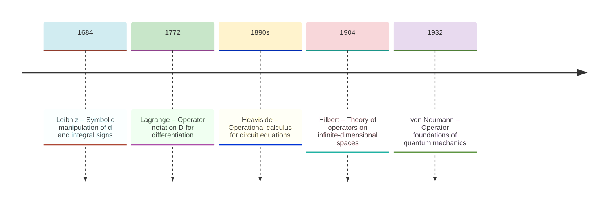
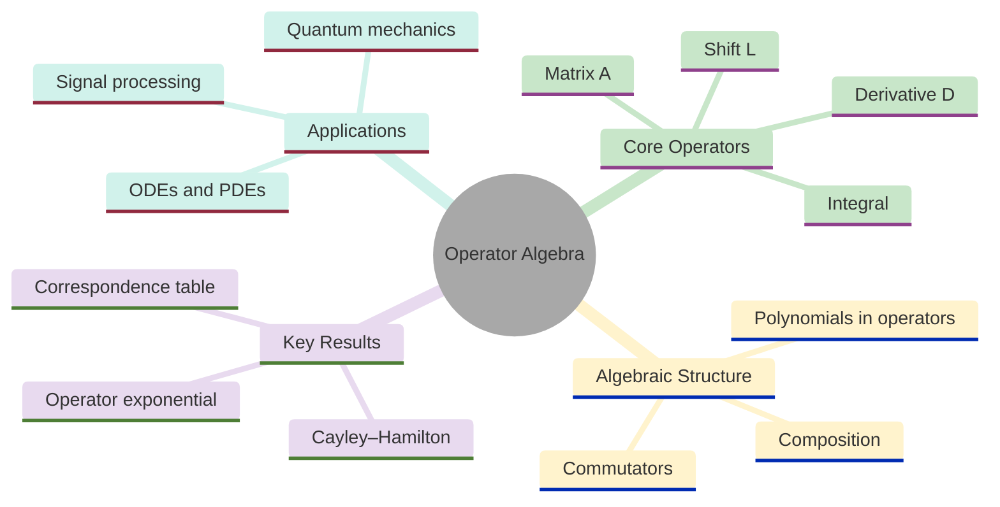
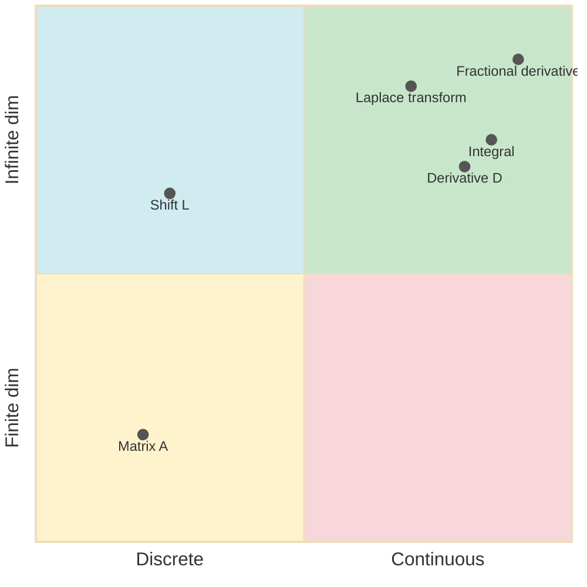
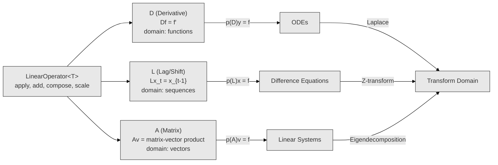
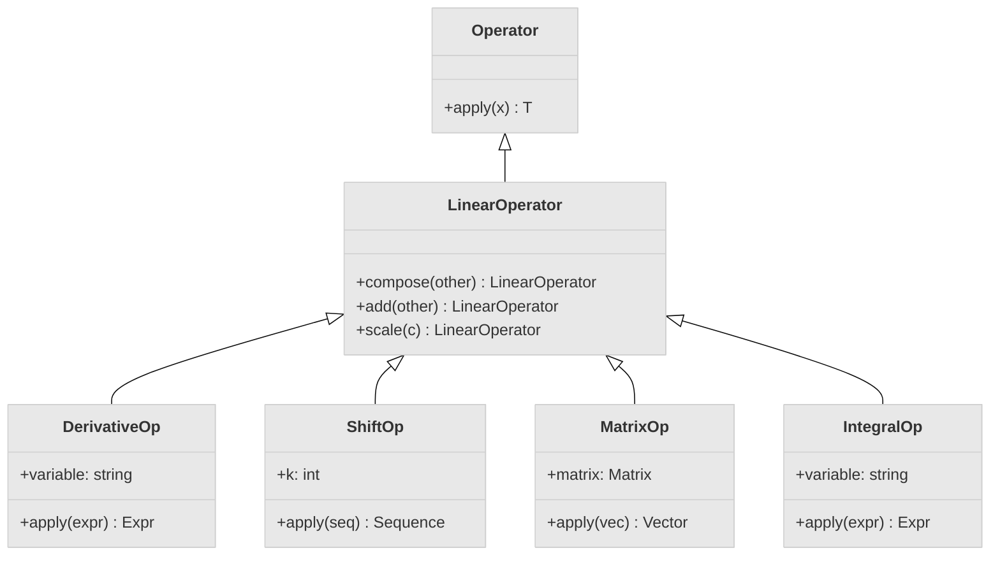
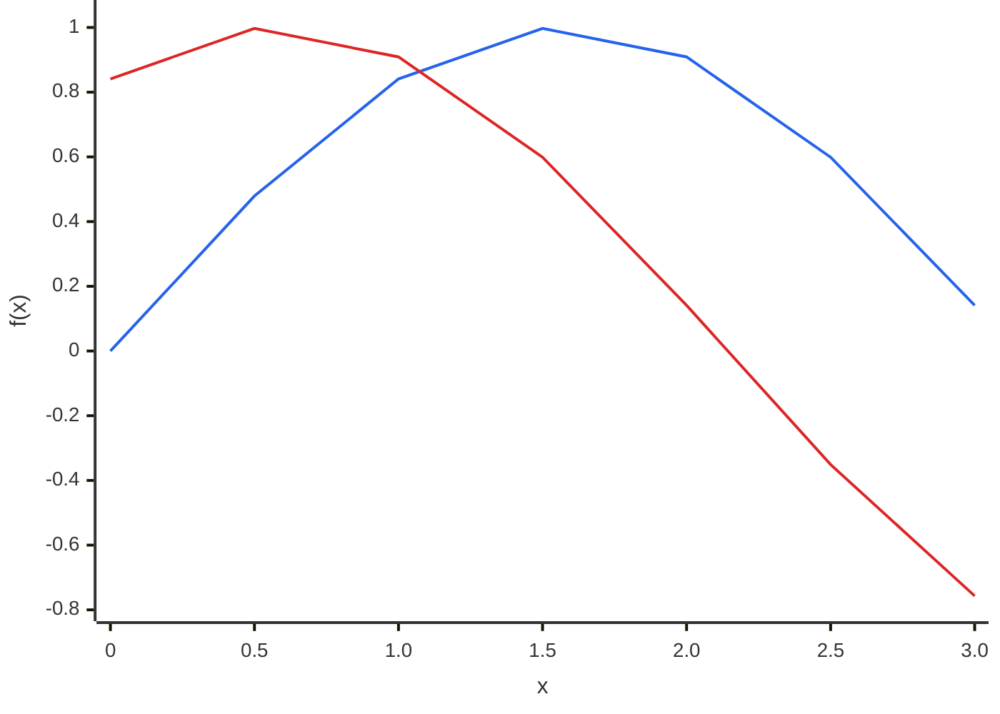
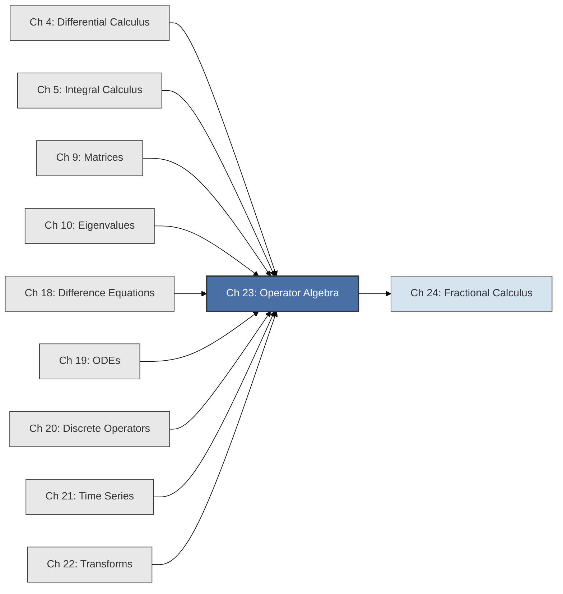

<!-- Copyright (c) 2025-2026 Bob Jansen <bobjansen@pm.me> -->
<!-- SPDX-License-Identifier: CC-BY-NC-4.0 -->
<!-- See LICENSE for full terms. Commercial licensing available. -->
# Chapter 23: Operator Algebra

**Part VIII**: Operator Theory & Advanced

> Operator algebra is the conceptual capstone of Evenwicht: it reveals that differentiation, integration, the shift operator, matrix multiplication and fractional derivatives are all instances of the same algebraic structure. They are first-class objects that can be added, composed, scaled and factored according to uniform rules.

**Prerequisites**: [Chapter 4](04-differential-calculus.md) (Differential Calculus); the derivative operator $D = d/dx$ and its linearity. [Chapter 9](09-matrices.md) (Matrices & Linear Transformations); matrices as representations of linear operators on finite-dimensional spaces. [Chapter 20](20-discrete-operators.md) (Sequences & Discrete Operators); the lag operator $L$, the difference operator $\Delta$ and their algebraic manipulation. [Chapter 21](21-time-series.md) (Time Series Analysis); autoregressive moving average (ARMA) models as polynomial operators in the lag operator.

**Learning Objectives**: After this chapter, the reader will be able to:
1. Define operators as first-class mathematical objects and distinguish linear from nonlinear operators.
2. Compose, add and scale operators algebraically, and verify that linear operators on a given space form an algebra.
3. Construct polynomial operators such as $p(D) = D^2 + 3D + 2I$ and connect them to linear ordinary differential equations (ODEs) and difference equations.
4. Compute commutators and explain their significance in operator calculus and quantum mechanics.
5. State and apply the correspondence between continuous operators ($D$, $\int$), discrete operators ($L$, $\Delta$, $\Sigma$) and matrix operators ($A$, $A^{-1}$, $e^{At}$).
6. Implement the generic operator interface in Evenwicht and wrap concrete operators (derivative, shift, matrix) under a single algebraic API.

**Connections**: This chapter unifies concepts from [Chapter 4](04-differential-calculus.md) (the derivative as a linear operator), [Chapter 5](05-integral-calculus.md) (integration as the inverse of differentiation), [Chapter 9](09-matrices.md) (matrices as operators on $\mathbb{R}^n$), [Chapter 10](10-eigenvalues.md) (eigenvalues as the spectral theory of operators), [Chapter 18](18-difference-equations.md) (difference equations as polynomial operators in $L$), [Chapter 19](19-odes.md) (ODEs as polynomial operators in $D$) and [Chapter 20](20-discrete-operators.md) (discrete operators $L$, $\Delta$). It prepares [Chapter 24](24-fractional-calculus.md) (Fractional Calculus), where the operator $D^\alpha$ for non-integer $\alpha$ extends the framework developed here. This chapter draws on every preceding part of the text.

---

## Historical Context

**Key Milestones in Operator Algebra**



*Figure 23.1: Key milestones in operator algebra from Leibniz's symbolic calculus to von Neumann.*

**Leibniz and symbolic manipulation (1684–1710).** Gottfried Wilhelm Leibniz was the first mathematician to treat the symbols $d$ and $\int$ as objects admitting algebraic manipulation. His notation $\frac{d}{dx}$ was designed to behave like a fraction, so that the chain rule $\frac{dy}{dx} = \frac{dy}{du} \cdot \frac{du}{dx}$ appears as cancellation. Leibniz did not formalise "operator" as a mathematical concept. But his practice of manipulating differential symbols as algebraic quantities established the conceptual seed: the notation suggests that $\frac{d}{dx}$ is a thing, not an action.

**Lagrange and the operator $D$ (1772).** Joseph-Louis Lagrange introduced streamlined notation for derivatives, writing $f'$, $f''$ and $f^{(n)}$ for successive derivatives. Lagrange and later Arbogast (1800) began writing $D$ for the operation of differentiation itself and $D^n$ for its $n$-fold iteration. This was the first explicit treatment of differentiation as an operator: an entity that transforms one function into another and can be raised to powers.

**Heaviside's operational calculus (1880s–1890s).** Oliver Heaviside, the self-taught English physicist and electrical engineer, developed a method for solving linear constant-coefficient ordinary differential equations (ODEs) by treating $D$ as if it were a number. Given $(D^2 + 3D + 2)y = f(t)$, Heaviside factored the operator polynomial as $(D+1)(D+2)y = f(t)$ and "divided" by the operator factors to obtain solutions. He introduced $1/D$ as the integration operator and manipulated expressions like $\frac{1}{D+a}f(t)$ to mean the solution of $(D+a)y = f(t)$.

**Vindication through the Laplace transform (1890s–1920s).** The method was effective; Heaviside solved telegraph equations, impulse response problems and transient circuit analyses that resisted conventional approaches. It was also controversial: he provided no rigorous justification for treating $D$ as an algebraic variable. The mathematical establishment largely dismissed his methods. The vindication came decades later, when the Laplace transform provided a rigorous framework in which Heaviside's manipulations became theorems.

**Hilbert, Banach and the abstract theory (1900–1930s).** The rigorous theory of operators emerged from David Hilbert's work on integral equations (1904–1910). Hilbert studied infinite-dimensional analogues of matrices and introduced what are now called Hilbert spaces (complete inner product spaces). He analysed bounded linear operators on them. Stefan Banach generalised the framework to Banach spaces (complete normed vector spaces) in his 1932 monograph, establishing functional analysis as a discipline. In this abstract setting, an operator is a mapping between function spaces. The algebraic operations (addition, composition, scalar multiplication) are defined pointwise. The operator norm provides a notion of size, and convergence of operator sequences enables operator-valued functions such as the exponential $e^T$.

**Von Neumann and quantum mechanics (1930s–1950s).** John von Neumann's 1932 book *Mathematische Grundlagen der Quantenmechanik* placed quantum mechanics on a rigorous operator-theoretic foundation. Physical observables (position, momentum, energy) are self-adjoint operators on a Hilbert space. The canonical commutation relation $[\hat{x}, \hat{p}] = i\hbar$ states that position and momentum operators do not commute; this is the mathematical expression of the Heisenberg uncertainty principle. Paul Dirac's bra–ket notation, introduced in 1939, provided an efficient calculus for manipulating operators on quantum state spaces.

**Modern applications (20th–21st century).** In signal processing, a linear time-invariant filter is a linear operator on the space of signals. Convolution with the impulse response is the operator's action; the transfer function is its frequency-domain representation. In machine learning, each network layer is an operator on tensor spaces: a linear map (weight matrix) followed by a nonlinear activation. The entire network is a composition of operators. In numerical analysis, iterative methods (Jacobi, Gauss–Seidel, conjugate gradient) are studied through the spectral properties of their iteration operators. In quantum computing, gates are unitary operators on qubit spaces.

---

## Why This Chapter Matters

**Operator Algebra**



*Figure 23.2: Overview of core operators, algebraic structure, key results and applications.*

Differentiation, integration, the shift operator, matrix multiplication and fractional derivatives are all instances of a single algebraic structure. This abstraction enables a single software interface to handle continuous ODEs, discrete difference equations and finite-dimensional matrix systems through the same API. It is also the conceptual foundation on which fractional calculus ([Chapter 24](24-fractional-calculus.md)) becomes possible. Without operator algebra, each domain remains a silo with its own notation, solution techniques and implementation. With it, theorems proved once (e.g. the Cayley–Hamilton theorem, the operator exponential series) apply uniformly across all three domains.

Operator algebra provides the language for understanding linear layers, attention mechanisms and differential equation-based models as compositions of operators. A neural network layer $\mathbf{h} \mapsto \sigma(W\mathbf{h} + \mathbf{b})$ is an operator composition: affine transformation followed by nonlinearity. The residual connection $\mathbf{h}_{t+1} = \mathbf{h}_t + f(\mathbf{h}_t)$ is $\mathbf{h}_{t+1} = (I + f)\mathbf{h}_t$, a polynomial operator in $I$ and $f$. The neural ODE limit $\dot{\mathbf{h}} = f(\mathbf{h})$ is the continuous counterpart obtained as step size goes to zero.

The commutator (Definition 23.16) quantifies how much two operations fail to commute. In quantum computing and quantum ML, non-commutativity is a necessary feature of quantum advantage; the Lie algebra structure (formed by the commutator) governs gate synthesis. The correspondence table (Theorem 23.20) maps between continuous, discrete and matrix operators. It lets a practitioner translate results across signal processing ($Z$-transforms), control theory (Laplace transforms) and numerical linear algebra (eigendecompositions).

In finance and economics, the operator exponential $e^{At}$ (Definition 23.25 and Theorem 23.26) solves continuous-time linear systems that model interest rate dynamics (Vasicek model: $dr = a(b-r)dt + \sigma dW$, whose deterministic part has solution $r(t) = b + (r_0 - b)e^{-at}$). The polynomial operator $\phi(L) = 1 - \phi_1 L - \cdots - \phi_p L^p$ is the compact representation of autoregressive models in time series econometrics. Factorising lag polynomials (decomposing $\phi(L)$ into roots and checking whether those roots lie outside the unit circle) is an operator-algebraic procedure that determines stationarity, invertibility and model stability.

The generic operator interface, with addition, scalar multiplication, composition, identity and inverse, is the abstract class from which concrete operators (derivative, shift, matrix) inherit. This architecture enables code reuse across domains. The same polynomial-operator solver handles constant-coefficient ODEs and difference equations (Theorem 23.14). The same exponential-series computation handles both the matrix exponential and the operator exponential of the shift. The Evenwicht project implements this pattern directly. Understanding the algebraic structure makes the implementation correct and extensible to the fractional operators of [Chapter 24](24-fractional-calculus.md).

---

## Notation & Conventions

| Symbol | Meaning |
|--------|---------|
| $T$, $S$, $U$ | Linear operators (uppercase) |
| $D$ | The derivative operator: $Df = f'$ |
| $D^n$ | The $n$-th derivative operator: $D^n f = f^{(n)}$ |
| $L$ | The lag (backward shift) operator: $Lx_t = x_{t-1}$ |
| $\Delta$ | The difference operator: $\Delta = I - L$ |
| $I$ | The identity operator: $If = f$ |
| $O$ | The zero (null) operator: $Of = 0$ |
| $T \circ S$ or $TS$ | Composition of operators: $(TS)(f) = T(S(f))$ |
| $[A, B]$ | Commutator: $[A, B] = AB - BA$ |
| $p(T)$ | Polynomial in operator $T$: $a_nT^n + \cdots + a_1T + a_0I$ |
| $e^T$ | Operator exponential: $\sum_{k=0}^{\infty} T^k / k!$ |
| $T^{-1}$ | Inverse operator: $T^{-1}T = TT^{-1} = I$ |
| $V$, $W$ | Vector spaces (or function spaces) |
| $\mathcal{L}(V)$ | The algebra of linear operators on $V$ |
| $M_x$ | The "multiply by $x$" operator: $(M_x f)(x) = x \cdot f(x)$ |
| $\Sigma$ | Cumulative summation operator (discrete analogue of $\int$) |

Operator composition is written by juxtaposition ($TS$ means "apply $S$ first, then $T$") following the standard convention for function composition. When clarity demands it, the explicit notation $T \circ S$ is used.

---

## Core Theory

**Operator Classification**



*Figure 23.3: Classification of operators by domain type and dimensionality.*

The quadrant chart positions the principal operators along two axes: discrete-to-continuous (left to right) and finite-dimensional to infinite-dimensional (bottom to top). Matrix operators occupy the discrete, finite-dimensional corner. The shift operator $L$ is discrete but acts on infinite sequences. The derivative $D$, the integral operator, the Laplace transform and fractional derivatives $D^\alpha$ operate on continuous function spaces of infinite dimension. Despite their different domains, all obey the same algebraic rules of composition, addition and inversion.

### Operators as Objects

**Definition 23.1** (Operator). Let $V$ and $W$ be vector spaces (which may be function spaces, sequence spaces or finite-dimensional spaces $\mathbb{R}^n$). An *operator* is a mapping $T: V \to W$. In Evenwicht, an operator is a transformation on functions, sequences or vectors that can be represented as a first-class object: stored, composed and manipulated algebraically.

The key conceptual shift is to think of $T$ not as a recipe for computing a value but as an object in its own right. Just as numbers can be added and multiplied, operators can be combined through well-defined algebraic operations.

**Definition 23.2** (Linear operator). An operator $T: V \to W$ is *linear* if for all $f, g \in V$ and all scalars $\alpha, \beta \in \mathbb{R}$:

$$T(\alpha f + \beta g) = \alpha T(f) + \beta T(g).$$

Equivalently, $T$ preserves vector addition and scalar multiplication separately: $T(f + g) = T(f) + T(g)$ and $T(\alpha f) = \alpha T(f)$.

**Example 23.3** (Fundamental linear operators).

(a) The derivative operator $D: C^1(\mathbb{R}) \to C^0(\mathbb{R})$ defined by $Df = f'$. Linearity was proved in [Chapter 4](04-differential-calculus.md), Theorem 4.6: $D(\alpha f + \beta g) = \alpha Df + \beta Dg$.

(b) The lag operator $L$ ([Chapter 20](20-discrete-operators.md)) on sequences: $L x_t = x_{t-1}$. For sequences $\{x_t\}$ and $\{y_t\}$ and scalars $\alpha, \beta$: $L(\alpha x_t + \beta y_t) = \alpha x_{t-1} + \beta y_{t-1} = \alpha L x_t + \beta L y_t$.

(c) A matrix ([Chapter 9](09-matrices.md)) $A \in \mathbb{R}^{m \times n}$ acting on vectors $\mathbf{v} \in \mathbb{R}^n$ by $T(\mathbf{v}) = A\mathbf{v}$. Linearity is the distributive property of matrix multiplication: $A(\alpha \mathbf{u} + \beta \mathbf{v}) = \alpha A\mathbf{u} + \beta A\mathbf{v}$.

(d) The definite integration operator $J: C^0([a,b]) \to \mathbb{R}$ defined by $Jf = \int_a^b f(x)\,dx$. More usefully for operator algebra, the indefinite integration operator $D^{-1}: C^0(\mathbb{R}) \to C^1(\mathbb{R})$ defined by $(D^{-1}f)(x) = \int_0^x f(t)\,dt$.

**Remark 23.4** (Nonlinear operators). Not every transformation on functions is linear. The operator $N(f) = f^2$ (squaring) is nonlinear: $N(f + g) = (f + g)^2 \neq f^2 + g^2 = N(f) + N(g)$ in general. Nonlinear operators are important (activation functions in neural networks, for instance), but the algebraic structure developed in this chapter applies specifically to linear operators.

### Algebraic Operations on Operators

**Definition 23.5** (Operator addition). Let $T_1, T_2: V \to V$ be operators on the same space. Their *sum* $T_1 + T_2$ is the operator defined by:

$$(T_1 + T_2)(f) = T_1(f) + T_2(f)$$

for all $f \in V$.

**Definition 23.6** (Scalar multiplication of operators). Let $T: V \to V$ be an operator and $c \in \mathbb{R}$ a scalar. The *scalar multiple* $cT$ is the operator defined by:

$$(cT)(f) = c \cdot T(f)$$

for all $f \in V$.

**Definition 23.7** (Operator composition). Let $T_1, T_2: V \to V$ be operators. Their *composition* $T_1 \circ T_2$ (written $T_1 T_2$ when context is clear) is the operator defined by:

$$(T_1 \circ T_2)(f) = T_1(T_2(f))$$

for all $f \in V$. Note that $T_1 T_2$ means "apply $T_2$ first, then apply $T_1$ to the result." Composition is generally *not* commutative: $T_1 T_2 \neq T_2 T_1$ in general.

**Definition 23.8** (Identity operator). The *identity operator* $I: V \to V$ is defined by $I(f) = f$ for all $f \in V$. It satisfies $TI = IT = T$ for every operator $T$ on $V$.

**Definition 23.9** (Zero operator). The *zero operator* (or null operator) $O: V \to V$ is defined by $O(f) = 0$ for all $f \in V$, where $0$ denotes the zero element of $V$. It satisfies $T + O = O + T = T$ and $TO = OT = O$ for every operator $T$ on $V$.

**Theorem 23.10** (Linear operators form an algebra). Let $V$ be a vector space and let $\mathcal{L}(V)$ denote the set of all linear operators $T: V \to V$. Then $\mathcal{L}(V)$, equipped with operator addition, scalar multiplication and composition, forms an *algebra* over $\mathbb{R}$. Specifically:

(i) $(\mathcal{L}(V), +, \cdot)$ is a vector space: operator addition is commutative and associative, the zero operator is the additive identity, scalar multiplication distributes over addition and is associative.

(ii) Composition is bilinear: $T(S_1 + S_2) = TS_1 + TS_2$ and $(T_1 + T_2)S = T_1 S + T_2 S$ and $(cT)S = T(cS) = c(TS)$.

(iii) Composition is associative: $(T_1 T_2)T_3 = T_1(T_2 T_3)$.

(iv) The identity $I$ is the multiplicative identity: $TI = IT = T$.

??? note "Proof"

    *Proof sketch.* For (i): if $T_1$ and $T_2$ are linear, then

    $$\begin{aligned}
    (T_1 + T_2)(\alpha f + \beta g) &= T_1(\alpha f + \beta g) + T_2(\alpha f + \beta g) \\
    &= \alpha T_1(f) + \beta T_1(g) + \alpha T_2(f) + \beta T_2(g) \\
    &= \alpha(T_1 + T_2)(f) + \beta(T_1 + T_2)(g),
    \end{aligned}$$

    so $T_1 + T_2$ is linear. The same argument shows that $cT$ is linear. The vector space axioms follow from the pointwise definitions.

    For (ii): $(T(S_1 + S_2))(f) = T((S_1 + S_2)(f)) = T(S_1(f) + S_2(f)) = T(S_1(f)) + T(S_2(f)) = (TS_1)(f) + (TS_2)(f)$, using linearity of $T$. The other bilinearity statements follow similarly.

    For (iii): $((T_1 T_2)T_3)(f) = (T_1 T_2)(T_3(f)) = T_1(T_2(T_3(f))) = T_1((T_2 T_3)(f)) = (T_1(T_2 T_3))(f)$. This is associativity of function composition.

    For (iv): $(TI)(f) = T(I(f)) = T(f)$ and $(IT)(f) = I(T(f)) = T(f)$.

    $\square$

**Remark 23.11** (Non-commutativity). The algebra $\mathcal{L}(V)$ is *not* commutative when $\dim V \geq 2$. For matrices, this is familiar: $AB \neq BA$ in general. For operators on function spaces, the non-commutativity is equally fundamental; see the commutator discussion below. This distinguishes operator algebras from polynomial rings and makes the factoring of operator polynomials more delicate.

### Polynomial Operators and Differential/Difference Equations

**Definition 23.12** (Polynomial in an operator). Let $T: V \to V$ be a linear operator and let $p(\lambda) = a_n \lambda^n + a_{n-1}\lambda^{n-1} + \cdots + a_1 \lambda + a_0$ be a polynomial with real coefficients. The *polynomial operator* $p(T)$ is defined by:

$$p(T) = a_n T^n + a_{n-1} T^{n-1} + \cdots + a_1 T + a_0 I,$$

where $T^k$ denotes $k$-fold composition of $T$ with itself ($T^0 = I$ by convention).

**Example 23.13** (Polynomial operator). The operator $p(D) = D^2 + 3D + 2I$ takes a twice-differentiable function $f$ and produces $f'' + 3f' + 2f$.

**Theorem 23.14** (Polynomial operators and linear equations). Polynomial operators express constant-coefficient linear equations in compact form in both the continuous and discrete settings.

*(a) ODEs.* The linear ordinary differential equation with constant coefficients

$$a_n y^{(n)} + a_{n-1} y^{(n-1)} + \cdots + a_1 y' + a_0 y = f(x)$$

can be written in operator form as $p(D)y = f$, where $p(D) = a_n D^n + \cdots + a_1 D + a_0 I$. The *characteristic equation* of the ODE is $p(\lambda) = 0$, obtained by formally replacing $D$ with the scalar $\lambda$.

*(b) Difference equations.* The linear difference equation with constant coefficients

$$a_n x_{t-n} + a_{n-1} x_{t-n+1} + \cdots + a_1 x_{t-1} + a_0 x_t = f_t$$

can be written in operator form as $p(L) x_t = f_t$, where $p(L) = a_n L^n + \cdots + a_1 L + a_0 I$ and $L$ is the lag operator ($L x_t = x_{t-1}$). In time series analysis, the autoregressive moving average (ARMA)$(p,q)$ model takes the form:

$$\phi(L) x_t = \theta(L) \varepsilon_t,$$

where $\phi(L) = 1 - \phi_1 L - \cdots - \phi_p L^p$ is the autoregressive (AR) polynomial and $\theta(L) = 1 + \theta_1 L + \cdots + \theta_q L^q$ is the moving average (MA) polynomial.

??? note "Proof"

    *Proof.* (a) The operator $D^k$ applied to $y$ yields $y^{(k)}$. By linearity (Theorem 23.10),

    $$(a_n D^n + \cdots + a_0 I)(y) = a_n D^n(y) + \cdots + a_0 I(y) = a_n y^{(n)} + \cdots + a_0 y.$$

    This is precisely the left-hand side of the ODE.

    The homogeneous solutions of $p(D)y = 0$ are found by substituting the exponential ansatz $y = e^{\lambda x}$. Since $D^k(e^{\lambda x}) = \lambda^k e^{\lambda x}$,

    $$p(D)(e^{\lambda x}) = p(\lambda) e^{\lambda x}.$$

    The function $e^{\lambda x}$ is a solution of the homogeneous equation $p(D)y = 0$ if and only if $p(\lambda) = 0$.

    (b) The operator $L^k$ applied to the sequence $\{x_t\}$ yields $\{x_{t-k}\}$. By linearity,

    $$(a_n L^n + \cdots + a_0 I)(x_t) = a_n x_{t-n} + \cdots + a_0 x_t.$$

    The ARMA representation follows by identifying the AR and MA components as separate operator polynomials applied to the series and the innovation sequence respectively (see [Chapter 21](21-time-series.md)).

    $\square$

**Remark 23.15** (Factoring operator polynomials). Polynomial operators can be factored just as scalar polynomials can. If $p(\lambda) = a_n(\lambda - \lambda_1)(\lambda - \lambda_2) \cdots (\lambda - \lambda_n)$, then:

$$p(D) = a_n(D - \lambda_1 I)(D - \lambda_2 I) \cdots (D - \lambda_n I).$$

This factoring is valid because polynomial operators in a single variable commute: $D^j D^k = D^{j+k} = D^k D^j$. The roots $\lambda_1, \ldots, \lambda_n$ of the characteristic polynomial determine the homogeneous solutions $e^{\lambda_k x}$ (for ODEs) or $\lambda_k^t$ (for difference equations). Factoring the operator polynomial therefore reduces an $n$-th order equation to $n$ cascaded first-order problems.

!!! note "Commutativity is necessary for factoring"
    Polynomial factoring relies on powers of a single operator commuting: $D^j D^k = D^k D^j$. For polynomials in two non-commuting operators (e.g. $D$ and $M_x$), the factoring does not carry over. The order of factors matters, and the roots of the "characteristic polynomial" no longer determine the solution directly.

### The Commutator

**Definition 23.16** (Commutator). For operators $A, B: V \to V$, the *commutator* of $A$ and $B$ is the operator:

$$[A, B] = AB - BA.$$

If $[A, B] = O$ (the zero operator), then $A$ and $B$ *commute*: the order of application does not matter.

**Example 23.17** (Canonical commutation relation). Let $D = \frac{d}{dx}$ be the derivative operator and let $M_x$ denote the "multiply by $x$" operator: $(M_x f)(x) = x \cdot f(x)$. Then $[D, M_x] = I$.

??? note "Proof"

    *Proof.* For any differentiable function $f$:

    $$\begin{aligned}
    (DM_x)(f) &= D(xf) = f + xf' \quad \text{(by the product rule)}, \\
    (M_x D)(f) &= x \cdot Df = xf'.
    \end{aligned}$$

    It follows that $[D, M_x](f) = (DM_x - M_x D)(f) = (f + xf') - xf' = f = I(f)$.

    Since this holds for all $f$, $[D, M_x] = I$.

    $\square$

**Remark 23.18** (Significance of non-commutativity). The relation $[D, M_x] = I$ is the classical analogue of the canonical commutation relation $[\hat{x}, \hat{p}] = i\hbar$ in quantum mechanics, where $\hat{x}$ is the position operator and $\hat{p} = -i\hbar \frac{d}{dx}$ is the momentum operator. The non-vanishing commutator is the mathematical content of the Heisenberg uncertainty principle: observables whose operators do not commute cannot be simultaneously measured with arbitrary precision. In the operator algebra of differential operators, non-commutativity means that the order of differentiation and multiplication matters; a fact with concrete computational consequences in symbolic manipulation systems.

**Remark 23.19** (Properties of the commutator). The commutator satisfies:

(a) Antisymmetry: $[A, B] = -[B, A]$.

(b) Bilinearity: $[\alpha A + \beta B, C] = \alpha[A, C] + \beta[B, C]$.

(c) The Jacobi identity: $[A, [B, C]] + [B, [C, A]] + [C, [A, B]] = O$.

(d) The Leibniz rule: $[A, BC] = [A, B]C + B[A, C]$.

These properties make the space of operators a *Lie algebra* under the commutator bracket, a structure fundamental to physics and geometry.

### The Unification Table

**Theorem 23.20** (Correspondence between continuous, discrete and matrix operators). The following table displays the structural parallels among the three principal operator domains treated in this text. Each row presents the same mathematical concept realised in the continuous, discrete and finite-dimensional settings.

| Concept | Continuous | Discrete | Matrix |
|---------|-----------|----------|--------|
| Forward operator | $D = \frac{d}{dx}$ | $\Delta = I - L$ | $A$ (matrix) |
| Inverse operator | $D^{-1} = \int$ | $\Sigma$ (cumulative sum) | $A^{-1}$ |
| Exponential function | $e^{ax}$ | $a^t$ | $e^{At}$ |
| Polynomial equation | $p(D)y = f$ (ODE) | $p(L)x = f$ (difference eq) | $p(A)\mathbf{v} = \mathbf{f}$ |
| Transform | Laplace transform | Z-transform | Eigendecomposition |
| Eigenvalue problem | $Df = \lambda f$ ($\Rightarrow f = ce^{\lambda x}$) | $Lx = \lambda x$ ($\Rightarrow x_t = c \lambda^t$ for the sequence $(x_t)_{t \geq 0}$) | $A\mathbf{v} = \lambda \mathbf{v}$ |
| Time evolution / shift | $e^{aD}f(x) = f(x+a)$ | $L^k x_t = x_{t-k}$ | $e^{At}\mathbf{v}(0) = \mathbf{v}(t)$ (solution operator of $\dot{\mathbf{v}} = A\mathbf{v}$) |
| Characteristic polynomial | $p(\lambda) = 0$ gives ODE solutions | $p(\lambda) = 0$ gives recurrence solutions | $\det(A - \lambda I) = 0$ |

**Operator Unification: D, L, A as Instances of LinearOperator:**



*Figure 23.4: Unification of derivative, shift and matrix operators under a common interface.*

All three operator types share the same algebraic interface: they can be composed, added, scaled and formed into polynomials. The characteristic polynomial determines solution structure in every case, and a domain-specific transform converts the operator equation into an algebraic equation.

This table is not merely a pedagogical analogy. The algebraic structure is identical in each column: polynomial operators act on elements of a vector space, eigenvalues determine the characteristic behaviour and transforms convert operator equations into algebraic equations. The Evenwicht project implements all three columns under a single operator interface.

**Theorem 23.21** (Cayley–Hamilton). *Every square matrix satisfies its own characteristic equation. That is, if $p(\lambda) = \det(\lambda I - A)$ is the characteristic polynomial of $A \in \mathbb{R}^{n \times n}$, then $p(A) = 0$.*

!!! abstract "Key Result"

    **Theorem 23.21** (Cayley–Hamilton). Every square matrix satisfies its own characteristic polynomial, enabling any power $A^k$ (for $k \geq n$) to be expressed as a linear combination of $I, A, \ldots, A^{n-1}$ and providing the algebraic foundation for the matrix exponential and operator function calculus.

??? note "Proof"

    *Proof sketch (diagonalisable case).* Suppose $A$ is diagonalisable: $A = P \Lambda P^{-1}$ where $\Lambda = \operatorname{diag}(\lambda_1, \ldots, \lambda_n)$ is the diagonal matrix of eigenvalues and $P$ is the matrix of eigenvectors.

    The characteristic polynomial evaluated at the matrix is

    $$p(A) = P \, p(\Lambda) \, P^{-1},$$

    since for any polynomial $q$, $q(P \Lambda P^{-1}) = P\, q(\Lambda)\, P^{-1}$ (this follows by induction: $(P\Lambda P^{-1})^k = P\Lambda^k P^{-1}$, and linearity).

    Now $p(\Lambda) = \operatorname{diag}(p(\lambda_1), \ldots, p(\lambda_n))$. But each $\lambda_i$ is a root of the characteristic polynomial $p$, so $p(\lambda_i) = 0$ for all $i$ and $p(\Lambda) = 0$. Then

    $$p(A) = P \cdot 0 \cdot P^{-1} = 0.$$

    The non-diagonalisable case follows by a density/continuity argument: the set of diagonalisable matrices is dense in $\mathbb{R}^{n \times n}$, and the map $A \mapsto p_A(A)$ (where $p_A$ is the characteristic polynomial of $A$) is continuous; passing to the limit extends the result to all matrices.

    $\square$

**Remark 23.22** (Consequences of Cayley–Hamilton). The Cayley–Hamilton theorem has several important consequences for operator algebra:

(a) *Matrix inverse via polynomial*: Since $p(A) = 0$, one can express $A^{-1}$ as a polynomial in $A$ (when $A$ is invertible). Specifically, if $p(\lambda) = \lambda^n + c_{n-1}\lambda^{n-1} + \cdots + c_0$ with $c_0 \neq 0$, then $A^n + c_{n-1}A^{n-1} + \cdots + c_0 I = 0$, so $A^{-1} = -\frac{1}{c_0}(A^{n-1} + c_{n-1}A^{n-2} + \cdots + c_1 I)$.

(b) *Reducing powers*: Any power $A^k$ for $k \geq n$ can be reduced to a polynomial in $A$ of degree at most $n - 1$, using $p(A) = 0$ to express $A^n$ in terms of lower powers. This connects to the operator polynomial framework (Definition 23.12).

(c) *Correspondence with continuous operators*: The discrete analogue (for lag operator $L$) is that a recurrence of order $n$ (satisfying $p(L)x_t = 0$) is determined by its characteristic polynomial $p$, and initial conditions can be chosen to select any particular solution; exactly the content of Theorem 23.14.

**Operator Class Hierarchy**



*Figure 23.5: Class hierarchy of the operator interface with concrete implementations.*

The class diagram above shows the operator hierarchy implemented in Evenwicht. The base `Operator` class defines the `apply` method. `LinearOperator` extends it with `compose`, `add` and `scale` operations, the algebraic structure of Theorem 23.10. Concrete operators (`DerivativeOp`, `ShiftOp`, `MatrixOp` and `IntegralOp`) inherit this interface and implement domain-specific `apply` logic.

### Inverse Operators and the Operator Exponential

**Definition 23.23** (Inverse operator). An operator $T: V \to V$ is *invertible* if there exists an operator $T^{-1}: V \to V$ such that:

$$T^{-1} T = T T^{-1} = I.$$

When the inverse exists, the equation $Ty = f$ has the unique solution $y = T^{-1}f$.

**Example 23.24** (Inverses of familiar operators).

(a) The inverse of the derivative operator is the indefinite integral: $D^{-1} = \int$. More precisely, if $Dy = f$ and the initial condition is fixed as $y(0) = 0$, then $y(x) = \int_0^x f(t)\,dt = D^{-1}f(x)$.

(b) The inverse of the lag operator $L$ is the forward shift: $L^{-1}x_t = x_{t+1}$.

(c) The inverse of a matrix operator $A$ is the matrix $A^{-1}$ (when it exists): if $A\mathbf{v} = \mathbf{w}$, then $\mathbf{v} = A^{-1}\mathbf{w}$.

**Definition 23.25** (Operator exponential). Let $T: V \to V$ be a linear operator. The *exponential* of $T$ is defined by the power series:

$$e^T = \sum_{k=0}^{\infty} \frac{T^k}{k!} = I + T + \frac{T^2}{2!} + \frac{T^3}{3!} + \cdots$$

This series converges (in the operator norm) for all bounded operators $T$ on a Banach space, and for matrices of any size.

**Theorem 23.26** (The shift as exponential of $D$). For any $a \in \mathbb{R}$ and any analytic function $f$:

$$e^{aD} f(x) = f(x + a).$$

That is, the operator $e^{aD}$ acts as translation by $a$.

??? note "Proof"

    *Proof.* Expand the exponential and apply each term to $f$:

    $$e^{aD} f(x) = \sum_{k=0}^{\infty} \frac{(aD)^k}{k!} f(x) = \sum_{k=0}^{\infty} \frac{a^k}{k!} D^k f(x) = \sum_{k=0}^{\infty} \frac{a^k}{k!} f^{(k)}(x).$$

    The right-hand side is the Taylor series of $f$ expanded about $x$, evaluated at displacement $a$:

    $$\sum_{k=0}^{\infty} \frac{f^{(k)}(x)}{k!} a^k = f(x + a).$$

    This holds whenever $f$ is analytic (i.e., equal to its Taylor series) in a neighbourhood of $x$.

    $\square$

**Operator Exponential: $e^D$ shifts $\sin(x)$ by 1:**



*Figure 23.6: The operator exponential translates sin(x) by one unit to produce sin(x+1).*

The two curves show $f(x) = \sin(x)$ and $f(x+1) = \sin(x+1)$. By Theorem 23.26, $e^{aD}f(x) = f(x+a)$, so the shifted curve is obtained by applying the operator exponential $e^D$ (with $a = 1$) to $\sin(x)$. The second curve is the first curve translated one unit to the left.

**Remark 23.27** (Connecting continuous and discrete). Theorem 23.26 reveals a direct connection: the continuous derivative operator $D$ generates the discrete shift. The lag operator $L$ on sequences satisfies $L = e^{-D}$ in an appropriate sense (with $a = -1$ and the "independent variable" being the discrete index). The difference operator $\Delta = I - L = I - e^{-D}$ can therefore be expanded as a series in $D$:

$$\Delta = I - e^{-D} = D - \frac{D^2}{2!} + \frac{D^3}{3!} - \cdots$$

This expansion is the link between continuous and discrete calculus: finite differences are infinite series in derivatives, and conversely. In [Chapter 24](24-fractional-calculus.md), this connection extends to fractional powers: $D^\alpha$ and $\Delta^\alpha$ for real $\alpha$ generalise both the continuous and discrete operators.

**Theorem 23.28** (Properties of the operator exponential). For linear operators $A$ and $B$:

(a) $e^{O} = I$ (exponential of the zero operator is the identity).

(b) $e^{(s+t)A} = e^{sA} e^{tA}$ for all $s, t \in \mathbb{R}$ (semigroup property).

(c) $(e^A)^{-1} = e^{-A}$ (the exponential is always invertible).

(d) If $[A, B] = O$ (i.e., $A$ and $B$ commute), then $e^{A+B} = e^A e^B$.

(e) If $[A, B] \neq O$, then in general $e^{A+B} \neq e^A e^B$. The Baker–Campbell–Hausdorff formula provides the correction: $e^A e^B = e^{A + B + \frac{1}{2}[A,B] + \cdots}$.

??? note "Proof"

    *Proof of (b).* Expand and multiply the two series:

    $$e^{sA} e^{tA} = \left(\sum_{j=0}^{\infty} \frac{s^j A^j}{j!}\right)\left(\sum_{k=0}^{\infty} \frac{t^k A^k}{k!}\right) = \sum_{n=0}^{\infty} \left(\sum_{j+k=n} \frac{s^j t^k}{j! k!}\right) A^n.$$

    By the binomial theorem, $\sum_{j+k=n} \frac{s^j t^k}{j!k!} = \frac{(s+t)^n}{n!}$, so

    $$= \sum_{n=0}^{\infty} \frac{(s+t)^n}{n!} A^n = e^{(s+t)A}.$$

    The rearrangement of the double series is justified by absolute convergence.

    $\square$

---

## Formulas & Identities

**F23.1** Distributivity of scalar multiplication.

$$\alpha(A + B) = \alpha A + \alpha B, \qquad (\alpha + \beta)A = \alpha A + \beta A$$

**F23.2** Associativity and distributivity of composition.

$$A(BC) = (AB)C, \qquad A(B + C) = AB + AC, \qquad (A + B)C = AC + BC$$

**F23.3** Commutator antisymmetry.

$$[A, B] = -[B, A]$$

**F23.4** Commutator Leibniz rule.

$$[A, BC] = [A, B]C + B[A, C]$$

**F23.5** Jacobi identity.

$$[A, [B, C]] + [B, [C, A]] + [C, [A, B]] = O$$

**F23.6** Canonical commutator.

$$[D, M_x] = I, \qquad [D, M_{x^n}] = n M_{x^{n-1}}$$

**F23.7** Operator exponential semigroup.

$$e^{(s+t)A} = e^{sA} e^{tA}, \qquad (e^A)^{-1} = e^{-A}$$

**F23.8** Baker–Campbell–Hausdorff formula.

$$e^{A} e^{B} = e^{A + B + \frac{1}{2}[A,B] + \cdots}$$

**F23.9** Exponential shift rule.

$$p(D)(e^{\lambda x}) = p(\lambda)\, e^{\lambda x}$$

**F23.10** Operator factorisation.

$$p(D) = a_n(D - \lambda_1 I)(D - \lambda_2 I) \cdots (D - \lambda_n I)$$

**F23.11** Discrete exponential shift.

$$p(L)(c \lambda^t) = c\, p(\lambda)\, \lambda^t$$

### Operator–Transform Correspondence

| Operator domain | Transform | Algebraic effect |
|----------------|-----------|-----------------|
| $p(D)y = f$ | Laplace: $\mathcal{L}$ | $p(s)\hat{y}(s) = \hat{f}(s) + \text{IC terms}$ |
| $p(L)x_t = f_t$ | Z-transform: $\mathcal{Z}$ | $p(z^{-1})\hat{X}(z) = \hat{F}(z) + \text{IC terms}$ |
| $p(A)\mathbf{v} = \mathbf{f}$ | Eigendecomposition | $p(\lambda_k)\hat{v}_k = \hat{f}_k$ |

---

## Algorithms

### Algorithm 23.29: Generic Operator Composition

**Input**: Two operators $T_1$ and $T_2$ (represented as functions or as objects implementing the `Operator` interface), and an element $f$ in the domain.

**Output**: The element $(T_1 \circ T_2)(f) = T_1(T_2(f))$.

1. Compute $g \leftarrow T_2.\text{apply}(f)$
2. Compute $h \leftarrow T_1.\text{apply}(g)$
3. Return $h$

```
function compose(T1, T2, f):
    g = T2.apply(f)
    h = T1.apply(g)
    return h
```

**Time complexity**: If $T_1.\text{apply}$ costs $O(c_1)$ and $T_2.\text{apply}$ costs $O(c_2)$, then the composition costs $O(c_1 + c_2)$. Composition does not increase asymptotic complexity beyond the sum of the component costs.

**Space complexity**: $O(1)$ auxiliary storage beyond the space required by the operand representations (one intermediate value $g$).

**Remark**: When the composed operator is applied repeatedly (e.g., $D^n$ for large $n$), the cost grows linearly in $n$. For polynomial operators $p(D)$ of degree $n$, Algorithm 23.30 below computes the result in $O(n)$ applications of $D$ plus $O(n)$ scalar multiplications and additions.

---

### Algorithm 23.30: Applying a Polynomial Operator $p(D)$ to a Symbolic Expression

**Input**: Polynomial coefficients $a_0, a_1, \ldots, a_n$ (where $p(D) = a_n D^n + \cdots + a_1 D + a_0 I$), a symbolic expression $f$ (of type `Expr`) and a variable name $v$ (the differentiation variable).

**Output**: The expression $p(D)f = a_n f^{(n)} + \cdots + a_1 f' + a_0 f$.

1. Set $\text{result} \leftarrow a_0 \cdot f$
2. Set $\text{current} \leftarrow f$
3. For $k = 1$ to $n$:
   - $\text{current} \leftarrow D(\text{current}, v)$ (symbolic differentiation)
   - $\text{result} \leftarrow \text{result} + a_k \cdot \text{current}$
4. Simplify $\text{result}$
5. Return $\text{result}$

```
function applyPolyD(coeffs, f, v):
    // coeffs = [a0, a1, ..., an]
    n = length(coeffs) - 1
    result = coeffs[0] * f
    current = f
    for k = 1 to n:
        current = differentiate(current, v)
        result = result + coeffs[k] * current
    result = simplify(result)
    return result
```

**Time complexity**: $O(n)$ symbolic differentiations. Each differentiation traverses the expression tree once ($O(s)$ where $s$ is the tree size), so total cost is $O(ns)$. Note that intermediate expressions may grow without simplification; the final simplification pass in step 4 controls this.

**Space complexity**: $O(s')$ where $s'$ is the size of the accumulated result expression. Two auxiliary expression references ($\text{current}$ and $\text{result}$) are maintained; the dominant cost is the result tree itself.

**Correctness**: After iteration $k$, $\text{current} = D^k f = f^{(k)}$ and $\text{result} = \sum_{j=0}^{k} a_j f^{(j)}$. After the loop completes ($k = n$), $\text{result} = \sum_{j=0}^{n} a_j f^{(j)} = p(D)f$.

!!! tip "Horner form for numerical polynomial operators"
    For numerical (non-symbolic) evaluation of $p(D)f$, rewrite the polynomial in Horner form: $p(D) = (\cdots((a_n D + a_{n-1})D + a_{n-2})D + \cdots + a_0)I$. This reduces the number of additions from $n$ to $n$ but avoids storing all intermediate derivatives simultaneously, lowering memory use and improving numerical stability.

---

### Algorithm 23.31: Applying a Polynomial Operator $p(L)$ to a Sequence

**Input**: Polynomial coefficients $a_0, a_1, \ldots, a_n$ (where $p(L) = a_0 I + a_1 L + \cdots + a_n L^n$), and a sequence $\{x_t\}$ of length $N$ (indexed from $0$ to $N-1$).

**Output**: The sequence $\{y_t\}$ where $y_t = (p(L)x)_t = a_0 x_t + a_1 x_{t-1} + \cdots + a_n x_{t-n}$ for $t \geq n$.

1. Allocate output array $y$ of length $N - n$ (valid indices: $t = n, n+1, \ldots, N-1$)
2. For $t = n$ to $N - 1$:
   - $y[t - n] \leftarrow 0$
   - For $k = 0$ to $n$:
     - $y[t - n] \leftarrow y[t - n] + a_k \cdot x[t - k]$
3. Return $y$

```
function applyPolyL(coeffs, x):
    // coeffs = [a0, a1, ..., an], x = sequence of length N
    n = length(coeffs) - 1
    N = length(x)
    y = array of length (N - n)
    for t = n to N - 1:
        sum = 0
        for k = 0 to n:
            sum = sum + coeffs[k] * x[t - k]
        y[t - n] = sum
    return y
```

**Time complexity**: $O((N - n) \cdot n)$ arithmetic operations. For fixed polynomial degree $n$ and long sequences, this is $O(N)$.

**Space complexity**: $O(N - n)$ for the output array. Auxiliary storage is $O(1)$ (a single accumulator).

**Stability**: This is a dot product computation at each time step. For well-conditioned coefficients, the operation is numerically stable. Large coefficients or highly oscillatory sequences may amplify round-off error.

**Remark**: This algorithm is the generic form of an FIR (Finite Impulse Response) filter in signal processing and of the linear recurrence evaluation in time series analysis.

---

## Numerical Considerations

Operator algebra computations are subject to the same floating-point constraints that affect the underlying operations (differentiation, matrix multiplication, sequence convolution). The key numerical issues specific to operator composition and polynomial operators are summarised below.

**Composition depth.** Each application of a composed operator chains through its operands. For $T^n = T \circ T \circ \cdots \circ T$ ($n$ times), round-off errors in each application accumulate. Symbolic operators avoid this issue (exact arithmetic on expression trees), but numerical operators (matrix, sequence) may amplify errors with deep composition. For matrix operators, computing $A^n \mathbf{v}$ directly via repeated multiplication can lose precision when $\|A\| > 1$; eigendecomposition-based methods ($A = PDP^{-1}$, then $A^n = PD^nP^{-1}$) are preferred for large $n$.

**Polynomial operator evaluation.** Algorithm 23.30 evaluates $p(D)f$ by accumulating terms $a_k D^k f$. When coefficients $a_k$ span many orders of magnitude, catastrophic cancellation may occur. Horner-form evaluation (rewriting $p(D) = (\cdots((a_n D + a_{n-1})D + a_{n-2})D + \cdots + a_0)I$) reduces the number of additions and can improve numerical stability, though it requires $n$ sequential applications of $D$.

!!! warning "Catastrophic cancellation in polynomial operators"
    When the coefficients $a_k$ of a polynomial operator $p(D) = \sum a_k D^k$ span several orders of magnitude, the summation $\sum a_k f^{(k)}$ can lose most of its precision. Rewriting in Horner form or evaluating at reduced precision intermediate stages mitigates this. The problem is most acute for stiff ODEs where characteristic roots differ by factors of $10^3$ or more.

**Sequence operators.** Applying $p(L)$ to a sequence (Algorithm 23.31) is a convolution (FIR filter). Standard results from numerical linear algebra guarantee that this operation is backward-stable provided the coefficients are not excessively large. For AR polynomials with roots near the unit circle, however, the inverse operator $\phi(L)^{-1}$ (an infinite impulse response filter) can be numerically unstable; the stability of the recurrence depends on the root locations.

**Operator exponential.** The matrix exponential $e^{At}$ is difficult to compute accurately. The "nineteen dubious ways" survey by Moler and Van Loan (2003) catalogues the pitfalls. The Evenwicht project defers matrix exponential computation to a future release; when implemented, it will use scaling-and-squaring with Padé approximants, the method recommended by that survey.

!!! warning "Matrix exponential pitfalls"
    Truncating the series $e^{At} = \sum_{k=0}^N \frac{(At)^k}{k!}$ at fixed $N$ produces large errors when $\|At\| \gg 1$. Diagonalisation fails for defective matrices. Scaling and squaring with Padé approximants (order $[6/6]$ or $[13/13]$) is the recommended approach for IEEE 754 double precision.

---

## Worked Examples

### Example 23.32: Verifying the Operator Algebra Axioms

**Problem**: Verify that the derivative operator $D$ and the "multiply by constant" operator $cI$ satisfy the algebra axioms by showing $(D + 2I)(e^{3x}) = 5e^{3x}$.

**Solution**:

The operator $D + 2I$ is defined by $(D + 2I)(f) = f' + 2f$. Applying to $f(x) = e^{3x}$:

$$\begin{aligned}
D(e^{3x}) &= 3e^{3x}, \quad 2I(e^{3x}) = 2e^{3x}. \\
(D + 2I)(e^{3x}) &= 3e^{3x} + 2e^{3x} = 5e^{3x}.
\end{aligned}$$

One may also observe that $e^{3x}$ is an eigenfunction of $D$ with eigenvalue $3$, so $(D + 2I)(e^{3x}) = (3 + 2)e^{3x} = 5e^{3x}$.

---

### Example 23.33: Solving an ODE via Operator Factoring

**Problem**: Solve the homogeneous ODE $y'' + 3y' + 2y = 0$ by factoring the operator polynomial.

**Solution**:

Write the equation in operator form: $(D^2 + 3D + 2I)y = 0$.

Factor the operator polynomial: $D^2 + 3D + 2I = (D + I)(D + 2I)$.

The characteristic equation is $\lambda^2 + 3\lambda + 2 = (\lambda + 1)(\lambda + 2) = 0$, giving roots $\lambda_1 = -1$ and $\lambda_2 = -2$.

The general solution is $y(x) = c_1 e^{-x} + c_2 e^{-2x}$.

**Verification**: Apply $p(D) = D^2 + 3D + 2I$ to $y_1 = e^{-x}$:

$$\begin{aligned}
D(e^{-x}) &= -e^{-x}, \quad D^2(e^{-x}) = e^{-x}. \\
p(D)(e^{-x}) &= e^{-x} + 3(-e^{-x}) + 2e^{-x} = (1 - 3 + 2)e^{-x} = 0. \checkmark
\end{aligned}$$

---

### Example 23.34: The Shift Operator and ARMA Models

**Problem**: Given the AR(2) model $x_t = 0.5 x_{t-1} + 0.3 x_{t-2} + \varepsilon_t$, express it in operator form and apply the lag polynomial to a sample sequence.

**Solution**:

Rearrange: $x_t - 0.5 x_{t-1} - 0.3 x_{t-2} = \varepsilon_t$, or equivalently $(I - 0.5L - 0.3L^2)x_t = \varepsilon_t$.

The AR polynomial is $\phi(L) = 1 - 0.5L - 0.3L^2$, with coefficients $[1, -0.5, -0.3]$ for $[L^0, L^1, L^2]$.

Given the sequence $x = [10, 12, 11, 13, 14, 12, 15, \ldots]$, applying $\phi(L)$ at index $t = 2$ yields:

$$\phi(L)x_2 = 1 \cdot x_2 + (-0.5) \cdot x_1 + (-0.3) \cdot x_0 = 11 - 6 - 3 = 2.$$

This residual $\varepsilon_2 = 2$ estimates the innovation at time $t = 2$.

---

### Example 23.35: Matrix Operator and Linear System Evolution

**Problem**: Given the matrix $A = \begin{pmatrix} 0.8 & 0.1 \\ 0.2 & 0.9 \end{pmatrix}$ representing a transition operator, apply $A$ repeatedly to the initial state $\mathbf{v}_0 = (100, 0)^T$ to compute $\mathbf{v}_1, \mathbf{v}_2, \mathbf{v}_3$.

**Solution**:

The operator $T = \text{matrixOperator}(A)$ acts by $T(\mathbf{v}) = A\mathbf{v}$.

$$\mathbf{v}_1 = A\mathbf{v}_0 = \begin{pmatrix} 0.8 \cdot 100 + 0.1 \cdot 0 \\ 0.2 \cdot 100 + 0.9 \cdot 0 \end{pmatrix} = \begin{pmatrix} 80 \\ 20 \end{pmatrix}$$

$$\mathbf{v}_2 = A\mathbf{v}_1 = \begin{pmatrix} 0.8 \cdot 80 + 0.1 \cdot 20 \\ 0.2 \cdot 80 + 0.9 \cdot 20 \end{pmatrix} = \begin{pmatrix} 66 \\ 34 \end{pmatrix}$$

$$\mathbf{v}_3 = A\mathbf{v}_2 = \begin{pmatrix} 0.8 \cdot 66 + 0.1 \cdot 34 \\ 0.2 \cdot 66 + 0.9 \cdot 34 \end{pmatrix} = \begin{pmatrix} 56.2 \\ 43.8 \end{pmatrix}$$

The system converges toward the steady state determined by the dominant eigenvector. Since the columns of $A$ sum to 1 (a stochastic matrix), the steady state is $(\frac{1}{3} \cdot 100, \frac{2}{3} \cdot 100)^T \approx (33.3, 66.7)^T$.

---

### Example 23.36: The Canonical Commutation Relation

**Problem**: Verify computationally that $[D, M_x]f = f$ for $f(x) = x^3$ by applying each side of the commutator relation.

**Solution**:

Let $f(x) = x^3$. Compute each side:

$$\begin{aligned}
(DM_x)(f) &= D(x \cdot x^3) = D(x^4) = 4x^3, \\
(M_x D)(f) &= x \cdot D(x^3) = x \cdot 3x^2 = 3x^3, \\
[D, M_x](f) &= 4x^3 - 3x^3 = x^3 = f.
\end{aligned}$$

This confirms $[D, M_x] = I$.

---

## Connections

**Chapter Dependencies**



*Figure 23.7: Chapter dependencies showing prerequisites and downstream connections for operator algebra.*

### Within This Book

- **[Chapter 4](04-differential-calculus.md) (Differential Calculus)** defines the derivative $D$, the prototypical linear operator. The product rule is the Leibniz rule for the commutator $[D, M_f]$.

- **[Chapter 5](05-integral-calculus.md) (Integral Calculus)** defines the inverse operator $D^{-1}$. The Fundamental Theorem of Calculus establishes $D \circ D^{-1} = I$ (and $D^{-1} \circ D = I$ up to a constant of integration), making $D^{-1}$ a near-inverse of $D$.

- **[Chapter 9](09-matrices.md) and [Chapter 10](10-eigenvalues.md) (Matrices and Eigenvalues)** provide the finite-dimensional case. A matrix is a linear operator on $\mathbb{R}^n$; diagonalisation $A = PDP^{-1}$ decomposes it into scalar multiplications along eigenvector directions.

- **[Chapter 18](18-difference-equations.md) and [Chapter 19](19-odes.md) (Difference Equations and ODEs)** are polynomial operator equations $p(L)x = f$ and $p(D)y = g$. The solution theory reduces to finding roots of the characteristic polynomial.

- **[Chapter 20](20-discrete-operators.md) (Discrete Operators)** defines $L$, $\Delta$ and $\Sigma$ as discrete analogues of $e^{-D}$, $D$ and $D^{-1}$.

- **[Chapter 21](21-time-series.md) (Time Series Analysis)** motivates polynomial operators in the lag operator through ARMA models. The AR polynomial $\phi(L)$ and MA polynomial $\theta(L)$ used in Theorem 23.14 originate from the time series framework developed there.

- **[Chapter 22](22-transforms.md) (Integral Transforms)** provides the Laplace transform, Z-transform and eigendecomposition that appear in the correspondence table (Theorem 23.20). These transforms convert operator equations into algebraic equations, giving rigorous justification for Heaviside's operational methods.

- **[Chapter 24](24-fractional-calculus.md) (Fractional Calculus)** extends the framework to $D^\alpha$ for non-integer $\alpha$. The semigroup property $D^\alpha D^\beta = D^{\alpha + \beta}$ is the composition law.

### Applications

- **Economics and econometrics**: ARMA models are polynomial operators in $L$. The stationarity condition (roots of $\phi(L)$ outside the unit circle) is a spectral condition on the AR operator. Impulse response functions are the coefficients of the operator inverse $\phi(L)^{-1}$.

- **Machine learning**: A neural network layer is an operator $\mathbf{x} \mapsto \sigma(W\mathbf{x} + \mathbf{b})$ composed of a linear operator (matrix multiplication) and a nonlinear operator (activation). The entire network is a composition $T_n \circ \cdots \circ T_1$. Backpropagation computes the chain rule through this composition.

- **Signal processing**: A digital filter is a polynomial operator in the shift (the Z-transform representation). Filter design is the problem of choosing operator polynomial coefficients to achieve desired frequency response properties.

- **Quantum mechanics**: Observables are self-adjoint operators. The time evolution of a quantum state is $|\psi(t)\rangle = e^{-iHt/\hbar}|\psi(0)\rangle$, where $H$ is the Hamiltonian operator; a direct application of the operator exponential.

- **Control theory**: The state-space model $\dot{\mathbf{x}} = A\mathbf{x} + B\mathbf{u}$, $\mathbf{y} = C\mathbf{x}$ represents a linear dynamical system through matrix operators. Stability is determined by eigenvalues of $A$; controllability and observability are properties of the operator structure.

### The Operator View

This chapter is the culmination of a thread running through the entire library. Every domain (continuous calculus, discrete sequences, linear algebra) contributes operators to a common algebraic structure. The key insight is that the *rules* (linearity, composition, polynomial factoring, eigenvalue analysis) are domain-independent. The operator abstraction allows Evenwicht to provide a single API for problems that appear superficially different but share the same algebraic skeleton.

---

## Summary

- An operator is a first-class mathematical object that maps elements of one space to another; linear operators on a vector space form an algebra under addition, scalar multiplication and composition.
- Polynomial operators $p(T) = a_n T^n + \cdots + a_0 I$ express constant-coefficient differential equations as $p(D)y = g$ and difference equations as $p(L)x_t = u_t$ in compact algebraic form.
- The Cayley–Hamilton theorem states that every square matrix satisfies its own characteristic polynomial, enabling reduction of high powers of a matrix to lower-order expressions.
- The operator exponential $e^{aD} = \sum a^n D^n / n!$ produces the shift operator, connecting Taylor expansion to the formal identity $f(x + a) = e^{aD}f(x)$.
- The unification table establishes a precise correspondence between continuous operators ($D$, $\int$), discrete operators ($L$, $\Delta$, $\Sigma$) and matrix operators ($A$, $A^{-1}$, $e^{At}$).

---

## Exercises

### Routine

**Exercise 23.1**. Let $T = 2D + I$. Compute $T(e^{x})$ and $T(\sin x)$.

**Exercise 23.2**. Verify that $(D + I)(D + 2I) = D^2 + 3D + 2I$ by expanding the left-hand side and applying both sides to $f(x) = x^2$.

**Exercise 23.3**. Given the lag operator $L$, compute $(I - 0.6L)(x_t)$ for the sequence $x_t = t^2$ at $t = 3$.

**Exercise 23.4**. Compute the commutator $[D, M_{x^2}]$ where $M_{x^2}$ is the "multiply by $x^2$" operator. Apply the result to $f(x) = e^x$ and verify by direct computation.

### Intermediate

**Exercise 23.5**. The harmonic oscillator equation is $D^2 y + \omega^2 y = 0$, or $(D^2 + \omega^2 I)y = 0$. Factor the operator polynomial over $\mathbb{C}$ and write the general real solution. (Hint: $D^2 + \omega^2 I = (D + i\omega I)(D - i\omega I)$ where $I$ is the identity operator, and use Euler's formula.)

**Exercise 23.6**. Show that for any polynomial operator $p(D)$ and any exponential $e^{\lambda x}$: $p(D)(e^{\lambda x}) = p(\lambda) e^{\lambda x}$. This is the *exponential shift theorem* in its simplest form.

**Exercise 23.7**. Prove that if $T$ is a linear operator and $T^2 = I$ (an involution), then the only possible eigenvalues of $T$ are $+1$ and $-1$.

### Challenging

**Exercise 23.8**. Let $D$ be the derivative operator and define the operator $e^{aD}$ via its power series. Verify directly (by expanding to third order) that $e^{aD}(x^3) = (x + a)^3$. This illustrates Theorem 23.26 concretely. Then explain why this result is equivalent to the binomial theorem.

**Exercise 23.9**. Verify the Jacobi identity $[A, [B, C]] + [B, [C, A]] + [C, [A, B]] = O$ for the operators $A = D$, $B = M_x$ and $C = M_{x^2}$, where $M_g$ denotes multiplication by $g(x)$. (Hint: first compute each inner commutator using the product rule, then compute the outer commutators and sum.)

**Exercise 23.10**. Let $A = \begin{pmatrix} 0 & 1 \\ -1 & 0 \end{pmatrix}$. Verify the semigroup property $e^{(s+t)A} = e^{sA}e^{tA}$ for $s = 1$ and $t = 2$ by computing both sides. (Hint: observe that $A^2 = -I$, so the power series for $e^{tA}$ simplifies to $e^{tA} = \cos(t)\,I + \sin(t)\,A$.)

---

## References

### Textbooks

[1] Dirac, P.A.M. *The Principles of Quantum Mechanics*, 4th ed. Oxford University Press, 1958. The operator formalism for quantum mechanics, including bra–ket notation and commutation relations.

[2] Halmos, P.R. *Finite-Dimensional Vector Spaces*, 2nd ed. Springer, 1958. Chapters on linear transformations and operator algebras provide the finite-dimensional foundation.

[3] Kreyszig, E. *Introductory Functional Analysis with Applications*, 1st ed. Wiley, 1978. Covers Banach and Hilbert space operators with engineering applications.

[4] Reed, M. and Simon, B. *Methods of Modern Mathematical Physics, Vol. I: Functional Analysis*, Revised and Enlarged ed. Academic Press, 1980. The standard reference for operator theory on infinite-dimensional spaces.

### Historical

[5] Brychkov, Y.A. and Prudnikov, A.P. *Operational Calculus*. In *Encyclopedia of Mathematics*, Springer, 2002. Modern survey of Heaviside's operational methods and their rigorous justification.

[6] Heaviside, O. *Electromagnetic Theory*, Vols. I–III. The Electrician Printing, 1893–1912. The original development of operational calculus, treating $D$ as an algebraic quantity.

[7] Moler, C. and Van Loan, C. "Nineteen Dubious Ways to Compute the Exponential of a Matrix, Twenty-Five Years Later." *SIAM Review* 45(1) (2003): 3–49. Thorough survey of numerical methods for the matrix exponential.

[8] Rota, G.-C. "Twelve Problems in Probability No One Likes to Bring Up." In *Algebraic Combinatorics and Computer Science*, Springer, 2001. Discusses the umbral calculus and operator methods in combinatorics.

[9] Von Neumann, J. *Mathematische Grundlagen der Quantenmechanik*. Springer, 1932. English translation: *Mathematical Foundations of Quantum Mechanics*. Princeton University Press, 1955. Rigorous operator-theoretic foundation for quantum mechanics.

[10] Leibniz, G.W. "Nova Methodus pro Maximis et Minimis." *Acta Eruditorum*, 1684. Introduced the differential notation $d$ and $\int$ used as algebraic objects.

[11] Lagrange, J.-L. "Sur une nouvelle espece de calcul relatif a la differentiation et a l'integration des quantites variables." *Nouveaux Memoires de l'Academie royale des Sciences et Belles-Lettres de Berlin*, 1772. Introduced the operator notation $D$ for differentiation.

[12] Arbogast, L.F.A. *Du Calcul des Derivations*. Levrault, 1800. Systematic treatment of the operator $D$ and its powers as algebraic entities.

[13] Hilbert, D. "Grundzüge einer allgemeinen Theorie der linearen Integralgleichungen." *Nachrichten von der Gesellschaft der Wissenschaften zu Göttingen*, 1904–1910. Six papers establishing the spectral theory of bounded linear operators on infinite-dimensional spaces.

### Online Resources

[14] NIST DLMF, Chapter 2: Asymptotic Approximations. https://dlmf.nist.gov/2

[15] Wolfram MathWorld: Operator. https://mathworld.wolfram.com/Operator.html

---

## Glossary

- **Characteristic equation**: The polynomial equation $p(\lambda) = 0$ obtained by formally replacing the operator $D$ (or $L$ or $A$) with the scalar $\lambda$ in a polynomial operator $p(D)$. Its roots determine the homogeneous solutions of the corresponding ODE, difference equation or matrix eigenvalue problem (see also [Chapter 10](10-eigenvalues.md)).
- **Commutator**: The quantity $[A, B] = AB - BA$ measuring the failure of two operators to commute.
- **Composition**: Applying one operator after another; the "multiplication" of operator algebra.
- **Eigenfunction**: A function $f$ satisfying $Tf = \lambda f$ for a linear operator $T$ and scalar $\lambda$ (the eigenvalue). The continuous analogue of an eigenvector.
- **Eigenvector**: A nonzero vector $\mathbf{v}$ satisfying $T\mathbf{v} = \lambda\mathbf{v}$ for a linear operator $T$ and scalar $\lambda$ (the eigenvalue).
- **Identity operator**: The operator $I$ that leaves every element unchanged.
- **Inverse operator**: An operator $T^{-1}$ such that $TT^{-1} = T^{-1}T = I$.
- **Involution**: An operator $T$ satisfying $T^2 = I$; its only possible eigenvalues are $+1$ and $-1$.
- **Lie algebra**: A vector space equipped with a bilinear, antisymmetric bracket operation satisfying the Jacobi identity; the space $\mathcal{L}(V)$ under the commutator $[A, B]$ is a Lie algebra.
- **Linear operator**: An operator preserving addition and scalar multiplication.
- **Operator**: A mapping from one space to another; in Evenwicht, a first-class object that transforms functions, sequences or vectors.
- **Operator algebra**: The set of linear operators on a space, equipped with addition, scalar multiplication and composition, forming an algebra.
- **Operator exponential**: The series $e^T = \sum T^k / k!$, generalising the scalar exponential to operators.
- **Polynomial operator**: A polynomial expression in a base operator, e.g., $p(D) = D^2 + 3D + 2I$.
- **Semigroup property**: The identity $e^{(s+t)A} = e^{sA} e^{tA}$, expressing that the operator exponential maps addition of scalars to composition of operators.
- **Zero operator**: The operator $O$ that maps every element to zero; the additive identity in the operator algebra $\mathcal{L}(V)$.

---
