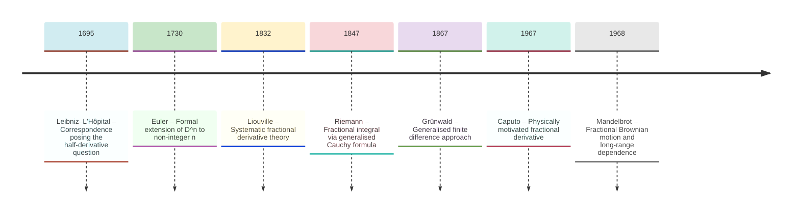
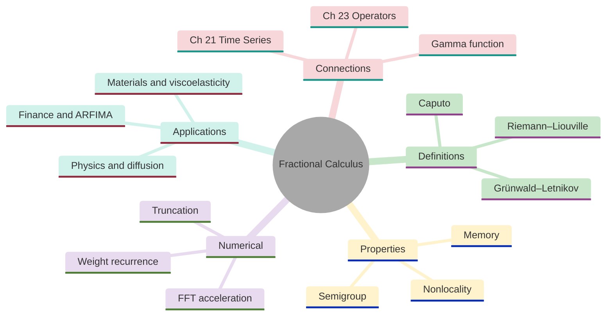
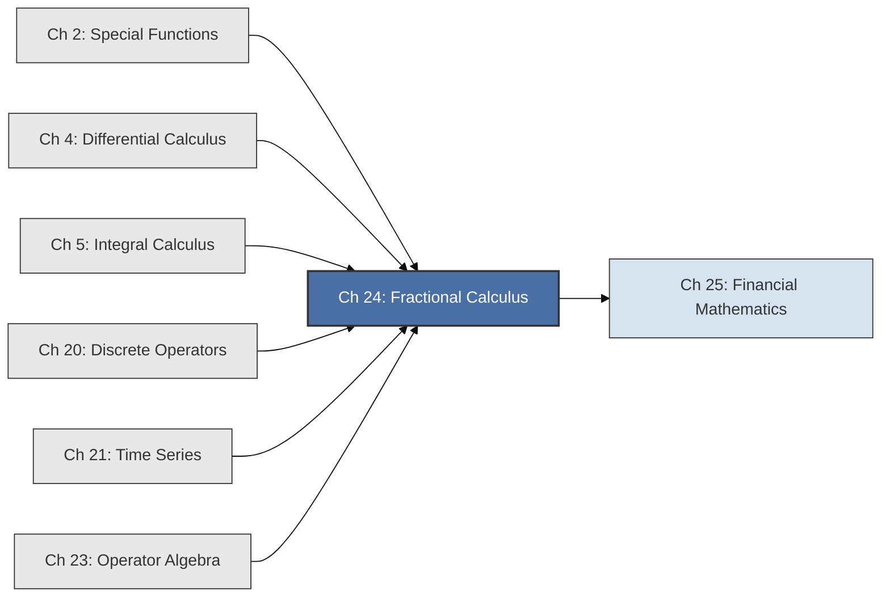
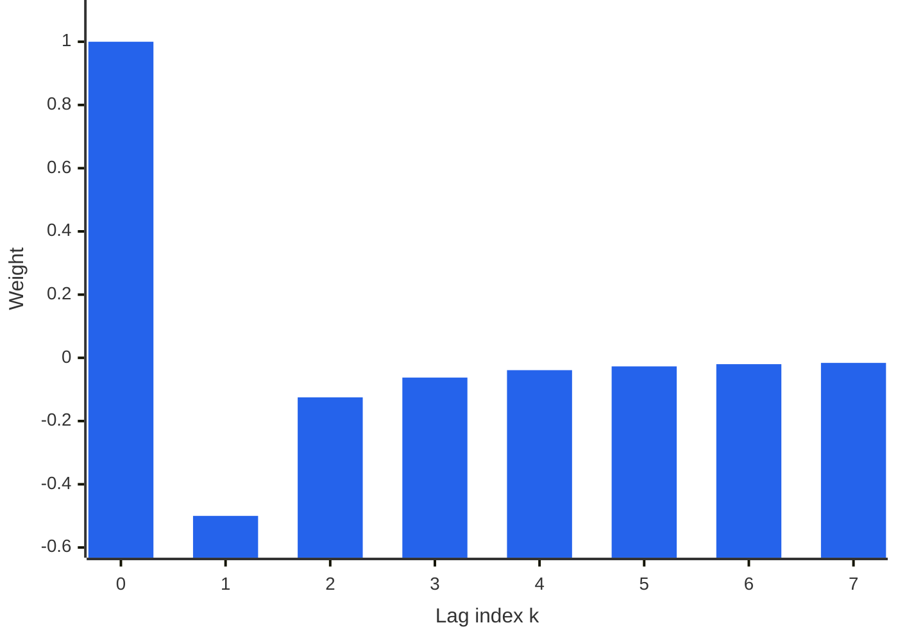

<!-- Copyright (c) 2025-2026 Bob Jansen <bobjansen@pm.me> -->
<!-- SPDX-License-Identifier: CC-BY-NC-4.0 -->
<!-- See LICENSE for full terms. Commercial licensing available. -->
# Chapter 24: Fractional Calculus


**Part VIII**: Operator Theory & Advanced

> Fractional calculus extends the derivative and integral operators to non-integer orders, revealing that differentiation and integration form a continuum rather than a dichotomy. The resulting operators exhibit memory and nonlocality, properties absent from integer-order calculus, making them natural models for phenomena where the present depends on the entire past.

**Prerequisites**: [Chapter 2](02-special-functions.md) (Special Functions); the Gamma function and its properties, particularly the extension of factorial to real arguments. [Chapter 4](04-differential-calculus.md) (Differential Calculus); the derivative as a limit of a difference quotient, the operator notation $D^n$. [Chapter 5](05-integral-calculus.md) (Integral Calculus); the definite integral, the Cauchy formula for iterated integration. [Chapter 20](20-discrete-operators.md) (Discrete Operators); the lag operator $L$ and the difference operator $\Delta = 1 - L$. [Chapter 21](21-time-series.md) (Time Series Analysis); AutoRegressive Integrated Moving Average (ARIMA) models, the lag operator $L$ and differencing, which the fractional difference operator $(1-L)^d$ generalises. [Chapter 23](23-operator-algebra.md) (Operator Algebra); composition of operators, operator polynomials.

**Learning Objectives**: After this chapter, the reader will be able to:

1. Explain what "half a derivative" means and why the Gamma function provides the natural interpolation of integer-order differentiation to real orders.
2. State the Grünwald–Letnikov, Riemann–Liouville and Caputo definitions of fractional derivatives and explain their relationships.
3. Compute Grünwald–Letnikov fractional differences numerically using the weight recurrence.
4. Understand why fractional derivatives are nonlocal (memory effects) and how this distinguishes them from integer-order derivatives.
5. Apply the fractional difference operator $(1-L)^d$ to time series and connect it to long-memory processes (AutoRegressive Fractionally Integrated Moving Average, ARFIMA).
6. Relate the Hurst exponent $H$ to the fractional differencing parameter $d$ and classify time series as persistent, antipersistent or memoryless.

**Connections**: This chapter builds on [Chapter 2](02-special-functions.md) (the Gamma function provides the key interpolation), [Chapter 4](04-differential-calculus.md) (extending the derivative operator beyond integers), [Chapter 5](05-integral-calculus.md) (the Riemann–Liouville integral generalises iterated integration), [Chapter 20](20-discrete-operators.md) (the Grünwald–Letnikov definition generalises finite differences) and [Chapter 23](23-operator-algebra.md) (fractional powers of the differentiation operator). It connects forward to [Chapter 21](21-time-series.md) (Time Series) through ARFIMA models and fractional differencing in finance and to [Chapter 25](25-financial-mathematics.md) (Financial Mathematics) through fractional Brownian motion (fBm) and the link $d = H - 1/2$.

---

## Historical Context

**Key Milestones in Fractional Calculus**



*Figure 24.1: Key milestones in fractional calculus from the Leibniz–L'Hôpital correspondence to Mandelbrot's fractional Brownian motion (fBm).*

**The Leibniz–L'Hôpital correspondence and Euler's formal manipulations (1695–1730).** Gottfried Wilhelm Leibniz received a letter from Guillaume de L'Hôpital on September 30, 1695, asking about his notation $\frac{d^n y}{dx^n}$: "What if $n$ is $1/2$?" Leibniz replied: "It will lead to a paradox, from which one day useful consequences will be drawn." This exchange occurred eleven years after the publication of the differential calculus.

**Euler's extension to non-integer derivative orders (c. 1730).** Leonhard Euler, from around 1730, considered fractional powers of the derivative operator. For exponentials, $D^n e^{ax} = a^n e^{ax}$ holds for integer $n$; the formula remains meaningful for any real exponent: $D^{1/2} e^{ax} = a^{1/2} e^{ax}$. For power functions, $D^n x^m = \frac{m!}{(m-n)!} x^{m-n}$ generalises via the Gamma function to $D^\alpha x^\beta = \frac{\Gamma(\beta+1)}{\Gamma(\beta-\alpha+1)} x^{\beta-\alpha}$. These formal calculations lacked rigorous foundation but demonstrated that a consistent extension might exist.

**Liouville's systematic treatment (1832).** Joseph Liouville was the first to develop fractional calculus as a systematic theory. In memoirs published between 1832 and 1837, he defined fractional derivatives of functions expressible as sums of exponentials: if $f(x) = \sum c_n e^{a_n x}$, then $D^\alpha f(x) = \sum c_n a_n^\alpha e^{a_n x}$. The approach is limited in scope (the $a_n$ must be positive for convergence). It established the principle that fractional differentiation should be consistent with integer-order differentiation and should form a semigroup: $D^\alpha D^\beta = D^{\alpha+\beta}$.

**Riemann's integral formulation (1847).** Bernhard Riemann, in a posthumous manuscript from his student years, approached the problem from the opposite direction. Rather than generalising the derivative, he generalised iterated integration. The Cauchy formula for $n$-fold integration states that $\int_a^x \int_a^{t_1} \cdots \int_a^{t_{n-1}} f(t_n)\,dt_n \cdots dt_1 = \frac{1}{(n-1)!} \int_a^x (x-t)^{n-1} f(t)\,dt$. Replacing $(n-1)!$ with $\Gamma(\alpha)$ and the integer exponent with $\alpha - 1$ yields a fractional integral valid for any $\alpha > 0$. Fractional differentiation of order $\alpha$ can then be defined by first integrating to a fractional order and then differentiating an integer number of times.

**Grünwald (1867) and Letnikov (1868).** Anton Karl Grünwald and Aleksey Vasilievich Letnikov independently generalised the finite difference quotient definition of the derivative. The ordinary first derivative uses two function values; the second uses three; the $n$-th uses $n+1$ values weighted by binomial coefficients with alternating signs. Replacing integer binomial coefficients with their Gamma-function generalisations yields fractional derivatives as limits of generalised difference quotients involving infinitely many past values. This definition makes the memory property visible: the fractional derivative at a point depends on the entire past history of the function. The Grünwald–Letnikov approach is valuable for numerical computation because it reduces fractional differentiation to a weighted sum (a discrete convolution) implementable directly without quadrature.

**Caputo's physically motivated definition (1967).** The Riemann–Liouville definition was the standard formulation for nearly a century. Applied to initial value problems, it produces an awkward complication: initial conditions involve fractional derivatives of the solution, which lack clear physical interpretation. Michele Caputo, an Italian geophysicist studying viscoelastic models of the Earth's interior, proposed a modified definition in 1967. He reversed the order of operations: first differentiate (integer order), then integrate (fractional order). The Caputo derivative has the property that the fractional derivative of a constant is zero. Initial conditions take the familiar form $f(a) = c_0$, $f'(a) = c_1$. This makes the formulation natural for applied problems.

**Fractional-order models in materials science and physics (20th century).** In materials science, fractional-order models capture viscoelastic behaviour (materials with memory) more accurately than integer-order models. The classical spring-dashpot models (Maxwell, Kelvin–Voigt) require complex arrangements to fit experimental data. A single fractional-order element, the "springpot", with two parameters replaces entire networks of integer-order elements. In physics, fractional diffusion equations model anomalous transport in disordered media: the mean-square displacement scales as $\langle x^2 \rangle \sim t^\alpha$ with $\alpha \neq 1$, rather than the classical $\langle x^2 \rangle \sim t$.

**Mandelbrot's fractional Brownian motion and long-range dependence (1968).** Benoît Mandelbrot's work on fractional Brownian motion (1968) showed that asset returns exhibit long-range dependence inconsistent with Markovian assumptions. The Hurst exponent $H \neq 1/2$ signals persistence ($H > 1/2$) or antipersistence ($H < 1/2$) in price increments. Clive Granger and Roselyne Joyeux (1980) and Jonathan Hosking (1981) independently introduced ARFIMA models, which use the fractional difference operator $(1-L)^d$ with non-integer $d$ to capture long memory in time series.

**ARFIMA models and the Hurst exponent (1980–1981).** These models remain central to the analysis of volatility persistence in financial markets, long-range dependence in network traffic and slowly decaying autocorrelations in climate data. The parameter $d$ relates to the Hurst exponent by $H = d + 1/2$ for $d \in (-0.5, 0.5)$ (the stationary long-memory range), connecting the time-domain description (fractional differencing) to the self-similarity description (scaling exponent).

**Modern applications in machine learning and control (21st century).** In machine learning, fractional derivatives appear in fractional-order gradient descent algorithms, where the memory effect allows the optimiser to escape local minima by incorporating information from all previous gradient evaluations. Fractional partial differential equations (PDEs) also appear in image processing (fractional Laplacians for texture-preserving denoising) and control theory (fractional proportional-integral-derivative (PID) controllers for systems with long transients).

---

## Why This Chapter Matters

**Fractional Calculus**



*Figure 24.2: Overview of fractional calculus definitions, properties, numerical methods and applications.*

A fractional derivative of order $\alpha$ at a point $x$ depends on the entire history of the function from $a$ to $x$. This is the nonlocality property (Remark 24.17). Influence decays algebraically via the Grünwald–Letnikov weights $w_k^{(\alpha)}$ rather than vanishing after finitely many terms. This algebraic decay is the signature of long-range dependence observed in financial volatility, network traffic, hydrology and geophysical data. It contrasts with the exponential decay of integer-order autoregressive models. Without fractional calculus, these phenomena require high-order AutoRegressive Moving Average (ARMA) models with many parameters. A single parameter $d$ in the ARFIMA model $(1-L)^d X_t$ (Definition 24.15) captures the entire memory structure.

Fractional differencing is a feature engineering technique of increasing importance for machine learning and data science. Integer differencing ($d = 1$) is the standard approach to achieving stationarity, but it discards long-term memory and can destroy predictive information. Fractional differencing with $d \in (0, 0.5)$ achieves stationarity while preserving memory. The resulting features retain more predictive power for downstream models (gradient-boosted trees, neural networks).

The Grünwald–Letnikov weight recurrence (Theorem 24.5) makes the computation efficient: each weight follows from the previous one by a single multiplication. The weights decay to negligible values after a finite number of terms, enabling truncated approximation. The Hurst exponent ($H = d + 1/2$) summarises a series' long-memory character in a single number. It classifies regimes in financial data: trending when $H > 0.5$, mean-reverting when $H < 0.5$.

In finance and crypto, asset return volatilities exhibit long memory. The autocorrelation of absolute or squared returns decays hyperbolically, not exponentially. ARFIMA models with fractional differencing parameter $d \in (0, 0.5)$ fit this behaviour with a single parameter where traditional ARMA models require high orders. Realised volatility series, order flow imbalance and spread dynamics in both traditional and crypto markets exhibit Hurst exponents different from $0.5$. This indicates persistent or antipersistent behaviour that fractional models capture naturally.

The Caputo fractional derivative (Definition 24.10) and its relationship to the Riemann–Liouville formulation (Theorem 24.12) apply to anomalous diffusion models for option pricing. Under non-Gaussian frameworks, the Mittag–Leffler function replaces the exponential as the fundamental solution.

Fractional calculus models physical systems with memory and hereditary effects that integer-order ordinary differential equations (ODEs) cannot represent. Viscoelastic materials exhibit stress that depends on the entire strain history. Anomalous diffusion in porous media produces particle spread scaling as $t^\alpha$ with $\alpha \neq 1$. The three definitions (Grünwald–Letnikov, Riemann–Liouville and Caputo) give the practitioner a choice of tools depending on context. The semigroup property (Theorem 24.9) ensures that compositions of fractional operators behave consistently.

---

## Notation & Conventions

| Symbol | Meaning |
|--------|---------|
| $D^\alpha$ | Fractional derivative of order $\alpha \in \mathbb{R}$ |
| $J^\alpha$ or $D^{-\alpha}$ | Fractional integral of order $\alpha > 0$ |
| ${}^{RL}D^\alpha$ | Riemann–Liouville fractional derivative |
| ${}^{C}D^\alpha$ | Caputo fractional derivative |
| $\alpha$ | Order of the fractional derivative/integral (real number) |
| $\Gamma(z)$ | Gamma function ([Chapter 2](02-special-functions.md)) |
| $\binom{\alpha}{k}$ | Generalised binomial coefficient for $\alpha \in \mathbb{R}$ |
| $w_k^{(\alpha)}$ | Grünwald–Letnikov weights: $(-1)^k \binom{\alpha}{k}$ |
| $L$ | Lag (backshift) operator: $Lx_t = x_{t-1}$ |
| $(1-L)^d$ | Fractional difference operator for $d \in \mathbb{R}$ |
| $h$ | Step size in the Grünwald–Letnikov approximation |
| $[a, x]$ | Interval of integration in RL/Caputo definitions |
| $E_\alpha(z)$ | Mittag–Leffler function: $\sum_{k=0}^{\infty} z^k / \Gamma(\alpha k + 1)$ |
| $I$ | Identity operator: $If = f$ |

Functions are assumed sufficiently smooth for the relevant operations. The lower terminal $a$ is $0$ unless stated otherwise. Note: $d$ denotes the fractional differencing order; $D^\alpha$ denotes the continuous fractional derivative operator. These are related by $(1-L)^d$ being the discrete analogue of $D^\alpha$ at the appropriate order.

---

## Core Theory

### Motivation: Interpolating Between Derivative Orders

**Remark 24.1** (The derivative as a discrete family). Integer-order differentiation ([Chapter 4](04-differential-calculus.md)) defines a discrete family of operators ([Chapter 23](23-operator-algebra.md)) indexed by $n \in \mathbb{Z}$:

$$D^0 = I, \quad D^1 = \frac{d}{dx}, \quad D^2 = \frac{d^2}{dx^2}, \quad D^{-1} = \int_a^x (\cdot)\,dt, \quad D^{-2} = \int_a^x \int_a^t (\cdot)\,ds\,dt.$$

These operators satisfy the semigroup property $D^m \circ D^n = D^{m+n}$ for integer $m, n$ (under appropriate regularity conditions). The fundamental question of fractional calculus is: can this discrete family be interpolated to a continuous family $\{D^\alpha : \alpha \in \mathbb{R}\}$ preserving the semigroup property and reducing to the standard operators at integer values? Can one define $D^{1/2}$ so that $D^{1/2} \circ D^{1/2} = D^1$?

**Remark 24.2** (The Gamma function as the interpolation mechanism). For power functions, the answer is immediate. The $n$-th derivative of $x^m$ is

$$D^n x^m = \frac{m!}{(m-n)!}\,x^{m-n} = \frac{\Gamma(m+1)}{\Gamma(m-n+1)}\,x^{m-n}.$$

The rightmost expression is defined for any real $n$ (and any $m > -1$), not just integers. This suggests the definition $D^\alpha x^\beta = \frac{\Gamma(\beta+1)}{\Gamma(\beta - \alpha + 1)}\,x^{\beta - \alpha}$ for real $\alpha$. In particular,

$$D^{1/2} x = \frac{\Gamma(2)}{\Gamma(3/2)}\,x^{1/2} = \frac{1}{\frac{\sqrt{\pi}}{2}}\,x^{1/2} = \frac{2}{\sqrt{\pi}}\,\sqrt{x}.$$

The "half-derivative" of $x$ is proportional to $\sqrt{x}$. This is a well-defined function, not a paradox; Leibniz's prediction of "useful consequences" is vindicated.

### The Grünwald–Letnikov Definition

**Definition 24.3** (Grünwald–Letnikov fractional derivative). The *Grünwald–Letnikov (GL) fractional derivative* of order $\alpha \in \mathbb{R}$ is defined as the limit

$$D^\alpha_{\text{GL}} f(x) = \lim_{h \to 0} h^{-\alpha} \sum_{k=0}^{\lfloor (x-a)/h \rfloor} w_k^{(\alpha)} f(x - kh),$$

where the *GL weights* are

$$w_k^{(\alpha)} = (-1)^k \binom{\alpha}{k} = \frac{(-1)^k \Gamma(\alpha + 1)}{k!\,\Gamma(\alpha - k + 1)},$$

and $\binom{\alpha}{k}$ is the generalised binomial coefficient for real $\alpha$.

The GL definition generalises the finite difference quotient. For $\alpha = 1$: $w_0 = 1$, $w_1 = -1$, $w_k = 0$ for $k \geq 2$, recovering $Df(x) = \lim_{h \to 0}(f(x) - f(x-h))/h$.

**Definition 24.4** (GL weights via recurrence). The GL weights $w_k^{(\alpha)}$ can be computed without evaluating Gamma functions using the recurrence

$$w_0^{(\alpha)} = 1, \qquad w_k^{(\alpha)} = w_{k-1}^{(\alpha)} \cdot \frac{k - 1 - \alpha}{k}, \quad k = 1, 2, \ldots$$

This recurrence follows from the identity $(-1)^k\binom{\alpha}{k} = (-1)^{k-1}\binom{\alpha}{k-1} \cdot \frac{\alpha - k + 1}{k}$ with a sign adjustment: the factor $(k - 1 - \alpha)/k$ incorporates the alternating sign. For $0 < \alpha < 1$: $w_0 = 1 > 0$ and $w_k < 0$ for all $k \geq 1$.

**Theorem 24.5** (GL weight recurrence and properties). The GL weights $w_k^{(\alpha)} = (-1)^k\binom{\alpha}{k}$ satisfy the recurrence

$$w_0^{(\alpha)} = 1, \qquad w_k^{(\alpha)} = w_{k-1}^{(\alpha)} \cdot \frac{k - 1 - \alpha}{k},$$

and have the following properties for $\alpha \in (0,1)$:

(a) $w_0^{(\alpha)} = 1 > 0$; $w_k^{(\alpha)} < 0$ for all $k \geq 1$.

(b) $\sum_{k=0}^{\infty} w_k^{(\alpha)} = 0$ (the weights sum to zero, consistent with $(1-1)^\alpha = 0^\alpha = 0$).

(c) Asymptotic decay: $|w_k^{(\alpha)}| \sim \frac{k^{-\alpha-1}}{|\Gamma(-\alpha)|}$ as $k \to \infty$ (algebraic, not exponential, decay).

??? note "Proof"

    *Proof of the recurrence.* The generalised binomial coefficient satisfies $\binom{\alpha}{k} = \frac{\alpha(\alpha-1)\cdots(\alpha-k+1)}{k!}$. Then

    $$\frac{w_k}{w_{k-1}} = \frac{(-1)^k \binom{\alpha}{k}}{(-1)^{k-1}\binom{\alpha}{k-1}} = -\frac{\binom{\alpha}{k}}{\binom{\alpha}{k-1}} = -\frac{\alpha - k + 1}{k}.$$

    Since $0 < \alpha < 1$ and $k \geq 1$: $\alpha - k + 1 \leq \alpha < 1$ for $k = 1$ (so the ratio is $-(\alpha) < 0$, meaning $w_1 < 0$); and for $k \geq 2$, $\alpha - k + 1 < 0$, so the ratio $(-(\alpha-k+1)/k) = (k - 1 - \alpha)/k > 0$, meaning consecutive weights have the same sign. All $w_k < 0$ for $k \geq 1$.

    The asymptotic decay follows from the Stirling approximation: $\Gamma(k - \alpha)/\Gamma(k) \sim k^{-\alpha}$, so $|w_k| = \binom{\alpha}{k} \sim k^{-\alpha-1}/|\Gamma(-\alpha)|$.

    $\square$

### The Riemann–Liouville Definition

**Definition 24.6** (Riemann–Liouville fractional integral). The *Riemann–Liouville (RL) fractional integral* of order $\alpha > 0$ is

$$I^\alpha f(x) = J^\alpha f(x) = \frac{1}{\Gamma(\alpha)} \int_a^x (x - t)^{\alpha - 1} f(t)\,dt,$$

where $a$ is the lower terminal (typically $a = 0$). The kernel $(x-t)^{\alpha-1}$ generalises the $(n-1)$-fold iterated integration formula: for $\alpha = n \in \mathbb{N}$, $I^n f(x) = \frac{1}{(n-1)!}\int_a^x (x-t)^{n-1}f(t)\,dt$, which is the Cauchy formula for $n$-fold integration.

**Definition 24.7** (Riemann–Liouville fractional derivative). The *Riemann–Liouville fractional derivative* of order $\alpha > 0$ is defined by first integrating to order $m - \alpha$ (where $m = \lceil \alpha \rceil$ is the smallest integer greater than or equal to $\alpha$) and then differentiating $m$ times:

$${}^{RL}D^\alpha f(x) = D^m I^{m-\alpha} f(x) = \frac{1}{\Gamma(m - \alpha)} \frac{d^m}{dx^m} \int_a^x (x - t)^{m - \alpha - 1} f(t)\,dt.$$

For $0 < \alpha < 1$ (so $m = 1$):

$${}^{RL}D^\alpha f(x) = \frac{1}{\Gamma(1 - \alpha)} \frac{d}{dx} \int_a^x (x - t)^{-\alpha} f(t)\,dt.$$

**Theorem 24.8** (RL power rule). For $\beta > -1$ and $\alpha > 0$:

$${}^{RL}D^\alpha_a [x^\beta] = \frac{\Gamma(\beta + 1)}{\Gamma(\beta - \alpha + 1)}\,x^{\beta - \alpha}.$$

In particular, ${}^{RL}D^\alpha_0 [1] = \frac{x^{-\alpha}}{\Gamma(1 - \alpha)} \neq 0$ for $0 < \alpha < 1$, which shows that the RL derivative of a constant is non-zero.

!!! abstract "Key Result"

    **Theorem 24.8** (RL power rule). The Riemann–Liouville fractional derivative of $x^\beta$ is $\Gamma(\beta+1)/\Gamma(\beta-\alpha+1) \cdot x^{\beta-\alpha}$, generalising the integer power rule via Gamma-function ratios and revealing that fractional differentiation of a constant is non-zero; a fundamental distinction from classical calculus.

!!! warning "RL derivative of a constant is non-zero"

    For $0 < \alpha < 1$, the Riemann–Liouville derivative of a constant $c$ is $c \cdot x^{-\alpha}/\Gamma(1-\alpha)$, not zero. This means initial conditions for RL fractional differential equations involve fractional derivatives of the solution, which lack direct physical interpretation. The Caputo definition (Definition 24.10) avoids this issue.

??? note "Proof"

    *Proof.* Apply the RL integral first: $I^{m-\alpha}[x^\beta] = \frac{1}{\Gamma(m-\alpha)}\int_0^x (x-t)^{m-\alpha-1}t^\beta\,dt$. Using the substitution $t = xs$ and the Beta function identity $\int_0^1 (1-s)^{m-\alpha-1}s^\beta\,ds = B(m-\alpha, \beta+1) = \frac{\Gamma(m-\alpha)\Gamma(\beta+1)}{\Gamma(m-\alpha+\beta+1)}$, one obtains $I^{m-\alpha}[x^\beta] = \frac{\Gamma(\beta+1)}{\Gamma(\beta+m-\alpha+1)}x^{\beta+m-\alpha}$. Differentiating $m$ times gives the stated formula.

    $\square$

**Theorem 24.9** (Semigroup property of fractional integrals). For $\alpha, \beta > 0$:

$$I^\alpha I^\beta f = I^{\alpha + \beta} f$$

whenever $f$ is locally integrable on $[a, x]$.

??? note "Proof"

    *Proof.* By direct computation using the integral definition and the Beta function. Applying $I^\alpha$ to $I^\beta f$:

    $$I^\alpha(I^\beta f)(x) = \frac{1}{\Gamma(\alpha)\Gamma(\beta)}\int_a^x (x-t)^{\alpha-1}\!\int_a^t (t-s)^{\beta-1}f(s)\,ds\,dt.$$

    Interchange the order of integration (valid by Fubini's theorem for non-negative kernels):

    $$= \frac{1}{\Gamma(\alpha)\Gamma(\beta)}\int_a^x f(s)\!\int_s^x (x-t)^{\alpha-1}(t-s)^{\beta-1}\,dt\,ds.$$

    Substitute $t = s + (x-s)u$ in the inner integral. The inner integral evaluates to $(x-s)^{\alpha+\beta-1}B(\alpha,\beta) = (x-s)^{\alpha+\beta-1}\frac{\Gamma(\alpha)\Gamma(\beta)}{\Gamma(\alpha+\beta)}$.

    The product thus simplifies to

    $$I^\alpha I^\beta f(x) = \frac{1}{\Gamma(\alpha+\beta)}\int_a^x (x-s)^{\alpha+\beta-1}f(s)\,ds = I^{\alpha+\beta}f(x).$$

    $\square$

### The Caputo Definition

**Definition 24.10** (Caputo fractional derivative). The *Caputo fractional derivative* of order $\alpha > 0$ (with $m = \lceil \alpha \rceil$) is defined by first differentiating $m$ times (integer-order) and then integrating to order $m - \alpha$:

$${}^C D^\alpha f(x) = I^{m-\alpha} D^m f(x) = \frac{1}{\Gamma(m - \alpha)} \int_a^x (x - t)^{m - \alpha - 1} f^{(m)}(t)\,dt.$$

For $0 < \alpha < 1$ (so $m = 1$):

$${}^C D^\alpha f(x) = \frac{1}{\Gamma(1 - \alpha)} \int_a^x (x - t)^{-\alpha} f'(t)\,dt.$$

The key property is that ${}^C D^\alpha [c] = 0$ for any constant $c$, since $c' = 0$. This makes initial conditions take the standard form $f(a) = c_0$, $f'(a) = c_1$, etc., matching integer-order ODE practice.

**Theorem 24.11** (Caputo power rule). For $\beta > m - 1$ and $\alpha > 0$ (with $m = \lceil \alpha \rceil$):

$${}^C D^\alpha_a [x^\beta] = \frac{\Gamma(\beta + 1)}{\Gamma(\beta - \alpha + 1)}\,x^{\beta - \alpha}, \quad \beta \geq m.$$

For $\beta = 0, 1, \ldots, m - 1$ (integer powers below $m$): ${}^C D^\alpha_a [x^j] = 0$.

**Theorem 24.12** (Relationship between Caputo and Riemann–Liouville). For $0 < \alpha < 1$ and sufficiently regular $f$:

$${}^C D^\alpha f(x) = {}^{RL} D^\alpha f(x) - \frac{f(a)}{\Gamma(1 - \alpha)}(x - a)^{-\alpha}.$$

The two definitions agree when $f(a) = 0$. More generally, the Caputo derivative subtracts from the RL derivative a term that accounts for the initial value; this is why Caputo initial conditions are natural.

!!! info "Choosing between Caputo and Riemann–Liouville"

    For initial value problems in applied settings (viscoelastic modelling, anomalous diffusion, control), the Caputo definition is standard because its initial conditions match the integer-order form. The RL definition is preferred in pure analysis and when $f(a) = 0$, since it arises more naturally from the fractional integral. Both definitions agree on functions vanishing at the lower terminal.

??? note "Proof"

    *Proof.* For $0 < \alpha < 1$, using the RL definition and integration by parts:

    $${}^{RL}D^\alpha f(x) = \frac{1}{\Gamma(1-\alpha)}\frac{d}{dx}\int_a^x (x-t)^{-\alpha}f(t)\,dt.$$

    Write $f(t) = f(a) + \int_a^t f'(s)\,ds$ and substitute:

    $${}^{RL}D^\alpha f(x) = \frac{f(a)}{\Gamma(1-\alpha)}\frac{d}{dx}\int_a^x (x-t)^{-\alpha}\,dt + \frac{1}{\Gamma(1-\alpha)}\frac{d}{dx}\int_a^x (x-t)^{-\alpha}\!\int_a^t f'(s)\,ds\,dt.$$

    The first term gives $\frac{f(a)}{\Gamma(1-\alpha)}\frac{d}{dx}\left[\frac{(x-a)^{1-\alpha}}{1-\alpha}\right] = \frac{f(a)}{\Gamma(1-\alpha)}(x-a)^{-\alpha}$.

    By Theorem 24.9 and a Fubini interchange, the second term equals ${}^C D^\alpha f(x)$.

    Rearranging gives the stated identity.

    $\square$

**Theorem 24.13** (Laplace transform of the Caputo derivative). For $n - 1 < \alpha \leq n$ and $f$ with Laplace transform $F(s) = \mathcal{L}\{f\}(s)$:

$$\mathcal{L}\{{}^C D^\alpha_0 f\}(s) = s^\alpha F(s) - \sum_{k=0}^{n-1} s^{\alpha - 1 - k} f^{(k)}(0).$$

For $0 < \alpha \leq 1$ (so $n = 1$): $\mathcal{L}\{{}^C D^\alpha_0 f\}(s) = s^\alpha F(s) - s^{\alpha - 1} f(0)$.

??? note "Derivation"

    *Derivation.* Recall that ${}^C D^\alpha f = I^{n-\alpha} D^n f$ where $I^{n-\alpha}$ is the RL integral of order $n - \alpha$. The Laplace transform of a RL integral of order $\beta$ is $\mathcal{L}\{I^\beta g\}(s) = s^{-\beta}G(s)$. Using this and the standard Laplace transform of the $n$-th derivative,

    $$\mathcal{L}\{D^n f\}(s) = s^n F(s) - \sum_{k=0}^{n-1} s^{n-1-k} f^{(k)}(0),$$

    one obtains

    $$\mathcal{L}\{{}^C D^\alpha f\}(s) = s^{-(n-\alpha)}\!\left(s^n F(s) - \sum_{k=0}^{n-1}s^{n-1-k}f^{(k)}(0)\right) = s^\alpha F(s) - \sum_{k=0}^{n-1}s^{\alpha-1-k}f^{(k)}(0).$$

    $\square$

**Remark 24.14** (Comparison with integer order). For $\alpha = n$ (integer), the Laplace transform formula reduces to the standard $\mathcal{L}\{f^{(n)}\}(s) = s^n F(s) - \sum_{k=0}^{n-1}s^{n-1-k}f^{(k)}(0)$, confirming consistency.

### The Fractional Difference Operator

**Definition 24.15** (Fractional difference operator). The *fractional difference operator* of order $d \in \mathbb{R}$ is defined by the binomial series in the lag operator $L$:

$$(1 - L)^d x_t = \sum_{k=0}^{\infty} w_k^{(d)} x_{t-k},$$

where $w_k^{(d)} = (-1)^k\binom{d}{k}$ are the GL weights of order $d$. This is the discrete-time analogue of the continuous fractional derivative $D^d$.

For $d \in (0, 1)$: the operator achieves a degree of differencing intermediate between the identity ($d = 0$) and the first difference ($d = 1$), preserving long-range dependence while removing the unit root.

**Remark 24.16** (ARFIMA and long memory). The ARFIMA($p, d, q$) model applies the fractional difference operator $(1-L)^d$ to an ARMA($p, q$) process:

$$\phi(L)(1-L)^d X_t = \theta(L)\varepsilon_t, \quad \varepsilon_t \sim \operatorname{WN}(0, \sigma^2),$$

where $\operatorname{WN}$ denotes white noise. For $d \in (-0.5, 0.5)$, the resulting process is stationary with autocorrelations $\rho(h) \sim C h^{2d-1}$ decaying hyperbolically. For $d = 0$, the process reduces to ARMA; for $d = 1$, to a standard ARIMA with integer differencing.

**Remark 24.17** (Nonlocality). The GL weights $w_k^{(d)}$ are nonzero for all $k \geq 0$ when $d$ is non-integer. The quantity $(1-L)^d x_t$ therefore depends on the entire past history $\{x_t, x_{t-1}, x_{t-2}, \ldots\}$, not just finitely many past values. This is the discrete manifestation of the nonlocality (memory) property of fractional derivatives.

---

## Formulas & Identities

**F24.1** GL weight recurrence, for $k \geq 1$.

$$w_0^{(\alpha)} = 1, \qquad w_k^{(\alpha)} = w_{k-1}^{(\alpha)} \cdot \frac{k - 1 - \alpha}{k}$$

**F24.2** RL fractional integral, for $\alpha > 0$.

$$J^\alpha f(x) = \frac{1}{\Gamma(\alpha)} \int_a^x (x-t)^{\alpha-1} f(t)\,dt$$

**F24.3** RL derivative of power, for $\beta > -1$.

$$D^\alpha x^\beta = \frac{\Gamma(\beta+1)}{\Gamma(\beta-\alpha+1)} x^{\beta-\alpha}$$

**F24.4** Caputo-to-RL relation, for $0 < \alpha < 1$.

$${}^C D^\alpha f = {}^{RL} D^\alpha f - \frac{f(a)}{\Gamma(1-\alpha)}(x-a)^{-\alpha}$$

**F24.5** Fractional difference, for $d \in \mathbb{R}$.

$$(1-L)^d x_t = \sum_{k=0}^{\infty} w_k^{(d)} x_{t-k}$$

**F24.6** Hurst-to-$d$ relation, for $d \in (-0.5, 0.5)$.

$$H = d + 1/2$$

---

## Algorithms

### Algorithm 24.18: Grünwald–Letnikov Weight Computation

The weight recurrence from Theorem 24.5 provides an efficient and numerically stable method for computing GL weights.

**Input**: Fractional order $\alpha \in \mathbb{R}$ and number of weights $n \geq 1$.

**Output**: Array $w[0..n-1]$ of Grünwald–Letnikov weights $w_k^{(\alpha)} = (-1)^k \binom{\alpha}{k}$.

```
FUNCTION GL_WEIGHTS(alpha, n):
    w[0] ← 1
    FOR k ← 1 TO n - 1:
        w[k] ← w[k - 1] * (k - 1 - alpha) / k
    RETURN w[0..n-1]
```

**Complexity**: $O(n)$ time, $O(n)$ space. No Gamma function evaluations required.

**Numerical behaviour**: For $\alpha \in (0, 1)$, the first weight $w_0 = 1$ is positive and all subsequent weights $w_k$ ($k \geq 1$) are negative, decaying as $|w_k| \sim k^{-\alpha-1}/|\Gamma(-\alpha)|$. For $\alpha = 0.5$, the first few weights are $w_0 = 1$, $w_1 = -0.5$, $w_2 = -0.125$, $w_3 = -0.0625$, $w_4 \approx -0.0391$.

### Algorithm 24.19: Grünwald–Letnikov Fractional Difference

Given a discrete signal (time series) $\{x_0, x_1, \ldots, x_{T-1}\}$ and a fractional order $\alpha$, compute the fractional difference approximation.

**Input**: A discrete signal $x[0..T-1]$ of length $T$, fractional order $\alpha \in \mathbb{R}$ and truncation window $W \leq T - 1$.

**Output**: The fractionally differenced signal $y[0..T-1]$, where $y_t \approx \sum_{k=0}^{\min(t,W)} w_k^{(\alpha)} x_{t-k}$.

```
FUNCTION GL_FRAC_DIFF(x[0..T-1], alpha, W):
    // Step 1: Compute GL weights (truncated to window W)
    w[0..W] ← GL_WEIGHTS(alpha, W + 1)

    // Step 2: Apply fractional difference as convolution
    FOR t ← 0 TO T - 1:
        y[t] ← 0
        FOR k ← 0 TO min(t, W):
            y[t] ← y[t] + w[k] * x[t - k]

    RETURN y[0..T-1]
```

**Complexity**: $O(TW)$ time (truncated convolution), $O(W)$ space for weights. Without truncation ($W = T-1$), the cost is $O(T^2)$.

**Truncated version**: In practice, the GL weights decay algebraically and one may truncate the sum at some window $W \ll T$ when $|w_W| < \varepsilon$ for a prescribed tolerance. This reduces complexity to $O(TW)$ while introducing a controlled approximation error.

### Algorithm 24.20: Riemann–Liouville Fractional Integral (Numerical)

For numerical evaluation of the RL fractional integral ([Chapter 5](05-integral-calculus.md)) $J^\alpha f(x) = \frac{1}{\Gamma(\alpha)} \int_a^x (x-t)^{\alpha-1} f(t)\,dt$, use the product-trapezoidal rule on a uniform grid.

**Input**: A function $f$, fractional order $\alpha > 0$, lower terminal $a$, evaluation point $x > a$ and number of subintervals $N \geq 1$.

**Output**: A numerical approximation of $J^\alpha f(x) = \frac{1}{\Gamma(\alpha)} \int_a^x (x-t)^{\alpha-1} f(t)\,dt$.

```
FUNCTION RL_FRAC_INTEGRAL(f, alpha, a, x, N):
    // Discretise [a, x] into N subintervals
    h ← (x - a) / N

    // Compute product-trapezoidal quadrature weights
    // The weights absorb the singular kernel (x - t)^{alpha - 1}
    FOR j ← 0 TO N:
        // Integrate the kernel over each subinterval analytically
        IF j = 0:
            c[j] ← ((N * h)^alpha - ((N - 0.5) * h)^alpha) / alpha
        ELSE IF j = N:
            c[j] ← (0.5 * h)^alpha / alpha
        ELSE:
            c[j] ← (((N - j + 0.5) * h)^alpha - ((N - j - 0.5) * h)^alpha) / alpha

    // Evaluate the weighted sum
    S ← 0
    FOR j ← 0 TO N:
        t_j ← a + j * h
        S ← S + c[j] * f(t_j)

    RETURN S / Gamma(alpha)
```

**Complexity**: $O(N)$ time, $O(N)$ space.

**Note**: The kernel $(x-t)^{\alpha-1}$ is singular at $t = x$ when $0 < \alpha < 1$. The product-trapezoidal rule handles this by absorbing the singularity into the quadrature weights. More sophisticated methods (Gauss–Jacobi quadrature, graded meshes) provide better accuracy near the singularity.

---

## Numerical Considerations

**Truncation of the GL sum.** In practice, the infinite GL sum must be truncated to $N$ terms. The truncation error is bounded by

$$\left|\sum_{k=N+1}^{\infty} w_k^{(\alpha)} f(x-kh)\right| \leq \|f\|_\infty \sum_{k=N+1}^{\infty} \lvert w_k^{(\alpha)} \rvert.$$

Since $\lvert w_k^{(\alpha)} \rvert \sim k^{-\alpha-1}/\lvert\Gamma(-\alpha)\rvert$ for large $k$, the tail sum converges but slowly (algebraically). For $\alpha = 0.5$, attaining $10^{-4}$ relative accuracy requires approximately $N \sim 10^4$ terms. This motivates the "short memory" principle: truncate at $N$ terms and accept the resulting bias, which is usually small for well-behaved functions.

!!! warning "Algebraic versus exponential convergence"

    GL weight magnitudes decay as $k^{-\alpha-1}$, not exponentially. Truncating to $N$ terms introduces bias that shrinks only algebraically in $N$. For small $\alpha$ (near zero) the decay is especially slow: $\alpha = 0.1$ requires roughly $N \sim 10^{10}$ terms for $10^{-1}$ accuracy in the tail sum. Always verify that the chosen window size is adequate for the target tolerance.

**Step size selection.** The GL approximation error has two components: the truncation error (from finite $N$) and the discretisation error (from finite $h$). For smooth functions, the discretisation error is $O(h)$. Richardson extrapolation (computing the approximation at step sizes $h$ and $h/2$ and combining) can improve accuracy to $O(h^2)$.

**Singular kernels.** The RL integral kernel $(x-t)^{\alpha-1}$ is singular at $t = x$ for $0 < \alpha < 1$. Standard quadrature (trapezoidal, Simpson) loses accuracy near the singularity. Remedies include: graded meshes (concentrating grid points near $t = x$), product integration (analytically integrating the singular factor and numerically handling the smooth part) or Gauss–Jacobi quadrature tailored to the weight $(x-t)^{\alpha-1}$.

**Overflow and underflow.** For large arguments, $\Gamma(\beta+1)/\Gamma(\beta-\alpha+1)$ can overflow or underflow. Use log-Gamma arithmetic: compute $\ln\Gamma(\beta+1) - \ln\Gamma(\beta-\alpha+1)$ and exponentiate. The `lnGamma` function from [Chapter 2](02-special-functions.md) is necessary here.

!!! tip "Prefer the GL weight recurrence over direct Gamma evaluation"

    The recurrence $w_k = w_{k-1} \cdot (k-1-\alpha)/k$ (Theorem 24.5) avoids Gamma function calls entirely. Each step is a single multiply and divide, producing no overflow for any $k$. Reserve direct $\Gamma(\beta+1)/\Gamma(\beta-\alpha+1)$ evaluation for the RL power rule (Theorem 24.8); apply log-Gamma arithmetic there.

**Convergence order.** The GL approximation with step size $h$ and $N = \lfloor (x-a)/h \rfloor$ terms converges to the exact fractional derivative at rate $O(h)$ for functions with bounded first derivative. Specifically, if $f \in C^1[a, x]$, then

$$\left\lvert D^\alpha_{GL,h} f(x) - D^\alpha f(x) \right\rvert \leq C \cdot h \cdot \|f'\|_\infty$$

for a constant $C$ depending on $\alpha$ and the interval length. Higher-order approximations are possible: the shifted Grünwald–Letnikov formula (Meerschaert and Tadjeran, 2004) replaces $f(x - kh)$ with $f(x - (k-p)h)$ for a suitable shift $p$, achieving second-order convergence $O(h^2)$.

**Practical guidelines for implementation:**

1. *Window size*: For a tolerance $\varepsilon$, truncate at $N$ where $|w_N^{(\alpha)}| / |w_0^{(\alpha)}| < \varepsilon$. Since $|w_k| \sim k^{-\alpha-1}/|\Gamma(-\alpha)|$, this gives $N \sim \varepsilon^{-1/(\alpha+1)}$.
2. *Memory-efficient streaming*: For real-time applications, maintain a circular buffer of the last $N$ values and compute the fractional difference incrementally.
3. *Fast Fourier Transform acceleration*: The GL fractional difference is a convolution and can be computed in $O(T \log T)$ time using the Fast Fourier Transform, rather than $O(T^2)$ with direct summation.

---

## Worked Examples

### Example 24.21: Half-derivative of $x^2$

Compute $D^{1/2} x^2$ using Theorem 24.8.

*Solution.* Apply ${}^{RL}D^\alpha_0 x^\beta = \frac{\Gamma(\beta+1)}{\Gamma(\beta-\alpha+1)} x^{\beta-\alpha}$ with $\alpha = 1/2$, $\beta = 2$:

$$D^{1/2} x^2 = \frac{\Gamma(3)}{\Gamma(5/2)}\,x^{3/2} = \frac{2!}{\frac{3}{2} \cdot \frac{1}{2} \cdot \Gamma(1/2)}\,x^{3/2} = \frac{2}{\frac{3\sqrt{\pi}}{4}}\,x^{3/2} = \frac{8}{3\sqrt{\pi}}\,x^{3/2}.$$

Verification: $\Gamma(5/2) = \frac{3}{2}\Gamma(3/2) = \frac{3}{2} \cdot \frac{\sqrt{\pi}}{2} = \frac{3\sqrt{\pi}}{4}$, so $D^{1/2} x^2 = \frac{2}{3\sqrt{\pi}/4}\,x^{3/2} = \frac{8}{3\sqrt{\pi}}\,x^{3/2} \approx 1.5045\,x^{3/2}$.

### Example 24.22: GL approximation of $D^{1/2} x$ at $x = 1$

Approximate $D^{1/2} f(x)$ at $x = 1$ for $f(x) = x$, using $h = 0.1$ and $N = 10$ terms.

*Solution.* With $h = 0.1$, $\alpha = 0.5$, the GL approximation is

$$D^{1/2}_{GL} f(1) \approx h^{-1/2} \sum_{k=0}^{10} w_k^{(0.5)} f(1 - 0.1k).$$

Compute weights via recurrence:

$$\begin{aligned}
w_0 &= 1, \\
w_1 &= 1 \cdot (1 - 1.5/1) = -0.5, \\
w_2 &= -0.5 \cdot (1 - 1.5/2) = -0.5 \cdot 0.25 = -0.125, \\
w_3 &= -0.125 \cdot (1 - 1.5/3) = -0.125 \cdot 0.5 = -0.0625,
\end{aligned}$$

and so on.

Function values: $f(1) = 1$, $f(0.9) = 0.9$, $f(0.8) = 0.8$, ..., $f(0) = 0$.

The weighted sum is

$$\sum_{k=0}^{10} w_k \cdot (1 - 0.1k) = 1 \cdot 1 + (-0.5)(0.9) + (-0.125)(0.8) + \cdots$$

Numerically, this evaluates to approximately $0.3395$. Multiplying by $h^{-1/2} = (0.1)^{-0.5} = \sqrt{10} \approx 3.1623$:

$$D^{1/2}_{GL} f(1) \approx 3.1623 \times 0.3395 \approx 1.073.$$

The exact value is $\frac{2}{\sqrt{\pi}} \approx 1.1284$. The relative error is about $4.9\%$; acceptable for $N = 10$ and improving as $N \to \infty$.

### Example 24.23: Fractional differencing of a constant series

Let $x_t = c$ for all $t$. Compute $(1-L)^d x_t$ for $d = 0.4$.

*Solution.*

$$(1-L)^d x_t = \sum_{k=0}^{\infty} w_k^{(d)} x_{t-k} = c \sum_{k=0}^{\infty} w_k^{(d)}.$$

The sum of all GL weights is $(1-1)^d = 0^d$. For $d > 0$, this equals $0$. $(1-L)^d c$ therefore equals $0$ for $d > 0$, confirming that fractional differencing (like integer differencing) annihilates constants. In practice, for a finite series with $t$ observations, $(1-L)^d x_t = c \sum_{k=0}^{t} w_k^{(d)}$, which converges to $0$ as $t \to \infty$ but is nonzero for finite $t$; this is the startup transient.

### Example 24.24: Composition verification: $D^{0.3} \circ D^{0.7} x^2$ vs $D^1 x^2$

Verify the semigroup property on a specific function.

*Solution.* First compute $D^{0.7} x^2$:

$$D^{0.7} x^2 = \frac{\Gamma(3)}{\Gamma(2.3)}\,x^{1.3} = \frac{2}{\Gamma(2.3)}\,x^{1.3}.$$

Using $\Gamma(2.3) = 1.3 \cdot \Gamma(1.3) \approx 1.3 \times 0.8975 \approx 1.1667$,

$$D^{0.7} x^2 \approx \frac{2}{1.1667}\,x^{1.3} \approx 1.7143\,x^{1.3}.$$

Now apply $D^{0.3}$:

$$D^{0.3}(1.7143\,x^{1.3}) = 1.7143 \cdot \frac{\Gamma(2.3)}{\Gamma(2.0)}\,x^{1.0} = 1.7143 \cdot \frac{1.1667}{1}\,x = 2.0\,x.$$

Compare with $D^1 x^2 = 2x$. The composition yields the correct result: $D^{0.3} \circ D^{0.7} x^2 = D^{1.0} x^2 = 2x$, confirming the semigroup property for this case. (This holds here because $x^2$ vanishes at the origin together with its first derivative terms that would otherwise generate boundary corrections.)

---

## Connections

**Chapter Dependencies**



*Figure 24.3: Chapter dependencies showing prerequisites and downstream connections for fractional calculus.*

### Within This Book

- **[Chapter 2](02-special-functions.md) (Special Functions)** supplies the Gamma function (extending factorial to real arguments), the Beta function (semigroup property proof) and the Mittag–Leffler function (eigenfunction of the Caputo derivative).

- **[Chapter 4](04-differential-calculus.md) (Differential Calculus)** defines $D^n$, the integer-order special case. The difference-quotient definition of $D^1$ generalises directly to the Grünwald–Letnikov definition of $D^\alpha$.

- **[Chapter 5](05-integral-calculus.md) (Integral Calculus)** provides the Cauchy formula for iterated integration, the starting point for the Riemann–Liouville fractional integral (Definition 24.6).

- **[Chapter 20](20-discrete-operators.md) (Discrete Operators)** defines the lag operator $L$ and difference operator $\Delta = 1 - L$. The fractional difference $(1-L)^d$ (Definition 24.15) generalises $\Delta^n$ to non-integer $d$.

- **[Chapter 23](23-operator-algebra.md) (Operator Algebra)** provides the algebraic framework. The semigroup property $D^\alpha \circ D^\beta = D^{\alpha+\beta}$ is the composition law.

- **[Chapter 21](21-time-series.md) (Time Series)** uses $(1-L)^d$ in ARFIMA models. The GL weights provide the computational mechanism for fractional differencing.

- **[Chapter 25](25-financial-mathematics.md) (Financial Mathematics)** uses fractional Brownian motion with $H \neq 1/2$. The connection $d = H - 1/2$ links ARFIMA to the self-similarity exponent.

### Applications

- **Viscoelastic materials**: Fractional-order constitutive laws (the "springpot" element) model materials with power-law creep and relaxation using fewer parameters than integer-order spring-dashpot networks.

- **Anomalous diffusion**: Fractional diffusion equations with $\langle x^2 \rangle \sim t^\alpha$, $\alpha \neq 1$, model sub-diffusion in crowded biological environments and super-diffusion in turbulent flows.

- **Volatility modelling**: Long-memory models (ARFIMA, fractional stochastic volatility) capture the slow decay of autocorrelation observed in realised variance and absolute returns of financial assets.

- **Control systems**: Fractional PID controllers provide additional tuning flexibility for systems with long transients, improving stability margins compared to integer-order controllers.

---

## Summary

- Fractional calculus extends derivatives and integrals to non-integer orders, with the Gamma function $\Gamma(\alpha)$ providing the natural interpolation between integer-order operations.
- The Grünwald–Letnikov definition generalises finite differences to real order $\alpha$ using weights $w_k^{(\alpha)} = (-1)^k\binom{\alpha}{k}$ computable via a simple recurrence.
- The Riemann–Liouville and Caputo definitions agree for functions vanishing at the origin; the Caputo form admits standard initial conditions, making it preferred for physical modelling.
- Fractional derivatives are inherently nonlocal: the value at a point depends on the entire history of the function, producing memory effects absent from integer-order calculus.
- The fractional difference operator $(1 - L)^d$ for non-integer $d$ defines ARFIMA models for long-memory time series, with the Hurst exponent related by $d = H - 1/2$.

---

## Exercises

### Routine

**Exercise 24.1.** Compute $D^{1/3} x^2$ using Theorem 24.8. Express the result in terms of $\Gamma$ values and simplify numerically.

**Exercise 24.2.** Show that the GL weights for $\alpha = 1$ reduce to the standard first-difference coefficients: $w_0 = 1$, $w_1 = -1$, $w_k = 0$ for $k \geq 2$. Then verify that $\alpha = 2$ gives $w_0 = 1$, $w_1 = -2$, $w_2 = 1$, $w_k = 0$ for $k \geq 3$.

**Exercise 24.3.** Implement the GL weight recurrence and compute the first 20 weights for $\alpha = 0.4$. Plot $|w_k|$ on a log-log scale and verify the asymptotic decay $|w_k| \sim C \cdot k^{-1.4}$.

### Intermediate

**Exercise 24.4.** Prove that ${}^C D^\alpha_a [c] = 0$ for any constant $c$ directly from Definition 24.10, without using Theorem 24.12.

**Exercise 24.5.** Compute ${}^{RL}D^{1/2}_0 [1]$ and verify that it equals $\frac{1}{\Gamma(1/2)}\,x^{-1/2} = \frac{1}{\sqrt{\pi x}}$. Discuss why this non-zero result for a constant makes the RL definition awkward for initial value problems.

**Exercise 24.6.** Generate 1000 samples from a random walk $x_t = x_{t-1} + \varepsilon_t$ with $\varepsilon_t \sim N(0,1)$. Apply the fractional difference operator $(1-L)^d$ with $d = 0.5$ and $d = 1.0$. Compare the autocorrelation functions of the original series, the $d=0.5$ differenced series and the $d=1.0$ differenced series. What is observed about stationarity?

### Challenging

**Exercise 24.7.** Verify the semigroup property numerically: for $f(x) = x^3$ on $[0, 2]$, compute $D^{0.4}(D^{0.6} f)(x)$ and $D^{1.0} f(x)$ at $x = 1$ using the GL approximation with $h = 0.01$. How close are the two values?

**Exercise 24.8.** (Challenging.) The Mittag–Leffler function $E_\alpha(z) = \sum_{k=0}^{\infty} \frac{z^k}{\Gamma(\alpha k + 1)}$ plays the role in fractional calculus that $e^z$ plays in integer-order calculus. Show that ${}^C D^\alpha_0 [E_\alpha(\lambda x^\alpha)] = \lambda E_\alpha(\lambda x^\alpha)$, i.e., the Mittag–Leffler function is an eigenfunction of the Caputo derivative. (Hint: apply Definition 24.10 term-by-term and use Theorem 24.11.)

---

## References

### Textbooks

[1] Kilbas, A.A., Srivastava, H.M. and Trujillo, J.J. *Theory and Applications of Fractional Differential Equations*, 1st ed. Elsevier, 2006. Thorough modern treatment.

[2] Miller, K.S. and Ross, B. *An Introduction to the Fractional Calculus and Fractional Differential Equations*, 1st ed. Wiley, 1993. Accessible introduction emphasising the Riemann–Liouville approach.

[3] Oldham, K.B. and Spanier, J. *The Fractional Calculus: Theory and Applications of Differentiation and Integration to Arbitrary Order*, 1st ed. Academic Press, 1974. The first textbook on fractional calculus.

[4] Podlubny, I. *Fractional Differential Equations*, 1st ed. Academic Press, 1999. Covers theory, numerical methods and applications including the Caputo and RL formulations.

[5] Samko, S.G., Kilbas, A.A. and Marichev, O.I. *Fractional Integrals and Derivatives: Theory and Applications*, 1st ed. Gordon and Breach, 1993. Broad reference covering existence, uniqueness and mapping properties; originally in Russian, 1987.

### Historical

[6] Leibniz, G.W. Letter to L'Hôpital, 30 September 1695. Reproduced in Leibniz, *Mathematische Schriften*, vol. 2, ed. C.I. Gerhardt, 1849, pp. 301–302. The correspondence posing the half-derivative question.

[7] Euler, L. "De progressionibus transcendentibus seu quarum termini generales algebraice dari nequeunt." *Commentarii Academiae Scientiarum Petropolitanae* 5 (1738): 36–57. Formal extension of the derivative operator to non-integer orders via the Gamma function.

[8] Liouville, J. "Mémoire sur quelques questions de géométrie et de mécanique, et sur un nouveau genre de calcul pour résoudre ces questions." *Journal de l'École Polytechnique* 13(21) (1832): 1–69. First systematic treatment of fractional derivatives for exponential-class functions.

[9] Riemann, B. "Versuch einer allgemeinen Auffassung der Integration und Differentiation." In *Gesammelte Mathematische Werke*, ed. H. Weber, 1876, pp. 331–344. Posthumous manuscript (written c. 1847) defining the fractional integral via the generalised Cauchy formula.

[10] Grünwald, A.K. "Über 'begrenzte' Derivationen und deren Anwendung." *Zeitschrift für Mathematik und Physik* 12 (1867): 441–480. Generalisation of the finite difference quotient to non-integer order.

[11] Letnikov, A.V. "Theory of differentiation with an arbitrary index." *Matematicheskii Sbornik* 3 (1868): 1–68. (In Russian.) Independent derivation of the generalised difference quotient approach.

[12] Caputo, M. "Linear Models of Dissipation Whose Q Is Almost Frequency Independent – II." *Geophysical Journal of the Royal Astronomical Society* 13(5) (1967): 529–539. Introduction of the Caputo fractional derivative for viscoelastic models.

[13] Mandelbrot, B.B. and Van Ness, J.W. "Fractional Brownian Motions, Fractional Noises and Applications." *SIAM Review* 10(4) (1968): 422–437. Fractional Brownian motion and long-range dependence.

[14] Granger, C.W.J. and Joyeux, R. "An Introduction to Long-Memory Time Series Models and Fractional Differencing." *Journal of Time Series Analysis* 1(1) (1980): 15–29. Introduction of fractional differencing for time series.

[15] Hosking, J.R.M. "Fractional Differencing." *Biometrika* 68(1) (1981): 165–176. Introduction of ARFIMA models.

[16] Meerschaert, M.M. and Tadjeran, C. "Finite Difference Approximations for Fractional Advection-Dispersion Flow Equations." *Journal of Computational and Applied Mathematics* 172(1) (2004): 65–77. The shifted Grünwald–Letnikov formula achieving second-order convergence.

### Surveys

[17] Gorenflo, R. and Mainardi, F. "Fractional Calculus: Integral and Differential Equations of Fractional Order." In *Fractals and Fractional Calculus in Continuum Mechanics*, Springer, 1997, pp. 223–276. Survey connecting GL, RL and Caputo definitions.

### Online Resources

[18] Wolfram MathWorld: Fractional Calculus. https://mathworld.wolfram.com/FractionalCalculus.html

---

## Glossary

- **ARFIMA**: AutoRegressive Fractionally Integrated Moving Average model; uses $(1-L)^d$ with $d \in (-0.5, 0.5)$ to capture long memory in stationary time series.
- **Caputo definition**: Fractional derivative defined by first differentiating $n$ times, then applying a fractional integral $J^{n-\alpha}$; preferred for initial value problems because the derivative of a constant is zero.
- **Fractional derivative**: A derivative of non-integer order $\alpha \in \mathbb{R}$, extending the discrete family $D^0, D^1, D^2, \ldots$ to a continuous one-parameter family $D^\alpha$.
- **Fractional difference operator**: The operator $(1-L)^d$ for non-integer $d$, defined by the binomial series in the lag operator $L$; the discrete-time analogue of continuous fractional differentiation.
- **Fractional integral**: The Riemann–Liouville integral $J^\alpha f(x) = \frac{1}{\Gamma(\alpha)} \int_a^x (x-t)^{\alpha-1} f(t)\,dt$, generalising iterated integration to non-integer order.
- **GL weights**: The coefficients $w_k^{(\alpha)} = (-1)^k \binom{\alpha}{k}$ appearing in the Grünwald–Letnikov definition; computed efficiently via recurrence.
- **Grünwald–Letnikov (GL)**: Fractional derivative defined as the limit of a generalised difference quotient with infinitely many terms weighted by generalised binomial coefficients.
- **Hurst exponent**: The self-similarity parameter $H$ of fractional Brownian motion; related to the ARFIMA parameter by $H = d + 1/2$.
- **Long memory**: A property of stationary processes whose autocorrelations decay hyperbolically ($\rho(k) \sim C k^{2d-1}$) rather than exponentially; equivalently, the spectral density diverges at frequency zero.
- **Mittag–Leffler function**: The function $E_\alpha(z) = \sum_{k=0}^{\infty} z^k / \Gamma(\alpha k + 1)$, which is the eigenfunction of the Caputo fractional derivative and generalises $e^z$ ($E_1(z) = e^z$).
- **Nonlocality**: The property that fractional derivatives depend on the entire past history of the function, not just its local behaviour; the GL weights decay algebraically, so distant values are attenuated but never forgotten. Also called the *memory* property.
- **Riemann–Liouville (RL)**: Fractional derivative defined by first applying a fractional integral $J^{n-\alpha}$, then differentiating $n$ times.
- **Semigroup property**: The composition law $J^\alpha \circ J^\beta = J^{\alpha+\beta}$ for fractional integrals; the analogous property for fractional derivatives requires regularity conditions.

---

## Appendix

### A. Grünwald–Letnikov Weight Table

The following table gives the Grünwald–Letnikov weights $w_k^{(\alpha)} = (-1)^k \binom{\alpha}{k}$ for selected values of the fractional order $\alpha$ and lag index $k$, computed via the recurrence $w_0^{(\alpha)} = 1$, $w_k^{(\alpha)} = w_{k-1}^{(\alpha)} \cdot (k - 1 - \alpha)/k$ (Theorem 24.5).

| $k$ | $\alpha = 0.25$ | $\alpha = 0.50$ | $\alpha = 0.75$ | $\alpha = 1.00$ |
|-----|-----------------|-----------------|-----------------|-----------------|
| 0 | 1.0000 | 1.0000 | 1.0000 | 1.0000 |
| 1 | $-0.2500$ | $-0.5000$ | $-0.7500$ | $-1.0000$ |
| 2 | $-0.0938$ | $-0.1250$ | $-0.0938$ | $0.0000$ |
| 3 | $-0.0547$ | $-0.0625$ | $-0.0391$ | $0.0000$ |
| 4 | $-0.0376$ | $-0.0391$ | $-0.0220$ | $0.0000$ |
| 5 | $-0.0282$ | $-0.0273$ | $-0.0143$ | $0.0000$ |
| 10 | $-0.0117$ | $-0.0093$ | $-0.0039$ | $0.0000$ |
| 20 | $-0.0049$ | $-0.0032$ | $-0.0011$ | $0.0000$ |
| 50 | $-0.0015$ | $-0.0008$ | $-0.0002$ | $0.0000$ |

For integer $\alpha = 1$, only the first two weights are nonzero ($w_0 = 1$, $w_1 = -1$), recovering the first difference $\Delta x_t = x_t - x_{t-1}$. For fractional $\alpha$, infinitely many weights are nonzero, decaying as $|w_k^{(\alpha)}| \sim C k^{-\alpha - 1}$ for large $k$; the algebraic decay that encodes long memory. In practice, truncating to $K \approx 100$–$1000$ terms suffices for most financial applications, with the truncation error bounded by the tail sum of the weight magnitudes.

**GL Weights for Half-Derivative**



*Figure 24.4: Algebraic decay of Grünwald–Letnikov weights for the half-derivative operator.*

The first weight $w_0 = 1$ is positive; all subsequent weights are negative and decay algebraically, illustrating the long-memory kernel of the half-derivative operator.

### B. Relationship Between Fractional Calculus Definitions

The three main definitions of fractional differentiation are connected by the following identities. Let $0 < \alpha < 1$ and let $f$ be sufficiently regular on $[a, x]$.

**Grünwald–Letnikov to Riemann–Liouville**: Under appropriate smoothness conditions, the Grünwald–Letnikov definition (Definition 24.3) converges to the Riemann–Liouville derivative (Definition 24.7):

$$D^\alpha_{\text{GL}} f(x) = \lim_{h \to 0} \frac{1}{h^\alpha} \sum_{k=0}^{\lfloor(x-a)/h\rfloor} w_k^{(\alpha)} f(x - kh) = D^\alpha_{\text{RL}} f(x).$$

**Riemann–Liouville to Caputo** (Theorem 24.12):

$$D^\alpha_{\text{Caputo}} f(x) = D^\alpha_{\text{RL}} f(x) - \frac{f(a)}{\Gamma(1 - \alpha)}(x - a)^{-\alpha}.$$

The Caputo and Riemann–Liouville derivatives agree when $f(a) = 0$. The Caputo formulation is preferred for initial-value problems because $D^\alpha_{\text{Caputo}} C = 0$ for any constant $C$ (matching the integer-order property), while $D^\alpha_{\text{RL}} C \neq 0$ in general.

---
