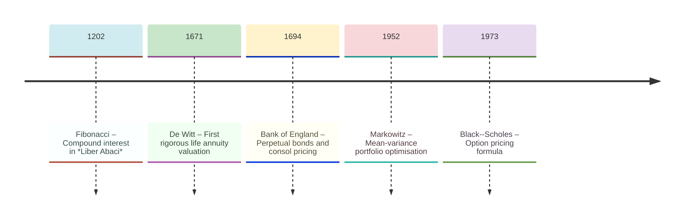
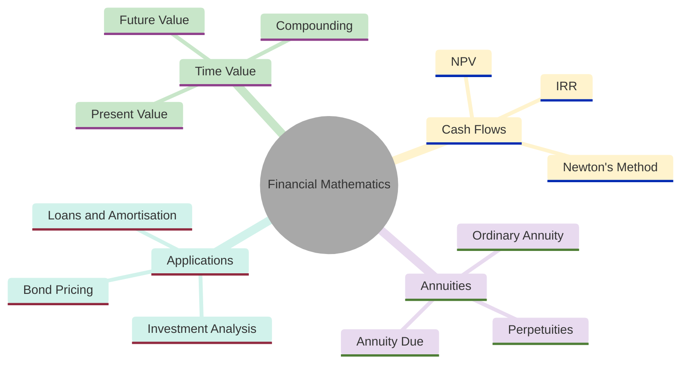
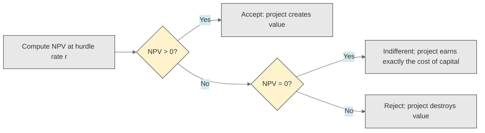
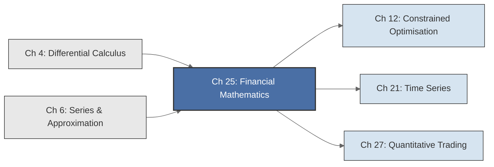

<!-- Copyright (c) 2025-2026 Bob Jansen <bobjansen@pm.me> -->
<!-- SPDX-License-Identifier: CC-BY-NC-4.0 -->
<!-- See LICENSE for full terms. Commercial licensing available. -->

# Chapter 25: Financial Mathematics


**Part IX**: Applications

> Every financial decision reduces to a single question: what is a future cash flow worth today? The mathematics of interest, discounting and annuities provides the rigorous answer, and its core tool, the geometric series, has been known since Archimedes.

**Prerequisites**: [Chapter 6](06-series-approximation.md) (Series & Approximation); geometric series summation, convergence of infinite series, closed-form expressions for finite geometric sums. [Chapter 4](04-differential-calculus.md) (Differential Calculus); Newton's method for root-finding, applied here to computing the internal rate of return.

**Learning Objectives**: After this chapter, the reader will be able to:

1. Compute the future value and present value of a cash flow under simple, compound and continuous compounding.
2. Derive the annuity present value and future value formulas from finite geometric series.
3. Compute the net present value (NPV) of a sequence of cash flows and determine the internal rate of return (IRR) using Newton's method.
4. Understand continuous compounding as the limit of discrete compounding and its connection to the exponential function $e^x$.
5. Price a bond as the net present value of its coupon and principal cash flows, and construct an amortisation schedule.
6. Distinguish simple, compound and continuous interest and compute the effective annual rate for each.
7. Derive the perpetuity pricing formula as the limiting case of the annuity present value formula.

**Connections**: This chapter uses [Chapter 6](06-series-approximation.md) (geometric series for annuity valuation, the limit definition of $e$ for continuous compounding) and [Chapter 4](04-differential-calculus.md) (Newton's method for IRR computation). It connects to [Chapter 12](12-constrained-optimization.md) (Optimisation; NPV maximisation under constraints) and [Chapter 21](21-time-series.md) (Time Series; modelling financial data, yield curve estimation).

---

## Historical Context

**Key Milestones in Financial Mathematics**



*Figure 25.1: Timeline of key milestones in financial mathematics from Fibonacci to Black–Scholes.*

**Ancient interest calculations (2000 BCE).** Sumerian clay tablets from approximately 2000 BCE record compound interest calculations on barley loans. Babylonian scribes used tables of powers to compute accumulated debt. The systematic mathematical treatment of interest in Europe began with a single book.

**Fibonacci's *Liber Abaci* (1202).** Leonardo of Pisa (Fibonacci) published *Liber Abaci* in 1202. The book introduced Hindu-Arabic numerals to European commerce and devoted substantial attention to compound interest. Fibonacci posed questions such as: if a merchant invests 100 lire at 10% per year, what is the accumulated value after several years? His solutions employed repeated multiplication, computing $P(1+r)^t$ by hand. *Liber Abaci* was a manual for the emerging Italian banking houses. It established compound interest as a central problem of commercial arithmetic.

**De Witt and life annuities (1671).** Johan de Witt, Grand Pensionary of Holland, published his *Waerdye van Lyf-renten naer proportie van Losrenten* in 1671. This was the first rigorous treatment of life annuities. De Witt computed the fair price of a survival-contingent annuity by combining mortality assumptions with discounting, producing the first actuarial calculation. His work required summing discounted payments over uncertain lifetimes: a finite geometric series with random termination.

**Halley's mortality table (1693).** Edmond Halley constructed the first mortality table in 1693 from the parish records of Breslau. Together, de Witt and Halley created the mathematical basis of the life insurance industry.

**Government bonds and perpetuities (1694).** Government bond markets in the seventeenth and eighteenth centuries transformed interest calculation from a merchant's tool into a matter of state finance. The Bank of England, founded in 1694, issued perpetual bonds (consols) paying fixed coupons indefinitely. The perpetuity pricing formula $PV = C/r$ became the simplest application of the geometric series sum $a/(1-r)$ with $|r| < 1$. Bond markets also necessitated yield-to-maturity calculations, which require solving polynomial equations numerically. This connects directly to Newton's method ([Chapter 4](04-differential-calculus.md)).

**Twentieth-century advances (1952–1973).** The twentieth century brought two advances. Harry Markowitz published "Portfolio Selection" in 1952, introducing mean–variance optimisation. His insight was that diversification reduces risk without sacrificing expected return, provided one computes the covariance structure of asset returns. His framework required optimisation ([Chapter 12](12-constrained-optimization.md)) applied to financial objectives.

**Black–Scholes option pricing (1973).** Fischer Black and Myron Scholes published their option pricing formula in 1973, using Itô calculus and partial differential equations to price derivative securities. The Black–Scholes model is beyond this chapter's scope, but its inputs (risk-free rates, continuous compounding, present value) are the tools developed here.

**Modern applications.** Discounted cash flow (DCF) analysis remains the standard in corporate finance. Every capital budgeting decision, acquisition valuation and project assessment reduces to computing a net present value. In fixed income markets, bond pricing, duration and convexity are direct applications of the annuity and present value formulas derived below.

**Decentralised finance and compounding (2020s).** Decentralised finance (DeFi) has introduced new contexts (yield farming, liquidity provision, automated market makers) but the mathematics of compounding and discounting is unchanged. A DeFi protocol offering 5% annual percentage yield (APY) compounded per block uses the formula $A = P(1 + r/n)^{nt}$ with $n$ equal to the number of blocks per year.

---

## Why This Chapter Matters

**Financial Mathematics**



*Figure 25.2: Mind map showing the core topics and applications of financial mathematics.*

Every mortgage payment, corporate investment decision, sovereign bond trade and pension fund projection rests on the formulas of this chapter. The net present value rule is the most widely used criterion in capital budgeting. Corporations collectively allocate trillions of euros annually on the basis of NPV analysis.

When a firm decides whether to build a factory, acquire a competitor or launch a product line, the decision reduces to discounting projected cash flows and comparing the result to the required investment. Misjudging the discount rate, misestimating cash flows or ignoring the time value of money leads to capital misallocation and, in extreme cases, corporate failure.

The annuity and amortisation formulas govern the largest financial commitments most individuals make. A 30-year fixed-rate mortgage is an ordinary annuity. The monthly payment formula determines affordability; the amortisation schedule reveals that early payments mostly service interest rather than principal. Retirement planning requires the annuity future value formula with compounding: one determines the monthly savings rate needed to accumulate a target fund. Student loan repayment, auto financing and insurance premium calculations are all direct applications of the present value machinery.

Fixed income markets exceed 130 trillion euros in outstanding debt. Bond pricing applies the annuity present value formula to coupon streams plus a discounted face value. Yield curve construction, duration and convexity analysis and mortgage-backed security valuation extend the core discounting framework. The internal rate of return, computed via Newton's method, is the standard metric for comparing investment returns across time horizons and cash flow patterns.

---

## Notation & Conventions

| Symbol | Meaning |
|--------|---------|
| $P$ | Principal: the initial amount invested or borrowed |
| $A$ or $FV$ | Accumulated amount or future value |
| $PV$ | Present value: the value today of a future cash flow |
| $r$ | Nominal annual interest rate (as a decimal, e.g., 0.05 for 5%) |
| $n$ | Number of compounding periods per year |
| $t$ or $T$ | Time in years (or number of periods, context-dependent) |
| $C$ or $C_t$ | Cash flow; $C_t$ denotes the cash flow at time $t$ |
| $\delta$ | Discount factor: $\delta = 1/(1+r)$ |
| $g$ | Growth rate of a cash flow (used in growing perpetuity) |
| $y$ | Yield to maturity (for bond pricing) |
| $r^*$ | Internal rate of return |
| $r_{\text{eff}}$ | Effective annual rate |
| $\text{NPV}$ | Net present value: $\sum_{t=0}^{T} C_t / (1+r)^t$ |
| $\text{IRR}$ | Internal rate of return: the rate $r^*$ such that $\text{NPV}(r^*) = 0$ |
| $\text{PMT}$ | Periodic payment amount (in amortisation) |
| $F$ | Face value (par value) of a bond |
| $B_k$ | Outstanding loan balance after payment $k$ |
| $I_k$ | Interest portion of payment $k$: $I_k = B_{k-1} \cdot r$ |
| $P_k$ | Principal portion of payment $k$: $P_k = \text{PMT} - I_k$ |

Interest rates are decimals. Time is in years unless stated otherwise. Cash flows are negative for outflows and positive for inflows.

---

## Core Theory

### Simple and Compound Interest

**Definition 25.1** (Simple interest). Under *simple interest*, a principal $P$ invested at annual rate $r$ for $t$ years accumulates to

$$A = P(1 + rt).$$

Interest accrues linearly: each year adds $Pr$ to the balance, but interest does not itself earn interest. Simple interest is appropriate for short-term instruments (Treasury bills, commercial paper) where the investment horizon is less than one year.

**Definition 25.2** (Compound interest). Under *compound interest* with $n$ compounding periods per year, a principal $P$ invested at nominal annual rate $r$ for $t$ years accumulates to

$$A = P\left(1 + \frac{r}{n}\right)^{nt}.$$

Each compounding period, the accrued interest is added to the principal and subsequently earns interest itself. The quantity $r/n$ is the periodic rate and $nt$ is the total number of compounding periods.

**Compound Interest Growth** ($P = 1000$, $r = 5\%$, annual compounding):

```mermaid
---
config:
  theme: base
  themeVariables:
    xyChart:
      plotColorPalette: "#2563eb, #dc2626, #16a34a, #9333ea, #ca8a04, #0891b2"
      backgroundColor: "#ffffff"
      titleColor: "#333333"
      xAxisLabelColor: "#333333"
      yAxisLabelColor: "#333333"
      xAxisTitleColor: "#333333"
      yAxisTitleColor: "#333333"
      xAxisLineColor: "#333333"
      yAxisLineColor: "#333333"
---
xychart-beta
    x-axis "Years" [0, 5, 10, 15, 20, 25, 30]
    y-axis "Value (€)" 900 --> 4400
    line [1000, 1276, 1629, 2079, 2653, 3386, 4322]
```

*Figure 25.3: Exponential growth of compound interest at 5% annual rate over 30 years.*

Starting from $P = \text{€}1{,}000$, compound interest at 5% grows the investment to $\text{€}4{,}322$ in 30 years. The curve is exponential: the absolute growth accelerates over time because interest earned in earlier years itself earns interest in later years. In the first decade, the investment gains €629; in the third decade, it gains €1,936.

The difference between simple and compound interest is negligible for short horizons but dramatic over long ones. At $r = 0.10$ and $t = 30$ years, simple interest gives $A = P(1 + 3) = 4P$, while annual compounding gives $A = P(1.10)^{30} \approx 17.45P$. The exponential growth of compound interest is the mathematical basis of long-term wealth accumulation.

**Theorem 25.3** (Continuous compounding). As the number of compounding periods $n$ tends to infinity, the compound interest formula converges:

$$\lim_{n \to \infty} P\left(1 + \frac{r}{n}\right)^{nt} = Pe^{rt}.$$

Under *continuous compounding*, a principal $P$ accumulates to $A = Pe^{rt}$ after $t$ years.

??? note "Proof"

    *Proof.* Write the expression as

    $$P\left[\left(1 + \frac{r}{n}\right)^{n}\right]^{t}.$$

    It suffices to show that $\lim_{n \to \infty} (1 + r/n)^n = e^r$.

    Substitute $m = n/r$, so that $n = mr$ and

    $$\left(1 + \frac{r}{n}\right)^n = \left(1 + \frac{1}{m}\right)^{mr} = \left[\left(1 + \frac{1}{m}\right)^m\right]^r.$$

    By [Chapter 6](06-series-approximation.md), the inner expression satisfies $\lim_{m \to \infty}(1 + 1/m)^m = e$. Hence

    $$\lim_{n \to \infty} \left(1 + \frac{r}{n}\right)^n = e^r,$$

    and the full expression tends to $Pe^{rt}$. $\square$

Continuous compounding provides a mathematically clean model: the growth equation $dA/dt = rA$ with initial condition $A(0) = P$ has solution $A(t) = Pe^{rt}$. This connects the time value of money directly to the exponential function and the theory of ordinary differential equations.

**Remark 25.4** (Effective annual rate). Different compounding frequencies make nominal rates difficult to compare. The *effective annual rate* $r_{\text{eff}}$ is the equivalent rate under annual compounding:

$$r_{\text{eff}} = \left(1 + \frac{r}{n}\right)^n - 1.$$

For continuous compounding, $r_{\text{eff}} = e^r - 1$ (where $r$ is the continuous nominal rate). The effective rate allows comparison across instruments: a nominal 12% compounded monthly ($r_{\text{eff}} = (1 + 0.01)^{12} - 1 \approx 12.68\%$) is more expensive than a nominal 12.5% compounded annually ($r_{\text{eff}} = 12.5\%$).

### Present Value and Discounting

**Definition 25.5** (Present value). The *present value* of a future cash flow $FV$ to be received at time $t$, discounted at rate $r$ per period, is

$$PV = \frac{FV}{(1+r)^t} = FV \cdot (1+r)^{-t}.$$

Present value inverts the compounding operation: if $A = P(1+r)^t$, then $P = A(1+r)^{-t}$. It answers the question: how much must one invest today at rate $r$ to produce $FV$ at time $t$?

**Definition 25.6** (Discount factor). The *discount factor* for one period at rate $r$ is

$$\delta = \frac{1}{1+r}.$$

The present value of a cash flow at time $t$ is $PV = FV \cdot \delta^t$. The discount factor satisfies $0 < \delta < 1$ for any positive interest rate, reflecting that future cash flows are worth less than immediate ones.

**Remark 25.7** (Time value of money). The principle that a euro today is worth more than a euro in the future is the central axiom of financial mathematics. It holds because a euro received today can be invested to earn interest, producing more than a euro at any future date. This principle justifies discounting: to compare cash flows occurring at different times, one must express them in a common time frame, typically the present. Every formula in this chapter is an application of this single principle.

### Net Present Value and Internal Rate of Return

**Definition 25.8** (Net present value). Given a sequence of cash flows $C_0, C_1, \ldots, C_T$ occurring at times $t = 0, 1, \ldots, T$, the *net present value* at discount rate $r$ is

$$\text{NPV}(r) = \sum_{t=0}^{T} \frac{C_t}{(1+r)^t}.$$

The convention is that $C_0 < 0$ represents an initial investment (outflow) and $C_1, \ldots, C_T$ represent subsequent returns (inflows). An investment is considered financially attractive if $\text{NPV} > 0$ at the investor's required rate of return (the hurdle rate or cost of capital).

**Definition 25.9** (Internal rate of return). The *internal rate of return* (IRR) is the discount rate $r^*$ that makes the net present value equal to zero:

$$\text{NPV}(r^*) = \sum_{t=0}^{T} \frac{C_t}{(1+r^*)^t} = 0.$$

Equivalently, the IRR is the rate of return at which the present value of inflows exactly equals the present value of outflows. An investment is attractive if its IRR exceeds the cost of capital.

**Remark 25.10** (IRR complications). The equation $\text{NPV}(r) = 0$ is a polynomial of degree $T$ in $x = 1/(1+r)$. Descartes' rule of signs guarantees a unique positive real root only when the cash flow sequence changes sign exactly once (one initial outflow followed by inflows).

For *non-conventional* cash flows, where the sign changes multiple times (e.g. an investment requiring additional capital infusions mid-project), the IRR equation may have multiple positive real solutions or no real solution. In such cases the NPV at the investor's cost of capital is the appropriate criterion. The modified internal rate of return resolves some of these difficulties by assuming reinvestment at the cost of capital rather than at the IRR itself.

**Theorem 25.11** (IRR via Newton's method). The IRR can be computed numerically by applying Newton's method ([Chapter 4](04-differential-calculus.md)) to the function $f(r) = \text{NPV}(r)$. The iteration is

$$r_{k+1} = r_k - \frac{f(r_k)}{f'(r_k)}$$

where

$$f'(r) = \frac{d}{dr}\sum_{t=0}^{T} \frac{C_t}{(1+r)^t} = \sum_{t=0}^{T} \frac{-t \cdot C_t}{(1+r)^{t+1}}.$$

??? note "Proof"

    *Proof.* Newton's method for solving $f(r) = 0$ is the iteration $r_{k+1} = r_k - f(r_k)/f'(r_k)$ ([Chapter 4](04-differential-calculus.md)).

    Here $f(r) = \text{NPV}(r) = \sum_{t=0}^{T} C_t (1+r)^{-t}$. Differentiating term by term with respect to $r$:

    $$f'(r) = \sum_{t=0}^{T} C_t \cdot (-t)(1+r)^{-t-1} = \sum_{t=0}^{T} \frac{-t \cdot C_t}{(1+r)^{t+1}}.$$

    The $t = 0$ term contributes zero since its coefficient is $-0 \cdot C_0 = 0$.

    The iteration converges quadratically when started sufficiently close to the root and when $f'(r^*) \neq 0$, which holds whenever the cash flows are non-trivial. $\square$

In practice, Newton's method for IRR converges rapidly (typically 4–8 iterations to machine precision) because NPV is a smooth, monotonically decreasing function of $r$ for conventional cash flows. A reasonable starting guess is $r_0 = 0.10$ (10%).

**NPV Investment Decision Rule:**



*Figure 25.4: Flowchart showing the NPV investment decision rule for accepting or rejecting projects.*

### Annuities

**Definition 25.12** (Ordinary annuity). An *ordinary annuity* (annuity-immediate) is a finite sequence of equal payments $C$ made at the end of each period for $T$ periods. The cash flow at time $t$ is $C_t = C$ for $t = 1, 2, \ldots, T$ and $C_0 = 0$.

**Theorem 25.13** (Annuity present value). The present value of an ordinary annuity paying $C$ per period for $T$ periods at discount rate $r$ per period is

$$PV = C \cdot \frac{1 - (1+r)^{-T}}{r}.$$

??? note "Proof"

    *Proof.* The present value is the sum of discounted payments. Setting $\delta = 1/(1+r)$:

    $$PV = \sum_{t=1}^{T} \frac{C}{(1+r)^t} = C \sum_{t=1}^{T} \delta^t.$$

    This is a finite geometric series with first term $\delta$, common ratio $\delta$ and $T$ terms. By the geometric series formula ([Chapter 6](06-series-approximation.md), Theorem 6.9):

    $$\sum_{t=1}^{T} \delta^t = \delta \cdot \frac{1 - \delta^T}{1 - \delta}.$$

    Substituting $\delta = 1/(1+r)$:

    $$\frac{1}{1+r} \cdot \frac{1 - (1+r)^{-T}}{1 - \frac{1}{1+r}} = \frac{1}{1+r} \cdot \frac{1 - (1+r)^{-T}}{\frac{r}{1+r}} = \frac{1 - (1+r)^{-T}}{r}.$$

    Therefore

    $$PV = C \cdot \frac{1 - (1+r)^{-T}}{r}.$$

    $\square$

The factor $[1 - (1+r)^{-T}]/r$ is called the *present value interest factor of an annuity* and is tabulated in financial handbooks.

!!! abstract "Key Result"

    **Theorem 25.13** (Annuity present value). The present value of an annuity is a closed-form geometric series, $PV = C \cdot [1 - (1+r)^{-T}]/r$, providing the single formula behind every mortgage payment, retirement plan and bond coupon valuation.

**Theorem 25.14** (Annuity future value). The future value (at time $T$) of an ordinary annuity paying $C$ per period for $T$ periods at rate $r$ per period is

$$FV = C \cdot \frac{(1+r)^T - 1}{r}.$$

??? note "Proof"

    *Proof.* The future value is obtained by compounding each payment forward to time $T$. Substituting $k = T - t$:

    $$FV = \sum_{t=1}^{T} C(1+r)^{T-t} = C \sum_{k=0}^{T-1} (1+r)^k.$$

    This is a geometric series with first term $1$, common ratio $(1+r)$ and $T$ terms:

    $$\sum_{k=0}^{T-1} (1+r)^k = \frac{(1+r)^T - 1}{(1+r) - 1} = \frac{(1+r)^T - 1}{r}.$$

    Hence $FV = C \cdot [(1+r)^T - 1]/r$. $\square$

**Definition 25.15** (Annuity due). An *annuity due* (annuity-in-advance) consists of equal payments $C$ made at the *beginning* of each period for $T$ periods. Each payment is received one period earlier than in an ordinary annuity, so

$$PV_{\text{due}} = PV_{\text{ordinary}} \cdot (1+r) = C \cdot \frac{1 - (1+r)^{-T}}{r} \cdot (1+r).$$

The additional factor $(1+r)$ reflects that each cash flow, received one period earlier, is worth $(1+r)$ times more in present value terms.

**Definition 25.16** (Perpetuity). A *perpetuity* is an annuity with $T \to \infty$: an infinite sequence of equal payments $C$ made at the end of each period forever. Its present value is

$$PV = \frac{C}{r}.$$

???+ info "Derivation"

    Taking $T \to \infty$ in the annuity present value formula: since $(1+r)^{-T} \to 0$ for $r > 0$,

    $$PV = \lim_{T \to \infty} C \cdot \frac{1 - (1+r)^{-T}}{r} = C \cdot \frac{1 - 0}{r} = \frac{C}{r}.$$

    Alternatively, the present value is the infinite geometric series $\sum_{t=1}^{\infty} C\delta^t = C\delta/(1-\delta)$ with $\delta = 1/(1+r)$. Since $\delta/(1-\delta) = [1/(1+r)] / [r/(1+r)] = 1/r$, one obtains $PV = C/r$. The British consol bonds, perpetual government bonds paying fixed coupons, are priced by this formula.

**Definition 25.17** (Growing perpetuity). A *growing perpetuity* pays $C$ at time $1$, $C(1+g)$ at time $2$, $C(1+g)^2$ at time $3$ and so on, where $g$ is the constant growth rate. Its present value, for $r > g$, is

$$PV = \frac{C}{r - g}.$$

???+ info "Derivation"

    The present value is

    $$PV = \sum_{t=1}^{\infty} \frac{C(1+g)^{t-1}}{(1+r)^t} = \frac{C}{1+r} \sum_{t=0}^{\infty} \left(\frac{1+g}{1+r}\right)^t.$$

    The series is geometric with ratio $(1+g)/(1+r)$. It converges when $|(1+g)/(1+r)| < 1$, i.e., when $g < r$. The sum is $1/[1 - (1+g)/(1+r)] = (1+r)/(r-g)$. Therefore

    $$PV = \frac{C}{1+r} \cdot \frac{1+r}{r-g} = \frac{C}{r-g}.$$

    This is the *Gordon growth model*, widely used in equity valuation. If a stock pays dividend $C$ next year, dividends grow at rate $g$ perpetually and the required return is $r$, the stock's fair price is $C/(r-g)$.

**Loan Payment Cash Flow Breakdown:**


*Figure 25.5: Pie chart showing the split between interest and principal in a typical loan payment.*

A typical loan payment of €500 splits into interest (€200) servicing the outstanding balance and principal (€300) reducing the debt. Early in an amortisation schedule the interest share dominates; as the balance decreases the principal share grows. This is a direct consequence of the exponential decay of the outstanding balance derived below.

### Amortisation

**Definition 25.18** (Amortisation). An *amortised loan* is one where each periodic payment covers both interest on the outstanding balance and a portion of the principal. The payment amount is constant and given by inverting the annuity present value formula:

$$\text{PMT} = PV \cdot \frac{r}{1 - (1+r)^{-T}}$$

where $PV$ is the loan principal, $r$ is the periodic interest rate and $T$ is the number of payments.

???+ info "Derivation"

    The lender's indifference condition implies that the loan principal equals the present value of all future payments, so $PV = \text{PMT} \cdot [1 - (1+r)^{-T}]/r$. Solving for PMT gives the formula above.

**Remark 25.19** (Amortisation schedule). In an amortisation schedule, each payment $\text{PMT}$ is split into an interest component and a principal component. For payment number $k$:

- Interest portion: $I_k = B_{k-1} \cdot r$, where $B_{k-1}$ is the outstanding balance before payment $k$.
- Principal portion: $P_k = \text{PMT} - I_k$.
- New balance: $B_k = B_{k-1} - P_k$.

Since the balance decreases over time, the interest portion decreases and the principal portion increases. Early payments are predominantly interest; later payments are predominantly principal. This is a consequence of the exponential decay of the balance: $B_k = PV \cdot (1+r)^k - \text{PMT} \cdot [(1+r)^k - 1]/r$.

### Bond Pricing

**Definition 25.20** (Bond price). A bond that pays fixed coupons $C$ at times $t = 1, 2, \ldots, T$ and returns face value $F$ at maturity $T$ has a price equal to the present value of all its cash flows, discounted at the yield to maturity $y$:

$$\text{Price} = \sum_{t=1}^{T} \frac{C}{(1+y)^t} + \frac{F}{(1+y)^T} = C \cdot \frac{1 - (1+y)^{-T}}{y} + F \cdot (1+y)^{-T}.$$

The first term is the present value of the coupon annuity; the second is the present value of the face value. Bond pricing is NPV applied to a specific cash flow pattern. The yield to maturity $y$ is the IRR of the bond investment: the rate that equates the bond's price to the present value of its cash flows.

---

## Formulas & Identities

**F25.1** Simple interest ($P > 0$, $r \geq 0$, $t \geq 0$):

$$A = P(1 + rt)$$

**F25.2** Compound interest ($n \geq 1$):

$$A = P\!\left(1 + \frac{r}{n}\right)^{nt}$$

**F25.3** Continuous compounding (limit as $n \to \infty$):

$$A = Pe^{rt}$$

**F25.4** Present value ($r > -1$):

$$PV = FV \cdot (1+r)^{-t}$$

**F25.5** Effective annual rate ($n \geq 1$):

$$r_{\text{eff}} = \left(1 + \frac{r}{n}\right)^n - 1$$

**F25.6** Net present value ($r > -1$):

$$\text{NPV}(r) = \sum_{t=0}^{T} C_t (1+r)^{-t}$$

**F25.7** Annuity present value ($r > 0$, $T \geq 1$):

$$PV = C \cdot \frac{1 - (1+r)^{-T}}{r}$$

**F25.8** Annuity future value ($r > 0$, $T \geq 1$):

$$FV = C \cdot \frac{(1+r)^T - 1}{r}$$

**F25.9** Perpetuity ($r > 0$):

$$PV = \frac{C}{r}$$

**F25.10** Growing perpetuity ($r > g > 0$):

$$PV = \frac{C}{r - g}$$

**F25.11** Amortisation payment ($r > 0$, $T \geq 1$):

$$\text{PMT} = PV \cdot \frac{r}{1 - (1+r)^{-T}}$$

**F25.12** Bond price ($y > 0$):

$$\text{Price} = C \cdot \frac{1-(1+y)^{-T}}{y} + F(1+y)^{-T}$$

---

## Algorithms

### Algorithm 25.21: Compound Interest

**Input**: Principal $P$, annual rate $r$, compounding frequency $n$, time $t$ years.
**Output**: Future value $A$.

```
function compoundInterest(P, r, n, t):
    return P * (1 + r/n)^(n*t)
```

For continuous compounding ($n \to \infty$): return $P \cdot e^{rt}$.

**Complexity**: $O(1)$ time and $O(1)$ space per evaluation (a single exponentiation).

### Algorithm 25.22: Present Value

**Input**: Future value $FV$, discount rate $r$, time $t$.
**Output**: Present value $PV$.

```
function presentValue(FV, r, t):
    return FV / (1 + r)^t
```

**Complexity**: $O(1)$ time and $O(1)$ space per evaluation.

### Algorithm 25.23: Net Present Value

**Input**: Cash flow array $[C_0, C_1, \ldots, C_T]$, discount rate $r$.
**Output**: NPV.

```
function npv(cashFlows, r):
    total = 0
    for t = 0 to length(cashFlows) - 1:
        total = total + cashFlows[t] / (1 + r)^t
    return total
```

**Complexity**: $O(T)$ time and $O(1)$ space (beyond the input array), where $T$ is the number of cash flows.

### Algorithm 25.24: Internal Rate of Return (Newton's Method)

**Input**: Cash flow array $[C_0, C_1, \ldots, C_T]$, initial guess $r_0$, tolerance $\varepsilon$.
**Output**: IRR $r^*$.

```
function irr(cashFlows, r0 = 0.10, epsilon = 1e-10, maxIter = 100):
    r = r0
    for i = 1 to maxIter:
        f  = npv(cashFlows, r)
        fp = 0
        for t = 0 to length(cashFlows) - 1:
            fp = fp + (-t) * cashFlows[t] / (1 + r)^(t + 1)
        if |fp| < 1e-20:
            error("derivative too small; IRR may not exist")
        r_new = r - f / fp
        if |r_new - r| < epsilon:
            return r_new
        r = r_new
    error("IRR did not converge within maxIter iterations")
```

**Complexity**: $O(T)$ time per Newton iteration and $O(1)$ space (beyond the input array); typically 4–8 iterations suffice.

### Algorithm 25.25: Annuity Present Value and Future Value

**Input**: Payment $C$, rate $r$, number of periods $T$.
**Output**: Present value and future value.

```
function annuityPV(C, r, T):
    if r == 0:
        return C * T
    return C * (1 - (1 + r)^(-T)) / r

function annuityFV(C, r, T):
    if r == 0:
        return C * T
    return C * ((1 + r)^T - 1) / r
```

**Complexity**: $O(1)$ time and $O(1)$ space per evaluation (closed-form expressions).

### Algorithm 25.26: Amortisation Schedule

**Input**: Loan principal $PV$, periodic rate $r$, number of payments $T$.
**Output**: Array of $[k, \text{PMT}, I_k, P_k, B_k]$ for each period $k$.

```
function amortisationSchedule(PV, r, T):
    PMT = PV * r / (1 - (1 + r)^(-T))
    balance = PV
    schedule = []
    for k = 1 to T:
        interest = balance * r
        principal = PMT - interest
        balance = balance - principal
        schedule.append([k, PMT, interest, principal, balance])
    return schedule
```

**Complexity**: $O(T)$ time and $O(T)$ space, where $T$ is the number of payments (the full schedule is stored).

---

## Numerical Considerations

### Floating-Point Precision in Present Value Computations

The factor $(1+r)^{-t}$ shrinks toward the limits of IEEE 754 double precision for long horizons. At $r = 0.05$ and $t = 500$, $(1.05)^{-500} \approx 7 \times 10^{-11}$. Only about 5 significant digits remain when this quantity is added to terms of order 1. In Algorithm 25.23 (NPV), accumulate the discounted sum from the most distant cash flow backward:

$$\text{NPV} = C_T(1+r)^{-T} + C_{T-1}(1+r)^{-(T-1)} + \cdots + C_0.$$

!!! tip "Backward summation preserves precision"

    Accumulating the discounted sum from the most distant cash flow to the nearest ensures that small terms are added first. This prevents them from being absorbed into larger partial sums due to floating-point rounding, and can recover one to two extra digits of accuracy for long horizons.

### Newton's Method Convergence for IRR

Algorithm 25.24 uses Newton's method to find the IRR. For conventional cash flows (single sign change) the NPV is monotonically decreasing in $r$ and a unique root exists. Newton's method converges quadratically from any positive initial guess.

!!! warning "Non-conventional cash flows may have multiple or no IRR"

    When the cash flow sequence changes sign more than once, the NPV polynomial may have several positive real roots or none at all. Newton's method may then converge to the wrong root or diverge. Use bisection on a bracketing interval when the cash flow pattern is unknown. A practical guard: if the Newton step exceeds the current estimate in magnitude ($|\Delta r| > |r_k|$), halve it.

### Compounding Frequency and Numerical Limits

Direct computation of $(1 + r/n)^{nt}$ in Algorithm 25.21 overflows before reaching the continuous limit for large $n$.

!!! info "IEEE 754 overflow threshold"

    The double-precision overflow threshold is approximately $e^{709}$. The expression $(1 + r/n)^{nt}$ overflows when $nt \ln(1 + r/n) > 709$. For the continuous-compounding limit, switch to $Pe^{rt}$ when $n > 10^6$; the relative error from replacing discrete with continuous compounding is then below $10^{-6}$.

### Annuity Formula Cancellation

The annuity present-value formula in Algorithm 25.25 involves $(1+r)^{-T}$, which suffers the same loss of significance as the PV computation for large $T$. When $rT$ is large, the factor $(1+r)^{-T}$ is negligible and the formula simplifies to $C/r$.

!!! warning "Catastrophic cancellation for small interest rates"

    When $r$ is very small, direct evaluation of $[1 - (1+r)^{-T}]/r$ suffers catastrophic cancellation: the numerator subtracts two nearly equal quantities, losing most significant digits. For $|r| < 10^{-8}$, use the Taylor expansion $[1 - (1+r)^{-T}]/r = T - T(T+1)r/2 + O(r^2)$ to maintain full precision.

The full Taylor series is:

$$\frac{1 - (1+r)^{-T}}{r} = T - \frac{T(T+1)}{2}r + O(r^2).$$

### Amortisation Schedule Drift

Algorithm 25.26 computes each period's interest and principal from the outstanding balance. Rounding each payment to the nearest cent introduces a drift that accumulates over $T$ periods. After $T$ payments the balance may differ from zero by several cents. A final adjusting payment corrects the drift. An alternative approach is to carry intermediate balances in full precision and round only the reported values.

---

## Worked Examples

### Example 25.27: Present Value Comparison

**Problem**: An investor can receive €10,000 in 5 years. The annual discount rate is 8%, compounded annually. What is this cash flow worth today?

**Solution** (mathematical):

By Definition 25.5:

$$PV = \frac{10000}{(1.08)^5} = \frac{10000}{1.46933} = 6805.83.$$

The investor should be willing to pay at most €6,805.83 today for the right to receive €10,000 in five years.

**Verification**: As a benchmark, the present value of €1,000 received in 10 years at 5% annual discounting is $PV = 1000/(1.05)^{10} = 1000/1.62889 \approx 613.91$. This value can be used as a quick sanity check for any present value implementation.

### Example 25.28: Net Present Value of an Investment

**Problem**: A project requires an initial investment of €50,000 and generates cash flows of €15,000, €20,000, €25,000 and €10,000 over the next four years. The cost of capital is 12%. Should the firm undertake the project?

**Solution** (mathematical):

$$\text{NPV} = -50000 + \frac{15000}{1.12} + \frac{20000}{(1.12)^2} + \frac{25000}{(1.12)^3} + \frac{10000}{(1.12)^4}$$

Computing each term:

$$= -50000 + 13392.86 + 15943.88 + 17794.51 + 6355.18 = 3486.43.$$

Since NPV $> 0$, the project adds value and should be undertaken.

### Example 25.29: Loan Amortisation Schedule

**Problem**: A borrower takes a €200,000 mortgage at 6% annual interest (0.5% monthly) for 30 years (360 monthly payments). Compute the monthly payment and show the first three entries of the amortisation schedule.

**Solution** (mathematical):

The monthly payment is:

$$\text{PMT} = 200000 \cdot \frac{0.005}{1 - (1.005)^{-360}} = 200000 \cdot \frac{0.005}{1 - 0.16604} = 200000 \cdot \frac{0.005}{0.83396} = 1199.10.$$

Amortisation for the first three months:

| Month | Payment | Interest | Principal | Balance |
|-------|---------|----------|-----------|---------|
| 1 | 1199.10 | 1000.00 | 199.10 | 199,800.90 |
| 2 | 1199.10 | 999.00 | 200.10 | 199,600.80 |
| 3 | 1199.10 | 998.00 | 201.10 | 199,399.71 |

In the first month, 83.4% of the payment goes to interest. By month 360, the interest portion is negligible.

### Example 25.30: Computing IRR with Newton's Method

**Problem**: A project costs €100,000 and returns €40,000, €50,000 and €30,000 over three years. Compute the IRR.

**Solution** (mathematical):

The IRR satisfies:

$$-100000 + \frac{40000}{(1+r)^1} + \frac{50000}{(1+r)^2} + \frac{30000}{(1+r)^3} = 0.$$

Applying Newton's method with $r_0 = 0.10$:

*Iteration 1*:

$$\text{NPV}(0.10) = -100000 + 36363.64 + 41322.31 + 22539.44 = 225.39.$$

Since NPV is slightly positive, the true IRR is slightly above 10%.

$$\text{NPV}'(0.10) = \frac{-1 \cdot 40000}{(1.10)^2} + \frac{-2 \cdot 50000}{(1.10)^3} + \frac{-3 \cdot 30000}{(1.10)^4} = -33057.85 - 75131.48 - 61471.21 = -169660.54.$$

$$r_1 = 0.10 - \frac{225.39}{-169660.54} = 0.10 + 0.001329 = 0.101329.$$

*Iteration 2*:

$$\text{NPV}(0.101329) \approx 0.35 \text{ (nearly zero).}$$

One more iteration gives $r^* \approx 0.10133$. The IRR is approximately 10.13%.

### Example 25.31: Continuous Compounding and the Number e

**Problem**: An account earns 100% annual interest ($r = 1$). Compare the accumulated value of €1 after one year under annual, quarterly, monthly, daily and continuous compounding.

**Solution** (mathematical):

| Compounding | $n$ | $A = (1 + 1/n)^n$ |
|-------------|-----|---------------------|
| Annual | 1 | 2.000000 |
| Quarterly | 4 | 2.441406 |
| Monthly | 12 | 2.613035 |
| Daily | 365 | 2.714567 |
| Continuous | $\infty$ | $e \approx 2.718282$ |

As $n \to \infty$, the accumulated value converges to $e$, illustrating Theorem 25.3. The sequence $(1 + 1/n)^n$ is monotonically increasing and bounded above by $e$, and this limit is, historically, one of the definitions of Euler's number.

---

## Connections

**Chapter Dependencies**



*Figure 25.6: Dependency graph showing prerequisite and downstream chapters for financial mathematics.*

### Within This Book

- **Series & Approximation** ([Chapter 6](06-series-approximation.md)): Annuity formulas are closed-form finite geometric series. The perpetuity formula is the infinite geometric series sum. Continuous compounding uses $\lim(1+1/n)^n = e$.

- **Differential Calculus** ([Chapter 4](04-differential-calculus.md)): Newton's method for IRR is the Newton–Raphson iteration applied to the NPV function. The derivative of NPV with respect to the discount rate also defines *duration* in fixed income.

- **Constrained Optimisation** ([Chapter 12](12-constrained-optimization.md)): Capital budgeting under a budget constraint is a constrained optimisation. The Lagrange multiplier gives the shadow price of capital.

- **Time Series** ([Chapter 21](21-time-series.md)): Asset prices, interest rates and inflation exhibit autocorrelation and mean reversion. Yield curve fitting and rate forecasting extend the static valuation formulas to dynamic models.

- **Quantitative Trading** ([Chapter 27](27-quantitative-trading.md)): Trading strategies use NPV and IRR to evaluate the profitability of positions. Discounting and compounding underpin performance attribution and risk-adjusted return calculations.

### Applications

- **Corporate finance**: DCF valuation of firms and projects; comparison of mutually exclusive investments via NPV; lease-vs-buy analysis using equivalent annuities.
- **Personal finance**: Mortgage calculations, retirement planning (how much to save per month to reach a target), student loan amortisation.
- **Fixed income**: Bond pricing, yield curve construction, duration and convexity as first- and second-order Taylor approximations of price with respect to yield.
- **DeFi/Crypto**: Yield farming APY calculations, impermanent loss analysis (which involves present value comparisons), protocol treasury management.

---

## Summary

- The present value of a future cash flow equals that cash flow discounted at the appropriate interest rate; compound interest applies the discount factor $(1+r)^{-t}$ while continuous compounding replaces it with $e^{-rt}$.
- Annuity and perpetuity formulas are closed-form evaluations of finite and infinite geometric series respectively.
- The net present value aggregates discounted cash flows into a single profitability measure; the internal rate of return is the discount rate that sets NPV to zero, found by Newton's method.
- Bond prices equal the NPV of coupon and principal payments; an amortisation schedule decomposes each payment into interest and principal components.

---

## Exercises

### Routine

**Exercise 25.1**. Compute the future value of €5,000 invested at 4% annual interest for 10 years under (a) simple interest, (b) annual compounding, (c) monthly compounding, (d) continuous compounding.

**Exercise 25.2**. A zero-coupon bond pays €1,000 at maturity in 7 years. If the market yield is 5.5% annually, what is the bond's price today?

**Exercise 25.3**. An ordinary annuity pays €500 per month for 5 years. The monthly discount rate is 0.5%. Compute the present value and future value.

**Exercise 25.4**. Compute the monthly payment on a €150,000 loan at 4.5% annual interest (compounded monthly) for 15 years. What fraction of the first payment is interest?

### Intermediate

**Exercise 25.5**. A stock is expected to pay a dividend of €3.00 next year, growing at 4% per year indefinitely. If the required return is 9%, compute the stock price using the Gordon growth model. What happens to the price as $g \to r$? Interpret financially.

**Exercise 25.6**. A project has cash flows $[-200000, 80000, 80000, 80000, 80000]$. Compute the NPV at discount rates $r = 0.05, 0.10, 0.15, 0.20, 0.25$. Plot (or tabulate) NPV as a function of $r$. At approximately what rate does NPV cross zero (the IRR)? Verify using Newton's method.

**Exercise 25.7**. Derive the formula for the present value of a *growing annuity*: payments start at $C$ and grow at rate $g$ per period for $T$ periods, discounted at rate $r > g$. (Hint: the sum is a geometric series with ratio $(1+g)/(1+r)$.)

### Challenging

**Exercise 25.8**. (a) A project has cash flows $[-100, 230, -132]$ (an initial investment, a large mid-project inflow and a final cleanup cost). Show that the NPV equation $\text{NPV}(r) = 0$ has *two* distinct positive real solutions. Compute both IRRs. Explain why the IRR criterion is ambiguous for this investment and what decision rule should be used instead.

(b) A project has cash flows $[-1000, 3600, -4320, 1728]$. Show that the substitution $x = 1/(1+r)$ transforms the NPV equation into an equation that can be written as $8(6x - 5)^3 = 0$ (or equivalently $-8(6x-5)^3 = 0$; both forms share the same root), and that the IRR is therefore $r = 0.20$ with algebraic multiplicity three. Interpret the significance of a repeated root for the shape of the NPV curve near the IRR.

---

## References

### Textbooks

[1] Brealey, R. A., Myers, S. C. and Allen, F. *Principles of Corporate Finance*, 14th ed. McGraw-Hill, 2022. The standard Master of Business Administration (MBA)-level reference for capital budgeting, NPV, IRR and corporate valuation. Chapters 2–6 cover the time value of money and investment rules.

[2] Fabozzi, F. J. *Fixed Income Mathematics*, 4th ed. McGraw-Hill, 2006. Thorough treatment of bond pricing, yield measures, duration, convexity and mortgage mathematics. A standard reference for fixed income analytics.

[3] Hull, J. C. *Options, Futures, and Other Derivatives*, 11th ed. Pearson, 2021. While primarily about derivative pricing, Chapters 4–5 treat interest rates, continuous compounding and forward rates.

[4] Kellison, S. G. *The Theory of Interest*, 3rd ed. McGraw-Hill/Irwin, 2008. A rigorous actuarial treatment of interest theory, annuities, amortisation and bond pricing. More mathematically precise than typical finance texts.

### Historical

[5] Black, F. and Scholes, M. "The Pricing of Options and Corporate Liabilities." *Journal of Political Economy* 81(3):637–654, 1973. The original derivation of the Black–Scholes option pricing formula using no-arbitrage arguments and Itô calculus.

[6] Halley, E. "An Estimate of the Degrees of the Mortality of Mankind." *Philosophical Transactions of the Royal Society* 17 (1693): 596–610. The first mortality table constructed from empirical data.

[7] Markowitz, H. "Portfolio Selection." *Journal of Finance* 7(1):77–91, 1952. The paper that introduced mean-variance portfolio optimisation, the efficient frontier and diversification as a mathematical principle.

[8] Sigler, L. E. (trans.). *Fibonacci's Liber Abaci*. Springer, 2002 [original: Leonardo of Pisa, *Liber Abaci*, 1202]. The first European text to systematically treat compound interest problems.

[9] De Witt, J. *Waerdye van Lyf-renten naer proportie van Losrenten*. The Hague, 1671. Reprinted in Hendriks, F. "Contributions to the History of Insurance." *The Assurance Magazine and Journal of the Institute of Actuaries* 2(3):121–150, 1852. The first rigorous actuarial valuation of life annuities using discounted expected payments.

### Online Resources

[10] Investopedia: Time Value of Money. https://www.investopedia.com/terms/t/timevalueofmoney.asp

[11] Wolfram MathWorld: Present Value. https://mathworld.wolfram.com/PresentValue.html

---

## Glossary

- **Amortisation**: Repayment of a loan through equal periodic payments, each covering interest and a portion of principal.

- **Annuity**: A series of equal payments made at regular intervals. An *ordinary annuity* has payments at the end of each period; an *annuity due* has payments at the beginning.

- **Bond**: A fixed-income security that pays periodic coupons $C$ and returns face value $F$ at maturity. Its price is the NPV of all future cash flows discounted at the yield to maturity.

- **Compound interest**: Interest computed on both the initial principal and previously accumulated interest. Growth is exponential.

- **Continuous compounding**: The limit of compound interest as the compounding frequency tends to infinity. Yields $A = Pe^{rt}$.

- **Coupon**: The periodic interest payment made by a bond, typically expressed as a percentage of face value.

- **Discount factor**: The multiplier $\delta = 1/(1+r)$ used to convert a future value to a present value for one period.

- **Effective annual rate**: The equivalent annual rate that accounts for intra-year compounding. Allows comparison of rates quoted with different compounding frequencies.

- **Face value**: The nominal value of a bond (also called par value), returned to the holder at maturity. Typically €1,000 per bond.

- **Gordon growth model**: The formula $PV = C/(r-g)$ for the present value of a perpetuity growing at constant rate $g$.

- **Internal rate of return (IRR)**: The discount rate at which the NPV of a cash flow sequence equals zero. Represents the project's implied rate of return.

- **Net present value (NPV)**: The sum of all cash flows discounted to the present. A positive NPV indicates value creation.

- **Perpetuity**: An annuity that continues indefinitely. Present value is $C/r$.

- **Present value**: The current worth of a future cash flow, obtained by discounting at the appropriate rate.

- **Simple interest**: Interest computed only on the initial principal. Growth is linear.

- **Time value of money**: The principle that a unit of currency today is worth more than the same unit in the future, because it can earn interest in the interim.

- **Yield to maturity**: The IRR of a bond: the constant discount rate that equates the bond's market price to the present value of its future cash flows.

---
