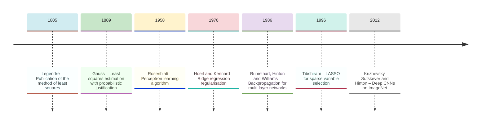
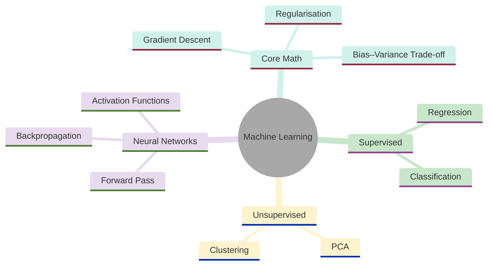
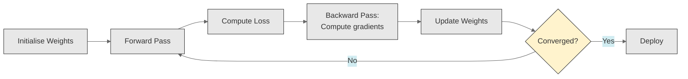
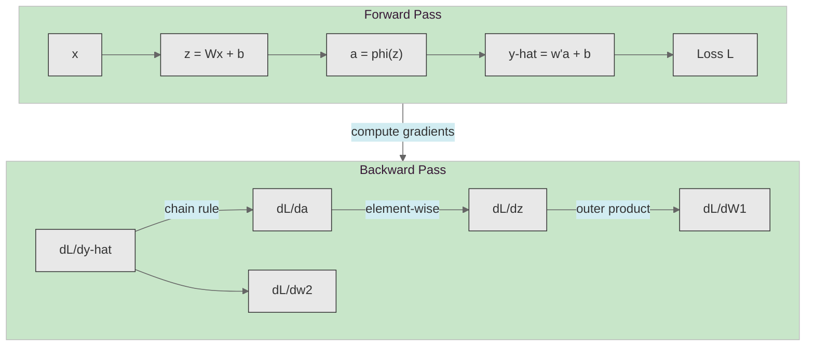
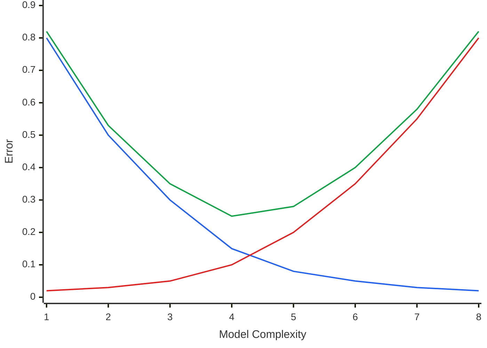
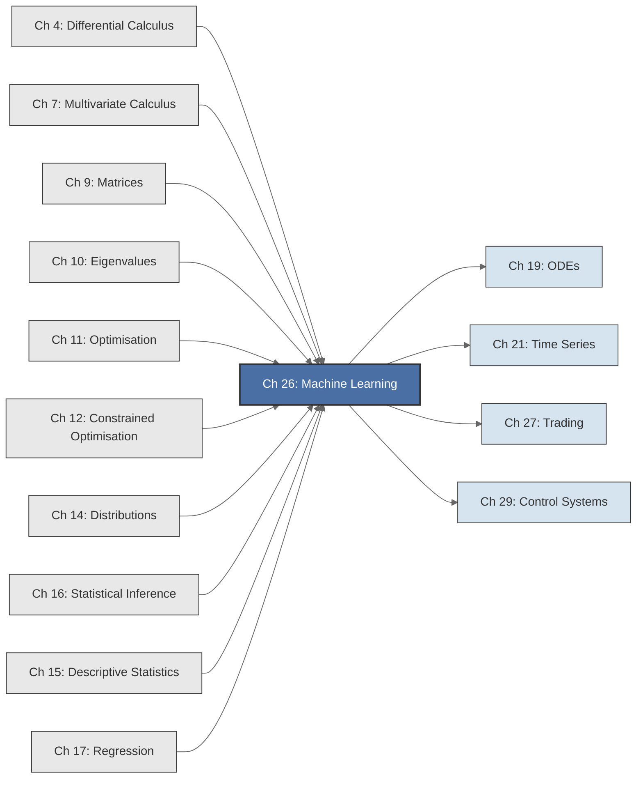

<!-- Copyright (c) 2025-2026 Bob Jansen <bobjansen@pm.me> -->
<!-- SPDX-License-Identifier: CC-BY-NC-4.0 -->
<!-- See LICENSE for full terms. Commercial licensing available. -->

# Chapter 26: Machine Learning Foundations


**Part IX**: Applications

> Machine learning algorithms are compositions of linear algebra, calculus, optimisation and probability; they shift the emphasis from inference to prediction and from closed-form estimators to iterative algorithms. This chapter derives the core methods (linear and logistic regression, regularisation, gradient descent, backpropagation and principal component analysis (PCA)) from the tools developed in the preceding twenty-five chapters.

**Prerequisites**: [Chapter 4](04-differential-calculus.md) (Differential Calculus); the chain rule, which is the basis of backpropagation. [Chapter 7](07-multivariate-calculus.md) (Multivariate Calculus); partial derivatives and the gradient vector. [Chapter 9](09-matrices.md) (Matrices); matrix multiplication, transpose, inverse and the normal equations. [Chapter 10](10-eigenvalues.md) (Eigenvalues); eigendecomposition of symmetric matrices and the spectral theorem. [Chapter 11](11-unconstrained-optimization.md) (Unconstrained Optimisation); gradient descent and convergence analysis. [Chapter 12](12-constrained-optimization.md) (Constrained Optimisation); ridge regression as penalised least squares and Least Absolute Shrinkage and Selection Operator (LASSO) as constrained optimisation. [Chapter 14](14-distributions.md) (Distributions); Bernoulli and Gaussian distributions. [Chapter 16](16-statistical-inference.md) (Statistical Inference); maximum likelihood estimation. [Chapter 17](17-regression.md) (Regression); ordinary least squares and the Gauss–Markov theorem.

**Learning Objectives**: After this chapter, the reader will be able to:

1. Reframe linear regression as a machine learning model with features, labels, a loss function and a training procedure.
2. Derive logistic regression from first principles via maximum likelihood and compute its gradient for optimisation.
3. Explain regularisation (ridge and LASSO) as constrained optimisation and derive the ridge estimator in closed form.
4. Distinguish batch gradient descent, stochastic gradient descent and mini-batch variants and analyse their convergence properties.
5. Apply the chain rule to compute gradients through a multilayer neural network (backpropagation).
6. Perform principal component analysis via eigendecomposition of the sample covariance matrix and interpret the variance explained.
7. Decompose prediction error into bias, variance and irreducible noise, and use this decomposition to reason about model complexity.

**Connections**: This chapter synthesises [Chapter 4](04-differential-calculus.md), [Chapter 7](07-multivariate-calculus.md), [Chapter 9](09-matrices.md), [Chapter 10](10-eigenvalues.md), [Chapter 11](11-unconstrained-optimization.md), [Chapter 12](12-constrained-optimization.md), [Chapter 14](14-distributions.md), [Chapter 16](16-statistical-inference.md) and [Chapter 17](17-regression.md) into a unified computational framework. It connects forward to [Chapter 19](19-odes.md) (ordinary differential equations (ODEs); neural ODEs and physics-informed neural networks), [Chapter 21](21-time-series.md) (Time Series; recurrent models), [Chapter 27](27-quantitative-trading.md) (Quantitative Trading; machine learning for alpha generation) and [Chapter 29](29-control-systems.md) (Control Systems; reinforcement learning).

---

## Historical Context

**Key Milestones in Machine Learning**



*Figure 26.1: Timeline of key milestones in machine learning from least squares to deep learning.*

**Least squares and statistical foundations (1805–1922).** Gauss (1809) and Legendre (1805) established that minimising squared errors yields optimal parameter estimates. This principle underpins linear regression, the simplest supervised learning algorithm. For over a century, it was the dominant method for learning from data. Fisher's maximum likelihood theory (1922) provided a unified framework for parameter estimation. The Gauss–Markov theorem (1821, 1912) established the optimality of least squares among linear unbiased estimators. These results, developed in [Chapter 17](17-regression.md), form the mathematical foundation of machine learning.

**The perceptron and the first AI winter (1958–1969).** Frank Rosenblatt's perceptron (1958) was a single-layer neural network that could learn linear decision boundaries from data. Rosenblatt proved a convergence theorem: if the training data are linearly separable, the algorithm finds a separating hyperplane in finite iterations. The *New York Times* reported that the Navy had built a machine that could "perceive, recognise and identify its surroundings."

**Minsky and Papert's critique (1969).** Marvin Minsky and Seymour Papert's monograph *Perceptrons* (1969) proved that single-layer networks cannot compute XOR or any function that is not linearly separable. Their analysis was correct but was widely interpreted as a verdict on neural networks in general. Funding for neural network research dried up; the field entered what is now called the "AI winter."

**Backpropagation and the neural network revival (1986).** The revival came in the 1980s. David Rumelhart, Geoffrey Hinton and Ronald Williams published "Learning representations by back-propagating errors" in 1986. They demonstrated that multilayer networks could be trained by propagating error gradients backward using the chain rule. Backpropagation was not entirely new; Seppo Linnainmaa had described automatic differentiation in 1970, and Paul Werbos had applied it to neural networks in his 1974 PhD thesis. The 1986 paper provided clear experimental demonstrations and prompted widespread adoption of neural network training. The chain rule, applied to a computational graph, provides an efficient algorithm for computing the gradient of a loss function with respect to all parameters simultaneously.

**Regularisation and kernel methods (1970–1996).** Kernel methods and support vector machines (Vapnik, 1995) dominated the 1990s and 2000s, offering theoretical guarantees that neural networks lacked. The bias–variance trade-off (Geman et al., 1992) provided the language for understanding overfitting. Regularisation methods, ridge regression (Hoerl and Kennard, 1970) and the LASSO (Tibshirani, 1996), demonstrated that penalty terms in the loss function can improve prediction dramatically.

**The deep learning era (2012–present).** The deep learning era began circa 2012. Alex Krizhevsky, Ilya Sutskever and Geoffrey Hinton showed that deep convolutional neural networks trained with backpropagation on graphics processing units (GPUs) outperform all prior methods on the ImageNet benchmark. Large datasets, GPU computation and algorithmic innovations (rectified linear unit (ReLU) activations, dropout regularisation, batch normalisation) were the enabling factors. Deep networks have since achieved superhuman performance in image recognition, speech recognition, machine translation and game playing. The mathematical principles remain those of 1986: compose linear transformations with nonlinear activations, define a differentiable loss function and apply the chain rule.

---

## Why This Chapter Matters

**Machine Learning**



*Figure 26.2: Mind map showing the core topics of machine learning foundations.*

Linear regression, logistic regression, regularisation, gradient descent, backpropagation and PCA are the mathematical primitives from which modern AI systems are constructed. Large language models, image classifiers, speech recognition systems, recommendation engines and autonomous vehicle perception stacks all reduce to defining a differentiable loss function and applying the chain rule to compute gradients through a parametrised computational graph.

The practical impact spans every industry. In healthcare, logistic regression predicts patient readmission risk; neural networks detect tumours in medical images with accuracy rivalling expert radiologists. In finance, regularised regression and gradient-boosted trees power credit scoring models that determine lending decisions for millions of consumers. In technology, backpropagation-trained transformers drive the natural language processing systems behind search engines, virtual assistants and automated translation. In manufacturing, PCA reduces high-dimensional sensor data to a manageable number of quality-control variables. In each case, the loss function, the gradient, the bias–variance trade-off and the regularisation parameter determine whether the system works reliably.

Machine learning does not introduce new mathematics. It composes tools from linear algebra, calculus, optimisation and statistics into a unified computational framework. The ridge estimator is a matrix formula from [Chapter 9](09-matrices.md) with a regularisation term motivated by [Chapter 12](12-constrained-optimization.md). Backpropagation is the chain rule of [Chapter 4](04-differential-calculus.md) applied to a computational graph. PCA is the eigendecomposition of [Chapter 10](10-eigenvalues.md) applied to a covariance matrix from [Chapter 15](15-descriptive-statistics.md). These connections clarify machine learning: it is a principled composition of well-understood mathematical operations.

---

## Notation & Conventions

| Symbol | Meaning |
|--------|---------|
| $n$ | Number of observations (training examples) |
| $p$ | Number of features (input dimensions) |
| $\mathbf{x}_i$ | Feature vector for observation $i$; an element of $\mathbb{R}^p$ |
| $y_i$ | Label (target) for observation $i$; real-valued for regression, $\{0, 1\}$ for binary classification |
| $X$ | Design matrix, $n \times p$ (or $n \times (p+1)$ with intercept column) |
| $\mathbf{y}$ | Label vector, $n \times 1$ |
| $\boldsymbol{\beta}$ or $\mathbf{w}$ | Parameter (weight) vector, $(p+1) \times 1$ |
| $\hat{y}_i$ | Predicted value for observation $i$ |
| $\mathcal{L}(\boldsymbol{\beta})$ | Loss function (objective to minimise) |
| $\lambda$ | Regularisation parameter |
| $\eta$ or $\alpha$ | Learning rate (step size in gradient descent) |
| $\gamma$ | Momentum coefficient in stochastic gradient descent (SGD) with momentum ($\gamma \in [0,1)$, typically $0.9$) |
| $B$ | Mini-batch size; $\mathcal{B}$ denotes the mini-batch index set |
| $\sigma(z)$ | Sigmoid (logistic) function: $\sigma(z) = 1/(1 + e^{-z})$ |
| $\nabla \mathcal{L}$ | Gradient of the loss with respect to parameters |
| $L$ | Number of layers in a neural network |
| $\Sigma$ | Covariance matrix, $p \times p$ |
| $\mathbf{v}_k$ | $k$-th eigenvector of $\Sigma$ (principal component direction) |
| $\lambda_k$ | $k$-th eigenvalue of $\Sigma$ (variance along $\mathbf{v}_k$) |
| $\operatorname{Bias}[\hat{f}]$ | $\mathbb{E}[\hat{f}(\mathbf{x})] - f(\mathbf{x})$; systematic error of the estimator |
| $\operatorname{Var}[\hat{f}]$ | $\mathbb{E}[(\hat{f}(\mathbf{x}) - \mathbb{E}[\hat{f}(\mathbf{x})])^2]$; sensitivity to training data |
| $\odot$ | Element-wise (Hadamard) product |

$X'$ denotes the transpose of $X$. Vectors are column vectors. The design matrix includes a column of ones for the intercept unless stated otherwise. Subscripts index observations ($i = 1, \ldots, n$) or layers ($l = 1, \ldots, L$). Superscripts in parentheses index layers: $\mathbf{a}^{(l)}$ is the activation of layer $l$. The symbol $\lambda$ without a subscript denotes the regularisation parameter; $\lambda_k$ denotes the $k$-th eigenvalue. Context disambiguates.

---

## Core Theory

**Training Loop:**



*Figure 26.3: Flowchart of the iterative training loop used to optimise neural network weights.*

### Linear Regression as a Machine Learning Model

The ordinary least squares estimator of [Chapter 17](17-regression.md) is the simplest supervised learning algorithm. Reframing it in machine learning terminology makes the generalisation to more complex models transparent.

**Definition 26.1** (Supervised learning problem). A *supervised learning problem* consists of a training set $\{(\mathbf{x}_i, y_i)\}_{i=1}^n$, where $\mathbf{x}_i \in \mathbb{R}^p$ is a *feature vector* (input) and $y_i$ is a *label* (output). The goal is to learn a function $f: \mathbb{R}^p \to \mathbb{R}$ (or $\mathbb{R}^p \to \{0,1\}$ for classification) that predicts labels for previously unseen feature vectors.

**Definition 26.2** (Linear regression as ML). In the linear regression model, the hypothesis class consists of affine functions:

$$\hat{y}_i = f(\mathbf{x}_i; \boldsymbol{\beta}) = \beta_0 + \beta_1 x_{i1} + \cdots + \beta_p x_{ip} = \mathbf{x}_i' \boldsymbol{\beta},$$

where the feature vector is augmented with a leading 1 for the intercept. The *loss function* is the mean squared error:

$$\mathcal{L}(\boldsymbol{\beta}) = \frac{1}{n} \sum_{i=1}^n (y_i - \mathbf{x}_i'\boldsymbol{\beta})^2 = \frac{1}{n} \|\mathbf{y} - X\boldsymbol{\beta}\|^2.$$

*Training* the model means finding $\hat{\boldsymbol{\beta}} = \arg\min_{\boldsymbol{\beta}} \mathcal{L}(\boldsymbol{\beta})$.

**Theorem 26.3** (Closed-form solution). The minimiser of the mean squared error loss is the ordinary least squares (OLS) estimator:

$$\hat{\boldsymbol{\beta}} = (X'X)^{-1}X'\mathbf{y}.$$

??? note "Proof"

    *Proof.* This is Theorem 17.6 of [Chapter 17](17-regression.md). Computing the gradient ([Chapter 7](07-multivariate-calculus.md)):

    $$\nabla_{\boldsymbol{\beta}} \mathcal{L} = -\frac{2}{n}X'(\mathbf{y} - X\boldsymbol{\beta}).$$

    Setting this to zero yields the normal equations:

    $$X'X\boldsymbol{\beta} = X'\mathbf{y}.$$

    Since $X'X$ is positive definite (assuming $X$ has full column rank), it is invertible ([Chapter 9](09-matrices.md)), giving the unique solution

    $$\hat{\boldsymbol{\beta}} = (X'X)^{-1}X'\mathbf{y}.$$

    The Hessian $(2/n)X'X$ is positive definite, confirming this critical point is a minimum. $\square$

The machine learning perspective adds three considerations absent from the classical statistical treatment: (i) prediction error on unseen data, not just in-sample fit; (ii) computational cost of finding the optimum; and (iii) the effect of model complexity on generalisation.

### Logistic Regression

When the label $y_i \in \{0, 1\}$ is binary, linear regression is inappropriate: predicted values are not constrained to $[0,1]$. Logistic regression addresses this by modelling the *probability* of $y_i = 1$ via the sigmoid function.

**Definition 26.4** (Sigmoid function). The *sigmoid* (logistic) function is

$$\sigma(z) = \frac{1}{1 + e^{-z}}.$$

It maps $\mathbb{R}$ to $(0, 1)$, satisfies $\sigma(0) = 1/2$ and has the symmetry property $\sigma(-z) = 1 - \sigma(z)$. Its derivative is $\sigma'(z) = \sigma(z)(1 - \sigma(z))$.

**Definition 26.5** (Logistic regression model). The logistic regression model specifies

$$P(y_i = 1 \mid \mathbf{x}_i) = \sigma(\mathbf{x}_i'\boldsymbol{\beta}) = \frac{1}{1 + e^{-\mathbf{x}_i'\boldsymbol{\beta}}}.$$

The *log-odds* (logit) is linear in the features: $\log\frac{P(y=1|\mathbf{x})}{P(y=0|\mathbf{x})} = \mathbf{x}'\boldsymbol{\beta}$.

**Definition 26.6** (Binary cross-entropy). The *binary cross-entropy* (also called log loss) between a true label $y \in \{0,1\}$ and a predicted probability $\hat{p} \in (0,1)$ is $-[y\log\hat{p} + (1-y)\log(1-\hat{p})]$. It measures the divergence between the empirical label distribution and the model's predicted probability, and equals the negative log-likelihood of a single Bernoulli ([Chapter 14](14-distributions.md)) observation.

**Theorem 26.7** (Cross-entropy loss from maximum likelihood estimation (MLE)). Under the assumption that $y_i \sim \text{Bernoulli}(\sigma(\mathbf{x}_i'\boldsymbol{\beta}))$ independently, the negative log-likelihood ([Chapter 16](16-statistical-inference.md)) is

$$\mathcal{L}(\boldsymbol{\beta}) = -\frac{1}{n}\sum_{i=1}^n \left[ y_i \log \sigma(\mathbf{x}_i'\boldsymbol{\beta}) + (1 - y_i)\log(1 - \sigma(\mathbf{x}_i'\boldsymbol{\beta})) \right].$$

This is the *binary cross-entropy* loss.

??? note "Proof"

    *Proof.* Under the Bernoulli independence assumption, the likelihood of the sample is

    $$L(\boldsymbol{\beta}) = \prod_{i=1}^n \sigma(\mathbf{x}_i'\boldsymbol{\beta})^{y_i}\left(1 - \sigma(\mathbf{x}_i'\boldsymbol{\beta})\right)^{1-y_i}.$$

    Taking the logarithm converts the product to a sum:

    $$\ell(\boldsymbol{\beta}) = \sum_{i=1}^n \left[ y_i \log \sigma(\mathbf{x}_i'\boldsymbol{\beta}) + (1-y_i)\log\!\left(1 - \sigma(\mathbf{x}_i'\boldsymbol{\beta})\right) \right].$$

    The MLE maximises $\ell(\boldsymbol{\beta})$, which is equivalent to minimising $\mathcal{L}(\boldsymbol{\beta}) = -\ell(\boldsymbol{\beta})/n$.

    This is the cross-entropy between the empirical label distribution and the model's predicted probabilities. $\square$

**Theorem 26.8** (Gradient of cross-entropy loss). The gradient of the cross-entropy loss with respect to $\boldsymbol{\beta}$ is

$$\nabla_{\boldsymbol{\beta}} \mathcal{L} = \frac{1}{n} \sum_{i=1}^n (\sigma(\mathbf{x}_i'\boldsymbol{\beta}) - y_i)\,\mathbf{x}_i = \frac{1}{n} X'(\hat{\mathbf{y}} - \mathbf{y}),$$

where $\hat{\mathbf{y}} = (\sigma(\mathbf{x}_1'\boldsymbol{\beta}), \ldots, \sigma(\mathbf{x}_n'\boldsymbol{\beta}))'$.

??? note "Proof"

    *Proof.* Write $p_i = \sigma(\mathbf{x}_i'\boldsymbol{\beta})$ and use $\sigma'(z) = \sigma(z)(1 - \sigma(z))$. Differentiating the $i$-th log-likelihood term:

    $$\frac{\partial}{\partial \boldsymbol{\beta}} \left[ y_i \log p_i + (1-y_i)\log(1-p_i) \right] = y_i \frac{\sigma'(\mathbf{x}_i'\boldsymbol{\beta})}{\sigma(\mathbf{x}_i'\boldsymbol{\beta})}\mathbf{x}_i - (1-y_i)\frac{\sigma'(\mathbf{x}_i'\boldsymbol{\beta})}{1 - \sigma(\mathbf{x}_i'\boldsymbol{\beta})}\mathbf{x}_i.$$

    Substituting $\sigma'(\mathbf{x}_i'\boldsymbol{\beta}) = p_i(1-p_i)$:

    $$= y_i(1-p_i)\mathbf{x}_i - (1-y_i)p_i\mathbf{x}_i = \bigl(y_i - p_i\bigr)\mathbf{x}_i.$$

    Negating and averaging over all $n$ observations gives

    $$\nabla_{\boldsymbol{\beta}}\mathcal{L} = \frac{1}{n}\sum_{i=1}^n(p_i - y_i)\mathbf{x}_i = \frac{1}{n}X'(\hat{\mathbf{y}} - \mathbf{y}).$$

    $\square$

The gradient has the same form as the linear regression gradient, the residual $(p_i - y_i)$ multiplied by the feature vector, but the residual is now the difference between a probability and a binary label. There is no closed-form solution; the parameters must be found iteratively.

### Regularisation

**Definition 26.9** (Ridge regression / L2 regularisation). *Ridge regression* augments the squared error loss with a penalty on the squared norm of the coefficients:

$$\mathcal{L}_{\text{ridge}}(\boldsymbol{\beta}) = \frac{1}{n}\|\mathbf{y} - X\boldsymbol{\beta}\|^2 + \lambda \|\boldsymbol{\beta}\|^2,$$

where $\lambda > 0$ is the regularisation parameter. The penalty $\lambda\|\boldsymbol{\beta}\|^2 = \lambda \sum_{j=1}^p \beta_j^2$ shrinks coefficients toward zero.

**Theorem 26.10** (Ridge estimator). The minimiser of the ridge objective has a closed-form solution:

$$\boldsymbol{\beta}_{\text{ridge}} = (X'X + n\lambda I)^{-1}X'\mathbf{y}.$$

??? note "Proof"

    *Proof.* The gradient of the ridge objective is

    $$\nabla_{\boldsymbol{\beta}}\mathcal{L}_{\text{ridge}} = -\frac{2}{n}X'(\mathbf{y} - X\boldsymbol{\beta}) + 2\lambda\boldsymbol{\beta}.$$

    Setting this to zero and multiplying through by $n/2$ yields

    $$X'X\boldsymbol{\beta} + n\lambda\boldsymbol{\beta} = X'\mathbf{y} \implies (X'X + n\lambda I)\boldsymbol{\beta} = X'\mathbf{y}.$$

    The matrix $X'X + n\lambda I$ is positive definite for any $\lambda > 0$ (even when $X'X$ is singular), so its inverse exists and the solution is unique:

    $$\boldsymbol{\beta}_{\text{ridge}} = (X'X + n\lambda I)^{-1}X'\mathbf{y}.$$

    $\square$

**Remark 26.11** (Constrained optimisation interpretation). Ridge regression is equivalent to the constrained problem: minimise $\|\mathbf{y} - X\boldsymbol{\beta}\|^2$ subject to $\|\boldsymbol{\beta}\|^2 \leq t$ for some $t > 0$. By the Karush–Kuhn–Tucker (KKT) conditions ([Chapter 12](12-constrained-optimization.md)), the Lagrange multiplier on the constraint is proportional to $\lambda$. Geometrically, the ridge solution lies at the intersection of the OLS contour ellipsoids and the $L_2$ ball.

**Remark 26.12** (Eigenvalue interpretation). If the eigendecomposition of $X'X$ is $X'X = V\Lambda V'$ with eigenvalues $\lambda_1 \geq \cdots \geq \lambda_p > 0$, then the OLS estimator in the eigenbasis is $\tilde{\beta}_j^{\text{OLS}} = d_j / \lambda_j$ and the ridge estimator is $\tilde{\beta}_j^{\text{ridge}} = d_j / (\lambda_j + n\lambda)$, where $d_j = \mathbf{v}_j'X'\mathbf{y}$. Ridge regression shrinks coefficients along directions of small eigenvalues (high variance) more aggressively than along directions of large eigenvalues. This is precisely the regularisation needed when $X'X$ is ill-conditioned ([Chapter 10](10-eigenvalues.md)).

**Definition 26.13** (LASSO / L1 regularisation). The *LASSO* (Least Absolute Shrinkage and Selection Operator) uses an $L_1$ penalty:

$$\mathcal{L}_{\text{LASSO}}(\boldsymbol{\beta}) = \frac{1}{n}\|\mathbf{y} - X\boldsymbol{\beta}\|^2 + \lambda \|\boldsymbol{\beta}\|_1,$$

where $\|\boldsymbol{\beta}\|_1 = \sum_{j=1}^p |\beta_j|$. The $L_1$ penalty promotes *sparsity*: it drives some coefficients exactly to zero, performing simultaneous estimation and variable selection. Unlike ridge, there is no closed-form solution; the LASSO must be solved iteratively (e.g., via coordinate descent).

### Gradient Descent Variants

When closed-form solutions are unavailable (logistic regression, neural networks, LASSO), iterative optimisation is required. [Chapter 11](11-unconstrained-optimization.md) presents gradient descent in its basic form; machine learning practice uses several important variants.

**Definition 26.14** (Batch gradient descent). *Batch gradient descent* updates parameters using the gradient computed over the entire training set:

$$\boldsymbol{\beta}^{(t+1)} = \boldsymbol{\beta}^{(t)} - \eta \nabla_{\boldsymbol{\beta}} \mathcal{L}(\boldsymbol{\beta}^{(t)}),$$

where $\eta > 0$ is the learning rate and $\nabla_{\boldsymbol{\beta}}\mathcal{L}$ is averaged over all $n$ observations.

**Definition 26.15** (Stochastic gradient descent). *Stochastic gradient descent* (SGD) approximates the full gradient with the gradient computed on a single randomly selected observation $i$:

$$\boldsymbol{\beta}^{(t+1)} = \boldsymbol{\beta}^{(t)} - \eta \nabla_{\boldsymbol{\beta}} \ell_i(\boldsymbol{\beta}^{(t)}),$$

where $\ell_i$ is the loss on sample $i$. Since $\mathbb{E}_i[\nabla\ell_i] = \nabla\mathcal{L}$, the SGD update is an unbiased estimate of the batch gradient, but with variance proportional to the within-sample variability of gradients.

**Definition 26.16** (Mini-batch gradient descent). *Mini-batch gradient descent* averages the gradient over a random subset $\mathcal{B} \subset \{1, \ldots, n\}$ of size $B$:

$$\boldsymbol{\beta}^{(t+1)} = \boldsymbol{\beta}^{(t)} - \eta \cdot \frac{1}{B}\sum_{i \in \mathcal{B}} \nabla_{\boldsymbol{\beta}} \ell_i(\boldsymbol{\beta}^{(t)}).$$

Mini-batch SGD is the standard in practice: $B = 32$ to $512$ provides a good trade-off between gradient variance (which decreases as $1/B$) and computational efficiency (vectorised linear algebra on modern hardware).

**Theorem 26.17** (Convergence of SGD). For a convex loss function $\mathcal{L}$ with $M$-Lipschitz gradient and bounded stochastic gradient variance $\mathbb{E}[\|\nabla\ell_i - \nabla\mathcal{L}\|^2] \leq \sigma^2$, SGD with learning rate $\eta_t = c/\sqrt{t}$ satisfies

$$\mathbb{E}[\mathcal{L}(\bar{\boldsymbol{\beta}}^{(T)})] - \mathcal{L}(\boldsymbol{\beta}^*) \leq O\left(\frac{\sigma}{\sqrt{T}}\right),$$

where $\bar{\boldsymbol{\beta}}^{(T)}$ is the average of the iterates. The convergence rate $O(1/\sqrt{T})$ is slower than the $O(1/T)$ rate of batch gradient descent for smooth convex functions, reflecting the cost of gradient noise.

**Definition 26.18** (Momentum). *Momentum* (Polyak, 1964) accelerates gradient descent by accumulating a velocity vector:

$$\begin{aligned}
\mathbf{v}^{(t+1)} &= \gamma \mathbf{v}^{(t)} + \eta \nabla_{\boldsymbol{\beta}}\mathcal{L}(\boldsymbol{\beta}^{(t)}), \\
\boldsymbol{\beta}^{(t+1)} &= \boldsymbol{\beta}^{(t)} - \mathbf{v}^{(t+1)},
\end{aligned}$$

where $\gamma \in [0, 1)$ is the momentum coefficient (typically $\gamma = 0.9$). Momentum damps oscillations in high-curvature directions and accelerates progress in low-curvature directions. For quadratic objectives, momentum reduces the per-iteration contraction factor from $(\kappa - 1)/(\kappa + 1)$ to $(\sqrt{\kappa} - 1)/(\sqrt{\kappa} + 1)$, where $\kappa$ is the condition number of the Hessian.

### Backpropagation

Backpropagation is the application of the chain rule ([Chapter 4](04-differential-calculus.md)) to computational graphs. It computes the gradient of a scalar loss with respect to all parameters in a multi-layer network in time proportional to a single forward pass.

**Definition 26.19** (Feedforward neural network). A *feedforward neural network* with $L$ layers computes the function

$$f(\mathbf{x}) = \phi_L(W_L \phi_{L-1}(W_{L-1} \cdots \phi_1(W_1 \mathbf{x} + \mathbf{b}_1) \cdots + \mathbf{b}_{L-1}) + \mathbf{b}_L),$$

where $W_l$ is the weight matrix of layer $l$, $\mathbf{b}_l$ is the bias vector and $\phi_l$ is a nonlinear activation function applied element-wise. Each layer computes a linear transformation followed by a pointwise nonlinearity.

**Theorem 26.20** (Backpropagation for a two-layer network). Consider a network with one hidden layer:

$$\mathbf{z}^{(1)} = W_1\mathbf{x} + \mathbf{b}_1, \quad \mathbf{a}^{(1)} = \phi(\mathbf{z}^{(1)}), \quad \hat{y} = \mathbf{w}_2'\mathbf{a}^{(1)} + b_2,$$

and loss $\mathcal{L} = \frac{1}{2}(\hat{y} - y)^2$. The gradients are:

*Output layer:*

$$\begin{aligned}
\delta^{(2)} &= \frac{\partial \mathcal{L}}{\partial \hat{y}} = \hat{y} - y, \\
\frac{\partial \mathcal{L}}{\partial \mathbf{w}_2} &= \delta^{(2)} \mathbf{a}^{(1)}, \quad \frac{\partial \mathcal{L}}{\partial b_2} = \delta^{(2)}.
\end{aligned}$$

*Hidden layer:*

$$\begin{aligned}
\delta^{(1)} &= (\mathbf{w}_2 \delta^{(2)}) \odot \phi'(\mathbf{z}^{(1)}), \\
\frac{\partial \mathcal{L}}{\partial W_1} &= \delta^{(1)} \mathbf{x}', \quad \frac{\partial \mathcal{L}}{\partial \mathbf{b}_1} = \delta^{(1)}.
\end{aligned}$$

??? note "Proof"

    *Proof.* Since $\mathcal{L} = \frac{1}{2}(\hat{y} - y)^2$, the chain rule ([Chapter 4](04-differential-calculus.md)) gives

    $$\frac{\partial \mathcal{L}}{\partial \hat{y}} = \hat{y} - y = \delta^{(2)}.$$

    For the output weights, since $\hat{y} = \mathbf{w}_2'\mathbf{a}^{(1)} + b_2$, it follows that $\partial\hat{y}/\partial\mathbf{w}_2 = \mathbf{a}^{(1)}$, so

    $$\frac{\partial\mathcal{L}}{\partial\mathbf{w}_2} = \delta^{(2)}\mathbf{a}^{(1)}, \qquad \frac{\partial\mathcal{L}}{\partial b_2} = \delta^{(2)}.$$

    For the hidden layer, applying the chain rule through the composition $\mathcal{L} \to \hat{y} \to \mathbf{a}^{(1)} \to \mathbf{z}^{(1)} \to W_1$, the $j$-th component satisfies

    $$\frac{\partial \mathcal{L}}{\partial z_j^{(1)}} = \frac{\partial \mathcal{L}}{\partial \hat{y}} \cdot \frac{\partial \hat{y}}{\partial a_j^{(1)}} \cdot \frac{\partial a_j^{(1)}}{\partial z_j^{(1)}} = \delta^{(2)} \cdot w_{2j} \cdot \phi'\!\left(z_j^{(1)}\right).$$

    In vector form, $\delta^{(1)} = (\mathbf{w}_2 \delta^{(2)}) \odot \phi'(\mathbf{z}^{(1)})$.

    Finally, since $\mathbf{z}^{(1)} = W_1\mathbf{x} + \mathbf{b}_1$, differentiating with respect to $W_1$ (in the outer-product sense) gives

    $$\frac{\partial\mathcal{L}}{\partial W_1} = \delta^{(1)}\mathbf{x}'.$$

    $\square$

!!! abstract "Key Result"

    **Theorem 26.20** (Backpropagation). The chain rule applied to a computational graph computes the gradient of the loss with respect to every weight in a neural network in time proportional to a single forward pass, making gradient-based training of deep networks practical.

**Backpropagation Data Flow:**



*Figure 26.4: Data flow through forward and backward passes in backpropagation.*

The forward pass (top row) computes the prediction and loss. The backward pass (bottom row) propagates the error signal through each layer using the chain rule, computing gradients with respect to all parameters. The computational cost of the backward pass is proportional to the forward pass.

The general pattern extends to $L$ layers: the error signal $\delta^{(l)}$ at layer $l$ is computed by propagating $\delta^{(l+1)}$ backward through the weight matrix $W_{l+1}$ and element-wise multiplying by the activation derivative $\phi'(\mathbf{z}^{(l)})$. The computational cost of backward propagation is $O(1)$ times the cost of the forward pass, regardless of the number of parameters.

### Principal Component Analysis

PCA reduces the dimensionality of data by projecting onto the directions of maximum variance. It is the eigendecomposition of the covariance matrix applied as a learning algorithm.

**Definition 26.21** (Sample covariance matrix). Given centred data $\tilde{X}$ (each column has mean zero), the *sample covariance matrix* is

$$\Sigma = \frac{1}{n-1}\tilde{X}'\tilde{X}.$$

This is a $p \times p$ symmetric positive semidefinite matrix.

**Theorem 26.22** (PCA via eigendecomposition). The principal components are the eigenvectors of $\Sigma$. Specifically, let $\Sigma = V\Lambda V'$ be the eigendecomposition with eigenvalues $\lambda_1 \geq \lambda_2 \geq \cdots \geq \lambda_p \geq 0$ and corresponding orthonormal eigenvectors $\mathbf{v}_1, \ldots, \mathbf{v}_p$. Then:

(a) The first principal component direction $\mathbf{v}_1$ solves $\max_{\|\mathbf{u}\|=1} \operatorname{Var}(\tilde{X}\mathbf{u}) = \max_{\|\mathbf{u}\|=1} \mathbf{u}'\Sigma\mathbf{u}$.

(b) The $k$-th principal component direction $\mathbf{v}_k$ maximises the variance among all unit vectors orthogonal to $\mathbf{v}_1, \ldots, \mathbf{v}_{k-1}$.

(c) The proportion of total variance explained by the first $K$ components is $\sum_{k=1}^K \lambda_k / \sum_{k=1}^p \lambda_k$.

??? note "Proof"

    *Proof.*

    **Part (a).** The constrained optimisation $\max \mathbf{u}'\Sigma\mathbf{u}$ subject to $\|\mathbf{u}\| = 1$ has the Lagrangian

    $$\mathcal{L} = \mathbf{u}'\Sigma\mathbf{u} - \mu(\mathbf{u}'\mathbf{u} - 1).$$

    The first-order condition $\partial\mathcal{L}/\partial\mathbf{u} = 0$ gives $\Sigma\mathbf{u} = \mu\mathbf{u}$, so $\mathbf{u}$ must be an eigenvector of $\Sigma$ with eigenvalue $\mu$.

    Evaluating the objective at a feasible solution: $\mathbf{u}'\Sigma\mathbf{u} = \mu\mathbf{u}'\mathbf{u} = \mu$. The maximum is therefore achieved at the largest eigenvalue $\mu = \lambda_1$, with direction $\mathbf{v}_1$.

    **Part (b).** Restricting to the subspace orthogonal to $\mathbf{v}_1, \ldots, \mathbf{v}_{k-1}$ and applying the same Lagrangian argument yields $\mathbf{v}_k$ with objective value $\lambda_k$. This is a direct consequence of the spectral theorem ([Chapter 10](10-eigenvalues.md)).

    **Part (c).** Since $\operatorname{Var}(\tilde{X}\mathbf{v}_k) = \mathbf{v}_k'\Sigma\mathbf{v}_k = \lambda_k$ and the total variance is $\operatorname{tr}(\Sigma) = \sum_{k=1}^p \lambda_k$, the proportion explained by the first $K$ components is $\sum_{k=1}^K \lambda_k / \sum_{k=1}^p \lambda_k$. $\square$

**Definition 26.23** (Dimensionality reduction). The *PCA projection* onto $K < p$ dimensions maps each observation $\mathbf{x}_i$ to the $K$-dimensional representation $\mathbf{z}_i = V_K'(\mathbf{x}_i - \bar{\mathbf{x}})$, where $V_K = [\mathbf{v}_1, \ldots, \mathbf{v}_K]$ is the $p \times K$ matrix of the first $K$ eigenvectors. The reconstruction is $\hat{\mathbf{x}}_i = \bar{\mathbf{x}} + V_K\mathbf{z}_i$. Among all rank-$K$ linear projections, PCA minimises the mean squared reconstruction error $\frac{1}{n}\sum_{i=1}^n \|\mathbf{x}_i - \hat{\mathbf{x}}_i\|^2$.

### Bias–Variance Trade-off

The bias–variance decomposition is the fundamental theoretical tool for understanding generalisation in supervised learning.

**Theorem 26.24** (Bias–variance decomposition). Let $f(\mathbf{x})$ be the true function, $y = f(\mathbf{x}) + \varepsilon$ with $\mathbb{E}[\varepsilon] = 0$ and $\operatorname{Var}(\varepsilon) = \sigma^2$, and $\hat{f}(\mathbf{x})$ be an estimator trained on a random training set. The expected prediction error at a point $\mathbf{x}$ is

$$\mathbb{E}[(y - \hat{f}(\mathbf{x}))^2] = \bigl(\operatorname{Bias}[\hat{f}(\mathbf{x})]\bigr)^2 + \operatorname{Var}[\hat{f}(\mathbf{x})] + \sigma^2,$$

where $\operatorname{Bias}[\hat{f}(\mathbf{x})] = \mathbb{E}[\hat{f}(\mathbf{x})] - f(\mathbf{x})$ and $\operatorname{Var}[\hat{f}(\mathbf{x})] = \mathbb{E}[(\hat{f}(\mathbf{x}) - \mathbb{E}[\hat{f}(\mathbf{x})])^2]$.

??? note "Proof"

    *Proof.* Let $\bar{f} = \mathbb{E}[\hat{f}(\mathbf{x})]$. Add and subtract $f(\mathbf{x})$ and $\bar{f}$ inside the expectation:

    $$\mathbb{E}\!\left[(y - \hat{f})^2\right] = \mathbb{E}\!\left[\bigl((y - f) + (f - \bar{f}) + (\bar{f} - \hat{f})\bigr)^2\right].$$

    Expanding the square produces three squared terms and three pairs of cross terms.

    The squared terms contribute:

    $$\mathbb{E}[(y - f)^2] = \sigma^2, \qquad (f - \bar{f})^2 = \operatorname{Bias}^2, \qquad \mathbb{E}[(\hat{f} - \bar{f})^2] = \operatorname{Var}.$$

    The cross terms vanish:

    - $\mathbb{E}[\varepsilon(\bar{f} - \hat{f})] = 0$: the noise $\varepsilon = y - f$ is independent of the training set, hence independent of $\hat{f}$ and $\bar{f}$.
    - $\mathbb{E}[\varepsilon](f - \bar{f}) = 0$: since $\mathbb{E}[\varepsilon] = 0$.
    - $2(f - \bar{f})\,\mathbb{E}[\hat{f} - \bar{f}] = 0$: since $\mathbb{E}[\hat{f} - \bar{f}] = 0$ by definition of $\bar{f}$.

    Collecting the surviving terms:

    $$\mathbb{E}\!\left[(y-\hat{f})^2\right] = \sigma^2 + \operatorname{Bias}^2 + \operatorname{Var}.$$

    $\square$

**Remark 26.25** (Implications for model selection). Simple models (few parameters) typically have high bias and low variance; complex models (many parameters) have low bias and high variance. Regularisation ($\lambda > 0$) introduces bias (shrinking coefficients toward zero) but reduces variance (stabilising the estimate against sampling fluctuations). The optimal model complexity minimises the sum $\operatorname{Bias}^2 + \operatorname{Var}$, not either component individually. This trade-off governs the choice of $\lambda$ in ridge regression, the number of hidden units in a neural network and the number of principal components retained in PCA.

**Bias–Variance Trade-off:**



*Figure 26.5: Bias–variance trade-off showing the U-shaped total error as model complexity increases.*

As model complexity increases, bias decreases monotonically (the model can represent increasingly complex functions) while variance increases monotonically (the model becomes increasingly sensitive to the particular training set). The total error, the sum of bias squared, variance and irreducible noise, achieves its minimum at an intermediate complexity. Underfitting (left) suffers from high bias; overfitting (right) suffers from high variance.

### Neural Networks as Composed Linear Operators

**Definition 26.26** (Neural network as a composition). A neural network with $L$ layers implements the function

$$f(\mathbf{x}) = \phi_L \circ T_L \circ \phi_{L-1} \circ T_{L-1} \circ \cdots \circ \phi_1 \circ T_1(\mathbf{x}),$$

where $T_l(\mathbf{z}) = W_l\mathbf{z} + \mathbf{b}_l$ is an affine transformation and $\phi_l$ is a nonlinear activation. Without the nonlinearities, the composition collapses to a single affine map: $T_L \circ \cdots \circ T_1(\mathbf{x}) = (W_L \cdots W_1)\mathbf{x} + \text{(bias terms)}$. The nonlinearities are necessary for representational power.

**Theorem 26.27** (Necessity of nonlinearity). A composition of $L$ affine transformations without activation functions is itself an affine transformation. Specifically, if $f_l(\mathbf{z}) = W_l\mathbf{z} + \mathbf{b}_l$ for $l = 1, \ldots, L$, then $f_L \circ \cdots \circ f_1(\mathbf{x}) = W\mathbf{x} + \mathbf{b}$, where $W = W_L W_{L-1} \cdots W_1$ and $\mathbf{b}$ is a combined bias vector.

??? note "Proof"

    *Proof.* By induction on $L$.

    The base case $L = 1$ is trivial: $f_1(\mathbf{x}) = W_1\mathbf{x} + \mathbf{b}_1$ is affine by definition.

    For the inductive step, suppose $f_{L-1} \circ \cdots \circ f_1(\mathbf{x}) = \tilde{W}\mathbf{x} + \tilde{\mathbf{b}}$ for some matrix $\tilde{W}$ and vector $\tilde{\mathbf{b}}$. Then

    $$f_L\!\left(\tilde{W}\mathbf{x} + \tilde{\mathbf{b}}\right) = W_L\!\left(\tilde{W}\mathbf{x} + \tilde{\mathbf{b}}\right) + \mathbf{b}_L = (W_L \tilde{W})\mathbf{x} + (W_L\tilde{\mathbf{b}} + \mathbf{b}_L),$$

    which is affine with weight matrix $W_L\tilde{W}$ and bias $W_L\tilde{\mathbf{b}} + \mathbf{b}_L$. $\square$

**Remark 26.28** (Common activation functions). Standard choices include: the *ReLU* $\phi(z) = \max(0, z)$, which introduces a kink at zero and makes the network piecewise linear; the *sigmoid* $\sigma(z) = 1/(1+e^{-z})$, which saturates for large $|z|$; and the *tanh* $\phi(z) = (e^z - e^{-z})/(e^z + e^{-z})$, which is zero-centred. ReLU is the default in modern practice because it avoids the vanishing gradient problem: $\phi'(z) = 1$ for $z > 0$, so gradients do not decay exponentially through layers.

---

## Formulas & Identities

**F26.1** OLS estimator (for $X$ of full column rank):

$$\hat{\boldsymbol{\beta}} = (X'X)^{-1}X'\mathbf{y}$$

**F26.2** Ridge estimator ($\lambda > 0$):

$$\hat{\boldsymbol{\beta}}_{\text{ridge}} = (X'X + n\lambda I)^{-1}X'\mathbf{y}$$

**F26.3** Sigmoid and its derivative:

$$\sigma(z) = \frac{1}{1 + e^{-z}}, \qquad \sigma'(z) = \sigma(z)(1 - \sigma(z))$$

**F26.4** Cross-entropy loss:

$$\mathcal{L} = -\frac{1}{n}\sum_{i=1}^n \bigl[y_i \log \sigma(\mathbf{x}_i'\boldsymbol{\beta}) + (1-y_i)\log(1 - \sigma(\mathbf{x}_i'\boldsymbol{\beta}))\bigr]$$

**F26.5** SGD update:

$$\boldsymbol{\beta}^{(t+1)} = \boldsymbol{\beta}^{(t)} - \eta \nabla_{\boldsymbol{\beta}} \ell_i(\boldsymbol{\beta}^{(t)})$$

**F26.6** Momentum update:

$$\begin{aligned}
\mathbf{v}^{(t+1)} &= \gamma \mathbf{v}^{(t)} + \eta \nabla \mathcal{L}, \\
\boldsymbol{\beta}^{(t+1)} &= \boldsymbol{\beta}^{(t)} - \mathbf{v}^{(t+1)}.
\end{aligned}$$

**F26.7** PCA variance explained:

$$\frac{\sum_{k=1}^K \lambda_k}{\sum_{k=1}^p \lambda_k}$$

**F26.8** Bias–variance decomposition:

$$\mathbb{E}[(y - \hat{f})^2] = \operatorname{Bias}^2 + \operatorname{Var} + \sigma^2$$

---

## Algorithms

!!! tip "Choosing the learning rate"

    For quadratic losses, convergence requires $\eta < 2/\lambda_{\max}(H)$ where $H$ is the Hessian. A safe default is $\eta = 0.01$ with a decay schedule. Adaptive methods (Adam, RMSProp) adjust $\eta$ per parameter automatically.

### Algorithm 26.29: Batch Gradient Descent

**Input**: Loss function $\mathcal{L}(\boldsymbol{\beta})$, initial parameters $\boldsymbol{\beta}^{(0)}$, learning rate $\eta$, tolerance $\varepsilon$, max iterations $T$.
**Output**: Optimised parameters $\boldsymbol{\beta}^*$.

```
function batchGradientDescent(L, grad_L, beta0, eta, epsilon, T):
    beta = beta0
    for t = 1 to T:
        g = grad_L(beta)
        beta_new = beta - eta * g
        if ||beta_new - beta|| < epsilon:
            return beta_new
        beta = beta_new
    return beta
```

**Complexity**: $O(nd)$ per iteration, where $n$ is the number of observations and $d$ is the number of parameters.

### Algorithm 26.30: Stochastic Gradient Descent with Mini-Batches

**Input**: Training data $(X, \mathbf{y})$, batch size $B$, learning rate schedule $\eta_t$, epochs $E$.
**Output**: Optimised parameters $\boldsymbol{\beta}^*$.

```
function sgd(X, y, B, eta_schedule, E, beta0):
    beta = beta0
    n = number of rows in X
    for epoch = 1 to E:
        shuffle indices {1, ..., n}
        for each mini-batch B_k of size B:
            g = (1/B) * sum of grad_L_i(beta) for i in B_k
            eta = eta_schedule(epoch, k)
            beta = beta - eta * g
    return beta
```

**Complexity**: $O(Bd)$ per mini-batch update, where $B$ is the batch size and $d$ is the number of parameters.

### Algorithm 26.31: SGD with Momentum

**Input**: Training data, batch size $B$, learning rate $\eta$, momentum coefficient $\gamma$, epochs $E$.
**Output**: Optimised parameters $\boldsymbol{\beta}^*$.

```
function sgdMomentum(X, y, B, eta, gamma, E, beta0):
    beta = beta0
    v = 0  (velocity, same dimension as beta)
    for epoch = 1 to E:
        shuffle indices {1, ..., n}
        for each mini-batch B_k of size B:
            g = (1/B) * sum of grad_L_i(beta) for i in B_k
            v = gamma * v + eta * g
            beta = beta - v
    return beta
```

**Complexity**: $O(Bd)$ per mini-batch update, where $B$ is the batch size and $d$ is the number of parameters.

### Algorithm 26.32: Logistic Regression via Gradient Descent

**Input**: Design matrix $X$ ($n \times (p+1)$), labels $\mathbf{y}$ ($\{0,1\}^n$), learning rate $\eta$, iterations $T$.
**Output**: Coefficient vector $\boldsymbol{\beta}$.

```
function logisticRegression(X, y, eta, T):
    beta = zeros(p + 1)
    for t = 1 to T:
        p_hat = sigmoid(X * beta)         // n x 1 vector of probabilities
        gradient = (1/n) * X' * (p_hat - y)
        beta = beta - eta * gradient
    return beta
```

**Complexity**: $O(nd)$ per iteration, where $n$ is the number of observations and $d$ is the number of parameters.

### Algorithm 26.33: Backpropagation (Two-Layer Network)

**Input**: Input $\mathbf{x}$, target $y$, weights $W_1, \mathbf{w}_2$, biases $\mathbf{b}_1, b_2$, activation $\phi$.
**Output**: Gradients $\partial\mathcal{L}/\partial W_1$, $\partial\mathcal{L}/\partial\mathbf{w}_2$, $\partial\mathcal{L}/\partial\mathbf{b}_1$, $\partial\mathcal{L}/\partial b_2$.

```
function backprop(x, y, W1, w2, b1, b2, phi, phi_prime):
    // Forward pass
    z1 = W1 * x + b1
    a1 = phi(z1)
    y_hat = dot(w2, a1) + b2
    loss = 0.5 * (y_hat - y)^2

    // Backward pass
    delta2 = y_hat - y
    dw2 = delta2 * a1
    db2 = delta2
    delta1 = (w2 * delta2) .* phi_prime(z1)
    dW1 = delta1 * x'
    db1 = delta1

    return (dW1, dw2, db1, db2)
```

**Complexity**: $O(\sum_l n_l n_{l-1})$ per sample, where $n_l$ is the width of layer $l$.

### Algorithm 26.34: PCA via Eigendecomposition

**Input**: Data matrix $X$ ($n \times p$), number of components $K$.
**Output**: Principal component directions $V_K$, projected data $Z$.

```
function pca(X, K):
    // Center the data
    mu = mean of each column of X
    X_centered = X - ones(n,1) * mu'

    // Compute covariance matrix
    Sigma = (1/(n-1)) * X_centered' * X_centered

    // Eigendecomposition (Chapter 10)
    (eigenvalues, eigenvectors) = eigendecompose(Sigma)

    // Sort by decreasing eigenvalue
    sort eigenvectors by eigenvalues descending
    V_K = first K eigenvectors

    // Project
    Z = X_centered * V_K

    return (V_K, Z, eigenvalues)
```

**Complexity**: $O(nd^2 + d^3)$ for computing the covariance matrix and its eigendecomposition, where $n$ is the number of observations and $d$ is the number of features.

---

## Numerical Considerations

!!! warning "Sigmoid overflow for large negative inputs"

    The naive computation $\sigma(z) = 1/(1 + e^{-z})$ produces `Inf` in IEEE 754 double precision when $z < -710$, because $e^{710} > 10^{308}$. Always use the two-branch form below.

### Floating-Point Stability in the Sigmoid

The naive computation $\sigma(z) = 1/(1 + e^{-z})$ overflows when $z \ll 0$. A stable implementation uses:

$$\sigma(z) = \begin{cases} 1/(1 + e^{-z}) & \quad \text{if } z \geq 0, \\ e^z/(1 + e^z) & \quad \text{if } z < 0. \end{cases}$$

Both expressions are algebraically identical. The second avoids overflow by keeping the exponential argument non-positive.

### Log-Sum-Exp Trick for Cross-Entropy

Computing $\log(\sigma(z))$ and $\log(1 - \sigma(z))$ directly leads to catastrophic cancellation near $z = 0$ and overflow for large $|z|$. The stable form is:

$$\log \sigma(z) = -\log(1 + e^{-z}) = \begin{cases} -\log(1+e^{-z}) & \quad \text{if } z \geq 0, \\ z - \log(1+e^z) & \quad \text{if } z < 0. \end{cases}$$

### Condition Number and Ridge Regularisation

The condition number $\kappa(X'X) = \lambda_{\max}/\lambda_{\min}$ determines OLS sensitivity to perturbations ([Chapter 10](10-eigenvalues.md)). Large $\kappa$ means small changes in $\mathbf{y}$ produce large changes in $\hat{\boldsymbol{\beta}}$. Ridge replaces the condition number with $(\lambda_{\max} + n\lambda)/(\lambda_{\min} + n\lambda)$, bounded above by $\lambda_{\max}/(n\lambda)$ for any $\lambda > 0$. Ridge stabilises ill-conditioned problems.

### Learning Rate Selection

Too large a learning rate causes divergence; too small wastes computation. For quadratic objectives convergence requires $\eta < 2/\lambda_{\max}$, where $\lambda_{\max}$ is the largest eigenvalue of the Hessian. Learning rate schedules (step decay, cosine annealing) or adaptive methods (Adam, RMSProp) avoid manual tuning.

### Vanishing and Exploding Gradients

!!! warning "Gradient instability in deep networks"

    A network with $L$ layers and sigmoid activations can attenuate gradients by a factor of $(1/4)^L$ in the worst case, because $\max \sigma'(z) = 1/4$. For $L = 20$ layers the gradient shrinks by a factor of approximately $10^{-12}$, making learning impossible without mitigation.

The backpropagated gradient at layer $l$ involves the product $\prod_{k=l+1}^{L} W_k' \operatorname{diag}(\phi'(\mathbf{z}^{(k)}))$. Spectral radii consistently below 1 cause gradients to vanish with depth; above 1 they explode. ReLU mitigates vanishing gradients: the derivative is 1 for active units. Gradient clipping mitigates explosion. He initialisation ($W_{ij} \sim N(0, 2/n_{l-1})$) keeps gradient magnitudes approximately constant across layers.

### Centring for PCA

!!! tip "Always centre before PCA"

    Omitting the mean subtraction is the single most common PCA implementation error. The resulting first eigenvector approximates the mean direction rather than the direction of maximum variance.

PCA requires centred data. Omitting the mean subtraction before computing $X'X$ produces a matrix whose largest eigenvector approximates the mean direction, not the direction of maximum variance.

---

## Worked Examples

### Example 26.35: Linear Regression as ML

**Problem**: A dataset has $n = 4$ observations with one feature and one label: $(1, 2.1)$, $(2, 3.9)$, $(3, 6.2)$, $(4, 7.8)$. Frame as a machine learning problem and solve.

**Solution** (mathematical):

The feature matrix (with intercept column) is:

$$X = \begin{pmatrix} 1 & 1 \\ 1 & 2 \\ 1 & 3 \\ 1 & 4 \end{pmatrix}, \quad \mathbf{y} = \begin{pmatrix} 2.1 \\ 3.9 \\ 6.2 \\ 7.8 \end{pmatrix}.$$

Computing $X'X$ and $X'\mathbf{y}$:

$$X'X = \begin{pmatrix} 4 & 10 \\ 10 & 30 \end{pmatrix}, \quad X'\mathbf{y} = \begin{pmatrix} 20.0 \\ 59.7 \end{pmatrix}.$$

The inverse is:

$$(X'X)^{-1} = \frac{1}{4 \cdot 30 - 100}\begin{pmatrix} 30 & -10 \\ -10 & 4 \end{pmatrix} = \frac{1}{20}\begin{pmatrix} 30 & -10 \\ -10 & 4 \end{pmatrix}.$$

$$\hat{\boldsymbol{\beta}} = \frac{1}{20}\begin{pmatrix} 30 & -10 \\ -10 & 4 \end{pmatrix}\begin{pmatrix} 20.0 \\ 59.7 \end{pmatrix} = \frac{1}{20}\begin{pmatrix} 600 - 597 \\ -200 + 238.8 \end{pmatrix} = \begin{pmatrix} 0.15 \\ 1.94 \end{pmatrix}.$$

The trained model predicts $\hat{y} = 0.15 + 1.94x$. Predictions: $\hat{y}_1 = 2.09$, $\hat{y}_2 = 4.03$, $\hat{y}_3 = 5.97$, $\hat{y}_4 = 7.91$. Residuals: $0.01, -0.13, 0.23, -0.11$. The mean squared error (MSE) is

$$\text{MSE} = (0.0001 + 0.0169 + 0.0529 + 0.0121)/4 = 0.0205.$$

### Example 26.36: Logistic Regression Gradient Step

**Problem**: A logistic regression model with $\boldsymbol{\beta} = (0, 0)'$ (intercept and one feature) observes the training point $(\mathbf{x} = (1, 3)', y = 1)$. Compute one gradient descent step with learning rate $\eta = 0.1$.

**Solution** (mathematical):

The linear predictor is $z = \boldsymbol{\beta}'\mathbf{x} = 0 \cdot 1 + 0 \cdot 3 = 0$.

The predicted probability is $\hat{p} = \sigma(0) = 0.5$.

The gradient (for a single observation) is:

$$\nabla \mathcal{L} = (\hat{p} - y)\mathbf{x} = (0.5 - 1)\begin{pmatrix}1\\3\end{pmatrix} = \begin{pmatrix}-0.5\\-1.5\end{pmatrix}.$$

The update is:

$$\boldsymbol{\beta}^{(1)} = \boldsymbol{\beta}^{(0)} - \eta \nabla\mathcal{L} = \begin{pmatrix}0\\0\end{pmatrix} - 0.1\begin{pmatrix}-0.5\\-1.5\end{pmatrix} = \begin{pmatrix}0.05\\0.15\end{pmatrix}.$$

After the update, $z = 0.05 + 0.15 \cdot 3 = 0.50$, and $\hat{p} = \sigma(0.50) = 0.622$, which is closer to the true label $y = 1$.

### Example 26.37: Ridge Regression

**Problem**: For the dataset of Example 26.35, compute the ridge estimator with $\lambda = 0.5$.

**Solution** (mathematical):

With $n = 4$ and $\lambda = 0.5$:

$$X'X + n\lambda I = \begin{pmatrix} 4 & 10 \\ 10 & 30 \end{pmatrix} + \begin{pmatrix} 2 & 0 \\ 0 & 2 \end{pmatrix} = \begin{pmatrix} 6 & 10 \\ 10 & 32 \end{pmatrix}.$$

The determinant is $6 \cdot 32 - 100 = 92$.

$$(X'X + n\lambda I)^{-1} = \frac{1}{92}\begin{pmatrix} 32 & -10 \\ -10 & 6 \end{pmatrix}.$$

$$\boldsymbol{\beta}_{\text{ridge}} = \frac{1}{92}\begin{pmatrix} 32 & -10 \\ -10 & 6 \end{pmatrix}\begin{pmatrix} 20.0 \\ 59.7 \end{pmatrix} = \frac{1}{92}\begin{pmatrix} 640 - 597 \\ -200 + 358.2 \end{pmatrix} = \frac{1}{92}\begin{pmatrix} 43.0 \\ 158.2 \end{pmatrix} = \begin{pmatrix} 0.47 \\ 1.72 \end{pmatrix}.$$

Compared to OLS ($\hat{\beta}_0 = 0.15$, $\hat{\beta}_1 = 1.94$), ridge increases the intercept from 0.15 to 0.47 and shrinks the slope from 1.94 to 1.72. The shrinkage is toward zero, trading increased bias for reduced variance.

### Example 26.38: PCA on 2D Data

**Problem**: Given the dataset $\{(2,1), (3,3), (5,4), (6,6), (8,7)\}$, compute the first principal component and the proportion of variance it explains.

**Solution** (mathematical):

Means: $\bar{x}_1 = 4.8$, $\bar{x}_2 = 4.2$. Centred data:

$$\tilde{X} = \begin{pmatrix} -2.8 & -3.2 \\ -1.8 & -1.2 \\ 0.2 & -0.2 \\ 1.2 & 1.8 \\ 3.2 & 2.8 \end{pmatrix}.$$

The sample covariance matrix ($n - 1 = 4$):

$$\Sigma = \frac{1}{4}\tilde{X}'\tilde{X} = \frac{1}{4}\begin{pmatrix} (-2.8)^2 + (-1.8)^2 + 0.04 + 1.44 + 10.24 & \cdots \\ \cdots & \cdots \end{pmatrix}.$$

Computing: $\sum \tilde{x}_{i1}^2 = 22.80$, $\sum \tilde{x}_{i2}^2 = 22.80$, $\sum \tilde{x}_{i1}\tilde{x}_{i2} = 22.20$. The covariance matrix is

$$\Sigma = \begin{pmatrix} 5.70 & 5.55 \\ 5.55 & 5.70 \end{pmatrix}.$$

The eigenvalues satisfy $(5.70 - \mu)^2 - 5.55^2 = 0$, giving $\mu_1 = 11.25$ and $\mu_2 = 0.15$. The eigenvector for $\mu_1$: $v_1 = v_2$, so $\mathbf{v}_1 = (1/\sqrt{2}, 1/\sqrt{2})'$.

Proportion of variance explained by the first component:

$$\frac{11.25}{11.25 + 0.15} = \frac{11.25}{11.40} = 98.7\%.$$

The first principal component captures nearly all the variance; the data is one-dimensional along the direction $(1,1)/\sqrt{2}$.

### Example 26.39: Backpropagation Step

**Problem**: A two-layer network has $W_1 = \begin{pmatrix} 0.5 & -0.3 \\ 0.2 & 0.8 \end{pmatrix}$, $\mathbf{b}_1 = \mathbf{0}$, $\mathbf{w}_2 = (0.6, -0.4)'$, $b_2 = 0$, with ReLU activation. For input $\mathbf{x} = (1, 2)'$ and target $y = 1$, compute all gradients.

**Solution** (mathematical):

*Forward pass:*

$$\begin{aligned}
\mathbf{z}^{(1)} &= W_1\mathbf{x} = (-0.1,\; 1.8)', \\
\mathbf{a}^{(1)} &= \operatorname{ReLU}(\mathbf{z}^{(1)}) = (0,\; 1.8)', \\
\hat{y} &= 0.6(0) + (-0.4)(1.8) = -0.72, \\
\mathcal{L} &= \tfrac{1}{2}(1.72)^2 = 1.4792.
\end{aligned}$$

*Backward pass:*

$$\begin{aligned}
\delta^{(2)} &= -0.72 - 1 = -1.72, \\
\frac{\partial\mathcal{L}}{\partial\mathbf{w}_2} &= -1.72(0,\; 1.8)' = (0,\; -3.096)'.
\end{aligned}$$

For the hidden layer, $\phi'(\mathbf{z}^{(1)}) = (0, 1)'$ (ReLU derivative is zero for negative pre-activation):

$$\delta^{(1)} = (\mathbf{w}_2 \cdot \delta^{(2)}) \odot \phi'(\mathbf{z}^{(1)}) = \begin{pmatrix}-1.032\\0.688\end{pmatrix}\odot\begin{pmatrix}0\\1\end{pmatrix} = \begin{pmatrix}0\\0.688\end{pmatrix}.$$

$$\frac{\partial\mathcal{L}}{\partial W_1} = \delta^{(1)}\mathbf{x}' = \begin{pmatrix}0 & 0\\0.688 & 1.376\end{pmatrix}.$$

The first hidden unit receives zero gradient because its ReLU gate is closed ($z_1 < 0$). Only the second unit learns.

---

## Connections

**Chapter Dependencies**



*Figure 26.6: Dependency graph showing prerequisite and downstream chapters for machine learning.*

### Within This Book

- **Differential Calculus** ([Chapter 4](04-differential-calculus.md)): The chain rule is the foundation of backpropagation. Jacobian matrices ([Chapter 7](07-multivariate-calculus.md)) extend it to multi-output layers.

- **Matrices** ([Chapter 9](09-matrices.md)): OLS and ridge estimators are matrix formulas. Forward passes are sequences of matrix-vector multiplications.

- **Eigenvalues** ([Chapter 10](10-eigenvalues.md)): PCA is eigendecomposition of the covariance matrix. The condition number $\kappa(X'X)$ motivates ridge regularisation.

- **Unconstrained Optimisation** ([Chapter 11](11-unconstrained-optimization.md)): Gradient descent convergence theory applies at scale throughout machine learning.

- **Constrained Optimisation** ([Chapter 12](12-constrained-optimization.md)): Ridge as a constrained problem and the KKT conditions for LASSO connect regularisation to the Lagrangian framework.

- **Distributions** ([Chapter 14](14-distributions.md)): The Bernoulli distribution underlies logistic regression; the Gaussian underlies squared-error loss.

- **Statistical Inference** ([Chapter 16](16-statistical-inference.md)): Maximum likelihood derives the cross-entropy loss and justifies the Bayesian interpretation of ridge regularisation.

- **Descriptive Statistics** ([Chapter 15](15-descriptive-statistics.md)): PCA operates on the sample covariance matrix, which is computed from the mean-centred data matrix using the definitions of variance, covariance and correlation from descriptive statistics. Feature standardisation (z-scoring) and the distinction between correlation-based and covariance-based PCA depend on these concepts.

- **Regression** ([Chapter 17](17-regression.md)): Linear regression is the starting point for supervised learning. The Gauss–Markov theorem and geometric projection interpretation are extended here.

- **Time Series** ([Chapter 21](21-time-series.md)): Recurrent neural networks and sequence models apply machine learning to temporal data, extending the autoregressive framework with learned nonlinear representations.

- **Quantitative Trading** ([Chapter 27](27-quantitative-trading.md)): Machine learning provides alpha generation models (gradient-boosted trees, neural networks) for systematic trading strategies, connecting the supervised learning framework to financial markets.

- **Ordinary Differential Equations** ([Chapter 19](19-odes.md)): Neural ODEs treat a network's forward pass as the solution of an ODE, and physics-informed neural networks embed differential equation constraints into the loss function.

- **Control Systems** ([Chapter 29](29-control-systems.md)): Reinforcement learning applies gradient-based optimisation to sequential decision problems, extending the supervised learning framework to closed-loop control.

### Applications

- **Computer vision**: Convolutional neural networks (CNNs) apply the principles of this chapter to image data, using shared weights (convolution) to exploit spatial structure.
- **Natural language processing**: Transformer architectures use self-attention mechanisms, which are differentiable operations trained by backpropagation on cross-entropy loss.
- **Recommender systems**: Matrix factorisation for collaborative filtering is regularised low-rank approximation, connecting PCA and ridge regression.
- **Scientific computing**: Neural networks as function approximators (neural ODEs, physics-informed neural networks) apply backpropagation to differential equation problems ([Chapter 19](19-odes.md), [Chapter 29](29-control-systems.md)).
- **Finance**: Risk models, credit scoring (logistic regression) and algorithmic trading (gradient-boosted trees, neural networks) are direct applications.

---

## Summary

- Linear regression, recast as a machine learning model, minimises squared-error loss; the normal equations yield the closed-form solution and the Gauss--Markov theorem guarantees its optimality among linear unbiased estimators.
- Logistic regression models binary outcomes via maximum likelihood; its gradient has the same form as the linear regression gradient, with predictions replaced by sigmoid outputs.
- Ridge and LASSO regularisation add penalty terms that shrink or zero out coefficients, trading bias for reduced variance and controlling overfitting.
- Backpropagation computes gradients through a multilayer network by recursive application of the chain rule, and stochastic gradient descent scales training to large datasets.
- PCA extracts the directions of maximum variance as eigenvectors of the sample covariance matrix; the bias-variance decomposition explains why model complexity must be balanced against data size.

---

## Exercises

### Routine

**Exercise 26.1**. Derive the gradient of the MSE loss $\mathcal{L}(\boldsymbol{\beta}) = \frac{1}{n}\|\mathbf{y} - X\boldsymbol{\beta}\|^2$ in matrix form. Verify that setting the gradient to zero yields the normal equations $X'X\boldsymbol{\beta} = X'\mathbf{y}$.

**Exercise 26.2**. Show that the derivative of the sigmoid function satisfies $\sigma'(z) = \sigma(z)(1 - \sigma(z))$. (Hint: write $\sigma(z) = (1 + e^{-z})^{-1}$ and apply the chain rule.)

**Exercise 26.3**. For a dataset with $p = 3$ features and $n = 100$ observations, write the dimensions of $X$, $X'X$, $(X'X)^{-1}$, $X'\mathbf{y}$ and $\hat{\boldsymbol{\beta}}$. Verify that the matrix multiplications are conformable.

**Exercise 26.4**. A covariance matrix has eigenvalues $\lambda_1 = 8.0$, $\lambda_2 = 1.5$, $\lambda_3 = 0.5$. Compute the proportion of variance explained by the first component, the first two components and all three.

### Intermediate

**Exercise 26.5**. Prove that the ridge estimator $\boldsymbol{\beta}_{\text{ridge}} = (X'X + n\lambda I)^{-1}X'\mathbf{y}$ is biased. Compute the bias $\mathbb{E}[\hat{\boldsymbol{\beta}}_{\text{ridge}}] - \boldsymbol{\beta}$ assuming the true model is $\mathbf{y} = X\boldsymbol{\beta} + \boldsymbol{\varepsilon}$ with $\mathbb{E}[\boldsymbol{\varepsilon}] = \mathbf{0}$. Under what conditions is the bias zero?

**Exercise 26.6**. Consider a neural network with ReLU activation, one hidden layer of width $H$ and scalar output. Count the total number of trainable parameters as a function of the input dimension $p$ and hidden dimension $H$. For $p = 10$ and $H = 64$, how many parameters does the network have?

**Exercise 26.7**. Write pseudocode or code for one epoch of mini-batch SGD for linear regression with $n = 1000$, $p = 5$, batch size $B = 50$. Start from $\boldsymbol{\beta}^{(0)} = \mathbf{0}$ and learning rate $\eta = 0.01$. Compare the resulting $\boldsymbol{\beta}$ to the closed-form OLS solution. How does the result change with different random seeds (i.e., different mini-batch orderings)?

### Challenging

**Exercise 26.8**. Prove the bias–variance decomposition (Theorem 26.24) by expanding $\mathbb{E}[(y - \hat{f}(\mathbf{x}))^2]$ and carefully handling the cross terms. Identify where the assumption of independence between the noise $\varepsilon$ and the training set (which determines $\hat{f}$) is used.

**Exercise 26.9**. Show that the ridge regression estimator satisfies $\text{MSE}(\boldsymbol{\beta}_{\text{ridge}}) = \sigma^2 \sum_{j=1}^p \frac{\lambda_j}{(\lambda_j + n\lambda)^2} + n^2\lambda^2 \sum_{j=1}^p \frac{\tilde{\beta}_j^2}{(\lambda_j + n\lambda)^2}$, where $\lambda_j$ are the eigenvalues of $X'X$ and $\tilde{\beta}_j$ are the true coefficients in the eigenbasis. Using this expression, prove that there always exists a $\lambda > 0$ such that $\text{MSE}(\boldsymbol{\beta}_{\text{ridge}}) < \text{MSE}(\boldsymbol{\beta}_{\text{OLS}})$. (Hint: differentiate the MSE with respect to $\lambda$ and evaluate at $\lambda = 0$.)

---

## References

### Textbooks

[1] Bishop, C. M. *Pattern Recognition and Machine Learning*. Springer, 2006. The standard graduate reference for probabilistic machine learning. Chapters 3–5 cover linear models, neural networks and kernel methods with full derivations. The Bayesian perspective on regularisation (ridge as Gaussian prior) is developed thoroughly.

[2] Goodfellow, I., Bengio, Y. and Courville, A. *Deep Learning*. MIT Press, 2016. The standard textbook for deep learning theory and practice. Chapter 6 (feedforward networks), Chapter 8 (optimisation) and Chapter 7 (regularisation) provide thorough treatments. Freely available at https://www.deeplearningbook.org/.

[3] Hastie, T., Tibshirani, R. and Friedman, J. *The Elements of Statistical Learning*, 2nd ed. Springer, 2009. The standard reference for the statistical foundations of machine learning. Chapters 3 (linear regression), 4 (classification), 7 (model assessment) and 11 (neural networks) are directly relevant. Freely available at https://web.stanford.edu/~hastie/ElemStatLearn/.

[4] Murphy, K. P. *Probabilistic Machine Learning: An Introduction*. MIT Press, 2022. A modern, thorough treatment unifying machine learning with probabilistic modelling. Covers linear models, optimisation and regularisation from a Bayesian perspective.

### Historical

[5] Geman, S., Bienenstock, E. and Doursat, R. "Neural Networks and the Bias/Variance Dilemma." *Neural Computation* 4(1):1–58, 1992. The paper that formalised the bias–variance trade-off for neural networks and model selection.

[6] Hoerl, A. E. and Kennard, R. W. "Ridge Regression: Biased Estimation for Nonorthogonal Problems." *Technometrics* 12(1):55–67, 1970. The original paper on ridge regression, showing that biased estimation can reduce mean squared error.

[7] Krizhevsky, A., Sutskever, I. and Hinton, G. E. "ImageNet Classification with Deep Convolutional Neural Networks." *Advances in Neural Information Processing Systems* 25, 2012. Demonstrates large-scale image classification with deep convolutional networks trained on GPUs.

[8] Minsky, M. and Papert, S. *Perceptrons: An Introduction to Computational Geometry*. MIT Press, 1969. Proves fundamental limitations of single-layer networks. Contributed to the first AI winter.

[9] Polyak, B. T. "Some Methods of Speeding Up the Convergence of Iteration Methods." *USSR Computational Mathematics and Mathematical Physics* 4(5):1–17, 1964. The original paper introducing the momentum method for accelerating gradient descent.

[10] Linnainmaa, S. "The Representation of the Cumulative Rounding Error of an Algorithm as a Taylor Expansion of the Local Rounding Errors." *Master's thesis*, University of Helsinki, 1970. Describes the reverse mode of automatic differentiation, the algorithmic basis of backpropagation.

[11] Rosenblatt, F. "The Perceptron: A Probabilistic Model for Information Storage and Organisation in the Brain." *Psychological Review* 65(6):386–408, 1958. The original perceptron paper, proposing a learning algorithm for single-layer neural networks.

[12] Rumelhart, D. E., Hinton, G. E. and Williams, R. J. "Learning Representations by Back-Propagating Errors." *Nature* 323:533–536, 1986. Demonstrated effective training of multi-layer networks via backpropagation.

[13] Tibshirani, R. "Regression Shrinkage and Selection via the Lasso." *Journal of the Royal Statistical Society, Series B* 58(1):267–288, 1996. The introduction of $L_1$-penalised regression for simultaneous estimation and variable selection.

[14] Vapnik, V. N. *The Nature of Statistical Learning Theory*. Springer, 1995. Introduces support vector machines, VC dimension and structural risk minimisation.

[15] Werbos, P. J. *Beyond Regression: New Tools for Prediction and Analysis in the Behavioral Sciences*. PhD thesis, Harvard University, 1974. Applies automatic differentiation to neural network training, anticipating backpropagation.

[16] Legendre, A.-M. *Nouvelles méthodes pour la détermination des orbites des comètes*. Firmin Didot, Paris, 1805. Contains the first published account of the method of least squares.

[17] Gauss, C. F. *Theoria motus corporum coelestium*. Perthes et Besser, Hamburg, 1809. Presents least squares estimation with a probabilistic justification based on the normal distribution.

[18] Fisher, R. A. "On the Mathematical Foundations of Theoretical Statistics." *Philosophical Transactions of the Royal Society A* 222:309–368, 1922. Introduces maximum likelihood estimation as a general principle for parameter estimation.

### Online Resources

[19] Goodfellow, I., Bengio, Y. and Courville, A. *Deep Learning* (free online edition). https://www.deeplearningbook.org/

[20] Hastie, T., Tibshirani, R. and Friedman, J. *The Elements of Statistical Learning*, 2nd ed. (free online edition). https://web.stanford.edu/~hastie/ElemStatLearn/

---

## Glossary

- **Activation function**: A nonlinear function $\phi$ applied element-wise in a neural network layer. Common choices: ReLU, sigmoid, tanh.

- **Backpropagation**: Algorithm for computing loss gradients with respect to all network parameters via recursive application of the chain rule.

- **Bias–variance trade-off**: Decomposition of expected prediction error into bias squared, variance and irreducible noise. As model complexity increases, bias decreases while variance increases; the optimal complexity minimises their sum.

- **Cross-entropy loss**: Negative log-likelihood under a Bernoulli model: $-[y\log\hat{p} + (1-y)\log(1-\hat{p})]$. Standard loss for binary classification.

- **Feedforward neural network**: A function composed of alternating affine transformations and nonlinear activations: $f = \phi_L \circ T_L \circ \cdots \circ \phi_1 \circ T_1$.

- **Gradient descent**: Iterative optimisation updating parameters in the steepest descent direction: $\boldsymbol{\beta} \leftarrow \boldsymbol{\beta} - \eta\nabla\mathcal{L}$.

- **LASSO**: $L_1$-penalised regression promoting sparse solutions by driving coefficients exactly to zero.

- **Logistic regression**: Linear classification model: $P(y=1|\mathbf{x}) = \sigma(\mathbf{x}'\boldsymbol{\beta})$, trained by maximising the Bernoulli likelihood.

- **Momentum**: Gradient descent variant accumulating a velocity vector to damp oscillations and accelerate convergence.

- **PCA**: Dimensionality reduction projecting data onto eigenvectors of the covariance matrix with largest eigenvalues.

- **Regularisation**: Penalising model complexity to prevent overfitting. Ridge ($L_2$) shrinks coefficients; LASSO ($L_1$) sets some to zero.

- **Ridge regression**: $L_2$-penalised least squares: $\hat{\boldsymbol{\beta}} = (X'X + n\lambda I)^{-1}X'\mathbf{y}$. Equivalent to MAP estimation under Gaussian prior.

- **Sample covariance matrix**: The $p \times p$ symmetric positive semidefinite matrix $\Sigma = \frac{1}{n-1}\tilde{X}'\tilde{X}$ computed from centred data $\tilde{X}$, whose eigendecomposition yields the principal components.

- **SGD**: Stochastic gradient descent; uses gradient from random subset of data. Introduces noise but enables scaling to large datasets.

- **Sigmoid**: The logistic function $\sigma(z) = 1/(1+e^{-z})$, mapping $\mathbb{R} \to (0,1)$.

- **Supervised learning problem**: A learning task defined by a training set $\{(\mathbf{x}_i, y_i)\}_{i=1}^n$ of feature vectors and labels, where the goal is to learn a function that predicts labels for unseen inputs.

- **Training loop**: The iterative cycle of forward pass, loss computation, backward pass (gradient computation) and weight update that trains a neural network until convergence.

---

