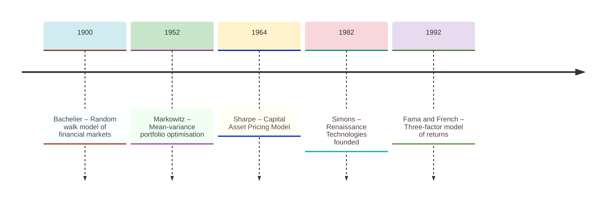
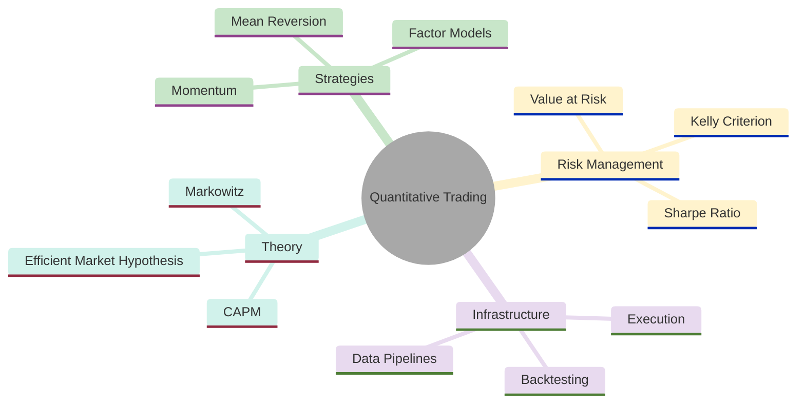
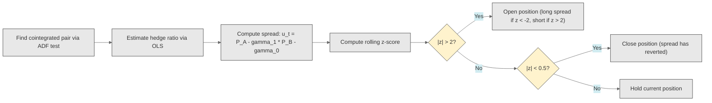
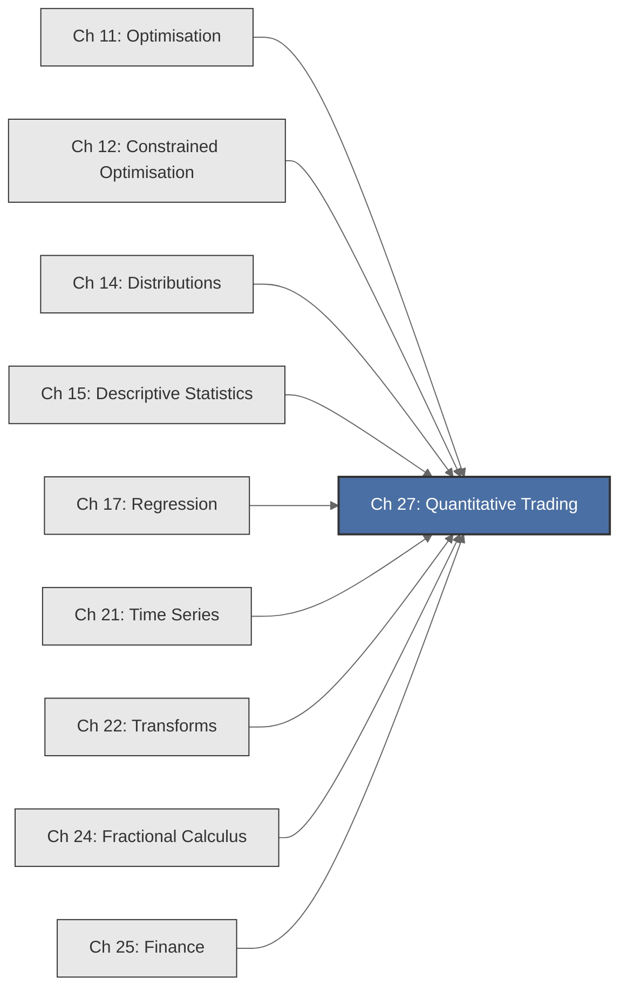

<!-- Copyright (c) 2025-2026 Bob Jansen <bobjansen@pm.me> -->
<!-- SPDX-License-Identifier: CC-BY-NC-4.0 -->
<!-- See LICENSE for full terms. Commercial licensing available. -->

# Chapter 27: Quantitative Trading Strategies


**Part IX**: Applications

> The quantitative trader seeks to extract systematic profit from the structure of financial markets by transforming mathematical theory into executable strategies. Where the classical investor relies on narrative and intuition, the quantitative trader relies on optimisation, statistical inference and disciplined risk management: estimating a signal, sizing a bet and managing the risk through the unified language of linear algebra, probability and time series analysis.

**Prerequisites**: [Chapter 11](11-unconstrained-optimization.md) (Unconstrained Optimisation); gradient-based methods for maximising the Sharpe ratio and expected log-wealth. [Chapter 12](12-constrained-optimization.md) (Constrained Optimisation); Lagrange multipliers and quadratic programming for mean-variance portfolio construction. [Chapter 14](14-distributions.md) (Distributions); the normal and Student-$t$ distributions for modelling returns and computing tail risk. [Chapter 15](15-descriptive-statistics.md) (Descriptive Statistics); sample mean, variance, covariance and the correlation matrix as inputs to portfolio optimisation. [Chapter 17](17-regression.md) (Regression); ordinary least squares for CAPM estimation, factor model fitting and pairs trading spread construction. [Chapter 21](21-time-series.md) (Time Series); autocorrelation, stationarity and autoregressive integrated moving average models for detecting momentum and mean-reversion patterns. [Chapter 24](24-fractional-calculus.md) (Fractional Calculus); fractional differencing to achieve stationarity while preserving predictive signal. [Chapter 25](25-financial-mathematics.md) (Financial Mathematics); present value, compounding and the time value of money.

**Learning Objectives**: After this chapter, the reader will be able to:

1. Construct mean-variance optimal portfolios by solving a constrained quadratic optimisation problem and trace the efficient frontier.
2. Implement momentum and mean-reversion trading strategies grounded in autocorrelation analysis.
3. Apply factor models (CAPM, Fama–French) using multiple regression and interpret the resulting alpha and beta coefficients.
4. Derive and apply the Kelly criterion for optimal position sizing under uncertainty.
5. Compute the Sharpe ratio and understand its role as a risk-adjusted performance measure.
6. Understand backtesting methodology, including walk-forward analysis and the dangers of overfitting.

**Connections**: This chapter synthesises nearly all preceding applied mathematics chapters into a single domain. It uses [Chapter 12](12-constrained-optimization.md) (the mean-variance portfolio problem is a constrained quadratic programme), [Chapter 15](15-descriptive-statistics.md) (the sample covariance matrix is the fundamental input to portfolio optimisation), [Chapter 17](17-regression.md) (CAPM and Fama–French estimation are linear regressions; pairs trading spreads are regression residuals), [Chapter 21](21-time-series.md) (momentum detection via autocorrelation; stationarity testing for spread trading), [Chapter 22](22-transforms.md) (spectral analysis of return cycles via the Fourier transform), [Chapter 24](24-fractional-calculus.md) (fractional differencing to achieve stationarity while preserving predictive signal) and [Chapter 25](25-financial-mathematics.md) (all cash flows are discounted, all performance is risk-adjusted).

---

## Historical Context

**Key Milestones in Quantitative Trading**



*Figure 27.1: Timeline of key milestones in quantitative trading from Bachelier to Fama–French.*

**Bachelier and the random walk (1900).** Louis Bachelier defended his dissertation *Théorie de la Spéculation* at the Sorbonne in 1900. He modelled fluctuations of French government bonds as a random walk, a process in which each price change is independent of all previous changes. Bachelier derived the probability distribution of price changes over arbitrary time horizons, arrived at what is now the diffusion equation and computed the fair value of options using a formula structurally identical to Black–Scholes (1973). His adviser, Henri Poincaré, praised the work but judged the subject unworthy of a mathematician. The thesis was not translated into English until 1964. The random walk hypothesis lay dormant until Paul Samuelson championed it in the 1960s.

**Markowitz and mean-variance optimisation (1952).** Harry Markowitz published "Portfolio Selection" in the *Journal of Finance* in 1952. His insight was that an investor should consider the joint distribution of all portfolio returns, not evaluate securities in isolation. The expected return of a portfolio is the weighted average of individual expected returns, but the portfolio variance depends on the covariance structure. Choosing weights that minimise variance for a given expected return traces an efficient frontier: the set of portfolios offering maximum return per unit of risk. This was the first application of quadratic programming to finance. Markowitz received the Nobel Memorial Prize in Economics in 1990.

**Sharpe and the CAPM (1964).** William Sharpe's 1964 paper "Capital Asset Prices: A Theory of Market Equilibrium under Conditions of Risk" derived the Capital Asset Pricing Model (CAPM) as the equilibrium implication of Markowitz's framework. If all investors hold mean-variance optimal portfolios, the market portfolio lies on the efficient frontier in equilibrium. The expected excess return of any asset is proportional to its covariance with the market, captured by the coefficient $\beta$. The CAPM provided the first rigorous definition of risk-adjusted return.

**Fama–French factor models (1992).** Eugene Fama and Kenneth French extended this framework in 1992 with "The Cross-Section of Expected Stock Returns." They showed that two additional factors, size (SMB) and value (HML), explain return variation that CAPM alone cannot capture. The Fama–French three-factor model became the standard benchmark for evaluating trading strategies. A strategy has genuine alpha only if its returns cannot be explained by exposure to market, size and value factors.

**Renaissance Technologies and systematic trading (1982).** James Simons founded Renaissance Technologies in 1982, hiring mathematicians, physicists and computer scientists rather than traditional finance professionals. The firm's Medallion Fund has generated annualised returns exceeding 60% before fees since 1988. Renaissance demonstrated that systematic, model-driven trading could exploit patterns invisible to human cognition through rigorous statistical methodology, disciplined position sizing and risk management.

---

## Why This Chapter Matters

**Quantitative Trading**



*Figure 27.2: Mind map showing the core topics of quantitative trading strategies.*

Modelling errors in quantitative trading are measured in realised financial losses; correct models generate returns that compound over decades. The global quantitative and systematic trading industry manages over 1 trillion euros in assets. Mean-variance optimisation, factor models, the Kelly criterion and rigorous backtesting methodology form its core intellectual infrastructure.

Mean-variance optimisation, despite its sensitivity to estimation error, remains the conceptual foundation of institutional asset allocation. Pension funds, sovereign wealth funds and endowments use variants of Markowitz's framework to construct diversified portfolios. The CAPM and Fama–French factor models provide the language for performance attribution: when a fund manager claims alpha, the claim is tested by regressing returns against systematic factors and examining the intercept. Pairs trading and statistical arbitrage, grounded in cointegration testing and regression residuals, account for a large fraction of equity market-making activity. The Kelly criterion provides the theoretically optimal framework for position sizing. Its fractional variants are used by professional traders and sports bettors.

The section on backtesting methodology and multiple-testing correction addresses a problem that has cost investors billions: overfitting strategies to historical data and mistaking noise for signal. A reported Sharpe ratio of 2.0 appears strong until one accounts for the hundreds of parameter combinations tested to find it. The deflated Sharpe ratio corrects this bias. The mathematical framework, rooted in extreme value statistics and the expected maximum of correlated random variables, separates rigorous quantitative research from data mining.

---

## Notation & Conventions

| Symbol | Meaning |
|--------|---------|
| $R_i$ | Return on asset $i$ (simple or log, as specified) |
| $R_p$ | Return on the portfolio |
| $R_f$ | Risk-free rate |
| $R_m$ | Return on the market portfolio |
| $\mu_i$ or $\mathbb{E}[R_i]$ | Expected return on asset $i$ |
| $\boldsymbol{\mu}$ | Vector of expected returns $(\mu_1, \ldots, \mu_n)'$ |
| $\sigma_i^2$ | Variance of asset $i$'s return |
| $\sigma_{ij}$ | Covariance of returns on assets $i$ and $j$ |
| $\Sigma$ | Covariance matrix of returns: $\Sigma_{ij} = \sigma_{ij}$ |
| $\mathbf{w}$ | Portfolio weight vector $(w_1, \ldots, w_n)'$ with $\sum w_i = 1$ |
| $\mathbf{1}$ | Vector of ones $(1, 1, \ldots, 1)'$ |
| $\beta_i$ | CAPM beta of asset $i$: $\operatorname{Cov}(R_i, R_m)/\operatorname{Var}(R_m)$ |
| $\alpha_i$ | Jensen's alpha: excess return unexplained by factor exposure |
| $\text{SR}$ | Sharpe ratio: $(\mathbb{E}[R_p] - R_f)/\sigma_p$ |
| $f^*$ | Optimal Kelly fraction |
| $\rho(h)$ | Autocorrelation function at lag $h$ |
| $\sigma_p$ | Portfolio standard deviation: $\sigma_p = \sqrt{\mathbf{w}'\Sigma\mathbf{w}}$ |
| $\mu_{\text{target}}$ | Target expected return in mean-variance optimisation |
| $\mathbf{R}$ | Return vector $(R_1, \ldots, R_n)'$ |
| $z_t$ | Pairs trading spread (z-score of residual) |
| $T$ | Number of time periods in sample |
| $n$ | Number of assets |

Returns are decimals. The covariance matrix $\Sigma$ is symmetric and positive definite, which holds when no asset is a perfect linear combination of others. Weights are real-valued; short-selling is permitted unless a constraint $w_i \geq 0$ is imposed.

---

## Core Theory

### Mean-Variance Optimisation

**Definition 27.1** (Portfolio return and risk). Given $n$ assets with return vector $\mathbf{R} = (R_1, \ldots, R_n)'$ ([Chapter 14](14-distributions.md)), expected return vector $\boldsymbol{\mu} = \mathbb{E}[\mathbf{R}]$ and covariance matrix $\Sigma = \operatorname{Cov}(\mathbf{R})$, a portfolio with weight vector $\mathbf{w}$ has expected return and variance

$$\mathbb{E}[R_p] = \mathbf{w}'\boldsymbol{\mu}, \qquad \operatorname{Var}(R_p) = \mathbf{w}'\Sigma\mathbf{w}.$$

**Definition 27.2** (Mean-variance optimisation problem). The Markowitz portfolio selection problem ([Chapter 11](11-unconstrained-optimization.md)) seeks the weight vector $\mathbf{w}$ that minimises portfolio variance subject to achieving a target expected return $\mu_{\text{target}}$ and full investment:

$$\begin{aligned}
&\min_{\mathbf{w}} \quad \frac{1}{2}\mathbf{w}'\Sigma\mathbf{w} \\
&\text{subject to} \quad \mathbf{w}'\boldsymbol{\mu} = \mu_{\text{target}}, \quad \mathbf{w}'\mathbf{1} = 1.
\end{aligned}$$

This is a quadratic programme with two linear equality constraints; precisely the structure analysed in [Chapter 12](12-constrained-optimization.md).

**Theorem 27.3** (Analytical solution via Lagrange multipliers). The solution to the Markowitz problem is

$$\mathbf{w}^* = \Sigma^{-1}\left(\lambda_1 \boldsymbol{\mu} + \lambda_2 \mathbf{1}\right)$$

where the multipliers $\lambda_1$ and $\lambda_2$ solve the linear system

$$\begin{pmatrix} \boldsymbol{\mu}'\Sigma^{-1}\boldsymbol{\mu} & \boldsymbol{\mu}'\Sigma^{-1}\mathbf{1} \\ \mathbf{1}'\Sigma^{-1}\boldsymbol{\mu} & \mathbf{1}'\Sigma^{-1}\mathbf{1} \end{pmatrix} \begin{pmatrix} \lambda_1 \\ \lambda_2 \end{pmatrix} = \begin{pmatrix} \mu_{\text{target}} \\ 1 \end{pmatrix}.$$

??? note "Proof"

    *Proof.* Form the Lagrangian ([Chapter 12](12-constrained-optimization.md), Definition 12.2):

    $$\mathcal{L}(\mathbf{w}, \lambda_1, \lambda_2) = \frac{1}{2}\mathbf{w}'\Sigma\mathbf{w} - \lambda_1(\mathbf{w}'\boldsymbol{\mu} - \mu_{\text{target}}) - \lambda_2(\mathbf{w}'\mathbf{1} - 1).$$

    The first-order condition $\partial\mathcal{L}/\partial\mathbf{w} = \mathbf{0}$ is

    $$\Sigma\mathbf{w} - \lambda_1\boldsymbol{\mu} - \lambda_2\mathbf{1} = \mathbf{0}.$$

    Since $\Sigma$ is positive definite it is invertible, so solving for $\mathbf{w}$ gives

    $$\mathbf{w}^* = \Sigma^{-1}(\lambda_1\boldsymbol{\mu} + \lambda_2\mathbf{1}).$$

    Substituting $\mathbf{w}^* = \Sigma^{-1}(\lambda_1\boldsymbol{\mu} + \lambda_2\mathbf{1})$ into the first constraint and premultiplying by $\boldsymbol{\mu}'$, then substituting into the second constraint and premultiplying by $\mathbf{1}'$, yields the $2 \times 2$ linear system:

    $$\begin{pmatrix} \boldsymbol{\mu}'\Sigma^{-1}\boldsymbol{\mu} & \boldsymbol{\mu}'\Sigma^{-1}\mathbf{1} \\ \mathbf{1}'\Sigma^{-1}\boldsymbol{\mu} & \mathbf{1}'\Sigma^{-1}\mathbf{1} \end{pmatrix} \begin{pmatrix} \lambda_1 \\ \lambda_2 \end{pmatrix} = \begin{pmatrix} \mu_{\text{target}} \\ 1 \end{pmatrix},$$

    which is the stated system for $(\lambda_1, \lambda_2)$.

    The second-order condition is satisfied because the Hessian of the Lagrangian with respect to $\mathbf{w}$ equals $\Sigma$, which is positive definite. $\square$

!!! abstract "Key Result"

    **Theorem 27.3** (Markowitz portfolio). The minimum-variance portfolio is $\mathbf{w}^* = \Sigma^{-1}(\lambda_1 \boldsymbol{\mu} + \lambda_2 \mathbf{1})$, reducing optimal asset allocation to inverting the covariance matrix and solving a $2 \times 2$ system for the Lagrange multipliers.

**Definition 27.4** (Efficient frontier). As the target return $\mu_{\text{target}}$ varies, the locus of minimum-variance portfolios in $(\sigma_p, \mathbb{E}[R_p])$ space forms the *efficient frontier*. Let (local to this section) $A = \boldsymbol{\mu}'\Sigma^{-1}\boldsymbol{\mu}$, $B = \boldsymbol{\mu}'\Sigma^{-1}\mathbf{1}$, $C = \mathbf{1}'\Sigma^{-1}\mathbf{1}$ and $D = AC - B^2$. The minimum variance at target return $\mu_{\text{target}}$ is

$$\sigma_p^2 = \frac{C\mu_{\text{target}}^2 - 2B\mu_{\text{target}} + A}{D}.$$

This is a parabola in $(\mu_{\text{target}}, \sigma_p^2)$ space. The upper branch of the corresponding hyperbola in $(\sigma_p, \mu_{\text{target}})$ space constitutes the efficient frontier.

**Efficient Frontier: Return vs. Risk:**

```mermaid
---
config:
  theme: base
  themeVariables:
    xyChart:
      plotColorPalette: "#2563eb, #dc2626, #16a34a, #9333ea, #ca8a04, #0891b2"
      backgroundColor: "#ffffff"
      titleColor: "#333333"
      xAxisLabelColor: "#333333"
      yAxisLabelColor: "#333333"
      xAxisTitleColor: "#333333"
      yAxisTitleColor: "#333333"
      xAxisLineColor: "#333333"
      yAxisLineColor: "#333333"
---
xychart-beta
    x-axis "Risk (σ)" [0.05, 0.08, 0.10, 0.12, 0.15, 0.20]
    y-axis "Expected Return" 0.03 --> 0.12
    line [0.04, 0.06, 0.08, 0.09, 0.10, 0.11]
```

*Figure 27.3: Efficient frontier showing the concave relationship between portfolio risk and return.*

The efficient frontier is concave: each additional unit of risk yields diminishing incremental return. The leftmost point is the global minimum-variance portfolio. Portfolios below the frontier are dominated (higher risk for the same return). The slope of the line from the risk-free rate to the frontier determines the Sharpe ratio; the tangency point maximises it.

**Remark 27.5** (Global minimum-variance portfolio). The portfolio with the smallest possible variance is $\mathbf{w}_{\text{gmv}} = \Sigma^{-1}\mathbf{1} / (\mathbf{1}'\Sigma^{-1}\mathbf{1})$, with variance $\sigma_{\text{gmv}}^2 = 1/C$.

### The Sharpe Ratio

**Definition 27.6** (Sharpe ratio). The *Sharpe ratio* of a portfolio is

$$\text{SR} = \frac{\mathbb{E}[R_p] - R_f}{\sigma_p}.$$

It measures excess return per unit of total risk; the slope of the line connecting the risk-free asset ([Chapter 25](25-financial-mathematics.md)) to the portfolio in mean-standard deviation space.

**Theorem 27.7** (Maximum Sharpe ratio portfolio). The portfolio that maximises the Sharpe ratio has weights

$$\mathbf{w}^*_{\text{SR}} = \frac{\Sigma^{-1}(\boldsymbol{\mu} - R_f\mathbf{1})}{\mathbf{1}'\Sigma^{-1}(\boldsymbol{\mu} - R_f\mathbf{1})}.$$

??? note "Proof"

    *Proof.* Maximising

    $$\text{SR} = \frac{\mathbf{w}'(\boldsymbol{\mu} - R_f\mathbf{1})}{\sqrt{\mathbf{w}'\Sigma\mathbf{w}}}$$

    is equivalent (by a change of variable) to minimising $\mathbf{w}'\Sigma\mathbf{w}$ subject to $\mathbf{w}'(\boldsymbol{\mu} - R_f\mathbf{1}) = 1$; that is, fixing the numerator at one and minimising the denominator squared.

    Applying the Lagrange multiplier method to this constrained problem, the first-order condition gives

    $$\mathbf{w} \propto \Sigma^{-1}(\boldsymbol{\mu} - R_f\mathbf{1}).$$

    Imposing the full-investment constraint $\mathbf{w}'\mathbf{1} = 1$ produces the stated normalisation. $\square$

### The Capital Asset Pricing Model

**Definition 27.8** (CAPM). The Capital Asset Pricing Model states that in equilibrium:

$$\mathbb{E}[R_i] - R_f = \beta_i(\mathbb{E}[R_m] - R_f)$$

where $\beta_i = \operatorname{Cov}(R_i, R_m)/\operatorname{Var}(R_m)$.

**Definition 27.9** (Jensen's alpha). The time-series regression

$$R_{i,t} - R_{f,t} = \alpha_i + \beta_i(R_{m,t} - R_{f,t}) + \varepsilon_{i,t}$$

where $t = 1, \ldots, T$ indexes time periods, is a simple linear regression ([Chapter 17](17-regression.md)). The intercept $\alpha_i$ measures average return in excess of CAPM predictions.

**Theorem 27.10** (Beta estimation). The ordinary least squares (OLS) estimator of beta is

$$\hat{\beta}_i = \frac{\hat{\sigma}_{i,m}}{\hat{\sigma}_m^2}$$

which is the sample covariance divided by the sample variance of market returns ([Chapter 15](15-descriptive-statistics.md)).

### Factor Models

**Definition 27.11** (Fama–French three-factor model). The model specifies

$$R_{i,t} - R_{f,t} = \alpha_i + \beta_{i,1}\text{MKT}_t + \beta_{i,2}\text{SMB}_t + \beta_{i,3}\text{HML}_t + \varepsilon_{i,t}$$

where MKT is market excess return, SMB (Small Minus Big) captures size premium and HML (High Minus Low) captures value premium. Factor returns are available from the Kenneth French data library [16]. This is a multiple linear regression ([Chapter 17](17-regression.md)) with coefficients estimated by OLS: $\hat{\boldsymbol{\beta}}_i = (X'X)^{-1}X'\mathbf{y}_i$.

### Pairs Trading

**Definition 27.12** (Cointegration and spread trading). Two prices $P_{A,t}$ and $P_{B,t}$ are suitable for pairs trading if cointegrated: each is $I(1)$ but a linear combination is stationary. The spread is the OLS residual:

$$P_{A,t} = \gamma_0 + \gamma_1 P_{B,t} + u_t$$

where $u_t$ is stationary if the pair is cointegrated. The hedge ratio $\gamma_1$ determines the position sizing.

**Definition 27.13** (Z-score trading signal). The standardised signal is

$$z_t = \frac{u_t - \bar{u}}{\hat{\sigma}_u}$$

where $\bar{u}$ and $\hat{\sigma}_u$ are computed over a rolling lookback window. Long entry occurs at $z_t < -z_{\text{entry}}$; short entry at $z_t > z_{\text{entry}}$.

**Theorem 27.14** (Spread stationarity test). Cointegration is tested by applying the augmented Dickey–Fuller test ([Chapter 21](21-time-series.md)) to the estimated residual $\hat{u}_t$. Rejection of the unit root null indicates the spread is stationary. Critical values differ from standard ADF tables because the residuals are estimated (Engle–Granger, 1987).

??? note "Proof"

    *Proof.* See Engle, R. F. and Granger, C. W. J. "Co-integration and Error Correction: Representation, Estimation and Testing." *Econometrica* 55(2):251–276, 1987. The result follows from the asymptotic distribution theory for unit root tests applied to regression residuals; the estimation step introduces a downward bias in the test statistic that necessitates the use of Engle–Granger critical values rather than standard Dickey–Fuller tables. $\square$

**Pairs Trading Signal Generation:**



*Figure 27.4: Flowchart of the pairs trading signal generation process from cointegration to execution.*

### Momentum and Mean-Reversion

**Definition 27.15** (Return autocorrelation). Let $r_t = \ln(P_t/P_{t-1})$. The autocorrelation at lag $h$ is ([Chapter 21](21-time-series.md)):

$$\rho(h) = \gamma(h)/\gamma(0).$$

Positive $\rho(h)$ at short lags indicates momentum; negative $\rho(h)$ indicates mean-reversion.

**Definition 27.16** (Time-series momentum signal). The signal is

$$\text{signal}_t = \operatorname{sign}\left(\sum_{k=1}^{J} r_{t-k}\right).$$

A positive signal generates a long position; negative generates short.

### The Kelly Criterion

**Definition 27.17** (Kelly criterion; discrete case). For bets with win probability $p$, loss probability $q = 1-p$ and win/loss ratio $b$, the optimal fraction is

$$f^* = \frac{bp - q}{b}.$$

**Theorem 27.18** (Kelly criterion optimality). The optimal fraction $f^* = (bp-q)/b$ maximises the expected log-growth rate per trial.

??? note "Proof"

    *Proof.* The expected log-growth rate per trial is

    $$G(f) = p\ln(1+bf) + q\ln(1-f).$$

    Differentiating with respect to $f$:

    $$G'(f) = \frac{pb}{1+bf} - \frac{q}{1-f}.$$

    Setting $G'(f) = 0$ and cross-multiplying:

    $$pb(1-f) = q(1+bf) \implies pb - pbf = q + qbf \implies pb - q = f(pb + qb) = fb(p+q) = fb.$$

    The fraction is therefore $f^* = (pb - q)/b = (bp - q)/b$.

    The second derivative is

    $$G''(f) = -\frac{pb^2}{(1+bf)^2} - \frac{q}{(1-f)^2} < 0$$

    for all $f \in (0,1)$ since both terms are negative, so $f^*$ is a global maximum. $\square$

**Definition 27.19** (Kelly; continuous case). For normally distributed returns with expected excess return $\mu$ and volatility $\sigma$:

$$f^* = \frac{\mu}{\sigma^2}.$$

???+ info "Derivation"

    Under the quadratic (second-order Taylor) approximation of expected log-wealth for normally distributed returns, the expected log-growth rate is

    $$G(f) = \mu f - \frac{1}{2}\sigma^2 f^2.$$

    Differentiating: $G'(f) = \mu - \sigma^2 f$. Setting $G'(f) = 0$ gives $f^* = \mu/\sigma^2$. Since $G''(f) = -\sigma^2 < 0$, this is a maximum.

### Spectral Analysis of Market Cycles

**Definition 27.20** (Periodogram). The periodogram of a return series $\{r_t\}_{t=1}^{T}$ is

$$I(\omega_k) = \frac{1}{T}\left|\sum_{t=1}^{T} r_t \, e^{-i\omega_k t}\right|^2$$

at Fourier frequencies $\omega_k = 2\pi k / T$. Peaks indicate periodicities; a peak at $\omega_k$ corresponds to a cycle of period $T/k$ observations.

### Fractional Differencing

**Definition 27.21** (Fractional differencing of prices). The fractional differencing operator ([Chapter 24](24-fractional-calculus.md)) with order $d \in (0,1)$ is

$$(1 - L)^d P_t = \sum_{k=0}^{\infty} \binom{d}{k}(-1)^k P_{t-k}$$

(with the convention $\binom{d}{k} = d(d-1)\cdots(d-k+1)/k!$ for non-integer $d$). For $d < 1$, the resulting series is stationary while retaining substantial autocorrelation. The optimal $d$ is the smallest value for which the ADF test rejects the unit root null.

### Backtesting Methodology

**Definition 27.22** (Backtest). Given a signal $s_t = f(I_t)$ and a return series $\{r_t\}$, the strategy return is $R_{\text{strat},t+1} = s_t \cdot r_{t+1}$.

**Definition 27.23** (Walk-forward analysis). The sample is divided into sequential blocks. Parameters are estimated on each in-sample window and applied on the subsequent out-of-sample window. Concatenated out-of-sample returns provide an unbiased performance estimate.

The walk-forward methodology addresses a fundamental multiple-testing problem: the more combinations are tested, the higher the expected maximum in-sample Sharpe ratio under the null of no skill.

!!! warning "Overfitting through multiple testing"

    Testing $N$ parameter combinations inflates the best in-sample Sharpe ratio even when no strategy has genuine skill. The expected maximum grows as $\sqrt{2\ln N}$. A Sharpe ratio of 2.0 found after testing 1000 variants may carry no statistical significance. Always apply the deflated Sharpe ratio correction before drawing conclusions.

**Theorem 27.24** (Deflated Sharpe ratio). If $N$ strategy variants are tested, the expected maximum Sharpe ratio under the null of no skill is approximately

$$\mathbb{E}\!\left[\max_{i=1}^{N} \widehat{\text{SR}}_i\right] \approx \sqrt{2\ln N} \cdot \frac{1}{\sqrt{T}}.$$

A reported Sharpe ratio must exceed this threshold to constitute evidence of genuine skill after adjusting for multiple testing.

??? note "Proof"

    *Proof.* Under the null of no skill, the $N$ estimated Sharpe ratios $\widehat{\text{SR}}_1, \ldots, \widehat{\text{SR}}_N$ are approximately i.i.d. normal with mean zero and standard deviation $1/\sqrt{T}$ (the standard error of an annualised Sharpe ratio estimator over $T$ observations).

    The expected maximum of $N$ i.i.d. standard normal variables satisfies $\mathbb{E}[\max_{i=1}^N Z_i] \approx \sqrt{2\ln N}$ for large $N$ (a standard result from extreme value theory). Scaling by the standard deviation $1/\sqrt{T}$ gives

    $$\mathbb{E}\!\left[\max_{i=1}^{N} \widehat{\text{SR}}_i\right] \approx \frac{\sqrt{2\ln N}}{\sqrt{T}}.$$

    See Bailey and De Prado (2014) for the full derivation accounting for non-zero correlation between strategy variants. $\square$

---

## Formulas & Identities

**F27.1** Portfolio expected return:

$$\mathbb{E}[R_p] = \mathbf{w}'\boldsymbol{\mu} = \sum_{i=1}^n w_i \mu_i$$

**F27.2** Portfolio variance:

$$\operatorname{Var}(R_p) = \mathbf{w}'\Sigma\mathbf{w} = \sum_{i=1}^n\sum_{j=1}^n w_i w_j \sigma_{ij}$$

**F27.3** Sharpe ratio:

$$\text{SR} = \frac{\mathbb{E}[R_p] - R_f}{\sigma_p}$$

**F27.4** CAPM expected return:

$$\mathbb{E}[R_i] = R_f + \beta_i\bigl(\mathbb{E}[R_m] - R_f\bigr)$$

**F27.5** Jensen's alpha:

$$\alpha_i = \bar{R}_i - R_f - \hat{\beta}_i(\bar{R}_m - R_f)$$

**F27.6** Kelly fraction (discrete):

$$f^* = \frac{bp - q}{b}$$

**F27.7** Kelly fraction (continuous):

$$f^* = \frac{\mu}{\sigma^2}$$

**F27.8** Kelly growth rate:

$$G(f) = p\ln(1+bf) + q\ln(1-f)$$

**F27.9** Efficient frontier (parabolic form, where $\mu_p = \mu_{\text{target}}$ as in Definition 27.4):

$$\sigma_p^2 = \frac{C\mu_p^2 - 2B\mu_p + A}{D}$$

**F27.10** Global minimum-variance weights:

$$\mathbf{w}_{\text{gmv}} = \frac{\Sigma^{-1}\mathbf{1}}{\mathbf{1}'\Sigma^{-1}\mathbf{1}}$$

**F27.11** Tangency weights:

$$\mathbf{w}^* = \frac{\Sigma^{-1}(\boldsymbol{\mu} - R_f\mathbf{1})}{\mathbf{1}'\Sigma^{-1}(\boldsymbol{\mu} - R_f\mathbf{1})}$$

**F27.12** Deflated Sharpe threshold:

$$\text{SR}_{\text{threshold}} \approx \frac{\sqrt{2\ln N}}{\sqrt{T}}$$

---

## Algorithms

### Algorithm 27.25: Mean-Variance Portfolio Optimisation

**Input**: Expected return vector $\boldsymbol{\mu} \in \mathbb{R}^n$, covariance matrix $\Sigma \in \mathbb{R}^{n \times n}$ (positive definite), target return $\mu_{\text{target}}$.
**Output**: Optimal weight vector $\mathbf{w}^* \in \mathbb{R}^n$.

```
function meanVariancePortfolio(mu, Sigma, muTarget):
    SigmaInv = inverse(Sigma)
    A = mu' * SigmaInv * mu
    B = mu' * SigmaInv * ones(n)
    C = ones(n)' * SigmaInv * ones(n)
    D = A * C - B^2

    lambda1 = (C * muTarget - B) / D
    lambda2 = (A - B * muTarget) / D

    w = SigmaInv * (lambda1 * mu + lambda2 * ones(n))
    return w
```

**Complexity**: $O(n^3)$ dominated by matrix inversion. For repeated evaluations across multiple targets, precompute $\Sigma^{-1}$ once, reducing marginal cost to $O(n^2)$.

### Algorithm 27.26: Tangency Portfolio

**Input**: Expected return vector $\boldsymbol{\mu}$, covariance matrix $\Sigma$, risk-free rate $R_f$.
**Output**: Maximum Sharpe ratio weights.

```
function tangencyPortfolio(mu, Sigma, Rf):
    excessMu = mu - Rf * ones(n)
    SigmaInv = inverse(Sigma)
    unnormalized = SigmaInv * excessMu
    w = unnormalized / sum(unnormalized)
    return w
```

**Complexity**: $O(n^3)$ for inversion; $O(n)$ for normalisation.

### Algorithm 27.27: Pairs Trading Signal

**Input**: Price series $P_A[1..T]$, $P_B[1..T]$, lookback $L$, entry threshold $z_{\text{entry}}$.
**Output**: Position signal at each time.

```
function pairsTradingSignal(PA, PB, L, zEntry):
    gamma1 = cov(PA, PB) / var(PB)
    gamma0 = mean(PA) - gamma1 * mean(PB)

    for t = 1 to T:
        spread[t] = PA[t] - gamma1 * PB[t] - gamma0

    for t = L+1 to T:
        rollMean = mean(spread[t-L..t-1])
        rollStd  = std(spread[t-L..t-1])
        z[t] = (spread[t] - rollMean) / rollStd

        if z[t] < -zEntry:      signal[t] = +1
        else if z[t] > zEntry:   signal[t] = -1
        else if |z[t]| < 0.5:    signal[t] = 0
        else:                     signal[t] = signal[t-1]

    return signal
```

**Complexity**: $O(T \cdot L)$ for rolling statistics; reducible to $O(T)$ with online mean/variance updates.

!!! info "Online rolling statistics"

    Welford's online algorithm maintains a running mean and variance in $O(1)$ per observation by updating sufficient statistics incrementally. This reduces the pairs trading signal computation from $O(T \cdot L)$ to $O(T)$ for long lookback windows.

### Algorithm 27.28: Momentum Regime Detection

**Input**: Return series $r[1..T]$, maximum lag $H$, significance level $\alpha$.
**Output**: Regime classification and autocorrelation function (ACF).

```
function momentumSignal(r, H, alpha):
    gamma0 = sampleVariance(r)
    for h = 1 to H:
        rho[h] = sampleAutocovariance(r, h) / gamma0

    seBartlett = 1 / sqrt(T)
    cv = normalQuantile(1 - alpha/2) * seBartlett

    momentumCount = count(rho[h] > cv for h=1..H)
    reversionCount = count(rho[h] < -cv for h=1..H)

    if momentumCount > reversionCount: regime = "MOMENTUM"
    else if reversionCount > momentumCount: regime = "MEAN_REVERSION"
    else: regime = "NEUTRAL"

    return (regime, rho)
```

**Complexity**: $O(T \cdot H)$ for autocorrelation computation.

---

## Numerical Considerations

### Covariance Matrix Estimation

The sample covariance matrix $\hat{\Sigma}$ has $n(n+1)/2$ free parameters. When $T < n$ it is singular. When $T > n$ but small eigenvalues are present, inversion is unstable and produces extreme weights.

!!! warning "Covariance matrix singularity"

    When the number of assets $n$ exceeds the number of observations $T$, the sample covariance matrix $\hat{\Sigma}$ is rank-deficient and cannot be inverted. Even when $T > n$, near-singular matrices amplify estimation error into extreme portfolio weights. Always check $\kappa(\Sigma)$ before inverting.

**Condition number.** $\kappa(\Sigma) = \lambda_{\max}/\lambda_{\min}$ determines error amplification. For $n = 100$ equities, $\kappa$ can exceed $10^4$. A 1% error in $\hat{\Sigma}$ then produces a 100% error in $\Sigma^{-1}\boldsymbol{\mu}$.

**Shrinkage estimators.** The Ledoit–Wolf estimator replaces $\hat{\Sigma}$ with $(1-\delta)\hat{\Sigma} + \delta \mu_F I$, where $\delta \in [0,1]$ minimises expected loss and $\mu_F$ is the average eigenvalue. Conditioning improves without bias toward any portfolio structure.

### Numerical Precision in Portfolio Weights

IEEE 754 double precision introduces rounding errors in matrix operations. The constraint $\mathbf{w}'\mathbf{1} = 1$ may be violated at machine epsilon ($\approx 2.2 \times 10^{-16}$). Renormalise weights after computation:

$$w_i \leftarrow w_i / \sum_{j=1}^n w_j.$$

### Autocorrelation Estimation Bias

The sample autocorrelation $\hat{\rho}(h)$ is biased toward zero. The bias is approximately $-1/T$. With $T = 250$ daily observations the bias is $-0.004$; small relative to typical magnitudes of 0.03–0.10, but relevant for significance testing.

### Kelly Criterion Sensitivity

$f^* = \mu/\sigma^2$ is sensitive to estimation error in $\mu$. A 50% overestimate of $\mu$ produces a 50% excess position size. Fractional Kelly ($\kappa f^*$ with $\kappa \in [0.25, 0.5]$) provides stability. The growth rate at half-Kelly is approximately $3/4$ of the full-Kelly rate; a modest cost for reduced drawdown.

!!! tip "Use fractional Kelly in practice"

    Full Kelly sizing assumes perfect knowledge of $\mu$ and $\sigma^2$. In practice, parameter estimates contain substantial error. Setting $\kappa \in [0.25, 0.5]$ sacrifices at most 25% of the maximum growth rate while reducing drawdown materially.

---

## Worked Examples

### Example 27.29: Two-Asset Mean-Variance Portfolio

**Problem**: Two assets have expected returns $\mu_1 = 0.10$, $\mu_2 = 0.06$, volatilities $\sigma_1 = 0.20$, $\sigma_2 = 0.10$ and correlation $\rho_{12} = 0.3$. Find the minimum-variance portfolio achieving 8% expected return.

**Solution**:

The covariance matrix is

$$\Sigma = \begin{pmatrix} 0.04 & 0.006 \\ 0.006 & 0.01 \end{pmatrix}$$

where $\sigma_{12} = 0.3 \times 0.20 \times 0.10 = 0.006$.

The determinant is $\det(\Sigma) = 0.04 \times 0.01 - 0.006^2 = 0.000364$, giving

$$\Sigma^{-1} = \begin{pmatrix} 27.473 & -16.484 \\ -16.484 & 109.890 \end{pmatrix}.$$

Computing:

$$\Sigma^{-1}\boldsymbol{\mu} = (1.758, 4.945)', \quad \Sigma^{-1}\mathbf{1} = (10.989, 93.407)'.$$

$$A = 0.4725, \quad B = 6.703, \quad C = 104.396, \quad D = AC - B^2 = 4.397.$$

For $\mu_{\text{target}} = 0.08$:

$$\begin{aligned}
\lambda_1 &= (104.396 \times 0.08 - 6.703)/4.397 = 0.375, \\
\lambda_2 &= (0.4725 - 6.703 \times 0.08)/4.397 = -0.01449.
\end{aligned}$$

Weights:

$$w_1 = 0.375 \times 1.758 + (-0.01449) \times 10.989 = 0.500, \quad w_2 = 0.500.$$

Portfolio volatility:

$$\sigma_p = \sqrt{0.25 \times 0.04 + 2 \times 0.25 \times 0.006 + 0.25 \times 0.01} = 12.45\%.$$

### Example 27.30: CAPM Beta Estimation

**Problem**: A fund has twelve monthly excess returns $[0.02, -0.01, 0.03, 0.01, -0.02, 0.04, 0.00, 0.02, -0.01, 0.03, 0.01, 0.02]$. Market excess returns are $[0.01, -0.02, 0.02, 0.00, -0.03, 0.03, -0.01, 0.01, -0.02, 0.02, 0.01, 0.01]$. Estimate CAPM beta and alpha.

**Solution**:

Sample means: $\bar{R}_i = 0.01167$, $\bar{R}_m = 0.00250$.

Sample covariance: $\hat{\sigma}_{i,m} = 0.000341$. Market variance: $\hat{\sigma}_m^2 = 0.000348$.

$$\begin{aligned}
\hat{\beta} &= 0.000341/0.000348 = 0.980, \\
\hat{\alpha} &= 0.01167 - 0.980 \times 0.00250 = 0.00922
\end{aligned}$$

(monthly alpha of 0.92%, annualised $\approx 11.1\%$).

### Example 27.31: Kelly Criterion Position Sizing

**Problem**: A strategy wins 55% of trades with a win/loss ratio of 1.8. Compute full and half Kelly fractions and growth rates.

**Solution**:

$$f^* = (1.8 \times 0.55 - 0.45)/1.8 = 0.54/1.8 = 0.300.$$

Half-Kelly: $f_{1/2} = 0.150$.

Growth at full Kelly:

$$G(0.30) = 0.55\ln(1.54) + 0.45\ln(0.70) = 0.2375 - 0.1605 = 0.0770.$$

Growth at half-Kelly:

$$G(0.15) = 0.55\ln(1.27) + 0.45\ln(0.85) = 0.1314 - 0.0731 = 0.0583.$$

Half-Kelly achieves 75.7% of maximum growth at substantially reduced drawdown.

### Example 27.32: Pairs Trading Z-Score

**Problem**: With hedge ratio $\gamma_1 = 1.95$, intercept $\gamma_0 = 2.5$ and a 4-period lookback, compute the z-score for spreads $u_6 = -0.85$, $u_7 = 1.05$, $u_8 = -0.80$, $u_9 = 0.10$, $u_{10} = -1.75$.

**Solution**:

Rolling mean over $u_6$ through $u_9$:

$$\bar{u} = (-0.85 + 1.05 - 0.80 + 0.10)/4 = -0.125.$$

Rolling standard deviation:

$$\hat{\sigma}_u = \sqrt{(0.526 + 1.381 + 0.456 + 0.051)/3} = \sqrt{0.804} = 0.897.$$

Z-score at $t = 10$:

$$z_{10} = (-1.75 - (-0.125))/0.897 = -1.81.$$

Since $|z_{10}| = 1.81 < 2.0$, no entry signal is generated. The spread approaches but has not crossed the entry threshold.

### Example 27.33: Multiple-Testing Correction for Backtesting

**Problem**: A researcher tests $N = 500$ parameter combinations on $T = 1260$ daily observations (5 years). The best variant achieves an in-sample Sharpe ratio of 1.8. Is this significant?

**Solution**:

By Theorem 27.24, the expected maximum SR under the null is:

$$\mathbb{E}[\max \widehat{\text{SR}}] \approx \sqrt{2\ln 500}/\sqrt{1260} = \sqrt{12.43}/\sqrt{1260} = 3.526/35.50 = 0.0993.$$

The multiple-testing threshold in annualised SR units is $0.099$. The observed SR of 1.8 far exceeds this threshold, so the strategy retains statistical significance even after the multiple-testing correction. Equivalently, in standard-error units the threshold is $\sqrt{2\ln 500} \approx 3.53$, and the observed test statistic is $1.8 \times \sqrt{1260} \approx 63.9$, which vastly exceeds $3.53$.

---

## Connections

**Chapter Dependencies**



*Figure 27.5: Dependency graph showing prerequisite chapters for quantitative trading.*

### Within This Book

- **Unconstrained Optimisation** ([Chapter 11](11-unconstrained-optimization.md)): Gradient-based methods maximise the Sharpe ratio and expected log-wealth in the Kelly criterion derivation.

- **Constrained Optimisation** ([Chapter 12](12-constrained-optimization.md)): Mean-variance is Lagrange multipliers applied to a quadratic objective with linear equality constraints. The shadow price $\lambda_1$ is the marginal variance cost of additional return. Inequality constraints ($w_i \geq 0$) require Karush–Kuhn–Tucker conditions.

- **Distributions** ([Chapter 14](14-distributions.md)): The normal and Student-$t$ distributions model return behaviour and feed into tail risk measures.

- **Descriptive Statistics** ([Chapter 15](15-descriptive-statistics.md)): The sample covariance matrix $\hat{\Sigma}$ is the primary input. Estimation error propagates to weight instability. The correlation coefficient determines diversification benefit.

- **Regression** ([Chapter 17](17-regression.md)): CAPM and Fama–French models are linear regressions. Pairs trading hedge ratios are regression coefficients.

- **Time Series** ([Chapter 21](21-time-series.md)): Momentum detection uses the ACF. Mean-reversion exploits negative autocorrelation. The Dickey–Fuller test determines spread stationarity. Autoregressive integrated moving average forecasts generate return signals.

- **Transforms** ([Chapter 22](22-transforms.md)): The periodogram detects return cycles. Spectral peaks correspond to calendar effects.

- **Fractional Calculus** ([Chapter 24](24-fractional-calculus.md)): Fractional differencing preserves predictive memory while achieving stationarity.

- **Financial Mathematics** ([Chapter 25](25-financial-mathematics.md)): All performance measurement uses risk-adjusted returns. Compounding and annualisation conventions underpin strategy evaluation.

### Applications

- **Institutional portfolio management**: Pension funds and endowments construct portfolios using mean-variance optimisation or extensions (Black–Litterman, risk parity).
- **Systematic hedge funds**: Statistical arbitrage strategies use pairs trading, factor-neutral portfolios and Kelly-based position sizing in production.
- **Risk management**: Value at Risk and Expected Shortfall computations rely on portfolio variance. Factor models decompose risk into systematic and idiosyncratic components.
- **Algorithmic trading**: Execution algorithms and market-making rely on statistical models of price dynamics validated through backtesting.

---

## Summary

- Mean-variance optimisation constructs portfolios by solving a constrained quadratic programme whose inputs are the expected return vector and the sample covariance matrix.
- The Sharpe ratio measures risk-adjusted return; the CAPM and Fama--French factor models decompose returns into systematic factor exposures and residual alpha.
- Momentum and mean-reversion strategies exploit autocorrelation structure in asset returns, detected via the autocorrelation function and stationarity tests.
- The Kelly criterion determines the optimal bet size by maximising expected log-wealth, and fractional differencing preserves predictive memory while enforcing stationarity.
- Backtesting validates strategies on historical data; the Bailey--Lopez de Prado--Harvey correction guards against overfitting by adjusting significance thresholds for the number of strategies tested.

---

## Exercises

### Routine

**Exercise 27.1**. Given three assets with $\boldsymbol{\mu} = (0.08, 0.12, 0.06)'$ and

$$\Sigma = \begin{pmatrix} 0.04 & 0.01 & 0.005 \\ 0.01 & 0.09 & 0.02 \\ 0.005 & 0.02 & 0.0225 \end{pmatrix},$$

compute the global minimum-variance portfolio weights. Verify that the weights sum to one.

**Exercise 27.2**. A stock has CAPM beta 1.3. With $R_f = 0.03$ and $\mathbb{E}[R_m] = 0.10$, compute the CAPM-predicted expected return. If the actual expected return is 12%, what is Jensen's alpha?

**Exercise 27.3**. A strategy wins 60% of trades with average profit €150 per winner and average loss €100 per loser. Compute the Kelly fraction and quarter-Kelly fraction.

### Intermediate

**Exercise 27.4**. Two assets have excess returns $(0.05, 0.03)'$ and covariance $\Sigma = \begin{pmatrix} 0.04 & 0.01 \\ 0.01 & 0.02 \end{pmatrix}$ with $R_f = 0.02$. Compute the tangency portfolio weights, expected return, volatility and Sharpe ratio.

**Exercise 27.5**. A return series of 500 daily observations has $\hat{\rho}(1) = 0.08$, $\hat{\rho}(2) = 0.05$, $\hat{\rho}(3) = 0.02$, $\hat{\rho}(4) = -0.01$. The Bartlett standard error is $1/\sqrt{500} = 0.0447$. At the 5% level (critical value $\pm 0.0876$), which lags are significant? What trading strategy does this suggest?

**Exercise 27.6**. Describe the complete Engle–Granger pairs trading procedure: (i) test for cointegration, (ii) estimate hedge ratio, (iii) construct z-score, (iv) specify entry/exit rules. Under what conditions does this strategy fail?

### Challenging

**Exercise 27.7**. Prove that the efficient frontier in $(\sigma_p, \mu_p)$ space is a hyperbola. Starting from $\sigma_p^2 = (C\mu_p^2 - 2B\mu_p + A)/D$, rewrite in standard hyperbolic form by completing the square. Identify the centre and asymptotes, and identify the upper branch as the efficient frontier.

**Exercise 27.8**. A researcher tests 200 parameter combinations on 5 years of daily data ($T = 1260$). The best variant achieves in-sample SR of 2.1. Using Theorem 27.24, compute the expected maximum SR under the null. Is the observed SR significant? What minimum SR would be required?

---

## References

### Textbooks

[1] Chan, E. P. *Algorithmic Trading: Winning Strategies and Their Rationale*. Wiley, 2013. Practical guide to mean-reversion, momentum and pairs trading with implementations.

[2] De Prado, M. L. *Advances in Financial Machine Learning*. Wiley, 2018. Modern treatment of fractional differencing, backtesting pitfalls and the deflated Sharpe ratio.

[3] Grinold, R. C. and Kahn, R. N. *Active Portfolio Management*. 2nd ed. McGraw-Hill, 2000. Thorough treatment of factor models, alpha forecasting and portfolio construction for institutional investors.

[4] Tsay, R. S. *Analysis of Financial Time Series*. 3rd ed. Wiley, 2010. Rigorous statistical treatment of return modelling, volatility estimation and multivariate time series methods for finance.

### Historical

[5] Bachelier, L. *Théorie de la Spéculation*. Annales Scientifiques de l'École Normale Supérieure, 1900. Translated by M. Davis and A. Etheridge, Princeton University Press, 2006.

[6] Bailey, D. H. and De Prado, M. L. "The Deflated Sharpe Ratio." *Journal of Portfolio Management* 40, no. 5 (2014): 94–107. Multiple-testing correction for backtesting.

[7] Fama, E. F. and French, K. R. "The Cross-Section of Expected Stock Returns." *Journal of Finance* 47, no. 2 (1992): 427–465. Establishes size and value factors.

[8] Jegadeesh, N. and Titman, S. "Returns to Buying Winners and Selling Losers." *Journal of Finance* 48, no. 1 (1993): 65–91. Empirical study documenting momentum in stock returns.

[9] Kelly, J. L. "A New Interpretation of Information Rate." *Bell System Technical Journal* 35, no. 4 (1956): 917–926. Derives optimal growth-rate-maximising bet size.

[10] Markowitz, H. "Portfolio Selection." *Journal of Finance* 7, no. 1 (1952): 77–91. First systematic treatment of mean-variance optimisation.

[11] Sharpe, W. F. "Capital Asset Prices: A Theory of Market Equilibrium under Conditions of Risk." *Journal of Finance* 19, no. 3 (1964): 425–442. Derives CAPM as equilibrium.

[12] Black, F. and Scholes, M. "The Pricing of Options and Corporate Liabilities." *Journal of Political Economy* 81, no. 3 (1973): 637–654. Option pricing formula structurally anticipated by Bachelier.

[13] Engle, R. F. and Granger, C. W. J. "Co-integration and Error Correction: Representation, Estimation and Testing." *Econometrica* 55, no. 2 (1987): 251–276. Introduces cointegration testing with modified critical values for regression residuals.

[14] Samuelson, P. A. "Proof That Properly Anticipated Prices Fluctuate Randomly." *Industrial Management Review* 6, no. 2 (1965): 41–49. Revived Bachelier's random walk hypothesis for modern finance.

[15] Zuckerman, G. *The Man Who Solved the Market: How Jim Simons Launched the Quant Revolution*. Portfolio/Penguin, 2019. Documents the founding of Renaissance Technologies in 1982 and the Medallion Fund's record.

### Online Resources

[16] Kenneth French Data Library. https://mba.tuck.dartmouth.edu/pages/faculty/ken.french/data_library.html

---

## Glossary

- **Alpha (Jensen's alpha)**: The intercept in a factor model regression; measures risk-adjusted excess return unexplained by systematic factor exposure.

- **Autocorrelation**: The correlation of a time series with its own lagged values. Positive at short lags indicates momentum; negative indicates mean-reversion.

- **Backtest**: The application of a trading signal to historical returns to evaluate strategy performance.

- **Backtesting**: The simulation of a trading strategy on historical data. Subject to look-ahead bias and overfitting without proper walk-forward methodology.

- **Beta**: The sensitivity of an asset's return to a systematic factor: $\beta = \operatorname{Cov}(R_i, R_m)/\operatorname{Var}(R_m)$.

- **CAPM (Capital Asset Pricing Model)**: The equilibrium model stating that expected excess return is proportional to market beta.

- **Cointegration**: A long-run equilibrium between non-stationary series. Two prices are cointegrated if their linear combination is stationary.

- **Deflated Sharpe ratio**: The Sharpe ratio threshold adjusted for the number of strategy variants tested, based on the expected maximum of correlated normal variables.

- **Efficient frontier**: The set of portfolios offering maximum expected return for each level of risk. Portfolios below it are dominated.

- **Factor model**: A regression explaining returns as a linear combination of systematic factors plus idiosyncratic residual.

- **Fractional differencing**: The operator $(1-L)^d$ with non-integer $d$, achieving stationarity while preserving long-range memory.

- **Kelly criterion**: The bet size maximising expected log-growth of wealth. Discrete: $f^* = (bp-q)/b$. Continuous: $f^* = \mu/\sigma^2$.

- **Mean-reversion**: The tendency of a variable to return toward its historical average.

- **Mean-variance optimisation**: The Markowitz framework for minimising portfolio variance subject to a target return.

- **Momentum**: The empirical phenomenon whereby recent winners tend to continue outperforming.

- **Pairs trading**: A market-neutral strategy trading the spread between two cointegrated assets.

- **Periodogram**: The squared modulus of the discrete Fourier transform of a time series, used to detect periodicities.

- **Sharpe ratio**: Expected excess return per unit of volatility: $\text{SR} = (\mathbb{E}[R_p] - R_f)/\sigma_p$.

- **Tangency portfolio**: The efficient frontier portfolio with the highest Sharpe ratio.

- **Walk-forward analysis**: A backtesting methodology that sequentially trains in-sample and tests out-of-sample.

- **Z-score**: The standardised spread in a pairs trading strategy: $(u_t - \bar{u})/\hat{\sigma}_u$.

---

