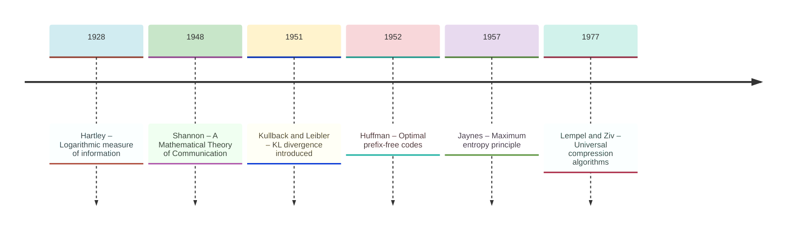
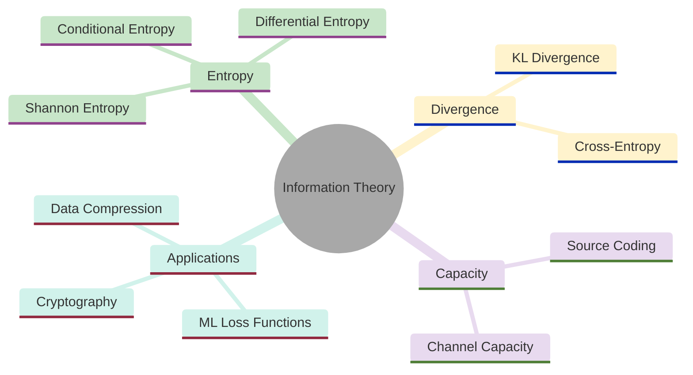
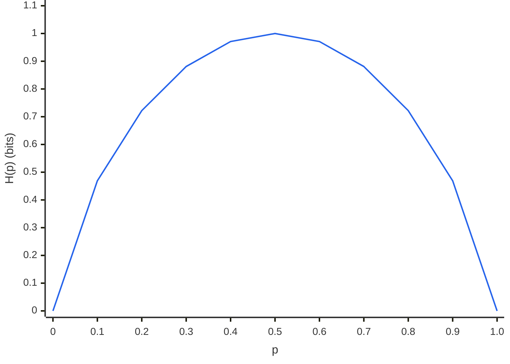
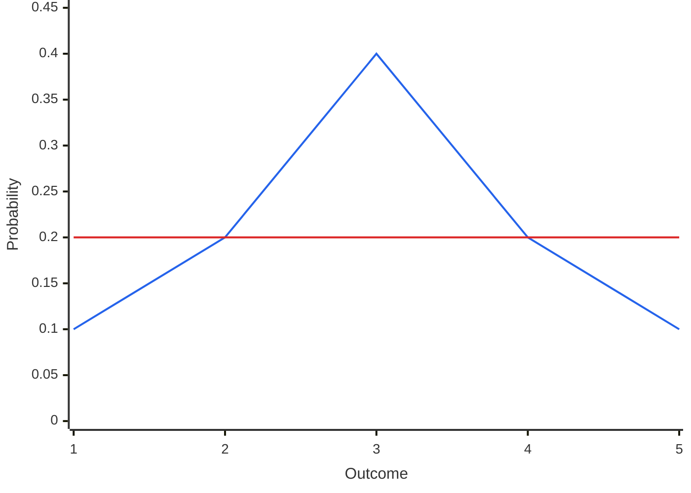
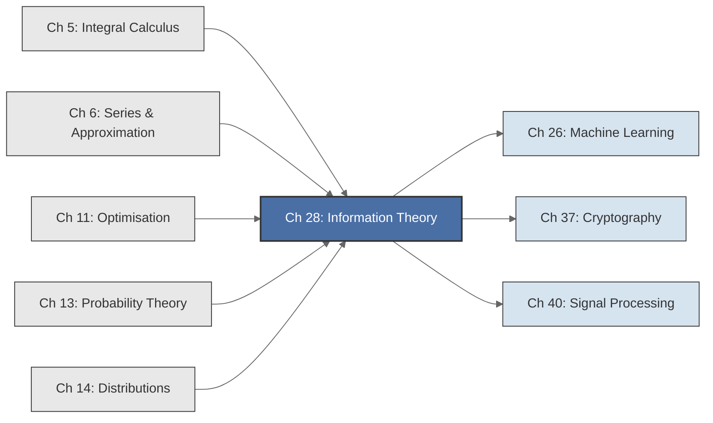

<!-- Copyright (c) 2025-2026 Bob Jansen <bobjansen@pm.me> -->
<!-- SPDX-License-Identifier: CC-BY-NC-4.0 -->
<!-- See LICENSE for full terms. Commercial licensing available. -->

# Chapter 28: Information Theory


**Part IX**: Applications

> Shannon's entropy quantifies irreducible uncertainty and sets the ultimate limits on data compression, error correction and statistical learning. The resulting theory, built from logarithms, probability and convexity, underpins every machine learning loss function, every efficient code and every communication channel.

**Prerequisites**: [Chapter 5](05-integral-calculus.md) (Integral Calculus); integration is required for defining differential entropy and computing information-theoretic quantities for continuous distributions. [Chapter 6](06-series-approximation.md) (Series & Approximation); convergence of infinite series appears in entropy computations for countably infinite alphabets, and Taylor expansions illuminate the behaviour of logarithmic measures near their boundaries. [Chapter 11](11-unconstrained-optimization.md) (Unconstrained Optimisation); Lagrange multiplier techniques are necessary for the maximum entropy principle and channel capacity computation. [Chapter 13](13-probability-theory.md) (Probability Theory); the Kolmogorov axioms, random variables, expectation and Jensen's inequality form the probabilistic substrate on which all information measures are defined. [Chapter 14](14-distributions.md) (Distributions); specific distributions (Gaussian, exponential, uniform) arise as maximum entropy solutions and their properties are needed for worked examples.

**Learning Objectives**: After this chapter, the reader will be able to:

1. Compute Shannon entropy for discrete random variables and interpret it as the average surprise or minimum expected code length.
2. Define and compute joint entropy, conditional entropy and mutual information, and relate them through the chain rule.
3. State and prove the non-negativity of Kullback–Leibler divergence using Jensen's inequality.
4. Decompose cross-entropy into entropy plus KL divergence and explain the connection to maximum likelihood estimation.
5. Apply the maximum entropy principle to derive distributions subject to moment constraints.
6. State Shannon's source coding theorem and channel capacity theorem and interpret their operational meaning.

**Connections**: This chapter draws on [Chapter 13](13-probability-theory.md) (probability measures, expectation, Jensen's inequality) and [Chapter 14](14-distributions.md) (Gaussian, exponential and uniform distributions as maximum entropy solutions). It applies [Chapter 11](11-unconstrained-optimization.md) (Lagrangian optimisation for maximum entropy and channel capacity). It connects forward to machine learning applications (cross-entropy loss, variational inference, feature selection via mutual information), coding theory and statistical model selection (the Akaike Information Criterion (AIC) as an information-theoretic criterion).

---

## Historical Context

**Key Milestones in Information Theory**



*Figure 28.1: Timeline of key milestones in information theory from Hartley to Lempel–Ziv.*

**Shannon's mathematical theory of communication (1948).** Claude Elwood Shannon, working at Bell Telephone Laboratories, published "A Mathematical Theory of Communication" in the *Bell System Technical Journal* in July and October 1948. The paper established information theory as a mathematical discipline and provided the theoretical limits governing all digital communication. Shannon separated communication into source coding (compression) and channel coding (error correction), proving that these two problems can be solved independently without loss of optimality.

**Shannon's coding theorems (1948).** His central quantity, entropy, measures the irreducible uncertainty in a source. His source coding theorem proves that no lossless compression scheme can achieve an average code length shorter than the entropy. His channel coding theorem shows that reliable communication is possible at any rate below channel capacity and impossible above it. These are existence theorems: they prove that good codes exist without constructing them.

**Hartley's logarithmic measure (1928).** Ralph Hartley, also at Bell Labs, published "Transmission of Information" in 1928. He proposed the logarithm of the number of possible messages as a measure of information. Hartley's measure applies only when all messages are equally probable. Shannon's entropy generalises it to arbitrary probability distributions. The logarithmic measure has the property of additivity: the information content of two independent messages is the sum of their individual contents, just as the logarithm converts multiplication to addition.

**Kullback–Leibler divergence (1951).** Solomon Kullback and Richard Leibler published "On Information and Sufficiency" in 1951, introducing directed divergence (now KL divergence) as a measure of discrepancy between two probability distributions. They drew on earlier work by Harold Jeffreys, who had proposed a symmetric divergence in 1946, and by Shannon, who defined relative entropy in 1948. KL divergence became the central tool for comparing distributions. It appears in hypothesis testing (the Neyman–Pearson lemma involves the log-likelihood ratio, a sample estimate of KL divergence), in large deviations theory (Sanov's theorem) and in variational inference (the evidence lower bound minimises a KL divergence).

**Jaynes and the maximum entropy principle (1957).** Edwin Thompson Jaynes, a physicist at Stanford and later Washington University in St. Louis, published "Information Theory and Statistical Mechanics" in two parts in 1957. He proposed the maximum entropy principle: when assigning a probability distribution subject to known constraints (such as a fixed mean or variance), one should choose the distribution that maximises the Shannon entropy. This produces the least biased distribution consistent with the available information.

**Jaynes and statistical mechanics (1957).** Jaynes showed that the canonical distributions of statistical mechanics (the microcanonical, canonical and grand canonical ensembles) all arise as maximum entropy distributions subject to the appropriate physical constraints. His work linked information theory to physics, showing that thermodynamic entropy and information-theoretic entropy are the same quantity viewed from different perspectives.

**Coding theory and compression (1950–1978).** Robert Fano developed bounds on coding efficiency in the 1950s. David Huffman, in a 1952 term paper, constructed optimal prefix-free codes whose expected length approaches the entropy. Abraham Lempel and Jacob Ziv developed universal compression algorithms (LZ77, LZ78) in 1977–1978 that achieve the entropy rate without knowing source statistics in advance. Richard Hamming initiated algebraic coding theory at Bell Labs in 1950. The subsequent development of Reed–Solomon codes, turbo codes and low-density parity-check codes brought practical channel coding close to the Shannon limit.

**Modern applications (1990s–present).** Information theory now pervades machine learning. The cross-entropy loss function for training neural network classifiers is a direct application of the relationship between cross-entropy, entropy and KL divergence. Variational autoencoders minimise a KL divergence between approximate and true posterior distributions. Mutual information is a criterion for feature selection. Information-theoretic bounds (such as Fano's inequality) provide fundamental limits on classifier accuracy. The minimum description length (MDL) principle uses coding-theoretic ideas for model selection, connecting information theory to statistical learning theory.

---

## Why This Chapter Matters

**Information Theory**



*Figure 28.2: Mind map showing the core topics and applications of information theory.*

Shannon's source coding theorem states the absolute minimum number of bits required to represent a source. No compression algorithm can beat the entropy. His channel coding theorem states the maximum rate at which data can be transmitted reliably through a noisy channel. No communication system can exceed the capacity. These are precise mathematical bounds. Every modern communication system (5G cellular networks, Wi-Fi, fibre optic links, deep-space probes) is designed to approach these limits. The gap between achieved performance and Shannon's bound is the primary metric of engineering progress.

In machine learning, the cross-entropy loss function used to train classification neural networks is a direct application of the relationship between cross-entropy, entropy and KL divergence. Minimising cross-entropy is mathematically identical to maximising the likelihood of the model. This equivalence, proved via the cross-entropy decomposition theorem, connects information theory to statistical inference. Variational autoencoders minimise a KL divergence. Generative adversarial networks can be interpreted through Jensen–Shannon divergence. Mutual information maximisation drives representation learning in contrastive methods. A practitioner who understands these foundations can reason about why loss functions work, diagnose training failures and design better objectives.

The maximum entropy principle provides a principled method for assigning probability distributions when information is incomplete. It produces the least biased distribution consistent with known constraints. The Akaike Information Criterion (AIC) for model selection is an estimate of the expected KL divergence. In biology, mutual information quantifies the fidelity of signal transduction in cellular pathways. In neuroscience, channel capacity bounds the information that sensory neurons can convey.

---

## Notation & Conventions

| Symbol | Meaning |
|--------|---------|
| $X, Y, Z$ | Discrete random variables with finite or countable alphabets |
| $\mathcal{X}, \mathcal{Y}$ | Alphabets (sample spaces) of $X$ and $Y$ |
| $p(x)$ or $p_X(x)$ | Probability mass function (PMF) of $X$: $P(X = x)$ |
| $p(x, y)$ | Joint PMF: $P(X = x, Y = y)$ |
| $p(y \mid x)$ | Conditional PMF: $P(Y = y \mid X = x)$ |
| $I(x)$ | Self-information (surprisal) of outcome $x$: $I(x) = -\log p(x)$ |
| $f(x)$ | Probability density function (PDF) for continuous random variables |
| $\log$ | Logarithm base 2 (information measured in bits), unless stated otherwise |
| $\ln$ | Natural logarithm (base $e$; used in proofs involving calculus) |
| $H(X)$ | Shannon entropy of $X$ |
| $H(X, Y)$ | Joint entropy of $(X, Y)$ |
| $H(Y \mid X)$ | Conditional entropy of $Y$ given $X$ |
| $h(X)$ | Differential entropy of a continuous random variable $X$ |
| $I(X; Y)$ | Mutual information between $X$ and $Y$ |
| $D_{\mathrm{KL}}(P \Vert Q)$ | Kullback–Leibler divergence from $P$ to $Q$ |
| $H_Q(P)$ | Cross-entropy of $P$ relative to $Q$ |
| $C$ | Channel capacity (bits per channel use) |
| $\mathbb{E}[\cdot]$ | Expectation operator |
| $0 \log 0$ | Defined as $0$ (by continuity: $\lim_{p \to 0^+} p \log p = 0$) |

All logarithms are base 2; entropy is in bits. Natural logarithms, used in proofs, give entropy in nats ($1 \text{ nat} = \log_2 e \approx 1.4427$ bits). The convention $0 \log 0 = 0$ holds throughout, justified by $\lim_{p \to 0^+} p \log p = 0$.

---

## Core Theory

### Shannon Entropy

**Definition 28.1** (Self-information). The *self-information* (or *surprisal*) of an outcome $x$ with probability $p(x)$ is

$$I(x) = -\log p(x) = \log \frac{1}{p(x)}.$$

Self-information quantifies the "surprise" upon observing $x$: rare events (small $p(x)$) carry more information than common events (large $p(x)$). An event that is certain ($p(x) = 1$) carries zero information.

**Definition 28.2** (Shannon entropy). The *Shannon entropy* of a discrete random variable $X$ with PMF $p$ over alphabet $\mathcal{X}$ is

$$H(X) = -\sum_{x \in \mathcal{X}} p(x) \log p(x) = \mathbb{E}[-\log p(X)].$$

Shannon entropy is the expected self-information: the average number of bits (summed over a convergent series ([Chapter 6](06-series-approximation.md))) required to describe one outcome drawn from $X$.

**Theorem 28.3** (Basic properties of entropy). Let $X$ be a discrete random variable taking values in a finite alphabet $\mathcal{X}$ with $|\mathcal{X}| = n$. Then:

(a) $H(X) \geq 0$, with equality if and only if $X$ is deterministic (some $p(x) = 1$).

(b) $H(X) \leq \log n$, with equality if and only if $X$ is uniformly distributed.

??? note "Proof"

    *Proof.*

    **(a)** Since $0 \leq p(x) \leq 1$ for all $x$, it follows that $\log p(x) \leq 0$, so each term $-p(x)\log p(x) \geq 0$ and thus $H(X) \geq 0$.

    If $X$ is deterministic, say $p(x_0) = 1$, then $H(X) = -1 \cdot \log 1 = 0$.

    Conversely, if $H(X) = 0$, every term must vanish. Since $-p(x)\log p(x) = 0$ only when $p(x) = 0$ or $p(x) = 1$, and the probabilities must sum to one, exactly one outcome has probability one.

    **(b)** *(This proof uses Theorem 28.11, proved below.)* Let $u(x) = 1/n$ denote the uniform distribution. By non-negativity of KL divergence (Theorem 28.11):

    $$D_{\mathrm{KL}}(p \| u) = \sum_x p(x) \log \frac{p(x)}{1/n} = \sum_x p(x) \log p(x) + \log n = -H(X) + \log n \geq 0.$$

    The entropy satisfies $H(X) \leq \log n$, with equality if and only if $D_{\mathrm{KL}}(p \| u) = 0$, which holds if and only if $p = u$. $\square$

### Joint, Conditional and Chain-Rule Entropy

**Definition 28.4** (Joint entropy). The *joint entropy* of discrete random variables $X$ and $Y$ is

$$H(X, Y) = -\sum_{x \in \mathcal{X}} \sum_{y \in \mathcal{Y}} p(x, y) \log p(x, y).$$

**Definition 28.5** (Conditional entropy). The *conditional entropy* of $Y$ given $X$ is

$$H(Y \mid X) = -\sum_{x \in \mathcal{X}} \sum_{y \in \mathcal{Y}} p(x, y) \log p(y \mid x) = \mathbb{E}_{X,Y}[-\log p(Y \mid X)].$$

Conditional entropy measures the remaining uncertainty in $Y$ after observing $X$.

**Theorem 28.6** (Chain rule for entropy). For any discrete random variables $X$ and $Y$:

$$H(X, Y) = H(X) + H(Y \mid X).$$

??? note "Proof"

    *Proof.* Expand the joint entropy using $p(x, y) = p(x) \cdot p(y \mid x)$:

    $$\begin{aligned}
    H(X, Y) &= -\sum_{x,\, y} p(x, y) \log p(x, y) \\
             &= -\sum_{x,\, y} p(x, y) \log \bigl[p(x) \cdot p(y \mid x)\bigr] \\
             &= -\sum_{x,\, y} p(x, y) \log p(x) - \sum_{x,\, y} p(x, y) \log p(y \mid x).
    \end{aligned}$$

    For the first sum, marginalising over $y$ gives $\sum_y p(x, y) = p(x)$, so

    $$-\sum_{x,\, y} p(x, y) \log p(x) = -\sum_x p(x) \log p(x) = H(X).$$

    The second sum is $H(Y \mid X)$ by Definition 28.5, so $H(X, Y) = H(X) + H(Y \mid X)$. $\square$

**Corollary 28.7** (General chain rule). For random variables $X_1, X_2, \ldots, X_n$:

$$H(X_1, X_2, \ldots, X_n) = \sum_{i=1}^{n} H(X_i \mid X_1, \ldots, X_{i-1}).$$

### Mutual Information

**Definition 28.8** (Mutual information). The *mutual information* between discrete random variables $X$ and $Y$ is

$$I(X; Y) = \sum_{x \in \mathcal{X}} \sum_{y \in \mathcal{Y}} p(x, y) \log \frac{p(x, y)}{p(x)\, p(y)}.$$

Equivalently:

$$I(X; Y) = H(X) - H(X \mid Y) = H(Y) - H(Y \mid X) = H(X) + H(Y) - H(X, Y).$$

Mutual information measures the reduction in uncertainty about $X$ obtained by observing $Y$ (or vice versa). It is symmetric: $I(X; Y) = I(Y; X)$.

**Theorem 28.9** (Non-negativity of mutual information). $I(X; Y) \geq 0$, with equality if and only if $X$ and $Y$ are independent.

??? note "Proof"

    *Proof.* *(This proof uses Definition 28.10 and Theorem 28.11, both proved below.)* Comparing Definition 28.8 to Definition 28.10 shows that

    $$I(X; Y) = D_{\mathrm{KL}}\left(p(x,y) \,\big\|\, p(x)p(y)\right) \geq 0$$

    by Theorem 28.11. Equality holds if and only if $p(x,y) = p(x)p(y)$ for all $x, y$, which is the definition of independence of $X$ and $Y$. $\square$

### KL Divergence

**Definition 28.10** (Kullback–Leibler divergence). The *Kullback–Leibler divergence* (or relative entropy) from distribution $P$ to distribution $Q$, both defined on alphabet $\mathcal{X}$, is

$$D_{\mathrm{KL}}(P \| Q) = \sum_{x \in \mathcal{X}} p(x) \log \frac{p(x)}{q(x)}$$

where the convention $0 \cdot \log(0/q) = 0$ is adopted, and $D_{\mathrm{KL}}(P \| Q) = +\infty$ if there exists $x$ with $p(x) > 0$ and $q(x) = 0$.

**Theorem 28.11** (Gibbs' inequality; non-negativity of KL divergence). For any two probability distributions $P$ and $Q$ on the same alphabet:

$$D_{\mathrm{KL}}(P \| Q) \geq 0$$

with equality if and only if $P = Q$ (i.e., $p(x) = q(x)$ for all $x \in \mathcal{X}$).

??? note "Proof"

    *Proof.* Define the likelihood ratio $r(x) = q(x)/p(x)$ for all $x$ with $p(x) > 0$. Then

    $$-D_{\mathrm{KL}}(P \| Q) = \sum_{x} p(x) \log \frac{q(x)}{p(x)} = \mathbb{E}_P[\log r(X)].$$

    Since $\log$ is a concave function, Jensen's inequality ([Chapter 13](13-probability-theory.md)) gives

    $$\mathbb{E}_P[\log r(X)] \leq \log \mathbb{E}_P[r(X)].$$

    Evaluating the right-hand side:

    $$\log \mathbb{E}_P[r(X)] = \log \sum_{x} p(x) \cdot \frac{q(x)}{p(x)} = \log \sum_{x} q(x) = \log 1 = 0.$$

    The bound $-D_{\mathrm{KL}}(P \| Q) \leq 0$ follows, i.e., $D_{\mathrm{KL}}(P \| Q) \geq 0$.

    For the equality condition: Jensen's inequality for a strictly concave function is tight if and only if the argument is constant $P$-almost surely. Equality holds if and only if $r(X) = q(X)/p(X)$ is constant $P$-a.s.

    Since $\sum_x q(x) = \sum_x p(x) = 1$, the constant must equal $1$, so $q(x) = p(x)$ for all $x \in \mathcal{X}$. $\square$

!!! abstract "Key Result"

    **Theorem 28.11** (Gibbs' inequality). KL divergence is always non-negative, $D_{\mathrm{KL}}(P \| Q) \geq 0$, with equality only when $P = Q$; this single inequality underpins the source coding theorem, the optimality of maximum likelihood estimation and every information-theoretic bound in machine learning.

**Remark 28.12** (Asymmetry). The KL divergence is not a metric: $D_{\mathrm{KL}}(P \| Q) \neq D_{\mathrm{KL}}(Q \| P)$ in general, and it does not satisfy the triangle inequality. It is, however, always non-negative and zero only when the distributions coincide.

!!! info "Forward KL vs reverse KL in practice"

    In variational inference, $D_{\mathrm{KL}}(Q \| P)$ (reverse KL) and $D_{\mathrm{KL}}(P \| Q)$ (forward KL) produce different approximations. Minimising $D_{\mathrm{KL}}(Q \| P)$ yields a $Q$ that is mode-seeking (concentrates on a single mode of $P$). Minimising $D_{\mathrm{KL}}(P \| Q)$ yields a $Q$ that is mean-seeking (covers all modes of $P$ but may blur between them). The choice affects every variational method.

### Cross-Entropy

**Definition 28.13** (Cross-entropy). The *cross-entropy* of distribution $P$ relative to distribution $Q$ is

$$H_Q(P) = -\sum_{x \in \mathcal{X}} p(x) \log q(x) = \mathbb{E}_P[-\log q(X)].$$

**Theorem 28.14** (Cross-entropy decomposition). For any distributions $P$ and $Q$ on the same alphabet:

$$H_Q(P) = H(P) + D_{\mathrm{KL}}(P \| Q).$$

??? note "Proof"

    *Proof.* Starting from the definition of cross-entropy, add and subtract $\log p(x)$ inside the sum:

    $$H_Q(P) = -\sum_x p(x) \log q(x) = -\sum_x p(x) \log p(x) + \sum_x p(x) \log \frac{p(x)}{q(x)}.$$

    By Definition 28.2, the first sum is $H(P)$. By Definition 28.10, the second sum is $D_{\mathrm{KL}}(P \| Q)$.

    It follows that

    $$H_Q(P) = H(P) + D_{\mathrm{KL}}(P \| Q).$$

    $\square$

**Remark 28.15** (Connection to machine learning). In supervised classification, the model outputs a predicted distribution $Q_\theta(y \mid x)$ parametrised by weights $\theta$, while the true label distribution is $P(y \mid x)$ (typically a one-hot encoding). The cross-entropy loss function minimised ([Chapter 11](11-unconstrained-optimization.md)) during training is

$$\mathcal{L}(\theta) = -\sum_{i=1}^{N} \sum_{y} p_i(y) \log q_\theta(y \mid x_i)$$

which is the empirical average of $H_{Q_\theta}(P)$ over training examples. By Theorem 28.14, minimising cross-entropy is equivalent to minimising $D_{\mathrm{KL}}(P \| Q_\theta)$ since $H(P)$ is a constant independent of $\theta$.

**Remark 28.16** (Connection to maximum likelihood estimation). For one-hot labels $P = \delta_{y^*}$ (all probability mass on the true class $y^*$), the cross-entropy reduces to $H_Q(P) = -\log q_\theta(y^* \mid x)$. Summing over training examples gives the negative log-likelihood:

$$\mathcal{L}(\theta) = -\sum_{i=1}^{N} \log q_\theta(y_i^* \mid x_i).$$

Cross-entropy minimisation and maximum likelihood estimation therefore produce identical parameter estimates. The KL divergence provides the theoretical justification: maximum likelihood estimation (MLE) finds the model distribution closest to the empirical distribution in the KL sense.

**Cross-Entropy, KL Divergence and MLE:**


*Figure 28.3: Flowchart showing how cross-entropy decomposition connects to maximum likelihood estimation.*

### Differential Entropy

**Definition 28.17** (Differential entropy). For a continuous random variable $X$ with PDF ([Chapter 14](14-distributions.md)) $f(x)$, the *differential entropy* is defined via the integral ([Chapter 5](05-integral-calculus.md))

$$h(X) = -\int_{-\infty}^{\infty} f(x) \log f(x) \, dx = \mathbb{E}[-\log f(X)].$$

**Remark 28.18** (Properties and caveats). Unlike discrete entropy, differential entropy can be negative. For example, if $X \sim \text{Uniform}(0, 1/2)$, then $f(x) = 2$ on $[0, 1/2]$ and $h(X) = -\log 2 = -1$ bit. Differential entropy is not invariant under change of variables: if $Y = aX + b$ with $a \neq 0$, then $h(Y) = h(X) + \log\lvert a \rvert$. Despite these differences from discrete entropy, the KL divergence and mutual information for continuous distributions remain non-negative and well-behaved.

**Theorem 28.19** (Maximum entropy under variance constraint). Among all continuous distributions on $\mathbb{R}$ with mean $\mu$ and variance $\sigma^2$, the Gaussian distribution $\mathcal{N}(\mu, \sigma^2)$ maximises the differential entropy. The maximum value is

$$h(X) = \frac{1}{2} \log(2\pi e \sigma^2).$$

??? note "Proof"

    *Proof.* Let $f$ be any PDF with mean $\mu$ and variance $\sigma^2$, and let $g$ denote the PDF of $\mathcal{N}(\mu, \sigma^2)$.

    **Step 1: Upper-bound $h(f)$ via KL divergence.**

    By non-negativity of KL divergence (Theorem 28.11):

    $$D_{\mathrm{KL}}(f \| g) = \int f(x) \log \frac{f(x)}{g(x)} \,dx \geq 0.$$

    Expanding the logarithm of the ratio: $\int f \log f \,dx - \int f \log g \,dx \geq 0$, so $-h(f) - \int f \log g \,dx \geq 0$, i.e.,

    $$h(f) \leq -\int f(x) \log g(x) \,dx.$$

    **Step 2: Evaluate the upper bound.**

    Working in nats for this calculation (using $\ln$ instead of $\log_2$), then converting to bits at the end.

    Since $g(x) = (2\pi\sigma^2)^{-1/2} \exp\left(-\frac{(x-\mu)^2}{2\sigma^2}\right)$, taking the logarithm gives

    $$\log g(x) = -\frac{1}{2}\log(2\pi\sigma^2) - \frac{(x-\mu)^2}{2\sigma^2 \ln 2}.$$

    It follows that

    $$-\int f(x) \log g(x) \,dx = \frac{1}{2}\log(2\pi\sigma^2) + \frac{1}{2\sigma^2 \ln 2} \int f(x)(x-\mu)^2 \,dx.$$

    By assumption $\int f(x)(x-\mu)^2 \,dx = \sigma^2$. By the change-of-base formula, $\log_2 e = 1/\ln 2$, so $1/(2\ln 2) = \frac{1}{2}\log_2 e$. The integral is therefore

    $$-\int f(x) \log g(x) \,dx = \frac{1}{2}\log(2\pi\sigma^2) + \frac{1}{2}\log e = \frac{1}{2}\log(2\pi e \sigma^2).$$

    **Conclusion.**

    Combining the two steps:

    $$h(f) \leq \frac{1}{2}\log(2\pi e \sigma^2).$$

    Equality holds if and only if $D_{\mathrm{KL}}(f \| g) = 0$, i.e., $f = g$, the Gaussian. $\square$

### Maximum Entropy Principle

**Theorem 28.20** (Maximum entropy principle; general form). Let $\mathcal{X}$ be a finite alphabet with $|\mathcal{X}| = n$, and suppose the constraints $\mathbb{E}_p[f_k(X)] = \alpha_k$ for $k = 1, \ldots, m$ are imposed (along with normalisation $\sum_x p(x) = 1$). The distribution maximising $H(X) = -\sum_x p(x) \log p(x)$ subject to these constraints has the exponential form:

$$p^*(x) = \frac{1}{Z(\lambda_1, \ldots, \lambda_m)} \exp\left(-\sum_{k=1}^{m} \lambda_k f_k(x)\right)$$

where $\lambda_1, \ldots, \lambda_m$ are Lagrange multipliers chosen to satisfy the constraints, and $Z$ is the normalising partition function.

??? note "Proof"

    *Proof sketch.* Form the Lagrangian:

    $$\mathcal{L} = -\sum_x p(x) \log p(x) - \lambda_0 \left(\sum_x p(x) - 1\right) - \sum_{k=1}^{m} \lambda_k \left(\sum_x p(x) f_k(x) - \alpha_k\right).$$

    Differentiating with respect to $p(x)$ and setting equal to zero:

    $$-\log p(x) - 1 - \lambda_0 - \sum_k \lambda_k f_k(x) = 0.$$

    Solving for $p(x)$:

    $$p(x) = \exp\left(-1 - \lambda_0 - \sum_k \lambda_k f_k(x)\right).$$

    Absorbing $\exp(-1 - \lambda_0)$ into the normalisation constant $1/Z(\lambda_1, \ldots, \lambda_m)$ yields the exponential family form

    $$p^*(x) = \frac{1}{Z}\exp\left(-\sum_{k=1}^m \lambda_k f_k(x)\right).$$

    $\square$

**Corollary 28.21** (Maximum entropy distributions).

(a) Constraint: none (only normalisation). Solution: uniform distribution $p(x) = 1/n$.

(b) Constraint: fixed mean $\mu > 0$ on $\{0, 1, 2, \ldots\}$. Solution: geometric distribution $p(k) = (1-\theta)\theta^k$ where $\theta = \mu/(1+\mu)$.

(c) Constraint: fixed mean and variance on $\mathbb{R}$. Solution: Gaussian distribution (Theorem 28.19).

### Source Coding Theorem

**Theorem 28.22** (Shannon's source coding theorem). Let $X$ be a discrete random variable with entropy $H(X)$ bits. Then:

(a) There exists a uniquely decodable code for $X$ with expected code length $L$ satisfying $L < H(X) + 1$.

(b) For any uniquely decodable code, $L \geq H(X)$.

(c) For the coding of blocks of $n$ i.i.d. copies of $X$, the minimum achievable rate (expected bits per symbol) approaches $H(X)$ as $n \to \infty$.

??? note "Proof"

    *Proof sketch.*

    **Part (b): Lower bound.**

    Assign code lengths $\ell(x)$ to each symbol. For any uniquely decodable code, the Kraft inequality requires $\sum_x 2^{-\ell(x)} \leq 1$.

    Define $q(x) = 2^{-\ell(x)} \big/ \sum_{x'} 2^{-\ell(x')}$, which is a probability distribution. Then:

    $$\begin{aligned}
    L &= \sum_x p(x)\,\ell(x) = -\sum_x p(x) \log_2 2^{-\ell(x)} \\
      &\geq -\sum_x p(x) \log_2 q(x) \geq -\sum_x p(x) \log_2 p(x) = H(X),
    \end{aligned}$$

    where the second inequality uses $D_{\mathrm{KL}}(p \| q) \geq 0$ (Theorem 28.11).

    **Part (a): Upper bound.**

    Choose $\ell(x) = \lceil -\log_2 p(x) \rceil$ (the Shannon code). The ceiling ensures integer code lengths, and since $-\log_2 p(x) \leq \ell(x) < -\log_2 p(x) + 1$, the expected length satisfies

    $$H(X) \leq L < H(X) + 1.$$

    The Kraft inequality is satisfied because $\sum_x 2^{-\ell(x)} \leq \sum_x 2^{\log_2 p(x)} = \sum_x p(x) = 1$ (since $2^{\log_2 p(x)} = p(x)$). $\square$

### Channel Capacity

**Definition 28.23** (Discrete memoryless channel). A *discrete memoryless channel* consists of an input alphabet $\mathcal{X}$, an output alphabet $\mathcal{Y}$ and a set of conditional probabilities $p(y \mid x)$ specifying the probability of receiving $y$ when $x$ is transmitted. The channel is memoryless if outputs depend only on the current input, not on previous inputs or outputs.

**Definition 28.24** (Channel capacity). The *channel capacity* of a discrete memoryless channel is

$$C = \max_{p(x)} I(X; Y)$$

where the maximisation is over all possible input distributions $p(x)$.

**Theorem 28.25** (Shannon's channel coding theorem). For a discrete memoryless channel with capacity $C$:

(a) For any rate $R < C$, there exists a coding scheme (encoder-decoder pair) with block length $n$ that achieves probability of error $P_e \to 0$ as $n \to \infty$.

(b) For any rate $R > C$, the probability of error is bounded away from zero for any coding scheme: $\liminf_{n \to \infty} P_e > 0$.

The capacity $C$ is the sharp boundary between achievable and unachievable communication rates.

**Example 28.26** (Binary symmetric channel). The binary symmetric channel (BSC) has $\mathcal{X} = \mathcal{Y} = \{0, 1\}$ and flips each bit independently with probability $\varepsilon$ (the crossover probability): $p(y \mid x) = 1 - \varepsilon$ if $y = x$ and $p(y \mid x) = \varepsilon$ if $y \neq x$. The capacity of the BSC is

$$C_{\mathrm{BSC}} = 1 - H_b(\varepsilon) = 1 + \varepsilon \log \varepsilon + (1-\varepsilon)\log(1-\varepsilon)$$

where $H_b(\varepsilon) = -\varepsilon \log \varepsilon - (1-\varepsilon)\log(1-\varepsilon)$ is the binary entropy function (each logarithm term is negative for $0 < \varepsilon < 1$, confirming $C < 1$). The maximum is achieved by a uniform input distribution $p(0) = p(1) = 1/2$.

---

## Formulas & Identities

**F28.1** Shannon entropy:

$$H(X) = -\sum_{x \in \mathcal{X}} p(x) \log p(x)$$

**F28.2** Chain rule:

$$H(X_1, \ldots, X_n) = \sum_{i=1}^{n} H(X_i \mid X_1, \ldots, X_{i-1})$$

**F28.3** Mutual information:

$$I(X; Y) = H(X) + H(Y) - H(X, Y) = H(X) - H(X \mid Y)$$

**F28.4** KL divergence:

$$D_{\mathrm{KL}}(P \| Q) = \sum_x p(x) \log \frac{p(x)}{q(x)} \geq 0$$

**F28.5** Cross-entropy decomposition:

$$H_Q(P) = H(P) + D_{\mathrm{KL}}(P \| Q)$$

**F28.6** Differential entropy of a Gaussian:

$$h(X) = \frac{1}{2}\log(2\pi e \sigma^2) \text{ bits}$$

**F28.7** Binary entropy:

$$H_b(p) = -p\log p - (1-p)\log(1-p)$$

**Binary Entropy Function**



*Figure 28.4: Binary entropy function reaching its maximum of one bit at p equals 0.5.*

**KL Divergence: True Distribution P vs Model Distribution Q:**



*Figure 28.5: Comparison of a peaked true distribution P against a uniform model distribution Q.*

The true distribution P concentrates probability on outcome 3 while Q is uniform. The KL divergence $D_{\mathrm{KL}}(P \| Q)$ measures the information lost when the uniform model Q is used to approximate the peaked true distribution P. Outcomes where P and Q differ most (the centre and the tails) contribute most heavily to the divergence.

**F28.8** BSC capacity:

$$C = 1 - H_b(\varepsilon)$$

**F28.9** Source coding bound (Shannon code):

$$H(X) \leq L < H(X) + 1$$

**F28.10** Maximum entropy (fixed mean on non-negative integers): geometric distribution with $\theta = \mu/(1+\mu)$:

$$p(k) = (1-\theta)\,\theta^k$$

---

## Algorithms

### Algorithm 28.27: Shannon Entropy

**Input**: Probability vector $\mathbf{p} = (p_1, p_2, \ldots, p_n)$ with $\sum_i p_i = 1$.
**Output**: Entropy $H$ in bits.

```
function entropy(p):
    H = 0
    for i = 1 to length(p):
        if p[i] > 0:
            H = H - p[i] * log2(p[i])
    return H
```

**Complexity**: $O(n)$ time, $O(1)$ space beyond the input, where $n = |\mathcal{X}|$ is the alphabet size.

### Algorithm 28.28: KL Divergence

**Input**: Probability vectors $\mathbf{p}$ and $\mathbf{q}$ of equal length.
**Output**: $D_{\mathrm{KL}}(P \| Q)$ in bits, or $+\infty$ if support condition violated.

```
function klDivergence(p, q):
    D = 0
    for i = 1 to length(p):
        if p[i] > 0:
            if q[i] == 0:
                return +infinity
            D = D + p[i] * log2(p[i] / q[i])
    return D
```

**Complexity**: $O(n)$ time, $O(1)$ space beyond the input, where $n = |\mathcal{X}|$ is the alphabet size.

### Algorithm 28.29: Cross-Entropy

**Input**: Probability vectors $\mathbf{p}$ (true distribution) and $\mathbf{q}$ (model distribution).
**Output**: $H_Q(P)$ in bits.

```
function crossEntropy(p, q):
    H = 0
    for i = 1 to length(p):
        if p[i] > 0:
            if q[i] == 0:
                return +infinity
            H = H - p[i] * log2(q[i])
    return H
```

**Complexity**: $O(n)$ time, $O(1)$ space beyond the input, where $n = |\mathcal{X}|$ is the alphabet size.

### Algorithm 28.30: Mutual Information (from Joint Distribution)

**Input**: Joint probability matrix $P_{XY}$ of dimensions $|\mathcal{X}| \times |\mathcal{Y}|$.
**Output**: $I(X; Y)$ in bits.

```
function mutualInformation(Pxy):
    px = rowSums(Pxy)       // marginal of X
    py = columnSums(Pxy)    // marginal of Y
    MI = 0
    for i = 1 to rows(Pxy):
        for j = 1 to cols(Pxy):
            if Pxy[i][j] > 0:
                MI = MI + Pxy[i][j] * log2(Pxy[i][j] / (px[i] * py[j]))
    return MI
```

**Complexity**: $O(|\mathcal{X}| \cdot |\mathcal{Y}|)$ time; $O(|\mathcal{X}| + |\mathcal{Y}|)$ space for the marginal vectors.

### Algorithm 28.31: Maximum Entropy Distribution (Fixed Mean on Non-Negative Integers)

**Input**: Target mean $\mu > 0$, tolerance $\varepsilon$.
**Output**: Parameter $\theta$ such that geometric distribution $p(k) = (1-\theta)\theta^k$ has mean $\mu$.

```
function maxEntropyGeometric(mu):
    theta = mu / (1 + mu)
    return theta
```

**Complexity**: $O(1)$ time and space (closed-form expression).

For continuous constraints requiring numerical solutions, gradient descent on the Lagrange multipliers with partition function evaluation is employed.

### Algorithm 28.32: Channel Capacity (Blahut–Arimoto)

**Input**: Channel transition matrix $W$ (rows: inputs, columns: outputs), tolerance $\varepsilon$.
**Output**: Capacity $C$ and optimal input distribution $p^*$.

```
function blahutArimoto(W, epsilon, maxIter = 1000):
    n = rows(W)           // number of input symbols
    p = uniform(n)        // initialize input distribution
    for iter = 1 to maxIter:
        // Compute output distribution
        q = p * W         // q[j] = sum_i p[i] * W[i][j]
        // Compute c[i] = exp(sum_j W[i][j] * ln(W[i][j] / q[j]))
        for i = 1 to n:
            c[i] = exp(sum_j W[i][j] * ln(W[i][j] / q[j]))
        // Update input distribution
        Z = sum(p[i] * c[i] for i = 1 to n)
        p_new[i] = p[i] * c[i] / Z for each i
        // Check convergence
        C_lower = log2(Z)
        C_upper = log2(max(c))
        if C_upper - C_lower < epsilon:
            return (C_lower + C_upper) / 2, p_new
        p = p_new
    return log2(Z), p
```

**Complexity**: $O(T \cdot |\mathcal{X}| \cdot |\mathcal{Y}|)$ time per $T$ iterations; $O(|\mathcal{X}| + |\mathcal{Y}|)$ space beyond the channel matrix. Convergence is geometric; 50–100 iterations typically suffice for machine precision.

!!! tip "Blahut–Arimoto stopping criterion"

    Use the gap between the capacity upper bound $\log_2(\max_i c_i)$ and the lower bound $\log_2 Z$ as the convergence test. This two-sided bound is tighter than monitoring successive capacity estimates and provides a certified error interval at termination. Set $\varepsilon = 10^{-12}$ for double-precision results.

---

## Numerical Considerations

### Floating-Point Precision in Entropy Computation

Algorithm 28.27 computes $H = -\sum p_i \log_2 p_i$. The function $\phi(p) = -p\log_2 p$ is well-behaved on $(0,1]$ and extends continuously to $\phi(0) = 0$. For very small $p_i$ the product $p_i \log_2 p_i$ approaches zero, so no catastrophic cancellation occurs. The only guard needed is $p_i > 0$ before computing the logarithm. IEEE 754 returns $-\infty$ for $\log(0)$, which would corrupt the sum.

### KL Divergence Near Equal Distributions

Algorithm 28.28 computes $D_{\mathrm{KL}}(P \| Q) = \sum p_i \log_2(p_i/q_i)$. When $P \approx Q$, each ratio $p_i/q_i \approx 1$ and $\log_2(p_i/q_i) \approx (p_i - q_i)/(q_i \ln 2)$. The resulting sum involves cancellation between positive and negative terms of similar magnitude.

!!! warning "Catastrophic cancellation in KL divergence"

    When $P$ and $Q$ are nearly identical, the direct summation $\sum p_i \log_2(p_i/q_i)$ suffers from catastrophic cancellation. Each term is close to zero but may have opposite sign; the sum of many such terms loses significant digits. Switch to the chi-squared approximation below when $\max_i |p_i - q_i| / q_i < 10^{-6}$.

A more stable approximation for nearly identical distributions is the chi-squared form:

$$D_{\mathrm{KL}}(P \| Q) \approx \frac{1}{2\ln 2}\sum_{i=1}^n \frac{(p_i - q_i)^2}{q_i}.$$

### Mutual Information Estimation

Algorithm 28.30 computes mutual information from a joint distribution matrix. The marginals $p_{X}(i) = \sum_j P_{XY}(i,j)$ and $p_Y(j) = \sum_i P_{XY}(i,j)$ must be computed before the double loop. If the joint distribution is estimated from data, sparse cells ($P_{XY}(i,j) \approx 0$) introduce bias: the plug-in estimator overestimates mutual information. The Miller–Madow correction subtracts $(|\mathcal{X}||\mathcal{Y}| - |\mathcal{X}| - |\mathcal{Y}| + 1)/(2N\ln 2)$ where $N$ is the sample size.

### Blahut–Arimoto Convergence

Algorithm 28.32 converges monotonically: the capacity lower bound increases and the upper bound decreases at each iteration. Convergence is geometric with rate depending on the channel matrix condition. For most channels 50–100 iterations suffice for machine precision. Convergence to the global optimum is guaranteed because mutual information is concave in the input distribution for fixed channel. A practical stopping criterion is $|C^{(k)} - C^{(k-1)}| < \varepsilon$ with $\varepsilon = 10^{-12}$.

### Cross-Entropy and Log-Probability Underflow

Algorithm 28.29 computes $H_Q(P) = -\sum p_i \log_2 q_i$. When $q_i$ is very small (a poorly calibrated model assigns near-zero probability to an observed event), $\log_2 q_i$ is a large negative number.

!!! warning "Cross-entropy overflow with near-zero model probabilities"

    The contribution $-p_i \log_2 q_i$ overflows to `+Inf` in IEEE 754 double precision if $q_i < 2^{-1074}$ (the smallest positive subnormal). Clamp $q_i \geq \varepsilon_{\min}$ (e.g. $10^{-300}$) before taking the logarithm. In neural network training, label smoothing or output clamping prevents this failure mode.

---

## Worked Examples

### Example 28.33: Entropy of a Biased Coin

**Problem**: A biased coin lands heads with probability $p = 0.8$ and tails with probability $0.2$. Compute the Shannon entropy and interpret the result.

**Solution** (mathematical):

By Definition 28.2:

$$\begin{aligned}
H(X) &= -0.8 \log_2 0.8 - 0.2 \log_2 0.2 \\
     &= -0.8(-0.3219) - 0.2(-2.3219) \\
     &= 0.2575 + 0.4644 = 0.7219 \text{ bits.}
\end{aligned}$$

The entropy of a fair coin ($p = 0.5$) is $H = 1$ bit; maximum uncertainty. The biased coin has lower entropy because its outcome is more predictable. On average, $0.7219$ bits suffice to encode each flip optimally.

### Example 28.34: KL Divergence and Cross-Entropy for Model Evaluation

**Problem**: The true distribution of weather in a city is $P = (0.5, 0.3, 0.2)$ for (sunny, cloudy, rainy). A naive model predicts $Q_1 = (1/3, 1/3, 1/3)$ (uniform). A better model predicts $Q_2 = (0.45, 0.35, 0.20)$. Compare the models using KL divergence and cross-entropy.

**Solution** (mathematical):

The entropy of the true distribution is:

$$H(P) = -0.5\log_2 0.5 - 0.3\log_2 0.3 - 0.2\log_2 0.2 = 0.5 + 0.5211 + 0.4644 = 1.4855 \text{ bits}.$$

For the uniform model $Q_1$:

$$\begin{aligned}
D_{\mathrm{KL}}(P \| Q_1) &= 0.5\log_2\frac{0.5}{1/3} + 0.3\log_2\frac{0.3}{1/3} + 0.2\log_2\frac{0.2}{1/3} \\
&= 0.5(0.5850) + 0.3(-0.1520) + 0.2(-0.7370) \\
&= 0.2925 - 0.0456 - 0.1474 = 0.0995 \text{ bits.}
\end{aligned}$$

For the better model $Q_2$:

$$\begin{aligned}
D_{\mathrm{KL}}(P \| Q_2) &= 0.5\log_2\frac{0.5}{0.45} + 0.3\log_2\frac{0.3}{0.35} + 0.2\log_2\frac{0.2}{0.20} \\
&= 0.5(0.1520) + 0.3(-0.2224) + 0.2(0) \\
&= 0.0760 - 0.0667 + 0 = 0.0093 \text{ bits.}
\end{aligned}$$

The cross-entropies are:

$$H_{Q_1}(P) = H(P) + D_{\mathrm{KL}}(P \| Q_1) = 1.4855 + 0.0995 = 1.5850 \text{ bits},$$

$$H_{Q_2}(P) = 1.4855 + 0.0093 = 1.4948 \text{ bits}.$$

Model $Q_2$ achieves a cross-entropy much closer to the true entropy, confirming it is a better fit.

### Example 28.35: Mutual Information for Feature Selection

**Problem**: A dataset records two binary features: $X$ (smoking status: 0 = non-smoker, 1 = smoker) and $Y$ (lung disease: 0 = healthy, 1 = diagnosed). The observed joint distribution is:

| | $Y=0$ | $Y=1$ |
|---|---|---|
| $X=0$ | 0.60 | 0.05 |
| $X=1$ | 0.15 | 0.20 |

Compute the mutual information $I(X; Y)$ to quantify the statistical dependence between smoking and lung disease.

**Solution** (mathematical):

Marginals: $p(X=0) = 0.65$, $p(X=1) = 0.35$, $p(Y=0) = 0.75$, $p(Y=1) = 0.25$.

$$\begin{aligned}
I(X;Y) &= \sum_{x,y} p(x,y) \log_2 \frac{p(x,y)}{p(x)p(y)} \\
&= 0.60 \log_2 \frac{0.60}{0.65 \cdot 0.75} + 0.05 \log_2 \frac{0.05}{0.65 \cdot 0.25} + 0.15 \log_2 \frac{0.15}{0.35 \cdot 0.75} + 0.20 \log_2 \frac{0.20}{0.35 \cdot 0.25} \\
&= 0.60 \log_2 1.2308 + 0.05 \log_2 0.3077 + 0.15 \log_2 0.5714 + 0.20 \log_2 2.2857 \\
&= 0.60(0.2994) + 0.05(-1.7006) + 0.15(-0.8074) + 0.20(1.1926) \\
&= 0.1797 - 0.0850 - 0.1211 + 0.2385 = 0.2121 \text{ bits.}
\end{aligned}$$

The mutual information of $0.2121$ bits indicates a substantial statistical dependence. Observing smoking status reduces uncertainty about disease status by $0.2121$ bits on average. In a feature selection context, this quantifies the predictive value of the smoking feature for the disease outcome.

### Example 28.36: Channel Capacity of a Binary Symmetric Channel

**Problem**: A binary symmetric channel has crossover probability $\varepsilon = 0.1$ (each bit is flipped with probability $0.1$). Compute the channel capacity and verify it numerically using the Blahut–Arimoto algorithm.

**Solution** (mathematical):

By Example 28.26, the capacity of a BSC with crossover probability $\varepsilon$ is:

$$\begin{aligned}
C &= 1 - H_b(\varepsilon) = 1 - [-0.1 \log_2 0.1 - 0.9 \log_2 0.9] \\
  &= 1 - [0.1(3.3219) + 0.9(0.1520)] = 1 - [0.3322 + 0.1368] = 1 - 0.4690 = 0.5310 \text{ bits/use.}
\end{aligned}$$

This means that at most $0.531$ bits of information can be reliably transmitted per channel use. The remaining $0.469$ bits of capacity are consumed by the noise. The optimal input distribution is uniform: $p(0) = p(1) = 0.5$.

### Example 28.37: Maximum Entropy under a Mean Constraint

**Problem**: A random variable $X$ takes values in $\{1, 2, 3, 4, 5, 6\}$ (die outcomes). The only known constraint is that the mean is $\mu = 4.5$ (higher than the fair-die mean of $3.5$). Find the maximum entropy distribution.

**Solution** (mathematical):

By Theorem 28.20, the maximum entropy distribution subject to $\sum_x p(x) = 1$ and $\sum_x x \cdot p(x) = 4.5$ has the exponential form:

$$p^*(x) = \frac{e^{-\lambda x}}{Z(\lambda)} \quad \text{where} \quad Z(\lambda) = \sum_{x=1}^{6} e^{-\lambda x}.$$

The Lagrange multiplier $\lambda$ must satisfy the constraint $\sum_x x \cdot p^*(x) = 4.5$, i.e.,

$$-Z'(\lambda)/Z(\lambda) = 4.5.$$

This is solved numerically: $\lambda \approx -0.3711$.

The resulting distribution assigns higher probability to larger values (reflecting the above-average mean), while being as "spread out" as possible given the constraint:

| $x$ | 1 | 2 | 3 | 4 | 5 | 6 |
|-----|---|---|---|---|---|---|
| $p^*(x)$ | 0.0543 | 0.0788 | 0.1143 | 0.1658 | 0.2404 | 0.3486 |

The entropy of this distribution is $H \approx 2.3279$ bits, compared to $\log_2 6 = 2.5850$ bits for the uniform distribution. The mean constraint reduces the maximum achievable entropy by approximately $0.257$ bits.

---

## Connections

**Chapter Dependencies**



*Figure 28.6: Dependency graph showing prerequisite and downstream chapters for information theory.*

### Within This Book

- **Probability Theory** ([Chapter 13](13-probability-theory.md)): Entropy is an expectation; all information-theoretic inequalities reduce to convexity. Jensen's inequality proves non-negativity of KL divergence.

- **Distributions** ([Chapter 14](14-distributions.md)): Maximum entropy produces specific distributions: uniform (no constraints), exponential (fixed mean on $[0,\infty)$), Gaussian (fixed mean and variance on $\mathbb{R}$).

- **Integration** ([Chapter 5](05-integral-calculus.md)): Differential entropy requires $-\int f(x) \log f(x) \, dx$. The Gaussian maximality proof (Theorem 28.19) uses integral calculus. Continuous mutual information involves double integrals.

- **Series & Approximation** ([Chapter 6](06-series-approximation.md)): Entropy over infinite alphabets involves convergent series. The Taylor expansion $\log(1+x) \approx x - x^2/2$ approximates KL divergence between nearby distributions.

- **Optimisation** ([Chapter 11](11-unconstrained-optimization.md)): Maximum entropy is constrained optimisation via Lagrange multipliers. Blahut–Arimoto is alternating optimisation. KL divergence minimisation and maximum likelihood are equivalent; this underpins loss function design in machine learning.

- **Machine Learning** ([Chapter 26](26-machine-learning.md)): Cross-entropy is the standard loss function for training classifiers. KL divergence appears in variational inference and the evidence lower bound. Mutual information drives feature selection and representation learning.

- **Cryptography** ([Chapter 37](37-cryptography.md)): Entropy quantifies the unpredictability of keys and plaintexts. The one-time pad achieves perfect secrecy when the key entropy equals the message entropy. Unicity distance measures the ciphertext length needed to recover a unique key.

- **Signal Processing** ([Chapter 40](40-signal-processing.md)): The entropy rate of a source determines the minimum sampling and coding requirements. Rate-distortion theory sets bounds on lossy compression of continuous signals.

### Applications

- **Machine learning**: Cross-entropy is the standard loss function for classification; KL divergence appears in variational autoencoders via the evidence lower bound, policy gradient methods in reinforcement learning and knowledge distillation. Mutual information maximisation is used in representation learning (InfoNCE, Deep InfoMax).

- **Feature selection**: Mutual information $I(X_j; Y)$ ranks features by their predictive value for the target $Y$. The minimum redundancy maximum relevance criterion selects features that have high mutual information with the target and low mutual information with previously selected features.

- **Data compression**: Shannon's source coding theorem establishes entropy as the compression limit. Huffman coding and arithmetic coding approach this limit for known source distributions. Lempel–Ziv algorithms achieve the entropy rate for ergodic sources without prior knowledge of statistics.

- **Communication systems**: Channel capacity determines the maximum reliable data rate. Modern codes (turbo codes, low-density parity-check codes, polar codes) approach capacity within fractions of a dB. The water-filling algorithm allocates power across parallel channels to maximise total throughput.

- **Statistical model selection**: The Akaike Information Criterion (AIC) estimates the expected KL divergence between the fitted model and the true distribution. Minimum Description Length (MDL) uses coding-theoretic principles for model comparison.

- **Neuroscience and biology**: Mutual information quantifies the information transmitted by neural spike trains. The entropy of DNA sequences measures sequence complexity. The channel capacity of sensory neurons determines perceptual resolution limits.

---

## Summary

- Shannon entropy $H(X) = -\sum p(x)\log p(x)$ measures the irreducible uncertainty of a source and sets the minimum average code length for lossless compression.
- Joint entropy, conditional entropy and mutual information decompose the information shared between random variables; the chain rule links them and Jensen's inequality proves non-negativity of KL divergence.
- Cross-entropy equals entropy plus KL divergence; minimising cross-entropy over model parameters is equivalent to maximum likelihood estimation.
- The maximum entropy principle selects the distribution with the largest entropy subject to known constraints, recovering the uniform, exponential and Gaussian distributions as special cases.
- Shannon's source coding and channel capacity theorems establish the fundamental limits of compression and reliable communication.

---

## Exercises

### Routine

**Exercise 28.1**. Compute the entropy of a fair six-sided die ($X$ uniform on $\{1, 2, 3, 4, 5, 6\}$). Express the answer in bits and verify that it equals $\log_2 6$.

**Exercise 28.2**. Let $X$ be a random variable with distribution $P = (0.25, 0.25, 0.25, 0.125, 0.125)$. Compute $H(X)$ in bits. Construct a Huffman code for this distribution and verify that its expected code length satisfies $H(X) \leq L < H(X) + 1$.

**Exercise 28.3**. The joint distribution of two binary random variables $X$ and $Y$ is given by $p(0,0) = 0.4$, $p(0,1) = 0.1$, $p(1,0) = 0.2$, $p(1,1) = 0.3$. Compute $H(X)$, $H(Y)$, $H(X,Y)$, $H(Y \mid X)$ and $I(X;Y)$. Verify the chain rule $H(X,Y) = H(X) + H(Y \mid X)$.

**Exercise 28.4**. Prove that the conditional entropy satisfies $H(Y \mid X) \leq H(Y)$, with equality if and only if $X$ and $Y$ are independent. (Hint: use $I(X; Y) = H(Y) - H(Y \mid X) \geq 0$.)

### Intermediate

**Exercise 28.5**. Let $P = (0.4, 0.3, 0.2, 0.1)$ and $Q = (0.25, 0.25, 0.25, 0.25)$. Compute $D_{\mathrm{KL}}(P \| Q)$ and $D_{\mathrm{KL}}(Q \| P)$. Verify that the two quantities differ, demonstrating the asymmetry of KL divergence. Compute the Jensen–Shannon divergence $\mathrm{JSD}(P, Q) = \frac{1}{2}D_{\mathrm{KL}}(P \| M) + \frac{1}{2}D_{\mathrm{KL}}(Q \| M)$ where $M = \frac{1}{2}(P + Q)$.

**Exercise 28.6**. A neural network classifier outputs predicted probabilities $Q = (0.7, 0.2, 0.1)$ for three classes. The true label is class 1 (one-hot vector $P = (1, 0, 0)$). Compute the cross-entropy loss $H_Q(P)$. Show that this equals $-\log_2 q_1 = -\log_2 0.7$. Explain why minimising cross-entropy over training examples is equivalent to maximising the log-likelihood of the model.

**Exercise 28.7**. A binary erasure channel has input alphabet $\{0, 1\}$ and output alphabet $\{0, 1, e\}$ (where $e$ denotes erasure). Each input symbol is either transmitted correctly with probability $1-\varepsilon$ or replaced by the erasure symbol $e$ with probability $\varepsilon$, independently of the input value: $p(y=x \mid x) = 1 - \varepsilon$ and $p(y=e \mid x) = \varepsilon$ for each $x \in \{0,1\}$. No input symbol is ever mapped to the other input symbol, i.e. $p(y=1 \mid x=0) = p(y=0 \mid x=1) = 0$. Prove that the capacity of the binary erasure channel is $C = 1 - \varepsilon$ bits per channel use, achieved by a uniform input distribution.

### Challenging

**Exercise 28.8**. (Maximum entropy derivation.) A non-negative integer-valued random variable $X$ has known mean $\mathbb{E}[X] = \mu$. Using Lagrange multipliers, show that the maximum entropy distribution over $\{0, 1, 2, \ldots\}$ subject to this constraint is the geometric distribution $p(k) = (1 - \theta)\theta^k$ with $\theta = \mu/(1+\mu)$. Compute the resulting entropy $H(X) = -\log_2(1-\theta) - \frac{\theta}{1-\theta}\log_2\theta$ and verify that it exceeds the entropy of any other distribution on the non-negative integers with the same mean.

---

## References

### Textbooks

[1] Cover, T. M. and Thomas, J. A. *Elements of Information Theory*, 2nd ed. Wiley-Interscience, 2006. The standard graduate-level textbook on information theory. Chapters 2–4 cover entropy, relative entropy, mutual information and the data processing inequality. Chapters 5 and 7 provide rigorous proofs of the source coding and channel coding theorems. Chapter 11 treats rate-distortion theory and Chapter 12 covers maximum entropy.

[2] Csiszár, I. and Körner, J. *Information Theory: Coding Theorems for Discrete Memoryless Systems*, 2nd ed. Cambridge University Press, 2011. A mathematically rigorous treatment of multi-user information theory and coding theorems, suitable for researchers.

[3] MacKay, D. J. C. *Information Theory, Inference, and Learning Algorithms*. Cambridge University Press, 2003. An accessible text that integrates information theory with Bayesian inference and machine learning. Available freely online. Particularly strong on the connections between source coding, channel coding and probabilistic inference.

[4] Yeung, R. W. *Information Theory and Network Coding*. Springer, 2008. A modern treatment covering classical information theory, network information theory and linear network coding. Chapter 2 provides an axiomatic derivation of Shannon entropy.

### Historical

[5] Fano, R. M. *Transmission of Information: A Statistical Theory of Communications*. MIT Press, 1961. Develops bounds on decoding error probability (Fano's inequality) and covers source coding, channel coding and rate-distortion theory.

[6] Hamming, R. W. "Error Detecting and Error Correcting Codes." *Bell System Technical Journal* 29(2):147–160, 1950. Introduces the Hamming code and the concept of Hamming distance; the first systematic treatment of algebraic error-correcting codes.

[7] Hartley, R. V. L. "Transmission of Information." *Bell System Technical Journal* 7.3 (1928): 535–563. Proposes the logarithmic measure of information for equally probable messages, laying the groundwork for Shannon's generalisation.

[8] Huffman, D. A. "A Method for the Construction of Minimum-Redundancy Codes." *Proceedings of the IRE* 40(9):1098–1101, 1952. Introduces the Huffman coding algorithm, an optimal prefix-free code construction that achieves minimum expected code length.

[9] Jaynes, E. T. "Information Theory and Statistical Mechanics." *Physical Review* 106.4 (1957): 620–630. Proposes the maximum entropy principle and derives the canonical distributions of statistical mechanics as maximum entropy solutions subject to energy constraints.

[10] Jeffreys, H. "An Invariant Form for the Prior Probability in Estimation Problems." *Proceedings of the Royal Society of London. Series A* 186.1007 (1946): 453–461. Introduces the symmetric divergence (Jeffreys divergence) and the invariant prior, predating Kullback and Leibler's directed divergence.

[11] Kullback, S. and Leibler, R. A. "On Information and Sufficiency." *Annals of Mathematical Statistics* 22.1 (1951): 79–86. Introduces the directed divergence (KL divergence) and establishes its connection to sufficiency and hypothesis testing.

[12] Shannon, C. E. "A Mathematical Theory of Communication." *Bell System Technical Journal* 27 (1948): 379–423, 623–656. The first paper on information theory. Defines entropy, proves the source coding and channel coding theorems and introduces virtually all the concepts developed in this chapter.

[13] Ziv, J. and Lempel, A. "A Universal Algorithm for Sequential Data Compression." *IEEE Transactions on Information Theory* 23(3):337–343, 1977. Introduces the LZ77 algorithm for universal lossless data compression, the basis for gzip, PNG and many other practical compression formats.

### Online Resources

[14] Colah's Blog: Visual Information Theory. https://colah.github.io/posts/2015-09-Visual-Information/ A visual introduction to entropy, cross-entropy and KL divergence with interactive diagrams.

[15] Cover, T. M. Lecture Notes on Information Theory, Stanford University. Available via Stanford EE376A course materials.

---

## Glossary

- **Binary entropy function**: The function $H_b(p) = -p\log p - (1-p)\log(1-p)$, giving the entropy of a Bernoulli random variable with parameter $p$.

- **Binary symmetric channel**: A discrete memoryless channel with binary input and output alphabets that flips each bit independently with crossover probability $\varepsilon$, achieving capacity $C = 1 - H_b(\varepsilon)$.

- **Bits**: The unit of information when logarithms are taken base 2. One bit is the information gained by observing the outcome of a fair coin flip.

- **Blahut–Arimoto algorithm**: An iterative algorithm that computes channel capacity by alternating between optimising the input distribution and computing the output distribution.

- **Channel capacity**: The maximum mutual information $C = \max_{p(x)} I(X;Y)$ over all input distributions; the supremum of achievable reliable communication rates.

- **Channel coding theorem**: Shannon's theorem stating that reliable communication is possible at any rate below channel capacity $C$ and impossible above it, establishing $C$ as the sharp boundary between achievable and unachievable rates.

- **Conditional entropy**: $H(Y \mid X) = \mathbb{E}_X[H(Y \mid X = x)]$; the average remaining uncertainty in $Y$ after observing $X$.

- **Cross-entropy**: $H_Q(P) = -\sum_x p(x) \log q(x)$; measures the expected code length when using a code optimised for $Q$ to encode data drawn from $P$.

- **Differential entropy**: The continuous analogue of Shannon entropy, $h(X) = -\int f(x) \log f(x) \, dx$. Can be negative; not invariant under coordinate change.

- **Discrete memoryless channel**: A communication channel defined by input alphabet $\mathcal{X}$, output alphabet $\mathcal{Y}$ and conditional probabilities $p(y \mid x)$, where each output depends only on the current input.

- **Entropy**: $H(X) = -\sum_x p(x) \log p(x)$; the expected surprise, the average information content or the minimum expected code length for a source.

- **Jensen–Shannon divergence**: A symmetric, bounded divergence defined as $\mathrm{JSD}(P \| Q) = \frac{1}{2}D_{\mathrm{KL}}(P \| M) + \frac{1}{2}D_{\mathrm{KL}}(Q \| M)$ where $M = (P+Q)/2$. Always between 0 and 1 bit.

- **Joint entropy**: $H(X,Y) = -\sum_{x,y} p(x,y)\log p(x,y)$; the total uncertainty in the pair $(X,Y)$.

- **KL divergence**: $D_{\mathrm{KL}}(P \| Q) = \sum_x p(x) \log(p(x)/q(x))$; a non-negative, asymmetric measure of the difference between distributions $P$ and $Q$.

- **Maximum entropy principle**: The principle that, given constraints on expected values, one should choose the probability distribution maximising entropy, as it introduces no additional assumptions beyond the constraints.

- **Mutual information**: $I(X;Y) = H(X) - H(X \mid Y) = H(Y) - H(Y \mid X)$; the information that $X$ and $Y$ share; always non-negative.

- **Nats**: The unit of information when natural logarithms are used. $1 \text{ nat} = \log_2 e \approx 1.4427$ bits.

- **Self-information**: $I(x) = -\log p(x)$; the information content (surprise) of a single outcome $x$.

- **Shannon's source coding theorem**: The entropy $H(X)$ is the minimum achievable expected code length for lossless compression of a discrete source.

- **Source coding**: The problem of representing source symbols using binary codewords with minimum expected length (data compression).

- **Surprisal**: Synonym for self-information; $-\log p(x)$ bits for an outcome with probability $p(x)$.

---

