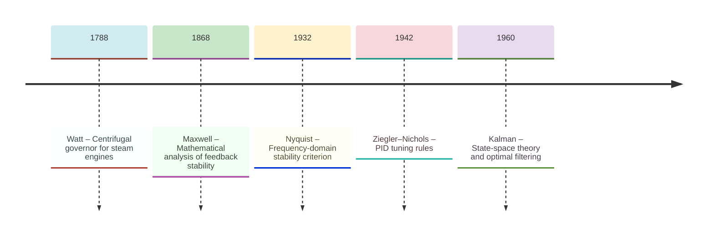
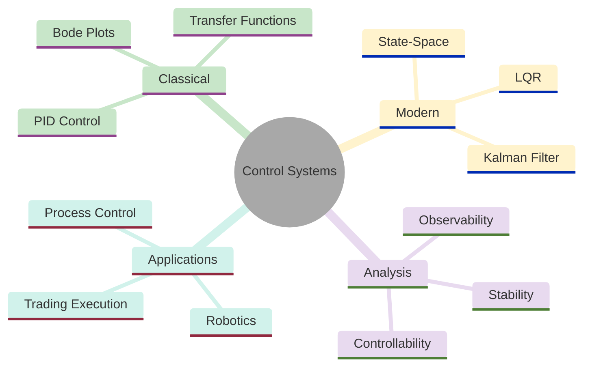
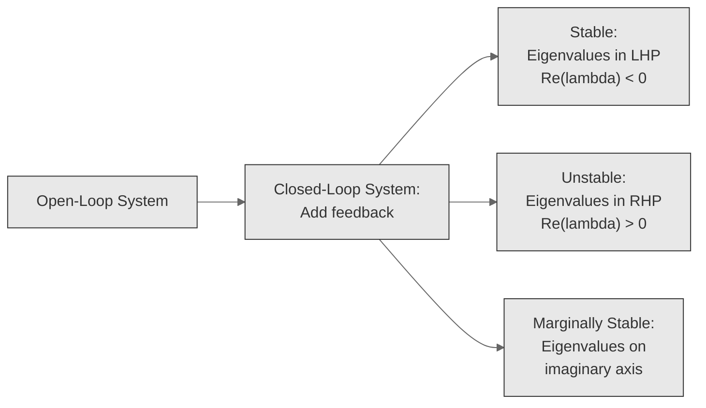
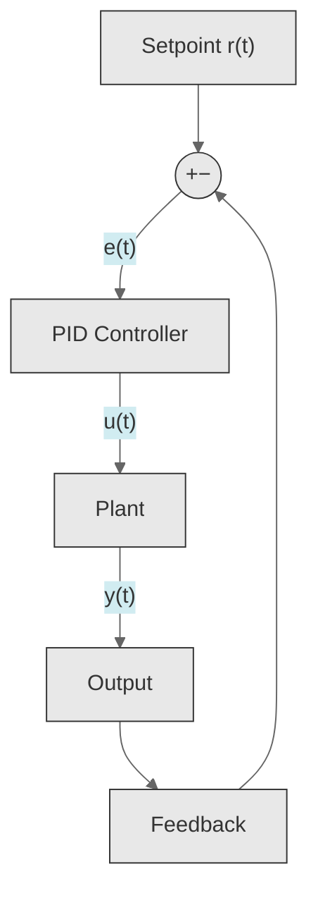
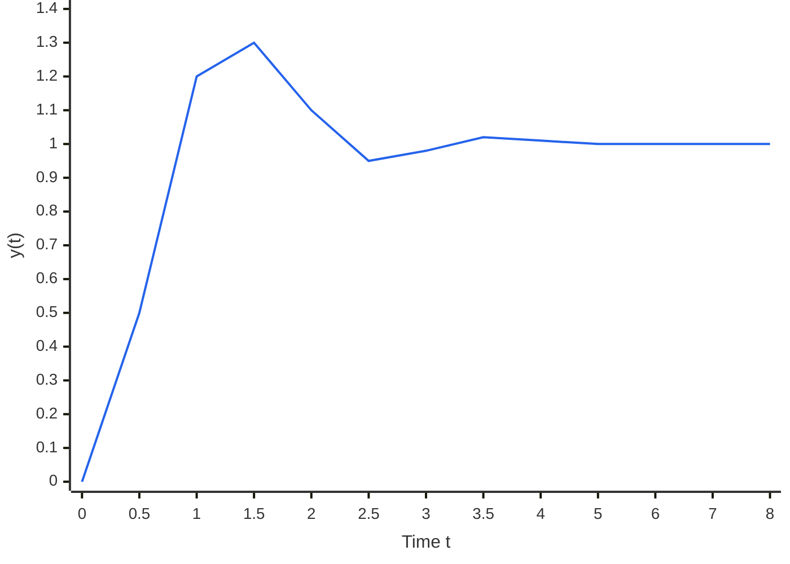
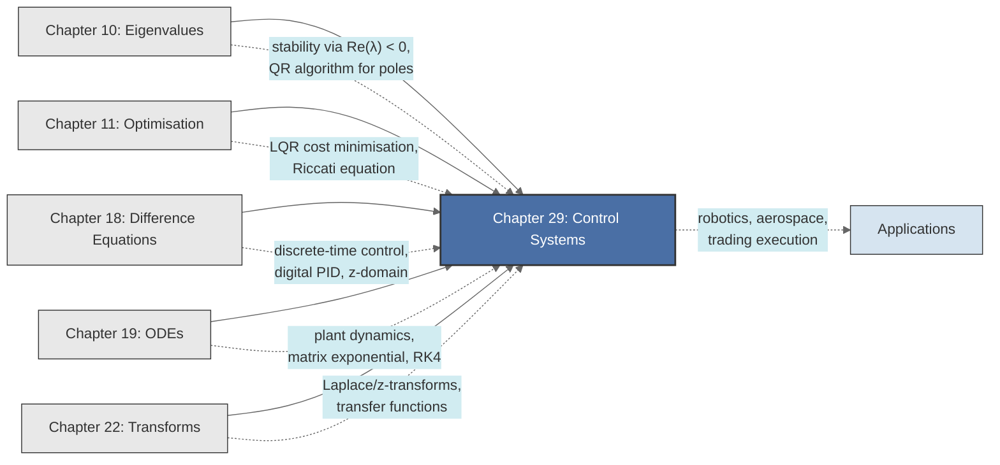

<!-- Copyright (c) 2025-2026 Bob Jansen <bobjansen@pm.me> -->
<!-- SPDX-License-Identifier: CC-BY-NC-4.0 -->
<!-- See LICENSE for full terms. Commercial licensing available. -->

# Chapter 29: Control Systems


**Part IX**: Applications

> Feedback control measures the output, compares it to a reference and acts on the error to keep a system on its intended trajectory. The tools are eigenvalues for stability, transforms for frequency-domain design and optimisation for optimal gain selection.

**Prerequisites**: [Chapter 10](10-eigenvalues.md) (Eigenvalues & Eigenvectors); eigenvalue computation, characteristic polynomials and the stability criterion $\operatorname{Re}(\lambda) < 0$. [Chapter 11](11-unconstrained-optimization.md) (Unconstrained Optimisation); quadratic forms, minimisation of cost functionals and the connection between positive-definite matrices and minima. [Chapter 18](18-difference-equations.md) (Difference Equations); discrete-time dynamical systems, z-transforms and the discrete stability criterion $\lvert \lambda \rvert < 1$. [Chapter 19](19-odes.md) (Ordinary Differential Equations); linear systems $\dot{\mathbf{x}} = A\mathbf{x}$, matrix exponential and numerical integration. [Chapter 22](22-transforms.md) (Transforms); Laplace and z-transforms, transfer functions and frequency-domain representations.

**Learning Objectives**: After this chapter, the reader will be able to:

1. Distinguish open-loop from closed-loop control and explain the role of feedback in disturbance rejection.
2. Derive the transfer function of a linear time-invariant system from its differential equation using Laplace transforms.
3. Design a PID controller and tune its gains using the Ziegler–Nichols method.
4. Analyse system stability by computing eigenvalues of the state matrix and applying Routh–Hurwitz criteria.
5. Determine controllability and observability of a state-space system using rank conditions.
6. Formulate and solve the linear-quadratic regulator (LQR) problem via the algebraic Riccati equation.

**Connections**: This chapter synthesises [Chapter 10](10-eigenvalues.md) (eigenvalues determine stability of the closed-loop system), [Chapter 11](11-unconstrained-optimization.md) (LQR is a quadratic optimisation over linear dynamics), [Chapter 18](18-difference-equations.md) (discrete-time control systems, digital PID), [Chapter 19](19-odes.md) (continuous dynamics of physical plants, matrix exponential for state transitions) and [Chapter 22](22-transforms.md) (Laplace/z-transforms yield transfer functions and enable frequency-domain design). It connects forward to applications in robotics, aerospace and algorithmic trading execution.

---

## Historical Context

**Key Milestones in Control Systems**



*Figure 29.1: Timeline of major milestones in the development of control systems theory.*

**Watt's governor and the birth of feedback (1788).** James Watt patented the centrifugal governor in 1788 to regulate steam engine speed. Two rotating masses on hinged arms rise outward as the engine accelerates; a linkage partially closes the steam valve and reduces power input. When the engine slows, the masses fall inward and the valve opens. The device achieves approximate speed regulation without human intervention. Watt did not analyse his governor mathematically; he was solving an engineering problem. Yet the device embodies negative feedback: the output is measured, compared to a desired value and the error drives a corrective action opposing the deviation.

**Maxwell, Routh and the stability problem (1868–1895).** James Clerk Maxwell published "On Governors" in the *Proceedings of the Royal Society of London* in 1868. The paper was the first to treat feedback control as a mathematical problem. Maxwell modelled the governor as a system of differential equations and asked under what conditions the oscillations decay to zero. He showed that stability depends on the roots of the characteristic equation of the linearised system. If all roots have negative real parts, perturbations decay; if any root has a positive real part, the system is unstable.

**Routh's stability criterion (1877).** Edward John Routh developed in 1877 an algebraic criterion for determining whether all roots of a polynomial lie in the left half-plane without computing them explicitly. Adolf Hurwitz refined the criterion independently in 1895. The Routh–Hurwitz stability criterion gives necessary and sufficient conditions for stability in terms of determinants formed from the polynomial's coefficients.

**Frequency-domain methods (1932–1940s).** Harry Nyquist published his stability criterion in 1932 while working at Bell Telephone Laboratories on amplifier stability. Nyquist worked in the frequency domain: by plotting the transfer function $G(j\omega)$ as $\omega$ varies from $-\infty$ to $+\infty$, one determines stability by counting encirclements of the critical point $-1$ in the complex plane. The method is geometric rather than algebraic and handles systems with time delays that resist Routh–Hurwitz analysis.

**Bode's frequency response methods (1940s).** Hendrik Bode, also at Bell Labs, developed frequency response methods in the 1940s. Bode plots graph gain (in decibels) and phase (in degrees) against frequency on a logarithmic scale. Gain margin and phase margin, read directly from the plots, quantify the distance of a stable system from instability. Bode's methods dominated control engineering practice from the 1940s through the 1980s and remain standard for design.

**PID control and practical tuning (1922–1942).** Nicolas Minorsky described the proportional-integral-derivative (PID) controller in 1922, drawing on observations of ship steering. The Ziegler–Nichols tuning rules (1942) made PID accessible to practising engineers without advanced mathematical training. PID controllers account for over 90% of all industrial feedback loops, from chemical process control to building heating, ventilation and air conditioning systems. With appropriate tuning, a PID controller can regulate many different plants without a precise mathematical model.

**State-space theory and optimal control (1960).** Rudolf Kalman initiated the state-space formulation of control theory in 1960. Kalman introduced state, controllability and observability as the structural properties of dynamical systems. His formulation $\dot{\mathbf{x}} = A\mathbf{x} + B\mathbf{u}$, $\mathbf{y} = C\mathbf{x} + D\mathbf{u}$ placed the theory in the language of linear algebra. In the same decade, Kalman developed the Kalman filter (1960) for optimal state estimation of noisy linear systems and the linear-quadratic regulator (LQR) for optimal feedback gains under a quadratic cost criterion. Both require solving matrix Riccati equations.

**Modern control extensions (1980s–present).** $H_\infty$ control handles model uncertainty. Nonlinear control (Lyapunov methods, feedback linearisation) addresses systems that cannot be approximated as linear. Model predictive control (MPC) solves online optimisation problems at each time step to handle constraints. Adaptive control adjusts controller parameters in real time as plant characteristics change. Applications span autonomous vehicles, drone flight stabilisation, algorithmic trading, industrial process control and biomedical engineering.

---

## Why This Chapter Matters

**Control Systems**



*Figure 29.2: Overview of control systems topics spanning classical, modern, analysis and application domains.*

PID controllers regulate temperature in chemical reactors, pressure in oil pipelines, speed in electric motors, altitude in aircraft autopilots and pH in water treatment plants. They account for over 90% of all industrial feedback loops. A refinery running hundreds of PID loops gains measurable throughput from better tuning; the Ziegler–Nichols rules in Section 4 provide a systematic starting point.

The state-space framework places control theory on a foundation of linear algebra ([Chapter 9](09-matrices.md)) and optimisation ([Chapter 11](11-unconstrained-optimization.md)). The controllability and observability rank conditions apply the Cayley–Hamilton theorem. The linear-quadratic regulator reduces optimal control to a matrix Riccati equation; its solution determines feedback gains for spacecraft attitude control, robotic arm trajectory planning and autonomous vehicle path following. The cost matrices $Q$ and $R$ encode the designer's priorities between tracking accuracy and actuator effort. Stability of the closed-loop system reduces to checking that all eigenvalues of the state matrix satisfy $\operatorname{Re}(\lambda) < 0$ ([Chapter 10](10-eigenvalues.md)).

Model predictive control (MPC) solves a constrained optimisation problem ([Chapter 12](12-constrained-optimization.md)) at every time step to handle limits that PID cannot accommodate. It is the control architecture behind advanced driver assistance systems, industrial batch processes and building energy management. Algorithmic trading execution treats order placement rate as a control input and deviation from a target schedule as an error signal. Closed-loop insulin delivery systems in biomedical engineering regulate blood glucose in diabetic patients.

---

## Notation & Conventions

| Symbol | Meaning |
|--------|---------|
| $t$ | Continuous time variable |
| $k$ | Discrete time index |
| $\mathbf{x}(t)$, $\mathbf{x}_k$ | State vector ($n \times 1$) |
| $\mathbf{u}(t)$, $\mathbf{u}_k$ | Control input vector ($m \times 1$) |
| $\mathbf{y}(t)$, $\mathbf{y}_k$ | Output vector ($p \times 1$) |
| $A$ | State (system) matrix ($n \times n$) |
| $B$ | Input matrix ($n \times m$) |
| $C$ | Output matrix ($p \times n$) |
| $D$ | Feedthrough matrix ($p \times m$) |
| $G(s)$ | Continuous-time transfer function (Laplace domain) |
| $G(z)$ | Discrete-time transfer function (z-domain) |
| $s$ | Complex frequency variable (Laplace domain) |
| $z$ | Complex frequency variable (z-domain) |
| $e(t)$ | Error signal: $e(t) = r(t) - y(t)$ |
| $r(t)$ | Reference (setpoint) signal |
| $K_p$, $K_i$, $K_d$ | PID gains: proportional, integral, derivative |
| $\lambda_i$ | Eigenvalue of the state matrix $A$ |
| $\mathcal{C}$ | Controllability matrix: $[B\ \ AB\ \ A^2B\ \ \cdots\ \ A^{n-1}B]$ |
| $\mathcal{O}$ | Observability matrix: $[C;\ CA;\ CA^2;\ \cdots;\ CA^{n-1}]$ |
| $Q$ | State weighting matrix in LQR ($n \times n$, positive semi-definite) |
| $R$ | Control weighting matrix in LQR ($m \times m$, positive definite) |
| $P$ | Solution to the Riccati equation ($n \times n$, positive definite) |
| $K$ | Feedback gain matrix: $\mathbf{u} = -K\mathbf{x}$ |
| $e^{At}$ | Matrix exponential (state transition matrix) |
| $T_s$ | Sampling period for discrete-time systems |

Bold lowercase denotes vectors; uppercase italic denotes matrices. Transfer functions use $G(s)$ or $G(z)$. The error $e(t)$ is reference minus output; positive error means the output is below the setpoint.

---

## Core Theory

### Open-Loop vs. Closed-Loop Control

**Definition 29.1** (Open-loop control). In an *open-loop* controller, the control input $u(t)$ is determined from the reference $r(t)$ alone, without measurement of the actual output $y(t)$. The control law has the form $u = f(r)$, independent of $y$.

**Definition 29.2** (Closed-loop control). In a *closed-loop* (feedback) controller, the control input depends on the error $e(t) = r(t) - y(t)$ between the desired and actual output. The control law has the form $u = f(e)$, where $e$ incorporates measured output.

The fundamental advantage of feedback is *disturbance rejection*. Suppose a plant has input-output relation $y = Gu + d$, where $G$ represents the plant dynamics and $d$ is an unmeasured disturbance. In open-loop, the controller cannot compensate for $d$ because it does not observe $y$. In closed-loop with controller $C$, the loop equations give

$$y = \frac{GC}{1 + GC} r + \frac{1}{1 + GC} d.$$

If $\lvert GC \rvert \gg 1$ in the frequency band of interest, the disturbance transfer function $1/(1 + GC) \approx 0$, and the disturbance is effectively rejected. This gain-dependent suppression is the quantitative mechanism by which feedback reduces sensitivity to disturbances and modelling errors.

**Remark 29.3** (Sensitivity function). The *sensitivity function* $S(s) = 1/(1 + G(s)C(s))$ measures the ratio of closed-loop to open-loop disturbance response. The complementary sensitivity $T(s) = G(s)C(s)/(1 + G(s)C(s))$ satisfies $S + T = 1$. Good disturbance rejection ($\lvert S \rvert \ll 1$) and good reference tracking ($\lvert T \rvert \approx 1$) are achieved simultaneously when the loop gain $\lvert GC \rvert$ is large.

**Control System Stability Classification:**



*Figure 29.3: Classification of closed-loop system stability based on eigenvalue locations.*

### Transfer Functions

**Definition 29.4** (Transfer function). For a linear time-invariant (LTI) system described by the ordinary differential equation (ODE)

$$a_n y^{(n)} + a_{n-1} y^{(n-1)} + \cdots + a_1 y' + a_0 y = b_m u^{(m)} + b_{m-1} u^{(m-1)} + \cdots + b_1 u' + b_0 u,$$

with zero initial conditions, applying the Laplace transform ([Chapter 22](22-transforms.md)) to both sides yields the *transfer function*

$$G(s) = \frac{Y(s)}{U(s)} = \frac{b_m s^m + b_{m-1} s^{m-1} + \cdots + b_0}{a_n s^n + a_{n-1} s^{n-1} + \cdots + a_0} = \frac{B(s)}{A(s)}.$$

The roots of $A(s) = 0$ are the *poles* of the system; the roots of $B(s) = 0$ are the *zeros*.

**Theorem 29.5** (Poles and eigenvalues). For a state-space system $\dot{\mathbf{x}} = A\mathbf{x} + B\mathbf{u}$, $\mathbf{y} = C\mathbf{x}$, the transfer function is $G(s) = C(sI - A)^{-1}B$. The poles of $G(s)$ are a subset of the eigenvalues of $A$. If the system is both controllable and observable, the poles equal the eigenvalues exactly.

??? note "Proof"

    *Proof.* Apply the Laplace transform to the state equation $\dot{\mathbf{x}} = A\mathbf{x} + B\mathbf{u}$:

    $$s\mathbf{X}(s) - \mathbf{x}(0) = A\mathbf{X}(s) + B\mathbf{U}(s).$$

    With zero initial conditions, $(sI - A)\mathbf{X}(s) = B\mathbf{U}(s)$. Solving for $\mathbf{X}(s)$:

    $$\mathbf{X}(s) = (sI - A)^{-1}B\mathbf{U}(s).$$

    Substituting into the output equation $Y(s) = C\mathbf{X}(s)$ gives $G(s) = C(sI - A)^{-1}B$.

    Since

    $$(sI - A)^{-1} = \frac{\operatorname{adj}(sI - A)}{\det(sI - A)}$$

    and $\det(sI - A)$ is the characteristic polynomial of $A$, the poles of $G(s)$ (before cancellation) are the eigenvalues of $A$.

    Cancellation occurs when a mode is uncontrollable or unobservable. $\square$

**Remark 29.6**. The transfer function provides a complete external description of a SISO (single-input, single-output) system. It encodes the system's response to sinusoidal inputs (frequency response), its transient behaviour (pole locations) and its steady-state gain ($G(0) = b_0/a_0$ for a stable system).

### PID Control

**Definition 29.7** (PID controller). The *proportional-integral-derivative* (PID) controller produces a control signal

$$u(t) = K_p e(t) + K_i \int_0^t e(\tau)\,d\tau + K_d \dot{e}(t),$$

where $e(t) = r(t) - y(t)$ is the error. The three terms have distinct roles:

- *Proportional* ($K_p e$): responds to the present error. Larger $K_p$ gives faster response but may cause oscillation.
- *Integral* ($K_i \int e\,d\tau$): responds to the accumulated past error ([Chapter 5](05-integral-calculus.md)). Eliminates steady-state offset but can cause overshoot.
- *Derivative* ($K_d \dot{e}$): responds to the rate of change of error ([Chapter 4](04-differential-calculus.md)). Provides damping and anticipatory action but amplifies noise.

The transfer function of the PID controller in the Laplace domain is

$$C(s) = K_p + \frac{K_i}{s} + K_d s = \frac{K_d s^2 + K_p s + K_i}{s}.$$

**PID Feedback Control Loop**



*Figure 29.4: Closed-loop PID feedback control loop connecting setpoint, controller and plant.*

**Definition 29.8** (Ultimate gain and ultimate period). The *ultimate gain* $K_u$ is the smallest proportional gain at which the closed-loop system (with integral and derivative gains set to zero) exhibits sustained, undamped oscillations. The *ultimate period* $T_u$ is the period of those sustained oscillations. Together they characterise the boundary of closed-loop stability under proportional-only control and serve as the basis for the Ziegler–Nichols tuning rules.

**Theorem 29.9** (Ziegler–Nichols tuning). Given a plant with transfer function $G(s)$, the Ziegler–Nichols *ultimate gain* method proceeds as follows:

1. Set $K_i = 0$ and $K_d = 0$. Increase $K_p$ from zero until the closed-loop system exhibits sustained oscillations. The value of $K_p$ at this point is the *ultimate gain* $K_u$, and the period of oscillation is the *ultimate period* $T_u$.
2. Set the PID gains according to:

$$K_p = 0.6\, K_u, \qquad K_i = \frac{2K_p}{T_u} = \frac{1.2\, K_u}{T_u}, \qquad K_d = \frac{K_p T_u}{8} = 0.075\, K_u T_u.$$

The Ziegler–Nichols method targets a decay ratio of approximately $1/4$ (each successive overshoot is one-quarter the previous). It provides a starting point; in practice, gains are refined through simulation or experiment.

**Remark 29.10** (Integral windup). When actuator saturation prevents the control signal from reaching its computed value, the integral term continues to accumulate error, leading to large overshoot when the constraint is released. Anti-windup strategies (clamping the integrator or back-calculating the integral) are necessary in practical PID implementations.

!!! warning "Integral windup under actuator saturation"
    If the actuator saturates, the integral term accumulates error that the plant cannot act on. The result is a large control spike and overshoot when the constraint lifts. Clamp the integrator or use back-calculation to reset the integral when the output is saturated.

**Step Response (Underdamped, zeta=0.3):**



*Figure 29.5: Step response of an underdamped second-order system showing overshoot and settling.*

The step response of an underdamped second-order system exhibits overshoot (the output exceeds the setpoint), oscillation (the output alternates above and below the setpoint) and eventual settling (the oscillations decay as the system converges to steady state). The damping ratio $\zeta = 0.3$ produces visible overshoot of approximately 30% and requires several oscillation cycles before settling within 2% of the final value.

### State-Space Representation

**Definition 29.11** (Continuous-time state-space). A continuous-time LTI system is described by

$$\dot{\mathbf{x}} = A\mathbf{x} + B\mathbf{u}, \qquad \mathbf{y} = C\mathbf{x} + D\mathbf{u},$$

where $\mathbf{x} \in \mathbb{R}^n$ is the state, $\mathbf{u} \in \mathbb{R}^m$ is the input and $\mathbf{y} \in \mathbb{R}^p$ is the output. The matrices $A$, $B$, $C$, $D$ have dimensions $n \times n$, $n \times m$, $p \times n$ and $p \times m$, respectively.

**Theorem 29.12** (State-space solution). The solution to $\dot{\mathbf{x}} = A\mathbf{x} + B\mathbf{u}$ with initial condition $\mathbf{x}(0) = \mathbf{x}_0$ is

$$\mathbf{x}(t) = e^{At}\mathbf{x}_0 + \int_0^t e^{A(t-\tau)}B\mathbf{u}(\tau)\,d\tau,$$

where $e^{At}$ is the matrix exponential ([Chapter 10](10-eigenvalues.md), [Chapter 19](19-odes.md)).

??? note "Proof"

    *Proof.* Define $\mathbf{z}(t) = e^{-At}\mathbf{x}(t)$. By the product rule,

    $$\dot{\mathbf{z}} = -Ae^{-At}\mathbf{x} + e^{-At}\dot{\mathbf{x}} = -Ae^{-At}\mathbf{x} + e^{-At}(A\mathbf{x} + B\mathbf{u}) = e^{-At}B\mathbf{u}.$$

    Integrating from $0$ to $t$:

    $$\mathbf{z}(t) - \mathbf{z}(0) = \int_0^t e^{-A\tau}B\mathbf{u}(\tau)\,d\tau.$$

    Since $\mathbf{z}(0) = e^{0}\mathbf{x}_0 = \mathbf{x}_0$, it follows that

    $$\mathbf{z}(t) = \mathbf{x}_0 + \int_0^t e^{-A\tau}B\mathbf{u}(\tau)\,d\tau.$$

    Multiplying both sides by $e^{At}$ and using $e^{At}e^{-A\tau} = e^{A(t-\tau)}$ gives the stated result. $\square$

The first term $e^{At}\mathbf{x}_0$ is the *free response* (natural evolution from the initial condition); the second term is the *forced response* (effect of the input). For the unforced system ($\mathbf{u} = \mathbf{0}$), the solution $\mathbf{x}(t) = e^{At}\mathbf{x}_0$ decays to zero if and only if all eigenvalues of $A$ have negative real parts.

### Stability

**Definition 29.13** (BIBO stability). A system is *bounded-input bounded-output* (BIBO) stable if every bounded input produces a bounded output.

**Theorem 29.14** (Eigenvalue stability criterion, continuous). The equilibrium $\mathbf{x} = \mathbf{0}$ of the system $\dot{\mathbf{x}} = A\mathbf{x}$ is:

- *asymptotically stable* if and only if $\operatorname{Re}(\lambda_i) < 0$ for all eigenvalues $\lambda_i$ of $A$;
- *marginally stable* if $\operatorname{Re}(\lambda_i) \leq 0$ for all $\lambda_i$, with equality holding only for eigenvalues with Jordan blocks of size one;
- *unstable* if $\operatorname{Re}(\lambda_i) > 0$ for any eigenvalue $\lambda_i$.

??? note "Proof"

    *Proof.* Write $A = PJP^{-1}$ where $J$ is the Jordan form of $A$. Then $e^{At} = Pe^{Jt}P^{-1}$, so it suffices to analyse $e^{Jt}$.

    For a Jordan block of size $r$ with eigenvalue $\lambda$, the $(i,j)$ entry of $e^{Jt}$ has the form

    $$\frac{t^{j-i}}{(j-i)!}\, e^{\lambda t}, \qquad j \geq i.$$

    The exponential factor has magnitude $\lvert e^{\lambda t} \rvert = e^{\operatorname{Re}(\lambda)\, t}$. There are three cases:

    - If $\operatorname{Re}(\lambda) < 0$: the exponential dominates the polynomial $t^{j-i}$ and the entry decays to zero.
    - If $\operatorname{Re}(\lambda) > 0$: the entry grows without bound.
    - If $\operatorname{Re}(\lambda) = 0$ and $j > i$: the polynomial factor $t^{j-i}$ causes unbounded growth even though $\lvert e^{\lambda t} \rvert = 1$.

    Asymptotic stability requires all entries of $e^{At}$ to decay, which holds if and only if $\operatorname{Re}(\lambda) < 0$ for all eigenvalues. $\square$

**Theorem 29.15** (Eigenvalue stability criterion, discrete). For the discrete system $\mathbf{x}_{k+1} = A\mathbf{x}_k$ ([Chapter 18](18-difference-equations.md)), the equilibrium is asymptotically stable if and only if $\lvert \lambda_i \rvert < 1$ for all eigenvalues of $A$.

**Theorem 29.16** (Routh–Hurwitz criterion). Given a polynomial $p(s) = a_n\,s^n + a_{n-1}\,s^{n-1} + \cdots + a_1\,s + a_0$ with $a_n > 0$, all roots have $\operatorname{Re}(s) < 0$ if and only if all leading principal minors of the Hurwitz matrix are positive. For low-order polynomials:

- **Order 2**: $a_2\,s^2 + a_1\,s + a_0$. Stable iff $a_0, a_1, a_2 > 0$.
- **Order 3**: $a_3\,s^3 + a_2\,s^2 + a_1\,s + a_0$. Stable iff $a_0, a_1, a_2, a_3 > 0$ and $a_2 a_1 > a_3 a_0$.

The Routh–Hurwitz criterion determines stability from the coefficients of the characteristic polynomial without computing eigenvalues explicitly.

### Controllability

**Definition 29.17** (Controllability). The state-space system $(A, B)$ is *controllable* if for any initial state $\mathbf{x}_0$ and any desired final state $\mathbf{x}_f$, there exists a finite time $T > 0$ and an input $\mathbf{u}(t)$ on $[0, T]$ such that $\mathbf{x}(T) = \mathbf{x}_f$.

**Theorem 29.18** (Kalman rank condition for controllability). The system $(A, B)$ is controllable if and only if the *controllability matrix*

$$\mathcal{C} = \begin{bmatrix} B & AB & A^2B & \cdots & A^{n-1}B \end{bmatrix}$$

has full row rank: $\operatorname{rank}(\mathcal{C}) = n$.

??? note "Proof"

    *Proof sketch.* From Theorem 29.12, the state at time $T$ starting from zero initial conditions is

    $$\mathbf{x}(T) = \int_0^T e^{A(T-\tau)}B\mathbf{u}(\tau)\,d\tau.$$

    The set of reachable states is the range of the linear map $\mathbf{u}(\cdot) \mapsto \int_0^T e^{A(T-\tau)}B\mathbf{u}(\tau)\,d\tau$.

    Expanding the matrix exponential as $e^{At} = \sum_{k=0}^\infty (At)^k/k!$ and applying the Cayley–Hamilton theorem (which states that $A^k$ for $k \geq n$ is a linear combination of $I, A, \ldots, A^{n-1}$), the integral can be expressed as a linear combination of the columns of $[B,\, AB,\, A^2B,\, \ldots,\, A^{n-1}B]$. The reachable set is therefore $\operatorname{range}(\mathcal{C})$.

    This equals all of $\mathbb{R}^n$ if and only if $\operatorname{rank}(\mathcal{C}) = n$. $\square$

**Remark 29.19**. Controllability is a property of the pair $(A, B)$, not of $A$ alone. A stable system with insufficient actuator authority may be uncontrollable: the eigenvalues may have negative real parts, but certain states cannot be reached from certain initial conditions.

### Observability

**Definition 29.20** (Observability). The system $(A, C)$ is *observable* if the initial state $\mathbf{x}(0)$ can be uniquely determined from knowledge of $\mathbf{u}(t)$ and $\mathbf{y}(t)$ over a finite time interval $[0, T]$.

**Theorem 29.21** (Kalman rank condition for observability). The system $(A, C)$ is observable if and only if the *observability matrix*

$$\mathcal{O} = \begin{bmatrix} C \\ CA \\ CA^2 \\ \vdots \\ CA^{n-1} \end{bmatrix}$$

has full column rank: $\operatorname{rank}(\mathcal{O}) = n$.

??? note "Proof"

    *Proof.* With $\mathbf{u} = \mathbf{0}$, the output is $\mathbf{y}(t) = Ce^{At}\mathbf{x}(0)$. Differentiating repeatedly and evaluating at $t = 0$:

    $$\mathbf{y}(0) = C\mathbf{x}(0), \quad \dot{\mathbf{y}}(0) = CA\mathbf{x}(0), \quad \ldots, \quad \mathbf{y}^{(n-1)}(0) = CA^{n-1}\mathbf{x}(0).$$

    Stacking these $n$ equations in matrix form gives

    $$\begin{bmatrix} \mathbf{y}(0) \\ \dot{\mathbf{y}}(0) \\ \vdots \\ \mathbf{y}^{(n-1)}(0) \end{bmatrix} = \mathcal{O}\,\mathbf{x}(0).$$

    The initial state $\mathbf{x}(0)$ is uniquely determined from the output data if and only if the map $\mathbf{x}(0) \mapsto \mathcal{O}\mathbf{x}(0)$ is injective, i.e., $\operatorname{rank}(\mathcal{O}) = n$. $\square$

**Remark 29.22** (Duality). Controllability of $(A, B)$ is equivalent to observability of $(A^T, B^T)$. This duality connects controller design (pole placement) with observer design (state estimation).

### Linear-Quadratic Regulator (LQR)

**Definition 29.23** (LQR problem). Given the system $\dot{\mathbf{x}} = A\mathbf{x} + B\mathbf{u}$ with $\mathbf{x}(0) = \mathbf{x}_0$, find the control $\mathbf{u}(t)$ that minimises the quadratic cost functional

$$J = \int_0^\infty \left(\mathbf{x}^T Q \mathbf{x} + \mathbf{u}^T R \mathbf{u}\right) \,dt,$$

where $Q \succeq 0$ (positive semi-definite) penalises state deviation and $R \succ 0$ (positive definite) penalises control effort.

**Theorem 29.24** (LQR solution). If $(A, B)$ is controllable and $(A, Q^{1/2})$ is observable, the optimal control is the linear state feedback

$$\mathbf{u}^*(t) = -K\mathbf{x}(t), \qquad K = R^{-1}B^T P,$$

where $P$ is the unique positive-definite solution to the *continuous-time algebraic Riccati equation* (CARE):

$$A^T P + PA - PBR^{-1}B^T P + Q = 0.$$

The closed-loop system $\dot{\mathbf{x}} = (A - BK)\mathbf{x}$ is asymptotically stable, and the minimum cost is $J^* = \mathbf{x}_0^T P \mathbf{x}_0$.

??? note "Proof"

    *Proof.* Consider the candidate Lyapunov function $V(\mathbf{x}) = \mathbf{x}^T P \mathbf{x}$ with $P \succ 0$. Along trajectories of the closed-loop system with $\mathbf{u} = -K\mathbf{x}$:

    $$\dot{V} = \dot{\mathbf{x}}^T P\mathbf{x} + \mathbf{x}^T P\dot{\mathbf{x}} = \mathbf{x}^T\left[(A - BK)^T P + P(A - BK)\right]\mathbf{x}.$$

    The integrand of $J$ equals $\mathbf{x}^T Q\mathbf{x} + \mathbf{x}^T K^T R K \mathbf{x} = \mathbf{x}^T(Q + K^T R K)\mathbf{x}$. Requiring $\dot{V} = -\mathbf{x}^T(Q + K^T RK)\mathbf{x}$ gives the Lyapunov equation:

    $$(A - BK)^T P + P(A - BK) = -(Q + K^T RK).$$

    Substituting $K = R^{-1}B^T P$ into this equation and expanding produces the algebraic Riccati equation (CARE):

    $$A^T P + PA - PBR^{-1}B^T P + Q = 0.$$

    Since $\dot{V} = -(\mathbf{x}^T Q\mathbf{x} + \mathbf{u}^T R\mathbf{u})$ along optimal trajectories, the cost integrand equals $-\dot{V}$. Integrating from $0$ to $\infty$:

    $$J = \int_0^\infty (-\dot{V})\,dt = V(\mathbf{x}_0) - V(\mathbf{x}(\infty)) = \mathbf{x}_0^T P \mathbf{x}_0,$$

    since $\mathbf{x}(\infty) = \mathbf{0}$ by asymptotic stability. Optimality follows from the Hamilton–Jacobi–Bellman equation applied to the linear-quadratic structure. $\square$

!!! abstract "Key Result"

    **Theorem 29.24** (LQR solution). The optimal state-feedback gain is $K = R^{-1}B^T P$ where $P$ solves the algebraic Riccati equation, reducing infinite-horizon optimal control to a single matrix equation whose solution guarantees closed-loop stability.

**Remark 29.25** (LQR as optimisation on dynamics). The LQR problem is a special case of constrained optimisation ([Chapter 11](11-unconstrained-optimization.md), [Chapter 12](12-constrained-optimization.md)): minimise a quadratic objective subject to the equality constraint $\dot{\mathbf{x}} = A\mathbf{x} + B\mathbf{u}$. The Riccati equation encodes the necessary conditions (Pontryagin's maximum principle applied to a linear system with quadratic cost). The matrices $Q$ and $R$ serve as design parameters: increasing $Q$ relative to $R$ produces more aggressive control (faster state regulation at the expense of larger control effort).

### Discrete-Time Control

**Definition 29.26** (Discrete-time state-space). A discrete-time LTI system is

$$\mathbf{x}_{k+1} = A\mathbf{x}_k + B\mathbf{u}_k, \qquad \mathbf{y}_k = C\mathbf{x}_k + D\mathbf{u}_k.$$

The solution is $\mathbf{x}_k = A^k \mathbf{x}_0 + \sum_{j=0}^{k-1} A^{k-1-j}B\mathbf{u}_j$ ([Chapter 18](18-difference-equations.md)).

**Definition 29.27** (Discrete PID). The discrete-time PID controller, obtained by replacing derivatives with differences and integrals with sums, is

$$u_k = K_p e_k + K_i T_s \sum_{j=0}^{k} e_j + K_d \frac{e_k - e_{k-1}}{T_s},$$

where $T_s$ is the sampling period and $e_k = r_k - y_k$.

**Theorem 29.28** (Discrete LQR). For the discrete system $\mathbf{x}_{k+1} = A\mathbf{x}_k + B\mathbf{u}_k$, the cost $J = \sum_{k=0}^\infty (\mathbf{x}_k^T Q \mathbf{x}_k + \mathbf{u}_k^T R \mathbf{u}_k)$ is minimised by $\mathbf{u}_k = -K\mathbf{x}_k$ with $K = (R + B^T P B)^{-1}B^T P A$, where $P$ satisfies the *discrete-time algebraic Riccati equation* (DARE):

$$P = A^T P A - A^T P B(R + B^T P B)^{-1}B^T P A + Q.$$

The z-transform ([Chapter 22](22-transforms.md)) relates the discrete transfer function $G(z) = C(zI - A)^{-1}B + D$ to the discrete state-space system, paralleling the continuous case.

---

## Formulas & Identities

**F29.1** Transfer function from state-space.

$$G(s) = C(sI - A)^{-1}B + D$$

**F29.2** PID controller.

$$C(s) = K_p + \frac{K_i}{s} + K_d s$$

**F29.3** Continuous stability criterion: system $\dot{\mathbf{x}} = A\mathbf{x}$ is asymptotically stable iff all eigenvalues satisfy:

$$\operatorname{Re}(\lambda_i) < 0 \quad \text{for all } i$$

**F29.4** Discrete stability criterion: system $\mathbf{x}_{k+1} = A\mathbf{x}_k$ is asymptotically stable iff all eigenvalues satisfy:

$$\lvert \lambda_i \rvert < 1 \quad \text{for all } i$$

**F29.5** Controllability rank condition.

$$\operatorname{rank}\bigl([B\ \ AB\ \ \cdots\ \ A^{n-1}B]\bigr) = n$$

**F29.6** Observability rank condition.

$$\operatorname{rank}\!\begin{bmatrix} C \\ CA \\ \vdots \\ CA^{n-1} \end{bmatrix} = n$$

**F29.7** LQR optimal gain, where $P$ solves the CARE.

$$K = R^{-1}B^T P, \qquad A^T P + PA - PBR^{-1}B^T P + Q = 0$$

**F29.8** Discrete LQR gain.

$$K = (R + B^T PB)^{-1}B^T PA$$

**F29.9** Sensitivity and complementary sensitivity functions.

$$S(s) = \frac{1}{1 + G(s)C(s)}, \qquad T(s) = \frac{G(s)C(s)}{1 + G(s)C(s)}, \qquad S + T = 1$$

**F29.10** State-space solution.

$$\mathbf{x}(t) = e^{At}\mathbf{x}_0 + \int_0^t e^{A(t-\tau)}B\mathbf{u}(\tau)\,d\tau$$

---

## Algorithms

### Algorithm 29.29: Closed-Loop Simulation with PID

Simulate the response of a plant $G(s)$ (given in state-space form) to a reference $r(t)$ under PID control, using fourth-order Runge–Kutta (RK4) integration ([Chapter 19](19-odes.md)).

**Input**: State-space matrices $(A, B, C)$; PID gains $(K_p, K_i, K_d)$; reference signal $r(t)$; initial state $\mathbf{x}_0$; time horizon $T$; step size $h$.

**Output**: Time series $(t_k, \mathbf{x}_k, y_k, u_k)$.

1. Initialise $t = 0$, $\mathbf{x} = \mathbf{x}_0$, integral $= 0$, $e_{\text{prev}} = r(0) - C\mathbf{x}_0$.
2. For $k = 0, 1, \ldots, \lfloor T/h \rfloor$:
   a. Compute output $y = C\mathbf{x}$.
   b. Compute error $e = r(t) - y$.
   c. Update integral: integral $\gets$ integral $+ e \cdot h$.
   d. Compute derivative: $\dot{e} = (e - e_{\text{prev}})/h$.
   e. Compute control: $u = K_p e + K_i \cdot \text{integral} + K_d \cdot \dot{e}$.
   f. Advance state via RK4: $\mathbf{x} \gets \text{RK4}(\dot{\mathbf{x}} = A\mathbf{x} + Bu, t, h)$.
   g. Update $e_{\text{prev}} = e$, $t \gets t + h$.
   h. Record $(t, \mathbf{x}, y, u)$.

```
function simulatePID(A, B, C, Kp, Ki, Kd, r, x0, T, h):
    t = 0
    x = x0
    integral = 0
    ePrev = r(0) - C * x0
    trajectory = []
    N = floor(T / h)
    for k = 0 to N:
        y = C * x
        e = r(t) - y
        integral = integral + e * h
        eDot = (e - ePrev) / h
        u = Kp * e + Ki * integral + Kd * eDot
        // RK4 step for dx/dt = A*x + B*u
        f = (ti, xi) -> A * xi + B * u
        k1 = f(t, x)
        k2 = f(t + h/2, x + h/2 * k1)
        k3 = f(t + h/2, x + h/2 * k2)
        k4 = f(t + h, x + h * k3)
        x = x + (h / 6) * (k1 + 2*k2 + 2*k3 + k4)
        ePrev = e
        t = t + h
        trajectory.append((t, x, y, u))
    return trajectory
```

**Complexity**: $O(N \cdot n^2)$ time (matrix-vector product in RK4), where $N = T/h$ is the number of steps and $n$ is the state dimension. Space is $O(N \cdot n)$ for storing the full trajectory; $O(n)$ if only the final state is needed.

### Algorithm 29.30: Transfer Function Poles (Stability Analysis)

Given a transfer function $G(s) = B(s)/A(s)$ with $A(s) = a_n s^n + \cdots + a_0$, compute the poles as eigenvalues of the companion matrix.

**Input**: Coefficients $a_0, a_1, \ldots, a_n$ of the denominator polynomial.

**Output**: Poles $p_1, \ldots, p_n$ (complex, in general).

1. Form the companion matrix:

$$A_c = \begin{bmatrix} 0 & 1 & 0 & \cdots & 0 \\ 0 & 0 & 1 & \cdots & 0 \\ \vdots & & & \ddots & \vdots \\ 0 & 0 & 0 & \cdots & 1 \\ -a_0/a_n & -a_1/a_n & -a_2/a_n & \cdots & -a_{n-1}/a_n \end{bmatrix}.$$

2. Compute the eigenvalues of $A_c$ using the QR algorithm ([Chapter 10](10-eigenvalues.md)).
3. Return the eigenvalues as the poles.

```
function transferFunctionPoles(coeffs):
    // coeffs = [a0, a1, ..., an] (denominator coefficients)
    n = length(coeffs) - 1
    an = coeffs[n]
    // Build n x n companion matrix
    Ac = zeros(n, n)
    for i = 0 to n - 2:
        Ac[i][i + 1] = 1          // superdiagonal of ones
    for j = 0 to n - 1:
        Ac[n - 1][j] = -coeffs[j] / an   // last row
    poles = eigenvalues(Ac)        // QR algorithm
    return poles
```

**Correctness**: The characteristic polynomial of $A_c$ is $\det(sI - A_c) = s^n + (a_{n-1}/a_n)s^{n-1} + \cdots + a_0/a_n$, which is $A(s)/a_n$.

**Complexity**: $O(n^3)$ time, dominated by eigenvalue computation via the QR algorithm. Space is $O(n^2)$ for the companion matrix.

### Algorithm 29.31: Controllability and Observability Check

**Input**: State matrix $A$ ($n \times n$), input matrix $B$ ($n \times m$), output matrix $C$ ($p \times n$).

**Output**: Boolean controllability and observability verdicts.

1. Compute $\mathcal{C} = [B,\ AB,\ A^2B,\ \ldots,\ A^{n-1}B]$ (dimensions $n \times nm$).
2. Compute $\operatorname{rank}(\mathcal{C})$ via singular value decomposition (SVD). System is controllable iff $\operatorname{rank}(\mathcal{C}) = n$.
3. Compute $\mathcal{O} = [C;\ CA;\ CA^2;\ \ldots;\ CA^{n-1}]$ (dimensions $np \times n$).
4. Compute $\operatorname{rank}(\mathcal{O})$ via SVD. System is observable iff $\operatorname{rank}(\mathcal{O}) = n$.

```
function checkControllabilityObservability(A, B, C):
    n = rows(A)
    // Build controllability matrix
    power = B                      // A^0 * B = B
    Ctrl = power
    for i = 1 to n - 1:
        power = A * power           // A^i * B
        Ctrl = [Ctrl | power]       // horizontal concatenation
    controllable = (svdRank(Ctrl) == n)
    // Build observability matrix
    power = C                      // C * A^0 = C
    Obs = power
    for i = 1 to n - 1:
        power = power * A           // C * A^i
        Obs = [Obs ; power]         // vertical concatenation
    observable = (svdRank(Obs) == n)
    return (controllable, observable)
```

**Numerical note**: In finite arithmetic, rank determination uses a tolerance: singular values below $\epsilon \cdot \sigma_{\max}$ (where $\epsilon$ is machine epsilon and $\sigma_{\max}$ is the largest singular value) are treated as zero.

**Complexity**: $O(n^3 m)$ time for forming the controllability matrix and $O(n^2 p)$ for the observability matrix, plus $O(\min(nm, np) \cdot n^2)$ for the SVD rank computation. Space is $O(n^2 m + np \cdot n)$ for storing $\mathcal{C}$ and $\mathcal{O}$.

### Algorithm 29.32: LQR via Iterative Riccati Solution

Solve the CARE $A^T P + PA - PBR^{-1}B^T P + Q = 0$ iteratively.

**Input**: Matrices $A$, $B$, $Q$, $R$; tolerance $\varepsilon$; maximum iterations $N_{\max}$.

**Output**: Solution $P$ and feedback gain $K = R^{-1}B^T P$.

1. Initialise $P_0 = Q$.
2. For $k = 0, 1, \ldots, N_{\max}$:
   a. Compute $K_k = R^{-1}B^T P_k$.
   b. Compute the closed-loop matrix $A_{cl} = A - BK_k$.
   c. Solve the Lyapunov equation $A_{cl}^T P_{k+1} + P_{k+1} A_{cl} = -(Q + K_k^T R K_k)$ for $P_{k+1}$.
   d. If $\lVert P_{k+1} - P_k\rVert_F < \varepsilon$, return $P_{k+1}$ and $K_{k+1} = R^{-1}B^T P_{k+1}$.
3. If not converged, raise an error.

```
function solveLQR(A, B, Q, R, eps, maxIter):
    P = Q                          // initial guess
    for k = 0 to maxIter:
        K = inverse(R) * transpose(B) * P
        Acl = A - B * K
        // Solve Lyapunov equation: Acl^T * Pnew + Pnew * Acl = -Qcl
        Qcl = Q + transpose(K) * R * K
        Pnew = solveLyapunov(Acl, Qcl)
        if frobeniusNorm(Pnew - P) < eps:
            Kfinal = inverse(R) * transpose(B) * Pnew
            return (Pnew, Kfinal)
        P = Pnew
    error("LQR iteration did not converge")
```

**Convergence**: Under the controllability and observability assumptions of Theorem 29.24, the iteration converges to the unique stabilising solution of the CARE. Each step requires solving an $n \times n$ Lyapunov equation, which costs $O(n^3)$.

**Complexity**: $O(N_{\text{iter}} \cdot n^3)$ time, where each iteration solves an $n \times n$ Lyapunov equation; typically 10–50 iterations suffice. Space is $O(n^2)$ for storing $P$, $K$ and the closed-loop matrix.

!!! tip "Schur method for production use"
    The iterative Lyapunov approach (Algorithm 29.32) can diverge when $P_0$ is far from the solution. The Schur method reduces the $2n \times 2n$ Hamiltonian matrix to real Schur form and extracts the stabilising solution in $O(n^3)$ operations without iteration. Prefer the Schur method in production code.

---

## Numerical Considerations

### Stiffness in State-Space Simulation

Algorithm 29.29 simulates the closed-loop system using RK4. Widely separated eigenvalues of the closed-loop matrix $A - BK$ make the system stiff. The RK4 stability region requires

$$h < \frac{2.78}{|\lambda_{\max}|}$$

where $\lambda_{\max}$ is the eigenvalue of largest magnitude. When the ratio $|\lambda_{\max}|/|\lambda_{\min}|$ exceeds $10^3$, the step size constraint from the fast mode makes integration over the slow timescale prohibitively expensive. Implicit methods (backward Euler, trapezoidal rule) handle stiffness more efficiently but require a linear solve at each step.

!!! warning "Stiffness from high-gain feedback"
    Feedback gain $K$ shifts closed-loop eigenvalues. Large gains push the fastest eigenvalue far into the left half-plane while slow modes remain near the origin. The stiffness ratio $|\lambda_{\max}|/|\lambda_{\min}|$ can exceed $10^6$ in practice. Switch to an implicit integrator when this ratio exceeds $10^3$.

### Controllability Matrix Conditioning

Algorithm 29.31 tests controllability by examining $\mathcal{C} = [B\ AB\ \cdots\ A^{n-1}B]$. The columns of $\mathcal{C}$ involve $A^k B$, and for $\|A\| > 1$ these grow exponentially while for $\|A\| < 1$ they shrink. The resulting condition number $\kappa(\mathcal{C})$ grows exponentially with $n$. For $n > 10$ the SVD-based rank test with tolerance $\varepsilon \cdot \sigma_{\max}$ is necessary; row reduction is unreliable because it amplifies rounding errors in near-dependent columns.

### Riccati Equation Solver Stability

The iterative Lyapunov-based solver (Algorithm 29.32) can diverge if $P_0$ is far from the solution or $(A, B)$ is nearly uncontrollable. Each iteration solves a Lyapunov equation, which itself involves $O(n^3)$ operations. The Schur method is more reliable for production use: it reduces the Hamiltonian matrix to real Schur form and extracts the stabilising solution without iteration.

### Transfer Function Pole Sensitivity

Algorithm 29.30 finds closed-loop poles as roots of the characteristic polynomial. For high-order systems ($n > 10$) the polynomial coefficients span many orders of magnitude, making root-finding ill-conditioned (the same Wilkinson-type sensitivity discussed in [Chapter 10](10-eigenvalues.md)). Computing poles as eigenvalues of the state-space matrix $A - BK$ is numerically superior: eigenvalue algorithms are backward stable and avoid the coefficient representation entirely.

### PID Derivative Term and Noise

The derivative term in Algorithm 29.29 amplifies high-frequency measurement noise. A first-order filter on the derivative, $D(s) = K_d s / (1 + s/N)$ with filter coefficient $N \in [8, 20]$, limits high-frequency gain. In discrete time with step $h$, the filtered derivative is computed recursively rather than by finite differencing, avoiding the $O(\varepsilon/h)$ round-off amplification discussed in [Chapter 4](04-differential-calculus.md).

!!! warning "Derivative kick on setpoint changes"
    A step change in the reference $r(t)$ produces a spike in $\dot{e}$, which the derivative term amplifies into a large control impulse. Differentiating the measurement $y(t)$ instead of the error $e(t)$ eliminates derivative kick. Set $K_d \dot{e} \to -K_d \dot{y}$ in the PID law; the two forms are equivalent during tracking but differ at setpoint transitions.

---

## Worked Examples

### Example 29.33: Mass-Spring-Damper with PID Control

**Problem.** A mass-spring-damper system with mass $m = 1$ kg, damping $c = 0.5$ N$\cdot$s/m and spring constant $k = 2$ N/m is modelled by

$$m\ddot{x} + c\dot{x} + kx = u(t),$$

where $u(t)$ is the applied force. Design a PID controller to drive the position $x(t)$ to a setpoint of $1$ m from rest.

**Solution.** Define the state $\mathbf{x} = [x,\ \dot{x}]^T$. The state-space form is

$$\dot{\mathbf{x}} = \begin{bmatrix} 0 & 1 \\ -k/m & -c/m \end{bmatrix}\mathbf{x} + \begin{bmatrix} 0 \\ 1/m \end{bmatrix}u = \begin{bmatrix} 0 & 1 \\ -2 & -0.5 \end{bmatrix}\mathbf{x} + \begin{bmatrix} 0 \\ 1 \end{bmatrix}u,$$

$$y = \begin{bmatrix} 1 & 0 \end{bmatrix}\mathbf{x}.$$

The open-loop poles are the eigenvalues of $A$. Solving

$$\det(A - \lambda I) = \lambda^2 + 0.5\lambda + 2 = 0$$

gives $\lambda = -0.25 \pm 1.392j$. Both poles have negative real parts, so the open-loop system is stable (underdamped oscillation).

Apply Ziegler–Nichols tuning. With proportional-only control, increasing $K_p$ shifts the closed-loop poles. The closed-loop characteristic equation is

$$\lambda^2 + 0.5\lambda + (2 + K_p) = 0.$$

For sustained oscillation, the real part must be zero: $\lambda = \pm j\omega$. Substituting: the real part gives $-\omega^2 + 2 + K_p = 0$; the imaginary part gives $0.5\omega = 0$, so $\omega = 0$, which is not a nonzero oscillation frequency. This contradicts oscillation. This indicates pure P control cannot produce sustained oscillation for this plant (the damping never vanishes). Instead, use manual tuning: set $K_p = 10$, $K_i = 8$, $K_d = 3$.

The integral term eliminates steady-state error. Proportional-only control would leave

$$e_{ss} = \frac{1}{1 + K_p \cdot G(0)} = \frac{1}{1 + 10 \times 0.5} = \frac{1}{6} \approx 0.167.$$

The derivative term provides additional damping, reducing overshoot.

### Example 29.34: Stability Analysis of a 2D System

**Problem.** Analyse the stability of the system $\dot{\mathbf{x}} = A\mathbf{x}$ with

$$A = \begin{bmatrix} -1 & 4 \\ -1 & -3 \end{bmatrix}.$$

Determine controllability with $B = [0,\ 1]^T$.

**Solution.** The characteristic polynomial is

$$\det(A - \lambda I) = (-1 - \lambda)(-3 - \lambda) + 4 = \lambda^2 + 4\lambda + 7.$$

The eigenvalues are

$$\lambda = \frac{-4 \pm \sqrt{16 - 28}}{2} = -2 \pm j\sqrt{3}.$$

Since $\operatorname{Re}(\lambda_1) = \operatorname{Re}(\lambda_2) = -2 < 0$, the system is asymptotically stable. The eigenvalues are complex, indicating oscillatory decay (a stable spiral in the phase plane).

For controllability, form $\mathcal{C} = [B\ \ AB]$:

$$AB = \begin{bmatrix} -1 & 4 \\ -1 & -3 \end{bmatrix}\begin{bmatrix} 0 \\ 1 \end{bmatrix} = \begin{bmatrix} 4 \\ -3 \end{bmatrix}.$$

So

$$\mathcal{C} = \begin{bmatrix} 0 & 4 \\ 1 & -3 \end{bmatrix}.$$

The determinant is $0 \cdot(-3) - 4 \cdot 1 = -4 \neq 0$, so $\operatorname{rank}(\mathcal{C}) = 2 = n$. The system is controllable.

### Example 29.35: Transfer Function from ODE

**Problem.** A system is described by the ODE

$$2\ddot{y} + 5\dot{y} + 3y = 4\dot{u} + u.$$

Find the transfer function, determine the poles and zeros and assess stability.

**Solution.** Apply the Laplace transform with zero initial conditions:

$$2s^2 Y(s) + 5sY(s) + 3Y(s) = 4sU(s) + U(s).$$

The transfer function is

$$G(s) = \frac{Y(s)}{U(s)} = \frac{4s + 1}{2s^2 + 5s + 3}.$$

**Poles:**

$$s = \frac{-5 \pm \sqrt{25 - 24}}{4} = \frac{-5 \pm 1}{4}, \quad s_1 = -1, \quad s_2 = -\frac{3}{2}.$$

Both poles have negative real parts, so the system is asymptotically stable.

**Zero:**

$$4s + 1 = 0 \implies s = -\frac{1}{4}.$$

The zero is also in the left half-plane.

**Steady-state gain:**

$$G(0) = \frac{1}{3}.$$

For a unit step input, the steady-state output is $1/3$.

**Verification via companion form**: The denominator $2s^2 + 5s + 3$ has the companion matrix (after normalisation by $a_2 = 2$):

$$A_c = \begin{bmatrix} 0 & 1 \\ -3/2 & -5/2 \end{bmatrix}.$$

The eigenvalues of $A_c$ are the poles $-1$ and $-3/2$, confirming the algebraic computation.

### Example 29.36: Discrete PID Controller

**Problem.** A discrete-time plant has the transfer function

$$G(z) = \frac{0.1}{z - 0.9},$$

corresponding to a first-order system with a time constant of approximately $10T_s$. Design a discrete PID controller with $T_s = 0.1$ s to track a unit step.

**Solution.** The plant in state-space form is

$$x_{k+1} = 0.9\,x_k + 0.1\,u_k, \qquad y_k = x_k.$$

This is a single-state system with $A = 0.9$, $B = 0.1$, $C = 1$. The open-loop pole is at $z = 0.9$, inside the unit circle ($\lvert 0.9 \rvert < 1$), so the plant is stable.

Choose discrete PID gains. The DC gain of the plant is $G(1) = 0.1/(1 - 0.9) = 1$. With $K_p = 2$, $K_i = 1$, $K_d = 0.5$ and $T_s = 0.1$:

$$u_k = 2 e_k + 0.1 \sum_{j=0}^k e_j + 5(e_k - e_{k-1}).$$

The discrete PID eliminates steady-state error within approximately 30 time steps (3 seconds). The integral term accumulates the discrepancy and drives the error to zero, while the derivative term prevents excessive overshoot during the transient.

---

## Connections

**Chapter Dependencies**



*Figure 29.6: Dependency graph showing prerequisite chapters feeding into control systems.*

### Within This Book

- **Eigenvalues** ([Chapter 10](10-eigenvalues.md)): Eigenvalues of $A$ determine open-loop stability; eigenvalues of $A - BK$ determine closed-loop stability. The QR algorithm computes poles.

- **Optimisation** ([Chapter 11](11-unconstrained-optimization.md)): LQR is quadratic optimisation with linear constraints. The Riccati equation is the optimality condition.

- **Difference Equations** ([Chapter 18](18-difference-equations.md)): Discrete-time control systems are linear recurrences with an input term. The z-transform parallels algebraic solution of recurrences.

- **Ordinary Differential Equations** ([Chapter 19](19-odes.md)): Plant dynamics $\dot{\mathbf{x}} = A\mathbf{x} + B\mathbf{u}$ is a linear ODE system. Simulation uses RK4 from [Chapter 19](19-odes.md).

- **Transforms** ([Chapter 22](22-transforms.md)): The Laplace transform converts the ODE into the transfer function $G(s)$. The z-transform does the same for discrete systems.

### Applications

- **Aerospace**: Attitude control of satellites (three-axis stabilisation), autopilot systems (altitude hold, heading control) and rocket guidance (optimal trajectory via LQR).
- **Robotics**: Joint-level PID control for robotic arms, cascaded control architectures with inner velocity loops and outer position loops.
- **Automotive**: Cruise control (PID on speed error), electronic stability control (yaw rate regulation), autonomous driving (path-following controllers).
- **Process control**: Temperature control in chemical reactors, pressure regulation in pipelines, pH control in water treatment. All primarily use PID.
- **Finance**: Algorithmic trading execution controllers that minimise market impact by treating order flow as a control input and price deviation as the error signal.

---

## Summary

- Closed-loop feedback compares measured output to a reference and drives the error toward zero; this rejects disturbances that open-loop control cannot handle.
- The transfer function of a linear time-invariant system, obtained via the Laplace transform, encodes all input-output behaviour as a rational function of the complex variable $s$.
- PID control combines proportional, integral and derivative action; the integral term eliminates steady-state error and the derivative term damps transient overshoot.
- Stability of a closed-loop system reduces to verifying that all eigenvalues of the state matrix have negative real part, checked algebraically by the Routh–Hurwitz criterion or graphically by the Nyquist plot.
- The linear-quadratic regulator minimises a quadratic cost over linear dynamics; its optimal gain matrix is computed from the algebraic Riccati equation.

---

## Exercises

### Routine

**Exercise 29.1**. Given the state matrix

$$A = \begin{bmatrix} 0 & 1 \\ -6 & -5 \end{bmatrix},$$

compute the eigenvalues and determine whether the system $\dot{\mathbf{x}} = A\mathbf{x}$ is stable. Classify the equilibrium (stable node, stable spiral, etc.).

**Exercise 29.2**. Find the transfer function of the system described by $3\ddot{y} + 7\dot{y} + 2y = 5u$. Determine the poles, the steady-state gain $G(0)$ and verify stability.

**Exercise 29.3**. A discrete-time system has $A = 0.8$, $B = 0.2$, $C = 1$. Compute the response to a unit step input ($u_k = 1$ for all $k \geq 0$) from $x_0 = 0$ for $k = 0, 1, \ldots, 10$. At what value does the output converge?

**Exercise 29.4**. For the system in Exercise 29.1 with $B = [0,\ 1]^T$, verify controllability by computing $\mathcal{C} = [B\ \ AB]$ and checking its rank.

### Intermediate

**Exercise 29.5**. A plant has the transfer function $G(s) = 10/(s^2 + 3s + 2)$. Write $G(s)$ in state-space form (controllable canonical form). Design a PID controller to achieve zero steady-state error with acceptable overshoot (less than 20%). Using the formulas for second-order systems (damping ratio $\zeta$ and natural frequency $\omega_n$), estimate the settling time and percentage overshoot analytically from the closed-loop pole locations.

**Exercise 29.6**. For the system $\dot{\mathbf{x}} = A\mathbf{x} + B\mathbf{u}$ with

$$A = \begin{bmatrix} 0 & 1 & 0 \\ 0 & 0 & 1 \\ -2 & -4 & -3 \end{bmatrix}, \quad B = \begin{bmatrix} 0 \\ 0 \\ 1 \end{bmatrix}, \quad C = \begin{bmatrix} 1 & 0 & 0 \end{bmatrix},$$

check both controllability and observability. Compute the open-loop poles.

**Exercise 29.7**. Solve the LQR problem for the double integrator $A = \begin{bmatrix} 0 & 1 \\ 0 & 0 \end{bmatrix}$, $B = \begin{bmatrix} 0 \\ 1 \end{bmatrix}$, with $Q = I_2$ and $R = 1$. Set up the CARE, solve it (the $2 \times 2$ case admits a closed-form solution) and compute the optimal gain $K$.

### Challenging

**Exercise 29.8**. Consider a system with

$$A = \begin{bmatrix} 0 & 1 \\ 0 & 0 \end{bmatrix}, \quad B = \begin{bmatrix} 1 \\ 0 \end{bmatrix}.$$

Show that this system is *not* controllable. Provide a physical interpretation: what motion can the input produce, and what motion is it unable to influence? Find a change of coordinates that reveals the controllable and uncontrollable subspaces.

---

## References

### Textbooks

[1] Åström, K. J. and Murray, R. M. *Feedback Systems: An Introduction for Scientists and Engineers*, 2nd ed. Princeton University Press, 2021. Covers the principles underlying feedback control with emphasis on interconnection of systems, frequency-domain methods and fundamental limitations. Available freely online.

[2] Dorf, R. C. and Bishop, R. H. *Modern Control Systems*, 14th ed. Pearson, 2021. Engineering text with examples from mechanical, electrical and aerospace systems. Covers root locus, frequency response and digital control.

[3] Franklin, G. F., Powell, J. D. and Emami-Naeini, A. *Feedback Control of Dynamic Systems*, 8th ed. Pearson, 2018. Treats both continuous-time and discrete-time control, with detailed coverage of state-space methods and optimal control.

[4] Ogata, K. *Modern Control Engineering*, 5th ed. Prentice Hall, 2010. Widely adopted undergraduate text covering transfer functions, state-space, stability analysis, PID design, root locus, Bode plots and LQR. Chapters 3–12 cover all topics in this chapter.

### Historical

[5] Kalman, R. E. "A New Approach to Linear Filtering and Prediction Problems." *Transactions of the ASME; Journal of Basic Engineering* 82 (1960): 35–45. Introduces the Kalman filter and the state-space framework for linear filtering and prediction.

[6] Maxwell, J. C. "On Governors." *Proceedings of the Royal Society of London* 16 (1868): 270–283. The first mathematical treatment of feedback stability, analysing Watt's governor as a system of differential equations.

[7] Routh, E. J. *A Treatise on the Stability of a Given State of Motion*. Macmillan, 1877. Introduces the Routh stability criterion for determining whether all roots of a polynomial have negative real parts.

[8] Ziegler, J. G. and Nichols, N. B. "Optimum Settings for Automatic Controllers." *Transactions of the ASME* 64 (1942): 759–768. Introduces the PID tuning rules still widely used in industrial practice.

[9] Watt, J. British Patent No. 1306, 1769 (engine); centrifugal governor patent 1788. Design described in Stuart, R. *A Descriptive History of the Steam Engine*. John Knight and Henry Lacey, 1824. Covers the mechanical design and operating principle of the centrifugal governor.

[10] Nyquist, H. "Regeneration Theory." *Bell System Technical Journal* 11 (1932): 126–147. Establishes the frequency-domain stability criterion based on encirclements of the critical point.

[11] Bode, H. W. *Network Analysis and Feedback Amplifier Design*. Van Nostrand, 1945. Introduces gain-phase plots (Bode plots) and the gain margin / phase margin stability measures.

[12] Minorsky, N. "Directional Stability of Automatically Steered Bodies." *Journal of the American Society of Naval Engineers* 34.2 (1922): 280–309. Describes proportional-integral-derivative control for ship steering.

[13] Hurwitz, A. "Ueber die Bedingungen, unter welchen eine Gleichung nur Wurzeln mit negativen reellen Theilen besitzt." *Mathematische Annalen* 46 (1895): 273–284. Establishes the determinantal conditions for polynomial root location independently of Routh.

### Online Resources

[14] Åström, K. J. and Murray, R. M. *Feedback Systems* (free online edition). https://fbswiki.org/

[15] Control Tutorials for MATLAB and Simulink. https://ctms.engin.umich.edu/

---

## Glossary

- **BIBO stability**: Bounded-input bounded-output stability; every bounded input produces a bounded output.

- **Closed-loop system**: A control system where the output is measured and fed back to influence the input, forming a loop.

- **Companion matrix**: A matrix whose characteristic polynomial equals a given polynomial; used to convert polynomial root-finding into eigenvalue computation.

- **Controllability**: The property that any state can be reached from any other state in finite time using an appropriate input.

- **Controllability matrix**: The matrix $\mathcal{C} = [B\ AB\ \cdots\ A^{n-1}B]$ whose rank determines controllability.

- **DARE**: Discrete-time algebraic Riccati equation; the optimality condition for discrete LQR.

- **Disturbance rejection**: The ability of a feedback controller to suppress the effect of unmeasured external disturbances on the output.

- **Eigenvalue stability criterion**: The stability condition that all eigenvalues have $\operatorname{Re}(\lambda) < 0$ (continuous) or $\lvert \lambda \rvert < 1$ (discrete).

- **Feedback**: The practice of using measured output to adjust the control input, enabling self-regulation.

- **LQR**: Linear-quadratic regulator; the optimal state-feedback controller for a linear system with quadratic cost.

- **Marginally stable**: A system whose eigenvalues all satisfy $\operatorname{Re}(\lambda_i) \leq 0$ (continuous) or $\lvert \lambda_i \rvert \leq 1$ (discrete), with any eigenvalue on the stability boundary having a Jordan block of size one.

- **Observability**: The property that the initial state can be uniquely reconstructed from knowledge of inputs and outputs over a finite interval.

- **Observability matrix**: The matrix $\mathcal{O} = [C;\ CA;\ \cdots;\ CA^{n-1}]$ whose rank determines observability.

- **Open-loop system**: A control system where the input is determined independently of the output; no feedback path exists.

- **PID controller**: A controller that forms the control signal as a weighted sum of the error (P), its integral (I) and its derivative (D).

- **Poles**: The roots of the denominator of a transfer function; they determine the system's natural modes and stability.

- **Riccati equation**: A quadratic matrix equation whose solution provides the optimal LQR gains; exists in continuous (CARE) and discrete (DARE) forms.

- **Routh–Hurwitz criterion**: An algebraic test for whether all roots of a polynomial have negative real parts, without computing the roots explicitly.

- **Routh–Hurwitz criterion (second-order)**: For $a_2 s^2 + a_1 s + a_0$, all roots have negative real part if and only if $a_0, a_1, a_2 > 0$.

- **Routh–Hurwitz criterion (third-order)**: For $a_3 s^3 + a_2 s^2 + a_1 s + a_0$, all roots have negative real part if and only if $a_0, a_1, a_2, a_3 > 0$ and $a_2 a_1 > a_3 a_0$.

- **Sensitivity function**: $S(s) = 1/(1 + G(s)C(s))$; measures the effect of disturbances on the closed-loop output.

- **State-space**: A representation of a dynamical system as first-order vector differential (or difference) equations: $\dot{\mathbf{x}} = A\mathbf{x} + B\mathbf{u}$, $\mathbf{y} = C\mathbf{x} + D\mathbf{u}$.

- **Transfer function**: The ratio $G(s) = Y(s)/U(s)$ of output to input Laplace transforms for a linear time-invariant system with zero initial conditions.

- **Ultimate gain**: The smallest proportional gain $K_u$ at which the closed-loop system exhibits sustained undamped oscillations under proportional-only control.

- **Ultimate period**: The period $T_u$ of the sustained oscillations observed at the ultimate gain; used with $K_u$ in the Ziegler–Nichols tuning rules.

- **Zeros**: The roots of the numerator of a transfer function; they affect the transient response shape and can cancel poles.

- **Ziegler–Nichols method**: A heuristic procedure for tuning PID controller gains based on the plant's ultimate gain and ultimate period.

---

