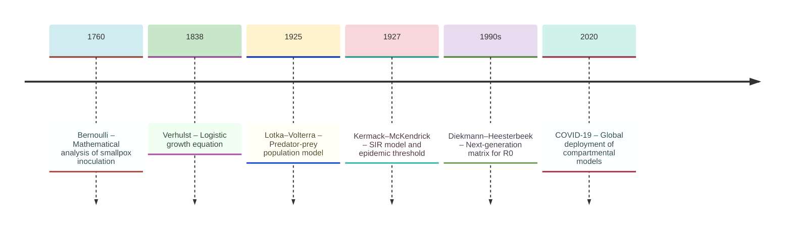
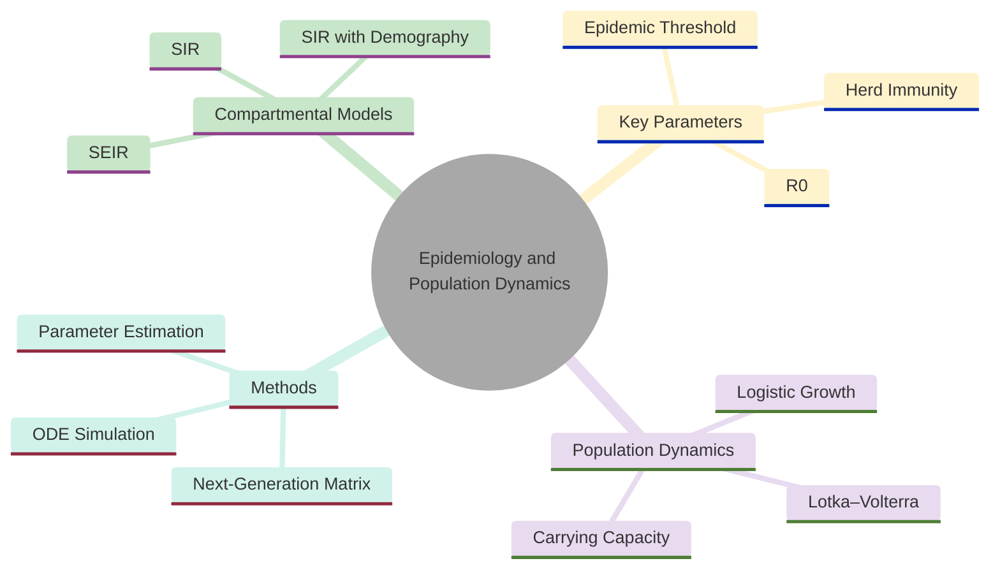
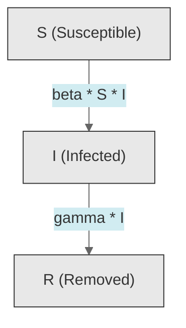
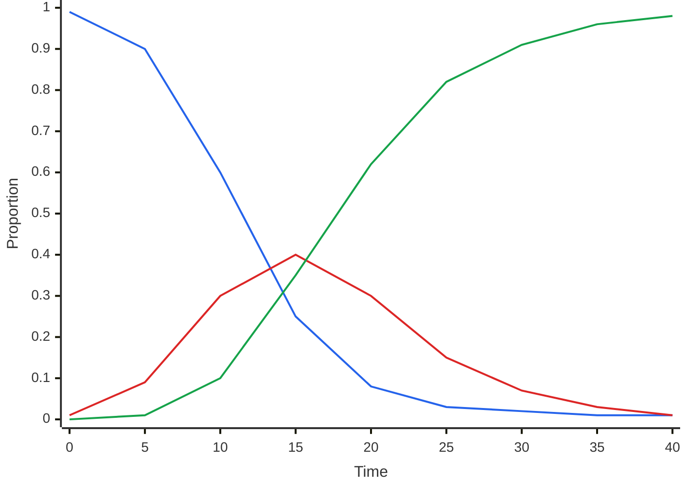
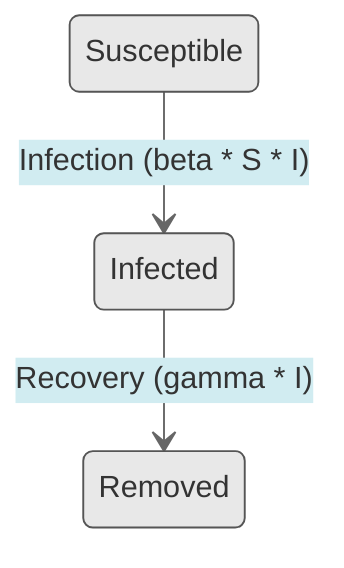
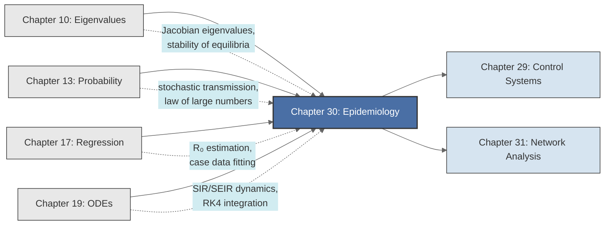

<!-- Copyright (c) 2025-2026 Bob Jansen <bobjansen@pm.me> -->
<!-- SPDX-License-Identifier: CC-BY-NC-4.0 -->
<!-- See LICENSE for full terms. Commercial licensing available. -->

# Chapter 30: Epidemiology & Population Dynamics


**Part IX**: Applications

> The basic reproduction number $R_0$ determines whether an outbreak grows or dies; compartmental models (SIR, SEIR) provide the rigorous foundation for vaccination policy and epidemic forecasting. The tools are ordinary differential equations for dynamics, eigenvalues for stability, regression for parameter estimation and numerical integration for simulation.

**Prerequisites**: [Chapter 10](10-eigenvalues.md) (Eigenvalues & Eigenvectors); eigenvalue computation, stability analysis via the Jacobian, dominant eigenvalue interpretation. [Chapter 13](13-probability-theory.md) (Probability Theory); stochastic foundations of transmission, law of large numbers for mean-field limits. [Chapter 17](17-regression.md) (Regression); parameter estimation from observed case data, least-squares fitting and maximum likelihood. [Chapter 19](19-odes.md) (Ordinary Differential Equations); autonomous systems, equilibrium analysis, phase portraits and the Runge–Kutta numerical method.

**Learning Objectives**: After this chapter, the reader will be able to:

1. Derive the logistic growth equation and analyse its equilibria and sigmoid solution.
2. Formulate the SIR compartmental model and prove the conservation law $S + I + R = N$.
3. Compute the basic reproduction number $R_0$ as the spectral radius of the next-generation matrix and establish the epidemic threshold $R_0 > 1$.
4. Determine the herd immunity threshold and the epidemic peak condition.
5. Extend the SIR model to SEIR and analyse endemic equilibria via Jacobian eigenvalues.
6. Estimate epidemiological parameters from case data using regression and maximum likelihood methods.
7. Formulate and simulate the Lotka–Volterra predator-prey system, identifying periodic orbits and the conserved quantity.
8. Implement numerical solutions of compartmental models using the fourth-order Runge–Kutta method.

**Connections**: This chapter synthesises [Chapter 10](10-eigenvalues.md) (eigenvalues determine stability of disease-free and endemic equilibria), [Chapter 13](13-probability-theory.md) (stochastic foundations of transmission probabilities), [Chapter 17](17-regression.md) (fitting models to surveillance data) and [Chapter 19](19-odes.md) (ordinary differential equation formulation and Runge–Kutta numerical integration). It connects forward to [Chapter 29](29-control-systems.md) (Control Systems; epidemic control as feedback control), [Chapter 31](31-network-analysis.md) (Network Analysis; SIR dynamics on contact networks) and to stochastic simulation methods and spatial epidemic models.

---

## Historical Context

**Key Milestones in Epidemiology and Population Dynamics**



*Figure 30.1: Timeline of key milestones in epidemiology and population dynamics.*

**Bernoulli and the calculus of public health (1760).** Daniel Bernoulli presented to the Royal Academy of Sciences in Paris in 1760 a mathematical analysis of smallpox inoculation. His model, a differential equation balancing the rate of natural smallpox infection against background mortality, was the first application of calculus to public health policy. Bernoulli concluded that universal inoculation would increase life expectancy by approximately three years. The finding influenced the adoption of variolation across Europe.

**Verhulst and logistic growth (1838).** Pierre-François Verhulst introduced the equation $dN/dt = rN(1 - N/K)$ in 1838 as a refinement of Malthus's exponential growth model. Verhulst recognised that populations face resource limitations: as density increases, per-capita growth rates decline. The logistic equation captures self-limiting behaviour in its simplest mathematical form. Verhulst's work was largely forgotten until Raymond Pearl and Lowell Reed rediscovered it in the 1920s. The logistic curve has since become the standard model for density-dependent growth in ecology, demography and the early phase of epidemic outbreaks.

**The SIR model and the epidemic threshold (1927).** William Ogilvy Kermack and Anderson Gray McKendrick published "A Contribution to the Mathematical Theory of Epidemics" in the *Proceedings of the Royal Society of London* in 1927. They introduced the compartmental framework: a population is divided into Susceptible (S), Infected (I) and Removed (R) classes, with transition rates governed by coupled ordinary differential equations. Their threshold theorem states that an epidemic occurs only if the density of susceptibles exceeds a critical value; equivalently, if the basic reproduction number $R_0 > 1$. The paper also derives the final size relation connecting total infections to $R_0$. The Kermack–McKendrick framework remains the foundation of mathematical epidemiology.

**The next-generation matrix and herd immunity (1950s–1990s).** George MacDonald formalised $R_0$ in the 1950s for malaria control. The systematic mathematical treatment came from Odo Diekmann, Johan A. P. Heesterbeek and their collaborators in the 1990s. They introduced the next-generation matrix approach: $R_0$ is the spectral radius of the matrix mapping one generation of infections to the next. This formulation gives a rigorous, computable definition of $R_0$ for models with multiple infected classes, age structure and spatial heterogeneity.

**Anderson and May's empirical parametrisation (1991).** Roy Anderson and Robert May, in their 1991 monograph *Infectious Diseases of Humans*, linked mathematical models to epidemiological data. Their work on childhood diseases (measles, whooping cough, rubella) showed that compartmental models parametrised from seroprevalence surveys explain observed epidemic periodicity and predict vaccination impact. The herd immunity threshold $H = 1 - 1/R_0$ became a standard tool of vaccination policy.

**Predator-prey dynamics (1925–1926).** Alfred J. Lotka (1925) and Vito Volterra (1926) developed the predator-prey model independently. Volterra, motivated by observations of fish population oscillations in the Adriatic after World War I, derived the equations $dx/dt = \alpha x - \beta xy$, $dy/dt = \delta xy - \gamma y$. The model predicts perpetual oscillations; a conserved quantity prevents trajectories from spiralling to equilibrium. It provided the first mathematical explanation of observed population cycles.

**COVID-19 and global deployment (2020–2023).** The COVID-19 pandemic brought compartmental models into public prominence. SEIR models with additional compartments for hospitalisation, asymptomatic transmission and vaccination informed lockdown decisions, healthcare capacity planning and vaccine allocation worldwide. Early $R_0$ estimates of 2–3 proved accurate. Behavioural feedbacks, variant emergence and data quality limitations complicated forecasting. SIR/SEIR dynamics, $R_0$ computation and parameter estimation were deployed at a global scale.

---

## Why This Chapter Matters

**Epidemiology and Population Dynamics**



*Figure 30.2: Overview of epidemiology topics spanning compartmental models, parameters and methods.*

Compartmental models forecast hospital demand, evaluate social distancing measures, determine vaccination priorities and estimate pandemic trajectories under different policy scenarios. During COVID-19, public health agencies based lockdown timing, school reopening and vaccine allocation on SIR and SEIR models parametrised from surveillance data. The basic reproduction number $R_0$ became a household term.

Applications extend beyond pandemic response. Routine vaccination programmes for measles, rubella, polio and influenza use the herd immunity threshold $H = 1 - 1/R_0$. Measles ($R_0 \approx 15$) requires 93% vaccination coverage; influenza ($R_0 \approx 1.8$) requires only 45%. This difference is a direct consequence of the epidemic threshold theorem. Veterinary epidemiologists manage foot-and-mouth disease outbreaks using SIR-type models to optimise culling and ring vaccination. In ecology, the Lotka–Volterra equations explain the observed population cycles of lynx and hare in the Canadian Arctic. Logistic growth models underpin wildlife management and fisheries science.

The mathematical content also connects to more advanced modelling. Contact network models replace homogeneous mixing with explicit social network structure, linking epidemiology to network analysis ([Chapter 31](31-network-analysis.md)). Stochastic epidemic models replace deterministic ordinary differential equations with continuous-time Markov chains; the law of large numbers justifies the deterministic approximation for large populations while revealing stochastic effects (extinction, fade-out) in small ones. Optimal control theory applied to epidemic models determines the timing and intensity of interventions that minimise total infections subject to economic costs ([Chapter 29](29-control-systems.md)).

---

## Notation & Conventions

| Symbol | Meaning |
|--------|---------|
| $N$ | Total population size (constant in closed models) |
| $S(t)$ | Number (or proportion) of susceptible individuals at time $t$ |
| $I(t)$ | Number (or proportion) of infected (and infectious) individuals at time $t$ |
| $R(t)$ | Number (or proportion) of removed (recovered or deceased) individuals at time $t$; note that $R(0)$ denotes the initial removed count, distinct from the basic reproduction number $R_0$ |
| $E(t)$ | Number (or proportion) of exposed (infected but not yet infectious) individuals |
| $\beta$ | Transmission rate (contacts per unit time $\times$ probability of transmission per contact) |
| $\gamma$ | Recovery rate; $1/\gamma$ is the mean infectious period |
| $\sigma$ | Rate of progression from exposed to infectious; $1/\sigma$ is the mean latent period |
| $R_0$ | Basic reproduction number: expected secondary infections from one index case in a fully susceptible population; not to be confused with $R(0)$, the initial value of the removed compartment |
| $R_e$ | Effective reproduction number at time $t$: $R_e = R_0 \cdot S(t)/N$ |
| $H$ | Herd immunity threshold: $H = 1 - 1/R_0$ |
| $K$ | Carrying capacity (in logistic growth) |
| $r$ | Intrinsic growth rate (in logistic growth) |
| $x(t)$, $y(t)$ | Prey and predator populations (in Lotka–Volterra) |
| $\alpha, \beta, \gamma, \delta$ | Lotka–Volterra parameters (context-distinguished from SIR parameters) |
| $J$ | Jacobian matrix evaluated at an equilibrium point |
| $\lambda_i$ | Eigenvalue of the Jacobian $J$ |
| $\rho(M)$ | Spectral radius of matrix $M$: $\rho(M) = \max_i \lvert \lambda_i \rvert$ |
| $h$ | Step size for numerical integration |

Proportional compartments ($s = S/N$, $i = I/N$, $r = R/N$) satisfy $s + i + r = 1$. This chapter uses absolute numbers unless stated otherwise. $\dot{S}$ denotes $dS/dt$.

---

## Core Theory

### Logistic Growth

**Definition 30.1** (Logistic equation). The *logistic differential equation* describes density-dependent population growth:

$$\frac{dN}{dt} = rN\left(1 - \frac{N}{K}\right),$$

where $N(t)$ is the population size, $r > 0$ is the intrinsic per-capita growth rate and $K > 0$ is the carrying capacity.

The factor $(1 - N/K)$ modulates growth: when $N \ll K$, growth is approximately exponential ($dN/dt \approx rN$); as $N$ approaches $K$, the growth rate tends to zero. The equation is autonomous (the right-hand side depends only on $N$, not explicitly on $t$) and separable.

**Theorem 30.2** (Logistic solution). The initial-value problem $dN/dt = rN(1 - N/K)$ with $N(0) = N_0 > 0$ has the unique solution

$$N(t) = \frac{K}{1 + \left(\frac{K - N_0}{N_0}\right)e^{-rt}} = \frac{K N_0 e^{rt}}{K + N_0(e^{rt} - 1)}.$$

This is the *logistic (sigmoid) curve*, an S-shaped function that rises from $N_0$, passes through the inflection point $N = K/2$ at time $t^* = (1/r)\ln((K - N_0)/N_0)$ and asymptotically approaches $K$.

??? note "Proof"

    *Proof.* The equation is separable. Write

    $$\frac{dN}{N\!\left(1 - \frac{N}{K}\right)} = r\,dt.$$

    Partial fractions decompose the left side:

    $$\frac{1}{N\!\left(1 - \frac{N}{K}\right)} = \frac{1}{N} + \frac{1}{K - N}.$$

    Integrating both sides:

    $$\ln\lvert N \rvert - \ln\lvert K - N \rvert = rt + C.$$

    Exponentiating gives $N/(K - N) = Ae^{rt}$, where $A = N_0/(K - N_0)$. Solving for $N$:

    $$N = \frac{KAe^{rt}}{1 + Ae^{rt}} = \frac{K}{1 + A^{-1}e^{-rt}} = \frac{K}{1 + \left(\frac{K - N_0}{N_0}\right)e^{-rt}}.$$

    Uniqueness follows from the Picard–Lindelöf theorem ([Chapter 19](19-odes.md)), since $f(N) = rN(1 - N/K)$ is Lipschitz on any bounded interval with $N_0 \neq 0$ and $N_0 \neq K$. $\square$

**Theorem 30.3** (Equilibria of logistic growth). The logistic equation has two equilibria:

1. $N^* = 0$ (extinction), which is *unstable*: $f'(0) = r > 0$.
2. $N^* = K$ (carrying capacity), which is *asymptotically stable*: $f'(K) = -r < 0$.

??? note "Proof"

    *Proof.* Setting $f(N) = rN(1 - N/K) = 0$ yields $N = 0$ or $N = K$. The derivative is $f'(N) = r - 2rN/K$.

    At $N = 0$: $f'(0) = r > 0$, so perturbations away from zero grow; the extinction equilibrium is unstable.

    At $N = K$: $f'(K) = r - 2r = -r < 0$, so perturbations decay exponentially at rate $r$; the carrying capacity equilibrium is asymptotically stable. $\square$

**Remark 30.4** (Logistic growth in epidemiology). The early phase of an epidemic, before depletion of susceptibles becomes appreciable, often exhibits logistic-like growth. The cumulative case count follows an S-shaped curve, initially exponential, then decelerating as the susceptible pool is exhausted. Fitting a logistic curve to early case data provides estimates of the ultimate epidemic size ($K$) and the growth rate ($r$), though the underlying SIR dynamics are more complex than pure logistic growth.

### The SIR Model

**Definition 30.5** (SIR model). The *Susceptible-Infected-Removed* model of Kermack and McKendrick describes the dynamics of an infectious disease in a closed population of size $N$:

$$\frac{dS}{dt} = -\beta S I, \qquad \frac{dI}{dt} = \beta S I - \gamma I, \qquad \frac{dR}{dt} = \gamma I,$$

where:

- $\beta > 0$ is the transmission rate (mass-action incidence),
- $\gamma > 0$ is the recovery rate,
- $S(0) + I(0) + R(0) = N$.

The model assumes homogeneous mixing (every individual contacts every other with equal probability), permanent immunity upon recovery and no births, deaths or migration (closed population).

**SIR Compartmental Flow**



*Figure 30.3: Flow diagram of the SIR compartmental model showing infection and recovery transitions.*

**SIR Epidemic Dynamics with Basic Reproduction Number 2.5**



*Figure 30.4: SIR epidemic dynamics showing susceptible, infected and removed proportions over time.*

**SIR State Transitions:**



*Figure 30.5: State diagram showing transitions between susceptible, infected and removed compartments.*

**Theorem 30.6** (Conservation law). The total population is conserved: $S(t) + I(t) + R(t) = N$ for all $t \geq 0$.

??? note "Proof"

    *Proof.* Adding the three equations:

    $$\frac{d}{dt}(S + I + R) = -\beta SI + (\beta SI - \gamma I) + \gamma I = 0.$$

    The sum $S + I + R$ is therefore constant, equal to its initial value $N$. $\square$

**Remark 30.7**. The conservation law reduces the system from three dimensions to two: given $S(t)$ and $I(t)$, the removed class is determined by $R(t) = N - S(t) - I(t)$. Phase-plane analysis can therefore be conducted in the $(S, I)$ plane.

**Definition 30.8** (Basic reproduction number). The *basic reproduction number* $R_0$ for the SIR model is

$$R_0 = \frac{\beta}{\gamma}.$$

It represents the expected number of secondary infections produced by a single infected individual in a fully susceptible population during its entire infectious period (duration $1/\gamma$, with transmission rate $\beta S \approx \beta N$ when $S \approx N$, giving $R_0 = \beta N / \gamma$ in the non-normalised system, or $R_0 = \beta / \gamma$ when the system is written in proportions with $\beta$ absorbing $N$).

**Theorem 30.9** (Epidemic threshold). An epidemic occurs (the number of infectives initially increases) if and only if $R_0 \cdot S(0)/N > 1$. In a fully susceptible population ($S(0) = N$), the condition reduces to $R_0 > 1$.

??? note "Proof"

    *Proof.* Rewrite the second SIR equation by factoring out $I$:

    $$\frac{dI}{dt} = (\beta S - \gamma)I = \gamma\!\left(\frac{\beta S}{\gamma} - 1\right)I.$$

    At time $t = 0$ with $I(0) > 0$, the infected class initially grows ($dI/dt > 0$) if and only if

    $$\frac{\beta\, S(0)}{\gamma} > 1.$$

    In a fully susceptible population, $S(0) = N$ (absorbed into $\beta$ in the normalised system), so the condition reduces to $\beta/\gamma = R_0 > 1$. $\square$

!!! abstract "Key Result"

    **Theorem 30.9** (Epidemic threshold). An epidemic grows if and only if $R_0 > 1$; this single inequality determines whether an infectious disease outbreak expands or dies out and is the basis of all vaccination policy.

**Theorem 30.10** (Epidemic peak). The infected population $I(t)$ reaches its maximum when $S(t) = \gamma/\beta$.

??? note "Proof"

    *Proof.* The maximum of $I$ occurs when $dI/dt = 0$, i.e., when $\beta SI - \gamma I = 0$. Since $I > 0$ during an epidemic, dividing by $I$ gives $\beta S = \gamma$, hence $S = \gamma/\beta$.

    Since $S$ is monotonically decreasing ($dS/dt = -\beta SI < 0$ whenever $I > 0$), this threshold is crossed exactly once. $\square$

**Remark 30.11** (Phase-plane trajectory). Dividing the $I$ equation by the $S$ equation eliminates time:

$$\frac{dI}{dS} = \frac{\beta SI - \gamma I}{-\beta SI} = -1 + \frac{\gamma}{\beta S}.$$

Integrating: $I = -S + (\gamma/\beta)\ln S + C$. The constant $C$ is determined by initial conditions: $C = I(0) + S(0) - (\gamma/\beta)\ln S(0)$. This implicit relation defines the epidemic trajectory in the $(S, I)$ phase plane.

**Theorem 30.12** (Herd immunity threshold). If a fraction $H$ of the population is immune (through vaccination or prior infection), the effective reproduction number is $R_e = R_0(1 - H)$. The disease cannot sustain transmission ($R_e < 1$) when

$$H > 1 - \frac{1}{R_0}.$$

The *herd immunity threshold* is $H^* = 1 - 1/R_0$.

??? note "Proof"

    *Proof.* In a population where fraction $H$ is immune, only fraction $(1 - H)$ is susceptible. Each infected individual encounters $(1 - H)N$ susceptibles instead of $N$, so the effective reproduction number is $R_e = R_0(1 - H)$.

    The condition $R_e < 1$ gives $R_0(1 - H) < 1$, hence $H > 1 - 1/R_0$. $\square$

**Remark 30.13** (Practical implications). For measles ($R_0 \approx 12$–$18$), the herd immunity threshold is $H^* \approx 92$–$94\%$, requiring extremely high vaccination coverage. For influenza ($R_0 \approx 1.5$–$2$), $H^* \approx 33$–$50\%$. For the original strain of SARS-CoV-2 ($R_0 \approx 2.5$–$3$), $H^* \approx 60$–$67\%$.

**Herd Immunity Threshold vs R_0:**

```mermaid
---
config:
  theme: base
  themeVariables:
    xyChart:
      plotColorPalette: "#2563eb, #dc2626, #16a34a, #9333ea, #ca8a04, #0891b2"
      backgroundColor: "#ffffff"
      titleColor: "#333333"
      xAxisLabelColor: "#333333"
      yAxisLabelColor: "#333333"
      xAxisTitleColor: "#333333"
      yAxisTitleColor: "#333333"
      xAxisLineColor: "#333333"
      yAxisLineColor: "#333333"
---
xychart-beta
    x-axis "R₀" [1.5, 2, 2.5, 3, 4, 5, 8, 10]
    y-axis "Threshold (fraction)" 0 --> 1
    line [0.33, 0.50, 0.60, 0.67, 0.75, 0.80, 0.875, 0.90]
```

*Figure 30.6: Herd immunity threshold rises steeply as the basic reproduction number increases.*

The herd immunity threshold $H = 1 - 1/R_0$ rises steeply as $R_0$ increases, approaching 1 asymptotically. For highly transmissible diseases ($R_0 > 10$), nearly the entire population must be immune to prevent sustained transmission, placing extreme demands on vaccination coverage and vaccine efficacy.

### The Next-Generation Matrix and $R_0$

**Definition 30.14** (Next-generation matrix). For a compartmental model with $m$ infected classes, the *next-generation matrix* $K$ is defined as $K = FV^{-1}$, where:
- $F$ is the $m \times m$ matrix of new infection rates (transmission terms) at the disease-free equilibrium,
- $V$ is the $m \times m$ matrix of transition rates out of infected compartments (recovery, death, progression).

The basic reproduction number is the spectral radius ([Chapter 10](10-eigenvalues.md)): $R_0 = \rho(K) = \rho(FV^{-1})$.

**Theorem 30.15** (Next-generation $R_0$ for SIR). For the standard SIR model with a single infected class, $F = [\beta S_0]$ and $V = [\gamma]$ (both $1 \times 1$ matrices), giving

$$R_0 = \rho(FV^{-1}) = \frac{\beta S_0}{\gamma}.$$

In the normalised system with $S_0 = 1$, this recovers $R_0 = \beta/\gamma$.

??? note "Proof"

    *Proof.* With one infected class, $K = FV^{-1} = [\beta S_0] \cdot [\gamma]^{-1} = [\beta S_0 / \gamma]$. The spectral radius of a $1 \times 1$ matrix is its absolute value. $\square$

### The SEIR Extension

**Definition 30.16** (SEIR model). The *Susceptible-Exposed-Infected-Removed* model adds a latent period:

$$\frac{dS}{dt} = -\beta SI, \qquad \frac{dE}{dt} = \beta SI - \sigma E, \qquad \frac{dI}{dt} = \sigma E - \gamma I, \qquad \frac{dR}{dt} = \gamma I,$$

where $\sigma > 0$ is the rate at which exposed individuals become infectious ($1/\sigma$ is the mean latent period). The conservation law $S + E + I + R = N$ holds.

**Theorem 30.17** (SEIR reproduction number). For the SEIR model, the next-generation matrix has two infected classes ($E$ and $I$). The transmission matrix and transition matrix are

$$F = \begin{bmatrix} 0 & \beta S_0 \\ 0 & 0 \end{bmatrix}, \qquad V = \begin{bmatrix} \sigma & 0 \\ -\sigma & \gamma \end{bmatrix}.$$

Here $-\sigma$ in $V_{21}$ represents the rate of progression from the $E$ class to the $I$ class; it is negative because it represents an inflow to the $I$ compartment within the infected subsystem (following the Diekmann convention).

The next-generation matrix is $K = FV^{-1}$, and

$$R_0 = \rho(FV^{-1}) = \frac{\beta S_0}{\gamma}.$$

The $R_0$ of the SEIR model equals that of the SIR model: the latent period affects the *timing* of the epidemic but not the *threshold* condition for growth.

??? note "Proof"

    *Proof.* Invert the transition matrix $V$ by direct computation:

    $$V^{-1} = \frac{1}{\sigma\gamma}\begin{bmatrix} \gamma & 0 \\ \sigma & \sigma \end{bmatrix}.$$

    Form the next-generation matrix:

    $$K = FV^{-1} = \begin{bmatrix} 0 & \beta S_0 \\ 0 & 0 \end{bmatrix} \cdot \frac{1}{\sigma\gamma}\begin{bmatrix} \gamma & 0 \\ \sigma & \sigma \end{bmatrix} = \frac{1}{\sigma\gamma}\begin{bmatrix} \beta S_0 \sigma & \beta S_0 \sigma \\ 0 & 0 \end{bmatrix} = \begin{bmatrix} \beta S_0/\gamma & \beta S_0/\gamma \\ 0 & 0 \end{bmatrix}.$$

    The characteristic polynomial of $K$ is $\lambda(\lambda - \beta S_0/\gamma) = 0$, so the eigenvalues are $\beta S_0/\gamma$ and $0$. The spectral radius is therefore $R_0 = \rho(K) = \beta S_0/\gamma$. $\square$

### Endemic Equilibrium and Stability

**Definition 30.18** (Disease-free equilibrium). The *disease-free equilibrium* (DFE) of the SIR model is the state $(S^*, I^*, R^*) = (N, 0, 0)$. At this point, no disease is present.

**Definition 30.19** (Endemic equilibrium, SIR with demography). To admit a nontrivial endemic equilibrium, the SIR model must include demographic turnover. The SIR model with vital dynamics is:

$$\frac{dS}{dt} = \mu N - \beta SI - \mu S, \qquad \frac{dI}{dt} = \beta SI - \gamma I - \mu I, \qquad \frac{dR}{dt} = \gamma I - \mu R,$$

where $\mu$ is the birth rate (equal to the death rate, maintaining constant $N$).

**Theorem 30.20** (Endemic equilibrium). The SIR model with vital dynamics has an endemic equilibrium (with $I^* > 0$) if and only if $R_0 = \beta N/(\gamma + \mu) > 1$. The endemic equilibrium is

$$S^* = \frac{\gamma + \mu}{\beta} = \frac{N}{R_0}, \qquad I^* = \frac{\mu}{\beta}\left(R_0 - 1\right), \qquad R^* = N - S^* - I^*.$$

??? note "Proof"

    *Proof.* Setting $dI/dt = 0$ gives $I(\beta S - \gamma - \mu) = 0$. For a nontrivial equilibrium with $I^* \neq 0$, this forces

    $$S^* = \frac{\gamma + \mu}{\beta} = \frac{N}{R_0}.$$

    Setting $dS/dt = 0$ gives $\mu N = \beta S^* I^* + \mu S^*$. Solving for $I^*$:

    $$I^* = \frac{\mu(N - S^*)}{\beta S^*} = \frac{\mu\left(N - N/R_0\right)}{\beta \cdot N/R_0} = \frac{\mu(R_0 - 1)}{\beta}.$$

    The condition $I^* > 0$ requires $R_0 > 1$. $\square$

**Theorem 30.21** (Stability of the endemic equilibrium). The endemic equilibrium of the SIR model with vital dynamics is locally asymptotically stable when it exists ($R_0 > 1$). Stability is determined by the eigenvalues of the Jacobian matrix evaluated at the equilibrium.

??? note "Proof"

    *Proof sketch.* The Jacobian of the reduced two-dimensional system (using $R = N - S - I$) evaluated at $(S^*, I^*)$ is

    $$J = \begin{bmatrix} -\beta I^* - \mu & -\beta S^* \\ \beta I^* & \beta S^* - \gamma - \mu \end{bmatrix} = \begin{bmatrix} -\beta I^* - \mu & -(\gamma + \mu) \\ \beta I^* & 0 \end{bmatrix},$$

    using $\beta S^* = \gamma + \mu$ at the endemic equilibrium.

    The trace is $\operatorname{tr}(J) = -\beta I^* - \mu < 0$ and the determinant is $\det(J) = \beta I^*(\gamma + \mu) > 0$ (since $I^* > 0$ when $R_0 > 1$). By the trace-determinant criterion, both eigenvalues have negative real parts (they are either two negative reals or a complex conjugate pair with negative real part). The equilibrium is asymptotically stable.

    $\square$

### Parameter Estimation

**Definition 30.22** (Exponential growth rate). In the early phase of an epidemic (when $S \approx N$), the infected class grows approximately exponentially: $I(t) \approx I(0)e^{(\beta N - \gamma)t}$ (using the un-normalised form where $\beta$ has units of contacts per time, with $S \approx N$). The *exponential growth rate* is $\lambda = \beta N - \gamma = \gamma(R_0 - 1)$.

**Theorem 30.23** (Estimating $R_0$ from growth rate). If the exponential growth rate $\lambda$ is estimated from early epidemic data (by linear regression of $\ln I(t)$ against $t$, per [Chapter 17](17-regression.md)) and the recovery rate $\gamma$ is known (from clinical data), then

$$R_0 = 1 + \frac{\lambda}{\gamma}.$$

??? note "Proof"

    *Proof.* From $\lambda = \gamma(R_0 - 1)$: $R_0 - 1 = \lambda/\gamma$, hence $R_0 = 1 + \lambda/\gamma$. $\square$

**Remark 30.24** (Maximum likelihood estimation). For complete epidemic data (individual infection and recovery times), maximum likelihood estimation provides statistically efficient parameter estimates. If transmission events follow a Poisson process with rate $\beta S I$ and recovery events follow a Poisson process with rate $\gamma I$, the likelihood function is

$$\mathcal{L}(\beta, \gamma \mid \text{data}) = \prod_{j} (\beta S(t_j) I(t_j))^{\Delta I_j} \cdot (\gamma I(t_j))^{\Delta R_j} \cdot e^{-(\beta S I + \gamma I)\Delta t_j},$$

and the maximum likelihood estimates are obtained by maximising $\ln \mathcal{L}$ ([Chapter 17](17-regression.md), Section on maximum likelihood).

### Lotka–Volterra Predator–Prey

!!! warning "Parameter notation"
    The Lotka–Volterra model uses parameters $\alpha, \beta, \gamma, \delta$ following standard ecological convention. The symbols $\beta$ and $\gamma$ are reused from the SIR model earlier in this chapter, where they denote the transmission rate and recovery rate respectively. In the Lotka–Volterra context below, $\beta$ denotes the predation rate and $\gamma$ denotes the predator death rate. The two parameter sets apply to distinct models and should not be confused; the intended meaning is always clear from the governing equations.

**Definition 30.25** (Lotka–Volterra equations). The *Lotka–Volterra predator-prey model* describes the interaction between a prey population $x(t)$ and a predator population $y(t)$:

$$\frac{dx}{dt} = \alpha x - \beta xy, \qquad \frac{dy}{dt} = \delta xy - \gamma y,$$

where (note: $\alpha, \beta, \gamma, \delta$ here are Lotka–Volterra parameters, distinct from the SIR parameters $\beta, \gamma$ used earlier in this chapter):
- $\alpha > 0$: prey growth rate in the absence of predators,
- $\beta > 0$: predation rate (effect of predators on prey),
- $\delta > 0$: rate at which predators convert prey into offspring,
- $\gamma > 0$: predator death rate in the absence of prey.

**Theorem 30.26** (Equilibria of Lotka–Volterra). The system has two equilibria:

1. $(x^*, y^*) = (0, 0)$; both populations extinct.
2. $(x^*, y^*) = (\gamma/\delta,\, \alpha/\beta)$; coexistence equilibrium.

??? note "Proof"

    *Proof.* Setting $dx/dt = 0$: $x(\alpha - \beta y) = 0$, so $x = 0$ or $y = \alpha/\beta$. Setting $dy/dt = 0$: $y(\delta x - \gamma) = 0$, so $y = 0$ or $x = \gamma/\delta$. The non-trivial equilibrium has $x^* = \gamma/\delta$ and $y^* = \alpha/\beta$. $\square$

**Theorem 30.27** (Conserved quantity). The Lotka–Volterra system admits the conserved quantity (first integral)

$$H(x, y) = \delta x - \gamma \ln x + \beta y - \alpha \ln y.$$

Solutions trace closed orbits in the $(x, y)$ phase plane; the coexistence equilibrium is a *centre* (neutrally stable).

??? note "Proof"

    *Proof.* Differentiate $H$ with respect to time along solutions of the system:

    $$\frac{dH}{dt} = \delta \dot{x} - \frac{\gamma}{x}\dot{x} + \beta \dot{y} - \frac{\alpha}{y}\dot{y}.$$

    Substitute $\dot{x} = \alpha x - \beta xy$ and $\dot{y} = \delta xy - \gamma y$:

    $$\begin{aligned}
    \frac{dH}{dt} &= \delta(\alpha x - \beta xy) - \frac{\gamma}{x}(\alpha x - \beta xy) + \beta(\delta xy - \gamma y) - \frac{\alpha}{y}(\delta xy - \gamma y) \\
    &= \delta\alpha x - \delta\beta xy - \gamma\alpha + \gamma\beta y + \beta\delta xy - \beta\gamma y - \alpha\delta x + \alpha\gamma.
    \end{aligned}$$

    Collecting like terms in pairs:

    $$= \underbrace{(\delta\alpha x - \alpha\delta x)}_{=\,0} + \underbrace{(-\delta\beta xy + \beta\delta xy)}_{=\,0} + \underbrace{(-\gamma\alpha + \alpha\gamma)}_{=\,0} + \underbrace{(\gamma\beta y - \beta\gamma y)}_{=\,0} = 0.$$

    Every pair cancels exactly, confirming $dH/dt = 0$. $\square$

**Theorem 30.28** (Stability of Lotka–Volterra equilibria). The Jacobian at the coexistence equilibrium $(\gamma/\delta, \alpha/\beta)$ is

$$J = \begin{bmatrix} 0 & -\beta\gamma/\delta \\ \delta\alpha/\beta & 0 \end{bmatrix}.$$

The eigenvalues are $\lambda = \pm i\sqrt{\alpha\gamma}$, which are purely imaginary. The equilibrium is a *centre*: nearby trajectories are periodic orbits, not asymptotically stable spirals.

??? note "Proof"

    *Proof.* The Jacobian of the general Lotka–Volterra system is

    $$J = \begin{bmatrix} \alpha - \beta y & -\beta x \\ \delta y & \delta x - \gamma \end{bmatrix}.$$

    Substituting the coexistence equilibrium $(x^*, y^*) = (\gamma/\delta, \alpha/\beta)$:

    $$J = \begin{bmatrix} \alpha - \beta(\alpha/\beta) & -\beta(\gamma/\delta) \\ \delta(\alpha/\beta) & \delta(\gamma/\delta) - \gamma \end{bmatrix} = \begin{bmatrix} 0 & -\beta\gamma/\delta \\ \delta\alpha/\beta & 0 \end{bmatrix}.$$

    The characteristic polynomial of this $2 \times 2$ matrix is

    $$\lambda^2 - \operatorname{tr}(J)\,\lambda + \det(J) = \lambda^2 + \frac{\beta\gamma}{\delta}\cdot\frac{\delta\alpha}{\beta} = \lambda^2 + \alpha\gamma = 0,$$

    giving eigenvalues $\lambda = \pm i\sqrt{\alpha\gamma}$.

    Since both eigenvalues are purely imaginary with zero real part, the linearisation predicts a centre. The existence of the conserved quantity $H$ (Theorem 30.27) confirms that the full nonlinear system also exhibits a centre rather than a spiral. $\square$

---

## Formulas & Identities

**F30.1** Logistic solution, valid for $N_0 > 0$, $K > 0$, $r > 0$.

$$N(t) = \frac{K}{1 + \dfrac{K - N_0}{N_0}\,e^{-rt}}$$

**F30.2** SIR phase relation (conserved along trajectories).

$$I + S - \frac{\gamma}{\beta}\ln S = I_0 + S_0 - \frac{\gamma}{\beta}\ln S_0$$

**F30.3** Basic reproduction number (SIR).

$$R_0 = \frac{\beta}{\gamma} \quad \text{(normalised)} \qquad \text{or} \qquad R_0 = \frac{\beta N}{\gamma} \quad \text{(absolute counts)}$$

**F30.4** Herd immunity threshold, valid for $R_0 > 1$.

$$H = 1 - \frac{1}{R_0}$$

**F30.5** Epidemic peak condition: $\max I$ occurs when

$$S = \frac{\gamma}{\beta} = \frac{N}{R_0}$$

**F30.6** Final size relation, where $z = (S_0 - S_\infty)/S_0$ (transcendental equation, solved numerically for $S_0 = N$).

$$1 - z = e^{-R_0 z}$$

!!! info "No closed-form solution"
    The final size relation F30.6 is transcendental; it has no closed-form solution for $z$. Solve iteratively using Newton's method or a root-finding algorithm such as Brent's method.

**F30.7** Exponential growth rate, relating early growth to $R_0$.

$$\lambda = \gamma(R_0 - 1)$$

**F30.8** $R_0$ from growth rate.

$$R_0 = 1 + \frac{\lambda}{\gamma} \quad \text{(SIR)} \qquad R_0 = \left(1 + \frac{\lambda}{\gamma}\right)\!\left(1 + \frac{\lambda}{\sigma}\right) \quad \text{(SEIR)}$$

**F30.9** Lotka–Volterra conserved quantity.

$$H(x,y) = \delta x - \gamma\ln x + \beta y - \alpha\ln y = \text{const}$$

**F30.10** Endemic equilibrium (SIR with demography).

$$S^* = \frac{N}{R_0}, \qquad I^* = \frac{\mu(R_0 - 1)}{\beta}$$

---

## Algorithms

### Algorithm 30.29: SIR Model via Fourth-Order Runge–Kutta

Numerically integrate the SIR system using the classical fourth-order Runge–Kutta (RK4) method ([Chapter 19](19-odes.md)).

**Input**: Parameters $\beta$, $\gamma$; initial conditions $S(0)$, $I(0)$, $R(0)$; time horizon $T$; step size $h$.

**Output**: Time series $(t_k, S_k, I_k, R_k)$ for $k = 0, 1, \ldots, \lfloor T/h \rfloor$.

1. Define the vector field $\mathbf{f}(S, I, R) = (-\beta SI,\; \beta SI - \gamma I,\; \gamma I)$.
2. Set $\mathbf{y}_0 = (S(0), I(0), R(0))$, $t_0 = 0$.
3. For $k = 0, 1, \ldots, \lfloor T/h \rfloor - 1$:
   a. $\mathbf{k}_1 = h \cdot \mathbf{f}(\mathbf{y}_k)$
   b. $\mathbf{k}_2 = h \cdot \mathbf{f}(\mathbf{y}_k + \mathbf{k}_1/2)$
   c. $\mathbf{k}_3 = h \cdot \mathbf{f}(\mathbf{y}_k + \mathbf{k}_2/2)$
   d. $\mathbf{k}_4 = h \cdot \mathbf{f}(\mathbf{y}_k + \mathbf{k}_3)$
   e. $\mathbf{y}_{k+1} = \mathbf{y}_k + (\mathbf{k}_1 + 2\mathbf{k}_2 + 2\mathbf{k}_3 + \mathbf{k}_4)/6$
   f. $t_{k+1} = t_k + h$
4. Return all $(t_k, \mathbf{y}_k)$.

```
function sirRK4(beta, gamma, S0, I0, R0, T, h):
    S = S0; I = I0; R = R0; t = 0
    results = [(t, S, I, R)]
    // define the SIR vector field
    function f(S, I, R):
        return (-beta * S * I, beta * S * I - gamma * I, gamma * I)
    nSteps = floor(T / h)
    for k = 0 to nSteps - 1:
        k1 = h * f(S, I, R)
        k2 = h * f(S + k1[0]/2, I + k1[1]/2, R + k1[2]/2)
        k3 = h * f(S + k2[0]/2, I + k2[1]/2, R + k2[2]/2)
        k4 = h * f(S + k3[0], I + k3[1], R + k3[2])
        S = S + (k1[0] + 2*k2[0] + 2*k3[0] + k4[0]) / 6
        I = I + (k1[1] + 2*k2[1] + 2*k3[1] + k4[1]) / 6
        R = R + (k1[2] + 2*k2[2] + 2*k3[2] + k4[2]) / 6
        t = t + h
        results.append((t, S, I, R))
    return results
```

**Complexity**: $O(N)$ time where $N = T/h$ is the number of steps; each step requires 4 evaluations of $\mathbf{f}$, each $O(1)$ for the SIR system. Space is $O(N)$ to store the full time series; $O(1)$ if only the final state is needed.

**Convergence**: Local truncation error is $O(h^5)$; global error is $O(h^4)$.

**Stability**: For the SIR system (which is not stiff for typical parameters), RK4 is unconditionally adequate with step sizes $h \leq 0.1/(\beta N)$.

### Algorithm 30.30: $R_0$ Estimation from Epidemic Curve

Estimate $R_0$ from daily case count data using exponential growth rate fitting.

**Input**: Daily new case counts $c_1, c_2, \ldots, c_n$ during the exponential growth phase; known or estimated mean infectious period $1/\gamma$.

**Output**: Estimated $R_0$.

1. Compute cumulative case counts $C_k = \sum_{j=1}^k c_j$.
2. Identify the exponential growth phase: the interval $[k_1, k_2]$ where $\ln(c_k)$ is approximately linear in $k$.
3. Perform linear regression ([Chapter 17](17-regression.md)) of $\ln(c_k)$ on $k$ for $k \in [k_1, k_2]$: $\ln(c_k) \approx a + \lambda k$.
4. The slope $\lambda$ is the exponential growth rate (per day, if $k$ counts days).
5. Compute $R_0 = 1 + \lambda / \gamma$.

```
function estimateR0(caseCounts, gamma):
    n = length(caseCounts)
    // compute log of daily case counts
    for i = 1 to n:
        logC[i] = ln(caseCounts[i])
    // identify exponential growth phase [k1, k2]
    // (select window where logC is approximately linear)
    k1 = selectGrowthStart(logC)
    k2 = selectGrowthEnd(logC)
    // linear regression of logC on day index k
    sumX = 0; sumY = 0; sumXY = 0; sumXX = 0
    m = k2 - k1 + 1
    for k = k1 to k2:
        sumX = sumX + k
        sumY = sumY + logC[k]
        sumXY = sumXY + k * logC[k]
        sumXX = sumXX + k * k
    lambda = (m * sumXY - sumX * sumY) / (m * sumXX - sumX * sumX)
    R0 = 1 + lambda / gamma
    return R0
```

**Complexity**: $O(n)$ time for the linear regression on $n$ data points. Space is $O(n)$ to store the log-transformed case counts.

!!! tip "Growth window selection"
    The choice of the growth phase window $[k_1, k_2]$ affects the estimate materially. Post-peak data biases $\lambda$ downward; pre-transmission data introduces noise. Varying the window and bootstrapping the regression provides confidence bounds.

### Algorithm 30.31: Lotka–Volterra Simulation

**Input**: Parameters $\alpha$, $\beta$, $\delta$, $\gamma$; initial conditions $x_0$, $y_0$; time horizon $T$; step size $h$.

**Output**: Time series $(t_k, x_k, y_k)$.

The algorithm is identical to Algorithm 30.29, with the vector field $\mathbf{f}(x, y) = (\alpha x - \beta xy,\; \delta xy - \gamma y)$.

```
function lotkaVolterraRK4(alpha, beta, delta, gamma, x0, y0, T, h):
    x = x0; y = y0; t = 0
    results = [(t, x, y)]
    // define the Lotka-Volterra vector field
    function f(x, y):
        return (alpha * x - beta * x * y, delta * x * y - gamma * y)
    nSteps = floor(T / h)
    for k = 0 to nSteps - 1:
        k1 = h * f(x, y)
        k2 = h * f(x + k1[0]/2, y + k1[1]/2)
        k3 = h * f(x + k2[0]/2, y + k2[1]/2)
        k4 = h * f(x + k3[0], y + k3[1])
        x = x + (k1[0] + 2*k2[0] + 2*k3[0] + k4[0]) / 6
        y = y + (k1[1] + 2*k2[1] + 2*k3[1] + k4[1]) / 6
        t = t + h
        results.append((t, x, y))
    return results
```

**Complexity**: $O(N)$ time where $N = T/h$ is the number of steps, identical to Algorithm 30.29. Space is $O(N)$ to store the full time series; $O(1)$ if only the final state is needed.

**Conservation check**: At each step, compute $H(x_k, y_k) = \delta x_k - \gamma\ln x_k + \beta y_k - \alpha\ln y_k$ and verify that $\lvert H_k - H_0 \rvert < \varepsilon$ for a chosen tolerance. Drift in $H$ indicates accumulated numerical error; reducing $h$ or using a symplectic integrator mitigates this.

---

## Numerical Considerations

### Step Size Selection for SIR

The SIR system is non-stiff for typical parameters ($\beta \sim 0.1$–$1$, $\gamma \sim 0.05$–$0.5$). The fastest timescale is $1/\beta$ (normalised). Set $h \leq 0.01 \cdot \min(1/\beta, 1/\gamma)$ for four-digit accuracy with RK4.

In SEIR models, $1/\sigma$ adds a timescale. When $\sigma \gg \gamma$ the system becomes moderately stiff. Smaller steps or implicit methods may be needed.

### Non-Negativity of Compartments

!!! warning "Negative compartments near epidemic tail"
    The continuous SIR system preserves $S, I, R \geq 0$, but numerical integration can produce small negative values near $I = 0$. Clamp negative compartments to zero after each step and redistribute the deficit to maintain $S + I + R = N$. Failing to clamp allows $I < 0$, which can cause the simulation to diverge.

### Conservation Law Verification

$S + I + R = N$ is a numerical diagnostic. Reduce $h$ if $\lvert S_k + I_k + R_k - N \rvert > \varepsilon$. With $h = 0.01$ and typical parameters, conservation holds to $O(10^{-12})$ over $T = 500$.

### Lotka–Volterra Energy Drift

!!! warning "Hamiltonian drift in long-time Lotka–Volterra simulations"
    Standard Runge–Kutta methods do not preserve the conserved quantity $H$ exactly. Over long runs $H$ drifts, causing computed orbits to spiral outward rather than closing. Symplectic integrators (e.g. Størmer–Verlet) preserve $H$ more accurately. For shorter runs, RK4 with $h \leq 0.01 / \max(\alpha, \gamma)$ keeps drift below $10^{-8}$.

### Sensitivity of $R_0$ Estimation

The estimator is sensitive to the growth window. Post-peak data biases $\lambda$ downward; pre-transmission data introduces noise. Bootstrap the regression over multiple windows for a confidence interval. Typical early-epidemic uncertainty is $\pm 10$–$30\%$.

---

## Worked Examples

### Example 30.32: SIR Epidemic Simulation

**Problem.** A disease with $\beta = 0.3$ and $\gamma = 0.1$ ($R_0 = 3$) enters a population of $N = 10000$ with $I(0) = 1$ infected individual. Simulate the epidemic, determine the peak infection count and its timing and compute the final epidemic size.

**Solution.** The initial conditions are $S(0) = 9999$, $I(0) = 1$, $R(0) = 0$ (not to be confused with the basic reproduction number $R_0 = 3$). The basic reproduction number is

$$R_0 = \frac{\beta}{\gamma} = \frac{0.3}{0.1} = 3.0$$

using the normalised $\beta$ that absorbs $N$; equivalently, $\beta_{\text{abs}} = 0.3/10000 = 3 \times 10^{-5}$ per contact, with $R_0 = \beta_{\text{abs}} \cdot N / \gamma = 3$.

By Theorem 30.10, the peak occurs when

$$S = \frac{\gamma}{\beta_{\text{abs}}} = \frac{0.1}{3 \times 10^{-5}} = 3333.3.$$

Since $S$ starts at 9999 and decreases, the epidemic peak occurs when approximately 6666 individuals have left the susceptible class.

At the peak, by the phase relation (F30.2), converting from proportions to absolute counts: $\frac{\gamma}{\beta_{\text{abs}}} = N/R_0 = 10000/3 \approx 3333.3$:

$$\begin{aligned}
I_{\max} &= I_0 + S_0 - S_{\text{peak}} + \frac{1}{R_0}\ln\left(\frac{S_{\text{peak}}}{S_0}\right) \\
&= 1 + 9999 - 3333.3 + \frac{10000}{3}\ln\left(\frac{3333.3}{9999}\right) \\
&= 6666.7 + 3333.3 \cdot \ln(1/3) \\
&= 6666.7 - 3333.3 \cdot 1.0986 = 6666.7 - 3662.0 = 3004.7.
\end{aligned}$$

Approximately 30% of the population is infected simultaneously at the peak.

### Example 30.33: Herd Immunity and Vaccination

**Problem.** For measles ($R_0 = 15$) and influenza ($R_0 = 1.8$), compute the herd immunity threshold. If a vaccine is 95% effective, what fraction of the population must be vaccinated to achieve herd immunity?

**Solution.** By Theorem 30.12:

For measles:

$$H = 1 - \frac{1}{15} = \frac{14}{15} \approx 0.933.$$

With a 95% effective vaccine, the required vaccination coverage is

$$V = \frac{H}{0.95} = \frac{0.933}{0.95} = 0.982 \quad (98.2\%).$$

For influenza:

$$H = 1 - \frac{1}{1.8} = 1 - 0.556 = 0.444.$$

Required vaccination coverage:

$$V = \frac{0.444}{0.95} = 0.468 \quad (46.8\%)$$

The stark difference illustrates why measles elimination requires near-universal vaccination, while influenza control is achievable with moderate coverage.

### Example 30.34: Estimating $R_0$ from Early COVID-19 Data

**Problem.** During the early exponential growth phase of COVID-19 in Wuhan (January 2020), daily confirmed cases approximately doubled every 6.4 days. The mean infectious period is estimated at 7 days ($\gamma = 1/7 \approx 0.143$ per day). Estimate $R_0$.

**Solution.** The doubling time $T_d = 6.4$ days gives an exponential growth rate:

$$\lambda = \frac{\ln 2}{T_d} = \frac{0.693}{6.4} = 0.108 \text{ per day}.$$

By Theorem 30.23 (SIR approximation):

$$R_0 = 1 + \frac{\lambda}{\gamma} = 1 + \frac{0.108}{0.143} = 1 + 0.756 = 1.76.$$

COVID-19, however, has a substantial latent period ($1/\sigma \approx 5$ days, $\sigma = 0.2$). Using the SEIR correction (F30.8):

$$R_0 = \left(1 + \frac{\lambda}{\gamma}\right)\left(1 + \frac{\lambda}{\sigma}\right) = 1.756 \times \left(1 + \frac{0.108}{0.2}\right) = 1.756 \times 1.54 = 2.70.$$

This SEIR-corrected estimate ($R_0 \approx 2.7$) is consistent with the published estimates of 2.5–3.0 from the early pandemic literature.

### Example 30.35: Lotka–Volterra Predator-Prey Dynamics

**Problem.** A rabbit population ($x$) and a fox population ($y$) interact according to Lotka–Volterra dynamics with $\alpha = 1.0$ (rabbit growth), $\beta = 0.1$ (predation rate), $\delta = 0.075$ (fox reproduction from predation), $\gamma = 1.5$ (fox death rate). Starting from $x_0 = 40$ rabbits and $y_0 = 9$ foxes, simulate for 30 time units and verify the conserved quantity.

**Solution.** The coexistence equilibrium is

$$(x^*, y^*) = \left(\frac{\gamma}{\delta},\; \frac{\alpha}{\beta}\right) = \left(\frac{1.5}{0.075},\; \frac{1.0}{0.1}\right) = (20, 10).$$

The eigenvalues at the equilibrium are

$$\lambda = \pm i\sqrt{\alpha\gamma} = \pm i\sqrt{1.5} \approx \pm 1.225i,$$

predicting oscillations with period $T = 2\pi/\sqrt{1.5} \approx 5.13$ time units.

The initial condition $(40, 9)$ is displaced from equilibrium, so the solution traces a closed orbit. The conserved quantity is:

$$\begin{aligned}
H(40, 9) &= 0.075(40) - 1.5\ln(40) + 0.1(9) - 1.0\ln(9) \\
&= 3.0 - 5.533 + 0.9 - 2.197 = -3.830.
\end{aligned}$$

This value remains constant throughout the simulation (to within numerical precision).

### Example 30.36: SEIR Model for a Disease with Latent Period

**Problem.** Model an Ebola-like disease with $\beta = 0.2$, $\sigma = 1/7$ (7-day incubation), $\gamma = 1/10$ (10-day infectious period) in a population of $N = 1000$ with one initial exposed case. Compute $R_0$ and simulate the epidemic.

**Solution.** The basic reproduction number is

$$R_0 = \frac{\beta}{\gamma} = \frac{0.2}{0.1} = 2.0 \quad \text{(normalised)}.$$

The epidemic threshold is exceeded ($R_0 > 1$), so an outbreak occurs. Note: the removed class $R$ includes both recovered and deceased individuals; the model does not separately track fatalities.

The initial conditions are $S(0) = 999$, $E(0) = 1$, $I(0) = 0$, $R(0) = 0$. Note that the epidemic starts with an exposed (not yet infectious) individual, introducing a delay before cases appear.

The mean generation time (average time between successive infections) is $1/\sigma + 1/\gamma = 7 + 10 = 17$ days, nearly double that of the SIR model (where generation time is $1/\gamma = 10$ days alone). This longer generation time slows the epidemic despite the same $R_0$.

---

## Connections

**Chapter Dependencies**



*Figure 30.7: Dependency graph showing prerequisite chapters feeding into epidemiology.*

### Within This Book

- **Eigenvalues** ([Chapter 10](10-eigenvalues.md)): Stability of compartmental model equilibria reduces to eigenvalues of the Jacobian. The next-generation matrix defines $R_0$ as a spectral radius. Purely imaginary eigenvalues of Lotka–Volterra produce oscillations.

- **Probability Theory** ([Chapter 13](13-probability-theory.md)): The deterministic SIR model is the mean-field limit of a stochastic process. For large populations the law of large numbers ensures concentration around the deterministic trajectory. For small populations, stochastic extinction can occur even when $R_0 > 1$.

- **Regression** ([Chapter 17](17-regression.md)): Log-linear regression fits the growth rate; nonlinear least squares fits the full SIR trajectory. Regression confidence intervals propagate to $R_0$ uncertainty.

- **Ordinary Differential Equations** ([Chapter 19](19-odes.md)): SIR, SEIR and Lotka–Volterra are autonomous nonlinear ordinary differential equation systems. Equilibrium classification, phase portraits and Jacobian linearisation come from [Chapter 19](19-odes.md). RK4 provides the numerical integration method.

- **Control Systems** ([Chapter 29](29-control-systems.md)): Epidemic control is feedback control. Interventions reduce $\beta$ (social distancing) or remove susceptibles (vaccination). Optimal control determines intervention timing and intensity.

- **Network Analysis** ([Chapter 31](31-network-analysis.md)): Contact network models replace the homogeneous mixing assumption with explicit social graph structure. SIR dynamics on networks produce heterogeneous attack rates driven by degree distribution.

### Applications

- **Public health policy**: Vaccination programme design, quarantine effectiveness, hospital capacity planning.
- **Veterinary epidemiology**: Foot-and-mouth disease in livestock, avian influenza, wildlife disease management.
- **Ecology**: Predator-prey dynamics, competition models, invasive species spread.
- **Network science**: Epidemic spreading on social networks (SIS/SIR on graphs), influence propagation, computer virus dynamics.
- **Economics**: Technology adoption curves (logistic growth), diffusion of innovations, contagion in financial markets.

---

## Summary

- The logistic equation models density-dependent growth with a carrying capacity; its sigmoid solution governs the early phase of epidemic curves and population saturation.
- The SIR model partitions a population into susceptible, infected and removed compartments governed by coupled ordinary differential equations; the conservation law $S + I + R = N$ holds throughout.
- The basic reproduction number $R_0$, computed as the spectral radius of the next-generation matrix, determines whether an epidemic occurs: outbreaks require $R_0 > 1$.
- The herd immunity threshold $1 - 1/R_0$ gives the fraction of the population that must be immune to prevent sustained transmission.
- The Lotka–Volterra equations model predator-prey oscillations with a conserved quantity that prevents decay to equilibrium.

---

## Exercises

### Routine

**Exercise 30.1.** A bacterial colony grows logistically with $r = 0.5$ per hour and $K = 10^6$ cells. Starting from $N_0 = 100$ cells, compute: (a) the population at $t = 10$ hours, (b) the time to reach half the carrying capacity, (c) the maximum growth rate $dN/dt$ and when it occurs. (Hint: $dN/dt$ is maximised at $N = K/2$.)

**Exercise 30.2.** For an SIR model with $\beta = 0.4$, $\gamma = 0.2$, compute $R_0$. Determine the herd immunity threshold. If 60% of the population is vaccinated with a perfectly effective vaccine, compute the effective reproduction number $R_e$ and determine whether the disease can spread.

**Exercise 30.3.** A disease has $R_0 = 5$ and mean infectious period of 4 days. Compute the transmission rate $\beta$, the exponential growth rate $\lambda$ in a fully susceptible population and the doubling time of cases during exponential growth.

**Exercise 30.4.** For the Lotka–Volterra system with $\alpha = 2$, $\beta = 0.5$, $\delta = 0.2$, $\gamma = 0.8$, find the coexistence equilibrium and compute the period of small oscillations around it.

### Intermediate

**Exercise 30.5.** Starting from the SIR phase relation (F30.2), derive the *final size equation*: if $S_\infty$ denotes $\lim_{t\to\infty} S(t)$ and $I_\infty = 0$ (the epidemic eventually ends), show that

$$\ln\left(\frac{S_0}{S_\infty}\right) = R_0 \cdot \frac{S_0 - S_\infty}{N}.$$

For $R_0 = 3$ and $S_0 = N$, solve this equation numerically to find the fraction of the population ultimately infected.

**Exercise 30.6.** Formulate the SIR model with vital dynamics (Definition 30.19). Show that when $R_0 > 1$, the disease-free equilibrium is unstable (at least one eigenvalue of the Jacobian has positive real part) and the endemic equilibrium is locally stable.

**Exercise 30.7.** An epidemic in a city of 500,000 produces the following daily new case counts during the growth phase: $[12, 15, 18, 23, 29, 37, 45, 57, 72, 91]$. Estimate the exponential growth rate $\lambda$ by linear regression of $\ln(c_k)$ on $k$. If the mean infectious period is 5 days, estimate $R_0$ using both SIR and SEIR formulas (assume a 3-day latent period for SEIR).

### Challenging

**Exercise 30.8.** Consider the SEIR model with vital dynamics:

$$\frac{dS}{dt} = \mu N - \beta SI - \mu S, \quad \frac{dE}{dt} = \beta SI - (\sigma + \mu)E, \quad \frac{dI}{dt} = \sigma E - (\gamma + \mu)I, \quad \frac{dR}{dt} = \gamma I - \mu R.$$

(a) Compute the disease-free equilibrium. (b) Construct the next-generation matrix and show that $R_0 = \beta\sigma N / [(\sigma + \mu)(\gamma + \mu)]$. (c) Find the endemic equilibrium in terms of $R_0$ and the model parameters. (d) Compute the Jacobian at the endemic equilibrium and determine conditions under which it is a stable spiral (complex eigenvalues with negative real parts); this corresponds to damped oscillations toward endemic equilibrium, as observed for measles in large cities.

---

## References

### Textbooks

[1] Anderson, R. M. and May, R. M. *Infectious Diseases of Humans: Dynamics and Control*. Oxford University Press, 1991. Standard reference linking mathematical epidemiology to empirical data, with detailed treatment of $R_0$, herd immunity and vaccination.

[2] Diekmann, O. and Heesterbeek, J. A. P. *Mathematical Epidemiology of Infectious Diseases: Model Building, Analysis and Interpretation*. Wiley, 2000. Rigorous treatment of the next-generation matrix method and the mathematical definition of $R_0$.

[3] Edelstein-Keshet, L. *Mathematical Models in Biology*. SIAM, 2005. Accessible introduction to mathematical biology including logistic growth, predator-prey models and epidemic models.

[4] Keeling, M. J. and Rohani, P. *Modelling Infectious Diseases in Humans and Animals*. Princeton University Press, 2008. Thorough modern treatment of compartmental models, including SIR, SEIR, stochastic formulations, spatial models and parameter estimation. Chapters 2–5 cover the core theory of this chapter.

[5] Murray, J. D. *Mathematical Biology I: An Introduction*, 3rd ed. Springer, 2002. Chapters 3 and 10 cover population growth models and epidemic dynamics, with rigorous mathematical treatment and biological context.

### Historical

[6] Diekmann, O., Heesterbeek, J. A. P. and Metz, J. A. J. "On the Definition and the Computation of the Basic Reproduction Ratio $R_0$ in Models for Infectious Diseases in Heterogeneous Populations." *Journal of Mathematical Biology* 28 (1990): 365–382. Introduces the next-generation matrix formalism.

[7] Kermack, W. O. and McKendrick, A. G. "A Contribution to the Mathematical Theory of Epidemics." *Proceedings of the Royal Society of London, Series A* 115 (1927): 700–721. Introduces the SIR model and the epidemic threshold theorem.

[8] Lotka, A. J. *Elements of Physical Biology*. Williams & Wilkins, 1925. Introduces the predator-prey equations for physical chemistry and biology.

[9] Verhulst, P. F. "Notice sur la loi que la population suit dans son accroissement." *Correspondance mathématique et physique* 10 (1838): 113–121. The original derivation of the logistic growth equation.

[10] Volterra, V. "Variazioni e fluttuazioni del numero d'individui in specie animali conviventi." *Memorie della Reale Accademia Nazionale dei Lincei* 2 (1926): 31–113. Independent derivation of predator-prey dynamics, motivated by Adriatic fisheries data.

### Papers

[11] Britton, T. "Stochastic Epidemic Models: A Survey." *Mathematical Biosciences* 225 (2010): 24–35.

[12] van den Driessche, P. and Watmough, J. "Reproduction Numbers and Sub-threshold Endemic Equilibria for Compartmental Models of Disease Transmission." *Mathematical Biosciences* 180 (2002): 29–48.

[13] Bernoulli, D. "Essai d'une nouvelle analyse de la mortalité causée par la petite vérole." *Mémoires de l'Académie Royale des Sciences de Paris* (1766): 1–45. Presented in 1760. First application of differential equations to public health policy, analysing the effect of smallpox inoculation on life expectancy.

[14] MacDonald, G. *The Epidemiology and Control of Malaria*. Oxford University Press, 1957. Formalises $R_0$ for malaria transmission and control.

### Online Resources

[15] RECON Learn: Training material on epidemiological methods and outbreak analytics. https://www.reconlearn.org/

[16] R Epidemics Consortium (RECON). Open-source tools for outbreak response: incidence, EpiEstim, projections. https://www.repidemicsconsortium.org/

[17] CDC: Principles of Epidemiology in Public Health Practice (Self-Study Course SS1978). https://www.cdc.gov/training/SIC_CaseStudy/

---

## Glossary

- **Basic reproduction number ($R_0$)**: The expected number of secondary infections produced by a single infected individual in a fully susceptible population during its entire infectious period. The epidemic threshold quantity.

- **Carrying capacity ($K$)**: The maximum population size that an environment can sustain indefinitely. The stable equilibrium of logistic growth.

- **Compartmental model**: A model that divides a population into discrete classes (compartments) and describes the flow between them via differential equations.

- **Conservation law**: A quantity that remains constant along system trajectories. In SIR: $S + I + R = N$. In Lotka–Volterra: $H(x,y) = \text{const}$.

- **Disease-free equilibrium (DFE)**: The equilibrium state with no infected individuals. Its stability determines whether an outbreak can occur.

- **Effective reproduction number ($R_e$)**: The average number of secondary infections at time $t$, accounting for the current fraction susceptible: $R_e = R_0 \cdot S(t)/N$.

- **Endemic equilibrium**: A steady state in which the disease persists at a constant positive level indefinitely, balanced by new infections and new births.

- **Epidemic threshold**: The condition $R_0 > 1$ that must be satisfied for an initial infection to grow into an epidemic.

- **Exponential growth rate**: The rate $\lambda$ at which cases grow during the early epidemic phase: $I(t) \propto e^{\lambda t}$.

- **Final size**: The total fraction of the population ultimately infected during an epidemic.

- **Herd immunity**: Indirect protection of susceptible individuals when a sufficient fraction of the population is immune, reducing transmission below the self-sustaining threshold.

- **Herd immunity threshold**: The minimum fraction immune ($H = 1 - 1/R_0$) required to prevent sustained transmission.

- **Jacobian matrix**: The matrix of partial derivatives of the vector field, evaluated at an equilibrium. Its eigenvalues determine local stability.

- **Logistic (sigmoid) curve**: The S-shaped solution $N(t) = K/[1 + ((K-N_0)/N_0)e^{-rt}]$ of the logistic differential equation, characterised by initial exponential growth that decelerates and asymptotically approaches the carrying capacity $K$.

- **Logistic growth**: Density-dependent growth described by $dN/dt = rN(1 - N/K)$, producing an S-shaped (sigmoid) trajectory.

- **Lotka–Volterra equations**: The coupled ordinary differential equations $\dot{x} = \alpha x - \beta xy$, $\dot{y} = \delta xy - \gamma y$ describing predator-prey dynamics.

- **Mass-action incidence**: The assumption that the rate of new infections is proportional to the product $SI$ (the number of possible susceptible-infected contacts).

- **Next-generation matrix**: The matrix $K = FV^{-1}$ whose spectral radius defines $R_0$ for multi-compartment models.

- **SEIR model**: An extension of SIR adding an Exposed class for latent (infected but not yet infectious) individuals.

- **SIR model**: The Susceptible-Infected-Removed compartmental model of Kermack and McKendrick; the standard framework of mathematical epidemiology.

- **Spectral radius**: The largest absolute value among the eigenvalues of a matrix: $\rho(A) = \max_i \lvert \lambda_i \rvert$.

- **State transition (compartmental)**: The movement of individuals between compartments in a compartmental model, governed by rate laws. In the SIR model, susceptibles enter the infected class at rate $\beta SI$ (infection) and infected individuals enter the removed class at rate $\gamma I$ (recovery).

---

