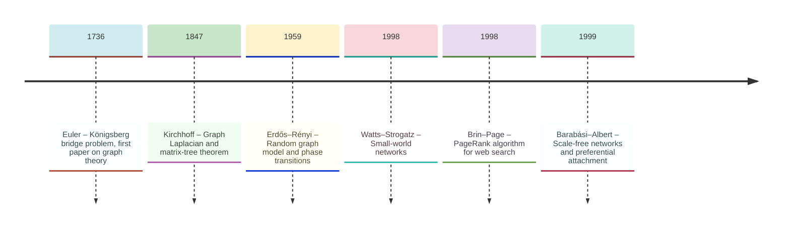
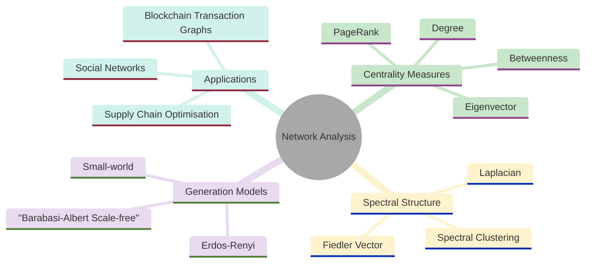
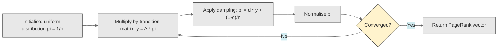
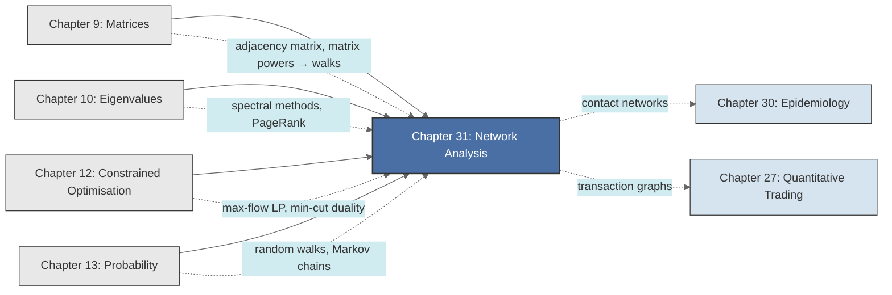

<!-- Copyright (c) 2025-2026 Bob Jansen <bobjansen@pm.me> -->
<!-- SPDX-License-Identifier: CC-BY-NC-4.0 -->
<!-- See LICENSE for full terms. Commercial licensing available. -->

# Chapter 31: Network Analysis & Graph Theory

**Part IX**: Applications

> The adjacency matrix encodes network topology; its eigenvalues measure connectivity; its powers count paths; and the Laplacian governs diffusion, clustering and the propagation of influence. Network analysis provides quantitative tools for measuring which connections matter most and where a network can be most efficiently divided or disrupted.

**Prerequisites**: [Chapter 9](09-matrices.md) (Matrices); matrix multiplication, powers of matrices, transpose and solving linear systems. [Chapter 10](10-eigenvalues.md) (Eigenvalues & Eigenvectors); eigenvalue computation, the power method, spectral decomposition of symmetric matrices and positive semidefiniteness. [Chapter 12](12-constrained-optimization.md) (Constrained Optimisation & Linear Programming); linear programme formulation, duality and the simplex method. [Chapter 13](13-probability-theory.md) (Probability Theory); probability distributions, expectation, Markov chains and stationary distributions.

**Learning Objectives**: After this chapter, the reader will be able to:

1. Represent directed and undirected graphs via adjacency matrices and interpret powers $A^k$ as walk-counting operators.
2. Construct the degree matrix and graph Laplacian, and prove that the Laplacian is positive semidefinite with smallest eigenvalue zero.
3. Compute degree centrality, eigenvector centrality and PageRank, and explain their relationship to the dominant eigenvector of appropriate matrices.
4. Formulate random walks on graphs as Markov chains and compute stationary distributions as eigenvectors.
5. Apply spectral clustering via the Fiedler vector (second-smallest eigenvector of the Laplacian) to partition a graph.
6. Model maximum-flow problems as linear programmes and state the max-flow min-cut theorem.
7. Describe the Erdős–Rényi and Barabási–Albert network generation models and their degree distribution properties.

**Connections**: This chapter synthesises [Chapter 9](09-matrices.md) (the adjacency matrix and its algebra), [Chapter 10](10-eigenvalues.md) (eigenvector centrality and spectral clustering require eigenvalue computation; the power method computes PageRank), [Chapter 12](12-constrained-optimization.md) (network flow is a linear programme; max-flow min-cut duality is LP duality applied to networks) and [Chapter 13](13-probability-theory.md) (random walks on graphs are Markov chains; stationary distributions are eigenvectors of transition matrices). It connects forward to [Chapter 27](27-quantitative-trading.md) (Quantitative Trading; transaction graph analysis), [Chapter 30](30-epidemiology.md) (Epidemiology; Susceptible-Infected-Removed dynamics on contact networks) and to applications in social network analysis, blockchain transaction graphs, supply chain optimisation and recommendation systems.

---

## Historical Context

**Key Milestones in Network Analysis**



*Figure 31.1: Timeline of key milestones in network analysis and graph theory.*

**Euler and the Königsberg bridges (1736).** Leonhard Euler published his analysis of the Königsberg bridge problem in the *Commentarii Academiae Scientiarum Petropolitanae* in 1736. The city of Königsberg (now Kaliningrad) sat on the banks and islands of the Pregel River, connected by seven bridges. Euler proved that no route crossing every bridge exactly once exists by abstracting the geography into a combinatorial structure: four landmasses became vertices and seven bridges became edges. His argument, that an Eulerian circuit requires every vertex to have even degree, was the first theorem of graph theory. Euler showed that the mathematical content lies not in geometry but in connectivity.

**Kirchhoff and spectral foundations (1847).** For over a century after Euler, graph theory remained a collection of isolated problems: Hamiltonian paths (Hamilton, 1857), the four-colour conjecture (De Morgan and Guthrie, 1852) and planar graphs (Kuratowski, 1930). Gustav Kirchhoff, in 1847, connected graphs to linear algebra through his circuit laws for electrical networks. Kirchhoff introduced the graph Laplacian to analyse current flow through resistor networks and proved his matrix-tree theorem: the number of spanning trees of a graph equals any cofactor of its Laplacian matrix. This result linked a combinatorial counting problem to the determinant of a matrix derived from graph structure; it foreshadowed spectral graph theory by over a century.

**Random graphs and phase transitions (1959).** Paul Erdős and Alfréd Rényi initiated the probabilistic study of graphs in their 1959 paper "On Random Graphs." Their model $G(n,p)$, where each of the $\binom{n}{2}$ possible edges exists independently with probability $p$, revealed that graph properties emerge at sharp thresholds. Below $p = 1/n$ the graph fragments into small components; above it a giant connected component containing a constant fraction of all vertices appears. This phase transition became a central tool in statistical physics and network science.

**Small-world and scale-free networks (1998–1999).** Duncan Watts and Steven Strogatz published "Collective Dynamics of 'Small-World' Networks" in *Nature* (1998). They showed that many real networks exhibit high clustering and short average path lengths simultaneously. Albert-László Barabási and Réka Albert published "Emergence of Scaling in Random Networks" in *Science* (1999), showing that degree distributions of many real networks follow a power law $P(k) \propto k^{-\gamma}$ rather than the Poisson distribution of Erdős–Rényi graphs. Their preferential attachment model, where new vertices connect preferentially to high-degree vertices, produces scale-free networks with a few highly connected hubs. The model explained the observed structure of the World Wide Web, citation networks, protein interaction networks and airline route maps.

**PageRank and eigenvector centrality (1998).** Sergey Brin and Lawrence Page developed the PageRank algorithm in 1998 to rank web pages for the Google search engine. PageRank models a random surfer who follows hyperlinks with probability $d$ and jumps to a uniformly random page with probability $1-d$. Each page's ranking is the stationary probability of this Markov chain; equivalently, the dominant eigenvector of a modified adjacency matrix. Phillip Bonacich formalised eigenvector centrality in 1972. PageRank was its largest-scale application.

**Modern cross-domain applications (2000s–present).** Network analysis now spans computational biology (protein interaction networks), neuroscience (connectomes), finance (interbank lending networks and blockchain transaction graphs) and epidemiology (contact networks). In each domain the adjacency matrix encodes structure, eigenvalues reveal community structure, random walks model diffusion and network flows quantify capacity.

---

## Why This Chapter Matters

**Network Analysis**



*Figure 31.2: Overview of network analysis topics spanning centrality, spectral methods and applications.*

The adjacency matrix ([Chapter 9](09-matrices.md)) gives linear algebra access to discrete structures. Each multiplication $A^k$ reveals progressively longer-range connectivity. Each eigenvalue decomposition ([Chapter 10](10-eigenvalues.md)) exposes community structure that no local inspection could detect. Each flow computation identifies bottlenecks that limit system throughput.

Eigenvector centrality, PageRank and random walk stationary distributions ([Chapter 13](13-probability-theory.md)) are instances of a single operation: finding the dominant eigenvector of an appropriate matrix. Spectral clustering, the Cheeger inequality and conductance bounds all arise from the variational characterisation of Laplacian eigenvalues. Maximum flow and minimum cut are primal–dual pairs in the same linear programme (LP) ([Chapter 12](12-constrained-optimization.md)). These unify into one algebraic theory of connectivity.

Web search, social media algorithms, fraud detection in financial networks, drug target identification in protein interaction networks and infrastructure resilience planning all rest on the algorithms in this chapter. Transaction graph analysis is standard for regulatory compliance and security auditing in blockchain and decentralised finance. The Barabási–Albert model predicts that scale-free networks resist random failure but are fragile to targeted attack; this has direct implications for infrastructure design. The graph Laplacian is the discrete analogue of the continuous Laplace operator; spectral clustering is the discrete counterpart of manifold learning.

---

## Notation & Conventions

| Symbol | Meaning |
|--------|---------|
| $G = (V, E)$ | Graph with vertex set $V$ and edge set $E$ |
| $n = \lvert V \rvert$ | Number of vertices |
| $m = \lvert E \rvert$ | Number of edges |
| $A$ | Adjacency matrix ($n \times n$); $A_{ij} = 1$ if edge $(i,j) \in E$ |
| $W$ | Weighted adjacency matrix; $W_{ij} = w_{ij} \geq 0$ |
| $d_i$ | Degree of vertex $i$: $d_i = \sum_j A_{ij}$ |
| $D$ | Degree matrix: $D = \operatorname{diag}(d_1, \ldots, d_n)$ |
| $L$ | Graph Laplacian: $L = D - A$ |
| $\mathcal{L}$ | Normalised Laplacian: $\mathcal{L} = D^{-1/2}LD^{-1/2}$ |
| $P$ | Transition matrix for random walk: $P = D^{-1}A$ |
| $\pi$ | Stationary distribution vector ($n \times 1$) |
| $\mathbf{x}$ | Eigenvector centrality vector |
| $\lambda_i$ | Eigenvalue of specified matrix (context-dependent) |
| $d$ | Damping factor in PageRank (typically $d = 0.85$) |
| $\mathbf{1}$ | Vector of all ones |
| $\deg^+(v)$, $\deg^-(v)$ | Out-degree and in-degree of vertex $v$ (directed graphs) |
| $f_{ij}$ | Flow on edge $(i,j)$ in a network flow problem |
| $c_{ij}$ | Capacity of edge $(i,j)$ |
| $s, t$ | Source and sink vertices in flow networks |

For undirected graphs $A$ is symmetric. For digraphs $A_{ij} = 1$ indicates an edge from $i$ to $j$. Weighted graphs use $W_{ij} = w_{ij}$; $W_{ij} = 0$ indicates no edge. Self-loops are excluded unless stated otherwise. Vertices are indexed from $1$ to $n$.

---

## Core Theory

### Graphs and the Adjacency Matrix

**Definition 31.1** (Graph). An *undirected graph* $G = (V, E)$ consists of a finite set $V$ of vertices and a set $E \subseteq \binom{V}{2}$ of edges, where each edge is an unordered pair $\{u, v\}$ with $u \neq v$. A *directed graph* (digraph) has $E \subseteq V \times V$, where each edge $(u, v)$ is an ordered pair indicating direction from $u$ to $v$.

**Definition 31.2** (Adjacency matrix). The *adjacency matrix* ([Chapter 9](09-matrices.md)) of a graph $G = (V, E)$ with $\lvert V \rvert = n$ is the $n \times n$ matrix $A$ defined by

$$A_{ij} = \begin{cases} 1 & \text{if } (i,j) \in E, \\ 0 & \text{otherwise.} \end{cases}$$

For an undirected graph, $A$ is symmetric. For a weighted graph, $A_{ij} = w_{ij}$ where $w_{ij}$ is the weight of edge $(i,j)$.

**Theorem 31.3** (Walk counting). Let $A$ be the adjacency matrix of a graph $G$. The $(i,j)$ entry of $A^k$ equals the number of walks of length $k$ from vertex $i$ to vertex $j$.

??? note "Proof"

    *Proof.* By induction on $k$.

    **Base case** $k = 1$: $(A^1)_{ij} = A_{ij}$ counts the number of edges from $i$ to $j$, which is 0 or 1 for a simple graph.

    **Illustration for** $k = 2$:

    $$(A^2)_{ij} = \sum_{\ell=1}^n A_{i\ell}\, A_{\ell j}.$$

    Each nonzero term $A_{i\ell} A_{\ell j} = 1$ corresponds to a walk $i \to \ell \to j$ of length 2.

    **Inductive step**: Assume the result holds for $k-1$, so $(A^{k-1})_{i\ell}$ counts walks of length $k-1$ from $i$ to $\ell$. Then

    $$(A^k)_{ij} = \sum_{\ell=1}^n (A^{k-1})_{i\ell}\, A_{\ell j}.$$

    Each walk of length $k$ from $i$ to $j$ consists of a walk of length $k-1$ from $i$ to some intermediate vertex $\ell$, followed by a single edge $\ell \to j$. Summing over all such $\ell$ counts all walks of length $k$ from $i$ to $j$. $\square$

**Remark 31.4** (Walks vs. paths). A *walk* allows repeated vertices and edges; a *path* requires all vertices to be distinct. The matrix $A^k$ counts walks, not paths. Counting paths is computationally much harder (it is related to the \#P-complete problem of counting Hamiltonian paths). For many applications (reachability analysis, centrality computation and diffusion modelling) walks are the appropriate combinatorial object.

### Degree Matrix and Graph Laplacian

**Definition 31.5** (Degree matrix). The *degree matrix* of an undirected graph is the $n \times n$ diagonal matrix

$$D = \operatorname{diag}(d_1, d_2, \ldots, d_n), \quad \text{where } d_i = \sum_{j=1}^n A_{ij}.$$

**Definition 31.6** (Graph Laplacian). The *combinatorial graph Laplacian* (or Laplacian) of an undirected graph $G$ is

$$L = D - A.$$

The Laplacian has entries: $L_{ii} = d_i$ and $L_{ij} = -A_{ij}$ for $i \neq j$.

**Theorem 31.7** (Properties of the Laplacian). The Laplacian $L = D - A$ of an undirected graph satisfies:

1. $L$ is symmetric and positive semidefinite.
2. The smallest eigenvalue is $\lambda_1 = 0$, with corresponding eigenvector $\mathbf{1} = (1, 1, \ldots, 1)^T$.
3. The multiplicity of the eigenvalue $0$ equals the number of connected components of $G$.
4. For any vector $\mathbf{x} \in \mathbb{R}^n$, the quadratic form satisfies

$$\mathbf{x}^T L \mathbf{x} = \sum_{(i,j) \in E} (x_i - x_j)^2.$$

??? note "Proof"

    *Proof.*

    **(1) Symmetry and positive semidefiniteness.** Symmetry follows from $A^T = A$ and $D^T = D$. For positive semidefiniteness, compute the quadratic form:

    $$\mathbf{x}^T L \mathbf{x} = \mathbf{x}^T D \mathbf{x} - \mathbf{x}^T A \mathbf{x} = \sum_i d_i x_i^2 - \sum_{i,j} A_{ij} x_i x_j.$$

    For an undirected graph, each edge $\{i,j\}$ contributes $A_{ij} = A_{ji} = 1$, so

    $$\sum_{i,j} A_{ij} x_i x_j = 2 \sum_{\{i,j\} \in E} x_i x_j \qquad \text{and} \qquad \sum_i d_i x_i^2 = \sum_{\{i,j\} \in E}(x_i^2 + x_j^2).$$

    Therefore

    $$\mathbf{x}^T L \mathbf{x} = \sum_{\{i,j\} \in E}\left(x_i^2 + x_j^2 - 2x_i x_j\right) = \sum_{\{i,j\} \in E}(x_i - x_j)^2 \geq 0.$$

    This proves both positive semidefiniteness and property (4).

    **(2) Smallest eigenvalue.** Setting $\mathbf{x} = \mathbf{1}$ gives $\mathbf{1}^T L \mathbf{1} = \sum_{\{i,j\} \in E}(1 - 1)^2 = 0$. Since $L$ is positive semidefinite, $\lambda_1 = 0$ is the smallest eigenvalue, with eigenvector $\mathbf{1}$.

    **(3) Multiplicity of zero.** If $G$ has $k$ connected components $C_1, \ldots, C_k$, then $L$ is block-diagonal after reordering vertices. The indicator vector $\mathbf{1}_{C_i}$ (equal to $1$ on $C_i$, $0$ elsewhere) satisfies $L\mathbf{1}_{C_i} = \mathbf{0}$, giving $k$ linearly independent zero-eigenvectors.

    Conversely, if $L\mathbf{x} = \mathbf{0}$, then $\sum_{\{i,j\}\in E}(x_i - x_j)^2 = 0$, forcing $x_i = x_j$ for all edges; hence $\mathbf{x}$ is constant on each connected component. The null space of $L$ has dimension exactly $k$. $\square$

!!! abstract "Key Result"

    **Theorem 31.7** (Properties of the Laplacian). The quadratic form $\mathbf{x}^T L \mathbf{x} = \sum_{(i,j) \in E}(x_i - x_j)^2$ connects graph topology to linear algebra: the number of zero eigenvalues counts connected components, and the spectral gap governs diffusion, clustering and mixing time.

**Definition 31.8** (Normalised Laplacian). The *normalised Laplacian* is defined as

$$\mathcal{L} = D^{-1/2} L D^{-1/2} = I - D^{-1/2} A D^{-1/2}.$$

Its eigenvalues lie in $[0, 2]$, and it is used in spectral clustering to account for degree heterogeneity.

### Centrality Measures

**Definition 31.9** (Degree centrality). The *degree centrality* of vertex $i$ is

$$c_D(i) = \frac{d_i}{n - 1},$$

the fraction of other vertices to which $i$ is connected. It measures local importance.

**Definition 31.10** (Eigenvector centrality). The *eigenvector centrality* of vertex $i$ is the $i$-th component of the dominant eigenvector $\mathbf{x}$ satisfying

$$A\mathbf{x} = \lambda_{\max} \mathbf{x}, \qquad x_i \geq 0, \qquad \lVert\mathbf{x}\rVert_1 = 1.$$

The idea is that a vertex is important if it is connected to other important vertices.

**Theorem 31.11** (Existence of eigenvector centrality). For a connected, undirected graph with adjacency matrix $A$, the Perron–Frobenius theorem guarantees that the largest eigenvalue $\lambda_{\max}$ is positive, simple and has a corresponding eigenvector $\mathbf{x}$ with all strictly positive components.

??? note "Proof"

    *Proof.* The adjacency matrix $A$ of a connected graph is irreducible: there is no permutation that brings $A$ to block-upper-triangular form, because any vertex can reach any other via a path.

    Since $A$ is nonnegative and irreducible, the Perron–Frobenius theorem applies. It guarantees that the spectral radius $\rho(A) = \lambda_{\max}$ is a simple eigenvalue with a strictly positive eigenvector. $\square$

**Remark 31.12** (Limitations of degree and eigenvector centrality). Degree centrality counts only immediate neighbours and fails to capture global position. Eigenvector centrality accounts for neighbour importance but assigns near-zero scores to vertices in peripheral components of a disconnected graph. These limitations motivated the development of PageRank, which introduces a teleportation mechanism to handle disconnected or directed graphs.

### PageRank

**Definition 31.13** (PageRank). Let $G$ be a directed graph with $n$ vertices, adjacency matrix $A$ (where $A_{ij} = 1$ if there is an edge from $j$ to $i$, following the "link-to" convention) and out-degree matrix $D_{\text{out}}$ with $(D_{\text{out}})_{jj} = \deg^+(j) = \sum_i A_{ij}$. The *PageRank vector* $\boldsymbol{\pi}$ satisfies

$$\boldsymbol{\pi} = \left(d \cdot A D_{\text{out}}^{-1} + \frac{1-d}{n} \mathbf{1}\mathbf{1}^T\right)\boldsymbol{\pi},$$

where $d \in (0,1)$ is the damping factor (typically $d = 0.85$) and $\boldsymbol{\pi}$ is normalised so that $\lVert\boldsymbol{\pi}\rVert_1 = 1$.

The matrix $M = d \cdot A D_{\text{out}}^{-1} + \frac{1-d}{n}\mathbf{1}\mathbf{1}^T$ is column-stochastic (its columns sum to 1) and primitive (positive entries everywhere due to the $(1-d)/n$ term). By the Perron–Frobenius theorem, $M$ has a unique dominant eigenvalue $\lambda = 1$ with a strictly positive eigenvector $\boldsymbol{\pi}$.

**Theorem 31.14** (PageRank as eigenvector). The PageRank vector $\boldsymbol{\pi}$ is the unique right eigenvector of the column-stochastic matrix $M$ corresponding to eigenvalue $1$:

$$M\boldsymbol{\pi} = \boldsymbol{\pi}, \qquad \boldsymbol{\pi}_i > 0, \qquad \sum_i \pi_i = 1.$$

Equivalently, $\boldsymbol{\pi}$ is the stationary distribution of the Markov chain defined by $M$.

??? note "Proof"

    *Proof.* The matrix $M$ is column-stochastic: each column sums to $d \cdot 1 + (1-d) = 1$. Since every entry of $M$ is at least $(1-d)/n > 0$, the matrix is primitive. The Perron–Frobenius theorem for primitive nonnegative matrices guarantees that $M$ has a unique dominant eigenvalue $\lambda = 1$ with a strictly positive eigenvector. Since $M$ is column-stochastic, $\mathbf{1}^T M = \mathbf{1}^T$, confirming that $1$ is an eigenvalue. The corresponding right eigenvector $\boldsymbol{\pi}$ satisfying $M\boldsymbol{\pi} = \boldsymbol{\pi}$ with $\lVert\boldsymbol{\pi}\rVert_1 = 1$ is the unique stationary distribution, consistent with Definition 31.13. $\square$

**Remark 31.15** (Interpretation). A "random surfer" at vertex $j$ follows an outgoing link uniformly at random with probability $d$, or teleports to a uniformly random vertex with probability $1-d$. The PageRank $\pi_i$ is the long-run fraction of time the surfer spends at vertex $i$. Vertices with high in-degree from other high-PageRank vertices receive high rank.

### Random Walks on Graphs

**Definition 31.16** (Random walk). A *random walk* on an undirected graph $G$ is a Markov chain ([Chapter 13](13-probability-theory.md)) with transition matrix

$$P = D^{-1}A,$$

so that $P_{ij} = A_{ij}/d_i$: from vertex $i$, the walk moves to each neighbour $j$ with probability $1/d_i$.

**Theorem 31.17** (Stationary distribution of the random walk). If $G$ is connected and non-bipartite, the random walk on $G$ has a unique stationary distribution

$$\pi_i = \frac{d_i}{2m},$$

where $m = \lvert E \rvert$ is the number of edges. The stationary distribution is proportional to vertex degree.

??? note "Proof"

    *Proof.* The transition matrix is $P = D^{-1}A$. To verify stationarity, check the detailed balance condition $\pi_i P_{ij} = \pi_j P_{ji}$ for all $i, j$. With $\pi_i = d_i / (2m)$:

    $$\pi_i P_{ij} = \frac{d_i}{2m} \cdot \frac{A_{ij}}{d_i} = \frac{A_{ij}}{2m} = \frac{d_j}{2m} \cdot \frac{A_{ji}}{d_j} = \pi_j P_{ji},$$

    using $A_{ij} = A_{ji}$ (symmetry of the undirected graph). Since detailed balance holds, $\boldsymbol{\pi}$ is a stationary distribution. The chain is irreducible (connected graph) and aperiodic (non-bipartite), so the stationary distribution is unique by the theory of Markov chains ([Chapter 13](13-probability-theory.md)). $\square$

**Remark 31.18** (Connection to eigenvalues). The stationary distribution $\boldsymbol{\pi}$ is the left eigenvector of $P$ for eigenvalue $1$: $\boldsymbol{\pi}^T P = \boldsymbol{\pi}^T$. The convergence rate of the random walk to stationarity is governed by the *spectral gap* $1 - \lambda_2$, where $\lambda_2$ is the second-largest eigenvalue of $P$. A larger spectral gap implies faster mixing.

### Spectral Clustering

**Definition 31.19** (Graph bisection). A *bisection* of a graph $G = (V, E)$ is a partition of $V$ into two disjoint sets $S$ and $\bar{S} = V \setminus S$. The *cut* of the partition is

$$\operatorname{cut}(S, \bar{S}) = \sum_{\substack{i \in S,\, j \in \bar{S}}} A_{ij},$$

the number of edges crossing the partition.

**Definition 31.20** (Fiedler vector). The *Fiedler vector* is the eigenvector corresponding to the second-smallest eigenvalue $\lambda_2$ of the Laplacian $L$. The eigenvalue $\lambda_2$ is called the *algebraic connectivity* of the graph.

**Theorem 31.21** (Spectral bisection). The Fiedler vector provides an approximate solution to the minimum bisection problem. Specifically, if $\mathbf{v}_2$ is the Fiedler vector, the partition

$$S = \{i : (v_2)_i \geq 0\}, \qquad \bar{S} = \{i : (v_2)_i < 0\}$$

approximates the minimum normalised cut. The Cheeger inequality bounds the quality:

$$\frac{\lambda_2}{2} \leq h(G) \leq \sqrt{2\lambda_2},$$

where $h(G) = \min_{S} \frac{\operatorname{cut}(S,\bar{S})}{\min(\lvert S \rvert, \lvert \bar{S} \rvert)}$ is the Cheeger constant (edge expansion).

??? note "Proof"

    *Proof sketch.* By the Courant–Fischer min-max theorem, the second eigenvalue $\lambda_2$ of $L$ has the variational characterisation:

    $$\lambda_2 = \min_{\mathbf{x} \perp \mathbf{1}} \frac{\mathbf{x}^T L \mathbf{x}}{\mathbf{x}^T \mathbf{x}} = \min_{\mathbf{x} \perp \mathbf{1}} \frac{\sum_{\{i,j\}\in E}(x_i - x_j)^2}{\sum_i x_i^2}.$$

    This is a continuous relaxation of the discrete bisection problem $\min_{S} \operatorname{cut}(S, \bar{S})/(\lvert S \rvert\lvert \bar{S} \rvert)$, obtained by relaxing the indicator vector $\mathbf{x} \in \{-1, +1\}^n$ to $\mathbf{x} \in \mathbb{R}^n$ subject to $\mathbf{x} \perp \mathbf{1}$.

    The Fiedler vector $\mathbf{v}_2$ achieves this minimum, and rounding (thresholding at $0$) converts it to a discrete partition.

    The Cheeger inequality, proved independently by Cheeger (1970) for manifolds and by Alon and Milman (1985) for graphs, bounds the multiplicative gap between the relaxed and discrete solutions, giving $\lambda_2/2 \leq h(G) \leq \sqrt{2\lambda_2}$. $\square$

!!! info "Cheeger inequality: from manifolds to graphs"
    Cheeger [9] proved the continuous version for Riemannian manifolds in 1970. Alon and Milman [5] established the discrete analogue for graphs in 1985, connecting spectral gap to combinatorial expansion. The upper bound $h(G) \leq \sqrt{2\lambda_2}$ is tight for expander graphs; the lower bound $\lambda_2/2 \leq h(G)$ is tight for paths and cycles.

**Remark 31.22** (Multi-way spectral clustering). For $k$-way partitioning, one uses the bottom $k$ eigenvectors of $L$ (or $\mathcal{L}$) to embed each vertex in $\mathbb{R}^k$, then applies $k$-means clustering to the embedded points. This approach, proposed by Ng, Jordan and Weiss (2002), provides a principled method for community detection in networks.

### Network Flow

**Definition 31.23** (Flow network). A *flow network* is a directed graph $G = (V, E)$ with a source $s \in V$, a sink $t \in V$ and a capacity function $c: E \to \mathbb{R}_{\geq 0}$.

**Definition 31.24** (Feasible flow). A *feasible flow* is a function $f: E \to \mathbb{R}_{\geq 0}$ satisfying:

1. *Capacity constraint*: $0 \leq f_{ij} \leq c_{ij}$ for all $(i,j) \in E$.
2. *Flow conservation*: $\sum_{j:(i,j)\in E} f_{ij} = \sum_{j:(j,i)\in E} f_{ji}$ for all $i \in V \setminus \{s,t\}$.

The *value* of the flow is $\lvert f \rvert = \sum_{j:(s,j)\in E} f_{sj} - \sum_{j:(j,s)\in E} f_{js}$.

**Theorem 31.25** (Max-flow as LP). The maximum flow problem can be formulated as the linear programme:

$$\max \sum_{j:(s,j)\in E} f_{sj}$$

subject to:

$$\begin{aligned}
0 \leq f_{ij} \leq c_{ij} \quad \forall (i,j) \in E, \\
\sum_{j:(i,j)\in E} f_{ij} - \sum_{j:(j,i)\in E} f_{ji} &= 0 \quad \forall i \in V \setminus \{s,t\}.
\end{aligned}$$

This is a linear programme in the variables $f_{ij}$ with $\lvert E \rvert$ variables and $\lvert V \rvert - 2$ equality constraints plus $2\lvert E \rvert$ bound constraints ([Chapter 12](12-constrained-optimization.md)).

**Definition 31.26** (Cut). An $s$-$t$ *cut* is a partition $(S, \bar{S})$ of $V$ with $s \in S$ and $t \in \bar{S}$. The *capacity* of the cut is

$$c(S, \bar{S}) = \sum_{\substack{i \in S,\, j \in \bar{S} \\ (i,j) \in E}} c_{ij}.$$

**Theorem 31.27** (Max-flow min-cut). The maximum value of a feasible flow from $s$ to $t$ equals the minimum capacity of an $s$-$t$ cut:

$$\max_f \lvert f \rvert = \min_{(S,\bar{S})} c(S, \bar{S}).$$

??? note "Proof"

    *Proof.*

    **(Weak duality)** For any feasible flow $f$ and any $s$-$t$ cut $(S, \bar{S})$:

    $$\lvert f \rvert = \sum_{\substack{i \in S,\, j \in \bar{S}}} f_{ij} - \sum_{\substack{i \in \bar{S},\, j \in S}} f_{ij} \leq \sum_{\substack{i \in S,\, j \in \bar{S}}} f_{ij} \leq \sum_{\substack{i \in S,\, j \in \bar{S}}} c_{ij} = c(S, \bar{S}).$$

    The first equality follows from flow conservation (telescoping over all vertices in $S \setminus \{s\}$). Since this holds for every flow and every cut, $\max \lvert f \rvert \leq \min c(S,\bar{S})$.

    **(Strong duality)** Consider the LP formulation of max-flow. The dual LP, by LP duality theory ([Chapter 12](12-constrained-optimization.md)), gives a minimum-cut formulation. Strong duality of linear programming then guarantees that the optimal primal and dual values coincide.

    Alternatively, one shows constructively that when no augmenting path from $s$ to $t$ exists in the residual graph, the set $S$ of vertices reachable from $s$ defines a cut with capacity exactly equal to $\lvert f \rvert$, establishing $\max \lvert f \rvert = \min c(S,\bar{S})$. $\square$

### Network Generation Models

**Definition 31.28** (Erdős–Rényi model). The random graph $G(n, p)$ has $n$ vertices, and each of the $\binom{n}{2}$ possible edges exists independently with probability $p$.

Properties:

- Expected degree: $\mathbb{E}[d_i] = (n-1)p$.
- Degree distribution: $P(d_i = k) = \binom{n-1}{k} p^k (1-p)^{n-1-k}$ (Binomial, approximately Poisson for large $n$, small $p$).
- Giant component emerges at $p = 1/n$ (phase transition).
- Graph is connected with high probability when $p > \ln(n)/n$.

**Definition 31.29** (Barabási–Albert model). The preferential attachment model constructs a graph incrementally:

1. Start with $m_0$ vertices connected in some initial configuration.
2. At each time step, add a new vertex with $m \leq m_0$ edges.
3. Each new edge connects to existing vertex $i$ with probability proportional to $d_i$:

$$P(\text{connect to } i) = \frac{d_i}{\sum_j d_j}.$$

The resulting degree distribution follows a power law: $P(k) \propto k^{-3}$ for large $k$. This *scale-free* property means a few hub vertices have very high degree while most vertices have low degree.

**Remark 31.30** (Comparison of models). The Erdős–Rényi model produces homogeneous graphs with Poisson degree distribution and is useful as a mathematical baseline. It fails to reproduce the heavy-tailed degree distributions, high clustering coefficients and community structure observed in real networks. The Barabási–Albert model captures the heavy tail but produces low clustering. More realistic models (e.g., stochastic block models, configuration models, Watts–Strogatz) combine features of both.

**Scale-Free Degree Distribution (Power Law):**

```mermaid
---
config:
  theme: base
  themeVariables:
    xyChart:
      plotColorPalette: "#2563eb, #dc2626, #16a34a, #9333ea, #ca8a04, #0891b2"
      backgroundColor: "#ffffff"
      titleColor: "#333333"
      xAxisLabelColor: "#333333"
      yAxisLabelColor: "#333333"
      xAxisTitleColor: "#333333"
      yAxisTitleColor: "#333333"
      xAxisLineColor: "#333333"
      yAxisLineColor: "#333333"
---
xychart-beta
    x-axis "Degree k" [1, 2, 3, 5, 8, 13, 21, 34]
    y-axis "P(k)" 0 --> 0.55
    line [0.5, 0.177, 0.096, 0.045, 0.022, 0.012, 0.006, 0.003]
```

*Figure 31.3: Scale-free degree distribution following a power law with most vertices having low degree.*

The degree distribution of a scale-free network follows a power law $P(k) \propto k^{-\gamma}$, appearing as a straight line on a log-log plot. Most vertices have low degree, while a few hub vertices have very high degree. This heavy-tailed distribution contrasts sharply with the Poisson distribution of Erdős–Rényi graphs, where vertex degrees concentrate tightly around the mean.

---

## Formulas & Identities

**F31.1** Graph Laplacian and quadratic form.

$$L = D - A, \qquad \mathbf{x}^T L \mathbf{x} = \sum_{\{i,j\} \in E}(x_i - x_j)^2$$

**F31.2** Normalised Laplacian; eigenvalues in $[0, 2]$.

$$\mathcal{L} = D^{-1/2}LD^{-1/2} = I - D^{-1/2}AD^{-1/2}$$

**F31.3** Walk counting.

$$(A^k)_{ij} = \text{number of walks of length } k \text{ from } i \text{ to } j$$

**F31.4** Degree centrality.

$$c_D(i) = \frac{d_i}{n - 1}$$

**F31.5** Eigenvector centrality.

$$A\mathbf{x} = \lambda_{\max}\mathbf{x}, \qquad \lVert\mathbf{x}\rVert_1 = 1$$

**F31.6** PageRank.

$$\boldsymbol{\pi} = \left(d \cdot AD_{\text{out}}^{-1} + \frac{1-d}{n}\mathbf{1}\mathbf{1}^T\right)\boldsymbol{\pi}$$

**F31.7** Random walk stationary distribution.

$$\pi_i = \frac{d_i}{2m}$$

**F31.8** Cheeger inequality.

$$\frac{\lambda_2}{2} \leq h(G) \leq \sqrt{2\lambda_2}$$

**F31.9** Max-flow min-cut theorem.

$$\max_f \lvert f \rvert = \min_{(S,\bar{S})} c(S, \bar{S})$$

**F31.10** Matrix-tree theorem, where $\lambda_2,\ldots,\lambda_n$ are the non-zero eigenvalues of $L$ and $\tilde{L}$ is the matrix obtained by deleting any row $i$ and column $i$ from $L$.

$$\tau(G) = \frac{1}{n}\lambda_2\lambda_3\cdots\lambda_n = \det(\tilde{L})$$

---

## Algorithms

### Algorithm 31.31: Power Iteration for Eigenvector Centrality

Compute the dominant eigenvector of the adjacency matrix $A$ using the power method ([Chapter 10](10-eigenvalues.md)).

**Input**: Adjacency matrix $A$ ($n \times n$); tolerance $\varepsilon$; maximum iterations $N_{\max}$.

**Output**: Eigenvector centrality vector $\mathbf{x}$ with $\lVert\mathbf{x}\rVert_1 = 1$.

1. Initialise $\mathbf{x}^{(0)} = \mathbf{1}/n$ (uniform).
2. For $k = 0, 1, \ldots, N_{\max}$:
   a. Compute $\mathbf{y} = A\mathbf{x}^{(k)}$.
   b. Normalise: $\mathbf{x}^{(k+1)} = \mathbf{y} / \lVert\mathbf{y}\rVert_1$.
   c. If $\lVert\mathbf{x}^{(k+1)} - \mathbf{x}^{(k)}\rVert_\infty < \varepsilon$, return $\mathbf{x}^{(k+1)}$.
3. Return $\mathbf{x}^{(N_{\max})}$ (convergence warning).

```
function eigenvector_centrality(A, n, eps, N_max):
    // Initialise uniform vector
    x = array of size n, each entry 1/n
    for k = 0 to N_max - 1:
        // Matrix-vector product (sparse: iterate over edges)
        y = A * x
        // Normalise to unit L1 norm
        norm = sum(|y_i| for i = 1 to n)
        x_new = y / norm
        // Convergence check (infinity norm of difference)
        if max(|x_new_i - x_i| for i = 1 to n) < eps:
            return x_new
        x = x_new
    return x                    // convergence warning
```

**Complexity**: $O(N_{\text{iter}} \cdot m)$ where $m = \lvert E \rvert$ is the number of nonzero entries in $A$ (exploiting sparsity). Convergence rate: $\lvert\lambda_2 / \lambda_1\rvert^k$.

### Algorithm 31.32: PageRank via Power Iteration

Compute the PageRank vector for a directed graph.

**Input**: Adjacency matrix $A$ ($n \times n$, directed); out-degree vector $\mathbf{d}$ (where $d_j = \deg^+(j)$ denotes the out-degree of vertex $j$, distinct from the damping factor $d$ below); damping factor $d \in (0,1)$; tolerance $\varepsilon$; maximum iterations $N_{\max}$.

**Output**: PageRank vector $\boldsymbol{\pi}$ with $\lVert\boldsymbol{\pi}\rVert_1 = 1$.

1. Initialise $\boldsymbol{\pi}^{(0)} = \mathbf{1}/n$.
2. Handle dangling nodes: let $\mathcal{D} = \{j : d_j = 0\}$. For $j \in \mathcal{D}$, treat as if $j$ links to all vertices (replace column of zeros with $\mathbf{1}/n$).
3. For $k = 0, 1, \ldots, N_{\max}$:
   a. Compute $\mathbf{y}_j = \pi^{(k)}_j / d_j$ for $j \notin \mathcal{D}$, and $\mathbf{y}_j = \pi^{(k)}_j / n$ for $j \in \mathcal{D}$.
   b. Compute $\boldsymbol{\pi}^{(k+1)} = d \cdot A\mathbf{y} + \frac{1-d}{n}\mathbf{1}$.
   c. If $\lVert\boldsymbol{\pi}^{(k+1)} - \boldsymbol{\pi}^{(k)}\rVert_1 < \varepsilon$, return $\boldsymbol{\pi}^{(k+1)}$.
4. Return $\boldsymbol{\pi}^{(N_{\max})}$.

```
function pagerank(A, n, out_deg, d, eps, N_max):
    // Initialise uniform distribution
    pi = array of size n, each entry 1/n
    // Identify dangling nodes (out-degree zero)
    dangling = {j : out_deg[j] == 0}
    for k = 0 to N_max - 1:
        // Compute column-normalised contribution
        y = array of size n
        for j = 1 to n:
            if j in dangling:
                y[j] = pi[j] / n
            else:
                y[j] = pi[j] / out_deg[j]
        // Matrix-vector product with damping and teleportation
        pi_new = d * (A * y) + (1 - d) / n
        // Convergence check (L1 norm)
        if sum(|pi_new[i] - pi[i]| for i = 1 to n) < eps:
            return pi_new
        pi = pi_new
    return pi                       // convergence warning
```

**Complexity**: $O(N_{\text{iter}} \cdot m)$ per iteration. Convergence is guaranteed; the rate is $d^k$ (geometric with ratio $d$, so $d = 0.85$ gives convergence in approximately 50–100 iterations to machine precision).

!!! tip "Choosing the damping factor"
    The standard value $d = 0.85$ balances convergence speed against sensitivity to link structure. Increasing $d$ weights link structure more heavily but slows convergence ($d = 0.95$ may require 200+ iterations). Decreasing $d$ speeds convergence but flattens the ranking towards uniform. For most applications $d \in [0.80, 0.90]$ is effective.

**PageRank Power Iteration**



*Figure 31.4: PageRank power iteration loop from initialisation through convergence.*

### Algorithm 31.33: Spectral Bisection via Fiedler Vector

Partition a graph into two communities using the second eigenvector of the Laplacian.

**Input**: Adjacency matrix $A$ ($n \times n$, undirected); number of eigenvectors $k$ (default: $k=1$ for bisection).

**Output**: Partition $(S, \bar{S})$ of vertices.

1. Construct degree matrix $D = \operatorname{diag}(A\mathbf{1})$.
2. Construct Laplacian $L = D - A$.
3. Compute the eigenvalues $\lambda_1 \leq \lambda_2 \leq \cdots$ and eigenvectors $\mathbf{v}_1, \mathbf{v}_2, \ldots$ of $L$ using the QR algorithm ([Chapter 10](10-eigenvalues.md)). For large sparse graphs, use Lanczos iteration for the smallest eigenvalues.
4. Extract the Fiedler vector $\mathbf{v}_2$.
5. Partition: $S = \{i : (v_2)_i \geq 0\}$, $\bar{S} = \{i : (v_2)_i < 0\}$.
6. Return $(S, \bar{S})$.

```
function spectral_bisection(A, n):
    // Build degree matrix and Laplacian
    D = diagonal matrix where D_ii = sum of row i of A
    L = D - A
    // Compute second-smallest eigenvector of L
    eigenvalues, eigenvectors = eigen_decompose(L)
    v2 = eigenvector for second-smallest eigenvalue
    // Partition vertices by sign of Fiedler vector
    S = {i : v2[i] >= 0}
    S_bar = {i : v2[i] < 0}
    return (S, S_bar)
```

**Complexity**: Dominated by eigenvalue computation. Dense: $O(n^3)$ via QR. Sparse (Lanczos): $O(m \cdot N_{\text{iter}})$ for the bottom few eigenvectors.

### Algorithm 31.34: Erdős–Rényi Graph Generation

Generate a random graph $G(n, p)$.

**Input**: Number of vertices $n$; edge probability $p$.

**Output**: Adjacency matrix $A$ (symmetric, $n \times n$).

1. Initialise $A$ as the $n \times n$ zero matrix.
2. For $i = 1, \ldots, n-1$:
   a. For $j = i+1, \ldots, n$:
      - Draw $u \sim \operatorname{Uniform}(0,1)$.
      - If $u < p$, set $A_{ij} = A_{ji} = 1$.
3. Return $A$.

```
function erdos_renyi(n, p):
    // Initialise empty adjacency matrix
    A = n x n zero matrix
    for i = 1 to n - 1:
        for j = i + 1 to n:
            // Include edge (i, j) with probability p
            u = random_uniform(0, 1)
            if u < p:
                A[i][j] = 1
                A[j][i] = 1
    return A
```

**Complexity**: $O(n^2)$. For sparse graphs ($p \ll 1$), an alternative method generates edges from a geometric distribution, achieving $O(n + m)$ expected time where $m$ is the expected number of edges.

### Algorithm 31.35: Barabási–Albert Preferential Attachment

Generate a scale-free graph using preferential attachment.

**Input**: Final number of vertices $n$; edges per new vertex $m$; initial clique size $m_0 \geq m$.

**Output**: Adjacency matrix $A$ ($n \times n$).

1. Initialise a complete graph on vertices $\{1, \ldots, m_0\}$.
2. Maintain a degree array $d[1..n]$.
3. For $v = m_0 + 1, \ldots, n$:
   a. Compute cumulative degree: $\text{total} = \sum_{i=1}^{v-1} d_i$.
   b. Select $m$ distinct target vertices from $\{1, \ldots, v-1\}$, each chosen with probability $d_i / \text{total}$.
   c. For each target $u$: set $A_{vu} = A_{uv} = 1$; update $d_v \mathrel{+}= 1$, $d_u \mathrel{+}= 1$.
4. Return $A$.

```
function barabasi_albert(n, m, m0):
    // Start with a complete graph on m0 vertices
    A = n x n zero matrix
    d = array of size n, all zeros
    for i = 1 to m0:
        for j = i + 1 to m0:
            A[i][j] = 1
            A[j][i] = 1
            d[i] = d[i] + 1
            d[j] = d[j] + 1
    // Grow network by preferential attachment
    for v = m0 + 1 to n:
        total = sum(d[i] for i = 1 to v - 1)
        targets = empty set
        while |targets| < m:
            // Select vertex with probability proportional to degree
            pick u from {1, ..., v-1} with P(u) = d[u] / total
            if u not in targets:
                targets = targets + {u}
        // Attach new vertex to selected targets
        for each u in targets:
            A[v][u] = 1
            A[u][v] = 1
            d[v] = d[v] + 1
            d[u] = d[u] + 1
    return A
```

**Complexity**: $O(n \cdot m)$ with alias method for weighted sampling.

---

## Numerical Considerations

### Sparse Matrix Storage

Practical graphs are sparse ($m \ll n^2$). Dense storage wastes memory. CSR (compressed sparse row) format stores only nonzero entries, reducing memory from $O(n^2)$ to $O(n + m)$. All matrix-vector products in Algorithms 31.31–31.33 run in $O(m)$ time per iteration. For undirected graphs, storing only the upper triangle halves memory at the cost of slightly more complex iteration logic.

### Convergence of Power Iteration for Centrality

Algorithms 31.31 and 31.32 use power iteration. The convergence rate after $k$ iterations is

$$\left\lVert \mathbf{x}^{(k)} - \mathbf{x}^* \right\rVert = O\!\left(\left|\frac{\lambda_2}{\lambda_1}\right|^k\right).$$

A large spectral gap $|\lambda_1| - |\lambda_2|$ gives fast convergence. Near-degenerate dominant eigenvalues slow convergence; Chebyshev acceleration or shifting can help. For PageRank (Algorithm 31.32) the spectral gap is at least $1 - d$ where $d$ is the damping factor, so $d = 0.85$ guarantees geometric convergence with ratio at most $0.85$.

### PageRank Teleportation and Floating-Point Normalisation

The teleportation term $(1-d)\mathbf{1}/n$ in Algorithm 31.32 ensures all entries of the PageRank vector remain positive. After each iteration, the vector should satisfy $\lVert\boldsymbol{\pi}\rVert_1 = 1$. Floating-point drift can violate this; renormalise after each iteration. For graphs with many dangling nodes (out-degree zero), the dangling-node correction dominates the computation and should be implemented as a single scalar product rather than modifying the transition matrix.

!!! warning "Floating-point drift in PageRank iteration"
    Without explicit renormalisation, the $L_1$ norm of $\boldsymbol{\pi}^{(k)}$ drifts from 1 by approximately $k\varepsilon$ per iteration. Over 100 iterations this drift is harmless for IEEE 754 doubles, but for graphs with $n > 10^8$ vertices or when using single-precision arithmetic the accumulated error can produce negative entries or a norm exceeding $1 + 10^{-6}$. Renormalise $\boldsymbol{\pi}^{(k)} \leftarrow \boldsymbol{\pi}^{(k)} / \lVert\boldsymbol{\pi}^{(k)}\rVert_1$ after every iteration.

### Numerical Stability of Laplacian Eigenvalues

Algorithm 31.33 (spectral bisection) relies on the Fiedler vector, the eigenvector corresponding to $\lambda_2$ of the Laplacian $L = D - A$. For nearly disconnected graphs, $\lambda_2 \approx 0$ and can be confused with the zero eigenvalue $\lambda_1 = 0$ in finite precision. The gap $\lambda_2 - \lambda_1$ determines the sensitivity: when this gap is smaller than $O(\varepsilon \|L\|)$, the computed Fiedler vector is unreliable. Lanczos iteration with full reorthogonalisation is more reliable than dense QR for the bottom few eigenvalues of large sparse Laplacians.

!!! warning "Near-degenerate Fiedler eigenvalue"
    When $\lambda_2 - \lambda_1 < \varepsilon\|L\|_2$ (where $\varepsilon \approx 2.2 \times 10^{-16}$ for IEEE 754 double precision), the computed Fiedler vector is numerically meaningless. The spectral bisection partition is then arbitrary. Verify the gap before trusting the partition; if $\lambda_2 / \lambda_3 < 10^{-8}$ the graph may have more than one near-zero eigenvalue, indicating multiple weakly connected components.

### Random Graph Generation Precision

Algorithms 31.34 and 31.35 generate random graphs. In the Erdős–Rényi model ($G(n,p)$), when $p$ is very small the expected number of edges $\binom{n}{2}p$ may be moderate even for large $n$, but iterating over all $\binom{n}{2}$ pairs is expensive. A geometric-skip method generates the next edge directly by sampling the gap from a geometric distribution, reducing complexity from $O(n^2)$ to $O(m)$ expected. For Barabási–Albert (Algorithm 31.35), preferential attachment weights must be updated after each edge addition; accumulated floating-point error in the cumulative weight array can bias node selection for very large graphs ($n > 10^6$).

---

## Worked Examples

### Example 31.36: Walk Counting and Eigenvector Centrality

**Problem.** Consider the undirected graph on 5 vertices with edges $\{1,2\}$, $\{1,3\}$, $\{2,3\}$, $\{2,4\}$, $\{3,5\}$. Compute the number of walks of length 3 from vertex 1 to vertex 4, and find the eigenvector centrality of each vertex.

**Solution.** The adjacency matrix is

$$A = \begin{bmatrix} 0 & 1 & 1 & 0 & 0 \\ 1 & 0 & 1 & 1 & 0 \\ 1 & 1 & 0 & 0 & 1 \\ 0 & 1 & 0 & 0 & 0 \\ 0 & 0 & 1 & 0 & 0 \end{bmatrix}.$$

By Theorem 31.3, the number of walks of length 3 from vertex 1 to vertex 4 is $(A^3)_{14}$.

Compute $A^2$ first:

$$A^2 = \begin{bmatrix} 2 & 1 & 1 & 1 & 1 \\ 1 & 3 & 1 & 0 & 1 \\ 1 & 1 & 3 & 1 & 0 \\ 1 & 0 & 1 & 1 & 0 \\ 1 & 1 & 0 & 0 & 1 \end{bmatrix}.$$

Then

$$(A^3)_{14} = \sum_{j=1}^5 (A^2)_{1j}\,A_{j4} = 2 \cdot 0 + 1 \cdot 1 + 1 \cdot 0 + 1 \cdot 0 + 1 \cdot 0 = 1.$$

There is exactly 1 walk of length 3 from vertex 1 to vertex 4. To verify, compute $(A^3)_{14}$ systematically via $(A^3) = A \cdot A^2$: row 1 of $A$ is $[0, 1, 1, 0, 0]$ and column 4 of $A^2$ is $[1, 0, 1, 1, 0]^T$. So

$$(A^3)_{14} = 0(1) + 1(0) + 1(1) + 0(1) + 0(0) = 1.$$

The unique walk of length 3 from vertex 1 to vertex 4 is $1 \to 3 \to 2 \to 4$.

For eigenvector centrality, the dominant eigenvalue of $A$ is $\lambda_{\max} \approx 2.303$. The power method converges to the corresponding eigenvector; after normalisation to sum 1:

$$\mathbf{c} \approx (0.232,\; 0.268,\; 0.268,\; 0.116,\; 0.116).$$

Vertices 2 and 3 are most central ($c_2 = c_3 \approx 0.268$): they each have degree 3 and are connected to each other, creating a mutually reinforcing effect. Vertices 4 and 5, with degree 1, receive the lowest centrality scores.

### Example 31.37: PageRank of a Citation Network

**Problem.** Consider a directed citation graph with 4 papers. Paper A cites B and C; paper B cites C; paper C cites A; paper D cites A and C. Compute PageRank with damping $d = 0.85$.

**Solution.** The adjacency matrix (column $j$ = links from $j$, row $i$ = links to $i$):

$$A = \begin{bmatrix} 0 & 0 & 1 & 1 \\ 1 & 0 & 0 & 0 \\ 1 & 1 & 0 & 1 \\ 0 & 0 & 0 & 0 \end{bmatrix}.$$

Out-degrees: $d_A = 2$, $d_B = 1$, $d_C = 1$, $d_D = 2$. Construct the transition:

$$M = 0.85 \begin{bmatrix} 0 & 0 & 1 & 0.5 \\ 0.5 & 0 & 0 & 0 \\ 0.5 & 1 & 0 & 0.5 \\ 0 & 0 & 0 & 0 \end{bmatrix} + \frac{0.15}{4}\mathbf{1}\mathbf{1}^T.$$

Power iteration from $\boldsymbol{\pi}^{(0)} = [0.25, 0.25, 0.25, 0.25]^T$ converges after approximately 30 iterations to

$$\boldsymbol{\pi} \approx (0.380,\; 0.199,\; 0.384,\; 0.038).$$

Paper C has the highest PageRank ($\pi_C \approx 0.384$) because it receives three incoming links, including one from paper A which itself is well-cited. Paper A ranks a close second ($\pi_A \approx 0.380$). Paper D, despite citing others, receives no citations and thus obtains only the baseline teleportation rank $(1-d)/n = 0.0375$.

### Example 31.38: Spectral Bisection of a Barbell Graph

**Problem.** A "barbell graph" consists of two complete graphs $K_4$ (4 vertices each) connected by a single edge (the "bridge"). Apply spectral bisection to find the natural partition.

**Solution.** The graph has 8 vertices. Vertices $\{1,2,3,4\}$ form one clique (all pairwise connected), vertices $\{5,6,7,8\}$ form another, and there is a single edge connecting vertex 4 to vertex 5.

The Laplacian $L = D - A$ has degrees: $d_1 = d_2 = d_3 = 3$, $d_4 = 4$, $d_5 = 4$, $d_6 = d_7 = d_8 = 3$.

The algebraic connectivity $\lambda_2$ is small because the graph is nearly disconnected (removing the single bridge edge disconnects it). Computing the Laplacian eigenvalues numerically gives $\lambda_2 \approx 0.354$. The unit-normalised Fiedler vector is approximately

$$\mathbf{v}_2 \approx (0.383,\; 0.383,\; 0.383,\; 0.247,\; -0.247,\; -0.383,\; -0.383,\; -0.383).$$

The spectral bisection correctly identifies the bridge as the natural cut point: the sign change occurs exactly at the bridge, and the magnitude decreases near the bridge vertices (4 and 5), reflecting their intermediate position.

### Example 31.39: Maximum Flow in a Supply Network

**Problem.** A supply chain network has source $s$ (factory), sink $t$ (retailer) and intermediate distribution centres. The capacity matrix (units per day) is:

- $s \to A$: 10, $s \to B$: 8
- $A \to C$: 7, $A \to B$: 3
- $B \to C$: 5, $B \to t$: 6
- $C \to t$: 12

Find the maximum flow from $s$ to $t$ and identify the bottleneck (minimum cut).

**Solution.** Label vertices: $s=0$, $A=1$, $B=2$, $C=3$, $t=4$. The capacity matrix is:

$$C = \begin{bmatrix} 0 & 10 & 8 & 0 & 0 \\ 0 & 0 & 3 & 7 & 0 \\ 0 & 0 & 0 & 5 & 6 \\ 0 & 0 & 0 & 0 & 12 \\ 0 & 0 & 0 & 0 & 0 \end{bmatrix}.$$

Applying the max-flow algorithm:

Path 1: $s \to A \to C \to t$, bottleneck = $\min(10, 7, 12) = 7$. Push 7 units.
Path 2: $s \to B \to t$, bottleneck = $\min(8, 6) = 6$. Push 6 units.
Path 3: $s \to A \to B \to C \to t$, bottleneck = $\min(3, 3, 5, 5) = 3$. Residual: $s \to A$ has 3 remaining, $A \to B$ has 3 remaining. Push 3 units.
Path 4: $s \to B \to C \to t$, bottleneck = $\min(2, 2, 5) = 2$ (where $B \to C$ has residual $5 - 3 = 2$ after Path 3). Push 2 units.

Total maximum flow:

$$7 + 6 + 3 + 2 = 18 \text{ units per day}.$$

The minimum cut is $S = \{s, A, B\}$, $\bar{S} = \{C, t\}$. The cut capacity is

$$c(A,C) + c(B,C) + c(B,t) = 7 + 5 + 6 = 18.$$

This confirms max-flow $=$ min-cut $= 18$.

The bottleneck is the collective capacity of edges crossing from $\{s, A, B\}$ to $\{C, t\}$. To increase throughput beyond 18 units/day, the firm must add capacity on edges $A \to C$, $B \to C$ or $B \to t$.

---

## Connections

**Chapter Dependencies**



*Figure 31.5: Dependency graph showing prerequisite chapters feeding into network analysis.*

### Within This Book

- **Matrices** ([Chapter 9](09-matrices.md)): The adjacency matrix is the fundamental data structure. Walk counting ($A^k$), power iteration and flow conservation all use matrix operations from [Chapter 9](09-matrices.md).

- **Eigenvalues** ([Chapter 10](10-eigenvalues.md)): Eigenvector centrality is the dominant eigenvector of $A$. PageRank is the dominant eigenvector of a stochastic matrix. Spectral clustering uses the smallest Laplacian eigenvectors.

- **Constrained Optimisation** ([Chapter 12](12-constrained-optimization.md)): Network flow is a linear programme. Max-flow min-cut is LP duality. The normalised cut relaxation connects to eigenvalue optimisation.

- **Probability Theory** ([Chapter 13](13-probability-theory.md)): Random walks on graphs are Markov chains with transition matrix $P = D^{-1}A$. Stationary distributions and mixing times use the theory of [Chapter 13](13-probability-theory.md).

### Applications

- **Social networks**: Community detection via spectral clustering identifies groups with dense internal connections. Eigenvector centrality identifies influential individuals. PageRank-like algorithms power recommendation systems (Twitter's Who-to-Follow, LinkedIn's People One May Know).

- **Blockchain and decentralised finance (DeFi)**: Transaction graphs encode the flow of cryptocurrency between addresses. Network analysis detects mixing services, identifies exchange wallets and traces illicit funds. DeFi protocol interaction graphs reveal systemic risk through interconnected smart contracts.

- **Epidemiology**: Contact networks model disease spread. The spectral radius of the adjacency matrix determines the epidemic threshold: an infection spreads when the basic reproduction number exceeds $1/\lambda_{\max}$. Network vaccination strategies target high-centrality nodes.

- **Supply chain optimisation**: Maximum-flow algorithms determine bottleneck capacity. Minimum-cost flow extends to logistics routing. Network resilience analysis identifies links whose failure would most reduce throughput.

- **Web search and information retrieval**: PageRank remains the mathematical foundation of web search. Hyperlink-Induced Topic Search uses both hub and authority eigenvectors. Citation analysis in academic publishing uses the same framework.

---

## Summary

- The adjacency matrix encodes a graph's topology; its powers $A^k$ count walks of length $k$ between nodes.
- The graph Laplacian is positive semidefinite with smallest eigenvalue zero; the Fiedler vector (second-smallest eigenvector) partitions the graph into clusters via spectral clustering.
- Eigenvector centrality and PageRank rank nodes by importance through the dominant eigenvector of the adjacency or transition matrix respectively.
- Random walks on graphs are Markov chains whose stationary distributions are eigenvectors of the transition matrix.
- Maximum-flow problems are linear programmes; the max-flow min-cut theorem connects optimal flow to the minimum capacity cut separating source from sink.

---

## Exercises

### Routine

**Exercise 31.1**. For the undirected graph with adjacency matrix

$$A = \begin{bmatrix} 0 & 1 & 0 & 1 \\ 1 & 0 & 1 & 1 \\ 0 & 1 & 0 & 1 \\ 1 & 1 & 1 & 0 \end{bmatrix},$$

compute the degree matrix $D$, the Laplacian $L = D - A$ and verify that $L\mathbf{1} = \mathbf{0}$.

**Exercise 31.2**. Using the adjacency matrix from Exercise 31.1, compute $A^2$ and determine the number of walks of length 2 between each pair of vertices. Verify that $(A^2)_{ii} = d_i$ for a simple graph (no self-loops or multi-edges): the diagonal counts walks that return to the starting vertex, which equals the degree.

**Exercise 31.3**. Compute the stationary distribution $\pi_i = d_i / (2m)$ for the graph in Exercise 31.1. Verify that $\boldsymbol{\pi}^T P = \boldsymbol{\pi}^T$ where $P = D^{-1}A$.

**Exercise 31.4**. Generate an Erdős–Rényi graph $G(10, 0.3)$. Compute the expected number of edges ($\binom{10}{2} \cdot 0.3 = 13.5$). Compute the actual degree sequence and compare to the expected degree $(n-1)p = 2.7$.

### Intermediate

**Exercise 31.5**. Prove that the eigenvalues of the transition matrix $P = D^{-1}A$ are real and lie in $[-1, 1]$. (Hint: $P$ is similar to the symmetric matrix $D^{-1/2}AD^{-1/2}$; show that the eigenvalues of $D^{-1/2}AD^{-1/2}$ equal the eigenvalues of the normalised adjacency, and bound them using the Rayleigh quotient.)

**Exercise 31.6**. For the directed graph with edges $1 \to 2$, $2 \to 3$, $3 \to 1$, $3 \to 2$, compute the PageRank with $d = 0.85$ by performing 5 iterations of the power method starting from $\boldsymbol{\pi}^{(0)} = [1/3, 1/3, 1/3]^T$. How many iterations are needed for the $L_1$ error to fall below $10^{-3}$?

**Exercise 31.7**. A network has capacity matrix:

- $s \to a$: 4, $s \to b$: 3
- $a \to b$: 2, $a \to t$: 3
- $b \to t$: 5

Formulate the max-flow problem explicitly as a linear programme (write the objective, constraints and variable bounds). Solve it by finding augmenting paths and verify the max-flow min-cut theorem.

### Challenging

**Exercise 31.8**. The *mixing time* of a random walk is the number of steps required for the distribution to be within total variation distance $\varepsilon$ of the stationary distribution. For the cycle graph $C_n$ (vertices $1, \ldots, n$ arranged in a ring), show that the second-largest eigenvalue of $P$ is $\lambda_2 = \cos(2\pi/n)$. Derive that the mixing time scales as $\Theta(n^2)$. Compare to the complete graph $K_n$, where $\lambda_2 = -1/(n-1)$ and the mixing time is $\Theta(\log n)$. Explain the qualitative difference in terms of the graph's connectivity structure.

---

## References

### Textbooks

[1] Chung, F. R. K. *Spectral Graph Theory*. CBMS Regional Conference Series in Mathematics, No. 92. American Mathematical Society, 1997. Standard monograph on spectral methods for graphs. Develops the theory of the normalised Laplacian, Cheeger inequalities, random walks and graph isoperimetric inequalities. Mathematically rigorous; assumes graduate-level linear algebra.

[2] Cormen, T. H., Leiserson, C. E., Rivest, R. L. and Stein, C. *Introduction to Algorithms*, 4th ed. MIT Press, 2022. The standard reference for network flow algorithms (Ford–Fulkerson, Edmonds–Karp, push-relabel). Chapter 25 covers maximum flow and minimum cut. Chapter 20 covers graph representations and traversal algorithms.

[3] Easley, D. and Kleinberg, J. *Networks, Crowds and Markets: Reasoning about a Highly Connected World*. Cambridge University Press, 2010. An accessible interdisciplinary text suitable for undergraduates, combining graph theory, game theory and market design. Available freely online. Particularly strong on the economic and strategic aspects of networks.

[4] Newman, M. E. J. *Networks: An Introduction*, 2nd ed. Oxford University Press, 2018. Thorough graduate-level textbook on network science, covering mathematical foundations (spectral methods, random graphs, flow) alongside applications (social, biological, technological networks). Chapters 6–8 cover centrality measures in depth; chapters 11–12 cover network models; chapter 14 covers spectral methods.

### Historical

[5] Alon, N. and Milman, V. D. "$\lambda_1$, Isoperimetric Inequalities for Graphs, and Superconcentrators." *Journal of Combinatorial Theory, Series B* 38.1 (1985): 73–88. Establishes the discrete Cheeger inequality for graphs, bounding edge expansion in terms of Laplacian eigenvalues.

[6] Barabási, A.-L. and Albert, R. "Emergence of Scaling in Random Networks." *Science* 286.5439 (1999): 509–512. Introduces the preferential attachment model and demonstrates power-law degree distributions in real networks (WWW, actor collaboration, power grid).

[7] Bonacich, P. "Factoring and Weighting Approaches to Status Scores and Clique Identification." *Journal of Mathematical Sociology* 2.1 (1972): 113–120. Introduces eigenvector centrality as a formal measure of vertex importance in social networks.

[8] Brin, S. and Page, L. "The Anatomy of a Large-Scale Hypertextual Web Search Engine." *Computer Networks and ISDN Systems* 30.1–7 (1998): 107–117. The original PageRank paper, describing the algorithm that became the foundation of Google Search.

[9] Cheeger, J. "A Lower Bound for the Smallest Eigenvalue of the Laplacian." In *Problems in Analysis: A Symposium in Honor of Salomon Bochner*, pp. 195–199. Princeton University Press, 1970. Establishes the isoperimetric inequality for Riemannian manifolds relating the first nonzero Laplacian eigenvalue to an expansion constant; the graph analogue appears in Alon and Milman [5].

[10] Erdős, P. and Rényi, A. "On Random Graphs I." *Publicationes Mathematicae Debrecen* 6 (1959): 290–297. First systematic treatment of random graph theory, introducing the $G(n,p)$ model and establishing threshold phenomena for graph connectivity.

[11] Euler, L. "Solutio Problematis ad Geometriam Situs Pertinentis." *Commentarii Academiae Scientiarum Petropolitanae* 8 (1741): 128–140. (Presented 1736.) The Königsberg bridge paper; first paper on graph theory.

[12] Fiedler, M. "Algebraic Connectivity of Graphs." *Czechoslovak Mathematical Journal* 23 (1973): 298–305. Introduces the algebraic connectivity $\lambda_2(L)$ and the Fiedler vector; first systematic treatment of spectral graph partitioning.

[13] Kirchhoff, G. "Ueber die Auflösung der Gleichungen, auf welche man bei der Untersuchung der linearen Vertheilung galvanischer Ströme geführt wird." *Annalen der Physik und Chemie* 72 (1847): 497–508. Introduces the graph Laplacian and the matrix-tree theorem for electrical circuit analysis.

[14] Watts, D. J. and Strogatz, S. H. "Collective Dynamics of 'Small-World' Networks." *Nature* 393.6684 (1998): 440–442. Introduces the small-world model interpolating between regular lattices and random graphs, demonstrating that real networks have high clustering and short path lengths simultaneously.

### Papers

[15] Ng, A. Y., Jordan, M. I. and Weiss, Y. "On Spectral Clustering: Analysis and an Algorithm." In *Advances in Neural Information Processing Systems* (NIPS) 14, pp. 849–856. MIT Press, 2002. Introduces the normalised spectral clustering algorithm (using $k$ eigenvectors of the normalised Laplacian followed by $k$-means); a principled method for community detection in networks. Cited in Remark 31.22.

### Online Resources

[16] Easley, D. and Kleinberg, J. *Networks, Crowds and Markets* (free online edition). https://www.cs.cornell.edu/home/kleinber/networks-book/

---

## Glossary

- **Adjacency matrix**: The $n \times n$ matrix $A$ where $A_{ij} = 1$ (or $w_{ij}$) if there is an edge from vertex $i$ to vertex $j$.

- **Algebraic connectivity**: The second-smallest eigenvalue $\lambda_2$ of the graph Laplacian; measures how well-connected the graph is.

- **Barabási–Albert model**: A network generation model using preferential attachment, producing scale-free graphs with power-law degree distributions.

- **Centrality**: A measure of the importance or influence of a vertex in a network.

- **Cheeger constant**: The edge expansion $h(G) = \min_S \operatorname{cut}(S,\bar{S})/\min(\lvert S \rvert,\lvert \bar{S} \rvert)$; related to $\lambda_2$ by the Cheeger inequality.

- **Connected component**: A maximal subgraph in which every pair of vertices is connected by a path.

- **Cut**: A partition of vertices into two sets; the cut value is the total weight of edges crossing the partition.

- **Damping factor**: The parameter $d$ in PageRank controlling the probability of following a link vs. teleporting randomly.

- **Degree**: The number of edges incident to a vertex; for directed graphs, distinguished as in-degree and out-degree.

- **Degree matrix**: The diagonal matrix $D$ with $D_{ii} = d_i$.

- **Eigenvector centrality**: A centrality measure for vertex $i$ defined as the $i$-th component of the dominant eigenvector of the adjacency matrix.

- **Erdős–Rényi model**: The random graph $G(n,p)$ where each edge exists independently with probability $p$.

- **Fiedler vector**: The eigenvector corresponding to the second-smallest eigenvalue of the Laplacian; used for spectral bisection.

- **Flow network**: A directed graph with source, sink and capacity constraints on edges.

- **Graph**: A pair $G = (V, E)$ consisting of a finite set $V$ of vertices and a set $E$ of edges; undirected when edges are unordered pairs, directed when edges are ordered pairs.

- **Graph Laplacian**: The matrix $L = D - A$; symmetric, positive semidefinite, with $L\mathbf{1} = \mathbf{0}$.

- **Max-flow min-cut theorem**: The maximum flow value equals the minimum cut capacity; a consequence of LP duality.

- **Mixing time**: The number of random walk steps needed to approach the stationary distribution within a specified tolerance.

- **Normalised Laplacian**: $\mathcal{L} = D^{-1/2}LD^{-1/2} = I - D^{-1/2}AD^{-1/2}$; eigenvalues in $[0, 2]$.

- **PageRank**: A centrality measure for directed graphs combining eigenvector importance with random teleportation; the stationary distribution of a damped random walk.

- **Path**: A walk in which all vertices are distinct; counting paths, unlike counting walks via $A^k$, is computationally intractable in general.

- **Perron–Frobenius theorem**: For a nonnegative irreducible matrix, the spectral radius is a simple eigenvalue with a strictly positive eigenvector.

- **Power law**: A degree distribution $P(k) \propto k^{-\gamma}$; characteristic of scale-free networks.

- **Preferential attachment**: A mechanism where new vertices connect preferentially to high-degree existing vertices, producing power-law degree distributions.

- **Random walk**: A Markov chain on a graph defined by the transition matrix $P = D^{-1}A$.

- **Scale-free network**: A network whose degree distribution follows a power law, implying the absence of a characteristic scale.

- **Spectral clustering**: Partitioning a graph using the eigenvectors of its Laplacian matrix.

- **Spectral gap**: The difference $1 - \lambda_2(P)$ between the largest and second-largest eigenvalues of the transition matrix; governs mixing rate.

- **Stationary distribution**: The probability distribution $\boldsymbol{\pi}$ satisfying $\boldsymbol{\pi}^T P = \boldsymbol{\pi}^T$; the long-run fraction of time a random walk spends at each vertex.

- **Walk**: A sequence of vertices where consecutive vertices are connected by edges; unlike a path, a walk may revisit vertices.

---

## Appendix

### Proof A.1: Kirchhoff's Matrix-Tree Theorem (Statement)

**Theorem** (Kirchhoff, 1847). Let $G$ be a connected graph with Laplacian $L$. The number of spanning trees of $G$ equals any cofactor of $L$. Let $\tilde{L}$ denote the matrix obtained by deleting row $i$ and column $i$ from $L$; then

$$\tau(G) = \frac{1}{n}\lambda_2 \lambda_3 \cdots \lambda_n = \det(\tilde{L}),$$

where $\lambda_2, \ldots, \lambda_n$ are the nonzero eigenvalues of $L$.

??? note "Proof"

    *Proof.* (The full proof uses the Cauchy–Binet formula and is classical.)

    Consider the reduced Laplacian $\tilde{L}$ obtained by deleting the $i$-th row and column. By the matrix-tree theorem, $\det(\tilde{L})$ equals the number of spanning trees.

    Since $L$ has eigenvalues $0 = \lambda_1 \leq \lambda_2 \leq \cdots \leq \lambda_n$, applying the spectral decomposition to the reduced matrix gives

    $$\det(\tilde{L}) = \frac{1}{n}\prod_{k=2}^n \lambda_k.$$

    The independence from the choice of deleted row $i$ follows because all cofactors of $L$ are equal (a property of any matrix with zero row sums).

    The Cauchy–Binet formula applied to the vertex-edge incidence matrix $B$ of $G$ yields

    $$\det(\tilde{L}) = \sum_T \det(B_T)^2,$$

    where the sum ranges over all spanning trees $T$ and $B_T$ is the corresponding $(n-1) \times (n-1)$ submatrix of $B$. Since $\lvert\det(B_T)\rvert = 1$ for every spanning tree (a standard result on incidence matrices of trees), the sum counts the spanning trees. $\square$

### Proof A.2: Convergence Rate of PageRank

**Theorem**. The power iteration for PageRank converges geometrically with rate $d$: after $k$ iterations,

$$\lVert\boldsymbol{\pi}^{(k)} - \boldsymbol{\pi}\rVert_1 \leq 2d^k.$$

??? note "Proof"

    *Proof.* The PageRank matrix $M = dH + (1-d)(1/n)\mathbf{1}\mathbf{1}^T$ (where $H$ is the column-normalised adjacency matrix) is a convex combination. Write $\boldsymbol{\pi}^{(k)} = M^k \boldsymbol{\pi}^{(0)}$. Decompose $\boldsymbol{\pi}^{(0)} = \boldsymbol{\pi} + \mathbf{e}$ where $\mathbf{e}^T \mathbf{1} = 0$ (since both $\boldsymbol{\pi}^{(0)}$ and $\boldsymbol{\pi}$ sum to 1). Then $M^k \mathbf{e} = d^k H^k \mathbf{e}$ (the rank-one component annihilates $\mathbf{e}$ since $\mathbf{e}^T\mathbf{1} = 0$), so $\lVert\boldsymbol{\pi}^{(k)} - \boldsymbol{\pi}\rVert_1 = \lVert M^k \mathbf{e}\rVert_1 \leq d^k \lVert H^k\rVert_1 \lVert\mathbf{e}\rVert_1 \leq d^k \cdot 1 \cdot 2 = 2d^k$, using $\lVert H^k\rVert_1 \leq 1$ (column-stochastic) and $\lVert\mathbf{e}\rVert_1 \leq 2$ (the maximum $L_1$ distance between two probability distributions). $\square$

### Proof A.3: Cheeger Inequality (Lower Bound)

**Theorem**. For a connected graph $G$ with Laplacian $L$ and Cheeger constant $h(G)$:

$$\lambda_2 \leq 2h(G).$$

??? note "Proof"

    *Proof.* Let $S \subseteq V$ achieve the minimum in $h(G) = \operatorname{cut}(S,\bar{S})/\min(\lvert S \rvert,\lvert \bar{S} \rvert)$, with $\lvert S \rvert \leq n/2$.

    Define the test vector $\mathbf{x}$ by

    $$x_i = \begin{cases} 1/\lvert S \rvert & i \in S, \\ -1/\lvert\bar{S}\rvert & i \in \bar{S}. \end{cases}$$

    Then $\mathbf{x} \perp \mathbf{1}$ since $\sum_i x_i = \lvert S \rvert \cdot (1/\lvert S \rvert) + \lvert\bar{S}\rvert \cdot (-1/\lvert\bar{S}\rvert) = 1 - 1 = 0$.

    By the variational characterisation of $\lambda_2$ (Courant–Fischer):

    $$\lambda_2 \leq \frac{\mathbf{x}^T L \mathbf{x}}{\mathbf{x}^T \mathbf{x}} = \frac{\sum_{\{i,j\}\in E}(x_i - x_j)^2}{\sum_i x_i^2}.$$

    Since $\lvert S \rvert + \lvert\bar{S}\rvert = n$, the identity $1/\lvert S \rvert + 1/\lvert\bar{S}\rvert = n/(\lvert S \rvert\lvert\bar{S}\rvert)$ holds, so each edge crossing the cut contributes $(1/\lvert S \rvert + 1/\lvert\bar{S}\rvert)^2 = \left(n/(\lvert S \rvert\lvert\bar{S}\rvert)\right)^2$ to the numerator. The denominator equals $\lvert S \rvert \cdot (1/\lvert S \rvert)^2 + \lvert\bar{S}\rvert \cdot (1/\lvert\bar{S}\rvert)^2 = 1/\lvert S \rvert + 1/\lvert\bar{S}\rvert = n/(\lvert S \rvert\lvert\bar{S}\rvert)$. Hence

    $$\lambda_2 \leq \frac{\operatorname{cut}(S,\bar{S}) \cdot n^2/(\lvert S \rvert\lvert\bar{S}\rvert)^2}{n/(\lvert S \rvert\lvert\bar{S}\rvert)} = \frac{n\,\operatorname{cut}(S,\bar{S})}{\lvert S \rvert\lvert\bar{S}\rvert} \leq \frac{2\,\operatorname{cut}(S,\bar{S})}{\lvert S \rvert} = 2h(G),$$

    where the last inequality uses $\lvert\bar{S}\rvert \geq n/2$ (since $\lvert S \rvert \leq n/2$), giving $n/\lvert\bar{S}\rvert \leq 2$. $\square$

---

