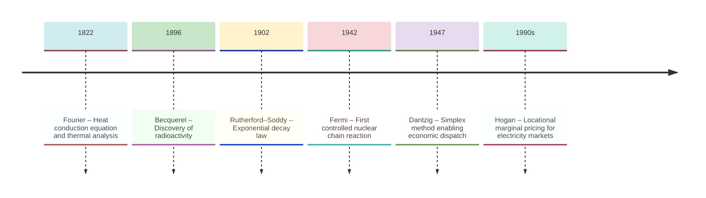
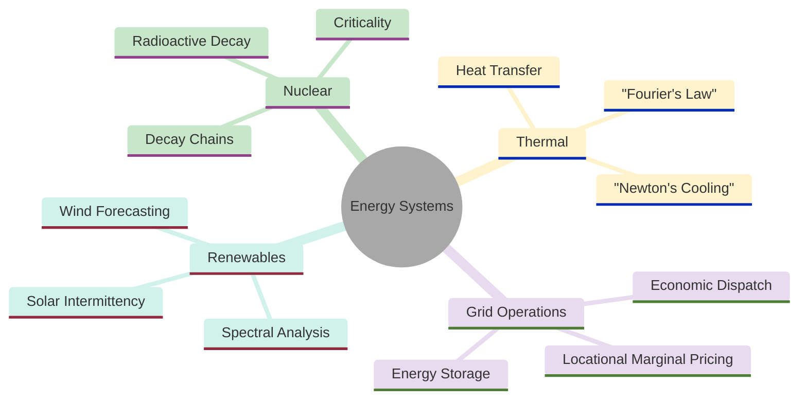
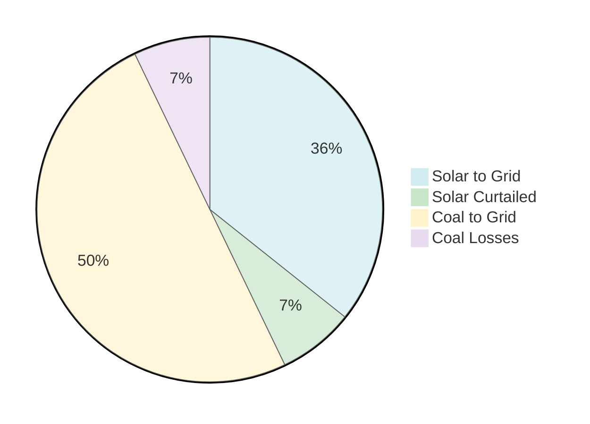
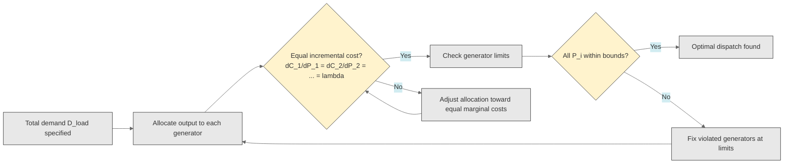
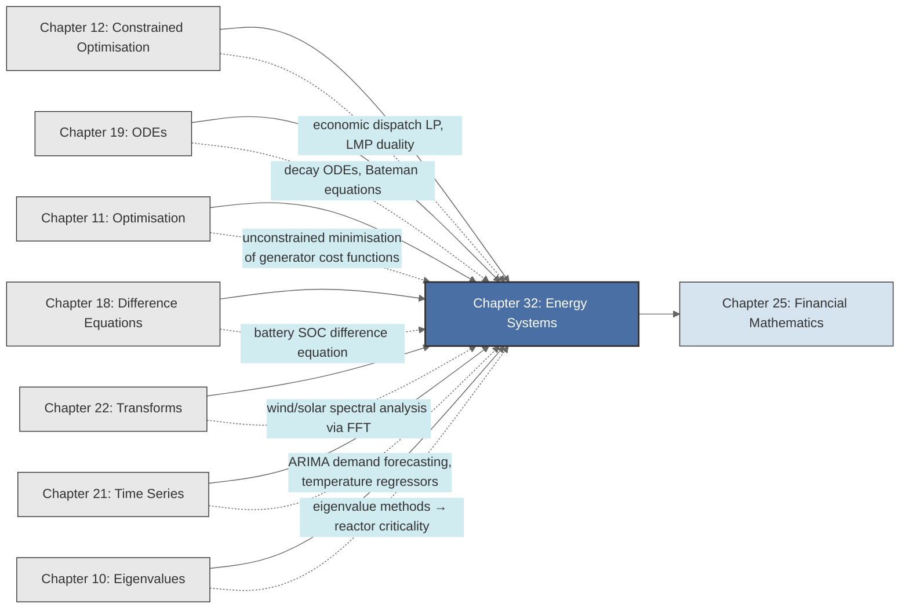

<!-- Copyright (c) 2025-2026 Bob Jansen <bobjansen@pm.me> -->
<!-- SPDX-License-Identifier: CC-BY-NC-4.0 -->
<!-- See LICENSE for full terms. Commercial licensing available. -->

# Chapter 32: Energy Systems & Nuclear Engineering


**Part IX**: Applications

> Energy systems transform nuclear binding energy into thermal energy, thermal into mechanical work and mechanical work into electricity; each step obeys conservation laws and introduces inefficiencies. Radioactive decay, heat conduction, economic dispatch and battery scheduling apply differential equations, constrained optimisation and spectral analysis to problems where mathematical error carries consequences measured in megawatts and human safety.

**Prerequisites**: [Chapter 12](12-constrained-optimization.md) (Constrained Optimisation & Linear Programming); Lagrange multipliers, the simplex method, LP duality and shadow prices, which underpin power system dispatch, energy storage scheduling and locational marginal pricing. [Chapter 18](18-difference-equations.md) (Difference Equations); discrete-time recurrences and the shift operator, used to model battery state-of-charge dynamics and discrete load evolution. [Chapter 19](19-odes.md) (Ordinary Differential Equations); first-order linear ODEs, systems of ODEs and Runge–Kutta integration, applied to radioactive decay, decay chains and heat conduction. [Chapter 21](21-time-series.md) (Time Series); autoregressive integrated moving average (ARIMA) models, autocorrelation functions and spectral density, used for electricity demand forecasting and renewable generation analysis. [Chapter 22](22-transforms.md) (Transforms); the discrete Fourier transform and power spectral density for characterising the intermittency of wind and solar output.

**Learning Objectives**: After this chapter, the reader will be able to:

1. Derive the radioactive decay law from its governing ODE and compute half-lives, activities and remaining quantities for single isotopes.
2. Formulate and solve Bateman equations for multi-step decay chains using systems of first-order linear ODEs.
3. Apply Newton's law of cooling and Fourier's law of heat conduction to thermal systems in nuclear and conventional power plants.
4. Formulate the economic dispatch problem as a constrained optimisation and solve it via Lagrange multipliers and linear programming.
5. Interpret LP dual variables as locational marginal prices and explain their role in electricity market design.
6. Construct ARIMA-based forecasts for electricity demand incorporating temperature as an exogenous regressor.
7. Apply spectral analysis to wind and solar generation data to characterise intermittency and identify dominant periodicities.
8. Model battery storage dynamics as a difference equation and optimise charge/discharge schedules via linear programming.

**Connections**: This chapter synthesises [Chapter 19](19-odes.md) (radioactive decay is a separable first-order ODE; Bateman equations are linear ODE systems solved by eigenvalue methods or successive integration), [Chapter 12](12-constrained-optimization.md) (economic dispatch is a constrained optimisation; LP duality yields electricity shadow prices), [Chapter 18](18-difference-equations.md) (battery state-of-charge evolution is a first-order difference equation), [Chapter 21](21-time-series.md) (demand forecasting uses ARIMA with exogenous regressors) and [Chapter 22](22-transforms.md) (spectral analysis of renewable intermittency uses the discrete Fourier transform and power spectral density). It connects to [Chapter 10](10-eigenvalues.md) (eigenvalues of the neutron diffusion operator determine reactor criticality), [Chapter 11](11-unconstrained-optimization.md) (unconstrained minimisation of generator cost functions) and [Chapter 25](25-financial-mathematics.md) (net present value of energy infrastructure investments).

---

## Historical Context

**Key Milestones in Energy Systems**



*Figure 32.1: Timeline of key milestones in energy systems and nuclear engineering.*

**Radioactivity and the exponential decay law (1896–1910).** Henri Becquerel [7] discovered in 1896 that uranium salts emit penetrating radiation spontaneously. Marie and Pierre Curie isolated polonium and radium in 1898 and introduced the term "radioactivity." Ernest Rutherford and Frederick Soddy established the mathematical law in 1902. They proposed that radioactive decay is a spontaneous transmutation of one element into another and that the decay rate is proportional to the number of undecayed atoms. This yields the first-order ODE $dN/dt = -\lambda N$ with solution $N(t) = N_0 e^{-\lambda t}$. The decay constant $\lambda$ varies across isotopes from $10^{-17}\,\text{s}^{-1}$ for uranium-238 (half-life 4.5 billion years) to $10^{10}\,\text{s}^{-1}$ for polonium-212 (half-life 0.3 microseconds).

**Bateman's decay chain equations (1910).** Harry Bateman solved the extension to decay chains in 1910. He derived the general solution for a chain of $n$ radioactive species, each decaying into the next with its own decay constant. The Bateman equations are coupled first-order linear ODEs whose solutions involve sums of exponentials. The equations are fundamental to nuclear fuel management, waste disposal planning and radiation dose calculations.

**Nuclear chain reactions and criticality (1942).** Enrico Fermi achieved the first controlled self-sustaining nuclear chain reaction on 2 December 1942 at the University of Chicago. The theoretical framework, developed by Fermi, Eugene Wigner, Alvin Weinberg and their collaborators, centres on the effective multiplication factor $k_{\text{eff}}$: the ratio of neutrons produced in one generation to those absorbed or lost in the preceding generation. The condition $k_{\text{eff}} = 1$ defines criticality. Mathematically, $k_{\text{eff}}$ is the dominant eigenvalue of the neutron diffusion operator. The one-group diffusion equation

$$-D\nabla^2\phi + \Sigma_a\phi = \frac{1}{k_{\text{eff}}}\nu\Sigma_f\phi$$

is an eigenvalue problem determining both the criticality condition and the spatial neutron flux $\phi$.

**Heat conduction and thermal analysis (1822).** Jean-Baptiste Joseph Fourier published *Théorie analytique de la chaleur* in 1822, establishing the heat conduction equation $\partial T/\partial t = \alpha \nabla^2 T$ and deriving solutions by separation of variables and Fourier series. Fourier's law $q = -k\,dT/dx$ relates heat flux to the temperature gradient. Isaac Newton's law of cooling, $dT/dt = -h(T - T_{\text{env}})$, describes convective heat transfer from a surface.

**Economic dispatch and electricity markets (1920s–1990s).** The economic dispatch problem was first formulated systematically in the 1920s and 1930s as power grids grew to interconnect multiple generating stations. The equal incremental cost criterion, requiring each generator to operate where its marginal cost equals the system marginal cost, was established by the 1950s. George Dantzig's [8] simplex method (1947) provided the computational framework. Unit commitment, generation expansion planning and transmission network design all reduce to mixed-integer or linear programmes.

**Locational marginal pricing (1990s).** William Hogan at Harvard developed locational marginal pricing (LMP) in the 1990s. LMP uses the dual variables of the network-constrained dispatch LP to compute the shadow price of electricity at each transmission node. These shadow prices became the basis for electricity wholesale markets across the United States and in many other countries.

**Renewables and energy storage (twenty-first century).** Two challenges define the twenty-first century: intermittent renewable generation and energy storage. Wind power output fluctuates on timescales from seconds to months; characterising this variability requires spectral analysis ([Chapter 22](22-transforms.md)). Demand forecasting employs time series methods ([Chapter 21](21-time-series.md)) with temperature as the dominant exogenous variable. Battery state of charge evolves as a difference equation ([Chapter 18](18-difference-equations.md)) and can be optimally scheduled by linear programming to arbitrage price differences across time periods.

---

## Why This Chapter Matters

**Energy Systems**



*Figure 32.2: Overview of energy systems topics spanning nuclear, thermal, grid and renewables domains.*

Grid operators worldwide solve the economic dispatch problem continuously to determine which power plants run and at what output levels. In the United States alone, wholesale electricity markets clear over 400 billion dollars annually. The system marginal cost is the price at which electricity trades; locational marginal prices determine billions of dollars in congestion payments.

Wind and solar generation are intermittent. Their output varies with weather on timescales from seconds to seasons. Spectral analysis of generation time series ([Chapter 22](22-transforms.md)) characterises this variability and informs grid planning. Battery storage optimisation, formulated as a linear programme over charge and discharge decisions ([Chapter 12](12-constrained-optimization.md)), is necessary for integrating high renewable penetrations. The difference equation ([Chapter 18](18-difference-equations.md)) governing battery state of charge, combined with time-varying prices, creates an arbitrage problem whose solution determines the economic viability of grid-scale storage installations.

Radioactive decay chains (Bateman equations) and criticality analysis (effective multiplication factor) underpin nuclear reactors that provide approximately 10% of global electricity. The exponential decay law ([Chapter 19](19-odes.md)), among the most precisely verified physical laws, governs nuclear waste storage timescales spanning thousands of years. Heat transfer calculations, from Fourier's law to Newton's cooling, govern thermal design across all power generation technologies.

---

## Notation & Conventions

| Symbol | Meaning |
|--------|---------|
| $N(t)$ | Number of radioactive atoms at time $t$ |
| $N_0$ | Initial number of atoms at $t = 0$ |
| $\lambda$ | Radioactive decay constant ($\text{s}^{-1}$) |
| $t_{1/2}$ | Half-life: $t_{1/2} = \ln 2 / \lambda$ |
| $A(t)$ | Activity: $A(t) = \lambda N(t)$ (decays per second, Bq) |
| $\phi(\mathbf{r})$ | Neutron flux ($\text{neutrons cm}^{-2} \text{s}^{-1}$) |
| $D$ | Neutron diffusion coefficient (cm) |
| $\Sigma_a$ | Macroscopic absorption cross-section ($\text{cm}^{-1}$) |
| $\Sigma_f$ | Macroscopic fission cross-section ($\text{cm}^{-1}$) |
| $\nu$ | Average neutrons per fission |
| $k_{\text{eff}}$ | Effective neutron multiplication factor |
| $\nabla^2$ | Laplacian operator; $\partial^2/\partial x^2 + \partial^2/\partial y^2 + \partial^2/\partial z^2$ in Cartesian coordinates |
| $T(x,t)$ | Temperature at position $x$ and time $t$ |
| $k$ | Thermal conductivity ($\text{W m}^{-1} \text{K}^{-1}$); context distinguishes from $k_{\text{eff}}$ |
| $h$ | Convective heat transfer coefficient ($\text{W m}^{-2} \text{K}^{-1}$) |
| $\alpha$ | Thermal diffusivity $\alpha = k/(\rho c_p)$ ($\text{m}^2 \text{s}^{-1}$) |
| $q$ | Heat flux ($\text{W m}^{-2}$) |
| $q'''$ | Volumetric heat generation rate ($\text{W m}^{-3}$) |
| $T_{\text{env}}$ | Ambient (environment) temperature |
| $P_i$ | Power output of generator $i$ (MW) |
| $C_i(P_i)$ | Cost function of generator $i$ (€/h) |
| $P_i^{\min}$, $P_i^{\max}$ | Minimum and maximum output of generator $i$ |
| $D_{\text{load}}$ | Total demand (MW); distinguished from the neutron diffusion coefficient $D$ |
| $\text{SOC}_t$ | State of charge of a battery at time $t$ (MWh) |
| $c_t$, $d_t$ | Charge and discharge rates at time $t$ (MW) |
| $\eta_c$, $\eta_d$ | Charge and discharge efficiencies |
| $\pi_t$ | Electricity price at time $t$ (EUR/MWh) |
| $\rho_k$ | Autocorrelation at lag $k$ (for demand or generation series) |
| $f(\omega)$ | Power spectral density at frequency $\omega$ |

Nuclear quantities use CGS units (cm, s) per reactor physics convention. Thermal and power system quantities use SI (W, m, K) and engineering units (MW, MWh, EUR/MWh). Time is in seconds for nuclear processes and hours for power system operations unless stated otherwise. Generator indices run from $1$ to $n$.

---

## Core Theory

### Radioactive Decay

**Definition 32.1** (Radioactive decay law). The number $N(t)$ of atoms of a radioactive isotope satisfies the first-order linear ODE

$$\frac{dN}{dt} = -\lambda N,$$

where $\lambda > 0$ is the decay constant, a property intrinsic to the isotope.

**Theorem 32.2** (Exponential decay). The solution to the radioactive decay equation with initial condition $N(0) = N_0$ is

$$N(t) = N_0 e^{-\lambda t}.$$

??? note "Proof"

    *Proof.* The equation $dN/dt = -\lambda N$ is separable ([Chapter 19](19-odes.md)). Separating variables:

    $$\frac{dN}{N} = -\lambda\,dt.$$

    Integrating both sides:

    $$\ln N = -\lambda t + C_1.$$

    Exponentiating: $N(t) = e^{C_1} e^{-\lambda t}$. The initial condition $N(0) = N_0$ gives $e^{C_1} = N_0$, hence

    $$N(t) = N_0\, e^{-\lambda t}.$$

    $\square$

**Definition 32.3** (Half-life). The *half-life* $t_{1/2}$ is the time required for the number of atoms to decrease to half its initial value:

$$N(t_{1/2}) = \frac{N_0}{2}.$$

Setting $N_0 e^{-\lambda t_{1/2}} = N_0/2$ and solving: $e^{-\lambda t_{1/2}} = 1/2$, so $-\lambda t_{1/2} = \ln(1/2) = -\ln 2$, yielding

$$t_{1/2} = \frac{\ln 2}{\lambda}.$$

**Definition 32.4** (Activity). The *activity* $A(t)$ of a sample is the rate of disintegrations per unit time:

$$A(t) = \lambda N(t) = \lambda N_0 e^{-\lambda t} = A_0 e^{-\lambda t},$$

where $A_0 = \lambda N_0$ is the initial activity. Activity is measured in becquerels (1 Bq = 1 disintegration per second) or curies (1 Ci = $3.7 \times 10^{10}$ Bq).

**Radioactive Decay Concentration Over Time**

```mermaid
---
config:
  theme: base
  themeVariables:
    xyChart:
      plotColorPalette: "#2563eb, #dc2626, #16a34a, #9333ea, #ca8a04, #0891b2"
      backgroundColor: "#ffffff"
      titleColor: "#333333"
      xAxisLabelColor: "#333333"
      yAxisLabelColor: "#333333"
      xAxisTitleColor: "#333333"
      yAxisTitleColor: "#333333"
      xAxisLineColor: "#333333"
      yAxisLineColor: "#333333"
---
xychart-beta
    x-axis "Time t" [0, 1, 2, 3, 4, 5, 6, 7]
    y-axis "N(t)" 0 --> 1050
    line [1000, 607, 368, 223, 135, 82, 50, 30]
```

*Figure 32.3: Exponential decrease in radioactive atom count over time.*

**Radioactive Decay as a Function of Half-Lives**

```mermaid
---
config:
  theme: base
  themeVariables:
    xyChart:
      plotColorPalette: "#2563eb, #dc2626, #16a34a, #9333ea, #ca8a04, #0891b2"
      backgroundColor: "#ffffff"
      titleColor: "#333333"
      xAxisLabelColor: "#333333"
      yAxisLabelColor: "#333333"
      xAxisTitleColor: "#333333"
      yAxisTitleColor: "#333333"
      xAxisLineColor: "#333333"
      yAxisLineColor: "#333333"
---
xychart-beta
    x-axis "Half-lives" [0, 0.5, 1, 1.5, 2, 2.5, 3, 3.5, 4]
    y-axis "N/N₀" 0 --> 1
    line [1.0, 0.707, 0.5, 0.354, 0.25, 0.177, 0.125, 0.088, 0.0625]
```

*Figure 32.4: Fraction of radioactive atoms remaining as a function of elapsed half-lives.*

**Remark 32.5** (Multi-half-life calculation). After $n$ half-lives, the fraction remaining is $(1/2)^n = 2^{-n}$. After 10 half-lives, approximately 0.1% of the original atoms remain. This observation is central to waste disposal: high-level nuclear waste must be isolated for a time span encompassing many half-lives of its longest-lived components.

### Bateman Equations: Decay Chains

**Definition 32.6** (Decay chain). A decay chain is a sequence of isotopes $N_1 \to N_2 \to \cdots \to N_m$ where species $i$ decays to species $i+1$ with decay constant $\lambda_i$. The final species $N_m$ is stable ($\lambda_m = 0$). The system of ODEs is

$$\frac{dN_1}{dt} = -\lambda_1 N_1,$$

$$\frac{dN_i}{dt} = \lambda_{i-1} N_{i-1} - \lambda_i N_i, \qquad i = 2, \ldots, m-1,$$

$$\frac{dN_m}{dt} = \lambda_{m-1} N_{m-1}.$$

**Theorem 32.7** (Bateman solution for a three-member chain). For the chain $N_1 \to N_2 \to N_3$ (stable) with initial conditions $N_1(0) = N_1^0$, $N_2(0) = 0$, $N_3(0) = 0$ and $\lambda_1 \neq \lambda_2$:

$$N_1(t) = N_1^0 e^{-\lambda_1 t},$$

$$N_2(t) = \frac{\lambda_1 N_1^0}{\lambda_2 - \lambda_1}\left(e^{-\lambda_1 t} - e^{-\lambda_2 t}\right),$$

$$N_3(t) = N_1^0 \left(1 + \frac{\lambda_1 e^{-\lambda_2 t} - \lambda_2 e^{-\lambda_1 t}}{\lambda_2 - \lambda_1}\right).$$

??? note "Proof"

    *Proof.* The equation for $N_1$ is solved by Theorem 32.2. For $N_2$, the equation $dN_2/dt + \lambda_2 N_2 = \lambda_1 N_1^0 e^{-\lambda_1 t}$ is a first-order linear ODE with integrating factor $e^{\lambda_2 t}$ ([Chapter 19](19-odes.md)). Multiplying both sides:

    $$\frac{d}{dt}\left(e^{\lambda_2 t} N_2\right) = \lambda_1 N_1^0 e^{(\lambda_2 - \lambda_1)t}.$$

    Integrating from $0$ to $t$ with $N_2(0) = 0$:

    $$e^{\lambda_2 t} N_2(t) = \frac{\lambda_1 N_1^0}{\lambda_2 - \lambda_1}\left(e^{(\lambda_2 - \lambda_1)t} - 1\right).$$

    Dividing by $e^{\lambda_2 t}$ yields the expression for $N_2(t)$. For $N_3$, conservation of total atoms gives $N_1(t) + N_2(t) + N_3(t) = N_1^0$, from which $N_3(t) = N_1^0 - N_1(t) - N_2(t)$. Substituting and simplifying yields the stated formula. $\square$

**Remark 32.8** (Secular equilibrium). When $\lambda_1 \ll \lambda_2$ (the parent is much longer-lived than the daughter), the daughter reaches *secular equilibrium*:

$$N_2(t) \approx \frac{\lambda_1}{\lambda_2} N_1(t), \qquad \text{so} \quad A_2(t) = \lambda_2 N_2(t) \approx \lambda_1 N_1(t) = A_1(t).$$

The daughter activity equals the parent activity. This condition holds in the uranium-238 decay series for many parent-daughter pairs and simplifies radiation dose calculations.

### Neutron Diffusion and Criticality

**Definition 32.9** (One-group neutron diffusion equation). In the one-energy-group approximation, the steady-state neutron flux $\phi(\mathbf{r})$ in a reactor satisfies

$$-D\nabla^2\phi(\mathbf{r}) + \Sigma_a\phi(\mathbf{r}) = \frac{1}{k_{\text{eff}}}\nu\Sigma_f\phi(\mathbf{r}),$$

where $D$ is the diffusion coefficient, $\Sigma_a$ the macroscopic absorption cross-section, $\nu\Sigma_f$ the macroscopic production rate and $k_{\text{eff}}$ the effective multiplication factor.

Rearranging:

$$-D\nabla^2\phi + \Sigma_a\phi = \frac{\nu\Sigma_f}{k_{\text{eff}}}\phi \quad \Longleftrightarrow \quad \nabla^2\phi + B^2\phi = 0,$$

where $B^2 = (\nu\Sigma_f/k_{\text{eff}} - \Sigma_a)/D$ is the *buckling*. This is a Helmholtz equation; an eigenvalue problem ([Chapter 10](10-eigenvalues.md)) for the Laplacian operator. The eigenvalues $B^2$ are determined by the geometry and boundary conditions of the reactor, and $k_{\text{eff}}$ is then computed from

$$k_{\text{eff}} = \frac{\nu\Sigma_f}{\Sigma_a + DB^2}.$$

**Definition 32.10** (Supercritical and subcritical). A nuclear reactor is *supercritical* when its effective neutron multiplication factor satisfies $k_{\text{eff}} > 1$; each generation of neutrons produces more neutrons than the previous, leading to an exponentially growing neutron population. It is *subcritical* when $k_{\text{eff}} < 1$; each generation produces fewer neutrons, so the chain reaction decays exponentially toward zero.

**Theorem 32.11** (Criticality condition). The reactor is:

- *critical* if $k_{\text{eff}} = 1$ (steady-state chain reaction),
- *supercritical* if $k_{\text{eff}} > 1$ (exponentially growing neutron population),
- *subcritical* if $k_{\text{eff}} < 1$ (exponentially decaying neutron population).

For a bare homogeneous slab reactor of width $a$ with zero-flux boundary conditions $\phi(0) = \phi(a) = 0$, the fundamental mode eigenvalue is $B^2 = (\pi/a)^2$, and the criticality condition becomes

$$k_{\text{eff}} = \frac{\nu\Sigma_f}{\Sigma_a + D(\pi/a)^2} = 1.$$

**Remark 32.12** (Eigenvalue interpretation). The criticality calculation exemplifies the power of eigenvalue analysis. The infinite multiplication factor $k_\infty = \nu\Sigma_f/\Sigma_a$ describes a reactor of infinite extent (no leakage). The geometric buckling $B_g^2 = (\pi/a)^2$ captures the effect of finite size: neutrons leak out through the boundaries, reducing $k_{\text{eff}}$ below $k_\infty$. Increasing the reactor size (larger $a$) decreases $B_g^2$ and increases $k_{\text{eff}}$ toward $k_\infty$. The critical size is the smallest reactor for which $k_{\text{eff}} = 1$.

### Heat Transfer

**Definition 32.13** (Fourier's law of heat conduction). The heat flux $q$ through a material is proportional to the negative temperature gradient:

$$q = -k\frac{dT}{dx},$$

where $k$ is the thermal conductivity. In steady state with no internal heat generation, the temperature profile in a slab of thickness $L$ with boundary temperatures $T_1$ and $T_2$ is linear: $T(x) = T_1 + (T_2 - T_1)x/L$.

**Theorem 32.14** (Newton's law of cooling). A body with uniform temperature $T(t)$ immersed in an environment at constant temperature $T_{\text{env}}$ satisfies

$$\frac{dT}{dt} = -h'(T - T_{\text{env}}),$$

where $h' = hA_s/(mc_p)$ is the effective cooling rate, $h$ the convective coefficient, $A_s$ the surface area, $m$ the mass and $c_p$ the specific heat capacity. The solution is

$$T(t) = T_{\text{env}} + (T_0 - T_{\text{env}})e^{-h't}.$$

??? note "Proof"

    *Proof.* The equation $dT/dt = -h'(T - T_{\text{env}})$ is a first-order linear ODE. Substituting $\theta(t) = T(t) - T_{\text{env}}$ gives

    $$\frac{d\theta}{dt} = -h'\theta.$$

    By Theorem 32.2 (with $\lambda = h'$), this has solution $\theta(t) = \theta_0\, e^{-h't}$.

    Since $\theta_0 = T_0 - T_{\text{env}}$, substituting back gives $T(t) - T_{\text{env}} = (T_0 - T_{\text{env}})e^{-h't}$, which is the stated result. $\square$

**Remark 32.15** (Nuclear fuel pin). In a cylindrical nuclear fuel pin, the steady-state temperature distribution with uniform volumetric heat generation $q'''$ satisfies

$$\frac{1}{r}\frac{d}{dr}\!\left(r\frac{dT}{dr}\right) = -\frac{q'''}{k}.$$

The centreline temperature exceeds the surface temperature by $\Delta T = q'''R^2/(4k)$, where $R$ is the pin radius. Keeping the centreline temperature below the fuel melting point is a primary design constraint.

**Energy Flow from Generation to Consumption:**



*Figure 32.5: Proportional breakdown of energy generation by source and disposition.*

The pie chart above shows approximate proportions of energy from generation sources (solar and coal) and their curtailment and conversion losses. Losses reduce the total energy delivered below total generation; a central concern for grid dispatch optimisation.

### Economic Dispatch

**Definition 32.16** (Economic dispatch problem). Given $n$ generators with cost functions $C_i(P_i)$ and output limits $P_i^{\min} \leq P_i \leq P_i^{\max}$, the economic dispatch problem is

$$\min_{P_1, \ldots, P_n} \sum_{i=1}^{n} C_i(P_i) \qquad \text{subject to} \qquad \sum_{i=1}^{n} P_i = D_{\text{load}}, \quad P_i^{\min} \leq P_i \leq P_i^{\max}, \quad i = 1, \ldots, n,$$

where $D_{\text{load}}$ is the total demand.

**Theorem 32.17** (Equal incremental cost criterion). If the cost functions $C_i$ are convex and differentiable, and if the output limits are not binding, the optimal dispatch satisfies

$$\frac{dC_1}{dP_1} = \frac{dC_2}{dP_2} = \cdots = \frac{dC_n}{dP_n} = \lambda^*,$$

where $\lambda^*$ is the Lagrange multiplier on the demand balance constraint. The quantity $\lambda^*$ equals the system marginal cost (EUR/MWh): the cost of producing one additional megawatt-hour.

??? note "Proof"

    *Proof.* Form the Lagrangian ([Chapter 12](12-constrained-optimization.md)):

    $$\mathcal{L}(P_1, \ldots, P_n, \lambda) = \sum_{i=1}^{n} C_i(P_i) - \lambda\left(\sum_{i=1}^{n} P_i - D_{\text{load}}\right).$$

    The first-order necessary conditions $\partial\mathcal{L}/\partial P_i = 0$ yield $C_i'(P_i) = \lambda$ for each $i$. Since $C_i$ is convex, $C_i'$ is non-decreasing, and the second-order sufficiency conditions are satisfied. The multiplier $\lambda^*$ is the shadow price of the demand constraint: $d(\text{total cost}^*)/dD_{\text{load}} = \lambda^*$ by the envelope theorem ([Chapter 12](12-constrained-optimization.md)). $\square$

!!! abstract "Key Result"

    **Theorem 32.17** (Equal incremental cost). At the cost-minimising dispatch, every unconstrained generator operates where its marginal cost equals the system marginal cost $\lambda^*$; this Lagrange multiplier is the electricity price that clears wholesale markets worth hundreds of billions annually.

**Remark 32.18** (Quadratic cost functions). In practice, generator cost functions are often modelled as quadratic: $C_i(P_i) = a_i + b_i P_i + c_i P_i^2$, where $a_i$ is the no-load cost, $b_i$ the linear heat rate coefficient and $c_i$ the quadratic term reflecting decreasing efficiency at high output. The marginal cost is $C_i'(P_i) = b_i + 2c_i P_i$. Setting all marginal costs equal to $\lambda$ and solving with the demand constraint yields a system of $n+1$ linear equations in $n+1$ unknowns ($P_1, \ldots, P_n, \lambda$).

**Economic Dispatch via Equal Incremental Cost:**



*Figure 32.6: Iterative flowchart for economic dispatch using the equal incremental cost method.*

### Linear Programming Formulation and Locational Marginal Pricing

**Definition 32.19** (LP dispatch). When cost functions are piecewise linear (a common approximation) and transmission constraints are included, the dispatch becomes a linear programme:

$$\min_{\mathbf{P}} \sum_{i=1}^{n} c_i P_i \qquad \text{subject to} \qquad \sum_{i=1}^{n} P_i = D_{\text{load}}, \quad P_i^{\min} \leq P_i \leq P_i^{\max},\; i = 1,\ldots,n, \quad \text{network constraints.}$$

**Theorem 32.20** (Locational marginal prices from LP duality). In the LP dispatch with nodal balance constraints, the dual variable $\pi_j$ associated with the power balance constraint at node $j$ equals the locational marginal price (LMP) at that node: the marginal cost of supplying one additional MW of demand at node $j$.

??? note "Proof"

    *Proof.* By the strong duality theorem ([Chapter 12](12-constrained-optimization.md)), the optimal primal objective equals the optimal dual objective at any primal-dual optimal pair. The dual variable $\pi_j$ then satisfies

    $$\pi_j = \frac{\partial(\text{optimal cost})}{\partial D_j},$$

    which is precisely the definition of the shadow price of the nodal demand constraint: the marginal cost of serving one additional MW at node $j$.

    By complementary slackness, if transmission line $\ell$ is uncongested its capacity constraint does not bind and its dual variable is zero; hence the LMP at all nodes connected through uncongested lines is identical. Congestion on a line creates a non-zero dual variable that drives a price wedge, causing LMP differences across the network. $\square$

**Remark 32.21** (Market design). In organised electricity markets (PJM, ERCOT, ISO New England and others), the system operator solves the dispatch LP every five minutes. The resulting dual variables are published as LMPs and determine the settlement prices for generators and load-serving entities. LP duality thus has direct financial consequences measured in billions of euros annually.

### Load Forecasting

**Definition 32.22** (Demand forecasting via ARIMAX). Electricity demand $D_t$ at hour $t$ is modelled as an ARIMA process with exogenous regressors ([Chapter 21](21-time-series.md)):

$$(1 - \phi_1 L - \cdots - \phi_p L^p)(1 - L)^d D_t = (1 + \theta_1 L + \cdots + \theta_q L^q)\varepsilon_t + \beta_1 T_t^{\text{temp}} + \beta_2 H_t,$$

where $L$ is the lag operator, $T_t^{\text{temp}}$ is the ambient temperature, $H_t$ is a holiday/day-of-week indicator and $\varepsilon_t$ is white noise. Temperature enters because heating and cooling loads dominate residential demand.

**Remark 32.23** (Nonlinear temperature response). The relationship between demand and temperature is typically V-shaped or U-shaped: demand is high in extreme cold (heating) and extreme heat (cooling), with a minimum at a comfort temperature around 18–20$^\circ$C. This nonlinearity is captured by including both $(T_t^{\text{temp}} - T_{\text{ref}})^+$ and $(T_{\text{ref}} - T_t^{\text{temp}})^+$ as regressors, or by using a quadratic in temperature.

### Spectral Analysis of Renewable Generation

**Definition 32.24** (Spectral characterisation of intermittency). The power spectral density ([Chapter 22](22-transforms.md)) of a wind or solar generation time series $\{X_t\}$ is

$$S(\omega) = \sum_{k=-\infty}^{\infty} \gamma_k e^{-i\omega k},$$

where $\gamma_k = \operatorname{Cov}(X_t, X_{t+k})$ is the autocovariance at lag $k$. The periodogram $I(\omega_j) = \lvert X(\omega_j)\rvert^2/N$, computed via the fast Fourier transform (FFT; [Chapter 22](22-transforms.md)), provides a sample estimate.

**Remark 32.25** (Spectral signatures). Wind generation typically exhibits spectral peaks at the diurnal frequency ($\omega = 2\pi/24$ cycles per hour, corresponding to the day-night land-sea breeze cycle) and at synoptic frequencies ($\omega \approx 2\pi/120$ cycles per hour, corresponding to the passage of weather systems every 3–7 days). Solar generation has a dominant diurnal peak and a secondary annual peak. Spectral analysis distinguishes predictable periodic components (amenable to forecasting) from broadband turbulent variability (irreducible forecast error).

### Energy Storage Dynamics

**Definition 32.26** (State-of-charge difference equation). A battery energy storage system with charge efficiency $\eta_c$ and discharge efficiency $\eta_d$ satisfies the difference equation ([Chapter 18](18-difference-equations.md)):

$$\text{SOC}_{t+1} = \text{SOC}_t + \eta_c c_t \Delta t - \frac{d_t \Delta t}{\eta_d},$$

where $c_t \geq 0$ is the charge rate, $d_t \geq 0$ is the discharge rate and $\Delta t$ is the time step. The state of charge is bounded: $\text{SOC}^{\min} \leq \text{SOC}_t \leq \text{SOC}^{\max}$. The round-trip efficiency is $\eta_{\text{rt}} = \eta_c \eta_d$.

**Theorem 32.27** (Optimal storage scheduling via LP). The problem of maximising revenue from price arbitrage over a horizon of $T$ periods is the linear programme:

$$\max_{c_t, d_t} \sum_{t=1}^{T} \pi_t(d_t - c_t)\Delta t$$

subject to:

$$\text{SOC}_{t+1} = \text{SOC}_t + \eta_c c_t \Delta t - d_t \Delta t / \eta_d, \qquad t = 1, \ldots, T,$$

$$0 \leq c_t \leq c^{\max}, \quad 0 \leq d_t \leq d^{\max}, \qquad t = 1, \ldots, T,$$

$$\text{SOC}^{\min} \leq \text{SOC}_t \leq \text{SOC}^{\max}, \qquad t = 1, \ldots, T+1.$$

This is a linear programme in $2T$ decision variables ($c_t, d_t$) and $T$ state variables ($\text{SOC}_{t+1}$). The dual variables on the SOC constraints give the marginal value of storage capacity at each time step.

??? note "Proof"

    *Proof.* The objective is linear in the decision variables. Each constraint is linear (the SOC update is an affine equality; the bounds are linear inequalities), so the problem is an LP and can be solved by the simplex method ([Chapter 12](12-constrained-optimization.md)). By LP duality, the dual variable on the demand balance at time $t$ represents the shadow price of stored energy. The optimal storage schedule satisfies the complementary slackness conditions: the battery charges only when the price is low enough that the marginal value of stored energy exceeds the purchase cost and discharges only when the sale price exceeds the marginal value of stored energy. $\square$

---

## Formulas & Identities

**F32.1** Exponential decay:

$$N(t) = N_0 e^{-\lambda t}, \qquad t_{1/2} = \frac{\ln 2}{\lambda}.$$

**F32.2** Activity:

$$A(t) = \lambda N(t) = A_0 e^{-\lambda t}.$$

**F32.3** Bateman (two-step chain):

$$N_2(t) = \frac{\lambda_1 N_1^0}{\lambda_2 - \lambda_1}\left(e^{-\lambda_1 t} - e^{-\lambda_2 t}\right).$$

**F32.4** Criticality:

$$k_{\text{eff}} = \frac{\nu\Sigma_f}{\Sigma_a + DB^2}; \qquad \text{critical when } k_{\text{eff}} = 1.$$

**F32.5** Fourier's law:

$$q = -k\,\frac{dT}{dx}, \qquad T(x) = T_1 + (T_2 - T_1)\frac{x}{L}.$$

**F32.6** Newton's cooling:

$$T(t) = T_{\text{env}} + (T_0 - T_{\text{env}})e^{-h't}.$$

**F32.7** Equal incremental cost, for all unconstrained generators.

$$\frac{dC_i}{dP_i} = \lambda^*$$

**F32.8** SOC difference equation:

$$\text{SOC}_{t+1} = \text{SOC}_t + \eta_c c_t \Delta t - \frac{d_t \Delta t}{\eta_d}.$$

**F32.9** Round-trip efficiency.

$$\eta_{\text{rt}} = \eta_c \eta_d$$

**F32.10** Spectral density:

$$S(\omega) = \sum_{k=-\infty}^{\infty} \gamma_k e^{-i\omega k}.$$

---

## Algorithms

### Algorithm 32.28: Radioactive Decay Computation

**Input**: Initial atom count $N_0$, decay constant $\lambda$, time $t$.
**Output**: Remaining atoms $N(t)$, activity $A(t)$.

1. Compute $N(t) = N_0 \cdot \exp(-\lambda t)$.
2. Compute $A(t) = \lambda \cdot N(t)$.

```
function radioactiveDecay(N0, lambda, t):
    N = N0 * exp(-lambda * t)
    A = lambda * N
    return { N, A }
```

**Complexity**: $O(1)$ time and $O(1)$ space per evaluation.

### Algorithm 32.29: Economic Dispatch via Equal Incremental Cost

**Input**: Generator parameters $(b_i, c_i, P_i^{\min}, P_i^{\max})$ for $i = 1, \ldots, n$; total demand $D_{\text{load}}$.
**Output**: Optimal outputs $P_i^*$ and system marginal cost $\lambda^*$.

1. Initialise all generators as unconstrained.
2. Compute $\lambda = (\text{residual demand} + \sum b_i/(2c_i)) / \sum 1/(2c_i)$.
3. For each unconstrained generator: $P_i = (\lambda - b_i)/(2c_i)$.
4. If any $P_i < P_i^{\min}$ or $P_i > P_i^{\max}$, fix that generator at its limit, remove from unconstrained set and return to step 2.
5. Return outputs and $\lambda^*$.

```
function economicDispatch(b, c, Pmin, Pmax, Dload, n):
    fixed = empty set
    Pout = array of size n
    repeat:
        // compute lambda from unconstrained generators
        sumB = 0; sumInvC = 0
        residual = Dload
        for i = 1 to n:
            if i in fixed:
                residual = residual - Pout[i]
            else:
                sumB = sumB + b[i] / (2 * c[i])
                sumInvC = sumInvC + 1 / (2 * c[i])
        lambda = (residual + sumB) / sumInvC
        // allocate output to unconstrained generators
        allFeasible = true
        for i = 1 to n:
            if i not in fixed:
                Pout[i] = (lambda - b[i]) / (2 * c[i])
                if Pout[i] < Pmin[i]:
                    Pout[i] = Pmin[i]; fixed.add(i); allFeasible = false
                else if Pout[i] > Pmax[i]:
                    Pout[i] = Pmax[i]; fixed.add(i); allFeasible = false
    until allFeasible
    return { Pout, lambda }
```

**Complexity**: $O(n^2)$ time worst case (at most $n$ iterations, each $O(n)$). $O(n)$ space for generator parameters and outputs.

### Algorithm 32.30: Battery Storage Scheduling (Greedy)

**Input**: Price vector $\pi_1, \ldots, \pi_T$; storage parameters.
**Output**: Charge/discharge schedule maximising revenue.

1. Sort time periods by price (ascending).
2. Charge at maximum rate during cheapest periods until SOC reaches $\text{SOC}^{\max}$.
3. Sort time periods by price (descending).
4. Discharge at maximum rate during most expensive periods until SOC reaches $\text{SOC}^{\min}$.
5. Reconstruct SOC trajectory and compute total revenue.

```
function batteryScheduleGreedy(prices, SOCinit, SOCmin, SOCmax, cMax, dMax, etaC, etaD, T):
    schedule = array of (charge, discharge) pairs of size T
    SOC = SOCinit
    // sort period indices by price ascending for charging
    chargeOrder = sortIndicesAscending(prices)
    for i in chargeOrder:
        if SOC >= SOCmax:
            break
        // charge as much as possible
        room = (SOCmax - SOC) / etaC
        charge = min(cMax, room)
        SOC = SOC + etaC * charge
        schedule[i].charge = charge
    // sort period indices by price descending for discharging
    dischOrder = sortIndicesDescending(prices)
    for i in dischOrder:
        if SOC <= SOCmin:
            break
        // discharge as much as possible
        available = (SOC - SOCmin) * etaD
        discharge = min(dMax, available)
        SOC = SOC - discharge / etaD
        schedule[i].discharge = discharge
    // compute total revenue
    revenue = 0
    for t = 1 to T:
        revenue = revenue + prices[t] * (schedule[t].discharge - schedule[t].charge)
    return { schedule, revenue }
```

**Complexity**: $O(T \log T)$ time (dominated by sorting). $O(T)$ space for the price and SOC vectors.

**Note**: This greedy heuristic is optimal when charge and discharge decisions are unconstrained except by SOC bounds; when rate limits are binding across multiple periods, the LP of Theorem 32.27 is required.

---

## Numerical Considerations

### Stiffness in Decay Chains

Algorithm 32.28 evaluates the analytic decay formula, but multi-species decay chains with branching require numerical integration.

!!! warning "Extreme stiffness in multi-species decay chains"

    Widely varying decay constants (e.g. $\lambda_1 = 10^{-10}\,\text{s}^{-1}$ and $\lambda_5 = 10^{3}\,\text{s}^{-1}$) produce a stiffness ratio of $10^{13}$. Explicit methods require step sizes set by the fastest species, making long-time integration impractical. Implicit methods (backward differentiation formulae, implicit Runge–Kutta) or stiff solvers are necessary.

The analytic Bateman solution is preferred when available; numerical integration is reserved for branching or time-dependent sources.

### Floating-Point Precision in Exponential Decay

!!! info "IEEE 754 exponent limit"

    In double precision, $e^{-\lambda t}$ underflows to zero when $\lambda t > 709$. For uranium-238 ($\lambda \approx 4.9 \times 10^{-18}\,\text{s}^{-1}$) this limit is never reached in practice, but for short-lived isotopes with $\lambda > 1\,\text{s}^{-1}$ it can be reached within minutes.

The Bateman solution involves differences of exponentials:

$$N_2(t) = \frac{\lambda_1 N_1(0)}{\lambda_2 - \lambda_1}\bigl(e^{-\lambda_1 t} - e^{-\lambda_2 t}\bigr).$$

!!! warning "Catastrophic cancellation in Bateman solutions"

    When $\lambda_1 \approx \lambda_2$, the difference $e^{-\lambda_1 t} - e^{-\lambda_2 t}$ subtracts nearly equal quantities, losing significant digits. Reformulate as $e^{-\lambda_1 t}(1 - e^{-(\lambda_2 - \lambda_1)t})$ and evaluate the second factor via `expm1` for small arguments.

### Equal Incremental Cost Convergence

Algorithm 32.29 iterates to find the system marginal cost $\lambda^*$. Each iteration fixes generators at their limits and recomputes $\lambda$ from the remaining unconstrained units. The algorithm terminates in at most $n$ iterations (one generator fixed per iteration). Numerical issues arise when two generators have nearly identical marginal cost slopes $2c_i$: the allocation between them is sensitive to rounding. Tie-breaking by generator index ensures deterministic output.

### LP Solver Considerations for Large Dispatch Problems

Large-scale economic dispatch LPs can have millions of variables across time periods and contingencies. Interior point methods suit large sparse problems. The simplex method is preferred when warm-starting from a previous solution (e.g. re-dispatching after a single generator trip). Presolve (constraint elimination, variable fixing, coefficient scaling) can reduce problem size by 50–80%.

### FFT Windowing for Spectral Analysis

Spectral leakage from rectangular truncation bleeds energy into adjacent frequency bins. A window function (Hamming, Hanning, Blackman–Harris) reduces leakage but widens peaks. Welch's method averages overlapping-segment periodograms, reducing variance at the cost of frequency resolution. Window and segment length affect detectability of weak periodicities in renewable generation data. For time series of length $N$, the frequency resolution is $\Delta f = 1/(N \Delta t)$; windowing does not change this but smooths the spectral estimate.

---

## Worked Examples

### Example 32.31: Radioactive Decay of Cobalt-60

**Problem**: Cobalt-60 (${}^{60}\text{Co}$) has a half-life of 5.27 years and is used in medical radiation therapy. A hospital source has an initial activity of 200 TBq. Compute (a) the decay constant, (b) the activity after 3 years and (c) the time required for the activity to fall below 50 TBq.

**Solution** (mathematical):

(a) The decay constant is

$$\lambda = \frac{\ln 2}{t_{1/2}} = \frac{0.6931}{5.27} = 0.1315\;\text{yr}^{-1}.$$

(b) After $t = 3$ years:

$$A(3) = A_0 e^{-\lambda t} = 200 \cdot e^{-0.1315 \times 3} = 200 \cdot e^{-0.3945} = 200 \times 0.6740 = 134.8\;\text{TBq}.$$

(c) Setting $A(t) = 50$ TBq:

$$50 = 200 e^{-0.1315 t} \quad \Longrightarrow \quad e^{-0.1315 t} = 0.25 \quad \Longrightarrow \quad t = \frac{-\ln 0.25}{0.1315} = \frac{1.3863}{0.1315} = 10.54\;\text{yr}.$$

Note that 10.54 years $= 2 \times 5.27$ years $= 2$ half-lives, as expected since $(1/2)^2 = 0.25$.

### Example 32.32: Bateman Decay Chain: Strontium-90

**Problem**: Strontium-90 ($^{90}$Sr) decays to yttrium-90 ($^{90}$Y), which in turn decays to stable zirconium-90 ($^{90}$Zr). The half-lives are $t_{1/2}(^{90}\text{Sr}) = 28.8$ years and $t_{1/2}(^{90}\text{Y}) = 64.0$ hours $= 0.00731$ years. Starting with $N_0 = 10^{20}$ atoms of pure $^{90}$Sr and no daughter products, compute $N_2(t)$ at $t = 10$ days and determine whether secular equilibrium holds.

**Solution** (mathematical):

The decay constants are

$$\lambda_1 = \frac{\ln 2}{28.8} = 0.02407\;\text{yr}^{-1}, \qquad \lambda_2 = \frac{\ln 2}{0.00731} = 94.80\;\text{yr}^{-1}.$$

Since $\lambda_1 \ll \lambda_2$, secular equilibrium applies. At $t = 10$ days $= 0.02740$ years:

$$N_2(t) = \frac{\lambda_1 N_0}{\lambda_2 - \lambda_1}\left(e^{-\lambda_1 t} - e^{-\lambda_2 t}\right).$$

Computing the exponential terms:

$$\begin{aligned}
\lambda_1 t &= 0.02407 \times 0.02740 = 6.59 \times 10^{-4}, &\quad e^{-\lambda_1 t} &\approx 0.9993, \\
\lambda_2 t &= 94.80 \times 0.02740 = 2.597, &\quad e^{-\lambda_2 t} &= 0.0744.
\end{aligned}$$

The result is therefore

$$N_2 = \frac{0.02407 \times 10^{20}}{94.80 - 0.02407}(0.9993 - 0.0744) = \frac{2.407 \times 10^{18}}{94.78} \times 0.9249 = 2.349 \times 10^{16}.$$

The secular equilibrium approximation gives

$$N_2 \approx \frac{\lambda_1}{\lambda_2}N_1 = \frac{0.02407}{94.80} \times 0.9993 \times 10^{20} = 2.540 \times 10^{16}.$$

After 10 days ($\approx 3.75$ half-lives of $^{90}\text{Y}$), the daughter has reached approximately 93% of its secular equilibrium value and has not yet fully equilibrated. After several months, secular equilibrium holds to high accuracy.

### Example 32.33: Economic Dispatch of Three Generators

**Problem**: A utility operates three generators with quadratic cost functions $C_i(P_i) = b_i P_i + c_i P_i^2$ (ignoring no-load costs). The parameters are:

| Generator | $b_i$ (EUR/MWh) | $c_i$ (EUR/MW²h) | $P_i^{\min}$ (MW) | $P_i^{\max}$ (MW) |
|-----------|-----------------|---------------------|--------------------|--------------------|
| 1 | 20 | 0.01 | 100 | 500 |
| 2 | 25 | 0.015 | 80 | 400 |
| 3 | 30 | 0.02 | 50 | 300 |

Total demand is $D_{\text{load}} = 900$ MW. Find the optimal dispatch and the system marginal cost.

**Solution** (mathematical):

Assuming no limits bind, the equal incremental cost criterion (Theorem 32.17) gives

$$b_i + 2c_i P_i = \lambda \quad \Longrightarrow \quad P_i = \frac{\lambda - b_i}{2c_i}.$$

Substituting into $\sum P_i = D_{\text{load}}$:

$$\frac{\lambda - 20}{0.02} + \frac{\lambda - 25}{0.03} + \frac{\lambda - 30}{0.04} = 900.$$

Multiplying each fraction ($1/0.02 = 50$, $1/0.03 = 33.33$, $1/0.04 = 25$):

$$50(\lambda - 20) + 33.33(\lambda - 25) + 25(\lambda - 30) = 900.$$

$$108.33\lambda - 1000 - 833.3 - 750 = 900.$$

$$108.33\lambda = 3483.3 \quad \Longrightarrow \quad \lambda = 32.15\;\text{€/MWh}.$$

The individual outputs are:

$$P_1 = \frac{32.15 - 20}{0.02} = 607.5\;\text{MW}.$$

Since $P_1 = 607.5 > P_1^{\max} = 500$, generator 1 hits its upper limit. Set $P_1 = 500$ MW and re-solve for generators 2 and 3 with residual demand $900 - 500 = 400$ MW:

$$\frac{\lambda - 25}{0.03} + \frac{\lambda - 30}{0.04} = 400.$$

$$33.33(\lambda - 25) + 25(\lambda - 30) = 400.$$

$$58.33\lambda - 833.3 - 750 = 400 \quad \Longrightarrow \quad 58.33\lambda = 1983.3 \quad \Longrightarrow \quad \lambda = 34.00\;\text{€/MWh}.$$

$$P_2 = \frac{34.00 - 25}{0.03} = 300.0\;\text{MW}, \qquad P_3 = \frac{34.00 - 30}{0.04} = 100.0\;\text{MW}.$$

Check:

$$500 + 300 + 100 = 900 \text{ MW}.$$

All outputs are within limits. The system marginal cost is EUR 34.00/MWh.

Total cost:

$$\begin{aligned}
C_1 &= 20(500) + 0.01(500)^2 = 10000 + 2500 = 12500, \\
C_2 &= 25(300) + 0.015(300)^2 = 7500 + 1350 = 8850, \\
C_3 &= 30(100) + 0.02(100)^2 = 3000 + 200 = 3200.
\end{aligned}$$

Total: EUR 24,550/h.

### Example 32.34: Battery Storage Arbitrage

**Problem**: A battery with nominal capacity 100 MWh, minimum SOC 10 MWh (10%) and maximum SOC 100 MWh (100% of nominal), charge/discharge rate limits of 50 MW, charge efficiency $\eta_c = 0.95$, discharge efficiency $\eta_d = 0.95$ and initial SOC of 50 MWh faces the following 6-hour price profile (hourly, $\Delta t = 1$ h):

| Hour $t$ | 1 | 2 | 3 | 4 | 5 | 6 |
|-----------|---|---|---|---|---|---|
| $\pi_t$ (EUR/MWh) | 30 | 25 | 20 | 60 | 80 | 45 |

Compute the revenue from a simple strategy: charge during the two cheapest hours, discharge during the two most expensive.

**Solution** (mathematical):

Sorted by price: hours 3, 2, 1, 6, 4, 5 (cheapest to most expensive). Charge at hours 3 and 2 (the two cheapest) at maximum rate, starting with the cheapest:

Hour 3 (EUR 20/MWh):

$$\text{SOC}_4 = 50 + 0.95 \times 50 \times 1 = 97.5\;\text{MWh}. \quad \text{Cost} = 20 \times 50 = \text{€}1000.$$

Hour 2 (EUR 25/MWh): Available capacity $= 100 - 97.5 = 2.5$ MWh, requiring charge rate $2.5 / 0.95 = 2.63$ MW.

$$\text{SOC}_3 = 97.5 + 0.95 \times 2.63 = 100.0\;\text{MWh}. \quad \text{Cost} = 25 \times 2.63 = \text{€}65.8.$$

Discharge at hours 5 and 4 at maximum rate:

Hour 4:

$$\text{SOC}_5 = 100.0 - 50/(0.95) = 100.0 - 52.63 = 47.37\;\text{MWh}. \quad \text{Revenue} = 60 \times 50 = \text{€}3000.$$

Hour 5: Available energy $= (47.37 - 10) \times 0.95 = 35.50$ MWh, so max discharge rate $= 35.50$ MW.

$$\text{SOC}_6 = 47.37 - 35.50/0.95 = 47.37 - 37.37 = 10.0\;\text{MWh}. \quad \text{Revenue} = 80 \times 35.50 = \text{€}2840.$$

Total revenue:

$$(3000 + 2840) - (1000 + 65.8) = \text{€}4774.2.$$

The round-trip efficiency loss is

$$1 - \eta_c \eta_d = 1 - 0.9025 = 9.75\%.$$

!!! tip "Minimum profitable price spread"

    The battery earns a net profit only when the price spread between charge and discharge hours exceeds the round-trip efficiency loss. For $\eta_{\text{rt}} = 0.9025$, the discharge price must exceed the charge price by a factor of at least $1/\eta_{\text{rt}} \approx 1.108$, i.e. a spread of roughly 11%.

### Example 32.35: Spectral Analysis of Wind Generation

**Problem**: A wind farm's hourly output (MW) over 168 hours (one week) is recorded. The time series shows apparent daily cyclicity. Use the discrete Fourier transform (DFT) to identify the dominant frequency components.

**Solution** (mathematical):

Given $N = 168$ samples at $\Delta t = 1$ hour, the Nyquist frequency is $f_{\text{Nyq}} = 0.5$ cycles/hour. The frequency resolution is $\Delta f = 1/168$ cycles/hour. The DFT produces coefficients $X(\omega_j)$ at frequencies $\omega_j = 2\pi j/168$ for $j = 0, 1, \ldots, 83$.

The periodogram

$$I(\omega_j) = \frac{\lvert X(\omega_j)\rvert^2}{N}$$

estimates the power spectral density. The diurnal cycle corresponds to frequency $f = 1/24$ cycles/hour, which is DFT index $j = 168/24 = 7$. A spectral peak at $j = 7$ confirms the presence of a daily cycle in wind output. Any secondary peak at $j = 1$ corresponds to the weekly trend ($f = 1/168$ cycles/hour).

The fraction of total variance explained by the diurnal component is

$$\text{variance ratio} = \frac{2 \cdot I(\omega_7)}{\sum_{j=0}^{83} I(\omega_j)}.$$

The factor of 2 accounts for the symmetric pair at $j = 168 - 7 = 161$ (Parseval's theorem, [Chapter 22](22-transforms.md)).

---

## Connections

**Chapter Dependencies**



*Figure 32.7: Dependency graph showing prerequisite chapters feeding into energy systems.*

### Within This Book

- **Ordinary Differential Equations** ([Chapter 19](19-odes.md)): Radioactive decay is a separable first-order ODE. Bateman equations are linear ODE systems. Newton's cooling is formally identical to decay with $\lambda$ replaced by $h'$.

- **Constrained Optimisation** ([Chapter 12](12-constrained-optimization.md)): Economic dispatch is constrained optimisation. The equal incremental cost criterion is a Lagrange multiplier application. LP dispatch dual variables are locational marginal prices. Battery scheduling is an LP with temporal coupling.

- **Difference Equations** ([Chapter 18](18-difference-equations.md)): Battery SOC evolution is a driven first-order difference equation. The recursive constraint structure creates a banded matrix exploitable for efficiency.

- **Time Series** ([Chapter 21](21-time-series.md)): Demand forecasting uses ARIMA with temperature regressors. Hourly demand has periodicities at lags 24 and 168. Seasonal differencing yields a stationary series.

- **Transforms** ([Chapter 22](22-transforms.md)): The periodogram characterises wind and solar frequency content. Low-frequency power implies predictability; a flat spectrum implies irreducible forecast error.

- **Eigenvalues** ([Chapter 10](10-eigenvalues.md)): Eigenvalues of the neutron diffusion operator determine reactor criticality, and eigenvalue methods solve Bateman equations for decay chains.

- **Unconstrained Optimisation** ([Chapter 11](11-unconstrained-optimization.md)): Unconstrained minimisation of individual generator cost functions determines their marginal cost curves prior to dispatch.

- **Financial Mathematics** ([Chapter 25](25-financial-mathematics.md)): Net present value calculations underpin investment appraisal for energy infrastructure projects.

### Applications

- **Nuclear engineering**: Decay calculations for fuel management, waste characterisation and shielding design. Criticality calculations for reactor core design. Thermal analysis of fuel pins and coolant systems.

- **Electricity markets**: Real-time dispatch, day-ahead unit commitment, transmission congestion pricing. The mathematical framework of LP duality directly determines market settlement prices.

- **Renewable integration**: Spectral analysis quantifies intermittency and informs the sizing of backup capacity. Storage optimisation via LP determines the value of flexibility in a grid with high renewable penetration.

- **Energy policy**: The net present value framework ([Chapter 25](25-financial-mathematics.md)) applied to energy infrastructure investments. Carbon pricing as a Pigouvian tax modifying the generator cost functions in the dispatch problem.

---

## Summary

- Radioactive decay obeys a first-order ODE with exponential solution; the half-life is $t_{1/2} = \ln 2 / \lambda$ and Bateman equations extend the analysis to multi-step decay chains.
- Newton's law of cooling and Fourier's law govern heat conduction in nuclear and conventional power plants; both reduce to first-order linear ODEs.
- Economic dispatch minimises total generation cost subject to demand and capacity constraints; LP dual variables give locational marginal prices that clear the electricity market.
- ARIMA models forecast electricity demand by capturing autocorrelation and trend; exogenous regressors such as temperature improve accuracy.
- Spectral analysis via the FFT characterises the intermittency of wind and solar generation, and battery storage scheduling is a linear programme over a difference equation for state of charge.

---

## Exercises

### Routine

**Exercise 32.1**. Iodine-131 ($^{131}$I) has a half-life of 8.02 days. A thyroid patient receives a dose with initial activity of 550 MBq. Compute (a) the decay constant in $\text{day}^{-1}$, (b) the activity after 24 days and (c) the time at which the activity falls to 1% of the initial value.

**Exercise 32.2**. A nuclear waste sample contains isotope $A$ ($t_{1/2} = 30$ yr) that decays to stable isotope $B$. Starting with $10^{24}$ atoms of $A$ and no $B$, compute $N_A(t)$ and $N_B(t)$ at $t = 100$ years. What fraction of the original atoms has transmuted?

**Exercise 32.3**. A cooling pond receives spent fuel at $T_0 = 300^\circ$C. The pond temperature is $T_{\text{env}} = 30^\circ$C and the effective cooling rate is $h' = 0.05\;\text{hr}^{-1}$. How long until the fuel temperature drops below $80^\circ$C?

### Intermediate

**Exercise 32.4**. Four generators have quadratic cost functions with parameters $(b_i, c_i, P_i^{\min}, P_i^{\max})$: (18, 0.008, 100, 600), (22, 0.012, 50, 400), (28, 0.018, 50, 300), (35, 0.025, 20, 200). Total demand is 1100 MW. Solve the economic dispatch problem and find the system marginal cost. Verify that the total cost is less than if all generators operated at equal output ($P_i = 275$ MW each, where feasible).

**Exercise 32.5**. A battery with $\text{SOC}^{\max} = 200$ MWh, $\text{SOC}^{\min} = 20$ MWh, charge/discharge rate 100 MW, $\eta_c = \eta_d = 0.90$, initial SOC 100 MWh, faces an 8-hour price profile: [25, 22, 20, 18, 55, 70, 65, 40] €/MWh. Compute the maximum revenue from price arbitrage. What is the round-trip efficiency and the minimum price spread required for profitable cycling?

**Exercise 32.6**. Given hourly electricity demand data for 336 hours (two weeks), describe how to use the sample autocorrelation function and partial autocorrelation function ([Chapter 21](21-time-series.md)) to identify an appropriate ARIMA model. Which lags are expected to show significant autocorrelation? How does seasonal differencing with period $s = 24$ help achieve stationarity?

### Challenging

**Exercise 32.7**. Prove that for a bare spherical reactor of radius $R$ with zero-flux boundary condition $\phi(R) = 0$, the fundamental mode geometric buckling is $B_g^2 = (\pi/R)^2$. (Hint: in spherical coordinates with azimuthal symmetry, the Helmholtz equation $\nabla^2\phi + B^2\phi = 0$ reduces to the simple harmonic equation $u'' + B^2 u = 0$ in the variable $u = r\phi(r)$.) Derive the critical radius $R_c$ in terms of $D$, $\Sigma_a$ and $\nu\Sigma_f$.

**Exercise 32.8**. Formulate the multi-period dispatch problem with storage as a single LP. The system has $n = 2$ generators and one battery over $T = 24$ hours. Write out the complete LP: decision variables, objective function and all constraints (demand balance, generator limits, SOC dynamics, SOC limits, charge/discharge limits). How many decision variables and constraints does the LP have? What is the interpretation of the dual variable on the demand balance constraint at each hour?

---

## References

### Textbooks

[1] Box, G. E. P., Jenkins, G. M., Reinsel, G. C. and Ljung, G. M. *Time Series Analysis: Forecasting and Control*, 5th ed. Wiley, 2015. The standard text for ARIMA modelling, applied here to demand forecasting. Chapter 9 treats seasonal models.

[2] Incropera, F. P., DeWitt, D. P., Bergman, T. L. and Lavine, A. S. *Fundamentals of Heat and Mass Transfer*, 8th ed. Wiley, 2017. The standard reference for Fourier's law, Newton's cooling and thermal analysis. The fuel pin temperature distribution is treated as an example of steady conduction with internal generation.

[3] Kirschen, D. S. and Strbac, G. *Fundamentals of Power System Economics*, 2nd ed. Wiley, 2018. Develops the economic theory of electricity markets from LP dispatch through locational marginal pricing. Chapters 5–6 provide rigorous treatment of LP duality in the power systems context.

[4] Lamarsh, J. R. and Baratta, A. J. *Introduction to Nuclear Engineering*, 4th ed. Pearson, 2017. The standard undergraduate nuclear engineering text. Chapters 3–4 cover nuclear reactions and radioactive decay; Chapters 5–7 treat neutron diffusion and reactor theory. The Bateman equations and criticality calculations are developed from first principles.

[5] Wood, A. J. and Wollenberg, B. F. *Power Generation, Operation, and Control*, 3rd ed. Wiley, 2013. The standard reference for power system operations. Chapters 3–4 develop the economic dispatch problem with quadratic cost functions and the equal incremental cost criterion. Chapters 11–13 cover unit commitment and generation scheduling.

### Historical

[6] Bateman, H. "Solution of a System of Differential Equations Occurring in the Theory of Radioactive Transformations." *Proceedings of the Cambridge Philosophical Society* 15 (1910): 423–427. The general solution for linear decay chains.

[7] Becquerel, H. "Sur les radiations emises par phosphorescence." *Comptes Rendus de l'Academie des Sciences* 122 (1896): 420–421. The original report of the discovery of radioactivity from uranium salts.

[8] Dantzig, G. B. *Linear Programming and Extensions*. Princeton University Press, 1963. The simplex method was developed in 1947; this monograph provides the standard reference for linear programming theory and its applications to economic dispatch and operations research.

[9] Fermi, E. "The Development of the First Chain Reacting Pile." *Proceedings of the American Philosophical Society* 90, no. 1 (1946): 20–24. Fermi's account of the first controlled nuclear chain reaction (Chicago, 1942).

[10] Fourier, J. B. J. *Théorie analytique de la chaleur*. Paris: Firmin Didot, 1822. The first systematic treatment of heat conduction theory and Fourier analysis.

[11] Rutherford, E. and Soddy, F. "The Cause and Nature of Radioactivity." *Philosophical Magazine* 4 (1902): 370–396, 569–585. The original formulation of the exponential decay law and the transmutation hypothesis.

### Online Resources

[12] U.S. Nuclear Regulatory Commission: Reactor Concepts Manual. https://www.nrc.gov/reading-rm/doc-collections/nuregs/staff/sr1350/

[13] PJM Interconnection: LMP Model Information. https://www.pjm.com/markets-and-operations/energy/real-time/lmp

---

## Glossary

- **Activity**: The rate of radioactive disintegrations per unit time. Measured in becquerels (SI) or curies (historical).

- **Bateman equations**: A system of coupled first-order linear ODEs describing the concentrations of isotopes in a radioactive decay chain. Named for Harry Bateman (1910).

- **Buckling**: The eigenvalue $B^2$ of the Helmholtz equation in reactor physics. Geometric buckling depends on reactor shape and size; material buckling depends on nuclear properties.

- **Criticality**: The condition $k_{\text{eff}} = 1$ at which a nuclear reactor sustains a steady chain reaction. Subcriticality ($k_{\text{eff}} < 1$) means the chain reaction dies out; supercriticality ($k_{\text{eff}} > 1$) means exponential growth.

- **Decay constant**: The probability per unit time that a radioactive atom decays. Denoted $\lambda$; related to half-life by $\lambda = \ln 2 / t_{1/2}$.

- **Economic dispatch**: The problem of allocating output among generators to minimise total cost while meeting demand and respecting operational limits.

- **Fourier's law**: The constitutive relation $q = -k\,dT/dx$ stating that heat flux is proportional to the negative temperature gradient.

- **Half-life**: The time required for the number of radioactive atoms (or the activity) to decrease to half its initial value.

- **Locational marginal price (LMP)**: The shadow price of the power balance constraint at a network node in the dispatch LP. It equals the marginal cost of delivering one additional MW to that node.

- **Neutron diffusion equation**: The partial differential equation (PDE) governing the spatial distribution of neutrons in a reactor, derived from Fick's law of diffusion applied to neutron transport.

- **Newton's law of cooling**: The empirical relation $dT/dt = -h'(T - T_{\text{env}})$ describing convective heat loss from a body to its surroundings.

- **Round-trip efficiency**: The product $\eta_c \eta_d$ of charge and discharge efficiencies, representing the fraction of energy recovered after a full charge-discharge cycle.

- **Secular equilibrium**: The condition in a decay chain where the daughter's activity equals the parent's activity, occurring when the parent's half-life far exceeds the daughter's.

- **Spectral density**: The Fourier transform of the autocovariance function, decomposing the variance of a time series by frequency.

- **State of charge (SOC)**: The amount of energy stored in a battery, expressed in MWh or as a percentage of capacity.

- **System marginal cost**: The Lagrange multiplier on the demand balance constraint in the economic dispatch problem. It equals the cost of producing one additional MWh.

---

## Appendix: Notation Index

| Symbol | First Introduced | Meaning |
|--------|-----------------|---------|
| $N(t)$ | Def. 32.1 | Number of radioactive atoms at time $t$ |
| $\lambda$ | Def. 32.1 | Radioactive decay constant |
| $t_{1/2}$ | Def. 32.3 | Half-life |
| $A(t)$ | Def. 32.4 | Radioactive activity |
| $\lambda_i$ | Def. 32.6 | Decay constant of $i$-th species in a chain |
| $\phi(\mathbf{r})$ | Def. 32.9 | Neutron flux |
| $k_{\text{eff}}$ | Def. 32.9 | Effective neutron multiplication factor |
| $B^2$ | Def. 32.9 | Geometric buckling |
| $D$ | Def. 32.9 | Neutron diffusion coefficient |
| $D_{\text{load}}$ | Def. 32.16 | Total demand (MW) |
| $q$ | Def. 32.13 | Heat flux |
| $k$ | Def. 32.13 | Thermal conductivity |
| $h$ | Thm. 32.14 | Convective heat transfer coefficient |
| $h'$ | Thm. 32.14 | Effective cooling rate $hA_s/(mc_p)$ |
| $C_i(P_i)$ | Def. 32.16 | Generator cost function |
| $P_i$ | Def. 32.16 | Generator output |
| $\lambda^*$ | Thm. 32.17 | System marginal cost (Lagrange multiplier) |
| $\pi_j$ | Thm. 32.20 | Locational marginal price at node $j$ |
| $\text{SOC}_t$ | Def. 32.26 | Battery state of charge at time $t$ |
| $c_t$, $d_t$ | Def. 32.26 | Charge and discharge rates |
| $\eta_c$, $\eta_d$ | Def. 32.26 | Charge and discharge efficiencies |
| $S(\omega)$ | Def. 32.24 | Power spectral density |


