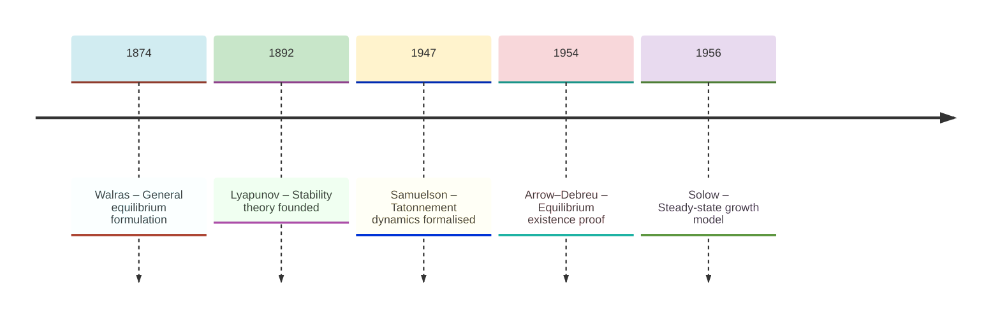
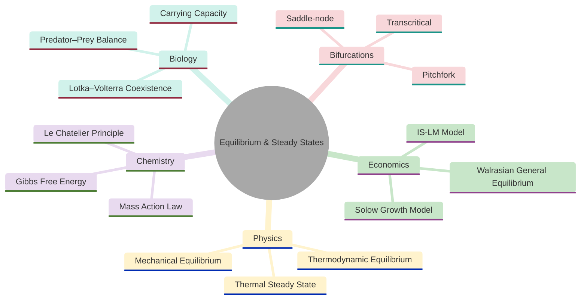
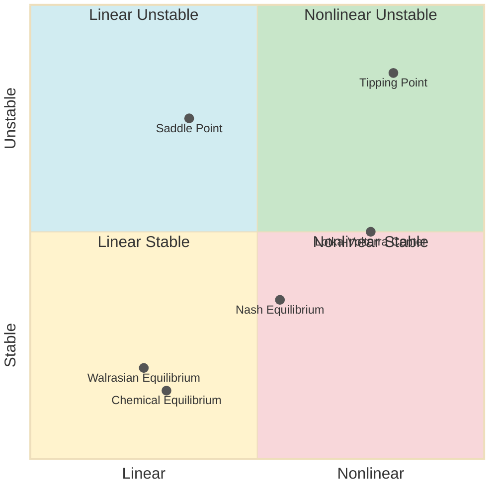
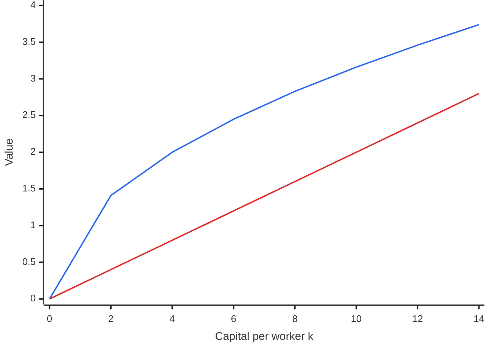
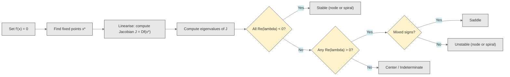
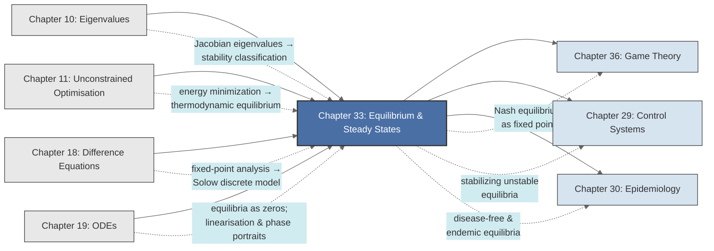

<!-- Copyright (c) 2025-2026 Bob Jansen <bobjansen@pm.me> -->
<!-- SPDX-License-Identifier: CC-BY-NC-4.0 -->
<!-- See LICENSE for full terms. Commercial licensing available. -->

# Chapter 33: Equilibrium & Steady States


**Part IX**: Applications

> Equilibrium theory asks three questions about a dynamical system: does a steady state exist, is it unique and is it stable? This chapter unifies the answers across economics, physics, chemistry and ecology under a single analytical framework: set the time derivative to zero, solve the algebraic system and classify stability via the Jacobian eigenvalues.

**Prerequisites**: [Chapter 10](10-eigenvalues.md) (Eigenvalues & Eigenvectors); eigenvalue computation, the Jacobian matrix, spectral stability criteria for linear and linearised systems. [Chapter 11](11-unconstrained-optimization.md) (Unconstrained Optimisation); gradient descent, critical points, second-derivative tests for minima. [Chapter 18](18-difference-equations.md) (Difference Equations); fixed points of discrete maps, stability via the modulus of eigenvalues. [Chapter 19](19-odes.md) (Ordinary Differential Equations); autonomous systems, equilibrium classification, phase portraits and numerical integration.

**Learning Objectives**: After this chapter, the reader will be able to:

1. Formulate the equilibrium condition for continuous and discrete dynamical systems and solve for steady states algebraically.
2. Classify stability of equilibria using the eigenvalues of the Jacobian matrix, applying the criteria $\operatorname{Re}(\lambda) < 0$ (continuous) and $\lvert\lambda\rvert < 1$ (discrete).
3. Compute the Walrasian general equilibrium for an exchange economy and verify stability of the tatonnement process.
4. Determine the Solow growth model steady state and analyse convergence to balanced growth.
5. Apply the law of mass action to compute chemical equilibrium concentrations and verify Le Chatelier's principle.
6. Locate and classify equilibria of predator-prey and IS-LM systems.
7. Identify bifurcation types (saddle-node, transcritical, pitchfork) as parameters vary.
8. State and apply Lyapunov's direct method for stability certification.

**Connections**: This chapter synthesises [Chapter 10](10-eigenvalues.md) (eigenvalues of the Jacobian determine local stability), [Chapter 11](11-unconstrained-optimization.md) (thermodynamic equilibrium as energy minimisation; the second-derivative test classifies minima), [Chapter 18](18-difference-equations.md) (discrete-time fixed points and their stability in the Solow model and market dynamics) and [Chapter 19](19-odes.md) (equilibria as zeros of the ODE right-hand side; linearisation and phase portraits). It connects forward to [Chapter 29](29-control-systems.md) (feedback control stabilising an unstable equilibrium), [Chapter 30](30-epidemiology.md) (Epidemiology; disease-free and endemic equilibria) and [Chapter 36](36-game-theory.md) (Nash equilibrium as a fixed-point concept in game theory).

---

## Historical Context

**Key Milestones in Equilibrium Theory**



*Figure 33.1: Timeline of key milestones in equilibrium theory from Walras to Solow.*

**Walras and the general equilibrium formulation (1874).** Léon Walras published his *Éléments d'économie politique pure* in 1874, defining general equilibrium as a price vector at which every market clears simultaneously. Walras proposed the tatonnement mechanism: a hypothetical auctioneer adjusts prices in the direction of excess demand. He could not prove existence of equilibrium; the mathematical tools did not yet exist. His formulation of the equilibrium condition as simultaneous equations launched mathematical economics.

**Arrow–Debreu equilibrium existence proof (1954).** Kenneth Arrow and Gérard Debreu proved existence of general equilibrium in their 1954 paper "Existence of an Equilibrium for a Competitive Economy." Their proof used Kakutani's fixed-point theorem and showed that under convex preferences and continuous excess demand a competitive equilibrium exists. The result remains central to economic theory.

**Samuelson and tatonnement dynamics (1947).** Paul Samuelson, in his 1947 *Foundations of Economic Analysis*, formulated the tatonnement as a system of ordinary differential equations $dp_i/dt = \alpha_i z_i(p)$, where $z_i$ is excess demand for good $i$. He showed that stability requires the eigenvalues of the matrix of excess demand derivatives to have negative real parts. Samuelson also stated the correspondence principle: the assumption of stability restricts the signs of comparative statics derivatives.

**Gibbs, Boltzmann and thermodynamic equilibrium (1870s).** Josiah Willard Gibbs formalised thermodynamic equilibrium in the 1870s. He showed that a system at fixed temperature and pressure reaches equilibrium by minimising the Gibbs free energy $G = H - TS$. Ludwig Boltzmann provided the microscopic foundation in the 1870s and 1880s: at equilibrium the system explores microstates according to the distribution $p_i \propto e^{-E_i / k_B T}$.

**Le Chatelier's perturbation principle (1884).** Henry Louis Le Chatelier stated his principle in 1884: a system at equilibrium, when perturbed, shifts to counteract the perturbation partially. The rigorous interpretation uses the second law of thermodynamics or the convexity of the free energy surface.

**Lyapunov's stability theory (1892).** Aleksandr Mikhailovich Lyapunov's 1892 doctoral dissertation "The General Problem of the Stability of Motion" founded stability theory. Lyapunov introduced two methods. The first reduces stability to eigenvalue analysis of the Jacobian. The second constructs a Lyapunov function $V(x) > 0$ with $\dot{V}(x) \leq 0$, certifying stability without solving the differential equation. His work, originally in Russian, became known in the West after its 1907 French translation.

**Solow's steady-state growth model (1956).** Robert Solow's 1956 growth model introduced steady-state analysis to macroeconomics. An economy with exogenous savings rate $s$, depreciation $\delta$ and a neoclassical production function converges to a unique steady state where capital per worker is constant. The equilibrium condition reduces to a scalar equation $sf(k) = \delta k$. Solow received the Nobel Memorial Prize in Economics in 1987.

---

## Why This Chapter Matters

**Equilibrium & Steady States**



*Figure 33.2: Domains and subtopics unified by the equilibrium and steady-state framework.*

Equilibrium analysis provides one mathematical framework for thermodynamics (free energy minima), economics (market-clearing prices), ecology (species coexistence), chemistry (reaction equilibria) and structural engineering (load-bearing configurations). The procedure is uniform: the zeros of the vector field are found, the system is linearised via the Jacobian and stability is classified through eigenvalue analysis.

The Walrasian general equilibrium model earned Arrow and Debreu the Nobel Prize and remains the standard framework for analysing market economies. The Solow steady state determines long-run gross domestic product per capita and underpins cross-country convergence analysis. The IS-LM (Investment-Savings, Liquidity preference-Money supply) equilibrium framework guides central bank interest rate decisions and fiscal policy. In each case the mathematical tools are the same: set up the system of equations, find the equilibrium, compute the Jacobian and determine how the system responds to perturbations.

Chemical equilibrium constants, computed from thermodynamic free energies, determine the yield of industrial processes worth billions of euros annually. Stability analysis of ecological equilibria determines whether predator-prey coexistence persists or competitive exclusion drives one species to extinction. Bifurcation analysis studies how equilibria appear, disappear or change stability as parameters vary. It explains phase transitions in physics, tipping points in climate science and financial crises in economics. Eigenvalue-based stability classification is the common analytical tool across all these applications.

---

## Notation & Conventions

| Symbol | Meaning |
|--------|---------|
| $x \in \mathbb{R}^n$ | State vector of a dynamical system |
| $f(x)$ | Right-hand side of the ODE $\dot{x} = f(x)$ |
| $x^*$ | Equilibrium (steady state): $f(x^*) = 0$ |
| $J$ or $Df(x^*)$ | Jacobian matrix evaluated at $x^*$ |
| $\lambda_i$ | Eigenvalue of the Jacobian |
| $\operatorname{Re}(\lambda)$ | Real part of eigenvalue $\lambda$ |
| $p \in \mathbb{R}^n$ | Price vector (economics) |
| $z(p)$ | Excess demand function |
| $Dz(p)$ | Matrix of partial derivatives $\partial z_i / \partial p_j$ |
| $k$ | Capital per effective worker (Solow model) |
| $s$ | Savings rate |
| $\delta$ | Depreciation rate |
| $f(k)$ | Per-worker production function (Solow model) |
| $k_f, k_r$ | Forward and reverse rate constants (chemical kinetics) |
| $C_0$ | Total conserved concentration ($[A] + [B]$); *chemistry context* |
| $K$ | Equilibrium constant (chemistry) |
| $[A], [B], \ldots$ | Molar concentrations of chemical species |
| $V(x)$ | Lyapunov function |
| $G$ | Gibbs free energy |
| $\mu$ | Bifurcation parameter |
| $Y$ | Output / national income (IS-LM model) |
| $r$ | Interest rate (IS-LM model) |
| $\alpha_i$ | Adjustment speed for price $p_i$ or variable $i$ |
| $c$ | Marginal propensity to consume (IS-LM model) |
| $d$ | Interest sensitivity of investment (IS-LM model) |
| $e$ | Income sensitivity of money demand (IS-LM model) |
| $f$ | Interest sensitivity of money demand (IS-LM model) |
| $C_0$ | Autonomous consumption; *IS-LM context* |
| $I_0$ | Autonomous investment (IS-LM model) |

$\dot{x}$ denotes $dx/dt$. For discrete systems, $x_{t+1} = g(x_t)$ with fixed point $x^* = g(x^*)$; stability requires $\lvert\lambda_i\rvert < 1$ for all eigenvalues of $Dg(x^*)$. Walras' law $\sum_i p_i z_i(p) = 0$ holds throughout. Concentrations are in mol/L unless stated otherwise.

**Symbol $C_0$ (context-dependent).** The symbol $C_0$ appears in two distinct contexts in this chapter. In the chemical kinetics sections (Sections 4 and 5), $C_0 = [A] + [B]$ denotes the total conserved concentration. In the IS-LM model (Section 6), $C_0$ denotes autonomous consumption. The surrounding equations and section headings make the intended meaning unambiguous.

**Symbol $f$ (context-dependent).** The symbol $f$ carries three meanings in this chapter: (1) the ODE right-hand side in $\dot{x} = f(x)$, used in the general framework and stability theory; (2) the per-worker production function $f(k)$ in the Solow growth model; and (3) the interest sensitivity of money demand in the IS-LM model. In each case, the argument and the section context determine which meaning applies.

---

## Core Theory

### The General Equilibrium Framework

**Definition 33.1** (Equilibrium of a continuous-time system). Consider the autonomous ODE ([Chapter 19](19-odes.md)) system

$$\dot{x} = f(x), \qquad x \in \mathbb{R}^n, \quad f: \mathbb{R}^n \to \mathbb{R}^n.$$

A point $x^*$ is an *equilibrium* (steady state, fixed point, rest point) if $f(x^*) = 0$.

At an equilibrium, the system experiences no net change. The state remains at $x^*$ for all future time if it starts there.

**Definition 33.2** (Equilibrium of a discrete-time system ([Chapter 18](18-difference-equations.md))). Consider the map

$$x_{t+1} = g(x_t), \qquad x \in \mathbb{R}^n.$$

A point $x^*$ is a *fixed point* if $g(x^*) = x^*$.

**Theorem 33.3** (Linearised stability, continuous time). Let $x^*$ be an equilibrium of $\dot{x} = f(x)$ with $f$ continuously differentiable. Let $J = Df(x^*)$ be the Jacobian matrix with eigenvalues $\lambda_1, \ldots, \lambda_n$. Then:

1. If $\operatorname{Re}(\lambda_i) < 0$ for all $i$, then $x^*$ is *asymptotically stable* (a sink).
2. If $\operatorname{Re}(\lambda_i) > 0$ for some $i$, then $x^*$ is *unstable*.
3. If $\operatorname{Re}(\lambda_i) \leq 0$ for all $i$ with equality for some $i$, the linearisation is inconclusive.

??? note "Proof"

    *Proof.* The linearised system about $x^*$ is $\dot{\xi} = J\xi$, where $\xi = x - x^*$. The general solution is

    $$\xi(t) = e^{Jt}\xi(0),$$

    and each component of $e^{Jt}$ is a sum of terms of the form $t^k e^{\lambda_i t}$.

    If all $\operatorname{Re}(\lambda_i) < 0$, every such term decays to zero, so $\|e^{Jt}\| \to 0$ as $t \to \infty$ and hence $\xi(t) \to 0$. This establishes asymptotic stability of the linearisation.

    The Hartman–Grobman theorem then guarantees that the nonlinear system inherits the stability type of the linearisation whenever no eigenvalue has zero real part (the hyperbolic case).

    If some eigenvalue has $\operatorname{Re}(\lambda_i) > 0$, there exists an unstable manifold along which perturbations grow exponentially, establishing instability.

    $\square$

**Theorem 33.4** (Linearised stability, discrete time). Let $x^*$ be a fixed point of $x_{t+1} = g(x_t)$ with $g$ continuously differentiable. Let $A = Dg(x^*)$ have eigenvalues $\mu_1, \ldots, \mu_n$. Then:

1. If $\lvert\mu_i\rvert < 1$ for all $i$, then $x^*$ is asymptotically stable.
2. If $\lvert\mu_i\rvert > 1$ for some $i$, then $x^*$ is unstable.

??? note "Proof"

    *Proof.* The linearised map is $\xi_{t+1} = A\xi_t$, with solution $\xi_t = A^t \xi_0$. If all eigenvalues satisfy $\lvert\mu_i\rvert < 1$, then $\|A^t\| \to 0$ and $\xi_t \to 0$. The discrete analogue of the Hartman–Grobman theorem applies when no eigenvalue lies on the unit circle.

    $\square$

**Classification of Equilibria:**



*Figure 33.3: Classification of equilibria by linearity and stability with representative examples.*

### Walrasian General Equilibrium

**Definition 33.5** (Exchange economy). An exchange economy consists of $m$ consumers and $n$ goods. Consumer $j$ has endowment $\omega^j \in \mathbb{R}^n_{+}$ and utility function $u^j \colon \mathbb{R}^n_{+} \to \mathbb{R}$. Given prices $p \in \mathbb{R}^n_{++}$, consumer $j$ maximises $u^j(x^j)$ subject to $p \cdot x^j \leq p \cdot \omega^j$.

**Definition 33.6** (Excess demand). The *aggregate excess demand function* $z \colon \mathbb{R}^n_{++} \to \mathbb{R}^n$ is

$$z(p) = \sum_{j=1}^m x^j(p) - \sum_{j=1}^m \omega^j,$$

where $x^j(p)$ is the demand of consumer $j$ at prices $p$.

A *Walrasian equilibrium* is a price vector $p^*$ satisfying $z(p^*) = 0$ (all markets clear).

**Theorem 33.7** (Walras' law). For all $p \in \mathbb{R}^n_{++}$, $p \cdot z(p) = 0$.

??? note "Proof"

    *Proof.* Each consumer exhausts their budget:

    $$p \cdot x^j(p) = p \cdot \omega^j.$$

    Summing over all consumers $j$:

    $$p \cdot \sum_j x^j(p) = p \cdot \sum_j \omega^j.$$

    By definition of $z(p)$, the left-hand side minus the right-hand side equals $p \cdot z(p)$, so $p \cdot z(p) = 0$.

    $\square$

**Remark 33.8** (Tatonnement dynamics). Samuelson (1947) models price adjustment as

$$\frac{dp_i}{dt} = \alpha_i z_i(p), \qquad \alpha_i > 0.$$

Prices rise when there is excess demand and fall when there is excess supply. The equilibrium $p^*$ is locally stable if all eigenvalues of the matrix $\operatorname{diag}(\alpha) \cdot Dz(p^*)$ have negative real parts. Under gross substitutability ($\partial z_i / \partial p_j > 0$ for $i \neq j$), Arrow, Block and Hurwicz (1959) proved global stability of the tatonnement.

### The Solow Growth Model

**Definition 33.9** (Solow model). Let $k(t)$ denote capital per effective worker and $f(k)$ a neoclassical production function satisfying $f(0) = 0$, $f'(k) > 0$, $f''(k) < 0$, with Inada conditions $\lim_{k \to 0} f'(k) = \infty$ and $\lim_{k \to \infty} f'(k) = 0$. The fundamental Solow equation is

$$\dot{k} = sf(k) - \delta k,$$

where $s \in (0,1)$ is the savings rate and $\delta > 0$ is the effective depreciation rate (including population growth and technological progress).

**Theorem 33.10** (Existence and stability of the Solow steady state). Under the Inada conditions, there exists a unique $k^* > 0$ satisfying $sf(k^*) = \delta k^*$. This steady state is globally asymptotically stable for all $k(0) > 0$.

**Solow Growth Model Investment versus Depreciation**



*Figure 33.4: Solow model investment and depreciation curves intersecting at the steady state.*

??? note "Proof"

    *Proof.* Define $h(k) = sf(k) - \delta k$. Then $h(0) = 0$ and $h'(0) = sf'(0) - \delta = \infty - \delta > 0$ (by the first Inada condition), so $h$ is initially positive. For large $k$, $h'(k) = sf'(k) - \delta \to s \cdot 0 - \delta < 0$ (by the second Inada condition), so $h$ is eventually negative. Since $h$ is continuous, by the intermediate value theorem there exists $k^* > 0$ with $h(k^*) = 0$. Uniqueness follows from strict concavity: $h''(k) = sf''(k) < 0$, so $h$ is strictly concave and can cross zero at most once (apart from $k = 0$).

    For stability, differentiate at the steady state: $h'(k^*) = sf'(k^*) - \delta$. Since $sf(k^*) = \delta k^*$ implies $s = \delta k^* / f(k^*)$, substitution gives $h'(k^*) = \delta k^* f'(k^*) / f(k^*) - \delta = \delta[k^* f'(k^*) / f(k^*) - 1]$. Because $f$ is strictly concave with $f(0) = 0$, the elasticity satisfies $k^* f'(k^*) / f(k^*) < 1$, so $h'(k^*) < 0$. This confirms asymptotic stability. Since $h(k) > 0$ for $k < k^*$ and $h(k) < 0$ for $k > k^*$, the system moves toward $k^*$ from any positive initial condition, establishing global stability.

    $\square$

### Thermodynamic and Mechanical Equilibrium

**Definition 33.11** (Thermodynamic equilibrium). A thermodynamic system at fixed temperature $T$ and pressure $P$ is in equilibrium when the Gibbs free energy $G$ is minimised:

$$\frac{\partial G}{\partial \xi} = 0, \qquad \frac{\partial^2 G}{\partial \xi^2} > 0,$$

where $\xi$ parametrises the internal degrees of freedom (e.g., extent of reaction, phase composition).

**Theorem 33.12** (Mechanical equilibrium and stability). A conservative mechanical system with potential energy $U(x)$ has equilibrium at $x^*$ where the force $F(x) = -\nabla U(x)$ vanishes, i.e., $\nabla U(x^*) = 0$. The equilibrium is:

1. *Lyapunov stable* if the Hessian $D^2 U(x^*)$ is positive definite (local minimum of $U$). If additionally the system includes dissipation (damping), the equilibrium is *asymptotically stable*.
2. *Unstable* if the Hessian has a negative eigenvalue (saddle point or maximum of $U$).

??? note "Proof"

    *Proof.* The equations of motion are $m\ddot{x} = -\nabla U(x)$. Linearising about $x^*$ with $\xi = x - x^*$:

    $$m\ddot{\xi} = -D^2 U(x^*)\,\xi.$$

    If $D^2 U(x^*)$ is positive definite, all eigenvalues satisfy $\omega_i^2 > 0$ and solutions are oscillatory:

    $$\xi(t) = \sum_i c_i \cos(\omega_i t + \phi_i).$$

    In the conservative case (no dissipation), the total energy $E = T + U$ is conserved, which is a Lyapunov function establishing Lyapunov stability (bounded oscillations). With dissipation, these oscillations decay to zero, establishing asymptotic stability.

    If some eigenvalue satisfies $\omega_i^2 < 0$, the corresponding mode grows exponentially, so the equilibrium is unstable.

    $\square$

**Definition 33.13** (Thermal steady state). The temperature field $T(x,t)$ satisfies the heat equation $\partial T / \partial t = \alpha \nabla^2 T$. A *thermal steady state* satisfies $\partial T / \partial t = 0$, reducing to Laplace's equation $\nabla^2 T = 0$ (or Poisson's equation with internal sources).

### Chemical Equilibrium

**Definition 33.14** (Law of mass action). Consider the reversible reaction

$$aA + bB \rightleftharpoons cC + dD.$$

The *equilibrium constant* is

$$K = \frac{[C]^c [D]^d}{[A]^a [B]^b},$$

where brackets denote equilibrium concentrations. At equilibrium, the forward and reverse reaction rates are equal.

**Theorem 33.15** (Chemical equilibrium as ODE steady state). Consider the simple reaction $A \rightleftharpoons B$ with forward rate constant $k_f$ and reverse rate constant $k_r$. The ODE for $[A](t)$ is

$$\frac{d[A]}{dt} = -k_f [A] + k_r [B] = -k_f [A] + k_r (C_0 - [A]),$$

where $C_0 = [A] + [B]$ is the total concentration (conserved). The steady state is

$$[A]^* = \frac{k_r C_0}{k_f + k_r}, \qquad [B]^* = \frac{k_f C_0}{k_f + k_r},$$

and $K = [B]^*/[A]^* = k_f / k_r$. The eigenvalue of the linearised system is $\lambda = -(k_f + k_r) < 0$, confirming stability.

??? note "Proof"

    *Proof.* Setting $d[A]/dt = 0$: $(k_f + k_r)[A]^* = k_r C_0$, yielding the stated result. The linearised equation about $[A]^*$ is $d\xi/dt = -(k_f + k_r)\xi$, with eigenvalue $-(k_f + k_r) < 0$.

    $\square$

**Remark 33.16** (Le Chatelier's principle). If the system is perturbed from equilibrium (e.g., by adding reactant $A$), the inequality $[A] > [A]^*$ makes $d[A]/dt < 0$: the system shifts to consume the added reactant, partially restoring the original equilibrium. This is the mathematical content of Le Chatelier's principle; it is a restatement of asymptotic stability.

### The IS-LM Model

**Definition 33.17** (IS-LM system). The IS curve represents output–interest rate combinations at which goods markets clear: $Y = C(Y - T) + I(r) + G$. The LM curve gives combinations where money markets clear: $M/P = L(Y, r)$. In dynamic form:

$$\frac{dY}{dt} = \alpha_1 [C(Y - T) + I(r) + G - Y],$$

$$\frac{dr}{dt} = \alpha_2 [L(Y, r) - M/P],$$

where $\alpha_1, \alpha_2 > 0$ are adjustment speeds. The equilibrium $(Y^*, r^*)$ satisfies both IS and LM equations simultaneously.

**Theorem 33.18** (IS-LM stability). Let $C'$ denote the marginal propensity to consume ($0 < C' < 1$), $I' < 0$ the interest sensitivity of investment and $L_Y > 0$, $L_r < 0$ the income and interest sensitivities of money demand. The Jacobian at equilibrium is

$$J = \begin{pmatrix} \alpha_1(C' - 1) & \alpha_1 I' \\ \alpha_2 L_Y & \alpha_2 L_r \end{pmatrix}.$$

The trace is

$$\operatorname{tr}(J) = \alpha_1(C' - 1) + \alpha_2 L_r < 0$$

since $C' < 1$ and $L_r < 0$. The determinant is

$$\det(J) = \alpha_1 \alpha_2 [(C' - 1)L_r - I' L_Y] > 0$$

since $(C'-1) < 0$, $L_r < 0$, $I' < 0$, $L_Y > 0$, making both terms in the product positive. Since $\operatorname{tr}(J) < 0$ and $\det(J) > 0$, both eigenvalues have negative real parts and the equilibrium is asymptotically stable.

??? note "Proof"

    *Proof.* For a $2 \times 2$ matrix, the eigenvalues satisfy

    $$\lambda^2 - \operatorname{tr}(J)\,\lambda + \det(J) = 0.$$

    By Vieta's formulas:

    $$\lambda_1 + \lambda_2 = \operatorname{tr}(J) < 0, \qquad \lambda_1 \lambda_2 = \det(J) > 0.$$

    If the eigenvalues are real, their product being positive means they share the same sign and their sum being negative forces both to be negative.

    If the eigenvalues are complex conjugates, then $\operatorname{Re}(\lambda_{1,2}) = \operatorname{tr}(J)/2 < 0$.

    In either case all eigenvalues have strictly negative real parts, confirming asymptotic stability.

    $\square$

### Ecological Equilibria

**Definition 33.19** (Lotka–Volterra predator-prey). The system

$$\dot{x} = \alpha x - \beta x y, \qquad \dot{y} = \delta x y - \gamma y,$$

where $x$ is prey population, $y$ is predator population and $\alpha, \beta, \gamma, \delta > 0$, has two equilibria:

1. The trivial equilibrium $(0, 0)$: both species extinct.
2. The coexistence equilibrium $(x^*, y^*) = (\gamma/\delta, \alpha/\beta)$.

**Theorem 33.20** (Classification of Lotka–Volterra equilibria). For the predator-prey system:

1. The origin $(0, 0)$ is a saddle (unstable): eigenvalues $\lambda_1 = \alpha > 0$, $\lambda_2 = -\gamma < 0$.
2. The coexistence equilibrium $(\gamma/\delta, \alpha/\beta)$ is a centre: eigenvalues $\lambda = \pm i\sqrt{\alpha\gamma}$, purely imaginary.

??? note "Proof"

    *Proof.* The Jacobian is

    $$J = \begin{pmatrix} \alpha - \beta y & -\beta x \\ \delta y & \delta x - \gamma \end{pmatrix}.$$

    At $(0,0)$: $J = \operatorname{diag}(\alpha, -\gamma)$ with eigenvalues $\alpha > 0$ and $-\gamma < 0$ (saddle). At $(x^*, y^*) = (\gamma/\delta, \alpha/\beta)$:

    $$J = \begin{pmatrix} 0 & -\beta\gamma/\delta \\ \delta\alpha/\beta & 0 \end{pmatrix}.$$

    The characteristic polynomial is $\lambda^2 + (\beta\gamma/\delta)(\delta\alpha/\beta) = \lambda^2 + \alpha\gamma = 0$, giving $\lambda = \pm i\sqrt{\alpha\gamma}$. Purely imaginary eigenvalues indicate a centre in the linearisation. The existence of a conserved quantity

    $$H(x,y) = \delta x - \gamma \ln x + \beta y - \alpha \ln y = \text{const.}$$

    confirms that the nonlinear system also has a centre (closed orbits).

    $\square$

!!! warning "Centre classification requires nonlinear verification"

    Purely imaginary eigenvalues indicate a centre only for the linearised system. Nonlinear terms can turn a linear centre into a stable spiral (if dissipation is present) or an unstable spiral. A conserved quantity, Lyapunov function or normal form analysis is needed to confirm centre behaviour in the full nonlinear system.

### Lyapunov Stability

**Definition 33.21** (Lyapunov function). A continuously differentiable function $V: \mathbb{R}^n \to \mathbb{R}$ is a *Lyapunov function* for the equilibrium $x^*$ of $\dot{x} = f(x)$ if:

1. $V(x^*) = 0$ and $V(x) > 0$ for $x \neq x^*$ in a neighbourhood of $x^*$.
2. $\dot{V}(x) = \nabla V(x) \cdot f(x) \leq 0$ in that neighbourhood.

**Theorem 33.22** (Lyapunov stability theorem). If a Lyapunov function $V$ exists satisfying conditions 1 and 2, then $x^*$ is *stable* (in the sense of Lyapunov). If additionally $\dot{V}(x) < 0$ for $x \neq x^*$, then $x^*$ is *asymptotically stable*.

This theorem provides a sufficient condition for stability without solving the ODE. The challenge lies in constructing a suitable $V$.

!!! abstract "Key Result"

    **Theorem 33.22** (Lyapunov stability theorem). A scalar energy-like function $V$ with $V(x^*) = 0$, $V > 0$ nearby and $\dot{V} \leq 0$ along trajectories proves stability without solving the ODE; strict decrease $\dot{V} < 0$ proves asymptotic stability.

**Remark 33.23** (Energy as a Lyapunov function). In mechanical systems, the total energy $E = T + U$ (kinetic plus potential) is conserved in the absence of dissipation and decreasing in the presence of friction. For a dissipative system, $V(x) = E(x) - E(x^*)$ is a natural Lyapunov function.

### Nash Equilibrium as Fixed Point

**Definition 33.24** (Nash equilibrium). In a game with $n$ players, a strategy profile $(s_1^*, \ldots, s_n^*)$ is a *Nash equilibrium* if no player can improve their payoff by unilateral deviation:

$$u_i(s_i^*, s_{-i}^*) \geq u_i(s_i, s_{-i}^*) \quad \text{for all } s_i \text{ and all } i.$$

Equivalently, $s^*$ is a fixed point of the best-response correspondence: $s_i^* \in BR_i(s_{-i}^*)$ for all $i$. The existence proof (Nash, 1950) applies Brouwer's (or Kakutani's) fixed-point theorem, in parallel with the Arrow–Debreu existence proof for competitive equilibrium.

### Bifurcations

**Definition 33.25** (Bifurcation). A *bifurcation* occurs at parameter value $\mu = \mu_c$ if the number or stability of equilibria of $\dot{x} = f(x; \mu)$ changes as $\mu$ passes through $\mu_c$.

Three elementary bifurcations of one-dimensional systems:

1. **Saddle-node bifurcation**: $\dot{x} = \mu - x^2$. For $\mu > 0$, two equilibria $x^* = \pm\sqrt{\mu}$ (one stable, one unstable). For $\mu < 0$, no equilibria. At $\mu = 0$, the two equilibria collide and annihilate.

2. **Transcritical bifurcation**: $\dot{x} = \mu x - x^2$. For all $\mu$, two equilibria exist: $x^* = 0$ and $x^* = \mu$. At $\mu = 0$, they exchange stability.

3. **Pitchfork bifurcation**: $\dot{x} = \mu x - x^3$. For $\mu \leq 0$, one stable equilibrium at $x^* = 0$. For $\mu > 0$, the origin becomes unstable and two stable branches $x^* = \pm\sqrt{\mu}$ emerge. This is the supercritical pitchfork; the subcritical form $\dot{x} = \mu x + x^3$ has the reverse stability pattern.

These are the generic codimension-one bifurcations. Their occurrence in applications signals qualitative changes in system behaviour (regime shifts, phase transitions, tipping points).

---

## Formulas & Identities

**F33.1** (Continuous-time stability criterion). The equilibrium $x^*$ of $\dot{x} = f(x)$ is asymptotically stable if all eigenvalues of $J = Df(x^*)$ satisfy

$$\operatorname{Re}(\lambda_i) < 0 \quad \text{for all } i = 1, \ldots, n.$$

**F33.2** (Discrete-time stability criterion). The fixed point $x^*$ of $x_{t+1} = g(x_t)$ is asymptotically stable if all eigenvalues of $A = Dg(x^*)$ satisfy

$$\lvert\mu_i\rvert < 1 \quad \text{for all } i = 1, \ldots, n.$$

**F33.3** (2D stability conditions). For a $2 \times 2$ Jacobian $J$, stability requires

$$\operatorname{tr}(J) < 0 \qquad \text{and} \qquad \det(J) > 0.$$

**F33.4** (Solow steady-state capital). For $f(k) = k^\alpha$ (Cobb–Douglas), the steady state is

$$k^* = \left(\frac{s}{\delta}\right)^{1/(1-\alpha)}, \qquad y^* = f(k^*) = \left(\frac{s}{\delta}\right)^{\alpha/(1-\alpha)}.$$

**F33.5** (Chemical equilibrium from mass action). For $aA + bB \rightleftharpoons cC + dD$ with initial concentrations $[A]_0, [B]_0, [C]_0, [D]_0$ and extent of reaction $\xi$:

$$K = \frac{([C]_0 + c\xi)^c ([D]_0 + d\xi)^d}{([A]_0 - a\xi)^a ([B]_0 - b\xi)^b}.$$

**F33.6** (Gibbs free energy and equilibrium constant).

$$\Delta G^\circ = -RT \ln K, \qquad K = e^{-\Delta G^\circ / RT}.$$

**F33.7** (IS-LM equilibrium). With $C = C_0 + c(Y-T)$, $I = I_0 - dr$, $L = eY - fr$:

$$Y^* = \frac{f(C_0 - cT + I_0 + G) + d(M/P)}{f(1-c) + de},$$

$$r^* = \frac{e(C_0 - cT + I_0 + G) - (1-c)(M/P)}{f(1-c) + de}.$$

**F33.8** (Lotka–Volterra conserved quantity).

$$H(x,y) = \delta x - \gamma \ln x + \beta y - \alpha \ln y = \text{const.}$$

---

## Algorithms

### Algorithm 33.26: Newton's Method ([Chapter 11](11-unconstrained-optimization.md)) for Equilibrium Computation

**Input**: Continuously differentiable function $f: \mathbb{R}^n \to \mathbb{R}^n$; initial guess $x_0$; convergence tolerance $\varepsilon > 0$.

**Output**: Equilibrium $x^*$ satisfying $\|f(x^*)\| < \varepsilon$ and eigenvalues of $J = Df(x^*)$.

1. Choose initial guess $x_0$.
2. For $k = 0, 1, 2, \ldots$ until convergence:
   - Compute $J_k = Df(x_k)$.
   - Solve $J_k \Delta x = -f(x_k)$.
   - Update $x_{k+1} = x_k + \Delta x$.
3. Return $x^*$ and eigenvalues of $J = Df(x^*)$ for stability classification.

```
function newtonEquilibrium(f, Df, x0, eps, maxIter):
    // f: vector field, Df: Jacobian, x0: initial guess
    x = x0
    for k = 0, 1, 2, ..., maxIter:
        r = f(x)
        if ||r|| < eps:
            break
        J = Df(x)
        solve J * dx = -r          // linear system, O(n^3)
        x = x + dx
    eigs = eigenvalues(Df(x))
    return (x, eigs)
```

**Complexity**: $O(n^3)$ per iteration for the linear solve $J_k \Delta x = -f(x_k)$, where $n$ is the dimension of the state space.

Convergence is quadratic near a simple root. For degenerate equilibria (where $J$ is singular), modified Newton or continuation methods are required.

!!! tip "Initial guess selection for Newton's method"

    Time integration of $\dot{x} = f(x)$ for a moderate number of steps provides a good initial guess near the basin of attraction. For systems with multiple equilibria, a coarse grid of starting points combined with deflation (dividing out known roots) systematically locates all isolated steady states.

### Algorithm 33.27: Equilibrium Classification

**Input**: Equilibrium point $x^*$ with $f(x^*) = 0$ and the Jacobian $J = Df(x^*)$.

**Output**: Stability classification (stable node, unstable node, saddle, stable spiral, unstable spiral or centre) and eigenvalues $\lambda_1, \ldots, \lambda_n$.

**Equilibrium Classification Flowchart**



*Figure 33.5: Flowchart for classifying equilibria via Jacobian eigenvalue analysis.*

Given $x^*$ with $f(x^*) = 0$:

1. Compute $J = Df(x^*)$.
2. Compute eigenvalues $\lambda_1, \ldots, \lambda_n$ of $J$ ([Chapter 10](10-eigenvalues.md)).
3. If all $\operatorname{Re}(\lambda_i) < 0$: stable node or stable spiral.
4. If all $\operatorname{Re}(\lambda_i) > 0$: unstable node or unstable spiral.
5. If $\operatorname{Re}(\lambda_i)$ have mixed signs: saddle point.
6. If all $\operatorname{Re}(\lambda_i) \leq 0$ with some zero: centre or nonlinear analysis required.
7. Report eigenvalues and stability classification.

```
function classifyEquilibrium(Df, xStar):
    // Df: Jacobian function, xStar: equilibrium point
    J = Df(xStar)
    eigs = eigenvalues(J)                // O(n^3) via QR algorithm
    realParts = [Re(lambda) for lambda in eigs]
    if all(r < 0 for r in realParts):
        if any(Im(lambda) != 0 for lambda in eigs):
            label = "stable spiral"
        else:
            label = "stable node"
    else if all(r > 0 for r in realParts):
        if any(Im(lambda) != 0 for lambda in eigs):
            label = "unstable spiral"
        else:
            label = "unstable node"
    else if any(r > 0 for r in realParts) and any(r < 0 for r in realParts):
        label = "saddle"
    else:
        label = "centre or indeterminate"
    return (eigs, label)
```

**Complexity**: $O(n^3)$ for eigenvalue computation via the QR (orthogonal-triangular) algorithm, where $n$ is the dimension of the Jacobian.

### Algorithm 33.28: Continuation Method for Bifurcation Detection

**Input**: Parametrised system $f(x; \mu)$; initial parameter $\mu_0$; parameter range $[\mu_0, \mu_{\max}]$; step size $\Delta\mu$.

**Output**: Equilibrium curve $\{(\mu, x^*(\mu))\}$ and bifurcation points where eigenvalues cross the imaginary axis.

To track equilibria as parameter $\mu$ varies:

1. At $\mu_0$, find equilibrium $x^*(\mu_0)$ using Algorithm 33.26.
2. Increment $\mu \leftarrow \mu + \Delta\mu$.
3. Use $x^*(\mu - \Delta\mu)$ as initial guess, solve for $x^*(\mu)$.
4. Compute eigenvalues of $J(\mu)$.
5. If an eigenvalue crosses the imaginary axis (continuous) or the unit circle (discrete), record bifurcation point.
6. Repeat from step 2.

```
function continuationBifurcation(f, Df, x0, mu0, muMax, dmu, eps):
    // f(x, mu) is the parametrised system, Df its Jacobian w.r.t. x
    x = x0
    mu = mu0
    curve = [(mu, x)]
    bifurcations = []
    prevEigs = eigenvalues(Df(x, mu))
    while mu < muMax:
        mu = mu + dmu
        // Newton solve using previous equilibrium as initial guess
        xNew = x
        for k = 0, 1, 2, ... until ||f(xNew, mu)|| < eps:
            J = Df(xNew, mu)
            solve J * dx = -f(xNew, mu)
            xNew = xNew + dx
        x = xNew
        eigs = eigenvalues(Df(x, mu))
        // Check for imaginary-axis crossing
        for i = 1 to n:
            if sign(Re(prevEigs[i])) != sign(Re(eigs[i])):
                bifurcations.append((mu, x, eigs[i]))
        curve.append((mu, x))
        prevEigs = eigs
    return (curve, bifurcations)
```

**Complexity**: $O(K \cdot n^3)$ where $K = (\mu_{\max} - \mu_0)/\Delta\mu$ is the number of continuation steps and each step requires an equilibrium solve and eigenvalue computation.

### Algorithm 33.29: Chemical Equilibrium via Iterative Substitution

**Input**: Equilibrium constant $K$; initial concentrations $[A]_0, [B]_0, [C]_0$; reaction stoichiometry.

**Output**: Equilibrium concentrations $[A]^*, [B]^*, [C]^*$.

For reaction $A \rightleftharpoons B + C$ with equilibrium constant $K$:

1. Express concentrations in terms of extent $\xi$: $[A] = [A]_0 - \xi$, $[B] = [B]_0 + \xi$, $[C] = [C]_0 + \xi$.
2. Substitute into $K = [B][C] / [A]$, obtaining a polynomial in $\xi$.
3. Solve the polynomial (quadratic for binary dissociation) for the physically admissible root ($\xi \geq 0$ and all concentrations non-negative).
4. Compute equilibrium concentrations.

```
function chemicalEquilibrium(K, A0, B0, C0):
    // Reaction A <-> B + C with equilibrium constant K
    // Substitute into K = [B][C] / [A]:
    //   K = (B0 + xi)(C0 + xi) / (A0 - xi)
    // Rearrange to quadratic: xi^2 + (B0 + C0 + K)*xi + (B0*C0 - K*A0) = 0
    a = 1
    b = B0 + C0 + K
    c = B0 * C0 - K * A0
    discriminant = b*b - 4*a*c
    xi1 = (-b + sqrt(discriminant)) / (2*a)
    xi2 = (-b - sqrt(discriminant)) / (2*a)
    // Select physically admissible root
    for xi in [xi1, xi2]:
        if xi >= 0 and (A0 - xi) >= 0:
            return (A0 - xi, B0 + xi, C0 + xi)
    error("No physically admissible root found")
```

**Complexity**: $O(1)$ for binary dissociation (quadratic formula); $O(d)$ for a polynomial of degree $d$ solved by Newton's method.

---

## Numerical Considerations

### Stiffness and Equilibrium Computation

When Jacobian eigenvalues span several orders of magnitude, time integration of $\dot{x} = f(x)$ to find steady states is expensive: the step size is governed by the fastest mode while convergence requires the slowest mode to decay. Algorithm 33.26 (Newton's method on $f(x) = 0$) avoids the stiffness problem entirely, converging quadratically near a simple root with $O(n^3)$ cost per iteration for the linear solve $J\Delta x = -f(x)$.

### Conditioning of the Jacobian

Near a bifurcation point, $J = Df(x^*)$ is nearly singular and its condition number $\kappa(J) = \|J\|\|J^{-1}\|$ diverges. Newton's method converges slowly or fails because the correction $\Delta x = -J^{-1}f(x)$ amplifies errors. Algorithm 33.28 (continuation method) addresses this by parametrising the equilibrium curve by arclength rather than by $\mu$. The augmented system

$$\begin{pmatrix} f_x & f_\mu \\ \dot{x}^T & \dot{\mu} \end{pmatrix} \begin{pmatrix} \Delta x \\ \Delta \mu \end{pmatrix} = \begin{pmatrix} -f \\ 0 \end{pmatrix}$$

remains nonsingular at simple folds, allowing the continuation to pass through turning points without singularity.

### Eigenvalue Accuracy Near Bifurcations

Algorithm 33.27 classifies stability by the sign of $\operatorname{Re}(\lambda_i)$. Near a bifurcation, an eigenvalue crosses the imaginary axis, so $\operatorname{Re}(\lambda) \approx 0$. The QR algorithm is backward stable and produces eigenvalue errors of order $O(\varepsilon \|J\|)$. When $|\operatorname{Re}(\lambda)| < \varepsilon \|J\|$, stability cannot be determined from the computed eigenvalues alone; perturbation analysis or higher-precision arithmetic is required.

!!! info "IEEE 754 double precision context"

    All numerical values in this chapter assume IEEE 754 binary64 (double precision) arithmetic with machine epsilon $\varepsilon \approx 2.22 \times 10^{-16}$. Eigenvalue perturbation bounds, cancellation thresholds and the logarithmic-concentration technique in chemical equilibrium are all calibrated to this precision level.

### Multiple Equilibria

Algorithm 33.26 finds one equilibrium per initial guess. A system with $k$ equilibria requires at least $k$ well-chosen starting points. Homotopy methods or deflation (dividing out known roots) can systematically locate additional equilibria. For polynomial systems, the Bézout bound gives an upper limit on the number of isolated roots.

### Floating-Point Precision in Chemical Equilibrium

Algorithm 33.29 solves for the extent of reaction $\xi$ from $K = \prod [X_i]^{\nu_i}$. When $K$ is very large or very small, $\xi$ lies near its physical bounds and concentrations involve differences of nearly equal quantities. For example, with $K = 10^{8}$ and $[A]_0 = 1$, the equilibrium concentration $[A] = [A]_0 - \xi \approx 10^{-4}$; computing this as $1 - 0.9999$ loses four significant digits. Working in logarithmic concentrations ($\ln[A]$ instead of $[A]$) avoids the cancellation and maintains full precision across all magnitudes of $K$.

!!! warning "Catastrophic cancellation in equilibrium concentrations"

    For reactions with $K > 10^4$ or $K < 10^{-4}$, direct subtraction $[A] = [A]_0 - \xi$ loses significant digits because $\xi \approx [A]_0$. Reformulate in logarithmic coordinates: solve for $\ln[A]$ directly from $\ln K = \sum \nu_i \ln[X_i]$. This avoids subtracting nearly equal floating-point numbers and preserves precision to machine epsilon ($\approx 2.2 \times 10^{-16}$ in IEEE 754 double precision).

---

## Worked Examples

### Example 33.30: Solow Model Steady State

**Problem**: An economy has a Cobb–Douglas production function $f(k) = k^{0.3}$, savings rate $s = 0.2$ and effective depreciation rate $\delta = 0.05$ (combining physical depreciation, population growth and technological progress). Compute the steady-state capital per effective worker $k^*$, output per effective worker $y^*$ and the speed of convergence.

**Solution** (mathematical):

The steady-state condition is $sf(k^*) = \delta k^*$:

$$0.2 \cdot (k^*)^{0.3} = 0.05 \cdot k^*.$$

Dividing both sides by $(k^*)^{0.3}$ (valid since $k^* > 0$):

$$0.2 = 0.05 \cdot (k^*)^{0.7}.$$

Solving:

$$(k^*)^{0.7} = 4, \qquad k^* = 4^{1/0.7} = 4^{10/7} \approx 7.25.$$

Steady-state output:

$$y^* = (k^*)^{0.3} = (7.25)^{0.3} \approx 1.81.$$

By F33.4:

$$k^* = \left(\frac{s}{\delta}\right)^{1/(1-\alpha)} = \left(\frac{0.2}{0.05}\right)^{1/0.7} = 4^{10/7} \approx 7.25.$$

This confirms the result.

The speed of convergence is

$$\lvert h'(k^*)\rvert = \delta(1 - \alpha) = 0.05 \times 0.7 = 0.035 \text{ per year}.$$

The half-life of convergence is

$$\frac{\ln 2}{0.035} \approx 19.8 \text{ years};$$

the economy closes half the gap to steady state in approximately 20 years.

### Example 33.31: Chemical Equilibrium Calculation

**Problem**: The reaction $\text{N}_2\text{O}_4 \rightleftharpoons 2\text{NO}_2$ has equilibrium constant $K_c = 4.63 \times 10^{-3}$ mol/L at 25$^\circ$C. If 0.100 mol of $\text{N}_2\text{O}_4$ is placed in a 1.00 L container with no $\text{NO}_2$ initially, find the equilibrium concentrations.

**Solution** (mathematical):

Let $\xi$ be the extent of reaction (mol/L of $\text{N}_2\text{O}_4$ that dissociates). At equilibrium:

$$[\text{N}_2\text{O}_4] = 0.100 - \xi, \qquad [\text{NO}_2] = 2\xi.$$

The equilibrium expression is:

$$K_c = \frac{[\text{NO}_2]^2}{[\text{N}_2\text{O}_4]} = \frac{(2\xi)^2}{0.100 - \xi} = \frac{4\xi^2}{0.100 - \xi} = 4.63 \times 10^{-3}.$$

Rearranging:

$$4\xi^2 = 4.63 \times 10^{-3}(0.100 - \xi),$$

$$4\xi^2 + 4.63 \times 10^{-3}\xi - 4.63 \times 10^{-4} = 0.$$

Applying the quadratic formula:

$$\xi = \frac{-4.63 \times 10^{-3} + \sqrt{(4.63 \times 10^{-3})^2 + 4 \cdot 4 \cdot 4.63 \times 10^{-4}}}{2 \cdot 4}.$$

The discriminant is

$$(4.63 \times 10^{-3})^2 + 7.408 \times 10^{-3} = 2.14 \times 10^{-5} + 7.408 \times 10^{-3} = 7.429 \times 10^{-3}.$$

$$\xi = \frac{-4.63 \times 10^{-3} + 0.08620}{8} = \frac{0.08157}{8} = 0.01020 \;\text{mol/L}.$$

Equilibrium concentrations:

$$[\text{N}_2\text{O}_4] = 0.100 - 0.01020 = 0.0898 \;\text{mol/L},$$

$$[\text{NO}_2] = 2 \times 0.01020 = 0.0204 \;\text{mol/L}.$$

Verification:

$$K_c = \frac{(0.0204)^2}{0.0898} = \frac{4.162 \times 10^{-4}}{0.0898} = 4.63 \times 10^{-3}.$$

Confirmed.

**Stability**: The Jacobian eigenvalue for this system (as a first-order ODE in $\xi$) is negative, confirming that the equilibrium is stable. A perturbation (adding more $\text{N}_2\text{O}_4$) shifts the equilibrium toward greater dissociation, consistent with Le Chatelier's principle.

### Example 33.32: IS-LM Equilibrium

**Problem**: Consider an economy with $C = 100 + 0.75(Y - T)$, $I = 200 - 25r$, $G = 100$, $T = 100$ and money demand $L = 0.5Y - 50r$ with money supply $M/P = 500$. Find the IS-LM equilibrium $(Y^*, r^*)$ and classify its stability.

**Solution** (mathematical):

**IS curve** (goods market equilibrium):

$$Y = C + I + G = 100 + 0.75(Y - 100) + 200 - 25r + 100.$$

$$Y = 325 + 0.75Y - 25r.$$

$$0.25Y = 325 - 25r \quad \Longrightarrow \quad Y = 1300 - 100r. \quad \text{(IS)}$$

**LM curve** (money market equilibrium):

$$500 = 0.5Y - 50r \quad \Longrightarrow \quad Y = 1000 + 100r. \quad \text{(LM)}$$

Setting IS = LM:

$$1300 - 100r = 1000 + 100r \quad \Longrightarrow \quad 200r = 300 \quad \Longrightarrow \quad r^* = 1.5 \text{ (percentage points)}.$$

$$Y^* = 1000 + 100(1.5) = 1150.$$

**Stability** (using Theorem 33.18):

Setting the adjustment speeds $\alpha_1 = \alpha_2 = 1$ for this example:

$$C' = c = 0.75, \quad I' = -d = -25, \quad L_Y = e = 0.5, \quad L_r = -f = -50.$$

$$\operatorname{tr}(J) = (0.75 - 1) + (-50) = -0.25 - 50 = -50.25 < 0.$$

$$\det(J) = (-0.25)(-50) - (-25)(0.5) = 12.5 + 12.5 = 25 > 0.$$

Both conditions of F33.3 are satisfied: the equilibrium is asymptotically stable. The eigenvalues are:

$$\lambda = \frac{-50.25 \pm \sqrt{50.25^2 - 4 \cdot 25}}{2} = \frac{-50.25 \pm \sqrt{2425.06}}{2} = \frac{-50.25 \pm 49.24}{2}.$$

$$\lambda_1 = -0.50, \qquad \lambda_2 = -49.75.$$

Both eigenvalues are real and negative: the equilibrium is a stable node.

### Example 33.33: Mechanical Equilibrium with Stability Classification

**Problem**: A particle moves in the one-dimensional potential $U(x) = x^4 - 4x^2 + 3$. Find all equilibria and classify their stability.

**Solution** (mathematical):

Equilibria satisfy $F = -dU/dx = 0$:

$$\frac{dU}{dx} = 4x^3 - 8x = 4x(x^2 - 2) = 0.$$

Three equilibria:

$$x_1^* = 0, \qquad x_2^* = -\sqrt{2}, \qquad x_3^* = \sqrt{2}.$$

The second derivative (determines stability):

$$\frac{d^2U}{dx^2} = 12x^2 - 8.$$

At $x^* = 0$:

$$U''(0) = -8 < 0.$$

The potential has a *local maximum* at the origin. The equilibrium is **unstable**.

At $x^* = \pm\sqrt{2}$:

$$U''(\pm\sqrt{2}) = 12 \cdot 2 - 8 = 16 > 0.$$

The potential has *local minima*. These equilibria are **stable**.

Potential energy values:

$$U(0) = 3 \;\text{(local max)}, \qquad U(\pm\sqrt{2}) = 4 - 8 + 3 = -1.$$

Since $U(x) \to +\infty$ as $\lvert x\rvert \to \infty$, these are global minima.

### Example 33.34: Predator-Prey Equilibria (Lotka–Volterra)

**Problem**: A predator-prey system has parameters $\alpha = 1.0$ (prey growth rate), $\beta = 0.1$ (predation rate), $\gamma = 0.5$ (predator death rate), $\delta = 0.02$ (predator conversion efficiency). Find all equilibria, classify them and compute the frequency of population oscillations near coexistence.

**Solution** (mathematical):

Setting $\dot{x} = \alpha x - \beta xy = 0$ and $\dot{y} = \delta xy - \gamma y = 0$:

From $\dot{x} = 0$:

$$x(\alpha - \beta y) = 0, \qquad \text{so } x = 0 \text{ or } y = \alpha/\beta = 10.$$

From $\dot{y} = 0$:

$$y(\delta x - \gamma) = 0, \qquad \text{so } y = 0 \text{ or } x = \gamma/\delta = 25.$$

**Equilibrium 1**: $(x^*, y^*) = (0, 0)$ (extinction).

Jacobian at origin:

$$J = \operatorname{diag}(1.0,\; -0.5).$$

Eigenvalues:

$$\lambda_1 = 1.0, \qquad \lambda_2 = -0.5.$$

Classification: **saddle** (unstable). In the absence of predators, prey grows exponentially; in the absence of prey, predators die out.

**Equilibrium 2**: $(x^*, y^*) = (25, 10)$ (coexistence).

Jacobian:

$$J = \begin{pmatrix} 0 & -\beta x^* \\ \delta y^* & 0 \end{pmatrix} = \begin{pmatrix} 0 & -2.5 \\ 0.2 & 0 \end{pmatrix}.$$

Characteristic equation:

$$\lambda^2 + (2.5)(0.2) = \lambda^2 + 0.5 = 0.$$

Eigenvalues:

$$\lambda = \pm i\sqrt{0.5} = \pm 0.707i.$$

Classification: **centre** (neutrally stable). Orbits are closed curves around the equilibrium.

Oscillation frequency:

$$\omega = \sqrt{\alpha\gamma} = \sqrt{1.0 \times 0.5} = 0.707 \text{ rad/time}.$$

Period:

$$T = \frac{2\pi}{\omega} = 8.89 \text{ time units}.$$

The conserved quantity is

$$H(x,y) = 0.02x - 0.5\ln x + 0.1y - 1.0\ln y.$$

---

## Connections

**Chapter Dependencies**



*Figure 33.6: Chapter dependencies showing prerequisites and forward connections.*

### Within This Book

- **Eigenvalues** ([Chapter 10](10-eigenvalues.md)): Stability rests on Jacobian eigenvalue computation. The QR algorithm provides the core numerical routine.

- **Unconstrained Optimisation** ([Chapter 11](11-unconstrained-optimization.md)): Thermodynamic equilibrium is free energy minimisation. The second-derivative test gives stability classification.

- **Difference Equations** ([Chapter 18](18-difference-equations.md)): The discrete Solow model is a first-order difference equation. Fixed-point stability requires eigenvalues inside the unit disk.

- **Ordinary Differential Equations** ([Chapter 19](19-odes.md)): Equilibria are zeros of the ODE right-hand side. The Hartman–Grobman theorem guarantees that linearised classification applies when the equilibrium is hyperbolic.

- **Epidemiology** ([Chapter 30](30-epidemiology.md)): The disease-free equilibrium and its stability ($R_0$) are direct applications. Endemic equilibria use the same Jacobian analysis.

- **Control Systems** ([Chapter 29](29-control-systems.md)): Feedback control stabilises an unstable equilibrium by modifying Jacobian eigenvalues. Pole placement is eigenvalue assignment.

- **Game Theory** ([Chapter 36](36-game-theory.md)): Nash equilibrium is a fixed point of the best-response correspondence. The existence proof parallels the Arrow–Debreu proof for competitive equilibrium.

### Applications

- **Macroeconomics**: The IS-LM model, the Solow growth model and Walrasian general equilibrium are formulated as equilibrium problems analysed with the tools of this chapter. Business cycle theory studies perturbations around steady states.

- **Chemical engineering**: Reactor design relies on computing chemical equilibria (extent of reaction, equilibrium conversion) and analysing their stability (runaway reactions occur when a thermal equilibrium becomes unstable).

- **Ecology**: Coexistence conditions for multiple species, carrying capacity and the stability of food webs all reduce to equilibrium analysis of coupled ODE systems.

- **Structural engineering**: The buckling of columns and plates occurs when a mechanical equilibrium undergoes a pitchfork bifurcation as the load parameter increases past a critical value.

- **Game theory** ([Chapter 36](36-game-theory.md)): Nash equilibrium, as a fixed point of the best-response mapping, extends the equilibrium concept to strategic interaction. Evolutionary dynamics (replicator equations) bring the ODE stability framework to bear on strategy selection.

---

## Summary

- An equilibrium of a dynamical system is a state where the time derivative (continuous) or the next-iterate map (discrete) vanishes; stability depends on eigenvalues of the Jacobian satisfying $\operatorname{Re}(\lambda) < 0$ or $\lvert\lambda\rvert < 1$.
- The Walrasian general equilibrium and the Solow growth model steady state are fixed-point problems solved by algebraic manipulation and verified for stability by eigenvalue analysis.
- Chemical equilibrium concentrations follow from the law of mass action; Le Chatelier's principle predicts the direction of shift when conditions change.
- Bifurcations (saddle-node, transcritical, pitchfork) occur when eigenvalues cross the stability boundary as a parameter varies, creating or destroying equilibria.
- Lyapunov's direct method certifies stability without solving the differential equation, by exhibiting a function that decreases along trajectories.

---

## Exercises

### Routine

**Exercise 33.1**. Consider the one-dimensional system $\dot{x} = x^2 - 4x + 3$. Find all equilibria and classify their stability using the derivative test. Sketch the phase line.

**Exercise 33.2**. A Solow economy has $f(k) = k^{0.4}$, $s = 0.25$ and $\delta = 0.10$. Compute $k^*$, $y^*$, consumption per effective worker $c^* = (1-s)y^*$ and the half-life of convergence.

**Exercise 33.3**. For the reaction $\text{PCl}_5 \rightleftharpoons \text{PCl}_3 + \text{Cl}_2$ with $K_c = 0.042$ at a given temperature, compute the equilibrium concentrations starting from $[\text{PCl}_5]_0 = 0.50$ mol/L and no products.

### Intermediate

**Exercise 33.4**. Consider the 2D system

$$\dot{x} = x(3 - x - 2y), \qquad \dot{y} = y(2 - x - y).$$

Find all equilibria in the first quadrant ($x \geq 0$, $y \geq 0$). Compute the Jacobian at each equilibrium and determine stability. Interpret ecologically (two competing species with carrying capacities).

**Exercise 33.5**. An IS-LM model has $C = 200 + 0.6(Y-T)$, $I = 150 - 30r$, $G = 200$, $T = 150$, $L = 0.4Y - 40r$, $M/P = 400$. Compute the equilibrium, then determine how $Y^*$ changes when government spending increases by $\Delta G = 50$ (the fiscal multiplier). Verify that the new equilibrium is also stable.

**Exercise 33.6**. For the saddle-node bifurcation $\dot{x} = \mu + x^2$ (note: equilibria exist for $\mu < 0$ in this sign convention), find equilibria as a function of $\mu$, classify their stability and sketch the bifurcation diagram. At what value of $\mu$ does the bifurcation occur?

### Challenging

**Exercise 33.7**. Consider a three-good exchange economy with excess demand functions $z_1(p) = 10 - 2p_1 + p_2 + p_3$ and $z_2(p) = 5 + p_1 - 3p_2 + p_3$, with $p_3 = 1$ (numeraire). Find the Walrasian equilibrium prices. Compute the eigenvalues of the Jacobian of the tatonnement dynamics $\dot{p}_i = z_i(p)$ and determine stability.

**Exercise 33.8**. Consider a modified Lotka–Volterra system with logistic prey growth:

$$\dot{x} = x(1 - x/K) - \beta xy, \qquad \dot{y} = \delta xy - \gamma y.$$

With $K = 100$, $\beta = 0.01$, $\delta = 0.005$, $\gamma = 0.4$, find all equilibria and classify their stability. In particular, determine whether the coexistence equilibrium is a stable spiral (damped oscillations) or a centre. Explain physically why logistic growth converts the centre into a spiral.

---

## References

### Textbooks

[1] Mas-Colell, A., Whinston, M. D. and Green, J. R. *Microeconomic Theory*. Oxford University Press, 1995. Chapters 15–17 provide a rigorous treatment of general equilibrium theory, including the existence proof (Kakutani's theorem), welfare theorems and the stability of the tatonnement process.

[2] Nicolis, G. and Prigogine, I. *Self-Organisation in Nonequilibrium Systems*. Wiley, 1977. Develops the thermodynamic theory of systems far from equilibrium, including dissipative structures and bifurcations. Chapters 3–5 connect chemical kinetics to stability theory and show how equilibria can become unstable as thermodynamic forces increase.

[3] Samuelson, P. A. *Foundations of Economic Analysis*. Harvard University Press, 1947 (enlarged edition 1983). The first systematic treatment of mathematical economics. Chapter 9 develops the stability of equilibrium, formulates the correspondence principle and applies Lyapunov methods to price dynamics.

[4] Strogatz, S. H. *Nonlinear Dynamics and Chaos*, 2nd ed. Westview Press, 2015. An accessible introduction to dynamical systems theory. Chapters 2–3 cover one-dimensional flows and bifurcations; Chapters 5–6 treat two-dimensional linear and nonlinear systems; Chapter 8 develops bifurcation theory. The worked examples span physics, biology, chemistry and engineering.

### Historical

[5] Arrow, K. J. and Debreu, G. "Existence of an Equilibrium for a Competitive Economy." *Econometrica* 22, no. 3 (1954): 265–290. Proves existence of competitive equilibrium using Kakutani's fixed-point theorem.

[6] Le Chatelier, H. L. "Sur un énoncé général des lois des équilibres chimiques." *Comptes Rendus de l'Académie des Sciences* 99 (1884): 786–789. The original statement of Le Chatelier's principle for chemical equilibria.

[7] Lyapunov, A. M. "The General Problem of the Stability of Motion." Doctoral dissertation, University of Kharkov, 1892. Translated to French, *Annales de la Faculte des Sciences de Toulouse*, 1907. Reprinted by Princeton University Press, 1947. Introduces both the eigenvalue method and the direct (Lyapunov function) method for stability analysis.

[8] Solow, R. M. "A Contribution to the Theory of Economic Growth." *Quarterly Journal of Economics* 70, no. 1 (1956): 65–94. The neoclassical growth model with its steady-state analysis and convergence properties.

[9] Walras, L. *Éléments d'économie politique pure*. Lausanne: L. Corbaz, 1874. The original formulation of general equilibrium theory and the tatonnement adjustment process.

[10] Arrow, K. J., Block, H. D. and Hurwicz, L. "On the Stability of the Competitive Equilibrium, II." *Econometrica* 27, no. 1 (1959): 82–109. Proves global stability of the tatonnement process under gross substitutability.

[11] Boltzmann, L. "Weitere Studien über das Wärmegleichgewicht unter Gasmolekülen." *Sitzungsberichte der Akademie der Wissenschaften, Wien* 66 (1872): 275–370. Derives the equilibrium distribution for a gas of interacting molecules.

[12] Gibbs, J. W. "On the Equilibrium of Heterogeneous Substances." *Transactions of the Connecticut Academy of Arts and Sciences* 3 (1876–1878): 108–248, 343–524. Develops the thermodynamic potential framework and the conditions for chemical and phase equilibrium.

[13] Nash, J. F. "Equilibrium Points in N-Person Games." *Proceedings of the National Academy of Sciences* 36, no. 1 (1950): 48–49. Proves existence of equilibrium in non-cooperative games using Brouwer's fixed-point theorem.

### Online Resources

[14] MIT OpenCourseWare 14.05: Intermediate Macroeconomics (IS-LM model derivation and dynamics). https://ocw.mit.edu

[15] Strogatz, S. H. Nonlinear Dynamics and Chaos lecture materials. https://www.stevenstrogatz.com/

---

## Glossary

- **Asymptotic stability**: An equilibrium $x^*$ is asymptotically stable if all nearby trajectories converge to $x^*$ as $t \to \infty$.

- **Bifurcation**: A qualitative change in the number or stability of equilibria as a parameter varies. At a bifurcation point, the system's phase portrait undergoes a topological change.

- **Centre**: An equilibrium where all eigenvalues of the Jacobian are purely imaginary. In the linear system, trajectories are closed orbits (periodic). Nonlinear centres require additional verification (e.g., a conserved quantity).

- **Classification of Equilibria**: The categorisation of equilibrium points by their dynamical behaviour (stable node, unstable node, saddle, spiral, centre) determined by the eigenvalues of the Jacobian matrix at the equilibrium.

- **Equilibrium constant**: The ratio $K = [C]^c[D]^d / [A]^a[B]^b$ at chemical equilibrium; relates forward and reverse rate constants via $K = k_f / k_r$.

- **Excess demand**: The difference between aggregate demand and aggregate supply for a good at given prices. Walrasian equilibrium requires excess demand to equal zero for all goods.

- **Exchange economy**: A model with $m$ consumers and $n$ goods in which each consumer has an endowment and a utility function; the Walrasian equilibrium is the price vector at which all markets clear.

- **Fixed point**: A state $x^*$ satisfying $g(x^*) = x^*$ for a discrete map $x_{t+1} = g(x_t)$. The discrete-time analogue of an equilibrium.

- **Gibbs free energy**: The thermodynamic potential $G = H - TS$ minimised at equilibrium for systems at constant temperature and pressure.

- **Jacobian matrix**: The matrix of partial derivatives $J_{ij} = \partial f_i / \partial x_j$ evaluated at an equilibrium. The linearisation of the nonlinear system about the equilibrium.

- **Law of mass action**: The principle that the rate of a chemical reaction is proportional to the product of the concentrations of the reactants raised to their stoichiometric powers.

- **Le Chatelier's principle**: A system at chemical equilibrium, when subjected to a perturbation (change in concentration, pressure or temperature), shifts to partially counteract the perturbation. Mathematically, this is a consequence of the equilibrium being a stable attractor.

- **Lyapunov function**: A positive-definite scalar function $V(x)$ whose time derivative along system trajectories is non-positive. Its existence certifies stability without solving the differential equation.

- **Nash equilibrium**: A strategy profile in a game where no player can improve their payoff by unilateral deviation. Equivalent to a fixed point of the best-response correspondence.

- **Pitchfork bifurcation**: A bifurcation in which a single equilibrium loses stability and two new stable equilibria emerge symmetrically (supercritical) or two unstable equilibria disappear (subcritical).

- **Saddle point**: An equilibrium where the Jacobian has eigenvalues with both positive and negative real parts. Stable and unstable manifolds intersect at the equilibrium.

- **Saddle-node bifurcation**: A bifurcation in which two equilibria (one stable, one unstable) collide and annihilate as a parameter varies. The generic mechanism by which equilibria appear or disappear.

- **Solow steady state**: The capital-per-worker level $k^*$ where investment $sf(k^*)$ exactly equals depreciation $\delta k^*$, so capital per worker remains constant over time.

- **Stable node**: An equilibrium where all eigenvalues of the Jacobian are real and negative. Trajectories approach the equilibrium without oscillation.

- **Stable spiral**: An equilibrium where eigenvalues are complex with negative real part. Trajectories spiral inward, combining oscillation with decay.

- **Tatonnement**: The Walrasian price adjustment process in which prices rise in markets with excess demand and fall in markets with excess supply. Modelled as the ODE $\dot{p}_i = \alpha_i z_i(p)$.

- **Transcritical bifurcation**: A bifurcation in which two equilibria exchange stability as they pass through each other at the bifurcation point. Both equilibria exist for all parameter values.

- **Walrasian equilibrium**: A price vector at which all markets clear simultaneously (excess demand equals zero for all goods). Existence is guaranteed under standard assumptions by the Arrow–Debreu theorem.

---

