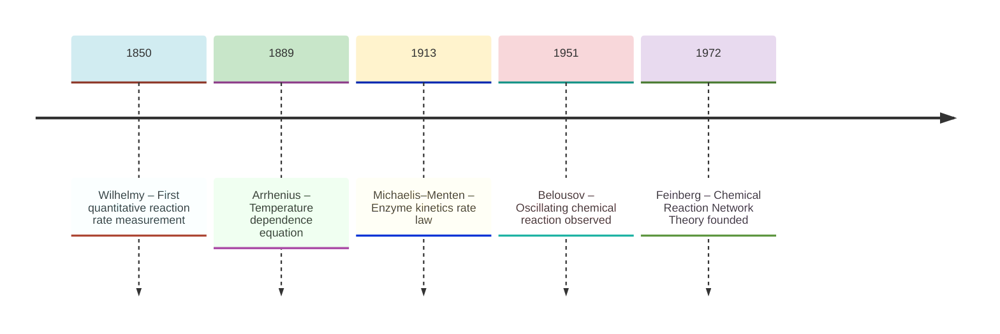
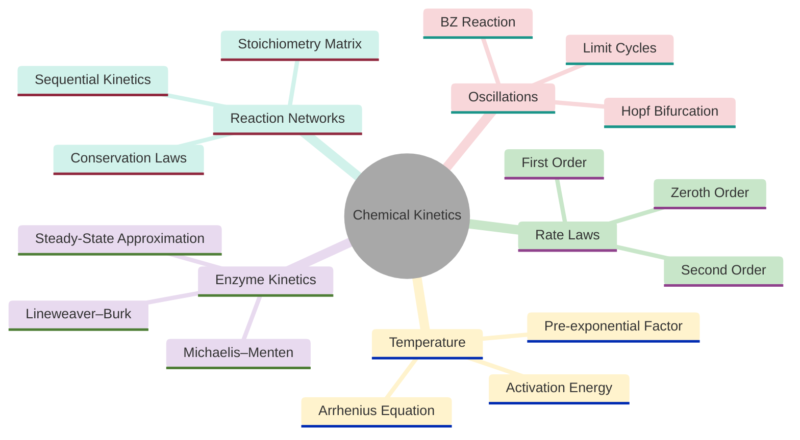
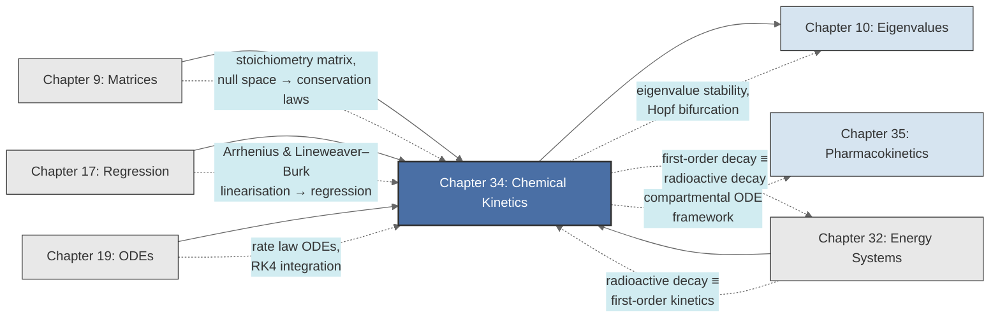

<!-- Copyright (c) 2025-2026 Bob Jansen <bobjansen@pm.me> -->
<!-- SPDX-License-Identifier: CC-BY-NC-4.0 -->
<!-- See LICENSE for full terms. Commercial licensing available. -->

# Chapter 34: Chemical Kinetics & Reaction Networks


**Part IX**: Applications

> Chemical kinetics expresses reaction rates as differential equations whose order encodes the molecular mechanism, whose temperature dependence follows the Arrhenius law and whose network structure is organised by the stoichiometry matrix $N$ via $d\mathbf{c}/dt = N\mathbf{r}(\mathbf{c})$.

**Prerequisites**: [Chapter 9](09-matrices.md) (Matrices); matrix-vector multiplication, null space computation and rank, applied here to stoichiometry matrices and conservation law extraction. [Chapter 17](17-regression.md) (Regression); linear least-squares fitting, applied to Arrhenius parameter estimation and Lineweaver–Burk analysis. [Chapter 19](19-odes.md) (Ordinary Differential Equations); separable equations, first-order linear ODEs, systems of ODEs, equilibrium analysis and Runge–Kutta numerical integration, applied to all rate law solutions and coupled reaction networks. [Chapter 32](32-energy-systems.md) (Energy Systems); radioactive decay as the physical parallel to first-order chemical decay kinetics.

**Learning Objectives**: After this chapter, the reader will be able to:

1. Formulate zeroth-, first- and second-order rate laws as ordinary differential equations and derive their analytical solutions.
2. Apply the Arrhenius equation to determine activation energies from temperature-dependent rate data using linearised regression.
3. Derive the Michaelis–Menten rate law from the steady-state approximation of the enzyme-substrate mechanism and apply Lineweaver–Burk linearisation for parameter estimation.
4. Construct the stoichiometry matrix for a reaction network and identify conservation laws from the null space of its transpose.
5. Formulate coupled reaction systems as ODE systems and solve sequential first-order kinetics analytically.
6. Analyse oscillating chemical systems through eigenvalue analysis and identify conditions for sustained oscillations.
7. Implement numerical integration of reaction network ODEs using the fourth-order Runge–Kutta method.

**Connections**: This chapter synthesises [Chapter 9](09-matrices.md) (the stoichiometry matrix encodes reaction network structure; null-space computation yields conservation laws), [Chapter 17](17-regression.md) (Arrhenius linearisation and Lineweaver–Burk plots are linear regression problems) and [Chapter 19](19-odes.md) (rate laws are separable or linear ODEs; coupled networks are ODE systems integrated numerically via the fourth-order Runge–Kutta method (RK4)). It connects to [Chapter 10](10-eigenvalues.md) (eigenvalue analysis determines stability of steady states and predicts oscillatory behaviour), [Chapter 32](32-energy-systems.md) (first-order decay is mathematically identical to radioactive decay) and [Chapter 35](35-pharmacokinetics.md) (pharmacokinetics applies the same compartmental ODE framework to drug metabolism).

---

## Historical Context

**Key Milestones in Chemical Kinetics**



*Figure 34.1: Timeline of key milestones in chemical kinetics from Wilhelmy to Feinberg.*

**Wilhelmy and the first quantitative reaction rate (1850).** Ludwig Ferdinand Wilhelmy published "Ueber das Gesetz, nach welchem die Einwirkung der Säuren auf den Rohrzucker stattfindet" in *Poggendorff's Annalen der Physik und Chemie* in 1850. He measured the optical rotation of a sucrose solution over time, exploiting that sucrose and its hydrolysis products rotate polarised light in opposite directions. Wilhelmy established that the rate of disappearance of sucrose is proportional to its instantaneous concentration: the first-order rate law $d[A]/dt = -k[A]$. His paper was the first quantitative measurement of a reaction rate and the first formulation of a differential rate equation.

**Harcourt, Esson and van't Hoff on reaction order classification (1860s–1884).** Augustus George Vernon Harcourt and William Esson, in the 1860s, studied the reaction between hydrogen peroxide and hydrogen iodide and recognised second-order kinetics. Jacobus Henricus van't Hoff, in his 1884 *Études de dynamique chimique*, classified reactions by their order and established the relationship between equilibrium constants and the ratio of forward and reverse rate constants. Van't Hoff proposed that rate constants increase with temperature, but the precise functional form awaited Arrhenius.

**The Arrhenius temperature-dependence equation (1889).** Svante August Arrhenius proposed $k = A e^{-E_a / RT}$ in his 1889 paper in *Zeitschrift für physikalische Chemie*. Arrhenius argued that only molecules with energy exceeding the threshold $E_a$ (the activation energy) can react; the Boltzmann factor $e^{-E_a/RT}$ gives the fraction of such molecules. The pre-exponential factor $A$ accounts for collision frequency and orientation. The linearised form $\ln k = \ln A - E_a/(RT)$ provides activation energies through regression on $1/T$ ([Chapter 17](17-regression.md)).

**The Michaelis–Menten enzyme kinetics rate law (1913).** Leonor Michaelis and Maud Leonora Menten published their theory of enzyme-catalysed reaction rates in *Biochemische Zeitschrift* in 1913. Their model posits a two-step mechanism: reversible binding of enzyme (E) and substrate (S) to form a complex (ES), followed by irreversible conversion to product (P) with release of free enzyme. George Edward Briggs and J. B. S. Haldane refined the analysis in 1925 with the steady-state approximation. The resulting rate law is

$$v = \frac{V_{\max}[S]}{K_m + [S]},$$

where $K_m$ is the substrate concentration at half-maximal rate. Hans Lineweaver and Dean Burk (1934) proposed the double-reciprocal linearisation

$$\frac{1}{v} = \frac{K_m}{V_{\max}}\cdot\frac{1}{[S]} + \frac{1}{V_{\max}},$$

reducing parameter estimation to linear regression.

**Chemical Reaction Network Theory by Feinberg, Horn and Jackson (1970s).** Martin Feinberg, Fritz Horn and Roy Jackson formalised the algebraic structure of reaction networks in the 1970s. The stoichiometry matrix $N$, whose columns represent the net change in species concentrations for each reaction, encodes the geometry of the system. The null space of $N^T$ yields conservation laws; the column space of $N$ defines the stoichiometric subspace.

**The Belousov–Zhabotinsky oscillating reaction (1951–1960s).** Boris Pavlovich Belousov observed oscillating concentrations in a cerium-catalysed oxidation of malonic acid by bromate in 1951. Reviewers rejected his paper as an artefact. Anatol Zhabotinsky confirmed the oscillations in the early 1960s. The Oregonator model (Field, Körös and Noyes, 1972), a system of three coupled ODEs, explained the Belousov–Zhabotinsky reaction. Sustained oscillations arise through a Hopf bifurcation: as a parameter crosses a critical value, a stable equilibrium loses stability and a stable limit cycle appears.

---

## Why This Chapter Matters

**Chemical Kinetics**



*Figure 34.2: Topics and applications covered in chemical kinetics and reaction networks.*

Reactor design depends on rate law determination. A first-order reaction requires different reactor sizing from a second-order reaction. The Arrhenius temperature dependence determines the optimal operating temperature, balancing reaction speed against energy cost and selectivity. The global chemical industry, with annual revenues exceeding four trillion euros, relies on these calculations for the production of plastics, fertilisers, pharmaceuticals and semiconductors.

The Michaelis–Menten equation is the quantitative foundation of biochemistry and drug development. The parameters $V_{\max}$ and $K_m$ characterise enzyme efficiency and are measured for every drug target. Competitive, uncompetitive and noncompetitive inhibition models determine how candidate molecules interact with their targets and inform dosing decisions. The linearisation techniques (Lineweaver–Burk, Eadie–Hofstee) are direct applications of the regression methods in [Chapter 17](17-regression.md). In systems biology, large-scale reaction network models combine hundreds of rate equations to simulate cellular metabolism; the stoichiometry matrix framework identifies conservation laws and steady-state flux distributions.

Identical rate laws govern environmental science and atmospheric chemistry. Degradation rates of pollutants (pesticides in soil, pharmaceuticals in wastewater, ozone-depleting substances in the stratosphere) follow first-order or higher-order kinetics. The half-life concept, identical to radioactive decay, determines remediation timescales. Atmospheric chemistry models predicting smog, acid rain and greenhouse gas concentrations are systems of coupled ODEs with Arrhenius rate constants. Sequential reaction kinetics (the Bateman equations) apply equally to nuclear decay chains and to drug metabolism in pharmacokinetics.

---

## Notation & Conventions

| Symbol | Meaning |
|--------|---------|
| $[A]$, $[B]$, $[S]$, $[P]$ | Molar concentration of species $A$, $B$, $S$, $P$ ($\text{mol L}^{-1}$) |
| $[A]_0$ | Initial concentration of species $A$ at $t = 0$ |
| $k$ | Rate constant (units depend on reaction order) |
| $n$ | Reaction order (zeroth: $n=0$; first: $n=1$; second: $n=2$) |
| $E_a$ | Activation energy ($\text{J mol}^{-1}$ or $\text{kJ mol}^{-1}$) |
| $A$ | Pre-exponential (frequency) factor in the Arrhenius equation |
| $R$ | Universal gas constant, $R = 8.314$ $\text{J mol}^{-1} \text{K}^{-1}$ |
| $T$ | Absolute temperature (K) |
| $v$ | Reaction rate ($\text{mol L}^{-1} \text{s}^{-1}$) |
| $V_{\max}$ | Maximum enzyme-catalysed rate ($\text{mol L}^{-1} \text{s}^{-1}$) |
| $K_m$ | Michaelis constant ($\text{mol L}^{-1}$) |
| $k_1, k_{-1}$ | Association and dissociation rate constants (enzyme mechanism) |
| $k_2$ | Catalytic rate constant ($k_{\text{cat}}$) |
| $k_f, k_r$ | Forward and reverse rate constants (reversible reactions) |
| $[E]_0$ | Total enzyme concentration |
| $N$ | Stoichiometry matrix ($m \times r$, $m$ species, $r$ reactions) |
| $\mathbf{c}(t)$ | Concentration vector $([A_1], [A_2], \ldots, [A_m])^T$ |
| $\mathbf{r}(\mathbf{c})$ | Rate vector $(r_1, r_2, \ldots, r_r)^T$ |
| $t_{1/2}$ | Half-life: time for concentration to fall to half its initial value |
| $J$ | Jacobian matrix at an equilibrium point |
| $\lambda_i$ | Eigenvalue of the Jacobian |
| $h$ | Step size for numerical integration |
| $s, q, w, f$ | Dimensionless parameters of the Oregonator model (Definition 34.24) |

Rate constant units depend on order: zeroth, $\text{mol L}^{-1} \text{s}^{-1}$; first, $\text{s}^{-1}$; second, $\text{L mol}^{-1} \text{s}^{-1}$. Time is in seconds unless stated otherwise. $d[A]/dt$ denotes the time derivative of concentration.

---

## Core Theory

### Elementary Rate Laws

**Definition 34.1** (Rate law). A *rate law* expresses the rate of change of a reactant's concentration as a function of the current concentrations. For a single-reactant decomposition $A \to \text{products}$, the general $n$th-order rate law is

$$\frac{d[A]}{dt} = -k[A]^n,$$

where $k > 0$ is the rate constant and $n \geq 0$ is the reaction order.

**Theorem 34.2** (Zeroth-order kinetics). For $n = 0$, the rate law $d[A]/dt = -k$ has the solution

$$[A](t) = [A]_0 - kt, \qquad 0 \leq t \leq [A]_0 / k.$$

The concentration decreases linearly until it reaches zero at $t = [A]_0/k$. The half-life is $t_{1/2} = [A]_0 / (2k)$, which depends on the initial concentration.

??? note "Proof"

    *Proof.* The equation $d[A]/dt = -k$ integrates directly:

    $$[A](t) = [A]_0 + \int_0^t (-k)\,d\tau = [A]_0 - kt.$$

    The solution is physically valid for $[A] \geq 0$, i.e., for $t \leq [A]_0/k$.

    Setting $[A](t_{1/2}) = [A]_0/2$ gives $[A]_0/2 = [A]_0 - k t_{1/2}$, so $t_{1/2} = [A]_0/(2k)$.

    $\square$

**Theorem 34.3** (First-order kinetics). For $n = 1$, the rate law $d[A]/dt = -k[A]$ has the solution

$$[A](t) = [A]_0 \, e^{-kt}.$$

The half-life is $t_{1/2} = \ln 2 / k$, independent of initial concentration.

??? note "Proof"

    *Proof.* The equation is separable ([Chapter 19](19-odes.md)): $d[A]/[A] = -k\,dt$. Integrating: $\ln[A] - \ln[A]_0 = -kt$, hence $[A] = [A]_0 e^{-kt}$. Setting $[A]_0 e^{-kt_{1/2}} = [A]_0/2$ gives $t_{1/2} = \ln 2/k$.

    $\square$

**First-Order Kinetics Concentration Decay**

```mermaid
---
config:
  theme: base
  themeVariables:
    xyChart:
      plotColorPalette: "#2563eb, #dc2626, #16a34a, #9333ea, #ca8a04, #0891b2"
      backgroundColor: "#ffffff"
      titleColor: "#333333"
      xAxisLabelColor: "#333333"
      yAxisLabelColor: "#333333"
      xAxisTitleColor: "#333333"
      yAxisTitleColor: "#333333"
      xAxisLineColor: "#333333"
      yAxisLineColor: "#333333"
---
xychart-beta
    x-axis "Time t" [0, 1, 2, 3, 4, 5]
    y-axis "[A] (mol/L)" 0 --> 1.1
    line [1.0, 0.368, 0.135, 0.050, 0.018, 0.007]
```

*Figure 34.3: Exponential decay of reactant concentration under first-order kinetics.*

**Remark 34.4**. First-order kinetics is mathematically identical to radioactive decay ([Chapter 32](32-energy-systems.md), Theorem 32.2) with the identification $\lambda = k$. This is not coincidental: both describe processes where each individual entity (molecule or atom) has a constant probability per unit time of undergoing transformation, independent of the surrounding population.

**Theorem 34.5** (Second-order kinetics). For $n = 2$, the rate law $d[A]/dt = -k[A]^2$ has the solution

$$\frac{1}{[A](t)} = \frac{1}{[A]_0} + kt.$$

The half-life is $t_{1/2} = 1/(k[A]_0)$, which depends on initial concentration.

??? note "Proof"

    *Proof.* Separating variables:

    $$\frac{d[A]}{[A]^2} = -k\,dt.$$

    Integrating both sides:

    $$-\frac{1}{[A]} + \frac{1}{[A]_0} = -kt,$$

    which rearranges to the stated integrated law:

    $$\frac{1}{[A](t)} = \frac{1}{[A]_0} + kt.$$

    For the half-life, set $[A](t_{1/2}) = [A]_0/2$, so $1/([A]_0/2) = 1/[A]_0 + k t_{1/2}$. Subtracting $1/[A]_0$ from both sides: $1/[A]_0 = k t_{1/2}$, giving $t_{1/2} = 1/(k[A]_0)$.

    $\square$

**Remark 34.6** (Integrated rate laws and graphical determination of order). The analytical solutions provide diagnostic plots for determining reaction order from experimental data:

- Zeroth order: $[A]$ vs $t$ is linear (slope $= -k$).
- First order: $\ln[A]$ vs $t$ is linear (slope $= -k$).
- Second order: $1/[A]$ vs $t$ is linear (slope $= k$).

Plotting the data in each form and identifying which yields a straight line determines the reaction order empirically.

### The Arrhenius Equation

**Definition 34.7** (Arrhenius equation). The temperature dependence of a rate constant is given by

$$k(T) = A \, e^{-E_a / (RT)},$$

where $A > 0$ is the pre-exponential factor, $E_a > 0$ is the activation energy, $R = 8.314$ $\text{J mol}^{-1} \text{K}^{-1}$ is the gas constant and $T$ is the absolute temperature in kelvins.

**Theorem 34.8** (Arrhenius linearisation). Taking the natural logarithm of the Arrhenius equation yields

$$\ln k = \ln A - \frac{E_a}{R} \cdot \frac{1}{T}.$$

This is a linear equation in $1/T$: if one plots $\ln k$ (ordinate) against $1/T$ (abscissa), the result is a straight line with slope $-E_a/R$ and intercept $\ln A$. Linear regression ([Chapter 17](17-regression.md)) on data $\{(1/T_i, \ln k_i)\}_{i=1}^n$ yields estimates of $E_a$ and $A$.

??? note "Proof"

    *Proof.* Apply $\ln$ to both sides of $k = Ae^{-E_a/(RT)}$: $\ln k = \ln A + \ln(e^{-E_a/(RT)}) = \ln A - E_a/(RT)$. Identifying $y = \ln k$, $x = 1/T$, $m = -E_a/R$ and $b = \ln A$ gives the linear form $y = mx + b$.

    $\square$

**Corollary 34.9** (Two-temperature form). From rate constants measured at two temperatures $T_1$ and $T_2$:

$$\ln\frac{k_2}{k_1} = \frac{E_a}{R}\left(\frac{1}{T_1} - \frac{1}{T_2}\right).$$

This allows $E_a$ to be computed from two data points without regression.

??? note "Proof"

    *Proof.* Apply the Arrhenius linearisation (Theorem 34.8) at both temperatures:

    $$\ln k_2 = \ln A - \frac{E_a}{R} \cdot \frac{1}{T_2}, \qquad \ln k_1 = \ln A - \frac{E_a}{R} \cdot \frac{1}{T_1}.$$

    Subtracting the second equation from the first:

    $$\ln k_2 - \ln k_1 = \frac{E_a}{R}\left(\frac{1}{T_1} - \frac{1}{T_2}\right),$$

    which is the stated result.

    $\square$

### Enzyme Kinetics: The Michaelis–Menten Model

**Definition 34.10** (Enzyme mechanism). The simplest enzyme-catalysed reaction proceeds through a two-step mechanism:

$$E + S \underset{k_{-1}}{\overset{k_1}{\rightleftharpoons}} ES \overset{k_2}{\longrightarrow} E + P,$$

where $E$ is the free enzyme, $S$ is the substrate, $ES$ is the enzyme-substrate complex, $P$ is the product, $k_1$ is the association rate constant, $k_{-1}$ is the dissociation rate constant and $k_2$ is the catalytic rate constant ($k_{\text{cat}}$).

The full system of ODEs for this mechanism is:

$$\begin{aligned}
\frac{d[S]}{dt} &= -k_1[E][S] + k_{-1}[ES], \\
\frac{d[ES]}{dt} &= k_1[E][S] - k_{-1}[ES] - k_2[ES], \\
\frac{d[E]}{dt} &= -k_1[E][S] + k_{-1}[ES] + k_2[ES], \\
\frac{d[P]}{dt} &= k_2[ES].
\end{aligned}$$

**Theorem 34.11** (Enzyme conservation law). The total enzyme concentration is conserved:

$$[E](t) + [ES](t) = [E]_0 = \text{const.}$$

??? note "Proof"

    *Proof.* Adding the equations for $d[E]/dt$ and $d[ES]/dt$:

    $$\frac{d}{dt}([E] + [ES]) = (-k_1[E][S] + k_{-1}[ES] + k_2[ES]) + (k_1[E][S] - k_{-1}[ES] - k_2[ES]) = 0.$$

    The sum $[E] + [ES]$ is therefore constant, equal to $[E]_0$.

    $\square$

**Theorem 34.12** (Michaelis–Menten rate law). Under the steady-state approximation $d[ES]/dt \approx 0$ (valid when $[E]_0 \ll [S]_0$), the initial rate of product formation is

$$v = \frac{d[P]}{dt} = \frac{V_{\max}[S]}{K_m + [S]},$$

where $V_{\max} = k_2[E]_0$ is the maximum rate and $K_m = (k_{-1} + k_2)/k_1$ is the Michaelis constant.

??? note "Proof"

    *Proof.* Set $d[ES]/dt = 0$:

    $$k_1[E][S] - (k_{-1} + k_2)[ES] = 0.$$

    Solving for $[ES]$:

    $$[ES] = \frac{k_1[E][S]}{k_{-1} + k_2} = \frac{[E][S]}{K_m},$$

    where $K_m = (k_{-1} + k_2)/k_1$. Using the conservation law $[E] = [E]_0 - [ES]$:

    $$[ES] = \frac{([E]_0 - [ES])[S]}{K_m}.$$

    Solving for $[ES]$:

    $$\begin{aligned}
    [ES]\left(1 + \frac{[S]}{K_m}\right) &= \frac{[E]_0[S]}{K_m}, \\
    [ES] &= \frac{[E]_0[S]}{K_m + [S]}.
    \end{aligned}$$

    The rate of product formation is:

    $$v = k_2[ES] = \frac{k_2[E]_0[S]}{K_m + [S]} = \frac{V_{\max}[S]}{K_m + [S]}.$$

    $\square$

!!! abstract "Key Result"

    **Theorem 34.12** (Michaelis--Menten rate law). The reaction rate $v = V_{\max}[S]/(K_m + [S])$ captures the saturation kinetics of enzyme catalysis, transitioning from first-order behaviour at low substrate to zero-order at high substrate, and is the foundation of enzyme kinetics and pharmacology.

**Michaelis–Menten Saturation Kinetics**

```mermaid
---
config:
  theme: base
  themeVariables:
    xyChart:
      plotColorPalette: "#2563eb, #dc2626, #16a34a, #9333ea, #ca8a04, #0891b2"
      backgroundColor: "#ffffff"
      titleColor: "#333333"
      xAxisLabelColor: "#333333"
      yAxisLabelColor: "#333333"
      xAxisTitleColor: "#333333"
      yAxisTitleColor: "#333333"
      xAxisLineColor: "#333333"
      yAxisLineColor: "#333333"
---
xychart-beta
    x-axis "[S]" [0, 1, 2, 5, 10, 20, 50, 100]
    y-axis "v / Vₘₐₓ" 0 --> 1.05
    line [0, 0.5, 0.67, 0.83, 0.91, 0.95, 0.98, 0.99]
```

*Figure 34.4: Michaelis–Menten rate curve showing saturation as substrate concentration increases.*

**Remark 34.13** (Interpretation of $K_m$). When $[S] = K_m$, the rate is $v = V_{\max}/2$. $K_m$ is thus the substrate concentration at which the enzyme operates at half its maximum capacity. A low $K_m$ indicates high substrate affinity (the enzyme reaches half-saturation at low substrate concentrations).

**Theorem 34.14** (Lineweaver–Burk linearisation). Taking the reciprocal of both sides of the Michaelis–Menten equation yields

$$\frac{1}{v} = \frac{K_m}{V_{\max}} \cdot \frac{1}{[S]} + \frac{1}{V_{\max}}.$$

This is a linear equation in $1/[S]$: plotting $1/v$ against $1/[S]$ yields a straight line with slope $K_m/V_{\max}$ and $y$-intercept $1/V_{\max}$. Linear regression ([Chapter 17](17-regression.md)) on data $\{(1/[S]_i, 1/v_i)\}_{i=1}^n$ estimates both $K_m$ and $V_{\max}$.

??? note "Proof"

    *Proof.* Take the reciprocal of the Michaelis–Menten rate law:

    $$\frac{1}{v} = \frac{K_m + [S]}{V_{\max}[S]} = \frac{K_m}{V_{\max}} \cdot \frac{1}{[S]} + \frac{1}{V_{\max}}.$$

    This has the linear form $y = mx + b$ with $y = 1/v$, $x = 1/[S]$, slope $m = K_m/V_{\max}$ and intercept $b = 1/V_{\max}$.

    $\square$

**Remark 34.15** (Limitations of Lineweaver–Burk). The double-reciprocal transformation distorts the error structure: data points at low $[S]$ (high $1/[S]$), which carry the largest experimental uncertainty, are disproportionately amplified in the $1/v$ space, potentially biasing the regression. Modern practice prefers nonlinear regression directly on the Michaelis–Menten form, but the Lineweaver–Burk plot retains pedagogical and diagnostic value.

### Reaction Networks and the Stoichiometry Matrix

**Definition 34.16** (Stoichiometry matrix). Consider a reaction network with $m$ chemical species and $r$ reactions. The *stoichiometry matrix* $N$ is the $m \times r$ matrix whose entry $N_{ij}$ gives the net change in the number of molecules (or moles) of species $i$ when reaction $j$ fires once. Equivalently, column $j$ of $N$ is the *reaction vector* for reaction $j$: the vector of stoichiometric coefficients (products minus reactants).

**Theorem 34.17** (Concentration dynamics). The time evolution of the concentration vector $\mathbf{c}(t) = ([A_1](t), \ldots, [A_m](t))^T$ under a reaction network with stoichiometry matrix $N$ and rate vector $\mathbf{r}(\mathbf{c}) = (r_1(\mathbf{c}), \ldots, r_r(\mathbf{c}))^T$ is

$$\frac{d\mathbf{c}}{dt} = N \cdot \mathbf{r}(\mathbf{c}).$$

Each component reads $d[A_i]/dt = \sum_{j=1}^r N_{ij} r_j(\mathbf{c})$.

??? note "Proof"

    *Proof.* By definition, reaction $j$ occurring at rate $r_j$ changes species $i$ at rate $N_{ij} r_j$ (the stoichiometric coefficient times the rate).

    The total rate of change of species $i$ is obtained by summing contributions from all $r$ reactions:

    $$\frac{d[A_i]}{dt} = \sum_{j=1}^r N_{ij}\, r_j(\mathbf{c}).$$

    Collecting these equations for all $m$ species and writing them in vector form gives $d\mathbf{c}/dt = N\mathbf{r}(\mathbf{c})$.

    $\square$

**Theorem 34.18** (Conservation laws from null space). A vector $\boldsymbol{\ell} \in \mathbb{R}^m$ defines a *conservation law* $\boldsymbol{\ell}^T \mathbf{c}(t) = \text{const}$ for all time if and only if $\boldsymbol{\ell}$ lies in the left null space of $N$ (equivalently, the null space of $N^T$):

$$N^T \boldsymbol{\ell} = \mathbf{0}.$$

The number of independent conservation laws equals $\dim(\ker N^T) = m - \operatorname{rank}(N)$.

??? note "Proof"

    *Proof.* Compute the time derivative of $\boldsymbol{\ell}^T \mathbf{c}$:

    $$\frac{d}{dt}(\boldsymbol{\ell}^T \mathbf{c}) = \boldsymbol{\ell}^T \frac{d\mathbf{c}}{dt} = \boldsymbol{\ell}^T N \mathbf{r} = (N^T \boldsymbol{\ell})^T \mathbf{r}.$$

    This vanishes for all rate vectors $\mathbf{r}$ if and only if $N^T \boldsymbol{\ell} = \mathbf{0}$. The dimension count follows from the rank-nullity theorem ([Chapter 9](09-matrices.md)).

    $\square$

**Example 34.19** (Enzyme conservation as a null-space vector). For the enzyme mechanism of Definition 34.10, define species as $([S], [E], [ES], [P])^T$ and reactions as (1) $E + S \to ES$ at rate $k_1[E][S]$, (2) $ES \to E + S$ at rate $k_{-1}[ES]$, (3) $ES \to E + P$ at rate $k_2[ES]$. The stoichiometry matrix is:

$$N = \begin{pmatrix} -1 & 1 & 0 \\ -1 & 1 & 1 \\ 1 & -1 & -1 \\ 0 & 0 & 1 \end{pmatrix}.$$

The null space of $N^T$ contains $\boldsymbol{\ell} = (0, 1, 1, 0)^T$, which states $[E] + [ES] = \text{const}$; the enzyme conservation law of Theorem 34.11.

### Coupled Reactions: Sequential First-Order Kinetics

**Definition 34.20** (Sequential first-order reactions). The mechanism $A \overset{k_1}{\longrightarrow} B \overset{k_2}{\longrightarrow} C$ with all steps first-order yields the ODE system:

$$\frac{d[A]}{dt} = -k_1[A], \qquad \frac{d[B]}{dt} = k_1[A] - k_2[B], \qquad \frac{d[C]}{dt} = k_2[B].$$

**Theorem 34.21** (Solution of sequential kinetics). With initial conditions $[A]_0 > 0$, $[B]_0 = 0$, $[C]_0 = 0$ and $k_1 \neq k_2$:

$$\begin{aligned}
[A](t) &= [A]_0 \, e^{-k_1 t}, \\
[B](t) &= \frac{k_1 [A]_0}{k_2 - k_1}\left(e^{-k_1 t} - e^{-k_2 t}\right), \\
[C](t) &= [A]_0\left(1 + \frac{k_1 e^{-k_2 t} - k_2 e^{-k_1 t}}{k_2 - k_1}\right).
\end{aligned}$$

??? note "Proof"

    *Proof.* The equation for $[A]$ is first-order with solution $[A] = [A]_0 e^{-k_1 t}$ (Theorem 34.3). Substituting into the equation for $[B]$:

    $$\frac{d[B]}{dt} + k_2[B] = k_1[A]_0 e^{-k_1 t}.$$

    This is a first-order linear ODE ([Chapter 19](19-odes.md)) with integrating factor $e^{k_2 t}$. Multiplying:

    $$\frac{d}{dt}\left(e^{k_2 t}[B]\right) = k_1[A]_0 e^{(k_2 - k_1)t}.$$

    Integrating from $0$ to $t$ with $[B](0) = 0$:

    $$e^{k_2 t}[B](t) = \frac{k_1[A]_0}{k_2 - k_1}\left(e^{(k_2 - k_1)t} - 1\right).$$

    Dividing by $e^{k_2 t}$:

    $$[B](t) = \frac{k_1[A]_0}{k_2 - k_1}\left(e^{-k_1 t} - e^{-k_2 t}\right).$$

    For $[C]$, the conservation law $[A] + [B] + [C] = [A]_0$ (verified by summing the three ODEs to get $d([A]+[B]+[C])/dt = 0$) gives $[C] = [A]_0 - [A] - [B]$. Substituting and simplifying yields the stated expression.

    $\square$

**Corollary 34.22** (Time of maximum intermediate). The intermediate $B$ reaches its maximum concentration at time

$$t_{\max} = \frac{\ln(k_1/k_2)}{k_1 - k_2}.$$

??? note "Proof"

    *Proof.* Setting $d[B]/dt = 0$ in the original ODE requires $k_1[A](t_{\max}) = k_2[B](t_{\max})$.

    Alternatively, differentiate the explicit solution for $[B](t)$ and set it to zero. This gives

    $$k_1 e^{-k_1 t_{\max}} = k_2 e^{-k_2 t_{\max}},$$

    i.e., $e^{(k_2 - k_1)t_{\max}} = k_2/k_1$. Taking the natural logarithm and solving for $t_{\max}$:

    $$t_{\max} = \frac{\ln(k_1/k_2)}{k_1 - k_2}.$$

    $\square$

**Remark 34.23**. The structure of Theorem 34.21 is identical to the Bateman equations for radioactive decay chains ([Chapter 32](32-energy-systems.md), Theorem 32.7). The mathematical equivalence is exact: sequential first-order chemical kinetics and radioactive decay chains are the same ODE system with different physical interpretations.

### Oscillating Reactions

**Definition 34.24** (Oregonator model). The Oregonator is a simplified three-variable model of the Belousov–Zhabotinsky reaction:

$$\begin{aligned}
\frac{dx}{dt} &= s(y - xy + x - qx^2), \\
\frac{dy}{dt} &= (-y - xy + fz)/s, \\
\frac{dz}{dt} &= w(x - z),
\end{aligned}$$

where $x$, $y$, $z$ represent scaled concentrations of $\text{HBrO}_2$, $\text{Br}^-$ and the oxidised catalyst respectively, and $s$, $q$, $w$, $f$ are dimensionless parameters derived from rate constants and reference concentrations.

**Theorem 34.25** (Hopf bifurcation in the Oregonator). The Oregonator possesses a unique positive equilibrium $(x^*, y^*, z^*)$. The Jacobian at this equilibrium has eigenvalues that depend on the parameter $f$. There exists a critical value $f_c$ such that:

- For $f < f_c$: all eigenvalues have negative real parts (stable equilibrium).
- At $f = f_c$: a pair of eigenvalues is purely imaginary (Hopf bifurcation point).
- For $f > f_c$: a pair of eigenvalues has positive real parts (unstable equilibrium); a stable limit cycle exists, corresponding to sustained chemical oscillations.

??? note "Proof"

    *Proof (sketch).* At equilibrium, setting all derivatives to zero yields $z^* = x^*$ and algebraic relations determining $(x^*, y^*)$ in terms of parameters. The $3 \times 3$ Jacobian $J$ at this point is computed by partial differentiation. The characteristic polynomial $\det(J - \lambda I) = 0$ is cubic. By the Routh–Hurwitz criterion, stability requires that all coefficients of the characteristic polynomial be positive and that a certain determinant condition hold. As $f$ increases, the determinant condition fails at $f = f_c$, and a pair of complex conjugate eigenvalues crosses the imaginary axis. The Hopf bifurcation theorem guarantees that a periodic orbit (limit cycle) is born at this crossing.

    $\square$

**Remark 34.26**. The mathematical analysis of the Hopf bifurcation requires eigenvalue computation ([Chapter 10](10-eigenvalues.md)) at a parametrised family of equilibria. The transition from damped oscillations (stable spiral) to sustained oscillations (limit cycle) is a generic phenomenon in nonlinear ODE systems and appears throughout chemistry, biology and engineering.

---

## Formulas & Identities

**F34.1** Zeroth-order integrated rate law:

$$[A](t) = [A]_0 - kt, \qquad t_{1/2} = \frac{[A]_0}{2k}.$$

**F34.2** First-order integrated rate law:

$$[A](t) = [A]_0 e^{-kt}, \qquad t_{1/2} = \frac{\ln 2}{k}.$$

**F34.3** Second-order integrated rate law:

$$\frac{1}{[A](t)} = \frac{1}{[A]_0} + kt, \qquad t_{1/2} = \frac{1}{k[A]_0}.$$

**F34.4** Arrhenius equation:

$$k = Ae^{-E_a/(RT)}, \qquad \ln k = \ln A - \frac{E_a}{R}\cdot\frac{1}{T}.$$

**F34.5** Two-temperature Arrhenius:

$$\ln\frac{k_2}{k_1} = \frac{E_a}{R}\left(\frac{1}{T_1} - \frac{1}{T_2}\right).$$

**F34.6** Michaelis–Menten:

$$v = \frac{V_{\max}[S]}{K_m + [S]}; \qquad \text{at } [S] = K_m\!: \quad v = \frac{V_{\max}}{2}.$$

**F34.7** Lineweaver–Burk:

$$\frac{1}{v} = \frac{K_m}{V_{\max}}\cdot\frac{1}{[S]} + \frac{1}{V_{\max}}.$$

**F34.8** Concentration dynamics:

$$\frac{d\mathbf{c}}{dt} = N\mathbf{r}(\mathbf{c}),$$

where $N$ is the $m \times r$ stoichiometry matrix.

**F34.9** Conservation laws:

$$\boldsymbol{\ell}^T\mathbf{c} = \text{const} \quad \text{if and only if} \quad N^T\boldsymbol{\ell} = \mathbf{0}; \qquad \text{number of conservation laws} = m - \operatorname{rank}(N).$$

**F34.10** Sequential first-order $A \to B \to C$:

$$[B](t) = \frac{k_1[A]_0}{k_2 - k_1}\left(e^{-k_1 t} - e^{-k_2 t}\right).$$

!!! warning "Singularity at $k_1 = k_2$"

    Formulas F34.10–F34.12 have a removable singularity when $k_1 = k_2$. In this degenerate case, L'Hopital's rule gives $[B](t) = k_1 [A]_0\, t\, e^{-k_1 t}$. Numerical code must handle $|k_1 - k_2| < \varepsilon$ separately to avoid division by zero.

**F34.11** Time of maximum intermediate:

$$t_{\max} = \frac{\ln(k_1/k_2)}{k_1 - k_2}.$$

**F34.12** Maximum intermediate concentration:

$$[B]_{\max} = [A]_0\!\left(\frac{k_2}{k_1}\right)^{k_2/(k_1 - k_2)}.$$

---

## Algorithms

### Algorithm 34.27: Reaction Network Simulation via RK4

Numerically integrate a reaction network $d\mathbf{c}/dt = N\mathbf{r}(\mathbf{c})$ using the classical fourth-order Runge–Kutta method ([Chapter 19](19-odes.md)).

**Input**: Stoichiometry matrix $N$ ($m \times r$); rate function $\mathbf{r}: \mathbb{R}^m \to \mathbb{R}^r$; initial concentrations $\mathbf{c}_0$; time horizon $T$; step size $h$.

**Output**: Time series $(t_k, \mathbf{c}_k)$ for $k = 0, 1, \ldots, \lfloor T/h \rfloor$.

1. Define the vector field $\mathbf{f}(\mathbf{c}) = N \cdot \mathbf{r}(\mathbf{c})$.
2. Set $\mathbf{c}_0$ as given, $t_0 = 0$.
3. For $k = 0, 1, \ldots, \lfloor T/h \rfloor - 1$:
   a. $\mathbf{k}_1 = h \cdot \mathbf{f}(\mathbf{c}_k)$
   b. $\mathbf{k}_2 = h \cdot \mathbf{f}(\mathbf{c}_k + \mathbf{k}_1/2)$
   c. $\mathbf{k}_3 = h \cdot \mathbf{f}(\mathbf{c}_k + \mathbf{k}_2/2)$
   d. $\mathbf{k}_4 = h \cdot \mathbf{f}(\mathbf{c}_k + \mathbf{k}_3)$
   e. $\mathbf{c}_{k+1} = \mathbf{c}_k + (\mathbf{k}_1 + 2\mathbf{k}_2 + 2\mathbf{k}_3 + \mathbf{k}_4)/6$
   f. $t_{k+1} = t_k + h$
4. Return all $(t_k, \mathbf{c}_k)$.

```
function reactionNetworkRK4(N, rateFn, c0, T, h):
    // N: m x r stoichiometry matrix
    // rateFn: computes rate vector r(c) of length r
    c = c0; t = 0
    results = [(t, c)]
    function f(c):
        return N * rateFn(c)    // matrix-vector product, yields m-vector
    nSteps = floor(T / h)
    for k = 0 to nSteps - 1:
        k1 = h * f(c)
        k2 = h * f(c + k1 / 2)
        k3 = h * f(c + k2 / 2)
        k4 = h * f(c + k3)
        c = c + (k1 + 2*k2 + 2*k3 + k4) / 6
        t = t + h
        results.append((t, c))
    return results
```

**Complexity**: $O(N_{\text{steps}} \cdot m \cdot r)$ where $N_{\text{steps}} = T/h$. Each step requires 4 evaluations of $\mathbf{r}$ (each $O(m)$ for mass-action kinetics) and 4 matrix-vector products $N\mathbf{r}$ (each $O(mr)$).

**Convergence**: Local truncation error $O(h^5)$; global error $O(h^4)$.

### Algorithm 34.28: Arrhenius Parameter Estimation

Estimate activation energy $E_a$ and pre-exponential factor $A$ from rate constant measurements at multiple temperatures.

**Input**: Temperature-rate data $\{(T_i, k_i)\}_{i=1}^n$ with $n \geq 2$.

**Output**: Estimated $E_a$ ($\text{J mol}^{-1}$) and $A$ (same units as $k$).

1. Transform data: $x_i = 1/T_i$, $y_i = \ln k_i$.
2. Perform linear regression ([Chapter 17](17-regression.md)) of $y$ on $x$: find $m$ and $b$ minimising $\sum_i (y_i - mx_i - b)^2$.
3. Compute $E_a = -mR$ (where $R = 8.314$ $\text{J mol}^{-1} \text{K}^{-1}$).
4. Compute $A = e^b$.
5. Return $E_a$, $A$.

```
function arrheniusEstimate(temps, rates, n):
    // transform to Arrhenius coordinates
    R = 8.314    // J mol^-1 K^-1
    for i = 1 to n:
        x[i] = 1.0 / temps[i]
        y[i] = ln(rates[i])
    // linear regression: y = m * x + b
    sumX = 0; sumY = 0; sumXY = 0; sumXX = 0
    for i = 1 to n:
        sumX = sumX + x[i]
        sumY = sumY + y[i]
        sumXY = sumXY + x[i] * y[i]
        sumXX = sumXX + x[i] * x[i]
    m = (n * sumXY - sumX * sumY) / (n * sumXX - sumX * sumX)
    b = (sumY - m * sumX) / n
    Ea = -m * R
    A = exp(b)
    return { Ea, A }
```

**Complexity**: $O(n)$ for $n$ data points (two passes: one to transform data, one for linear regression via the closed-form normal equations).

**Numerical note**: The regression assumes that errors in $\ln k$ are approximately homoscedastic. If rate constants span several orders of magnitude, weighted regression (with weights proportional to $1/\sigma_{\ln k_i}^2$) may be preferred.

### Algorithm 34.29: Lineweaver–Burk Parameter Estimation

Estimate Michaelis–Menten parameters $V_{\max}$ and $K_m$ from initial rate data.

**Input**: Substrate-rate data $\{([S]_i, v_i)\}_{i=1}^n$ with $n \geq 2$.

**Output**: Estimated $V_{\max}$ and $K_m$.

1. Transform data: $x_i = 1/[S]_i$, $y_i = 1/v_i$.
2. Perform linear regression ([Chapter 17](17-regression.md)) of $y$ on $x$: find slope $m$ and intercept $b$.
3. Compute $V_{\max} = 1/b$.
4. Compute $K_m = m \cdot V_{\max} = m/b$.
5. Return $V_{\max}$, $K_m$.

```
function lineweaverBurk(substrates, rates, n):
    // transform to double-reciprocal coordinates
    for i = 1 to n:
        x[i] = 1.0 / substrates[i]
        y[i] = 1.0 / rates[i]
    // linear regression: y = m * x + b
    sumX = 0; sumY = 0; sumXY = 0; sumXX = 0
    for i = 1 to n:
        sumX = sumX + x[i]
        sumY = sumY + y[i]
        sumXY = sumXY + x[i] * y[i]
        sumXX = sumXX + x[i] * x[i]
    m = (n * sumXY - sumX * sumY) / (n * sumXX - sumX * sumX)
    b = (sumY - m * sumX) / n
    Vmax = 1.0 / b
    Km = m * Vmax
    return { Vmax, Km }
```

**Complexity**: $O(n)$ for $n$ data points (two passes: one to transform data, one for linear regression via the closed-form normal equations).

### Algorithm 34.30: Conservation Law Extraction

Identify all independent conservation laws of a reaction network.

**Input**: Stoichiometry matrix $N$ ($m \times r$).

**Output**: A basis for the left null space of $N$ (the conservation law vectors).

1. Compute $N^T$ (an $r \times m$ matrix).
2. Find a basis for $\ker(N^T)$ using Gaussian elimination or singular value decomposition ([Chapter 9](09-matrices.md)).
3. Each basis vector $\boldsymbol{\ell}_j$ defines a conservation law: $\boldsymbol{\ell}_j^T \mathbf{c}(t) = \boldsymbol{\ell}_j^T \mathbf{c}(0)$.
4. Return the basis vectors and the conserved quantities $\boldsymbol{\ell}_j^T \mathbf{c}(0)$.

```
function conservationLaws(N, c0):
    // N: m x r stoichiometry matrix
    // compute null space of N^T (r x m matrix)
    NT = transpose(N)
    basis = nullSpace(NT)    // via Gaussian elimination or SVD
    numLaws = length(basis)
    conserved = array of size numLaws
    for j = 1 to numLaws:
        // each basis vector l_j defines a conservation law
        conserved[j] = dot(basis[j], c0)
    return { basis, conserved }
```

**Complexity**: $O(m^2 r)$ for Gaussian elimination on the $r \times m$ matrix $N^T$.

---

## Numerical Considerations

### Stiffness in Chemical Kinetics

!!! warning "Stiffness in enzyme and combustion kinetics"

    Rate constants spanning many orders of magnitude produce stiff ODE systems. In the Michaelis–Menten mechanism, $k_1 \sim 10^6$–$10^8$ $\text{L mol}^{-1} \text{s}^{-1}$ and $k_2 \sim 10^0$–$10^3$ $\text{s}^{-1}$. Explicit RK4 requires prohibitively small steps and may produce oscillating, divergent solutions even when the true solution is smooth. Implicit methods (backward Euler, backward differentiation formulae) or the steady-state approximation are necessary.

A diagnostic: if halving $h$ does not change the solution but is required for stability, the system is stiff.

### Non-Negativity of Concentrations

!!! warning "Negative concentrations from explicit integrators"

    Explicit integrators can produce small negative concentrations near exhausted species. Negative values violate the physical model and can cause $\ln[A_i]$ evaluations to fail with `NaN`. Clamp to zero and redistribute to maintain conservation laws. A logarithmic transformation $u_i = \ln [A_i]$ guarantees positivity when negativity causes instability.

### Step Size for Reaction Networks

!!! tip "Initial step size heuristic"

    Set $h = 0.01 / \max_j r_j(\mathbf{c}_0)$ so that no reaction depletes more than 1% of its reactant per step. Adaptive step-size control (e.g. embedded RK4(5) pairs) is recommended for time-varying rates.

### Arrhenius Regression Conditioning

The Arrhenius regression is ill-conditioned when the temperature range is narrow. A span of at least 30–50 K is recommended. Condition numbers of the regression matrix exceeding $10^3$ indicate potential issues.

### Lineweaver–Burk Error Amplification

The double-reciprocal transformation amplifies errors at low $[S]$. Points near $[S] = 0$ dominate the fit despite having the largest relative error. Prefer direct nonlinear least-squares fitting of $v = V_{\max}[S]/(K_m + [S])$. When using Lineweaver–Burk, restrict data to $[S] \geq K_m/5$.

---

## Worked Examples

### Example 34.31: Determining Reaction Order from Data

**Problem.** A decomposition reaction $A \to \text{products}$ is monitored, yielding the following concentration–time data:

| $t$ (s) | 0 | 100 | 200 | 300 | 400 | 500 |
|---------|---|-----|-----|-----|-----|-----|
| $[A]$ (mol/L) | 0.100 | 0.078 | 0.061 | 0.048 | 0.037 | 0.029 |

Determine the reaction order and rate constant.

**Solution.** Test each integrated rate law:

*Zeroth-order test*: Plot $[A]$ vs $t$. The values (0.100, 0.078, 0.061, 0.048, 0.037, 0.029) do not lie on a straight line (the differences $\Delta[A]$ per 100 s are $-0.022$, $-0.017$, $-0.013$, $-0.011$, $-0.008$, which are not constant). Zeroth order is ruled out.

*First-order test*: Compute $\ln[A]$: $(-2.303, -2.551, -2.797, -3.037, -3.297, -3.540)$. The differences per 100 s are $(-0.248, -0.246, -0.240, -0.260, -0.243)$, approximately constant. Linear regression of $\ln[A]$ on $t$ gives slope $m \approx -0.00247$ $\text{s}^{-1}$ with $R^2 = 0.9998$. The reaction is first-order with $k = 0.00247$ $\text{s}^{-1}$.

*Verification*: The half-life is

$$t_{1/2} = \frac{\ln 2}{k} = \frac{0.693}{0.00247} = 281 \text{ s}.$$

At $t = 281$ s, the predicted concentration is

$$0.100 \cdot e^{-0.00247 \times 281} = 0.050 \text{ mol/L},$$

consistent with the data (between the 200 s and 300 s values).

### Example 34.32: Arrhenius Activation Energy

**Problem.** The rate constant for a first-order decomposition is measured at five temperatures:

| $T$ (K) | 300 | 320 | 340 | 360 | 380 |
|---------|-----|-----|-----|-----|-----|
| $k$ ($\text{s}^{-1}$) | $2.0 \times 10^{-5}$ | $1.1 \times 10^{-4}$ | $5.2 \times 10^{-4}$ | $2.1 \times 10^{-3}$ | $7.5 \times 10^{-3}$ |

Determine the activation energy $E_a$ and pre-exponential factor $A$.

**Solution.** Transform to Arrhenius coordinates: $x_i = 1/T_i$ and $y_i = \ln k_i$.

| $1/T$ ($\text{K}^{-1}$) | $3.333 \times 10^{-3}$ | $3.125 \times 10^{-3}$ | $2.941 \times 10^{-3}$ | $2.778 \times 10^{-3}$ | $2.632 \times 10^{-3}$ |
|------|------|------|------|------|------|
| $\ln k$ | $-10.82$ | $-9.12$ | $-7.56$ | $-6.17$ | $-4.89$ |

Linear regression ([Chapter 17](17-regression.md)) on $(1/T, \ln k)$ yields:

- Slope: $m = -8470$ K
- Intercept: $b = 17.41$
- $R^2 = 0.9997$

The parameters are therefore:

$$\begin{aligned}
E_a &= -mR = 8470 \times 8.314 = 70{,}400 \text{ J mol}^{-1} = 70.4 \text{ kJ mol}^{-1}, \\
A &= e^b = e^{17.41} = 3.6 \times 10^7 \text{ s}^{-1}.
\end{aligned}$$

### Example 34.33: Michaelis–Menten Enzyme Kinetics

**Problem.** An enzyme-catalysed reaction is studied by measuring initial rates at various substrate concentrations:

| $[S]$ (mmol/L) | 0.1 | 0.2 | 0.5 | 1.0 | 2.0 | 5.0 | 10.0 |
|------|------|------|------|------|------|------|------|
| $v$ ($\mu\text{mol/L/s}$) | 2.5 | 4.4 | 8.3 | 12.0 | 16.0 | 20.0 | 22.2 |

Determine $V_{\max}$ and $K_m$ using the Lineweaver–Burk method.

**Solution.** Transform to double-reciprocal coordinates:

| $1/[S]$ (L/mmol) | 10.0 | 5.0 | 2.0 | 1.0 | 0.5 | 0.2 | 0.1 |
|------|------|------|------|------|------|------|------|
| $1/v$ ($\text{L s/}\mu\text{mol}$) | 0.400 | 0.227 | 0.120 | 0.0833 | 0.0625 | 0.0500 | 0.0450 |

Linear regression of $1/v$ on $1/[S]$ yields:

- Slope: $m = 0.0360$ $\text{(mmol s)/}\mu\text{mol}$
- Intercept: $b = 0.0400$ $\text{L s/}\mu\text{mol}$
- $R^2 = 0.998$

The parameters are therefore:

$$\begin{aligned}
V_{\max} &= \frac{1}{b} = \frac{1}{0.0400} = 25.0 \; \mu\text{mol/L/s}, \\
K_m &= m \cdot V_{\max} = 0.0360 \times 25.0 = 0.90 \text{ mmol/L}.
\end{aligned}$$

*Verification*: At $[S] = K_m = 0.90$ mmol/L, the Michaelis–Menten equation predicts

$$v = \frac{25.0 \times 0.90}{0.90 + 0.90} = 12.5 \; \mu\text{mol/L/s},$$

which is consistent with the observed rate of 12.0 at $[S] = 1.0$ mmol/L.

### Example 34.34: Sequential Kinetics and Maximum Intermediate

**Problem.** The consecutive reaction $A \overset{k_1}{\to} B \overset{k_2}{\to} C$ has $k_1 = 0.05$ $\text{s}^{-1}$ and $k_2 = 0.01$ $\text{s}^{-1}$, starting from $[A]_0 = 1.0$ mol/L with $[B]_0 = [C]_0 = 0$. Find the time and concentration of the maximum of $[B]$ and compute all concentrations at $t = 50$ s.

**Solution.** By Corollary 34.22, the time of maximum $[B]$ is:

$$t_{\max} = \frac{\ln(k_1/k_2)}{k_1 - k_2} = \frac{\ln(0.05/0.01)}{0.05 - 0.01} = \frac{\ln 5}{0.04} = \frac{1.609}{0.04} = 40.2 \text{ s}.$$

At $t = 40.2$ s, the concentrations are (Theorem 34.21):

$$[A](40.2) = 1.0 \cdot e^{-0.05 \times 40.2} = e^{-2.01} = 0.1340 \text{ mol/L}.$$

Applying the formula for $[B]$ with $k_1 = 0.05$ $\text{s}^{-1}$, $k_2 = 0.01$ $\text{s}^{-1}$, so $k_2 - k_1 = -0.04$:

$$[B](40.2) = \frac{0.05}{0.01 - 0.05}\left(e^{-0.05 \times 40.2} - e^{-0.01 \times 40.2}\right) = \frac{0.05}{-0.04}\left(0.1340 - 0.6690\right) = (-1.25)(-0.5350) = 0.669 \text{ mol/L}.$$

$$[C](40.2) = 1.0 - 0.1340 - 0.669 = 0.197 \text{ mol/L}.$$

At $t = 50$ s:

$$\begin{aligned}
[A](50) &= e^{-2.5} = 0.0821 \text{ mol/L}, \\
[B](50) &= -1.25(e^{-2.5} - e^{-0.5}) = -1.25(0.0821 - 0.6065) = 0.656 \text{ mol/L}, \\
[C](50) &= 1.0 - 0.0821 - 0.656 = 0.262 \text{ mol/L}.
\end{aligned}$$

### Example 34.35: Stoichiometry Matrix and Conservation Laws

**Problem.** Consider the reaction network for the hydrogen-bromine reaction:

$$\begin{aligned}
\text{(1)} \quad \text{Br}_2 &\to 2\text{Br} \\
\text{(2)} \quad \text{Br} + \text{H}_2 &\to \text{HBr} + \text{H} \\
\text{(3)} \quad \text{H} + \text{Br}_2 &\to \text{HBr} + \text{Br}
\end{aligned}$$

Species (in order): $\text{Br}_2$, $\text{Br}$, $\text{H}_2$, $\text{HBr}$, $\text{H}$. Construct the stoichiometry matrix and determine all conservation laws.

**Solution.** The stoichiometry matrix $N$ is formed column by column (products minus reactants):

$$N = \begin{pmatrix} -1 & 0 & -1 \\ 2 & -1 & 1 \\ 0 & -1 & 0 \\ 0 & 1 & 1 \\ 0 & 1 & -1 \end{pmatrix}.$$

To find conservation laws, compute $\ker(N^T)$. The matrix $N^T$ is $3 \times 5$:

$$N^T = \begin{pmatrix} -1 & 2 & 0 & 0 & 0 \\ 0 & -1 & -1 & 1 & 1 \\ -1 & 1 & 0 & 1 & -1 \end{pmatrix}.$$

Row reduction of $N^T$ shows $\operatorname{rank}(N^T) = \operatorname{rank}(N) = 3$, so the null space has dimension $5 - 3 = 2$. Two independent conservation laws exist.

Solving $N^T \boldsymbol{\ell} = \mathbf{0}$ yields a basis:

$$\boldsymbol{\ell}_1 = (2, 1, 0, 1, 0)^T, \qquad \boldsymbol{\ell}_2 = (0, 0, 2, 1, 1)^T.$$

These state:

$$2[\text{Br}_2] + [\text{Br}] + [\text{HBr}] = \text{const} \qquad \text{(conservation of bromine atoms)},$$

$$2[\text{H}_2] + [\text{HBr}] + [\text{H}] = \text{const} \qquad \text{(conservation of hydrogen atoms)}.$$

Both are atomic conservation laws, confirming that the stoichiometric null-space approach recovers the physical conservation of elements.

---

## Connections

**Chapter Dependencies**



*Figure 34.5: Chapter dependencies showing prerequisites and forward connections.*

### Within This Book

- **Matrices** ([Chapter 9](09-matrices.md)): The stoichiometry matrix $N$ encodes network structure. Its rank gives the stoichiometric subspace dimension; the null space of $N^T$ yields conservation laws.

- **Regression** ([Chapter 17](17-regression.md)): Arrhenius linearisation and Lineweaver–Burk are linear regression problems. Reaction order determination from diagnostic plots relies on linear regression.

- **Ordinary Differential Equations** ([Chapter 19](19-odes.md)): Every rate law is an ODE. Coupled reactions yield ODE systems integrated by RK4. The steady-state approximation is algebraic reduction of a fast subsystem.

- **Eigenvalues** ([Chapter 10](10-eigenvalues.md)): Steady-state stability requires Jacobian eigenvalues. Hopf bifurcation is detected by eigenvalues crossing the imaginary axis.

- **Energy Systems** ([Chapter 32](32-energy-systems.md)): First-order chemical decay and radioactive decay are identical ODEs. The Bateman equations have the same structure as sequential first-order kinetics.

### Applications

- **Drug metabolism**: Pharmacokinetics ([Chapter 35](35-pharmacokinetics.md)) applies the same first-order elimination kinetics and compartmental modelling to drug concentrations in the body.
- **Environmental chemistry**: Degradation of pollutants (pesticides, plastics, atmospheric species) follows rate laws analysed by the methods of this chapter.
- **Industrial chemistry**: Reactor design requires knowledge of rate laws and their temperature dependence to optimise yield and selectivity.
- **Biochemistry and systems biology**: Enzyme kinetics and reaction network analysis underpin metabolic modelling, signal transduction pathway analysis and synthetic biology design.
- **Atmospheric chemistry**: The ozone-oxygen cycle, smog formation and greenhouse gas chemistry involve coupled reaction networks amenable to stoichiometric and kinetic analysis.

---

## Summary

- Zeroth-, first- and second-order rate laws are ordinary differential equations whose analytical solutions give linear, exponential and reciprocal concentration-time profiles respectively.
- The Arrhenius equation $k = A e^{-E_a/RT}$ relates the rate constant to temperature; the activation energy $E_a$ is extracted by linear regression on $\ln k$ versus $1/T$.
- The Michaelis--Menten rate law, derived from the steady-state approximation of the enzyme-substrate complex, exhibits saturation kinetics with parameters $V_{\max}$ and $K_M$ estimated via Lineweaver--Burk linearisation.
- The stoichiometry matrix $N$ encodes reaction network structure; conservation laws arise from the null space of $N^T$.
- Coupled reaction systems are ODE systems integrated numerically by the fourth-order Runge--Kutta method; eigenvalue analysis of the Jacobian identifies oscillatory behaviour and steady-state stability.

---

## Exercises

### Routine

**Exercise 34.1.** The decomposition of $\text{N}_2\text{O}_5$ in carbon tetrachloride follows first-order kinetics with $k = 6.2 \times 10^{-4}$ $\text{s}^{-1}$ at 318 K. (a) Compute the half-life. (b) If the initial concentration is 0.50 mol/L, compute the concentration after 1000 s. (c) How long does it take for 90% of the reactant to decompose?

**Exercise 34.2.** A second-order reaction $2A \to \text{products}$ has $k = 0.015$ $\text{L mol}^{-1} \text{s}^{-1}$ and $[A]_0 = 2.0$ mol/L. (a) Compute the half-life. (b) Compute $[A]$ at $t = 100$ s. (c) How long until only 10% of the original $A$ remains?

**Exercise 34.3.** The rate constant for ethyl acetate hydrolysis is $k = 0.111$ $\text{s}^{-1}$ at 298 K and $k = 0.543$ $\text{s}^{-1}$ at 318 K. Compute the activation energy using the two-temperature Arrhenius form (Corollary 34.9).

**Exercise 34.4.** An enzyme has $V_{\max} = 100$ $\mu\text{mol/L/min}$ and $K_m = 2.5$ mmol/L. (a) Compute the rate at $[S] = 1.0$ mmol/L. (b) At what substrate concentration is the rate 80% of $V_{\max}$? (c) What fraction of $V_{\max}$ is achieved at $[S] = 10 K_m$?

### Intermediate

**Exercise 34.5.** For the sequential reaction $A \overset{k_1}{\to} B \overset{k_2}{\to} C$ with $k_1 = 0.10$ $\text{s}^{-1}$, $k_2 = 0.02$ $\text{s}^{-1}$ and $[A]_0 = 0.50$ mol/L: (a) Derive and evaluate $t_{\max}$ for the intermediate $B$. (b) Compute $[B]_{\max}$. (c) Show that in the limit $k_1 \gg k_2$, the maximum of $[B]$ approaches $[A]_0$ (the intermediate accumulates). (d) Show that in the limit $k_2 \gg k_1$, the maximum of $[B]$ approaches zero (the intermediate is consumed as fast as it forms; the steady-state approximation becomes exact).

**Exercise 34.6.** Consider the reversible reaction $A \underset{k_{-1}}{\overset{k_1}{\rightleftharpoons}} B$ with rate constants $k_1 = 0.03$ $\text{s}^{-1}$ and $k_{-1} = 0.01$ $\text{s}^{-1}$. (a) Write the ODE for $[A](t)$ using the conservation law $[A] + [B] = [A]_0$. (b) Show that the equilibrium concentration is $[A]_{\text{eq}} = k_{-1}[A]_0/(k_1 + k_{-1})$. (c) Solve the ODE and show that $[A](t)$ approaches $[A]_{\text{eq}}$ exponentially with rate constant $k_1 + k_{-1}$.

**Exercise 34.7.** Construct the stoichiometry matrix for the following reaction network:

$$\text{(1)} \quad A + B \to C, \qquad \text{(2)} \quad C \to D + E, \qquad \text{(3)} \quad D \to A.$$

Determine the rank of $N$, the number of conservation laws and find all conservation law vectors. Interpret each physically.

### Challenging

**Exercise 34.8.** Consider a simplified model of the Belousov–Zhabotinsky reaction (the "Brusselator"):

$$\frac{dx}{dt} = a - (b+1)x + x^2 y, \qquad \frac{dy}{dt} = bx - x^2 y,$$

where $a, b > 0$ are parameters and $x, y > 0$ are dimensionless concentrations.

(a) Find the unique positive equilibrium $(x^*, y^*)$ in terms of $a$ and $b$.

(b) Compute the Jacobian matrix $J$ at the equilibrium.

(c) Show that the trace of $J$ is $\operatorname{tr}(J) = b - 1 - a^2$ and the determinant is $\det(J) = a^2$.

(d) Determine the critical value $b_c$ at which a Hopf bifurcation occurs (i.e., when $\operatorname{tr}(J) = 0$ with $\det(J) > 0$, so the eigenvalues are purely imaginary).

(e) For $a = 1$ and $b = 3$ (above the bifurcation), simulate the system numerically (using any standard ODE solver, such as the fourth-order Runge–Kutta method from [Chapter 19](19-odes.md)) for $t \in [0, 50]$ starting from $(x_0, y_0) = (1.5, 1.5)$ and verify that a limit cycle develops.

---

## References

### Textbooks

[1] Atkins, P. W. and de Paula, J. *Atkins' Physical Chemistry*, 11th ed. Oxford University Press, 2018. Chapters 20–22 cover chemical kinetics thoroughly: rate laws, temperature dependence, reaction mechanisms and enzyme kinetics, with a clear exposition suitable for both chemists and applied mathematicians.

[2] Epstein, I. R. and Pojman, J. A. *An Introduction to Nonlinear Chemical Dynamics: Oscillations, Waves, Patterns, and Chaos*. Oxford University Press, 1998. Thorough treatment of nonlinear phenomena in chemical systems, including the Belousov–Zhabotinsky reaction, chemical chaos and pattern formation.

[3] Feinberg, M. *Foundations of Chemical Reaction Network Theory*. Springer, 2019. Systematic mathematical treatment of reaction network structure, including the deficiency zero and deficiency one theorems, stoichiometric compatibility classes and conditions for uniqueness and stability of equilibria.

[4] Murray, J. D. *Mathematical Biology I: An Introduction*, 3rd ed. Springer, 2002. Chapter 6 covers reaction kinetics from a mathematical perspective, including oscillating reactions and the Belousov–Zhabotinsky system, with emphasis on bifurcation theory.

[5] Segel, L. A. and Slemrod, M. "The Quasi-Steady-State Assumption: A Case Study in Perturbation." *SIAM Review* 31 (1989): 446–477. Rigorous mathematical treatment of the steady-state approximation in enzyme kinetics, using singular perturbation theory to establish its domain of validity.

### Historical

[6] Arrhenius, S. "Über die Reaktionsgeschwindigkeit bei der Inversion von Rohrzucker durch Säuren." *Zeitschrift für physikalische Chemie* 4 (1889): 226–248. The original derivation of the Arrhenius equation.

[7] Briggs, G. E. and Haldane, J. B. S. "A Note on the Kinetics of Enzyme Action." *Biochemical Journal* 19 (1925): 338–339. Replaces the quasi-equilibrium assumption of Michaelis–Menten with the more general steady-state approximation.

[8] Field, R. J., Körös, E. and Noyes, R. M. "Oscillations in Chemical Systems. II. Thorough Analysis of Temporal Oscillation in the Bromate–Cerium–Malonic Acid System." *Journal of the American Chemical Society* 94 (1972): 8649–8664. The Oregonator model of the Belousov–Zhabotinsky reaction.

[9] Belousov, B. P. "A Periodic Reaction and Its Mechanism." *Collection of Short Papers on Radiation Medicine*. Moscow: Medgiz, 1959: 145–152. Report of the oscillating cerium–bromate–malonic acid reaction first observed in 1951; originally rejected by reviewers.

[10] Feinberg, M. "Complex Balancing in General Kinetic Systems." *Archive for Rational Mechanics and Analysis* 49 (1972): 187–194. Introduces the deficiency zero theorem for chemical reaction networks.

[11] Horn, F. and Jackson, R. "General Mass Action Kinetics." *Archive for Rational Mechanics and Analysis* 47 (1972): 81–116.

[12] Lineweaver, H. and Burk, D. "The Determination of Enzyme Dissociation Constants." *Journal of the American Chemical Society* 56 (1934): 658–666.

[13] Michaelis, L. and Menten, M. L. "Die Kinetik der Invertinwirkung." *Biochemische Zeitschrift* 49 (1913): 333–369. First derivation of the hyperbolic enzyme rate law from a two-step mechanism.

[14] Wilhelmy, L. "Ueber das Gesetz, nach welchem die Einwirkung der Säuren auf den Rohrzucker stattfindet." *Poggendorff's Annalen der Physik und Chemie* 81 (1850): 413–433. The first quantitative measurement of a reaction rate and the first differential rate equation.

### Online Resources

[15] NIST Chemical Kinetics Database. https://kinetics.nist.gov/

---

## Glossary

- **Activation energy ($E_a$)**: The minimum energy that reactant molecules must possess for a reaction to occur. Appears as the exponential barrier in the Arrhenius equation.

- **Arrhenius equation**: The relation $k = Ae^{-E_a/(RT)}$ describing the temperature dependence of the rate constant. Linearises to $\ln k = \ln A - E_a/(RT)$.

- **Conservation law**: A linear combination of species concentrations that remains constant under all reactions in a network. Identified as elements of $\ker(N^T)$.

- **Enzyme-substrate complex (ES)**: The intermediate formed by reversible binding of an enzyme to its substrate. Its steady-state concentration determines the Michaelis–Menten rate law.

- **Half-life ($t_{1/2}$)**: The time required for the concentration to decrease to half its initial value. Depends on initial concentration for zeroth- and second-order reactions; independent of initial concentration for first-order reactions.

- **Hopf bifurcation**: A qualitative change in system dynamics where a stable equilibrium becomes unstable and a limit cycle (sustained oscillation) is born, occurring when a pair of complex conjugate eigenvalues crosses the imaginary axis.

- **Integrated rate law**: The explicit solution $[A](t)$ obtained by integrating the differential rate law. Used for graphical determination of reaction order and for computing concentrations at any specified time.

- **Lineweaver–Burk plot**: The double-reciprocal plot of $1/v$ vs $1/[S]$, which linearises the Michaelis–Menten equation for parameter estimation via linear regression.

- **Mass-action kinetics**: The assumption that reaction rates are proportional to products of reactant concentrations raised to their stoichiometric powers (see Definition 34.1 for the single-reactant rate law and Theorem 34.17 for the general network formulation $d\mathbf{c}/dt = N\mathbf{r}(\mathbf{c})$).

- **Michaelis constant ($K_m$)**: The substrate concentration at which the enzyme-catalysed rate equals half the maximum rate. Defined as $(k_{-1} + k_2)/k_1$ for the standard mechanism.

- **Michaelis–Menten equation**: The rate law $v = V_{\max}[S]/(K_m + [S])$ for enzyme catalysis under the steady-state approximation.

- **Oregonator**: A three-variable ODE model of the Belousov–Zhabotinsky oscillating reaction, exhibiting Hopf bifurcation and limit-cycle oscillations.

- **Rate constant ($k$)**: The proportionality factor in a rate law, with units depending on reaction order. Temperature-dependent via the Arrhenius equation.

- **Rate law**: A differential equation expressing the time derivative of a reactant's concentration as a function of current concentrations and the rate constant.

- **Reaction order**: The exponent $n$ in the rate law $d[A]/dt = -k[A]^n$. Determined experimentally from integrated rate law plots or initial rate measurements.

- **Steady-state approximation**: The assumption that the rate of change of a reactive intermediate is approximately zero ($d[\text{intermediate}]/dt \approx 0$), reducing the ODE system to an algebraic equation.

- **Stoichiometric subspace**: The column space of $N$; the set of all possible directions of concentration change. The system trajectory is confined to the translate of this subspace through the initial condition.

- **Stoichiometry matrix ($N$)**: The $m \times r$ matrix whose columns are the net stoichiometric change vectors for each reaction. Encodes the topology of a reaction network.

---

