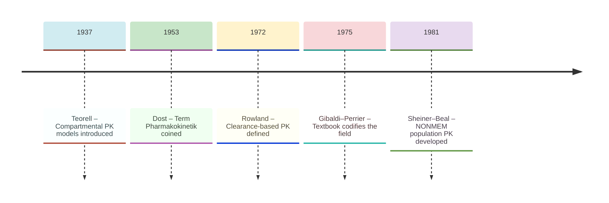
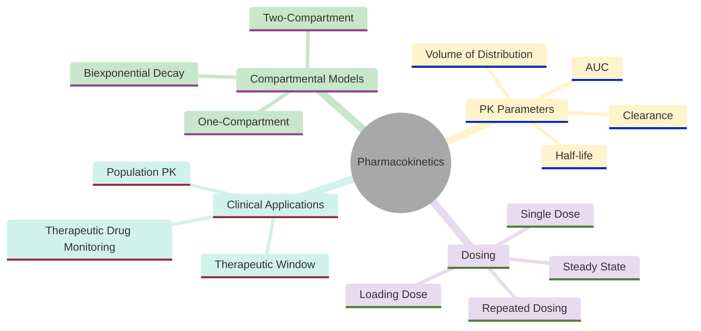
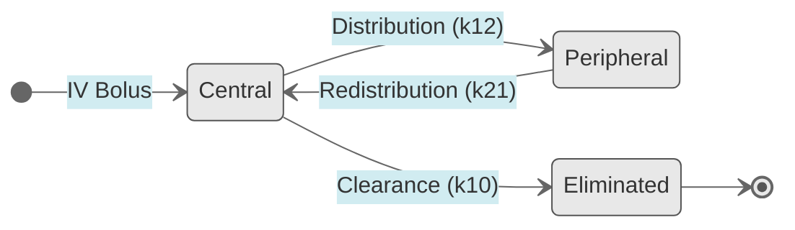
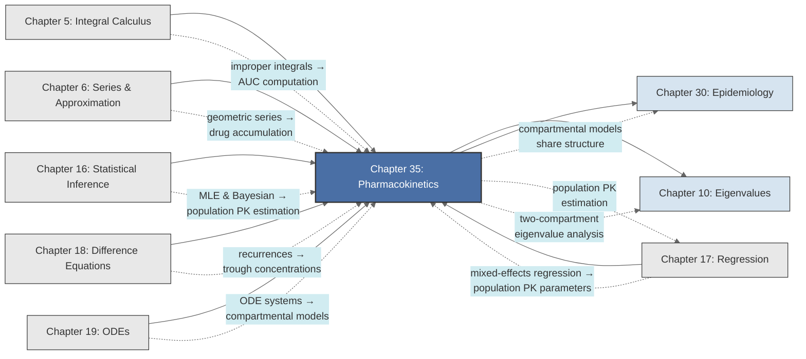

<!-- Copyright (c) 2025-2026 Bob Jansen <bobjansen@pm.me> -->
<!-- SPDX-License-Identifier: CC-BY-NC-4.0 -->
<!-- See LICENSE for full terms. Commercial licensing available. -->

# Chapter 35: Pharmacokinetics


**Part IX**: Applications

> Pharmacokinetics models drug concentration as an ordinary differential equation (ODE) system: exponential elimination for single doses, geometric series for accumulation under repeated dosing and eigenvalue decomposition for multicompartment distribution. Given clearance, volume of distribution and the therapeutic window, one computes the dosing regimen that maintains effective concentrations without toxicity.

**Prerequisites**: [Chapter 5](05-integral-calculus.md) (Integral Calculus); definite integration, improper integrals, computation of the area under a curve (AUC) as a measure of total drug exposure. [Chapter 6](06-series-approximation.md) (Series & Approximation); geometric series summation, convergence to closed form, used here for repeated dosing accumulation. [Chapter 16](16-statistical-inference.md) (Statistical Inference); maximum likelihood and Bayesian parameter estimation for population pharmacokinetic models. [Chapter 17](17-regression.md) (Regression); mixed-effects regression for population PK parameter estimation across patient groups. [Chapter 18](18-difference-equations.md) (Difference Equations); recurrence relations, fixed-point analysis, applied to dosing schedules and trough concentration sequences. [Chapter 19](19-odes.md) (Ordinary Differential Equations); first-order linear ODEs, systems of ODEs, eigenvalue methods for coupled compartments and numerical integration.

**Learning Objectives**: After this chapter, the reader will be able to:

1. Derive the one-compartment IV bolus model from first principles and compute the elimination rate constant, half-life, volume of distribution and clearance.
2. Compute the area under the concentration–time curve (AUC) for IV bolus and oral administration using integration techniques from [Chapter 5](05-integral-calculus.md).
3. Formulate and solve the two-compartment model as a system of linear ODEs, identifying the distribution and elimination phases via eigenvalue decomposition ([Chapter 19](19-odes.md)).
4. Model oral absorption with first-order input and derive expressions for the time to peak concentration ($t_{\max}$) and peak concentration ($C_{\max}$).
5. Apply geometric series ([Chapter 6](06-series-approximation.md)) to predict drug accumulation under repeated dosing, compute the accumulation factor and determine steady-state concentrations.
6. Design dosing regimens that maintain plasma concentrations within the therapeutic window, including loading dose calculations.
7. Formulate dosing interval constraints from the therapeutic window boundaries and compute minimum/maximum dosing frequencies.
8. Understand the foundations of population pharmacokinetics and mixed-effects modelling for inter-individual variability.

**Connections**: This chapter synthesises [Chapter 5](05-integral-calculus.md) (AUC computation via improper integrals), [Chapter 6](06-series-approximation.md) (geometric series for drug accumulation), [Chapter 18](18-difference-equations.md) (difference equations governing trough concentrations across doses) and [Chapter 19](19-odes.md) (ODE formulation and eigenvalue solutions for compartmental models). It connects forward to [Chapter 30](30-epidemiology.md) (Epidemiology; compartmental models share identical mathematical structure), [Chapter 17](17-regression.md) (Regression; population PK parameter estimation) and [Chapter 10](10-eigenvalues.md) (Eigenvalues; two-compartment model analysis).

---

## Historical Context

**Key Milestones in Pharmacokinetics**



*Figure 35.1: Timeline of key milestones in pharmacokinetics from Teorell to NONMEM.*

**Teorell's compartmental pharmacokinetic models (1937).** Torsten Teorell published two papers in *Archives Internationales de Pharmacodynamie et de Therapie* in 1937 that introduced the first mathematical model of drug distribution and elimination. Teorell represented the body as interconnected compartments (blood, tissues of rapid equilibration, tissues of slow equilibration) connected by first-order rate processes. His model, a system of linear ordinary differential equations (ODEs), predicted drug concentration over time in each compartment. Computational limitations prevented widespread adoption, but Teorell's compartmental framework remains the standard model in pharmacokinetics.

**Dost coins the term Pharmakokinetik (1953).** Friedrich Hartmut Dost coined the term *Pharmakokinetik* in his 1953 monograph *Der Blutspiegel*. Dost systematised the mathematical treatment of concentration–time curves, establishing the exponential decay model for elimination and developing formulas for repeated dosing. The geometric series treatment of drug accumulation under repeated dosing traces directly to his work.

**Wagner, Gibaldi and Perrier's multicompartment analysis (1960s–1970s).** John G. Wagner, Milo Gibaldi and Donald Perrier advanced multicompartment pharmacokinetics in the 1960s and 1970s. Wagner's curve-stripping method decomposes biexponential concentration–time curves into constituent phases by identifying eigenvalues of the two-compartment system from semilogarithmic plots ([Chapter 10](10-eigenvalues.md)). Gibaldi and Perrier's textbook *Pharmacokinetics* (1975, revised 1982) codified the field: one-compartment and two-compartment models, clearance, bioavailability and nonlinear kinetics.

**Rowland defines clearance-based pharmacokinetics (1972).** Malcolm Rowland introduced the physiological interpretation of clearance in 1972: the volume of blood completely cleared of drug per unit time. This connects the parameter $CL = k_e \cdot V_d$ to measurable physiology, including hepatic blood flow, renal filtration rate and metabolic enzyme capacity. Rowland and Thomas Tozer's textbook *Clinical Pharmacokinetics: Concepts and Applications* (1980) established clearance as the primary pharmacokinetic parameter.

**Sheiner and Beal's NONMEM and population pharmacokinetics (1981).** Lewis B. Sheiner and Stuart Beal developed NONMEM (Nonlinear Mixed Effects Modelling) in the late 1970s and 1980s. Population pharmacokinetics uses mixed-effects regression ([Chapter 17](17-regression.md)) to estimate typical parameter values and inter-individual variability simultaneously from pooled patient data. Regulatory agencies require population PK analyses in every new drug application. The mathematical foundation is nonlinear mixed-effects models with log-normal random effects on clearance and volume.

**Physiologically-based pharmacokinetic modelling.** Physiologically-based pharmacokinetic modelling replaces abstract compartments with anatomically identifiable organs connected by blood flow. A physiologically-based pharmacokinetic model may comprise 15–20 coupled ODEs representing liver, kidney, brain and adipose tissue, with parameters from *in vitro* measurements. The underlying principles are first-order differential equations, eigenvalue decomposition and numerical integration.

---

## Why This Chapter Matters

**Pharmacokinetics**



*Figure 35.2: Core topics and clinical applications in pharmacokinetics.*

Every approved drug has undergone pharmacokinetic analysis to establish its dosing regimen. The therapeutic window, the concentration range between the minimum effective concentration (MEC) and the minimum toxic concentration (MTC), constrains every dosing decision. Concentrations below the MEC produce no therapeutic effect; concentrations above the MTC cause toxicity. The one-compartment elimination model, the multiple-dose accumulation equation and the steady-state peak and trough calculations are the tools that clinical pharmacologists use to navigate this window.

Drugs with narrow therapeutic indices require precise dosing. A dosing error for warfarin can cause fatal bleeding. For lithium, it can cause kidney failure. Therapeutic drug monitoring programmes in hospitals measure plasma concentrations and adjust doses using the compartmental models in this chapter. The loading dose formula ensures that patients reach therapeutic concentrations rapidly rather than waiting 4–5 half-lives for accumulation to steady state.

The area under the concentration–time curve (AUC), a definite integral of the concentration function, is the primary measure of drug exposure and a required component of regulatory submissions. Population pharmacokinetic models with patient-specific covariates (body weight, renal function, genetic polymorphisms) enable personalised dosing. The two-compartment model, with distribution and elimination phases described by a biexponential function, governs the pharmacokinetics of most injectable drugs. First-order ODEs for elimination, geometric series for accumulation, exponential decay for washout and optimisation for dosing interval design make pharmacokinetics one of the most direct applications of the calculus and differential equations developed in the preceding chapters.

---

## Notation & Conventions

| Symbol | Meaning |
|--------|---------|
| $C(t)$ | Drug concentration in plasma (or the central compartment) at time $t$ |
| $C_0$ | Initial plasma concentration immediately after IV bolus |
| $D$ | Dose administered |
| $F$ | Bioavailability: fraction of administered dose reaching systemic circulation |
| $V_d$ | Volume of distribution: apparent volume relating amount of drug in body to plasma concentration |
| $k_e$ | Elimination rate constant (first-order); sometimes written $k_{el}$ or $\lambda_z$ |
| $t_{1/2}$ | Elimination half-life: $t_{1/2} = \ln 2 / k_e$ |
| $CL$ | Clearance: volume of plasma cleared of drug per unit time; $CL = k_e \cdot V_d$ |
| $k_a$ | Absorption rate constant (first-order, oral administration) |
| $\tau$ | Dosing interval (time between successive doses) |
| $n$ | Dose number in a repeated dosing regimen |
| $r$ | Dosing accumulation ratio: $r = e^{-k_e \tau}$ |
| $C_{ss}$ | Steady-state concentration (average, peak or trough, as specified) |
| $C_{\max}$ | Peak (maximum) plasma concentration |
| $C_{\min}$ | Trough (minimum) plasma concentration |
| $t_{\max}$ | Time to peak concentration after a dose |
| $\text{AUC}$ | Area under the concentration–time curve |
| $\text{AUC}_{0}^{\infty}$ | Total AUC from time zero to infinity |
| $\text{MEC}$ | Minimum effective concentration (lower bound of therapeutic window) |
| $\text{MTC}$ | Maximum tolerated concentration (upper bound of therapeutic window) |
| $\alpha, \beta$ | Distribution and elimination rate constants in the two-compartment model, with $\alpha > \beta > 0$ |
| $A, B$ | Coefficients of the biexponential in the two-compartment model |
| $k_{12}, k_{21}$ | Intercompartmental transfer rate constants |
| $k_{10}$ | Elimination rate constant from the central compartment (two-compartment model) |
| $V_c, V_p$ | Volumes of the central and peripheral compartments |
| $C_1(t), C_2(t)$ | Concentrations in the central and peripheral compartments |
| $A_1(t), A_2(t)$ | Drug amounts in the central and peripheral compartments |

Concentrations are in mass per volume (e.g. mg/L). Time is in hours unless specified otherwise. Rate constants are in $\text{h}^{-1}$; clearance is in L/h. $\ln$ denotes the natural logarithm.

---

## Core Theory

### The One-Compartment Intravenous Bolus Model

**One-Compartment IV Bolus Model**


*Figure 35.3: One-compartment IV bolus model with first-order elimination.*

**Definition 35.1** (One-compartment model). The *one-compartment model* represents the body as a single, kinetically homogeneous space of apparent volume $V_d$. Following an instantaneous intravenous (IV) bolus injection of dose $D$, the drug distributes instantaneously throughout this volume and is eliminated by a first-order process:

$$\frac{dC}{dt} = -k_e C, \qquad C(0) = C_0 = \frac{D}{V_d}.$$

The assumption of first-order elimination states that the rate of drug removal is proportional to the current concentration, with proportionality constant $k_e > 0$.

**Theorem 35.2** (IV bolus solution). The initial-value problem $dC/dt = -k_e C$ with $C(0) = C_0$ has the unique solution

$$C(t) = C_0 e^{-k_e t} = \frac{D}{V_d} e^{-k_e t}.$$

??? note "Proof"

    *Proof.* The equation is separable and linear. Separating variables:

    $$\frac{dC}{C} = -k_e\,dt.$$

    Integrating both sides from $0$ to $t$:

    $$\ln C(t) - \ln C(0) = -k_e t.$$

    Exponentiating both sides:

    $$C(t) = C(0)\,e^{-k_e t} = C_0\,e^{-k_e t}.$$

    Uniqueness follows from the Picard–Lindelöf theorem ([Chapter 19](19-odes.md)), since $f(C) = -k_e C$ is Lipschitz continuous.

    $\square$

**Plasma Concentration After Intravenous Bolus Administration**

```mermaid
---
config:
  theme: base
  themeVariables:
    xyChart:
      plotColorPalette: "#2563eb, #dc2626, #16a34a, #9333ea, #ca8a04, #0891b2"
      backgroundColor: "#ffffff"
      titleColor: "#333333"
      xAxisLabelColor: "#333333"
      yAxisLabelColor: "#333333"
      xAxisTitleColor: "#333333"
      yAxisTitleColor: "#333333"
      xAxisLineColor: "#333333"
      yAxisLineColor: "#333333"
---
xychart-beta
    x-axis "Time (hours)" [0, 1, 2, 3, 4, 5, 6, 7, 8]
    y-axis "C (mg/L)" 0 --> 110
    line [100, 82, 67, 55, 45, 37, 30, 25, 20]
```

*Figure 35.4: Exponential decline of plasma concentration following an IV bolus dose.*

The semilogarithmic plot of $\ln C$ versus $t$ is a straight line with slope $-k_e$ and intercept $\ln C_0$. This linearity provides the standard method for estimating $k_e$ from clinical concentration data.

**Definition 35.3** (Half-life). The *elimination half-life* $t_{1/2}$ is the time required for the plasma concentration to decrease by one-half:

$$C(t_{1/2}) = \frac{C_0}{2}.$$

**Theorem 35.4** (Half-life formula). For first-order elimination, the half-life is

$$t_{1/2} = \frac{\ln 2}{k_e}.$$

??? note "Proof"

    *Proof.* Setting $C_0 e^{-k_e t_{1/2}} = C_0/2$ and dividing both sides by $C_0$:

    $$e^{-k_e t_{1/2}} = \frac{1}{2}.$$

    Taking the natural logarithm of both sides: $-k_e t_{1/2} = -\ln 2$, whence

    $$t_{1/2} = \frac{\ln 2}{k_e}.$$

    $\square$

The half-life is independent of concentration, a defining property of first-order kinetics. After $n$ half-lives, the fraction remaining is $(1/2)^n$: approximately 97% of the drug is eliminated after 5 half-lives.

**Definition 35.5** (Volume of distribution). The *volume of distribution* $V_d$ is the proportionality constant relating the total amount of drug in the body $A(t)$ to the plasma concentration $C(t)$:

$$V_d = \frac{A(t)}{C(t)} = \frac{D}{C_0}.$$

The volume of distribution is an apparent volume. It does not correspond to any physiological space. A drug that binds extensively to tissues may have $V_d$ exceeding total body water (e.g., digoxin: $V_d \approx 500$ L for a 70 kg adult), indicating that most drug resides outside the plasma.

**Definition 35.6** (Clearance). *Clearance* $CL$ is the volume of plasma from which drug is completely removed per unit time:

$$CL = k_e \cdot V_d.$$

Equivalently, clearance relates the elimination rate to the plasma concentration: $\text{Rate of elimination} = CL \cdot C(t)$. Clearance is the primary pharmacokinetic parameter for dosing: it determines the maintenance dose required to achieve a target steady-state concentration.

### Area Under the Curve

**Theorem 35.7** (AUC for IV bolus). The total area under the concentration–time curve following an IV bolus is

$$\text{AUC}_{0}^{\infty} = \int_0^{\infty} C(t)\,dt = \int_0^{\infty} C_0 e^{-k_e t}\,dt = \frac{C_0}{k_e} = \frac{D}{CL}.$$

??? note "Proof"

    *Proof.* Compute the improper integral directly:

    $$\int_0^{\infty} C_0 e^{-k_e t}\,dt = C_0 \left[-\frac{1}{k_e}e^{-k_e t}\right]_0^{\infty} = C_0 \left(0 + \frac{1}{k_e}\right) = \frac{C_0}{k_e}.$$

    Substituting $C_0 = D/V_d$ and $CL = k_e V_d$:

    $$\text{AUC}_{0}^{\infty} = \frac{D/V_d}{k_e} = \frac{D}{k_e V_d} = \frac{D}{CL}.$$

    $\square$

The relationship $\text{AUC} = D/CL$ is fundamental: it states that total drug exposure is determined entirely by the dose and the clearance, independent of the volume of distribution. This result provides the basis for clearance estimation from clinical data: $CL = D / \text{AUC}$.

**Definition 35.8** (Bioavailability). The *absolute bioavailability* $F$ of an extravascular (e.g., oral) formulation is the fraction of the administered dose that reaches the systemic circulation:

$$F = \frac{\text{AUC}_{\text{oral}}}{\text{AUC}_{\text{IV}}} \cdot \frac{D_{\text{IV}}}{D_{\text{oral}}}.$$

For equal doses, $F = \text{AUC}_{\text{oral}} / \text{AUC}_{\text{IV}}$. Bioavailability reflects losses due to incomplete absorption, first-pass hepatic metabolism or degradation in the gastrointestinal tract. By definition, $0 \leq F \leq 1$, and $F = 1$ for IV administration.

### The Two-Compartment Model

**Two-Compartment Model State Transitions:**



*Figure 35.5: State transitions in the two-compartment pharmacokinetic model.*

**Definition 35.9** (Two-compartment model). The *two-compartment model* represents the body as a central compartment (plasma and highly perfused organs) of volume $V_c$ and a peripheral compartment (tissues with slower equilibration) of volume $V_p$. Following an IV bolus into the central compartment:

$$\begin{aligned}
\frac{dC_1}{dt} &= -(k_{12} + k_{10})C_1 + k_{21}\frac{V_p}{V_c}C_2, \\
\frac{dC_2}{dt} &= k_{12}\frac{V_c}{V_p}C_1 - k_{21}C_2,
\end{aligned}$$

where $C_1$ and $C_2$ are concentrations in the central and peripheral compartments, $k_{12}$ is the transfer rate from central to peripheral, $k_{21}$ is the transfer rate from peripheral to central and $k_{10}$ is the elimination rate from the central compartment.

In terms of amounts $A_1 = V_c C_1$ and $A_2 = V_p C_2$, the system simplifies to:

$$\frac{dA_1}{dt} = -(k_{12} + k_{10})A_1 + k_{21}A_2, \qquad \frac{dA_2}{dt} = k_{12}A_1 - k_{21}A_2.$$

**Theorem 35.10** (Two-compartment solution). The system of Definition 35.9 has the solution

$$C_1(t) = A e^{-\alpha t} + B e^{-\beta t},$$

where $\alpha > \beta > 0$ are the eigenvalues of the system matrix (with sign reversal), and $A$, $B$ are coefficients determined by initial conditions.

??? note "Proof"

    *Proof.* Write the system in matrix form. Let $\mathbf{x} = (A_1, A_2)^T$ and

    $$M = \begin{pmatrix} -(k_{12} + k_{10}) & k_{21} \\ k_{12} & -k_{21} \end{pmatrix}.$$

    The solution is $\mathbf{x}(t) = e^{Mt}\mathbf{x}(0)$. The eigenvalues of $M$ are the roots of

    $$\lambda^2 + (k_{12} + k_{10} + k_{21})\,\lambda + k_{10}k_{21} = 0.$$

    By the quadratic formula:

    $$\lambda_{1,2} = \frac{-(k_{12} + k_{10} + k_{21}) \pm \sqrt{(k_{12} + k_{10} + k_{21})^2 - 4k_{10}k_{21}}}{2}.$$

    Both eigenvalues are real and negative: the discriminant is positive since $(k_{12} + k_{10} + k_{21})^2 > 4k_{10}k_{21}$ for positive rate constants, and the sum $\lambda_1 + \lambda_2 = -(k_{12} + k_{10} + k_{21}) < 0$ while the product $\lambda_1\lambda_2 = k_{10}k_{21} > 0$.

    Define $\alpha = -\lambda_1 > 0$ and $\beta = -\lambda_2 > 0$ with $\alpha > \beta$. The general solution for $A_1(t)$ is a linear combination of the two exponential modes, and dividing by $V_c$ gives

    $$C_1(t) = \frac{A_1(t)}{V_c} = A\,e^{-\alpha t} + B\,e^{-\beta t},$$

    where the coefficients satisfy $A + B = C_0 = D/V_c$ (initial condition) and are determined by the eigenvector decomposition.

    $\square$

The biexponential has two distinct phases visible on a semilogarithmic plot: a rapid initial decline (the *distribution phase*, governed by rate constant $\alpha$) as drug distributes from the central to the peripheral compartment, followed by a slower terminal decline (the *elimination phase*, governed by rate constant $\beta$) reflecting true drug elimination from the body. The half-lives of these phases are

$$t_{1/2,\alpha} = \frac{\ln 2}{\alpha}, \qquad t_{1/2,\beta} = \frac{\ln 2}{\beta}.$$

**Theorem 35.11** (AUC for two-compartment model). The total AUC following an IV bolus in the two-compartment model is

$$\text{AUC}_{0}^{\infty} = \frac{A}{\alpha} + \frac{B}{\beta}.$$

??? note "Proof"

    *Proof.* Integrate each exponential term separately over $[0, \infty)$:

    $$\text{AUC}_{0}^{\infty} = \int_0^{\infty}\!\left(A\,e^{-\alpha t} + B\,e^{-\beta t}\right)dt = \left[-\frac{A}{\alpha}e^{-\alpha t}\right]_0^{\infty} + \left[-\frac{B}{\beta}e^{-\beta t}\right]_0^{\infty} = \frac{A}{\alpha} + \frac{B}{\beta}.$$

    $\square$

### Oral Absorption: First-Order Input

**Definition 35.12** (One-compartment oral model). For oral administration with first-order absorption, the rate of drug input into the systemic circulation is $k_a F D \cdot e^{-k_a t}$, where $k_a$ is the absorption rate constant and $F$ is bioavailability. The governing ODE for plasma concentration is

$$\frac{dC}{dt} = \frac{k_a F D}{V_d} e^{-k_a t} - k_e C, \qquad C(0) = 0.$$

**Theorem 35.13** (Bateman equation). The solution to the oral absorption model of Definition 35.12 is

$$C(t) = \frac{F D k_a}{V_d(k_a - k_e)}\left(e^{-k_e t} - e^{-k_a t}\right).$$

This is the *Bateman equation*, describing the characteristic rise-and-fall concentration profile after oral dosing.

!!! warning "Bateman equation requires $k_a \neq k_e$"

    The denominator $k_a - k_e$ in the Bateman equation is zero when $k_a = k_e$. In this degenerate case, apply L'Hopital's rule or re-derive: $C(t) = (FDk_a / V_d)\,t\,e^{-k_e t}$. This situation is rare clinically but causes division-by-zero errors in naive implementations.

??? note "Proof"

    *Proof.* The ODE $dC/dt + k_e C = (k_a F D / V_d)\,e^{-k_a t}$ is a first-order linear ODE with integrating factor $\mu(t) = e^{k_e t}$. Multiplying both sides by $\mu(t)$:

    $$\frac{d}{dt}\!\left[C\,e^{k_e t}\right] = \frac{k_a F D}{V_d}\,e^{(k_e - k_a)t}.$$

    Integrating from $0$ to $t$ with $C(0) = 0$:

    $$C(t)\,e^{k_e t} = \frac{k_a F D}{V_d} \cdot \frac{e^{(k_e - k_a)t} - 1}{k_e - k_a}.$$

    Multiplying both sides by $e^{-k_e t}$:

    $$C(t) = \frac{k_a F D}{V_d(k_e - k_a)}\left(e^{-k_a t} - e^{-k_e t}\right).$$

    Negating both numerator factor and denominator factor simultaneously yields the equivalent form:

    $$C(t) = \frac{k_a F D}{V_d(k_a - k_e)}\left(e^{-k_e t} - e^{-k_a t}\right).$$

    $\square$

**Theorem 35.14** (Time to peak and peak concentration). For the Bateman equation with $k_a > k_e$, the time of peak concentration is

$$t_{\max} = \frac{\ln(k_a / k_e)}{k_a - k_e},$$

and the peak concentration is

$$C_{\max} = \frac{F D}{V_d}\left(\frac{k_e}{k_a}\right)^{k_e/(k_a - k_e)}.$$

??? note "Proof"

    *Proof.* Setting $dC/dt = 0$ in the Bateman equation:

    $$\frac{k_a F D}{V_d(k_a - k_e)}\left(-k_e\,e^{-k_e t} + k_a\,e^{-k_a t}\right) = 0.$$

    Since the prefactor is nonzero, this requires

    $$k_a\,e^{-k_a t} = k_e\,e^{-k_e t},$$

    i.e., $e^{(k_a - k_e)t} = k_a/k_e$. Taking the natural logarithm:

    $$t_{\max} = \frac{\ln(k_a/k_e)}{k_a - k_e}.$$

    Substituting $t_{\max}$ into the Bateman equation, and noting that

    $$e^{-k_e t_{\max}} = \left(\frac{k_e}{k_a}\right)^{k_e/(k_a-k_e)}, \qquad e^{-k_a t_{\max}} = \left(\frac{k_e}{k_a}\right)^{k_a/(k_a-k_e)},$$

    one obtains:

    $$C_{\max} = \frac{k_a F D}{V_d(k_a - k_e)}\left[\left(\frac{k_e}{k_a}\right)^{k_e/(k_a-k_e)} - \left(\frac{k_e}{k_a}\right)^{k_a/(k_a-k_e)}\right].$$

    Factoring out $\left(k_e/k_a\right)^{k_e/(k_a-k_e)}$:

    $$\begin{aligned}
    C_{\max} &= \frac{k_a F D}{V_d(k_a - k_e)} \cdot \left(\frac{k_e}{k_a}\right)^{k_e/(k_a-k_e)}\left[1 - \frac{k_e}{k_a}\right] \\
    &= \frac{k_a F D}{V_d(k_a - k_e)} \cdot \frac{k_a - k_e}{k_a} \cdot \left(\frac{k_e}{k_a}\right)^{k_e/(k_a-k_e)} = \frac{F D}{V_d}\left(\frac{k_e}{k_a}\right)^{k_e/(k_a-k_e)}.
    \end{aligned}$$

    $\square$

### Repeated Dosing and Accumulation

**Theorem 35.15** (Multiple-dose accumulation). Consider an IV bolus of dose $D$ administered every $\tau$ hours. Let $r = e^{-k_e \tau}$ be the fraction of drug remaining at the end of each dosing interval. The peak concentration immediately after the $n$-th dose is

$$C_{\max,n} = C_0 \cdot \frac{1 - r^n}{1 - r},$$

where $C_0 = D/V_d$ is the concentration produced by a single dose.

??? note "Proof"

    *Proof.* Let $C_n^+$ denote the peak concentration immediately after the $n$-th dose. By superposition (the system is linear), the peak is the sum of residuals from all previous doses plus the current dose:

    $$C_n^+ = C_0 + C_0 r + C_0 r^2 + \cdots + C_0 r^{n-1} = C_0 \sum_{j=0}^{n-1} r^j,$$

    where the $j$-th term represents the residual from the $(n-j)$-th dose, which was administered $j\tau$ hours earlier and has decayed by a factor $r^j = e^{-k_e j\tau}$.

    Summing the finite geometric series ([Chapter 6](06-series-approximation.md)):

    $$C_n^+ = C_0 \cdot \frac{1 - r^n}{1 - r}.$$

    $\square$

!!! abstract "Key Result"

    **Theorem 35.15** (Multiple-dose accumulation). Repeated doses accumulate as a geometric series, $C_{\max,n} = C_0(1 - r^n)/(1 - r)$, converging to a steady state after approximately five half-lives; this formula governs the design of every repeated-dose drug regimen.

**Corollary 35.16** (Steady-state concentrations). As $n \to \infty$, since $0 < r < 1$, the geometric series converges and the steady-state peak and trough concentrations are:

$$C_{\max,ss} = \frac{C_0}{1 - r} = \frac{D/V_d}{1 - e^{-k_e\tau}},$$

$$C_{\min,ss} = C_{\max,ss} \cdot r = \frac{C_0 \cdot r}{1 - r} = \frac{(D/V_d)\,e^{-k_e\tau}}{1 - e^{-k_e\tau}}.$$

The steady state is reached (to within approximately 97%) after approximately 5 half-lives ($5 \times t_{1/2}$), regardless of the dosing interval.

**Definition 35.17** (Accumulation factor). The *accumulation factor* $R$ is the ratio of steady-state peak concentration to the peak concentration after a single dose:

$$R = \frac{C_{\max,ss}}{C_0} = \frac{1}{1 - r} = \frac{1}{1 - e^{-k_e\tau}}.$$

When $\tau = t_{1/2}$, $r = 1/2$ and $R = 2$: the drug accumulates to twice the single-dose level. When $\tau \gg t_{1/2}$, $r \approx 0$ and $R \approx 1$: negligible accumulation.

**Theorem 35.18** (Loading dose). To achieve the steady-state peak concentration $C_{\max,ss}$ immediately (from the first dose), a *loading dose* $D_L$ is administered followed by maintenance doses $D$. The loading dose is

$$D_L = D \cdot R = \frac{D}{1 - r} = \frac{D}{1 - e^{-k_e\tau}}.$$

??? note "Proof"

    *Proof.* The loading dose must immediately produce the steady-state peak concentration, so $C_0^L = C_{\max,ss} = C_0/(1-r)$.

    Since $C_0^L = D_L/V_d$ and $C_0 = D/V_d$, dividing gives $D_L/D = C_0^L/C_0 = 1/(1-r)$, hence

    $$D_L = \frac{D}{1 - r}.$$

    $\square$

### Therapeutic Window and Dosing Interval

**Definition 35.19** (Therapeutic window). The *therapeutic window* is the range of plasma concentrations between the minimum effective concentration (MEC) and the maximum tolerated concentration (MTC):

$$\text{MEC} \leq C(t) \leq \text{MTC}.$$

Concentrations below MEC produce no therapeutic effect; concentrations above MTC cause unacceptable toxicity. The ratio $\text{MTC}/\text{MEC}$ is the *therapeutic index*.

**Theorem 35.20** (Dosing interval from therapeutic window). For IV bolus repeated dosing at steady state with $C_{\max,ss} = \text{MTC}$ and $C_{\min,ss} = \text{MEC}$, the maximum permissible dosing interval is

$$\tau_{\max} = \frac{\ln(\text{MTC}/\text{MEC})}{k_e} = t_{1/2} \cdot \frac{\ln(\text{MTC}/\text{MEC})}{\ln 2}.$$

??? note "Proof"

    *Proof.* At steady state, $C_{\min,ss} = C_{\max,ss} \cdot e^{-k_e\tau}$. Setting $C_{\max,ss} = \text{MTC}$ and $C_{\min,ss} = \text{MEC}$:

    $$\text{MEC} = \text{MTC} \cdot e^{-k_e\tau},$$

    whence $e^{k_e\tau} = \text{MTC}/\text{MEC}$ and $\tau = \ln(\text{MTC}/\text{MEC})/k_e$. Substituting $k_e = \ln 2 / t_{1/2}$ gives the second form.

    $\square$

A wider therapeutic window (larger MTC/MEC ratio) permits longer dosing intervals, improving patient compliance. Drugs with narrow therapeutic indices (e.g., warfarin, digoxin, lithium), by contrast, require frequent dosing or controlled-release formulations.

### Average Steady-State Concentration

**Theorem 35.21** (Average concentration at steady state). The time-averaged plasma concentration at steady state, over one dosing interval $\tau$, is

$$\bar{C}_{ss} = \frac{1}{\tau}\int_0^{\tau} C_{ss}(t)\,dt = \frac{F \cdot D}{CL \cdot \tau}.$$

??? note "Proof"

    *Proof.* At steady state, the amount of drug eliminated per dosing interval equals the amount absorbed per interval. The AUC over one dosing interval is therefore equal to the total AUC from a single dose:

    $$\int_0^{\tau} C_{ss}(t)\,dt = \text{AUC}_{0}^{\infty}(\text{single dose}) = \frac{F \cdot D}{CL}.$$

    Dividing both sides by $\tau$ yields

    $$\bar{C}_{ss} = \frac{1}{\tau}\int_0^{\tau} C_{ss}(t)\,dt = \frac{F \cdot D}{CL \cdot \tau}.$$

    $\square$

The average steady-state concentration depends only on the dosing rate $FD/\tau$ and the clearance, independent of the volume of distribution, absorption rate or dosing interval (provided the same total daily dose is administered). It provides the clinical rule: $\text{Maintenance dose rate} = CL \cdot \bar{C}_{ss,\text{target}}$.

### Population Pharmacokinetics

**Definition 35.22** (Population pharmacokinetic model). A *population pharmacokinetic (PK) model* describes inter-individual variability in PK parameters using a mixed-effects framework:

$$\ln CL_i = \ln \overline{CL} + \eta_{CL,i}, \qquad \ln V_{d,i} = \ln \overline{V_d} + \eta_{V,i},$$

where $\overline{CL}$ and $\overline{V_d}$ are population-typical values, and $\eta_{CL,i}$, $\eta_{V,i}$ are individual random effects assumed normally distributed: $\eta \sim N(0, \omega^2)$.

The observed concentration for individual $i$ at time $j$ is:

$$C_{ij} = f(t_{ij}; CL_i, V_{d,i}, D_i) + \varepsilon_{ij},$$

where $f$ is the structural PK model (e.g., the one-compartment solution) and $\varepsilon_{ij} \sim N(0, \sigma^2)$ is residual error. Covariates (body weight, renal function, genotype) enter as fixed effects on the log-scale parameters. Parameter estimation uses maximum likelihood or Bayesian methods, connecting to the regression and inference frameworks of [Chapter 16](16-statistical-inference.md) and [Chapter 17](17-regression.md).

---

## Formulas & Identities

**F35.1** Trough concentration recurrence.

The trough concentration sequence $\{C_{\min,n}\}$ satisfies a first-order linear difference equation ([Chapter 18](18-difference-equations.md)). Let $C_n^-$ denote the trough concentration just before the $(n+1)$-th dose:

$$C_{n+1}^- = (C_n^- + C_0)\cdot r = r \cdot C_n^- + r \cdot C_0,$$

with initial condition $C_1^- = C_0 \cdot r$ (the concentration $\tau$ hours after the first dose).

This is the linear recurrence $x_{n+1} = r x_n + b$ with $b = r C_0$. By the theory of [Chapter 18](18-difference-equations.md), the fixed point is

$$C^* = \frac{b}{1 - r} = \frac{rC_0}{1 - r} = C_{\min,ss},$$

confirming Corollary 35.16. The general solution is:

$$C_n^- = C_{\min,ss} + (C_1^- - C_{\min,ss})\cdot r^{n-1} = C_{\min,ss}(1 - r^{n-1}),$$

showing exponential convergence to steady state at rate $r$ per dose.

**F35.2** AUC by the trapezoidal rule.

In practice, AUC is computed from discrete concentration–time data $(t_0, C_0), (t_1, C_1), \ldots, (t_n, C_n)$ using the linear trapezoidal rule:

$$\text{AUC}_{0}^{t_n} = \sum_{i=0}^{n-1} \frac{(C_i + C_{i+1})(t_{i+1} - t_i)}{2}.$$

The terminal extrapolation from $t_n$ to infinity uses the estimated terminal rate constant $\lambda_z$ (identified as $k_e$ in the one-compartment model or $\beta$ in the two-compartment model):

$$\text{AUC}_{t_n}^{\infty} = \frac{C_n}{\lambda_z}.$$

The total AUC is $\text{AUC}_{0}^{\infty} = \text{AUC}_{0}^{t_n} + \text{AUC}_{t_n}^{\infty}$. This connects the integration theory of [Chapter 5](05-integral-calculus.md) to practical pharmacokinetic data analysis.

**F35.3** Eigenvalue identification by curve stripping.

Given biexponential data

$$C(t) = Ae^{-\alpha t} + Be^{-\beta t}, \qquad \alpha > \beta,$$

the parameters are identified sequentially:

1. At large $t$, the fast exponential is negligible:

    $$C(t) \approx Be^{-\beta t}.$$

    A semilogarithmic linear regression on the terminal phase yields $\beta$ (slope) and $\ln B$ (intercept).

2. Compute the residual:

    $$C_{\text{res}}(t) = C(t) - Be^{-\beta t} \approx Ae^{-\alpha t}$$

    for early time points. A semilogarithmic regression on the residual yields $\alpha$ and $\ln A$.

3. The microconstants are recovered:

$$k_{21} = \frac{A\beta + B\alpha}{A + B}, \qquad k_{10} = \frac{\alpha\beta}{k_{21}}, \qquad k_{12} = \alpha + \beta - k_{21} - k_{10}.$$

This method of residuals amounts to projecting the data onto the eigenvectors of the system matrix $M$, identifying each eigenvalue from the slope of the corresponding component.

---

## Algorithms

### Algorithm 35.23: One-Compartment IV Bolus Simulation

**Input**: Dose $D$; volume of distribution $V_d$; elimination rate constant $k_e$; simulation duration $t_{\text{end}}$; time step $\Delta t$.

**Output**: Time series arrays $t[]$ and $C[]$ of plasma concentrations.

```
function ivBolusSim(D, Vd, ke, tEnd, dt):
    // D: dose, Vd: volume of distribution, ke: elimination rate
    // tEnd: simulation duration, dt: time step
    C0 = D / Vd
    nSteps = floor(tEnd / dt)
    for i = 0 to nSteps:
        t[i] = i * dt
        C[i] = C0 * exp(-ke * t[i])
    return (t, C)
```

**Complexity**: $O(N)$ time and $O(N)$ space where $N = \lfloor t_{\text{end}}/\Delta t \rfloor$ is the number of time steps; each step evaluates one exponential in $O(1)$.

### Algorithm 35.24: Multiple-Dose Simulation (IV Bolus)

**Input**: Dose $D$; volume of distribution $V_d$; elimination rate constant $k_e$; dosing interval $\tau$; number of doses $n_{\text{doses}}$; time step $\Delta t$.

**Output**: Time series arrays $t[]$ and $C[]$ of plasma concentrations over the full dosing period.

```
function multipleDoseSim(D, Vd, ke, tau, nDoses, dt):
    // D: dose, Vd: volume of distribution, ke: elimination rate
    // tau: dosing interval, nDoses: number of doses, dt: time step
    C0 = D / Vd
    tEnd = nDoses * tau
    nSteps = floor(tEnd / dt)
    for i = 0 to nSteps:
        t[i] = i * dt
        C[i] = 0
        for j = 0 to nDoses - 1:
            tDose = j * tau
            if t[i] >= tDose:
                C[i] = C[i] + C0 * exp(-ke * (t[i] - tDose))
    return (t, C)
```

**Complexity**: $O(N \cdot n_{\text{doses}})$ time and $O(N)$ space where $N$ is the number of time steps and $n_{\text{doses}}$ is the number of administered doses; the inner loop sums the superimposed contribution from each prior dose.

### Algorithm 35.25: Oral Absorption Simulation (Bateman Equation)

**Input**: Dose $D$; bioavailability $F$; volume of distribution $V_d$; absorption rate constant $k_a$; elimination rate constant $k_e$; simulation duration $t_{\text{end}}$; time step $\Delta t$.

**Output**: Time series arrays $t[]$ and $C[]$ of plasma concentrations.

```
function oralAbsorptionSim(D, F, Vd, ka, ke, tEnd, dt):
    // D: dose, F: bioavailability, Vd: volume of distribution
    // ka: absorption rate, ke: elimination rate, tEnd: duration, dt: step
    coeff = (F * D * ka) / (Vd * (ka - ke))
    nSteps = floor(tEnd / dt)
    for i = 0 to nSteps:
        t[i] = i * dt
        C[i] = coeff * (exp(-ke * t[i]) - exp(-ka * t[i]))
    return (t, C)
```

**Complexity**: $O(N)$ time and $O(N)$ space where $N = \lfloor t_{\text{end}}/\Delta t \rfloor$ is the number of time steps; each step evaluates two exponentials in $O(1)$.

### Algorithm 35.26: Two-Compartment Model via Fourth-Order Runge–Kutta (RK4)

**Input**: Dose $D$; central compartment volume $V_c$; intercompartmental rate constants $k_{12}, k_{21}$; elimination rate constant $k_{10}$; simulation duration $t_{\text{end}}$; time step $\Delta t$.

**Output**: Time series arrays $t[]$, $C_1[]$ (central) and $C_2[]$ (peripheral) concentrations.

```
function twoCompartmentRK4(D, Vc, k12, k21, k10, tEnd, dt):
    // D: dose, Vc: central volume, k12/k21: transfer rates, k10: elimination
    A1 = D              // initial amount in central compartment
    A2 = 0              // initial amount in peripheral compartment
    function f(A1, A2):
        dA1dt = -(k12 + k10)*A1 + k21*A2
        dA2dt = k12*A1 - k21*A2
        return (dA1dt, dA2dt)
    // RK4 integration
    t = 0; nSteps = floor(tEnd / dt)
    results = [(t, A1, A2)]
    for i = 0 to nSteps - 1:
        (k1a, k1b) = dt * f(A1, A2)
        (k2a, k2b) = dt * f(A1 + k1a/2, A2 + k1b/2)
        (k3a, k3b) = dt * f(A1 + k2a/2, A2 + k2b/2)
        (k4a, k4b) = dt * f(A1 + k3a, A2 + k3b)
        A1 = A1 + (k1a + 2*k2a + 2*k3a + k4a) / 6
        A2 = A2 + (k1b + 2*k2b + 2*k3b + k4b) / 6
        t = t + dt
        results.append((t, A1, A2))
    Vt = (k12 / k21) * Vc    // tissue volume
    for i = 0 to length(results):
        C1[i] = results[i].A1 / Vc
        C2[i] = results[i].A2 / Vt
    return (t[], C1, C2)
```

**Complexity**: $O(N)$ time and $O(N)$ space where $N = \lfloor t_{\text{end}}/\Delta t \rfloor$ is the number of RK4 steps; each step requires four evaluations of the two-dimensional right-hand side in $O(1)$, plus $O(N)$ for the concentration conversion pass.

### Algorithm 35.27: Dosing Regimen Design

**Input**: Clearance $CL$; volume of distribution $V_d$; therapeutic window bounds MEC and MTC; bioavailability $F$; target average steady-state concentration $\bar{C}_{ss}$.

**Output**: Maintenance dose $D$; dosing interval $\tau$; loading dose $D_L$.

```
function designDosingRegimen(CL, Vd, MEC, MTC, F, target):
    // CL: clearance, Vd: volume, MEC/MTC: therapeutic bounds
    // F: bioavailability, target: desired average Css
    ke = CL / Vd
    t_half = ln(2) / ke
    tau = ln(MTC / MEC) / ke         // maximum permissible interval
    tau = round_to_practical(tau)     // round to 6, 8, 12 or 24 h
    D = CL * target * tau / F        // maintenance dose
    r = exp(-ke * tau)
    DL = D / (1 - r)                 // loading dose
    // verify therapeutic window
    Cmax_ss = (F * D / Vd) / (1 - r)
    Cmin_ss = Cmax_ss * r
    if Cmax_ss > MTC or Cmin_ss < MEC:
        error("Regimen violates therapeutic window")
    return (D, tau, DL)
```

**Complexity**: $O(1)$ time and $O(1)$ space; the algorithm evaluates a fixed number of closed-form expressions.

!!! tip "Rounding dosing intervals to practical values"

    The computed $\tau_{\max}$ is rarely a convenient number. Round down to the nearest standard interval (6, 8, 12 or 24 h) to maintain patient compliance. After rounding, always verify that $C_{\max,ss} \leq \text{MTC}$ and $C_{\min,ss} \geq \text{MEC}$; rounding $\tau$ downward tightens the window, but rounding upward may violate the safety constraint.

---

## Numerical Considerations

### Stability of the Exponential Solution

The analytic solutions (Theorems 35.2, 35.13) are closed-form exponentials. No numerical integration is required for one-compartment models. Roundoff in $e^{-k_e t}$ is negligible for typical timescales.

### Two-Compartment Stiffness

The two-compartment model is stiff when $\alpha / \beta \gg 1$. A drug with $\alpha = 5$ $\text{h}^{-1}$ and $\beta = 0.1$ $\text{h}^{-1}$ has stiffness ratio 50. RK4 requires $h < 2/\alpha = 0.4$ h for stability, yet the simulation must extend to $5/\beta = 50$ h. For ratios exceeding 100, implicit methods are preferable. Typical PK stiffness ratios stay below 50; RK4 with $h = 0.01$ h suffices.

!!! warning "Stiffness detection in two-compartment models"

    When the ratio $\alpha/\beta$ exceeds 100, explicit Runge–Kutta methods require prohibitively small step sizes to maintain stability. Monitor the stiffness ratio $\alpha/\beta$ after curve stripping. If it exceeds 100, switch to an implicit solver (e.g., backward Euler or a stiff ODE integrator) to avoid numerical instability or excessive computation time.

### Numerical AUC Computation

The linear trapezoidal rule (F35.2) is exact for piecewise-linear concentration profiles and is the regulatory standard (Food and Drug Administration guidance). For the log-trapezoidal variant (appropriate when concentrations are declining monoexponentially between samples):

$$\text{AUC}_{t_i}^{t_{i+1}} = \frac{(C_i - C_{i+1})(t_{i+1} - t_i)}{\ln(C_i / C_{i+1})}.$$

This formula is exact for a true monoexponential decline between $t_i$ and $t_{i+1}$. The linear-log trapezoidal method uses the linear rule during absorption (increasing concentrations) and the log rule during elimination (decreasing concentrations), providing optimal accuracy across both phases.

!!! info "Choosing the trapezoidal variant"

    Regulatory submissions typically use the linear trapezoidal rule for the ascending portion (pre-$C_{\max}$) and the log-trapezoidal rule for the descending portion (post-$C_{\max}$). The log-trapezoidal formula requires $C_i > C_{i+1} > 0$; if $C_{i+1} = 0$ or $C_i = C_{i+1}$, fall back to the linear rule for that interval.

### Precision of Half-Life Estimation

Estimating $k_e$ from semilogarithmic regression requires sufficient terminal-phase data. The standard error is approximately $\sigma_{\varepsilon} / (\Delta t \sqrt{n})$. At least 3–4 points spanning 2–3 half-lives are needed for reliable estimation.

### Accumulation Convergence

The geometric series $\sum_{j=0}^{n-1} r^j$ converges geometrically to $1/(1-r)$ with error $r^n/(1-r)$. For $r = e^{-k_e\tau}$, the approach to steady state is

$$\frac{C_{\max,ss} - C_{\max,n}}{C_{\max,ss}} = r^n = e^{-nk_e\tau} = 2^{-n\tau/t_{1/2}}.$$

After $n$ doses spanning time $n\tau$, the fraction of steady state achieved is

$$1 - 2^{-n\tau/t_{1/2}}.$$

Five half-lives ($n\tau = 5t_{1/2}$) yield $1 - 2^{-5} = 96.9\%$ of steady state.

---

## Worked Examples

### Example 35.28: One-Compartment IV Bolus Analysis

**Problem.** A patient receives a 500 mg IV bolus of an antibiotic. Plasma concentrations are measured: $C(1) = 8.0$ mg/L, $C(4) = 4.5$ mg/L. Assuming one-compartment kinetics, determine $k_e$, $t_{1/2}$, $V_d$, $CL$, $C_0$ and $\text{AUC}_0^\infty$.

**Solution.** From Theorem 35.2, $\ln C(t)$ is linear in $t$ with slope $-k_e$. Using two data points:

$$k_e = \frac{\ln C(1) - \ln C(4)}{4 - 1} = \frac{\ln 8.0 - \ln 4.5}{3} = \frac{2.079 - 1.504}{3} = \frac{0.575}{3} = 0.192 \text{ h}^{-1}.$$

Half-life (Theorem 35.4):

$$t_{1/2} = \frac{\ln 2}{0.192} = \frac{0.693}{0.192} = 3.61 \text{ h}.$$

Initial concentration (extrapolating back to $t = 0$):

$$C_0 = C(1) \cdot e^{k_e \cdot 1} = 8.0 \cdot e^{0.192} = 8.0 \times 1.212 = 9.69 \text{ mg/L}.$$

Volume of distribution:

$$V_d = \frac{D}{C_0} = \frac{500}{9.69} = 51.6 \text{ L}.$$

Clearance:

$$CL = k_e \cdot V_d = 0.192 \times 51.6 = 9.9 \text{ L/h}.$$

AUC (Theorem 35.7):

$$\text{AUC}_0^\infty = \frac{C_0}{k_e} = \frac{9.69}{0.192} = 50.5 \text{ mg}\cdot\text{h/L}.$$

Verification:

$$\text{AUC} = \frac{D}{CL} = \frac{500}{9.9} = 50.5 \text{ mg}\cdot\text{h/L}. \quad\checkmark$$

### Example 35.29: Oral Dosing, Time to Peak and Bioavailability

**Problem.** A drug is administered as a 250 mg oral tablet. Its pharmacokinetic parameters are: $k_a = 1.5$ $\text{h}^{-1}$, $k_e = 0.2$ $\text{h}^{-1}$, $V_d = 40$ L, $F = 0.8$. Compute $t_{\max}$, $C_{\max}$ and $\text{AUC}_0^\infty$. Compare AUC with an IV bolus of 250 mg.

**Solution.** Time to peak (Theorem 35.14):

$$t_{\max} = \frac{\ln(k_a/k_e)}{k_a - k_e} = \frac{\ln(1.5/0.2)}{1.5 - 0.2} = \frac{\ln 7.5}{1.3} = \frac{2.015}{1.3} = 1.55 \text{ h}.$$

Peak concentration:

$$C_{\max} = \frac{FD}{V_d}\left(\frac{k_e}{k_a}\right)^{k_e/(k_a - k_e)} = \frac{0.8 \times 250}{40}\left(\frac{0.2}{1.5}\right)^{0.2/1.3} = 5.0 \times (0.1333)^{0.1538}.$$

Computing the power:

$$(0.1333)^{0.1538} = e^{0.1538 \ln 0.1333} = e^{0.1538 \times (-2.015)} = e^{-0.310} = 0.734.$$

$$C_{\max} = 5.0 \times 0.734 = 3.67 \text{ mg/L}.$$

AUC (oral):

$$\text{AUC}_{\text{oral}} = \frac{FD}{CL} = \frac{0.8 \times 250}{0.2 \times 40} = \frac{200}{8} = 25.0 \text{ mg}\cdot\text{h/L}.$$

AUC (IV, same dose):

$$\text{AUC}_{\text{IV}} = \frac{D}{CL} = \frac{250}{8} = 31.25 \text{ mg}\cdot\text{h/L}.$$

Bioavailability verification:

$$F = \frac{\text{AUC}_{\text{oral}}}{\text{AUC}_{\text{IV}}} = \frac{25.0}{31.25} = 0.8. \quad\checkmark$$

### Example 35.30: Repeated Dosing and Steady State

**Problem.** An IV antibiotic with $k_e = 0.35$ $\text{h}^{-1}$ ($t_{1/2} = 2.0$ h) and $V_d = 20$ L is administered as 200 mg every 6 hours. Compute: (a) the accumulation factor, (b) steady-state peak and trough concentrations, (c) number of doses to reach 90% of steady state, (d) the loading dose to reach steady state immediately.

**Solution.** (a) Accumulation ratio:

$$r = e^{-k_e\tau} = e^{-0.35 \times 6} = e^{-2.1} = 0.1225.$$

$$R = \frac{1}{1 - r} = \frac{1}{1 - 0.1225} = \frac{1}{0.8775} = 1.140.$$

The accumulation factor is only 1.14 because $\tau = 6$ h spans 3 half-lives; most drug is eliminated between doses.

(b) Steady-state concentrations:

$$C_0 = \frac{D}{V_d} = \frac{200}{20} = 10.0 \text{ mg/L}.$$

$$C_{\max,ss} = \frac{C_0}{1 - r} = \frac{10.0}{0.8775} = 11.4 \text{ mg/L}.$$

$$C_{\min,ss} = C_{\max,ss} \cdot r = 11.4 \times 0.1225 = 1.40 \text{ mg/L}.$$

(c) Number of doses for 90% of steady state: the requirement is $1 - r^n \geq 0.9$, i.e., $r^n \leq 0.1$:

$$n \geq \frac{\ln 0.1}{\ln r} = \frac{-2.303}{-2.1} = 1.10.$$

Since $n$ must be an integer and $n \geq 1.10$, by the second dose ($n = 2$) the patient has reached $1 - r^2 = 1 - 0.015 = 98.5\%$ of steady state. In this case, steady state is reached after a single dosing interval because $\tau \gg t_{1/2}$.

(d) Loading dose:

$$D_L = \frac{D}{1 - r} = \frac{200}{0.8775} = 228 \text{ mg}.$$

The loading dose is only modestly higher than the maintenance dose because accumulation is minimal.

### Example 35.31: Therapeutic Window and Dosing Interval Design

**Problem.** Theophylline has the following parameters in a typical adult patient: $CL = 3.0$ L/h, $V_d = 30$ L, $F = 1.0$ (IV or complete oral absorption). The therapeutic window is MEC $= 10$ mg/L, MTC $= 20$ mg/L. Design a dosing regimen (dose, interval, loading dose) targeting an average steady-state concentration of 15 mg/L.

**Solution.** First compute the elimination rate constant:

$$k_e = \frac{CL}{V_d} = \frac{3.0}{30} = 0.1 \text{ h}^{-1}, \qquad t_{1/2} = \frac{\ln 2}{0.1} = 6.93 \text{ h}.$$

Maximum dosing interval (Theorem 35.20):

$$\tau_{\max} = \frac{\ln(\text{MTC}/\text{MEC})}{k_e} = \frac{\ln(20/10)}{0.1} = \frac{0.693}{0.1} = 6.93 \text{ h}.$$

The maximum interval equals one half-life. A practical choice is $\tau = 6$ h (four times daily).

Maintenance dose (from Theorem 35.21):

$$D = \frac{CL \cdot \bar{C}_{ss} \cdot \tau}{F} = \frac{3.0 \times 15 \times 6}{1.0} = 270 \text{ mg}.$$

Verify peak and trough:

$$r = e^{-0.1 \times 6} = e^{-0.6} = 0.549.$$

$$C_{\max,ss} = \frac{D/(V_d)}{1 - r} = \frac{270/30}{1 - 0.549} = \frac{9.0}{0.451} = 20.0 \text{ mg/L}.$$

$$C_{\min,ss} = 20.0 \times 0.549 = 11.0 \text{ mg/L}.$$

Both are within the therapeutic window: $10 \leq C(t) \leq 20$. $\checkmark$

Loading dose:

$$D_L = \frac{D}{1 - r} = \frac{270}{0.451} = 599 \text{ mg} \approx 600 \text{ mg}.$$

The regimen is: loading dose 600 mg, then 270 mg every 6 hours.

### Example 35.32: Two-Compartment Model Curve Stripping

**Problem.** After a 1000 mg IV bolus, plasma concentrations of a drug are measured at multiple times and fit to a biexponential: $C(t) = 45e^{-4.0t} + 15e^{-0.3t}$ (mg/L, hours). Determine: (a) the macro constants $\alpha$, $\beta$, $A$, $B$; (b) the distribution and elimination half-lives; (c) the AUC; (d) the micro rate constants $k_{12}$, $k_{21}$, $k_{10}$; (e) the volume of the central compartment $V_c$.

**Solution.** (a) By inspection of the biexponential: $A = 45$ mg/L, $\alpha = 4.0$ $\text{h}^{-1}$, $B = 15$ mg/L, $\beta = 0.3$ $\text{h}^{-1}$.

(b) Half-lives:

$$t_{1/2,\alpha} = \frac{\ln 2}{4.0} = 0.173 \text{ h} \approx 10.4 \text{ min (distribution)},$$

$$t_{1/2,\beta} = \frac{\ln 2}{0.3} = 2.31 \text{ h (elimination)}.$$

(c) AUC (Theorem 35.11):

$$\text{AUC} = \frac{A}{\alpha} + \frac{B}{\beta} = \frac{45}{4.0} + \frac{15}{0.3} = 11.25 + 50.0 = 61.25 \text{ mg}\cdot\text{h/L}.$$

(d) Micro rate constants (F35.3):

$$C_0 = A + B = 45 + 15 = 60 \text{ mg/L}, \qquad V_c = \frac{D}{C_0} = \frac{1000}{60} = 16.7 \text{ L}.$$

$$k_{21} = \frac{A\beta + B\alpha}{A + B} = \frac{45 \times 0.3 + 15 \times 4.0}{60} = \frac{13.5 + 60}{60} = \frac{73.5}{60} = 1.225 \text{ h}^{-1}.$$

$$k_{10} = \frac{\alpha\beta}{k_{21}} = \frac{4.0 \times 0.3}{1.225} = \frac{1.2}{1.225} = 0.980 \text{ h}^{-1}.$$

$$k_{12} = (\alpha + \beta) - k_{21} - k_{10} = 4.3 - 1.225 - 0.980 = 2.095 \text{ h}^{-1}.$$

(e) The volume of the central compartment is $V_c = 16.7$ L. Clearance:

$$CL = k_{10} \cdot V_c = 0.980 \times 16.7 = 16.3 \text{ L/h}.$$

Verification:

$$CL = \frac{D}{\text{AUC}} = \frac{1000}{61.25} = 16.3 \text{ L/h}. \quad\checkmark$$

---

## Connections

**Chapter Dependencies**



*Figure 35.6: Chapter dependencies showing prerequisites and forward connections.*

### Within This Book

- **Integral Calculus** ([Chapter 5](05-integral-calculus.md)): The AUC is an improper integral for analytic models and a trapezoidal sum for discrete data. $\text{AUC} = D/CL$ follows from integrating the exponential. Bioavailability is a ratio of integrals.

- **Series & Approximation** ([Chapter 6](06-series-approximation.md)): The geometric series $\sum r^j = 1/(1-r)$ drives repeated-dosing pharmacokinetics. Every accumulation formula derives from the geometric sum. Convergence rate determines time to steady state.

- **Difference Equations** ([Chapter 18](18-difference-equations.md)): The trough sequence $C_{n+1}^- = rC_n^- + rC_0$ is a first-order linear difference equation. Its fixed point gives the steady-state trough. $\lvert r\rvert < 1$ always holds for positive $k_e$ and $\tau$.

- **Ordinary Differential Equations** ([Chapter 19](19-odes.md)): The one-compartment model is a first-order linear ODE. The two-compartment model is a linear system solved by eigenvalue decomposition.

- **Eigenvalues** ([Chapter 10](10-eigenvalues.md)): $\alpha$ and $\beta$ are the negated eigenvalues of the two-compartment system matrix. Curve stripping identifies eigenvalues from the time-domain response.

- **Regression** ([Chapter 17](17-regression.md)): PK parameter estimation uses semilogarithmic regression for $k_e$, nonlinear least squares for compartmental models and mixed-effects models for population PK.

- **Statistical Inference** ([Chapter 16](16-statistical-inference.md)): Maximum likelihood and Bayesian methods estimate PK parameters from concentration-time data, and confidence intervals quantify parameter uncertainty.

- **Epidemiology** ([Chapter 30](30-epidemiology.md)): Population-level drug response modelling shares the compartmental ODE structure, and PK variability analysis informs dosing across patient populations.

### Applications

- **Clinical medicine**: Individualised dosing for antibiotics (aminoglycosides), antiepileptics (phenytoin), immunosuppressants (cyclosporine), chemotherapy and anticoagulants (warfarin).
- **Drug development**: Phase I clinical trials use PK analysis to select doses for efficacy studies; regulatory submissions require complete PK characterisation.
- **Therapeutic drug monitoring**: Bayesian estimation of individual PK parameters from sparse clinical samples guides dose adjustments in real time.
- **Toxicology**: Predicting time course of toxic exposure, estimating elimination kinetics of poisons, designing antidote regimens.
- **Veterinary medicine**: Species-specific PK scaling, withdrawal time calculations for food-producing animals.

---

## Summary

- The one-compartment IV bolus model is a first-order ODE with exponential decay; the half-life, volume of distribution and clearance fully characterise elimination.
- The area under the concentration--time curve (AUC), computed by integration, measures total drug exposure and links clearance to bioavailability.
- The two-compartment model separates distribution and elimination phases; its biexponential solution follows from eigenvalue decomposition of the coupled ODE system.
- Repeated dosing produces geometric accumulation; the accumulation factor $1/(1-e^{-k_e \tau})$ determines steady-state peak and trough concentrations.
- Dosing regimen design constrains concentrations to the therapeutic window by selecting the dose, interval and loading dose from the pharmacokinetic parameters.

---

## Exercises

### Routine

**Exercise 35.1.** A drug with $k_e = 0.1$ $\text{h}^{-1}$ and $V_d = 50$ L is given as a 400 mg IV bolus. Compute: (a) $t_{1/2}$, (b) $C_0$, (c) $CL$, (d) $C(8)$, (e) $\text{AUC}_0^\infty$.

**Exercise 35.2.** An oral formulation has $k_a = 2.0$ $\text{h}^{-1}$, $k_e = 0.3$ $\text{h}^{-1}$, $V_d = 25$ L, $F = 0.65$. For a 100 mg dose, compute $t_{\max}$ and $C_{\max}$.

**Exercise 35.3.** A 300 mg dose is given IV every 8 hours. The drug has $k_e = 0.25$ $\text{h}^{-1}$ and $V_d = 35$ L. Compute the accumulation factor, $C_{\max,ss}$ and $C_{\min,ss}$.

**Exercise 35.4.** For a drug with $k_e = 0.05$ $\text{h}^{-1}$ (half-life 13.9 h) given every 12 hours, compute the fraction of steady state achieved after 1, 2, 3, 5 and 10 doses. Verify that 90% of steady state is reached after $n \geq \ln(10)/\ln(1/r)$ doses.

### Intermediate

**Exercise 35.5.** A drug has a therapeutic window of MEC $= 5$ mg/L and MTC $= 40$ mg/L, with $k_e = 0.08$ $\text{h}^{-1}$ and $V_d = 60$ L. (a) Compute the maximum dosing interval. (b) Design a regimen (dose and interval) targeting $\bar{C}_{ss} = 15$ mg/L using $\tau = 12$ h. (c) Compute the loading dose. (d) Verify that $C_{\max,ss}$ and $C_{\min,ss}$ remain within the therapeutic window.

**Exercise 35.6.** Two formulations of the same drug (500 mg dose each) are administered to the same subject on different occasions. The IV formulation yields $\text{AUC}_0^\infty = 80$ mg$\cdot$h/L. The oral formulation yields $\text{AUC}_0^\infty = 52$ mg$\cdot$h/L with $t_{\max} = 2.1$ h. (a) Compute the bioavailability $F$. (b) If $k_e = 0.15$ $\text{h}^{-1}$ and $V_d = 42$ L, compute $k_a$. (c) Verify by computing $\text{AUC}_{\text{oral}}$ from the Bateman equation parameters.

**Exercise 35.7.** A biexponential fit to IV bolus data gives $C(t) = 30e^{-2.5t} + 10e^{-0.15t}$ (mg/L, hours) for a 600 mg dose. (a) Identify $A$, $B$, $\alpha$, $\beta$. (b) Compute $V_c$, $k_{12}$, $k_{21}$, $k_{10}$. (c) Compute the AUC and clearance. (d) Compute the steady-state volume of distribution $V_{ss} = V_c(1 + k_{12}/k_{21})$.

### Challenging

**Exercise 35.8.** Consider a drug administered orally every $\tau$ hours. Using the Bateman equation and the principle of superposition, show that the concentration at time $t$ after the $n$-th dose (where $0 \leq t \leq \tau$) at steady state is:

$$C_{ss}(t) = \frac{k_a F D}{V_d(k_a - k_e)}\left[\frac{e^{-k_e t}}{1 - e^{-k_e\tau}} - \frac{e^{-k_a t}}{1 - e^{-k_a\tau}}\right].$$

Derive this expression by summing the contributions from all previous doses as a geometric series. Then show that $t_{\max,ss}$ at steady state satisfies:

$$k_a \cdot \frac{e^{-k_a t_{\max,ss}}}{1 - e^{-k_a\tau}} = k_e \cdot \frac{e^{-k_e t_{\max,ss}}}{1 - e^{-k_e\tau}},$$

and verify that as $\tau \to \infty$, this reduces to the single-dose $t_{\max}$ of Theorem 35.14.

---

## References

### Textbooks

[1] Gabrielsson, J. and Weiner, D. *Pharmacokinetic and Pharmacodynamic Data Analysis: Concepts and Applications*, 5th ed. Swedish Pharmaceutical Press, 2016. Emphasises curve fitting, model selection and data analysis methodology.

[2] Gibaldi, M. and Perrier, D. *Pharmacokinetics*, 2nd ed. Marcel Dekker, 1982. Standard textbook of mathematical pharmacokinetics, with rigorous derivations of one-compartment, two-compartment and nonlinear models. Chapters 1–3 cover the core theory of this chapter.

[3] Rowland, M. and Tozer, T. N. *Clinical Pharmacokinetics and Pharmacodynamics: Concepts and Applications*, 4th ed. Lippincott Williams & Wilkins, 2011. The standard clinical reference emphasising clearance concepts, dosing regimen design and physiological interpretation of PK parameters.

[4] Shargel, L., Wu-Pong, S. and Yu, A. B. C. *Applied Biopharmaceutics and Pharmacokinetics*, 7th ed. McGraw-Hill, 2012. A thorough textbook covering one-compartment, multi-compartment and nonlinear models with extensive worked problems and clinical examples.

### Historical

[5] Benet, L. Z. and Galeazzi, R. L. "Noncompartmental Determination of the Steady-State Volume of Distribution." *Journal of Pharmaceutical Sciences* 68 (1979): 1071–1074. Introduces noncompartmental analysis methods for volume of distribution estimation.

[6] Dost, F. H. *Der Blutspiegel: Kinetik der Konzentrationsabläufe in der Kreislaufflüssigkeit*. Thieme, 1953. First monograph on pharmacokinetics; coined the term *Pharmakokinetik* and systematised exponential decay and repeated-dosing models.

[7] Gibaldi, M. and Perrier, D. *Pharmacokinetics*. Marcel Dekker, 1975. First edition of the standard textbook codifying compartmental pharmacokinetic analysis.

[8] Rowland, M. "Influence of Route of Administration on Drug Availability." *Journal of Pharmaceutical Sciences* 61 (1972): 70–74. Introduces the physiological interpretation of clearance as the volume of blood completely cleared of drug per unit time.

[9] Sheiner, L. B. and Beal, S. L. "Evaluation of Methods for Estimating Population Pharmacokinetic Parameters." *Journal of Pharmacokinetics and Biopharmaceutics* 9 (1981): 635–651. Introduction of the NONMEM approach to population PK.

[10] Teorell, T. "Kinetics of Distribution of Substances Administered to the Body." *Archives Internationales de Pharmacodynamie et de Therapie* 57 (1937): 205–225. First systematic treatment of compartmental pharmacokinetics.

[11] Wagner, J. G. "Linear Pharmacokinetic Equations Allowing Direct Calculation of Many Needed Pharmacokinetic Parameters from the Coefficients and Exponents of Polyexponential Equations Which Have Been Fitted to the Data." *Journal of Pharmacokinetics and Biopharmaceutics* 4 (1976): 443–467. Systematic derivation of interrelationships among PK parameters.

### Online Resources

[12] FDA Guidance for Industry: "Pharmacokinetics in Patients with Impaired Renal Function; Study Design, Data Analysis, and Impact on Dosing." U.S. Food and Drug Administration, 2020.

[13] Mould, D. R. and Upton, R. N. "Basic Concepts in Population Modelling, Simulation, and Model-Based Drug Development." *CPT: Pharmacometrics & Systems Pharmacology* 1 (2012): e6.

---

## Glossary

- **Absorption rate constant ($k_a$)**: The first-order rate constant governing the rate of drug transfer from the absorption site (e.g., gastrointestinal tract) into the systemic circulation.

- **Accumulation factor ($R$)**: The ratio of steady-state peak concentration to single-dose peak concentration under repeated dosing; $R = 1/(1 - e^{-k_e\tau})$.

- **Area under the curve (AUC)**: The integral of the concentration–time curve, representing total systemic drug exposure. Units: concentration $\times$ time.

- **Bateman equation**: The analytic solution for plasma concentration following oral dosing with first-order absorption and first-order elimination: $C(t) \propto (e^{-k_e t} - e^{-k_a t})$.

- **Biexponential**: A function of the form $Ae^{-\alpha t} + Be^{-\beta t}$, characteristic of two-compartment pharmacokinetics.

- **Bioavailability ($F$)**: The fraction of an administered dose that reaches the systemic circulation in unchanged form. $F = 1$ for IV administration.

- **Clearance ($CL$)**: The volume of plasma completely cleared of drug per unit time; $CL = k_e \cdot V_d = D/\text{AUC}$.

- **Compartmental model**: A mathematical representation of the body as one or more kinetically homogeneous spaces connected by first-order rate processes.

- **Curve stripping (method of residuals)**: A graphical/numerical technique for decomposing a multi-exponential curve into its individual exponential components to identify rate constants.

- **Distribution phase**: The initial rapid decline in plasma concentration following IV administration, reflecting drug transfer from plasma to tissues (governed by rate constant $\alpha$ in the two-compartment model).

- **Elimination half-life ($t_{1/2}$)**: The time required for the plasma concentration to decrease by 50%; $t_{1/2} = \ln 2/k_e$.

- **Elimination phase**: The terminal, slower decline in plasma concentration reflecting true drug removal from the body (governed by rate constant $\beta$ in the two-compartment model).

- **Elimination rate constant ($k_e$)**: The first-order rate constant for drug removal from the body; the fractional rate of drug elimination per unit time.

- **First-order kinetics**: A process whose rate is proportional to the amount (or concentration) of drug present: rate $= k \cdot C$.

- **Loading dose**: An initial dose larger than the maintenance dose, designed to achieve steady-state concentrations immediately.

- **Maintenance dose**: The dose administered at regular intervals to sustain the steady-state concentration.

- **Maximum tolerated concentration (MTC)**: The highest plasma concentration that can be tolerated without unacceptable adverse effects.

- **Minimum effective concentration (MEC)**: The lowest plasma concentration that produces a therapeutic effect.

- **Population pharmacokinetics**: The study of variability in PK parameters among individuals, using mixed-effects statistical models to estimate typical values and sources of variability.

- **Steady state**: The condition in repeated dosing where the amount of drug administered per interval equals the amount eliminated per interval, producing constant peak, trough and average concentrations.

- **Therapeutic index**: The ratio MTC/MEC; a measure of the margin of safety of a drug.

- **Therapeutic window**: The range of plasma concentrations between MEC and MTC within which the drug is effective and safe.

- **Volume of distribution ($V_d$)**: The apparent volume that relates the total amount of drug in the body to the plasma concentration; $V_d = D/C_0$.

---

