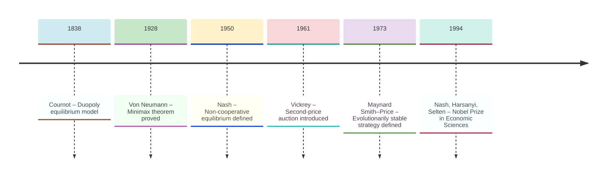
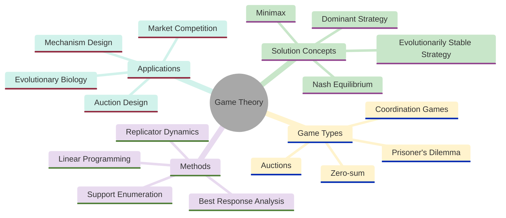
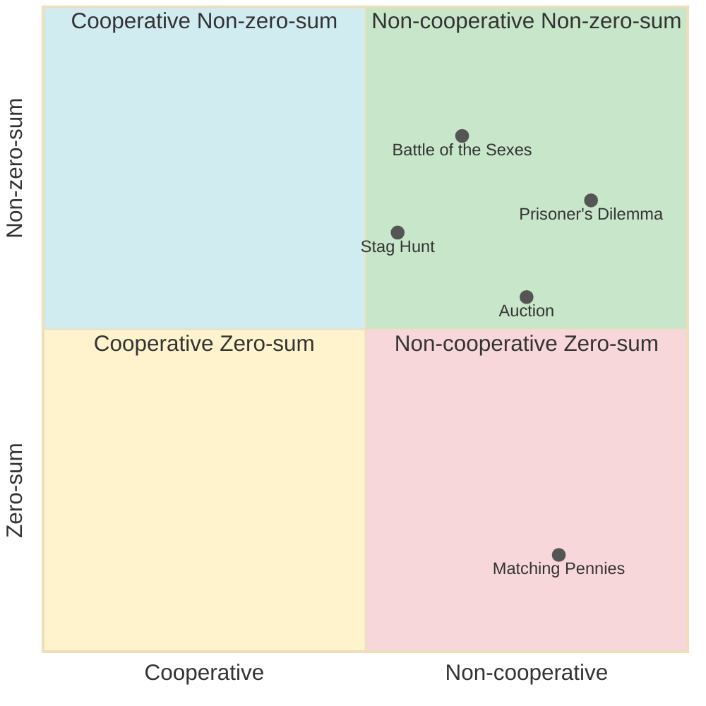
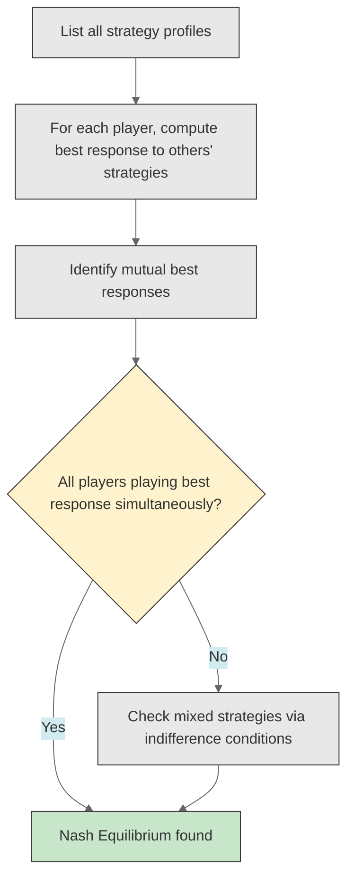
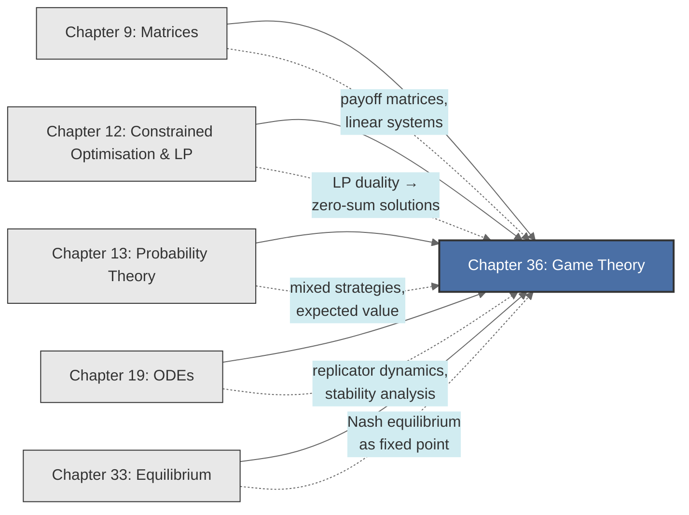

<!-- Copyright (c) 2025-2026 Bob Jansen <bobjansen@pm.me> -->
<!-- SPDX-License-Identifier: CC-BY-NC-4.0 -->
<!-- See LICENSE for full terms. Commercial licensing available. -->

# Chapter 36: Game Theory


**Part IX**: Applications

> Game theory analyses strategic interdependence: the optimal decision of one agent depends on what others decide. This chapter develops finite normal-form games, proves Nash equilibrium existence via fixed-point theory and applies the framework to zero-sum games, evolutionary dynamics and auction design.

**Prerequisites**: [Chapter 9](09-matrices.md) (Matrices & Linear Transformations); payoff matrices, matrix arithmetic and solving linear systems are used throughout for representing and computing equilibria. [Chapter 12](12-constrained-optimization.md) (Constrained Optimisation & Linear Programming); the simplex method and LP duality are required for solving zero-sum games. [Chapter 13](13-probability-theory.md) (Probability Theory); probability distributions, expected value and the concept of randomisation underpin mixed strategies. [Chapter 19](19-odes.md) (Ordinary Differential Equations); the replicator dynamics of evolutionary game theory are autonomous ODE systems whose stability analysis draws on the techniques of [Chapter 19](19-odes.md).

**Learning Objectives**: After this chapter, the reader will be able to:

1. Represent a strategic interaction as a normal-form game with players, strategy sets and payoff functions.
2. Identify and eliminate strictly dominated strategies via iterated elimination.
3. Find pure-strategy Nash equilibria using best-response analysis.
4. Compute mixed-strategy Nash equilibria for $2 \times 2$ games via indifference conditions.
5. State the Nash existence theorem and explain its reliance on fixed-point theory.
6. Solve two-person zero-sum games via linear programming and interpret the minimax value.
7. Formulate and analyse the replicator dynamics for evolutionary games.
8. Distinguish first-price and second-price auction formats and state the revenue equivalence theorem.

**Connections**: This chapter draws on the equilibrium analysis of [Chapter 33](33-equilibrium.md) (Nash equilibrium is a fixed-point concept; evolutionarily stable strategies are stable equilibria of a dynamical system). The LP formulation of zero-sum games is a direct application of [Chapter 12](12-constrained-optimization.md). Mixed strategies require the expected value machinery of [Chapter 13](13-probability-theory.md). The replicator dynamics of evolutionary game theory constitute an autonomous ODE system analysed with the tools of [Chapter 19](19-odes.md). The concept of mechanism design connects forward to optimisation under incentive constraints, extending the Lagrangian framework of [Chapter 12](12-constrained-optimization.md) to settings with private information.

---

## Historical Context

**Key Milestones in Game Theory**



*Figure 36.1: Timeline of key milestones in game theory from Cournot to the Nobel Prize.*

**Cournot's duopoly equilibrium model (1838).** Antoine Augustin Cournot, in his 1838 *Researches into the Mathematical Principles of the Theory of Wealth*, modelled duopoly competition as a simultaneous quantity-setting game. Each firm chooses output to maximise profit given the other's output. Cournot identified the equilibrium where neither firm wishes to deviate, anticipating by over a century the concept Nash would formalise.

**Von Neumann and the minimax theorem (1928).** John von Neumann proved the minimax theorem in his 1928 paper "Zur Theorie der Gesellschaftsspiele." In any finite zero-sum game, a pair of mixed strategies exists such that the maximin equals the minimax. The proof uses Brouwer's fixed-point theorem. Von Neumann and Oskar Morgenstern published *Theory of Games and Economic Behaviour* in 1944, developing two-person zero-sum theory, cooperative game theory and the axiomatic foundations of expected utility.

**Nash's non-cooperative equilibrium concept (1950–1951).** John Forbes Nash Jr. introduced the equilibrium concept for non-cooperative games in his 1950 *Proceedings of the National Academy of Sciences* paper and his 1951 *Annals of Mathematics* paper. A Nash equilibrium is a strategy profile in which no player can improve their payoff by unilateral deviation. Nash proved that every finite game possesses at least one equilibrium, possibly in mixed strategies, using Kakutani's fixed-point theorem.

**Selten's and Harsanyi's equilibrium refinements (1965–1968).** Reinhard Selten (1965) introduced subgame perfect equilibrium, eliminating equilibria sustained by non-credible threats. John Harsanyi (1967–1968) extended the theory to games of incomplete information. Nash, Harsanyi and Selten shared the 1994 Nobel Memorial Prize in Economic Sciences.

**Vickrey's second-price auction (1961).** William Vickrey introduced the second-price sealed-bid auction in 1961 and proved that truthful bidding is a dominant strategy. He also proved the revenue equivalence theorem for independent private values. Vickrey received the Nobel Prize in 1996 (shared with James Mirrlees).

**Maynard Smith and Price's evolutionary stability concept (1973).** John Maynard Smith and George R. Price (1973) defined the evolutionarily stable strategy (ESS): a strategy that, if adopted by a population, cannot be invaded by a small group of mutants. An ESS corresponds to a Nash equilibrium that is stable under the replicator dynamics, an ordinary differential equation (ODE) system governing strategy frequency evolution under natural selection. The Hawk–Dove game became one of the most studied models in evolutionary biology.

**Mechanism design and algorithmic game theory (2005–present).** Robert Aumann and Thomas Schelling received the 2005 Nobel Prize for work on repeated games and conflict resolution. Leonid Hurwicz, Eric Maskin and Roger Myerson received the 2007 Nobel Prize for mechanism design theory. Game theory now underpins the design of internet auctions, spectrum allocation, matching markets and the analysis of strategic behaviour in machine learning.

---

## Why This Chapter Matters

**Game Theory**



*Figure 36.2: Solution concepts, game types, methods and applications in game theory.*

The Nash equilibrium identifies strategy profiles from which no player has a unilateral incentive to deviate. Nash's existence theorem guarantees a mixed-strategy equilibrium in every finite game. The concept is the standard analytical tool in regulatory analysis, market design, international negotiations and network protocol design.

Auction theory governs the design of spectrum auctions (which have generated over 200 billion euros in government revenue), online advertising auctions and emissions trading systems. The Vickrey–Clarke–Groves mechanism achieves efficient allocations through truthful bidding; its principles underlie procurement auctions, combinatorial auctions and matching markets. Game-theoretic models of oligopoly competition (Cournot, Bertrand, Stackelberg) inform antitrust policy and merger analysis. The prisoner's dilemma and its repeated-game extensions explain why cooperation emerges in some contexts (trade agreements, cartel behaviour) and fails in others (arms races, environmental degradation).

Evolutionary game theory extends the framework to populations evolving under selection pressure. The replicator dynamics, an ODE system where strategy frequencies change in proportion to relative fitness, connects game theory to dynamical systems ([Chapter 19](19-odes.md)) and equilibrium theory ([Chapter 33](33-equilibrium.md)). Evolutionarily stable strategies predict long-run outcomes in biological populations, from animal aggression rituals to bacterial antibiotic resistance. Algorithmic game theory analyses the computational complexity of finding equilibria and the efficiency loss from strategic behaviour, with applications to network routing, load balancing and mechanism design for online platforms.

---

## Notation & Conventions

| Symbol | Meaning |
|--------|---------|
| $N = \{1, 2, \ldots, n\}$ | Set of players |
| $S_i$ | Strategy set of player $i$ |
| $s_i \in S_i$ | A (pure) strategy of player $i$ |
| $s = (s_1, \ldots, s_n)$ | Strategy profile (one strategy per player) |
| $s_{-i}$ | Strategies of all players except $i$: $(s_1, \ldots, s_{i-1}, s_{i+1}, \ldots, s_n)$ |
| $u_i(s)$ | Payoff function of player $i$: $u_i: S_1 \times \cdots \times S_n \to \mathbb{R}$ |
| $A$ | Payoff matrix (for two-player games: $A_{jk} = u_1(j,k)$) |
| $B$ | Second player's payoff matrix: $B_{jk} = u_2(j,k)$ |
| $\Delta(S_i)$ | Set of probability distributions over $S_i$ (mixed strategies) |
| $\sigma_i \in \Delta(S_i)$ | A mixed strategy of player $i$ |
| $\sigma_i(s_i)$ | Probability assigned to pure strategy $s_i$ by mixed strategy $\sigma_i$ |
| $\mathbb{E}[u_i(\sigma)]$ | Expected payoff of player $i$ under mixed strategy profile $\sigma$ |
| $BR_i(\sigma_{-i})$ | Best-response set of player $i$ given others' strategies $\sigma_{-i}$ |
| $v$ | Value of a zero-sum game |
| $\mathbf{p}, \mathbf{q}$ | Mixed strategy vectors for row and column players |
| $x_i(t)$ | Population share of strategy $i$ at time $t$ (evolutionary dynamics) |
| $f_i$ | Fitness of strategy $i$ |
| $\bar{f}$ | Average population fitness: $\bar{f} = \sum_i x_i f_i$ |
| $v_i$ | Private valuation of bidder $i$ (auction theory) |
| $F$ | Cumulative distribution of bidder valuations |
| $\bar{v}$ | Upper bound of the valuation support $[0, \bar{v}]$ |
| $\delta$ | Discount factor in repeated games ($0 < \delta < 1$) |

A "game" is a finite game in normal form unless stated otherwise. Rows correspond to player 1; columns to player 2. In a zero-sum game $B = -A$. In auction theory, $n$ denotes the number of bidders.

---

## Core Theory

**Classification of Games:**



*Figure 36.3: Classification of games by cooperation and zero-sum structure.*

### Normal-Form Games

**Definition 36.1** (Normal-form game). A *finite game in normal form* (or strategic form) is a tuple $\Gamma = (N, (S_i)_{i \in N}, (u_i)_{i \in N})$ where:

1. $N = \{1, 2, \ldots, n\}$ is a finite set of *players*.
2. For each player $i \in N$, $S_i = \{s_i^1, s_i^2, \ldots, s_i^{m_i}\}$ is a finite set of *pure strategies* (or actions).
3. For each player $i \in N$, $u_i: S_1 \times S_2 \times \cdots \times S_n \to \mathbb{R}$ is a *payoff function* assigning a real-valued utility to each strategy profile.

The game is played simultaneously: each player chooses a strategy without observing the others' choices. The product $S = S_1 \times \cdots \times S_n$ is the set of all strategy profiles. For a two-player game with $\lvert S_1\rvert = m$ and $\lvert S_2\rvert = k$, the payoffs can be represented as a pair of $m \times k$ matrices $(A, B)$ where $A_{jl} = u_1(s_1^j, s_2^l)$ and $B_{jl} = u_2(s_1^j, s_2^l)$.

**Definition 36.2** (Strictly dominated strategy). A strategy $s_i \in S_i$ is *strictly dominated* if there exists another strategy $s_i' \in S_i$ such that

$$u_i(s_i', s_{-i}) > u_i(s_i, s_{-i}) \quad \text{for all } s_{-i} \in S_{-i}.$$

A rational player never plays a strictly dominated strategy, since the dominating strategy $s_i'$ yields a strictly higher payoff regardless of what other players do.

**Definition 36.3** (Dominant strategy). A strategy $s_i^* \in S_i$ is a *strictly dominant strategy* if it strictly dominates every other strategy in $S_i$:

$$u_i(s_i^*, s_{-i}) > u_i(s_i, s_{-i}) \quad \text{for all } s_i \neq s_i^* \text{ and all } s_{-i} \in S_{-i}.$$

A dominant strategy dominates all alternatives; a dominated strategy (Definition 36.2) is one that is beaten by some alternative. If every player has a dominant strategy, the profile of dominant strategies is the unique Nash equilibrium.

**Theorem 36.4** (Iterated elimination of strictly dominated strategies). Iterated elimination of strictly dominated strategies proceeds by repeatedly removing strictly dominated strategies from each player's strategy set. The order of elimination does not affect the final result: the set of surviving strategy profiles is invariant under the sequence of removals.

??? note "Proof"

    *Proof.* Let $S^0 = S$ and define $S^k$ inductively: $S^k$ is obtained from $S^{k-1}$ by removing all strategies that are strictly dominated in the reduced game defined on $S^{k-1}$. Since the game is finite, the process terminates in finitely many rounds at some $S^* = S^K$.

    Suppose, for contradiction, that two different elimination orders yield different surviving sets $S^*$ and $S^{**}$. If $s_i \in S^*$ but $s_i \notin S^{**}$, then $s_i$ was eliminated at some round in the second sequence by some dominating strategy $s_i'$, meaning

    $$u_i(s_i', s_{-i}) > u_i(s_i, s_{-i}) \quad \text{for all } s_{-i} \text{ in the reduced game at that round.}$$

    Since $s_i'$ is not eliminated before $s_i$ in the second sequence (it survives to be in $S^{**}$), and the opponent strategies remaining in $S^{**}$ are a subset of those present when $s_i$ was eliminated, the domination condition restricted to opponents' strategies in $S^{**}$ still holds. But then $s_i$ is dominated in $S^{**}$, contradicting the assumption that $S^{**}$ contains no dominated strategies.

    $\square$

### Nash Equilibrium

**Nash Equilibrium Identification Process**



*Figure 36.4: Flowchart for identifying Nash equilibria via best-response analysis.*

**Definition 36.5** (Nash equilibrium, pure strategy). A strategy profile $s^* = (s_1^*, s_2^*, \ldots, s_n^*)$ is a *Nash equilibrium* if no player can improve their payoff by unilateral deviation:

$$u_i(s_i^*, s_{-i}^*) \geq u_i(s_i, s_{-i}^*) \quad \text{for all } s_i \in S_i, \text{ for all } i \in N.$$

Equivalently, each player's strategy is a best response to the strategies of the others: $s_i^* \in BR_i(s_{-i}^*)$ for all $i$.

**Remark.** The Nash equilibrium is a consistency condition: if all players are told the equilibrium profile, no one has an incentive to deviate. It does not require that the outcome be socially optimal, nor that players can coordinate; it is a condition of individual rationality given correct beliefs about others' behaviour.

**Algorithm 36.6** (Best-response / underline method for $2 \times 2$ games). To find pure-strategy Nash equilibria in a bimatrix game $(A, B)$:

1. For each column $l$, identify the row $j$ that maximises $A_{jl}$ (player 1's best response to player 2 playing column $l$). Underline $A_{jl}$.
2. For each row $j$, identify the column $l$ that maximises $B_{jl}$ (player 2's best response to player 1 playing row $j$). Underline $B_{jl}$.
3. Any cell $(j, l)$ in which both entries are underlined is a pure-strategy Nash equilibrium.

```
function bestResponseNash(A, B):
    // A, B: m x k payoff matrices for players 1 and 2
    m = rows(A)
    k = cols(A)
    underlinedA = empty set
    underlinedB = empty set
    // Player 1's best response for each column
    for l = 1 to k:
        bestRow = argmax_j A[j][l]
        underlinedA.add((bestRow, l))
    // Player 2's best response for each row
    for j = 1 to m:
        bestCol = argmax_l B[j][l]
        underlinedB.add((j, bestCol))
    // Cells where both entries are underlined
    equilibria = underlinedA intersect underlinedB
    return equilibria
```

### Mixed Strategies

**Definition 36.7** (Mixed strategy). A *mixed strategy* for player $i$ is a probability distribution ([Chapter 13](13-probability-theory.md)) $\sigma_i \in \Delta(S_i)$ over player $i$'s pure strategies. That is, $\sigma_i: S_i \to [0,1]$ with $\sum_{s_i \in S_i} \sigma_i(s_i) = 1$. A pure strategy is the special case where $\sigma_i$ assigns probability 1 to a single action.

**Definition 36.8** (Expected payoff under mixed strategies). Given a mixed strategy profile $\sigma = (\sigma_1, \ldots, \sigma_n)$, the expected payoff of player $i$ is

$$\mathbb{E}[u_i(\sigma)] = \sum_{s \in S} \left(\prod_{j=1}^n \sigma_j(s_j)\right) u_i(s).$$

For a two-player game with mixed strategies $\mathbf{p} \in \Delta(S_1)$ and $\mathbf{q} \in \Delta(S_2)$:

$$\mathbb{E}[u_1] = \mathbf{p}^T A \mathbf{q}, \qquad \mathbb{E}[u_2] = \mathbf{p}^T B \mathbf{q}.$$

**Definition 36.9** (Mixed-strategy Nash equilibrium). A mixed strategy profile $\sigma^* = (\sigma_1^*, \ldots, \sigma_n^*)$ is a Nash equilibrium if

$$\mathbb{E}[u_i(\sigma_i^*, \sigma_{-i}^*)] \geq \mathbb{E}[u_i(\sigma_i, \sigma_{-i}^*)] \quad \text{for all } \sigma_i \in \Delta(S_i), \text{ for all } i \in N.$$

**Theorem 36.10** (Indifference principle). In a completely mixed Nash equilibrium (one where every pure strategy is played with positive probability), each player must be indifferent among all pure strategies in the support of their mixed strategy. That is, if $\sigma_i^*(s_i) > 0$, then

$$\mathbb{E}[u_i(s_i, \sigma_{-i}^*)] = \mathbb{E}[u_i(s_i', \sigma_{-i}^*)] \quad \text{for all } s_i' \text{ with } \sigma_i^*(s_i') > 0.$$

??? note "Proof"

    *Proof.* Suppose $\sigma_i^*$ is a best response to $\sigma_{-i}^*$ and assigns positive probability to $s_i$ and $s_i'$. If $\mathbb{E}[u_i(s_i, \sigma_{-i}^*)] > \mathbb{E}[u_i(s_i', \sigma_{-i}^*)]$, then shifting probability mass from $s_i'$ to $s_i$ increases the expected payoff, contradicting the optimality of $\sigma_i^*$. All pure strategies in the support must therefore yield the same expected payoff.

    $\square$

**Corollary 36.11** (Computing mixed Nash for $2 \times 2$ games). Consider a two-player game where player 1 chooses row $T$ or $B$ with probabilities $(p, 1-p)$ and player 2 chooses column $L$ or $R$ with probabilities $(q, 1-q)$. The indifference conditions yield a linear system:

- Player 2's indifference (determining $p$): $p \cdot u_2(T, L) + (1-p) \cdot u_2(B, L) = p \cdot u_2(T, R) + (1-p) \cdot u_2(B, R)$.
- Player 1's indifference (determining $q$): $q \cdot u_1(T, L) + (1-q) \cdot u_1(T, R) = q \cdot u_1(B, L) + (1-q) \cdot u_1(B, R)$.

Each is a single linear equation in one unknown. Solving for $p$ and $q$ (and verifying $0 \leq p, q \leq 1$) gives the mixed Nash equilibrium. This reduces to solving a $2 \times 2$ linear system ([Chapter 9](09-matrices.md)).

### Nash Existence Theorem

**Theorem 36.12** (Nash, 1951). Every finite game $\Gamma = (N, (S_i)_{i \in N}, (u_i)_{i \in N})$ has at least one Nash equilibrium in mixed strategies.

??? note "Proof"

    *Proof (sketch).* The proof constructs a continuous mapping $F: \Delta \to \Delta$ on the product of mixed strategy simplices $\Delta = \Delta(S_1) \times \cdots \times \Delta(S_n)$. The mapping adjusts each player's strategy toward better responses. Since $\Delta$ is a compact, convex subset of a finite-dimensional Euclidean space and $F$ is continuous, Brouwer's fixed-point theorem guarantees a fixed point $\sigma^*$ of $F$. The construction ensures that any fixed point satisfies the best-response condition for all players simultaneously, hence is a Nash equilibrium. Nash's original proof uses the more general Kakutani fixed-point theorem (for set-valued best-response correspondences). *(Full proof is beyond the scope of this text.)* $\square$

!!! abstract "Key Result"

    **Theorem 36.12** (Nash, 1951). Every finite game has at least one Nash equilibrium in mixed strategies; this existence result, proved via Brouwer's fixed-point theorem, guarantees that strategic interactions always admit a stable outcome where no player benefits from unilateral deviation.

**Remark.** Theorem 36.12 guarantees *existence* but provides no efficient algorithm for finding all Nash equilibria. Computing a Nash equilibrium of a general finite game is complete for the complexity class Polynomial Parity Arguments on Directed graphs (Daskalakis, Goldberg and Papadimitriou, 2009), meaning that no polynomial-time algorithm is known or believed to exist. For two-player games, the Lemke–Howson algorithm finds one equilibrium in finite steps, but may require exponential time in the worst case. The special case of zero-sum games admits polynomial-time solutions via linear programming (Theorem 36.16).

### Zero-Sum Games and the Minimax Theorem

**Definition 36.13** (Zero-sum game). A two-player game is *zero-sum* if $u_1(s) + u_2(s) = 0$ for all strategy profiles $s$. Equivalently, $B = -A$: what one player gains, the other loses. The payoff matrix $A$ alone specifies the game completely.

**Definition 36.14** (Maximin and minimax). The *maximin value* for the row player is

$$\underline{v} = \max_{\mathbf{p} \in \Delta(S_1)} \min_{\mathbf{q} \in \Delta(S_2)} \mathbf{p}^T A \mathbf{q}.$$

The *minimax value* for the column player is

$$\bar{v} = \min_{\mathbf{q} \in \Delta(S_2)} \max_{\mathbf{p} \in \Delta(S_1)} \mathbf{p}^T A \mathbf{q}.$$

**Theorem 36.15** (Von Neumann minimax theorem, 1928). For any finite two-person zero-sum game with payoff matrix $A$:

$$\max_{\mathbf{p}} \min_{\mathbf{q}} \mathbf{p}^T A \mathbf{q} = \min_{\mathbf{q}} \max_{\mathbf{p}} \mathbf{p}^T A \mathbf{q} = v.$$

The common value $v$ is called the *value of the game*. There exist optimal mixed strategies $\mathbf{p}^*$ and $\mathbf{q}^*$ that achieve this value: $\mathbf{p}^{*T} A \mathbf{q} \geq v$ for all $\mathbf{q}$, and $\mathbf{p}^T A \mathbf{q}^* \leq v$ for all $\mathbf{p}$.

**Theorem 36.16** (Linear programme (LP) formulation of zero-sum games). The row player's optimal mixed strategy is the solution to the linear programme:

$$\max \; v \quad \text{subject to} \quad A^T \mathbf{p} \geq v \mathbf{1}, \quad \mathbf{p} \geq \mathbf{0}, \quad \mathbf{1}^T \mathbf{p} = 1,$$

where $v$ is an unrestricted scalar. The column player's optimal strategy is the solution to the dual LP:

$$\min \; w \quad \text{subject to} \quad A \mathbf{q} \leq w \mathbf{1}, \quad \mathbf{q} \geq \mathbf{0}, \quad \mathbf{1}^T \mathbf{q} = 1.$$

By LP strong duality ([Chapter 12](12-constrained-optimization.md), Theorem 12.19), $v^* = w^*$, which provides an alternative proof of the minimax theorem.

??? note "Proof"

    *Proof.* The row player seeks $\mathbf{p} \in \Delta(S_1)$ to maximise the worst-case payoff $\min_{\mathbf{q}} \mathbf{p}^T A \mathbf{q}$.

    Since $\mathbf{p}^T A \mathbf{q}$ is linear in $\mathbf{q}$ and the column player minimises over the simplex, the minimum is attained at a vertex (a pure strategy). Hence:

    $$\min_{\mathbf{q}}\, \mathbf{p}^T A \mathbf{q} = \min_l\, (\mathbf{p}^T A)_l = \min_l \sum_j p_j A_{jl}.$$

    Introducing the scalar $v$ as a lower bound on $\sum_j p_j A_{jl}$ for all $l$ linearises the inner minimisation, yielding the stated linear programme. The dual LP (for the column player) follows by standard LP duality theory ([Chapter 12](12-constrained-optimization.md)).

    $\square$

### The Prisoner's Dilemma and Repeated Games

**Definition 36.17** (Prisoner's dilemma). The prisoner's dilemma is the $2 \times 2$ game with payoff matrices:

$$A = \begin{pmatrix} -1 & -3 \\ 0 & -2 \end{pmatrix}, \quad B = \begin{pmatrix} -1 & 0 \\ -3 & -2 \end{pmatrix}$$

where rows/columns are Cooperate ($C$) and Defect ($D$). Each player has "Defect" as a strictly dominant strategy: $u_i(D, s_{-i}) > u_i(C, s_{-i})$ for both choices of the opponent. The unique Nash equilibrium is $(D, D)$ with payoffs $(-2, -2)$. Yet the outcome $(C, C)$ with payoffs $(-1, -1)$ Pareto dominates the equilibrium (an outcome $s'$ Pareto dominates $s$ if $u_i(s') \geq u_i(s)$ for all $i$ with strict inequality for at least one; see Definition 36.18 below): both players prefer mutual cooperation to mutual defection. This gap between individual rationality and collective welfare is the central tension of game theory.

**Definition 36.18** (Pareto efficiency). An outcome $s$ is *Pareto efficient* (or Pareto optimal) if there is no alternative outcome $s'$ such that $u_i(s') \geq u_i(s)$ for all $i$ with strict inequality for at least one player. The Nash equilibrium $(D, D)$ in the prisoner's dilemma is Pareto *inferior*: it is dominated by $(C, C)$.

**Theorem 36.19** (Folk theorem, informal statement). In an infinitely repeated game with sufficiently patient players (discount factor $\delta$ close to 1), any feasible payoff vector that gives each player at least their minmax value can be sustained as a Nash equilibrium (or subgame perfect equilibrium) of the repeated game.

The folk theorem explains how cooperation can emerge in repeated interactions: the threat of future punishment (reverting to the stage-game Nash equilibrium) can sustain cooperative behaviour that is impossible in a one-shot game. Strategies such as "tit-for-tat" (cooperate initially, then mirror the opponent's last action) exploit this mechanism.

### Evolutionary Game Theory

**Definition 36.20** (Symmetric game and population interpretation). A *symmetric* two-player game has $S_1 = S_2 = S$ and $u_1(s_i, s_j) = u_2(s_j, s_i)$: the payoff depends on the strategies played, not on the player's identity. In the evolutionary interpretation, a large population of agents is randomly matched in pairs. Each agent is "programmed" to play a fixed strategy, and payoffs represent reproductive fitness.

**Definition 36.21** (Replicator dynamics). Let $x_i(t)$ denote the population share of strategy $i$ at time $t$, with $\sum_i x_i = 1$. The fitness of strategy $i$ in population state $\mathbf{x}$ is

$$f_i(\mathbf{x}) = \sum_j A_{ij} x_j = (A\mathbf{x})_i,$$

where $A$ is the payoff matrix of the symmetric game. The average fitness is $\bar{f}(\mathbf{x}) = \sum_i x_i f_i(\mathbf{x}) = \mathbf{x}^T A \mathbf{x}$. The *replicator dynamics* is the system of ODEs:

$$\frac{dx_i}{dt} = x_i \bigl(f_i(\mathbf{x}) - \bar{f}(\mathbf{x})\bigr), \quad i = 1, \ldots, m.$$

Strategies with above-average fitness grow; those with below-average fitness decline. The simplex $\Delta = \{x : x_i \geq 0, \sum_i x_i = 1\}$ is invariant under the dynamics.

**Definition 36.22** (Evolutionarily stable strategy). A strategy $s^* \in S$ (or equivalently a population state $\mathbf{x}^*$ with all mass on $s^*$) is an *evolutionarily stable strategy* (ESS) if for all alternative strategies $s \neq s^*$:

1. $u(s^*, s^*) \geq u(s, s^*)$ (Nash equilibrium condition).
2. If $u(s^*, s^*) = u(s, s^*)$, then $u(s^*, s) > u(s, s)$ (stability condition).

An ESS is a Nash equilibrium of the symmetric game that is additionally resistant to invasion by small populations of mutants.

**Theorem 36.23** (ESS and replicator dynamics). If $\mathbf{x}^*$ is an ESS, then $\mathbf{x}^*$ is an asymptotically stable rest point of the replicator dynamics. The converse does not hold in general.

??? note "Proof"

    *Proof (sketch).* Consider a population at $\mathbf{x}^*$ perturbed to $\mathbf{x} = (1-\epsilon)\mathbf{x}^* + \epsilon \mathbf{y}$ for small $\epsilon > 0$ and some mutant distribution $\mathbf{y}$. By the ESS conditions, the fitness of $\mathbf{x}^*$ against the perturbed population exceeds that of any invader. A Lyapunov function argument (using the relative entropy $\sum_i x_i^* \ln(x_i^*/x_i)$) shows that the distance from $\mathbf{x}^*$ decreases under the replicator dynamics, establishing asymptotic stability. *(Full proof is beyond the scope of this text.)* $\square$

**Example 36.24** (Hawk–Dove game). Two animals contest a resource of value $V$. Each can play Hawk (fight) or Dove (share peacefully). If both play Hawk, each suffers a cost $C$ from fighting and gets the resource with probability $1/2$, yielding expected payoff $(V - C)/2$. If one plays Hawk and the other Dove, the Hawk gets $V$ and the Dove gets $0$. If both play Dove, they share: payoff $V/2$ each. The payoff matrix is:

$$A = \begin{pmatrix} (V-C)/2 & V \\ 0 & V/2 \end{pmatrix}.$$

When $C > V$ (the cost of fighting exceeds the resource value), neither pure strategy is an ESS. The mixed ESS has the population playing Hawk with probability $p^* = V/C$. The replicator dynamics for the Hawk frequency $x$ are:

$$\begin{aligned}
\frac{dx}{dt} &= x(1-x)\bigl[f_H(x) - f_D(x)\bigr] = x(1-x)\left[\frac{V-C}{2}x + V(1-x) - 0 \cdot x - \frac{V}{2}(1-x)\right] \\
&= x(1-x)\left[\frac{V}{2} - \frac{C}{2}x\right].
\end{aligned}$$

Setting the right-hand side to zero yields interior equilibrium $x^* = V/C$, which is stable since the derivative of the bracket in $x$ is $-C/2 < 0$.

**Hawk–Dove Replicator Dynamics Convergence**

```mermaid
---
config:
  theme: base
  themeVariables:
    xyChart:
      plotColorPalette: "#2563eb, #dc2626, #16a34a, #9333ea, #ca8a04, #0891b2"
      backgroundColor: "#ffffff"
      titleColor: "#333333"
      xAxisLabelColor: "#333333"
      yAxisLabelColor: "#333333"
      xAxisTitleColor: "#333333"
      yAxisTitleColor: "#333333"
      xAxisLineColor: "#333333"
      yAxisLineColor: "#333333"
---
xychart-beta
    x-axis "Time t" [0, 2, 4, 6, 8, 10, 12, 14, 16]
    y-axis "x (hawk)" 0 --> 0.7
    line [0.1, 0.18, 0.30, 0.42, 0.52, 0.58, 0.62, 0.64, 0.65]
```

*Figure 36.5: Hawk frequency converging to the evolutionarily stable strategy over time.*

### Auction Theory

**Definition 36.25** (Independent private values model). There are $n$ bidders, each with a private valuation $v_i$ drawn independently from a distribution $F$ on $[0, \bar{v}]$. A bidder's payoff is $v_i - p$ if they win (where $p$ is the price paid) and $0$ otherwise.

**Theorem 36.26** (Dominant strategy in second-price auctions). In a sealed-bid second-price (Vickrey) auction, bidding one's true valuation $b_i = v_i$ is a weakly dominant strategy for each bidder.

??? note "Proof"

    *Proof.* Consider bidder $i$ with valuation $v_i$. Let $h$ denote the highest bid among all other bidders. Three cases arise depending on the relationship between $v_i$ and $h$:

    - If $v_i > h$: bidding $b_i = v_i$ wins and yields payoff $v_i - h > 0$. Any bid below $h$ loses and yields $0$, which is worse.

    - If $v_i < h$: bidding $b_i = v_i$ loses, yielding payoff $0$. Bidding above $h$ would win but yield $v_i - h < 0$, which is worse.

    - If $v_i = h$: bidder $i$ is indifferent regardless of whether they win, since the payoff $v_i - h = 0$ in either case.

    In no case does deviating from $b_i = v_i$ yield a strictly higher payoff, regardless of others' bids. Truthful bidding is therefore weakly dominant.

    $\square$

**Theorem 36.27** (Bid shading in first-price auctions). In a first-price sealed-bid auction with $n$ bidders whose valuations are independent and identically distributed (iid) from the uniform distribution $F(v) = v/\bar{v}$ on $[0, \bar{v}]$, the symmetric Bayesian Nash equilibrium bidding strategy is

$$b(v) = \frac{n-1}{n} v.$$

Each bidder "shades" their bid below their true valuation. The amount of shading decreases as the number of competitors increases.

??? note "Proof"

    *Proof.* In a symmetric equilibrium with strictly increasing bid function $b(\cdot)$, bidder $i$ with valuation $v_i$ who bids $b$ wins if and only if $b > b(v_j)$ for all $j \neq i$. By monotonicity of $b$, this is equivalent to $v_j < b^{-1}(b)$ for all $j \neq i$, which occurs with probability $F\!\left(b^{-1}(b)\right)^{n-1}$.

    The expected payoff of bidder $i$ when bidding $b$ is therefore

    $$(v_i - b) \cdot F\!\left(b^{-1}(b)\right)^{n-1}.$$

    Guessing a linear equilibrium $b(v) = \alpha v$ and substituting the uniform distribution $F(v) = v/\bar{v}$, the first-order condition for optimality over $b$ simplifies to a linear equation in $\alpha$. Solving yields $\alpha = (n-1)/n$.

    $\square$

**Theorem 36.28** (Revenue equivalence). Consider $n$ risk-neutral bidders with valuations drawn independently from a common distribution $F$. Any auction mechanism in which (a) the item goes to the highest-valuation bidder and (b) a bidder with the lowest possible valuation pays zero yields the same expected revenue to the seller. In particular, the first-price and second-price auctions are revenue-equivalent.

### Mechanism Design (Brief)

**Definition 36.29** (Mechanism). A *mechanism* $\mathcal{M} = ((S_i)_{i \in N}, g)$ specifies a strategy space $S_i$ for each agent and an outcome function $g: S_1 \times \cdots \times S_n \to \mathcal{O}$ mapping strategy profiles to outcomes. The mechanism designer chooses the rules of the game to induce agents to reveal private information and achieve a desired social objective.

**Theorem 36.30** (Revelation principle). For any mechanism and any Bayesian Nash equilibrium of that mechanism, there exists a *direct* mechanism (one where each agent's strategy space is their type space) in which truthful reporting is a Bayesian Nash equilibrium and produces the same outcome.

The Vickrey–Clarke–Groves mechanism extends the second-price auction logic to general allocation problems: each agent pays an amount equal to the externality they impose on others. Vickrey–Clarke–Groves mechanisms are strategyproof (truthful reporting is a dominant strategy) and efficient (they maximise total welfare).

---

## Formulas & Identities

**F36.1** (Expected payoff in a two-player game). For row player with mixed strategy $\mathbf{p} = (p_1, \ldots, p_m)^T$ and column player with mixed strategy $\mathbf{q} = (q_1, \ldots, q_k)^T$:

$$\mathbb{E}[u_1] = \mathbf{p}^T A \mathbf{q} = \sum_{j=1}^m \sum_{l=1}^k p_j A_{jl} q_l.$$

**F36.2** (Mixed Nash for $2 \times 2$ game). Given payoff matrix:

$$A = \begin{pmatrix} a_{11} & a_{12} \\ a_{21} & a_{22} \end{pmatrix}, \quad B = \begin{pmatrix} b_{11} & b_{12} \\ b_{21} & b_{22} \end{pmatrix},$$

the mixed-strategy Nash equilibrium (when it exists in the interior) has:

$$p = \frac{b_{22} - b_{12}}{b_{11} - b_{12} - b_{21} + b_{22}}, \qquad q = \frac{a_{22} - a_{21}}{a_{11} - a_{21} - a_{12} + a_{22}},$$

where $p$ is the probability player 1 plays row 1 and $q$ is the probability player 2 plays column 1.

**F36.3** (Replicator dynamics, matrix form). For a symmetric game with payoff matrix $A$ and population state $\mathbf{x} \in \Delta$:

$$\dot{x}_i = x_i \left[(A\mathbf{x})_i - \mathbf{x}^T A \mathbf{x}\right].$$

**F36.4** (Value of $2 \times 2$ zero-sum game). For a $2 \times 2$ zero-sum game with payoff matrix $A = \begin{pmatrix} a & b \\ c & d \end{pmatrix}$ where no saddle point exists in pure strategies:

$$v = \frac{ad - bc}{a - b - c + d}.$$

!!! warning "Saddle-point check before applying F36.4"
    Formulas F36.4 and F36.5 apply only when no saddle point exists in pure strategies (i.e. $\max_j \min_l A_{jl} \neq \min_l \max_j A_{jl}$). If a saddle point exists, the game value equals the saddle-point entry and both players have pure optimal strategies. The denominator $a - b - c + d = 0$ precisely when the game is degenerate.

**F36.5** (Optimal mixed strategy, row player in $2 \times 2$ zero-sum). The optimal probability on row 1 is:

$$p^* = \frac{d - c}{a - b - c + d}.$$

**F36.6** (Symmetric first-price auction bid function, uniform valuations). With $n$ bidders and valuations uniform on $[0, \bar{v}]$:

$$b(v) = \frac{n-1}{n}v.$$

**F36.7** (Expected revenue, second-price auction). With $n$ bidders and valuations iid from $F$:

$$\mathbb{E}[\text{Revenue}] = \mathbb{E}[V_{(n-1:n)}] = \int_0^{\bar{v}} v \cdot n(n-1) F(v)^{n-2} f(v) \left[1 - F(v)\right] \, dv,$$

where $V_{(n-1:n)}$ is the second-highest order statistic.

---

## Algorithms

**Algorithm 36.31** (Iterated elimination of strictly dominated strategies).

```
function IESDS(players, strategies, payoffs):
    changed = true
    while changed:
        changed = false
        for each player i:
            for each strategy s_i in strategies[i]:
                for each other strategy s_i' in strategies[i]:
                    if payoffs[i](s_i', s_{-i}) > payoffs[i](s_i, s_{-i})
                       for ALL s_{-i} in product of other strategies:
                        remove s_i from strategies[i]
                        changed = true
                        break
    return strategies  // surviving strategies
```

Complexity: $O(K \cdot n \cdot m^{n+1})$ where $K$ is the number of elimination rounds, $n$ the number of players and $m$ the maximum number of strategies.

**Algorithm 36.32** (Best-response enumeration for pure Nash equilibria in bimatrix games).

```
function findPureNash(A, B):
    // A is m x k, B is m x k
    equilibria = []
    for each column l in 1..k:
        bestRow[l] = argmax_j A[j][l]
    for each row j in 1..m:
        bestCol[j] = argmax_l B[j][l]
    for each cell (j, l):
        if bestRow[l] == j AND bestCol[j] == l:
            equilibria.append((j, l))
    return equilibria
```

Complexity: $O(mk)$ for a two-player game with $m$ and $k$ strategies.

**Algorithm 36.33** (Support enumeration for mixed Nash equilibria in two-player games).

```
function findMixedNash(A, B):
    m = rows(A), k = cols(A)
    equilibria = []
    for each nonempty subset I of {1,...,m}:      // support of player 1
        for each nonempty subset J of {1,...,k}:  // support of player 2
            // Solve indifference + probability constraints
            // Player 1 indifferent over J: (A[I,J])^T p = c*1 for some c
            // Player 2 indifferent over I: B[I,J] q = d*1 for some d
            // Subject to: sum(p)=1, p>=0, sum(q)=1, q>=0
            solve for (p, q, c, d)
            if solution exists with p > 0, q > 0:
                equilibria.append((p, q))
    return equilibria
```

Complexity: $O(2^{m+k} \cdot \text{poly}(m, k))$; exponential in the number of strategies in the worst case.

**Algorithm 36.34** (Zero-sum game solver via LP).

```
function solveZeroSum(A):
    // A is m x k payoff matrix for row player
    // Formulate LP: max v subject to A^T p >= v*1, p >= 0, sum(p) = 1
    // Equivalent reformulation (assuming v > 0 after shifting):
    //   Let y_j = p_j / v. Then maximize 1/(sum y_j)
    //   subject to A^T y >= 1, y >= 0
    //   Equivalently: minimize sum(y_j) subject to A^T y >= 1, y >= 0

    c = [1, 1, ..., 1]  // length m
    A_constraints = -A^T  // negate for <= form
    b = [-1, -1, ..., -1]  // length k
    y_opt = simplex(c, A_constraints, b)  // Chapter 12

    v = 1 / sum(y_opt)
    p = y_opt * v  // recover probabilities

    // Solve dual for column player's strategy q analogously
    return (p, q, v)
```

**Algorithm 36.35** (Replicator dynamics via fourth-order Runge–Kutta (RK4)).

```
function replicatorRK4(A, x0, T, dt):
    // A: m x m payoff matrix
    // x0: initial population state in simplex
    // T: total integration time, dt: step size
    x = x0
    trajectory = [x0]
    for t = 0 to T step dt:
        f(y) = y .* (A*y - (y'*A*y)*ones(m,1))  // replicator RHS
        k1 = f(x)
        k2 = f(project(x + dt/2 * k1))
        k3 = f(project(x + dt/2 * k2))
        k4 = f(project(x + dt * k3))
        x = project(x + dt/6 * (k1 + 2*k2 + 2*k3 + k4))
        trajectory.append(x)
    return trajectory

function project(x):
    // Project onto simplex: clip negatives, renormalize
    x = max(x, 0)
    return x / sum(x)
```

!!! tip "Simplex projection for replicator dynamics"
    The `project` function ensures the numerical solution remains in the probability simplex despite floating-point drift. Clipping negatives and renormalising is the simplest projection. For higher accuracy, the exact Euclidean projection onto the simplex (sorting-based, $O(m \log m)$) preserves the $L^2$-nearest point on the simplex.

The RK4 integration follows [Chapter 19](19-odes.md).

---

## Numerical Considerations

### Degeneracy in Support Enumeration

Algorithm 36.33 enumerates supports and solves linear indifference systems to find mixed Nash equilibria. When the support is degenerate (a player is indifferent over more strategies than the support size), the linear system becomes singular or under-determined. The Lemke–Howson algorithm handles degeneracy via lexicographic pivoting, analogous to the simplex method's handling of degenerate vertices ([Chapter 12](12-constrained-optimization.md)).

### Conditioning of Indifference Systems

The $2 \times 2$ mixed Nash formula (F36.2) gives player 2's mixing probability as

$$q^* = \frac{a_{22} - a_{12}}{a_{11} - a_{12} - a_{21} + a_{22}}.$$

!!! warning "Near-zero denominators in mixed Nash computation"
    When the denominator $a_{11} - a_{12} - a_{21} + a_{22} \approx 0$, the mixed equilibrium is structurally unstable: small perturbations in payoffs produce large changes in $q^*$. The condition number of the indifference system is approximately $\|A\|/|a_{11} - a_{12} - a_{21} + a_{22}|$. A vanishing denominator indicates that the game is approaching a boundary case where the mixed equilibrium merges with a pure equilibrium or ceases to exist.

For larger games (Algorithm 36.33), the condition number of the indifference matrix for each support determines sensitivity.

### LP Solver Precision for Zero-Sum Games

Algorithm 36.34 formulates the zero-sum game as a linear programme. The LP inherits the numerical issues discussed in [Chapter 12](12-constrained-optimization.md): feasibility tolerance, degeneracy and scaling. Payoff matrices with entries spanning several orders of magnitude should be scaled before solving. For games with $m, k > 100$ strategies, interior-point methods are preferable to the simplex method; they achieve $O(\sqrt{n}\log(1/\varepsilon))$ iteration complexity independent of degeneracy.

### Replicator Dynamics Near the Simplex Boundary

Algorithm 36.35 integrates the replicator equation $\dot{x}_i = x_i\bigl((A\mathbf{x})_i - \mathbf{x}^T A \mathbf{x}\bigr)$ using RK4. Near the simplex boundary, some $x_i \to 0$ and the effective timescale for that strategy diverges.

!!! warning "Stiffness near the simplex boundary"
    The system becomes stiff when $\min_i x_i / \max_i x_i$ is small. Fixed-step RK4 may produce negative components or overshoot the simplex. For long simulations, monitor $\sum_i x_i - 1$ as a drift diagnostic; if drift exceeds $10^{-8}$, reduce $h$ or switch to an implicit integrator.

The `project` function in Algorithm 36.35 clamps negative components to zero and renormalises, but this introduces an error of $O(h^5)$ per step (matching RK4 local truncation error).

### Exponential Complexity of Equilibrium Enumeration

Algorithm 36.33 enumerates all $\binom{m}{s_1}\binom{k}{s_2}$ support pairs, where $s_1$ and $s_2$ range from 1 to $m$ and $k$ respectively. The total number of candidates is $O(2^{m+k})$, making exhaustive enumeration impractical for games with more than about 15 strategies per player. For larger games, heuristic methods (e.g. Lemke–Howson from random starting points, or iterated best response) find individual equilibria without guaranteeing completeness.

---

## Worked Examples

### Example 36.36: Prisoner's dilemma, dominant strategy analysis

Consider the prisoner's dilemma with the standard payoff matrices:

$$A = \begin{pmatrix} 3 & 0 \\ 5 & 1 \end{pmatrix}, \quad B = \begin{pmatrix} 3 & 5 \\ 0 & 1 \end{pmatrix},$$

where rows/columns are labelled $C$ (Cooperate) and $D$ (Defect). This is an equivalent formulation of the prisoner's dilemma with non-negative payoffs; the strategic structure (Defect is strictly dominant, mutual defection is the unique Nash equilibrium, mutual cooperation Pareto dominates) is identical to that of Definition 36.17.

*Solution.* Apply the best-response method (Algorithm 36.6):

- Player 1's best response to $C$ (column 1): compare $A_{11} = 3$ vs $A_{21} = 5$. Since $5 > 3$, player 1 prefers $D$. Underline $A_{21} = 5$.
- Player 1's best response to $D$ (column 2): compare $A_{12} = 0$ vs $A_{22} = 1$. Since $1 > 0$, player 1 prefers $D$. Underline $A_{22} = 1$.
- Player 2's best response to $C$ (row 1): compare $B_{11} = 3$ vs $B_{12} = 5$. Since $5 > 3$, player 2 prefers $D$. Underline $B_{12} = 5$.
- Player 2's best response to $D$ (row 2): compare $B_{21} = 0$ vs $B_{22} = 1$. Since $1 > 0$, player 2 prefers $D$. Underline $B_{22} = 1$.

The only cell with both entries underlined is $(D, D)$ with payoffs $(1, 1)$. This is the unique Nash equilibrium.

Observe that $D$ is a strictly dominant strategy for both players: $u_i(D, s_{-i}) > u_i(C, s_{-i})$ for $s_{-i} \in \{C, D\}$. Yet the outcome $(C, C)$ with payoffs $(3, 3)$ Pareto dominates the equilibrium $(D, D)$.

### Example 36.37: Computing mixed Nash equilibrium for a $2 \times 2$ game

Consider the Battle of the Sexes game:

$$A = \begin{pmatrix} 3 & 0 \\ 0 & 2 \end{pmatrix}, \quad B = \begin{pmatrix} 2 & 0 \\ 0 & 3 \end{pmatrix}.$$

Player 1 prefers outcome $(T, L)$ and player 2 prefers $(B, R)$. Find all Nash equilibria.

*Solution.* **Pure equilibria:** Best-response analysis gives two pure Nash equilibria at $(T, L)$ with payoffs $(3, 2)$ and $(B, R)$ with payoffs $(2, 3)$.

**Mixed equilibrium:** Let $p$ = P(player 1 plays $T$), $q$ = P(player 2 plays $L$). By the indifference principle:

Player 1's indifference (each row yields equal expected payoff):

$$\begin{aligned}
q \cdot 3 + (1-q) \cdot 0 &= q \cdot 0 + (1-q) \cdot 2 \\
3q &= 2 - 2q \\
5q &= 2 \implies q = \frac{2}{5}.
\end{aligned}$$

Player 2's indifference (each column yields equal expected payoff):

$$\begin{aligned}
p \cdot 2 + (1-p) \cdot 0 &= p \cdot 0 + (1-p) \cdot 3 \\
2p &= 3 - 3p \\
5p &= 3 \implies p = \frac{3}{5}.
\end{aligned}$$

The mixed Nash equilibrium is $p = 3/5$, $q = 2/5$. Expected payoffs:

$$\begin{aligned}
\mathbb{E}[u_1] &= 3q = 3 \cdot \frac{2}{5} = \frac{6}{5}, \\
\mathbb{E}[u_2] &= 3(1-p) = 3 \cdot \frac{2}{5} = \frac{6}{5}.
\end{aligned}$$

(At the mixed Nash equilibrium, each player is indifferent across rows/columns, so the expected payoff equals that from any single pure strategy: $\mathbb{E}[u_1]$ equals the payoff from playing row $T$, which is $3q + 0 \cdot (1-q) = 3q$; similarly $\mathbb{E}[u_2]$ equals the payoff from column $R$, which is $0 \cdot p + 3(1-p) = 3(1-p)$.)

Both players receive expected payoff $6/5 = 1.2$, which is lower than either pure equilibrium payoff. The mixed equilibrium represents the coordination failure: players randomise and frequently miscoordinate.

Using F36.2 directly:

$$p = \frac{b_{22} - b_{12}}{b_{11} - b_{12} - b_{21} + b_{22}} = \frac{3 - 0}{2 - 0 - 0 + 3} = \frac{3}{5}, \qquad q = \frac{a_{22} - a_{21}}{a_{11} - a_{21} - a_{12} + a_{22}} = \frac{2 - 0}{3 - 0 - 0 + 2} = \frac{2}{5}.$$

Confirmed.

### Example 36.38: Solving a zero-sum game via LP

Consider the $3 \times 3$ zero-sum game with payoff matrix (for the row player):

$$A = \begin{pmatrix} 1 & -1 & 2 \\ -1 & 2 & -1 \\ 2 & -1 & 0 \end{pmatrix}.$$

Find the value of the game and optimal strategies.

*Solution.* First check for a saddle point (pure-strategy solution). The row minima are $\min(1, -1, 2) = -1$, $\min(-1, 2, -1) = -1$, $\min(2, -1, 0) = -1$. The maximum of row minima (maximin) is $-1$. The column maxima are $\max(1, -1, 2) = 2$, $\max(-1, 2, -1) = 2$, $\max(2, -1, 0) = 2$. The minimum of column maxima (minimax) is $2$. Since $-1 \neq 2$, no saddle point exists; the game requires mixed strategies.

Solving directly via the indifference conditions for a fully mixed equilibrium. The row player's optimal strategy $\mathbf{p} = (p_1, p_2, p_3)$ must make the column player indifferent across all three columns, i.e., $\mathbf{p}^T A$ has equal entries across all columns. Setting the payoff from column 1 equal to column 2:

$$p_1 - p_2 + 2p_3 = -p_1 + 2p_2 - p_3 \quad \Longrightarrow \quad 2p_1 - 3p_2 + 3p_3 = 0. \quad \text{(I)}$$

Setting column 2 equal to column 3:

$$-p_1 + 2p_2 - p_3 = 2p_1 - p_2 \quad \Longrightarrow \quad -3p_1 + 3p_2 - p_3 = 0. \quad \text{(II)}$$

Together with $p_1 + p_2 + p_3 = 1$ (III), solving this $3 \times 3$ linear system: from (II), $p_3 = 3p_2 - 3p_1$. Substituting into (I):

$$2p_1 - 3p_2 + 3(3p_2 - 3p_1) = -7p_1 + 6p_2 = 0, \qquad \text{giving } p_2 = \frac{7p_1}{6}.$$

From (II): $p_3 = 3(7p_1/6) - 3p_1 = p_1/2$. Substituting into (III):

$$p_1 + \frac{7p_1}{6} + \frac{p_1}{2} = \frac{16p_1}{6} = 1, \qquad \text{so } p_1 = \frac{3}{8}.$$

The solution is therefore:

$$p_1 = \frac{3}{8}, \qquad p_2 = \frac{7}{16}, \qquad p_3 = \frac{3}{16}, \qquad p_1 + p_2 + p_3 = \frac{6 + 7 + 3}{16} = 1.$$

The game value is

$$v = \mathbf{p}^T A \mathbf{e}_1 = \tfrac{3}{8}(1) + \tfrac{7}{16}(-1) + \tfrac{3}{16}(2) = \frac{6 - 7 + 6}{16} = \frac{5}{16}.$$

Checking the other columns confirms $\mathbf{p}^T A \mathbf{e}_2 = 5/16$ and $\mathbf{p}^T A \mathbf{e}_3 = 5/16$. All columns yield the same value.

By the symmetry of the indifference conditions, the column player's optimal strategy satisfies the same system, giving $\mathbf{q} = (3/8, 7/16, 3/16)$. The value of the game is $v = 5/16 = 0.3125$, slightly favouring the row player.

### Example 36.39: Hawk–Dove replicator dynamics

Consider the Hawk–Dove game with $V = 4$, $C = 6$:

$$A = \begin{pmatrix} (4-6)/2 & 4 \\ 0 & 4/2 \end{pmatrix} = \begin{pmatrix} -1 & 4 \\ 0 & 2 \end{pmatrix}.$$

Find the ESS and analyse the replicator dynamics.

*Solution.* Let $x$ = proportion of Hawks. The fitness of each strategy is:

$$\begin{aligned}
f_H(x) &= -1 \cdot x + 4 \cdot (1-x) = 4 - 5x, \\
f_D(x) &= 0 \cdot x + 2 \cdot (1-x) = 2 - 2x.
\end{aligned}$$

Average fitness:

$$\bar{f}(x) = x f_H + (1-x) f_D = x(4-5x) + (1-x)(2-2x) = 2 - 3x^2.$$

The replicator equation (one-dimensional, since $x_D = 1 - x$):

$$\dot{x} = x(f_H - \bar{f}) = x(1-x)(f_H - f_D) = x(1-x)(4 - 5x - 2 + 2x) = x(1-x)(2 - 3x).$$

Interior equilibrium:

$$2 - 3x^* = 0 \implies x^* = \frac{2}{3}.$$

Stability analysis: at $x^*$, the derivative of $g(x) = (1-x)(2-3x)$ evaluated at $x = 2/3$ is

$$g'(2/3) = (1-x)(-3) + (-1)(2-3x)\big|_{x=2/3} = \tfrac{1}{3}(-3) + (-1)(0) = -1 < 0.$$

Since $\dot{x} = x \cdot g(x)$ and $g'(2/3) < 0$, the equilibrium is asymptotically stable.

This confirms $x^* = V/C = 4/6 = 2/3$ as the ESS. A population with $2/3$ Hawks and $1/3$ Doves is stable: if Hawks become too frequent, the high cost of fighting reduces their fitness below the Doves'; if Hawks become too rare, the advantage of aggression draws the population back toward $x^*$.

### Example 36.40: Second-price auction equilibrium

Three bidders participate in a Vickrey auction for a painting. Their private valuations are $v_1 = 100$, $v_2 = 80$, $v_3 = 60$. Find the dominant strategy equilibrium and the revenue.

*Solution.* By Theorem 36.26, each bidder's dominant strategy is to bid their true valuation: $b_1 = 100$, $b_2 = 80$, $b_3 = 60$. Bidder 1 wins (highest bid) and pays the second-highest bid: price $= 80$.

Bidder 1's payoff:

$$v_1 - p = 100 - 80 = 20.$$

Bidders 2 and 3's payoff: $0$ (they lose).

Seller's revenue: $80$.

Verification of dominant strategy: suppose bidder 2 considers deviating to $b_2 = 110$ (overbidding). Then bidder 2 wins and pays $100$ (second-highest bid), yielding payoff $80 - 100 = -20 < 0$. The deviation is unprofitable. Suppose bidder 2 deviates to $b_2 = 50$ (underbidding). Bidder 1 still wins; bidder 2's payoff remains $0$. No deviation helps.

Compare with first-price auction: with $n = 3$ bidders and uniform valuations on $[0, 100]$, the equilibrium bid function is $b(v) = (2/3)v$. Bids would be $b_1 \approx 67$, $b_2 \approx 53$, $b_3 = 40$. Bidder 1 wins and pays $67$. Revenue equivalence (Theorem 36.28) implies that *ex ante* (before valuations are realised), both formats yield the same *expected* revenue, though the realised revenue differs.

---

## Connections

**Chapter Dependencies**



*Figure 36.6: Chapter dependencies showing prerequisites and forward connections.*

### Within This Book

- **Matrices** ([Chapter 9](09-matrices.md)): Payoff matrices are the data structure. The bilinear form $\mathbf{p}^T A \mathbf{q}$ computes expected payoffs. Indifference conditions reduce to linear systems.

- **Constrained Optimisation & LP** ([Chapter 12](12-constrained-optimization.md)): The minimax theorem is LP strong duality. Every finite zero-sum game reduces to a linear programme. Mechanism design constraints are linear inequalities.

- **Probability Theory** ([Chapter 13](13-probability-theory.md)): Mixed strategies are probability distributions. The Nash existence theorem relies on compactness and convexity of the simplex.

- **ODEs** ([Chapter 19](19-odes.md)): Replicator dynamics are an autonomous ODE system on the simplex. Stability uses Jacobian eigenvalues. Integration uses Runge–Kutta.

- **Equilibrium & Steady States** ([Chapter 33](33-equilibrium.md)): Nash equilibrium is a fixed point of the best-response correspondence. The ESS is a stable equilibrium of the replicator dynamics.

### Applications

- **Economics**: Oligopoly theory (Cournot, Bertrand, Stackelberg competition), bargaining (Nash bargaining solution), contract theory (principal-agent models), public goods provision and market design all employ Nash equilibrium as the predictive tool.

- **Computer science**: Algorithmic game theory studies the computational complexity of equilibrium computation. Mechanism design powers online advertising auctions, e-commerce marketplaces, matching markets (kidney exchange, school choice via Gale–Shapley) and multi-agent systems.

- **Biology**: Evolutionary game theory models frequency-dependent selection in populations. The ESS concept explains the evolution of sex ratios (Fisher), animal conflict resolution (Hawk–Dove), altruism (kin selection games) and signalling (handicap principle).

- **Political science**: Voting theory, electoral competition (median voter theorem), arms races and international treaty compliance are modelled as strategic games.

---

## Summary

- A normal-form game specifies players, strategy sets and payoff functions; dominated strategies are eliminated by iterated strict dominance.
- A Nash equilibrium is a strategy profile from which no player can unilaterally deviate and improve their payoff; Nash's theorem guarantees existence in finite games via fixed-point theory.
- Mixed-strategy equilibria are computed from indifference conditions that equate the expected payoffs of pure strategies in the support.
- Two-person zero-sum games are solved by linear programming; the minimax theorem guarantees that the maximin and minimax values coincide.
- Evolutionary game theory models strategy dynamics via the replicator equation, an autonomous ODE whose stable equilibria correspond to evolutionarily stable strategies.

---

## Exercises

### Routine

**Exercise 36.1.** Consider the game with payoff matrices:

$$A = \begin{pmatrix} 2 & 0 \\ 3 & 1 \end{pmatrix}, \quad B = \begin{pmatrix} 1 & 3 \\ 0 & 2 \end{pmatrix}.$$

(a) Determine whether either player has a strictly dominant strategy. (b) Find all pure-strategy Nash equilibria using the best-response method.

**Exercise 36.2.** In the game of Matching Pennies, player 1 wins if both show the same face and player 2 wins otherwise:

$$A = \begin{pmatrix} 1 & -1 \\ -1 & 1 \end{pmatrix}.$$

(a) Verify that no pure-strategy Nash equilibrium exists. (b) Find the mixed-strategy Nash equilibrium. (c) What is the value of the game?

**Exercise 36.3.** Apply iterated elimination of strictly dominated strategies to the $3 \times 3$ game:

$$A = \begin{pmatrix} 3 & 2 & 1 \\ 4 & 3 & 5 \\ 1 & 0 & 2 \end{pmatrix}, \quad B = \begin{pmatrix} 2 & 3 & 1 \\ 1 & 2 & 0 \\ 3 & 4 & 2 \end{pmatrix}.$$

What strategies survive? Is the outcome unique?

### Intermediate

**Exercise 36.4.** Consider the Chicken (Hawk–Dove) game with $V = 2$, $C = 4$:

$$A = \begin{pmatrix} -1 & 2 \\ 0 & 1 \end{pmatrix}.$$

(a) Find all pure and mixed Nash equilibria of the one-shot game. (b) Write the replicator equation for the Hawk frequency $x$. (c) Find the interior equilibrium and verify its stability. (d) Integrate numerically from $x_0 = 0.9$ and describe the trajectory.

**Exercise 36.5.** Solve the $2 \times 3$ zero-sum game

$$A = \begin{pmatrix} 3 & -2 & 4 \\ -1 & 4 & -3 \end{pmatrix}$$

by formulating the appropriate linear programme and solving it (by constraint analysis or the simplex method). Find the value of the game and optimal strategies for both players.

**Exercise 36.6.** In a first-price sealed-bid auction with 4 bidders whose valuations are iid Uniform$[0, 100]$, (a) compute the equilibrium bid function, (b) find the expected payment of a bidder with valuation $v = 80$ and (c) compute the seller's expected revenue.

### Challenging

**Exercise 36.7.** Consider the $3 \times 3$ symmetric game with payoff matrix:

$$A = \begin{pmatrix} 0 & -1 & 2 \\ 2 & 0 & -1 \\ -1 & 2 & 0 \end{pmatrix}.$$

This is a Rock–Paper–Scissors game. (a) Show that the unique Nash equilibrium is the uniform mixed strategy $(1/3, 1/3, 1/3)$. (b) Write the replicator dynamics system. (c) Show that the interior equilibrium is a centre (neutrally stable, not asymptotically stable). (d) Verify that $\sum_i x_i = 1$ is preserved under the replicator dynamics, i.e., show that $\frac{d}{dt}(x_1 + x_2 + x_3) = 0$ along every trajectory.

**Exercise 36.8.** (Cournot duopoly as a game.) Two firms simultaneously choose quantities $q_1, q_2 \geq 0$. The market price is $P(Q) = a - Q$ where $Q = q_1 + q_2$ and $a > 0$. Each firm has constant marginal cost $c < a$.

(a) Write the payoff functions $u_i(q_1, q_2) = q_i(a - q_1 - q_2 - c)$. (b) Derive each firm's best-response function. (c) Find the Nash equilibrium quantities and profits. (d) Compare with the monopoly outcome and the competitive outcome. (e) Discretise the strategy space to $\{0, 1, 2, \ldots, 10\}$ with $a = 12$, $c = 2$. Using `findPureNash` on the discretised game, identify all pure-strategy Nash equilibria and confirm that the continuous-game equilibrium $(q_1^*, q_2^*)$ rounded to the nearest integer is among them.

---

## References

### Textbooks

[1] Fudenberg, D. and Tirole, J. *Game Theory*. MIT Press, 1991. The standard graduate-level reference, covering normal-form and extensive-form games, repeated games, games of incomplete information and mechanism design. Thorough and technically demanding.

[2] Krishna, V. *Auction Theory*, 2nd ed. Academic Press, 2010. A thorough textbook on auction design, covering private values, common values, revenue equivalence and optimal mechanism design.

[3] Maschler, M., Solan, E. and Zamir, S. *Game Theory*. Cambridge University Press, 2013. A modern textbook covering both non-cooperative and cooperative game theory, with careful proofs and extensive exercises.

[4] Myerson, R. B. *Game Theory: Analysis of Conflict*. Harvard University Press, 1991. A mathematically sophisticated treatment emphasising the connections between game theory, mechanism design and social choice theory. Particularly strong on Bayesian games and the revelation principle.

[5] Osborne, M. J. *An Introduction to Game Theory*. Oxford University Press, 2004. An accessible and rigorous undergraduate text covering normal-form games, Nash equilibrium, extensive-form games and repeated games. Chapters 2–4 of Osborne cover the material treated in the Notation, Core Theory and Formulas sections of the present chapter.

### Historical

[6] Cournot, A. A. *Recherches sur les principes mathématiques de la théorie des richesses*. Hachette, 1838. Introduces the duopoly quantity-setting model and identifies the equilibrium in which neither firm wishes to deviate.

[7] Von Neumann, J. "Zur Theorie der Gesellschaftsspiele." *Mathematische Annalen* 100(1), 1928, 295–320. Proves the minimax theorem for finite zero-sum games using Brouwer's fixed-point theorem.

[8] Von Neumann, J. and Morgenstern, O. *Theory of Games and Economic Behaviour*. Princeton University Press, 1944. The first systematic treatment of game theory. Develops zero-sum game theory, cooperative game theory and expected utility theory.

[9] Nash, J. F. "Non-Cooperative Games." *Annals of Mathematics* 54(2), 1951, 286–295. Introduces the Nash equilibrium concept and proves existence via Kakutani's fixed-point theorem.

[10] Vickrey, W. "Counterspeculation, Auctions, and Competitive Sealed Tenders." *Journal of Finance* 16(1), 1961, 8–37. The paper that introduced the second-price auction and proved the dominant-strategy result.

[11] Selten, R. "Spieltheoretische Behandlung eines Oligopolmodells mit Nachfrageträgheit." *Zeitschrift für die gesamte Staatswissenschaft* 121, 1965, 301–324. Introduces subgame perfect equilibrium for extensive-form games.

[12] Harsanyi, J. C. "Games with Incomplete Information Played by 'Bayesian' Players, I–III." *Management Science* 14(3/5/7), 1967–1968, 159–182, 320–334, 486–502. Extends game theory to settings where players have private information about types.

[13] Smith, J. M. and Price, G. R. "The Logic of Animal Conflict." *Nature* 246, 1973, 15–18. Defines the evolutionarily stable strategy and analyses the Hawk–Dove game.

[14] Smith, J. M. *Evolution and the Theory of Games*. Cambridge University Press, 1982. The first book-length treatment of evolutionary game theory, covering ESS and the replicator dynamics in biological context.

[15] Weibull, J. W. *Evolutionary Game Theory*. MIT Press, 1995. A rigorous mathematical treatment of the replicator dynamics, ESS and their connections to classical game theory.

[16] Nobel Foundation. "The Sveriges Riksbank Prize in Economic Sciences in Memory of Alfred Nobel 1994: John C. Harsanyi, John F. Nash Jr., Reinhard Selten." *NobelPrize.org*, 1994. Awarded for the analysis of equilibria in non-cooperative game theory.

### Computational Complexity

[17] Daskalakis, C., Goldberg, P. W. and Papadimitriou, C. H. "The Complexity of Computing a Nash Equilibrium." *SIAM Journal on Computing* 39(1), 2009, 195–259. Proves that computing a Nash equilibrium of a general finite game is PPAD-complete.

### Online Resources

[18] Game Theory Explorer. https://gte.csc.liv.ac.uk/; Interactive tool for computing Nash equilibria of finite games.

---

## Glossary

- **Best response ($BR_i$)**: The set of strategies that maximise player $i$'s payoff given the others' strategies.
- **Bid shading**: The practice of bidding below one's true valuation in a first-price auction to increase expected profit.
- **Classification of games**: The categorisation of games along two axes: cooperative vs. non-cooperative (whether binding agreements are possible) and zero-sum vs. non-zero-sum (whether one player's gain necessarily equals another's loss).
- **Dominant strategy**: A strategy that yields a strictly higher payoff than any alternative, regardless of opponents' choices.
- **Evolutionarily stable strategy (ESS)**: A strategy that, when adopted by a population, cannot be invaded by any alternative strategy.
- **Folk theorem**: In repeated games with patient players, any feasible individually-rational payoff vector can be sustained in equilibrium.
- **Independent private values**: An auction model in which each bidder's valuation is drawn independently from a common distribution and is known only to that bidder.
- **Indifference principle**: In a mixed Nash equilibrium, each player is indifferent among all strategies in the support of their mixture.
- **Maximin value**: The highest payoff a player can guarantee by optimising against the worst case: $\max_{\mathbf{p}} \min_{\mathbf{q}} \mathbf{p}^T A \mathbf{q}$.
- **Mechanism**: A tuple of strategy spaces and an outcome function that defines the rules of a game designed to achieve a social objective.
- **Mechanism design**: The problem of designing game rules (mechanisms) to achieve desired outcomes given strategic agents.
- **Minimax theorem**: Von Neumann's theorem: in a finite zero-sum game, maximin equals minimax equals the value of the game.
- **Mixed strategy ($\sigma_i$)**: A probability distribution over a player's pure strategies.
- **Nash equilibrium**: A strategy profile where no player can improve their payoff by unilateral deviation.
- **Normal-form game**: A simultaneous-move game specified by players, strategy sets and payoff functions.
- **Pareto efficiency**: An outcome from which no player can be made better off without making another worse off.
- **Payoff function ($u_i$)**: A mapping from strategy profiles to real numbers representing player $i$'s utility.
- **Prisoner's dilemma**: A two-player game in which mutual defection is the unique Nash equilibrium yet mutual cooperation yields higher payoffs for both players.
- **Replicator dynamics**: The ODE system $\dot{x}_i = x_i(f_i - \bar{f})$ describing evolution of strategy frequencies under selection.
- **Revelation principle**: The result that any outcome achievable by a mechanism in Bayesian Nash equilibrium can also be achieved by a direct mechanism in which truthful reporting is an equilibrium.
- **Revenue equivalence**: The theorem that many auction formats yield identical expected revenue under standard assumptions.
- **Strategy profile**: A tuple $(s_1, \ldots, s_n)$ specifying one strategy for each player.
- **Strictly dominated strategy**: A strategy that yields a strictly lower payoff than some alternative, regardless of opponents' choices.
- **Support**: The set of pure strategies played with positive probability in a mixed strategy.
- **Symmetric game**: A two-player game in which both players have the same strategy set and the payoff depends only on the strategies played, not on which player plays them.
- **Value of the game ($v$)**: The common optimal payoff in a zero-sum game when both players play optimally.
- **VCG mechanism**: The Vickrey–Clarke–Groves mechanism: a truthful mechanism that achieves efficient allocation by charging each agent the externality they impose.
- **Vickrey auction**: A sealed-bid second-price auction in which the winner pays the second-highest bid; truthful bidding is dominant.
- **Zero-sum game**: A two-player game where $u_1 + u_2 = 0$ for every outcome; one player's gain is the other's loss.

---

