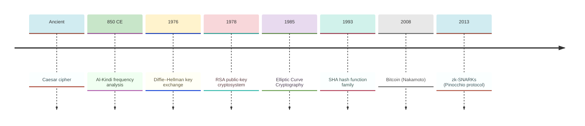
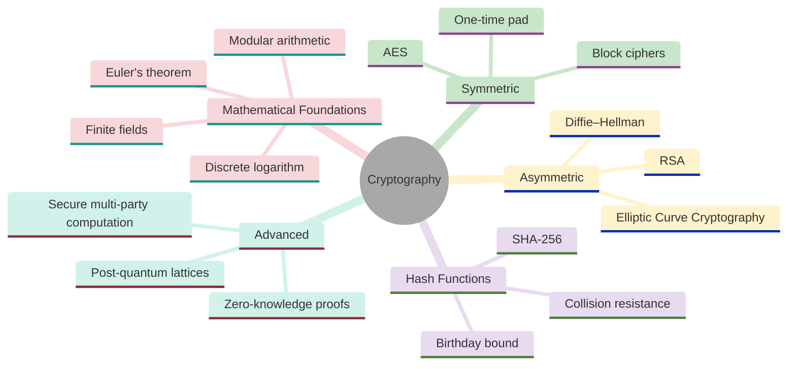
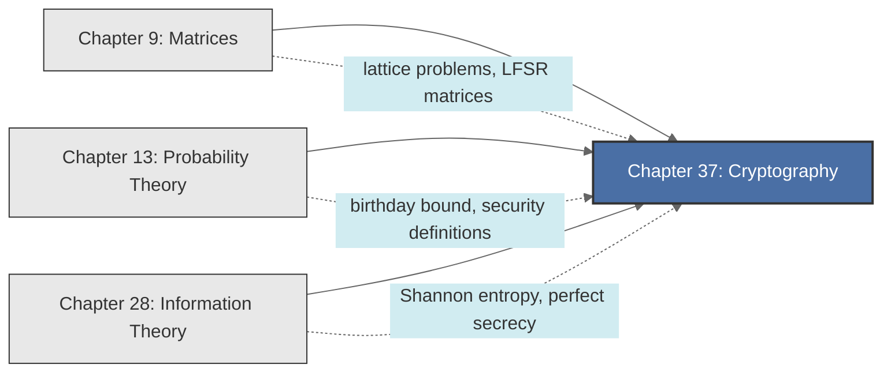

<!-- Copyright (c) 2025-2026 Bob Jansen <bobjansen@pm.me> -->
<!-- SPDX-License-Identifier: CC-BY-NC-4.0 -->
<!-- See LICENSE for full terms. Commercial licensing available. -->

# Chapter 37: Cryptography


**Part IX**: Applications

> Public-key cryptography rests on a computational asymmetry: multiplying large primes is fast, factoring their product is not. This chapter develops the number theory, group structure and information-theoretic foundations behind RSA, Diffie–Hellman, elliptic curves and zero-knowledge proofs.

**Prerequisites**: [Chapter 13](13-probability-theory.md) (Probability Theory); probabilistic arguments underpin security proofs, birthday-bound analysis and the definition of computational indistinguishability; expectation and independence are used throughout. [Chapter 28](28-information-theory.md) (Information Theory); Shannon entropy quantifies perfect secrecy, min-entropy characterises cryptographic randomness and information-theoretic security provides the benchmark against which computational security is measured.

**Learning Objectives**: After this chapter, the reader will be able to:

1. Perform modular arithmetic in $\mathbb{Z}/n\mathbb{Z}$, compute greatest common divisors via the Euclidean algorithm and find modular inverses via the extended Euclidean algorithm.
2. State and prove Fermat's little theorem and Euler's theorem and apply them to modular exponentiation.
3. Describe the RSA cryptosystem, prove its correctness using Euler's theorem and explain why its security reduces to the hardness of integer factorisation.
4. Execute the Diffie–Hellman key exchange protocol and explain the discrete logarithm assumption that underpins its security.
5. Describe elliptic curve groups over finite fields and explain the efficiency advantages of elliptic curve cryptography over classical systems.
6. Define the security properties of cryptographic hash functions and analyse collision probability via the birthday bound.
7. Distinguish information-theoretic security from computational security and prove that the one-time pad achieves perfect secrecy.
8. Describe the structure of a zero-knowledge proof and verify the completeness, soundness and zero-knowledge properties of the Schnorr protocol.

**Connections**: This chapter draws on [Chapter 13](13-probability-theory.md) (probability for birthday attacks, security definitions and randomised protocols), [Chapter 28](28-information-theory.md) (entropy for perfect secrecy and randomness requirements) and [Chapter 9](09-matrices.md) (matrix structure in lattice problems). It connects forward to network security applications, blockchain consensus mechanisms, secure multi-party computation and post-quantum cryptography.

---

## Historical Context

**Key Dates in Cryptography**



*Figure 37.1: Timeline of key developments in cryptography from antiquity to modern zero-knowledge proofs.*

**The Caesar cipher (first century BCE).** The Caesar cipher introduced the basic structure of a cryptosystem. The cipher, attributed to Julius Caesar, shifts each letter of the Latin alphabet by a fixed offset. Suetonius records that Caesar used a shift of three. The cipher is trivially broken by exhaustive search over 25 shifts, but it illustrates the structure of a cryptosystem: a message space, a key space, an encryption function and a decryption function.

**Al-Kindi's frequency analysis (circa 850 CE).** Abu Yusuf Ya'qub ibn Ishaq al-Kindi described the technique of frequency analysis in his *Manuscript on Deciphering Cryptographic Messages*, rendering all monoalphabetic substitution ciphers insecure. Natural language has non-uniform letter frequencies. A substitution cipher preserves these frequencies in the ciphertext. Matching observed frequencies to known language statistics recovers the plaintext.

**Shannon's secrecy theory (1949).** Claude Shannon established the information-theoretic foundations of cryptographic security in his classified 1945 report (declassified 1949 in the *Bell System Technical Journal*). He defined perfect secrecy as the condition $H(M \mid C) = H(M)$, equivalently $I(M; C) = 0$. Shannon proved that perfect secrecy requires the key to be at least as long as the message. This establishes the one-time pad as optimal and demonstrates the impracticality of information-theoretic security for most applications.

**Diffie–Hellman key exchange (1976).** Whitfield Diffie and Martin Hellman introduced public-key cryptography in their paper "New Directions in Cryptography," published in *IEEE Transactions on Information Theory* that year. The encryption key is published openly while the decryption key remains private. They also described the Diffie–Hellman key exchange protocol, which establishes a shared secret over an insecure channel. Its security rests on the presumed intractability of the discrete logarithm problem.

**The RSA cryptosystem (1978).** Ronald Rivest, Adi Shamir and Leonard Adleman published the RSA cryptosystem in *Communications of the ACM*, grounding public-key encryption in the difficulty of integer factorisation. RSA derives its security from the difficulty of factoring the product of two large primes. The mathematical foundation is Euler's theorem: for $a$ coprime to $n$, $a^{\varphi(n)} \equiv 1 \pmod{n}$. RSA remains widely deployed, though key sizes have grown from 512 bits in the 1990s to 2048–4096 bits.

**Elliptic curve cryptography (1985).** Neal Koblitz and Victor Miller independently introduced elliptic curves to cryptography in 1985 (published 1987), offering exponential security with shorter keys. The group of rational points on an elliptic curve over a finite field supports a discrete logarithm problem where the best known attacks are exponential in key size, rather than subexponential as for the integers. A 256-bit Elliptic Curve Cryptography (ECC) key offers security comparable to a 3072-bit RSA key. ECC now dominates in mobile devices, Transport Layer Security (TLS) connections and cryptocurrency systems.

**The SHA hash function family (1993–2015).** The SHA family provided standardised collision-resistant primitives beginning with SHA-0 in 1993, followed by SHA-1 (1995) and the SHA-2 family (2001). The National Institute of Standards and Technology (NIST) selected Keccak as the SHA-3 standard in 2015 after a public competition (2007–2012).

**Zero-knowledge proofs (1985).** Shafi Goldwasser, Silvio Micali and Charles Rackoff introduced zero-knowledge proofs at the 17th ACM STOC (conference version; journal publication 1989), enabling verification without disclosure. A zero-knowledge proof convinces a verifier that a statement is true without revealing information beyond its validity. The Schnorr protocol (1989) provides an efficient zero-knowledge proof of knowledge of a discrete logarithm.

**Nakamoto's Bitcoin whitepaper (2008).** Satoshi Nakamoto assembled multiple cryptographic primitives into a trustless transaction system. The design combined SHA-256 hashing, Elliptic Curve Digital Signature Algorithm (ECDSA) signatures on the secp256k1 curve and a proof-of-work consensus mechanism to enable peer-to-peer transactions without a central authority.

---

## Why This Chapter Matters

**Cryptography**



*Figure 37.2: Overview of cryptography showing symmetric, asymmetric, hash function and advanced branches.*

Every HTTPS connection, every cryptocurrency transaction and every digitally signed software update depends on the algorithms and hardness assumptions in this chapter. Without modular exponentiation and the factoring assumption, RSA provides no security. Without elliptic curve arithmetic, there is no efficient key agreement on mobile devices. Without hash functions and the birthday bound, there are no tamper-proof blockchains. The security of the global financial system, the integrity of software supply chains and the privacy of billions of communications rest on this mathematics.

The `modPow`, `modInverse` and `extGcd` primitives let practitioners implement RSA key generation, Diffie–Hellman exchanges and ECDSA signatures. Elliptic curve point addition and scalar multiplication routines expose the group structure that gives ECC its efficiency. The Miller–Rabin primality test generates cryptographic primes; Pollard's rho algorithm illustrates why the discrete logarithm problem is hard in generic groups.

Shor's algorithm renders RSA and ECC insecure on a sufficiently powerful quantum computer. NIST's 2024 post-quantum standards (ML-KEM, ML-DSA) shift hardness assumptions from factoring and discrete logarithms to lattice problems. The zero-knowledge proof framework, from the Schnorr protocol through modern zk-SNARKs, drives innovation in privacy-preserving computation, decentralised identity and verifiable machine learning. Each application begins with the number theory, group theory and information-theoretic foundations in this chapter.

---

## Notation & Conventions

| Symbol | Meaning |
|--------|---------|
| $\mathbb{Z}$ | The ring of integers |
| $\mathbb{Z}/n\mathbb{Z}$ or $\mathbb{Z}_n$ | The ring of integers modulo $n$: $\{0, 1, \ldots, n-1\}$ with addition and multiplication mod $n$ |
| $(\mathbb{Z}/n\mathbb{Z})^*$ | The multiplicative group of units modulo $n$: elements with multiplicative inverses |
| $a \equiv b \pmod{n}$ | $n$ divides $a - b$; congruence modulo $n$ |
| $\gcd(a, b)$ | Greatest common divisor of $a$ and $b$ |
| $\varphi(n)$ | Euler's totient function: the number of integers in $\{1, \ldots, n\}$ coprime to $n$ |
| $a^{-1} \bmod n$ | The multiplicative inverse of $a$ modulo $n$: the unique $b$ such that $ab \equiv 1 \pmod{n}$ |
| $\mathbb{F}_p$ | The finite field with $p$ elements ($p$ prime), isomorphic to $\mathbb{Z}/p\mathbb{Z}$ |
| $E(\mathbb{F}_p)$ | The group of points on an elliptic curve $E$ over $\mathbb{F}_p$, including the point at infinity |
| $\mathcal{O}$ | The point at infinity (identity element of an elliptic curve group) |
| $H(\cdot)$ | A cryptographic hash function $H: \{0,1\}^* \to \{0,1\}^n$ |
| $\Vert$ | Concatenation of bit strings |
| $\{0,1\}^n$ | The set of all bit strings of length $n$ |
| $\{0,1\}^*$ | The set of all finite-length bit strings |
| $\operatorname{negl}(\lambda)$ | A negligible function: one that decreases faster than any inverse polynomial in the security parameter $\lambda$ |
| $\lambda$ | Security parameter (typically the bit length of the key) |
| $\xleftarrow{\$}$ | Sampled uniformly at random from a set |

The symbols $p$ and $q$ denote distinct primes unless otherwise stated. All logarithms are base 2 unless indicated. The expression $a \bmod n$ denotes the unique representative of $a$ in $\{0, 1, \ldots, n-1\}$; the expression $a \equiv b \pmod{n}$ denotes the congruence relation. Big-O notation refers to computational complexity in terms of the bit length of the input.

---

## Core Theory

### Modular Arithmetic

**Definition 37.1** (Congruence). Two integers $a$ and $b$ are *congruent modulo $n$*, written $a \equiv b \pmod{n}$, if $n \mid (a - b)$. The relation $\equiv \pmod{n}$ is an equivalence relation on $\mathbb{Z}$; the quotient $\mathbb{Z}/n\mathbb{Z}$ consists of $n$ equivalence classes $\{[0], [1], \ldots, [n-1]\}$.

**Theorem 37.2** (Ring structure of $\mathbb{Z}/n\mathbb{Z}$). The set $\mathbb{Z}/n\mathbb{Z}$ forms a commutative ring under addition and multiplication modulo $n$. Specifically:

(a) Addition: $(a + b) \bmod n$ satisfies closure, associativity, commutativity, identity ($0$) and inverse ($n - a$ is the additive inverse of $a$).

(b) Multiplication: $(a \cdot b) \bmod n$ satisfies closure, associativity, commutativity, identity ($1$) and distributivity over addition.

**Theorem 37.3** (Existence of multiplicative inverses). An element $a \in \mathbb{Z}/n\mathbb{Z}$ has a multiplicative inverse if and only if $\gcd(a, n) = 1$. The set of invertible elements forms the multiplicative group $(\mathbb{Z}/n\mathbb{Z})^*$ of order $\varphi(n)$.

??? note "Proof"

    *Proof.* Suppose $\gcd(a, n) = 1$. The extended Euclidean algorithm produces integers $s, t$ such that

    $$as + nt = 1.$$

    Reducing modulo $n$ gives $as \equiv 1 \pmod{n}$, so $s \bmod n$ is the multiplicative inverse of $a$.

    Conversely, suppose $ab \equiv 1 \pmod{n}$. Then $ab = 1 + kn$ for some integer $k$, so $ab - kn = 1$. By Bézout's identity, $\gcd(a, n) \mid 1$, hence $\gcd(a, n) = 1$. $\square$

#### Extended Euclidean Algorithm

**Algorithm 37.4** (Extended Euclidean algorithm). Given integers $a, b \geq 0$, the extended Euclidean algorithm computes $d = \gcd(a, b)$ and integers $s, t$ satisfying $as + bt = d$. The algorithm maintains the invariant $(r_i, s_i, t_i)$ with $a \cdot s_i + b \cdot t_i = r_i$:

Initialise $(r_0, s_0, t_0) = (a, 1, 0)$ and $(r_1, s_1, t_1) = (b, 0, 1)$. While $r_i \neq 0$: compute quotient $q_i = \lfloor r_{i-1}/r_i \rfloor$ and update $r_{i+1} = r_{i-1} - q_i r_i$, $s_{i+1} = s_{i-1} - q_i s_i$, $t_{i+1} = t_{i-1} - q_i t_i$. The algorithm terminates with $\gcd(a, b) = r_k$ (the last nonzero remainder) and coefficients $s_k, t_k$ satisfying $as_k + bt_k = r_k$.

```
function extendedEuclid(a, b):
    // Returns (d, s, t) such that a*s + b*t = d = gcd(a, b)
    rPrev = a;  sPrev = 1;  tPrev = 0
    rCurr = b;  sCurr = 0;  tCurr = 1
    while rCurr != 0:
        q = floor(rPrev / rCurr)
        rNext = rPrev - q * rCurr
        sNext = sPrev - q * sCurr
        tNext = tPrev - q * tCurr
        rPrev = rCurr;  sPrev = sCurr;  tPrev = tCurr
        rCurr = rNext;  sCurr = sNext;  tCurr = tNext
    return (rPrev, sPrev, tPrev)
```

### Euler's Totient Function

**Definition 37.5** (Euler's totient). For a positive integer $n$, Euler's totient function $\varphi(n)$ counts the number of integers in $\{1, 2, \ldots, n\}$ that are coprime to $n$:

$$\varphi(n) = \lvert\{k : 1 \leq k \leq n, \gcd(k, n) = 1\}\rvert.$$


**Theorem 37.6** (Totient of a prime). If $p$ is prime, then $\varphi(p) = p - 1$.

??? note "Proof"

    *Proof.* Every integer in $\{1, 2, \ldots, p-1\}$ is coprime to $p$ (since $p$ is prime, $\gcd(k, p) = 1$ for all $1 \leq k \leq p-1$), so $\varphi(p) = p - 1$. $\square$

**Theorem 37.7** (Totient of a product of distinct primes). If $p$ and $q$ are distinct primes, then $\varphi(pq) = (p-1)(q-1)$.

??? note "Proof"

    *Proof.* Among the $pq$ integers in $\{1, \ldots, pq\}$, those *not* coprime to $pq$ are the multiples of $p$ (there are $q$ of them: $p, 2p, \ldots, qp$) and the multiples of $q$ (there are $p$ of them: $q, 2q, \ldots, pq$).

    By inclusion-exclusion, the count of non-coprime integers is $p + q - 1$, since $pq$ itself is counted in both sets. The number of integers coprime to $pq$ is therefore

    $$\varphi(pq) = pq - (p + q - 1) = pq - p - q + 1 = (p-1)(q-1).$$

    $\square$

### Fermat's Little Theorem and Euler's Theorem

**Theorem 37.8** (Fermat's little theorem). If $p$ is prime and $\gcd(a, p) = 1$, then

$$a^{p-1} \equiv 1 \pmod{p}.$$

??? note "Proof"

    *Proof.* Consider the $p-1$ elements $a, 2a, 3a, \ldots, (p-1)a$ modulo $p$. Since $\gcd(a, p) = 1$, multiplication by $a$ is a bijection on $\{1, 2, \ldots, p-1\}$, so these residues are a permutation of $\{1, 2, \ldots, p-1\}$. Taking the product of all elements:

    $$a \cdot 2a \cdot 3a \cdots (p-1)a \equiv 1 \cdot 2 \cdot 3 \cdots (p-1) \pmod{p}.$$

    The left side is $a^{p-1} \cdot (p-1)!$ and the right side is $(p-1)!$. Since $\gcd((p-1)!, p) = 1$ (no factor of $(p-1)!$ is divisible by $p$), dividing both sides by $(p-1)!$ yields $a^{p-1} \equiv 1 \pmod{p}$. $\square$

**Theorem 37.9** (Euler's theorem). If $\gcd(a, n) = 1$, then

$$a^{\varphi(n)} \equiv 1 \pmod{n}.$$

??? note "Proof"

    *Proof.* The proof generalises Fermat's argument. Let $r_1, r_2, \ldots, r_{\varphi(n)}$ be the elements of $(\mathbb{Z}/n\mathbb{Z})^*$. Since $\gcd(a, n) = 1$, multiplication by $a$ is a bijection on this group, so the elements $ar_1, ar_2, \ldots, ar_{\varphi(n)}$ are a rearrangement of $r_1, r_2, \ldots, r_{\varphi(n)}$ modulo $n$.

    Taking the product of all elements in both orderings:

    $$\prod_{i=1}^{\varphi(n)} (ar_i) \equiv \prod_{i=1}^{\varphi(n)} r_i \pmod{n}.$$

    The left side equals $a^{\varphi(n)} \prod_{i=1}^{\varphi(n)} r_i$. Since each $r_i$ is a unit mod $n$, their product $R = \prod r_i$ is also coprime to $n$. Cancelling $R$ from both sides:

    $$a^{\varphi(n)} \equiv 1 \pmod{n}.$$

    $\square$

**Corollary 37.10**. Fermat's little theorem is the special case of Euler's theorem with $n = p$ (prime), since $\varphi(p) = p - 1$.

### The RSA Cryptosystem

**RSA Key Generation and Usage**

```mermaid
%%{init: {"theme": "base", "themeVariables": {"primaryColor": "#e8e8e8", "primaryTextColor": "#333333", "primaryBorderColor": "#555555", "lineColor": "#666666", "secondaryColor": "#d1ecf1", "tertiaryColor": "#c8e6c9"}}}%%
flowchart LR
    A["Choose primes p, q"] --> B["Compute n = p*q"]
    B --> C["Compute phi(n) = (p-1)(q-1)"]
    C --> D["Choose e coprime to phi(n)"]
    D --> E["Compute d = e^(-1) mod phi(n)"]
    E --> F["Public key: (n, e)"]
    E --> G["Private key: (n, d)"]
    F --> H["Encrypt: c = m^e mod n"]
    G --> I["Decrypt: m = c^d mod n"]
    style A fill:#e8e8e8,stroke:#333333
    style B fill:#e8e8e8,stroke:#333333
    style C fill:#e8e8e8,stroke:#333333
    style D fill:#e8e8e8,stroke:#333333
    style E fill:#e8e8e8,stroke:#333333
    style F fill:#e8e8e8,stroke:#333333
    style G fill:#e8e8e8,stroke:#333333
    style H fill:#e8e8e8,stroke:#333333
    style I fill:#e8e8e8,stroke:#333333
```



*Figure 37.3: RSA key generation, encryption and decryption pipeline.*

**Definition 37.11** (RSA key generation). The RSA key generation algorithm proceeds as follows:

1. Select two distinct large primes $p$ and $q$.
2. Compute $n = pq$ and $\varphi(n) = (p-1)(q-1)$.
3. Choose an integer $e$ with $1 < e < \varphi(n)$ and $\gcd(e, \varphi(n)) = 1$.
4. Compute $d = e^{-1} \bmod \varphi(n)$ (using the extended Euclidean algorithm).
5. The public key is $(n, e)$; the private key is $(n, d)$.

**Definition 37.12** (RSA encryption and decryption). For a message $m \in \{0, 1, \ldots, n-1\}$:

- Encryption: $c = m^e \bmod n$.
- Decryption: $m = c^d \bmod n$.

**Theorem 37.13** (Correctness of RSA). For any message $m$ with $\gcd(m, n) = 1$:

$$c^d \equiv (m^e)^d \equiv m^{ed} \equiv m \pmod{n}.$$


??? note "Proof"

    *Proof.* Since $ed \equiv 1 \pmod{\varphi(n)}$, there exists an integer $k$ such that $ed = 1 + k\varphi(n)$. Hence:

    $$m^{ed} = m^{1 + k\varphi(n)} = m \cdot \left(m^{\varphi(n)}\right)^k.$$

    By Euler's theorem (Theorem 37.9), $m^{\varphi(n)} \equiv 1 \pmod{n}$ whenever $\gcd(m, n) = 1$. Substituting:

    $$m^{ed} \equiv m \cdot 1^k \equiv m \pmod{n}.$$

    For the case $\gcd(m, n) \neq 1$, the message $m$ must be a multiple of $p$ or $q$. Since $m$ is chosen uniformly from $\{0, \ldots, n-1\}$, the probability of this event is at most $2/\min(p,q)$, which is negligible for cryptographic primes. The result still holds by applying the Chinese Remainder Theorem. One verifies $m^{ed} \equiv m \pmod{p}$ and $m^{ed} \equiv m \pmod{q}$ separately using Fermat's little theorem for each prime, then combines the congruences. $\square$

!!! abstract "Key Result"

    **Theorem 37.13** (Correctness of RSA). Decryption recovers the original message because $m^{ed} \equiv m \pmod{n}$, a direct consequence of Euler's theorem; security rests on the computational hardness of factoring the product of two large primes.

**Remark 37.14** (Security of RSA). The security of RSA rests on the *factoring assumption*: given $n = pq$, it is computationally infeasible to recover $p$ and $q$ when they are sufficiently large (each at least 1024 bits). If an adversary factors $n$, they compute $\varphi(n) = (p-1)(q-1)$ and recover $d = e^{-1} \bmod \varphi(n)$. The best known classical factoring algorithm is the General Number Field Sieve, with heuristic complexity $\exp(O((\log n)^{1/3}(\log \log n)^{2/3}))$, which is subexponential but infeasible for $n$ of 2048 bits or more.

### Diffie–Hellman Key Exchange

**Definition 37.15** (Diffie–Hellman protocol). Let $G$ be a cyclic group of prime order $q$ with generator $g$. The Diffie–Hellman key exchange proceeds:

1. Alice selects $a \xleftarrow{\$} \{1, \ldots, q-1\}$ and sends $A = g^a$ to Bob.
2. Bob selects $b \xleftarrow{\$} \{1, \ldots, q-1\}$ and sends $B = g^b$ to Alice.
3. Alice computes the shared secret $s = B^a = g^{ba}$.
4. Bob computes the shared secret $s = A^b = g^{ab}$.

**Remark 37.16** (Correctness of Diffie–Hellman). Both parties arrive at the same value $s = g^{ab}$ because exponentiation commutes: $(g^b)^a = (g^a)^b = g^{ab}$.

**Definition 37.17** (Discrete logarithm problem). Given a cyclic group $G$ of order $q$, a generator $g$ and an element $h \in G$, the *discrete logarithm problem* (DLP) is to find the integer $x \in \{0, \ldots, q-1\}$ such that $g^x = h$.

**Definition 37.18** (Computational Diffie–Hellman assumption). The *Computational Diffie–Hellman (CDH) assumption* states that given $g$, $g^a$ and $g^b$ (for random $a, b$), no efficient algorithm can compute $g^{ab}$ with non-negligible probability.

**Remark 37.19** (Security of Diffie–Hellman). An eavesdropper observes $g^a$ and $g^b$ but must compute $g^{ab}$: the CDH problem. If the DLP is hard in the chosen group, the CDH problem is believed to be hard as well (since solving the DLP immediately yields $a$ from $g^a$, from which $g^{ab} = (g^b)^a$ follows). In $(\mathbb{Z}/p\mathbb{Z})^*$ with $p$ a safe prime, the best known DLP algorithms have subexponential complexity; in elliptic curve groups, they have fully exponential complexity.

### Elliptic Curves

**Definition 37.20** (Elliptic curve over a finite field). An *elliptic curve* over a finite field $\mathbb{F}_p$ (with $p > 3$) is the set of solutions $(x, y) \in \mathbb{F}_p \times \mathbb{F}_p$ to the equation

$$y^2 = x^3 + ax + b$$

where $a, b \in \mathbb{F}_p$ with $4a^3 + 27b^2 \neq 0$ in $\mathbb{F}_p$ (equivalently, $p \nmid (4a^3 + 27b^2)$, ensuring the curve is non-singular), together with a distinguished *point at infinity* $\mathcal{O}$.

**Theorem 37.21** (Group law on elliptic curves). The set $E(\mathbb{F}_p) = \{(x, y) \in \mathbb{F}_p^2 : y^2 = x^3 + ax + b\} \cup \{\mathcal{O}\}$ forms an abelian group under the following addition rule:

(a) Identity: $P + \mathcal{O} = P$ for all $P \in E(\mathbb{F}_p)$.

(b) Inverse: If $P = (x, y)$, then $-P = (x, -y)$ and $P + (-P) = \mathcal{O}$.

(c) Addition ($P \neq Q$, $P \neq -Q$): For $P = (x_1, y_1)$ and $Q = (x_2, y_2)$ with $x_1 \neq x_2$, the slope is $\lambda = (y_2 - y_1)(x_2 - x_1)^{-1} \bmod p$; then $P + Q = (x_3, y_3)$ where $x_3 = \lambda^2 - x_1 - x_2 \bmod p$ and $y_3 = \lambda(x_1 - x_3) - y_1 \bmod p$.

(d) Doubling ($P = Q$, $y_1 \neq 0$): The slope is $\lambda = (3x_1^2 + a)(2y_1)^{-1} \bmod p$; then $2P = (x_3, y_3)$ with the same formulas as (c).

**Remark 37.22** (Elliptic Curve Diffie–Hellman). The Diffie–Hellman protocol of Definition 37.15 applies directly with $G = E(\mathbb{F}_p)$: Alice sends $[a]P$ (scalar multiplication of the base point $P$ by integer $a$), Bob sends $[b]P$ and the shared secret is $[ab]P$. The security rests on the *Elliptic Curve Discrete Logarithm Problem* (ECDLP): given $P$ and $[a]P$, find $a$. The best known algorithms for the ECDLP are Pollard's rho and baby-step giant-step, both with complexity $O(\sqrt{q})$ where $q = |E(\mathbb{F}_p)|$. This fully exponential complexity means a 256-bit elliptic curve group provides approximately 128 bits of security.

**Remark 37.23** (ECDSA). The Elliptic Curve Digital Signature Algorithm (ECDSA) is a variant of the ElGamal signature scheme adapted to elliptic curves. Given a private key $d$ and corresponding public key $Q = [d]P$, signing a message $m$ involves choosing a random nonce $k$, computing $R = [k]P$, extracting $r = x_R \bmod q$ and computing $s = k^{-1}(H(m) + dr) \bmod q$. The signature is $(r, s)$. Verification checks that $[s^{-1}H(m)]P + [s^{-1}r]Q$ has $x$-coordinate equal to $r \bmod q$. ECDSA is used in TLS, Bitcoin (secp256k1 curve) and most modern authentication protocols.

### Cryptographic Hash Functions

**Definition 37.24** (Cryptographic hash function). A *cryptographic hash function* is a deterministic function $H: \{0,1\}^* \to \{0,1\}^n$ satisfying:

(a) *Preimage resistance*: Given $y$, it is computationally infeasible to find any $x$ such that $H(x) = y$.

(b) *Second preimage resistance*: Given $x$, it is computationally infeasible to find $x' \neq x$ such that $H(x') = H(x)$.

(c) *Collision resistance*: It is computationally infeasible to find any pair $x \neq x'$ such that $H(x) = H(x')$.

**Theorem 37.25** (Birthday bound). Any collision-finding algorithm for a hash function $H: \{0,1\}^* \to \{0,1\}^n$ requires $\Theta(2^{n/2})$ evaluations of $H$ on average. Specifically, if $k$ distinct inputs are hashed, the probability of at least one collision is approximately

$$P(\text{collision}) \approx 1 - e^{-k^2/2^{n+1}}.$$

To achieve a collision probability of $1/2$, approximately $k \approx 1.177 \cdot 2^{n/2}$ inputs are needed.

**Birthday Paradox Collision Probability**

```mermaid
---
config:
  theme: base
  themeVariables:
    xyChart:
      plotColorPalette: "#2563eb, #dc2626, #16a34a, #9333ea, #ca8a04, #0891b2"
      backgroundColor: "#ffffff"
      titleColor: "#333333"
      xAxisLabelColor: "#333333"
      yAxisLabelColor: "#333333"
      xAxisTitleColor: "#333333"
      yAxisTitleColor: "#333333"
      xAxisLineColor: "#333333"
      yAxisLineColor: "#333333"
---
xychart-beta
    x-axis "Number of people" [5, 10, 15, 20, 23, 30, 40, 50]
    y-axis "P(collision)" 0 --> 1.0
    line [0.027, 0.117, 0.253, 0.411, 0.507, 0.706, 0.891, 0.970]
```

*Figure 37.4: Collision probability rises sharply with group size, exceeding 50% at 23 people.*

??? note "Proof"

    *Proof.* Model $H$ as a random function with uniform output distribution over $\{0,1\}^n$ (the random oracle model). After hashing $k$ distinct inputs, the probability that the $i$-th input does not collide with any of the previous $i-1$ outputs is $1 - i/2^n$. The probability of no collision among all $k$ inputs is therefore

    $$P(\text{no collision}) = \prod_{i=1}^{k-1}\left(1 - \frac{i}{2^n}\right).$$

    Taking logarithms and using the approximation $\ln(1 - x) \approx -x$ for small $x$:

    $$\ln P(\text{no collision}) \approx -\sum_{i=1}^{k-1} \frac{i}{2^n} = -\frac{k(k-1)}{2 \cdot 2^n} \approx -\frac{k^2}{2^{n+1}}.$$

    Exponentiating and complementing:

    $$P(\text{collision}) \approx 1 - e^{-k^2/2^{n+1}}.$$

    Setting this equal to $1/2$ yields $k^2/2^{n+1} = \ln 2$, so

    $$k = \sqrt{2^{n+1} \ln 2} \approx 1.177 \cdot 2^{n/2}.$$

    $\square$

**Remark 37.26** (SHA-256). The SHA-256 hash function produces $n = 256$ bit outputs. The birthday bound implies that collision resistance requires approximately $2^{128}$ hash evaluations, a level of security considered infeasible for classical computers. SHA-256 is used in Bitcoin's proof-of-work mechanism, TLS certificate fingerprints and digital signature schemes.

### Entropy, Randomness and Cryptographic Security

**Definition 37.27** (Min-entropy). The *min-entropy* of a random variable $X$ over alphabet $\mathcal{X}$ is

$$H_\infty(X) = -\log_2 \!\left(\max_{x \in \mathcal{X}} P(X = x)\right).$$

Min-entropy measures the worst-case predictability: it equals $k$ bits if and only if no single outcome occurs with probability exceeding $2^{-k}$.

**Remark 37.28** (Relation to Shannon entropy). Min-entropy is always less than or equal to Shannon entropy: $H_\infty(X) \leq H(X)$, with equality if and only if $X$ is uniformly distributed. In cryptographic applications, min-entropy is the appropriate measure because security must hold against the adversary's best guess, not merely on average.

**Definition 37.29** (Cryptographically secure pseudorandom number generator). A *CSPRNG* is a deterministic algorithm $G: \{0,1\}^\lambda \to \{0,1\}^{\ell(\lambda)}$ (with $\ell(\lambda) > \lambda$) such that no efficient algorithm can distinguish the output $G(s)$ (for a uniformly random seed $s$) from a truly random string of length $\ell(\lambda)$ with advantage better than $\operatorname{negl}(\lambda)$.

**Remark 37.30** (Connection to [Chapter 28](28-information-theory.md)). Shannon entropy $H(X)$ quantifies the average information content of a source ([Chapter 28](28-information-theory.md), Definition 28.2). For cryptographic key generation, the source of randomness must have sufficient min-entropy: a key of $\lambda$ bits provides $\lambda$ bits of security only if the key source has min-entropy at least $\lambda$. If the source has Shannon entropy $H$ but min-entropy $H_\infty < \lambda$, an adversary can guess the most likely key with probability $2^{-H_\infty}$, which may be unacceptably high even though the average surprise is large.

### Information-Theoretic vs. Computational Security

**Definition 37.31** (Perfect secrecy). An encryption scheme $(\mathrm{Gen}, \mathrm{Enc}, \mathrm{Dec})$ achieves *perfect secrecy* if for every plaintext distribution, every message $m$ and every ciphertext $c$:

$$P(M = m \mid C = c) = P(M = m).$$

Equivalently, $I(M; C) = 0$: the ciphertext and plaintext are statistically independent.

**Theorem 37.32** (One-time pad achieves perfect secrecy). Let $\mathcal{M} = \mathcal{K} = \mathcal{C} = \{0,1\}^n$. The one-time pad encrypts $m$ as $c = m \oplus k$ where $k \xleftarrow{\$} \{0,1\}^n$. This scheme achieves perfect secrecy.

??? note "Proof"

    *Proof.* For any message $m$ and ciphertext $c$, there exists exactly one key $k = m \oplus c$ that maps $m$ to $c$. Since $k$ is uniform over $\{0,1\}^n$:

    $$P(C = c \mid M = m) = P(K = m \oplus c) = 2^{-n}.$$

    This probability is independent of $m$. By the law of total probability, $P(C = c) = \sum_{m'} P(C = c \mid M = m') P(M = m') = 2^{-n}$ as well. Applying Bayes' theorem:

    $$P(M = m \mid C = c) = \frac{P(C = c \mid M = m) \cdot P(M = m)}{P(C = c)} = \frac{2^{-n} \cdot P(M = m)}{2^{-n}} = P(M = m).$$

    The ciphertext reveals nothing about the plaintext. $\square$

**Theorem 37.33** (Shannon's impossibility result). In any perfectly secret encryption scheme, $\lvert\mathcal{K}\rvert \geq \lvert\mathcal{M}\rvert$. That is, the key must be at least as long as the message.

??? note "Proof"

    *Proof.* Suppose for contradiction that $\lvert\mathcal{K}\rvert < \lvert\mathcal{M}\rvert$. Fix a ciphertext $c$ with $P(C = c) > 0$. The set of possible decryptions

    $$\mathcal{M}(c) = \{\mathrm{Dec}_k(c) : k \in \mathcal{K}\}$$

    has at most $\lvert\mathcal{K}\rvert < \lvert\mathcal{M}\rvert$ elements.

    Hence there exists a message $m^* \notin \mathcal{M}(c)$, which means no key produces ciphertext $c$ from message $m^*$, so $P(C = c \mid M = m^*) = 0$. By Bayes' theorem and the assumption $P(M = m^*) > 0$:

    $$P(M = m^* \mid C = c) = 0 \neq P(M = m^*),$$

    contradicting perfect secrecy. $\square$

**Remark 37.34** (Computational security). Since perfect secrecy requires impractically long keys, modern cryptography adopts *computational security*: a scheme is secure if no *efficient* adversary (polynomial-time algorithm) can break it with non-negligible probability. The Advanced Encryption Standard (AES) with a 256-bit key, for example, provides computational security under the assumption that no polynomial-time algorithm can distinguish AES ciphertexts from random strings. This relaxation allows fixed-length keys (256 bits) to encrypt messages of arbitrary length.

### Zero-Knowledge Proofs

**Definition 37.35** (Interactive proof system). An *interactive proof system* for a language $L$ consists of a prover $P$ and a verifier $V$ exchanging messages. The system satisfies:

(a) *Completeness*: If $x \in L$, the honest prover convinces the honest verifier with overwhelming probability.

(b) *Soundness*: If $x \notin L$, no cheating prover can convince the honest verifier except with negligible probability.

**Definition 37.36** (Zero-knowledge). An interactive proof system is *zero-knowledge* if for every efficient verifier $V^*$, there exists an efficient *simulator* $S$ that can produce a transcript indistinguishable from a real interaction between $P$ and $V^*$, without access to the witness. Intuitively, the verifier learns nothing beyond the validity of the statement.

**Definition 37.37** (Schnorr identification protocol). Let $G$ be a cyclic group of prime order $q$ with generator $g$. The prover knows $x$ (the discrete logarithm of $h = g^x$) and proves knowledge of $x$ without revealing it:

1. Prover chooses $r \xleftarrow{\$} \{0, \ldots, q-1\}$, computes $a = g^r$ and sends $a$ to Verifier.
2. Verifier chooses $e \xleftarrow{\$} \{0, \ldots, q-1\}$ and sends $e$ to Prover (the *challenge*).
3. Prover computes $z = r + ex \bmod q$ and sends $z$ to Verifier.
4. Verifier accepts if and only if $g^z = a \cdot h^e$.

**Theorem 37.38** (Properties of the Schnorr protocol).

(a) *Completeness*: If the prover knows $x$, the verifier always accepts:

$$g^z = g^{r+ex} = g^r \cdot (g^x)^e = a \cdot h^e.$$

(b) *Soundness*: If a cheating prover can make the verifier accept for two different challenges $e_1 \neq e_2$ with the same commitment $a$, then the prover can extract $x$. Specifically, from $z_1 = r + e_1 x$ and $z_2 = r + e_2 x$ (mod $q$), subtraction yields $x = (z_1 - z_2)(e_1 - e_2)^{-1} \bmod q$.

(c) *Zero-knowledge*: A simulator, without knowing $x$, can produce valid-looking transcripts: choose $z$ and $e$ uniformly at random, compute $a = g^z h^{-e}$ and output $(a, e, z)$. The resulting distribution is identical to an honest transcript.

??? note "Proof of soundness"

    *Proof of (b).* Suppose the prover produces valid responses $z_1$ and $z_2$ for challenges $e_1$ and $e_2$ with the same commitment $a$. The verification equations give $g^{z_1} = a \cdot h^{e_1}$ and $g^{z_2} = a \cdot h^{e_2}$.

    Dividing the first equation by the second:

    $$g^{z_1 - z_2} = h^{e_1 - e_2} = g^{x(e_1 - e_2)}.$$

    Since $g$ has prime order $q$, exponents are equal modulo $q$: $z_1 - z_2 \equiv x(e_1 - e_2) \pmod{q}$. Since $e_1 \neq e_2$ and $q$ is prime, $(e_1 - e_2)$ is invertible modulo $q$. Multiplying both sides by $(e_1 - e_2)^{-1}$ yields $x \equiv (z_1 - z_2)(e_1 - e_2)^{-1} \pmod{q}$. $\square$

!!! warning "Nonce reuse destroys zero-knowledge security"

    If the prover reuses the random commitment $r$ in two protocol executions with different challenges $e_1 \neq e_2$, the soundness extraction above recovers the secret $x$ directly. The same vulnerability affects ECDSA: the 2010 PlayStation 3 private key compromise resulted from reusing the nonce $k$ across multiple signatures.

---

## Formulas & Identities

**F37.1** RSA decryption via the Chinese Remainder Theorem.

In practice, RSA decryption is accelerated using the Chinese Remainder Theorem (CRT). Since $n = pq$, the computation $m = c^d \bmod n$ is split:

$$m_p = c^{d \bmod (p-1)} \bmod p, \quad m_q = c^{d \bmod (q-1)} \bmod q.$$

The full result is reconstructed:

$$m = m_q + q \cdot (q^{-1} \bmod p) \cdot (m_p - m_q) \bmod n.$$

!!! info "CRT decryption requires storing $p$ and $q$ separately"

    CRT-accelerated RSA decryption is approximately four times faster than direct computation because exponentiation cost is cubic in the bit length of the modulus, and each sub-computation uses a modulus of half the bit length: $2 \cdot (n/2)^3 = n^3/4$. The private key must therefore retain the individual factors $p$ and $q$ alongside $d$; the PKCS #1 format stores both.

**F37.2** Birthday bound generalisation.

The birthday bound of Theorem 37.25 generalises to any collision problem. If $N$ objects are distributed uniformly among $M$ bins, the expected number of draws until a collision is $\sqrt{\pi M / 2} \approx 1.25\sqrt{M}$. For a hash function with $n$-bit output ($M = 2^n$), this gives $\approx 1.25 \cdot 2^{n/2}$ evaluations. The exact probability after $k$ draws is:

$$P(\text{collision after } k \text{ draws}) = 1 - \dfrac{M!}{(M-k)!\,M^k} \approx 1 - e^{-k(k-1)/(2M)}.$$

**F37.3** Correctness of Diffie–Hellman shared secret.

The correctness of the Diffie–Hellman protocol relies on the commutativity of exponentiation in any abelian group:

$$B^a = (g^b)^a = g^{ba}, \qquad A^b = (g^a)^b = g^{ab}.$$

Since multiplication in $\mathbb{Z}$ is commutative, $ab = ba$, so $g^{ab} = g^{ba}$. Both parties derive the same group element.

**F37.4** Security reduction: DLP implies CDH hardness.

If there exists an efficient algorithm $\mathcal{A}$ that solves the CDH problem (given $g, g^a, g^b$, outputs $g^{ab}$), one can construct an oracle for specific computations, but the converse (using a CDH solver to solve DLP) is not known in general. The hierarchy of assumptions from weakest to strongest is: Decisional Diffie–Hellman $\leq$ CDH $\leq$ DLP. Breaking DLP implies breaking CDH (extract $a$ from $g^a$, then compute $g^{ab} = (g^b)^a$); breaking CDH implies breaking the Decisional Diffie–Hellman assumption (compute $g^{ab}$ and compare with the candidate).

---

## Algorithms

### Algorithm 37.39: Modular Exponentiation (Square-and-Multiply)

**Input**: Base $a$, exponent $e$ and modulus $n$, all positive integers.

**Output**: The value $a^e \bmod n$.

Computing $a^e \bmod n$ naively requires $e - 1$ multiplications, which is infeasible when $e$ is a 2048-bit number. The square-and-multiply algorithm computes the result in $O(\log e)$ multiplications:

```
function modPow(base, exp, mod):
    // Returns base^exp mod mod via repeated squaring
    result = 1
    base = base mod mod
    while exp > 0:
        if exp is odd:
            result = (result * base) mod mod
        exp = floor(exp / 2)
        base = (base * base) mod mod
    return result
```

**Time complexity**: $O(\log e)$ modular multiplications, each of cost $O((\log n)^2)$ with schoolbook multiplication, or $O(\log n \cdot \log\log n)$ with fast Fourier transform-based multiplication.

**Space complexity**: $O(\log n)$ for storing the intermediate modular products.

### Algorithm 37.40: Extended Euclidean Algorithm

**Input**: Non-negative integers $a, b$.

**Output**: The greatest common divisor $d = \gcd(a, b)$ and Bézout coefficients $x, y$ satisfying $ax + by = d$.

```
function extGcd(a, b):
    // Returns (gcd, x, y) such that a*x + b*y = gcd(a, b)
    if b == 0:
        return (a, 1, 0)
    (d, x1, y1) = extGcd(b, a mod b)
    return (d, y1, x1 - floor(a / b) * y1)
```

**Time complexity**: $O(\log(\min(a, b)))$ divisions.

**Space complexity**: $O(\log(\min(a, b)))$ stack frames for the recursive formulation; an iterative version uses $O(1)$ auxiliary space.

### Algorithm 37.41: Modular Inverse

**Input**: An integer $a$ and a modulus $n > 1$ with $\gcd(a, n) = 1$.

**Output**: The unique $a^{-1} \in \{0, \ldots, n-1\}$ satisfying $a \cdot a^{-1} \equiv 1 \pmod{n}$.

```
function modInverse(a, n):
    // Returns a^{-1} mod n; requires gcd(a, n) = 1
    a = ((a mod n) + n) mod n
    (d, x, _) = extGcd(a, n)
    if d != 1:
        error "No inverse: gcd(a, n) != 1"
    return ((x mod n) + n) mod n
```

**Time complexity**: $O(\log n)$ divisions (dominated by the extended Euclidean algorithm).

**Space complexity**: $O(1)$ auxiliary space beyond the extGcd call.

### Algorithm 37.42: Miller–Rabin Primality Test

**Input**: Odd integer $n > 3$ to test; number of rounds $k$.

**Output**: "composite" (certain) or "probably prime" (error probability at most $4^{-k}$).

**Time complexity**: $O(k \cdot (\log n)^3)$ with schoolbook multiplication.

**Space complexity**: $O(\log n)$ for storing intermediate modular products.

Probabilistic primality testing is necessary for RSA key generation:

```
function millerRabin(n, rounds):
    // Returns true if n is probably prime; false if certainly composite
    if n < 2:
        return false
    if n == 2 or n == 3:
        return true
    if n is even:
        return false

    // Write n - 1 = 2^r * d with d odd
    r = 0
    d = n - 1
    while d is even:
        d = floor(d / 2)
        r = r + 1

    for i = 1 to rounds:
        a = randomInteger(2, n - 2)
        x = modPow(a, d, n)

        if x == 1 or x == n - 1:
            continue to next i

        composite = true
        for j = 1 to r - 1:
            x = (x * x) mod n
            if x == n - 1:
                composite = false
                break
        if composite:
            return false

    return true
```

Each round has a false positive probability of at most $1/4$, so $k$ rounds give error probability at most $4^{-k}$.

!!! tip "Choosing the number of Miller–Rabin rounds"

    For RSA key generation with 128-bit security, 64 rounds suffice ($4^{-64} = 2^{-128}$). In practice, 20 rounds ($4^{-20} \approx 10^{-12}$) are standard for most applications; the probability of a composite passing is far smaller than hardware failure rates.

### Algorithm 37.43: Pollard's Rho for Discrete Logarithm

**Input**: Generator $g$, target $h$, prime $p$ and group order $q$ with $h = g^x \bmod p$.

**Output**: Discrete logarithm $x$ such that $g^x \equiv h \pmod{p}$.

**Complexity**: Expected $O(\sqrt{q})$ group operations and $O(1)$ storage (Floyd's cycle detection).

The birthday-paradox-based algorithm for DLP in generic groups:

```
function pollardRhoDLP(g, h, p, q):
    // Finds x such that g^x = h (mod p), where q is the group order
    // Returns x or -1 on failure

    function step(x, a, b):
        // Partition step: update (x, a, b) based on x mod 3
        s = x mod 3
        if s == 0:
            // S0: multiply by h
            return ((x * h) mod p, a, (b + 1) mod q)
        else if s == 1:
            // S1: square
            return ((x * x) mod p, (2 * a) mod q, (2 * b) mod q)
        else:
            // S2: multiply by g
            return ((x * g) mod p, (a + 1) mod q, b)

    // Initialise tortoise and hare at g^1 * h^0 = g
    (xT, aT, bT) = (g, 1, 0)    // tortoise
    (xH, aH, bH) = (g, 1, 0)    // hare

    repeat:
        // Tortoise: one step
        (xT, aT, bT) = step(xT, aT, bT)
        // Hare: two steps
        (xH, aH, bH) = step(xH, aH, bH)
        (xH, aH, bH) = step(xH, aH, bH)
    until xT == xH

    // Collision: g^aT * h^bT = g^aH * h^bH (mod p)
    // Since h = g^x: x * (bT - bH) = (aH - aT) (mod q)
    r = ((bT - bH) mod q + q) mod q
    if r == 0:
        return -1    // Failure: retry with different initialisation
    rInv = modInverse(r, q)
    x = (rInv * (((aH - aT) mod q + q) mod q)) mod q
    return x
```

Expected running time: $O(\sqrt{q})$ group operations, matching the birthday bound for a group of order $q$.

---

## Numerical Considerations

### Bignum Arithmetic

Cryptographic computations operate on integers far exceeding the range of machine word arithmetic. RSA with 2048-bit keys requires multiplication of 2048-bit numbers and modular reduction. JavaScript's native `BigInt` type supports arbitrary-precision integers. Dedicated libraries using Montgomery multiplication offer large performance gains for cryptographic workloads.

### Timing Side Channels

!!! warning "Variable-time exponentiation leaks secret bits"

    Naive implementations of modular exponentiation (Algorithm 37.39) leak information through timing variations. The branch `if (exp % 2n === 1n)` causes an extra multiplication for set bits, making execution time depend on the secret exponent. An attacker measuring response times across many decryptions can recover the private key bit by bit.

Constant-time implementations perform both the multiplication and a dummy operation regardless of the bit value, selecting the correct result via a constant-time conditional move.

### Randomness Quality

Key generation requires cryptographically secure randomness. Sources include hardware random number generators (Intel RDRAND, ARM TRNG) and OS-level entropy pools (`/dev/urandom` on Linux, `crypto.getRandomValues` in browsers). The security parameter $\lambda$ requires at least $\lambda$ bits of min-entropy in the seed. A CSPRNG failure (a predictable seed, for instance) can compromise a cryptosystem regardless of key size.

### Overflow and Precision in Elliptic Curve Arithmetic

Elliptic curve point addition (Theorem 37.21) requires modular inversion at each step. The projective coordinate representation $(X : Y : Z)$ with $(x, y) = (X/Z^2, Y/Z^3)$ replaces inversions with multiplications, deferring a single inversion to the final affine conversion. For a scalar multiplication computing $kP$ with a $\lambda$-bit scalar $k$, the number of field multiplications drops from approximately $16\lambda$ (affine) to $12\lambda$ (projective), a 3–4x speedup on typical curves.

### Hash Function Output Size and Security Level

A hash function with $n$-bit output provides at most $n/2$ bits of collision resistance (Theorem 37.25). The birthday bound gives the expected number of hash evaluations to find a collision:

$$q \approx 2^{n/2} \cdot \sqrt{\frac{\pi}{2}} \approx 1.25 \cdot 2^{n/2}.$$

SHA-256 thus provides 128-bit collision resistance ($\approx 3.4 \times 10^{38}$ evaluations), $n = 256$ bits of preimage resistance and $n = 256$ bits of second preimage resistance. Applications requiring 128-bit security throughout (e.g., TLS 1.3 with AES-128) correctly pair with SHA-256.

---

## Worked Examples

### Example 37.44: RSA with Small Primes

**Problem**: Construct an RSA cryptosystem with primes $p = 61$ and $q = 53$. Encrypt the message $m = 65$ and verify that decryption recovers the original message.

**Solution** (mathematical):

Step 1: Compute $n = pq = 61 \times 53 = 3233$.

Step 2: Compute $\varphi(n) = (p-1)(q-1) = 60 \times 52 = 3120$.

Step 3: Choose $e = 17$ (verify: $\gcd(17, 3120) = 1$ since $3120 = 183 \times 17 + 9$, $17 = 1 \times 9 + 8$, $9 = 1 \times 8 + 1$, $\gcd = 1$).

Step 4: Compute $d = 17^{-1} \bmod 3120$. Apply the extended Euclidean algorithm:

$$\begin{aligned}
3120 &= 183 \times 17 + 9 \\
17 &= 1 \times 9 + 8 \\
9 &= 1 \times 8 + 1
\end{aligned}$$

Back-substituting:

$$1 = 9 - 1 \times 8 = 9 - 1 \times (17 - 9) = 2 \times 9 - 17 = 2(3120 - 183 \times 17) - 17 = 2 \times 3120 - 367 \times 17.$$

The result is therefore $(-367) \times 17 \equiv 1 \pmod{3120}$, so $d = -367 + 3120 = 2753$.

Verification: $17 \times 2753 = 46801 = 15 \times 3120 + 1$. Confirmed: $ed \equiv 1 \pmod{\varphi(n)}$.

Step 5: Encrypt $m = 65$: $c = 65^{17} \bmod 3233$.

Using repeated squaring:

$$\begin{aligned}
65^1 &\equiv 65 \pmod{3233} \\
65^2 &\equiv 4225 \equiv 992 \pmod{3233} \\
65^4 &\equiv 992^2 = 984064 \equiv 1232 \pmod{3233} \\
65^8 &\equiv 1232^2 = 1517824 \equiv 1547 \pmod{3233} \\
65^{16} &\equiv 1547^2 = 2393209 \equiv 789 \pmod{3233} \\
65^{17} &= 65^{16} \times 65^1 \equiv 789 \times 65 = 51285 \equiv 2790 \pmod{3233}
\end{aligned}$$

So $c = 2790$.

Step 6: Decrypt: $m = 2790^{2753} \bmod 3233$.

By the correctness theorem, $c^d = m^{ed} \equiv m \pmod{n}$, so the result is $m = 65$. (Direct computation of $2790^{2753} \bmod 3233$ yields $65$.)

### Example 37.45: Diffie–Hellman Key Exchange

**Problem**: Alice and Bob agree on the prime $p = 23$ and generator $g = 5$ (which generates $(\mathbb{Z}/23\mathbb{Z})^*$ since $5$ has order $22 = \varphi(23)$). Alice chooses secret $a = 6$, Bob chooses secret $b = 15$. Compute the public values and shared secret.

**Solution** (mathematical):

Alice computes $A = g^a \bmod p = 5^6 \bmod 23$:

$$\begin{aligned}
5^2 &= 25 \equiv 2 \pmod{23} \\
5^4 &\equiv 2^2 = 4 \pmod{23} \\
5^6 &= 5^4 \times 5^2 \equiv 4 \times 2 = 8 \pmod{23}
\end{aligned}$$

So Alice sends $A = 8$.

Bob computes $B = g^b \bmod p = 5^{15} \bmod 23$:

$$\begin{aligned}
5^8 &\equiv 4^2 = 16 \pmod{23} \\
5^{15} &= 5^8 \times 5^4 \times 5^2 \times 5^1 \equiv 16 \times 4 \times 2 \times 5 = 640 \equiv 19 \pmod{23}
\end{aligned}$$

So Bob sends $B = 19$.

Alice computes shared secret $s = B^a \bmod p = 19^6 \bmod 23$:

$$\begin{aligned}
19^2 &= 361 \equiv 16 \pmod{23} \\
19^4 &\equiv 16^2 = 256 \equiv 3 \pmod{23} \\
19^6 &= 19^4 \times 19^2 \equiv 3 \times 16 = 48 \equiv 2 \pmod{23}
\end{aligned}$$

Bob computes shared secret $s = A^b \bmod p = 8^{15} \bmod 23$:

$$\begin{aligned}
8^2 &= 64 \equiv 18 \pmod{23} \\
8^4 &\equiv 18^2 = 324 \equiv 2 \pmod{23} \\
8^8 &\equiv 2^2 = 4 \pmod{23} \\
8^{15} &= 8^8 \times 8^4 \times 8^2 \times 8^1 \equiv 4 \times 2 \times 18 \times 8 = 1152 \equiv 2 \pmod{23}
\end{aligned}$$

Both arrive at $s = 2$. An eavesdropper sees $g = 5$, $p = 23$, $A = 8$, $B = 19$ but must solve the DLP ($5^a \equiv 8 \pmod{23}$) to recover $a$ or $b$.

### Example 37.46: Modular Inverse via Extended Euclidean Algorithm

**Problem**: Compute $17^{-1} \bmod 43$ using the extended Euclidean algorithm.

**Solution** (mathematical):

Apply the Euclidean algorithm to $43$ and $17$:

$$\begin{aligned}
43 &= 2 \times 17 + 9 \\
17 &= 1 \times 9 + 8 \\
9 &= 1 \times 8 + 1 \\
8 &= 8 \times 1 + 0
\end{aligned}$$

So $\gcd(43, 17) = 1$. Back-substitute:

$$\begin{aligned}
1 &= 9 - 1 \times 8 \\
&= 9 - 1 \times (17 - 1 \times 9) = 2 \times 9 - 17 \\
&= 2 \times (43 - 2 \times 17) - 17 = 2 \times 43 - 5 \times 17
\end{aligned}$$

It follows that $(-5) \times 17 \equiv 1 \pmod{43}$, giving $17^{-1} \equiv -5 \equiv 38 \pmod{43}$.

Verification: $17 \times 38 = 646 = 15 \times 43 + 1$. Indeed $646 \equiv 1 \pmod{43}$.

### Example 37.47: Birthday Attack on Hash Collisions

**Problem**: A hash function produces $n = 64$ bit outputs. Estimate (a) the number of hashes needed for a 50% probability of finding a collision, and (b) the probability of a collision after $2^{20}$ hashes.

**Solution** (mathematical):

(a) By Theorem 37.25, the number of hashes for 50% collision probability is:

$$k \approx 1.177 \cdot 2^{n/2} = 1.177 \cdot 2^{32} \approx 5.06 \times 10^9.$$

So approximately 5 billion hashes are needed.

(b) After $k = 2^{20} \approx 10^6$ hashes, the collision probability is:

$$P \approx 1 - e^{-k^2/(2 \cdot 2^n)} = 1 - e^{-2^{40}/(2 \cdot 2^{64})} = 1 - e^{-2^{40}/2^{65}} = 1 - e^{-2^{-25}}.$$

Since $2^{-25} \approx 2.98 \times 10^{-8}$ is very small, $e^{-2^{-25}} \approx 1 - 2^{-25}$, giving:

$$P \approx 2^{-25} \approx 2.98 \times 10^{-8}.$$

After only one million hashes of a 64-bit hash function, the collision probability is negligibly small. This illustrates why SHA-256 (with $2^{128}$ collision resistance) is considered secure: even at a rate of $10^{12}$ hashes per second, reaching $2^{128}$ evaluations would require approximately $10^{26}$ seconds, far longer than the age of the universe.

### Example 37.48: Schnorr Zero-Knowledge Proof

**Problem**: In a group of prime order $q = 11$ with generator $g = 2$ modulo $p = 23$, the prover knows $x = 7$ (the discrete logarithm of $h = g^x = 2^7 \bmod 23 = 128 \bmod 23 = 13$). Simulate one round of the Schnorr protocol.

**Solution** (mathematical):

Step 1 (Prover commits): Choose random $r = 4$. Compute $a = g^r \bmod p = 2^4 \bmod 23 = 16$. Send $a = 16$.

Step 2 (Verifier challenges): Choose random $e = 3$. Send $e = 3$.

Step 3 (Prover responds): Compute $z = r + ex \bmod q = 4 + 3 \times 7 \bmod 11 = 25 \bmod 11 = 3$. Send $z = 3$.

Step 4 (Verifier checks): Compute $g^z \bmod p = 2^3 \bmod 23 = 8$. Compute $a \cdot h^e \bmod p = 16 \times 13^3 \bmod 23$:

$$\begin{aligned}
13^2 &= 169 \equiv 8 \pmod{23} \\
13^3 &= 13 \times 8 = 104 \equiv 12 \pmod{23} \\
a \cdot h^e &= 16 \times 12 = 192 \equiv 8 \pmod{23}
\end{aligned}$$

Verification: $g^z = 8 = a \cdot h^e$. The verifier accepts.

The verifier is convinced the prover knows $x$ without having learned its value. The transcript $(a, e, z) = (16, 3, 3)$ could have been produced by a simulator: choose $z = 3$, $e = 3$, compute $a = g^z \cdot h^{-e} = 8 \times 13^{-3} \bmod 23$. Since $13^3 \equiv 12$, $13^{-3} \equiv 12^{-1} \bmod 23$. Compute $12^{-1}$: $12 \times 2 = 24 \equiv 1$, so $12^{-1} = 2$. Then $a = 8 \times 2 = 16$. The simulated transcript is identical.

---

## Connections

**Chapter Dependencies**



*Figure 37.5: Chapter dependencies showing how probability, information theory and matrices feed into cryptography.*

### Within This Book

- **Probability Theory** ([Chapter 13](13-probability-theory.md)): Security definitions are probabilistic. A scheme is "secure" if the advantage of any efficient adversary is negligible. The birthday bound (Theorem 37.25) applies the collision probability formula from combinatorial probability. Soundness of zero-knowledge proofs relies on bounding the probability that a cheating prover succeeds.

- **Information Theory** ([Chapter 28](28-information-theory.md)): Shannon's definition of perfect secrecy ($I(M; C) = 0$) applies mutual information. The impossibility theorem (Theorem 37.33) connects key length to message entropy. Min-entropy (Definition 37.27) refines Shannon entropy for worst-case security analysis. The entropy of a key source determines the effective security level regardless of nominal key size.

- **Matrices** ([Chapter 9](09-matrices.md)): Lattice-based cryptography (a leading post-quantum candidate) relies on the hardness of problems involving integer matrices, such as the Shortest Vector Problem and Learning With Errors (LWE). Linear feedback shift registers, used in stream ciphers, are characterised by companion matrices whose eigenvalues determine the period of the output sequence.

### Applications

- **Transport Layer Security (TLS)**: ECDHE key exchange, RSA/ECDSA signatures for authentication, AES-GCM for symmetric encryption and SHA-256 for integrity. The full stack of primitives from this chapter secures every HTTPS connection.

- **Blockchain and cryptocurrency**: Bitcoin uses SHA-256 for proof-of-work mining and Merkle tree construction, secp256k1 ECDSA for transaction signatures. The birthday bound governs address collision probabilities. Ethereum uses Keccak-256 (SHA-3) for state commitments.

- **Digital signatures**: RSA–PSS and ECDSA sign software updates, code commits and legal documents. The Schnorr signature (derived from the zero-knowledge protocol of Definition 37.37) is the basis of Ed25519, widely used in SSH keys and cryptocurrency wallets.

- **Secure messaging**: Signal Protocol uses X25519 (ECDH on Curve25519) for key agreement, AES-256-CBC for message encryption and HMAC-SHA-256 for authentication. The double-ratchet algorithm provides forward secrecy. Compromise of a current key does not reveal past messages.

- **Post-quantum cryptography**: NIST's 2024 post-quantum standards (ML-KEM, ML-DSA) replace DLP and factoring assumptions with lattice problems (Module-LWE), as Shor's algorithm renders RSA and ECC insecure on a sufficiently large quantum computer.

---

## Summary

- Modular arithmetic in $\mathbb{Z}/n\mathbb{Z}$, the Euclidean algorithm and Euler's theorem provide the algebraic foundation for all public-key cryptosystems.
- RSA encrypts by modular exponentiation; its security rests on the computational difficulty of factoring large integers into their prime components.
- Diffie–Hellman key exchange enables two parties to establish a shared secret over an insecure channel; elliptic curve variants achieve equivalent security with shorter keys.
- The one-time pad achieves perfect secrecy when the key entropy equals the message entropy; computational security relaxes this to polynomial-time indistinguishability.
- Zero-knowledge proofs allow a prover to convince a verifier of a statement's truth without revealing any information beyond validity, as formalised by the completeness, soundness and zero-knowledge properties.

---

## Exercises

### Routine

**Exercise 37.1**. Compute $\gcd(252, 198)$ using the Euclidean algorithm. Then find integers $s$ and $t$ such that $252s + 198t = \gcd(252, 198)$ using the extended Euclidean algorithm.

**Exercise 37.2**. Compute $\varphi(100)$, $\varphi(97)$ and $\varphi(84)$. For $\varphi(100)$, use the prime factorisation $100 = 2^2 \times 5^2$ and the formula $\varphi(p^k) = p^{k-1}(p-1)$.

**Exercise 37.3**. Using Fermat's little theorem, compute $7^{222} \bmod 11$ without directly exponentiating. (Hint: $7^{10} \equiv 1 \pmod{11}$.)

### Intermediate

**Exercise 37.4**. Construct an RSA system with $p = 11$, $q = 13$. Choose $e = 7$, compute $d$, encrypt $m = 9$ and verify decryption. Show all intermediate steps using modular exponentiation.

**Exercise 37.5**. Alice and Bob perform Diffie–Hellman key exchange with $p = 467$, $g = 2$, $a = 153$, $b = 294$. Compute the public values $A = g^a \bmod p$ and $B = g^b \bmod p$ and verify that both parties compute the same shared secret. (Use a calculator or the `modPow` algorithm.)

**Exercise 37.6**. An organisation uses a 32-bit hash for internal file deduplication. Approximately how many files can be stored before a collision becomes likely (probability exceeding 50%)? If the system stores $10{,}000$ files, what is the approximate collision probability?

### Challenging

**Exercise 37.7**. Prove that if $n = pq$ with $p, q$ distinct odd primes, and the adversary knows $\varphi(n)$ and $n$, they can efficiently factor $n$. (Hint: from $n = pq$ and $\varphi(n) = (p-1)(q-1) = n - p - q + 1$, one obtains $p + q = n - \varphi(n) + 1$. Combined with $pq = n$, the primes are roots of a quadratic.)

**Exercise 37.8**. In the Schnorr protocol, explain why the prover must use a fresh random $r$ for each interaction. Show that if the prover reuses $r$ for two different challenges $e_1 \neq e_2$, a dishonest verifier can extract the secret $x$. Compute the extracted $x$ explicitly given $g = 3$, $p = 17$, $q = 8$ (note: this is illustrative; in practice $q$ would be prime), $h = 3^5 \bmod 17 = 5$, $r = 2$ used twice, challenges $e_1 = 3$ and $e_2 = 6$.

---

## References

### Textbooks

[1] Katz, J. and Lindell, Y. *Introduction to Modern Cryptography*, 3rd ed. CRC Press, 2021. A rigorous, proof-based introduction to cryptography suitable for advanced undergraduates and graduate students. Defines security via computational indistinguishability and reduces the security of constructions to well-studied hardness assumptions. Chapters 9–13 cover public-key encryption, digital signatures and advanced topics.

[2] Menezes, A. J., van Oorschot, P. C. and Vanstone, S. A. *Handbook of Applied Cryptography*. CRC Press, 1996. Available freely online. A thorough reference covering algorithms, protocols and implementation details for all major cryptographic primitives. Chapter 4 (public-key parameters) and Chapter 14 (efficient implementation) are particularly relevant.

[3] Stinson, D. R. and Paterson, M. B. *Cryptography: Theory and Practice*, 4th ed. CRC Press, 2018. A balanced treatment combining mathematical foundations (number theory, algebra) with practical protocol design. Includes detailed coverage of RSA, ElGamal, elliptic curves and hash functions with numerous exercises.

[4] Washington, L. C. *Elliptic Curves: Number Theory and Cryptography*, 2nd ed. CRC Press, 2008. A thorough treatment of the mathematics of elliptic curves with applications to cryptography, accessible to readers with undergraduate algebra.

### Historical

[5] Diffie, W. and Hellman, M. E. "New Directions in Cryptography." *IEEE Transactions on Information Theory* 22.6 (1976): 644–654. The paper that introduced public-key cryptography, the concept of one-way functions and the Diffie–Hellman key exchange protocol.

[6] Goldwasser, S., Micali, S. and Rackoff, C. "The Knowledge Complexity of Interactive Proof Systems." *Proceedings of the 17th Annual ACM Symposium on Theory of Computing* (1985): 291–304. Reprinted in *SIAM Journal on Computing* 18.1 (1989): 186–208. Defines zero-knowledge proofs and the knowledge complexity of a proof system.

[7] al-Kindi, Abu Yusuf Ya'qub ibn Ishaq. *Manuscript on Deciphering Cryptographic Messages* (circa 850 CE). The earliest known treatment of frequency analysis for breaking substitution ciphers.

[8] Koblitz, N. "Elliptic Curve Cryptosystems." *Mathematics of Computation* 48.177 (1987): 203–209. Proposes the use of elliptic curve groups for public-key cryptography.

[9] Miller, V. S. "Use of Elliptic Curves in Cryptography." *Advances in Cryptology – CRYPTO '85*, Lecture Notes in Computer Science 218 (1986): 417–426. Proposes elliptic curve cryptography independently of Koblitz.

[10] Nakamoto, S. "Bitcoin: A Peer-to-Peer Electronic Cash System." 2008. Combines SHA-256 hashing, ECDSA signatures and proof-of-work into a decentralised transaction system.

[11] Rivest, R. L., Shamir, A. and Adleman, L. "A Method for Obtaining Digital Signatures and Public-Key Cryptosystems." *Communications of the ACM* 21.2 (1978): 120–126. The original RSA paper describing key generation, encryption, decryption and digital signatures.

[12] Schnorr, C. P. "Efficient Signature Generation by Smart Cards." *Journal of Cryptology* 4.3 (1991): 161–174. Describes the Schnorr identification and signature schemes based on the discrete logarithm problem.

[13] Shannon, C. E. "Communication Theory of Secrecy Systems." *Bell System Technical Journal* 28.4 (1949): 656–715. The first systematic treatment of information-theoretic security; defines perfect secrecy and proves the optimality of the one-time pad.

### Online Resources

[14] Boneh, D. and Shoup, V. *A Graduate Course in Applied Cryptography*. Available at https://toc.cryptobook.us/ A thorough and regularly updated online textbook covering foundations through advanced topics including lattice-based cryptography and quantum computing.

[15] NIST Special Publication 800-57: Recommendation for Key Management. Provides current guidance on key sizes and algorithm selection for various security levels.

---

## Glossary

- **Birthday attack**: A collision-finding strategy exploiting the birthday paradox; for an $n$-bit hash, collisions are expected after $O(2^{n/2})$ evaluations.

- **Ciphertext**: The encrypted form of a message, produced by applying the encryption function with a key.

- **Collision resistance**: The property that it is computationally infeasible to find any two distinct inputs with the same hash output.

- **Computational security**: Security contingent on the presumed intractability of a computational problem; can be broken given unlimited computation.

- **Congruence**: The relation $a \equiv b \pmod{n}$ holding when $n$ divides $a - b$; an equivalence relation partitioning $\mathbb{Z}$ into $n$ classes.

- **CSPRNG**: Cryptographically secure pseudorandom number generator; an algorithm whose output is computationally indistinguishable from true randomness.

- **Decryption**: The process of recovering the plaintext from a ciphertext using the decryption key.

- **Diffie–Hellman key exchange**: A protocol allowing two parties to establish a shared secret over an insecure channel, based on the hardness of the CDH problem.

- **Discrete logarithm problem (DLP)**: Given $g$, $h$ and $n$ in a cyclic group, find $x$ such that $g^x = h$; believed to be computationally hard in well-chosen groups.

- **ECDSA**: Elliptic Curve Digital Signature Algorithm; a signature scheme using elliptic curve groups for key generation and signing.

- **Elliptic curve**: An algebraic curve defined by $y^2 = x^3 + ax + b$ over a field, whose rational points form an abelian group under a geometrically defined addition law.

- **Encryption**: The process of transforming a plaintext message into ciphertext using a key, rendering it unintelligible without the decryption key.

- **Euler's theorem**: For $\gcd(a, n) = 1$: $a^{\varphi(n)} \equiv 1 \pmod{n}$.

- **Euler's totient function $\varphi(n)$**: The count of integers in $\{1, \ldots, n\}$ coprime to $n$.

- **Extended Euclidean algorithm**: An algorithm that computes $\gcd(a, b)$ together with Bézout coefficients $s, t$ satisfying $as + bt = \gcd(a, b)$.

- **Fermat's little theorem**: For prime $p$ and $\gcd(a, p) = 1$: $a^{p-1} \equiv 1 \pmod{p}$.

- **Hash function**: A deterministic function mapping arbitrary-length inputs to fixed-length outputs; cryptographic hash functions additionally satisfy preimage and collision resistance.

- **Information-theoretic security**: Security that holds against adversaries with unlimited computational resources; the one-time pad is the canonical example.

- **Interactive proof system**: A protocol between a prover and a verifier in which the prover convinces the verifier of a statement's truth through an exchange of messages satisfying completeness and soundness.

- **Min-entropy**: $H_\infty(X) = -\log_2 \max_x P(X = x)$; measures worst-case predictability of a random variable.

- **Modular arithmetic**: Arithmetic performed on equivalence classes of integers modulo a fixed modulus $n$.

- **Modular inverse**: The element $a^{-1}$ in $\mathbb{Z}/n\mathbb{Z}$ satisfying $a \cdot a^{-1} \equiv 1 \pmod{n}$; exists if and only if $\gcd(a, n) = 1$.

- **Negligible function**: A function $f(\lambda)$ that decreases faster than $1/\lambda^c$ for every constant $c > 0$; used to formalise "practically zero" probabilities.

- **One-time pad**: An encryption scheme achieving perfect secrecy by XORing the message with a uniformly random key of equal length.

- **Perfect secrecy**: The property that ciphertext provides no information about the plaintext: $P(M = m \mid C = c) = P(M = m)$ for all $m, c$.

- **Plaintext**: The original unencrypted message.

- **Preimage resistance**: The property that given a hash output $y$, it is infeasible to find any input $x$ with $H(x) = y$.

- **Public-key cryptography**: A cryptographic framework where the encryption key (public) differs from the decryption key (private), enabling secure communication without pre-shared secrets.

- **RSA**: A public-key cryptosystem whose security relies on the difficulty of factoring the product of two large primes; named after Rivest, Shamir and Adleman.

- **Schnorr protocol**: A three-move zero-knowledge proof of knowledge of a discrete logarithm, achieving completeness, special soundness and honest-verifier zero-knowledge.

- **SHA-256**: A cryptographic hash function from the SHA-2 family producing 256-bit outputs; standardised by NIST and widely deployed in TLS, Bitcoin and digital signatures.

- **Zero-knowledge proof**: An interactive protocol in which a prover convinces a verifier of a statement's truth without revealing any information beyond the statement's validity.

---

