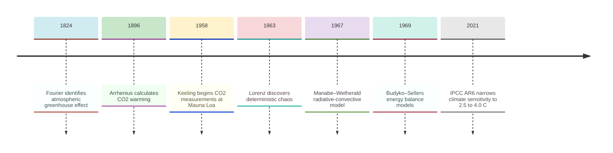
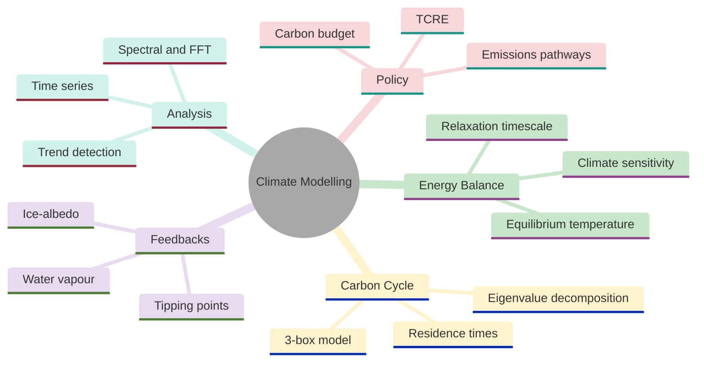
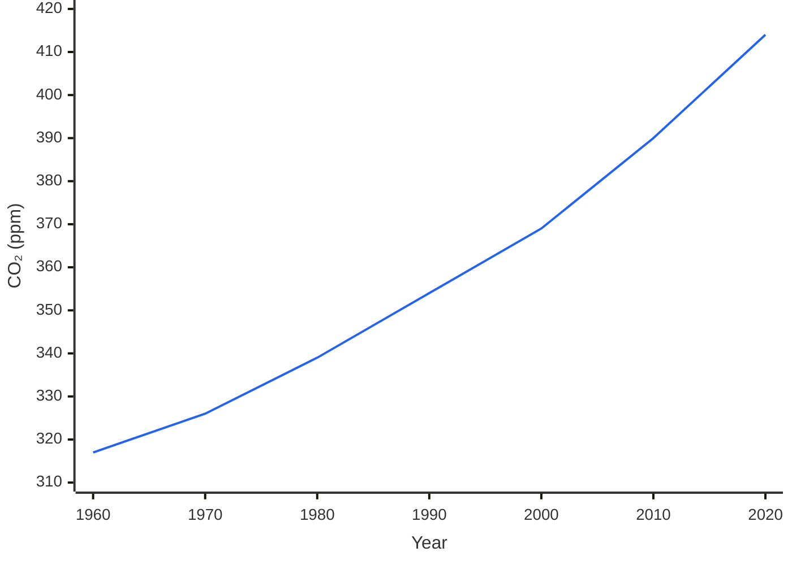
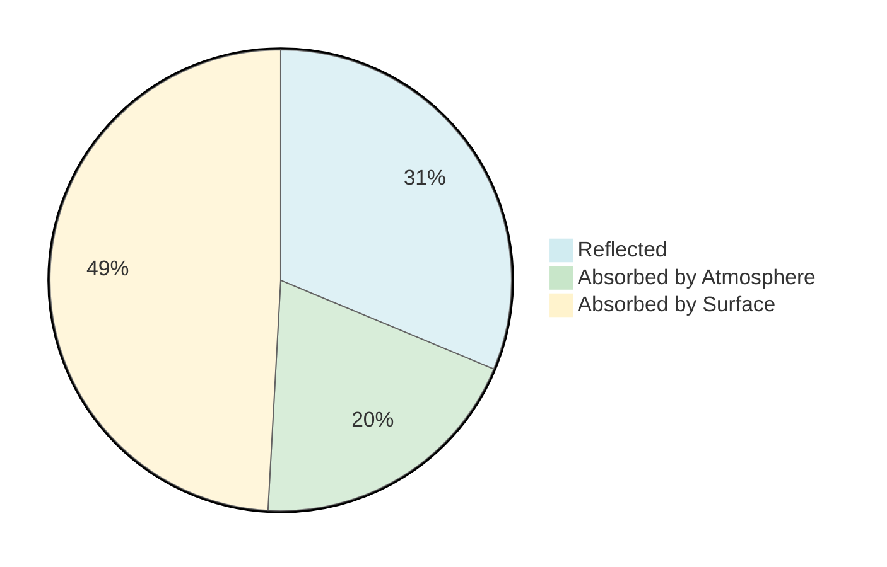
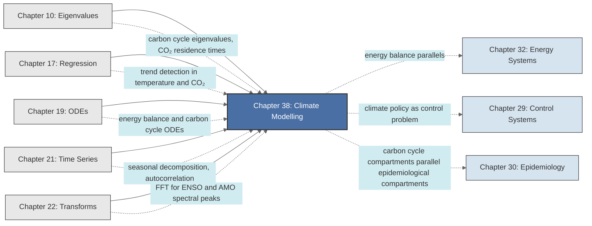

<!-- Copyright (c) 2025-2026 Bob Jansen <bobjansen@pm.me> -->
<!-- SPDX-License-Identifier: CC-BY-NC-4.0 -->
<!-- See LICENSE for full terms. Commercial licensing available. -->

# Chapter 38: Climate & Environmental Modelling


**Part IX**: Applications

> Climate science reduces to an energy balance: absorbed solar radiation minus emitted thermal radiation drives temperature change. This chapter develops the energy balance ordinary differential equation (ODE), carbon cycle eigenvalues, ice-albedo tipping points and spectral methods for climate oscillation detection.

**Prerequisites**: [Chapter 10](10-eigenvalues.md) (Eigenvalues & Eigenvectors); eigenvalue computation, stability analysis via the Jacobian, dominant eigenvalue interpretation for system timescales. [Chapter 17](17-regression.md) (Regression); linear and polynomial regression for trend estimation, confidence intervals, residual analysis. [Chapter 19](19-odes.md) (Ordinary Differential Equations); first-order ODEs, equilibrium analysis, linearisation and the Runge–Kutta numerical method. [Chapter 21](21-time-series.md) (Time Series); trend-cycle-seasonal decomposition, autocorrelation, stationarity testing. [Chapter 22](22-transforms.md) (Transforms); the discrete Fourier transform, power spectral density, frequency resolution and windowing.

**Learning Objectives**: After this chapter, the reader will be able to:

1. Derive the zero-dimensional energy balance equation and compute the equilibrium temperature of a planet with specified solar constant, albedo and emissivity.
2. Linearise the energy balance model about equilibrium and determine the climate relaxation timescale from the heat capacity and radiative feedback parameter.
3. Define radiative forcing and climate sensitivity and compute the equilibrium warming for a given $\text{CO}_2$ increase.
4. Formulate the three-box carbon cycle model as a system of linear ODEs, compute its eigenvalues and interpret them as carbon residence times.
5. Analyse ice-albedo feedback as a nonlinear modification to the energy balance model and identify the conditions for tipping-point bifurcations.
6. Apply linear regression and the Mann–Kendall test to detect trends in climate time series.
7. Use the discrete Fourier transform to identify periodic climate oscillations (El Niño–Southern Oscillation, Atlantic Multidecadal Oscillation) from temperature records.
8. Project future temperatures under emissions scenarios using the energy balance model and compute carbon budgets for temperature targets.

**Connections**: This chapter synthesises [Chapter 10](10-eigenvalues.md) (eigenvalues of the carbon cycle system determine $\text{CO}_2$ residence times; linearised stability analysis determines climate relaxation), [Chapter 17](17-regression.md) (regression detects trends in temperature and $\text{CO}_2$ records), [Chapter 19](19-odes.md) (energy balance and carbon cycle are ODE systems integrated via the fourth-order Runge–Kutta method (RK4)), [Chapter 21](21-time-series.md) (seasonal decomposition and autocorrelation characterise climate variability) and [Chapter 22](22-transforms.md) (fast Fourier transform (FFT) based spectral analysis identifies oscillation periods). It connects to [Chapter 32](32-energy-systems.md) (energy balance parallels nuclear decay energetics), [Chapter 29](29-control-systems.md) (climate policy as a control problem) and [Chapter 30](30-epidemiology.md) (carbon cycle compartments parallel epidemiological compartments).

---

## Historical Context

**Key Dates in Climate Science**



*Figure 38.1: Timeline of key developments in climate science from Fourier to the IPCC Sixth Assessment Report.*

**Fourier's greenhouse effect (1824).** Joseph Fourier identified the atmospheric greenhouse effect, observing in the *Annales de Chimie et de Physique* that the atmosphere permits solar radiation to pass through while retaining a portion of the thermal radiation emitted by the surface. He lacked a quantitative model of radiative transfer, but his identification of the atmosphere's differential opacity to solar versus terrestrial radiation remains the starting point of climate physics.

**Arrhenius's CO2-temperature calculation (1896).** Svante Arrhenius published "On the Influence of Carbonic Acid in the Air upon the Temperature of the Ground" in the *Philosophical Magazine* that year. He computed how changes in atmospheric $\text{CO}_2$ concentration alter Earth's radiative balance and estimated that doubling $\text{CO}_2$ would warm the planet by approximately 5 degrees Celsius. The calculation assumed fixed relative humidity and neglected ocean heat transport, yet it established the quantitative relationship between $\text{CO}_2$ and temperature.

**The Keeling curve (1958).** Charles David Keeling initiated continuous CO2 measurements at the Mauna Loa Observatory. The Keeling curve showed a steady annual increase (from 313 ppm in 1958 to over 420 ppm by 2024) with a seasonal oscillation of approximately 6 ppm reflecting Northern Hemisphere vegetation. The curve provided unambiguous evidence that fossil fuel combustion was accumulating $\text{CO}_2$ in the atmosphere.

**Budyko–Sellers energy balance models (1969).** Mikhail Budyko and William Sellers independently introduced energy balance models with ice-albedo feedback that year. Both formulated the climate as a balance between incoming solar radiation and outgoing infrared emission, with temperature-dependent albedo introducing ice-albedo feedback. Their models showed that the climate possesses multiple stable states: a warm state and a fully glaciated state. This demonstrated the possibility of tipping points.

**Manabe–Wetherald radiative-convective model (1967).** Syukuro Manabe and Richard Wetherald published the first radiative-convective equilibrium model that year, establishing the quantitative link between CO2 and surface warming. Manabe calculated that doubling $\text{CO}_2$ warms the surface by approximately 2 degrees Celsius. Subsequent decades refined this estimate without fundamentally altering it. Manabe received the Nobel Prize in Physics in 2021.

**Lorenz's deterministic chaos (1963).** Edward Lorenz's paper "Deterministic Nonperiodic Flow" showed that simple atmospheric models exhibit sensitive dependence on initial conditions, setting a fundamental limit on weather predictability. Lorenz established a limit of approximately two weeks on weather predictability. The distinction between weather (initial-value problem) and climate (boundary-value problem) remains central to the field.

**IPCC climate sensitivity estimates (1990–2021).** The Intergovernmental Panel on Climate Change (IPCC), established in 1988, has produced six assessment reports that progressively narrowed the range of equilibrium climate sensitivity. The Sixth Assessment Report (AR6, 2021) places the equilibrium climate sensitivity at 2.5–4.0 degrees Celsius per $\text{CO}_2$ doubling, with a best estimate of 3 degrees Celsius.

---

## Why This Chapter Matters

**Climate Modelling**



*Figure 38.2: Overview of climate modelling showing energy balance, carbon cycle, feedback, analysis and policy branches.*

The energy balance model (EBM), the carbon cycle and radiative forcing are the mathematical core of every IPCC assessment, every national emissions pledge and every corporate net-zero strategy. Carbon budget debates rely on the transient climate response to cumulative emissions (TCRE) linear relationship and the cumulative emissions integral derived in this chapter. Tipping point assessments analyse the bifurcation structure of the ice-albedo feedback model.

Computationally, the `equilibriumTemperature` and `co2Forcing` routines derive climate sensitivity from first principles. The `carbonCycleTimescales` function exposes the eigenvalue structure explaining why atmospheric CO2 persists for centuries. Trend detection and spectral analysis via `mannKendallTest` and `climatePSD` distinguish warming signals from natural variability and identify oscillations such as ENSO and the AMO.

At its simplest, the zero-dimensional energy balance model explains why doubling CO2 warms the planet by approximately 3 degrees Celsius, why the ocean delays the full warming response by decades and why certain feedback thresholds could trigger irreversible state transitions. Every general circulation model must reproduce the energy balance at the global scale.

---

## Notation & Conventions

| Symbol | Meaning |
|--------|---------|
| $T$ | Global mean surface temperature (K) |
| $T^*$ | Equilibrium temperature (K) |
| $\delta T$ | Temperature perturbation from equilibrium (K) |
| $C$ | Effective heat capacity of the climate system ($\text{J m}^{-2} \text{K}^{-1}$) |
| $S$ | Solar constant ($\text{W m}^{-2}$); current value $S \approx 1361$ $\text{W m}^{-2}$ |
| $\alpha$ | Planetary albedo (dimensionless, $0 \leq \alpha \leq 1$); current value $\alpha \approx 0.30$ |
| $\varepsilon$ | Effective emissivity (dimensionless, $0 < \varepsilon \leq 1$) |
| $\sigma$ | Stefan–Boltzmann constant, $\sigma = 5.67 \times 10^{-8}$ $\text{W m}^{-2} \text{K}^{-4}$ |
| $F$ | Radiative forcing ($\text{W m}^{-2}$) |
| $\lambda_0$ | No-feedback climate sensitivity parameter (°C per $\text{W m}^{-2}$) |
| $\lambda$ | Eigenvalue of the carbon cycle transfer matrix |
| $\Delta T_{2\times}$ | Equilibrium climate sensitivity: warming for $\text{CO}_2$ doubling |
| $\tau$ | Climate relaxation timescale (years) |
| $C_a$, $C_o$, $C_l$ | Carbon content of atmosphere, ocean and land reservoirs (GtC) |
| $k_{ij}$ | Transfer rate from reservoir $i$ to reservoir $j$ ($\text{yr}^{-1}$) |
| $E(t)$ | Anthropogenic emissions rate ($\text{GtC yr}^{-1}$) |
| $\text{ppm}$ | Parts per million by volume ($\text{CO}_2$ mixing ratio) |
| $B$ | Carbon budget: cumulative emissions for a temperature target (GtC) |
| $P(\omega)$ | Power spectral density at angular frequency $\omega$ |

Global-mean variables are area-weighted averages over the Earth's surface. Temperature is in kelvins for radiation calculations and in degrees Celsius for anomalies and policy quantities. The factor $1/4$ arises from the ratio of Earth's cross-sectional area ($\pi R^2$) to its surface area ($4\pi R^2$). One GtC equals $10^{15}$ g of carbon; multiply by 44/12 $\approx$ 3.67 to convert to $\text{CO}_2$ mass.

---

## Core Theory

**CO2 Concentration Trend (Keeling Curve)**

The Keeling curve illustrates the steady rise in atmospheric $\text{CO}_2$ since 1958.



*Figure 38.3: Atmospheric CO2 concentration trend from 1960 to 2020 showing steady increase.*

### The Zero-Dimensional Energy Balance Model

**Earth Incoming Solar Radiation Budget**



*Figure 38.4: Distribution of incoming solar radiation among reflection, atmospheric absorption and surface absorption.*

**Definition 38.1** (Planetary energy balance). The rate of change of Earth's thermal energy is governed by an ordinary differential equation (ODE; [Chapter 19](19-odes.md)) expressing the difference between absorbed solar radiation and emitted thermal radiation:

$$C\frac{dT}{dt} = \frac{S(1 - \alpha)}{4} - \varepsilon\sigma T^4,$$

where:
- $C > 0$ is the effective heat capacity per unit area of the climate system (dominated by the ocean mixed layer),
- $S(1-\alpha)/4$ is the globally-averaged absorbed solar flux,
- $\varepsilon\sigma T^4$ is the outgoing longwave radiation, modified by the effective emissivity $\varepsilon < 1$ representing the greenhouse effect.

The factor $1/4$ arises because the intercepted solar flux $S \cdot \pi R^2$ is distributed over the surface area $4\pi R^2$. The emissivity $\varepsilon$ encapsulates the greenhouse effect: a transparent atmosphere has $\varepsilon = 1$ (the planet radiates as a perfect blackbody), while greenhouse gases reduce $\varepsilon$, requiring a higher surface temperature to emit sufficient radiation to balance the absorbed solar flux.

**Theorem 38.2** (Equilibrium temperature). The energy balance equation has a unique positive equilibrium:

$$T^* = \left[\frac{S(1-\alpha)}{4\varepsilon\sigma}\right]^{1/4}.$$

??? note "Proof"

    *Proof.* At equilibrium, $dT/dt = 0$, which requires the absorbed and emitted fluxes to balance: $S(1-\alpha)/4 = \varepsilon\sigma (T^*)^4$. Solving for $T^*$ yields

    $$\left(T^*\right)^4 = \frac{S(1-\alpha)}{4\varepsilon\sigma}, \qquad T^* = \left[\frac{S(1-\alpha)}{4\varepsilon\sigma}\right]^{1/4}.$$

    *Existence.* Since $S,\,(1-\alpha),\,\varepsilon,\,\sigma > 0$, the argument of the fourth root is strictly positive, so $T^* > 0$.

    *Uniqueness.* The outgoing flux $h(T) = \varepsilon\sigma T^4$ is strictly increasing for $T > 0$, while the absorbed flux $S(1-\alpha)/4$ is a positive constant. The graphs of $h(T)$ and the constant therefore intersect at exactly one positive value of $T$. $\square$

**Corollary 38.3** (Bare-Earth temperature). For $\varepsilon = 1$ (no greenhouse effect), $\alpha = 0.30$, $S = 1361$ $\text{W m}^{-2}$:

$$T^* = \left[\frac{1361 \times 0.70}{4 \times 5.67 \times 10^{-8}}\right]^{1/4} = \left[\frac{952.7}{2.268 \times 10^{-7}}\right]^{1/4} = [4.202 \times 10^9]^{1/4} \approx 255 \text{ K}.$$

This is $-18^\circ$C, far below the observed mean of $+15^\circ$C (288 K). The 33 K difference is attributable to the greenhouse effect ($\varepsilon < 1$).

**Remark 38.4** (Inferring effective emissivity). Setting $T^* = 288$ K and solving for $\varepsilon$:

$$\varepsilon = \frac{S(1-\alpha)}{4\sigma(T^*)^4} = \frac{952.7}{4 \times 5.67 \times 10^{-8} \times 288^4} = \frac{952.7}{4 \times 5.67 \times 10^{-8} \times 6.879 \times 10^9} \approx \frac{952.7}{1560} \approx 0.611.$$

The effective emissivity of the present atmosphere is approximately 0.61.

### Linearised Stability and Climate Relaxation

**Theorem 38.5** (Exponential relaxation). The equilibrium $T^*$ of the energy balance model is asymptotically stable. Small perturbations $\delta T = T - T^*$ decay exponentially with timescale

$$\tau = \frac{C}{4\varepsilon\sigma(T^*)^3}.$$

??? note "Proof"

    *Proof.* Substitute $T = T^* + \delta T$ into the energy balance equation:

    $$C\frac{d(\delta T)}{dt} = \frac{S(1-\alpha)}{4} - \varepsilon\sigma\left(T^* + \delta T\right)^4.$$

    For $\lvert\delta T\rvert \ll T^*$, expand the fourth power to first order:

    $$\left(T^* + \delta T\right)^4 \approx \left(T^*\right)^4 + 4\left(T^*\right)^3\delta T.$$

    Substituting and using the equilibrium condition $S(1-\alpha)/4 = \varepsilon\sigma(T^*)^4$, the zeroth-order terms cancel:

    $$C\frac{d(\delta T)}{dt} \approx -4\varepsilon\sigma\left(T^*\right)^3 \cdot \delta T.$$

    Defining $\tau = C/\!\left(4\varepsilon\sigma(T^*)^3\right)$, this becomes

    $$\frac{d(\delta T)}{dt} = -\frac{\delta T}{\tau},$$

    with solution $\delta T(t) = \delta T(0)\,e^{-t/\tau}$. Since all parameters are positive, $\tau > 0$, so perturbations decay exponentially. $\square$

**Remark 38.6** (Numerical estimate of $\tau$). For the ocean mixed layer ($C \approx 4.2 \times 10^8$ $\text{J m}^{-2} \text{K}^{-1}$, ${\sim}100$ m depth), $T^* = 288$ K, $\varepsilon = 0.61$: $4\varepsilon\sigma(T^*)^3 \approx 3.31$ $\text{W m}^{-2} \text{K}^{-1}$ (to two decimal places), giving $\tau \approx 4.0$ years. If the deep ocean participates ($C$ ten times larger), $\tau \sim 40$ years.

### Radiative Forcing and Climate Sensitivity

**Definition 38.7** (Radiative forcing). A *radiative forcing* $F$ ($\text{W m}^{-2}$) is an externally imposed perturbation to the net radiation at the top of the atmosphere. For a change in $\text{CO}_2$ concentration from $C_0$ to $C$:

$$F = 5.35 \ln\left(\frac{C}{C_0}\right) \text{ W m}^{-2},$$

where the coefficient 5.35 is empirically determined from line-by-line radiative transfer calculations. For a doubling of $\text{CO}_2$ ($C/C_0 = 2$):

$$F_{2\times} = 5.35 \ln 2 \approx 3.71 \text{ W m}^{-2}.$$

**Radiative Forcing as a Function of CO2 Concentration**

```mermaid
---
config:
  theme: base
  themeVariables:
    xyChart:
      plotColorPalette: "#2563eb, #dc2626, #16a34a, #9333ea, #ca8a04, #0891b2"
      backgroundColor: "#ffffff"
      titleColor: "#333333"
      xAxisLabelColor: "#333333"
      yAxisLabelColor: "#333333"
      xAxisTitleColor: "#333333"
      yAxisTitleColor: "#333333"
      xAxisLineColor: "#333333"
      yAxisLineColor: "#333333"
---
xychart-beta
    x-axis "CO₂ (ppm)" [280, 350, 400, 450, 500, 560, 700, 1000]
    y-axis "F (W/m²)" 0 --> 7
    line [0, 1.22, 1.94, 2.56, 3.10, 3.71, 4.86, 6.79]
```

*Figure 38.5: Radiative forcing increases logarithmically with CO2 concentration.*

**Theorem 38.8** (Equilibrium climate sensitivity). Under a sustained radiative forcing $F$, the linearised energy balance model reaches a new equilibrium with warming

$$\Delta T = \lambda_0 F, \qquad \lambda_0 = \frac{1}{4\varepsilon\sigma(T^*)^3},$$

where $\lambda_0$ is the *no-feedback climate sensitivity parameter*. For $\text{CO}_2$ doubling:

$$\Delta T_0 = \lambda_0 F_{2\times} = \frac{3.71}{3.31} \approx 1.1^\circ\text{C}.$$

??? note "Proof"

    *Proof.* With a sustained forcing $F$, the linearised energy balance (cf. Theorem 38.5) is modified to

    $$C\frac{d(\delta T)}{dt} = F - 4\varepsilon\sigma\left(T^*\right)^3 \cdot \delta T.$$

    At the new equilibrium, $d(\delta T)/dt = 0$, giving

    $$\delta T = \frac{F}{4\varepsilon\sigma\left(T^*\right)^3} = \lambda_0 F.$$

    $\square$

!!! abstract "Key Result"

    **Theorem 38.8** (Equilibrium climate sensitivity). A sustained radiative forcing $F$ produces warming $\Delta T = \lambda_0 F$, where $\lambda_0$ depends only on the equilibrium temperature; for CO2 doubling, the no-feedback warming is approximately 1.1 degrees C, the baseline from which all climate projections depart.

**Remark 38.9** (Feedbacks and amplification). The no-feedback sensitivity is amplified by positive feedbacks (water vapour, ice-albedo, lapse rate) and partially offset by negative feedbacks. The net feedback factor $f$ gives $\Delta T_{2\times} = \Delta T_0/(1-f)$. The effective sensitivity including feedbacks is $\lambda_{\text{eff}} = \lambda_0/(1-f)$, so $\Delta T_{2\times} = \lambda_{\text{eff}} F_{2\times}$. Current estimates: $f \approx 0.5$–$0.7$, yielding $\Delta T_{2\times} \approx 2.5$–$4.0\,^\circ\text{C}$ (best estimate ${\sim}3\,^\circ\text{C}$, IPCC AR6).

!!! tip "Interpreting the feedback factor"

    When $f \to 1$ the denominator $(1-f)$ approaches zero and the sensitivity diverges. Values of $f \geq 1$ correspond to a runaway greenhouse effect. The IPCC range $f \approx 0.5$–$0.7$ places the climate system well below this threshold but with substantial amplification ($2\times$–$3.3\times$).

### The Carbon Cycle: Three-Box Model

**Definition 38.10** (Three-box carbon cycle). The global carbon cycle is modelled as three coupled reservoirs (atmosphere ($C_a$), ocean ($C_o$) and land biosphere ($C_l$)) with first-order exchange:

$$\begin{aligned}
\frac{dC_a}{dt} &= E(t) - k_{ao}C_a + k_{oa}C_o - k_{al}C_a + k_{la}C_l, \\
\frac{dC_o}{dt} &= k_{ao}C_a - k_{oa}C_o, \\
\frac{dC_l}{dt} &= k_{al}C_a - k_{la}C_l,
\end{aligned}$$

where $E(t)$ is the anthropogenic emission rate ($\text{GtC yr}^{-1}$) and $k_{ij}$ are transfer rate constants ($\text{yr}^{-1}$).

In matrix form, with $\mathbf{C} = (C_a, C_o, C_l)^T$:

$$\frac{d\mathbf{C}}{dt} = A\mathbf{C} + \mathbf{e}(t),$$

where

$$A = \begin{pmatrix} -(k_{ao} + k_{al}) & k_{oa} & k_{la} \\ k_{ao} & -k_{oa} & 0 \\ k_{al} & 0 & -k_{la} \end{pmatrix}, \qquad \mathbf{e}(t) = \begin{pmatrix} E(t) \\ 0 \\ 0 \end{pmatrix}.$$

**Theorem 38.11** (Conservation of total carbon). In the absence of emissions ($E = 0$), the total carbon $C_{\text{tot}} = C_a + C_o + C_l$ is conserved.

??? note "Proof"

    *Proof.* Sum the three differential equations in Definition 38.10:

    $$\frac{dC_{\text{tot}}}{dt} = E(t) - k_{ao}C_a + k_{oa}C_o - k_{al}C_a + k_{la}C_l + k_{ao}C_a - k_{oa}C_o + k_{al}C_a - k_{la}C_l.$$

    Each exchange term appears with both signs and cancels pairwise: $-k_{ao}C_a$ cancels with $+k_{ao}C_a$, and similarly for the remaining pairs. The sum reduces to

    $$\frac{dC_{\text{tot}}}{dt} = E(t).$$

    When $E = 0$, the right-hand side vanishes and $C_{\text{tot}}$ is conserved. $\square$

**Theorem 38.12** (Eigenvalues and residence times). The matrix $A$ has three real non-positive eigenvalues: $\lambda_1 = 0$ (corresponding to the conserved total carbon) and $\lambda_2, \lambda_3 < 0$. The reciprocals $\tau_i = -1/\lambda_i$ for $i = 2, 3$ are the *adjustment timescales* of the carbon cycle.

??? note "Proof"

    *Proof.* By Theorem 38.11 the column sums of $A$ are all zero (each exchange outflow equals the corresponding inflow of an adjacent compartment). It follows that $\mathbf{1}^T A = \mathbf{0}^T$, so $\lambda_1 = 0$ is an eigenvalue with left eigenvector $\mathbf{1}$; geometrically, this corresponds to the conservation law for $C_{\text{tot}}$.

    For the remaining two eigenvalues, note that $A$ is an irreducible compartmental matrix: all off-diagonal entries are non-negative and all diagonal entries are non-positive. By the Gershgorin circle theorem, every eigenvalue $\lambda$ lies in a disc $\lvert\lambda - A_{ii}\rvert \leq R_i$ where $R_i = \sum_{j \neq i}\lvert A_{ij}\rvert$. Since $A_{ii} \leq 0$ and $R_i = \lvert A_{ii}\rvert$ (from the column-sum property), each disc is contained in the left half-plane:

    $$\operatorname{Re}(\lambda) \leq 0.$$

    Provided all transfer rates are strictly positive, $A$ is irreducible. Since the zero eigenvalue is simple (the matrix is irreducible), the other two eigenvalues are strictly negative real numbers. Their reciprocals $\tau_i = -1/\lambda_i > 0$ are the exponential decay timescales. $\square$

**Remark 38.13** (Typical values). Representative transfer rates (after Archer, 2012): $k_{ao} = 1/50$ $\text{yr}^{-1}$, $k_{oa} = 1/500$ $\text{yr}^{-1}$, $k_{al} = 1/10$ $\text{yr}^{-1}$, $k_{la} = 1/15$ $\text{yr}^{-1}$. These yield eigenvalues of approximately $\lambda_2 \approx -0.14$ $\text{yr}^{-1}$ and $\lambda_3 \approx -0.003$ $\text{yr}^{-1}$, corresponding to adjustment times of roughly 7 years (land–atmosphere exchange) and 300 years (ocean–atmosphere exchange). The long oceanic timescale explains why atmospheric $\text{CO}_2$ persists for centuries after emissions cease.

### Ice-Albedo Feedback and Tipping Points

**Definition 38.14** (Temperature-dependent albedo). The ice-albedo feedback is modelled by making the planetary albedo a decreasing function of temperature:

$$\alpha(T) = \begin{cases} \alpha_i & \text{if } T \leq T_i, \\ \alpha_i + (\alpha_w - \alpha_i)\dfrac{T - T_i}{T_w - T_i} & \text{if } T_i < T < T_w, \\ \alpha_w & \text{if } T \geq T_w, \end{cases}$$

where $\alpha_i \approx 0.65$ (ice-covered), $\alpha_w \approx 0.30$ (ice-free), $T_i \approx 260$ K and $T_w \approx 290$ K. The piecewise-linear interpolation represents the transition zone where ice partially covers the planet.

**Theorem 38.15** (Multiple equilibria). The energy balance model with temperature-dependent albedo,

$$C\frac{dT}{dt} = \frac{S(1-\alpha(T))}{4} - \varepsilon\sigma T^4,$$

can possess one, two or three equilibria depending on the solar constant $S$. When three equilibria exist, the outer two are stable and the middle one is unstable.

??? note "Proof"

    *Proof.* Equilibria satisfy $g(T) \equiv S(1-\alpha(T))/4 = \varepsilon\sigma T^4 \equiv h(T)$. The function $h(T)$ is monotonically increasing and convex.

    In the transition region $T_i < T < T_w$, $g(T)$ increases as $\alpha$ decreases with $T$. For a range of $S$ values, the steep segment of $g$ crosses the convex curve $h$ twice within the transition, with a third intersection in the cold or warm region.

    At an equilibrium $T^*$, stability requires $h'(T^*) > g'(T^*)$; where the ice-albedo feedback slope exceeds the Planck response ($g'(T^*) > h'(T^*)$), the equilibrium is unstable. $\square$

**Remark 38.16** (Tipping point). As a parameter changes slowly, a stable equilibrium can collide with the unstable one and disappear in a saddle-node bifurcation, causing an abrupt transition to the remaining stable state. This is the mathematical formalisation of a climate "tipping point." The Budyko–Sellers models predict that a 2–5% reduction in solar output would trigger Snowball Earth glaciation.

### Temperature Time Series Analysis

**Definition 38.17** (Trend model). A climate time series ([Chapter 21](21-time-series.md)) $\{T_t\}_{t=1}^n$ (e.g., annual global mean temperature anomalies) is decomposed as:

$$T_t = \mu(t) + s(t) + \eta_t,$$

where $\mu(t)$ is the trend component, $s(t)$ is the seasonal or cyclical component (period $p$) and $\eta_t$ is the residual. For annual data, $s(t) = 0$ and the trend is estimated by linear regression ([Chapter 17](17-regression.md)):

$$\hat{\mu}(t) = \hat{\beta}_0 + \hat{\beta}_1 t,$$

where $\hat{\beta}_1$ is the estimated warming rate (°C per year).

**Theorem 38.18** (Mann–Kendall trend test). Let $\{x_t\}_{t=1}^n$ be a time series. The Mann–Kendall statistic is

$$S = \sum_{i=1}^{n-1}\sum_{j=i+1}^{n} \operatorname{sgn}(x_j - x_i),$$

where $\operatorname{sgn}(u) = 1$ if $u > 0$, $-1$ if $u < 0$ and $0$ if $u = 0$. Under the null hypothesis of no trend (all orderings equally likely), $\mathbb{E}[S] = 0$ and

$$\operatorname{Var}(S) = \frac{n(n-1)(2n+5)}{18}.$$

For large $n$, the standardised statistic $Z = S/\sqrt{\operatorname{Var}(S)}$ is approximately $N(0,1)$; the null hypothesis of no monotonic trend is rejected at significance level $\alpha$ if $\lvert Z\rvert > z_{\alpha/2}$.

??? note "Proof"

    *Proof.* Under the null hypothesis, the observations $x_1, \ldots, x_n$ are a random permutation of their values, so for any pair $i < j$:

    $$P(x_j > x_i) = P(x_j < x_i) = \tfrac{1}{2}.$$

    Each pair satisfies $\mathbb{E}[\operatorname{sgn}(x_j - x_i)] = 0$, and by linearity of expectation:

    $$\mathbb{E}[S] = \sum_{i < j} \mathbb{E}[\operatorname{sgn}(x_j - x_i)] = 0.$$

    The variance formula $\operatorname{Var}(S) = n(n-1)(2n+5)/18$ follows from computing $\mathbb{E}[S^2]$ via the combinatorics of concordant and discordant pairs (see Kendall, 1975). Expanding $S^2 = \left(\sum_{i<j}\operatorname{sgn}(x_j-x_i)\right)^2$ and noting that non-overlapping pairs are independent under the null hypothesis while overlapping pairs contribute cross-terms, one obtains the stated formula.

    For large $n$, the central limit theorem applies and $S/\sqrt{\operatorname{Var}(S)} \xrightarrow{d} N(0,1)$. $\square$

### Spectral Analysis of Climate Oscillations

**Definition 38.19** (Power spectral density). Given a stationary time series $\{x_t\}_{t=0}^{N-1}$ sampled at interval $\Delta t$, the discrete Fourier transform (DFT; [Chapter 22](22-transforms.md)) is

$$X_k = \sum_{t=0}^{N-1} x_t \, e^{-2\pi i k t / N}, \qquad k = 0, 1, \ldots, N-1.$$

The power spectral density (PSD) at frequency $f_k = k/(N\Delta t)$ is

$$P(f_k) = \frac{2\Delta t}{N}\lvert X_k\rvert^2, \qquad k = 1, \ldots, N/2.$$

Peaks in $P(f_k)$ identify periodic components. The frequency resolution is $\Delta f = 1/(N\Delta t)$.

**Remark 38.20** (Climate oscillations). The El Niño–Southern Oscillation (ENSO) manifests as a peak in the PSD of tropical Pacific sea surface temperature at periods of 3–7 years. The Atlantic Multidecadal Oscillation (AMO) produces a broad spectral peak at approximately 60–80 years. The Pacific Decadal Oscillation shows power at 20–30 year periods. Detection of these oscillations requires records of sufficient length: resolving the AMO requires at least 120 years of data (two full cycles).

### Emissions Scenarios and Carbon Budget

**Definition 38.21** (Cumulative carbon budget). The *carbon budget* $B$ for a temperature target $\Delta T_{\text{max}}$ is the total cumulative emissions that keep warming below the target. From the linear relationship between cumulative emissions and warming (the TCRE, transient climate response to cumulative emissions):

$$\Delta T \approx \text{TCRE} \times \int_0^\infty E(t)\,dt,$$

where TCRE $\approx 1.65^\circ$C per 1000 GtC (IPCC AR6 central estimate). Thus:

$$B = \frac{\Delta T_{\text{max}}}{\text{TCRE}}.$$

For a 1.5°C target:

$$B \approx \frac{1.5}{1.65} \times 1000 \approx 910 \text{ GtC total};$$

with approximately 650 GtC already emitted by 2024, the remaining budget is roughly 260 GtC.

---

## Formulas & Identities

**F38.1** Energy balance equilibrium.

$$T^* = \left[\frac{S(1-\alpha)}{4\varepsilon\sigma}\right]^{1/4}.$$

**F38.2** Climate relaxation timescale.

$$\tau = \frac{C}{4\varepsilon\sigma(T^*)^3}.$$

**F38.3** No-feedback sensitivity parameter.

$$\lambda_0 = \frac{1}{4\varepsilon\sigma(T^*)^3} \approx 0.30 \text{ °C per W m}^{-2}.$$

**F38.4** $\text{CO}_2$ radiative forcing.

$$F = 5.35\ln\!\left(\frac{C}{C_0}\right) \text{ W m}^{-2}; \qquad F_{2\times} = 5.35\ln 2 \approx 3.71 \text{ W m}^{-2}.$$

!!! info "Logarithmic saturation of CO2 forcing"

    The $\ln(C/C_0)$ dependence in F38.4 arises because the principal absorption bands of $\text{CO}_2$ are already nearly saturated at present concentrations. Each successive doubling adds the same forcing increment (${\sim}3.7$ $\text{W m}^{-2}$), so warming scales with the logarithm of concentration rather than linearly.

**F38.5** Equilibrium warming, where $f$ is the net feedback factor.

$$\Delta T = \frac{\lambda_0 F}{1-f}.$$

**F38.6** Carbon conservation (total carbon increases at the emission rate).

$$\frac{dC_{\text{tot}}}{dt} = E(t).$$

**F38.7** Carbon cycle eigenvalue equation; timescales $\tau_i = -1/\lambda_i$.

$$\det(A - \lambda I) = 0.$$

**F38.8** Mann–Kendall variance (no ties).

$$\operatorname{Var}(S) = \frac{n(n-1)(2n+5)}{18}.$$

**F38.9** Power spectral density, for $k = 1, \ldots, N/2$.

$$P(f_k) = \frac{2\Delta t \lvert X_k\rvert^2}{N}.$$

**F38.10** Carbon budget; remaining budget $= B - \text{cumulative emissions to date}$.

$$B = \frac{\Delta T_{\text{max}}}{\text{TCRE}}.$$

**F38.11** Feedback amplification.

$$\Delta T_{2\times} = \frac{\Delta T_0}{1 - f} \approx \frac{1.1}{1-f} \text{ °C}.$$

**F38.12** Ice-albedo transition slope in the transition zone.

$$\frac{d\alpha}{dT} = \frac{\alpha_w - \alpha_i}{T_w - T_i}.$$

---

## Algorithms

### Algorithm 38.22: Energy Balance Model Integration via Fourth-Order Runge–Kutta (RK4)

Numerically integrate the zero-dimensional energy balance equation, optionally with time-varying forcing.

**Input**: Parameters $S$, $\alpha$ (or $\alpha(T)$), $\varepsilon$, $C$; forcing schedule $F(t)$; initial temperature $T_0$; time horizon $T_{\text{end}}$; step size $h$.

**Output**: Time series $(t_k, T_k)$ for $k = 0, 1, \ldots, \lfloor T_{\text{end}}/h \rfloor$.

1. Define the right-hand side $f(t, T) = [S(1-\alpha)/4 + F(t) - \varepsilon\sigma T^4] / C$.
2. Set $T_0$, $t_0 = 0$.
3. For $k = 0, 1, \ldots, \lfloor T_{\text{end}}/h \rfloor - 1$:
   a. $k_1 = h \cdot f(t_k, T_k)$
   b. $k_2 = h \cdot f(t_k + h/2, T_k + k_1/2)$
   c. $k_3 = h \cdot f(t_k + h/2, T_k + k_2/2)$
   d. $k_4 = h \cdot f(t_k + h, T_k + k_3)$
   e. $T_{k+1} = T_k + (k_1 + 2k_2 + 2k_3 + k_4)/6$
   f. $t_{k+1} = t_k + h$
4. Return all $(t_k, T_k)$.

```
function integrateEBM(S, alpha, epsilon, C, F, T0, t_end, h):
    // Right-hand side of the energy balance ODE
    function rhs(t, T):
        return (S * (1 - alpha) / 4 + F(t) - epsilon * sigma * T^4) / C

    sigma = 5.67e-8
    N = floor(t_end / h)
    t = array of size N+1
    T = array of size N+1
    t[0] = 0
    T[0] = T0

    for k = 0 to N-1:
        // Fourth-order Runge-Kutta step
        k1 = h * rhs(t[k], T[k])
        k2 = h * rhs(t[k] + h/2, T[k] + k1/2)
        k3 = h * rhs(t[k] + h/2, T[k] + k2/2)
        k4 = h * rhs(t[k] + h, T[k] + k3)
        T[k+1] = T[k] + (k1 + 2*k2 + 2*k3 + k4) / 6
        t[k+1] = t[k] + h

    return (t, T)
```

**Complexity**: $O(N)$ time, $O(N)$ space (storing the output series), where $N = T_{\text{end}}/h$.

**Convergence**: Global error $O(h^4)$.

!!! warning "Discontinuous derivative at albedo transition"

    When ice-albedo feedback is active, $\alpha(T)$ has slope discontinuities at $T_i$ and $T_w$. Standard RK4 may produce $O(h)$ errors near these temperatures. Reduce the step size or use an adaptive integrator that detects the transition.

### Algorithm 38.23: Carbon Cycle Eigenvalue Computation

Compute the adjustment timescales of the three-box carbon cycle model.

**Input**: Transfer rates $k_{ao}$, $k_{oa}$, $k_{al}$, $k_{la}$.

**Output**: Eigenvalues $\lambda_1, \lambda_2, \lambda_3$ and corresponding timescales.

1. Construct the matrix $A$ as in Definition 38.10.
2. Compute the characteristic polynomial $p(\lambda) = \det(A - \lambda I)$.
3. Find roots $\lambda_1, \lambda_2, \lambda_3$ (one is zero; the other two are negative real).
4. Return timescales $\tau_i = -1/\lambda_i$ for the non-zero eigenvalues.

```
function carbonCycleTimescales(k_ao, k_oa, k_al, k_la):
    // Construct the 3x3 transfer matrix A
    A = [[ -(k_ao + k_al),  k_oa,  k_la ],
         [  k_ao,          -k_oa,  0    ],
         [  k_al,           0,    -k_la ]]

    // Compute eigenvalues of A (one is zero by conservation)
    eigenvalues = eigenvalues_of(A)

    timescales = empty list
    for each lambda in eigenvalues:
        if lambda < 0:
            // Residence time is the reciprocal of the decay rate
            tau = -1 / lambda
            append tau to timescales

    return eigenvalues, timescales
```

**Complexity**: $O(1)$ time and $O(1)$ space for the $3 \times 3$ case (cubic formula); $O(n^3)$ time and $O(n^2)$ space in general via the QR algorithm.

**Note**: For a $3 \times 3$ matrix, the characteristic polynomial is cubic and solvable in closed form. One may also use the QR algorithm ([Chapter 10](10-eigenvalues.md)) for numerical eigenvalue computation.

### Algorithm 38.24: Mann–Kendall Trend Test

**Input**: Time series $\{x_t\}_{t=1}^n$.

**Output**: Test statistic $Z$, $p$-value.

1. Compute $S = \sum_{i=1}^{n-1}\sum_{j=i+1}^n \operatorname{sgn}(x_j - x_i)$.
2. Compute $\operatorname{Var}(S) = n(n-1)(2n+5)/18$.
3. Compute $Z = S / \sqrt{\operatorname{Var}(S)}$ (with continuity correction: if $S > 0$, use $(S-1)/\sqrt{\operatorname{Var}(S)}$; if $S < 0$, use $(S+1)/\sqrt{\operatorname{Var}(S)}$).
4. Compute two-sided $p$-value from standard normal: $p = 2(1 - \Phi(\lvert Z\rvert))$.
5. Return $Z$, $p$.

```
function mannKendallTest(x, n):
    // Compute the Mann-Kendall statistic S
    S = 0
    for i = 1 to n-1:
        for j = i+1 to n:
            S = S + sgn(x[j] - x[i])

    // Variance under the null hypothesis of no trend
    varS = n * (n - 1) * (2 * n + 5) / 18

    // Continuity-corrected standardised statistic
    if S > 0:
        Z = (S - 1) / sqrt(varS)
    else if S < 0:
        Z = (S + 1) / sqrt(varS)
    else:
        Z = 0

    // Two-sided p-value from standard normal
    p = 2 * (1 - normalCDF(abs(Z)))

    return Z, p
```

**Complexity**: $O(n^2)$ time, $O(1)$ space (the statistic $S$ accumulates in a single register).

### Algorithm 38.25: Spectral Analysis of Climate Time Series

**Input**: Time series $\{x_t\}_{t=0}^{N-1}$, sampling interval $\Delta t$.

**Output**: Power spectral density $P(f_k)$ at frequencies $f_k = k/(N\Delta t)$.

1. Remove the mean: $\tilde{x}_t = x_t - \bar{x}$.
2. (Optional) Apply a window function (Hann): $w_t = 0.5(1 - \cos(2\pi t/(N-1)))$; set $\tilde{x}_t \leftarrow w_t \tilde{x}_t$.
3. Compute the DFT: $X_k = \sum_{t=0}^{N-1} \tilde{x}_t \, e^{-2\pi i kt/N}$ via the fast Fourier transform (FFT).
4. Compute $P(f_k) = 2\Delta t \lvert X_k\rvert^2 / N$ for $k = 1, \ldots, N/2$.
5. (Optional) Smooth the periodogram: apply a moving average of width $m$ to reduce variance.
6. Return $\{(f_k, P(f_k))\}$.

```
function climatePSD(x, N, delta_t):
    // Remove the mean
    mean_x = sum(x) / N
    for t = 0 to N-1:
        x_tilde[t] = x[t] - mean_x

    // Apply Hann window (optional, reduces spectral leakage)
    for t = 0 to N-1:
        w = 0.5 * (1 - cos(2 * pi * t / (N - 1)))
        x_tilde[t] = w * x_tilde[t]

    // Compute the DFT via FFT
    X = FFT(x_tilde)

    // Compute the power spectral density
    P = array of size N/2
    freq = array of size N/2
    for k = 1 to N/2:
        freq[k] = k / (N * delta_t)
        P[k] = 2 * delta_t * |X[k]|^2 / N

    return freq, P
```

**Complexity**: $O(N\log N)$ time, $O(N)$ space (storing the DFT coefficients and PSD array).

---

## Numerical Considerations

### Step Size for the Energy Balance ODE

The energy balance model contains the nonlinear term $\sigma T^4$. Near equilibrium the linearised timescale is $\tau \sim 4$ years for the mixed-layer ocean. Algorithm 38.22 (RK4 integration) requires a step size $h \leq \tau / 100 \approx 0.04$ years for four-digit accuracy. Models with ice-albedo feedback introduce a discontinuous derivative in $\alpha(T)$. Smaller step sizes or adaptive methods may be needed near the albedo transition temperatures.

### Stiffness in the Carbon Cycle

The three-box carbon cycle model (Algorithm 38.23) has eigenvalues spanning two orders of magnitude ($\tau \sim 7$ years and $\tau \sim 300$ years). The stiffness ratio is approximately 40:1. RK4 handles this with a step size set by the fast timescale: $h \leq 0.7$ years. Models with faster reservoirs (soil carbon pools with turnover times of months) raise the stiffness ratio. Implicit methods (backward Euler, SDIRK) then become preferable.

### Spectral Leakage and Windowing

Climate time series are finite and rarely align with the DFT's assumption of periodicity (Algorithm 38.25). Without windowing, sharp spectral peaks broaden into adjacent frequency bins. The Hann window reduces leakage but broadens true peaks and reduces amplitude by a factor of 2. For climate oscillation detection (ENSO, AMO), the Welch method averages PSDs from overlapping segments. It provides smoother estimates at the cost of reduced frequency resolution.

### Mann–Kendall Under Autocorrelation

The variance formula in Algorithm 38.24,

$$\operatorname{Var}(S) = \frac{n(n-1)(2n+5)}{18},$$

assumes serial independence. Climate time series exhibit positive autocorrelation: warm years tend to follow warm years. This inflates the variance of $S$. Corrected variance formulas (Hamed and Rao, 1998) account for autocorrelation by multiplying by $n/n^* > 1$, where $n^*$ is the effective sample size.

!!! warning "Spurious significance under autocorrelation"

    Omitting the Hamed–Rao correction when lag-1 autocorrelation exceeds 0.2 can inflate the $Z$-statistic by a factor of 2 or more, producing false trend detections. Always test for serial dependence before applying the standard Mann–Kendall variance formula.

### Sensitivity of Equilibrium Temperature to Parameters

The fourth-root dependence $T^* \propto (S(1-\alpha)/\varepsilon)^{1/4}$ means that parameter uncertainties propagate weakly to equilibrium temperature. Error propagation gives

$$\frac{\delta T^*}{T^*} = \frac{1}{4}\,\frac{\delta S}{S}.$$

A 1% uncertainty in $S$ yields approximately 0.25% uncertainty in $T^*$ (about 0.7 K). The climate sensitivity $\lambda_0$, however, depends on the cube $(T^*)^3$, amplifying parameter sensitivity for policy-relevant quantities.

---

## Worked Examples

### Example 38.26: Equilibrium Temperature and Climate Sensitivity

**Problem.** Compute the equilibrium temperature of Earth with $S = 1361$ $\text{W m}^{-2}$, $\alpha = 0.30$, $\varepsilon = 0.61$. Then determine the warming caused by an instantaneous doubling of $\text{CO}_2$ (a) without feedbacks and (b) with a feedback factor $f = 0.6$.

**Solution.** The equilibrium temperature is:

$$T^* = \left[\frac{1361(1-0.30)}{4 \times 0.61 \times 5.67 \times 10^{-8}}\right]^{1/4} = \left[\frac{952.7}{1.384 \times 10^{-7}}\right]^{1/4} = [6.885 \times 10^9]^{1/4}.$$

Computing: $(6.885 \times 10^9)^{1/2} = 82970$, then $82970^{1/2} = 288.0$ K. This matches the observed global mean temperature.

The no-feedback sensitivity parameter is:

$$\lambda_0 = \frac{1}{4\varepsilon\sigma(T^*)^3} = \frac{1}{4 \times 0.61 \times 5.67 \times 10^{-8} \times 288^3} = \frac{1}{4 \times 0.61 \times 5.67 \times 10^{-8} \times 2.389 \times 10^7} = \frac{1}{3.31} \approx 0.302 \,{}^\circ\text{C/(W m}^{-2}).$$

The radiative forcing from $\text{CO}_2$ doubling is $F_{2\times} = 5.35\ln 2 = 3.71$ $\text{W m}^{-2}$.

(a) Without feedbacks:

$$\Delta T_0 = \lambda_0 \times F_{2\times} = 0.302 \times 3.71 = 1.12^\circ\text{C}.$$

(b) With feedbacks ($f = 0.6$):

$$\Delta T_{2\times} = \frac{1.12}{1-0.6} = \frac{1.12}{0.4} = 2.8^\circ\text{C}.$$

### Example 38.27: Carbon Cycle Eigenvalues and Residence Times

**Problem.** For the three-box carbon cycle with $k_{ao} = 0.020$ $\text{yr}^{-1}$, $k_{oa} = 0.002$ $\text{yr}^{-1}$, $k_{al} = 0.100$ $\text{yr}^{-1}$, $k_{la} = 0.067$ $\text{yr}^{-1}$, compute the transfer matrix eigenvalues and interpret as residence times.

**Solution.** The transfer matrix is:

$$A = \begin{pmatrix} -(0.020 + 0.100) & 0.002 & 0.067 \\ 0.020 & -0.002 & 0 \\ 0.100 & 0 & -0.067 \end{pmatrix} = \begin{pmatrix} -0.120 & 0.002 & 0.067 \\ 0.020 & -0.002 & 0 \\ 0.100 & 0 & -0.067 \end{pmatrix}.$$

The characteristic polynomial is:

$$\det(A - \lambda I) = 0.$$

Since one eigenvalue is $\lambda_1 = 0$ (from the conservation law), the polynomial factors as $\lambda(\lambda^2 + b\lambda + c) = 0$ where

$$b = 0.120 + 0.002 + 0.067 = 0.189$$

and $c$ is determined from the sum of $2 \times 2$ principal minors:

$$\begin{aligned}
c &= (-0.120)(-0.002) - (0.020)(0.002) + (-0.120)(-0.067) - (0.100)(0.067) + (-0.002)(-0.067) - 0 \\
&= 0.000240 - 0.000040 + 0.008040 - 0.006700 + 0.000134 = 0.001674.
\end{aligned}$$

The quadratic $\lambda^2 + 0.189\lambda + 0.001674 = 0$ has roots:

$$\lambda = \frac{-0.189 \pm \sqrt{0.189^2 - 4(0.001674)}}{2} = \frac{-0.189 \pm \sqrt{0.03572 - 0.006696}}{2} = \frac{-0.189 \pm \sqrt{0.02902}}{2}.$$

$$\sqrt{0.02902} = 0.1704, \qquad \lambda_2 = \frac{-0.189 + 0.1704}{2} = -0.00930, \qquad \lambda_3 = \frac{-0.189 - 0.1704}{2} = -0.1797.$$

The residence times are

$$\tau_2 = \frac{1}{0.00930} = 108 \text{ years (slow ocean adjustment)}, \qquad \tau_3 = \frac{1}{0.1797} = 5.6 \text{ years (fast land–atmosphere exchange)}.$$

**Interpretation**: A pulse of $\text{CO}_2$ emitted into the atmosphere equilibrates with the land biosphere within a few years but takes over a century to equilibrate with the ocean. This two-timescale behaviour explains why atmospheric $\text{CO}_2$ remains elevated for centuries after emissions cease.

### Example 38.28: $\text{CO}_2$ Trend Detection via Regression

**Problem.** Given annual mean $\text{CO}_2$ concentrations at Mauna Loa for 1980–2020 (41 values from 338.7 to 412.5 ppm), fit a linear and quadratic trend model. Apply the Mann–Kendall test to confirm trend significance.

**Solution.** Let $t = 0, 1, \ldots, 40$ represent years since 1980. A linear model $\hat{C}(t) = \beta_0 + \beta_1 t$ yields $\hat{\beta}_1 \approx 1.87$ ppm/yr. A quadratic model yields $\hat{\beta}_2 \approx 0.014$ $\text{ppm/yr}^2$, indicating the growth rate increases by 0.028 ppm/yr each year.

The Mann–Kendall test: with $n = 41$ values increasing monotonically,

$$S = \binom{41}{2} = 820.$$

The variance is

$$\operatorname{Var}(S) = \frac{41 \times 40 \times 87}{18} = 7926.7,$$

giving

$$Z = \frac{819}{\sqrt{7926.7}} = \frac{819}{89.0} = 9.20$$

and $p < 10^{-19}$, overwhelmingly rejecting the null of no trend.

### Example 38.29: Spectral Analysis of Temperature Oscillations

**Problem.** A monthly sea surface temperature anomaly record from the tropical Pacific (Niño 3.4 region), 1950–2020 (852 months), is analysed for ENSO periodicity.

**Solution.** The sampling interval is $\Delta t = 1/12$ year, giving frequency resolution $\Delta f = 12/852 = 0.0141$ cycles/year. After removing the mean, applying a Hann window and computing the FFT, the PSD reveals a dominant broad peak near $f = 0.22$ cycles/year (period $\approx 4.5$ years), the core ENSO band, with secondary power at $f = 0.14$ cycles/year (period $\approx 7$ years). The ENSO band (periods 3–7 years) concentrates approximately 40% of total variance.

### Example 38.30: Carbon Budget and Emissions Trajectory

**Problem.** With current annual emissions of 10 GtC/yr and a remaining carbon budget of 260 GtC for 1.5°C, compute (a) the time to budget exhaustion at constant emissions, and (b) the required constant annual reduction rate to reach net zero while staying within budget (assuming linear decline).

**Solution.** (a) At constant emissions: time $= 260/10 = 26$ years from 2024, i.e., budget exhausted by 2050.

(b) For a linear decline from $E_0 = 10$ GtC/yr to zero over time $T$ years, the cumulative emissions form a triangle:

$$\int_0^T E_0\left(1 - \frac{t}{T}\right)dt = E_0 \cdot \frac{T}{2} = B.$$

Solving:

$$T = \frac{2B}{E_0} = \frac{2 \times 260}{10} = 52 \text{ years}.$$

The annual reduction rate is $E_0/T = 10/52 \approx 0.19$ GtC yr$^{-2}$, or approximately 1.9% of current emissions per year. Net zero would be reached by approximately 2076.

---

## Connections

**Chapter Dependencies**



*Figure 38.6: Chapter dependencies showing how eigenvalues, regression, ODEs, time series and transforms feed into climate modelling.*

### Within This Book

- **Eigenvalues** ([Chapter 10](10-eigenvalues.md)): Carbon cycle eigenvalues determine $\text{CO}_2$ residence times. The Gershgorin theorem guarantees stability of compartmental matrices. Linearised EBM stability reduces to the sign of $-1/\tau$.

- **Regression** ([Chapter 17](17-regression.md)): Linear and polynomial regression detect trends in $\text{CO}_2$ and temperature records. Confidence intervals quantify uncertainty in observed warming rates.

- **Ordinary Differential Equations** ([Chapter 19](19-odes.md)): The EBM and carbon cycle are first-order ODEs and linear ODE systems. Equilibrium analysis, linearisation and RK4 integration apply directly. Ice-albedo feedback introduces bifurcations.

- **Time Series** ([Chapter 21](21-time-series.md)): Climate records exhibit trend, seasonality and autocorrelation. The Mann–Kendall test provides nonparametric trend detection. Autocorrelation structure affects all estimator variances.

- **Transforms** ([Chapter 22](22-transforms.md)): DFT-based PSD identifies periodic oscillations (ENSO, AMO). Windowing reduces spectral leakage. The Wiener–Khinchin theorem connects PSD to the autocorrelation function.

### Applications

- **Climate policy**: Carbon budgets, emissions pathways and cost-benefit analysis of mitigation strategies.
- **Paleoclimatology**: Energy balance models explain glacial-interglacial cycles. Ice-albedo feedback connects to Milankovitch orbital forcing.
- **Oceanography**: Ocean heat uptake determines the transient climate response. The slow carbon cycle eigenvalue reflects ocean mixing.
- **Ecology**: Temperature projections drive species range shift models, phenology changes and ecosystem carbon cycle feedbacks.
- **Risk assessment**: Tipping-point analysis (ice-albedo, permafrost carbon release) informs tail-risk estimation for climate damages.

---

## Summary

- The zero-dimensional energy balance equation $C\,dT/dt = (1-\alpha)S/4 - \varepsilon\sigma T^4$ determines planetary equilibrium temperature from the solar constant, albedo and emissivity.
- Radiative forcing and climate sensitivity link $\text{CO}_2$ concentration changes to equilibrium warming; the relaxation timescale depends on the heat capacity and radiative feedback parameter.
- The three-box carbon cycle model is a linear ODE system whose eigenvalues give the residence times of $\text{CO}_2$ in atmosphere, ocean and biosphere reservoirs.
- Ice-albedo feedback introduces nonlinearity into the energy balance; beyond a tipping-point bifurcation, small forcing changes produce large irreversible temperature shifts.
- Spectral analysis via the FFT identifies periodic climate oscillations such as El Nino–Southern Oscillation from temperature time series.

---

## Exercises

### Routine

**Exercise 38.1.** Venus has $S = 2601$ $\text{W m}^{-2}$ and $\alpha = 0.77$. Its observed surface temperature is 737 K. Compute the equilibrium temperature assuming $\varepsilon = 1$ (no greenhouse) and determine the effective emissivity that produces the observed temperature. Interpret the extreme greenhouse effect on Venus.

**Exercise 38.2.** For the energy balance model with $C = 4.2 \times 10^8$ $\text{J m}^{-2} \text{K}^{-1}$, $T^* = 288$ K and $\varepsilon = 0.61$, compute the relaxation timescale $\tau$ in years. If a volcanic eruption instantaneously cools the planet by 0.5 K, how long does it take for 90% of the temperature deficit to recover?

**Exercise 38.3.** Compute the radiative forcing for (a) 50% increase in $\text{CO}_2$, (b) tripling of $\text{CO}_2$ and (c) the change from pre-industrial 280 ppm to current 420 ppm. For each, compute the equilibrium warming assuming $\Delta T_{2\times} = 3^\circ$C.

### Intermediate

**Exercise 38.4.** Consider a simplified two-box carbon cycle (atmosphere and ocean only) with $k_{ao} = 0.02$ $\text{yr}^{-1}$ and $k_{oa} = 0.002$ $\text{yr}^{-1}$. Write the transfer matrix, compute its eigenvalues analytically and determine the timescale for atmospheric $\text{CO}_2$ to equilibrate with the ocean. If 100 GtC is instantaneously added to the atmosphere, what fraction remains after 100 years? After 500 years?

**Exercise 38.5.** For the EBM with ice-albedo feedback, plot $S(1-\alpha(T))/4$ and $\varepsilon\sigma T^4$ versus $T$ for $S = 1361$ $\text{W m}^{-2}$. Identify equilibria graphically. Reduce $S$ to $1300$ $\text{W m}^{-2}$ and show only the Snowball Earth equilibrium remains.

**Exercise 38.6.** A monthly temperature record of $n = 600$ months (50 years) is analysed for trend. The Mann–Kendall statistic yields $S = 45000$. Compute the $Z$-score and $p$-value. If the lag-1 autocorrelation is $\rho = 0.3$, apply the Hamed–Rao correction (effective sample size $n^* \approx n(1-\rho)/(1+\rho)$) and re-evaluate significance.

### Challenging

**Exercise 38.7.** Couple the energy balance model to the three-box carbon cycle: let $F(t) = 5.35\ln(C_a(t)/C_{a,0})$ and the temperature evolve according to the forced EBM. Write the four-variable ODE system $(T, C_a, C_o, C_l)$. Simulate the response to 100 years of emissions at 10 GtC/yr followed by zero emissions and identify the peak warming time and 500-year residual warming.

**Exercise 38.8.** Generate a 200-year synthetic temperature record: linear trend (0.01°C/yr) + sinusoid (period 65 years, amplitude 0.2°C) + white noise ($\sigma = 0.1^\circ$C). (a) Compute the PSD and verify peaks at $f = 1/65$ and $f = 0$. (b) Apply linear regression with 95% confidence interval on the trend. (c) Apply Mann–Kendall. (d) Discuss whether the AMO-like oscillation biases the trend estimate depending on record length.

---

## References

### Textbooks

[1] Archer, D. *Global Warming: Understanding the Forecast*, 2nd ed. Wiley, 2012. Clear exposition of the carbon cycle, greenhouse effect and climate sensitivity aimed at a quantitative audience.

[2] Hartmann, D. L. *Global Physical Climatology*, 2nd ed. Academic Press, 2016. Thorough treatment of the physical climate system, radiative transfer, energy balance and general circulation. Chapters 2–3 cover the radiation balance underlying this chapter's core theory.

[3] McGuffie, K. and Henderson-Sellers, A. *A Climate Modelling Primer*, 4th ed. Wiley-Blackwell, 2014. Accessible introduction to climate models of all complexities, from zero-dimensional EBMs to general circulation models. Chapters 3–4 introduce the energy balance and carbon cycle models developed here.

[4] Pierrehumbert, R. T. *Principles of Planetary Climate*. Cambridge University Press, 2010. Rigorous mathematical and physical treatment of planetary climate, from first principles of radiative transfer to energy balance models and the greenhouse effect. Necessary for the theoretical foundations of climate sensitivity.

### Historical

[5] Arrhenius, S. "On the Influence of Carbonic Acid in the Air upon the Temperature of the Ground." *Philosophical Magazine* 41 (1896): 237–276. Quantitative calculation of the warming effect of atmospheric $\text{CO}_2$ changes.

[6] Budyko, M. I. "The Effect of Solar Radiation Variations on the Climate of the Earth." *Tellus* 21 (1969): 611–619. Introduction of the ice-albedo feedback energy balance model.

[7] Keeling, C. D. "The Concentration and Isotopic Abundances of Atmospheric Carbon Dioxide in Rural Areas." *Geochimica et Cosmochimica Acta* 13 (1958): 322–334. Establishes baseline atmospheric $\text{CO}_2$ measurements initiating the Keeling curve record.

[8] Lorenz, E. N. "Deterministic Nonperiodic Flow." *Journal of the Atmospheric Sciences* 20 (1963): 130–141. Discovery of deterministic chaos in atmospheric models.

[9] Manabe, S. and Wetherald, R. T. "Thermal Equilibrium of the Atmosphere with a Given Distribution of Relative Humidity." *Journal of the Atmospheric Sciences* 24 (1967): 241–259. Radiative-convective equilibrium calculation establishing the $\text{CO}_2$-temperature relationship.

[10] Matthews, H. D. et al. "The Proportionality of Global Warming to Cumulative Carbon Emissions." *Nature* 459 (2009): 829–832. Establishes the approximately linear relationship between cumulative emissions and warming (TCRE).

[11] Sellers, W. D. "A Global Climatic Model Based on the Energy Balance of the Earth-Atmosphere System." *Journal of Applied Meteorology* 8 (1969): 392–400. Independent formulation of the energy balance model with latitude dependence.

[12] Fourier, J. "Remarques Générales sur les Températures du Globe Terrestre et des Espaces Planétaires." *Annales de Chimie et de Physique* 27 (1824): 136–167. Identification of the atmosphere's differential opacity to solar and terrestrial radiation.

[13] Kendall, M. G. *Rank Correlation Methods*, 4th ed. Charles Griffin, 1975. Standard reference for rank-based trend tests including the Mann–Kendall statistic.

[14] Hamed, K. H. and Rao, A. R. "A Modified Mann–Kendall Trend Test for Autocorrelated Data." *Journal of Hydrology* 204 (1998): 182–196. Variance correction for the Mann–Kendall test under serial dependence.

### Online Resources

[15] IPCC. *Climate Change 2021: The Physical Science Basis.* Contribution of Working Group I to the Sixth Assessment Report. Cambridge University Press, 2021. Covers climate sensitivity, carbon budgets and emissions pathways.

[16] Keeling, C. D. et al. "Exchanges of Atmospheric $\text{CO}_2$ and ${}^{13}\text{CO}_2$ with the Terrestrial Biosphere and Oceans from 1978 to 2000." Scripps $\text{CO}_2$ Programme. (The Keeling Curve data: available at scrippsco2.ucsd.edu.)

---

## Glossary

- **Adjustment timescale**: The $e$-folding time $\tau_i = -1/\lambda_i$ associated with a non-zero eigenvalue of a compartmental transfer matrix, governing how quickly the system relaxes toward a new equilibrium.

- **Albedo ($\alpha$)**: Fraction of incident solar radiation reflected by a planet (ice: ${\sim}0.6$–$0.9$; ocean: ${\sim}0.06$).

- **Carbon budget**: Total cumulative emissions permitted to keep warming below a specified target.

- **Climate sensitivity ($\Delta T_{2\times}$)**: Equilibrium warming from $\text{CO}_2$ doubling. Best estimate: ${\sim}3$°C.

- **Effective emissivity ($\varepsilon$)**: Ratio of actual outgoing longwave radiation to blackbody emission at surface temperature. Values $< 1$ indicate greenhouse warming.

- **Energy balance model (EBM)**: Model equating absorbed solar radiation with emitted infrared; zero-dimensional EBM treats the planet as a single point.

- **ENSO**: Coupled ocean-atmosphere oscillation in the tropical Pacific, period 3–7 years.

- **Feedback factor ($f$)**: Fraction of initial warming amplified by feedbacks. Stable if $0 < f < 1$.

- **Keeling curve**: Continuous $\text{CO}_2$ record at Mauna Loa since 1958.

- **Mann–Kendall test**: Nonparametric test for monotonic trend based on concordant/discordant pairs.

- **Power spectral density (PSD)**: Distribution of time series variance across frequencies.

- **Radiative forcing ($F$)**: Perturbation to net radiation at top of atmosphere ($\text{W m}^{-2}$).

- **Relaxation timescale ($\tau$)**: $e$-folding time for return to equilibrium; $\tau = C/(4\varepsilon\sigma(T^*)^3)$.

- **Residence time**: Timescale for removal from a reservoir; $\tau_i = -1/\lambda_i$.

- **Snowball Earth**: Fully glaciated state from runaway ice-albedo feedback.

- **TCRE**: Linear proportionality between cumulative emissions and warming (${\sim}1.65$°C per 1000 GtC).

- **Tipping point**: Threshold where small perturbation causes qualitative (bifurcation) change in climate state.

---

## Appendix

### A38.1 Representative Carbon Cycle Transfer Rates

| Parameter | Value | Source |
|-----------|-------|--------|
| $k_{ao}$ (atmosphere to ocean) | 0.020 $\text{yr}^{-1}$ | Archer (2012) |
| $k_{oa}$ (ocean to atmosphere) | 0.002 $\text{yr}^{-1}$ | Archer (2012) |
| $k_{al}$ (atmosphere to land) | 0.100 $\text{yr}^{-1}$ | IPCC AR6 |
| $k_{la}$ (land to atmosphere) | 0.067 $\text{yr}^{-1}$ | IPCC AR6 |

### A38.2 Pre-Industrial Carbon Reservoir Sizes

| Reservoir | Carbon content (GtC) |
|-----------|---------------------|
| Atmosphere | 590 |
| Ocean (surface + deep) | 38,000 |
| Land biosphere | 2,000 |
| Fossil fuels (total) | 10,000 |

### A38.3 Key Climate Parameters

| Parameter | Symbol | Value |
|-----------|--------|-------|
| Solar constant | $S$ | 1361 $\text{W m}^{-2}$ |
| Present albedo | $\alpha$ | 0.30 |
| Effective emissivity | $\varepsilon$ | 0.61 |
| Stefan–Boltzmann constant | $\sigma$ | $5.67 \times 10^{-8}$ $\text{W m}^{-2} \text{K}^{-4}$ |
| Mixed-layer heat capacity | $C$ | $4.2 \times 10^8$ $\text{J m}^{-2} \text{K}^{-1}$ |
| CO2 forcing coefficient | | 5.35 $\text{W m}^{-2}$ per ln-ratio |
| TCRE | | 1.65 °C per 1000 GtC |
| ECS best estimate | $\Delta T_{2\times}$ | 3.0 °C |

---
