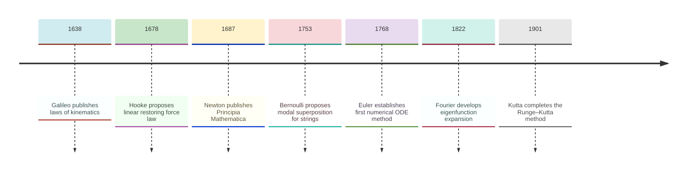
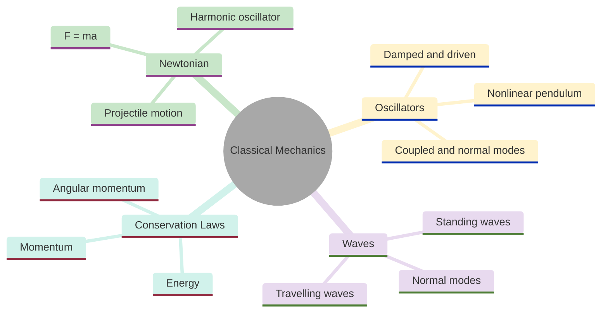
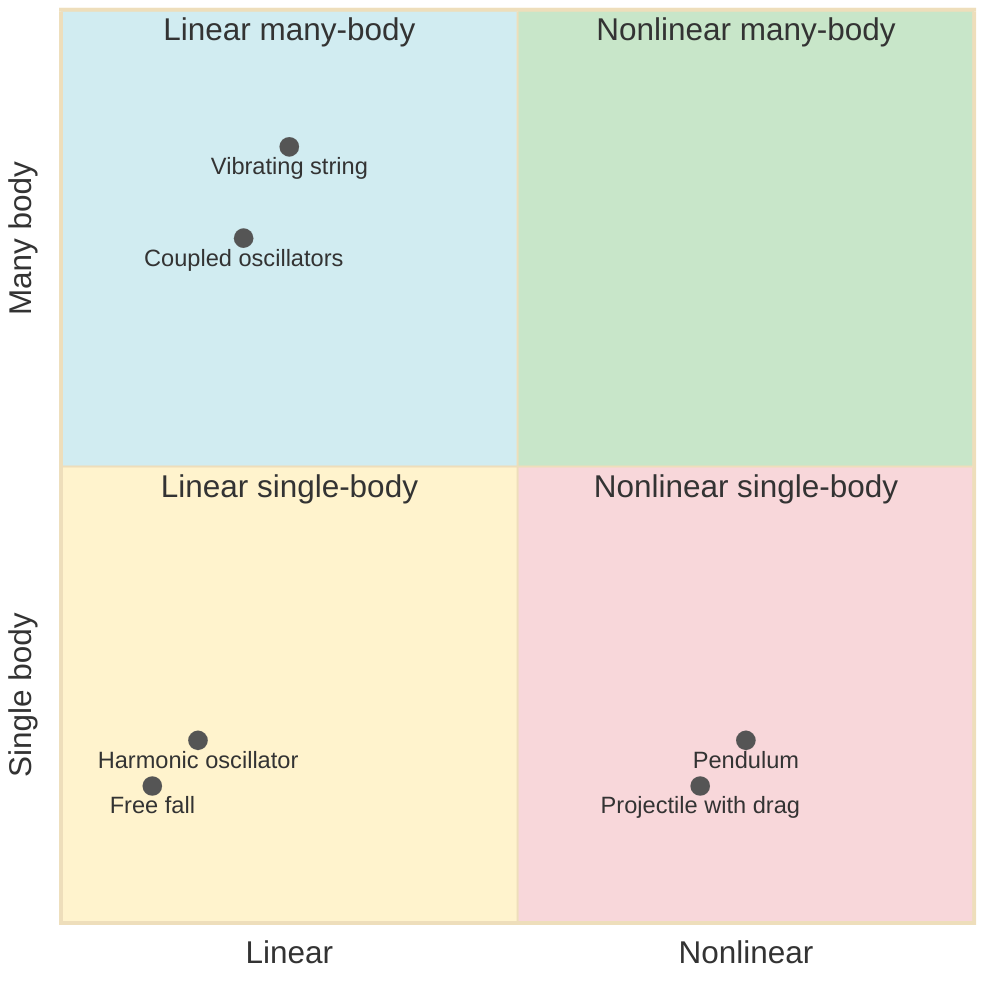
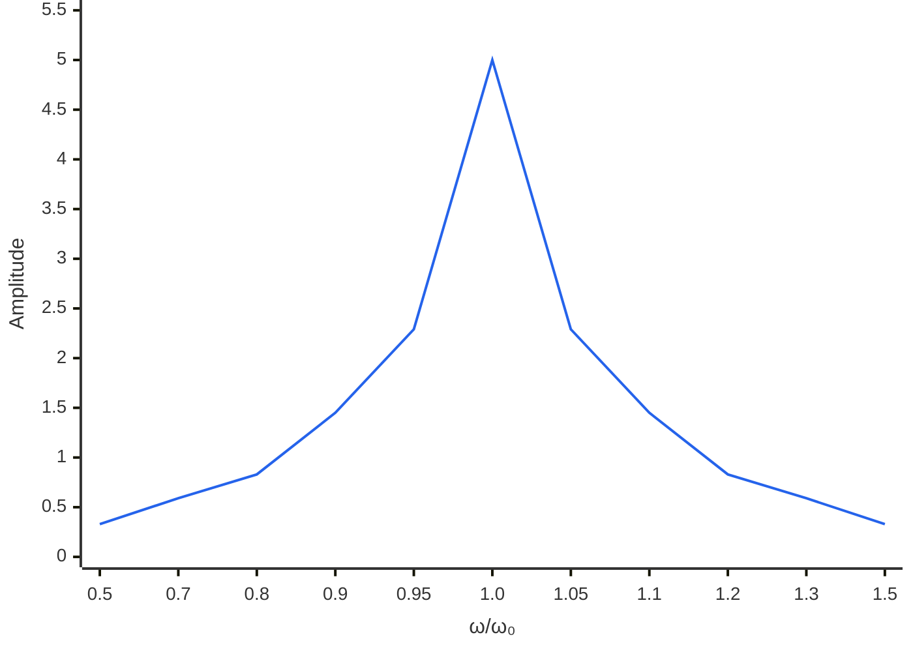
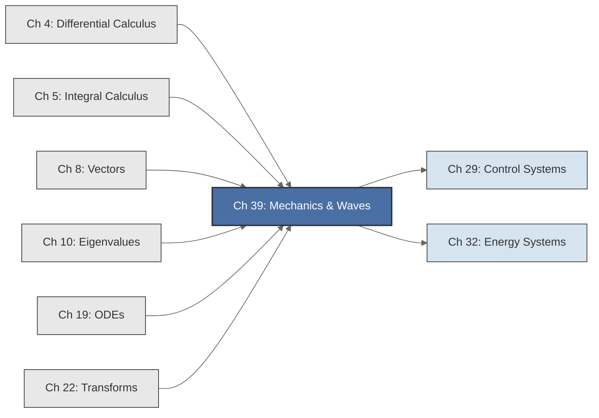

<!-- Copyright (c) 2025-2026 Bob Jansen <bobjansen@pm.me> -->
<!-- SPDX-License-Identifier: CC-BY-NC-4.0 -->
<!-- See LICENSE for full terms. Commercial licensing available. -->

# Chapter 39: Classical Mechanics & Waves

**Part IX**: Applications

> Classical mechanics reduces to solving Newton's second law as a second-order ordinary differential equation (ODE). This chapter treats free fall, harmonic oscillators, coupled normal modes, the nonlinear pendulum and waves on a discrete string using eigenvalue decomposition, Runge–Kutta integration and the fast Fourier transform (FFT).

**Prerequisites**: [Chapter 4](04-differential-calculus.md) (Differentiation); derivatives, the chain rule and the computation of forces from potentials. [Chapter 5](05-integral-calculus.md) (Integration); antiderivatives for deriving trajectories from forces, the work-energy theorem. [Chapter 8](08-vectors.md) (Vectors); position, velocity, acceleration vectors, dot and cross products. [Chapter 10](10-eigenvalues.md) (Eigenvalues); eigenvalue computation, eigenvectors, the dynamical matrix and stability criteria. [Chapter 19](19-odes.md) (Ordinary Differential Equations); first-order systems, Runge–Kutta methods, existence and uniqueness. [Chapter 22](22-transforms.md) (Transforms & Spectral Analysis); the discrete Fourier transform, FFT, power spectral density and frequency identification.

**Learning Objectives**: After this chapter, the reader will be able to:

1. Formulate free-fall and projectile motion as first-order ODE systems and solve them numerically via the fourth-order Runge–Kutta method (RK4).
2. Classify damped harmonic oscillators (underdamped, critically damped, overdamped) from eigenvalues of the companion matrix.
3. Solve the driven harmonic oscillator and identify resonance from the amplitude-frequency response.
4. Compute normal mode frequencies and mode shapes of coupled oscillator systems as eigenvalues and eigenvectors of the dynamical matrix.
5. Simulate the nonlinear pendulum with RK4 and compare the numerical period to the small-angle approximation.
6. Verify energy conservation numerically as a diagnostic of integrator accuracy.
7. Model waves on a discrete string as a system of coupled oscillators, compute natural frequencies from a tridiagonal stiffness matrix and extract frequency content via the FFT.
8. Decompose standing-wave patterns into Fourier components and relate them to the eigenmodes of the spatial operator.

**Connections**: This chapter synthesises [Chapter 4](04-differential-calculus.md) (velocity is the derivative of position; force is the negative gradient of potential), [Chapter 5](05-integral-calculus.md) (integrating acceleration recovers velocity and position), [Chapter 8](08-vectors.md) (vector operations for multi-dimensional trajectories), [Chapter 10](10-eigenvalues.md) (eigenvalues determine oscillation frequencies and stability), [Chapter 19](19-odes.md) (RK4 numerically integrates all equations of motion) and [Chapter 22](22-transforms.md) (FFT decomposes vibration signals into frequency components). It connects forward to control systems ([Chapter 29](29-control-systems.md), where oscillatory plant dynamics require feedback stabilisation) and energy systems ([Chapter 32](32-energy-systems.md), where mechanical vibrations affect turbine design).

---

## Historical Context

**Key Dates in Classical Mechanics**



*Figure 39.1: Timeline of key developments in classical mechanics from Galileo to the Runge–Kutta method.*

**Galileo's kinematics (1638).** Galileo Galilei established the quantitative foundations of kinematics in *Discorsi e Dimostrazioni Matematiche intorno a due nuove scienze*. He showed that the distance fallen by a body is proportional to the square of the elapsed time ($x \propto t^2$) and decomposed projectile motion into independent horizontal and vertical components.

**Newton's laws of motion (1687).** Isaac Newton unified terrestrial and celestial mechanics in the *Philosophiae Naturalis Principia Mathematica*. His second law $F = ma$ is the ODE $m\ddot{x} = F(x, \dot{x}, t)$. Newton solved the Kepler problem by geometric arguments equivalent to integrating a second-order ODE, proving that inverse-square forces produce conic-section trajectories.

**Hooke's restoring force law (1678).** Robert Hooke proposed the linear restoring force law $F = -kx$ (published as the anagram "ceiiinosssttuv," decoded as "ut tensio, sic vis"). The resulting equation $m\ddot{x} + kx = 0$ is the simple harmonic oscillator. Every stable equilibrium behaves as a harmonic oscillator for small perturbations, making Hooke's law the universal linearisation of mechanical restoring forces.

**Euler's rigid body mechanics and numerical methods (1750s–1768).** Leonhard Euler extended mechanics to rigid bodies and introduced the first numerical ODE method. His formulation of rotational dynamics required eigenvalue decomposition of the inertia matrix: the principal moments are eigenvalues, the principal axes are eigenvectors. Euler also established the first numerical ODE method (1768).

**Bernoulli's modal superposition (1753).** Daniel Bernoulli proposed that vibrating string motion is a superposition of fundamental modes, each oscillating as a pure sinusoid at an integer multiple of the fundamental frequency. Euler and d'Alembert objected that non-smooth functions cannot be represented by trigonometric series. Bernoulli's claim planted the seed for Fourier analysis.

**Fourier's eigenfunction expansion (1822).** Jean-Baptiste Joseph Fourier connected differential operators to trigonometric series in his *Théorie Analytique de la Chaleur*. His method of decomposing a function into sines and cosines projects onto the eigenmodes of a spatial differential operator. The spatial eigenfunctions of a vibrating string are the Fourier basis functions.

**The Runge–Kutta method (1895–1901).** Carl Runge (1895) and Martin Wilhelm Kutta (1901) developed the numerical methods that made integration of ODEs practical and mechanics computationally accessible. The fourth-order Runge–Kutta method achieves $O(h^4)$ global error with four function evaluations per step and remains the standard integrator for non-stiff systems.

**Computational mechanics (1960s).** Digital computers transformed mechanics into a computational discipline in that decade. Finite-element vibration analysis, molecular dynamics and long-term planetary integrations became routine. Modern applications range from protein folding ($10^6$ coupled oscillators) to gravitational wave templates ($10^9$-year binary inspiral integrations).

---

## Why This Chapter Matters

**Classical Mechanics**



*Figure 39.2: Overview of classical mechanics showing Newtonian, oscillator, wave and conservation law branches.*

Differentiation, integration, linear algebra, eigenvalue decomposition, ODE solvers and the FFT were all developed to solve problems of the kind treated here. The same algorithms run inside structural analysis codes that certify aircraft, vibration monitors that protect turbines and seismometers that detect earthquakes.

Finite element analysis of bridges, buildings and spacecraft frames reduces to assembling a mass matrix and stiffness matrix, computing normal mode frequencies and verifying that no resonance lies near an expected forcing frequency. The `eigenvalues` and `eigenvectors` routines perform this computation. The `integrateRK4` solver propagates any mechanical system forward in time. The `fft` routine extracts frequency content from the resulting motion.

The nonlinear pendulum has an exact period involving an elliptic integral. A single call to `integrateRK4` produces the trajectory for arbitrary initial conditions, including the near-separatrix regime where the period diverges logarithmically. Energy conservation is a built-in accuracy diagnostic: if the computed energy drifts, the step size is too large. The pattern of formulating an ODE, integrating numerically and verifying a conservation law recurs in orbital mechanics, fluid dynamics, robotics and every applied chapter in this book.

---

## Notation & Conventions

| Symbol | Meaning |
|--------|---------|
| $t$ | Time (independent variable) |
| $x$, $y$ | Position coordinates (dependent variables) |
| $v$, $\dot{x}$ | Velocity |
| $a$, $\ddot{x}$ | Acceleration |
| $m$ | Mass |
| $k$ | Spring stiffness (Hooke's law constant) |
| $b$ | Damping coefficient ($\text{N}\cdot\text{s/m}$) |
| $g$ | Gravitational acceleration ($\approx 9.81$ $\text{m/s}^2$) |
| $\omega$ | Natural angular frequency: $\omega = \sqrt{k/m}$ |
| $\gamma$ | Damping rate: $\gamma = b/(2m)$ |
| $\omega_d$ | Damped frequency: $\omega_d = \sqrt{\omega^2 - \gamma^2}$ |
| $\Omega$ | Driving frequency |
| $M$ | Mass matrix ($n \times n$, positive definite) |
| $K$ | Stiffness matrix ($n \times n$, positive semi-definite) |
| $D$ | Dynamical matrix: $D = M^{-1}K$ |
| $\mathbf{u}$ | Mode shape (eigenvector of $D$) |
| $\lambda_k$ | $k$-th eigenvalue of the dynamical matrix ($= \omega_k^2$) |
| $\theta$ | Angular displacement (pendulum) |
| $l$ | Pendulum length |
| $T$ | Kinetic energy: $T = \frac{1}{2}m v^2$ |
| $V$ | Potential energy |
| $E$ | Total mechanical energy: $E = T + V$ |
| $h$ | Step size for numerical integration |
| $N$ | Number of masses in a discrete string model |
| $c$ | Wave speed on a string: $c = \sqrt{\tau/\mu}$ |
| $\tau$ | String tension (within this chapter exclusively; elsewhere in the book, $\tau$ may denote a timescale) |
| $\mu$ | Linear mass density |

Dots denote time derivatives: $\dot{x} = dx/dt$. State vectors are column vectors in bold lowercase. Matrices are uppercase italic. All code uses SI units unless stated otherwise.

---

## Core Theory

**Classification of Mechanical Systems by Linearity and Degrees of Freedom**



*Figure 39.3: Classification of mechanical systems by linearity and number of degrees of freedom.*

### Free Fall and Projectile Motion as ODE Systems

**Definition 39.1** (Free-fall ODE system). A particle of mass $m$ falling under constant gravitational acceleration $g$, with no other forces, satisfies the second-order derivative ([Chapter 4](04-differential-calculus.md)):

$$\ddot{x} = -g.$$

Defining the state vector ([Chapter 8](08-vectors.md)) $\mathbf{y} = (x, v)^T$ with $v = \dot{x}$, this becomes the first-order system:

$$\dot{\mathbf{y}} = \begin{pmatrix} v \\ -g \end{pmatrix}, \qquad \mathbf{y}(0) = \begin{pmatrix} x_0 \\ v_0 \end{pmatrix}.$$

**Theorem 39.2** (Free-fall solution). The initial-value problem of Definition 39.1 has the unique solution:

$$v(t) = v_0 - gt, \qquad x(t) = x_0 + v_0 t - \frac{1}{2}gt^2.$$

??? note "Proof"

    *Proof.* Integrate ([Chapter 5](05-integral-calculus.md)) $\dot{v} = -g$ directly to obtain

    $$v(t) = v_0 - gt.$$

    Integrate $\dot{x} = v(t) = v_0 - gt$ to obtain

    $$x(t) = x_0 + v_0 t - \tfrac{1}{2}gt^2.$$

    Uniqueness follows from the Picard–Lindelöf theorem ([Chapter 19](19-odes.md)), since the right-hand side is Lipschitz (in fact, constant in $\mathbf{y}$). $\square$

**Theorem 39.3** (2D projectile trajectory). A particle launched from the origin at speed $v_0$ and angle $\theta$ above the horizontal, subject only to gravity, obeys the decoupled 4-dimensional first-order system with state $\mathbf{y} = (x, y, v_x, v_y)^T$:

$$\dot{\mathbf{y}} = \begin{pmatrix} v_x \\ v_y \\ 0 \\ -g \end{pmatrix}, \qquad \mathbf{y}(0) = \begin{pmatrix} 0 \\ 0 \\ v_0\cos\theta \\ v_0\sin\theta \end{pmatrix}.$$

The solution is:

$$x(t) = v_0\cos\theta \cdot t, \qquad y(t) = v_0\sin\theta \cdot t - \frac{1}{2}gt^2.$$

Eliminating $t$ yields the parabolic trajectory

$$y(x) = x\tan\theta - \frac{gx^2}{2v_0^2\cos^2\theta}.$$

The range is $R = v_0^2\sin(2\theta)/g$, maximised at $\theta = \pi/4$.

??? note "Proof"

    *Proof.* The horizontal and vertical equations decouple: $\ddot{x} = 0$ and $\ddot{y} = -g$. Integrating each with the stated initial conditions gives the parametric solution. Solving $x(t)$ for $t$ and substituting into $y(t)$ yields the parabola. Setting $y = 0$ with $t > 0$ gives $t_f = 2v_0\sin\theta/g$, so the range is

    $$R = \frac{v_0^2\sin(2\theta)}{g}.$$

    The maximum $\sin(2\theta) = 1$ occurs at $\theta = \pi/4$. $\square$

**Remark 39.4**. Although free fall has an analytical solution, formulating it as an ODE system and solving with RK4 provides: (a) a validation benchmark for the integrator, and (b) a template for adding nonlinear forces (drag, wind, Coriolis) where no closed form exists.

### The Harmonic Oscillator

**Underdamped Harmonic Oscillator Displacement**

```mermaid
---
config:
  theme: base
  themeVariables:
    xyChart:
      plotColorPalette: "#2563eb, #dc2626, #16a34a, #9333ea, #ca8a04, #0891b2"
      backgroundColor: "#ffffff"
      titleColor: "#333333"
      xAxisLabelColor: "#333333"
      yAxisLabelColor: "#333333"
      xAxisTitleColor: "#333333"
      yAxisTitleColor: "#333333"
      xAxisLineColor: "#333333"
      yAxisLineColor: "#333333"
---
xychart-beta
    x-axis "t" [0, 0.5, 1, 1.5, 2, 2.5, 3, 3.5, 4, 4.5, 5, 5.5, 6]
    y-axis "x(t)" -1.1 --> 1.1
    line [1.0, 0.878, 0.540, 0.071, -0.416, -0.801, -0.990, -0.936, -0.654, -0.211, 0.284, 0.709, 0.960]
```

*Figure 39.4: Displacement of an underdamped harmonic oscillator showing decaying oscillations.*

**Definition 39.5** (Simple harmonic oscillator). A mass $m$ on a spring of stiffness $k$ obeys:

$$\ddot{x} + \omega^2 x = 0, \qquad \omega = \sqrt{k/m}.$$

As a first-order system with $\mathbf{y} = (x, v)^T$:

$$\dot{\mathbf{y}} = A\mathbf{y}, \qquad A = \begin{pmatrix} 0 & 1 \\ -\omega^2 & 0 \end{pmatrix}.$$

The companion matrix $A$ has eigenvalues ([Chapter 10](10-eigenvalues.md)) $\lambda = \pm i\omega$ (purely imaginary), so the equilibrium is a centre and the motion is periodic with period $T = 2\pi/\omega$.

**Theorem 39.6** (Damped oscillator classification from eigenvalues). The damped harmonic oscillator:

$$\ddot{x} + 2\gamma\dot{x} + \omega^2 x = 0$$

has companion matrix:

$$A = \begin{pmatrix} 0 & 1 \\ -\omega^2 & -2\gamma \end{pmatrix}.$$

The eigenvalues of $A$ are $\lambda_{\pm} = -\gamma \pm \sqrt{\gamma^2 - \omega^2}$. Three regimes arise:

1. **Underdamped** ($\gamma < \omega$): Complex conjugate eigenvalues $\lambda_{\pm} = -\gamma \pm i\omega_d$ where $\omega_d = \sqrt{\omega^2 - \gamma^2}$. The solution oscillates with exponentially decaying envelope:

$$x(t) = X_0 e^{-\gamma t}\cos(\omega_d t + \varphi).$$

2. **Critically damped** ($\gamma = \omega$): A repeated real eigenvalue $\lambda = -\gamma$. The solution returns to equilibrium as fast as possible without oscillation:

$$x(t) = (C_1 + C_2 t)e^{-\gamma t}.$$

3. **Overdamped** ($\gamma > \omega$): Two distinct negative real eigenvalues. The solution decays monotonically:

$$x(t) = C_1 e^{\lambda_+ t} + C_2 e^{\lambda_- t}.$$

In all three cases, $\operatorname{Re}(\lambda_{\pm}) < 0$, so $x(t) \to 0$ as $t \to \infty$.

??? note "Proof"

    *Proof.* The characteristic polynomial of $A$ is $p(\lambda) = \lambda^2 + 2\gamma\lambda + \omega^2$. By the quadratic formula:

    $$\lambda_{\pm} = -\gamma \pm \sqrt{\gamma^2 - \omega^2}.$$

    The sign of the discriminant $\Delta = \gamma^2 - \omega^2$ determines the three cases listed in the theorem statement.

    In all cases with $\gamma > 0$ and $\omega > 0$:

    $$\operatorname{Re}(\lambda_{\pm}) = -\gamma + \operatorname{Re}\!\left(\sqrt{\gamma^2 - \omega^2}\right) \leq -\gamma + \lvert\gamma\rvert \leq 0,$$

    with strict inequality since $\left\lvert\sqrt{\gamma^2 - \omega^2}\right\rvert < \gamma$ when $\omega > 0$. When $\gamma > \omega$, $\sqrt{\gamma^2 - \omega^2}$ is real and positive with $\sqrt{\gamma^2 - \omega^2} < \gamma$; when $\gamma < \omega$, $\sqrt{\gamma^2 - \omega^2} = i\omega_d$ is purely imaginary with zero real part.

    Both eigenvalues therefore have strictly negative real part and $x(t) \to 0$ as $t \to \infty$. The solution form in each case follows from the theory of $e^{At}$ ([Chapter 19](19-odes.md), Section 3). $\square$

**Theorem 39.7** (Driven oscillator and resonance). The driven damped oscillator:

$$\ddot{x} + 2\gamma\dot{x} + \omega^2 x = \frac{F_0}{m}\cos(\Omega t)$$

has steady-state amplitude:

$$A(\Omega) = \frac{F_0/m}{\sqrt{(\omega^2 - \Omega^2)^2 + 4\gamma^2\Omega^2}}.$$

Resonance occurs at $\Omega_{\mathrm{res}} = \sqrt{\omega^2 - 2\gamma^2}$ (when $\gamma < \omega/\sqrt{2}$), where:

$$A_{\max} = \frac{F_0/m}{2\gamma\sqrt{\omega^2 - \gamma^2}} = \frac{F_0/m}{2\gamma\omega_d}.$$

The quality factor $Q = \omega/(2\gamma)$ measures the sharpness of the resonance peak.

!!! warning "Resonance amplitude diverges as damping vanishes"

    In the limit $\gamma \to 0$ the peak amplitude $A_{\max} = F_0/(2m\gamma\omega_d)$ grows without bound. Physical systems always have some damping, but lightly damped structures (bridges, turbine blades, glass) can reach destructive amplitudes when driven near resonance. Structural analysis codes flag modes whose frequencies lie within a tolerance of known forcing frequencies.

**Resonance Amplitude Response of a Driven Damped Oscillator**



*Figure 39.5: Amplitude response peaks sharply at resonance near the natural frequency.*

??? note "Proof"

    *Proof.* Substitute the ansatz $x_p(t) = B\cos(\Omega t) + C\sin(\Omega t)$ into the ODE. Equating coefficients of $\cos(\Omega t)$ and $\sin(\Omega t)$ separately gives the $2\times 2$ linear system:

    $$\begin{aligned}
    (\omega^2 - \Omega^2)B + 2\gamma\Omega C &= F_0/m, \\
    -2\gamma\Omega B + (\omega^2 - \Omega^2)C &= 0.
    \end{aligned}$$

    Solving for $B$ and $C$ and computing the steady-state amplitude $A(\Omega) = \sqrt{B^2 + C^2}$ yields

    $$A(\Omega) = \frac{F_0/m}{\sqrt{(\omega^2 - \Omega^2)^2 + 4\gamma^2\Omega^2}}.$$

    To find the resonance frequency, set $dA/d\Omega = 0$. The denominator is minimised when $d\left[(\omega^2 - \Omega^2)^2 + 4\gamma^2\Omega^2\right]/d\Omega = 0$, giving $\Omega_{\mathrm{res}}^2 = \omega^2 - 2\gamma^2$. Substituting back yields $A_{\max} = (F_0/m)/(2\gamma\omega_d)$. $\square$

### Coupled Oscillators and Normal Modes

**Definition 39.8** (Coupled oscillator system). Consider $n$ masses coupled by linear springs. Let $\mathbf{x} = (x_1, \ldots, x_n)^T$ be displacements from equilibrium. The equation of motion is:

$$M\ddot{\mathbf{x}} + K\mathbf{x} = \mathbf{0},$$

where $M = \operatorname{diag}(m_1, \ldots, m_n)$ is the mass matrix and $K$ is the symmetric positive semi-definite stiffness matrix.

**Theorem 39.9** (Normal modes from eigenvalues). The normal mode ansatz $\mathbf{x}(t) = \mathbf{u}\cos(\omega t + \varphi)$ reduces $M\ddot{\mathbf{x}} + K\mathbf{x} = \mathbf{0}$ to the eigenvalue problem:

$$D\mathbf{u} = \omega^2\mathbf{u}, \qquad D = M^{-1}K.$$

The normal mode frequencies are $\omega_k = \sqrt{\lambda_k}$, where $\lambda_1 \leq \cdots \leq \lambda_n$ are the eigenvalues of the dynamical matrix $D$. The eigenvectors $\mathbf{u}_1, \ldots, \mathbf{u}_n$ are the mode shapes.

??? note "Proof"

    *Proof.* Substituting $\mathbf{x}(t) = \mathbf{u}\cos(\omega t + \varphi)$ into $M\ddot{\mathbf{x}} + K\mathbf{x} = \mathbf{0}$ gives

    $$\left(-\omega^2 M + K\right)\mathbf{u}\cos(\omega t + \varphi) = \mathbf{0}.$$

    Since the cosine factor is not identically zero, the coefficient must vanish: $K\mathbf{u} = \omega^2 M\mathbf{u}$. Premultiplying by $M^{-1}$ (which exists since all masses are positive) gives the standard eigenvalue problem

    $$D\mathbf{u} = \omega^2\mathbf{u}, \qquad D = M^{-1}K.$$

    The matrix $D$ is similar to the symmetric positive semi-definite matrix $M^{-1/2}KM^{-1/2}$, which guarantees that all eigenvalues are real and non-negative; it follows that $\omega_k = \sqrt{\lambda_k} \geq 0$ for every mode $k$. $\square$

!!! abstract "Key Result"

    **Theorem 39.9** (Normal modes from eigenvalues). The vibration frequencies of a coupled mechanical system are $\omega_k = \sqrt{\lambda_k}$ where $\lambda_k$ are eigenvalues of the dynamical matrix $M^{-1}K$, reducing the analysis of complex vibrating structures to a single eigenvalue problem.

**Theorem 39.10** (General solution via mode superposition). The general solution of $M\ddot{\mathbf{x}} + K\mathbf{x} = \mathbf{0}$ is:

$$\mathbf{x}(t) = \sum_{k=1}^n A_k \mathbf{u}_k \cos(\omega_k t + \varphi_k),$$

where $A_k$ and $\varphi_k$ are determined by initial conditions via the $M$-orthogonality of eigenvectors: $\mathbf{u}_j^T M\mathbf{u}_k = 0$ for $j \neq k$.

??? note "Proof"

    *Proof.* Since $D$ is diagonalizable (similar to a symmetric matrix), its eigenvectors $\{\mathbf{u}_k\}$ form a basis for $\mathbb{R}^n$. Linearity of the ODE guarantees that each mode evolves independently. The initial conditions $\mathbf{x}(0) = \sum_k A_k\cos(\varphi_k)\mathbf{u}_k$ and $\dot{\mathbf{x}}(0) = -\sum_k A_k\omega_k\sin(\varphi_k)\mathbf{u}_k$ uniquely determine the $2n$ constants $\{A_k, \varphi_k\}$ by $M$-orthogonal projection. $\square$

### The Nonlinear Pendulum

**Definition 39.11** (Simple pendulum ODE). A rigid rod of length $l$ with a point mass $m$ swinging under gravity satisfies:

$$\ddot{\theta} + \frac{g}{l}\sin\theta = 0.$$

As a first-order system with $\mathbf{y} = (\theta, \dot{\theta})^T$:

$$\dot{\mathbf{y}} = \begin{pmatrix} \dot{\theta} \\ -(g/l)\sin\theta \end{pmatrix}.$$

This equation is nonlinear ($\sin\theta$ is not linear in $\theta$) and has no closed-form solution in elementary functions for arbitrary amplitudes.

**Theorem 39.12** (Small-angle approximation). For $\lvert\theta\rvert \ll 1$, $\sin\theta \approx \theta$ and the pendulum reduces to the harmonic oscillator $\ddot{\theta} + (g/l)\theta = 0$ with period $T_0 = 2\pi\sqrt{l/g}$.

??? note "Proof"

    *Proof.* The Taylor expansion $\sin\theta = \theta - \theta^3/6 + O(\theta^5)$ gives $\sin\theta \approx \theta$ for small $\lvert\theta\rvert$. Substituting into the pendulum ODE yields the linearised harmonic oscillator

    $$\ddot{\theta} + \frac{g}{l}\theta = 0,$$

    with natural frequency $\omega = \sqrt{g/l}$ and period

    $$T_0 = \frac{2\pi}{\omega} = 2\pi\sqrt{\frac{l}{g}}.$$

    $\square$

**Theorem 39.13** (Exact period of the nonlinear pendulum). For a pendulum released from rest at angle $\theta_0$, the period is:

$$T(\theta_0) = 4\sqrt{\frac{l}{g}} \int_0^{\pi/2} \frac{d\phi}{\sqrt{1 - \sin^2(\theta_0/2)\sin^2\phi}} = \frac{2T_0}{\pi}K\!\left(\sin\frac{\theta_0}{2}\right),$$

where $K(k)$ is the complete elliptic integral of the first kind. Since $K(k) > \pi/2$ for $k > 0$, the period always exceeds the linear approximation: $T(\theta_0) > T_0$ for all $\theta_0 > 0$.

??? note "Proof"

    *Proof.* Energy conservation gives $\frac{1}{2}l^2\dot{\theta}^2 + gl(1 - \cos\theta) = gl(1 - \cos\theta_0)$, so $\dot{\theta}^2 = (2g/l)(\cos\theta - \cos\theta_0)$. The quarter-period (from $\theta_0$ to $0$) is:

    $$\frac{T}{4} = \int_0^{\theta_0}\frac{d\theta}{\sqrt{(2g/l)(\cos\theta - \cos\theta_0)}}.$$

    Using the identity $\cos\theta - \cos\theta_0 = 2(\sin^2(\theta_0/2) - \sin^2(\theta/2))$ and the substitution $\sin(\theta/2) = \sin(\theta_0/2)\sin\phi$ transforms this into the standard elliptic integral form. $\square$

**Remark 39.14**. The nonlinear pendulum is the canonical example motivating numerical ODE methods: one call to `integrateRK4` replaces an entire chapter of elliptic function theory and handles arbitrary initial conditions (including near-separatrix dynamics at $\theta_0 \to \pi$) without modification.

??? note "Series approximation for the pendulum period"

    Expanding the complete elliptic integral $K(k)$ in powers of $k = \sin(\theta_0/2)$ gives the series approximation:

    $$T \approx T_0\!\left(1 + \frac{1}{16}\theta_0^2 + \frac{11}{3072}\theta_0^4 + \cdots\right).$$

    The first correction term alone gives better than 0.1% accuracy for $\theta_0 \leq 40°$. For larger amplitudes the full elliptic integral or numerical integration is required.

### Conservation of Energy

**Theorem 39.15** (Energy conservation). For a conservative force $F = -dV/dx$, the total mechanical energy:

$$E = T + V = \frac{1}{2}m\dot{x}^2 + V(x)$$

is constant along any trajectory satisfying $m\ddot{x} = -dV/dx$.

??? note "Proof"

    *Proof.* Differentiate $E = \frac{1}{2}m\dot{x}^2 + V(x)$ with respect to $t$, applying the chain rule:

    $$\frac{dE}{dt} = m\dot{x}\ddot{x} + \frac{dV}{dx}\dot{x} = \dot{x}\!\left(m\ddot{x} + \frac{dV}{dx}\right).$$

    By Newton's second law, $m\ddot{x} = -dV/dx$, so the parenthesised expression vanishes identically:

    $$\frac{dE}{dt} = \dot{x} \cdot 0 = 0.$$

    $\square$

**Corollary 39.16** (Numerical energy as integrator diagnostic). For a numerical simulation of a conservative system, define $E_k = T_k + V_k$ at each step $k$. The relative energy error:

$$\varepsilon_k = \frac{\lvert E_k - E_0\rvert}{\lvert E_0\rvert}$$

measures integrator accuracy. For RK4 with step size $h$, the error per step is $O(h^5)$ and accumulates to $O(h^4)$ globally (linearly in time for non-symplectic methods). Energy drift exceeding a threshold signals inadequate step size.

**Theorem 39.17** (Energy of the harmonic oscillator). For the undamped oscillator $\ddot{x} + \omega^2 x = 0$ with $x(t) = A\cos(\omega t + \varphi)$:

$$E = \frac{1}{2}m\omega^2 A^2 = \text{const}.$$

The kinetic and potential energies oscillate out of phase at frequency $2\omega$:

$$T(t) = \frac{1}{2}m\omega^2 A^2\sin^2(\omega t + \varphi), \qquad V(t) = \frac{1}{2}m\omega^2 A^2\cos^2(\omega t + \varphi).$$

??? note "Proof"

    *Proof.* With $x(t) = A\cos(\omega t + \varphi)$ and $\dot{x}(t) = -A\omega\sin(\omega t + \varphi)$, compute each energy term and sum:

    $$\begin{aligned}
    T &= \tfrac{1}{2}m\dot{x}^2 = \tfrac{1}{2}m\omega^2 A^2\sin^2(\omega t + \varphi), \\
    V &= \tfrac{1}{2}kx^2 = \tfrac{1}{2}m\omega^2 A^2\cos^2(\omega t + \varphi), \\
    E &= T + V = \tfrac{1}{2}m\omega^2 A^2\left(\sin^2(\omega t + \varphi) + \cos^2(\omega t + \varphi)\right) = \tfrac{1}{2}m\omega^2 A^2.
    \end{aligned}$$

    $\square$

### Waves on a Discrete String

**Definition 39.18** (Discrete string model). A string of length $L$ under tension $\tau$ with linear mass density $\mu$ is modelled as $N$ point masses (each of mass $m = \mu\Delta x$ where $\Delta x = L/(N+1)$) connected by massless segments. The transverse displacement $u_j(t)$ of the $j$-th mass satisfies:

$$m\ddot{u}_j = \frac{\tau}{\Delta x}(u_{j+1} - 2u_j + u_{j-1}), \qquad j = 1, \ldots, N,$$

with boundary conditions $u_0 = u_{N+1} = 0$ (fixed ends). In matrix form:

$$M\ddot{\mathbf{u}} + K\mathbf{u} = \mathbf{0},$$

where $M = mI_N$ and $K$ is the $N \times N$ tridiagonal stiffness matrix:

$$K = \frac{\tau}{\Delta x}\begin{pmatrix} 2 & -1 & & \\ -1 & 2 & -1 & \\ & \ddots & \ddots & \ddots \\ & & -1 & 2 \end{pmatrix}.$$

**Theorem 39.19** (Natural frequencies of the discrete string). The eigenvalues of the dynamical matrix $D = K/m$ are:

$$\lambda_k = \frac{4\tau}{m\Delta x}\sin^2\!\left(\frac{k\pi}{2(N+1)}\right), \qquad k = 1, \ldots, N.$$

The natural frequencies are

$$\omega_k = \sqrt{\lambda_k} = 2\sqrt{\dfrac{\tau}{m\Delta x}}\sin\!\left(\dfrac{k\pi}{2(N+1)}\right),$$

and the corresponding eigenvectors have components $u_j^{(k)} = \sin(jk\pi/(N+1))$.

In the continuum limit ($N \to \infty$, $\Delta x \to 0$ with $m/\Delta x = \mu$ fixed), the frequencies approach

$$\omega_k \to \frac{k\pi c}{L}, \quad c = \sqrt{\frac{\tau}{\mu}},$$

integer multiples of the fundamental $\omega_1 = \pi c/L$, where $c$ is the wave speed.

??? note "Proof"

    *Proof.* The tridiagonal matrix $T_N$ with diagonal entries $2$ and off-diagonal entries $-1$ has known eigenvalues $\mu_k = 2 - 2\cos(k\pi/(N+1)) = 4\sin^2(k\pi/(2(N+1)))$ and eigenvectors with components $\sin(jk\pi/(N+1))$ (verifiable by direct substitution). Since $K = (\tau/\Delta x)T_N$ and $D = K/m$, the eigenvalues of $D$ are $\lambda_k = (\tau/(m\Delta x))\mu_k$. In the continuum limit, $\sin(\xi) \approx \xi$ for $\xi = k\pi/(2(N+1)) \ll 1$, giving $\lambda_k \approx (\tau/(m\Delta x))(k\pi/(N+1))^2 = (\tau/\mu)(k\pi/L)^2$. The frequencies are therefore $\omega_k \to k\pi\sqrt{\tau/\mu}/L = k\pi c/L$. $\square$

**Theorem 39.20** (Fourier decomposition of string vibration). The displacement of the discrete string at time $t$ decomposes as:

$$u_j(t) = \sum_{k=1}^N A_k \sin\!\left(\frac{jk\pi}{N+1}\right)\cos(\omega_k t + \varphi_k).$$

The amplitudes $A_k$ and phases $\varphi_k$ are determined by initial conditions via the discrete sine transform. Given a time series of $u_j(t)$ at a fixed point $j$, the FFT ([Chapter 22](22-transforms.md)) extracts the frequencies $\omega_k$ present in the motion.

??? note "Proof"

    *Proof.* By Theorem 39.10 applied to the discrete string, the general solution is a superposition of all $N$ normal modes. Each mode $k$ has spatial shape $\sin(jk\pi/(N+1))$ (from Theorem 39.19) and oscillates at frequency $\omega_k$, giving the formula in the theorem statement.

    To determine the amplitudes $A_k$ and phases $\varphi_k$ from initial conditions, write

    $$u_j(0) = \sum_{k=1}^N A_k\cos(\varphi_k)\sin\!\left(\frac{jk\pi}{N+1}\right).$$

    This is inverted using the discrete sine transform orthogonality relation:

    $$\sum_{j=1}^N\sin\!\left(\frac{jk\pi}{N+1}\right)\sin\!\left(\frac{jk'\pi}{N+1}\right) = \frac{N+1}{2}\,\delta_{kk'},$$

    which follows from the standard discrete sine transform identity. Multiplying both sides of the initial condition equation by $\sin(jk'\pi/(N+1))$, summing over $j$ and applying this orthogonality uniquely determines all coefficients. $\square$

### Standing Waves and Superposition

**Definition 39.21** (Standing wave). A standing wave is a vibration pattern of the form $u(x, t) = f(x)\cos(\omega t + \varphi)$, where the spatial profile $f(x)$ does not change with time. The nodes are points where $f(x) = 0$; the antinodes are where $\lvert f(x)\rvert$ is maximal.

**Theorem 39.22** (Standing waves as superposition of travelling waves). A standing wave equals the sum of two counter-propagating travelling waves:

$$\sin(kx)\cos(\omega t) = \frac{1}{2}\left[\sin(kx - \omega t) + \sin(kx + \omega t)\right].$$

Two identical waves moving in opposite directions, in turn, produce a standing wave.

??? note "Proof"

    *Proof.* Apply the sum-to-product identity $\sin\alpha + \sin\beta = 2\sin((\alpha+\beta)/2)\cos((\alpha-\beta)/2)$ with $\alpha = kx - \omega t$ and $\beta = kx + \omega t$. Then $\sin(kx-\omega t) + \sin(kx+\omega t) = 2\sin(kx)\cos(\omega t)$. Dividing by 2 gives the result. $\square$

**Theorem 39.23** (Mode orthogonality and Fourier analysis). The mode shapes $\phi_k(x) = \sin(k\pi x/L)$ satisfy orthogonality on $[0, L]$:

$$\int_0^L \phi_j(x)\phi_k(x)\,dx = \frac{L}{2}\delta_{jk}.$$

Any initial displacement $u(x, 0)$ satisfying the boundary conditions decomposes as

$$u(x, 0) = \sum_k A_k\sin\!\left(\frac{k\pi x}{L}\right), \qquad A_k = \frac{2}{L}\int_0^L u(x, 0)\sin\!\left(\frac{k\pi x}{L}\right)dx.$$

This is the Fourier sine series ([Chapter 22](22-transforms.md)).

??? note "Proof"

    *Proof.* Apply the product-to-sum identity $\sin\alpha\sin\beta = \frac{1}{2}[\cos(\alpha-\beta) - \cos(\alpha+\beta)]$. For $j \neq k$, the resulting cosines integrate to zero over $[0, L]$. Specifically, for any nonzero integer $m$,

    $$\int_0^L \cos\!\left(\frac{m\pi x}{L}\right)dx = \left[\frac{L}{m\pi}\sin\!\left(\frac{m\pi x}{L}\right)\right]_0^L = 0.$$

    The integral $\int_0^L \phi_j\phi_k\,dx$ is therefore zero for $j \neq k$.

    For $j = k$:

    $$\int_0^L\sin^2\!\left(\frac{k\pi x}{L}\right)dx = \frac{L}{2}.$$

    The coefficient formula follows by projecting $u(x, 0) = \sum_k A_k\phi_k$ onto $\phi_k$, integrating and dividing by $\|\phi_k\|^2 = L/2$. $\square$

---

## Formulas & Identities

**F39.1** Free-fall kinematics (constant $g$, no drag):

$$x(t) = x_0 + v_0 t - \frac{1}{2}gt^2, \qquad v(t) = v_0 - gt.$$

**F39.2** Projectile range ($\theta = \pi/4$ maximises):

$$R = \frac{v_0^2\sin(2\theta)}{g}.$$

**F39.3** Simple harmonic oscillator (undamped, $m > 0$, $k > 0$):

$$x(t) = A\cos(\omega t + \varphi), \qquad \omega = \sqrt{k/m}, \qquad T = 2\pi/\omega.$$

**F39.4** Damped oscillator eigenvalues ($\gamma \geq 0$, $\omega > 0$):

$$\lambda_{\pm} = -\gamma \pm \sqrt{\gamma^2 - \omega^2}.$$

**F39.5** Damped frequency (underdamped case, $\gamma < \omega$):

$$\omega_d = \sqrt{\omega^2 - \gamma^2}.$$

**F39.6** Driven oscillator amplitude:

$$A(\Omega) = \frac{F_0/m}{\sqrt{(\omega^2 - \Omega^2)^2 + 4\gamma^2\Omega^2}}.$$

**F39.7** Resonance frequency (exists when $\gamma < \omega/\sqrt{2}$):

$$\Omega_{\mathrm{res}} = \sqrt{\omega^2 - 2\gamma^2}.$$

**F39.8** Quality factor ($\gamma > 0$):

$$Q = \frac{\omega}{2\gamma}.$$

**F39.9** Normal mode frequencies ($\lambda_k$ is the $k$-th eigenvalue of $D$):

$$\omega_k = \sqrt{\lambda_k(M^{-1}K)}.$$

**F39.10** Pendulum small-angle period:

$$T_0 = 2\pi\sqrt{\frac{l}{g}}.$$

**F39.11** Exact pendulum period:

$$T = \frac{2T_0}{\pi}\,K\!\left(\sin\frac{\theta_0}{2}\right).$$

**F39.12** Harmonic oscillator energy (undamped, amplitude $A$):

$$E = \frac{1}{2}m\omega^2 A^2 = \frac{1}{2}kA^2.$$

**F39.13** Pendulum energy (conservative, no damping):

$$E = \frac{1}{2}ml^2\dot{\theta}^2 + mgl(1 - \cos\theta).$$

**F39.14** Discrete string frequencies ($k = 1,\ldots,N$):

$$\omega_k = 2\sqrt{\frac{\tau}{m\Delta x}}\sin\!\left(\frac{k\pi}{2(N+1)}\right).$$

**F39.15** Continuum string harmonics:

$$\omega_k = \frac{k\pi c}{L}, \qquad c = \sqrt{\frac{\tau}{\mu}}.$$

**F39.16** Fourier sine coefficient ($u(x,0)$ satisfying fixed-end boundary conditions):

$$A_k = \frac{2}{L}\int_0^L u(x,0)\sin\!\left(\frac{k\pi x}{L}\right)dx.$$

---

## Algorithms

### Algorithm 39.24: Projectile Trajectory via RK4

**Input**: Initial speed $v_0$, launch angle $\theta$, gravitational acceleration $g$, step size $h$, end time $t_{\max}$.

**Output**: Arrays of positions $(x_k, y_k)$ and velocities $(v_{x,k}, v_{y,k})$ at each time step.

1. Define state vector $\mathbf{y} = (x, y, v_x, v_y)^T$.
2. Set $\mathbf{y}_0 = (0, 0, v_0\cos\theta, v_0\sin\theta)^T$.
3. Define the vector field $\mathbf{f}(t, \mathbf{y}) = (v_x, v_y, 0, -g)^T$.
4. For $k = 0, 1, \ldots$: apply one RK4 step ([Chapter 19](19-odes.md), Algorithm 19.4). Terminate if $y_k < 0$.

```
function projectileRK4(v0, theta, g, h, t_max):
    // Vector field: dy/dt = f(t, y) for state y = (x, y, vx, vy)
    function f(t, y):
        return (y[3], y[4], 0, -g)    // (vx, vy, 0, -g)

    // Initial state
    y = (0, 0, v0 * cos(theta), v0 * sin(theta))
    t = 0
    trajectory = [(y[1], y[2])]        // store (x, y) positions

    while t < t_max:
        // RK4 step
        k1 = h * f(t, y)
        k2 = h * f(t + h/2, y + k1/2)
        k3 = h * f(t + h/2, y + k2/2)
        k4 = h * f(t + h, y + k3)
        y = y + (k1 + 2*k2 + 2*k3 + k4) / 6
        t = t + h

        if y[2] < 0:                   // projectile hit the ground
            break
        append (y[1], y[2]) to trajectory

    return trajectory
```

**Complexity**: $O(T/h)$ where $T$ is the actual flight time. Each step: 4 evaluations of $\mathbf{f}$, each $O(1)$.

!!! tip "Choosing the RK4 step size for oscillatory systems"

    A step size of $h \approx T_{\min}/25$, where $T_{\min} = 2\pi/\omega_{\max}$ is the shortest oscillation period, gives four-digit accuracy for most mechanical systems. Halving $h$ improves accuracy by a factor of 16 but doubles the computation time.

### Algorithm 39.25: Damped Oscillator Simulation with Eigenvalue Classification

**Input**: Natural frequency $\omega$, damping rate $\gamma$, initial conditions $x_0$, $v_0$, step size $h$, end time $t_{\max}$.

**Output**: Time series $(t_k, x_k, v_k)$ and damping classification.

1. Compute eigenvalues $\lambda_{\pm} = -\gamma \pm \sqrt{\gamma^2 - \omega^2}$ of the companion matrix.
2. If eigenvalues are complex conjugates, classify as underdamped; if real and equal, as critically damped; if real and distinct, as overdamped.
3. Define $\mathbf{f}(t, \mathbf{y}) = (v, -2\gamma v - \omega^2 x)^T$.
4. Integrate with RK4 for $\lfloor t_{\max}/h \rfloor$ steps.

```
function dampedOscillator(omega, gamma, x0, v0, h, t_max):
    // Classify damping regime from eigenvalues
    discriminant = gamma^2 - omega^2
    lambda_plus  = -gamma + sqrt(discriminant)
    lambda_minus = -gamma - sqrt(discriminant)

    if discriminant < 0:
        classification = "underdamped"
    else if discriminant == 0:
        classification = "critically damped"
    else:
        classification = "overdamped"

    // Vector field: dy/dt = (v, -2*gamma*v - omega^2*x)
    function f(t, y):
        return (y[2], -2 * gamma * y[2] - omega^2 * y[1])

    // RK4 integration
    N = floor(t_max / h)
    t = array of size N+1
    x = array of size N+1
    v = array of size N+1
    t[0] = 0;  x[0] = x0;  v[0] = v0

    for k = 0 to N-1:
        y = (x[k], v[k])
        k1 = h * f(t[k], y)
        k2 = h * f(t[k] + h/2, y + k1/2)
        k3 = h * f(t[k] + h/2, y + k2/2)
        k4 = h * f(t[k] + h, y + k3)
        y_next = y + (k1 + 2*k2 + 2*k3 + k4) / 6
        x[k+1] = y_next[1]
        v[k+1] = y_next[2]
        t[k+1] = t[k] + h

    return t, x, v, classification
```

**Complexity**: $O(t_{\max}/h)$ time; each step evaluates $\mathbf{f}$ four times at $O(1)$ cost. Eigenvalue classification is $O(1)$.

### Algorithm 39.26: Normal Mode Computation

**Input**: Mass matrix $M$ ($n \times n$ diagonal), stiffness matrix $K$ ($n \times n$ symmetric).

**Output**: Normal mode frequencies $\omega_1, \ldots, \omega_n$ and mode shapes $\mathbf{u}_1, \ldots, \mathbf{u}_n$.

1. Compute $M^{-1}$ (trivial for diagonal $M$: $(M^{-1})_{jj} = 1/m_j$).
2. Compute $D = M^{-1}K$.
3. Compute eigenvalues $\lambda_1, \ldots, \lambda_n$ and eigenvectors $\mathbf{u}_1, \ldots, \mathbf{u}_n$ of $D$.
4. Return $\omega_k = \sqrt{\lambda_k}$ and $\mathbf{u}_k$.

```
function normalModes(M, K, n):
    // Invert the diagonal mass matrix
    M_inv = diagonal matrix of size n
    for j = 1 to n:
        M_inv[j,j] = 1 / M[j,j]

    // Form the dynamical matrix
    D = M_inv * K

    // Eigenvalue decomposition (e.g. QR algorithm)
    eigenvalues, eigenvectors = eigen_decompose(D)

    // Extract frequencies from eigenvalues
    omega = array of size n
    for k = 1 to n:
        omega[k] = sqrt(eigenvalues[k])

    return omega, eigenvectors
```

**Complexity**: $O(n^3)$ for eigenvalue decomposition (QR algorithm).

### Algorithm 39.27: Nonlinear Pendulum Simulation with Energy Check

**Input**: Length $l$, initial angle $\theta_0$, initial angular velocity $\dot{\theta}_0$, step size $h$, end time $t_{\max}$.

**Output**: Time series $(\theta_k, \dot{\theta}_k)$, energy error $\varepsilon_k$ and numerical period.

1. Define $\mathbf{f}(t, \mathbf{y}) = (\dot{\theta}, -(g/l)\sin\theta)^T$.
2. Compute initial energy: $E_0 = \frac{1}{2}ml^2\dot{\theta}_0^2 + mgl(1 - \cos\theta_0)$.
3. Integrate with RK4. At each step, compute $E_k$ and $\varepsilon_k = \lvert E_k - E_0\rvert/\lvert E_0\rvert$.
4. Determine period by detecting zero-crossings of $\theta$ with correct sign of $\dot{\theta}$.

```
function pendulumSimulation(l, theta0, omega0, h, t_max):
    g = 9.81

    // Vector field: dy/dt = (omega, -(g/l)*sin(theta))
    function f(t, y):
        return (y[2], -(g / l) * sin(y[1]))

    // Initial energy
    E0 = 0.5 * l^2 * omega0^2 + g * l * (1 - cos(theta0))

    N = floor(t_max / h)
    theta = array of size N+1
    omega = array of size N+1
    energy_error = array of size N+1
    theta[0] = theta0;  omega[0] = omega0
    energy_error[0] = 0

    prev_theta = theta0
    zero_crossings = empty list

    for k = 0 to N-1:
        // RK4 step
        y = (theta[k], omega[k])
        k1 = h * f(k*h, y)
        k2 = h * f(k*h + h/2, y + k1/2)
        k3 = h * f(k*h + h/2, y + k2/2)
        k4 = h * f(k*h + h, y + k3)
        y_next = y + (k1 + 2*k2 + 2*k3 + k4) / 6
        theta[k+1] = y_next[1]
        omega[k+1] = y_next[2]

        // Energy conservation check
        Ek = 0.5 * l^2 * omega[k+1]^2 + g * l * (1 - cos(theta[k+1]))
        energy_error[k+1] = abs(Ek - E0) / abs(E0)

        // Detect zero-crossings (theta changes sign, omega > 0)
        if prev_theta < 0 and theta[k+1] >= 0 and omega[k+1] > 0:
            append (k+1) * h to zero_crossings
        prev_theta = theta[k+1]

    // Estimate period from consecutive zero-crossings
    if length(zero_crossings) >= 2:
        period = zero_crossings[2] - zero_crossings[1]
    else:
        period = undefined

    return theta, omega, energy_error, period
```

**Complexity**: $O(t_{\max}/h)$ time; each step evaluates $\sin\theta$ once at $O(1)$ cost. Energy check adds $O(1)$ per step.

### Algorithm 39.28: Vibrating String Simulation with FFT Analysis

**Input**: $N$ masses, tension $\tau$, mass $m$, initial displacements, step size $h$, end time $t_{\max}$.

**Output**: Natural frequencies (from eigenvalues), time series of displacements, frequency spectrum (from FFT).

1. Construct $N \times N$ tridiagonal stiffness matrix $K$.
2. Form $D = K/m$; compute eigenvalues to obtain $\omega_k$.
3. Define $2N$-dimensional state $\mathbf{y} = (\mathbf{u}, \dot{\mathbf{u}})^T$ and vector field.
4. Integrate with RK4.
5. Extract time series at an observation point; apply FFT.
6. Identify peaks in the power spectrum $P_k = \lvert\hat{u}_k\rvert^2$; compare with eigenvalue-derived frequencies.

```
function vibratingString(N, tau, m, u_init, h, t_max):
    delta_x = L / (N + 1)
    c = tau / delta_x

    // Construct N x N tridiagonal stiffness matrix K
    K = zero matrix of size N x N
    for j = 1 to N:
        K[j,j] = 2 * c
        if j > 1:  K[j,j-1] = -c
        if j < N:  K[j,j+1] = -c

    // Dynamical matrix and eigenvalue frequencies
    D = K / m
    eigenvalues = eigenvalues_of(D)
    omega_eigen = array of size N
    for k = 1 to N:
        omega_eigen[k] = sqrt(eigenvalues[k])

    // Define 2N-dimensional state y = (u1..uN, du1/dt..duN/dt)
    // Vector field: du/dt = v,  dv/dt = -D * u
    function f(t, y):
        u = y[1..N]
        v = y[N+1..2N]
        accel = -D * u            // matrix-vector product (tridiagonal)
        return concatenate(v, accel)

    // RK4 integration
    n_steps = floor(t_max / h)
    y = concatenate(u_init, zeros(N))  // zero initial velocity
    obs_point = floor(N / 2)           // observe midpoint
    signal = array of size n_steps+1
    signal[0] = y[obs_point]

    for k = 0 to n_steps-1:
        t = k * h
        k1 = h * f(t, y)
        k2 = h * f(t + h/2, y + k1/2)
        k3 = h * f(t + h/2, y + k2/2)
        k4 = h * f(t + h, y + k3)
        y = y + (k1 + 2*k2 + 2*k3 + k4) / 6
        signal[k+1] = y[obs_point]

    // FFT of the observed time series
    spectrum = FFT(signal)
    P = |spectrum|^2                   // power spectrum

    return omega_eigen, signal, P
```

**Complexity**: $O(N \cdot T/h)$ for integration (vector field evaluation is $O(N)$ for tridiagonal $K$). FFT adds $O(n_t\log n_t)$.

---

## Numerical Considerations

### Step Size for Oscillatory Systems

Algorithms 39.24–39.28 all use RK4, which requires 20–30 steps per oscillation period of the highest-frequency mode for four-digit accuracy:

$$h \leq \frac{2\pi}{20\,\omega_{\max}} \approx \frac{0.3}{\omega_{\max}}.$$

For $\omega = 10$ rad/s this gives $h \leq 0.03$ s. For a vibrating string with $N$ masses,

$$\omega_{\max} \approx 2\sqrt{\frac{\tau}{m\Delta x}}$$

grows as $O(N)$. The step size must decrease as the string is refined.

### Energy Drift in Non-Symplectic Integrators

!!! warning "Secular energy drift in long-time RK4 integrations"

    RK4 is not a symplectic integrator. For conservative systems the computed energy drifts linearly in time rather than remaining bounded. A simulation that appears accurate over ten oscillation periods may show unacceptable drift over ten thousand. Monitor $\lvert E_k - E_0\rvert / \lvert E_0\rvert$ and reduce $h$ or switch to Störmer–Verlet for long-term trajectories.

RK4 does not preserve the Hamiltonian structure of conservative systems. Over long integrations the computed energy drifts secularly. For the harmonic oscillator the energy error after time $T$ is approximately:

$$\lvert\Delta E\rvert \sim C\,h^4\,\omega^5\,T.$$

Halving the step size reduces energy drift by a factor of 16. For long-term fidelity, symplectic integrators (Störmer–Verlet) bound the energy error without secular growth, at the cost of reduced order ($O(h^2)$ versus $O(h^4)$).

### Stiffness in Coupled Systems

A large frequency ratio $\omega_{\max}/\omega_{\min}$ makes the system stiff. For a discrete string with $N$ masses,

$$\omega_{\max}/\omega_{\min} \approx (2/\pi)\,N.$$

The step size is set by $\omega_{\max}$, but the physically interesting motion occurs at $\omega_{\min}$. For $N = 100$ the integrator takes approximately 60 times more steps than needed for the fundamental mode alone. This is acceptable for $N \leq 50$. For larger $N$, implicit methods or modal decomposition are preferred.

### FFT Resolution and Windowing

When extracting frequencies from a simulated time series via FFT:

- **Frequency resolution**: $\Delta f = 1/(N_t \cdot h)$, where $N_t$ is the number of samples. To resolve modes separated by $\delta\omega$, the simulation must run for at least $T \geq 2\pi/\delta\omega$.
- **Nyquist criterion**: The highest detectable frequency is $f_{\max} = 1/(2h)$, so the step size must satisfy $h < \pi/\omega_{\max}$.
- **Spectral leakage**: If the simulation time is not an integer multiple of all mode periods, the FFT coefficients "leak" into adjacent bins. Windowing (Hann, Hamming) reduces leakage at the cost of slightly broadened peaks.
- **Zero-padding**: Appending zeros to the time series before the FFT improves spectral interpolation (smoother-looking peaks) without improving true resolution.

### Pendulum Near Separatrix

When the initial angle approaches $\theta_0 \to \pi$ (the pendulum nearly reaching the vertical) in Algorithm 39.27, the period diverges as $T \sim -\ln(\pi - \theta_0)$ and the angular velocity varies extremely rapidly near the unstable equilibrium. Adaptive step-size methods or a very small fixed $h$ are required to maintain accuracy in this regime.

---

## Worked Examples

### Example 39.29: Projectile Trajectory

**Problem**: A ball is launched at $v_0 = 25$ m/s at angle $\theta = 50°$ above the horizontal. Compute the trajectory numerically with RK4 and verify against the analytical range formula.

**Solution**: The analytical range (Theorem 39.3) is:

$$R = \frac{v_0^2\sin(2\theta)}{g} = \frac{625\sin(100°)}{9.81} = \frac{625 \times 0.9848}{9.81} \approx 62.76 \text{ m}.$$

The time of flight is $t_f = 2v_0\sin\theta/g = 2 \times 25 \times 0.7660 / 9.81 \approx 3.906$ s.

Setting up the ODE system with state $\mathbf{y} = (x, y, v_x, v_y)$ and constant vector field $\mathbf{f} = (v_x, v_y, 0, -g)$ and integrating with RK4 yields a numerical range that agrees with the analytical value to within the step-size resolution. RK4 reproduces the exact solution for this linear system.

### Example 39.30: Damped Harmonic Oscillator Classification and Simulation

**Problem**: A spring-mass-damper system has $m = 1$ kg, $k = 100$ N/m and damping coefficient $b = 4$ N$\cdot$s/m. (a) Classify the oscillator by computing the eigenvalues of the companion matrix. (b) Compute the damped frequency. (c) Simulate from $x(0) = 0.1$ m, $\dot{x}(0) = 0$ for 5 seconds and verify the decay envelope.

**Solution (a)**: The parameters are $\omega = \sqrt{k/m} = 10$ rad/s and $\gamma = b/(2m) = 2$ rad/s. Since $\gamma = 2 < \omega = 10$, the system is **underdamped**.

The companion matrix eigenvalues are:

$$\lambda_{\pm} = -2 \pm \sqrt{4 - 100} = -2 \pm i\sqrt{96} \approx -2 \pm 9.798i.$$

Complex eigenvalues with negative real part confirm underdamped, stable behaviour.

**Solution (b)**:

$$\omega_d = \sqrt{\omega^2 - \gamma^2} = \sqrt{96} \approx 9.798 \text{ rad/s}.$$

**Solution (c)**: The envelope decays as:

$$x_{\text{env}}(t) = 0.1 \cdot e^{-2t}.$$

At $t = 1$: amplitude $\approx 0.1 \times 0.1353 = 0.01353$. At $t = 5$: amplitude $\approx 0.1 \times e^{-10} \approx 4.5 \times 10^{-6}$ (negligible).

### Example 39.31: Coupled Spring Normal Modes

**Problem**: Two masses $m_1 = 1$ kg and $m_2 = 2$ kg are connected in a line by three springs. The left wall–mass 1 spring has stiffness $k_1 = 6$ N/m, the coupling spring has $k_c = 2$ N/m and the mass 2–right wall spring has $k_2 = 4$ N/m. Find the normal mode frequencies and mode shapes.

**Solution**: The stiffness matrix encodes all spring forces:

$$K = \begin{pmatrix} k_1 + k_c & -k_c \\ -k_c & k_2 + k_c \end{pmatrix} = \begin{pmatrix} 8 & -2 \\ -2 & 6 \end{pmatrix}.$$

The mass matrix is $M = \operatorname{diag}(1, 2)$, so the dynamical matrix is:

$$D = M^{-1}K = \begin{pmatrix} 1 & 0 \\ 0 & 1/2 \end{pmatrix}\begin{pmatrix} 8 & -2 \\ -2 & 6 \end{pmatrix} = \begin{pmatrix} 8 & -2 \\ -1 & 3 \end{pmatrix}.$$

The characteristic polynomial is $\det(D - \lambda I) = (8 - \lambda)(3 - \lambda) - 2 = \lambda^2 - 11\lambda + 22 = 0$, giving:

$$\lambda = \frac{11 \pm \sqrt{121 - 88}}{2} = \frac{11 \pm \sqrt{33}}{2}.$$

So $\lambda_1 \approx 2.628$ and $\lambda_2 \approx 8.372$. The normal mode frequencies are:

$$\omega_1 = \sqrt{2.628} \approx 1.621 \text{ rad/s}, \qquad \omega_2 = \sqrt{8.372} \approx 2.894 \text{ rad/s}.$$

For the mode shapes, from $(D - \lambda_1 I)\mathbf{u}_1 = \mathbf{0}$:

$$(8 - 2.628)\,u_1 - 2\,u_2 = 0, \qquad \text{so } u_2/u_1 = 2.686.$$

The first mode shape is therefore $\mathbf{u}_1 \propto (1, 2.686)^T$ (masses move in the same direction; mass 2 has larger amplitude). For $\lambda_2$:

$$u_2/u_1 = -0.186, \qquad \text{so } \mathbf{u}_2 \propto (1, -0.186)^T$$

(masses move in opposite directions; mass 1 dominates).

### Example 39.32: Nonlinear Pendulum Period vs Small-Angle Approximation

**Problem**: A pendulum of length $l = 1$ m is released from $\theta_0 = 2\pi/3$ (120 degrees) from rest. (a) Compute the small-angle period. (b) Simulate with RK4 and determine the numerical period. (c) Verify energy conservation as a measure of integrator accuracy.

**Solution (a)**:

$$T_0 = 2\pi\sqrt{l/g} = 2\pi\sqrt{1/9.81} \approx 2.006 \text{ s}.$$

**Solution (b)**: For $\theta_0 = 120°$, the amplitude is far from "small" ($\sin(120°) = 0.866$ vs the linear approximation $\theta = 2.094$). The exact period (Theorem 39.13) involves $K(\sin(\pi/3)) = K(\sqrt{3}/2) \approx 2.157$:

$$T = \frac{2T_0}{\pi} \times 2.157 \approx 1.277 \times 2.157 \approx 2.754 \text{ s}.$$

The nonlinear period exceeds the linear approximation by approximately 37%.

**Solution (c)**: The pendulum is a conservative system with

$$E = \frac{1}{2}ml^2\dot{\theta}^2 + mgl(1-\cos\theta).$$

At release:

$$E_0 = mgl(1 - \cos(2\pi/3)) = 1.5\,mgl.$$

Energy should be conserved exactly; numerical drift measures RK4 accuracy.

### Example 39.33: Vibrating String Modes via Eigenvalues and FFT

**Problem**: A string of length $L = 1$ m is modelled with $N = 8$ masses. The tension is $\tau = 10$ N and each mass is $m = 0.01$ kg ($\Delta x = 1/9$ m). The string is plucked at its centre (triangular initial shape). (a) Compute the natural frequencies from the stiffness matrix eigenvalues. (b) Simulate for 2 seconds and apply FFT to the centre-mass displacement to identify which modes are excited.

**Solution (a)**: The stiffness constant is $c = \tau/\Delta x = 90$ N/m. The dynamical matrix $D = K/m$ has the tridiagonal structure with diagonal $2c/m = 18000$ $\text{s}^{-2}$ and off-diagonal $-c/m = -9000$ $\text{s}^{-2}$.

By Theorem 39.19, the analytical frequencies are

$$\omega_k = 2\sqrt{c/m}\sin(k\pi/18), \qquad k = 1, \ldots, 8.$$

With $\sqrt{c/m} = \sqrt{9000} \approx 94.87$ rad/s:

| Mode $k$ | $\omega_k$ (rad/s) | $f_k$ (Hz) |
|-----------|---------------------|-------------|
| 1 | $189.7\sin(\pi/18) \approx 33.0$ | 5.25 |
| 2 | $189.7\sin(2\pi/18) \approx 64.9$ | 10.3 |
| 3 | $189.7\sin(3\pi/18) \approx 94.9$ | 15.1 |
| 4 | $189.7\sin(4\pi/18) \approx 122.0$ | 19.4 |
| 5 | $189.7\sin(5\pi/18) \approx 145.5$ | 23.2 |

**Solution (b)**: The triangular pluck (symmetric about the centre) excites only **odd** modes ($k = 1, 3, 5, 7$), because even modes have a node at the centre and thus have zero projection with the symmetric initial shape. The FFT of the centre-mass time series confirms peaks at $\omega_1, \omega_3, \omega_5, \omega_7$ only.

---

## Connections

**Chapter Dependencies**



*Figure 39.6: Chapter dependencies showing how calculus, vectors, eigenvalues, ODEs and transforms feed into mechanics and waves.*

### Within This Book

- **Differentiation ([Chapter 4](04-differential-calculus.md))**: Velocity is the derivative of position. Force is the negative derivative of potential: $F = -dV/dx$.
- **Integration ([Chapter 5](05-integral-calculus.md))**: Integrating acceleration gives velocity; integrating velocity gives position. Free-fall solutions (Theorem 39.2) follow from direct antidifferentiation. The work-energy theorem is an integral relation.
- **Vectors ([Chapter 8](08-vectors.md))**: Projectile motion in 2D requires vector state variables. Angular momentum uses the cross product $\mathbf{L} = \mathbf{r} \times m\mathbf{v}$. Kinetic energy is $T = \frac{1}{2}m(\mathbf{v} \cdot \mathbf{v})$.
- **Eigenvalues ([Chapter 10](10-eigenvalues.md))**: Normal mode frequencies are square roots of eigenvalues of $M^{-1}K$ (Theorem 39.9). Damping classification derives from eigenvalues of the companion matrix (Theorem 39.6). String vibration frequencies are eigenvalues of the tridiagonal stiffness matrix (Theorem 39.19).
- **ODEs ([Chapter 19](19-odes.md))**: Newton's second law is an ODE. Every simulation in this chapter uses `integrateRK4`. The reduction to first-order systems follows [Chapter 19](19-odes.md), Section 3.
- **Transforms ([Chapter 22](22-transforms.md))**: The FFT extracts frequency content from simulated vibration data (Example 39.33). Mode shapes of the string are the Fourier sine basis (Theorem 39.23). The discrete sine transform decomposes initial conditions into modal amplitudes (Theorem 39.20).
- **Control Systems ([Chapter 29](29-control-systems.md))**: The damped driven oscillator is the canonical plant model in classical control. Resonance corresponds to the gain peaking that proportional-integral-derivative tuning must avoid. Transfer function poles are eigenvalues of the companion matrix.
- **Energy Systems ([Chapter 32](32-energy-systems.md))**: Turbine blade vibrations, wind-induced structural oscillations and resonance in power grid components are coupled oscillator problems analysed by the normal mode techniques of this chapter.

### Applications

- **Orbital mechanics**: Central-force problems as 2D ODE systems extend the techniques of this chapter to planetary and satellite motion.
- **Molecular dynamics**: $N$-body coupled oscillators model atomic interactions in materials science and computational chemistry.
- **Acoustics and seismology**: The wave equation discretised as a chain of coupled oscillators (Definition 39.18) applies to sound propagation and elastic wave propagation through layered media.
- **Structural engineering**: Finite-element vibration analysis uses the normal mode decomposition for buildings, bridges and mechanical components.
- **Electrical circuits**: Resistor-inductor-capacitor oscillators are exact analogues of mechanical spring-mass-damper systems with $L \leftrightarrow m$, $C \leftrightarrow 1/k$, $R \leftrightarrow b$.

---

## Summary

- Newton's second law reduces to a second-order ODE; converting it to a first-order system enables numerical integration via the fourth-order Runge–Kutta method.
- Damped harmonic oscillators are classified as underdamped, critically damped or overdamped from the eigenvalues of the companion matrix; resonance occurs in the driven case when the forcing frequency matches the natural frequency.
- Coupled oscillators have normal mode frequencies and shapes given by the eigenvalues and eigenvectors of the dynamical matrix.
- Energy conservation is a numerical diagnostic: drift in the total energy reveals integrator inaccuracy.
- Waves on a discrete string are coupled oscillators whose natural frequencies come from a tridiagonal stiffness matrix; the FFT decomposes vibration signals into frequency components.

---

## Exercises

### Routine

**Exercise 39.1**. A stone is dropped from 45 m. Using Theorem 39.2, compute the time to reach the ground and the impact velocity. Verify by simulating with RK4 ($h = 0.01$ s) and comparing numerical and analytical results.

**Exercise 39.2**. A spring-mass system has $k = 50$ N/m and $m = 2$ kg. Compute the natural frequency $\omega$, the period $T$ and the maximum velocity during oscillation if released from $x_0 = 0.08$ m with $\dot{x}(0) = 0$.

**Exercise 39.3**. For the damped oscillator with $\omega = 8$ rad/s and $\gamma = 8$ rad/s, compute the eigenvalues of the companion matrix and classify the damping regime. Write the general solution and compute $x(0.5)$ given $x(0) = 1$, $\dot{x}(0) = 0$.

### Intermediate

**Exercise 39.4**. Three identical masses $m = 1$ kg are connected in a line by four identical springs of stiffness $k = 10$ N/m (including wall springs). Write the $3 \times 3$ stiffness matrix $K$, form the dynamical matrix $D = K/m$, compute the three normal mode frequencies using `eigenvalues` and describe the mode shapes (which masses move in phase/antiphase). Implement the full computation.

**Exercise 39.5**. Simulate a pendulum of length $l = 0.5$ m released from $\theta_0 = \pi/2$ (90 degrees) for 20 seconds using RK4 with $h = 0.001$ s. (a) Determine the period from zero-crossings. (b) Compute the relative energy error at the final time. (c) Repeat with $h = 0.01$ s and show that the energy error increases by approximately $10^3$ (consistent with $O(h^4)$ global error at factor-10 step increase).

**Exercise 39.6**. A driven oscillator has $\omega = 5$ rad/s, $\gamma = 0.5$ rad/s and $F_0/m = 10$ $\text{m/s}^2$. (a) Compute $\Omega_{\mathrm{res}}$ and $A_{\max}$ from the formulas of Theorem 39.7. (b) Simulate with RK4 for driving frequencies $\Omega = 1, 3, 4.9, 5, 7$ rad/s (each for 100 seconds) and measure the steady-state amplitude after transients die out. (c) Compare numerical amplitudes with the analytical formula. The $Q$-factor is $Q = \omega/(2\gamma) = 5$; verify that the resonance peak width (half-power bandwidth) is approximately $\Delta\Omega = \omega/Q = 1$ rad/s.

### Challenging

**Exercise 39.7**. Model a string with $N = 16$ masses ($m = 0.005$ kg each) under tension $\tau = 5$ N with $L = 0.5$ m. (a) Compute all 16 natural frequencies via eigenvalue decomposition. (b) Initialise with a pure third-mode shape: $u_j(0) = 0.01\sin(3j\pi/17)$, $\dot{u}(0) = 0$. Simulate for 1 second, apply FFT to the midpoint time series and verify a single spectral peak at $\omega_3$. (c) Add a 10% second-mode perturbation: $u_j(0) += 0.001\sin(2j\pi/17)$. Show that the FFT now reveals two peaks at $\omega_2$ and $\omega_3$, with the $\omega_3$ peak approximately $10\times$ larger than the $\omega_2$ peak (reflecting the 10:1 amplitude ratio).

**Exercise 39.8**. Implement a simulation of two coupled pendulums: identical pendulums of length $l = 1$ m connected by a weak spring ($k = 2$ N/m) attached at distance $d = 0.5$ m from the pivot. The linearised equations of motion are:

$$\begin{aligned}
\ddot{\theta}_1 + \dfrac{g}{l}\theta_1 + \dfrac{kd^2}{ml^2}(\theta_1 - \theta_2) &= 0, \\
\ddot{\theta}_2 + \dfrac{g}{l}\theta_2 - \dfrac{kd^2}{ml^2}(\theta_1 - \theta_2) &= 0.
\end{aligned}$$

(a) Write the $2 \times 2$ dynamical matrix and compute the two normal-mode frequencies: $\omega_1 = \sqrt{g/l} \approx 3.132$ rad/s (symmetric: pendulums in phase) and $\omega_2 = \sqrt{g/l + 2kd^2/(ml^2)} \approx 3.290$ rad/s (antisymmetric: pendulums in antiphase). (b) Simulate from $\theta_1(0) = 0.3$ rad, $\theta_2(0) = 0$, $\dot{\theta}_1 = \dot{\theta}_2 = 0$ for 60 seconds. Observe beats: the energy oscillates between pendulums at the beat frequency $\Delta\omega = \omega_2 - \omega_1 \approx 0.158$ rad/s, with beat period $T_{\mathrm{beat}} = 2\pi/\Delta\omega \approx 39.8$ s. (c) Apply FFT to $\theta_1(t)$ and confirm two spectral peaks at $\omega_1$ and $\omega_2$ of approximately equal magnitude (since the initial condition excites both modes equally).

---

## References

### Textbooks

[1] Feynman, R. P., Leighton, R. B. and Sands, M. *The Feynman Lectures on Physics*, Volume I. Addison-Wesley, 1964. Chapters 21–25 cover oscillations, resonance, forced vibrations and wave phenomena with detailed physical reasoning.

[2] French, A. P. *Vibrations and Waves*. W. W. Norton, 1971. Covers coupled oscillators, normal modes, standing waves and Fourier decomposition of vibrations.

[3] Kleppner, D. and Kolenkow, R. *An Introduction to Mechanics*, 2nd ed. Cambridge University Press, 2014. Chapters 3–6 cover kinematics, Newton's laws, oscillations and energy methods with rigorous mathematical foundations.

[4] Landau, L. D. and Lifshitz, E. M. *Mechanics* (Course of Theoretical Physics, Vol. 1), 3rd ed. Butterworth-Heinemann, 1976. Chapter 5 treats small oscillations and normal modes concisely.

[5] Strogatz, S. H. *Nonlinear Dynamics and Chaos*, 2nd ed. Westview Press, 2015. Chapter 6 treats the nonlinear pendulum phase portrait; Chapter 8 covers coupled oscillators and bifurcations.

[6] Taylor, J. R. *Classical Mechanics*. University Science Books, 2005. Chapter 5 covers oscillations thoroughly (including coupled oscillators and normal modes); Chapter 12 treats the nonlinear pendulum.

### Historical

[7] Fourier, J. B. J. *Théorie analytique de la chaleur*. Firmin Didot, Paris, 1822. The eigenfunction expansion method applied to partial differential equations, connecting vibrating strings to spectral analysis.

[8] Galilei, G. *Discorsi e Dimostrazioni Matematiche intorno a due nuove scienze*. Leiden, 1638. First systematic treatment of kinematics: free fall, projectile motion and the principle of superposition.

[9] Newton, I. *Philosophiae Naturalis Principia Mathematica*. London, 1687. The second law $F = ma$ as the foundation of classical mechanics and the origin of ODEs in physics.

[10] Runge, C. "Ueber die numerische Auflösung von Differentialgleichungen." *Mathematische Annalen* 46 (1895): 167–178. The original Runge–Kutta paper that enabled computational mechanics.

[11] Kutta, M. W. "Beitrag zur näherungsweisen Integration totaler Differentialgleichungen." *Zeitschrift für Mathematik und Physik* 46 (1901): 435–453. Extends Runge's method to the fourth-order scheme used throughout this chapter.

[12] Hooke, R. *Lectures de Potentia Restitutiva*. London, 1678. States the linear restoring force law $F = -kx$ (first published as the anagram "ceiiinosssttuv").

[13] Bernoulli, D. "Réflexions et éclaircissements sur les nouvelles vibrations des cordes." *Mémoires de l'Académie Royale des Sciences et Belles-Lettres de Berlin* 9 (1753): 147–172. Proposes modal superposition for vibrating strings.

[14] Euler, L. "Institutionum calculi integralis volumen primum." St. Petersburg, 1768. Contains the first numerical method for ordinary differential equations.

### Online Resources

[15] NIST Digital Library of Mathematical Functions, Chapter 19: Elliptic Integrals. https://dlmf.nist.gov/19 Reference for the exact pendulum period via the complete elliptic integral $K$.

[16] HyperPhysics: Simple Harmonic Motion. http://hyperphysics.phy-astr.gsu.edu/hbase/shm.html. Interactive concept maps for oscillatory systems.

---

## Glossary

- **Beats**: The periodic transfer of energy between two coupled oscillators (or modes) with slightly different frequencies; the beat frequency is the difference of the mode frequencies.
- **Companion matrix**: The $2 \times 2$ matrix $A$ such that $\dot{\mathbf{y}} = A\mathbf{y}$ for the state $(x, v)^T$; its eigenvalues determine the oscillation character.
- **Critically damped**: The damping regime $\gamma = \omega$ in which the system returns to equilibrium as fast as possible without oscillation, with a repeated real eigenvalue $\lambda = -\gamma$.
- **Damping rate**: The parameter $\gamma = b/(2m)$; controls exponential decay of amplitude. Underdamped: $\gamma < \omega$; critically damped: $\gamma = \omega$; overdamped: $\gamma > \omega$.
- **Dynamical matrix**: $D = M^{-1}K$; its eigenvalues are the squared normal-mode frequencies and its eigenvectors are the mode shapes.
- **Energy conservation**: For conservative systems, $E = T + V = \text{const}$; numerically, energy drift $\lvert E_k - E_0\rvert/\lvert E_0\rvert$ measures integrator accuracy.
- **Free fall**: Motion under gravity alone, described by $\ddot{x} = -g$; the simplest ODE in mechanics.
- **Harmonic oscillator**: A system with linear restoring force $F = -kx$; the universal model for small oscillations about any stable equilibrium.
- **Mode shape (string)**: The spatial pattern $\sin(jk\pi/(N+1))$ of the $k$-th normal mode of a discrete string with fixed ends; the discrete analogue of the Fourier sine basis.
- **Natural frequency**: The frequency $\omega = \sqrt{k/m}$ at which an undamped system oscillates; the square root of the eigenvalue of the dynamical matrix for a single-DOF system.
- **Normal mode**: A collective oscillation pattern (eigenvector of $M^{-1}K$) in which all parts of a coupled system vibrate at the same frequency with fixed phase; the fundamental decomposition of coupled vibrations.
- **Overdamped**: The damping regime $\gamma > \omega$ in which the system has two distinct negative real eigenvalues and returns to equilibrium monotonically without oscillation.
- **Pendulum (nonlinear)**: The equation $\ddot{\theta} + (g/l)\sin\theta = 0$, whose period exceeds the linear approximation for all nonzero amplitudes.
- **Projectile motion**: Two-dimensional free fall with initial horizontal velocity; the trajectory is a parabola.
- **Quality factor**: The ratio $Q = \omega/(2\gamma)$ measuring resonance sharpness, with bandwidth $\Delta\omega = \omega/Q$.
- **Resonance**: Maximum steady-state amplitude of a driven oscillator, occurring when driving frequency matches (approximately) the natural frequency; amplitude scales as $1/(2\gamma\omega_d)$.
- **Standing wave**: A vibration pattern with fixed spatial profile oscillating in time; nodes are stationary, antinodes have maximum displacement.
- **Stiffness matrix**: The symmetric positive semi-definite matrix $K$ encoding spring forces; $K_{ij}$ equals the restoring force on mass $i$ per unit displacement of mass $j$. The eigenvalues of the dynamical matrix $M^{-1}K$ are the squared normal-mode frequencies.
- **Tridiagonal matrix**: A matrix with nonzero entries only on the main diagonal and adjacent diagonals; arises from nearest-neighbour coupling and is efficiently diagonalisable.
- **Underdamped**: The damping regime $\gamma < \omega$ in which complex conjugate eigenvalues produce oscillations with exponentially decaying amplitude $X_0 e^{-\gamma t}\cos(\omega_d t + \varphi)$.

---

