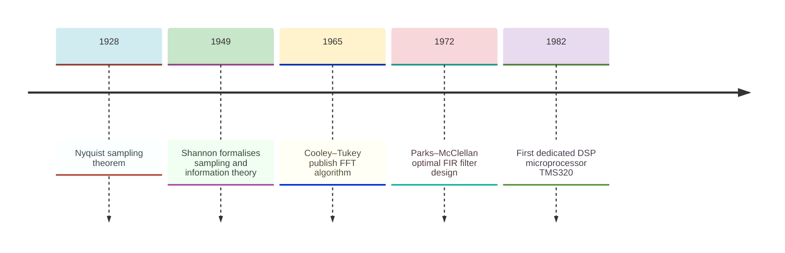
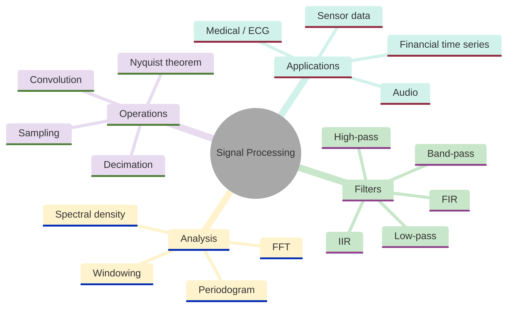
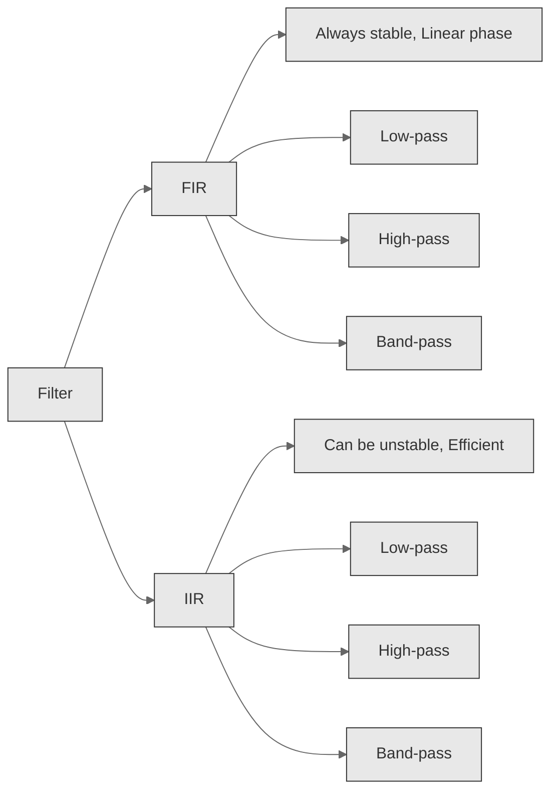
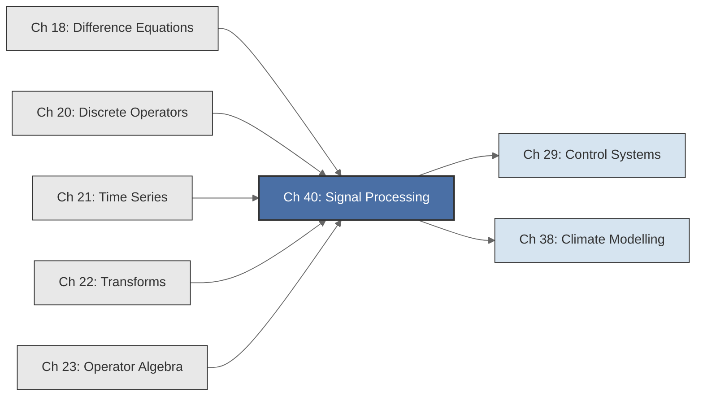

<!-- Copyright (c) 2025-2026 Bob Jansen <bobjansen@pm.me> -->
<!-- SPDX-License-Identifier: CC-BY-NC-4.0 -->
<!-- See LICENSE for full terms. Commercial licensing available. -->

# Chapter 40: Signal Processing & Digital Filtering


**Part IX**: Applications

> A discrete-time signal is a sequence of numbers indexed by time; signal processing transforms such sequences via convolution, difference equations and the discrete Fourier transform. This chapter develops finite impulse response and infinite impulse response filtering, frequency response analysis, spectral estimation, fast convolution and noise removal.

**Prerequisites**: [Chapter 18](18-difference-equations.md) (Difference Equations); linear recurrences, characteristic roots and stability via eigenvalues inside the unit circle. [Chapter 20](20-discrete-operators.md) (Discrete Operators); the shift operator $L$, the difference operator $\Delta = 1 - L$ and discrete convolution. [Chapter 21](21-time-series.md) (Time Series); exponential smoothing and autoregressive moving average models as discrete filters. [Chapter 22](22-transforms.md) (Transforms); the discrete Fourier transform, fast Fourier transform (FFT), convolution theorem, periodogram and spectral analysis.

**Learning Objectives**: After this chapter, the reader will be able to:

1. Model discrete-time signals as sequences and apply FIR filters via direct convolution.
2. Design and implement IIR filters as difference equations and analyse their stability via pole locations.
3. Compute the frequency response of a digital filter using the FFT and interpret magnitude and phase spectra.
4. Apply fast convolution via the FFT to achieve $O(N \log N)$ filtering.
5. Perform spectral analysis with windowing to reduce spectral leakage.
6. Implement noise removal by frequency-domain thresholding.
7. State and apply the Nyquist–Shannon sampling theorem to determine aliasing conditions.
8. Express filter specifications in decibels and design simple low-pass, high-pass and band-pass filters.

**Connections**: This chapter synthesises [Chapter 18](18-difference-equations.md) (IIR filters ARE difference equations; stability requires poles inside the unit circle), [Chapter 20](20-discrete-operators.md) (FIR filters ARE discrete convolution; the shift operator defines filter delays) and [Chapter 22](22-transforms.md) (the FFT computes frequency responses and enables fast convolution). It connects forward to [Chapter 29](29-control-systems.md) (Control Systems; transfer functions and frequency-domain design) and [Chapter 38](38-climate-modeling.md) (Climate Modelling; spectral analysis of oscillations). It builds on the operator perspective of [Chapter 23](23-operator-algebra.md) (a filter is a polynomial or rational function of the shift operator $L$).

---

## Historical Context

**Key Dates in Signal Processing**



*Figure 40.1: Timeline of key developments in signal processing from sampling theory to dedicated hardware.*

**The sampling theorem (1928–1949).** Harry Nyquist (1928), Vladimir Kotelnikov (1933) and Claude Shannon (1949) independently established that a bandlimited continuous signal is perfectly determined by samples taken at twice the maximum frequency. Shannon's "Communication in the Presence of Noise" placed sampling on information-theoretic foundations and showed that digital representation loses nothing when the sampling rate exceeds the Nyquist rate. Discrete-time processing became theoretically equivalent to continuous-time processing for bandlimited signals.

**Analogue filter theory and the digital transition (1930s–1965).** Analogue filter design drew on the work of Stephen Butterworth (1930), Wilhelm Cauer (1931) and Pafnuty Chebyshev (whose polynomial approximation theory from the 1850s was applied to filter magnitude responses). The transition to digital implementations began after Cooley and Tukey published the FFT algorithm in 1965. Charles Rader and Bernard Gold at MIT Lincoln Laboratory showed in the late 1960s that digital filters, implemented as difference equations, could match or exceed analogue circuit performance. Alan Oppenheim and Ronald Schafer's *Discrete-Time Signal Processing* (1975, third edition 2010) established the mathematical framework the field uses today.

**FIR and IIR filter classes (1972).** FIR and IIR filters form the two fundamental classes of digital filter, distinguished by the presence of feedback. FIR filters compute each output sample as a weighted sum of current and past input samples. They are inherently stable and can achieve exactly linear phase. The Parks–McClellan algorithm (1972), based on Chebyshev equiripple approximation, remains the standard tool for FIR design. IIR filters incorporate feedback from past output samples, achieving sharper selectivity with fewer coefficients. Their poles must lie strictly inside the unit circle for stability.

**Dedicated DSP hardware (1980s).** Digital signal processing microprocessors brought real-time digital filtering into consumer devices in that decade: the Texas Instruments TMS320 (1982) and the Motorola 56000 (1986). Applications included modems, compact discs, cellular telephones and hearing aids. Software-defined radio, audio codecs (MP3, AAC, Opus) and machine learning pipelines all rely on the same mathematical core: signals are sequences, filters are operators on sequences and the FFT provides efficient access to the frequency domain.

---

## Why This Chapter Matters

**Signal Processing**



*Figure 40.2: Overview of signal processing showing filter types, analysis methods, operations and applications.*

Every phone call, every music stream, every medical monitor and every radar return passes through the filters and transforms in this chapter. The moving average that smooths a noisy sensor reading, the IIR filter that removes powerline interference from an electrocardiogram (ECG) and the FFT that decomposes an audio signal into frequency components are running code executing billions of times per second.

An FIR filter is a convolution ([Chapter 20](20-discrete-operators.md)). An IIR filter is a difference equation ([Chapter 18](18-difference-equations.md)). The frequency response is a DFT of the impulse response ([Chapter 22](22-transforms.md)). The convolution theorem reduces $O(NM)$ filtering to $O(N \log N)$. These are three views of one algebraic structure: the ring of formal power series in the shift operator $L$.

Audio engineers use FIR convolution to apply room impulse responses. Communications engineers design band-pass filters to isolate carrier signals. Biomedical engineers apply notch filters to remove 50/60 Hz interference. Financial analysts use moving averages and exponential smoothing to extract trends from noisy data. In each case the practitioner must understand the tradeoff between filter length and frequency selectivity, the stability implications of IIR pole placement and the spectral leakage that windowing mitigates.

---

## Notation & Conventions

| Symbol | Meaning |
|--------|---------|
| $x[n]$ | Discrete-time signal: the value at sample index $n$ |
| $y[n]$ | Filter output signal |
| $h[n]$ | Impulse response of a filter |
| $N$ | Signal length (number of samples) |
| $M$ | Filter order (number of delay taps) |
| $b_k$ | Feedforward (FIR) coefficients, $k = 0, 1, \ldots, M$ |
| $a_k$ | Feedback (IIR) coefficients, $k = 1, 2, \ldots, P$ |
| $P$ | Feedback (IIR) filter order (number of poles) |
| $L$ | Lag (shift) operator: $Lx[n] = x[n-1]$ |
| $\Delta$ | Difference operator: $\Delta = 1 - L$ |
| $H(\omega)$ | Frequency response: $H(\omega) = \sum_k h[k] \, e^{-i\omega k}$ |
| $\lvert H(\omega) \rvert$ | Magnitude response |
| $\angle H(\omega)$ | Phase response: $\arg(H(\omega))$ |
| $\omega$ | Normalised angular frequency, $\omega \in [0, 2\pi)$ |
| $f_s$ | Sampling frequency (samples per second) |
| $f_{\text{Nyquist}}$ | Nyquist frequency: $f_s / 2$ |
| $X[k]$ | DFT coefficient at bin $k$ |
| $P[k]$ | Periodogram: $\lvert X[k] \rvert^2 / N$ |
| $w[n]$ | Window function |
| $*$ | Discrete convolution: $(x * h)[n] = \sum_k x[k] \, h[n-k]$ |
| $\text{dB}$ | Decibels: $20\log_{10}\lvert H(\omega) \rvert$ |
| $\delta[n]$ | Unit impulse: $\delta[0] = 1$, $\delta[n] = 0$ for $n \neq 0$ |

Signals are real-valued unless stated otherwise. The notation $x[n]$ (square brackets) follows signal processing convention and distinguishes signal samples from sequence subscripts in [Chapter 18](18-difference-equations.md) and [Chapter 20](20-discrete-operators.md). The shift operator $L$ is identical to that of [Chapter 20](20-discrete-operators.md): $Lx[n] = x[n-1]$.

---

## Core Theory

### Discrete-Time Signals

**Definition 40.1** (Discrete-time signal). A *discrete-time signal* is a function $x: \mathbb{Z} \to \mathbb{R}$ that assigns a real value $x[n]$ to each integer time index $n$. A *finite-length signal* is one for which $x[n] = 0$ for all $n$ outside a finite set $\{0, 1, \ldots, N-1\}$.

Discrete-time signals arise from sampling a continuous-time signal $x_c(t)$ at uniform intervals $\Delta t = 1/f_s$: the sample $x[n] = x_c(n \Delta t)$. In practice, a finite-length signal is represented as an array of $N$ real values.

**Definition 40.2** (Unit impulse and unit step). The *unit impulse* (Kronecker delta) is:

$$\delta[n] = \begin{cases} 1 & n = 0, \\ 0 & n \neq 0. \end{cases}$$

The *unit step* is $u[n] = 1$ for $n \geq 0$ and $u[n] = 0$ for $n < 0$. These signals are test inputs for characterising linear systems.

### FIR Filters

**Definition 40.3** (FIR filter). A *Finite Impulse Response* filter of order $M$ maps an input signal $x[n]$ to an output signal $y[n]$ by the relation:

$$y[n] = \sum_{k=0}^{M} b_k \, x[n-k] = b_0 x[n] + b_1 x[n-1] + \cdots + b_M x[n-M].$$

The coefficients $b_0, b_1, \ldots, b_M$ are the *filter taps*. The output at each time $n$ is a weighted sum of the current input sample and the $M$ most recent past samples.

**Theorem 40.4** (FIR filtering is convolution). The FIR filter output $y[n] = \sum_{k=0}^{M} b_k \, x[n-k]$ is identical to the discrete convolution $(b * x)[n]$, where the impulse response $h[n] = b_n$ for $n = 0, 1, \ldots, M$ and $h[n] = 0$ otherwise.

??? note "Proof"

    *Proof.* By definition ([Chapter 20](20-discrete-operators.md)), the discrete convolution is

    $$(h * x)[n] = \sum_{k=-\infty}^{\infty} h[k]\,x[n-k].$$

    Since $h[k] = 0$ for $k < 0$ and $k > M$, all terms outside $0 \leq k \leq M$ vanish. The sum reduces to

    $$\sum_{k=0}^{M} h[k]\,x[n-k] = \sum_{k=0}^{M} b_k\,x[n-k] = y[n].$$

    $\square$

**Remark 40.5**. This theorem is the conceptual link between [Chapter 20](20-discrete-operators.md) (convolution as an algebraic operation on sequences) and signal processing (filtering). Designing a filter means choosing the convolution kernel $h[n]$. Applying a filter means computing a convolution.

**Theorem 40.6** (FIR filters are always stable). An FIR filter with finite coefficients $b_0, \ldots, b_M$ is BIBO (Bounded-Input Bounded-Output) stable: if the input satisfies $\lvert x[n]\rvert \leq B$ for all $n$, then the output satisfies $\lvert y[n]\rvert \leq B \sum_{k=0}^{M} \lvert b_k\rvert$ for all $n$.

??? note "Proof"

    *Proof.* By the triangle inequality: $\lvert y[n]\rvert = \left\lvert\sum_{k=0}^{M} b_k x[n-k]\right\rvert \leq \sum_{k=0}^{M} \lvert b_k\rvert \cdot \lvert x[n-k]\rvert \leq B \sum_{k=0}^{M} \lvert b_k\rvert$. The bound is finite since the sum contains finitely many terms. $\square$

**Example 40.7** (Moving average filter). The simplest FIR low-pass filter is the *moving average* of length $M$:

$$y[n] = \frac{1}{M} \sum_{k=0}^{M-1} x[n-k].$$

The coefficients are $b_k = 1/M$ for $k = 0, \ldots, M-1$. This filter smooths the input by averaging $M$ consecutive samples, attenuating high-frequency fluctuations while preserving the signal's low-frequency trend.

**Example 40.8** (First-difference filter). The *first difference* $y[n] = x[n] - x[n-1]$ is an FIR filter of order $M = 1$ with $b_0 = 1$, $b_1 = -1$. In operator notation ([Chapter 20](20-discrete-operators.md)), this is $y = \Delta x = (1 - L)x$. It acts as a high-pass filter: it passes rapid changes while removing constant or slowly varying components.

### IIR Filters

**Definition 40.9** (IIR filter). An *Infinite Impulse Response* filter maps input to output via the recursive relation:

$$y[n] = \sum_{k=0}^{M} b_k \, x[n-k] - \sum_{k=1}^{P} a_k \, y[n-k].$$

The first sum is the feedforward (FIR) part. The second sum introduces feedback from past output values. This is precisely a linear constant-coefficient difference equation ([Chapter 18](18-difference-equations.md)) driven by the input signal $x[n]$.

**Remark 40.10**. The connection to [Chapter 18](18-difference-equations.md) is exact. Writing the IIR filter equation as:

$$y[n] + a_1 y[n-1] + \cdots + a_P y[n-P] = b_0 x[n] + b_1 x[n-1] + \cdots + b_M x[n-M],$$

the left side is the homogeneous part (a $P$th-order linear recurrence in $y$) and the right side is the driving term. In operator notation:

$$(1 + a_1 L + a_2 L^2 + \cdots + a_P L^P) y[n] = (b_0 + b_1 L + \cdots + b_M L^M) x[n],$$

which is a rational function of the shift operator: $y = \frac{B(L)}{A(L)} x$, where $A(L) = 1 + a_1 L + \cdots + a_P L^P$ and $B(L) = b_0 + b_1 L + \cdots + b_M L^M$.

**Theorem 40.11** (IIR stability criterion). The IIR filter defined by the feedback polynomial $A(z) = 1 + a_1 z^{-1} + \cdots + a_P z^{-P}$ is BIBO stable if and only if all roots (poles) of the characteristic polynomial lie strictly inside the unit circle: $\lvert z_k\rvert < 1$ for $k = 1, \ldots, P$. Equivalently, multiplying $A(z)$ through by $z^P$, the characteristic polynomial is $z^P + a_1 z^{P-1} + \cdots + a_P$; its roots are the poles.

??? note "Proof"

    *Proof.* The impulse response $h[n]$ satisfies the homogeneous recurrence

    $$h[n] + a_1 h[n-1] + \cdots + a_P h[n-P] = 0, \qquad n > M.$$

    By the theory of linear difference equations ([Chapter 18](18-difference-equations.md), Theorem 18.5), assuming distinct roots $z_1, \ldots, z_P$, the general solution is

    $$h[n] = \sum_{k=1}^{P} c_k\, z_k^n.$$

    BIBO stability requires $\sum_{n=0}^{\infty} \lvert h[n]\rvert < \infty$. Since $\lvert z_k^n\rvert = \lvert z_k\rvert^n$, each term decays geometrically if and only if $\lvert z_k\rvert < 1$. The sum therefore converges if and only if all poles satisfy $\lvert z_k\rvert < 1$. $\square$

**Example 40.12** (First-order IIR low-pass). The simplest IIR filter is the first-order recursion:

$$y[n] = (1-\alpha) x[n] + \alpha \, y[n-1], \qquad 0 < \alpha < 1.$$

This is the exponential smoothing filter ([Chapter 21](21-time-series.md)). It has one pole at $z = \alpha$, which lies inside the unit circle when $\lvert\alpha\rvert < 1$, guaranteeing stability. Larger $\alpha$ produces heavier smoothing (lower cutoff frequency).

### Frequency Response

**Low-Pass Filter Frequency Response**

```mermaid
---
config:
  theme: base
  themeVariables:
    xyChart:
      plotColorPalette: "#2563eb, #dc2626, #16a34a, #9333ea, #ca8a04, #0891b2"
      backgroundColor: "#ffffff"
      titleColor: "#333333"
      xAxisLabelColor: "#333333"
      yAxisLabelColor: "#333333"
      xAxisTitleColor: "#333333"
      yAxisTitleColor: "#333333"
      xAxisLineColor: "#333333"
      yAxisLineColor: "#333333"
---
xychart-beta
    x-axis "Normalised Frequency f" [0, 0.1, 0.2, 0.3, 0.4, 0.5]
    y-axis "|H(f)|" 0 --> 1.1
    line [1.0, 0.95, 0.7, 0.3, 0.1, 0.02]
```

*Figure 40.3: Magnitude response of a low-pass filter attenuating high frequencies.*

**Definition 40.13** (Frequency response). The *frequency response* $H(\omega)$ of a linear time-invariant discrete-time system with impulse response $h[n]$ is the Discrete-Time Fourier Transform (DTFT) of $h[n]$:

$$H(\omega) = \sum_{n=-\infty}^{\infty} h[n] \, e^{-i\omega n}.$$

For a causal FIR filter of order $M$: $H(\omega) = \sum_{k=0}^{M} b_k \, e^{-i\omega k}$.

The *magnitude response* $\lvert H(\omega)\rvert$ gives the gain at each frequency. The *phase response* $\angle H(\omega) = \arg(H(\omega))$ gives the phase shift at each frequency.

**Theorem 40.14** (Frequency response via DFT of impulse response). For a finite impulse response $h[0], h[1], \ldots, h[M]$, the frequency response evaluated at the $N$ uniformly-spaced frequencies $\omega_k = 2\pi k / N$ (for $k = 0, 1, \ldots, N-1$, with $N > M$) is given by the $N$-point DFT of the zero-padded impulse response:

$$H(\omega_k) = H[k] = \text{DFT}_N\{h[0], h[1], \ldots, h[M], 0, \ldots, 0\}_k.$$

??? note "Proof"

    *Proof.* Define the zero-padded sequence $\tilde{h}[n] = h[n]$ for $0 \leq n \leq M$ and $\tilde{h}[n] = 0$ for $M < n < N$.

    The $N$-point DFT of this sequence is

    $$\sum_{n=0}^{N-1} \tilde{h}[n]\, e^{-2\pi i kn/N} = \sum_{n=0}^{M} h[n]\, e^{-i\omega_k n},$$

    since the zero-padded terms vanish.

    Identifying $\omega_k = 2\pi k / N$, the right-hand side is precisely the DTFT $H(\omega)$ evaluated at $\omega = \omega_k$. $\square$

**Remark 40.15**. This result makes the FFT ([Chapter 22](22-transforms.md)) the practical tool for computing frequency responses. Zero-pad the impulse response to a large power-of-two length, apply the FFT. The output directly gives the frequency response on a fine grid. The magnitude response is $\lvert H[k]\rvert = \sqrt{\operatorname{Re}(H[k])^2 + \operatorname{Im}(H[k])^2}$, and the phase is $\angle H[k] = \operatorname{atan2}(\operatorname{Im}(H[k]), \operatorname{Re}(H[k]))$.

**Definition 40.16** (Decibels). The magnitude response in *decibels* (dB) is:

$$\lvert H(\omega)\rvert_{\text{dB}} = 20 \log_{10} \lvert H(\omega)\rvert.$$

A gain of $\lvert H\rvert = 1$ corresponds to $0$ dB (no attenuation). A gain of $\lvert H\rvert = 0.5$ corresponds to $\approx -6$ dB. A gain of $\lvert H\rvert = 0.01$ corresponds to $-40$ dB. The $-3$ dB point (where $\lvert H\rvert = 1/\sqrt{2} \approx 0.707$) defines the conventional cutoff frequency of a filter.

**FIR and IIR Filter Taxonomy**



*Figure 40.4: Taxonomy of FIR and IIR filters with their properties and frequency-band variants.*

### Filter Types

**Definition 40.17** (Low-pass, high-pass, band-pass). Filters are classified by which frequency bands they pass (gain $\approx 1$) and which they reject (gain $\approx 0$):

- *Low-pass*: passes frequencies below a cutoff $\omega_c$, rejects above. Smooths the signal.
- *High-pass*: passes frequencies above $\omega_c$, rejects below. Detects edges and rapid changes.
- *Band-pass*: passes frequencies in a band $[\omega_1, \omega_2]$, rejects outside. Isolates a specific frequency range.

**Theorem 40.18** (Moving average frequency response). The magnitude response of the length-$M$ moving average filter ($b_k = 1/M$ for $k = 0, \ldots, M-1$) is:

$$\lvert H(\omega)\rvert = \frac{1}{M} \left\lvert \frac{\sin(M\omega/2)}{\sin(\omega/2)} \right\rvert.$$

This is a sinc-like function that equals $1$ at $\omega = 0$ (the direct-current (DC) component passes through unchanged) and has nulls at $\omega = 2\pi m / M$ for integer $m \neq 0$. The first null is at $\omega = 2\pi / M$, so longer averages have narrower passbands; they smooth more aggressively.

??? note "Proof"

    *Proof.* The frequency response is a geometric sum:

    $$H(\omega) = \frac{1}{M}\sum_{k=0}^{M-1} e^{-i\omega k} = \frac{1}{M} \cdot \frac{1 - e^{-iM\omega}}{1 - e^{-i\omega}}.$$

    To compute the magnitude, factor $e^{-iM\omega/2}$ from the numerator and $e^{-i\omega/2}$ from the denominator:

    $$\frac{1 - e^{-iM\omega}}{1 - e^{-i\omega}} = \frac{e^{-iM\omega/2}\left(e^{iM\omega/2} - e^{-iM\omega/2}\right)}{e^{-i\omega/2}\left(e^{i\omega/2} - e^{-i\omega/2}\right)} = \frac{e^{-i(M-1)\omega/2} \cdot 2i\sin(M\omega/2)}{2i\sin(\omega/2)}.$$

    Taking magnitudes:

    $$\lvert H(\omega)\rvert = \frac{1}{M} \cdot \frac{\lvert\sin(M\omega/2)\rvert}{\lvert\sin(\omega/2)\rvert}.$$

    $\square$

**Theorem 40.19** (First-difference frequency response). The first-difference filter $y[n] = x[n] - x[n-1]$ has frequency response:

$$H(\omega) = 1 - e^{-i\omega} = 2i\sin(\omega/2) \, e^{-i\omega/2}.$$

The magnitude response is $\lvert H(\omega)\rvert = 2\lvert\sin(\omega/2)\rvert$, which equals $0$ at $\omega = 0$ (DC is rejected) and reaches a maximum of $2$ at $\omega = \pi$ (the Nyquist frequency). This confirms that the first difference is a high-pass filter.

??? note "Proof"

    *Proof.* By direct substitution of the taps $b_0 = 1$, $b_1 = -1$:

    $$H(\omega) = b_0 + b_1 e^{-i\omega} = 1 - e^{-i\omega}.$$

    Factor out $e^{-i\omega/2}$:

    $$H(\omega) = e^{-i\omega/2}\!\left(e^{i\omega/2} - e^{-i\omega/2}\right) = e^{-i\omega/2} \cdot 2i\sin\!\left(\frac{\omega}{2}\right).$$

    Since $\lvert e^{-i\omega/2}\rvert = 1$:

    $$\lvert H(\omega)\rvert = 2\left\lvert\sin\!\left(\frac{\omega}{2}\right)\right\rvert.$$

    $\square$

### The Convolution Theorem and Fast Filtering

**Theorem 40.20** (Convolution theorem for filtering). Let $x[n]$ be a signal of length $N_x$ and $h[n]$ be a filter impulse response of length $N_h$. Their linear convolution $y = x * h$ has length $N_x + N_h - 1$. It can be computed in $O(L \log L)$ operations (where $L \geq N_x + N_h - 1$ is the FFT length) via:

1. Zero-pad both $x$ and $h$ to length $L$ (a power of two).
2. Compute $X = \text{FFT}(x)$ and $H = \text{FFT}(h)$.
3. Form the pointwise product $Y[k] = X[k] \cdot H[k]$ for $k = 0, \ldots, L-1$.
4. Compute $y = \text{IFFT}(Y)$ (inverse fast Fourier transform) and take the first $N_x + N_h - 1$ samples.

??? note "Proof"

    *Proof.* By Theorem 22.3(c) of [Chapter 22](22-transforms.md), circular convolution in the time domain equals pointwise multiplication in the DFT domain. Zero-padding to length $L \geq N_x + N_h - 1$ ensures that the circular convolution of the padded sequences equals their linear convolution ([Chapter 22](22-transforms.md), Section 7). The FFT computes each transform in $O(L \log L)$, the pointwise product is $O(L)$ and the IFFT is $O(L \log L)$. Total: $O(L \log L)$, versus $O(N_x N_h)$ for direct convolution. $\square$

**Remark 40.21**. For a signal of length $N = 10^6$ and a filter of length $M = 10^3$, direct convolution requires $\sim 10^9$ multiplications. Fast convolution via FFT requires $\sim 3 \times 10^6 \cdot 20 \approx 6 \times 10^7$; a speedup of roughly $15\times$. The advantage grows with $M$.

### Spectral Analysis and Windowing

**Theorem 40.22** (Periodogram). The power spectral density of a signal $x[n]$ of length $N$ is estimated by the *periodogram*:

$$P[k] = \frac{\lvert X[k]\rvert^2}{N}, \qquad k = 0, 1, \ldots, N-1,$$

where $X[k]$ is the DFT of $x[n]$. By Parseval's theorem ([Chapter 22](22-transforms.md)), $\sum_{k=0}^{N-1} P[k] = \sum_{n=0}^{N-1} \lvert x[n]\rvert^2$.

**Definition 40.23** (Window function). A *window function* $w[n]$, $n = 0, 1, \ldots, N-1$, tapers the signal smoothly to zero at both ends before DFT computation. The *windowed periodogram* is:

$$P_w[k] = \frac{\lvert W[k]\rvert^2}{S}, \qquad W[k] = \text{DFT}\{w[n] \cdot x[n]\}, \qquad S = \sum_{n=0}^{N-1} w[n]^2.$$

The normalisation by $S$ ensures that the windowed periodogram preserves total energy.

**Definition 40.24** (Hann window). The Hann window is:

$$w[n] = \frac{1}{2}\left(1 - \cos\!\left(\frac{2\pi n}{N-1}\right)\right), \qquad n = 0, 1, \ldots, N-1.$$

It reduces spectral leakage by approximately 31 dB relative to the rectangular window (no windowing), at the cost of widening the main lobe by a factor of two.

### Noise Removal via Frequency-Domain Thresholding

**Definition 40.25** (Spectral thresholding). Given a noisy signal $x[n] = s[n] + \eta[n]$ where $s[n]$ is the signal of interest and $\eta[n]$ is broadband noise, *spectral thresholding* proceeds as:

1. Compute $X[k] = \text{DFT}\{x[n]\}$.
2. Set $\hat{X}[k] = X[k]$ if $\lvert X[k]\rvert > T$ and $\hat{X}[k] = 0$ otherwise, for a threshold $T$.
3. Recover the denoised signal: $\hat{s}[n] = \text{IDFT}\{\hat{X}[k]\}$ (inverse discrete Fourier transform).

The rationale is that the signal concentrates its energy in a few frequency bins while noise spreads uniformly across all bins. Zeroing out low-magnitude bins eliminates noise while preserving signal components.

**Spectral Noise Removal Pipeline**


*Figure 40.5: Pipeline for removing noise from a signal using FFT-based spectral thresholding.*

### Sampling Theorem

**Definition 40.26** (Nyquist rate and aliasing). The *Nyquist rate* for a signal bandlimited to $f_{\max}$ Hz is $2f_{\max}$, the minimum sampling frequency required to avoid information loss. When a signal is sampled below the Nyquist rate ($f_s \leq 2f_{\max}$), frequency components above $f_s/2$ are *aliased*: they fold back into the representable frequency range and become indistinguishable from genuine lower-frequency content.

**Theorem 40.27** (Nyquist–Shannon sampling theorem). A continuous-time signal $x_c(t)$ bandlimited to $f_{\max}$ Hz (its Fourier transform vanishes for $\lvert f\rvert > f_{\max}$) is uniquely determined by its samples $x[n] = x_c(n/f_s)$ if and only if the sampling frequency satisfies $f_s > 2 f_{\max}$.

??? note "Proof"

    *Proof (sketch).* Sampling $x_c(t)$ at rate $f_s$ multiplies the signal by a Dirac comb $\sum_{n} \delta(t - n/f_s)$. In the frequency domain this convolves the spectrum $\hat{x}_c(f)$ with the Fourier transform of the comb, which is itself a comb of spacing $f_s$. The sampled spectrum is therefore the periodised sum

    $$\hat{x}_s(f) = f_s \sum_{k=-\infty}^{\infty} \hat{x}_c(f - k f_s).$$

    When $f_s > 2f_{\max}$, the shifted copies of $\hat{x}_c$ do not overlap, so $\hat{x}_c(f)$ is recoverable for $\lvert f\rvert \leq f_s/2$ by applying an ideal low-pass filter. Reconstruction follows from the Whittaker–Shannon interpolation formula:

    $$x_c(t) = \sum_{n=-\infty}^{\infty} x[n]\,\operatorname{sinc}\!\left(f_s t - n\right),$$

    where $\operatorname{sinc}(u) = \sin(\pi u)/(\pi u)$. This identity is a consequence of the Poisson summation formula applied to the bandlimited spectrum. When $f_s \leq 2f_{\max}$, the shifted copies overlap (alias), and distinct continuous signals produce identical samples. $\square$

!!! abstract "Key Result"

    **Theorem 40.27** (Nyquist--Shannon sampling theorem). A bandlimited signal is perfectly recoverable from its samples if and only if the sampling rate exceeds twice the maximum frequency; this theorem justifies the entire framework of digital signal processing.

**Remark 40.28**. The sampling theorem justifies the entire enterprise of digital signal processing. It guarantees that no information is lost in the sampling process, provided the sampling rate is sufficiently high. In practice, an analogue anti-aliasing filter (a low-pass filter) is applied before sampling to ensure the input signal is bandlimited.

!!! warning "Aliasing is irreversible"
    Once a signal has been sampled below the Nyquist rate, the aliased frequency components are indistinguishable from genuine low-frequency content. No amount of post-sampling filtering can separate them. The anti-aliasing filter must be applied in the analogue domain before the analogue-to-digital converter.

---

## Formulas & Identities

**F40.1** FIR output.

$$y[n] = \sum_{k=0}^{M} b_k \, x[n-k] = (b * x)[n].$$

**F40.2** IIR output.

$$y[n] = \sum_{k=0}^{M} b_k \, x[n-k] - \sum_{k=1}^{P} a_k \, y[n-k].$$

**F40.3** Frequency response (FIR).

$$H(\omega) = \sum_{k=0}^{M} b_k \, e^{-i\omega k}.$$

**F40.4** Frequency response (IIR).

$$H(\omega) = \frac{\sum_{k=0}^{M} b_k \, e^{-i\omega k}}{1 + \sum_{k=1}^{P} a_k \, e^{-i\omega k}}.$$

**F40.5** Magnitude in dB.

$$\lvert H\rvert_{\text{dB}} = 20 \log_{10} \lvert H(\omega)\rvert.$$

!!! info "Decibel reference points"
    $0$ dB corresponds to unit gain ($\lvert H\rvert = 1$). Each factor of 10 in magnitude adds $20$ dB. The conventional $-3$ dB cutoff corresponds to $\lvert H\rvert = 1/\sqrt{2} \approx 0.707$, the half-power point.

**F40.6** Moving average magnitude.

$$\lvert H(\omega)\rvert = \frac{1}{M} \left\lvert\frac{\sin(M\omega/2)}{\sin(\omega/2)}\right\rvert.$$

**F40.7** First difference magnitude.

$$\lvert H(\omega)\rvert = 2\lvert\sin(\omega/2)\rvert.$$

**F40.8** Convolution theorem.

$$\operatorname{DFT}\{x * h\} = \operatorname{DFT}\{x\} \cdot \operatorname{DFT}\{h\}.$$

**F40.9** Periodogram.

$$P[k] = \frac{\lvert X[k]\rvert^2}{N}.$$

**F40.10** Hann window.

$$w[n] = \frac{1}{2}\left(1 - \cos\!\left(\frac{2\pi n}{N-1}\right)\right).$$

**F40.11** Nyquist condition (no aliasing).

$$f_s > 2 f_{\max}.$$

**F40.12** Frequency resolution.

$$\Delta f = \frac{f_s}{N}.$$

---

## Algorithms

### Algorithm 40.29: FIR Filtering (Direct Convolution)

**Input**: Signal $x[0..N_x-1]$, filter coefficients $b[0..M]$
**Output**: Filtered signal $y[0..N_x-1]$ (causal output, assuming $x[n] = 0$ for $n < 0$)

```
function firFilter(x, b, Nx, M):
    // Direct convolution of signal x with FIR coefficients b
    for n = 0 to Nx - 1:
        y[n] = 0
        for k = 0 to M:
            if n - k >= 0:
                y[n] = y[n] + b[k] * x[n - k]
    return y
```

**Complexity**: $O(N_x \cdot M)$ multiplications and additions.

### Algorithm 40.30: IIR Filtering (Difference Equation)

**Input**: Signal $x[0..N_x-1]$, feedforward coefficients $b[0..M]$, feedback coefficients $a[1..P]$
**Output**: Filtered signal $y[0..N_x-1]$

```
function iirFilter(x, b, a, Nx, M, P):
    // Recursive filtering with feedforward and feedback
    for n = 0 to Nx - 1:
        y[n] = 0
        // Feedforward (FIR) part
        for k = 0 to M:
            if n - k >= 0:
                y[n] = y[n] + b[k] * x[n - k]
        // Feedback (IIR) part
        for k = 1 to P:
            if n - k >= 0:
                y[n] = y[n] - a[k] * y[n - k]
    return y
```

**Complexity**: $O(N_x \cdot (M + P))$ per sample.

**Stability**: The algorithm is numerically stable when all poles of $A(z)$ lie inside the unit circle. If poles approach the unit circle ($\lvert z_k\rvert \to 1$), the recursion becomes sensitive to rounding errors ([Chapter 18](18-difference-equations.md), stability analysis).

### Algorithm 40.31: Fast Convolution via FFT

**Input**: Signal $x[0..N_x-1]$, filter $h[0..N_h-1]$
**Output**: Convolution $y[0..N_x+N_h-2]$

```
function fastConvolution(x, h, Nx, Nh):
    // Convolution via FFT: O(L log L) instead of O(Nx * Nh)
    L = nextPowerOfTwo(Nx + Nh - 1)
    x_padded = zeroPad(x, L)
    h_padded = zeroPad(h, L)
    X = FFT(x_padded)
    H = FFT(h_padded)
    for k = 0 to L - 1:
        Y[k] = X[k] * H[k]              // complex multiplication
    y = IFFT(Y)
    return y[0..Nx + Nh - 2]
```

**Complexity**: $O(L \log L)$ where $L \geq N_x + N_h - 1$.

!!! tip "Choosing the FFT length"
    The FFT length $L$ must satisfy $L \geq N_x + N_h - 1$ to avoid circular convolution artefacts. Rounding $L$ up to the next power of two gives the fastest radix-2 FFT. Over-padding beyond the next power of two wastes memory without improving accuracy.

### Algorithm 40.32: Frequency Response Computation

**Input**: Filter impulse response $h[0..M]$, desired number of frequency points $N_{\text{fft}}$
**Output**: Magnitude response and phase response at $N_{\text{fft}}$ uniformly-spaced frequencies

```
function frequencyResponse(h, M, N_fft):
    // Compute magnitude and phase response via FFT
    h_padded = zeroPad(h, N_fft)
    H = FFT(h_padded)
    for k = 0 to N_fft - 1:
        magnitude[k] = sqrt(H[k].re^2 + H[k].im^2)
        phase[k] = atan2(H[k].im, H[k].re)
        magnitude_dB[k] = 20 * log10(magnitude[k] + epsilon)
    return magnitude, phase, magnitude_dB
```

**Complexity**: $O(N_{\text{fft}} \log N_{\text{fft}})$ for the FFT, $O(N_{\text{fft}})$ for magnitude/phase.

### Algorithm 40.33: Spectral Noise Removal

**Input**: Noisy signal $x[0..N-1]$, threshold $T$
**Output**: Denoised signal $\hat{s}[0..N-1]$

```
function spectralDenoise(x, N, T):
    // Remove noise by zeroing DFT bins below threshold T
    X = FFT(x)                        // N must be power of two
    for k = 0 to N - 1:
        magnitude = sqrt(X[k].re^2 + X[k].im^2)
        if magnitude < T:
            X[k].re = 0
            X[k].im = 0
    s_hat = IFFT(X)
    return Re(s_hat)                   // take real part
```

**Complexity**: $O(N \log N)$.

---

## Numerical Considerations

### Floating-Point Accumulation in FIR Filters

Algorithm 40.29 computes $y[n] = \sum_{k=0}^{M} b_k x[n-k]$ via direct convolution. With large $M$ this accumulates rounding errors. Each multiplication introduces relative error bounded by machine epsilon $\varepsilon \approx 2.2 \times 10^{-16}$. The accumulated error is bounded by

$$(M+1)\,\varepsilon \cdot \max_k \lvert b_k\, x[n-k]\rvert.$$

For typical filter lengths ($M \leq 1000$) this remains well below observable error. For very long filters, Kahan compensated summation reduces the bound to $O(\varepsilon)$ regardless of $M$.

### IIR Stability and Coefficient Quantisation

IIR filters (Algorithm 40.30) are sensitive to coefficient quantisation. Poles close to the unit circle (narrow-band filters) are vulnerable. Small perturbations in $a_k$ can shift poles outside the circle, causing instability. The condition number grows as $O(\lvert z_k\rvert^P / (1 - \lvert z_k\rvert))$. The standard remedy is to factor the transfer function into second-order sections (biquads), each with at most two poles. This limits the sensitivity of any single section.

!!! warning "IIR pole migration under quantisation"
    Rounding feedback coefficients to fewer bits shifts the poles of the characteristic polynomial. For a high-order filter implemented in direct form, a single-bit change in $a_k$ can push a pole outside the unit circle. Always implement IIR filters of order $P > 2$ as cascaded second-order (biquad) sections.

### FFT Precision for Fast Convolution

Algorithm 40.31 uses the FFT, which introduces $O(\varepsilon \sqrt{N \log N})$ relative error ([Chapter 22](22-transforms.md), Section 7). For fast convolution of a signal of length $N = 2^{20} \approx 10^6$, the relative error is approximately $\varepsilon \cdot \sqrt{20 \cdot 2^{20}} \approx 10^{-13}$, well within acceptable bounds for double-precision computation.

### Edge Effects in Finite Signals

Filtering a finite-length signal produces edge artefacts where the filter reaches beyond the available data. Three conventions exist: zero-extension ($x[n] = 0$ for $n < 0$ and $n \geq N$), periodic extension and symmetric extension. The implementation uses zero-extension by default. This suits causal real-time filtering but introduces transient effects in the first $M$ output samples.

### Frequency Response Precision

Algorithm 40.32 evaluates the transfer function $H(e^{i\omega})$ at discrete frequencies. Near zeros of the denominator polynomial (close to the unit circle), the response magnitude is large and sensitive to coefficient errors. The relative error in $|H(e^{i\omega})|$ near a pole at angle $\omega_p$ is approximately $\varepsilon / (1 - |z_p|)$, where $|z_p|$ is the pole radius. For a pole at $|z_p| = 0.999$ the amplification factor is 1000, still yielding approximately 13-digit accuracy in double precision.

---

## Worked Examples

### Example 40.34: Moving Average Filter on Noisy Data

**Problem**: A sensor produces a signal $x[n] = 2 + 0.5\sin(2\pi \cdot n/20) + \eta[n]$ where $\eta[n]$ is noise. Apply a 5-point moving average to smooth the signal.

**Solution**: The 5-point moving average has coefficients $b = [1/5, 1/5, 1/5, 1/5, 1/5]$. The output is:

$$y[n] = \frac{1}{5}(x[n] + x[n-1] + x[n-2] + x[n-3] + x[n-4]).$$

The filter attenuates frequencies above its first null at $\omega = 2\pi/5$. The signal's sinusoidal component at frequency $\omega_0 = 2\pi/20 = \pi/10$ is well below this null, so it passes with gain:

$$\lvert H(\omega_0)\rvert = \frac{1}{5} \cdot \frac{\lvert\sin(5\pi/20)\rvert}{\lvert\sin(\pi/20)\rvert} = \frac{1}{5} \cdot \frac{\sin(\pi/4)}{\sin(\pi/20)} \approx \frac{0.707}{5 \cdot 0.156} \approx 0.906.$$

The sinusoidal component is attenuated by about 9%, while noise (spread across all frequencies) is reduced by a factor of approximately $1/\sqrt{5} \approx 0.447$ in root mean square amplitude.

### Example 40.35: Frequency Response of a Simple Filter

**Problem**: Compute and interpret the frequency response of the first-difference filter $y[n] = x[n] - x[n-1]$.

**Solution**: The impulse response is $h = [1, -1]$. Zero-pad to $N = 64$ and compute the DFT:

$$H[k] = \text{DFT}_{64}\{1, -1, 0, 0, \ldots, 0\}_k = 1 - e^{-2\pi i k / 64}.$$

The magnitude response is

$$\lvert H[k]\rvert = 2\left\lvert\sin\!\left(\frac{\pi k}{64}\right)\right\rvert,$$

which is $0$ at $k = 0$ (the direct-current component) and reaches a maximum of $2$ at $k = 32$ (the Nyquist frequency $\omega = \pi$).

### Example 40.36: Fast Convolution via FFT

**Problem**: Convolve a signal $x$ of length 1000 with a filter $h$ of length 50 using the FFT and verify the result matches direct convolution.

**Solution**: The linear convolution has length $1000 + 50 - 1 = 1049$. The next power of two is $L = 2048$. Zero-pad both sequences to length $2048$, compute their FFTs, multiply pointwise and apply the IFFT. The first $1049$ samples of the result are the linear convolution.

Direct convolution requires $1000 \times 50 = 50{,}000$ multiplications. Fast convolution via FFT requires $3 \times 2048 \times \log_2(2048) \approx 3 \times 2048 \times 11 \approx 67{,}584$ operations (three transforms plus the pointwise product). For this filter length the costs are comparable; the FFT advantage becomes decisive for longer filters.

### Example 40.37: Noise Removal from a Sinusoidal Signal

**Problem**: A clean signal $s[n] = 3\cos(2\pi \cdot 5n / 128) + \cos(2\pi \cdot 12n / 128)$ is corrupted by additive white noise $\eta[n]$ with standard deviation $\sigma = 2$. Recover $s[n]$ by frequency-domain thresholding.

**Solution**: The DFT of the clean signal has energy concentrated at bins $k = 5$ and $k = 12$ (and their conjugate mirrors at $k = 123$ and $k = 116$). The noise spreads its energy uniformly across all 128 bins. With $N = 128$ and signal amplitude $A = 3$, the signal's DFT magnitude at bin 5 is approximately $AN/2 = 192$. The noise's expected magnitude per bin is approximately $\sigma\sqrt{N} \approx 22.6$. A threshold $T = 50$ separates signal from noise with high probability.

### Example 40.38: Designing a Band-Pass Filter

**Problem**: Design an FIR band-pass filter that passes frequencies in the normalised band $[\omega_1, \omega_2] = [0.2\pi, 0.4\pi]$ and rejects all others. Use the frequency-sampling method.

**Solution**: The ideal band-pass frequency response is $H(\omega) = 1$ for $\omega_1 \leq \lvert\omega\rvert \leq \omega_2$ and $H(\omega) = 0$ otherwise. The impulse response is obtained via the inverse DFT. For a filter of length $M + 1$:

1. Define the desired response on $N$ frequency points: $H_d[k] = 1$ for bins in the passband, $0$ elsewhere.
2. Compute the IDFT to obtain $h[n]$.
3. Apply a window (Hann) to smooth the transition bands and reduce sidelobes.

With $N = 64$: the passband corresponds to bins $k$ where $0.2\pi \leq 2\pi k/64 \leq 0.4\pi$, i.e., $6.4 \leq k \leq 12.8$, so $k = 7, 8, 9, 10, 11, 12$ (and the conjugate mirror bins $k = 52, \ldots, 57$).

---

## Connections

**Chapter Dependencies**



*Figure 40.6: Chapter dependencies showing how difference equations, operators, time series and transforms feed into signal processing.*

### Within This Book

- **[Chapter 18](18-difference-equations.md) (Difference Equations)**: IIR filters are linear constant-coefficient difference equations. The stability criterion (poles inside the unit circle) is Theorem 18.5 applied to the filter's feedback polynomial. Every result on homogeneous and particular solutions from [Chapter 18](18-difference-equations.md) applies directly to IIR filter analysis.

- **[Chapter 20](20-discrete-operators.md) (Discrete Operators)**: FIR filtering IS convolution (Theorem 40.4). The shift operator $L$ from [Chapter 20](20-discrete-operators.md) is the one-sample delay in signal processing. The difference operator $\Delta = 1 - L$ is the first-difference high-pass filter. Every FIR filter is a polynomial in $L$: $H(L) = b_0 + b_1 L + \cdots + b_M L^M$.

- **[Chapter 22](22-transforms.md) (Transforms)**: The FFT provides efficient frequency response computation (Theorem 40.14), fast convolution (Theorem 40.20), spectral analysis (Theorem 40.22) and noise removal (Definition 40.25). The convolution theorem ([Chapter 22](22-transforms.md), Theorem 22.3(c)) is the mathematical basis of fast filtering.

- **[Chapter 23](23-operator-algebra.md) (Operator Algebra)**: A filter is a polynomial (FIR) or rational function (IIR) of the shift operator, living in the operator ring developed in [Chapter 23](23-operator-algebra.md). Filter cascading is operator composition; parallel filters sum.

- **[Chapter 21](21-time-series.md) (Time Series)**: Autoregressive moving average models are IIR filters driven by white noise. The moving average part is FIR; the autoregressive part introduces feedback. Spectral analysis of time series (periodogram, power spectral density) uses identical tools.

- **[Chapter 29](29-control-systems.md) (Control Systems)**: Transfer functions and frequency-domain design in control theory build on the filter representation and frequency response analysis developed in this chapter.

- **[Chapter 38](38-climate-modeling.md) (Climate Modelling)**: Spectral analysis of climate oscillations (e.g. the El Nino–Southern Oscillation and the North Atlantic Oscillation) applies the FFT and periodogram methods from this chapter to identify dominant periodicities in climate time series.

### Applications

- **Audio processing**: Equalisation via band-pass filters, echo and reverb via FIR convolution with an impulse response, noise reduction via spectral thresholding.
- **Communications**: Channel equalisation, matched filtering, carrier recovery via band-pass filtering.
- **Biomedical engineering**: ECG and electroencephalogram filtering to remove powerline interference (50/60 Hz notch filter), heart rate extraction via band-pass.
- **Seismology**: Detection of earthquake signals by filtering out ocean noise and human activity.
- **Finance**: Moving average crossover strategies, noise removal from tick data and spectral analysis of market cycles.

---

## Summary

- FIR filters compute output by convolving the input sequence with a finite set of coefficients; IIR filters use feedback (difference equations) and require all poles inside the unit circle for stability.
- The FFT computes the frequency response of a digital filter and enables fast convolution in $O(N \log N)$ operations.
- Windowing reduces spectral leakage in spectral analysis by tapering the signal before applying the FFT.
- The Nyquist–Shannon sampling theorem states that a band-limited signal sampled above twice its highest frequency can be perfectly reconstructed; sampling below this rate causes aliasing.
- Low-pass, high-pass and band-pass filters are specified by cutoff frequencies and attenuation in decibels; their design translates frequency-domain requirements into filter coefficients.

---

## Exercises

### Routine

**Exercise 40.1.** Compute the output of the 3-point moving average filter ($b = [1/3, 1/3, 1/3]$) applied to the signal $x = [1, 4, 2, 5, 3, 6, 2, 4]$. Verify by direct calculation that $y[2] = (x[2] + x[1] + x[0])/3 = (2 + 4 + 1)/3 = 7/3$.

**Exercise 40.2.** An IIR filter is defined by $y[n] = 0.5 x[n] + 0.8 y[n-1]$. Determine the pole location. Is the filter stable? Compute the first 5 output samples when $x[n] = \delta[n]$ (unit impulse) and $y[-1] = 0$.

**Exercise 40.3.** Compute the magnitude response $\lvert H(\omega)\rvert$ of the filter $h = [1, 2, 1]$ at $\omega = 0$, $\omega = \pi/2$ and $\omega = \pi$. Classify this filter as low-pass, high-pass or band-pass.

### Intermediate

**Exercise 40.4.** Prove that the cascade (series connection) of two FIR filters with impulse responses $h_1[n]$ and $h_2[n]$ is equivalent to a single FIR filter with impulse response $h[n] = (h_1 * h_2)[n]$. What is the order of the cascaded filter if $h_1$ has order $M_1$ and $h_2$ has order $M_2$?

**Exercise 40.5.** A signal of length $N = 256$ is sampled at $f_s = 8000$ Hz. It contains a pure tone at $440$ Hz and noise. Determine which DFT bin $k$ corresponds to $440$ Hz. Design a noise removal procedure: compute the DFT, zero all bins except $k$ and $N - k$ and apply the IDFT. State the procedure formally and describe the implementation in pseudocode.

**Exercise 40.6.** Show that the first-difference filter $y[n] = x[n] - x[n-1]$ followed by the running sum filter $y[n] = y[n] + y[n-1] + y[n-2] + \cdots$ (accumulator) recovers the original signal (up to initial conditions). Interpret this as the discrete analogue of differentiation followed by integration.

### Challenging

**Exercise 40.7.** Derive the frequency response of the IIR filter $y[n] = (1-\alpha)x[n] + \alpha y[n-1]$ (first-order low-pass, $0 < \alpha < 1$). Show that $\lvert H(\omega)\rvert^2 = \frac{(1-\alpha)^2}{1 - 2\alpha\cos\omega + \alpha^2}$. Determine the $-3$ dB cutoff frequency $\omega_c$ as a function of $\alpha$. Verify that $\omega_c \to 0$ as $\alpha \to 1$ (heavier smoothing lowers the cutoff).

**Exercise 40.8.** Implement the overlap-add method for filtering a long signal $x$ of length $N \gg M$ with a short filter $h$ of length $M$: partition $x$ into blocks of length $B$, convolve each block with $h$ via FFT (block length $B + M - 1$) and sum the overlapping portions. Show that the total operation count is $O(N \log(B+M) \cdot (B+M)/B)$ and determine the optimal block size $B$ that minimises total cost.

---

## References

### Textbooks

[1] Haykin, S. and Van Veen, B. *Signals and Systems*, 2nd ed. Wiley, 2003. A more accessible introduction covering both continuous-time and discrete-time systems, with extensive examples from communications, control and audio processing.

[2] Oppenheim, A. V. and Schafer, R. W. *Digital Signal Processing*. Prentice-Hall, 1975. The first edition that codified the field; all core algorithms in this chapter appeared here. Third edition published as *Discrete-Time Signal Processing*, Pearson, 2010, remains the standard reference.

[3] Proakis, J. G. and Manolakis, D. G. *Digital Signal Processing: Principles, Algorithms, and Applications*, 4th ed. Pearson, 2007. A thorough treatment with emphasis on algorithms and implementation, including detailed coverage of FFT-based convolution and filter design methods.

[4] Smith, S. W. *The Scientist and Engineer's Guide to Digital Signal Processing*, 2nd ed. California Technical Publishing, 1999. Available free online at www.dspguide.com. A practical introduction with minimal mathematical prerequisites. Chapters 14–19 cover filter design.

### Historical

[5] Cooley, J. W. and Tukey, J. W. "An Algorithm for the Machine Calculation of Complex Fourier Series." *Mathematics of Computation* 19.90 (1965): 297–301. Presents the radix-2 decimation-in-time algorithm that reduces the DFT from $O(N^2)$ to $O(N \log N)$.

[6] Parks, T. W. and McClellan, J. H. "Chebyshev Approximation for Nonrecursive Digital Filters with Linear Phase." *IEEE Transactions on Circuit Theory* CT-19.2 (1972): 189–194. Presents optimal equiripple FIR filter design using the Remez exchange algorithm. This remains the standard method for FIR design when specific magnitude specifications must be met.

[7] Shannon, C. E. "Communication in the Presence of Noise." *Proceedings of the IRE* 37.1 (1949): 10–21. Rigorous statement and proof of the sampling theorem.

[8] Nyquist, H. "Certain Topics in Telegraph Transmission Theory." *Transactions of the AIEE* 47.2 (1928): 617–644. Establishes bandwidth requirements for distortionless signal transmission and identifies the sampling rate $2W$ for a signal of bandwidth $W$.

[9] Kotelnikov, V. A. "On the Transmission Capacity of the 'Ether' and Wire in Electrocommunications." *Proceedings of the First All-Union Conference on the Technological Reconstruction of the Communications Sector*. Moscow, 1933. Independent statement of the sampling theorem; predates Shannon's 1949 publication.

[10] Butterworth, S. "On the Theory of Filter Amplifiers." *Wireless Engineer* 7.6 (1930): 536–541. Introduces maximally flat magnitude response filters.

[11] Cauer, W. "Die Verwirklichung von Wechselstromwiderständen vorgeschriebener Frequenzabhängigkeit." *Archiv für Elektrotechnik* 25.12 (1931): 817–824. Introduces elliptic (Cauer) filters achieving equiripple behaviour in both passband and stopband.

### Online Resources

[12] DSPGuide.com. Complete text of Smith's book [4], with interactive examples and supplementary material.
[13] Smith, J. O. III. *Mathematics of the Discrete Fourier Transform (DFT)*. CCRMA, Stanford University. Available at ccrma.stanford.edu/~jos/mdft/. Connects the DFT to signal processing applications with mathematical rigour.

---

## Glossary

- **Aliased**: Said of a frequency component that appears, due to sampling below the Nyquist rate, as a spurious lower-frequency component indistinguishable from genuine content.
- **Band-pass filter**: A filter that passes frequencies within a specified band and rejects frequencies outside it.
- **BIBO stability**: Bounded-Input Bounded-Output stability; a system is BIBO stable if every bounded input produces a bounded output.
- **Cutoff frequency**: The frequency at which the filter's magnitude response falls to $-3$ dB ($1/\sqrt{2} \approx 0.707$) of its maximum.
- **Decibel (dB)**: A logarithmic unit for expressing magnitude ratios; $20\log_{10}\lvert H\rvert$.
- **Discrete-time signal**: A function $x: \mathbb{Z} \to \mathbb{R}$ assigning a real value to each integer time index.
- **FIR filter**: Finite Impulse Response filter; output depends only on current and past inputs, not on past outputs. Always stable.
- **First difference**: The FIR high-pass filter $y[n] = x[n] - x[n-1]$, equivalent to the operator $\Delta = 1 - L$.
- **Frequency response**: The complex-valued function $H(\omega)$ giving the filter's gain and phase shift at each frequency.
- **Hann window**: The window function $w[n] = \tfrac{1}{2}(1 - \cos(2\pi n/(N-1)))$ used to reduce spectral leakage before DFT computation.
- **High-pass filter**: A filter that passes high frequencies and rejects low frequencies.
- **IIR filter**: Infinite Impulse Response filter; output depends on past outputs (feedback). May be unstable.
- **Impulse response**: The output $h[n]$ of a filter when the input is the unit impulse $\delta[n]$; fully characterises a linear time-invariant system.
- **Low-pass filter**: A filter that passes low frequencies and rejects high frequencies; smooths the signal.
- **Moving average**: An FIR low-pass filter computing the arithmetic mean of the $M$ most recent input samples: $y[n] = (1/M)\sum_{k=0}^{M-1} x[n-k]$.
- **Nyquist frequency**: Half the sampling frequency; the highest frequency that can be represented without aliasing.
- **Nyquist rate**: The minimum sampling frequency $2f_{\max}$ required to perfectly reconstruct a bandlimited signal; sampling below this rate causes aliasing.
- **Periodogram**: An estimate of the power spectral density computed as $\lvert X[k]\rvert^2 / N$.
- **Pole**: A root of the denominator polynomial of an IIR filter's transfer function; determines stability.
- **Spectral leakage**: The spreading of frequency energy into adjacent bins caused by finite-length observation (non-integer periods in the DFT window).
- **Spectral thresholding**: A denoising method that zeroes DFT bins with magnitude below a threshold and recovers the signal via the inverse transform.
- **Window function**: A tapering function applied to a signal before DFT computation to reduce spectral leakage.

---

