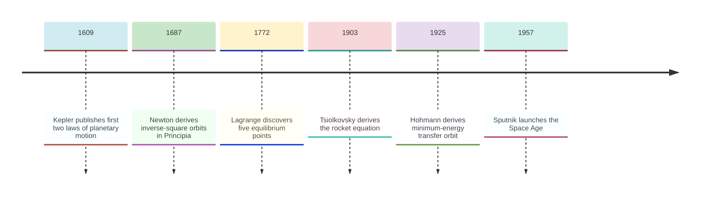
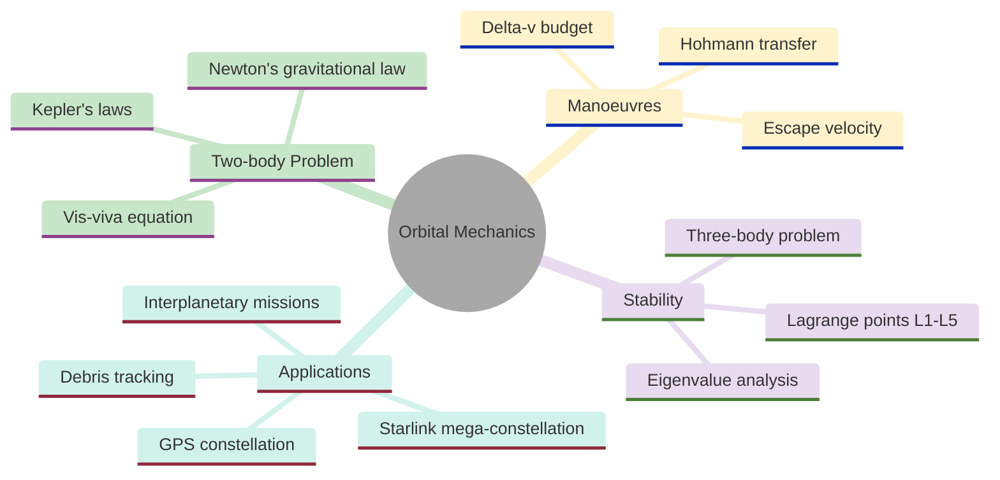
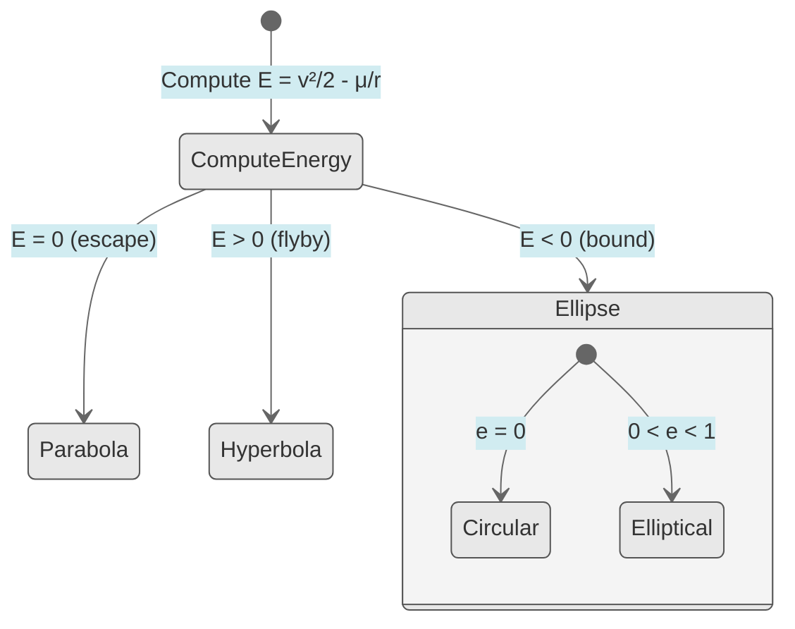
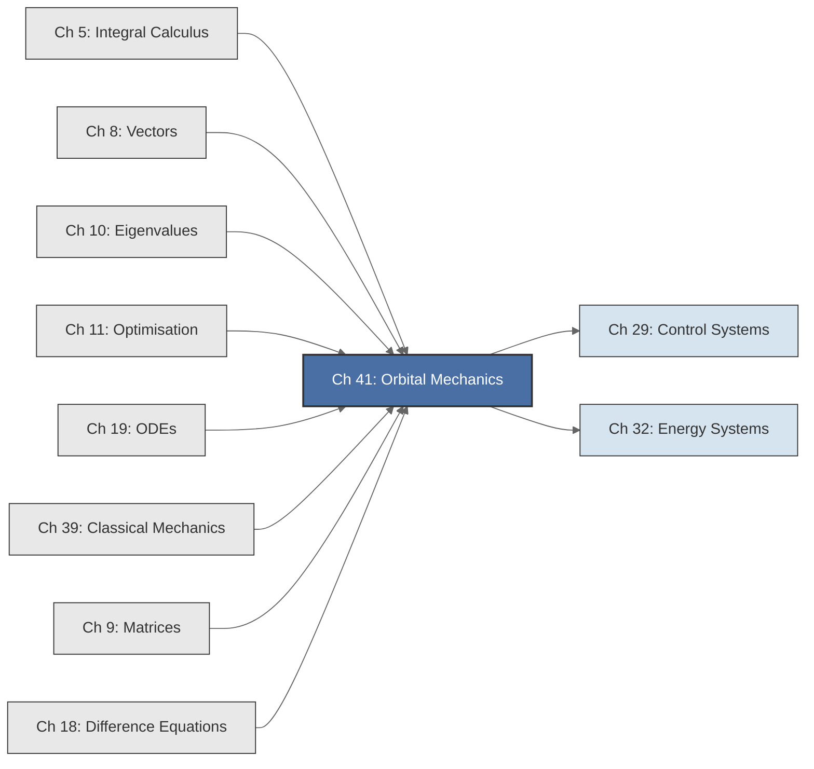

<!-- Copyright (c) 2025-2026 Bob Jansen <bobjansen@pm.me> -->
<!-- SPDX-License-Identifier: CC-BY-NC-4.0 -->
<!-- See LICENSE for full terms. Commercial licensing available. -->

# Chapter 41: Orbital Mechanics & Celestial Dynamics

**Part IX**: Applications

> Newton's gravitational ordinary differential equation (ODE) $\ddot{\mathbf{r}} = -\mu\mathbf{r}/|\mathbf{r}|^3$ generates conic-section orbits; this chapter integrates it numerically, verifies conservation laws, computes Hohmann transfers and locates Lagrange points.

**Prerequisites**: [Chapter 5](05-integral-calculus.md) (Integral Calculus); energy integrals, work done by gravitational force, derivation of the vis-viva equation from conservation of energy. [Chapter 8](08-vectors.md) (Vectors); position and velocity vectors, cross products for angular momentum, dot products for radial velocity. [Chapter 11](11-unconstrained-optimization.md) (Unconstrained Optimisation); minimisation of delta-v in transfer orbit design, gradient-based search for optimal trajectories. [Chapter 19](19-odes.md) (Ordinary Differential Equations); conversion of second-order equations to first-order systems, the fourth-order Runge–Kutta (RK4) method for numerical integration, error control and step-size selection.

**Learning Objectives**: After this chapter, the reader will be able to:

1. Formulate Newton's gravitational two-body problem as a system of first-order ODEs and integrate it numerically via RK4.
2. Verify conservation of energy and angular momentum as numerical invariants of the integrated trajectory.
3. Classify orbits by their total mechanical energy (elliptical, parabolic, hyperbolic) and compute orbital elements from state vectors.
4. Derive and apply the vis-viva equation to compute orbital velocities at arbitrary radii.
5. Design Hohmann transfer orbits between circular orbits and compute the required delta-v budget.
6. Locate the collinear Lagrange points of the restricted three-body problem using numerical root-finding.
7. Analyse the stability of Lagrange points via eigenvalue analysis of the linearised equations of motion.
8. Simulate orbital decay under atmospheric drag by augmenting the gravitational ODE with a dissipative force term.

**Connections**: This chapter synthesises [Chapter 5](05-integral-calculus.md) (energy conservation provides the vis-viva equation and classifies orbit types), [Chapter 8](08-vectors.md) (vector cross products define angular momentum, whose constancy confines orbits to a plane), [Chapter 9](09-matrices.md) (state transition matrices and coordinate transformations use rotation matrices), [Chapter 10](10-eigenvalues.md) (eigenvalues of the linearised three-body problem determine Lagrange point stability), [Chapter 11](11-unconstrained-optimization.md) (Hohmann transfer optimisation minimises total delta-v), [Chapter 18](18-difference-equations.md) (discrete orbit propagation and Kepler's equation involve fixed-point iteration) and [Chapter 19](19-odes.md) (RK4 integrates the equations of motion). It extends [Chapter 39](39-mechanics-waves.md) (Classical Physics; Newton's second law as an ODE, the Kepler problem introduced qualitatively) to a full computational treatment. It connects forward to control systems ([Chapter 29](29-control-systems.md), orbit station-keeping) and energy systems ([Chapter 32](32-energy-systems.md), satellite power budgets).

---

## Historical Context

**Key Dates in Orbital Mechanics**



*Figure 41.1: Timeline of key milestones in orbital mechanics from Kepler to the Space Age.*

**Kepler's laws of planetary motion (1609–1619).** Johannes Kepler published his first two laws in *Astronomia Nova* (1609), working from Tycho Brahe's observational data. The first law states that planets move in ellipses with the Sun at one focus. The second states that the line from Sun to planet sweeps equal areas in equal times. Kepler's third law, in *Harmonices Mundi* (1619), relates orbital period to semi-major axis: $T^2 \propto a^3$. All three laws were empirical; Kepler had no dynamical explanation.

**Newton's inverse-square gravitational law (1687).** Isaac Newton provided the dynamical foundation in the *Principia Mathematica*, showing that all three Kepler laws follow from a single hypothesis: every pair of masses attracts with a force proportional to the product of their masses and inversely proportional to the square of their separation. Newton proved that inverse-square attraction produces conic-section orbits, that the equal-area law is equivalent to constancy of angular momentum and that $T^2 \propto a^3$ follows from dimensional analysis of the gravitational constant.

**Euler's perturbation methods and Lagrange's equilibrium points (1740s–1772).** Leonhard Euler extended Newton's methods to perturbed orbits in the 1740s–1760s, developing variation of parameters for orbital elements. He treated orbital elements as slowly varying functions of time. His work on the three-body problem established that no closed-form solution exists in general. Joseph-Louis Lagrange discovered the five equilibrium points of the restricted three-body problem in 1772. The triangular points $L_4$ and $L_5$ are stable for sufficiently large mass ratios; the collinear points $L_1$, $L_2$, $L_3$ are unstable. The Trojan asteroids, found at Jupiter's $L_4$ and $L_5$ from 1906, confirmed Lagrange's prediction. The James Webb Space Telescope orbits the Sun–Earth $L_2$ point.

**Hohmann's minimum-energy transfer orbit (1925).** Walter Hohmann published *Die Erreichbarkeit der Himmelskörper*, establishing that the minimum-energy transfer between two coplanar circular orbits is a half-ellipse tangent to both. The Hohmann transfer, derived from the vis-viva equation, remains the foundation of interplanetary mission design.

**Tsiolkovsky's rocket equation (1903).** Konstantin Tsiolkovsky derived the rocket equation, connecting orbital mechanics to propulsion. His equation $\Delta v = v_e \ln(m_0/m_f)$ made the delta-v budget the central metric of spacecraft design. The modern era began with Sputnik (1957) and the Apollo programme (1961–1972). Apollo missions required precise computation of transfer orbits, mid-course corrections and lunar orbit insertion on early digital computers. Global Positioning System (GPS) satellites, SpaceX booster landings and the Starlink constellation of over 5,000 satellites all depend on $\ddot{\mathbf{r}} = -\mu\mathbf{r}/\lvert\mathbf{r}\rvert^3$ and its perturbations.

---

## Why This Chapter Matters

**Orbital Mechanics**



*Figure 41.2: Overview of orbital mechanics topics covered in this chapter.*

Every satellite launch, every planetary mission and every collision avoidance manoeuvre depends on solving Newton's gravitational ODE and computing delta-v budgets from the vis-viva equation. GPS navigation, communications satellites and Earth observation platforms all maintain orbits using the algorithms in this chapter. An error in Hohmann transfer calculation or Lagrange point stability analysis can mean the loss of a billion-euro spacecraft.

The `solveODE` function propagates orbits with fourth-order Runge–Kutta (RK4), producing trajectories verified against conservation of energy and angular momentum. The `hohmannTransfer` utility computes both burns and transfer time. Eigenvalue analysis of linearised dynamics at Lagrange points determines stability; the same computation justified placing the James Webb Space Telescope at Sun–Earth L2.

Over 30,000 tracked objects orbit Earth, and mega-constellations add thousands more. Conjunction assessment and debris avoidance require propagating thousands of orbits simultaneously, accounting for atmospheric drag, solar radiation pressure and Earth's oblateness. Low-thrust electric propulsion replaces impulsive Hohmann burns with continuous trajectory optimisation. The two-body problem, the restricted three-body problem and the perturbation framework provide the foundation for these modern challenges.

---

## Notation & Conventions

| Symbol | Meaning |
|--------|---------|
| $\mathbf{r}$ | Position vector from the central body to the orbiting body (m) |
| $\mathbf{v} = \dot{\mathbf{r}}$ | Velocity vector (m/s) |
| $r = \lvert\mathbf{r}\rvert$ | Orbital radius (distance from central body centre) (m) |
| $v = \lvert\mathbf{v}\rvert$ | Orbital speed (m/s) |
| $M$ | Mass of the central body (kg) |
| $m$ | Mass of the orbiting body (kg); $m \ll M$ in the two-body approximation |
| $G$ | Gravitational constant ($6.674 \times 10^{-11}$ $\text{N}\,\text{m}^2\,\text{kg}^{-2}$) |
| $\mu = GM$ | Standard gravitational parameter ($\text{m}^3\,\text{s}^{-2}$) |
| $E$ | Specific mechanical energy (energy per unit mass) (J/kg) |
| $\mathbf{L} = \mathbf{r} \times \mathbf{v}$ | Specific angular momentum vector ($\text{m}^2\,\text{s}^{-1}$) |
| $L = \lvert\mathbf{L}\rvert$ | Specific angular momentum magnitude ($\text{m}^2\,\text{s}^{-1}$) |
| $a$ | Semi-major axis of an elliptical orbit (m) |
| $e$ | Orbital eccentricity (dimensionless) |
| $T$ | Orbital period (s) |
| $r_p$ | Periapsis distance (closest approach) (m) |
| $r_a$ | Apoapsis distance (farthest point) (m) |
| $v_{\text{circ}}$ | Circular orbital velocity (m/s) |
| $v_{\text{esc}}$ | Escape velocity (m/s) |
| $\Delta v$ | Change in velocity (impulsive manoeuvre) (m/s) |
| $\hat{\mathbf{r}}$ | Unit vector in the radial direction: $\hat{\mathbf{r}} = \mathbf{r}/r$ |
| $\nu$ | Mass ratio in the restricted three-body problem: $\nu = M_2/(M_1 + M_2)$ (dimensionless) |

Dots denote time derivatives: $\dot{\mathbf{r}} = d\mathbf{r}/dt$. The gravitational parameter $\mu$ absorbs both $G$ and $M$. For Earth, $\mu_{\oplus} = 3.986 \times 10^{14}$ $\text{m}^3 \text{s}^{-2}$. For the Sun, $\mu_{\odot} = 1.327 \times 10^{20}$ $\text{m}^3 \text{s}^{-2}$. All vectors lie in the orbital plane unless otherwise stated. Specific quantities (per unit mass) are used throughout.

---

## Core Theory

### Newton's Law of Gravitation

**Definition 41.1** (Newton's gravitational force). Two point masses $M$ and $m$ separated by distance $r$ attract each other with force:

$$F = \frac{GMm}{r^2},$$

directed along the line joining them. In vector ([Chapter 8](08-vectors.md)) form, the force on mass $m$ due to mass $M$ (located at the origin) is:

$$\mathbf{F} = -\frac{GMm}{r^2}\hat{\mathbf{r}} = -\frac{GMm}{r^3}\mathbf{r}.$$

**Theorem 41.2** (Two-body equation of motion). For a body of mass $m$ orbiting a much more massive body $M$ (so that $M$ is approximately stationary), Newton's second law gives the vector ODE:

$$\ddot{\mathbf{r}} = -\frac{\mu}{r^3}\mathbf{r},$$

where $\mu = GM$ is the standard gravitational parameter.

??? note "Proof"

    *Proof.* Newton's second law states $m\ddot{\mathbf{r}} = \mathbf{F} = -GMm\mathbf{r}/r^3$.

    Dividing both sides by $m$ yields

    $$\ddot{\mathbf{r}} = -\frac{GM}{r^3}\mathbf{r} = -\frac{\mu}{r^3}\mathbf{r}.$$

    The mass $m$ cancels; all bodies hence fall at the same rate in a gravitational field, leaving a purely geometric equation. $\square$

**Theorem 41.3** (Reduction to first-order system). The second-order vector ODE $\ddot{\mathbf{r}} = -\mu\mathbf{r}/r^3$ is equivalent to the first-order system:

$$\dot{\mathbf{r}} = \mathbf{v}, \qquad \dot{\mathbf{v}} = -\frac{\mu}{\lvert\mathbf{r}\rvert^3}\mathbf{r},$$

with state vector $\mathbf{y} = (\mathbf{r}, \mathbf{v})^T$ and initial conditions $\mathbf{r}(0) = \mathbf{r}_0$, $\mathbf{v}(0) = \mathbf{v}_0$.

??? note "Proof"

    *Proof.* Define $\mathbf{v} := \dot{\mathbf{r}}$. Then $\dot{\mathbf{r}} = \mathbf{v}$ is the first equation.

    Differentiating:

    $$\dot{\mathbf{v}} = \ddot{\mathbf{r}} = -\frac{\mu}{\lvert\mathbf{r}\rvert^3}\mathbf{r},$$

    which is the second equation. The system is first-order, suitable for numerical integration via RK4 ([Chapter 19](19-odes.md)). $\square$

In two dimensions, the state vector has four components $(x, y, v_x, v_y)$; in three dimensions, six components $(x, y, z, v_x, v_y, v_z)$.

### Conservation Laws

**Theorem 41.4** (Conservation of angular momentum). For the two-body problem with a central force, the specific angular momentum $\mathbf{L} = \mathbf{r} \times \mathbf{v}$ is constant in time.

??? note "Proof"

    *Proof.* Differentiating $\mathbf{L} = \mathbf{r} \times \mathbf{v}$:

    $$\dot{\mathbf{L}} = \dot{\mathbf{r}} \times \mathbf{v} + \mathbf{r} \times \dot{\mathbf{v}}.$$

    The first term is $\mathbf{v} \times \mathbf{v} = \mathbf{0}$. Substituting $\dot{\mathbf{v}} = -\mu\mathbf{r}/r^3$ into the second term:

    $$\mathbf{r} \times \bigl(-\mu\mathbf{r}/r^3\bigr) = -(\mu/r^3)(\mathbf{r} \times \mathbf{r}) = \mathbf{0}.$$

    It follows that $\dot{\mathbf{L}} = \mathbf{0}$, so $\mathbf{L}$ is constant. $\square$

**Corollary 41.5** (Orbits are planar). Since $\mathbf{L} = \mathbf{r} \times \mathbf{v}$ is constant, both $\mathbf{r}$ and $\mathbf{v}$ are always perpendicular to the fixed vector $\mathbf{L}$. The motion is confined to the plane perpendicular to $\mathbf{L}$.

**Theorem 41.6** (Conservation of energy). The specific mechanical energy:

$$E = \frac{1}{2}v^2 - \frac{\mu}{r}$$

is constant along any orbit.

??? note "Proof"

    *Proof.* Differentiating $E = \frac{1}{2}v^2 - \mu/r$ with respect to time:

    $$\dot{E} = \mathbf{v} \cdot \dot{\mathbf{v}} + \frac{\mu}{r^2}\dot{r} = \mathbf{v} \cdot \left(-\frac{\mu}{r^3}\mathbf{r}\right) + \frac{\mu}{r^2}\dot{r}.$$

    Now $\dot{r} = d\lvert\mathbf{r}\rvert/dt = (\mathbf{r} \cdot \dot{\mathbf{r}})/r = (\mathbf{r} \cdot \mathbf{v})/r$. Substituting:

    $$\dot{E} = -\frac{\mu}{r^3}(\mathbf{r} \cdot \mathbf{v}) + \frac{\mu}{r^2} \cdot \frac{\mathbf{r} \cdot \mathbf{v}}{r} = -\frac{\mu(\mathbf{r} \cdot \mathbf{v})}{r^3} + \frac{\mu(\mathbf{r} \cdot \mathbf{v})}{r^3} = 0.$$

    The two terms cancel exactly, so $E$ is constant. $\square$

### Orbit Classification

**Theorem 41.7** (Orbit types from energy). The sign of the specific energy $E$ determines the orbit geometry:

1. $E < 0$: The orbit is an ellipse (or circle if $e = 0$). The body is gravitationally bound.
2. $E = 0$: The orbit is a parabola. The body has exactly escape energy.
3. $E > 0$: The orbit is a hyperbola. The body is unbound.

??? note "Proof"

    *Proof.* Start from the conserved specific energy $E = \frac{1}{2}v^2 - \mu/r$ and specific angular momentum $L = r^2\dot{\theta}$. Decompose the velocity as $v^2 = \dot{r}^2 + r^2\dot{\theta}^2$ and substitute $L = r^2\dot{\theta}$:

    $$E = \frac{1}{2}\!\left(\dot{r}^2 + \frac{L^2}{r^2}\right) - \frac{\mu}{r}.$$

    Introduce the substitution $u = 1/r$, so $r = 1/u$ and $\dot{r} = -(\dot{\theta}/u^2)(du/d\theta) = -L\,du/d\theta$ (using $\dot{\theta} = Lu^2$). Then $\dot{r}^2 = L^2(du/d\theta)^2$. Substituting into the energy equation:

    $$E = \frac{L^2}{2}\!\left[\left(\frac{du}{d\theta}\right)^2 + u^2\right] - \mu u.$$

    This is algebraically equivalent to the Binet equation. Complete the square by writing $w = u - \mu/L^2$:

    $$E = \frac{L^2}{2}\!\left[\left(\frac{dw}{d\theta}\right)^2 + w^2\right] - \frac{\mu^2}{2L^2}.$$

    Rearranging:

    $$\left(\frac{dw}{d\theta}\right)^2 + w^2 = \frac{2E}{L^2} + \frac{\mu^2}{L^4} = \frac{\mu^2}{L^4}\!\left(1 + \frac{2EL^2}{\mu^2}\right).$$

    Define $e = \sqrt{1 + 2EL^2/\mu^2}$ (real since the right-hand side is $\geq 0$ when $E \geq -\mu^2/(2L^2)$, which is always satisfied for physical orbits). Then $w = (\mu/L^2)e\cos(\theta - \theta_0)$ and therefore $u = \mu/L^2(1 + e\cos\theta)$ (choosing $\theta_0 = 0$), giving the orbit equation

    $$r(\theta) = \frac{L^2/\mu}{1 + e\cos\theta}.$$

    The sign of $E$ now determines the orbit type through $e$:

    - For $E < 0$: $2EL^2/\mu^2 \in (-1, 0)$, so $0 \leq e < 1$ (ellipse).
    - For $E = 0$: $e = 1$ (parabola).
    - For $E > 0$: $e > 1$ (hyperbola). $\square$

**Orbit Classification by Energy**



*Figure 41.3: Orbit classification by specific energy and eccentricity.*

### Kepler's Laws

**Theorem 41.8** (Kepler's first law). Under an inverse-square central force, the orbit is a conic section (ellipse, parabola or hyperbola) with the force centre at one focus.

??? note "Proof"

    *Proof.* By Theorem 41.7, the orbit equation is

    $$r(\theta) = \frac{L^2/\mu}{1 + e\cos\theta} = \frac{p}{1 + e\cos\theta},$$

    where $p = L^2/\mu$ is the semi-latus rectum. This is the standard polar form of a conic section with one focus at the origin.

    The conic type is determined by the eccentricity: $0 \leq e < 1$ gives an ellipse, $e = 1$ a parabola, $e > 1$ a hyperbola. In each case the gravitational centre (the origin) lies at one focus of the conic, confirming Kepler's first law. $\square$

**Theorem 41.9** (Kepler's second law). The radius vector sweeps equal areas in equal times: $dA/dt = L/2 = \text{const}$.

??? note "Proof"

    *Proof.* The area swept in time $dt$ is $dA = \frac{1}{2}r^2\,d\theta$. In polar coordinates, the angular momentum magnitude satisfies $L = r^2\dot{\theta}$ (since $\lvert\mathbf{r} \times \mathbf{v}\rvert = r \cdot v_{\perp} = r^2\dot{\theta}$). Therefore

    $$\frac{dA}{dt} = \frac{1}{2}r^2\dot{\theta} = \frac{L}{2}.$$

    Since $L$ is constant by Theorem 41.4, the areal velocity $dA/dt$ is constant. $\square$

**Theorem 41.10** (Kepler's third law). For an elliptical orbit with semi-major axis $a$, the period $T$ satisfies:

$$T^2 = \frac{4\pi^2}{\mu}a^3.$$

??? note "Proof"

    *Proof (for circular orbits).* For a circular orbit of radius $a$, the centripetal acceleration equals the gravitational acceleration: $v^2/a = \mu/a^2$, giving $v = \sqrt{\mu/a}$. The period is therefore

    $$T = \frac{2\pi a}{v} = \frac{2\pi a}{\sqrt{\mu/a}} = 2\pi\sqrt{\frac{a^3}{\mu}}.$$

    Squaring gives $T^2 = 4\pi^2 a^3/\mu$.

    The general proof for ellipses uses the total area $A = \pi ab$ (where $b = a\sqrt{1-e^2}$) and Kepler's second law:

    $$T = \frac{A}{dA/dt} = \frac{\pi ab}{L/2}.$$

    Using $L^2 = \mu p = \mu a(1-e^2)$ (derived from the orbit equation) and $b = a\sqrt{1-e^2}$, one obtains $L = \sqrt{\mu a(1-e^2)}$. Substituting:

    $$T = \frac{2\pi ab}{L} = \frac{2\pi a \cdot a\sqrt{1-e^2}}{\sqrt{\mu a(1-e^2)}} = 2\pi\sqrt{\frac{a^3}{\mu}},$$

    yielding the same result. $\square$

!!! abstract "Key Result"

    **Theorem 41.10** (Kepler's third law). The square of the orbital period is proportional to the cube of the semi-major axis, $T^2 = 4\pi^2 a^3/\mu$, linking geometry to dynamics and enabling determination of planetary masses from observed periods alone.

### Orbital Elements and the Vis-Viva Equation

**Definition 41.11** (Orbital elements). An elliptical orbit is characterised by:

- Semi-major axis $a$: half the longest diameter of the ellipse.
- Eccentricity $e$: measures the deviation from circularity ($0 \leq e < 1$ for ellipses).
- Periapsis: $r_p = a(1 - e)$ (closest approach).
- Apoapsis: $r_a = a(1 + e)$ (farthest point).

The semi-major axis relates to energy: $a = -\mu/(2E)$ (for $E < 0$).

**Theorem 41.12** (Vis-viva equation). At any point on an orbit with semi-major axis $a$, the speed $v$ at distance $r$ from the focus satisfies:

$$v^2 = \mu\left(\frac{2}{r} - \frac{1}{a}\right).$$

??? note "Proof"

    *Proof.* By energy conservation (Theorem 41.6), $E = \frac{1}{2}v^2 - \mu/r$. At periapsis, $r = r_p = a(1-e)$ and the velocity is purely tangential: $v_p = L/r_p$ (since $\mathbf{v} \perp \mathbf{r}$ at apsides). Substituting into the energy expression and using the orbit-equation relation $L^2 = \mu a(1-e^2)$ yields $E = \frac{1}{2}L^2/r_p^2 - \mu/r_p = -\mu/(2a)$. Substituting:

    $$\frac{1}{2}v^2 - \frac{\mu}{r} = -\frac{\mu}{2a}.$$

    Solving for $v^2$:

    $$v^2 = 2\left(\frac{\mu}{r} - \frac{\mu}{2a}\right) = \mu\left(\frac{2}{r} - \frac{1}{a}\right).$$

    This is the vis-viva equation. $\square$

### Circular and Escape Velocities

**Theorem 41.13** (Circular orbital velocity). The velocity for a circular orbit of radius $r$ is:

$$v_{\text{circ}} = \sqrt{\frac{\mu}{r}}.$$

??? note "Proof"

    *Proof.* For a circular orbit, $a = r$. Substituting into the vis-viva equation:

    $$v^2 = \mu\left(\frac{2}{r} - \frac{1}{r}\right) = \frac{\mu}{r}.$$

    The circular velocity is therefore $v_{\text{circ}} = \sqrt{\mu/r}$. $\square$

**Theorem 41.14** (Escape velocity). The minimum speed required to escape the gravitational field from distance $r$ is:

$$v_{\text{esc}} = \sqrt{\frac{2\mu}{r}} = v_{\text{circ}}\sqrt{2}.$$

**Orbital Velocity as a Function of Altitude**

```mermaid
---
config:
  theme: base
  themeVariables:
    xyChart:
      plotColorPalette: "#2563eb, #dc2626, #16a34a, #9333ea, #ca8a04, #0891b2"
      backgroundColor: "#ffffff"
      titleColor: "#333333"
      xAxisLabelColor: "#333333"
      yAxisLabelColor: "#333333"
      xAxisTitleColor: "#333333"
      yAxisTitleColor: "#333333"
      xAxisLineColor: "#333333"
      yAxisLineColor: "#333333"
---
xychart-beta
    x-axis "Altitude (km)" [200, 500, 1000, 2000, 5000, 10000, 35786]
    y-axis "v (km/s)" 0 --> 8.5
    line [7.79, 7.61, 7.35, 6.90, 5.92, 4.93, 3.07]
```

*Figure 41.4: Circular orbital velocity decreases with increasing altitude above Earth.*

??? note "Proof"

    *Proof.* Escape corresponds to $E = 0$ (a parabolic orbit; the body reaches infinity with zero velocity). Setting

    $$E = \frac{1}{2}v_{\text{esc}}^2 - \frac{\mu}{r} = 0$$

    and solving:

    $$v_{\text{esc}} = \sqrt{\frac{2\mu}{r}}.$$

    Comparing with $v_{\text{circ}} = \sqrt{\mu/r}$, the ratio is $v_{\text{esc}}/v_{\text{circ}} = \sqrt{2}$. $\square$

### Hohmann Transfer

**Hohmann Transfer Orbit Sequence**


*Figure 41.5: Sequence of burns in a Hohmann transfer between two circular orbits.*

**Definition 41.15** (Hohmann transfer orbit). The Hohmann transfer between two coplanar circular orbits of radii $r_1$ (inner) and $r_2$ (outer) is an elliptical orbit tangent to both circles, with periapsis $r_p = r_1$ and apoapsis $r_a = r_2$. The semi-major axis of the transfer ellipse is $a_t = (r_1 + r_2)/2$.

**Theorem 41.16** (Hohmann transfer delta-v). The velocity changes required for a Hohmann transfer are:

$$\Delta v_1 = \sqrt{\frac{\mu}{r_1}}\left(\sqrt{\frac{2r_2}{r_1 + r_2}} - 1\right),$$

$$\Delta v_2 = \sqrt{\frac{\mu}{r_2}}\left(1 - \sqrt{\frac{2r_1}{r_1 + r_2}}\right).$$

The total delta-v is $\Delta v = \Delta v_1 + \Delta v_2$.

??? note "Proof"

    *Proof.* The transfer ellipse has semi-major axis $a_t = (r_1 + r_2)/2$. By the vis-viva equation, the speed at periapsis ($r = r_1$) on the transfer ellipse is:

    $$v_{t1} = \sqrt{\mu\left(\frac{2}{r_1} - \frac{1}{a_t}\right)} = \sqrt{\mu\left(\frac{2}{r_1} - \frac{2}{r_1 + r_2}\right)} = \sqrt{\frac{2\mu r_2}{r_1(r_1 + r_2)}}.$$

    The circular velocity at $r_1$ is $v_{c1} = \sqrt{\mu/r_1}$. The first burn is therefore:

    $$\Delta v_1 = v_{t1} - v_{c1} = \sqrt{\frac{\mu}{r_1}}\left(\sqrt{\frac{2r_2}{r_1 + r_2}} - 1\right).$$

    By symmetry, the speed at apoapsis ($r = r_2$) on the transfer ellipse is:

    $$v_{t2} = \sqrt{\frac{2\mu r_1}{r_2(r_1 + r_2)}}.$$

    The circular velocity at $r_2$ is $v_{c2} = \sqrt{\mu/r_2}$. The second burn circularises the orbit:

    $$\Delta v_2 = v_{c2} - v_{t2} = \sqrt{\frac{\mu}{r_2}}\left(1 - \sqrt{\frac{2r_1}{r_1 + r_2}}\right).$$

    Both burns are tangential to the respective circular orbits. $\square$

**Theorem 41.17** (Transfer time). The time of flight for a Hohmann transfer is half the period of the transfer ellipse:

$$t_{\text{transfer}} = \frac{T_t}{2} = \pi\sqrt{\frac{a_t^3}{\mu}} = \pi\sqrt{\frac{(r_1 + r_2)^3}{8\mu}}.$$

??? note "Proof"

    *Proof.* By Kepler's third law (Theorem 41.10), the period of the transfer ellipse is $T_t = 2\pi\sqrt{a_t^3/\mu}$. The transfer traverses exactly half the ellipse, so

    $$t_{\text{transfer}} = \frac{T_t}{2} = \pi\sqrt{\frac{a_t^3}{\mu}}.$$

    Substituting $a_t = (r_1 + r_2)/2$ yields $t_{\text{transfer}} = \pi\sqrt{(r_1+r_2)^3/(8\mu)}$. $\square$

!!! tip "Hohmann optimality limit"

    The Hohmann transfer is optimal only when $r_2/r_1 < 11.94$. For larger orbit ratios, a bi-elliptic transfer (three burns) requires less total $\Delta v$ at the cost of longer transfer time.

**Remark 41.18** (Optimality). The Hohmann transfer minimises the total $\Delta v$ for a two-impulse coplanar transfer between circular orbits when $r_2/r_1 < 11.94$. For larger ratios, a bi-elliptic transfer (three burns) requires less total $\Delta v$, though more time. This is proved by comparing the Hohmann $\Delta v$ analytically against the bi-elliptic $\Delta v$; the comparison can also be approached via the optimisation framework of [Chapter 11](11-unconstrained-optimization.md). Among all two-burn transfer strategies, the Hohmann transfer is the global minimiser of $\Delta v_1 + \Delta v_2$.

### The Restricted Three-Body Problem

**Definition 41.19** (Circular restricted three-body problem). Two massive bodies $M_1$ and $M_2$ orbit their common centre of mass in circles. A test particle of negligible mass $m$ moves under the gravitational attraction of both. In the co-rotating frame (rotating at the orbital angular velocity $\omega$ of the two massive bodies), the equations of motion include gravitational and fictitious (Coriolis and centrifugal) terms. The mass ratio is $\nu = M_2/(M_1 + M_2)$.

**Theorem 41.20** (Lagrange points). The restricted three-body problem has exactly five equilibrium points in the co-rotating frame:

- $L_1$, $L_2$, $L_3$: collinear points lying on the line joining $M_1$ and $M_2$.
- $L_4$, $L_5$: triangular points forming equilateral triangles with $M_1$ and $M_2$.

The collinear points satisfy a quintic equation reducible to numerical root-finding. The triangular points exist at fixed angular positions regardless of the mass ratio.

**Theorem 41.21** (Stability of Lagrange points). Linearising the equations of motion about each equilibrium and computing the eigenvalues of the resulting $4 \times 4$ system ([Chapter 10](10-eigenvalues.md)):

- $L_1$, $L_2$, $L_3$ are unstable: the linearised system has at least one eigenvalue with positive real part (a saddle-like instability).
- $L_4$, $L_5$ are linearly stable when the mass ratio satisfies $\nu < \nu_{\text{crit}} \approx 0.0385$ (equivalently, $M_1/M_2 > 24.96$). This condition is satisfied for the Sun–Jupiter, Sun–Earth and Earth–Moon systems.

??? note "Proof"

    *Proof sketch.* The characteristic polynomial of the linearised system at $L_4$ (or $L_5$) is

    $$\lambda^4 + \lambda^2 + \tfrac{27}{4}\nu(1-\nu) = 0.$$

    Treating this as a quadratic in $\lambda^2$, the discriminant is $\Delta = 1 - 27\nu(1-\nu)$.

    For stability, all roots $\lambda$ must be purely imaginary, requiring $\lambda^2 < 0$. This demands both roots of the quadratic in $\lambda^2$ to be real and negative, which requires two conditions: (i) the discriminant $\Delta \geq 0$ (so the roots are real), and (ii) both roots are negative. Condition (ii) holds when the constant term $\frac{27}{4}\nu(1-\nu) > 0$ (satisfied for $0 < \nu < 1$) and the linear coefficient is positive (which it is). Together with $\Delta \geq 0$, both conditions give purely imaginary eigenvalues. Condition (i) requires:

    $$1 - 27\nu(1-\nu) \geq 0.$$

    Solving this inequality yields $\nu \leq \left(1 - \sqrt{23/27}\right)/2 \approx 0.0385$. $\square$

!!! info "Practical stability of $L_4$ and $L_5$"

    The Sun–Earth mass ratio ($\nu \approx 3 \times 10^{-6}$) satisfies $\nu < 0.0385$ by a wide margin. The Trojan asteroids at Jupiter's $L_4$ and $L_5$ (discovered 1906) confirmed Lagrange's 1772 prediction. The James Webb Space Telescope orbits Sun–Earth $L_2$, which is unstable and requires station-keeping burns.

### Tidal Forces and Orbital Perturbations

**Definition 41.22** (Gravitational gradient tensor). The tidal acceleration at displacement $\boldsymbol{\xi}$ from a reference point in a gravitational field $\Phi$ is:

$$a_i^{\text{tidal}} = -\sum_j \frac{\partial^2 \Phi}{\partial x_i \partial x_j}\xi_j.$$

The matrix $T_{ij} = -\partial^2\Phi/\partial x_i \partial x_j$ is the tidal tensor. Its eigenvalues give the principal stretching and compression rates; its eigenvectors give the principal directions.

**Definition 41.23** (Atmospheric drag perturbation). A satellite in low orbit experiences drag force:

$$\mathbf{F}_{\text{drag}} = -\frac{1}{2}C_D A \rho(r) v^2 \hat{\mathbf{v}},$$

where $C_D$ is the drag coefficient, $A$ is the cross-sectional area, $\rho(r)$ is the atmospheric density at altitude and $\hat{\mathbf{v}} = \mathbf{v}/v$ is the velocity direction. The equation of motion becomes:

$$\ddot{\mathbf{r}} = -\frac{\mu}{r^3}\mathbf{r} - \frac{1}{2}\frac{C_D A}{m}\rho(r) v \, \mathbf{v}.$$

This is no longer conservative: $E$ decreases over time, the orbit spirals inward and the satellite eventually re-enters the atmosphere.

---

## Formulas & Identities

**F41.1** Gravitational acceleration ($\mu = GM$):

$$\ddot{\mathbf{r}} = -\frac{\mu}{r^3}\mathbf{r}.$$

**F41.2** Specific energy (for elliptical orbits):

$$E = \frac{1}{2}v^2 - \frac{\mu}{r} = -\frac{\mu}{2a}.$$

**F41.3** Specific angular momentum:

$$\mathbf{L} = \mathbf{r} \times \mathbf{v}, \qquad L = rv_{\perp} = r^2\dot{\theta}.$$

**F41.4** Vis-viva equation:

$$v^2 = \mu\!\left(\frac{2}{r} - \frac{1}{a}\right).$$

**F41.5** Circular velocity:

$$v_{\text{circ}} = \sqrt{\frac{\mu}{r}}.$$

**F41.6** Escape velocity:

$$v_{\text{esc}} = \sqrt{\frac{2\mu}{r}} = v_{\text{circ}}\sqrt{2}.$$

**F41.7** Kepler's third law:

$$T^2 = \frac{4\pi^2 a^3}{\mu}, \qquad T = 2\pi\sqrt{\frac{a^3}{\mu}}.$$

**F41.8** Orbital elements:

$$r_p = a(1-e), \quad r_a = a(1+e), \quad a = \frac{r_p + r_a}{2}, \quad e = \frac{r_a - r_p}{r_a + r_p}.$$

**F41.9** Hohmann semi-major axis:

$$a_t = \frac{r_1 + r_2}{2}.$$

**F41.10** Hohmann $\Delta v_1$:

$$\Delta v_1 = \sqrt{\frac{\mu}{r_1}}\left(\sqrt{\frac{2r_2}{r_1+r_2}} - 1\right).$$

**F41.11** Hohmann $\Delta v_2$:

$$\Delta v_2 = \sqrt{\frac{\mu}{r_2}}\left(1 - \sqrt{\frac{2r_1}{r_1+r_2}}\right).$$

**F41.12** Transfer time:

$$t_{\text{transfer}} = \pi\sqrt{\frac{(r_1+r_2)^3}{8\mu}}.$$

**F41.13** Orbit equation (polar):

$$r(\theta) = \frac{a(1-e^2)}{1 + e\cos\theta}.$$

**F41.14** Earth gravitational parameter:

$$\mu_{\oplus} = 3.986 \times 10^{14} \; \text{m}^3 \text{s}^{-2}.$$

**F41.15** Sun gravitational parameter:

$$\mu_{\odot} = 1.327 \times 10^{20} \; \text{m}^3 \text{s}^{-2}.$$

**F41.16** Areal velocity (Kepler's second law):

$$\frac{dA}{dt} = \frac{L}{2}.$$

**F41.17** Rocket equation (Tsiolkovsky), where $v_e$ is the effective exhaust velocity and $m_0/m_f$ is the mass ratio:

$$\Delta v = v_e \ln\!\left(\frac{m_0}{m_f}\right).$$

---

## Algorithms

### Algorithm 41.24: Two-Body Orbit Propagation via RK4

**Input**: Initial position $\mathbf{r}_0 = (x_0, y_0)$, initial velocity $\mathbf{v}_0 = (v_{x0}, v_{y0})$, gravitational parameter $\mu$, step size $h$, total time $t_{\text{end}}$.

**Output**: Arrays of positions $(\mathbf{r}_k)$ and velocities $(\mathbf{v}_k)$ at times $t_k = kh$.

**Procedure**:

1. Define the state vector $\mathbf{y} = (x, y, v_x, v_y)^T$.
2. Define the derivative function:

   $$f(\mathbf{y}) = \left(v_x, \; v_y, \; -\frac{\mu x}{r^3}, \; -\frac{\mu y}{r^3}\right)^T, \qquad r = \sqrt{x^2 + y^2}.$$

3. For $k = 0, 1, \ldots, \lfloor t_{\text{end}}/h \rfloor$:
   - Compute RK4 increments $\mathbf{k}_1, \mathbf{k}_2, \mathbf{k}_3, \mathbf{k}_4$ ([Chapter 19](19-odes.md), Algorithm 19.4).
   - Update:

     $$\mathbf{y}_{k+1} = \mathbf{y}_k + \frac{h}{6}(\mathbf{k}_1 + 2\mathbf{k}_2 + 2\mathbf{k}_3 + \mathbf{k}_4).$$

4. At each step, optionally compute $E_k$ and $L_k$ to verify conservation.

```
function orbitPropagateRK4(r0, v0, mu, h, t_end):
    // Build initial state vector y = (x, y, vx, vy)
    y = [r0.x, r0.y, v0.x, v0.y]
    N = floor(t_end / h)
    positions = empty array of length N+1
    velocities = empty array of length N+1
    positions[0] = r0
    velocities[0] = v0

    function f(y):
        // Derivative of state: (vx, vy, ax, ay)
        x  = y[0];  yp = y[1]
        vx = y[2];  vy = y[3]
        r  = sqrt(x*x + yp*yp)
        ax = -mu * x  / r^3
        ay = -mu * yp / r^3
        return [vx, vy, ax, ay]

    for k = 0 to N-1:
        k1 = f(y)
        k2 = f(y + (h/2) * k1)
        k3 = f(y + (h/2) * k2)
        k4 = f(y + h * k3)
        y  = y + (h/6) * (k1 + 2*k2 + 2*k3 + k4)
        positions[k+1]  = (y[0], y[1])
        velocities[k+1] = (y[2], y[3])

    return positions, velocities
```

**Complexity**: $O(N)$ time and space, where $N = t_{\text{end}}/h$. Each step requires 4 evaluations of $f$, each $O(1)$.

**Convergence**: Global error is $O(h^4)$ for the RK4 method. Energy conservation should hold to $O(h^4)$ per orbit for smooth solutions.

### Algorithm 41.25: Kepler Period Computation

**Input**: Semi-major axis $a$, gravitational parameter $\mu$.

**Output**: Orbital period $T$.

**Procedure**:

1. Compute $T = 2\pi\sqrt{a^3/\mu}$.

```
function keplerPeriod(a, mu):
    T = 2 * pi * sqrt(a^3 / mu)
    return T
```

**Complexity**: $O(1)$.

### Algorithm 41.26: Vis-Viva Velocity

**Input**: Current radius $r$, semi-major axis $a$, gravitational parameter $\mu$.

**Output**: Orbital speed $v$.

**Procedure**:

1. Compute $v = \sqrt{\mu(2/r - 1/a)}$.

```
function visVivaVelocity(r, a, mu):
    v = sqrt(mu * (2/r - 1/a))
    return v
```

**Complexity**: $O(1)$.

### Algorithm 41.27: Hohmann Transfer Delta-V Calculator

**Input**: Inner orbit radius $r_1$, outer orbit radius $r_2$, gravitational parameter $\mu$.

**Output**: $\Delta v_1$, $\Delta v_2$, total $\Delta v$, transfer time.

**Procedure**:

1. Compute transfer semi-major axis:

   $$a_t = (r_1 + r_2)/2.$$

2. Compute speeds using vis-viva:

   $$v_{c1} = \sqrt{\mu/r_1}, \qquad v_{t1} = \sqrt{\mu(2/r_1 - 1/a_t)},$$

   $$v_{t2} = \sqrt{\mu(2/r_2 - 1/a_t)}, \qquad v_{c2} = \sqrt{\mu/r_2}.$$

3. Compute delta-v:

   $$\Delta v_1 = v_{t1} - v_{c1}, \qquad \Delta v_2 = v_{c2} - v_{t2}.$$

4. Compute transfer time:

   $$t = \pi\sqrt{a_t^3/\mu}.$$

```
function hohmannTransfer(r1, r2, mu):
    // Transfer ellipse semi-major axis
    a_t = (r1 + r2) / 2

    // Circular and transfer velocities via vis-viva
    v_c1 = sqrt(mu / r1)
    v_t1 = sqrt(mu * (2/r1 - 1/a_t))
    v_t2 = sqrt(mu * (2/r2 - 1/a_t))
    v_c2 = sqrt(mu / r2)

    // Delta-v at each burn
    dv1 = v_t1 - v_c1
    dv2 = v_c2 - v_t2
    dv_total = dv1 + dv2

    // Transfer time: half the period of the transfer ellipse
    t_transfer = pi * sqrt(a_t^3 / mu)

    return dv1, dv2, dv_total, t_transfer
```

**Complexity**: $O(1)$.

### Algorithm 41.28: Lagrange Point L1 Finder (Numerical Root-Finding)

**Input**: Mass ratio $\nu = M_2/(M_1 + M_2)$, convergence tolerance $\varepsilon$.

**Output**: Position $x_{L1}$ of the $L_1$ point (in normalised units where the two masses are at distance 1 apart).

**Procedure**:

1. In the co-rotating frame (normalised so that $M_1$ is at $(-\nu, 0)$ and $M_2$ is at $(1-\nu, 0)$), the effective potential gradient along the $x$-axis gives a quintic equation. For $L_1$ (between the two bodies), define $\xi = x - (1-\nu)$ (distance from $M_2$ toward $M_1$).
2. The equilibrium condition reduces to:

   $$f(\xi) = (1-\nu)\frac{1}{(1-\nu-\xi)^2} - \nu + \xi - \frac{\nu}{\xi^2} = 0.$$

3. Apply Newton's method ([Chapter 11](11-unconstrained-optimization.md)): starting from $\xi_0 = (\nu/3)^{1/3}$ (Hill sphere approximation), iterate

   $$\xi_{k+1} = \xi_k - \frac{f(\xi_k)}{f'(\xi_k)}$$

   until $\lvert f(\xi_k)\rvert < \varepsilon$.
4. Return $x_{L1} = 1 - \nu - \xi$.

```
function lagrangeL1(nu, epsilon):
    // Initial guess from Hill sphere approximation
    xi = (nu / 3)^(1/3)

    function f(xi):
        return (1 - nu) / (1 - nu - xi)^2 - nu + xi - nu / xi^2

    function f_prime(xi):
        return 2*(1 - nu) / (1 - nu - xi)^3 + 1 + 2*nu / xi^3

    // Newton iteration
    while |f(xi)| >= epsilon:
        xi = xi - f(xi) / f_prime(xi)

    x_L1 = 1 - nu - xi
    return x_L1
```

**Complexity**: Newton's method converges quadratically; typically 5–8 iterations suffice for double precision.

### Algorithm 41.29: Energy Conservation Verification

**Input**: Trajectory $(\mathbf{r}_k, \mathbf{v}_k)$ from Algorithm 41.24, gravitational parameter $\mu$.

**Output**: Maximum relative energy drift $\max_k \lvert E_k - E_0\rvert/\lvert E_0\rvert$.

**Procedure**:

1. Compute initial energy:

   $$E_0 = \frac{1}{2}\lvert\mathbf{v}_0\rvert^2 - \frac{\mu}{\lvert\mathbf{r}_0\rvert}.$$

2. For each step $k$, compute:

   $$E_k = \frac{1}{2}\lvert\mathbf{v}_k\rvert^2 - \frac{\mu}{\lvert\mathbf{r}_k\rvert}.$$

3. Return $\max_k \lvert E_k - E_0\rvert/\lvert E_0\rvert$.

```
function energyConservationCheck(positions, velocities, mu):
    // Compute initial specific energy
    r0 = norm(positions[0])
    v0 = norm(velocities[0])
    E0 = 0.5 * v0^2 - mu / r0

    max_drift = 0
    for k = 1 to length(positions) - 1:
        rk = norm(positions[k])
        vk = norm(velocities[k])
        Ek = 0.5 * vk^2 - mu / rk
        drift = |Ek - E0| / |E0|
        max_drift = max(max_drift, drift)

    return max_drift
```

**Complexity**: $O(N)$.

---

## Numerical Considerations

### Step-Size Selection

The characteristic timescale is the orbital period $T$. Algorithm 41.24 (RK4 orbit propagation) requires $h \ll T$; a practical rule is $h \leq T/100$. For Earth orbiting the Sun ($T \approx 3.156 \times 10^7$ s), this gives $h \leq 3.2 \times 10^5$ s (about 3.6 days). Highly eccentric orbits have large velocity variation between periapsis and apoapsis. Adaptive step sizes or a smaller fixed $h$ are needed near periapsis where curvature is largest.

### Energy Drift

!!! warning "RK4 energy drift over long integrations"

    RK4 accumulates secular energy error proportional to $n_{\text{orbits}}$. For propagations exceeding $10^4$ orbits, a symplectic integrator (Störmer–Verlet or leapfrog) bounds the energy error without secular growth.

RK4 is not symplectic. Over many orbits a secular drift in energy accumulates (Algorithm 41.29 provides the verification check). For $h = T/1000$ the relative energy error per orbit is $O(10^{-12})$ to $O(10^{-10})$, growing linearly with the number of orbits:

$$\left|\frac{\Delta E}{E}\right| \lesssim C\,h^4\,\omega^5\,n_{\text{orbits}}$$

where $\omega = 2\pi/T$. For millions of orbits, symplectic integrators (Störmer–Verlet, leapfrog) are preferable because they bound the energy error without secular growth. For mission-timescale problems (tens of orbits), RK4 is adequate.

### Singularity at $r = 0$

The gravitational force diverges as $r \to 0$. Numerical integrators fail if the trajectory passes too close to the central body. The central body has finite radius $R$; orbits with $r_p < R$ correspond to impact. The integrator should verify $r > R$ at each step and terminate if a collision occurs.

### Cancellation in the Vis-Viva Equation

!!! warning "Catastrophic cancellation for nearly circular orbits"

    For $e < 10^{-4}$, the standard vis-viva form $2/r - 1/a$ loses digits to cancellation. The alternative form $v^2 = \mu(1 + e\cos\theta)/[a(1-e^2)]$ avoids the subtraction.

For nearly circular orbits ($a \approx r$), the expression $2/r - 1/a$ in Algorithm 41.26 subtracts nearly equal quantities. The number of reliable digits lost is approximately $\log_{10}(1/e)$. For $e = 10^{-8}$ the loss is 8 digits, leaving only 7 reliable digits in double precision. The alternative form:

$$v^2 = \frac{\mu(1 + e\cos\theta)}{a(1-e^2)}$$

avoids the subtraction entirely.

### Root-Finding for Lagrange Points

The quintic equation for collinear Lagrange points (Algorithm 41.28) has three real roots (one for each of $L_1$, $L_2$, $L_3$). Newton's method converges rapidly given a good initial guess. The Hill sphere approximation provides the starting point:

$$\xi \approx \left(\frac{\nu}{3}\right)^{1/3}$$

for $L_1$ and $L_2$. This is accurate to within a few percent for $\nu \ll 1$ (e.g., the Sun–Earth system with $\nu \approx 3 \times 10^{-6}$). Newton's method then converges in 4–5 iterations to machine precision.

### Drag Modelling

Atmospheric density decreases exponentially with altitude:

$$\rho(h) = \rho_0 \, e^{-h/H},$$

where $H \approx 8.5$ km for Earth's lower atmosphere. The drag force is nonlinear and makes the problem stiff at low altitudes. For long-duration decay simulations the step size must resolve the rapidly changing density. At altitude 200 km the scale height is roughly 30 km, so the density changes by a factor of $e$ over 30 km of descent; the step size must keep the altitude change per step well below $H$.

---

## Worked Examples

### Example 41.30: Earth Orbit Simulation and Verification

**Problem**: Simulate Earth's orbit around the Sun for one year. Verify that the orbit is elliptical, that energy is conserved and that the period matches Kepler's third law.

**Solution**: Earth orbits at mean distance $a = 1.496 \times 10^{11}$ m (1 astronomical unit, AU) with eccentricity $e = 0.0167$. The Sun's gravitational parameter is $\mu_{\odot} = 1.327 \times 10^{20}$ $\text{m}^3 \text{s}^{-2}$. At perihelion, $r_p = a(1-e) = 1.471 \times 10^{11}$ m and the velocity is purely tangential:

$$v_p = \sqrt{\mu\left(\frac{2}{r_p} - \frac{1}{a}\right)} = \sqrt{1.327 \times 10^{20}\left(\frac{2}{1.471 \times 10^{11}} - \frac{1}{1.496 \times 10^{11}}\right)} \approx 30\ 290 \text{ m/s}.$$

The expected period is:

$$T = 2\pi\sqrt{a^3/\mu} \approx 3.156 \times 10^7 \text{ s} \; (365.25 \text{ days}).$$

Initial conditions: $\mathbf{r}_0 = (r_p, 0)$, $\mathbf{v}_0 = (0, v_p)$ (perihelion, moving tangentially).

The orbit closes to within machine precision (confirming it is periodic/elliptical), energy is conserved to $O(10^{-9})$ relative error and the aphelion distance matches $a(1+e)$ to within numerical accuracy.

### Example 41.31: Escape Velocity from Earth's Surface

**Problem**: Compute the escape velocity from Earth's surface and verify numerically that an object launched at this speed reaches arbitrarily large distance.

**Solution**: For Earth, $\mu_{\oplus} = 3.986 \times 10^{14}$ $\text{m}^3 \text{s}^{-2}$ and $R_{\oplus} = 6.371 \times 10^6$ m. The escape velocity is:

$$v_{\text{esc}} = \sqrt{\frac{2\mu_{\oplus}}{R_{\oplus}}} = \sqrt{\frac{2 \times 3.986 \times 10^{14}}{6.371 \times 10^6}} \approx 11\ 186 \text{ m/s} \approx 11.2 \text{ km/s}.$$

For comparison, the circular orbital velocity at the surface is:

$$v_{\text{circ}} = \sqrt{\mu/R} \approx 7\ 910 \text{ m/s},$$

and indeed $v_{\text{esc}}/v_{\text{circ}} = \sqrt{2} \approx 1.414$.

### Example 41.32: Hohmann Transfer from Earth to Mars

**Problem**: Compute the delta-v budget and transfer time for a Hohmann transfer from Earth's orbit to Mars's orbit around the Sun.

**Solution**: Earth orbits at $r_1 = 1.496 \times 10^{11}$ m (1 AU). Mars orbits at $r_2 = 2.279 \times 10^{11}$ m (1.524 AU). The Sun's gravitational parameter is $\mu_{\odot} = 1.327 \times 10^{20}$ $\text{m}^3 \text{s}^{-2}$.

Transfer ellipse semi-major axis:

$$a_t = (r_1 + r_2)/2 = 1.888 \times 10^{11} \text{ m}.$$

First burn (at Earth's orbit):

$$\Delta v_1 = \sqrt{\frac{\mu}{r_1}}\left(\sqrt{\frac{2r_2}{r_1 + r_2}} - 1\right) = 29\ 785 \times (\sqrt{1.209} - 1) \approx 2\ 945 \text{ m/s}.$$

Second burn (at Mars's orbit):

The ratio:

$$2r_1/(r_1 + r_2) = 2 \times 1.496/(3.775) \approx 0.793.$$

The second burn is therefore:

$$\Delta v_2 = \sqrt{\frac{\mu}{r_2}}\left(1 - \sqrt{\frac{2r_1}{r_1 + r_2}}\right) = 24\ 130 \times (1 - \sqrt{0.793}) \approx 2\ 649 \text{ m/s}.$$

Total:

$$\Delta v \approx 5\ 594 \text{ m/s}.$$

Transfer time:

$$t = \pi\sqrt{\frac{a_t^3}{\mu}} = \pi\sqrt{\frac{(1.888 \times 10^{11})^3}{1.327 \times 10^{20}}} \approx 2.24 \times 10^7 \text{ s} \approx 259 \text{ days}.$$

### Example 41.33: Lagrange Point L1 of the Sun–Earth System

**Problem**: Compute the location of the Sun–Earth $L_1$ Lagrange point using numerical root-finding.

**Solution**: The mass ratio for the Sun–Earth system is $\nu = M_{\oplus}/(M_{\odot} + M_{\oplus}) \approx 3.003 \times 10^{-6}$. The $L_1$ point lies between Earth and Sun, at a distance $\xi$ from Earth (toward the Sun) satisfying the equilibrium condition in the co-rotating frame.

Using the Hill sphere approximation as initial guess: $\xi_0 = (\nu/3)^{1/3} \approx 0.01$ (in units of the Sun–Earth distance). The exact value gives $L_1$ at approximately $1.5 \times 10^9$ m (1.5 million km) from Earth; this is where the Solar and Heliospheric Observatory and Deep Space Climate Observatory spacecraft orbit.

### Example 41.34: Orbital Decay with Atmospheric Drag

**Problem**: Simulate the orbital decay of a satellite in low Earth orbit (initial altitude 400 km) subject to atmospheric drag. Estimate the time until the orbit decays to 200 km altitude.

**Solution**: At 400 km altitude, $r_0 = R_{\oplus} + 400\ \text{km} = 6.771 \times 10^6$ m. The atmospheric density at this altitude is approximately $\rho \approx 4 \times 10^{-12}$ $\text{kg/m}^3$. The ballistic coefficient $B = C_D A / m$ for a typical satellite is $B \approx 0.01$ $\text{m}^2/\text{kg}$. The exponential atmosphere model uses scale height $H = 58$ km (appropriate for 300–500 km altitude).

The equation of motion includes both gravity and drag:

$$\ddot{\mathbf{r}} = -\frac{\mu}{r^3}\mathbf{r} - \frac{1}{2}B\rho(r)v\,\mathbf{v},$$

where $\rho(r) = \rho_0 \exp(-(r - R_{\oplus} - h_0)/H)$ with $\rho_0 = 4 \times 10^{-12}$ $\text{kg/m}^3$ at reference altitude $h_0 = 400$ km.

The satellite spirals inward, losing altitude gradually. The decay accelerates as the satellite descends into denser atmosphere (exponential density increase). Without drag $E$ would remain constant; with drag $dE/dt < 0$ and the orbit circularises as it decays.

---

## Connections

**Chapter Dependencies**



*Figure 41.6: Prerequisite and downstream chapter dependencies for orbital mechanics.*

### Within This Book

- **Integration ([Chapter 5](05-integral-calculus.md))**: The vis-viva equation derives from energy conservation, proved by integrating the work done by gravity. The transfer time integral uses trapezoidal or Gaussian quadrature from [Chapter 5](05-integral-calculus.md).
- **Vectors ([Chapter 8](08-vectors.md))**: Angular momentum $\mathbf{L} = \mathbf{r} \times \mathbf{v}$ is a cross product. Radial velocity $\dot{r} = (\mathbf{r} \cdot \mathbf{v})/r$ is a dot product divided by magnitude.
- **Eigenvalues ([Chapter 10](10-eigenvalues.md))**: Lagrange point stability is determined by eigenvalues of the $4 \times 4$ Jacobian. The tidal tensor's eigenvalues give principal stretch directions.
- **Optimisation ([Chapter 11](11-unconstrained-optimization.md))**: The Hohmann transfer minimises total $\Delta v$ among two-impulse coplanar transfers. More general trajectory optimisation (gravity assists, low-thrust spirals) uses gradient descent on the delta-v objective.
- **ODEs ([Chapter 19](19-odes.md))**: The chapter rests on solving $\ddot{\mathbf{r}} = -\mu\mathbf{r}/r^3$ numerically via RK4. Drag perturbations add a non-conservative term to the ODE.
- **Matrices ([Chapter 9](09-matrices.md))**: The state transition matrix of a linearised orbit propagation is a $6 \times 6$ matrix. Coordinate transformations between orbital elements and Cartesian state use rotation matrices.
- **Difference Equations ([Chapter 18](18-difference-equations.md))**: Discrete orbit propagation (Kepler's equation solved iteratively, mean-to-true anomaly conversion) involves fixed-point iteration, the discrete analogue of continuous dynamics.
- **Classical Mechanics ([Chapter 39](39-mechanics-waves.md))**: Newton's second law as an ODE and the Kepler problem, introduced qualitatively in [Chapter 39](39-mechanics-waves.md), receive a full computational treatment here.
- **Control Systems ([Chapter 29](29-control-systems.md))**: Orbit station-keeping and attitude control use feedback controllers to maintain desired trajectories against perturbations.
- **Energy Systems ([Chapter 32](32-energy-systems.md))**: Satellite power budgets depend on orbital geometry (eclipse fraction, solar angle), connecting orbital parameters to energy system design.

### Applications

- **Aerospace engineering**: Every satellite launch, orbital manoeuvre and re-entry trajectory computation uses the algorithms of this chapter. GPS requires precise orbit determination. SpaceX landing algorithms optimise powered descent trajectories.
- **Astronomy**: Exoplanet detection via radial velocity and transit methods requires computing Keplerian orbits. Binary star dynamics, asteroid orbit determination and comet tracking all reduce to the two-body problem with perturbations.
- **Space mission design**: Mars mission planning uses Hohmann transfers as baselines. Gravity assists (Voyager, Cassini) combine multiple hyperbolic flybys. Station-keeping at Lagrange points (James Webb Space Telescope at Sun–Earth $L_2$) requires continuous delta-v correction against instability.
- **Geodesy and geophysics**: Satellite orbits perturbed by Earth's non-spherical gravity (J2 oblateness) reveal the planet's mass distribution. Gravity Recovery and Climate Experiment satellites measure gravity field variations from precise orbit tracking.
- **Debris tracking**: With over 30,000 tracked objects in orbit, collision avoidance requires propagating thousands of orbits with perturbations (drag, solar radiation pressure, gravitational harmonics) and computing conjunction probabilities.

---

## Summary

- The gravitational two-body problem reduces to a first-order ODE system integrated numerically by RK4; conservation of energy and angular momentum serve as accuracy diagnostics.
- Orbit type depends on total mechanical energy: negative for ellipses, zero for parabolas and positive for hyperbolas; the vis-viva equation $v^2 = \mu(2/r - 1/a)$ gives the velocity at any radius.
- Hohmann transfer orbits connect two circular orbits with minimum delta-v using two tangential impulses at the periapsis and apoapsis of an intermediate ellipse.
- The collinear Lagrange points of the restricted three-body problem are found by numerical root-finding; $L_4$ and $L_5$ are stable while $L_1$, $L_2$ and $L_3$ are unstable.
- Atmospheric drag produces secular orbital decay modelled by augmenting the gravitational ODE with a velocity-dependent dissipative force.

---

## Exercises

### Routine

**Exercise 41.1**. Compute the orbital period of the International Space Station, which orbits at altitude $h = 420$ km above Earth's surface. Use $\mu_{\oplus} = 3.986 \times 10^{14}$ $\text{m}^3 \text{s}^{-2}$ and $R_{\oplus} = 6.371 \times 10^6$ m. Express the answer in minutes and compare with the observed value of approximately 92.5 minutes.

**Exercise 41.2**. A satellite is in a circular orbit at radius $r = 7000$ km from Earth's centre. Compute its orbital velocity, specific energy and specific angular momentum. Verify that $v = v_{\text{circ}}$ and $E = -\mu/(2r)$.

**Exercise 41.3**. Using the vis-viva equation, compute the speed of a satellite at apoapsis and periapsis for an orbit with $a = 10\ 000$ km and $e = 0.3$ around Earth. Verify that $v_p r_p = v_a r_a$ (conservation of angular momentum for the case $\mathbf{v} \perp \mathbf{r}$ at apsides).

### Intermediate

**Exercise 41.4**. Design a Hohmann transfer to raise a satellite from a 300 km altitude circular orbit to a geostationary orbit (altitude 35,786 km). Compute both $\Delta v$ values, the total $\Delta v$ and the transfer time. What fraction of the total $\Delta v$ is used in the first burn versus the second?

**Exercise 41.5**. Simulate a two-body orbit with $\mu = 1$ (normalised units), initial position $\mathbf{r}_0 = (1, 0)$ and initial velocity $\mathbf{v}_0 = (0, v_0)$ for $v_0 = 0.8$, $v_0 = 1.0$ and $v_0 = 1.5$. Classify each orbit (bound/unbound) by computing the specific energy. For the bound orbit, verify that the period matches Kepler's third law.

**Exercise 41.6**. Compute the locations of all five Lagrange points of the Sun–Jupiter system ($\nu \approx 9.54 \times 10^{-4}$). For each point, state whether it is stable or unstable based on eigenvalue analysis of the linearised equations.

### Challenging

**Exercise 41.7**. Implement a simulation of orbital decay with atmospheric drag for the ISS (altitude 420 km, ballistic coefficient $B = 0.003$ $\text{m}^2/\text{kg}$). Using an exponential atmosphere model, compute the altitude loss per orbit and estimate the time to re-entry (altitude 100 km) if no re-boost manoeuvres are performed. Plot altitude versus time and energy versus time.

**Exercise 41.8**. The gravitational three-body problem (Sun, Earth and a spacecraft) exhibits chaotic behaviour near the boundary between Earth-bound and Sun-bound orbits. Simulate a spacecraft launched from Earth with velocities ranging from $0.99 v_{\text{esc}}$ to $1.01 v_{\text{esc}}$ in the Sun–Earth rotating frame. Demonstrate sensitive dependence on initial conditions by plotting the trajectories and computing the Lyapunov exponent (rate of divergence of nearby trajectories).

---

## References

### Textbooks

[1] Bate, R. R., Mueller, D. D. and White, J. E. *Fundamentals of Astrodynamics*. Dover, 1971. Standard undergraduate introduction to orbital mechanics. Chapters 1–4 cover two-body motion, orbit determination and orbital manoeuvres.

[2] Battin, R. H. *An Introduction to the Mathematics and Methods of Astrodynamics*. AIAA, 1999. Rigorous mathematical treatment emphasising Lambert's problem, regularisation and perturbation methods.

[3] Curtis, H. D. *Orbital Mechanics for Engineering Students*, 4th ed. Butterworth-Heinemann, 2020. Thorough undergraduate text covering two-body dynamics, orbital elements, Hohmann transfers, interplanetary trajectories and the restricted three-body problem.

[4] Murray, C. D. and Dermott, S. F. *Solar System Dynamics*. Cambridge University Press, 1999. Graduate-level treatment of celestial mechanics including resonances, tidal evolution, ring dynamics and the restricted three-body problem. Chapter 3 covers the three-body problem and Lagrange points.

[5] Vallado, D. A. *Fundamentals of Astrodynamics and Applications*, 4th ed. Microcosm Press, 2013. Covers practical orbital mechanics including perturbations, orbit determination and mission planning.

### Historical

[6] Hohmann, W. *Die Erreichbarkeit der Himmelskörper*. R. Oldenbourg, Munich, 1925. Original derivation of the minimum-energy transfer orbit between circular orbits.

[7] Lagrange, J.-L. "Essai sur le problème des trois corps." *Prix de l'Académie Royale des Sciences de Paris*, 1772. Discovery of the five equilibrium points of the restricted three-body problem.

[8] Newton, I. *Philosophiae Naturalis Principia Mathematica*. London, 1687. Book I, Propositions I–XVII establish the connection between inverse-square forces and conic-section orbits.

[9] Tsiolkovsky, K. E. "Exploration of the Universe with Reaction Machines." *Nauchnoye Obozreniye*, 1903. Derivation of the rocket equation and its implications for space travel.

[10] Kepler, J. *Astronomia Nova*. Prague, 1609. First statement of the first two laws of planetary motion, derived from Tycho Brahe's observational data.

[11] Kepler, J. *Harmonices Mundi*. Linz, 1619. Statement of the third law of planetary motion relating orbital period to semi-major axis.

[12] Euler, L. "Recherches sur le mouvement des corps célestes en général." *Mémoires de l'Académie Royale des Sciences de Berlin*, 1749. Early systematic treatment of perturbation methods for orbital mechanics.

### Online Resources

[13] JPL Horizons System. https://ssd.jpl.nasa.gov/horizons/ Ephemeris data for solar system bodies.

[14] NASA Glenn Research Centre: Beginner's Guide to Rockets. https://www1.grc.nasa.gov/beginners-guide-to-rockets/ Introductory orbital mechanics resources.

[15] NIST Gravitational Constant. https://physics.nist.gov/cgi-bin/cuu/Value?bg Current best value of $G$.

---

## Glossary

- **Apoapsis**: The point on an orbit farthest from the central body. For Earth orbits: apogee. For solar orbits: aphelion.
- **Ballistic coefficient**: The ratio $C_D A / m$ characterising a body's susceptibility to atmospheric drag ($\text{m}^2/\text{kg}$).
- **Central force**: A force directed along the line joining two bodies, depending only on their separation. Gravity is the prototypical central force.
- **Conic section**: The family of curves (circle, ellipse, parabola, hyperbola) that are solutions to the two-body problem under inverse-square gravity.
- **Delta-v** ($\Delta v$): The magnitude of a velocity change applied to a spacecraft. The fundamental currency of orbital manoeuvres.
- **Eccentricity**: A dimensionless parameter $0 \leq e < 1$ (ellipse), $e = 1$ (parabola), $e > 1$ (hyperbola) describing the shape of a conic orbit.
- **Escape velocity**: The minimum speed at distance $r$ required to reach infinity: $v_{\text{esc}} = \sqrt{2\mu/r}$.
- **Gravitational parameter** ($\mu = GM$): The product of the gravitational constant and central body mass. Known to much higher precision than $G$ or $M$ individually.
- **Hohmann transfer**: The minimum-delta-v two-impulse transfer between coplanar circular orbits; a half-ellipse tangent to both circles.
- **Lagrange point**: One of five equilibrium positions in the circular restricted three-body problem where a test particle can remain stationary in the rotating frame.
- **Periapsis**: The point on an orbit closest to the central body. For Earth orbits: perigee. For solar orbits: perihelion.
- **Restricted three-body problem**: A simplified three-body problem in which one body has negligible mass and does not influence the motion of the other two.
- **Semi-major axis**: Half the longest diameter of an elliptical orbit; determines the orbital energy ($E = -\mu/(2a)$) and period ($T \propto a^{3/2}$).
- **Specific angular momentum**: Angular momentum per unit mass: $\mathbf{L} = \mathbf{r} \times \mathbf{v}$. Constant for central force motion; its magnitude and direction define the orbital plane.
- **Specific energy**: Mechanical energy per unit mass: $E = \frac{1}{2}v^2 - \mu/r$. Negative for bound orbits, zero for parabolic escape, positive for hyperbolic trajectories.
- **Symplectic integrator**: A numerical method that preserves the Hamiltonian structure of the equations of motion, avoiding secular energy drift over long integrations.
- **Tidal tensor**: The second-derivative matrix $\partial^2\Phi/\partial x_i \partial x_j$ of the gravitational potential, whose eigenvalues describe the differential gravitational acceleration (stretching and compression).
- **Vis-viva equation**: The energy integral expressed as $v^2 = \mu(2/r - 1/a)$, relating speed to position for any Keplerian orbit.

---

## Appendix

### A41.1 Gravitational Parameters of Major Bodies

| Body | $\mu$ ($\text{m}^3 \text{s}^{-2}$) | Radius (km) | $v_{\text{esc}}$ surface (km/s) |
|------|------------------------|-------------|--------------------------------|
| Sun | $1.327 \times 10^{20}$ | 696,000 | 617.5 |
| Earth | $3.986 \times 10^{14}$ | 6,371 | 11.2 |
| Moon | $4.905 \times 10^{12}$ | 1,737 | 2.4 |
| Mars | $4.283 \times 10^{13}$ | 3,390 | 5.0 |
| Jupiter | $1.267 \times 10^{17}$ | 69,911 | 60.2 |

### A41.2 Standard Orbit Altitudes

| Orbit | Altitude (km) | Period | $v_{\text{circ}}$ (km/s) |
|-------|--------------|--------|--------------------------|
| ISS | 420 | 92.5 min | 7.66 |
| GPS (medium Earth orbit) | 20,200 | 12 hr | 3.87 |
| Geostationary orbit | 35,786 | 24 hr | 3.07 |
| Molniya | 500–39,900 | 12 hr | varies |

### A41.3 Hohmann Transfer Summary for Inner Planets

| Transfer | $\Delta v$ total (km/s) | Transfer time (days) |
|----------|------------------------|---------------------|
| Earth to Venus | 5.3 | 146 |
| Earth to Mars | 5.6 | 259 |
| Earth to Jupiter | 8.8 | 998 |

---
