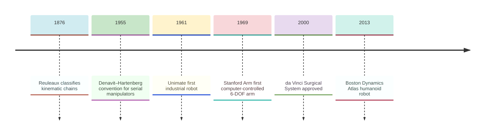
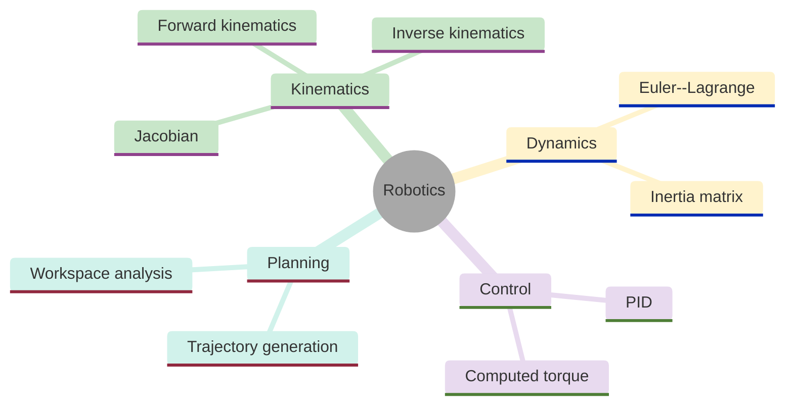
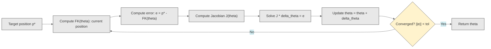
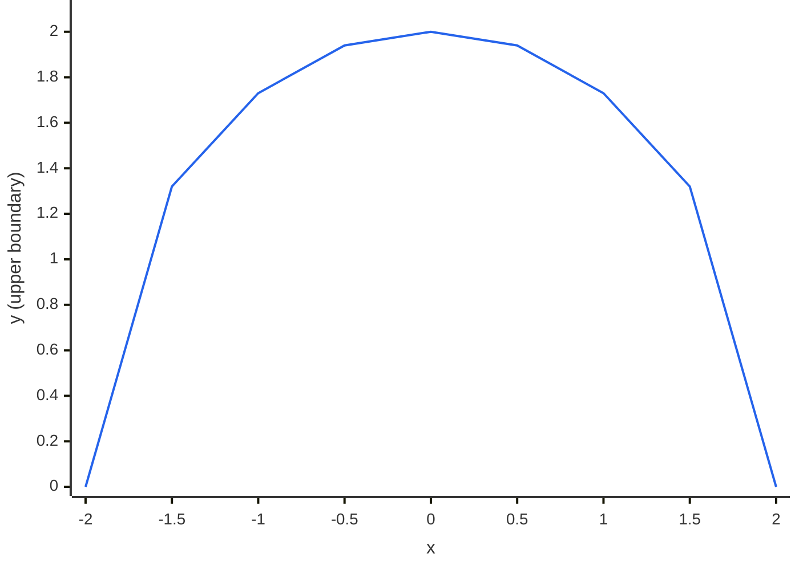
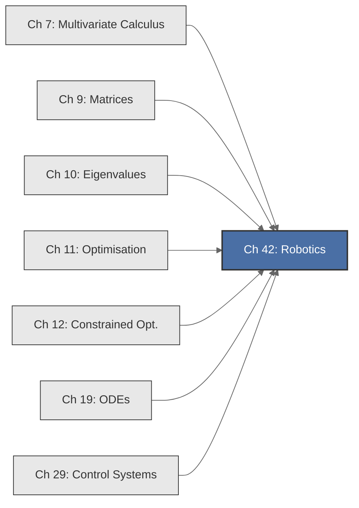

<!-- Copyright (c) 2025-2026 Bob Jansen <bobjansen@pm.me> -->
<!-- SPDX-License-Identifier: CC-BY-NC-4.0 -->
<!-- See LICENSE for full terms. Commercial licensing available. -->

# Chapter 42: Robotics & Kinematics

**Part IX**: Applications

> Forward kinematics is matrix multiplication; inverse kinematics is nonlinear root-finding. This chapter derives both, adds Lagrangian dynamics and proportional-integral-derivative (PID) control and composes them into the algorithms that move real machines.

**Prerequisites**: [Chapter 7](07-multivariate-calculus.md) (Multivariate Calculus); partial derivatives, Jacobian matrices and the chain rule in several variables. [Chapter 9](09-matrices.md) (Matrices & Linear Transformations); matrix multiplication, inversion, determinants and linear system solving. [Chapter 11](11-unconstrained-optimization.md) (Unconstrained Optimisation); Newton's method for root-finding and minimisation. [Chapter 12](12-constrained-optimization.md) (Constrained Optimisation); joint limits and obstacle avoidance as inequality constraints in motion planning. [Chapter 19](19-odes.md) (Ordinary Differential Equations); Euler and Runge–Kutta methods for numerical integration of dynamical systems. [Chapter 29](29-control-systems.md) (Control Systems); PID control, state-space representation and stability via eigenvalues.

**Learning Objectives**: After this chapter, the reader will be able to:

1. Construct rotation and homogeneous transformation matrices for 2D and 3D coordinate frames.
2. Compute forward kinematics for serial manipulators via transformation matrix chains.
3. Derive and numerically compute the Jacobian of a manipulator and detect singular configurations.
4. Solve the inverse kinematics problem using Newton's method with the Jacobian or pseudoinverse.
5. Formulate robot dynamics via the Euler–Lagrange equation and simulate them with the fourth-order Runge–Kutta method (RK4).
6. Plan smooth trajectories using cubic and quintic polynomial interpolation.
7. Implement PID and computed-torque control for joint-space trajectory tracking.
8. Compute the reachable workspace of a serial manipulator.

**Connections**: This chapter synthesises [Chapter 7](07-multivariate-calculus.md) (the Jacobian relates joint velocities to end-effector velocities), [Chapter 9](09-matrices.md) (homogeneous transformation matrices encode rotations and translations), [Chapter 10](10-eigenvalues.md) (eigenvalues of the error dynamics determine closed-loop stability), [Chapter 11](11-unconstrained-optimization.md) (inverse kinematics is a nonlinear root-finding problem solved by Newton's method), [Chapter 19](19-odes.md) (robot dynamics are second-order ODEs integrated by RK4) and [Chapter 29](29-control-systems.md) (PID and computed-torque control stabilise the robot along desired trajectories). It connects forward to motion planning, computer vision and autonomous systems.

---

## Historical Context

**Key Dates in Robotics**



*Figure 42.1: Timeline of key milestones in robotics from kinematic theory to surgical systems.*

**Reuleaux's kinematic classification (1876).** Franz Reuleaux's *Kinematics of Machinery* classified mechanical joints and kinematic chains. He introduced kinematic pairs (revolute joint, prismatic joint, spherical joint) that persist in robotics. The Denavit–Hartenberg convention (1955) described serial kinematic chains with four parameters per joint: link length $a$, link twist $\alpha$, link offset $d$ and joint angle $\theta$. (In DH notation these are distinct from the joint-angle $\theta$ used throughout this chapter.) The convention reduced robot description to a parameter table, making forward kinematics a process of matrix multiplication.

**The Unimate industrial robot (1961).** The Unimate, installed at a General Motors plant, was the first industrial robot. It replayed pre-recorded trajectories under open-loop control. Victor Scheinman's Stanford Arm (1969) was the first computer-controlled six-degree-of-freedom (DOF) arm; it required inverse kinematics to compute joint angles from desired end-effector positions.

**The PUMA research platform and the computational robotics curriculum (1978–1986).** Unimation's PUMA (1978) became the standard research platform for kinematic and dynamic control experiments. Richard Paul's 1981 textbook formalised the computational framework of robot kinematics and dynamics. John Craig's 1986 *Introduction to Robotics* unified DH kinematics with Lagrangian dynamics and control theory, establishing the mathematical curriculum that robotics programmes follow today.

**The da Vinci Surgical System and modern robotics (2000–present).** Intuitive Surgical's da Vinci Surgical System (2000) achieved sub-millimetre precision. Mars rovers (2004) ran onboard inverse kinematics. Boston Dynamics (2013) demonstrated humanoid robots requiring real-time high-dimensional dynamics. Modern applications span warehouse automation, collaborative robots, aerial robotics and autonomous vehicles. The core mathematics is unchanged: transformation matrices, Jacobians, inverse kinematics, dynamics and control.

---

## Why This Chapter Matters

**Robotics**



*Figure 42.2: Overview of robotics topics covered in this chapter.*

Linear algebra, calculus, optimisation, differential equations and control theory converge on a single physical system in robotics. A robot arm that fails because inverse kinematics diverged near a singularity, overshoots because PID gains were poorly tuned or damages a workpiece because gravity compensation was omitted demonstrates what it means for mathematics to succeed or fail in application. Every industrial robot, surgical robot and Mars rover executes these algorithms thousands of times per second.

Each algorithm in this chapter maps directly to the prerequisite mathematics. `forwardKinematics2D` chains homogeneous transformation matrices ([Chapter 9](09-matrices.md)). `numericalJacobian` computes the derivative map relating joint velocities to Cartesian velocities ([Chapter 7](07-multivariate-calculus.md)). `inverseKinematics` applies Newton's method ([Chapter 11](11-unconstrained-optimization.md)) with singularity detection via the Jacobian determinant. `simulatePendulumArm` integrates Euler–Lagrange dynamics with RK4 ([Chapter 19](19-odes.md)) under PID control ([Chapter 29](29-control-systems.md)).

Collaborative robots, autonomous vehicles, humanoid platforms and surgical systems demand ever more sophisticated kinematics, dynamics and control. Six-DOF arms require $4 \times 4$ transformation chains and $6 \times 6$ Jacobians. Redundant manipulators require pseudoinverse solutions and null-space optimisation. Legged robots require contact dynamics and hybrid automata. The core algorithms are forward kinematics via matrix chains, inverse kinematics via Newton iteration, dynamics via the Euler–Lagrange equation and control via computed torque or PID.

---

## Notation & Conventions

| Symbol | Meaning |
|--------|---------|
| $\theta_i$ | Joint angle of joint $i$ (revolute joint) |
| $\boldsymbol{\theta}$ | Vector of joint angles $(\theta_1, \ldots, \theta_n)^T$ |
| $n$ | Number of joints (degrees of freedom) |
| $m$ | Dimension of the task space (2 for planar position, 6 for 3D position and orientation) |
| $l_i$ | Length of link $i$ |
| $R(\theta)$ | Rotation matrix parameterised by angle $\theta$ |
| $T_i^j$ | Homogeneous transformation from frame $i$ to frame $j$ |
| $\mathbf{p}$ | End-effector position vector $(x, y)^T$ or $(x, y, z)^T$ |
| $\mathbf{p}^*$ | Desired (target) end-effector position |
| $J(\boldsymbol{\theta})$ | Jacobian matrix $\partial \mathbf{p}/\partial \boldsymbol{\theta}$ |
| $J^+$ | Moore–Penrose pseudoinverse of $J$ (coincides with $J^T(JJ^T)^{-1}$ for full row rank; $(J^TJ)^{-1}J^T$ for full column rank) |
| $\dot{\mathbf{p}}$ | End-effector velocity |
| $\dot{\boldsymbol{\theta}}$ | Joint velocity vector |
| $M(\boldsymbol{\theta})$ | Mass (inertia) matrix |
| $C(\boldsymbol{\theta}, \dot{\boldsymbol{\theta}})$ | Coriolis and centrifugal matrix |
| $\mathbf{g}(\boldsymbol{\theta})$ | Gravity torque vector |
| $\boldsymbol{\tau}$ | Applied joint torque vector |
| $\text{FK}(\boldsymbol{\theta})$ | Forward kinematics function mapping $\boldsymbol{\theta} \mapsto \mathbf{p}$ |
| $\mathbf{e}$ | Tracking error vector: $\mathbf{e} = \boldsymbol{\theta}_d - \boldsymbol{\theta}$ |
| $K_p, K_d$ | Proportional and derivative gain matrices |
| $h$ | Numerical finite-difference step size |
| $\Delta t$ | Simulation time step for ordinary differential equation (ODE) integration |

Matrices are stored in row-major flat format using contiguous double-precision arrays, following the convention of [Chapter 9](09-matrices.md). Joint angles are in radians. The base frame is at the robot's origin with the $x$-axis horizontal and $y$-axis vertical for planar robots; the $z$-axis points upward for 3D. Subscripts on transformation matrices indicate "from" and superscripts "to": $T_0^2$ transforms coordinates from frame 0 to frame 2.

---

## Core Theory

**Robot Control Loop**

```mermaid
%%{init: {"theme": "base", "themeVariables": {"primaryColor": "#e8e8e8", "primaryTextColor": "#333333", "primaryBorderColor": "#555555", "lineColor": "#666666", "secondaryColor": "#d1ecf1", "tertiaryColor": "#c8e6c9"}}}%%
flowchart LR
    ReadSensors["Read joint sensors"] --> ComputeFK["Compute forward kinematics"]
    ComputeFK --> CompareTarget["Compare to target pose"]
    CompareTarget --> ComputeIK["Compute IK error via Jacobian"]
    ComputeIK --> ApplyControl["Apply PID / computed torque"]
    ApplyControl --> Actuate["Send torques to actuators"]
    Actuate --> ReadSensors
    style ReadSensors fill:#e8e8e8,stroke:#333333
    style Actuate fill:#e8e8e8,stroke:#333333
    style ApplyControl fill:#e8e8e8,stroke:#333333
    style CompareTarget fill:#e8e8e8,stroke:#333333
    style ComputeFK fill:#e8e8e8,stroke:#333333
    style ComputeIK fill:#e8e8e8,stroke:#333333
```



*Figure 42.3: Closed-loop robot control cycle from sensing through actuation.*

### Rotation Matrices

**Definition 42.1** (2D rotation matrix). A rotation by angle $\theta$ counterclockwise in the plane is represented by the orthogonal matrix:

$$R_z(\theta) = \begin{pmatrix} \cos\theta & -\sin\theta \\ \sin\theta & \cos\theta \end{pmatrix}.$$

**Theorem 42.2** (Properties of rotation matrices). For any rotation matrix $R$:

(i) $R^T R = I$ (orthogonality),

(ii) $\det(R) = 1$ (proper rotation, not a reflection),

(iii) $R(\alpha)R(\beta) = R(\alpha + \beta)$ (composition is additive in angle),

(iv) $R^{-1}(\theta) = R^T(\theta) = R(-\theta)$.

??? note "Proof"

    *Proof.* (i) By direct computation: $(R^T R)_{11} = \cos^2\theta + \sin^2\theta = 1$, $(R^T R)_{12} = -\cos\theta\sin\theta + \sin\theta\cos\theta = 0$; the remaining entries follow similarly, giving $R^T R = I$.

    (ii) $\det(R) = \cos^2\theta + \sin^2\theta = 1$.

    (iii) By the angle addition formulas:

    $$(R(\alpha)R(\beta))_{11} = \cos\alpha\cos\beta - \sin\alpha\sin\beta = \cos(\alpha + \beta).$$

    The remaining entries follow likewise: $(R(\alpha)R(\beta))_{12} = -\cos\alpha\sin\beta - \sin\alpha\cos\beta = -\sin(\alpha+\beta)$, giving $R(\alpha)R(\beta) = R(\alpha + \beta)$.

    (iv) Follows from (i): $R^{-1} = R^T$, and $R^T(\theta) = R(-\theta)$ by inspection of the matrix. $\square$

**Definition 42.3** (3D rotation matrices). Rotations about the coordinate axes in three dimensions are $R_x(\theta)$, $R_y(\theta)$, $R_z(\theta)$, each formed by embedding the $2 \times 2$ rotation in the appropriate submatrix and leaving the rotation axis unchanged. For example:

$$R_z(\theta) = \begin{pmatrix} \cos\theta & -\sin\theta & 0 \\ \sin\theta & \cos\theta & 0 \\ 0 & 0 & 1 \end{pmatrix}.$$

All satisfy $R^T R = I$ and $\det(R) = 1$. An arbitrary 3D rotation is a product of three elementary rotations (Euler angles):

$$R = R_z(\alpha)\,R_y(\beta)\,R_z(\gamma).$$

!!! warning "Gimbal lock in Euler angle representations"

    When $\beta = 0$ or $\beta = \pm\pi/2$ (depending on the convention), two rotation axes align and one degree of freedom is lost. This singularity, known as gimbal lock, makes the Euler angle parameterisation ill-conditioned for interpolation and control near those configurations. Quaternion representations avoid this issue but are outside the scope of this chapter.

### Homogeneous Transformation Matrices

**Definition 42.4** (Homogeneous transformation). A transformation combining a rotation $R \in \mathbb{R}^{3 \times 3}$ (or $\mathbb{R}^{2 \times 2}$) and a translation $\mathbf{d} \in \mathbb{R}^3$ (or $\mathbb{R}^2$) is represented by the $(n+1) \times (n+1)$ homogeneous matrix:

$$T = \begin{pmatrix} R & \mathbf{d} \\ \mathbf{0}^T & 1 \end{pmatrix}.$$

In 2D ($n = 2$), $T$ is $3 \times 3$; in 3D ($n = 3$), $T$ is $4 \times 4$. The point $\mathbf{p}$ in the local frame maps to

$$\mathbf{p}' = R\mathbf{p} + \mathbf{d}$$

in the reference frame, which is computed as $\tilde{\mathbf{p}}' = T \tilde{\mathbf{p}}$ using homogeneous coordinates $\tilde{\mathbf{p}} = (\mathbf{p}^T, 1)^T$.

**Theorem 42.5** (Composition of transformations). If frame 1 is related to frame 0 by $T_0^1$ and frame 2 is related to frame 1 by $T_1^2$, then frame 2 is related to frame 0 by:

$$T_0^2 = T_0^1 \cdot T_1^2.$$

For a serial chain of $n$ transformations:

$$T_0^n = T_0^1 \cdot T_1^2 \cdots T_{n-1}^n = \prod_{i=1}^{n} T_{i-1}^i.$$

??? note "Proof"

    *Proof.* A point $\mathbf{p}$ in frame 2 maps to frame 1 as $\tilde{\mathbf{p}}_1 = T_1^2 \tilde{\mathbf{p}}_2$, and then to frame 0 as

    $$\tilde{\mathbf{p}}_0 = T_0^1 \tilde{\mathbf{p}}_1 = T_0^1 T_1^2 \tilde{\mathbf{p}}_2.$$

    The combined transformation is hence $T_0^2 = T_0^1 T_1^2$, by associativity of matrix multiplication ([Chapter 9](09-matrices.md)). Induction extends this to arbitrary chains. $\square$

**Theorem 42.6** (Inverse of a homogeneous transformation). The inverse is:

$$T^{-1} = \begin{pmatrix} R^T & -R^T \mathbf{d} \\ \mathbf{0}^T & 1 \end{pmatrix}.$$

??? note "Proof"

    *Proof.* Compute $T T^{-1}$ block by block:

    - Rotation block: $RR^T = I$ (since $R$ is orthogonal).
    - Translation block: $R(-R^T\mathbf{d}) + \mathbf{d} = -\mathbf{d} + \mathbf{d} = \mathbf{0}$.
    - Bottom row: $(0, \ldots, 0, 1)$.

    It follows that $T T^{-1} = I$, confirming the stated formula. $\square$

### Forward Kinematics

**Definition 42.7** (Forward kinematics). For a serial manipulator with $n$ revolute joints and joint angles $\boldsymbol{\theta} = (\theta_1, \ldots, \theta_n)^T$, the *forward kinematics* function $\text{FK}: \mathbb{R}^n \to \mathbb{R}^m$ computes the end-effector position (and optionally orientation) from the joint angles:

$$\mathbf{p} = \text{FK}(\boldsymbol{\theta}).$$

The computation proceeds by forming the transformation matrix for each link and multiplying:

$$T_0^n(\boldsymbol{\theta}) = T_0^1(\theta_1) \cdot T_1^2(\theta_2) \cdots T_{n-1}^n(\theta_n).$$

The end-effector position is extracted from the translation component of $T_0^n$.

**Theorem 42.8** (2-link planar arm forward kinematics). For a planar robot with two revolute joints, link lengths $l_1$ and $l_2$ and joint angles $\theta_1$ (measured from the positive $x$-axis) and $\theta_2$ (measured from link 1), the end-effector position is:

$$\begin{aligned}
x &= l_1\cos\theta_1 + l_2\cos(\theta_1 + \theta_2), \\
y &= l_1\sin\theta_1 + l_2\sin(\theta_1 + \theta_2).
\end{aligned}$$

??? note "Proof"

    *Proof.* The transformation from the base frame (0) to the elbow frame (1) is:

    $$T_0^1 = \begin{pmatrix} \cos\theta_1 & -\sin\theta_1 & l_1\cos\theta_1 \\ \sin\theta_1 & \cos\theta_1 & l_1\sin\theta_1 \\ 0 & 0 & 1 \end{pmatrix}.$$

    The transformation from the elbow frame (1) to the end-effector frame (2) is:

    $$T_1^2 = \begin{pmatrix} \cos\theta_2 & -\sin\theta_2 & l_2\cos\theta_2 \\ \sin\theta_2 & \cos\theta_2 & l_2\sin\theta_2 \\ 0 & 0 & 1 \end{pmatrix}.$$

    Computing $T_0^2 = T_0^1 \cdot T_1^2$ and extracting the translation column yields:

    $$\begin{aligned}
    x &= l_1\cos\theta_1 + l_2(\cos\theta_1\cos\theta_2 - \sin\theta_1\sin\theta_2) = l_1\cos\theta_1 + l_2\cos(\theta_1 + \theta_2), \\
    y &= l_1\sin\theta_1 + l_2(\sin\theta_1\cos\theta_2 + \cos\theta_1\sin\theta_2) = l_1\sin\theta_1 + l_2\sin(\theta_1 + \theta_2),
    \end{aligned}$$

    where the last equality in each line applies the angle addition formulas. $\square$

### The Jacobian

**Definition 42.9** (Manipulator Jacobian). The Jacobian ([Chapter 7](07-multivariate-calculus.md)) of a manipulator is the matrix of partial derivatives of the forward kinematics in the joint angles:

$$J(\boldsymbol{\theta}) = \frac{\partial \text{FK}}{\partial \boldsymbol{\theta}} = \begin{pmatrix} \partial x/\partial\theta_1 & \cdots & \partial x/\partial\theta_n \\ \partial y/\partial\theta_1 & \cdots & \partial y/\partial\theta_n \end{pmatrix}.$$

The Jacobian relates joint velocities to end-effector velocities:

$$\dot{\mathbf{p}} = J(\boldsymbol{\theta})\dot{\boldsymbol{\theta}}.$$

**Theorem 42.10** (Jacobian of the 2-link planar arm). For the 2-link arm of Theorem 42.8, the Jacobian is:

$$J(\theta_1, \theta_2) = \begin{pmatrix} -l_1\sin\theta_1 - l_2\sin(\theta_1 + \theta_2) & -l_2\sin(\theta_1 + \theta_2) \\ l_1\cos\theta_1 + l_2\cos(\theta_1 + \theta_2) & l_2\cos(\theta_1 + \theta_2) \end{pmatrix}.$$

??? note "Proof"

    *Proof.* Differentiating the forward kinematics expressions from Theorem 42.8:

    $$\frac{\partial x}{\partial\theta_1} = -l_1\sin\theta_1 - l_2\sin(\theta_1 + \theta_2), \qquad \frac{\partial x}{\partial\theta_2} = -l_2\sin(\theta_1 + \theta_2),$$

    $$\frac{\partial y}{\partial\theta_1} = l_1\cos\theta_1 + l_2\cos(\theta_1 + \theta_2), \qquad \frac{\partial y}{\partial\theta_2} = l_2\cos(\theta_1 + \theta_2).$$

    Arranging these partial derivatives in matrix form yields $J$. $\square$

**Theorem 42.11** (Jacobian determinant and singularities). The determinant of the $2 \times 2$ Jacobian for the 2-link planar arm is:

$$\det(J) = l_1 l_2 \sin\theta_2.$$

The manipulator is singular (loses a degree of freedom) when $\theta_2 = 0$ or $\theta_2 = \pi$.

??? note "Proof"

    *Proof.* Expanding the determinant:

    $$\det(J) = (-l_1\sin\theta_1 - l_2\sin(\theta_1+\theta_2))(l_2\cos(\theta_1+\theta_2)) - (-l_2\sin(\theta_1+\theta_2))(l_1\cos\theta_1 + l_2\cos(\theta_1+\theta_2)).$$

    Let $\phi = \theta_1 + \theta_2$ for brevity. Expanding and collecting:

    $$\begin{aligned}
    \det(J) &= l_2\cos\phi(-l_1\sin\theta_1 - l_2\sin\phi) + l_2\sin\phi(l_1\cos\theta_1 + l_2\cos\phi) \\
            &= l_1 l_2(-\sin\theta_1\cos\phi + \cos\theta_1\sin\phi) + l_2^2(-\sin\phi\cos\phi + \sin\phi\cos\phi) \\
            &= l_1 l_2 \sin(\phi - \theta_1) \\
            &= l_1 l_2 \sin\theta_2.
    \end{aligned}$$

    This vanishes when $\sin\theta_2 = 0$, i.e., $\theta_2 = 0$ (arm fully extended) or $\theta_2 = \pi$ (arm folded back on itself). At these configurations the end-effector can only move along one direction; the arm has lost one degree of freedom. $\square$

!!! abstract "Key Result"

    **Theorem 42.11** (Jacobian determinant and singularities). The manipulator Jacobian determinant $\det(J) = l_1 l_2 \sin\theta_2$ vanishes at full extension and full retraction, identifying the configurations where the robot loses a degree of freedom and velocity control becomes impossible.

**Remark 42.12** (Numerical Jacobian). When the forward kinematics expressions are complicated, the Jacobian is computed via central finite differences: $J_{ij} \approx (\text{FK}_i(\boldsymbol{\theta} + h\mathbf{e}_j) - \text{FK}_i(\boldsymbol{\theta} - h\mathbf{e}_j))/(2h)$ with $h \approx 10^{-7}$ (see Algorithm 42.28).

### Inverse Kinematics

**Inverse Kinematics via Newton's Method**



*Figure 42.4: Iterative Newton's method workflow for solving inverse kinematics.*

**Definition 42.13** (Inverse kinematics problem). Given a target end-effector position $\mathbf{p}^*$, the inverse kinematics problem seeks joint angles $\boldsymbol{\theta}$ such that:

$$\text{FK}(\boldsymbol{\theta}) = \mathbf{p}^*.$$

This is a system of $m$ nonlinear equations in $n$ unknowns.

**Theorem 42.14** (Newton's method for inverse kinematics). Starting from an initial guess $\boldsymbol{\theta}_0$, the iterative scheme:

$$\boldsymbol{\theta}_{k+1} = \boldsymbol{\theta}_k + J^{-1}(\boldsymbol{\theta}_k)(\mathbf{p}^* - \text{FK}(\boldsymbol{\theta}_k))$$

converges quadratically to a solution when $J$ is square and nonsingular at the solution, provided $\boldsymbol{\theta}_0$ is sufficiently close.

??? note "Proof"

    *Proof.* Define $\mathbf{f}(\boldsymbol{\theta}) = \text{FK}(\boldsymbol{\theta}) - \mathbf{p}^*$. The inverse kinematics problem is $\mathbf{f}(\boldsymbol{\theta}) = \mathbf{0}$, and the Jacobian of $\mathbf{f}$ is $J(\boldsymbol{\theta})$.

    Applying Newton's method for systems ([Chapter 11](11-unconstrained-optimization.md)):

    $$\boldsymbol{\theta}_{k+1} = \boldsymbol{\theta}_k - J^{-1}(\boldsymbol{\theta}_k)\mathbf{f}(\boldsymbol{\theta}_k) = \boldsymbol{\theta}_k + J^{-1}(\boldsymbol{\theta}_k)(\mathbf{p}^* - \text{FK}(\boldsymbol{\theta}_k)).$$

    The quadratic convergence theorem for Newton's method ([Chapter 11](11-unconstrained-optimization.md), Theorem 11.18) guarantees convergence when $J$ is Lipschitz continuous and nonsingular at the root, provided the initial guess lies within the basin of attraction. $\square$

**Theorem 42.15** (Pseudoinverse for redundant manipulators). When $m < n$ (redundant robot), the minimum-norm solution is:

$$\boldsymbol{\theta}_{k+1} = \boldsymbol{\theta}_k + J^+(\boldsymbol{\theta}_k)(\mathbf{p}^* - \text{FK}(\boldsymbol{\theta}_k)),$$

where $J^+ = J^T(JJ^T)^{-1}$ is the right pseudoinverse. When $m > n$ (overdetermined), $J^+ = (J^TJ)^{-1}J^T$ minimises the residual.

??? note "Proof"

    *Proof.* Among all $\Delta\boldsymbol{\theta}$ satisfying $J\Delta\boldsymbol{\theta} = \mathbf{e}$, minimise $\frac{1}{2}\|\Delta\boldsymbol{\theta}\|^2$ via Lagrange multipliers ([Chapter 12](12-constrained-optimization.md)).

    The Lagrangian is

    $$\mathcal{L} = \frac{1}{2}\|\Delta\boldsymbol{\theta}\|^2 + \boldsymbol{\lambda}^T(\mathbf{e} - J\Delta\boldsymbol{\theta}).$$

    Setting $\nabla_{\Delta\boldsymbol{\theta}}\mathcal{L} = \Delta\boldsymbol{\theta} - J^T\boldsymbol{\lambda} = \mathbf{0}$ gives the stationarity condition $\Delta\boldsymbol{\theta} = J^T\boldsymbol{\lambda}$ for some multiplier $\boldsymbol{\lambda}$. Substituting into the constraint:

    $$JJ^T\boldsymbol{\lambda} = \mathbf{e},$$

    hence $\boldsymbol{\lambda} = (JJ^T)^{-1}\mathbf{e}$ and $\Delta\boldsymbol{\theta} = J^T(JJ^T)^{-1}\mathbf{e} = J^+\mathbf{e}$. $\square$

**Remark 42.16** (Multiple solutions). The inverse kinematics problem typically admits multiple solutions. For a 2-link planar arm reaching a point within its workspace, there are generically two solutions (elbow-up and elbow-down configurations). The Newton iteration converges to whichever solution is closest to the initial guess.

### Robot Dynamics

**Definition 42.17** (Lagrangian dynamics of a manipulator). The Lagrangian of a serial manipulator is $L = T - V$, where the kinetic energy has the quadratic form:

$$T = \frac{1}{2}\dot{\boldsymbol{\theta}}^T M(\boldsymbol{\theta}) \dot{\boldsymbol{\theta}},$$

with $M(\boldsymbol{\theta})$ the symmetric positive-definite mass (inertia) matrix and $V = V(\boldsymbol{\theta})$ the gravitational potential energy.

**Theorem 42.18** (Equations of motion). Applying the Euler–Lagrange equations to the Lagrangian yields the standard form of the robot dynamics:

$$M(\boldsymbol{\theta})\ddot{\boldsymbol{\theta}} + C(\boldsymbol{\theta}, \dot{\boldsymbol{\theta}})\dot{\boldsymbol{\theta}} + \mathbf{g}(\boldsymbol{\theta}) = \boldsymbol{\tau},$$

where:

- $M(\boldsymbol{\theta})$ is the $n \times n$ mass matrix (configuration-dependent inertia),
- $C(\boldsymbol{\theta}, \dot{\boldsymbol{\theta}})$ is the $n \times n$ Coriolis/centrifugal matrix,
- $\mathbf{g}(\boldsymbol{\theta}) = \partial V/\partial\boldsymbol{\theta}$ is the gravity torque vector,
- $\boldsymbol{\tau}$ is the vector of applied joint torques.

??? note "Proof"

    *Proof.* The Euler–Lagrange equation for generalised coordinate $\theta_i$ is:

    $$\frac{d}{dt}\frac{\partial L}{\partial\dot{\theta}_i} - \frac{\partial L}{\partial\theta_i} = \tau_i.$$

    Computing $\partial T/\partial\dot{\theta}_i = \sum_j M_{ij}\dot{\theta}_j$ and differentiating in $t$ yields

    $$\frac{d}{dt}\frac{\partial T}{\partial\dot{\theta}_i} = \sum_j M_{ij}\ddot{\theta}_j + \sum_j \dot{M}_{ij}\dot{\theta}_j.$$

    The configuration-dependent kinetic term is $\partial T/\partial\theta_i = \frac{1}{2}\dot{\boldsymbol{\theta}}^T (\partial M/\partial\theta_i)\dot{\boldsymbol{\theta}}$.

    Combining and introducing the Christoffel symbols

    $$c_{ijk} = \frac{1}{2}\!\left(\frac{\partial M_{ij}}{\partial\theta_k} + \frac{\partial M_{ik}}{\partial\theta_j} - \frac{\partial M_{jk}}{\partial\theta_i}\right)$$

    to define $C_{ij} = \sum_k c_{ijk}\dot{\theta}_k$ yields the Coriolis/centrifugal matrix $C$. The gravity vector comes from $g_i = \partial V/\partial\theta_i$. $\square$

**Example 42.19** (Single-link pendulum arm). A single revolute joint with link length $l$, mass $m$ concentrated at the tip and angle $\theta$ from horizontal has:

$$M = ml^2, \quad C = 0, \quad \mathbf{g}(\theta) = mgl\cos\theta, \quad \tau = \text{applied torque}.$$

For a single-DOF arm, the gravity vector $\mathbf{g}$ reduces to the scalar $mgl\cos\theta$. The equation of motion is

$$ml^2\ddot{\theta} + mgl\cos\theta = \tau, \qquad \text{i.e.} \quad \ddot{\theta} = \frac{\tau - mgl\cos\theta}{ml^2}.$$

### Trajectory Planning

**Definition 42.20** (Cubic polynomial trajectory). A trajectory $\theta(t)$ from $\theta_s$ at $t = 0$ to $\theta_f$ at $t = t_f$, with zero initial and final velocities, takes the form:

$$\theta(t) = a_0 + a_1 t + a_2 t^2 + a_3 t^3.$$

**Theorem 42.21** (Cubic trajectory coefficients). The boundary conditions $\theta(0) = \theta_s$, $\theta(t_f) = \theta_f$, $\dot{\theta}(0) = 0$, $\dot{\theta}(t_f) = 0$ determine the coefficients uniquely:

$$a_0 = \theta_s, \quad a_1 = 0, \quad a_2 = \frac{3(\theta_f - \theta_s)}{t_f^2}, \quad a_3 = \frac{-2(\theta_f - \theta_s)}{t_f^3}.$$

??? note "Proof"

    *Proof.* The four boundary conditions determine the coefficients:

    - $\theta(0) = a_0 = \theta_s$,
    - $\dot{\theta}(0) = a_1 = 0$,
    - $\theta(t_f) = a_0 + a_2 t_f^2 + a_3 t_f^3 = \theta_f$,
    - $\dot{\theta}(t_f) = 2a_2 t_f + 3a_3 t_f^2 = 0$.

    The last two equations form the $2 \times 2$ linear system:

    $$\begin{pmatrix} t_f^2 & t_f^3 \\ 2t_f & 3t_f^2 \end{pmatrix} \begin{pmatrix} a_2 \\ a_3 \end{pmatrix} = \begin{pmatrix} \theta_f - \theta_s \\ 0 \end{pmatrix}.$$

    Solving by Gaussian elimination ([Chapter 9](09-matrices.md)): from the second equation, $a_2 = -\frac{3}{2}a_3 t_f$. Substituting into the first gives $-\frac{3}{2}a_3 t_f^3 + a_3 t_f^3 = \theta_f - \theta_s$, hence

    $$a_3 = -\frac{2(\theta_f - \theta_s)}{t_f^3}, \qquad a_2 = \frac{3(\theta_f - \theta_s)}{t_f^2}.$$

    These are the unique coefficients satisfying all four boundary conditions. $\square$

**Definition 42.22** (Quintic polynomial trajectory). For acceleration continuity, use $\theta(t) = \sum_{k=0}^5 a_k t^k$ with six boundary conditions (position, velocity, acceleration at both endpoints), yielding a $6 \times 6$ linear system for the coefficients.

### Control

**Definition 42.23** (PID joint control). Independent PID control on each joint treats the robot as $n$ decoupled single-input-single-output systems:

$$\tau_i = K_{p,i}(\theta_{d,i} - \theta_i) + K_{d,i}(\dot{\theta}_{d,i} - \dot{\theta}_i) + K_{i,i}\int_0^t (\theta_{d,i} - \theta_i)\,ds.$$

This ignores coupling between joints (the off-diagonal terms in $M$, $C$ and $\mathbf{g}$) and works well only for slow motions or robots with high gear ratios.

**Theorem 42.24** (Computed torque control). The control law:

$$\boldsymbol{\tau} = M(\boldsymbol{\theta})\left(\ddot{\boldsymbol{\theta}}_d + K_d\dot{\mathbf{e}} + K_p\mathbf{e}\right) + C(\boldsymbol{\theta}, \dot{\boldsymbol{\theta}})\dot{\boldsymbol{\theta}} + \mathbf{g}(\boldsymbol{\theta}),$$

where $\mathbf{e} = \boldsymbol{\theta}_d - \boldsymbol{\theta}$ and $\dot{\mathbf{e}} = \dot{\boldsymbol{\theta}}_d - \dot{\boldsymbol{\theta}}$, linearises the closed-loop dynamics to:

$$\ddot{\mathbf{e}} + K_d\dot{\mathbf{e}} + K_p\mathbf{e} = \mathbf{0}.$$

??? note "Proof"

    *Proof.* Substituting $\boldsymbol{\tau}$ into the dynamic equation $M\ddot{\boldsymbol{\theta}} + C\dot{\boldsymbol{\theta}} + \mathbf{g} = \boldsymbol{\tau}$ gives:

    $$M\ddot{\boldsymbol{\theta}} + C\dot{\boldsymbol{\theta}} + \mathbf{g} = M(\ddot{\boldsymbol{\theta}}_d + K_d\dot{\mathbf{e}} + K_p\mathbf{e}) + C\dot{\boldsymbol{\theta}} + \mathbf{g}.$$

    Cancelling $C\dot{\boldsymbol{\theta}} + \mathbf{g}$ from both sides and left-multiplying by $M^{-1}$ (which exists since $M$ is positive definite):

    $$\ddot{\boldsymbol{\theta}} = \ddot{\boldsymbol{\theta}}_d + K_d\dot{\mathbf{e}} + K_p\mathbf{e}.$$

    Since $\ddot{\mathbf{e}} = \ddot{\boldsymbol{\theta}}_d - \ddot{\boldsymbol{\theta}}$, rearranging gives

    $$\ddot{\mathbf{e}} + K_d\dot{\mathbf{e}} + K_p\mathbf{e} = \mathbf{0}.$$

    With $K_p > 0$ and $K_d > 0$, by the Routh–Hurwitz criterion ([Chapter 29](29-control-systems.md)), the characteristic equation $s^2 + K_d s + K_p = 0$ has both roots with negative real parts (since all coefficients are positive), ensuring asymptotic stability. $\square$

### Workspace Analysis

**Definition 42.25** (Workspace). The *workspace* of a manipulator is the set of all points $\mathbf{p}$ reachable by the end-effector:

$$\mathcal{W} = \{\text{FK}(\boldsymbol{\theta}) : \boldsymbol{\theta} \in \Theta\},$$

where $\Theta$ is the set of feasible joint angles (all of $\mathbb{R}^n$ for unlimited joints, or a bounded subset for joints with limits).

**Theorem 42.26** (Workspace of the 2-link planar arm). For a 2-link planar arm with link lengths $l_1$ and $l_2$ ($l_1 \geq l_2$) and no joint limits, the workspace is an annular region:

$$\mathcal{W} = \{(x, y) : (l_1 - l_2)^2 \leq x^2 + y^2 \leq (l_1 + l_2)^2\}.$$

**Two-Link Planar Arm Workspace Upper Boundary**



*Figure 42.5: Upper boundary of the workspace for a two-link planar arm.*

??? note "Proof"

    *Proof.* The distance from the origin to the end-effector is $r = \sqrt{x^2 + y^2}$. By the triangle inequality applied to the two links:

    $$\lvert l_1 - l_2\rvert \leq r \leq l_1 + l_2.$$

    The upper bound $r = l_1 + l_2$ is achieved when $\theta_2 = 0$ (arm fully extended). The lower bound $r = l_1 - l_2$ is achieved when $\theta_2 = \pi$ (arm folded back on itself).

    The function

    $$r(\theta_2) = \sqrt{l_1^2 + l_2^2 + 2l_1 l_2\cos\theta_2}$$

    is continuous in $\theta_2$ and ranges from $l_1 + l_2$ (at $\theta_2 = 0$) to $l_1 - l_2$ (at $\theta_2 = \pi$). By the intermediate value theorem, every value of $r$ in $[l_1 - l_2,\, l_1 + l_2]$ is attained for some $\theta_2 \in [0, \pi]$. By varying $\theta_1$ through $[0, 2\pi)$, every direction is reachable at every feasible radius, sweeping out the full annulus. $\square$

---

## Formulas & Identities

**F42.1** 2D rotation matrix:

$$R_z(\theta) = \begin{pmatrix}\cos\theta & -\sin\theta \\ \sin\theta & \cos\theta\end{pmatrix}.$$

**F42.2** Homogeneous transformation:

$$T = \begin{pmatrix} R & \mathbf{d} \\ \mathbf{0}^T & 1 \end{pmatrix}.$$

**F42.3** Forward kinematics chain:

$$T_0^n = \prod_{i=1}^n T_{i-1}^i(\theta_i).$$

**F42.4** 2-link arm end-effector position:

$$x = l_1\cos\theta_1 + l_2\cos(\theta_1+\theta_2), \qquad y = l_1\sin\theta_1 + l_2\sin(\theta_1+\theta_2).$$

**F42.5** Velocity kinematics:

$$\dot{\mathbf{p}} = J(\boldsymbol{\theta})\dot{\boldsymbol{\theta}}.$$

**F42.6** 2-link Jacobian determinant:

$$\det(J) = l_1 l_2 \sin\theta_2.$$

**F42.7** Newton inverse kinematics iteration:

$$\boldsymbol{\theta}_{k+1} = \boldsymbol{\theta}_k + J^{-1}(\boldsymbol{\theta}_k)(\mathbf{p}^* - \text{FK}(\boldsymbol{\theta}_k)).$$

**F42.8** Right pseudoinverse:

$$J^+ = J^T(JJ^T)^{-1}.$$

**F42.9** Manipulator dynamics:

$$M(\boldsymbol{\theta})\ddot{\boldsymbol{\theta}} + C(\boldsymbol{\theta}, \dot{\boldsymbol{\theta}})\dot{\boldsymbol{\theta}} + \mathbf{g}(\boldsymbol{\theta}) = \boldsymbol{\tau}.$$

**F42.10** Cubic trajectory coefficients:

$$a_2 = \frac{3(\theta_f - \theta_s)}{t_f^2}, \qquad a_3 = \frac{-2(\theta_f - \theta_s)}{t_f^3}.$$

**F42.11** Computed torque control:

$$\boldsymbol{\tau} = M(\boldsymbol{\theta})\!\left(\ddot{\boldsymbol{\theta}}_d + K_d\dot{\mathbf{e}} + K_p\mathbf{e}\right) + C(\boldsymbol{\theta}, \dot{\boldsymbol{\theta}})\dot{\boldsymbol{\theta}} + \mathbf{g}(\boldsymbol{\theta}).$$

---

## Algorithms

### Algorithm 42.27: Forward Kinematics via Matrix Chain

**Input**: Joint angles $\boldsymbol{\theta} = (\theta_1, \ldots, \theta_n)$; link lengths $(l_1, \ldots, l_n)$.

**Output**: End-effector position $(x, y)$.

1. Initialise $T = I_3$ (the $3 \times 3$ identity for 2D homogeneous coordinates).
2. For $i = 1, \ldots, n$:
   a. Form $T_i = \begin{pmatrix} \cos\theta_i & -\sin\theta_i & l_i\cos\theta_i \\ \sin\theta_i & \cos\theta_i & l_i\sin\theta_i \\ 0 & 0 & 1 \end{pmatrix}$.
   b. Update $T \gets T \cdot T_i$.
3. Return $(T_{13}, T_{23})$ (the translation entries of the accumulated transformation).

```
function forwardKinematics2D(theta, l, n):
    // Initialise to 3x3 identity
    T = identity(3)

    for i = 1 to n:
        // Homogeneous transformation for link i
        Ti = [[cos(theta[i]), -sin(theta[i]), l[i]*cos(theta[i])],
              [sin(theta[i]),  cos(theta[i]), l[i]*sin(theta[i])],
              [0,              0,              1                ]]
        T = T * Ti

    // Extract end-effector position from translation column
    x = T[0][2]
    y = T[1][2]
    return (x, y)
```

**Complexity**: $O(n)$ matrix multiplications of $3 \times 3$ matrices, hence $O(n)$ arithmetic operations.

### Algorithm 42.28: Numerical Jacobian via Central Differences

**Input**: Forward kinematics function $\text{FK}$; current joint angles $\boldsymbol{\theta}$; perturbation $h$.

**Output**: Jacobian matrix $J$ ($m \times n$).

1. For $j = 1, \ldots, n$:
   a. Form $\boldsymbol{\theta}^+ = \boldsymbol{\theta} + h\mathbf{e}_j$ and $\boldsymbol{\theta}^- = \boldsymbol{\theta} - h\mathbf{e}_j$.
   b. Compute $\mathbf{p}^+ = \text{FK}(\boldsymbol{\theta}^+)$ and $\mathbf{p}^- = \text{FK}(\boldsymbol{\theta}^-)$.
   c. Set column $j$ of $J$: $J_{:,j} = (\mathbf{p}^+ - \mathbf{p}^-)/(2h)$.
2. Return $J$.

```
function numericalJacobian(FK, theta, h, m, n):
    J = zeros(m, n)

    for j = 1 to n:
        // Perturb joint j in both directions
        theta_plus  = copy(theta)
        theta_minus = copy(theta)
        theta_plus[j]  = theta_plus[j]  + h
        theta_minus[j] = theta_minus[j] - h

        p_plus  = FK(theta_plus)
        p_minus = FK(theta_minus)

        // Central difference for column j
        for i = 1 to m:
            J[i][j] = (p_plus[i] - p_minus[i]) / (2 * h)

    return J
```

**Complexity**: $O(n)$ evaluations of the forward kinematics (each $O(n)$), total $O(n^2)$.

### Algorithm 42.29: Inverse Kinematics via Newton's Method

**Input**: Target position $\mathbf{p}^*$; initial guess $\boldsymbol{\theta}_0$; tolerance $\varepsilon$; max iterations $N$.

**Output**: Joint angles $\boldsymbol{\theta}$ such that $\|\text{FK}(\boldsymbol{\theta}) - \mathbf{p}^*\| < \varepsilon$.

1. Set $\boldsymbol{\theta} = \boldsymbol{\theta}_0$.
2. For $k = 0, 1, \ldots, N-1$:
   a. Compute $\mathbf{e} = \mathbf{p}^* - \text{FK}(\boldsymbol{\theta})$.
   b. If $\|\mathbf{e}\| < \varepsilon$, return $\boldsymbol{\theta}$.
   c. Compute $J = J(\boldsymbol{\theta})$ (analytically or via Algorithm 42.28).
   d. If $n = m$ and $J$ is nonsingular: solve $J\Delta\boldsymbol{\theta} = \mathbf{e}$ for $\Delta\boldsymbol{\theta}$.
   e. If $n > m$ (redundant): $\Delta\boldsymbol{\theta} = J^T(JJ^T)^{-1}\mathbf{e}$.
   f. If $n < m$ (overconstrained): $\Delta\boldsymbol{\theta} = (J^TJ)^{-1}J^T\mathbf{e}$.
   g. Update $\boldsymbol{\theta} \gets \boldsymbol{\theta} + \Delta\boldsymbol{\theta}$.
3. If not converged, raise an error (target may be unreachable or near a singularity).

```
function inverseKinematics(FK, p_target, theta0, epsilon, N, n, m):
    theta = copy(theta0)

    for k = 0 to N-1:
        p_current = FK(theta)
        e = p_target - p_current

        if norm(e) < epsilon:
            return theta

        J = numericalJacobian(FK, theta, 1e-7, m, n)

        if n == m and |det(J)| > epsilon:
            // Square non-singular: solve J * d_theta = e
            d_theta = solve(J, e)
        else if n > m:
            // Redundant: minimum-norm via right pseudoinverse
            d_theta = transpose(J) * inverse(J * transpose(J)) * e
        else:
            // Overconstrained: least-squares via left pseudoinverse
            d_theta = inverse(transpose(J) * J) * transpose(J) * e

        theta = theta + d_theta

    raise error "IK did not converge"
```

**Complexity**: $O(N \cdot n^2 m)$ where $N$ is the number of iterations, $n$ the number of joints and $m$ the task-space dimension; each iteration requires one Jacobian evaluation ($O(nm)$) and one linear solve ($O(\min(n,m)^3)$).

**Convergence**: Quadratic when $J$ is nonsingular at the solution. Linear or stalled near singularities.

### Algorithm 42.30: Cubic Trajectory Coefficients

**Input**: Start angle $\theta_s$; end angle $\theta_f$; duration $t_f$.

**Output**: Coefficients $(a_0, a_1, a_2, a_3)$.

1. Set $a_0 = \theta_s$, $a_1 = 0$.
2. Set $a_2 = 3(\theta_f - \theta_s)/t_f^2$.
3. Set $a_3 = -2(\theta_f - \theta_s)/t_f^3$.
4. Return $(a_0, a_1, a_2, a_3)$.

```
function cubicTrajectory(theta_s, theta_f, t_f):
    a0 = theta_s
    a1 = 0
    a2 = 3 * (theta_f - theta_s) / t_f^2
    a3 = -2 * (theta_f - theta_s) / t_f^3
    return (a0, a1, a2, a3)
```

**Complexity**: $O(1)$.

### Algorithm 42.31: Dynamics Simulation via RK4

**Input**: Mass matrix function $M(\boldsymbol{\theta})$; gravity function $\mathbf{g}(\boldsymbol{\theta})$; torque function $\boldsymbol{\tau}(t, \boldsymbol{\theta}, \dot{\boldsymbol{\theta}})$; initial state $(\boldsymbol{\theta}_0, \dot{\boldsymbol{\theta}}_0)$; time span $[0, T]$; step $\Delta t$.

**Output**: Time series of joint angles and velocities.

1. Define the state vector $\mathbf{y} = (\boldsymbol{\theta}, \dot{\boldsymbol{\theta}})^T$ (dimension $2n$).
2. Define the derivative function:

   $$\dot{\mathbf{y}} = f(t, \mathbf{y}) = \begin{pmatrix} \dot{\boldsymbol{\theta}} \\ M^{-1}(\boldsymbol{\theta})(\boldsymbol{\tau}(t, \boldsymbol{\theta}, \dot{\boldsymbol{\theta}}) - C(\boldsymbol{\theta}, \dot{\boldsymbol{\theta}})\dot{\boldsymbol{\theta}} - \mathbf{g}(\boldsymbol{\theta})) \end{pmatrix}.$$

3. Apply the fourth-order Runge–Kutta method ([Chapter 19](19-odes.md)) for $k = 0, 1, \ldots, \lfloor T/\Delta t \rfloor$:
   a. $\mathbf{k}_1 = f(t_k, \mathbf{y}_k)$
   b. $\mathbf{k}_2 = f(t_k + \Delta t/2, \mathbf{y}_k + (\Delta t/2)\mathbf{k}_1)$
   c. $\mathbf{k}_3 = f(t_k + \Delta t/2, \mathbf{y}_k + (\Delta t/2)\mathbf{k}_2)$
   d. $\mathbf{k}_4 = f(t_k + \Delta t, \mathbf{y}_k + \Delta t\cdot\mathbf{k}_3)$
   e. $\mathbf{y}_{k+1} = \mathbf{y}_k + (\Delta t/6)(\mathbf{k}_1 + 2\mathbf{k}_2 + 2\mathbf{k}_3 + \mathbf{k}_4)$
4. Return the recorded trajectory.

```
function simulateDynamicsRK4(M, C, g, tau, theta0, dtheta0, T, dt):
    // State vector: y = (theta, dtheta)
    y = concatenate(theta0, dtheta0)
    N = floor(T / dt)
    trajectory = empty array of length N+1
    trajectory[0] = y

    function f(t, y):
        theta  = y[0 .. n-1]
        dtheta = y[n .. 2n-1]
        // Compute joint accelerations from dynamics
        ddtheta = inverse(M(theta)) * (tau(t, theta, dtheta) - C(theta, dtheta) * dtheta - g(theta))
        return concatenate(dtheta, ddtheta)

    t = 0
    for k = 0 to N-1:
        k1 = f(t,          y)
        k2 = f(t + dt/2,   y + (dt/2) * k1)
        k3 = f(t + dt/2,   y + (dt/2) * k2)
        k4 = f(t + dt,     y + dt * k3)
        y  = y + (dt/6) * (k1 + 2*k2 + 2*k3 + k4)
        t  = t + dt
        trajectory[k+1] = y

    return trajectory
```

**Complexity**: $O(N \cdot n^3)$ per step (dominated by $M^{-1}$ computation), where $N = T/\Delta t$.

### Algorithm 42.32: Workspace Boundary Sweep

**Input**: Link lengths $(l_1, \ldots, l_n)$; angular resolution $\delta$.

**Output**: Set of reachable end-effector positions.

1. Initialise an empty set $\mathcal{W}$.
2. For each combination of joint angles on the grid $\theta_i \in \{0, \delta, 2\delta, \ldots, 2\pi - \delta\}$:
   a. Compute $\mathbf{p} = \text{FK}(\boldsymbol{\theta})$ via Algorithm 42.27.
   b. Add $\mathbf{p}$ to $\mathcal{W}$.
3. Return $\mathcal{W}$ (or its convex hull / boundary points).

```
function workspaceBoundarySweep(l, n, delta):
    W = empty set

    // Generate all grid combinations of joint angles
    grid_values = [0, delta, 2*delta, ..., 2*pi - delta]

    for each combination (theta_1, ..., theta_n) in grid_values^n:
        theta = [theta_1, ..., theta_n]
        p = forwardKinematics2D(theta, l, n)
        add p to W

    return W
```

**Complexity**: $O((2\pi/\delta)^n \cdot n)$. Practical only for small $n$; for higher DOF, sample randomly.

!!! warning "Exponential cost of exhaustive workspace sweeps"

    For a 6-DOF arm with $\delta = 0.1$ rad, the grid has $(2\pi/0.1)^6 \approx 2.5 \times 10^{10}$ configurations. Exhaustive enumeration is feasible only for 2-DOF or 3-DOF arms. For higher-dimensional robots, use Monte Carlo sampling or analytic workspace bounds.

---

## Numerical Considerations

### Singularity Handling

!!! warning "Jacobian singularity amplifies inverse kinematics errors"

    Near a singular configuration ($\det(J) \approx 0$), the computed $J^{-1}$ amplifies small errors in the target position into large joint-angle corrections. The resulting joint commands can exceed actuator limits or cause violent motion. Always check $\det(J)$ (or the condition number) before applying the Newton update.

Near singular configurations ($\det(J) \approx 0$) the inverse of $J$ amplifies errors. The damped least-squares method replaces $J^{-1}$ with

$$(J^TJ + \lambda^2 I)^{-1}J^T,$$

where $\lambda > 0$ is a damping factor. This trades accuracy for stability. The solution no longer exactly satisfies $J\Delta\boldsymbol{\theta} = \mathbf{e}$ but remains bounded. A typical choice is $\lambda \in [0.01, 0.1]$, reduced toward zero away from singularity.

### Finite Difference Step Size

For the numerical Jacobian (Algorithm 42.28), the optimal step size balances truncation error ($O(h^2)$ for central differences) against roundoff error ($O(\varepsilon_{\text{mach}}/h)$). The theoretically optimal step is

$$h \approx \varepsilon_{\text{mach}}^{1/3} \approx 6 \times 10^{-6}$$

for double precision ($\varepsilon_{\text{mach}} \approx 2.2 \times 10^{-16}$). In practice, $h$ in the range $[10^{-7}, 10^{-5}]$ works well; $h = 10^{-6}$ is a common default for robot kinematics.

!!! tip "Default perturbation for numerical Jacobians"

    Use $h = 10^{-7}$ as a starting value. If the Jacobian entries oscillate or lose digits, increase $h$ toward $10^{-5}$. If accuracy is insufficient, verify that the forward kinematics function is free of branch discontinuities at the evaluation point.

### Ordinary Differential Equation Integration Stiffness

Robot dynamics with high gear ratios or stiff contact forces can produce stiff ordinary differential equations (ODEs) where the eigenvalues of the linearised system span several orders of magnitude. RK4 requires very small time steps for stiff problems ([Chapter 19](19-odes.md)). For non-stiff dynamics (free-swinging arms, moderate gains), $\Delta t = 10^{-3}$ to $10^{-4}$ seconds suffices.

### Multiple Inverse Kinematics Solutions

Newton's method converges to a single solution determined by the initial guess. To find all solutions of a 2-link arm, one can start from multiple initial guesses spanning $[0, 2\pi)^2$, or exploit the analytic solution:

$$\theta_2 = \pm\arccos\!\left(\frac{x^2 + y^2 - l_1^2 - l_2^2}{2l_1 l_2}\right).$$

### Condition Number of the Jacobian

The condition number

$$\kappa(J) = \|J\| \cdot \|J^{-1}\|$$

quantifies sensitivity of the inverse kinematics to perturbations in the target. Near singularities, $\kappa(J) \to \infty$. Monitoring the condition number (or equivalently, the ratio of largest to smallest singular values of $J$) provides early warning of approaching singular configurations.

### Trajectory Smoothness

Cubic polynomials ensure continuous position and velocity but have discontinuous acceleration at waypoints. This produces torque jumps. Quintic polynomials add acceleration continuity. For multi-segment paths, spline interpolation with continuity constraints at knots provides globally smooth trajectories.

!!! tip "Choosing cubic versus quintic trajectories"

    Cubic polynomials suffice for slow motions where torque discontinuities are absorbed by mechanical compliance. For high-speed or high-precision tasks (e.g. surgical robotics, CNC machining), quintic polynomials avoid acceleration jumps and reduce actuator wear.

---

## Worked Examples

### Example 42.33: 2-Link Arm Forward Kinematics

**Problem.** A 2-link planar arm has $l_1 = 1.0$ m and $l_2 = 0.8$ m. Compute the end-effector position at $\theta_1 = \pi/4$, $\theta_2 = \pi/3$.

**Solution.** By Theorem 42.8:

$$\begin{aligned}
x &= \cos(\pi/4) + 0.8\cos(7\pi/12) = 0.7071 - 0.2071 = 0.5000, \\
y &= \sin(\pi/4) + 0.8\sin(7\pi/12) = 0.7071 + 0.7727 = 1.4798.
\end{aligned}$$

Rounding to three decimal places: $(x, y) \approx (0.500, 1.480)$.

The matrix chain approach yields the same result: form $T_0^1$ and $T_1^2$ via `homogeneous2D`, multiply with `matMul(T1, T2, 3, 3, 3)` and extract the translation entries $T[2]$ and $T[5]$ (row-major indexing for positions $(0,2)$ and $(1,2)$).

### Example 42.34: Jacobian Computation and Singularity Detection

**Problem.** For the 2-link arm ($l_1 = 1.0$, $l_2 = 0.8$), compute the Jacobian at $(\theta_1, \theta_2) = (0, \pi/2)$ and at the singular configuration $(0, 0)$.

**Solution.** At $\theta_2 = \pi/2$:

$$J = \begin{pmatrix} -0.8 & -0.8 \\ 1.0 & 0 \end{pmatrix}, \qquad \det(J) = l_1 l_2\sin(\pi/2) = 0.8 \neq 0 \quad \text{(non-singular)}.$$

At $\theta_2 = 0$:

$$J = \begin{pmatrix} 0 & 0 \\ 1.8 & 0.8 \end{pmatrix}, \qquad \det(J) = l_1 l_2\sin(0) = 0.$$

The arm is fully extended and cannot move in the $x$-direction; one DOF is lost.

### Example 42.35: Inverse Kinematics via Newton's Method

**Problem.** For the 2-link arm ($l_1 = 1.0$, $l_2 = 0.8$), find joint angles placing the end-effector at $\mathbf{p}^* = (1.2, 0.8)$.

**Solution.** Verify reachability:

$$\|\mathbf{p}^*\| = 1.442, \qquad 0.2 \leq 1.442 \leq 1.8.$$

Starting from $\boldsymbol{\theta}_0 = (0.5, 0.5)^T$, Newton's method converges in 5 iterations to:

$$\boldsymbol{\theta} \approx (0.0255, 1.2922).$$

### Example 42.36: Trajectory Planning with Cubic Polynomial

**Problem.** Plan a smooth trajectory for joint 1 from $\theta_s = 0$ to $\theta_f = \pi/2$ over $t_f = 2$ seconds, with zero velocity at both endpoints. Compute the position, velocity and acceleration at $t = 1$ s (midpoint).

**Solution.** Applying Theorem 42.21:

$$a_0 = 0, \quad a_1 = 0, \quad a_2 = \frac{3(\pi/2)}{4} = \frac{3\pi}{8} \approx 1.1781, \quad a_3 = \frac{-2(\pi/2)}{8} = \frac{-\pi}{8} \approx -0.3927.$$

At $t = 1$:

$$\begin{aligned}
\theta(1) &= 0 + 0 + 1.1781 \times 1 + (-0.3927) \times 1 = 0.7854 = \pi/4, \\
\dot{\theta}(1) &= 0 + 2 \times 1.1781 \times 1 + 3 \times (-0.3927) \times 1 = 2.3562 - 1.1781 = 1.1781 \text{ rad/s}, \\
\ddot{\theta}(1) &= 2 \times 1.1781 + 6 \times (-0.3927) \times 1 = 2.3562 - 2.3562 = 0 \text{ rad/s}^2.
\end{aligned}$$

The midpoint values make physical sense: at half the duration, the joint is at half the total displacement ($\pi/4$), the velocity is at its maximum and the acceleration is zero (inflection point of the cubic).

### Example 42.37: Pendulum Arm Dynamics with PID Control

**Problem.** A single-link robot arm (pendulum) has mass $m = 2$ kg, length $l = 0.5$ m and operates under gravity ($g = 9.81$ $\text{m/s}^2$). The arm starts at $\theta_0 = 0$ (horizontal) and must track a desired angle of $\theta_d = \pi/4$ (45 degrees above horizontal). Design a PID controller with gains $K_p = 50$, $K_d = 10$ and $K_i = 5$; simulate 3 seconds of motion.

**Solution.** The dynamics are (Example 42.19):

$$ml^2\ddot{\theta} = \tau - mgl\cos\theta,$$

where

$$ml^2 = 2(0.25) = 0.5 \text{ kg}\cdot\text{m}^2, \qquad mgl = 2(9.81)(0.5) = 9.81 \text{ N}\cdot\text{m}.$$

The PID control law is:

$$\tau = K_p(\theta_d - \theta) + K_d(\dot{\theta}_d - \dot{\theta}) + K_i\int_0^t (\theta_d - \theta)\,ds.$$

For a constant setpoint, $\dot{\theta}_d = 0$ and $\ddot{\theta}_d = 0$. Convert to a first-order system:

$$\dot{\theta} = \omega, \quad \dot{\omega} = \frac{1}{ml^2}\left[\tau - mgl\cos\theta\right].$$

At equilibrium ($\ddot{\theta} = 0$, $\dot{\theta} = 0$), the required torque to hold $\theta_d = \pi/4$ is

$$\tau_{eq} = mgl\cos(\pi/4) = 9.81 \times 0.7071 = 6.937 \; \text{N}\cdot\text{m}.$$

The integral term of the PID will accumulate until it provides this steady-state torque.

The proportional term provides the initial driving torque, the derivative term damps oscillations and the integral term eliminates steady-state error caused by gravity. Without integral action, the arm would settle below $\pi/4$.

---

## Connections

**Chapter Dependencies**



*Figure 42.6: Prerequisite chapter dependencies for robotics and kinematics.*

### Within This Book

**[Chapter 7](07-multivariate-calculus.md) (Multivariate Calculus)**. The manipulator Jacobian is a direct application of the Jacobian matrix of [Chapter 7](07-multivariate-calculus.md). Singularity analysis (determining where $\det(J) = 0$) is equivalent to finding where the derivative map drops rank.

**[Chapter 9](09-matrices.md) (Matrices)**. Every computation rests on matrix operations: rotation matrices, transformation chain multiplication, solving $J\Delta\boldsymbol{\theta} = \mathbf{e}$, computing determinants for singularity detection and matrix inversion.

**[Chapter 10](10-eigenvalues.md) (Eigenvalues)**. Closed-loop stability depends on eigenvalues of the error dynamics. For computed torque control, the characteristic equation $\lambda^2 + K_d\lambda + K_p = 0$ must have roots with negative real parts.

**[Chapter 11](11-unconstrained-optimization.md) (Optimisation)**. Inverse kinematics is Newton's method applied to $\text{FK}(\boldsymbol{\theta}) - \mathbf{p}^* = \mathbf{0}$. Convergence theory and the pseudoinverse for over- and underdetermined systems come from [Chapter 11](11-unconstrained-optimization.md). Redundant robots pose inverse kinematics as constrained optimisation.

**[Chapter 12](12-constrained-optimization.md) (Constrained Optimisation)**. Joint limits and obstacle avoidance impose inequality constraints on the inverse kinematics and trajectory planning problems.

**[Chapter 19](19-odes.md) (ODEs)**. Robot dynamics produce second-order ODEs converted to first-order systems and integrated by RK4. Step size selection, integrator stability and stiffness considerations apply directly.

**[Chapter 29](29-control-systems.md) (Control Systems)**. PID control and stability analysis transfer directly. Computed torque control exploits knowledge of $M$, $C$, $\mathbf{g}$ for exact linearisation; feedback linearisation in nonlinear control.

### Applications

- **Industrial automation**: Robotic arm control for manufacturing, welding, painting and assembly lines uses the forward and inverse kinematics algorithms of this chapter.
- **Motion planning**: Collision-free paths in configuration space, visual servoing and legged locomotion extend the kinematic and dynamic framework.
- **Surgical robotics**: Teleoperated and autonomous surgical systems require precise kinematic control with millimetre accuracy and real-time Jacobian computation.
- **Manipulation planning**: Grasp analysis via the Jacobian transpose determines whether a robotic hand can stably hold an object and apply desired forces.

---

## Summary

- Forward kinematics computes end-effector position by multiplying a chain of homogeneous transformation matrices encoding joint rotations and translations.
- The manipulator Jacobian maps joint velocities to end-effector velocities; singular configurations occur where the Jacobian loses rank and certain end-effector motions become impossible.
- Inverse kinematics solves for joint angles that achieve a desired end-effector pose, typically via Newton's method with the Jacobian or pseudoinverse.
- Robot dynamics follow from the Euler–Lagrange equation and are integrated numerically by RK4; computed-torque control cancels nonlinear terms to achieve linear closed-loop behaviour.
- Trajectory planning generates smooth joint-space paths using cubic or quintic polynomial interpolation between waypoints.

---

## Exercises

### Routine

**Exercise 42.1** (3-link planar arm). Extend the forward kinematics of Theorem 42.8 to a 3-link planar arm with link lengths $l_1 = 1.0$, $l_2 = 0.7$, $l_3 = 0.4$. Compute the end-effector position for $\boldsymbol{\theta} = (\pi/6, \pi/4, \pi/3)$. Verify numerically using the matrix chain method.

**Exercise 42.2** (Numerical vs. analytical Jacobian). For the 2-link arm with $l_1 = 1.0$, $l_2 = 0.8$, compute the Jacobian at $\theta_1 = \pi/3$, $\theta_2 = \pi/6$ both analytically (Theorem 42.10) and numerically (Algorithm 42.28 with $h = 10^{-7}$). Compare element-wise and verify agreement to at least 8 significant digits.

**Exercise 42.3** (Workspace boundary). Compute and plot the workspace boundary for a 2-link arm with $l_1 = 1.5$, $l_2 = 1.0$. At what radius is the boundary? Verify that the workspace is the annulus $0.5 \leq r \leq 2.5$ and compute the area analytically: $\pi(r_{\max}^2 - r_{\min}^2)$ where $r_{\max} = l_1 + l_2$ and $r_{\min} = l_1 - l_2$.

### Intermediate

**Exercise 42.4** (Multiple IK solutions). For the 2-link arm with $l_1 = l_2 = 1.0$, find both solutions (elbow-up and elbow-down) for the target $\mathbf{p}^* = (1.0, 0.5)$ by running Newton's method from two different initial guesses: $\boldsymbol{\theta}_0 = (0.5, 1.0)$ and $\boldsymbol{\theta}_0 = (0.5, -1.0)$. Verify that both solutions satisfy the forward kinematics equation.

**Exercise 42.5** (Singularity avoidance). Implement the damped least-squares inverse kinematics method:

$$\Delta\boldsymbol{\theta} = J^T(JJ^T + \lambda^2 I)^{-1}\mathbf{e}$$

with $\lambda = 0.05$. Trace a straight-line path from $(1.0, 0.0)$ to $(1.8, 0.0)$ for the 2-link arm ($l_1 = 1.0$, $l_2 = 0.8$), which passes through the singular extended configuration. Compare the joint trajectories to those obtained without damping.

**Exercise 42.6** (Quintic trajectory). Derive the coefficients of a quintic polynomial trajectory $\theta(t) = \sum_{k=0}^5 a_k t^k$ with boundary conditions $\theta(0) = 0$, $\theta(2) = \pi/2$, $\dot{\theta}(0) = \dot{\theta}(2) = 0$, $\ddot{\theta}(0) = \ddot{\theta}(2) = 0$. Solve the resulting $6 \times 6$ linear system using Gaussian elimination. Plot position, velocity and acceleration and compare smoothness to the cubic trajectory.

### Challenging

**Exercise 42.7** (Energy analysis). For the pendulum arm of Example 42.37, compute the total energy

$$E(t) = \frac{1}{2}ml^2\dot{\theta}^2 + mgl\sin\theta$$

at each time step (where the potential energy $V = mgl\sin\theta$ follows from $g(\theta) = \partial V/\partial\theta = mgl\cos\theta$ as in Example 42.19). Verify that the energy increases from the initial state (arm horizontal, zero velocity) and converges to the potential energy at $\theta = \pi/4$. Plot the energy versus time and identify the work done by the PID controller.

**Exercise 42.8** (Jacobian rank for 3-DOF planar arm). For a 3-link planar arm (redundant: 3 joints, 2 Cartesian coordinates), compute the $2 \times 3$ Jacobian numerically. Show that $\operatorname{rank}(J) = 2$ at a generic configuration but drops to $1$ when all three links are collinear. Use the pseudoinverse to solve inverse kinematics and observe that the minimum-norm solution distributes motion across all three joints.

---

## References

### Textbooks

[1] Corke, P. *Robotics, Vision and Control: Fundamental Algorithms in MATLAB*, 2nd ed. Springer, 2017. Provides algorithmic implementations closely aligned with the computational approach of this chapter.

[2] Craig, J. J. *Introduction to Robotics: Mechanics and Control*, 3rd ed. Pearson Prentice Hall, 2005. The standard undergraduate textbook. Chapters 2–4 cover kinematics and the DH convention; Chapter 6 covers dynamics; Chapters 8–9 cover trajectory planning and control.

[3] Lynch, K. M. and Park, F. C. *Modern Robotics: Mechanics, Planning, and Control*. Cambridge University Press, 2017. A modern treatment using the product-of-exponentials formula as an alternative to DH parameters. Accompanying video lectures and software freely available.

[4] Murray, R. M., Li, Z. and Sastry, S. S. *A Mathematical Introduction to Robotic Manipulation*. CRC Press, 1994. A rigorous treatment using Lie groups and screw theory. Available freely online.

[5] Siciliano, B., Sciavicco, L., Villani, L. and Oriolo, G. *Robotics: Modelling, Planning and Control*. Springer, 2009. Graduate text covering kinematics, dynamics, motion planning and force control.

[6] Spong, M. W., Hutchinson, S. and Vidyasagar, M. *Robot Modelling and Control*, 2nd ed. Wiley, 2020. Emphasises the control-theoretic perspective on robotics. The Lagrangian dynamics formulation and computed torque control follow Spong's presentation.

### Historical

[7] Reuleaux, F. *The Kinematics of Machinery: Outlines of a Theory of Machines*. Macmillan, 1876. Classified kinematic pairs and chains; the terminology persists in modern robotics.

[8] Denavit, J. and Hartenberg, R. S. "A Kinematic Notation for Lower-Pair Mechanisms Based on Matrices." *ASME Journal of Applied Mechanics* 22 (1955): 215–221. The original paper establishing the DH convention.

[9] Paul, R. P. *Robot Manipulators: Mathematics, Programming, and Control*. MIT Press, 1981. First systematic treatment of homogeneous transformations applied to robot kinematics and programming.

### Online Resources

[10] Lynch, K. M. and Park, F. C. *Modern Robotics*; Course materials, video lectures and software. Available at modernrobotics.org.

[11] Murray, R. M., Li, Z. and Sastry, S. S. *A Mathematical Introduction to Robotic Manipulation*; Full text available at https://www.cds.caltech.edu/~murray/mlswiki/.

---

## Glossary

- **Computed torque control**: A model-based control law that cancels the nonlinear dynamics, reducing the closed-loop system to a linear error equation.
- **Coordinate frame**: A right-handed orthonormal basis attached to a rigid body, specifying position and orientation.
- **Cubic polynomial trajectory**: A third-degree polynomial in time satisfying four boundary conditions (position and velocity at start and end).
- **Degrees of freedom (DOF)**: The number of independent joint variables required to specify the robot's configuration.
- **Denavit–Hartenberg (DH)**: A convention using four parameters $(a, \alpha, d, \theta)$ per joint that uniquely describe the relative geometry of consecutive links in a serial manipulator.
- **End-effector**: The terminal link of a serial manipulator; the "hand" or "tool" whose position and orientation are of interest.
- **Forward kinematics**: The mapping from joint angles to end-effector position/orientation: $\boldsymbol{\theta} \mapsto \mathbf{p}$.
- **Homogeneous transformation**: An $(n+1) \times (n+1)$ matrix combining rotation and translation into a single linear operation on homogeneous coordinates.
- **Inverse kinematics**: The mapping from desired end-effector position to joint angles: $\mathbf{p}^* \mapsto \boldsymbol{\theta}$. Generally nonlinear and may have multiple solutions.
- **Jacobian**: The matrix of partial derivatives $J_{ij} = \partial p_i/\partial\theta_j$ relating infinitesimal joint motions to end-effector motions.
- **Lagrangian dynamics**: The formulation of equations of motion via the Lagrangian $L = T - V$, yielding $M(\boldsymbol{\theta})\ddot{\boldsymbol{\theta}} + C(\boldsymbol{\theta}, \dot{\boldsymbol{\theta}})\dot{\boldsymbol{\theta}} + \mathbf{g}(\boldsymbol{\theta}) = \boldsymbol{\tau}$.
- **Mass matrix**: The configuration-dependent symmetric positive-definite matrix $M(\boldsymbol{\theta})$ appearing in the kinetic energy $T = \frac{1}{2}\dot{\boldsymbol{\theta}}^T M \dot{\boldsymbol{\theta}}$.
- **PID control**: A feedback control law combining proportional, integral and derivative terms to drive the tracking error to zero.
- **Prismatic joint**: A translational (sliding) joint with one degree of freedom, parameterised by displacement $d$.
- **Quintic polynomial trajectory**: A fifth-degree polynomial in time satisfying six boundary conditions (position, velocity and acceleration at start and end).
- **Redundant manipulator**: A robot with more joints than the dimension of the task space ($n > m$), admitting infinitely many inverse kinematics solutions.
- **Revolute joint**: A rotational joint with one degree of freedom, parameterised by angle $\theta$.
- **Rotation matrix**: An orthogonal matrix with determinant $+1$, representing a pure rotation.
- **Serial manipulator**: A kinematic chain with a fixed base and a free end-effector, where each joint connects exactly two links in series.
- **Singularity**: A configuration where the Jacobian loses rank ($\det(J) = 0$ for square $J$), meaning the end-effector cannot move in certain directions.
- **Trajectory planning**: The process of generating time-parameterised joint commands that move the robot smoothly between configurations.
- **Workspace**: The set of all positions reachable by the end-effector over the full range of joint angles.

---

