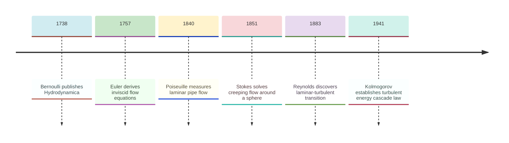
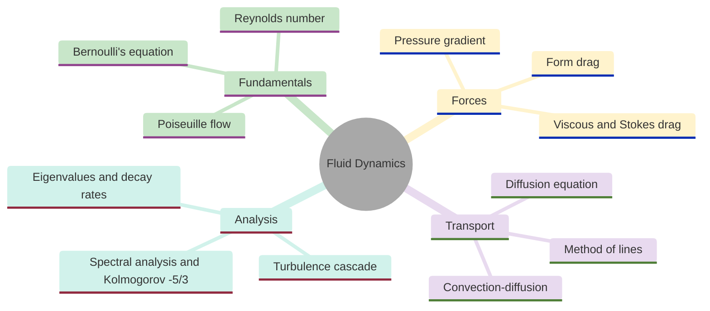
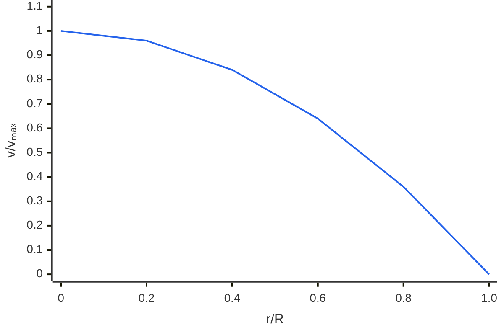
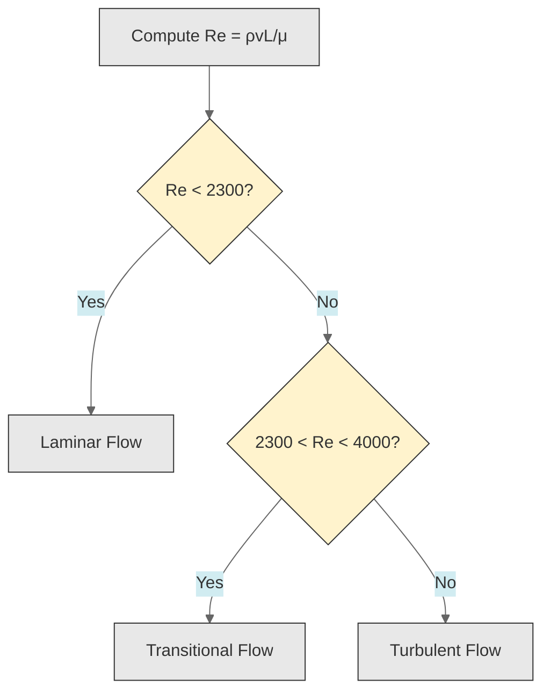
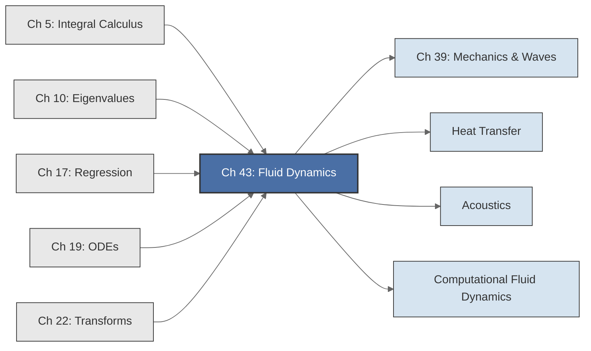

<!-- Copyright (c) 2025-2026 Bob Jansen <bobjansen@pm.me> -->
<!-- SPDX-License-Identifier: CC-BY-NC-4.0 -->
<!-- See LICENSE for full terms. Commercial licensing available. -->

# Chapter 43: Fluid Dynamics

**Part IX**: Applications

> Bernoulli's equation, Poiseuille flow and Stokes drag reduce to algebraic relations and low-order ordinary differential equations (ODEs); this chapter solves them, discretises the diffusion equation into a tridiagonal eigenvalue problem and extracts the Kolmogorov $-5/3$ spectrum via the fast Fourier transform (FFT).

**Prerequisites**: [Chapter 5](05-integral-calculus.md) (Integral Calculus); energy and work integrals, the fundamental theorem relating flow rate to velocity profiles. [Chapter 10](10-eigenvalues.md) (Eigenvalues & Eigenvectors); eigenvalue computation for symmetric tridiagonal matrices, spectral radius, decay rate interpretation. [Chapter 17](17-regression.md) (Regression); least-squares fitting for spectral slope estimation. [Chapter 19](19-odes.md) (Ordinary Differential Equations); first- and second-order ODEs, Runge–Kutta numerical integration, equilibrium analysis. [Chapter 22](22-transforms.md) (Transforms); discrete Fourier transform, fast Fourier transform (FFT) algorithm, periodogram and power spectral density.

**Learning Objectives**: After this chapter, the reader will be able to:

1. Apply Bernoulli's equation to compute velocities and pressures along a streamline from height and cross-section changes.
2. Derive the Poiseuille velocity profile from a force-balance ODE and compute the volumetric flow rate by integration.
3. Formulate the terminal velocity problem as a first-order ODE, solve it analytically and numerically via the fourth-order Runge–Kutta method (RK4) and interpret the exponential approach to equilibrium.
4. Discretise the one-dimensional diffusion equation into a system of ODEs with a tridiagonal coefficient matrix and extract decay rates from its eigenvalues.
5. Compute the Reynolds number for a flow and classify it as laminar or turbulent.
6. Apply the FFT to velocity fluctuation data, compute the power spectral density and verify the Kolmogorov $-5/3$ scaling law.
7. Solve the steady-state convection-diffusion equation as a second-order boundary-value ODE.
8. Analyse pressure waves in pipes (water hammer) via eigenvalues of a discretised wave equation.

**Connections**: This chapter synthesises [Chapter 5](05-integral-calculus.md) (integration determines flow rates from velocity profiles and total energy from pressure distributions), [Chapter 10](10-eigenvalues.md) (eigenvalues of the diffusion operator determine modal decay rates; eigenvalues of the wave operator give water hammer frequencies), [Chapter 19](19-odes.md) (Stokes drag produces a first-order ODE; Poiseuille flow is a second-order ODE; all systems are integrated numerically by RK4) and [Chapter 22](22-transforms.md) (FFT extracts turbulence spectra from velocity time series). It connects forward to heat transfer (the diffusion equation with a source term), acoustics (pressure wave propagation) and computational fluid dynamics.

---

## Historical Context

**Key Dates in Fluid Dynamics**



*Figure 43.1: Timeline of key milestones in fluid dynamics from Bernoulli to Kolmogorov.*

**Archimedes' buoyancy principle and Bernoulli's energy law (c. 250 BCE–1738).** Archimedes of Syracuse (c. 287–212 BCE) established the first quantitative law of fluid statics: a submerged body experiences an upward buoyant force equal to the weight of the displaced fluid. Daniel Bernoulli published *Hydrodynamica* in 1738, extending the subject to moving fluids. His equation,

$$P + \tfrac{1}{2}\rho v^2 + \rho g h = \text{const},$$

states that in a steady, inviscid, incompressible flow along a streamline, total mechanical energy per unit volume is conserved. It unified Torricelli's law for efflux velocity (1643) with the broader principle of energy conservation in flowing fluids.

**Euler's inviscid flow equations (1757).** Leonhard Euler derived the equations of motion for an inviscid fluid. The Euler equations, a system of nonlinear partial differential equations (PDEs), describe the acceleration of fluid parcels under pressure gradients and body forces. They omit viscosity and so cannot describe drag, boundary layers or turbulence. Claude-Louis Navier (1822) and George Gabriel Stokes (1845) independently added a viscous stress term to Euler's equations. The Navier–Stokes equations govern nearly all viscous flows, from blood in capillaries to continental weather systems. Existence and smoothness of their solutions in three dimensions remains one of the seven Millennium Prize Problems.

**Poiseuille's laminar pipe-flow experiments (1838–1840).** Jean Léonard Marie Poiseuille conducted experiments on water flowing through narrow glass tubes, establishing that volumetric flow rate is proportional to the fourth power of tube radius and to the pressure difference and inversely proportional to tube length and viscosity. The Hagen–Poiseuille law,

$$Q = \frac{\pi r^4 \Delta P}{8\mu L},$$

is the quantitative basis of pipe network design and haemodynamics. Stokes solved the creeping-flow equations for a sphere in a viscous fluid in 1851, obtaining the drag force $F = 6\pi\mu r v$. Stokes drag governs sedimentation, fog droplet terminal velocity and microorganism motion. The terminal velocity problem produces a first-order linear ODE.

**Reynolds' laminar–turbulent transition criterion (1883).** Osborne Reynolds showed that a single dimensionless parameter $\text{Re} = \rho v L / \mu$ determines the flow regime. Below $\text{Re} \approx 2300$, pipe flow is laminar; above this threshold it becomes turbulent.

**Kolmogorov's turbulent energy cascade (1941).** Andrei Nikolaevich Kolmogorov established the universal scaling laws of the turbulent energy cascade. He hypothesised that in the inertial subrange the energy spectrum depends only on wavenumber $k$ and dissipation rate $\varepsilon$. Dimensional analysis dictates

$$E(k) \propto \varepsilon^{2/3} k^{-5/3}.$$

This $-5/3$ law has been confirmed by experiments from atmospheric turbulence to wind tunnel measurements.

---

## Why This Chapter Matters

**Fluid Dynamics**



*Figure 43.2: Overview of fluid dynamics topics covered in this chapter.*

The Hagen–Poiseuille law determines the sizing of hospital IV lines, municipal water networks and industrial reactors. The Reynolds number classifies whether laminar analysis suffices or turbulence modelling is required. Bernoulli's equation underpins Pitot tubes, Venturi meters and carburettors. Water hammer analysis prevents pipe bursts when valves close too rapidly in hydroelectric plants and oil pipelines. These are routine calculations for civil, chemical, mechanical and biomedical engineers.

Terminal velocity of a falling sphere is solved by `integrateRK4` applied to the Stokes drag ODE. Pollutant diffusion is simulated by the method of lines, converting the PDE to an ODE system whose eigenvalues determine modal decay rates. Water hammer frequencies are eigenvalues of the same tridiagonal discrete Laplacian that appears in string vibrations ([Chapter 39](39-mechanics-waves.md)) and heat conduction. The Kolmogorov spectrum is extracted from velocity time series via the FFT and verified by log-log regression.

Computational fluid dynamics scales these methods to millions of grid points. Spatial discretisation produces matrix equations; time integration uses Runge–Kutta or implicit methods; spectral analysis verifies the physics. The convection-diffusion equation with its Peclet number dependence previews the numerical challenges of advection-dominated flows. Practitioners who understand discrete Laplacian eigenvalues, stiffness ratios and high-Peclet-number boundary layers are equipped to use and evaluate industrial computational fluid dynamics codes.

---

## Notation & Conventions

| Symbol | Meaning |
|--------|---------|
| $P$ | Static pressure (Pa) |
| $\rho$ | Fluid density ($\text{kg/m}^3$) |
| $v$ | Flow velocity (m/s) |
| $g$ | Gravitational acceleration ($\approx 9.81$ $\text{m/s}^2$) |
| $h$ | Height above a reference datum (m) |
| $\mu$ | Dynamic viscosity (Pa$\cdot$s) |
| $\nu = \mu/\rho$ | Kinematic viscosity ($\text{m}^2/\text{s}$) |
| $r$ | Radial coordinate or pipe radius (m) |
| $R$ | Pipe inner radius (m) |
| $L$ | Pipe length or characteristic length (m) |
| $Q$ | Volumetric flow rate ($\text{m}^3/\text{s}$) |
| $\Delta P$ | Pressure difference between pipe ends (Pa) |
| $\text{Re}$ | Reynolds number: $\text{Re} = \rho v L / \mu$ (dimensionless) |
| $D$ | Diffusion coefficient ($\text{m}^2/\text{s}$) |
| $c(x,t)$ | Concentration field |
| $F_d$ | Drag force (N) |
| $v_t$ | Terminal velocity (m/s) |
| $m$ | Mass of a particle or sphere (kg); in Definition 43.10, $m$ denotes the buoyancy-corrected (effective) mass. In the Hagen–Poiseuille context, $m$ does not appear; see $\mu$ for viscosity |
| $E(k)$ | Energy spectral density at wavenumber $k$ |
| $\varepsilon$ | Turbulent energy dissipation rate ($\text{m}^2/\text{s}^3$) |
| $\Delta x$ | Spatial grid spacing (m) |
| $N$ | Number of spatial grid points |
| $r_s$ | Radius of a sphere (Stokes drag context) (m) |
| $\tau$ | Time constant for terminal velocity approach: $\tau = m/(6\pi\mu r_s)$ (s) |
| $C_K$ | Kolmogorov constant ($\approx 1.5$, dimensionless) |
| $a$ | Speed of sound or pressure wave speed in a pipe (m/s) |

All quantities are in SI units unless stated otherwise. Velocity is measured relative to a fixed reference frame. The Reynolds number uses the mean flow velocity and the relevant geometric length scale: pipe diameter for internal flows, sphere diameter for drag. The diffusion coefficient $D$ is distinct from the pipe diameter; context disambiguates.

---

## Core Theory

### Bernoulli's Equation

**Definition 43.1** (Bernoulli's equation). For a steady, incompressible, inviscid flow along a streamline, the total mechanical energy per unit volume is conserved:

$$P + \frac{1}{2}\rho v^2 + \rho g h = \text{const}.$$

The three terms represent, respectively, the pressure energy (work done by pressure forces), the kinetic energy per unit volume and the gravitational potential energy per unit volume. Bernoulli's equation is an algebraic energy balance: no differential equations are required for its application.

**Theorem 43.2** (Torricelli's law). A large open tank filled to height $h$ above an orifice at its base, with the surface open to atmospheric pressure, discharges fluid at velocity

$$v = \sqrt{2gh}.$$

??? note "Proof"

    *Proof.* Apply Bernoulli's equation between the free surface (point 1) and the orifice (point 2).

    At the surface: $P_1 = P_{\text{atm}}$, $v_1 \approx 0$ (large tank, negligible surface velocity), $h_1 = h$.

    At the orifice: $P_2 = P_{\text{atm}}$ (free jet), $v_2 = v$, $h_2 = 0$. Substituting:

    $$P_{\text{atm}} + 0 + \rho g h = P_{\text{atm}} + \frac{1}{2}\rho v^2 + 0.$$

    Cancelling $P_{\text{atm}}$ and solving:

    $$v = \sqrt{2gh}.$$

    $\square$

**Theorem 43.3** (Venturi effect). In a horizontal pipe with cross-sectional areas $A_1$ and $A_2 < A_1$, the pressure drop between the wide and narrow sections is

$$P_1 - P_2 = \frac{1}{2}\rho v_1^2 \left(\frac{A_1^2}{A_2^2} - 1\right).$$

??? note "Proof"

    *Proof.* With $h_1 = h_2$ (horizontal pipe), Bernoulli's equation gives

    $$P_1 + \frac{1}{2}\rho v_1^2 = P_2 + \frac{1}{2}\rho v_2^2.$$

    The continuity equation (mass conservation) requires $A_1 v_1 = A_2 v_2$, so $v_2 = v_1 A_1 / A_2$. Substituting:

    $$P_1 - P_2 = \frac{1}{2}\rho(v_2^2 - v_1^2) = \frac{1}{2}\rho v_1^2\left(\frac{A_1^2}{A_2^2} - 1\right).$$

    $\square$

**Remark 43.4** (Continuity equation). The continuity equation for incompressible flow, $A_1 v_1 = A_2 v_2$, expresses conservation of mass: the volumetric flow rate $Q = Av$ is constant along a streamline tube. This is an algebraic constraint, not a differential equation.

!!! warning "Cavitation at large area ratios"
    When $A_1/A_2$ is large the Venturi pressure drop can push $P_2$ below the vapour pressure. The fluid then boils locally (cavitation), invalidating the incompressible assumption. Always check that computed pressures remain above the vapour pressure of the working fluid.

### Poiseuille Flow in a Pipe

**Definition 43.5** (Poiseuille flow problem). A viscous, incompressible fluid flows through a long, straight, circular pipe of radius $R$ and length $L$ under a pressure difference $\Delta P = P_1 - P_2 > 0$. The flow is steady, fully developed (velocity profile does not change along the pipe) and laminar. The velocity $v(r)$ depends only on the radial distance $r$ from the pipe axis.

**Theorem 43.6** (Poiseuille velocity profile). The velocity profile for fully developed laminar flow in a circular pipe is parabolic:

$$v(r) = \frac{\Delta P}{4\mu L}(R^2 - r^2), \qquad 0 \leq r \leq R.$$

??? note "Proof"

    *Proof.* In fully developed flow, the net pressure force on a cylindrical shell balances the viscous shear force. The radial momentum balance gives the governing ODE:

    $$\frac{1}{r}\frac{d}{dr}\!\left(r\frac{dv}{dr}\right) = -\frac{\Delta P}{\mu L}.$$

    Let $u = r\,dv/dr$. Then $du/dr = -(\Delta P / \mu L)\,r$, which integrates to

    $$u = -\frac{\Delta P}{2\mu L}\,r^2 + C_1.$$

    Substituting back, $dv/dr = -(\Delta P / 2\mu L)\,r + C_1/r$. Regularity at $r = 0$ (the velocity must be finite on the pipe axis) requires $C_1 = 0$. Integrating once more:

    $$v(r) = -\frac{\Delta P}{4\mu L}r^2 + C_2.$$

    The no-slip boundary condition $v(R) = 0$ gives $C_2 = (\Delta P / 4\mu L)R^2$, yielding the stated parabolic profile.

    $\square$

**Theorem 43.7** (Hagen–Poiseuille law). The volumetric flow rate through the pipe is

$$Q = \frac{\pi R^4 \Delta P}{8\mu L}.$$

??? note "Proof"

    *Proof.* The flow rate is obtained by integrating the velocity profile over the pipe cross-section ([Chapter 5](05-integral-calculus.md)):

    $$Q = \int_0^R v(r) \cdot 2\pi r\,dr = \frac{2\pi\,\Delta P}{4\mu L}\int_0^R (R^2 - r^2)\,r\,dr.$$

    Evaluating the integral:

    $$\int_0^R (R^2 r - r^3)\,dr = \left[\frac{R^2 r^2}{2} - \frac{r^4}{4}\right]_0^R = \frac{R^4}{2} - \frac{R^4}{4} = \frac{R^4}{4}.$$

    Substituting back:

    $$Q = \frac{2\pi\,\Delta P}{4\mu L} \cdot \frac{R^4}{4} = \frac{\pi R^4 \Delta P}{8\mu L}.$$

    $\square$

!!! abstract "Key Result"

    **Theorem 43.7** (Hagen–Poiseuille law). Flow rate through a pipe scales as the fourth power of radius, $Q = \pi R^4 \Delta P/(8\mu L)$; this extreme sensitivity to radius explains why small arterial constrictions produce large blood-pressure changes and why pipe diameter dominates fluid system design.

**Remark 43.8** (Fourth-power dependence). The $R^4$ dependence is dramatic: doubling the pipe radius increases the flow rate by a factor of 16. In hemodynamics, even small reductions in arterial radius (due to plaque buildup) produce disproportionately large increases in resistance.

**Poiseuille Velocity Profile in a Pipe**



*Figure 43.3: Parabolic velocity profile of Poiseuille flow across a pipe cross-section.*

### Stokes Drag and Terminal Velocity

**Definition 43.9** (Stokes drag). A sphere of radius $r_s$ moving at velocity $v$ through a fluid of viscosity $\mu$ in the creeping-flow regime ($\text{Re} \ll 1$) experiences a drag force

$$F_d = 6\pi\mu r_s v.$$

**Definition 43.10** (Terminal velocity ODE). A sphere of mass $m$ and radius $r_s$ falling under gravity through a viscous fluid obeys Newton's second law:

$$m\frac{dv}{dt} = mg - 6\pi\mu r_s v,$$

where $v(t)$ is the downward velocity (positive downward) and $mg$ is shorthand for the net downward force $(m_{\text{sphere}} - m_{\text{fluid}})g$ after the buoyancy correction. This is a first-order linear ODE with constant coefficients.

**Theorem 43.11** (Terminal velocity solution). With initial condition $v(0) = 0$, the velocity approaches terminal velocity exponentially:

$$v(t) = v_t\left(1 - e^{-t/\tau}\right),$$

where the terminal velocity is $v_t = mg / (6\pi\mu r_s)$ and the time constant is $\tau = m / (6\pi\mu r_s)$.

??? note "Proof"

    *Proof.* Define $\alpha = 6\pi\mu r_s / m$, so the ODE becomes $dv/dt = g - \alpha v$. This is a linear first-order ODE with equilibrium at

    $$v^* = \frac{g}{\alpha} = \frac{mg}{6\pi\mu r_s} = v_t.$$

    The general solution is $v(t) = v_t + Ce^{-\alpha t}$. Applying the initial condition $v(0) = 0$:

    $$0 = v_t + C \implies C = -v_t.$$

    The velocity is therefore

    $$v(t) = v_t\!\left(1 - e^{-\alpha t}\right) = v_t\!\left(1 - e^{-t/\tau}\right)$$

    with $\tau = 1/\alpha = m/(6\pi\mu r_s)$. $\square$

**Remark 43.12**. The time constant $\tau$ characterises how quickly the sphere reaches terminal velocity. After $t = 3\tau$, the velocity has reached 95% of $v_t$; after $t = 5\tau$, it is within 0.7% of $v_t$.

### The Reynolds Number and Flow Regimes

**Definition 43.13** (Reynolds number). The Reynolds number is the dimensionless ratio of inertial to viscous forces:

$$\text{Re} = \frac{\rho v L}{\mu} = \frac{vL}{\nu},$$

where $L$ is a characteristic length scale (pipe diameter for internal flow, sphere diameter for external flow) and $v$ is a characteristic velocity (mean velocity for pipe flow, free-stream velocity for external flow).

**Theorem 43.14** (Flow regime classification). For flow in a circular pipe:

- $\text{Re} < 2300$: the flow is *laminar* (smooth, orderly, predictable; the Poiseuille solution applies).
- $2300 < \text{Re} < 4000$: the flow is *transitional* (intermittent turbulent bursts).
- $\text{Re} > 4000$: the flow is *fully turbulent* (chaotic, enhanced mixing and drag).

The critical Reynolds number $\text{Re}_c \approx 2300$ for pipe flow is an empirical result established by Reynolds (1883). For flow past a sphere, the creeping-flow (Stokes drag) regime holds for $\text{Re} \ll 1$.

**Flow Regime Classification**



*Figure 43.4: Flow regime classification based on the Reynolds number.*

### One-Dimensional Diffusion: Method of Lines

**Definition 43.15** (Diffusion equation). The one-dimensional diffusion equation (also called the heat equation) is

$$\frac{\partial c}{\partial t} = D\frac{\partial^2 c}{\partial x^2},$$

where $c(x,t)$ is the concentration (or temperature) and $D > 0$ is the diffusion coefficient. This is a PDE, but spatial discretisation converts it to a system of ODEs.

**Theorem 43.16** (Method of lines). Discretise the spatial domain $[0, L]$ into $N$ interior points $x_i = i\Delta x$ for $i = 1, \ldots, N$ with $\Delta x = L/(N+1)$, and impose boundary conditions $c(0,t) = c_L$ and $c(L,t) = c_R$. The second derivative is approximated by the central difference:

$$\frac{\partial^2 c}{\partial x^2}\bigg|_{x_i} \approx \frac{c_{i-1} - 2c_i + c_{i+1}}{\Delta x^2}.$$

The PDE becomes the system of ODEs:

$$\frac{dc_i}{dt} = \frac{D}{\Delta x^2}(c_{i-1} - 2c_i + c_{i+1}), \qquad i = 1, \ldots, N,$$

where $c_0 = c_L$ and $c_{N+1} = c_R$ are the fixed boundary values. In matrix form:

$$\frac{d\mathbf{c}}{dt} = \frac{D}{\Delta x^2}A\mathbf{c} + \mathbf{b},$$

where $\mathbf{c} = (c_1, \ldots, c_N)^T$ and $A$ is the $N \times N$ tridiagonal matrix

$$A = \begin{pmatrix} -2 & 1 & & \\ 1 & -2 & 1 & \\ & \ddots & \ddots & \ddots \\ & & 1 & -2 \end{pmatrix},$$

and $\mathbf{b}$ accounts for the boundary terms: $b_1 = (D/\Delta x^2)c_L$, $b_N = (D/\Delta x^2)c_R$ and $b_i = 0$ for $2 \leq i \leq N-1$.

??? note "Proof"

    *Proof.* Direct substitution of the central difference approximation into the PDE at each grid point $x_i$ yields

    $$\frac{dc_i}{dt} \approx \frac{D}{\Delta x^2}(c_{i-1} - 2c_i + c_{i+1}).$$

    At interior point $x_i$, the terms $c_{i-1}$, $c_i$ and $c_{i+1}$ contribute coefficients $+1$, $-2$ and $+1$ respectively to the $i$-th row. Collecting these $N$ equations in matrix form: the coefficient matrix $A$ has diagonal entries $-2$ and off-diagonal entries $+1$ (at positions $i \pm 1$), giving the stated tridiagonal structure. $\square$

**Theorem 43.17** (Eigenvalues of the diffusion matrix). The eigenvalues of the $N \times N$ tridiagonal matrix $A$ defined above (see [Chapter 10](10-eigenvalues.md)) are

$$\lambda_k = -2 + 2\cos\left(\frac{k\pi}{N+1}\right) = -4\sin^2\left(\frac{k\pi}{2(N+1)}\right), \qquad k = 1, \ldots, N.$$

All eigenvalues are real and negative ($-4 < \lambda_k < 0$), so the diffusion system is asymptotically stable: all modes decay.

??? note "Proof"

    *Proof.* The matrix $A$ is real, symmetric and tridiagonal with diagonal entries $-2$ and off-diagonal entries $1$. The candidate eigenvectors for the discrete Laplacian with Dirichlet boundary conditions are

    $$\mathbf{v}_k = \bigl(\sin(k\pi/(N+1)),\; \sin(2k\pi/(N+1)),\; \ldots,\; \sin(Nk\pi/(N+1))\bigr)^T,$$

    verifiable by direct substitution: the $i$-th component of $A\mathbf{v}_k$ equals

    $$\sin\!\bigl((i-1)k\pi/(N+1)\bigr) - 2\sin\!\bigl(ik\pi/(N+1)\bigr) + \sin\!\bigl((i+1)k\pi/(N+1)\bigr).$$

    Applying the sum-to-product identity yields

    $$\lambda_k = 2\cos\!\left(\frac{k\pi}{N+1}\right) - 2 = -4\sin^2\!\left(\frac{k\pi}{2(N+1)}\right),$$

    where the last step uses the double-angle identity $1 - \cos\phi = 2\sin^2(\phi/2)$.

    Since $0 < k\pi/(2(N+1)) < \pi/2$ for $k = 1, \ldots, N$, each $\sin^2$ term is strictly positive, so $\lambda_k < 0$. $\square$

**Corollary 43.18** (Decay rates). The physical decay rates of the diffusion modes are:

$$\sigma_k = \frac{D}{\Delta x^2}\lvert\lambda_k\rvert, \qquad k = 1, \ldots, N.$$

The slowest-decaying (most persistent) mode corresponds to $k = 1$, with rate:

$$\sigma_1 = \frac{D}{\Delta x^2} \cdot 4\sin^2\!\left(\frac{\pi}{2(N+1)}\right).$$

In the continuum limit ($N \to \infty$, $\Delta x \to 0$), $\sigma_1 \to D\pi^2/L^2$, recovering the exact fundamental decay rate.

### Turbulence Spectra and the Kolmogorov Law

**Definition 43.19** (Energy spectrum). For a statistically stationary turbulent flow, the energy spectrum $E(k)$ describes the distribution of kinetic energy across wavenumbers $k$. The total turbulent kinetic energy per unit mass is $\frac{1}{2}\overline{u'^2} = \int_0^\infty E(k)\,dk$, where $u'$ denotes the velocity fluctuation.

**Theorem 43.20** (Kolmogorov $-5/3$ law). In the inertial subrange (the range of wavenumbers between the energy-containing scales and the dissipation scales) the energy spectrum follows

$$E(k) = C_K \varepsilon^{2/3} k^{-5/3},$$

where $C_K \approx 1.5$ is the Kolmogorov constant and $\varepsilon$ is the turbulent energy dissipation rate.

??? note "Proof"

    *Proof (dimensional analysis).* In the inertial subrange, Kolmogorov's first similarity hypothesis states that the statistics depend only on $k$ and $\varepsilon$. The relevant dimensions are:

    $$[E(k)] = \text{m}^3\,\text{s}^{-2}, \qquad [k] = \text{m}^{-1}, \qquad [\varepsilon] = \text{m}^2\,\text{s}^{-3}.$$

    Writing $E(k) = C\,\varepsilon^\alpha k^\beta$ and matching dimensions, the length exponent requires

    $$3 = 2\alpha - \beta,$$

    and the time exponent requires

    $$-2 = -3\alpha.$$

    Solving: $\alpha = 2/3$ from the second equation, then $\beta = 2(2/3) - 3 = -5/3$ from the first.

    It follows that $E(k) = C_K \varepsilon^{2/3} k^{-5/3}$, where $C_K$ is a dimensionless constant. $\square$

**Remark 43.21** (Spectral slope verification). In practice, one measures a discrete velocity time series $u'_n$ at sampling rate $f_s$, computes the FFT ([Chapter 22](22-transforms.md)), forms the power spectral density $P(f) = \lvert U(f)\rvert^2/N$ and plots $\log P$ versus $\log f$. Taylor's frozen turbulence hypothesis converts temporal frequency $f$ to spatial wavenumber:

$$k = \frac{2\pi f}{\bar{U}},$$

where $\bar{U}$ is the mean flow velocity. A least-squares fit to $\log P = a + \beta \log f$ in the inertial subrange yields the spectral slope $\beta$. The Kolmogorov prediction is $\beta = -5/3 \approx -1.667$.

### Steady Convection–Diffusion

**Definition 43.22** (Steady convection–diffusion equation). A substance transported by a uniform velocity $U$ in one dimension, subject to diffusion with coefficient $D$, satisfies in steady state:

$$U\frac{dc}{dx} = D\frac{d^2c}{dx^2}.$$

This is a second-order linear ODE with constant coefficients, subject to boundary conditions $c(0) = c_0$ and $c(L) = c_L$.

**Theorem 43.23** (Analytical solution). The solution to the steady convection–diffusion equation on $[0, L]$ with $c(0) = c_0$, $c(L) = c_L$ is

$$c(x) = c_0 + (c_L - c_0)\frac{e^{\text{Pe}\,x/L} - 1}{e^{\text{Pe}} - 1},$$

where $\text{Pe} = UL/D$ is the Peclet number, measuring the ratio of convective to diffusive transport.

??? note "Proof"

    *Proof.* The ODE $Dc'' - Uc' = 0$ has characteristic equation $D\lambda^2 - U\lambda = 0$, giving roots $\lambda = 0$ and $\lambda = U/D$. The general solution is therefore

    $$c(x) = A + Be^{Ux/D}.$$

    Applying the boundary conditions:

    - $c(0) = c_0$ gives $A + B = c_0$.
    - $c(L) = c_L$ gives $A + Be^{\text{Pe}} = c_L$, where $\text{Pe} = UL/D$.

    Solving this $2 \times 2$ system: $B = (c_L - c_0)/(e^{\text{Pe}} - 1)$ and $A = c_0 - B$.

    Substituting and simplifying yields the stated result. $\square$

!!! warning "Boundary layer at high Peclet number"
    For $\text{Pe} \gg 1$ the solution develops a sharp gradient near $x = L$: the exponential term $e^{\text{Pe}\,x/L}$ is negligible except in a thin layer of width $\sim L/\text{Pe}$. Naive central-difference discretisation introduces spurious oscillations unless the grid resolves this layer. Upwind differencing or mesh refinement near $x = L$ is required.

### Water Hammer: Pressure Waves in Pipes

**Definition 43.24** (Water hammer). When a valve in a pipe is closed suddenly, the momentum of the flowing fluid converts to a pressure wave that propagates at the speed of sound in the fluid-pipe system. The one-dimensional wave equation for pressure perturbations $p(x,t)$ is

$$\frac{\partial^2 p}{\partial t^2} = a^2 \frac{\partial^2 p}{\partial x^2},$$

where $a$ is the wave speed. Spatial discretisation yields the second-order ODE system $\ddot{\mathbf{p}} = (a^2/\Delta x^2)A\mathbf{p}$, where $A$ is the same tridiagonal matrix as in the diffusion problem.

**Theorem 43.25** (Natural frequencies of pipe pressure oscillations). The natural frequencies of pressure oscillations in a pipe of length $L$ with fixed-pressure boundary conditions, discretised with $N$ interior points, are

$$\omega_k = \frac{a}{\Delta x}\sqrt{\lvert\lambda_k\rvert} = \frac{2a}{\Delta x}\sin\left(\frac{k\pi}{2(N+1)}\right), \qquad k = 1, \ldots, N.$$

In the continuum limit, $\omega_k \to k\pi a / L$, the classical result for standing waves.

??? note "Proof"

    *Proof.* Seeking solutions of the form $\mathbf{p}(t) = \hat{\mathbf{p}}\,e^{i\omega t}$ in the system $\ddot{\mathbf{p}} = (a^2/\Delta x^2)A\mathbf{p}$ yields the eigenvalue problem

    $$-\omega^2 \hat{\mathbf{p}} = \frac{a^2}{\Delta x^2}A\hat{\mathbf{p}}.$$

    Since $\lambda_k < 0$ (Theorem 43.17), it follows that

    $$\omega_k^2 = -\frac{a^2}{\Delta x^2}\lambda_k = \frac{a^2}{\Delta x^2}\lvert\lambda_k\rvert > 0.$$

    Substituting the eigenvalue formula from Theorem 43.17 and taking the positive square root yields the stated frequencies. $\square$

---

## Formulas & Identities

**F43.1** Bernoulli's equation (steady, incompressible, inviscid, along a streamline):

$$P_1 + \tfrac{1}{2}\rho v_1^2 + \rho g h_1 = P_2 + \tfrac{1}{2}\rho v_2^2 + \rho g h_2.$$

**F43.2** Continuity equation (incompressible):

$$A_1 v_1 = A_2 v_2, \qquad Q = Av = \text{const}.$$

**F43.3** Torricelli's law (efflux velocity from a large tank with free surface at height $h$):

$$v = \sqrt{2gh}.$$

**F43.4** Poiseuille velocity profile, maximum at $r = 0$:

$$v(r) = \frac{\Delta P}{4\mu L}(R^2 - r^2), \qquad v_{\max} = \frac{\Delta P \, R^2}{4\mu L}.$$

**F43.5** Hagen–Poiseuille law:

$$Q = \frac{\pi R^4 \Delta P}{8\mu L}.$$

**F43.6** Stokes drag (creeping flow, $\text{Re} \ll 1$):

$$F_d = 6\pi\mu r_s v.$$

**F43.7** Terminal velocity and time constant:

$$v_t = \frac{mg}{6\pi\mu r_s}, \qquad \tau = \frac{m}{6\pi\mu r_s}.$$

**F43.8** Terminal velocity approach:

$$v(t) = v_t\!\left(1 - e^{-t/\tau}\right).$$

**F43.9** Reynolds number (laminar pipe flow: $\text{Re} < 2300$):

$$\text{Re} = \frac{\rho v L}{\mu}.$$

**F43.10** Diffusion matrix eigenvalues ($k = 1, \ldots, N$):

$$\lambda_k = -4\sin^2\!\left(\frac{k\pi}{2(N+1)}\right).$$

**F43.11** Kolmogorov spectrum ($C_K \approx 1.5$):

$$E(k) = C_K \varepsilon^{2/3} k^{-5/3}.$$

**F43.12** Peclet number (convective-to-diffusive transport ratio):

$$\text{Pe} = \frac{UL}{D}.$$

**F43.13** Water hammer wave frequencies; continuum limit $\omega_k = k\pi a / L$:

$$\omega_k = \frac{2a}{\Delta x}\sin\!\left(\frac{k\pi}{2(N+1)}\right).$$

---

## Algorithms

### Algorithm 43.26: Bernoulli's Equation Solver

Compute the unknown variable (velocity or pressure) at one point on a streamline given conditions at another point.

**Input**: Known values $(P_1, v_1, h_1)$ at point 1; known values and one unknown at point 2 among $(P_2, v_2, h_2)$; fluid density $\rho$; gravitational acceleration $g$.

**Output**: The unknown variable at point 2.

1. Compute the Bernoulli constant:

   $$B = P_1 + \tfrac{1}{2}\rho v_1^2 + \rho g h_1.$$

2. If $v_2$ is unknown:

   $$v_2 = \sqrt{\frac{2}{\rho}\!\left(B - P_2 - \rho g h_2\right)}.$$

3. If $P_2$ is unknown:

   $$P_2 = B - \tfrac{1}{2}\rho v_2^2 - \rho g h_2.$$

```
function bernoulliSolve(P1, v1, h1, P2, v2, h2, rho, g):
    // Compute Bernoulli constant from point 1
    B = P1 + 0.5 * rho * v1^2 + rho * g * h1

    if v2 is unknown:
        // Solve for velocity at point 2
        v2 = sqrt(2 / rho * (B - P2 - rho * g * h2))
        return v2

    if P2 is unknown:
        // Solve for pressure at point 2
        P2 = B - 0.5 * rho * v2^2 - rho * g * h2
        return P2
```

**Complexity**: $O(1)$; direct algebraic evaluation.

### Algorithm 43.27: Poiseuille Flow Rate via Numerical Integration

Compute the volumetric flow rate by numerically integrating the velocity profile.

**Input**: Pipe radius $R$, pressure difference $\Delta P$, viscosity $\mu$, pipe length $L$, number of quadrature points $n$.

**Output**: Volumetric flow rate $Q$.

1. Define $v(r) = (\Delta P / 4\mu L)(R^2 - r^2)$.
2. Compute $Q = \int_0^R 2\pi r \cdot v(r)\,dr$ using composite Simpson's rule with $n$ subintervals ([Chapter 5](05-integral-calculus.md)).
3. Return $Q$.

```
function poiseuilleFlowRate(R, deltaP, mu, L, n):
    // Define the Poiseuille velocity profile
    v(r) = (deltaP / (4 * mu * L)) * (R^2 - r^2)

    // Define the integrand for volumetric flow rate
    f(r) = 2 * pi * r * v(r)

    // Integrate using composite Simpson's rule over [0, R]
    dr = R / n
    Q = 0
    for i = 0 to n:
        ri = i * dr
        if i == 0 or i == n:
            w = 1
        else if i is odd:
            w = 4
        else:
            w = 2
        Q = Q + w * f(ri)
    Q = Q * dr / 3

    return Q
```

**Complexity**: $O(n)$ for $n$ quadrature points; exact for $n \geq 2$ (Simpson's rule on a cubic integrand).

**Verification**: Compare with the exact result $Q_{\text{exact}} = \pi R^4 \Delta P / (8\mu L)$.

!!! tip "Exact quadrature as a test oracle"
    The integrand $2\pi r \cdot v(r)$ is a cubic polynomial in $r$. Simpson's rule is exact for cubics, so even $n = 2$ subintervals reproduce $Q$ to machine precision. Any deviation indicates a coding error.

### Algorithm 43.28: Terminal Velocity via RK4

Numerically integrate the Stokes drag ODE.

**Input**: Mass $m$, sphere radius $r_s$, viscosity $\mu$, gravity $g$, initial velocity $v_0$, end time $T$, step size $h$.

**Output**: Time series $(t_k, v_k)$.

1. Define $\alpha = 6\pi\mu r_s / m$.
2. Define $f(t, v) = g - \alpha v$.
3. Integrate using RK4 ([Chapter 19](19-odes.md)) with $v(0) = v_0$, step size $h$, for $\lfloor T/h \rfloor$ steps.
4. Return time and velocity arrays.

```
function terminalVelocityRK4(m, rs, mu, g, v0, T, h):
    alpha = 6 * pi * mu * rs / m
    f(t, v) = g - alpha * v

    // Initialize arrays
    nSteps = floor(T / h)
    t[0] = 0
    v[0] = v0

    // RK4 integration
    for k = 0 to nSteps - 1:
        k1 = h * f(t[k], v[k])
        k2 = h * f(t[k] + h/2, v[k] + k1/2)
        k3 = h * f(t[k] + h/2, v[k] + k2/2)
        k4 = h * f(t[k] + h, v[k] + k3)
        v[k+1] = v[k] + (k1 + 2*k2 + 2*k3 + k4) / 6
        t[k+1] = t[k] + h

    return t, v
```

**Complexity**: $O(T/h)$. Each step requires $O(1)$ work (scalar ODE).

### Algorithm 43.29: Diffusion Eigenvalue Computation

Compute decay rates of the discretised diffusion equation.

**Input**: Number of interior grid points $N$, diffusion coefficient $D$, domain length $L$.

**Output**: Decay rates $\sigma_1, \ldots, \sigma_N$.

1. Compute $\Delta x = L/(N+1)$.
2. Construct the $N \times N$ tridiagonal matrix $A$ with diagonal $-2$ and off-diagonals $+1$.
3. Compute eigenvalues of $A$ using power iteration or the analytical formula:

   $$\lambda_k = -4\sin^2\!\left(\frac{k\pi}{2(N+1)}\right).$$

4. Return decay rates:

   $$\sigma_k = \frac{D}{\Delta x^2}\lvert\lambda_k\rvert.$$

```
function diffusionEigenvalues(N, D, L):
    dx = L / (N + 1)

    // Compute eigenvalues and decay rates using analytical formula
    for k = 1 to N:
        lambda[k] = -4 * sin(k * pi / (2 * (N + 1)))^2
        sigma[k] = (D / dx^2) * abs(lambda[k])

    return sigma
```

**Complexity**: Analytical formula is $O(N)$. Numerical eigenvalue computation of a symmetric tridiagonal matrix is $O(N^2)$ via the QR algorithm.

### Algorithm 43.30: Kolmogorov Spectral Slope Estimation

Estimate the spectral slope from a velocity fluctuation time series.

**Input**: Velocity fluctuation samples $u'_0, u'_1, \ldots, u'_{N-1}$; sampling frequency $f_s$; frequency range $[f_{\min}, f_{\max}]$ for the inertial subrange.

**Output**: Estimated spectral slope $\beta$.

1. Compute the FFT of $\{u'_n\}$ ([Chapter 22](22-transforms.md)).
2. Compute the periodogram $P_k = \lvert U_k\rvert^2 / N$ for $k = 0, \ldots, N/2$.
3. Compute the frequency axis $f_k = k f_s / N$.
4. Select bins in the inertial subrange: $f_{\min} \leq f_k \leq f_{\max}$.
5. Perform linear regression ([Chapter 17](17-regression.md)) of $\log_{10} P_k$ on $\log_{10} f_k$ over the selected bins.
6. The slope of the regression line is the estimated spectral exponent $\beta$.
7. Return $\beta$ (Kolmogorov prediction: $\beta \approx -5/3$).

```
function kolmogorovSlope(u, fs, fMin, fMax):
    N = length(u)

    // Compute FFT and periodogram
    U = FFT(u)
    for k = 0 to N/2:
        P[k] = |U[k]|^2 / N
        f[k] = k * fs / N

    // Select inertial subrange bins
    logF = empty list
    logP = empty list
    for k = 0 to N/2:
        if fMin <= f[k] <= fMax:
            append log10(f[k]) to logF
            append log10(P[k]) to logP

    // Linear regression: logP = a + beta * logF
    beta = linearRegressionSlope(logF, logP)

    return beta
```

**Complexity**: $O(N\log N)$ for the FFT; $O(M)$ for the regression over $M$ inertial-subrange bins.

---

## Numerical Considerations

### Step Size for Terminal Velocity ODE

Algorithm 43.28 integrates the terminal velocity ODE $dv/dt = g - \alpha v$, which is linear with eigenvalue $-\alpha$. RK4 stability requires $h\alpha < 2.785$, i.e., $h < 2.785\tau$. In practice $h \leq 0.1\tau$ provides four-digit accuracy. For a 1 mm steel ball in glycerine ($\tau \approx 10^{-4}$ s) this requires $h \leq 10^{-5}$ s. For a 1 cm marble in water ($\tau \approx 0.1$ s), $h = 0.01$ s is adequate.

### Diffusion System Stiffness

The diffusion matrix in Algorithm 43.29 has eigenvalues from $\lambda_1 \approx -(\pi\Delta x/L)^2$ (slowest) to $\lambda_N \approx -4$ (fastest). The stiffness ratio $|\lambda_N/\lambda_1| \approx 4(N+1)^2/\pi^2$ grows as $N^2$. For $N = 100$ the ratio is approximately 4000. Explicit methods require

$$h < \frac{2.785\,\Delta x^2}{4D}$$

for stability; this is the Courant–Friedrichs–Lewy (CFL) condition. For $N > 50$ implicit methods may be needed. For moderate $N$ (10–50), RK4 suffices.

!!! warning "Stiffness grows quadratically with grid refinement"
    The CFL stability bound $h < 2.785\,\Delta x^2/(4D)$ tightens as $\Delta x^2$ when the grid is refined. Doubling $N$ halves $\Delta x$ and reduces the maximum stable time step by a factor of four. For fine grids ($N > 50$) an implicit integrator such as backward Euler or Crank–Nicolson avoids this penalty.

### FFT Zero-Padding and Spectral Leakage

Finite time series length introduces spectral leakage in Algorithm 43.30: energy from one bin spreads to neighbours. This can obscure the $-5/3$ slope. Windowing (Hanning, Hamming) reduces leakage at the cost of reduced frequency resolution. Zero-padding to the next power of 2 improves FFT efficiency but adds no information; it merely interpolates the spectrum.

!!! info "Choosing the inertial subrange bounds"
    The $-5/3$ slope is valid only in the inertial subrange. Setting $f_{\min}$ too low includes energy-containing eddies (steeper slope); setting $f_{\max}$ too high includes the dissipation range (steeper still). Inspect the log-log periodogram visually before fixing the regression bounds.

### Poiseuille Integration Accuracy

Algorithm 43.27 integrates the velocity profile $v(r) = (\Delta P/4\mu L)(R^2 - r^2)$, a polynomial of degree 2 in $r$. The integrand $2\pi r \cdot v(r)$ is a polynomial of degree 3 in $r$. Simpson's rule, which is exact for polynomials up to degree 3, yields the exact flow rate with as few as 2 subintervals. This is a useful verification: any numerical integration scheme applied to the Poiseuille profile must reproduce

$$Q = \frac{\pi R^4 \Delta P}{8\mu L}$$

to machine precision.

### Water Hammer Frequency Resolution

The discretised wave equation approximates the true natural frequencies $\omega_k = k\pi a/L$ with error increasing at high mode numbers. For the $k$-th mode, the relative error is $|\omega_k^{\text{discrete}} - \omega_k^{\text{exact}}| / \omega_k^{\text{exact}} = O(k^2/N^2)$. The first few modes are therefore well-captured even with coarse grids, but high-frequency modes require fine discretisation.

---

## Worked Examples

### Example 43.31: Torricelli's Law; Tank Drainage

**Problem.** A large open water tank ($\rho = 1000$ $\text{kg/m}^3$) is filled to a height of $h = 5$ m above a small orifice at its base. Compute the efflux velocity. Then determine the pressure at a point in a horizontal pipe section downstream where the cross-sectional area narrows from $A_1 = 0.01$ $\text{m}^2$ to $A_2 = 0.004$ $\text{m}^2$, given that the pipe is at the same height as the orifice and the pressure at the wide section is $P_1 = 101325$ Pa (atmospheric).

**Solution.** By Torricelli's law (Theorem 43.2):

$$v = \sqrt{2 \times 9.81 \times 5} = \sqrt{98.1} \approx 9.905 \text{ m/s}.$$

For the Venturi section, continuity gives $v_2 = v_1 A_1 / A_2$. The pipe is assumed to be directly connected to the orifice with $A_{\text{orifice}} = A_1 = 0.01$ $\text{m}^2$, so the Torricelli efflux velocity equals the wide-section pipe inlet velocity: $v_1 = 9.905$ m/s. This equality holds because the orifice and wide pipe section have the same cross-sectional area; if the pipe were wider or narrower than the orifice, continuity ($A_{\text{orifice}} v_{\text{efflux}} = A_1 v_1$) would require adjusting $v_1$ accordingly.

$$v_2 = 9.905 \times 0.01 / 0.004 = 24.76 \text{ m/s}.$$

By Bernoulli's equation (same height, $h_1 = h_2$):

$$P_2 = P_1 + \frac{1}{2}\rho(v_1^2 - v_2^2) = 101325 + \frac{1}{2}(1000)(98.1 - 613.1) = 101325 - 257500 \approx -156175 \text{ Pa}.$$

The negative gauge pressure indicates cavitation would occur in practice; the flow cannot sustain this configuration. This illustrates the physical limits of the Venturi effect.

### Example 43.32: Poiseuille Flow in a Blood Vessel

**Problem.** An arteriole has radius $R = 0.5$ mm $= 5 \times 10^{-4}$ m, length $L = 0.02$ m and carries blood with viscosity $\mu = 3.5 \times 10^{-3}$ Pa$\cdot$s under a pressure drop $\Delta P = 4000$ Pa. Compute: (a) the maximum velocity at the centreline, (b) the volumetric flow rate, (c) the Reynolds number (blood density $\rho = 1060$ $\text{kg/m}^3$) and (d) whether the flow is laminar.

**Solution.**

(a) Maximum velocity (at $r = 0$):

$$v_{\max} = \frac{\Delta P R^2}{4\mu L} = \frac{4000 \times (5 \times 10^{-4})^2}{4 \times 3.5 \times 10^{-3} \times 0.02} = \frac{4000 \times 2.5 \times 10^{-7}}{2.8 \times 10^{-4}} = \frac{10^{-3}}{2.8 \times 10^{-4}} \approx 3.571 \text{ m/s}.$$

(b) Flow rate:

$$Q = \frac{\pi R^4 \Delta P}{8\mu L} = \frac{\pi (5 \times 10^{-4})^4 \times 4000}{8 \times 3.5 \times 10^{-3} \times 0.02} = \frac{\pi \times 6.25 \times 10^{-14} \times 4000}{5.6 \times 10^{-4}} \approx 1.40 \times 10^{-6} \text{ m}^3/\text{s}.$$

(c) The mean velocity is:

$$\bar{v} = Q / (\pi R^2) = v_{\max}/2 = 1.786 \text{ m/s}.$$

The Reynolds number using diameter $d = 2R = 10^{-3}$ m:

$$\text{Re} = \frac{\rho \bar{v} d}{\mu} = \frac{1060 \times 1.786 \times 10^{-3}}{3.5 \times 10^{-3}} \approx 541.$$

(d) Since $\text{Re} = 541 < 2300$, the flow is laminar. The Poiseuille solution applies.

### Example 43.33: Terminal Velocity of a Sedimenting Sphere

**Problem.** A glass bead of radius $r_s = 0.5$ mm $= 5 \times 10^{-4}$ m and density $\rho_s = 2500$ $\text{kg/m}^3$ settles through glycerin ($\mu = 1.5$ Pa$\cdot$s, $\rho_f = 1260$ $\text{kg/m}^3$). Compute the terminal velocity analytically. Then simulate the ODE numerically and compare. Verify that $\text{Re} \ll 1$ (Stokes regime).

**Solution.** The effective mass accounts for buoyancy:

$$m_{\text{eff}} = \frac{4}{3}\pi r_s^3 (\rho_s - \rho_f) = \frac{4}{3}\pi (5 \times 10^{-4})^3 (2500 - 1260) = \frac{4}{3}\pi \times 1.25 \times 10^{-10} \times 1240 \approx 6.49 \times 10^{-7} \text{ kg}.$$

Terminal velocity:

$$v_t = \frac{m_{\text{eff}} g}{6\pi\mu r_s} = \frac{6.49 \times 10^{-7} \times 9.81}{6\pi \times 1.5 \times 5 \times 10^{-4}} = \frac{6.37 \times 10^{-6}}{1.414 \times 10^{-2}} \approx 4.50 \times 10^{-4} \text{ m/s}.$$

Time constant:

$$\tau = m_{\text{eff}} / (6\pi\mu r_s) = 6.49 \times 10^{-7} / (1.414 \times 10^{-2}) \approx 4.59 \times 10^{-5} \text{ s}.$$

Reynolds number check:

$$\text{Re} = \rho_f v_t (2r_s) / \mu = 1260 \times 4.506 \times 10^{-4} \times 10^{-3} / 1.5 \approx 3.78 \times 10^{-4} \ll 1.$$

Stokes drag applies.

### Example 43.34: Diffusion Decay Rates via Eigenvalues

**Problem.** A dye is initially concentrated in the centre of a 1 m channel ($L = 1$ m) with zero concentration at both walls. The diffusion coefficient is $D = 10^{-5}$ $\text{m}^2/\text{s}$ (typical for a dissolved solute in water). Discretise the domain with $N = 20$ interior points. Compute: (a) the three slowest decay rates numerically and compare with the exact continuum values, (b) the eigenvalues of the diffusion matrix using both the analytical formula and numerical computation.

**Solution.**

(a) Grid spacing:

$$\Delta x = 1 / 21 \approx 0.04762 \text{ m}.$$

Exact continuum decay rates:

$$\sigma_k^{\text{exact}} = D k^2 \pi^2 / L^2 = 10^{-5} k^2 \pi^2.$$

$$\begin{aligned}
\sigma_1^{\text{exact}} &= 9.870 \times 10^{-5} \; \text{s}^{-1}, \\
\sigma_2^{\text{exact}} &= 3.948 \times 10^{-4} \; \text{s}^{-1}, \\
\sigma_3^{\text{exact}} &= 8.883 \times 10^{-4} \; \text{s}^{-1}.
\end{aligned}$$

Discrete decay rates:

$$\sigma_k = (D/\Delta x^2) \cdot 4\sin^2(k\pi/42).$$

$$\sigma_1 = (10^{-5} / 2.268 \times 10^{-3}) \times 4\sin^2(\pi/42) = 4.410 \times 10^{-3} \times 4 \times 5.580 \times 10^{-3} = 9.842 \times 10^{-5} \; \text{s}^{-1}.$$

The discrete $\sigma_1$ agrees with the continuum value to within 0.3%, as expected for a smooth first mode on a 20-point grid.

### Example 43.35: Kolmogorov Spectrum from Synthetic Turbulence

**Problem.** Generate a synthetic velocity fluctuation signal with a known $-5/3$ power law spectrum, then use the FFT to recover the spectral slope. The signal has $N = 4096$ samples at $f_s = 1000$ Hz, with the inertial subrange between 5 Hz and 200 Hz.

**Solution.** A synthetic signal with power spectral density $P(f) \propto f^{-5/3}$ is constructed in the frequency domain by setting the Fourier amplitudes proportional to $f^{-5/6}$ (since power is amplitude squared, $\lvert A(f)\rvert^2 \propto f^{-5/3}$ requires $\lvert A(f)\rvert \propto f^{-5/6}$) with random phases. The inverse FFT then produces the time-domain signal. Applying the forward FFT and periodogram to this signal, followed by log-log regression in the inertial subrange, should recover a slope near $-5/3 \approx -1.667$.

---

## Connections

**Chapter Dependencies**



*Figure 43.5: Prerequisite and downstream chapter dependencies for fluid dynamics.*

### Within This Book

**[Chapter 5](05-integral-calculus.md) (Integral Calculus)**. The Hagen–Poiseuille flow rate is computed by integrating the parabolic velocity profile over the pipe cross-section. The energy interpretation of Bernoulli's equation relates to the work-energy theorem established through integration. Simpson's rule from [Chapter 5](05-integral-calculus.md) provides the numerical quadrature for flow rate computation.

**[Chapter 10](10-eigenvalues.md) (Eigenvalues)**. The diffusion matrix and the water hammer matrix share the same tridiagonal structure. Their eigenvalues determine, respectively, the decay rates of concentration modes and the natural frequencies of pressure oscillations. The analytical eigenvalue formula for the discrete Laplacian is a special case of the general tridiagonal eigenvalue theory. Power iteration from [Chapter 10](10-eigenvalues.md) verifies the dominant eigenvalue numerically.

**[Chapter 19](19-odes.md) (ODEs)**. The terminal velocity ODE is the simplest fluid dynamics problem solvable as an initial-value problem. The method-of-lines discretisation converts the diffusion PDE to a system of ODEs integrated by RK4. The convection-diffusion boundary-value problem is a second-order ODE with constant coefficients, solvable by the methods of [Chapter 19](19-odes.md).

**[Chapter 17](17-regression.md) (Regression)**. Least-squares fitting from [Chapter 17](17-regression.md) estimates the spectral slope in the Kolmogorov $-5/3$ law verification. Log-log regression of the periodogram over the inertial subrange yields the spectral exponent.

**[Chapter 22](22-transforms.md) (Transforms)**. The FFT from [Chapter 22](22-transforms.md) is the computational tool for extracting turbulence spectra from velocity time series. The periodogram provides the power spectral density and log-log regression in the inertial subrange yields the Kolmogorov exponent. Spectral leakage and windowing considerations from [Chapter 22](22-transforms.md) apply directly.

**[Chapter 39](39-mechanics-waves.md) (Mechanics and Waves)**. The tridiagonal discrete Laplacian that governs diffusion decay rates and water hammer frequencies is the same matrix that determines normal modes of a vibrating string. Standing-wave solutions and eigenvalue structure carry over directly.

### Applications

- **Civil engineering**: Pipe network design (Poiseuille flow, Reynolds number for sizing) and water hammer analysis for valve closure transients.
- **Biomedical engineering**: Blood flow in arteries and capillaries (Poiseuille with non-Newtonian corrections) and drug diffusion in tissues.
- **Environmental science**: Pollutant dispersion in rivers and groundwater (convection-diffusion) and atmospheric turbulence spectra.
- **Chemical engineering**: Reactor design (mass transfer via diffusion), pipeline sizing and flow regime classification.
- **Aerospace**: Pitot tubes and Venturi meters (Bernoulli), aerodynamic drag estimation and turbulence measurement in wind tunnels.

---

## Summary

- Bernoulli's equation relates pressure, velocity and height along a streamline; it follows from energy conservation and applies to steady, inviscid, incompressible flow.
- Poiseuille flow solves a second-order ODE to give the parabolic velocity profile in a pipe; integrating the profile yields the volumetric flow rate proportional to the fourth power of the radius.
- Terminal velocity under Stokes drag is the equilibrium of a first-order ODE; the exponential approach to steady state has a time constant $m/(6\pi\mu r)$.
- Discretising the one-dimensional diffusion equation produces a tridiagonal eigenvalue problem whose eigenvalues give the modal decay rates.
- The Reynolds number distinguishes laminar from turbulent flow; the Kolmogorov $-5/3$ spectral scaling law, verified via the FFT, characterises the energy cascade in turbulence.

---

## Exercises

### Routine

**Exercise 43.1.** A reservoir has a water level 12 m above a discharge pipe. Using Bernoulli's equation, compute the efflux velocity. If the pipe has a cross-sectional area of 0.005 $\text{m}^2$, compute the volumetric flow rate. Verify using Torricelli's law.

**Exercise 43.2.** Compute the Reynolds number for water ($\rho = 1000$ $\text{kg/m}^3$, $\mu = 10^{-3}$ Pa$\cdot$s) flowing at 2 m/s through a pipe of diameter 0.05 m. Classify the flow regime. Repeat for glycerin ($\mu = 1.5$ Pa$\cdot$s) at the same velocity and diameter.

**Exercise 43.3.** A horizontal pipe has diameter 0.1 m and length 50 m. Water ($\mu = 10^{-3}$ Pa$\cdot$s) flows under a pressure drop of 500 Pa. Compute: (a) the Poiseuille flow rate, (b) the maximum velocity, (c) the mean velocity, (d) the Reynolds number and (e) whether the computed Reynolds number is consistent with the laminar flow assumption underlying the Poiseuille formula.

### Intermediate

**Exercise 43.4.** A steel ball ($\rho_s = 7800$ $\text{kg/m}^3$, $r_s = 2$ mm) falls from rest through motor oil ($\mu = 0.3$ Pa$\cdot$s, $\rho_f = 880$ $\text{kg/m}^3$). Compute the buoyancy-corrected mass, terminal velocity and time constant. Simulate the ODE using RK4 for $t \in [0, 10\tau]$ and plot the velocity. At what time does the velocity first exceed 99% of $v_t$?

**Exercise 43.5.** For the 1D diffusion equation on $[0, 1]$ with $D = 10^{-4}$ $\text{m}^2/\text{s}$, zero boundary conditions and initial concentration $c(x,0) = \sin(\pi x)$ (a single eigenmode), compute the exact decay rate and compare with the discrete decay rate for $N = 10$, $N = 50$ and $N = 200$. Plot the relative error as a function of $N$ and verify that it is $O(1/N^2)$.

**Exercise 43.6.** A pipe of length $L = 100$ m carries water with wave speed $a = 1400$ m/s. Discretise with $N = 50$ interior points. Compute the first three natural frequencies of water hammer oscillations and compare with the exact continuum values $\omega_k = k\pi a / L$. Express the frequencies in Hz.

**Exercise 43.7.** Solve the steady convection-diffusion equation $U\,dc/dx = D\,d^2c/dx^2$ on $[0, 1]$ with $c(0) = 1$, $c(1) = 0$, for $\text{Pe} = UL/D = 1, 10, 100$. Compare the analytical solution (Theorem 43.23) with a numerical solution obtained by discretising the second derivative and solving the resulting tridiagonal linear system.

### Challenging

**Exercise 43.8.** Generate a synthetic turbulence signal of length $N = 8192$ at $f_s = 2000$ Hz with a $-5/3$ spectrum in the range 10–500 Hz and white noise below 10 Hz and above 500 Hz. Apply the FFT, compute the periodogram and estimate the spectral slope over the inertial subrange. Investigate the effect of: (a) signal length ($N = 512, 1024, 2048, 4096, 8192$) on the accuracy of the slope estimate and (b) the choice of inertial subrange bounds on the estimated slope. Report the mean and standard deviation of the slope estimate over 100 realizations for each $N$.

---

## References

### Textbooks

[1] Batchelor, G. K. *An Introduction to Fluid Dynamics*. Cambridge University Press, 1967 (reprinted 2000). Standard mathematical treatment of fluid mechanics. Covers Bernoulli's equation (Section 3.5), Poiseuille flow (Section 4.2), Stokes drag (Section 4.9) and the energy cascade (Section 6.8).

[2] Kundu, P. K., Cohen, I. M. and Dowling, D. R. *Fluid Mechanics*, 6th ed. Academic Press, 2016. Graduate text covering all topics in this chapter. Chapter 4 treats conservation laws and Bernoulli's equation; Chapter 9 covers viscous laminar flows including Poiseuille and Stokes drag; Chapter 12 introduces turbulence and the Kolmogorov spectrum.

[3] Pope, S. B. *Turbulent Flows*. Cambridge University Press, 2000. Thorough treatment of turbulence theory and modelling. Chapter 6 covers the Kolmogorov hypotheses and the energy spectrum.

[4] White, F. M. *Fluid Mechanics*, 8th ed. McGraw-Hill, 2016. The standard undergraduate engineering text. Particularly strong on pipe flow, the Reynolds number and dimensional analysis. Abundant worked examples and data tables.

### Historical

[5] Bernoulli, D. *Hydrodynamica*. Strasbourg, 1738. Available in English translation by T. Carmody and H. Kobus (Dover, 1968).

[6] Kolmogorov, A. N. "The Local Structure of Turbulence in Incompressible Viscous Fluid for Very Large Reynolds Numbers." *Doklady Akademii Nauk SSSR* 30 (1941): 301–305. English translation in *Proceedings of the Royal Society of London A* 434 (1991): 9–13. First derivation of the $-5/3$ energy spectrum from dimensional analysis.

[7] Poiseuille, J. L. M. "Recherches expérimentales sur le mouvement des liquides dans les tubes de très-petits diamètres." *Comptes Rendus de l'Académie des Sciences* 11 (1840): 961–967, 1041–1048. The original experimental determination of the fourth-power law for pipe flow.

[8] Reynolds, O. "An Experimental Investigation of the Circumstances Which Determine Whether the Motion of Water Shall Be Direct or Sinuous, and of the Law of Resistance in Parallel Channels." *Philosophical Transactions of the Royal Society of London* 174 (1883): 935–982. The original paper defining the Reynolds number and demonstrating the laminar-turbulent transition.

[9] Stokes, G. G. "On the Theories of the Internal Friction of Fluids in Motion, and of the Equilibrium and Motion of Elastic Solids." *Transactions of the Cambridge Philosophical Society* 8 (1845): 287–319. Independent derivation of the viscous flow equations (Navier–Stokes equations).

[10] Stokes, G. G. "On the Effect of the Internal Friction of Fluids on the Motion of Pendulums." *Transactions of the Cambridge Philosophical Society* 9 (1851): 8–106. The derivation of Stokes drag from first principles.

[11] Euler, L. "Principes généraux du mouvement des fluides." *Mémoires de l'Académie des Sciences de Berlin* 11 (1757): 274–315. Derivation of the inviscid flow equations now called the Euler equations.

[12] Navier, C.-L. "Mémoire sur les lois du mouvement des fluides." *Mémoires de l'Académie Royale des Sciences de l'Institut de France* 6 (1822): 389–440. Introduction of viscous stress terms into the equations of fluid motion.

[13] Torricelli, E. *Opera Geometrica*. Florence, 1644. Contains the efflux velocity law $v = \sqrt{2gh}$ for fluid draining from a tank.

### Online Resources

[14] eFluids.com. Educational fluid dynamics resources, including visualisations of laminar and turbulent flows.
[15] NASA Glenn Research Centre, Beginner's Guide to Aeronautics. https://www1.grc.nasa.gov/beginners-guide-to-aeronautics/; Introductory fluid dynamics and aerodynamics resources.

---

## Glossary

- **Bernoulli's equation**: The conservation of mechanical energy along a streamline in steady, incompressible, inviscid flow: $P + \frac{1}{2}\rho v^2 + \rho g h = \text{const}$.
- **Continuity equation**: Conservation of mass for incompressible flow: $A_1 v_1 = A_2 v_2$ (volumetric flow rate is constant along a streamtube).
- **Convection–diffusion equation**: A PDE (or, in steady state, an ODE) describing transport of a scalar by a combination of bulk flow (convection) and molecular diffusion.
- **Diffusion coefficient ($D$)**: The proportionality constant in Fick's law, governing the rate of diffusive transport. Units: $\text{m}^2/\text{s}$.
- **Dynamic viscosity ($\mu$)**: A fluid property measuring resistance to shear deformation. Units: Pa$\cdot$s.
- **Hagen–Poiseuille law**: The volumetric flow rate through a circular pipe under laminar, fully developed conditions: $Q = \pi R^4 \Delta P / (8\mu L)$.
- **Inertial subrange**: The range of wavenumbers in a turbulent flow where the energy spectrum follows the Kolmogorov $-5/3$ law, between the energy-containing scales and the dissipation scales.
- **Kinematic viscosity ($\nu$)**: The ratio $\mu/\rho$, appearing in the Reynolds number definition and the diffusion of momentum. Units: $\text{m}^2/\text{s}$.
- **Kolmogorov $-5/3$ law**: The universal scaling of the turbulent energy spectrum in the inertial subrange: $E(k) \propto k^{-5/3}$.
- **Laminar flow**: Smooth, orderly fluid motion in layers, occurring at low Reynolds numbers ($\text{Re} < 2300$ for pipe flow).
- **Method of lines**: A technique for solving PDEs by discretising spatial derivatives while leaving the time derivative continuous, converting the PDE to a system of ODEs.
- **Peclet number ($\text{Pe}$)**: The dimensionless ratio of convective to diffusive transport: $\text{Pe} = UL/D$.
- **Periodogram**: An estimate of the power spectral density computed from the squared magnitude of the discrete Fourier transform.
- **Poiseuille flow**: Fully developed, steady, laminar flow of a viscous fluid through a straight circular pipe, characterised by a parabolic velocity profile.
- **Reynolds number ($\text{Re}$)**: The dimensionless ratio of inertial to viscous forces: $\text{Re} = \rho v L / \mu$. Determines the flow regime (laminar, transitional or turbulent).
- **Stokes drag**: The drag force on a sphere in creeping flow ($\text{Re} \ll 1$): $F_d = 6\pi\mu r_s v$.
- **Terminal velocity**: The constant velocity reached when the drag force exactly balances the gravitational force on a falling body: $v_t = mg / (6\pi\mu r_s)$ for Stokes drag.
- **Torricelli's law**: The efflux velocity from a tank: $v = \sqrt{2gh}$, a special case of Bernoulli's equation.
- **Turbulent flow**: Chaotic, irregular fluid motion with enhanced mixing and dissipation, occurring at high Reynolds numbers ($\text{Re} > 4000$ for pipe flow).
- **Venturi effect**: The reduction in pressure that occurs when a fluid flows through a constriction, a consequence of Bernoulli's equation and the continuity equation.
- **Water hammer**: A pressure wave that propagates through a pipe when a valve is suddenly closed, described by the wave equation.

---

