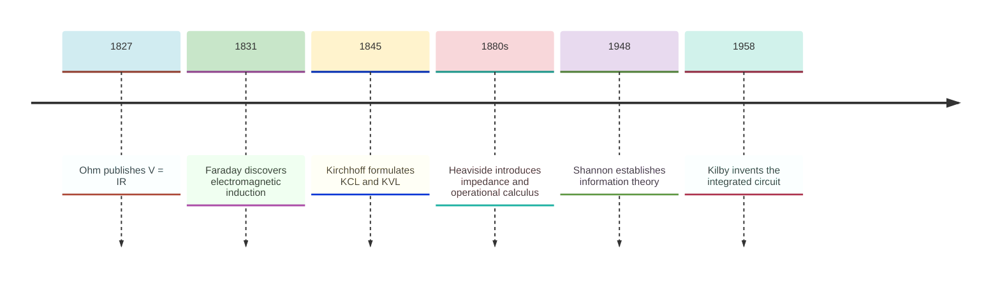
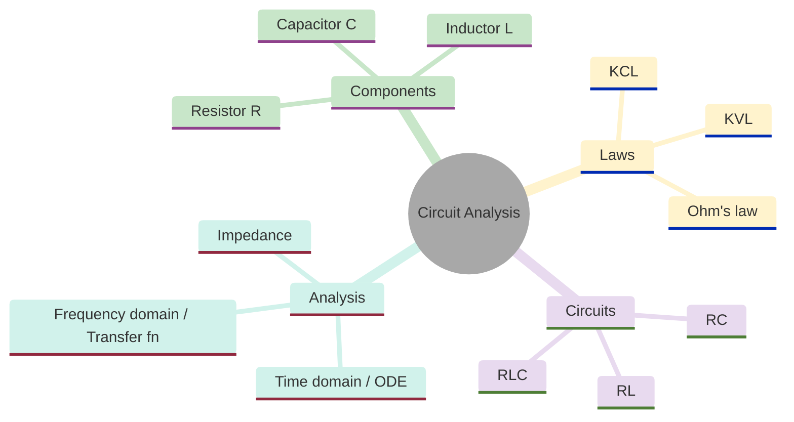
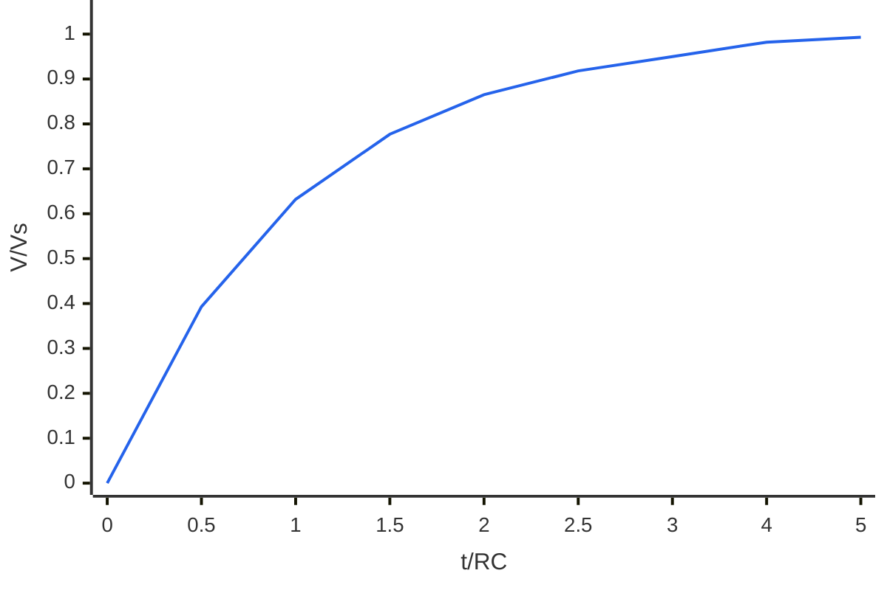
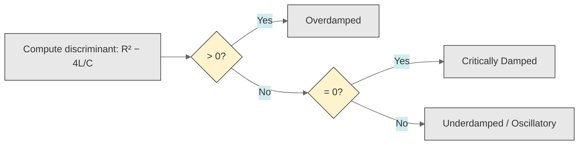
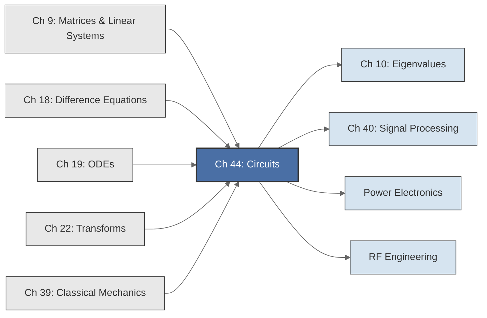

<!-- Copyright (c) 2025-2026 Bob Jansen <bobjansen@pm.me> -->
<!-- SPDX-License-Identifier: CC-BY-NC-4.0 -->
<!-- See LICENSE for full terms. Commercial licensing available. -->

# Chapter 44: Electromagnetism & Circuit Analysis

**Part IX**: Applications

> Kirchhoff's laws produce the linear system $A\mathbf{x} = \mathbf{b}$; adding capacitors and inductors turns it into first- and second-order ordinary differential equations (ODEs) identical to the damped oscillator of [Chapter 39](39-mechanics-waves.md). This chapter solves resistive networks, RC/RL transients, resistor-inductor-capacitor (RLC) resonance and coupled circuits using the same matrix, ODE and spectral tools as every other chapter.

**Prerequisites**: [Chapter 9](09-matrices.md) (Matrices & Linear Transformations); Kirchhoff's laws produce a linear system $A\mathbf{x} = \mathbf{b}$; solving for node voltages and branch currents requires Gaussian elimination and matrix inversion. [Chapter 18](18-difference-equations.md) (Difference Equations); discrete-time filters, sample-and-hold circuits and the connection between continuous and digital domains. [Chapter 19](19-odes.md) (Ordinary Differential Equations); RC, RL and RLC circuits are first- and second-order ODEs solved numerically by the fourth-order Runge–Kutta method (RK4). [Chapter 22](22-transforms.md) (Transforms & Spectral Analysis); impedance formulation, the Laplace and Fourier transforms, transfer functions and frequency response computation via the fast Fourier transform (FFT). [Chapter 39](39-mechanics-waves.md) (Mechanics & Waves); the damped harmonic oscillator and wave equation, whose mathematical form is identical to the RLC circuit ODE.

**Learning Objectives**: After this chapter, the reader will be able to:

1. Formulate Kirchhoff's current and voltage laws as a linear system $G\mathbf{v} = \mathbf{i}_s$ and solve for node voltages using matrix methods.
2. Compute equivalent resistance of series and parallel resistor networks via matrix reduction.
3. Model the RC circuit as a first-order ODE, compute the time constant $\tau = RC$ and simulate charging and discharging curves with RK4.
4. Model the RL circuit as a first-order ODE with time constant $\tau = L/R$ and simulate the current response.
5. Model the series RLC circuit as a second-order ODE, classify the damping regime (underdamped, critically damped, overdamped) from eigenvalues and compute the resonance frequency $\omega_0 = 1/\sqrt{LC}$ and quality factor $Q$.
6. Compute impedances $Z_R$, $Z_C$, $Z_L$ in the frequency domain and derive transfer functions for filter circuits.
7. Evaluate the frequency response $\lvert H(\omega)\rvert$ of RC and RLC filters and classify them as low-pass, high-pass or band-pass.
8. Model coupled circuits (transformers) as systems of coupled ODEs and extract natural frequencies via eigenvalue decomposition.

**Connections**: This chapter synthesises [Chapter 9](09-matrices.md) (node voltage analysis is a linear system solve), [Chapter 18](18-difference-equations.md) (discrete-time filters are the digital realisation of analogue circuit responses), [Chapter 19](19-odes.md) (RC, RL and RLC circuits are ODEs integrated by RK4) and [Chapter 22](22-transforms.md) (impedance and transfer functions are the Laplace/Fourier-domain representation of circuit equations). It connects backward to [Chapter 39](39-mechanics-waves.md) (the RLC circuit *is* a damped harmonic oscillator with different physical units) and [Chapter 40](40-signal-processing.md) (frequency response of analogue filters corresponds to that of digital filters). It connects forward to power electronics, RF engineering and integrated circuit design.

---

## Historical Context

**Key Dates in Circuit Theory**



*Figure 44.1: Timeline of key milestones in circuit theory from Ohm to integrated circuits.*

**Ohm's law (1827).** Georg Simon Ohm published *Die galvanische Kette, mathematisch bearbeitet*, establishing $V = IR$. Ohm's law reduces a resistive element to a single linear algebraic relation. Recognition came slowly, but by mid-century the equation was accepted as fundamental to circuit analysis.

**Kirchhoff's circuit laws (1845).** Gustav Kirchhoff published his circuit laws at the age of twenty-one. Kirchhoff's Current Law (KCL) states that currents entering any node sum to zero. Kirchhoff's Voltage Law (KVL) states that voltages around any closed loop sum to zero. These are conservation of charge and conservation of energy, expressed as algebraic constraints. Together with Ohm's law they reduce any resistive network to the linear system $G\mathbf{v} = \mathbf{i}_s$ ([Chapter 9](09-matrices.md)).

**Electromagnetic induction (1831).** Michael Faraday discovered electromagnetic induction; Joseph Henry made the same discovery independently. Faraday's discovery provided the physical basis for the inductor, whose lumped-element relation is $V = L\,dI/dt$. With inductors and capacitors ($I = C \, dV/dt$), circuit equations became ordinary differential equations. James Clerk Maxwell unified electricity, magnetism and light in his 1865 paper "A Dynamical Theory of the Electromagnetic Field." For circuit analysis the consequence is that lumped-element models are valid when circuit dimensions are much smaller than the electromagnetic wavelength.

**Heaviside's operational calculus (1880s–1890s).** Oliver Heaviside introduced operational calculus, replacing $d/dt$ by the operator $p$. He solved circuit equations algebraically in the transform domain. Mathematicians initially dismissed the method; Gustav Doetsch provided rigorous justification through the Laplace transform in the 1930s. Heaviside also introduced impedance and admittance, reducing alternating-current (AC) analysis to complex arithmetic. In the same decade Nikola Tesla developed AC systems while Thomas Edison promoted direct current (DC). Transformers, described by coupled ODEs with mutual inductance, step voltage up or down with near-perfect efficiency. Tesla's polyphase system is a system of coupled ODEs whose eigenvalues yield natural frequencies.

**Shannon's information theory (1948).** Claude Shannon's paper "A Mathematical Theory of Communication" linked channel capacity to signal-to-noise ratio and bandwidth. Channel capacity is computed from the transfer function. Every modern communication circuit is designed using these tools.

**The integrated circuit (1958–1959).** Jack Kilby and Robert Noyce independently developed the integrated circuit. Modern integrated circuit design tools solve millions of coupled ODEs (Simulation Programme with Integrated Circuit Emphasis, SPICE), making the framework of this chapter the mathematical basis of modern semiconductor design.

---

## Why This Chapter Matters

**Circuit Analysis**



*Figure 44.2: Overview of circuit analysis topics covered in this chapter.*

Every power supply, communication system, sensor interface and computer relies on the analysis of voltage and current through resistors, capacitors and inductors. Kirchhoff's laws reduce arbitrary networks to linear systems solvable by the methods of [Chapter 9](09-matrices.md). The RLC circuit is the exact electrical analogue of the mechanical oscillator ([Chapter 39](39-mechanics-waves.md)): inductance plays the role of mass, capacitance the role of spring compliance, resistance the role of damping. The eigenvalue classification into underdamped, critically damped and overdamped regimes transfers directly. Impedance algebra extends Ohm's law to the frequency domain.

The conductance matrix $G$ is solved using the linear algebra routines of [Chapter 9](09-matrices.md). Companion matrix eigenvalues ([Chapter 10](10-eigenvalues.md)) classify RLC transient behaviour. Frequency response computation uses the same FFT infrastructure as signal processing ([Chapter 40](40-signal-processing.md)). The RK4 integrator ([Chapter 19](19-odes.md)) simulates transient response of nonlinear or time-varying circuits. Coupled LC circuits produce the same eigenvalue problem as coupled mechanical oscillators; normal mode frequencies reveal the beat phenomenon and energy transfer between circuits.

Power electronics engineers design filters for harmonic distortion standards. RF engineers compute impedance matching networks. Audio engineers design crossover networks. Control systems engineers ([Chapter 29](29-control-systems.md)) use transfer functions to design compensators. The framework is uniform: represent the circuit as a linear system, compute the transfer function, analyse the poles and zeros and verify that the frequency response meets specifications.

---

## Notation & Conventions

| Symbol | Meaning |
|--------|---------|
| $V$, $v$ | Voltage (potential difference), in volts (V) |
| $I$, $i$ | Current, in amperes (A) |
| $R$ | Resistance, in ohms ($\Omega$) |
| $C$ | Capacitance, in farads (F) |
| $L$ | Inductance, in henrys (H) |
| $G$ | Conductance matrix ($G = R^{-1}$ for scalar; $G_{ij}$ for nodal analysis) |
| $\mathbf{v}$ | Node voltage vector |
| $\mathbf{i}_s$ | Source current vector |
| $\tau$ | Time constant: $\tau = RC$ (RC circuit) or $\tau = L/R$ (RL circuit) |
| $\omega$ | Angular frequency (rad/s) |
| $\omega_0$ | Resonance frequency: $\omega_0 = 1/\sqrt{LC}$ |
| $Q$ | Quality factor: $Q = \omega_0 L / R = 1/(R\sqrt{C/L})$. Also used for reactive power, written $Q_r$ (Theorem 44.23) to avoid ambiguity |
| $\zeta$ | Damping ratio: $\zeta = (R/2)\sqrt{C/L} = 1/(2Q)$ |
| $Z$ | Impedance (complex, frequency-dependent) |
| $Z_R$, $Z_C$, $Z_L$ | Component impedances: $R$, $1/(j\omega C)$, $j\omega L$ |
| $H(\omega)$ | Transfer function: $V_{\text{out}}/V_{\text{in}}$ |
| $\lvert H(\omega)\rvert$ | Magnitude response (gain) |
| $\phi(\omega)$ | Phase response: $\arg(H(\omega))$ |
| $j$ | Imaginary unit ($j = \sqrt{-1}$; engineering convention) |
| $P$ | Average power: $P = V_{\text{rms}} I_{\text{rms}} \cos\phi$ |
| $q$ | Charge on a capacitor: $q = CV$ |
| $M_{12}$ | Mutual inductance between coils 1 and 2 |
| $k$ | Coupling coefficient: $k = M_{12}/\sqrt{L_1 L_2}$ |
| $h$ | Step size for numerical integration |

The engineering convention uses $j$ for the imaginary unit to avoid confusion with current $i$. Complex arithmetic stores real and imaginary parts separately. Kirchhoff's laws assume the lumped-element approximation: circuit dimensions are small relative to the electromagnetic wavelength. All simulations use SI units.

---

## Core Theory

The following workflow summarises the general approach to analysing any linear circuit, from component identification through to the time-domain solution.

**Circuit Analysis Workflow**

```mermaid
%%{init: {"theme": "base", "themeVariables": {"primaryColor": "#e8e8e8", "primaryTextColor": "#333333", "primaryBorderColor": "#555555", "lineColor": "#666666", "secondaryColor": "#d1ecf1", "tertiaryColor": "#c8e6c9"}}}%%
flowchart LR
    IdentifyComponents["Identify R, L, C components"] --> WriteKCLKVL["Write KCL / KVL equations"]
    WriteKCLKVL --> ConvertImpedance["Convert to impedance (frequency domain)"]
    ConvertImpedance --> SolveAlgebraic["Solve algebraic system for V, I"]
    SolveAlgebraic --> InverseTransform["Inverse transform to time domain"]
    style IdentifyComponents fill:#e8e8e8,stroke:#333333
    style ConvertImpedance fill:#e8e8e8,stroke:#333333
    style InverseTransform fill:#e8e8e8,stroke:#333333
    style SolveAlgebraic fill:#e8e8e8,stroke:#333333
    style WriteKCLKVL fill:#e8e8e8,stroke:#333333
```



*Figure 44.3: General workflow for analysing a linear circuit.*

### Kirchhoff's Laws and the Resistive Network

**Definition 44.1** (Kirchhoff's Current Law; KCL). At every node in an electrical circuit, the algebraic sum of currents is zero:

$$\sum_{k} I_k = 0,$$

where currents entering the node are positive and currents leaving are negative. This is conservation of electric charge in steady state.

**Definition 44.2** (Kirchhoff's Voltage Law; KVL). Around every closed loop in a circuit, the algebraic sum of voltages is zero:

$$\sum_{k} V_k = 0.$$

This is conservation of energy: a charge traversing a closed path returns to its starting potential.

**Definition 44.3** (Ohm's law). For a resistor of resistance $R$, the voltage across it and the current through it satisfy:

$$V = IR.$$

Equivalently, in terms of conductance $G = 1/R$: $I = GV$.

**Theorem 44.4** (Nodal analysis as a linear system). Consider a resistive network with $n$ nodes (excluding a reference ground node) and current sources. Let $v_k$ denote the voltage at node $k$, let $G_{kk} = \sum_{j \neq k} G_{kj}$ be the sum of conductances connected to node $k$ and let $G_{kl}$ (for $k \neq l$) be the negative of the conductance between nodes $k$ and $l$. Let $i_{s,k}$ be the total source current injected into node $k$. Then the node voltages satisfy the linear system:

$$G\mathbf{v} = \mathbf{i}_s,$$

where $G$ is the $n \times n$ symmetric conductance matrix, $\mathbf{v} = (v_1, \ldots, v_n)^T$ is the node voltage vector and $\mathbf{i}_s = (i_{s,1}, \ldots, i_{s,n})^T$ is the source current vector.

??? note "Proof"

    *Proof.* Apply KCL at each non-reference node $k$. The current flowing from node $k$ to node $l$ through a resistor of conductance $G_{kl}$ is $G_{kl}(v_k - v_l)$. The total current leaving node $k$ is

    $$\sum_{l \neq k} G_{kl}(v_k - v_l) = v_k \sum_{l \neq k} G_{kl} - \sum_{l \neq k} G_{kl}\, v_l.$$

    By KCL, this equals the injected source current $i_{s,k}$. Defining $G_{kk} = \sum_{l \neq k} G_{kl}$ (diagonal) and $G_{kl}^{\text{off}} = -G_{kl}$ for $k \neq l$ (off-diagonal), the equation at each node is the $k$-th row of $G\mathbf{v} = \mathbf{i}_s$.

    The matrix $G$ is symmetric because $G_{kl} = G_{lk}$ (conductance between two nodes is the same in either direction), and positive semi-definite because for any vector $\mathbf{x}$, $\mathbf{x}^T G\mathbf{x} = \sum_{k<l} G_{kl}(x_k - x_l)^2 \geq 0$, the sum of non-negative terms. $\square$

**Remark 44.5**. This is the central computational result of resistive circuit analysis. Solving for the node voltages requires exactly the matrix methods of [Chapter 9](09-matrices.md): Gaussian elimination, LU decomposition or direct inversion for small systems.

### Series and Parallel Combinations

**Theorem 44.6** (Series resistance). Two resistors $R_1$ and $R_2$ connected in series have equivalent resistance:

$$R_{\text{eq}} = R_1 + R_2.$$

**Theorem 44.7** (Parallel resistance). Two resistors $R_1$ and $R_2$ connected in parallel have equivalent resistance:

$$R_{\text{eq}} = \frac{R_1 R_2}{R_1 + R_2} = \frac{1}{1/R_1 + 1/R_2}.$$

??? note "Proof"

    *Proof.* In series, the same current $I$ flows through both resistors. By KVL:

    $$V = IR_1 + IR_2 = I(R_1 + R_2),$$

    giving $R_{\text{eq}} = V/I = R_1 + R_2$.

    In parallel, both resistors share the same voltage $V$. By KCL:

    $$I = \frac{V}{R_1} + \frac{V}{R_2} = V\!\left(\frac{1}{R_1} + \frac{1}{R_2}\right),$$

    giving $R_{\text{eq}} = V/I = \left(1/R_1 + 1/R_2\right)^{-1}$. $\square$

### The RC Circuit

**Definition 44.8** (RC circuit ODE). A resistor $R$ in series with a capacitor $C$, driven by a voltage source $V_s$, satisfies:

$$\tau \frac{dV_C}{dt} + V_C = V_s, \qquad \tau = RC,$$

where $V_C$ is the voltage across the capacitor. This is a first-order linear ODE ([Chapter 19](19-odes.md)).

**Theorem 44.9** (RC charging solution). For a step input $V_s = V_0$ applied at $t = 0$ with initial condition $V_C(0) = 0$, the solution is:

$$V_C(t) = V_0\left(1 - e^{-t/\tau}\right).$$

The current through the circuit is:

$$I(t) = \frac{V_0}{R} e^{-t/\tau}.$$

The capacitor reaches $63.2\%$ of $V_0$ after one time constant ($t = \tau$), $86.5\%$ after $2\tau$, $95.0\%$ after $3\tau$ and $99.3\%$ after $5\tau$.

??? note "Proof"

    *Proof.* The ODE $\tau \dot{V}_C + V_C = V_0$ is linear first-order with constant coefficients. Multiplying through by the integrating factor $e^{t/\tau}$:

    $$\frac{d}{dt}\!\bigl(e^{t/\tau} V_C\bigr) = \frac{V_0}{\tau}\, e^{t/\tau}.$$

    Integrating from $0$ to $t$:

    $$e^{t/\tau} V_C(t) - V_C(0) = V_0\!\left(e^{t/\tau} - 1\right).$$

    Applying $V_C(0) = 0$ and dividing by $e^{t/\tau}$:

    $$V_C(t) = V_0\!\left(1 - e^{-t/\tau}\right).$$

    The current follows by differentiation: $I = C\,dV_C/dt = C \cdot V_0/(RC) \cdot e^{-t/\tau} = (V_0/R)\,e^{-t/\tau}$. $\square$

**RC Circuit Charging Curve**



*Figure 44.4: Capacitor voltage rises exponentially toward the source voltage during RC charging.*

**Theorem 44.10** (RC discharging). For a capacitor initially charged to $V_C(0) = V_0$ discharging through a resistor ($V_s = 0$):

$$V_C(t) = V_0 \, e^{-t/\tau}.$$

??? note "Proof"

    *Proof.* Set $V_s = 0$ in Definition 44.8. The ODE becomes $\tau\dot{V}_C + V_C = 0$, a separable first-order ODE whose solution with initial condition $V_C(0)$ is

    $$V_C(t) = V_C(0)\,e^{-t/\tau}.$$

    $\square$

### The RL Circuit

**Definition 44.11** (RL circuit ODE). A resistor $R$ in series with an inductor $L$, driven by a voltage source $V_s$, satisfies:

$$L\frac{dI}{dt} + RI = V_s, \qquad \tau = L/R,$$

where $I$ is the current. This is a first-order linear ODE with the same mathematical structure as the RC circuit.

**Theorem 44.12** (RL step response). For a step input $V_s = V_0$ applied at $t = 0$ with $I(0) = 0$:

$$I(t) = \frac{V_0}{R}\left(1 - e^{-t/\tau}\right).$$

??? note "Proof"

    *Proof.* Dividing the ODE by $L$ gives $\dot{I} + (R/L)I = V_0/L$. Multiplying by the integrating factor $e^{Rt/L}$ and integrating with $I(0) = 0$:

    $$I(t) = \frac{V_0}{R}\!\left(1 - e^{-Rt/L}\right) = \frac{V_0}{R}\!\left(1 - e^{-t/\tau}\right).$$

    $\square$

### The Series RLC Circuit

**Definition 44.13** (RLC circuit ODE). A resistor $R$, inductor $L$ and capacitor $C$ in series, driven by a voltage source $V(t)$, satisfies:

$$L\frac{d^2q}{dt^2} + R\frac{dq}{dt} + \frac{q}{C} = V(t),$$

where $q$ is the charge on the capacitor ($I = dq/dt$, $V_C = q/C$). Equivalently, in terms of the capacitor voltage:

$$LC\frac{d^2 V_C}{dt^2} + RC\frac{dV_C}{dt} + V_C = V(t).$$

This is a second-order linear ODE; identical in mathematical structure to the damped harmonic oscillator $m\ddot{x} + b\dot{x} + kx = F(t)$ of [Chapter 39](39-mechanics-waves.md), with the correspondence $L \leftrightarrow m$, $R \leftrightarrow b$, $1/C \leftrightarrow k$.

**Theorem 44.14** (RLC characteristic equation and damping classification). The companion matrix of the undriven ($V(t) = 0$) series RLC circuit, with state $\mathbf{y} = (V_C, \dot{V}_C)^T$, is:

$$A = \begin{pmatrix} 0 & 1 \\ -\omega_0^2 & -2\zeta\omega_0 \end{pmatrix},$$

where $\omega_0 = 1/\sqrt{LC}$ is the resonance frequency and $\zeta = (R/2)\sqrt{C/L} = R/(2\omega_0 L)$ is the damping ratio. The eigenvalues of $A$ are:

$$\lambda_{\pm} = -\zeta\omega_0 \pm \omega_0\sqrt{\zeta^2 - 1}.$$

For the underdamped case ($\zeta < 1$), $\lambda_{\pm} = -\zeta\omega_0 \pm j\omega_d$ where $\omega_d = \omega_0\sqrt{1-\zeta^2}$. Three regimes arise:

1. **Underdamped** ($\zeta < 1$, equivalently $R < 2\sqrt{L/C}$): Complex conjugate eigenvalues. The circuit oscillates with decaying amplitude at the damped frequency $\omega_d = \omega_0\sqrt{1 - \zeta^2}$.

2. **Critically damped** ($\zeta = 1$, equivalently $R = 2\sqrt{L/C}$): Repeated real eigenvalue $\lambda = -\omega_0$. Fastest return to equilibrium without oscillation.

3. **Overdamped** ($\zeta > 1$, equivalently $R > 2\sqrt{L/C}$): Two distinct negative real eigenvalues. Monotonic exponential decay.

??? note "Proof"

    *Proof.* Dividing the undriven ODE $LC\ddot{V}_C + RC\dot{V}_C + V_C = 0$ by $LC$ gives

    $$\ddot{V}_C + \frac{R}{L}\dot{V}_C + \frac{1}{LC}V_C = 0.$$

    Identifying $\omega_0^2 = 1/(LC)$ and $2\zeta\omega_0 = R/L$, the companion matrix $A$ follows by setting $y_1 = V_C$, $y_2 = \dot{V}_C$. The eigenvalues of $A$ are roots of the characteristic equation

    $$\lambda^2 + 2\zeta\omega_0\lambda + \omega_0^2 = 0,$$

    giving

    $$\lambda_{\pm} = -\zeta\omega_0 \pm \omega_0\sqrt{\zeta^2 - 1}$$

    by the quadratic formula. The sign of the discriminant $\omega_0^2(\zeta^2 - 1)$ determines the three cases:

    - Negative ($\zeta < 1$): complex conjugate eigenvalues (underdamped).
    - Zero ($\zeta = 1$): repeated real eigenvalue (critically damped).
    - Positive ($\zeta > 1$): two distinct negative real eigenvalues (overdamped). $\square$

!!! abstract "Key Result"

    **Theorem 44.14** (RLC damping classification). The eigenvalues $\lambda_{\pm} = -\zeta\omega_0 \pm \omega_0\sqrt{\zeta^2 - 1}$ classify an RLC circuit as underdamped, critically damped or overdamped based solely on the damping ratio $\zeta = (R/2)\sqrt{C/L}$, unifying circuit transient analysis with the general theory of second-order ODEs.

**RLC Damping Classification**



*Figure 44.5: RLC damping classification based on the circuit discriminant.*

**Definition 44.15** (Quality factor). The quality factor of a series RLC circuit is:

$$Q = \frac{\omega_0 L}{R} = \frac{1}{R}\sqrt{\frac{L}{C}} = \frac{1}{2\zeta}.$$

The quality factor measures the sharpness of the resonance peak: higher $Q$ means a narrower bandwidth and more oscillation cycles before the energy decays. The $-3$ dB bandwidth of the resonance is:

$$\Delta\omega = \frac{\omega_0}{Q}.$$

### Impedance and the Frequency Domain

**Definition 44.16** (Impedance). When a circuit is driven by a sinusoidal source $V(t) = V_0 e^{j\omega t}$ (taking the real part as the physical voltage), the steady-state response of every voltage and current is also sinusoidal at the same frequency. The impedance $Z$ of a component relates its voltage and current phasors ($\hat{V} = Z \hat{I}$). The impedances of the three basic elements are:

$$Z_R = R, \qquad Z_C = \frac{1}{j\omega C}, \qquad Z_L = j\omega L.$$

!!! info "Engineering convention: $j$ for the imaginary unit"

    Electrical engineering uses $j = \sqrt{-1}$ rather than $i$ to avoid confusion with current. All impedance expressions in this chapter follow this convention. When interfacing with mathematics libraries that use $i$, substitute $j \to i$ throughout.

**Theorem 44.17** (Impedance combination rules). Impedances combine by the same rules as resistances:

- Series: $Z_{\text{eq}} = Z_1 + Z_2 + \cdots + Z_n$.
- Parallel: $Z_{\text{eq}} = \left(\frac{1}{Z_1} + \frac{1}{Z_2} + \cdots + \frac{1}{Z_n}\right)^{-1}$.

??? note "Proof"

    *Proof.* In the frequency domain, KCL and KVL apply to voltage and current phasors; Ohm's law generalises to $\hat{V} = Z\hat{I}$. The argument is then identical to the proofs of Theorems 44.6 and 44.7, with $R$ replaced by $Z$ throughout. The algebraic structure is unchanged. $\square$

**Theorem 44.18** (Transfer function of a voltage divider). For two impedances $Z_1$ and $Z_2$ in series, driven by a source $V_{\text{in}}$, the output voltage across $Z_2$ is:

$$H(\omega) = \frac{V_{\text{out}}}{V_{\text{in}}} = \frac{Z_2}{Z_1 + Z_2}.$$

??? note "Proof"

    *Proof.* By KVL, the total voltage drop across the series combination equals $V_{\text{in}}$. By Ohm's law in the frequency domain, the phasor current is

    $$\hat{I} = \frac{V_{\text{in}}}{Z_1 + Z_2}.$$

    The voltage across $Z_2$ is then

    $$V_{\text{out}} = \hat{I}\,Z_2 = V_{\text{in}}\frac{Z_2}{Z_1 + Z_2}.$$

    $\square$

**Corollary 44.19** (RC low-pass filter transfer function). For an RC circuit with $Z_1 = R$ and $Z_2 = 1/(j\omega C)$:

$$H(\omega) = \frac{1/(j\omega C)}{R + 1/(j\omega C)} = \frac{1}{1 + j\omega RC} = \frac{1}{1 + j\omega\tau}.$$

The magnitude response is:

$$\lvert H(\omega) \rvert = \frac{1}{\sqrt{1 + (\omega\tau)^2}}.$$

At $\omega = 0$: $\lvert H\rvert = 1$ (DC passes). At $\omega = 1/\tau$: $\lvert H\rvert = 1/\sqrt{2}$, which corresponds to $-3\,\text{dB}$ (cutoff frequency). As $\omega \to \infty$: $\lvert H\rvert \to 0$ (high frequencies are attenuated). This is a low-pass filter with cutoff frequency:

$$\omega_c = \frac{1}{\tau} = \frac{1}{RC}.$$

### The Series RLC Band-Pass Filter

**Theorem 44.20** (RLC band-pass transfer function). For a series RLC circuit, taking the output voltage across the resistor:

$$H(\omega) = \frac{R}{R + j\omega L + 1/(j\omega C)} = \frac{j\omega RC}{1 - \omega^2 LC + j\omega RC}.$$

The magnitude response is:

$$\lvert H(\omega) \rvert = \frac{\omega RC}{\sqrt{(1 - \omega^2 LC)^2 + (\omega RC)^2}}.$$

This is maximum at $\omega = \omega_0 = 1/\sqrt{LC}$, where $\lvert H(\omega_0) \rvert = 1$. The $-3$ dB bandwidth is:

$$\Delta\omega = \frac{R}{L} = \frac{\omega_0}{Q}.$$

??? note "Proof"

    *Proof.* Apply the voltage divider formula (Theorem 44.18) with $Z_1 = j\omega L + 1/(j\omega C)$ and $Z_2 = R$:

    $$H = \frac{R}{R + j\omega L + 1/(j\omega C)}.$$

    Multiplying numerator and denominator by $j\omega C$:

    $$H = \frac{j\omega RC}{j\omega RC + (j\omega)^2 LC + 1} = \frac{j\omega RC}{1 - \omega^2 LC + j\omega RC}.$$

    At $\omega = \omega_0 = 1/\sqrt{LC}$, the term $1 - \omega_0^2 LC = 0$, so

    $$H(\omega_0) = \frac{j\omega_0 RC}{j\omega_0 RC} = 1.$$

    The $-3\,\text{dB}$ bandwidth follows from solving $\lvert H(\omega_0 \pm \Delta\omega/2)\rvert = 1/\sqrt{2}$, which yields $\Delta\omega = R/L$ to first order. $\square$

### Coupled Circuits and Mutual Inductance

**Definition 44.21** (Coupled inductor model). Two inductors with self-inductances $L_1$, $L_2$ and mutual inductance $M$ satisfy the coupled ODEs:

$$\begin{aligned}
L_1 \frac{dI_1}{dt} + M\frac{dI_2}{dt} + R_1 I_1 &= V_1(t), \\
M\frac{dI_1}{dt} + L_2 \frac{dI_2}{dt} + R_2 I_2 &= V_2(t).
\end{aligned}$$

In matrix form:

$$\begin{pmatrix} L_1 & M \\ M & L_2 \end{pmatrix} \frac{d}{dt}\begin{pmatrix} I_1 \\ I_2 \end{pmatrix} + \begin{pmatrix} R_1 & 0 \\ 0 & R_2 \end{pmatrix}\begin{pmatrix} I_1 \\ I_2 \end{pmatrix} = \begin{pmatrix} V_1(t) \\ V_2(t) \end{pmatrix}.$$

The coupling coefficient is $k = M/\sqrt{L_1 L_2}$, with $0 \leq k \leq 1$.

**Theorem 44.22** (Natural frequencies of coupled circuits). For the undriven ($V_1 = V_2 = 0$), undamped ($R_1 = R_2 = 0$) coupled circuit with capacitors $C_1$, $C_2$:

$$\mathbf{L}\ddot{\mathbf{q}} + \mathbf{C}^{-1}\mathbf{q} = \mathbf{0}, \qquad \mathbf{L} = \begin{pmatrix} L_1 & M \\ M & L_2 \end{pmatrix}, \quad \mathbf{C}^{-1} = \begin{pmatrix} 1/C_1 & 0 \\ 0 & 1/C_2 \end{pmatrix},$$

the natural frequencies are $\omega_k = \sqrt{\lambda_k}$, where $\lambda_k$ are the eigenvalues of $\mathbf{L}^{-1}\mathbf{C}^{-1}$.

??? note "Proof"

    *Proof.* Seeking solutions of the form $\mathbf{q}(t) = \hat{\mathbf{q}}\,e^{j\omega t}$, substitution gives

    $$-\omega^2 \mathbf{L}\hat{\mathbf{q}} + \mathbf{C}^{-1}\hat{\mathbf{q}} = \mathbf{0}.$$

    Left-multiplying by $\mathbf{L}^{-1}$ yields the standard eigenvalue problem

    $$\mathbf{L}^{-1}\mathbf{C}^{-1}\hat{\mathbf{q}} = \omega^2 \hat{\mathbf{q}}.$$

    The eigenvalues $\lambda_k = \omega_k^2$ give the squared natural frequencies and the eigenvectors $\hat{\mathbf{q}}_k$ give the normal mode shapes ([Chapter 10](10-eigenvalues.md)). Since $\mathbf{L}$ is symmetric positive definite (for a physical coupled system with $k \leq 1$) and $\mathbf{C}^{-1}$ is diagonal with positive entries, $\mathbf{L}^{-1}\mathbf{C}^{-1}$ has positive eigenvalues, so $\omega_k = \sqrt{\lambda_k} \in \mathbb{R}^+$. $\square$

### AC Power

**Theorem 44.23** (Average AC power). For a sinusoidal voltage $V(t) = V_0\cos(\omega t)$ driving a load with impedance $Z = \lvert Z \rvert e^{j\phi}$, the average power delivered is:

$$P = \frac{V_0^2}{2\lvert Z \rvert}\cos\phi = V_{\text{rms}} I_{\text{rms}} \cos\phi,$$

where $\phi = \arg(Z)$ is the impedance phase angle and $\cos\phi$ is the power factor. The reactive power $Q_r = V_{\text{rms}} I_{\text{rms}} \sin\phi$ represents energy oscillating between the source and reactive elements without being dissipated.

??? note "Proof"

    *Proof.* The current phasor corresponding to $V(t) = V_0\cos(\omega t)$ is $I(t) = (V_0/\lvert Z \rvert)\cos(\omega t - \phi)$. The instantaneous power is

    $$P(t) = V(t)I(t) = \frac{V_0^2}{\lvert Z \rvert}\cos(\omega t)\cos(\omega t - \phi).$$

    Applying the product-to-sum formula:

    $$P(t) = \frac{V_0^2}{2\lvert Z \rvert}\bigl[\cos\phi + \cos(2\omega t - \phi)\bigr].$$

    Time-averaging over one period eliminates the oscillating $\cos(2\omega t - \phi)$ term, leaving

    $$P = \frac{V_0^2\cos\phi}{2\lvert Z \rvert}.$$

    With $V_{\text{rms}} = V_0/\sqrt{2}$ and $I_{\text{rms}} = V_0/(\sqrt{2}\lvert Z \rvert)$, this becomes $P = V_{\text{rms}} I_{\text{rms}} \cos\phi$. $\square$

### The Digital-to-Analogue Interface

**Remark 44.24** (Sample-and-hold as a discrete system). A sample-and-hold circuit samples a continuous signal $x(t)$ at intervals $T_s = 1/f_s$ and holds each value constant until the next sample. The output is a piecewise-constant signal whose spectral content includes the original signal plus spectral images centred at multiples of $f_s$.

The reconstruction problem is solved by the Nyquist–Shannon sampling theorem ([Chapter 22](22-transforms.md)): if $x(t)$ is bandlimited to frequencies below $f_s/2$, then $x(t) = \sum_n x[n] \operatorname{sinc}((t - nT_s)/T_s)$, where $\operatorname{sinc}(u) = \sin(\pi u)/(\pi u)$. The analogue reconstruction filter, typically a low-pass RC filter, approximates the ideal sinc interpolation by removing the spectral images above $f_s/2$. This is the physical link between the discrete-time world of [Chapter 18](18-difference-equations.md) and the continuous-time world of [Chapter 19](19-odes.md).

---

## Formulas & Identities

**F44.1** Ohm's law ($G = 1/R$):

$$V = IR, \qquad I = GV.$$

**F44.2** Series resistance:

$$R_{\text{eq}} = R_1 + R_2 + \cdots + R_n.$$

**F44.3** Parallel resistance:

$$R_{\text{eq}} = \left(\frac{1}{R_1} + \frac{1}{R_2} + \cdots + \frac{1}{R_n}\right)^{-1}.$$

**F44.4** RC time constant $\tau = RC$:

$$\text{Charging: } V_C(t) = V_0\!\left(1 - e^{-t/\tau}\right), \qquad \text{Discharging: } V_C(t) = V_0\, e^{-t/\tau}.$$

**F44.5** RL time constant $\tau = L/R$. Current step response:

$$I(t) = \frac{V_0}{R}\!\left(1 - e^{-t/\tau}\right).$$

**F44.6** RLC resonance frequency:

$$\omega_0 = \frac{1}{\sqrt{LC}}, \qquad f_0 = \frac{1}{2\pi\sqrt{LC}}.$$

**F44.7** RLC damping ratio:

$$\zeta = \frac{R}{2\omega_0 L} = \frac{R}{2}\sqrt{\frac{C}{L}}.$$

**F44.8** RLC quality factor:

$$Q = \frac{\omega_0 L}{R} = \frac{1}{R}\sqrt{\frac{L}{C}} = \frac{1}{2\zeta}.$$

**F44.9** RLC damped frequency (underdamped case, $\zeta < 1$):

$$\omega_d = \omega_0\sqrt{1 - \zeta^2}.$$

**F44.10** RLC eigenvalues:

$$\lambda_{\pm} = -\zeta\omega_0 \pm \omega_0\sqrt{\zeta^2 - 1}.$$

**F44.11** Component impedances:

$$Z_R = R, \qquad Z_C = \frac{1}{j\omega C}, \qquad Z_L = j\omega L.$$

!!! warning "Impedance singularities at DC and infinite frequency"

    $Z_C \to \infty$ as $\omega \to 0$ (a capacitor blocks DC) and $Z_L \to \infty$ as $\omega \to \infty$ (an inductor blocks high frequencies). Numerical evaluation of impedance expressions must guard against division by zero at $\omega = 0$ for capacitors and overflow at large $\omega$ for inductors.

**F44.12** RC low-pass magnitude:

$$\lvert H(\omega) \rvert = \frac{1}{\sqrt{1 + (\omega RC)^2}}.$$

**F44.13** RC low-pass cutoff:

$$\omega_c = \frac{1}{RC}, \qquad f_c = \frac{1}{2\pi RC}.$$

**F44.14** RLC band-pass magnitude:

$$\lvert H(\omega) \rvert = \frac{\omega RC}{\sqrt{(1 - \omega^2 LC)^2 + (\omega RC)^2}}.$$

**F44.15** Average AC power:

$$P = V_{\text{rms}}\, I_{\text{rms}} \cos\phi.$$

**F44.16** Reactive power:

$$Q_r = V_{\text{rms}}\, I_{\text{rms}} \sin\phi.$$

**F44.17** Coupled inductors, natural frequencies:

$$\omega_k = \sqrt{\lambda_k\!\left(\mathbf{L}^{-1}\mathbf{C}^{-1}\right)}.$$

**F44.18** Energy stored:

$$E_C = \frac{1}{2}CV^2, \qquad E_L = \frac{1}{2}LI^2.$$

---

## Algorithms

### Algorithm 44.25: Nodal Analysis via Linear System Solve

**Input**: Conductance values $G_{kl}$ for each branch, current source values $i_{s,k}$ for each node.

**Output**: Node voltage vector $\mathbf{v}$.

1. Construct the $n \times n$ conductance matrix $G$: set $G_{kk} = \sum_{l \neq k} G_{kl}$ and $G_{kl}^{\text{off}} = -G_{kl}$.
2. Construct the source vector $\mathbf{i}_s$.
3. Solve $G\mathbf{v} = \mathbf{i}_s$ by Gaussian elimination ([Chapter 9](09-matrices.md)).
4. Compute branch currents: $I_{kl} = G_{kl}(v_k - v_l)$.

```
function nodalAnalysis(G_branch, is, n):
    // Construct conductance matrix
    G = zero matrix of size n x n
    for each branch (k, l) with conductance G_kl:
        G[k][k] = G[k][k] + G_kl
        G[l][l] = G[l][l] + G_kl
        G[k][l] = G[k][l] - G_kl
        G[l][k] = G[l][k] - G_kl

    // Solve for node voltages via Gaussian elimination
    v = gaussianElimination(G, is)

    // Compute branch currents
    for each branch (k, l) with conductance G_kl:
        I_kl = G_kl * (v[k] - v[l])

    return v, I
```

**Complexity**: $O(n^3)$ for the linear solve. For sparse networks (each node connected to few others), sparse solvers reduce this to $O(n)$ for banded or tree-structured topologies.

!!! tip "Sparse solvers for large networks"

    Practical circuits have sparse conductance matrices; each node connects to at most a few neighbours. Reordering nodes to minimise fill-in (e.g. reverse Cuthill–McKee) followed by a banded or sparse LU solver reduces both time and memory from $O(n^3)$ to near-linear.

### Algorithm 44.26: RC/RL First-Order Circuit Simulation

**Input**: Component values $R$, $C$ (or $L$), source voltage $V_s(t)$, initial condition $V_C(0)$ (or $I(0)$), step size $h$, end time $t_{\max}$.

**Output**: Time series of voltage (or current).

1. Compute time constant $\tau = RC$ (or $\tau = L/R$).
2. Define the ODE: $\dot{V}_C = (V_s(t) - V_C)/\tau$ (RC) or $\dot{I} = (V_s(t) - RI)/L$ (RL).
3. Integrate with RK4 ([Chapter 19](19-odes.md)) for $\lfloor t_{\max}/h \rfloor$ steps.

```
function rcRlSimulate(R, C_or_L, Vs, y0, h, tMax, circuitType):
    // Compute time constant
    if circuitType == "RC":
        tau = R * C_or_L
        f(t, y) = (Vs(t) - y) / tau
    else:  // RL
        tau = C_or_L / R
        f(t, y) = (Vs(t) - R * y) / C_or_L

    // RK4 integration
    nSteps = floor(tMax / h)
    t[0] = 0
    y[0] = y0
    for k = 0 to nSteps - 1:
        k1 = h * f(t[k], y[k])
        k2 = h * f(t[k] + h/2, y[k] + k1/2)
        k3 = h * f(t[k] + h/2, y[k] + k2/2)
        k4 = h * f(t[k] + h, y[k] + k3)
        y[k+1] = y[k] + (k1 + 2*k2 + 2*k3 + k4) / 6
        t[k+1] = t[k] + h

    return t, y
```

**Complexity**: $O(T/h)$. Each RK4 step requires 4 evaluations, each $O(1)$.

### Algorithm 44.27: RLC Second-Order Circuit Simulation

**Input**: $R$, $L$, $C$, driving voltage $V(t)$, initial conditions $V_C(0)$, $\dot{V}_C(0)$, step size $h$, end time $t_{\max}$.

**Output**: Time series $(t_k, V_{C,k}, I_k)$ and damping classification.

1. Compute $\omega_0 = 1/\sqrt{LC}$, $\zeta = R/(2\omega_0 L)$.
2. Classify: $\zeta < 1$ underdamped, $\zeta = 1$ critically damped, $\zeta > 1$ overdamped.
3. Define state $\mathbf{y} = (V_C, \dot{V}_C)^T$ and vector field $\mathbf{f}(t, \mathbf{y}) = (\dot{V}_C, (V(t) - V_C - RC\dot{V}_C)/(LC))$.
4. Integrate with RK4.
5. Compute current as $I_k = C \cdot \dot{V}_{C,k}$.

```
function rlcSimulate(R, L, C, V, Vc0, dVc0, h, tMax):
    // Compute resonance parameters
    omega0 = 1 / sqrt(L * C)
    zeta = R / (2 * omega0 * L)

    // Classify damping regime
    if zeta < 1:
        classification = "underdamped"
    else if zeta == 1:
        classification = "critically damped"
    else:
        classification = "overdamped"

    // Define second-order ODE as first-order system
    // y = (Vc, dVc/dt)
    f(t, y) = (y[1], (V(t) - y[0] - R * C * y[1]) / (L * C))

    // RK4 integration
    nSteps = floor(tMax / h)
    t[0] = 0
    y[0] = (Vc0, dVc0)
    for k = 0 to nSteps - 1:
        k1 = h * f(t[k], y[k])
        k2 = h * f(t[k] + h/2, y[k] + k1/2)
        k3 = h * f(t[k] + h/2, y[k] + k2/2)
        k4 = h * f(t[k] + h, y[k] + k3)
        y[k+1] = y[k] + (k1 + 2*k2 + 2*k3 + k4) / 6
        t[k+1] = t[k] + h

    // Extract voltage and compute current
    for k = 0 to nSteps:
        Vc[k] = y[k][0]
        I[k] = C * y[k][1]

    return t, Vc, I, classification
```

**Complexity**: $O(T/h)$.

### Algorithm 44.28: Frequency Response via Impedance

**Input**: Circuit topology, component values, frequency range $[\omega_{\min}, \omega_{\max}]$, number of frequency points $N_\omega$.

**Output**: Arrays of magnitude $\lvert H(\omega_k)\rvert$ and phase $\phi(\omega_k)$.

1. For each $\omega_k$ in the frequency grid:
   - Compute impedances:

     $$Z_R = R, \qquad Z_C = \frac{1}{j\omega_k C}, \qquad Z_L = j\omega_k L.$$

   - Combine impedances according to circuit topology.
   - Evaluate $H(\omega_k) = V_{\text{out}}/V_{\text{in}}$ (voltage divider formula or nodal analysis with complex-valued $G$).
   - Compute magnitude and phase:

     $$\lvert H(\omega_k)\rvert = \sqrt{\operatorname{Re}(H)^2 + \operatorname{Im}(H)^2}, \qquad \phi(\omega_k) = \operatorname{atan2}(\operatorname{Im}(H), \operatorname{Re}(H)).$$

```
function frequencyResponse(R, C, L, omegaMin, omegaMax, Nomega):
    // Generate logarithmically spaced frequency grid
    for k = 0 to Nomega - 1:
        omega[k] = omegaMin * (omegaMax / omegaMin)^(k / (Nomega - 1))

        // Compute component impedances
        ZR = R
        ZC = 1 / (j * omega[k] * C)
        ZL = j * omega[k] * L

        // Combine impedances per circuit topology and evaluate
        // transfer function (example: RC low-pass voltage divider)
        H = ZC / (ZR + ZC)

        // Compute magnitude and phase
        magnitude[k] = sqrt(Re(H)^2 + Im(H)^2)
        phase[k] = atan2(Im(H), Re(H))

    return omega, magnitude, phase
```

**Complexity**: $O(N_\omega \cdot n^3)$ if nodal analysis is required at each frequency; $O(N_\omega)$ for simple topologies where the transfer function has a closed-form expression.

### Algorithm 44.29: Coupled Circuit Natural Frequencies

**Input**: Inductance matrix $\mathbf{L}$, capacitance matrix $\mathbf{C}$, resistance matrix $\mathbf{R}$.

**Output**: Natural frequencies $\omega_1, \ldots, \omega_n$ and mode shapes.

1. Compute $\mathbf{L}^{-1}$ ([Chapter 9](09-matrices.md)).
2. Form dynamical matrix $D = \mathbf{L}^{-1}\mathbf{C}^{-1}$.
3. Compute eigenvalues $\lambda_1, \ldots, \lambda_n$ and eigenvectors of $D$ ([Chapter 10](10-eigenvalues.md)).
4. Natural frequencies: $\omega_k = \sqrt{\lambda_k}$.

```
function coupledCircuitFrequencies(Lmat, Cmat, Rmat):
    n = size(Lmat, 1)

    // Invert the inductance matrix
    Linv = invertMatrix(Lmat)

    // Form inverse capacitance (elastance) matrix
    Cinv = invertMatrix(Cmat)

    // Form dynamical matrix
    D = Linv * Cinv

    // Compute eigenvalues and eigenvectors
    lambda, modes = eigenDecomposition(D)

    // Extract natural frequencies
    for k = 1 to n:
        omega[k] = sqrt(lambda[k])

    return omega, modes
```

**Complexity**: $O(n^3)$ for eigenvalue decomposition.

---

## Numerical Considerations

### Step Size for RC and RL Circuits

A first-order circuit has characteristic timescale $\tau$. Algorithm 44.26 (RK4 simulation) requires $h \leq \tau/5$ for four-digit accuracy in the transient region. Using $h = \tau/100$ provides full accuracy across the charging or discharging curve.

### Step Size for RLC Circuits

The underdamped RLC circuit oscillates at frequency $\omega_d = \omega_0\sqrt{1 - \zeta^2}$ (Algorithm 44.27). Resolving the oscillation requires $h \leq \pi/(10\omega_d)$ for the oscillatory envelope, and the exponential decay requires $h \leq 1/(20\zeta\omega_0)$ for the decay transient. The step size is the minimum of these two constraints:

$$h \leq \min\!\left(\frac{\pi}{10\omega_d},\; \frac{1}{20\zeta\omega_0}\right).$$

For high-$Q$ circuits ($\zeta \ll 1$), $\omega_d \approx \omega_0$ and the oscillation constraint dominates: $h \lesssim 0.3/\omega_0$, consistent with [Chapter 39](39-mechanics-waves.md).

### Condition Number of the Conductance Matrix

For networks with widely differing resistance values (e.g., a $1 \, \Omega$ resistor in parallel with a $1 \, \text{M}\Omega$ resistor), the conductance matrix $G$ in Algorithm 44.25 has a large condition number:

$$\kappa(G) \approx \frac{R_{\max}}{R_{\min}}.$$

When $\kappa(G) \gg 1/\varepsilon$ (where $\varepsilon \approx 2.2 \times 10^{-16}$ is machine epsilon), the solution loses digits of accuracy. For $\kappa = 10^{12}$, the node voltages are accurate to approximately 4 digits. Ill-conditioning is diagnosed by computing $\kappa(G)$ before solving and is mitigated by scaling the conductance matrix or reformulating with better-conditioned variables.

### Stiffness in Multi-Timescale Circuits

Circuits combining fast dynamics ($\tau_{\text{fast}} = 10^{-12}$ s from a parasitic capacitance) and slow dynamics ($\tau_{\text{slow}} = 10^{-3}$ s) produce stiff ODE systems. The stiffness ratio is $10^9$. RK4 must use $h \leq 2 \times 10^{-13}$ s, requiring $5 \times 10^{9}$ steps to simulate $10^{-3}$ s. Implicit methods (backward Euler, trapezoidal rule) solve a linear system at each step but permit step sizes proportional to $\tau_{\text{slow}}$.

!!! warning "Stiff circuits defeat explicit integrators"

    When the stiffness ratio $\tau_{\text{slow}}/\tau_{\text{fast}}$ exceeds $10^6$, RK4 becomes impractical: the step size is dictated by the fastest parasitic, but the simulation must span the slowest timescale. Switch to an implicit method (backward Euler or trapezoidal rule) whose stability region covers the entire left half-plane.

### Frequency Response Sampling

The frequency grid for Algorithm 44.28 must resolve sharp resonance peaks. For a resonance at $\omega_0$ with quality factor $Q$, the peak width is $\Delta\omega = \omega_0/Q$. At least 10 points within the $-3$ dB bandwidth are needed:

$$\delta\omega \leq \frac{\omega_0}{10Q}.$$

For high-$Q$ circuits ($Q > 100$) a logarithmic grid is more efficient than a linear one.

---

## Worked Examples

### Example 44.30: Resistor Network via Nodal Analysis

**Problem**: A circuit has three nodes (plus ground). Node 1 connects to ground through $R_1 = 10 \, \Omega$, to node 2 through $R_{12} = 5 \, \Omega$ and to node 3 through $R_{13} = 20 \, \Omega$. Node 2 connects to node 3 through $R_{23} = 10 \, \Omega$. A $2$ A current source injects current into node 1; a $1$ A current source extracts current from node 3. Find all node voltages.

**Solution**: The conductances are:

$$G_1 = 0.1 \text{ S}, \quad G_{12} = 0.2 \text{ S}, \quad G_{13} = 0.05 \text{ S}, \quad G_{23} = 0.1 \text{ S}.$$

The conductance matrix is (Theorem 44.4):

$$G = \begin{pmatrix} G_1 + G_{12} + G_{13} & -G_{12} & -G_{13} \\ -G_{12} & G_{12} + G_{23} & -G_{23} \\ -G_{13} & -G_{23} & G_{13} + G_{23} \end{pmatrix} = \begin{pmatrix} 0.35 & -0.20 & -0.05 \\ -0.20 & 0.30 & -0.10 \\ -0.05 & -0.10 & 0.15 \end{pmatrix}.$$

The source vector is:

$$\mathbf{i}_s = (2, 0, -1)^T.$$

Solving $G\mathbf{v} = \mathbf{i}_s$:

$$\mathbf{v} = G^{-1}\mathbf{i}_s.$$

By Gaussian elimination (or direct computation):

$$v_1 \approx 12.31 \text{ V}, \quad v_2 \approx 10.00 \text{ V}, \quad v_3 \approx 5.38 \text{ V}.$$

Verification (using the displayed rounded voltages):

$$\begin{aligned}
I_{R_1} &= v_1/R_1 = 1.231 \text{ A (node 1 to ground)}, \\
I_{R_{12}} &= (v_1 - v_2)/R_{12} = (12.31 - 10.00)/5 = 0.462 \text{ A}, \\
I_{R_{13}} &= (v_1 - v_3)/R_{13} = (12.31 - 5.38)/20 = 0.347 \text{ A}.
\end{aligned}$$

KCL at node 1: $2 - 1.231 - 0.462 - 0.347 = -0.04$; the exact solution $\mathbf{v} = G^{-1}\mathbf{i}_s$ satisfies KCL exactly, and this small residual arises solely from rounding to two decimal places.

### Example 44.31: RC Charging Curve

**Problem**: A $1 \, \text{k}\Omega$ resistor is connected in series with a $10 \, \mu\text{F}$ capacitor. A $5$ V step is applied at $t = 0$. Simulate the capacitor voltage for $50$ ms and verify against the analytical solution.

**Solution**: The time constant is:

$$\tau = RC = 1000 \times 10^{-5} = 0.01 \text{ s} = 10 \text{ ms}.$$

The analytical solution (Theorem 44.9) is:

$$V_C(t) = 5(1 - e^{-t/0.01}).$$

$$\begin{aligned}
\text{At } t = \tau = 10 \text{ ms}: \quad V_C &= 5(1 - e^{-1}) = 5 \times 0.6321 = 3.161 \text{ V}, \\
\text{At } t = 3\tau = 30 \text{ ms}: \quad V_C &= 5(1 - e^{-3}) = 5 \times 0.9502 = 4.751 \text{ V}, \\
\text{At } t = 5\tau = 50 \text{ ms}: \quad V_C &= 5(1 - e^{-5}) = 5 \times 0.9933 = 4.966 \text{ V}.
\end{aligned}$$

### Example 44.32: RLC Resonance Simulation

**Problem**: A series RLC circuit has $L = 100$ mH, $C = 1 \, \mu\text{F}$ and $R = 20 \, \Omega$. (a) Compute the resonance frequency and quality factor. (b) Classify the damping. (c) Simulate the free response from $V_C(0) = 10$ V, $I(0) = 0$ for 50 ms.

**Solution (a)**:

$$\omega_0 = 1/\sqrt{LC} = 1/\sqrt{0.1 \times 10^{-6}} = 1/\sqrt{10^{-7}} = 10^{3.5} \approx 3162 \text{ rad/s}.$$

The quality factor is:

$$Q = \omega_0 L/R = 3162 \times 0.1/20 = 15.81.$$

**Solution (b)**: The damping ratio is:

$$\zeta = 1/(2Q) = 1/31.62 = 0.0316.$$

Since $\zeta < 1$, the circuit is underdamped. The damped frequency is

$$\omega_d = \omega_0\sqrt{1 - \zeta^2} = 3162\sqrt{1 - 0.001} \approx 3160 \text{ rad/s},$$

very close to $\omega_0$ because $Q$ is high.

**Solution (c)**: The eigenvalues of the companion matrix are

$$\lambda_{\pm} = -\zeta\omega_0 \pm j\omega_d = -100 \pm 3160j.$$

The solution oscillates at $\omega_d \approx 3160$ rad/s with exponential decay rate $100$ $\text{s}^{-1}$. After $5/100 = 50$ ms, the amplitude decays to $e^{-5} \approx 0.007 = 0.7\%$ of the initial value.

### Example 44.33: Frequency Response of an RC Low-Pass Filter

**Problem**: An RC filter has $R = 10 \, \text{k}\Omega$ and $C = 10 \, \text{nF}$. Compute the magnitude and phase response from 10 Hz to 1 MHz and identify the $-3$ dB cutoff frequency.

**Solution**: The cutoff frequency is:

$$f_c = \frac{1}{2\pi RC} = \frac{1}{2\pi \times 10^4 \times 10^{-8}} = \frac{1}{2\pi \times 10^{-4}} \approx 1592 \text{ Hz}.$$

The transfer function (Corollary 44.19) is:

$$H(\omega) = \frac{1}{1 + j\omega RC}, \qquad \lvert H\rvert = \frac{1}{\sqrt{1 + (\omega RC)^2}}, \qquad \phi = -\arctan(\omega RC).$$

$$\begin{aligned}
\text{At } f = 159.2 \text{ Hz } (\omega = 1000 \text{ rad/s}): \quad \lvert H\rvert &= 1/\sqrt{1 + 0.01} = 0.995 \; (-0.04 \text{ dB}), \\
\text{At } f = 1592 \text{ Hz } (\omega = 10^4 \text{ rad/s}): \quad \lvert H\rvert &= 1/\sqrt{2} = 0.707 \; (-3.01 \text{ dB, cutoff}), \\
\text{At } f = 15.92 \text{ kHz } (\omega = 10^5 \text{ rad/s}): \quad \lvert H\rvert &= 1/\sqrt{101} = 0.0995 \; (-20.0 \text{ dB}).
\end{aligned}$$

The roll-off is $-20$ dB per decade, characteristic of a first-order low-pass filter.

### Example 44.34: Coupled Oscillator (Transformer)

**Problem**: Two coupled LC circuits have $L_1 = L_2 = 100$ mH, $C_1 = C_2 = 1 \, \mu\text{F}$ and mutual inductance $M = 30$ mH (coupling coefficient $k = 0.3$). Neglect resistance. Find the natural frequencies and simulate the energy transfer between the two circuits.

**Solution**: The inductance matrix is:

$$\mathbf{L} = \begin{pmatrix} 0.1 & 0.03 \\ 0.03 & 0.1 \end{pmatrix}.$$

The elastance (inverse capacitance) matrix is:

$$\mathbf{C}^{-1} = \begin{pmatrix} 10^6 & 0 \\ 0 & 10^6 \end{pmatrix}.$$

The dynamical matrix is $D = \mathbf{L}^{-1}\mathbf{C}^{-1}$. First:

$$\mathbf{L}^{-1} = \frac{1}{0.01 - 0.0009}\begin{pmatrix} 0.1 & -0.03 \\ -0.03 & 0.1 \end{pmatrix} = \frac{1}{0.0091}\begin{pmatrix} 0.1 & -0.03 \\ -0.03 & 0.1 \end{pmatrix} \approx \begin{pmatrix} 10.989 & -3.297 \\ -3.297 & 10.989 \end{pmatrix}.$$

Then:

$$D = \mathbf{L}^{-1}\mathbf{C}^{-1} = 10^6 \begin{pmatrix} 10.989 & -3.297 \\ -3.297 & 10.989 \end{pmatrix}.$$

The eigenvalues of $D$ are $\lambda_{\pm} = 10^6(10.989 \pm 3.297)$, giving:

$$\lambda_+ = 10^6 \times 14.286 = 1.4286 \times 10^7, \quad \omega_+ = 3780 \text{ rad/s} \; (f_+ = 602 \text{ Hz}).$$

$$\lambda_- = 10^6 \times 7.692 = 7.692 \times 10^6, \quad \omega_- = 2774 \text{ rad/s} \; (f_- = 441 \text{ Hz}).$$

The beat frequency is:

$$f_{\text{beat}} = f_+ - f_- = 161 \text{ Hz}.$$

Energy oscillates between the two circuits at this frequency.

---

## Connections

**Chapter Dependencies**



*Figure 44.6: Prerequisite and downstream chapter dependencies for circuit analysis.*

### Within This Book

- **[Chapter 9](09-matrices.md) (Matrices & Linear Transformations)**: Kirchhoff's laws at resistive nodes produce the linear system $G\mathbf{v} = \mathbf{i}_s$ (Theorem 44.4). Node voltage analysis *is* solving $A\mathbf{x} = \mathbf{b}$. The conductance matrix is symmetric and positive semi-definite, amenable to Cholesky decomposition ([Chapter 9](09-matrices.md), Section 3). The condition number of $G$ determines solution accuracy ([Chapter 9](09-matrices.md), Section 6).

- **[Chapter 18](18-difference-equations.md) (Difference Equations)**: Discrete-time filters (digital implementations of analogue circuit functions) are linear constant-coefficient difference equations. The first-order infinite impulse response (IIR) low-pass filter $y[n] = (1-\alpha)x[n] + \alpha y[n-1]$ is the discrete-time counterpart of the analogue RC low-pass. The bilinear transform maps continuous-time transfer functions $H(s)$ to discrete-time transfer functions $H(z)$, preserving stability (poles in the left half-plane map to poles inside the unit circle).

- **[Chapter 19](19-odes.md) (Ordinary Differential Equations)**: RC, RL and RLC circuits are first- and second-order ODEs, solved by the same RK4 integrator used for mechanical systems. The RC circuit $\tau\dot{V} + V = V_s$ is a first-order linear ODE; the RLC circuit is a second-order linear ODE. Coupled circuits produce systems of coupled ODEs.

- **[Chapter 22](22-transforms.md) (Transforms & Spectral Analysis)**: Impedance is the Laplace-domain representation of a circuit element. The transfer function $H(\omega)$ is the Fourier transform of the impulse response. The FFT computes frequency responses and spectral content of circuit signals. The convolution theorem relates time-domain and frequency-domain filtering.

- **[Chapter 39](39-mechanics-waves.md) (Classical Mechanics & Waves)**: The series RLC circuit is mathematically identical to the damped harmonic oscillator (Definition 44.13 / Theorem 44.14). The correspondences are $L \leftrightarrow m$ (inductance is electrical inertia), $R \leftrightarrow b$ (resistance is electrical damping), $1/C \leftrightarrow k$ (elastance is electrical stiffness) and $q \leftrightarrow x$ (charge is electrical displacement). All results on resonance, quality factor and damping classification carry over directly.

- **[Chapter 40](40-signal-processing.md) (Signal Processing & Digital Filtering)**: The RC low-pass filter's transfer function $H(\omega) = 1/(1 + j\omega\tau)$ has the same functional form as the first-order IIR low-pass. Band-pass filters built from RLC circuits realise the same frequency selectivity achieved digitally. The analogue-to-digital interface (Remark 44.24) connects the continuous-time circuits of this chapter to the discrete-time processing of [Chapter 40](40-signal-processing.md).

- **[Chapter 10](10-eigenvalues.md) (Eigenvalues & Eigenvectors)**: Modal analysis of coupled RLC circuits requires eigendecomposition. The companion matrix eigenvalues classify transient behaviour (underdamped, critically damped, overdamped) and coupled LC circuits produce the same eigenvalue problem as coupled mechanical oscillators; normal mode frequencies are extracted as eigenvalues.

### Applications

- **Power electronics**: AC power distribution uses transformers (coupled inductors, Definition 44.21) and power factor correction circuits. The average power formula (Theorem 44.23) and reactive power analysis govern grid design.
- **RF engineering**: Radio-frequency circuits use RLC resonators as tuned filters. The quality factor $Q$ determines selectivity. Impedance matching maximises power transfer.
- **Audio engineering**: Equalisation circuits (tone controls) are cascaded RC and RLC filters. Crossover networks divide the audio spectrum into frequency bands for loudspeaker drivers.
- **Integrated circuit design**: SPICE simulators solve systems of millions of coupled ODEs representing transistor-level circuits. The mathematical framework is identical to this chapter, scaled up.
- **Biomedical instrumentation**: ECG amplifiers use analogue filters to remove powerline interference (50/60 Hz notch) and muscle artefact (high-frequency rejection), implemented as active RLC networks.

---

## Summary

- Kirchhoff's current and voltage laws produce a linear system $G\mathbf{v} = \mathbf{i}_s$ solved by Gaussian elimination for node voltages in resistive networks.
- RC and RL circuits are first-order ODEs with exponential solutions; the time constants $\tau = RC$ and $\tau = L/R$ govern the rate of charging, discharging and current rise.
- The series RLC circuit is a second-order ODE identical to the damped harmonic oscillator; eigenvalues classify the response as underdamped, critically damped or overdamped, and the resonance frequency is $\omega_0 = 1/\sqrt{LC}$.
- Impedance formulation replaces differential equations with algebraic equations in the frequency domain; the transfer function $H(\omega)$ characterises the filter behaviour of any linear circuit.
- Coupled circuits (transformers) are systems of coupled ODEs whose natural frequencies and mode shapes follow from eigenvalue decomposition.

---

## Exercises

### Routine

**Exercise 44.1.** A circuit has two nodes (plus ground). Node 1 connects to ground through $R_1 = 100 \, \Omega$ and to node 2 through $R_{12} = 50 \, \Omega$. Node 2 connects to ground through $R_2 = 200 \, \Omega$. A $0.5$ A current source injects current into node 1. (a) Write the conductance matrix $G$ and source vector $\mathbf{i}_s$. (b) Solve for the node voltages. (c) Verify KCL at both nodes.

**Exercise 44.2.** An RC circuit has $R = 4.7 \, \text{k}\Omega$ and $C = 22 \, \mu\text{F}$. (a) Compute the time constant $\tau$. (b) If the capacitor is initially uncharged and a $12$ V step is applied, compute the voltage at $t = \tau$, $2\tau$ and $5\tau$ analytically. (c) Simulate with RK4 and verify the numerical values match.

**Exercise 44.3.** For the RL circuit with $L = 50$ mH and $R = 100 \, \Omega$, compute the time constant and simulate the current response to a $10$ V step. At what time does the current reach $90\%$ of its steady-state value?

### Intermediate

**Exercise 44.4.** A series RLC circuit has $L = 10$ mH, $C = 100$ nF and $R = 50 \, \Omega$. (a) Compute $\omega_0$, $\zeta$ and $Q$. (b) Classify the damping. (c) Compute the eigenvalues of the companion matrix. (d) Simulate the free response from $V_C(0) = 5$ V, $I(0) = 0$ and measure the oscillation frequency from the simulation. Compare with the analytical $\omega_d$.

**Exercise 44.5.** Design an RC low-pass filter with $-3$ dB cutoff at $1$ kHz. Choose $R$ and $C$ values. Compute and plot the magnitude response from $10$ Hz to $100$ kHz. Verify that the roll-off is $-20$ dB/decade. Write the implementation using impedance algebra.

**Exercise 44.6.** For a parallel RLC circuit (resistor, inductor and capacitor all connected between the same two nodes), derive the impedance $Z(\omega) = (1/R + j\omega C + 1/(j\omega L))^{-1}$. Show that $\lvert Z\rvert$ is maximum at $\omega_0 = 1/\sqrt{LC}$ (anti-resonance). Compute $\lvert Z(\omega)\rvert$ for $R = 1 \, \text{k}\Omega$, $L = 10$ mH, $C = 100$ nF over the range $1$–$100$ kHz.

### Challenging

**Exercise 44.7.** Two coupled LC circuits have $L_1 = 50$ mH, $L_2 = 200$ mH, $C_1 = C_2 = 470$ nF and coupling coefficient $k = 0.5$ (so $M = k\sqrt{L_1 L_2} = 50$ mH). (a) Compute the natural frequencies. (b) Simulate the system from the initial condition $q_1(0) = 1 \, \mu\text{C}$, $q_2(0) = 0$ and observe the energy transfer. (c) Compute the beat period and verify it from the simulation.

**Exercise 44.8.** A series RLC circuit with $L = 1$ mH, $C = 10$ nF, $R = 10 \, \Omega$ is driven by a square wave of amplitude $5$ V and frequency $500$ Hz. (a) Compute the transfer function $H(\omega)$ as a band-pass filter. (b) Decompose the square wave into its Fourier harmonics ([Chapter 22](22-transforms.md)). (c) For each harmonic $n = 1, 3, 5, 7, \ldots$, compute $\lvert H(n\omega_{\text{fund}})\rvert$. (d) Simulate the driven circuit with RK4 and compare the steady-state output spectrum (via FFT) with the predicted harmonic amplitudes $\lvert H(n\omega_{\text{fund}})\rvert \cdot A_n$, where $A_n = 4V_0/(n\pi)$ is the $n$-th Fourier coefficient of the square wave.

---

## References

### Textbooks

[1] Agarwal, A. and Lang, J. H. *Foundations of Analog and Digital Electronic Circuits*. Morgan Kaufmann, 2005. Covers both circuit theory and digital systems, with substantial treatment of frequency-domain methods and filter design.

[2] Alexander, C. K. and Sadiku, M. N. O. *Fundamentals of Electric Circuits*, 7th ed. McGraw-Hill, 2021. An accessible introductory text with extensive worked examples. Chapters 6–8 cover first-order and second-order circuits; Chapters 9–10 cover sinusoidal analysis and AC power.

[3] Griffiths, D. J. *Introduction to Electrodynamics*, 4th ed. Cambridge University Press, 2017. Chapter 7 covers electrodynamics and circuit theory from the perspective of Maxwell's equations; Chapter 9 covers electromagnetic waves. Provides the physical foundations underlying the lumped-element approximation used throughout this chapter.

[4] Horowitz, P. and Hill, W. *The Art of Electronics*, 3rd ed. Cambridge University Press, 2015. The standard practical reference for electronic circuit design. Chapter 1 covers DC circuits and Kirchhoff's laws; Chapter 2 covers RC, RL and RLC transients; Chapter 6 covers filters and frequency response. Combines mathematical rigour with engineering intuition.

[5] Nilsson, J. W. and Riedel, S. A. *Electric Circuits*, 11th ed. Pearson, 2019. A thorough undergraduate text covering nodal and mesh analysis, first- and second-order circuits, sinusoidal steady-state analysis and the Laplace transform applied to circuits. Chapters 4–8 cover the material of this chapter in full detail.

### Historical

[6] Faraday, M. "Experimental Researches in Electricity." *Philosophical Transactions of the Royal Society of London* 122 (1831): 125–162. Discovery of electromagnetic induction, the physical basis of inductors and transformers.

[7] Heaviside, O. *Electromagnetic Theory*, Vols. I–III. London, 1893–1912. The introduction of operational calculus, impedance and vector notation to electromagnetic and circuit theory.

[8] Kilby, J. S. "Invention of the Integrated Circuit." *IEEE Transactions on Electron Devices* 23 (1976): 648–654. Retrospective on the 1958 invention of the integrated circuit.

[9] Kirchhoff, G. R. "Ueber den Durchgang eines elektrischen Stromes durch eine Ebene, insbesondere durch eine kreisförmige." *Annalen der Physik und Chemie* 140 (1845): 497–514. Kirchhoff's original formulation of the current and voltage laws for circuit networks.

[10] Maxwell, J. C. "A Dynamical Theory of the Electromagnetic Field." *Philosophical Transactions of the Royal Society of London* 155 (1865): 459–512. The unification of electricity, magnetism and light.

[11] Noyce, R. N. "Semiconductor Device-and-Lead Structure." U.S. Patent 2,981,877, filed 30 July 1959, issued 25 April 1961. The planar integrated circuit patent.

[12] Ohm, G. S. *Die galvanische Kette, mathematisch bearbeitet*. Berlin, 1827. The original statement of $V = IR$, deriving the linear relationship between voltage and current in a conductor.

[13] Shannon, C. E. "A Mathematical Theory of Communication." *Bell System Technical Journal* 27 (1948): 379–423, 623–656. Establishes channel capacity as a function of bandwidth and signal-to-noise ratio.

### Online Resources

[14] All About Circuits. https://www.allaboutcircuits.com; Free online textbook and reference covering DC and AC circuit analysis, with interactive simulations.
[15] NIST Reference on Constants, Units and Uncertainty. https://physics.nist.gov/cuu/ Reference values for fundamental electromagnetic constants.

---

## Glossary

- **Admittance**: The reciprocal of impedance, $Y = 1/Z$; measured in siemens (S). For a conductance matrix, $Y_{kl}$ plays the role of $G_{kl}$ at a given frequency.
- **Capacitor**: A circuit element that stores energy in an electric field; constitutive relation $I = C \, dV/dt$. Impedance $Z_C = 1/(j\omega C)$.
- **Companion matrix**: The $2 \times 2$ matrix $A$ such that the second-order circuit ODE becomes $\dot{\mathbf{y}} = A\mathbf{y}$; its eigenvalues classify the damping regime.
- **Conductance matrix**: The symmetric matrix $G$ in the nodal analysis equation $G\mathbf{v} = \mathbf{i}_s$; diagonal entries are sums of conductances at each node, off-diagonal entries are negative conductances between nodes.
- **Coupling coefficient**: $k = M/\sqrt{L_1 L_2}$, $0 \leq k \leq 1$; measures the fraction of magnetic flux shared between two inductors.
- **Critically damped**: The RLC circuit condition $\zeta = 1$ ($R = 2\sqrt{L/C}$); the circuit returns to equilibrium as fast as possible without oscillation.
- **Cutoff frequency**: The frequency at which a filter's gain drops to $-3$ dB ($1/\sqrt{2}$) of its passband value; for a first-order RC low-pass, $\omega_c = 1/(RC)$.
- **Damping ratio**: $\zeta = R/(2\omega_0 L)$; determines whether the RLC circuit is underdamped ($\zeta < 1$), critically damped ($\zeta = 1$) or overdamped ($\zeta > 1$).
- **Impedance**: The complex-valued, frequency-dependent generalisation of resistance; $Z = V/I$ for phasors. Measured in ohms ($\Omega$).
- **Inductor**: A circuit element that stores energy in a magnetic field; constitutive relation $V = L \, dI/dt$. Impedance $Z_L = j\omega L$.
- **KCL (Kirchhoff's Current Law)**: The sum of currents at any node is zero; conservation of charge.
- **KVL (Kirchhoff's Voltage Law)**: The sum of voltages around any closed loop is zero; conservation of energy.
- **Mutual inductance**: The parameter $M$ quantifying the voltage induced in one coil by changing current in another; $V_2 = M \, dI_1/dt$.
- **Nodal analysis**: The method of writing KCL at each node using Ohm's law to produce the linear system $G\mathbf{v} = \mathbf{i}_s$.
- **Ohm's law**: The linear relation $V = IR$ between voltage and current for a resistor of resistance $R$.
- **Overdamped**: The RLC circuit condition $\zeta > 1$; the response decays monotonically without oscillation.
- **Power factor**: $\cos\phi$, where $\phi$ is the phase angle of the impedance; determines the fraction of apparent power that performs real work.
- **Quality factor**: $Q = \omega_0 L/R = 1/(2\zeta)$; higher $Q$ gives sharper resonance, narrower bandwidth and more oscillation cycles before decay.
- **Reactive power**: $Q_r = V_{\text{rms}} I_{\text{rms}} \sin\phi$; the power oscillating between source and reactive elements without dissipation.
- **Resistor**: A circuit element that dissipates energy as heat; constitutive relation $V = IR$. Impedance $Z_R = R$ (purely real, frequency-independent).
- **Resonance frequency**: $\omega_0 = 1/\sqrt{LC}$; the frequency at which the RLC circuit's impedance is purely resistive and the response is maximum.
- **Time constant**: $\tau = RC$ (RC circuit) or $\tau = L/R$ (RL circuit); the characteristic timescale of exponential charging or decay. After $5\tau$, the transient is $99.3\%$ complete.
- **Transfer function**: $H(\omega) = V_{\text{out}}/V_{\text{in}}$; the complex-valued ratio relating output to input in the frequency domain. Its magnitude gives the gain and its argument gives the phase shift.
- **Underdamped**: The RLC circuit condition $\zeta < 1$; the response oscillates with exponentially decaying amplitude at the damped frequency $\omega_d = \omega_0\sqrt{1-\zeta^2}$.

---

## Appendix

### A44.1 Impedance Summary

| Element | Time-domain relation | Impedance $Z(\omega)$ |
|---------|---------------------|-----------------------|
| Resistor $R$ | $V = IR$ | $R$ |
| Capacitor $C$ | $I = C\,dV/dt$ | $1/(j\omega C)$ |
| Inductor $L$ | $V = L\,dI/dt$ | $j\omega L$ |

### A44.2 Series and Parallel Combinations

| Configuration | Combined impedance |
|--------------|-------------------|
| Series ($Z_1 + Z_2$) | $Z = Z_1 + Z_2$ |
| Parallel ($Z_1 \Vert Z_2$) | $Z = Z_1 Z_2 / (Z_1 + Z_2)$ |
| Series RLC | $Z = R + j(\omega L - 1/(\omega C))$ |
| Parallel RLC | $1/Z = 1/R + j(\omega C - 1/(\omega L))$ |

### A44.3 Standard Filter Cutoff Frequencies

| Filter type | Cutoff frequency $\omega_c$ | Roll-off |
|------------|----------------------------|----------|
| RC low-pass | $1/(RC)$ | $-20$ dB/decade |
| RL high-pass | $R/L$ | $-20$ dB/decade |
| RLC band-pass | $\omega_0 = 1/\sqrt{LC}$ | $-20$ dB/decade per side |
| Second-order Butterworth | $1/\sqrt{LC}$ | $-40$ dB/decade |

---
