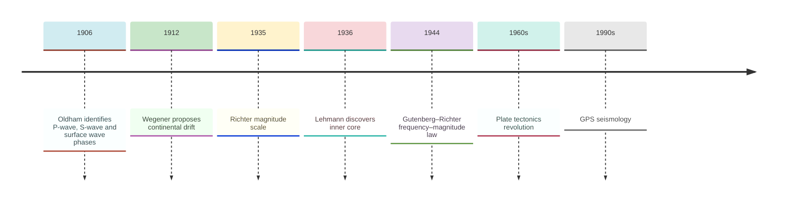
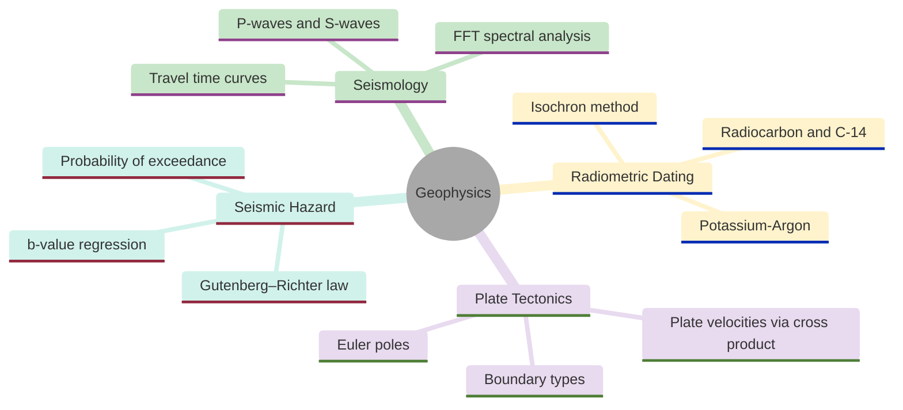
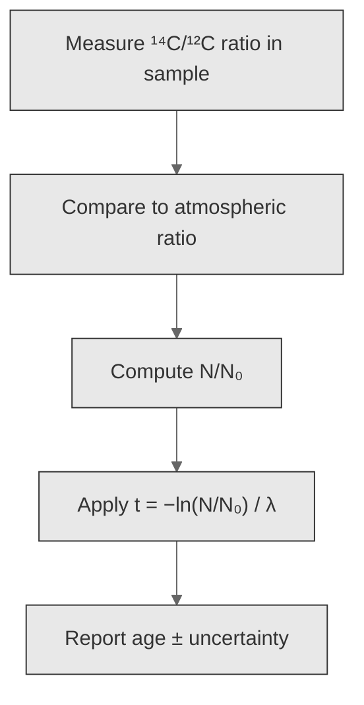
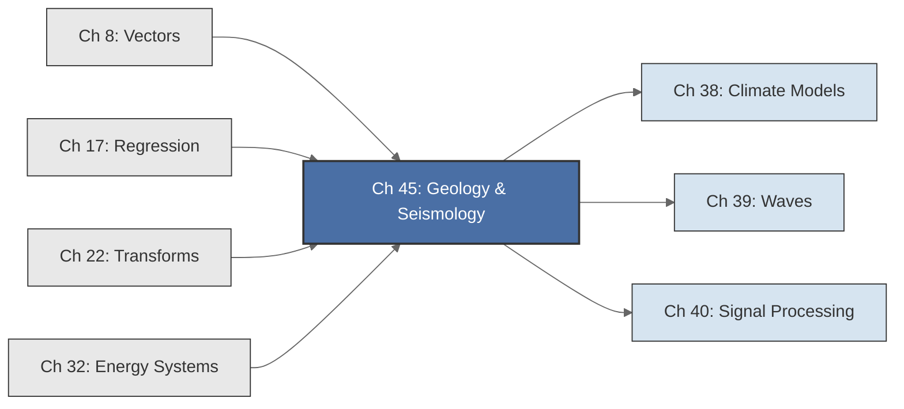

<!-- Copyright (c) 2025-2026 Bob Jansen <bobjansen@pm.me> -->
<!-- SPDX-License-Identifier: CC-BY-NC-4.0 -->
<!-- See LICENSE for full terms. Commercial licensing available. -->

# Chapter 45: Geology & Seismology

**Part IX**: Applications

> Seismic waves, radioactive decay and plate motion reduce to the same ordinary differential equation (ODE), fast Fourier transform (FFT), regression and vector algebra tools developed in earlier chapters. This chapter applies them to travel time inversion, magnitude scales, radiometric dating and Euler pole kinematics of the solid Earth.

**Prerequisites**: [Chapter 8](08-vectors.md) (Vectors); vector addition, cross products and angular velocity for plate motion and Euler pole calculations. [Chapter 17](17-regression.md) (Regression); linear and log-linear regression for magnitude relations, Gutenberg–Richter law, isochron dating and travel time inversion. [Chapter 22](22-transforms.md) (Transforms); the discrete Fourier transform, power spectral density and frequency-domain filtering for seismic signal analysis.

**Learning Objectives**: After this chapter, the reader will be able to:

1. Derive P-wave and S-wave speeds from elastic moduli and density, and compute travel times through a layered Earth model.
2. Convert between local magnitude $M_L$, moment magnitude $M_w$ and seismic moment $M_0$ using logarithmic scale relations.
3. Fit the Gutenberg–Richter frequency–magnitude distribution via log-linear regression and estimate the $b$-value.
4. Apply the FFT to a seismogram time series to identify dominant frequencies and distinguish source types by spectral content.
5. Solve the radioactive decay equation for sample age using carbon-14 and potassium-argon systems.
6. Apply the isochron method by regressing daughter/stable versus parent/stable isotope ratios.
7. Compute plate velocities at boundaries from Euler pole angular velocity vectors using the cross product.
8. Formulate travel time tomography as a linear inverse problem and solve it via least squares.

**Connections**: This chapter synthesises [Chapter 8](08-vectors.md) (cross products compute plate boundary velocities from Euler pole rotations), [Chapter 17](17-regression.md) (regression fits the Gutenberg–Richter law, isochron lines and travel time curves), [Chapter 22](22-transforms.md) (FFT extracts frequency content from seismograms for source discrimination) and [Chapter 32](32-energy-systems.md) (radioactive decay provides the ODE for radiometric dating). It connects to [Chapter 39](39-mechanics-waves.md) (wave equation foundations), [Chapter 40](40-signal-processing.md) (signal processing for seismogram filtering) and [Chapter 38](38-climate-modeling.md) (geothermal heat flow parallels climate diffusion models).

---

## Historical Context

**Key Dates in Seismology and Geology**



*Figure 45.1: Timeline of key dates in seismology and geology from 1906 to the 1990s.*

**Milne's seismograph (1880s).** John Milne developed the first practical horizontal-pendulum seismograph in Japan. By 1900, a nascent international network of stations had been established.

**Oldham's wave phases (1906).** Richard Dixon Oldham identified three distinct wave phases: the primary wave (P), the secondary wave (S) and surface waves. P-waves propagate as longitudinal compressions through solids and liquids; S-waves are transverse shear waves that cannot penetrate liquids. Oldham's observation that S-waves vanish beyond a certain angular distance led him to propose a liquid core. Beno Gutenberg used the P-wave shadow zone (104–140 degrees epicentral distance) to place the core-mantle boundary at 2,900 km in 1914.

**Lehmann's inner core discovery (1936).** Inge Lehmann observed that weak P-wave arrivals appear within the shadow zone. She proposed a solid inner core refracting P-waves back into the shadow. Her paper, titled "P'," added the final major division to Earth's radial structure: crust, mantle, liquid outer core, solid inner core.

**Richter magnitude scale (1935).** Charles Richter introduced the local magnitude scale $M_L = \log_{10}(A/A_0)$. Hiroo Kanamori introduced the moment magnitude $M_w$ in 1977 to replace the saturating Richter scale. Gutenberg and Richter discovered in 1944 that earthquake frequency follows the power law $\log_{10} N = a - bM$.

**Continental drift and plate tectonics (1912–1968).** Alfred Wegener proposed continental drift in 1912 but lacked a mechanism. Jason Morgan (1968) and Dan McKenzie (1967) formalised plate kinematics using Euler's theorem: every rigid-body motion on a sphere is a rotation about an axis. Relative plate velocities at any boundary point are cross products of angular velocity vectors with position vectors ([Chapter 8](08-vectors.md)).

**Modern seismic networks (1990s–present).** Modern seismology deploys thousands of broadband seismometers. Earthquake early warning systems in Japan, Mexico and the United States use real-time P-wave detection to issue seconds of warning before destructive S-waves arrive.

---

## Why This Chapter Matters

**Geophysics**



*Figure 45.2: Mind map of geophysics topics covered in this chapter.*

Earthquake early warning systems depend on rapid P-wave detection, magnitude estimation via the Gutenberg–Richter relation and real-time travel time computation. Seismic moment and moment magnitude inform building codes, insurance risk models and disaster preparedness. Seismic tomography reconstructs velocity structure from travel times. It has revealed mantle plumes beneath Iceland and Hawaii, subducting slabs and inner core structure.

Snell's law ray tracing through layered media uses the ODE integrator to propagate seismic rays. The eigenvalue problem for free oscillations of the Earth yields normal mode frequencies that constrain the radial density profile. FFT-based spectral analysis of seismograms distinguishes earthquake P-waves from ocean microseisms and cultural noise. The linear inverse problem $A\mathbf{s} = \mathbf{T}$ for tomography is solved by least-squares methods ([Chapter 17](17-regression.md)). Regularisation controls the tradeoff between data fit and model smoothness.

The same propagation and inversion methods underpin exploration geophysics. Reflection seismology images subsurface geology at metre-scale resolution using Fourier transforms and deconvolution ([Chapter 22](22-transforms.md) and [Chapter 40](40-signal-processing.md)). Environmental site characterisation uses shallow seismic surveys to assess soil liquefaction potential and map the depth to competent rock. In every application the practitioner must understand wave propagation in layered media, frequency-dependent attenuation and the ill-posed nature of the inverse problem.

---

## Notation & Conventions

| Symbol | Meaning |
|--------|---------|
| $v_P$ | P-wave (compressional) velocity (m/s or km/s) |
| $v_S$ | S-wave (shear) velocity (m/s or km/s) |
| $K$ | Bulk modulus (Pa) |
| $\mu$ | Shear modulus (Pa); not to be confused with the gravitational parameter of [Chapter 41](41-orbital-mechanics.md) |
| $\rho$ | Density ($\text{kg/m}^3$) |
| $A$ | Seismogram amplitude |
| $A_0$ | Reference amplitude for magnitude scale |
| $M_L$ | Local (Richter) magnitude |
| $M_w$ | Moment magnitude |
| $M_0$ | Seismic moment (N$\cdot$m) |
| $N$ | Number of earthquakes $\geq M$; or number of remaining atoms (context-dependent) |
| $a, b$ | Gutenberg–Richter parameters |
| $N_0$ | Initial number of radioactive atoms |
| $\lambda_d$ | Radioactive decay constant ($\text{yr}^{-1}$); subscript $d$ distinguishes from eigenvalue $\lambda$ |
| $t_{1/2}$ | Half-life (yr) |
| $\boldsymbol{\omega}$ | Angular velocity vector for plate rotation (rad/Myr) |
| $\mathbf{r}$ | Position vector on the sphere (dimensionless unit vector or km) |
| $\mathbf{v}$ | Plate velocity vector at a boundary point (mm/yr or km/Myr) |
| $R$ | Earth radius, $R \approx 6371$ km |
| $f_k$ | Frequency bin $k$ of the DFT (Hz) |
| $P(f)$ | Power spectral density of a seismogram |
| $\Delta t$ | Sampling interval (s) |
| $\theta_c$ | Critical angle for head wave refraction: $\theta_c = \arcsin(v_1/v_2)$ |
| $\mu_r$ | Rock rigidity at the fault (Pa); subscript $r$ distinguishes from shear modulus $\mu$ |
| $A_f$ | Fault rupture area ($\text{m}^2$) |
| $D$ | Average fault slip (m); not to be confused with derivative operator |
| $E$ | Seismic energy radiated by an earthquake (J) |
| $\kappa$ | Thermal diffusivity ($\text{m}^2/\text{s}$) |
| $T_m$ | Mantle temperature (K) |
| $T_0$ | Surface temperature (K); or intercept time (context-dependent) |
| $T$ | Travel time (s); or period (context-dependent) |
| $h_i, v_i$ | Thickness and velocity of layer $i$ in a layered Earth model |

Seismic wave velocities are in km/s unless stated otherwise. Magnitudes are dimensionless. Decay constants carry units of $\text{yr}^{-1}$. Angular velocities are in deg/Myr or rad/Myr. The cross product follows the right-hand rule. All vectors are three-dimensional Cartesian unless indicated.

---

## Core Theory

### Seismic Wave Propagation

**Theorem 45.1** (P-wave and S-wave velocities). In a homogeneous, isotropic elastic medium, the compressional (P) and shear (S) wave speeds are:

$$v_P = \sqrt{\frac{K + 4\mu/3}{\rho}}, \qquad v_S = \sqrt{\frac{\mu}{\rho}}.$$

??? note "Proof"

    *Proof (sketch).* Apply the Helmholtz decomposition

    $$\mathbf{u} = \nabla\phi + \nabla \times \boldsymbol{\psi}$$

    to the elastic wave equation (see Shearer (2019) Section 2.3 or Stein and Wysession (2003) Section 2.1 for the complete derivation from Lamé parameters and stress-strain relations).

    Taking the divergence yields a scalar wave equation for $\phi$ with speed

    $$v_P^2 = \frac{K + 4\mu/3}{\rho}.$$

    Taking the curl yields a vector wave equation for $\boldsymbol{\psi}$ with speed

    $$v_S^2 = \frac{\mu}{\rho}.$$

    $\square$

**Corollary 45.2** (S-waves require solidity). Since $K + 4\mu/3 > \mu$, always $v_P > v_S$. In a fluid ($\mu = 0$), $v_S = 0$: S-waves do not propagate. This is why S-waves cannot traverse the liquid outer core.

**Theorem 45.3** (Two-layer travel time curve). For layer 1 (thickness $h_1$, velocity $v_1$) overlying a half-space (velocity $v_2 > v_1$), the first-arrival travel time at distance $x$ has two branches:

- Direct wave: $T_{\text{direct}}(x) = x/v_1$.
- Head wave: $T_{\text{head}}(x) = x/v_2 + 2h_1\cos\theta_c/v_1$, where $\theta_c = \arcsin(v_1/v_2)$.

The crossover distance is $x_{\text{cross}} = 2h_1\sqrt{(v_2 + v_1)/(v_2 - v_1)}$.

??? note "Proof"

    *Proof.* The head wave descends at $\theta_c$, travels along the interface
    at $v_2$ and ascends at $\theta_c$. The total time is

    $$T = \frac{2h_1}{v_1\cos\theta_c} + \frac{x - 2h_1\tan\theta_c}{v_2}.$$

    Using $\sin\theta_c = v_1/v_2$ and simplifying the non-$x/v_2$ terms:

    $$\frac{2h_1}{v_1\cos\theta_c} - \frac{2h_1\sin\theta_c}{v_2\cos\theta_c} = \frac{2h_1}{v_1\cos\theta_c}\!\left(1 - \frac{v_1\sin\theta_c}{v_2}\right) = \frac{2h_1}{v_1\cos\theta_c}(1 - \sin^2\theta_c) = \frac{2h_1\cos\theta_c}{v_1},$$

    so

    $$T = \frac{x}{v_2} + \frac{2h_1\cos\theta_c}{v_1}.$$

    Setting $T_{\text{direct}} = T_{\text{head}}$ and solving for $x$ gives

    $$x_{\text{cross}} = 2h_1\sqrt{\frac{v_2+v_1}{v_2-v_1}}.$$

    $\square$

**Remark 45.4** (Layer depth from regression). The head wave branch is linear in $(x, T)$ with slope $1/v_2$ and intercept $2h_1\cos\theta_c/v_1$. Fitting via regression ([Chapter 17](17-regression.md)) estimates $v_2$ from the slope and $h_1$ from the intercept.

### Earthquake Magnitude Scales

**Definition 45.5** (Local magnitude). The Richter local magnitude is:

$$M_L = \log_{10}\left(\frac{A}{A_0}\right),$$

where $A$ is the maximum trace amplitude on a standard Wood–Anderson seismograph and $A_0$ is the amplitude of a reference earthquake at the same distance.

**Definition 45.6** (Seismic moment). The seismic moment is:

$$M_0 = \mu_r \cdot A_f \cdot D,$$

where $\mu_r$ is the rigidity of the rock at the fault (Pa), $A_f$ is the fault rupture area ($\text{m}^2$) and $D$ is the average slip (m). The seismic moment has units of N$\cdot$m and provides a physically meaningful measure of earthquake size.

**Definition 45.7** (Moment magnitude). The moment magnitude is:

$$M_w = \frac{2}{3}\left(\log_{10} M_0 - 9.1\right).$$

This definition was chosen by Kanamori (1977) so that $M_w$ approximately equals $M_S$ (surface-wave magnitude) for earthquakes in the range $3 \leq M \leq 7$.

**Theorem 45.8** (Energy-magnitude relation). The seismic energy $E$ (in joules) radiated by an earthquake relates to moment magnitude by:

$$\log_{10} E = 1.5 M_w + 4.8.$$

Each unit increase in magnitude corresponds to a factor of $10^{1.5} \approx 31.6$ in energy.

??? note "Proof"

    *Proof.* The relation follows from the definition of $M_w$ and the empirical Gutenberg–Richter energy-magnitude formula $\log_{10} E = 1.5 M_S + 4.8$. Substituting $M_w = \frac{2}{3}(\log_{10} M_0 - 9.1)$:

    $$\begin{aligned}
    \log_{10} E &= 1.5 \cdot \frac{2}{3}(\log_{10} M_0 - 9.1) + 4.8 \\
                &= \log_{10} M_0 - 9.1 + 4.8 \\
                &= \log_{10} M_0 - 4.3.
    \end{aligned}$$

    For a unit increase $\Delta M_w = 1$, the change is $\Delta\log_{10} E = 1.5$, so $E$ increases by a factor

    $$10^{1.5} \approx 31.6.$$

    $\square$

### The Gutenberg–Richter Law

**Definition 45.9** (Gutenberg–Richter relation). For a given region and time interval, the cumulative number $N$ of earthquakes with magnitude $\geq M$ satisfies:

$$\log_{10} N = a - bM,$$

where $a$ measures the overall seismicity rate and $b \approx 1.0$ globally. Equivalently, in terms of the number density $n(M) = dN/dM$:

$$n(M) = b \ln(10) \cdot 10^{a - bM}.$$

**Theorem 45.10** (Maximum likelihood $b$-value estimator). Given a sample of $n$ earthquakes with magnitudes $M_1, \ldots, M_n$ above a completeness threshold $M_c$, the maximum likelihood estimate of $b$ is:

$$\hat{b} = \frac{\log_{10} e}{\bar{M} - M_c} = \frac{1}{\ln(10)(\bar{M} - M_c)},$$

where $\bar{M} = \frac{1}{n}\sum_{i=1}^n M_i$. The standard error is $\sigma_b = \hat{b}/\sqrt{n}$. This assumes continuously measured magnitudes; for catalogue data binned at resolution $\Delta M$, the Utsu (1965) correction $\hat{b} = \log_{10}(e)/(\bar{M} - M_c - \Delta M/2)$ is preferred.

??? note "Proof"

    *Proof.* The probability density for magnitudes above $M_c$ is
    $p(M) = \beta e^{-\beta(M - M_c)}$ where $\beta = b\ln 10$.

    The log-likelihood is

    $$\ell = n\ln\beta - \beta\sum_{i=1}^{n}(M_i - M_c).$$

    Setting $d\ell/d\beta = n/\beta - \sum_{i=1}^{n}(M_i - M_c) = 0$ gives $\hat{\beta} = 1/(\bar{M} - M_c)$. Hence

    $$\hat{b} = \frac{\hat{\beta}}{\ln 10} = \frac{\log_{10} e}{\bar{M} - M_c}.$$

    $\square$

!!! abstract "Key Result"

    **Theorem 45.10** (Maximum likelihood $b$-value estimator). The Gutenberg--Richter $b$-value is estimated as $\hat{b} = \log_{10}(e)/(\bar{M} - M_c)$, directly from the sample mean magnitude; this single statistic characterises the frequency-magnitude distribution of a seismic region and underpins probabilistic seismic hazard assessment.

    The Fisher information gives $\operatorname{Var}(\hat{b}) = \hat{b}^2/n$.

**Gutenberg–Richter Frequency–Magnitude Relation**

```mermaid
---
config:
  theme: base
  themeVariables:
    xyChart:
      plotColorPalette: "#2563eb, #dc2626, #16a34a, #9333ea, #ca8a04, #0891b2"
      backgroundColor: "#ffffff"
      titleColor: "#333333"
      xAxisLabelColor: "#333333"
      yAxisLabelColor: "#333333"
      xAxisTitleColor: "#333333"
      yAxisTitleColor: "#333333"
      xAxisLineColor: "#333333"
      yAxisLineColor: "#333333"
---
xychart-beta
    x-axis "Magnitude" [2, 3, 4, 5, 6, 7, 8]
    y-axis "log₁₀(N)" -2 --> 5
    line [4.5, 3.5, 2.5, 1.5, 0.5, -0.5, -1.5]
```

*Figure 45.3: Gutenberg–Richter frequency–magnitude relation shows a linear decrease on a log scale.*

### Seismic Signal Analysis

**Definition 45.11** (Seismogram spectrum). A seismogram $s(t)$ sampled at interval $\Delta t$ for $N$ samples has the discrete Fourier transform (DFT):

$$S_k = \sum_{n=0}^{N-1} s(n\Delta t)\, e^{-2\pi i kn/N}, \qquad k = 0, 1, \ldots, N-1.$$

The power spectral density (PSD) is $P(f_k) = 2\Delta t |S_k|^2 / N$ for $f_k = k/(N\Delta t)$.

**Theorem 45.12** (Source discrimination by spectral content). The spectral ratio $R = P_S / P_L$ (short-period 0.5–5 Hz versus long-period 0.01–0.1 Hz power) is systematically higher for explosions than earthquakes of the same magnitude.

??? note "Proof"

    *Proof (physical argument).* An earthquake ruptures an extended fault over seconds to minutes, generating long-period energy. An explosion is a compact point source with impulsive time function, concentrating energy at higher frequencies; it follows that $R_{\text{explosion}} > R_{\text{earthquake}}$. This spectral difference is confirmed empirically by nuclear test monitoring data. $\square$

### Radioactive Dating

**Theorem 45.13** (Radioactive decay law). The number of radioactive parent atoms $N(t)$ satisfies the first-order ODE:

$$\frac{dN}{dt} = -\lambda_d N,$$

with solution $N(t) = N_0 e^{-\lambda_d t}$. The half-life is $t_{1/2} = \ln 2/\lambda_d$.

??? note "Proof"

    *Proof.* Separating variables gives $dN/N = -\lambda_d\,dt$. Integrating both sides:

    $$\ln N(t) = -\lambda_d t + \ln N_0.$$

    Exponentiating:

    $$N(t) = N_0\,e^{-\lambda_d t}.$$

    Setting $N(t_{1/2}) = N_0/2$ yields $e^{-\lambda_d t_{1/2}} = 1/2$, giving

    $$t_{1/2} = \frac{\ln 2}{\lambda_d}.$$

    $\square$

**Corollary 45.14** (Age determination). Solving for time:

$$t = -\frac{1}{\lambda_d}\ln\left(\frac{N}{N_0}\right) = \frac{1}{\lambda_d}\ln\left(\frac{N_0}{N}\right).$$

For carbon-14 ($t_{1/2} = 5730$ yr, $\lambda_d = 1.2097 \times 10^{-4}$ $\text{yr}^{-1}$): measuring the ratio $N/N_0$ of remaining $^{14}$C to the initial amount (assumed equal to the modern atmospheric $^{14}$C/$^{12}$C ratio, pending calibration) yields the age. For potassium-argon dating ($t_{1/2} = 1.25 \times 10^9$ yr for $^{40}$K): measuring the accumulated $^{40}$Ar daughter product, with $N_0 - N = D$ (daughter atoms produced), gives:

$$t = \frac{1}{\lambda_d}\ln\left(1 + \frac{D}{N}\right).$$

**Radiocarbon Dating Procedure**



*Figure 45.4: Flowchart of the radiocarbon dating procedure from measurement to age determination.*

**Theorem 45.15** (Isochron method). For a suite of cogenetic rock samples with the same age $t$ but different initial parent/daughter ratios, the relationship between the daughter-to-stable ratio $D/S$ and the parent-to-stable ratio $P/S$ is linear:

$$\frac{D}{S} = \left(\frac{D}{S}\right)_0 + (e^{\lambda_d t} - 1)\frac{P}{S},$$

where $(D/S)_0$ is the initial ratio (the $y$-intercept). The slope $m = e^{\lambda_d t} - 1$ determines the age: $t = \ln(1 + m)/\lambda_d$.

??? note "Proof"

    *Proof.* Let $D_0$ and $P_0$ be the initial amounts of daughter and parent.
    At time $t$:

    $$P = P_0 e^{-\lambda_d t}$$

    and

    $$D = D_0 + P_0(1 - e^{-\lambda_d t}) = D_0 + P(e^{\lambda_d t} - 1).$$

    Dividing by $S$ (which is stable and unchanged):

    $$D/S = D_0/S + (e^{\lambda_d t} - 1)\,P/S.$$

    All samples share the same $t$ and $(D/S)_0$, producing a straight line
    with slope $e^{\lambda_d t} - 1$. $\square$

### Plate Tectonics and Euler Poles

**Definition 45.16** (Euler's rotation theorem on a sphere). Every rigid-body motion of a tectonic plate on the surface of a sphere is equivalent to a rotation about a fixed axis passing through the centre of the sphere. The point where this axis intersects the surface is the Euler pole.

**Theorem 45.17** (Plate velocity from Euler pole). For angular velocity $\boldsymbol{\omega}$ (rad/Myr) and position $\mathbf{r}$ ($|\mathbf{r}| = R$), the plate velocity is $\mathbf{v} = \boldsymbol{\omega} \times \mathbf{r}$, with speed $|\mathbf{v}| = |\boldsymbol{\omega}| R \sin\Delta$ where $\Delta$ is the angular distance to the Euler pole.

??? note "Proof"

    *Proof.* By the cross product formula ([Chapter 8](08-vectors.md)):

    $$\lvert\boldsymbol{\omega} \times \mathbf{r}\rvert = \lvert\boldsymbol{\omega}\rvert\,\lvert\mathbf{r}\rvert\sin\alpha.$$

    Since $\boldsymbol{\omega}$ points toward the Euler pole, the angle $\alpha$ between $\boldsymbol{\omega}$ and $\mathbf{r}$ equals the angular distance $\Delta$. Substituting $\lvert\mathbf{r}\rvert = R$:

    $$\lvert\mathbf{v}\rvert = \lvert\boldsymbol{\omega}\rvert\,R\sin\Delta.$$

    $\square$

**Corollary 45.18** (Relative velocity). The relative velocity between plates $A$ and $B$ at boundary point $\mathbf{r}$ is $\mathbf{v}_{\text{rel}} = (\boldsymbol{\omega}_A - \boldsymbol{\omega}_B) \times \mathbf{r}$. The normal component's sign determines convergence (subduction), divergence (ridge) or transform motion.

### Geophysical Inverse Problems

**Definition 45.19** (Travel time tomography). The travel time of a seismic ray through a discretised Earth model is:

$$T_i = \sum_{j=1}^{m} A_{ij}\,s_j,$$

where $s_j$ is the slowness (inverse velocity) in cell $j$, and $A_{ij}$ is the path length of ray $i$ through cell $j$. For $n$ rays, this forms the linear system $\mathbf{T} = A\mathbf{s}$.

**Theorem 45.20** (Least-squares tomography). The travel time residuals $\delta\mathbf{T} = \mathbf{T}_{\text{obs}} - \mathbf{T}_{\text{ref}}$ relate to slowness perturbations by $\delta\mathbf{T} = A\,\delta\mathbf{s}$. The least-squares solution is $\delta\hat{\mathbf{s}} = (A^T A)^{-1}A^T\delta\mathbf{T}$.

??? note "Proof"

    *Proof.* The overdetermined system is solved by minimising $\|A\delta\mathbf{s} - \delta\mathbf{T}\|^2$. Setting the gradient to zero yields the normal equations ([Chapter 17](17-regression.md)):

    $$A^T A\,\delta\hat{\mathbf{s}} = A^T\delta\mathbf{T}.$$

    $\square$

### Geothermal Heat Flow

**Definition 45.21** (Geothermal gradient). Temperature in the Earth's crust increases with depth at approximately $dT/dz \approx 25$°C/km.

**Theorem 45.22** (Oceanic lithosphere cooling). The temperature profile of cooling oceanic lithosphere, modelled as a semi-infinite half-space initially at mantle temperature $T_m$ with surface held at $T_0$, is:

$$T(z, t) = T_0 + (T_m - T_0)\,\operatorname{erf}\left(\frac{z}{2\sqrt{\kappa t}}\right),$$

where $\kappa \approx 10^{-6}$ $\text{m}^2/\text{s}$ is the thermal diffusivity and $\operatorname{erf}$ is the error function ([Chapter 2](02-special-functions.md)). The thermal boundary layer depth grows as $\delta \sim \sqrt{\kappa t}$.

??? note "Proof"

    *Proof.* The 1D heat equation

    $$\frac{\partial T}{\partial t} = \kappa\,\frac{\partial^2 T}{\partial z^2},$$

    with boundary conditions $T(0, t) = T_0$ and $T(\infty, t) = T_m$, admits the similarity variable

    $$\eta = \frac{z}{2\sqrt{\kappa t}}.$$

    Substituting $T = T_0 + (T_m - T_0)\,f(\eta)$ reduces the partial differential equation (PDE) to the ODE $f'' + 2\eta f' = 0$ with $f(0) = 0$, $f(\infty) = 1$. This has the solution

    $$f(\eta) = \operatorname{erf}(\eta)$$

    ([Chapter 2](02-special-functions.md)), giving the stated temperature profile. $\square$

---

## Formulas & Identities

**F45.1** P-wave velocity (Thm. 45.1):

$$v_P = \sqrt{\frac{K + 4\mu/3}{\rho}}.$$

**F45.2** S-wave velocity (Thm. 45.1):

$$v_S = \sqrt{\frac{\mu}{\rho}}.$$

**F45.3** Head wave travel time (Thm. 45.3):

$$T_{\text{head}} = \frac{x}{v_2} + \frac{2h_1\cos\theta_c}{v_1}.$$

**F45.4** Critical angle for refraction (Thm. 45.3):

$$\theta_c = \arcsin\!\left(\frac{v_1}{v_2}\right).$$

**F45.5** Crossover distance (Thm. 45.3):

$$x_{\text{cross}} = 2h_1\sqrt{\frac{v_2 + v_1}{v_2 - v_1}}.$$

**F45.6** Local (Richter) magnitude (Def. 45.5):

$$M_L = \log_{10}\!\left(\frac{A}{A_0}\right).$$

**F45.7** Moment magnitude (Def. 45.7):

$$M_w = \frac{2}{3}\!\left(\log_{10} M_0 - 9.1\right).$$

**F45.8** Energy-magnitude relation (Thm. 45.8):

$$\log_{10} E = 1.5\,M_w + 4.8.$$

**F45.9** Gutenberg–Richter law (Def. 45.9):

$$\log_{10} N = a - bM.$$

**F45.10** Maximum likelihood $b$-value estimator (Thm. 45.10):

$$\hat{b} = \frac{\log_{10} e}{\bar{M} - M_c}.$$

**F45.11** Radioactive decay (Thm. 45.13):

$$N(t) = N_0\,e^{-\lambda_d t}.$$

**F45.12** Radiometric age (Cor. 45.14):

$$t = \frac{\ln(N_0/N)}{\lambda_d}.$$

**F45.13** Half-life (Thm. 45.13):

$$t_{1/2} = \frac{\ln 2}{\lambda_d}.$$

**F45.14** Isochron equation (Thm. 45.15):

$$\frac{D}{S} = \left(\frac{D}{S}\right)_0 + \left(e^{\lambda_d t} - 1\right)\frac{P}{S}.$$

**F45.15** Plate velocity from Euler pole (Thm. 45.17):

$$\mathbf{v} = \boldsymbol{\omega} \times \mathbf{r}.$$

**F45.16** Lithosphere cooling (Thm. 45.22):

$$T(z,t) = T_0 + (T_m - T_0)\,\operatorname{erf}\!\left(\frac{z}{2\sqrt{\kappa t}}\right).$$

**F45.17** Tomographic inversion (Thm. 45.20):

$$\delta\hat{\mathbf{s}} = (A^T A)^{-1}A^T\delta\mathbf{T}.$$

---

## Algorithms

### Algorithm 45.23: Travel Time Computation for Layered Earth

**Input**: Layer thicknesses $(h_1, \ldots, h_{n-1})$; layer velocities $(v_1, \ldots, v_n)$; epicentral distances $(x_1, \ldots, x_m)$.

**Output**: First-arrival travel times $T(x_j)$ for each distance.

1. For each distance $x_j$:
   a. Compute direct wave time: $T_{\text{direct}} = x_j / v_1$.
   b. For each deeper layer $k = 2, \ldots, n$:
      - Compute critical angle: $\theta_c = \arcsin(v_1/v_k)$.
      - Compute intercept time: $\displaystyle T_0 = \sum_{i=1}^{k-1} 2h_i\cos(\arcsin(v_i/v_k))/v_i$.
      - Compute head wave time: $T_k = x_j/v_k + T_0$.
   c. Set $T(x_j) = \min(T_{\text{direct}}, T_2, \ldots, T_n)$.
2. Return $\{T(x_j)\}$.

```
function travelTimeLayered(h, v, x):
    // h = layer thicknesses (length n-1), v = velocities (length n)
    // x = array of epicentral distances (length m)
    n = length(v)
    m = length(x)
    T = empty array of length m

    for j = 0 to m-1:
        T_direct = x[j] / v[0]
        T_min = T_direct

        for k = 1 to n-1:
            // Head wave through layer k+1
            theta_c = arcsin(v[0] / v[k])
            T0 = 0
            for i = 0 to k-1:
                // Intercept time contribution from layer i
                T0 = T0 + 2 * h[i] * cos(arcsin(v[i] / v[k])) / v[i]
            T_head = x[j] / v[k] + T0
            T_min = min(T_min, T_head)

        T[j] = T_min

    return T
```

**Complexity**: $O(m \cdot n)$ time for $m$ distances and $n$ layers; $O(n + m)$ space.

### Algorithm 45.24: Gutenberg–Richter $b$-Value Estimation

**Input**: Earthquake magnitudes $(M_1, \ldots, M_n)$; completeness magnitude $M_c$.

**Output**: Estimated $b$-value and standard error.

1. Filter: retain only $M_i \geq M_c$; let $n'$ be the count.
2. Compute $\bar{M} = \frac{1}{n'}\sum_{i: M_i \geq M_c} M_i$.
3. Compute $\hat{b} = \log_{10} e / (\bar{M} - M_c)$.
4. Compute $\sigma_b = \hat{b}/\sqrt{n'}$.
5. Return $(\hat{b}, \sigma_b)$.

```
function estimateBValue(M, Mc):
    // M = array of earthquake magnitudes, Mc = completeness magnitude
    // Filter magnitudes above completeness threshold
    filtered = []
    for i = 0 to length(M)-1:
        if M[i] >= Mc:
            filtered.append(M[i])

    n_prime = length(filtered)
    M_bar = sum(filtered) / n_prime

    b_hat = log10(e) / (M_bar - Mc)
    sigma_b = b_hat / sqrt(n_prime)

    return (b_hat, sigma_b)
```

**Complexity**: $O(n)$ time; $O(n)$ space.

### Algorithm 45.25: Seismogram Spectral Analysis via FFT

!!! tip "Windowing before FFT"
    Applying a Hann window (step 2) reduces spectral leakage from the finite record length. Omitting the window produces spurious sidelobes that can obscure weak spectral peaks.

**Input**: Seismogram samples $s_0, \ldots, s_{N-1}$; sampling interval $\Delta t$.

**Output**: Power spectral density $P(f_k)$ at frequencies $f_k$.

1. Remove the mean: $\tilde{s}_n = s_n - \bar{s}$.
2. Apply Hann window: $w_n = 0.5(1 - \cos(2\pi n/(N-1)))$; set $\tilde{s}_n \leftarrow w_n \tilde{s}_n$.
3. Compute the DFT via FFT: $S_k = \text{FFT}(\tilde{s})$ ([Chapter 22](22-transforms.md)).
4. Compute PSD: $P(f_k) = 2\Delta t |S_k|^2 / N$ for $k = 1, \ldots, N/2$.
5. Return $\{(f_k, P(f_k))\}$ with $f_k = k/(N\Delta t)$.

```
function seismogramPSD(s, delta_t):
    // s = seismogram samples (length N), delta_t = sampling interval
    N = length(s)

    // Step 1: remove mean
    s_bar = sum(s) / N
    for n = 0 to N-1:
        s_tilde[n] = s[n] - s_bar

    // Step 2: apply Hann window
    for n = 0 to N-1:
        w = 0.5 * (1 - cos(2 * pi * n / (N - 1)))
        s_tilde[n] = w * s_tilde[n]

    // Step 3: compute DFT via FFT
    S = FFT(s_tilde)

    // Step 4: compute power spectral density
    psd = empty array of length N/2
    for k = 1 to N/2:
        f_k = k / (N * delta_t)
        psd[k] = 2 * delta_t * |S[k]|^2 / N

    return psd
```

**Complexity**: $O(N\log N)$ time via the FFT; $O(N)$ space.

### Algorithm 45.26: Radiocarbon Age Computation

**Input**: Measured $^{14}$C/$^{12}$C ratio $r$; modern reference ratio $r_0$; half-life $t_{1/2} = 5730$ yr.

**Output**: Radiocarbon age $t$.

1. Compute $\lambda_d = \ln 2 / t_{1/2}$.
2. Compute $t = -\ln(r/r_0)/\lambda_d = \ln(r_0/r)/\lambda_d$.
3. Return $t$.

```
function radiocarbonAge(r, r0, t_half):
    // r = measured 14C/12C ratio, r0 = modern reference ratio
    // t_half = half-life (5730 yr for 14C)
    lambda_d = ln(2) / t_half
    t = ln(r0 / r) / lambda_d
    return t
```

**Complexity**: $O(1)$ time and space.

### Algorithm 45.27: Plate Velocity from Euler Pole

**Input**: Euler pole latitude $\phi_E$, longitude $\lambda_E$ (degrees); angular speed $\lvert\boldsymbol{\omega}\rvert$ (deg/Myr); point latitude $\phi_P$, longitude $\lambda_P$ (degrees); Earth radius $R$.

**Output**: Velocity vector $\mathbf{v}$ and speed $|\mathbf{v}|$ (mm/yr).

1. Convert to Cartesian unit vectors:
   - $\hat{\boldsymbol{\omega}} = (\cos\phi_E\cos\lambda_E, \cos\phi_E\sin\lambda_E, \sin\phi_E)$.
   - $\hat{\mathbf{r}} = (\cos\phi_P\cos\lambda_P, \cos\phi_P\sin\lambda_P, \sin\phi_P)$.
2. Form $\boldsymbol{\omega} = \lvert\boldsymbol{\omega}\rvert \cdot \hat{\boldsymbol{\omega}}$ (convert $\lvert\boldsymbol{\omega}\rvert$ to rad/Myr: multiply by $\pi/180$).
3. Compute $\mathbf{v} = \boldsymbol{\omega} \times (R\,\hat{\mathbf{r}})$ via the cross product ([Chapter 8](08-vectors.md)).
4. Convert speed from km/Myr to mm/yr: multiply by $10^6 / 10^6 = 1$ (km/Myr $= $ mm/yr).
5. Return $\mathbf{v}$, $|\mathbf{v}|$.

```
function plateVelocity(phi_E, lambda_E, omega_mag, phi_P, lambda_P, R):
    // Convert Euler pole to Cartesian unit vector
    omega_hat = (cos(phi_E)*cos(lambda_E),
                 cos(phi_E)*sin(lambda_E),
                 sin(phi_E))

    // Convert point to Cartesian unit vector
    r_hat = (cos(phi_P)*cos(lambda_P),
             cos(phi_P)*sin(lambda_P),
             sin(phi_P))

    // Convert angular speed from deg/Myr to rad/Myr
    omega_rad = omega_mag * pi / 180
    omega = omega_rad * omega_hat

    // Compute velocity via cross product
    r = R * r_hat
    v = cross(omega, r)

    // Speed in km/Myr equals mm/yr
    speed = |v|

    return v, speed
```

**Complexity**: $O(1)$ time and space.

---

## Numerical Considerations

### Travel Time Precision

Algorithm 45.23 computes layer depths from travel times. Travel times are measured to $\pm 0.01$ s. The propagated depth uncertainty is

$$\delta h_1 = \frac{v_1\,\delta T_0}{2\cos\theta_c}.$$

For $v_1 = 5$ km/s and $\theta_c = 30°$, a $0.01$ s error produces $\delta h_1 \approx 30$ m. For deeper layers the uncertainty compounds because each layer's depth depends on the layers above it. The total depth uncertainty for the $k$-th layer grows as $O(\sqrt{k}\,\delta T)$ when individual timing errors are independent.

### FFT Length and Zero-Padding

Algorithm 45.25 applies the FFT to seismogram data. Zero-padding interpolates the frequency grid but does not improve true resolution. The resolution remains

$$\Delta f = \frac{1}{N_{\text{original}}\,\Delta t}.$$

To resolve two spectral peaks separated by $\delta f$, the record must be at least $1/\delta f$ seconds long. For seismic body waves with dominant periods of 0.1–1 s and a typical record length of 100 s, the resolution is $\Delta f = 0.01$ Hz, adequate for spectral characterisation.

### Magnitude Completeness

!!! warning "Completeness magnitude bias"
    Setting $M_c$ too low inflates $\bar{M}$ and underestimates $\hat{b}$. Always verify $M_c$ from the frequency–magnitude curve before computing the $b$-value.

The $b$-value estimate in Algorithm 45.24 is biased if $M_c$ (the completeness magnitude) is set too low, artificially raising $\bar{M}$ and lowering $\hat{b}$. Standard practice determines $M_c$ from the point where the cumulative frequency–magnitude curve departs from linearity. The Aki–Utsu estimator

$$\hat{b} = \frac{\log_{10} e}{\bar{M} - M_c}$$

has standard error $\hat{b}/\sqrt{N}$, so at least $N \geq 200$ events above $M_c$ are needed for the uncertainty in $\hat{b}$ to fall below 10%.

### Radiocarbon Calibration

!!! info "Raw versus calibrated radiocarbon ages"
    The ages computed in this chapter assume constant atmospheric $^{14}$C concentration. The IntCal20 calibration curve corrects for solar activity variations and can shift ages by several hundred years.

Algorithm 45.26 computes raw radiocarbon ages assuming constant atmospheric $^{14}$C concentration. Calibration curves (IntCal20) correct for solar activity variations and the Suess effect. The correction can shift ages by several hundred years in certain periods. The ages computed in this chapter are raw (uncalibrated) ages; for calendar-year accuracy, calibration is necessary.

### Tomographic Ill-Conditioning

!!! warning "Regularisation is mandatory"
    The tomographic matrix $A$ is severely ill-conditioned. The unregularised least-squares solution amplifies noise; Tikhonov regularisation or truncated singular value decomposition is required for stable inversion.

The ray-path matrix $A$ in seismic tomography is sparse and ill-conditioned. Tikhonov regularisation replaces the normal equations solution with

$$(A^T A + \epsilon I)^{-1} A^T \mathbf{t},$$

trading spatial resolution for stability. The parameter $\epsilon$ controls the trade-off: too small and noise dominates the solution; too large and genuine velocity anomalies are smoothed away. The L-curve method plots $\|A\hat{\mathbf{s}} - \mathbf{t}\|$ against $\|\hat{\mathbf{s}}\|$ and selects $\epsilon$ at the corner of maximum curvature.

### Euler Pole Uncertainty

Algorithm 45.27 computes plate velocities from Euler pole parameters. The velocity error is

$$\delta\lvert\mathbf{v}\rvert = R\sin\Delta \cdot \delta\lvert\boldsymbol{\omega}\rvert,$$

which is largest far from the pole ($\Delta \to 90°$). Typical uncertainties of $\pm 0.02$ deg/Myr produce $\pm 1$–2 mm/yr velocity errors. Near the Euler pole ($\Delta < 10°$), the velocity itself is small and the relative error can exceed 50%, making velocity estimates unreliable in that region.

---

## Worked Examples

### Example 45.28: Earthquake Magnitude Computation

**Problem.** The 2011 Tohoku earthquake had a fault area of $A_f = 500 \times 200 = 100{,}000$ $\text{km}^2$, average slip $D = 20$ m and crustal rigidity $\mu_r = 3.0 \times 10^{10}$ Pa. Compute the seismic moment $M_0$, the moment magnitude $M_w$ and the radiated energy $E$.

**Solution.** The seismic moment is:

$$M_0 = \mu_r \cdot A_f \cdot D = 3.0 \times 10^{10} \times (10^{11}) \times 20 = 6.0 \times 10^{22} \text{ N}\cdot\text{m},$$

where $A_f = 10^5 \text{ km}^2 = 10^{11} \text{ m}^2$. The moment magnitude is:

$$M_w = \frac{2}{3}(\log_{10}(6.0 \times 10^{22}) - 9.1) = \frac{2}{3}(22.778 - 9.1) = \frac{2}{3}(13.678) = 9.12.$$

The radiated energy is:

$$\log_{10} E = 1.5 \times 9.12 + 4.8 = 13.68 + 4.8 = 18.48, \qquad E = 10^{18.48} \approx 3.0 \times 10^{18} \text{ J}.$$

This is approximately 600 times the energy of the largest nuclear weapon ever tested (Tsar Bomba, $\sim 5 \times 10^{16}$ J).

### Example 45.29: Gutenberg–Richter Regression

**Problem.** A regional earthquake catalogue contains 2000 events with magnitudes above $M_c = 2.0$. The magnitudes have mean $\bar{M} = 2.85$. Estimate the $b$-value using the maximum likelihood method, compute the standard error and predict the number of $M \geq 5$ earthquakes expected per year if $a = 5.2$ (annual).

**Solution.** The maximum likelihood $b$-value is:

$$\hat{b} = \frac{\log_{10} e}{\bar{M} - M_c} = \frac{0.4343}{2.85 - 2.0} = \frac{0.4343}{0.85} = 0.511.$$

The standard error is

$$\sigma_b = \hat{b}/\sqrt{n} = 0.511/\sqrt{2000} = 0.0114.$$

This low $b$-value ($b \approx 1.0$ is typical) suggests relatively more large earthquakes. A $b$-value this low may also indicate an incomplete catalogue or a special tectonic setting (e.g., induced seismicity); further completeness analysis would be warranted before interpreting the seismicity rate. The predicted annual rate of $M \geq 5$ events is

$$N_5 = 10^{5.2 - 0.511 \times 5} = 10^{2.645} \approx 442,$$

compared to $N_5 \approx 1.6$ for $b = 1.0$.

### Example 45.30: Seismogram FFT Analysis

**Problem.** A seismogram sampled at $\Delta t = 0.01$ s (100 Hz) for $N = 1024$ samples contains P-wave and S-wave arrivals. Compute the PSD and the spectral ratio $R = P_S/P_L$ (short-period power 0.5–5 Hz versus long-period power 0.01–0.1 Hz) to classify the source.

**Solution.** The frequency resolution is $\Delta f = 1/(N\Delta t) = 0.098$ Hz and the Nyquist frequency is $f_{\text{Nyq}} = 50$ Hz. The PSD is computed via Algorithm 45.25. For tectonic earthquakes, dominant energy lies in 0.5–5 Hz with substantial long-period content; for explosions, energy concentrates at higher frequencies. Earthquakes typically yield $R < 10$; explosions yield $R > 20$.

### Example 45.31: Radiocarbon Dating

**Problem.** (a) A charcoal sample has a $^{14}$C/$^{12}$C ratio at 45% of modern. Compute the radiocarbon age ($t_{1/2} = 5730$ yr). (b) Four rock samples yield $^{87}$Rb/$^{86}$Sr ratios of $(0.50, 1.50, 3.00, 5.00)$ and $^{87}$Sr/$^{86}$Sr ratios of $(0.7120, 0.7192, 0.7300, 0.7444)$. Compute the Rb-Sr isochron age ($\lambda_d = 1.42 \times 10^{-11}$ $\text{yr}^{-1}$).

**Solution.** (a)

$$\lambda_d = \ln 2/5730 = 1.2097 \times 10^{-4} \; \text{yr}^{-1}.$$

The age is

$$t = \ln(1/0.45)/\lambda_d = 0.7985 / (1.2097 \times 10^{-4}) = 6601 \text{ yr}.$$

(b) Let $x_i = {}^{87}\text{Rb}/{}^{86}\text{Sr}$ and $y_i = {}^{87}\text{Sr}/{}^{86}\text{Sr}$. The four data points are $(0.50, 0.7120)$, $(1.50, 0.7192)$, $(3.00, 0.7300)$, $(5.00, 0.7444)$. The least-squares slope ([Chapter 17](17-regression.md)) is

$$m = \frac{n\sum x_i y_i - \sum x_i \sum y_i}{n\sum x_i^2 - (\sum x_i)^2}.$$

Computing: $\sum x_i = 10.00$, $\sum y_i = 2.9056$, $\sum x_i y_i = 7.3468$, $\sum x_i^2 = 36.50$, $n = 4$. Then

$$m = \frac{4 \times 7.3468 - 10.00 \times 2.9056}{4 \times 36.50 - 100.00} = \frac{29.3872 - 29.056}{146 - 100} = \frac{0.3312}{46} \approx 0.00720.$$

The age is

$$t = \ln(1.00720)/(1.42 \times 10^{-11}) = 505 \text{ Myr}.$$

The intercept gives $(^{87}\text{Sr}/^{86}\text{Sr})_0 \approx 0.7084$.

### Example 45.32: Plate Velocity from Euler Pole

**Problem.** The Pacific plate rotates relative to the North American plate with an Euler pole at $(48.7°\text{N}, 78.2°\text{W})$ and angular speed $0.75$ deg/Myr. Compute the relative velocity at San Francisco ($37.8°\text{N}, 122.4°\text{W}$) and at the Aleutian trench ($51.0°\text{N}, 177.0°\text{W}$).

**Solution.** Convert to Cartesian and apply Algorithm 45.27. The angular velocity magnitude is $\lvert\boldsymbol{\omega}\rvert = 0.75 \times \pi/180 = 0.01309$ rad/Myr.

For San Francisco, the angular distance from the Euler pole (via spherical law of cosines) is $\Delta = 33.4°$, $\sin\Delta = 0.551$. The speed is:

$$\lvert\mathbf{v}\rvert = \lvert\boldsymbol{\omega}\rvert \cdot R \sin\Delta = 0.01309 \times 6371 \times 0.551 = 45.9 \text{ mm/yr}.$$

This matches the observed ${\sim}46$ mm/yr of right-lateral strike-slip along the San Andreas fault.

For the Aleutian trench: $\Delta \approx 53.2°$, $\sin\Delta = 0.800$. The speed is:

$$\lvert\mathbf{v}\rvert = \lvert\boldsymbol{\omega}\rvert \cdot R \sin\Delta = 0.01309 \times 6371 \times 0.800 = 66.7 \text{ mm/yr}$$

of convergence driving Pacific plate subduction.

---

## Connections

**Chapter Dependencies**



*Figure 45.5: Dependency graph showing prerequisite and downstream chapters for geology and seismology.*

### Within This Book

- **Vectors** ([Chapter 8](08-vectors.md)): The cross product $\boldsymbol{\omega} \times \mathbf{r}$ computes plate velocity from Euler pole angular velocity. Vector dot products compute angular distances on the sphere. The vector decomposition into normal and tangential components at plate boundaries determines the tectonic regime (convergent, divergent or transform).

- **Regression** ([Chapter 17](17-regression.md)): Linear regression fits the Gutenberg–Richter law (log-linear), isochron lines (daughter/stable versus parent/stable), travel time curves (time versus distance for refracted arrivals) and the tomographic inverse problem (least squares). The $R^2$ statistic quantifies the quality of each fit.

- **Transforms** ([Chapter 22](22-transforms.md)): The FFT converts seismograms from the time domain to the frequency domain. The periodogram and power spectral density identify dominant frequencies, characterise source spectra and enable source discrimination (earthquake versus explosion). Windowing (Hann) reduces spectral leakage.

- **Energy Systems** ([Chapter 32](32-energy-systems.md)): Radioactive decay is the identical first-order ODE $dN/dt = -\lambda_d N$ encountered in nuclear decay chains. The half-life, exponential solution and age-determination formula transfer directly. The isochron method adds a regression layer on top of the decay equation.

- **Signal Processing** ([Chapter 40](40-signal-processing.md)): Bandpass filtering isolates P-wave and S-wave arrivals in seismograms. Convolution models the seismogram as a source time function convolved with a Green's function, and deconvolution recovers the source.

- **Climate Modelling** ([Chapter 38](38-climate-modeling.md)): Geothermal heat flow through the lithosphere parallels climate diffusion models. Geological carbon cycle processes connect to long-term climate forcing.

- **Classical Mechanics & Waves** ([Chapter 39](39-mechanics-waves.md)): The wave equation governing seismic P-wave and S-wave propagation is the same second-order PDE developed in Chapter 39, with elastic moduli and density determining wave speeds.

### Applications

- **Earthquake engineering**: Seismic hazard maps use the Gutenberg–Richter law to estimate the probability of exceeding a given ground acceleration. The computation: given $b$ and $a$, the probability of at least one $M \geq M_{\text{target}}$ in $T$ years is $P = 1 - e^{-10^{a-bM_{\text{target}}} \cdot T}$ (Poisson model).

- **Nuclear test monitoring**: Spectral discrimination distinguishes underground nuclear tests from earthquakes, central to the nuclear test ban treaty verification regime.

- **Geochronology**: Radiometric dating establishes the age of the Earth (4.54 Gyr), mass extinctions and human evolution chronology.

- **Plate tectonics and satellite geodesy**: Modern Global Positioning System measurements at mm/yr resolution test Euler pole predictions of plate rigidity.

---

## Summary

- P-wave and S-wave speeds are computed from elastic moduli and density; travel times through a layered Earth follow from Snell's law and path integration.
- Earthquake magnitude scales (local $M_L$, moment $M_w$) are logarithmic; the Gutenberg--Richter law $\log_{10} N = a - bM$ relates frequency to magnitude and is fitted by log-linear regression.
- The FFT applied to seismograms identifies dominant frequencies and distinguishes source types (earthquake, explosion, noise) by spectral content.
- Radioactive decay provides an absolute clock for geological dating; the isochron method extracts sample age from a linear regression of isotope ratios.
- Plate velocities at boundaries are computed from Euler pole angular velocity vectors via the cross product $\mathbf{v} = \boldsymbol{\omega} \times \mathbf{r}$.

---

## Exercises

### Routine

**Exercise 45.1.** Granite has $K = 50$ GPa, $\mu = 30$ GPa and $\rho = 2700$ $\text{kg/m}^3$. Compute $v_P$ and $v_S$. Verify that $v_P > v_S$ and compute the ratio $v_P/v_S$. Repeat for water ($K = 2.2$ GPa, $\mu = 0$, $\rho = 1000$ $\text{kg/m}^3$) and explain why only P-waves propagate in the ocean.

**Exercise 45.2.** An earthquake of moment magnitude $M_w = 7.0$ occurred. Compute the seismic moment $M_0$ and the radiated energy $E$. How many $M_w = 4.0$ earthquakes would release the same total energy?

**Exercise 45.3.** A wooden artefact has a $^{14}$C activity that is 62% of the modern value. Compute the radiocarbon age. A bone sample has 12% remaining. Which sample is older, and by how many years?

### Intermediate

**Exercise 45.4.** A two-layer model has $v_1 = 5.0$ km/s (crust) and $v_2 = 8.0$ km/s (upper mantle). First arrivals are recorded at distances 50, 100, 150, 200 and 250 km. Using the head wave formula, determine the crustal thickness $h_1$ by fitting a line to the refracted arrivals. Verify that the crossover distance is consistent with the estimated thickness.

**Exercise 45.5.** An earthquake catalogue for a volcanic region contains 500 events above $M_c = 1.5$ with mean magnitude $\bar{M} = 2.10$. Estimate the $b$-value. Compare to the global average $b = 1.0$ and discuss the geological significance. Compute the probability of at least one $M \geq 5$ event in 10 years if $a = 4.0$ (annual, relative to the same $M_c$).

**Exercise 45.6.** The Africa–Eurasia Euler pole is at $(21.0°\text{N}, 20.6°\text{W})$ with angular speed $0.12$ deg/Myr. Compute the relative velocity at the mid-Atlantic ridge ($45°\text{N}, 28°\text{W}$) and at the Hellenic trench ($35°\text{N}, 23°\text{E}$). Which boundary is faster? Classify each as convergent or divergent based on the velocity direction.

### Challenging

**Exercise 45.7.** A four-layer crustal model has velocities $v = (4.0, 5.5, 6.5, 8.1)$ km/s and thicknesses $h = (2, 10, 20)$ km. Using Algorithm 45.23, compute first-arrival travel times at distances from 10 to 500 km in 10-km increments. Plot the resulting travel time curve and identify the crossover distances. Apply linear regression to each refracted branch to recover the layer velocities and thicknesses, and compare to the true values.

**Exercise 45.8.** Generate a synthetic seismogram containing: (a) a P-wave packet at $t = 3$ s with dominant frequency 2 Hz, (b) an S-wave packet at $t = 8$ s with dominant frequency 0.8 Hz, (c) white noise at 10% of the signal amplitude. Sample at 50 Hz for 20 seconds. Compute the PSD via FFT and identify the two dominant peaks. Design a bandpass filter (0.3–1.5 Hz) to isolate the S-wave arrival and verify that the filtered signal suppresses the P-wave.

---

## References

### Textbooks

[1] Faure, G. and Mensing, T. M. *Isotopes: Principles and Applications*, 3rd ed. Wiley, 2005. The standard reference for radiometric dating methods, isochron construction and decay systematics. Chapters on the Rb-Sr, K-Ar and $^{14}$C systems provide the background for the radioactive dating material in this chapter.

[2] Shearer, P. M. *Introduction to Seismology*, 3rd ed. Cambridge University Press, 2019. A concise, mathematically rigorous treatment of seismology. Chapter 3 covers body waves and travel times; Chapter 8 covers earthquake magnitude and seismic moment; Chapter 9 covers source discrimination and spectral analysis.

[3] Stein, S. and Wysession, M. *An Introduction to Seismology, Earthquakes and Earth Structure*. Blackwell Publishing, 2003. The standard introductory text covering seismic wave theory, travel time analysis, magnitude scales, earthquake statistics and Earth structure. Chapters 2–4 provide the theoretical foundation for the seismic wave and magnitude material in this chapter.

[4] Turcotte, D. L. and Schubert, G. *Geodynamics*, 3rd ed. Cambridge University Press, 2014. Thorough treatment of solid-earth geophysics including plate tectonics, heat flow, radioactive dating and mantle dynamics. Chapters 1–2 cover plate kinematics and Euler poles; Chapter 10 covers the heat equation and lithosphere cooling.

### Historical

[5] Gutenberg, B. and Richter, C. F. "Frequency of Earthquakes in California." *Bulletin of the Seismological Society of America* 34 (1944): 185–188. The empirical frequency–magnitude relation.

[6] Kanamori, H. "The Energy Release in Great Earthquakes." *Journal of Geophysical Research* 82 (1977): 2981–2987. Introduction of the moment magnitude scale.

[7] Lehmann, I. "P'." *Publications du Bureau Central Séismologique International, Série A: Travaux Scientifiques* 14 (1936): 87–115. The discovery of the inner core from observations of P-wave arrivals within the shadow zone.

[8] McKenzie, D. P. and Parker, R. L. "The North Pacific: An Example of Tectonics on a Sphere." *Nature* 216 (1967): 1276–1280. Formalisation of plate tectonics using Euler's rotation theorem.

[9] Morgan, W. J. "Rises, Trenches, Great Faults and Crustal Blocks." *Journal of Geophysical Research* 73 (1968): 1959–1982. Independent formulation of global plate kinematics with Euler poles.

[10] Richter, C. F. "An Instrumental Earthquake Magnitude Scale." *Bulletin of the Seismological Society of America* 25 (1935): 1–32. The definition of the local magnitude scale.

[11] Milne, J. "Seismology." *Kegan Paul, Trench, Trübner*, 1898. Early systematic treatment of seismograph design and seismic wave observations from the Japanese network.

[12] Oldham, R. D. "The Constitution of the Interior of the Earth, as Revealed by Earthquakes." *Quarterly Journal of the Geological Society* 62 (1906): 456–475. Identification of P-wave, S-wave and surface wave phases and proposal of a liquid core.

[13] Gutenberg, B. "Über Erdbebenwellen, VIIA." *Nachrichten von der Gesellschaft der Wissenschaften zu Göttingen, Mathematisch-Physikalische Klasse* (1914): 166–218. Determination of the core-mantle boundary depth at approximately 2,900 km from P-wave shadow zone analysis.

[14] Wegener, A. *Die Entstehung der Kontinente und Ozeane*. Vieweg, 1915. The first book-length presentation of the continental drift hypothesis, originally proposed in 1912.

[15] Utsu, T. "A Method for Determining the Value of $b$ in a Formula $\log n = a - bM$ Showing the Magnitude-Frequency Relation for Earthquakes." *Geophysical Bulletin of Hokkaido University* 13 (1965): 99–103. The maximum likelihood correction for binned magnitude data used in the Aki–Utsu estimator.

### Online Resources

[16] IRIS Data Management Centre. (ds.iris.edu.) Global seismogram archive and data access tools.

[17] USGS Earthquake Hazards Programme. (earthquake.usgs.gov.) Real-time earthquake catalogue, magnitude data and seismic hazard maps.

---

## Glossary

- **$b$-value**: The slope of the Gutenberg–Richter relation; globally $\approx 1.0$. Low $b$-values indicate relatively more large events.
- **Body wave**: A seismic wave that propagates through the Earth's interior; includes P-waves and S-waves.
- **Completeness magnitude ($M_c$)**: The minimum magnitude above which all earthquakes in a region are reliably detected.
- **Cross product**: The vector operation $\boldsymbol{\omega} \times \mathbf{r}$ that yields the plate velocity at a surface point from the Euler pole angular velocity.
- **Epicentral distance**: The angular or linear distance from an earthquake's epicentre to a recording station.
- **Euler pole**: The point on Earth's surface where the rotation axis of a tectonic plate intersects the surface.
- **Geothermal gradient**: The rate of temperature increase with depth in the Earth's crust; approximately 25 °C/km near the surface.
- **Gutenberg–Richter law**: The empirical relation $\log_{10} N = a - bM$ describing the frequency–magnitude distribution of earthquakes.
- **Half-life ($t_{1/2}$)**: The time for half the radioactive parent atoms to decay; $t_{1/2} = \ln 2/\lambda_d$.
- **Head wave**: A refracted wave that travels along a velocity interface and re-emerges at the critical angle.
- **Isochron**: A straight line on a plot of daughter/stable versus parent/stable isotope ratios for cogenetic samples of the same age.
- **Moment magnitude ($M_w$)**: A non-saturating magnitude scale based on the seismic moment: $M_w = \frac{2}{3}(\log_{10} M_0 - 9.1)$.
- **P-wave**: Primary (compressional, longitudinal) seismic wave; propagates through solids and liquids.
- **Power spectral density (PSD)**: The distribution of a seismogram's power across frequency, computed via the FFT.
- **Radiocarbon dating**: Determining the age of organic material by measuring the ratio of $^{14}$C to $^{12}$C and solving $N(t) = N_0 e^{-\lambda_d t}$ for $t$; half-life $t_{1/2} = 5730$ years.
- **S-wave**: Secondary (shear, transverse) seismic wave; propagates only through solids ($v_S = \sqrt{\mu/\rho}$).
- **Seismic moment ($M_0$)**: A physical measure of earthquake size: $M_0 = \mu A_f D$ (rigidity $\times$ fault area $\times$ slip).
- **Shadow zone**: The annular region (104°–140° epicentral distance) where direct P-waves are not observed due to refraction at the core-mantle boundary.
- **Slowness**: The reciprocal of seismic velocity ($s = 1/v$); the natural parameterisation for travel time tomography.
- **Tomography**: The reconstruction of Earth's velocity structure from travel time observations; formulated as a linear inverse problem $A\mathbf{s} = \mathbf{T}$.

---

