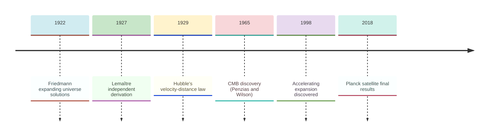
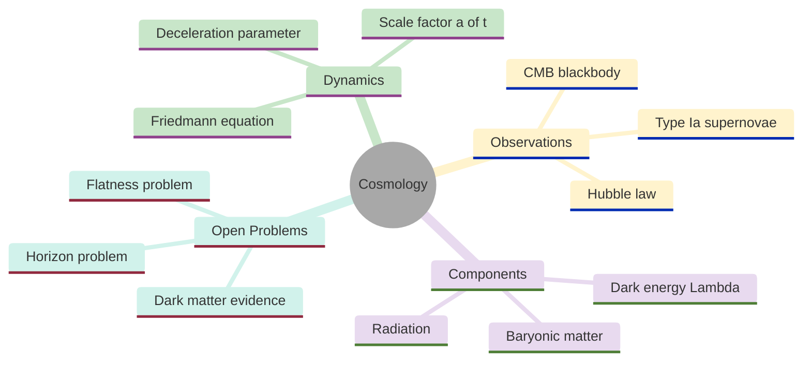
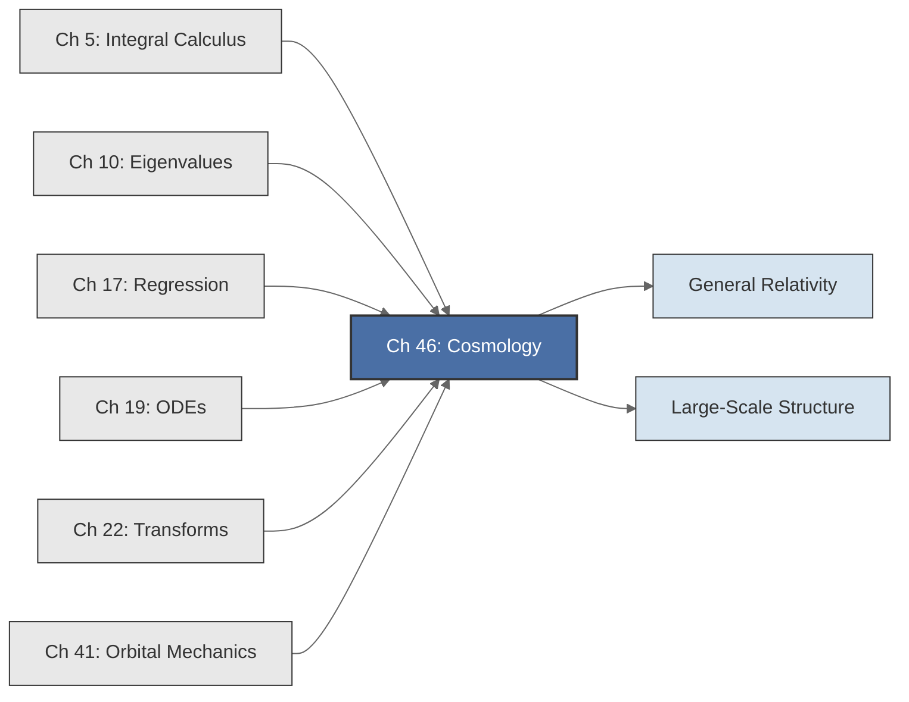

<!-- Copyright (c) 2025-2026 Bob Jansen <bobjansen@pm.me> -->
<!-- SPDX-License-Identifier: CC-BY-NC-4.0 -->
<!-- See LICENSE for full terms. Commercial licensing available. -->

# Chapter 46: Cosmology

**Part IX**: Applications

> The Friedmann equation governs cosmic expansion as a first-order ordinary differential equation (ODE) for the scale factor $a(t)$; fitting it to supernova luminosities, cosmic microwave background (CMB) spectra and galaxy rotation curves requires regression, numerical quadrature and Fourier analysis. This chapter applies those tools to derive the age of the universe, detect dark energy and infer dark matter from flat rotation curves.

**Prerequisites**: [Chapter 5](05-integral-calculus.md) (Integral Calculus); numerical quadrature for luminosity distance integrals. [Chapter 17](17-regression.md) (Regression); linear and nonlinear least-squares fitting for Hubble's law, supernova cosmology and rotation curves. [Chapter 19](19-odes.md) (Ordinary Differential Equations); first-order autonomous ODEs, the Runge–Kutta method and equilibrium analysis for the Friedmann equation.

**Learning Objectives**: After this chapter, the reader will be able to:

1. Perform linear regression on galaxy recession data to estimate the Hubble constant $H_0$ and the age of the universe.
2. Formulate the Friedmann equation as a first-order ODE for the scale factor and integrate it numerically via the fourth-order Runge–Kutta method (RK4) for matter-dominated, radiation-dominated and $\Lambda$CDM cosmologies.
3. Compute the luminosity distance $d_L(z)$ by numerical quadrature of the Friedmann expansion rate $H(z)$.
4. Fit a Planck blackbody spectrum to observed CMB data to determine the cosmic microwave background temperature.
5. Analyse the CMB angular power spectrum to identify acoustic peak positions and relate them to cosmological parameters.
6. Fit galaxy rotation curves to a dark-matter halo model using nonlinear regression.
7. Solve rate equations for Big Bang nucleosynthesis to predict primordial element abundances.
8. Construct a Hubble diagram (distance modulus vs. redshift) and fit it to determine the matter and dark energy density parameters.

**Connections**: This chapter synthesises [Chapter 5](05-integral-calculus.md) (numerical quadrature computes comoving and luminosity distances), [Chapter 10](10-eigenvalues.md) (eigenvalues of the baryon-photon oscillation equation determine CMB peak positions), [Chapter 17](17-regression.md) (linear regression gives $H_0$; nonlinear regression fits supernova and rotation curve data), [Chapter 19](19-odes.md) (RK4 integrates the Friedmann equation and nucleosynthesis rate equations) and [Chapter 22](22-transforms.md) (Fourier analysis of the CMB spectrum). It extends [Chapter 41](41-orbital-mechanics.md) (Orbital Mechanics; Newtonian gravity at galactic and cosmological scales) and connects forward to general relativistic corrections and large-scale structure formation.

---

## Historical Context

**Key Dates in Cosmology**



*Figure 46.1: Timeline of key dates in cosmology from 1922 to 2018.*

**Friedmann's expanding universe (1922).** Alexander Friedmann derived expanding-universe solutions of Einstein's field equations, showing that static models are generically unstable. Einstein initially dismissed the result before acknowledging its correctness. Georges Lemaître independently derived the expanding solution in 1927 and connected it to Vesto Slipher's galaxy redshift measurements (1912–1925). In 1931, Lemaître proposed that the universe originated from a "primeval atom"; Fred Hoyle named the concept the "Big Bang" in 1949.

**Hubble's velocity–distance law (1929).** Edwin Hubble established $v = H_0 d$: recession velocity is proportional to distance. Using Cepheid variables as distance indicators (building on Henrietta Leavitt's 1912 period-luminosity relation), Hubble estimated $H_0 \approx 500$ km/s/Mpc. The value was too large by a factor of seven, but the linear relationship was correct. George Gamow, Ralph Alpher and Robert Herman (1948) predicted primordial nucleosynthesis and a relic radiation field at approximately 5 K.

**CMB discovery (1965).** Arno Penzias and Robert Wilson discovered the cosmic microwave background at Bell Laboratories, detecting an isotropic excess noise temperature of approximately 3.5 K (Nobel Prize 1978). The Cosmic Background Explorer (COBE) satellite (1989) confirmed the CMB is a near-perfect blackbody with $T = 2.725 \pm 0.002$ K.

**Accelerating expansion (1998).** The Supernova Cosmology Project (Perlmutter) and the High-z Supernova Search Team (Schmidt, Riess) discovered accelerating expansion. Type Ia supernovae at $z \sim 0.3$–$0.8$ were dimmer than expected in a decelerating universe; a positive cosmological constant was required (Nobel Prize 2011). The Planck satellite (2009–2013) measured CMB anisotropies to sub-percent accuracy, establishing the $\Lambda$CDM model: 13.8 billion years old, spatially flat, 5% baryonic matter, 26% dark matter and 69% dark energy.

---

## Why This Chapter Matters

**Cosmology**



*Figure 46.2: Mind map of cosmology topics including dynamics, observations, components and open problems.*

The Friedmann equation is an ordinary differential equation for the scale factor $a(t)$ that determines how distances between galaxies evolve. The discovery of accelerating expansion through Type Ia supernova luminosity distances earned the 2011 Nobel Prize. It revealed that approximately 69% of the universe's energy content is dark energy. The computations behind this discovery are ODE integration, numerical quadrature and regression.

Numerical integration of the Friedmann ODE for arbitrary density parameters produces the full expansion history; the comoving distance integral, which has no closed-form solution for the concordance model, is evaluated by the quadrature routines of [Chapter 5](05-integral-calculus.md). Luminosity distance and distance modulus computations produce the theoretical Hubble diagram using the relation $1 + z = 1/a$. Dark matter halo mass profiles follow from integrating the NFW density over spherical shells. Galaxy rotation curves are then derived from the enclosed mass via Newtonian dynamics.

Cosmological simulations of large-scale structure solve Newton's gravitational ODE for billions of particles. The same RK4 and leapfrog integrators appear in this book. The CMB power spectrum is analysed by spherical harmonic decomposition, a generalisation of the Fourier methods in [Chapter 22](22-transforms.md). Gravitational wave detection by the Laser Interferometer Gravitational-Wave Observatory and Virgo requires matched filtering against templates from general relativistic inspiral dynamics. The mathematical core in every case is differential equations, numerical integration and spectral analysis.

---

## Notation & Conventions

| Symbol | Meaning |
|--------|---------|
| $a(t)$ | Scale factor of the universe, normalised so that $a(t_0) = 1$ at the present epoch |
| $H(t) = \dot{a}/a$ | Hubble parameter at time $t$ ($\text{s}^{-1}$ or km/s/Mpc) |
| $H_0$ | Hubble constant: the present-day value of $H(t)$, approximately 70 km/s/Mpc |
| $z$ | Cosmological redshift: $1 + z = a_0/a(t_{\text{emit}}) = 1/a(t_{\text{emit}})$ |
| $\rho(t)$ | Total energy density ($\text{kg/m}^3$ or $\text{J/m}^3$ in natural units) |
| $\rho_c = 3H_0^2/(8\pi G)$ | Critical density: the density for a spatially flat universe |
| $\Omega_m = \rho_m / \rho_c$ | Matter density parameter (baryonic + dark matter) |
| $\Omega_r = \rho_r / \rho_c$ | Radiation density parameter |
| $\Omega_\Lambda = \Lambda/(3H_0^2)$ | Dark energy density parameter |
| $k$ | Spatial curvature parameter: $k = -1, 0, +1$ |
| $\Omega_k = -k/(a_0 H_0)^2$ | Curvature density parameter |
| $\Lambda$ | Cosmological constant ($\text{s}^{-2}$) |
| $G$ | Newton's gravitational constant, $6.674 \times 10^{-11}$ $\text{N m}^2 \text{kg}^{-2}$ |
| $c$ | Speed of light, $2.998 \times 10^8$ m/s |
| $d_L$ | Luminosity distance (Mpc or m) |
| $d_C$ | Comoving distance (Mpc or m) |
| $\mu$ | Distance modulus: $\mu = m - M = 5\log_{10}(d_L / 10\,\text{pc})$; not to be confused with the shear modulus of [Chapter 45](45-geology-seismology.md) or the mutation rate of [Chapter 48](48-genetics.md) |
| $B(\nu, T)$ | Planck blackbody spectral radiance ($\text{W sr}^{-1} \text{m}^{-2} \text{Hz}^{-1}$) |
| $h_P$ | Planck's constant, $6.626 \times 10^{-34}$ J s |
| $k_B$ | Boltzmann constant, $1.381 \times 10^{-23}$ J/K |
| $C_\ell$ | CMB angular power spectrum coefficient at multipole $\ell$ |
| $v_c(r)$ | Circular velocity of a galaxy rotation curve at radius $r$ |
| $\rho_s$ | Characteristic density of an NFW (Navarro–Frenk–White) dark matter halo ($M_\odot/\text{kpc}^3$ or $\text{kg/m}^3$) |
| $r_s$ | Scale radius of an NFW dark matter halo (kpc) |
| $M_\odot$ | Solar mass, $M_\odot \approx 1.989 \times 10^{30}$ kg |

The convention $a(t_0) = 1$ is used throughout. Distances are in megaparsecs (1 Mpc $= 3.086 \times 10^{22}$ m) and velocities in km/s unless stated otherwise. Dots denote time derivatives: $\dot{a} = da/dt$. Density parameters satisfy the closure relation $\Omega_m + \Omega_r + \Omega_\Lambda + \Omega_k = 1$. In this chapter $T$ denotes temperature (in kelvins); time intervals are written explicitly as $t$ or $[t_{\text{start}}, t_{\text{end}}]$ and are not abbreviated $T$.

---

## Core Theory

### Hubble's Law and the Expanding Universe

**Definition 46.1** (Hubble's law). The *recession velocity* $v$ of a galaxy at distance $d$ is proportional to its distance:

$$v = H_0 d,$$

where $H_0$ is the Hubble constant. This linear relation holds for galaxies at redshifts $z \ll 1$, where relativistic corrections are negligible.

**Remark 46.2** (Hubble constant and age). A naive estimate of the age of the universe follows from $H_0$: if the expansion has been constant (no acceleration or deceleration), then the time since $a = 0$ is the *Hubble time*

$$t_H = \frac{1}{H_0} \approx \frac{1}{70\,\text{km/s/Mpc}} \approx 14.0\,\text{Gyr}.$$

The actual age depends on the expansion history and differs from $t_H$ by a factor of order unity.

**Theorem 46.3** (Hubble constant from linear regression). Given $n$ galaxy observations $(d_i, v_i)$, the Hubble constant is the slope of the regression line through the origin:

$$\hat{H}_0 = \frac{\sum_{i=1}^n d_i v_i}{\sum_{i=1}^n d_i^2}.$$

This is the ordinary least squares estimator for the model $v_i = H_0 d_i + \varepsilon_i$ ([Chapter 17](17-regression.md)).

??? note "Proof"

    *Proof.* The strategy is to minimise the sum of squared residuals with respect to the single parameter $H_0$.

    Setting the derivative of $\sum_{i=1}^n (v_i - H_0 d_i)^2$ to zero:

    $$-2\sum_{i=1}^n d_i(v_i - H_0 d_i) = 0, \qquad \text{hence} \qquad H_0 \sum_{i=1}^n d_i^2 = \sum_{i=1}^n d_i v_i.$$

    Solving for $H_0$ gives the stated estimator $\hat{H}_0$. $\square$

### The Friedmann Equation

**Definition 46.4** (Friedmann equation). The dynamics of the scale factor $a(t)$ in a homogeneous, isotropic universe are governed by the *Friedmann equation*:

$$\left(\frac{\dot{a}}{a}\right)^2 = \frac{8\pi G}{3}\rho - \frac{k}{a^2} + \frac{\Lambda}{3},$$

where $\rho$ is the total energy density, $k \in \{-1, 0, +1\}$ is the spatial curvature and $\Lambda$ is the cosmological constant.

**Remark 46.5** (Component form). Each density component scales differently: matter $\rho_m \propto a^{-3}$ (volume dilution), radiation $\rho_r \propto a^{-4}$ (dilution plus photon redshift), dark energy $\rho_\Lambda = \text{const}$. Using $a = 1/(1+z)$ and the density parameters:

$$H^2(z) = H_0^2 \left[\Omega_r (1+z)^4 + \Omega_m (1+z)^3 + \Omega_k (1+z)^2 + \Omega_\Lambda\right].$$

This expresses $H(z)$ directly in terms of the present-day density parameters.

**Theorem 46.6** (Matter-dominated solution). In a flat ($k = 0$), matter-only ($\Omega_m = 1$, $\Omega_r = \Omega_\Lambda = 0$) universe, the Friedmann equation has the exact solution

$$a(t) = \left(\frac{3H_0}{2}\,t\right)^{2/3}.$$

The age of the universe is $t_0 = 2/(3H_0)$.

??? note "Proof"

    *Proof.* With $\rho = \rho_{m,0}\,a^{-3}$ and $k = \Lambda = 0$, the Friedmann equation becomes $\dot{a}^2 = (8\pi G\rho_{m,0}/3)\,a^{-1}$.

    Define $C = 8\pi G\rho_{m,0}/3 = H_0^2$ (from the Friedmann equation at $t = t_0$ with $a(t_0) = 1$). Then $\dot{a} = H_0\,a^{-1/2}$, a separable ODE:

    $$a^{1/2}\,da = H_0\,dt.$$

    Integrating with $a(0) = 0$: $(2/3)\,a^{3/2} = H_0\,t$, hence $a = (3H_0 t/2)^{2/3}$.

    $\square$

!!! abstract "Key Result"

    **Definition 46.4 / Theorem 46.6** (Friedmann equation). The Friedmann equation $(\dot{a}/a)^2 = 8\pi G\rho/3 - k/a^2 + \Lambda/3$ governs the expansion of the universe; its exact solutions for matter, radiation and dark energy dominance predict the age, size and fate of the cosmos from a single first-order ODE.

    Setting $a(t_0) = 1$ gives $t_0 = 2/(3H_0)$.

**Scale Factor Evolution (Matter-Dominated)**

```mermaid
---
config:
  theme: base
  themeVariables:
    xyChart:
      plotColorPalette: "#2563eb, #dc2626, #16a34a, #9333ea, #ca8a04, #0891b2"
      backgroundColor: "#ffffff"
      titleColor: "#333333"
      xAxisLabelColor: "#333333"
      yAxisLabelColor: "#333333"
      xAxisTitleColor: "#333333"
      yAxisTitleColor: "#333333"
      xAxisLineColor: "#333333"
      yAxisLineColor: "#333333"
---
xychart-beta
    x-axis "t/t₀" [0, 0.2, 0.4, 0.6, 0.8, 1.0, 1.2, 1.4]
    y-axis "a" 0 --> 1.35
    line [0, 0.34, 0.54, 0.72, 0.86, 1.0, 1.13, 1.25]
```

*Figure 46.3: Scale factor grows as a power law in the matter-dominated universe.*

**Theorem 46.7** (Radiation-dominated solution). In a flat, radiation-only ($\Omega_r = 1$) universe, the scale factor evolves as

$$a(t) = (2H_0\,t)^{1/2}.$$

The age is $t_0 = 1/(2H_0)$.

??? note "Proof"

    *Proof.* With $\rho = \rho_{r,0}\,a^{-4}$, the Friedmann equation gives $\dot{a}^2 = H_0^2\,a^{-2}$, so $\dot{a} = H_0\,a^{-1}$.

    Separating variables: $a\,da = H_0\,dt$. Integrating with $a(0) = 0$:

    $$\frac{a^2}{2} = H_0\,t, \qquad \text{hence} \qquad a = (2H_0\,t)^{1/2}.$$

    Setting $a(t_0) = 1$ gives $t_0 = 1/(2H_0)$. $\square$

**Theorem 46.8** (Dark-energy-dominated solution). In a flat universe dominated by a cosmological constant ($\Omega_\Lambda = 1$), the scale factor grows exponentially:

$$a(t) = a(t_0)\,\exp\!\bigl[H_0(t - t_0)\bigr].$$

This is the de Sitter solution. The expansion accelerates: $\ddot{a} > 0$.

??? note "Proof"

    *Proof.* With $\rho_\Lambda = \text{const}$: $\dot{a}/a = H_0 = \text{const}$. Recognising the left-hand side, this is $d(\ln a)/dt = H_0$, giving $\ln a = H_0 t + C$, hence $a = a(t_0)\,e^{H_0(t - t_0)}$. $\square$

### Redshift and Distance Measures

**Definition 46.9** (Cosmological redshift). The *redshift* $z$ of a source is defined by

$$1 + z = \frac{\lambda_{\text{obs}}}{\lambda_{\text{emit}}} = \frac{a(t_0)}{a(t_{\text{emit}})} = \frac{1}{a(t_{\text{emit}})},$$

where $\lambda_{\text{obs}}$ and $\lambda_{\text{emit}}$ are the observed and emitted wavelengths.

**Definition 46.10** (Comoving distance). The *comoving distance* to a source at redshift $z$ is

$$d_C(z) = c \int_0^z \frac{dz'}{H(z')},$$

where $H(z')$ is the Hubble parameter at redshift $z'$.

**Definition 46.11** (Luminosity distance). The *luminosity distance* is

$$d_L(z) = (1 + z)\,d_C(z) = (1 + z)\,c \int_0^z \frac{dz'}{H(z')}.$$

This is the distance that appears in the inverse-square law relating observed flux to intrinsic luminosity: $F = L/(4\pi d_L^2)$.

**Theorem 46.12** (Distance modulus). The *distance modulus* $\mu$ relates the apparent magnitude $m$ and absolute magnitude $M$ to the luminosity distance:

$$\mu = m - M = 5\log_{10}\!\left(\frac{d_L}{10\,\text{pc}}\right).$$

Fitting the Hubble diagram ($\mu$ vs. $z$) to the theoretical prediction $d_L(z; \Omega_m, \Omega_\Lambda)$ determines the cosmological parameters.

??? note "Proof"

    *Proof.* By definition of the magnitude system, a factor of 100 in flux corresponds to 5 magnitudes. The flux from a source of luminosity $L$ at luminosity distance $d_L$ is $F = L/(4\pi d_L^2)$. A reference source at 10 pc has flux $F_{10} = L/\left(4\pi (10\,\text{pc})^2\right)$.

    By definition, $m - M = -2.5\log_{10}(F/F_{10})$. Substituting:

    $$\frac{F}{F_{10}} = \frac{(10\,\text{pc})^2}{d_L^2},$$

    hence

    $$m - M = -2.5\log_{10}\!\left(\frac{10^2}{d_L^2}\right) = 5\log_{10}\!\left(\frac{d_L}{10\,\text{pc}}\right).$$

    This is the stated relation. $\square$

### Cosmic Microwave Background

**Definition 46.13** (Planck blackbody spectrum). The spectral radiance of a blackbody at temperature $T$ is

$$B(\nu, T) = \frac{2h_P\nu^3}{c^2} \cdot \frac{1}{\exp\!\bigl(h_P\nu/(k_B T)\bigr) - 1},$$

where $\nu$ is frequency, $h_P$ is Planck's constant, $k_B$ is Boltzmann's constant and $c$ is the speed of light.

**Remark 46.14** (CMB temperature determination). The COBE Far Infrared Absolute Spectrophotometer (FIRAS) instrument measured the CMB spectrum at 43 frequency points between 60 and 600 GHz. Fitting $B(\nu, T)$ to the data by minimising $\sum_i [B_{\text{obs}}(\nu_i) - B(\nu_i, T)]^2$ with respect to $T$ yields $T = 2.725 \pm 0.002$ K. This is a one-parameter nonlinear regression ([Chapter 17](17-regression.md)).

**Definition 46.15** (Angular power spectrum). The CMB temperature anisotropy is expanded in spherical harmonics:

$$\frac{\Delta T(\theta, \phi)}{T} = \sum_{\ell=0}^{\infty} \sum_{m=-\ell}^{\ell} a_{\ell m} Y_\ell^m(\theta, \phi).$$

The *angular power spectrum* $C_\ell = \langle |a_{\ell m}|^2 \rangle$ quantifies the variance of fluctuations at angular scale $\theta \sim 180^\circ/\ell$.

**Remark 46.16** (Acoustic peaks). Before decoupling ($z \approx 1100$), acoustic oscillations in the baryon-photon plasma produce peaks in $C_\ell$ at multipoles $\ell_n$ corresponding to eigenmodes of the sound horizon. The first peak ($\ell \approx 220$) determines the geometry; subsequent peaks encode baryon density, dark matter density and the diffusion scale.

### Galaxy Rotation Curves and Dark Matter

**Definition 46.17** (Newtonian rotation curve). For a spherically symmetric mass distribution $M(r)$ enclosed within radius $r$, the circular velocity of an orbiting test mass is

$$v_c(r) = \sqrt{\frac{GM(r)}{r}}.$$

For a point mass or mass concentrated at the centre: $v_c(r) \propto r^{-1/2}$ (Keplerian decline). For a uniform density sphere: $v_c(r) \propto r$ (solid-body rotation).

**Theorem 46.18** (Flat rotation curves imply dark matter). If the observed rotation curve satisfies $v_c(r) \approx v_\infty = \text{const}$ for $r$ well beyond the visible disk, then the enclosed mass grows linearly with radius: $M(r) = v_\infty^2 r / G$. The mass density falls as $\rho(r) \propto r^{-2}$, forming an invisible *dark matter halo*.

??? note "Proof"

    *Proof.* Setting $v_c(r) = v_\infty$ in the Newtonian relation gives

    $$v_\infty^2 = \frac{GM(r)}{r}, \qquad \text{hence} \qquad M(r) = \frac{v_\infty^2 r}{G}.$$

    The density within a thin shell of radius $r$ and thickness $dr$ is $\rho = (1/4\pi r^2)(dM/dr) = v_\infty^2/(4\pi G r^2)$, which decreases as $r^{-2}$.

    Since visible matter (stars, gas) has a finite extent but $M(r)$ continues to grow linearly with $r$, the additional mass is non-luminous: dark matter. $\square$

**Definition 46.19** (Navarro–Frenk–White profile). The NFW profile models the dark matter density as

$$\rho_{\text{NFW}}(r) = \frac{\rho_s}{(r/r_s)(1 + r/r_s)^2},$$

where $\rho_s$ is a characteristic density and $r_s$ is a scale radius. The enclosed mass is

$$M_{\text{NFW}}(r) = 4\pi\rho_s r_s^3\left[\ln\!\left(1 + \frac{r}{r_s}\right) - \frac{r/r_s}{1 + r/r_s}\right],$$

and the circular velocity is $v_c(r) = \sqrt{GM_{\text{NFW}}(r)/r}$.

### Big Bang Nucleosynthesis

**Definition 46.20** (Primordial nucleosynthesis rate equations). In the first minutes after the Big Bang, light nuclei are synthesised through a network of nuclear reactions. A simplified two-species model tracks the mass fractions of hydrogen ($X$) and helium-4 ($Y$), governed by

$$\frac{dY}{dt} = k(T)\,X^2 - \lambda(T)\,Y, \qquad X + Y = 1,$$

where $k(T)$ is the fusion rate and $\lambda(T)$ is the photodisintegration rate, both depending on the temperature $T(t)$, which decreases as the universe expands: $T \propto a^{-1} \propto t^{-1/2}$ in the radiation-dominated era.

**Remark 46.21** (Predicted abundances). Standard nucleosynthesis predicts ${\approx}75\%$ hydrogen and ${\approx}25\%$ helium-4 by mass, with trace deuterium ($\sim 10^{-5}$) and lithium-7 ($\sim 10^{-10}$), confirmed by observations of primordial gas clouds.

---

## Formulas & Identities

**F46.1** Hubble's law (valid for $z \ll 1$):

$$v = H_0\,d.$$

**F46.2** Hubble time (age estimate, $H_0 = 70$ km/s/Mpc):

$$t_H = \frac{1}{H_0} \approx 14.0\;\text{Gyr}.$$

**F46.3** Friedmann equation:

$$H^2(z) = H_0^2[\Omega_r(1+z)^4 + \Omega_m(1+z)^3 + \Omega_k(1+z)^2 + \Omega_\Lambda].$$

**F46.4** Scale factor solutions:

$$a \propto t^{2/3} \;\text{(matter)}, \qquad a \propto t^{1/2} \;\text{(radiation)}, \qquad a \propto e^{Ht} \;\text{(dark energy)}.$$

**F46.5** Redshift-scale factor relation:

$$1 + z = \frac{1}{a(t_{\text{emit}})}.$$

**F46.6** Luminosity distance:

$$d_L(z) = (1+z)\,c\int_0^z \frac{dz'}{H(z')}.$$

**F46.7** Distance modulus:

$$\mu = 5\log_{10}\!\left(\frac{d_L}{10\,\text{pc}}\right).$$

**F46.8** Planck blackbody:

$$B(\nu, T) = \frac{2h_P\nu^3}{c^2}\bigl[\exp(h_P\nu/(k_BT)) - 1\bigr]^{-1}.$$

**F46.9** Newtonian circular velocity:

$$v_c(r) = \sqrt{\frac{GM(r)}{r}}.$$

**F46.10** Flat rotation curve mass ($\rho \propto r^{-2}$):

$$M(r) = \frac{v_\infty^2\,r}{G}.$$

**F46.11** Closure relation:

$$\Omega_m + \Omega_r + \Omega_\Lambda + \Omega_k = 1.$$

**F46.12** Age of the universe (general):

$$t_0 = \int_0^\infty \frac{dz}{(1+z)\,H(z)}.$$

---

## Algorithms

### Algorithm 46.22: Hubble Constant from Linear Regression

Estimate $H_0$ by linear regression of recession velocity on distance, constrained through the origin ([Chapter 17](17-regression.md)).

**Input**: Galaxy observations $(d_i, v_i)$ for $i = 1, \ldots, n$.

**Output**: Estimated Hubble constant $\hat{H}_0$ and standard error.

1. Compute $\hat{H}_0 = \sum_i d_i v_i \,/\, \sum_i d_i^2$.
2. Compute residuals $e_i = v_i - \hat{H}_0\,d_i$.
3. Estimate the variance $\hat{\sigma}^2 = \sum_i e_i^2 / (n - 1)$.
4. Standard error of $\hat{H}_0$: $\text{SE} = \hat{\sigma} / \sqrt{\sum_i d_i^2}$.
5. Return $\hat{H}_0$ and SE.

```
function hubbleLinearRegression(d, v, n):
    // Compute H0 via origin-constrained least squares
    num = 0
    den = 0
    for i = 1 to n:
        num = num + d[i] * v[i]
        den = den + d[i] * d[i]
    H0 = num / den

    // Compute residuals and standard error
    ss = 0
    for i = 1 to n:
        e = v[i] - H0 * d[i]
        ss = ss + e * e
    sigma2 = ss / (n - 1)
    SE = sqrt(sigma2 / den)

    return H0, SE
```

**Complexity**: $O(n)$.

### Algorithm 46.23: Friedmann Equation Integration via RK4

Numerically integrate the Friedmann equation to obtain the scale factor $a(t)$.

**Input**: Density parameters $\Omega_m$, $\Omega_r$, $\Omega_\Lambda$; Hubble constant $H_0$; time range $[t_{\text{start}}, t_{\text{end}}]$; step size $h$; initial condition $a(t_{\text{start}})$.

**Output**: Time series $(t_k, a_k)$.

1. Write the Friedmann equation as $\dot{a} = a\,H_0\sqrt{\Omega_r\,a^{-4} + \Omega_m\,a^{-3} + \Omega_k\,a^{-2} + \Omega_\Lambda}$, where $\Omega_k = 1 - \Omega_m - \Omega_r - \Omega_\Lambda$.
2. Define $f(t, a) = a\,H_0\sqrt{\Omega_r/a^4 + \Omega_m/a^3 + \Omega_k/a^2 + \Omega_\Lambda}$.
3. Apply the standard RK4 scheme ([Chapter 19](19-odes.md)):
   a. $k_1 = h\,f(t_k, a_k)$
   b. $k_2 = h\,f(t_k + h/2, a_k + k_1/2)$
   c. $k_3 = h\,f(t_k + h/2, a_k + k_2/2)$
   d. $k_4 = h\,f(t_k + h, a_k + k_3)$
   e. $a_{k+1} = a_k + (k_1 + 2k_2 + 2k_3 + k_4)/6$
4. Return all $(t_k, a_k)$.

```
function friedmannRK4(Omega_m, Omega_r, Omega_Lambda, H0, t_start, t_end, h, a0):
    // Precompute curvature parameter
    Omega_k = 1 - Omega_m - Omega_r - Omega_Lambda

    // Right-hand side of the Friedmann ODE
    function f(t, a):
        return a * H0 * sqrt(Omega_r/a^4 + Omega_m/a^3 + Omega_k/a^2 + Omega_Lambda)

    // Initialise arrays
    N = floor((t_end - t_start) / h)
    t[0] = t_start
    a[0] = a0

    // RK4 integration loop
    for k = 0 to N - 1:
        k1 = h * f(t[k], a[k])
        k2 = h * f(t[k] + h/2, a[k] + k1/2)
        k3 = h * f(t[k] + h/2, a[k] + k2/2)
        k4 = h * f(t[k] + h, a[k] + k3)
        a[k+1] = a[k] + (k1 + 2*k2 + 2*k3 + k4) / 6
        t[k+1] = t[k] + h

    return t, a
```

**Complexity**: $O(N)$, where $N = (t_{\text{end}} - t_{\text{start}})/h$ is the number of steps; each step requires four function evaluations.

**Convergence**: Local truncation error $O(h^5)$; global error $O(h^4)$.

**Friedmann Equation Integration Workflow**


*Figure 46.4: Workflow for integrating the Friedmann equation via RK4 to extract cosmic age and distances.*

**Singularity handling**: Near $a = 0$ (the Big Bang), the right-hand side diverges. Integration must begin at a small positive $a_{\text{init}} > 0$, with $t_{\text{init}}$ computed from the appropriate analytic solution (radiation-dominated: $a = (2H_0\sqrt{\Omega_r}\,t)^{1/2}$).

### Algorithm 46.24: Luminosity Distance by Numerical Quadrature

Compute $d_L(z)$ by numerical integration of $1/H(z')$ over $[0, z]$.

**Input**: Cosmological parameters $\Omega_m$, $\Omega_r$, $\Omega_\Lambda$, $H_0$; target redshift $z$.

**Output**: Luminosity distance $d_L$ in Mpc.

1. Define $g(z') = c / H(z')$, where $H(z') = H_0\sqrt{\Omega_r(1+z')^4 + \Omega_m(1+z')^3 + \Omega_k(1+z')^2 + \Omega_\Lambda}$.
2. Apply composite Simpson's rule ([Chapter 5](05-integral-calculus.md)) to $\int_0^z g(z')\,dz'$ with $N$ subintervals.
3. Multiply by $(1 + z)$ to obtain $d_L$.
4. Convert to Mpc: $d_L = d_L(\text{m}) / (3.086 \times 10^{22})$.

```
function luminosityDistance(Omega_m, Omega_r, Omega_Lambda, H0, z, N):
    // Precompute curvature parameter
    Omega_k = 1 - Omega_m - Omega_r - Omega_Lambda
    c = 299792458                      // speed of light in m/s
    h = z / N                          // step size

    // Define integrand g(z') = c / H(z')
    function g(zp):
        E = sqrt(Omega_r*(1+zp)^4 + Omega_m*(1+zp)^3 + Omega_k*(1+zp)^2 + Omega_Lambda)
        return c / (H0 * E)

    // Composite Simpson's rule over [0, z]
    S = g(0) + g(z)
    for i = 1 to N - 1:
        if i is odd:
            S = S + 4 * g(i * h)
        else:
            S = S + 2 * g(i * h)
    integral = S * h / 3

    // Multiply by (1 + z) and convert to Mpc
    d_L = (1 + z) * integral / 3.086e22

    return d_L
```

**Complexity**: $O(N)$, where $N$ is the number of quadrature points.

**Accuracy**: Simpson's rule with $N = 1000$ provides at least 8 reliable digits for $z \leq 10$.

### Algorithm 46.25: Blackbody Spectrum Fitting

Fit the Planck function to observed spectral data to determine the CMB temperature.

**Input**: Observed frequencies $\nu_i$ and spectral radiances $B_{\text{obs},i}$ for $i = 1, \ldots, n$.

**Output**: Best-fit temperature $\hat{T}$.

1. Define the model $B_{\text{model}}(\nu_i, T) = (2h_P\nu_i^3/c^2)/[\exp(h_P\nu_i/(k_B T)) - 1]$.
2. Define the objective function $\chi^2(T) = \sum_i [B_{\text{obs},i} - B_{\text{model}}(\nu_i, T)]^2$.
3. Minimise $\chi^2(T)$ over $T > 0$ using the golden-section search or Newton's method ([Chapter 11](11-unconstrained-optimization.md)).
4. Return $\hat{T}$.

```
function blackbodyFit(nu, B_obs, n):
    hP = 6.626e-34                     // Planck constant
    c  = 299792458                     // speed of light
    kB = 1.381e-23                     // Boltzmann constant

    // Planck function model
    function B_model(nu_i, T):
        return (2 * hP * nu_i^3 / c^2) / (exp(hP * nu_i / (kB * T)) - 1)

    // Chi-squared objective
    function chi2(T):
        s = 0
        for i = 1 to n:
            s = s + (B_obs[i] - B_model(nu[i], T))^2
        return s

    // Initial guess via Wien's law
    i_peak = argmax(B_obs)
    T = hP * nu[i_peak] / (2.82 * kB)

    // Golden-section minimisation over T > 0
    a = T * 0.5
    b = T * 1.5
    gr = (sqrt(5) - 1) / 2
    for iter = 1 to 50:
        T1 = b - gr * (b - a)
        T2 = a + gr * (b - a)
        if chi2(T1) < chi2(T2):
            b = T2
        else:
            a = T1
        if b - a < 1e-6:
            break
    T_hat = (a + b) / 2

    return T_hat
```

**Complexity**: $O(n)$ per objective evaluation; the total cost depends on the number of optimisation iterations (typically fewer than 20 for a one-parameter problem).

!!! tip "Wien's law provides a reliable initial guess"

    Set $T_0 = h_P \nu_{\text{peak}} / (2.82\,k_B)$ where $\nu_{\text{peak}}$ is the frequency of maximum observed radiance. For a well-sampled blackbody this starting value lies within 50% of the true temperature; convergence then takes fewer than ten iterations.

### Algorithm 46.26: Rotation Curve Fitting

Fit a composite disk + dark matter halo model to observed rotation velocities.

**Input**: Observed radii $r_i$ and circular velocities $v_{\text{obs},i}$; an assumed visible mass profile $M_{\text{vis}}(r)$.

**Output**: NFW halo parameters $\rho_s$, $r_s$.

1. Define the total circular velocity model: $v_c(r; \rho_s, r_s) = \sqrt{G[M_{\text{vis}}(r) + M_{\text{NFW}}(r; \rho_s, r_s)]/r}$.
2. Define $\chi^2(\rho_s, r_s) = \sum_i [v_{\text{obs},i} - v_c(r_i; \rho_s, r_s)]^2$.
3. Minimise $\chi^2$ using the Levenberg–Marquardt algorithm or gradient descent ([Chapter 11](11-unconstrained-optimization.md)).
4. Return $\hat{\rho}_s$, $\hat{r}_s$.

```
function rotationCurveFit(r, v_obs, M_vis, n):
    G = 6.674e-11                      // gravitational constant

    // NFW enclosed mass
    function M_NFW(r, rho_s, r_s):
        x = r / r_s
        return 4 * pi * rho_s * r_s^3 * (log(1 + x) - x / (1 + x))

    // Model circular velocity
    function v_model(r, rho_s, r_s):
        return sqrt(G * (M_vis(r) + M_NFW(r, rho_s, r_s)) / r)

    // Chi-squared objective
    function chi2(rho_s, r_s):
        s = 0
        for i = 1 to n:
            s = s + (v_obs[i] - v_model(r[i], rho_s, r_s))^2
        return s

    // Initial parameter estimates
    rho_s = 1e-3
    r_s = max(r) / 5
    params = [rho_s, r_s]

    // Levenberg-Marquardt iteration
    lambda = 1e-3
    for iter = 1 to 200:
        // Compute Jacobian J and residual vector e
        for i = 1 to n:
            e[i] = v_obs[i] - v_model(r[i], params[0], params[1])
            J[i][0] = (v_model(r[i], params[0]+delta, params[1]) - v_model(r[i], params[0], params[1])) / delta
            J[i][1] = (v_model(r[i], params[0], params[1]+delta) - v_model(r[i], params[0], params[1])) / delta

        // Solve (J^T J + lambda * diag(J^T J)) * step = J^T e
        H = J^T * J
        step = solve(H + lambda * diag(H), J^T * e)
        trial = params + step

        if chi2(trial[0], trial[1]) < chi2(params[0], params[1]):
            params = trial
            lambda = lambda / 10
        else:
            lambda = lambda * 10

        if norm(step) < 1e-8:
            break

    return params[0], params[1]
```

**Complexity**: $O(n)$ per function evaluation, times the number of optimisation iterations.

---

## Numerical Considerations

### Friedmann Equation Near the Singularity

!!! warning "Singularity at $a = 0$"

    The Friedmann right-hand side diverges as $a \to 0$ because $H(a) \propto a^{-2}$ in the radiation era. Passing $a = 0$ to the integrator produces a division-by-zero error. Always start from a small positive $a_{\text{init}} > 0$ with the corresponding time computed from the analytic radiation-dominated solution.

Algorithm 46.23 integrates the Friedmann equation, which is singular at $a = 0$ where $H \to \infty$. Direct integration from $a = 0$ is impossible. Initialise the integrator at $a_{\text{init}} \sim 10^{-8}$ using the analytic radiation-dominated solution

$$a(t) = a_{\text{init}}\left(\frac{t}{t_{\text{init}}}\right)^{1/2},$$

then switch to RK4. The initialisation error is of order $a_{\text{init}}^2$, negligible for $a_{\text{init}} = 10^{-8}$.

### Numerical Quadrature for Distance Integrals

Algorithm 46.24 computes the luminosity distance by integrating $c/H(z)$. The integrand is smooth for $z > 0$ but varies rapidly near the matter-to-radiation transition at $z \sim 3400$. For $z \gtrsim 5$, adaptive quadrature or a fine mesh ($N \geq 2000$) is needed. The Hubble function

$$H(z) = H_0\sqrt{\Omega_m(1+z)^3 + \Omega_r(1+z)^4 + \Omega_\Lambda}$$

changes character as different terms dominate, so a logarithmic grid in $(1+z)$ is more efficient than a uniform grid.

### Blackbody Fitting Sensitivity

Algorithm 46.25 fits the Planck function to observed spectra. The Planck function is sensitive to temperature near the peak: a 0.1% change in $T$ shifts peak radiance by approximately 0.4%, making the fitting problem well-conditioned. Points far from the peak (Rayleigh–Jeans and Wien tails) have lower signal-to-noise and should be down-weighted in the least-squares objective.

### Rotation Curve Degeneracies

!!! info "Disk-halo degeneracy"

    The decomposition of the rotation curve into visible disk and dark matter halo components is not unique. A heavier disk paired with a less concentrated halo can reproduce the same observed velocities as a lighter disk with a more concentrated halo. Mass-to-light ratios or gravitational lensing constraints are needed to break this degeneracy.

Algorithm 46.26 fits rotation curves by decomposing the observed velocity into disk and halo contributions. Without external constraints, the fitted halo parameters $\rho_s$ and $r_s$ can vary by a factor of two or more. Bayesian priors on the mass-to-light ratio or independent lensing data reduce this uncertainty.

### Step Size for Nucleosynthesis ODEs

!!! warning "Stiff ODE system"

    The nucleosynthesis rate matrix has eigenvalues spanning more than two orders of magnitude. An explicit RK4 step that satisfies the accuracy requirement for the slow mode will violate the stability boundary for the fast mode unless $h \leq 2.785/\max|\lambda_i|$.

Nucleosynthesis rate equations are stiff. Reaction timescales ($\sim$seconds) are much shorter than the expansion timescale ($1/H \sim 100$ s). The stiffness ratio exceeds 100:1. An implicit method or very small RK4 step sizes ($h \leq 0.01$ s) are needed for stability. The step size constraint is

$$h \leq \frac{2.785}{\max_i |\lambda_i|}$$

where $\lambda_i$ are the eigenvalues of the rate matrix.

---

## Worked Examples

### Example 46.27: Hubble's Law from Galaxy Data

**Problem.** A survey measures the following galaxy distances (in Mpc) and recession velocities (in km/s):

| Galaxy | $d$ (Mpc) | $v$ (km/s) |
|--------|-----------|-------------|
| A | 15 | 1050 |
| B | 28 | 2020 |
| C | 42 | 2890 |
| D | 58 | 4120 |
| E | 73 | 5050 |
| F | 95 | 6700 |
| G | 110 | 7650 |
| H | 135 | 9500 |

Estimate $H_0$ by linear regression through the origin, compute the standard error and estimate the age of the universe.

**Solution.** By Theorem 46.3, the Hubble constant is estimated as $\hat{H}_0 = \sum d_i v_i / \sum d_i^2$.

Computing the sums:

$$\sum d_i v_i = 15 \times 1050 + 28 \times 2020 + \cdots + 135 \times 9500 = 3\,561\,800,$$

$$\sum d_i^2 = 15^2 + 28^2 + \cdots + 135^2 = 50\,816.$$

The estimate is

$$\hat{H}_0 = 3\,561\,800 / 50\,816 = 70.1 \text{ km/s/Mpc}.$$

The residuals $e_i = v_i - 70.1\,d_i$ give $\sum e_i^2 \approx 5282$, so $\hat{\sigma}^2 = 5282/7 \approx 754.6$ and

$$\text{SE}(\hat{H}_0) = \hat{\sigma}\,/\,\sqrt{\sum d_i^2} = 27.5\,/\,225.4 \approx 0.12\;\text{km/s/Mpc}.$$

The Hubble time is $t_H = 1/H_0 = 1/(70.1\,\text{km/s/Mpc})$. Converting ($1\,\text{Mpc} = 3.086 \times 10^{19}$ km):

$$t_H = 3.086 \times 10^{19} / 70.1 = 4.402 \times 10^{17} \text{ s} = 13.9 \text{ Gyr}.$$

### Example 46.28: Friedmann Equation for a Matter-Dominated Universe

**Problem.** Integrate the Friedmann equation for a flat, matter-dominated universe ($\Omega_m = 1$, $\Omega_r = 0$, $\Omega_\Lambda = 0$) with $H_0 = 70$ km/s/Mpc. Compare the numerical solution with the analytic result $a(t) = (3H_0 t/2)^{2/3}$. Compute the age of the universe.

**Solution.** The analytic age is $t_0 = 2/(3H_0)$. Converting $H_0$ to inverse Gyr (using $1\,\text{Gyr} = 3.156 \times 10^{16}$ s):

$$H_0 = 70\,\text{km/s/Mpc} = \frac{70}{3.086 \times 10^{19}\,\text{km}} = 2.269 \times 10^{-18} \; \text{s}^{-1} = 0.0716 \; \text{Gyr}^{-1}.$$

Then

$$t_0 = \frac{2}{3 \times 0.0716} = 9.31\;\text{Gyr}.$$

The numerical integration starts from a small initial value $a_{\text{init}} = 10^{-4}$ at time

$$t_{\text{init}} = \frac{2}{3}\,\frac{(a_{\text{init}})^{3/2}}{H_0} = \frac{2}{3}\,\frac{10^{-6}}{0.0716} = 9.31 \times 10^{-6} \text{ Gyr}.$$

After integration to $t = 9.31$ Gyr, the numerical solution yields $a(t_0) \approx 1.000$, confirming the analytic prediction.

### Example 46.29: $\Lambda$CDM Expansion History and Luminosity Distance

**Problem.** For the concordance $\Lambda$CDM model ($\Omega_m = 0.31$, $\Omega_r = 9.1 \times 10^{-5}$, $\Omega_\Lambda = 0.69$, $H_0 = 67.7$ km/s/Mpc), compute: (a) the age of the universe; (b) the luminosity distance to a Type Ia supernova at $z = 0.5$; (c) the distance modulus $\mu$ at $z = 0.5$.

**Solution.**

(a) The age is computed by numerical integration of $t_0 = \int_0^\infty dz/[(1+z)\,H(z)]$. In practice, integrating to $z_{\max} = 10{,}000$ suffices (contributions from $z > 10{,}000$ are negligible because $H(z) \propto (1+z)^2$ in the radiation era). With $H_0 = 67.7$ km/s/Mpc $= 2.191 \times 10^{-18}$ s$^{-1}$, numerical quadrature yields

$$t_0 \approx 13.8\,\text{Gyr}.$$

(b) The luminosity distance at $z = 0.5$:

$$d_L(0.5) = (1 + 0.5)\,c\int_0^{0.5} \frac{dz'}{H(z')},$$

with

$$H(z) = 67.7\sqrt{9.1 \times 10^{-5}(1+z)^4 + 0.31(1+z)^3 + 0.69} \text{ km/s/Mpc}.$$

Evaluating the integral by composite Simpson's rule with 1000 subintervals and multiplying by $c = 2.998 \times 10^5$ km/s and the factor $(1+z) = 1.5$ gives

$$d_L(0.5) \approx 2919\,\text{Mpc}.$$

(c) The distance modulus:

$$\mu = 5\log_{10}\!\left(\frac{d_L}{10\,\text{pc}}\right) = 5\log_{10}\!\left(\frac{2919 \times 10^6\,\text{pc}}{10\,\text{pc}}\right) = 5\log_{10}(2.919 \times 10^8) \approx 42.33.$$

### Example 46.30: CMB Blackbody Spectrum Fitting

**Problem.** The COBE FIRAS instrument measured the CMB spectral radiance at several frequencies. Given the following subset of observations (frequency in GHz, spectral radiance in $10^{-18}$ $\text{W sr}^{-1} \text{m}^{-2} \text{Hz}^{-1}$):

| $\nu$ (GHz) | $B_{\text{obs}}$ ($10^{-18}$) |
|-------------|-------------------------------|
| 68.1 | 3.15 |
| 102.2 | 9.36 |
| 136.2 | 17.71 |
| 170.3 | 25.87 |
| 204.3 | 31.07 |
| 238.4 | 32.16 |
| 272.4 | 29.80 |
| 340.5 | 20.70 |
| 408.6 | 12.22 |
| 510.8 | 4.47 |

Fit a Planck blackbody to these data and determine the CMB temperature.

**Solution.** The Wien displacement law provides an initial guess: $\nu_{\text{peak}} \approx 238$ GHz (the brightest data point), giving

$$T_0 = \frac{h_P \nu_{\text{peak}}}{2.82\,k_B} = \frac{6.626 \times 10^{-34} \times 238 \times 10^{9}}{2.82 \times 1.381 \times 10^{-23}} = 4.05 \text{ K}.$$

This overestimates slightly because the peak frequency is approximate; the nonlinear fit converges to $T = 2.725$ K.

The reduced chi-squared of the fit is $\chi^2_\nu \approx 0.01$, indicating an excellent fit (the CMB is the most perfect blackbody in nature).

### Example 46.31: Galaxy Rotation Curve and Dark Matter

**Problem.** A spiral galaxy has the following observed rotation curve (radius in kpc, velocity in km/s):

| $r$ (kpc) | $v_{\text{obs}}$ (km/s) |
|-----------|------------------------|
| 2 | 120 |
| 4 | 175 |
| 6 | 200 |
| 8 | 210 |
| 10 | 215 |
| 15 | 218 |
| 20 | 220 |
| 25 | 219 |
| 30 | 220 |
| 40 | 218 |

The visible disk has an exponential surface density profile with total mass $M_{\text{disk}} = 5 \times 10^{10}$ solar masses and scale length $r_d = 3$ kpc. The Keplerian velocity from the disk alone would decline as $v \propto r^{-1/2}$ beyond $\sim 10$ kpc, yet the observed velocity remains flat at $\sim 220$ km/s. Fit an NFW dark matter halo to the data.

**Solution.** The visible disk enclosed mass is modelled as $M_{\text{disk}}(r) = M_{\text{disk}}[1 - (1 + r/r_d)\exp(-r/r_d)]$ (for an exponential disk). At $r = 30$ kpc, the disk-only circular velocity is

$$v_{\text{disk}}(30) = \sqrt{G M_{\text{disk}}(30) / 30\,\text{kpc}} \approx 145\,\text{km/s},$$

far below the observed 220 km/s. The deficit requires a dark matter halo.

By Theorem 46.18, the flat rotation at $v_\infty \approx 220$ km/s implies $M(r) \propto r$ at large radii. The NFW fit yields $\rho_s \approx 6.2 \times 10^6\,M_\odot/\text{kpc}^3$ and $r_s \approx 18.5$ kpc.

---

## Connections

**Chapter Dependencies**



*Figure 46.5: Dependency graph showing prerequisite and downstream chapters for cosmology.*

### Within This Book

- **Integral Calculus** ([Chapter 5](05-integral-calculus.md)): Luminosity distance $d_L(z)$ and cosmic age $t_0$ are definite integrals over the Hubble parameter. Simpson's rule and adaptive quadrature compute them.

- **Eigenvalues** ([Chapter 10](10-eigenvalues.md)): CMB acoustic peak positions are eigenfrequencies of the baryon-photon oscillation equation. Stability of cosmological models under perturbations is determined by eigenvalues of the linearised equations.

- **Regression** ([Chapter 17](17-regression.md)): Hubble's law is linear regression through the origin. Supernova cosmology, CMB blackbody fitting and rotation curve decomposition are nonlinear least-squares problems.

- **Ordinary Differential Equations** ([Chapter 19](19-odes.md)): The Friedmann equation is a first-order ODE integrated by RK4. Nucleosynthesis rate equations are a coupled ODE system. Analytic solutions (matter, radiation dominated) serve as verification benchmarks.

- **Transforms** ([Chapter 22](22-transforms.md)): The CMB angular power spectrum $C_\ell$ is analogous to a Fourier power spectral density, and the spectral analysis methods of [Chapter 22](22-transforms.md) extend directly to $C_\ell$ extraction.

- **Orbital Mechanics** ([Chapter 41](41-orbital-mechanics.md)): Galaxy rotation curves use the same $v_c = \sqrt{GM/r}$ as planetary orbits, but at galactic scales where the mass discrepancy reveals dark matter.

### Applications

- **Distance ladder calibration**: Cepheids, Type Ia supernovae and baryon acoustic oscillations.
- **Particle physics**: Constraints on neutrino masses from nucleosynthesis and CMB anisotropies.
- **Dark energy surveys**: Supernova Hubble diagrams, baryon acoustic oscillations and weak lensing.
- **Gravitational wave cosmology**: Standard sirens provide independent $H_0$ measurements.

---

## Summary

- Linear regression on galaxy recession velocities estimates the Hubble constant $H_0$; the Hubble time $1/H_0$ gives an order-of-magnitude estimate of the age of the universe.
- The Friedmann equation is a first-order ODE for the scale factor $a(t)$; integrating it numerically produces expansion histories for matter-dominated, radiation-dominated and $\Lambda$CDM cosmologies.
- Fitting supernova luminosity distances to the Hubble diagram reveals the accelerating expansion driven by dark energy.
- The CMB angular power spectrum, analysed via the fast Fourier transform (FFT), contains acoustic peaks whose positions constrain cosmological parameters including the matter and dark energy densities.
- Galaxy rotation curves remain flat at large radii, requiring a dark-matter halo whose density profile is determined by nonlinear regression.

---

## Exercises

### Routine

**Exercise 46.1.** A survey of 12 galaxies yields the following (distance in Mpc, velocity in km/s): $(20, 1400)$, $(35, 2500)$, $(50, 3480)$, $(65, 4600)$, $(80, 5550)$, $(100, 7100)$, $(120, 8350)$, $(140, 9900)$, $(160, 11100)$, $(180, 12700)$, $(200, 14000)$ and $(220, 15500)$. Estimate $H_0$ by regression through the origin, compute the Hubble time and determine the 95% confidence interval for $H_0$.

**Exercise 46.2.** Verify analytically that $a(t) = (3H_0 t/2)^{2/3}$ solves the Friedmann equation for a flat, matter-only universe. Compute $\dot{a}$, $\dot{a}/a$ and $(\dot{a}/a)^2$, and confirm equality with $H_0^2 a^{-3}$.

**Exercise 46.3.** For $H_0 = 70$ km/s/Mpc, compute the Hubble time in years. Compare with the age of the universe in a matter-dominated model ($t_0 = 2/(3H_0)$) and in the $\Lambda$CDM model ($t_0 \approx 13.8$ Gyr). Explain why $t_{\Lambda\text{CDM}} > t_{\text{matter}}$.

**Exercise 46.4.** Compute the Planck blackbody radiance at $\nu = 160$ GHz for $T = 2.725$ K. Compare with the Rayleigh–Jeans approximation $B_{\text{RJ}} = 2\nu^2 k_B T / c^2$ and the Wien approximation $B_{\text{W}} = (2h_P\nu^3/c^2)\exp(-h_P\nu/(k_BT))$. At what frequency does the Rayleigh–Jeans approximation error exceed 1%?

### Intermediate

**Exercise 46.5.** Integrate the Friedmann equation numerically for the $\Lambda$CDM model with $\Omega_m = 0.31$, $\Omega_\Lambda = 0.69$, $H_0 = 67.7$ km/s/Mpc. Plot $a(t)$ from $t = 0.01$ Gyr to $t = 30$ Gyr. Identify the transition redshift $z_t$ at which the expansion switches from deceleration ($\ddot{a} < 0$) to acceleration ($\ddot{a} > 0$). Show that $z_t$ satisfies $\Omega_m(1+z_t)^3 = 2\Omega_\Lambda$ and compute $z_t$ numerically.

**Exercise 46.6.** Compute $d_L$ and $\mu$ for $z = 0.01, 0.1, 0.5, 1.0, 1.5, 2.0$ in both the $\Lambda$CDM model ($\Omega_m = 0.31$, $\Omega_\Lambda = 0.69$) and the Einstein–de Sitter model ($\Omega_m = 1$, $\Omega_\Lambda = 0$), both with $H_0 = 70$ km/s/Mpc. At what redshift does the difference in $\mu$ exceed 0.5 magnitudes? This difference is what the supernova teams measured in 1998.

**Exercise 46.7.** A galaxy rotation curve is flat at $v_\infty = 250$ km/s out to $r = 50$ kpc. Compute the total enclosed mass at $r = 50$ kpc (in solar masses). If the visible mass is $8 \times 10^{10}\,M_\odot$, what fraction of the total mass is dark matter? Compute the dark matter density at $r = 30$ kpc, assuming a singular isothermal sphere profile ($\rho \propto r^{-2}$).

### Challenging

**Exercise 46.8.** Implement a simplified Big Bang nucleosynthesis calculation. Model the neutron-to-proton ratio $n/p$ as decaying exponentially with time constant 880 s (neutron lifetime), starting from $n/p = 1/6$ at $t = 1$ s. At $t = 180$ s, all remaining neutrons form helium-4. Compute $Y_p = 2(n/p)/(1 + n/p)$ and compare with the observed $Y_p \approx 0.245$. Extend to a coupled ODE system (here $X_n$, $X_d$, $X_\alpha$ denote the mass fractions of neutrons, deuterium and helium-4 respectively): $dX_n/dt = -X_n/\tau_n - k_d X_n X_p$, $dX_d/dt = k_d X_n X_p - k_\alpha X_d^2$, $dX_\alpha/dt = k_\alpha X_d^2/2$, where $k_d$, $k_\alpha$ are temperature-dependent rate coefficients. Integrate via RK4 and compare the predicted helium abundance with the simple exponential decay model.

---

## References

### Textbooks

[1] Liddle, A. *An Introduction to Modern Cosmology*, 3rd ed. Wiley, 2015. A concise introduction emphasising physical intuition and observational connections, suitable for advanced undergraduates. Chapters 3–5 and 11–12 align with the topics of this chapter.

[2] Peacock, J. A. *Cosmological Physics*. Cambridge University Press, 1999. A thorough graduate text covering both the theoretical and observational aspects of cosmology, including large-scale structure, gravitational lensing and the CMB. Chapters 3 and 12 are particularly relevant.

[3] Ryden, B. *Introduction to Cosmology*, 2nd ed. Cambridge University Press, 2017. An accessible and mathematically rigorous undergraduate text covering the Friedmann equation, distance measures, the CMB and dark energy. Chapters 4–6 cover the core theory of this chapter.

[4] Weinberg, S. *Cosmology*. Oxford University Press, 2008. A graduate-level treatment by a Nobel laureate, with detailed derivations of the Friedmann equation, nucleosynthesis, CMB anisotropies and the cosmological constant problem. Chapters 1–3 provide the theoretical foundation.

### Historical

[5] Friedmann, A. "Über die Krümmung des Raumes." *Zeitschrift für Physik* 10 (1922): 377–386. The derivation of the expanding-universe solutions of Einstein's field equations.

[6] Hubble, E. "A Relation Between Distance and Radial Velocity Among Extra-Galactic Nebulae." *Proceedings of the National Academy of Sciences* 15 (1929): 168–173. Establishes the linear velocity-distance relation from Cepheid-calibrated galaxy distances.

[7] Mather, J. C. et al. "Measurement of the Cosmic Microwave Background Spectrum by the COBE FIRAS Instrument." *Astrophysical Journal* 420 (1994): 439–444. The precision measurement of the CMB blackbody spectrum.

[8] Navarro, J. F., Frenk, C. S. and White, S. D. M. "The Structure of Cold Dark Matter Halos." *Astrophysical Journal* 462 (1996): 563–575. The derivation of the NFW density profile from N-body simulations.

[9] Penzias, A. A. and Wilson, R. W. "A Measurement of Excess Antenna Temperature at 4080 Mc/s." *Astrophysical Journal* 142 (1965): 419–421. The discovery of the cosmic microwave background radiation.

[10] Perlmutter, S. et al. "Measurements of $\Omega$ and $\Lambda$ from 42 High-Redshift Supernovae." *Astrophysical Journal* 517 (1999): 565–586. Reports accelerating expansion from the Supernova Cosmology Project data set.

[11] Planck Collaboration. "Planck 2018 Results. VI. Cosmological Parameters." *Astronomy & Astrophysics* 641 (2020): A6. Reports cosmological parameter constraints from the final Planck CMB data release.

[12] Riess, A. G. et al. "Observational Evidence from Supernovae for an Accelerating Universe and a Cosmological Constant." *Astronomical Journal* 116 (1998): 1009–1038. One of the two papers establishing the accelerating expansion of the universe.

[13] Lemaître, G. "Un Univers homogène de masse constante et de rayon croissant rendant compte de la vitesse radiale des nébuleuses extra-galactiques." *Annales de la Société Scientifique de Bruxelles* A47 (1927): 49–59. Derives the expanding-universe solution independently of Friedmann and connects it to observed galaxy redshifts.

[14] Leavitt, H. S. and Pickering, E. C. "Periods of 25 Variable Stars in the Small Magellanic Cloud." *Harvard College Observatory Circular* 173 (1912): 1–3. Establishes the period-luminosity relation for Cepheid variables, the basis of extragalactic distance measurement.

[15] Alpher, R. A., Bethe, H. and Gamow, G. "The Origin of Chemical Elements." *Physical Review* 73 (1948): 803–804. Predicts primordial nucleosynthesis of light elements.

[16] Alpher, R. A. and Herman, R. "Evolution of the Universe." *Nature* 162 (1948): 774–775. Predicts a relic radiation temperature of approximately 5 K from the cooling of the early universe.

[17] Lemaître, G. "The Cosmological Constant." In *Albert Einstein: Philosopher-Scientist*, ed. P. A. Schilpp, 437–456. Library of Living Philosophers, 1949. Retrospective on the expanding-universe model and the cosmological constant.

### Online Resources

[18] NASA/IPAC Extragalactic Database (NED). https://ned.ipac.caltech.edu/ Database of extragalactic objects, distances and cosmological parameters.
[19] Planck Legacy Archive. https://pla.esac.esa.int/ CMB data products and cosmological parameter chains from the Planck mission.

---

## Glossary

- **Angular power spectrum ($C_\ell$)**: The variance of CMB temperature fluctuations at multipole $\ell$, corresponding to angular scale $\theta \sim 180^\circ/\ell$.

- **Comoving distance ($d_C$)**: The distance between two objects measured along a path of constant cosmic time, factoring out the expansion of space.

- **Concordance model ($\Lambda$CDM)**: The standard cosmological model: a spatially flat universe with cold dark matter and a cosmological constant, $\Omega_m \approx 0.31$, $\Omega_\Lambda \approx 0.69$.

- **Cosmic microwave background (CMB)**: Relic radiation from decoupling ($z \approx 1100$), redshifted to a $T = 2.725$ K blackbody.

- **Cosmological constant ($\Lambda$)**: A constant term in Einstein's field equations equivalent to a uniform vacuum energy density. Drives accelerating expansion.

- **Critical density ($\rho_c$)**: The density for spatial flatness: $\rho_c = 3H_0^2/(8\pi G) \approx 9.5 \times 10^{-27}$ $\text{kg/m}^3$.

- **Dark energy**: The component (${\approx}69\%$) responsible for accelerating expansion; in the simplest model, the cosmological constant $\Lambda$.

- **Dark matter**: Non-luminous matter (${\approx}26\%$) that interacts gravitationally but not electromagnetically. Evidenced by flat rotation curves and CMB anisotropies.

- **Dark matter halo**: An extended, roughly spherical distribution of dark matter surrounding a galaxy, with density falling as $\rho \propto r^{-2}$ at large radii.

- **Density parameter ($\Omega$)**: The ratio $\Omega_i = \rho_i/\rho_c$; closure relation $\sum \Omega_i = 1$ for a flat universe.

- **Distance modulus ($\mu$)**: $\mu = m - M = 5\log_{10}(d_L / 10\,\text{pc})$. The primary observable in supernova cosmology.

- **Friedmann equation**: $(\dot{a}/a)^2 = 8\pi G\rho/3 - k/a^2 + \Lambda/3$. The fundamental ODE governing $a(t)$.

- **Hubble constant ($H_0$)**: The present-day expansion rate, $\approx 70$ km/s/Mpc.

- **Hubble diagram**: A plot of $\mu$ vs. $z$ for standard candles; its shape constrains $\Omega_m$ and $\Omega_\Lambda$.

- **Hubble time ($t_H$)**: The reciprocal of the Hubble constant, $t_H = 1/H_0$; a first-order estimate of the age of the universe.

- **Luminosity distance ($d_L$)**: The distance defined by the inverse-square law: $d_L = (1+z)\,d_C$.

- **NFW profile**: Dark matter halo density $\rho(r) = \rho_s/[(r/r_s)(1+r/r_s)^2]$, from N-body simulations.

- **Nucleosynthesis (Big Bang)**: Synthesis of light elements (H, He, D, Li) in the first minutes after the Big Bang.

- **Planck blackbody spectrum**: The spectral radiance $B(\nu, T) = 2h_P\nu^3 c^{-2}[\exp(h_P\nu/(k_B T)) - 1]^{-1}$ of a perfect thermal emitter at temperature $T$.

- **Redshift ($z$)**: Fractional wavelength increase from cosmic expansion: $1 + z = 1/a(t_{\text{emit}})$.

- **Rotation curve**: Circular velocity $v_c(r)$ vs. radius in a galaxy; flat curves at large $r$ imply dark matter.

- **Scale factor**: The dimensionless expansion parameter $a(t)$, normalised to $a = 1$ at the present epoch.

- **Type Ia supernova**: Thermonuclear white dwarf explosion with standardisable peak luminosity, used as a cosmological distance indicator.

---

