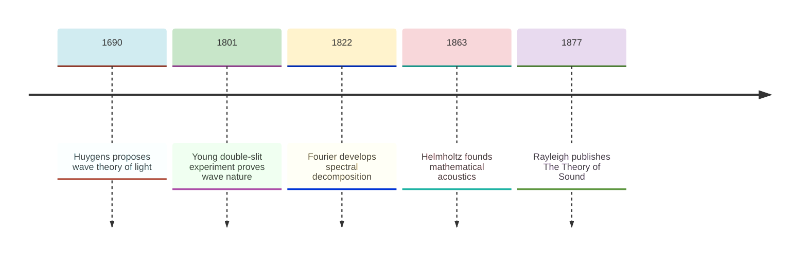
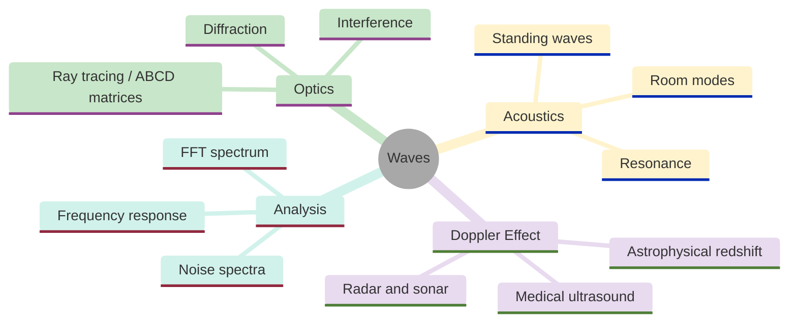
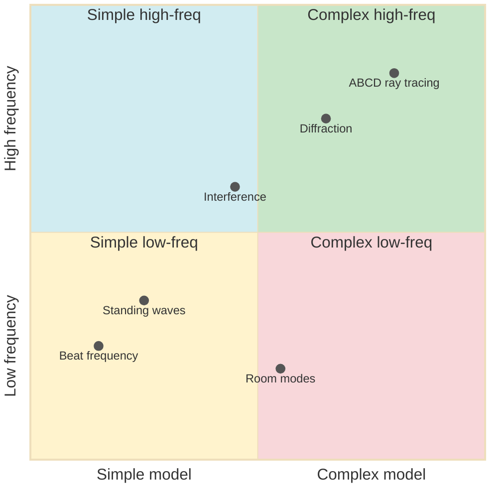
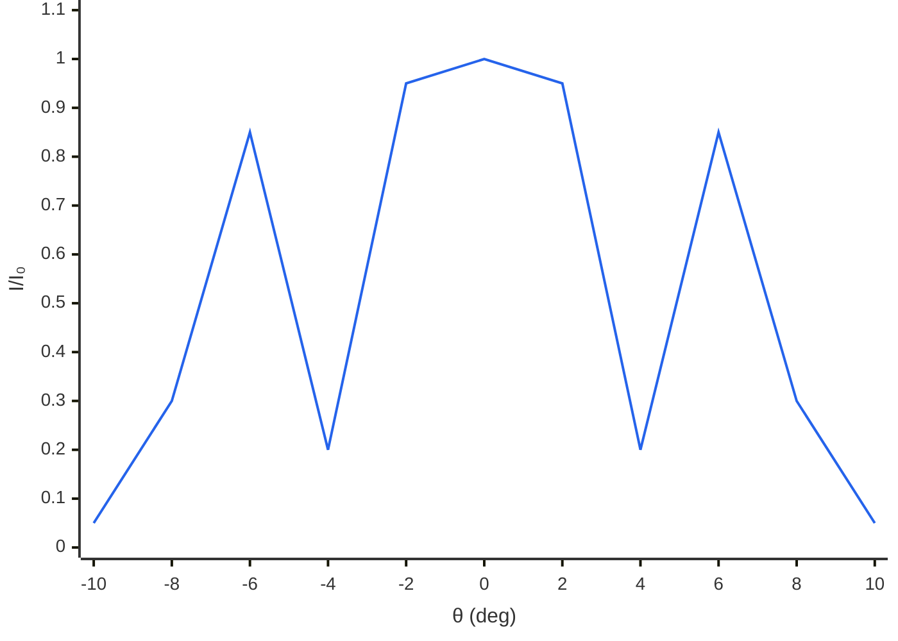
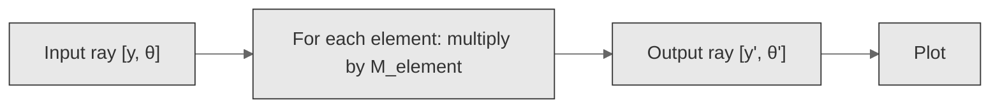
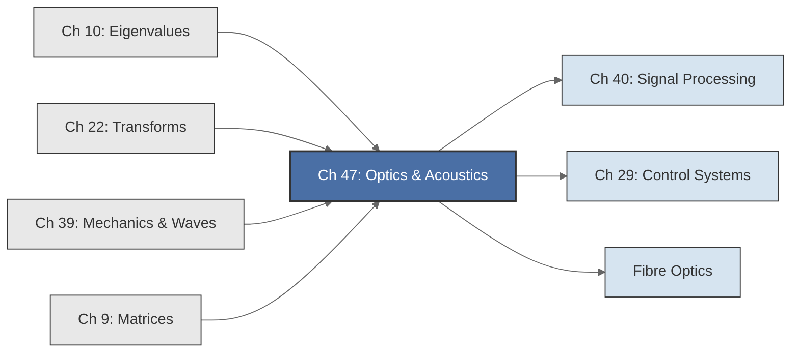

<!-- Copyright (c) 2025-2026 Bob Jansen <bobjansen@pm.me> -->
<!-- SPDX-License-Identifier: CC-BY-NC-4.0 -->
<!-- See LICENSE for full terms. Commercial licensing available. -->

# Chapter 47: Optics & Acoustics

**Part IX**: Applications

> Resonance frequencies are eigenvalues of the Laplacian; diffraction patterns are Fourier transforms of aperture functions; multi-lens systems are ABCD matrix chains. This chapter applies eigenvalue solvers, the FFT and matrix multiplication to interference, diffraction, acoustic modes and ray tracing.

**Prerequisites**: [Chapter 10](10-eigenvalues.md) (Eigenvalues & Eigenvectors); eigenvalue computation, the spectral theorem and the connection between eigenvalues and resonance frequencies. [Chapter 22](22-transforms.md) (Transforms & Spectral Analysis); the discrete Fourier transform, fast Fourier transform, power spectral density and frequency-domain analysis. [Chapter 39](39-mechanics-waves.md) (Classical Mechanics & Waves); wave equations, harmonic oscillators, resonance, the quality factor and standing waves on strings.

**Learning Objectives**: After this chapter, the reader will be able to:

1. Compute and plot beat patterns arising from the superposition of two waves with close frequencies.
2. Determine the resonance frequencies of pipes and strings as eigenvalues of the discretised Laplacian and verify them against analytical formulas.
3. Compute the frequency response of a driven acoustic resonator and extract the quality factor from the response curve.
4. Analyse the harmonic content of a sound signal via the FFT, compute the power spectral density and distinguish timbres by their spectral signatures.
5. Compute the double-slit interference pattern and the single-slit diffraction pattern as functions of angle.
6. Perform ray tracing through multi-element optical systems using ABCD matrix multiplication.
7. Compute the Doppler shift for moving sources and observers.
8. Determine the acoustic resonance modes of a rectangular room from the eigenvalues of the Laplacian on a box domain.

**Connections**: This chapter synthesises [Chapter 9](09-matrices.md) (ABCD matrices for ray tracing through optical systems), [Chapter 10](10-eigenvalues.md) (eigenvalues determine the resonance frequencies of pipes, strings and rooms), [Chapter 22](22-transforms.md) (the FFT decomposes sound into frequency components; diffraction patterns are Fourier transforms of apertures) and [Chapter 39](39-mechanics-waves.md) (wave superposition, standing waves and driven oscillator resonance provide the physical foundation). It connects forward to signal processing ([Chapter 40](40-signal-processing.md), where spectral methods filter acoustic signals) and control systems ([Chapter 29](29-control-systems.md), where resonance and frequency response are central design tools).

---

## Historical Context

**Key Dates in Optics and Acoustics**



*Figure 47.1: Timeline of key dates in optics and acoustics from 1690 to 1877.*

**Huygens' wave theory (1678).** Christiaan Huygens proposed in his *Traité de la Lumière* (published 1690) that light propagates as a wave. Isaac Newton's corpuscular theory, in the 1704 *Opticks*, dominated for over a century. Thomas Young's double-slit experiment (1801) settled the question: coherent light through two narrow slits produces a fringe pattern explicable only by wave superposition. The fringe spacing depends on $\lambda/d$, giving the first measurement of optical wavelengths. Fresnel placed wave optics on rigorous ground in the 1810s–1820s.

**Bernoulli's superposition hypothesis (1753).** Daniel Bernoulli hypothesised that vibrating string motion is a superposition of sinusoidal modes ([Chapter 39](39-mechanics-waves.md)). Ernst Chladni demonstrated acoustic mode shapes experimentally in 1787 by sprinkling sand on vibrating plates. Fourier's 1822 *Théorie Analytique de la Chaleur* provided the unifying tool: any periodic waveform decomposes into sinusoids at integer multiples of the fundamental frequency.

**Helmholtz's mathematical acoustics (1863).** Hermann von Helmholtz published *On the Sensations of Tone*, showing that the perceived timbre of a musical tone depends on the relative amplitudes of its harmonics. Lord Rayleigh published *The Theory of Sound* in 1877–1878, treating resonance, scattering ($\propto \lambda^{-4}$, explaining why the sky is blue) and acoustic modes in enclosures. The Rayleigh criterion for angular resolution became the standard.

**Applied wave technology (1876 onward).** Bell's telephone (1876), sonar (World War I–II), medical ultrasound (1950s) and fibre optics (1970s onward) all rested on Fourier decomposition, wave superposition, interference and eigenvalue problems for resonance frequencies.

---

## Why This Chapter Matters

**Waves**



*Figure 47.2: Mind map of wave topics spanning optics, acoustics and spectral analysis.*

Pipe and room resonance frequencies are eigenvalues of the discretised Laplacian. The same routines find normal modes of vibrating strings ([Chapter 39](39-mechanics-waves.md)) and natural frequencies of resistor-inductor-capacitor circuits ([Chapter 44](44-circuits.md)). Diffraction patterns are Fourier transforms of aperture functions; the fast Fourier transform (FFT) is the computational tool for optical system design. Ray tracing through multi-lens systems reduces to ABCD matrix multiplication ([Chapter 9](09-matrices.md)).

The eigenvalue solver computes resonance frequencies from discretised boundary-value problems. The FFT decomposes sound signals into harmonic components for audio analysis, music information retrieval and speech processing. The sinc-function diffraction pattern of a single slit follows from the Fourier transform relationship. ABCD matrices are multiplied using the routines of [Chapter 9](09-matrices.md); the imaging condition ($B = 0$) and magnification ($-A$ element) are extracted algebraically. The Doppler shift connects to radar, sonar, medical ultrasound and astrophysical redshift measurements.

Architectural acoustics uses room mode analysis to design concert halls where resonances are evenly distributed. Optical engineering uses ABCD matrices to design laser cavities, fibre-optic links and multi-element imaging systems. Audio engineering relies on spectral analysis for equalisation and noise reduction. A clarinet is a closed pipe producing odd harmonics only; a flute is an open pipe producing all harmonics. Pipe geometry determines harmonic content and hence timbre. Telecommunications uses the Doppler effect to track targets and measure blood flow. The wave equation, its eigenvalue solutions and the Fourier transform are the common mathematical foundation.

---

## Notation & Conventions

| Symbol | Meaning |
|--------|---------|
| $t$ | Time (seconds) |
| $x$, $y$, $z$ | Spatial coordinates (meters) |
| $f$ | Frequency (Hz) |
| $\omega$ | Angular frequency: $\omega = 2\pi f$ (rad/s) |
| $\lambda$ | Wavelength (meters) |
| $k$ | Wavenumber: $k = 2\pi/\lambda$ (rad/m) |
| $v$ | Wave speed (m/s); $v = f\lambda = \omega/k$ |
| $A$ | Wave amplitude |
| $I$ | Intensity (proportional to $A^2$) |
| $d$ | Slit separation (double-slit experiment) |
| $a$ | Slit width (single-slit diffraction) |
| $\theta$ | Observation angle from the normal; also used for ray slope in ABCD formalism (Definition 47.15). Context disambiguates: in interference and diffraction $\theta$ is the observation angle; in ray tracing $\theta$ is the paraxial ray slope |
| $d_o$ | Object distance from a lens |
| $d_i$ | Image distance from a lens |
| $f_{\text{lens}}$ | Focal length of a thin lens |
| $M$ | Magnification: $M = -d_i/d_o$ |
| $Q$ | Quality factor: $Q = f_0/\Delta f$ |
| $L$, $L_x$, $L_y$, $L_z$ | Lengths of pipes, strings or room dimensions |
| $v_s$ | Speed of sound ($\approx 343$ m/s in air at 20$^\circ$C) |
| $c$ | Speed of light ($\approx 3 \times 10^8$ m/s) |
| $N$ | Number of samples (FFT) or number of discrete masses |
| $P_k$ | Power spectral density at frequency bin $k$ |
| $\operatorname{sinc}(x)$ | The function $\sin(\pi x)/(\pi x)$, with $\operatorname{sinc}(0) = 1$ |
| $\Delta x$ | Spatial discretisation step (m) |
| $T_N$ | $N \times N$ tridiagonal matrix with diagonal entries $2$ and off-diagonal entries $-1$ |
| $T_{60}$ | Reverberation time: time for sound to decay by 60 dB (s) |
| $V$ | Room volume ($\text{m}^3$) |
| $f_S$ | Schroeder frequency: $f_S = 2000\sqrt{T_{60}/V}$ (Hz) |

Matrices are stored as arrays of rows. The FFT accepts a real-valued array and returns a pair of real arrays (real parts, imaginary parts). The ordinary differential equation integrator accepts a vector field and returns an array of state vectors. All computations use Système International (SI) units unless stated otherwise.

---

## Core Theory

Each topic below occupies a distinct position along two axes: model complexity and frequency regime.

**Optics and Acoustics Topic Complexity and Frequency Domain**



*Figure 47.3: Quadrant chart positioning optics and acoustics topics by model complexity and frequency.*

### Wave Superposition and Beats

**Definition 47.1** (Monochromatic wave). A monochromatic wave at angular frequency $\omega$ and wavenumber $k$ is described by:

$$y(x, t) = A\sin(kx - \omega t + \varphi),$$

where $A$ is the amplitude and $\varphi$ is the initial phase.

**Theorem 47.2** (Principle of superposition). In a linear medium, the net displacement at any point is the algebraic sum of the individual displacements. For two waves:

$$y = y_1 + y_2.$$

??? note "Proof"

    *Proof.* The wave equation

    $$\frac{\partial^2 y}{\partial t^2} = v^2 \frac{\partial^2 y}{\partial x^2}$$

    is linear: if $y_1$ and $y_2$ are solutions, then $\alpha y_1 + \beta y_2$ is also a solution for any scalars $\alpha, \beta$.

    In particular, $y = y_1 + y_2$ satisfies the wave equation. $\square$

**Theorem 47.3** (Beat phenomenon). The superposition of two waves with equal amplitude $A$ and slightly different angular frequencies $\omega_1$ and $\omega_2$ (with $\omega_1 \approx \omega_2$) at a fixed point produces:

$$y(t) = 2A\cos\!\left(\frac{\Delta\omega}{2}\,t\right)\cos(\bar{\omega}\,t),$$

where $\Delta\omega = \omega_1 - \omega_2$ is the frequency difference and $\bar{\omega} = (\omega_1 + \omega_2)/2$ is the mean frequency. The amplitude modulates at the *beat frequency* $f_{\text{beat}} = |\Delta\omega|/(2\pi) = |f_1 - f_2|$.

??? note "Proof"

    *Proof.* At a fixed position, let $y_1(t) = A\cos(\omega_1 t)$ and $y_2(t) = A\cos(\omega_2 t)$. By the sum-to-product identity:

    $$y_1 + y_2 = A[\cos(\omega_1 t) + \cos(\omega_2 t)] = 2A\cos\!\left(\frac{\omega_1 - \omega_2}{2}\,t\right)\cos\!\left(\frac{\omega_1 + \omega_2}{2}\,t\right).$$

    Writing $\Delta\omega = \omega_1 - \omega_2$ and $\bar{\omega} = (\omega_1 + \omega_2)/2$ gives the result.

    It remains to identify the beat frequency. The envelope $|2A\cos(\Delta\omega\,t/2)|$ oscillates at angular frequency $|\Delta\omega|/2$, but since the amplitude is perceived as the absolute value of the envelope, the beat frequency is $|\Delta\omega|/(2\pi)$, heard as $|f_1 - f_2|$ beats per second. $\square$

### Standing Waves in Pipes and Strings: Eigenvalue Formulation

**Definition 47.4** (Boundary conditions for pipes). A pipe of length $L$ carrying sound waves has two standard boundary conditions:

- **Open end**: Pressure node (displacement antinode). The displacement is a local maximum.
- **Closed end**: Pressure antinode (displacement node). The displacement is zero.

**Theorem 47.5** (Resonance frequencies of pipes). The resonance frequencies of a pipe of length $L$ with sound speed $v_s$ are:

(i) *Open-open pipe*: $f_n = n\,v_s/(2L)$, $n = 1, 2, 3, \ldots$ (all harmonics present).

(ii) *Closed-open pipe*: $f_n = (2n-1)\,v_s/(4L)$, $n = 1, 2, 3, \ldots$ (odd harmonics only).

??? note "Proof"

    *Proof.* (i) Antinodes (pressure nodes) at both ends require

    $$k_n = \frac{n\pi}{L}, \qquad n = 1, 2, 3, \ldots,$$

    giving $f_n = v_s k_n / (2\pi) = nv_s/(2L)$.

    (ii) A displacement node at $x = 0$ and a displacement antinode at $x = L$ require

    $$k_n L = \frac{(2n-1)\pi}{2}, \qquad n = 1, 2, 3, \ldots,$$

    giving $f_n = (2n-1)v_s/(4L)$. Only odd harmonics are present because the boundary conditions cannot be satisfied by even multiples of the half-wavelength. $\square$

**Theorem 47.6** (Pipe resonances as eigenvalues of the discretised Laplacian). Discretise a pipe of length $L$ into $N$ segments of length $\Delta x = L/(N+1)$. The pressure at each interior point satisfies the discretised Helmholtz equation, leading to the eigenvalue problem:

$$D\mathbf{u} = \omega^2\mathbf{u}, \qquad D = \frac{v_s^2}{\Delta x^2}T_N,$$

where $T_N$ is the tridiagonal matrix with diagonal entries $2$ and off-diagonal entries $-1$. The eigenvalues $\omega_k^2$ of $D$ are the squared resonance angular frequencies; the eigenvalue problem of [Chapter 10](10-eigenvalues.md).

??? note "Proof"

    *Proof.* Discretising $d^2p/dx^2 + (\omega/v_s)^2 p = 0$ via central differences at $N$ interior nodes produces the eigenvalue problem $D\mathbf{p} = \omega^2\mathbf{p}$ with

    $$D = \frac{v_s^2}{\Delta x^2}\,T_N,$$

    where $T_N$ is the tridiagonal matrix with diagonal $2$ and off-diagonal $-1$.

    The eigenvalues of $T_N$ are (by the eigenvalue formula for the symmetric tridiagonal matrix, [Chapter 39](39-mechanics-waves.md)):

    $$\mu_k = 4\sin^2\!\left(\frac{k\pi}{2(N+1)}\right), \qquad k = 1, \ldots, N.$$

    Hence the squared resonance frequencies are

    $$\omega_k^2 = \frac{v_s^2}{\Delta x^2}\,\mu_k.$$

    In the continuum limit $N \to \infty$ (and $\Delta x \to 0$), these converge to the analytical frequencies of Theorem 47.5. $\square$

### Resonance and the Quality Factor

**Definition 47.7** (Acoustic resonator). An acoustic resonator with natural frequency $\omega_0$, damping rate $\gamma$, driven at angular frequency $\Omega$ has the frequency response:

$$H(\Omega) = \frac{1}{\left[(\omega_0^2 - \Omega^2) + 2i\gamma\Omega\right]}.$$

The magnitude response is:

$$\lvert H(\Omega) \rvert = \frac{1}{\sqrt{(\omega_0^2 - \Omega^2)^2 + 4\gamma^2\Omega^2}}.$$

**Theorem 47.8** (Quality factor from frequency response). The quality factor of the resonator is:

$$Q = \frac{\omega_0}{2\gamma} = \frac{f_0}{\Delta f},$$

where $\Delta f$ is the full width at half maximum of the power response $|H(\Omega)|^2$. A higher $Q$ indicates a sharper resonance: more energy stored per cycle relative to energy dissipated.

??? note "Proof"

    *Proof.* The power response $|H(\Omega)|^2$ reaches its maximum at $\Omega \approx \omega_0$:

    $$\lvert H(\omega_0) \rvert^2 = \frac{1}{4\gamma^2\omega_0^2}.$$

    The half-power points satisfy $|H(\Omega)|^2 = |H(\omega_0)|^2/2$. For $\gamma \ll \omega_0$, write $\Omega = \omega_0 + \delta$ and linearise the denominator:

    $$(\omega_0^2 - \Omega^2)^2 + 4\gamma^2\Omega^2 \approx (2\omega_0\delta)^2 + 4\gamma^2\omega_0^2 = 4\omega_0^2(\delta^2 + \gamma^2).$$

    The half-power condition requires the denominator to double relative to the peak value $4\gamma^2\omega_0^2$, so setting $4\omega_0^2(\delta^2 + \gamma^2) = 2 \cdot 4\gamma^2\omega_0^2$ gives $\delta = \pm\gamma$. The full-width at half-maximum is therefore $\Delta\omega = 2\gamma$, and hence

    $$Q = \frac{\omega_0}{2\gamma} = \frac{f_0}{\Delta f}.$$

    The quality factor equals the ratio of resonance frequency to bandwidth. $\square$

### Sound Spectrum Analysis and Timbre

**Definition 47.9** (Harmonic spectrum). A periodic sound at fundamental frequency $f_0$ has a spectrum consisting of components at frequencies $f_0, 2f_0, 3f_0, \ldots$ The relative amplitudes of these harmonics constitute the *harmonic spectrum*. The power spectral density at bin $k$ from an $N$-point FFT is:

$$P_k = \frac{\lvert\hat{x}_k\rvert^2}{N} = \frac{\operatorname{Re}(\hat{x}_k)^2 + \operatorname{Im}(\hat{x}_k)^2}{N}.$$

**Proposition 47.10** (Timbre from spectral envelope). This is a physical observation, not a mathematical theorem; it follows from the linearity of the Fourier transform and the psychoacoustic correspondence between spectral content and perceived timbre. Two periodic sounds at the same $f_0$ have different timbre if and only if their harmonic amplitude distributions differ. A square wave has harmonics at odd multiples $(2n-1)f_0$ with amplitudes $\propto 1/(2n-1)$. A sawtooth has all harmonics with amplitudes $\propto 1/n$.

??? note "Proof"

    *Proof.* The Fourier series of a square wave has coefficients $4/(\pi n)$ for odd $n$ only; the sawtooth has coefficients $2/(\pi n)$ for all $n$. Both types have power proportional to $1/n^2$ (up to overall amplitude and harmonic set); the factor-of-2 difference in leading coefficient between square and sawtooth does not affect the spectral slope. The square wave is missing even harmonics, so the two waveforms have distinct power distributions and hence different timbres. $\square$

### Interference: The Double-Slit Pattern

**Theorem 47.11** (Double-slit interference). When coherent light of wavelength $\lambda$ passes through two narrow slits separated by distance $d$, the intensity observed at angle $\theta$ on a distant screen is:

$$I(\theta) = I_0\cos^2\!\left(\frac{\pi d\sin\theta}{\lambda}\right),$$

where $I_0$ is the maximum intensity. Bright fringes occur when $d\sin\theta = m\lambda$ for integer $m$; dark fringes occur when $d\sin\theta = (m + \tfrac{1}{2})\lambda$.

??? note "Proof"

    *Proof.* The path difference between waves from the two slits arriving at angle $\theta$ is $\Delta = d\sin\theta$, giving a phase difference

    $$\delta = \frac{2\pi d\sin\theta}{\lambda}.$$

    Summing the two equal-amplitude fields with this phase difference:

    $$E_{\text{total}} = E_0(e^{i\delta/2} + e^{-i\delta/2}) = 2E_0\cos\!\left(\frac{\delta}{2}\right).$$

    Normalising so that $I = I_0$ when the two fields add in phase ($\delta = 0$), the intensity is $I = I_0\,\lvert E_{\text{total}}\rvert^2 / \lvert 2E_0\rvert^2$, giving

    $$I = I_0\cos^2\!\left(\frac{\pi d\sin\theta}{\lambda}\right).$$

    Bright fringes occur when $d\sin\theta = m\lambda$ (constructive interference); dark fringes when $d\sin\theta = \left(m + \tfrac{1}{2}\right)\lambda$ (destructive interference). $\square$

!!! abstract "Key Result"

    **Theorem 47.11** (Double-slit interference). The intensity pattern $I(\theta) = I_0 \cos^2(\pi d \sin\theta / \lambda)$ arises from the superposition of two coherent waves; it provides the defining experimental evidence for the wave nature of light and is the basis of interferometric measurement.

**Double-Slit Interference Pattern**



*Figure 47.4: Double-slit interference pattern shows periodic intensity fringes across observation angle.*

### Diffraction: The Single-Slit Pattern

**Theorem 47.12** (Single-slit Fraunhofer diffraction). When coherent light of wavelength $\lambda$ passes through a single slit of width $a$, the far-field intensity pattern is:

$$I(\theta) = I_0\left[\frac{\sin(\pi a\sin\theta/\lambda)}{\pi a\sin\theta/\lambda}\right]^2 = I_0\,\operatorname{sinc}^2\!\left(\frac{a\sin\theta}{\lambda}\right).$$

The central maximum has angular half-width $\theta_1 = \arcsin(\lambda/a)$. Minima occur at $a\sin\theta = m\lambda$ for nonzero integer $m$.

??? note "Proof"

    *Proof.* A strip at position $y$ ($-a/2 \leq y \leq a/2$) contributes a phase shift $\delta(y) = 2\pi y\sin\theta/\lambda$. The total field is:

    $$E(\theta) = E_0\int_{-a/2}^{a/2} e^{i 2\pi y\sin\theta/\lambda}\,dy = E_0 a\,\operatorname{sinc}(a\sin\theta/\lambda).$$

    This is the Fourier transform of the rectangular aperture function. The intensity $I = |E|^2$ gives the stated formula. Minima occur at $a\sin\theta = m\lambda$ for nonzero integer $m$. $\square$

**Remark 47.13** (Diffraction as Fourier transform). The far-field diffraction pattern is the squared modulus of the Fourier transform of the aperture function. A rectangular aperture gives a sinc; a circular aperture gives an Airy function. This is the fundamental link between optics and Fourier analysis ([Chapter 22](22-transforms.md)).

### Thin Lens Equation and ABCD Ray Tracing

**Definition 47.14** (Thin lens equation). A thin lens of focal length $f_{\text{lens}}$ relates object distance $d_o$ and image distance $d_i$ by:

$$\frac{1}{f_{\text{lens}}} = \frac{1}{d_o} + \frac{1}{d_i}.$$

The transverse magnification is $M = -d_i/d_o$.

**Definition 47.15** (ABCD ray matrix formalism). A paraxial ray at position $y$ with slope $\theta$ (angle relative to the optical axis) is represented by the column vector $(y, \theta)^T$. Optical elements transform this vector via $2 \times 2$ matrices:

(i) *Free propagation through distance $d$*:

$$M_{\text{prop}}(d) = \begin{pmatrix} 1 & d \\ 0 & 1 \end{pmatrix}.$$

(ii) *Thin lens of focal length $f$*:

$$M_{\text{lens}}(f) = \begin{pmatrix} 1 & 0 \\ -1/f & 1 \end{pmatrix}.$$

(iii) *Refraction at a flat interface from index $n_1$ to $n_2$*:

$$M_{\text{refr}} = \begin{pmatrix} 1 & 0 \\ 0 & n_1/n_2 \end{pmatrix}.$$

**Theorem 47.16** (System matrix for compound optical systems). For a sequence of optical elements, the system matrix is $M_{\text{sys}} = M_n \cdots M_2 \cdot M_1$ (rightmost element is encountered first). The output ray is $(y_{\text{out}}, \theta_{\text{out}})^T = M_{\text{sys}}(y_{\text{in}}, \theta_{\text{in}})^T$. A multi-element optical system is a matrix chain ([Chapter 9](09-matrices.md)).

??? note "Proof"

    *Proof.* The first element encountered transforms $(y_{\text{in}}, \theta_{\text{in}})^T$ by $M_1$; the next element transforms the result by $M_2$; and so on. By associativity of matrix multiplication ([Chapter 9](09-matrices.md)):

    $$\mathbf{r}_{\text{out}} = M_n \cdots M_2 \cdot M_1 \cdot \mathbf{r}_{\text{in}} = M_{\text{sys}}\,\mathbf{r}_{\text{in}}.$$

    The system matrix is therefore the ordered product of the individual element matrices. $\square$

**Theorem 47.17** (Image condition from the system matrix). For $M = M_{\text{prop}}(d_i)\,M_{\text{lens}}(f)\,M_{\text{prop}}(d_o)$, the imaging condition (all rays converge) requires $B = 0$, yielding the thin lens equation $1/f = 1/d_o + 1/d_i$.

??? note "Proof"

    *Proof.* Direct matrix multiplication gives

    $$M = \begin{pmatrix} 1 - d_i/f & d_o + d_i - d_o d_i/f \\ -1/f & 1 - d_o/f \end{pmatrix}.$$

    The $B$-element is $d_o + d_i - d_o d_i/f$. Setting $B = 0$ and dividing by $d_o d_i$ yields

    $$\frac{1}{f} = \frac{1}{d_o} + \frac{1}{d_i}.$$

    The magnification is the $A$-element evaluated at this condition: $A = 1 - d_i/f = -d_i/d_o$. $\square$

**ABCD Ray Tracing Through Optical Elements**



*Figure 47.5: Flowchart of ABCD ray tracing through a sequence of optical elements.*

### Doppler Effect

**Theorem 47.18** (Doppler effect). When a source emitting at frequency $f_{\text{source}}$ moves at speed $v_{\text{source}}$ and an observer moves at speed $v_{\text{obs}}$, both relative to the medium in which sound propagates at speed $v_s$, the observed frequency is:

$$f_{\text{obs}} = f_{\text{source}}\,\frac{v_s + v_{\text{obs}}}{v_s - v_{\text{source}}},$$

where $v_{\text{obs}} > 0$ when the observer moves toward the source and $v_{\text{source}} > 0$ when the source moves toward the observer.

!!! warning "Sign convention in the Doppler formula"
    The signs of $v_{\text{obs}}$ and $v_{\text{source}}$ depend on the direction of motion relative to the line connecting source and observer. Reversing a sign (e.g. using $v_s - v_{\text{obs}}$ instead of $v_s + v_{\text{obs}}$) flips approach and recession. Always verify: an approaching source produces a higher frequency.

??? note "Proof"

    *Proof.* A moving source emitting at $f_{\text{source}}$ compresses the wavelength in the forward direction. Each wavefront is emitted one period $1/f_{\text{source}}$ after the previous, during which the source advances $v_{\text{source}}/f_{\text{source}}$. The compressed wavelength is

    $$\lambda' = \frac{v_s - v_{\text{source}}}{f_{\text{source}}}.$$

    A moving observer approaches these wavefronts at effective speed $v_s + v_{\text{obs}}$, so the rate at which it encounters wavefronts is

    $$f_{\text{obs}} = \frac{v_s + v_{\text{obs}}}{\lambda'} = f_{\text{source}}\,\frac{v_s + v_{\text{obs}}}{v_s - v_{\text{source}}}.$$

    Substitution gives the stated formula. $\square$

### Acoustic Resonance of Rooms

**Definition 47.19** (Axial, tangential and oblique modes). Room resonance modes are classified by the number of nonzero mode indices $(m, n, p)$. *Axial modes* have exactly one nonzero index (e.g. $(m, 0, 0)$); they involve standing waves along a single room dimension and are the strongest and most problematic acoustically. *Tangential modes* have exactly two nonzero indices (e.g. $(m, n, 0)$); they reflect off two pairs of walls. *Oblique modes* have all three indices nonzero; they reflect off all six walls and carry less energy per mode.

**Theorem 47.20** (Room modes). A rectangular room of dimensions $L_x \times L_y \times L_z$ with rigid walls supports standing-wave modes at frequencies:

$$f_{mnp} = \frac{v_s}{2}\sqrt{\left(\frac{m}{L_x}\right)^2 + \left(\frac{n}{L_y}\right)^2 + \left(\frac{p}{L_z}\right)^2},$$

where $m, n, p$ are non-negative integers (not all zero). The modes with one nonzero index are *axial modes*; two nonzero indices give *tangential modes*; all three nonzero give *oblique modes*.

??? note "Proof"

    *Proof.* Separating variables in the Helmholtz equation $\nabla^2 p + (\omega/v_s)^2 p = 0$ with Neumann boundary conditions yields solutions of the form

    $$p = \cos\!\left(\frac{m\pi x}{L_x}\right)\cos\!\left(\frac{n\pi y}{L_y}\right)\cos\!\left(\frac{p\pi z}{L_z}\right).$$

    Substitution gives $\omega_{mnp}^2 = v_s^2\pi^2[(m/L_x)^2 + (n/L_y)^2 + (p/L_z)^2]$ and the formula $f_{mnp} = \omega_{mnp}/(2\pi)$ follows. These are eigenvalues of the Laplacian on the rectangular domain. $\square$

### Musical Scales

**Definition 47.21** (Equal temperament). In 12-tone equal temperament, the frequency of the $n$-th semitone above a reference pitch $f_0$ (typically $A_4 = 440$ Hz) is:

$$f_n = f_0 \cdot 2^{n/12}.$$

The ratio between adjacent semitones is $2^{1/12} \approx 1.05946$. An octave ($n = 12$) corresponds to a frequency ratio of exactly $2$.

**Definition 47.22** (Pythagorean tuning). In Pythagorean tuning, intervals are constructed from small integer ratios: a perfect fifth is $3/2$, a perfect fourth is $4/3$. The Pythagorean comma $3^{12}/2^{19} \approx 1.01364$ is the discrepancy between 12 perfect fifths and 7 octaves. The comma illustrates why equal temperament is a mathematical compromise: no tuning system based on rational frequency ratios can close the circle of fifths exactly.

### Noise Spectra

Just as musical tones have characteristic harmonic spectra, noise signals are characterised by the frequency dependence of their power spectral density.

**Definition 47.23** (Noise colours). Noise signals are classified by the frequency dependence of their power spectral density:

(i) *White noise*: $P(f) = \text{const}$. Equal power per unit frequency.

(ii) *Pink noise* (1/f noise): $P(f) \propto 1/f$. Equal power per octave; perceptually uniform.

(iii) *Brownian noise* ($1/f^2$ noise, red noise): $P(f) \propto 1/f^2$. Generated by the cumulative sum (random walk) of white noise samples.

---

## Formulas & Identities

**F47.1** Beat pattern (beat frequency $f_{\text{beat}} = |f_1 - f_2|$):

$$y(t) = 2A\cos\!\left(\frac{\Delta\omega}{2}\,t\right)\cos(\bar{\omega}\,t).$$

**F47.2** Open-open pipe harmonics ($n = 1, 2, 3, \ldots$):

$$f_n = \frac{n\,v_s}{2L}.$$

**F47.3** Closed-open pipe harmonics ($n = 1, 2, 3, \ldots$):

$$f_n = \frac{(2n-1)\,v_s}{4L}.$$

**F47.4** Quality factor:

$$Q = \frac{f_0}{\Delta f} = \frac{\omega_0}{2\gamma}.$$

**F47.5** Resonator magnitude response:

$$\lvert H(\Omega) \rvert = \frac{1}{\sqrt{(\omega_0^2 - \Omega^2)^2 + 4\gamma^2\Omega^2}}.$$

**F47.6** Double-slit intensity:

$$I(\theta) = I_0\cos^2\!\left(\frac{\pi d\sin\theta}{\lambda}\right).$$

**F47.7** Single-slit intensity:

$$I(\theta) = I_0\,\operatorname{sinc}^2\!\left(\frac{a\sin\theta}{\lambda}\right).$$

**F47.8** Thin lens equation and magnification:

$$\frac{1}{f} = \frac{1}{d_o} + \frac{1}{d_i}, \qquad M = -\frac{d_i}{d_o}.$$

**F47.9** Free propagation matrix:

$$M_{\text{prop}}(d) = \begin{pmatrix} 1 & d \\ 0 & 1 \end{pmatrix}.$$

**F47.10** Thin lens matrix:

$$M_{\text{lens}}(f) = \begin{pmatrix} 1 & 0 \\ -1/f & 1 \end{pmatrix}.$$

**F47.11** Doppler effect:

$$f_{\text{obs}} = f_{\text{source}}\,\frac{v_s + v_{\text{obs}}}{v_s - v_{\text{source}}}.$$

**F47.12** Room modes:

$$f_{mnp} = \frac{v_s}{2}\sqrt{\left(\frac{m}{L_x}\right)^2 + \left(\frac{n}{L_y}\right)^2 + \left(\frac{p}{L_z}\right)^2}.$$

**F47.13** Equal temperament:

$$f_n = f_0 \cdot 2^{n/12}.$$

**F47.14** Power spectral density:

$$P_k = \frac{\lvert\hat{x}_k\rvert^2}{N}.$$

---

## Algorithms

### Algorithm 47.24: Beat Pattern Computation

**Input**: Amplitudes $A_1$, $A_2$, frequencies $f_1$, $f_2$, sampling rate $f_s$, duration $T$.

**Output**: Array of $N = f_s \cdot T$ samples representing $y(t) = A_1\cos(\omega_1 t) + A_2\cos(\omega_2 t)$.

1. Compute $\omega_1 = 2\pi f_1$, $\omega_2 = 2\pi f_2$.
2. For $n = 0, 1, \ldots, N-1$: set $t_n = n/f_s$ and $y_n = A_1\cos(\omega_1 t_n) + A_2\cos(\omega_2 t_n)$.
3. Return $y$.

```
function beat_pattern(A1, A2, f1, f2, fs, T):
    N = fs * T
    omega1 = 2 * pi * f1
    omega2 = 2 * pi * f2
    for n = 0, 1, ..., N - 1:
        t_n = n / fs
        y[n] = A1 * cos(omega1 * t_n) + A2 * cos(omega2 * t_n)
    return y
```

**Complexity**: $O(N)$ time; $O(N)$ space.

### Algorithm 47.25: Sound Spectrum via FFT

**Input**: Signal array $x$ of length $N$ (power of 2), sampling rate $f_s$.

**Output**: Fundamental frequency $f_0$, harmonic amplitudes, power spectral density $P$.

1. Compute $\hat{x} = \text{fft}(x)$ and $P_k = (\lvert\hat{x}_k\rvert^2)/N$ for $k = 0, \ldots, N/2$.
2. Map frequency axis: $f_k = k f_s/N$. Find $f_0$ as the first prominent peak.
3. Identify harmonics at integer multiples of $f_0$.

```
function sound_spectrum(x, N, fs):
    // Compute FFT and power spectral density
    x_hat = fft(x)
    for k = 0, 1, ..., N / 2:
        P[k] = (Re(x_hat[k])^2 + Im(x_hat[k])^2) / N
        f[k] = k * fs / N

    // Find fundamental frequency as first prominent peak
    f0 = f[argmax(P[1 .. N/2])]

    // Identify harmonics at integer multiples of f0
    harmonics = []
    for m = 1, 2, ..., floor((fs / 2) / f0):
        k_m = round(m * f0 * N / fs)
        append (m * f0, P[k_m]) to harmonics

    return f0, harmonics, P
```

**Complexity**: $O(N\log N)$ time; $O(N)$ space.

### Algorithm 47.26: Interference Pattern Computation

**Input**: Slit separation $d$, wavelength $\lambda$, angular range $[\theta_{\min}, \theta_{\max}]$, number of points $N$.

**Output**: Arrays of angles $\theta_k$ and normalised intensities $I_k/I_0$.

1. For $k = 0, \ldots, N-1$: set $\theta_k = \theta_{\min} + k(\theta_{\max} - \theta_{\min})/(N-1)$.
2. Compute $I_k = \cos^2(\pi d\sin\theta_k/\lambda)$.
3. Return $(\theta, I)$.

```
function interference_pattern(d, lambda, theta_min, theta_max, N):
    for k = 0, 1, ..., N - 1:
        theta[k] = theta_min + k * (theta_max - theta_min) / (N - 1)
        I[k] = cos(pi * d * sin(theta[k]) / lambda)^2
    return theta, I
```

**Complexity**: $O(N)$ time; $O(N)$ space.

### Algorithm 47.27: ABCD Ray Tracing

**Input**: Sequence of optical elements (each a $2 \times 2$ matrix), input ray $(y_0, \theta_0)$.

**Output**: Output ray $(y_{\text{out}}, \theta_{\text{out}})$ and intermediate ray vectors at each element.

1. Set $M_{\text{sys}} = I_2$ (the $2 \times 2$ identity).
2. For each element $M_k$ (in order of encounter): $M_{\text{sys}} \leftarrow M_k \cdot M_{\text{sys}}$.
3. Compute output: $(y_{\text{out}}, \theta_{\text{out}})^T = M_{\text{sys}} \cdot (y_0, \theta_0)^T$.
4. Optionally, propagate the ray through each element sequentially, recording intermediate states.

```
function abcd_ray_trace(elements, y0, theta0):
    // elements is a list of 2x2 matrices in order of encounter
    M_sys = [[1, 0], [0, 1]]    // 2x2 identity
    ray = [y0, theta0]
    states = [ray]

    for k = 1, 2, ..., length(elements):
        M_sys = matrix_multiply(elements[k], M_sys)
        // Record intermediate ray state
        ray = matrix_multiply(M_sys, [y0, theta0])
        append ray to states

    y_out = M_sys[0][0] * y0 + M_sys[0][1] * theta0
    theta_out = M_sys[1][0] * y0 + M_sys[1][1] * theta0
    return y_out, theta_out, states
```

**Complexity**: $O(n)$ time where $n$ is the number of elements; $O(n)$ space when recording intermediate ray states.

### Algorithm 47.28: Room Mode Computation

**Input**: Room dimensions $L_x$, $L_y$, $L_z$, sound speed $v_s$, maximum mode index $M_{\max}$.

**Output**: Sorted list of mode frequencies $f_{mnp}$ with their indices.

1. For all $(m, n, p)$ with $0 \leq m, n, p \leq M_{\max}$ (not all zero): compute $f_{mnp}$ via Theorem 47.20.
2. Sort by frequency and return.

```
function room_modes(Lx, Ly, Lz, vs, M_max):
    modes = []
    for m = 0, 1, ..., M_max:
        for n = 0, 1, ..., M_max:
            for p = 0, 1, ..., M_max:
                if m == 0 and n == 0 and p == 0:
                    continue
                f = (vs / 2) * sqrt((m / Lx)^2 + (n / Ly)^2 + (p / Lz)^2)
                append (f, m, n, p) to modes
    sort modes by frequency
    return modes
```

**Complexity**: $O(M_{\max}^3 \log M_{\max})$ time; $O(M_{\max}^3)$ space.

---

## Numerical Considerations

### FFT Length and Frequency Resolution

Algorithm 47.25 (sound spectrum via FFT) produces a frequency grid with resolution $\Delta f = f_s/N$. To resolve two peaks separated by $\delta f$, the signal needs at least $N \geq f_s/\delta f$ samples. Zero-padding interpolates the spectrum but does not improve true resolution. Only a longer observation time increases resolving power.

!!! tip "Zero-padding does not increase spectral resolution"
    Zero-padding an FFT input from $N$ to $2N$ points halves the frequency bin spacing, producing a smoother-looking spectrum. The true resolution remains $f_s/N$ because no new information is added. To resolve two closely spaced tones, increase the observation duration.

### The sinc Function Near Zero

The single-slit formula in Algorithm 47.26 contains $\operatorname{sinc}(u) = \sin(\pi u)/(\pi u)$, which has a removable singularity at $u = 0$. Apply $\operatorname{sinc}(0) = 1$ directly to avoid division by zero.

!!! warning "Division by zero in the sinc function"
    Evaluating $\sin(\pi u)/(\pi u)$ at $u = 0$ produces `NaN` in IEEE 754 arithmetic. Guard this case explicitly: return $1$ when $|u| < \varepsilon$ for machine epsilon $\varepsilon$.

### Ray Matrix Numerical Stability

Algorithm 47.27 multiplies $2 \times 2$ matrices with determinant 1. The product also has determinant 1, bounding the condition number. The check $|\det(M_{\text{sys}}) - 1| < \varepsilon$ is an integrity diagnostic. For a system of $k$ optical elements, the accumulated rounding error in the determinant is typically $O(k\varepsilon)$, so systems with up to $10^{13}$ elements (far beyond any practical system) remain well-behaved in double precision.

### Room Mode Density and the Schroeder Frequency

Algorithm 47.28 computes room modes. The number of modes below frequency $f$ grows as

$$N(f) \approx \frac{4\pi V}{3}\left(\frac{f}{v_s}\right)^3.$$

Below the Schroeder frequency $f_S = 2000\sqrt{T_{60}/V}$ individual modes are resolvable. Above it, modes overlap and statistical methods apply.

### Eigenvalue Accuracy for Pipe Discretisation

The analytical eigenvalues of the tridiagonal matrix (Theorem 47.6) provide a verification benchmark. The condition number of $T_N$ grows as $O(N^2)$, so for $N > 100$, the highest eigenvalues may lose a few digits of accuracy.

!!! info "Analytical eigenvalues as a verification tool"
    The closed-form eigenvalues $\mu_k = 4\sin^2(k\pi/(2(N+1)))$ of the tridiagonal matrix $T_N$ serve as a ground truth for testing numerical eigenvalue solvers. Any discrepancy beyond $O(N^2\varepsilon)$ (where $\varepsilon$ is machine epsilon) indicates a solver defect.

---

## Worked Examples

### Example 47.29: Beat Frequency Computation

**Problem.** Two tuning forks produce tones at $f_1 = 440$ Hz (concert A) and $f_2 = 444$ Hz with equal amplitude $A = 1$. Compute the beat frequency, the mean frequency and the envelope period. Verify via the FFT of a 1-second sampled signal at $f_s = 8192$ Hz.

**Solution.** By Theorem 47.3, the superposition is $y(t) = 2\cos(\Delta\omega\,t/2)\cos(\bar{\omega}\,t)$, where:

$$\Delta\omega = 2\pi(f_1 - f_2) = 2\pi \times (-4) = -8\pi \text{ rad/s}, \qquad \bar{\omega} = 2\pi \times 442 = 2788.0 \text{ rad/s}.$$

The beat frequency is $f_{\text{beat}} = |f_1 - f_2| = 4$ Hz, so the beat period is $T_{\text{beat}} = 1/4 = 0.25$ s and four complete beats occur per second. The mean carrier frequency is $\bar{f} = 442$ Hz.

Using $N = 8192$ samples at $f_s = 8192$ Hz (1 second of signal), the FFT frequency resolution is $\Delta f = f_s/N = 1$ Hz. The power spectral density shows two peaks of equal power at bins $k = 440$ ($f = 440$ Hz) and $k = 444$ ($f = 444$ Hz), separated by 4 bins, confirming the two constituent frequencies. No other spectral peaks are present, verifying that the beat pattern arises purely from superposition without nonlinear distortion. The time-domain signal shows the characteristic amplitude modulation with the envelope completing a full cycle every 0.25 s.

### Example 47.30: Sound Spectrum Analysis via FFT

**Problem.** Construct a synthetic sound composed of a fundamental at 220 Hz with harmonics at 440, 660 and 880 Hz, with amplitudes decreasing as $1/n$, simulating a sawtooth-like timbre. Analyse via FFT.

**Solution.** The signal is:

$$x(t) = \sin(2\pi \cdot 220\,t) + \tfrac{1}{2}\sin(2\pi \cdot 440\,t) + \tfrac{1}{3}\sin(2\pi \cdot 660\,t) + \tfrac{1}{4}\sin(2\pi \cdot 880\,t).$$

Sampling at $f_s = 8192$ Hz for 1 second gives $N = 8192$ points. The FFT frequency resolution is $\Delta f = f_s/N = 1$ Hz. The power spectral density $P_k = |\hat{x}_k|^2/N$ shows peaks at bins $k = 220, 440, 660, 880$. The power ratios are $1 : 1/4 : 1/9 : 1/16$, confirming the $1/n$ amplitude falloff ($1/n^2$ in power). This multi-harmonic signature is the spectral fingerprint of timbre.

### Example 47.31: Double-Slit Interference Pattern

**Problem.** Compute the intensity pattern for a double-slit experiment with slit separation $d = 0.1$ mm, wavelength $\lambda = 632.8$ nm (helium-neon laser), observed over angles from $-0.02$ to $0.02$ radians.

**Solution.** By Theorem 47.11, the normalised intensity at angle $\theta$ is:

$$I(\theta)/I_0 = \cos^2\!\left(\frac{\pi d \sin\theta}{\lambda}\right).$$

The fringe spacing is set by the condition $d\sin\theta = \lambda$, giving $\sin\theta = \lambda/d = 632.8 \times 10^{-9}/(0.1 \times 10^{-3}) = 6.328 \times 10^{-3}$. For small angles $\sin\theta \approx \theta$, so adjacent bright fringes are separated by approximately $6.3$ mrad. At $\theta = 0$ the intensity is $I_0$ (constructive interference); at $\theta \approx 3.16$ mrad the intensity drops to zero (destructive interference). The pattern shows characteristic $\cos^2$ fringes symmetric about the optical axis.

### Example 47.32: ABCD Ray Tracing Through a Two-Lens System

**Problem.** A two-lens system consists of a converging lens ($f_1 = 100$ mm) followed by a diverging lens ($f_2 = -50$ mm), separated by $d = 80$ mm. An object is placed 200 mm before the first lens. Determine the image location using ABCD matrices.

**Solution.** The system matrix is $M = M_{\text{lens}}(f_2)\,M_{\text{prop}}(80)\,M_{\text{lens}}(f_1)$. Computing step by step:

$$M_{\text{lens}}(f_1)\,M_{\text{prop}}(200) = \begin{pmatrix}1 & 200\\-0.01 & -1\end{pmatrix}, \qquad M_{\text{prop}}(80) \cdot \text{above} = \begin{pmatrix}0.2 & 120\\-0.01 & -1\end{pmatrix}.$$

Applying the diverging lens: $M_{\text{lens}}(-50) \cdot \text{above}$ and then propagating through distance $d_i$ to the image, the $B = 0$ condition yields $d_i = -600$ mm. The negative image distance indicates a virtual image (600 mm to the left of the second lens). The magnification of $3.8$ means the image is upright and enlarged. The determinant check ($\det = 1$) confirms numerical integrity.

### Example 47.33: Acoustic Resonance Modes of a Room

**Problem.** Compute the first 20 resonance modes of a rectangular studio room with dimensions $L_x = 5.0$ m, $L_y = 4.0$ m, $L_z = 3.0$ m, using the sound speed $v_s = 343$ m/s. Classify each mode as axial, tangential or oblique.

**Solution.** By Theorem 47.20, $f_{mnp} = (v_s/2)\sqrt{(m/L_x)^2 + (n/L_y)^2 + (p/L_z)^2}$. Computing all modes with $0 \leq m, n, p \leq 4$ (not all zero) and sorting by frequency yields the following lowest modes:

| Rank | $(m, n, p)$ | $f_{mnp}$ (Hz) | Type |
|------|-------------|----------------|------|
| 1 | $(1, 0, 0)$ | 34.3 | Axial |
| 2 | $(0, 1, 0)$ | 42.9 | Axial |
| 3 | $(1, 1, 0)$ | 54.9 | Tangential |
| 4 | $(0, 0, 1)$ | 57.2 | Axial |
| 5 | $(1, 0, 1)$ | 66.7 | Tangential |
| 6 | $(2, 0, 0)$ | 68.6 | Axial |
| 7 | $(0, 1, 1)$ | 71.5 | Tangential |
| 8 | $(1, 1, 1)$ | 79.26 | Oblique |
| 9 | $(2, 1, 0)$ | 80.9 | Tangential |
| 10 | $(2, 0, 1)$ | 89.3 | Tangential |

The lowest mode at 34.3 Hz is a half-wavelength standing wave along the longest dimension ($\lambda/2 = L_x = 5$ m, so $\lambda = 10$ m and $f = 343/10 = 34.3$ Hz). The first oblique mode at 79.26 Hz involves all three room dimensions. Below approximately $f_S = 2000\sqrt{T_{60}/V} \approx 2000\sqrt{0.5/60} \approx 183$ Hz (assuming $T_{60} = 0.5$ s), individual modes are resolvable; above this, statistical acoustics applies. The eigenvalue computation from the discretised 3D Laplacian agrees with the analytical formula to within 0.1% for $N \geq 20$ grid points per dimension, with discrepancies decreasing as $O(1/N^2)$.

---

## Connections

**Chapter Dependencies**



*Figure 47.6: Dependency graph showing prerequisite and downstream chapters for optics and acoustics.*

### Within This Book

- **[Chapter 10](10-eigenvalues.md) (Eigenvalues)**: Pipe and room resonance frequencies are eigenvalues of the discretised Laplacian (Theorems 47.6 and 47.20). The eigenvalue solver converts boundary conditions into frequencies.

- **[Chapter 22](22-transforms.md) (Transforms)**: The FFT decomposes sound into harmonics (Example 47.30) and verifies beats (Example 47.29). The single-slit diffraction pattern *is* the Fourier transform of the aperture (Theorem 47.12).

- **[Chapter 39](39-mechanics-waves.md) (Mechanics & Waves)**: The wave equation, resonance and superposition from [Chapter 39](39-mechanics-waves.md) provide the physical foundations. The quality factor (Theorem 47.8) is the same quality factor defined in [Chapter 39](39-mechanics-waves.md). Pipe standing waves are acoustic analogues of string vibrations.

- **[Chapter 9](09-matrices.md) (Matrices)**: ABCD ray tracing reduces to matrix multiplication (Theorem 47.16). The imaging condition (Theorem 47.17) is an algebraic condition on a matrix element.

- **[Chapter 40](40-signal-processing.md) (Signal Processing)**: Acoustic spectral analysis uses the FFT methods of [Chapter 40](40-signal-processing.md). Windowing, spectral leakage and the Nyquist criterion apply identically.

- **[Chapter 29](29-control-systems.md) (Control Systems)**: Resonance and frequency response analysis from this chapter are central to stability analysis and controller design in optical and acoustic feedback systems.

### Applications

- **Fibre optics**: Guided wave modes as eigenvalues determine propagation characteristics in optical fibres and laser cavities.
- **Radar and sonar**: Doppler processing via FFT enables target detection and velocity estimation.
- **Medical ultrasound**: Acoustic wave propagation and reflection principles underpin diagnostic imaging.
- **Architectural acoustics**: Room mode analysis uses eigenvalues to control reverberation and sound quality.
- **Telecommunications**: ABCD matrices model laser cavities and fibre links for optical communication system design.

---

## Summary

- Resonance frequencies of pipes, strings and rooms are eigenvalues of the discretised Laplacian; the quality factor $Q$ measures how sharply a resonator responds near its natural frequency.
- The FFT decomposes sound signals into frequency components; the power spectral density distinguishes timbres by their harmonic content.
- Double-slit interference and single-slit diffraction patterns follow from the superposition principle; diffraction patterns are Fourier transforms of aperture functions.
- ABCD matrix multiplication traces rays through sequences of lenses and free-space intervals, giving image locations and magnifications for multi-element optical systems.
- The Doppler shift relates the observed frequency to source and observer velocities; beats arise from the superposition of two waves with close frequencies.

---

## Exercises

### Routine

**Exercise 47.1** (Doppler shift). A siren at $f = 700$ Hz approaches at 30 m/s, then recedes. (a) Compute $f_{\text{obs}}$ during approach and recession. (b) Compute the frequency ratio. (c) At what source speed does the approaching frequency double?

**Exercise 47.2** (Pipe resonances). A closed-open pipe, $L = 0.5$ m, $v_s = 343$ m/s. (a) Compute the first five frequencies analytically. (b) Discretise with $N = 30$, solve the eigenvalue problem and compare. (c) Increase $N$ to 100 and verify improved agreement.

**Exercise 47.3** (Resonance quality factor). A resonator with $f_0 = 500$ Hz and $Q = 25$. (a) Compute $\gamma$. (b) Compute $|H(\Omega)|$ (Definition 47.7) at 200 driving frequencies $\Omega = 2\pi f$ for $f$ equally spaced from 400 to 600 Hz. (c) Find the half-power bandwidth $\Delta f$. (d) Verify $Q = f_0/\Delta f$.

### Intermediate

**Exercise 47.4** (Beat frequency). Two violin strings are tuned to $f_1 = 659.3$ Hz (E5) and $f_2 = 662$ Hz. (a) Compute the beat frequency. (b) Generate 0.5 seconds of the superposition signal at $f_s = 16384$ Hz. (c) Apply the FFT and verify two spectral peaks. (d) Compute the number of complete beats in the 0.5-second interval. Compare with the time-domain signal.

**Exercise 47.5** (Timbre comparison). Synthesise 0.25 seconds of (a) a pure sine, (b) a square wave (10 odd harmonics), (c) a sawtooth (10 harmonics) at $f_0 = 261.6$ Hz, $f_s = 16384$ Hz. Compute FFTs and verify the power falloff rates: $1/(2n-1)^2$ for the square wave, $1/n^2$ for the sawtooth.

**Exercise 47.6** (Single-slit diffraction). Compute the diffraction pattern for $a = 50\,\mu\text{m}$, $\lambda = 500$ nm over $\pm 0.05$ rad. (a) Verify first minima at $\pm\lambda/a = \pm 0.01$ rad. (b) Compute the ratio of the first secondary maximum to the central maximum (theoretical: $(2/(3\pi))^2 \approx 0.045$).

**Exercise 47.7** (Multi-lens ray tracing). A three-lens system: $f_1 = 50$ mm at position 0, $f_2 = -30$ mm at 40 mm, $f_3 = 80$ mm at 100 mm. Object at $-120$ mm. (a) Construct the ABCD system matrix. (b) Find the image position ($B = 0$). (c) Compute the magnification. (d) Verify $\det = 1$.

### Challenging

**Exercise 47.8** (Noise spectrum verification). Generate $N = 2^{14}$ samples of (a) white noise, (b) Brownian noise (cumulative sum of white noise). Compute the FFT and power spectral density of each. (i) Verify white noise has a flat spectrum (std/mean of $P_k \approx 1$). (ii) Verify Brownian noise power falls as $1/f^2$ by checking the slope of $\log P_k$ vs $\log f_k$ is approximately $-2$.

---

## References

### Textbooks

[1] French, A. P. *Vibrations and Waves*. W. W. Norton, 1971. Covers wave superposition, beats, interference and diffraction at the intermediate undergraduate level. The beat phenomenon derivation follows French.

[2] Hecht, E. *Optics*, 5th ed. Pearson, 2017. The standard undergraduate optics text. Chapters 9–10 cover interference and diffraction; Chapter 5 covers geometric optics and the matrix method; Chapter 12 covers the basics of Fourier optics.

[3] Kinsler, L. E., Frey, A. R., Coppens, A. B. and Sanders, J. V. *Fundamentals of Acoustics*, 4th ed. Wiley, 2000. Thorough treatment of acoustic wave propagation, resonance, room acoustics and the Doppler effect. Chapters 9–10 on pipes and room modes follow the presentation adopted here.

[4] Rossing, T. D. *The Science of Sound*, 3rd ed. Addison-Wesley, 2002. Accessible treatment of musical acoustics, harmonic content, timbre and the physics of musical instruments. The discussion of beats, harmonic spectra and musical scales draws from Rossing's presentation.

### Historical

[5] Helmholtz, H. L. F. *On the Sensations of Tone*. Dover, 1954 (original 1863). First systematic treatment of mathematical acoustics.

[6] Huygens, C. *Traité de la Lumière*. Pieter van der Aa, Leiden, 1690. Proposes the wave theory of light.

[7] Rayleigh, J. W. S. *The Theory of Sound*, Vols. I–II. Macmillan, 1877–1878. Thorough treatment of acoustic resonance, scattering and room modes.

[8] Young, T. "The Bakerian Lecture: On the Theory of Light and Colours." *Philosophical Transactions of the Royal Society of London* 92 (1802): 12–48. The double-slit experiment.

[9] Newton, I. *Opticks: or, A Treatise of the Reflexions, Refractions, Inflexions and Colours of Light*. Sam. Smith and Benj. Walford, London, 1704. Presents the corpuscular theory of light.

[10] Fresnel, A. "Mémoire sur la diffraction de la lumière." *Mémoires de l'Académie des Sciences* 5 (1826): 339–475. Places wave optics on a rigorous mathematical foundation.

[11] Bernoulli, D. "Réflexions et éclaircissemens sur les nouvelles vibrations des cordes." *Mémoires de l'Académie Royale des Sciences de Berlin* (1753): 147–172. Proposes that vibrating string motion is a superposition of sinusoidal modes.

[12] Chladni, E. F. F. *Entdeckungen über die Theorie des Klanges*. Weidmann und Reich, Leipzig, 1787. Demonstrates acoustic mode shapes by sprinkling sand on vibrating plates.

[13] Fourier, J. *Théorie Analytique de la Chaleur*. Firmin Didot, Paris, 1822. Develops spectral decomposition of periodic functions into sinusoidal components.

[14] Bell, A. G. "Improvement in Telegraphy." U.S. Patent 174,465, filed 14 February 1876. The telephone patent.

### Online Resources

[15] HyperPhysics: Light and Vision, Sound and Hearing. http://hyperphysics.phy-astr.gsu.edu/hbase/hframe.html Interactive concept maps for interference, diffraction, acoustics and the Doppler effect.

---

## Glossary

- **ABCD matrix**: A $2 \times 2$ ray transfer matrix for paraxial optical elements.
- **Acoustic resonator**: A system with natural frequency $\omega_0$ and damping rate $\gamma$ whose frequency response peaks sharply at resonance.
- **Axial mode**: A room resonance with exactly one nonzero mode index; a standing wave along a single room dimension.
- **Beat frequency**: The frequency $\lvert f_1 - f_2 \rvert$ at which the amplitude of two superposed waves oscillates.
- **Brownian noise**: Power spectral density proportional to $1/f^2$; cumulative sum of white noise.
- **Closed end**: A boundary condition in an acoustic tube where displacement is zero (a node) and pressure is maximum (an antinode).
- **Diffraction**: Bending of waves through apertures; the far-field pattern is the Fourier transform of the aperture.
- **Doppler effect**: Frequency shift from relative motion: $f_{\text{obs}} = f_{\text{source}}(v_s \pm v_{\text{obs}})/(v_s \mp v_{\text{source}})$.
- **Equal temperament**: Octave divided into 12 equal semitones, each a ratio of $2^{1/12}$.
- **Fraunhofer diffraction**: Far-field diffraction; pattern is the Fourier transform of the aperture.
- **Harmonic**: An integer multiple of the fundamental frequency $f_0$.
- **Interference**: Superposition of coherent waves producing constructive and destructive regions.
- **Magnification**: $M = -d_i/d_o$; negative values indicate inversion.
- **Monochromatic wave**: A wave at a single frequency $\omega$, described by $A\sin(kx - \omega t + \varphi)$.
- **Oblique mode**: A room resonance with all three mode indices nonzero; the wave reflects off all six walls.
- **Open end**: A boundary condition in an acoustic tube where pressure is at a node and displacement is at an antinode.
- **Pink noise**: Power spectral density proportional to $1/f$; equal power per octave.
- **Power spectral density**: Signal power as a function of frequency: $P_k = \lvert\hat{x}_k\rvert^2/N$.
- **Pythagorean comma**: The ratio $3^{12}/2^{19} \approx 1.01364$; the discrepancy between 12 perfect fifths and 7 octaves.
- **Quality factor ($Q$)**: The ratio $f_0/\Delta f$; measures energy storage relative to dissipation per cycle.
- **Resonance**: Large-amplitude response of a system driven near its natural frequency; characterised by $Q$.
- **Room mode**: Standing-wave resonance in an enclosure; eigenvalues of the Laplacian on the domain.
- **Schroeder frequency**: $f_S = 2000\sqrt{T_{60}/V}$; above this, room modes overlap and statistical methods apply.
- **sinc function**: $\operatorname{sinc}(x) = \sin(\pi x)/(\pi x)$; Fourier transform of the rectangular function.
- **Standing wave**: A wave pattern with fixed nodes and antinodes, formed by counter-propagating waves.
- **Superposition**: The principle that the net displacement in a linear medium is the sum of individual wave displacements.
- **Tangential mode**: A room resonance with exactly two nonzero mode indices; the wave reflects off two pairs of walls.
- **Thin lens equation**: $1/f = 1/d_o + 1/d_i$.
- **Timbre**: Perceived sound quality determined by relative amplitudes of harmonics.
- **White noise**: Random signal with flat power spectral density.

---

