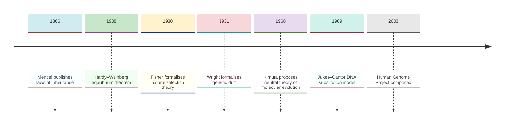
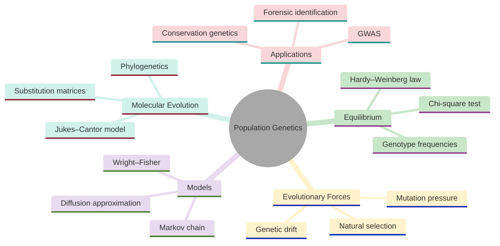
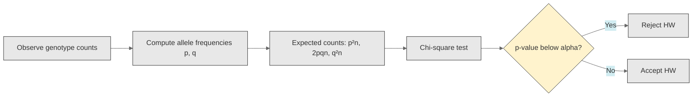
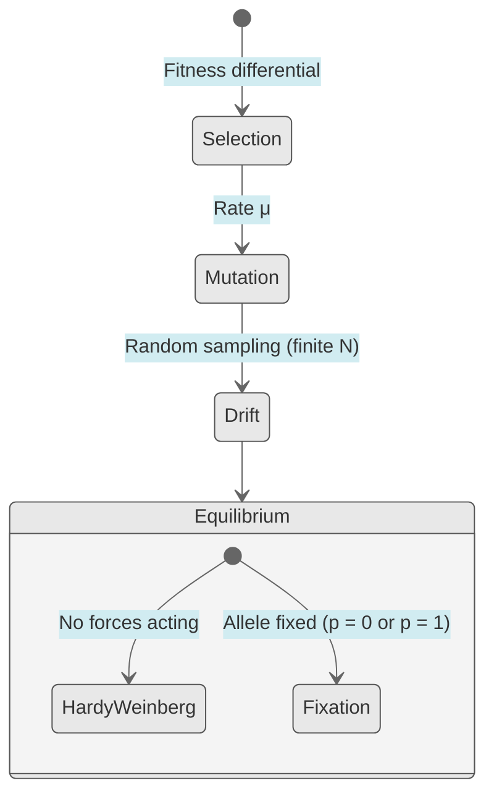
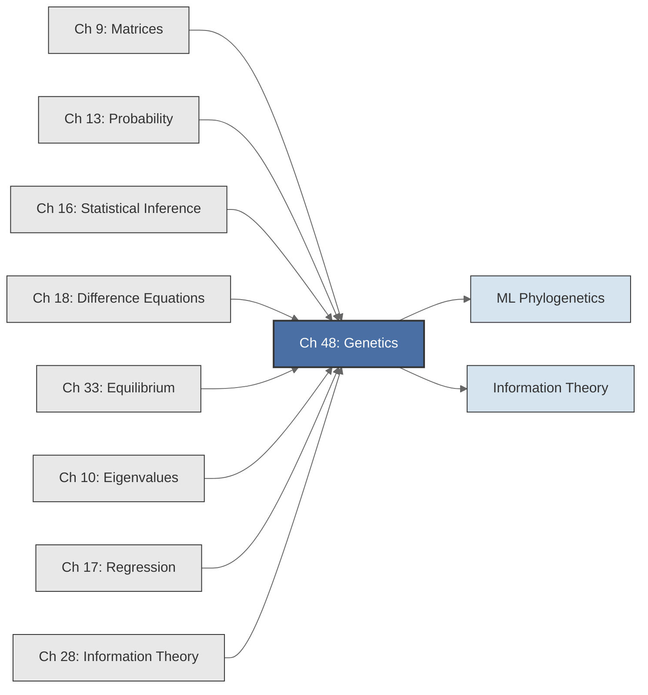

<!-- Copyright (c) 2025-2026 Bob Jansen <bobjansen@pm.me> -->
<!-- SPDX-License-Identifier: CC-BY-NC-4.0 -->
<!-- See LICENSE for full terms. Commercial licensing available. -->

# Chapter 48: Genetics & Bioinformatics


**Part IX**: Applications

> Hardy–Weinberg equilibrium, allele frequency dynamics under selection and drift, nucleotide substitution models: all reduce to probability, difference equations, Markov chains and matrix exponentiation. This chapter derives them and applies chi-square tests, eigenvalue decomposition and log-odds scoring to population genetics and molecular evolution.

**Prerequisites**: [Chapter 9](09-matrices.md) (Matrices & Linear Transformations); transition matrices, matrix exponentiation, substitution matrices. [Chapter 13](13-probability-theory.md) (Probability Theory); discrete probability distributions, expected value, the binomial distribution, Bayes' theorem. [Chapter 16](16-statistical-inference.md) (Statistical Inference); the chi-square goodness-of-fit test for checking Hardy–Weinberg equilibrium. [Chapter 17](17-regression.md) (Regression); isochron regression for molecular clock calibration and phylogenetic distance estimation. [Chapter 18](18-difference-equations.md) (Difference Equations & Dynamical Systems); first-order recurrences, fixed points, stability of discrete maps. [Chapter 28](28-information-theory.md) (Information Theory); entropy and mutual information in sequence analysis and scoring matrix construction. [Chapter 33](33-equilibrium.md) (Equilibrium & Steady States); fixed-point analysis, the Hardy–Weinberg equilibrium as a steady state of a discrete dynamical system.

**Learning Objectives**: After this chapter, the reader will be able to:

1. Derive the Hardy–Weinberg equilibrium from the axioms of probability and verify it as a steady state of the random mating map.
2. Apply the chi-square goodness-of-fit test to determine whether observed genotype frequencies are consistent with Hardy–Weinberg equilibrium.
3. Formulate allele frequency change under selection as a difference equation and iterate it to find equilibria.
4. Model mutation as a linear recurrence and compute the mutation-selection balance.
5. Construct the Wright–Fisher transition matrix and extract fixation time estimates from its eigenvalues.
6. Derive the Jukes–Cantor substitution model from a rate matrix and compute phylogenetic distances via matrix exponentiation.
7. Compute log-odds substitution scores and interpret scoring matrices for sequence alignment.
8. Model linkage disequilibrium decay as a geometric difference equation.

**Connections**: This chapter synthesises [Chapter 9](09-matrices.md) (the Wright–Fisher transition matrix, the Jukes–Cantor rate matrix and substitution scoring matrices are all matrix objects), [Chapter 10](10-eigenvalues.md) (eigenvalues of the Wright–Fisher transition matrix determine fixation timescales; spectral decomposition of the Jukes–Cantor rate matrix yields substitution probabilities), [Chapter 13](13-probability-theory.md) (allele frequencies are probabilities; genotype frequencies arise from the product rule for independent events; genetic drift is binomial sampling), [Chapter 16](16-statistical-inference.md) (the chi-square test detects departures from Hardy–Weinberg equilibrium), [Chapter 18](18-difference-equations.md) (allele frequency dynamics under selection and mutation are nonlinear and linear difference equations respectively, with fixed points analysed by the techniques of that chapter) and [Chapter 33](33-equilibrium.md) (Hardy–Weinberg equilibrium is a fixed point of a discrete map, stable under the conditions of random mating). It connects forward to optimisation (maximum likelihood phylogenetics) and information theory (information content of scoring matrices).

---

## Historical Context

**Key Dates in Genetics and Population Theory**



*Figure 48.1: Timeline of key dates in genetics and population theory from 1866 to 2003.*

**Mendel's hybridisation experiments (1866).** Gregor Mendel published "Versuche über Pflanzenhybriden" in the proceedings of the Natural History Society of Brno. Eight years of pea-crossing experiments showed that traits are transmitted by discrete factors (now called genes) that segregate independently. Offspring phenotype ratios follow precise laws: 3:1 in the second generation, 1:2:1 among the dominant class. His work was ignored for 34 years until Hugo de Vries, Carl Correns and Erich von Tschermak independently rediscovered it in 1900.

**The Hardy–Weinberg equilibrium (1908).** Godfrey Harold Hardy and Wilhelm Weinberg independently resolved a mathematical puzzle. Critics of Mendelism argued that a dominant allele should displace a recessive one. Working without knowledge of each other's contributions, Hardy in Cambridge and Weinberg in Stuttgart proved the opposite: in a large, randomly mating population with no selection, mutation or migration, allele frequencies remain constant across generations. Genotype frequencies reach equilibrium after a single generation of random mating. The Hardy–Weinberg law is the null model of population genetics; deviations signal evolutionary forces at work.

**Fisher's quantitative genetics (1918).** Ronald A. Fisher showed in his paper "The Correlation between Relatives on the Supposition of Mendelian Inheritance" that continuous trait variation arises from combined effects of many Mendelian factors of small effect. This founded quantitative genetics and introduced analysis of variance. Fisher's 1930 monograph *The Genetical Theory of Natural Selection* formalised natural selection, stating the fundamental theorem: the rate of increase in mean fitness equals the additive genetic variance in fitness.

**Wright's genetic drift (1931).** Sewall Wright introduced the concept of genetic drift, formalised as the Wright–Fisher model. The model treats each generation as a binomial sample of $2N$ alleles from the previous generation, producing a Markov chain on allele counts. In small populations, alleles can be lost or fixed by chance alone. The eigenvalues of the transition matrix determine the rate of heterozygosity loss.

**Kimura's neutral theory (1968).** Motoo Kimura proposed the neutral theory of molecular evolution, arguing that most molecular changes are fixed by drift rather than selection. His diffusion approximation to the Wright–Fisher process yielded formulas for fixation probabilities and times in terms of population size and mutation rates.

**The Jukes–Cantor substitution model (1969).** Thomas Jukes and Charles Cantor proposed a model of DNA sequence evolution in which all nucleotide substitutions occur at equal rates. The model corrects observed sequence differences for multiple substitutions at the same site and provides evolutionary distance estimates. It is a continuous-time Markov chain on four states governed by a $4 \times 4$ rate matrix whose exponential yields the transition probability matrix.

**The Human Genome Project and sequence alignment (1990–2003).** The Basic Local Alignment Search Tool algorithm (Altschul et al., 1990) made rapid sequence comparison feasible using substitution scoring matrices (BLOSUM, PAM) grounded in log-odds probability. The Human Genome Project, completed in 2003, produced the first reference sequence of the human genome at 3 billion base pairs. Genome-wide association studies test millions of variants for disease association, using the Hardy–Weinberg test as a quality control filter.

---

## Why This Chapter Matters

**Population Genetics**



*Figure 48.2: Mind map of population genetics topics including equilibrium, models and applications.*

Hardy–Weinberg (HW) equilibrium is a standard quality control test in genome-wide association studies (GWAS). Deviations from HW proportions at a genotyped marker signal genotyping errors or population stratification that could produce false associations. The selection recurrence determines how quickly a beneficial allele spreads. This bears directly on antibiotic resistance in bacteria, pesticide resistance in agricultural pests and drug-resistant tumour evolution. The Wright–Fisher model, whose second eigenvalue determines the rate of heterozygosity loss, quantifies genetic erosion in small endangered populations and informs conservation decisions.

The Hardy–Weinberg chi-square test uses the statistical inference machinery of [Chapter 16](16-statistical-inference.md). The selection dynamics recurrence is a nonlinear difference equation ([Chapter 18](18-difference-equations.md)) iterated to project allele frequency trajectories. The Wright–Fisher transition matrix is assembled from binomial probabilities ([Chapter 13](13-probability-theory.md)); its second eigenvalue $\lambda_2 \approx 1 - 1/(2N)$ yields the heterozygosity half-life. The Jukes–Cantor rate matrix exponential ([Chapter 9](09-matrices.md)) gives transition probabilities at any evolutionary time, enabling molecular clock calculations.

GWAS tests millions of variants simultaneously, requiring Bonferroni corrections and false discovery rate control. Phylogenomic analyses align thousands of genes across hundreds of species. Spatial genomics correlates allele frequency variation with environmental gradients. Polygenic risk scores aggregate effects of thousands of variants to predict disease susceptibility. The mathematical core across these applications is probability distributions, matrix algebra, eigenvalue decomposition, difference equations and statistical inference.

---

## Notation & Conventions

| Symbol | Meaning |
|--------|---------|
| $p$ | Frequency of allele $A$ in the population ($0 \leq p \leq 1$) |
| $q$ | Frequency of allele $a$; $q = 1 - p$ |
| $p'$ | Allele frequency in the next generation |
| $w_{AA}, w_{Aa}, w_{aa}$ | Fitness values of genotypes $AA$, $Aa$, $aa$ |
| $\bar{w}$ | Mean fitness of the population: $\bar{w} = p^2 w_{AA} + 2pq w_{Aa} + q^2 w_{aa}$ |
| $\mu$ | Mutation rate from $A$ to $a$ (forward mutation) |
| $\nu$ | Mutation rate from $a$ to $A$ (back mutation) |
| $N$ | Effective population size (diploid, so $2N$ alleles) |
| $T_{ij}$ | Entry $(i,j)$ of the Wright–Fisher transition matrix |
| $\binom{n}{k}$ | Binomial coefficient: $n! / (k!(n-k)!)$ |
| $Q$ | Rate matrix for nucleotide substitution (a $4 \times 4$ matrix) |
| $P(t)$ | Transition probability matrix at time $t$: $P(t) = e^{Qt}$ |
| $\alpha$ | Substitution rate parameter (Jukes–Cantor model) |
| $d$ | Evolutionary distance (expected substitutions per site) |
| $S_{ij}$ | Substitution score: $S_{ij} = \log_2(p_{ij} / (p_i p_j))$ |
| $D$ | Linkage disequilibrium coefficient: $D = p_{AB} - p_A p_B$ |
| $r$ | Recombination rate between two loci |
| $h^2$ | Heritability (narrow-sense): $h^2 = V_A / V_P$ |
| $V_A$ | Additive genetic variance |
| $V_P$ | Total phenotypic variance |
| $\chi^2$ | Chi-square test statistic |
| $\lambda_i$ | Eigenvalue of a transition or rate matrix |

Allele frequencies refer to a single biallelic locus unless stated otherwise. Generations are discrete and non-overlapping. Fitness values are relative and dimensionless. Logarithms in scoring matrices are base 2 (bits) unless stated otherwise. DNA bases are indexed as $\{A, C, G, T\} = \{1, 2, 3, 4\}$.

---

## Core Theory

### Hardy–Weinberg Equilibrium

**Definition 48.1** (Allele and genotype frequencies). Consider a diploid population with a single locus having two alleles, $A$ and $a$. Let $p$ denote the frequency of allele $A$ and $q = 1 - p$ the frequency of allele $a$. The three possible genotypes are $AA$, $Aa$ and $aa$, with frequencies $f_{AA}$, $f_{Aa}$ and $f_{aa}$, satisfying $f_{AA} + f_{Aa} + f_{aa} = 1$.

**Theorem 48.2** (Hardy–Weinberg law). In an infinite, randomly mating population with no selection, mutation, migration or genetic drift, if the allele frequencies are $p$ and $q = 1 - p$ in the current generation, then after one generation of random mating:

1. The allele frequencies remain $p$ and $q$ (unchanged).
2. The genotype frequencies are $f_{AA} = p^2$, $f_{Aa} = 2pq$, $f_{aa} = q^2$.
3. This genotype distribution is a fixed point: once attained, it persists in all subsequent generations.

??? note "Proof"

    *Proof.* Under random mating, each offspring receives one allele from each parent, drawn independently from the population allele pool ([Chapter 13](13-probability-theory.md)).

    By independence, the probabilities of the three genotypes after one round of random mating are:

    $$P(AA) = p \cdot p = p^2, \qquad P(aa) = q \cdot q = q^2.$$

    The heterozygote $Aa$ arises in two ways: $A$ from the father and $a$ from the mother, or the reverse. So $P(Aa) = pq + qp = 2pq$. These sum to

    $$p^2 + 2pq + q^2 = (p + q)^2 = 1.$$

    The allele frequency in the next generation is obtained from the new genotype frequencies:

    $$\begin{aligned}
    p' &= f_{AA} + \tfrac{1}{2} f_{Aa} \\
       &= p^2 + \tfrac{1}{2}(2pq) \\
       &= p^2 + pq = p(p + q) = p.
    \end{aligned}$$

    Since $p' = p$, allele frequencies are unchanged. The genotype frequencies in all subsequent generations are consequently $p^2, 2pq, q^2$. The system is at a fixed point ([Chapter 33](33-equilibrium.md)). $\square$

!!! abstract "Key Result"

    **Theorem 48.2** (Hardy--Weinberg law). Under random mating without evolutionary forces, genotype frequencies reach the fixed point $p^2 : 2pq : q^2$ in a single generation; this equilibrium is the null model against which all evolutionary change is measured.

**Remark 48.3** (Hardy–Weinberg as equilibrium). The Hardy–Weinberg law states that random mating is an equilibrium-preserving process. In the language of [Chapter 33](33-equilibrium.md), the map $\phi: (f_{AA}, f_{Aa}, f_{aa}) \mapsto (p^2, 2pq, q^2)$ has every point in its image as a fixed point. The set of Hardy–Weinberg genotype distributions forms a curve in the three-dimensional frequency simplex, parameterised by $p \in [0, 1]$; every initial genotype distribution converges to this curve in exactly one generation.

**Definition 48.4** (Chi-square test for Hardy–Weinberg equilibrium). Given observed genotype counts $O_{AA}$, $O_{Aa}$, $O_{aa}$ in a sample of $n$ individuals, the Hardy–Weinberg hypothesis is tested by estimating the allele frequency $\hat{p} = (2O_{AA} + O_{Aa})/(2n)$, computing expected counts under HW proportions and evaluating the chi-square statistic

$$\chi^2 = \frac{(O_{AA} - E_{AA})^2}{E_{AA}} + \frac{(O_{Aa} - E_{Aa})^2}{E_{Aa}} + \frac{(O_{aa} - E_{aa})^2}{E_{aa}}.$$

Under the null hypothesis (HW equilibrium), $\chi^2$ follows approximately a chi-square distribution with 1 degree of freedom (3 classes minus 1 estimated parameter minus 1). Reject HW if $\chi^2 > 3.841$ (the critical value at $\alpha = 0.05$). The complete procedure is given in Algorithm 48.29.

**Hardy–Weinberg Chi-Square Test Procedure**



*Figure 48.3: Flowchart of the Hardy–Weinberg chi-square test procedure for genotype data.*

**Evolutionary Forces and Equilibrium**



*Figure 48.4: State diagram showing evolutionary forces driving populations toward equilibrium or fixation.*

### Allele Frequency Dynamics Under Selection

**Definition 48.5** (Selection model). Each genotype has a fitness value: $w_{AA}$, $w_{Aa}$, $w_{aa}$, representing the relative probability of survival and reproduction. The mean fitness is

$$\bar{w} = p^2 w_{AA} + 2pq w_{Aa} + q^2 w_{aa}.$$

**Theorem 48.6** (Selection recurrence). Under viability selection in a randomly mating diploid population, the frequency of allele $A$ in the next generation is

$$p' = \frac{p^2 w_{AA} + pq w_{Aa}}{\bar{w}}.$$

This is a first-order nonlinear difference equation ([Chapter 18](18-difference-equations.md)) in the allele frequency $p$.

??? note "Proof"

    *Proof.* After random mating, the Hardy–Weinberg genotype frequencies are $p^2$ for $AA$, $2pq$ for $Aa$ and $q^2$ for $aa$.

    After viability selection, each genotype is weighted by its fitness. The frequency of genotype $AA$ among survivors is $p^2 w_{AA}/\bar{w}$; that of $Aa$ is $2pq w_{Aa}/\bar{w}$.

    Allele $A$ is carried by all copies in $AA$ individuals and by half the copies in $Aa$ individuals. Summing:

    $$p' = \frac{p^2 w_{AA}}{\bar{w}} + \frac{1}{2} \cdot \frac{2pq w_{Aa}}{\bar{w}} = \frac{p^2 w_{AA} + pq w_{Aa}}{\bar{w}}.$$

    $\square$

**Corollary 48.7** (Change in allele frequency). The change in allele frequency per generation is

$$\Delta p = p' - p = \frac{pq[p(w_{AA} - w_{Aa}) + q(w_{Aa} - w_{aa})]}{\bar{w}}.$$

??? note "Proof"

    *Proof.* Subtracting $p$ from both sides of Theorem 48.6 and simplifying gives the stated expression. The equilibria follow by setting $\Delta p = 0$. $\square$

This vanishes when $p = 0$, $q = 0$ or $p(w_{AA} - w_{Aa}) + q(w_{Aa} - w_{aa}) = 0$, giving the three possible equilibria. The boundary equilibria $p = 0$ and $p = 1$ always exist; an interior equilibrium exists when the fitnesses exhibit heterozygote advantage or disadvantage.

**Theorem 48.8** (Heterozygote advantage equilibrium). If $w_{Aa} > w_{AA}$ and $w_{Aa} > w_{aa}$ (overdominance), a stable interior equilibrium exists at

$$p^* = \frac{w_{Aa} - w_{aa}}{2w_{Aa} - w_{AA} - w_{aa}}.$$

This equilibrium is stable in the sense of [Chapter 18](18-difference-equations.md): the derivative of the map $p \mapsto p'$ at $p^*$ has modulus less than 1.

??? note "Proof"

    *Proof.* Setting $\Delta p = 0$ with $p, q > 0$ requires $p(w_{AA} - w_{Aa}) + q(w_{Aa} - w_{aa}) = 0$. Substituting $q = 1 - p$ and solving:

    $$\begin{aligned}
    p(w_{AA} - w_{Aa}) + (1-p)(w_{Aa} - w_{aa}) &= 0, \\
    p(w_{AA} - 2w_{Aa} + w_{aa}) &= -(w_{Aa} - w_{aa}), \\
    p^* &= \frac{w_{Aa} - w_{aa}}{2w_{Aa} - w_{AA} - w_{aa}}.
    \end{aligned}$$

    Under overdominance, the numerator and denominator are both positive,
    so $0 < p^* < 1$.

    To verify stability, compute $dp'/dp$ at $p = p^*$. Using the quotient rule on $p' = (p^2 w_{AA} + pq w_{Aa})/\bar{w}$, the derivative at $p^*$ simplifies to

    $$\left.\frac{dp'}{dp}\right|_{p=p^*} = \frac{p^*q^*(w_{AA} - w_{Aa})(w_{Aa} - w_{aa})}{(\bar{w}(p^*))^2(w_{Aa} - w_{AA}/2 - w_{aa}/2)^2} \cdot \bar{w}(p^*).$$

    More directly, at the interior equilibrium $\Delta p = 0$, a first-order expansion gives

    $$\left.\frac{dp'}{dp}\right|_{p^*} = 1 - \frac{p^*q^*(2w_{Aa} - w_{AA} - w_{aa})}{\bar{w}(p^*)}.$$

    Under overdominance, $2w_{Aa} - w_{AA} - w_{aa} > 0$, $p^*q^* > 0$ and $\bar{w}(p^*) > 0$; this derivative therefore lies strictly in $(0, 1)$, so $|dp'/dp|_{p^*} < 1$, confirming that $p^*$ is an asymptotically stable fixed point ([Chapter 18](18-difference-equations.md)). $\square$

**Allele Frequency Under Positive Selection**

```mermaid
---
config:
  theme: base
  themeVariables:
    xyChart:
      plotColorPalette: "#2563eb, #dc2626, #16a34a, #9333ea, #ca8a04, #0891b2"
      backgroundColor: "#ffffff"
      titleColor: "#333333"
      xAxisLabelColor: "#333333"
      yAxisLabelColor: "#333333"
      xAxisTitleColor: "#333333"
      yAxisTitleColor: "#333333"
      xAxisLineColor: "#333333"
      yAxisLineColor: "#333333"
---
xychart-beta
    x-axis "Generation" [0, 5, 10, 15, 20, 25, 30, 40, 50]
    y-axis "p" 0 --> 1.05
    line [0.1, 0.15, 0.23, 0.35, 0.50, 0.65, 0.78, 0.93, 0.98]
```

*Figure 48.5: Allele frequency rises in a sigmoidal curve under positive selection over generations.*

### Mutation Dynamics

**Definition 48.9** (Mutation model). Let $\mu$ denote the probability that allele $A$ mutates to $a$ per generation and $\nu$ the probability that $a$ mutates to $A$. The recurrence is

$$p' = (1 - \mu)p + \nu q = (1 - \mu)p + \nu(1 - p) = (1 - \mu - \nu)p + \nu.$$

This is a first-order linear difference equation ([Chapter 18](18-difference-equations.md)) with constant coefficients.

**Theorem 48.10** (Mutation equilibrium). The mutation recurrence has the unique fixed point

$$p^* = \frac{\nu}{\mu + \nu},$$

which is globally stable provided $0 < \mu + \nu < 2$.

??? note "Proof"

    *Proof.* Setting $p' = p$ in the recurrence gives $p = (1 - \mu - \nu)p + \nu$, so $(\mu + \nu)p = \nu$ and

    $$p^* = \frac{\nu}{\mu + \nu}.$$

    The map $g(p) = (1 - \mu - \nu)p + \nu$ is linear with slope $|1 - \mu - \nu|$. Since $\mu, \nu > 0$ and biologically $\mu + \nu \ll 1$, the slope satisfies $0 < 1 - \mu - \nu < 1$, so the fixed point is stable by the discrete stability criterion $\lvert\lambda\rvert < 1$ ([Chapter 18](18-difference-equations.md)).

    The general solution is obtained by iterating the linear recurrence:

    $$p_t = p^* + (p_0 - p^*)(1 - \mu - \nu)^t,$$

    which converges geometrically to $p^*$ as $t \to \infty$. $\square$

### Genetic Drift and the Wright–Fisher Model

**Definition 48.11** (Wright–Fisher model). Consider a diploid population of constant size $N$ (so $2N$ alleles at a locus). In each generation, the $2N$ alleles of the next generation are obtained by sampling with replacement from the current generation. If the current allele count of $A$ is $i$ (so the frequency is $i/(2N)$), the count $j$ in the next generation follows a binomial distribution:

$$P(X_{t+1} = j \mid X_t = i) = \binom{2N}{j} \left(\frac{i}{2N}\right)^j \left(1 - \frac{i}{2N}\right)^{2N - j}.$$

This defines a Markov chain ([Chapter 13](13-probability-theory.md)) on the state space $\{0, 1, 2, \ldots, 2N\}$ with a $(2N+1) \times (2N+1)$ transition matrix $T$.

**Theorem 48.12** (Wright–Fisher transition matrix). The entry $T_{ij}$ of the Wright–Fisher transition matrix is

$$T_{ij} = \binom{2N}{j} \left(\frac{i}{2N}\right)^j \left(1 - \frac{i}{2N}\right)^{2N - j}, \quad 0 \leq i, j \leq 2N.$$

The states $i = 0$ and $i = 2N$ are absorbing: $T_{00} = 1$ and $T_{2N,2N} = 1$. All other states are transient.

**Theorem 48.13** (Loss of heterozygosity). In the neutral Wright–Fisher model (no selection, no mutation), heterozygosity, defined as $H_t = 1 - \sum_k p_k^2$ where the sum is over allele frequency classes, decays according to

$$H_t = H_0 \left(1 - \frac{1}{2N}\right)^t.$$

The second-largest eigenvalue of the transition matrix $T$ is $\lambda_2 = 1 - 1/(2N)$, and it governs the rate of heterozygosity decay.

??? note "Proof"

    *Proof.* Consider two alleles sampled at random from the population. In the Wright–Fisher model, the probability that both were copied from the same parental allele (and hence are identical by descent) is $1/(2N)$.

    With the complementary probability $1 - 1/(2N)$, they were copied from different parental alleles and their identity status is inherited unchanged. The probability that two randomly drawn alleles are non-identical (heterozygosity) is therefore

    $$H_{t+1} = \left(1 - \frac{1}{2N}\right) H_t.$$

    This is a first-order linear recurrence ([Chapter 18](18-difference-equations.md)) with solution

    $$H_t = H_0\left(1 - \frac{1}{2N}\right)^t.$$

    The coefficient $1 - 1/(2N)$ is the second eigenvalue $\lambda_2$ of $T$. This follows from the spectral decomposition of $T$: the expected heterozygosity is a linear functional of the state distribution, and the dominant non-unit eigenvalue of $T$ governs its rate of decay ([Chapter 9](09-matrices.md)). The dominant eigenvalue $\lambda_1 = 1$ corresponds to the two absorbing states (fixation at $i = 2N$ or loss at $i = 0$). $\square$

**Remark 48.14** (Fixation time). The expected time to fixation of a neutral allele, starting from frequency $p$, is

$$\bar{t}(p) = -4N[p \ln p + (1-p)\ln(1-p)].$$

For a new mutation ($p = 1/(2N)$), $\bar{t} \approx 4N$ generations. This result follows from the diffusion approximation (Kimura, 1962) or from the eigenvalue decomposition of the Wright–Fisher transition matrix.

### Wright–Fisher with Mutation

**Theorem 48.15** (Stationary distribution with mutation). If mutation is incorporated into the Wright–Fisher model (forward rate $\mu$, back rate $\nu$), states 0 and $2N$ are no longer absorbing, and the chain is ergodic. The effective allele frequency after mutation and before sampling is

$$p'_i = (1 - \mu)\frac{i}{2N} + \nu\left(1 - \frac{i}{2N}\right).$$

The Markov chain possesses a unique stationary distribution $\boldsymbol{\pi}$ satisfying $\boldsymbol{\pi}^T T = \boldsymbol{\pi}^T$, which is the eigenvector of $T^T$ corresponding to eigenvalue $\lambda = 1$ ([Chapter 9](09-matrices.md), [Chapter 10](10-eigenvalues.md)). This stationary distribution approximates the beta distribution $\text{Beta}(4N\nu, 4N\mu)$ in the diffusion limit.

### Nucleotide Substitution: The Jukes–Cantor Model

**Definition 48.16** (Rate matrix). A continuous-time Markov model of nucleotide substitution is specified by a $4 \times 4$ rate matrix $Q$ whose off-diagonal entries $Q_{ij} \geq 0$ represent the instantaneous rate of substitution from base $i$ to base $j$ and whose diagonal entries satisfy $Q_{ii} = -\sum_{j \neq i} Q_{ij}$ (rows sum to zero).

**Definition 48.17** (Jukes–Cantor model). The Jukes–Cantor (JC69) model assumes equal substitution rates between all pairs of bases. The rate matrix is

$$Q = \alpha \begin{pmatrix} -3 & 1 & 1 & 1 \\ 1 & -3 & 1 & 1 \\ 1 & 1 & -3 & 1 \\ 1 & 1 & 1 & -3 \end{pmatrix},$$

where $\alpha > 0$ is the substitution rate per unit time.

**Theorem 48.18** (Jukes–Cantor transition probabilities). The transition probability matrix $P(t) = e^{Qt}$ for the Jukes–Cantor model has entries

$$P_{ij}(t) = \begin{cases} \frac{1}{4} + \frac{3}{4}e^{-4\alpha t} & \text{if } i = j, \\[6pt] \frac{1}{4} - \frac{1}{4}e^{-4\alpha t} & \text{if } i \neq j. \end{cases}$$

??? note "Proof"

    *Proof.* Decompose $Q = \alpha(J - 4I)$ where $J$ is the $4 \times 4$ all-ones matrix and $I$ is the identity.

    The matrix $J$ has eigenvalue $4$ (with eigenvector $\mathbf{1} = (1,1,1,1)^T$) and eigenvalue $0$ (with multiplicity 3). The eigenvalues of $Q$ are consequently

    $$\alpha(4 - 4) = 0 \quad \text{(once)}, \qquad \alpha(0 - 4) = -4\alpha \quad \text{(three times)}.$$

    Writing $J = \mathbf{1}\mathbf{1}^T$, the two orthogonal projection matrices are ([Chapter 9](09-matrices.md)):

    $$P_1 = \frac{1}{4}\mathbf{1}\mathbf{1}^T, \qquad P_2 = I - \frac{1}{4}\mathbf{1}\mathbf{1}^T.$$

    The matrix exponential acts on each eigenspace separately:

    $$e^{Qt} = e^{0 \cdot t}\,P_1 + e^{-4\alpha t}\,P_2 = e^{-4\alpha t}\,I + \left(1 - e^{-4\alpha t}\right)\frac{1}{4}\mathbf{1}\mathbf{1}^T.$$

    Reading off the entries:

    - Diagonal ($i = j$): $e^{-4\alpha t} + \left(1 - e^{-4\alpha t}\right)/4 = \dfrac{1}{4} + \dfrac{3}{4}e^{-4\alpha t}$.
    - Off-diagonal ($i \neq j$): $\left(1 - e^{-4\alpha t}\right)/4 = \dfrac{1}{4} - \dfrac{1}{4}e^{-4\alpha t}$. $\square$

**Remark 48.19** (Equilibrium base frequencies). As $t \to \infty$, $P_{ij}(t) \to 1/4$ for all $i, j$. The stationary distribution is uniform over the four bases; a consequence of the symmetry of the Jukes–Cantor model. This is the eigenvector of $Q$ for eigenvalue 0 ([Chapter 33](33-equilibrium.md)).

### Phylogenetic Distance Estimation

**Theorem 48.20** (Jukes–Cantor distance). Let $\hat{p}$ be the observed proportion of sites that differ between two aligned DNA sequences. Under the Jukes–Cantor model, the maximum-likelihood estimate of the evolutionary distance (expected number of substitutions per site) is

$$d = -\frac{3}{4}\ln\left(1 - \frac{4\hat{p}}{3}\right).$$

This formula corrects for multiple substitutions at the same site.

??? note "Proof"

    *Proof.* From Theorem 48.18, the probability that two homologous sites differ after evolutionary time $t$ is

    $$1 - P_{ii}(t) = 1 - \frac{1}{4} - \frac{3}{4}e^{-4\alpha t} = \frac{3}{4}\left(1 - e^{-4\alpha t}\right).$$

    Setting this equal to the observed proportion of differing sites $\hat{p}$:

    $$\hat{p} = \frac{3}{4}\left(1 - e^{-4\alpha t}\right), \qquad \text{so} \qquad e^{-4\alpha t} = 1 - \frac{4\hat{p}}{3}.$$

    The evolutionary distance $d = 3\alpha t$ counts the expected total number of substitutions per site (each base can change to any of the other three, hence the factor 3). Solving for $d$:

    $$\begin{aligned}
    4\alpha t &= -\ln\!\left(1 - \frac{4\hat{p}}{3}\right), \\
    d = 3\alpha t &= \frac{3}{4}\cdot 4\alpha t = -\frac{3}{4}\ln\!\left(1 - \frac{4\hat{p}}{3}\right).
    \end{aligned}$$

    The formula is valid for $\hat{p} < 3/4$; as $\hat{p} \to 3/4$, the sequences approach random similarity and the estimated distance diverges. $\square$

### Substitution Scoring Matrices

**Definition 48.21** (Log-odds score). For a pair of aligned residues (nucleotides or amino acids), the log-odds substitution score is

$$S_{ij} = \log_2 \frac{p_{ij}}{p_i \, p_j},$$

where $p_{ij}$ is the probability of observing residue $i$ aligned with residue $j$ in related sequences (the target frequency) and $p_i$, $p_j$ are the background frequencies of residues $i$ and $j$ in unrelated sequences.

**Remark 48.22** (Interpretation). A positive score $S_{ij} > 0$ indicates that the pair $(i, j)$ occurs more frequently in related sequences than expected by chance; a signal of evolutionary conservation or accepted substitution. A negative score indicates the pair is rarer than chance. The expected score per position in a random alignment is negative, while the expected score in a true alignment is positive. The log-odds score is the contribution of a single aligned pair to the log-likelihood ratio; the sum over all positions equals the KL divergence between the matched-pair distribution and the background distribution ([Chapter 28](28-information-theory.md)).

**Remark 48.23** (BLOSUM and PAM matrices). The BLOSUM (BLOcks SUbstitution Matrix) family, developed by Henikoff and Henikoff (1992), derives target frequencies $p_{ij}$ from conserved blocks of aligned protein sequences. BLOSUM62, the most widely used, is computed from alignments with no more than 62% identity. The PAM (Point Accepted Mutation) matrices, developed by Dayhoff et al. (1978), estimate a substitution rate matrix from closely related proteins and extrapolate by matrix exponentiation ($P(t) = e^{Qt}$, as in the Jukes–Cantor model) to compute scores at various evolutionary distances. Both families are presented as symmetric matrices; BLOSUM derives symmetry from the block structure of alignments, while PAM symmetrises the rate matrix by convention.

### Linkage Disequilibrium

**Definition 48.24** (Linkage disequilibrium). For two biallelic loci with alleles $A/a$ and $B/b$, the linkage disequilibrium coefficient is

$$D = p_{AB} - p_A p_B,$$

where $p_{AB}$ is the frequency of the $AB$ haplotype and $p_A$, $p_B$ are the marginal allele frequencies. When $D = 0$, the loci are in *linkage equilibrium* (statistically independent).

**Theorem 48.25** (Decay of linkage disequilibrium). In a large, randomly mating population with recombination rate $r$ between the two loci (and no selection, mutation or drift), linkage disequilibrium decays geometrically:

$$D_t = D_0 (1 - r)^t.$$

??? note "Proof"

    *Proof.* In each generation, a fraction $r$ of gametes are recombinant. A recombinant gamete carries alleles at the two loci drawn independently from the population, contributing $D = 0$. Non-recombinant gametes (fraction $1 - r$) preserve the existing association.

    The $AB$ haplotype frequency in the next generation is therefore

    $$p_{AB}' = (1 - r)\,p_{AB} + r\,p_A p_B.$$

    Subtracting $p_A p_B$ from both sides (the marginal allele frequencies $p_A$ and $p_B$ are unchanged by random mating):

    $$D' = p_{AB}' - p_A p_B = (1 - r)(p_{AB} - p_A p_B) = (1 - r)\,D.$$

    This is a first-order linear recurrence with coefficient $|1 - r| < 1$ for $0 < r < 1$ ([Chapter 18](18-difference-equations.md)). Iterating gives

    $$D_t = D_0(1 - r)^t.$$

    $\square$

### Quantitative Genetics

**Definition 48.26** (Quantitative trait model). A quantitative trait $Y$ is modelled as the sum of genetic and environmental effects:

$$Y = G + E,$$

where $G$ represents the total genetic contribution and $E$ the environmental contribution, assumed independent with $\mathbb{E}[E] = 0$. If $G$ arises from many loci of small effect, the additive genetic value $A = \sum_k a_k$ (the sum of allelic effects across loci) is the component relevant to selection.

**Definition 48.27** (Heritability). The narrow-sense heritability is

$$h^2 = \frac{V_A}{V_P},$$

where $V_A = \operatorname{Var}(A)$ is the additive genetic variance and $V_P = \operatorname{Var}(Y) = V_A + V_D + V_E$ is the total phenotypic variance ($V_D$ is dominance variance, $V_E$ is environmental variance). Heritability is estimated by analysis of variance (ANOVA; [Chapter 16](16-statistical-inference.md)) or regression of offspring on parent values ([Chapter 17](17-regression.md)).

**Theorem 48.28** (Fisher's fundamental theorem of natural selection). In a population undergoing selection, the rate of increase in mean fitness per generation equals the additive genetic variance in fitness divided by the mean fitness:

$$\Delta \bar{w} = \frac{V_A(w)}{\bar{w}}.$$

Here fitness values are absolute, not relative; if relative fitnesses are used, the denominator $\bar{w}$ disappears. This is stated without proof; the full derivation requires the Price equation and a decomposition of fitness into additive and non-additive components. The theorem implies that the additive genetic component of mean fitness never decreases under selection (since $V_A \geq 0$). This applies to the partial change due to natural selection on the additive genetic component only; total mean fitness can decrease when dominance, epistasis or environmental change are present. The rate of increase is proportional to the amount of additive genetic variation available for selection.

---

## Formulas & Identities

**F48.1** Hardy–Weinberg genotype frequencies ($p + q = 1$):

$$f_{AA} = p^2, \qquad f_{Aa} = 2pq, \qquad f_{aa} = q^2.$$

**F48.2** Selection recurrence:

$$p' = \frac{p^2 w_{AA} + pq w_{Aa}}{\bar{w}}, \qquad \bar{w} = p^2 w_{AA} + 2pq w_{Aa} + q^2 w_{aa}.$$

**F48.3** Allele frequency change under selection:

$$\Delta p = \frac{pq[p(w_{AA} - w_{Aa}) + q(w_{Aa} - w_{aa})]}{\bar{w}}.$$

**F48.4** Overdominance equilibrium:

$$p^* = \frac{w_{Aa} - w_{aa}}{2w_{Aa} - w_{AA} - w_{aa}}.$$

**F48.5** Mutation recurrence and equilibrium:

$$p' = (1 - \mu - \nu)p + \nu, \qquad p^* = \frac{\nu}{\mu + \nu}.$$

**F48.6** Wright–Fisher transition probability:

$$T_{ij} = \binom{2N}{j}\left(\frac{i}{2N}\right)^j\left(1 - \frac{i}{2N}\right)^{2N - j}.$$

**F48.7** Heterozygosity decay:

$$H_t = H_0\!\left(1 - \frac{1}{2N}\right)^t.$$

**F48.8** Jukes–Cantor transition ($i \neq j$):

$$P_{ii}(t) = \frac{1}{4} + \frac{3}{4}e^{-4\alpha t}, \qquad P_{ij}(t) = \frac{1}{4} - \frac{1}{4}e^{-4\alpha t}.$$

**F48.9** Jukes–Cantor distance ($0 \leq \hat{p} < 3/4$):

$$d = -\frac{3}{4}\ln\!\left(1 - \frac{4\hat{p}}{3}\right).$$

!!! note "Domain restriction on F48.9"

    The argument of the logarithm must be positive: the formula is valid only for $\hat{p} < 3/4$. At $\hat{p} = 3/4$ the sequences are no more similar than random pairs and the estimated distance diverges.

**F48.10** Log-odds score:

$$S_{ij} = \log_2\!\left(\frac{p_{ij}}{p_i\,p_j}\right).$$

**F48.11** Linkage disequilibrium decay:

$$D_t = D_0(1 - r)^t.$$

**F48.12** Heritability:

$$h^2 = \frac{V_A}{V_P}.$$

---

## Algorithms

### Algorithm 48.29: Hardy–Weinberg Chi-Square Test

**Input**: Observed genotype counts $O_{AA}$, $O_{Aa}$, $O_{aa}$.

**Output**: Chi-square statistic, p-value and accept/reject decision at significance level $\alpha$.

1. Compute sample size $n = O_{AA} + O_{Aa} + O_{aa}$.
2. Estimate allele frequency $\hat{p} = (2O_{AA} + O_{Aa}) / (2n)$.
3. Compute expected counts: $E_{AA} = n\hat{p}^2$, $E_{Aa} = 2n\hat{p}(1-\hat{p})$, $E_{aa} = n(1-\hat{p})^2$.
4. Compute $\chi^2 = \sum_k (O_k - E_k)^2 / E_k$ over the three genotype classes.
5. Compare $\chi^2$ to critical values of $\chi^2_1$ (1 degree of freedom). Reject HW equilibrium if $\chi^2$ exceeds the critical value.

```
function hardy_weinberg_test(O_AA, O_Aa, O_aa, alpha):
    n = O_AA + O_Aa + O_aa
    p_hat = (2 * O_AA + O_Aa) / (2 * n)
    q_hat = 1 - p_hat

    // Expected counts under Hardy-Weinberg
    E_AA = n * p_hat^2
    E_Aa = 2 * n * p_hat * q_hat
    E_aa = n * q_hat^2

    // Chi-square statistic
    chi2 = (O_AA - E_AA)^2 / E_AA
         + (O_Aa - E_Aa)^2 / E_Aa
         + (O_aa - E_aa)^2 / E_aa

    // Compare to critical value (1 degree of freedom)
    p_value = 1 - chi_square_cdf(chi2, df = 1)
    reject = (p_value < alpha)
    return chi2, p_value, reject
```

**Complexity**: $O(1)$ time; $O(1)$ space.

### Algorithm 48.30: Allele Frequency Iteration Under Selection

**Input**: Initial frequency $p_0$, fitness values $w_{AA}$, $w_{Aa}$, $w_{aa}$, number of generations $T$.

**Output**: Trajectory $p_0, p_1, \ldots, p_T$.

1. Set $p \leftarrow p_0$.
2. For $t = 1, 2, \ldots, T$:
   a. Compute $q = 1 - p$.
   b. Compute $\bar{w} = p^2 w_{AA} + 2pq w_{Aa} + q^2 w_{aa}$.
   c. Compute $p \leftarrow (p^2 w_{AA} + pq w_{Aa}) / \bar{w}$.
3. Return the trajectory.

```
function selection_iteration(p0, w_AA, w_Aa, w_aa, T):
    trajectory = [p0]
    p = p0
    for t = 1, 2, ..., T:
        q = 1 - p
        w_bar = p^2 * w_AA + 2 * p * q * w_Aa + q^2 * w_aa
        p = (p^2 * w_AA + p * q * w_Aa) / w_bar
        append p to trajectory
    return trajectory
```

**Complexity**: $O(T)$ time; $O(T)$ space for storing the trajectory.

**Convergence**: For overdominance, the trajectory converges to $p^*$ geometrically. For directional selection ($w_{AA} > w_{Aa} > w_{aa}$), the frequency $p \to 1$ but convergence is slow near fixation (approximately $1/t$ decay of $q$).

### Algorithm 48.31: Wright–Fisher Transition Matrix Construction

**Input**: Population size $N$.

**Output**: $(2N+1) \times (2N+1)$ transition matrix $T$.

1. For $i = 0, 1, \ldots, 2N$:
   a. Set $p_i = i / (2N)$.
   b. For $j = 0, 1, \ldots, 2N$:
      - Compute $T_{ij} = \binom{2N}{j} p_i^j (1 - p_i)^{2N - j}$.

```
function wright_fisher_matrix(N):
    // Precompute log-factorials to avoid overflow
    log_fact = array of size 2N + 1
    log_fact[0] = 0
    for k = 1, 2, ..., 2N:
        log_fact[k] = log_fact[k - 1] + ln(k)

    T = matrix of size (2N + 1) x (2N + 1)
    for i = 0, 1, ..., 2N:
        p_i = i / (2N)
        for j = 0, 1, ..., 2N:
            // Log-space computation of binomial probability
            log_binom = log_fact[2N] - log_fact[j] - log_fact[2N - j]
            if p_i == 0:
                T[i][j] = 1 if j == 0 else 0
            else if p_i == 1:
                T[i][j] = 1 if j == 2N else 0
            else:
                log_T = log_binom + j * ln(p_i) + (2N - j) * ln(1 - p_i)
                T[i][j] = exp(log_T)
    return T
```

**Complexity**: $O(N^2)$ time (with precomputed log-factorials); $O(N^2)$ space for the transition matrix.

**Numerical note**: For large $N$, use log-space computation to avoid overflow: $\ln T_{ij} = \ln\binom{2N}{j} + j\ln p_i + (2N-j)\ln(1-p_i)$.

### Algorithm 48.32: Jukes–Cantor Distance Computation

**Input**: Two aligned DNA sequences $s_1$, $s_2$ of length $L$.

**Output**: Estimated evolutionary distance $d$.

1. Count the number of differing sites: $k = |\{i : s_1[i] \neq s_2[i]\}|$.
2. Compute $\hat{p} = k / L$.
3. If $\hat{p} \geq 3/4$, return undefined (sequences are saturated).
4. Compute $d = -\frac{3}{4}\ln(1 - 4\hat{p}/3)$.

```
function jukes_cantor_distance(s1, s2, L):
    // Count differing sites
    k = 0
    for i = 0, 1, ..., L - 1:
        if s1[i] != s2[i]:
            k = k + 1

    p_hat = k / L
    if p_hat >= 3 / 4:
        return undefined    // sequences are saturated

    d = -(3 / 4) * ln(1 - 4 * p_hat / 3)
    return d
```

**Complexity**: $O(L)$ time; $O(1)$ space.

### Algorithm 48.33: Linkage Disequilibrium Decay

**Input**: Initial LD coefficient $D_0$, recombination rate $r$, number of generations $T$.

**Output**: LD trajectory $D_0, D_1, \ldots, D_T$.

1. Set $D \leftarrow D_0$.
2. For $t = 1, 2, \ldots, T$:
   a. Compute $D \leftarrow (1 - r)\,D$.
3. Return the trajectory.

```
function ld_decay(D0, r, T):
    trajectory = [D0]
    D = D0
    for t = 1, 2, ..., T:
        D = (1 - r) * D
        append D to trajectory
    return trajectory
```

**Complexity**: $O(T)$ time; $O(T)$ space for storing the trajectory.

**Closed form**: $D_t = D_0(1 - r)^t$. The iterative form is useful when selection or drift modifies $D$ at each step, in which case the recurrence generalises to $D_{t+1} = (1 - r)\,D_t + \delta_t$ where $\delta_t$ encodes the stochastic or selective perturbation.

---

## Numerical Considerations

### Binomial Coefficients in the Wright–Fisher Matrix

!!! warning "Binomial coefficient overflow for large populations"

    For $N > 50$ the binomial coefficient $\binom{2N}{j}$ exceeds $10^{60}$, overflowing IEEE 754 double precision. Always use log-space arithmetic (log-gamma formulation below) when constructing the Wright–Fisher transition matrix.

Algorithm 48.31 constructs the Wright–Fisher transition matrix. For $N > 50$ the binomial coefficient $\binom{2N}{j}$ can exceed $10^{60}$, causing overflow in double precision. The remedy is log-space arithmetic:

$$\ln T_{ij} = \ln\Gamma(2N+1) - \ln\Gamma(j+1) - \ln\Gamma(2N-j+1) + j\ln p + (2N-j)\ln(1-p),$$

then exponentiate. The Stirling approximation provides a check: $\ln\binom{2N}{j} \approx 2N H(j/(2N))$ where $H$ is the binary entropy.

### Matrix Exponentiation for Substitution Models

The Jukes–Cantor transition matrix has a closed-form solution (Theorem 48.18). More general models (Kimura 2-parameter, Hasegawa–Kishino–Yano, General Time Reversible) require numerical matrix exponentiation. Diagonalise $Q = V \Lambda V^{-1}$ and compute $e^{Qt} = V e^{\Lambda t} V^{-1}$. For $4 \times 4$ nucleotide rate matrices, diagonalisation is always feasible.

### Overflow in Chi-Square Expected Counts

!!! tip "Chi-square minimum expected count threshold"

    The chi-square approximation requires $E_k \geq 5$ for every genotype class. For small samples ($n < 30$) or extreme allele frequencies ($\hat{p} < 0.05$ or $\hat{p} > 0.95$), use an exact test instead.

Algorithm 48.29 (Hardy–Weinberg chi-square test) computes expected counts from observed allele frequencies. Small samples ($n < 30$) or extreme allele frequencies ($\hat{p} < 0.05$ or $\hat{p} > 0.95$) produce small expected counts. The chi-square approximation then becomes unreliable. The threshold is $E_k \geq 5$ for all classes. When this fails, an exact test is preferred.

### Jukes–Cantor Distance Singularity

!!! warning "Jukes–Cantor distance diverges near saturation"

    The Jukes–Cantor correction is undefined at $\hat{p} = 3/4$ and unreliable for $\hat{p} > 0.70$. Reject the distance estimate and report the comparison as saturated when the observed proportion of differing sites exceeds 0.70.

The Jukes–Cantor distance formula (Algorithm 48.32) has a singularity at $\hat{p} = 3/4$ where $d \to \infty$. For $\hat{p} > 0.70$ the variance of the estimate becomes large and the correction is unreliable. Reject distance estimates when $\hat{p} > 0.70$ and report the comparison as saturated.

### Eigenvalue Computation for Small Wright–Fisher Matrices

For $N \leq 50$ (matrix size $101 \times 101$), direct eigenvalue computation of the matrix from Algorithm 48.31 is feasible. The second eigenvalue $\lambda_2 \approx 1 - 1/(2N)$ is well-separated from $\lambda_1 = 1$ for moderate $N$. For $N > 100$ the gap $1/(2N)$ shrinks and numerical precision may not resolve $\lambda_2$ from 1. Double precision provides approximately 15 digits; the gap is resolvable for $N \lesssim 10^{14}$, far beyond practical matrix sizes.

---

## Worked Examples

### Example 48.34: Hardy–Weinberg Test on Blood Type Data

**Problem.** In a sample of 1000 individuals, the MN blood group genotypes are observed as: $O_{MM} = 298$, $O_{MN} = 489$, $O_{NN} = 213$. Test whether this population is in Hardy–Weinberg equilibrium at the $\alpha = 0.05$ significance level.

**Solution.** The MN blood group is an ideal system for Hardy–Weinberg testing because the heterozygote is distinguishable from both homozygotes (codominance).

Step 1: Estimate allele frequency.

$$\hat{p}_M = \frac{2(298) + 489}{2(1000)} = \frac{1085}{2000} = 0.5425.$$

Step 2: Compute expected counts under HW.

$$\begin{aligned}
E_{MM} &= 1000 \times (0.5425)^2 = 294.3, \\
E_{MN} &= 1000 \times 2(0.5425)(0.4575) = 496.4, \\
E_{NN} &= 1000 \times (0.4575)^2 = 209.3.
\end{aligned}$$

Step 3: Compute the chi-square statistic.

$$\begin{aligned}
\chi^2 &= \frac{(298 - 294.3)^2}{294.3} + \frac{(489 - 496.4)^2}{496.4} + \frac{(213 - 209.3)^2}{209.3} = \frac{13.69}{294.3} + \frac{54.76}{496.4} + \frac{13.69}{209.3} \\
&= 0.0465 + 0.1103 + 0.0654 = 0.222.
\end{aligned}$$

Step 4: Compare to the critical value. With 1 degree of freedom, $\chi^2_{0.05} = 3.841$. Since $0.222 < 3.841$, the null hypothesis of Hardy–Weinberg equilibrium is not rejected. The data are consistent with random mating at the MN locus.

### Example 48.35: Allele Frequency Under Selection (Sickle-Cell Heterozygote Advantage)

**Problem.** The sickle-cell allele $S$ in malaria-endemic regions exhibits heterozygote advantage. Suppose the fitness values are $w_{AA} = 0.88$ (susceptible to malaria), $w_{AS} = 1.00$ (heterozygote, resistant to malaria and no anaemia), $w_{SS} = 0.14$ (sickle-cell disease). Starting from $p_0 = 0.01$ (frequency of $S$ allele), iterate the selection recurrence for 200 generations.

**Solution.** First, compute the theoretical equilibrium. By Theorem 48.8:

$$p^* = \frac{w_{AS} - w_{AA}}{2w_{AS} - w_{AA} - w_{SS}} = \frac{1.00 - 0.88}{2(1.00) - 0.88 - 0.14} = \frac{0.12}{0.98} \approx 0.122.$$

Now iterate the selection recurrence (Theorem 48.6). After a few representative generations:

- $t = 0$: $p = 0.010$
- $t = 10$: $p \approx 0.030$
- $t = 50$: $p \approx 0.120$
- $t = 100$: $p \approx 0.122$
- $t = 150$: $p \approx 0.122$
- $t = 200$: $p \approx 0.122$

The frequency converges to approximately 0.122, matching the analytical equilibrium. The convergence is initially slow (when $p$ is small) and accelerates as $p$ approaches the equilibrium region.

### Example 48.36: Wright–Fisher Eigenvalue and Fixation Time

**Problem.** For a population of $N = 10$ diploid individuals (20 alleles), construct the Wright–Fisher transition matrix, compute its second eigenvalue and estimate the timescale of heterozygosity decay.

**Solution.** The transition matrix is $21 \times 21$ with entries $T_{ij} = \binom{20}{j}(i/20)^j(1 - i/20)^{20-j}$. The matrix has eigenvalue $\lambda_1 = 1$ (doubly degenerate, corresponding to the two absorbing states $i = 0$ and $i = 20$). The second non-unit eigenvalue governs the rate of approach to fixation.

By Theorem 48.13, the theoretical value is $\lambda_2 = 1 - 1/(2N) = 1 - 1/20 = 0.95$. The heterozygosity half-life (time for $H$ to halve) is

$$t_{1/2} = \frac{\ln 2}{-\ln \lambda_2} = \frac{0.693}{-\ln 0.95} = \frac{0.693}{0.0513} \approx 13.5 \text{ generations}.$$

The expected fixation time for a neutral allele starting at frequency $p = 0.5$ is

$$\bar{t}(0.5) = -4(10)[0.5\ln 0.5 + 0.5\ln 0.5] = -40 \times (-0.693) = 27.7 \text{ generations.}$$

### Example 48.37: Jukes–Cantor Distance Estimation

**Problem.** Two homologous DNA sequences of length 500 base pairs differ at 120 sites. Estimate the evolutionary distance using the Jukes–Cantor correction and compare with the uncorrected distance.

**Solution.** The observed proportion of differences is $\hat{p} = 120/500 = 0.24$.

The uncorrected distance (the fraction of differing sites) is

$$d_{\text{uncorrected}} = 0.24.$$

The Jukes–Cantor corrected distance is

$$\begin{aligned}
d &= -\frac{3}{4}\ln\left(1 - \frac{4 \times 0.24}{3}\right) \\
  &= -0.75\ln(1 - 0.32) = -0.75\ln(0.68) \\
  &= -0.75 \times (-0.3857) = 0.289.
\end{aligned}$$

The corrected distance (0.289) exceeds the uncorrected distance (0.24) because the correction accounts for multiple substitutions at the same site: some sites that appear identical have actually undergone an even number of substitutions (back-mutations), and some differing sites have experienced more than one substitution.

The variance of the Jukes–Cantor estimate (from the delta method) is

$$\operatorname{Var}(d) \approx \frac{\hat{p}(1-\hat{p})}{L(1 - 4\hat{p}/3)^2} = \frac{0.24 \times 0.76}{500 \times 0.68^2} = \frac{0.1824}{231.2} = 0.000789.$$

The standard error is

$$\text{SE}(d) = \sqrt{0.000789} \approx 0.028,$$

giving a 95% confidence interval of $d \in (0.234, 0.344)$.

### Example 48.38: Linkage Disequilibrium Decay

**Problem.** Two loci are initially in strong linkage disequilibrium with $D_0 = 0.20$. The recombination rate between them is $r = 0.05$ (5 centimorgans apart). Compute the LD after 10, 50 and 100 generations and determine how many generations are required for $D$ to fall below 0.01.

**Solution.** By Theorem 48.25, $D_t = 0.20 \times (1 - 0.05)^t = 0.20 \times 0.95^t$.

$$\begin{aligned}
D_{10} &= 0.20 \times 0.95^{10} = 0.20 \times 0.5987 = 0.120, \\
D_{50} &= 0.20 \times 0.95^{50} = 0.20 \times 0.0769 = 0.0154, \\
D_{100} &= 0.20 \times 0.95^{100} = 0.20 \times 0.00592 = 0.00118.
\end{aligned}$$

For $D_t < 0.01$:

$$0.20 \times 0.95^t < 0.01, \qquad 0.95^t < 0.05, \qquad t > \frac{\ln 0.05}{\ln 0.95} = \frac{-2.996}{-0.0513} = 58.4.$$

So $D$ falls below 0.01 after 59 generations (approximately 59 $\times$ 25 years $\approx$ 1475 years for a human population with 25-year generation time).

The decay is rapid for loci with high recombination rates ($r \approx 0.5$ for unlinked loci) and slow for tightly linked loci ($r \approx 0.01$), explaining why LD persists over long chromosomal distances in populations with recent bottlenecks.

---

## Connections

**Chapter Dependencies**



*Figure 48.6: Dependency graph showing prerequisite and downstream chapters for genetics.*

### Within This Book

- **Matrices** ([Chapter 9](09-matrices.md)): The Wright–Fisher transition matrix is a stochastic matrix constructed from binomial probabilities ([Chapter 13](13-probability-theory.md)). The Jukes–Cantor rate matrix $Q$ and its exponential $P(t) = e^{Qt}$ are $4 \times 4$ matrix objects whose eigenvalues and spectral decomposition come from [Chapter 9](09-matrices.md). Substitution scoring matrices (BLOSUM, PAM) are symmetric matrices of log-odds scores.

- **Probability Theory** ([Chapter 13](13-probability-theory.md)): Hardy–Weinberg is a theorem about independent draws from a probability distribution. Genetic drift is binomial sampling. The chi-square test relies on the asymptotic distribution of standardised sums. The log-odds score is a likelihood ratio: the logarithm of the odds that a pair of residues is related versus unrelated.

- **Statistical Inference** ([Chapter 16](16-statistical-inference.md)): The chi-square goodness-of-fit test applies [Chapter 16](16-statistical-inference.md) directly. The ANOVA decomposition in quantitative genetics partitions phenotypic variance into genetic and environmental components. GWAS relies on hypothesis testing at millions of variants with Bonferroni or false discovery rate corrections.

- **Difference Equations** ([Chapter 18](18-difference-equations.md)): Allele frequency change under selection (Theorem 48.6) is a first-order nonlinear difference equation. Mutation (Definition 48.9) is a linear recurrence. Linkage disequilibrium decay (Theorem 48.25) is a geometric recurrence. All three have fixed points analysed by the stability criteria of [Chapter 18](18-difference-equations.md).

- **Equilibrium** ([Chapter 33](33-equilibrium.md)): Hardy–Weinberg equilibrium is a fixed point of a discrete map; perhaps the most important single example in population genetics. The overdominance equilibrium (Theorem 48.8) is a stable fixed point of the selection dynamics. The mutation equilibrium (Theorem 48.10) is a globally attracting fixed point of a linear map. The stationary distribution of the Wright–Fisher chain with mutation is the equilibrium in the sense of an ergodic Markov chain.

- **Eigenvalues** ([Chapter 10](10-eigenvalues.md)): The second eigenvalue of the Wright–Fisher matrix determines the rate of heterozygosity loss. The Jukes–Cantor eigenvalues ($0$ and $-4\alpha$ with multiplicity 3) determine $P(t) = e^{Qt}$. Eigenvalue decomposition is the computational core of phylogenetic distance estimation.

### Applications

- **Medical genetics**: Hardy–Weinberg testing is a standard quality control step in genome-wide association studies. Deviations from HW at a genotyped marker suggest genotyping error, population stratification or selection acting at the locus.
- **Forensic genetics**: Allele frequency databases assume Hardy–Weinberg equilibrium to compute match probabilities for DNA profiling.
- **Conservation biology**: Heterozygosity decay under drift (Theorem 48.13) quantifies the loss of genetic diversity in small, endangered populations. Effective population size $N_e$ is estimated from the rate of heterozygosity loss.
- **Phylogenetics**: Jukes–Cantor and more complex substitution models underpin all methods for constructing evolutionary trees from DNA sequences. Matrix exponentiation of rate matrices is the core computation of maximum-likelihood phylogenetics.
- **Crop and livestock breeding**: The selection recurrence (Theorem 48.6) and heritability (Definition 48.27) determine the response to artificial selection. The breeder's equation $R = h^2 S$ (where $R$ is the response and $S$ is the selection differential) is a consequence of Fisher's theorem.
- **Pharmacogenomics**: Allele frequencies of drug-metabolising enzyme variants determine the expected distribution of drug responses in a population, computed directly from Hardy–Weinberg proportions.

---

## Summary

- Hardy--Weinberg equilibrium predicts genotype frequencies $p^2$, $2pq$, $q^2$ from allele frequencies under random mating; the chi-square test detects departures from this equilibrium.
- Selection changes allele frequencies via a nonlinear difference equation whose fixed points and stability determine the long-run outcome.
- The Wright--Fisher transition matrix models genetic drift as binomial sampling; eigenvalues of this matrix give expected fixation times.
- The Jukes--Cantor substitution model derives phylogenetic distances from a rate matrix via matrix exponentiation; log-odds scoring matrices quantify sequence similarity for alignment.
- Linkage disequilibrium decays geometrically with recombination rate, modelled as a first-order difference equation converging to linkage equilibrium.

---

## Exercises

### Routine

**Exercise 48.1.** In a population of 500 individuals, the following genotype counts are observed at a diallelic locus: $O_{AA} = 120$, $O_{Aa} = 250$, $O_{aa} = 130$. (a) Estimate the allele frequencies $\hat{p}$ and $\hat{q}$. (b) Compute the expected genotype counts under Hardy–Weinberg equilibrium. (c) Perform the chi-square test and determine whether HW equilibrium holds at $\alpha = 0.05$.

**Exercise 48.2.** For a locus under directional selection with $w_{AA} = 1.0$, $w_{Aa} = 0.95$, $w_{aa} = 0.90$, compute $\Delta p$ when $p = 0.3$. Verify that $\Delta p > 0$ (allele $A$ is increasing). How many generations are required for $p$ to increase from 0.3 to 0.9?

**Exercise 48.3.** Compute the Jukes–Cantor evolutionary distance for two sequences that differ at 50 out of 300 sites. What is the uncorrected distance? By what percentage does the Jukes–Cantor correction increase the estimate?

### Intermediate

**Exercise 48.4.** Two loci are in linkage disequilibrium with $D_0 = 0.15$ and recombination rate $r = 0.10$. (a) How many generations until $D < 0.001$? (b) If the population experiences a bottleneck to $N = 50$ individuals, explain qualitatively how drift could maintain or increase LD even as recombination reduces it.

**Exercise 48.5.** For the Wright–Fisher model with $N = 5$, construct the $11 \times 11$ transition matrix. Compute its eigenvalues and verify that: (a) two eigenvalues equal 1, (b) the third eigenvalue is approximately $1 - 1/(2N) = 0.90$ and (c) all eigenvalues satisfy $\lvert\lambda\rvert \leq 1$ (as guaranteed by the Perron–Frobenius theorem for stochastic matrices).

**Exercise 48.6.** Consider a locus with forward mutation rate $\mu = 10^{-5}$ and back mutation rate $\nu = 10^{-6}$. (a) Compute the mutation equilibrium frequency. (b) Starting from $p_0 = 0.5$, how many generations are needed for $p$ to come within 1% of $p^*$? (c) Compare this timescale to the fixation timescale under drift for $N = 10^4$.

### Challenging

**Exercise 48.7.** In a diploid population of size $N$ with mutation rates $\mu$ and $\nu$, the Wright–Fisher chain with mutation has a unique stationary distribution. For $N = 8$, $\mu = 0.05$, $\nu = 0.02$: (a) construct the $17 \times 17$ transition matrix incorporating mutation (use the effective frequency $p'_i = (1 - \mu)(i/(2N)) + \nu(1 - i/(2N))$ as the binomial parameter; see Algorithm 48.31 for the construction procedure), (b) compute the stationary distribution as the eigenvector of $T^T$ for eigenvalue 1, normalised to sum to 1 (use the eigenvalue routines of [Chapter 10](10-eigenvalues.md)) and (c) compare the mode of this distribution to the deterministic mutation equilibrium $p^* = \nu / (\mu + \nu)$.

**Exercise 48.8.** Derive the Kimura 2-parameter model rate matrix, in which transitions (purine $\leftrightarrow$ purine, pyrimidine $\leftrightarrow$ pyrimidine) occur at rate $\alpha$ and transversions (purine $\leftrightarrow$ pyrimidine) at rate $\beta$. (a) Write the $4 \times 4$ rate matrix $Q$. (b) Verify that its eigenvalues are $0$, $-2(\alpha + \beta)$ (once) and $-4\beta$ (twice). (c) Derive the transition probability matrix $P(t) = e^{Qt}$ and show that it reduces to the Jukes–Cantor formula when $\alpha = \beta$.

---

## References

### Textbooks

[1] Durbin, R., Eddy, S. R., Krogh, A. and Mitchison, G. *Biological Sequence Analysis: Probabilistic Models of Proteins and Nucleic Acids*. Cambridge University Press, 1998. The standard reference on computational methods for sequence analysis, including substitution matrices, scoring theory, alignment algorithms and hidden Markov models.

[2] Ewens, W. J. *Mathematical Population Genetics I: Theoretical Introduction*, 2nd ed. Springer, 2004. A rigorous mathematical treatment of population genetics models, including the Wright–Fisher model, diffusion approximations and the eigenvalue theory of Markov chains in genetics.

[3] Gillespie, J. H. *Population Genetics: A Concise Guide*, 2nd ed. Johns Hopkins University Press, 2004. An accessible introduction covering Hardy–Weinberg, selection, drift and the neutral theory at the advanced undergraduate level.

[4] Hartl, D. L. and Clark, A. G. *Principles of Population Genetics*, 4th ed. Sinauer Associates, 2007. The standard undergraduate textbook on population genetics, with thorough coverage of Hardy–Weinberg, selection, drift, mutation and linkage disequilibrium. Chapters 1–4 cover the core material of this chapter.

[5] Nei, M. and Kumar, S. *Molecular Evolution and Phylogenetics*. Oxford University Press, 2000. A thorough treatment of molecular evolution, including nucleotide substitution models (Jukes–Cantor, Kimura, HKY), distance estimation and tree construction methods.

### Historical

[6] Altschul, S. F., Gish, W., Miller, W., Myers, E. W. and Lipman, D. J. "Basic Local Alignment Search Tool." *Journal of Molecular Biology* 215 (1990): 403–410. The first description of the BLAST algorithm for sequence database searching.

[7] Dayhoff, M. O., Schwartz, R. M. and Orcutt, B. C. "A Model of Evolutionary Change in Proteins." In *Atlas of Protein Sequence and Structure*, vol. 5, suppl. 3, ed. M. O. Dayhoff, pp. 345–352. National Biomedical Research Foundation, 1978. Introduced the PAM substitution matrices by extrapolating observed amino acid replacements via matrix exponentiation.

[8] Fisher, R. A. "The Correlation between Relatives on the Supposition of Mendelian Inheritance." *Transactions of the Royal Society of Edinburgh* 52 (1918): 399–433. The first systematic reconciliation of Mendelism with biometry; introduced analysis of variance.

[9] Fisher, R. A. *The Genetical Theory of Natural Selection*. Clarendon Press, 1930. Formalised natural selection mathematically and stated the fundamental theorem of natural selection.

[10] Hardy, G. H. "Mendelian Proportions in a Mixed Population." *Science* 28 (1908): 49–50. The original one-page proof of what is now called the Hardy–Weinberg law.

[11] Henikoff, S. and Henikoff, J. G. "Amino Acid Substitution Matrices from Protein Blocks." *Proceedings of the National Academy of Sciences* 89 (1992): 10915–10919. The derivation of the BLOSUM substitution matrices.

[12] Jukes, T. H. and Cantor, C. R. "Evolution of Protein Molecules." In *Mammalian Protein Metabolism*, vol. 3, ed. H. N. Munro, pp. 21–132. Academic Press, 1969. The original description of the equal-rates substitution model.

[13] Kimura, M. "Evolutionary Rate at the Molecular Level." *Nature* 217 (1968): 624–626. The proposal of the neutral theory of molecular evolution.

[14] Mendel, G. "Versuche über Pflanzenhybriden." *Verhandlungen des naturforschenden Vereines in Brünn* 4 (1866): 3–47. The original report of eight years of pea-crossing experiments establishing the laws of inheritance.

[15] Weinberg, W. "Über den Nachweis der Vererbung beim Menschen." *Jahreshefte des Vereins für vaterländische Naturkunde in Württemberg* 64 (1908): 368–382. Weinberg's independent derivation of the equilibrium law, published in the same year as Hardy's.

[16] Wright, S. "Evolution in Mendelian Populations." *Genetics* 16 (1931): 97–159. The complete mathematical theory of genetic drift, effective population size and the island model.

### Online Resources

[17] NCBI BLAST. https://blast.ncbi.nlm.nih.gov/ Web interface for sequence similarity searches using the BLAST algorithm.

[18] UCSC Genome Browser. https://genome.ucsc.edu/ Interactive visualisation and analysis of genome assemblies and annotations.

---

## Glossary

- **Allele**: One of the alternative forms of a gene at a given locus. In a biallelic model, the two alleles are denoted $A$ and $a$.

- **Allele frequency**: The proportion of a specific allele in the population. Denoted $p$ for allele $A$ and $q = 1 - p$ for allele $a$.

- **Codominance**: A mode of inheritance in which both alleles are expressed in the heterozygote, allowing all three genotypes to be distinguished phenotypically (as in the MN blood group).

- **Diploid**: An organism carrying two copies of each chromosome (and thus two alleles at each locus). Humans are diploid.

- **Effective population size ($N_e$)**: The size of an idealised Wright–Fisher population that experiences the same rate of drift as the actual population. Often much smaller than the census size due to unequal sex ratios, variance in reproductive success and fluctuating population size.

- **Evolutionary distance**: The expected number of substitutions per site between two sequences, corrected for multiple hits. Estimated by the Jukes–Cantor formula or more complex models.

- **Fitness**: The relative probability of survival and reproduction of a genotype. A dimensionless quantity; the genotype with highest fitness is often normalised to 1.

- **Fixation**: The state in which one allele has reached frequency 1 (and the other has been lost). An absorbing state of the Wright–Fisher Markov chain.

- **Genetic drift**: Random changes in allele frequency due to finite population size. Modelled by the Wright–Fisher process.

- **Genotype**: The pair of alleles carried by an individual at a locus: $AA$ (homozygous dominant), $Aa$ (heterozygous) or $aa$ (homozygous recessive).

- **Hardy–Weinberg equilibrium**: The state in which genotype frequencies are $p^2$, $2pq$, $q^2$, achieved after one generation of random mating in the absence of evolutionary forces.

- **Heritability ($h^2$)**: The fraction of phenotypic variance attributable to additive genetic effects. Determines the response to selection.

- **Heterozygosity**: The probability that two randomly drawn alleles from the population are different. A measure of genetic diversity, equal to $2pq$ for a biallelic locus at Hardy–Weinberg equilibrium.

- **Jukes–Cantor model**: The simplest model of nucleotide substitution, assuming equal rates for all base changes. Governed by the rate matrix $Q$ with off-diagonal entries $\alpha$.

- **Linkage disequilibrium (LD)**: The non-random association of alleles at different loci. Measured by $D = p_{AB} - p_A p_B$. Decays geometrically under recombination.

- **Locus**: A specific position on a chromosome where a gene resides.

- **Markov chain**: A stochastic process in which the next state depends only on the current state, not on the history. The Wright–Fisher model is a Markov chain on allele counts.

- **Mutation**: A heritable change in the DNA sequence. In population genetics models, mutation is parameterised by rates $\mu$ (forward) and $\nu$ (back).

- **Overdominance**: A fitness pattern in which the heterozygote has higher fitness than either homozygote. Maintains a stable polymorphism.

- **Rate matrix ($Q$)**: The generator of a continuous-time Markov chain. Off-diagonal entries are transition rates; rows sum to zero.

- **Recombination**: The process by which chromosomes exchange segments during meiosis, breaking up associations between alleles at different loci.

- **Selection**: The differential survival or reproduction of genotypes, causing allele frequencies to change across generations.

- **Substitution matrix**: A matrix of log-odds scores used to evaluate the quality of a sequence alignment. Examples include BLOSUM62 and PAM250.

- **Transition matrix**: A stochastic matrix whose entry $T_{ij}$ gives the probability of transitioning from state $i$ to state $j$ in one step of a Markov chain.

- **Wright–Fisher model**: A Markov chain model of genetic drift in which $2N$ alleles are sampled with replacement from the current generation to form the next.

---

